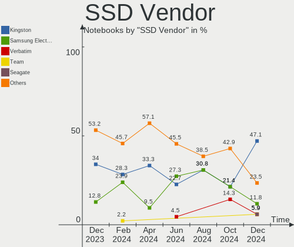
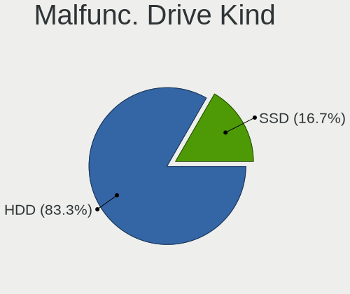

BlackPanther Hardware Trends (Notebook)
---------------------------------------

A project to identify most popular hardware characteristics and track their change
over time based on data collected by BlackPanther users at https://Linux-Hardware.org.

Anyone can contribute to the study by uploading probes of their computers by
the [hw-probe](https://github.com/linuxhw/hw-probe) tool:

    sudo -E hw-probe -all -upload

Full-feature report is available here: https://linux-hardware.org/?view=trends&formfactor=notebook

Period: Apr, 2021.

Contents
--------

- [ OS                       ](#os)
- [ OS Family                ](#os-family)
- [ Kernel                   ](#kernel)
- [ Kernel Family            ](#kernel-family)
- [ Kernel Major Ver.        ](#kernel-major-ver)
- [ Arch                     ](#arch)
- [ DE                       ](#de)
- [ Display Server           ](#display-server)
- [ Display Manager          ](#display-manager)
- [ OS Lang                  ](#os-lang)
- [ Boot Mode                ](#boot-mode)
- [ Filesystem               ](#filesystem)
- [ Part. scheme             ](#part-scheme)
- [ Dual Boot with Linux/BSD ](#dual-boot-with-linux/bsd)
- [ Dual Boot (Win)          ](#dual-boot-win)
- [ Country                  ](#country)
- [ City                     ](#city)
- [ Vendor                   ](#vendor)
- [ Model                    ](#model)
- [ Model Family             ](#model-family)
- [ MFG Year                 ](#mfg-year)
- [ Form Factor              ](#form-factor)
- [ Secure Boot              ](#secure-boot)
- [ Coreboot                 ](#coreboot)
- [ RAM Size                 ](#ram-size)
- [ RAM Used                 ](#ram-used)
- [ Has CD-ROM               ](#has-cd-rom)
- [ Total Drives             ](#total-drives)
- [ Has Ethernet             ](#has-ethernet)
- [ Has WiFi                 ](#has-wifi)
- [ Has Bluetooth            ](#has-bluetooth)
- [ Drive Vendor             ](#drive-vendor)
- [ Drive Model              ](#drive-model)
- [ HDD Vendor               ](#hdd-vendor)
- [ SSD Vendor               ](#ssd-vendor)
- [ Drive Kind               ](#drive-kind)
- [ Drive Connector          ](#drive-connector)
- [ Drive Size               ](#drive-size)
- [ Space Total              ](#space-total)
- [ Space Used               ](#space-used)
- [ Malfunc. Drives          ](#malfunc-drives)
- [ Malfunc. Drive Vendor    ](#malfunc-drive-vendor)
- [ Malfunc. HDD Vendor      ](#malfunc-hdd-vendor)
- [ Malfunc. Drive Kind      ](#malfunc-drive-kind)
- [ Failed Drives            ](#failed-drives)
- [ Failed Drive Vendor      ](#failed-drive-vendor)
- [ Drive Status             ](#drive-status)
- [ Storage Vendor           ](#storage-vendor)
- [ Storage Model            ](#storage-model)
- [ Storage Kind             ](#storage-kind)
- [ CPU Vendor               ](#cpu-vendor)
- [ CPU Model                ](#cpu-model)
- [ CPU Model Family         ](#cpu-model-family)
- [ CPU Cores                ](#cpu-cores)
- [ CPU Sockets              ](#cpu-sockets)
- [ CPU Threads              ](#cpu-threads)
- [ CPU Op-Modes             ](#cpu-op-modes)
- [ CPU Microcode            ](#cpu-microcode)
- [ CPU Microarch            ](#cpu-microarch)
- [ GPU Vendor               ](#gpu-vendor)
- [ GPU Model                ](#gpu-model)
- [ GPU Combo                ](#gpu-combo)
- [ GPU Driver               ](#gpu-driver)
- [ GPU Memory               ](#gpu-memory)
- [ Monitor Vendor           ](#monitor-vendor)
- [ Monitor Model            ](#monitor-model)
- [ Monitor Resolution       ](#monitor-resolution)
- [ Monitor Diagonal         ](#monitor-diagonal)
- [ Monitor Width            ](#monitor-width)
- [ Aspect Ratio             ](#aspect-ratio)
- [ Monitor Area             ](#monitor-area)
- [ Pixel Density            ](#pixel-density)
- [ Multiple Monitors        ](#multiple-monitors)
- [ Net Controller Vendor    ](#net-controller-vendor)
- [ Net Controller Model     ](#net-controller-model)
- [ Wireless Vendor          ](#wireless-vendor)
- [ Wireless Model           ](#wireless-model)
- [ Ethernet Vendor          ](#ethernet-vendor)
- [ Ethernet Model           ](#ethernet-model)
- [ Net Controller Kind      ](#net-controller-kind)
- [ Used Controller          ](#used-controller)
- [ NICs                     ](#nics)
- [ IPv6                     ](#ipv6)
- [ Memory Vendor            ](#memory-vendor)
- [ Memory Model             ](#memory-model)
- [ Memory Kind              ](#memory-kind)
- [ Memory Form Factor       ](#memory-form-factor)
- [ Memory Size              ](#memory-size)
- [ Memory Speed             ](#memory-speed)
- [ Sound Vendor             ](#sound-vendor)
- [ Sound Model              ](#sound-model)
- [ Camera Vendor            ](#camera-vendor)
- [ Camera Model             ](#camera-model)
- [ Fingerprint Vendor       ](#fingerprint-vendor)
- [ Fingerprint Model        ](#fingerprint-model)
- [ Chipcard Vendor          ](#chipcard-vendor)
- [ Chipcard Model           ](#chipcard-model)
- [ Printer Vendor           ](#printer-vendor)
- [ Printer Model            ](#printer-model)
- [ Scanner Vendor           ](#scanner-vendor)
- [ Scanner Model            ](#scanner-model)
- [ Bluetooth Vendor         ](#bluetooth-vendor)
- [ Bluetooth Model          ](#bluetooth-model)
- [ Unsupported Devices      ](#unsupported-devices)
- [ Unsupported Device Types ](#unsupported-device-types)

OS
--

Installed operating systems

| Name              | Notebooks | Percent |
|-------------------|-----------|---------|
| BlackPanther 18.1 | 70        | 95.89%  |
| BlackPanther 16.2 | 3         | 4.11%   |

OS Family
---------

OS without a version

| Name         | Notebooks | Percent |
|--------------|-----------|---------|
| BlackPanther | 73        | 100%    |

Kernel
------

Version of the Linux kernel

| Version                | Notebooks | Percent |
|------------------------|-----------|---------|
| 5.6.14-desktop-2bP     | 49        | 67.12%  |
| 4.18.16-desktop-1bP    | 21        | 28.77%  |
| 4.9.20-desktop-pae-1bP | 3         | 4.11%   |

Kernel Family
-------------

Linux kernel without a distro release

| Version | Notebooks | Percent |
|---------|-----------|---------|
| 5.6.14  | 49        | 67.12%  |
| 4.18.16 | 21        | 28.77%  |
| 4.9.20  | 3         | 4.11%   |

Kernel Major Ver.
-----------------

Linux kernel major version

| Version | Notebooks | Percent |
|---------|-----------|---------|
| 5.6     | 49        | 67.12%  |
| 4.18    | 21        | 28.77%  |
| 4.9     | 3         | 4.11%   |

Arch
----

OS architecture (x86_64, i586, etc.)

| Name   | Notebooks | Percent |
|--------|-----------|---------|
| x86_64 | 70        | 95.89%  |
| i686   | 3         | 4.11%   |

DE
--

Desktop Environment

| Name | Notebooks | Percent |
|------|-----------|---------|
| KDE5 | 73        | 100%    |

Display Server
--------------

X11 or Wayland

| Name    | Notebooks | Percent |
|---------|-----------|---------|
| X11     | 72        | 98.63%  |
| Wayland | 1         | 1.37%   |

Display Manager
---------------

SDDM, LightDM, etc.

| Name | Notebooks | Percent |
|------|-----------|---------|
| SDDM | 73        | 100%    |

OS Lang
-------

Language

| Lang    | Notebooks | Percent |
|---------|-----------|---------|
| Unknown | 73        | 100%    |

Boot Mode
---------

EFI or BIOS

| Mode | Notebooks | Percent |
|------|-----------|---------|
| BIOS | 50        | 68.49%  |
| EFI  | 23        | 31.51%  |

Filesystem
----------

Type of filesystem

| Type    | Notebooks | Percent |
|---------|-----------|---------|
| Overlay | 52        | 71.23%  |
| Ext4    | 19        | 26.03%  |
| Ext3    | 1         | 1.37%   |
| Ext2    | 1         | 1.37%   |

Part. scheme
------------

Scheme of partitioning

| Type | Notebooks | Percent |
|------|-----------|---------|
| MBR  | 45        | 61.64%  |
| GPT  | 28        | 38.36%  |

Dual Boot with Linux/BSD
------------------------

Hosting more than one Linux/BSD

| Dual boot | Notebooks | Percent |
|-----------|-----------|---------|
| No        | 41        | 56.16%  |
| Yes       | 32        | 43.84%  |

Dual Boot (Win)
---------------

Hosting Linux and Windows

| Dual boot | Notebooks | Percent |
|-----------|-----------|---------|
| Yes       | 37        | 50.68%  |
| No        | 36        | 49.32%  |

Country
-------

Geographic location (country)

| Country   | Notebooks | Percent |
|-----------|-----------|---------|
| Hungary   | 53        | 72.6%   |
| USA       | 5         | 6.85%   |
| Romania   | 4         | 5.48%   |
| Germany   | 3         | 4.11%   |
| UK        | 1         | 1.37%   |
| Slovenia  | 1         | 1.37%   |
| Slovakia  | 1         | 1.37%   |
| Poland    | 1         | 1.37%   |
| Japan     | 1         | 1.37%   |
| France    | 1         | 1.37%   |
| Canada    | 1         | 1.37%   |
| Argentina | 1         | 1.37%   |

City
----

Geographic location (city)

| City                      | Notebooks | Percent |
|---------------------------|-----------|---------|
| Budapest                  | 19        | 26.03%  |
| Pittsburgh                | 2         | 2.74%   |
| Papa                      | 2         | 2.74%   |
| Mezobereny                | 2         | 2.74%   |
| Alcsutdoboz               | 2         | 2.74%   |
| Érd                      | 1         | 1.37%   |
| Zichyujfalu               | 1         | 1.37%   |
| Ypsilanti                 | 1         | 1.37%   |
| Wysokie Mazowieckie       | 1         | 1.37%   |
| Waren                     | 1         | 1.37%   |
| Veszprém                 | 1         | 1.37%   |
| Târgu Mureş             | 1         | 1.37%   |
| Tsukubamirai              | 1         | 1.37%   |
| Tornaľa                  | 1         | 1.37%   |
| Telford                   | 1         | 1.37%   |
| Tarnok                    | 1         | 1.37%   |
| Szombathely               | 1         | 1.37%   |
| Szolnok                   | 1         | 1.37%   |
| Szigetszentmiklos         | 1         | 1.37%   |
| Szentendre                | 1         | 1.37%   |
| Szazhalombatta            | 1         | 1.37%   |
| Szarvas                   | 1         | 1.37%   |
| Somerset                  | 1         | 1.37%   |
| Sfantu Gheorghe           | 1         | 1.37%   |
| Saint-Gilles-Croix-de-Vie | 1         | 1.37%   |
| Pocking                   | 1         | 1.37%   |
| Pilisvorosvar             | 1         | 1.37%   |
| Petervasara               | 1         | 1.37%   |
| Odorheiu Secuiesc         | 1         | 1.37%   |
| Nagykanizsa               | 1         | 1.37%   |
| Mosonmagyaróvár         | 1         | 1.37%   |
| Merritt                   | 1         | 1.37%   |
| Megyaszo                  | 1         | 1.37%   |
| Maza                      | 1         | 1.37%   |
| Koper                     | 1         | 1.37%   |
| Keszthely                 | 1         | 1.37%   |
| Kecskemét                | 1         | 1.37%   |
| Kaposvár                 | 1         | 1.37%   |
| Iasi                      | 1         | 1.37%   |
| Hegyeshalom               | 1         | 1.37%   |
| Hajduszoboszlo            | 1         | 1.37%   |
| Gödöllő                | 1         | 1.37%   |
| Győr                     | 1         | 1.37%   |
| Fot                       | 1         | 1.37%   |
| Formosa                   | 1         | 1.37%   |
| Debrecen                  | 1         | 1.37%   |
| Celldomolk                | 1         | 1.37%   |
| Bedburg                   | 1         | 1.37%   |
| Batonyterenye             | 1         | 1.37%   |
| Apc                       | 1         | 1.37%   |
| Amity                     | 1         | 1.37%   |

Vendor
------

Motherboard manufacturer

| Name                   | Notebooks | Percent |
|------------------------|-----------|---------|
| Lenovo                 | 19        | 26.03%  |
| Hewlett-Packard        | 13        | 17.81%  |
| Dell                   | 13        | 17.81%  |
| Acer                   | 10        | 13.7%   |
| ASUSTek Computer       | 5         | 6.85%   |
| Toshiba                | 4         | 5.48%   |
| Fujitsu                | 2         | 2.74%   |
| Packard Bell           | 1         | 1.37%   |
| ONE-NETBOOK TECHNOLOGY | 1         | 1.37%   |
| NOBLEX                 | 1         | 1.37%   |
| MSI                    | 1         | 1.37%   |
| eMachines              | 1         | 1.37%   |
| Apple                  | 1         | 1.37%   |
| Alcor                  | 1         | 1.37%   |

Model
-----

Motherboard model

| Name                                  | Notebooks | Percent |
|---------------------------------------|-----------|---------|
| HP 250 G1                             | 2         | 2.74%   |
| Dell Latitude E6530                   | 2         | 2.74%   |
| Toshiba Satellite L505                | 1         | 1.37%   |
| Toshiba Satellite C650                | 1         | 1.37%   |
| Toshiba NB550D                        | 1         | 1.37%   |
| Toshiba dynabook BX/33M               | 1         | 1.37%   |
| Packard Bell EasyNote TX86            | 1         | 1.37%   |
| ONE-NETBOOK TECHNOLOGY ONE-GX         | 1         | 1.37%   |
| NOBLEX SF20BA                         | 1         | 1.37%   |
| MSI EX620                             | 1         | 1.37%   |
| Lenovo V145-15AST 81MT                | 1         | 1.37%   |
| Lenovo ThinkPad X201 3626F9G          | 1         | 1.37%   |
| Lenovo ThinkPad X130e 0627A17         | 1         | 1.37%   |
| Lenovo ThinkPad T61 6458Y56           | 1         | 1.37%   |
| Lenovo ThinkPad T420 4236S3T          | 1         | 1.37%   |
| Lenovo ThinkPad T400 64741EG          | 1         | 1.37%   |
| Lenovo IdeaPad S145-15IGM 81MX        | 1         | 1.37%   |
| Lenovo IdeaPad L340-17IRH Gaming 81LL | 1         | 1.37%   |
| Lenovo IdeaPad Flex 3 11IGL05 82B2    | 1         | 1.37%   |
| Lenovo IdeaPad 330-15IKB 81DE         | 1         | 1.37%   |
| Lenovo IdeaPad 330-15ICH 81FK         | 1         | 1.37%   |
| Lenovo IdeaPad 320-17ABR 80YN         | 1         | 1.37%   |
| Lenovo IdeaPad 3 17IML05 81WC         | 1         | 1.37%   |
| Lenovo IdeaPad 3 15IML05 81WB         | 1         | 1.37%   |
| Lenovo IdeaPad 100S-14IBR 80R9        | 1         | 1.37%   |
| Lenovo IdeaPad 100-15IBY 80MJ         | 1         | 1.37%   |
| Lenovo IdeaPad 100-15IBD 80QQ         | 1         | 1.37%   |
| Lenovo G580 20150                     | 1         | 1.37%   |
| Lenovo G550 20023                     | 1         | 1.37%   |
| HP ProBook 6570b                      | 1         | 1.37%   |
| HP ProBook 6470b                      | 1         | 1.37%   |
| HP Pavilion g6                        | 1         | 1.37%   |
| HP Pavilion 15                        | 1         | 1.37%   |
| HP Laptop 15-db0xxx                   | 1         | 1.37%   |
| HP EliteBook 8570w                    | 1         | 1.37%   |
| HP EliteBook 2530p                    | 1         | 1.37%   |
| HP Compaq 6710b (KE121EA#AKC)         | 1         | 1.37%   |
| HP 650                                | 1         | 1.37%   |
| HP 250 G6 Notebook PC                 | 1         | 1.37%   |
| HP 2000                               | 1         | 1.37%   |
| Fujitsu STYLISTIC Q702                | 1         | 1.37%   |
| Fujitsu LIFEBOOK NH751                | 1         | 1.37%   |
| eMachines E525                        | 1         | 1.37%   |
| Dell XPS L702X                        | 1         | 1.37%   |
| Dell Vostro 3550                      | 1         | 1.37%   |
| Dell Vostro 1015                      | 1         | 1.37%   |
| Dell Latitude E5500                   | 1         | 1.37%   |
| Dell Inspiron N5010                   | 1         | 1.37%   |
| Dell Inspiron 5584                    | 1         | 1.37%   |
| Dell Inspiron 3521                    | 1         | 1.37%   |
| Dell Inspiron 1525                    | 1         | 1.37%   |
| Dell Inspiron 1520                    | 1         | 1.37%   |
| Dell Inspiron 1501                    | 1         | 1.37%   |
| Dell G3 3579                          | 1         | 1.37%   |
| ASUS TP201SA                          | 1         | 1.37%   |
| ASUS K53TA                            | 1         | 1.37%   |
| ASUS K53SJ                            | 1         | 1.37%   |
| ASUS K52F                             | 1         | 1.37%   |
| ASUS K50AB                            | 1         | 1.37%   |
| Apple MacBookPro8,1                   | 1         | 1.37%   |

Model Family
------------

Motherboard model prefix

| Name                          | Notebooks | Percent |
|-------------------------------|-----------|---------|
| Lenovo IdeaPad                | 11        | 15.07%  |
| Acer Aspire                   | 9         | 12.33%  |
| Dell Inspiron                 | 6         | 8.22%   |
| Lenovo ThinkPad               | 5         | 6.85%   |
| HP 250                        | 3         | 4.11%   |
| Dell Latitude                 | 3         | 4.11%   |
| Toshiba Satellite             | 2         | 2.74%   |
| HP ProBook                    | 2         | 2.74%   |
| HP Pavilion                   | 2         | 2.74%   |
| HP EliteBook                  | 2         | 2.74%   |
| Dell Vostro                   | 2         | 2.74%   |
| Toshiba NB550D                | 1         | 1.37%   |
| Toshiba dynabook              | 1         | 1.37%   |
| Packard Bell EasyNote         | 1         | 1.37%   |
| ONE-NETBOOK TECHNOLOGY ONE-GX | 1         | 1.37%   |
| NOBLEX SF20BA                 | 1         | 1.37%   |
| MSI EX620                     | 1         | 1.37%   |
| Lenovo V145-15AST             | 1         | 1.37%   |
| Lenovo G580                   | 1         | 1.37%   |
| Lenovo G550                   | 1         | 1.37%   |
| HP Laptop                     | 1         | 1.37%   |
| HP Compaq                     | 1         | 1.37%   |
| HP 650                        | 1         | 1.37%   |
| HP 2000                       | 1         | 1.37%   |
| Fujitsu STYLISTIC             | 1         | 1.37%   |
| Fujitsu LIFEBOOK              | 1         | 1.37%   |
| eMachines E525                | 1         | 1.37%   |
| Dell XPS                      | 1         | 1.37%   |
| Dell G3                       | 1         | 1.37%   |
| ASUS TP201SA                  | 1         | 1.37%   |
| ASUS K53TA                    | 1         | 1.37%   |
| ASUS K53SJ                    | 1         | 1.37%   |
| ASUS K52F                     | 1         | 1.37%   |
| ASUS K50AB                    | 1         | 1.37%   |
| Apple MacBookPro8             | 1         | 1.37%   |
| Alcor Flashbook               | 1         | 1.37%   |
| Acer Extensa                  | 1         | 1.37%   |

MFG Year
--------

Motherboard manufacture year

| Year | Notebooks | Percent |
|------|-----------|---------|
| 2009 | 9         | 12.33%  |
| 2016 | 8         | 10.96%  |
| 2020 | 7         | 9.59%   |
| 2013 | 7         | 9.59%   |
| 2010 | 7         | 9.59%   |
| 2019 | 6         | 8.22%   |
| 2018 | 5         | 6.85%   |
| 2012 | 5         | 6.85%   |
| 2011 | 5         | 6.85%   |
| 2008 | 4         | 5.48%   |
| 2017 | 3         | 4.11%   |
| 2014 | 3         | 4.11%   |
| 2015 | 2         | 2.74%   |
| 2021 | 1         | 1.37%   |
| 2007 | 1         | 1.37%   |

Form Factor
-----------

Physical design of the computer

| Name     | Notebooks | Percent |
|----------|-----------|---------|
| Notebook | 73        | 100%    |

Secure Boot
-----------

Enabled or disabled

| State    | Notebooks | Percent |
|----------|-----------|---------|
| Disabled | 73        | 100%    |

Coreboot
--------

Have coreboot on board

| Used | Notebooks | Percent |
|------|-----------|---------|
| No   | 73        | 100%    |

RAM Size
--------

Total RAM memory

| Size in GB | Notebooks | Percent |
|------------|-----------|---------|
| 3.01-4.0   | 31        | 42.47%  |
| 4.01-8.0   | 19        | 26.03%  |
| 16.01-24.0 | 6         | 8.22%   |
| 1.01-2.0   | 6         | 8.22%   |
| 2.01-3.0   | 5         | 6.85%   |
| 8.01-16.0  | 5         | 6.85%   |
| 0.51-1.0   | 1         | 1.37%   |

RAM Used
--------

Used RAM memory

| Used GB  | Notebooks | Percent |
|----------|-----------|---------|
| 0.51-1.0 | 37        | 50.68%  |
| 1.01-2.0 | 24        | 32.88%  |
| 0.01-0.5 | 12        | 16.44%  |

Has CD-ROM
----------

Has CD-ROM on board

| Presented | Notebooks | Percent |
|-----------|-----------|---------|
| Yes       | 45        | 61.64%  |
| No        | 28        | 38.36%  |

Total Drives
------------

Number of drives on board

| Drives | Notebooks | Percent |
|--------|-----------|---------|
| 1      | 55        | 75.34%  |
| 2      | 15        | 20.55%  |
| 3      | 2         | 2.74%   |
| 0      | 1         | 1.37%   |

Has Ethernet
------------

Has Ethernet on board

| Presented | Notebooks | Percent |
|-----------|-----------|---------|
| Yes       | 63        | 86.3%   |
| No        | 10        | 13.7%   |

Has WiFi
--------

Has WiFi module

| Presented | Notebooks | Percent |
|-----------|-----------|---------|
| Yes       | 73        | 100%    |

Has Bluetooth
-------------

Has Bluetooth module

| Presented | Notebooks | Percent |
|-----------|-----------|---------|
| Yes       | 50        | 68.49%  |
| No        | 23        | 31.51%  |

Drive Vendor
------------

Hard drive vendors

| Vendor              | Notebooks | Drives | Percent |
|---------------------|-----------|--------|---------|
| Seagate             | 15        | 15     | 17.65%  |
| Toshiba             | 13        | 13     | 15.29%  |
| WDC                 | 11        | 12     | 12.94%  |
| Samsung Electronics | 8         | 8      | 9.41%   |
| Hitachi             | 8         | 8      | 9.41%   |
| Kingston            | 5         | 5      | 5.88%   |
| HGST                | 5         | 5      | 5.88%   |
| Unknown             | 3         | 5      | 3.53%   |
| SanDisk             | 3         | 3      | 3.53%   |
| Micron Technology   | 2         | 2      | 2.35%   |
| LITEON              | 2         | 2      | 2.35%   |
| Fujitsu             | 2         | 2      | 2.35%   |
| Union Memory        | 1         | 1      | 1.18%   |
| PNY                 | 1         | 1      | 1.18%   |
| Phison              | 1         | 1      | 1.18%   |
| Intel               | 1         | 1      | 1.18%   |
| FORESEE             | 1         | 1      | 1.18%   |
| Crucial             | 1         | 1      | 1.18%   |
| China               | 1         | 1      | 1.18%   |
| Apacer              | 1         | 1      | 1.18%   |

Drive Model
-----------

Hard drive models

| Model                                  | Notebooks | Percent |
|----------------------------------------|-----------|---------|
| Seagate ST500LT012-1DG142 500GB        | 3         | 3.41%   |
| Seagate ST1000LM035-1RK172 1TB         | 3         | 3.41%   |
| Seagate ST1000LM024 HN-M101MBB 1TB     | 3         | 3.41%   |
| Toshiba MQ01ABF050 500GB               | 2         | 2.27%   |
| Toshiba MQ01ABD050 500GB               | 2         | 2.27%   |
| Samsung MZALQ128HBHQ-000L2 128GB       | 2         | 2.27%   |
| Kingston SA400S37240G 240GB SSD        | 2         | 2.27%   |
| HGST HTS545050A7E380 500GB             | 2         | 2.27%   |
| WDC WDS500G2B0B-00YS70 500GB SSD       | 1         | 1.14%   |
| WDC WDS250G2B0A 250GB SSD              | 1         | 1.14%   |
| WDC WD7500BPVT-80HXZT3 752GB           | 1         | 1.14%   |
| WDC WD3200BEVT-22ZCT0 320GB            | 1         | 1.14%   |
| WDC WD3200BEKX-75B7WT0 320GB           | 1         | 1.14%   |
| WDC WD1600BJKT-75F4T0 160GB            | 1         | 1.14%   |
| WDC WD1600BEVT-22ZCT0 160GB            | 1         | 1.14%   |
| WDC WD10SPZX-24Z10 1TB                 | 1         | 1.14%   |
| WDC WD10SPCX-24HWST1 1TB               | 1         | 1.14%   |
| WDC WD10JPVX-60JC3T0 1TB               | 1         | 1.14%   |
| WDC WD10JPVX-22JC3T0 1TB               | 1         | 1.14%   |
| WDC PC SN520 SDAPMUW-256G-1101 256GB   | 1         | 1.14%   |
| Unknown SLD64G  64GB                   | 1         | 1.14%   |
| Unknown SA16G  16GB                    | 1         | 1.14%   |
| Unknown JAJM600M128C 128GB SSD         | 1         | 1.14%   |
| Unknown DB4032  32GB                   | 1         | 1.14%   |
| Unknown 00000  32GB                    | 1         | 1.14%   |
| Union Memory RTOTJ128VGD2EYX 128GB SSD | 1         | 1.14%   |
| Toshiba THNSFJ256GCSU 256GB SSD        | 1         | 1.14%   |
| Toshiba MQ04ABF100 1TB                 | 1         | 1.14%   |
| Toshiba MQ01ABD075 752GB               | 1         | 1.14%   |
| Toshiba MK6475GSX 640GB                | 1         | 1.14%   |
| Toshiba MK5076GSX 500GB                | 1         | 1.14%   |
| Toshiba MK2565GSXN 250GB               | 1         | 1.14%   |
| Toshiba MK1652GSX 160GB                | 1         | 1.14%   |
| Toshiba MK1629GSG 160GB                | 1         | 1.14%   |
| Toshiba KBG40ZNS256G NVMe 256GB        | 1         | 1.14%   |
| Seagate ST9320325AS 320GB              | 1         | 1.14%   |
| Seagate ST9250315AS 250GB              | 1         | 1.14%   |
| Seagate ST9160827AS 160GB              | 1         | 1.14%   |
| Seagate ST9160821AS 160GB              | 1         | 1.14%   |
| Seagate ST1000LM 024 HN-M101MBB 1TB    | 1         | 1.14%   |
| Seagate BUP Slim BK 1TB                | 1         | 1.14%   |
| SanDisk SSD PLUS 240GB                 | 1         | 1.14%   |
| SanDisk SSD PLUS 1000GB                | 1         | 1.14%   |
| SanDisk SDSSDHII120G 120GB             | 1         | 1.14%   |
| Samsung SSD PM841 mSATA 256GB          | 1         | 1.14%   |
| Samsung SSD 860 QVO 1TB                | 1         | 1.14%   |
| Samsung SSD 850 EVO 250GB              | 1         | 1.14%   |
| Samsung MZNLN128HAHQ-000H1 128GB SSD   | 1         | 1.14%   |
| Samsung MZMTE256HMHP-00000 256GB SSD   | 1         | 1.14%   |
| Samsung MZ7LN256HMJP-000H1 256GB SSD   | 1         | 1.14%   |
| PNY CS900 120GB SSD                    | 1         | 1.14%   |
| Phison One-Netbook PCI-E 512G SSD      | 1         | 1.14%   |
| Micron MTFDDAK256TDL 256GB SSD         | 1         | 1.14%   |
| Micron C300-MTFDBAK128MAG 128GB SSD    | 1         | 1.14%   |
| LITEON LCH-256V2S-11 2.5 7mm 256GB SSD | 1         | 1.14%   |
| LITEON CV3-DE256 256GB SSD             | 1         | 1.14%   |
| Kingston SV300S37A120G 120GB SSD       | 1         | 1.14%   |
| Kingston SA400S37120G 120GB SSD        | 1         | 1.14%   |
| Kingston RBU-SC152S37256GG2 256GB SSD  | 1         | 1.14%   |
| Intel SSDSA1M080G2LE 80GB              | 1         | 1.14%   |

HDD Vendor
----------

Hard disk drive vendors

| Vendor  | Notebooks | Drives | Percent |
|---------|-----------|--------|---------|
| Seagate | 15        | 15     | 30%     |
| Toshiba | 11        | 11     | 22%     |
| WDC     | 9         | 9      | 18%     |
| Hitachi | 8         | 8      | 16%     |
| HGST    | 5         | 5      | 10%     |
| Fujitsu | 2         | 2      | 4%      |

SSD Vendor
----------

Solid state drive vendors

| Vendor              | Notebooks | Drives | Percent |
|---------------------|-----------|--------|---------|
| Samsung Electronics | 6         | 6      | 20.69%  |
| Kingston            | 5         | 5      | 17.24%  |
| SanDisk             | 3         | 3      | 10.34%  |
| WDC                 | 2         | 2      | 6.9%    |
| Micron Technology   | 2         | 2      | 6.9%    |
| LITEON              | 2         | 2      | 6.9%    |
| Unknown             | 1         | 1      | 3.45%   |
| Union Memory        | 1         | 1      | 3.45%   |
| Toshiba             | 1         | 1      | 3.45%   |
| PNY                 | 1         | 1      | 3.45%   |
| Intel               | 1         | 1      | 3.45%   |
| FORESEE             | 1         | 1      | 3.45%   |
| Crucial             | 1         | 1      | 3.45%   |
| China               | 1         | 1      | 3.45%   |
| Apacer              | 1         | 1      | 3.45%   |

Drive Kind
----------

HDD or SSD

| Kind | Notebooks | Drives | Percent |
|------|-----------|--------|---------|
| HDD  | 49        | 50     | 58.33%  |
| SSD  | 27        | 29     | 32.14%  |
| NVMe | 5         | 5      | 5.95%   |
| MMC  | 3         | 4      | 3.57%   |

Drive Connector
---------------

SATA, SAS, NVMe, etc.

| Type | Notebooks | Drives | Percent |
|------|-----------|--------|---------|
| SATA | 68        | 77     | 87.18%  |
| NVMe | 5         | 5      | 6.41%   |
| MMC  | 3         | 4      | 3.85%   |
| SAS  | 2         | 2      | 2.56%   |

Drive Size
----------

Size of hard drive

| Size in TB | Notebooks | Drives | Percent |
|------------|-----------|--------|---------|
| 0.01-0.5   | 56        | 60     | 74.67%  |
| 0.51-1.0   | 19        | 19     | 25.33%  |

Space Total
-----------

Amount of disk space available on the file system

| Size in GB | Notebooks | Percent |
|------------|-----------|---------|
| Unknown    | 49        | 67.12%  |
| 101-250    | 13        | 17.81%  |
| 251-500    | 5         | 6.85%   |
| 51-100     | 3         | 4.11%   |
| 21-50      | 2         | 2.74%   |
| 1001-2000  | 1         | 1.37%   |

Space Used
----------

Amount of used disk space

| Used GB | Notebooks | Percent |
|---------|-----------|---------|
| Unknown | 49        | 67.12%  |
| 1-20    | 22        | 30.14%  |
| 251-500 | 1         | 1.37%   |
| 21-50   | 1         | 1.37%   |

Malfunc. Drives
---------------

Drive models with a malfunction

| Model                              | Notebooks | Drives | Percent |
|------------------------------------|-----------|--------|---------|
| Seagate ST500LT012-1DG142 500GB    | 2         | 2      | 7.14%   |
| WDC WD1600BJKT-75F4T0 160GB        | 1         | 1      | 3.57%   |
| Toshiba THNSFJ256GCSU 256GB SSD    | 1         | 1      | 3.57%   |
| Toshiba MQ01ABF050 500GB           | 1         | 1      | 3.57%   |
| Toshiba MQ01ABD075 752GB           | 1         | 1      | 3.57%   |
| Toshiba MQ01ABD050 500GB           | 1         | 1      | 3.57%   |
| Toshiba MK5076GSX 500GB            | 1         | 1      | 3.57%   |
| Toshiba MK2565GSXN 250GB           | 1         | 1      | 3.57%   |
| Toshiba MK1652GSX 160GB            | 1         | 1      | 3.57%   |
| Seagate ST9320325AS 320GB          | 1         | 1      | 3.57%   |
| Seagate ST9250315AS 250GB          | 1         | 1      | 3.57%   |
| Seagate ST9160827AS 160GB          | 1         | 1      | 3.57%   |
| Seagate ST9160821AS 160GB          | 1         | 1      | 3.57%   |
| Seagate ST1000LM024 HN-M101MBB 1TB | 1         | 1      | 3.57%   |
| Kingston SV300S37A120G 120GB SSD   | 1         | 1      | 3.57%   |
| Intel SSDSA1M080G2LE 80GB          | 1         | 1      | 3.57%   |
| Hitachi HTS723232A7A364 320GB      | 1         | 1      | 3.57%   |
| Hitachi HTS547550A9E384 500GB      | 1         | 1      | 3.57%   |
| Hitachi HTS545050B9A300 500GB      | 1         | 1      | 3.57%   |
| Hitachi HTS545050A7E380 500GB      | 1         | 1      | 3.57%   |
| Hitachi HTS545032B9A300 320GB      | 1         | 1      | 3.57%   |
| Hitachi HTS545025B9A300 250GB      | 1         | 1      | 3.57%   |
| Hitachi HTS541660J9SA00 64GB       | 1         | 1      | 3.57%   |
| HGST HTS545050A7E380 500GB         | 1         | 1      | 3.57%   |
| HGST HTS545032A7E380 320GB         | 1         | 1      | 3.57%   |
| HGST HTS541010A9E680 1TB           | 1         | 1      | 3.57%   |
| Fujitsu MHW2060BH 64GB             | 1         | 1      | 3.57%   |

Malfunc. Drive Vendor
---------------------

Vendors of faulty drives

| Vendor   | Notebooks | Drives | Percent |
|----------|-----------|--------|---------|
| Toshiba  | 7         | 7      | 25%     |
| Seagate  | 7         | 7      | 25%     |
| Hitachi  | 7         | 7      | 25%     |
| HGST     | 3         | 3      | 10.71%  |
| WDC      | 1         | 1      | 3.57%   |
| Kingston | 1         | 1      | 3.57%   |
| Intel    | 1         | 1      | 3.57%   |
| Fujitsu  | 1         | 1      | 3.57%   |

Malfunc. HDD Vendor
-------------------

Vendors of faulty HDD drives

| Vendor  | Notebooks | Drives | Percent |
|---------|-----------|--------|---------|
| Seagate | 7         | 7      | 28%     |
| Hitachi | 7         | 7      | 28%     |
| Toshiba | 6         | 6      | 24%     |
| HGST    | 3         | 3      | 12%     |
| WDC     | 1         | 1      | 4%      |
| Fujitsu | 1         | 1      | 4%      |

Malfunc. Drive Kind
-------------------

Kinds of faulty drives

| Kind | Notebooks | Drives | Percent |
|------|-----------|--------|---------|
| HDD  | 24        | 25     | 88.89%  |
| SSD  | 3         | 3      | 11.11%  |

Failed Drives
-------------

Failed drive models

| Model                   | Notebooks | Drives | Percent |
|-------------------------|-----------|--------|---------|
| Toshiba MK6475GSX 640GB | 1         | 1      | 100%    |

Failed Drive Vendor
-------------------

Failed drive vendors

| Vendor  | Notebooks | Drives | Percent |
|---------|-----------|--------|---------|
| Toshiba | 1         | 1      | 100%    |

Drive Status
------------

Number of failed and malfunc. drives

| Status   | Notebooks | Drives | Percent |
|----------|-----------|--------|---------|
| Works    | 47        | 53     | 58.75%  |
| Malfunc  | 27        | 28     | 33.75%  |
| Detected | 5         | 6      | 6.25%   |
| Failed   | 1         | 1      | 1.25%   |

Storage Vendor
--------------

Storage controller vendors

| Vendor              | Notebooks | Percent |
|---------------------|-----------|---------|
| Intel               | 63        | 81.82%  |
| AMD                 | 9         | 11.69%  |
| Samsung Electronics | 2         | 2.6%    |
| Sandisk             | 1         | 1.3%    |
| Phison Electronics  | 1         | 1.3%    |
| KIOXIA              | 1         | 1.3%    |

Storage Model
-------------

Storage controller models

| Model                                                                            | Notebooks | Percent |
|----------------------------------------------------------------------------------|-----------|---------|
| Intel 7 Series Chipset Family 6-port SATA Controller [AHCI mode]                 | 12        | 14.81%  |
| Intel 82801IBM/IEM (ICH9M/ICH9M-E) 4 port SATA Controller [AHCI mode]            | 7         | 8.64%   |
| Intel 6 Series/C200 Series Chipset Family 6 port Mobile SATA AHCI Controller     | 6         | 7.41%   |
| AMD FCH SATA Controller [AHCI mode]                                              | 5         | 6.17%   |
| Intel Wildcat Point-LP SATA Controller [AHCI Mode]                               | 4         | 4.94%   |
| Intel Atom/Celeron/Pentium Processor x5-E8000/J3xxx/N3xxx Series SATA Controller | 4         | 4.94%   |
| Intel 82801IBM/IEM (ICH9M/ICH9M-E) 2 port SATA Controller [IDE mode]             | 4         | 4.94%   |
| Intel 5 Series/3400 Series Chipset 4 port SATA AHCI Controller                   | 4         | 4.94%   |
| Intel Celeron/Pentium Silver Processor SATA Controller                           | 3         | 3.7%    |
| Intel Cannon Lake Mobile PCH SATA AHCI Controller                                | 3         | 3.7%    |
| Intel 82801HM/HEM (ICH8M/ICH8M-E) IDE Controller                                 | 3         | 3.7%    |
| AMD SB7x0/SB8x0/SB9x0 SATA Controller [AHCI mode]                                | 3         | 3.7%    |
| Samsung NVMe Controller                                                          | 2         | 2.47%   |
| Intel Sunrise Point-LP SATA Controller [AHCI mode]                               | 2         | 2.47%   |
| Intel Comet Lake SATA AHCI Controller                                            | 2         | 2.47%   |
| Intel 82801HM/HEM (ICH8M/ICH8M-E) SATA Controller [IDE mode]                     | 2         | 2.47%   |
| Intel 82801HM/HEM (ICH8M/ICH8M-E) SATA Controller [AHCI mode]                    | 2         | 2.47%   |
| Intel 82801 Mobile SATA Controller [RAID mode]                                   | 2         | 2.47%   |
| Intel 5 Series/3400 Series Chipset 6 port SATA AHCI Controller                   | 2         | 2.47%   |
| Sandisk PC SN520 NVMe SSD                                                        | 1         | 1.23%   |
| Phison PS5013 E13 NVMe Controller                                                | 1         | 1.23%   |
| KIOXIA Non-Volatile memory controller                                            | 1         | 1.23%   |
| Intel Atom Processor E3800 Series SATA AHCI Controller                           | 1         | 1.23%   |
| Intel 82801GBM/GHM (ICH7-M Family) SATA Controller [IDE mode]                    | 1         | 1.23%   |
| Intel 8 Series/C220 Series Chipset Family 6-port SATA Controller 1 [AHCI mode]   | 1         | 1.23%   |
| Intel 8 Series SATA Controller 1 [AHCI mode]                                     | 1         | 1.23%   |
| AMD SB600 Non-Raid-5 SATA                                                        | 1         | 1.23%   |
| AMD SB600 IDE                                                                    | 1         | 1.23%   |

Storage Kind
------------

Kind of storage controller (IDE, SATA, NVMe, SAS, ...)

| Kind | Notebooks | Percent |
|------|-----------|---------|
| SATA | 63        | 78.75%  |
| IDE  | 10        | 12.5%   |
| NVMe | 5         | 6.25%   |
| RAID | 2         | 2.5%    |

CPU Vendor
----------

Processor vendors

| Vendor | Notebooks | Percent |
|--------|-----------|---------|
| Intel  | 64        | 87.67%  |
| AMD    | 9         | 12.33%  |

CPU Model
---------

Processor models

| Model                                         | Notebooks | Percent |
|-----------------------------------------------|-----------|---------|
| Intel Pentium Dual-Core CPU T4400 @ 2.20GHz   | 3         | 4.11%   |
| Intel Celeron CPU 1000M @ 1.80GHz             | 3         | 4.11%   |
| Intel Core i5-3340M CPU @ 2.70GHz             | 2         | 2.74%   |
| Intel Core i3-5005U CPU @ 2.00GHz             | 2         | 2.74%   |
| Intel Core i3-2310M CPU @ 2.10GHz             | 2         | 2.74%   |
| Intel Core 2 Duo CPU T8100 @ 2.10GHz          | 2         | 2.74%   |
| Intel Celeron CPU N3060 @ 1.60GHz             | 2         | 2.74%   |
| Intel Pentium Silver N5000 CPU @ 1.10GHz      | 1         | 1.37%   |
| Intel Pentium Dual-Core CPU T4300 @ 2.10GHz   | 1         | 1.37%   |
| Intel Pentium Dual CPU T3400 @ 2.16GHz        | 1         | 1.37%   |
| Intel Pentium Dual CPU T2330 @ 1.60GHz        | 1         | 1.37%   |
| Intel Pentium CPU P6100 @ 2.00GHz             | 1         | 1.37%   |
| Intel Pentium CPU P6000 @ 1.87GHz             | 1         | 1.37%   |
| Intel Pentium CPU N3710 @ 1.60GHz             | 1         | 1.37%   |
| Intel Pentium CPU B960 @ 2.20GHz              | 1         | 1.37%   |
| Intel Core i7-8750H CPU @ 2.20GHz             | 1         | 1.37%   |
| Intel Core i7-8565U CPU @ 1.80GHz             | 1         | 1.37%   |
| Intel Core i7-5500U CPU @ 2.40GHz             | 1         | 1.37%   |
| Intel Core i7-4712MQ CPU @ 2.30GHz            | 1         | 1.37%   |
| Intel Core i7-3720QM CPU @ 2.60GHz            | 1         | 1.37%   |
| Intel Core i7-3540M CPU @ 3.00GHz             | 1         | 1.37%   |
| Intel Core i7-2670QM CPU @ 2.20GHz            | 1         | 1.37%   |
| Intel Core i7-2640M CPU @ 2.80GHz             | 1         | 1.37%   |
| Intel Core i5-9300H CPU @ 2.40GHz             | 1         | 1.37%   |
| Intel Core i5-8300H CPU @ 2.30GHz             | 1         | 1.37%   |
| Intel Core i5-8250U CPU @ 1.60GHz             | 1         | 1.37%   |
| Intel Core i5-7200U CPU @ 2.50GHz             | 1         | 1.37%   |
| Intel Core i5-5200U CPU @ 2.20GHz             | 1         | 1.37%   |
| Intel Core i5-4200U CPU @ 1.60GHz             | 1         | 1.37%   |
| Intel Core i5-3437U CPU @ 1.90GHz             | 1         | 1.37%   |
| Intel Core i5-3337U CPU @ 1.80GHz             | 1         | 1.37%   |
| Intel Core i5-3320M CPU @ 2.60GHz             | 1         | 1.37%   |
| Intel Core i5-2415M CPU @ 2.30GHz             | 1         | 1.37%   |
| Intel Core i5-2410M CPU @ 2.30GHz             | 1         | 1.37%   |
| Intel Core i5-10210Y CPU @ 1.00GHz            | 1         | 1.37%   |
| Intel Core i5 CPU M 540 @ 2.53GHz             | 1         | 1.37%   |
| Intel Core i5 CPU M 480 @ 2.67GHz             | 1         | 1.37%   |
| Intel Core i5 CPU M 430 @ 2.27GHz             | 1         | 1.37%   |
| Intel Core i3-3229Y CPU @ 1.40GHz             | 1         | 1.37%   |
| Intel Core i3-10110U CPU @ 2.10GHz            | 1         | 1.37%   |
| Intel Core i3 CPU M 330 @ 2.13GHz             | 1         | 1.37%   |
| Intel Core 2 Quad CPU Q9000 @ 2.00GHz         | 1         | 1.37%   |
| Intel Core 2 Duo CPU T7500 @ 2.20GHz          | 1         | 1.37%   |
| Intel Core 2 Duo CPU T6570 @ 2.10GHz          | 1         | 1.37%   |
| Intel Core 2 Duo CPU P8800 @ 2.66GHz          | 1         | 1.37%   |
| Intel Core 2 Duo CPU P8400 @ 2.26GHz          | 1         | 1.37%   |
| Intel Core 2 Duo CPU L9400 @ 1.86GHz          | 1         | 1.37%   |
| Intel Celeron N4020 CPU @ 1.10GHz             | 1         | 1.37%   |
| Intel Celeron N4000 CPU @ 1.10GHz             | 1         | 1.37%   |
| Intel Celeron CPU N3050 @ 1.60GHz             | 1         | 1.37%   |
| Intel Celeron CPU N2840 @ 2.16GHz             | 1         | 1.37%   |
| Intel Celeron CPU B830 @ 1.80GHz              | 1         | 1.37%   |
| Intel Celeron CPU 900 @ 2.20GHz               | 1         | 1.37%   |
| Intel Celeron CPU 5205U @ 1.90GHz             | 1         | 1.37%   |
| Intel Atom CPU N280 @ 1.66GHz                 | 1         | 1.37%   |
| AMD Turion 64 X2 Mobile Technology TL-58      | 1         | 1.37%   |
| AMD Ryzen 5 2500U with Radeon Vega Mobile Gfx | 1         | 1.37%   |
| AMD E-450 APU with Radeon HD Graphics         | 1         | 1.37%   |
| AMD C-30 Processor                            | 1         | 1.37%   |
| AMD Athlon X2 Dual-Core QL-65                 | 1         | 1.37%   |

CPU Model Family
----------------

Processor model prefix

| Model                   | Notebooks | Percent |
|-------------------------|-----------|---------|
| Intel Core i5           | 17        | 23.29%  |
| Intel Celeron           | 12        | 16.44%  |
| Intel Core i7           | 8         | 10.96%  |
| Intel Core i3           | 7         | 9.59%   |
| Intel Core 2 Duo        | 7         | 9.59%   |
| Intel Pentium Dual-Core | 4         | 5.48%   |
| Intel Pentium           | 4         | 5.48%   |
| Intel Pentium Dual      | 2         | 2.74%   |
| Intel Pentium Silver    | 1         | 1.37%   |
| Intel Core 2 Quad       | 1         | 1.37%   |
| Intel Atom              | 1         | 1.37%   |
| AMD Turion 64 X2 Mobile | 1         | 1.37%   |
| AMD Ryzen 5             | 1         | 1.37%   |
| AMD E                   | 1         | 1.37%   |
| AMD C-30                | 1         | 1.37%   |
| AMD Athlon X2           | 1         | 1.37%   |
| AMD A8                  | 1         | 1.37%   |
| AMD A6                  | 1         | 1.37%   |
| AMD A4                  | 1         | 1.37%   |
| AMD A12                 | 1         | 1.37%   |

CPU Cores
---------

Number of processor cores

| Number | Notebooks | Percent |
|--------|-----------|---------|
| 2      | 55        | 75.34%  |
| 4      | 13        | 17.81%  |
| 1      | 4         | 5.48%   |
| 6      | 1         | 1.37%   |

CPU Sockets
-----------

Number of sockets

| Number | Notebooks | Percent |
|--------|-----------|---------|
| 1      | 73        | 100%    |

CPU Threads
-----------

Threads per core (Hyper-Threading)

| Number | Notebooks | Percent |
|--------|-----------|---------|
| 1      | 38        | 52.05%  |
| 2      | 35        | 47.95%  |

CPU Op-Modes
------------

CPU Operation Modes (32-bit, 64-bit)

| Op mode        | Notebooks | Percent |
|----------------|-----------|---------|
| 32-bit, 64-bit | 72        | 98.63%  |
| 32-bit         | 1         | 1.37%   |

CPU Microcode
-------------

Microcode number

| Number     | Notebooks | Percent |
|------------|-----------|---------|
| 0x306a9    | 11        | 15.07%  |
| 0x1067a    | 9         | 12.33%  |
| 0x206a7    | 8         | 10.96%  |
| 0x306d4    | 4         | 5.48%   |
| 0x906ea    | 3         | 4.11%   |
| 0x806ec    | 3         | 4.11%   |
| 0x406c4    | 3         | 4.11%   |
| 0x20655    | 3         | 4.11%   |
| 0x20652    | 3         | 4.11%   |
| 0x10676    | 3         | 4.11%   |
| 0x706a1    | 2         | 2.74%   |
| 0x6fd      | 2         | 2.74%   |
| Unknown    | 2         | 2.74%   |
| 0x806eb    | 1         | 1.37%   |
| 0x806ea    | 1         | 1.37%   |
| 0x806e9    | 1         | 1.37%   |
| 0x706a8    | 1         | 1.37%   |
| 0x6fb      | 1         | 1.37%   |
| 0x406c3    | 1         | 1.37%   |
| 0x40651    | 1         | 1.37%   |
| 0x306c3    | 1         | 1.37%   |
| 0x30678    | 1         | 1.37%   |
| 0x106c2    | 1         | 1.37%   |
| 0x06006705 | 1         | 1.37%   |
| 0x06006118 | 1         | 1.37%   |
| 0x06001116 | 1         | 1.37%   |
| 0x05000119 | 1         | 1.37%   |
| 0x05000029 | 1         | 1.37%   |
| 0x03000027 | 1         | 1.37%   |
| 0x02000032 | 1         | 1.37%   |

CPU Microarch
-------------

Microarchitecture

| Name            | Notebooks | Percent |
|-----------------|-----------|---------|
| Penryn          | 12        | 16.44%  |
| IvyBridge       | 11        | 15.07%  |
| KabyLake        | 9         | 12.33%  |
| SandyBridge     | 8         | 10.96%  |
| Westmere        | 6         | 8.22%   |
| Silvermont      | 5         | 6.85%   |
| Broadwell       | 4         | 5.48%   |
| Goldmont plus   | 3         | 4.11%   |
| Core            | 3         | 4.11%   |
| Haswell         | 2         | 2.74%   |
| Excavator       | 2         | 2.74%   |
| Bobcat          | 2         | 2.74%   |
| Zen             | 1         | 1.37%   |
| Piledriver      | 1         | 1.37%   |
| K8 Hammer       | 1         | 1.37%   |
| K8 & K10 hybrid | 1         | 1.37%   |
| K10 Llano       | 1         | 1.37%   |
| Bonnell         | 1         | 1.37%   |

GPU Vendor
----------

Vendors of graphics cards

| Vendor | Notebooks | Percent |
|--------|-----------|---------|
| Intel  | 59        | 66.29%  |
| Nvidia | 18        | 20.22%  |
| AMD    | 12        | 13.48%  |

GPU Model
---------

Graphics card models

| Model                                                                                    | Notebooks | Percent |
|------------------------------------------------------------------------------------------|-----------|---------|
| Intel 3rd Gen Core processor Graphics Controller                                         | 10        | 10.42%  |
| Intel Mobile 4 Series Chipset Integrated Graphics Controller                             | 9         | 9.38%   |
| Intel 2nd Generation Core Processor Family Integrated Graphics Controller                | 8         | 8.33%   |
| Intel Core Processor Integrated Graphics Controller                                      | 5         | 5.21%   |
| Intel HD Graphics 5500                                                                   | 4         | 4.17%   |
| Intel Atom/Celeron/Pentium Processor x5-E8000/J3xxx/N3xxx Integrated Graphics Controller | 4         | 4.17%   |
| Intel Mobile GM965/GL960 Integrated Graphics Controller (secondary)                      | 3         | 3.13%   |
| Intel Mobile GM965/GL960 Integrated Graphics Controller (primary)                        | 3         | 3.13%   |
| Intel CoffeeLake-H GT2 [UHD Graphics 630]                                                | 3         | 3.13%   |
| Nvidia GP107M [GeForce GTX 1050 Mobile]                                                  | 2         | 2.08%   |
| Nvidia GK208BM [GeForce 920M]                                                            | 2         | 2.08%   |
| Intel GeminiLake [UHD Graphics 600]                                                      | 2         | 2.08%   |
| AMD Topaz XT [Radeon R7 M260/M265 / M340/M360 / M440/M445 / 530/535 / 620/625 Mobile]    | 2         | 2.08%   |
| Nvidia GP107M [GeForce GTX 1050 3 GB Max-Q]                                              | 1         | 1.04%   |
| Nvidia GM108M [GeForce MX130]                                                            | 1         | 1.04%   |
| Nvidia GM108M [GeForce 940M]                                                             | 1         | 1.04%   |
| Nvidia GM108M [GeForce 840M]                                                             | 1         | 1.04%   |
| Nvidia GM107M [GeForce GTX 950M]                                                         | 1         | 1.04%   |
| Nvidia GK208M [GeForce GT 740M]                                                          | 1         | 1.04%   |
| Nvidia GK107GLM [Quadro K2000M]                                                          | 1         | 1.04%   |
| Nvidia GF119M [GeForce GT 520M]                                                          | 1         | 1.04%   |
| Nvidia GF116M [GeForce GT 555M/635M]                                                     | 1         | 1.04%   |
| Nvidia GF108M [GeForce GT 525M]                                                          | 1         | 1.04%   |
| Nvidia GF108GLM [NVS 5200M]                                                              | 1         | 1.04%   |
| Nvidia G96CM [GeForce GT 130M]                                                           | 1         | 1.04%   |
| Nvidia G86M [Quadro NVS 140M]                                                            | 1         | 1.04%   |
| Nvidia G84M [GeForce 9500M GS]                                                           | 1         | 1.04%   |
| Intel WhiskeyLake-U GT2 [UHD Graphics 620]                                               | 1         | 1.04%   |
| Intel UHD Graphics 620                                                                   | 1         | 1.04%   |
| Intel UHD Graphics 615                                                                   | 1         | 1.04%   |
| Intel Mobile 945GSE Express Integrated Graphics Controller                               | 1         | 1.04%   |
| Intel Mobile 945GM/GMS/GME, 943/940GML Express Integrated Graphics Controller            | 1         | 1.04%   |
| Intel HD Graphics 620                                                                    | 1         | 1.04%   |
| Intel Haswell-ULT Integrated Graphics Controller                                         | 1         | 1.04%   |
| Intel GeminiLake [UHD Graphics 605]                                                      | 1         | 1.04%   |
| Intel CometLake-U GT2 [UHD Graphics]                                                     | 1         | 1.04%   |
| Intel Comet Lake UHD Graphics                                                            | 1         | 1.04%   |
| Intel Atom Processor Z36xxx/Z37xxx Series Graphics & Display                             | 1         | 1.04%   |
| Intel 4th Gen Core Processor Integrated Graphics Controller                              | 1         | 1.04%   |
| AMD Wrestler [Radeon HD 6320]                                                            | 1         | 1.04%   |
| AMD Wrestler [Radeon HD 6250]                                                            | 1         | 1.04%   |
| AMD Whistler [Radeon HD 6630M/6650M/6750M/7670M/7690M]                                   | 1         | 1.04%   |
| AMD Wani [Radeon R5/R6/R7 Graphics]                                                      | 1         | 1.04%   |
| AMD Trinity [Radeon HD 7640G]                                                            | 1         | 1.04%   |
| AMD Thames [Radeon HD 7500M/7600M Series]                                                | 1         | 1.04%   |
| AMD Sumo [Radeon HD 6520G]                                                               | 1         | 1.04%   |
| AMD Stoney [Radeon R2/R3/R4/R5 Graphics]                                                 | 1         | 1.04%   |
| AMD RS780M [Mobility Radeon HD 3200]                                                     | 1         | 1.04%   |
| AMD RS482M [Mobility Radeon Xpress 200]                                                  | 1         | 1.04%   |
| AMD Raven Ridge [Radeon Vega Series / Radeon Vega Mobile Series]                         | 1         | 1.04%   |
| AMD Mars [Radeon HD 8730M]                                                               | 1         | 1.04%   |
| AMD Madison [Mobility Radeon HD 5650/5750 / 6530M/6550M]                                 | 1         | 1.04%   |

GPU Combo
---------

Combinations of graphics cards

| Name           | Notebooks | Percent |
|----------------|-----------|---------|
| 1 x Intel      | 43        | 58.9%   |
| Intel + Nvidia | 14        | 19.18%  |
| 1 x AMD        | 7         | 9.59%   |
| 1 x Nvidia     | 4         | 5.48%   |
| 2 x AMD        | 3         | 4.11%   |
| Intel + AMD    | 2         | 2.74%   |

GPU Driver
----------

Free vs proprietary

| Driver | Notebooks | Percent |
|--------|-----------|---------|
| Free   | 73        | 100%    |

GPU Memory
----------

Total video memory

| Size in GB | Notebooks | Percent |
|------------|-----------|---------|
| Unknown    | 43        | 58.9%   |
| 0.01-0.5   | 11        | 15.07%  |
| 1.01-2.0   | 9         | 12.33%  |
| 3.01-4.0   | 4         | 5.48%   |
| 0.51-1.0   | 4         | 5.48%   |
| 2.01-3.0   | 2         | 2.74%   |

Monitor Vendor
--------------

Monitor vendors

| Vendor                  | Notebooks | Percent |
|-------------------------|-----------|---------|
| LG Display              | 18        | 24%     |
| AU Optronics            | 17        | 22.67%  |
| BOE                     | 9         | 12%     |
| Samsung Electronics     | 8         | 10.67%  |
| Chimei Innolux          | 8         | 10.67%  |
| InfoVision              | 3         | 4%      |
| Chi Mei Optoelectronics | 3         | 4%      |
| Lenovo                  | 2         | 2.67%   |
| Sony                    | 1         | 1.33%   |
| InnoLux Display         | 1         | 1.33%   |
| IBM                     | 1         | 1.33%   |
| Hewlett-Packard         | 1         | 1.33%   |
| CPT                     | 1         | 1.33%   |
| Apple                   | 1         | 1.33%   |
| Ancor Communications    | 1         | 1.33%   |

Monitor Model
-------------

Monitor models

| Model                                                                    | Notebooks | Percent |
|--------------------------------------------------------------------------|-----------|---------|
| Samsung Electronics LCD Monitor SEC3046 1366x768 340x190mm 15.3-inch     | 2         | 2.67%   |
| LG Display LP156WH2-TLE1 LGDCF01 1366x768 344x194mm 15.5-inch            | 2         | 2.67%   |
| LG Display LP156WH2-TLAA LGD0230 1366x768 344x194mm 15.5-inch            | 2         | 2.67%   |
| LG Display LCD Monitor LGD0395 1366x768 344x194mm 15.5-inch              | 2         | 2.67%   |
| Chimei Innolux LCD Monitor CMN15DB 1366x768 344x193mm 15.5-inch          | 2         | 2.67%   |
| BOE LCD Monitor BOE0610 1920x1080 344x193mm 15.5-inch                    | 2         | 2.67%   |
| AU Optronics LCD Monitor AUO8074 1280x800 331x207mm 15.4-inch            | 2         | 2.67%   |
| Sony BW8 MS_9001 1600x2560 113x181mm 8.4-inch                            | 1         | 1.33%   |
| Samsung Electronics T24B300 SAM092E 1920x1080 521x293mm 23.5-inch        | 1         | 1.33%   |
| Samsung Electronics LCD Monitor SEC5441 1366x768 344x194mm 15.5-inch     | 1         | 1.33%   |
| Samsung Electronics LCD Monitor SEC3358 1280x800 331x207mm 15.4-inch     | 1         | 1.33%   |
| Samsung Electronics LCD Monitor SEC304C 1920x1080 353x198mm 15.9-inch    | 1         | 1.33%   |
| Samsung Electronics LCD Monitor SDC5441 1366x768 340x190mm 15.3-inch     | 1         | 1.33%   |
| Samsung Electronics LCD Monitor SDC4A52 1366x768 344x194mm 15.5-inch     | 1         | 1.33%   |
| LG Display LP101WSA-TLN1 LGD0295 1024x600 224x126mm 10.1-inch            | 1         | 1.33%   |
| LG Display LCD Monitor LGD40A0 1366x768 310x174mm 14.0-inch              | 1         | 1.33%   |
| LG Display LCD Monitor LGD2297 1366x768 345x194mm 15.6-inch              | 1         | 1.33%   |
| LG Display LCD Monitor LGD05B9 1920x1080 380x210mm 17.1-inch             | 1         | 1.33%   |
| LG Display LCD Monitor LGD038C 1366x768 256x144mm 11.6-inch              | 1         | 1.33%   |
| LG Display LCD Monitor LGD0384 1366x768 344x194mm 15.5-inch              | 1         | 1.33%   |
| LG Display LCD Monitor LGD0338 1600x900 344x194mm 15.5-inch              | 1         | 1.33%   |
| LG Display LCD Monitor LGD0301 1600x900 382x215mm 17.3-inch              | 1         | 1.33%   |
| LG Display LCD Monitor LGD02E3 1366x768 344x194mm 15.5-inch              | 1         | 1.33%   |
| LG Display LCD Monitor LGD02DC 1366x768 344x194mm 15.5-inch              | 1         | 1.33%   |
| LG Display LCD Monitor LGD0258 1600x900 345x194mm 15.6-inch              | 1         | 1.33%   |
| LG Display LCD Monitor LGD01CA 1600x900 382x215mm 17.3-inch              | 1         | 1.33%   |
| Lenovo LCD Monitor LEN4031 1280x800 303x190mm 14.1-inch                  | 1         | 1.33%   |
| Lenovo LCD Monitor LEN4011 1280x800 261x163mm 12.1-inch                  | 1         | 1.33%   |
| InnoLux Display LCD Monitor INL0006 1366x768 344x194mm 15.5-inch         | 1         | 1.33%   |
| InfoVision LCD Monitor IVO057D 1920x1080 309x174mm 14.0-inch             | 1         | 1.33%   |
| InfoVision LCD Monitor IVO048C 1366x768 260x140mm 11.6-inch              | 1         | 1.33%   |
| InfoVision LCD Monitor IVO03F4 1920x1200 263x164mm 12.2-inch             | 1         | 1.33%   |
| IBM LCD Monitor IBM2887 1680x1050 331x207mm 15.4-inch                    | 1         | 1.33%   |
| Hewlett-Packard LA1905 HWP2845 1440x900 408x255mm 18.9-inch              | 1         | 1.33%   |
| CPT LCD Monitor CPT140A 1280x800 331x207mm 15.4-inch                     | 1         | 1.33%   |
| Chimei Innolux LCD Monitor CMN15D5 1920x1080 340x190mm 15.3-inch         | 1         | 1.33%   |
| Chimei Innolux LCD Monitor CMN15BE 1366x768 340x190mm 15.3-inch          | 1         | 1.33%   |
| Chimei Innolux LCD Monitor CMN15AB 1366x768 350x190mm 15.7-inch          | 1         | 1.33%   |
| Chimei Innolux LCD Monitor CMN1487 1366x768 310x170mm 13.9-inch          | 1         | 1.33%   |
| Chimei Innolux LCD Monitor CMN1469 1366x768 309x174mm 14.0-inch          | 1         | 1.33%   |
| Chimei Innolux LCD Monitor CMN1137 1920x1080 256x144mm 11.6-inch         | 1         | 1.33%   |
| Chi Mei Optoelectronics LCD Monitor CMO1680 1366x768 344x193mm 15.5-inch | 1         | 1.33%   |
| Chi Mei Optoelectronics LCD Monitor CMO15A2 1366x768 344x193mm 15.5-inch | 1         | 1.33%   |
| Chi Mei Optoelectronics LCD Monitor CMO1004 1024x600 222x125mm 10.0-inch | 1         | 1.33%   |
| BOE LCD Monitor BOE08E4 1600x900 382x215mm 17.3-inch                     | 1         | 1.33%   |
| BOE LCD Monitor BOE07D5 1920x1080 344x194mm 15.5-inch                    | 1         | 1.33%   |
| BOE LCD Monitor BOE07B0 1920x1080 344x194mm 15.5-inch                    | 1         | 1.33%   |
| BOE LCD Monitor BOE0757 1366x768 344x194mm 15.5-inch                     | 1         | 1.33%   |
| BOE LCD Monitor BOE06A5 1366x768 344x194mm 15.5-inch                     | 1         | 1.33%   |
| BOE LCD Monitor BOE0685 1600x900 382x215mm 17.3-inch                     | 1         | 1.33%   |
| BOE LCD Monitor BOE0609 1366x768 256x144mm 11.6-inch                     | 1         | 1.33%   |
| AU Optronics LCD Monitor AUO9314 1280x800 261x163mm 12.1-inch            | 1         | 1.33%   |
| AU Optronics LCD Monitor AUO81EC 1366x768 344x193mm 15.5-inch            | 1         | 1.33%   |
| AU Optronics LCD Monitor AUO70EC 1366x768 340x190mm 15.3-inch            | 1         | 1.33%   |
| AU Optronics LCD Monitor AUO38ED 1920x1080 340x190mm 15.3-inch           | 1         | 1.33%   |
| AU Optronics LCD Monitor AUO325C 1366x768 256x144mm 11.6-inch            | 1         | 1.33%   |
| AU Optronics LCD Monitor AUO315C 1366x768 260x140mm 11.6-inch            | 1         | 1.33%   |
| AU Optronics LCD Monitor AUO26EC 1366x768 344x193mm 15.5-inch            | 1         | 1.33%   |
| AU Optronics LCD Monitor AUO23EC 1366x768 344x193mm 15.5-inch            | 1         | 1.33%   |
| AU Optronics LCD Monitor AUO2274 1280x800 331x207mm 15.4-inch            | 1         | 1.33%   |

Monitor Resolution
------------------

Monitor screen resolution

| Resolution         | Notebooks | Percent |
|--------------------|-----------|---------|
| 1366x768 (WXGA)    | 38        | 50.67%  |
| 1920x1080 (FHD)    | 14        | 18.67%  |
| 1280x800 (WXGA)    | 9         | 12%     |
| 1600x900 (HD+)     | 7         | 9.33%   |
| 1440x900 (WXGA+)   | 2         | 2.67%   |
| 1024x600           | 2         | 2.67%   |
| 2560x1600          | 1         | 1.33%   |
| 1920x1200 (WUXGA)  | 1         | 1.33%   |
| 1680x1050 (WSXGA+) | 1         | 1.33%   |

Monitor Diagonal
----------------

Diagonal size in inches

| Inches | Notebooks | Percent |
|--------|-----------|---------|
| 15     | 48        | 64%     |
| 17     | 7         | 9.33%   |
| 11     | 6         | 8%      |
| 14     | 5         | 6.67%   |
| 12     | 2         | 2.67%   |
| 10     | 2         | 2.67%   |
| 23     | 1         | 1.33%   |
| 19     | 1         | 1.33%   |
| 18     | 1         | 1.33%   |
| 13     | 1         | 1.33%   |
| 8      | 1         | 1.33%   |

Monitor Width
-------------

Physical width

| Width in mm | Notebooks | Percent |
|-------------|-----------|---------|
| 301-350     | 51        | 68%     |
| 201-300     | 11        | 14.67%  |
| 351-400     | 9         | 12%     |
| 401-500     | 2         | 2.67%   |
| 501-600     | 1         | 1.33%   |
| 101-200     | 1         | 1.33%   |

Aspect Ratio
------------

Proportional relationship between the width and the height

| Ratio | Notebooks | Percent |
|-------|-----------|---------|
| 16/9  | 61        | 82.43%  |
| 16/10 | 11        | 14.86%  |
| 3/2   | 1         | 1.35%   |
| 0.62  | 1         | 1.35%   |

Monitor Area
------------

Area in inch²

| Area in inch² | Notebooks | Percent |
|----------------|-----------|---------|
| 101-110        | 48        | 64%     |
| 121-130        | 7         | 9.33%   |
| 51-60          | 6         | 8%      |
| 81-90          | 5         | 6.67%   |
| 61-70          | 2         | 2.67%   |
| 41-50          | 2         | 2.67%   |
| 151-200        | 2         | 2.67%   |
| 71-80          | 1         | 1.33%   |
| 1-40           | 1         | 1.33%   |
| 201-250        | 1         | 1.33%   |

Pixel Density
-------------

Pixels per inch

| Density       | Notebooks | Percent |
|---------------|-----------|---------|
| 101-120       | 41        | 54.67%  |
| 121-160       | 19        | 25.33%  |
| 51-100        | 13        | 17.33%  |
| More than 240 | 1         | 1.33%   |
| 161-240       | 1         | 1.33%   |

Multiple Monitors
-----------------

Total monitors connected

| Total | Notebooks | Percent |
|-------|-----------|---------|
| 1     | 70        | 95.89%  |
| 2     | 3         | 4.11%   |

Net Controller Vendor
---------------------

Controller vendors

| Vendor                   | Notebooks | Percent |
|--------------------------|-----------|---------|
| Realtek Semiconductor    | 37        | 33.33%  |
| Qualcomm Atheros         | 28        | 25.23%  |
| Intel                    | 26        | 23.42%  |
| Broadcom                 | 10        | 9.01%   |
| Ralink                   | 4         | 3.6%    |
| Broadcom Limited         | 4         | 3.6%    |
| Marvell Technology Group | 1         | 0.9%    |
| JMicron Technology       | 1         | 0.9%    |

Net Controller Model
--------------------

Controller models

| Model                                                                   | Notebooks | Percent |
|-------------------------------------------------------------------------|-----------|---------|
| Realtek RTL8111/8168/8411 PCI Express Gigabit Ethernet Controller       | 24        | 17.65%  |
| Realtek RTL810xE PCI Express Fast Ethernet controller                   | 10        | 7.35%   |
| Qualcomm Atheros QCA9565 / AR9565 Wireless Network Adapter              | 6         | 4.41%   |
| Qualcomm Atheros QCA9377 802.11ac Wireless Network Adapter              | 6         | 4.41%   |
| Qualcomm Atheros AR9285 Wireless Network Adapter (PCI-Express)          | 6         | 4.41%   |
| Intel 82579LM Gigabit Network Connection (Lewisville)                   | 6         | 4.41%   |
| Intel Centrino Advanced-N 6205 [Taylor Peak]                            | 5         | 3.68%   |
| Ralink RT3290 Wireless 802.11n 1T/1R PCIe                               | 4         | 2.94%   |
| Broadcom BCM4312 802.11b/g LP-PHY                                       | 4         | 2.94%   |
| Realtek RTL8821CE 802.11ac PCIe Wireless Network Adapter                | 3         | 2.21%   |
| Qualcomm Atheros AR928X Wireless Network Adapter (PCI-Express)          | 3         | 2.21%   |
| Realtek RTL8723BE PCIe Wireless Network Adapter                         | 2         | 1.47%   |
| Realtek RTL8191SEvB Wireless LAN Controller                             | 2         | 1.47%   |
| Qualcomm Atheros AR8152 v1.1 Fast Ethernet                              | 2         | 1.47%   |
| Qualcomm Atheros AR8132 Fast Ethernet                                   | 2         | 1.47%   |
| Qualcomm Atheros AR8131 Gigabit Ethernet                                | 2         | 1.47%   |
| Intel Wireless 3165                                                     | 2         | 1.47%   |
| Intel WiFi Link 5100                                                    | 2         | 1.47%   |
| Intel Comet Lake PCH-LP CNVi WiFi                                       | 2         | 1.47%   |
| Intel Centrino Wireless-N 1000 [Condor Peak]                            | 2         | 1.47%   |
| Intel Centrino Ultimate-N 6300                                          | 2         | 1.47%   |
| Intel AC 1550i Wireless                                                 | 2         | 1.47%   |
| Intel 82567LM Gigabit Network Connection                                | 2         | 1.47%   |
| Broadcom Limited BCM4312 802.11b/g LP-PHY                               | 2         | 1.47%   |
| Broadcom BCM4401-B0 100Base-TX                                          | 2         | 1.47%   |
| Realtek RTL8821AE 802.11ac PCIe Wireless Network Adapter                | 1         | 0.74%   |
| Realtek RTL8723DE Wireless Network Adapter                              | 1         | 0.74%   |
| Realtek RTL8723BU 802.11b/g/n WLAN Adapter                              | 1         | 0.74%   |
| Qualcomm Atheros AR9287 Wireless Network Adapter (PCI-Express)          | 1         | 0.74%   |
| Qualcomm Atheros AR8162 Fast Ethernet                                   | 1         | 0.74%   |
| Qualcomm Atheros AR8151 v2.0 Gigabit Ethernet                           | 1         | 0.74%   |
| Qualcomm Atheros AR8121/AR8113/AR8114 Gigabit or Fast Ethernet          | 1         | 0.74%   |
| Qualcomm Atheros AR242x / AR542x Wireless Network Adapter (PCI-Express) | 1         | 0.74%   |
| Marvell Group 88E8040 PCI-E Fast Ethernet Controller                    | 1         | 0.74%   |
| JMicron JMC250 PCI Express Gigabit Ethernet Controller                  | 1         | 0.74%   |
| Intel Wireless-AC 9560 [Jefferson Peak]                                 | 1         | 0.74%   |
| Intel Wireless 3160                                                     | 1         | 0.74%   |
| Intel Wi-Fi 6 AX200                                                     | 1         | 0.74%   |
| Intel Ultimate N WiFi Link 5300                                         | 1         | 0.74%   |
| Intel PRO/Wireless 4965 AG or AGN [Kedron] Network Connection           | 1         | 0.74%   |
| Intel PRO/Wireless 3945ABG [Golan] Network Connection                   | 1         | 0.74%   |
| Intel Centrino Advanced-N 6230 [Rainbow Peak]                           | 1         | 0.74%   |
| Intel Centrino Advanced-N 6200                                          | 1         | 0.74%   |
| Intel 82579V Gigabit Network Connection                                 | 1         | 0.74%   |
| Intel 82577LM Gigabit Network Connection                                | 1         | 0.74%   |
| Intel 82566MM Gigabit Network Connection                                | 1         | 0.74%   |
| Broadcom NetXtreme BCM57765 Gigabit Ethernet PCIe                       | 1         | 0.74%   |
| Broadcom NetXtreme BCM5761e Gigabit Ethernet PCIe                       | 1         | 0.74%   |
| Broadcom NetLink BCM5906M Fast Ethernet PCI Express                     | 1         | 0.74%   |
| Broadcom NetLink BCM5784M Gigabit Ethernet PCIe                         | 1         | 0.74%   |
| Broadcom Limited NetLink BCM5787M Gigabit Ethernet PCI Express          | 1         | 0.74%   |
| Broadcom Limited BCM4313 802.11bgn Wireless Network Adapter             | 1         | 0.74%   |
| Broadcom BCM4331 802.11a/b/g/n                                          | 1         | 0.74%   |
| Broadcom BCM43225 802.11b/g/n                                           | 1         | 0.74%   |
| Broadcom BCM43224 802.11a/b/g/n                                         | 1         | 0.74%   |
| Broadcom BCM4311 802.11b/g WLAN                                         | 1         | 0.74%   |

Wireless Vendor
---------------

Wireless vendors

| Vendor                | Notebooks | Percent |
|-----------------------|-----------|---------|
| Intel                 | 25        | 34.25%  |
| Qualcomm Atheros      | 23        | 31.51%  |
| Realtek Semiconductor | 10        | 13.7%   |
| Broadcom              | 8         | 10.96%  |
| Ralink                | 4         | 5.48%   |
| Broadcom Limited      | 3         | 4.11%   |

Wireless Model
--------------

Wireless models

| Model                                                                   | Notebooks | Percent |
|-------------------------------------------------------------------------|-----------|---------|
| Qualcomm Atheros QCA9565 / AR9565 Wireless Network Adapter              | 6         | 8.22%   |
| Qualcomm Atheros QCA9377 802.11ac Wireless Network Adapter              | 6         | 8.22%   |
| Qualcomm Atheros AR9285 Wireless Network Adapter (PCI-Express)          | 6         | 8.22%   |
| Intel Centrino Advanced-N 6205 [Taylor Peak]                            | 5         | 6.85%   |
| Ralink RT3290 Wireless 802.11n 1T/1R PCIe                               | 4         | 5.48%   |
| Broadcom BCM4312 802.11b/g LP-PHY                                       | 4         | 5.48%   |
| Realtek RTL8821CE 802.11ac PCIe Wireless Network Adapter                | 3         | 4.11%   |
| Qualcomm Atheros AR928X Wireless Network Adapter (PCI-Express)          | 3         | 4.11%   |
| Realtek RTL8723BE PCIe Wireless Network Adapter                         | 2         | 2.74%   |
| Realtek RTL8191SEvB Wireless LAN Controller                             | 2         | 2.74%   |
| Intel Wireless 3165                                                     | 2         | 2.74%   |
| Intel WiFi Link 5100                                                    | 2         | 2.74%   |
| Intel Comet Lake PCH-LP CNVi WiFi                                       | 2         | 2.74%   |
| Intel Centrino Wireless-N 1000 [Condor Peak]                            | 2         | 2.74%   |
| Intel Centrino Ultimate-N 6300                                          | 2         | 2.74%   |
| Intel AC 1550i Wireless                                                 | 2         | 2.74%   |
| Broadcom Limited BCM4312 802.11b/g LP-PHY                               | 2         | 2.74%   |
| Realtek RTL8821AE 802.11ac PCIe Wireless Network Adapter                | 1         | 1.37%   |
| Realtek RTL8723DE Wireless Network Adapter                              | 1         | 1.37%   |
| Realtek RTL8723BU 802.11b/g/n WLAN Adapter                              | 1         | 1.37%   |
| Qualcomm Atheros AR9287 Wireless Network Adapter (PCI-Express)          | 1         | 1.37%   |
| Qualcomm Atheros AR242x / AR542x Wireless Network Adapter (PCI-Express) | 1         | 1.37%   |
| Intel Wireless-AC 9560 [Jefferson Peak]                                 | 1         | 1.37%   |
| Intel Wireless 3160                                                     | 1         | 1.37%   |
| Intel Wi-Fi 6 AX200                                                     | 1         | 1.37%   |
| Intel Ultimate N WiFi Link 5300                                         | 1         | 1.37%   |
| Intel PRO/Wireless 4965 AG or AGN [Kedron] Network Connection           | 1         | 1.37%   |
| Intel PRO/Wireless 3945ABG [Golan] Network Connection                   | 1         | 1.37%   |
| Intel Centrino Advanced-N 6230 [Rainbow Peak]                           | 1         | 1.37%   |
| Intel Centrino Advanced-N 6200                                          | 1         | 1.37%   |
| Broadcom Limited BCM4313 802.11bgn Wireless Network Adapter             | 1         | 1.37%   |
| Broadcom BCM4331 802.11a/b/g/n                                          | 1         | 1.37%   |
| Broadcom BCM43225 802.11b/g/n                                           | 1         | 1.37%   |
| Broadcom BCM43224 802.11a/b/g/n                                         | 1         | 1.37%   |
| Broadcom BCM4311 802.11b/g WLAN                                         | 1         | 1.37%   |

Ethernet Vendor
---------------

Ethernet vendors

| Vendor                   | Notebooks | Percent |
|--------------------------|-----------|---------|
| Realtek Semiconductor    | 34        | 53.97%  |
| Intel                    | 11        | 17.46%  |
| Qualcomm Atheros         | 9         | 14.29%  |
| Broadcom                 | 6         | 9.52%   |
| Marvell Technology Group | 1         | 1.59%   |
| JMicron Technology       | 1         | 1.59%   |
| Broadcom Limited         | 1         | 1.59%   |

Ethernet Model
--------------

Ethernet models

| Model                                                             | Notebooks | Percent |
|-------------------------------------------------------------------|-----------|---------|
| Realtek RTL8111/8168/8411 PCI Express Gigabit Ethernet Controller | 24        | 38.1%   |
| Realtek RTL810xE PCI Express Fast Ethernet controller             | 10        | 15.87%  |
| Intel 82579LM Gigabit Network Connection (Lewisville)             | 6         | 9.52%   |
| Qualcomm Atheros AR8152 v1.1 Fast Ethernet                        | 2         | 3.17%   |
| Qualcomm Atheros AR8132 Fast Ethernet                             | 2         | 3.17%   |
| Qualcomm Atheros AR8131 Gigabit Ethernet                          | 2         | 3.17%   |
| Intel 82567LM Gigabit Network Connection                          | 2         | 3.17%   |
| Broadcom BCM4401-B0 100Base-TX                                    | 2         | 3.17%   |
| Qualcomm Atheros AR8162 Fast Ethernet                             | 1         | 1.59%   |
| Qualcomm Atheros AR8151 v2.0 Gigabit Ethernet                     | 1         | 1.59%   |
| Qualcomm Atheros AR8121/AR8113/AR8114 Gigabit or Fast Ethernet    | 1         | 1.59%   |
| Marvell Group 88E8040 PCI-E Fast Ethernet Controller              | 1         | 1.59%   |
| JMicron JMC250 PCI Express Gigabit Ethernet Controller            | 1         | 1.59%   |
| Intel 82579V Gigabit Network Connection                           | 1         | 1.59%   |
| Intel 82577LM Gigabit Network Connection                          | 1         | 1.59%   |
| Intel 82566MM Gigabit Network Connection                          | 1         | 1.59%   |
| Broadcom NetXtreme BCM57765 Gigabit Ethernet PCIe                 | 1         | 1.59%   |
| Broadcom NetXtreme BCM5761e Gigabit Ethernet PCIe                 | 1         | 1.59%   |
| Broadcom NetLink BCM5906M Fast Ethernet PCI Express               | 1         | 1.59%   |
| Broadcom NetLink BCM5784M Gigabit Ethernet PCIe                   | 1         | 1.59%   |
| Broadcom Limited NetLink BCM5787M Gigabit Ethernet PCI Express    | 1         | 1.59%   |

Net Controller Kind
-------------------

Ethernet, WiFi or modem

| Kind     | Notebooks | Percent |
|----------|-----------|---------|
| WiFi     | 73        | 53.68%  |
| Ethernet | 63        | 46.32%  |

Used Controller
---------------

Currently used network controller

| Kind     | Notebooks | Percent |
|----------|-----------|---------|
| WiFi     | 55        | 71.43%  |
| Ethernet | 22        | 28.57%  |

NICs
----

Total network controllers on board

| Total | Notebooks | Percent |
|-------|-----------|---------|
| 2     | 63        | 86.3%   |
| 1     | 9         | 12.33%  |
| 0     | 1         | 1.37%   |

IPv6
----

IPv6 vs IPv4

| Used | Notebooks | Percent |
|------|-----------|---------|
| No   | 51        | 69.86%  |
| Yes  | 22        | 30.14%  |

Memory Vendor
-------------

Memory module vendors

| Vendor              | Notebooks | Percent |
|---------------------|-----------|---------|
| Samsung Electronics | 27        | 32.14%  |
| SK Hynix            | 21        | 25%     |
| Kingston            | 9         | 10.71%  |
| Unknown             | 7         | 8.33%   |
| Micron Technology   | 7         | 8.33%   |
| Elpida              | 4         | 4.76%   |
| Ramaxel Technology  | 2         | 2.38%   |
| Nanya Technology    | 1         | 1.19%   |
| Kingmax             | 1         | 1.19%   |
| Goldkey             | 1         | 1.19%   |
| Crucial             | 1         | 1.19%   |
| Corsair             | 1         | 1.19%   |
| Apacer              | 1         | 1.19%   |
| A-DATA Technology   | 1         | 1.19%   |

Memory Model
------------

Memory module models

| Model                                                                       | Notebooks | Percent |
|-----------------------------------------------------------------------------|-----------|---------|
| Samsung RAM M471B5673FH0-CF8 2GB SODIMM DDR3 1067MT/s                       | 3         | 3.26%   |
| SK Hynix RAM HMT451S6MFR8C-PB 4GB SODIMM DDR3 1600MT/s                      | 2         | 2.17%   |
| SK Hynix RAM HMT351S6BFR8C-H9 4GB SODIMM DDR3 1333MT/s                      | 2         | 2.17%   |
| SK Hynix RAM HMT125S6AFP8C-G7 2048MB SODIMM DDR3 1066MT/s                   | 2         | 2.17%   |
| Samsung RAM M471A5244CB0-CRC 4096MB SODIMM DDR4 2667MT/s                    | 2         | 2.17%   |
| Samsung RAM M4 70T5663QZ3-CE6 2048MB SODIMM DDR2 667MT/s                    | 2         | 2.17%   |
| Ramaxel RAM RMT3020EC58E9F1333 4096MB SODIMM DDR3 4199MT/s                  | 2         | 2.17%   |
| Unknown SODIMM 2048MB SODIMM 800MT/s                                        | 1         | 1.09%   |
| Unknown RAM Module 4096MB SODIMM DDR3 1066MT/s                              | 1         | 1.09%   |
| Unknown RAM Module 4096MB SODIMM 800MT/s                                    | 1         | 1.09%   |
| Unknown RAM Module 4096MB Row Of Chips DDR4 2400MT/s                        | 1         | 1.09%   |
| Unknown RAM Module 2048MB SODIMM DRAM                                       | 1         | 1.09%   |
| Unknown RAM Module 2048MB SODIMM DDR2 667MT/s                               | 1         | 1.09%   |
| Unknown RAM Module 2048MB SODIMM DDR2                                       | 1         | 1.09%   |
| SK Hynix RAM Module 8192MB Row Of Chips LPDDR3 1600MT/s                     | 1         | 1.09%   |
| SK Hynix RAM HYMP125S64CP8-S6 2GB SODIMM DDR2 975MT/s                       | 1         | 1.09%   |
| SK Hynix RAM HYMP112S64CP6-S6 1GB SODIMM DDR 975MT/s                        | 1         | 1.09%   |
| SK Hynix RAM HMT451S6CFR6A-PB 4096MB SODIMM DDR3 1600MT/s                   | 1         | 1.09%   |
| SK Hynix RAM HMT451S6AFR8A-PB 4096MB SODIMM DDR3 1600MT/s                   | 1         | 1.09%   |
| SK Hynix RAM HMT41GS6MFR8C-PB 8192MB SODIMM DDR3 1600MT/s                   | 1         | 1.09%   |
| SK Hynix RAM HMT41GS6BFR8A-PB 8GB SODIMM DDR3 1600MT/s                      | 1         | 1.09%   |
| SK Hynix RAM HMT351S6EFR8A-PB 4096MB SODIMM DDR3 1600MT/s                   | 1         | 1.09%   |
| SK Hynix RAM HMT351S6CFR8C-PB 4096MB SODIMM DDR3 1600MT/s                   | 1         | 1.09%   |
| SK Hynix RAM HMT325S6CFR8A-PB 2048MB SODIMM DDR3 1600MT/s                   | 1         | 1.09%   |
| SK Hynix RAM HMT325S6BFR8C-H9 2048MB SODIMM DDR3 1600MT/s                   | 1         | 1.09%   |
| SK Hynix RAM HMT312S6BFR6C-H9 1024MB SODIMM DDR3 1333MT/s                   | 1         | 1.09%   |
| SK Hynix RAM HMT125S6TFR8C-H9 2048MB SODIMM DDR3 1334MT/s                   | 1         | 1.09%   |
| SK Hynix RAM HMT125S6BFR8C-G7 2GB SODIMM 1067MT/s                           | 1         | 1.09%   |
| SK Hynix RAM HMT112S6TFR8C-H9 1024MB SODIMM DDR3 1333MT/s                   | 1         | 1.09%   |
| SK Hynix RAM HMA851S6DJR6N-XN 4GB SODIMM DDR4 3200MT/s                      | 1         | 1.09%   |
| SK Hynix RAM HMA851S6CJR6N-VK 4096MB SODIMM DDR4 2667MT/s                   | 1         | 1.09%   |
| SK Hynix RAM HMA82GS6JJR8N-VK 16384MB SODIMM DDR4 2667MT/s                  | 1         | 1.09%   |
| SK Hynix RAM HMA81GS6CJR8N-VK 8192MB SODIMM DDR4 2667MT/s                   | 1         | 1.09%   |
| Samsung RAM Module 4096MB SODIMM DDR3 1600MT/s                              | 1         | 1.09%   |
| Samsung RAM Module 4096MB SODIMM DDR3 1333MT/s                              | 1         | 1.09%   |
| Samsung RAM Module 1024MB SODIMM DDR2 533MT/s                               | 1         | 1.09%   |
| Samsung RAM M7B64H-K 2048MB SODIMM DDR3 1600MT/s                            | 1         | 1.09%   |
| Samsung RAM M471B5773CHS-CH9 2GB SODIMM DDR3 4199MT/s                       | 1         | 1.09%   |
| Samsung RAM M471B5673EH1-CF8 2GB SODIMM DDR3 4199MT/s                       | 1         | 1.09%   |
| Samsung RAM M471B5273DH0-CK0 4GB SODIMM DDR3 1600MT/s                       | 1         | 1.09%   |
| Samsung RAM M471B5273DH0-CH9 4GB SODIMM DDR3 1334MT/s                       | 1         | 1.09%   |
| Samsung RAM M471B5273CH0-CH9 4GB SODIMM DDR3 1334MT/s                       | 1         | 1.09%   |
| Samsung RAM M471B5173QH0-YK0 4096MB SODIMM DDR3 1600MT/s                    | 1         | 1.09%   |
| Samsung RAM M471B5173EB0-YK0 4GB SODIMM DDR3 1600MT/s                       | 1         | 1.09%   |
| Samsung RAM M471B5173DB0-YK0 4GB SODIMM DDR3 1600MT/s                       | 1         | 1.09%   |
| Samsung RAM M471B5173CB0-YK0 4096MB SODIMM DDR3 1600MT/s                    | 1         | 1.09%   |
| Samsung RAM M471B2873FHS-CH9 1024MB SODIMM DDR3 1334MT/s                    | 1         | 1.09%   |
| Samsung RAM M471A5244CB0-CWE 4GB Row Of Chips DDR4 3200MT/s                 | 1         | 1.09%   |
| Samsung RAM M471A5244CB0-CTD 4GB SODIMM DDR4 2667MT/s                       | 1         | 1.09%   |
| Samsung RAM M471A5244CB0-CTD 4GB Row Of Chips DDR4 2667MT/s                 | 1         | 1.09%   |
| Samsung RAM M471A5244BB0-CRC 4096MB SODIMM DDR4 2400MT/s                    | 1         | 1.09%   |
| Samsung RAM M471A1K43DB1-CTD 8GB SODIMM DDR4 2667MT/s                       | 1         | 1.09%   |
| Samsung RAM K4E6E304EC-EGCG 2048MB SODIMM LPDDR3 1600MT/s                   | 1         | 1.09%   |
| Samsung RAM B7B7B7B7B7B7B7B7B7B7B7B7B7B7B7B7B7B7 1024MB SODIMM DDR2 667MT/s | 1         | 1.09%   |
| Samsung RAM 969696969696969696969696969696969696 1024MB SODIMM DDR2 667MT/s | 1         | 1.09%   |
| Samsung RAM 4D34373142353237 4096MB SODIMM DDR3 1333MT/s                    | 1         | 1.09%   |
| Nanya RAM NT1GT64U8HB0BN-3C 1GB SODIMM DDR2 667MT/s                         | 1         | 1.09%   |
| Micron RAM Module 2048MB SODIMM DDR3 1600MT/s                               | 1         | 1.09%   |
| Micron RAM 8JSF25664HZ-1G4D1 2048MB SODIMM DDR3 1334MT/s                    | 1         | 1.09%   |
| Micron RAM 8JSF12864HZ-1G1F1 1024MB SODIMM DDR3 1067MT/s                    | 1         | 1.09%   |

Memory Kind
-----------

Memory module kinds

| Kind    | Notebooks | Percent |
|---------|-----------|---------|
| DDR3    | 41        | 54.67%  |
| DDR4    | 13        | 17.33%  |
| DDR2    | 10        | 13.33%  |
| SDRAM   | 5         | 6.67%   |
| LPDDR3  | 2         | 2.67%   |
| Unknown | 2         | 2.67%   |
| DRAM    | 1         | 1.33%   |
| DDR     | 1         | 1.33%   |

Memory Form Factor
------------------

Physical design of the memory module

| Name         | Notebooks | Percent |
|--------------|-----------|---------|
| SODIMM       | 67        | 94.37%  |
| Row Of Chips | 4         | 5.63%   |

Memory Size
-----------

Memory module size

| Size  | Notebooks | Percent |
|-------|-----------|---------|
| 4096  | 35        | 42.17%  |
| 2048  | 28        | 33.73%  |
| 8192  | 11        | 13.25%  |
| 1024  | 8         | 9.64%   |
| 16384 | 1         | 1.2%    |

Memory Speed
------------

Memory module speed

| Speed   | Notebooks | Percent |
|---------|-----------|---------|
| 1600    | 28        | 34.15%  |
| 2667    | 9         | 10.98%  |
| 1333    | 7         | 8.54%   |
| 1334    | 6         | 7.32%   |
| 1067    | 5         | 6.1%    |
| 667     | 5         | 6.1%    |
| 4199    | 4         | 4.88%   |
| 1066    | 3         | 3.66%   |
| 800     | 3         | 3.66%   |
| 3200    | 2         | 2.44%   |
| 2400    | 2         | 2.44%   |
| 975     | 2         | 2.44%   |
| Unknown | 2         | 2.44%   |
| 2133    | 1         | 1.22%   |
| 2048    | 1         | 1.22%   |
| 533     | 1         | 1.22%   |
| 333     | 1         | 1.22%   |

Sound Vendor
------------

Sound card vendors

| Vendor | Notebooks | Percent |
|--------|-----------|---------|
| Intel  | 64        | 79.01%  |
| AMD    | 10        | 12.35%  |
| Nvidia | 7         | 8.64%   |

Sound Model
-----------

Sound card models

| Model                                                                                             | Notebooks | Percent |
|---------------------------------------------------------------------------------------------------|-----------|---------|
| Intel 7 Series/C216 Chipset Family High Definition Audio Controller                               | 13        | 13.83%  |
| Intel 82801I (ICH9 Family) HD Audio Controller                                                    | 11        | 11.7%   |
| Intel 6 Series/C200 Series Chipset Family High Definition Audio Controller                        | 6         | 6.38%   |
| Intel 5 Series/3400 Series Chipset High Definition Audio                                          | 6         | 6.38%   |
| Intel Wildcat Point-LP High Definition Audio Controller                                           | 4         | 4.26%   |
| Intel Broadwell-U Audio Controller                                                                | 4         | 4.26%   |
| Intel Atom/Celeron/Pentium Processor x5-E8000/J3xxx/N3xxx Series High Definition Audio Controller | 4         | 4.26%   |
| Intel 82801H (ICH8 Family) HD Audio Controller                                                    | 4         | 4.26%   |
| AMD SBx00 Azalia (Intel HDA)                                                                      | 4         | 4.26%   |
| Intel Sunrise Point-LP HD Audio                                                                   | 3         | 3.19%   |
| Intel Celeron/Pentium Silver Processor High Definition Audio                                      | 3         | 3.19%   |
| Intel Cannon Lake PCH cAVS                                                                        | 3         | 3.19%   |
| Nvidia GK208 HDMI/DP Audio Controller                                                             | 2         | 2.13%   |
| Nvidia GF108 High Definition Audio Controller                                                     | 2         | 2.13%   |
| Intel Comet Lake PCH-LP cAVS                                                                      | 2         | 2.13%   |
| AMD Wrestler HDMI Audio                                                                           | 2         | 2.13%   |
| AMD FCH Azalia Controller                                                                         | 2         | 2.13%   |
| AMD Family 15h (Models 60h-6fh) Audio Controller                                                  | 2         | 2.13%   |
| Nvidia GP107GL High Definition Audio Controller                                                   | 1         | 1.06%   |
| Nvidia GK107 HDMI Audio Controller                                                                | 1         | 1.06%   |
| Nvidia GF116 High Definition Audio Controller                                                     | 1         | 1.06%   |
| Intel Xeon E3-1200 v3/4th Gen Core Processor HD Audio Controller                                  | 1         | 1.06%   |
| Intel NM10/ICH7 Family High Definition Audio Controller                                           | 1         | 1.06%   |
| Intel Haswell-ULT HD Audio Controller                                                             | 1         | 1.06%   |
| Intel Cannon Point-LP High Definition Audio Controller                                            | 1         | 1.06%   |
| Intel Atom Processor Z36xxx/Z37xxx Series High Definition Audio Controller                        | 1         | 1.06%   |
| Intel 8 Series/C220 Series Chipset High Definition Audio Controller                               | 1         | 1.06%   |
| Intel 8 Series HD Audio Controller                                                                | 1         | 1.06%   |
| AMD Trinity HDMI Audio Controller                                                                 | 1         | 1.06%   |
| AMD Redwood HDMI Audio [Radeon HD 5000 Series]                                                    | 1         | 1.06%   |
| AMD Raven/Raven2/Fenghuang HDMI/DP Audio Controller                                               | 1         | 1.06%   |
| AMD Kabini HDMI/DP Audio                                                                          | 1         | 1.06%   |
| AMD High Definition Audio Controller                                                              | 1         | 1.06%   |
| AMD Family 17h (Models 10h-1fh) HD Audio Controller                                               | 1         | 1.06%   |
| AMD BeaverCreek HDMI Audio [Radeon HD 6500D and 6400G-6600G series]                               | 1         | 1.06%   |

Camera Vendor
-------------

Camera device vendors

| Vendor                                 | Notebooks | Percent |
|----------------------------------------|-----------|---------|
| Chicony Electronics                    | 17        | 29.31%  |
| Realtek Semiconductor                  | 6         | 10.34%  |
| IMC Networks                           | 6         | 10.34%  |
| Syntek                                 | 4         | 6.9%    |
| Microdia                               | 4         | 6.9%    |
| Cheng Uei Precision Industry (Foxlink) | 4         | 6.9%    |
| Suyin                                  | 3         | 5.17%   |
| Sunplus Innovation Technology          | 3         | 5.17%   |
| Acer                                   | 3         | 5.17%   |
| Primax Electronics                     | 2         | 3.45%   |
| OmniVision Technologies                | 2         | 3.45%   |
| Ricoh                                  | 1         | 1.72%   |
| Quanta                                 | 1         | 1.72%   |
| Importek                               | 1         | 1.72%   |
| Alcor Micro                            | 1         | 1.72%   |

Camera Model
------------

Camera device models

| Model                                                       | Notebooks | Percent |
|-------------------------------------------------------------|-----------|---------|
| Syntek Integrated Camera                                    | 4         | 6.9%    |
| Chicony HD WebCam                                           | 3         | 5.17%   |
| Cheng Uei Precision Industry (Foxlink) HP Truevision HD     | 3         | 5.17%   |
| Acer Lenovo EasyCamera                                      | 3         | 5.17%   |
| Primax HP HD Webcam [Fixed]                                 | 2         | 3.45%   |
| OmniVision OV2640 Webcam                                    | 2         | 3.45%   |
| IMC Networks Lenovo EasyCamera                              | 2         | 3.45%   |
| IMC Networks EasyCamera                                     | 2         | 3.45%   |
| Chicony integrated camera                                   | 2         | 3.45%   |
| Chicony HP Truevision HD                                    | 2         | 3.45%   |
| Chicony EasyCamera                                          | 2         | 3.45%   |
| Suyin Integrated_Webcam_2M                                  | 1         | 1.72%   |
| Suyin Acer/HP Integrated Webcam [CN0314]                    | 1         | 1.72%   |
| Suyin 1.3M WebCam (notebook emachines E730, Acer sub-brand) | 1         | 1.72%   |
| Sunplus Integrated Webcam                                   | 1         | 1.72%   |
| Sunplus HP Truevision HD                                    | 1         | 1.72%   |
| Sunplus HD WebCam                                           | 1         | 1.72%   |
| Ricoh Integrated Webcam                                     | 1         | 1.72%   |
| Realtek USB2.0 VGA UVC WebCam                               | 1         | 1.72%   |
| Realtek Integrated Webcam HD                                | 1         | 1.72%   |
| Realtek Integrated Webcam                                   | 1         | 1.72%   |
| Realtek HP Webcam-101                                       | 1         | 1.72%   |
| Realtek HD WebCam                                           | 1         | 1.72%   |
| Realtek Acer 640 x 480 laptop camera                        | 1         | 1.72%   |
| Quanta HP Webcam                                            | 1         | 1.72%   |
| Microdia Webcam Vitade AF                                   | 1         | 1.72%   |
| Microdia Sonix USB 2.0 Camera                               | 1         | 1.72%   |
| Microdia Sonix 1.3 MP Laptop Integrated Webcam              | 1         | 1.72%   |
| Microdia Integrated_Webcam_HD                               | 1         | 1.72%   |
| Importek Laptop Integrated Webcam                           | 1         | 1.72%   |
| IMC Networks USB 2.0 Camera                                 | 1         | 1.72%   |
| IMC Networks Integrated Webcam                              | 1         | 1.72%   |
| Chicony USB2.0 UVC WebCam                                   | 1         | 1.72%   |
| Chicony Lenovo Integrated Camera UVC                        | 1         | 1.72%   |
| Chicony HP TrueVision HD Camera                             | 1         | 1.72%   |
| Chicony HD camera                                           | 1         | 1.72%   |
| Chicony Fujitsu Integrated Camera                           | 1         | 1.72%   |
| Chicony FJ Camera                                           | 1         | 1.72%   |
| Chicony CNF7148                                             | 1         | 1.72%   |
| Chicony 2.0M UVC Webcam / CNF7129                           | 1         | 1.72%   |
| Cheng Uei Precision Industry (Foxlink) FJ 5M Camera         | 1         | 1.72%   |
| Alcor Micro ASUS USB2.0 WebCam                              | 1         | 1.72%   |

Fingerprint Vendor
------------------

Fingerprint sensor vendors

| Vendor                | Notebooks | Percent |
|-----------------------|-----------|---------|
| Validity Sensors      | 3         | 33.33%  |
| AuthenTec             | 3         | 33.33%  |
| Upek                  | 2         | 22.22%  |
| LighTuning Technology | 1         | 11.11%  |

Fingerprint Model
-----------------

Fingerprint sensor models

| Model                                                  | Notebooks | Percent |
|--------------------------------------------------------|-----------|---------|
| Validity Sensors VFS491                                | 2         | 22.22%  |
| Upek Biometric Touchchip/Touchstrip Fingerprint Sensor | 2         | 22.22%  |
| Validity Sensors VFS5011 Fingerprint Reader            | 1         | 11.11%  |
| LighTuning Fingerprint Reader                          | 1         | 11.11%  |
| AuthenTec Fingerprint Sensor                           | 1         | 11.11%  |
| AuthenTec AES2810                                      | 1         | 11.11%  |
| AuthenTec AES2501 Fingerprint Sensor                   | 1         | 11.11%  |

Chipcard Vendor
---------------

Chipcard module vendors

| Vendor   | Notebooks | Percent |
|----------|-----------|---------|
| Lenovo   | 2         | 50%     |
| Broadcom | 2         | 50%     |

Chipcard Model
--------------

Chipcard module models

| Model                                                                        | Notebooks | Percent |
|------------------------------------------------------------------------------|-----------|---------|
| Lenovo Integrated Smart Card Reader                                          | 2         | 50%     |
| Broadcom BCM5880 Secure Applications Processor with fingerprint swipe sensor | 2         | 50%     |

Printer Vendor
--------------

Printer device vendors

| Vendor             | Notebooks | Percent |
|--------------------|-----------|---------|
| Brother Industries | 1         | 100%    |

Printer Model
-------------

Printer device models

| Model                  | Notebooks | Percent |
|------------------------|-----------|---------|
| Brother HL-1110 series | 1         | 100%    |

Scanner Vendor
--------------

Scanner device vendors

Zero info for selected period =(

Scanner Model
-------------

Scanner device models

Zero info for selected period =(

Bluetooth Vendor
----------------

Controller vendors

| Vendor                          | Notebooks | Percent |
|---------------------------------|-----------|---------|
| Intel                           | 10        | 20%     |
| Qualcomm Atheros Communications | 8         | 16%     |
| Realtek Semiconductor           | 6         | 12%     |
| Broadcom                        | 6         | 12%     |
| Ralink                          | 4         | 8%      |
| Lite-On Technology              | 4         | 8%      |
| Foxconn / Hon Hai               | 4         | 8%      |
| Dell                            | 3         | 6%      |
| IMC Networks                    | 1         | 2%      |
| Hewlett-Packard                 | 1         | 2%      |
| Chicony Electronics             | 1         | 2%      |
| Cambridge Silicon Radio         | 1         | 2%      |
| Apple                           | 1         | 2%      |

Bluetooth Model
---------------

Controller models

| Model                                               | Notebooks | Percent |
|-----------------------------------------------------|-----------|---------|
| Qualcomm Atheros  Bluetooth Device                  | 5         | 10%     |
| Intel Bluetooth 9460/9560 Jefferson Peak (JfP)      | 5         | 10%     |
| Ralink RT3290 Bluetooth                             | 4         | 8%      |
| Realtek Bluetooth Radio                             | 3         | 6%      |
| Broadcom HP Portable SoftSailing                    | 3         | 6%      |
| Qualcomm Atheros AR3011 Bluetooth                   | 2         | 4%      |
| Lite-On Qualcomm Atheros QCA9377 Bluetooth          | 2         | 4%      |
| Intel Bluetooth wireless interface                  | 2         | 4%      |
| Intel Bluetooth Device                              | 2         | 4%      |
| Foxconn / Hon Hai BCM20702A0                        | 2         | 4%      |
| Realtek RTL8821A Bluetooth                          | 1         | 2%      |
| Realtek RTL8723B Bluetooth                          | 1         | 2%      |
| Realtek  Bluetooth 4.2 Adapter                      | 1         | 2%      |
| Qualcomm Atheros AR3012 Bluetooth                   | 1         | 2%      |
| Lite-On Qualcomm Atheros Bluetooth                  | 1         | 2%      |
| Lite-On Atheros AR3012 Bluetooth                    | 1         | 2%      |
| Intel Centrino Advanced-N 6230 Bluetooth adapter    | 1         | 2%      |
| IMC Networks Bluetooth Device                       | 1         | 2%      |
| HP Bluetooth 2.0 Interface [Broadcom BCM2045]       | 1         | 2%      |
| Foxconn / Hon Hai Broadcom BCM20702 Bluetooth       | 1         | 2%      |
| Foxconn / Hon Hai Bluetooth Device                  | 1         | 2%      |
| Dell Wireless 360 Bluetooth                         | 1         | 2%      |
| Dell Wireless 355 Bluetooth                         | 1         | 2%      |
| Dell BCM20702A0 Bluetooth Module                    | 1         | 2%      |
| Chicony Bluetooth Radio                             | 1         | 2%      |
| Cambridge Silicon Radio Bluetooth Dongle (HCI mode) | 1         | 2%      |
| Broadcom BCM2046 Bluetooth Device                   | 1         | 2%      |
| Broadcom BCM2045B (BDC-2.1)                         | 1         | 2%      |
| Broadcom BCM2045B (BDC-2) [Bluetooth Controller]    | 1         | 2%      |
| Apple Bluetooth Host Controller                     | 1         | 2%      |

Unsupported Devices
-------------------

Total unsupported devices on board

| Total | Notebooks | Percent |
|-------|-----------|---------|
| 0     | 46        | 63.01%  |
| 1     | 26        | 35.62%  |
| 2     | 1         | 1.37%   |

Unsupported Device Types
------------------------

Types of unsupported devices

| Type                  | Notebooks | Percent |
|-----------------------|-----------|---------|
| Fingerprint reader    | 9         | 33.33%  |
| Net/wireless          | 8         | 29.63%  |
| Chipcard              | 4         | 14.81%  |
| Bluetooth             | 4         | 14.81%  |
| Multimedia controller | 2         | 7.41%   |

