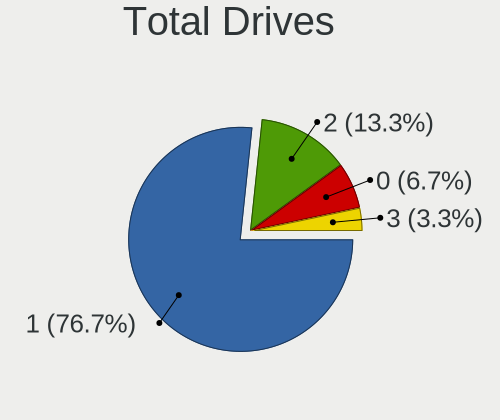
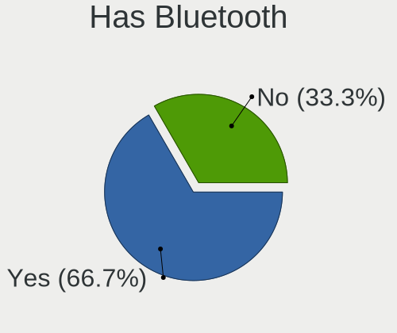
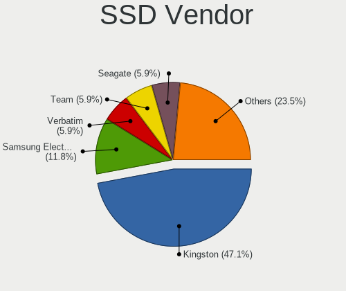
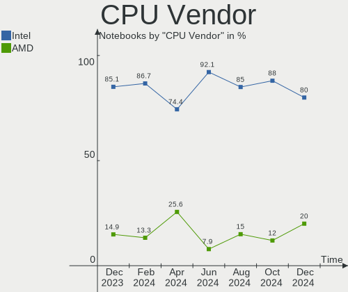
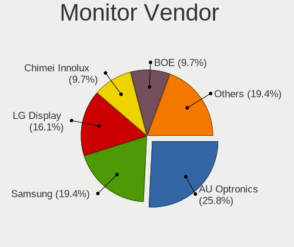
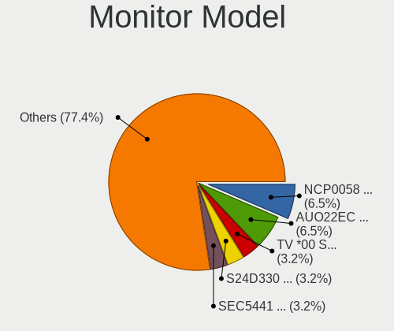

BlackPanther Hardware Trends (Notebook)
---------------------------------------

A project to identify most popular hardware characteristics and track their change
over time based on data collected by BlackPanther users at https://Linux-Hardware.org.

Anyone can contribute to the study by uploading probes of their computers by
the [hw-probe](https://github.com/linuxhw/hw-probe) tool:

    sudo -E hw-probe -all -upload

Full-feature report is available here: https://linux-hardware.org/?view=trends&formfactor=notebook

Period: May, 2021.

Contents
--------

- [ OS                       ](#os)
- [ OS Family                ](#os-family)
- [ Kernel                   ](#kernel)
- [ Kernel Family            ](#kernel-family)
- [ Kernel Major Ver.        ](#kernel-major-ver)
- [ Arch                     ](#arch)
- [ DE                       ](#de)
- [ Display Server           ](#display-server)
- [ Display Manager          ](#display-manager)
- [ OS Lang                  ](#os-lang)
- [ Boot Mode                ](#boot-mode)
- [ Filesystem               ](#filesystem)
- [ Part. scheme             ](#part-scheme)
- [ Dual Boot with Linux/BSD ](#dual-boot-with-linux/bsd)
- [ Dual Boot (Win)          ](#dual-boot-win)
- [ Country                  ](#country)
- [ City                     ](#city)
- [ Vendor                   ](#vendor)
- [ Model                    ](#model)
- [ Model Family             ](#model-family)
- [ MFG Year                 ](#mfg-year)
- [ Form Factor              ](#form-factor)
- [ Secure Boot              ](#secure-boot)
- [ Coreboot                 ](#coreboot)
- [ RAM Size                 ](#ram-size)
- [ RAM Used                 ](#ram-used)
- [ Has CD-ROM               ](#has-cd-rom)
- [ Total Drives             ](#total-drives)
- [ Has Ethernet             ](#has-ethernet)
- [ Has WiFi                 ](#has-wifi)
- [ Has Bluetooth            ](#has-bluetooth)
- [ Drive Vendor             ](#drive-vendor)
- [ Drive Model              ](#drive-model)
- [ HDD Vendor               ](#hdd-vendor)
- [ SSD Vendor               ](#ssd-vendor)
- [ Drive Kind               ](#drive-kind)
- [ Drive Connector          ](#drive-connector)
- [ Drive Size               ](#drive-size)
- [ Space Total              ](#space-total)
- [ Space Used               ](#space-used)
- [ Malfunc. Drives          ](#malfunc-drives)
- [ Malfunc. Drive Vendor    ](#malfunc-drive-vendor)
- [ Malfunc. HDD Vendor      ](#malfunc-hdd-vendor)
- [ Malfunc. Drive Kind      ](#malfunc-drive-kind)
- [ Failed Drives            ](#failed-drives)
- [ Failed Drive Vendor      ](#failed-drive-vendor)
- [ Drive Status             ](#drive-status)
- [ Storage Vendor           ](#storage-vendor)
- [ Storage Model            ](#storage-model)
- [ Storage Kind             ](#storage-kind)
- [ CPU Vendor               ](#cpu-vendor)
- [ CPU Model                ](#cpu-model)
- [ CPU Model Family         ](#cpu-model-family)
- [ CPU Cores                ](#cpu-cores)
- [ CPU Sockets              ](#cpu-sockets)
- [ CPU Threads              ](#cpu-threads)
- [ CPU Op-Modes             ](#cpu-op-modes)
- [ CPU Microcode            ](#cpu-microcode)
- [ CPU Microarch            ](#cpu-microarch)
- [ GPU Vendor               ](#gpu-vendor)
- [ GPU Model                ](#gpu-model)
- [ GPU Combo                ](#gpu-combo)
- [ GPU Driver               ](#gpu-driver)
- [ GPU Memory               ](#gpu-memory)
- [ Monitor Vendor           ](#monitor-vendor)
- [ Monitor Model            ](#monitor-model)
- [ Monitor Resolution       ](#monitor-resolution)
- [ Monitor Diagonal         ](#monitor-diagonal)
- [ Monitor Width            ](#monitor-width)
- [ Aspect Ratio             ](#aspect-ratio)
- [ Monitor Area             ](#monitor-area)
- [ Pixel Density            ](#pixel-density)
- [ Multiple Monitors        ](#multiple-monitors)
- [ Net Controller Vendor    ](#net-controller-vendor)
- [ Net Controller Model     ](#net-controller-model)
- [ Wireless Vendor          ](#wireless-vendor)
- [ Wireless Model           ](#wireless-model)
- [ Ethernet Vendor          ](#ethernet-vendor)
- [ Ethernet Model           ](#ethernet-model)
- [ Net Controller Kind      ](#net-controller-kind)
- [ Used Controller          ](#used-controller)
- [ NICs                     ](#nics)
- [ IPv6                     ](#ipv6)
- [ Memory Vendor            ](#memory-vendor)
- [ Memory Model             ](#memory-model)
- [ Memory Kind              ](#memory-kind)
- [ Memory Form Factor       ](#memory-form-factor)
- [ Memory Size              ](#memory-size)
- [ Memory Speed             ](#memory-speed)
- [ Sound Vendor             ](#sound-vendor)
- [ Sound Model              ](#sound-model)
- [ Camera Vendor            ](#camera-vendor)
- [ Camera Model             ](#camera-model)
- [ Fingerprint Vendor       ](#fingerprint-vendor)
- [ Fingerprint Model        ](#fingerprint-model)
- [ Chipcard Vendor          ](#chipcard-vendor)
- [ Chipcard Model           ](#chipcard-model)
- [ Printer Vendor           ](#printer-vendor)
- [ Printer Model            ](#printer-model)
- [ Scanner Vendor           ](#scanner-vendor)
- [ Scanner Model            ](#scanner-model)
- [ Bluetooth Vendor         ](#bluetooth-vendor)
- [ Bluetooth Model          ](#bluetooth-model)
- [ Unsupported Devices      ](#unsupported-devices)
- [ Unsupported Device Types ](#unsupported-device-types)

OS
--

Installed operating systems

| Name              | Notebooks | Percent |
|-------------------|-----------|---------|
| BlackPanther 18.1 | 91        | 97.85%  |
| BlackPanther 16.2 | 2         | 2.15%   |

OS Family
---------

OS without a version

| Name         | Notebooks | Percent |
|--------------|-----------|---------|
| BlackPanther | 93        | 100%    |

Kernel
------

Version of the Linux kernel

| Version                | Notebooks | Percent |
|------------------------|-----------|---------|
| 5.6.14-desktop-2bP     | 69        | 74.19%  |
| 4.18.16-desktop-1bP    | 22        | 23.66%  |
| 4.9.20-desktop-pae-1bP | 2         | 2.15%   |

Kernel Family
-------------

Linux kernel without a distro release

| Version | Notebooks | Percent |
|---------|-----------|---------|
| 5.6.14  | 69        | 74.19%  |
| 4.18.16 | 22        | 23.66%  |
| 4.9.20  | 2         | 2.15%   |

Kernel Major Ver.
-----------------

Linux kernel major version

| Version | Notebooks | Percent |
|---------|-----------|---------|
| 5.6     | 69        | 74.19%  |
| 4.18    | 22        | 23.66%  |
| 4.9     | 2         | 2.15%   |

Arch
----

OS architecture (x86_64, i586, etc.)

| Name   | Notebooks | Percent |
|--------|-----------|---------|
| x86_64 | 91        | 97.85%  |
| i686   | 2         | 2.15%   |

DE
--

Desktop Environment

| Name | Notebooks | Percent |
|------|-----------|---------|
| KDE5 | 92        | 98.92%  |
| KDE  | 1         | 1.08%   |

Display Server
--------------

X11 or Wayland

| Name | Notebooks | Percent |
|------|-----------|---------|
| X11  | 93        | 100%    |

Display Manager
---------------

SDDM, LightDM, etc.

| Name    | Notebooks | Percent |
|---------|-----------|---------|
| SDDM    | 92        | 98.92%  |
| Unknown | 1         | 1.08%   |

OS Lang
-------

Language

| Lang    | Notebooks | Percent |
|---------|-----------|---------|
| Unknown | 92        | 98.92%  |
| hu_HU   | 1         | 1.08%   |

Boot Mode
---------

EFI or BIOS

| Mode | Notebooks | Percent |
|------|-----------|---------|
| BIOS | 59        | 63.44%  |
| EFI  | 34        | 36.56%  |

Filesystem
----------

Type of filesystem

| Type    | Notebooks | Percent |
|---------|-----------|---------|
| Overlay | 76        | 81.72%  |
| Ext4    | 17        | 18.28%  |

Part. scheme
------------

Scheme of partitioning

| Type    | Notebooks | Percent |
|---------|-----------|---------|
| MBR     | 57        | 61.29%  |
| GPT     | 35        | 37.63%  |
| Unknown | 1         | 1.08%   |

Dual Boot with Linux/BSD
------------------------

Hosting more than one Linux/BSD

| Dual boot | Notebooks | Percent |
|-----------|-----------|---------|
| No        | 47        | 50.54%  |
| Yes       | 46        | 49.46%  |

Dual Boot (Win)
---------------

Hosting Linux and Windows

| Dual boot | Notebooks | Percent |
|-----------|-----------|---------|
| No        | 51        | 54.84%  |
| Yes       | 42        | 45.16%  |

Country
-------

Geographic location (country)

| Country    | Notebooks | Percent |
|------------|-----------|---------|
| Hungary    | 63        | 67.74%  |
| USA        | 5         | 5.38%   |
| Germany    | 5         | 5.38%   |
| Slovakia   | 4         | 4.3%    |
| Japan      | 2         | 2.15%   |
| Cyprus     | 2         | 2.15%   |
| China      | 2         | 2.15%   |
| UK         | 1         | 1.08%   |
| Turkey     | 1         | 1.08%   |
| Thailand   | 1         | 1.08%   |
| Slovenia   | 1         | 1.08%   |
| Russia     | 1         | 1.08%   |
| Martinique | 1         | 1.08%   |
| Ireland    | 1         | 1.08%   |
| Greece     | 1         | 1.08%   |
| Austria    | 1         | 1.08%   |
| Argentina  | 1         | 1.08%   |

City
----

Geographic location (city)

| City               | Notebooks | Percent |
|--------------------|-----------|---------|
| Budapest           | 22        | 23.66%  |
| Pécs              | 4         | 4.3%    |
| Veszprém          | 3         | 3.23%   |
| Szekszárd         | 3         | 3.23%   |
| Rezi               | 2         | 2.15%   |
| Nagykanizsa        | 2         | 2.15%   |
| Limassol           | 2         | 2.15%   |
| Kecskemét         | 2         | 2.15%   |
| Hatvan             | 2         | 2.15%   |
| Dalian             | 2         | 2.15%   |
| Štúrovo          | 1         | 1.08%   |
| Zichyujfalu        | 1         | 1.08%   |
| Velky Meder        | 1         | 1.08%   |
| Tribuswinkel       | 1         | 1.08%   |
| Tarnok             | 1         | 1.08%   |
| Szombathely        | 1         | 1.08%   |
| Szolnok            | 1         | 1.08%   |
| Szigetszentmiklos  | 1         | 1.08%   |
| Szeged             | 1         | 1.08%   |
| Soporna            | 1         | 1.08%   |
| Sierra Vista       | 1         | 1.08%   |
| Schoelcher         | 1         | 1.08%   |
| Salgotarjan        | 1         | 1.08%   |
| Rozsaszentmarton   | 1         | 1.08%   |
| Pittsburgh         | 1         | 1.08%   |
| Pazit              | 1         | 1.08%   |
| Pakozd             | 1         | 1.08%   |
| Offenbach-Hundheim | 1         | 1.08%   |
| Nyiregyhaza        | 1         | 1.08%   |
| Nyergesujfalu      | 1         | 1.08%   |
| North Hollywood    | 1         | 1.08%   |
| Neuenhagen         | 1         | 1.08%   |
| Nerima             | 1         | 1.08%   |
| Nagyvazsony        | 1         | 1.08%   |
| Nagyigmand         | 1         | 1.08%   |
| Mosonszentmiklos   | 1         | 1.08%   |
| Moscow             | 1         | 1.08%   |
| Litke              | 1         | 1.08%   |
| Laferrere          | 1         | 1.08%   |
| Kozarmisleny       | 1         | 1.08%   |
| Koper              | 1         | 1.08%   |
| Kisvarda           | 1         | 1.08%   |
| Kaposvár          | 1         | 1.08%   |
| Jaszladany         | 1         | 1.08%   |
| Izmir              | 1         | 1.08%   |
| Hofstetten         | 1         | 1.08%   |
| Funabashi          | 1         | 1.08%   |
| Frankfurt am Main  | 1         | 1.08%   |
| Dublin             | 1         | 1.08%   |
| Dombovar           | 1         | 1.08%   |
| Craigavon          | 1         | 1.08%   |
| Columbus           | 1         | 1.08%   |
| Chiang Rai         | 1         | 1.08%   |
| Bucsa              | 1         | 1.08%   |
| Bruehl             | 1         | 1.08%   |
| Balkany            | 1         | 1.08%   |
| Atmore             | 1         | 1.08%   |
| Athens             | 1         | 1.08%   |
| Alcsutdoboz        | 1         | 1.08%   |

Vendor
------

Motherboard manufacturer

| Name                             | Notebooks | Percent |
|----------------------------------|-----------|---------|
| Hewlett-Packard                  | 24        | 25.81%  |
| Lenovo                           | 14        | 15.05%  |
| Dell                             | 13        | 13.98%  |
| Acer                             | 12        | 12.9%   |
| ASUSTek Computer                 | 11        | 11.83%  |
| Toshiba                          | 4         | 4.3%    |
| Jumper                           | 2         | 2.15%   |
| Fujitsu                          | 2         | 2.15%   |
| eMachines                        | 2         | 2.15%   |
| Timi                             | 1         | 1.08%   |
| Sony                             | 1         | 1.08%   |
| Panasonic                        | 1         | 1.08%   |
| Packard Bell                     | 1         | 1.08%   |
| ONE-NETBOOK TECHNOLOGY           | 1         | 1.08%   |
| HUAWEI                           | 1         | 1.08%   |
| Fujitsu Siemens                  | 1         | 1.08%   |
| FUJITSU CLIENT COMPUTING LIMITED | 1         | 1.08%   |
| Alcor                            | 1         | 1.08%   |

Model
-----

Motherboard model

| Name                                        | Notebooks | Percent |
|---------------------------------------------|-----------|---------|
| HP 250 G1                                   | 3         | 3.23%   |
| Jumper EZbook                               | 2         | 2.15%   |
| HP 620                                      | 2         | 2.15%   |
| Toshiba Satellite L750                      | 1         | 1.08%   |
| Toshiba Satellite L500                      | 1         | 1.08%   |
| Toshiba Satellite L300                      | 1         | 1.08%   |
| Toshiba Satellite C50D-A-133                | 1         | 1.08%   |
| Timi Mi Gaming Laptop 15.6                  | 1         | 1.08%   |
| Sony VPCYB3V1E                              | 1         | 1.08%   |
| Panasonic CF-19KDR80SH                      | 1         | 1.08%   |
| Packard Bell DOT S                          | 1         | 1.08%   |
| ONE-NETBOOK TECHNOLOGY ONE-GX               | 1         | 1.08%   |
| Lenovo Yoga 2 11 20332                      | 1         | 1.08%   |
| Lenovo V330-15IKB 81AX                      | 1         | 1.08%   |
| Lenovo V145-15AST 81MT                      | 1         | 1.08%   |
| Lenovo ThinkPad X220 4293ER9                | 1         | 1.08%   |
| Lenovo ThinkPad W510 431924G                | 1         | 1.08%   |
| Lenovo ThinkPad SL510 2847D8G               | 1         | 1.08%   |
| Lenovo S10-3                                | 1         | 1.08%   |
| Lenovo IdeaPad S145-15IGM 81MX              | 1         | 1.08%   |
| Lenovo IdeaPad S145-15AST 81N3              | 1         | 1.08%   |
| Lenovo IdeaPad 120S-11IAP 81A4              | 1         | 1.08%   |
| Lenovo G580 20150                           | 1         | 1.08%   |
| Lenovo G550 20023                           | 1         | 1.08%   |
| Lenovo G505s 20255                          | 1         | 1.08%   |
| Lenovo B590 62743BG                         | 1         | 1.08%   |
| HUAWEI HVY-WXX9                             | 1         | 1.08%   |
| HP Stream Laptop 14-ax0XX                   | 1         | 1.08%   |
| HP ProBook 6470b                            | 1         | 1.08%   |
| HP ProBook 645 G1                           | 1         | 1.08%   |
| HP ProBook 4740s                            | 1         | 1.08%   |
| HP ProBook 4730s                            | 1         | 1.08%   |
| HP ProBook 470 G1                           | 1         | 1.08%   |
| HP ProBook 455 G4                           | 1         | 1.08%   |
| HP Pavilion g7                              | 1         | 1.08%   |
| HP Pavilion dv7                             | 1         | 1.08%   |
| HP Pavilion dv6                             | 1         | 1.08%   |
| HP Laptop 15-da0xxx                         | 1         | 1.08%   |
| HP Laptop 15-bw0xx                          | 1         | 1.08%   |
| HP EliteBook 8460p                          | 1         | 1.08%   |
| HP EliteBook 820 G1                         | 1         | 1.08%   |
| HP EliteBook 2540p                          | 1         | 1.08%   |
| HP Compaq 6710b (KE121EA#AKC)               | 1         | 1.08%   |
| HP 250 G6 Notebook PC                       | 1         | 1.08%   |
| HP 2000                                     | 1         | 1.08%   |
| HP 15                                       | 1         | 1.08%   |
| Fujitsu STYLISTIC Q702                      | 1         | 1.08%   |
| Fujitsu Siemens LIFEBOOK S7220              | 1         | 1.08%   |
| Fujitsu LIFEBOOK E751                       | 1         | 1.08%   |
| FUJITSU CLIENT COMPUTING LIMITED FMVWE3AB11 | 1         | 1.08%   |
| eMachines eME730G                           | 1         | 1.08%   |
| eMachines E725                              | 1         | 1.08%   |
| Dell Precision M4600                        | 1         | 1.08%   |
| Dell Latitude E6530                         | 1         | 1.08%   |
| Dell Latitude E6410                         | 1         | 1.08%   |
| Dell Latitude E6230                         | 1         | 1.08%   |
| Dell Latitude E5540                         | 1         | 1.08%   |
| Dell Latitude D830                          | 1         | 1.08%   |
| Dell Inspiron MP061                         | 1         | 1.08%   |
| Dell Inspiron 7375                          | 1         | 1.08%   |

Model Family
------------

Motherboard model prefix

| Name                                        | Notebooks | Percent |
|---------------------------------------------|-----------|---------|
| Acer Aspire                                 | 11        | 11.83%  |
| HP ProBook                                  | 6         | 6.45%   |
| Dell Inspiron                               | 6         | 6.45%   |
| Dell Latitude                               | 5         | 5.38%   |
| Toshiba Satellite                           | 4         | 4.3%    |
| HP 250                                      | 4         | 4.3%    |
| Lenovo ThinkPad                             | 3         | 3.23%   |
| Lenovo IdeaPad                              | 3         | 3.23%   |
| HP Pavilion                                 | 3         | 3.23%   |
| HP EliteBook                                | 3         | 3.23%   |
| Jumper EZbook                               | 2         | 2.15%   |
| HP Laptop                                   | 2         | 2.15%   |
| HP 620                                      | 2         | 2.15%   |
| Timi Mi                                     | 1         | 1.08%   |
| Sony VPCYB3V1E                              | 1         | 1.08%   |
| Panasonic CF-19KDR80SH                      | 1         | 1.08%   |
| Packard Bell DOT                            | 1         | 1.08%   |
| ONE-NETBOOK TECHNOLOGY ONE-GX               | 1         | 1.08%   |
| Lenovo Yoga                                 | 1         | 1.08%   |
| Lenovo V330-15IKB                           | 1         | 1.08%   |
| Lenovo V145-15AST                           | 1         | 1.08%   |
| Lenovo S10-3                                | 1         | 1.08%   |
| Lenovo G580                                 | 1         | 1.08%   |
| Lenovo G550                                 | 1         | 1.08%   |
| Lenovo G505s                                | 1         | 1.08%   |
| Lenovo B590                                 | 1         | 1.08%   |
| HUAWEI HVY-WXX9                             | 1         | 1.08%   |
| HP Stream                                   | 1         | 1.08%   |
| HP Compaq                                   | 1         | 1.08%   |
| HP 2000                                     | 1         | 1.08%   |
| HP 15                                       | 1         | 1.08%   |
| Fujitsu STYLISTIC                           | 1         | 1.08%   |
| Fujitsu Siemens LIFEBOOK                    | 1         | 1.08%   |
| Fujitsu LIFEBOOK                            | 1         | 1.08%   |
| FUJITSU CLIENT COMPUTING LIMITED FMVWE3AB11 | 1         | 1.08%   |
| eMachines eME730G                           | 1         | 1.08%   |
| eMachines E725                              | 1         | 1.08%   |
| Dell Precision                              | 1         | 1.08%   |
| Dell G3                                     | 1         | 1.08%   |
| ASUS X751MA                                 | 1         | 1.08%   |
| ASUS X553SA                                 | 1         | 1.08%   |
| ASUS X550EA                                 | 1         | 1.08%   |
| ASUS X550CC                                 | 1         | 1.08%   |
| ASUS X302LA                                 | 1         | 1.08%   |
| ASUS VivoBook                               | 1         | 1.08%   |
| ASUS K55VJ                                  | 1         | 1.08%   |
| ASUS K53BR                                  | 1         | 1.08%   |
| ASUS K52F                                   | 1         | 1.08%   |
| ASUS K50IJ                                  | 1         | 1.08%   |
| ASUS F3Sc                                   | 1         | 1.08%   |
| Alcor SnugBook                              | 1         | 1.08%   |
| Acer Nitro                                  | 1         | 1.08%   |

MFG Year
--------

Motherboard manufacture year

| Year | Notebooks | Percent |
|------|-----------|---------|
| 2013 | 19        | 20.43%  |
| 2018 | 13        | 13.98%  |
| 2010 | 8         | 8.6%    |
| 2020 | 7         | 7.53%   |
| 2015 | 7         | 7.53%   |
| 2012 | 6         | 6.45%   |
| 2011 | 6         | 6.45%   |
| 2019 | 5         | 5.38%   |
| 2014 | 5         | 5.38%   |
| 2009 | 5         | 5.38%   |
| 2017 | 3         | 3.23%   |
| 2016 | 3         | 3.23%   |
| 2021 | 2         | 2.15%   |
| 2006 | 2         | 2.15%   |
| 2008 | 1         | 1.08%   |
| 2007 | 1         | 1.08%   |

Form Factor
-----------

Physical design of the computer

| Name     | Notebooks | Percent |
|----------|-----------|---------|
| Notebook | 93        | 100%    |

Secure Boot
-----------

Enabled or disabled

| State    | Notebooks | Percent |
|----------|-----------|---------|
| Disabled | 93        | 100%    |

Coreboot
--------

Have coreboot on board

| Used | Notebooks | Percent |
|------|-----------|---------|
| No   | 93        | 100%    |

RAM Size
--------

Total RAM memory

| Size in GB | Notebooks | Percent |
|------------|-----------|---------|
| 3.01-4.0   | 48        | 51.61%  |
| 4.01-8.0   | 17        | 18.28%  |
| 1.01-2.0   | 11        | 11.83%  |
| 8.01-16.0  | 8         | 8.6%    |
| 16.01-24.0 | 5         | 5.38%   |
| 2.01-3.0   | 2         | 2.15%   |
| 24.01-32.0 | 1         | 1.08%   |
| 0.51-1.0   | 1         | 1.08%   |

RAM Used
--------

Used RAM memory

| Used GB  | Notebooks | Percent |
|----------|-----------|---------|
| 1.01-2.0 | 37        | 39.78%  |
| 0.51-1.0 | 35        | 37.63%  |
| 0.01-0.5 | 20        | 21.51%  |
| 3.01-4.0 | 1         | 1.08%   |

Has CD-ROM
----------

Has CD-ROM on board

| Presented | Notebooks | Percent |
|-----------|-----------|---------|
| Yes       | 54        | 58.06%  |
| No        | 39        | 41.94%  |

Total Drives
------------

Number of drives on board

| Drives | Notebooks | Percent |
|--------|-----------|---------|
| 1      | 79        | 84.95%  |
| 2      | 12        | 12.9%   |
| 3      | 1         | 1.08%   |
| 0      | 1         | 1.08%   |

Has Ethernet
------------

Has Ethernet on board

| Presented | Notebooks | Percent |
|-----------|-----------|---------|
| Yes       | 82        | 88.17%  |
| No        | 11        | 11.83%  |

Has WiFi
--------

Has WiFi module

| Presented | Notebooks | Percent |
|-----------|-----------|---------|
| Yes       | 91        | 97.85%  |
| No        | 2         | 2.15%   |

Has Bluetooth
-------------

Has Bluetooth module

| Presented | Notebooks | Percent |
|-----------|-----------|---------|
| Yes       | 66        | 70.97%  |
| No        | 27        | 29.03%  |

Drive Vendor
------------

Hard drive vendors

| Vendor              | Notebooks | Drives | Percent |
|---------------------|-----------|--------|---------|
| Seagate             | 20        | 20     | 19.8%   |
| Kingston            | 14        | 14     | 13.86%  |
| Samsung Electronics | 11        | 12     | 10.89%  |
| WDC                 | 10        | 10     | 9.9%    |
| Toshiba             | 8         | 8      | 7.92%   |
| HGST                | 6         | 6      | 5.94%   |
| Unknown             | 5         | 5      | 4.95%   |
| Hitachi             | 5         | 5      | 4.95%   |
| SK Hynix            | 3         | 3      | 2.97%   |
| SanDisk             | 3         | 3      | 2.97%   |
| Intel               | 3         | 3      | 2.97%   |
| Micron Technology   | 2         | 2      | 1.98%   |
| Fujitsu             | 2         | 2      | 1.98%   |
| Crucial             | 2         | 2      | 1.98%   |
| Union Memory        | 1         | 1      | 0.99%   |
| PNY                 | 1         | 1      | 0.99%   |
| Phison              | 1         | 1      | 0.99%   |
| Patriot             | 1         | 2      | 0.99%   |
| LITEONIT            | 1         | 1      | 0.99%   |
| JMicron             | 1         | 1      | 0.99%   |
| HS-SSD-C100         | 1         | 1      | 0.99%   |

Drive Model
-----------

Hard drive models

| Model                                 | Notebooks | Percent |
|---------------------------------------|-----------|---------|
| Seagate ST500LT012-1DG142 500GB       | 5         | 4.85%   |
| Kingston SA400S37120G 120GB SSD       | 5         | 4.85%   |
| Kingston SA400S37240G 240GB SSD       | 4         | 3.88%   |
| Seagate ST1000LM035-1RK172 1TB        | 3         | 2.91%   |
| Kingston SV300S37A120G 120GB SSD      | 3         | 2.91%   |
| HGST HTS545032A7E380 320GB            | 3         | 2.91%   |
| Toshiba MQ01ABF050 500GB              | 2         | 1.94%   |
| Toshiba MQ01ABD100 1TB                | 2         | 1.94%   |
| Seagate ST9500325AS 500GB             | 2         | 1.94%   |
| Seagate ST9320325AS 320GB             | 2         | 1.94%   |
| HGST HTS545050A7E680 500GB            | 2         | 1.94%   |
| WDC WDS120G2G0A-00JH30 120GB SSD      | 1         | 0.97%   |
| WDC WD5000LPVT-24G33T1 500GB          | 1         | 0.97%   |
| WDC WD5000LPCX-22VHAT1 500GB          | 1         | 0.97%   |
| WDC WD3200BUCT-62TWBY0 320GB          | 1         | 0.97%   |
| WDC WD3200BPVT-80JJ5T0 320GB          | 1         | 0.97%   |
| WDC WD3200BPVT-22JJ5T0 320GB          | 1         | 0.97%   |
| WDC WD3200BEVT-22A23T0 320GB          | 1         | 0.97%   |
| WDC WD3200BEKT-60PVMT0 320GB          | 1         | 0.97%   |
| WDC WD2500BEVS-22UST0 250GB           | 1         | 0.97%   |
| WDC WD10JPVX-22JC3T0 1TB              | 1         | 0.97%   |
| Unknown SLD128  128GB                 | 1         | 0.97%   |
| Unknown HBG4a2  32GB                  | 1         | 0.97%   |
| Unknown BJNB4R  32GB                  | 1         | 0.97%   |
| Unknown 58K722  128GB                 | 1         | 0.97%   |
| Unknown 00000  32GB                   | 1         | 0.97%   |
| Union Memory RTOTJ128VGD2EYX 128GB    | 1         | 0.97%   |
| Toshiba THNSFJ256GCSU 256GB SSD       | 1         | 0.97%   |
| Toshiba MK5075GSX 500GB               | 1         | 0.97%   |
| Toshiba MK5059GSXP 500GB              | 1         | 0.97%   |
| Toshiba KBG40ZNS256G NVMe 256GB       | 1         | 0.97%   |
| SK Hynix HFS128G39TND-N210A 128GB SSD | 1         | 0.97%   |
| SK Hynix HFS128G32MND-2200A 128GB SSD | 1         | 0.97%   |
| SK Hynix HCG8e  64GB                  | 1         | 0.97%   |
| Seagate ST9320327AS 320GB             | 1         | 0.97%   |
| Seagate ST9250315AS 250GB             | 1         | 0.97%   |
| Seagate ST9200420ASG 200GB            | 1         | 0.97%   |
| Seagate ST500LT032-1E9142 500GB       | 1         | 0.97%   |
| Seagate ST2000LM007-1R8174 2TB        | 1         | 0.97%   |
| Seagate ST1000LM024 HN-M101MBB 1TB    | 1         | 0.97%   |
| Seagate ST1000LM 024 HN-M101MBB 1TB   | 1         | 0.97%   |
| Seagate BUP Slim BK 2TB               | 1         | 0.97%   |
| SanDisk SD9SN8W-128G-1006 128GB SSD   | 1         | 0.97%   |
| SanDisk SD8SN8U-128G-1006 128GB SSD   | 1         | 0.97%   |
| SanDisk DF4064  64GB                  | 1         | 0.97%   |
| Samsung SSD 980 PRO 1TB               | 1         | 0.97%   |
| Samsung SSD 870 QVO 1TB               | 1         | 0.97%   |
| Samsung SSD 870 EVO 250GB             | 1         | 0.97%   |
| Samsung SSD 860 EVO 500GB             | 1         | 0.97%   |
| Samsung SSD 860 EVO 250G              | 1         | 0.97%   |
| Samsung SSD 850 EVO 250GB             | 1         | 0.97%   |
| Samsung SSD 840 EVO 250GB             | 1         | 0.97%   |
| Samsung SSD 830 Series 128GB          | 1         | 0.97%   |
| Samsung MZVLQ256HAJD-00007 256GB      | 1         | 0.97%   |
| Samsung MZVLB512HBJQ-00000 512GB      | 1         | 0.97%   |
| Samsung MZMTE256HMHP-00000 256GB SSD  | 1         | 0.97%   |
| Samsung MZ7LN256HAJQ-000L2 256GB SSD  | 1         | 0.97%   |
| PNY CS900 120GB SSD                   | 1         | 0.97%   |
| Phison One-Netbook PCI-E 512G SSD     | 1         | 0.97%   |
| Patriot P210 256GB SSD                | 1         | 0.97%   |

HDD Vendor
----------

Hard disk drive vendors

| Vendor  | Notebooks | Drives | Percent |
|---------|-----------|--------|---------|
| Seagate | 20        | 20     | 41.67%  |
| WDC     | 9         | 9      | 18.75%  |
| Toshiba | 6         | 6      | 12.5%   |
| HGST    | 6         | 6      | 12.5%   |
| Hitachi | 5         | 5      | 10.42%  |
| Fujitsu | 2         | 2      | 4.17%   |

SSD Vendor
----------

Solid state drive vendors

| Vendor              | Notebooks | Drives | Percent |
|---------------------|-----------|--------|---------|
| Kingston            | 14        | 14     | 34.15%  |
| Samsung Electronics | 9         | 9      | 21.95%  |
| SK Hynix            | 2         | 2      | 4.88%   |
| SanDisk             | 2         | 2      | 4.88%   |
| Micron Technology   | 2         | 2      | 4.88%   |
| Intel               | 2         | 2      | 4.88%   |
| Crucial             | 2         | 2      | 4.88%   |
| WDC                 | 1         | 1      | 2.44%   |
| Union Memory        | 1         | 1      | 2.44%   |
| Toshiba             | 1         | 1      | 2.44%   |
| PNY                 | 1         | 1      | 2.44%   |
| Patriot             | 1         | 2      | 2.44%   |
| LITEONIT            | 1         | 1      | 2.44%   |
| JMicron             | 1         | 1      | 2.44%   |
| HS-SSD-C100         | 1         | 1      | 2.44%   |

Drive Kind
----------

HDD or SSD

| Kind | Notebooks | Drives | Percent |
|------|-----------|--------|---------|
| HDD  | 47        | 48     | 47.96%  |
| SSD  | 40        | 42     | 40.82%  |
| MMC  | 6         | 7      | 6.12%   |
| NVMe | 5         | 6      | 5.1%    |

Drive Connector
---------------

SATA, SAS, NVMe, etc.

| Type | Notebooks | Drives | Percent |
|------|-----------|--------|---------|
| SATA | 82        | 86     | 84.54%  |
| MMC  | 6         | 7      | 6.19%   |
| NVMe | 5         | 6      | 5.15%   |
| SAS  | 4         | 4      | 4.12%   |

Drive Size
----------

Size of hard drive

| Size in TB | Notebooks | Drives | Percent |
|------------|-----------|--------|---------|
| 0.01-0.5   | 73        | 77     | 84.88%  |
| 0.51-1.0   | 11        | 11     | 12.79%  |
| 1.01-2.0   | 2         | 2      | 2.33%   |

Space Total
-----------

Amount of disk space available on the file system

| Size in GB | Notebooks | Percent |
|------------|-----------|---------|
| Unknown    | 74        | 79.57%  |
| 101-250    | 7         | 7.53%   |
| 251-500    | 4         | 4.3%    |
| 21-50      | 4         | 4.3%    |
| 501-1000   | 2         | 2.15%   |
| 51-100     | 2         | 2.15%   |

Space Used
----------

Amount of used disk space

| Used GB | Notebooks | Percent |
|---------|-----------|---------|
| Unknown | 74        | 79.57%  |
| 1-20    | 17        | 18.28%  |
| 251-500 | 1         | 1.08%   |
| 101-250 | 1         | 1.08%   |

Malfunc. Drives
---------------

Drive models with a malfunction

| Model                                 | Notebooks | Drives | Percent |
|---------------------------------------|-----------|--------|---------|
| Seagate ST500LT012-1DG142 500GB       | 3         | 3      | 12%     |
| HGST HTS545032A7E380 320GB            | 3         | 3      | 12%     |
| WDC WDS120G2G0A-00JH30 120GB SSD      | 1         | 1      | 4%      |
| WDC WD5000LPVT-24G33T1 500GB          | 1         | 1      | 4%      |
| WDC WD3200BEVT-22A23T0 320GB          | 1         | 1      | 4%      |
| Toshiba THNSFJ256GCSU 256GB SSD       | 1         | 1      | 4%      |
| Toshiba MQ01ABF050 500GB              | 1         | 1      | 4%      |
| SK Hynix HFS128G32MND-2200A 128GB SSD | 1         | 1      | 4%      |
| Seagate ST9500325AS 500GB             | 1         | 1      | 4%      |
| Seagate ST9320327AS 320GB             | 1         | 1      | 4%      |
| Seagate ST9320325AS 320GB             | 1         | 1      | 4%      |
| Seagate ST9250315AS 250GB             | 1         | 1      | 4%      |
| Seagate ST9200420ASG 200GB            | 1         | 1      | 4%      |
| SanDisk SD9SN8W-128G-1006 128GB SSD   | 1         | 1      | 4%      |
| Kingston SA400S37120G 120GB SSD       | 1         | 1      | 4%      |
| Intel SSDSA1M160G2HP 160GB            | 1         | 1      | 4%      |
| Hitachi HTS543232A7A384 320GB         | 1         | 1      | 4%      |
| Hitachi HTS541640J9SA00 40GB          | 1         | 1      | 4%      |
| Hitachi HCC543232A7A380 320GB         | 1         | 1      | 4%      |
| HGST HTS541010A9E680 1TB              | 1         | 1      | 4%      |
| Fujitsu MHW2060BH 64GB                | 1         | 1      | 4%      |

Malfunc. Drive Vendor
---------------------

Vendors of faulty drives

| Vendor   | Notebooks | Drives | Percent |
|----------|-----------|--------|---------|
| Seagate  | 8         | 8      | 32%     |
| HGST     | 4         | 4      | 16%     |
| WDC      | 3         | 3      | 12%     |
| Hitachi  | 3         | 3      | 12%     |
| Toshiba  | 2         | 2      | 8%      |
| SK Hynix | 1         | 1      | 4%      |
| SanDisk  | 1         | 1      | 4%      |
| Kingston | 1         | 1      | 4%      |
| Intel    | 1         | 1      | 4%      |
| Fujitsu  | 1         | 1      | 4%      |

Malfunc. HDD Vendor
-------------------

Vendors of faulty HDD drives

| Vendor  | Notebooks | Drives | Percent |
|---------|-----------|--------|---------|
| Seagate | 8         | 8      | 42.11%  |
| HGST    | 4         | 4      | 21.05%  |
| Hitachi | 3         | 3      | 15.79%  |
| WDC     | 2         | 2      | 10.53%  |
| Toshiba | 1         | 1      | 5.26%   |
| Fujitsu | 1         | 1      | 5.26%   |

Malfunc. Drive Kind
-------------------

Kinds of faulty drives

| Kind | Notebooks | Drives | Percent |
|------|-----------|--------|---------|
| HDD  | 19        | 19     | 76%     |
| SSD  | 6         | 6      | 24%     |

Failed Drives
-------------

Failed drive models

Zero info for selected period =(

Failed Drive Vendor
-------------------

Failed drive vendors

Zero info for selected period =(

Drive Status
------------

Number of failed and malfunc. drives

| Status   | Notebooks | Drives | Percent |
|----------|-----------|--------|---------|
| Works    | 63        | 65     | 64.95%  |
| Malfunc  | 25        | 25     | 25.77%  |
| Detected | 9         | 13     | 9.28%   |

Storage Vendor
--------------

Storage controller vendors

| Vendor              | Notebooks | Percent |
|---------------------|-----------|---------|
| Intel               | 74        | 80.43%  |
| AMD                 | 14        | 15.22%  |
| Samsung Electronics | 2         | 2.17%   |
| Phison Electronics  | 1         | 1.09%   |
| KIOXIA              | 1         | 1.09%   |

Storage Model
-------------

Storage controller models

| Model                                                                            | Notebooks | Percent |
|----------------------------------------------------------------------------------|-----------|---------|
| Intel 7 Series Chipset Family 6-port SATA Controller [AHCI mode]                 | 11        | 11.22%  |
| AMD FCH SATA Controller [AHCI mode]                                              | 11        | 11.22%  |
| Intel 82801IBM/IEM (ICH9M/ICH9M-E) 4 port SATA Controller [AHCI mode]            | 9         | 9.18%   |
| Intel Sunrise Point-LP SATA Controller [AHCI mode]                               | 6         | 6.12%   |
| Intel 82801 Mobile SATA Controller [RAID mode]                                   | 6         | 6.12%   |
| Intel 6 Series/C200 Series Chipset Family 6 port Mobile SATA AHCI Controller     | 6         | 6.12%   |
| Intel Celeron/Pentium Silver Processor SATA Controller                           | 4         | 4.08%   |
| Intel Celeron N3350/Pentium N4200/Atom E3900 Series SATA AHCI Controller         | 4         | 4.08%   |
| Intel 5 Series/3400 Series Chipset 4 port SATA AHCI Controller                   | 4         | 4.08%   |
| Intel NM10/ICH7 Family SATA Controller [AHCI mode]                               | 3         | 3.06%   |
| Intel 8 Series SATA Controller 1 [AHCI mode]                                     | 3         | 3.06%   |
| Intel Wildcat Point-LP SATA Controller [AHCI Mode]                               | 2         | 2.04%   |
| Intel Cannon Lake Mobile PCH SATA AHCI Controller                                | 2         | 2.04%   |
| Intel 82801HM/HEM (ICH8M/ICH8M-E) SATA Controller [AHCI mode]                    | 2         | 2.04%   |
| Intel 82801HM/HEM (ICH8M/ICH8M-E) IDE Controller                                 | 2         | 2.04%   |
| Intel 82801GBM/GHM (ICH7-M Family) SATA Controller [IDE mode]                    | 2         | 2.04%   |
| Intel 5 Series/3400 Series Chipset 6 port SATA AHCI Controller                   | 2         | 2.04%   |
| AMD SB7x0/SB8x0/SB9x0 SATA Controller [AHCI mode]                                | 2         | 2.04%   |
| Samsung NVMe SSD Controller SM981/PM981/PM983                                    | 1         | 1.02%   |
| Samsung NVMe SSD Controller PM9A1/PM9A3/980PRO                                   | 1         | 1.02%   |
| Samsung NVMe Controller                                                          | 1         | 1.02%   |
| Phison PS5013 E13 NVMe Controller                                                | 1         | 1.02%   |
| KIOXIA Non-Volatile memory controller                                            | 1         | 1.02%   |
| Intel SSD 660P Series                                                            | 1         | 1.02%   |
| Intel Atom/Celeron/Pentium Processor x5-E8000/J3xxx/N3xxx Series SATA Controller | 1         | 1.02%   |
| Intel Atom Processor E3800 Series SATA IDE Controller                            | 1         | 1.02%   |
| Intel Atom Processor E3800 Series SATA AHCI Controller                           | 1         | 1.02%   |
| Intel 82801IBM/IEM (ICH9M/ICH9M-E) 2 port SATA Controller [IDE mode]             | 1         | 1.02%   |
| Intel 82801HM/HEM (ICH8M/ICH8M-E) SATA Controller [IDE mode]                     | 1         | 1.02%   |
| Intel 8 Series/C220 Series Chipset Family 6-port SATA Controller 1 [AHCI mode]   | 1         | 1.02%   |
| Intel 7 Series Chipset Family 4-port SATA Controller [IDE mode]                  | 1         | 1.02%   |
| Intel 7 Series Chipset Family 2-port SATA Controller [IDE mode]                  | 1         | 1.02%   |
| Intel 5 Series/3400 Series Chipset 4 port SATA IDE Controller                    | 1         | 1.02%   |
| AMD SB7x0/SB8x0/SB9x0 IDE Controller                                             | 1         | 1.02%   |
| AMD FCH SATA Controller [IDE mode]                                               | 1         | 1.02%   |

Storage Kind
------------

Kind of storage controller (IDE, SATA, NVMe, SAS, ...)

| Kind | Notebooks | Percent |
|------|-----------|---------|
| SATA | 76        | 79.17%  |
| IDE  | 10        | 10.42%  |
| RAID | 5         | 5.21%   |
| NVMe | 5         | 5.21%   |

CPU Vendor
----------

Processor vendors

| Vendor | Notebooks | Percent |
|--------|-----------|---------|
| Intel  | 78        | 83.87%  |
| AMD    | 15        | 16.13%  |

CPU Model
---------

Processor models

| Model                                       | Notebooks | Percent |
|---------------------------------------------|-----------|---------|
| Intel Celeron CPU 1000M @ 1.80GHz           | 4         | 4.3%    |
| Intel Pentium Dual-Core CPU T4400 @ 2.20GHz | 3         | 3.23%   |
| Intel Celeron N4000 CPU @ 1.10GHz           | 3         | 3.23%   |
| Intel Celeron CPU N3350 @ 1.10GHz           | 3         | 3.23%   |
| Intel Pentium CPU 2117U @ 1.80GHz           | 2         | 2.15%   |
| Intel Core i7-3610QM CPU @ 2.30GHz          | 2         | 2.15%   |
| Intel Core i5-8250U CPU @ 1.60GHz           | 2         | 2.15%   |
| Intel Core i5-7200U CPU @ 2.50GHz           | 2         | 2.15%   |
| Intel Core i5-3340M CPU @ 2.70GHz           | 2         | 2.15%   |
| Intel Core i5-3230M CPU @ 2.60GHz           | 2         | 2.15%   |
| Intel Core i5-2520M CPU @ 2.50GHz           | 2         | 2.15%   |
| Intel Core 2 Duo CPU T6670 @ 2.20GHz        | 2         | 2.15%   |
| Intel Atom CPU N455 @ 1.66GHz               | 2         | 2.15%   |
| AMD E1-2100 APU with Radeon HD Graphics     | 2         | 2.15%   |
| AMD A8-5550M APU with Radeon HD Graphics    | 2         | 2.15%   |
| Intel Pentium Silver N5000 CPU @ 1.10GHz    | 1         | 1.08%   |
| Intel Pentium Dual-Core CPU T4300 @ 2.10GHz | 1         | 1.08%   |
| Intel Pentium Dual CPU T3400 @ 2.16GHz      | 1         | 1.08%   |
| Intel Pentium CPU N3700 @ 1.60GHz           | 1         | 1.08%   |
| Intel Pentium CPU N3520 @ 2.16GHz           | 1         | 1.08%   |
| Intel Pentium CPU B960 @ 2.20GHz            | 1         | 1.08%   |
| Intel Core i7-9750H CPU @ 2.60GHz           | 1         | 1.08%   |
| Intel Core i7-3540M CPU @ 3.00GHz           | 1         | 1.08%   |
| Intel Core i7-2720QM CPU @ 2.20GHz          | 1         | 1.08%   |
| Intel Core i7-2670QM CPU @ 2.20GHz          | 1         | 1.08%   |
| Intel Core i7 CPU Q 720 @ 1.60GHz           | 1         | 1.08%   |
| Intel Core i7 CPU L 640 @ 2.13GHz           | 1         | 1.08%   |
| Intel Core i5-9300H CPU @ 2.40GHz           | 1         | 1.08%   |
| Intel Core i5-8300H CPU @ 2.30GHz           | 1         | 1.08%   |
| Intel Core i5-5200U CPU @ 2.20GHz           | 1         | 1.08%   |
| Intel Core i5-4300U CPU @ 1.90GHz           | 1         | 1.08%   |
| Intel Core i5-4210U CPU @ 1.70GHz           | 1         | 1.08%   |
| Intel Core i5-4200M CPU @ 2.50GHz           | 1         | 1.08%   |
| Intel Core i5-3437U CPU @ 1.90GHz           | 1         | 1.08%   |
| Intel Core i5-2430M CPU @ 2.40GHz           | 1         | 1.08%   |
| Intel Core i5-10210Y CPU @ 1.00GHz          | 1         | 1.08%   |
| Intel Core i5 CPU M 560 @ 2.67GHz           | 1         | 1.08%   |
| Intel Core i5 CPU M 460 @ 2.53GHz           | 1         | 1.08%   |
| Intel Core i5 CPU M 430 @ 2.27GHz           | 1         | 1.08%   |
| Intel Core i3-7020U CPU @ 2.30GHz           | 1         | 1.08%   |
| Intel Core i3-6006U CPU @ 2.00GHz           | 1         | 1.08%   |
| Intel Core i3-5010U CPU @ 2.10GHz           | 1         | 1.08%   |
| Intel Core i3-4030U CPU @ 1.90GHz           | 1         | 1.08%   |
| Intel Core i3-4005U CPU @ 1.70GHz           | 1         | 1.08%   |
| Intel Core i3-3110M CPU @ 2.40GHz           | 1         | 1.08%   |
| Intel Core i3-2310M CPU @ 2.10GHz           | 1         | 1.08%   |
| Intel Core i3 CPU M 350 @ 2.27GHz           | 1         | 1.08%   |
| Intel Core 2 Duo CPU U9300 @ 1.20GHz        | 1         | 1.08%   |
| Intel Core 2 Duo CPU T9600 @ 2.80GHz        | 1         | 1.08%   |
| Intel Core 2 Duo CPU T8100 @ 2.10GHz        | 1         | 1.08%   |
| Intel Core 2 Duo CPU T7500 @ 2.20GHz        | 1         | 1.08%   |
| Intel Core 2 Duo CPU T7250 @ 2.00GHz        | 1         | 1.08%   |
| Intel Core 2 CPU T7400 @ 2.16GHz            | 1         | 1.08%   |
| Intel Core 2 CPU T5500 @ 1.66GHz            | 1         | 1.08%   |
| Intel Celeron Dual-Core CPU T3100 @ 1.90GHz | 1         | 1.08%   |
| Intel Celeron CPU P4600 @ 2.00GHz           | 1         | 1.08%   |
| Intel Celeron CPU N3450 @ 1.10GHz           | 1         | 1.08%   |
| Intel Celeron CPU N3060 @ 1.60GHz           | 1         | 1.08%   |
| Intel Celeron CPU N2840 @ 2.16GHz           | 1         | 1.08%   |
| Intel Atom x5-Z8350 CPU @ 1.44GHz           | 1         | 1.08%   |

CPU Model Family
----------------

Processor model prefix

| Model                   | Notebooks | Percent |
|-------------------------|-----------|---------|
| Intel Core i5           | 22        | 23.66%  |
| Intel Celeron           | 14        | 15.05%  |
| Intel Core i7           | 8         | 8.6%    |
| Intel Core i3           | 8         | 8.6%    |
| Intel Core 2 Duo        | 7         | 7.53%   |
| Intel Pentium           | 5         | 5.38%   |
| Intel Atom              | 5         | 5.38%   |
| Intel Pentium Dual-Core | 4         | 4.3%    |
| AMD A8                  | 3         | 3.23%   |
| Other                   | 2         | 2.15%   |
| Intel Core 2            | 2         | 2.15%   |
| AMD Ryzen 5             | 2         | 2.15%   |
| AMD E1                  | 2         | 2.15%   |
| AMD A6                  | 2         | 2.15%   |
| Intel Pentium Silver    | 1         | 1.08%   |
| Intel Pentium Dual      | 1         | 1.08%   |
| Intel Celeron Dual-Core | 1         | 1.08%   |
| AMD E2                  | 1         | 1.08%   |
| AMD E                   | 1         | 1.08%   |
| AMD A4                  | 1         | 1.08%   |
| AMD A10                 | 1         | 1.08%   |

CPU Cores
---------

Number of processor cores

| Number | Notebooks | Percent |
|--------|-----------|---------|
| 2      | 69        | 74.19%  |
| 4      | 19        | 20.43%  |
| 1      | 3         | 3.23%   |
| 6      | 2         | 2.15%   |

CPU Sockets
-----------

Number of sockets

| Number | Notebooks | Percent |
|--------|-----------|---------|
| 1      | 93        | 100%    |

CPU Threads
-----------

Threads per core (Hyper-Threading)

| Number | Notebooks | Percent |
|--------|-----------|---------|
| 1      | 48        | 51.61%  |
| 2      | 45        | 48.39%  |

CPU Op-Modes
------------

CPU Operation Modes (32-bit, 64-bit)

| Op mode        | Notebooks | Percent |
|----------------|-----------|---------|
| 32-bit, 64-bit | 93        | 100%    |

CPU Microcode
-------------

Microcode number

| Number     | Notebooks | Percent |
|------------|-----------|---------|
| 0x306a9    | 15        | 16.13%  |
| 0x1067a    | 8         | 8.6%    |
| 0x206a7    | 7         | 7.53%   |
| 0x706a1    | 4         | 4.3%    |
| 0x40651    | 4         | 4.3%    |
| 0x20655    | 4         | 4.3%    |
| 0x906ea    | 3         | 3.23%   |
| 0x806e9    | 3         | 3.23%   |
| 0x06006705 | 3         | 3.23%   |
| 0x806ea    | 2         | 2.15%   |
| 0x6fd      | 2         | 2.15%   |
| 0x506ca    | 2         | 2.15%   |
| 0x506c9    | 2         | 2.15%   |
| 0x406c4    | 2         | 2.15%   |
| 0x306d4    | 2         | 2.15%   |
| 0x30678    | 2         | 2.15%   |
| 0x20652    | 2         | 2.15%   |
| 0x106ca    | 2         | 2.15%   |
| 0x10676    | 2         | 2.15%   |
| 0x05000119 | 2         | 2.15%   |
| 0x806ec    | 1         | 1.08%   |
| 0x6fb      | 1         | 1.08%   |
| 0x6f6      | 1         | 1.08%   |
| 0x6f2      | 1         | 1.08%   |
| 0x406e3    | 1         | 1.08%   |
| 0x406c3    | 1         | 1.08%   |
| 0x306c3    | 1         | 1.08%   |
| 0x30673    | 1         | 1.08%   |
| 0x30661    | 1         | 1.08%   |
| 0x106e5    | 1         | 1.08%   |
| 0x08600106 | 1         | 1.08%   |
| 0x08200103 | 1         | 1.08%   |
| 0x08101007 | 1         | 1.08%   |
| 0x07030106 | 1         | 1.08%   |
| 0x0700010f | 1         | 1.08%   |
| 0x0700010b | 1         | 1.08%   |
| 0x06006118 | 1         | 1.08%   |
| 0x0600111f | 1         | 1.08%   |
| 0x06001119 | 1         | 1.08%   |
| 0x03000027 | 1         | 1.08%   |

CPU Microarch
-------------

Microarchitecture

| Name          | Notebooks | Percent |
|---------------|-----------|---------|
| IvyBridge     | 15        | 16.13%  |
| Penryn        | 10        | 10.75%  |
| KabyLake      | 9         | 9.68%   |
| SandyBridge   | 7         | 7.53%   |
| Westmere      | 6         | 6.45%   |
| Silvermont    | 6         | 6.45%   |
| Haswell       | 5         | 5.38%   |
| Core          | 5         | 5.38%   |
| Goldmont plus | 4         | 4.3%    |
| Goldmont      | 4         | 4.3%    |
| Excavator     | 4         | 4.3%    |
| Bonnell       | 3         | 3.23%   |
| Zen           | 2         | 2.15%   |
| Piledriver    | 2         | 2.15%   |
| Jaguar        | 2         | 2.15%   |
| Broadwell     | 2         | 2.15%   |
| Bobcat        | 2         | 2.15%   |
| Zen 2         | 1         | 1.08%   |
| Skylake       | 1         | 1.08%   |
| Puma          | 1         | 1.08%   |
| Nehalem       | 1         | 1.08%   |
| K10 Llano     | 1         | 1.08%   |

GPU Vendor
----------

Vendors of graphics cards

| Vendor | Notebooks | Percent |
|--------|-----------|---------|
| Intel  | 72        | 63.72%  |
| AMD    | 25        | 22.12%  |
| Nvidia | 16        | 14.16%  |

GPU Model
---------

Graphics card models

| Model                                                                                    | Notebooks | Percent |
|------------------------------------------------------------------------------------------|-----------|---------|
| Intel 3rd Gen Core processor Graphics Controller                                         | 15        | 12.4%   |
| Intel Mobile 4 Series Chipset Integrated Graphics Controller                             | 9         | 7.44%   |
| Intel 2nd Generation Core Processor Family Integrated Graphics Controller                | 6         | 4.96%   |
| Intel Core Processor Integrated Graphics Controller                                      | 5         | 4.13%   |
| Intel HD Graphics 500                                                                    | 4         | 3.31%   |
| Intel Haswell-ULT Integrated Graphics Controller                                         | 4         | 3.31%   |
| Intel GeminiLake [UHD Graphics 600]                                                      | 3         | 2.48%   |
| Intel CoffeeLake-H GT2 [UHD Graphics 630]                                                | 3         | 2.48%   |
| Intel Atom/Celeron/Pentium Processor x5-E8000/J3xxx/N3xxx Integrated Graphics Controller | 3         | 2.48%   |
| Intel Atom Processor Z36xxx/Z37xxx Series Graphics & Display                             | 3         | 2.48%   |
| AMD Topaz XT [Radeon R7 M260/M265 / M340/M360 / M440/M445 / 530/535 / 620/625 Mobile]    | 3         | 2.48%   |
| AMD Stoney [Radeon R2/R3/R4/R5 Graphics]                                                 | 3         | 2.48%   |
| AMD Seymour [Radeon HD 6400M/7400M Series]                                               | 3         | 2.48%   |
| Nvidia GF117M [GeForce 610M/710M/810M/820M / GT 620M/625M/630M/720M]                     | 2         | 1.65%   |
| Intel UHD Graphics 620                                                                   | 2         | 1.65%   |
| Intel Mobile GM965/GL960 Integrated Graphics Controller (secondary)                      | 2         | 1.65%   |
| Intel Mobile GM965/GL960 Integrated Graphics Controller (primary)                        | 2         | 1.65%   |
| Intel HD Graphics 620                                                                    | 2         | 1.65%   |
| Intel HD Graphics 5500                                                                   | 2         | 1.65%   |
| Intel Atom Processor D4xx/D5xx/N4xx/N5xx Integrated Graphics Controller                  | 2         | 1.65%   |
| AMD Richland [Radeon HD 8550G]                                                           | 2         | 1.65%   |
| AMD Kabini [Radeon HD 8210]                                                              | 2         | 1.65%   |
| AMD Jet PRO [Radeon R5 M230 / R7 M260DX / Radeon 520 Mobile]                             | 2         | 1.65%   |
| Nvidia TU117M [GeForce GTX 1650 Mobile / Max-Q]                                          | 1         | 0.83%   |
| Nvidia TU106M [GeForce RTX 2060 Mobile]                                                  | 1         | 0.83%   |
| Nvidia GT216GLM [Quadro FX 880M]                                                         | 1         | 0.83%   |
| Nvidia GP108M [GeForce MX150]                                                            | 1         | 0.83%   |
| Nvidia GP107M [GeForce GTX 1050 Mobile]                                                  | 1         | 0.83%   |
| Nvidia GM108M [GeForce MX130]                                                            | 1         | 0.83%   |
| Nvidia GM108M [GeForce 940MX]                                                            | 1         | 0.83%   |
| Nvidia GK208M [GeForce GT 720M]                                                          | 1         | 0.83%   |
| Nvidia GK208BM [GeForce 920M]                                                            | 1         | 0.83%   |
| Nvidia GK107M [GeForce GT 650M]                                                          | 1         | 0.83%   |
| Nvidia GF108M [GeForce GT 525M]                                                          | 1         | 0.83%   |
| Nvidia GF108GLM [Quadro 1000M]                                                           | 1         | 0.83%   |
| Nvidia GF108GLM [NVS 5200M]                                                              | 1         | 0.83%   |
| Nvidia G86M [GeForce 8400M G]                                                            | 1         | 0.83%   |
| Intel UHD Graphics 615                                                                   | 1         | 0.83%   |
| Intel Skylake GT2 [HD Graphics 520]                                                      | 1         | 0.83%   |
| Intel Mobile 945GM/GMS/GME, 943/940GML Express Integrated Graphics Controller            | 1         | 0.83%   |
| Intel Mobile 945GM/GMS, 943/940GML Express Integrated Graphics Controller                | 1         | 0.83%   |
| Intel Kaby Lake-U GT2f HD 620 Graphics Controller                                        | 1         | 0.83%   |
| Intel GeminiLake [UHD Graphics 605]                                                      | 1         | 0.83%   |
| Intel Atom Processor D2xxx/N2xxx Integrated Graphics Controller                          | 1         | 0.83%   |
| Intel 4th Gen Core Processor Integrated Graphics Controller                              | 1         | 0.83%   |
| AMD Wrestler [Radeon HD 7340]                                                            | 1         | 0.83%   |
| AMD Wrestler [Radeon HD 6320]                                                            | 1         | 0.83%   |
| AMD Wani [Radeon R5/R6/R7 Graphics]                                                      | 1         | 0.83%   |
| AMD Thames [Radeon HD 7550M/7570M/7650M]                                                 | 1         | 0.83%   |
| AMD Sun LE [Radeon HD 8550M / R5 M230]                                                   | 1         | 0.83%   |
| AMD Sumo [Radeon HD 6520G]                                                               | 1         | 0.83%   |
| AMD RV710/M92 [Mobility Radeon HD 4530/4570/545v]                                        | 1         | 0.83%   |
| AMD RV515/M54 [Mobility Radeon X1400]                                                    | 1         | 0.83%   |
| AMD Renoir                                                                               | 1         | 0.83%   |
| AMD Raven Ridge [Radeon Vega Series / Radeon Vega Mobile Series]                         | 1         | 0.83%   |
| AMD Picasso                                                                              | 1         | 0.83%   |
| AMD Park [Mobility Radeon HD 5430/5450/5470]                                             | 1         | 0.83%   |
| AMD Mullins [Radeon R4/R5 Graphics]                                                      | 1         | 0.83%   |
| AMD Mars [Radeon HD 8670A/8670M/8750M / R7 M370]                                         | 1         | 0.83%   |
| AMD Madison [Mobility Radeon HD 5650/5750 / 6530M/6550M]                                 | 1         | 0.83%   |

GPU Combo
---------

Combinations of graphics cards

| Name           | Notebooks | Percent |
|----------------|-----------|---------|
| 1 x Intel      | 52        | 55.91%  |
| Intel + Nvidia | 13        | 13.98%  |
| 1 x AMD        | 13        | 13.98%  |
| Intel + AMD    | 7         | 7.53%   |
| 2 x AMD        | 5         | 5.38%   |
| 1 x Nvidia     | 3         | 3.23%   |

GPU Driver
----------

Free vs proprietary

| Driver | Notebooks | Percent |
|--------|-----------|---------|
| Free   | 93        | 100%    |

GPU Memory
----------

Total video memory

| Size in GB | Notebooks | Percent |
|------------|-----------|---------|
| Unknown    | 53        | 56.99%  |
| 0.01-0.5   | 17        | 18.28%  |
| 1.01-2.0   | 12        | 12.9%   |
| 0.51-1.0   | 8         | 8.6%    |
| 3.01-4.0   | 2         | 2.15%   |
| 5.01-6.0   | 1         | 1.08%   |

Monitor Vendor
--------------

Monitor vendors

| Vendor                  | Notebooks | Percent |
|-------------------------|-----------|---------|
| LG Display              | 20        | 21.05%  |
| AU Optronics            | 18        | 18.95%  |
| BOE                     | 15        | 15.79%  |
| Chimei Innolux          | 14        | 14.74%  |
| Samsung Electronics     | 11        | 11.58%  |
| Chi Mei Optoelectronics | 3         | 3.16%   |
| Lenovo                  | 2         | 2.11%   |
| Goldstar                | 2         | 2.11%   |
| Vestel Elektronik       | 1         | 1.05%   |
| Unknown                 | 1         | 1.05%   |
| Sony                    | 1         | 1.05%   |
| Sharp                   | 1         | 1.05%   |
| Quanta Display          | 1         | 1.05%   |
| PANDA                   | 1         | 1.05%   |
| Panasonic               | 1         | 1.05%   |
| LG Philips              | 1         | 1.05%   |
| InfoVision              | 1         | 1.05%   |
| BBK                     | 1         | 1.05%   |

Monitor Model
-------------

Monitor models

| Model                                                                    | Notebooks | Percent |
|--------------------------------------------------------------------------|-----------|---------|
| Chimei Innolux LCD Monitor CMN15DB 1366x768 344x193mm 15.5-inch          | 4         | 4.21%   |
| LG Display LCD Monitor LGD0395 1366x768 344x194mm 15.5-inch              | 3         | 3.16%   |
| LG Display LCD Monitor LGD027A 1600x900 380x210mm 17.1-inch              | 3         | 3.16%   |
| LG Display LCD Monitor LGD02AD 1366x768 344x194mm 15.5-inch              | 2         | 2.11%   |
| Chimei Innolux LCD Monitor CMN1728 1600x900 382x215mm 17.3-inch          | 2         | 2.11%   |
| Chimei Innolux LCD Monitor CMN15AB 1366x768 350x190mm 15.7-inch          | 2         | 2.11%   |
| Chi Mei Optoelectronics LCD Monitor CMO15A7 1366x768 350x190mm 15.7-inch | 2         | 2.11%   |
| AU Optronics LCD Monitor AUO70EC 1366x768 340x190mm 15.3-inch            | 2         | 2.11%   |
| AU Optronics LCD Monitor AUO38ED 1920x1080 340x190mm 15.3-inch           | 2         | 2.11%   |
| Vestel Elektronik 50UHD_LCD_TV VES3700 3840x2160 1872x1053mm 84.6-inch   | 1         | 1.05%   |
| Unknown LCD Monitor FFFF 2288x1287 2550x2550mm 142.0-inch                | 1         | 1.05%   |
| Sony BW8 MS_9001 1600x2560 113x181mm 8.4-inch                            | 1         | 1.05%   |
| Sharp LCD Monitor SHP13C1 1920x1200 366x229mm 17.0-inch                  | 1         | 1.05%   |
| Samsung Electronics LCD Monitor SEC5541 1366x768 344x193mm 15.5-inch     | 1         | 1.05%   |
| Samsung Electronics LCD Monitor SEC5441 1366x768 344x194mm 15.5-inch     | 1         | 1.05%   |
| Samsung Electronics LCD Monitor SEC5341 1366x768 340x190mm 15.3-inch     | 1         | 1.05%   |
| Samsung Electronics LCD Monitor SEC4B41 1280x800 261x163mm 12.1-inch     | 1         | 1.05%   |
| Samsung Electronics LCD Monitor SEC4945 1280x800 330x210mm 15.4-inch     | 1         | 1.05%   |
| Samsung Electronics LCD Monitor SEC3358 1280x800 331x207mm 15.4-inch     | 1         | 1.05%   |
| Samsung Electronics LCD Monitor SEC3142 1366x768 256x144mm 11.6-inch     | 1         | 1.05%   |
| Samsung Electronics LCD Monitor SEC3047 1366x768 277x156mm 12.5-inch     | 1         | 1.05%   |
| Samsung Electronics LCD Monitor SEC3046 1366x768 340x190mm 15.3-inch     | 1         | 1.05%   |
| Samsung Electronics LCD Monitor SDC4951 1366x768 344x194mm 15.5-inch     | 1         | 1.05%   |
| Samsung Electronics LCD Monitor SDC4652 1366x768 344x194mm 15.5-inch     | 1         | 1.05%   |
| Quanta Display LCD Monitor QDS0027 1280x800 331x207mm 15.4-inch          | 1         | 1.05%   |
| PANDA LCD Monitor NCP0036 1920x1080 344x194mm 15.5-inch                  | 1         | 1.05%   |
| Panasonic TV MEIA0A9 1280x720 698x392mm 31.5-inch                        | 1         | 1.05%   |
| LG Philips LP154WX4-TLC8 LPL0120 1280x800 331x207mm 15.4-inch            | 1         | 1.05%   |
| LG Display LP156WH2-TLE1 LGDCF01 1366x768 344x194mm 15.5-inch            | 1         | 1.05%   |
| LG Display LP156WH2-TLAA LGD0230 1366x768 344x194mm 15.5-inch            | 1         | 1.05%   |
| LG Display LCD Monitor LGD045E 1366x768 309x174mm 14.0-inch              | 1         | 1.05%   |
| LG Display LCD Monitor LGD0456 1366x768 344x194mm 15.5-inch              | 1         | 1.05%   |
| LG Display LCD Monitor LGD038C 1366x768 256x144mm 11.6-inch              | 1         | 1.05%   |
| LG Display LCD Monitor LGD0384 1366x768 344x194mm 15.5-inch              | 1         | 1.05%   |
| LG Display LCD Monitor LGD036C 1366x768 277x156mm 12.5-inch              | 1         | 1.05%   |
| LG Display LCD Monitor LGD033A 1366x768 340x190mm 15.3-inch              | 1         | 1.05%   |
| LG Display LCD Monitor LGD02EE 1366x768 309x174mm 14.0-inch              | 1         | 1.05%   |
| LG Display LCD Monitor LGD02D9 1920x1080 350x190mm 15.7-inch             | 1         | 1.05%   |
| LG Display LCD Monitor LGD0250 1366x768 345x194mm 15.6-inch              | 1         | 1.05%   |
| LG Display LCD Monitor LGD01E8 1366x768 340x190mm 15.3-inch              | 1         | 1.05%   |
| Lenovo LCD Monitor LEN40B1 1600x900 344x194mm 15.5-inch                  | 1         | 1.05%   |
| Lenovo LCD Monitor LEN40B0 1366x768 344x194mm 15.5-inch                  | 1         | 1.05%   |
| InfoVision LCD Monitor IVO0533 1366x768 293x164mm 13.2-inch              | 1         | 1.05%   |
| Goldstar L1730S GSM438D 1280x1024 338x270mm 17.0-inch                    | 1         | 1.05%   |
| Goldstar 2D FHD LG TV GSM59C6 1920x1080 509x286mm 23.0-inch              | 1         | 1.05%   |
| Chimei Innolux LCD Monitor CMNAE0D 1600x900 388x219mm 17.5-inch          | 1         | 1.05%   |
| Chimei Innolux LCD Monitor CMN1731 1600x900 382x215mm 17.3-inch          | 1         | 1.05%   |
| Chimei Innolux LCD Monitor CMN1604 1920x1080 355x199mm 16.0-inch         | 1         | 1.05%   |
| Chimei Innolux LCD Monitor CMN15FD 1366x768 344x193mm 15.5-inch          | 1         | 1.05%   |
| Chimei Innolux LCD Monitor CMN15CA 1366x768 340x190mm 15.3-inch          | 1         | 1.05%   |
| Chimei Innolux LCD Monitor CMN1469 1366x768 309x174mm 14.0-inch          | 1         | 1.05%   |
| Chi Mei Optoelectronics LCD Monitor CMO15A3 1366x768 344x193mm 15.5-inch | 1         | 1.05%   |
| BOE LCD Monitor BOE08D7 1920x1080 309x174mm 14.0-inch                    | 1         | 1.05%   |
| BOE LCD Monitor BOE0867 1920x1080 344x193mm 15.5-inch                    | 1         | 1.05%   |
| BOE LCD Monitor BOE07EF 1920x1080 309x174mm 14.0-inch                    | 1         | 1.05%   |
| BOE LCD Monitor BOE07B0 1920x1080 344x194mm 15.5-inch                    | 1         | 1.05%   |
| BOE LCD Monitor BOE07A3 1920x1080 344x193mm 15.5-inch                    | 1         | 1.05%   |
| BOE LCD Monitor BOE0757 1366x768 344x194mm 15.5-inch                     | 1         | 1.05%   |
| BOE LCD Monitor BOE0718 1920x1080 309x173mm 13.9-inch                    | 1         | 1.05%   |
| BOE LCD Monitor BOE06D3 1366x768 344x194mm 15.5-inch                     | 1         | 1.05%   |

Monitor Resolution
------------------

Monitor screen resolution

| Resolution        | Notebooks | Percent |
|-------------------|-----------|---------|
| 1366x768 (WXGA)   | 53        | 56.38%  |
| 1920x1080 (FHD)   | 17        | 18.09%  |
| 1600x900 (HD+)    | 8         | 8.51%   |
| 1280x800 (WXGA)   | 6         | 6.38%   |
| 1024x600          | 3         | 3.19%   |
| 3840x2160 (4K)    | 1         | 1.06%   |
| 2560x1600         | 1         | 1.06%   |
| 2288x1287         | 1         | 1.06%   |
| 1920x1200 (WUXGA) | 1         | 1.06%   |
| 1440x900 (WXGA+)  | 1         | 1.06%   |
| 1280x720 (HD)     | 1         | 1.06%   |
| 1280x1024 (SXGA)  | 1         | 1.06%   |

Monitor Diagonal
----------------

Diagonal size in inches

| Inches | Notebooks | Percent |
|--------|-----------|---------|
| 15     | 56        | 58.95%  |
| 17     | 9         | 9.47%   |
| 14     | 7         | 7.37%   |
| 13     | 6         | 6.32%   |
| 12     | 4         | 4.21%   |
| 11     | 3         | 3.16%   |
| 10     | 3         | 3.16%   |
| 142    | 1         | 1.05%   |
| 84     | 1         | 1.05%   |
| 31     | 1         | 1.05%   |
| 26     | 1         | 1.05%   |
| 23     | 1         | 1.05%   |
| 16     | 1         | 1.05%   |
| 8      | 1         | 1.05%   |

Monitor Width
-------------

Physical width

| Width in mm    | Notebooks | Percent |
|----------------|-----------|---------|
| 301-350        | 66        | 70.21%  |
| 201-300        | 12        | 12.77%  |
| 351-400        | 10        | 10.64%  |
| 501-600        | 2         | 2.13%   |
| More than 2000 | 1         | 1.06%   |
| 601-700        | 1         | 1.06%   |
| 1501-2000      | 1         | 1.06%   |
| 101-200        | 1         | 1.06%   |

Aspect Ratio
------------

Proportional relationship between the width and the height

| Ratio | Notebooks | Percent |
|-------|-----------|---------|
| 16/9  | 82        | 88.17%  |
| 16/10 | 8         | 8.6%    |
| 5/4   | 1         | 1.08%   |
| 1.00  | 1         | 1.08%   |
| 0.62  | 1         | 1.08%   |

Monitor Area
------------

Area in inch²

| Area in inch² | Notebooks | Percent |
|----------------|-----------|---------|
| 101-110        | 57        | 60%     |
| 81-90          | 11        | 11.58%  |
| 61-70          | 4         | 4.21%   |
| 131-140        | 4         | 4.21%   |
| 121-130        | 4         | 4.21%   |
| 51-60          | 3         | 3.16%   |
| 41-50          | 3         | 3.16%   |
| More than 1000 | 2         | 2.11%   |
| 71-80          | 2         | 2.11%   |
| 351-500        | 1         | 1.05%   |
| 1-40           | 1         | 1.05%   |
| 251-300        | 1         | 1.05%   |
| 201-250        | 1         | 1.05%   |
| 141-150        | 1         | 1.05%   |

Pixel Density
-------------

Pixels per inch

| Density       | Notebooks | Percent |
|---------------|-----------|---------|
| 101-120       | 50        | 53.19%  |
| 121-160       | 24        | 25.53%  |
| 51-100        | 16        | 17.02%  |
| 1-50          | 2         | 2.13%   |
| More than 240 | 1         | 1.06%   |
| 161-240       | 1         | 1.06%   |

Multiple Monitors
-----------------

Total monitors connected

| Total | Notebooks | Percent |
|-------|-----------|---------|
| 1     | 89        | 95.7%   |
| 2     | 4         | 4.3%    |

Net Controller Vendor
---------------------

Controller vendors

| Vendor                     | Notebooks | Percent |
|----------------------------|-----------|---------|
| Realtek Semiconductor      | 53        | 36.05%  |
| Intel                      | 36        | 24.49%  |
| Qualcomm Atheros           | 33        | 22.45%  |
| Broadcom                   | 9         | 6.12%   |
| Ralink                     | 6         | 4.08%   |
| Broadcom Limited           | 5         | 3.4%    |
| Ralink Technology          | 2         | 1.36%   |
| Shenzhen Goodix Technology | 1         | 0.68%   |
| Marvell Technology Group   | 1         | 0.68%   |
| JMicron Technology         | 1         | 0.68%   |

Net Controller Model
--------------------

Controller models

| Model                                                                   | Notebooks | Percent |
|-------------------------------------------------------------------------|-----------|---------|
| Realtek RTL8111/8168/8411 PCI Express Gigabit Ethernet Controller       | 33        | 18.75%  |
| Realtek RTL810xE PCI Express Fast Ethernet controller                   | 14        | 7.95%   |
| Qualcomm Atheros AR9285 Wireless Network Adapter (PCI-Express)          | 8         | 4.55%   |
| Qualcomm Atheros QCA9377 802.11ac Wireless Network Adapter              | 7         | 3.98%   |
| Intel Centrino Advanced-N 6205 [Taylor Peak]                            | 7         | 3.98%   |
| Intel 82579LM Gigabit Network Connection (Lewisville)                   | 7         | 3.98%   |
| Qualcomm Atheros QCA9565 / AR9565 Wireless Network Adapter              | 6         | 3.41%   |
| Qualcomm Atheros AR9485 Wireless Network Adapter                        | 6         | 3.41%   |
| Realtek RTL8821CE 802.11ac PCIe Wireless Network Adapter                | 4         | 2.27%   |
| Ralink RT3290 Wireless 802.11n 1T/1R PCIe                               | 4         | 2.27%   |
| Intel Wireless 7265                                                     | 3         | 1.7%    |
| Intel Wi-Fi 6 AX200                                                     | 3         | 1.7%    |
| Intel PRO/Wireless 3945ABG [Golan] Network Connection                   | 3         | 1.7%    |
| Intel Centrino Advanced-N 6200                                          | 3         | 1.7%    |
| Intel 82577LM Gigabit Network Connection                                | 3         | 1.7%    |
| Realtek RTL8723BE PCIe Wireless Network Adapter                         | 2         | 1.14%   |
| Realtek RTL8188CE 802.11b/g/n WiFi Adapter                              | 2         | 1.14%   |
| Realtek RTL8152 Fast Ethernet Adapter                                   | 2         | 1.14%   |
| Ralink RT5370 Wireless Adapter                                          | 2         | 1.14%   |
| Ralink RT3090 Wireless 802.11n 1T/1R PCIe                               | 2         | 1.14%   |
| Qualcomm Atheros QCA8172 Fast Ethernet                                  | 2         | 1.14%   |
| Intel Wireless 7260                                                     | 2         | 1.14%   |
| Intel Wireless 3160                                                     | 2         | 1.14%   |
| Intel Ethernet Connection I218-LM                                       | 2         | 1.14%   |
| Intel Dual Band Wireless-AC 3168NGW [Stone Peak]                        | 2         | 1.14%   |
| Intel Centrino Ultimate-N 6300                                          | 2         | 1.14%   |
| Intel Cannon Lake PCH CNVi WiFi                                         | 2         | 1.14%   |
| Broadcom NetLink BCM57780 Gigabit Ethernet PCIe                         | 2         | 1.14%   |
| Shenzhen Goodix Unknow device                                           | 1         | 0.57%   |
| Realtek RTL8822CE 802.11ac PCIe Wireless Network Adapter                | 1         | 0.57%   |
| Realtek RTL8822BE 802.11a/b/g/n/ac WiFi adapter                         | 1         | 0.57%   |
| Realtek RTL8723DE Wireless Network Adapter                              | 1         | 0.57%   |
| Realtek RTL8188EUS 802.11n Wireless Network Adapter                     | 1         | 0.57%   |
| Realtek RTL8187B Wireless Adapter                                       | 1         | 0.57%   |
| Qualcomm Atheros Attansic L1 Gigabit Ethernet                           | 1         | 0.57%   |
| Qualcomm Atheros AR928X Wireless Network Adapter (PCI-Express)          | 1         | 0.57%   |
| Qualcomm Atheros AR8162 Fast Ethernet                                   | 1         | 0.57%   |
| Qualcomm Atheros AR8151 v2.0 Gigabit Ethernet                           | 1         | 0.57%   |
| Qualcomm Atheros AR8151 v1.0 Gigabit Ethernet                           | 1         | 0.57%   |
| Qualcomm Atheros AR8132 Fast Ethernet                                   | 1         | 0.57%   |
| Qualcomm Atheros AR8131 Gigabit Ethernet                                | 1         | 0.57%   |
| Qualcomm Atheros AR8121/AR8113/AR8114 Gigabit or Fast Ethernet          | 1         | 0.57%   |
| Qualcomm Atheros AR242x / AR542x Wireless Network Adapter (PCI-Express) | 1         | 0.57%   |
| Marvell Group 88E8055 PCI-E Gigabit Ethernet Controller                 | 1         | 0.57%   |
| JMicron JMC250 PCI Express Gigabit Ethernet Controller                  | 1         | 0.57%   |
| Intel WiFi Link 5100                                                    | 1         | 0.57%   |
| Intel Ultimate N WiFi Link 5300                                         | 1         | 0.57%   |
| Intel PRO/Wireless 4965 AG or AGN [Kedron] Network Connection           | 1         | 0.57%   |
| Intel PRO/Wireless 2200BG [Calexico2] Network Connection                | 1         | 0.57%   |
| Intel Gemini Lake PCH CNVi WiFi                                         | 1         | 0.57%   |
| Intel Dual Band Wireless-AC 3165 Plus Bluetooth                         | 1         | 0.57%   |
| Intel Centrino Wireless-N 1000 [Condor Peak]                            | 1         | 0.57%   |
| Intel 82579V Gigabit Network Connection                                 | 1         | 0.57%   |
| Intel 82567LM Gigabit Network Connection                                | 1         | 0.57%   |
| Broadcom NetXtreme BCM57786 Gigabit Ethernet PCIe                       | 1         | 0.57%   |
| Broadcom NetLink BCM5906M Fast Ethernet PCI Express                     | 1         | 0.57%   |
| Broadcom Limited NetXtreme BCM5755M Gigabit Ethernet PCI Express        | 1         | 0.57%   |
| Broadcom Limited NetLink BCM5787M Gigabit Ethernet PCI Express          | 1         | 0.57%   |
| Broadcom Limited BCM4401-B0 100Base-TX                                  | 1         | 0.57%   |
| Broadcom Limited BCM43142 802.11b/g/n                                   | 1         | 0.57%   |

Wireless Vendor
---------------

Wireless vendors

| Vendor                | Notebooks | Percent |
|-----------------------|-----------|---------|
| Intel                 | 36        | 38.71%  |
| Qualcomm Atheros      | 29        | 31.18%  |
| Realtek Semiconductor | 13        | 13.98%  |
| Ralink                | 6         | 6.45%   |
| Broadcom              | 5         | 5.38%   |
| Ralink Technology     | 2         | 2.15%   |
| Broadcom Limited      | 2         | 2.15%   |

Wireless Model
--------------

Wireless models

| Model                                                                   | Notebooks | Percent |
|-------------------------------------------------------------------------|-----------|---------|
| Qualcomm Atheros AR9285 Wireless Network Adapter (PCI-Express)          | 8         | 8.6%    |
| Qualcomm Atheros QCA9377 802.11ac Wireless Network Adapter              | 7         | 7.53%   |
| Intel Centrino Advanced-N 6205 [Taylor Peak]                            | 7         | 7.53%   |
| Qualcomm Atheros QCA9565 / AR9565 Wireless Network Adapter              | 6         | 6.45%   |
| Qualcomm Atheros AR9485 Wireless Network Adapter                        | 6         | 6.45%   |
| Realtek RTL8821CE 802.11ac PCIe Wireless Network Adapter                | 4         | 4.3%    |
| Ralink RT3290 Wireless 802.11n 1T/1R PCIe                               | 4         | 4.3%    |
| Intel Wireless 7265                                                     | 3         | 3.23%   |
| Intel Wi-Fi 6 AX200                                                     | 3         | 3.23%   |
| Intel PRO/Wireless 3945ABG [Golan] Network Connection                   | 3         | 3.23%   |
| Intel Centrino Advanced-N 6200                                          | 3         | 3.23%   |
| Realtek RTL8723BE PCIe Wireless Network Adapter                         | 2         | 2.15%   |
| Realtek RTL8188CE 802.11b/g/n WiFi Adapter                              | 2         | 2.15%   |
| Ralink RT5370 Wireless Adapter                                          | 2         | 2.15%   |
| Ralink RT3090 Wireless 802.11n 1T/1R PCIe                               | 2         | 2.15%   |
| Intel Wireless 7260                                                     | 2         | 2.15%   |
| Intel Wireless 3160                                                     | 2         | 2.15%   |
| Intel Dual Band Wireless-AC 3168NGW [Stone Peak]                        | 2         | 2.15%   |
| Intel Centrino Ultimate-N 6300                                          | 2         | 2.15%   |
| Intel Cannon Lake PCH CNVi WiFi                                         | 2         | 2.15%   |
| Realtek RTL8822CE 802.11ac PCIe Wireless Network Adapter                | 1         | 1.08%   |
| Realtek RTL8822BE 802.11a/b/g/n/ac WiFi adapter                         | 1         | 1.08%   |
| Realtek RTL8723DE Wireless Network Adapter                              | 1         | 1.08%   |
| Realtek RTL8188EUS 802.11n Wireless Network Adapter                     | 1         | 1.08%   |
| Realtek RTL8187B Wireless Adapter                                       | 1         | 1.08%   |
| Qualcomm Atheros AR928X Wireless Network Adapter (PCI-Express)          | 1         | 1.08%   |
| Qualcomm Atheros AR242x / AR542x Wireless Network Adapter (PCI-Express) | 1         | 1.08%   |
| Intel WiFi Link 5100                                                    | 1         | 1.08%   |
| Intel Ultimate N WiFi Link 5300                                         | 1         | 1.08%   |
| Intel PRO/Wireless 4965 AG or AGN [Kedron] Network Connection           | 1         | 1.08%   |
| Intel PRO/Wireless 2200BG [Calexico2] Network Connection                | 1         | 1.08%   |
| Intel Gemini Lake PCH CNVi WiFi                                         | 1         | 1.08%   |
| Intel Dual Band Wireless-AC 3165 Plus Bluetooth                         | 1         | 1.08%   |
| Intel Centrino Wireless-N 1000 [Condor Peak]                            | 1         | 1.08%   |
| Broadcom Limited BCM43142 802.11b/g/n                                   | 1         | 1.08%   |
| Broadcom Limited BCM4313 802.11bgn Wireless Network Adapter             | 1         | 1.08%   |
| Broadcom BCM43228 802.11a/b/g/n                                         | 1         | 1.08%   |
| Broadcom BCM43225 802.11b/g/n                                           | 1         | 1.08%   |
| Broadcom BCM43142 802.11b/g/n                                           | 1         | 1.08%   |
| Broadcom BCM4313 802.11bgn Wireless Network Adapter                     | 1         | 1.08%   |
| Broadcom BCM4312 802.11b/g LP-PHY                                       | 1         | 1.08%   |

Ethernet Vendor
---------------

Ethernet vendors

| Vendor                   | Notebooks | Percent |
|--------------------------|-----------|---------|
| Realtek Semiconductor    | 49        | 59.76%  |
| Intel                    | 14        | 17.07%  |
| Qualcomm Atheros         | 9         | 10.98%  |
| Broadcom                 | 5         | 6.1%    |
| Broadcom Limited         | 3         | 3.66%   |
| Marvell Technology Group | 1         | 1.22%   |
| JMicron Technology       | 1         | 1.22%   |

Ethernet Model
--------------

Ethernet models

| Model                                                             | Notebooks | Percent |
|-------------------------------------------------------------------|-----------|---------|
| Realtek RTL8111/8168/8411 PCI Express Gigabit Ethernet Controller | 33        | 40.24%  |
| Realtek RTL810xE PCI Express Fast Ethernet controller             | 14        | 17.07%  |
| Intel 82579LM Gigabit Network Connection (Lewisville)             | 7         | 8.54%   |
| Intel 82577LM Gigabit Network Connection                          | 3         | 3.66%   |
| Realtek RTL8152 Fast Ethernet Adapter                             | 2         | 2.44%   |
| Qualcomm Atheros QCA8172 Fast Ethernet                            | 2         | 2.44%   |
| Intel Ethernet Connection I218-LM                                 | 2         | 2.44%   |
| Broadcom NetLink BCM57780 Gigabit Ethernet PCIe                   | 2         | 2.44%   |
| Qualcomm Atheros Attansic L1 Gigabit Ethernet                     | 1         | 1.22%   |
| Qualcomm Atheros AR8162 Fast Ethernet                             | 1         | 1.22%   |
| Qualcomm Atheros AR8151 v2.0 Gigabit Ethernet                     | 1         | 1.22%   |
| Qualcomm Atheros AR8151 v1.0 Gigabit Ethernet                     | 1         | 1.22%   |
| Qualcomm Atheros AR8132 Fast Ethernet                             | 1         | 1.22%   |
| Qualcomm Atheros AR8131 Gigabit Ethernet                          | 1         | 1.22%   |
| Qualcomm Atheros AR8121/AR8113/AR8114 Gigabit or Fast Ethernet    | 1         | 1.22%   |
| Marvell Group 88E8055 PCI-E Gigabit Ethernet Controller           | 1         | 1.22%   |
| JMicron JMC250 PCI Express Gigabit Ethernet Controller            | 1         | 1.22%   |
| Intel 82579V Gigabit Network Connection                           | 1         | 1.22%   |
| Intel 82567LM Gigabit Network Connection                          | 1         | 1.22%   |
| Broadcom NetXtreme BCM57786 Gigabit Ethernet PCIe                 | 1         | 1.22%   |
| Broadcom NetLink BCM5906M Fast Ethernet PCI Express               | 1         | 1.22%   |
| Broadcom Limited NetXtreme BCM5755M Gigabit Ethernet PCI Express  | 1         | 1.22%   |
| Broadcom Limited NetLink BCM5787M Gigabit Ethernet PCI Express    | 1         | 1.22%   |
| Broadcom Limited BCM4401-B0 100Base-TX                            | 1         | 1.22%   |
| Broadcom BCM4401-B0 100Base-TX                                    | 1         | 1.22%   |

Net Controller Kind
-------------------

Ethernet, WiFi or modem

| Kind     | Notebooks | Percent |
|----------|-----------|---------|
| WiFi     | 91        | 52.3%   |
| Ethernet | 82        | 47.13%  |
| Unknown  | 1         | 0.57%   |

Used Controller
---------------

Currently used network controller

| Kind     | Notebooks | Percent |
|----------|-----------|---------|
| WiFi     | 70        | 67.96%  |
| Ethernet | 33        | 32.04%  |

NICs
----

Total network controllers on board

| Total | Notebooks | Percent |
|-------|-----------|---------|
| 2     | 79        | 84.95%  |
| 1     | 11        | 11.83%  |
| 0     | 3         | 3.23%   |

IPv6
----

IPv6 vs IPv4

| Used | Notebooks | Percent |
|------|-----------|---------|
| No   | 64        | 68.82%  |
| Yes  | 29        | 31.18%  |

Memory Vendor
-------------

Memory module vendors

| Vendor              | Notebooks | Percent |
|---------------------|-----------|---------|
| SK Hynix            | 35        | 33.02%  |
| Samsung Electronics | 25        | 23.58%  |
| Unknown             | 9         | 8.49%   |
| Micron Technology   | 9         | 8.49%   |
| Kingston            | 9         | 8.49%   |
| Elpida              | 5         | 4.72%   |
| Ramaxel Technology  | 3         | 2.83%   |
| Unknown (ABCD)      | 2         | 1.89%   |
| Crucial             | 2         | 1.89%   |
| A-DATA Technology   | 2         | 1.89%   |
| Unifosa             | 1         | 0.94%   |
| Toshiba             | 1         | 0.94%   |
| Nanya Technology    | 1         | 0.94%   |
| Kingmax             | 1         | 0.94%   |
| Apacer              | 1         | 0.94%   |

Memory Model
------------

Memory module models

| Model                                                                        | Notebooks | Percent |
|------------------------------------------------------------------------------|-----------|---------|
| Unknown RAM Module 2048MB SODIMM DDR2 667MT/s                                | 3         | 2.68%   |
| SK Hynix RAM HMT451S6BFR8A-PB 4GB SODIMM DDR3 1600MT/s                       | 3         | 2.68%   |
| SK Hynix RAM HMT451S6AFR8A-PB 4096MB SODIMM DDR3 1600MT/s                    | 3         | 2.68%   |
| SK Hynix RAM HMT325S6CFR8A-PB 2GB SODIMM DDR3 1600MT/s                       | 3         | 2.68%   |
| SK Hynix RAM HMA851S6AFR6N-UH 4GB SODIMM DDR4 2667MT/s                       | 3         | 2.68%   |
| Samsung RAM M471A5244CB0-CTD 4GB SODIMM DDR4 2667MT/s                        | 3         | 2.68%   |
| Unknown (ABCD) RAM 123456789012345678 4GB SODIMM LPDDR4 2400MT/s             | 2         | 1.79%   |
| SK Hynix RAM HMT451S6BFR8A-PB 4096MB SODIMM DDR3 1600MT/s                    | 2         | 1.79%   |
| SK Hynix RAM HMT451S6AFR8A-PB 4GB SODIMM DDR3 1600MT/s                       | 2         | 1.79%   |
| SK Hynix RAM HMT351S6CFR8C-PB 4GB SODIMM DDR3 1600MT/s                       | 2         | 1.79%   |
| SK Hynix RAM HMT325S6BFR8C-H9 2048MB SODIMM DDR3 1600MT/s                    | 2         | 1.79%   |
| Samsung RAM M471B5673EH1-CF8 2048MB SODIMM 4199MT/s                          | 2         | 1.79%   |
| Samsung RAM M471B5273DH0-CK0 4GB SODIMM DDR3 1600MT/s                        | 2         | 1.79%   |
| Samsung RAM M471B5173QH0-YK0 4GB SODIMM DDR3 1600MT/s                        | 2         | 1.79%   |
| Samsung RAM M471A5244BB0-CRC 4096MB SODIMM DDR4 2400MT/s                     | 2         | 1.79%   |
| Micron RAM 8KTF51264HZ-1G6N1 4096MB SODIMM DDR3 1600MT/s                     | 2         | 1.79%   |
| Unknown RAM MSC3S2G1333B2-HFPB 2048MB SODIMM DDR3 1067MT/s                   | 1         | 0.89%   |
| Unknown RAM MS3S2G133B2-HFPB 2048MB SODIMM DDR3 1067MT/s                     | 1         | 0.89%   |
| Unknown RAM Module 4096MB SODIMM DDR3 800MT/s                                | 1         | 0.89%   |
| Unknown RAM Module 2048MB SODIMM DDR3 1333MT/s                               | 1         | 0.89%   |
| Unknown RAM Module 2048MB SODIMM DDR2                                        | 1         | 0.89%   |
| Unknown RAM Module 2048MB SODIMM 800MT/s                                     | 1         | 0.89%   |
| Unknown RAM Module 1024MB SODIMM DDR2                                        | 1         | 0.89%   |
| Unifosa RAM GU672203EP0200 1024MB SODIMM DDR3 1333MT/s                       | 1         | 0.89%   |
| Toshiba RAM 8HTF12864HDY-800G1 4GB SODIMM 1066MT/s                           | 1         | 0.89%   |
| Toshiba RAM 64T128020EDL2.5C2 4GB SODIMM 1066MT/s                            | 1         | 0.89%   |
| SK Hynix RAM Module 8192MB Row Of Chips LPDDR3 1600MT/s                      | 1         | 0.89%   |
| SK Hynix RAM Module 4096MB DIMM DDR3 1066MT/s                                | 1         | 0.89%   |
| SK Hynix RAM Module 2048MB SODIMM DDR3 1333MT/s                              | 1         | 0.89%   |
| SK Hynix RAM HYMP125S64CP8-Y5 2GB SODIMM DDR 667MT/s                         | 1         | 0.89%   |
| SK Hynix RAM HMT351S6EFR8C-PB 4096MB SODIMM DDR3 1600MT/s                    | 1         | 0.89%   |
| SK Hynix RAM HMT351S6EFR8A-PB 4096MB SODIMM DDR3 1600MT/s                    | 1         | 0.89%   |
| SK Hynix RAM HMT351S6BFR8C-H9 4096MB SODIMM DDR3 1333MT/s                    | 1         | 0.89%   |
| SK Hynix RAM HMT351S6AFR8C-G7 4096MB SODIMM 1067MT/s                         | 1         | 0.89%   |
| SK Hynix RAM HMT325S6CFR8C-PB 2048MB SODIMM DDR3 1600MT/s                    | 1         | 0.89%   |
| SK Hynix RAM HMT125S6TFR8C-H9 2048MB SODIMM DDR3 1334MT/s                    | 1         | 0.89%   |
| SK Hynix RAM HMT125S6BFR8C-G7 2GB SODIMM DDR3 1067MT/s                       | 1         | 0.89%   |
| SK Hynix RAM HMA851S6CJR6N-VK 4096MB SODIMM DDR4 2667MT/s                    | 1         | 0.89%   |
| SK Hynix RAM HMA851S6CJR6N-UH 4096MB SODIMM DDR4 2400MT/s                    | 1         | 0.89%   |
| SK Hynix RAM HMA81GS6CJR8N-VK 8GB SODIMM DDR4 2667MT/s                       | 1         | 0.89%   |
| SK Hynix RAM HMA81GS6AFR8N-UH 8GB SODIMM DDR4 2667MT/s                       | 1         | 0.89%   |
| SK Hynix RAM 656565656565656565656565656565656565 2048MB SODIMM DDR2 667MT/s | 1         | 0.89%   |
| Samsung RAM Module 4096MB SODIMM DDR3 1600MT/s                               | 1         | 0.89%   |
| Samsung RAM M471B5773CHS-CH9 2GB SODIMM DDR3 4199MT/s                        | 1         | 0.89%   |
| Samsung RAM M471B5673FH0-CH9 2GB SODIMM DDR3 1334MT/s                        | 1         | 0.89%   |
| Samsung RAM M471B5673FH0-CF8 2GB SODIMM DDR3 1067MT/s                        | 1         | 0.89%   |
| Samsung RAM M471B5273DH0-CH9 4GB SODIMM DDR3 1334MT/s                        | 1         | 0.89%   |
| Samsung RAM M471B5273CH0-CH9 4GB SODIMM DDR3 1334MT/s                        | 1         | 0.89%   |
| Samsung RAM M471B5173EB0-YK0 4096MB SODIMM DDR3 1600MT/s                     | 1         | 0.89%   |
| Samsung RAM M471B5173DB0-YK0 4096MB SODIMM DDR3 1600MT/s                     | 1         | 0.89%   |
| Samsung RAM M471B1G73DB0-YK0 8192MB SODIMM DDR3 1600MT/s                     | 1         | 0.89%   |
| Samsung RAM M471A1K43DB1-CTD 8192MB SODIMM DDR4 2667MT/s                     | 1         | 0.89%   |
| Samsung RAM M471A1K43CB1-CRC 8192MB SODIMM DDR4 2667MT/s                     | 1         | 0.89%   |
| Samsung RAM M4 70T5663RZ3-CF7 2048MB SODIMM DDR 975MT/s                      | 1         | 0.89%   |
| Samsung RAM M4 70T5663QZ3-CE6 2GB SODIMM DDR2 667MT/s                        | 1         | 0.89%   |
| Samsung RAM K4F8E304HB-MGCj 1024MB SODIMM LPDDR4 2400MT/s                    | 1         | 0.89%   |
| Samsung RAM 9F9F9F9F9F9F9F9F9F9F9F9F9F9F9F9F9F9F 2048MB SODIMM DDR2 667MT/s  | 1         | 0.89%   |
| Ramaxel RAM RMT3160ED58E9W1600 4096MB SODIMM DDR3 1600MT/s                   | 1         | 0.89%   |
| Ramaxel RAM RMT3150ED58E8W1600 2048MB SODIMM DDR3 1600MT/s                   | 1         | 0.89%   |
| Ramaxel RAM RMT3020EC58E9F1333 4096MB SODIMM DDR3 4199MT/s                   | 1         | 0.89%   |

Memory Kind
-----------

Memory module kinds

| Kind    | Notebooks | Percent |
|---------|-----------|---------|
| DDR3    | 54        | 57.45%  |
| DDR4    | 16        | 17.02%  |
| DDR2    | 10        | 10.64%  |
| LPDDR4  | 7         | 7.45%   |
| SDRAM   | 4         | 4.26%   |
| Unknown | 2         | 2.13%   |
| LPDDR3  | 1         | 1.06%   |

Memory Form Factor
------------------

Physical design of the memory module

| Name         | Notebooks | Percent |
|--------------|-----------|---------|
| SODIMM       | 87        | 96.67%  |
| Row Of Chips | 2         | 2.22%   |
| DIMM         | 1         | 1.11%   |

Memory Size
-----------

Memory module size

| Size  | Notebooks | Percent |
|-------|-----------|---------|
| 4096  | 48        | 48%     |
| 2048  | 32        | 32%     |
| 8192  | 14        | 14%     |
| 1024  | 5         | 5%      |
| 16384 | 1         | 1%      |

Memory Speed
------------

Memory module speed

| Speed   | Notebooks | Percent |
|---------|-----------|---------|
| 1600    | 37        | 37.37%  |
| 2667    | 13        | 13.13%  |
| 2400    | 9         | 9.09%   |
| 1334    | 7         | 7.07%   |
| 1333    | 7         | 7.07%   |
| 667     | 6         | 6.06%   |
| 1067    | 5         | 5.05%   |
| 4199    | 4         | 4.04%   |
| 800     | 3         | 3.03%   |
| 1066    | 2         | 2.02%   |
| Unknown | 2         | 2.02%   |
| 3200    | 1         | 1.01%   |
| 2133    | 1         | 1.01%   |
| 975     | 1         | 1.01%   |
| 533     | 1         | 1.01%   |

Sound Vendor
------------

Sound card vendors

| Vendor              | Notebooks | Percent |
|---------------------|-----------|---------|
| Intel               | 76        | 73.08%  |
| AMD                 | 18        | 17.31%  |
| Nvidia              | 9         | 8.65%   |
| C-Media Electronics | 1         | 0.96%   |

Sound Model
-----------

Sound card models

| Model                                                                                             | Notebooks | Percent |
|---------------------------------------------------------------------------------------------------|-----------|---------|
| Intel 7 Series/C216 Chipset Family High Definition Audio Controller                               | 16        | 12.7%   |
| Intel 82801I (ICH9 Family) HD Audio Controller                                                    | 10        | 7.94%   |
| Intel Sunrise Point-LP HD Audio                                                                   | 7         | 5.56%   |
| Intel 5 Series/3400 Series Chipset High Definition Audio                                          | 7         | 5.56%   |
| Intel 6 Series/C200 Series Chipset Family High Definition Audio Controller                        | 6         | 4.76%   |
| AMD FCH Azalia Controller                                                                         | 6         | 4.76%   |
| Intel NM10/ICH7 Family High Definition Audio Controller                                           | 5         | 3.97%   |
| Intel Haswell-ULT HD Audio Controller                                                             | 4         | 3.17%   |
| Intel Celeron/Pentium Silver Processor High Definition Audio                                      | 4         | 3.17%   |
| Intel Celeron N3350/Pentium N4200/Atom E3900 Series Audio Cluster                                 | 4         | 3.17%   |
| Intel 8 Series HD Audio Controller                                                                | 4         | 3.17%   |
| AMD Kabini HDMI/DP Audio                                                                          | 4         | 3.17%   |
| AMD Family 15h (Models 60h-6fh) Audio Controller                                                  | 4         | 3.17%   |
| Nvidia GF108 High Definition Audio Controller                                                     | 3         | 2.38%   |
| Intel Cannon Lake PCH cAVS                                                                        | 3         | 2.38%   |
| Intel 82801H (ICH8 Family) HD Audio Controller                                                    | 3         | 2.38%   |
| AMD High Definition Audio Controller                                                              | 3         | 2.38%   |
| AMD Family 17h (Models 10h-1fh) HD Audio Controller                                               | 3         | 2.38%   |
| Nvidia GK208 HDMI/DP Audio Controller                                                             | 2         | 1.59%   |
| Intel Wildcat Point-LP High Definition Audio Controller                                           | 2         | 1.59%   |
| Intel Broadwell-U Audio Controller                                                                | 2         | 1.59%   |
| Intel Atom/Celeron/Pentium Processor x5-E8000/J3xxx/N3xxx Series High Definition Audio Controller | 2         | 1.59%   |
| Intel Atom Processor Z36xxx/Z37xxx Series High Definition Audio Controller                        | 2         | 1.59%   |
| AMD Wrestler HDMI Audio                                                                           | 2         | 1.59%   |
| AMD Trinity HDMI Audio Controller                                                                 | 2         | 1.59%   |
| AMD SBx00 Azalia (Intel HDA)                                                                      | 2         | 1.59%   |
| AMD Raven/Raven2/Fenghuang HDMI/DP Audio Controller                                               | 2         | 1.59%   |
| Nvidia TU107 GeForce GTX 1650 High Definition Audio Controller                                    | 1         | 0.79%   |
| Nvidia TU106 High Definition Audio Controller                                                     | 1         | 0.79%   |
| Nvidia GT216 HDMI Audio Controller                                                                | 1         | 0.79%   |
| Nvidia GP107GL High Definition Audio Controller                                                   | 1         | 0.79%   |
| Intel Xeon E3-1200 v3/4th Gen Core Processor HD Audio Controller                                  | 1         | 0.79%   |
| Intel 8 Series/C220 Series Chipset High Definition Audio Controller                               | 1         | 0.79%   |
| C-Media Electronics CM108 Audio Controller                                                        | 1         | 0.79%   |
| AMD RV710/730 HDMI Audio [Radeon HD 4000 series]                                                  | 1         | 0.79%   |
| AMD Renoir Radeon High Definition Audio Controller                                                | 1         | 0.79%   |
| AMD Redwood HDMI Audio [Radeon HD 5000 Series]                                                    | 1         | 0.79%   |
| AMD Cedar HDMI Audio [Radeon HD 5400/6300/7300 Series]                                            | 1         | 0.79%   |
| AMD BeaverCreek HDMI Audio [Radeon HD 6500D and 6400G-6600G series]                               | 1         | 0.79%   |

Camera Vendor
-------------

Camera device vendors

| Vendor                                 | Notebooks | Percent |
|----------------------------------------|-----------|---------|
| Chicony Electronics                    | 27        | 32.14%  |
| Realtek Semiconductor                  | 10        | 11.9%   |
| Sunplus Innovation Technology          | 7         | 8.33%   |
| Cheng Uei Precision Industry (Foxlink) | 7         | 8.33%   |
| Suyin                                  | 4         | 4.76%   |
| IMC Networks                           | 4         | 4.76%   |
| Acer                                   | 4         | 4.76%   |
| Primax Electronics                     | 3         | 3.57%   |
| Microdia                               | 3         | 3.57%   |
| Lite-On Technology                     | 3         | 3.57%   |
| Quanta                                 | 2         | 2.38%   |
| Nebraska Furniture Mart                | 2         | 2.38%   |
| Lenovo                                 | 2         | 2.38%   |
| ALi                                    | 2         | 2.38%   |
| Syntek                                 | 1         | 1.19%   |
| Silicon Motion                         | 1         | 1.19%   |
| PC-LM1E                                | 1         | 1.19%   |
| GEMBIRD                                | 1         | 1.19%   |

Camera Model
------------

Camera device models

| Model                                               | Notebooks | Percent |
|-----------------------------------------------------|-----------|---------|
| Sunplus HP Truevision HD                            | 3         | 3.57%   |
| Chicony HD WebCam                                   | 3         | 3.57%   |
| Chicony FJ Camera                                   | 3         | 3.57%   |
| Suyin Integrated_Webcam_HD                          | 2         | 2.38%   |
| Realtek USB Camera                                  | 2         | 2.38%   |
| Realtek Integrated Webcam                           | 2         | 2.38%   |
| Primax HP HD Webcam [Fixed]                         | 2         | 2.38%   |
| Nebraska Furniture Mart USB 2.0 PC cam              | 2         | 2.38%   |
| Chicony Integrated HP HD Webcam                     | 2         | 2.38%   |
| Cheng Uei Precision Industry (Foxlink) HP HD Webcam | 2         | 2.38%   |
| Acer Integrated Camera                              | 2         | 2.38%   |
| Syntek Integrated Camera                            | 1         | 1.19%   |
| Suyin Acer/HP Integrated Webcam [CN0314]            | 1         | 1.19%   |
| Suyin Acer CrystalEye Webcam                        | 1         | 1.19%   |
| Sunplus Lenovo EasyCamera                           | 1         | 1.19%   |
| Sunplus Integrated Webcam                           | 1         | 1.19%   |
| Sunplus ASUS USB2.0 Webcam                          | 1         | 1.19%   |
| Sunplus 1.3M HD WebCam                              | 1         | 1.19%   |
| Silicon Motion Lenovo EasyCamera                    | 1         | 1.19%   |
| Realtek VGA WebCam                                  | 1         | 1.19%   |
| Realtek USB2.0 HD UVC WebCam                        | 1         | 1.19%   |
| Realtek Lenovo EasyCamera                           | 1         | 1.19%   |
| Realtek Integrated_Webcam_HD                        | 1         | 1.19%   |
| Realtek HP Truevision HD                            | 1         | 1.19%   |
| Realtek Acer 640 x 480 laptop camera                | 1         | 1.19%   |
| Quanta VGA WebCam                                   | 1         | 1.19%   |
| Quanta HP Webcam                                    | 1         | 1.19%   |
| Primax Villem                                       | 1         | 1.19%   |
| PC-LM1E PC-LM1E                                     | 1         | 1.19%   |
| Microdia Sony Visual Communication Camera           | 1         | 1.19%   |
| Microdia Laptop_Integrated_Webcam_HD                | 1         | 1.19%   |
| Microdia Dell Integrated HD Webcam                  | 1         | 1.19%   |
| Lite-On TOSHIBA Web Camera - HD                     | 1         | 1.19%   |
| Lite-On HP TrueVision HD Camera                     | 1         | 1.19%   |
| Lite-On HP HD Camera                                | 1         | 1.19%   |
| Lenovo Integrated Webcam [R5U877]                   | 1         | 1.19%   |
| Lenovo Integrated Webcam                            | 1         | 1.19%   |
| IMC Networks USB2.0 VGA UVC WebCam                  | 1         | 1.19%   |
| IMC Networks Integrated Webcam                      | 1         | 1.19%   |
| IMC Networks Integrated Camera                      | 1         | 1.19%   |
| IMC Networks EasyCamera                             | 1         | 1.19%   |
| GEMBIRD Generic UVC 1.00 camera [AppoTech AX2311]   | 1         | 1.19%   |
| Chicony XiaoMi USB 2.0 Webcam                       | 1         | 1.19%   |
| Chicony USB2.0 VGA UVC WebCam                       | 1         | 1.19%   |
| Chicony USB2.0 UVC WebCam                           | 1         | 1.19%   |
| Chicony USB2.0 HD UVC WebCam                        | 1         | 1.19%   |
| Chicony TOSHIBA Web Camera                          | 1         | 1.19%   |
| Chicony Lenovo Integrated Camera (0.3MP)            | 1         | 1.19%   |
| Chicony Laptop_Integrated_Webcam_0.3M               | 1         | 1.19%   |
| Chicony HP TrueVision HD Camera                     | 1         | 1.19%   |
| Chicony HP Truevision HD                            | 1         | 1.19%   |
| Chicony HP Integrated Webcam                        | 1         | 1.19%   |
| Chicony HP HD Webcam                                | 1         | 1.19%   |
| Chicony HD WebCam (Acer)                            | 1         | 1.19%   |
| Chicony HD User Facing                              | 1         | 1.19%   |
| Chicony EasyCamera                                  | 1         | 1.19%   |
| Chicony CNFA078                                     | 1         | 1.19%   |
| Chicony Camera                                      | 1         | 1.19%   |
| Chicony 2.0M UVC Webcam / CNF7129                   | 1         | 1.19%   |
| Chicony 1.3M Webcam                                 | 1         | 1.19%   |

Fingerprint Vendor
------------------

Fingerprint sensor vendors

| Vendor           | Notebooks | Percent |
|------------------|-----------|---------|
| Validity Sensors | 7         | 58.33%  |
| AuthenTec        | 3         | 25%     |
| Upek             | 1         | 8.33%   |
| Synaptics        | 1         | 8.33%   |

Fingerprint Model
-----------------

Fingerprint sensor models

| Model                                                  | Notebooks | Percent |
|--------------------------------------------------------|-----------|---------|
| Validity Sensors VFS495 Fingerprint Reader             | 2         | 16.67%  |
| Validity Sensors Fingerprint scanner                   | 2         | 16.67%  |
| Validity Sensors VFS491                                | 1         | 8.33%   |
| Validity Sensors VFS471 Fingerprint Reader             | 1         | 8.33%   |
| Validity Sensors VFS451 Fingerprint Reader             | 1         | 8.33%   |
| Upek Biometric Touchchip/Touchstrip Fingerprint Sensor | 1         | 8.33%   |
| Synaptics  WBDI                                        | 1         | 8.33%   |
| AuthenTec Fingerprint Sensor                           | 1         | 8.33%   |
| AuthenTec AES2501 Fingerprint Sensor                   | 1         | 8.33%   |
| AuthenTec AES1600                                      | 1         | 8.33%   |

Chipcard Vendor
---------------

Chipcard module vendors

| Vendor   | Notebooks | Percent |
|----------|-----------|---------|
| Broadcom | 3         | 50%     |
| O2 Micro | 2         | 33.33%  |
| Lenovo   | 1         | 16.67%  |

Chipcard Model
--------------

Chipcard module models

| Model                                                                        | Notebooks | Percent |
|------------------------------------------------------------------------------|-----------|---------|
| O2 Micro OZ776 CCID Smartcard Reader                                         | 2         | 33.33%  |
| Broadcom BCM5880 Secure Applications Processor                               | 2         | 33.33%  |
| Lenovo Integrated Smart Card Reader                                          | 1         | 16.67%  |
| Broadcom BCM5880 Secure Applications Processor with fingerprint swipe sensor | 1         | 16.67%  |

Printer Vendor
--------------

Printer device vendors

| Vendor             | Notebooks | Percent |
|--------------------|-----------|---------|
| Brother Industries | 1         | 100%    |

Printer Model
-------------

Printer device models

| Model             | Notebooks | Percent |
|-------------------|-----------|---------|
| Brother DCP-1610W | 1         | 100%    |

Scanner Vendor
--------------

Scanner device vendors

Zero info for selected period =(

Scanner Model
-------------

Scanner device models

Zero info for selected period =(

Bluetooth Vendor
----------------

Controller vendors

| Vendor                          | Notebooks | Percent |
|---------------------------------|-----------|---------|
| Intel                           | 16        | 24.24%  |
| Qualcomm Atheros Communications | 10        | 15.15%  |
| Realtek Semiconductor           | 7         | 10.61%  |
| Lite-On Technology              | 6         | 9.09%   |
| Broadcom                        | 6         | 9.09%   |
| Foxconn / Hon Hai               | 5         | 7.58%   |
| Ralink                          | 4         | 6.06%   |
| IMC Networks                    | 2         | 3.03%   |
| Hewlett-Packard                 | 2         | 3.03%   |
| Cambridge Silicon Radio         | 2         | 3.03%   |
| Toshiba                         | 1         | 1.52%   |
| Ralink Technology               | 1         | 1.52%   |
| Fujitsu                         | 1         | 1.52%   |
| Foxconn International           | 1         | 1.52%   |
| Dell                            | 1         | 1.52%   |
| Alps Electric                   | 1         | 1.52%   |

Bluetooth Model
---------------

Controller models

| Model                                                                               | Notebooks | Percent |
|-------------------------------------------------------------------------------------|-----------|---------|
| Realtek Bluetooth Radio                                                             | 6         | 9.09%   |
| Qualcomm Atheros  Bluetooth Device                                                  | 5         | 7.58%   |
| Ralink RT3290 Bluetooth                                                             | 4         | 6.06%   |
| Intel Bluetooth wireless interface                                                  | 4         | 6.06%   |
| Intel Bluetooth Device                                                              | 4         | 6.06%   |
| Lite-On Qualcomm Atheros QCA9377 Bluetooth                                          | 3         | 4.55%   |
| Intel Bluetooth 9460/9560 Jefferson Peak (JfP)                                      | 3         | 4.55%   |
| Intel AX200 Bluetooth                                                               | 3         | 4.55%   |
| Broadcom BCM2045B (BDC-2.1)                                                         | 3         | 4.55%   |
| Qualcomm Atheros AR3011 Bluetooth                                                   | 2         | 3.03%   |
| Lite-On Atheros AR3012 Bluetooth                                                    | 2         | 3.03%   |
| Intel Wireless-AC 3168 Bluetooth                                                    | 2         | 3.03%   |
| Foxconn / Hon Hai BCM20702A0                                                        | 2         | 3.03%   |
| Cambridge Silicon Radio Bluetooth Dongle (HCI mode)                                 | 2         | 3.03%   |
| Toshiba Bluetooth Device                                                            | 1         | 1.52%   |
| Realtek  Bluetooth 4.2 Adapter                                                      | 1         | 1.52%   |
| Ralink Motorola BC4 Bluetooth 3.0+HS Adapter                                        | 1         | 1.52%   |
| Qualcomm Atheros Bluetooth                                                          | 1         | 1.52%   |
| Qualcomm Atheros AR3012 Bluetooth 4.0                                               | 1         | 1.52%   |
| Qualcomm Atheros AR3012 Bluetooth                                                   | 1         | 1.52%   |
| Lite-On Broadcom BCM43142A0 Bluetooth Device                                        | 1         | 1.52%   |
| IMC Networks Bluetooth Radio                                                        | 1         | 1.52%   |
| IMC Networks Atheros AR3012 Bluetooth 4.0 Adapter                                   | 1         | 1.52%   |
| HP Broadcom 2070 Bluetooth Combo                                                    | 1         | 1.52%   |
| HP Bluetooth 2.0 Interface [Broadcom BCM2045]                                       | 1         | 1.52%   |
| Fujitsu Bluetooth Radio                                                             | 1         | 1.52%   |
| Foxconn International BCM43142A0 Bluetooth module                                   | 1         | 1.52%   |
| Foxconn / Hon Hai Foxconn T77H114 BCM2070 [Single-Chip Bluetooth 2.1 + EDR Adapter] | 1         | 1.52%   |
| Foxconn / Hon Hai Broadcom BCM20702 Bluetooth                                       | 1         | 1.52%   |
| Foxconn / Hon Hai Acer Bluetooth module                                             | 1         | 1.52%   |
| Dell BCM20702A0                                                                     | 1         | 1.52%   |
| Broadcom HP Portable SoftSailing                                                    | 1         | 1.52%   |
| Broadcom HP Portable Bumble Bee                                                     | 1         | 1.52%   |
| Broadcom BCM2046 Bluetooth Device                                                   | 1         | 1.52%   |
| Alps Electric UGTZ4 Bluetooth                                                       | 1         | 1.52%   |

Unsupported Devices
-------------------

Total unsupported devices on board

| Total | Notebooks | Percent |
|-------|-----------|---------|
| 0     | 65        | 69.89%  |
| 1     | 23        | 24.73%  |
| 2     | 5         | 5.38%   |

Unsupported Device Types
------------------------

Types of unsupported devices

| Type               | Notebooks | Percent |
|--------------------|-----------|---------|
| Fingerprint reader | 12        | 37.5%   |
| Chipcard           | 6         | 18.75%  |
| Bluetooth          | 4         | 12.5%   |
| Net/wireless       | 3         | 9.38%   |
| Graphics card      | 3         | 9.38%   |
| Storage            | 2         | 6.25%   |
| Network            | 1         | 3.13%   |
| Flash memory       | 1         | 3.13%   |

