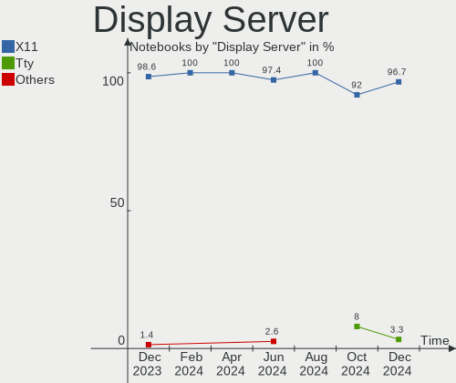
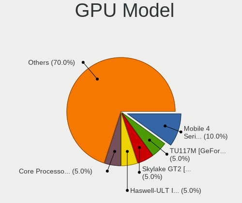
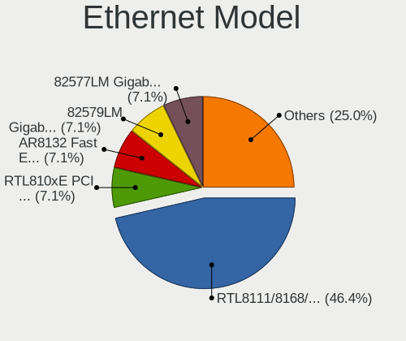

BlackPanther Hardware Trends (Notebook)
---------------------------------------

A project to identify most popular hardware characteristics and track their change
over time based on data collected by BlackPanther users at https://Linux-Hardware.org.

Anyone can contribute to the study by uploading probes of their computers by
the [hw-probe](https://github.com/linuxhw/hw-probe) tool:

    sudo -E hw-probe -all -upload

Full-feature report is available here: https://linux-hardware.org/?view=trends&formfactor=notebook

Period: Dec, 2020.

Contents
--------

- [ OS                       ](#os)
- [ OS Family                ](#os-family)
- [ Kernel                   ](#kernel)
- [ Kernel Family            ](#kernel-family)
- [ Kernel Major Ver.        ](#kernel-major-ver)
- [ Arch                     ](#arch)
- [ DE                       ](#de)
- [ Display Server           ](#display-server)
- [ Display Manager          ](#display-manager)
- [ OS Lang                  ](#os-lang)
- [ Boot Mode                ](#boot-mode)
- [ Filesystem               ](#filesystem)
- [ Part. scheme             ](#part-scheme)
- [ Dual Boot with Linux/BSD ](#dual-boot-with-linux/bsd)
- [ Dual Boot (Win)          ](#dual-boot-win)
- [ Country                  ](#country)
- [ City                     ](#city)
- [ Vendor                   ](#vendor)
- [ Model                    ](#model)
- [ Model Family             ](#model-family)
- [ MFG Year                 ](#mfg-year)
- [ Form Factor              ](#form-factor)
- [ Secure Boot              ](#secure-boot)
- [ Coreboot                 ](#coreboot)
- [ RAM Size                 ](#ram-size)
- [ RAM Used                 ](#ram-used)
- [ Has CD-ROM               ](#has-cd-rom)
- [ Total Drives             ](#total-drives)
- [ Has Ethernet             ](#has-ethernet)
- [ Drive Vendor             ](#drive-vendor)
- [ Drive Model              ](#drive-model)
- [ HDD Vendor               ](#hdd-vendor)
- [ SSD Vendor               ](#ssd-vendor)
- [ Drive Kind               ](#drive-kind)
- [ Drive Connector          ](#drive-connector)
- [ Drive Size               ](#drive-size)
- [ Space Total              ](#space-total)
- [ Space Used               ](#space-used)
- [ Malfunc. Drives          ](#malfunc-drives)
- [ Malfunc. Drive Vendor    ](#malfunc-drive-vendor)
- [ Malfunc. HDD Vendor      ](#malfunc-hdd-vendor)
- [ Malfunc. Drive Kind      ](#malfunc-drive-kind)
- [ Failed Drives            ](#failed-drives)
- [ Failed Drive Vendor      ](#failed-drive-vendor)
- [ Drive Status             ](#drive-status)
- [ Storage Vendor           ](#storage-vendor)
- [ Storage Model            ](#storage-model)
- [ Storage Kind             ](#storage-kind)
- [ CPU Vendor               ](#cpu-vendor)
- [ CPU Model                ](#cpu-model)
- [ CPU Model Family         ](#cpu-model-family)
- [ CPU Cores                ](#cpu-cores)
- [ CPU Sockets              ](#cpu-sockets)
- [ CPU Threads              ](#cpu-threads)
- [ CPU Op-Modes             ](#cpu-op-modes)
- [ CPU Microcode            ](#cpu-microcode)
- [ CPU Microarch            ](#cpu-microarch)
- [ GPU Vendor               ](#gpu-vendor)
- [ GPU Model                ](#gpu-model)
- [ GPU Combo                ](#gpu-combo)
- [ GPU Driver               ](#gpu-driver)
- [ GPU Memory               ](#gpu-memory)
- [ Monitor Vendor           ](#monitor-vendor)
- [ Monitor Model            ](#monitor-model)
- [ Monitor Resolution       ](#monitor-resolution)
- [ Monitor Diagonal         ](#monitor-diagonal)
- [ Monitor Width            ](#monitor-width)
- [ Aspect Ratio             ](#aspect-ratio)
- [ Monitor Area             ](#monitor-area)
- [ Pixel Density            ](#pixel-density)
- [ Multiple Monitors        ](#multiple-monitors)
- [ Net Controller Vendor    ](#net-controller-vendor)
- [ Net Controller Model     ](#net-controller-model)
- [ Wireless Vendor          ](#wireless-vendor)
- [ Wireless Model           ](#wireless-model)
- [ Ethernet Vendor          ](#ethernet-vendor)
- [ Ethernet Model           ](#ethernet-model)
- [ Net Controller Kind      ](#net-controller-kind)
- [ Used Controller          ](#used-controller)
- [ NICs                     ](#nics)
- [ Memory Vendor            ](#memory-vendor)
- [ Memory Model             ](#memory-model)
- [ Memory Kind              ](#memory-kind)
- [ Memory Form Factor       ](#memory-form-factor)
- [ Memory Size              ](#memory-size)
- [ Memory Speed             ](#memory-speed)
- [ Sound Vendor             ](#sound-vendor)
- [ Sound Model              ](#sound-model)
- [ Camera Vendor            ](#camera-vendor)
- [ Camera Model             ](#camera-model)
- [ Fingerprint Vendor       ](#fingerprint-vendor)
- [ Fingerprint Model        ](#fingerprint-model)
- [ Chipcard Vendor          ](#chipcard-vendor)
- [ Chipcard Model           ](#chipcard-model)
- [ Printer Vendor           ](#printer-vendor)
- [ Printer Model            ](#printer-model)
- [ Scanner Vendor           ](#scanner-vendor)
- [ Scanner Model            ](#scanner-model)
- [ Bluetooth Vendor         ](#bluetooth-vendor)
- [ Bluetooth Model          ](#bluetooth-model)
- [ Unsupported Devices      ](#unsupported-devices)
- [ Unsupported Device Types ](#unsupported-device-types)

OS
--

Installed operating systems

| Name              | Notebooks | Percent |
|-------------------|-----------|---------|
| BlackPanther 18.1 | 105       | 94.59%  |
| BlackPanther 16.2 | 6         | 5.41%   |

OS Family
---------

OS without a version

| Name         | Notebooks | Percent |
|--------------|-----------|---------|
| BlackPanther | 111       | 100%    |

Kernel
------

Version of the Linux kernel

| Version                | Notebooks | Percent |
|------------------------|-----------|---------|
| 4.18.16-desktop-1bP    | 97        | 87.39%  |
| 5.6.14-desktop-2bP     | 7         | 6.31%   |
| 4.9.20-desktop-pae-1bP | 6         | 5.41%   |
| 5.8.11-desktop-2bP     | 1         | 0.9%    |

Kernel Family
-------------

Linux kernel without a distro release

| Version | Notebooks | Percent |
|---------|-----------|---------|
| 4.18.16 | 97        | 87.39%  |
| 5.6.14  | 7         | 6.31%   |
| 4.9.20  | 6         | 5.41%   |
| 5.8.11  | 1         | 0.9%    |

Kernel Major Ver.
-----------------

Linux kernel major version

| Version | Notebooks | Percent |
|---------|-----------|---------|
| 4.18    | 97        | 87.39%  |
| 5.6     | 7         | 6.31%   |
| 4.9     | 6         | 5.41%   |
| 5.8     | 1         | 0.9%    |

Arch
----

OS architecture (x86_64, i586, etc.)

| Name   | Notebooks | Percent |
|--------|-----------|---------|
| x86_64 | 105       | 94.59%  |
| i686   | 6         | 5.41%   |

DE
--

Desktop Environment

| Name    | Notebooks | Percent |
|---------|-----------|---------|
| KDE5    | 109       | 98.2%   |
| Unknown | 2         | 1.8%    |

Display Server
--------------

X11 or Wayland

| Name | Notebooks | Percent |
|------|-----------|---------|
| X11  | 111       | 100%    |

Display Manager
---------------

SDDM, LightDM, etc.

| Name | Notebooks | Percent |
|------|-----------|---------|
| SDDM | 111       | 100%    |

OS Lang
-------

Language

| Lang    | Notebooks | Percent |
|---------|-----------|---------|
| Unknown | 111       | 100%    |

Boot Mode
---------

EFI or BIOS

| Mode | Notebooks | Percent |
|------|-----------|---------|
| BIOS | 76        | 68.47%  |
| EFI  | 35        | 31.53%  |

Filesystem
----------

Type of filesystem

| Type    | Notebooks | Percent |
|---------|-----------|---------|
| Overlay | 90        | 81.08%  |
| Ext4    | 20        | 18.02%  |
| Ext2    | 1         | 0.9%    |

Part. scheme
------------

Scheme of partitioning

| Type | Notebooks | Percent |
|------|-----------|---------|
| MBR  | 71        | 63.96%  |
| GPT  | 40        | 36.04%  |

Dual Boot with Linux/BSD
------------------------

Hosting more than one Linux/BSD

| Dual boot | Notebooks | Percent |
|-----------|-----------|---------|
| No        | 67        | 60.36%  |
| Yes       | 44        | 39.64%  |

Dual Boot (Win)
---------------

Hosting Linux and Windows

| Dual boot | Notebooks | Percent |
|-----------|-----------|---------|
| Yes       | 60        | 54.05%  |
| No        | 51        | 45.95%  |

Country
-------

Geographic location (country)

| Country     | Notebooks | Percent |
|-------------|-----------|---------|
| Hungary     | 89        | 80.18%  |
| Germany     | 6         | 5.41%   |
| UK          | 2         | 1.8%    |
| Romania     | 2         | 1.8%    |
| France      | 2         | 1.8%    |
| Brazil      | 2         | 1.8%    |
| USA         | 1         | 0.9%    |
| Thailand    | 1         | 0.9%    |
| Switzerland | 1         | 0.9%    |
| Slovakia    | 1         | 0.9%    |
| Philippines | 1         | 0.9%    |
| Netherlands | 1         | 0.9%    |
| Italy       | 1         | 0.9%    |
| Australia   | 1         | 0.9%    |

City
----

Geographic location (city)

| City                      | Notebooks | Percent |
|---------------------------|-----------|---------|
| Budapest                  | 32        | 28.83%  |
| Debrecen                  | 4         | 3.6%    |
| Zalaegerszeg              | 3         | 2.7%    |
| Székesfehérvár         | 3         | 2.7%    |
| Győr                     | 3         | 2.7%    |
| Veszprém                 | 2         | 1.8%    |
| Tatabánya                | 2         | 1.8%    |
| Szigetszentmiklos         | 2         | 1.8%    |
| Szekszárd                | 2         | 1.8%    |
| Pécs                     | 2         | 1.8%    |
| Nyiregyhaza               | 2         | 1.8%    |
| Kazincbarcika             | 2         | 1.8%    |
| Dittenheim                | 2         | 1.8%    |
| Zsambek                   | 1         | 0.9%    |
| Ullo                      | 1         | 0.9%    |
| Teuchern                  | 1         | 0.9%    |
| Tata                      | 1         | 0.9%    |
| Tarcal                    | 1         | 0.9%    |
| Tap                       | 1         | 0.9%    |
| Szeged                    | 1         | 0.9%    |
| Sydney                    | 1         | 0.9%    |
| Sutto                     | 1         | 0.9%    |
| Salvador                  | 1         | 0.9%    |
| Saint-Gilles-Croix-de-Vie | 1         | 0.9%    |
| Pusztahencse              | 1         | 0.9%    |
| Portland                  | 1         | 0.9%    |
| Papa                      | 1         | 0.9%    |
| Oroshaza                  | 1         | 0.9%    |
| Nuremberg                 | 1         | 0.9%    |
| Naszaly                   | 1         | 0.9%    |
| Miskolc                   | 1         | 0.9%    |
| Mezokovesd                | 1         | 0.9%    |
| Mateszalka                | 1         | 0.9%    |
| Lowestoft                 | 1         | 0.9%    |
| Lido di Ostia             | 1         | 0.9%    |
| Leeds                     | 1         | 0.9%    |
| Laren                     | 1         | 0.9%    |
| Kunszentmiklos            | 1         | 0.9%    |
| Korosladany               | 1         | 0.9%    |
| Kecskemét                | 1         | 0.9%    |
| Karcag                    | 1         | 0.9%    |
| Karancslapujto            | 1         | 0.9%    |
| Heilbronn                 | 1         | 0.9%    |
| Hajduszoboszlo            | 1         | 0.9%    |
| Gödöllő                | 1         | 0.9%    |
| Gyorujbarat               | 1         | 0.9%    |
| Fulleren                  | 1         | 0.9%    |
| Frauenau                  | 1         | 0.9%    |
| Dunaújváros             | 1         | 0.9%    |
| Deva                      | 1         | 0.9%    |
| Davao City                | 1         | 0.9%    |
| Cserszegtomaj             | 1         | 0.9%    |
| Chiang Rai                | 1         | 0.9%    |
| Budajeno                  | 1         | 0.9%    |
| Bucharest                 | 1         | 0.9%    |
| Bratislava                | 1         | 0.9%    |
| Bekessamson               | 1         | 0.9%    |
| Barra Mansa               | 1         | 0.9%    |
| Balassagyarmat            | 1         | 0.9%    |
| Bag                       | 1         | 0.9%    |

Vendor
------

Motherboard manufacturer

| Name                | Notebooks | Percent |
|---------------------|-----------|---------|
| Hewlett-Packard     | 29        | 26.13%  |
| Lenovo              | 17        | 15.32%  |
| Dell                | 17        | 15.32%  |
| ASUSTek Computer    | 16        | 14.41%  |
| Acer                | 13        | 11.71%  |
| Toshiba             | 5         | 4.5%    |
| Samsung Electronics | 5         | 4.5%    |
| Fujitsu Siemens     | 3         | 2.7%    |
| Packard Bell        | 2         | 1.8%    |
| Notebook            | 1         | 0.9%    |
| Fujitsu             | 1         | 0.9%    |
| eMachines           | 1         | 0.9%    |
| Alcor               | 1         | 0.9%    |

Model
-----

Motherboard model

| Name                                       | Notebooks | Percent |
|--------------------------------------------|-----------|---------|
| HP EliteBook 8440p                         | 2         | 1.8%    |
| HP 250 G1                                  | 2         | 1.8%    |
| Dell Latitude E5500                        | 2         | 1.8%    |
| Dell Latitude E4310                        | 2         | 1.8%    |
| Dell Inspiron 1525                         | 2         | 1.8%    |
| ASUS K53E                                  | 2         | 1.8%    |
| Acer Aspire 5732Z                          | 2         | 1.8%    |
| Unknown                                    | 2         | 1.8%    |
| Toshiba Satellite Pro L300                 | 1         | 0.9%    |
| Toshiba Satellite P300                     | 1         | 0.9%    |
| Toshiba Satellite P100                     | 1         | 0.9%    |
| Toshiba Satellite L750                     | 1         | 0.9%    |
| Toshiba Satellite C660                     | 1         | 0.9%    |
| Samsung N150/N210/N220                     | 1         | 0.9%    |
| Samsung 905S3G/906S3G/915S3G/9305SG        | 1         | 0.9%    |
| Samsung 730U3E/740U3E                      | 1         | 0.9%    |
| Samsung 300V3A/300V4A/300V5A/200A4B/200A5B | 1         | 0.9%    |
| Samsung 300E4A/300E5A/300E7A/3430EA/3530EA | 1         | 0.9%    |
| Packard Bell EasyNote TS11HR               | 1         | 0.9%    |
| Packard Bell EasyNote TE11HC               | 1         | 0.9%    |
| Notebook Satori                            | 1         | 0.9%    |
| Lenovo V145-15AST 81MT                     | 1         | 0.9%    |
| Lenovo ThinkPad W510 431924G               | 1         | 0.9%    |
| Lenovo ThinkPad T61 6458WK6                | 1         | 0.9%    |
| Lenovo ThinkPad T400 6474E18               | 1         | 0.9%    |
| Lenovo ThinkPad T400 2768G17               | 1         | 0.9%    |
| Lenovo IdeaPad Z570 HuronRiver Platform    | 1         | 0.9%    |
| Lenovo IdeaPad L340-17IRH Gaming 81LL      | 1         | 0.9%    |
| Lenovo IdeaPad 520-15IKB 81BF              | 1         | 0.9%    |
| Lenovo IdeaPad 510-15ISK 80SR              | 1         | 0.9%    |
| Lenovo IdeaPad 330-15IKB 81FE              | 1         | 0.9%    |
| Lenovo IdeaPad 330-15IKB 81DE              | 1         | 0.9%    |
| Lenovo IdeaPad 320-15IAP 80XR              | 1         | 0.9%    |
| Lenovo IdeaPad 305-15IBD 80NJ              | 1         | 0.9%    |
| Lenovo G550 20023                          | 1         | 0.9%    |
| Lenovo G50-45 80E3                         | 1         | 0.9%    |
| Lenovo G50-30 80G0                         | 1         | 0.9%    |
| Lenovo B50-70 80EU                         | 1         | 0.9%    |
| HP ProBook 6570b                           | 1         | 0.9%    |
| HP ProBook 6560b                           | 1         | 0.9%    |
| HP ProBook 6460b                           | 1         | 0.9%    |
| HP ProBook 640 G2                          | 1         | 0.9%    |
| HP ProBook 4510s                           | 1         | 0.9%    |
| HP Pavilion g7                             | 1         | 0.9%    |
| HP Pavilion g6                             | 1         | 0.9%    |
| HP Pavilion dv6                            | 1         | 0.9%    |
| HP Pavilion 15                             | 1         | 0.9%    |
| HP Pavilion 11 x360 PC                     | 1         | 0.9%    |
| HP OMEN by HP Laptop 15-ce0xx              | 1         | 0.9%    |
| HP Notebook                                | 1         | 0.9%    |
| HP Laptop 15-db0xxx                        | 1         | 0.9%    |
| HP G56                                     | 1         | 0.9%    |
| HP EliteBook 8570p                         | 1         | 0.9%    |
| HP Compaq 6715b (GB835EA#AKC)              | 1         | 0.9%    |
| HP Compaq 615                              | 1         | 0.9%    |
| HP 650                                     | 1         | 0.9%    |
| HP 635                                     | 1         | 0.9%    |
| HP 530                                     | 1         | 0.9%    |
| HP 255 G2                                  | 1         | 0.9%    |
| HP 250 G4                                  | 1         | 0.9%    |

Model Family
------------

Motherboard model prefix

| Name                  | Notebooks | Percent |
|-----------------------|-----------|---------|
| Acer Aspire           | 10        | 9.01%   |
| Dell Latitude         | 9         | 8.11%   |
| Lenovo IdeaPad        | 8         | 7.21%   |
| Dell Inspiron         | 6         | 5.41%   |
| Toshiba Satellite     | 5         | 4.5%    |
| HP ProBook            | 5         | 4.5%    |
| HP Pavilion           | 5         | 4.5%    |
| Lenovo ThinkPad       | 4         | 3.6%    |
| HP 250                | 4         | 3.6%    |
| HP EliteBook          | 3         | 2.7%    |
| Fujitsu Siemens AMILO | 3         | 2.7%    |
| ASUS VivoBook         | 3         | 2.7%    |
| Packard Bell EasyNote | 2         | 1.8%    |
| HP Compaq             | 2         | 1.8%    |
| ASUS K53E             | 2         | 1.8%    |
| Unknown               | 2         | 1.8%    |
| Samsung N150          | 1         | 0.9%    |
| Samsung 905S3G        | 1         | 0.9%    |
| Samsung 730U3E        | 1         | 0.9%    |
| Samsung 300V3A        | 1         | 0.9%    |
| Samsung 300E4A        | 1         | 0.9%    |
| Notebook Satori       | 1         | 0.9%    |
| Lenovo V145-15AST     | 1         | 0.9%    |
| Lenovo G550           | 1         | 0.9%    |
| Lenovo G50-45         | 1         | 0.9%    |
| Lenovo G50-30         | 1         | 0.9%    |
| Lenovo B50-70         | 1         | 0.9%    |
| HP OMEN               | 1         | 0.9%    |
| HP Notebook           | 1         | 0.9%    |
| HP Laptop             | 1         | 0.9%    |
| HP G56                | 1         | 0.9%    |
| HP 650                | 1         | 0.9%    |
| HP 635                | 1         | 0.9%    |
| HP 530                | 1         | 0.9%    |
| HP 255                | 1         | 0.9%    |
| Fujitsu CELSIUS       | 1         | 0.9%    |
| eMachines eME730G     | 1         | 0.9%    |
| Dell Precision        | 1         | 0.9%    |
| Dell G3               | 1         | 0.9%    |
| ASUS X540SA           | 1         | 0.9%    |
| ASUS TUF              | 1         | 0.9%    |
| ASUS Strix            | 1         | 0.9%    |
| ASUS N55SF            | 1         | 0.9%    |
| ASUS K54L             | 1         | 0.9%    |
| ASUS K53SK            | 1         | 0.9%    |
| ASUS K52Jr            | 1         | 0.9%    |
| ASUS G752VT           | 1         | 0.9%    |
| ASUS G73Sw            | 1         | 0.9%    |
| ASUS F9E              | 1         | 0.9%    |
| ASUS F5N              | 1         | 0.9%    |
| Alcor Flashbook       | 1         | 0.9%    |
| Acer TravelMate       | 1         | 0.9%    |
| Acer E1-572G          | 1         | 0.9%    |
| Acer AO532h           | 1         | 0.9%    |

MFG Year
--------

Motherboard manufacture year

| Year    | Notebooks | Percent |
|---------|-----------|---------|
| 2011    | 13        | 11.71%  |
| 2009    | 11        | 9.91%   |
| 2018    | 10        | 9.01%   |
| 2013    | 10        | 9.01%   |
| 2012    | 9         | 8.11%   |
| 2010    | 8         | 7.21%   |
| 2008    | 8         | 7.21%   |
| 2020    | 7         | 6.31%   |
| 2019    | 7         | 6.31%   |
| 2014    | 7         | 6.31%   |
| 2016    | 6         | 5.41%   |
| 2015    | 6         | 5.41%   |
| 2017    | 5         | 4.5%    |
| 2007    | 3         | 2.7%    |
| Unknown | 1         | 0.9%    |

Form Factor
-----------

Physical design of the computer

| Name     | Notebooks | Percent |
|----------|-----------|---------|
| Notebook | 111       | 100%    |

Secure Boot
-----------

Enabled or disabled

| State    | Notebooks | Percent |
|----------|-----------|---------|
| Disabled | 111       | 100%    |

Coreboot
--------

Have coreboot on board

| Used | Notebooks | Percent |
|------|-----------|---------|
| No   | 111       | 100%    |

RAM Size
--------

Total RAM memory

| Size in GB | Notebooks | Percent |
|------------|-----------|---------|
| 3.01-4.0   | 41        | 36.94%  |
| 1.01-2.0   | 22        | 19.82%  |
| 8.01-16.0  | 18        | 16.22%  |
| 4.01-8.0   | 17        | 15.32%  |
| 16.01-24.0 | 7         | 6.31%   |
| 2.01-3.0   | 4         | 3.6%    |
| 24.01-32.0 | 2         | 1.8%    |

RAM Used
--------

Used RAM memory

| Used GB  | Notebooks | Percent |
|----------|-----------|---------|
| 0.51-1.0 | 65        | 58.56%  |
| 1.01-2.0 | 30        | 27.03%  |
| 0.01-0.5 | 14        | 12.61%  |
| 4.01-8.0 | 1         | 0.9%    |
| 2.01-3.0 | 1         | 0.9%    |

Has CD-ROM
----------

Has CD-ROM on board

| Presented | Notebooks | Percent |
|-----------|-----------|---------|
| Yes       | 79        | 71.17%  |
| No        | 32        | 28.83%  |

Total Drives
------------

Number of drives on board

| Drives | Notebooks | Percent |
|--------|-----------|---------|
| 1      | 89        | 80.18%  |
| 2      | 18        | 16.22%  |
| 3      | 2         | 1.8%    |
| 4      | 1         | 0.9%    |
| 0      | 1         | 0.9%    |

Has Ethernet
------------

Has Ethernet on board

| Presented | Notebooks | Percent |
|-----------|-----------|---------|
| Yes       | 104       | 93.69%  |
| No        | 7         | 6.31%   |

Drive Vendor
------------

Hard drive vendors

| Vendor              | Notebooks | Drives | Percent |
|---------------------|-----------|--------|---------|
| Seagate             | 28        | 28     | 20.74%  |
| WDC                 | 19        | 19     | 14.07%  |
| Toshiba             | 17        | 18     | 12.59%  |
| Kingston            | 15        | 16     | 11.11%  |
| Samsung Electronics | 12        | 13     | 8.89%   |
| Hitachi             | 10        | 10     | 7.41%   |
| HGST                | 9         | 9      | 6.67%   |
| SanDisk             | 4         | 4      | 2.96%   |
| Micron Technology   | 3         | 3      | 2.22%   |
| Crucial             | 3         | 3      | 2.22%   |
| Unknown             | 2         | 4      | 1.48%   |
| Fujitsu             | 2         | 2      | 1.48%   |
| A-DATA Technology   | 2         | 2      | 1.48%   |
| SPCC                | 1         | 1      | 0.74%   |
| PNY                 | 1         | 1      | 0.74%   |
| PLEXTOR             | 1         | 1      | 0.74%   |
| LITEON              | 1         | 1      | 0.74%   |
| Intenso             | 1         | 1      | 0.74%   |
| Intel               | 1         | 1      | 0.74%   |
| HGST HTS            | 1         | 1      | 0.74%   |
| Gigabyte Technology | 1         | 1      | 0.74%   |
| Apacer              | 1         | 1      | 0.74%   |

Drive Model
-----------

Hard drive models

| Model                              | Notebooks | Percent |
|------------------------------------|-----------|---------|
| Seagate ST500LT012-1DG142 500GB    | 5         | 3.6%    |
| Kingston SA400S37240G 240GB SSD    | 5         | 3.6%    |
| Toshiba MQ01ABF050 500GB           | 4         | 2.88%   |
| Seagate ST1000LM035-1RK172 1TB     | 4         | 2.88%   |
| WDC WD1600BEVT-22ZCT0 160GB        | 3         | 2.16%   |
| Seagate ST9320325AS 320GB          | 3         | 2.16%   |
| HGST HTS721010A9E630 1TB           | 3         | 2.16%   |
| WDC WD3200BEVT-22ZCT0 320GB        | 2         | 1.44%   |
| WDC WD10JPVX-22JC3T0 1TB           | 2         | 1.44%   |
| Toshiba MQ01ABD100 1TB             | 2         | 1.44%   |
| Toshiba MQ01ABD050V 500GB          | 2         | 1.44%   |
| Seagate ST9750423AS 752GB          | 2         | 1.44%   |
| Kingston SUV400S37120G 120GB SSD   | 2         | 1.44%   |
| Kingston SA400S37480G 480GB SSD    | 2         | 1.44%   |
| Hitachi HTS543232A7A384 320GB      | 2         | 1.44%   |
| HGST HTS545050A7E680 500GB         | 2         | 1.44%   |
| Crucial CT120BX500SSD1 120GB       | 2         | 1.44%   |
| WDC WDS500G2B0A-00SM50 500GB SSD   | 1         | 0.72%   |
| WDC WDS120G2G0A-00JH30 120GB SSD   | 1         | 0.72%   |
| WDC WD7500BPVT-22HXZT3 752GB       | 1         | 0.72%   |
| WDC WD40 0BD-75MRA1 40GB           | 1         | 0.72%   |
| WDC WD3200BPVT-80JJ5T0 320GB       | 1         | 0.72%   |
| WDC WD3200BPVT-22JJ5T0 320GB       | 1         | 0.72%   |
| WDC WD3200BPVT-00JJ5T0 320GB       | 1         | 0.72%   |
| WDC WD2500LPCX-24C6HT0 250GB       | 1         | 0.72%   |
| WDC WD1600BEVT-75ZCT2 160GB        | 1         | 0.72%   |
| WDC WD10SPZX-24Z10T0 1TB           | 1         | 0.72%   |
| WDC WD10SPCX-11HWST0 1TB           | 1         | 0.72%   |
| WDC WD10JPVX-60JC3T0 1TB           | 1         | 0.72%   |
| Unknown SLD64G  64GB               | 1         | 0.72%   |
| Unknown SD16G  16GB                | 1         | 0.72%   |
| Unknown JAJM600M128C 128GB SSD     | 1         | 0.72%   |
| Unknown 00000  32GB                | 1         | 0.72%   |
| Toshiba TL100 120GB SSD            | 1         | 0.72%   |
| Toshiba MQ04ABF100 1TB             | 1         | 0.72%   |
| Toshiba MQ01ACF050 500GB           | 1         | 0.72%   |
| Toshiba MQ01ABD075 752GB           | 1         | 0.72%   |
| Toshiba MK8009GAH 80GB             | 1         | 0.72%   |
| Toshiba MK5061GSYN 500GB           | 1         | 0.72%   |
| Toshiba MK1655GSX 160GB            | 1         | 0.72%   |
| Toshiba MK1652GSX 160GB            | 1         | 0.72%   |
| Toshiba KXG50ZNV256G 256GB         | 1         | 0.72%   |
| SPCC Solid State Disk 256GB        | 1         | 0.72%   |
| Seagate ST980811AS 80GB            | 1         | 0.72%   |
| Seagate ST95005620AS 500GB         | 1         | 0.72%   |
| Seagate ST9500325AS 500GB          | 1         | 0.72%   |
| Seagate ST9320423AS 320GB          | 1         | 0.72%   |
| Seagate ST9250410AS 250GB          | 1         | 0.72%   |
| Seagate ST9160412AS 160GB          | 1         | 0.72%   |
| Seagate ST500LT012-9WS142 500GB    | 1         | 0.72%   |
| Seagate ST500LM000-1EJ162 500GB    | 1         | 0.72%   |
| Seagate ST320LT009-9WC142 320GB    | 1         | 0.72%   |
| Seagate ST2000LM015-2E8174 2TB     | 1         | 0.72%   |
| Seagate ST2000LM003 HN-M201RAD 2TB | 1         | 0.72%   |
| Seagate ST1000LX015-1U7172 1TB     | 1         | 0.72%   |
| Seagate ST1000LM049-2GH172 1TB     | 1         | 0.72%   |
| Seagate ST1000LM024 HN-M101MBB 1TB | 1         | 0.72%   |
| SanDisk SSD PLUS 240GB             | 1         | 0.72%   |
| SanDisk SSD PLUS 1000GB            | 1         | 0.72%   |
| SanDisk SL32G  32GB                | 1         | 0.72%   |

HDD Vendor
----------

Hard disk drive vendors

| Vendor              | Notebooks | Drives | Percent |
|---------------------|-----------|--------|---------|
| Seagate             | 28        | 28     | 33.33%  |
| WDC                 | 17        | 17     | 20.24%  |
| Toshiba             | 15        | 16     | 17.86%  |
| Hitachi             | 10        | 10     | 11.9%   |
| HGST                | 9         | 9      | 10.71%  |
| Samsung Electronics | 3         | 3      | 3.57%   |
| Fujitsu             | 2         | 2      | 2.38%   |

SSD Vendor
----------

Solid state drive vendors

| Vendor              | Notebooks | Drives | Percent |
|---------------------|-----------|--------|---------|
| Kingston            | 15        | 16     | 34.88%  |
| Samsung Electronics | 7         | 7      | 16.28%  |
| SanDisk             | 3         | 3      | 6.98%   |
| Crucial             | 3         | 3      | 6.98%   |
| WDC                 | 2         | 2      | 4.65%   |
| Micron Technology   | 2         | 2      | 4.65%   |
| A-DATA Technology   | 2         | 2      | 4.65%   |
| Unknown             | 1         | 1      | 2.33%   |
| Toshiba             | 1         | 1      | 2.33%   |
| SPCC                | 1         | 1      | 2.33%   |
| PNY                 | 1         | 1      | 2.33%   |
| LITEON              | 1         | 1      | 2.33%   |
| Intenso             | 1         | 1      | 2.33%   |
| Intel               | 1         | 1      | 2.33%   |
| Gigabyte Technology | 1         | 1      | 2.33%   |
| Apacer              | 1         | 1      | 2.33%   |

Drive Kind
----------

HDD or SSD

| Kind    | Notebooks | Drives | Percent |
|---------|-----------|--------|---------|
| HDD     | 79        | 85     | 60.77%  |
| SSD     | 43        | 44     | 33.08%  |
| NVMe    | 4         | 6      | 3.08%   |
| MMC     | 3         | 4      | 2.31%   |
| Unknown | 1         | 1      | 0.77%   |

Drive Connector
---------------

SATA, SAS, NVMe, etc.

| Type | Notebooks | Drives | Percent |
|------|-----------|--------|---------|
| SATA | 109       | 128    | 92.37%  |
| NVMe | 4         | 6      | 3.39%   |
| MMC  | 3         | 4      | 2.54%   |
| SAS  | 2         | 2      | 1.69%   |

Drive Size
----------

Size of hard drive

| Size in TB | Notebooks | Drives | Percent |
|------------|-----------|--------|---------|
| 0.01-0.5   | 90        | 101    | 76.92%  |
| 0.51-1.0   | 25        | 25     | 21.37%  |
| 1.01-2.0   | 2         | 3      | 1.71%   |

Space Total
-----------

Amount of disk space available on the file system

| Size in GB | Notebooks | Percent |
|------------|-----------|---------|
| Unknown    | 83        | 74.77%  |
| 101-250    | 10        | 9.01%   |
| 51-100     | 6         | 5.41%   |
| 251-500    | 5         | 4.5%    |
| 501-1000   | 4         | 3.6%    |
| 1-20       | 2         | 1.8%    |
| 1001-2000  | 1         | 0.9%    |

Space Used
----------

Amount of used disk space

| Used GB  | Notebooks | Percent |
|----------|-----------|---------|
| Unknown  | 83        | 74.77%  |
| 1-20     | 20        | 18.02%  |
| 101-250  | 4         | 3.6%    |
| 251-500  | 1         | 0.9%    |
| 21-50    | 1         | 0.9%    |
| 501-1000 | 1         | 0.9%    |
| 51-100   | 1         | 0.9%    |

Malfunc. Drives
---------------

Drive models with a malfunction

| Model                               | Notebooks | Drives | Percent |
|-------------------------------------|-----------|--------|---------|
| Toshiba MQ01ABF050 500GB            | 2         | 2      | 5.71%   |
| Seagate ST9320325AS 320GB           | 2         | 2      | 5.71%   |
| HGST HTS545050A7E680 500GB          | 2         | 2      | 5.71%   |
| WDC WD3200BPVT-00JJ5T0 320GB        | 1         | 1      | 2.86%   |
| WDC WD3200BEVT-22ZCT0 320GB         | 1         | 1      | 2.86%   |
| WDC WD10SPZX-24Z10T0 1TB            | 1         | 1      | 2.86%   |
| WDC WD10SPCX-11HWST0 1TB            | 1         | 1      | 2.86%   |
| WDC WD10JPVX-22JC3T0 1TB            | 1         | 1      | 2.86%   |
| Toshiba MQ01ABD075 752GB            | 1         | 1      | 2.86%   |
| Toshiba MK8009GAH 80GB              | 1         | 1      | 2.86%   |
| Toshiba MK1655GSX 160GB             | 1         | 1      | 2.86%   |
| Toshiba MK1652GSX 160GB             | 1         | 1      | 2.86%   |
| Seagate ST9750423AS 752GB           | 1         | 1      | 2.86%   |
| Seagate ST95005620AS 500GB          | 1         | 1      | 2.86%   |
| Seagate ST9320423AS 320GB           | 1         | 1      | 2.86%   |
| Seagate ST9250410AS 250GB           | 1         | 1      | 2.86%   |
| Seagate ST500LT012-9WS142 500GB     | 1         | 1      | 2.86%   |
| Seagate ST500LM000-1EJ162 500GB     | 1         | 1      | 2.86%   |
| Seagate ST1000LX015-1U7172 1TB      | 1         | 1      | 2.86%   |
| Seagate ST1000LM024 HN-M101MBB 1TB  | 1         | 1      | 2.86%   |
| Samsung Electronics HM321HI 320GB   | 1         | 1      | 2.86%   |
| Samsung Electronics HM160HI 160GB   | 1         | 1      | 2.86%   |
| Kingston RBU-SNS8151S396GG 96GB SSD | 1         | 1      | 2.86%   |
| Hitachi HTS723216L9A360 160GB       | 1         | 1      | 2.86%   |
| Hitachi HTS547550A9E384 500GB       | 1         | 1      | 2.86%   |
| Hitachi HTS545050A7E380 500GB       | 1         | 1      | 2.86%   |
| Hitachi HTS545025B9A300 250GB       | 1         | 1      | 2.86%   |
| Hitachi HTS543232A7A384 320GB       | 1         | 1      | 2.86%   |
| Hitachi HTS542525K9SA00 250GB       | 1         | 1      | 2.86%   |
| HGST HTS545032A7E380 320GB          | 1         | 1      | 2.86%   |
| HGST HTS541075A9E680 752GB          | 1         | 1      | 2.86%   |
| Fujitsu MHY2120BH 120GB             | 1         | 1      | 2.86%   |

Malfunc. Drive Vendor
---------------------

Vendors of faulty drives

| Vendor              | Notebooks | Drives | Percent |
|---------------------|-----------|--------|---------|
| Seagate             | 10        | 10     | 28.57%  |
| Toshiba             | 6         | 6      | 17.14%  |
| Hitachi             | 6         | 6      | 17.14%  |
| WDC                 | 5         | 5      | 14.29%  |
| HGST                | 4         | 4      | 11.43%  |
| Samsung Electronics | 2         | 2      | 5.71%   |
| Kingston            | 1         | 1      | 2.86%   |
| Fujitsu             | 1         | 1      | 2.86%   |

Malfunc. HDD Vendor
-------------------

Vendors of faulty HDD drives

| Vendor              | Notebooks | Drives | Percent |
|---------------------|-----------|--------|---------|
| Seagate             | 10        | 10     | 29.41%  |
| Toshiba             | 6         | 6      | 17.65%  |
| Hitachi             | 6         | 6      | 17.65%  |
| WDC                 | 5         | 5      | 14.71%  |
| HGST                | 4         | 4      | 11.76%  |
| Samsung Electronics | 2         | 2      | 5.88%   |
| Fujitsu             | 1         | 1      | 2.94%   |

Malfunc. Drive Kind
-------------------

Kinds of faulty drives

| Kind | Notebooks | Drives | Percent |
|------|-----------|--------|---------|
| HDD  | 34        | 34     | 97.14%  |
| SSD  | 1         | 1      | 2.86%   |

Failed Drives
-------------

Failed drive models

| Model                        | Notebooks | Drives | Percent |
|------------------------------|-----------|--------|---------|
| WDC WD2500LPCX-24C6HT0 250GB | 1         | 1      | 50%     |
| Toshiba MQ01ABD050V 500GB    | 1         | 1      | 50%     |

Failed Drive Vendor
-------------------

Failed drive vendors

| Vendor  | Notebooks | Drives | Percent |
|---------|-----------|--------|---------|
| WDC     | 1         | 1      | 50%     |
| Toshiba | 1         | 1      | 50%     |

Drive Status
------------

Number of failed and malfunc. drives

| Status   | Notebooks | Drives | Percent |
|----------|-----------|--------|---------|
| Works    | 82        | 97     | 66.67%  |
| Malfunc  | 34        | 35     | 27.64%  |
| Detected | 5         | 6      | 4.07%   |
| Failed   | 2         | 2      | 1.63%   |

Storage Vendor
--------------

Storage controller vendors

| Vendor                       | Notebooks | Percent |
|------------------------------|-----------|---------|
| Intel                        | 94        | 80.34%  |
| AMD                          | 15        | 12.82%  |
| Samsung Electronics          | 3         | 2.56%   |
| VIA Technologies             | 1         | 0.85%   |
| Toshiba America Info Systems | 1         | 0.85%   |
| Nvidia                       | 1         | 0.85%   |
| Micron Technology            | 1         | 0.85%   |
| Lite-On Technology           | 1         | 0.85%   |

Storage Model
-------------

Storage controller models

| Model                                                                            | Notebooks | Percent |
|----------------------------------------------------------------------------------|-----------|---------|
| Intel 82801IBM/IEM (ICH9M/ICH9M-E) 4 port SATA Controller [AHCI mode]            | 14        | 10.37%  |
| Intel 6 Series/C200 Series Chipset Family 6 port Mobile SATA AHCI Controller     | 14        | 10.37%  |
| AMD FCH SATA Controller [AHCI mode]                                              | 11        | 8.15%   |
| Intel 7 Series Chipset Family 6-port SATA Controller [AHCI mode]                 | 10        | 7.41%   |
| Intel Sunrise Point-LP SATA Controller [AHCI mode]                               | 9         | 6.67%   |
| Intel 82801HM/HEM (ICH8M/ICH8M-E) IDE Controller                                 | 9         | 6.67%   |
| Intel 82801HM/HEM (ICH8M/ICH8M-E) SATA Controller [AHCI mode]                    | 8         | 5.93%   |
| Intel 82801 Mobile SATA Controller [RAID mode]                                   | 7         | 5.19%   |
| Intel Wildcat Point-LP SATA Controller [AHCI Mode]                               | 5         | 3.7%    |
| Intel 5 Series/3400 Series Chipset 4 port SATA IDE Controller                    | 4         | 2.96%   |
| Intel NM10/ICH7 Family SATA Controller [AHCI mode]                               | 3         | 2.22%   |
| Intel 8 Series SATA Controller 1 [AHCI mode]                                     | 3         | 2.22%   |
| Intel 5 Series/3400 Series Chipset 2 port SATA IDE Controller                    | 3         | 2.22%   |
| Samsung NVMe SSD Controller SM981/PM981/PM983                                    | 2         | 1.48%   |
| Intel Cannon Lake Mobile PCH SATA AHCI Controller                                | 2         | 1.48%   |
| Intel Atom/Celeron/Pentium Processor x5-E8000/J3xxx/N3xxx Series SATA Controller | 2         | 1.48%   |
| Intel Atom Processor E3800 Series SATA AHCI Controller                           | 2         | 1.48%   |
| Intel 5 Series/3400 Series Chipset 6 port SATA AHCI Controller                   | 2         | 1.48%   |
| AMD SB7x0/SB8x0/SB9x0 SATA Controller [AHCI mode]                                | 2         | 1.48%   |
| AMD FCH IDE Controller                                                           | 2         | 1.48%   |
| VIA VT82C586A/B/VT82C686/A/B/VT823x/A/C PIPC Bus Master IDE                      | 1         | 0.74%   |
| VIA VT8237A SATA 2-Port Controller                                               | 1         | 0.74%   |
| Toshiba America Info Systems Toshiba America Info Non-Volatile memory controller | 1         | 0.74%   |
| Samsung NVMe SSD Controller SM961/PM961/SM963                                    | 1         | 0.74%   |
| Nvidia MCP67 IDE Controller                                                      | 1         | 0.74%   |
| Nvidia MCP67 AHCI Controller                                                     | 1         | 0.74%   |
| Micron Non-Volatile memory controller                                            | 1         | 0.74%   |
| Lite-On M8Pe Series NVMe SSD                                                     | 1         | 0.74%   |
| Intel Q170/Q150/B150/H170/H110/Z170/CM236 Chipset SATA Controller [AHCI Mode]    | 1         | 0.74%   |
| Intel Mobile PM965/GM965 PT IDER Controller                                      | 1         | 0.74%   |
| Intel HM170/QM170 Chipset SATA Controller [AHCI Mode]                            | 1         | 0.74%   |
| Intel Celeron N3350/Pentium N4200/Atom E3900 Series SATA AHCI Controller         | 1         | 0.74%   |
| Intel 82801HM/HEM (ICH8M/ICH8M-E) SATA Controller [IDE mode]                     | 1         | 0.74%   |
| Intel 82801GBM/GHM (ICH7-M Family) SATA Controller [IDE mode]                    | 1         | 0.74%   |
| Intel 82801GBM/GHM (ICH7-M Family) SATA Controller [AHCI mode]                   | 1         | 0.74%   |
| Intel 82801G (ICH7 Family) IDE Controller                                        | 1         | 0.74%   |
| Intel 8 Series/C220 Series Chipset Family 6-port SATA Controller 1 [AHCI mode]   | 1         | 0.74%   |
| Intel 5 Series/3400 Series Chipset 4 port SATA AHCI Controller                   | 1         | 0.74%   |
| AMD SB7x0/SB8x0/SB9x0 SATA Controller [IDE mode]                                 | 1         | 0.74%   |
| AMD SB600 Non-Raid-5 SATA                                                        | 1         | 0.74%   |
| AMD SB600 IDE                                                                    | 1         | 0.74%   |

Storage Kind
------------

Kind of storage controller (IDE, SATA, NVMe, SAS, ...)

| Kind | Notebooks | Percent |
|------|-----------|---------|
| SATA | 95        | 75.4%   |
| IDE  | 20        | 15.87%  |
| RAID | 7         | 5.56%   |
| NVMe | 4         | 3.17%   |

CPU Vendor
----------

Processor vendors

| Vendor | Notebooks | Percent |
|--------|-----------|---------|
| Intel  | 95        | 85.59%  |
| AMD    | 16        | 14.41%  |

CPU Model
---------

Processor models

| Model                                       | Notebooks | Percent |
|---------------------------------------------|-----------|---------|
| Intel Core 2 Duo CPU P8600 @ 2.40GHz        | 4         | 3.6%    |
| Intel Pentium Dual-Core CPU T4400 @ 2.20GHz | 3         | 2.7%    |
| Intel Core i5-8250U CPU @ 1.60GHz           | 3         | 2.7%    |
| Intel Core i3-2350M CPU @ 2.30GHz           | 3         | 2.7%    |
| Intel Pentium CPU B960 @ 2.20GHz            | 2         | 1.8%    |
| Intel Core i7-4810MQ CPU @ 2.80GHz          | 2         | 1.8%    |
| Intel Core i7-2630QM CPU @ 2.00GHz          | 2         | 1.8%    |
| Intel Core i5-2430M CPU @ 2.40GHz           | 2         | 1.8%    |
| Intel Core i5 CPU M 560 @ 2.67GHz           | 2         | 1.8%    |
| Intel Core i3-6006U CPU @ 2.00GHz           | 2         | 1.8%    |
| Intel Core i3-5005U CPU @ 2.00GHz           | 2         | 1.8%    |
| Intel Core 2 Duo CPU T8300 @ 2.40GHz        | 2         | 1.8%    |
| Intel Core 2 Duo CPU P8400 @ 2.26GHz        | 2         | 1.8%    |
| Intel Celeron Dual-Core CPU T3000 @ 1.80GHz | 2         | 1.8%    |
| Intel Celeron CPU N2840 @ 2.16GHz           | 2         | 1.8%    |
| Intel Atom CPU N450 @ 1.66GHz               | 2         | 1.8%    |
| Intel Pentium Dual-Core CPU T4500 @ 2.30GHz | 1         | 0.9%    |
| Intel Pentium Dual CPU T2390 @ 1.86GHz      | 1         | 0.9%    |
| Intel Pentium CPU N3700 @ 1.60GHz           | 1         | 0.9%    |
| Intel Pentium CPU 3825U @ 1.90GHz           | 1         | 0.9%    |
| Intel Pentium CPU 2117U @ 1.80GHz           | 1         | 0.9%    |
| Intel Genuine CPU T1500 @ 1.86GHz           | 1         | 0.9%    |
| Intel Core i7-8750H CPU @ 2.20GHz           | 1         | 0.9%    |
| Intel Core i7-7700HQ CPU @ 2.80GHz          | 1         | 0.9%    |
| Intel Core i7-6700HQ CPU @ 2.60GHz          | 1         | 0.9%    |
| Intel Core i7-5500U CPU @ 2.40GHz           | 1         | 0.9%    |
| Intel Core i7-4510U CPU @ 2.00GHz           | 1         | 0.9%    |
| Intel Core i7-3740QM CPU @ 2.70GHz          | 1         | 0.9%    |
| Intel Core i7-3540M CPU @ 3.00GHz           | 1         | 0.9%    |
| Intel Core i7-3537U CPU @ 2.00GHz           | 1         | 0.9%    |
| Intel Core i7 CPU Q 720 @ 1.60GHz           | 1         | 0.9%    |
| Intel Core i7 CPU M 620 @ 2.67GHz           | 1         | 0.9%    |
| Intel Core i5-9300H CPU @ 2.40GHz           | 1         | 0.9%    |
| Intel Core i5-8300H CPU @ 2.30GHz           | 1         | 0.9%    |
| Intel Core i5-7200U CPU @ 2.50GHz           | 1         | 0.9%    |
| Intel Core i5-6200U CPU @ 2.30GHz           | 1         | 0.9%    |
| Intel Core i5-5200U CPU @ 2.20GHz           | 1         | 0.9%    |
| Intel Core i5-4200U CPU @ 1.60GHz           | 1         | 0.9%    |
| Intel Core i5-3380M CPU @ 2.90GHz           | 1         | 0.9%    |
| Intel Core i5-3340M CPU @ 2.70GHz           | 1         | 0.9%    |
| Intel Core i5-3320M CPU @ 2.60GHz           | 1         | 0.9%    |
| Intel Core i5-3230M CPU @ 2.60GHz           | 1         | 0.9%    |
| Intel Core i5-2450M CPU @ 2.50GHz           | 1         | 0.9%    |
| Intel Core i5-2410M CPU @ 2.30GHz           | 1         | 0.9%    |
| Intel Core i5 CPU M 540 @ 2.53GHz           | 1         | 0.9%    |
| Intel Core i5 CPU M 430 @ 2.27GHz           | 1         | 0.9%    |
| Intel Core i3-8145U CPU @ 2.10GHz           | 1         | 0.9%    |
| Intel Core i3-7020U CPU @ 2.30GHz           | 1         | 0.9%    |
| Intel Core i3-6100U CPU @ 2.30GHz           | 1         | 0.9%    |
| Intel Core i3-4030U CPU @ 1.90GHz           | 1         | 0.9%    |
| Intel Core i3-3110M CPU @ 2.40GHz           | 1         | 0.9%    |
| Intel Core i3-2370M CPU @ 2.40GHz           | 1         | 0.9%    |
| Intel Core i3 CPU M 370 @ 2.40GHz           | 1         | 0.9%    |
| Intel Core i3 CPU M 350 @ 2.27GHz           | 1         | 0.9%    |
| Intel Core Duo CPU T2350 @ 1.86GHz          | 1         | 0.9%    |
| Intel Core 2 Duo CPU U9400 @ 1.40GHz        | 1         | 0.9%    |
| Intel Core 2 Duo CPU U7600 @ 1.20GHz        | 1         | 0.9%    |
| Intel Core 2 Duo CPU T7500 @ 2.20GHz        | 1         | 0.9%    |
| Intel Core 2 Duo CPU T7250 @ 2.00GHz        | 1         | 0.9%    |
| Intel Core 2 Duo CPU T6500 @ 2.10GHz        | 1         | 0.9%    |

CPU Model Family
----------------

Processor model prefix

| Model                   | Notebooks | Percent |
|-------------------------|-----------|---------|
| Intel Core i5           | 21        | 18.92%  |
| Intel Core 2 Duo        | 16        | 14.41%  |
| Intel Core i3           | 15        | 13.51%  |
| Intel Core i7           | 14        | 12.61%  |
| Intel Celeron           | 10        | 9.01%   |
| Intel Pentium           | 5         | 4.5%    |
| Intel Pentium Dual-Core | 4         | 3.6%    |
| Intel Atom              | 3         | 2.7%    |
| Intel Celeron Dual-Core | 2         | 1.8%    |
| AMD E2                  | 2         | 1.8%    |
| AMD A4                  | 2         | 1.8%    |
| Other                   | 1         | 0.9%    |
| Intel Pentium Dual      | 1         | 0.9%    |
| Intel Genuine           | 1         | 0.9%    |
| Intel Core Duo          | 1         | 0.9%    |
| Intel Core 2            | 1         | 0.9%    |
| Intel Celeron M         | 1         | 0.9%    |
| AMD Turion 64 X2 Mobile | 1         | 0.9%    |
| AMD Ryzen 7             | 1         | 0.9%    |
| AMD Ryzen 5             | 1         | 0.9%    |
| AMD Quad-Core           | 1         | 0.9%    |
| AMD E                   | 1         | 0.9%    |
| AMD Athlon X2           | 1         | 0.9%    |
| AMD Athlon II Dual-Core | 1         | 0.9%    |
| AMD Athlon 64 X2        | 1         | 0.9%    |
| AMD A8                  | 1         | 0.9%    |
| AMD A6                  | 1         | 0.9%    |
| AMD A10                 | 1         | 0.9%    |

CPU Cores
---------

Number of processor cores

| Number | Notebooks | Percent |
|--------|-----------|---------|
| 2      | 84        | 75.68%  |
| 4      | 18        | 16.22%  |
| 1      | 8         | 7.21%   |
| 8      | 1         | 0.9%    |

CPU Sockets
-----------

Number of sockets

| Number | Notebooks | Percent |
|--------|-----------|---------|
| 1      | 111       | 100%    |

CPU Threads
-----------

Threads per core (Hyper-Threading)

| Number | Notebooks | Percent |
|--------|-----------|---------|
| 1      | 57        | 51.35%  |
| 2      | 54        | 48.65%  |

CPU Op-Modes
------------

CPU Operation Modes (32-bit, 64-bit)

| Op mode        | Notebooks | Percent |
|----------------|-----------|---------|
| 32-bit, 64-bit | 110       | 99.1%   |
| 32-bit         | 1         | 0.9%    |

CPU Microcode
-------------

Microcode number

| Number     | Notebooks | Percent |
|------------|-----------|---------|
| 0x206a7    | 16        | 14.41%  |
| 0x1067a    | 15        | 13.51%  |
| 0x306a9    | 10        | 9.01%   |
| Unknown    | 6         | 5.41%   |
| 0x6fd      | 5         | 4.5%    |
| 0x306d4    | 5         | 4.5%    |
| 0x20655    | 5         | 4.5%    |
| 0x906ea    | 3         | 2.7%    |
| 0x806ea    | 3         | 2.7%    |
| 0x406e3    | 3         | 2.7%    |
| 0x40651    | 3         | 2.7%    |
| 0x106ca    | 3         | 2.7%    |
| 0x10676    | 3         | 2.7%    |
| 0x0700010f | 3         | 2.7%    |
| 0x806e9    | 2         | 1.8%    |
| 0x406c3    | 2         | 1.8%    |
| 0x306c3    | 2         | 1.8%    |
| 0x30678    | 2         | 1.8%    |
| 0x20652    | 2         | 1.8%    |
| 0x10661    | 2         | 1.8%    |
| 0x06006705 | 2         | 1.8%    |
| 0x906e9    | 1         | 0.9%    |
| 0x806ec    | 1         | 0.9%    |
| 0x6fb      | 1         | 0.9%    |
| 0x6f6      | 1         | 0.9%    |
| 0x6ec      | 1         | 0.9%    |
| 0x506e3    | 1         | 0.9%    |
| 0x106e5    | 1         | 0.9%    |
| 0x08600104 | 1         | 0.9%    |
| 0x07030105 | 1         | 0.9%    |
| 0x06003109 | 1         | 0.9%    |
| 0x05000119 | 1         | 0.9%    |
| 0x0500010d | 1         | 0.9%    |
| 0x03000027 | 1         | 0.9%    |
| 0x02000057 | 1         | 0.9%    |

CPU Microarch
-------------

Microarchitecture

| Name            | Notebooks | Percent |
|-----------------|-----------|---------|
| Penryn          | 18        | 16.22%  |
| SandyBridge     | 16        | 14.41%  |
| KabyLake        | 10        | 9.01%   |
| IvyBridge       | 10        | 9.01%   |
| Core            | 9         | 8.11%   |
| Westmere        | 7         | 6.31%   |
| Skylake         | 5         | 4.5%    |
| Haswell         | 5         | 4.5%    |
| Broadwell       | 5         | 4.5%    |
| Silvermont      | 4         | 3.6%    |
| Jaguar          | 3         | 2.7%    |
| Bonnell         | 3         | 2.7%    |
| K8 Hammer       | 2         | 1.8%    |
| Excavator       | 2         | 1.8%    |
| Bobcat          | 2         | 1.8%    |
| Zen 2           | 1         | 0.9%    |
| Zen             | 1         | 0.9%    |
| Steamroller     | 1         | 0.9%    |
| Puma            | 1         | 0.9%    |
| P6              | 1         | 0.9%    |
| Nehalem         | 1         | 0.9%    |
| K8 & K10 hybrid | 1         | 0.9%    |
| K10 Llano       | 1         | 0.9%    |
| K10             | 1         | 0.9%    |
| Goldmont        | 1         | 0.9%    |

GPU Vendor
----------

Vendors of graphics cards

| Vendor           | Notebooks | Percent |
|------------------|-----------|---------|
| Intel            | 81        | 59.56%  |
| Nvidia           | 30        | 22.06%  |
| AMD              | 24        | 17.65%  |
| VIA Technologies | 1         | 0.74%   |

GPU Model
---------

Graphics card models

| Model                                                                                    | Notebooks | Percent |
|------------------------------------------------------------------------------------------|-----------|---------|
| Intel Mobile 4 Series Chipset Integrated Graphics Controller                             | 14        | 9.52%   |
| Intel 2nd Generation Core Processor Family Integrated Graphics Controller                | 14        | 9.52%   |
| Intel 3rd Gen Core processor Graphics Controller                                         | 10        | 6.8%    |
| Intel Mobile GM965/GL960 Integrated Graphics Controller (secondary)                      | 7         | 4.76%   |
| Intel Mobile GM965/GL960 Integrated Graphics Controller (primary)                        | 7         | 4.76%   |
| Intel Skylake GT2 [HD Graphics 520]                                                      | 4         | 2.72%   |
| Intel HD Graphics 5500                                                                   | 4         | 2.72%   |
| Intel UHD Graphics 630 (Mobile)                                                          | 3         | 2.04%   |
| Intel UHD Graphics 620                                                                   | 3         | 2.04%   |
| Intel Haswell-ULT Integrated Graphics Controller                                         | 3         | 2.04%   |
| Intel Core Processor Integrated Graphics Controller                                      | 3         | 2.04%   |
| Intel Atom Processor D4xx/D5xx/N4xx/N5xx Integrated Graphics Controller                  | 3         | 2.04%   |
| AMD Park [Mobility Radeon HD 5430/5450/5470]                                             | 3         | 2.04%   |
| Nvidia GP108M [GeForce MX150]                                                            | 2         | 1.36%   |
| Nvidia GM108M [GeForce MX110]                                                            | 2         | 1.36%   |
| Nvidia GM108M [GeForce 940MX]                                                            | 2         | 1.36%   |
| Intel Atom/Celeron/Pentium Processor x5-E8000/J3xxx/N3xxx Integrated Graphics Controller | 2         | 1.36%   |
| Intel Atom Processor Z36xxx/Z37xxx Series Graphics & Display                             | 2         | 1.36%   |
| Intel 4th Gen Core Processor Integrated Graphics Controller                              | 2         | 1.36%   |
| AMD Topaz XT [Radeon R7 M260/M265 / M340/M360 / M440/M445 / 530/535 / 620/625 Mobile]    | 2         | 1.36%   |
| AMD Stoney [Radeon R2/R3/R4/R5 Graphics]                                                 | 2         | 1.36%   |
| VIA Technologies CN896/VN896/P4M900 [Chrome 9 HC]                                        | 1         | 0.68%   |
| Nvidia TU116M [GeForce GTX 1660 Ti Mobile]                                               | 1         | 0.68%   |
| Nvidia GT218M [NVS 3100M]                                                                | 1         | 0.68%   |
| Nvidia GT216GLM [Quadro FX 880M]                                                         | 1         | 0.68%   |
| Nvidia GP107M [GeForce GTX 1050 Ti Mobile]                                               | 1         | 0.68%   |
| Nvidia GP107M [GeForce GTX 1050 Mobile]                                                  | 1         | 0.68%   |
| Nvidia GP107M [GeForce GTX 1050 3 GB Max-Q]                                              | 1         | 0.68%   |
| Nvidia GP106BM [GeForce GTX 1060 Mobile 6GB]                                             | 1         | 0.68%   |
| Nvidia GM204M [GeForce GTX 970M]                                                         | 1         | 0.68%   |
| Nvidia GM204M [GeForce GTX 965M]                                                         | 1         | 0.68%   |
| Nvidia GM108M [GeForce 940M]                                                             | 1         | 0.68%   |
| Nvidia GM107M [GeForce GTX 950M]                                                         | 1         | 0.68%   |
| Nvidia GK107M [GeForce GT 750M]                                                          | 1         | 0.68%   |
| Nvidia GK107GLM [Quadro K1100M]                                                          | 1         | 0.68%   |
| Nvidia GK104GLM [Quadro K3000M]                                                          | 1         | 0.68%   |
| Nvidia GF119M [GeForce GT 520M]                                                          | 1         | 0.68%   |
| Nvidia GF119M [GeForce GT 520MX]                                                         | 1         | 0.68%   |
| Nvidia GF116M [GeForce GT 555M/635M]                                                     | 1         | 0.68%   |
| Nvidia GF108M [GeForce GT 540M]                                                          | 1         | 0.68%   |
| Nvidia GF108GLM [NVS 5200M]                                                              | 1         | 0.68%   |
| Nvidia GF106M [GeForce GTX 460M]                                                         | 1         | 0.68%   |
| Nvidia G96M [GeForce 9700M GT]                                                           | 1         | 0.68%   |
| Nvidia G86M [Quadro NVS 140M]                                                            | 1         | 0.68%   |
| Nvidia G73M [GeForce Go 7600]                                                            | 1         | 0.68%   |
| Nvidia C67 [GeForce 7000M / nForce 610M]                                                 | 1         | 0.68%   |
| Intel UHD Graphics 620 (Whiskey Lake)                                                    | 1         | 0.68%   |
| Intel Mobile GME965/GLE960 Integrated Graphics Controller                                | 1         | 0.68%   |
| Intel Mobile 945GSE Express Integrated Graphics Controller                               | 1         | 0.68%   |
| Intel Mobile 945GM/GMS/GME, 943/940GML Express Integrated Graphics Controller            | 1         | 0.68%   |
| Intel Kaby Lake-U GT2f Integrated Graphics Controller                                    | 1         | 0.68%   |
| Intel HD Graphics 620                                                                    | 1         | 0.68%   |
| Intel HD Graphics 500                                                                    | 1         | 0.68%   |
| Intel HD Graphics                                                                        | 1         | 0.68%   |
| AMD Wrestler [Radeon HD 7340]                                                            | 1         | 0.68%   |
| AMD Wrestler [Radeon HD 6310]                                                            | 1         | 0.68%   |
| AMD Whistler [Radeon HD 6630M/6650M/6750M/7670M/7690M]                                   | 1         | 0.68%   |
| AMD Whistler LE [Radeon HD 6610M/7610M]                                                  | 1         | 0.68%   |
| AMD VGA compatible controller                                                            | 1         | 0.68%   |
| AMD Temash [Radeon HD 8250/8280G]                                                        | 1         | 0.68%   |

GPU Combo
---------

Combinations of graphics cards

| Name           | Notebooks | Percent |
|----------------|-----------|---------|
| 1 x Intel      | 57        | 51.35%  |
| Intel + Nvidia | 19        | 17.12%  |
| 1 x AMD        | 15        | 13.51%  |
| 1 x Nvidia     | 10        | 9.01%   |
| Intel + AMD    | 5         | 4.5%    |
| 2 x AMD        | 3         | 2.7%    |
| 1 x VIA        | 1         | 0.9%    |
| AMD + Nvidia   | 1         | 0.9%    |

GPU Driver
----------

Free vs proprietary

| Driver      | Notebooks | Percent |
|-------------|-----------|---------|
| Free        | 109       | 98.2%   |
| Proprietary | 1         | 0.9%    |
| Unknown     | 1         | 0.9%    |

GPU Memory
----------

Total video memory

| Size in GB | Notebooks | Percent |
|------------|-----------|---------|
| Unknown    | 64        | 57.66%  |
| 0.01-0.5   | 21        | 18.92%  |
| 1.01-2.0   | 11        | 9.91%   |
| 0.51-1.0   | 8         | 7.21%   |
| 3.01-4.0   | 3         | 2.7%    |
| 5.01-6.0   | 2         | 1.8%    |
| 2.01-3.0   | 2         | 1.8%    |

Monitor Vendor
--------------

Monitor vendors

| Vendor                  | Notebooks | Percent |
|-------------------------|-----------|---------|
| LG Display              | 32        | 26.89%  |
| Samsung Electronics     | 21        | 17.65%  |
| AU Optronics            | 21        | 17.65%  |
| Chi Mei Optoelectronics | 10        | 8.4%    |
| Chimei Innolux          | 8         | 6.72%   |
| BOE                     | 8         | 6.72%   |
| Lenovo                  | 3         | 2.52%   |
| LG Philips              | 2         | 1.68%   |
| InnoLux Display         | 2         | 1.68%   |
| Vestel Elektronik       | 1         | 0.84%   |
| Sharp                   | 1         | 0.84%   |
| PANDA                   | 1         | 0.84%   |
| Lenovo Group Limited    | 1         | 0.84%   |
| InfoVision              | 1         | 0.84%   |
| IBM                     | 1         | 0.84%   |
| Goldstar                | 1         | 0.84%   |
| CPT                     | 1         | 0.84%   |
| BenQ                    | 1         | 0.84%   |
| AOC                     | 1         | 0.84%   |
| Ancor Communications    | 1         | 0.84%   |
| Acer                    | 1         | 0.84%   |

Monitor Model
-------------

Monitor models

| Model                                                                    | Notebooks | Percent |
|--------------------------------------------------------------------------|-----------|---------|
| Samsung Electronics LCD Monitor SEC324A 1366x768 344x194mm 15.5-inch     | 3         | 2.52%   |
| LG Display LCD Monitor LGD0395 1366x768 344x194mm 15.5-inch              | 3         | 2.52%   |
| LG Display LCD Monitor LGD02DC 1366x768 344x194mm 15.5-inch              | 3         | 2.52%   |
| Samsung Electronics LCD Monitor SEC5441 1366x768 344x194mm 15.5-inch     | 2         | 1.68%   |
| Samsung Electronics LCD Monitor SEC3157 1280x800 300x190mm 14.0-inch     | 2         | 1.68%   |
| Lenovo LCD Monitor LEN4035 1280x800 304x190mm 14.1-inch                  | 2         | 1.68%   |
| Chi Mei Optoelectronics LCD Monitor CMO1526 1280x800 331x207mm 15.4-inch | 2         | 1.68%   |
| AU Optronics LCD Monitor AUO48EC 1366x768 344x193mm 15.5-inch            | 2         | 1.68%   |
| AU Optronics LCD Monitor AUO26EC 1366x768 344x193mm 15.5-inch            | 2         | 1.68%   |
| AU Optronics LCD Monitor AUO23EC 1366x768 344x193mm 15.5-inch            | 2         | 1.68%   |
| AU Optronics LCD Monitor AUO21ED 1920x1080 344x194mm 15.5-inch           | 2         | 1.68%   |
| Vestel Elektronik 50UHD_LCD_TV VES3700 3840x2160 1872x1053mm 84.6-inch   | 1         | 0.84%   |
| Sharp HDMI SHP1009 1280x720 820x460mm 37.0-inch                          | 1         | 0.84%   |
| Samsung Electronics U24E590 SAM0CD3 3840x2160 521x293mm 23.5-inch        | 1         | 0.84%   |
| Samsung Electronics T24B300 SAM092E 1920x1080 521x293mm 23.5-inch        | 1         | 0.84%   |
| Samsung Electronics SyncMaster SAM05F7 1920x1080 510x287mm 23.0-inch     | 1         | 0.84%   |
| Samsung Electronics SMS22A450 SAM0835 1680x1050 470x300mm 22.0-inch      | 1         | 0.84%   |
| Samsung Electronics LCD Monitor SEC5541 1366x768 344x193mm 15.5-inch     | 1         | 0.84%   |
| Samsung Electronics LCD Monitor SEC4251 1366x768 344x194mm 15.5-inch     | 1         | 0.84%   |
| Samsung Electronics LCD Monitor SEC3953 1366x768 256x144mm 11.6-inch     | 1         | 0.84%   |
| Samsung Electronics LCD Monitor SEC3741 1280x800 331x207mm 15.4-inch     | 1         | 0.84%   |
| Samsung Electronics LCD Monitor SEC3647 1440x900 367x230mm 17.1-inch     | 1         | 0.84%   |
| Samsung Electronics LCD Monitor SEC3358 1280x800 331x207mm 15.4-inch     | 1         | 0.84%   |
| Samsung Electronics LCD Monitor SEC3345 1280x800 331x207mm 15.4-inch     | 1         | 0.84%   |
| Samsung Electronics LCD Monitor SEC3245 1366x768 344x194mm 15.5-inch     | 1         | 0.84%   |
| Samsung Electronics LCD Monitor SDC4951 1366x768 344x194mm 15.5-inch     | 1         | 0.84%   |
| Samsung Electronics LCD Monitor SDC3652 1366x768 340x190mm 15.3-inch     | 1         | 0.84%   |
| PANDA LCD Monitor NCP004D 1920x1080 344x194mm 15.5-inch                  | 1         | 0.84%   |
| LG Philips LCD Monitor LPLDB00 1280x800 331x207mm 15.4-inch              | 1         | 0.84%   |
| LG Philips LCD Monitor LPLA101 1440x900 367x230mm 17.1-inch              | 1         | 0.84%   |
| LG Display LP156WH2-TLQ1 LGD021B 1366x768 344x194mm 15.5-inch            | 1         | 0.84%   |
| LG Display LP156WH2-TLE1 LGDCF01 1366x768 344x194mm 15.5-inch            | 1         | 0.84%   |
| LG Display LP156WH2-TLAA LGD0230 1366x768 344x194mm 15.5-inch            | 1         | 0.84%   |
| LG Display LP156WH1-TLA3 LGD01C2 1366x768 344x194mm 15.5-inch            | 1         | 0.84%   |
| LG Display LCD Monitor LGD6E01 1366x768 344x194mm 15.5-inch              | 1         | 0.84%   |
| LG Display LCD Monitor LGD4601 1280x800 286x179mm 13.3-inch              | 1         | 0.84%   |
| LG Display LCD Monitor LGD05B9 1920x1080 380x210mm 17.1-inch             | 1         | 0.84%   |
| LG Display LCD Monitor LGD04E8 1920x1080 382x215mm 17.3-inch             | 1         | 0.84%   |
| LG Display LCD Monitor LGD04B7 1366x768 344x194mm 15.5-inch              | 1         | 0.84%   |
| LG Display LCD Monitor LGD04A7 1920x1080 340x190mm 15.3-inch             | 1         | 0.84%   |
| LG Display LCD Monitor LGD046F 1920x1080 344x194mm 15.5-inch             | 1         | 0.84%   |
| LG Display LCD Monitor LGD0456 1366x768 344x194mm 15.5-inch              | 1         | 0.84%   |
| LG Display LCD Monitor LGD038E 1366x768 340x190mm 15.3-inch              | 1         | 0.84%   |
| LG Display LCD Monitor LGD0386 1366x768 309x174mm 14.0-inch              | 1         | 0.84%   |
| LG Display LCD Monitor LGD036C 1366x768 277x156mm 12.5-inch              | 1         | 0.84%   |
| LG Display LCD Monitor LGD0365 1600x900 382x215mm 17.3-inch              | 1         | 0.84%   |
| LG Display LCD Monitor LGD02F2 1366x768 344x194mm 15.5-inch              | 1         | 0.84%   |
| LG Display LCD Monitor LGD02DF 1600x900 310x174mm 14.0-inch              | 1         | 0.84%   |
| LG Display LCD Monitor LGD02BB 1366x768 223x125mm 10.1-inch              | 1         | 0.84%   |
| LG Display LCD Monitor LGD02AC 1366x768 344x194mm 15.5-inch              | 1         | 0.84%   |
| LG Display LCD Monitor LGD0283 1920x1080 380x220mm 17.3-inch             | 1         | 0.84%   |
| LG Display LCD Monitor LGD0259 1920x1080 350x190mm 15.7-inch             | 1         | 0.84%   |
| LG Display LCD Monitor LGD0258 1600x900 345x194mm 15.6-inch              | 1         | 0.84%   |
| LG Display LCD Monitor LGD024D 1366x768 294x166mm 13.3-inch              | 1         | 0.84%   |
| LG Display LCD Monitor LGD0212 1366x768 309x174mm 14.0-inch              | 1         | 0.84%   |
| LG Display LCD Monitor LGD01F5 1280x800 304x190mm 14.1-inch              | 1         | 0.84%   |
| Lenovo LCD Monitor LEN40B1 1600x900 344x194mm 15.5-inch                  | 1         | 0.84%   |
| Lenovo Group Limited LCD Monitor 1600x900                                | 1         | 0.84%   |
| InnoLux Display BT156GW01 INL0007 1366x768 344x194mm 15.5-inch           | 1         | 0.84%   |
| InnoLux Display BT101IW03V1 INL000D 1024x600 222x125mm 10.0-inch         | 1         | 0.84%   |

Monitor Resolution
------------------

Monitor screen resolution

| Resolution         | Notebooks | Percent |
|--------------------|-----------|---------|
| 1366x768 (WXGA)    | 58        | 50.43%  |
| 1920x1080 (FHD)    | 25        | 21.74%  |
| 1280x800 (WXGA)    | 13        | 11.3%   |
| 1600x900 (HD+)     | 7         | 6.09%   |
| 1440x900 (WXGA+)   | 4         | 3.48%   |
| 3840x2160 (4K)     | 3         | 2.61%   |
| 1680x1050 (WSXGA+) | 2         | 1.74%   |
| 1024x600           | 2         | 1.74%   |
| 1360x768           | 1         | 0.87%   |

Monitor Diagonal
----------------

Diagonal size in inches

| Inches  | Notebooks | Percent |
|---------|-----------|---------|
| 15      | 73        | 61.34%  |
| 14      | 10        | 8.4%    |
| 17      | 9         | 7.56%   |
| 13      | 5         | 4.2%    |
| 23      | 3         | 2.52%   |
| 21      | 3         | 2.52%   |
| 12      | 3         | 2.52%   |
| 10      | 3         | 2.52%   |
| 11      | 2         | 1.68%   |
| 84      | 1         | 0.84%   |
| 37      | 1         | 0.84%   |
| 27      | 1         | 0.84%   |
| 24      | 1         | 0.84%   |
| 22      | 1         | 0.84%   |
| 20      | 1         | 0.84%   |
| 18      | 1         | 0.84%   |
| Unknown | 1         | 0.84%   |

Monitor Width
-------------

Physical width

| Width in mm | Notebooks | Percent |
|-------------|-----------|---------|
| 301-350     | 83        | 69.75%  |
| 351-400     | 11        | 9.24%   |
| 201-300     | 11        | 9.24%   |
| 401-500     | 6         | 5.04%   |
| 501-600     | 5         | 4.2%    |
| 801-900     | 1         | 0.84%   |
| 1501-2000   | 1         | 0.84%   |
| Unknown     | 1         | 0.84%   |

Aspect Ratio
------------

Proportional relationship between the width and the height

| Ratio   | Notebooks | Percent |
|---------|-----------|---------|
| 16/9    | 90        | 81.08%  |
| 16/10   | 20        | 18.02%  |
| Unknown | 1         | 0.9%    |

Monitor Area
------------

Area in inch²

| Area in inch² | Notebooks | Percent |
|----------------|-----------|---------|
| 101-110        | 73        | 61.34%  |
| 81-90          | 12        | 10.08%  |
| 201-250        | 7         | 5.88%   |
| 121-130        | 7         | 5.88%   |
| 71-80          | 3         | 2.52%   |
| 61-70          | 3         | 2.52%   |
| 41-50          | 3         | 2.52%   |
| 51-60          | 2         | 1.68%   |
| 151-200        | 2         | 1.68%   |
| 131-140        | 2         | 1.68%   |
| More than 1000 | 1         | 0.84%   |
| 301-350        | 1         | 0.84%   |
| 141-150        | 1         | 0.84%   |
| 501-1000       | 1         | 0.84%   |
| Unknown        | 1         | 0.84%   |

Pixel Density
-------------

Pixels per inch

| Density | Notebooks | Percent |
|---------|-----------|---------|
| 101-120 | 64        | 54.24%  |
| 121-160 | 28        | 23.73%  |
| 51-100  | 21        | 17.8%   |
| 161-240 | 3         | 2.54%   |
| 1-50    | 1         | 0.85%   |
| Unknown | 1         | 0.85%   |

Multiple Monitors
-----------------

Total monitors connected

| Total | Notebooks | Percent |
|-------|-----------|---------|
| 1     | 101       | 90.99%  |
| 2     | 10        | 9.01%   |

Net Controller Vendor
---------------------

Controller vendors

| Vendor                            | Notebooks | Percent |
|-----------------------------------|-----------|---------|
| Realtek Semiconductor             | 57        | 30.32%  |
| Intel                             | 48        | 25.53%  |
| Qualcomm Atheros                  | 40        | 21.28%  |
| Broadcom Inc. and subsidiaries    | 21        | 11.17%  |
| Marvell Technology Group          | 7         | 3.72%   |
| Ralink                            | 5         | 2.66%   |
| Broadcom Limited                  | 4         | 2.13%   |
| VIA Technologies                  | 1         | 0.53%   |
| Sierra Wireless                   | 1         | 0.53%   |
| Samsung Electronics               | 1         | 0.53%   |
| Nvidia                            | 1         | 0.53%   |
| JMicron Technology                | 1         | 0.53%   |
| Ericsson Business Mobile Networks | 1         | 0.53%   |

Net Controller Model
--------------------

Controller models

| Model                                                                         | Notebooks | Percent |
|-------------------------------------------------------------------------------|-----------|---------|
| Realtek RTL8111/8168/8411 PCI Express Gigabit Ethernet Controller             | 34        | 15.53%  |
| Realtek RTL810xE PCI Express Fast Ethernet controller                         | 18        | 8.22%   |
| Qualcomm Atheros QCA9565 / AR9565 Wireless Network Adapter                    | 12        | 5.48%   |
| Qualcomm Atheros AR9285 Wireless Network Adapter (PCI-Express)                | 9         | 4.11%   |
| Broadcom Inc. and subsidiaries BCM4312 802.11b/g LP-PHY                       | 6         | 2.74%   |
| Intel PRO/Wireless 3945ABG [Golan] Network Connection                         | 5         | 2.28%   |
| Intel 82577LM Gigabit Network Connection                                      | 5         | 2.28%   |
| Qualcomm Atheros QCA9377 802.11ac Wireless Network Adapter                    | 4         | 1.83%   |
| Qualcomm Atheros AR928X Wireless Network Adapter (PCI-Express)                | 4         | 1.83%   |
| Qualcomm Atheros AR8151 v2.0 Gigabit Ethernet                                 | 4         | 1.83%   |
| Intel 82579LM Gigabit Network Connection (Lewisville)                         | 4         | 1.83%   |
| Intel 82567LM Gigabit Network Connection                                      | 4         | 1.83%   |
| Realtek RTL8821CE 802.11ac PCIe Wireless Network Adapter                      | 3         | 1.37%   |
| Ralink RT3290 Wireless 802.11n 1T/1R PCIe                                     | 3         | 1.37%   |
| Qualcomm Atheros AR8132 Fast Ethernet                                         | 3         | 1.37%   |
| Qualcomm Atheros AR242x / AR542x Wireless Network Adapter (PCI-Express)       | 3         | 1.37%   |
| Marvell Group 88E8040 PCI-E Fast Ethernet Controller                          | 3         | 1.37%   |
| Intel Wireless 7260                                                           | 3         | 1.37%   |
| Intel WiFi Link 5100                                                          | 3         | 1.37%   |
| Intel Centrino Advanced-N 6205 [Taylor Peak]                                  | 3         | 1.37%   |
| Intel Centrino Advanced-N 6200                                                | 3         | 1.37%   |
| Intel 82579V Gigabit Network Connection                                       | 3         | 1.37%   |
| Broadcom Limited BCM4312 802.11b/g LP-PHY                                     | 3         | 1.37%   |
| Realtek RTL8723BE PCIe Wireless Network Adapter                               | 2         | 0.91%   |
| Ralink RT5390 Wireless 802.11n 1T/1R PCIe                                     | 2         | 0.91%   |
| Qualcomm Atheros AR9485 Wireless Network Adapter                              | 2         | 0.91%   |
| Marvell Group 88E8042 PCI-E Fast Ethernet Controller                          | 2         | 0.91%   |
| Intel Wireless-AC 9560 [Jefferson Peak]                                       | 2         | 0.91%   |
| Intel Wireless 8265 / 8275                                                    | 2         | 0.91%   |
| Intel Wireless 7265                                                           | 2         | 0.91%   |
| Intel Wireless 3160                                                           | 2         | 0.91%   |
| Intel PRO/Wireless 4965 AG or AGN [Kedron] Network Connection                 | 2         | 0.91%   |
| Intel Dual Band Wireless-AC 3165 Plus Bluetooth                               | 2         | 0.91%   |
| Intel Centrino Wireless-N 130                                                 | 2         | 0.91%   |
| Intel Centrino Wireless-N 100                                                 | 2         | 0.91%   |
| Intel Centrino Ultimate-N 6300                                                | 2         | 0.91%   |
| Intel Centrino Advanced-N 6235                                                | 2         | 0.91%   |
| Intel 82566MM Gigabit Network Connection                                      | 2         | 0.91%   |
| Broadcom Inc. and subsidiaries NetXtreme BCM57786 Gigabit Ethernet PCIe       | 2         | 0.91%   |
| Broadcom Inc. and subsidiaries NetXtreme BCM5761e Gigabit Ethernet PCIe       | 2         | 0.91%   |
| Broadcom Inc. and subsidiaries NetLink BCM57785 Gigabit Ethernet PCIe         | 2         | 0.91%   |
| Broadcom Inc. and subsidiaries BCM4313 802.11bgn Wireless Network Adapter     | 2         | 0.91%   |
| VIA VT6102/VT6103 [Rhine-II]                                                  | 1         | 0.46%   |
| Sierra Wireless MC8305                                                        | 1         | 0.46%   |
| Samsung Galaxy series, misc. (tethering mode)                                 | 1         | 0.46%   |
| Realtek RTL8822CE 802.11ac PCIe Wireless Network Adapter                      | 1         | 0.46%   |
| Realtek RTL8821AE 802.11ac PCIe Wireless Network Adapter                      | 1         | 0.46%   |
| Realtek RTL8723DE Wireless Network Adapter                                    | 1         | 0.46%   |
| Realtek RTL8191SU 802.11n WLAN Adapter                                        | 1         | 0.46%   |
| Realtek RTL8191SEvA Wireless LAN Controller                                   | 1         | 0.46%   |
| Realtek RTL8188CE 802.11b/g/n WiFi Adapter                                    | 1         | 0.46%   |
| Realtek RTL8187B Wireless Adapter                                             | 1         | 0.46%   |
| Realtek RTL8153 Gigabit Ethernet Adapter                                      | 1         | 0.46%   |
| Realtek 802.11n WLAN Adapter                                                  | 1         | 0.46%   |
| Qualcomm Atheros AR9462 Wireless Network Adapter                              | 1         | 0.46%   |
| Qualcomm Atheros AR9287 Wireless Network Adapter (PCI-Express)                | 1         | 0.46%   |
| Qualcomm Atheros AR8152 v2.0 Fast Ethernet                                    | 1         | 0.46%   |
| Qualcomm Atheros AR8121/AR8113/AR8114 Gigabit or Fast Ethernet                | 1         | 0.46%   |
| Qualcomm Atheros AR2413/AR2414 Wireless Network Adapter [AR5005G(S) 802.11bg] | 1         | 0.46%   |
| Nvidia MCP67 Ethernet                                                         | 1         | 0.46%   |

Wireless Vendor
---------------

Wireless vendors

| Vendor                         | Notebooks | Percent |
|--------------------------------|-----------|---------|
| Intel                          | 42        | 37.17%  |
| Qualcomm Atheros               | 37        | 32.74%  |
| Realtek Semiconductor          | 13        | 11.5%   |
| Broadcom Inc. and subsidiaries | 12        | 10.62%  |
| Ralink                         | 5         | 4.42%   |
| Broadcom Limited               | 3         | 2.65%   |
| Sierra Wireless                | 1         | 0.88%   |

Wireless Model
--------------

Wireless models

| Model                                                                         | Notebooks | Percent |
|-------------------------------------------------------------------------------|-----------|---------|
| Qualcomm Atheros QCA9565 / AR9565 Wireless Network Adapter                    | 12        | 10.62%  |
| Qualcomm Atheros AR9285 Wireless Network Adapter (PCI-Express)                | 9         | 7.96%   |
| Broadcom Inc. and subsidiaries BCM4312 802.11b/g LP-PHY                       | 6         | 5.31%   |
| Intel PRO/Wireless 3945ABG [Golan] Network Connection                         | 5         | 4.42%   |
| Qualcomm Atheros QCA9377 802.11ac Wireless Network Adapter                    | 4         | 3.54%   |
| Qualcomm Atheros AR928X Wireless Network Adapter (PCI-Express)                | 4         | 3.54%   |
| Realtek RTL8821CE 802.11ac PCIe Wireless Network Adapter                      | 3         | 2.65%   |
| Ralink RT3290 Wireless 802.11n 1T/1R PCIe                                     | 3         | 2.65%   |
| Qualcomm Atheros AR242x / AR542x Wireless Network Adapter (PCI-Express)       | 3         | 2.65%   |
| Intel Wireless 7260                                                           | 3         | 2.65%   |
| Intel WiFi Link 5100                                                          | 3         | 2.65%   |
| Intel Centrino Advanced-N 6205 [Taylor Peak]                                  | 3         | 2.65%   |
| Intel Centrino Advanced-N 6200                                                | 3         | 2.65%   |
| Broadcom Limited BCM4312 802.11b/g LP-PHY                                     | 3         | 2.65%   |
| Realtek RTL8723BE PCIe Wireless Network Adapter                               | 2         | 1.77%   |
| Ralink RT5390 Wireless 802.11n 1T/1R PCIe                                     | 2         | 1.77%   |
| Qualcomm Atheros AR9485 Wireless Network Adapter                              | 2         | 1.77%   |
| Intel Wireless-AC 9560 [Jefferson Peak]                                       | 2         | 1.77%   |
| Intel Wireless 8265 / 8275                                                    | 2         | 1.77%   |
| Intel Wireless 7265                                                           | 2         | 1.77%   |
| Intel Wireless 3160                                                           | 2         | 1.77%   |
| Intel PRO/Wireless 4965 AG or AGN [Kedron] Network Connection                 | 2         | 1.77%   |
| Intel Dual Band Wireless-AC 3165 Plus Bluetooth                               | 2         | 1.77%   |
| Intel Centrino Wireless-N 130                                                 | 2         | 1.77%   |
| Intel Centrino Wireless-N 100                                                 | 2         | 1.77%   |
| Intel Centrino Ultimate-N 6300                                                | 2         | 1.77%   |
| Intel Centrino Advanced-N 6235                                                | 2         | 1.77%   |
| Broadcom Inc. and subsidiaries BCM4313 802.11bgn Wireless Network Adapter     | 2         | 1.77%   |
| Sierra Wireless MC8305                                                        | 1         | 0.88%   |
| Realtek RTL8822CE 802.11ac PCIe Wireless Network Adapter                      | 1         | 0.88%   |
| Realtek RTL8821AE 802.11ac PCIe Wireless Network Adapter                      | 1         | 0.88%   |
| Realtek RTL8723DE Wireless Network Adapter                                    | 1         | 0.88%   |
| Realtek RTL8191SU 802.11n WLAN Adapter                                        | 1         | 0.88%   |
| Realtek RTL8191SEvA Wireless LAN Controller                                   | 1         | 0.88%   |
| Realtek RTL8188CE 802.11b/g/n WiFi Adapter                                    | 1         | 0.88%   |
| Realtek RTL8187B Wireless Adapter                                             | 1         | 0.88%   |
| Realtek 802.11n WLAN Adapter                                                  | 1         | 0.88%   |
| Qualcomm Atheros AR9462 Wireless Network Adapter                              | 1         | 0.88%   |
| Qualcomm Atheros AR9287 Wireless Network Adapter (PCI-Express)                | 1         | 0.88%   |
| Qualcomm Atheros AR2413/AR2414 Wireless Network Adapter [AR5005G(S) 802.11bg] | 1         | 0.88%   |
| Intel Wireless 8260                                                           | 1         | 0.88%   |
| Intel Wireless 3165                                                           | 1         | 0.88%   |
| Intel Ultimate N WiFi Link 5300                                               | 1         | 0.88%   |
| Intel PRO/Wireless 5100 AGN [Shiloh] Network Connection                       | 1         | 0.88%   |
| Intel Centrino Wireless-N 1000 [Condor Peak]                                  | 1         | 0.88%   |
| Broadcom Inc. and subsidiaries BCM43228 802.11a/b/g/n                         | 1         | 0.88%   |
| Broadcom Inc. and subsidiaries BCM4322 802.11a/b/g/n Wireless LAN Controller  | 1         | 0.88%   |
| Broadcom Inc. and subsidiaries BCM43142 802.11b/g/n                           | 1         | 0.88%   |
| Broadcom Inc. and subsidiaries BCM4311 802.11a/b/g                            | 1         | 0.88%   |

Ethernet Vendor
---------------

Ethernet vendors

| Vendor                         | Notebooks | Percent |
|--------------------------------|-----------|---------|
| Realtek Semiconductor          | 53        | 50.48%  |
| Intel                          | 21        | 20%     |
| Broadcom Inc. and subsidiaries | 10        | 9.52%   |
| Qualcomm Atheros               | 9         | 8.57%   |
| Marvell Technology Group       | 7         | 6.67%   |
| VIA Technologies               | 1         | 0.95%   |
| Samsung Electronics            | 1         | 0.95%   |
| Nvidia                         | 1         | 0.95%   |
| JMicron Technology             | 1         | 0.95%   |
| Broadcom Limited               | 1         | 0.95%   |

Ethernet Model
--------------

Ethernet models

| Model                                                                          | Notebooks | Percent |
|--------------------------------------------------------------------------------|-----------|---------|
| Realtek RTL8111/8168/8411 PCI Express Gigabit Ethernet Controller              | 34        | 32.38%  |
| Realtek RTL810xE PCI Express Fast Ethernet controller                          | 18        | 17.14%  |
| Intel 82577LM Gigabit Network Connection                                       | 5         | 4.76%   |
| Qualcomm Atheros AR8151 v2.0 Gigabit Ethernet                                  | 4         | 3.81%   |
| Intel 82579LM Gigabit Network Connection (Lewisville)                          | 4         | 3.81%   |
| Intel 82567LM Gigabit Network Connection                                       | 4         | 3.81%   |
| Qualcomm Atheros AR8132 Fast Ethernet                                          | 3         | 2.86%   |
| Marvell Group 88E8040 PCI-E Fast Ethernet Controller                           | 3         | 2.86%   |
| Intel 82579V Gigabit Network Connection                                        | 3         | 2.86%   |
| Marvell Group 88E8042 PCI-E Fast Ethernet Controller                           | 2         | 1.9%    |
| Intel 82566MM Gigabit Network Connection                                       | 2         | 1.9%    |
| Broadcom Inc. and subsidiaries NetXtreme BCM57786 Gigabit Ethernet PCIe        | 2         | 1.9%    |
| Broadcom Inc. and subsidiaries NetXtreme BCM5761e Gigabit Ethernet PCIe        | 2         | 1.9%    |
| Broadcom Inc. and subsidiaries NetLink BCM57785 Gigabit Ethernet PCIe          | 2         | 1.9%    |
| VIA VT6102/VT6103 [Rhine-II]                                                   | 1         | 0.95%   |
| Samsung Galaxy series, misc. (tethering mode)                                  | 1         | 0.95%   |
| Realtek RTL8153 Gigabit Ethernet Adapter                                       | 1         | 0.95%   |
| Qualcomm Atheros AR8152 v2.0 Fast Ethernet                                     | 1         | 0.95%   |
| Qualcomm Atheros AR8121/AR8113/AR8114 Gigabit or Fast Ethernet                 | 1         | 0.95%   |
| Nvidia MCP67 Ethernet                                                          | 1         | 0.95%   |
| Marvell Group 88E8072 PCI-E Gigabit Ethernet Controller                        | 1         | 0.95%   |
| Marvell Group 88E8040T PCI-E Fast Ethernet Controller                          | 1         | 0.95%   |
| JMicron JMC250 PCI Express Gigabit Ethernet Controller                         | 1         | 0.95%   |
| Intel Ethernet Connection I219-V                                               | 1         | 0.95%   |
| Intel Ethernet Connection I217-LM                                              | 1         | 0.95%   |
| Intel 82562ET/EZ/GT/GZ - PRO/100 VE (LOM) Ethernet Controller Mobile           | 1         | 0.95%   |
| Broadcom Limited NetLink BCM5787M Gigabit Ethernet PCI Express                 | 1         | 0.95%   |
| Broadcom Inc. and subsidiaries NetXtreme BCM5755M Gigabit Ethernet PCI Express | 1         | 0.95%   |
| Broadcom Inc. and subsidiaries NetLink BCM5906M Fast Ethernet PCI Express      | 1         | 0.95%   |
| Broadcom Inc. and subsidiaries NetLink BCM5784M Gigabit Ethernet PCIe          | 1         | 0.95%   |
| Broadcom Inc. and subsidiaries NetLink BCM57780 Gigabit Ethernet PCIe          | 1         | 0.95%   |

Net Controller Kind
-------------------

Ethernet, WiFi or modem

| Kind     | Notebooks | Percent |
|----------|-----------|---------|
| WiFi     | 111       | 51.39%  |
| Ethernet | 104       | 48.15%  |
| Modem    | 1         | 0.46%   |

Used Controller
---------------

Currently used network controller

| Kind     | Notebooks | Percent |
|----------|-----------|---------|
| WiFi     | 97        | 72.39%  |
| Ethernet | 37        | 27.61%  |

NICs
----

Total network controllers on board

| Total | Notebooks | Percent |
|-------|-----------|---------|
| 2     | 102       | 91.89%  |
| 1     | 8         | 7.21%   |
| 0     | 1         | 0.9%    |

Memory Vendor
-------------

Memory module vendors

| Vendor              | Notebooks | Percent |
|---------------------|-----------|---------|
| Samsung Electronics | 38        | 27.34%  |
| SK Hynix            | 30        | 21.58%  |
| Kingston            | 19        | 13.67%  |
| Unknown             | 13        | 9.35%   |
| Elpida              | 11        | 7.91%   |
| Micron Technology   | 10        | 7.19%   |
| Nanya Technology    | 6         | 4.32%   |
| Crucial             | 3         | 2.16%   |
| Transcend           | 2         | 1.44%   |
| Ramaxel Technology  | 2         | 1.44%   |
| SMART Brazil        | 1         | 0.72%   |
| Corsair             | 1         | 0.72%   |
| ASint Technology    | 1         | 0.72%   |
| 48spaces            | 1         | 0.72%   |
| 314F000000000000    | 1         | 0.72%   |

Memory Model
------------

Memory module models

| Model                                                                        | Notebooks | Percent |
|------------------------------------------------------------------------------|-----------|---------|
| Samsung RAM M471B5173QH0-YK0 4096MB SODIMM DDR3 1600MT/s                     | 5         | 3.4%    |
| Unknown RAM Module 2048MB SODIMM DDR2 667MT/s                                | 4         | 2.72%   |
| Samsung RAM M471B5273CH0-CH9 4096MB SODIMM DDR3 1334MT/s                     | 4         | 2.72%   |
| Unknown RAM Module 2048MB SODIMM 800MT/s                                     | 3         | 2.04%   |
| SK Hynix RAM HYMP112S64CP6-S6 1024MB SODIMM DDR2 975MT/s                     | 3         | 2.04%   |
| Samsung RAM M471B5273DH0-CH9 4GB SODIMM DDR3 1334MT/s                        | 3         | 2.04%   |
| Samsung RAM M471B5173EB0-YK0 4096MB SODIMM DDR3 1600MT/s                     | 3         | 2.04%   |
| SK Hynix RAM HMT451S6BFR8A-PB 4096MB SODIMM DDR3 1600MT/s                    | 2         | 1.36%   |
| SK Hynix RAM HMT351S6EFR8A-PB 4096MB SODIMM DDR3 1600MT/s                    | 2         | 1.36%   |
| SK Hynix RAM HMT351S6CFR8C-PB 4096MB SODIMM DDR3 1600MT/s                    | 2         | 1.36%   |
| SK Hynix RAM HMT325S6BFR8C-H9 2048MB SODIMM DDR3 1333MT/s                    | 2         | 1.36%   |
| SK Hynix RAM HMT125S6TFR8C-H9 2048MB SODIMM DDR3 1334MT/s                    | 2         | 1.36%   |
| Samsung RAM M471B5673FH0-CF8 2048MB SODIMM DDR3 1067MT/s                     | 2         | 1.36%   |
| Samsung RAM M471B5673EH1-CF8 2048MB SODIMM DDR3 4199MT/s                     | 2         | 1.36%   |
| Samsung RAM M471A5244CB0-CTD 4096MB SODIMM DDR4 2667MT/s                     | 2         | 1.36%   |
| Samsung RAM M471A5244CB0-CRC 4096MB SODIMM DDR4 2667MT/s                     | 2         | 1.36%   |
| Kingston RAM ACR128X64D2S800C6 1024MB SODIMM DDR2 800MT/s                    | 2         | 1.36%   |
| Elpida RAM EBJ40UG8BBU0-GN-F 4096MB SODIMM DDR3 1600MT/s                     | 2         | 1.36%   |
| ELPIDA RAM EBJ21UE8BDS0-DJ-F 2GB SODIMM DDR3 1334MT/s                        | 2         | 1.36%   |
| Elpida RAM EBJ21UE8BDS0-AE-F 2048MB SODIMM 1067MT/s                          | 2         | 1.36%   |
| Crucial RAM CT102464BF160B.M16 8GB SODIMM DDR3 1600MT/s                      | 2         | 1.36%   |
| Unknown SODIMM 2048MB SODIMM DDR2 667MT/s                                    | 1         | 0.68%   |
| Unknown SODIMM 1024MB SODIMM DDR2 533MT/s                                    | 1         | 0.68%   |
| Unknown RAM Module 8192MB SODIMM DDR3 1333MT/s                               | 1         | 0.68%   |
| Unknown RAM Module 512MB SODIMM DDR2 333MT/s                                 | 1         | 0.68%   |
| Unknown RAM Module 2048MB SODIMM DDR2 333MT/s                                | 1         | 0.68%   |
| Unknown RAM Module 2048MB SODIMM DDR2                                        | 1         | 0.68%   |
| Unknown RAM Module 1024MB SODIMM DRAM 533MT/s                                | 1         | 0.68%   |
| Transcend RAM TS128MSQ64V5J 1024MB SODIMM DDR2 533MT/s                       | 1         | 0.68%   |
| Transcend RAM Module 1024MB SODIMM DDR2 533MT/s                              | 1         | 0.68%   |
| SMART Brazil RAM SMS4TDC3C0K0446SCG 4096MB SODIMM DDR4 2667MT/s              | 1         | 0.68%   |
| SK Hynix RAM HYMP325S64AMP8-Y5 2048MB SODIMM DDR2 667MT/s                    | 1         | 0.68%   |
| SK Hynix RAM HYMP125S64CP8-Y5 2048MB SODIMM DDR 667MT/s                      | 1         | 0.68%   |
| SK Hynix RAM HYMP125S64CP8-S6 2GB SODIMM DDR2 975MT/s                        | 1         | 0.68%   |
| SK Hynix RAM HYMP125S64CP8-S6 2048MB SODIMM DDR2 800MT/s                     | 1         | 0.68%   |
| SK Hynix RAM HYMP112S64CP6-Y5 1024MB SODIMM DDR2 667MT/s                     | 1         | 0.68%   |
| SK Hynix RAM HYMP112S64CP6-S6 1024MB SODIMM DDR2 2048MT/s                    | 1         | 0.68%   |
| SK Hynix RAM HMT451S6AFR8A-PB 4GB SODIMM DDR3 1600MT/s                       | 1         | 0.68%   |
| SK Hynix RAM HMT451S6AFR8A-PB 4096MB SODIMM DDR3 1600MT/s                    | 1         | 0.68%   |
| SK Hynix RAM HMT425S6CFR6A-PB 2048MB SODIMM DDR3 1600MT/s                    | 1         | 0.68%   |
| SK Hynix RAM HMT425S6AFR6A-PB 2048MB SODIMM DDR3 1600MT/s                    | 1         | 0.68%   |
| SK Hynix RAM HMT351S6EFR8C-PB 4096MB SODIMM DDR3 1600MT/s                    | 1         | 0.68%   |
| SK Hynix RAM HMT351S6EFR8A-PB 4096MB SODIMM DDR3 1333MT/s                    | 1         | 0.68%   |
| SK Hynix RAM HMT351S6CFR8C-PB 4GB SODIMM DDR3 1600MT/s                       | 1         | 0.68%   |
| SK Hynix RAM HMT325S6CFR8A-PB 2048MB SODIMM DDR3 1600MT/s                    | 1         | 0.68%   |
| SK Hynix RAM HMT325S6BFR8C-H9 2048MB SODIMM DDR3 1334MT/s                    | 1         | 0.68%   |
| SK Hynix RAM HMT125S6BFR8C-G7 2048MB SODIMM DDR3 1067MT/s                    | 1         | 0.68%   |
| SK Hynix RAM HMA851S6CJR6N-VK 4GB SODIMM DDR4 2667MT/s                       | 1         | 0.68%   |
| SK Hynix RAM HMA851S6AFR6N-UH 4GB SODIMM DDR4 2667MT/s                       | 1         | 0.68%   |
| SK Hynix RAM HMA81GS6CJR8N-VK 8192MB SODIMM DDR4 2667MT/s                    | 1         | 0.68%   |
| SK Hynix RAM 484D50313235533645465238432D59352020 2048MB SODIMM DDR2 667MT/s | 1         | 0.68%   |
| Samsung RAM Module 8192MB SODIMM DDR4 2133MT/s                               | 1         | 0.68%   |
| Samsung RAM M471B5773CHS-CH9 2048MB SODIMM DDR3 4199MT/s                     | 1         | 0.68%   |
| Samsung RAM M471B5674QH0-YK0 2048MB SODIMM DDR3 1600MT/s                     | 1         | 0.68%   |
| Samsung RAM M471B5273DH0-CK0 4096MB SODIMM DDR3 1600MT/s                     | 1         | 0.68%   |
| Samsung RAM M471B5273CM0-CH9 4096MB SODIMM DDR3 1333MT/s                     | 1         | 0.68%   |
| Samsung RAM M471B5273CH0-YK0 4096MB SODIMM DDR3 1600MT/s                     | 1         | 0.68%   |
| Samsung RAM M471A5244BB0-CPB 4096MB SODIMM DDR4 2400MT/s                     | 1         | 0.68%   |
| Samsung RAM M471A5143EB1-CRC 4096MB SODIMM DDR4 2400MT/s                     | 1         | 0.68%   |
| Samsung RAM M471A2K43CB1-CTD 16GB SODIMM DDR4 2667MT/s                       | 1         | 0.68%   |

Memory Kind
-----------

Memory module kinds

| Kind    | Notebooks | Percent |
|---------|-----------|---------|
| DDR3    | 60        | 51.28%  |
| DDR2    | 22        | 18.8%   |
| DDR4    | 19        | 16.24%  |
| SDRAM   | 8         | 6.84%   |
| Unknown | 4         | 3.42%   |
| LPDDR4  | 1         | 0.85%   |
| LPDDR3  | 1         | 0.85%   |
| DRAM    | 1         | 0.85%   |
| DDR     | 1         | 0.85%   |

Memory Form Factor
------------------

Physical design of the memory module

| Name   | Notebooks | Percent |
|--------|-----------|---------|
| SODIMM | 109       | 100%    |

Memory Size
-----------

Memory module size

| Size  | Notebooks | Percent |
|-------|-----------|---------|
| 4096  | 53        | 42.4%   |
| 2048  | 44        | 35.2%   |
| 8192  | 13        | 10.4%   |
| 1024  | 11        | 8.8%    |
| 16384 | 3         | 2.4%    |
| 512   | 1         | 0.8%    |

Memory Speed
------------

Memory module speed

| Speed   | Notebooks | Percent |
|---------|-----------|---------|
| 1600    | 39        | 29.32%  |
| 1334    | 17        | 12.78%  |
| 667     | 14        | 10.53%  |
| 2667    | 12        | 9.02%   |
| 800     | 10        | 7.52%   |
| 1333    | 8         | 6.02%   |
| 1067    | 5         | 3.76%   |
| 975     | 5         | 3.76%   |
| 4199    | 4         | 3.01%   |
| 2400    | 4         | 3.01%   |
| 2133    | 4         | 3.01%   |
| 2048    | 4         | 3.01%   |
| 533     | 4         | 3.01%   |
| 3200    | 1         | 0.75%   |
| 333     | 1         | 0.75%   |
| Unknown | 1         | 0.75%   |

Sound Vendor
------------

Sound card vendors

| Vendor           | Notebooks | Percent |
|------------------|-----------|---------|
| Intel            | 94        | 75.2%   |
| AMD              | 18        | 14.4%   |
| Nvidia           | 10        | 8%      |
| Logitech         | 2         | 1.6%    |
| VIA Technologies | 1         | 0.8%    |

Sound Model
-----------

Sound card models

| Model                                                                                             | Notebooks | Percent |
|---------------------------------------------------------------------------------------------------|-----------|---------|
| Intel 82801I (ICH9 Family) HD Audio Controller                                                    | 15        | 10.14%  |
| Intel 6 Series/C200 Series Chipset Family High Definition Audio Controller                        | 14        | 9.46%   |
| Intel 7 Series/C216 Chipset Family High Definition Audio Controller                               | 12        | 8.11%   |
| Intel 82801H (ICH8 Family) HD Audio Controller                                                    | 10        | 6.76%   |
| Intel Sunrise Point-LP HD Audio                                                                   | 9         | 6.08%   |
| Intel 5 Series/3400 Series Chipset High Definition Audio                                          | 8         | 5.41%   |
| AMD FCH Azalia Controller                                                                         | 7         | 4.73%   |
| Intel Wildcat Point-LP High Definition Audio Controller                                           | 5         | 3.38%   |
| Intel NM10/ICH7 Family High Definition Audio Controller                                           | 5         | 3.38%   |
| Intel Broadwell-U Audio Controller                                                                | 5         | 3.38%   |
| AMD SBx00 Azalia (Intel HDA)                                                                      | 4         | 2.7%    |
| AMD Kabini HDMI/DP Audio                                                                          | 4         | 2.7%    |
| Intel Haswell-ULT HD Audio Controller                                                             | 3         | 2.03%   |
| Intel Cannon Lake PCH cAVS                                                                        | 3         | 2.03%   |
| Intel 8 Series HD Audio Controller                                                                | 3         | 2.03%   |
| Intel Xeon E3-1200 v3/4th Gen Core Processor HD Audio Controller                                  | 2         | 1.35%   |
| Intel Atom/Celeron/Pentium Processor x5-E8000/J3xxx/N3xxx Series High Definition Audio Controller | 2         | 1.35%   |
| Intel Atom Processor Z36xxx/Z37xxx Series High Definition Audio Controller                        | 2         | 1.35%   |
| Intel 8 Series/C220 Series Chipset High Definition Audio Controller                               | 2         | 1.35%   |
| AMD Wrestler HDMI Audio                                                                           | 2         | 1.35%   |
| AMD High Definition Audio Controller                                                              | 2         | 1.35%   |
| AMD Family 17h (Models 10h-1fh) HD Audio Controller                                               | 2         | 1.35%   |
| AMD Family 15h (Models 60h-6fh) Audio Controller                                                  | 2         | 1.35%   |
| AMD Cedar HDMI Audio [Radeon HD 5400/6300/7300 Series]                                            | 2         | 1.35%   |
| VIA Technologies VT8237A/VT8251 HDA Controller                                                    | 1         | 0.68%   |
| Nvidia TU116 High Definition Audio Controller                                                     | 1         | 0.68%   |
| Nvidia MCP67 High Definition Audio                                                                | 1         | 0.68%   |
| Nvidia High Definition Audio Controller                                                           | 1         | 0.68%   |
| Nvidia GT216 HDMI Audio Controller                                                                | 1         | 0.68%   |
| Nvidia GP106 High Definition Audio Controller                                                     | 1         | 0.68%   |
| Nvidia GM204 High Definition Audio Controller                                                     | 1         | 0.68%   |
| Nvidia GK104 HDMI Audio Controller                                                                | 1         | 0.68%   |
| Nvidia GF119 HDMI Audio Controller                                                                | 1         | 0.68%   |
| Nvidia GF108 High Definition Audio Controller                                                     | 1         | 0.68%   |
| Nvidia GF106 High Definition Audio Controller                                                     | 1         | 0.68%   |
| Logitech Speaker                                                                                  | 1         | 0.68%   |
| Logitech G933 Wireless Headset Dongle                                                             | 1         | 0.68%   |
| Intel CM238 HD Audio Controller                                                                   | 1         | 0.68%   |
| Intel Celeron N3350/Pentium N4200/Atom E3900 Series Audio Cluster                                 | 1         | 0.68%   |
| Intel Cannon Point-LP High Definition Audio Controller                                            | 1         | 0.68%   |
| Intel 100 Series/C230 Series Chipset Family HD Audio Controller                                   | 1         | 0.68%   |
| AMD RV710/730 HDMI Audio [Radeon HD 4000 series]                                                  | 1         | 0.68%   |
| AMD RV635 HDMI Audio [Radeon HD 3650/3730/3750]                                                   | 1         | 0.68%   |
| AMD Renoir Radeon High Definition Audio Controller                                                | 1         | 0.68%   |
| AMD Raven/Raven2/Fenghuang HDMI/DP Audio Controller                                               | 1         | 0.68%   |
| AMD Kaveri HDMI/DP Audio Controller                                                               | 1         | 0.68%   |
| AMD BeaverCreek HDMI Audio [Radeon HD 6500D and 6400G-6600G series]                               | 1         | 0.68%   |

Camera Vendor
-------------

Camera device vendors

| Vendor                                 | Notebooks | Percent |
|----------------------------------------|-----------|---------|
| Chicony Electronics                    | 26        | 28.57%  |
| IMC Networks                           | 11        | 12.09%  |
| Realtek Semiconductor                  | 9         | 9.89%   |
| Suyin                                  | 7         | 7.69%   |
| Microdia                               | 6         | 6.59%   |
| Acer                                   | 6         | 6.59%   |
| Syntek                                 | 5         | 5.49%   |
| Cheng Uei Precision Industry (Foxlink) | 4         | 4.4%    |
| Z-Star Microelectronics                | 3         | 3.3%    |
| Sunplus Innovation Technology          | 3         | 3.3%    |
| Silicon Motion                         | 3         | 3.3%    |
| OmniVision Technologies                | 2         | 2.2%    |
| Lenovo                                 | 2         | 2.2%    |
| SHENZHEN EMEET TECHNOLOGY              | 1         | 1.1%    |
| Primax Electronics                     | 1         | 1.1%    |
| Lite-On Technology                     | 1         | 1.1%    |
| Alcor Micro                            | 1         | 1.1%    |

Camera Model
------------

Camera device models

| Model                                                   | Notebooks | Percent |
|---------------------------------------------------------|-----------|---------|
| Chicony HD WebCam                                       | 4         | 4.4%    |
| Suyin Acer/HP Integrated Webcam [CN0314]                | 3         | 3.3%    |
| Realtek HP Truevision HD                                | 3         | 3.3%    |
| IMC Networks UVC VGA Webcam                             | 3         | 3.3%    |
| IMC Networks USB2.0 VGA UVC WebCam                      | 3         | 3.3%    |
| Chicony HP TrueVision HD Camera                         | 3         | 3.3%    |
| OmniVision OV2640 Webcam                                | 2         | 2.2%    |
| Microdia Lenovo EasyCamera                              | 2         | 2.2%    |
| IMC Networks USB2.0 HD UVC WebCam                       | 2         | 2.2%    |
| IMC Networks EasyCamera                                 | 2         | 2.2%    |
| Chicony HP Webcam [2 MP Macro]                          | 2         | 2.2%    |
| Chicony HP TrueVision HD                                | 2         | 2.2%    |
| Chicony EasyCamera                                      | 2         | 2.2%    |
| Cheng Uei Precision Industry (Foxlink) HP Webcam-101    | 2         | 2.2%    |
| Cheng Uei Precision Industry (Foxlink) HP Truevision HD | 2         | 2.2%    |
| Acer Lenovo EasyCamera                                  | 2         | 2.2%    |
| Acer HP Webcam [2 MP Fixed]                             | 2         | 2.2%    |
| Z-Star WebCam SC-03FFL11739P                            | 1         | 1.1%    |
| Z-Star Webcam                                           | 1         | 1.1%    |
| Z-Star Laptop_Integrated_Webcam_2M                      | 1         | 1.1%    |
| Syntek USB2.0 UVC PC Camera                             | 1         | 1.1%    |
| Syntek USB Video Device                                 | 1         | 1.1%    |
| Syntek Sonix USB 2.0 Camera                             | 1         | 1.1%    |
| Syntek Integrated Webcam                                | 1         | 1.1%    |
| Syntek EasyCamera                                       | 1         | 1.1%    |
| Suyin HP TrueVision HD Integrated Webcam                | 1         | 1.1%    |
| Suyin HD WebCam                                         | 1         | 1.1%    |
| Suyin Acer/Lenovo Webcam [CN0316]                       | 1         | 1.1%    |
| Suyin Acer HD Crystal Eye webcam                        | 1         | 1.1%    |
| Sunplus Integrated_Webcam_HD                            | 1         | 1.1%    |
| Sunplus HP HD Webcam [Fixed]                            | 1         | 1.1%    |
| Sunplus Asus Webcam                                     | 1         | 1.1%    |
| Silicon Motion WebCam SC-10HDP12631N                    | 1         | 1.1%    |
| Silicon Motion WebCam SC-10HDD13335N                    | 1         | 1.1%    |
| Silicon Motion WebCam SC-0311139N                       | 1         | 1.1%    |
| SHENZHEN EMEET TECHNOLOGY HD Webcam eMeet C960          | 1         | 1.1%    |
| Realtek USB2.0 VGA UVC WebCam                           | 1         | 1.1%    |
| Realtek Lenovo EasyCamera                               | 1         | 1.1%    |
| Realtek Integrated Webcam                               | 1         | 1.1%    |
| Realtek HD WebCam                                       | 1         | 1.1%    |
| Realtek EasyCamera                                      | 1         | 1.1%    |
| Realtek 2SF022                                          | 1         | 1.1%    |
| Primax Dell Laptop Integrated Webcam 2Mpix              | 1         | 1.1%    |
| Microdia Webcam Vitade AF                               | 1         | 1.1%    |
| Microdia Integrated Webcam                              | 1         | 1.1%    |
| Microdia Integrated HD Webcam                           | 1         | 1.1%    |
| Microdia Dell Integrated HD Webcam                      | 1         | 1.1%    |
| Lite-On HP HD Camera                                    | 1         | 1.1%    |
| Lenovo Integrated Webcam [R5U877]                       | 1         | 1.1%    |
| Lenovo Integrated Webcam                                | 1         | 1.1%    |
| IMC Networks Integrated Webcam                          | 1         | 1.1%    |
| Chicony Webcam                                          | 1         | 1.1%    |
| Chicony USB2.0 HD UVC WebCam                            | 1         | 1.1%    |
| Chicony USB 2.0 Camera                                  | 1         | 1.1%    |
| Chicony Integrated Camera                               | 1         | 1.1%    |
| Chicony HP Wide Vision HD Camera                        | 1         | 1.1%    |
| Chicony HP Webcam-101                                   | 1         | 1.1%    |
| Chicony HP Webcam                                       | 1         | 1.1%    |
| Chicony HD WebCam (Acer)                                | 1         | 1.1%    |
| Chicony FJ Camera                                       | 1         | 1.1%    |

Fingerprint Vendor
------------------

Fingerprint sensor vendors

| Vendor                | Notebooks | Percent |
|-----------------------|-----------|---------|
| Validity Sensors      | 6         | 46.15%  |
| AuthenTec             | 3         | 23.08%  |
| LighTuning Technology | 2         | 15.38%  |
| Upek                  | 1         | 7.69%   |
| Synaptics             | 1         | 7.69%   |

Fingerprint Model
-----------------

Fingerprint sensor models

| Model                                                  | Notebooks | Percent |
|--------------------------------------------------------|-----------|---------|
| Validity Sensors VFS451 Fingerprint Reader             | 2         | 15.38%  |
| AuthenTec AES2501 Fingerprint Sensor                   | 2         | 15.38%  |
| Validity Sensors VFS495 Fingerprint Reader             | 1         | 7.69%   |
| Validity Sensors VFS471 Fingerprint Reader             | 1         | 7.69%   |
| Validity Sensors VFS101 Fingerprint Reader             | 1         | 7.69%   |
| Validity Sensors Fingerprint scanner                   | 1         | 7.69%   |
| Upek Biometric Touchchip/Touchstrip Fingerprint Sensor | 1         | 7.69%   |
| Synaptics  WBDI                                        | 1         | 7.69%   |
| LighTuning Fingerprint Reader                          | 1         | 7.69%   |
| LighTuning ES603 Swipe Fingerprint Sensor              | 1         | 7.69%   |
| AuthenTec Fingerprint Sensor                           | 1         | 7.69%   |

Chipcard Vendor
---------------

Chipcard module vendors

| Vendor   | Notebooks | Percent |
|----------|-----------|---------|
| Broadcom | 5         | 50%     |
| Lenovo   | 3         | 30%     |
| O2 Micro | 2         | 20%     |

Chipcard Model
--------------

Chipcard module models

| Model                                          | Notebooks | Percent |
|------------------------------------------------|-----------|---------|
| Broadcom BCM5880 Secure Applications Processor | 5         | 50%     |
| Lenovo Integrated Smart Card Reader            | 3         | 30%     |
| O2 Micro OZ776 CCID Smartcard Reader           | 2         | 20%     |

Printer Vendor
--------------

Printer device vendors

| Vendor          | Notebooks | Percent |
|-----------------|-----------|---------|
| Hewlett-Packard | 1         | 100%    |

Printer Model
-------------

Printer device models

| Model            | Notebooks | Percent |
|------------------|-----------|---------|
| HP LaserJet 1022 | 1         | 100%    |

Scanner Vendor
--------------

Scanner device vendors

Zero info for selected period =(

Scanner Model
-------------

Scanner device models

Zero info for selected period =(

Bluetooth Vendor
----------------

Controller vendors

| Vendor                          | Notebooks | Percent |
|---------------------------------|-----------|---------|
| Intel                           | 19        | 24.68%  |
| Qualcomm Atheros Communications | 11        | 14.29%  |
| Broadcom                        | 8         | 10.39%  |
| Hewlett-Packard                 | 7         | 9.09%   |
| Realtek Semiconductor           | 6         | 7.79%   |
| Lite-On Technology              | 6         | 7.79%   |
| Foxconn / Hon Hai               | 5         | 6.49%   |
| Dell                            | 4         | 5.19%   |
| Ralink                          | 3         | 3.9%    |
| IMC Networks                    | 3         | 3.9%    |
| ASUSTek Computer                | 3         | 3.9%    |
| Toshiba                         | 2         | 2.6%    |

Bluetooth Model
---------------

Controller models

| Model                                              | Notebooks | Percent |
|----------------------------------------------------|-----------|---------|
| Intel Bluetooth wireless interface                 | 10        | 12.99%  |
| Realtek Bluetooth Radio                            | 5         | 6.49%   |
| HP Broadcom 2070 Bluetooth Combo                   | 5         | 6.49%   |
| Qualcomm Atheros  Bluetooth Device                 | 4         | 5.19%   |
| Ralink RT3290 Bluetooth                            | 3         | 3.9%    |
| Qualcomm Atheros AR3012 Bluetooth 4.0              | 3         | 3.9%    |
| Qualcomm Atheros AR3011 Bluetooth                  | 3         | 3.9%    |
| Intel Bluetooth Device                             | 3         | 3.9%    |
| Toshiba Integrated Bluetooth HCI                   | 2         | 2.6%    |
| Lite-On Qualcomm Atheros QCA9377 Bluetooth         | 2         | 2.6%    |
| Lite-On Atheros AR3012 Bluetooth                   | 2         | 2.6%    |
| Intel Centrino Bluetooth Wireless Transceiver      | 2         | 2.6%    |
| Intel Centrino Advanced-N 6230 Bluetooth adapter   | 2         | 2.6%    |
| Intel Bluetooth 9460/9560 Jefferson Peak (JfP)     | 2         | 2.6%    |
| HP Bluetooth 2.0 Interface [Broadcom BCM2045]      | 2         | 2.6%    |
| Foxconn / Hon Hai Bluetooth Device                 | 2         | 2.6%    |
| Broadcom HP Portable SoftSailing                   | 2         | 2.6%    |
| Realtek  Bluetooth 4.2 Adapter                     | 1         | 1.3%    |
| Qualcomm Atheros AR3012 Bluetooth                  | 1         | 1.3%    |
| Lite-On Qualcomm Atheros Bluetooth                 | 1         | 1.3%    |
| Lite-On Bluetooth Radio                            | 1         | 1.3%    |
| IMC Networks Bluetooth Radio                       | 1         | 1.3%    |
| IMC Networks Bluetooth Device                      | 1         | 1.3%    |
| IMC Networks Atheros AR3012 Bluetooth 4.0 Adapter  | 1         | 1.3%    |
| Foxconn / Hon Hai Broadcom Bluetooth 2.1 Device    | 1         | 1.3%    |
| Foxconn / Hon Hai BCM20702A0                       | 1         | 1.3%    |
| Foxconn / Hon Hai Acer Bluetooth module            | 1         | 1.3%    |
| Dell Wireless 365 Bluetooth                        | 1         | 1.3%    |
| Dell Wireless 360 Bluetooth                        | 1         | 1.3%    |
| Dell DW375 Bluetooth Module                        | 1         | 1.3%    |
| Dell BCM20702A0 Bluetooth Module                   | 1         | 1.3%    |
| Broadcom Bluetooth 2.1 Device                      | 1         | 1.3%    |
| Broadcom BCM43142A0 Bluetooth 4.0                  | 1         | 1.3%    |
| Broadcom BCM2046 Bluetooth Device                  | 1         | 1.3%    |
| Broadcom BCM2045B (BDC-2.1) [Bluetooth Controller] | 1         | 1.3%    |
| Broadcom BCM2045B (BDC-2.1)                        | 1         | 1.3%    |
| Broadcom BCM2045 Bluetooth                         | 1         | 1.3%    |
| ASUS BT-270 Bluetooth Adapter                      | 1         | 1.3%    |
| ASUS BT-253 Bluetooth Adapter                      | 1         | 1.3%    |
| ASUS BT-183 Bluetooth 2.0+EDR adapter              | 1         | 1.3%    |

Unsupported Devices
-------------------

Total unsupported devices on board

| Total | Notebooks | Percent |
|-------|-----------|---------|
| 0     | 74        | 66.67%  |
| 1     | 31        | 27.93%  |
| 2     | 5         | 4.5%    |
| 9     | 1         | 0.9%    |

Unsupported Device Types
------------------------

Types of unsupported devices

| Type                     | Notebooks | Percent |
|--------------------------|-----------|---------|
| Fingerprint reader       | 13        | 28.26%  |
| Graphics card            | 10        | 21.74%  |
| Chipcard                 | 10        | 21.74%  |
| Bluetooth                | 4         | 8.7%    |
| Multimedia controller    | 3         | 6.52%   |
| Net/wireless             | 2         | 4.35%   |
| Storage                  | 1         | 2.17%   |
| Sound                    | 1         | 2.17%   |
| Communication controller | 1         | 2.17%   |
| Camera                   | 1         | 2.17%   |

