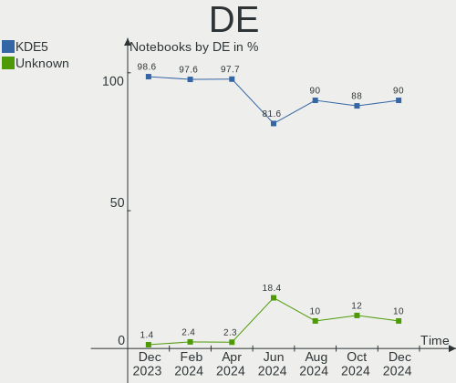
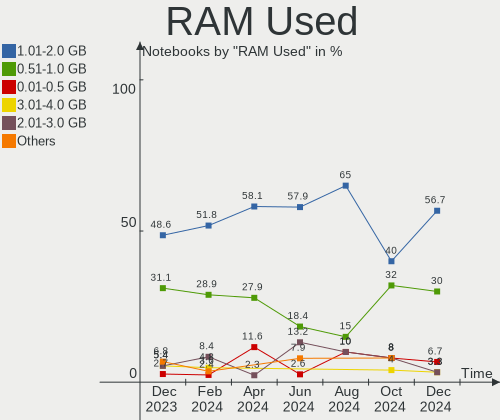
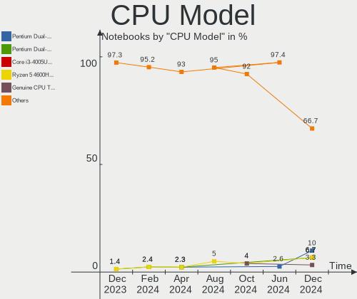
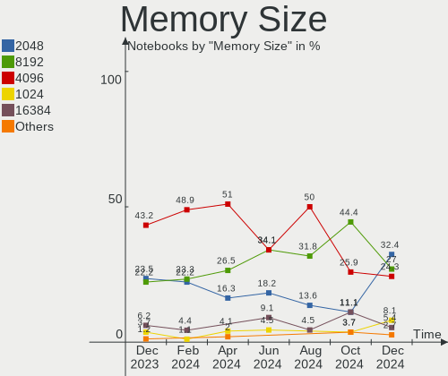

BlackPanther Hardware Trends (Notebook)
---------------------------------------

A project to identify most popular hardware characteristics and track their change
over time based on data collected by BlackPanther users at https://Linux-Hardware.org.

Anyone can contribute to the study by uploading probes of their computers by
the [hw-probe](https://github.com/linuxhw/hw-probe) tool:

    sudo -E hw-probe -all -upload

Full-feature report is available here: https://linux-hardware.org/?view=trends&formfactor=notebook

Period: Feb, 2021.

Contents
--------

- [ OS                       ](#os)
- [ OS Family                ](#os-family)
- [ Kernel                   ](#kernel)
- [ Kernel Family            ](#kernel-family)
- [ Kernel Major Ver.        ](#kernel-major-ver)
- [ Arch                     ](#arch)
- [ DE                       ](#de)
- [ Display Server           ](#display-server)
- [ Display Manager          ](#display-manager)
- [ OS Lang                  ](#os-lang)
- [ Boot Mode                ](#boot-mode)
- [ Filesystem               ](#filesystem)
- [ Part. scheme             ](#part-scheme)
- [ Dual Boot with Linux/BSD ](#dual-boot-with-linux/bsd)
- [ Dual Boot (Win)          ](#dual-boot-win)
- [ Country                  ](#country)
- [ City                     ](#city)
- [ Vendor                   ](#vendor)
- [ Model                    ](#model)
- [ Model Family             ](#model-family)
- [ MFG Year                 ](#mfg-year)
- [ Form Factor              ](#form-factor)
- [ Secure Boot              ](#secure-boot)
- [ Coreboot                 ](#coreboot)
- [ RAM Size                 ](#ram-size)
- [ RAM Used                 ](#ram-used)
- [ Has CD-ROM               ](#has-cd-rom)
- [ Total Drives             ](#total-drives)
- [ Has Ethernet             ](#has-ethernet)
- [ Drive Vendor             ](#drive-vendor)
- [ Drive Model              ](#drive-model)
- [ HDD Vendor               ](#hdd-vendor)
- [ SSD Vendor               ](#ssd-vendor)
- [ Drive Kind               ](#drive-kind)
- [ Drive Connector          ](#drive-connector)
- [ Drive Size               ](#drive-size)
- [ Space Total              ](#space-total)
- [ Space Used               ](#space-used)
- [ Malfunc. Drives          ](#malfunc-drives)
- [ Malfunc. Drive Vendor    ](#malfunc-drive-vendor)
- [ Malfunc. HDD Vendor      ](#malfunc-hdd-vendor)
- [ Malfunc. Drive Kind      ](#malfunc-drive-kind)
- [ Failed Drives            ](#failed-drives)
- [ Failed Drive Vendor      ](#failed-drive-vendor)
- [ Drive Status             ](#drive-status)
- [ Storage Vendor           ](#storage-vendor)
- [ Storage Model            ](#storage-model)
- [ Storage Kind             ](#storage-kind)
- [ CPU Vendor               ](#cpu-vendor)
- [ CPU Model                ](#cpu-model)
- [ CPU Model Family         ](#cpu-model-family)
- [ CPU Cores                ](#cpu-cores)
- [ CPU Sockets              ](#cpu-sockets)
- [ CPU Threads              ](#cpu-threads)
- [ CPU Op-Modes             ](#cpu-op-modes)
- [ CPU Microcode            ](#cpu-microcode)
- [ CPU Microarch            ](#cpu-microarch)
- [ GPU Vendor               ](#gpu-vendor)
- [ GPU Model                ](#gpu-model)
- [ GPU Combo                ](#gpu-combo)
- [ GPU Driver               ](#gpu-driver)
- [ GPU Memory               ](#gpu-memory)
- [ Monitor Vendor           ](#monitor-vendor)
- [ Monitor Model            ](#monitor-model)
- [ Monitor Resolution       ](#monitor-resolution)
- [ Monitor Diagonal         ](#monitor-diagonal)
- [ Monitor Width            ](#monitor-width)
- [ Aspect Ratio             ](#aspect-ratio)
- [ Monitor Area             ](#monitor-area)
- [ Pixel Density            ](#pixel-density)
- [ Multiple Monitors        ](#multiple-monitors)
- [ Net Controller Vendor    ](#net-controller-vendor)
- [ Net Controller Model     ](#net-controller-model)
- [ Wireless Vendor          ](#wireless-vendor)
- [ Wireless Model           ](#wireless-model)
- [ Ethernet Vendor          ](#ethernet-vendor)
- [ Ethernet Model           ](#ethernet-model)
- [ Net Controller Kind      ](#net-controller-kind)
- [ Used Controller          ](#used-controller)
- [ NICs                     ](#nics)
- [ Memory Vendor            ](#memory-vendor)
- [ Memory Model             ](#memory-model)
- [ Memory Kind              ](#memory-kind)
- [ Memory Form Factor       ](#memory-form-factor)
- [ Memory Size              ](#memory-size)
- [ Memory Speed             ](#memory-speed)
- [ Sound Vendor             ](#sound-vendor)
- [ Sound Model              ](#sound-model)
- [ Camera Vendor            ](#camera-vendor)
- [ Camera Model             ](#camera-model)
- [ Fingerprint Vendor       ](#fingerprint-vendor)
- [ Fingerprint Model        ](#fingerprint-model)
- [ Chipcard Vendor          ](#chipcard-vendor)
- [ Chipcard Model           ](#chipcard-model)
- [ Printer Vendor           ](#printer-vendor)
- [ Printer Model            ](#printer-model)
- [ Scanner Vendor           ](#scanner-vendor)
- [ Scanner Model            ](#scanner-model)
- [ Bluetooth Vendor         ](#bluetooth-vendor)
- [ Bluetooth Model          ](#bluetooth-model)
- [ Unsupported Devices      ](#unsupported-devices)
- [ Unsupported Device Types ](#unsupported-device-types)

OS
--

Installed operating systems

| Name              | Notebooks | Percent |
|-------------------|-----------|---------|
| BlackPanther 18.1 | 117       | 92.86%  |
| BlackPanther 16.2 | 9         | 7.14%   |

OS Family
---------

OS without a version

| Name         | Notebooks | Percent |
|--------------|-----------|---------|
| BlackPanther | 126       | 100%    |

Kernel
------

Version of the Linux kernel

| Version                | Notebooks | Percent |
|------------------------|-----------|---------|
| 4.18.16-desktop-1bP    | 95        | 75.4%   |
| 5.6.14-desktop-2bP     | 22        | 17.46%  |
| 4.9.20-desktop-pae-1bP | 9         | 7.14%   |

Kernel Family
-------------

Linux kernel without a distro release

| Version | Notebooks | Percent |
|---------|-----------|---------|
| 4.18.16 | 95        | 75.4%   |
| 5.6.14  | 22        | 17.46%  |
| 4.9.20  | 9         | 7.14%   |

Kernel Major Ver.
-----------------

Linux kernel major version

| Version | Notebooks | Percent |
|---------|-----------|---------|
| 4.18    | 95        | 75.4%   |
| 5.6     | 22        | 17.46%  |
| 4.9     | 9         | 7.14%   |

Arch
----

OS architecture (x86_64, i586, etc.)

| Name   | Notebooks | Percent |
|--------|-----------|---------|
| x86_64 | 117       | 92.86%  |
| i686   | 9         | 7.14%   |

DE
--

Desktop Environment

| Name | Notebooks | Percent |
|------|-----------|---------|
| KDE5 | 126       | 100%    |

Display Server
--------------

X11 or Wayland

| Name | Notebooks | Percent |
|------|-----------|---------|
| X11  | 126       | 100%    |

Display Manager
---------------

SDDM, LightDM, etc.

| Name | Notebooks | Percent |
|------|-----------|---------|
| SDDM | 126       | 100%    |

OS Lang
-------

Language

| Lang    | Notebooks | Percent |
|---------|-----------|---------|
| Unknown | 126       | 100%    |

Boot Mode
---------

EFI or BIOS

| Mode | Notebooks | Percent |
|------|-----------|---------|
| BIOS | 87        | 69.05%  |
| EFI  | 39        | 30.95%  |

Filesystem
----------

Type of filesystem

| Type    | Notebooks | Percent |
|---------|-----------|---------|
| Overlay | 89        | 70.63%  |
| Ext4    | 37        | 29.37%  |

Part. scheme
------------

Scheme of partitioning

| Type | Notebooks | Percent |
|------|-----------|---------|
| MBR  | 86        | 68.25%  |
| GPT  | 40        | 31.75%  |

Dual Boot with Linux/BSD
------------------------

Hosting more than one Linux/BSD

| Dual boot | Notebooks | Percent |
|-----------|-----------|---------|
| No        | 71        | 56.35%  |
| Yes       | 55        | 43.65%  |

Dual Boot (Win)
---------------

Hosting Linux and Windows

| Dual boot | Notebooks | Percent |
|-----------|-----------|---------|
| Yes       | 63        | 50%     |
| No        | 63        | 50%     |

Country
-------

Geographic location (country)

| Country        | Notebooks | Percent |
|----------------|-----------|---------|
| Hungary        | 97        | 76.98%  |
| USA            | 7         | 5.56%   |
| France         | 3         | 2.38%   |
| Austria        | 3         | 2.38%   |
| Spain          | 2         | 1.59%   |
| Russia         | 2         | 1.59%   |
| Germany        | 2         | 1.59%   |
| Thailand       | 1         | 0.79%   |
| Switzerland    | 1         | 0.79%   |
| Slovenia       | 1         | 0.79%   |
| Slovakia       | 1         | 0.79%   |
| Netherlands    | 1         | 0.79%   |
| Italy          | 1         | 0.79%   |
| Indonesia      | 1         | 0.79%   |
| Czech Republic | 1         | 0.79%   |
| Australia      | 1         | 0.79%   |
| Algeria        | 1         | 0.79%   |

City
----

Geographic location (city)

| City                      | Notebooks | Percent |
|---------------------------|-----------|---------|
| Budapest                  | 38        | 30.16%  |
| Szekszárd                | 4         | 3.17%   |
| Zalaegerszeg              | 3         | 2.38%   |
| Vienna                    | 3         | 2.38%   |
| Tatabánya                | 3         | 2.38%   |
| Siófok                   | 3         | 2.38%   |
| Szolnok                   | 2         | 1.59%   |
| Szigetszentmiklos         | 2         | 1.59%   |
| Szentendre                | 2         | 1.59%   |
| Pomaz                     | 2         | 1.59%   |
| Nizhniy Novgorod          | 2         | 1.59%   |
| Madrid                    | 2         | 1.59%   |
| Győr                     | 2         | 1.59%   |
| Gyomro                    | 2         | 1.59%   |
| Bokony                    | 2         | 1.59%   |
| Érd                      | 1         | 0.79%   |
| Znojmo                    | 1         | 0.79%   |
| Zalaszentgrot             | 1         | 0.79%   |
| Winschoten                | 1         | 0.79%   |
| Willoughby                | 1         | 0.79%   |
| Veszprém                 | 1         | 0.79%   |
| Tenyo                     | 1         | 0.79%   |
| Tatarszentgyorgy          | 1         | 0.79%   |
| Tap                       | 1         | 0.79%   |
| Székesfehérvár         | 1         | 0.79%   |
| Szentes                   | 1         | 0.79%   |
| Szeged                    | 1         | 0.79%   |
| Santa Margherita Ligure   | 1         | 0.79%   |
| Salgotarjan               | 1         | 0.79%   |
| Saint-Sauveur-le-Vicomte  | 1         | 0.79%   |
| Saint-Gilles-Croix-de-Vie | 1         | 0.79%   |
| Ravazd                    | 1         | 0.79%   |
| Pécs                     | 1         | 0.79%   |
| Paris                     | 1         | 0.79%   |
| Oran                      | 1         | 0.79%   |
| Nyiregyhaza               | 1         | 0.79%   |
| Nadudvar                  | 1         | 0.79%   |
| Minneapolis               | 1         | 0.79%   |
| Mezokovesd                | 1         | 0.79%   |
| Melbourne                 | 1         | 0.79%   |
| Megyaszo                  | 1         | 0.79%   |
| Lucfalva                  | 1         | 0.79%   |
| Las Vegas                 | 1         | 0.79%   |
| Košice                   | 1         | 0.79%   |
| Kony                      | 1         | 0.79%   |
| Kecskemét                | 1         | 0.79%   |
| Kazincbarcika             | 1         | 0.79%   |
| Kaposvár                 | 1         | 0.79%   |
| Kansas City               | 1         | 0.79%   |
| Kalocsa                   | 1         | 0.79%   |
| Frankfurt am Main         | 1         | 0.79%   |
| Findlay                   | 1         | 0.79%   |
| Esztergom                 | 1         | 0.79%   |
| Dunaharaszti              | 1         | 0.79%   |
| Debrecen                  | 1         | 0.79%   |
| Csorna                    | 1         | 0.79%   |
| Chiang Rai                | 1         | 0.79%   |
| Cerknica                  | 1         | 0.79%   |
| Celldomolk                | 1         | 0.79%   |
| Cegled                    | 1         | 0.79%   |

Vendor
------

Motherboard manufacturer

| Name                | Notebooks | Percent |
|---------------------|-----------|---------|
| Lenovo              | 27        | 21.43%  |
| Hewlett-Packard     | 25        | 19.84%  |
| ASUSTek Computer    | 18        | 14.29%  |
| Dell                | 16        | 12.7%   |
| Acer                | 15        | 11.9%   |
| Toshiba             | 5         | 3.97%   |
| Samsung Electronics | 5         | 3.97%   |
| Packard Bell        | 3         | 2.38%   |
| Fujitsu Siemens     | 3         | 2.38%   |
| eMachines           | 3         | 2.38%   |
| Sony                | 2         | 1.59%   |
| MSI                 | 1         | 0.79%   |
| Medion              | 1         | 0.79%   |
| Fujitsu             | 1         | 0.79%   |
| Apple               | 1         | 0.79%   |

Model
-----

Motherboard model

| Name                                  | Notebooks | Percent |
|---------------------------------------|-----------|---------|
| eMachines E525                        | 3         | 2.38%   |
| Samsung R540/R580/R780/SA41/E452/E852 | 2         | 1.59%   |
| Lenovo G550 20023                     | 2         | 1.59%   |
| HP 250 G4                             | 2         | 1.59%   |
| Dell Latitude E5420                   | 2         | 1.59%   |
| ASUS 1011PX                           | 2         | 1.59%   |
| Acer Aspire ES1-511                   | 2         | 1.59%   |
| Acer Aspire E1-530G                   | 2         | 1.59%   |
| Toshiba Satellite P870                | 1         | 0.79%   |
| Toshiba Satellite L750                | 1         | 0.79%   |
| Toshiba Satellite L655                | 1         | 0.79%   |
| Toshiba Satellite L500                | 1         | 0.79%   |
| Toshiba Satellite C855D-12N           | 1         | 0.79%   |
| Sony VPCEH2J1E                        | 1         | 0.79%   |
| Sony VPCEB4M1E                        | 1         | 0.79%   |
| Samsung NC210/NC110                   | 1         | 0.79%   |
| Samsung 730U3E/740U3E                 | 1         | 0.79%   |
| Samsung 350V5C/351V5C/3540VC/3440VC   | 1         | 0.79%   |
| Packard Bell EasyNote TS44HR          | 1         | 0.79%   |
| Packard Bell EasyNote TK81            | 1         | 0.79%   |
| Packard Bell EasyNote TE11HC          | 1         | 0.79%   |
| MSI MEGA BOOK GX620                   | 1         | 0.79%   |
| Medion P6678 MD61550                  | 1         | 0.79%   |
| Lenovo Z50-75 80EC                    | 1         | 0.79%   |
| Lenovo Z50-70 20354                   | 1         | 0.79%   |
| Lenovo Y520-15IKBA 80WY               | 1         | 0.79%   |
| Lenovo V15-ADA 82C7                   | 1         | 0.79%   |
| Lenovo V145-15AST 81MT                | 1         | 0.79%   |
| Lenovo ThinkPad Yoga 11e 20D90027US   | 1         | 0.79%   |
| Lenovo ThinkPad X240 20AMA0YDHV       | 1         | 0.79%   |
| Lenovo ThinkPad X230 Tablet 3434CTO   | 1         | 0.79%   |
| Lenovo ThinkPad X201 3680AQ1          | 1         | 0.79%   |
| Lenovo ThinkPad X200 Tablet 7453WRX   | 1         | 0.79%   |
| Lenovo ThinkPad T61 6458WK6           | 1         | 0.79%   |
| Lenovo ThinkPad T440p 20AWS16U02      | 1         | 0.79%   |
| Lenovo ThinkPad T410 2522A92          | 1         | 0.79%   |
| Lenovo ThinkPad T400 6474Y32          | 1         | 0.79%   |
| Lenovo ThinkPad T400 6474E18          | 1         | 0.79%   |
| Lenovo ThinkPad L420 78544UG          | 1         | 0.79%   |
| Lenovo ThinkPad Edge 02212SG          | 1         | 0.79%   |
| Lenovo ThinkPad E520 1143GZG          | 1         | 0.79%   |
| Lenovo IdeaPad Z460 20059             | 1         | 0.79%   |
| Lenovo IdeaPad L340-15IWL 81LG        | 1         | 0.79%   |
| Lenovo IdeaPad Flex 10 20324          | 1         | 0.79%   |
| Lenovo IdeaPad 330-15IKB 81DE         | 1         | 0.79%   |
| Lenovo IdeaPad 320-17ABR 80YN         | 1         | 0.79%   |
| Lenovo G585 20137                     | 1         | 0.79%   |
| Lenovo B51-80 80LM                    | 1         | 0.79%   |
| HP ProBook 6570b                      | 1         | 0.79%   |
| HP ProBook 6560b                      | 1         | 0.79%   |
| HP ProBook 650 G1                     | 1         | 0.79%   |
| HP ProBook 6450b                      | 1         | 0.79%   |
| HP Pro x2 612 G1 Tablet               | 1         | 0.79%   |
| HP Pavilion Notebook                  | 1         | 0.79%   |
| HP Notebook                           | 1         | 0.79%   |
| HP Mini 110-3500                      | 1         | 0.79%   |
| HP Laptop 15-db0xxx                   | 1         | 0.79%   |
| HP EliteBook 8440p                    | 1         | 0.79%   |
| HP EliteBook 2570p                    | 1         | 0.79%   |
| HP EliteBook 2560p                    | 1         | 0.79%   |

Model Family
------------

Motherboard model prefix

| Name                     | Notebooks | Percent |
|--------------------------|-----------|---------|
| Acer Aspire              | 14        | 11.11%  |
| Lenovo ThinkPad          | 13        | 10.32%  |
| Dell Latitude            | 12        | 9.52%   |
| Toshiba Satellite        | 5         | 3.97%   |
| Lenovo IdeaPad           | 5         | 3.97%   |
| HP ProBook               | 4         | 3.17%   |
| HP EliteBook             | 4         | 3.17%   |
| HP 250                   | 4         | 3.17%   |
| Packard Bell EasyNote    | 3         | 2.38%   |
| HP Compaq                | 3         | 2.38%   |
| eMachines E525           | 3         | 2.38%   |
| Dell Inspiron            | 3         | 2.38%   |
| Samsung R540             | 2         | 1.59%   |
| Lenovo G550              | 2         | 1.59%   |
| ASUS 1011PX              | 2         | 1.59%   |
| Sony VPCEH2J1E           | 1         | 0.79%   |
| Sony VPCEB4M1E           | 1         | 0.79%   |
| Samsung NC210            | 1         | 0.79%   |
| Samsung 730U3E           | 1         | 0.79%   |
| Samsung 350V5C           | 1         | 0.79%   |
| MSI MEGA                 | 1         | 0.79%   |
| Medion P6678             | 1         | 0.79%   |
| Lenovo Z50-75            | 1         | 0.79%   |
| Lenovo Z50-70            | 1         | 0.79%   |
| Lenovo Y520-15IKBA       | 1         | 0.79%   |
| Lenovo V15-ADA           | 1         | 0.79%   |
| Lenovo V145-15AST        | 1         | 0.79%   |
| Lenovo G585              | 1         | 0.79%   |
| Lenovo B51-80            | 1         | 0.79%   |
| HP Pro                   | 1         | 0.79%   |
| HP Pavilion              | 1         | 0.79%   |
| HP Notebook              | 1         | 0.79%   |
| HP Mini                  | 1         | 0.79%   |
| HP Laptop                | 1         | 0.79%   |
| HP 650                   | 1         | 0.79%   |
| HP 620                   | 1         | 0.79%   |
| HP 2000                  | 1         | 0.79%   |
| HP 15                    | 1         | 0.79%   |
| Fujitsu Siemens LIFEBOOK | 1         | 0.79%   |
| Fujitsu Siemens ESPRIMO  | 1         | 0.79%   |
| Fujitsu Siemens AMILO    | 1         | 0.79%   |
| Fujitsu LIFEBOOK         | 1         | 0.79%   |
| Dell G3                  | 1         | 0.79%   |
| ASUS X550VX              | 1         | 0.79%   |
| ASUS X550CL              | 1         | 0.79%   |
| ASUS X541UJ              | 1         | 0.79%   |
| ASUS X200MA              | 1         | 0.79%   |
| ASUS VivoBook            | 1         | 0.79%   |
| ASUS TP300LDB            | 1         | 0.79%   |
| ASUS T300FA              | 1         | 0.79%   |
| ASUS Strix               | 1         | 0.79%   |
| ASUS N552VW              | 1         | 0.79%   |
| ASUS N53SM               | 1         | 0.79%   |
| ASUS K54C                | 1         | 0.79%   |
| ASUS K52Jr               | 1         | 0.79%   |
| ASUS K52JB               | 1         | 0.79%   |
| ASUS K52De               | 1         | 0.79%   |
| ASUS K50AB               | 1         | 0.79%   |
| ASUS ASUS                | 1         | 0.79%   |
| Apple MacBookAir4        | 1         | 0.79%   |

MFG Year
--------

Motherboard manufacture year

| Year | Notebooks | Percent |
|------|-----------|---------|
| 2012 | 15        | 11.9%   |
| 2011 | 15        | 11.9%   |
| 2018 | 12        | 9.52%   |
| 2013 | 11        | 8.73%   |
| 2017 | 10        | 7.94%   |
| 2019 | 9         | 7.14%   |
| 2014 | 9         | 7.14%   |
| 2010 | 9         | 7.14%   |
| 2020 | 8         | 6.35%   |
| 2009 | 8         | 6.35%   |
| 2015 | 7         | 5.56%   |
| 2008 | 5         | 3.97%   |
| 2007 | 4         | 3.17%   |
| 2016 | 3         | 2.38%   |
| 2006 | 1         | 0.79%   |

Form Factor
-----------

Physical design of the computer

| Name     | Notebooks | Percent |
|----------|-----------|---------|
| Notebook | 126       | 100%    |

Secure Boot
-----------

Enabled or disabled

| State    | Notebooks | Percent |
|----------|-----------|---------|
| Disabled | 126       | 100%    |

Coreboot
--------

Have coreboot on board

| Used | Notebooks | Percent |
|------|-----------|---------|
| No   | 126       | 100%    |

RAM Size
--------

Total RAM memory

| Size in GB | Notebooks | Percent |
|------------|-----------|---------|
| 3.01-4.0   | 49        | 38.89%  |
| 4.01-8.0   | 29        | 23.02%  |
| 8.01-16.0  | 21        | 16.67%  |
| 1.01-2.0   | 15        | 11.9%   |
| 16.01-24.0 | 7         | 5.56%   |
| 2.01-3.0   | 3         | 2.38%   |
| 24.01-32.0 | 1         | 0.79%   |
| 0.51-1.0   | 1         | 0.79%   |

RAM Used
--------

Used RAM memory

| Used GB  | Notebooks | Percent |
|----------|-----------|---------|
| 0.51-1.0 | 69        | 54.76%  |
| 1.01-2.0 | 40        | 31.75%  |
| 0.01-0.5 | 17        | 13.49%  |

Has CD-ROM
----------

Has CD-ROM on board

| Presented | Notebooks | Percent |
|-----------|-----------|---------|
| Yes       | 79        | 62.7%   |
| No        | 47        | 37.3%   |

Total Drives
------------

Number of drives on board

| Drives | Notebooks | Percent |
|--------|-----------|---------|
| 1      | 109       | 86.51%  |
| 2      | 16        | 12.7%   |
| 3      | 1         | 0.79%   |

Has Ethernet
------------

Has Ethernet on board

| Presented | Notebooks | Percent |
|-----------|-----------|---------|
| Yes       | 120       | 95.24%  |
| No        | 6         | 4.76%   |

Drive Vendor
------------

Hard drive vendors

| Vendor              | Notebooks | Drives | Percent |
|---------------------|-----------|--------|---------|
| Seagate             | 27        | 27     | 17.65%  |
| WDC                 | 17        | 17     | 11.11%  |
| Kingston            | 17        | 17     | 11.11%  |
| Hitachi             | 16        | 16     | 10.46%  |
| Toshiba             | 14        | 14     | 9.15%   |
| Samsung Electronics | 13        | 13     | 8.5%    |
| HGST                | 12        | 12     | 7.84%   |
| SanDisk             | 6         | 6      | 3.92%   |
| Crucial             | 6         | 6      | 3.92%   |
| PNY                 | 3         | 3      | 1.96%   |
| Micron Technology   | 3         | 3      | 1.96%   |
| JMicron             | 3         | 3      | 1.96%   |
| Intenso             | 2         | 2      | 1.31%   |
| Fujitsu             | 2         | 2      | 1.31%   |
| Transcend           | 1         | 1      | 0.65%   |
| Team                | 1         | 1      | 0.65%   |
| SK Hynix            | 1         | 1      | 0.65%   |
| PNY USB             | 1         | 1      | 0.65%   |
| LITEONIT            | 1         | 1      | 0.65%   |
| LITEON              | 1         | 1      | 0.65%   |
| Intel               | 1         | 1      | 0.65%   |
| IBM/Hitachi         | 1         | 1      | 0.65%   |
| China               | 1         | 1      | 0.65%   |
| BHT                 | 1         | 1      | 0.65%   |
| Apple               | 1         | 1      | 0.65%   |
| A-DATA Technology   | 1         | 1      | 0.65%   |

Drive Model
-----------

Hard drive models

| Model                                 | Notebooks | Percent |
|---------------------------------------|-----------|---------|
| Seagate ST500LT012-1DG142 500GB       | 5         | 3.27%   |
| Kingston SA400S37120G 120GB SSD       | 5         | 3.27%   |
| Kingston SA400S37240G 240GB SSD       | 4         | 2.61%   |
| HGST HTS545050A7E680 500GB            | 4         | 2.61%   |
| Toshiba MQ04ABF100 1TB                | 3         | 1.96%   |
| Toshiba MQ01ABF050 500GB              | 3         | 1.96%   |
| JMicron Generic 320GB                 | 3         | 1.96%   |
| HGST HTS725050A7E630 500GB            | 3         | 1.96%   |
| Toshiba MQ01ABD100 1TB                | 2         | 1.31%   |
| Seagate ST9320325AS 320GB             | 2         | 1.31%   |
| Seagate ST1000LM035-1RK172 1TB        | 2         | 1.31%   |
| Seagate ST1000LM024 HN-M101MBB 1TB    | 2         | 1.31%   |
| PNY CS900 120GB SSD                   | 2         | 1.31%   |
| Kingston SV300S37A240G 240GB SSD      | 2         | 1.31%   |
| Kingston SV300S37A120G 120GB SSD      | 2         | 1.31%   |
| Kingston SUV500240G 240GB SSD         | 2         | 1.31%   |
| Kingston SH103S3120G 120GB SSD        | 2         | 1.31%   |
| Intenso SSD 120GB                     | 2         | 1.31%   |
| Hitachi HTS545050B9A300 500GB         | 2         | 1.31%   |
| Hitachi HTS545025B9A300 250GB         | 2         | 1.31%   |
| Hitachi HTS543225L9A300 250GB         | 2         | 1.31%   |
| Crucial CT240BX500SSD1 240GB          | 2         | 1.31%   |
| WDC WDS500G2B0B-00YS70 500GB SSD      | 1         | 0.65%   |
| WDC WDS250G2B0A-00SM50 250GB SSD      | 1         | 0.65%   |
| WDC WD7500BPVT-80HXZT3 752GB          | 1         | 0.65%   |
| WDC WD7500BPVT-75HXZT3 752GB          | 1         | 0.65%   |
| WDC WD7500BPVT-22HXZT3 752GB          | 1         | 0.65%   |
| WDC WD5000LPVX-22V0TT0 500GB          | 1         | 0.65%   |
| WDC WD5000LPCX-22VHAT1 500GB          | 1         | 0.65%   |
| WDC WD5000BPVT-24HXZT1 500GB          | 1         | 0.65%   |
| WDC WD5000BPVT-22HXZT3 500GB          | 1         | 0.65%   |
| WDC WD5000BPVT-08HXZT1 500GB          | 1         | 0.65%   |
| WDC WD3200BEVT-60A23T0 320GB          | 1         | 0.65%   |
| WDC WD3200BEVT-22A23T0 320GB          | 1         | 0.65%   |
| WDC WD3200BEKT-60V5T1 320GB           | 1         | 0.65%   |
| WDC WD1600BEVS-07RST0 160GB           | 1         | 0.65%   |
| WDC WD10SPZX-24Z10T0 1TB              | 1         | 0.65%   |
| WDC WD10SPCX-24HWST1 1TB              | 1         | 0.65%   |
| WDC PC SN520 SDAPMUW-256G-1101 256GB  | 1         | 0.65%   |
| Transcend TS240GSSD220S 240GB         | 1         | 0.65%   |
| Toshiba THNSNH128GCST 128GB SSD       | 1         | 0.65%   |
| Toshiba MQ01ABF032 320GB              | 1         | 0.65%   |
| Toshiba MK8009GAH 80GB                | 1         | 0.65%   |
| Toshiba MK3261GSYN 320GB              | 1         | 0.65%   |
| Toshiba MK1229GSGF 80GB               | 1         | 0.65%   |
| Toshiba HDWL120 2TB                   | 1         | 0.65%   |
| Team T253X1120G 120GB SSD             | 1         | 0.65%   |
| SK Hynix HFS256G39TND-N210A 256GB SSD | 1         | 0.65%   |
| Seagate ST9320423AS 320GB             | 1         | 0.65%   |
| Seagate ST9250827AS 250GB             | 1         | 0.65%   |
| Seagate ST9250315AS 250GB             | 1         | 0.65%   |
| Seagate ST500LM021-1KJ152 500GB       | 1         | 0.65%   |
| Seagate ST500LM012 HN-M500MBB 500GB   | 1         | 0.65%   |
| Seagate ST500LM000-1EJ162 500GB       | 1         | 0.65%   |
| Seagate ST320LT009-9WC142 320GB       | 1         | 0.65%   |
| Seagate ST320LT007-9ZV142 320GB       | 1         | 0.65%   |
| Seagate ST250LT020-1AE14C 250GB       | 1         | 0.65%   |
| Seagate ST250LM004 HN-M250MBB 250GB   | 1         | 0.65%   |
| Seagate ST2000LM007-1R8174 2TB        | 1         | 0.65%   |
| Seagate ST1000LX015-1U7172 1TB        | 1         | 0.65%   |

HDD Vendor
----------

Hard disk drive vendors

| Vendor              | Notebooks | Drives | Percent |
|---------------------|-----------|--------|---------|
| Seagate             | 26        | 26     | 30.59%  |
| Hitachi             | 16        | 16     | 18.82%  |
| WDC                 | 14        | 14     | 16.47%  |
| Toshiba             | 13        | 13     | 15.29%  |
| HGST                | 12        | 12     | 14.12%  |
| Fujitsu             | 2         | 2      | 2.35%   |
| Samsung Electronics | 1         | 1      | 1.18%   |
| IBM/Hitachi         | 1         | 1      | 1.18%   |

SSD Vendor
----------

Solid state drive vendors

| Vendor              | Notebooks | Drives | Percent |
|---------------------|-----------|--------|---------|
| Kingston            | 17        | 17     | 27.87%  |
| Samsung Electronics | 8         | 8      | 13.11%  |
| SanDisk             | 6         | 6      | 9.84%   |
| Crucial             | 6         | 6      | 9.84%   |
| PNY                 | 3         | 3      | 4.92%   |
| JMicron             | 3         | 3      | 4.92%   |
| WDC                 | 2         | 2      | 3.28%   |
| Micron Technology   | 2         | 2      | 3.28%   |
| Intenso             | 2         | 2      | 3.28%   |
| Transcend           | 1         | 1      | 1.64%   |
| Toshiba             | 1         | 1      | 1.64%   |
| Team                | 1         | 1      | 1.64%   |
| SK Hynix            | 1         | 1      | 1.64%   |
| PNY USB             | 1         | 1      | 1.64%   |
| LITEONIT            | 1         | 1      | 1.64%   |
| LITEON              | 1         | 1      | 1.64%   |
| Intel               | 1         | 1      | 1.64%   |
| China               | 1         | 1      | 1.64%   |
| BHT                 | 1         | 1      | 1.64%   |
| Apple               | 1         | 1      | 1.64%   |
| A-DATA Technology   | 1         | 1      | 1.64%   |

Drive Kind
----------

HDD or SSD

| Kind    | Notebooks | Drives | Percent |
|---------|-----------|--------|---------|
| HDD     | 82        | 85     | 56.16%  |
| SSD     | 58        | 61     | 39.73%  |
| NVMe    | 5         | 6      | 3.42%   |
| Unknown | 1         | 1      | 0.68%   |

Drive Connector
---------------

SATA, SAS, NVMe, etc.

| Type | Notebooks | Drives | Percent |
|------|-----------|--------|---------|
| SATA | 124       | 142    | 92.54%  |
| SAS  | 5         | 5      | 3.73%   |
| NVMe | 5         | 6      | 3.73%   |

Drive Size
----------

Size of hard drive

| Size in TB | Notebooks | Drives | Percent |
|------------|-----------|--------|---------|
| 0.01-0.5   | 109       | 122    | 81.95%  |
| 0.51-1.0   | 22        | 22     | 16.54%  |
| 1.01-2.0   | 2         | 2      | 1.5%    |

Space Total
-----------

Amount of disk space available on the file system

| Size in GB | Notebooks | Percent |
|------------|-----------|---------|
| Unknown    | 83        | 65.87%  |
| 251-500    | 14        | 11.11%  |
| 101-250    | 12        | 9.52%   |
| 501-1000   | 6         | 4.76%   |
| 51-100     | 6         | 4.76%   |
| 21-50      | 3         | 2.38%   |
| 1-20       | 2         | 1.59%   |

Space Used
----------

Amount of used disk space

| Used GB | Notebooks | Percent |
|---------|-----------|---------|
| Unknown | 83        | 65.87%  |
| 1-20    | 36        | 28.57%  |
| 101-250 | 5         | 3.97%   |
| 21-50   | 1         | 0.79%   |
| 51-100  | 1         | 0.79%   |

Malfunc. Drives
---------------

Drive models with a malfunction

| Model                                          | Notebooks | Drives | Percent |
|------------------------------------------------|-----------|--------|---------|
| HGST HTS545050A7E680 500GB                     | 4         | 4      | 8.7%    |
| Toshiba MQ01ABF050 500GB                       | 2         | 2      | 4.35%   |
| Toshiba MQ01ABD100 1TB                         | 2         | 2      | 4.35%   |
| Seagate ST500LT012-1DG142 500GB                | 2         | 2      | 4.35%   |
| Hitachi HTS545025B9A300 250GB                  | 2         | 2      | 4.35%   |
| WDC WD3200BEVT-60A23T0 320GB                   | 1         | 1      | 2.17%   |
| WDC WD3200BEKT-60V5T1 320GB                    | 1         | 1      | 2.17%   |
| Toshiba MQ01ABF032 320GB                       | 1         | 1      | 2.17%   |
| Toshiba MK8009GAH 80GB                         | 1         | 1      | 2.17%   |
| Toshiba MK3261GSYN 320GB                       | 1         | 1      | 2.17%   |
| Toshiba MK1229GSGF 80GB                        | 1         | 1      | 2.17%   |
| Seagate ST9320423AS 320GB                      | 1         | 1      | 2.17%   |
| Seagate ST9320325AS 320GB                      | 1         | 1      | 2.17%   |
| Seagate ST9250827AS 250GB                      | 1         | 1      | 2.17%   |
| Seagate ST500LM021-1KJ152 500GB                | 1         | 1      | 2.17%   |
| Seagate ST500LM000-1EJ162 500GB                | 1         | 1      | 2.17%   |
| Seagate ST320LT007-9ZV142 320GB                | 1         | 1      | 2.17%   |
| Seagate ST250LM004 HN-M250MBB 250GB            | 1         | 1      | 2.17%   |
| Seagate ST1000LX015-1U7172 1TB                 | 1         | 1      | 2.17%   |
| Seagate ST1000LM024 HN-M101MBB 1TB             | 1         | 1      | 2.17%   |
| Seagate ST1000LM014-SSHD-8GB                   | 1         | 1      | 2.17%   |
| Seagate ST1000LM014-1EJ164-SSHD 1TB            | 1         | 1      | 2.17%   |
| SanDisk SD7SB3Q128G1001 128GB SSD              | 1         | 1      | 2.17%   |
| Samsung Electronics HM321HI 320GB              | 1         | 1      | 2.17%   |
| Micron Technology MTFDDAK256MAM-1K12 256GB SSD | 1         | 1      | 2.17%   |
| Kingston SV300S37A120G 120GB SSD               | 1         | 1      | 2.17%   |
| Intel SSDSC2BF180A4H 180GB                     | 1         | 1      | 2.17%   |
| Hitachi HTS725032A9A365 320GB                  | 1         | 1      | 2.17%   |
| Hitachi HTS723232A7A364 320GB                  | 1         | 1      | 2.17%   |
| Hitachi HTS547550A9E384 500GB                  | 1         | 1      | 2.17%   |
| Hitachi HTS545050B9A300 500GB                  | 1         | 1      | 2.17%   |
| Hitachi HTS545016B9A300 160GB                  | 1         | 1      | 2.17%   |
| Hitachi HTS543232L9A300 320GB                  | 1         | 1      | 2.17%   |
| Hitachi HTS543225L9A300 250GB                  | 1         | 1      | 2.17%   |
| HGST HTS725050A7E630 500GB                     | 1         | 1      | 2.17%   |
| HGST HTS545050A7E380 500GB                     | 1         | 1      | 2.17%   |
| HGST HTS545032A7E380 320GB                     | 1         | 1      | 2.17%   |
| HGST HTS541010A9E680 1TB                       | 1         | 1      | 2.17%   |
| Apple SSD SM128C 121GB                         | 1         | 1      | 2.17%   |

Malfunc. Drive Vendor
---------------------

Vendors of faulty drives

| Vendor              | Notebooks | Drives | Percent |
|---------------------|-----------|--------|---------|
| Seagate             | 13        | 13     | 28.26%  |
| Hitachi             | 9         | 9      | 19.57%  |
| Toshiba             | 8         | 8      | 17.39%  |
| HGST                | 8         | 8      | 17.39%  |
| WDC                 | 2         | 2      | 4.35%   |
| SanDisk             | 1         | 1      | 2.17%   |
| Samsung Electronics | 1         | 1      | 2.17%   |
| Micron Technology   | 1         | 1      | 2.17%   |
| Kingston            | 1         | 1      | 2.17%   |
| Intel               | 1         | 1      | 2.17%   |
| Apple               | 1         | 1      | 2.17%   |

Malfunc. HDD Vendor
-------------------

Vendors of faulty HDD drives

| Vendor              | Notebooks | Drives | Percent |
|---------------------|-----------|--------|---------|
| Seagate             | 13        | 13     | 31.71%  |
| Hitachi             | 9         | 9      | 21.95%  |
| Toshiba             | 8         | 8      | 19.51%  |
| HGST                | 8         | 8      | 19.51%  |
| WDC                 | 2         | 2      | 4.88%   |
| Samsung Electronics | 1         | 1      | 2.44%   |

Malfunc. Drive Kind
-------------------

Kinds of faulty drives

| Kind | Notebooks | Drives | Percent |
|------|-----------|--------|---------|
| HDD  | 40        | 41     | 88.89%  |
| SSD  | 5         | 5      | 11.11%  |

Failed Drives
-------------

Failed drive models

Zero info for selected period =(

Failed Drive Vendor
-------------------

Failed drive vendors

Zero info for selected period =(

Drive Status
------------

Number of failed and malfunc. drives

| Status   | Notebooks | Drives | Percent |
|----------|-----------|--------|---------|
| Works    | 94        | 101    | 64.83%  |
| Malfunc  | 45        | 46     | 31.03%  |
| Detected | 6         | 6      | 4.14%   |

Storage Vendor
--------------

Storage controller vendors

| Vendor                           | Notebooks | Percent |
|----------------------------------|-----------|---------|
| Intel                            | 109       | 83.21%  |
| AMD                              | 15        | 11.45%  |
| Samsung Electronics              | 4         | 3.05%   |
| Silicon Integrated Systems [SiS] | 1         | 0.76%   |
| Sandisk                          | 1         | 0.76%   |
| Micron Technology                | 1         | 0.76%   |

Storage Model
-------------

Storage controller models

| Model                                                                                  | Notebooks | Percent |
|----------------------------------------------------------------------------------------|-----------|---------|
| Intel 7 Series Chipset Family 6-port SATA Controller [AHCI mode]                       | 17        | 11.64%  |
| AMD FCH SATA Controller [AHCI mode]                                                    | 11        | 7.53%   |
| Intel 82801IBM/IEM (ICH9M/ICH9M-E) 4 port SATA Controller [AHCI mode]                  | 10        | 6.85%   |
| Intel 82801 Mobile SATA Controller [RAID mode]                                         | 9         | 6.16%   |
| Intel 6 Series/C200 Series Chipset Family 6 port Mobile SATA AHCI Controller           | 9         | 6.16%   |
| Intel Sunrise Point-LP SATA Controller [AHCI mode]                                     | 7         | 4.79%   |
| Intel Atom Processor E3800 Series SATA AHCI Controller                                 | 7         | 4.79%   |
| Intel 82801HM/HEM (ICH8M/ICH8M-E) IDE Controller                                       | 7         | 4.79%   |
| Intel 5 Series/3400 Series Chipset 4 port SATA AHCI Controller                         | 7         | 4.79%   |
| Intel 8 Series SATA Controller 1 [AHCI mode]                                           | 6         | 4.11%   |
| Intel 82801HM/HEM (ICH8M/ICH8M-E) SATA Controller [AHCI mode]                          | 5         | 3.42%   |
| Intel Wildcat Point-LP SATA Controller [AHCI Mode]                                     | 4         | 2.74%   |
| Intel 5 Series/3400 Series Chipset 6 port SATA AHCI Controller                         | 4         | 2.74%   |
| Intel NM10/ICH7 Family SATA Controller [AHCI mode]                                     | 3         | 2.05%   |
| Intel HM170/QM170 Chipset SATA Controller [AHCI Mode]                                  | 3         | 2.05%   |
| Intel 6 Series/C200 Series Chipset Family Mobile SATA Controller (IDE mode, ports 0-3) | 3         | 2.05%   |
| Samsung NVMe SSD Controller SM981/PM981/PM983                                          | 2         | 1.37%   |
| Intel Mobile PM965/GM965 PT IDER Controller                                            | 2         | 1.37%   |
| Intel 82801IBM/IEM (ICH9M/ICH9M-E) 2 port SATA Controller [IDE mode]                   | 2         | 1.37%   |
| Intel 82801HM/HEM (ICH8M/ICH8M-E) SATA Controller [IDE mode]                           | 2         | 1.37%   |
| Intel 8 Series/C220 Series Chipset Family 6-port SATA Controller 1 [AHCI mode]         | 2         | 1.37%   |
| Intel 6 Series/C200 Series Chipset Family Mobile SATA Controller (IDE mode, ports 4-5) | 2         | 1.37%   |
| Intel 5 Series/3400 Series Chipset 4 port SATA IDE Controller                          | 2         | 1.37%   |
| Intel 5 Series/3400 Series Chipset 2 port SATA IDE Controller                          | 2         | 1.37%   |
| AMD SB7x0/SB8x0/SB9x0 SATA Controller [IDE mode]                                       | 2         | 1.37%   |
| AMD SB7x0/SB8x0/SB9x0 SATA Controller [AHCI mode]                                      | 2         | 1.37%   |
| Silicon Integrated Systems [SiS] SATA Controller / IDE mode                            | 1         | 0.68%   |
| Silicon Integrated Systems [SiS] 5513 IDE Controller                                   | 1         | 0.68%   |
| Sandisk PC SN520 NVMe SSD                                                              | 1         | 0.68%   |
| Samsung NVMe SSD Controller SM961/PM961/SM963                                          | 1         | 0.68%   |
| Samsung Electronics Non-Volatile memory controller                                     | 1         | 0.68%   |
| Micron Non-Volatile memory controller                                                  | 1         | 0.68%   |
| Intel NM10/ICH7 Family SATA Controller [IDE mode]                                      | 1         | 0.68%   |
| Intel Celeron/Pentium Silver Processor SATA Controller                                 | 1         | 0.68%   |
| Intel Cannon Point-LP SATA Controller [AHCI Mode]                                      | 1         | 0.68%   |
| Intel Cannon Lake Mobile PCH SATA AHCI Controller                                      | 1         | 0.68%   |
| Intel Atom/Celeron/Pentium Processor x5-E8000/J3xxx/N3xxx Series SATA Controller       | 1         | 0.68%   |
| Intel 82801G (ICH7 Family) IDE Controller                                              | 1         | 0.68%   |
| AMD SB7x0/SB8x0/SB9x0 IDE Controller                                                   | 1         | 0.68%   |
| AMD Non-Volatile memory controller                                                     | 1         | 0.68%   |

Storage Kind
------------

Kind of storage controller (IDE, SATA, NVMe, SAS, ...)

| Kind | Notebooks | Percent |
|------|-----------|---------|
| SATA | 103       | 75.74%  |
| IDE  | 19        | 13.97%  |
| RAID | 9         | 6.62%   |
| NVMe | 5         | 3.68%   |

CPU Vendor
----------

Processor vendors

| Vendor | Notebooks | Percent |
|--------|-----------|---------|
| Intel  | 110       | 87.3%   |
| AMD    | 16        | 12.7%   |

CPU Model
---------

Processor models

| Model                                       | Notebooks | Percent |
|---------------------------------------------|-----------|---------|
| Intel Core i5-2520M CPU @ 2.50GHz           | 5         | 3.97%   |
| Intel Atom CPU N455 @ 1.66GHz               | 4         | 3.17%   |
| Intel Pentium CPU 2117U @ 1.80GHz           | 3         | 2.38%   |
| Intel Core i7-3520M CPU @ 2.90GHz           | 3         | 2.38%   |
| Intel Core i3 CPU M 370 @ 2.40GHz           | 3         | 2.38%   |
| Intel Pentium CPU B960 @ 2.20GHz            | 2         | 1.59%   |
| Intel Core i7-6700HQ CPU @ 2.60GHz          | 2         | 1.59%   |
| Intel Core i5-7200U CPU @ 2.50GHz           | 2         | 1.59%   |
| Intel Core i5-5200U CPU @ 2.20GHz           | 2         | 1.59%   |
| Intel Core i5-4300U CPU @ 1.90GHz           | 2         | 1.59%   |
| Intel Core i5-3340M CPU @ 2.70GHz           | 2         | 1.59%   |
| Intel Core i5 CPU M 540 @ 2.53GHz           | 2         | 1.59%   |
| Intel Core i5 CPU M 520 @ 2.40GHz           | 2         | 1.59%   |
| Intel Core i3-6006U CPU @ 2.00GHz           | 2         | 1.59%   |
| Intel Core i3-2330M CPU @ 2.20GHz           | 2         | 1.59%   |
| Intel Core i3 CPU M 350 @ 2.27GHz           | 2         | 1.59%   |
| Intel Core 2 Duo CPU T7500 @ 2.20GHz        | 2         | 1.59%   |
| Intel Core 2 Duo CPU T7300 @ 2.00GHz        | 2         | 1.59%   |
| Intel Core 2 Duo CPU T7250 @ 2.00GHz        | 2         | 1.59%   |
| Intel Core 2 Duo CPU T6600 @ 2.20GHz        | 2         | 1.59%   |
| Intel Core 2 Duo CPU P8600 @ 2.40GHz        | 2         | 1.59%   |
| Intel Celeron CPU N2940 @ 1.83GHz           | 2         | 1.59%   |
| Intel Celeron CPU N2930 @ 1.83GHz           | 2         | 1.59%   |
| Intel Celeron CPU B815 @ 1.60GHz            | 2         | 1.59%   |
| Intel Celeron CPU 900 @ 2.20GHz             | 2         | 1.59%   |
| Intel Celeron CPU 1000M @ 1.80GHz           | 2         | 1.59%   |
| Intel Processor 5Y10 CPU @ 0.80GHz          | 1         | 0.79%   |
| Intel Pentium Silver N5000 CPU @ 1.10GHz    | 1         | 0.79%   |
| Intel Pentium Dual-Core CPU T4400 @ 2.20GHz | 1         | 0.79%   |
| Intel Pentium Dual-Core CPU T4300 @ 2.10GHz | 1         | 0.79%   |
| Intel Pentium Dual CPU T2390 @ 1.86GHz      | 1         | 0.79%   |
| Intel Pentium Dual CPU T2370 @ 1.73GHz      | 1         | 0.79%   |
| Intel Pentium CPU P6200 @ 2.13GHz           | 1         | 0.79%   |
| Intel Pentium CPU B950 @ 2.10GHz            | 1         | 0.79%   |
| Intel Pentium CPU 3825U @ 1.90GHz           | 1         | 0.79%   |
| Intel Core i7-8750H CPU @ 2.20GHz           | 1         | 0.79%   |
| Intel Core i7-7700HQ CPU @ 2.80GHz          | 1         | 0.79%   |
| Intel Core i7-4600U CPU @ 2.10GHz           | 1         | 0.79%   |
| Intel Core i7-4510U CPU @ 2.00GHz           | 1         | 0.79%   |
| Intel Core i7-3740QM CPU @ 2.70GHz          | 1         | 0.79%   |
| Intel Core i7-3610QM CPU @ 2.30GHz          | 1         | 0.79%   |
| Intel Core i7-3537U CPU @ 2.00GHz           | 1         | 0.79%   |
| Intel Core i7-2670QM CPU @ 2.20GHz          | 1         | 0.79%   |
| Intel Core i5-8300H CPU @ 2.30GHz           | 1         | 0.79%   |
| Intel Core i5-8265U CPU @ 1.60GHz           | 1         | 0.79%   |
| Intel Core i5-8250U CPU @ 1.60GHz           | 1         | 0.79%   |
| Intel Core i5-6200U CPU @ 2.30GHz           | 1         | 0.79%   |
| Intel Core i5-4300M CPU @ 2.60GHz           | 1         | 0.79%   |
| Intel Core i5-4210U CPU @ 1.70GHz           | 1         | 0.79%   |
| Intel Core i5-4202Y CPU @ 1.60GHz           | 1         | 0.79%   |
| Intel Core i5-3320M CPU @ 2.60GHz           | 1         | 0.79%   |
| Intel Core i5-3210M CPU @ 2.50GHz           | 1         | 0.79%   |
| Intel Core i5-2557M CPU @ 1.70GHz           | 1         | 0.79%   |
| Intel Core i5-2430M CPU @ 2.40GHz           | 1         | 0.79%   |
| Intel Core i5 CPU M 460 @ 2.53GHz           | 1         | 0.79%   |
| Intel Core i3-8130U CPU @ 2.20GHz           | 1         | 0.79%   |
| Intel Core i3-4005U CPU @ 1.70GHz           | 1         | 0.79%   |
| Intel Core i3-4000M CPU @ 2.40GHz           | 1         | 0.79%   |
| Intel Core i3-3217U CPU @ 1.80GHz           | 1         | 0.79%   |
| Intel Core i3-2310M CPU @ 2.10GHz           | 1         | 0.79%   |

CPU Model Family
----------------

Processor model prefix

| Model                   | Notebooks | Percent |
|-------------------------|-----------|---------|
| Intel Core i5           | 29        | 23.02%  |
| Intel Celeron           | 17        | 13.49%  |
| Intel Core i3           | 16        | 12.7%   |
| Intel Core 2 Duo        | 15        | 11.9%   |
| Intel Core i7           | 13        | 10.32%  |
| Intel Pentium           | 8         | 6.35%   |
| Intel Atom              | 4         | 3.17%   |
| Other                   | 2         | 1.59%   |
| Intel Pentium Dual-Core | 2         | 1.59%   |
| Intel Pentium Dual      | 2         | 1.59%   |
| AMD Ryzen 5             | 2         | 1.59%   |
| AMD Athlon II           | 2         | 1.59%   |
| AMD A4                  | 2         | 1.59%   |
| Intel Pentium Silver    | 1         | 0.79%   |
| Intel Core 2            | 1         | 0.79%   |
| Intel Celeron Dual-Core | 1         | 0.79%   |
| AMD Ryzen 7             | 1         | 0.79%   |
| AMD FX                  | 1         | 0.79%   |
| AMD E2                  | 1         | 0.79%   |
| AMD E1                  | 1         | 0.79%   |
| AMD Athlon X2           | 1         | 0.79%   |
| AMD Athlon II Neo       | 1         | 0.79%   |
| AMD A8                  | 1         | 0.79%   |
| AMD A6                  | 1         | 0.79%   |
| AMD A12                 | 1         | 0.79%   |

CPU Cores
---------

Number of processor cores

| Number | Notebooks | Percent |
|--------|-----------|---------|
| 2      | 95        | 75.4%   |
| 4      | 17        | 13.49%  |
| 1      | 13        | 10.32%  |
| 8      | 1         | 0.79%   |

CPU Sockets
-----------

Number of sockets

| Number | Notebooks | Percent |
|--------|-----------|---------|
| 1      | 126       | 100%    |

CPU Threads
-----------

Threads per core (Hyper-Threading)

| Number | Notebooks | Percent |
|--------|-----------|---------|
| 1      | 64        | 50.79%  |
| 2      | 62        | 49.21%  |

CPU Op-Modes
------------

CPU Operation Modes (32-bit, 64-bit)

| Op mode        | Notebooks | Percent |
|----------------|-----------|---------|
| 32-bit, 64-bit | 126       | 100%    |

CPU Microcode
-------------

Microcode number

| Number     | Notebooks | Percent |
|------------|-----------|---------|
| 0x206a7    | 17        | 13.49%  |
| 0x306a9    | 15        | 11.9%   |
| 0x1067a    | 11        | 8.73%   |
| 0x20655    | 10        | 7.94%   |
| 0x40651    | 7         | 5.56%   |
| 0x6fd      | 6         | 4.76%   |
| 0x306d4    | 4         | 3.17%   |
| 0x30678    | 4         | 3.17%   |
| 0x20652    | 4         | 3.17%   |
| 0x106ca    | 4         | 3.17%   |
| 0x30673    | 3         | 2.38%   |
| Unknown    | 3         | 2.38%   |
| 0x906ea    | 2         | 1.59%   |
| 0x806ea    | 2         | 1.59%   |
| 0x806e9    | 2         | 1.59%   |
| 0x6fa      | 2         | 1.59%   |
| 0x506e3    | 2         | 1.59%   |
| 0x406e3    | 2         | 1.59%   |
| 0x306c3    | 2         | 1.59%   |
| 0x07030105 | 2         | 1.59%   |
| 0x06006705 | 2         | 1.59%   |
| 0x010000c8 | 2         | 1.59%   |
| 0x906e9    | 1         | 0.79%   |
| 0x806ec    | 1         | 0.79%   |
| 0x806eb    | 1         | 0.79%   |
| 0x706a1    | 1         | 0.79%   |
| 0x6fb      | 1         | 0.79%   |
| 0x6f6      | 1         | 0.79%   |
| 0x406c4    | 1         | 0.79%   |
| 0x10676    | 1         | 0.79%   |
| 0x08600104 | 1         | 0.79%   |
| 0x08108109 | 1         | 0.79%   |
| 0x0810100b | 1         | 0.79%   |
| 0x06006704 | 1         | 0.79%   |
| 0x06006118 | 1         | 0.79%   |
| 0x06003106 | 1         | 0.79%   |
| 0x06001119 | 1         | 0.79%   |
| 0x05000119 | 1         | 0.79%   |
| 0x02000032 | 1         | 0.79%   |
| 0x010000b6 | 1         | 0.79%   |

CPU Microarch
-------------

Microarchitecture

| Name            | Notebooks | Percent |
|-----------------|-----------|---------|
| SandyBridge     | 17        | 13.49%  |
| IvyBridge       | 16        | 12.7%   |
| Westmere        | 14        | 11.11%  |
| Penryn          | 12        | 9.52%   |
| Core            | 11        | 8.73%   |
| KabyLake        | 9         | 7.14%   |
| Haswell         | 9         | 7.14%   |
| Silvermont      | 8         | 6.35%   |
| Skylake         | 5         | 3.97%   |
| Excavator       | 4         | 3.17%   |
| Broadwell       | 4         | 3.17%   |
| Bonnell         | 4         | 3.17%   |
| K10             | 3         | 2.38%   |
| Puma            | 2         | 1.59%   |
| Zen+            | 1         | 0.79%   |
| Zen 2           | 1         | 0.79%   |
| Zen             | 1         | 0.79%   |
| Steamroller     | 1         | 0.79%   |
| Piledriver      | 1         | 0.79%   |
| K8 & K10 hybrid | 1         | 0.79%   |
| Goldmont plus   | 1         | 0.79%   |
| Bobcat          | 1         | 0.79%   |

GPU Vendor
----------

Vendors of graphics cards

| Vendor                           | Notebooks | Percent |
|----------------------------------|-----------|---------|
| Intel                            | 93        | 60.78%  |
| Nvidia                           | 30        | 19.61%  |
| AMD                              | 29        | 18.95%  |
| Silicon Integrated Systems [SiS] | 1         | 0.65%   |

GPU Model
---------

Graphics card models

| Model                                                                                    | Notebooks | Percent |
|------------------------------------------------------------------------------------------|-----------|---------|
| Intel 3rd Gen Core processor Graphics Controller                                         | 16        | 9.94%   |
| Intel 2nd Generation Core Processor Family Integrated Graphics Controller                | 15        | 9.32%   |
| Intel Mobile 4 Series Chipset Integrated Graphics Controller                             | 10        | 6.21%   |
| Intel Core Processor Integrated Graphics Controller                                      | 7         | 4.35%   |
| Intel Atom Processor Z36xxx/Z37xxx Series Graphics & Display                             | 7         | 4.35%   |
| Intel Haswell-ULT Integrated Graphics Controller                                         | 6         | 3.73%   |
| Nvidia GF117M [GeForce 610M/710M/810M/820M / GT 620M/625M/630M/720M]                     | 5         | 3.11%   |
| Intel Atom Processor D4xx/D5xx/N4xx/N5xx Integrated Graphics Controller                  | 4         | 2.48%   |
| AMD RV710/M92 [Mobility Radeon HD 4530/4570/545v]                                        | 4         | 2.48%   |
| Intel Skylake GT2 [HD Graphics 520]                                                      | 3         | 1.86%   |
| Intel Mobile GM965/GL960 Integrated Graphics Controller (secondary)                      | 3         | 1.86%   |
| Intel Mobile GM965/GL960 Integrated Graphics Controller (primary)                        | 3         | 1.86%   |
| AMD Stoney [Radeon R2/R3/R4/R5 Graphics]                                                 | 3         | 1.86%   |
| AMD Park [Mobility Radeon HD 5430/5450/5470]                                             | 3         | 1.86%   |
| AMD Jet PRO [Radeon R5 M230 / R7 M260DX / Radeon 520 Mobile]                             | 3         | 1.86%   |
| Nvidia GM108M [GeForce 940MX]                                                            | 2         | 1.24%   |
| Nvidia GM108M [GeForce 840M]                                                             | 2         | 1.24%   |
| Nvidia GM107M [GeForce GTX 950M]                                                         | 2         | 1.24%   |
| Nvidia GF108M [GeForce GT 620M/630M/635M/640M LE]                                        | 2         | 1.24%   |
| Intel UHD Graphics 620                                                                   | 2         | 1.24%   |
| Intel HD Graphics 620                                                                    | 2         | 1.24%   |
| Intel HD Graphics 5500                                                                   | 2         | 1.24%   |
| Intel HD Graphics 530                                                                    | 2         | 1.24%   |
| Intel CoffeeLake-H GT2 [UHD Graphics 630]                                                | 2         | 1.24%   |
| Intel 4th Gen Core Processor Integrated Graphics Controller                              | 2         | 1.24%   |
| AMD Thames [Radeon HD 7500M/7600M Series]                                                | 2         | 1.24%   |
| AMD RS880M [Mobility Radeon HD 4225/4250]                                                | 2         | 1.24%   |
| Silicon Integrated Systems [SiS] 771/671 PCIE VGA Display Adapter                        | 1         | 0.62%   |
| Nvidia TU116M [GeForce GTX 1660 Ti Mobile]                                               | 1         | 0.62%   |
| Nvidia GT218M [GeForce G210M]                                                            | 1         | 0.62%   |
| Nvidia GT218M [GeForce 310M]                                                             | 1         | 0.62%   |
| Nvidia GT216M [GeForce GT 320M]                                                          | 1         | 0.62%   |
| Nvidia GP108M [GeForce MX150]                                                            | 1         | 0.62%   |
| Nvidia GP107M [GeForce GTX 1050 Ti Mobile]                                               | 1         | 0.62%   |
| Nvidia GP107M [GeForce GTX 1050 Mobile]                                                  | 1         | 0.62%   |
| Nvidia GM108M [GeForce MX110]                                                            | 1         | 0.62%   |
| Nvidia GM108M [GeForce 940M]                                                             | 1         | 0.62%   |
| Nvidia GM107M [GeForce GTX 960M]                                                         | 1         | 0.62%   |
| Nvidia GK208BM [GeForce 920M]                                                            | 1         | 0.62%   |
| Nvidia GF119M [GeForce GT 520M]                                                          | 1         | 0.62%   |
| Nvidia GF119M [GeForce 410M]                                                             | 1         | 0.62%   |
| Nvidia GF108GLM [NVS 5200M]                                                              | 1         | 0.62%   |
| Nvidia G96CM [GeForce 9600M GT]                                                          | 1         | 0.62%   |
| Nvidia G86M [Quadro NVS 140M]                                                            | 1         | 0.62%   |
| Nvidia G86M [GeForce 8400M G]                                                            | 1         | 0.62%   |
| Intel WhiskeyLake-U GT2 [UHD Graphics 620]                                               | 1         | 0.62%   |
| Intel Mobile GME965/GLE960 Integrated Graphics Controller                                | 1         | 0.62%   |
| Intel Mobile 945GM/GMS/GME, 943/940GML Express Integrated Graphics Controller            | 1         | 0.62%   |
| Intel Mobile 945GM/GMS, 943/940GML Express Integrated Graphics Controller                | 1         | 0.62%   |
| Intel HD Graphics 630                                                                    | 1         | 0.62%   |
| Intel HD Graphics 5300                                                                   | 1         | 0.62%   |
| Intel HD Graphics                                                                        | 1         | 0.62%   |
| Intel Haswell-ULT High Definition Audio Controller [HD Graphics]                         | 1         | 0.62%   |
| Intel GeminiLake [UHD Graphics 605]                                                      | 1         | 0.62%   |
| Intel Coffee Lake UHD Graphics                                                           | 1         | 0.62%   |
| Intel Atom/Celeron/Pentium Processor x5-E8000/J3xxx/N3xxx Integrated Graphics Controller | 1         | 0.62%   |
| AMD Wrestler [Radeon HD 7310]                                                            | 1         | 0.62%   |
| AMD Wani [Radeon R5/R6/R7 Graphics]                                                      | 1         | 0.62%   |
| AMD Trinity 2 [Radeon HD 7520G]                                                          | 1         | 0.62%   |
| AMD Topaz XT [Radeon R7 M260/M265 / M340/M360 / M440/M445 / 530/535 / 620/625 Mobile]    | 1         | 0.62%   |

GPU Combo
---------

Combinations of graphics cards

| Name           | Notebooks | Percent |
|----------------|-----------|---------|
| 1 x Intel      | 68        | 53.97%  |
| Intel + Nvidia | 20        | 15.87%  |
| 1 x AMD        | 19        | 15.08%  |
| 1 x Nvidia     | 8         | 6.35%   |
| Intel + AMD    | 5         | 3.97%   |
| 2 x AMD        | 4         | 3.17%   |
| 1 x SiS        | 1         | 0.79%   |
| AMD + Nvidia   | 1         | 0.79%   |

GPU Driver
----------

Free vs proprietary

| Driver  | Notebooks | Percent |
|---------|-----------|---------|
| Free    | 125       | 99.21%  |
| Unknown | 1         | 0.79%   |

GPU Memory
----------

Total video memory

| Size in GB | Notebooks | Percent |
|------------|-----------|---------|
| Unknown    | 73        | 57.94%  |
| 0.01-0.5   | 24        | 19.05%  |
| 1.01-2.0   | 13        | 10.32%  |
| 0.51-1.0   | 11        | 8.73%   |
| 3.01-4.0   | 4         | 3.17%   |
| 5.01-6.0   | 1         | 0.79%   |

Monitor Vendor
--------------

Monitor vendors

| Vendor                  | Notebooks | Percent |
|-------------------------|-----------|---------|
| AU Optronics            | 33        | 26.4%   |
| Samsung Electronics     | 20        | 16%     |
| LG Display              | 19        | 15.2%   |
| Chimei Innolux          | 13        | 10.4%   |
| BOE                     | 12        | 9.6%    |
| Chi Mei Optoelectronics | 10        | 8%      |
| Lenovo                  | 6         | 4.8%    |
| InfoVision              | 4         | 3.2%    |
| Sony                    | 1         | 0.8%    |
| Philips                 | 1         | 0.8%    |
| PANDA                   | 1         | 0.8%    |
| InnoLux Display         | 1         | 0.8%    |
| IBM                     | 1         | 0.8%    |
| Hewlett-Packard         | 1         | 0.8%    |
| CPT                     | 1         | 0.8%    |
| Apple                   | 1         | 0.8%    |

Monitor Model
-------------

Monitor models

| Model                                                                    | Notebooks | Percent |
|--------------------------------------------------------------------------|-----------|---------|
| AU Optronics LCD Monitor AUO22EC 1366x768 344x193mm 15.5-inch            | 7         | 5.6%    |
| BOE LCD Monitor BOE0610 1920x1080 344x193mm 15.5-inch                    | 3         | 2.4%    |
| AU Optronics LCD Monitor AUO26EC 1366x768 344x193mm 15.5-inch            | 3         | 2.4%    |
| AU Optronics LCD Monitor AUO20EC 1366x768 344x193mm 15.5-inch            | 3         | 2.4%    |
| AU Optronics LCD Monitor AUO193C 1366x768 309x173mm 13.9-inch            | 3         | 2.4%    |
| Samsung Electronics LCD Monitor SEC5441 1366x768 344x194mm 15.5-inch     | 2         | 1.6%    |
| LG Display LCD Monitor LGD0395 1366x768 344x194mm 15.5-inch              | 2         | 1.6%    |
| Lenovo LCD Monitor LEN4011 1280x800 261x163mm 12.1-inch                  | 2         | 1.6%    |
| Chimei Innolux LCD Monitor CMN15CA 1366x768 340x190mm 15.3-inch          | 2         | 1.6%    |
| Chi Mei Optoelectronics LCD Monitor CMO15A3 1366x768 344x193mm 15.5-inch | 2         | 1.6%    |
| AU Optronics LCD Monitor AUO61ED 1920x1080 340x190mm 15.3-inch           | 2         | 1.6%    |
| AU Optronics LCD Monitor AUO48EC 1366x768 344x193mm 15.5-inch            | 2         | 1.6%    |
| AU Optronics LCD Monitor AUO23EC 1366x768 344x193mm 15.5-inch            | 2         | 1.6%    |
| AU Optronics LCD Monitor AUO206C 1366x768 277x156mm 12.5-inch            | 2         | 1.6%    |
| Sony Nvidia Defaul SNY05FA 1366x768 290x170mm 13.2-inch                  | 1         | 0.8%    |
| Samsung Electronics T24B300 SAM092E 1920x1080 521x293mm 23.5-inch        | 1         | 0.8%    |
| Samsung Electronics S19B150 SAM08A2 1366x768 410x230mm 18.5-inch         | 1         | 0.8%    |
| Samsung Electronics LCD Monitor SEC5541 1366x768 344x193mm 15.5-inch     | 1         | 0.8%    |
| Samsung Electronics LCD Monitor SEC504B 1600x900 382x215mm 17.3-inch     | 1         | 0.8%    |
| Samsung Electronics LCD Monitor SEC4745 1280x800 331x207mm 15.4-inch     | 1         | 0.8%    |
| Samsung Electronics LCD Monitor SEC4149 1366x768 292x174mm 13.4-inch     | 1         | 0.8%    |
| Samsung Electronics LCD Monitor SEC3747 1440x900 367x230mm 17.1-inch     | 1         | 0.8%    |
| Samsung Electronics LCD Monitor SEC3651 1366x768 344x194mm 15.5-inch     | 1         | 0.8%    |
| Samsung Electronics LCD Monitor SEC3446 1680x1050 330x210mm 15.4-inch    | 1         | 0.8%    |
| Samsung Electronics LCD Monitor SEC3245 1366x768 344x194mm 15.5-inch     | 1         | 0.8%    |
| Samsung Electronics LCD Monitor SEC3242 1920x1080 230x130mm 10.4-inch    | 1         | 0.8%    |
| Samsung Electronics LCD Monitor SEC3157 1280x800 300x190mm 14.0-inch     | 1         | 0.8%    |
| Samsung Electronics LCD Monitor SEC3150 1366x768 344x193mm 15.5-inch     | 1         | 0.8%    |
| Samsung Electronics LCD Monitor SEC314C 1920x1080 344x194mm 15.5-inch    | 1         | 0.8%    |
| Samsung Electronics LCD Monitor SEC3130 1024x600 223x125mm 10.1-inch     | 1         | 0.8%    |
| Samsung Electronics LCD Monitor SEC3052 1366x768 256x144mm 11.6-inch     | 1         | 0.8%    |
| Samsung Electronics LCD Monitor SEC3046 1366x768 340x190mm 15.3-inch     | 1         | 0.8%    |
| Samsung Electronics LCD Monitor SDC4C51 1366x768 344x194mm 15.5-inch     | 1         | 0.8%    |
| Philips 150S PHL080B 1024x768 307x230mm 15.1-inch                        | 1         | 0.8%    |
| PANDA LCD Monitor NCP004D 1920x1080 344x194mm 15.5-inch                  | 1         | 0.8%    |
| LG Display LP156WH2-TLAA LGD0230 1366x768 344x194mm 15.5-inch            | 1         | 0.8%    |
| LG Display LP156WH1-TLA1 LGD6301 1366x768 344x194mm 15.5-inch            | 1         | 0.8%    |
| LG Display LCD Monitor LGD6616 1366x768 277x156mm 12.5-inch              | 1         | 0.8%    |
| LG Display LCD Monitor LGD0533 1920x1080 344x194mm 15.5-inch             | 1         | 0.8%    |
| LG Display LCD Monitor LGD046F 1920x1080 344x194mm 15.5-inch             | 1         | 0.8%    |
| LG Display LCD Monitor LGD0447 1920x1080 276x156mm 12.5-inch             | 1         | 0.8%    |
| LG Display LCD Monitor LGD03AB 1366x768 344x194mm 15.5-inch              | 1         | 0.8%    |
| LG Display LCD Monitor LGD0384 1366x768 344x194mm 15.5-inch              | 1         | 0.8%    |
| LG Display LCD Monitor LGD0380 1600x900 294x166mm 13.3-inch              | 1         | 0.8%    |
| LG Display LCD Monitor LGD036C 1366x768 277x156mm 12.5-inch              | 1         | 0.8%    |
| LG Display LCD Monitor LGD0340 1600x900 380x220mm 17.3-inch              | 1         | 0.8%    |
| LG Display LCD Monitor LGD02D8 1366x768 277x156mm 12.5-inch              | 1         | 0.8%    |
| LG Display LCD Monitor LGD02A7 1366x768 310x170mm 13.9-inch              | 1         | 0.8%    |
| LG Display LCD Monitor LGD0258 1600x900 345x194mm 15.6-inch              | 1         | 0.8%    |
| LG Display LCD Monitor LGD024F 1280x800 260x160mm 12.0-inch              | 1         | 0.8%    |
| LG Display LCD Monitor LGD0249 1280x800 304x190mm 14.1-inch              | 1         | 0.8%    |
| LG Display LCD Monitor LGD0212 1366x768 309x174mm 14.0-inch              | 1         | 0.8%    |
| Lenovo LCD Monitor LEN4090 1366x768 293x164mm 13.2-inch                  | 1         | 0.8%    |
| Lenovo LCD Monitor LEN4036 1440x900 304x190mm 14.1-inch                  | 1         | 0.8%    |
| Lenovo LCD Monitor LEN4035 1280x800 304x190mm 14.1-inch                  | 1         | 0.8%    |
| Lenovo LCD Monitor LEN4031 1280x800 303x190mm 14.1-inch                  | 1         | 0.8%    |
| InnoLux Display LCD Monitor INL0028 1366x768 309x174mm 14.0-inch         | 1         | 0.8%    |
| InfoVision LCD Monitor IVO0533 1366x768 293x164mm 13.2-inch              | 1         | 0.8%    |
| InfoVision LCD Monitor IVO04E4 1366x768 276x155mm 12.5-inch              | 1         | 0.8%    |
| InfoVision LCD Monitor IVO03FA 1366x768 220x130mm 10.1-inch              | 1         | 0.8%    |

Monitor Resolution
------------------

Monitor screen resolution

| Resolution         | Notebooks | Percent |
|--------------------|-----------|---------|
| 1366x768 (WXGA)    | 74        | 59.2%   |
| 1920x1080 (FHD)    | 20        | 16%     |
| 1280x800 (WXGA)    | 12        | 9.6%    |
| 1600x900 (HD+)     | 8         | 6.4%    |
| 1440x900 (WXGA+)   | 4         | 3.2%    |
| 1680x1050 (WSXGA+) | 3         | 2.4%    |
| 1024x600           | 2         | 1.6%    |
| 1920x1200 (WUXGA)  | 1         | 0.8%    |
| 1024x768 (XGA)     | 1         | 0.8%    |

Monitor Diagonal
----------------

Diagonal size in inches

| Inches | Notebooks | Percent |
|--------|-----------|---------|
| 15     | 77        | 61.6%   |
| 12     | 13        | 10.4%   |
| 14     | 12        | 9.6%    |
| 13     | 11        | 8.8%    |
| 17     | 4         | 3.2%    |
| 10     | 4         | 3.2%    |
| 23     | 1         | 0.8%    |
| 22     | 1         | 0.8%    |
| 18     | 1         | 0.8%    |
| 11     | 1         | 0.8%    |

Monitor Width
-------------

Physical width

| Width in mm | Notebooks | Percent |
|-------------|-----------|---------|
| 301-350     | 91        | 72.8%   |
| 201-300     | 24        | 19.2%   |
| 351-400     | 7         | 5.6%    |
| 401-500     | 2         | 1.6%    |
| 501-600     | 1         | 0.8%    |

Aspect Ratio
------------

Proportional relationship between the width and the height

| Ratio | Notebooks | Percent |
|-------|-----------|---------|
| 16/9  | 104       | 83.87%  |
| 16/10 | 17        | 13.71%  |
| 3/2   | 2         | 1.61%   |
| 4/3   | 1         | 0.81%   |

Monitor Area
------------

Area in inch²

| Area in inch² | Notebooks | Percent |
|----------------|-----------|---------|
| 101-110        | 76        | 60.8%   |
| 81-90          | 18        | 14.4%   |
| 61-70          | 13        | 10.4%   |
| 71-80          | 5         | 4%      |
| 41-50          | 4         | 3.2%    |
| 121-130        | 3         | 2.4%    |
| 201-250        | 2         | 1.6%    |
| 51-60          | 1         | 0.8%    |
| 141-150        | 1         | 0.8%    |
| 131-140        | 1         | 0.8%    |
| 91-100         | 1         | 0.8%    |

Pixel Density
-------------

Pixels per inch

| Density | Notebooks | Percent |
|---------|-----------|---------|
| 101-120 | 69        | 55.65%  |
| 121-160 | 36        | 29.03%  |
| 51-100  | 16        | 12.9%   |
| 161-240 | 3         | 2.42%   |

Multiple Monitors
-----------------

Total monitors connected

| Total | Notebooks | Percent |
|-------|-----------|---------|
| 1     | 120       | 95.24%  |
| 2     | 6         | 4.76%   |

Net Controller Vendor
---------------------

Controller vendors

| Vendor                            | Notebooks | Percent |
|-----------------------------------|-----------|---------|
| Realtek Semiconductor             | 57        | 26.39%  |
| Intel                             | 51        | 23.61%  |
| Qualcomm Atheros                  | 49        | 22.69%  |
| Broadcom Inc. and subsidiaries    | 27        | 12.5%   |
| Marvell Technology Group          | 4         | 1.85%   |
| Broadcom Limited                  | 4         | 1.85%   |
| Ralink                            | 3         | 1.39%   |
| JMicron Technology                | 3         | 1.39%   |
| Hewlett-Packard                   | 3         | 1.39%   |
| Ericsson Business Mobile Networks | 3         | 1.39%   |
| Dell                              | 3         | 1.39%   |
| Attansic Technology               | 2         | 0.93%   |
| Xiaomi                            | 1         | 0.46%   |
| Silicon Integrated Systems [SiS]  | 1         | 0.46%   |
| Sierra Wireless                   | 1         | 0.46%   |
| Ralink Technology                 | 1         | 0.46%   |
| MediaTek                          | 1         | 0.46%   |
| Huawei Technologies               | 1         | 0.46%   |
| ASIX Electronics                  | 1         | 0.46%   |

Net Controller Model
--------------------

Controller models

| Model                                                                          | Notebooks | Percent |
|--------------------------------------------------------------------------------|-----------|---------|
| Realtek RTL8111/8168/8411 PCI Express Gigabit Ethernet Controller              | 38        | 14.62%  |
| Realtek RTL810xE PCI Express Fast Ethernet controller                          | 18        | 6.92%   |
| Qualcomm Atheros QCA9565 / AR9565 Wireless Network Adapter                     | 11        | 4.23%   |
| Qualcomm Atheros AR9285 Wireless Network Adapter (PCI-Express)                 | 10        | 3.85%   |
| Intel 82579LM Gigabit Network Connection (Lewisville)                          | 9         | 3.46%   |
| Broadcom Inc. and subsidiaries BCM4313 802.11bgn Wireless Network Adapter      | 9         | 3.46%   |
| Qualcomm Atheros QCA9377 802.11ac Wireless Network Adapter                     | 8         | 3.08%   |
| Intel Centrino Advanced-N 6205 [Taylor Peak]                                   | 8         | 3.08%   |
| Intel Wireless 7260                                                            | 7         | 2.69%   |
| Qualcomm Atheros AR9485 Wireless Network Adapter                               | 5         | 1.92%   |
| Intel PRO/Wireless 5100 AGN [Shiloh] Network Connection                        | 5         | 1.92%   |
| Intel 82577LM Gigabit Network Connection                                       | 5         | 1.92%   |
| Intel PRO/Wireless 4965 AG or AGN [Kedron] Network Connection                  | 4         | 1.54%   |
| Intel PRO/Wireless 3945ABG [Golan] Network Connection                          | 4         | 1.54%   |
| Intel Ethernet Connection I218-LM                                              | 4         | 1.54%   |
| Intel Centrino Ultimate-N 6300                                                 | 4         | 1.54%   |
| Intel 82567LM Gigabit Network Connection                                       | 4         | 1.54%   |
| Broadcom Inc. and subsidiaries BCM43142 802.11b/g/n                            | 4         | 1.54%   |
| Realtek RTL8821AE 802.11ac PCIe Wireless Network Adapter                       | 3         | 1.15%   |
| Realtek RTL8188CE 802.11b/g/n WiFi Adapter                                     | 3         | 1.15%   |
| Qualcomm Atheros AR9462 Wireless Network Adapter                               | 3         | 1.15%   |
| Qualcomm Atheros AR8132 Fast Ethernet                                          | 3         | 1.15%   |
| Qualcomm Atheros AR242x / AR542x Wireless Network Adapter (PCI-Express)        | 3         | 1.15%   |
| JMicron JMC250 PCI Express Gigabit Ethernet Controller                         | 3         | 1.15%   |
| Intel WiFi Link 5100                                                           | 3         | 1.15%   |
| Intel 82566MM Gigabit Network Connection                                       | 3         | 1.15%   |
| Realtek RTL8723BE PCIe Wireless Network Adapter                                | 2         | 0.77%   |
| Qualcomm Atheros AR8151 v2.0 Gigabit Ethernet                                  | 2         | 0.77%   |
| Marvell Group 88E8040 PCI-E Fast Ethernet Controller                           | 2         | 0.77%   |
| Intel Wireless-AC 9560 [Jefferson Peak]                                        | 2         | 0.77%   |
| Intel Centrino Advanced-N 6200                                                 | 2         | 0.77%   |
| Intel 82579V Gigabit Network Connection                                        | 2         | 0.77%   |
| Broadcom Limited NetXtreme BCM5761 Gigabit Ethernet PCIe                       | 2         | 0.77%   |
| Broadcom Inc. and subsidiaries NetXtreme BCM57786 Gigabit Ethernet PCIe        | 2         | 0.77%   |
| Broadcom Inc. and subsidiaries NetLink BCM5906M Fast Ethernet PCI Express      | 2         | 0.77%   |
| Broadcom Inc. and subsidiaries NetLink BCM57785 Gigabit Ethernet PCIe          | 2         | 0.77%   |
| Broadcom Inc. and subsidiaries BCM43224 802.11a/b/g/n                          | 2         | 0.77%   |
| Attansic AR8152 v2.0 Fast Ethernet                                             | 2         | 0.77%   |
| Xiaomi Mi/Redmi series (RNDIS)                                                 | 1         | 0.38%   |
| Silicon Integrated Systems [SiS] 191 Gigabit Ethernet Adapter                  | 1         | 0.38%   |
| Sierra Wireless MC7700                                                         | 1         | 0.38%   |
| Realtek RTL8822CE 802.11ac PCIe Wireless Network Adapter                       | 1         | 0.38%   |
| Realtek RTL8821CE 802.11ac PCIe Wireless Network Adapter                       | 1         | 0.38%   |
| Realtek RTL8723DE Wireless Network Adapter                                     | 1         | 0.38%   |
| Realtek RTL8723AE PCIe Wireless Network Adapter                                | 1         | 0.38%   |
| Realtek RTL8188EE Wireless Network Adapter                                     | 1         | 0.38%   |
| Realtek RTL8187B Wireless Adapter                                              | 1         | 0.38%   |
| Ralink RT2870/RT3070 Wireless Adapter                                          | 1         | 0.38%   |
| Ralink RT5390 Wireless 802.11n 1T/1R PCIe                                      | 1         | 0.38%   |
| Ralink RT3290 Wireless 802.11n 1T/1R PCIe                                      | 1         | 0.38%   |
| Ralink RT3090 Wireless 802.11n 1T/1R PCIe                                      | 1         | 0.38%   |
| Qualcomm Atheros QCA6174 802.11ac Wireless Network Adapter                     | 1         | 0.38%   |
| Qualcomm Atheros QCA6164 802.11ac Wireless Network Adapter                     | 1         | 0.38%   |
| Qualcomm Atheros AR928X Wireless Network Adapter (PCI-Express)                 | 1         | 0.38%   |
| Qualcomm Atheros AR9287 Wireless Network Adapter (PCI-Express)                 | 1         | 0.38%   |
| Qualcomm Atheros AR8161 Gigabit Ethernet                                       | 1         | 0.38%   |
| Qualcomm Atheros AR8152 v2.0 Fast Ethernet                                     | 1         | 0.38%   |
| Qualcomm Atheros AR8152 v1.1 Fast Ethernet                                     | 1         | 0.38%   |
| MediaTek TECNO CAMON 15 Air                                                    | 1         | 0.38%   |
| Marvell Group Yukon Optima 88E8059 [PCIe Gigabit Ethernet Controller with AVB] | 1         | 0.38%   |

Wireless Vendor
---------------

Wireless vendors

| Vendor                         | Notebooks | Percent |
|--------------------------------|-----------|---------|
| Intel                          | 46        | 35.38%  |
| Qualcomm Atheros               | 44        | 33.85%  |
| Broadcom Inc. and subsidiaries | 18        | 13.85%  |
| Realtek Semiconductor          | 14        | 10.77%  |
| Ralink                         | 3         | 2.31%   |
| Sierra Wireless                | 1         | 0.77%   |
| Ralink Technology              | 1         | 0.77%   |
| Hewlett-Packard                | 1         | 0.77%   |
| Dell                           | 1         | 0.77%   |
| Broadcom Limited               | 1         | 0.77%   |

Wireless Model
--------------

Wireless models

| Model                                                                        | Notebooks | Percent |
|------------------------------------------------------------------------------|-----------|---------|
| Qualcomm Atheros QCA9565 / AR9565 Wireless Network Adapter                   | 11        | 8.46%   |
| Qualcomm Atheros AR9285 Wireless Network Adapter (PCI-Express)               | 10        | 7.69%   |
| Broadcom Inc. and subsidiaries BCM4313 802.11bgn Wireless Network Adapter    | 9         | 6.92%   |
| Qualcomm Atheros QCA9377 802.11ac Wireless Network Adapter                   | 8         | 6.15%   |
| Intel Centrino Advanced-N 6205 [Taylor Peak]                                 | 8         | 6.15%   |
| Intel Wireless 7260                                                          | 7         | 5.38%   |
| Qualcomm Atheros AR9485 Wireless Network Adapter                             | 5         | 3.85%   |
| Intel PRO/Wireless 5100 AGN [Shiloh] Network Connection                      | 5         | 3.85%   |
| Intel PRO/Wireless 4965 AG or AGN [Kedron] Network Connection                | 4         | 3.08%   |
| Intel PRO/Wireless 3945ABG [Golan] Network Connection                        | 4         | 3.08%   |
| Intel Centrino Ultimate-N 6300                                               | 4         | 3.08%   |
| Broadcom Inc. and subsidiaries BCM43142 802.11b/g/n                          | 4         | 3.08%   |
| Realtek RTL8821AE 802.11ac PCIe Wireless Network Adapter                     | 3         | 2.31%   |
| Realtek RTL8188CE 802.11b/g/n WiFi Adapter                                   | 3         | 2.31%   |
| Qualcomm Atheros AR9462 Wireless Network Adapter                             | 3         | 2.31%   |
| Qualcomm Atheros AR242x / AR542x Wireless Network Adapter (PCI-Express)      | 3         | 2.31%   |
| Intel WiFi Link 5100                                                         | 3         | 2.31%   |
| Realtek RTL8723BE PCIe Wireless Network Adapter                              | 2         | 1.54%   |
| Intel Wireless-AC 9560 [Jefferson Peak]                                      | 2         | 1.54%   |
| Intel Centrino Advanced-N 6200                                               | 2         | 1.54%   |
| Broadcom Inc. and subsidiaries BCM43224 802.11a/b/g/n                        | 2         | 1.54%   |
| Sierra Wireless MC7700                                                       | 1         | 0.77%   |
| Realtek RTL8822CE 802.11ac PCIe Wireless Network Adapter                     | 1         | 0.77%   |
| Realtek RTL8821CE 802.11ac PCIe Wireless Network Adapter                     | 1         | 0.77%   |
| Realtek RTL8723DE Wireless Network Adapter                                   | 1         | 0.77%   |
| Realtek RTL8723AE PCIe Wireless Network Adapter                              | 1         | 0.77%   |
| Realtek RTL8188EE Wireless Network Adapter                                   | 1         | 0.77%   |
| Realtek RTL8187B Wireless Adapter                                            | 1         | 0.77%   |
| Ralink RT2870/RT3070 Wireless Adapter                                        | 1         | 0.77%   |
| Ralink RT5390 Wireless 802.11n 1T/1R PCIe                                    | 1         | 0.77%   |
| Ralink RT3290 Wireless 802.11n 1T/1R PCIe                                    | 1         | 0.77%   |
| Ralink RT3090 Wireless 802.11n 1T/1R PCIe                                    | 1         | 0.77%   |
| Qualcomm Atheros QCA6174 802.11ac Wireless Network Adapter                   | 1         | 0.77%   |
| Qualcomm Atheros QCA6164 802.11ac Wireless Network Adapter                   | 1         | 0.77%   |
| Qualcomm Atheros AR928X Wireless Network Adapter (PCI-Express)               | 1         | 0.77%   |
| Qualcomm Atheros AR9287 Wireless Network Adapter (PCI-Express)               | 1         | 0.77%   |
| Intel Wireless 8265 / 8275                                                   | 1         | 0.77%   |
| Intel Wireless 7265                                                          | 1         | 0.77%   |
| Intel Wireless 3165                                                          | 1         | 0.77%   |
| Intel Wireless 3160                                                          | 1         | 0.77%   |
| Intel Dual Band Wireless-AC 3165 Plus Bluetooth                              | 1         | 0.77%   |
| Intel Centrino Wireless-N 2230                                               | 1         | 0.77%   |
| Intel Centrino Advanced-N 6235                                               | 1         | 0.77%   |
| HP lt4112 Gobi 4G Module Network Device                                      | 1         | 0.77%   |
| Dell Wireless 5570 HSPA+ (42Mbps) Mobile Broadband Card                      | 1         | 0.77%   |
| Broadcom Limited BCM43225 802.11b/g/n                                        | 1         | 0.77%   |
| Broadcom Inc. and subsidiaries BCM43228 802.11a/b/g/n                        | 1         | 0.77%   |
| Broadcom Inc. and subsidiaries BCM4322 802.11a/b/g/n Wireless LAN Controller | 1         | 0.77%   |
| Broadcom Inc. and subsidiaries BCM4312 802.11b/g LP-PHY                      | 1         | 0.77%   |

Ethernet Vendor
---------------

Ethernet vendors

| Vendor                           | Notebooks | Percent |
|----------------------------------|-----------|---------|
| Realtek Semiconductor            | 56        | 45.9%   |
| Intel                            | 31        | 25.41%  |
| Broadcom Inc. and subsidiaries   | 10        | 8.2%    |
| Qualcomm Atheros                 | 8         | 6.56%   |
| Marvell Technology Group         | 4         | 3.28%   |
| Broadcom Limited                 | 4         | 3.28%   |
| JMicron Technology               | 3         | 2.46%   |
| Attansic Technology              | 2         | 1.64%   |
| Xiaomi                           | 1         | 0.82%   |
| Silicon Integrated Systems [SiS] | 1         | 0.82%   |
| MediaTek                         | 1         | 0.82%   |
| ASIX Electronics                 | 1         | 0.82%   |

Ethernet Model
--------------

Ethernet models

| Model                                                                          | Notebooks | Percent |
|--------------------------------------------------------------------------------|-----------|---------|
| Realtek RTL8111/8168/8411 PCI Express Gigabit Ethernet Controller              | 38        | 31.15%  |
| Realtek RTL810xE PCI Express Fast Ethernet controller                          | 18        | 14.75%  |
| Intel 82579LM Gigabit Network Connection (Lewisville)                          | 9         | 7.38%   |
| Intel 82577LM Gigabit Network Connection                                       | 5         | 4.1%    |
| Intel Ethernet Connection I218-LM                                              | 4         | 3.28%   |
| Intel 82567LM Gigabit Network Connection                                       | 4         | 3.28%   |
| Qualcomm Atheros AR8132 Fast Ethernet                                          | 3         | 2.46%   |
| JMicron JMC250 PCI Express Gigabit Ethernet Controller                         | 3         | 2.46%   |
| Intel 82566MM Gigabit Network Connection                                       | 3         | 2.46%   |
| Qualcomm Atheros AR8151 v2.0 Gigabit Ethernet                                  | 2         | 1.64%   |
| Marvell Group 88E8040 PCI-E Fast Ethernet Controller                           | 2         | 1.64%   |
| Intel 82579V Gigabit Network Connection                                        | 2         | 1.64%   |
| Broadcom Limited NetXtreme BCM5761 Gigabit Ethernet PCIe                       | 2         | 1.64%   |
| Broadcom Inc. and subsidiaries NetXtreme BCM57786 Gigabit Ethernet PCIe        | 2         | 1.64%   |
| Broadcom Inc. and subsidiaries NetLink BCM5906M Fast Ethernet PCI Express      | 2         | 1.64%   |
| Broadcom Inc. and subsidiaries NetLink BCM57785 Gigabit Ethernet PCIe          | 2         | 1.64%   |
| Attansic AR8152 v2.0 Fast Ethernet                                             | 2         | 1.64%   |
| Xiaomi Mi/Redmi series (RNDIS)                                                 | 1         | 0.82%   |
| Silicon Integrated Systems [SiS] 191 Gigabit Ethernet Adapter                  | 1         | 0.82%   |
| Qualcomm Atheros AR8161 Gigabit Ethernet                                       | 1         | 0.82%   |
| Qualcomm Atheros AR8152 v2.0 Fast Ethernet                                     | 1         | 0.82%   |
| Qualcomm Atheros AR8152 v1.1 Fast Ethernet                                     | 1         | 0.82%   |
| MediaTek TECNO CAMON 15 Air                                                    | 1         | 0.82%   |
| Marvell Group Yukon Optima 88E8059 [PCIe Gigabit Ethernet Controller with AVB] | 1         | 0.82%   |
| Marvell Group 88E8042 PCI-E Fast Ethernet Controller                           | 1         | 0.82%   |
| Intel Ethernet Connection I217-V                                               | 1         | 0.82%   |
| Intel Ethernet Connection I217-LM                                              | 1         | 0.82%   |
| Intel 82577LC Gigabit Network Connection                                       | 1         | 0.82%   |
| Intel 82562GT 10/100 Network Connection                                        | 1         | 0.82%   |
| Broadcom Limited NetLink BCM5787M Gigabit Ethernet PCI Express                 | 1         | 0.82%   |
| Broadcom Limited NetLink BCM57780 Gigabit Ethernet PCIe                        | 1         | 0.82%   |
| Broadcom Inc. and subsidiaries NetXtreme BCM5755M Gigabit Ethernet PCI Express | 1         | 0.82%   |
| Broadcom Inc. and subsidiaries NetLink BCM5784M Gigabit Ethernet PCIe          | 1         | 0.82%   |
| Broadcom Inc. and subsidiaries NetLink BCM57780 Gigabit Ethernet PCIe          | 1         | 0.82%   |
| Broadcom Inc. and subsidiaries BCM4401-B0 100Base-TX                           | 1         | 0.82%   |
| ASIX AX88179 Gigabit Ethernet                                                  | 1         | 0.82%   |

Net Controller Kind
-------------------

Ethernet, WiFi or modem

| Kind     | Notebooks | Percent |
|----------|-----------|---------|
| WiFi     | 126       | 49.61%  |
| Ethernet | 120       | 47.24%  |
| Modem    | 8         | 3.15%   |

Used Controller
---------------

Currently used network controller

| Kind     | Notebooks | Percent |
|----------|-----------|---------|
| WiFi     | 97        | 71.85%  |
| Ethernet | 38        | 28.15%  |

NICs
----

Total network controllers on board

| Total | Notebooks | Percent |
|-------|-----------|---------|
| 2     | 117       | 92.86%  |
| 1     | 9         | 7.14%   |

Memory Vendor
-------------

Memory module vendors

| Vendor                | Notebooks | Percent |
|-----------------------|-----------|---------|
| Samsung Electronics   | 53        | 34.64%  |
| SK Hynix              | 39        | 25.49%  |
| Kingston              | 20        | 13.07%  |
| Unknown               | 14        | 9.15%   |
| Elpida                | 10        | 6.54%   |
| Nanya Technology      | 6         | 3.92%   |
| Micron Technology     | 5         | 3.27%   |
| Crucial               | 2         | 1.31%   |
| Toshiba               | 1         | 0.65%   |
| Kingmax Semiconductor | 1         | 0.65%   |
| A-DATA Technology     | 1         | 0.65%   |
| 48spaces              | 1         | 0.65%   |

Memory Model
------------

Memory module models

| Model                                                                        | Notebooks | Percent |
|------------------------------------------------------------------------------|-----------|---------|
| SK Hynix RAM HMT451S6BFR8A-PB 4GB SODIMM DDR3 1600MT/s                       | 9         | 5.42%   |
| Samsung RAM M471B5273DH0-CK0 4GB SODIMM DDR3 1600MT/s                        | 5         | 3.01%   |
| SK Hynix RAM HMT351S6CFR8C-PB 4096MB SODIMM DDR3 1600MT/s                    | 4         | 2.41%   |
| Samsung RAM M471B5673FH0-CF8 2GB SODIMM DDR3 1067MT/s                        | 4         | 2.41%   |
| Samsung RAM M471A5244CB0-CTD 4GB SODIMM DDR4 2667MT/s                        | 4         | 2.41%   |
| Samsung RAM Module 4096MB SODIMM DDR3 1600MT/s                               | 3         | 1.81%   |
| Samsung RAM M471B5273DH0-CH9 4096MB SODIMM DDR3 1334MT/s                     | 3         | 1.81%   |
| Samsung RAM M471B5273CH0-CH9 4096MB SODIMM DDR3 1334MT/s                     | 3         | 1.81%   |
| Samsung RAM M471A5244CB0-CRC 4GB SODIMM DDR4 2667MT/s                        | 3         | 1.81%   |
| Elpida RAM EBJ21UE8BFU0-DJ-F 2048MB SODIMM DDR3 1334MT/s                     | 3         | 1.81%   |
| Unknown RAM Module 8192MB SODIMM DDR3 1333MT/s                               | 2         | 1.2%    |
| Unknown RAM Module 2048MB SODIMM DDR3                                        | 2         | 1.2%    |
| Unknown RAM Module 2048MB SODIMM 667MT/s                                     | 2         | 1.2%    |
| SK Hynix RAM HYMP125S64CP8-Y5 2048MB SODIMM DDR2 667MT/s                     | 2         | 1.2%    |
| SK Hynix RAM HMT351S6EFR8A-PB 4096MB SODIMM DDR3 1600MT/s                    | 2         | 1.2%    |
| SK Hynix RAM HMT351S6CFR8C-H9 4096MB SODIMM DDR3 1333MT/s                    | 2         | 1.2%    |
| SK Hynix RAM HMT325S6CFR8C-H9 2048MB SODIMM DDR3 1333MT/s                    | 2         | 1.2%    |
| SK Hynix RAM HMT125S6BFR8C-G7 2GB SODIMM DDR3 1067MT/s                       | 2         | 1.2%    |
| SK Hynix RAM HMA81GS6CJR8N-VK 8192MB SODIMM DDR4 2667MT/s                    | 2         | 1.2%    |
| Samsung RAM M471B5773CHS-CH9 2GB SODIMM DDR3 4199MT/s                        | 2         | 1.2%    |
| Samsung RAM M471B5273CH0-CK0 4GB SODIMM DDR3 1600MT/s                        | 2         | 1.2%    |
| Samsung RAM M471B5173EB0-YK0 4096MB SODIMM DDR3 1600MT/s                     | 2         | 1.2%    |
| Samsung RAM M471B5173DB0-YK0 4GB SODIMM DDR3 1600MT/s                        | 2         | 1.2%    |
| Samsung RAM M471B1G73QH0-YK0 8192MB SODIMM DDR3 1600MT/s                     | 2         | 1.2%    |
| Samsung RAM M471A1K43CB1-CRC 8192MB SODIMM DDR4 2667MT/s                     | 2         | 1.2%    |
| Nanya RAM NT2GC64B88G0NS-CG 2048MB SODIMM DDR3 1600MT/s                      | 2         | 1.2%    |
| Kingston RAM KNWMX1-ETB 4GB SODIMM DDR3 1600MT/s                             | 2         | 1.2%    |
| Kingston RAM 9905428-123.A00LF 8GB SODIMM DDR3 1600MT/s                      | 2         | 1.2%    |
| Elpida RAM EBJ40UG8BBU0-GN-F 4096MB SODIMM DDR3 1600MT/s                     | 2         | 1.2%    |
| ELPIDA RAM EBJ21UE8BDS0-DJ-F 2048MB SODIMM DDR3 1334MT/s                     | 2         | 1.2%    |
| Unknown SODIMM 2048MB SODIMM DDR2 533MT/s                                    | 1         | 0.6%    |
| Unknown SODIMM 1024MB SODIMM DDR2 533MT/s                                    | 1         | 0.6%    |
| Unknown RAM Module 8192MB SODIMM DDR3                                        | 1         | 0.6%    |
| Unknown RAM Module 2048MB SODIMM DDR2 667MT/s                                | 1         | 0.6%    |
| Unknown RAM Module 2048MB SODIMM DDR2                                        | 1         | 0.6%    |
| Unknown RAM Module 1024MB SODIMM DRAM                                        | 1         | 0.6%    |
| Unknown RAM Module 1024MB SODIMM DDR2 333MT/s                                | 1         | 0.6%    |
| Unknown RAM Module 1024MB SODIMM DDR2                                        | 1         | 0.6%    |
| Unknown RAM HP536727-H41-ELD 4096MB SODIMM DDR3 1067MT/s                     | 1         | 0.6%    |
| Toshiba RAM 8HTF12864HDY-800G1 4GB SODIMM 1066MT/s                           | 1         | 0.6%    |
| Toshiba RAM 64T128020EDL2.5C2 1GB SODIMM 1066MT/s                            | 1         | 0.6%    |
| SK Hynix RAM Module 4096MB SODIMM DDR4 2400MT/s                              | 1         | 0.6%    |
| SK Hynix RAM Module 2048MB SODIMM DDR3 1333MT/s                              | 1         | 0.6%    |
| SK Hynix RAM HYMP512S64CP8-Y5 1024MB SODIMM DDR2 1639MT/s                    | 1         | 0.6%    |
| SK Hynix RAM HYMP325S64AMP8-Y5 2048MB SODIMM DDR2 667MT/s                    | 1         | 0.6%    |
| SK Hynix RAM HMT451S6DFR8A-PB 4096MB SODIMM DDR3 1600MT/s                    | 1         | 0.6%    |
| SK Hynix RAM HMT451S6AFR6R-PB 4096MB SODIMM DDR3 1333MT/s                    | 1         | 0.6%    |
| SK Hynix RAM HMT351S6EFR8A-PB 4GB SODIMM DDR3 1600MT/s                       | 1         | 0.6%    |
| SK Hynix RAM HMT351S6CFR8C-H9 4096MB SODIMM DDR3 1334MT/s                    | 1         | 0.6%    |
| SK Hynix RAM HMT351S6BFR8C-H9 4GB SODIMM DDR3 1333MT/s                       | 1         | 0.6%    |
| SK Hynix RAM HMT325S6EFR8C-PB 2048MB SODIMM DDR3 1600MT/s                    | 1         | 0.6%    |
| SK Hynix RAM HMT325S6CFR8C-H9 2GB SODIMM DDR3 1334MT/s                       | 1         | 0.6%    |
| SK Hynix RAM HMT325S6BFR8C-H9 2GB SODIMM DDR3 1334MT/s                       | 1         | 0.6%    |
| SK Hynix RAM HMA851S6AFR6N-UH 4096MB SODIMM DDR4 2667MT/s                    | 1         | 0.6%    |
| SK Hynix RAM HMA81GS6AFR8N-UH 8192MB SODIMM DDR4 2400MT/s                    | 1         | 0.6%    |
| SK Hynix RAM 222222222222222222222222222222222222 1024MB SODIMM DDR2 800MT/s | 1         | 0.6%    |
| Samsung RAM Module 4096MB SODIMM LPDDR3 1600MT/s                             | 1         | 0.6%    |
| Samsung RAM M471B5773EB0-CK0 2048MB SODIMM DDR3 1600MT/s                     | 1         | 0.6%    |
| Samsung RAM M471B5773DH0-CH9 2048MB SODIMM DDR3 1600MT/s                     | 1         | 0.6%    |
| Samsung RAM M471B5773CHS-CK0 2048MB SODIMM DDR3 1600MT/s                     | 1         | 0.6%    |

Memory Kind
-----------

Memory module kinds

| Kind    | Notebooks | Percent |
|---------|-----------|---------|
| DDR3    | 82        | 65.08%  |
| DDR4    | 20        | 15.87%  |
| DDR2    | 14        | 11.11%  |
| SDRAM   | 5         | 3.97%   |
| Unknown | 2         | 1.59%   |
| LPDDR4  | 1         | 0.79%   |
| LPDDR3  | 1         | 0.79%   |
| DRAM    | 1         | 0.79%   |

Memory Form Factor
------------------

Physical design of the memory module

| Name         | Notebooks | Percent |
|--------------|-----------|---------|
| SODIMM       | 125       | 99.21%  |
| Row Of Chips | 1         | 0.79%   |

Memory Size
-----------

Memory module size

| Size  | Notebooks | Percent |
|-------|-----------|---------|
| 4096  | 65        | 45.77%  |
| 2048  | 46        | 32.39%  |
| 8192  | 19        | 13.38%  |
| 1024  | 10        | 7.04%   |
| 16384 | 2         | 1.41%   |

Memory Speed
------------

Memory module speed

| Speed   | Notebooks | Percent |
|---------|-----------|---------|
| 1600    | 48        | 33.8%   |
| 1334    | 18        | 12.68%  |
| 2667    | 14        | 9.86%   |
| 1333    | 13        | 9.15%   |
| 1067    | 10        | 7.04%   |
| 667     | 10        | 7.04%   |
| Unknown | 6         | 4.23%   |
| 2400    | 5         | 3.52%   |
| 4199    | 3         | 2.11%   |
| 800     | 3         | 2.11%   |
| 3200    | 2         | 1.41%   |
| 2133    | 2         | 1.41%   |
| 2048    | 2         | 1.41%   |
| 333     | 2         | 1.41%   |
| 1639    | 1         | 0.7%    |
| 1200    | 1         | 0.7%    |
| 1066    | 1         | 0.7%    |
| 533     | 1         | 0.7%    |

Sound Vendor
------------

Sound card vendors

| Vendor                           | Notebooks | Percent |
|----------------------------------|-----------|---------|
| Intel                            | 109       | 76.76%  |
| AMD                              | 22        | 15.49%  |
| Nvidia                           | 7         | 4.93%   |
| Silicon Integrated Systems [SiS] | 1         | 0.7%    |
| Logitech                         | 1         | 0.7%    |
| Focusrite-Novation               | 1         | 0.7%    |
| Creative Technology              | 1         | 0.7%    |

Sound Model
-----------

Sound card models

| Model                                                                                             | Notebooks | Percent |
|---------------------------------------------------------------------------------------------------|-----------|---------|
| Intel 7 Series/C216 Chipset Family High Definition Audio Controller                               | 19        | 11.18%  |
| Intel 6 Series/C200 Series Chipset Family High Definition Audio Controller                        | 14        | 8.24%   |
| Intel 5 Series/3400 Series Chipset High Definition Audio                                          | 14        | 8.24%   |
| Intel 82801I (ICH9 Family) HD Audio Controller                                                    | 13        | 7.65%   |
| Intel 82801H (ICH8 Family) HD Audio Controller                                                    | 8         | 4.71%   |
| Intel Sunrise Point-LP HD Audio                                                                   | 7         | 4.12%   |
| Intel Haswell-ULT HD Audio Controller                                                             | 7         | 4.12%   |
| Intel Atom Processor Z36xxx/Z37xxx Series High Definition Audio Controller                        | 7         | 4.12%   |
| Intel 8 Series HD Audio Controller                                                                | 7         | 4.12%   |
| Intel NM10/ICH7 Family High Definition Audio Controller                                           | 5         | 2.94%   |
| AMD FCH Azalia Controller                                                                         | 5         | 2.94%   |
| Intel Wildcat Point-LP High Definition Audio Controller                                           | 4         | 2.35%   |
| Intel Broadwell-U Audio Controller                                                                | 4         | 2.35%   |
| AMD SBx00 Azalia (Intel HDA)                                                                      | 4         | 2.35%   |
| AMD RV710/730 HDMI Audio [Radeon HD 4000 series]                                                  | 4         | 2.35%   |
| AMD Family 15h (Models 60h-6fh) Audio Controller                                                  | 4         | 2.35%   |
| AMD Kabini HDMI/DP Audio                                                                          | 3         | 1.76%   |
| AMD High Definition Audio Controller                                                              | 3         | 1.76%   |
| AMD Family 17h (Models 10h-1fh) HD Audio Controller                                               | 3         | 1.76%   |
| AMD Cedar HDMI Audio [Radeon HD 5400/6300/7300 Series]                                            | 3         | 1.76%   |
| Nvidia High Definition Audio Controller                                                           | 2         | 1.18%   |
| Nvidia GF119 HDMI Audio Controller                                                                | 2         | 1.18%   |
| Intel Xeon E3-1200 v3/4th Gen Core Processor HD Audio Controller                                  | 2         | 1.18%   |
| Intel Cannon Point-LP High Definition Audio Controller                                            | 2         | 1.18%   |
| Intel Cannon Lake PCH cAVS                                                                        | 2         | 1.18%   |
| Intel 8 Series/C220 Series Chipset High Definition Audio Controller                               | 2         | 1.18%   |
| Intel 100 Series/C230 Series Chipset Family HD Audio Controller                                   | 2         | 1.18%   |
| AMD RS880 HDMI Audio [Radeon HD 4200 Series]                                                      | 2         | 1.18%   |
| AMD Raven/Raven2/Fenghuang HDMI/DP Audio Controller                                               | 2         | 1.18%   |
| Silicon Integrated Systems [SiS] Azalia Audio Controller                                          | 1         | 0.59%   |
| Nvidia TU116 High Definition Audio Controller                                                     | 1         | 0.59%   |
| Nvidia GT216 HDMI Audio Controller                                                                | 1         | 0.59%   |
| Nvidia GP107GL High Definition Audio Controller                                                   | 1         | 0.59%   |
| Logitech Speaker                                                                                  | 1         | 0.59%   |
| Intel CM238 HD Audio Controller                                                                   | 1         | 0.59%   |
| Intel Celeron/Pentium Silver Processor High Definition Audio                                      | 1         | 0.59%   |
| Intel Atom/Celeron/Pentium Processor x5-E8000/J3xxx/N3xxx Series High Definition Audio Controller | 1         | 0.59%   |
| Focusrite-Novation Scarlett Solo USB                                                              | 1         | 0.59%   |
| Creative Technology Sound Blaster Play!                                                           | 1         | 0.59%   |
| AMD Wrestler HDMI Audio                                                                           | 1         | 0.59%   |
| AMD Trinity HDMI Audio Controller                                                                 | 1         | 0.59%   |
| AMD Renoir Radeon High Definition Audio Controller                                                | 1         | 0.59%   |
| AMD Kaveri HDMI/DP Audio Controller                                                               | 1         | 0.59%   |

Camera Vendor
-------------

Camera device vendors

| Vendor                                 | Notebooks | Percent |
|----------------------------------------|-----------|---------|
| Chicony Electronics                    | 30        | 28.57%  |
| IMC Networks                           | 12        | 11.43%  |
| Acer                                   | 10        | 9.52%   |
| Microdia                               | 9         | 8.57%   |
| Suyin                                  | 8         | 7.62%   |
| Realtek Semiconductor                  | 7         | 6.67%   |
| Syntek                                 | 4         | 3.81%   |
| Sunplus Innovation Technology          | 4         | 3.81%   |
| Cheng Uei Precision Industry (Foxlink) | 4         | 3.81%   |
| Lenovo                                 | 3         | 2.86%   |
| Silicon Motion                         | 2         | 1.9%    |
| Quanta                                 | 2         | 1.9%    |
| DigiTech                               | 2         | 1.9%    |
| ALi                                    | 2         | 1.9%    |
| Ricoh                                  | 1         | 0.95%   |
| Primax Electronics                     | 1         | 0.95%   |
| Logitech                               | 1         | 0.95%   |
| Importek                               | 1         | 0.95%   |
| Apple                                  | 1         | 0.95%   |
| Alcor Micro                            | 1         | 0.95%   |

Camera Model
------------

Camera device models

| Model                                                   | Notebooks | Percent |
|---------------------------------------------------------|-----------|---------|
| Suyin Acer/HP Integrated Webcam [CN0314]                | 4         | 3.77%   |
| Chicony HP Truevision HD                                | 4         | 3.77%   |
| Acer Lenovo EasyCamera                                  | 4         | 3.77%   |
| Acer Integrated Camera                                  | 4         | 3.77%   |
| Microdia Integrated Webcam                              | 3         | 2.83%   |
| IMC Networks USB2.0 HD UVC WebCam                       | 3         | 2.83%   |
| IMC Networks Integrated Webcam                          | 3         | 2.83%   |
| IMC Networks EasyCamera                                 | 3         | 2.83%   |
| Chicony USB2.0 HD UVC WebCam                            | 3         | 2.83%   |
| Chicony HD WebCam                                       | 3         | 2.83%   |
| Syntek Integrated Camera                                | 2         | 1.89%   |
| Quanta VGA WebCam                                       | 2         | 1.89%   |
| Lenovo Integrated Webcam [R5U877]                       | 2         | 1.89%   |
| IMC Networks UVC VGA Webcam                             | 2         | 1.89%   |
| DigiTech USB 2.0 PC Camera                              | 2         | 1.89%   |
| Chicony VGA Webcam                                      | 2         | 1.89%   |
| Chicony HP Webcam [2 MP Macro]                          | 2         | 1.89%   |
| Chicony HD WebCam (Acer)                                | 2         | 1.89%   |
| Cheng Uei Precision Industry (Foxlink) HP TrueVision HD | 2         | 1.89%   |
| ALi Gateway Webcam                                      | 2         | 1.89%   |
| Syntek Lenovo EasyCamera                                | 1         | 0.94%   |
| Syntek EasyCamera                                       | 1         | 0.94%   |
| Suyin Lenovo EasyCamera                                 | 1         | 0.94%   |
| Suyin HP Truevision HD                                  | 1         | 0.94%   |
| Suyin HD WebCam                                         | 1         | 0.94%   |
| Suyin Asus Integrated Webcam                            | 1         | 0.94%   |
| Sunplus Laptop_Integrated_Webcam_HD                     | 1         | 0.94%   |
| Sunplus HP Universal Camera                             | 1         | 0.94%   |
| Sunplus HD WebCam                                       | 1         | 0.94%   |
| Sunplus ASUS Webcam                                     | 1         | 0.94%   |
| Silicon Motion WebCam SC-10HDP12631N                    | 1         | 0.94%   |
| Silicon Motion WebCam SC-0311139N                       | 1         | 0.94%   |
| Ricoh Laptop_Integrated_Webcam_FHD                      | 1         | 0.94%   |
| Realtek VGA WebCam                                      | 1         | 0.94%   |
| Realtek USB2.0 VGA UVC WebCam                           | 1         | 0.94%   |
| Realtek USB2.0 HD UVC WebCam                            | 1         | 0.94%   |
| Realtek Integrated_Webcam_HD                            | 1         | 0.94%   |
| Realtek Integrated Webcam                               | 1         | 0.94%   |
| Realtek HD WebCam                                       | 1         | 0.94%   |
| Realtek 2SF022                                          | 1         | 0.94%   |
| Primax HP HD Webcam [Fixed]                             | 1         | 0.94%   |
| Microdia WebCam SC-13HDL12639P                          | 1         | 0.94%   |
| Microdia Webcam                                         | 1         | 0.94%   |
| Microdia Laptop_Integrated_Webcam_HD                    | 1         | 0.94%   |
| Microdia Integrated_Webcam_HD                           | 1         | 0.94%   |
| Microdia HP Webcam                                      | 1         | 0.94%   |
| Microdia Dell Integrated HD Webcam                      | 1         | 0.94%   |
| Logitech Fujitsu Webcam                                 | 1         | 0.94%   |
| Lenovo Integrated Webcam                                | 1         | 0.94%   |
| Importek TOSHIBA Web Camera - HD                        | 1         | 0.94%   |
| IMC Networks USB2.0 VGA UVC WebCam                      | 1         | 0.94%   |
| Chicony USB2.0 VGA UVC WebCam                           | 1         | 0.94%   |
| Chicony USB2.0 UVC WebCam                               | 1         | 0.94%   |
| Chicony TOSHIBA Web Camera - HD                         | 1         | 0.94%   |
| Chicony Lenovo Integrated Camera (0.3MP)                | 1         | 0.94%   |
| Chicony Lenovo EasyCamera                               | 1         | 0.94%   |
| Chicony Integrated Camera                               | 1         | 0.94%   |
| Chicony HP Webcam                                       | 1         | 0.94%   |
| Chicony HP TrueVision HD Camera                         | 1         | 0.94%   |
| Chicony HP Laptop Integrated Webcam [2 MP Fixed]        | 1         | 0.94%   |

Fingerprint Vendor
------------------

Fingerprint sensor vendors

| Vendor           | Notebooks | Percent |
|------------------|-----------|---------|
| Upek             | 3         | 37.5%   |
| AuthenTec        | 3         | 37.5%   |
| Validity Sensors | 2         | 25%     |

Fingerprint Model
-----------------

Fingerprint sensor models

| Model                                                  | Notebooks | Percent |
|--------------------------------------------------------|-----------|---------|
| Upek Biometric Touchchip/Touchstrip Fingerprint Sensor | 3         | 37.5%   |
| AuthenTec AES2501 Fingerprint Sensor                   | 2         | 25%     |
| Validity Sensors VFS495 Fingerprint Reader             | 1         | 12.5%   |
| Validity Sensors VFS451 Fingerprint Reader             | 1         | 12.5%   |
| AuthenTec Fingerprint Sensor                           | 1         | 12.5%   |

Chipcard Vendor
---------------

Chipcard module vendors

| Vendor      | Notebooks | Percent |
|-------------|-----------|---------|
| Broadcom    | 5         | 55.56%  |
| O2 Micro    | 2         | 22.22%  |
| Lenovo      | 1         | 11.11%  |
| Alcor Micro | 1         | 11.11%  |

Chipcard Model
--------------

Chipcard module models

| Model                                                                        | Notebooks | Percent |
|------------------------------------------------------------------------------|-----------|---------|
| Broadcom BCM5880 Secure Applications Processor                               | 4         | 44.44%  |
| O2 Micro OZ776 CCID Smartcard Reader                                         | 2         | 22.22%  |
| Lenovo Integrated Smart Card Reader                                          | 1         | 11.11%  |
| Broadcom BCM5880 Secure Applications Processor with fingerprint swipe sensor | 1         | 11.11%  |
| Alcor Micro AU9540 Smartcard Reader                                          | 1         | 11.11%  |

Printer Vendor
--------------

Printer device vendors

Zero info for selected period =(

Printer Model
-------------

Printer device models

Zero info for selected period =(

Scanner Vendor
--------------

Scanner device vendors

Zero info for selected period =(

Scanner Model
-------------

Scanner device models

Zero info for selected period =(

Bluetooth Vendor
----------------

Controller vendors

| Vendor                          | Notebooks | Percent |
|---------------------------------|-----------|---------|
| Broadcom                        | 18        | 18.75%  |
| Qualcomm Atheros Communications | 16        | 16.67%  |
| Intel                           | 16        | 16.67%  |
| Lite-On Technology              | 12        | 12.5%   |
| Hewlett-Packard                 | 8         | 8.33%   |
| Dell                            | 7         | 7.29%   |
| Realtek Semiconductor           | 6         | 6.25%   |
| Foxconn / Hon Hai               | 4         | 4.17%   |
| IMC Networks                    | 2         | 2.08%   |
| Toshiba                         | 1         | 1.04%   |
| Taiyo Yuden                     | 1         | 1.04%   |
| Realtek                         | 1         | 1.04%   |
| Ralink Technology               | 1         | 1.04%   |
| Ralink                          | 1         | 1.04%   |
| Micro Star International        | 1         | 1.04%   |
| Apple                           | 1         | 1.04%   |

Bluetooth Model
---------------

Controller models

| Model                                                                               | Notebooks | Percent |
|-------------------------------------------------------------------------------------|-----------|---------|
| Intel Bluetooth wireless interface                                                  | 12        | 12.5%   |
| Qualcomm Atheros  Bluetooth Device                                                  | 6         | 6.25%   |
| Realtek Bluetooth Radio                                                             | 5         | 5.21%   |
| Lite-On Qualcomm Atheros QCA9377 Bluetooth                                          | 5         | 5.21%   |
| Lite-On Atheros AR3012 Bluetooth                                                    | 5         | 5.21%   |
| HP Broadcom 2070 Bluetooth Combo                                                    | 5         | 5.21%   |
| Broadcom BCM2045B (BDC-2.1)                                                         | 5         | 5.21%   |
| Qualcomm Atheros AR3012 Bluetooth 4.0                                               | 3         | 3.13%   |
| Qualcomm Atheros AR3011 Bluetooth                                                   | 3         | 3.13%   |
| HP Bluetooth 2.0 Interface [Broadcom BCM2045]                                       | 3         | 3.13%   |
| Dell DW375 Bluetooth Module                                                         | 3         | 3.13%   |
| Broadcom BCM2070 Bluetooth Device                                                   | 3         | 3.13%   |
| Qualcomm Atheros QCA61x4 Bluetooth 4.0                                              | 2         | 2.08%   |
| Intel Centrino Bluetooth Wireless Transceiver                                       | 2         | 2.08%   |
| Intel Bluetooth 9460/9560 Jefferson Peak (JfP)                                      | 2         | 2.08%   |
| Dell BCM20702A0 Bluetooth Module                                                    | 2         | 2.08%   |
| Broadcom HP Portable SoftSailing                                                    | 2         | 2.08%   |
| Broadcom BCM43142A0 Bluetooth 4.0                                                   | 2         | 2.08%   |
| Broadcom BCM2046 Bluetooth Device                                                   | 2         | 2.08%   |
| Toshiba RT Bluetooth Radio                                                          | 1         | 1.04%   |
| Taiyo Yuden Bluetooth Device (V2.0+EDR)                                             | 1         | 1.04%   |
| Realtek  Bluetooth 4.2 Adapter                                                      | 1         | 1.04%   |
| Realtek Bluetooth Radio                                                             | 1         | 1.04%   |
| Ralink Motorola BC4 Bluetooth 3.0+HS Adapter                                        | 1         | 1.04%   |
| Ralink RT3290 Bluetooth                                                             | 1         | 1.04%   |
| Qualcomm Atheros Bluetooth USB Host Controller                                      | 1         | 1.04%   |
| Qualcomm Atheros AR3012 Bluetooth                                                   | 1         | 1.04%   |
| Micro Star International Bluetooth EDR Device                                       | 1         | 1.04%   |
| Lite-On Bluetooth Radio                                                             | 1         | 1.04%   |
| Lite-On Bluetooth Device                                                            | 1         | 1.04%   |
| IMC Networks Bluetooth Device                                                       | 1         | 1.04%   |
| IMC Networks Atheros AR3012 Bluetooth                                               | 1         | 1.04%   |
| Foxconn / Hon Hai Foxconn T77H114 BCM2070 [Single-Chip Bluetooth 2.1 + EDR Adapter] | 1         | 1.04%   |
| Foxconn / Hon Hai Bluetooth Device                                                  | 1         | 1.04%   |
| Foxconn / Hon Hai BCM43142A0 broadcom bluetooth                                     | 1         | 1.04%   |
| Foxconn / Hon Hai BCM20702A0                                                        | 1         | 1.04%   |
| Dell Wireless 365 Bluetooth                                                         | 1         | 1.04%   |
| Dell Wireless 360 Bluetooth                                                         | 1         | 1.04%   |
| Broadcom BCM43142A0 Bluetooth Device                                                | 1         | 1.04%   |
| Broadcom BCM2070 Bluetooth 2.1 + EDR                                                | 1         | 1.04%   |
| Broadcom BCM2045B (BDC-2.1) [Bluetooth Controller]                                  | 1         | 1.04%   |
| Broadcom BCM2045B (BDC-2) [Bluetooth Controller]                                    | 1         | 1.04%   |
| Apple Built-in Bluetooth 2.0+EDR HCI                                                | 1         | 1.04%   |

Unsupported Devices
-------------------

Total unsupported devices on board

| Total | Notebooks | Percent |
|-------|-----------|---------|
| 0     | 95        | 75.4%   |
| 1     | 25        | 19.84%  |
| 2     | 6         | 4.76%   |

Unsupported Device Types
------------------------

Types of unsupported devices

| Type                  | Notebooks | Percent |
|-----------------------|-----------|---------|
| Chipcard              | 9         | 25.71%  |
| Graphics card         | 8         | 22.86%  |
| Fingerprint reader    | 8         | 22.86%  |
| Storage               | 5         | 14.29%  |
| Net/wireless          | 2         | 5.71%   |
| Multimedia controller | 1         | 2.86%   |
| Flash memory          | 1         | 2.86%   |
| Bluetooth             | 1         | 2.86%   |

