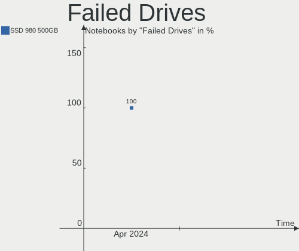

BlackPanther Hardware Trends (Notebooks)
----------------------------------------

A project to identify most popular hardware characteristics and track their change
over time based on data collected by BlackPanther users at https://Linux-Hardware.org.

Anyone can contribute to this report by the [hw-probe](https://github.com/linuxhw/hw-probe) tool:

    sudo -E hw-probe -all -upload

Full-feature report is available here: https://linux-hardware.org/?view=trends&formfactor=notebook

Period: Sep, 2021.

Contents
--------

* [ System ](#system)
  - [ OS                       ](#os)
  - [ OS Family                ](#os-family)
  - [ Kernel                   ](#kernel)
  - [ Kernel Family            ](#kernel-family)
  - [ Kernel Major Ver.        ](#kernel-major-ver)
  - [ Arch                     ](#arch)
  - [ DE                       ](#de)
  - [ Display Server           ](#display-server)
  - [ Display Manager          ](#display-manager)
  - [ OS Lang                  ](#os-lang)
  - [ Boot Mode                ](#boot-mode)
  - [ Filesystem               ](#filesystem)
  - [ Part. scheme             ](#part-scheme)
  - [ Dual Boot with Linux/BSD ](#dual-boot-with-linuxbsd)
  - [ Dual Boot (Win)          ](#dual-boot-win)

* [ Board ](#board)
  - [ Vendor                   ](#vendor)
  - [ Model                    ](#model)
  - [ Model Family             ](#model-family)
  - [ MFG Year                 ](#mfg-year)
  - [ Form Factor              ](#form-factor)
  - [ Secure Boot              ](#secure-boot)
  - [ Coreboot                 ](#coreboot)
  - [ RAM Size                 ](#ram-size)
  - [ RAM Used                 ](#ram-used)
  - [ Total Drives             ](#total-drives)
  - [ Has CD-ROM               ](#has-cd-rom)
  - [ Has Ethernet             ](#has-ethernet)
  - [ Has WiFi                 ](#has-wifi)
  - [ Has Bluetooth            ](#has-bluetooth)

* [ Location ](#location)
  - [ Country                  ](#country)
  - [ City                     ](#city)

* [ Drives ](#drives)
  - [ Drive Vendor             ](#drive-vendor)
  - [ Drive Model              ](#drive-model)
  - [ HDD Vendor               ](#hdd-vendor)
  - [ SSD Vendor               ](#ssd-vendor)
  - [ Drive Kind               ](#drive-kind)
  - [ Drive Connector          ](#drive-connector)
  - [ Drive Size               ](#drive-size)
  - [ Space Total              ](#space-total)
  - [ Space Used               ](#space-used)
  - [ Malfunc. Drives          ](#malfunc-drives)
  - [ Malfunc. Drive Vendor    ](#malfunc-drive-vendor)
  - [ Malfunc. HDD Vendor      ](#malfunc-hdd-vendor)
  - [ Malfunc. Drive Kind      ](#malfunc-drive-kind)
  - [ Failed Drives            ](#failed-drives)
  - [ Failed Drive Vendor      ](#failed-drive-vendor)
  - [ Drive Status             ](#drive-status)

* [ Storage controller ](#storage-controller)
  - [ Storage Vendor           ](#storage-vendor)
  - [ Storage Model            ](#storage-model)
  - [ Storage Kind             ](#storage-kind)

* [ Processor ](#processor)
  - [ CPU Vendor               ](#cpu-vendor)
  - [ CPU Model                ](#cpu-model)
  - [ CPU Model Family         ](#cpu-model-family)
  - [ CPU Cores                ](#cpu-cores)
  - [ CPU Sockets              ](#cpu-sockets)
  - [ CPU Threads              ](#cpu-threads)
  - [ CPU Op-Modes             ](#cpu-op-modes)
  - [ CPU Microcode            ](#cpu-microcode)
  - [ CPU Microarch            ](#cpu-microarch)

* [ Graphics ](#graphics)
  - [ GPU Vendor               ](#gpu-vendor)
  - [ GPU Model                ](#gpu-model)
  - [ GPU Combo                ](#gpu-combo)
  - [ GPU Driver               ](#gpu-driver)
  - [ GPU Memory               ](#gpu-memory)

* [ Monitor ](#monitor)
  - [ Monitor Vendor           ](#monitor-vendor)
  - [ Monitor Model            ](#monitor-model)
  - [ Monitor Resolution       ](#monitor-resolution)
  - [ Monitor Diagonal         ](#monitor-diagonal)
  - [ Monitor Width            ](#monitor-width)
  - [ Aspect Ratio             ](#aspect-ratio)
  - [ Monitor Area             ](#monitor-area)
  - [ Pixel Density            ](#pixel-density)
  - [ Multiple Monitors        ](#multiple-monitors)

* [ Network ](#network)
  - [ Net Controller Vendor    ](#net-controller-vendor)
  - [ Net Controller Model     ](#net-controller-model)
  - [ Wireless Vendor          ](#wireless-vendor)
  - [ Wireless Model           ](#wireless-model)
  - [ Ethernet Vendor          ](#ethernet-vendor)
  - [ Ethernet Model           ](#ethernet-model)
  - [ Net Controller Kind      ](#net-controller-kind)
  - [ Used Controller          ](#used-controller)
  - [ NICs                     ](#nics)
  - [ IPv6                     ](#ipv6)

* [ Bluetooth ](#bluetooth)
  - [ Bluetooth Vendor         ](#bluetooth-vendor)
  - [ Bluetooth Model          ](#bluetooth-model)

* [ Sound ](#sound)
  - [ Sound Vendor             ](#sound-vendor)
  - [ Sound Model              ](#sound-model)

* [ Memory ](#memory)
  - [ Memory Vendor            ](#memory-vendor)
  - [ Memory Model             ](#memory-model)
  - [ Memory Kind              ](#memory-kind)
  - [ Memory Form Factor       ](#memory-form-factor)
  - [ Memory Size              ](#memory-size)
  - [ Memory Speed             ](#memory-speed)

* [ Printers & scanners ](#printers--scanners)
  - [ Printer Vendor           ](#printer-vendor)
  - [ Printer Model            ](#printer-model)
  - [ Scanner Vendor           ](#scanner-vendor)
  - [ Scanner Model            ](#scanner-model)

* [ Camera ](#camera)
  - [ Camera Vendor            ](#camera-vendor)
  - [ Camera Model             ](#camera-model)

* [ Security ](#security)
  - [ Fingerprint Vendor       ](#fingerprint-vendor)
  - [ Fingerprint Model        ](#fingerprint-model)
  - [ Chipcard Vendor          ](#chipcard-vendor)
  - [ Chipcard Model           ](#chipcard-model)

* [ Unsupported ](#unsupported)
  - [ Unsupported Devices      ](#unsupported-devices)
  - [ Unsupported Device Types ](#unsupported-device-types)

System
------

OS
--

Installed operating systems

| Name              | Notebooks | Percent |
|-------------------|-----------|---------|
| BlackPanther 18.1 | 26        | 100%    |

OS Family
---------

OS without a version

| Name         | Notebooks | Percent |
|--------------|-----------|---------|
| BlackPanther | 26        | 100%    |

Kernel
------

Version of the Linux kernel

| Version             | Notebooks | Percent |
|---------------------|-----------|---------|
| 4.18.16-desktop-1bP | 15        | 57.69%  |
| 5.6.14-desktop-2bP  | 11        | 42.31%  |

Kernel Family
-------------

Linux kernel without a distro release

| Version | Notebooks | Percent |
|---------|-----------|---------|
| 4.18.16 | 15        | 57.69%  |
| 5.6.14  | 11        | 42.31%  |

Kernel Major Ver.
-----------------

Linux kernel major version

| Version | Notebooks | Percent |
|---------|-----------|---------|
| 4.18    | 15        | 57.69%  |
| 5.6     | 11        | 42.31%  |

Arch
----

OS architecture (x86_64, i586, etc.)

| Name   | Notebooks | Percent |
|--------|-----------|---------|
| x86_64 | 26        | 100%    |

DE
--

Desktop Environment

| Name | Notebooks | Percent |
|------|-----------|---------|
| KDE5 | 26        | 100%    |

Display Server
--------------

X11 or Wayland

| Name | Notebooks | Percent |
|------|-----------|---------|
| X11  | 26        | 100%    |

Display Manager
---------------

SDDM, LightDM, etc.

| Name | Notebooks | Percent |
|------|-----------|---------|
| SDDM | 26        | 100%    |

OS Lang
-------

Language

| Lang    | Notebooks | Percent |
|---------|-----------|---------|
| Unknown | 26        | 100%    |

Boot Mode
---------

EFI or BIOS

| Mode | Notebooks | Percent |
|------|-----------|---------|
| BIOS | 15        | 57.69%  |
| EFI  | 11        | 42.31%  |

Filesystem
----------

Type of filesystem

| Type    | Notebooks | Percent |
|---------|-----------|---------|
| Overlay | 21        | 80.77%  |
| Ext4    | 5         | 19.23%  |

Part. scheme
------------

Scheme of partitioning

| Type    | Notebooks | Percent |
|---------|-----------|---------|
| MBR     | 14        | 53.85%  |
| GPT     | 11        | 42.31%  |
| Unknown | 1         | 3.85%   |

Dual Boot with Linux/BSD
------------------------

Hosting more than one Linux/BSD

| Dual boot | Notebooks | Percent |
|-----------|-----------|---------|
| No        | 17        | 65.38%  |
| Yes       | 9         | 34.62%  |

Dual Boot (Win)
---------------

Hosting Linux and Windows

| Dual boot | Notebooks | Percent |
|-----------|-----------|---------|
| Yes       | 15        | 57.69%  |
| No        | 11        | 42.31%  |

Board
-----

Vendor
------

Motherboard manufacturer

| Name                | Notebooks | Percent |
|---------------------|-----------|---------|
| Acer                | 6         | 23.08%  |
| Hewlett-Packard     | 4         | 15.38%  |
| Samsung Electronics | 3         | 11.54%  |
| Dell                | 3         | 11.54%  |
| ASUSTek Computer    | 3         | 11.54%  |
| Toshiba             | 1         | 3.85%   |
| Packard Bell        | 1         | 3.85%   |
| Lenovo              | 1         | 3.85%   |
| Insyde              | 1         | 3.85%   |
| Fujitsu             | 1         | 3.85%   |
| eMachines           | 1         | 3.85%   |
| Apple               | 1         | 3.85%   |

Model
-----

Motherboard model

| Name                                       | Notebooks | Percent |
|--------------------------------------------|-----------|---------|
| Acer Aspire 2930Z                          | 3         | 11.54%  |
| Acer Aspire ES1-532G                       | 2         | 7.69%   |
| Toshiba Satellite L750                     | 1         | 3.85%   |
| Samsung R540/R580/R780/SA41/E452/E852      | 1         | 3.85%   |
| Samsung N150/N210/N220                     | 1         | 3.85%   |
| Samsung 300E4A/300E5A/300E7A/3430EA/3530EA | 1         | 3.85%   |
| Packard Bell EasyNote TK11BZ               | 1         | 3.85%   |
| Lenovo ThinkPad T470s 20HF005BMZ           | 1         | 3.85%   |
| Insyde Braswell                            | 1         | 3.85%   |
| HP ProBook 6470b                           | 1         | 3.85%   |
| HP Pavilion 17                             | 1         | 3.85%   |
| HP 650                                     | 1         | 3.85%   |
| HP 250 G6 Notebook PC                      | 1         | 3.85%   |
| Fujitsu LIFEBOOK AH531                     | 1         | 3.85%   |
| eMachines E525                             | 1         | 3.85%   |
| Dell Vostro 15-3568                        | 1         | 3.85%   |
| Dell Latitude E6430                        | 1         | 3.85%   |
| Dell Inspiron 3537                         | 1         | 3.85%   |
| ASUS VivoBook 15_ASUS Laptop X540UBR       | 1         | 3.85%   |
| ASUS Strix 15 GL503GE                      | 1         | 3.85%   |
| ASUS ASUS TUF Gaming A15 FA506IU_FX506IU   | 1         | 3.85%   |
| Apple MacBookPro5,5                        | 1         | 3.85%   |
| Acer F                                     | 1         | 3.85%   |

Model Family
------------

Motherboard model prefix

| Name                  | Notebooks | Percent |
|-----------------------|-----------|---------|
| Acer Aspire           | 5         | 19.23%  |
| Toshiba Satellite     | 1         | 3.85%   |
| Samsung R540          | 1         | 3.85%   |
| Samsung N150          | 1         | 3.85%   |
| Samsung 300E4A        | 1         | 3.85%   |
| Packard Bell EasyNote | 1         | 3.85%   |
| Lenovo ThinkPad       | 1         | 3.85%   |
| Insyde Braswell       | 1         | 3.85%   |
| HP ProBook            | 1         | 3.85%   |
| HP Pavilion           | 1         | 3.85%   |
| HP 650                | 1         | 3.85%   |
| HP 250                | 1         | 3.85%   |
| Fujitsu LIFEBOOK      | 1         | 3.85%   |
| eMachines E525        | 1         | 3.85%   |
| Dell Vostro           | 1         | 3.85%   |
| Dell Latitude         | 1         | 3.85%   |
| Dell Inspiron         | 1         | 3.85%   |
| ASUS VivoBook         | 1         | 3.85%   |
| ASUS Strix            | 1         | 3.85%   |
| ASUS ASUS             | 1         | 3.85%   |
| Apple MacBookPro5     | 1         | 3.85%   |
| Acer F                | 1         | 3.85%   |

MFG Year
--------

Motherboard manufacture year

| Year | Notebooks | Percent |
|------|-----------|---------|
| 2019 | 4         | 15.38%  |
| 2016 | 3         | 11.54%  |
| 2011 | 3         | 11.54%  |
| 2010 | 3         | 11.54%  |
| 2008 | 3         | 11.54%  |
| 2018 | 2         | 7.69%   |
| 2012 | 2         | 7.69%   |
| 2021 | 1         | 3.85%   |
| 2020 | 1         | 3.85%   |
| 2017 | 1         | 3.85%   |
| 2014 | 1         | 3.85%   |
| 2013 | 1         | 3.85%   |
| 2009 | 1         | 3.85%   |

Form Factor
-----------

Physical design of the computer

| Name     | Notebooks | Percent |
|----------|-----------|---------|
| Notebook | 26        | 100%    |

Secure Boot
-----------

Enabled or disabled

| State    | Notebooks | Percent |
|----------|-----------|---------|
| Disabled | 26        | 100%    |

Coreboot
--------

Have coreboot on board

| Used | Notebooks | Percent |
|------|-----------|---------|
| No   | 26        | 100%    |

RAM Size
--------

Total RAM memory

| Size in GB | Notebooks | Percent |
|------------|-----------|---------|
| 3.01-4.0   | 9         | 34.62%  |
| 4.01-8.0   | 8         | 30.77%  |
| 8.01-16.0  | 3         | 11.54%  |
| 2.01-3.0   | 2         | 7.69%   |
| 1.01-2.0   | 2         | 7.69%   |
| 24.01-32.0 | 1         | 3.85%   |
| 16.01-24.0 | 1         | 3.85%   |

RAM Used
--------

Used RAM memory

| Used GB  | Notebooks | Percent |
|----------|-----------|---------|
| 0.51-1.0 | 11        | 42.31%  |
| 1.01-2.0 | 8         | 30.77%  |
| 0.01-0.5 | 7         | 26.92%  |

Total Drives
------------

Number of drives on board

| Drives | Notebooks | Percent |
|--------|-----------|---------|
| 1      | 18        | 69.23%  |
| 2      | 6         | 23.08%  |
| 3      | 2         | 7.69%   |

Has CD-ROM
----------

Has CD-ROM on board

| Presented | Notebooks | Percent |
|-----------|-----------|---------|
| Yes       | 13        | 50%     |
| No        | 13        | 50%     |

Has Ethernet
------------

Has Ethernet on board

| Presented | Notebooks | Percent |
|-----------|-----------|---------|
| Yes       | 24        | 92.31%  |
| No        | 2         | 7.69%   |

Has WiFi
--------

Has WiFi module

| Presented | Notebooks | Percent |
|-----------|-----------|---------|
| Yes       | 26        | 100%    |

Has Bluetooth
-------------

Has Bluetooth module

| Presented | Notebooks | Percent |
|-----------|-----------|---------|
| Yes       | 18        | 69.23%  |
| No        | 8         | 30.77%  |

Location
--------

Country
-------

Geographic location (country)

| Country       | Notebooks | Percent |
|---------------|-----------|---------|
| Hungary       | 20        | 76.92%  |
| Argentina     | 3         | 11.54%  |
| USA           | 1         | 3.85%   |
| Liechtenstein | 1         | 3.85%   |
| Germany       | 1         | 3.85%   |

City
----

Geographic location (city)

| City             | Notebooks | Percent |
|------------------|-----------|---------|
| Budapest         | 7         | 26.92%  |
| Tigre            | 3         | 11.54%  |
| Sokoropatka      | 2         | 7.69%   |
| Wernberg-Koblitz | 1         | 3.85%   |
| Triesen          | 1         | 3.85%   |
| Tiszafured       | 1         | 3.85%   |
| Tatab??nya       | 1         | 3.85%   |
| Tarnok           | 1         | 3.85%   |
| Szeksz??rd       | 1         | 3.85%   |
| Ruzsa            | 1         | 3.85%   |
| Pap              | 1         | 3.85%   |
| North Hollywood  | 1         | 3.85%   |
| Miskolc          | 1         | 3.85%   |
| Kony             | 1         | 3.85%   |
| Gy?‘r            | 1         | 3.85%   |
| Cegled           | 1         | 3.85%   |
| Ajka             | 1         | 3.85%   |

Drives
------

Drive Vendor
------------

Hard drive vendors

| Vendor              | Notebooks | Drives | Percent |
|---------------------|-----------|--------|---------|
| Toshiba             | 9         | 9      | 25.71%  |
| WDC                 | 6         | 7      | 17.14%  |
| Seagate             | 5         | 6      | 14.29%  |
| Samsung Electronics | 5         | 5      | 14.29%  |
| Hitachi             | 3         | 3      | 8.57%   |
| Kingston            | 2         | 2      | 5.71%   |
| Unknown             | 1         | 1      | 2.86%   |
| PNY                 | 1         | 1      | 2.86%   |
| Micron Technology   | 1         | 1      | 2.86%   |
| Fujitsu             | 1         | 1      | 2.86%   |
| Crucial             | 1         | 1      | 2.86%   |

Drive Model
-----------

Hard drive models

| Model                               | Notebooks | Percent |
|-------------------------------------|-----------|---------|
| Toshiba MQ01ABD100 1TB              | 2         | 5.41%   |
| Seagate ST9500325AS 500GB           | 2         | 5.41%   |
| Kingston SA400S37480G 480GB SSD     | 2         | 5.41%   |
| WDC WD7500BPVT-60HXZT3 752GB        | 1         | 2.7%    |
| WDC WD5000BPVT-22HXZT1 500GB        | 1         | 2.7%    |
| WDC WD5000BEVT-22ZAT0 500GB         | 1         | 2.7%    |
| WDC WD3200LPLX-00ZNTT0 320GB        | 1         | 2.7%    |
| WDC WD1600BEVT-80A23T0 160GB        | 1         | 2.7%    |
| WDC WD1600BEVT-22ZCT0 160GB         | 1         | 2.7%    |
| WDC WD10JPVX-22JC3T0 1TB            | 1         | 2.7%    |
| Unknown HCG4a2  64GB                | 1         | 2.7%    |
| Toshiba TL100 120GB SSD             | 1         | 2.7%    |
| Toshiba THNSFJ256GCSU 256GB SSD     | 1         | 2.7%    |
| Toshiba MQ01ABD075 752GB            | 1         | 2.7%    |
| Toshiba MK6475GSX 640GB             | 1         | 2.7%    |
| Toshiba MK6465GSX 640GB             | 1         | 2.7%    |
| Toshiba MK1665GSX 160GB             | 1         | 2.7%    |
| Toshiba HDWL120 2TB                 | 1         | 2.7%    |
| Seagate ST500LT012-1DG142 500GB     | 1         | 2.7%    |
| Seagate ST320LT000-9VL142 320GB     | 1         | 2.7%    |
| Seagate ST1000LX015-1U7172 1TB      | 1         | 2.7%    |
| Seagate ST1000LM 024 HN-M101MBB 1TB | 1         | 2.7%    |
| Samsung MZVLW512HMJP-000L7 512GB    | 1         | 2.7%    |
| Samsung MZVLW256HEHP-00000 256GB    | 1         | 2.7%    |
| Samsung MZVLB512HBJQ-000L7 512GB    | 1         | 2.7%    |
| Samsung HM321HI 320GB               | 1         | 2.7%    |
| Samsung HM160HI 160GB               | 1         | 2.7%    |
| PNY CS900 240GB SSD                 | 1         | 2.7%    |
| Micron 2210_MTFDHBA512QFD 512GB     | 1         | 2.7%    |
| Hitachi HTS721010G9SA00 100GB       | 1         | 2.7%    |
| Hitachi HTS543232L9A300 320GB       | 1         | 2.7%    |
| Hitachi HTS543232A7A384 320GB       | 1         | 2.7%    |
| Fujitsu MHZ2320BH G2 320GB          | 1         | 2.7%    |
| Crucial CT120BX500SSD1 120GB        | 1         | 2.7%    |

HDD Vendor
----------

Hard disk drive vendors

| Vendor              | Notebooks | Drives | Percent |
|---------------------|-----------|--------|---------|
| Toshiba             | 7         | 7      | 29.17%  |
| WDC                 | 6         | 7      | 25%     |
| Seagate             | 5         | 6      | 20.83%  |
| Hitachi             | 3         | 3      | 12.5%   |
| Samsung Electronics | 2         | 2      | 8.33%   |
| Fujitsu             | 1         | 1      | 4.17%   |

SSD Vendor
----------

Solid state drive vendors

| Vendor   | Notebooks | Drives | Percent |
|----------|-----------|--------|---------|
| Toshiba  | 2         | 2      | 33.33%  |
| Kingston | 2         | 2      | 33.33%  |
| PNY      | 1         | 1      | 16.67%  |
| Crucial  | 1         | 1      | 16.67%  |

Drive Kind
----------

HDD or SSD

| Kind | Notebooks | Drives | Percent |
|------|-----------|--------|---------|
| HDD  | 21        | 26     | 67.74%  |
| SSD  | 6         | 6      | 19.35%  |
| NVMe | 3         | 4      | 9.68%   |
| MMC  | 1         | 1      | 3.23%   |

Drive Connector
---------------

SATA, SAS, NVMe, etc.

| Type | Notebooks | Drives | Percent |
|------|-----------|--------|---------|
| SATA | 24        | 31     | 82.76%  |
| NVMe | 3         | 4      | 10.34%  |
| SAS  | 1         | 1      | 3.45%   |
| MMC  | 1         | 1      | 3.45%   |

Drive Size
----------

Size of hard drive

| Size in TB | Notebooks | Drives | Percent |
|------------|-----------|--------|---------|
| 0.01-0.5   | 17        | 22     | 65.38%  |
| 0.51-1.0   | 8         | 9      | 30.77%  |
| 1.01-2.0   | 1         | 1      | 3.85%   |

Space Total
-----------

Amount of disk space available on the file system

| Size in GB | Notebooks | Percent |
|------------|-----------|---------|
| Unknown    | 21        | 80.77%  |
| 251-500    | 2         | 7.69%   |
| 21-50      | 1         | 3.85%   |
| 101-250    | 1         | 3.85%   |
| 51-100     | 1         | 3.85%   |

Space Used
----------

Amount of used disk space

| Used GB | Notebooks | Percent |
|---------|-----------|---------|
| Unknown | 21        | 80.77%  |
| 1-20    | 5         | 19.23%  |

Malfunc. Drives
---------------

Drive models with a malfunction

| Model                             | Notebooks | Drives | Percent |
|-----------------------------------|-----------|--------|---------|
| Seagate ST9500325AS 500GB         | 2         | 2      | 11.76%  |
| WDC WD7500BPVT-60HXZT3 752GB      | 1         | 1      | 5.88%   |
| WDC WD10JPVX-22JC3T0 1TB          | 1         | 1      | 5.88%   |
| Toshiba THNSFJ256GCSU 256GB SSD   | 1         | 1      | 5.88%   |
| Toshiba MQ01ABD075 752GB          | 1         | 1      | 5.88%   |
| Toshiba MK6465GSX 640GB           | 1         | 1      | 5.88%   |
| Toshiba MK1665GSX 160GB           | 1         | 1      | 5.88%   |
| Seagate ST500LT012-1DG142 500GB   | 1         | 1      | 5.88%   |
| Seagate ST320LT000-9VL142 320GB   | 1         | 1      | 5.88%   |
| Seagate ST1000LX015-1U7172 1TB    | 1         | 1      | 5.88%   |
| Samsung Electronics HM321HI 320GB | 1         | 1      | 5.88%   |
| Samsung Electronics HM160HI 160GB | 1         | 1      | 5.88%   |
| Hitachi HTS721010G9SA00 100GB     | 1         | 1      | 5.88%   |
| Hitachi HTS543232L9A300 320GB     | 1         | 1      | 5.88%   |
| Hitachi HTS543232A7A384 320GB     | 1         | 1      | 5.88%   |
| Fujitsu MHZ2320BH G2 320GB        | 1         | 1      | 5.88%   |

Malfunc. Drive Vendor
---------------------

Vendors of faulty drives

| Vendor              | Notebooks | Drives | Percent |
|---------------------|-----------|--------|---------|
| Toshiba             | 4         | 4      | 25%     |
| Seagate             | 4         | 5      | 25%     |
| Hitachi             | 3         | 3      | 18.75%  |
| WDC                 | 2         | 2      | 12.5%   |
| Samsung Electronics | 2         | 2      | 12.5%   |
| Fujitsu             | 1         | 1      | 6.25%   |

Malfunc. HDD Vendor
-------------------

Vendors of faulty HDD drives

| Vendor              | Notebooks | Drives | Percent |
|---------------------|-----------|--------|---------|
| Seagate             | 4         | 5      | 26.67%  |
| Toshiba             | 3         | 3      | 20%     |
| Hitachi             | 3         | 3      | 20%     |
| WDC                 | 2         | 2      | 13.33%  |
| Samsung Electronics | 2         | 2      | 13.33%  |
| Fujitsu             | 1         | 1      | 6.67%   |

Malfunc. Drive Kind
-------------------

Kinds of faulty drives

| Kind | Notebooks | Drives | Percent |
|------|-----------|--------|---------|
| HDD  | 14        | 16     | 93.33%  |
| SSD  | 1         | 1      | 6.67%   |

Failed Drives
-------------

Failed drive models

| Model                       | Notebooks | Drives | Percent |
|-----------------------------|-----------|--------|---------|
| WDC WD5000BEVT-22ZAT0 500GB | 1         | 1      | 50%     |
| Toshiba MK6475GSX 640GB     | 1         | 1      | 50%     |

Failed Drive Vendor
-------------------

Failed drive vendors

| Vendor  | Notebooks | Drives | Percent |
|---------|-----------|--------|---------|
| WDC     | 1         | 1      | 50%     |
| Toshiba | 1         | 1      | 50%     |

Drive Status
------------

Number of failed and malfunc. drives

| Status   | Notebooks | Drives | Percent |
|----------|-----------|--------|---------|
| Malfunc  | 14        | 17     | 46.67%  |
| Works    | 11        | 15     | 36.67%  |
| Detected | 3         | 3      | 10%     |
| Failed   | 2         | 2      | 6.67%   |

Storage controller
------------------

Storage Vendor
--------------

Storage controller vendors

| Vendor              | Notebooks | Percent |
|---------------------|-----------|---------|
| Intel               | 20        | 71.43%  |
| Samsung Electronics | 3         | 10.71%  |
| AMD                 | 3         | 10.71%  |
| Nvidia              | 1         | 3.57%   |
| Micron Technology   | 1         | 3.57%   |

Storage Model
-------------

Storage controller models

| Model                                                                            | Notebooks | Percent |
|----------------------------------------------------------------------------------|-----------|---------|
| Intel 82801IBM/IEM (ICH9M/ICH9M-E) 4 port SATA Controller [AHCI mode]            | 4         | 14.29%  |
| Intel 6 Series/C200 Series Chipset Family 6 port Mobile SATA AHCI Controller     | 3         | 10.71%  |
| Samsung NVMe SSD Controller SM961/PM961/SM963                                    | 2         | 7.14%   |
| Intel Sunrise Point-LP SATA Controller [AHCI mode]                               | 2         | 7.14%   |
| Intel Atom/Celeron/Pentium Processor x5-E8000/J3xxx/N3xxx Series SATA Controller | 2         | 7.14%   |
| Intel 7 Series Chipset Family 6-port SATA Controller [AHCI mode]                 | 2         | 7.14%   |
| AMD FCH SATA Controller [AHCI mode]                                              | 2         | 7.14%   |
| Samsung NVMe SSD Controller SM981/PM981/PM983                                    | 1         | 3.57%   |
| Nvidia MCP79 AHCI Controller                                                     | 1         | 3.57%   |
| Micron Non-Volatile memory controller                                            | 1         | 3.57%   |
| Intel NM10/ICH7 Family SATA Controller [AHCI mode]                               | 1         | 3.57%   |
| Intel Celeron/Pentium Silver Processor SATA Controller                           | 1         | 3.57%   |
| Intel Cannon Lake Mobile PCH SATA AHCI Controller                                | 1         | 3.57%   |
| Intel 82801IBM/IEM (ICH9M/ICH9M-E) 2 port SATA Controller [IDE mode]             | 1         | 3.57%   |
| Intel 82801 Mobile SATA Controller [RAID mode]                                   | 1         | 3.57%   |
| Intel 8 Series SATA Controller 1 [AHCI mode]                                     | 1         | 3.57%   |
| Intel 5 Series/3400 Series Chipset 4 port SATA AHCI Controller                   | 1         | 3.57%   |
| AMD SB7x0/SB8x0/SB9x0 SATA Controller [AHCI mode]                                | 1         | 3.57%   |

Storage Kind
------------

Kind of storage controller (IDE, SATA, NVMe, SAS, ...)

| Kind | Notebooks | Percent |
|------|-----------|---------|
| SATA | 22        | 81.48%  |
| NVMe | 3         | 11.11%  |
| RAID | 1         | 3.7%    |
| IDE  | 1         | 3.7%    |

Processor
---------

CPU Vendor
----------

Processor vendors

| Vendor | Notebooks | Percent |
|--------|-----------|---------|
| Intel  | 23        | 88.46%  |
| AMD    | 3         | 11.54%  |

CPU Model
---------

Processor models

| Model                                   | Notebooks | Percent |
|-----------------------------------------|-----------|---------|
| Intel Pentium Dual CPU T3200 @ 2.00GHz  | 3         | 11.54%  |
| Intel Celeron CPU N3160 @ 1.60GHz       | 2         | 7.69%   |
| Intel Pentium CPU B970 @ 2.30GHz        | 1         | 3.85%   |
| Intel Core i7-8750H CPU @ 2.20GHz       | 1         | 3.85%   |
| Intel Core i7-7500U CPU @ 2.70GHz       | 1         | 3.85%   |
| Intel Core i7-4500U CPU @ 1.80GHz       | 1         | 3.85%   |
| Intel Core i5-3380M CPU @ 2.90GHz       | 1         | 3.85%   |
| Intel Core i5-3340M CPU @ 2.70GHz       | 1         | 3.85%   |
| Intel Core i5-2430M CPU @ 2.40GHz       | 1         | 3.85%   |
| Intel Core i3-8130U CPU @ 2.20GHz       | 1         | 3.85%   |
| Intel Core i3-6006U CPU @ 2.00GHz       | 1         | 3.85%   |
| Intel Core i3-2350M CPU @ 2.30GHz       | 1         | 3.85%   |
| Intel Core i3-2330M CPU @ 2.20GHz       | 1         | 3.85%   |
| Intel Core i3 CPU M 370 @ 2.40GHz       | 1         | 3.85%   |
| Intel Core 2 Duo CPU P7550 @ 2.26GHz    | 1         | 3.85%   |
| Intel Core 2 Duo CPU P7450 @ 2.13GHz    | 1         | 3.85%   |
| Intel Celeron N4000 CPU @ 1.10GHz       | 1         | 3.85%   |
| Intel Celeron CPU N3050 @ 1.60GHz       | 1         | 3.85%   |
| Intel Celeron CPU 900 @ 2.20GHz         | 1         | 3.85%   |
| Intel Atom CPU N450 @ 1.66GHz           | 1         | 3.85%   |
| AMD Ryzen 7 4800H with Radeon Graphics  | 1         | 3.85%   |
| AMD E-350 Processor                     | 1         | 3.85%   |
| AMD A4-5000 APU with Radeon HD Graphics | 1         | 3.85%   |

CPU Model Family
----------------

Processor model prefix

| Model              | Notebooks | Percent |
|--------------------|-----------|---------|
| Intel Core i3      | 5         | 19.23%  |
| Intel Celeron      | 5         | 19.23%  |
| Intel Pentium Dual | 3         | 11.54%  |
| Intel Core i7      | 3         | 11.54%  |
| Intel Core i5      | 3         | 11.54%  |
| Intel Core 2 Duo   | 2         | 7.69%   |
| Intel Pentium      | 1         | 3.85%   |
| Intel Atom         | 1         | 3.85%   |
| AMD Ryzen 7        | 1         | 3.85%   |
| AMD E              | 1         | 3.85%   |
| AMD A4             | 1         | 3.85%   |

CPU Cores
---------

Number of processor cores

| Number | Notebooks | Percent |
|--------|-----------|---------|
| 2      | 18        | 69.23%  |
| 4      | 3         | 11.54%  |
| 1      | 3         | 11.54%  |
| 8      | 1         | 3.85%   |
| 6      | 1         | 3.85%   |

CPU Sockets
-----------

Number of sockets

| Number | Notebooks | Percent |
|--------|-----------|---------|
| 1      | 26        | 100%    |

CPU Threads
-----------

Threads per core (Hyper-Threading)

| Number | Notebooks | Percent |
|--------|-----------|---------|
| 1      | 14        | 53.85%  |
| 2      | 12        | 46.15%  |

CPU Op-Modes
------------

CPU Operation Modes (32-bit, 64-bit)

| Op mode        | Notebooks | Percent |
|----------------|-----------|---------|
| 32-bit, 64-bit | 26        | 100%    |

CPU Microcode
-------------

Microcode number

| Number     | Notebooks | Percent |
|------------|-----------|---------|
| 0x206a7    | 4         | 15.38%  |
| 0x6fd      | 3         | 11.54%  |
| 0x1067a    | 3         | 11.54%  |
| 0x306a9    | 2         | 7.69%   |
| 0x906ea    | 1         | 3.85%   |
| 0x806ea    | 1         | 3.85%   |
| 0x806e9    | 1         | 3.85%   |
| 0x706a1    | 1         | 3.85%   |
| 0x406e3    | 1         | 3.85%   |
| 0x406c4    | 1         | 3.85%   |
| 0x406c3    | 1         | 3.85%   |
| 0x40651    | 1         | 3.85%   |
| 0x20655    | 1         | 3.85%   |
| 0x106ca    | 1         | 3.85%   |
| 0x08600104 | 1         | 3.85%   |
| 0x0700010f | 1         | 3.85%   |
| 0x05000029 | 1         | 3.85%   |
| Unknown    | 1         | 3.85%   |

CPU Microarch
-------------

Microarchitecture

| Name          | Notebooks | Percent |
|---------------|-----------|---------|
| SandyBridge   | 4         | 15.38%  |
| Silvermont    | 3         | 11.54%  |
| Penryn        | 3         | 11.54%  |
| KabyLake      | 3         | 11.54%  |
| Core          | 3         | 11.54%  |
| IvyBridge     | 2         | 7.69%   |
| Zen 2         | 1         | 3.85%   |
| Westmere      | 1         | 3.85%   |
| Skylake       | 1         | 3.85%   |
| Jaguar        | 1         | 3.85%   |
| Haswell       | 1         | 3.85%   |
| Goldmont plus | 1         | 3.85%   |
| Bonnell       | 1         | 3.85%   |
| Bobcat        | 1         | 3.85%   |

Graphics
--------

GPU Vendor
----------

Vendors of graphics cards

| Vendor | Notebooks | Percent |
|--------|-----------|---------|
| Intel  | 20        | 57.14%  |
| Nvidia | 9         | 25.71%  |
| AMD    | 6         | 17.14%  |

GPU Model
---------

Graphics card models

| Model                                                                                    | Notebooks | Percent |
|------------------------------------------------------------------------------------------|-----------|---------|
| Intel Mobile 4 Series Chipset Integrated Graphics Controller                             | 5         | 14.29%  |
| Intel Atom/Celeron/Pentium Processor x5-E8000/J3xxx/N3xxx Integrated Graphics Controller | 3         | 8.57%   |
| Intel 2nd Generation Core Processor Family Integrated Graphics Controller                | 3         | 8.57%   |
| Nvidia GM108M [GeForce 920MX]                                                            | 2         | 5.71%   |
| Intel 3rd Gen Core processor Graphics Controller                                         | 2         | 5.71%   |
| Nvidia TU116M [GeForce GTX 1660 Ti Mobile]                                               | 1         | 2.86%   |
| Nvidia GP107M [GeForce GTX 1050 Ti Mobile]                                               | 1         | 2.86%   |
| Nvidia GM108M [GeForce MX110]                                                            | 1         | 2.86%   |
| Nvidia GF119M [GeForce GT 520M]                                                          | 1         | 2.86%   |
| Nvidia GF119M [GeForce GT 520MX]                                                         | 1         | 2.86%   |
| Nvidia GF108GLM [NVS 5200M]                                                              | 1         | 2.86%   |
| Nvidia C79 [GeForce 9400M]                                                               | 1         | 2.86%   |
| Intel UHD Graphics 620                                                                   | 1         | 2.86%   |
| Intel Skylake GT2 [HD Graphics 520]                                                      | 1         | 2.86%   |
| Intel HD Graphics 620                                                                    | 1         | 2.86%   |
| Intel Haswell-ULT Integrated Graphics Controller                                         | 1         | 2.86%   |
| Intel GeminiLake [UHD Graphics 600]                                                      | 1         | 2.86%   |
| Intel CoffeeLake-H GT2 [UHD Graphics 630]                                                | 1         | 2.86%   |
| Intel Atom Processor D4xx/D5xx/N4xx/N5xx Integrated Graphics Controller                  | 1         | 2.86%   |
| AMD Wrestler [Radeon HD 6310]                                                            | 1         | 2.86%   |
| AMD Venus PRO [Radeon HD 8850M / R9 M265X]                                               | 1         | 2.86%   |
| AMD RV730/M96-XT [Mobility Radeon HD 4670]                                               | 1         | 2.86%   |
| AMD RV710/M92 [Mobility Radeon HD 4530/4570/545v]                                        | 1         | 2.86%   |
| AMD Renoir                                                                               | 1         | 2.86%   |
| AMD Kabini [Radeon HD 8330]                                                              | 1         | 2.86%   |

GPU Combo
---------

Combinations of graphics cards

| Name           | Notebooks | Percent |
|----------------|-----------|---------|
| 1 x Intel      | 12        | 46.15%  |
| Intel + Nvidia | 6         | 23.08%  |
| 1 x AMD        | 3         | 11.54%  |
| 1 x Nvidia     | 2         | 7.69%   |
| Intel + AMD    | 2         | 7.69%   |
| AMD + Nvidia   | 1         | 3.85%   |

GPU Driver
----------

Free vs proprietary

| Driver | Notebooks | Percent |
|--------|-----------|---------|
| Free   | 26        | 100%    |

GPU Memory
----------

Total video memory

| Size in GB | Notebooks | Percent |
|------------|-----------|---------|
| Unknown    | 15        | 57.69%  |
| 0.51-1.0   | 4         | 15.38%  |
| 0.01-0.5   | 3         | 11.54%  |
| 1.01-2.0   | 2         | 7.69%   |
| 5.01-6.0   | 1         | 3.85%   |
| 3.01-4.0   | 1         | 3.85%   |

Monitor
-------

Monitor Vendor
--------------

Monitor vendors

| Vendor                  | Notebooks | Percent |
|-------------------------|-----------|---------|
| LG Display              | 6         | 21.43%  |
| Chimei Innolux          | 6         | 21.43%  |
| AU Optronics            | 5         | 17.86%  |
| Samsung Electronics     | 3         | 10.71%  |
| PANDA                   | 2         | 7.14%   |
| Toshiba                 | 1         | 3.57%   |
| InnoLux Display         | 1         | 3.57%   |
| Chi Mei Optoelectronics | 1         | 3.57%   |
| BOE                     | 1         | 3.57%   |
| Apple                   | 1         | 3.57%   |
| AOC                     | 1         | 3.57%   |

Monitor Model
-------------

Monitor models

| Model                                                                     | Notebooks | Percent |
|---------------------------------------------------------------------------|-----------|---------|
| Chimei Innolux LCD Monitor CMN15DB 1366x768 344x193mm 15.5-inch           | 3         | 10.71%  |
| AU Optronics LCD Monitor AUO3714 1280x800 261x163mm 12.1-inch             | 3         | 10.71%  |
| Toshiba TV TSB0108 1920x1080 890x500mm 40.2-inch                          | 1         | 3.57%   |
| Samsung Electronics LCD Monitor SEC5541 1366x768 344x193mm 15.5-inch      | 1         | 3.57%   |
| Samsung Electronics LCD Monitor SEC324A 1366x768 344x194mm 15.5-inch      | 1         | 3.57%   |
| Samsung Electronics LCD Monitor SEC3245 1366x768 344x194mm 15.5-inch      | 1         | 3.57%   |
| PANDA LM156LF1L03 NCP001C 1920x1080 344x194mm 15.5-inch                   | 1         | 3.57%   |
| PANDA LCD Monitor NCP004D 1920x1080 344x194mm 15.5-inch                   | 1         | 3.57%   |
| LG Display LP156WH1-TLA3 LGD01C2 1366x768 344x194mm 15.5-inch             | 1         | 3.57%   |
| LG Display LCD Monitor LGD055F 2560x1440 310x174mm 14.0-inch              | 1         | 3.57%   |
| LG Display LCD Monitor LGD03AB 1366x768 344x194mm 15.5-inch               | 1         | 3.57%   |
| LG Display LCD Monitor LGD02F2 1366x768 344x194mm 15.5-inch               | 1         | 3.57%   |
| LG Display LCD Monitor LGD02DF 1600x900 310x174mm 14.0-inch               | 1         | 3.57%   |
| LG Display LCD Monitor LGD02DC 1366x768 344x194mm 15.5-inch               | 1         | 3.57%   |
| InnoLux Display BT101IW03V1 INL000D 1024x600 222x125mm 10.0-inch          | 1         | 3.57%   |
| Chimei Innolux LCD Monitor CMN15F4 1920x1080 344x193mm 15.5-inch          | 1         | 3.57%   |
| Chimei Innolux LCD Monitor CMN15CA 1366x768 340x190mm 15.3-inch           | 1         | 3.57%   |
| Chimei Innolux LCD Monitor CMN1469 1366x768 309x174mm 14.0-inch           | 1         | 3.57%   |
| Chi Mei Optoelectronics LCD Monitor CMO1807 1920x1080 408x230mm 18.4-inch | 1         | 3.57%   |
| BOE LCD Monitor BOE0674 1366x768 344x194mm 15.5-inch                      | 1         | 3.57%   |
| AU Optronics LCD Monitor AUO26EC 1366x768 344x193mm 15.5-inch             | 1         | 3.57%   |
| AU Optronics LCD Monitor AUO159E 1600x900 380x210mm 17.1-inch             | 1         | 3.57%   |
| Apple LCD Monitor APP9C9F 1280x800 286x179mm 13.3-inch                    | 1         | 3.57%   |
| AOC Q32G1WG4 AOC3201 2560x1440 697x393mm 31.5-inch                        | 1         | 3.57%   |

Monitor Resolution
------------------

Monitor screen resolution

| Resolution      | Notebooks | Percent |
|-----------------|-----------|---------|
| 1366x768 (WXGA) | 13        | 46.43%  |
| 1920x1080 (FHD) | 4         | 14.29%  |
| 1280x800 (WXGA) | 4         | 14.29%  |
| 1600x900 (HD+)  | 3         | 10.71%  |
| 3840x2160 (4K)  | 1         | 3.57%   |
| 2560x1440 (QHD) | 1         | 3.57%   |
| 1920x540        | 1         | 3.57%   |
| 1024x600        | 1         | 3.57%   |

Monitor Diagonal
----------------

Diagonal size in inches

| Inches | Notebooks | Percent |
|--------|-----------|---------|
| 15     | 16        | 57.14%  |
| 14     | 3         | 10.71%  |
| 12     | 3         | 10.71%  |
| 72     | 1         | 3.57%   |
| 31     | 1         | 3.57%   |
| 18     | 1         | 3.57%   |
| 17     | 1         | 3.57%   |
| 13     | 1         | 3.57%   |
| 10     | 1         | 3.57%   |

Monitor Width
-------------

Physical width

| Width in mm | Notebooks | Percent |
|-------------|-----------|---------|
| 301-350     | 19        | 67.86%  |
| 201-300     | 5         | 17.86%  |
| 601-700     | 1         | 3.57%   |
| 401-500     | 1         | 3.57%   |
| 351-400     | 1         | 3.57%   |
| 1501-2000   | 1         | 3.57%   |

Aspect Ratio
------------

Proportional relationship between the width and the height

| Ratio | Notebooks | Percent |
|-------|-----------|---------|
| 16/9  | 22        | 84.62%  |
| 16/10 | 4         | 15.38%  |

Monitor Area
------------

Area in inch²

| Area in inch² | Notebooks | Percent |
|----------------|-----------|---------|
| 101-110        | 16        | 57.14%  |
| 81-90          | 4         | 14.29%  |
| 61-70          | 3         | 10.71%  |
| More than 1000 | 1         | 3.57%   |
| 351-500        | 1         | 3.57%   |
| 41-50          | 1         | 3.57%   |
| 141-150        | 1         | 3.57%   |
| 121-130        | 1         | 3.57%   |

Pixel Density
-------------

Pixels per inch

| Density | Notebooks | Percent |
|---------|-----------|---------|
| 101-120 | 18        | 64.29%  |
| 121-160 | 7         | 25%     |
| 1-50    | 1         | 3.57%   |
| 161-240 | 1         | 3.57%   |
| 51-100  | 1         | 3.57%   |

Multiple Monitors
-----------------

Total monitors connected

| Total | Notebooks | Percent |
|-------|-----------|---------|
| 1     | 24        | 92.31%  |
| 2     | 2         | 7.69%   |

Network
-------

Net Controller Vendor
---------------------

Controller vendors

| Vendor                   | Notebooks | Percent |
|--------------------------|-----------|---------|
| Realtek Semiconductor    | 15        | 33.33%  |
| Intel                    | 13        | 28.89%  |
| Qualcomm Atheros         | 8         | 17.78%  |
| Ralink                   | 2         | 4.44%   |
| Broadcom Limited         | 2         | 4.44%   |
| Broadcom                 | 2         | 4.44%   |
| Sierra Wireless          | 1         | 2.22%   |
| Nvidia                   | 1         | 2.22%   |
| Marvell Technology Group | 1         | 2.22%   |

Net Controller Model
--------------------

Controller models

| Model                                                             | Notebooks | Percent |
|-------------------------------------------------------------------|-----------|---------|
| Realtek RTL8111/8168/8411 PCI Express Gigabit Ethernet Controller | 12        | 24%     |
| Qualcomm Atheros AR928X Wireless Network Adapter (PCI-Express)    | 3         | 6%      |
| Realtek RTL810xE PCI Express Fast Ethernet controller             | 2         | 4%      |
| Qualcomm Atheros AR9285 Wireless Network Adapter (PCI-Express)    | 2         | 4%      |
| Intel Wireless 8265 / 8275                                        | 2         | 4%      |
| Intel WiFi Link 5100                                              | 2         | 4%      |
| Intel Dual Band Wireless-AC 3168NGW [Stone Peak]                  | 2         | 4%      |
| Intel Centrino Ultimate-N 6300                                    | 2         | 4%      |
| Intel 82579LM Gigabit Network Connection (Lewisville)             | 2         | 4%      |
| Sierra Wireless EM7455 Qualcomm Snapdragon X7 LTE-A               | 1         | 2%      |
| Realtek RTL8822CE 802.11ac PCIe Wireless Network Adapter          | 1         | 2%      |
| Realtek RTL8723BU 802.11b/g/n WLAN Adapter                        | 1         | 2%      |
| Ralink WLAN controller                                            | 1         | 2%      |
| Ralink RT3290 Wireless 802.11n 1T/1R PCIe                         | 1         | 2%      |
| Qualcomm Atheros QCA9565 / AR9565 Wireless Network Adapter        | 1         | 2%      |
| Qualcomm Atheros AR8152 v2.0 Fast Ethernet                        | 1         | 2%      |
| Qualcomm Atheros AR8151 v2.0 Gigabit Ethernet                     | 1         | 2%      |
| Qualcomm Atheros AR8132 Fast Ethernet                             | 1         | 2%      |
| Nvidia MCP79 Ethernet                                             | 1         | 2%      |
| Marvell Group 88E8040 PCI-E Fast Ethernet Controller              | 1         | 2%      |
| Intel Wireless 3165                                               | 1         | 2%      |
| Intel Gemini Lake PCH CNVi WiFi                                   | 1         | 2%      |
| Intel Ethernet Connection (4) I219-V                              | 1         | 2%      |
| Intel Centrino Wireless-N 130                                     | 1         | 2%      |
| Intel Centrino Advanced-N 6205 [Taylor Peak]                      | 1         | 2%      |
| Intel Cannon Lake PCH CNVi WiFi                                   | 1         | 2%      |
| Broadcom Limited NetLink BCM5784M Gigabit Ethernet PCIe           | 1         | 2%      |
| Broadcom Limited BCM43225 802.11b/g/n                             | 1         | 2%      |
| Broadcom BCM4322 802.11a/b/g/n Wireless LAN Controller            | 1         | 2%      |
| Broadcom BCM4313 802.11bgn Wireless Network Adapter               | 1         | 2%      |

Wireless Vendor
---------------

Wireless vendors

| Vendor                | Notebooks | Percent |
|-----------------------|-----------|---------|
| Intel                 | 13        | 48.15%  |
| Qualcomm Atheros      | 6         | 22.22%  |
| Realtek Semiconductor | 2         | 7.41%   |
| Ralink                | 2         | 7.41%   |
| Broadcom              | 2         | 7.41%   |
| Sierra Wireless       | 1         | 3.7%    |
| Broadcom Limited      | 1         | 3.7%    |

Wireless Model
--------------

Wireless models

| Model                                                          | Notebooks | Percent |
|----------------------------------------------------------------|-----------|---------|
| Qualcomm Atheros AR928X Wireless Network Adapter (PCI-Express) | 3         | 11.11%  |
| Qualcomm Atheros AR9285 Wireless Network Adapter (PCI-Express) | 2         | 7.41%   |
| Intel Wireless 8265 / 8275                                     | 2         | 7.41%   |
| Intel WiFi Link 5100                                           | 2         | 7.41%   |
| Intel Dual Band Wireless-AC 3168NGW [Stone Peak]               | 2         | 7.41%   |
| Intel Centrino Ultimate-N 6300                                 | 2         | 7.41%   |
| Sierra Wireless EM7455 Qualcomm Snapdragon X7 LTE-A            | 1         | 3.7%    |
| Realtek RTL8822CE 802.11ac PCIe Wireless Network Adapter       | 1         | 3.7%    |
| Realtek RTL8723BU 802.11b/g/n WLAN Adapter                     | 1         | 3.7%    |
| Ralink WLAN controller                                         | 1         | 3.7%    |
| Ralink RT3290 Wireless 802.11n 1T/1R PCIe                      | 1         | 3.7%    |
| Qualcomm Atheros QCA9565 / AR9565 Wireless Network Adapter     | 1         | 3.7%    |
| Intel Wireless 3165                                            | 1         | 3.7%    |
| Intel Gemini Lake PCH CNVi WiFi                                | 1         | 3.7%    |
| Intel Centrino Wireless-N 130                                  | 1         | 3.7%    |
| Intel Centrino Advanced-N 6205 [Taylor Peak]                   | 1         | 3.7%    |
| Intel Cannon Lake PCH CNVi WiFi                                | 1         | 3.7%    |
| Broadcom Limited BCM43225 802.11b/g/n                          | 1         | 3.7%    |
| Broadcom BCM4322 802.11a/b/g/n Wireless LAN Controller         | 1         | 3.7%    |
| Broadcom BCM4313 802.11bgn Wireless Network Adapter            | 1         | 3.7%    |

Ethernet Vendor
---------------

Ethernet vendors

| Vendor                   | Notebooks | Percent |
|--------------------------|-----------|---------|
| Realtek Semiconductor    | 14        | 60.87%  |
| Qualcomm Atheros         | 3         | 13.04%  |
| Intel                    | 3         | 13.04%  |
| Nvidia                   | 1         | 4.35%   |
| Marvell Technology Group | 1         | 4.35%   |
| Broadcom Limited         | 1         | 4.35%   |

Ethernet Model
--------------

Ethernet models

| Model                                                             | Notebooks | Percent |
|-------------------------------------------------------------------|-----------|---------|
| Realtek RTL8111/8168/8411 PCI Express Gigabit Ethernet Controller | 12        | 52.17%  |
| Realtek RTL810xE PCI Express Fast Ethernet controller             | 2         | 8.7%    |
| Intel 82579LM Gigabit Network Connection (Lewisville)             | 2         | 8.7%    |
| Qualcomm Atheros AR8152 v2.0 Fast Ethernet                        | 1         | 4.35%   |
| Qualcomm Atheros AR8151 v2.0 Gigabit Ethernet                     | 1         | 4.35%   |
| Qualcomm Atheros AR8132 Fast Ethernet                             | 1         | 4.35%   |
| Nvidia MCP79 Ethernet                                             | 1         | 4.35%   |
| Marvell Group 88E8040 PCI-E Fast Ethernet Controller              | 1         | 4.35%   |
| Intel Ethernet Connection (4) I219-V                              | 1         | 4.35%   |
| Broadcom Limited NetLink BCM5784M Gigabit Ethernet PCIe           | 1         | 4.35%   |

Net Controller Kind
-------------------

Ethernet, WiFi or modem

| Kind     | Notebooks | Percent |
|----------|-----------|---------|
| WiFi     | 26        | 53.06%  |
| Ethernet | 23        | 46.94%  |

Used Controller
---------------

Currently used network controller

| Kind     | Notebooks | Percent |
|----------|-----------|---------|
| WiFi     | 21        | 67.74%  |
| Ethernet | 10        | 32.26%  |

NICs
----

Total network controllers on board

| Total | Notebooks | Percent |
|-------|-----------|---------|
| 2     | 23        | 88.46%  |
| 1     | 2         | 7.69%   |
| 0     | 1         | 3.85%   |

IPv6
----

IPv6 vs IPv4

| Used | Notebooks | Percent |
|------|-----------|---------|
| No   | 17        | 65.38%  |
| Yes  | 9         | 34.62%  |

Bluetooth
---------

Bluetooth Vendor
----------------

Controller vendors

| Vendor                          | Notebooks | Percent |
|---------------------------------|-----------|---------|
| Intel                           | 8         | 42.11%  |
| Broadcom                        | 4         | 21.05%  |
| Qualcomm Atheros Communications | 2         | 10.53%  |
| Ralink                          | 1         | 5.26%   |
| Lite-On Technology              | 1         | 5.26%   |
| Dell                            | 1         | 5.26%   |
| Cambridge Silicon Radio         | 1         | 5.26%   |
| Apple                           | 1         | 5.26%   |

Bluetooth Model
---------------

Controller models

| Model                                               | Notebooks | Percent |
|-----------------------------------------------------|-----------|---------|
| Intel Bluetooth Device                              | 3         | 15.79%  |
| Intel Bluetooth wireless interface                  | 2         | 10.53%  |
| Intel Bluetooth 9460/9560 Jefferson Peak (JfP)      | 2         | 10.53%  |
| Ralink RT3290 Bluetooth                             | 1         | 5.26%   |
| Qualcomm Atheros AR9462 Bluetooth                   | 1         | 5.26%   |
| Qualcomm Atheros AR3011 Bluetooth                   | 1         | 5.26%   |
| Lite-On Bluetooth Radio                             | 1         | 5.26%   |
| Intel Centrino Advanced-N 6230 Bluetooth adapter    | 1         | 5.26%   |
| Dell BCM20702A0                                     | 1         | 5.26%   |
| Cambridge Silicon Radio Bluetooth Dongle (HCI mode) | 1         | 5.26%   |
| Broadcom HP Portable SoftSailing                    | 1         | 5.26%   |
| Broadcom Bluetooth 2.1 Device                       | 1         | 5.26%   |
| Broadcom Bluetooth                                  | 1         | 5.26%   |
| Broadcom BCM2070 Bluetooth Device                   | 1         | 5.26%   |
| Apple Bluetooth Host Controller                     | 1         | 5.26%   |

Sound
-----

Sound Vendor
------------

Sound card vendors

| Vendor | Notebooks | Percent |
|--------|-----------|---------|
| Intel  | 22        | 73.33%  |
| AMD    | 5         | 16.67%  |
| Nvidia | 3         | 10%     |

Sound Model
-----------

Sound card models

| Model                                                                                             | Notebooks | Percent |
|---------------------------------------------------------------------------------------------------|-----------|---------|
| Intel 82801I (ICH9 Family) HD Audio Controller                                                    | 5         | 14.71%  |
| Intel Sunrise Point-LP HD Audio                                                                   | 3         | 8.82%   |
| Intel Atom/Celeron/Pentium Processor x5-E8000/J3xxx/N3xxx Series High Definition Audio Controller | 3         | 8.82%   |
| Intel 7 Series/C216 Chipset Family High Definition Audio Controller                               | 3         | 8.82%   |
| Intel 6 Series/C200 Series Chipset Family High Definition Audio Controller                        | 3         | 8.82%   |
| AMD RV710/730 HDMI Audio [Radeon HD 4000 series]                                                  | 2         | 5.88%   |
| Nvidia TU116 High Definition Audio Controller                                                     | 1         | 2.94%   |
| Nvidia MCP79 High Definition Audio                                                                | 1         | 2.94%   |
| Nvidia GF119 HDMI Audio Controller                                                                | 1         | 2.94%   |
| Intel NM10/ICH7 Family High Definition Audio Controller                                           | 1         | 2.94%   |
| Intel Haswell-ULT HD Audio Controller                                                             | 1         | 2.94%   |
| Intel Celeron/Pentium Silver Processor High Definition Audio                                      | 1         | 2.94%   |
| Intel Cannon Lake PCH cAVS                                                                        | 1         | 2.94%   |
| Intel 8 Series HD Audio Controller                                                                | 1         | 2.94%   |
| Intel 5 Series/3400 Series Chipset High Definition Audio                                          | 1         | 2.94%   |
| AMD Wrestler HDMI Audio                                                                           | 1         | 2.94%   |
| AMD SBx00 Azalia (Intel HDA)                                                                      | 1         | 2.94%   |
| AMD Renoir Radeon High Definition Audio Controller                                                | 1         | 2.94%   |
| AMD Kabini HDMI/DP Audio                                                                          | 1         | 2.94%   |
| AMD FCH Azalia Controller                                                                         | 1         | 2.94%   |
| AMD Family 17h (Models 10h-1fh) HD Audio Controller                                               | 1         | 2.94%   |

Memory
------

Memory Vendor
-------------

Memory module vendors

| Vendor                | Notebooks | Percent |
|-----------------------|-----------|---------|
| Samsung Electronics   | 12        | 36.36%  |
| SK Hynix              | 6         | 18.18%  |
| Micron Technology     | 5         | 15.15%  |
| Unknown               | 2         | 6.06%   |
| Kingston              | 2         | 6.06%   |
| Nanya Technology      | 1         | 3.03%   |
| Kingmax Semiconductor | 1         | 3.03%   |
| Elpida                | 1         | 3.03%   |
| Crucial               | 1         | 3.03%   |
| A-DATA Technology     | 1         | 3.03%   |
| 48spaces              | 1         | 3.03%   |

Memory Model
------------

Memory module models

| Model                                                                        | Notebooks | Percent |
|------------------------------------------------------------------------------|-----------|---------|
| SK Hynix RAM 212121212121212121212121212121212121 2048MB SODIMM DDR2 667MT/s | 3         | 7.69%   |
| SK Hynix RAM 202020202020202020202020202020202020 2048MB SODIMM DDR2 667MT/s | 3         | 7.69%   |
| Samsung RAM M471B5673EH1-CF8 2048MB SODIMM DDR3 4199MT/s                     | 2         | 5.13%   |
| Samsung RAM M471B5273CH0-CH9 4096MB SODIMM DDR3 1334MT/s                     | 2         | 5.13%   |
| Samsung RAM M471A5244BB0-CRC 4096MB SODIMM DDR4 2667MT/s                     | 2         | 5.13%   |
| Kingston RAM 99U5428-018.A00LF 8GB SODIMM DDR3 1600MT/s                      | 2         | 5.13%   |
| Unknown SODIMM 2048MB SODIMM 1066MT/s                                        | 1         | 2.56%   |
| Unknown RAM Module 2048MB SODIMM DDR3 1600MT/s                               | 1         | 2.56%   |
| SK Hynix RAM Module 1024MB SODIMM DDR3 1067MT/s                              | 1         | 2.56%   |
| SK Hynix RAM HMT351S6CFR8C-PB 4096MB SODIMM DDR3 1600MT/s                    | 1         | 2.56%   |
| SK Hynix RAM HMA851S6AFR6N-UH 4GB SODIMM DDR4 2667MT/s                       | 1         | 2.56%   |
| Samsung RAM M471B5773CHS-CH9 2048MB SODIMM DDR3 4199MT/s                     | 1         | 2.56%   |
| Samsung RAM M471B5673FH0-CF8 2048MB SODIMM DDR3 1067MT/s                     | 1         | 2.56%   |
| Samsung RAM M471B5673EH1-CH9 2048MB SODIMM DDR3 1334MT/s                     | 1         | 2.56%   |
| Samsung RAM M471B5273DH0-CH9 4096MB SODIMM DDR3 1334MT/s                     | 1         | 2.56%   |
| Samsung RAM M471B5173QH0-YK0 4GB SODIMM DDR3 1600MT/s                        | 1         | 2.56%   |
| Samsung RAM M471B2873FHS-CF8 1024MB SODIMM DDR3 1067MT/s                     | 1         | 2.56%   |
| Samsung RAM M471A2K43CB1-CTD 16GB SODIMM DDR4 2667MT/s                       | 1         | 2.56%   |
| Samsung RAM M471A2K43BB1-CRC 16384MB SODIMM DDR4 2400MT/s                    | 1         | 2.56%   |
| Samsung RAM CBCBCBCBCBCBCBCBCBCBCBCBCBCBCBCBCBCB 2048MB SODIMM DDR2 667MT/s  | 1         | 2.56%   |
| Nanya RAM NT4GC64B8HG0NS-CG 4096MB SODIMM DDR3 1333MT/s                      | 1         | 2.56%   |
| Micron RAM 8KTF51264HZ-1G6N1 4GB SODIMM DDR3 1600MT/s                        | 1         | 2.56%   |
| Micron RAM 8KTF51264HZ-1G6E1 4096MB SODIMM DDR3 1600MT/s                     | 1         | 2.56%   |
| Micron RAM 4ATS1G64HZ-2G3A1 8192MB SODIMM DDR4 2400MT/s                      | 1         | 2.56%   |
| Micron RAM 4ATF1G64HZ-3G2E1 8GB SODIMM DDR4 3200MT/s                         | 1         | 2.56%   |
| Micron RAM 151515151515151515151515151515151515 1024MB SODIMM DDR2 667MT/s   | 1         | 2.56%   |
| Kingmax RAM FSGF63F-D8 4096MB SODIMM DDR3 1600MT/s                           | 1         | 2.56%   |
| Elpida RAM EBJ21UE8BFU0-DJ-F 2048MB SODIMM DDR3 1334MT/s                     | 1         | 2.56%   |
| Crucial RAM CT8G4SFD8213.C16FBR2 8192MB SODIMM DDR4 2267MT/s                 | 1         | 2.56%   |
| A-DATA RAM AM1L16BC4R1-B1HS 4096MB SODIMM DDR3 1600MT/s                      | 1         | 2.56%   |
| 48spaces RAM 012345678901234567890123456789012345 2GB SODIMM DDR2 667MT/s    | 1         | 2.56%   |

Memory Kind
-----------

Memory module kinds

| Kind    | Notebooks | Percent |
|---------|-----------|---------|
| DDR3    | 16        | 51.61%  |
| DDR4    | 6         | 19.35%  |
| DDR2    | 4         | 12.9%   |
| SDRAM   | 3         | 9.68%   |
| LPDDR4  | 1         | 3.23%   |
| Unknown | 1         | 3.23%   |

Memory Form Factor
------------------

Physical design of the memory module

| Name   | Notebooks | Percent |
|--------|-----------|---------|
| SODIMM | 27        | 100%    |

Memory Size
-----------

Memory module size

| Size  | Notebooks | Percent |
|-------|-----------|---------|
| 2048  | 12        | 35.29%  |
| 4096  | 10        | 29.41%  |
| 8192  | 7         | 20.59%  |
| 1024  | 3         | 8.82%   |
| 16384 | 2         | 5.88%   |

Memory Speed
------------

Memory module speed

| Speed | Notebooks | Percent |
|-------|-----------|---------|
| 1600  | 8         | 25.81%  |
| 667   | 5         | 16.13%  |
| 2667  | 4         | 12.9%   |
| 1334  | 4         | 12.9%   |
| 4199  | 3         | 9.68%   |
| 1067  | 2         | 6.45%   |
| 3200  | 1         | 3.23%   |
| 2400  | 1         | 3.23%   |
| 2267  | 1         | 3.23%   |
| 1333  | 1         | 3.23%   |
| 1066  | 1         | 3.23%   |

Printers & scanners
-------------------

Printer Vendor
--------------

Printer device vendors

Zero info for selected period =(

Printer Model
-------------

Printer device models

Zero info for selected period =(

Scanner Vendor
--------------

Scanner device vendors

Zero info for selected period =(

Scanner Model
-------------

Scanner device models

Zero info for selected period =(

Camera
------

Camera Vendor
-------------

Camera device vendors

| Vendor                                 | Notebooks | Percent |
|----------------------------------------|-----------|---------|
| Suyin                                  | 6         | 23.08%  |
| Chicony Electronics                    | 5         | 19.23%  |
| Realtek Semiconductor                  | 3         | 11.54%  |
| Z-Star Microelectronics                | 2         | 7.69%   |
| Microdia                               | 2         | 7.69%   |
| IMC Networks                           | 2         | 7.69%   |
| Quanta                                 | 1         | 3.85%   |
| Primax Electronics                     | 1         | 3.85%   |
| DigiTech                               | 1         | 3.85%   |
| Cheng Uei Precision Industry (Foxlink) | 1         | 3.85%   |
| Apple                                  | 1         | 3.85%   |
| Acer                                   | 1         | 3.85%   |

Camera Model
------------

Camera device models

| Model                                               | Notebooks | Percent |
|-----------------------------------------------------|-----------|---------|
| Suyin Acer HD Crystal Eye webcam                    | 4         | 15.38%  |
| Realtek USB Camera                                  | 2         | 7.69%   |
| IMC Networks USB2.0 HD UVC WebCam                   | 2         | 7.69%   |
| Chicony VGA Webcam                                  | 2         | 7.69%   |
| Z-Star WebCam SC-03FFL11739P                        | 1         | 3.85%   |
| Z-Star Webcam                                       | 1         | 3.85%   |
| Suyin Acer/HP Integrated Webcam [CN0314]            | 1         | 3.85%   |
| Suyin 1.3M HD WebCam                                | 1         | 3.85%   |
| Realtek Integrated Webcam                           | 1         | 3.85%   |
| Quanta HP Webcam                                    | 1         | 3.85%   |
| Primax HP HD Webcam [Fixed]                         | 1         | 3.85%   |
| Microdia Laptop_Integrated_Webcam_HD                | 1         | 3.85%   |
| Microdia Integrated Webcam                          | 1         | 3.85%   |
| DigiTech USB 2.0 PC Camera                          | 1         | 3.85%   |
| Chicony USB2.0 VGA UVC WebCam                       | 1         | 3.85%   |
| Chicony HP Truevision HD                            | 1         | 3.85%   |
| Chicony Fujitsu Integrated Camera                   | 1         | 3.85%   |
| Cheng Uei Precision Industry (Foxlink) HP Webcam-50 | 1         | 3.85%   |
| Apple Built-in iSight                               | 1         | 3.85%   |
| Acer Integrated Camera                              | 1         | 3.85%   |

Security
--------

Fingerprint Vendor
------------------

Fingerprint sensor vendors

| Vendor           | Notebooks | Percent |
|------------------|-----------|---------|
| Validity Sensors | 2         | 100%    |

Fingerprint Model
-----------------

Fingerprint sensor models

| Model                           | Notebooks | Percent |
|---------------------------------|-----------|---------|
| Validity Sensors VFS491         | 1         | 50%     |
| Validity Sensors Synaptics WBDI | 1         | 50%     |

Chipcard Vendor
---------------

Chipcard module vendors

| Vendor      | Notebooks | Percent |
|-------------|-----------|---------|
| Alcor Micro | 1         | 100%    |

Chipcard Model
--------------

Chipcard module models

| Model                               | Notebooks | Percent |
|-------------------------------------|-----------|---------|
| Alcor Micro AU9540 Smartcard Reader | 1         | 100%    |

Unsupported
-----------

Unsupported Devices
-------------------

Total unsupported devices on board

| Total | Notebooks | Percent |
|-------|-----------|---------|
| 0     | 19        | 73.08%  |
| 1     | 6         | 23.08%  |
| 2     | 1         | 3.85%   |

Unsupported Device Types
------------------------

Types of unsupported devices

| Type               | Notebooks | Percent |
|--------------------|-----------|---------|
| Graphics card      | 3         | 37.5%   |
| Fingerprint reader | 2         | 25%     |
| Storage            | 1         | 12.5%   |
| Chipcard           | 1         | 12.5%   |
| Bluetooth          | 1         | 12.5%   |

