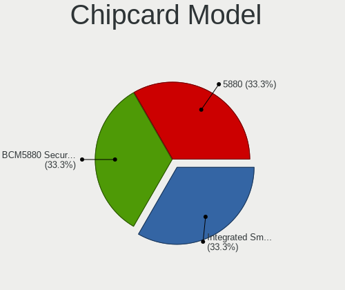
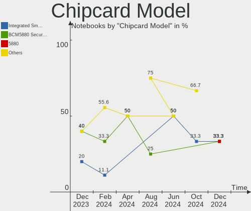

BlackPanther - Hardware Trends (Notebooks)
------------------------------------------

A project to identify most popular hardware characteristics and track their change
over time based on data collected by Linux users at https://Linux-Hardware.org.

Anyone can contribute to this report by the [hw-probe](https://github.com/linuxhw/hw-probe) tool:

    sudo -E hw-probe -all -upload

This report is for one last month. Overall report since the beginning of time: [TestDays](https://github.com/linuxhw/TestDays)

Period: Apr, 2024.

Contents
--------

* [ System ](#system)
  - [ OS                       ](#os)
  - [ OS Family                ](#os-family)
  - [ Kernel                   ](#kernel)
  - [ Kernel Family            ](#kernel-family)
  - [ Kernel Major Ver.        ](#kernel-major-ver)
  - [ Arch                     ](#arch)
  - [ DE                       ](#de)
  - [ Display Server           ](#display-server)
  - [ Display Manager          ](#display-manager)
  - [ OS Lang                  ](#os-lang)
  - [ Boot Mode                ](#boot-mode)
  - [ Filesystem               ](#filesystem)
  - [ Part. scheme             ](#part-scheme)
  - [ Dual Boot with Linux/BSD ](#dual-boot-with-linuxbsd)
  - [ Dual Boot (Win)          ](#dual-boot-win)

* [ Board ](#board)
  - [ Vendor                   ](#vendor)
  - [ Model                    ](#model)
  - [ Model Family             ](#model-family)
  - [ MFG Year                 ](#mfg-year)
  - [ Form Factor              ](#form-factor)
  - [ Secure Boot              ](#secure-boot)
  - [ Coreboot                 ](#coreboot)
  - [ RAM Size                 ](#ram-size)
  - [ RAM Used                 ](#ram-used)
  - [ Total Drives             ](#total-drives)
  - [ Has CD-ROM               ](#has-cd-rom)
  - [ Has Ethernet             ](#has-ethernet)
  - [ Has WiFi                 ](#has-wifi)
  - [ Has Bluetooth            ](#has-bluetooth)

* [ Location ](#location)
  - [ Country                  ](#country)
  - [ City                     ](#city)

* [ Drives ](#drives)
  - [ Drive Vendor             ](#drive-vendor)
  - [ Drive Model              ](#drive-model)
  - [ HDD Vendor               ](#hdd-vendor)
  - [ SSD Vendor               ](#ssd-vendor)
  - [ Drive Kind               ](#drive-kind)
  - [ Drive Connector          ](#drive-connector)
  - [ Drive Size               ](#drive-size)
  - [ Space Total              ](#space-total)
  - [ Space Used               ](#space-used)
  - [ Malfunc. Drives          ](#malfunc-drives)
  - [ Malfunc. Drive Vendor    ](#malfunc-drive-vendor)
  - [ Malfunc. HDD Vendor      ](#malfunc-hdd-vendor)
  - [ Malfunc. Drive Kind      ](#malfunc-drive-kind)
  - [ Failed Drives            ](#failed-drives)
  - [ Failed Drive Vendor      ](#failed-drive-vendor)
  - [ Drive Status             ](#drive-status)

* [ Storage controller ](#storage-controller)
  - [ Storage Vendor           ](#storage-vendor)
  - [ Storage Model            ](#storage-model)
  - [ Storage Kind             ](#storage-kind)

* [ Processor ](#processor)
  - [ CPU Vendor               ](#cpu-vendor)
  - [ CPU Model                ](#cpu-model)
  - [ CPU Model Family         ](#cpu-model-family)
  - [ CPU Cores                ](#cpu-cores)
  - [ CPU Sockets              ](#cpu-sockets)
  - [ CPU Threads              ](#cpu-threads)
  - [ CPU Op-Modes             ](#cpu-op-modes)
  - [ CPU Microcode            ](#cpu-microcode)
  - [ CPU Microarch            ](#cpu-microarch)

* [ Graphics ](#graphics)
  - [ GPU Vendor               ](#gpu-vendor)
  - [ GPU Model                ](#gpu-model)
  - [ GPU Combo                ](#gpu-combo)
  - [ GPU Driver               ](#gpu-driver)
  - [ GPU Memory               ](#gpu-memory)

* [ Monitor ](#monitor)
  - [ Monitor Vendor           ](#monitor-vendor)
  - [ Monitor Model            ](#monitor-model)
  - [ Monitor Resolution       ](#monitor-resolution)
  - [ Monitor Diagonal         ](#monitor-diagonal)
  - [ Monitor Width            ](#monitor-width)
  - [ Aspect Ratio             ](#aspect-ratio)
  - [ Monitor Area             ](#monitor-area)
  - [ Pixel Density            ](#pixel-density)
  - [ Multiple Monitors        ](#multiple-monitors)

* [ Network ](#network)
  - [ Net Controller Vendor    ](#net-controller-vendor)
  - [ Net Controller Model     ](#net-controller-model)
  - [ Wireless Vendor          ](#wireless-vendor)
  - [ Wireless Model           ](#wireless-model)
  - [ Ethernet Vendor          ](#ethernet-vendor)
  - [ Ethernet Model           ](#ethernet-model)
  - [ Net Controller Kind      ](#net-controller-kind)
  - [ Used Controller          ](#used-controller)
  - [ NICs                     ](#nics)
  - [ IPv6                     ](#ipv6)

* [ Bluetooth ](#bluetooth)
  - [ Bluetooth Vendor         ](#bluetooth-vendor)
  - [ Bluetooth Model          ](#bluetooth-model)

* [ Sound ](#sound)
  - [ Sound Vendor             ](#sound-vendor)
  - [ Sound Model              ](#sound-model)

* [ Memory ](#memory)
  - [ Memory Vendor            ](#memory-vendor)
  - [ Memory Model             ](#memory-model)
  - [ Memory Kind              ](#memory-kind)
  - [ Memory Form Factor       ](#memory-form-factor)
  - [ Memory Size              ](#memory-size)
  - [ Memory Speed             ](#memory-speed)

* [ Printers & scanners ](#printers--scanners)
  - [ Printer Vendor           ](#printer-vendor)
  - [ Printer Model            ](#printer-model)
  - [ Scanner Vendor           ](#scanner-vendor)
  - [ Scanner Model            ](#scanner-model)

* [ Camera ](#camera)
  - [ Camera Vendor            ](#camera-vendor)
  - [ Camera Model             ](#camera-model)

* [ Security ](#security)
  - [ Fingerprint Vendor       ](#fingerprint-vendor)
  - [ Fingerprint Model        ](#fingerprint-model)
  - [ Chipcard Vendor          ](#chipcard-vendor)
  - [ Chipcard Model           ](#chipcard-model)

* [ Unsupported ](#unsupported)
  - [ Unsupported Devices      ](#unsupported-devices)
  - [ Unsupported Device Types ](#unsupported-device-types)

System
------

OS
--

Installed operating systems

| Name              | Notebooks | Percent |
|-------------------|-----------|---------|
| BlackPanther 18.1 | 43        | 100%    |

OS Family
---------

OS without a version

| Name         | Notebooks | Percent |
|--------------|-----------|---------|
| BlackPanther | 43        | 100%    |

Kernel
------

Version of the Linux kernel

| Version             | Notebooks | Percent |
|---------------------|-----------|---------|
| 5.15.85-desktop-1bP | 28        | 65.12%  |
| 4.18.16-desktop-1bP | 9         | 20.93%  |
| 5.6.14-desktop-2bP  | 6         | 13.95%  |

Kernel Family
-------------

Linux kernel without a distro release

| Version | Notebooks | Percent |
|---------|-----------|---------|
| 5.15.85 | 28        | 65.12%  |
| 4.18.16 | 9         | 20.93%  |
| 5.6.14  | 6         | 13.95%  |

Kernel Major Ver.
-----------------

Linux kernel major version

| Version | Notebooks | Percent |
|---------|-----------|---------|
| 5.15    | 28        | 65.12%  |
| 4.18    | 9         | 20.93%  |
| 5.6     | 6         | 13.95%  |

Arch
----

OS architecture (x86_64, i586, etc.)

| Name   | Notebooks | Percent |
|--------|-----------|---------|
| x86_64 | 43        | 100%    |

DE
--

Desktop Environment

| Name    | Notebooks | Percent |
|---------|-----------|---------|
| KDE5    | 42        | 97.67%  |
| Unknown | 1         | 2.33%   |

Display Server
--------------

X11 or Wayland

| Name | Notebooks | Percent |
|------|-----------|---------|
| X11  | 43        | 100%    |

Display Manager
---------------

SDDM, LightDM, etc.

| Name | Notebooks | Percent |
|------|-----------|---------|
| SDDM | 43        | 100%    |

OS Lang
-------

Language

| Lang    | Notebooks | Percent |
|---------|-----------|---------|
| Unknown | 43        | 100%    |

Boot Mode
---------

EFI or BIOS

| Mode | Notebooks | Percent |
|------|-----------|---------|
| BIOS | 29        | 67.44%  |
| EFI  | 14        | 32.56%  |

Filesystem
----------

Type of filesystem

| Type    | Notebooks | Percent |
|---------|-----------|---------|
| Ext4    | 23        | 53.49%  |
| Overlay | 20        | 46.51%  |

Part. scheme
------------

Scheme of partitioning

| Type | Notebooks | Percent |
|------|-----------|---------|
| MBR  | 22        | 51.16%  |
| GPT  | 21        | 48.84%  |

Dual Boot with Linux/BSD
------------------------

Hosting more than one Linux/BSD

| Dual boot | Notebooks | Percent |
|-----------|-----------|---------|
| No        | 30        | 69.77%  |
| Yes       | 13        | 30.23%  |

Dual Boot (Win)
---------------

Hosting Linux and Windows

| Dual boot | Notebooks | Percent |
|-----------|-----------|---------|
| No        | 24        | 55.81%  |
| Yes       | 19        | 44.19%  |

Board
-----

Vendor
------

Motherboard manufacturer

| Name             | Notebooks | Percent |
|------------------|-----------|---------|
| Hewlett-Packard  | 14        | 32.56%  |
| Dell             | 8         | 18.6%   |
| ASUSTek Computer | 7         | 16.28%  |
| Lenovo           | 6         | 13.95%  |
| Packard Bell     | 3         | 6.98%   |
| Toshiba          | 2         | 4.65%   |
| Acer             | 2         | 4.65%   |
| eMachines        | 1         | 2.33%   |

Model
-----

Motherboard model

| Name                                     | Notebooks | Percent |
|------------------------------------------|-----------|---------|
| HP ProBook 455 G1                        | 4         | 9.3%    |
| Toshiba Satellite L650                   | 2         | 4.65%   |
| Packard Bell EasyNote TK36               | 2         | 4.65%   |
| Packard Bell EasyNote TV43HC             | 1         | 2.33%   |
| Lenovo ThinkPad X200 74595FG             | 1         | 2.33%   |
| Lenovo ThinkPad T530 2429NL6             | 1         | 2.33%   |
| Lenovo ThinkPad T470 20HES58A1L          | 1         | 2.33%   |
| Lenovo ThinkPad T420 423662G             | 1         | 2.33%   |
| Lenovo IdeaPad 330-15IKB 81DE            | 1         | 2.33%   |
| Lenovo IdeaPad 120S-14IAP 81A5           | 1         | 2.33%   |
| HP ProBook 650 G2                        | 1         | 2.33%   |
| HP ProBook 640 G8 Notebook PC            | 1         | 2.33%   |
| HP Presario CQ57                         | 1         | 2.33%   |
| HP Pavilion Gaming Laptop 15-ec1xxx      | 1         | 2.33%   |
| HP Pavilion dv7                          | 1         | 2.33%   |
| HP Notebook                              | 1         | 2.33%   |
| HP Laptop 15-dw1xxx                      | 1         | 2.33%   |
| HP 630                                   | 1         | 2.33%   |
| HP 255 G5 Notebook PC                    | 1         | 2.33%   |
| HP 250 G3                                | 1         | 2.33%   |
| eMachines E725                           | 1         | 2.33%   |
| Dell Vostro 1015                         | 1         | 2.33%   |
| Dell Latitude E6520                      | 1         | 2.33%   |
| Dell Latitude E6330                      | 1         | 2.33%   |
| Dell Latitude D520                       | 1         | 2.33%   |
| Dell Latitude 5480                       | 1         | 2.33%   |
| Dell Inspiron 5558                       | 1         | 2.33%   |
| Dell Inspiron 3542                       | 1         | 2.33%   |
| Dell Inspiron 3521                       | 1         | 2.33%   |
| ASUS ZenBook UX425UA_UM425UA             | 1         | 2.33%   |
| ASUS X551CA                              | 1         | 2.33%   |
| ASUS X541NA                              | 1         | 2.33%   |
| ASUS K54C                                | 1         | 2.33%   |
| ASUS K53TA                               | 1         | 2.33%   |
| ASUS K53BY                               | 1         | 2.33%   |
| ASUS ASUS TUF Gaming F15 FX506HE_FX506HE | 1         | 2.33%   |
| Acer TravelMate 8571                     | 1         | 2.33%   |
| Acer Aspire E1-571                       | 1         | 2.33%   |

Model Family
------------

Motherboard model prefix

| Name                  | Notebooks | Percent |
|-----------------------|-----------|---------|
| HP ProBook            | 6         | 13.95%  |
| Lenovo ThinkPad       | 4         | 9.3%    |
| Dell Latitude         | 4         | 9.3%    |
| Packard Bell EasyNote | 3         | 6.98%   |
| Dell Inspiron         | 3         | 6.98%   |
| Toshiba Satellite     | 2         | 4.65%   |
| Lenovo IdeaPad        | 2         | 4.65%   |
| HP Pavilion           | 2         | 4.65%   |
| HP Presario           | 1         | 2.33%   |
| HP Notebook           | 1         | 2.33%   |
| HP Laptop             | 1         | 2.33%   |
| HP 630                | 1         | 2.33%   |
| HP 255                | 1         | 2.33%   |
| HP 250                | 1         | 2.33%   |
| eMachines E725        | 1         | 2.33%   |
| Dell Vostro           | 1         | 2.33%   |
| ASUS ZenBook          | 1         | 2.33%   |
| ASUS X551CA           | 1         | 2.33%   |
| ASUS X541NA           | 1         | 2.33%   |
| ASUS K54C             | 1         | 2.33%   |
| ASUS K53TA            | 1         | 2.33%   |
| ASUS K53BY            | 1         | 2.33%   |
| ASUS ASUS             | 1         | 2.33%   |
| Acer TravelMate       | 1         | 2.33%   |
| Acer Aspire           | 1         | 2.33%   |

MFG Year
--------

Motherboard manufacture year

| Year | Notebooks | Percent |
|------|-----------|---------|
| 2011 | 7         | 16.28%  |
| 2013 | 5         | 11.63%  |
| 2012 | 5         | 11.63%  |
| 2017 | 4         | 9.3%    |
| 2010 | 4         | 9.3%    |
| 2021 | 3         | 6.98%   |
| 2009 | 3         | 6.98%   |
| 2016 | 2         | 4.65%   |
| 2015 | 2         | 4.65%   |
| 2014 | 2         | 4.65%   |
| 2008 | 2         | 4.65%   |
| 2020 | 1         | 2.33%   |
| 2019 | 1         | 2.33%   |
| 2018 | 1         | 2.33%   |
| 2006 | 1         | 2.33%   |

Form Factor
-----------

Physical design of the computer

| Name     | Notebooks | Percent |
|----------|-----------|---------|
| Notebook | 43        | 100%    |

Secure Boot
-----------

Enabled or disabled

| State    | Notebooks | Percent |
|----------|-----------|---------|
| Disabled | 43        | 100%    |

Coreboot
--------

Have coreboot on board

| Used | Notebooks | Percent |
|------|-----------|---------|
| No   | 43        | 100%    |

RAM Size
--------

Total RAM memory

| Size in GB | Notebooks | Percent |
|------------|-----------|---------|
| 3.01-4.0   | 19        | 44.19%  |
| 8.01-16.0  | 9         | 20.93%  |
| 4.01-8.0   | 8         | 18.6%   |
| 16.01-24.0 | 3         | 6.98%   |
| 1.01-2.0   | 3         | 6.98%   |
| 2.01-3.0   | 1         | 2.33%   |

RAM Used
--------

Used RAM memory

| Used GB  | Notebooks | Percent |
|----------|-----------|---------|
| 1.01-2.0 | 25        | 58.14%  |
| 0.51-1.0 | 12        | 27.91%  |
| 0.01-0.5 | 5         | 11.63%  |
| 2.01-3.0 | 1         | 2.33%   |

Total Drives
------------

Number of drives on board

| Drives | Notebooks | Percent |
|--------|-----------|---------|
| 1      | 34        | 79.07%  |
| 2      | 7         | 16.28%  |
| 3      | 2         | 4.65%   |

Has CD-ROM
----------

Has CD-ROM on board

| Presented | Notebooks | Percent |
|-----------|-----------|---------|
| Yes       | 30        | 69.77%  |
| No        | 13        | 30.23%  |

Has Ethernet
------------

Has Ethernet on board

| Presented | Notebooks | Percent |
|-----------|-----------|---------|
| Yes       | 40        | 93.02%  |
| No        | 3         | 6.98%   |

Has WiFi
--------

Has WiFi module

| Presented | Notebooks | Percent |
|-----------|-----------|---------|
| Yes       | 43        | 100%    |

Has Bluetooth
-------------

Has Bluetooth module

| Presented | Notebooks | Percent |
|-----------|-----------|---------|
| Yes       | 33        | 76.74%  |
| No        | 10        | 23.26%  |

Location
--------

Country
-------

Geographic location (country)

| Country | Notebooks | Percent |
|---------|-----------|---------|
| Hungary | 40        | 93.02%  |
| UK      | 1         | 2.33%   |
| Croatia | 1         | 2.33%   |
| Canada  | 1         | 2.33%   |

City
----

Geographic location (city)

| City               | Notebooks | Percent |
|--------------------|-----------|---------|
| Budapest           | 17        | 39.53%  |
| Oroshaza           | 2         | 4.65%   |
| Cegled             | 2         | 4.65%   |
| Visnjevac          | 1         | 2.33%   |
| Tatabánya         | 1         | 2.33%   |
| Tamasi             | 1         | 2.33%   |
| Szombathely        | 1         | 2.33%   |
| Szolnok            | 1         | 2.33%   |
| Szeged             | 1         | 2.33%   |
| Siklos             | 1         | 2.33%   |
| Pécs              | 1         | 2.33%   |
| Opusztaszer        | 1         | 2.33%   |
| Nyiregyhaza        | 1         | 2.33%   |
| Nyirad             | 1         | 2.33%   |
| Nyergesujfalu      | 1         | 2.33%   |
| Koszeg             | 1         | 2.33%   |
| Kingston           | 1         | 2.33%   |
| Kecskemét         | 1         | 2.33%   |
| Jaszbereny         | 1         | 2.33%   |
| Heves              | 1         | 2.33%   |
| Hatvan             | 1         | 2.33%   |
| Fulop              | 1         | 2.33%   |
| Csongrad           | 1         | 2.33%   |
| Bishop's Stortford | 1         | 2.33%   |
| Berettyóújfalu   | 1         | 2.33%   |

Drives
------

Drive Vendor
------------

Hard drive vendors

| Vendor              | Notebooks | Drives | Percent |
|---------------------|-----------|--------|---------|
| Kingston            | 8         | 8      | 15.38%  |
| Seagate             | 6         | 6      | 11.54%  |
| Samsung Electronics | 5         | 5      | 9.62%   |
| WDC                 | 4         | 4      | 7.69%   |
| HGST                | 4         | 4      | 7.69%   |
| Toshiba             | 3         | 3      | 5.77%   |
| Intenso             | 3         | 3      | 5.77%   |
| Unknown             | 2         | 2      | 3.85%   |
| SK hynix            | 2         | 2      | 3.85%   |
| Hitachi             | 2         | 2      | 3.85%   |
| China               | 2         | 2      | 3.85%   |
| Unknown             | 2         | 2      | 3.85%   |
| Timetec             | 1         | 1      | 1.92%   |
| SSSTC               | 1         | 1      | 1.92%   |
| SPCC                | 1         | 1      | 1.92%   |
| SanDisk             | 1         | 1      | 1.92%   |
| PNY                 | 1         | 1      | 1.92%   |
| KIOXIA              | 1         | 1      | 1.92%   |
| Kingmax             | 1         | 1      | 1.92%   |
| ICY BOX             | 1         | 1      | 1.92%   |
| Apacer              | 1         | 1      | 1.92%   |

Drive Model
-----------

Hard drive models

| Model                                 | Notebooks | Percent |
|---------------------------------------|-----------|---------|
| Kingston SA400S37480G 480GB SSD       | 3         | 5.77%   |
| WDC WD10JPVX-60JC3T0 1TB              | 2         | 3.85%   |
| Toshiba MQ01ACF050 500GB              | 2         | 3.85%   |
| Kingston SA400S37240G 240GB SSD       | 2         | 3.85%   |
| Kingston SA400S37120G 120GB SSD       | 2         | 3.85%   |
| HGST HTS725050A7E630 500GB            | 2         | 3.85%   |
| Unknown                               | 2         | 3.85%   |
| WDC WD6400BPVT-80HXZT3 640GB          | 1         | 1.92%   |
| WDC WD10JPVX-22JC3T0 1TB              | 1         | 1.92%   |
| Unknown SD64G  64GB                   | 1         | 1.92%   |
| Unknown SD/MMC/MS PRO 128GB           | 1         | 1.92%   |
| Toshiba MK2565GSX 250GB               | 1         | 1.92%   |
| Timetec SD08 512GB SSD                | 1         | 1.92%   |
| SSSTC CL1-8D256-HP 256GB              | 1         | 1.92%   |
| SPCC Solid State Disk 512GB           | 1         | 1.92%   |
| SK hynix HFS256G3BTND-N210A 256GB SSD | 1         | 1.92%   |
| SK hynix HFM512GD3JX013N 512GB        | 1         | 1.92%   |
| Seagate ST9500325AS 500GB             | 1         | 1.92%   |
| Seagate ST9160310AS 160GB             | 1         | 1.92%   |
| Seagate ST500VT001-1K6142-160 500GB   | 1         | 1.92%   |
| Seagate ST500LT012-1DG142 500GB       | 1         | 1.92%   |
| Seagate ST500LM000-SSHD-8GB           | 1         | 1.92%   |
| Seagate Expansion 2TB                 | 1         | 1.92%   |
| SanDisk DF4064  64GB                  | 1         | 1.92%   |
| Samsung SSD 980 500GB                 | 1         | 1.92%   |
| Samsung SSD 970 EVO 500GB             | 1         | 1.92%   |
| Samsung SSD 750 EVO 250GB             | 1         | 1.92%   |
| Samsung MZVLQ512HBLU-00B00 512GB      | 1         | 1.92%   |
| Samsung MZ7LF120HCHP-000L1 120GB SSD  | 1         | 1.92%   |
| PNY CS900 240GB SSD                   | 1         | 1.92%   |
| KIOXIA KXG60ZNV256G 256GB             | 1         | 1.92%   |
| Kingston SNV2S500G 500GB              | 1         | 1.92%   |
| Kingmax SSD 240GB                     | 1         | 1.92%   |
| Intenso SSD SATAIII 240GB             | 1         | 1.92%   |
| Intenso SSD 120GB                     | 1         | 1.92%   |
| Intenso SATA III SSD 120GB            | 1         | 1.92%   |
| ICY BOX IB-243U3 2TB                  | 1         | 1.92%   |
| Hitachi HTS545025B9A300 250GB         | 1         | 1.92%   |
| Hitachi HTS542525K9A300 250GB         | 1         | 1.92%   |
| HGST HTS545050A7E680 500GB            | 1         | 1.92%   |

HDD Vendor
----------

Hard disk drive vendors

| Vendor  | Notebooks | Drives | Percent |
|---------|-----------|--------|---------|
| Seagate | 6         | 6      | 28.57%  |
| WDC     | 4         | 4      | 19.05%  |
| HGST    | 4         | 4      | 19.05%  |
| Toshiba | 3         | 3      | 14.29%  |
| Hitachi | 2         | 2      | 9.52%   |
| Unknown | 1         | 1      | 4.76%   |
| ICY BOX | 1         | 1      | 4.76%   |

SSD Vendor
----------

Solid state drive vendors

| Vendor              | Notebooks | Drives | Percent |
|---------------------|-----------|--------|---------|
| Kingston            | 7         | 7      | 33.33%  |
| Intenso             | 3         | 3      | 14.29%  |
| Samsung Electronics | 2         | 2      | 9.52%   |
| China               | 2         | 2      | 9.52%   |
| Timetec             | 1         | 1      | 4.76%   |
| SPCC                | 1         | 1      | 4.76%   |
| SK hynix            | 1         | 1      | 4.76%   |
| PNY                 | 1         | 1      | 4.76%   |
| Kingmax             | 1         | 1      | 4.76%   |
| Apacer              | 1         | 1      | 4.76%   |
| Unknown             | 1         | 1      | 4.76%   |

Drive Kind
----------

HDD or SSD

| Kind | Notebooks | Drives | Percent |
|------|-----------|--------|---------|
| SSD  | 20        | 21     | 40.82%  |
| HDD  | 19        | 21     | 38.78%  |
| NVMe | 7         | 7      | 14.29%  |
| MMC  | 3         | 3      | 6.12%   |

Drive Connector
---------------

SATA, SAS, NVMe, etc.

| Type | Notebooks | Drives | Percent |
|------|-----------|--------|---------|
| SATA | 36        | 39     | 73.47%  |
| NVMe | 7         | 7      | 14.29%  |
| SAS  | 3         | 3      | 6.12%   |
| MMC  | 3         | 3      | 6.12%   |

Drive Size
----------

Size of hard drive

| Size in TB | Notebooks | Drives | Percent |
|------------|-----------|--------|---------|
| 0.01-0.5   | 30        | 33     | 78.95%  |
| 0.51-1.0   | 6         | 7      | 15.79%  |
| 1.01-2.0   | 2         | 2      | 5.26%   |

Space Total
-----------

Amount of disk space available on the file system

| Size in GB | Notebooks | Percent |
|------------|-----------|---------|
| Unknown    | 19        | 44.19%  |
| 101-250    | 11        | 25.58%  |
| 251-500    | 8         | 18.6%   |
| 51-100     | 3         | 6.98%   |
| 21-50      | 1         | 2.33%   |
| 2001-3000  | 1         | 2.33%   |

Space Used
----------

Amount of used disk space

| Used GB  | Notebooks | Percent |
|----------|-----------|---------|
| Unknown  | 19        | 44.19%  |
| 1-20     | 15        | 34.88%  |
| 51-100   | 5         | 11.63%  |
| 21-50    | 2         | 4.65%   |
| 101-250  | 1         | 2.33%   |
| 501-1000 | 1         | 2.33%   |

Malfunc. Drives
---------------

Drive models with a malfunction

| Model                                 | Notebooks | Drives | Percent |
|---------------------------------------|-----------|--------|---------|
| HGST HTS725050A7E630 500GB            | 2         | 2      | 13.33%  |
| WDC WD6400BPVT-80HXZT3 640GB          | 1         | 1      | 6.67%   |
| WDC WD10JPVX-22JC3T0 1TB              | 1         | 1      | 6.67%   |
| Toshiba MK2565GSX 250GB               | 1         | 1      | 6.67%   |
| Timetec SD08 512GB SSD                | 1         | 1      | 6.67%   |
| SK hynix HFS256G3BTND-N210A 256GB SSD | 1         | 1      | 6.67%   |
| Seagate ST9160310AS 160GB             | 1         | 1      | 6.67%   |
| Seagate ST500LT012-1DG142 500GB       | 1         | 1      | 6.67%   |
| Seagate ST500LM000-SSHD-8GB           | 1         | 1      | 6.67%   |
| Samsung Electronics SSD 750 EVO 250GB | 1         | 1      | 6.67%   |
| ICY BOX IB-243U3 2TB                  | 1         | 1      | 6.67%   |
| Hitachi HTS542525K9A300 250GB         | 1         | 1      | 6.67%   |
| HGST HTS545050A7E380 500GB            | 1         | 1      | 6.67%   |
| China SATA SSD 240GB                  | 1         | 1      | 6.67%   |

Malfunc. Drive Vendor
---------------------

Vendors of faulty drives

| Vendor              | Notebooks | Drives | Percent |
|---------------------|-----------|--------|---------|
| Seagate             | 3         | 3      | 20%     |
| HGST                | 3         | 3      | 20%     |
| WDC                 | 2         | 2      | 13.33%  |
| Toshiba             | 1         | 1      | 6.67%   |
| Timetec             | 1         | 1      | 6.67%   |
| SK hynix            | 1         | 1      | 6.67%   |
| Samsung Electronics | 1         | 1      | 6.67%   |
| ICY BOX             | 1         | 1      | 6.67%   |
| Hitachi             | 1         | 1      | 6.67%   |
| China               | 1         | 1      | 6.67%   |

Malfunc. HDD Vendor
-------------------

Vendors of faulty HDD drives

| Vendor  | Notebooks | Drives | Percent |
|---------|-----------|--------|---------|
| Seagate | 3         | 3      | 27.27%  |
| HGST    | 3         | 3      | 27.27%  |
| WDC     | 2         | 2      | 18.18%  |
| Toshiba | 1         | 1      | 9.09%   |
| ICY BOX | 1         | 1      | 9.09%   |
| Hitachi | 1         | 1      | 9.09%   |

Malfunc. Drive Kind
-------------------

Kinds of faulty drives

| Kind | Notebooks | Drives | Percent |
|------|-----------|--------|---------|
| HDD  | 10        | 11     | 71.43%  |
| SSD  | 4         | 4      | 28.57%  |

Failed Drives
-------------

Failed drive models

| Model                             | Notebooks | Drives | Percent |
|-----------------------------------|-----------|--------|---------|
| Samsung Electronics SSD 980 500GB | 1         | 1      | 100%    |

Failed Drive Vendor
-------------------

Failed drive vendors

| Vendor              | Notebooks | Drives | Percent |
|---------------------|-----------|--------|---------|
| Samsung Electronics | 1         | 1      | 100%    |

Drive Status
------------

Number of failed and malfunc. drives

| Status   | Notebooks | Drives | Percent |
|----------|-----------|--------|---------|
| Works    | 30        | 31     | 62.5%   |
| Malfunc  | 13        | 15     | 27.08%  |
| Detected | 4         | 5      | 8.33%   |
| Failed   | 1         | 1      | 2.08%   |

Storage controller
------------------

Storage Vendor
--------------

Storage controller vendors

| Vendor                         | Notebooks | Percent |
|--------------------------------|-----------|---------|
| Intel                          | 30        | 63.83%  |
| AMD                            | 10        | 21.28%  |
| Samsung Electronics            | 3         | 6.38%   |
| Toshiba America Info Systems   | 1         | 2.13%   |
| Solid State Storage Technology | 1         | 2.13%   |
| SK hynix                       | 1         | 2.13%   |
| Kingston Technology Company    | 1         | 2.13%   |

Storage Model
-------------

Storage controller models

| Model                                                                        | Notebooks | Percent |
|------------------------------------------------------------------------------|-----------|---------|
| AMD FCH SATA Controller [AHCI mode]                                          | 8         | 16.33%  |
| Intel 7 Series Chipset Family 6-port SATA Controller [AHCI mode]             | 6         | 12.24%  |
| Intel 82801IBM/IEM (ICH9M/ICH9M-E) 4 port SATA Controller [AHCI mode]        | 5         | 10.2%   |
| Intel 6 Series/C200 Series Chipset Family 6 port Mobile SATA AHCI Controller | 3         | 6.12%   |
| Samsung NVMe SSD Controller 980 (DRAM-less)                                  | 2         | 4.08%   |
| Intel Volume Management Device NVMe RAID Controller                          | 2         | 4.08%   |
| Intel Celeron N3350/Pentium N4200/Atom E3900 Series SATA AHCI Controller     | 2         | 4.08%   |
| Intel 82801IBM/IEM (ICH9M/ICH9M-E) 2 port SATA Controller [IDE mode]         | 2         | 4.08%   |
| Intel 82801 Mobile SATA Controller [RAID mode]                               | 2         | 4.08%   |
| Intel 5 Series/3400 Series Chipset 4 port SATA AHCI Controller               | 2         | 4.08%   |
| AMD SB7x0/SB8x0/SB9x0 SATA Controller [AHCI mode]                            | 2         | 4.08%   |
| Toshiba America Info Systems XG6 NVMe SSD Controller                         | 1         | 2.04%   |
| Solid State Storage CL1-3D256-Q11 NVMe SSD M.2                               | 1         | 2.04%   |
| SK hynix Gold P31/BC711/PC711 NVMe Solid State Drive                         | 1         | 2.04%   |
| Samsung NVMe SSD Controller SM981/PM981/PM983                                | 1         | 2.04%   |
| Kingston Company NV2 NVMe SSD SM2267XT (DRAM-less)                           | 1         | 2.04%   |
| Intel Wildcat Point-LP SATA Controller [AHCI Mode]                           | 1         | 2.04%   |
| Intel Sunrise Point-LP SATA Controller [AHCI mode]                           | 1         | 2.04%   |
| Intel HM170/QM170 Chipset SATA Controller [AHCI Mode]                        | 1         | 2.04%   |
| Intel Atom Processor E3800 Series SATA AHCI Controller                       | 1         | 2.04%   |
| Intel 82801GBM/GHM (ICH7-M Family) SATA Controller [IDE mode]                | 1         | 2.04%   |
| Intel 8 Series SATA Controller 1 [AHCI mode]                                 | 1         | 2.04%   |
| AMD SB7x0/SB8x0/SB9x0 IDE Controller                                         | 1         | 2.04%   |
| AMD FCH IDE Controller                                                       | 1         | 2.04%   |

Storage Kind
------------

Kind of storage controller (IDE, SATA, NVMe, SAS, ...)

| Kind | Notebooks | Percent |
|------|-----------|---------|
| SATA | 33        | 67.35%  |
| NVMe | 7         | 14.29%  |
| IDE  | 5         | 10.2%   |
| RAID | 4         | 8.16%   |

Processor
---------

CPU Vendor
----------

Processor vendors

| Vendor | Notebooks | Percent |
|--------|-----------|---------|
| Intel  | 32        | 74.42%  |
| AMD    | 11        | 25.58%  |

CPU Model
---------

Processor models

| Model                                        | Notebooks | Percent |
|----------------------------------------------|-----------|---------|
| AMD A10-5750M APU with Radeon HD Graphics    | 4         | 9.3%    |
| Intel Core i3-3217U CPU @ 1.80GHz            | 2         | 4.65%   |
| Intel Core i3 CPU M 330 @ 2.13GHz            | 2         | 4.65%   |
| Intel Pentium Dual-Core CPU T4500 @ 2.30GHz  | 1         | 2.33%   |
| Intel Pentium Dual-Core CPU T4400 @ 2.20GHz  | 1         | 2.33%   |
| Intel Pentium CPU B980 @ 2.40GHz             | 1         | 2.33%   |
| Intel Core i7-6820HQ CPU @ 2.70GHz           | 1         | 2.33%   |
| Intel Core i7-6600U CPU @ 2.60GHz            | 1         | 2.33%   |
| Intel Core i7-3632QM CPU @ 2.20GHz           | 1         | 2.33%   |
| Intel Core i5-8250U CPU @ 1.60GHz            | 1         | 2.33%   |
| Intel Core i5-7300U CPU @ 2.60GHz            | 1         | 2.33%   |
| Intel Core i5-5200U CPU @ 2.20GHz            | 1         | 2.33%   |
| Intel Core i5-4210U CPU @ 1.70GHz            | 1         | 2.33%   |
| Intel Core i5-3340M CPU @ 2.70GHz            | 1         | 2.33%   |
| Intel Core i5-3320M CPU @ 2.60GHz            | 1         | 2.33%   |
| Intel Core i5-2540M CPU @ 2.60GHz            | 1         | 2.33%   |
| Intel Core i5-2520M CPU @ 2.50GHz            | 1         | 2.33%   |
| Intel Core i5-2450M CPU @ 2.50GHz            | 1         | 2.33%   |
| Intel Core i3-2310M CPU @ 2.10GHz            | 1         | 2.33%   |
| Intel Core i3-10110U CPU @ 2.10GHz           | 1         | 2.33%   |
| Intel Core 2 Duo CPU U9400 @ 1.40GHz         | 1         | 2.33%   |
| Intel Core 2 Duo CPU T6570 @ 2.10GHz         | 1         | 2.33%   |
| Intel Core 2 Duo CPU P8600 @ 2.40GHz         | 1         | 2.33%   |
| Intel Core 2 Duo CPU P8400 @ 2.26GHz         | 1         | 2.33%   |
| Intel Core 2 CPU T5500 @ 1.66GHz             | 1         | 2.33%   |
| Intel Celeron Dual-Core CPU T3500 @ 2.10GHz  | 1         | 2.33%   |
| Intel Celeron CPU N3450 @ 1.10GHz            | 1         | 2.33%   |
| Intel Celeron CPU N3350 @ 1.10GHz            | 1         | 2.33%   |
| Intel Celeron CPU N2840 @ 2.16GHz            | 1         | 2.33%   |
| Intel 11th Gen Core i5-11400H @ 2.70GHz      | 1         | 2.33%   |
| Intel 11th Gen Core i3-1115G4 @ 3.00GHz      | 1         | 2.33%   |
| AMD Ryzen 5 5500U with Radeon Graphics       | 1         | 2.33%   |
| AMD Ryzen 5 4600H with Radeon Graphics       | 1         | 2.33%   |
| AMD E-350 Processor                          | 1         | 2.33%   |
| AMD E-300 APU with Radeon HD Graphics        | 1         | 2.33%   |
| AMD A8-7050 Radeon R5, 6 Compute Cores 2C+4G | 1         | 2.33%   |
| AMD A6-7310 APU with AMD Radeon R4 Graphics  | 1         | 2.33%   |
| AMD A6-3400M APU with Radeon HD Graphics     | 1         | 2.33%   |

CPU Model Family
----------------

Processor model prefix

| Model                   | Notebooks | Percent |
|-------------------------|-----------|---------|
| Intel Core i5           | 9         | 20.93%  |
| Intel Core i3           | 6         | 13.95%  |
| Intel Core 2 Duo        | 4         | 9.3%    |
| AMD A10                 | 4         | 9.3%    |
| Intel Core i7           | 3         | 6.98%   |
| Intel Celeron           | 3         | 6.98%   |
| Other                   | 2         | 4.65%   |
| Intel Pentium Dual-Core | 2         | 4.65%   |
| AMD Ryzen 5             | 2         | 4.65%   |
| AMD E                   | 2         | 4.65%   |
| AMD A6                  | 2         | 4.65%   |
| Intel Pentium           | 1         | 2.33%   |
| Intel Core 2            | 1         | 2.33%   |
| Intel Celeron Dual-Core | 1         | 2.33%   |
| AMD A8                  | 1         | 2.33%   |

CPU Cores
---------

Number of processor cores

| Number | Notebooks | Percent |
|--------|-----------|---------|
| 2      | 33        | 76.74%  |
| 4      | 6         | 13.95%  |
| 6      | 3         | 6.98%   |
| 1      | 1         | 2.33%   |

CPU Sockets
-----------

Number of sockets

| Number | Notebooks | Percent |
|--------|-----------|---------|
| 1      | 43        | 100%    |

CPU Threads
-----------

Threads per core (Hyper-Threading)

| Number | Notebooks | Percent |
|--------|-----------|---------|
| 2      | 27        | 62.79%  |
| 1      | 16        | 37.21%  |

CPU Op-Modes
------------

CPU Operation Modes (32-bit, 64-bit)

| Op mode        | Notebooks | Percent |
|----------------|-----------|---------|
| 32-bit, 64-bit | 43        | 100%    |

CPU Microcode
-------------

Microcode number

| Number     | Notebooks | Percent |
|------------|-----------|---------|
| 0x1067a    | 6         | 13.95%  |
| 0x306a9    | 5         | 11.63%  |
| 0x206a7    | 5         | 11.63%  |
| 0x06001119 | 4         | 9.3%    |
| 0x506c9    | 2         | 4.65%   |
| 0x20652    | 2         | 4.65%   |
| Unknown    | 2         | 4.65%   |
| 0x806ec    | 1         | 2.33%   |
| 0x806ea    | 1         | 2.33%   |
| 0x806e9    | 1         | 2.33%   |
| 0x806c1    | 1         | 2.33%   |
| 0x6f2      | 1         | 2.33%   |
| 0x506e3    | 1         | 2.33%   |
| 0x406e3    | 1         | 2.33%   |
| 0x40651    | 1         | 2.33%   |
| 0x306d4    | 1         | 2.33%   |
| 0x30678    | 1         | 2.33%   |
| 0x10676    | 1         | 2.33%   |
| 0x08608103 | 1         | 2.33%   |
| 0x07030105 | 1         | 2.33%   |
| 0x06003109 | 1         | 2.33%   |
| 0x05000119 | 1         | 2.33%   |
| 0x05000029 | 1         | 2.33%   |
| 0x03000027 | 1         | 2.33%   |

CPU Microarch
-------------

Microarchitecture

| Name        | Notebooks | Percent |
|-------------|-----------|---------|
| Penryn      | 7         | 16.28%  |
| SandyBridge | 5         | 11.63%  |
| IvyBridge   | 5         | 11.63%  |
| Piledriver  | 4         | 9.3%    |
| KabyLake    | 3         | 6.98%   |
| Westmere    | 2         | 4.65%   |
| Skylake     | 2         | 4.65%   |
| Goldmont    | 2         | 4.65%   |
| Bobcat      | 2         | 4.65%   |
| Unknown     | 2         | 4.65%   |
| Zen 2       | 1         | 2.33%   |
| TigerLake   | 1         | 2.33%   |
| Steamroller | 1         | 2.33%   |
| Silvermont  | 1         | 2.33%   |
| Puma        | 1         | 2.33%   |
| K10 Llano   | 1         | 2.33%   |
| Haswell     | 1         | 2.33%   |
| Core        | 1         | 2.33%   |
| Broadwell   | 1         | 2.33%   |

Graphics
--------

GPU Vendor
----------

Vendors of graphics cards

| Vendor | Notebooks | Percent |
|--------|-----------|---------|
| Intel  | 31        | 63.27%  |
| AMD    | 11        | 22.45%  |
| Nvidia | 7         | 14.29%  |

GPU Model
---------

Graphics card models

| Model                                                                         | Notebooks | Percent |
|-------------------------------------------------------------------------------|-----------|---------|
| Intel Mobile 4 Series Chipset Integrated Graphics Controller                  | 6         | 11.54%  |
| Intel 3rd Gen Core processor Graphics Controller                              | 5         | 9.62%   |
| Intel 2nd Generation Core Processor Family Integrated Graphics Controller     | 5         | 9.62%   |
| AMD Richland [Radeon HD 8650G]                                                | 4         | 7.69%   |
| Intel HD Graphics 500                                                         | 2         | 3.85%   |
| Intel Core Processor Integrated Graphics Controller                           | 2         | 3.85%   |
| AMD Wrestler [Radeon HD 6310]                                                 | 2         | 3.85%   |
| Nvidia TU117M [GeForce GTX 1650 Ti Mobile]                                    | 1         | 1.92%   |
| Nvidia GM108M [GeForce 930MX]                                                 | 1         | 1.92%   |
| Nvidia GK208BM [GeForce 920M]                                                 | 1         | 1.92%   |
| Nvidia GF119M [NVS 4200M]                                                     | 1         | 1.92%   |
| Nvidia GF117M [GeForce 610M/710M/810M/820M / GT 620M/625M/630M/720M]          | 1         | 1.92%   |
| Nvidia GA107M [GeForce RTX 3050 Ti Mobile]                                    | 1         | 1.92%   |
| Nvidia G96CM [GeForce 9600M GT]                                               | 1         | 1.92%   |
| Intel UHD Graphics 620                                                        | 1         | 1.92%   |
| Intel TigerLake-H GT1 [UHD Graphics]                                          | 1         | 1.92%   |
| Intel Tiger Lake-LP GT2 [UHD Graphics G4]                                     | 1         | 1.92%   |
| Intel Skylake GT2 [HD Graphics 520]                                           | 1         | 1.92%   |
| Intel Mobile 945GM/GMS/GME, 943/940GML Express Integrated Graphics Controller | 1         | 1.92%   |
| Intel Mobile 945GM/GMS, 943/940GML Express Integrated Graphics Controller     | 1         | 1.92%   |
| Intel HD Graphics 620                                                         | 1         | 1.92%   |
| Intel HD Graphics 5500                                                        | 1         | 1.92%   |
| Intel HD Graphics 530                                                         | 1         | 1.92%   |
| Intel Haswell-ULT Integrated Graphics Controller                              | 1         | 1.92%   |
| Intel CometLake-U GT2 [UHD Graphics]                                          | 1         | 1.92%   |
| Intel Atom Processor Z36xxx/Z37xxx Series Graphics & Display                  | 1         | 1.92%   |
| AMD Whistler [Radeon HD 6630M/6650M/6750M/7670M/7690M]                        | 1         | 1.92%   |
| AMD Sumo [Radeon HD 6520G]                                                    | 1         | 1.92%   |
| AMD Seymour [Radeon HD 6400M/7400M Series]                                    | 1         | 1.92%   |
| AMD Renoir [Radeon RX Vega 6 (Ryzen 4000/5000 Mobile Series)]                 | 1         | 1.92%   |
| AMD Mullins [Radeon R4/R5 Graphics]                                           | 1         | 1.92%   |
| AMD Lucienne                                                                  | 1         | 1.92%   |
| AMD Kaveri [Radeon R5 Graphics]                                               | 1         | 1.92%   |

GPU Combo
---------

Combinations of graphics cards

| Name           | Notebooks | Percent |
|----------------|-----------|---------|
| 1 x Intel      | 26        | 60.47%  |
| 1 x AMD        | 8         | 18.6%   |
| Intel + Nvidia | 5         | 11.63%  |
| 2 x AMD        | 2         | 4.65%   |
| 1 x Nvidia     | 1         | 2.33%   |
| AMD + Nvidia   | 1         | 2.33%   |

GPU Driver
----------

Free vs proprietary

| Driver | Notebooks | Percent |
|--------|-----------|---------|
| Free   | 43        | 100%    |

GPU Memory
----------

Total video memory

| Size in GB | Notebooks | Percent |
|------------|-----------|---------|
| Unknown    | 29        | 67.44%  |
| 0.51-1.0   | 6         | 13.95%  |
| 0.01-0.5   | 6         | 13.95%  |
| 1.01-2.0   | 2         | 4.65%   |

Monitor
-------

Monitor Vendor
--------------

Monitor vendors

| Vendor                  | Notebooks | Percent |
|-------------------------|-----------|---------|
| AU Optronics            | 10        | 22.73%  |
| Chimei Innolux          | 9         | 20.45%  |
| LG Display              | 7         | 15.91%  |
| Samsung Electronics     | 5         | 11.36%  |
| Chi Mei Optoelectronics | 4         | 9.09%   |
| PANDA                   | 2         | 4.55%   |
| Lenovo                  | 2         | 4.55%   |
| BOE                     | 2         | 4.55%   |
| LG Philips              | 1         | 2.27%   |
| InnoLux Display         | 1         | 2.27%   |
| Hewlett-Packard         | 1         | 2.27%   |

Monitor Model
-------------

Monitor models

| Model                                                                    | Notebooks | Percent |
|--------------------------------------------------------------------------|-----------|---------|
| Chi Mei Optoelectronics LCD Monitor CMO15A7 1366x768 344x193mm 15.5-inch | 3         | 6.67%   |
| Samsung Electronics LCD Monitor SDC4751 1366x768 344x194mm 15.5-inch     | 2         | 4.44%   |
| LG Display LP156WH2-TLAA LGD0230 1366x768 344x194mm 15.5-inch            | 2         | 4.44%   |
| Chimei Innolux LCD Monitor CMN15BC 1366x768 344x194mm 15.5-inch          | 2         | 4.44%   |
| AU Optronics LCD Monitor AUO22EC 1366x768 344x193mm 15.5-inch            | 2         | 4.44%   |
| Samsung Electronics LCD Monitor SEC5441 1366x768 344x194mm 15.5-inch     | 1         | 2.22%   |
| Samsung Electronics LCD Monitor SEC325A 1366x768 344x194mm 15.5-inch     | 1         | 2.22%   |
| Samsung Electronics LCD Monitor SEC324A 1366x768 344x194mm 15.5-inch     | 1         | 2.22%   |
| Samsung Electronics LCD Monitor SAM7245 1920x1080 1210x680mm 54.6-inch   | 1         | 2.22%   |
| PANDA LCD Monitor NCP0065 1920x1080 309x174mm 14.0-inch                  | 1         | 2.22%   |
| PANDA LCD Monitor NCP0058 1920x1080 344x194mm 15.5-inch                  | 1         | 2.22%   |
| LG Philips LCD Monitor LPLA105 1440x900 367x230mm 17.1-inch              | 1         | 2.22%   |
| LG Display LCD Monitor LGD06F5 1920x1080 344x194mm 15.5-inch             | 1         | 2.22%   |
| LG Display LCD Monitor LGD03D9 1366x768 345x194mm 15.6-inch              | 1         | 2.22%   |
| LG Display LCD Monitor LGD03AB 1366x768 344x194mm 15.5-inch              | 1         | 2.22%   |
| LG Display LCD Monitor LGD02F2 1366x768 344x194mm 15.5-inch              | 1         | 2.22%   |
| LG Display LCD Monitor LGD0250 1366x768 345x194mm 15.6-inch              | 1         | 2.22%   |
| Lenovo LCD Monitor LEN40B1 1600x900 345x194mm 15.6-inch                  | 1         | 2.22%   |
| Lenovo LCD Monitor LEN4011 1280x800 261x163mm 12.1-inch                  | 1         | 2.22%   |
| InnoLux Display LCD Monitor INL0006 1366x768 344x194mm 15.5-inch         | 1         | 2.22%   |
| Hewlett-Packard w2007 HWP26A6 1680x1050 433x271mm 20.1-inch              | 1         | 2.22%   |
| Chimei Innolux LCD Monitor CMN1733 1600x900 382x215mm 17.3-inch          | 1         | 2.22%   |
| Chimei Innolux LCD Monitor CMN15D5 1920x1080 344x193mm 15.5-inch         | 1         | 2.22%   |
| Chimei Innolux LCD Monitor CMN15BF 1366x768 344x194mm 15.5-inch          | 1         | 2.22%   |
| Chimei Innolux LCD Monitor CMN1521 1920x1080 344x193mm 15.5-inch         | 1         | 2.22%   |
| Chimei Innolux LCD Monitor CMN14D5 1920x1080 309x173mm 13.9-inch         | 1         | 2.22%   |
| Chimei Innolux LCD Monitor CMN14D4 1920x1080 309x173mm 13.9-inch         | 1         | 2.22%   |
| Chimei Innolux LCD Monitor CMN14C3 1366x768 309x173mm 13.9-inch          | 1         | 2.22%   |
| Chi Mei Optoelectronics LCD Monitor CMO1592 1366x768 344x193mm 15.5-inch | 1         | 2.22%   |
| BOE LCD Monitor BOE06A5 1366x768 344x194mm 15.5-inch                     | 1         | 2.22%   |
| BOE LCD Monitor BOE0687 1920x1080 344x193mm 15.5-inch                    | 1         | 2.22%   |
| AU Optronics LCD Monitor AUO40EC 1366x768 344x193mm 15.5-inch            | 1         | 2.22%   |
| AU Optronics LCD Monitor AUO35ED 1920x1080 344x193mm 15.5-inch           | 1         | 2.22%   |
| AU Optronics LCD Monitor AUO32EC 1366x768 344x193mm 15.5-inch            | 1         | 2.22%   |
| AU Optronics LCD Monitor AUO313C 1366x768 309x173mm 13.9-inch            | 1         | 2.22%   |
| AU Optronics LCD Monitor AUO312C 1366x768 293x164mm 13.2-inch            | 1         | 2.22%   |
| AU Optronics LCD Monitor AUO243D 1920x1080 309x173mm 13.9-inch           | 1         | 2.22%   |
| AU Optronics LCD Monitor AUO2351 1024x768 304x228mm 15.0-inch            | 1         | 2.22%   |
| AU Optronics LCD Monitor AUO10EC 1366x768 344x193mm 15.5-inch            | 1         | 2.22%   |

Monitor Resolution
------------------

Monitor screen resolution

| Resolution         | Notebooks | Percent |
|--------------------|-----------|---------|
| 1366x768 (WXGA)    | 28        | 62.22%  |
| 1920x1080 (FHD)    | 11        | 24.44%  |
| 1600x900 (HD+)     | 2         | 4.44%   |
| 1680x1050 (WSXGA+) | 1         | 2.22%   |
| 1440x900 (WXGA+)   | 1         | 2.22%   |
| 1280x800 (WXGA)    | 1         | 2.22%   |
| 1024x768 (XGA)     | 1         | 2.22%   |

Monitor Diagonal
----------------

Diagonal size in inches

| Inches | Notebooks | Percent |
|--------|-----------|---------|
| 15     | 33        | 73.33%  |
| 13     | 5         | 11.11%  |
| 17     | 2         | 4.44%   |
| 14     | 2         | 4.44%   |
| 54     | 1         | 2.22%   |
| 20     | 1         | 2.22%   |
| 12     | 1         | 2.22%   |

Monitor Width
-------------

Physical width

| Width in mm | Notebooks | Percent |
|-------------|-----------|---------|
| 301-350     | 38        | 84.44%  |
| 351-400     | 3         | 6.67%   |
| 201-300     | 2         | 4.44%   |
| 401-500     | 1         | 2.22%   |
| 1001-1500   | 1         | 2.22%   |

Aspect Ratio
------------

Proportional relationship between the width and the height

| Ratio | Notebooks | Percent |
|-------|-----------|---------|
| 16/9  | 40        | 90.91%  |
| 16/10 | 2         | 4.55%   |
| 4/3   | 1         | 2.27%   |
| 3/2   | 1         | 2.27%   |

Monitor Area
------------

Area in inch²

| Area in inch² | Notebooks | Percent |
|----------------|-----------|---------|
| 101-110        | 33        | 73.33%  |
| 81-90          | 6         | 13.33%  |
| 131-140        | 2         | 4.44%   |
| More than 1000 | 1         | 2.22%   |
| 71-80          | 1         | 2.22%   |
| 61-70          | 1         | 2.22%   |
| 151-200        | 1         | 2.22%   |

Pixel Density
-------------

Pixels per inch

| Density | Notebooks | Percent |
|---------|-----------|---------|
| 101-120 | 21        | 47.73%  |
| 121-160 | 11        | 25%     |
| 51-100  | 11        | 25%     |
| 1-50    | 1         | 2.27%   |

Multiple Monitors
-----------------

Total monitors connected

| Total | Notebooks | Percent |
|-------|-----------|---------|
| 1     | 41        | 95.35%  |
| 2     | 2         | 4.65%   |

Network
-------

Net Controller Vendor
---------------------

Controller vendors

| Vendor                | Notebooks | Percent |
|-----------------------|-----------|---------|
| Realtek Semiconductor | 23        | 32.86%  |
| Qualcomm Atheros      | 16        | 22.86%  |
| Intel                 | 16        | 22.86%  |
| Ralink                | 6         | 8.57%   |
| Broadcom              | 5         | 7.14%   |
| Broadcom Limited      | 4         | 5.71%   |

Net Controller Model
--------------------

Controller models

| Model                                                                  | Notebooks | Percent |
|------------------------------------------------------------------------|-----------|---------|
| Realtek RTL8111/8168/8211/8411 PCI Express Gigabit Ethernet Controller | 14        | 16.87%  |
| Realtek RTL810xE PCI Express Fast Ethernet controller                  | 8         | 9.64%   |
| Ralink RT3290 Wireless 802.11n 1T/1R PCIe                              | 5         | 6.02%   |
| Qualcomm Atheros AR9285 Wireless Network Adapter (PCI-Express)         | 4         | 4.82%   |
| Intel 82579LM Gigabit Network Connection (Lewisville)                  | 4         | 4.82%   |
| Qualcomm Atheros AR9485 Wireless Network Adapter                       | 3         | 3.61%   |
| Intel Wireless 8265 / 8275                                             | 3         | 3.61%   |
| Realtek RTL8822CE 802.11ac PCIe Wireless Network Adapter               | 2         | 2.41%   |
| Realtek RTL8723BE PCIe Wireless Network Adapter                        | 2         | 2.41%   |
| Qualcomm Atheros QCA9565 / AR9565 Wireless Network Adapter             | 2         | 2.41%   |
| Qualcomm Atheros QCA9377 802.11ac Wireless Network Adapter             | 2         | 2.41%   |
| Qualcomm Atheros AR9287 Wireless Network Adapter (PCI-Express)         | 2         | 2.41%   |
| Qualcomm Atheros AR8152 v1.1 Fast Ethernet                             | 2         | 2.41%   |
| Intel PRO/Wireless 5100 AGN [Shiloh] Network Connection                | 2         | 2.41%   |
| Intel Centrino Ultimate-N 6300                                         | 2         | 2.41%   |
| Intel Centrino Advanced-N 6205 [Taylor Peak]                           | 2         | 2.41%   |
| Broadcom NetLink BCM57785 Gigabit Ethernet PCIe                        | 2         | 2.41%   |
| Broadcom Limited NetLink BCM57780 Gigabit Ethernet PCIe                | 2         | 2.41%   |
| Broadcom Limited BCM4312 802.11b/g LP-PHY                              | 2         | 2.41%   |
| Broadcom BCM4313 802.11bgn Wireless Network Adapter                    | 2         | 2.41%   |
| Realtek RTL8153 Gigabit Ethernet Adapter                               | 1         | 1.2%    |
| Ralink RT5390 Wireless 802.11n 1T/1R PCIe                              | 1         | 1.2%    |
| Qualcomm Atheros AR8151 v2.0 Gigabit Ethernet                          | 1         | 1.2%    |
| Qualcomm Atheros AR8132 Fast Ethernet                                  | 1         | 1.2%    |
| Intel Wireless 8260                                                    | 1         | 1.2%    |
| Intel Wireless 3165                                                    | 1         | 1.2%    |
| Intel Wireless 3160                                                    | 1         | 1.2%    |
| Intel WiFi Link 5100                                                   | 1         | 1.2%    |
| Intel Wi-Fi 6 AX201                                                    | 1         | 1.2%    |
| Intel Tiger Lake PCH CNVi WiFi                                         | 1         | 1.2%    |
| Intel PRO/Wireless 3945ABG [Golan] Network Connection                  | 1         | 1.2%    |
| Intel Ethernet Connection (4) I219-LM                                  | 1         | 1.2%    |
| Intel Ethernet Connection (2) I219-LM                                  | 1         | 1.2%    |
| Intel Ethernet Connection (13) I219-V                                  | 1         | 1.2%    |
| Intel 82567LM Gigabit Network Connection                               | 1         | 1.2%    |
| Broadcom BCM4401-B0 100Base-TX                                         | 1         | 1.2%    |

Wireless Vendor
---------------

Wireless vendors

| Vendor                | Notebooks | Percent |
|-----------------------|-----------|---------|
| Intel                 | 16        | 37.21%  |
| Qualcomm Atheros      | 13        | 30.23%  |
| Ralink                | 6         | 13.95%  |
| Realtek Semiconductor | 4         | 9.3%    |
| Broadcom Limited      | 2         | 4.65%   |
| Broadcom              | 2         | 4.65%   |

Wireless Model
--------------

Wireless models

| Model                                                          | Notebooks | Percent |
|----------------------------------------------------------------|-----------|---------|
| Ralink RT3290 Wireless 802.11n 1T/1R PCIe                      | 5         | 11.63%  |
| Qualcomm Atheros AR9285 Wireless Network Adapter (PCI-Express) | 4         | 9.3%    |
| Qualcomm Atheros AR9485 Wireless Network Adapter               | 3         | 6.98%   |
| Intel Wireless 8265 / 8275                                     | 3         | 6.98%   |
| Realtek RTL8822CE 802.11ac PCIe Wireless Network Adapter       | 2         | 4.65%   |
| Realtek RTL8723BE PCIe Wireless Network Adapter                | 2         | 4.65%   |
| Qualcomm Atheros QCA9565 / AR9565 Wireless Network Adapter     | 2         | 4.65%   |
| Qualcomm Atheros QCA9377 802.11ac Wireless Network Adapter     | 2         | 4.65%   |
| Qualcomm Atheros AR9287 Wireless Network Adapter (PCI-Express) | 2         | 4.65%   |
| Intel PRO/Wireless 5100 AGN [Shiloh] Network Connection        | 2         | 4.65%   |
| Intel Centrino Ultimate-N 6300                                 | 2         | 4.65%   |
| Intel Centrino Advanced-N 6205 [Taylor Peak]                   | 2         | 4.65%   |
| Broadcom Limited BCM4312 802.11b/g LP-PHY                      | 2         | 4.65%   |
| Broadcom BCM4313 802.11bgn Wireless Network Adapter            | 2         | 4.65%   |
| Ralink RT5390 Wireless 802.11n 1T/1R PCIe                      | 1         | 2.33%   |
| Intel Wireless 8260                                            | 1         | 2.33%   |
| Intel Wireless 3165                                            | 1         | 2.33%   |
| Intel Wireless 3160                                            | 1         | 2.33%   |
| Intel WiFi Link 5100                                           | 1         | 2.33%   |
| Intel Wi-Fi 6 AX201                                            | 1         | 2.33%   |
| Intel Tiger Lake PCH CNVi WiFi                                 | 1         | 2.33%   |
| Intel PRO/Wireless 3945ABG [Golan] Network Connection          | 1         | 2.33%   |

Ethernet Vendor
---------------

Ethernet vendors

| Vendor                | Notebooks | Percent |
|-----------------------|-----------|---------|
| Realtek Semiconductor | 23        | 57.5%   |
| Intel                 | 8         | 20%     |
| Qualcomm Atheros      | 4         | 10%     |
| Broadcom              | 3         | 7.5%    |
| Broadcom Limited      | 2         | 5%      |

Ethernet Model
--------------

Ethernet models

| Model                                                                  | Notebooks | Percent |
|------------------------------------------------------------------------|-----------|---------|
| Realtek RTL8111/8168/8211/8411 PCI Express Gigabit Ethernet Controller | 14        | 35%     |
| Realtek RTL810xE PCI Express Fast Ethernet controller                  | 8         | 20%     |
| Intel 82579LM Gigabit Network Connection (Lewisville)                  | 4         | 10%     |
| Qualcomm Atheros AR8152 v1.1 Fast Ethernet                             | 2         | 5%      |
| Broadcom NetLink BCM57785 Gigabit Ethernet PCIe                        | 2         | 5%      |
| Broadcom Limited NetLink BCM57780 Gigabit Ethernet PCIe                | 2         | 5%      |
| Realtek RTL8153 Gigabit Ethernet Adapter                               | 1         | 2.5%    |
| Qualcomm Atheros AR8151 v2.0 Gigabit Ethernet                          | 1         | 2.5%    |
| Qualcomm Atheros AR8132 Fast Ethernet                                  | 1         | 2.5%    |
| Intel Ethernet Connection (4) I219-LM                                  | 1         | 2.5%    |
| Intel Ethernet Connection (2) I219-LM                                  | 1         | 2.5%    |
| Intel Ethernet Connection (13) I219-V                                  | 1         | 2.5%    |
| Intel 82567LM Gigabit Network Connection                               | 1         | 2.5%    |
| Broadcom BCM4401-B0 100Base-TX                                         | 1         | 2.5%    |

Net Controller Kind
-------------------

Ethernet, WiFi or modem

| Kind     | Notebooks | Percent |
|----------|-----------|---------|
| WiFi     | 43        | 51.81%  |
| Ethernet | 40        | 48.19%  |

Used Controller
---------------

Currently used network controller

| Kind     | Notebooks | Percent |
|----------|-----------|---------|
| WiFi     | 30        | 68.18%  |
| Ethernet | 14        | 31.82%  |

NICs
----

Total network controllers on board

| Total | Notebooks | Percent |
|-------|-----------|---------|
| 2     | 39        | 90.7%   |
| 1     | 4         | 9.3%    |

IPv6
----

IPv6 vs IPv4

| Used | Notebooks | Percent |
|------|-----------|---------|
| No   | 28        | 65.12%  |
| Yes  | 15        | 34.88%  |

Bluetooth
---------

Bluetooth Vendor
----------------

Controller vendors

| Vendor                          | Notebooks | Percent |
|---------------------------------|-----------|---------|
| Intel                           | 8         | 23.53%  |
| Qualcomm Atheros Communications | 7         | 20.59%  |
| Ralink                          | 5         | 14.71%  |
| Realtek Semiconductor           | 4         | 11.76%  |
| Dell                            | 3         | 8.82%   |
| Broadcom                        | 3         | 8.82%   |
| Toshiba                         | 2         | 5.88%   |
| Foxconn / Hon Hai               | 2         | 5.88%   |

Bluetooth Model
---------------

Controller models

| Model                                              | Notebooks | Percent |
|----------------------------------------------------|-----------|---------|
| Ralink RT3290 Bluetooth                            | 5         | 14.71%  |
| Intel Bluetooth Device                             | 4         | 11.76%  |
| Qualcomm Atheros AR3011 Bluetooth                  | 3         | 8.82%   |
| Toshiba Askey Bluetooth Module                     | 2         | 5.88%   |
| Realtek Bluetooth Radio                            | 2         | 5.88%   |
| Realtek 802.11ac WLAN Adapter                      | 2         | 5.88%   |
| Qualcomm Atheros  Bluetooth Device                 | 2         | 5.88%   |
| Qualcomm Atheros AR9462 Bluetooth                  | 2         | 5.88%   |
| Intel Bluetooth wireless interface                 | 2         | 5.88%   |
| Intel AX201 Bluetooth                              | 2         | 5.88%   |
| Foxconn / Hon Hai Bluetooth Device                 | 1         | 2.94%   |
| Foxconn / Hon Hai Acer Bluetooth module            | 1         | 2.94%   |
| Dell Wireless 360 Bluetooth                        | 1         | 2.94%   |
| Dell DW375 Bluetooth Module                        | 1         | 2.94%   |
| Dell BCM20702A0 Bluetooth Module                   | 1         | 2.94%   |
| Broadcom BCM20702 Bluetooth 4.0 [ThinkPad]         | 1         | 2.94%   |
| Broadcom BCM2045B (BDC-2.1) [Bluetooth Controller] | 1         | 2.94%   |
| Broadcom BCM2045B (BDC-2.1)                        | 1         | 2.94%   |

Sound
-----

Sound Vendor
------------

Sound card vendors

| Vendor | Notebooks | Percent |
|--------|-----------|---------|
| Intel  | 32        | 68.09%  |
| AMD    | 11        | 23.4%   |
| Nvidia | 4         | 8.51%   |

Sound Model
-----------

Sound card models

| Model                                                                      | Notebooks | Percent |
|----------------------------------------------------------------------------|-----------|---------|
| Intel 82801I (ICH9 Family) HD Audio Controller                             | 7         | 12.07%  |
| AMD FCH Azalia Controller                                                  | 7         | 12.07%  |
| Intel 7 Series/C216 Chipset Family High Definition Audio Controller        | 6         | 10.34%  |
| Intel 6 Series/C200 Series Chipset Family High Definition Audio Controller | 4         | 6.9%    |
| AMD Trinity HDMI Audio Controller                                          | 4         | 6.9%    |
| Intel Sunrise Point-LP HD Audio                                            | 3         | 5.17%   |
| Intel Celeron N3350/Pentium N4200/Atom E3900 Series Audio Cluster          | 2         | 3.45%   |
| Intel 5 Series/3400 Series Chipset High Definition Audio                   | 2         | 3.45%   |
| AMD SBx00 Azalia (Intel HDA)                                               | 2         | 3.45%   |
| AMD Family 17h/19h HD Audio Controller                                     | 2         | 3.45%   |
| Nvidia TU107 GeForce GTX 1650 High Definition Audio Controller             | 1         | 1.72%   |
| Nvidia GK208 HDMI/DP Audio Controller                                      | 1         | 1.72%   |
| Nvidia GF119 HDMI Audio Controller                                         | 1         | 1.72%   |
| Nvidia Audio device                                                        | 1         | 1.72%   |
| Intel Wildcat Point-LP High Definition Audio Controller                    | 1         | 1.72%   |
| Intel Tiger Lake-LP Smart Sound Technology Audio Controller                | 1         | 1.72%   |
| Intel Tiger Lake-H HD Audio Controller                                     | 1         | 1.72%   |
| Intel NM10/ICH7 Family High Definition Audio Controller                    | 1         | 1.72%   |
| Intel Haswell-ULT HD Audio Controller                                      | 1         | 1.72%   |
| Intel Comet Lake PCH-LP cAVS                                               | 1         | 1.72%   |
| Intel Broadwell-U Audio Controller                                         | 1         | 1.72%   |
| Intel Atom Processor Z36xxx/Z37xxx Series High Definition Audio Controller | 1         | 1.72%   |
| Intel 8 Series HD Audio Controller                                         | 1         | 1.72%   |
| Intel 100 Series/C230 Series Chipset Family HD Audio Controller            | 1         | 1.72%   |
| AMD Wrestler HDMI Audio                                                    | 1         | 1.72%   |
| AMD Renoir Radeon High Definition Audio Controller                         | 1         | 1.72%   |
| AMD Kaveri HDMI/DP Audio Controller                                        | 1         | 1.72%   |
| AMD Kabini HDMI/DP Audio                                                   | 1         | 1.72%   |
| AMD BeaverCreek HDMI Audio [Radeon HD 6500D and 6400G-6600G series]        | 1         | 1.72%   |

Memory
------

Memory Vendor
-------------

Memory module vendors

| Vendor                       | Notebooks | Percent |
|------------------------------|-----------|---------|
| Samsung Electronics          | 18        | 32.73%  |
| SK hynix                     | 14        | 25.45%  |
| Unknown                      | 4         | 7.27%   |
| Micron Technology            | 4         | 7.27%   |
| Kingston                     | 4         | 7.27%   |
| Elpida                       | 2         | 3.64%   |
| ASint Technology             | 2         | 3.64%   |
| Team                         | 1         | 1.82%   |
| Patriot Memory (PDP Systems) | 1         | 1.82%   |
| Nanya Technology             | 1         | 1.82%   |
| Kingmax                      | 1         | 1.82%   |
| Crucial                      | 1         | 1.82%   |
| Corsair                      | 1         | 1.82%   |
| Apacer                       | 1         | 1.82%   |

Memory Model
------------

Memory module models

| Model                                                                      | Notebooks | Percent |
|----------------------------------------------------------------------------|-----------|---------|
| Samsung RAM M471B5673FH0-CF8 2GB SODIMM DDR3 1067MT/s                      | 3         | 5.26%   |
| Samsung RAM M471B5173QH0-YK0 4GB SODIMM DDR3 1600MT/s                      | 3         | 5.26%   |
| Unknown RAM Module 2048MB SODIMM 800MT/s                                   | 2         | 3.51%   |
| SK hynix RAM HMT351S6EFR8A-PB 4096MB SODIMM DDR3 1600MT/s                  | 2         | 3.51%   |
| Samsung RAM M471B5773DH0-CH9 2GB SODIMM DDR3 1600MT/s                      | 2         | 3.51%   |
| Unknown RAM Module 4096MB SODIMM DDR3 1600MT/s                             | 1         | 1.75%   |
| Unknown RAM Module 4096MB SODIMM 800MT/s                                   | 1         | 1.75%   |
| Team RAM TEAMGROUP-SD4-3200 16384MB SODIMM DDR4 3200MT/s                   | 1         | 1.75%   |
| SK hynix RAM HYMP125S64CP8-S6 2GB SODIMM DDR2 975MT/s                      | 1         | 1.75%   |
| SK hynix RAM HMT451S6MFR8C-PB 4GB SODIMM DDR3 1600MT/s                     | 1         | 1.75%   |
| SK hynix RAM HMT451S6AFR8C-PB 4GB SODIMM DDR3 1600MT/s                     | 1         | 1.75%   |
| SK hynix RAM HMT451S6AFR8A-PB 4096MB SODIMM DDR3 1600MT/s                  | 1         | 1.75%   |
| SK hynix RAM HMT41GS6BFR8A-PB 8GB SODIMM DDR3 1600MT/s                     | 1         | 1.75%   |
| SK hynix RAM HMT351S6EFR8C-PB 4096MB SODIMM DDR3 1600MT/s                  | 1         | 1.75%   |
| SK hynix RAM HMT312S6BFR6C-H9 1024MB SODIMM DDR3 1333MT/s                  | 1         | 1.75%   |
| SK hynix RAM HMA81GS6DJR8N-XN 8192MB SODIMM DDR4 3200MT/s                  | 1         | 1.75%   |
| SK hynix RAM HMA81GS6CJR8N-XN 8192MB SODIMM DDR4 3200MT/s                  | 1         | 1.75%   |
| SK hynix RAM HMA81GS6AFR8N-UH 8GB SODIMM DDR4 2667MT/s                     | 1         | 1.75%   |
| SK hynix RAM H9HCNNNCPMMLXR-NEE 8GB SODIMM LPDDR4 4266MT/s                 | 1         | 1.75%   |
| SK hynix RAM 9905428-416.A00LF 8192MB SODIMM DDR3 1600MT/s                 | 1         | 1.75%   |
| Samsung RAM Module 8192MB SODIMM DDR4 3200MT/s                             | 1         | 1.75%   |
| Samsung RAM Module 8192MB SODIMM DDR4 2133MT/s                             | 1         | 1.75%   |
| Samsung RAM M471B5773CHS-CH9 2048MB SODIMM DDR3 4199MT/s                   | 1         | 1.75%   |
| Samsung RAM M471B5673FH0-CH9 2GB SODIMM DDR3 1334MT/s                      | 1         | 1.75%   |
| Samsung RAM M471B5273CH0-CK0 4096MB SODIMM DDR3 1600MT/s                   | 1         | 1.75%   |
| Samsung RAM M471B5273CH0-CH9 4GB SODIMM DDR3 1334MT/s                      | 1         | 1.75%   |
| Samsung RAM M471B5173EB0-YK0 4GB SODIMM DDR3 1600MT/s                      | 1         | 1.75%   |
| Samsung RAM M471B1G73EB0-YK0 8GB SODIMM DDR3 1600MT/s                      | 1         | 1.75%   |
| Samsung RAM M471A5244CB0-CRC 4GB SODIMM DDR4 2667MT/s                      | 1         | 1.75%   |
| Samsung RAM M471A1G44AB0-CWE 8192MB SODIMM DDR4 3200MT/s                   | 1         | 1.75%   |
| Samsung RAM M4 70T2953EZ3-CE6 1GB SODIMM DDR2 667MT/s                      | 1         | 1.75%   |
| Samsung RAM K4F8E304HB-MGCJ 1024MB SODIMM LPDDR4 2400MT/s                  | 1         | 1.75%   |
| Patriot Memory (PDP Systems) RAM PSD48G320081S 8192MB SODIMM DDR4 3200MT/s | 1         | 1.75%   |
| Nanya RAM NT4GC64B8HG0NS-CG 4GB SODIMM DDR3 1334MT/s                       | 1         | 1.75%   |
| Micron RAM 8KTF51264HZ-1G6N1 4096MB SODIMM DDR3 1600MT/s                   | 1         | 1.75%   |
| Micron RAM 8KTF25664HZ-1G4M1 2048MB SODIMM DDR3 1334MT/s                   | 1         | 1.75%   |
| Micron RAM 8HTF12864HDZ-800H1 1024MB SODIMM DDR 667MT/s                    | 1         | 1.75%   |
| Micron RAM 16KTF51264HZ-1G6M1 4GB SODIMM DDR3 1600MT/s                     | 1         | 1.75%   |
| Kingston RAM KMKYF9-MIB 8192MB SODIMM DDR4 2400MT/s                        | 1         | 1.75%   |
| Kingston RAM HP687515-H65-MCN 4096MB SODIMM DDR3 1333MT/s                  | 1         | 1.75%   |

Memory Kind
-----------

Memory module kinds

| Kind    | Notebooks | Percent |
|---------|-----------|---------|
| DDR3    | 26        | 57.78%  |
| DDR4    | 8         | 17.78%  |
| Unknown | 4         | 8.89%   |
| DDR2    | 3         | 6.67%   |
| LPDDR4  | 2         | 4.44%   |
| SDRAM   | 1         | 2.22%   |
| DDR     | 1         | 2.22%   |

Memory Form Factor
------------------

Physical design of the memory module

| Name   | Notebooks | Percent |
|--------|-----------|---------|
| SODIMM | 43        | 100%    |

Memory Size
-----------

Memory module size

| Size  | Notebooks | Percent |
|-------|-----------|---------|
| 4096  | 22        | 45.83%  |
| 8192  | 13        | 27.08%  |
| 2048  | 10        | 20.83%  |
| 1024  | 2         | 4.17%   |
| 32768 | 1         | 2.08%   |

Memory Speed
------------

Memory module speed

| Speed | Notebooks | Percent |
|-------|-----------|---------|
| 1600  | 19        | 35.85%  |
| 1334  | 6         | 11.32%  |
| 3200  | 5         | 9.43%   |
| 800   | 5         | 9.43%   |
| 1333  | 4         | 7.55%   |
| 1067  | 3         | 5.66%   |
| 2667  | 2         | 3.77%   |
| 2400  | 2         | 3.77%   |
| 2133  | 2         | 3.77%   |
| 975   | 2         | 3.77%   |
| 4266  | 1         | 1.89%   |
| 4199  | 1         | 1.89%   |
| 667   | 1         | 1.89%   |

Printers & scanners
-------------------

Printer Vendor
--------------

Printer device vendors

Zero info for selected period =(

Printer Model
-------------

Printer device models

Zero info for selected period =(

Scanner Vendor
--------------

Scanner device vendors

Zero info for selected period =(

Scanner Model
-------------

Scanner device models

Zero info for selected period =(

Camera
------

Camera Vendor
-------------

Camera device vendors

| Vendor                                 | Notebooks | Percent |
|----------------------------------------|-----------|---------|
| Chicony Electronics                    | 10        | 25%     |
| IMC Networks                           | 5         | 12.5%   |
| Suyin                                  | 3         | 7.5%    |
| Microdia                               | 3         | 7.5%    |
| Cheng Uei Precision Industry (Foxlink) | 3         | 7.5%    |
| Alcor Micro                            | 3         | 7.5%    |
| Sunplus Innovation Technology          | 2         | 5%      |
| Lite-On Technology                     | 2         | 5%      |
| Importek                               | 2         | 5%      |
| Ricoh                                  | 1         | 2.5%    |
| Realtek Semiconductor                  | 1         | 2.5%    |
| Quanta                                 | 1         | 2.5%    |
| Luxvisions Innotech Limited            | 1         | 2.5%    |
| Logitech                               | 1         | 2.5%    |
| Bison Electronics                      | 1         | 2.5%    |
| ALi                                    | 1         | 2.5%    |

Camera Model
------------

Camera device models

| Model                                               | Notebooks | Percent |
|-----------------------------------------------------|-----------|---------|
| Sunplus HD WebCam                                   | 2         | 5%      |
| Lite-On HP HD Webcam                                | 2         | 5%      |
| Importek Laptop Integrated Webcam                   | 2         | 5%      |
| IMC Networks USB2.0 HD UVC WebCam                   | 2         | 5%      |
| Chicony HP HD Webcam                                | 2         | 5%      |
| Cheng Uei Precision Industry (Foxlink) HP Webcam    | 2         | 5%      |
| Alcor Micro ASUS USB2.0 WebCam                      | 2         | 5%      |
| Suyin Integrated_Webcam_HD                          | 1         | 2.5%    |
| Suyin Integrated_Webcam_2M                          | 1         | 2.5%    |
| Suyin Acer/HP Integrated Webcam [CN0314]            | 1         | 2.5%    |
| Ricoh Laptop_Integrated_Webcam_FHD                  | 1         | 2.5%    |
| Realtek Integrated Webcam HD                        | 1         | 2.5%    |
| Quanta HP HD Camera                                 | 1         | 2.5%    |
| Microdia Integrated_Webcam_HD                       | 1         | 2.5%    |
| Microdia Dell Laptop Integrated Webcam HD           | 1         | 2.5%    |
| Microdia Dell Integrated HD Webcam                  | 1         | 2.5%    |
| Luxvisions Innotech Limited HP TrueVision HD Camera | 1         | 2.5%    |
| Logitech HP Webcam                                  | 1         | 2.5%    |
| IMC Networks UVC VGA Webcam                         | 1         | 2.5%    |
| IMC Networks USB2.0 VGA UVC WebCam                  | 1         | 2.5%    |
| IMC Networks EasyCamera                             | 1         | 2.5%    |
| Chicony Webcam                                      | 1         | 2.5%    |
| Chicony USB2.0 HD UVC WebCam                        | 1         | 2.5%    |
| Chicony integrated camera                           | 1         | 2.5%    |
| Chicony HP Webcam                                   | 1         | 2.5%    |
| Chicony HP TrueVision HD Camera                     | 1         | 2.5%    |
| Chicony HP Integrated Webcam                        | 1         | 2.5%    |
| Chicony EasyCamera                                  | 1         | 2.5%    |
| Chicony 1.3M Webcam                                 | 1         | 2.5%    |
| Cheng Uei Precision Industry (Foxlink) HP HD Camera | 1         | 2.5%    |
| Bison Integrated Camera                             | 1         | 2.5%    |
| ALi Gateway Webcam                                  | 1         | 2.5%    |
| Alcor Micro HP Webcam-101                           | 1         | 2.5%    |

Security
--------

Fingerprint Vendor
------------------

Fingerprint sensor vendors

| Vendor                | Notebooks | Percent |
|-----------------------|-----------|---------|
| Validity Sensors      | 2         | 50%     |
| LighTuning Technology | 1         | 25%     |
| AuthenTec             | 1         | 25%     |

Fingerprint Model
-----------------

Fingerprint sensor models

| Model                                      | Notebooks | Percent |
|--------------------------------------------|-----------|---------|
| Validity Sensors VFS101 Fingerprint Reader | 1         | 25%     |
| Validity Sensors Synaptics WBDI            | 1         | 25%     |
| LighTuning Fingerprint Reader              | 1         | 25%     |
| AuthenTec AES2810                          | 1         | 25%     |

Chipcard Vendor
---------------

Chipcard module vendors

| Vendor   | Notebooks | Percent |
|----------|-----------|---------|
| Broadcom | 2         | 100%    |

Chipcard Model
--------------

Chipcard module models

| Model                                                                        | Notebooks | Percent |
|------------------------------------------------------------------------------|-----------|---------|
| Broadcom BCM5880 Secure Applications Processor with fingerprint swipe sensor | 1         | 50%     |
| Broadcom BCM5880 Secure Applications Processor                               | 1         | 50%     |

Unsupported
-----------

Unsupported Devices
-------------------

Total unsupported devices on board

| Total | Notebooks | Percent |
|-------|-----------|---------|
| 0     | 27        | 62.79%  |
| 1     | 15        | 34.88%  |
| 2     | 1         | 2.33%   |

Unsupported Device Types
------------------------

Types of unsupported devices

| Type               | Notebooks | Percent |
|--------------------|-----------|---------|
| Bluetooth          | 5         | 29.41%  |
| Fingerprint reader | 4         | 23.53%  |
| Net/wireless       | 3         | 17.65%  |
| Graphics card      | 2         | 11.76%  |
| Chipcard           | 2         | 11.76%  |
| Storage            | 1         | 5.88%   |

