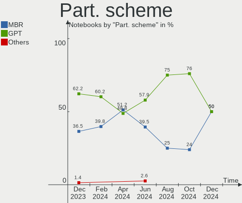
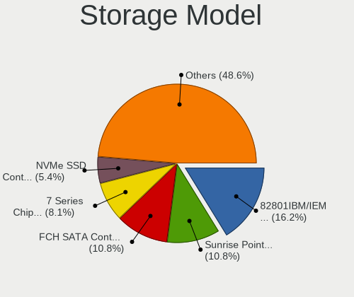
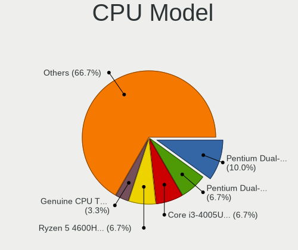
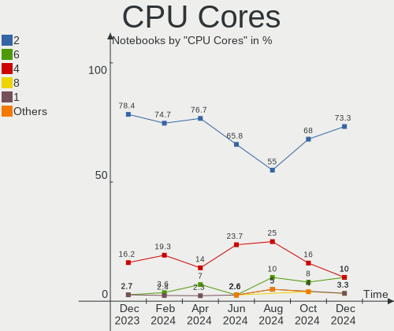
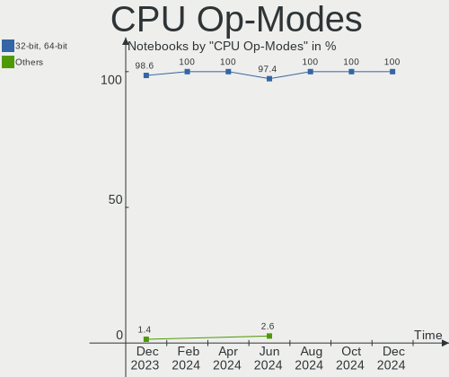
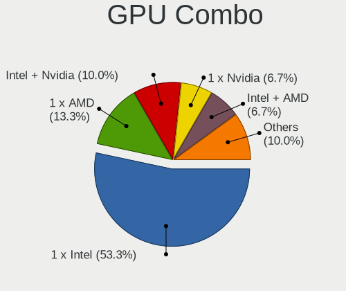
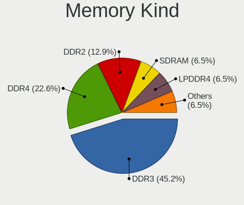
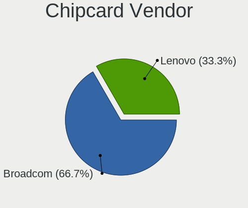
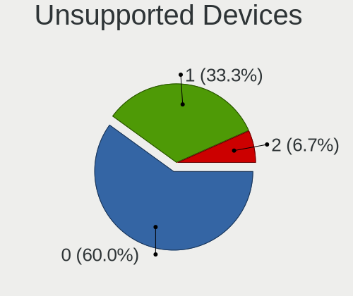

BlackPanther - Hardware Trends (Notebooks)
------------------------------------------

A project to identify most popular hardware characteristics and track their change
over time based on data collected by Linux users at https://Linux-Hardware.org.

Anyone can contribute to this report by the [hw-probe](https://github.com/linuxhw/hw-probe) tool:

    sudo -E hw-probe -all -upload

This report is for one last month. Overall report since the beginning of time: [TestCoverage](https://github.com/linuxhw/TestCoverage)

Period: May, 2022.

Contents
--------

* [ System ](#system)
  - [ OS                       ](#os)
  - [ OS Family                ](#os-family)
  - [ Kernel                   ](#kernel)
  - [ Kernel Family            ](#kernel-family)
  - [ Kernel Major Ver.        ](#kernel-major-ver)
  - [ Arch                     ](#arch)
  - [ DE                       ](#de)
  - [ Display Server           ](#display-server)
  - [ Display Manager          ](#display-manager)
  - [ OS Lang                  ](#os-lang)
  - [ Boot Mode                ](#boot-mode)
  - [ Filesystem               ](#filesystem)
  - [ Part. scheme             ](#part-scheme)
  - [ Dual Boot with Linux/BSD ](#dual-boot-with-linuxbsd)
  - [ Dual Boot (Win)          ](#dual-boot-win)

* [ Board ](#board)
  - [ Vendor                   ](#vendor)
  - [ Model                    ](#model)
  - [ Model Family             ](#model-family)
  - [ MFG Year                 ](#mfg-year)
  - [ Form Factor              ](#form-factor)
  - [ Secure Boot              ](#secure-boot)
  - [ Coreboot                 ](#coreboot)
  - [ RAM Size                 ](#ram-size)
  - [ RAM Used                 ](#ram-used)
  - [ Total Drives             ](#total-drives)
  - [ Has CD-ROM               ](#has-cd-rom)
  - [ Has Ethernet             ](#has-ethernet)
  - [ Has WiFi                 ](#has-wifi)
  - [ Has Bluetooth            ](#has-bluetooth)

* [ Location ](#location)
  - [ Country                  ](#country)
  - [ City                     ](#city)

* [ Drives ](#drives)
  - [ Drive Vendor             ](#drive-vendor)
  - [ Drive Model              ](#drive-model)
  - [ HDD Vendor               ](#hdd-vendor)
  - [ SSD Vendor               ](#ssd-vendor)
  - [ Drive Kind               ](#drive-kind)
  - [ Drive Connector          ](#drive-connector)
  - [ Drive Size               ](#drive-size)
  - [ Space Total              ](#space-total)
  - [ Space Used               ](#space-used)
  - [ Malfunc. Drives          ](#malfunc-drives)
  - [ Malfunc. Drive Vendor    ](#malfunc-drive-vendor)
  - [ Malfunc. HDD Vendor      ](#malfunc-hdd-vendor)
  - [ Malfunc. Drive Kind      ](#malfunc-drive-kind)
  - [ Failed Drives            ](#failed-drives)
  - [ Failed Drive Vendor      ](#failed-drive-vendor)
  - [ Drive Status             ](#drive-status)

* [ Storage controller ](#storage-controller)
  - [ Storage Vendor           ](#storage-vendor)
  - [ Storage Model            ](#storage-model)
  - [ Storage Kind             ](#storage-kind)

* [ Processor ](#processor)
  - [ CPU Vendor               ](#cpu-vendor)
  - [ CPU Model                ](#cpu-model)
  - [ CPU Model Family         ](#cpu-model-family)
  - [ CPU Cores                ](#cpu-cores)
  - [ CPU Sockets              ](#cpu-sockets)
  - [ CPU Threads              ](#cpu-threads)
  - [ CPU Op-Modes             ](#cpu-op-modes)
  - [ CPU Microcode            ](#cpu-microcode)
  - [ CPU Microarch            ](#cpu-microarch)

* [ Graphics ](#graphics)
  - [ GPU Vendor               ](#gpu-vendor)
  - [ GPU Model                ](#gpu-model)
  - [ GPU Combo                ](#gpu-combo)
  - [ GPU Driver               ](#gpu-driver)
  - [ GPU Memory               ](#gpu-memory)

* [ Monitor ](#monitor)
  - [ Monitor Vendor           ](#monitor-vendor)
  - [ Monitor Model            ](#monitor-model)
  - [ Monitor Resolution       ](#monitor-resolution)
  - [ Monitor Diagonal         ](#monitor-diagonal)
  - [ Monitor Width            ](#monitor-width)
  - [ Aspect Ratio             ](#aspect-ratio)
  - [ Monitor Area             ](#monitor-area)
  - [ Pixel Density            ](#pixel-density)
  - [ Multiple Monitors        ](#multiple-monitors)

* [ Network ](#network)
  - [ Net Controller Vendor    ](#net-controller-vendor)
  - [ Net Controller Model     ](#net-controller-model)
  - [ Wireless Vendor          ](#wireless-vendor)
  - [ Wireless Model           ](#wireless-model)
  - [ Ethernet Vendor          ](#ethernet-vendor)
  - [ Ethernet Model           ](#ethernet-model)
  - [ Net Controller Kind      ](#net-controller-kind)
  - [ Used Controller          ](#used-controller)
  - [ NICs                     ](#nics)
  - [ IPv6                     ](#ipv6)

* [ Bluetooth ](#bluetooth)
  - [ Bluetooth Vendor         ](#bluetooth-vendor)
  - [ Bluetooth Model          ](#bluetooth-model)

* [ Sound ](#sound)
  - [ Sound Vendor             ](#sound-vendor)
  - [ Sound Model              ](#sound-model)

* [ Memory ](#memory)
  - [ Memory Vendor            ](#memory-vendor)
  - [ Memory Model             ](#memory-model)
  - [ Memory Kind              ](#memory-kind)
  - [ Memory Form Factor       ](#memory-form-factor)
  - [ Memory Size              ](#memory-size)
  - [ Memory Speed             ](#memory-speed)

* [ Printers & scanners ](#printers--scanners)
  - [ Printer Vendor           ](#printer-vendor)
  - [ Printer Model            ](#printer-model)
  - [ Scanner Vendor           ](#scanner-vendor)
  - [ Scanner Model            ](#scanner-model)

* [ Camera ](#camera)
  - [ Camera Vendor            ](#camera-vendor)
  - [ Camera Model             ](#camera-model)

* [ Security ](#security)
  - [ Fingerprint Vendor       ](#fingerprint-vendor)
  - [ Fingerprint Model        ](#fingerprint-model)
  - [ Chipcard Vendor          ](#chipcard-vendor)
  - [ Chipcard Model           ](#chipcard-model)

* [ Unsupported ](#unsupported)
  - [ Unsupported Devices      ](#unsupported-devices)
  - [ Unsupported Device Types ](#unsupported-device-types)

System
------

OS
--

Installed operating systems

| Name              | Notebooks | Percent |
|-------------------|-----------|---------|
| BlackPanther 18.1 | 17        | 100%    |

OS Family
---------

OS without a version

| Name         | Notebooks | Percent |
|--------------|-----------|---------|
| BlackPanther | 17        | 100%    |

Kernel
------

Version of the Linux kernel

| Version             | Notebooks | Percent |
|---------------------|-----------|---------|
| 5.6.14-desktop-2bP  | 9         | 52.94%  |
| 4.18.16-desktop-1bP | 8         | 47.06%  |

Kernel Family
-------------

Linux kernel without a distro release

| Version | Notebooks | Percent |
|---------|-----------|---------|
| 5.6.14  | 9         | 52.94%  |
| 4.18.16 | 8         | 47.06%  |

Kernel Major Ver.
-----------------

Linux kernel major version

| Version | Notebooks | Percent |
|---------|-----------|---------|
| 5.6     | 9         | 52.94%  |
| 4.18    | 8         | 47.06%  |

Arch
----

OS architecture (x86_64, i586, etc.)

| Name   | Notebooks | Percent |
|--------|-----------|---------|
| x86_64 | 17        | 100%    |

DE
--

Desktop Environment

| Name | Notebooks | Percent |
|------|-----------|---------|
| KDE5 | 17        | 100%    |

Display Server
--------------

X11 or Wayland

| Name | Notebooks | Percent |
|------|-----------|---------|
| X11  | 17        | 100%    |

Display Manager
---------------

SDDM, LightDM, etc.

| Name | Notebooks | Percent |
|------|-----------|---------|
| SDDM | 17        | 100%    |

OS Lang
-------

Language

| Lang    | Notebooks | Percent |
|---------|-----------|---------|
| Unknown | 17        | 100%    |

Boot Mode
---------

EFI or BIOS

| Mode | Notebooks | Percent |
|------|-----------|---------|
| BIOS | 10        | 58.82%  |
| EFI  | 7         | 41.18%  |

Filesystem
----------

Type of filesystem

| Type    | Notebooks | Percent |
|---------|-----------|---------|
| Overlay | 11        | 64.71%  |
| Ext4    | 6         | 35.29%  |

Part. scheme
------------

Scheme of partitioning

| Type | Notebooks | Percent |
|------|-----------|---------|
| MBR  | 9         | 52.94%  |
| GPT  | 8         | 47.06%  |

Dual Boot with Linux/BSD
------------------------

Hosting more than one Linux/BSD

| Dual boot | Notebooks | Percent |
|-----------|-----------|---------|
| No        | 10        | 58.82%  |
| Yes       | 7         | 41.18%  |

Dual Boot (Win)
---------------

Hosting Linux and Windows

| Dual boot | Notebooks | Percent |
|-----------|-----------|---------|
| No        | 11        | 64.71%  |
| Yes       | 6         | 35.29%  |

Board
-----

Vendor
------

Motherboard manufacturer

| Name             | Notebooks | Percent |
|------------------|-----------|---------|
| Lenovo           | 5         | 29.41%  |
| Hewlett-Packard  | 4         | 23.53%  |
| Dell             | 2         | 11.76%  |
| Toshiba          | 1         | 5.88%   |
| MSI              | 1         | 5.88%   |
| HUAWEI           | 1         | 5.88%   |
| Fujitsu          | 1         | 5.88%   |
| ASUSTek Computer | 1         | 5.88%   |
| Acer             | 1         | 5.88%   |

Model
-----

Motherboard model

| Name                          | Notebooks | Percent |
|-------------------------------|-----------|---------|
| Toshiba Satellite L775-18R    | 1         | 5.88%   |
| MSI GT60 2OC/2OD              | 1         | 5.88%   |
| Lenovo Yoga 300-11IBY 80M0    | 1         | 5.88%   |
| Lenovo IdeaPad 320-17ABR 80YN | 1         | 5.88%   |
| Lenovo G580 20150             | 1         | 5.88%   |
| Lenovo G570 20079             | 1         | 5.88%   |
| Lenovo B590 20208             | 1         | 5.88%   |
| HUAWEI HVY-WXX9               | 1         | 5.88%   |
| HP ProBook 640 G8 Notebook PC | 1         | 5.88%   |
| HP Presario CQ58              | 1         | 5.88%   |
| HP 620                        | 1         | 5.88%   |
| HP 255 G5 Notebook PC         | 1         | 5.88%   |
| Fujitsu LIFEBOOK U745         | 1         | 5.88%   |
| Dell Latitude E6430           | 1         | 5.88%   |
| Dell Latitude E6230           | 1         | 5.88%   |
| ASUS K53U                     | 1         | 5.88%   |
| Acer Aspire 6930G             | 1         | 5.88%   |

Model Family
------------

Motherboard model prefix

| Name              | Notebooks | Percent |
|-------------------|-----------|---------|
| Dell Latitude     | 2         | 11.76%  |
| Toshiba Satellite | 1         | 5.88%   |
| MSI GT60          | 1         | 5.88%   |
| Lenovo Yoga       | 1         | 5.88%   |
| Lenovo IdeaPad    | 1         | 5.88%   |
| Lenovo G580       | 1         | 5.88%   |
| Lenovo G570       | 1         | 5.88%   |
| Lenovo B590       | 1         | 5.88%   |
| HUAWEI HVY-WXX9   | 1         | 5.88%   |
| HP ProBook        | 1         | 5.88%   |
| HP Presario       | 1         | 5.88%   |
| HP 620            | 1         | 5.88%   |
| HP 255            | 1         | 5.88%   |
| Fujitsu LIFEBOOK  | 1         | 5.88%   |
| ASUS K53U         | 1         | 5.88%   |
| Acer Aspire       | 1         | 5.88%   |

MFG Year
--------

Motherboard manufacture year

| Year | Notebooks | Percent |
|------|-----------|---------|
| 2012 | 5         | 29.41%  |
| 2011 | 3         | 17.65%  |
| 2021 | 1         | 5.88%   |
| 2020 | 1         | 5.88%   |
| 2017 | 1         | 5.88%   |
| 2016 | 1         | 5.88%   |
| 2015 | 1         | 5.88%   |
| 2014 | 1         | 5.88%   |
| 2013 | 1         | 5.88%   |
| 2010 | 1         | 5.88%   |
| 2008 | 1         | 5.88%   |

Form Factor
-----------

Physical design of the computer

| Name     | Notebooks | Percent |
|----------|-----------|---------|
| Notebook | 17        | 100%    |

Secure Boot
-----------

Enabled or disabled

| State    | Notebooks | Percent |
|----------|-----------|---------|
| Disabled | 17        | 100%    |

Coreboot
--------

Have coreboot on board

| Used | Notebooks | Percent |
|------|-----------|---------|
| No   | 17        | 100%    |

RAM Size
--------

Total RAM memory

| Size in GB | Notebooks | Percent |
|------------|-----------|---------|
| 4.01-8.0   | 6         | 35.29%  |
| 3.01-4.0   | 6         | 35.29%  |
| 8.01-16.0  | 2         | 11.76%  |
| 2.01-3.0   | 1         | 5.88%   |
| 16.01-24.0 | 1         | 5.88%   |
| 1.01-2.0   | 1         | 5.88%   |

RAM Used
--------

Used RAM memory

| Used GB  | Notebooks | Percent |
|----------|-----------|---------|
| 0.51-1.0 | 10        | 58.82%  |
| 1.01-2.0 | 5         | 29.41%  |
| 0.01-0.5 | 2         | 11.76%  |

Total Drives
------------

Number of drives on board

| Drives | Notebooks | Percent |
|--------|-----------|---------|
| 1      | 12        | 70.59%  |
| 2      | 4         | 23.53%  |
| 3      | 1         | 5.88%   |

Has CD-ROM
----------

Has CD-ROM on board

| Presented | Notebooks | Percent |
|-----------|-----------|---------|
| Yes       | 9         | 52.94%  |
| No        | 8         | 47.06%  |

Has Ethernet
------------

Has Ethernet on board

| Presented | Notebooks | Percent |
|-----------|-----------|---------|
| Yes       | 16        | 94.12%  |
| No        | 1         | 5.88%   |

Has WiFi
--------

Has WiFi module

| Presented | Notebooks | Percent |
|-----------|-----------|---------|
| Yes       | 16        | 94.12%  |
| No        | 1         | 5.88%   |

Has Bluetooth
-------------

Has Bluetooth module

| Presented | Notebooks | Percent |
|-----------|-----------|---------|
| Yes       | 11        | 64.71%  |
| No        | 6         | 35.29%  |

Location
--------

Country
-------

Geographic location (country)

| Country  | Notebooks | Percent |
|----------|-----------|---------|
| Hungary  | 13        | 76.47%  |
| UK       | 1         | 5.88%   |
| Slovakia | 1         | 5.88%   |
| Poland   | 1         | 5.88%   |
| Germany  | 1         | 5.88%   |

City
----

Geographic location (city)

| City              | Notebooks | Percent |
|-------------------|-----------|---------|
| Budapest          | 6         | 35.29%  |
| Veszprém         | 1         | 5.88%   |
| Tornaľa          | 1         | 5.88%   |
| Szerencs          | 1         | 5.88%   |
| Székesfehérvár | 1         | 5.88%   |
| Munich            | 1         | 5.88%   |
| Krakow            | 1         | 5.88%   |
| Kisvarda          | 1         | 5.88%   |
| Kapuvar           | 1         | 5.88%   |
| Hove              | 1         | 5.88%   |
| Győr             | 1         | 5.88%   |
| Gyomro            | 1         | 5.88%   |

Drives
------

Drive Vendor
------------

Hard drive vendors

| Vendor              | Notebooks | Drives | Percent |
|---------------------|-----------|--------|---------|
| Samsung Electronics | 5         | 6      | 25%     |
| Kingston            | 3         | 3      | 15%     |
| WDC                 | 2         | 2      | 10%     |
| Hitachi             | 2         | 2      | 10%     |
| Toshiba             | 1         | 1      | 5%      |
| SSSTC               | 1         | 1      | 5%      |
| Seagate             | 1         | 1      | 5%      |
| LITEONIT            | 1         | 1      | 5%      |
| JMicron             | 1         | 1      | 5%      |
| HGST                | 1         | 1      | 5%      |
| China               | 1         | 1      | 5%      |
| Apacer              | 1         | 1      | 5%      |

Drive Model
-----------

Hard drive models

| Model                                | Notebooks | Percent |
|--------------------------------------|-----------|---------|
| WDC WD10JPVX-60JC3T0 1TB             | 1         | 4.76%   |
| WDC WD10JPLX-00MBPT0 1TB             | 1         | 4.76%   |
| Toshiba MK6475GSX 640GB              | 1         | 4.76%   |
| SSSTC CL1-8D256-HP 256GB             | 1         | 4.76%   |
| Seagate ST500LM000-SSHD-8GB          | 1         | 4.76%   |
| Samsung SSD 980 PRO 1TB              | 1         | 4.76%   |
| Samsung SSD 870 EVO 500GB            | 1         | 4.76%   |
| Samsung SSD 830 Series 128GB         | 1         | 4.76%   |
| Samsung MZVLB512HBJQ-00000 512GB     | 1         | 4.76%   |
| Samsung MZ7LN256HCHP-00000 256GB SSD | 1         | 4.76%   |
| Samsung HM160HI 160GB                | 1         | 4.76%   |
| LITEONIT LMT-128M6M mSATA 128GB SSD  | 1         | 4.76%   |
| Kingston SV300S37A120G 120GB SSD     | 1         | 4.76%   |
| Kingston SUV400S37240G 240GB SSD     | 1         | 4.76%   |
| Kingston SA400S37960G 960GB SSD      | 1         | 4.76%   |
| JMicron Tech 250GB                   | 1         | 4.76%   |
| Hitachi HTS727575A9E364 752GB        | 1         | 4.76%   |
| Hitachi HTS547550A9E384 500GB        | 1         | 4.76%   |
| HGST HTS545050A7E680 500GB           | 1         | 4.76%   |
| China SATA SSD 120GB                 | 1         | 4.76%   |
| Apacer AS350 256GB SSD               | 1         | 4.76%   |

HDD Vendor
----------

Hard disk drive vendors

| Vendor              | Notebooks | Drives | Percent |
|---------------------|-----------|--------|---------|
| WDC                 | 2         | 2      | 25%     |
| Hitachi             | 2         | 2      | 25%     |
| Toshiba             | 1         | 1      | 12.5%   |
| Seagate             | 1         | 1      | 12.5%   |
| Samsung Electronics | 1         | 1      | 12.5%   |
| HGST                | 1         | 1      | 12.5%   |

SSD Vendor
----------

Solid state drive vendors

| Vendor              | Notebooks | Drives | Percent |
|---------------------|-----------|--------|---------|
| Samsung Electronics | 3         | 3      | 33.33%  |
| Kingston            | 3         | 3      | 33.33%  |
| LITEONIT            | 1         | 1      | 11.11%  |
| China               | 1         | 1      | 11.11%  |
| Apacer              | 1         | 1      | 11.11%  |

Drive Kind
----------

HDD or SSD

| Kind    | Notebooks | Drives | Percent |
|---------|-----------|--------|---------|
| SSD     | 9         | 9      | 47.37%  |
| HDD     | 7         | 8      | 36.84%  |
| NVMe    | 2         | 3      | 10.53%  |
| Unknown | 1         | 1      | 5.26%   |

Drive Connector
---------------

SATA, SAS, NVMe, etc.

| Type | Notebooks | Drives | Percent |
|------|-----------|--------|---------|
| SATA | 15        | 17     | 83.33%  |
| NVMe | 2         | 3      | 11.11%  |
| SAS  | 1         | 1      | 5.56%   |

Drive Size
----------

Size of hard drive

| Size in TB | Notebooks | Drives | Percent |
|------------|-----------|--------|---------|
| 0.01-0.5   | 11        | 12     | 73.33%  |
| 0.51-1.0   | 4         | 5      | 26.67%  |

Space Total
-----------

Amount of disk space available on the file system

| Size in GB | Notebooks | Percent |
|------------|-----------|---------|
| Unknown    | 11        | 64.71%  |
| 101-250    | 4         | 23.53%  |
| 21-50      | 1         | 5.88%   |
| 501-1000   | 1         | 5.88%   |

Space Used
----------

Amount of used disk space

| Used GB | Notebooks | Percent |
|---------|-----------|---------|
| Unknown | 11        | 64.71%  |
| 1-20    | 6         | 35.29%  |

Malfunc. Drives
---------------

Drive models with a malfunction

| Model                             | Notebooks | Drives | Percent |
|-----------------------------------|-----------|--------|---------|
| WDC WD10JPLX-00MBPT0 1TB          | 1         | 1      | 14.29%  |
| Toshiba MK6475GSX 640GB           | 1         | 1      | 14.29%  |
| Seagate ST500LM000-SSHD-8GB       | 1         | 1      | 14.29%  |
| Samsung Electronics HM160HI 160GB | 1         | 1      | 14.29%  |
| Kingston SV300S37A120G 120GB SSD  | 1         | 1      | 14.29%  |
| Kingston SUV400S37240G 240GB SSD  | 1         | 1      | 14.29%  |
| HGST HTS545050A7E680 500GB        | 1         | 1      | 14.29%  |

Malfunc. Drive Vendor
---------------------

Vendors of faulty drives

| Vendor              | Notebooks | Drives | Percent |
|---------------------|-----------|--------|---------|
| Kingston            | 2         | 2      | 28.57%  |
| WDC                 | 1         | 1      | 14.29%  |
| Toshiba             | 1         | 1      | 14.29%  |
| Seagate             | 1         | 1      | 14.29%  |
| Samsung Electronics | 1         | 1      | 14.29%  |
| HGST                | 1         | 1      | 14.29%  |

Malfunc. HDD Vendor
-------------------

Vendors of faulty HDD drives

| Vendor              | Notebooks | Drives | Percent |
|---------------------|-----------|--------|---------|
| WDC                 | 1         | 1      | 20%     |
| Toshiba             | 1         | 1      | 20%     |
| Seagate             | 1         | 1      | 20%     |
| Samsung Electronics | 1         | 1      | 20%     |
| HGST                | 1         | 1      | 20%     |

Malfunc. Drive Kind
-------------------

Kinds of faulty drives

| Kind | Notebooks | Drives | Percent |
|------|-----------|--------|---------|
| HDD  | 5         | 5      | 71.43%  |
| SSD  | 2         | 2      | 28.57%  |

Failed Drives
-------------

Failed drive models

Zero info for selected period =(

Failed Drive Vendor
-------------------

Failed drive vendors

Zero info for selected period =(

Drive Status
------------

Number of failed and malfunc. drives

| Status   | Notebooks | Drives | Percent |
|----------|-----------|--------|---------|
| Works    | 11        | 13     | 57.89%  |
| Malfunc  | 7         | 7      | 36.84%  |
| Detected | 1         | 1      | 5.26%   |

Storage controller
------------------

Storage Vendor
--------------

Storage controller vendors

| Vendor                         | Notebooks | Percent |
|--------------------------------|-----------|---------|
| Intel                          | 12        | 66.67%  |
| AMD                            | 4         | 22.22%  |
| Solid State Storage Technology | 1         | 5.56%   |
| Samsung Electronics            | 1         | 5.56%   |

Storage Model
-------------

Storage controller models

| Model                                                                          | Notebooks | Percent |
|--------------------------------------------------------------------------------|-----------|---------|
| AMD FCH SATA Controller [AHCI mode]                                            | 3         | 14.29%  |
| Intel 82801IBM/IEM (ICH9M/ICH9M-E) 2 port SATA Controller [IDE mode]           | 2         | 9.52%   |
| Intel 82801 Mobile SATA Controller [RAID mode]                                 | 2         | 9.52%   |
| Intel 7 Series Chipset Family 6-port SATA Controller [AHCI mode]               | 2         | 9.52%   |
| Intel 6 Series/C200 Series Chipset Family 6 port Mobile SATA AHCI Controller   | 2         | 9.52%   |
| Solid State Storage Non-Volatile memory controller                             | 1         | 4.76%   |
| Samsung NVMe SSD Controller SM981/PM981/PM983                                  | 1         | 4.76%   |
| Samsung NVMe SSD Controller PM9A1/PM9A3/980PRO                                 | 1         | 4.76%   |
| Intel Wildcat Point-LP SATA Controller [AHCI Mode]                             | 1         | 4.76%   |
| Intel Volume Management Device NVMe RAID Controller                            | 1         | 4.76%   |
| Intel Atom Processor E3800 Series SATA AHCI Controller                         | 1         | 4.76%   |
| Intel 82801IBM/IEM (ICH9M/ICH9M-E) 4 port SATA Controller [AHCI mode]          | 1         | 4.76%   |
| Intel 8 Series/C220 Series Chipset Family 6-port SATA Controller 1 [AHCI mode] | 1         | 4.76%   |
| AMD SB7x0/SB8x0/SB9x0 SATA Controller [AHCI mode]                              | 1         | 4.76%   |
| AMD SB7x0/SB8x0/SB9x0 IDE Controller                                           | 1         | 4.76%   |

Storage Kind
------------

Kind of storage controller (IDE, SATA, NVMe, SAS, ...)

| Kind | Notebooks | Percent |
|------|-----------|---------|
| SATA | 12        | 60%     |
| RAID | 3         | 15%     |
| IDE  | 3         | 15%     |
| NVMe | 2         | 10%     |

Processor
---------

CPU Vendor
----------

Processor vendors

| Vendor | Notebooks | Percent |
|--------|-----------|---------|
| Intel  | 12        | 70.59%  |
| AMD    | 5         | 29.41%  |

CPU Model
---------

Processor models

| Model                                           | Notebooks | Percent |
|-------------------------------------------------|-----------|---------|
| Intel Core i5-3340M CPU @ 2.70GHz               | 2         | 11.76%  |
| Intel Pentium CPU N3540 @ 2.16GHz               | 1         | 5.88%   |
| Intel Pentium CPU B960 @ 2.20GHz                | 1         | 5.88%   |
| Intel Core i7-5600U CPU @ 2.60GHz               | 1         | 5.88%   |
| Intel Core i7-4700MQ CPU @ 2.40GHz              | 1         | 5.88%   |
| Intel Core i7-2630QM CPU @ 2.00GHz              | 1         | 5.88%   |
| Intel Core i5-2450M CPU @ 2.50GHz               | 1         | 5.88%   |
| Intel Core i3-3110M CPU @ 2.40GHz               | 1         | 5.88%   |
| Intel Core 2 Duo CPU P8600 @ 2.40GHz            | 1         | 5.88%   |
| Intel Celeron Dual-Core CPU T3100 @ 1.90GHz     | 1         | 5.88%   |
| Intel 11th Gen Core i3-1115G4 @ 3.00GHz         | 1         | 5.88%   |
| AMD Ryzen 5 4600H with Radeon Graphics          | 1         | 5.88%   |
| AMD E-350 Processor                             | 1         | 5.88%   |
| AMD E-300 APU with Radeon HD Graphics           | 1         | 5.88%   |
| AMD A6-7310 APU with AMD Radeon R4 Graphics     | 1         | 5.88%   |
| AMD A12-9720P RADEON R7, 12 COMPUTE CORES 4C+8G | 1         | 5.88%   |

CPU Model Family
----------------

Processor model prefix

| Model                   | Notebooks | Percent |
|-------------------------|-----------|---------|
| Intel Core i7           | 3         | 17.65%  |
| Intel Core i5           | 3         | 17.65%  |
| Intel Pentium           | 2         | 11.76%  |
| AMD E                   | 2         | 11.76%  |
| Other                   | 1         | 5.88%   |
| Intel Core i3           | 1         | 5.88%   |
| Intel Core 2 Duo        | 1         | 5.88%   |
| Intel Celeron Dual-Core | 1         | 5.88%   |
| AMD Ryzen 5             | 1         | 5.88%   |
| AMD A6                  | 1         | 5.88%   |
| AMD A12                 | 1         | 5.88%   |

CPU Cores
---------

Number of processor cores

| Number | Notebooks | Percent |
|--------|-----------|---------|
| 2      | 11        | 64.71%  |
| 4      | 4         | 23.53%  |
| 6      | 1         | 5.88%   |
| 1      | 1         | 5.88%   |

CPU Sockets
-----------

Number of sockets

| Number | Notebooks | Percent |
|--------|-----------|---------|
| 1      | 17        | 100%    |

CPU Threads
-----------

Threads per core (Hyper-Threading)

| Number | Notebooks | Percent |
|--------|-----------|---------|
| 2      | 9         | 52.94%  |
| 1      | 8         | 47.06%  |

CPU Op-Modes
------------

CPU Operation Modes (32-bit, 64-bit)

| Op mode        | Notebooks | Percent |
|----------------|-----------|---------|
| 32-bit, 64-bit | 17        | 100%    |

CPU Microcode
-------------

Microcode number

| Number     | Notebooks | Percent |
|------------|-----------|---------|
| 0x306a9    | 3         | 17.65%  |
| 0x206a7    | 3         | 17.65%  |
| 0x1067a    | 2         | 11.76%  |
| 0x806c1    | 1         | 5.88%   |
| 0x306d4    | 1         | 5.88%   |
| 0x306c3    | 1         | 5.88%   |
| 0x30678    | 1         | 5.88%   |
| 0x08600106 | 1         | 5.88%   |
| 0x07030105 | 1         | 5.88%   |
| 0x06006118 | 1         | 5.88%   |
| 0x05000119 | 1         | 5.88%   |
| 0x05000029 | 1         | 5.88%   |

CPU Microarch
-------------

Microarchitecture

| Name        | Notebooks | Percent |
|-------------|-----------|---------|
| SandyBridge | 3         | 17.65%  |
| IvyBridge   | 3         | 17.65%  |
| Penryn      | 2         | 11.76%  |
| Bobcat      | 2         | 11.76%  |
| Zen 2       | 1         | 5.88%   |
| TigerLake   | 1         | 5.88%   |
| Silvermont  | 1         | 5.88%   |
| Puma        | 1         | 5.88%   |
| Haswell     | 1         | 5.88%   |
| Excavator   | 1         | 5.88%   |
| Broadwell   | 1         | 5.88%   |

Graphics
--------

GPU Vendor
----------

Vendors of graphics cards

| Vendor | Notebooks | Percent |
|--------|-----------|---------|
| Intel  | 10        | 52.63%  |
| AMD    | 5         | 26.32%  |
| Nvidia | 4         | 21.05%  |

GPU Model
---------

Graphics card models

| Model                                                                                 | Notebooks | Percent |
|---------------------------------------------------------------------------------------|-----------|---------|
| Intel 3rd Gen Core processor Graphics Controller                                      | 3         | 15%     |
| Intel 2nd Generation Core Processor Family Integrated Graphics Controller             | 2         | 10%     |
| AMD Wrestler [Radeon HD 6310]                                                         | 2         | 10%     |
| Nvidia GK106M [GeForce GTX 770M]                                                      | 1         | 5%      |
| Nvidia GF117M [GeForce 610M/710M/810M/820M / GT 620M/625M/630M/720M]                  | 1         | 5%      |
| Nvidia GF108M [GeForce GT 525M]                                                       | 1         | 5%      |
| Nvidia G96CM [GeForce 9600M GS]                                                       | 1         | 5%      |
| Intel Tiger Lake UHD Graphics                                                         | 1         | 5%      |
| Intel Mobile 4 Series Chipset Integrated Graphics Controller                          | 1         | 5%      |
| Intel HD Graphics 5500                                                                | 1         | 5%      |
| Intel Atom Processor Z36xxx/Z37xxx Series Graphics & Display                          | 1         | 5%      |
| Intel 4th Gen Core Processor Integrated Graphics Controller                           | 1         | 5%      |
| AMD Wani [Radeon R5/R6/R7 Graphics]                                                   | 1         | 5%      |
| AMD Topaz XT [Radeon R7 M260/M265 / M340/M360 / M440/M445 / 530/535 / 620/625 Mobile] | 1         | 5%      |
| AMD Renoir                                                                            | 1         | 5%      |
| AMD Mullins [Radeon R4/R5 Graphics]                                                   | 1         | 5%      |

GPU Combo
---------

Combinations of graphics cards

| Name           | Notebooks | Percent |
|----------------|-----------|---------|
| 1 x Intel      | 8         | 47.06%  |
| 1 x AMD        | 4         | 23.53%  |
| 1 x Nvidia     | 2         | 11.76%  |
| Intel + Nvidia | 2         | 11.76%  |
| 2 x AMD        | 1         | 5.88%   |

GPU Driver
----------

Free vs proprietary

| Driver | Notebooks | Percent |
|--------|-----------|---------|
| Free   | 17        | 100%    |

GPU Memory
----------

Total video memory

| Size in GB | Notebooks | Percent |
|------------|-----------|---------|
| Unknown    | 8         | 47.06%  |
| 0.01-0.5   | 5         | 29.41%  |
| 0.51-1.0   | 3         | 17.65%  |
| 2.01-3.0   | 1         | 5.88%   |

Monitor
-------

Monitor Vendor
--------------

Monitor vendors

| Vendor                  | Notebooks | Percent |
|-------------------------|-----------|---------|
| LG Display              | 5         | 29.41%  |
| Samsung Electronics     | 3         | 17.65%  |
| AU Optronics            | 3         | 17.65%  |
| Chimei Innolux          | 2         | 11.76%  |
| BOE                     | 2         | 11.76%  |
| PANDA                   | 1         | 5.88%   |
| Chi Mei Optoelectronics | 1         | 5.88%   |

Monitor Model
-------------

Monitor models

| Model                                                                    | Notebooks | Percent |
|--------------------------------------------------------------------------|-----------|---------|
| Samsung Electronics LCD Monitor SEC315A 1366x768 344x194mm 15.5-inch     | 1         | 5.88%   |
| Samsung Electronics LCD Monitor SEC3152 1366x768 344x194mm 15.5-inch     | 1         | 5.88%   |
| Samsung Electronics LCD Monitor SEC304C 1366x768 350x200mm 15.9-inch     | 1         | 5.88%   |
| PANDA LCD Monitor NCP0065 1920x1080 309x174mm 14.0-inch                  | 1         | 5.88%   |
| LG Display LCD Monitor LGD036C 1366x768 277x156mm 12.5-inch              | 1         | 5.88%   |
| LG Display LCD Monitor LGD033E 1366x768 309x174mm 14.0-inch              | 1         | 5.88%   |
| LG Display LCD Monitor LGD02DC 1366x768 344x194mm 15.5-inch              | 1         | 5.88%   |
| LG Display LCD Monitor LGD02AD 1366x768 344x194mm 15.5-inch              | 1         | 5.88%   |
| LG Display LCD Monitor LGD0259 1920x1080 345x194mm 15.6-inch             | 1         | 5.88%   |
| Chimei Innolux LCD Monitor CMN1604 1920x1080 355x199mm 16.0-inch         | 1         | 5.88%   |
| Chimei Innolux LCD Monitor CMN14C3 1366x768 309x173mm 13.9-inch          | 1         | 5.88%   |
| Chi Mei Optoelectronics LCD Monitor CMO15A7 1366x768 344x193mm 15.5-inch | 1         | 5.88%   |
| BOE LCD Monitor BOE0687 1920x1080 344x193mm 15.5-inch                    | 1         | 5.88%   |
| BOE LCD Monitor BOE0685 1600x900 382x215mm 17.3-inch                     | 1         | 5.88%   |
| AU Optronics LCD Monitor AUO235C 1366x768 256x144mm 11.6-inch            | 1         | 5.88%   |
| AU Optronics LCD Monitor AUO21EC 1366x768 344x193mm 15.5-inch            | 1         | 5.88%   |
| AU Optronics LCD Monitor AUO139E 1600x900 382x214mm 17.2-inch            | 1         | 5.88%   |

Monitor Resolution
------------------

Monitor screen resolution

| Resolution      | Notebooks | Percent |
|-----------------|-----------|---------|
| 1366x768 (WXGA) | 10        | 58.82%  |
| 1920x1080 (FHD) | 5         | 29.41%  |
| 1600x900 (HD+)  | 2         | 11.76%  |

Monitor Diagonal
----------------

Diagonal size in inches

| Inches | Notebooks | Percent |
|--------|-----------|---------|
| 15     | 9         | 52.94%  |
| 17     | 2         | 11.76%  |
| 14     | 2         | 11.76%  |
| 16     | 1         | 5.88%   |
| 13     | 1         | 5.88%   |
| 12     | 1         | 5.88%   |
| 11     | 1         | 5.88%   |

Monitor Width
-------------

Physical width

| Width in mm | Notebooks | Percent |
|-------------|-----------|---------|
| 301-350     | 11        | 64.71%  |
| 351-400     | 4         | 23.53%  |
| 201-300     | 2         | 11.76%  |

Aspect Ratio
------------

Proportional relationship between the width and the height

| Ratio | Notebooks | Percent |
|-------|-----------|---------|
| 16/9  | 17        | 100%    |

Monitor Area
------------

Area in inch²

| Area in inch² | Notebooks | Percent |
|----------------|-----------|---------|
| 101-110        | 10        | 58.82%  |
| 81-90          | 3         | 17.65%  |
| 121-130        | 2         | 11.76%  |
| 61-70          | 1         | 5.88%   |
| 51-60          | 1         | 5.88%   |

Pixel Density
-------------

Pixels per inch

| Density | Notebooks | Percent |
|---------|-----------|---------|
| 101-120 | 9         | 52.94%  |
| 121-160 | 6         | 35.29%  |
| 51-100  | 2         | 11.76%  |

Multiple Monitors
-----------------

Total monitors connected

| Total | Notebooks | Percent |
|-------|-----------|---------|
| 1     | 17        | 100%    |

Network
-------

Net Controller Vendor
---------------------

Controller vendors

| Vendor                     | Notebooks | Percent |
|----------------------------|-----------|---------|
| Intel                      | 9         | 32.14%  |
| Realtek Semiconductor      | 8         | 28.57%  |
| Qualcomm Atheros           | 7         | 25%     |
| Broadcom                   | 2         | 7.14%   |
| Shenzhen Goodix Technology | 1         | 3.57%   |
| Broadcom Limited           | 1         | 3.57%   |

Net Controller Model
--------------------

Controller models

| Model                                                             | Notebooks | Percent |
|-------------------------------------------------------------------|-----------|---------|
| Realtek RTL8111/8168/8411 PCI Express Gigabit Ethernet Controller | 6         | 18.18%  |
| Realtek RTL810xE PCI Express Fast Ethernet controller             | 2         | 6.06%   |
| Qualcomm Atheros AR9285 Wireless Network Adapter (PCI-Express)    | 2         | 6.06%   |
| Intel 82579LM Gigabit Network Connection (Lewisville)             | 2         | 6.06%   |
| Broadcom BCM4313 802.11bgn Wireless Network Adapter               | 2         | 6.06%   |
| Shenzhen Goodix Unknow device                                     | 1         | 3.03%   |
| Realtek RTL8821AE 802.11ac PCIe Wireless Network Adapter          | 1         | 3.03%   |
| Qualcomm Atheros Killer E220x Gigabit Ethernet Controller         | 1         | 3.03%   |
| Qualcomm Atheros AR9485 Wireless Network Adapter                  | 1         | 3.03%   |
| Qualcomm Atheros AR9462 Wireless Network Adapter                  | 1         | 3.03%   |
| Qualcomm Atheros AR8162 Fast Ethernet                             | 1         | 3.03%   |
| Qualcomm Atheros AR8152 v2.0 Fast Ethernet                        | 1         | 3.03%   |
| Qualcomm Atheros AR8121/AR8113/AR8114 Gigabit or Fast Ethernet    | 1         | 3.03%   |
| Intel Wireless 7265                                               | 1         | 3.03%   |
| Intel Wireless 3165                                               | 1         | 3.03%   |
| Intel Wireless 3160                                               | 1         | 3.03%   |
| Intel Wi-Fi 6 AX201                                               | 1         | 3.03%   |
| Intel Wi-Fi 6 AX200                                               | 1         | 3.03%   |
| Intel PRO/Wireless 3945ABG [Golan] Network Connection             | 1         | 3.03%   |
| Intel Ethernet Connection (3) I218-LM                             | 1         | 3.03%   |
| Intel Ethernet Connection (13) I219-V                             | 1         | 3.03%   |
| Intel Centrino Wireless-N 2230                                    | 1         | 3.03%   |
| Intel Centrino Advanced-N 6205 [Taylor Peak]                      | 1         | 3.03%   |
| Broadcom Limited BCM4313 802.11bgn Wireless Network Adapter       | 1         | 3.03%   |

Wireless Vendor
---------------

Wireless vendors

| Vendor                | Notebooks | Percent |
|-----------------------|-----------|---------|
| Intel                 | 8         | 50%     |
| Qualcomm Atheros      | 4         | 25%     |
| Broadcom              | 2         | 12.5%   |
| Realtek Semiconductor | 1         | 6.25%   |
| Broadcom Limited      | 1         | 6.25%   |

Wireless Model
--------------

Wireless models

| Model                                                          | Notebooks | Percent |
|----------------------------------------------------------------|-----------|---------|
| Qualcomm Atheros AR9285 Wireless Network Adapter (PCI-Express) | 2         | 12.5%   |
| Broadcom BCM4313 802.11bgn Wireless Network Adapter            | 2         | 12.5%   |
| Realtek RTL8821AE 802.11ac PCIe Wireless Network Adapter       | 1         | 6.25%   |
| Qualcomm Atheros AR9485 Wireless Network Adapter               | 1         | 6.25%   |
| Qualcomm Atheros AR9462 Wireless Network Adapter               | 1         | 6.25%   |
| Intel Wireless 7265                                            | 1         | 6.25%   |
| Intel Wireless 3165                                            | 1         | 6.25%   |
| Intel Wireless 3160                                            | 1         | 6.25%   |
| Intel Wi-Fi 6 AX201                                            | 1         | 6.25%   |
| Intel Wi-Fi 6 AX200                                            | 1         | 6.25%   |
| Intel PRO/Wireless 3945ABG [Golan] Network Connection          | 1         | 6.25%   |
| Intel Centrino Wireless-N 2230                                 | 1         | 6.25%   |
| Intel Centrino Advanced-N 6205 [Taylor Peak]                   | 1         | 6.25%   |
| Broadcom Limited BCM4313 802.11bgn Wireless Network Adapter    | 1         | 6.25%   |

Ethernet Vendor
---------------

Ethernet vendors

| Vendor                | Notebooks | Percent |
|-----------------------|-----------|---------|
| Realtek Semiconductor | 8         | 50%     |
| Qualcomm Atheros      | 4         | 25%     |
| Intel                 | 4         | 25%     |

Ethernet Model
--------------

Ethernet models

| Model                                                             | Notebooks | Percent |
|-------------------------------------------------------------------|-----------|---------|
| Realtek RTL8111/8168/8411 PCI Express Gigabit Ethernet Controller | 6         | 37.5%   |
| Realtek RTL810xE PCI Express Fast Ethernet controller             | 2         | 12.5%   |
| Intel 82579LM Gigabit Network Connection (Lewisville)             | 2         | 12.5%   |
| Qualcomm Atheros Killer E220x Gigabit Ethernet Controller         | 1         | 6.25%   |
| Qualcomm Atheros AR8162 Fast Ethernet                             | 1         | 6.25%   |
| Qualcomm Atheros AR8152 v2.0 Fast Ethernet                        | 1         | 6.25%   |
| Qualcomm Atheros AR8121/AR8113/AR8114 Gigabit or Fast Ethernet    | 1         | 6.25%   |
| Intel Ethernet Connection (3) I218-LM                             | 1         | 6.25%   |
| Intel Ethernet Connection (13) I219-V                             | 1         | 6.25%   |

Net Controller Kind
-------------------

Ethernet, WiFi or modem

| Kind     | Notebooks | Percent |
|----------|-----------|---------|
| WiFi     | 16        | 48.48%  |
| Ethernet | 16        | 48.48%  |
| Unknown  | 1         | 3.03%   |

Used Controller
---------------

Currently used network controller

| Kind     | Notebooks | Percent |
|----------|-----------|---------|
| WiFi     | 13        | 68.42%  |
| Ethernet | 6         | 31.58%  |

NICs
----

Total network controllers on board

| Total | Notebooks | Percent |
|-------|-----------|---------|
| 2     | 15        | 88.24%  |
| 1     | 2         | 11.76%  |

IPv6
----

IPv6 vs IPv4

| Used | Notebooks | Percent |
|------|-----------|---------|
| No   | 15        | 88.24%  |
| Yes  | 2         | 11.76%  |

Bluetooth
---------

Bluetooth Vendor
----------------

Controller vendors

| Vendor                          | Notebooks | Percent |
|---------------------------------|-----------|---------|
| Intel                           | 5         | 45.45%  |
| Qualcomm Atheros Communications | 3         | 27.27%  |
| Foxconn / Hon Hai               | 2         | 18.18%  |
| Realtek Semiconductor           | 1         | 9.09%   |

Bluetooth Model
---------------

Controller models

| Model                                           | Notebooks | Percent |
|-------------------------------------------------|-----------|---------|
| Intel Bluetooth wireless interface              | 2         | 18.18%  |
| Realtek Bluetooth Radio                         | 1         | 9.09%   |
| Qualcomm Atheros Bluetooth                      | 1         | 9.09%   |
| Qualcomm Atheros AR3012 Bluetooth 4.0           | 1         | 9.09%   |
| Qualcomm Atheros AR3011 Bluetooth               | 1         | 9.09%   |
| Intel Centrino Bluetooth Wireless Transceiver   | 1         | 9.09%   |
| Intel AX201 Bluetooth                           | 1         | 9.09%   |
| Intel AX200 Bluetooth                           | 1         | 9.09%   |
| Foxconn / Hon Hai Broadcom Bluetooth 2.1 Device | 1         | 9.09%   |
| Foxconn / Hon Hai Broadcom BCM20702 Bluetooth   | 1         | 9.09%   |

Sound
-----

Sound Vendor
------------

Sound card vendors

| Vendor | Notebooks | Percent |
|--------|-----------|---------|
| Intel  | 12        | 63.16%  |
| AMD    | 5         | 26.32%  |
| Nvidia | 2         | 10.53%  |

Sound Model
-----------

Sound card models

| Model                                                                      | Notebooks | Percent |
|----------------------------------------------------------------------------|-----------|---------|
| Intel 7 Series/C216 Chipset Family High Definition Audio Controller        | 4         | 16%     |
| Intel 82801I (ICH9 Family) HD Audio Controller                             | 2         | 8%      |
| Intel 6 Series/C200 Series Chipset Family High Definition Audio Controller | 2         | 8%      |
| AMD Wrestler HDMI Audio                                                    | 2         | 8%      |
| AMD Kabini HDMI/DP Audio                                                   | 2         | 8%      |
| AMD FCH Azalia Controller                                                  | 2         | 8%      |
| Nvidia GK106 HDMI Audio Controller                                         | 1         | 4%      |
| Nvidia GF108 High Definition Audio Controller                              | 1         | 4%      |
| Intel Wildcat Point-LP High Definition Audio Controller                    | 1         | 4%      |
| Intel Tiger Lake-LP Smart Sound Technology Audio Controller                | 1         | 4%      |
| Intel Broadwell-U Audio Controller                                         | 1         | 4%      |
| Intel Atom Processor Z36xxx/Z37xxx Series High Definition Audio Controller | 1         | 4%      |
| Intel 8 Series/C220 Series Chipset High Definition Audio Controller        | 1         | 4%      |
| AMD SBx00 Azalia (Intel HDA)                                               | 1         | 4%      |
| AMD Renoir Radeon High Definition Audio Controller                         | 1         | 4%      |
| AMD Family 17h/19h HD Audio Controller                                     | 1         | 4%      |
| AMD Family 15h (Models 60h-6fh) Audio Controller                           | 1         | 4%      |

Memory
------

Memory Vendor
-------------

Memory module vendors

| Vendor              | Notebooks | Percent |
|---------------------|-----------|---------|
| SK Hynix            | 6         | 30%     |
| Samsung Electronics | 5         | 25%     |
| Micron Technology   | 5         | 25%     |
| Unknown             | 1         | 5%      |
| Nanya Technology    | 1         | 5%      |
| Kingston            | 1         | 5%      |
| ASint Technology    | 1         | 5%      |

Memory Model
------------

Memory module models

| Model                                                         | Notebooks | Percent |
|---------------------------------------------------------------|-----------|---------|
| Unknown RAM Module 2048MB SODIMM DDR2 667MT/s                 | 1         | 4%      |
| SK Hynix RAM HMT451S6BFR8A-PB 4GB SODIMM DDR3 1600MT/s        | 1         | 4%      |
| SK Hynix RAM HMT451S6AFR8A-PB 4GB SODIMM DDR3 1600MT/s        | 1         | 4%      |
| SK Hynix RAM HMT351S6EFR8C-PB 4096MB SODIMM DDR3 1600MT/s     | 1         | 4%      |
| SK Hynix RAM HMT351S6CFR8C-PB 4GB SODIMM DDR3 1600MT/s        | 1         | 4%      |
| SK Hynix RAM HMT325S6CFR8C-PB 2GB SODIMM DDR3 1600MT/s        | 1         | 4%      |
| SK Hynix RAM HMT325S6CFR8C-H9 2048MB SODIMM DDR3 1333MT/s     | 1         | 4%      |
| SK Hynix RAM HMT325S6BFR8C-H9 2GB SODIMM DDR3 1600MT/s        | 1         | 4%      |
| SK Hynix RAM HMT325S6BFR8C-H9 2048MB SODIMM DDR3 1334MT/s     | 1         | 4%      |
| Samsung RAM Module 8192MB SODIMM DDR4 3200MT/s                | 1         | 4%      |
| Samsung RAM M471B5173QH0-YK0 4GB SODIMM DDR3 1600MT/s         | 1         | 4%      |
| Samsung RAM M471B5173EB0-YK0 4GB SODIMM DDR3 1600MT/s         | 1         | 4%      |
| Samsung RAM M471B5173DB0-YK0 4GB SODIMM DDR3 1600MT/s         | 1         | 4%      |
| Samsung RAM M471B1G73EB0-YK0 8192MB SODIMM DDR3 1600MT/s      | 1         | 4%      |
| Samsung RAM M471A5244CB0-CRC 4GB SODIMM DDR4 2667MT/s         | 1         | 4%      |
| Nanya RAM NT4GC64C88B1NS-DI 4096MB SODIMM DDR3 1600MT/s       | 1         | 4%      |
| Micron RAM Module 4096MB SODIMM DDR3 1600MT/s                 | 1         | 4%      |
| Micron RAM Module 2048MB SODIMM DDR3 1333MT/s                 | 1         | 4%      |
| Micron RAM 8KTF25664HZ-1G6M1 2048MB SODIMM DDR3 1600MT/s      | 1         | 4%      |
| Micron RAM 8JSF25664HZ-1G4D1 2048MB SODIMM DDR3 1334MT/s      | 1         | 4%      |
| Micron RAM 4ATF1G64HZ-3G2E1 8192MB Row Of Chips DDR4 3200MT/s | 1         | 4%      |
| Kingston RAM Module 8192MB SODIMM DDR3 1600MT/s               | 1         | 4%      |
| Kingston RAM M471B1G73BH0-YK0 8192MB SODIMM DDR3 1600MT/s     | 1         | 4%      |
| ASint RAM SSZ3128M8-EDJEF 2048MB SODIMM DDR3 1333MT/s         | 1         | 4%      |
| ASint RAM SSY3128M8-EDJEF 1024MB SODIMM DDR3 1333MT/s         | 1         | 4%      |

Memory Kind
-----------

Memory module kinds

| Kind | Notebooks | Percent |
|------|-----------|---------|
| DDR3 | 13        | 76.47%  |
| DDR4 | 3         | 17.65%  |
| DDR2 | 1         | 5.88%   |

Memory Form Factor
------------------

Physical design of the memory module

| Name         | Notebooks | Percent |
|--------------|-----------|---------|
| SODIMM       | 16        | 94.12%  |
| Row Of Chips | 1         | 5.88%   |

Memory Size
-----------

Memory module size

| Size | Notebooks | Percent |
|------|-----------|---------|
| 4096 | 7         | 36.84%  |
| 2048 | 7         | 36.84%  |
| 8192 | 4         | 21.05%  |
| 1024 | 1         | 5.26%   |

Memory Speed
------------

Memory module speed

| Speed | Notebooks | Percent |
|-------|-----------|---------|
| 1600  | 10        | 55.56%  |
| 1333  | 3         | 16.67%  |
| 3200  | 2         | 11.11%  |
| 2667  | 1         | 5.56%   |
| 1334  | 1         | 5.56%   |
| 667   | 1         | 5.56%   |

Printers & scanners
-------------------

Printer Vendor
--------------

Printer device vendors

Zero info for selected period =(

Printer Model
-------------

Printer device models

Zero info for selected period =(

Scanner Vendor
--------------

Scanner device vendors

Zero info for selected period =(

Scanner Model
-------------

Scanner device models

Zero info for selected period =(

Camera
------

Camera Vendor
-------------

Camera device vendors

| Vendor                                 | Notebooks | Percent |
|----------------------------------------|-----------|---------|
| Chicony Electronics                    | 6         | 40%     |
| Cheng Uei Precision Industry (Foxlink) | 2         | 13.33%  |
| Acer                                   | 2         | 13.33%  |
| Suyin                                  | 1         | 6.67%   |
| Realtek Semiconductor                  | 1         | 6.67%   |
| Quanta                                 | 1         | 6.67%   |
| Microdia                               | 1         | 6.67%   |
| IMC Networks                           | 1         | 6.67%   |

Camera Model
------------

Camera device models

| Model                                            | Notebooks | Percent |
|--------------------------------------------------|-----------|---------|
| Chicony Lenovo EasyCamera                        | 2         | 13.33%  |
| Acer Lenovo Integrated Webcam                    | 2         | 13.33%  |
| Suyin Acer/HP Integrated Webcam [CN0314]         | 1         | 6.67%   |
| Realtek FJ Camera                                | 1         | 6.67%   |
| Quanta HP HD Camera                              | 1         | 6.67%   |
| Microdia Dell Integrated HD Webcam               | 1         | 6.67%   |
| IMC Networks EasyCamera                          | 1         | 6.67%   |
| Chicony HP Webcam-50                             | 1         | 6.67%   |
| Chicony HP Webcam                                | 1         | 6.67%   |
| Chicony CNFA078                                  | 1         | 6.67%   |
| Chicony CNF9055 Toshiba Webcam                   | 1         | 6.67%   |
| Cheng Uei Precision Industry (Foxlink) Webcam    | 1         | 6.67%   |
| Cheng Uei Precision Industry (Foxlink) HD Camera | 1         | 6.67%   |

Security
--------

Fingerprint Vendor
------------------

Fingerprint sensor vendors

| Vendor | Notebooks | Percent |
|--------|-----------|---------|
| Upek   | 2         | 100%    |

Fingerprint Model
-----------------

Fingerprint sensor models

| Model                                                  | Notebooks | Percent |
|--------------------------------------------------------|-----------|---------|
| Upek Biometric Touchchip/Touchstrip Fingerprint Sensor | 2         | 100%    |

Chipcard Vendor
---------------

Chipcard module vendors

| Vendor   | Notebooks | Percent |
|----------|-----------|---------|
| O2 Micro | 1         | 50%     |
| Broadcom | 1         | 50%     |

Chipcard Model
--------------

Chipcard module models

| Model                                                                        | Notebooks | Percent |
|------------------------------------------------------------------------------|-----------|---------|
| O2 Micro OZ776 CCID Smartcard Reader                                         | 1         | 50%     |
| Broadcom BCM5880 Secure Applications Processor with fingerprint swipe sensor | 1         | 50%     |

Unsupported
-----------

Unsupported Devices
-------------------

Total unsupported devices on board

| Total | Notebooks | Percent |
|-------|-----------|---------|
| 0     | 12        | 70.59%  |
| 1     | 5         | 29.41%  |

Unsupported Device Types
------------------------

Types of unsupported devices

| Type               | Notebooks | Percent |
|--------------------|-----------|---------|
| Fingerprint reader | 2         | 40%     |
| Chipcard           | 2         | 40%     |
| Network            | 1         | 20%     |

