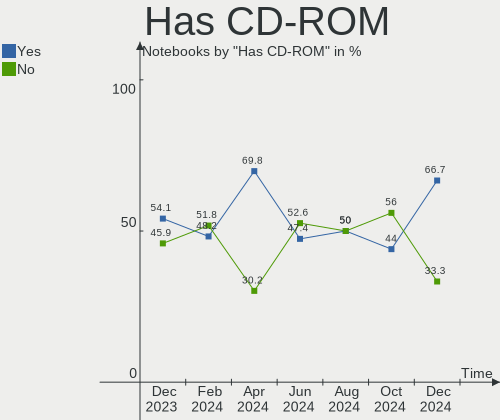
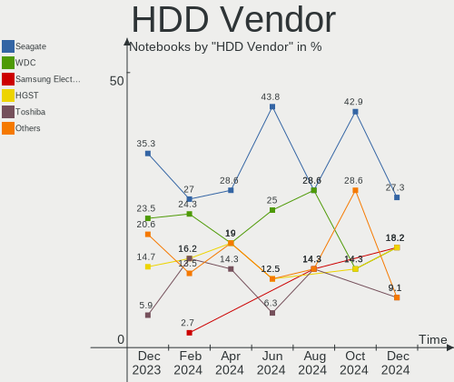
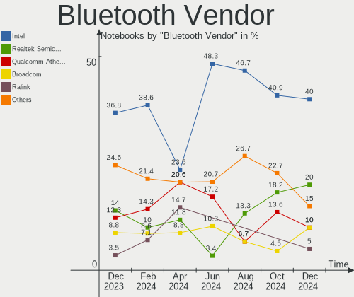
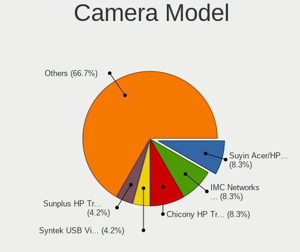

BlackPanther - Hardware Trends (Notebooks)
------------------------------------------

A project to identify most popular hardware characteristics and track their change
over time based on data collected by Linux users at https://Linux-Hardware.org.

Anyone can contribute to this report by the [hw-probe](https://github.com/linuxhw/hw-probe) tool:

    sudo -E hw-probe -all -upload

This report is for one last month. Overall report since the beginning of time: [TestDays](https://github.com/linuxhw/TestDays)

Period: Dec, 2023.

Contents
--------

* [ System ](#system)
  - [ OS                       ](#os)
  - [ OS Family                ](#os-family)
  - [ Kernel                   ](#kernel)
  - [ Kernel Family            ](#kernel-family)
  - [ Kernel Major Ver.        ](#kernel-major-ver)
  - [ Arch                     ](#arch)
  - [ DE                       ](#de)
  - [ Display Server           ](#display-server)
  - [ Display Manager          ](#display-manager)
  - [ OS Lang                  ](#os-lang)
  - [ Boot Mode                ](#boot-mode)
  - [ Filesystem               ](#filesystem)
  - [ Part. scheme             ](#part-scheme)
  - [ Dual Boot with Linux/BSD ](#dual-boot-with-linuxbsd)
  - [ Dual Boot (Win)          ](#dual-boot-win)

* [ Board ](#board)
  - [ Vendor                   ](#vendor)
  - [ Model                    ](#model)
  - [ Model Family             ](#model-family)
  - [ MFG Year                 ](#mfg-year)
  - [ Form Factor              ](#form-factor)
  - [ Secure Boot              ](#secure-boot)
  - [ Coreboot                 ](#coreboot)
  - [ RAM Size                 ](#ram-size)
  - [ RAM Used                 ](#ram-used)
  - [ Total Drives             ](#total-drives)
  - [ Has CD-ROM               ](#has-cd-rom)
  - [ Has Ethernet             ](#has-ethernet)
  - [ Has WiFi                 ](#has-wifi)
  - [ Has Bluetooth            ](#has-bluetooth)

* [ Location ](#location)
  - [ Country                  ](#country)
  - [ City                     ](#city)

* [ Drives ](#drives)
  - [ Drive Vendor             ](#drive-vendor)
  - [ Drive Model              ](#drive-model)
  - [ HDD Vendor               ](#hdd-vendor)
  - [ SSD Vendor               ](#ssd-vendor)
  - [ Drive Kind               ](#drive-kind)
  - [ Drive Connector          ](#drive-connector)
  - [ Drive Size               ](#drive-size)
  - [ Space Total              ](#space-total)
  - [ Space Used               ](#space-used)
  - [ Malfunc. Drives          ](#malfunc-drives)
  - [ Malfunc. Drive Vendor    ](#malfunc-drive-vendor)
  - [ Malfunc. HDD Vendor      ](#malfunc-hdd-vendor)
  - [ Malfunc. Drive Kind      ](#malfunc-drive-kind)
  - [ Failed Drives            ](#failed-drives)
  - [ Failed Drive Vendor      ](#failed-drive-vendor)
  - [ Drive Status             ](#drive-status)

* [ Storage controller ](#storage-controller)
  - [ Storage Vendor           ](#storage-vendor)
  - [ Storage Model            ](#storage-model)
  - [ Storage Kind             ](#storage-kind)

* [ Processor ](#processor)
  - [ CPU Vendor               ](#cpu-vendor)
  - [ CPU Model                ](#cpu-model)
  - [ CPU Model Family         ](#cpu-model-family)
  - [ CPU Cores                ](#cpu-cores)
  - [ CPU Sockets              ](#cpu-sockets)
  - [ CPU Threads              ](#cpu-threads)
  - [ CPU Op-Modes             ](#cpu-op-modes)
  - [ CPU Microcode            ](#cpu-microcode)
  - [ CPU Microarch            ](#cpu-microarch)

* [ Graphics ](#graphics)
  - [ GPU Vendor               ](#gpu-vendor)
  - [ GPU Model                ](#gpu-model)
  - [ GPU Combo                ](#gpu-combo)
  - [ GPU Driver               ](#gpu-driver)
  - [ GPU Memory               ](#gpu-memory)

* [ Monitor ](#monitor)
  - [ Monitor Vendor           ](#monitor-vendor)
  - [ Monitor Model            ](#monitor-model)
  - [ Monitor Resolution       ](#monitor-resolution)
  - [ Monitor Diagonal         ](#monitor-diagonal)
  - [ Monitor Width            ](#monitor-width)
  - [ Aspect Ratio             ](#aspect-ratio)
  - [ Monitor Area             ](#monitor-area)
  - [ Pixel Density            ](#pixel-density)
  - [ Multiple Monitors        ](#multiple-monitors)

* [ Network ](#network)
  - [ Net Controller Vendor    ](#net-controller-vendor)
  - [ Net Controller Model     ](#net-controller-model)
  - [ Wireless Vendor          ](#wireless-vendor)
  - [ Wireless Model           ](#wireless-model)
  - [ Ethernet Vendor          ](#ethernet-vendor)
  - [ Ethernet Model           ](#ethernet-model)
  - [ Net Controller Kind      ](#net-controller-kind)
  - [ Used Controller          ](#used-controller)
  - [ NICs                     ](#nics)
  - [ IPv6                     ](#ipv6)

* [ Bluetooth ](#bluetooth)
  - [ Bluetooth Vendor         ](#bluetooth-vendor)
  - [ Bluetooth Model          ](#bluetooth-model)

* [ Sound ](#sound)
  - [ Sound Vendor             ](#sound-vendor)
  - [ Sound Model              ](#sound-model)

* [ Memory ](#memory)
  - [ Memory Vendor            ](#memory-vendor)
  - [ Memory Model             ](#memory-model)
  - [ Memory Kind              ](#memory-kind)
  - [ Memory Form Factor       ](#memory-form-factor)
  - [ Memory Size              ](#memory-size)
  - [ Memory Speed             ](#memory-speed)

* [ Printers & scanners ](#printers--scanners)
  - [ Printer Vendor           ](#printer-vendor)
  - [ Printer Model            ](#printer-model)
  - [ Scanner Vendor           ](#scanner-vendor)
  - [ Scanner Model            ](#scanner-model)

* [ Camera ](#camera)
  - [ Camera Vendor            ](#camera-vendor)
  - [ Camera Model             ](#camera-model)

* [ Security ](#security)
  - [ Fingerprint Vendor       ](#fingerprint-vendor)
  - [ Fingerprint Model        ](#fingerprint-model)
  - [ Chipcard Vendor          ](#chipcard-vendor)
  - [ Chipcard Model           ](#chipcard-model)

* [ Unsupported ](#unsupported)
  - [ Unsupported Devices      ](#unsupported-devices)
  - [ Unsupported Device Types ](#unsupported-device-types)

System
------

OS
--

Installed operating systems

| Name              | Notebooks | Percent |
|-------------------|-----------|---------|
| BlackPanther 18.1 | 73        | 98.65%  |
| BlackPanther 22.1 | 1         | 1.35%   |

OS Family
---------

OS without a version

| Name         | Notebooks | Percent |
|--------------|-----------|---------|
| BlackPanther | 74        | 100%    |

Kernel
------

Version of the Linux kernel

| Version               | Notebooks | Percent |
|-----------------------|-----------|---------|
| 5.15.85-desktop-1bP   | 38        | 51.35%  |
| 5.6.14-desktop-2bP    | 16        | 21.62%  |
| 4.18.16-desktop-1bP   | 13        | 17.57%  |
| 6.3.8-desktop-1bP     | 3         | 4.05%   |
| 6.6.4-200.fc39.x86_64 | 1         | 1.35%   |
| 6.5.7-power-1bP       | 1         | 1.35%   |
| 5.6.14-server-2bP     | 1         | 1.35%   |
| 5.1.15-desktop-1bP    | 1         | 1.35%   |

Kernel Family
-------------

Linux kernel without a distro release

| Version | Notebooks | Percent |
|---------|-----------|---------|
| 5.15.85 | 38        | 51.35%  |
| 5.6.14  | 17        | 22.97%  |
| 4.18.16 | 13        | 17.57%  |
| 6.3.8   | 3         | 4.05%   |
| 6.6.4   | 1         | 1.35%   |
| 6.5.7   | 1         | 1.35%   |
| 5.1.15  | 1         | 1.35%   |

Kernel Major Ver.
-----------------

Linux kernel major version

| Version | Notebooks | Percent |
|---------|-----------|---------|
| 5.15    | 38        | 51.35%  |
| 5.6     | 17        | 22.97%  |
| 4.18    | 13        | 17.57%  |
| 6.3     | 3         | 4.05%   |
| 6.6     | 1         | 1.35%   |
| 6.5     | 1         | 1.35%   |
| 5.1     | 1         | 1.35%   |

Arch
----

OS architecture (x86_64, i586, etc.)

| Name   | Notebooks | Percent |
|--------|-----------|---------|
| x86_64 | 74        | 100%    |

DE
--

Desktop Environment

| Name    | Notebooks | Percent |
|---------|-----------|---------|
| KDE5    | 73        | 98.65%  |
| Unknown | 1         | 1.35%   |

Display Server
--------------

X11 or Wayland

| Name    | Notebooks | Percent |
|---------|-----------|---------|
| X11     | 73        | 98.65%  |
| Unknown | 1         | 1.35%   |

Display Manager
---------------

SDDM, LightDM, etc.

| Name    | Notebooks | Percent |
|---------|-----------|---------|
| SDDM    | 73        | 98.65%  |
| Unknown | 1         | 1.35%   |

OS Lang
-------

Language

| Lang    | Notebooks | Percent |
|---------|-----------|---------|
| Unknown | 74        | 100%    |

Boot Mode
---------

EFI or BIOS

| Mode | Notebooks | Percent |
|------|-----------|---------|
| EFI  | 43        | 58.11%  |
| BIOS | 31        | 41.89%  |

Filesystem
----------

Type of filesystem

| Type    | Notebooks | Percent |
|---------|-----------|---------|
| Ext4    | 52        | 70.27%  |
| Overlay | 19        | 25.68%  |
| Btrfs   | 2         | 2.7%    |
| Unknown | 1         | 1.35%   |

Part. scheme
------------

Scheme of partitioning

| Type    | Notebooks | Percent |
|---------|-----------|---------|
| GPT     | 47        | 63.51%  |
| MBR     | 26        | 35.14%  |
| Unknown | 1         | 1.35%   |

Dual Boot with Linux/BSD
------------------------

Hosting more than one Linux/BSD

| Dual boot | Notebooks | Percent |
|-----------|-----------|---------|
| No        | 60        | 81.08%  |
| Yes       | 14        | 18.92%  |

Dual Boot (Win)
---------------

Hosting Linux and Windows

| Dual boot | Notebooks | Percent |
|-----------|-----------|---------|
| No        | 47        | 63.51%  |
| Yes       | 27        | 36.49%  |

Board
-----

Vendor
------

Motherboard manufacturer

| Name                | Notebooks | Percent |
|---------------------|-----------|---------|
| Hewlett-Packard     | 17        | 22.97%  |
| Lenovo              | 15        | 20.27%  |
| Dell                | 13        | 17.57%  |
| Acer                | 9         | 12.16%  |
| ASUSTek Computer    | 8         | 10.81%  |
| Apple               | 3         | 4.05%   |
| MSI                 | 2         | 2.7%    |
| eMachines           | 2         | 2.7%    |
| Sony                | 1         | 1.35%   |
| Samsung Electronics | 1         | 1.35%   |
| Fujitsu Siemens     | 1         | 1.35%   |
| Fujitsu             | 1         | 1.35%   |
| AWOW                | 1         | 1.35%   |

Model
-----

Motherboard model

| Name                                 | Notebooks | Percent |
|--------------------------------------|-----------|---------|
| Lenovo IdeaPad 110-15ACL 80TJ        | 2         | 2.7%    |
| HP ProBook 640 G8 Notebook PC        | 2         | 2.7%    |
| HP 250 G1                            | 2         | 2.7%    |
| ASUS K54HR                           | 2         | 2.7%    |
| Sony VPCS13V9E                       | 1         | 1.35%   |
| Samsung 300E4C/300E5C/300E7C         | 1         | 1.35%   |
| MSI GT60 2OC/2OD                     | 1         | 1.35%   |
| MSI GP75 Leopard 9SE                 | 1         | 1.35%   |
| Lenovo ThinkPad X250 20CLS1JN00      | 1         | 1.35%   |
| Lenovo ThinkPad X230 2333A91         | 1         | 1.35%   |
| Lenovo ThinkPad T540p 20BE003YUK     | 1         | 1.35%   |
| Lenovo ThinkPad T410 2537VFQ         | 1         | 1.35%   |
| Lenovo ThinkPad T410 2537AL8         | 1         | 1.35%   |
| Lenovo ThinkPad T400 2768WGB         | 1         | 1.35%   |
| Lenovo IdeaPad 700-15ISK 80RU        | 1         | 1.35%   |
| Lenovo IdeaPad 330-15IKB 81DE        | 1         | 1.35%   |
| Lenovo IdeaPad 320-17ABR 80YN        | 1         | 1.35%   |
| Lenovo IdeaPad 3-15ITL6 82H8         | 1         | 1.35%   |
| Lenovo G70-70 80HW                   | 1         | 1.35%   |
| Lenovo G505s 20255                   | 1         | 1.35%   |
| Lenovo Flex 2-15D 20377              | 1         | 1.35%   |
| HP ProBook 650 G2                    | 1         | 1.35%   |
| HP ProBook 450 G1                    | 1         | 1.35%   |
| HP Pavilion Gaming Laptop 15-ec1xxx  | 1         | 1.35%   |
| HP Pavilion dv7                      | 1         | 1.35%   |
| HP Pavilion dv6                      | 1         | 1.35%   |
| HP Pavilion dv5                      | 1         | 1.35%   |
| HP Notebook                          | 1         | 1.35%   |
| HP Laptop 15-dw1xxx                  | 1         | 1.35%   |
| HP EliteBook Folio 9480m             | 1         | 1.35%   |
| HP EliteBook 8570w                   | 1         | 1.35%   |
| HP EliteBook 840 G8 Notebook PC      | 1         | 1.35%   |
| HP EliteBook 2540p                   | 1         | 1.35%   |
| HP Compaq 6710b                      | 1         | 1.35%   |
| Fujitsu Siemens ESPRIMO Mobile U9210 | 1         | 1.35%   |
| Fujitsu LIFEBOOK A512                | 1         | 1.35%   |
| eMachines E725                       | 1         | 1.35%   |
| eMachines E525                       | 1         | 1.35%   |
| Dell Latitude E6540                  | 1         | 1.35%   |
| Dell Latitude E6410                  | 1         | 1.35%   |

Model Family
------------

Motherboard model prefix

| Name                    | Notebooks | Percent |
|-------------------------|-----------|---------|
| Dell Latitude           | 7         | 9.46%   |
| Lenovo ThinkPad         | 6         | 8.11%   |
| Lenovo IdeaPad          | 6         | 8.11%   |
| Dell Inspiron           | 6         | 8.11%   |
| Acer Aspire             | 6         | 8.11%   |
| HP ProBook              | 4         | 5.41%   |
| HP Pavilion             | 4         | 5.41%   |
| HP EliteBook            | 4         | 5.41%   |
| HP 250                  | 2         | 2.7%    |
| ASUS K54HR              | 2         | 2.7%    |
| Sony VPCS13V9E          | 1         | 1.35%   |
| Samsung 300E4C          | 1         | 1.35%   |
| MSI GT60                | 1         | 1.35%   |
| MSI GP75                | 1         | 1.35%   |
| Lenovo G70-70           | 1         | 1.35%   |
| Lenovo G505s            | 1         | 1.35%   |
| Lenovo Flex             | 1         | 1.35%   |
| HP Notebook             | 1         | 1.35%   |
| HP Laptop               | 1         | 1.35%   |
| HP Compaq               | 1         | 1.35%   |
| Fujitsu Siemens ESPRIMO | 1         | 1.35%   |
| Fujitsu LIFEBOOK        | 1         | 1.35%   |
| eMachines E725          | 1         | 1.35%   |
| eMachines E525          | 1         | 1.35%   |
| AWOW AK41               | 1         | 1.35%   |
| ASUS X55U               | 1         | 1.35%   |
| ASUS X551CA             | 1         | 1.35%   |
| ASUS X541NA             | 1         | 1.35%   |
| ASUS K53BY              | 1         | 1.35%   |
| ASUS K51AE              | 1         | 1.35%   |
| ASUS 1001PX             | 1         | 1.35%   |
| Apple MacBookPro8       | 1         | 1.35%   |
| Apple MacBookPro5       | 1         | 1.35%   |
| Apple MacBookAir5       | 1         | 1.35%   |
| Acer TravelMate         | 1         | 1.35%   |
| Acer Nitro              | 1         | 1.35%   |
| Acer EX5235             | 1         | 1.35%   |

MFG Year
--------

Motherboard manufacture year

| Year | Notebooks | Percent |
|------|-----------|---------|
| 2013 | 12        | 16.22%  |
| 2009 | 9         | 12.16%  |
| 2011 | 7         | 9.46%   |
| 2017 | 6         | 8.11%   |
| 2012 | 6         | 8.11%   |
| 2016 | 5         | 6.76%   |
| 2015 | 5         | 6.76%   |
| 2014 | 4         | 5.41%   |
| 2010 | 4         | 5.41%   |
| 2008 | 4         | 5.41%   |
| 2021 | 3         | 4.05%   |
| 2020 | 3         | 4.05%   |
| 2019 | 2         | 2.7%    |
| 2018 | 2         | 2.7%    |
| 2023 | 1         | 1.35%   |
| 2007 | 1         | 1.35%   |

Form Factor
-----------

Physical design of the computer

| Name     | Notebooks | Percent |
|----------|-----------|---------|
| Notebook | 74        | 100%    |

Secure Boot
-----------

Enabled or disabled

| State    | Notebooks | Percent |
|----------|-----------|---------|
| Disabled | 73        | 98.65%  |
| Enabled  | 1         | 1.35%   |

Coreboot
--------

Have coreboot on board

| Used | Notebooks | Percent |
|------|-----------|---------|
| No   | 74        | 100%    |

RAM Size
--------

Total RAM memory

| Size in GB | Notebooks | Percent |
|------------|-----------|---------|
| 3.01-4.0   | 26        | 35.14%  |
| 4.01-8.0   | 23        | 31.08%  |
| 8.01-16.0  | 12        | 16.22%  |
| 16.01-24.0 | 6         | 8.11%   |
| 1.01-2.0   | 4         | 5.41%   |
| 2.01-3.0   | 2         | 2.7%    |
| Unknown    | 1         | 1.35%   |

RAM Used
--------

Used RAM memory

| Used GB  | Notebooks | Percent |
|----------|-----------|---------|
| 1.01-2.0 | 36        | 48.65%  |
| 0.51-1.0 | 23        | 31.08%  |
| 4.01-8.0 | 4         | 5.41%   |
| 3.01-4.0 | 4         | 5.41%   |
| 2.01-3.0 | 4         | 5.41%   |
| 0.01-0.5 | 2         | 2.7%    |
| Unknown  | 1         | 1.35%   |

Total Drives
------------

Number of drives on board

| Drives | Notebooks | Percent |
|--------|-----------|---------|
| 1      | 54        | 72.97%  |
| 2      | 18        | 24.32%  |
| 3      | 1         | 1.35%   |
| 0      | 1         | 1.35%   |

Has CD-ROM
----------

Has CD-ROM on board

| Presented | Notebooks | Percent |
|-----------|-----------|---------|
| Yes       | 39        | 52.7%   |
| No        | 35        | 47.3%   |

Has Ethernet
------------

Has Ethernet on board

| Presented | Notebooks | Percent |
|-----------|-----------|---------|
| Yes       | 71        | 95.95%  |
| No        | 3         | 4.05%   |

Has WiFi
--------

Has WiFi module

| Presented | Notebooks | Percent |
|-----------|-----------|---------|
| Yes       | 73        | 98.65%  |
| No        | 1         | 1.35%   |

Has Bluetooth
-------------

Has Bluetooth module

| Presented | Notebooks | Percent |
|-----------|-----------|---------|
| Yes       | 57        | 77.03%  |
| No        | 17        | 22.97%  |

Location
--------

Country
-------

Geographic location (country)

| Country  | Notebooks | Percent |
|----------|-----------|---------|
| Hungary  | 63        | 85.14%  |
| UK       | 4         | 5.41%   |
| Slovakia | 3         | 4.05%   |
| Romania  | 1         | 1.35%   |
| Germany  | 1         | 1.35%   |
| Canada   | 1         | 1.35%   |
| Austria  | 1         | 1.35%   |

City
----

Geographic location (city)

| City                    | Notebooks | Percent |
|-------------------------|-----------|---------|
| Budapest                | 10        | 13.51%  |
| Tatabánya              | 3         | 4.05%   |
| Pécs                   | 3         | 4.05%   |
| Zalaegerszeg            | 2         | 2.7%    |
| Tiszaujvaros            | 2         | 2.7%    |
| Tamasi                  | 2         | 2.7%    |
| Székesfehérvár       | 2         | 2.7%    |
| Nyiregyhaza             | 2         | 2.7%    |
| Miskolc                 | 2         | 2.7%    |
| Kazincbarcika           | 2         | 2.7%    |
| Cegled                  | 2         | 2.7%    |
| Berettyóújfalu        | 2         | 2.7%    |
| Balassagyarmat          | 2         | 2.7%    |
| Vienna                  | 1         | 1.35%   |
| Tornaľa                | 1         | 1.35%   |
| Toeroekbalint           | 1         | 1.35%   |
| Tapioszolos             | 1         | 1.35%   |
| Szombathely             | 1         | 1.35%   |
| Szigetszentmiklos       | 1         | 1.35%   |
| Szeghalom               | 1         | 1.35%   |
| Prešov                 | 1         | 1.35%   |
| Pfaffenhofen an der Ilm | 1         | 1.35%   |
| Pecel                   | 1         | 1.35%   |
| Patak                   | 1         | 1.35%   |
| Nagyvenyim              | 1         | 1.35%   |
| Nagykoroes              | 1         | 1.35%   |
| Nagykanizsa             | 1         | 1.35%   |
| Miercurea-Ciuc          | 1         | 1.35%   |
| Mandok                  | 1         | 1.35%   |
| Lambeth                 | 1         | 1.35%   |
| Kunszentmarton          | 1         | 1.35%   |
| Kiskunhalas             | 1         | 1.35%   |
| Karcag                  | 1         | 1.35%   |
| Harlow                  | 1         | 1.35%   |
| Halasztelek             | 1         | 1.35%   |
| Gyongyostarjan          | 1         | 1.35%   |
| Gyal                    | 1         | 1.35%   |
| Greenwich               | 1         | 1.35%   |
| Fulop                   | 1         | 1.35%   |
| Foldeak                 | 1         | 1.35%   |

Drives
------

Drive Vendor
------------

Hard drive vendors

| Vendor              | Notebooks | Drives | Percent |
|---------------------|-----------|--------|---------|
| Kingston            | 17        | 17     | 17%     |
| Seagate             | 12        | 12     | 12%     |
| Samsung Electronics | 12        | 12     | 12%     |
| WDC                 | 8         | 10     | 8%      |
| HGST                | 5         | 5      | 5%      |
| Unknown             | 4         | 4      | 4%      |
| SPCC                | 4         | 4      | 4%      |
| Intel               | 4         | 4      | 4%      |
| Toshiba             | 3         | 3      | 3%      |
| SSSTC               | 3         | 3      | 3%      |
| Hitachi             | 3         | 3      | 3%      |
| SanDisk             | 2         | 2      | 2%      |
| Intenso             | 2         | 2      | 2%      |
| Fujitsu             | 2         | 2      | 2%      |
| China               | 2         | 2      | 2%      |
| A-DATA Technology   | 2         | 2      | 2%      |
| TO Exter            | 1         | 1      | 1%      |
| Timetec             | 1         | 1      | 1%      |
| SK hynix            | 1         | 1      | 1%      |
| PNY                 | 1         | 1      | 1%      |
| Patriot             | 1         | 1      | 1%      |
| OSC M.2             | 1         | 1      | 1%      |
| LITEON              | 1         | 1      | 1%      |
| KIOXIA              | 1         | 1      | 1%      |
| KingFast            | 1         | 1      | 1%      |
| Gigabyte Technology | 1         | 1      | 1%      |
| Crucial             | 1         | 1      | 1%      |
| ASENNO              | 1         | 1      | 1%      |
| Apple               | 1         | 1      | 1%      |
| Apacer              | 1         | 1      | 1%      |
| Unknown             | 1         | 1      | 1%      |

Drive Model
-----------

Hard drive models

| Model                                   | Notebooks | Percent |
|-----------------------------------------|-----------|---------|
| Kingston SA400S37240G 240GB SSD         | 7         | 6.86%   |
| Kingston SA400S37120G 120GB SSD         | 4         | 3.92%   |
| SSSTC CL1-8D256-HP 256GB                | 3         | 2.94%   |
| SPCC Solid State Disk 256GB             | 2         | 1.96%   |
| Samsung SSD 980 500GB                   | 2         | 1.96%   |
| Samsung SSD 750 EVO 250GB               | 2         | 1.96%   |
| Kingston SA400S37480G 480GB SSD         | 2         | 1.96%   |
| China SATA SSD 480GB                    | 2         | 1.96%   |
| WDC WD5000LPVX-22V0TT0 500GB            | 1         | 0.98%   |
| WDC WD5000LPCX-24VHAT0 500GB            | 1         | 0.98%   |
| WDC WD5000LPCX-24C6HT0 500GB            | 1         | 0.98%   |
| WDC WD5000BEVT-22A0RT0 500GB            | 1         | 0.98%   |
| WDC WD5000BEKT-22KA9T0 500GB            | 1         | 0.98%   |
| WDC WD3200BPVT-22JJ5T0 320GB            | 1         | 0.98%   |
| WDC WD3200BEVT-08A23T1 320GB            | 1         | 0.98%   |
| WDC WD10JPVX-75JC3T0 1TB                | 1         | 0.98%   |
| WDC WD10JPVX-22JC3T0 1TB                | 1         | 0.98%   |
| WDC WD10JPLX-00MBPT0 1TB                | 1         | 0.98%   |
| Unknown SL16G  16GB                     | 1         | 0.98%   |
| Unknown SD64G  64GB                     | 1         | 0.98%   |
| Unknown SD/MMC/MS PRO 512GB             | 1         | 0.98%   |
| Unknown 032G34  32GB                    | 1         | 0.98%   |
| Toshiba MQ01ABF050 500GB                | 1         | 0.98%   |
| Toshiba MK2576GSX 250GB                 | 1         | 0.98%   |
| Toshiba KSG60ZMV256G M.2 2280 256GB SSD | 1         | 0.98%   |
| TO Exter nal USB 3.0 480GB              | 1         | 0.98%   |
| Timetec SD08 512GB SSD                  | 1         | 0.98%   |
| SPCC Solid State Disk 512GB             | 1         | 0.98%   |
| SPCC Solid State Disk 128GB             | 1         | 0.98%   |
| SK hynix HFS256G3BTND-N210A 256GB SSD   | 1         | 0.98%   |
| Seagate ST9500420AS 500GB               | 1         | 0.98%   |
| Seagate ST9500325AS 500GB               | 1         | 0.98%   |
| Seagate ST9160301AS 160GB               | 1         | 0.98%   |
| Seagate ST500LT012-1DG142 500GB         | 1         | 0.98%   |
| Seagate ST500LM000-SSHD-8GB             | 1         | 0.98%   |
| Seagate ST2000LM015-2E8174 2TB          | 1         | 0.98%   |
| Seagate ST2000LM007-1R8174 2TB          | 1         | 0.98%   |
| Seagate ST2000LM003 HN-M201RAD 2TB      | 1         | 0.98%   |
| Seagate ST1000LM035-1RK172 1TB          | 1         | 0.98%   |
| Seagate ST1000LM024 HN-M101MBB 1TB      | 1         | 0.98%   |

HDD Vendor
----------

Hard disk drive vendors

| Vendor   | Notebooks | Drives | Percent |
|----------|-----------|--------|---------|
| Seagate  | 12        | 12     | 35.29%  |
| WDC      | 8         | 10     | 23.53%  |
| HGST     | 5         | 5      | 14.71%  |
| Hitachi  | 3         | 3      | 8.82%   |
| Toshiba  | 2         | 2      | 5.88%   |
| Fujitsu  | 2         | 2      | 5.88%   |
| Unknown  | 1         | 1      | 2.94%   |
| TO Exter | 1         | 1      | 2.94%   |

SSD Vendor
----------

Solid state drive vendors

| Vendor              | Notebooks | Drives | Percent |
|---------------------|-----------|--------|---------|
| Kingston            | 16        | 16     | 34.04%  |
| Samsung Electronics | 6         | 6      | 12.77%  |
| SPCC                | 4         | 4      | 8.51%   |
| Intel               | 3         | 3      | 6.38%   |
| SanDisk             | 2         | 2      | 4.26%   |
| Intenso             | 2         | 2      | 4.26%   |
| China               | 2         | 2      | 4.26%   |
| A-DATA Technology   | 2         | 2      | 4.26%   |
| Toshiba             | 1         | 1      | 2.13%   |
| Timetec             | 1         | 1      | 2.13%   |
| SK hynix            | 1         | 1      | 2.13%   |
| PNY                 | 1         | 1      | 2.13%   |
| Patriot             | 1         | 1      | 2.13%   |
| KingFast            | 1         | 1      | 2.13%   |
| Gigabyte Technology | 1         | 1      | 2.13%   |
| Crucial             | 1         | 1      | 2.13%   |
| ASENNO              | 1         | 1      | 2.13%   |
| Apple               | 1         | 1      | 2.13%   |

Drive Kind
----------

HDD or SSD

| Kind    | Notebooks | Drives | Percent |
|---------|-----------|--------|---------|
| SSD     | 42        | 47     | 45.65%  |
| HDD     | 32        | 36     | 34.78%  |
| NVMe    | 13        | 14     | 14.13%  |
| MMC     | 4         | 4      | 4.35%   |
| Unknown | 1         | 1      | 1.09%   |

Drive Connector
---------------

SATA, SAS, NVMe, etc.

| Type | Notebooks | Drives | Percent |
|------|-----------|--------|---------|
| SATA | 64        | 80     | 75.29%  |
| NVMe | 13        | 14     | 15.29%  |
| SAS  | 4         | 4      | 4.71%   |
| MMC  | 4         | 4      | 4.71%   |

Drive Size
----------

Size of hard drive

| Size in TB | Notebooks | Drives | Percent |
|------------|-----------|--------|---------|
| 0.01-0.5   | 55        | 67     | 79.71%  |
| 0.51-1.0   | 11        | 13     | 15.94%  |
| 1.01-2.0   | 3         | 3      | 4.35%   |

Space Total
-----------

Amount of disk space available on the file system

| Size in GB | Notebooks | Percent |
|------------|-----------|---------|
| 101-250    | 29        | 39.19%  |
| Unknown    | 19        | 25.68%  |
| 251-500    | 12        | 16.22%  |
| 51-100     | 4         | 5.41%   |
| 21-50      | 3         | 4.05%   |
| 501-1000   | 3         | 4.05%   |
| 1001-2000  | 2         | 2.7%    |
| 2001-3000  | 1         | 1.35%   |
| 1-20       | 1         | 1.35%   |

Space Used
----------

Amount of used disk space

| Used GB   | Notebooks | Percent |
|-----------|-----------|---------|
| 1-20      | 20        | 27.03%  |
| Unknown   | 19        | 25.68%  |
| 21-50     | 15        | 20.27%  |
| 101-250   | 11        | 14.86%  |
| 51-100    | 7         | 9.46%   |
| 1001-2000 | 1         | 1.35%   |
| 501-1000  | 1         | 1.35%   |

Malfunc. Drives
---------------

Drive models with a malfunction

| Model                                 | Notebooks | Drives | Percent |
|---------------------------------------|-----------|--------|---------|
| WDC WD5000BEVT-22A0RT0 500GB          | 1         | 1      | 3.7%    |
| WDC WD5000BEKT-22KA9T0 500GB          | 1         | 1      | 3.7%    |
| WDC WD3200BEVT-08A23T1 320GB          | 1         | 1      | 3.7%    |
| WDC WD10JPLX-00MBPT0 1TB              | 1         | 1      | 3.7%    |
| Toshiba MQ01ABF050 500GB              | 1         | 1      | 3.7%    |
| Timetec SD08 512GB SSD                | 1         | 1      | 3.7%    |
| Seagate ST9500420AS 500GB             | 1         | 1      | 3.7%    |
| Seagate ST9500325AS 500GB             | 1         | 1      | 3.7%    |
| Seagate ST9160301AS 160GB             | 1         | 1      | 3.7%    |
| Seagate ST500LT012-1DG142 500GB       | 1         | 1      | 3.7%    |
| Seagate ST500LM000-SSHD-8GB           | 1         | 1      | 3.7%    |
| Seagate ST2000LM007-1R8174 2TB        | 1         | 1      | 3.7%    |
| Seagate ST1000LM035-1RK172 1TB        | 1         | 1      | 3.7%    |
| Samsung Electronics SSD 750 EVO 250GB | 1         | 1      | 3.7%    |
| Kingston SA400S37120G 120GB SSD       | 1         | 1      | 3.7%    |
| Intel SSDSC2KF240H6L 240GB            | 1         | 1      | 3.7%    |
| Intel SSDSC2BF180A4L 180GB            | 1         | 1      | 3.7%    |
| Intel SSDSA1M160G2HP 160GB            | 1         | 1      | 3.7%    |
| Hitachi HTS545050B9A300 500GB         | 1         | 1      | 3.7%    |
| Hitachi HTS545050A7E380 500GB         | 1         | 1      | 3.7%    |
| Hitachi HTS542525K9A300 250GB         | 1         | 1      | 3.7%    |
| HGST HTS545050A7E380 500GB            | 1         | 1      | 3.7%    |
| HGST HTS545032A7E380 320GB            | 1         | 1      | 3.7%    |
| HGST HTS541010A9E680 1TB              | 1         | 1      | 3.7%    |
| Fujitsu MJA2250BH FFS G1 250GB        | 1         | 1      | 3.7%    |
| Fujitsu MHY2080BH 80GB                | 1         | 1      | 3.7%    |
| Apple SSD TS064E 64GB                 | 1         | 1      | 3.7%    |

Malfunc. Drive Vendor
---------------------

Vendors of faulty drives

| Vendor              | Notebooks | Drives | Percent |
|---------------------|-----------|--------|---------|
| Seagate             | 7         | 7      | 26.92%  |
| WDC                 | 3         | 4      | 11.54%  |
| Intel               | 3         | 3      | 11.54%  |
| Hitachi             | 3         | 3      | 11.54%  |
| HGST                | 3         | 3      | 11.54%  |
| Fujitsu             | 2         | 2      | 7.69%   |
| Toshiba             | 1         | 1      | 3.85%   |
| Timetec             | 1         | 1      | 3.85%   |
| Samsung Electronics | 1         | 1      | 3.85%   |
| Kingston            | 1         | 1      | 3.85%   |
| Apple               | 1         | 1      | 3.85%   |

Malfunc. HDD Vendor
-------------------

Vendors of faulty HDD drives

| Vendor  | Notebooks | Drives | Percent |
|---------|-----------|--------|---------|
| Seagate | 7         | 7      | 36.84%  |
| WDC     | 3         | 4      | 15.79%  |
| Hitachi | 3         | 3      | 15.79%  |
| HGST    | 3         | 3      | 15.79%  |
| Fujitsu | 2         | 2      | 10.53%  |
| Toshiba | 1         | 1      | 5.26%   |

Malfunc. Drive Kind
-------------------

Kinds of faulty drives

| Kind | Notebooks | Drives | Percent |
|------|-----------|--------|---------|
| HDD  | 19        | 20     | 73.08%  |
| SSD  | 7         | 7      | 26.92%  |

Failed Drives
-------------

Failed drive models

Zero info for selected period =(

Failed Drive Vendor
-------------------

Failed drive vendors

Zero info for selected period =(

Drive Status
------------

Number of failed and malfunc. drives

| Status   | Notebooks | Drives | Percent |
|----------|-----------|--------|---------|
| Works    | 54        | 67     | 61.36%  |
| Malfunc  | 26        | 27     | 29.55%  |
| Detected | 8         | 8      | 9.09%   |

Storage controller
------------------

Storage Vendor
--------------

Storage controller vendors

| Vendor                         | Notebooks | Percent |
|--------------------------------|-----------|---------|
| Intel                          | 61        | 70.93%  |
| AMD                            | 11        | 12.79%  |
| Samsung Electronics            | 6         | 6.98%   |
| Solid State Storage Technology | 3         | 3.49%   |
| Toshiba America Info Systems   | 1         | 1.16%   |
| Phison Electronics             | 1         | 1.16%   |
| Nvidia                         | 1         | 1.16%   |
| Lite-On Technology             | 1         | 1.16%   |
| Kingston Technology Company    | 1         | 1.16%   |

Storage Model
-------------

Storage controller models

| Model                                                                          | Notebooks | Percent |
|--------------------------------------------------------------------------------|-----------|---------|
| Intel 82801IBM/IEM (ICH9M/ICH9M-E) 4 port SATA Controller [AHCI mode]          | 7         | 7.61%   |
| Intel 82801 Mobile SATA Controller [RAID mode]                                 | 7         | 7.61%   |
| Intel 7 Series Chipset Family 6-port SATA Controller [AHCI mode]               | 7         | 7.61%   |
| AMD FCH SATA Controller [AHCI mode]                                            | 6         | 6.52%   |
| Intel 8 Series SATA Controller 1 [AHCI mode]                                   | 5         | 5.43%   |
| Intel 6 Series/C200 Series Chipset Family 6 port Mobile SATA AHCI Controller   | 5         | 5.43%   |
| Intel Volume Management Device NVMe RAID Controller                            | 4         | 4.35%   |
| Intel Sunrise Point-LP SATA Controller [AHCI mode]                             | 4         | 4.35%   |
| Intel 5 Series/3400 Series Chipset 6 port SATA AHCI Controller                 | 4         | 4.35%   |
| Solid State Storage CL1-3D256-Q11 NVMe SSD M.2                                 | 3         | 3.26%   |
| Samsung NVMe SSD Controller SM981/PM981/PM983                                  | 3         | 3.26%   |
| Samsung NVMe SSD Controller 980 (DRAM-less)                                    | 3         | 3.26%   |
| Intel Wildcat Point-LP SATA Controller [AHCI Mode]                             | 3         | 3.26%   |
| Intel HM170/QM170 Chipset SATA Controller [AHCI Mode]                          | 3         | 3.26%   |
| Intel 8 Series/C220 Series Chipset Family 6-port SATA Controller 1 [AHCI mode] | 3         | 3.26%   |
| AMD SB7x0/SB8x0/SB9x0 SATA Controller [AHCI mode]                              | 3         | 3.26%   |
| Intel Celeron N3350/Pentium N4200/Atom E3900 Series SATA AHCI Controller       | 2         | 2.17%   |
| Intel 5 Series/3400 Series Chipset 4 port SATA AHCI Controller                 | 2         | 2.17%   |
| AMD SB7x0/SB8x0/SB9x0 IDE Controller                                           | 2         | 2.17%   |
| AMD FCH SATA Controller [IDE mode]                                             | 2         | 2.17%   |
| Toshiba America Info Systems XG6 NVMe SSD Controller                           | 1         | 1.09%   |
| Phison PS5015-E15 PCIe3 NVMe Controller (DRAM-less)                            | 1         | 1.09%   |
| Nvidia MCP79 AHCI Controller                                                   | 1         | 1.09%   |
| Lite-On CA3-8D256, CA3-8D512 NVMe SSD                                          | 1         | 1.09%   |
| Kingston Company A1000/U-SNS8154P3 x2 NVMe SSD                                 | 1         | 1.09%   |
| Intel Tiger Lake-LP SATA Controller                                            | 1         | 1.09%   |
| Intel SSD 670p Series [Keystone Harbor]                                        | 1         | 1.09%   |
| Intel NM10/ICH7 Family SATA Controller [IDE mode]                              | 1         | 1.09%   |
| Intel Comet Lake SATA AHCI Controller                                          | 1         | 1.09%   |
| Intel Celeron/Pentium Silver Processor SATA Controller                         | 1         | 1.09%   |
| Intel Cannon Lake Mobile PCH SATA AHCI Controller                              | 1         | 1.09%   |
| Intel 82801HM/HEM (ICH8M/ICH8M-E) SATA Controller [AHCI mode]                  | 1         | 1.09%   |
| Intel 82801HM/HEM (ICH8M/ICH8M-E) IDE Controller                               | 1         | 1.09%   |
| AMD FCH IDE Controller                                                         | 1         | 1.09%   |

Storage Kind
------------

Kind of storage controller (IDE, SATA, NVMe, SAS, ...)

| Kind | Notebooks | Percent |
|------|-----------|---------|
| SATA | 62        | 68.13%  |
| NVMe | 13        | 14.29%  |
| RAID | 11        | 12.09%  |
| IDE  | 5         | 5.49%   |

Processor
---------

CPU Vendor
----------

Processor vendors

| Vendor | Notebooks | Percent |
|--------|-----------|---------|
| Intel  | 63        | 85.14%  |
| AMD    | 11        | 14.86%  |

CPU Model
---------

Processor models

| Model                                       | Notebooks | Percent |
|---------------------------------------------|-----------|---------|
| Intel Core i5-7200U CPU @ 2.50GHz           | 3         | 4.05%   |
| Intel 11th Gen Core i3-1115G4 @ 3.00GHz     | 3         | 4.05%   |
| Intel Core i7-4700MQ CPU @ 2.40GHz          | 2         | 2.7%    |
| Intel Core i7-4510U CPU @ 2.00GHz           | 2         | 2.7%    |
| Intel Core i5-2540M CPU @ 2.60GHz           | 2         | 2.7%    |
| Intel Core i5 CPU M 520 @ 2.40GHz           | 2         | 2.7%    |
| Intel Core i3-10110U CPU @ 2.10GHz          | 2         | 2.7%    |
| Intel Core 2 Duo CPU P8600 @ 2.40GHz        | 2         | 2.7%    |
| Intel Celeron CPU N3350 @ 1.10GHz           | 2         | 2.7%    |
| Intel Celeron CPU 1000M @ 1.80GHz           | 2         | 2.7%    |
| AMD E1-7010 APU with AMD Radeon R2 Graphics | 2         | 2.7%    |
| Intel Pentium Dual-Core CPU T4400 @ 2.20GHz | 1         | 1.35%   |
| Intel Pentium CPU B950 @ 2.10GHz            | 1         | 1.35%   |
| Intel Core i7-9750H CPU @ 2.60GHz           | 1         | 1.35%   |
| Intel Core i7-7700HQ CPU @ 2.80GHz          | 1         | 1.35%   |
| Intel Core i7-6820HQ CPU @ 2.70GHz          | 1         | 1.35%   |
| Intel Core i7-6600U CPU @ 2.60GHz           | 1         | 1.35%   |
| Intel Core i7-5500U CPU @ 2.40GHz           | 1         | 1.35%   |
| Intel Core i7-4810MQ CPU @ 2.80GHz          | 1         | 1.35%   |
| Intel Core i7-4600U CPU @ 2.10GHz           | 1         | 1.35%   |
| Intel Core i7-3630QM CPU @ 2.40GHz          | 1         | 1.35%   |
| Intel Core i7 CPU L 640 @ 2.13GHz           | 1         | 1.35%   |
| Intel Core i5-8250U CPU @ 1.60GHz           | 1         | 1.35%   |
| Intel Core i5-7300U CPU @ 2.60GHz           | 1         | 1.35%   |
| Intel Core i5-6300HQ CPU @ 2.30GHz          | 1         | 1.35%   |
| Intel Core i5-6200U CPU @ 2.30GHz           | 1         | 1.35%   |
| Intel Core i5-5300U CPU @ 2.30GHz           | 1         | 1.35%   |
| Intel Core i5-5200U CPU @ 2.20GHz           | 1         | 1.35%   |
| Intel Core i5-4200U CPU @ 1.60GHz           | 1         | 1.35%   |
| Intel Core i5-3427U CPU @ 1.80GHz           | 1         | 1.35%   |
| Intel Core i5-3340M CPU @ 2.70GHz           | 1         | 1.35%   |
| Intel Core i5-3320M CPU @ 2.60GHz           | 1         | 1.35%   |
| Intel Core i5-2520M CPU @ 2.50GHz           | 1         | 1.35%   |
| Intel Core i5-2435M CPU @ 2.40GHz           | 1         | 1.35%   |
| Intel Core i5 CPU M 560 @ 2.67GHz           | 1         | 1.35%   |
| Intel Core i5 CPU M 460 @ 2.53GHz           | 1         | 1.35%   |
| Intel Core i3-4000M CPU @ 2.40GHz           | 1         | 1.35%   |
| Intel Core i3-3217U CPU @ 1.80GHz           | 1         | 1.35%   |
| Intel Core i3-3110M CPU @ 2.40GHz           | 1         | 1.35%   |
| Intel Core i3-2350M CPU @ 2.30GHz           | 1         | 1.35%   |

CPU Model Family
----------------

Processor model prefix

| Model                   | Notebooks | Percent |
|-------------------------|-----------|---------|
| Intel Core i5           | 21        | 28.38%  |
| Intel Core i7           | 13        | 17.57%  |
| Intel Core i3           | 7         | 9.46%   |
| Intel Celeron           | 7         | 9.46%   |
| Intel Core 2 Duo        | 5         | 6.76%   |
| Other                   | 4         | 5.41%   |
| AMD A8                  | 3         | 4.05%   |
| Intel Celeron Dual-Core | 2         | 2.7%    |
| AMD E1                  | 2         | 2.7%    |
| Intel Pentium Dual-Core | 1         | 1.35%   |
| Intel Pentium           | 1         | 1.35%   |
| Intel Core 2 Quad       | 1         | 1.35%   |
| Intel Atom              | 1         | 1.35%   |
| AMD Ryzen 5             | 1         | 1.35%   |
| AMD E2                  | 1         | 1.35%   |
| AMD E                   | 1         | 1.35%   |
| AMD Athlon X2           | 1         | 1.35%   |
| AMD Athlon II Dual-Core | 1         | 1.35%   |
| AMD A12                 | 1         | 1.35%   |

CPU Cores
---------

Number of processor cores

| Number | Notebooks | Percent |
|--------|-----------|---------|
| 2      | 58        | 78.38%  |
| 4      | 12        | 16.22%  |
| 6      | 2         | 2.7%    |
| 1      | 2         | 2.7%    |

CPU Sockets
-----------

Number of sockets

| Number | Notebooks | Percent |
|--------|-----------|---------|
| 1      | 74        | 100%    |

CPU Threads
-----------

Threads per core (Hyper-Threading)

| Number | Notebooks | Percent |
|--------|-----------|---------|
| 2      | 49        | 66.22%  |
| 1      | 25        | 33.78%  |

CPU Op-Modes
------------

CPU Operation Modes (32-bit, 64-bit)

| Op mode        | Notebooks | Percent |
|----------------|-----------|---------|
| 32-bit, 64-bit | 73        | 98.65%  |
| Unknown        | 1         | 1.35%   |

CPU Microcode
-------------

Microcode number

| Number     | Notebooks | Percent |
|------------|-----------|---------|
| Unknown    | 11        | 14.86%  |
| 0x306a9    | 8         | 10.81%  |
| 0x1067a    | 7         | 9.46%   |
| 0x206a7    | 6         | 8.11%   |
| 0x806c1    | 4         | 5.41%   |
| 0x40651    | 4         | 5.41%   |
| 0x20655    | 4         | 5.41%   |
| 0x306c3    | 3         | 4.05%   |
| 0x806ec    | 2         | 2.7%    |
| 0x806e9    | 2         | 2.7%    |
| 0x506e3    | 2         | 2.7%    |
| 0x506c9    | 2         | 2.7%    |
| 0x406e3    | 2         | 2.7%    |
| 0x10676    | 2         | 2.7%    |
| 0x07030105 | 2         | 2.7%    |
| 0x906e9    | 1         | 1.35%   |
| 0x806ea    | 1         | 1.35%   |
| 0x706a1    | 1         | 1.35%   |
| 0x306d4    | 1         | 1.35%   |
| 0x20652    | 1         | 1.35%   |
| 0x106ca    | 1         | 1.35%   |
| 0x08600109 | 1         | 1.35%   |
| 0x06006118 | 1         | 1.35%   |
| 0x06003109 | 1         | 1.35%   |
| 0x06001119 | 1         | 1.35%   |
| 0x05000119 | 1         | 1.35%   |
| 0x05000029 | 1         | 1.35%   |
| 0x02000032 | 1         | 1.35%   |

CPU Microarch
-------------

Microarchitecture

| Name            | Notebooks | Percent |
|-----------------|-----------|---------|
| Penryn          | 9         | 12.16%  |
| KabyLake        | 9         | 12.16%  |
| Haswell         | 9         | 12.16%  |
| IvyBridge       | 8         | 10.81%  |
| SandyBridge     | 7         | 9.46%   |
| Westmere        | 6         | 8.11%   |
| TigerLake       | 4         | 5.41%   |
| Skylake         | 4         | 5.41%   |
| Puma            | 3         | 4.05%   |
| Broadwell       | 3         | 4.05%   |
| Goldmont        | 2         | 2.7%    |
| Bobcat          | 2         | 2.7%    |
| Zen 2           | 1         | 1.35%   |
| Steamroller     | 1         | 1.35%   |
| Piledriver      | 1         | 1.35%   |
| K8 & K10 hybrid | 1         | 1.35%   |
| K10             | 1         | 1.35%   |
| Goldmont plus   | 1         | 1.35%   |
| Excavator       | 1         | 1.35%   |
| Bonnell         | 1         | 1.35%   |

Graphics
--------

GPU Vendor
----------

Vendors of graphics cards

| Vendor | Notebooks | Percent |
|--------|-----------|---------|
| Intel  | 54        | 59.34%  |
| AMD    | 19        | 20.88%  |
| Nvidia | 18        | 19.78%  |

GPU Model
---------

Graphics card models

| Model                                                                         | Notebooks | Percent |
|-------------------------------------------------------------------------------|-----------|---------|
| Intel 3rd Gen Core processor Graphics Controller                              | 7         | 7.29%   |
| Intel Haswell-ULT Integrated Graphics Controller                              | 5         | 5.21%   |
| Intel 2nd Generation Core Processor Family Integrated Graphics Controller     | 5         | 5.21%   |
| Intel Mobile 4 Series Chipset Integrated Graphics Controller                  | 4         | 4.17%   |
| Intel HD Graphics 620                                                         | 4         | 4.17%   |
| Intel Core Processor Integrated Graphics Controller                           | 4         | 4.17%   |
| Intel 4th Gen Core Processor Integrated Graphics Controller                   | 4         | 4.17%   |
| Intel Tiger Lake-LP GT2 [UHD Graphics G4]                                     | 3         | 3.13%   |
| Intel HD Graphics 5500                                                        | 3         | 3.13%   |
| AMD Seymour [Radeon HD 6400M/7400M Series]                                    | 3         | 3.13%   |
| Intel Skylake GT2 [HD Graphics 520]                                           | 2         | 2.08%   |
| Intel HD Graphics 530                                                         | 2         | 2.08%   |
| Intel HD Graphics 500                                                         | 2         | 2.08%   |
| Intel CometLake-U GT2 [UHD Graphics]                                          | 2         | 2.08%   |
| AMD Sun XT [Radeon HD 8670A/8670M/8690M / R5 M330 / M430 / Radeon 520 Mobile] | 2         | 2.08%   |
| AMD RV620/M82 [Mobility Radeon HD 3450/3470]                                  | 2         | 2.08%   |
| AMD Mullins [Radeon R2 Graphics]                                              | 2         | 2.08%   |
| Nvidia TU117M [GeForce GTX 1650 Ti Mobile]                                    | 1         | 1.04%   |
| Nvidia TU106M [GeForce RTX 2060 Mobile]                                       | 1         | 1.04%   |
| Nvidia GT218M [NVS 3100M]                                                     | 1         | 1.04%   |
| Nvidia GT218M [GeForce 310M]                                                  | 1         | 1.04%   |
| Nvidia GT216M [GeForce GT 240M]                                               | 1         | 1.04%   |
| Nvidia GP108M [GeForce MX150]                                                 | 1         | 1.04%   |
| Nvidia GP107M [GeForce GTX 1050 Ti Mobile]                                    | 1         | 1.04%   |
| Nvidia GM108M [GeForce 930MX]                                                 | 1         | 1.04%   |
| Nvidia GM108M [GeForce 845M]                                                  | 1         | 1.04%   |
| Nvidia GM107M [GeForce GTX 950M]                                              | 1         | 1.04%   |
| Nvidia GM107 [GeForce 940MX]                                                  | 1         | 1.04%   |
| Nvidia GK208M [GeForce GT 730M]                                               | 1         | 1.04%   |
| Nvidia GK208BM [GeForce 920M]                                                 | 1         | 1.04%   |
| Nvidia GK107M [GeForce GT 750M]                                               | 1         | 1.04%   |
| Nvidia GK106M [GeForce GTX 770M]                                              | 1         | 1.04%   |
| Nvidia GF117M [GeForce 610M/710M/810M/820M / GT 620M/625M/630M/720M]          | 1         | 1.04%   |
| Nvidia G96CM [GeForce 9600M GT]                                               | 1         | 1.04%   |
| Nvidia C79 [GeForce 9400M]                                                    | 1         | 1.04%   |
| Intel UHD Graphics 620                                                        | 1         | 1.04%   |
| Intel TigerLake-LP GT2 [Iris Xe Graphics]                                     | 1         | 1.04%   |
| Intel Mobile GM965/GL960 Integrated Graphics Controller (secondary)           | 1         | 1.04%   |
| Intel Mobile GM965/GL960 Integrated Graphics Controller (primary)             | 1         | 1.04%   |
| Intel HD Graphics 630                                                         | 1         | 1.04%   |

GPU Combo
---------

Combinations of graphics cards

| Name           | Notebooks | Percent |
|----------------|-----------|---------|
| 1 x Intel      | 38        | 51.35%  |
| Intel + Nvidia | 12        | 16.22%  |
| 1 x AMD        | 10        | 13.51%  |
| 1 x Nvidia     | 5         | 6.76%   |
| 2 x AMD        | 4         | 5.41%   |
| Intel + AMD    | 4         | 5.41%   |
| AMD + Nvidia   | 1         | 1.35%   |

GPU Driver
----------

Free vs proprietary

| Driver  | Notebooks | Percent |
|---------|-----------|---------|
| Free    | 73        | 98.65%  |
| Unknown | 1         | 1.35%   |

GPU Memory
----------

Total video memory

| Size in GB | Notebooks | Percent |
|------------|-----------|---------|
| Unknown    | 45        | 60.81%  |
| 0.01-0.5   | 12        | 16.22%  |
| 0.51-1.0   | 8         | 10.81%  |
| 1.01-2.0   | 6         | 8.11%   |
| 3.01-4.0   | 3         | 4.05%   |

Monitor
-------

Monitor Vendor
--------------

Monitor vendors

| Vendor                  | Notebooks | Percent |
|-------------------------|-----------|---------|
| LG Display              | 21        | 26.58%  |
| AU Optronics            | 15        | 18.99%  |
| Chimei Innolux          | 10        | 12.66%  |
| Samsung Electronics     | 6         | 7.59%   |
| BOE                     | 4         | 5.06%   |
| PANDA                   | 3         | 3.8%    |
| Lenovo                  | 3         | 3.8%    |
| Chi Mei Optoelectronics | 3         | 3.8%    |
| Apple                   | 3         | 3.8%    |
| Dell                    | 2         | 2.53%   |
| Vestel Elektronik       | 1         | 1.27%   |
| Toshiba                 | 1         | 1.27%   |
| Sony                    | 1         | 1.27%   |
| Philips                 | 1         | 1.27%   |
| Mi                      | 1         | 1.27%   |
| LG Philips              | 1         | 1.27%   |
| Hewlett-Packard         | 1         | 1.27%   |
| HannStar                | 1         | 1.27%   |
| AOC                     | 1         | 1.27%   |

Monitor Model
-------------

Monitor models

| Model                                                                    | Notebooks | Percent |
|--------------------------------------------------------------------------|-----------|---------|
| Lenovo LCD Monitor LEN4036 1440x900 303x190mm 14.1-inch                  | 3         | 3.75%   |
| Samsung Electronics LCD Monitor SAM0900 1366x768 700x390mm 31.5-inch     | 2         | 2.5%    |
| PANDA LCD Monitor NCP0065 1920x1080 309x174mm 14.0-inch                  | 2         | 2.5%    |
| LG Display LCD Monitor LGD04FC 1366x768 344x194mm 15.5-inch              | 2         | 2.5%    |
| LG Display LCD Monitor LGD0395 1366x768 344x194mm 15.5-inch              | 2         | 2.5%    |
| LG Display LCD Monitor LGD0259 1920x1080 345x194mm 15.6-inch             | 2         | 2.5%    |
| Chi Mei Optoelectronics LCD Monitor CMO15A7 1366x768 344x193mm 15.5-inch | 2         | 2.5%    |
| AU Optronics LCD Monitor AUO23EC 1366x768 344x193mm 15.5-inch            | 2         | 2.5%    |
| AU Optronics LCD Monitor AUO10EC 1366x768 344x193mm 15.5-inch            | 2         | 2.5%    |
| Vestel Elektronik 55UHD_LCD_TV VES3700 3840x2160 1872x1053mm 84.6-inch   | 1         | 1.25%   |
| Toshiba LCD Monitor LCD58E1 1280x800 261x163mm 12.1-inch                 | 1         | 1.25%   |
| Sony NvidiaDefault SNY05FA 1366x768 290x170mm 13.2-inch                  | 1         | 1.25%   |
| Samsung Electronics SyncMaster SAM03EB 1680x1050 433x271mm 20.1-inch     | 1         | 1.25%   |
| Samsung Electronics S22B370 SAM08BD 1920x1080 477x268mm 21.5-inch        | 1         | 1.25%   |
| Samsung Electronics LCD Monitor SEC384A 1366x768 344x194mm 15.5-inch     | 1         | 1.25%   |
| Samsung Electronics LCD Monitor SEC3051 1600x900 398x232mm 18.1-inch     | 1         | 1.25%   |
| Samsung Electronics LCD Monitor SDC4C48 1920x1080 344x194mm 15.5-inch    | 1         | 1.25%   |
| Philips PHL 272V8 PHLC21A 1920x1080 598x336mm 27.0-inch                  | 1         | 1.25%   |
| PANDA LCD Monitor NCP0058 1920x1080 344x194mm 15.5-inch                  | 1         | 1.25%   |
| Mi 30 HFCW XMIA014 2560x1080 690x291mm 29.5-inch                         | 1         | 1.25%   |
| LG Philips LCD Monitor LPLA105 1440x900 367x230mm 17.1-inch              | 1         | 1.25%   |
| LG Display LCD Monitor LGD6616 1366x768 277x156mm 12.5-inch              | 1         | 1.25%   |
| LG Display LCD Monitor LGD06F5 1920x1080 344x194mm 15.5-inch             | 1         | 1.25%   |
| LG Display LCD Monitor LGD0589 1920x1080 294x165mm 13.3-inch             | 1         | 1.25%   |
| LG Display LCD Monitor LGD054F 1920x1080 344x194mm 15.5-inch             | 1         | 1.25%   |
| LG Display LCD Monitor LGD0525 1366x768 344x194mm 15.5-inch              | 1         | 1.25%   |
| LG Display LCD Monitor LGD0506 1366x768 344x194mm 15.5-inch              | 1         | 1.25%   |
| LG Display LCD Monitor LGD04B9 1920x1080 344x194mm 15.5-inch             | 1         | 1.25%   |
| LG Display LCD Monitor LGD03ED 1366x768 277x156mm 12.5-inch              | 1         | 1.25%   |
| LG Display LCD Monitor LGD03DD 1366x768 344x194mm 15.5-inch              | 1         | 1.25%   |
| LG Display LCD Monitor LGD03AB 1366x768 344x194mm 15.5-inch              | 1         | 1.25%   |
| LG Display LCD Monitor LGD036C 1366x768 277x156mm 12.5-inch              | 1         | 1.25%   |
| LG Display LCD Monitor LGD02DC 1366x768 344x194mm 15.5-inch              | 1         | 1.25%   |
| LG Display LCD Monitor LGD02CF 1366x768 344x194mm 15.5-inch              | 1         | 1.25%   |
| LG Display LCD Monitor LGD024F 1280x800 260x160mm 12.0-inch              | 1         | 1.25%   |
| LG Display LCD Monitor LGD01CA 1600x900 382x215mm 17.3-inch              | 1         | 1.25%   |
| Hewlett-Packard LP2475w HWP26F8 1920x1200 546x352mm 25.6-inch            | 1         | 1.25%   |
| HannStar LCD Monitor HSD03E9 1024x600 220x129mm 10.0-inch                | 1         | 1.25%   |
| Dell S2340L DELD058 1920x1080 509x286mm 23.0-inch                        | 1         | 1.25%   |
| Dell P2214H DELA097 1920x1080 477x268mm 21.5-inch                        | 1         | 1.25%   |

Monitor Resolution
------------------

Monitor screen resolution

| Resolution         | Notebooks | Percent |
|--------------------|-----------|---------|
| 1366x768 (WXGA)    | 32        | 42.11%  |
| 1920x1080 (FHD)    | 22        | 28.95%  |
| 1440x900 (WXGA+)   | 7         | 9.21%   |
| 1600x900 (HD+)     | 5         | 6.58%   |
| 1280x800 (WXGA)    | 4         | 5.26%   |
| 3840x2160 (4K)     | 2         | 2.63%   |
| 2560x1080          | 1         | 1.32%   |
| 1920x1200 (WUXGA)  | 1         | 1.32%   |
| 1680x1050 (WSXGA+) | 1         | 1.32%   |
| 1024x600           | 1         | 1.32%   |

Monitor Diagonal
----------------

Diagonal size in inches

| Inches | Notebooks | Percent |
|--------|-----------|---------|
| 15     | 40        | 50%     |
| 14     | 8         | 10%     |
| 17     | 7         | 8.75%   |
| 12     | 6         | 7.5%    |
| 13     | 5         | 6.25%   |
| 31     | 2         | 2.5%    |
| 27     | 2         | 2.5%    |
| 23     | 2         | 2.5%    |
| 18     | 2         | 2.5%    |
| 84     | 1         | 1.25%   |
| 29     | 1         | 1.25%   |
| 25     | 1         | 1.25%   |
| 21     | 1         | 1.25%   |
| 20     | 1         | 1.25%   |
| 10     | 1         | 1.25%   |

Monitor Width
-------------

Physical width

| Width in mm | Notebooks | Percent |
|-------------|-----------|---------|
| 301-350     | 50        | 62.5%   |
| 201-300     | 10        | 12.5%   |
| 351-400     | 8         | 10%     |
| 501-600     | 5         | 6.25%   |
| 601-700     | 3         | 3.75%   |
| 401-500     | 3         | 3.75%   |
| 1501-2000   | 1         | 1.25%   |

Aspect Ratio
------------

Proportional relationship between the width and the height

| Ratio | Notebooks | Percent |
|-------|-----------|---------|
| 16/9  | 59        | 80.82%  |
| 16/10 | 13        | 17.81%  |
| 21/9  | 1         | 1.37%   |

Monitor Area
------------

Area in inch²

| Area in inch² | Notebooks | Percent |
|----------------|-----------|---------|
| 101-110        | 39        | 48.75%  |
| 81-90          | 12        | 15%     |
| 61-70          | 6         | 7.5%    |
| 121-130        | 5         | 6.25%   |
| 301-350        | 3         | 3.75%   |
| 351-500        | 2         | 2.5%    |
| 201-250        | 2         | 2.5%    |
| 151-200        | 2         | 2.5%    |
| 141-150        | 2         | 2.5%    |
| 131-140        | 2         | 2.5%    |
| More than 1000 | 1         | 1.25%   |
| 71-80          | 1         | 1.25%   |
| 41-50          | 1         | 1.25%   |
| 251-300        | 1         | 1.25%   |
| 91-100         | 1         | 1.25%   |

Pixel Density
-------------

Pixels per inch

| Density | Notebooks | Percent |
|---------|-----------|---------|
| 101-120 | 34        | 42.5%   |
| 121-160 | 30        | 37.5%   |
| 51-100  | 12        | 15%     |
| 1-50    | 2         | 2.5%    |
| 161-240 | 2         | 2.5%    |

Multiple Monitors
-----------------

Total monitors connected

| Total | Notebooks | Percent |
|-------|-----------|---------|
| 1     | 63        | 85.14%  |
| 2     | 10        | 13.51%  |
| 0     | 1         | 1.35%   |

Network
-------

Net Controller Vendor
---------------------

Controller vendors

| Vendor                | Notebooks | Percent |
|-----------------------|-----------|---------|
| Realtek Semiconductor | 34        | 29.31%  |
| Intel                 | 34        | 29.31%  |
| Qualcomm Atheros      | 25        | 21.55%  |
| Broadcom              | 11        | 9.48%   |
| Ralink                | 3         | 2.59%   |
| Ralink Technology     | 2         | 1.72%   |
| Broadcom Limited      | 2         | 1.72%   |
| Samsung Electronics   | 1         | 0.86%   |
| Nvidia                | 1         | 0.86%   |
| MediaTek              | 1         | 0.86%   |
| DisplayLink           | 1         | 0.86%   |
| ASUSTek Computer      | 1         | 0.86%   |

Net Controller Model
--------------------

Controller models

| Model                                                                   | Notebooks | Percent |
|-------------------------------------------------------------------------|-----------|---------|
| Realtek RTL8111/8168/8411 PCI Express Gigabit Ethernet Controller       | 24        | 16.11%  |
| Realtek RTL810xE PCI Express Fast Ethernet controller                   | 9         | 6.04%   |
| Qualcomm Atheros AR9285 Wireless Network Adapter (PCI-Express)          | 5         | 3.36%   |
| Qualcomm Atheros QCA9377 802.11ac Wireless Network Adapter              | 4         | 2.68%   |
| Intel Wireless 7260                                                     | 4         | 2.68%   |
| Intel Wi-Fi 6 AX201                                                     | 4         | 2.68%   |
| Intel Centrino Advanced-N 6200                                          | 4         | 2.68%   |
| Intel 82579LM Gigabit Network Connection (Lewisville)                   | 4         | 2.68%   |
| Intel 82577LM Gigabit Network Connection                                | 4         | 2.68%   |
| Realtek RTL8821AE 802.11ac PCIe Wireless Network Adapter                | 3         | 2.01%   |
| Realtek RTL8723BE PCIe Wireless Network Adapter                         | 3         | 2.01%   |
| Qualcomm Atheros AR8132 Fast Ethernet                                   | 3         | 2.01%   |
| Realtek RTL8822CE 802.11ac PCIe Wireless Network Adapter                | 2         | 1.34%   |
| Ralink RT3290 Wireless 802.11n 1T/1R PCIe                               | 2         | 1.34%   |
| Qualcomm Atheros QCA9565 / AR9565 Wireless Network Adapter              | 2         | 1.34%   |
| Qualcomm Atheros AR9485 Wireless Network Adapter                        | 2         | 1.34%   |
| Qualcomm Atheros AR9462 Wireless Network Adapter                        | 2         | 1.34%   |
| Qualcomm Atheros AR8151 v2.0 Gigabit Ethernet                           | 2         | 1.34%   |
| Qualcomm Atheros AR8131 Gigabit Ethernet                                | 2         | 1.34%   |
| Qualcomm Atheros AR242x / AR542x Wireless Network Adapter (PCI-Express) | 2         | 1.34%   |
| Intel Wireless 8265 / 8275                                              | 2         | 1.34%   |
| Intel Wireless 7265                                                     | 2         | 1.34%   |
| Intel Wireless 3160                                                     | 2         | 1.34%   |
| Intel PRO/Wireless 5100 AGN [Shiloh] Network Connection                 | 2         | 1.34%   |
| Intel Ethernet Connection I217-LM                                       | 2         | 1.34%   |
| Intel Ethernet Connection (13) I219-V                                   | 2         | 1.34%   |
| Intel Centrino Advanced-N 6205 [Taylor Peak]                            | 2         | 1.34%   |
| Broadcom BCM43142 802.11b/g/n                                           | 2         | 1.34%   |
| Samsung Galaxy series, misc. (tethering mode)                           | 1         | 0.67%   |
| Realtek RTL8153 Gigabit Ethernet Adapter                                | 1         | 0.67%   |
| Ralink RT5372 Wireless Adapter                                          | 1         | 0.67%   |
| Ralink MT7601U Wireless Adapter                                         | 1         | 0.67%   |
| Ralink RT5390 Wireless 802.11n 1T/1R PCIe                               | 1         | 0.67%   |
| Qualcomm Atheros QCA8172 Fast Ethernet                                  | 1         | 0.67%   |
| Qualcomm Atheros QCA6174 802.11ac Wireless Network Adapter              | 1         | 0.67%   |
| Qualcomm Atheros Killer E2400 Gigabit Ethernet Controller               | 1         | 0.67%   |
| Qualcomm Atheros Killer E220x Gigabit Ethernet Controller               | 1         | 0.67%   |
| Qualcomm Atheros AR9287 Wireless Network Adapter (PCI-Express)          | 1         | 0.67%   |
| Qualcomm Atheros AR8161 Gigabit Ethernet                                | 1         | 0.67%   |
| Qualcomm Atheros AR8121/AR8113/AR8114 Gigabit or Fast Ethernet          | 1         | 0.67%   |

Wireless Vendor
---------------

Wireless vendors

| Vendor                | Notebooks | Percent |
|-----------------------|-----------|---------|
| Intel                 | 32        | 42.11%  |
| Qualcomm Atheros      | 20        | 26.32%  |
| Realtek Semiconductor | 8         | 10.53%  |
| Broadcom              | 8         | 10.53%  |
| Ralink                | 3         | 3.95%   |
| Ralink Technology     | 2         | 2.63%   |
| MediaTek              | 1         | 1.32%   |
| Broadcom Limited      | 1         | 1.32%   |
| ASUSTek Computer      | 1         | 1.32%   |

Wireless Model
--------------

Wireless models

| Model                                                                   | Notebooks | Percent |
|-------------------------------------------------------------------------|-----------|---------|
| Qualcomm Atheros AR9285 Wireless Network Adapter (PCI-Express)          | 5         | 6.58%   |
| Qualcomm Atheros QCA9377 802.11ac Wireless Network Adapter              | 4         | 5.26%   |
| Intel Wireless 7260                                                     | 4         | 5.26%   |
| Intel Wi-Fi 6 AX201                                                     | 4         | 5.26%   |
| Intel Centrino Advanced-N 6200                                          | 4         | 5.26%   |
| Realtek RTL8821AE 802.11ac PCIe Wireless Network Adapter                | 3         | 3.95%   |
| Realtek RTL8723BE PCIe Wireless Network Adapter                         | 3         | 3.95%   |
| Realtek RTL8822CE 802.11ac PCIe Wireless Network Adapter                | 2         | 2.63%   |
| Ralink RT3290 Wireless 802.11n 1T/1R PCIe                               | 2         | 2.63%   |
| Qualcomm Atheros QCA9565 / AR9565 Wireless Network Adapter              | 2         | 2.63%   |
| Qualcomm Atheros AR9485 Wireless Network Adapter                        | 2         | 2.63%   |
| Qualcomm Atheros AR9462 Wireless Network Adapter                        | 2         | 2.63%   |
| Qualcomm Atheros AR242x / AR542x Wireless Network Adapter (PCI-Express) | 2         | 2.63%   |
| Intel Wireless 8265 / 8275                                              | 2         | 2.63%   |
| Intel Wireless 7265                                                     | 2         | 2.63%   |
| Intel Wireless 3160                                                     | 2         | 2.63%   |
| Intel PRO/Wireless 5100 AGN [Shiloh] Network Connection                 | 2         | 2.63%   |
| Intel Centrino Advanced-N 6205 [Taylor Peak]                            | 2         | 2.63%   |
| Broadcom BCM43142 802.11b/g/n                                           | 2         | 2.63%   |
| Ralink RT5372 Wireless Adapter                                          | 1         | 1.32%   |
| Ralink MT7601U Wireless Adapter                                         | 1         | 1.32%   |
| Ralink RT5390 Wireless 802.11n 1T/1R PCIe                               | 1         | 1.32%   |
| Qualcomm Atheros QCA6174 802.11ac Wireless Network Adapter              | 1         | 1.32%   |
| Qualcomm Atheros AR9287 Wireless Network Adapter (PCI-Express)          | 1         | 1.32%   |
| Qualcomm Atheros AR2427 802.11bg Wireless Network Adapter (PCI-Express) | 1         | 1.32%   |
| MediaTek MT7630e 802.11bgn Wireless Network Adapter                     | 1         | 1.32%   |
| Intel Wireless 8260                                                     | 1         | 1.32%   |
| Intel Wireless 3165                                                     | 1         | 1.32%   |
| Intel WiFi Link 5100                                                    | 1         | 1.32%   |
| Intel Gemini Lake PCH CNVi WiFi                                         | 1         | 1.32%   |
| Intel Dual Band Wireless-AC 3168NGW [Stone Peak]                        | 1         | 1.32%   |
| Intel Comet Lake PCH-LP CNVi WiFi                                       | 1         | 1.32%   |
| Intel Centrino Wireless-N 2230                                          | 1         | 1.32%   |
| Intel Centrino Ultimate-N 6300                                          | 1         | 1.32%   |
| Intel Centrino Advanced-N 6235                                          | 1         | 1.32%   |
| Intel Cannon Lake PCH CNVi WiFi                                         | 1         | 1.32%   |
| Broadcom Limited BCM4312 802.11b/g LP-PHY                               | 1         | 1.32%   |
| Broadcom BCM4331 802.11a/b/g/n                                          | 1         | 1.32%   |
| Broadcom BCM43228 802.11a/b/g/n                                         | 1         | 1.32%   |
| Broadcom BCM43225 802.11b/g/n                                           | 1         | 1.32%   |

Ethernet Vendor
---------------

Ethernet vendors

| Vendor                | Notebooks | Percent |
|-----------------------|-----------|---------|
| Realtek Semiconductor | 34        | 46.58%  |
| Intel                 | 18        | 24.66%  |
| Qualcomm Atheros      | 12        | 16.44%  |
| Broadcom              | 5         | 6.85%   |
| Samsung Electronics   | 1         | 1.37%   |
| Nvidia                | 1         | 1.37%   |
| DisplayLink           | 1         | 1.37%   |
| Broadcom Limited      | 1         | 1.37%   |

Ethernet Model
--------------

Ethernet models

| Model                                                             | Notebooks | Percent |
|-------------------------------------------------------------------|-----------|---------|
| Realtek RTL8111/8168/8411 PCI Express Gigabit Ethernet Controller | 24        | 32.88%  |
| Realtek RTL810xE PCI Express Fast Ethernet controller             | 9         | 12.33%  |
| Intel 82579LM Gigabit Network Connection (Lewisville)             | 4         | 5.48%   |
| Intel 82577LM Gigabit Network Connection                          | 4         | 5.48%   |
| Qualcomm Atheros AR8132 Fast Ethernet                             | 3         | 4.11%   |
| Qualcomm Atheros AR8151 v2.0 Gigabit Ethernet                     | 2         | 2.74%   |
| Qualcomm Atheros AR8131 Gigabit Ethernet                          | 2         | 2.74%   |
| Intel Ethernet Connection I217-LM                                 | 2         | 2.74%   |
| Intel Ethernet Connection (13) I219-V                             | 2         | 2.74%   |
| Samsung Galaxy series, misc. (tethering mode)                     | 1         | 1.37%   |
| Realtek RTL8153 Gigabit Ethernet Adapter                          | 1         | 1.37%   |
| Qualcomm Atheros QCA8172 Fast Ethernet                            | 1         | 1.37%   |
| Qualcomm Atheros Killer E2400 Gigabit Ethernet Controller         | 1         | 1.37%   |
| Qualcomm Atheros Killer E220x Gigabit Ethernet Controller         | 1         | 1.37%   |
| Qualcomm Atheros AR8161 Gigabit Ethernet                          | 1         | 1.37%   |
| Qualcomm Atheros AR8121/AR8113/AR8114 Gigabit or Fast Ethernet    | 1         | 1.37%   |
| Nvidia MCP79 Ethernet                                             | 1         | 1.37%   |
| Intel Ethernet Connection I218-LM                                 | 1         | 1.37%   |
| Intel Ethernet Connection (4) I219-LM                             | 1         | 1.37%   |
| Intel Ethernet Connection (3) I218-LM                             | 1         | 1.37%   |
| Intel Ethernet Connection (2) I219-LM                             | 1         | 1.37%   |
| Intel 82567LM Gigabit Network Connection                          | 1         | 1.37%   |
| Intel 82567LF Gigabit Network Connection                          | 1         | 1.37%   |
| DisplayLink USB Display                                           | 1         | 1.37%   |
| Broadcom NetXtreme BCM57786 Gigabit Ethernet PCIe                 | 1         | 1.37%   |
| Broadcom NetXtreme BCM57765 Gigabit Ethernet PCIe                 | 1         | 1.37%   |
| Broadcom NetXtreme BCM5761 Gigabit Ethernet PCIe                  | 1         | 1.37%   |
| Broadcom NetLink BCM5784M Gigabit Ethernet PCIe                   | 1         | 1.37%   |
| Broadcom NetLink BCM57785 Gigabit Ethernet PCIe                   | 1         | 1.37%   |
| Broadcom Limited NetLink BCM5787M Gigabit Ethernet PCI Express    | 1         | 1.37%   |

Net Controller Kind
-------------------

Ethernet, WiFi or modem

| Kind     | Notebooks | Percent |
|----------|-----------|---------|
| WiFi     | 73        | 50.69%  |
| Ethernet | 71        | 49.31%  |

Used Controller
---------------

Currently used network controller

| Kind     | Notebooks | Percent |
|----------|-----------|---------|
| WiFi     | 61        | 80.26%  |
| Ethernet | 15        | 19.74%  |

NICs
----

Total network controllers on board

| Total | Notebooks | Percent |
|-------|-----------|---------|
| 2     | 68        | 91.89%  |
| 1     | 5         | 6.76%   |
| 0     | 1         | 1.35%   |

IPv6
----

IPv6 vs IPv4

| Used | Notebooks | Percent |
|------|-----------|---------|
| No   | 46        | 62.16%  |
| Yes  | 28        | 37.84%  |

Bluetooth
---------

Bluetooth Vendor
----------------

Controller vendors

| Vendor                          | Notebooks | Percent |
|---------------------------------|-----------|---------|
| Intel                           | 21        | 36.84%  |
| Realtek Semiconductor           | 8         | 14.04%  |
| Qualcomm Atheros Communications | 7         | 12.28%  |
| Broadcom                        | 5         | 8.77%   |
| Lite-On Technology              | 4         | 7.02%   |
| Apple                           | 3         | 5.26%   |
| Ralink                          | 2         | 3.51%   |
| Dell                            | 2         | 3.51%   |
| MediaTek                        | 1         | 1.75%   |
| Hewlett-Packard                 | 1         | 1.75%   |
| Foxconn International           | 1         | 1.75%   |
| Foxconn / Hon Hai               | 1         | 1.75%   |
| Cambridge Silicon Radio         | 1         | 1.75%   |

Bluetooth Model
---------------

Controller models

| Model                                               | Notebooks | Percent |
|-----------------------------------------------------|-----------|---------|
| Intel Bluetooth wireless interface                  | 11        | 19.3%   |
| Realtek Bluetooth Radio                             | 4         | 7.02%   |
| Intel Bluetooth Device                              | 4         | 7.02%   |
| Realtek RTL8821A Bluetooth                          | 3         | 5.26%   |
| Qualcomm Atheros  Bluetooth Device                  | 3         | 5.26%   |
| Qualcomm Atheros AR3012 Bluetooth 4.0               | 3         | 5.26%   |
| Intel Bluetooth 9460/9560 Jefferson Peak (JfP)      | 3         | 5.26%   |
| Ralink RT3290 Bluetooth                             | 2         | 3.51%   |
| Lite-On Qualcomm Atheros QCA9377 Bluetooth          | 2         | 3.51%   |
| Intel Centrino Bluetooth Wireless Transceiver       | 2         | 3.51%   |
| Dell DW375 Bluetooth Module                         | 2         | 3.51%   |
| Broadcom BCM2045B (BDC-2.1)                         | 2         | 3.51%   |
| Apple Bluetooth Host Controller                     | 2         | 3.51%   |
| Realtek RTL8723B Bluetooth                          | 1         | 1.75%   |
| Qualcomm Atheros AR3011 Bluetooth                   | 1         | 1.75%   |
| MediaTek MT7630e Bluetooth Adapter                  | 1         | 1.75%   |
| Lite-On Bluetooth Device                            | 1         | 1.75%   |
| Lite-On Atheros AR3012 Bluetooth                    | 1         | 1.75%   |
| Intel Wireless-AC 3168 Bluetooth                    | 1         | 1.75%   |
| HP Broadcom 2070 Bluetooth Combo                    | 1         | 1.75%   |
| Foxconn International BCM43142A0 Bluetooth module   | 1         | 1.75%   |
| Foxconn / Hon Hai Acer Bluetooth module             | 1         | 1.75%   |
| Cambridge Silicon Radio Bluetooth Dongle (HCI mode) | 1         | 1.75%   |
| Broadcom HP Portable SoftSailing                    | 1         | 1.75%   |
| Broadcom BCM43142 Bluetooth 4.0                     | 1         | 1.75%   |
| Broadcom BCM20702 Bluetooth 4.0 [ThinkPad]          | 1         | 1.75%   |
| Apple Built-in Bluetooth 2.0+EDR HCI                | 1         | 1.75%   |

Sound
-----

Sound Vendor
------------

Sound card vendors

| Vendor              | Notebooks | Percent |
|---------------------|-----------|---------|
| Intel               | 62        | 69.66%  |
| AMD                 | 15        | 16.85%  |
| Nvidia              | 10        | 11.24%  |
| Hewlett-Packard     | 1         | 1.12%   |
| C-Media Electronics | 1         | 1.12%   |

Sound Model
-----------

Sound card models

| Model                                                                             | Notebooks | Percent |
|-----------------------------------------------------------------------------------|-----------|---------|
| Intel 7 Series/C216 Chipset Family High Definition Audio Controller               | 9         | 8.18%   |
| Intel Sunrise Point-LP HD Audio                                                   | 7         | 6.36%   |
| Intel 82801I (ICH9 Family) HD Audio Controller                                    | 7         | 6.36%   |
| Intel 6 Series/C200 Series Chipset Family High Definition Audio Controller        | 6         | 5.45%   |
| Intel 5 Series/3400 Series Chipset High Definition Audio                          | 6         | 5.45%   |
| AMD FCH Azalia Controller                                                         | 6         | 5.45%   |
| Intel Haswell-ULT HD Audio Controller                                             | 5         | 4.55%   |
| Intel 8 Series HD Audio Controller                                                | 5         | 4.55%   |
| Intel Tiger Lake-LP Smart Sound Technology Audio Controller                       | 4         | 3.64%   |
| Intel 8 Series/C220 Series Chipset High Definition Audio Controller               | 4         | 3.64%   |
| AMD Kabini HDMI/DP Audio                                                          | 4         | 3.64%   |
| Intel Xeon E3-1200 v3/4th Gen Core Processor HD Audio Controller                  | 3         | 2.73%   |
| Intel Wildcat Point-LP High Definition Audio Controller                           | 3         | 2.73%   |
| Intel Broadwell-U Audio Controller                                                | 3         | 2.73%   |
| AMD SBx00 Azalia (Intel HDA)                                                      | 3         | 2.73%   |
| Nvidia High Definition Audio Controller                                           | 2         | 1.82%   |
| Intel Comet Lake PCH-LP cAVS                                                      | 2         | 1.82%   |
| Intel Celeron N3350/Pentium N4200/Atom E3900 Series Audio Cluster                 | 2         | 1.82%   |
| Intel 100 Series/C230 Series Chipset Family HD Audio Controller                   | 2         | 1.82%   |
| AMD Wrestler HDMI Audio                                                           | 2         | 1.82%   |
| AMD Caicos HDMI Audio [Radeon HD 6450 / 7450/8450/8490 OEM / R5 230/235/235X OEM] | 2         | 1.82%   |
| Nvidia TU107 GeForce GTX 1650 High Definition Audio Controller                    | 1         | 0.91%   |
| Nvidia TU106 High Definition Audio Controller                                     | 1         | 0.91%   |
| Nvidia MCP79 High Definition Audio                                                | 1         | 0.91%   |
| Nvidia GT216 HDMI Audio Controller                                                | 1         | 0.91%   |
| Nvidia GP107GL High Definition Audio Controller                                   | 1         | 0.91%   |
| Nvidia GM107 High Definition Audio Controller [GeForce 940MX]                     | 1         | 0.91%   |
| Nvidia GK208 HDMI/DP Audio Controller                                             | 1         | 0.91%   |
| Nvidia GK106 HDMI Audio Controller                                                | 1         | 0.91%   |
| Intel NM10/ICH7 Family High Definition Audio Controller                           | 1         | 0.91%   |
| Intel CM238 HD Audio Controller                                                   | 1         | 0.91%   |
| Intel Celeron/Pentium Silver Processor High Definition Audio                      | 1         | 0.91%   |
| Intel Cannon Lake PCH cAVS                                                        | 1         | 0.91%   |
| Intel 82801H (ICH8 Family) HD Audio Controller                                    | 1         | 0.91%   |
| Hewlett-Packard USB Audio                                                         | 1         | 0.91%   |
| C-Media Electronics CM108 Audio Controller                                        | 1         | 0.91%   |
| AMD Trinity HDMI Audio Controller                                                 | 1         | 0.91%   |
| AMD RV620 HDMI Audio [Radeon HD 3450/3470/3550/3570]                              | 1         | 0.91%   |
| AMD RS880 HDMI Audio [Radeon HD 4200 Series]                                      | 1         | 0.91%   |
| AMD Redwood HDMI Audio [Radeon HD 5000 Series]                                    | 1         | 0.91%   |

Memory
------

Memory Vendor
-------------

Memory module vendors

| Vendor                | Notebooks | Percent |
|-----------------------|-----------|---------|
| SK hynix              | 26        | 29.21%  |
| Samsung Electronics   | 23        | 25.84%  |
| Kingston              | 10        | 11.24%  |
| Unknown               | 9         | 10.11%  |
| Micron Technology     | 6         | 6.74%   |
| Ramaxel Technology    | 4         | 4.49%   |
| A-DATA Technology     | 3         | 3.37%   |
| Elpida                | 2         | 2.25%   |
| Unknown (ABCD)        | 1         | 1.12%   |
| Nanya Technology      | 1         | 1.12%   |
| Kingmax Semiconductor | 1         | 1.12%   |
| Hikvision             | 1         | 1.12%   |
| Crucial               | 1         | 1.12%   |
| ASint Technology      | 1         | 1.12%   |

Memory Model
------------

Memory module models

| Model                                                                        | Notebooks | Percent |
|------------------------------------------------------------------------------|-----------|---------|
| SK hynix RAM HMT41GS6BFR8A-PB 8GB SODIMM DDR3 1600MT/s                       | 3         | 3.13%   |
| Samsung RAM M471B5173QH0-YK0 4GB SODIMM DDR3 1600MT/s                        | 3         | 3.13%   |
| Unknown RAM Module 4096MB SODIMM DDR3 1600MT/s                               | 2         | 2.08%   |
| Unknown RAM Module 2048MB SODIMM DDR2 667MT/s                                | 2         | 2.08%   |
| Unknown RAM Module 2048MB SODIMM 800MT/s                                     | 2         | 2.08%   |
| SK hynix RAM HMT451S6BFR8A-PB 4GB SODIMM DDR3 1600MT/s                       | 2         | 2.08%   |
| SK hynix RAM HMT351S6EFR8A-PB 4GB SODIMM DDR3 1600MT/s                       | 2         | 2.08%   |
| SK hynix RAM HMT351S6CFR8C-PB 4GB SODIMM DDR3 1600MT/s                       | 2         | 2.08%   |
| SK hynix RAM HMA851S6AFR6N-UH 4096MB SODIMM DDR4 2667MT/s                    | 2         | 2.08%   |
| Samsung RAM Module 8192MB SODIMM DDR4 3200MT/s                               | 2         | 2.08%   |
| Samsung RAM M471B5673FH0-CH9 2048MB SODIMM DDR3 1334MT/s                     | 2         | 2.08%   |
| Samsung RAM M471B5173EB0-YK0 4GB SODIMM DDR3 1600MT/s                        | 2         | 2.08%   |
| Samsung RAM M471A5244CB0-CRC 4096MB SODIMM DDR4 2667MT/s                     | 2         | 2.08%   |
| A-DATA RAM AM1U16BC4P2-B19H 4096MB SODIMM DDR3 1600MT/s                      | 2         | 2.08%   |
| Unknown RAM Module 8192MB SODIMM DDR3 1600MT/s                               | 1         | 1.04%   |
| Unknown RAM Module 4096MB SODIMM DDR3                                        | 1         | 1.04%   |
| Unknown RAM Module 2048MB SODIMM DDR2 333MT/s                                | 1         | 1.04%   |
| Unknown (ABCD) RAM 123456789012345678 2GB SODIMM LPDDR4 2400MT/s             | 1         | 1.04%   |
| SK hynix RAM Module 2048MB SODIMM DDR3 1333MT/s                              | 1         | 1.04%   |
| SK hynix RAM HMT451S6AFR8C-PB 4096MB SODIMM DDR3 1600MT/s                    | 1         | 1.04%   |
| SK hynix RAM HMT451S6AFR8A-PB 4096MB SODIMM DDR3 1600MT/s                    | 1         | 1.04%   |
| SK hynix RAM HMT41GS6AFR8A-PB 8GB SODIMM DDR3 1600MT/s                       | 1         | 1.04%   |
| SK hynix RAM HMT351S6EFR8C-PB 4096MB SODIMM DDR3 1600MT/s                    | 1         | 1.04%   |
| SK hynix RAM HMT351S6EFR8A-PB 4096MB SODIMM DDR3 1600MT/s                    | 1         | 1.04%   |
| SK hynix RAM HMT351S6CFR8C-H9 4096MB SODIMM DDR3 1333MT/s                    | 1         | 1.04%   |
| SK hynix RAM HMT325S6CFR8C-H9 2048MB SODIMM DDR3 1333MT/s                    | 1         | 1.04%   |
| SK hynix RAM HMT325S6CFR8A-PB 2048MB SODIMM DDR3 1600MT/s                    | 1         | 1.04%   |
| SK hynix RAM HMT325S6BFR8C-H9 2GB SODIMM DDR3 1600MT/s                       | 1         | 1.04%   |
| SK hynix RAM HMT325S6BFR8C-H9 2048MB SODIMM DDR3 1333MT/s                    | 1         | 1.04%   |
| SK hynix RAM HMT312S6BFR6C-H9 1024MB SODIMM DDR3 1333MT/s                    | 1         | 1.04%   |
| SK hynix RAM HMT125S6BFR8C-G7 2048MB SODIMM DDR3 1067MT/s                    | 1         | 1.04%   |
| SK hynix RAM HMA81GS6DJR8N-XN 8GB SODIMM DDR4 3200MT/s                       | 1         | 1.04%   |
| SK hynix RAM HMA81GS6CJR8N-XN 8192MB SODIMM DDR4 3200MT/s                    | 1         | 1.04%   |
| SK hynix RAM E0E0E0E0E0E0E0E0E0E0E0E0E0E0E0E0E0E0 2048MB SODIMM DDR2 667MT/s | 1         | 1.04%   |
| SK hynix RAM A0A0A0A0A0A0A0A0A0A0A0A0A0A0A0A0A0A0 1024MB SODIMM DDR2 667MT/s | 1         | 1.04%   |
| Samsung RAM Module 8192MB SODIMM DDR4 2133MT/s                               | 1         | 1.04%   |
| Samsung RAM Module 4096MB SODIMM DDR3 1067MT/s                               | 1         | 1.04%   |
| Samsung RAM Module 16384MB SODIMM DDR4 3200MT/s                              | 1         | 1.04%   |
| Samsung RAM M471B5773DH0-CH9 2048MB SODIMM DDR3 1600MT/s                     | 1         | 1.04%   |
| Samsung RAM M471B5773CHS-CK0 2GB SODIMM DDR3 1600MT/s                        | 1         | 1.04%   |

Memory Kind
-----------

Memory module kinds

| Kind    | Notebooks | Percent |
|---------|-----------|---------|
| DDR3    | 46        | 58.97%  |
| DDR4    | 18        | 23.08%  |
| DDR2    | 7         | 8.97%   |
| LPDDR4  | 3         | 3.85%   |
| SDRAM   | 2         | 2.56%   |
| Unknown | 2         | 2.56%   |

Memory Form Factor
------------------

Physical design of the memory module

| Name         | Notebooks | Percent |
|--------------|-----------|---------|
| SODIMM       | 74        | 98.67%  |
| Row Of Chips | 1         | 1.33%   |

Memory Size
-----------

Memory module size

| Size  | Notebooks | Percent |
|-------|-----------|---------|
| 4096  | 35        | 43.21%  |
| 8192  | 19        | 23.46%  |
| 2048  | 19        | 23.46%  |
| 16384 | 4         | 4.94%   |
| 1024  | 3         | 3.7%    |
| 32768 | 1         | 1.23%   |

Memory Speed
------------

Memory module speed

| Speed   | Notebooks | Percent |
|---------|-----------|---------|
| 1600    | 36        | 42.86%  |
| 2400    | 8         | 9.52%   |
| 3200    | 7         | 8.33%   |
| 2667    | 6         | 7.14%   |
| 1333    | 6         | 7.14%   |
| 667     | 5         | 5.95%   |
| 1334    | 4         | 4.76%   |
| 1067    | 3         | 3.57%   |
| 4199    | 2         | 2.38%   |
| 2133    | 2         | 2.38%   |
| 800     | 2         | 2.38%   |
| 975     | 1         | 1.19%   |
| 333     | 1         | 1.19%   |
| Unknown | 1         | 1.19%   |

Printers & scanners
-------------------

Printer Vendor
--------------

Printer device vendors

Zero info for selected period =(

Printer Model
-------------

Printer device models

Zero info for selected period =(

Scanner Vendor
--------------

Scanner device vendors

Zero info for selected period =(

Scanner Model
-------------

Scanner device models

Zero info for selected period =(

Camera
------

Camera Vendor
-------------

Camera device vendors

| Vendor                                 | Notebooks | Percent |
|----------------------------------------|-----------|---------|
| Chicony Electronics                    | 18        | 26.87%  |
| Suyin                                  | 8         | 11.94%  |
| Realtek Semiconductor                  | 6         | 8.96%   |
| Sunplus Innovation Technology          | 4         | 5.97%   |
| Microdia                               | 4         | 5.97%   |
| IMC Networks                           | 4         | 5.97%   |
| Syntek                                 | 3         | 4.48%   |
| Lenovo                                 | 3         | 4.48%   |
| Apple                                  | 3         | 4.48%   |
| Alcor Micro                            | 3         | 4.48%   |
| Acer                                   | 3         | 4.48%   |
| Quanta                                 | 2         | 2.99%   |
| Cheng Uei Precision Industry (Foxlink) | 2         | 2.99%   |
| Silicon Motion                         | 1         | 1.49%   |
| Ricoh                                  | 1         | 1.49%   |
| Luxvisions Innotech Limited            | 1         | 1.49%   |
| Logitech                               | 1         | 1.49%   |

Camera Model
------------

Camera device models

| Model                                               | Notebooks | Percent |
|-----------------------------------------------------|-----------|---------|
| Suyin Integrated_Webcam_HD                          | 2         | 2.99%   |
| Suyin Acer/HP Integrated Webcam [CN0314]            | 2         | 2.99%   |
| Realtek Lenovo EasyCamera                           | 2         | 2.99%   |
| Realtek Integrated Webcam HD                        | 2         | 2.99%   |
| Realtek HD WebCam                                   | 2         | 2.99%   |
| Quanta HP HD Camera                                 | 2         | 2.99%   |
| Lenovo Integrated Webcam [R5U877]                   | 2         | 2.99%   |
| IMC Networks EasyCamera                             | 2         | 2.99%   |
| Chicony Integrated Camera                           | 2         | 2.99%   |
| Chicony HP Truevision HD                            | 2         | 2.99%   |
| Chicony HP HD Webcam                                | 2         | 2.99%   |
| Chicony HD Webcam                                   | 2         | 2.99%   |
| Alcor Micro Asus Integrated Webcam                  | 2         | 2.99%   |
| Syntek Lenovo EasyCamera                            | 1         | 1.49%   |
| Syntek Integrated Camera                            | 1         | 1.49%   |
| Syntek EasyCamera                                   | 1         | 1.49%   |
| Suyin HP webcam [dv6-1190en]                        | 1         | 1.49%   |
| Suyin HP Webcam                                     | 1         | 1.49%   |
| Suyin HD WebCam                                     | 1         | 1.49%   |
| Suyin HD Video WebCam                               | 1         | 1.49%   |
| Sunplus Laptop_Integrated_Webcam_HD                 | 1         | 1.49%   |
| Sunplus Integrated_Webcam_HD                        | 1         | 1.49%   |
| Sunplus ASUS USB2.0 Webcam                          | 1         | 1.49%   |
| Sunplus 1.3M HD WebCam                              | 1         | 1.49%   |
| Silicon Motion WebCam SC-13HDL11939N                | 1         | 1.49%   |
| Ricoh Sony Visual Communication Camera              | 1         | 1.49%   |
| Microdia Integrated_Webcam_HD                       | 1         | 1.49%   |
| Microdia Integrated Webcam                          | 1         | 1.49%   |
| Microdia Integrated HD Webcam                       | 1         | 1.49%   |
| Microdia Dell Integrated HD Webcam                  | 1         | 1.49%   |
| Luxvisions Innotech Limited HP TrueVision HD Camera | 1         | 1.49%   |
| Logitech HP Webcam                                  | 1         | 1.49%   |
| Lenovo Integrated Webcam                            | 1         | 1.49%   |
| IMC Networks USB2.0 VGA UVC WebCam                  | 1         | 1.49%   |
| IMC Networks USB2.0 UVC VGA WebCam                  | 1         | 1.49%   |
| Chicony VGA WebCam                                  | 1         | 1.49%   |
| Chicony USB2.0 HD UVC WebCam                        | 1         | 1.49%   |
| Chicony HP Webcam [2 MP Macro]                      | 1         | 1.49%   |
| Chicony HP TrueVision HD Camera                     | 1         | 1.49%   |
| Chicony HP HD Webcam [Fixed]                        | 1         | 1.49%   |

Security
--------

Fingerprint Vendor
------------------

Fingerprint sensor vendors

| Vendor                | Notebooks | Percent |
|-----------------------|-----------|---------|
| Validity Sensors      | 5         | 50%     |
| Upek                  | 3         | 30%     |
| Synaptics             | 1         | 10%     |
| LighTuning Technology | 1         | 10%     |

Fingerprint Model
-----------------

Fingerprint sensor models

| Model                                                    | Notebooks | Percent |
|----------------------------------------------------------|-----------|---------|
| Validity Sensors VFS491                                  | 2         | 20%     |
| Upek Biometric Touchchip/Touchstrip Fingerprint Sensor   | 2         | 20%     |
| Validity Sensors VFS301 Fingerprint Reader               | 1         | 10%     |
| Validity Sensors VFS101 Fingerprint Reader               | 1         | 10%     |
| Validity Sensors VFS 5011 fingerprint sensor             | 1         | 10%     |
| Upek TCS5B Fingerprint sensor                            | 1         | 10%     |
| Synaptics FS7604 Touch Fingerprint Sensor with PurePrint | 1         | 10%     |
| LighTuning Fingerprint Reader                            | 1         | 10%     |

Chipcard Vendor
---------------

Chipcard module vendors

| Vendor   | Notebooks | Percent |
|----------|-----------|---------|
| Broadcom | 3         | 60%     |
| O2 Micro | 1         | 20%     |
| Lenovo   | 1         | 20%     |

Chipcard Model
--------------

Chipcard module models

| Model                                                                        | Notebooks | Percent |
|------------------------------------------------------------------------------|-----------|---------|
| Broadcom BCM5880 Secure Applications Processor                               | 2         | 40%     |
| O2 Micro OZ776 CCID Smartcard Reader                                         | 1         | 20%     |
| Lenovo Integrated Smart Card Reader                                          | 1         | 20%     |
| Broadcom BCM5880 Secure Applications Processor with fingerprint swipe sensor | 1         | 20%     |

Unsupported
-----------

Unsupported Devices
-------------------

Total unsupported devices on board

| Total | Notebooks | Percent |
|-------|-----------|---------|
| 0     | 49        | 66.22%  |
| 1     | 23        | 31.08%  |
| 9     | 1         | 1.35%   |
| 2     | 1         | 1.35%   |

Unsupported Device Types
------------------------

Types of unsupported devices

| Type                     | Notebooks | Percent |
|--------------------------|-----------|---------|
| Fingerprint reader       | 10        | 32.26%  |
| Chipcard                 | 5         | 16.13%  |
| Net/wireless             | 3         | 9.68%   |
| Graphics card            | 3         | 9.68%   |
| Bluetooth                | 3         | 9.68%   |
| Storage                  | 2         | 6.45%   |
| Storage/ata              | 1         | 3.23%   |
| Sound                    | 1         | 3.23%   |
| Net/ethernet             | 1         | 3.23%   |
| Communication controller | 1         | 3.23%   |
| Card reader              | 1         | 3.23%   |

