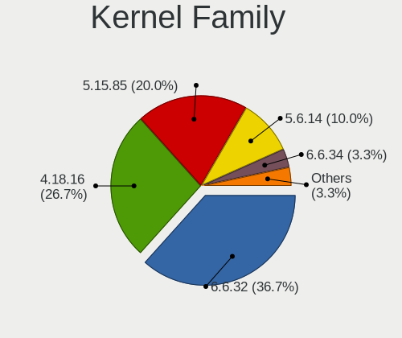
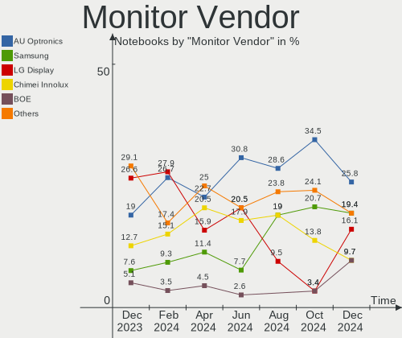
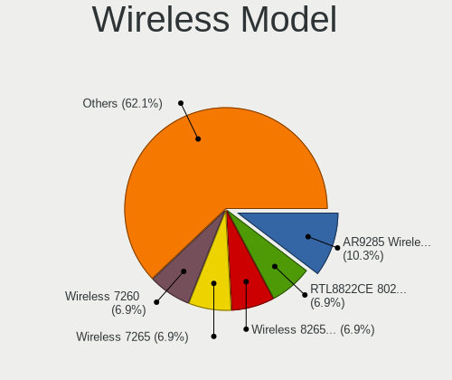
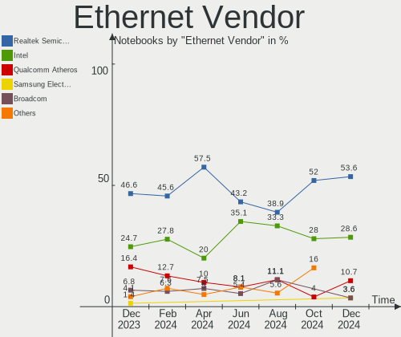

BlackPanther - Hardware Trends (Notebooks)
------------------------------------------

A project to identify most popular hardware characteristics and track their change
over time based on data collected by Linux users at https://Linux-Hardware.org.

Anyone can contribute to this report by the [hw-probe](https://github.com/linuxhw/hw-probe) tool:

    sudo -E hw-probe -all -upload

This report is for one last month. Overall report since the beginning of time: [TestDays](https://github.com/linuxhw/TestDays)

Period: Dec, 2024.

Contents
--------

* [ System ](#system)
  - [ OS                       ](#os)
  - [ OS Family                ](#os-family)
  - [ Kernel                   ](#kernel)
  - [ Kernel Family            ](#kernel-family)
  - [ Kernel Major Ver.        ](#kernel-major-ver)
  - [ Arch                     ](#arch)
  - [ DE                       ](#de)
  - [ Display Server           ](#display-server)
  - [ Display Manager          ](#display-manager)
  - [ OS Lang                  ](#os-lang)
  - [ Boot Mode                ](#boot-mode)
  - [ Filesystem               ](#filesystem)
  - [ Part. scheme             ](#part-scheme)
  - [ Dual Boot with Linux/BSD ](#dual-boot-with-linuxbsd)
  - [ Dual Boot (Win)          ](#dual-boot-win)

* [ Board ](#board)
  - [ Vendor                   ](#vendor)
  - [ Model                    ](#model)
  - [ Model Family             ](#model-family)
  - [ MFG Year                 ](#mfg-year)
  - [ Form Factor              ](#form-factor)
  - [ Secure Boot              ](#secure-boot)
  - [ Coreboot                 ](#coreboot)
  - [ RAM Size                 ](#ram-size)
  - [ RAM Used                 ](#ram-used)
  - [ Total Drives             ](#total-drives)
  - [ Has CD-ROM               ](#has-cd-rom)
  - [ Has Ethernet             ](#has-ethernet)
  - [ Has WiFi                 ](#has-wifi)
  - [ Has Bluetooth            ](#has-bluetooth)

* [ Location ](#location)
  - [ Country                  ](#country)
  - [ City                     ](#city)

* [ Drives ](#drives)
  - [ Drive Vendor             ](#drive-vendor)
  - [ Drive Model              ](#drive-model)
  - [ HDD Vendor               ](#hdd-vendor)
  - [ SSD Vendor               ](#ssd-vendor)
  - [ Drive Kind               ](#drive-kind)
  - [ Drive Connector          ](#drive-connector)
  - [ Drive Size               ](#drive-size)
  - [ Space Total              ](#space-total)
  - [ Space Used               ](#space-used)
  - [ Malfunc. Drives          ](#malfunc-drives)
  - [ Malfunc. Drive Vendor    ](#malfunc-drive-vendor)
  - [ Malfunc. HDD Vendor      ](#malfunc-hdd-vendor)
  - [ Malfunc. Drive Kind      ](#malfunc-drive-kind)
  - [ Failed Drives            ](#failed-drives)
  - [ Failed Drive Vendor      ](#failed-drive-vendor)
  - [ Drive Status             ](#drive-status)

* [ Storage controller ](#storage-controller)
  - [ Storage Vendor           ](#storage-vendor)
  - [ Storage Model            ](#storage-model)
  - [ Storage Kind             ](#storage-kind)

* [ Processor ](#processor)
  - [ CPU Vendor               ](#cpu-vendor)
  - [ CPU Model                ](#cpu-model)
  - [ CPU Model Family         ](#cpu-model-family)
  - [ CPU Cores                ](#cpu-cores)
  - [ CPU Sockets              ](#cpu-sockets)
  - [ CPU Threads              ](#cpu-threads)
  - [ CPU Op-Modes             ](#cpu-op-modes)
  - [ CPU Microcode            ](#cpu-microcode)
  - [ CPU Microarch            ](#cpu-microarch)

* [ Graphics ](#graphics)
  - [ GPU Vendor               ](#gpu-vendor)
  - [ GPU Model                ](#gpu-model)
  - [ GPU Combo                ](#gpu-combo)
  - [ GPU Driver               ](#gpu-driver)
  - [ GPU Memory               ](#gpu-memory)

* [ Monitor ](#monitor)
  - [ Monitor Vendor           ](#monitor-vendor)
  - [ Monitor Model            ](#monitor-model)
  - [ Monitor Resolution       ](#monitor-resolution)
  - [ Monitor Diagonal         ](#monitor-diagonal)
  - [ Monitor Width            ](#monitor-width)
  - [ Aspect Ratio             ](#aspect-ratio)
  - [ Monitor Area             ](#monitor-area)
  - [ Pixel Density            ](#pixel-density)
  - [ Multiple Monitors        ](#multiple-monitors)

* [ Network ](#network)
  - [ Net Controller Vendor    ](#net-controller-vendor)
  - [ Net Controller Model     ](#net-controller-model)
  - [ Wireless Vendor          ](#wireless-vendor)
  - [ Wireless Model           ](#wireless-model)
  - [ Ethernet Vendor          ](#ethernet-vendor)
  - [ Ethernet Model           ](#ethernet-model)
  - [ Net Controller Kind      ](#net-controller-kind)
  - [ Used Controller          ](#used-controller)
  - [ NICs                     ](#nics)
  - [ IPv6                     ](#ipv6)

* [ Bluetooth ](#bluetooth)
  - [ Bluetooth Vendor         ](#bluetooth-vendor)
  - [ Bluetooth Model          ](#bluetooth-model)

* [ Sound ](#sound)
  - [ Sound Vendor             ](#sound-vendor)
  - [ Sound Model              ](#sound-model)

* [ Memory ](#memory)
  - [ Memory Vendor            ](#memory-vendor)
  - [ Memory Model             ](#memory-model)
  - [ Memory Kind              ](#memory-kind)
  - [ Memory Form Factor       ](#memory-form-factor)
  - [ Memory Size              ](#memory-size)
  - [ Memory Speed             ](#memory-speed)

* [ Printers & scanners ](#printers--scanners)
  - [ Printer Vendor           ](#printer-vendor)
  - [ Printer Model            ](#printer-model)
  - [ Scanner Vendor           ](#scanner-vendor)
  - [ Scanner Model            ](#scanner-model)

* [ Camera ](#camera)
  - [ Camera Vendor            ](#camera-vendor)
  - [ Camera Model             ](#camera-model)

* [ Security ](#security)
  - [ Fingerprint Vendor       ](#fingerprint-vendor)
  - [ Fingerprint Model        ](#fingerprint-model)
  - [ Chipcard Vendor          ](#chipcard-vendor)
  - [ Chipcard Model           ](#chipcard-model)

* [ Unsupported ](#unsupported)
  - [ Unsupported Devices      ](#unsupported-devices)
  - [ Unsupported Device Types ](#unsupported-device-types)

System
------

OS
--

Installed operating systems

| Name              | Notebooks | Percent |
|-------------------|-----------|---------|
| BlackPanther 18.1 | 18        | 60%     |
| BlackPanther 22.1 | 12        | 40%     |

OS Family
---------

OS without a version

| Name         | Notebooks | Percent |
|--------------|-----------|---------|
| BlackPanther | 30        | 100%    |

Kernel
------

Version of the Linux kernel

| Version              | Notebooks | Percent |
|----------------------|-----------|---------|
| 6.6.32-power-1bP     | 11        | 36.67%  |
| 4.18.16-desktop-1bP  | 8         | 26.67%  |
| 5.15.85-desktop-1bP  | 6         | 20%     |
| 5.6.14-desktop-2bP   | 3         | 10%     |
| 6.6.34-power-1bP     | 1         | 3.33%   |
| 5.15.160-desktop-1bP | 1         | 3.33%   |

Kernel Family
-------------

Linux kernel without a distro release

| Version  | Notebooks | Percent |
|----------|-----------|---------|
| 6.6.32   | 11        | 36.67%  |
| 4.18.16  | 8         | 26.67%  |
| 5.15.85  | 6         | 20%     |
| 5.6.14   | 3         | 10%     |
| 6.6.34   | 1         | 3.33%   |
| 5.15.160 | 1         | 3.33%   |

Kernel Major Ver.
-----------------

Linux kernel major version

| Version | Notebooks | Percent |
|---------|-----------|---------|
| 6.6     | 12        | 40%     |
| 4.18    | 8         | 26.67%  |
| 5.15    | 7         | 23.33%  |
| 5.6     | 3         | 10%     |

Arch
----

OS architecture (x86_64, i586, etc.)

| Name   | Notebooks | Percent |
|--------|-----------|---------|
| x86_64 | 30        | 100%    |

DE
--

Desktop Environment

| Name    | Notebooks | Percent |
|---------|-----------|---------|
| KDE5    | 27        | 90%     |
| Unknown | 3         | 10%     |

Display Server
--------------

X11 or Wayland

| Name | Notebooks | Percent |
|------|-----------|---------|
| X11  | 29        | 96.67%  |
| Tty  | 1         | 3.33%   |

Display Manager
---------------

SDDM, LightDM, etc.

| Name | Notebooks | Percent |
|------|-----------|---------|
| SDDM | 30        | 100%    |

OS Lang
-------

Language

| Lang    | Notebooks | Percent |
|---------|-----------|---------|
| Unknown | 29        | 96.67%  |
| hu_HU   | 1         | 3.33%   |

Boot Mode
---------

EFI or BIOS

| Mode | Notebooks | Percent |
|------|-----------|---------|
| BIOS | 17        | 56.67%  |
| EFI  | 13        | 43.33%  |

Filesystem
----------

Type of filesystem

| Type    | Notebooks | Percent |
|---------|-----------|---------|
| Ext4    | 18        | 60%     |
| Overlay | 12        | 40%     |

Part. scheme
------------

Scheme of partitioning

| Type | Notebooks | Percent |
|------|-----------|---------|
| MBR  | 15        | 50%     |
| GPT  | 15        | 50%     |

Dual Boot with Linux/BSD
------------------------

Hosting more than one Linux/BSD

| Dual boot | Notebooks | Percent |
|-----------|-----------|---------|
| No        | 21        | 70%     |
| Yes       | 9         | 30%     |

Dual Boot (Win)
---------------

Hosting Linux and Windows

| Dual boot | Notebooks | Percent |
|-----------|-----------|---------|
| No        | 19        | 63.33%  |
| Yes       | 11        | 36.67%  |

Board
-----

Vendor
------

Motherboard manufacturer

| Name             | Notebooks | Percent |
|------------------|-----------|---------|
| Hewlett-Packard  | 9         | 30%     |
| Lenovo           | 6         | 20%     |
| Dell             | 5         | 16.67%  |
| ASUSTek Computer | 4         | 13.33%  |
| Acer             | 2         | 6.67%   |
| Toshiba          | 1         | 3.33%   |
| MSI              | 1         | 3.33%   |
| Fujitsu Siemens  | 1         | 3.33%   |
| eMachines        | 1         | 3.33%   |

Model
-----

Motherboard model

| Name                                     | Notebooks | Percent |
|------------------------------------------|-----------|---------|
| HP Pavilion Gaming Laptop 15-ec1xxx      | 2         | 6.67%   |
| Toshiba Satellite Pro A120               | 1         | 3.33%   |
| MSI CR610                                | 1         | 3.33%   |
| Lenovo Z710 20250                        | 1         | 3.33%   |
| Lenovo ThinkPad T520 4242A25             | 1         | 3.33%   |
| Lenovo ThinkPad T410 2537KR6             | 1         | 3.33%   |
| Lenovo ThinkPad L430 246834G             | 1         | 3.33%   |
| Lenovo ThinkPad E550 20DF007YRI          | 1         | 3.33%   |
| Lenovo G550 20023                        | 1         | 3.33%   |
| HP ProBook 4535s                         | 1         | 3.33%   |
| HP ProBook 440 G5                        | 1         | 3.33%   |
| HP Laptop 15-bs0xx                       | 1         | 3.33%   |
| HP HDX 16                                | 1         | 3.33%   |
| HP EliteBook 850 G3                      | 1         | 3.33%   |
| HP 620                                   | 1         | 3.33%   |
| HP 250 G1                                | 1         | 3.33%   |
| Fujitsu Siemens AMILO Li 2727            | 1         | 3.33%   |
| eMachines E725                           | 1         | 3.33%   |
| Dell Vostro 1015                         | 1         | 3.33%   |
| Dell Latitude E6410                      | 1         | 3.33%   |
| Dell Latitude E6230                      | 1         | 3.33%   |
| Dell Latitude 5590                       | 1         | 3.33%   |
| Dell Inspiron 17 7000 Series 7746        | 1         | 3.33%   |
| ASUS ZenBook UX425UA_UM425UA             | 1         | 3.33%   |
| ASUS X200MA                              | 1         | 3.33%   |
| ASUS VivoBook_ASUSLaptop M3500QA_M3500QA | 1         | 3.33%   |
| ASUS K50IE                               | 1         | 3.33%   |
| Acer Aspire E5-571G                      | 1         | 3.33%   |
| Acer Aspire 5732Z                        | 1         | 3.33%   |

Model Family
------------

Motherboard model prefix

| Name                  | Notebooks | Percent |
|-----------------------|-----------|---------|
| Lenovo ThinkPad       | 4         | 13.33%  |
| Dell Latitude         | 3         | 10%     |
| HP ProBook            | 2         | 6.67%   |
| HP Pavilion           | 2         | 6.67%   |
| Acer Aspire           | 2         | 6.67%   |
| Toshiba Satellite     | 1         | 3.33%   |
| MSI CR610             | 1         | 3.33%   |
| Lenovo Z710           | 1         | 3.33%   |
| Lenovo G550           | 1         | 3.33%   |
| HP Laptop             | 1         | 3.33%   |
| HP HDX                | 1         | 3.33%   |
| HP EliteBook          | 1         | 3.33%   |
| HP 620                | 1         | 3.33%   |
| HP 250                | 1         | 3.33%   |
| Fujitsu Siemens AMILO | 1         | 3.33%   |
| eMachines E725        | 1         | 3.33%   |
| Dell Vostro           | 1         | 3.33%   |
| Dell Inspiron         | 1         | 3.33%   |
| ASUS ZenBook          | 1         | 3.33%   |
| ASUS X200MA           | 1         | 3.33%   |
| ASUS VivoBook         | 1         | 3.33%   |
| ASUS K50IE            | 1         | 3.33%   |

MFG Year
--------

Motherboard manufacture year

| Year | Notebooks | Percent |
|------|-----------|---------|
| 2009 | 6         | 20%     |
| 2014 | 4         | 13.33%  |
| 2010 | 3         | 10%     |
| 2021 | 2         | 6.67%   |
| 2020 | 2         | 6.67%   |
| 2017 | 2         | 6.67%   |
| 2013 | 2         | 6.67%   |
| 2012 | 2         | 6.67%   |
| 2011 | 2         | 6.67%   |
| 2018 | 1         | 3.33%   |
| 2016 | 1         | 3.33%   |
| 2008 | 1         | 3.33%   |
| 2007 | 1         | 3.33%   |
| 2006 | 1         | 3.33%   |

Form Factor
-----------

Physical design of the computer

| Name     | Notebooks | Percent |
|----------|-----------|---------|
| Notebook | 30        | 100%    |

Secure Boot
-----------

Enabled or disabled

| State    | Notebooks | Percent |
|----------|-----------|---------|
| Disabled | 30        | 100%    |

Coreboot
--------

Have coreboot on board

| Used | Notebooks | Percent |
|------|-----------|---------|
| No   | 30        | 100%    |

RAM Size
--------

Total RAM memory

| Size in GB | Notebooks | Percent |
|------------|-----------|---------|
| 3.01-4.0   | 12        | 40%     |
| 8.01-16.0  | 7         | 23.33%  |
| 4.01-8.0   | 4         | 13.33%  |
| 1.01-2.0   | 3         | 10%     |
| 16.01-24.0 | 2         | 6.67%   |
| 32.01-64.0 | 1         | 3.33%   |
| 2.01-3.0   | 1         | 3.33%   |

RAM Used
--------

Used RAM memory

| Used GB  | Notebooks | Percent |
|----------|-----------|---------|
| 1.01-2.0 | 17        | 56.67%  |
| 0.51-1.0 | 9         | 30%     |
| 0.01-0.5 | 2         | 6.67%   |
| 3.01-4.0 | 1         | 3.33%   |
| 2.01-3.0 | 1         | 3.33%   |

Total Drives
------------

Number of drives on board

| Drives | Notebooks | Percent |
|--------|-----------|---------|
| 1      | 23        | 76.67%  |
| 2      | 4         | 13.33%  |
| 0      | 2         | 6.67%   |
| 3      | 1         | 3.33%   |

Has CD-ROM
----------

Has CD-ROM on board

| Presented | Notebooks | Percent |
|-----------|-----------|---------|
| Yes       | 20        | 66.67%  |
| No        | 10        | 33.33%  |

Has Ethernet
------------

Has Ethernet on board

| Presented | Notebooks | Percent |
|-----------|-----------|---------|
| Yes       | 27        | 90%     |
| No        | 3         | 10%     |

Has WiFi
--------

Has WiFi module

| Presented | Notebooks | Percent |
|-----------|-----------|---------|
| Yes       | 28        | 93.33%  |
| No        | 2         | 6.67%   |

Has Bluetooth
-------------

Has Bluetooth module

| Presented | Notebooks | Percent |
|-----------|-----------|---------|
| Yes       | 20        | 66.67%  |
| No        | 10        | 33.33%  |

Location
--------

Country
-------

Geographic location (country)

| Country  | Notebooks | Percent |
|----------|-----------|---------|
| Hungary  | 28        | 93.33%  |
| Slovakia | 1         | 3.33%   |
| Romania  | 1         | 3.33%   |

City
----

Geographic location (city)

| City             | Notebooks | Percent |
|------------------|-----------|---------|
| Budapest         | 11        | 36.67%  |
| Tiszakecske      | 2         | 6.67%   |
| Sopron           | 2         | 6.67%   |
| Tamasi           | 1         | 3.33%   |
| Szentes          | 1         | 3.33%   |
| Pomaz            | 1         | 3.33%   |
| Ozd              | 1         | 3.33%   |
| Nagykoroes       | 1         | 3.33%   |
| Miskolc          | 1         | 3.33%   |
| Miercurea-Ciuc   | 1         | 3.33%   |
| Kecskemét       | 1         | 3.33%   |
| Kazincbarcika    | 1         | 3.33%   |
| Győr            | 1         | 3.33%   |
| Fertoszentmiklos | 1         | 3.33%   |
| Encs             | 1         | 3.33%   |
| Eger             | 1         | 3.33%   |
| Chotin           | 1         | 3.33%   |
| Balassagyarmat   | 1         | 3.33%   |

Drives
------

Drive Vendor
------------

Hard drive vendors

| Vendor              | Notebooks | Drives | Percent |
|---------------------|-----------|--------|---------|
| Kingston            | 8         | 10     | 25%     |
| Samsung Electronics | 7         | 7      | 21.88%  |
| Seagate             | 4         | 4      | 12.5%   |
| WDC                 | 2         | 2      | 6.25%   |
| HGST                | 2         | 2      | 6.25%   |
| Verbatim            | 1         | 1      | 3.13%   |
| Toshiba             | 1         | 1      | 3.13%   |
| Team                | 1         | 1      | 3.13%   |
| SK hynix            | 1         | 1      | 3.13%   |
| SATA SSD            | 1         | 1      | 3.13%   |
| SanDisk             | 1         | 1      | 3.13%   |
| PNY                 | 1         | 1      | 3.13%   |
| Hitachi             | 1         | 1      | 3.13%   |
| Apacer              | 1         | 1      | 3.13%   |

Drive Model
-----------

Hard drive models

| Model                                               | Notebooks | Percent |
|-----------------------------------------------------|-----------|---------|
| Kingston SA400S37240G 240GB SSD                     | 3         | 8.82%   |
| HGST HTS545032A7E380 320GB                          | 2         | 5.88%   |
| WDC WD2500BEVT-08A23T1 250GB                        | 1         | 2.94%   |
| WDC WD10JPLX-00MBPT0 1TB                            | 1         | 2.94%   |
| Verbatim Vi550 S3 1TB SSD                           | 1         | 2.94%   |
| Toshiba MK2556GSY 250GB                             | 1         | 2.94%   |
| Team T253X1120G 120GB SSD                           | 1         | 2.94%   |
| SK hynix HFM512GD3JX013N 512GB                      | 1         | 2.94%   |
| Seagate ST750LM022 HN-M750MBB 752GB                 | 1         | 2.94%   |
| Seagate ST500LT012-1DG142 500GB                     | 1         | 2.94%   |
| Seagate ST1000LM014-1EJ164 1TB                      | 1         | 2.94%   |
| Seagate BarraCuda 120 SSD ZA250CM10003 250GB        | 1         | 2.94%   |
| SATA SSD Disk 120GB SSD                             | 1         | 2.94%   |
| SanDisk SD8SN8U-256G-1006 256GB SSD                 | 1         | 2.94%   |
| Samsung SSD 980 PRO 1TB                             | 1         | 2.94%   |
| Samsung SSD 830 Series 128GB                        | 1         | 2.94%   |
| Samsung SSD 750 EVO 250GB                           | 1         | 2.94%   |
| Samsung NVMe SSD Controller SM981/PM981/PM983 512GB | 1         | 2.94%   |
| Samsung MZVLB256HAHQ-000L7 256GB                    | 1         | 2.94%   |
| Samsung HM321HI 320GB                               | 1         | 2.94%   |
| Samsung HM320II 320GB                               | 1         | 2.94%   |
| PNY 240GB SATA SSD                                  | 1         | 2.94%   |
| Kingston SUV400S37120G 120GB SSD                    | 1         | 2.94%   |
| Kingston SNV2S500G 500GB                            | 1         | 2.94%   |
| Kingston SKC3000S512G 512GB                         | 1         | 2.94%   |
| Kingston SHFS37A240G 240GB SSD                      | 1         | 2.94%   |
| Kingston SA400S37960G 960GB SSD                     | 1         | 2.94%   |
| Kingston SA400S37480G 480GB SSD                     | 1         | 2.94%   |
| Kingston SA400S37120G 120GB SSD                     | 1         | 2.94%   |
| Hitachi HTS545025B9A300 250GB                       | 1         | 2.94%   |
| Apacer AS340 120GB SSD                              | 1         | 2.94%   |

HDD Vendor
----------

Hard disk drive vendors

| Vendor              | Notebooks | Drives | Percent |
|---------------------|-----------|--------|---------|
| Seagate             | 3         | 3      | 27.27%  |
| WDC                 | 2         | 2      | 18.18%  |
| Samsung Electronics | 2         | 2      | 18.18%  |
| HGST                | 2         | 2      | 18.18%  |
| Toshiba             | 1         | 1      | 9.09%   |
| Hitachi             | 1         | 1      | 9.09%   |

SSD Vendor
----------

Solid state drive vendors

| Vendor              | Notebooks | Drives | Percent |
|---------------------|-----------|--------|---------|
| Kingston            | 8         | 8      | 47.06%  |
| Samsung Electronics | 2         | 2      | 11.76%  |
| Verbatim            | 1         | 1      | 5.88%   |
| Team                | 1         | 1      | 5.88%   |
| Seagate             | 1         | 1      | 5.88%   |
| SATA SSD            | 1         | 1      | 5.88%   |
| SanDisk             | 1         | 1      | 5.88%   |
| PNY                 | 1         | 1      | 5.88%   |
| Apacer              | 1         | 1      | 5.88%   |

Drive Kind
----------

HDD or SSD

| Kind | Notebooks | Drives | Percent |
|------|-----------|--------|---------|
| SSD  | 16        | 17     | 48.48%  |
| HDD  | 11        | 11     | 33.33%  |
| NVMe | 6         | 6      | 18.18%  |

Drive Connector
---------------

SATA, SAS, NVMe, etc.

| Type | Notebooks | Drives | Percent |
|------|-----------|--------|---------|
| SATA | 25        | 27     | 78.13%  |
| NVMe | 6         | 6      | 18.75%  |
| SAS  | 1         | 1      | 3.13%   |

Drive Size
----------

Size of hard drive

| Size in TB | Notebooks | Drives | Percent |
|------------|-----------|--------|---------|
| 0.01-0.5   | 22        | 23     | 84.62%  |
| 0.51-1.0   | 4         | 5      | 15.38%  |

Space Total
-----------

Amount of disk space available on the file system

| Size in GB | Notebooks | Percent |
|------------|-----------|---------|
| Unknown    | 12        | 40%     |
| 101-250    | 11        | 36.67%  |
| 251-500    | 4         | 13.33%  |
| 1001-2000  | 1         | 3.33%   |
| 501-1000   | 1         | 3.33%   |
| 51-100     | 1         | 3.33%   |

Space Used
----------

Amount of used disk space

| Used GB | Notebooks | Percent |
|---------|-----------|---------|
| 1-20    | 12        | 40%     |
| Unknown | 12        | 40%     |
| 21-50   | 4         | 13.33%  |
| 251-500 | 2         | 6.67%   |

Malfunc. Drives
---------------

Drive models with a malfunction

| Model                                 | Notebooks | Drives | Percent |
|---------------------------------------|-----------|--------|---------|
| HGST HTS545032A7E380 320GB            | 2         | 2      | 33.33%  |
| Seagate ST750LM022 HN-M750MBB 752GB   | 1         | 1      | 16.67%  |
| Seagate ST500LT012-1DG142 500GB       | 1         | 1      | 16.67%  |
| Samsung Electronics SSD 750 EVO 250GB | 1         | 1      | 16.67%  |
| Samsung Electronics HM321HI 320GB     | 1         | 1      | 16.67%  |

Malfunc. Drive Vendor
---------------------

Vendors of faulty drives

| Vendor              | Notebooks | Drives | Percent |
|---------------------|-----------|--------|---------|
| Seagate             | 2         | 2      | 33.33%  |
| Samsung Electronics | 2         | 2      | 33.33%  |
| HGST                | 2         | 2      | 33.33%  |

Malfunc. HDD Vendor
-------------------

Vendors of faulty HDD drives

| Vendor              | Notebooks | Drives | Percent |
|---------------------|-----------|--------|---------|
| Seagate             | 2         | 2      | 40%     |
| HGST                | 2         | 2      | 40%     |
| Samsung Electronics | 1         | 1      | 20%     |

Malfunc. Drive Kind
-------------------

Kinds of faulty drives

| Kind | Notebooks | Drives | Percent |
|------|-----------|--------|---------|
| HDD  | 5         | 5      | 83.33%  |
| SSD  | 1         | 1      | 16.67%  |

Failed Drives
-------------

Failed drive models

Zero info for selected period =(

Failed Drive Vendor
-------------------

Failed drive vendors

Zero info for selected period =(

Drive Status
------------

Number of failed and malfunc. drives

| Status  | Notebooks | Drives | Percent |
|---------|-----------|--------|---------|
| Works   | 22        | 28     | 78.57%  |
| Malfunc | 6         | 6      | 21.43%  |

Storage controller
------------------

Storage Vendor
--------------

Storage controller vendors

| Vendor                      | Notebooks | Percent |
|-----------------------------|-----------|---------|
| Intel                       | 23        | 65.71%  |
| AMD                         | 5         | 14.29%  |
| Samsung Electronics         | 3         | 8.57%   |
| Kingston Technology Company | 2         | 5.71%   |
| SK hynix                    | 1         | 2.86%   |
| Nvidia                      | 1         | 2.86%   |

Storage Model
-------------

Storage controller models

| Model                                                                          | Notebooks | Percent |
|--------------------------------------------------------------------------------|-----------|---------|
| Intel 82801IBM/IEM (ICH9M/ICH9M-E) 4 port SATA Controller [AHCI mode]          | 6         | 16.22%  |
| Intel Sunrise Point-LP SATA Controller [AHCI mode]                             | 4         | 10.81%  |
| AMD FCH SATA Controller [AHCI mode]                                            | 4         | 10.81%  |
| Intel 7 Series Chipset Family 6-port SATA Controller [AHCI mode]               | 3         | 8.11%   |
| Samsung NVMe SSD Controller SM981/PM981/PM983                                  | 2         | 5.41%   |
| Intel 8 Series SATA Controller 1 [AHCI mode]                                   | 2         | 5.41%   |
| SK hynix Gold P31/BC711/PC711 NVMe Solid State Drive                           | 1         | 2.7%    |
| Samsung NVMe SSD Controller PM9A1/PM9A3/980PRO                                 | 1         | 2.7%    |
| Nvidia MCP79 AHCI Controller                                                   | 1         | 2.7%    |
| Kingston Company NV2 NVMe SSD [E19T] (DRAM-less)                               | 1         | 2.7%    |
| Kingston Company KC3000/FURY Renegade NVMe SSD [E18]                           | 1         | 2.7%    |
| Intel Wildcat Point-LP SATA Controller [AHCI Mode]                             | 1         | 2.7%    |
| Intel Atom Processor E3800 Series SATA AHCI Controller                         | 1         | 2.7%    |
| Intel 82801HM/HEM (ICH8M/ICH8M-E) SATA Controller [AHCI mode]                  | 1         | 2.7%    |
| Intel 82801HM/HEM (ICH8M/ICH8M-E) IDE Controller                               | 1         | 2.7%    |
| Intel 82801GBM/GHM (ICH7-M Family) SATA Controller [IDE mode]                  | 1         | 2.7%    |
| Intel 82801 Mobile SATA Controller [RAID mode]                                 | 1         | 2.7%    |
| Intel 8 Series/C220 Series Chipset Family 6-port SATA Controller 1 [AHCI mode] | 1         | 2.7%    |
| Intel 6 Series/C200 Series Chipset Family 6 port Mobile SATA AHCI Controller   | 1         | 2.7%    |
| Intel 5 Series/3400 Series Chipset 6 port SATA AHCI Controller                 | 1         | 2.7%    |
| AMD SB7x0/SB8x0/SB9x0 SATA Controller [AHCI mode]                              | 1         | 2.7%    |
| AMD SB7x0/SB8x0/SB9x0 IDE Controller                                           | 1         | 2.7%    |

Storage Kind
------------

Kind of storage controller (IDE, SATA, NVMe, SAS, ...)

| Kind | Notebooks | Percent |
|------|-----------|---------|
| SATA | 27        | 72.97%  |
| NVMe | 6         | 16.22%  |
| IDE  | 3         | 8.11%   |
| RAID | 1         | 2.7%    |

Processor
---------

CPU Vendor
----------

Processor vendors

| Vendor | Notebooks | Percent |
|--------|-----------|---------|
| Intel  | 24        | 80%     |
| AMD    | 6         | 20%     |

CPU Model
---------

Processor models

| Model                                       | Notebooks | Percent |
|---------------------------------------------|-----------|---------|
| Intel Pentium Dual-Core CPU T4500 @ 2.30GHz | 3         | 10%     |
| Intel Pentium Dual-Core CPU T4400 @ 2.20GHz | 2         | 6.67%   |
| Intel Core i3-4005U CPU @ 1.70GHz           | 2         | 6.67%   |
| AMD Ryzen 5 4600H with Radeon Graphics      | 2         | 6.67%   |
| Intel Genuine CPU T1400 @ 1.73GHz           | 1         | 3.33%   |
| Intel Core i7-5500U CPU @ 2.40GHz           | 1         | 3.33%   |
| Intel Core i7-4700MQ CPU @ 2.40GHz          | 1         | 3.33%   |
| Intel Core i7-2630QM CPU @ 2.00GHz          | 1         | 3.33%   |
| Intel Core i5-8250U CPU @ 1.60GHz           | 1         | 3.33%   |
| Intel Core i5-6300U CPU @ 2.40GHz           | 1         | 3.33%   |
| Intel Core i5-3340M CPU @ 2.70GHz           | 1         | 3.33%   |
| Intel Core i5 CPU M 560 @ 2.67GHz           | 1         | 3.33%   |
| Intel Core i5 CPU M 520 @ 2.40GHz           | 1         | 3.33%   |
| Intel Core i3-7100U CPU @ 2.40GHz           | 1         | 3.33%   |
| Intel Core i3-6006U CPU @ 2.00GHz           | 1         | 3.33%   |
| Intel Core i3-2370M CPU @ 2.40GHz           | 1         | 3.33%   |
| Intel Core 2 Duo CPU T6670 @ 2.20GHz        | 1         | 3.33%   |
| Intel Core 2 Duo CPU P8700 @ 2.53GHz        | 1         | 3.33%   |
| Intel Core 2 CPU T5500 @ 1.66GHz            | 1         | 3.33%   |
| Intel Celeron CPU N2815 @ 1.86GHz           | 1         | 3.33%   |
| Intel Celeron CPU 1000M @ 1.80GHz           | 1         | 3.33%   |
| AMD Sempron M100                            | 1         | 3.33%   |
| AMD Ryzen 7 5800H with Radeon Graphics      | 1         | 3.33%   |
| AMD Ryzen 5 5500U with Radeon Graphics      | 1         | 3.33%   |
| AMD A4-3305M APU with Radeon HD Graphics    | 1         | 3.33%   |

CPU Model Family
----------------

Processor model prefix

| Model                   | Notebooks | Percent |
|-------------------------|-----------|---------|
| Intel Pentium Dual-Core | 5         | 16.67%  |
| Intel Core i5           | 5         | 16.67%  |
| Intel Core i3           | 5         | 16.67%  |
| Intel Core i7           | 3         | 10%     |
| AMD Ryzen 5             | 3         | 10%     |
| Intel Core 2 Duo        | 2         | 6.67%   |
| Intel Celeron           | 2         | 6.67%   |
| Intel Genuine           | 1         | 3.33%   |
| Intel Core 2            | 1         | 3.33%   |
| AMD Sempron             | 1         | 3.33%   |
| AMD Ryzen 7             | 1         | 3.33%   |
| AMD A4                  | 1         | 3.33%   |

CPU Cores
---------

Number of processor cores

| Number | Notebooks | Percent |
|--------|-----------|---------|
| 2      | 22        | 73.33%  |
| 6      | 3         | 10%     |
| 4      | 3         | 10%     |
| 8      | 1         | 3.33%   |
| 1      | 1         | 3.33%   |

CPU Sockets
-----------

Number of sockets

| Number | Notebooks | Percent |
|--------|-----------|---------|
| 1      | 30        | 100%    |

CPU Threads
-----------

Threads per core (Hyper-Threading)

| Number | Notebooks | Percent |
|--------|-----------|---------|
| 2      | 17        | 56.67%  |
| 1      | 13        | 43.33%  |

CPU Op-Modes
------------

CPU Operation Modes (32-bit, 64-bit)

| Op mode        | Notebooks | Percent |
|----------------|-----------|---------|
| 32-bit, 64-bit | 30        | 100%    |

CPU Microcode
-------------

Microcode number

| Number     | Notebooks | Percent |
|------------|-----------|---------|
| Unknown    | 11        | 36.67%  |
| 0x1067a    | 6         | 20%     |
| 0x20655    | 2         | 6.67%   |
| 0x0860010c | 2         | 6.67%   |
| 0x806e9    | 1         | 3.33%   |
| 0x6fd      | 1         | 3.33%   |
| 0x6f6      | 1         | 3.33%   |
| 0x406e3    | 1         | 3.33%   |
| 0x40651    | 1         | 3.33%   |
| 0x306a9    | 1         | 3.33%   |
| 0x0a50000d | 1         | 3.33%   |
| 0x08608103 | 1         | 3.33%   |
| 0x03000014 | 1         | 3.33%   |

CPU Microarch
-------------

Microarchitecture

| Name        | Notebooks | Percent |
|-------------|-----------|---------|
| Penryn      | 7         | 23.33%  |
| Haswell     | 3         | 10%     |
| Zen 2       | 2         | 6.67%   |
| Westmere    | 2         | 6.67%   |
| Skylake     | 2         | 6.67%   |
| SandyBridge | 2         | 6.67%   |
| KabyLake    | 2         | 6.67%   |
| IvyBridge   | 2         | 6.67%   |
| Core        | 2         | 6.67%   |
| Zen 3       | 1         | 3.33%   |
| Silvermont  | 1         | 3.33%   |
| K10 Llano   | 1         | 3.33%   |
| K10         | 1         | 3.33%   |
| Broadwell   | 1         | 3.33%   |
| Unknown     | 1         | 3.33%   |

Graphics
--------

GPU Vendor
----------

Vendors of graphics cards

| Vendor | Notebooks | Percent |
|--------|-----------|---------|
| Intel  | 21        | 56.76%  |
| AMD    | 9         | 24.32%  |
| Nvidia | 7         | 18.92%  |

GPU Model
---------

Graphics card models

| Model                                                                         | Notebooks | Percent |
|-------------------------------------------------------------------------------|-----------|---------|
| Intel Mobile 4 Series Chipset Integrated Graphics Controller                  | 4         | 10%     |
| Nvidia TU117M [GeForce GTX 1650 Ti Mobile]                                    | 2         | 5%      |
| Intel Skylake GT2 [HD Graphics 520]                                           | 2         | 5%      |
| Intel Haswell-ULT Integrated Graphics Controller                              | 2         | 5%      |
| Intel Core Processor Integrated Graphics Controller                           | 2         | 5%      |
| Intel 3rd Gen Core processor Graphics Controller                              | 2         | 5%      |
| Intel 2nd Generation Core Processor Family Integrated Graphics Controller     | 2         | 5%      |
| AMD Renoir [Radeon Vega Series / Radeon Vega Mobile Series]                   | 2         | 5%      |
| Nvidia GT218M [GeForce 310M]                                                  | 1         | 2.5%    |
| Nvidia GM108M [GeForce 845M]                                                  | 1         | 2.5%    |
| Nvidia GK107M [GeForce GT 745M]                                               | 1         | 2.5%    |
| Nvidia GF117M [GeForce 610M/710M/810M/820M / GT 620M/625M/630M/720M]          | 1         | 2.5%    |
| Nvidia G96CM [GeForce 9600M GT]                                               | 1         | 2.5%    |
| Intel UHD Graphics 620                                                        | 1         | 2.5%    |
| Intel Mobile GM965/GL960 Integrated Graphics Controller (secondary)           | 1         | 2.5%    |
| Intel Mobile GM965/GL960 Integrated Graphics Controller (primary)             | 1         | 2.5%    |
| Intel Mobile 945GM/GMS/GME, 943/940GML Express Integrated Graphics Controller | 1         | 2.5%    |
| Intel Mobile 945GM/GMS, 943/940GML Express Integrated Graphics Controller     | 1         | 2.5%    |
| Intel HD Graphics 620                                                         | 1         | 2.5%    |
| Intel HD Graphics 5500                                                        | 1         | 2.5%    |
| Intel Atom Processor Z36xxx/Z37xxx Series Graphics & Display                  | 1         | 2.5%    |
| Intel 4th Gen Core Processor Integrated Graphics Controller                   | 1         | 2.5%    |
| AMD SuperSumo [Radeon HD 6480G]                                               | 1         | 2.5%    |
| AMD Sun XT [Radeon HD 8670A/8670M/8690M / R5 M330 / M430 / Radeon 520 Mobile] | 1         | 2.5%    |
| AMD Seymour [Radeon HD 6400M/7400M Series]                                    | 1         | 2.5%    |
| AMD RV710/M92 [Mobility Radeon HD 4530/4570/5145/530v/540v/545v]              | 1         | 2.5%    |
| AMD RS880M [Mobility Radeon HD 4225/4250]                                     | 1         | 2.5%    |
| AMD Opal XT [Radeon R7 M265/M365X/M465]                                       | 1         | 2.5%    |
| AMD Lucienne                                                                  | 1         | 2.5%    |
| AMD Cezanne [Radeon Vega Series / Radeon Vega Mobile Series]                  | 1         | 2.5%    |

GPU Combo
---------

Combinations of graphics cards

| Name           | Notebooks | Percent |
|----------------|-----------|---------|
| 1 x Intel      | 16        | 53.33%  |
| 1 x AMD        | 4         | 13.33%  |
| Intel + Nvidia | 3         | 10%     |
| 1 x Nvidia     | 2         | 6.67%   |
| Intel + AMD    | 2         | 6.67%   |
| AMD + Nvidia   | 2         | 6.67%   |
| 2 x AMD        | 1         | 3.33%   |

GPU Driver
----------

Free vs proprietary

| Driver  | Notebooks | Percent |
|---------|-----------|---------|
| Free    | 29        | 96.67%  |
| Unknown | 1         | 3.33%   |

GPU Memory
----------

Total video memory

| Size in GB | Notebooks | Percent |
|------------|-----------|---------|
| Unknown    | 18        | 60%     |
| 0.01-0.5   | 7         | 23.33%  |
| 3.01-4.0   | 2         | 6.67%   |
| 1.01-2.0   | 2         | 6.67%   |
| 0.51-1.0   | 1         | 3.33%   |

Monitor
-------

Monitor Vendor
--------------

Monitor vendors

| Vendor                  | Notebooks | Percent |
|-------------------------|-----------|---------|
| AU Optronics            | 8         | 25.81%  |
| Samsung Electronics     | 6         | 19.35%  |
| LG Display              | 5         | 16.13%  |
| Chimei Innolux          | 3         | 9.68%   |
| BOE                     | 3         | 9.68%   |
| PANDA                   | 2         | 6.45%   |
| Lenovo                  | 2         | 6.45%   |
| Sony                    | 1         | 3.23%   |
| Chi Mei Optoelectronics | 1         | 3.23%   |

Monitor Model
-------------

Monitor models

| Model                                                                    | Notebooks | Percent |
|--------------------------------------------------------------------------|-----------|---------|
| PANDA LCD Monitor NCP0058 1920x1080 344x194mm 15.5-inch                  | 2         | 6.45%   |
| AU Optronics LCD Monitor AUO22EC 1366x768 344x193mm 15.5-inch            | 2         | 6.45%   |
| Sony TV *00 SNYA003 1920x1080 952x535mm 43.0-inch                        | 1         | 3.23%   |
| Samsung Electronics S24D330 SAM0D92 1920x1080 531x299mm 24.0-inch        | 1         | 3.23%   |
| Samsung Electronics LCD Monitor SEC5441 1280x800 286x179mm 13.3-inch     | 1         | 3.23%   |
| Samsung Electronics LCD Monitor SEC524D 1366x768 353x198mm 15.9-inch     | 1         | 3.23%   |
| Samsung Electronics LCD Monitor SEC4545 1280x800 331x207mm 15.4-inch     | 1         | 3.23%   |
| Samsung Electronics LCD Monitor SEC314D 1920x1080 353x198mm 15.9-inch    | 1         | 3.23%   |
| Samsung Electronics LCD Monitor SDC4161 1920x1080 344x194mm 15.5-inch    | 1         | 3.23%   |
| LG Display LP156WH2-TLAA LGD0230 1366x768 344x194mm 15.5-inch            | 1         | 3.23%   |
| LG Display LP156WH1-TLA3 LGD01C2 1366x768 344x194mm 15.5-inch            | 1         | 3.23%   |
| LG Display LCD Monitor LGD0395 1366x768 344x194mm 15.5-inch              | 1         | 3.23%   |
| LG Display LCD Monitor LGD036C 1366x768 277x156mm 12.5-inch              | 1         | 3.23%   |
| LG Display LCD Monitor LGD0348 1920x1080 383x215mm 17.3-inch             | 1         | 3.23%   |
| Lenovo LCD Monitor LEN40B1 1600x900 344x193mm 15.5-inch                  | 1         | 3.23%   |
| Lenovo LCD Monitor LEN4035 1280x800 304x190mm 14.1-inch                  | 1         | 3.23%   |
| Chimei Innolux LCD Monitor CMN15BF 1366x768 344x193mm 15.5-inch          | 1         | 3.23%   |
| Chimei Innolux LCD Monitor CMN14D5 1920x1080 309x173mm 13.9-inch         | 1         | 3.23%   |
| Chimei Innolux LCD Monitor CMN1119 1366x768 256x144mm 11.6-inch          | 1         | 3.23%   |
| Chi Mei Optoelectronics LCD Monitor CMO15A1 1366x768 344x193mm 15.5-inch | 1         | 3.23%   |
| BOE LCD Monitor BOE06CB 1920x1080 344x194mm 15.5-inch                    | 1         | 3.23%   |
| BOE LCD Monitor BOE0697 1366x768 309x173mm 13.9-inch                     | 1         | 3.23%   |
| BOE LCD Monitor BOE0687 1920x1080 344x193mm 15.5-inch                    | 1         | 3.23%   |
| AU Optronics LCD Monitor AUO41EC 1366x768 344x193mm 15.5-inch            | 1         | 3.23%   |
| AU Optronics LCD Monitor AUO4147 1440x900 303x189mm 14.1-inch            | 1         | 3.23%   |
| AU Optronics LCD Monitor AUO35ED 1920x1080 344x193mm 15.5-inch           | 1         | 3.23%   |
| AU Optronics LCD Monitor AUO313C 1366x768 309x173mm 13.9-inch            | 1         | 3.23%   |
| AU Optronics LCD Monitor AUO119D 1920x1080 381x214mm 17.2-inch           | 1         | 3.23%   |
| AU Optronics LCD Monitor AUO10EC 1366x768 344x193mm 15.5-inch            | 1         | 3.23%   |

Monitor Resolution
------------------

Monitor screen resolution

| Resolution       | Notebooks | Percent |
|------------------|-----------|---------|
| 1366x768 (WXGA)  | 15        | 50%     |
| 1920x1080 (FHD)  | 11        | 36.67%  |
| 1280x800 (WXGA)  | 2         | 6.67%   |
| 1600x900 (HD+)   | 1         | 3.33%   |
| 1440x900 (WXGA+) | 1         | 3.33%   |

Monitor Diagonal
----------------

Diagonal size in inches

| Inches | Notebooks | Percent |
|--------|-----------|---------|
| 15     | 20        | 64.52%  |
| 13     | 3         | 9.68%   |
| 17     | 2         | 6.45%   |
| 14     | 2         | 6.45%   |
| 55     | 1         | 3.23%   |
| 24     | 1         | 3.23%   |
| 12     | 1         | 3.23%   |
| 11     | 1         | 3.23%   |

Monitor Width
-------------

Physical width

| Width in mm | Notebooks | Percent |
|-------------|-----------|---------|
| 301-350     | 22        | 70.97%  |
| 351-400     | 5         | 16.13%  |
| 201-300     | 2         | 6.45%   |
| 501-600     | 1         | 3.23%   |
| 1001-1500   | 1         | 3.23%   |

Aspect Ratio
------------

Proportional relationship between the width and the height

| Ratio | Notebooks | Percent |
|-------|-----------|---------|
| 16/9  | 26        | 89.66%  |
| 16/10 | 3         | 10.34%  |

Monitor Area
------------

Area in inch²

| Area in inch² | Notebooks | Percent |
|----------------|-----------|---------|
| 101-110        | 20        | 64.52%  |
| 81-90          | 5         | 16.13%  |
| 121-130        | 2         | 6.45%   |
| More than 1000 | 1         | 3.23%   |
| 61-70          | 1         | 3.23%   |
| 51-60          | 1         | 3.23%   |
| 201-250        | 1         | 3.23%   |

Pixel Density
-------------

Pixels per inch

| Density | Notebooks | Percent |
|---------|-----------|---------|
| 121-160 | 13        | 43.33%  |
| 101-120 | 12        | 40%     |
| 51-100  | 4         | 13.33%  |
| 1-50    | 1         | 3.33%   |

Multiple Monitors
-----------------

Total monitors connected

| Total | Notebooks | Percent |
|-------|-----------|---------|
| 1     | 28        | 93.33%  |
| 2     | 2         | 6.67%   |

Network
-------

Net Controller Vendor
---------------------

Controller vendors

| Vendor                | Notebooks | Percent |
|-----------------------|-----------|---------|
| Realtek Semiconductor | 15        | 34.88%  |
| Intel                 | 13        | 30.23%  |
| Qualcomm Atheros      | 8         | 18.6%   |
| Broadcom              | 2         | 4.65%   |
| Samsung Electronics   | 1         | 2.33%   |
| Ralink                | 1         | 2.33%   |
| MediaTek              | 1         | 2.33%   |
| Broadcom Limited      | 1         | 2.33%   |
| ASUSTek Computer      | 1         | 2.33%   |

Net Controller Model
--------------------

Controller models

| Model                                                                   | Notebooks | Percent |
|-------------------------------------------------------------------------|-----------|---------|
| Realtek RTL8111/8168/8211/8411 PCI Express Gigabit Ethernet Controller  | 13        | 22.81%  |
| Qualcomm Atheros AR9285 Wireless Network Adapter (PCI-Express)          | 3         | 5.26%   |
| Realtek RTL8822CE 802.11ac PCIe Wireless Network Adapter                | 2         | 3.51%   |
| Realtek RTL810xE PCI Express Fast Ethernet controller                   | 2         | 3.51%   |
| Qualcomm Atheros AR8132 Fast Ethernet                                   | 2         | 3.51%   |
| Intel Wireless 8265 / 8275                                              | 2         | 3.51%   |
| Intel Wireless 7265                                                     | 2         | 3.51%   |
| Intel Wireless 7260                                                     | 2         | 3.51%   |
| Intel 82579LM Gigabit Network Connection (Lewisville)                   | 2         | 3.51%   |
| Intel 82577LM Gigabit Network Connection                                | 2         | 3.51%   |
| Samsung Galaxy series, misc. (tethering mode)                           | 1         | 1.75%   |
| Realtek RTL8822BE 802.11a/b/g/n/ac WiFi adapter                         | 1         | 1.75%   |
| Realtek RTL8723BE PCIe Wireless Network Adapter                         | 1         | 1.75%   |
| Realtek RTL8191SEvA Wireless LAN Controller                             | 1         | 1.75%   |
| Realtek RTL8188CE 802.11b/g/n WiFi Adapter                              | 1         | 1.75%   |
| Ralink RT3290 Wireless 802.11n 1T/1R PCIe                               | 1         | 1.75%   |
| Qualcomm Atheros QCA8171 Gigabit Ethernet                               | 1         | 1.75%   |
| Qualcomm Atheros AR9485 Wireless Network Adapter                        | 1         | 1.75%   |
| Qualcomm Atheros AR242x / AR542x Wireless Network Adapter (PCI-Express) | 1         | 1.75%   |
| MediaTek MT7921 802.11ax PCI Express Wireless Network Adapter           | 1         | 1.75%   |
| Intel Wireless 8260                                                     | 1         | 1.75%   |
| Intel Wireless 3160                                                     | 1         | 1.75%   |
| Intel PRO/Wireless 5100 AGN [Shiloh] Network Connection                 | 1         | 1.75%   |
| Intel PRO/Wireless 3945ABG [Golan] Network Connection                   | 1         | 1.75%   |
| Intel Ethernet Connection I219-LM                                       | 1         | 1.75%   |
| Intel Ethernet Connection I218-V                                        | 1         | 1.75%   |
| Intel Ethernet Connection (4) I219-LM                                   | 1         | 1.75%   |
| Intel Centrino Ultimate-N 6300                                          | 1         | 1.75%   |
| Intel Centrino Advanced-N 6200                                          | 1         | 1.75%   |
| Intel 82573L Gigabit Ethernet Controller                                | 1         | 1.75%   |
| Broadcom NetLink BCM5906M Fast Ethernet PCI Express                     | 1         | 1.75%   |
| Broadcom Limited BCM4312 802.11b/g LP-PHY                               | 1         | 1.75%   |
| Broadcom BCM43225 802.11b/g/n                                           | 1         | 1.75%   |
| Broadcom BCM4312 802.11b/g LP-PHY                                       | 1         | 1.75%   |
| ASUS WL-167G v1 802.11g Adapter [Ralink RT2571]                         | 1         | 1.75%   |

Wireless Vendor
---------------

Wireless vendors

| Vendor                | Notebooks | Percent |
|-----------------------|-----------|---------|
| Intel                 | 12        | 41.38%  |
| Realtek Semiconductor | 6         | 20.69%  |
| Qualcomm Atheros      | 5         | 17.24%  |
| Broadcom              | 2         | 6.9%    |
| Ralink                | 1         | 3.45%   |
| MediaTek              | 1         | 3.45%   |
| Broadcom Limited      | 1         | 3.45%   |
| ASUSTek Computer      | 1         | 3.45%   |

Wireless Model
--------------

Wireless models

| Model                                                                   | Notebooks | Percent |
|-------------------------------------------------------------------------|-----------|---------|
| Qualcomm Atheros AR9285 Wireless Network Adapter (PCI-Express)          | 3         | 10.34%  |
| Realtek RTL8822CE 802.11ac PCIe Wireless Network Adapter                | 2         | 6.9%    |
| Intel Wireless 8265 / 8275                                              | 2         | 6.9%    |
| Intel Wireless 7265                                                     | 2         | 6.9%    |
| Intel Wireless 7260                                                     | 2         | 6.9%    |
| Realtek RTL8822BE 802.11a/b/g/n/ac WiFi adapter                         | 1         | 3.45%   |
| Realtek RTL8723BE PCIe Wireless Network Adapter                         | 1         | 3.45%   |
| Realtek RTL8191SEvA Wireless LAN Controller                             | 1         | 3.45%   |
| Realtek RTL8188CE 802.11b/g/n WiFi Adapter                              | 1         | 3.45%   |
| Ralink RT3290 Wireless 802.11n 1T/1R PCIe                               | 1         | 3.45%   |
| Qualcomm Atheros AR9485 Wireless Network Adapter                        | 1         | 3.45%   |
| Qualcomm Atheros AR242x / AR542x Wireless Network Adapter (PCI-Express) | 1         | 3.45%   |
| MediaTek MT7921 802.11ax PCI Express Wireless Network Adapter           | 1         | 3.45%   |
| Intel Wireless 8260                                                     | 1         | 3.45%   |
| Intel Wireless 3160                                                     | 1         | 3.45%   |
| Intel PRO/Wireless 5100 AGN [Shiloh] Network Connection                 | 1         | 3.45%   |
| Intel PRO/Wireless 3945ABG [Golan] Network Connection                   | 1         | 3.45%   |
| Intel Centrino Ultimate-N 6300                                          | 1         | 3.45%   |
| Intel Centrino Advanced-N 6200                                          | 1         | 3.45%   |
| Broadcom Limited BCM4312 802.11b/g LP-PHY                               | 1         | 3.45%   |
| Broadcom BCM43225 802.11b/g/n                                           | 1         | 3.45%   |
| Broadcom BCM4312 802.11b/g LP-PHY                                       | 1         | 3.45%   |
| ASUS WL-167G v1 802.11g Adapter [Ralink RT2571]                         | 1         | 3.45%   |

Ethernet Vendor
---------------

Ethernet vendors

| Vendor                | Notebooks | Percent |
|-----------------------|-----------|---------|
| Realtek Semiconductor | 15        | 53.57%  |
| Intel                 | 8         | 28.57%  |
| Qualcomm Atheros      | 3         | 10.71%  |
| Samsung Electronics   | 1         | 3.57%   |
| Broadcom              | 1         | 3.57%   |

Ethernet Model
--------------

Ethernet models

| Model                                                                  | Notebooks | Percent |
|------------------------------------------------------------------------|-----------|---------|
| Realtek RTL8111/8168/8211/8411 PCI Express Gigabit Ethernet Controller | 13        | 46.43%  |
| Realtek RTL810xE PCI Express Fast Ethernet controller                  | 2         | 7.14%   |
| Qualcomm Atheros AR8132 Fast Ethernet                                  | 2         | 7.14%   |
| Intel 82579LM Gigabit Network Connection (Lewisville)                  | 2         | 7.14%   |
| Intel 82577LM Gigabit Network Connection                               | 2         | 7.14%   |
| Samsung Galaxy series, misc. (tethering mode)                          | 1         | 3.57%   |
| Qualcomm Atheros QCA8171 Gigabit Ethernet                              | 1         | 3.57%   |
| Intel Ethernet Connection I219-LM                                      | 1         | 3.57%   |
| Intel Ethernet Connection I218-V                                       | 1         | 3.57%   |
| Intel Ethernet Connection (4) I219-LM                                  | 1         | 3.57%   |
| Intel 82573L Gigabit Ethernet Controller                               | 1         | 3.57%   |
| Broadcom NetLink BCM5906M Fast Ethernet PCI Express                    | 1         | 3.57%   |

Net Controller Kind
-------------------

Ethernet, WiFi or modem

| Kind     | Notebooks | Percent |
|----------|-----------|---------|
| WiFi     | 28        | 50.91%  |
| Ethernet | 27        | 49.09%  |

Used Controller
---------------

Currently used network controller

| Kind     | Notebooks | Percent |
|----------|-----------|---------|
| WiFi     | 22        | 70.97%  |
| Ethernet | 9         | 29.03%  |

NICs
----

Total network controllers on board

| Total | Notebooks | Percent |
|-------|-----------|---------|
| 2     | 25        | 83.33%  |
| 1     | 5         | 16.67%  |

IPv6
----

IPv6 vs IPv4

| Used | Notebooks | Percent |
|------|-----------|---------|
| No   | 19        | 63.33%  |
| Yes  | 11        | 36.67%  |

Bluetooth
---------

Bluetooth Vendor
----------------

Controller vendors

| Vendor                          | Notebooks | Percent |
|---------------------------------|-----------|---------|
| Intel                           | 8         | 40%     |
| Realtek Semiconductor           | 4         | 20%     |
| Qualcomm Atheros Communications | 2         | 10%     |
| Broadcom                        | 2         | 10%     |
| Ralink                          | 1         | 5%      |
| IMC Networks                    | 1         | 5%      |
| Hewlett-Packard                 | 1         | 5%      |
| Cambridge Silicon Radio         | 1         | 5%      |

Bluetooth Model
---------------

Controller models

| Model                                               | Notebooks | Percent |
|-----------------------------------------------------|-----------|---------|
| Intel Bluetooth wireless interface                  | 8         | 40%     |
| Realtek Bluetooth Radio                             | 3         | 15%     |
| Qualcomm Atheros AR3011 Bluetooth                   | 2         | 10%     |
| Realtek  Bluetooth 4.2 Adapter                      | 1         | 5%      |
| Ralink RT3290 Bluetooth                             | 1         | 5%      |
| IMC Networks Wireless_Device                        | 1         | 5%      |
| HP Broadcom 2070 Bluetooth Combo                    | 1         | 5%      |
| Cambridge Silicon Radio Bluetooth Dongle (HCI mode) | 1         | 5%      |
| Broadcom BCM20702 Bluetooth 4.0 [ThinkPad]          | 1         | 5%      |
| Broadcom BCM2045B (BDC-2.1)                         | 1         | 5%      |

Sound
-----

Sound Vendor
------------

Sound card vendors

| Vendor | Notebooks | Percent |
|--------|-----------|---------|
| Intel  | 23        | 71.88%  |
| AMD    | 6         | 18.75%  |
| Nvidia | 3         | 9.38%   |

Sound Model
-----------

Sound card models

| Model                                                                      | Notebooks | Percent |
|----------------------------------------------------------------------------|-----------|---------|
| Intel 82801I (ICH9 Family) HD Audio Controller                             | 6         | 14.63%  |
| Intel Sunrise Point-LP HD Audio                                            | 4         | 9.76%   |
| AMD Family 17h/19h/1ah HD Audio Controller                                 | 4         | 9.76%   |
| Intel 7 Series/C216 Chipset Family High Definition Audio Controller        | 3         | 7.32%   |
| Nvidia TU107 GeForce GTX 1650 High Definition Audio Controller             | 2         | 4.88%   |
| Intel Haswell-ULT HD Audio Controller                                      | 2         | 4.88%   |
| Intel 8 Series HD Audio Controller                                         | 2         | 4.88%   |
| Intel 5 Series/3400 Series Chipset High Definition Audio                   | 2         | 4.88%   |
| AMD Renoir Radeon High Definition Audio Controller                         | 2         | 4.88%   |
| Nvidia MCP79 High Definition Audio                                         | 1         | 2.44%   |
| Nvidia High Definition Audio Controller                                    | 1         | 2.44%   |
| Intel Xeon E3-1200 v3/4th Gen Core Processor HD Audio Controller           | 1         | 2.44%   |
| Intel Wildcat Point-LP High Definition Audio Controller                    | 1         | 2.44%   |
| Intel NM10/ICH7 Family High Definition Audio Controller                    | 1         | 2.44%   |
| Intel Broadwell-U Audio Controller                                         | 1         | 2.44%   |
| Intel Atom Processor Z36xxx/Z37xxx Series High Definition Audio Controller | 1         | 2.44%   |
| Intel 82801H (ICH8 Family) HD Audio Controller                             | 1         | 2.44%   |
| Intel 8 Series/C220 Series Chipset High Definition Audio Controller        | 1         | 2.44%   |
| Intel 6 Series/C200 Series Chipset Family High Definition Audio Controller | 1         | 2.44%   |
| AMD SBx00 Azalia (Intel HDA)                                               | 1         | 2.44%   |
| AMD RS880 HDMI Audio [Radeon HD 4200 Series]                               | 1         | 2.44%   |
| AMD FCH Azalia Controller                                                  | 1         | 2.44%   |
| AMD BeaverCreek HDMI Audio [Radeon HD 6500D and 6400G-6600G series]        | 1         | 2.44%   |

Memory
------

Memory Vendor
-------------

Memory module vendors

| Vendor              | Notebooks | Percent |
|---------------------|-----------|---------|
| SK hynix            | 12        | 33.33%  |
| Samsung Electronics | 10        | 27.78%  |
| Unknown             | 5         | 13.89%  |
| Kingston            | 3         | 8.33%   |
| Nanya Technology    | 2         | 5.56%   |
| Micron Technology   | 2         | 5.56%   |
| Ramaxel Technology  | 1         | 2.78%   |
| Unknown             | 1         | 2.78%   |

Memory Model
------------

Memory module models

| Model                                                      | Notebooks | Percent |
|------------------------------------------------------------|-----------|---------|
| Unknown RAM Module 2048MB SODIMM 800MT/s                   | 2         | 5.13%   |
| SK hynix RAM HMA81GS6CJR8N-XN 8GB SODIMM DDR4 3200MT/s     | 2         | 5.13%   |
| Samsung RAM M471B5173DB0-YK0 4GB SODIMM DDR3 1600MT/s      | 2         | 5.13%   |
| Unknown RAM Module 8GB SODIMM DDR3 1600MT/s                | 1         | 2.56%   |
| Unknown RAM Module 2048MB SODIMM DDR2 533MT/s              | 1         | 2.56%   |
| Unknown RAM Module 2048MB SODIMM DDR2 400MT/s              | 1         | 2.56%   |
| Unknown RAM Module 1024MB SODIMM DDR2 533MT/s              | 1         | 2.56%   |
| Unknown RAM Module 1024MB SODIMM DDR2 400MT/s              | 1         | 2.56%   |
| SK hynix RAM HYMP125S64CP8-S6 2048MB SODIMM DDR2 975MT/s   | 1         | 2.56%   |
| SK hynix RAM HMT451S6AFR6R-PB 4GB SODIMM DDR3 1333MT/s     | 1         | 2.56%   |
| SK hynix RAM HMT41GS6BFR8A-PB 8GB SODIMM DDR3 1600MT/s     | 1         | 2.56%   |
| SK hynix RAM HMT351S6EFR8A-PB 4GB SODIMM DDR3 1600MT/s     | 1         | 2.56%   |
| SK hynix RAM HMT351S6CFR8C-PB 4GB SODIMM SDRAM 4199MT/s    | 1         | 2.56%   |
| SK hynix RAM HMT351S6CFR8C-PB 4GB SODIMM DDR3 1600MT/s     | 1         | 2.56%   |
| SK hynix RAM HMT325S6CFR8C-H9 2GB SODIMM SDRAM 4199MT/s    | 1         | 2.56%   |
| SK hynix RAM HMT325S6CFR8A-PB 2048MB SODIMM DDR3 1600MT/s  | 1         | 2.56%   |
| SK hynix RAM HMT325S6BFR8C-H9 2048MB SODIMM DDR3 1600MT/s  | 1         | 2.56%   |
| SK hynix RAM HMA851S6AFR6N-UH 4GB SODIMM DDR4 2667MT/s     | 1         | 2.56%   |
| SK hynix RAM H9HCNNNCPMMLXR-NEE 8GB SODIMM LPDDR4 4266MT/s | 1         | 2.56%   |
| Samsung RAM Module 4096MB SODIMM DDR4 2133MT/s             | 1         | 2.56%   |
| Samsung RAM M471B5773DH0-CK0 2GB SODIMM DDR3 1600MT/s      | 1         | 2.56%   |
| Samsung RAM M471B5773CHS-CH9 2GB SODIMM DDR3 4199MT/s      | 1         | 2.56%   |
| Samsung RAM M471B5673FH0-CH9 2GB SODIMM DDR3 1334MT/s      | 1         | 2.56%   |
| Samsung RAM M471B5273CH0-CH9 4GB SODIMM DDR3 1334MT/s      | 1         | 2.56%   |
| Samsung RAM M471B1G73EB0-YK0 8GB SODIMM DDR3 1600MT/s      | 1         | 2.56%   |
| Samsung RAM M471A1G44AB0-CWE 8GB SODIMM DDR4 3200MT/s      | 1         | 2.56%   |
| Samsung RAM M4 70T6554EZ3-CE6 512MB SODIMM DDR2            | 1         | 2.56%   |
| Ramaxel RAM Module 8192MB SODIMM DDR4 2133MT/s             | 1         | 2.56%   |
| Nanya RAM NT4GC64C88B1NS-DI 4GB SODIMM DDR3 1600MT/s       | 1         | 2.56%   |
| Nanya RAM NT2GC64B88B0NS-CG 2GB SODIMM DDR3 1334MT/s       | 1         | 2.56%   |
| Micron RAM 8JSF25664HZ-1G4D1 2GB SODIMM DDR3 1334MT/s      | 1         | 2.56%   |
| Micron RAM 8ATF1G64HZ-2G3E1 8GB SODIMM DDR4 2400MT/s       | 1         | 2.56%   |
| Kingston RAM Module 16384MB SODIMM DDR4 2133MT/s           | 1         | 2.56%   |
| Kingston RAM KHX1600C9S3L/4G 4GB SODIMM DDR3 1600MT/s      | 1         | 2.56%   |
| Kingston RAM 99U5428-063.A00LF 8GB SODIMM DDR3 2667MT/s    | 1         | 2.56%   |
| Unknown                                                    | 1         | 2.56%   |

Memory Kind
-----------

Memory module kinds

| Kind    | Notebooks | Percent |
|---------|-----------|---------|
| DDR3    | 14        | 45.16%  |
| DDR4    | 7         | 22.58%  |
| DDR2    | 4         | 12.9%   |
| SDRAM   | 2         | 6.45%   |
| LPDDR4  | 2         | 6.45%   |
| Unknown | 2         | 6.45%   |

Memory Form Factor
------------------

Physical design of the memory module

| Name   | Notebooks | Percent |
|--------|-----------|---------|
| SODIMM | 30        | 100%    |

Memory Size
-----------

Memory module size

| Size  | Notebooks | Percent |
|-------|-----------|---------|
| 2048  | 12        | 32.43%  |
| 8192  | 10        | 27.03%  |
| 4096  | 9         | 24.32%  |
| 1024  | 3         | 8.11%   |
| 16384 | 2         | 5.41%   |
| 512   | 1         | 2.7%    |

Memory Speed
------------

Memory module speed

| Speed   | Notebooks | Percent |
|---------|-----------|---------|
| 1600    | 9         | 28.13%  |
| 1334    | 4         | 12.5%   |
| 3200    | 3         | 9.38%   |
| 4199    | 2         | 6.25%   |
| 2667    | 2         | 6.25%   |
| 2133    | 2         | 6.25%   |
| 800     | 2         | 6.25%   |
| 4266    | 1         | 3.13%   |
| 2400    | 1         | 3.13%   |
| 1333    | 1         | 3.13%   |
| 975     | 1         | 3.13%   |
| 667     | 1         | 3.13%   |
| 533     | 1         | 3.13%   |
| 400     | 1         | 3.13%   |
| Unknown | 1         | 3.13%   |

Printers & scanners
-------------------

Printer Vendor
--------------

Printer device vendors

Zero info for selected period =(

Printer Model
-------------

Printer device models

Zero info for selected period =(

Scanner Vendor
--------------

Scanner device vendors

Zero info for selected period =(

Scanner Model
-------------

Scanner device models

Zero info for selected period =(

Camera
------

Camera Vendor
-------------

Camera device vendors

| Vendor                                 | Notebooks | Percent |
|----------------------------------------|-----------|---------|
| Chicony Electronics                    | 7         | 29.17%  |
| Suyin                                  | 2         | 8.33%   |
| Primax Electronics                     | 2         | 8.33%   |
| IMC Networks                           | 2         | 8.33%   |
| Acer                                   | 2         | 8.33%   |
| Syntek                                 | 1         | 4.17%   |
| Sunplus Innovation Technology          | 1         | 4.17%   |
| Realtek Semiconductor                  | 1         | 4.17%   |
| Quanta                                 | 1         | 4.17%   |
| Microdia                               | 1         | 4.17%   |
| Lite-On Technology                     | 1         | 4.17%   |
| Lenovo                                 | 1         | 4.17%   |
| Cheng Uei Precision Industry (Foxlink) | 1         | 4.17%   |
| Bison Electronics                      | 1         | 4.17%   |

Camera Model
------------

Camera device models

| Model                                         | Notebooks | Percent |
|-----------------------------------------------|-----------|---------|
| Suyin Acer/HP Integrated Webcam [CN0314]      | 2         | 8.33%   |
| IMC Networks USB2.0 HD UVC WebCam             | 2         | 8.33%   |
| Chicony HP TrueVision HD Camera               | 2         | 8.33%   |
| Syntek USB Video Device                       | 1         | 4.17%   |
| Sunplus HP TrueVision HD Camera               | 1         | 4.17%   |
| Realtek Integrated Webcam_HD                  | 1         | 4.17%   |
| Quanta HP Webcam                              | 1         | 4.17%   |
| Primax Villem                                 | 1         | 4.17%   |
| Primax HP HD Webcam [Fixed]                   | 1         | 4.17%   |
| Microdia Integrated HD Webcam                 | 1         | 4.17%   |
| Lite-On HP HD Webcam                          | 1         | 4.17%   |
| Lenovo Integrated Webcam [R5U877]             | 1         | 4.17%   |
| Chicony USB2.0 HD UVC WebCam                  | 1         | 4.17%   |
| Chicony Lenovo Integrated Camera (0.3MP)      | 1         | 4.17%   |
| Chicony Integrated Camera [ThinkPad]          | 1         | 4.17%   |
| Chicony HP Truevision HD                      | 1         | 4.17%   |
| Chicony HD WebCam                             | 1         | 4.17%   |
| Cheng Uei Precision Industry (Foxlink) Webcam | 1         | 4.17%   |
| Bison Lenovo Integrated Webcam                | 1         | 4.17%   |
| Acer Lenovo EasyCamera                        | 1         | 4.17%   |
| Acer Laptop_Integrated_Webcam_2M              | 1         | 4.17%   |

Security
--------

Fingerprint Vendor
------------------

Fingerprint sensor vendors

| Vendor           | Notebooks | Percent |
|------------------|-----------|---------|
| Validity Sensors | 3         | 75%     |
| Upek             | 1         | 25%     |

Fingerprint Model
-----------------

Fingerprint sensor models

| Model                                                  | Notebooks | Percent |
|--------------------------------------------------------|-----------|---------|
| Validity Sensors VFS5011 Fingerprint Reader            | 1         | 25%     |
| Validity Sensors VFS495 Fingerprint Reader             | 1         | 25%     |
| Validity Sensors VFS101 Fingerprint Reader             | 1         | 25%     |
| Upek Biometric Touchchip/Touchstrip Fingerprint Sensor | 1         | 25%     |

Chipcard Vendor
---------------

Chipcard module vendors

| Vendor   | Notebooks | Percent |
|----------|-----------|---------|
| Broadcom | 2         | 66.67%  |
| Lenovo   | 1         | 33.33%  |

Chipcard Model
--------------

Chipcard module models

| Model                                          | Notebooks | Percent |
|------------------------------------------------|-----------|---------|
| Lenovo Integrated Smart Card Reader            | 1         | 33.33%  |
| Broadcom BCM5880 Secure Applications Processor | 1         | 33.33%  |
| Broadcom 5880                                  | 1         | 33.33%  |

Unsupported
-----------

Unsupported Devices
-------------------

Total unsupported devices on board

| Total | Notebooks | Percent |
|-------|-----------|---------|
| 0     | 18        | 60%     |
| 1     | 10        | 33.33%  |
| 2     | 2         | 6.67%   |

Unsupported Device Types
------------------------

Types of unsupported devices

| Type                  | Notebooks | Percent |
|-----------------------|-----------|---------|
| Graphics card         | 4         | 28.57%  |
| Fingerprint reader    | 4         | 28.57%  |
| Chipcard              | 3         | 21.43%  |
| Net/wireless          | 1         | 7.14%   |
| Multimedia controller | 1         | 7.14%   |
| Bluetooth             | 1         | 7.14%   |

