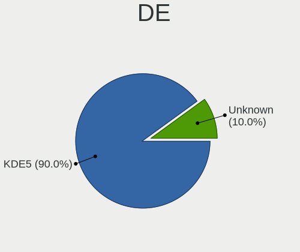
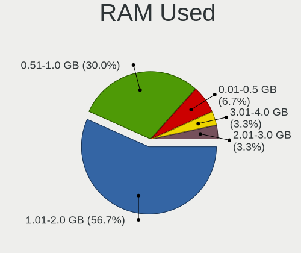
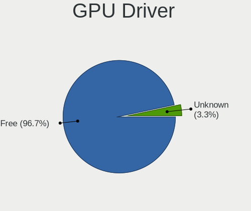
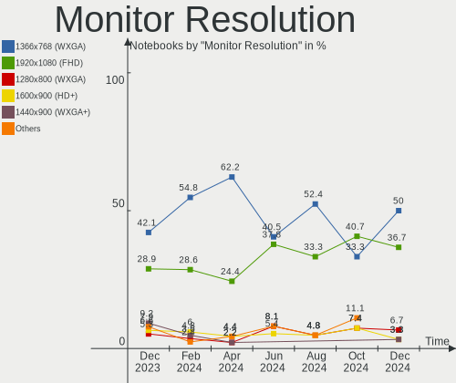
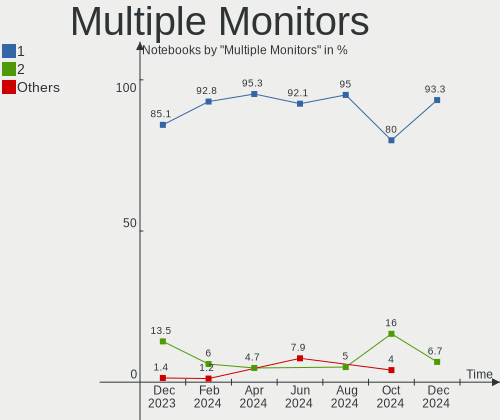

BlackPanther Hardware Trends (Notebook)
---------------------------------------

A project to identify most popular hardware characteristics and track their change
over time based on data collected by BlackPanther users at https://Linux-Hardware.org.

Anyone can contribute to the study by uploading probes of their computers by
the [hw-probe](https://github.com/linuxhw/hw-probe) tool:

    sudo hw-probe -all -upload

Full-feature report is available here: https://linux-hardware.org/?view=trends&formfactor=notebook

Period: Mar, 2020.

Contents
--------

- [ OS                       ](#os)
- [ OS Family                ](#os-family)
- [ Kernel                   ](#kernel)
- [ Kernel Family            ](#kernel-family)
- [ Kernel Major Ver.        ](#kernel-major-ver)
- [ Arch                     ](#arch)
- [ DE                       ](#de)
- [ Display Server           ](#display-server)
- [ OS Lang                  ](#os-lang)
- [ Boot Mode                ](#boot-mode)
- [ Filesystem               ](#filesystem)
- [ Dual Boot with Linux     ](#dual-boot-with-linux)
- [ Dual Boot (Win)          ](#dual-boot-win)
- [ Country                  ](#country)
- [ City                     ](#city)
- [ Vendor                   ](#vendor)
- [ Model                    ](#model)
- [ Model Family             ](#model-family)
- [ MFG Year                 ](#mfg-year)
- [ Form Factor              ](#form-factor)
- [ Secure Boot              ](#secure-boot)
- [ Coreboot                 ](#coreboot)
- [ RAM Size                 ](#ram-size)
- [ RAM Used                 ](#ram-used)
- [ Drive Vendor             ](#drive-vendor)
- [ Drive Model              ](#drive-model)
- [ Drive Kind               ](#drive-kind)
- [ Drive Connector          ](#drive-connector)
- [ Drive Size               ](#drive-size)
- [ Space Total              ](#space-total)
- [ Space Used               ](#space-used)
- [ Malfunc. Drives          ](#malfunc-drives)
- [ Malfunc. Drive Vendor    ](#malfunc-drive-vendor)
- [ Malfunc. Drive Kind      ](#malfunc-drive-kind)
- [ Failed Drives            ](#failed-drives)
- [ Failed Drive Vendor      ](#failed-drive-vendor)
- [ Drive Status             ](#drive-status)
- [ Storage Vendor           ](#storage-vendor)
- [ Storage Model            ](#storage-model)
- [ Storage Kind             ](#storage-kind)
- [ CPU Vendor               ](#cpu-vendor)
- [ CPU Model                ](#cpu-model)
- [ CPU Model Family         ](#cpu-model-family)
- [ CPU Cores                ](#cpu-cores)
- [ CPU Sockets              ](#cpu-sockets)
- [ CPU Threads              ](#cpu-threads)
- [ CPU Op-Modes             ](#cpu-op-modes)
- [ CPU Microarch            ](#cpu-microarch)
- [ CPU Microcode            ](#cpu-microcode)
- [ GPU Vendor               ](#gpu-vendor)
- [ GPU Model                ](#gpu-model)
- [ GPU Combo                ](#gpu-combo)
- [ GPU Driver               ](#gpu-driver)
- [ GPU Memory               ](#gpu-memory)
- [ Monitor Vendor           ](#monitor-vendor)
- [ Monitor Model            ](#monitor-model)
- [ Monitor Resolution       ](#monitor-resolution)
- [ Monitor Diagonal         ](#monitor-diagonal)
- [ Monitor Width            ](#monitor-width)
- [ Aspect Ratio             ](#aspect-ratio)
- [ Monitor Area             ](#monitor-area)
- [ Pixel Density            ](#pixel-density)
- [ Multiple Monitors        ](#multiple-monitors)
- [ Net Controller Vendor    ](#net-controller-vendor)
- [ Net Controller Model     ](#net-controller-model)
- [ Net Controller Kind      ](#net-controller-kind)
- [ Used Controller          ](#used-controller)
- [ NICs                     ](#nics)
- [ Unsupported Devices      ](#unsupported-devices)
- [ Unsupported Device Types ](#unsupported-device-types)

OS
--

Installed operating systems

| Name              | Computers | Percent |
|-------------------|-----------|---------|
| BlackPanther 18.1 | 118       | 88.06%  |
| BlackPanther 16.2 | 16        | 11.94%  |

OS Family
---------

OS without a version

| Name         | Computers | Percent |
|--------------|-----------|---------|
| BlackPanther | 134       | 100%    |

Kernel
------

Version of the Linux kernel

| Version                | Computers | Percent |
|------------------------|-----------|---------|
| 4.18.16-desktop-1bP    | 84        | 62.69%  |
| 5.1.15-desktop-1bP     | 34        | 25.37%  |
| 4.9.20-desktop-pae-1bP | 15        | 11.19%  |
| 4.15.0-desktop-pae-1bP | 1         | 0.75%   |

Kernel Family
-------------

Linux kernel without a distro release

| Version | Computers | Percent |
|---------|-----------|---------|
| 4.18.16 | 84        | 62.69%  |
| 5.1.15  | 34        | 25.37%  |
| 4.9.20  | 15        | 11.19%  |
| 4.15.0  | 1         | 0.75%   |

Kernel Major Ver.
-----------------

Linux kernel major version

| Version | Computers | Percent |
|---------|-----------|---------|
| 4.18    | 84        | 62.69%  |
| 5.1     | 34        | 25.37%  |
| 4.9     | 15        | 11.19%  |
| 4.15    | 1         | 0.75%   |

Arch
----

OS architecture (x86_64, i586, etc.)

| Name   | Computers | Percent |
|--------|-----------|---------|
| x86_64 | 118       | 88.06%  |
| i686   | 16        | 11.94%  |

DE
--

Desktop Environment

| Name     | Computers | Percent |
|----------|-----------|---------|
| KDE5     | 133       | 99.25%  |
| Cinnamon | 1         | 0.75%   |

Display Server
--------------

X11 or Wayland

| Name | Computers | Percent |
|------|-----------|---------|
| X11  | 134       | 100%    |

OS Lang
-------

Language

| Lang    | Computers | Percent |
|---------|-----------|---------|
| Unknown | 134       | 100%    |

Boot Mode
---------

EFI or BIOS

| Mode | Computers | Percent |
|------|-----------|---------|
| BIOS | 86        | 64.18%  |
| EFI  | 48        | 35.82%  |

Filesystem
----------

Type of filesystem

| Type    | Computers | Percent |
|---------|-----------|---------|
| Ext4    | 121       | 90.3%   |
| Overlay | 13        | 9.7%    |

Dual Boot with Linux
--------------------

Hosting more than one Linux

| Dual boot | Computers | Percent |
|-----------|-----------|---------|
| No        | 108       | 80.6%   |
| Yes       | 26        | 19.4%   |

Dual Boot (Win)
---------------

Hosting Linux and Windows

| Dual boot | Computers | Percent |
|-----------|-----------|---------|
| No        | 85        | 63.43%  |
| Yes       | 49        | 36.57%  |

Country
-------

Geographic location (country)

| Country   | Computers | Percent |
|-----------|-----------|---------|
| Hungary   | 98        | 73.13%  |
| Germany   | 13        | 9.7%    |
| USA       | 7         | 5.22%   |
| Romania   | 3         | 2.24%   |
| UK        | 2         | 1.49%   |
| Slovakia  | 2         | 1.49%   |
| France    | 2         | 1.49%   |
| Brazil    | 2         | 1.49%   |
| UAE       | 1         | 0.75%   |
| Serbia    | 1         | 0.75%   |
| Ghana     | 1         | 0.75%   |
| Chile     | 1         | 0.75%   |
| Australia | 1         | 0.75%   |

City
----

Geographic location (city)

| City              | Computers | Percent |
|-------------------|-----------|---------|
| Budapest          | 28        | 20.9%   |
| Zalaegerszeg      | 5         | 3.73%   |
| Székesfehérvár | 4         | 2.99%   |
| Pécs             | 4         | 2.99%   |
| Győr             | 4         | 2.99%   |
| Érd              | 3         | 2.24%   |
| Szigetszentmiklos | 3         | 2.24%   |
| Nuremberg         | 3         | 2.24%   |
| Veszprém         | 2         | 1.49%   |
| Teloche           | 2         | 1.49%   |
| Szazhalombatta    | 2         | 1.49%   |
| Sarospatak        | 2         | 1.49%   |
| Miskolc           | 2         | 1.49%   |
| Debrecen          | 2         | 1.49%   |
| Winterrieden      | 1         | 0.75%   |
| Winston-Salem     | 1         | 0.75%   |
| Wichita           | 1         | 0.75%   |
| Vác              | 1         | 0.75%   |
| Vicovu de Sus     | 1         | 0.75%   |
| Verpelet          | 1         | 0.75%   |
| Velence           | 1         | 0.75%   |
| Vecses            | 1         | 0.75%   |
| Târgu Mureş     | 1         | 0.75%   |
| Temerin           | 1         | 0.75%   |
| Tata              | 1         | 0.75%   |
| Tabdi             | 1         | 0.75%   |
| Szolnok           | 1         | 0.75%   |
| Szeged            | 1         | 0.75%   |
| Sydney            | 1         | 0.75%   |
| St. Petersburg    | 1         | 0.75%   |
| Spanaway          | 1         | 0.75%   |
| Shipley           | 1         | 0.75%   |
| Sarud             | 1         | 0.75%   |
| Salvador          | 1         | 0.75%   |
| Rio de Janeiro    | 1         | 0.75%   |
| Regensburg        | 1         | 0.75%   |
| Quillota          | 1         | 0.75%   |
| Pocsmegyer        | 1         | 0.75%   |
| Ottersweier       | 1         | 0.75%   |
| Ocsa              | 1         | 0.75%   |
| Obertraubling     | 1         | 0.75%   |
| Nyiregyhaza       | 1         | 0.75%   |
| Nyaregyhaza       | 1         | 0.75%   |
| Nitra             | 1         | 0.75%   |
| Nagykozar         | 1         | 0.75%   |
| Nagyatad          | 1         | 0.75%   |
| Munich            | 1         | 0.75%   |
| Mosonmagyaróvár | 1         | 0.75%   |
| Mohács           | 1         | 0.75%   |
| Mihalyi           | 1         | 0.75%   |
| Miercurea-Ciuc    | 1         | 0.75%   |
| Mezokovesd        | 1         | 0.75%   |
| Maidenhead        | 1         | 0.75%   |
| Lupburg           | 1         | 0.75%   |
| Leipzig           | 1         | 0.75%   |
| Kiskunmajsa       | 1         | 0.75%   |
| Kiskunhalas       | 1         | 0.75%   |
| Keszthely         | 1         | 0.75%   |
| Kecskemét        | 1         | 0.75%   |
| Kazincbarcika     | 1         | 0.75%   |

Vendor
------

Motherboard manufacturer

| Name                | Computers | Percent |
|---------------------|-----------|---------|
| Hewlett-Packard     | 31        | 23.13%  |
| Lenovo              | 26        | 19.4%   |
| Dell                | 24        | 17.91%  |
| ASUSTek Computer    | 17        | 12.69%  |
| Acer                | 14        | 10.45%  |
| Samsung Electronics | 5         | 3.73%   |
| Toshiba             | 4         | 2.99%   |
| Packard Bell        | 3         | 2.24%   |
| Fujitsu             | 2         | 1.49%   |
| Sony                | 1         | 0.75%   |
| MSI                 | 1         | 0.75%   |
| Medion              | 1         | 0.75%   |
| Gateway             | 1         | 0.75%   |
| Fujitsu Siemens     | 1         | 0.75%   |
| Alcor               | 1         | 0.75%   |
| Albacomp zrt.       | 1         | 0.75%   |
| Unknown             | 1         | 0.75%   |

Model
-----

Motherboard model

| Name                                                    | Computers | Percent |
|---------------------------------------------------------|-----------|---------|
| HP 250 G1                                               | 4         | 2.99%   |
| Dell Latitude E6410                                     | 3         | 2.24%   |
| ASUS X55U                                               | 3         | 2.24%   |
| HP Pavilion 17                                          | 2         | 1.49%   |
| HP Pavilion 15                                          | 2         | 1.49%   |
| HP Notebook                                             | 2         | 1.49%   |
| HP EliteBook 8460p                                      | 2         | 1.49%   |
| HP 15                                                   | 2         | 1.49%   |
| Dell Latitude E7240                                     | 2         | 1.49%   |
| Dell Latitude E6540                                     | 2         | 1.49%   |
| Dell Inspiron 5558                                      | 2         | 1.49%   |
| Toshiba Satellite P300                                  | 1         | 0.75%   |
| Toshiba Satellite C660                                  | 1         | 0.75%   |
| Toshiba Satellite C55D-A                                | 1         | 0.75%   |
| Toshiba PORTEGE R830                                    | 1         | 0.75%   |
| Sony VPCYB3V1E                                          | 1         | 0.75%   |
| Samsung Electronics SQ45S70S                            | 1         | 0.75%   |
| Samsung Electronics RV411/RV511/E3511/S3511/RV711/E3411 | 1         | 0.75%   |
| Samsung Electronics RV410/RV510/S3510/E3510             | 1         | 0.75%   |
| Samsung Electronics R510/P510                           | 1         | 0.75%   |
| Samsung Electronics 350V5C/351V5C/3540VC/3440VC         | 1         | 0.75%   |
| Packard Bell EasyNote TK11BZ                            | 1         | 0.75%   |
| Packard Bell EasyNote TE11HC                            | 1         | 0.75%   |
| Packard Bell EasyNote LE69KB                            | 1         | 0.75%   |
| MSI U270DX                                              | 1         | 0.75%   |
| Medion E7214                                            | 1         | 0.75%   |
| Lenovo Z710 20250                                       | 1         | 0.75%   |
| Lenovo Z50-70 20354                                     | 1         | 0.75%   |
| Lenovo ThinkPad X61 7673BW3                             | 1         | 0.75%   |
| Lenovo ThinkPad X201 3680DE3                            | 1         | 0.75%   |
| Lenovo ThinkPad X201 3680D13                            | 1         | 0.75%   |
| Lenovo ThinkPad T61 6458Y56                             | 1         | 0.75%   |
| Lenovo ThinkPad T500 2056W2J                            | 1         | 0.75%   |
| Lenovo ThinkPad T450 20BUS09Y0E                         | 1         | 0.75%   |
| Lenovo ThinkPad R500 27148UG                            | 1         | 0.75%   |
| Lenovo IdeaPad S100 20109                               | 1         | 0.75%   |
| Lenovo IdeaPad 700-15ISK 80RU                           | 1         | 0.75%   |
| Lenovo IdeaPad 330-15IKB 81FE                           | 1         | 0.75%   |
| Lenovo IdeaPad 330-15IKB 81DE                           | 1         | 0.75%   |
| Lenovo IdeaPad 330-15IKB 81DC                           | 1         | 0.75%   |
| Lenovo IdeaPad 330-15IGM 81D1                           | 1         | 0.75%   |
| Lenovo IdeaPad 320-15ISK 80XH                           | 1         | 0.75%   |
| Lenovo IdeaPad 310-15IAP 80TT                           | 1         | 0.75%   |
| Lenovo IdeaPad 310-15ABR 80ST                           | 1         | 0.75%   |
| Lenovo IdeaPad 110-15ISK 80UD                           | 1         | 0.75%   |
| Lenovo G70-70 80HW                                      | 1         | 0.75%   |
| Lenovo G585 20137                                       | 1         | 0.75%   |
| Lenovo G580 20150                                       | 1         | 0.75%   |
| Lenovo G550 20023                                       | 1         | 0.75%   |
| Lenovo G50-45 80E3                                      | 1         | 0.75%   |
| Lenovo Flex 2-15 20405                                  | 1         | 0.75%   |
| Lenovo B50-80 80EW                                      | 1         | 0.75%   |
| HP Stream Laptop 14-cb1xxx                              | 1         | 0.75%   |
| HP Presario CQ56                                        | 1         | 0.75%   |
| HP Pavilion Notebook                                    | 1         | 0.75%   |
| HP Pavilion g6                                          | 1         | 0.75%   |
| HP OMEN by HP Laptop 15-ce0xx                           | 1         | 0.75%   |
| HP Laptop 15-da0xxx                                     | 1         | 0.75%   |
| HP G62                                                  | 1         | 0.75%   |
| HP ENVY Notebook                                        | 1         | 0.75%   |

Model Family
------------

Motherboard model prefix

| Name                         | Computers | Percent |
|------------------------------|-----------|---------|
| Dell Latitude                | 14        | 10.45%  |
| Lenovo IdeaPad               | 10        | 7.46%   |
| Acer Aspire                  | 9         | 6.72%   |
| Dell Inspiron                | 8         | 5.97%   |
| Lenovo ThinkPad              | 7         | 5.22%   |
| HP Pavilion                  | 6         | 4.48%   |
| HP EliteBook                 | 5         | 3.73%   |
| HP 250                       | 5         | 3.73%   |
| Toshiba Satellite            | 3         | 2.24%   |
| Packard Bell EasyNote        | 3         | 2.24%   |
| ASUS X55U                    | 3         | 2.24%   |
| Acer TravelMate              | 3         | 2.24%   |
| HP Notebook                  | 2         | 1.49%   |
| HP 15                        | 2         | 1.49%   |
| Fujitsu LIFEBOOK             | 2         | 1.49%   |
| Toshiba PORTEGE              | 1         | 0.75%   |
| Sony VPCYB3V1E               | 1         | 0.75%   |
| Samsung Electronics SQ45S70S | 1         | 0.75%   |
| Samsung Electronics RV411    | 1         | 0.75%   |
| Samsung Electronics RV410    | 1         | 0.75%   |
| Samsung Electronics R510     | 1         | 0.75%   |
| Samsung Electronics 350V5C   | 1         | 0.75%   |
| MSI U270DX                   | 1         | 0.75%   |
| Medion E7214                 | 1         | 0.75%   |
| Lenovo Z710                  | 1         | 0.75%   |
| Lenovo Z50-70                | 1         | 0.75%   |
| Lenovo G70-70                | 1         | 0.75%   |
| Lenovo G585                  | 1         | 0.75%   |
| Lenovo G580                  | 1         | 0.75%   |
| Lenovo G550                  | 1         | 0.75%   |
| Lenovo G50-45                | 1         | 0.75%   |
| Lenovo Flex                  | 1         | 0.75%   |
| Lenovo B50-80                | 1         | 0.75%   |
| HP Stream                    | 1         | 0.75%   |
| HP Presario                  | 1         | 0.75%   |
| HP OMEN                      | 1         | 0.75%   |
| HP Laptop                    | 1         | 0.75%   |
| HP G62                       | 1         | 0.75%   |
| HP ENVY                      | 1         | 0.75%   |
| HP Compaq                    | 1         | 0.75%   |
| HP 650                       | 1         | 0.75%   |
| HP 620                       | 1         | 0.75%   |
| HP 550                       | 1         | 0.75%   |
| HP 530                       | 1         | 0.75%   |
| Gateway M-7315U              | 1         | 0.75%   |
| Fujitsu Siemens AMILO        | 1         | 0.75%   |
| Dell XPS                     | 1         | 0.75%   |
| Dell Vostro                  | 1         | 0.75%   |
| ASUS X55CR                   | 1         | 0.75%   |
| ASUS X550CL                  | 1         | 0.75%   |
| ASUS X550CC                  | 1         | 0.75%   |
| ASUS X541UJ                  | 1         | 0.75%   |
| ASUS X541UA                  | 1         | 0.75%   |
| ASUS X541SA                  | 1         | 0.75%   |
| ASUS X541NA                  | 1         | 0.75%   |
| ASUS VivoBook                | 1         | 0.75%   |
| ASUS TUF                     | 1         | 0.75%   |
| ASUS K53U                    | 1         | 0.75%   |
| ASUS K53BY                   | 1         | 0.75%   |
| ASUS K52Jr                   | 1         | 0.75%   |

MFG Year
--------

Motherboard manufacture year

| Year | Computers | Percent |
|------|-----------|---------|
| 2018 | 17        | 12.69%  |
| 2012 | 17        | 12.69%  |
| 2016 | 15        | 11.19%  |
| 2011 | 15        | 11.19%  |
| 2013 | 14        | 10.45%  |
| 2017 | 10        | 7.46%   |
| 2015 | 10        | 7.46%   |
| 2014 | 7         | 5.22%   |
| 2010 | 7         | 5.22%   |
| 2009 | 7         | 5.22%   |
| 2008 | 7         | 5.22%   |
| 2019 | 4         | 2.99%   |
| 2007 | 2         | 1.49%   |
| 2005 | 2         | 1.49%   |

Form Factor
-----------

Physical design of the computer

| Name     | Computers | Percent |
|----------|-----------|---------|
| Notebook | 134       | 100%    |

Secure Boot
-----------

Enabled or disabled

| State    | Computers | Percent |
|----------|-----------|---------|
| Disabled | 134       | 100%    |

Coreboot
--------

Have coreboot on board

| Used | Computers | Percent |
|------|-----------|---------|
| No   | 134       | 100%    |

RAM Size
--------

Total RAM memory

| Size in GB | Computers | Percent |
|------------|-----------|---------|
| 3.01-4.0   | 59        | 44.03%  |
| 4.01-8.0   | 29        | 21.64%  |
| 8.01-16.0  | 25        | 18.66%  |
| 1.01-2.0   | 8         | 5.97%   |
| 2.01-3.0   | 7         | 5.22%   |
| 16.01-24.0 | 4         | 2.99%   |
| 0.01-1.0   | 2         | 1.49%   |

RAM Used
--------

Used RAM memory

| Used GB  | Computers | Percent |
|----------|-----------|---------|
| 0.01-1.0 | 63        | 47.01%  |
| 1.01-2.0 | 51        | 38.06%  |
| 2.01-3.0 | 14        | 10.45%  |
| 3.01-4.0 | 5         | 3.73%   |
| 4.01-8.0 | 1         | 0.75%   |

Drive Vendor
------------

Hard drive vendors

| Vendor              | Computers | Drives  | Percent |
|---------------------|-----------|---------|---------|
| Seagate             | 24        | 26      | 15.29%  |
| Kingston            | 18        | 18      | 11.46%  |
| WDC                 | 17        | 17      | 10.83%  |
| Toshiba             | 17        | 17      | 10.83%  |
| HGST                | 17        | 17      | 10.83%  |
| Hitachi             | 11        | 11      | 7.01%   |
| Samsung Electronics | 9         | 10      | 5.73%   |
| SanDisk             | 7         | 8       | 4.46%   |
| SK Hynix            | 6         | 6       | 3.82%   |
| HL-DT-ST            | 6         | Unknown | 3.82%   |
| Unknown             | 4         | 4       | 2.55%   |
| Fujitsu             | 3         | 3       | 1.91%   |
| China               | 3         | 3       | 1.91%   |
| Intenso             | 2         | 2       | 1.27%   |
| Gigabyte Technology | 2         | 2       | 1.27%   |
| Generic             | 2         | 2       | 1.27%   |
| Verbatim            | 1         | 1       | 0.64%   |
| Team                | 1         | 1       | 0.64%   |
| SPCC                | 1         | 1       | 0.64%   |
| Netac               | 1         | 1       | 0.64%   |
| LITEONIT            | 1         | 1       | 0.64%   |
| KingSpec            | 1         | 1       | 0.64%   |
| Intel               | 1         | 1       | 0.64%   |
| HGST HTS            | 1         | 1       | 0.64%   |
| A-DATA Technology   | 1         | 1       | 0.64%   |

Drive Model
-----------

Hard drive models

| Model                        | Computers | Percent |
|------------------------------|-----------|---------|
| MQ01ABF050 500GB             | 5         | 3.11%   |
| SA400S37240G 240GB SSD       | 4         | 2.48%   |
| SV300S37A120G 120GB SSD      | 3         | 1.86%   |
| ST9320325AS 320GB            | 3         | 1.86%   |
| ST500LT012-1DG142 500GB      | 3         | 1.86%   |
| ST1000LM035-1RK172 1TB       | 3         | 1.86%   |
| MQ04ABF100 1TB               | 3         | 1.86%   |
| HTS545050A7E380 500GB        | 3         | 1.86%   |
| HTS545032A7E380 320GB        | 3         | 1.86%   |
| HTS541010A9E680 1TB          | 3         | 1.86%   |
| DVDRAM GUE1N 3GB             | 3         | 1.86%   |
| DVDRAM GUC0N 1GB             | 3         | 1.86%   |
| ST1000LM024 HN-M101MBB 1TB   | 2         | 1.24%   |
| SD/MMC/MS PRO 16GB           | 2         | 1.24%   |
| SATA SSD 120GB               | 2         | 1.24%   |
| SA400S37120G 120GB SSD       | 2         | 1.24%   |
| HTS721010A9E630 1TB          | 2         | 1.24%   |
| HTS545050A7E680 500GB        | 2         | 1.24%   |
| HFS128G39TND-N210A 128GB SSD | 2         | 1.24%   |
| HEJ423220H9E300 200GB        | 2         | 1.24%   |
| GP-GSTFS31120GNTD 120GB      | 2         | 1.24%   |
| Expansion 1TB                | 2         | 1.24%   |
| WDS500G2B0A-00SM50 500GB SSD | 1         | 0.62%   |
| WDS120G2G0B-00EPW0 120GB SSD | 1         | 0.62%   |
| WDS120G2G0A-00JH30 120GB SSD | 1         | 0.62%   |
| WD6400BEVT-22A0RT0 640GB     | 1         | 0.62%   |
| WD5000LPVX-22V0TT0 500GB     | 1         | 0.62%   |
| WD5000LPCX-75VHAT0 500GB     | 1         | 0.62%   |
| WD5000LPCX-60VHAT0 500GB     | 1         | 0.62%   |
| WD5000LPCX-24VHAT0 500GB     | 1         | 0.62%   |
| WD5000BPKT-00PK4T0 500GB     | 1         | 0.62%   |
| WD5000BEVT-35A0RT0 500GB     | 1         | 0.62%   |
| WD3200LPVX-08V0TT5 320GB     | 1         | 0.62%   |
| WD3200BEVT-22ZCT0 320GB      | 1         | 0.62%   |
| WD2500BPVT-22JJ5T0 250GB     | 1         | 0.62%   |
| WD1600BEVS-22RST0 160GB      | 1         | 0.62%   |
| WD10SPZX-24Z10T0 1TB         | 1         | 0.62%   |
| WD10JPVX-75JC3T0 1TB         | 1         | 0.62%   |
| WD10JPVX-60JC3T1 1TB         | 1         | 0.62%   |
| Vi500 S3 240GB SSD           | 1         | 0.62%   |
| v300 240G SSD                | 1         | 0.62%   |
| T2535T240G 240GB SSD         | 1         | 0.62%   |
| SUV500240G 240GB SSD         | 1         | 0.62%   |
| SUV500120G 120GB SSD         | 1         | 0.62%   |
| SUV400S37240G 240GB SSD      | 1         | 0.62%   |
| SUV400S37120G 120GB SSD      | 1         | 0.62%   |
| ST980811AS 80GB              | 1         | 0.62%   |
| ST9750423AS 752GB            | 1         | 0.62%   |
| ST9500325AS 500GB            | 1         | 0.62%   |
| ST9160412AS 160GB            | 1         | 0.62%   |
| ST9160310AS 160GB            | 1         | 0.62%   |
| ST500LT012-9WS142 500GB      | 1         | 0.62%   |
| ST500LM012 HN-M500MBB 500GB  | 1         | 0.62%   |
| ST500LM000-SSHD-8GB          | 1         | 0.62%   |
| ST320VM001-1AD142 320GB      | 1         | 0.62%   |
| ST320LT020-9YG142 320GB      | 1         | 0.62%   |
| ST2000LX001-1RG174 2TB       | 1         | 0.62%   |
| ST1000LX015-1U7172 1TB       | 1         | 0.62%   |
| SSDSA2BW160G3H 160GB         | 1         | 0.62%   |
| SSD SM841N mSATA 128GB       | 1         | 0.62%   |

Drive Kind
----------

HDD or SSD

| Kind    | Computers | Drives | Percent |
|---------|-----------|--------|---------|
| HDD     | 86        | 88     | 54.78%  |
| SSD     | 52        | 54     | 33.12%  |
| Unknown | 10        | 4      | 6.37%   |
| MMC     | 7         | 7      | 4.46%   |
| NVMe    | 2         | 2      | 1.27%   |

Drive Connector
---------------

SATA, SAS, NVMe, etc.

| Type | Computers | Drives | Percent |
|------|-----------|--------|---------|
| SATA | 131       | 140    | 86.18%  |
| SAS  | 12        | 6      | 7.89%   |
| MMC  | 7         | 7      | 4.61%   |
| NVMe | 2         | 2      | 1.32%   |

Drive Size
----------

Size of hard drive

| Size in TB | Computers | Drives | Percent |
|------------|-----------|--------|---------|
| 0.01-0.5   | 116       | 124    | 79.45%  |
| 0.51-1.0   | 29        | 30     | 19.86%  |
| 1.01-2.0   | 1         | 1      | 0.68%   |

Space Total
-----------

Amount of disk space available on the file system

| Size in GB | Computers | Percent |
|------------|-----------|---------|
| 101-250    | 48        | 35.82%  |
| 251-500    | 27        | 20.15%  |
| 51-100     | 15        | 11.19%  |
| 501-1000   | 14        | 10.45%  |
| 21-50      | 12        | 8.96%   |
| Unknown    | 11        | 8.21%   |
| 1-20       | 3         | 2.24%   |
| 2001-3000  | 2         | 1.49%   |
| 1001-2000  | 2         | 1.49%   |

Space Used
----------

Amount of used disk space

| Used GB   | Computers | Percent |
|-----------|-----------|---------|
| 1-20      | 86        | 64.18%  |
| 21-50     | 12        | 8.96%   |
| 51-100    | 11        | 8.21%   |
| Unknown   | 11        | 8.21%   |
| 101-250   | 6         | 4.48%   |
| 251-500   | 4         | 2.99%   |
| 1001-2000 | 2         | 1.49%   |
| 501-1000  | 2         | 1.49%   |

Malfunc. Drives
---------------

Drive models with a malfunction

| Model                       | Computers | Drives | Percent |
|-----------------------------|-----------|--------|---------|
| ST9320325AS 320GB           | 3         | 3      | 6.82%   |
| HTS545032A7E380 320GB       | 3         | 3      | 6.82%   |
| HTS541010A9E680 1TB         | 3         | 3      | 6.82%   |
| HTS545050A7E680 500GB       | 2         | 2      | 4.55%   |
| HTS545050A7E380 500GB       | 2         | 2      | 4.55%   |
| WD6400BEVT-22A0RT0 640GB    | 1         | 1      | 2.27%   |
| WD2500BPVT-22JJ5T0 250GB    | 1         | 1      | 2.27%   |
| WD10JPVX-60JC3T1 1TB        | 1         | 1      | 2.27%   |
| SV300S37A120G 120GB SSD     | 1         | 1      | 2.27%   |
| SUV400S37240G 240GB SSD     | 1         | 1      | 2.27%   |
| ST980811AS 80GB             | 1         | 1      | 2.27%   |
| ST9750423AS 752GB           | 1         | 1      | 2.27%   |
| ST9500325AS 500GB           | 1         | 1      | 2.27%   |
| ST500LT012-9WS142 500GB     | 1         | 1      | 2.27%   |
| ST500LT012-1DG142 500GB     | 1         | 1      | 2.27%   |
| ST320LT020-9YG142 320GB     | 1         | 1      | 2.27%   |
| SNV425S264GB SSD            | 1         | 1      | 2.27%   |
| SD9SN8W-128G-1006 128GB SSD | 1         | 1      | 2.27%   |
| MQ01ABF050 500GB            | 1         | 1      | 2.27%   |
| MK8050GAC 80GB              | 1         | 1      | 2.27%   |
| MK3265GSX 320GB             | 1         | 1      | 2.27%   |
| MK1059GSM 1TB               | 1         | 1      | 2.27%   |
| MHZ2160BH G1 160GB          | 1         | 1      | 2.27%   |
| HTS725050A7E635 500GB       | 1         | 1      | 2.27%   |
| HTS723232A7A365 320GB       | 1         | 1      | 2.27%   |
| HTS722016K9A300 160GB       | 1         | 1      | 2.27%   |
| HTS547575A9E384 752GB       | 1         | 1      | 2.27%   |
| HTS547564A9E384 640GB       | 1         | 1      | 2.27%   |
| HTS545050B9A300 500GB       | 1         | 1      | 2.27%   |
| HTS545032B9A300 320GB       | 1         | 1      | 2.27%   |
| HTS543232A7A384 320GB       | 1         | 1      | 2.27%   |
| HTS542580K9SA00 80GB        | 1         | 1      | 2.27%   |
| HTS541060G9AT00 64GB        | 1         | 1      | 2.27%   |
| HM321HI 320GB               | 1         | 1      | 2.27%   |
| HM250JI 250GB               | 1         | 1      | 2.27%   |
| HEJ423220H9E300 200GB       | 1         | 1      | 2.27%   |

Malfunc. Drive Vendor
---------------------

Vendors of faulty drives

| Vendor              | Computers | Drives | Percent |
|---------------------|-----------|--------|---------|
| HGST                | 11        | 11     | 25%     |
| Hitachi             | 10        | 10     | 22.73%  |
| Seagate             | 9         | 9      | 20.45%  |
| Toshiba             | 4         | 4      | 9.09%   |
| WDC                 | 3         | 3      | 6.82%   |
| Kingston            | 3         | 3      | 6.82%   |
| Samsung Electronics | 2         | 2      | 4.55%   |
| SanDisk             | 1         | 1      | 2.27%   |
| Fujitsu             | 1         | 1      | 2.27%   |

Malfunc. Drive Kind
-------------------

Kinds of faulty drives

| Kind | Computers | Drives | Percent |
|------|-----------|--------|---------|
| HDD  | 40        | 40     | 90.91%  |
| SSD  | 4         | 4      | 9.09%   |

Failed Drives
-------------

Failed drive models

Zero info for selected period =(

Failed Drive Vendor
-------------------

Failed drive vendors

Zero info for selected period =(

Drive Status
------------

Number of failed and malfunc. drives

| Status   | Computers | Drives | Percent |
|----------|-----------|--------|---------|
| Works    | 90        | 98     | 59.21%  |
| Malfunc  | 44        | 44     | 28.95%  |
| Detected | 18        | 13     | 11.84%  |

Storage Vendor
--------------

Storage controller vendors

| Vendor                       | Computers | Percent |
|------------------------------|-----------|---------|
| Intel                        | 106       | 79.7%   |
| AMD                          | 23        | 17.29%  |
| Nvidia                       | 2         | 1.5%    |
| Toshiba America Info Systems | 1         | 0.75%   |
| Kingston Technology Company  | 1         | 0.75%   |

Storage Model
-------------

Storage controller models

| Model                                                                            | Computers | Percent |
|----------------------------------------------------------------------------------|-----------|---------|
| FCH SATA Controller [AHCI mode]                                                  | 15        | 9.93%   |
| 7 Series Chipset Family 6-port SATA Controller [AHCI mode]                       | 14        | 9.27%   |
| Sunrise Point-LP SATA Controller [AHCI mode]                                     | 13        | 8.61%   |
| 82801IBM/IEM (ICH9M/ICH9M-E) 4 port SATA Controller [AHCI mode]                  | 9         | 5.96%   |
| 8 Series SATA Controller 1 [AHCI mode]                                           | 7         | 4.64%   |
| SB7x0/SB8x0/SB9x0 SATA Controller [AHCI mode]                                    | 6         | 3.97%   |
| 82801HM/HEM (ICH8M/ICH8M-E) IDE Controller                                       | 6         | 3.97%   |
| 82801 Mobile SATA Controller [RAID mode]                                         | 6         | 3.97%   |
| 6 Series/C200 Series Chipset Family 6 port Mobile SATA AHCI Controller           | 6         | 3.97%   |
| Wildcat Point-LP SATA Controller [AHCI Mode]                                     | 5         | 3.31%   |
| 5 Series/3400 Series Chipset 6 port SATA AHCI Controller                         | 5         | 3.31%   |
| 5 Series/3400 Series Chipset 4 port SATA AHCI Controller                         | 5         | 3.31%   |
| SATA controller                                                                  | 4         | 2.65%   |
| 82801HM/HEM (ICH8M/ICH8M-E) SATA Controller [AHCI mode]                          | 4         | 2.65%   |
| HM170/QM170 Chipset SATA Controller [AHCI Mode]                                  | 3         | 1.99%   |
| Atom/Celeron/Pentium Processor x5-E8000/J3xxx/N3xxx Series SATA Controller       | 3         | 1.99%   |
| 82801IBM/IEM (ICH9M/ICH9M-E) 2 port SATA Controller [IDE mode]                   | 3         | 1.99%   |
| 82801HM/HEM (ICH8M/ICH8M-E) SATA Controller [IDE mode]                           | 3         | 1.99%   |
| 82801G (ICH7 Family) IDE Controller                                              | 3         | 1.99%   |
| SB7x0/SB8x0/SB9x0 IDE Controller                                                 | 2         | 1.32%   |
| Mobile 4 Series Chipset PT IDER Controller                                       | 2         | 1.32%   |
| FCH IDE Controller                                                               | 2         | 1.32%   |
| Celeron N3350/Pentium N4200/Atom E3900 Series SATA AHCI Controller               | 2         | 1.32%   |
| Atom Processor E3800 Series SATA AHCI Controller                                 | 2         | 1.32%   |
| 82801GBM/GHM (ICH7-M Family) SATA Controller [AHCI mode]                         | 2         | 1.32%   |
| 8 Series/C220 Series Chipset Family 6-port SATA Controller 1 [AHCI mode]         | 2         | 1.32%   |
| Toshiba America Info Non-Volatile memory controller                              | 1         | 0.66%   |
| SB600 Non-Raid-5 SATA                                                            | 1         | 0.66%   |
| SB600 IDE                                                                        | 1         | 0.66%   |
| Non-Volatile memory controller                                                   | 1         | 0.66%   |
| NM10/ICH7 Family SATA Controller [IDE mode]                                      | 1         | 0.66%   |
| Mobile PM965/GM965 PT IDER Controller                                            | 1         | 0.66%   |
| MCP79 SATA Controller                                                            | 1         | 0.66%   |
| MCP79 AHCI Controller                                                            | 1         | 0.66%   |
| FCH SATA Controller [IDE mode]                                                   | 1         | 0.66%   |
| Cannon Lake Mobile PCH SATA AHCI Controller                                      | 1         | 0.66%   |
| 82801GBM/GHM (ICH7-M Family) SATA Controller [IDE mode]                          | 1         | 0.66%   |
| 82801FBM (ICH6M) SATA Controller                                                 | 1         | 0.66%   |
| 82801FB/FBM/FR/FW/FRW (ICH6 Family) IDE Controller                               | 1         | 0.66%   |
| 6 Series/C200 Series Chipset Family Mobile SATA Controller (IDE mode, ports 4-5) | 1         | 0.66%   |
| 6 Series/C200 Series Chipset Family Mobile SATA Controller (IDE mode, ports 0-3) | 1         | 0.66%   |
| 5 Series/3400 Series Chipset 4 port SATA IDE Controller                          | 1         | 0.66%   |
| 5 Series/3400 Series Chipset 2 port SATA IDE Controller                          | 1         | 0.66%   |

Storage Kind
------------

Kind of storage controller (IDE, SATA, NVMe, SAS, ...)

| Kind | Computers | Percent |
|------|-----------|---------|
| SATA | 111       | 76.03%  |
| IDE  | 27        | 18.49%  |
| RAID | 6         | 4.11%   |
| NVMe | 2         | 1.37%   |

CPU Vendor
----------

Processor vendors

| Vendor | Computers | Percent |
|--------|-----------|---------|
| Intel  | 111       | 82.84%  |
| AMD    | 23        | 17.16%  |

CPU Model
---------

Processor models

| Model                                       | Computers | Percent |
|---------------------------------------------|-----------|---------|
| Intel Celeron CPU 1000M @ 1.80GHz           | 4         | 2.99%   |
| Intel Pentium Dual-Core CPU T4400 @ 2.20GHz | 3         | 2.24%   |
| Intel Core i5-7200U CPU @ 2.50GHz           | 3         | 2.24%   |
| Intel Core i3-6006U CPU @ 2.00GHz           | 3         | 2.24%   |
| Intel Core i3-5005U CPU @ 2.00GHz           | 3         | 2.24%   |
| Intel Core i3-3217U CPU @ 1.80GHz           | 3         | 2.24%   |
| Intel Celeron N4000 CPU @ 1.10GHz           | 3         | 2.24%   |
| Intel Pentium Silver N5000 CPU @ 1.10GHz    | 2         | 1.49%   |
| Intel Core i7-4510U CPU @ 2.00GHz           | 2         | 1.49%   |
| Intel Core i5-8250U CPU @ 1.60GHz           | 2         | 1.49%   |
| Intel Core i5-4210U CPU @ 1.70GHz           | 2         | 1.49%   |
| Intel Core i5-3210M CPU @ 2.50GHz           | 2         | 1.49%   |
| Intel Core i5-2520M CPU @ 2.50GHz           | 2         | 1.49%   |
| Intel Core i5 CPU M 560 @ 2.67GHz           | 2         | 1.49%   |
| Intel Core i5 CPU M 520 @ 2.40GHz           | 2         | 1.49%   |
| Intel Core 2 Duo CPU T8300 @ 2.40GHz        | 2         | 1.49%   |
| Intel Core 2 Duo CPU T7500 @ 2.20GHz        | 2         | 1.49%   |
| Intel Core 2 Duo CPU P8400 @ 2.26GHz        | 2         | 1.49%   |
| Intel Celeron CPU N3060 @ 1.60GHz           | 2         | 1.49%   |
| Intel Atom x5-Z8350 CPU @ 1.44GHz           | 2         | 1.49%   |
| Intel Atom CPU N270 @ 1.60GHz               | 2         | 1.49%   |
| AMD E2-1800 APU with Radeon HD Graphics     | 2         | 1.49%   |
| AMD E-450 APU with Radeon HD Graphics       | 2         | 1.49%   |
| AMD E-350 Processor                         | 2         | 1.49%   |
| AMD C-60 APU with Radeon HD Graphics        | 2         | 1.49%   |
| Intel Pentium M processor 1.86GHz           | 1         | 0.75%   |
| Intel Pentium M processor 1.73GHz           | 1         | 0.75%   |
| Intel Pentium CPU N4200 @ 1.10GHz           | 1         | 0.75%   |
| Intel Pentium CPU N3710 @ 1.60GHz           | 1         | 0.75%   |
| Intel Pentium CPU N3530 @ 2.16GHz           | 1         | 0.75%   |
| Intel Pentium CPU B960 @ 2.20GHz            | 1         | 0.75%   |
| Intel Core i7-8750H CPU @ 2.20GHz           | 1         | 0.75%   |
| Intel Core i7-7700HQ CPU @ 2.80GHz          | 1         | 0.75%   |
| Intel Core i7-6700HQ CPU @ 2.60GHz          | 1         | 0.75%   |
| Intel Core i7-6500U CPU @ 2.50GHz           | 1         | 0.75%   |
| Intel Core i7-4810MQ CPU @ 2.80GHz          | 1         | 0.75%   |
| Intel Core i7-4702MQ CPU @ 2.20GHz          | 1         | 0.75%   |
| Intel Core i7-4700MQ CPU @ 2.40GHz          | 1         | 0.75%   |
| Intel Core i7-4600U CPU @ 2.10GHz           | 1         | 0.75%   |
| Intel Core i7-2720QM CPU @ 2.20GHz          | 1         | 0.75%   |
| Intel Core i7 CPU M 620 @ 2.67GHz           | 1         | 0.75%   |
| Intel Core i5-6300HQ CPU @ 2.30GHz          | 1         | 0.75%   |
| Intel Core i5-6200U CPU @ 2.30GHz           | 1         | 0.75%   |
| Intel Core i5-6198DU CPU @ 2.30GHz          | 1         | 0.75%   |
| Intel Core i5-5300U CPU @ 2.30GHz           | 1         | 0.75%   |
| Intel Core i5-5200U CPU @ 2.20GHz           | 1         | 0.75%   |
| Intel Core i5-4310U CPU @ 2.00GHz           | 1         | 0.75%   |
| Intel Core i5-4210M CPU @ 2.60GHz           | 1         | 0.75%   |
| Intel Core i5-4200U CPU @ 1.60GHz           | 1         | 0.75%   |
| Intel Core i5-3320M CPU @ 2.60GHz           | 1         | 0.75%   |
| Intel Core i5-3230M CPU @ 2.60GHz           | 1         | 0.75%   |
| Intel Core i5-2540M CPU @ 2.60GHz           | 1         | 0.75%   |
| Intel Core i5-2410M CPU @ 2.30GHz           | 1         | 0.75%   |
| Intel Core i5 CPU M 580 @ 2.67GHz           | 1         | 0.75%   |
| Intel Core i5 CPU M 540 @ 2.53GHz           | 1         | 0.75%   |
| Intel Core i5 CPU M 460 @ 2.53GHz           | 1         | 0.75%   |
| Intel Core i5 CPU M 430 @ 2.27GHz           | 1         | 0.75%   |
| Intel Core i3-7100U CPU @ 2.40GHz           | 1         | 0.75%   |
| Intel Core i3-6100U CPU @ 2.30GHz           | 1         | 0.75%   |
| Intel Core i3-4030U CPU @ 1.90GHz           | 1         | 0.75%   |

CPU Model Family
----------------

Processor model prefix

| Model                   | Computers | Percent |
|-------------------------|-----------|---------|
| Intel Core i5           | 31        | 23.13%  |
| Intel Core i3           | 19        | 14.18%  |
| Intel Core 2 Duo        | 16        | 11.94%  |
| Intel Celeron           | 13        | 9.7%    |
| Intel Core i7           | 12        | 8.96%   |
| Intel Atom              | 5         | 3.73%   |
| AMD E                   | 5         | 3.73%   |
| Intel Pentium           | 4         | 2.99%   |
| AMD E2                  | 4         | 2.99%   |
| Intel Pentium Dual-Core | 3         | 2.24%   |
| AMD A10                 | 3         | 2.24%   |
| Intel Pentium Silver    | 2         | 1.49%   |
| Intel Pentium M         | 2         | 1.49%   |
| Intel Core 2            | 2         | 1.49%   |
| AMD E1                  | 2         | 1.49%   |
| AMD C-60                | 2         | 1.49%   |
| AMD A4                  | 2         | 1.49%   |
| Intel Core 2 Solo       | 1         | 0.75%   |
| Intel Celeron Dual-Core | 1         | 0.75%   |
| AMD V140                | 1         | 0.75%   |
| AMD Turion 64 X2 Mobile | 1         | 0.75%   |
| AMD FX                  | 1         | 0.75%   |
| AMD A8                  | 1         | 0.75%   |
| AMD A6                  | 1         | 0.75%   |

CPU Cores
---------

Number of processor cores

| Number | Computers | Percent |
|--------|-----------|---------|
| 2      | 106       | 79.1%   |
| 4      | 19        | 14.18%  |
| 1      | 8         | 5.97%   |
| 6      | 1         | 0.75%   |

CPU Sockets
-----------

Number of sockets

| Number | Computers | Percent |
|--------|-----------|---------|
| 1      | 134       | 100%    |

CPU Threads
-----------

Threads per core (Hyper-Threading)

| Number | Computers | Percent |
|--------|-----------|---------|
| 2      | 68        | 50.75%  |
| 1      | 66        | 49.25%  |

CPU Op-Modes
------------

CPU Operation Modes (32-bit, 64-bit)

| Op mode        | Computers | Percent |
|----------------|-----------|---------|
| 32-bit, 64-bit | 130       | 97.01%  |
| 32-bit         | 4         | 2.99%   |

CPU Microarch
-------------

Microarchitecture

| Name          | Computers | Percent |
|---------------|-----------|---------|
| Core          | 22        | 16.42%  |
| Skylake       | 14        | 10.45%  |
| Haswell       | 13        | 9.7%    |
| Westmere      | 12        | 8.96%   |
| SandyBridge   | 11        | 8.21%   |
| IvyBridge     | 11        | 8.21%   |
| Bobcat        | 10        | 7.46%   |
| Silvermont    | 7         | 5.22%   |
| Goldmont plus | 5         | 3.73%   |
| Broadwell     | 5         | 3.73%   |
| Excavator     | 4         | 2.99%   |
| KabyLake      | 3         | 2.24%   |
| Jaguar        | 3         | 2.24%   |
| Bonnell       | 3         | 2.24%   |
| P6            | 2         | 1.49%   |
| Goldmont      | 2         | 1.49%   |
| Steamroller   | 1         | 0.75%   |
| Puma          | 1         | 0.75%   |
| Piledriver    | 1         | 0.75%   |
| Penryn        | 1         | 0.75%   |
| K8 Hammer     | 1         | 0.75%   |
| K10 Llano     | 1         | 0.75%   |
| K10           | 1         | 0.75%   |

CPU Microcode
-------------

Microcode number

| Number     | Computers | Percent |
|------------|-----------|---------|
| Unknown    | 12        | 8.96%   |
| 0x206a7    | 11        | 8.21%   |
| 0x1067a    | 10        | 7.46%   |
| 0x306a9    | 9         | 6.72%   |
| 0x20655    | 8         | 5.97%   |
| 0x05000119 | 8         | 5.97%   |
| 0x40651    | 7         | 5.22%   |
| 0x406e3    | 6         | 4.48%   |
| 0x406c4    | 5         | 3.73%   |
| 0x306d4    | 5         | 3.73%   |
| 0x10676    | 5         | 3.73%   |
| 0x706a1    | 4         | 2.99%   |
| 0x306c3    | 4         | 2.99%   |
| 0x6fd      | 3         | 2.24%   |
| 0x6fb      | 3         | 2.24%   |
| 0x20652    | 3         | 2.24%   |
| 0x0700010f | 3         | 2.24%   |
| 0x806ea    | 2         | 1.49%   |
| 0x806e9    | 2         | 1.49%   |
| 0x6d8      | 2         | 1.49%   |
| 0x506e3    | 2         | 1.49%   |
| 0x30678    | 2         | 1.49%   |
| 0x106c2    | 2         | 1.49%   |
| 0x05000029 | 2         | 1.49%   |
| 0x906e9    | 1         | 0.75%   |
| 0x6f6      | 1         | 0.75%   |
| 0x6f2      | 1         | 0.75%   |
| 0x506c9    | 1         | 0.75%   |
| 0x106ca    | 1         | 0.75%   |
| 0x07030105 | 1         | 0.75%   |
| 0x06006705 | 1         | 0.75%   |
| 0x06006704 | 1         | 0.75%   |
| 0x0600611a | 1         | 0.75%   |
| 0x06006118 | 1         | 0.75%   |
| 0x06003106 | 1         | 0.75%   |
| 0x0600111f | 1         | 0.75%   |
| 0x03000027 | 1         | 0.75%   |
| 0x010000c8 | 1         | 0.75%   |

GPU Vendor
----------

Vendors of graphics cards

| Vendor | Computers | Percent |
|--------|-----------|---------|
| Intel  | 95        | 61.29%  |
| AMD    | 36        | 23.23%  |
| Nvidia | 24        | 15.48%  |

GPU Model
---------

Graphics card models

| Model                                                                              | Computers | Percent |
|------------------------------------------------------------------------------------|-----------|---------|
| 3rd Gen Core processor Graphics Controller                                         | 11        | 6.43%   |
| Mobile 4 Series Chipset Integrated Graphics Controller                             | 9         | 5.26%   |
| Haswell-ULT Integrated Graphics Controller                                         | 9         | 5.26%   |
| 2nd Generation Core Processor Family Integrated Graphics Controller                | 9         | 5.26%   |
| Core Processor Integrated Graphics Controller                                      | 8         | 4.68%   |
| UHD Graphics 605                                                                   | 5         | 2.92%   |
| Skylake GT2 [HD Graphics 520]                                                      | 5         | 2.92%   |
| HD Graphics 5500                                                                   | 5         | 2.92%   |
| Atom/Celeron/Pentium Processor x5-E8000/J3xxx/N3xxx Integrated Graphics Controller | 5         | 2.92%   |
| Sun XT [Radeon HD 8670A/8670M/8690M / R5 M330 / M430 / Radeon 520 Mobile]          | 4         | 2.34%   |
| Seymour [Radeon HD 6400M/7400M Series]                                             | 4         | 2.34%   |
| Mobile 945GM/GMS/GME, 943/940GML Express Integrated Graphics Controller            | 4         | 2.34%   |
| HD Graphics 620                                                                    | 4         | 2.34%   |
| 4th Gen Core Processor Integrated Graphics Controller                              | 4         | 2.34%   |
| Wrestler [Radeon HD 6310]                                                          | 3         | 1.75%   |
| Park [Mobility Radeon HD 5430/5450/5470]                                           | 3         | 1.75%   |
| Mobile GM965/GL960 Integrated Graphics Controller (secondary)                      | 3         | 1.75%   |
| Mobile GM965/GL960 Integrated Graphics Controller (primary)                        | 3         | 1.75%   |
| Mobile 945GSE Express Integrated Graphics Controller                               | 3         | 1.75%   |
| GK208BM [GeForce 920M]                                                             | 3         | 1.75%   |
| Wrestler [Radeon HD 7340]                                                          | 2         | 1.17%   |
| Wrestler [Radeon HD 6320]                                                          | 2         | 1.17%   |
| Wrestler [Radeon HD 6290]                                                          | 2         | 1.17%   |
| Wani [Radeon R5/R6/R7 Graphics]                                                    | 2         | 1.17%   |
| UHD Graphics 620                                                                   | 2         | 1.17%   |
| Stoney [Radeon R2/R3/R4/R5 Graphics]                                               | 2         | 1.17%   |
| RV635/M86 [Mobility Radeon HD 3650]                                                | 2         | 1.17%   |
| HD Graphics 530                                                                    | 2         | 1.17%   |
| GF117M [GeForce 610M/710M/810M/820M / GT 620M/625M/630M/720M]                      | 2         | 1.17%   |
| Atom Processor Z36xxx/Z37xxx Series Graphics & Display                             | 2         | 1.17%   |
| Wrestler [Radeon HD 7310]                                                          | 1         | 0.58%   |
| Whistler [Radeon HD 6630M/6650M/6750M/7670M/7690M]                                 | 1         | 0.58%   |
| UHD Graphics 630 (Mobile)                                                          | 1         | 0.58%   |
| Topaz XT [Radeon R7 M260/M265 / M340/M360 / M440/M445 / 530/535 / 620/625 Mobile]  | 1         | 0.58%   |
| Thames [Radeon HD 7500M/7600M Series]                                              | 1         | 0.58%   |
| Sun LE [Radeon HD 8550M / R5 M230]                                                 | 1         | 0.58%   |
| Sumo [Radeon HD 6480G]                                                             | 1         | 0.58%   |
| RV370/M22 [Mobility Radeon X300]                                                   | 1         | 0.58%   |
| RS880M [Mobility Radeon HD 4225/4250]                                              | 1         | 0.58%   |
| RS482M [Mobility Radeon Xpress 200]                                                | 1         | 0.58%   |
| Robson CE [Radeon HD 6370M/7370M]                                                  | 1         | 0.58%   |
| Richland [Radeon HD 8610G]                                                         | 1         | 0.58%   |
| Opal XT [Radeon R7 M265/M365X/M465]                                                | 1         | 0.58%   |
| Mullins [Radeon R4/R5 Graphics]                                                    | 1         | 0.58%   |
| Mobile GME965/GLE960 Integrated Graphics Controller                                | 1         | 0.58%   |
| Mobile 945GM/GMS, 943/940GML Express Integrated Graphics Controller                | 1         | 0.58%   |
| Mobile 915GM/GMS/910GML Express Graphics Controller                                | 1         | 0.58%   |
| Mars XTX [Radeon HD 8790M]                                                         | 1         | 0.58%   |
| Kaveri [Radeon R6 Graphics]                                                        | 1         | 0.58%   |
| Kabini [Radeon HD 8400 / R3 Series]                                                | 1         | 0.58%   |
| Kabini [Radeon HD 8280 / R3 Series]                                                | 1         | 0.58%   |
| Kabini [Radeon HD 8210]                                                            | 1         | 0.58%   |
| Jet PRO [Radeon R5 M230 / R7 M260DX / Radeon 520 Mobile]                           | 1         | 0.58%   |
| HD Graphics 520                                                                    | 1         | 0.58%   |
| HD Graphics 510                                                                    | 1         | 0.58%   |
| HD Graphics 500                                                                    | 1         | 0.58%   |
| GT218M [GeForce 315M]                                                              | 1         | 0.58%   |
| GT218M [GeForce 310M]                                                              | 1         | 0.58%   |
| GT216M [GeForce GT 320M]                                                           | 1         | 0.58%   |
| GP107M [GeForce GTX 1050 Mobile]                                                   | 1         | 0.58%   |

GPU Combo
---------

Combinations of graphics cards

| Name           | Computers | Percent |
|----------------|-----------|---------|
| 1 x Intel      | 74        | 55.22%  |
| 1 x AMD        | 21        | 15.67%  |
| Intel + Nvidia | 15        | 11.19%  |
| 2 x AMD        | 9         | 6.72%   |
| 1 x Nvidia     | 9         | 6.72%   |
| Intel + AMD    | 6         | 4.48%   |

GPU Driver
----------

Free vs proprietary

| Driver | Computers | Percent |
|--------|-----------|---------|
| Free   | 134       | 100%    |

GPU Memory
----------

Total video memory

| Size in GB | Computers | Percent |
|------------|-----------|---------|
| Unknown    | 68        | 50.75%  |
| 0.01-0.5   | 35        | 26.12%  |
| 1.01-2.0   | 16        | 11.94%  |
| 0.51-1.0   | 9         | 6.72%   |
| 3.01-4.0   | 5         | 3.73%   |
| 5.01-6.0   | 1         | 0.75%   |

Monitor Vendor
--------------

Monitor vendors

| Vendor                  | Computers | Percent |
|-------------------------|-----------|---------|
| AU Optronics            | 34        | 25.19%  |
| Samsung Electronics     | 23        | 17.04%  |
| LG Display              | 23        | 17.04%  |
| Chimei Innolux          | 15        | 11.11%  |
| BOE                     | 14        | 10.37%  |
| Chi Mei Optoelectronics | 9         | 6.67%   |
| Lenovo                  | 5         | 3.7%    |
| LG Philips              | 3         | 2.22%   |
| Hewlett-Packard         | 2         | 1.48%   |
| Vestel Elektronik       | 1         | 0.74%   |
| PANDA                   | 1         | 0.74%   |
| IBM                     | 1         | 0.74%   |
| Goldstar                | 1         | 0.74%   |
| CPT                     | 1         | 0.74%   |
| CHI                     | 1         | 0.74%   |
| Acer                    | 1         | 0.74%   |

Monitor Model
-------------

Monitor models

| Model                                              | Computers | Percent |
|----------------------------------------------------|-----------|---------|
| LCD Monitor AUO22EC 1366x768 344x193mm 15.5-inch   | 7         | 5.19%   |
| LCD Monitor LGD0395 1366x768 344x194mm 15.5-inch   | 5         | 3.7%    |
| LCD Monitor CMO15A7 1366x768 350x190mm 15.7-inch   | 5         | 3.7%    |
| LCD Monitor SEC5441 1366x768 344x194mm 15.5-inch   | 2         | 1.48%   |
| LCD Monitor SEC324A 1366x768 344x194mm 15.5-inch   | 2         | 1.48%   |
| LCD Monitor LGD039F 1366x768 345x194mm 15.6-inch   | 2         | 1.48%   |
| LCD Monitor LGD02DC 1366x768 344x194mm 15.5-inch   | 2         | 1.48%   |
| LCD Monitor LEN4011 1280x800 261x163mm 12.1-inch   | 2         | 1.48%   |
| LCD Monitor CMN15DB 1366x768 344x193mm 15.5-inch   | 2         | 1.48%   |
| LCD Monitor CMN15C9 1366x768 344x193mm 15.5-inch   | 2         | 1.48%   |
| LCD Monitor BOE0675 1366x768 344x194mm 15.5-inch   | 2         | 1.48%   |
| LCD Monitor BOE0672 1366x768 344x194mm 15.5-inch   | 2         | 1.48%   |
| LCD Monitor AUO46EC 1366x768 344x193mm 15.5-inch   | 2         | 1.48%   |
| LCD Monitor AUO38ED 1920x1080 340x190mm 15.3-inch  | 2         | 1.48%   |
| X223W ACR0011 1680x1050 473x296mm 22.0-inch        | 1         | 0.74%   |
| VGA DISPLAY CHIBD1B 1920x1080 880x500mm 39.8-inch  | 1         | 0.74%   |
| SyncMaster SAM0440 1920x1200 518x324mm 24.1-inch   | 1         | 0.74%   |
| S27E500 SAM0D0D 1920x1080 600x340mm 27.2-inch      | 1         | 0.74%   |
| Pavilion32 HWP3337 2560x1440 708x399mm 32.0-inch   | 1         | 0.74%   |
| LP156WH2-TLAA LGD0230 1366x768 344x194mm 15.5-inch | 1         | 0.74%   |
| LP154WX4-TLCB LPL3101 1280x800 331x207mm 15.4-inch | 1         | 0.74%   |
| LCD Monitor SEC5A42 1366x768 309x174mm 14.0-inch   | 1         | 0.74%   |
| LCD Monitor SEC544B 1600x900 382x214mm 17.2-inch   | 1         | 0.74%   |
| LCD Monitor SEC5442 1440x900 367x230mm 17.1-inch   | 1         | 0.74%   |
| LCD Monitor SEC4258 1024x768 286x214mm 14.1-inch   | 1         | 0.74%   |
| LCD Monitor SEC4141 1366x768 344x193mm 15.5-inch   | 1         | 0.74%   |
| LCD Monitor SEC3445 1280x800 331x207mm 15.4-inch   | 1         | 0.74%   |
| LCD Monitor SEC325A 1366x768 344x194mm 15.5-inch   | 1         | 0.74%   |
| LCD Monitor SEC3245 1366x768 344x194mm 15.5-inch   | 1         | 0.74%   |
| LCD Monitor SEC3142 1366x768 256x144mm 11.6-inch   | 1         | 0.74%   |
| LCD Monitor SDC8B4F 1920x1080 344x194mm 15.5-inch  | 1         | 0.74%   |
| LCD Monitor SDC5441 1366x768 340x190mm 15.3-inch   | 1         | 0.74%   |
| LCD Monitor SDC4E51 1366x768 340x190mm 15.3-inch   | 1         | 0.74%   |
| LCD Monitor SDC4C48 1920x1080 409x230mm 18.5-inch  | 1         | 0.74%   |
| LCD Monitor SDC4951 1366x768 344x194mm 15.5-inch   | 1         | 0.74%   |
| LCD Monitor SDC4852 3840x2160 340x190mm 15.3-inch  | 1         | 0.74%   |
| LCD Monitor SDC4642 1366x768 309x174mm 14.0-inch   | 1         | 0.74%   |
| LCD Monitor SDC3652 1366x768 340x190mm 15.3-inch   | 1         | 0.74%   |
| LCD Monitor LPLDB00 1280x800 331x207mm 15.4-inch   | 1         | 0.74%   |
| LCD Monitor LPLA101 1440x900 367x230mm 17.1-inch   | 1         | 0.74%   |
| LCD Monitor LGD0525 1366x768 344x194mm 15.5-inch   | 1         | 0.74%   |
| LCD Monitor LGD04A1 1920x1080 294x165mm 13.3-inch  | 1         | 0.74%   |
| LCD Monitor LGD044F 1920x1080 350x190mm 15.7-inch  | 1         | 0.74%   |
| LCD Monitor LGD03DB 1366x768 345x194mm 15.6-inch   | 1         | 0.74%   |
| LCD Monitor LGD0384 1366x768 344x194mm 15.5-inch   | 1         | 0.74%   |
| LCD Monitor LGD0365 1600x900 382x215mm 17.3-inch   | 1         | 0.74%   |
| LCD Monitor LGD0353 1366x768 345x194mm 15.6-inch   | 1         | 0.74%   |
| LCD Monitor LGD0340 1600x900 380x220mm 17.3-inch   | 1         | 0.74%   |
| LCD Monitor LGD033A 1366x768 340x190mm 15.3-inch   | 1         | 0.74%   |
| LCD Monitor LGD0289 1600x900 382x215mm 17.3-inch   | 1         | 0.74%   |
| LCD Monitor LGD0258 1600x900 345x194mm 15.6-inch   | 1         | 0.74%   |
| LCD Monitor LGD0250 1366x768 345x194mm 15.6-inch   | 1         | 0.74%   |
| LCD Monitor LGD01F7 1366x768 293x165mm 13.2-inch   | 1         | 0.74%   |
| LCD Monitor LEN4053 1680x1050 331x207mm 15.4-inch  | 1         | 0.74%   |
| LCD Monitor LEN4050 1280x800 331x207mm 15.4-inch   | 1         | 0.74%   |
| LCD Monitor LEN4000 1024x768 246x185mm 12.1-inch   | 1         | 0.74%   |
| LCD Monitor IBM2887 1680x1050 331x207mm 15.4-inch  | 1         | 0.74%   |
| LCD Monitor CPT13B0 1280x800 331x207mm 15.4-inch   | 1         | 0.74%   |
| LCD Monitor CMO1726 1920x1080 382x215mm 17.3-inch  | 1         | 0.74%   |
| LCD Monitor CMO15A3 1366x768 344x193mm 15.5-inch   | 1         | 0.74%   |

Monitor Resolution
------------------

Monitor screen resolution

| Resolution         | Computers | Percent |
|--------------------|-----------|---------|
| 1366x768 (WXGA)    | 72        | 53.73%  |
| 1920x1080 (FHD)    | 27        | 20.15%  |
| 1280x800 (WXGA)    | 11        | 8.21%   |
| 1600x900 (HD+)     | 10        | 7.46%   |
| 1440x900 (WXGA+)   | 5         | 3.73%   |
| 1680x1050 (WSXGA+) | 3         | 2.24%   |
| 1024x768 (XGA)     | 2         | 1.49%   |
| 1024x600           | 2         | 1.49%   |
| 2560x1440 (QHD)    | 1         | 0.75%   |
| 1920x1200 (WUXGA)  | 1         | 0.75%   |

Monitor Diagonal
----------------

Diagonal size in inches

| Inches | Computers | Percent |
|--------|-----------|---------|
| 15     | 84        | 62.22%  |
| 17     | 12        | 8.89%   |
| 13     | 10        | 7.41%   |
| 14     | 9         | 6.67%   |
| 12     | 7         | 5.19%   |
| 11     | 3         | 2.22%   |
| 57     | 1         | 0.74%   |
| 39     | 1         | 0.74%   |
| 32     | 1         | 0.74%   |
| 27     | 1         | 0.74%   |
| 24     | 1         | 0.74%   |
| 23     | 1         | 0.74%   |
| 22     | 1         | 0.74%   |
| 21     | 1         | 0.74%   |
| 10     | 1         | 0.74%   |
| 8      | 1         | 0.74%   |

Monitor Width
-------------

Physical width

| Width in mm | Computers | Percent |
|-------------|-----------|---------|
| 301-350     | 99        | 73.33%  |
| 201-300     | 15        | 11.11%  |
| 351-400     | 12        | 8.89%   |
| 501-600     | 3         | 2.22%   |
| 401-500     | 2         | 1.48%   |
| 801-900     | 1         | 0.74%   |
| 701-800     | 1         | 0.74%   |
| 101-200     | 1         | 0.74%   |
| 1001-1500   | 1         | 0.74%   |

Aspect Ratio
------------

Proportional relationship between the width and the height

| Ratio | Computers | Percent |
|-------|-----------|---------|
| 16/9  | 108       | 83.72%  |
| 16/10 | 18        | 13.95%  |
| 4/3   | 2         | 1.55%   |
| 3/2   | 1         | 0.78%   |

Monitor Area
------------

Area in inch²

| Area in inch² | Computers | Percent |
|----------------|-----------|---------|
| 101-110        | 83        | 61.48%  |
| 81-90          | 15        | 11.11%  |
| 121-130        | 9         | 6.67%   |
| 61-70          | 6         | 4.44%   |
| 71-80          | 4         | 2.96%   |
| 51-60          | 3         | 2.22%   |
| 131-140        | 3         | 2.22%   |
| 201-250        | 2         | 1.48%   |
| 91-100         | 2         | 1.48%   |
| More than 1000 | 1         | 0.74%   |
| 351-500        | 1         | 0.74%   |
| 41-50          | 1         | 0.74%   |
| 1-40           | 1         | 0.74%   |
| 301-350        | 1         | 0.74%   |
| 251-300        | 1         | 0.74%   |
| 151-200        | 1         | 0.74%   |
| 501-1000       | 1         | 0.74%   |

Pixel Density
-------------

Pixels per inch

| Density | Computers | Percent |
|---------|-----------|---------|
| 101-120 | 81        | 60.45%  |
| 121-160 | 34        | 25.37%  |
| 51-100  | 15        | 11.19%  |
| 161-240 | 3         | 2.24%   |
| 1-50    | 1         | 0.75%   |

Multiple Monitors
-----------------

Total monitors connected

| Total | Computers | Percent |
|-------|-----------|---------|
| 1     | 125       | 93.28%  |
| 2     | 9         | 6.72%   |

Net Controller Vendor
---------------------

Controller vendors

| Vendor                         | Computers | Percent |
|--------------------------------|-----------|---------|
| Intel                          | 23        | 63.89%  |
| Realtek Semiconductor          | 4         | 11.11%  |
| MediaTek                       | 2         | 5.56%   |
| Sierra Wireless                | 1         | 2.78%   |
| LG Electronics                 | 1         | 2.78%   |
| Huawei Technologies            | 1         | 2.78%   |
| Hewlett-Packard                | 1         | 2.78%   |
| Broadcom Limited               | 1         | 2.78%   |
| Broadcom Inc. and subsidiaries | 1         | 2.78%   |
| Broadcom                       | 1         | 2.78%   |

Net Controller Model
--------------------

Controller models

| Model                                                      | Computers | Percent |
|------------------------------------------------------------|-----------|---------|
| 82579LM Gigabit Network Connection (Lewisville)            | 6         | 13.64%  |
| 82577LM Gigabit Network Connection                         | 6         | 13.64%  |
| Centrino Ultimate-N 6300                                   | 5         | 11.36%  |
| Centrino Advanced-N 6205 [Taylor Peak]                     | 4         | 9.09%   |
| 82567LM Gigabit Network Connection                         | 3         | 6.82%   |
| RTL8111/8168/8411 PCI Express Gigabit Ethernet Controller  | 2         | 4.55%   |
| BCM4401-B0 100Base-TX                                      | 2         | 4.55%   |
| 82566MM Gigabit Network Connection                         | 2         | 4.55%   |
| un2430 Mobile Broadband Module                             | 1         | 2.27%   |
| RTL8152 Fast Ethernet Adapter                              | 1         | 2.27%   |
| RTL810xE PCI Express Fast Ethernet controller              | 1         | 2.27%   |
| G2 Android Phone [tethering mode]                          | 1         | 2.27%   |
| EM7305                                                     | 1         | 2.27%   |
| DLI-TL20                                                   | 1         | 2.27%   |
| CPH1717                                                    | 1         | 2.27%   |
| Centrino Advanced-N 6235                                   | 1         | 2.27%   |
| Centrino Advanced-N 6230 [Rainbow Peak]                    | 1         | 2.27%   |
| BCM4401 100Base-T                                          | 1         | 2.27%   |
| Android                                                    | 1         | 2.27%   |
| 82801FB/FBM/FR/FW/FRW (ICH6 Family) AC'97 Modem Controller | 1         | 2.27%   |
| 82579V Gigabit Network Connection                          | 1         | 2.27%   |
| 82562GT 10/100 Network Connection                          | 1         | 2.27%   |

Net Controller Kind
-------------------

Ethernet, WiFi or modem

| Kind     | Computers | Percent |
|----------|-----------|---------|
| Ethernet | 30        | 69.77%  |
| WiFi     | 12        | 27.91%  |
| Modem    | 1         | 2.33%   |

Used Controller
---------------

Currently used network controller

| Kind     | Computers | Percent |
|----------|-----------|---------|
| Ethernet | 10        | 58.82%  |
| WiFi     | 7         | 41.18%  |

NICs
----

Total network controllers on board

| Total | Computers | Percent |
|-------|-----------|---------|
| 2     | 121       | 90.3%   |
| 1     | 12        | 8.96%   |
| 0     | 1         | 0.75%   |

Unsupported Devices
-------------------

Total unsupported devices on board

| Total | Computers | Percent |
|-------|-----------|---------|
| 0     | 96        | 71.64%  |
| 1     | 36        | 26.87%  |
| 3     | 1         | 0.75%   |
| 2     | 1         | 0.75%   |

Unsupported Device Types
------------------------

Types of unsupported devices

| Type                     | Computers | Percent |
|--------------------------|-----------|---------|
| Chipcard                 | 11        | 28.21%  |
| Fingerprint reader       | 10        | 25.64%  |
| Bluetooth                | 6         | 15.38%  |
| Graphics card            | 3         | 7.69%   |
| Storage                  | 2         | 5.13%   |
| Multimedia controller    | 2         | 5.13%   |
| Flash memory             | 2         | 5.13%   |
| Communication controller | 2         | 5.13%   |
| Camera                   | 1         | 2.56%   |

