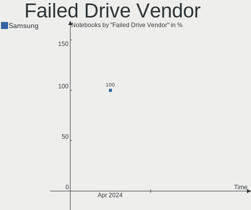
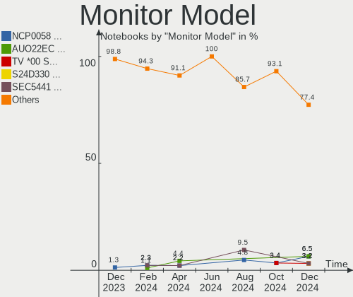
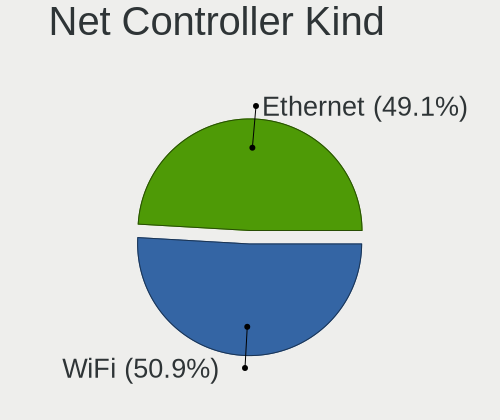
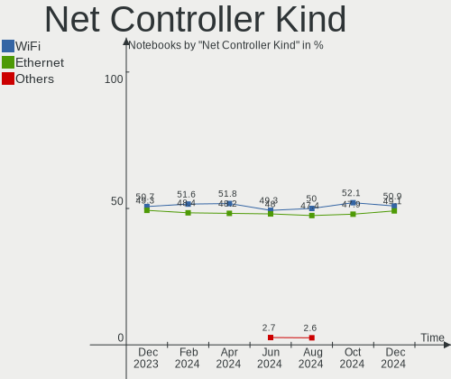

BlackPanther Hardware Trends (Notebooks)
----------------------------------------

A project to identify most popular hardware characteristics and track their change
over time based on data collected by BlackPanther users at https://Linux-Hardware.org.

Anyone can contribute to this report by the [hw-probe](https://github.com/linuxhw/hw-probe) tool:

    sudo -E hw-probe -all -upload

Full-feature report is available here: https://linux-hardware.org/?view=trends

Period: Nov, 2021.

Contents
--------

* [ System ](#system)
  - [ OS                       ](#os)
  - [ OS Family                ](#os-family)
  - [ Kernel                   ](#kernel)
  - [ Kernel Family            ](#kernel-family)
  - [ Kernel Major Ver.        ](#kernel-major-ver)
  - [ Arch                     ](#arch)
  - [ DE                       ](#de)
  - [ Display Server           ](#display-server)
  - [ Display Manager          ](#display-manager)
  - [ OS Lang                  ](#os-lang)
  - [ Boot Mode                ](#boot-mode)
  - [ Filesystem               ](#filesystem)
  - [ Part. scheme             ](#part-scheme)
  - [ Dual Boot with Linux/BSD ](#dual-boot-with-linuxbsd)
  - [ Dual Boot (Win)          ](#dual-boot-win)

* [ Board ](#board)
  - [ Vendor                   ](#vendor)
  - [ Model                    ](#model)
  - [ Model Family             ](#model-family)
  - [ MFG Year                 ](#mfg-year)
  - [ Form Factor              ](#form-factor)
  - [ Secure Boot              ](#secure-boot)
  - [ Coreboot                 ](#coreboot)
  - [ RAM Size                 ](#ram-size)
  - [ RAM Used                 ](#ram-used)
  - [ Total Drives             ](#total-drives)
  - [ Has CD-ROM               ](#has-cd-rom)
  - [ Has Ethernet             ](#has-ethernet)
  - [ Has WiFi                 ](#has-wifi)
  - [ Has Bluetooth            ](#has-bluetooth)

* [ Location ](#location)
  - [ Country                  ](#country)
  - [ City                     ](#city)

* [ Drives ](#drives)
  - [ Drive Vendor             ](#drive-vendor)
  - [ Drive Model              ](#drive-model)
  - [ HDD Vendor               ](#hdd-vendor)
  - [ SSD Vendor               ](#ssd-vendor)
  - [ Drive Kind               ](#drive-kind)
  - [ Drive Connector          ](#drive-connector)
  - [ Drive Size               ](#drive-size)
  - [ Space Total              ](#space-total)
  - [ Space Used               ](#space-used)
  - [ Malfunc. Drives          ](#malfunc-drives)
  - [ Malfunc. Drive Vendor    ](#malfunc-drive-vendor)
  - [ Malfunc. HDD Vendor      ](#malfunc-hdd-vendor)
  - [ Malfunc. Drive Kind      ](#malfunc-drive-kind)
  - [ Failed Drives            ](#failed-drives)
  - [ Failed Drive Vendor      ](#failed-drive-vendor)
  - [ Drive Status             ](#drive-status)

* [ Storage controller ](#storage-controller)
  - [ Storage Vendor           ](#storage-vendor)
  - [ Storage Model            ](#storage-model)
  - [ Storage Kind             ](#storage-kind)

* [ Processor ](#processor)
  - [ CPU Vendor               ](#cpu-vendor)
  - [ CPU Model                ](#cpu-model)
  - [ CPU Model Family         ](#cpu-model-family)
  - [ CPU Cores                ](#cpu-cores)
  - [ CPU Sockets              ](#cpu-sockets)
  - [ CPU Threads              ](#cpu-threads)
  - [ CPU Op-Modes             ](#cpu-op-modes)
  - [ CPU Microcode            ](#cpu-microcode)
  - [ CPU Microarch            ](#cpu-microarch)

* [ Graphics ](#graphics)
  - [ GPU Vendor               ](#gpu-vendor)
  - [ GPU Model                ](#gpu-model)
  - [ GPU Combo                ](#gpu-combo)
  - [ GPU Driver               ](#gpu-driver)
  - [ GPU Memory               ](#gpu-memory)

* [ Monitor ](#monitor)
  - [ Monitor Vendor           ](#monitor-vendor)
  - [ Monitor Model            ](#monitor-model)
  - [ Monitor Resolution       ](#monitor-resolution)
  - [ Monitor Diagonal         ](#monitor-diagonal)
  - [ Monitor Width            ](#monitor-width)
  - [ Aspect Ratio             ](#aspect-ratio)
  - [ Monitor Area             ](#monitor-area)
  - [ Pixel Density            ](#pixel-density)
  - [ Multiple Monitors        ](#multiple-monitors)

* [ Network ](#network)
  - [ Net Controller Vendor    ](#net-controller-vendor)
  - [ Net Controller Model     ](#net-controller-model)
  - [ Wireless Vendor          ](#wireless-vendor)
  - [ Wireless Model           ](#wireless-model)
  - [ Ethernet Vendor          ](#ethernet-vendor)
  - [ Ethernet Model           ](#ethernet-model)
  - [ Net Controller Kind      ](#net-controller-kind)
  - [ Used Controller          ](#used-controller)
  - [ NICs                     ](#nics)
  - [ IPv6                     ](#ipv6)

* [ Bluetooth ](#bluetooth)
  - [ Bluetooth Vendor         ](#bluetooth-vendor)
  - [ Bluetooth Model          ](#bluetooth-model)

* [ Sound ](#sound)
  - [ Sound Vendor             ](#sound-vendor)
  - [ Sound Model              ](#sound-model)

* [ Memory ](#memory)
  - [ Memory Vendor            ](#memory-vendor)
  - [ Memory Model             ](#memory-model)
  - [ Memory Kind              ](#memory-kind)
  - [ Memory Form Factor       ](#memory-form-factor)
  - [ Memory Size              ](#memory-size)
  - [ Memory Speed             ](#memory-speed)

* [ Printers & scanners ](#printers--scanners)
  - [ Printer Vendor           ](#printer-vendor)
  - [ Printer Model            ](#printer-model)
  - [ Scanner Vendor           ](#scanner-vendor)
  - [ Scanner Model            ](#scanner-model)

* [ Camera ](#camera)
  - [ Camera Vendor            ](#camera-vendor)
  - [ Camera Model             ](#camera-model)

* [ Security ](#security)
  - [ Fingerprint Vendor       ](#fingerprint-vendor)
  - [ Fingerprint Model        ](#fingerprint-model)
  - [ Chipcard Vendor          ](#chipcard-vendor)
  - [ Chipcard Model           ](#chipcard-model)

* [ Unsupported ](#unsupported)
  - [ Unsupported Devices      ](#unsupported-devices)
  - [ Unsupported Device Types ](#unsupported-device-types)

System
------

OS
--

Installed operating systems

| Name              | Notebooks | Percent |
|-------------------|-----------|---------|
| BlackPanther 18.1 | 48        | 97.96%  |
| BlackPanther 16.2 | 1         | 2.04%   |

OS Family
---------

OS without a version

| Name         | Notebooks | Percent |
|--------------|-----------|---------|
| BlackPanther | 49        | 100%    |

Kernel
------

Version of the Linux kernel

| Version             | Notebooks | Percent |
|---------------------|-----------|---------|
| 5.6.14-desktop-2bP  | 36        | 73.47%  |
| 4.18.16-desktop-1bP | 12        | 24.49%  |
| 4.7.0-desktop-1bP   | 1         | 2.04%   |

Kernel Family
-------------

Linux kernel without a distro release

| Version | Notebooks | Percent |
|---------|-----------|---------|
| 5.6.14  | 36        | 73.47%  |
| 4.18.16 | 12        | 24.49%  |
| 4.7.0   | 1         | 2.04%   |

Kernel Major Ver.
-----------------

Linux kernel major version

| Version | Notebooks | Percent |
|---------|-----------|---------|
| 5.6     | 36        | 73.47%  |
| 4.18    | 12        | 24.49%  |
| 4.7     | 1         | 2.04%   |

Arch
----

OS architecture (x86_64, i586, etc.)

| Name   | Notebooks | Percent |
|--------|-----------|---------|
| x86_64 | 48        | 97.96%  |
| i686   | 1         | 2.04%   |

DE
--

Desktop Environment

| Name | Notebooks | Percent |
|------|-----------|---------|
| KDE5 | 49        | 100%    |

Display Server
--------------

X11 or Wayland

| Name | Notebooks | Percent |
|------|-----------|---------|
| X11  | 49        | 100%    |

Display Manager
---------------

SDDM, LightDM, etc.

| Name | Notebooks | Percent |
|------|-----------|---------|
| SDDM | 49        | 100%    |

OS Lang
-------

Language

| Lang    | Notebooks | Percent |
|---------|-----------|---------|
| Unknown | 49        | 100%    |

Boot Mode
---------

EFI or BIOS

| Mode | Notebooks | Percent |
|------|-----------|---------|
| BIOS | 27        | 55.1%   |
| EFI  | 22        | 44.9%   |

Filesystem
----------

Type of filesystem

| Type    | Notebooks | Percent |
|---------|-----------|---------|
| Overlay | 42        | 85.71%  |
| Ext4    | 7         | 14.29%  |

Part. scheme
------------

Scheme of partitioning

| Type | Notebooks | Percent |
|------|-----------|---------|
| MBR  | 29        | 59.18%  |
| GPT  | 20        | 40.82%  |

Dual Boot with Linux/BSD
------------------------

Hosting more than one Linux/BSD

| Dual boot | Notebooks | Percent |
|-----------|-----------|---------|
| No        | 31        | 63.27%  |
| Yes       | 18        | 36.73%  |

Dual Boot (Win)
---------------

Hosting Linux and Windows

| Dual boot | Notebooks | Percent |
|-----------|-----------|---------|
| Yes       | 27        | 55.1%   |
| No        | 22        | 44.9%   |

Board
-----

Vendor
------

Motherboard manufacturer

| Name                | Notebooks | Percent |
|---------------------|-----------|---------|
| Lenovo              | 11        | 22.45%  |
| Dell                | 11        | 22.45%  |
| Hewlett-Packard     | 7         | 14.29%  |
| Toshiba             | 4         | 8.16%   |
| Acer                | 3         | 6.12%   |
| Sony                | 2         | 4.08%   |
| ASUSTek Computer    | 2         | 4.08%   |
| Apple               | 2         | 4.08%   |
| Samsung Electronics | 1         | 2.04%   |
| MSI                 | 1         | 2.04%   |
| Jumper              | 1         | 2.04%   |
| Fujitsu Siemens     | 1         | 2.04%   |
| Fujitsu             | 1         | 2.04%   |
| eMachines           | 1         | 2.04%   |
| BenQ                | 1         | 2.04%   |

Model
-----

Motherboard model

| Name                            | Notebooks | Percent |
|---------------------------------|-----------|---------|
| Toshiba Satellite U400          | 1         | 2.04%   |
| Toshiba Satellite L750          | 1         | 2.04%   |
| Toshiba Satellite L500          | 1         | 2.04%   |
| Toshiba NB550D                  | 1         | 2.04%   |
| Sony VPCEH2J1E                  | 1         | 2.04%   |
| Sony SVS13118GBB                | 1         | 2.04%   |
| Samsung NC210/NC110             | 1         | 2.04%   |
| MSI CR610                       | 1         | 2.04%   |
| Lenovo Z50-75 80EC              | 1         | 2.04%   |
| Lenovo ThinkPad T530 2429NL6    | 1         | 2.04%   |
| Lenovo ThinkPad A475 20KMS0EJ00 | 1         | 2.04%   |
| Lenovo IdeaPad S145-15IWL 81MV  | 1         | 2.04%   |
| Lenovo IdeaPad 330S-15IKB 81F5  | 1         | 2.04%   |
| Lenovo IdeaPad 330-15IKB 81DE   | 1         | 2.04%   |
| Lenovo IdeaPad 320-17ABR 80YN   | 1         | 2.04%   |
| Lenovo G550 20023               | 1         | 2.04%   |
| Lenovo G505s 20255              | 1         | 2.04%   |
| Lenovo G40-45 80E1              | 1         | 2.04%   |
| Lenovo B50-70 20384             | 1         | 2.04%   |
| Jumper EZbook                   | 1         | 2.04%   |
| HP ProBook 6470b                | 1         | 2.04%   |
| HP ProBook 4330s                | 1         | 2.04%   |
| HP Pavilion Notebook            | 1         | 2.04%   |
| HP ENVY 15                      | 1         | 2.04%   |
| HP EliteBook 8540p              | 1         | 2.04%   |
| HP 650                          | 1         | 2.04%   |
| HP 250 G4                       | 1         | 2.04%   |
| Fujitsu Siemens LIFEBOOK S7110  | 1         | 2.04%   |
| Fujitsu LIFEBOOK U745           | 1         | 2.04%   |
| eMachines eME732G               | 1         | 2.04%   |
| Dell Vostro 1540                | 1         | 2.04%   |
| Dell Latitude E7470             | 1         | 2.04%   |
| Dell Latitude E6530             | 1         | 2.04%   |
| Dell Latitude E6430             | 1         | 2.04%   |
| Dell Latitude E6410             | 1         | 2.04%   |
| Dell Latitude E6230             | 1         | 2.04%   |
| Dell Latitude E5430 non-vPro    | 1         | 2.04%   |
| Dell Latitude D630              | 1         | 2.04%   |
| Dell Latitude 7280              | 1         | 2.04%   |
| Dell Latitude 5480              | 1         | 2.04%   |
| Dell Inspiron 5558              | 1         | 2.04%   |
| BenQ Joybook A52                | 1         | 2.04%   |
| ASUS K53U                       | 1         | 2.04%   |
| ASUS K50IN                      | 1         | 2.04%   |
| Apple MacBookPro6,2             | 1         | 2.04%   |
| Apple MacBookPro5,5             | 1         | 2.04%   |
| Acer Aspire ES1-572             | 1         | 2.04%   |
| Acer Aspire A315-55KG           | 1         | 2.04%   |
| Acer Aspire 5930                | 1         | 2.04%   |

Model Family
------------

Motherboard model prefix

| Name                     | Notebooks | Percent |
|--------------------------|-----------|---------|
| Dell Latitude            | 9         | 18.37%  |
| Lenovo IdeaPad           | 4         | 8.16%   |
| Toshiba Satellite        | 3         | 6.12%   |
| Acer Aspire              | 3         | 6.12%   |
| Lenovo ThinkPad          | 2         | 4.08%   |
| HP ProBook               | 2         | 4.08%   |
| Toshiba NB550D           | 1         | 2.04%   |
| Sony VPCEH2J1E           | 1         | 2.04%   |
| Sony SVS13118GBB         | 1         | 2.04%   |
| Samsung NC210            | 1         | 2.04%   |
| MSI CR610                | 1         | 2.04%   |
| Lenovo Z50-75            | 1         | 2.04%   |
| Lenovo G550              | 1         | 2.04%   |
| Lenovo G505s             | 1         | 2.04%   |
| Lenovo G40-45            | 1         | 2.04%   |
| Lenovo B50-70            | 1         | 2.04%   |
| Jumper EZbook            | 1         | 2.04%   |
| HP Pavilion              | 1         | 2.04%   |
| HP ENVY                  | 1         | 2.04%   |
| HP EliteBook             | 1         | 2.04%   |
| HP 650                   | 1         | 2.04%   |
| HP 250                   | 1         | 2.04%   |
| Fujitsu Siemens LIFEBOOK | 1         | 2.04%   |
| Fujitsu LIFEBOOK         | 1         | 2.04%   |
| eMachines eME732G        | 1         | 2.04%   |
| Dell Vostro              | 1         | 2.04%   |
| Dell Inspiron            | 1         | 2.04%   |
| BenQ Joybook             | 1         | 2.04%   |
| ASUS K53U                | 1         | 2.04%   |
| ASUS K50IN               | 1         | 2.04%   |
| Apple MacBookPro6        | 1         | 2.04%   |
| Apple MacBookPro5        | 1         | 2.04%   |

MFG Year
--------

Motherboard manufacture year

| Year | Notebooks | Percent |
|------|-----------|---------|
| 2018 | 7         | 14.29%  |
| 2014 | 6         | 12.24%  |
| 2015 | 5         | 10.2%   |
| 2012 | 5         | 10.2%   |
| 2010 | 5         | 10.2%   |
| 2019 | 4         | 8.16%   |
| 2011 | 4         | 8.16%   |
| 2021 | 3         | 6.12%   |
| 2013 | 2         | 4.08%   |
| 2009 | 2         | 4.08%   |
| 2008 | 2         | 4.08%   |
| 2020 | 1         | 2.04%   |
| 2016 | 1         | 2.04%   |
| 2007 | 1         | 2.04%   |
| 2006 | 1         | 2.04%   |

Form Factor
-----------

Physical design of the computer

| Name     | Notebooks | Percent |
|----------|-----------|---------|
| Notebook | 49        | 100%    |

Secure Boot
-----------

Enabled or disabled

| State    | Notebooks | Percent |
|----------|-----------|---------|
| Disabled | 49        | 100%    |

Coreboot
--------

Have coreboot on board

| Used | Notebooks | Percent |
|------|-----------|---------|
| No   | 49        | 100%    |

RAM Size
--------

Total RAM memory

| Size in GB | Notebooks | Percent |
|------------|-----------|---------|
| 3.01-4.0   | 19        | 38.78%  |
| 4.01-8.0   | 13        | 26.53%  |
| 8.01-16.0  | 8         | 16.33%  |
| 1.01-2.0   | 5         | 10.2%   |
| 2.01-3.0   | 2         | 4.08%   |
| 16.01-24.0 | 2         | 4.08%   |

RAM Used
--------

Used RAM memory

| Used GB  | Notebooks | Percent |
|----------|-----------|---------|
| 0.51-1.0 | 28        | 57.14%  |
| 1.01-2.0 | 15        | 30.61%  |
| 0.01-0.5 | 6         | 12.24%  |

Total Drives
------------

Number of drives on board

| Drives | Notebooks | Percent |
|--------|-----------|---------|
| 1      | 41        | 83.67%  |
| 2      | 6         | 12.24%  |
| 3      | 2         | 4.08%   |

Has CD-ROM
----------

Has CD-ROM on board

| Presented | Notebooks | Percent |
|-----------|-----------|---------|
| Yes       | 27        | 55.1%   |
| No        | 22        | 44.9%   |

Has Ethernet
------------

Has Ethernet on board

| Presented | Notebooks | Percent |
|-----------|-----------|---------|
| Yes       | 46        | 93.88%  |
| No        | 3         | 6.12%   |

Has WiFi
--------

Has WiFi module

| Presented | Notebooks | Percent |
|-----------|-----------|---------|
| Yes       | 48        | 97.96%  |
| No        | 1         | 2.04%   |

Has Bluetooth
-------------

Has Bluetooth module

| Presented | Notebooks | Percent |
|-----------|-----------|---------|
| Yes       | 40        | 81.63%  |
| No        | 9         | 18.37%  |

Location
--------

Country
-------

Geographic location (country)

| Country   | Notebooks | Percent |
|-----------|-----------|---------|
| Hungary   | 42        | 85.71%  |
| Slovakia  | 2         | 4.08%   |
| Austria   | 2         | 4.08%   |
| Jamaica   | 1         | 2.04%   |
| China     | 1         | 2.04%   |
| Argentina | 1         | 2.04%   |

City
----

Geographic location (city)

| City                        | Notebooks | Percent |
|-----------------------------|-----------|---------|
| Budapest                    | 12        | 24.49%  |
| Vienna                      | 2         | 4.08%   |
| Veresegyhaz                 | 2         | 4.08%   |
| V??c                        | 2         | 4.08%   |
| Szerencs                    | 2         | 4.08%   |
| Papkeszi                    | 2         | 4.08%   |
| Oroshaza                    | 2         | 4.08%   |
| Holic                       | 2         | 4.08%   |
| Debrecen                    | 2         | 4.08%   |
| Vemend                      | 1         | 2.04%   |
| Tatab??nya                  | 1         | 2.04%   |
| Szolnok                     | 1         | 2.04%   |
| San Nicol??s de los Arroyos | 1         | 2.04%   |
| Salgotarjan                 | 1         | 2.04%   |
| Nyiregyhaza                 | 1         | 2.04%   |
| Lebeny                      | 1         | 2.04%   |
| Lajosmizse                  | 1         | 2.04%   |
| Kisvarda                    | 1         | 2.04%   |
| Kingston                    | 1         | 2.04%   |
| Kecsked                     | 1         | 2.04%   |
| Kaposv??r                   | 1         | 2.04%   |
| Jaszdozsa                   | 1         | 2.04%   |
| Gyomro                      | 1         | 2.04%   |
| Gyomaendrod                 | 1         | 2.04%   |
| Gy?‘r                       | 1         | 2.04%   |
| Esztergom                   | 1         | 2.04%   |
| Dombovar                    | 1         | 2.04%   |
| Dalian                      | 1         | 2.04%   |
| Buk                         | 1         | 2.04%   |
| ?‰rd                        | 1         | 2.04%   |

Drives
------

Drive Vendor
------------

Hard drive vendors

| Vendor              | Notebooks | Drives | Percent |
|---------------------|-----------|--------|---------|
| Toshiba             | 13        | 13     | 20.63%  |
| WDC                 | 8         | 8      | 12.7%   |
| Seagate             | 7         | 7      | 11.11%  |
| Samsung Electronics | 7         | 7      | 11.11%  |
| Hitachi             | 6         | 7      | 9.52%   |
| Kingston            | 4         | 4      | 6.35%   |
| Intenso             | 3         | 3      | 4.76%   |
| Unknown             | 2         | 2      | 3.17%   |
| SanDisk             | 2         | 2      | 3.17%   |
| HGST                | 2         | 2      | 3.17%   |
| Solid               | 1         | 1      | 1.59%   |
| SK Hynix            | 1         | 1      | 1.59%   |
| Philips             | 1         | 1      | 1.59%   |
| JMicron             | 1         | 1      | 1.59%   |
| Intel               | 1         | 1      | 1.59%   |
| GOODRAM             | 1         | 1      | 1.59%   |
| Crucial             | 1         | 1      | 1.59%   |
| A-DATA Technology   | 1         | 1      | 1.59%   |
| Unknown             | 1         | 1      | 1.59%   |

Drive Model
-----------

Hard drive models

| Model                                 | Notebooks | Percent |
|---------------------------------------|-----------|---------|
| Toshiba MQ01ABF050 500GB              | 3         | 4.69%   |
| Toshiba MQ01ABD100 1TB                | 3         | 4.69%   |
| Kingston SV300S37A120G 120GB SSD      | 3         | 4.69%   |
| Toshiba MQ04ABF100 1TB                | 2         | 3.13%   |
| Seagate ST500LT012-1DG142 500GB       | 2         | 3.13%   |
| Hitachi HTS543232L9A300 320GB         | 2         | 3.13%   |
| Hitachi HTS543232A7A384 320GB         | 2         | 3.13%   |
| WDC WD7500BPVX-60JC3T0 752GB          | 1         | 1.56%   |
| WDC WD5000LPVX-22V0TT0 500GB          | 1         | 1.56%   |
| WDC WD5000BPVT-80HXZT3 500GB          | 1         | 1.56%   |
| WDC WD3200BUDT-63DPZY0 320GB          | 1         | 1.56%   |
| WDC WD2500BEVT-22A23T0 250GB          | 1         | 1.56%   |
| WDC WD10SPCX-24HWST1 1TB              | 1         | 1.56%   |
| WDC WD10JPVX-60JC3T0 1TB              | 1         | 1.56%   |
| WDC WD10JPVX-22JC3T0 1TB              | 1         | 1.56%   |
| Unknown SLD128  128GB                 | 1         | 1.56%   |
| Unknown SC32G  32GB                   | 1         | 1.56%   |
| Toshiba THNSFJ256GCSU 256GB SSD       | 1         | 1.56%   |
| Toshiba MQ01ABD075 752GB              | 1         | 1.56%   |
| Toshiba MK2561GSYN 250GB              | 1         | 1.56%   |
| Toshiba MK2555GSX 250GB               | 1         | 1.56%   |
| Toshiba MK1252GSX 120GB               | 1         | 1.56%   |
| Solid SSD0240S00 240GB                | 1         | 1.56%   |
| SK Hynix HFS256G39TNF-N3A0A 256GB SSD | 1         | 1.56%   |
| Seagate ST9500420AS 500GB             | 1         | 1.56%   |
| Seagate ST9320325AS 320GB             | 1         | 1.56%   |
| Seagate ST1000LM024 HN-M101MBB 1TB    | 1         | 1.56%   |
| Seagate ST1000LM014-1EJ164-SSHD 1TB   | 1         | 1.56%   |
| Seagate ST1000LM 024 HN-M101MBB 1TB   | 1         | 1.56%   |
| SanDisk X400 M.2 2280 256GB SSD       | 1         | 1.56%   |
| SanDisk SD9TB8W512G1001 512GB SSD     | 1         | 1.56%   |
| Samsung SSD PM871b M.2 2280 256GB     | 1         | 1.56%   |
| Samsung SSD 870 EVO 250GB             | 1         | 1.56%   |
| Samsung SSD 860 EVO 1TB               | 1         | 1.56%   |
| Samsung SSD 830 Series 128GB          | 1         | 1.56%   |
| Samsung MZVLB256HAHQ-000L7 256GB      | 1         | 1.56%   |
| Samsung MZ7LN256HCHP-00000 256GB SSD  | 1         | 1.56%   |
| Samsung HM160HI 160GB                 | 1         | 1.56%   |
| Philips SSD 120GB                     | 1         | 1.56%   |
| Kingston SUV400S37120G 120GB SSD      | 1         | 1.56%   |
| JMicron Generic 1TB                   | 1         | 1.56%   |
| Intenso SSD SATAIII 256GB             | 1         | 1.56%   |
| Intenso SSD 120GB                     | 1         | 1.56%   |
| Intenso SATA III SSD 240GB            | 1         | 1.56%   |
| Intel SSDSCKKF256H6 SATA 256GB        | 1         | 1.56%   |
| Hitachi HTS547550A9E384 500GB         | 1         | 1.56%   |
| Hitachi HTS545032B9A300 320GB         | 1         | 1.56%   |
| Hitachi HTS542516K9SA00 160GB         | 1         | 1.56%   |
| HGST HTS545050A7E680 500GB            | 1         | 1.56%   |
| HGST HTS541010A9E680 1TB              | 1         | 1.56%   |
| GOODRAM SSDPR-CX300-120 120GB         | 1         | 1.56%   |
| Crucial CT120BX500SSD1 120GB          | 1         | 1.56%   |
| A-DATA SX8200PNP 256GB                | 1         | 1.56%   |
| Unknown                               | 1         | 1.56%   |

HDD Vendor
----------

Hard disk drive vendors

| Vendor              | Notebooks | Drives | Percent |
|---------------------|-----------|--------|---------|
| Toshiba             | 12        | 12     | 33.33%  |
| WDC                 | 8         | 8      | 22.22%  |
| Seagate             | 7         | 7      | 19.44%  |
| Hitachi             | 6         | 7      | 16.67%  |
| HGST                | 2         | 2      | 5.56%   |
| Samsung Electronics | 1         | 1      | 2.78%   |

SSD Vendor
----------

Solid state drive vendors

| Vendor              | Notebooks | Drives | Percent |
|---------------------|-----------|--------|---------|
| Samsung Electronics | 5         | 5      | 22.73%  |
| Kingston            | 4         | 4      | 18.18%  |
| Intenso             | 3         | 3      | 13.64%  |
| SanDisk             | 2         | 2      | 9.09%   |
| Toshiba             | 1         | 1      | 4.55%   |
| Solid               | 1         | 1      | 4.55%   |
| SK Hynix            | 1         | 1      | 4.55%   |
| Philips             | 1         | 1      | 4.55%   |
| JMicron             | 1         | 1      | 4.55%   |
| Intel               | 1         | 1      | 4.55%   |
| GOODRAM             | 1         | 1      | 4.55%   |
| Crucial             | 1         | 1      | 4.55%   |

Drive Kind
----------

HDD or SSD

| Kind | Notebooks | Drives | Percent |
|------|-----------|--------|---------|
| HDD  | 33        | 37     | 55%     |
| SSD  | 22        | 22     | 36.67%  |
| MMC  | 3         | 3      | 5%      |
| NVMe | 2         | 2      | 3.33%   |

Drive Connector
---------------

SATA, SAS, NVMe, etc.

| Type | Notebooks | Drives | Percent |
|------|-----------|--------|---------|
| SATA | 47        | 57     | 87.04%  |
| MMC  | 3         | 3      | 5.56%   |
| SAS  | 2         | 2      | 3.7%    |
| NVMe | 2         | 2      | 3.7%    |

Drive Size
----------

Size of hard drive

| Size in TB | Notebooks | Drives | Percent |
|------------|-----------|--------|---------|
| 0.01-0.5   | 37        | 42     | 72.55%  |
| 0.51-1.0   | 14        | 17     | 27.45%  |

Space Total
-----------

Amount of disk space available on the file system

| Size in GB | Notebooks | Percent |
|------------|-----------|---------|
| Unknown    | 40        | 81.63%  |
| 101-250    | 4         | 8.16%   |
| 251-500    | 3         | 6.12%   |
| 21-50      | 1         | 2.04%   |
| 501-1000   | 1         | 2.04%   |

Space Used
----------

Amount of used disk space

| Used GB | Notebooks | Percent |
|---------|-----------|---------|
| Unknown | 40        | 81.63%  |
| 1-20    | 9         | 18.37%  |

Malfunc. Drives
---------------

Drive models with a malfunction

| Model                               | Notebooks | Drives | Percent |
|-------------------------------------|-----------|--------|---------|
| WDC WD7500BPVX-60JC3T0 752GB        | 1         | 1      | 4.55%   |
| WDC WD5000BPVT-80HXZT3 500GB        | 1         | 1      | 4.55%   |
| WDC WD3200BUDT-63DPZY0 320GB        | 1         | 1      | 4.55%   |
| WDC WD2500BEVT-22A23T0 250GB        | 1         | 1      | 4.55%   |
| WDC WD10JPVX-22JC3T0 1TB            | 1         | 1      | 4.55%   |
| Toshiba THNSFJ256GCSU 256GB SSD     | 1         | 1      | 4.55%   |
| Toshiba MQ01ABF050 500GB            | 1         | 1      | 4.55%   |
| Toshiba MQ01ABD100 1TB              | 1         | 1      | 4.55%   |
| Toshiba MQ01ABD075 752GB            | 1         | 1      | 4.55%   |
| Toshiba MK2561GSYN 250GB            | 1         | 1      | 4.55%   |
| Toshiba MK2555GSX 250GB             | 1         | 1      | 4.55%   |
| Seagate ST9500420AS 500GB           | 1         | 1      | 4.55%   |
| Seagate ST500LT012-1DG142 500GB     | 1         | 1      | 4.55%   |
| Seagate ST1000LM024 HN-M101MBB 1TB  | 1         | 1      | 4.55%   |
| Seagate ST1000LM014-1EJ164-SSHD 1TB | 1         | 1      | 4.55%   |
| Samsung Electronics HM160HI 160GB   | 1         | 1      | 4.55%   |
| Intel SSDSCKKF256H6 SATA 256GB      | 1         | 1      | 4.55%   |
| Hitachi HTS547550A9E384 500GB       | 1         | 1      | 4.55%   |
| Hitachi HTS543232A7A384 320GB       | 1         | 1      | 4.55%   |
| Hitachi HTS542516K9SA00 160GB       | 1         | 1      | 4.55%   |
| HGST HTS545050A7E680 500GB          | 1         | 1      | 4.55%   |
| HGST HTS541010A9E680 1TB            | 1         | 1      | 4.55%   |

Malfunc. Drive Vendor
---------------------

Vendors of faulty drives

| Vendor              | Notebooks | Drives | Percent |
|---------------------|-----------|--------|---------|
| Toshiba             | 6         | 6      | 27.27%  |
| WDC                 | 5         | 5      | 22.73%  |
| Seagate             | 4         | 4      | 18.18%  |
| Hitachi             | 3         | 3      | 13.64%  |
| HGST                | 2         | 2      | 9.09%   |
| Samsung Electronics | 1         | 1      | 4.55%   |
| Intel               | 1         | 1      | 4.55%   |

Malfunc. HDD Vendor
-------------------

Vendors of faulty HDD drives

| Vendor              | Notebooks | Drives | Percent |
|---------------------|-----------|--------|---------|
| WDC                 | 5         | 5      | 25%     |
| Toshiba             | 5         | 5      | 25%     |
| Seagate             | 4         | 4      | 20%     |
| Hitachi             | 3         | 3      | 15%     |
| HGST                | 2         | 2      | 10%     |
| Samsung Electronics | 1         | 1      | 5%      |

Malfunc. Drive Kind
-------------------

Kinds of faulty drives

| Kind | Notebooks | Drives | Percent |
|------|-----------|--------|---------|
| HDD  | 19        | 20     | 90.48%  |
| SSD  | 2         | 2      | 9.52%   |

Failed Drives
-------------

Failed drive models

| Model                     | Notebooks | Drives | Percent |
|---------------------------|-----------|--------|---------|
| Seagate ST9320325AS 320GB | 1         | 1      | 100%    |

Failed Drive Vendor
-------------------

Failed drive vendors

| Vendor  | Notebooks | Drives | Percent |
|---------|-----------|--------|---------|
| Seagate | 1         | 1      | 100%    |

Drive Status
------------

Number of failed and malfunc. drives

| Status   | Notebooks | Drives | Percent |
|----------|-----------|--------|---------|
| Works    | 32        | 36     | 55.17%  |
| Malfunc  | 20        | 22     | 34.48%  |
| Detected | 5         | 5      | 8.62%   |
| Failed   | 1         | 1      | 1.72%   |

Storage controller
------------------

Storage Vendor
--------------

Storage controller vendors

| Vendor              | Notebooks | Percent |
|---------------------|-----------|---------|
| Intel               | 37        | 72.55%  |
| AMD                 | 10        | 19.61%  |
| Nvidia              | 2         | 3.92%   |
| Samsung Electronics | 1         | 1.96%   |
| ADATA Technology    | 1         | 1.96%   |

Storage Model
-------------

Storage controller models

| Model                                                                          | Notebooks | Percent |
|--------------------------------------------------------------------------------|-----------|---------|
| Intel 82801 Mobile SATA Controller [RAID mode]                                 | 7         | 12.07%  |
| AMD FCH SATA Controller [AHCI mode]                                            | 6         | 10.34%  |
| Intel Sunrise Point-LP SATA Controller [AHCI mode]                             | 5         | 8.62%   |
| Intel 7 Series Chipset Family 6-port SATA Controller [AHCI mode]               | 4         | 6.9%    |
| Intel Wildcat Point-LP SATA Controller [AHCI Mode]                             | 3         | 5.17%   |
| Intel 6 Series/C200 Series Chipset Family 6 port Mobile SATA AHCI Controller   | 3         | 5.17%   |
| Intel 5 Series/3400 Series Chipset 4 port SATA AHCI Controller                 | 3         | 5.17%   |
| AMD SB7x0/SB8x0/SB9x0 SATA Controller [AHCI mode]                              | 3         | 5.17%   |
| Nvidia MCP79 AHCI Controller                                                   | 2         | 3.45%   |
| Intel 82801IBM/IEM (ICH9M/ICH9M-E) 4 port SATA Controller [AHCI mode]          | 2         | 3.45%   |
| Intel 82801HM/HEM (ICH8M/ICH8M-E) IDE Controller                               | 2         | 3.45%   |
| Intel 5 Series/3400 Series Chipset 6 port SATA AHCI Controller                 | 2         | 3.45%   |
| AMD SB7x0/SB8x0/SB9x0 IDE Controller                                           | 2         | 3.45%   |
| Samsung NVMe SSD Controller SM981/PM981/PM983                                  | 1         | 1.72%   |
| Intel NM10/ICH7 Family SATA Controller [AHCI mode]                             | 1         | 1.72%   |
| Intel Celeron N3350/Pentium N4200/Atom E3900 Series SATA AHCI Controller       | 1         | 1.72%   |
| Intel Cannon Point-LP SATA Controller [AHCI Mode]                              | 1         | 1.72%   |
| Intel 82801HM/HEM (ICH8M/ICH8M-E) SATA Controller [IDE mode]                   | 1         | 1.72%   |
| Intel 82801HM/HEM (ICH8M/ICH8M-E) SATA Controller [AHCI mode]                  | 1         | 1.72%   |
| Intel 82801GBM/GHM (ICH7-M Family) SATA Controller [AHCI mode]                 | 1         | 1.72%   |
| Intel 82801G (ICH7 Family) IDE Controller                                      | 1         | 1.72%   |
| Intel 8 Series/C220 Series Chipset Family 6-port SATA Controller 1 [AHCI mode] | 1         | 1.72%   |
| Intel 8 Series SATA Controller 1 [AHCI mode]                                   | 1         | 1.72%   |
| AMD IXP SB4x0 Serial ATA Controller                                            | 1         | 1.72%   |
| AMD IXP SB4x0 IDE Controller                                                   | 1         | 1.72%   |
| AMD IXP SB400 Serial ATA Controller                                            | 1         | 1.72%   |
| ADATA XPG SX8200 Pro PCIe Gen3x4 M.2 2280 Solid State Drive                    | 1         | 1.72%   |

Storage Kind
------------

Kind of storage controller (IDE, SATA, NVMe, SAS, ...)

| Kind | Notebooks | Percent |
|------|-----------|---------|
| SATA | 40        | 72.73%  |
| RAID | 7         | 12.73%  |
| IDE  | 6         | 10.91%  |
| NVMe | 2         | 3.64%   |

Processor
---------

CPU Vendor
----------

Processor vendors

| Vendor | Notebooks | Percent |
|--------|-----------|---------|
| Intel  | 40        | 81.63%  |
| AMD    | 9         | 18.37%  |

CPU Model
---------

Processor models

| Model                                           | Notebooks | Percent |
|-------------------------------------------------|-----------|---------|
| Intel Core i5-3340M CPU @ 2.70GHz               | 3         | 6.12%   |
| Intel Pentium Dual-Core CPU T4500 @ 2.30GHz     | 2         | 4.08%   |
| Intel Core i7-6600U CPU @ 2.60GHz               | 2         | 4.08%   |
| Intel Core i3-7020U CPU @ 2.30GHz               | 2         | 4.08%   |
| Intel Core 2 Duo CPU P8700 @ 2.53GHz            | 2         | 4.08%   |
| Intel Pentium Dual-Core CPU T4200 @ 2.00GHz     | 1         | 2.04%   |
| Intel Pentium CPU 3825U @ 1.90GHz               | 1         | 2.04%   |
| Intel Core i7-5600U CPU @ 2.60GHz               | 1         | 2.04%   |
| Intel Core i7-4712HQ CPU @ 2.30GHz              | 1         | 2.04%   |
| Intel Core i7 CPU M 620 @ 2.67GHz               | 1         | 2.04%   |
| Intel Core i5-7200U CPU @ 2.50GHz               | 1         | 2.04%   |
| Intel Core i5-6300U CPU @ 2.40GHz               | 1         | 2.04%   |
| Intel Core i5-5200U CPU @ 2.20GHz               | 1         | 2.04%   |
| Intel Core i5-4210U CPU @ 1.70GHz               | 1         | 2.04%   |
| Intel Core i5-3380M CPU @ 2.90GHz               | 1         | 2.04%   |
| Intel Core i5-3320M CPU @ 2.60GHz               | 1         | 2.04%   |
| Intel Core i5-3230M CPU @ 2.60GHz               | 1         | 2.04%   |
| Intel Core i5-3210M CPU @ 2.50GHz               | 1         | 2.04%   |
| Intel Core i5-2430M CPU @ 2.40GHz               | 1         | 2.04%   |
| Intel Core i5 CPU M 560 @ 2.67GHz               | 1         | 2.04%   |
| Intel Core i5 CPU M 540 @ 2.53GHz               | 1         | 2.04%   |
| Intel Core i3-8130U CPU @ 2.20GHz               | 1         | 2.04%   |
| Intel Core i3-2350M CPU @ 2.30GHz               | 1         | 2.04%   |
| Intel Core i3-2330M CPU @ 2.20GHz               | 1         | 2.04%   |
| Intel Core i3 CPU M 380 @ 2.53GHz               | 1         | 2.04%   |
| Intel Core i3 CPU M 370 @ 2.40GHz               | 1         | 2.04%   |
| Intel Core i3 CPU M 330 @ 2.13GHz               | 1         | 2.04%   |
| Intel Core Duo CPU T2450 @ 2.00GHz              | 1         | 2.04%   |
| Intel Core 2 Duo CPU T7250 @ 2.00GHz            | 1         | 2.04%   |
| Intel Core 2 CPU T7200 @ 2.00GHz                | 1         | 2.04%   |
| Intel Celeron CPU N3350 @ 1.10GHz               | 1         | 2.04%   |
| Intel Celeron CPU B830 @ 1.80GHz                | 1         | 2.04%   |
| Intel Celeron CPU 4205U @ 1.80GHz               | 1         | 2.04%   |
| Intel Atom CPU N570 @ 1.66GHz                   | 1         | 2.04%   |
| AMD PRO A12-8830B R7, 10 COMPUTE CORES 4C+6G    | 1         | 2.04%   |
| AMD E-450 APU with Radeon HD Graphics           | 1         | 2.04%   |
| AMD C-30 Processor                              | 1         | 2.04%   |
| AMD Athlon II Dual-Core M320                    | 1         | 2.04%   |
| AMD A8-7410 APU with AMD Radeon R5 Graphics     | 1         | 2.04%   |
| AMD A8-5550M APU with Radeon HD Graphics        | 1         | 2.04%   |
| AMD A4-6210 APU with AMD Radeon R3 Graphics     | 1         | 2.04%   |
| AMD A12-9720P RADEON R7, 12 COMPUTE CORES 4C+8G | 1         | 2.04%   |
| AMD A10-7300 Radeon R6, 10 Compute Cores 4C+6G  | 1         | 2.04%   |

CPU Model Family
----------------

Processor model prefix

| Model                   | Notebooks | Percent |
|-------------------------|-----------|---------|
| Intel Core i5           | 14        | 28.57%  |
| Intel Core i3           | 8         | 16.33%  |
| Intel Core i7           | 5         | 10.2%   |
| Intel Pentium Dual-Core | 3         | 6.12%   |
| Intel Core 2 Duo        | 3         | 6.12%   |
| Intel Celeron           | 3         | 6.12%   |
| AMD A8                  | 2         | 4.08%   |
| Other                   | 1         | 2.04%   |
| Intel Pentium           | 1         | 2.04%   |
| Intel Core Duo          | 1         | 2.04%   |
| Intel Core 2            | 1         | 2.04%   |
| Intel Atom              | 1         | 2.04%   |
| AMD E                   | 1         | 2.04%   |
| AMD C-30                | 1         | 2.04%   |
| AMD Athlon II Dual-Core | 1         | 2.04%   |
| AMD A4                  | 1         | 2.04%   |
| AMD A12                 | 1         | 2.04%   |
| AMD A10                 | 1         | 2.04%   |

CPU Cores
---------

Number of processor cores

| Number | Notebooks | Percent |
|--------|-----------|---------|
| 2      | 45        | 91.84%  |
| 4      | 3         | 6.12%   |
| 1      | 1         | 2.04%   |

CPU Sockets
-----------

Number of sockets

| Number | Notebooks | Percent |
|--------|-----------|---------|
| 1      | 49        | 100%    |

CPU Threads
-----------

Threads per core (Hyper-Threading)

| Number | Notebooks | Percent |
|--------|-----------|---------|
| 2      | 32        | 65.31%  |
| 1      | 17        | 34.69%  |

CPU Op-Modes
------------

CPU Operation Modes (32-bit, 64-bit)

| Op mode        | Notebooks | Percent |
|----------------|-----------|---------|
| 32-bit, 64-bit | 48        | 97.96%  |
| 32-bit         | 1         | 2.04%   |

CPU Microcode
-------------

Microcode number

| Number     | Notebooks | Percent |
|------------|-----------|---------|
| 0x306a9    | 7         | 14.29%  |
| 0x20655    | 5         | 10.2%   |
| 0x1067a    | 5         | 10.2%   |
| 0x206a7    | 4         | 8.16%   |
| 0x406e3    | 3         | 6.12%   |
| 0x306d4    | 3         | 6.12%   |
| 0x806ea    | 2         | 4.08%   |
| 0x806e9    | 2         | 4.08%   |
| 0x07030105 | 2         | 4.08%   |
| 0x0600611a | 2         | 4.08%   |
| 0x806eb    | 1         | 2.04%   |
| 0x6fd      | 1         | 2.04%   |
| 0x6f6      | 1         | 2.04%   |
| 0x6ec      | 1         | 2.04%   |
| 0x506ca    | 1         | 2.04%   |
| 0x40651    | 1         | 2.04%   |
| 0x306c3    | 1         | 2.04%   |
| 0x20652    | 1         | 2.04%   |
| 0x106ca    | 1         | 2.04%   |
| 0x06003106 | 1         | 2.04%   |
| 0x06001119 | 1         | 2.04%   |
| 0x05000119 | 1         | 2.04%   |
| 0x05000029 | 1         | 2.04%   |
| Unknown    | 1         | 2.04%   |

CPU Microarch
-------------

Microarchitecture

| Name        | Notebooks | Percent |
|-------------|-----------|---------|
| IvyBridge   | 7         | 14.29%  |
| Westmere    | 6         | 12.24%  |
| Penryn      | 5         | 10.2%   |
| KabyLake    | 5         | 10.2%   |
| SandyBridge | 4         | 8.16%   |
| Skylake     | 3         | 6.12%   |
| Broadwell   | 3         | 6.12%   |
| Puma        | 2         | 4.08%   |
| Haswell     | 2         | 4.08%   |
| Excavator   | 2         | 4.08%   |
| Core        | 2         | 4.08%   |
| Bobcat      | 2         | 4.08%   |
| Steamroller | 1         | 2.04%   |
| Piledriver  | 1         | 2.04%   |
| P6          | 1         | 2.04%   |
| K10         | 1         | 2.04%   |
| Goldmont    | 1         | 2.04%   |
| Bonnell     | 1         | 2.04%   |

Graphics
--------

GPU Vendor
----------

Vendors of graphics cards

| Vendor | Notebooks | Percent |
|--------|-----------|---------|
| Intel  | 31        | 54.39%  |
| Nvidia | 13        | 22.81%  |
| AMD    | 13        | 22.81%  |

GPU Model
---------

Graphics card models

| Model                                                                                 | Notebooks | Percent |
|---------------------------------------------------------------------------------------|-----------|---------|
| Intel 3rd Gen Core processor Graphics Controller                                      | 7         | 11.11%  |
| Intel Skylake GT2 [HD Graphics 520]                                                   | 3         | 4.76%   |
| Intel Core Processor Integrated Graphics Controller                                   | 3         | 4.76%   |
| Intel Mobile GM965/GL960 Integrated Graphics Controller (secondary)                   | 2         | 3.17%   |
| Intel Mobile GM965/GL960 Integrated Graphics Controller (primary)                     | 2         | 3.17%   |
| Intel HD Graphics 620                                                                 | 2         | 3.17%   |
| Intel HD Graphics 5500                                                                | 2         | 3.17%   |
| Intel 2nd Generation Core Processor Family Integrated Graphics Controller             | 2         | 3.17%   |
| AMD Wani [Radeon R5/R6/R7 Graphics]                                                   | 2         | 3.17%   |
| AMD Topaz XT [Radeon R7 M260/M265 / M340/M360 / M440/M445 / 530/535 / 620/625 Mobile] | 2         | 3.17%   |
| Nvidia GT216M [NVS 5100M]                                                             | 1         | 1.59%   |
| Nvidia GT216M [GeForce GT 330M]                                                       | 1         | 1.59%   |
| Nvidia GM108M [GeForce MX130]                                                         | 1         | 1.59%   |
| Nvidia GM108M [GeForce 930MX]                                                         | 1         | 1.59%   |
| Nvidia GM107M [GeForce GTX 850M]                                                      | 1         | 1.59%   |
| Nvidia GK208BM [GeForce 920M]                                                         | 1         | 1.59%   |
| Nvidia GK107M [GeForce GT 640M LE]                                                    | 1         | 1.59%   |
| Nvidia GF119M [GeForce GT 520M]                                                       | 1         | 1.59%   |
| Nvidia GF119M [GeForce 410M]                                                          | 1         | 1.59%   |
| Nvidia GF108GLM [NVS 5200M]                                                           | 1         | 1.59%   |
| Nvidia G96CM [GeForce 9600M GT]                                                       | 1         | 1.59%   |
| Nvidia C79 [GeForce G102M]                                                            | 1         | 1.59%   |
| Nvidia C79 [GeForce 9400M]                                                            | 1         | 1.59%   |
| Intel UHD Graphics 620                                                                | 1         | 1.59%   |
| Intel Mobile 945GM/GMS/GME, 943/940GML Express Integrated Graphics Controller         | 1         | 1.59%   |
| Intel Mobile 945GM/GMS, 943/940GML Express Integrated Graphics Controller             | 1         | 1.59%   |
| Intel Mobile 4 Series Chipset Integrated Graphics Controller                          | 1         | 1.59%   |
| Intel Kaby Lake-U GT2f HD 620 Graphics Controller                                     | 1         | 1.59%   |
| Intel HD Graphics 500                                                                 | 1         | 1.59%   |
| Intel HD Graphics                                                                     | 1         | 1.59%   |
| Intel Haswell-ULT Integrated Graphics Controller                                      | 1         | 1.59%   |
| Intel Coffee Lake UHD 610 Graphics Controller                                         | 1         | 1.59%   |
| Intel Atom Processor D4xx/D5xx/N4xx/N5xx Integrated Graphics Controller               | 1         | 1.59%   |
| Intel 4th Gen Core Processor Integrated Graphics Controller                           | 1         | 1.59%   |
| AMD Wrestler [Radeon HD 6320]                                                         | 1         | 1.59%   |
| AMD Wrestler [Radeon HD 6250]                                                         | 1         | 1.59%   |
| AMD Sun LE [Radeon HD 8550M / R5 M230]                                                | 1         | 1.59%   |
| AMD RV710/M92 [Mobility Radeon HD 4530/4570/545v]                                     | 1         | 1.59%   |
| AMD RS880M [Mobility Radeon HD 4225/4250]                                             | 1         | 1.59%   |
| AMD Robson CE [Radeon HD 6370M/7370M]                                                 | 1         | 1.59%   |
| AMD Richland [Radeon HD 8550G]                                                        | 1         | 1.59%   |
| AMD RC410M [Mobility Radeon Xpress 200M]                                              | 1         | 1.59%   |
| AMD Mullins [Radeon R4/R5 Graphics]                                                   | 1         | 1.59%   |
| AMD Mullins [Radeon R3 Graphics]                                                      | 1         | 1.59%   |
| AMD Kaveri [Radeon R6 Graphics]                                                       | 1         | 1.59%   |
| AMD Jet PRO [Radeon R5 M230 / R7 M260DX / Radeon 520 Mobile]                          | 1         | 1.59%   |

GPU Combo
---------

Combinations of graphics cards

| Name           | Notebooks | Percent |
|----------------|-----------|---------|
| 1 x Intel      | 23        | 46.94%  |
| 1 x AMD        | 9         | 18.37%  |
| Intel + Nvidia | 7         | 14.29%  |
| 1 x Nvidia     | 6         | 12.24%  |
| 2 x AMD        | 3         | 6.12%   |
| Intel + AMD    | 1         | 2.04%   |

GPU Driver
----------

Free vs proprietary

| Driver | Notebooks | Percent |
|--------|-----------|---------|
| Free   | 49        | 100%    |

GPU Memory
----------

Total video memory

| Size in GB | Notebooks | Percent |
|------------|-----------|---------|
| Unknown    | 23        | 46.94%  |
| 0.01-0.5   | 14        | 28.57%  |
| 0.51-1.0   | 7         | 14.29%  |
| 1.01-2.0   | 4         | 8.16%   |
| 3.01-4.0   | 1         | 2.04%   |

Monitor
-------

Monitor Vendor
--------------

Monitor vendors

| Vendor                  | Notebooks | Percent |
|-------------------------|-----------|---------|
| LG Display              | 11        | 21.57%  |
| Chimei Innolux          | 10        | 19.61%  |
| AU Optronics            | 10        | 19.61%  |
| Samsung Electronics     | 8         | 15.69%  |
| BOE                     | 5         | 9.8%    |
| Apple                   | 3         | 5.88%   |
| Chi Mei Optoelectronics | 2         | 3.92%   |
| Hitachi                 | 1         | 1.96%   |
| Hewlett-Packard         | 1         | 1.96%   |

Monitor Model
-------------

Monitor models

| Model                                                                    | Notebooks | Percent |
|--------------------------------------------------------------------------|-----------|---------|
| Samsung Electronics LCD Monitor SEC5541 1366x768 344x193mm 15.5-inch     | 2         | 3.92%   |
| Chimei Innolux LCD Monitor CMN15C4 1920x1080 344x193mm 15.5-inch         | 2         | 3.92%   |
| Chi Mei Optoelectronics LCD Monitor CMO15A7 1366x768 350x190mm 15.7-inch | 2         | 3.92%   |
| Samsung Electronics LCD Monitor SEC5441 1366x768 344x194mm 15.5-inch     | 1         | 1.96%   |
| Samsung Electronics LCD Monitor SEC3651 1366x768 344x194mm 15.5-inch     | 1         | 1.96%   |
| Samsung Electronics LCD Monitor SEC3252 1600x900 344x194mm 15.5-inch     | 1         | 1.96%   |
| Samsung Electronics LCD Monitor SEC3242 1920x1080 230x130mm 10.4-inch    | 1         | 1.96%   |
| Samsung Electronics LCD Monitor SEC3157 1280x800 300x190mm 14.0-inch     | 1         | 1.96%   |
| Samsung Electronics LCD Monitor SAM0902 1920x1080 1020x570mm 46.0-inch   | 1         | 1.96%   |
| LG Display LP156WH2-TLAA LGD0230 1366x768 344x194mm 15.5-inch            | 1         | 1.96%   |
| LG Display LP101WSA-TLN1 LGD0295 1024x600 224x126mm 10.1-inch            | 1         | 1.96%   |
| LG Display LCD Monitor LGD0558 1920x1080 309x174mm 14.0-inch             | 1         | 1.96%   |
| LG Display LCD Monitor LGD0521 1920x1080 309x174mm 14.0-inch             | 1         | 1.96%   |
| LG Display LCD Monitor LGD039F 1366x768 345x194mm 15.6-inch              | 1         | 1.96%   |
| LG Display LCD Monitor LGD036C 1366x768 277x156mm 12.5-inch              | 1         | 1.96%   |
| LG Display LCD Monitor LGD0338 1600x900 344x194mm 15.5-inch              | 1         | 1.96%   |
| LG Display LCD Monitor LGD02E3 1366x768 344x194mm 15.5-inch              | 1         | 1.96%   |
| LG Display LCD Monitor LGD02DF 1600x900 310x174mm 14.0-inch              | 1         | 1.96%   |
| LG Display LCD Monitor LGD02AD 1366x768 344x194mm 15.5-inch              | 1         | 1.96%   |
| LG Display LCD Monitor LGD01DA 1366x768 294x166mm 13.3-inch              | 1         | 1.96%   |
| Hitachi HDMI HEC0029 1920x1080 1150x650mm 52.0-inch                      | 1         | 1.96%   |
| Hewlett-Packard w2207 HWP26A8 1680x1050 473x296mm 22.0-inch              | 1         | 1.96%   |
| Chimei Innolux LCD Monitor CMN15E6 1366x768 344x193mm 15.5-inch          | 1         | 1.96%   |
| Chimei Innolux LCD Monitor CMN15CB 1920x1080 344x193mm 15.5-inch         | 1         | 1.96%   |
| Chimei Innolux LCD Monitor CMN15BE 1366x768 340x190mm 15.3-inch          | 1         | 1.96%   |
| Chimei Innolux LCD Monitor CMN15BC 1366x768 350x190mm 15.7-inch          | 1         | 1.96%   |
| Chimei Innolux LCD Monitor CMN14C3 1366x768 309x173mm 13.9-inch          | 1         | 1.96%   |
| Chimei Innolux LCD Monitor CMN1487 1366x768 310x170mm 13.9-inch          | 1         | 1.96%   |
| Chimei Innolux LCD Monitor CMN1469 1366x768 309x174mm 14.0-inch          | 1         | 1.96%   |
| Chimei Innolux LCD Monitor CMN1340 1600x900 294x165mm 13.3-inch          | 1         | 1.96%   |
| BOE LCD Monitor BOE07EF 1920x1080 309x174mm 14.0-inch                    | 1         | 1.96%   |
| BOE LCD Monitor BOE0729 1920x1080 344x193mm 15.5-inch                    | 1         | 1.96%   |
| BOE LCD Monitor BOE06C0 1920x1080 280x165mm 12.8-inch                    | 1         | 1.96%   |
| BOE LCD Monitor BOE0685 1600x900 382x215mm 17.3-inch                     | 1         | 1.96%   |
| BOE LCD Monitor BOE0675 1366x768 344x194mm 15.5-inch                     | 1         | 1.96%   |
| AU Optronics LCD Monitor AUO81EC 1366x768 344x193mm 15.5-inch            | 1         | 1.96%   |
| AU Optronics LCD Monitor AUO8174 1280x800 331x207mm 15.4-inch            | 1         | 1.96%   |
| AU Optronics LCD Monitor AUO61ED 1920x1080 340x190mm 15.3-inch           | 1         | 1.96%   |
| AU Optronics LCD Monitor AUO5544 1280x800 303x189mm 14.1-inch            | 1         | 1.96%   |
| AU Optronics LCD Monitor AUO40EC 1366x768 340x190mm 15.3-inch            | 1         | 1.96%   |
| AU Optronics LCD Monitor AUO313E 1600x900 309x174mm 14.0-inch            | 1         | 1.96%   |
| AU Optronics LCD Monitor AUO26EC 1366x768 344x193mm 15.5-inch            | 1         | 1.96%   |
| AU Optronics LCD Monitor AUO23EC 1366x768 344x193mm 15.5-inch            | 1         | 1.96%   |
| AU Optronics LCD Monitor AUO2174 1280x800 331x207mm 15.4-inch            | 1         | 1.96%   |
| AU Optronics LCD Monitor AUO133D 1920x1080 309x173mm 13.9-inch           | 1         | 1.96%   |
| Apple LCD Monitor APP9CA3 1440x900 330x210mm 15.4-inch                   | 1         | 1.96%   |
| Apple LCD Monitor APP9C9F 1280x800 286x179mm 13.3-inch                   | 1         | 1.96%   |
| Apple LCD Monitor APP9C5F 1280x800 286x179mm 13.3-inch                   | 1         | 1.96%   |

Monitor Resolution
------------------

Monitor screen resolution

| Resolution         | Notebooks | Percent |
|--------------------|-----------|---------|
| 1366x768 (WXGA)    | 23        | 46%     |
| 1920x1080 (FHD)    | 12        | 24%     |
| 1600x900 (HD+)     | 6         | 12%     |
| 1280x800 (WXGA)    | 5         | 10%     |
| 1440x900 (WXGA+)   | 2         | 4%      |
| 1680x1050 (WSXGA+) | 1         | 2%      |
| 1024x600           | 1         | 2%      |

Monitor Diagonal
----------------

Diagonal size in inches

| Inches | Notebooks | Percent |
|--------|-----------|---------|
| 15     | 28        | 54.9%   |
| 14     | 9         | 17.65%  |
| 13     | 6         | 11.76%  |
| 12     | 2         | 3.92%   |
| 10     | 2         | 3.92%   |
| 52     | 1         | 1.96%   |
| 46     | 1         | 1.96%   |
| 22     | 1         | 1.96%   |
| 17     | 1         | 1.96%   |

Monitor Width
-------------

Physical width

| Width in mm | Notebooks | Percent |
|-------------|-----------|---------|
| 301-350     | 38        | 74.51%  |
| 201-300     | 8         | 15.69%  |
| 351-400     | 2         | 3.92%   |
| 1001-1500   | 2         | 3.92%   |
| 401-500     | 1         | 1.96%   |

Aspect Ratio
------------

Proportional relationship between the width and the height

| Ratio | Notebooks | Percent |
|-------|-----------|---------|
| 16/9  | 41        | 83.67%  |
| 16/10 | 8         | 16.33%  |

Monitor Area
------------

Area in inch²

| Area in inch² | Notebooks | Percent |
|----------------|-----------|---------|
| 101-110        | 28        | 54.9%   |
| 81-90          | 13        | 25.49%  |
| 71-80          | 3         | 5.88%   |
| 41-50          | 2         | 3.92%   |
| More than 1000 | 1         | 1.96%   |
| 61-70          | 1         | 1.96%   |
| 201-250        | 1         | 1.96%   |
| 121-130        | 1         | 1.96%   |
| 501-1000       | 1         | 1.96%   |

Pixel Density
-------------

Pixels per inch

| Density | Notebooks | Percent |
|---------|-----------|---------|
| 101-120 | 26        | 52%     |
| 121-160 | 13        | 26%     |
| 51-100  | 7         | 14%     |
| 1-50    | 2         | 4%      |
| 161-240 | 2         | 4%      |

Multiple Monitors
-----------------

Total monitors connected

| Total | Notebooks | Percent |
|-------|-----------|---------|
| 1     | 45        | 91.84%  |
| 2     | 4         | 8.16%   |

Network
-------

Net Controller Vendor
---------------------

Controller vendors

| Vendor                   | Notebooks | Percent |
|--------------------------|-----------|---------|
| Realtek Semiconductor    | 25        | 32.05%  |
| Intel                    | 21        | 26.92%  |
| Qualcomm Atheros         | 15        | 19.23%  |
| Broadcom                 | 8         | 10.26%  |
| Marvell Technology Group | 3         | 3.85%   |
| Dell                     | 2         | 2.56%   |
| Broadcom Limited         | 2         | 2.56%   |
| Ralink                   | 1         | 1.28%   |
| Nvidia                   | 1         | 1.28%   |

Net Controller Model
--------------------

Controller models

| Model                                                                   | Notebooks | Percent |
|-------------------------------------------------------------------------|-----------|---------|
| Realtek RTL8111/8168/8411 PCI Express Gigabit Ethernet Controller       | 17        | 17.53%  |
| Realtek RTL810xE PCI Express Fast Ethernet controller                   | 7         | 7.22%   |
| Qualcomm Atheros AR9285 Wireless Network Adapter (PCI-Express)          | 6         | 6.19%   |
| Intel 82579LM Gigabit Network Connection (Lewisville)                   | 5         | 5.15%   |
| Intel Centrino Advanced-N 6205 [Taylor Peak]                            | 4         | 4.12%   |
| Qualcomm Atheros QCA9565 / AR9565 Wireless Network Adapter              | 3         | 3.09%   |
| Qualcomm Atheros QCA9377 802.11ac Wireless Network Adapter              | 3         | 3.09%   |
| Intel Wireless 8265 / 8275                                              | 2         | 2.06%   |
| Intel Wireless 7265                                                     | 2         | 2.06%   |
| Intel Wireless 3160                                                     | 2         | 2.06%   |
| Intel PRO/Wireless 3945ABG [Golan] Network Connection                   | 2         | 2.06%   |
| Intel Ethernet Connection (4) I219-LM                                   | 2         | 2.06%   |
| Intel Centrino Ultimate-N 6300                                          | 2         | 2.06%   |
| Intel Centrino Advanced-N 6200                                          | 2         | 2.06%   |
| Intel 82577LM Gigabit Network Connection                                | 2         | 2.06%   |
| Realtek RTL8822BE 802.11a/b/g/n/ac WiFi adapter                         | 1         | 1.03%   |
| Realtek RTL8821AE 802.11ac PCIe Wireless Network Adapter                | 1         | 1.03%   |
| Realtek RTL8723BE PCIe Wireless Network Adapter                         | 1         | 1.03%   |
| Realtek RTL8191SEvB Wireless LAN Controller                             | 1         | 1.03%   |
| Realtek RTL-8100/8101L/8139 PCI Fast Ethernet Adapter                   | 1         | 1.03%   |
| Ralink RT3090 Wireless 802.11n 1T/1R PCIe                               | 1         | 1.03%   |
| Qualcomm Atheros QCA8172 Fast Ethernet                                  | 1         | 1.03%   |
| Qualcomm Atheros QCA6164 802.11ac Wireless Network Adapter              | 1         | 1.03%   |
| Qualcomm Atheros AR9485 Wireless Network Adapter                        | 1         | 1.03%   |
| Qualcomm Atheros AR8152 v2.0 Fast Ethernet                              | 1         | 1.03%   |
| Qualcomm Atheros AR242x / AR542x Wireless Network Adapter (PCI-Express) | 1         | 1.03%   |
| Nvidia MCP79 Ethernet                                                   | 1         | 1.03%   |
| Marvell Group 88E8071 PCI-E Gigabit Ethernet Controller                 | 1         | 1.03%   |
| Marvell Group 88E8055 PCI-E Gigabit Ethernet Controller                 | 1         | 1.03%   |
| Marvell Group 88E8040T PCI-E Fast Ethernet Controller                   | 1         | 1.03%   |
| Intel Wireless 8260                                                     | 1         | 1.03%   |
| Intel Wireless 7260                                                     | 1         | 1.03%   |
| Intel Wireless 3165                                                     | 1         | 1.03%   |
| Intel WiFi Link 5100                                                    | 1         | 1.03%   |
| Intel Ethernet Connection I219-LM                                       | 1         | 1.03%   |
| Intel Ethernet Connection (3) I218-LM                                   | 1         | 1.03%   |
| Intel Dual Band Wireless-AC 3168NGW [Stone Peak]                        | 1         | 1.03%   |
| Intel Cannon Point-LP CNVi [Wireless-AC]                                | 1         | 1.03%   |
| Dell F3607gw v2 Mobile Broadband Module                                 | 1         | 1.03%   |
| Dell DW5816e Snapdragon???„?? X7 LTE                                    | 1         | 1.03%   |
| Broadcom NetXtreme BCM5764M Gigabit Ethernet PCIe                       | 1         | 1.03%   |
| Broadcom NetXtreme BCM5761 Gigabit Ethernet PCIe                        | 1         | 1.03%   |
| Broadcom NetXtreme BCM5755M Gigabit Ethernet PCI Express                | 1         | 1.03%   |
| Broadcom Limited NetLink BCM57780 Gigabit Ethernet PCIe                 | 1         | 1.03%   |
| Broadcom Limited BCM4313 802.11bgn Wireless Network Adapter             | 1         | 1.03%   |
| Broadcom BCM43225 802.11b/g/n                                           | 1         | 1.03%   |
| Broadcom BCM43224 802.11a/b/g/n                                         | 1         | 1.03%   |
| Broadcom BCM4322 802.11a/b/g/n Wireless LAN Controller                  | 1         | 1.03%   |
| Broadcom BCM43142 802.11b/g/n                                           | 1         | 1.03%   |
| Broadcom BCM4313 802.11bgn Wireless Network Adapter                     | 1         | 1.03%   |
| Broadcom BCM4312 802.11b/g LP-PHY                                       | 1         | 1.03%   |

Wireless Vendor
---------------

Wireless vendors

| Vendor                | Notebooks | Percent |
|-----------------------|-----------|---------|
| Intel                 | 21        | 42.86%  |
| Qualcomm Atheros      | 15        | 30.61%  |
| Broadcom              | 6         | 12.24%  |
| Realtek Semiconductor | 4         | 8.16%   |
| Ralink                | 1         | 2.04%   |
| Dell                  | 1         | 2.04%   |
| Broadcom Limited      | 1         | 2.04%   |

Wireless Model
--------------

Wireless models

| Model                                                                   | Notebooks | Percent |
|-------------------------------------------------------------------------|-----------|---------|
| Qualcomm Atheros AR9285 Wireless Network Adapter (PCI-Express)          | 6         | 12%     |
| Intel Centrino Advanced-N 6205 [Taylor Peak]                            | 4         | 8%      |
| Qualcomm Atheros QCA9565 / AR9565 Wireless Network Adapter              | 3         | 6%      |
| Qualcomm Atheros QCA9377 802.11ac Wireless Network Adapter              | 3         | 6%      |
| Intel Wireless 8265 / 8275                                              | 2         | 4%      |
| Intel Wireless 7265                                                     | 2         | 4%      |
| Intel Wireless 3160                                                     | 2         | 4%      |
| Intel PRO/Wireless 3945ABG [Golan] Network Connection                   | 2         | 4%      |
| Intel Centrino Ultimate-N 6300                                          | 2         | 4%      |
| Intel Centrino Advanced-N 6200                                          | 2         | 4%      |
| Realtek RTL8822BE 802.11a/b/g/n/ac WiFi adapter                         | 1         | 2%      |
| Realtek RTL8821AE 802.11ac PCIe Wireless Network Adapter                | 1         | 2%      |
| Realtek RTL8723BE PCIe Wireless Network Adapter                         | 1         | 2%      |
| Realtek RTL8191SEvB Wireless LAN Controller                             | 1         | 2%      |
| Ralink RT3090 Wireless 802.11n 1T/1R PCIe                               | 1         | 2%      |
| Qualcomm Atheros QCA6164 802.11ac Wireless Network Adapter              | 1         | 2%      |
| Qualcomm Atheros AR9485 Wireless Network Adapter                        | 1         | 2%      |
| Qualcomm Atheros AR242x / AR542x Wireless Network Adapter (PCI-Express) | 1         | 2%      |
| Intel Wireless 8260                                                     | 1         | 2%      |
| Intel Wireless 7260                                                     | 1         | 2%      |
| Intel Wireless 3165                                                     | 1         | 2%      |
| Intel WiFi Link 5100                                                    | 1         | 2%      |
| Intel Dual Band Wireless-AC 3168NGW [Stone Peak]                        | 1         | 2%      |
| Intel Cannon Point-LP CNVi [Wireless-AC]                                | 1         | 2%      |
| Dell DW5816e Snapdragon???„?? X7 LTE                                    | 1         | 2%      |
| Broadcom Limited BCM4313 802.11bgn Wireless Network Adapter             | 1         | 2%      |
| Broadcom BCM43225 802.11b/g/n                                           | 1         | 2%      |
| Broadcom BCM43224 802.11a/b/g/n                                         | 1         | 2%      |
| Broadcom BCM4322 802.11a/b/g/n Wireless LAN Controller                  | 1         | 2%      |
| Broadcom BCM43142 802.11b/g/n                                           | 1         | 2%      |
| Broadcom BCM4313 802.11bgn Wireless Network Adapter                     | 1         | 2%      |
| Broadcom BCM4312 802.11b/g LP-PHY                                       | 1         | 2%      |

Ethernet Vendor
---------------

Ethernet vendors

| Vendor                   | Notebooks | Percent |
|--------------------------|-----------|---------|
| Realtek Semiconductor    | 25        | 54.35%  |
| Intel                    | 11        | 23.91%  |
| Marvell Technology Group | 3         | 6.52%   |
| Broadcom                 | 3         | 6.52%   |
| Qualcomm Atheros         | 2         | 4.35%   |
| Nvidia                   | 1         | 2.17%   |
| Broadcom Limited         | 1         | 2.17%   |

Ethernet Model
--------------

Ethernet models

| Model                                                             | Notebooks | Percent |
|-------------------------------------------------------------------|-----------|---------|
| Realtek RTL8111/8168/8411 PCI Express Gigabit Ethernet Controller | 17        | 36.96%  |
| Realtek RTL810xE PCI Express Fast Ethernet controller             | 7         | 15.22%  |
| Intel 82579LM Gigabit Network Connection (Lewisville)             | 5         | 10.87%  |
| Intel Ethernet Connection (4) I219-LM                             | 2         | 4.35%   |
| Intel 82577LM Gigabit Network Connection                          | 2         | 4.35%   |
| Realtek RTL-8100/8101L/8139 PCI Fast Ethernet Adapter             | 1         | 2.17%   |
| Qualcomm Atheros QCA8172 Fast Ethernet                            | 1         | 2.17%   |
| Qualcomm Atheros AR8152 v2.0 Fast Ethernet                        | 1         | 2.17%   |
| Nvidia MCP79 Ethernet                                             | 1         | 2.17%   |
| Marvell Group 88E8071 PCI-E Gigabit Ethernet Controller           | 1         | 2.17%   |
| Marvell Group 88E8055 PCI-E Gigabit Ethernet Controller           | 1         | 2.17%   |
| Marvell Group 88E8040T PCI-E Fast Ethernet Controller             | 1         | 2.17%   |
| Intel Ethernet Connection I219-LM                                 | 1         | 2.17%   |
| Intel Ethernet Connection (3) I218-LM                             | 1         | 2.17%   |
| Broadcom NetXtreme BCM5764M Gigabit Ethernet PCIe                 | 1         | 2.17%   |
| Broadcom NetXtreme BCM5761 Gigabit Ethernet PCIe                  | 1         | 2.17%   |
| Broadcom NetXtreme BCM5755M Gigabit Ethernet PCI Express          | 1         | 2.17%   |
| Broadcom Limited NetLink BCM57780 Gigabit Ethernet PCIe           | 1         | 2.17%   |

Net Controller Kind
-------------------

Ethernet, WiFi or modem

| Kind     | Notebooks | Percent |
|----------|-----------|---------|
| WiFi     | 48        | 50.53%  |
| Ethernet | 46        | 48.42%  |
| Modem    | 1         | 1.05%   |

Used Controller
---------------

Currently used network controller

| Kind     | Notebooks | Percent |
|----------|-----------|---------|
| WiFi     | 40        | 76.92%  |
| Ethernet | 12        | 23.08%  |

NICs
----

Total network controllers on board

| Total | Notebooks | Percent |
|-------|-----------|---------|
| 2     | 44        | 89.8%   |
| 1     | 4         | 8.16%   |
| 3     | 1         | 2.04%   |

IPv6
----

IPv6 vs IPv4

| Used | Notebooks | Percent |
|------|-----------|---------|
| No   | 47        | 95.92%  |
| Yes  | 2         | 4.08%   |

Bluetooth
---------

Bluetooth Vendor
----------------

Controller vendors

| Vendor                          | Notebooks | Percent |
|---------------------------------|-----------|---------|
| Intel                           | 11        | 26.83%  |
| Qualcomm Atheros Communications | 10        | 24.39%  |
| Broadcom                        | 6         | 14.63%  |
| Dell                            | 5         | 12.2%   |
| Realtek Semiconductor           | 3         | 7.32%   |
| Apple                           | 2         | 4.88%   |
| Toshiba                         | 1         | 2.44%   |
| Lite-On Technology              | 1         | 2.44%   |
| Hewlett-Packard                 | 1         | 2.44%   |
| Foxconn / Hon Hai               | 1         | 2.44%   |

Bluetooth Model
---------------

Controller models

| Model                                           | Notebooks | Percent |
|-------------------------------------------------|-----------|---------|
| Intel Bluetooth wireless interface              | 9         | 21.95%  |
| Qualcomm Atheros AR3011 Bluetooth               | 4         | 9.76%   |
| Dell BCM20702A0                                 | 3         | 7.32%   |
| Qualcomm Atheros  Bluetooth Device              | 2         | 4.88%   |
| Qualcomm Atheros AR3012 Bluetooth 4.0           | 2         | 4.88%   |
| Apple Bluetooth Host Controller                 | 2         | 4.88%   |
| Toshiba Integrated Bluetooth HCI                | 1         | 2.44%   |
| Realtek RTL8822BE Bluetooth 4.2 Adapter         | 1         | 2.44%   |
| Realtek RTL8821A Bluetooth                      | 1         | 2.44%   |
| Realtek RTL8723B Bluetooth                      | 1         | 2.44%   |
| Qualcomm Atheros QCA61x4 Bluetooth 4.0          | 1         | 2.44%   |
| Qualcomm Atheros AR3012 Bluetooth               | 1         | 2.44%   |
| Lite-On Qualcomm Atheros QCA9377 Bluetooth      | 1         | 2.44%   |
| Intel Wireless-AC 3168 Bluetooth                | 1         | 2.44%   |
| Intel Bluetooth 9460/9560 Jefferson Peak (JfP)  | 1         | 2.44%   |
| HP Broadcom 2070 Bluetooth Combo                | 1         | 2.44%   |
| Foxconn / Hon Hai Bluetooth USB Host Controller | 1         | 2.44%   |
| Dell Wireless 360 Bluetooth                     | 1         | 2.44%   |
| Dell DW375 Bluetooth Module                     | 1         | 2.44%   |
| Broadcom HP Portable SoftSailing                | 1         | 2.44%   |
| Broadcom BCM43142A0 Bluetooth 4.0               | 1         | 2.44%   |
| Broadcom BCM20702 Bluetooth 4.0 [ThinkPad]      | 1         | 2.44%   |
| Broadcom BCM2070 Bluetooth Device               | 1         | 2.44%   |
| Broadcom BCM2070 Bluetooth 2.1 + EDR            | 1         | 2.44%   |
| Broadcom BCM2046 Bluetooth Device               | 1         | 2.44%   |

Sound
-----

Sound Vendor
------------

Sound card vendors

| Vendor              | Notebooks | Percent |
|---------------------|-----------|---------|
| Intel               | 37        | 62.71%  |
| AMD                 | 12        | 20.34%  |
| Nvidia              | 7         | 11.86%  |
| Focusrite-Novation  | 1         | 1.69%   |
| Creative Technology | 1         | 1.69%   |
| ASUSTek Computer    | 1         | 1.69%   |

Sound Model
-----------

Sound card models

| Model                                                                      | Notebooks | Percent |
|----------------------------------------------------------------------------|-----------|---------|
| Intel 7 Series/C216 Chipset Family High Definition Audio Controller        | 8         | 10.96%  |
| Intel Sunrise Point-LP HD Audio                                            | 7         | 9.59%   |
| Intel 5 Series/3400 Series Chipset High Definition Audio                   | 6         | 8.22%   |
| AMD Kabini HDMI/DP Audio                                                   | 4         | 5.48%   |
| AMD FCH Azalia Controller                                                  | 4         | 5.48%   |
| Intel Wildcat Point-LP High Definition Audio Controller                    | 3         | 4.11%   |
| Intel Broadwell-U Audio Controller                                         | 3         | 4.11%   |
| Intel 6 Series/C200 Series Chipset Family High Definition Audio Controller | 3         | 4.11%   |
| AMD SBx00 Azalia (Intel HDA)                                               | 3         | 4.11%   |
| Nvidia MCP79 High Definition Audio                                         | 2         | 2.74%   |
| Nvidia GT216 HDMI Audio Controller                                         | 2         | 2.74%   |
| Nvidia GF119 HDMI Audio Controller                                         | 2         | 2.74%   |
| Intel NM10/ICH7 Family High Definition Audio Controller                    | 2         | 2.74%   |
| Intel 82801I (ICH9 Family) HD Audio Controller                             | 2         | 2.74%   |
| Intel 82801H (ICH8 Family) HD Audio Controller                             | 2         | 2.74%   |
| AMD Wrestler HDMI Audio                                                    | 2         | 2.74%   |
| AMD Family 15h (Models 60h-6fh) Audio Controller                           | 2         | 2.74%   |
| Nvidia GK208 HDMI/DP Audio Controller                                      | 1         | 1.37%   |
| Intel Xeon E3-1200 v3/4th Gen Core Processor HD Audio Controller           | 1         | 1.37%   |
| Intel Haswell-ULT HD Audio Controller                                      | 1         | 1.37%   |
| Intel Celeron N3350/Pentium N4200/Atom E3900 Series Audio Cluster          | 1         | 1.37%   |
| Intel Cannon Point-LP High Definition Audio Controller                     | 1         | 1.37%   |
| Intel 8 Series/C220 Series Chipset High Definition Audio Controller        | 1         | 1.37%   |
| Intel 8 Series HD Audio Controller                                         | 1         | 1.37%   |
| Focusrite-Novation Scarlett Solo USB                                       | 1         | 1.37%   |
| Creative Technology Sound Blaster Play!                                    | 1         | 1.37%   |
| ASUSTek Computer Xonar U3 sound card                                       | 1         | 1.37%   |
| AMD Trinity HDMI Audio Controller                                          | 1         | 1.37%   |
| AMD RV710/730 HDMI Audio [Radeon HD 4000 series]                           | 1         | 1.37%   |
| AMD RS880 HDMI Audio [Radeon HD 4200 Series]                               | 1         | 1.37%   |
| AMD Kaveri HDMI/DP Audio Controller                                        | 1         | 1.37%   |
| AMD IXP SB4x0 High Definition Audio Controller                             | 1         | 1.37%   |
| AMD Cedar HDMI Audio [Radeon HD 5400/6300/7300 Series]                     | 1         | 1.37%   |

Memory
------

Memory Vendor
-------------

Memory module vendors

| Vendor              | Notebooks | Percent |
|---------------------|-----------|---------|
| SK Hynix            | 14        | 23.73%  |
| Samsung Electronics | 14        | 23.73%  |
| Unknown             | 7         | 11.86%  |
| Nanya Technology    | 6         | 10.17%  |
| Micron Technology   | 5         | 8.47%   |
| Ramaxel Technology  | 4         | 6.78%   |
| Kingston            | 2         | 3.39%   |
| Elpida              | 2         | 3.39%   |
| Unknown (ABCD)      | 1         | 1.69%   |
| Kingmax             | 1         | 1.69%   |
| G.Skill             | 1         | 1.69%   |
| ASint Technology    | 1         | 1.69%   |
| 48spaces            | 1         | 1.69%   |

Memory Model
------------

Memory module models

| Model                                                                     | Notebooks | Percent |
|---------------------------------------------------------------------------|-----------|---------|
| Samsung RAM M471B5173EB0-YK0 4096MB SODIMM DDR3 1600MT/s                  | 3         | 4.76%   |
| Unknown RAM Module 2048MB SODIMM DDR2 667MT/s                             | 2         | 3.17%   |
| SK Hynix RAM HMT451S6BFR8A-PB 4GB SODIMM DDR3 1600MT/s                    | 2         | 3.17%   |
| SK Hynix RAM HMT351S6EFR8A-PB 4096MB SODIMM DDR3 1600MT/s                 | 2         | 3.17%   |
| Samsung RAM M471B5673EH1-CF8 2048MB SODIMM DDR3 4199MT/s                  | 2         | 3.17%   |
| Samsung RAM M471B5273CH0-CH9 4096MB SODIMM DDR3 1334MT/s                  | 2         | 3.17%   |
| Samsung RAM M471B5173QH0-YK0 4096MB SODIMM DDR3 1600MT/s                  | 2         | 3.17%   |
| Samsung RAM M471A5244CB0-CRC 4GB SODIMM DDR4 2667MT/s                     | 2         | 3.17%   |
| Unknown RAM Module 8192MB SODIMM DDR3                                     | 1         | 1.59%   |
| Unknown RAM Module 4096MB SODIMM DDR3                                     | 1         | 1.59%   |
| Unknown RAM Module 2048MB SODIMM DDR2 400MT/s                             | 1         | 1.59%   |
| Unknown RAM Module 2048MB SODIMM DDR2 333MT/s                             | 1         | 1.59%   |
| Unknown RAM Module 1024MB SODIMM DDR2 667MT/s                             | 1         | 1.59%   |
| Unknown RAM Module 1024MB SODIMM DDR2 533MT/s                             | 1         | 1.59%   |
| Unknown RAM Module 1024MB SODIMM DDR2 333MT/s                             | 1         | 1.59%   |
| Unknown (ABCD) RAM 123456789012345678 2GB SODIMM DDR4 2400MT/s            | 1         | 1.59%   |
| SK Hynix RAM HYMP125S64CP8-Y5 2GB SODIMM DDR2 667MT/s                     | 1         | 1.59%   |
| SK Hynix RAM HMT451B6AFR8A-PB 4096MB SODIMM DDR3 1600MT/s                 | 1         | 1.59%   |
| SK Hynix RAM HMT41GS6AFR8A-PB 8GB SODIMM DDR3 1600MT/s                    | 1         | 1.59%   |
| SK Hynix RAM HMT351S6CFR8C-PB 4GB SODIMM DDR3 1600MT/s                    | 1         | 1.59%   |
| SK Hynix RAM HMT351S6BFR8C-H9 4GB SODIMM DDR3 1334MT/s                    | 1         | 1.59%   |
| SK Hynix RAM HMT325S6BFR8C-H9 2GB SODIMM DDR3 1600MT/s                    | 1         | 1.59%   |
| SK Hynix RAM HMT125S6BFR8C-G7 2GB SODIMM DDR3 1067MT/s                    | 1         | 1.59%   |
| SK Hynix RAM HMA851S6CJR6N-UH 4096MB SODIMM DDR4 2400MT/s                 | 1         | 1.59%   |
| SK Hynix RAM HMA81GS6AFR8N-UH 8192MB SODIMM DDR4 2667MT/s                 | 1         | 1.59%   |
| SK Hynix RAM HMA41GS6AFR8N-TF 8192MB SODIMM DDR4 2667MT/s                 | 1         | 1.59%   |
| Samsung RAM M471B5773DH0-CH9 2GB SODIMM DDR3 1600MT/s                     | 1         | 1.59%   |
| Samsung RAM M471B5273DH0-CK0 4GB SODIMM DDR3 1600MT/s                     | 1         | 1.59%   |
| Samsung RAM M471B1G73DB0-YK0 8GB SODIMM DDR3 1600MT/s                     | 1         | 1.59%   |
| Samsung RAM M471A5244CB0-CTD 4GB SODIMM DDR4 3266MT/s                     | 1         | 1.59%   |
| Samsung RAM M471A5143EB0-CPB 4GB SODIMM DDR4 2133MT/s                     | 1         | 1.59%   |
| Ramaxel RAM RMT3170MN68F9F1600 4GB SODIMM DDR3 1600MT/s                   | 1         | 1.59%   |
| Ramaxel RAM RMT3170ME68F9F1600 4GB SODIMM DDR3 1600MT/s                   | 1         | 1.59%   |
| Ramaxel RAM RMT1950ED48E7W1066 1024MB SODIMM DDR3 1067MT/s                | 1         | 1.59%   |
| Ramaxel RAM RMSA3260ME78HAF-2666 8GB SODIMM DDR4 2667MT/s                 | 1         | 1.59%   |
| Nanya RAM NT4GC64C88B1NS-DI 4096MB SODIMM DDR3 1600MT/s                   | 1         | 1.59%   |
| Nanya RAM NT4GC64B8HG0NS-CG 4096MB SODIMM DDR3 1334MT/s                   | 1         | 1.59%   |
| Nanya RAM NT2GT64U8HD0BN-AD 2GB SODIMM DDR2 2048MT/s                      | 1         | 1.59%   |
| Nanya RAM NT2GC64B88B0NS-CG 2GB SODIMM DDR3 1334MT/s                      | 1         | 1.59%   |
| Nanya RAM Module 4096MB SODIMM DDR3 1333MT/s                              | 1         | 1.59%   |
| Nanya RAM Module 4096MB SODIMM DDR3 1067MT/s                              | 1         | 1.59%   |
| Micron RAM Module 4096MB SODIMM DDR3 1600MT/s                             | 1         | 1.59%   |
| Micron RAM 8KTF51264HZ-1G6N1 4096MB SODIMM DDR3 1600MT/s                  | 1         | 1.59%   |
| Micron RAM 8ATF1G64HZ-2G3H1 8192MB SODIMM DDR4 2400MT/s                   | 1         | 1.59%   |
| Micron RAM 4ATF51264HZ-2G6E1 4GB SODIMM DDR4 2667MT/s                     | 1         | 1.59%   |
| Micron RAM 16JSF51264HZ-1G4D1 4096MB SODIMM 1334MT/s                      | 1         | 1.59%   |
| Kingston RAM ACR24D4S7S8MB-4 4096MB SODIMM DDR4 2400MT/s                  | 1         | 1.59%   |
| Kingston RAM 99U5428-081.A00LF 8192MB SODIMM DDR3 1600MT/s                | 1         | 1.59%   |
| Kingmax RAM FSFE85F-C8KL9 2048MB SODIMM DDR3 1333MT/s                     | 1         | 1.59%   |
| G.Skill RAM F4-2133C15-8GRS 8192MB SODIMM DDR4 2667MT/s                   | 1         | 1.59%   |
| Elpida RAM EBJ41UF8BCS0-DJ-F 4096MB SODIMM DDR3 1334MT/s                  | 1         | 1.59%   |
| Elpida RAM EBJ21UE8BFU0-DJ-F 2048MB SODIMM DDR3 1334MT/s                  | 1         | 1.59%   |
| ASint RAM SSY3128M8-EDJEF 1GB SODIMM DDR3 1333MT/s                        | 1         | 1.59%   |
| 48spaces RAM 012345678901234567890123456789012345 2GB SODIMM DDR2 667MT/s | 1         | 1.59%   |

Memory Kind
-----------

Memory module kinds

| Kind   | Notebooks | Percent |
|--------|-----------|---------|
| DDR3   | 31        | 60.78%  |
| DDR4   | 10        | 19.61%  |
| DDR2   | 6         | 11.76%  |
| SDRAM  | 3         | 5.88%   |
| LPDDR4 | 1         | 1.96%   |

Memory Form Factor
------------------

Physical design of the memory module

| Name   | Notebooks | Percent |
|--------|-----------|---------|
| SODIMM | 49        | 100%    |

Memory Size
-----------

Memory module size

| Size | Notebooks | Percent |
|------|-----------|---------|
| 4096 | 28        | 49.12%  |
| 2048 | 15        | 26.32%  |
| 8192 | 9         | 15.79%  |
| 1024 | 5         | 8.77%   |

Memory Speed
------------

Memory module speed

| Speed   | Notebooks | Percent |
|---------|-----------|---------|
| 1600    | 18        | 32.73%  |
| 2667    | 7         | 12.73%  |
| 1334    | 7         | 12.73%  |
| 2400    | 4         | 7.27%   |
| 667     | 4         | 7.27%   |
| 1333    | 3         | 5.45%   |
| 4199    | 2         | 3.64%   |
| 1067    | 2         | 3.64%   |
| Unknown | 2         | 3.64%   |
| 3266    | 1         | 1.82%   |
| 2133    | 1         | 1.82%   |
| 2048    | 1         | 1.82%   |
| 533     | 1         | 1.82%   |
| 400     | 1         | 1.82%   |
| 333     | 1         | 1.82%   |

Printers & scanners
-------------------

Printer Vendor
--------------

Printer device vendors

Zero info for selected period =(

Printer Model
-------------

Printer device models

Zero info for selected period =(

Scanner Vendor
--------------

Scanner device vendors

Zero info for selected period =(

Scanner Model
-------------

Scanner device models

Zero info for selected period =(

Camera
------

Camera Vendor
-------------

Camera device vendors

| Vendor                                 | Notebooks | Percent |
|----------------------------------------|-----------|---------|
| Realtek Semiconductor                  | 8         | 18.6%   |
| Chicony Electronics                    | 7         | 16.28%  |
| Suyin                                  | 4         | 9.3%    |
| Microdia                               | 4         | 9.3%    |
| Syntek                                 | 3         | 6.98%   |
| Acer                                   | 3         | 6.98%   |
| Sunplus Innovation Technology          | 2         | 4.65%   |
| Silicon Motion                         | 2         | 4.65%   |
| IMC Networks                           | 2         | 4.65%   |
| Apple                                  | 2         | 4.65%   |
| Ricoh                                  | 1         | 2.33%   |
| Quanta                                 | 1         | 2.33%   |
| Primax Electronics                     | 1         | 2.33%   |
| Nebraska Furniture Mart                | 1         | 2.33%   |
| Generalplus Technology                 | 1         | 2.33%   |
| Cheng Uei Precision Industry (Foxlink) | 1         | 2.33%   |

Camera Model
------------

Camera device models

| Model                                                       | Notebooks | Percent |
|-------------------------------------------------------------|-----------|---------|
| Realtek Integrated Webcam HD                                | 2         | 4.65%   |
| Realtek 2SF022                                              | 2         | 4.65%   |
| Microdia Dell Integrated HD Webcam                          | 2         | 4.65%   |
| Chicony HP Truevision HD                                    | 2         | 4.65%   |
| Apple Built-in iSight                                       | 2         | 4.65%   |
| Syntek Lenovo EasyCamera                                    | 1         | 2.33%   |
| Syntek Integrated Camera                                    | 1         | 2.33%   |
| Syntek EasyCamera                                           | 1         | 2.33%   |
| Suyin Integrated_Webcam_HD                                  | 1         | 2.33%   |
| Suyin Integrated Webcam                                     | 1         | 2.33%   |
| Suyin Acer HD Crystal Eye webcam                            | 1         | 2.33%   |
| Suyin 1.3M WebCam (notebook emachines E730, Acer sub-brand) | 1         | 2.33%   |
| Sunplus USB2.0 Camera                                       | 1         | 2.33%   |
| Sunplus HP HD Webcam [Fixed]                                | 1         | 2.33%   |
| Silicon Motion WebCam SCB-0385N                             | 1         | 2.33%   |
| Silicon Motion Lenovo EasyCamera                            | 1         | 2.33%   |
| Ricoh HD Webcam                                             | 1         | 2.33%   |
| Realtek Lenovo EasyCamera                                   | 1         | 2.33%   |
| Realtek Integrated_Webcam_HD                                | 1         | 2.33%   |
| Realtek FJ Camera                                           | 1         | 2.33%   |
| Realtek Acer 640 x 480 laptop camera                        | 1         | 2.33%   |
| Quanta VGA WebCam                                           | 1         | 2.33%   |
| Primax HP HD Webcam [Fixed]                                 | 1         | 2.33%   |
| Nebraska Furniture Mart USB 2.0 PC cam                      | 1         | 2.33%   |
| Microdia Lenovo EasyCamera                                  | 1         | 2.33%   |
| Microdia Integrated Webcam                                  | 1         | 2.33%   |
| IMC Networks Integrated Camera                              | 1         | 2.33%   |
| IMC Networks EasyCamera                                     | 1         | 2.33%   |
| Generalplus GENERAL WEBCAM                                  | 1         | 2.33%   |
| Chicony USB2.0 UVC WebCam                                   | 1         | 2.33%   |
| Chicony USB 2.0 Camera                                      | 1         | 2.33%   |
| Chicony HP Webcam                                           | 1         | 2.33%   |
| Chicony CNFA078                                             | 1         | 2.33%   |
| Chicony 2.0M UVC Webcam / CNF7129                           | 1         | 2.33%   |
| Cheng Uei Precision Industry (Foxlink) HP Truevision HD     | 1         | 2.33%   |
| Acer Sony Visual Communication Camera                       | 1         | 2.33%   |
| Acer Lenovo EasyCamera                                      | 1         | 2.33%   |
| Acer Integrated Camera                                      | 1         | 2.33%   |

Security
--------

Fingerprint Vendor
------------------

Fingerprint sensor vendors

| Vendor           | Notebooks | Percent |
|------------------|-----------|---------|
| Validity Sensors | 3         | 60%     |
| AuthenTec        | 2         | 40%     |

Fingerprint Model
-----------------

Fingerprint sensor models

| Model                                       | Notebooks | Percent |
|---------------------------------------------|-----------|---------|
| Validity Sensors VFS5011 Fingerprint Reader | 1         | 20%     |
| Validity Sensors VFS491                     | 1         | 20%     |
| Validity Sensors VFS471 Fingerprint Reader  | 1         | 20%     |
| AuthenTec AES2810                           | 1         | 20%     |
| AuthenTec AES1660 Fingerprint Sensor        | 1         | 20%     |

Chipcard Vendor
---------------

Chipcard module vendors

| Vendor   | Notebooks | Percent |
|----------|-----------|---------|
| O2 Micro | 3         | 50%     |
| Broadcom | 3         | 50%     |

Chipcard Model
--------------

Chipcard module models

| Model                                                                        | Notebooks | Percent |
|------------------------------------------------------------------------------|-----------|---------|
| O2 Micro OZ776 CCID Smartcard Reader                                         | 3         | 50%     |
| Broadcom BCM5880 Secure Applications Processor with fingerprint swipe sensor | 1         | 16.67%  |
| Broadcom BCM5880 Secure Applications Processor                               | 1         | 16.67%  |
| Broadcom 5880                                                                | 1         | 16.67%  |

Unsupported
-----------

Unsupported Devices
-------------------

Total unsupported devices on board

| Total | Notebooks | Percent |
|-------|-----------|---------|
| 0     | 33        | 67.35%  |
| 1     | 15        | 30.61%  |
| 2     | 1         | 2.04%   |

Unsupported Device Types
------------------------

Types of unsupported devices

| Type               | Notebooks | Percent |
|--------------------|-----------|---------|
| Chipcard           | 6         | 35.29%  |
| Net/wireless       | 5         | 29.41%  |
| Fingerprint reader | 5         | 29.41%  |
| Storage            | 1         | 5.88%   |

