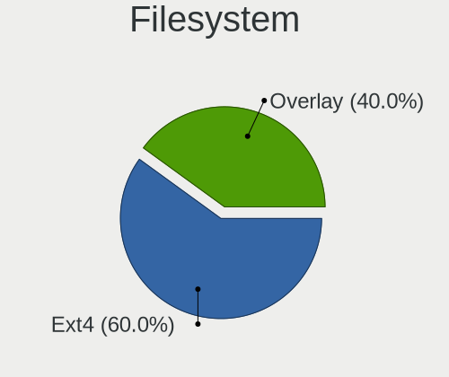
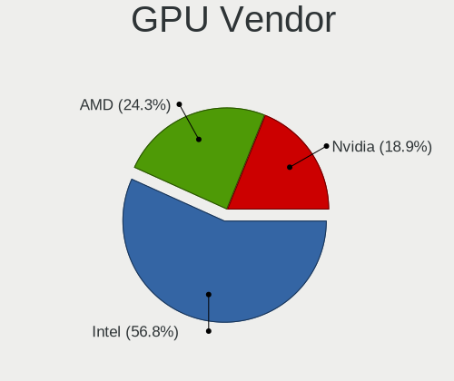
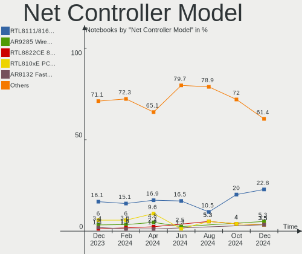

BlackPanther - Hardware Trends (Notebooks)
------------------------------------------

A project to identify most popular hardware characteristics and track their change
over time based on data collected by Linux users at https://Linux-Hardware.org.

Anyone can contribute to this report by the [hw-probe](https://github.com/linuxhw/hw-probe) tool:

    sudo -E hw-probe -all -upload

This report is for one last month. Overall report since the beginning of time: [TestCoverage](https://github.com/linuxhw/TestCoverage)

Period: Sep, 2022.

Contents
--------

* [ System ](#system)
  - [ OS                       ](#os)
  - [ OS Family                ](#os-family)
  - [ Kernel                   ](#kernel)
  - [ Kernel Family            ](#kernel-family)
  - [ Kernel Major Ver.        ](#kernel-major-ver)
  - [ Arch                     ](#arch)
  - [ DE                       ](#de)
  - [ Display Server           ](#display-server)
  - [ Display Manager          ](#display-manager)
  - [ OS Lang                  ](#os-lang)
  - [ Boot Mode                ](#boot-mode)
  - [ Filesystem               ](#filesystem)
  - [ Part. scheme             ](#part-scheme)
  - [ Dual Boot with Linux/BSD ](#dual-boot-with-linuxbsd)
  - [ Dual Boot (Win)          ](#dual-boot-win)

* [ Board ](#board)
  - [ Vendor                   ](#vendor)
  - [ Model                    ](#model)
  - [ Model Family             ](#model-family)
  - [ MFG Year                 ](#mfg-year)
  - [ Form Factor              ](#form-factor)
  - [ Secure Boot              ](#secure-boot)
  - [ Coreboot                 ](#coreboot)
  - [ RAM Size                 ](#ram-size)
  - [ RAM Used                 ](#ram-used)
  - [ Total Drives             ](#total-drives)
  - [ Has CD-ROM               ](#has-cd-rom)
  - [ Has Ethernet             ](#has-ethernet)
  - [ Has WiFi                 ](#has-wifi)
  - [ Has Bluetooth            ](#has-bluetooth)

* [ Location ](#location)
  - [ Country                  ](#country)
  - [ City                     ](#city)

* [ Drives ](#drives)
  - [ Drive Vendor             ](#drive-vendor)
  - [ Drive Model              ](#drive-model)
  - [ HDD Vendor               ](#hdd-vendor)
  - [ SSD Vendor               ](#ssd-vendor)
  - [ Drive Kind               ](#drive-kind)
  - [ Drive Connector          ](#drive-connector)
  - [ Drive Size               ](#drive-size)
  - [ Space Total              ](#space-total)
  - [ Space Used               ](#space-used)
  - [ Malfunc. Drives          ](#malfunc-drives)
  - [ Malfunc. Drive Vendor    ](#malfunc-drive-vendor)
  - [ Malfunc. HDD Vendor      ](#malfunc-hdd-vendor)
  - [ Malfunc. Drive Kind      ](#malfunc-drive-kind)
  - [ Failed Drives            ](#failed-drives)
  - [ Failed Drive Vendor      ](#failed-drive-vendor)
  - [ Drive Status             ](#drive-status)

* [ Storage controller ](#storage-controller)
  - [ Storage Vendor           ](#storage-vendor)
  - [ Storage Model            ](#storage-model)
  - [ Storage Kind             ](#storage-kind)

* [ Processor ](#processor)
  - [ CPU Vendor               ](#cpu-vendor)
  - [ CPU Model                ](#cpu-model)
  - [ CPU Model Family         ](#cpu-model-family)
  - [ CPU Cores                ](#cpu-cores)
  - [ CPU Sockets              ](#cpu-sockets)
  - [ CPU Threads              ](#cpu-threads)
  - [ CPU Op-Modes             ](#cpu-op-modes)
  - [ CPU Microcode            ](#cpu-microcode)
  - [ CPU Microarch            ](#cpu-microarch)

* [ Graphics ](#graphics)
  - [ GPU Vendor               ](#gpu-vendor)
  - [ GPU Model                ](#gpu-model)
  - [ GPU Combo                ](#gpu-combo)
  - [ GPU Driver               ](#gpu-driver)
  - [ GPU Memory               ](#gpu-memory)

* [ Monitor ](#monitor)
  - [ Monitor Vendor           ](#monitor-vendor)
  - [ Monitor Model            ](#monitor-model)
  - [ Monitor Resolution       ](#monitor-resolution)
  - [ Monitor Diagonal         ](#monitor-diagonal)
  - [ Monitor Width            ](#monitor-width)
  - [ Aspect Ratio             ](#aspect-ratio)
  - [ Monitor Area             ](#monitor-area)
  - [ Pixel Density            ](#pixel-density)
  - [ Multiple Monitors        ](#multiple-monitors)

* [ Network ](#network)
  - [ Net Controller Vendor    ](#net-controller-vendor)
  - [ Net Controller Model     ](#net-controller-model)
  - [ Wireless Vendor          ](#wireless-vendor)
  - [ Wireless Model           ](#wireless-model)
  - [ Ethernet Vendor          ](#ethernet-vendor)
  - [ Ethernet Model           ](#ethernet-model)
  - [ Net Controller Kind      ](#net-controller-kind)
  - [ Used Controller          ](#used-controller)
  - [ NICs                     ](#nics)
  - [ IPv6                     ](#ipv6)

* [ Bluetooth ](#bluetooth)
  - [ Bluetooth Vendor         ](#bluetooth-vendor)
  - [ Bluetooth Model          ](#bluetooth-model)

* [ Sound ](#sound)
  - [ Sound Vendor             ](#sound-vendor)
  - [ Sound Model              ](#sound-model)

* [ Memory ](#memory)
  - [ Memory Vendor            ](#memory-vendor)
  - [ Memory Model             ](#memory-model)
  - [ Memory Kind              ](#memory-kind)
  - [ Memory Form Factor       ](#memory-form-factor)
  - [ Memory Size              ](#memory-size)
  - [ Memory Speed             ](#memory-speed)

* [ Printers & scanners ](#printers--scanners)
  - [ Printer Vendor           ](#printer-vendor)
  - [ Printer Model            ](#printer-model)
  - [ Scanner Vendor           ](#scanner-vendor)
  - [ Scanner Model            ](#scanner-model)

* [ Camera ](#camera)
  - [ Camera Vendor            ](#camera-vendor)
  - [ Camera Model             ](#camera-model)

* [ Security ](#security)
  - [ Fingerprint Vendor       ](#fingerprint-vendor)
  - [ Fingerprint Model        ](#fingerprint-model)
  - [ Chipcard Vendor          ](#chipcard-vendor)
  - [ Chipcard Model           ](#chipcard-model)

* [ Unsupported ](#unsupported)
  - [ Unsupported Devices      ](#unsupported-devices)
  - [ Unsupported Device Types ](#unsupported-device-types)

System
------

OS
--

Installed operating systems

| Name              | Notebooks | Percent |
|-------------------|-----------|---------|
| BlackPanther 18.1 | 19        | 100%    |

OS Family
---------

OS without a version

| Name         | Notebooks | Percent |
|--------------|-----------|---------|
| BlackPanther | 19        | 100%    |

Kernel
------

Version of the Linux kernel

| Version             | Notebooks | Percent |
|---------------------|-----------|---------|
| 4.18.16-desktop-1bP | 14        | 73.68%  |
| 5.6.14-desktop-2bP  | 5         | 26.32%  |

Kernel Family
-------------

Linux kernel without a distro release

| Version | Notebooks | Percent |
|---------|-----------|---------|
| 4.18.16 | 14        | 73.68%  |
| 5.6.14  | 5         | 26.32%  |

Kernel Major Ver.
-----------------

Linux kernel major version

| Version | Notebooks | Percent |
|---------|-----------|---------|
| 4.18    | 14        | 73.68%  |
| 5.6     | 5         | 26.32%  |

Arch
----

OS architecture (x86_64, i586, etc.)

| Name   | Notebooks | Percent |
|--------|-----------|---------|
| x86_64 | 19        | 100%    |

DE
--

Desktop Environment

| Name | Notebooks | Percent |
|------|-----------|---------|
| KDE5 | 19        | 100%    |

Display Server
--------------

X11 or Wayland

| Name | Notebooks | Percent |
|------|-----------|---------|
| X11  | 19        | 100%    |

Display Manager
---------------

SDDM, LightDM, etc.

| Name | Notebooks | Percent |
|------|-----------|---------|
| SDDM | 19        | 100%    |

OS Lang
-------

Language

| Lang    | Notebooks | Percent |
|---------|-----------|---------|
| Unknown | 19        | 100%    |

Boot Mode
---------

EFI or BIOS

| Mode | Notebooks | Percent |
|------|-----------|---------|
| BIOS | 12        | 63.16%  |
| EFI  | 7         | 36.84%  |

Filesystem
----------

Type of filesystem

| Type    | Notebooks | Percent |
|---------|-----------|---------|
| Overlay | 17        | 89.47%  |
| Ext4    | 2         | 10.53%  |

Part. scheme
------------

Scheme of partitioning

| Type | Notebooks | Percent |
|------|-----------|---------|
| MBR  | 11        | 57.89%  |
| GPT  | 8         | 42.11%  |

Dual Boot with Linux/BSD
------------------------

Hosting more than one Linux/BSD

| Dual boot | Notebooks | Percent |
|-----------|-----------|---------|
| Yes       | 11        | 57.89%  |
| No        | 8         | 42.11%  |

Dual Boot (Win)
---------------

Hosting Linux and Windows

| Dual boot | Notebooks | Percent |
|-----------|-----------|---------|
| No        | 10        | 52.63%  |
| Yes       | 9         | 47.37%  |

Board
-----

Vendor
------

Motherboard manufacturer

| Name             | Notebooks | Percent |
|------------------|-----------|---------|
| Acer             | 4         | 21.05%  |
| Hewlett-Packard  | 3         | 15.79%  |
| ASUSTek Computer | 3         | 15.79%  |
| Lenovo           | 2         | 10.53%  |
| Dell             | 2         | 10.53%  |
| Toshiba          | 1         | 5.26%   |
| Sony             | 1         | 5.26%   |
| Pegatron         | 1         | 5.26%   |
| Fujitsu          | 1         | 5.26%   |
| eMachines        | 1         | 5.26%   |

Model
-----

Motherboard model

| Name                          | Notebooks | Percent |
|-------------------------------|-----------|---------|
| HP 650                        | 2         | 10.53%  |
| Toshiba Satellite L450        | 1         | 5.26%   |
| Sony SVS13118GBB              | 1         | 5.26%   |
| Pegatron A15                  | 1         | 5.26%   |
| Lenovo IdeaPad 320-17ABR 80YN | 1         | 5.26%   |
| Lenovo IdeaPad 110-15ISK 80UD | 1         | 5.26%   |
| HP Compaq 6710b (KE125ET#ABD) | 1         | 5.26%   |
| Fujitsu LIFEBOOK U745         | 1         | 5.26%   |
| eMachines E725                | 1         | 5.26%   |
| Dell Latitude E6420           | 1         | 5.26%   |
| Dell Latitude E6230           | 1         | 5.26%   |
| ASUS X550CL                   | 1         | 5.26%   |
| ASUS K54HR                    | 1         | 5.26%   |
| ASUS 1015BX                   | 1         | 5.26%   |
| Acer Aspire R3-471T           | 1         | 5.26%   |
| Acer Aspire E1-531            | 1         | 5.26%   |
| Acer Aspire 5820              | 1         | 5.26%   |
| Acer Aspire 5310              | 1         | 5.26%   |

Model Family
------------

Motherboard model prefix

| Name              | Notebooks | Percent |
|-------------------|-----------|---------|
| Acer Aspire       | 4         | 21.05%  |
| Lenovo IdeaPad    | 2         | 10.53%  |
| HP 650            | 2         | 10.53%  |
| Dell Latitude     | 2         | 10.53%  |
| Toshiba Satellite | 1         | 5.26%   |
| Sony SVS13118GBB  | 1         | 5.26%   |
| Pegatron A15      | 1         | 5.26%   |
| HP Compaq         | 1         | 5.26%   |
| Fujitsu LIFEBOOK  | 1         | 5.26%   |
| eMachines E725    | 1         | 5.26%   |
| ASUS X550CL       | 1         | 5.26%   |
| ASUS K54HR        | 1         | 5.26%   |
| ASUS 1015BX       | 1         | 5.26%   |

MFG Year
--------

Motherboard manufacture year

| Year | Notebooks | Percent |
|------|-----------|---------|
| 2012 | 5         | 26.32%  |
| 2011 | 4         | 21.05%  |
| 2014 | 2         | 10.53%  |
| 2009 | 2         | 10.53%  |
| 2017 | 1         | 5.26%   |
| 2016 | 1         | 5.26%   |
| 2013 | 1         | 5.26%   |
| 2010 | 1         | 5.26%   |
| 2008 | 1         | 5.26%   |
| 2007 | 1         | 5.26%   |

Form Factor
-----------

Physical design of the computer

| Name     | Notebooks | Percent |
|----------|-----------|---------|
| Notebook | 19        | 100%    |

Secure Boot
-----------

Enabled or disabled

| State    | Notebooks | Percent |
|----------|-----------|---------|
| Disabled | 19        | 100%    |

Coreboot
--------

Have coreboot on board

| Used | Notebooks | Percent |
|------|-----------|---------|
| No   | 19        | 100%    |

RAM Size
--------

Total RAM memory

| Size in GB | Notebooks | Percent |
|------------|-----------|---------|
| 3.01-4.0   | 10        | 52.63%  |
| 1.01-2.0   | 4         | 21.05%  |
| 4.01-8.0   | 2         | 10.53%  |
| 8.01-16.0  | 2         | 10.53%  |
| 2.01-3.0   | 1         | 5.26%   |

RAM Used
--------

Used RAM memory

| Used GB  | Notebooks | Percent |
|----------|-----------|---------|
| 0.51-1.0 | 15        | 78.95%  |
| 1.01-2.0 | 3         | 15.79%  |
| 0.01-0.5 | 1         | 5.26%   |

Total Drives
------------

Number of drives on board

| Drives | Notebooks | Percent |
|--------|-----------|---------|
| 1      | 18        | 94.74%  |
| 2      | 1         | 5.26%   |

Has CD-ROM
----------

Has CD-ROM on board

| Presented | Notebooks | Percent |
|-----------|-----------|---------|
| Yes       | 14        | 73.68%  |
| No        | 5         | 26.32%  |

Has Ethernet
------------

Has Ethernet on board

| Presented | Notebooks | Percent |
|-----------|-----------|---------|
| Yes       | 18        | 94.74%  |
| No        | 1         | 5.26%   |

Has WiFi
--------

Has WiFi module

| Presented | Notebooks | Percent |
|-----------|-----------|---------|
| Yes       | 19        | 100%    |

Has Bluetooth
-------------

Has Bluetooth module

| Presented | Notebooks | Percent |
|-----------|-----------|---------|
| No        | 12        | 63.16%  |
| Yes       | 7         | 36.84%  |

Location
--------

Country
-------

Geographic location (country)

| Country | Notebooks | Percent |
|---------|-----------|---------|
| Hungary | 15        | 78.95%  |
| USA     | 2         | 10.53%  |
| Israel  | 1         | 5.26%   |
| Germany | 1         | 5.26%   |

City
----

Geographic location (city)

| City             | Notebooks | Percent |
|------------------|-----------|---------|
| Budapest         | 4         | 21.05%  |
| Debrecen         | 2         | 10.53%  |
| Zselickislak     | 1         | 5.26%   |
| Zalaegerszeg     | 1         | 5.26%   |
| Tatabánya       | 1         | 5.26%   |
| Szolnok          | 1         | 5.26%   |
| Niedernberg      | 1         | 5.26%   |
| Nahariya         | 1         | 5.26%   |
| Minneapolis      | 1         | 5.26%   |
| Los Angeles      | 1         | 5.26%   |
| Kazincbarcika    | 1         | 5.26%   |
| Kapuvar          | 1         | 5.26%   |
| Hodmezovasarhely | 1         | 5.26%   |
| Gegeny           | 1         | 5.26%   |
| Dunaharaszti     | 1         | 5.26%   |

Drives
------

Drive Vendor
------------

Hard drive vendors

| Vendor              | Notebooks | Drives | Percent |
|---------------------|-----------|--------|---------|
| WDC                 | 5         | 6      | 23.81%  |
| Seagate             | 4         | 4      | 19.05%  |
| Kingston            | 3         | 3      | 14.29%  |
| Hitachi             | 3         | 3      | 14.29%  |
| Toshiba             | 2         | 2      | 9.52%   |
| Samsung Electronics | 2         | 2      | 9.52%   |
| Solid               | 1         | 1      | 4.76%   |
| PNY                 | 1         | 1      | 4.76%   |

Drive Model
-----------

Hard drive models

| Model                                | Notebooks | Percent |
|--------------------------------------|-----------|---------|
| Seagate ST500LT012-1DG142 500GB      | 2         | 9.09%   |
| Hitachi HTS547550A9E384 500GB        | 2         | 9.09%   |
| WDC WD5000BPVT-24HXZT3 500GB         | 1         | 4.55%   |
| WDC WD5000BEVT-22A0RT0 500GB         | 1         | 4.55%   |
| WDC WD50 00BEVT-22A0RT0 500GB        | 1         | 4.55%   |
| WDC WD3200BPVT-80JJ5T0 320GB         | 1         | 4.55%   |
| WDC WD3200BEVT-08A23T1 320GB         | 1         | 4.55%   |
| WDC WD10JPVX-22JC3T0 1TB             | 1         | 4.55%   |
| Toshiba MK8037GSX 80GB               | 1         | 4.55%   |
| Toshiba MK2555GSX 250GB              | 1         | 4.55%   |
| Solid SSD0240S00 240GB               | 1         | 4.55%   |
| Seagate ST9500325AS 500GB            | 1         | 4.55%   |
| Seagate BUP Ultra Touch 2TB          | 1         | 4.55%   |
| Samsung SSD 830 Series 128GB         | 1         | 4.55%   |
| Samsung MZ7LN256HCHP-00000 256GB SSD | 1         | 4.55%   |
| PNY SSD2SC240G1CS1754D117-820 240GB  | 1         | 4.55%   |
| Kingston SNV425S264GB SSD            | 1         | 4.55%   |
| Kingston SA400S37960G 960GB SSD      | 1         | 4.55%   |
| Kingston SA400S37240G 240GB SSD      | 1         | 4.55%   |
| Hitachi HTS723232A7A364 320GB        | 1         | 4.55%   |

HDD Vendor
----------

Hard disk drive vendors

| Vendor  | Notebooks | Drives | Percent |
|---------|-----------|--------|---------|
| WDC     | 5         | 6      | 35.71%  |
| Seagate | 4         | 4      | 28.57%  |
| Hitachi | 3         | 3      | 21.43%  |
| Toshiba | 2         | 2      | 14.29%  |

SSD Vendor
----------

Solid state drive vendors

| Vendor              | Notebooks | Drives | Percent |
|---------------------|-----------|--------|---------|
| Kingston            | 3         | 3      | 42.86%  |
| Samsung Electronics | 2         | 2      | 28.57%  |
| Solid               | 1         | 1      | 14.29%  |
| PNY                 | 1         | 1      | 14.29%  |

Drive Kind
----------

HDD or SSD

| Kind | Notebooks | Drives | Percent |
|------|-----------|--------|---------|
| HDD  | 14        | 15     | 66.67%  |
| SSD  | 7         | 7      | 33.33%  |

Drive Connector
---------------

SATA, SAS, NVMe, etc.

| Type | Notebooks | Drives | Percent |
|------|-----------|--------|---------|
| SATA | 19        | 20     | 90.48%  |
| SAS  | 2         | 2      | 9.52%   |

Drive Size
----------

Size of hard drive

| Size in TB | Notebooks | Drives | Percent |
|------------|-----------|--------|---------|
| 0.01-0.5   | 17        | 19     | 85%     |
| 0.51-1.0   | 2         | 2      | 10%     |
| 1.01-2.0   | 1         | 1      | 5%      |

Space Total
-----------

Amount of disk space available on the file system

| Size in GB | Notebooks | Percent |
|------------|-----------|---------|
| Unknown    | 17        | 89.47%  |
| 101-250    | 1         | 5.26%   |
| 51-100     | 1         | 5.26%   |

Space Used
----------

Amount of used disk space

| Used GB | Notebooks | Percent |
|---------|-----------|---------|
| Unknown | 17        | 89.47%  |
| 1-20    | 2         | 10.53%  |

Malfunc. Drives
---------------

Drive models with a malfunction

| Model                         | Notebooks | Drives | Percent |
|-------------------------------|-----------|--------|---------|
| Hitachi HTS547550A9E384 500GB | 2         | 2      | 28.57%  |
| WDC WD3200BEVT-08A23T1 320GB  | 1         | 1      | 14.29%  |
| Toshiba MK2555GSX 250GB       | 1         | 1      | 14.29%  |
| Seagate ST9500325AS 500GB     | 1         | 1      | 14.29%  |
| Kingston SNV425S264GB SSD     | 1         | 1      | 14.29%  |
| Hitachi HTS723232A7A364 320GB | 1         | 1      | 14.29%  |

Malfunc. Drive Vendor
---------------------

Vendors of faulty drives

| Vendor   | Notebooks | Drives | Percent |
|----------|-----------|--------|---------|
| Hitachi  | 3         | 3      | 42.86%  |
| WDC      | 1         | 1      | 14.29%  |
| Toshiba  | 1         | 1      | 14.29%  |
| Seagate  | 1         | 1      | 14.29%  |
| Kingston | 1         | 1      | 14.29%  |

Malfunc. HDD Vendor
-------------------

Vendors of faulty HDD drives

| Vendor  | Notebooks | Drives | Percent |
|---------|-----------|--------|---------|
| Hitachi | 3         | 3      | 50%     |
| WDC     | 1         | 1      | 16.67%  |
| Toshiba | 1         | 1      | 16.67%  |
| Seagate | 1         | 1      | 16.67%  |

Malfunc. Drive Kind
-------------------

Kinds of faulty drives

| Kind | Notebooks | Drives | Percent |
|------|-----------|--------|---------|
| HDD  | 6         | 6      | 85.71%  |
| SSD  | 1         | 1      | 14.29%  |

Failed Drives
-------------

Failed drive models

| Model                        | Notebooks | Drives | Percent |
|------------------------------|-----------|--------|---------|
| WDC WD5000BEVT-22A0RT0 500GB | 1         | 1      | 100%    |

Failed Drive Vendor
-------------------

Failed drive vendors

| Vendor | Notebooks | Drives | Percent |
|--------|-----------|--------|---------|
| WDC    | 1         | 1      | 100%    |

Drive Status
------------

Number of failed and malfunc. drives

| Status   | Notebooks | Drives | Percent |
|----------|-----------|--------|---------|
| Works    | 12        | 12     | 57.14%  |
| Malfunc  | 6         | 7      | 28.57%  |
| Detected | 2         | 2      | 9.52%   |
| Failed   | 1         | 1      | 4.76%   |

Storage controller
------------------

Storage Vendor
--------------

Storage controller vendors

| Vendor | Notebooks | Percent |
|--------|-----------|---------|
| Intel  | 17        | 89.47%  |
| AMD    | 2         | 10.53%  |

Storage Model
-------------

Storage controller models

| Model                                                                        | Notebooks | Percent |
|------------------------------------------------------------------------------|-----------|---------|
| Intel 7 Series Chipset Family 6-port SATA Controller [AHCI mode]             | 5         | 23.81%  |
| Intel Wildcat Point-LP SATA Controller [AHCI Mode]                           | 2         | 9.52%   |
| Intel 82801IBM/IEM (ICH9M/ICH9M-E) 4 port SATA Controller [AHCI mode]        | 2         | 9.52%   |
| Intel 82801 Mobile SATA Controller [RAID mode]                               | 2         | 9.52%   |
| Intel 6 Series/C200 Series Chipset Family 6 port Mobile SATA AHCI Controller | 2         | 9.52%   |
| Intel Sunrise Point-LP SATA Controller [AHCI mode]                           | 1         | 4.76%   |
| Intel 82801HM/HEM (ICH8M/ICH8M-E) SATA Controller [AHCI mode]                | 1         | 4.76%   |
| Intel 82801HM/HEM (ICH8M/ICH8M-E) IDE Controller                             | 1         | 4.76%   |
| Intel 82801GBM/GHM (ICH7-M Family) SATA Controller [AHCI mode]               | 1         | 4.76%   |
| Intel 82801G (ICH7 Family) IDE Controller                                    | 1         | 4.76%   |
| Intel 5 Series/3400 Series Chipset 4 port SATA AHCI Controller               | 1         | 4.76%   |
| AMD SB7x0/SB8x0/SB9x0 SATA Controller [AHCI mode]                            | 1         | 4.76%   |
| AMD FCH SATA Controller [AHCI mode]                                          | 1         | 4.76%   |

Storage Kind
------------

Kind of storage controller (IDE, SATA, NVMe, SAS, ...)

| Kind | Notebooks | Percent |
|------|-----------|---------|
| SATA | 17        | 80.95%  |
| RAID | 2         | 9.52%   |
| IDE  | 2         | 9.52%   |

Processor
---------

CPU Vendor
----------

Processor vendors

| Vendor | Notebooks | Percent |
|--------|-----------|---------|
| Intel  | 17        | 89.47%  |
| AMD    | 2         | 10.53%  |

CPU Model
---------

Processor models

| Model                                           | Notebooks | Percent |
|-------------------------------------------------|-----------|---------|
| Intel Celeron CPU B830 @ 1.80GHz                | 2         | 10.53%  |
| Intel Pentium Dual-Core CPU T4400 @ 2.20GHz     | 1         | 5.26%   |
| Intel Pentium CPU 2117U @ 1.80GHz               | 1         | 5.26%   |
| Intel Pentium CPU 2020M @ 2.40GHz               | 1         | 5.26%   |
| Intel Core i7-5600U CPU @ 2.60GHz               | 1         | 5.26%   |
| Intel Core i5-5200U CPU @ 2.20GHz               | 1         | 5.26%   |
| Intel Core i5-3340M CPU @ 2.70GHz               | 1         | 5.26%   |
| Intel Core i5-3210M CPU @ 2.50GHz               | 1         | 5.26%   |
| Intel Core i5-2520M CPU @ 2.50GHz               | 1         | 5.26%   |
| Intel Core i3-6100U CPU @ 2.30GHz               | 1         | 5.26%   |
| Intel Core i3 CPU M 380 @ 2.53GHz               | 1         | 5.26%   |
| Intel Core 2 Duo CPU T8300 @ 2.40GHz            | 1         | 5.26%   |
| Intel Celeron M CPU 520 @ 1.60GHz               | 1         | 5.26%   |
| Intel Celeron CPU B815 @ 1.60GHz                | 1         | 5.26%   |
| Intel Celeron CPU B800 @ 1.50GHz                | 1         | 5.26%   |
| Intel Celeron CPU 900 @ 2.20GHz                 | 1         | 5.26%   |
| AMD C-60 APU with Radeon HD Graphics            | 1         | 5.26%   |
| AMD A12-9720P RADEON R7, 12 COMPUTE CORES 4C+8G | 1         | 5.26%   |

CPU Model Family
----------------

Processor model prefix

| Model                   | Notebooks | Percent |
|-------------------------|-----------|---------|
| Intel Celeron           | 5         | 26.32%  |
| Intel Core i5           | 4         | 21.05%  |
| Intel Pentium           | 2         | 10.53%  |
| Intel Core i3           | 2         | 10.53%  |
| Intel Pentium Dual-Core | 1         | 5.26%   |
| Intel Core i7           | 1         | 5.26%   |
| Intel Core 2 Duo        | 1         | 5.26%   |
| Intel Celeron M         | 1         | 5.26%   |
| AMD C-60                | 1         | 5.26%   |
| AMD A12                 | 1         | 5.26%   |

CPU Cores
---------

Number of processor cores

| Number | Notebooks | Percent |
|--------|-----------|---------|
| 2      | 17        | 89.47%  |
| 1      | 2         | 10.53%  |

CPU Sockets
-----------

Number of sockets

| Number | Notebooks | Percent |
|--------|-----------|---------|
| 1      | 19        | 100%    |

CPU Threads
-----------

Threads per core (Hyper-Threading)

| Number | Notebooks | Percent |
|--------|-----------|---------|
| 1      | 11        | 57.89%  |
| 2      | 8         | 42.11%  |

CPU Op-Modes
------------

CPU Operation Modes (32-bit, 64-bit)

| Op mode        | Notebooks | Percent |
|----------------|-----------|---------|
| 32-bit, 64-bit | 19        | 100%    |

CPU Microcode
-------------

Microcode number

| Number     | Notebooks | Percent |
|------------|-----------|---------|
| 0x206a7    | 5         | 26.32%  |
| 0x306a9    | 4         | 21.05%  |
| 0x306d4    | 2         | 10.53%  |
| 0x1067a    | 2         | 10.53%  |
| 0x6f6      | 1         | 5.26%   |
| 0x406e3    | 1         | 5.26%   |
| 0x20655    | 1         | 5.26%   |
| 0x10676    | 1         | 5.26%   |
| 0x06006118 | 1         | 5.26%   |
| 0x05000119 | 1         | 5.26%   |

CPU Microarch
-------------

Microarchitecture

| Name        | Notebooks | Percent |
|-------------|-----------|---------|
| SandyBridge | 5         | 26.32%  |
| IvyBridge   | 4         | 21.05%  |
| Penryn      | 3         | 15.79%  |
| Broadwell   | 2         | 10.53%  |
| Westmere    | 1         | 5.26%   |
| Skylake     | 1         | 5.26%   |
| Excavator   | 1         | 5.26%   |
| Core        | 1         | 5.26%   |
| Bobcat      | 1         | 5.26%   |

Graphics
--------

GPU Vendor
----------

Vendors of graphics cards

| Vendor | Notebooks | Percent |
|--------|-----------|---------|
| Intel  | 16        | 76.19%  |
| AMD    | 3         | 14.29%  |
| Nvidia | 2         | 9.52%   |

GPU Model
---------

Graphics card models

| Model                                                                                 | Notebooks | Percent |
|---------------------------------------------------------------------------------------|-----------|---------|
| Intel 3rd Gen Core processor Graphics Controller                                      | 4         | 16.67%  |
| Intel 2nd Generation Core Processor Family Integrated Graphics Controller             | 4         | 16.67%  |
| Intel Mobile 4 Series Chipset Integrated Graphics Controller                          | 2         | 8.33%   |
| Intel HD Graphics 5500                                                                | 2         | 8.33%   |
| Nvidia GK107M [GeForce GT 640M LE]                                                    | 1         | 4.17%   |
| Nvidia GF117M [GeForce 610M/710M/810M/820M / GT 620M/625M/630M/720M]                  | 1         | 4.17%   |
| Intel Skylake GT2 [HD Graphics 520]                                                   | 1         | 4.17%   |
| Intel Mobile GM965/GL960 Integrated Graphics Controller (secondary)                   | 1         | 4.17%   |
| Intel Mobile GM965/GL960 Integrated Graphics Controller (primary)                     | 1         | 4.17%   |
| Intel Mobile 945GM/GMS/GME, 943/940GML Express Integrated Graphics Controller         | 1         | 4.17%   |
| Intel Mobile 945GM/GMS, 943/940GML Express Integrated Graphics Controller             | 1         | 4.17%   |
| Intel Core Processor Integrated Graphics Controller                                   | 1         | 4.17%   |
| AMD Wrestler [Radeon HD 6290]                                                         | 1         | 4.17%   |
| AMD Wani [Radeon R5/R6/R7 Graphics]                                                   | 1         | 4.17%   |
| AMD Topaz XT [Radeon R7 M260/M265 / M340/M360 / M440/M445 / 530/535 / 620/625 Mobile] | 1         | 4.17%   |
| AMD Seymour [Radeon HD 6400M/7400M Series]                                            | 1         | 4.17%   |

GPU Combo
---------

Combinations of graphics cards

| Name           | Notebooks | Percent |
|----------------|-----------|---------|
| 1 x Intel      | 14        | 73.68%  |
| Intel + Nvidia | 2         | 10.53%  |
| 1 x AMD        | 2         | 10.53%  |
| 2 x AMD        | 1         | 5.26%   |

GPU Driver
----------

Free vs proprietary

| Driver | Notebooks | Percent |
|--------|-----------|---------|
| Free   | 19        | 100%    |

GPU Memory
----------

Total video memory

| Size in GB | Notebooks | Percent |
|------------|-----------|---------|
| Unknown    | 14        | 73.68%  |
| 0.51-1.0   | 3         | 15.79%  |
| 0.01-0.5   | 2         | 10.53%  |

Monitor
-------

Monitor Vendor
--------------

Monitor vendors

| Vendor                  | Notebooks | Percent |
|-------------------------|-----------|---------|
| LG Display              | 6         | 33.33%  |
| AU Optronics            | 6         | 33.33%  |
| Chimei Innolux          | 2         | 11.11%  |
| BOE                     | 2         | 11.11%  |
| InfoVision              | 1         | 5.56%   |
| Chi Mei Optoelectronics | 1         | 5.56%   |

Monitor Model
-------------

Monitor models

| Model                                                                    | Notebooks | Percent |
|--------------------------------------------------------------------------|-----------|---------|
| LG Display LCD Monitor LGD02DC 1366x768 344x194mm 15.5-inch              | 2         | 11.11%  |
| AU Optronics LCD Monitor AUO23EC 1366x768 344x193mm 15.5-inch            | 2         | 11.11%  |
| LG Display LCD Monitor LGD6302 1366x768 344x194mm 15.5-inch              | 1         | 5.56%   |
| LG Display LCD Monitor LGD2297 1366x768 345x194mm 15.6-inch              | 1         | 5.56%   |
| LG Display LCD Monitor LGD036C 1366x768 277x156mm 12.5-inch              | 1         | 5.56%   |
| LG Display LCD Monitor LGD02DF 1600x900 310x174mm 14.0-inch              | 1         | 5.56%   |
| InfoVision LCD Monitor IVO03F4 1024x600 223x125mm 10.1-inch              | 1         | 5.56%   |
| Chimei Innolux LCD Monitor CMN14C3 1366x768 309x173mm 13.9-inch          | 1         | 5.56%   |
| Chimei Innolux LCD Monitor CMN1340 1600x900 294x165mm 13.3-inch          | 1         | 5.56%   |
| Chi Mei Optoelectronics LCD Monitor CMO1524 1280x800 331x207mm 15.4-inch | 1         | 5.56%   |
| BOE LCD Monitor BOE0685 1600x900 382x215mm 17.3-inch                     | 1         | 5.56%   |
| BOE LCD Monitor BOE0672 1366x768 344x194mm 15.5-inch                     | 1         | 5.56%   |
| AU Optronics LCD Monitor AUO8174 1280x800 331x207mm 15.4-inch            | 1         | 5.56%   |
| AU Optronics LCD Monitor AUO293C 1366x768 309x173mm 13.9-inch            | 1         | 5.56%   |
| AU Optronics LCD Monitor AUO20EC 1366x768 344x193mm 15.5-inch            | 1         | 5.56%   |
| AU Optronics LCD Monitor AUO10EC 1366x768 344x193mm 15.5-inch            | 1         | 5.56%   |

Monitor Resolution
------------------

Monitor screen resolution

| Resolution        | Notebooks | Percent |
|-------------------|-----------|---------|
| 1366x768 (WXGA)   | 12        | 66.67%  |
| 1600x900 (HD+)    | 3         | 16.67%  |
| 1280x800 (WXGA)   | 2         | 11.11%  |
| 1920x1200 (WUXGA) | 1         | 5.56%   |

Monitor Diagonal
----------------

Diagonal size in inches

| Inches | Notebooks | Percent |
|--------|-----------|---------|
| 15     | 12        | 66.67%  |
| 13     | 3         | 16.67%  |
| 17     | 1         | 5.56%   |
| 14     | 1         | 5.56%   |
| 12     | 1         | 5.56%   |

Monitor Width
-------------

Physical width

| Width in mm | Notebooks | Percent |
|-------------|-----------|---------|
| 301-350     | 15        | 83.33%  |
| 201-300     | 2         | 11.11%  |
| 351-400     | 1         | 5.56%   |

Aspect Ratio
------------

Proportional relationship between the width and the height

| Ratio | Notebooks | Percent |
|-------|-----------|---------|
| 16/9  | 16        | 88.89%  |
| 16/10 | 2         | 11.11%  |

Monitor Area
------------

Area in inch²

| Area in inch² | Notebooks | Percent |
|----------------|-----------|---------|
| 101-110        | 12        | 66.67%  |
| 81-90          | 3         | 16.67%  |
| 71-80          | 1         | 5.56%   |
| 61-70          | 1         | 5.56%   |
| 121-130        | 1         | 5.56%   |

Pixel Density
-------------

Pixels per inch

| Density | Notebooks | Percent |
|---------|-----------|---------|
| 101-120 | 13        | 72.22%  |
| 121-160 | 3         | 16.67%  |
| 51-100  | 2         | 11.11%  |

Multiple Monitors
-----------------

Total monitors connected

| Total | Notebooks | Percent |
|-------|-----------|---------|
| 1     | 19        | 100%    |

Network
-------

Net Controller Vendor
---------------------

Controller vendors

| Vendor                | Notebooks | Percent |
|-----------------------|-----------|---------|
| Qualcomm Atheros      | 11        | 32.35%  |
| Realtek Semiconductor | 8         | 23.53%  |
| Intel                 | 5         | 14.71%  |
| Broadcom Limited      | 3         | 8.82%   |
| Broadcom              | 3         | 8.82%   |
| TP-Link               | 1         | 2.94%   |
| Ralink                | 1         | 2.94%   |
| Huawei Technologies   | 1         | 2.94%   |
| Attansic Technology   | 1         | 2.94%   |

Net Controller Model
--------------------

Controller models

| Model                                                             | Notebooks | Percent |
|-------------------------------------------------------------------|-----------|---------|
| Realtek RTL8111/8168/8411 PCI Express Gigabit Ethernet Controller | 6         | 15.38%  |
| Qualcomm Atheros AR9485 Wireless Network Adapter                  | 3         | 7.69%   |
| Qualcomm Atheros QCA9565 / AR9565 Wireless Network Adapter        | 2         | 5.13%   |
| Qualcomm Atheros AR9285 Wireless Network Adapter (PCI-Express)    | 2         | 5.13%   |
| Qualcomm Atheros AR8151 v2.0 Gigabit Ethernet                     | 2         | 5.13%   |
| Intel 82579LM Gigabit Network Connection (Lewisville)             | 2         | 5.13%   |
| Broadcom Limited NetLink BCM5787M Gigabit Ethernet PCI Express    | 2         | 5.13%   |
| TP-Link TL-WN821N v5/v6 [RTL8192EU]                               | 1         | 2.56%   |
| Realtek RTL8821AE 802.11ac PCIe Wireless Network Adapter          | 1         | 2.56%   |
| Realtek RTL8187B Wireless Adapter                                 | 1         | 2.56%   |
| Realtek RTL810xE PCI Express Fast Ethernet controller             | 1         | 2.56%   |
| Ralink RT5390 Wireless 802.11n 1T/1R PCIe                         | 1         | 2.56%   |
| Qualcomm Atheros QCA9377 802.11ac Wireless Network Adapter        | 1         | 2.56%   |
| Qualcomm Atheros AR9287 Wireless Network Adapter (PCI-Express)    | 1         | 2.56%   |
| Qualcomm Atheros AR8151 v1.0 Gigabit Ethernet                     | 1         | 2.56%   |
| Qualcomm Atheros AR8132 Fast Ethernet                             | 1         | 2.56%   |
| Intel Wireless 7265                                               | 1         | 2.56%   |
| Intel Wireless 3160                                               | 1         | 2.56%   |
| Intel PRO/Wireless 3945ABG [Golan] Network Connection             | 1         | 2.56%   |
| Intel Ethernet Connection (3) I218-LM                             | 1         | 2.56%   |
| Intel Centrino Advanced-N 6205 [Taylor Peak]                      | 1         | 2.56%   |
| Huawei EM770W miniPCI WCDMA Modem                                 | 1         | 2.56%   |
| Broadcom NetLink BCM57785 Gigabit Ethernet PCIe                   | 1         | 2.56%   |
| Broadcom Limited BCM4312 802.11b/g LP-PHY                         | 1         | 2.56%   |
| Broadcom BCM4313 802.11bgn Wireless Network Adapter               | 1         | 2.56%   |
| Broadcom BCM4311 802.11b/g WLAN                                   | 1         | 2.56%   |
| Attansic AR8152 v2.0 Fast Ethernet                                | 1         | 2.56%   |

Wireless Vendor
---------------

Wireless vendors

| Vendor                | Notebooks | Percent |
|-----------------------|-----------|---------|
| Qualcomm Atheros      | 9         | 45%     |
| Intel                 | 4         | 20%     |
| Realtek Semiconductor | 2         | 10%     |
| Broadcom              | 2         | 10%     |
| TP-Link               | 1         | 5%      |
| Ralink                | 1         | 5%      |
| Broadcom Limited      | 1         | 5%      |

Wireless Model
--------------

Wireless models

| Model                                                          | Notebooks | Percent |
|----------------------------------------------------------------|-----------|---------|
| Qualcomm Atheros AR9485 Wireless Network Adapter               | 3         | 15%     |
| Qualcomm Atheros QCA9565 / AR9565 Wireless Network Adapter     | 2         | 10%     |
| Qualcomm Atheros AR9285 Wireless Network Adapter (PCI-Express) | 2         | 10%     |
| TP-Link TL-WN821N v5/v6 [RTL8192EU]                            | 1         | 5%      |
| Realtek RTL8821AE 802.11ac PCIe Wireless Network Adapter       | 1         | 5%      |
| Realtek RTL8187B Wireless Adapter                              | 1         | 5%      |
| Ralink RT5390 Wireless 802.11n 1T/1R PCIe                      | 1         | 5%      |
| Qualcomm Atheros QCA9377 802.11ac Wireless Network Adapter     | 1         | 5%      |
| Qualcomm Atheros AR9287 Wireless Network Adapter (PCI-Express) | 1         | 5%      |
| Intel Wireless 7265                                            | 1         | 5%      |
| Intel Wireless 3160                                            | 1         | 5%      |
| Intel PRO/Wireless 3945ABG [Golan] Network Connection          | 1         | 5%      |
| Intel Centrino Advanced-N 6205 [Taylor Peak]                   | 1         | 5%      |
| Broadcom Limited BCM4312 802.11b/g LP-PHY                      | 1         | 5%      |
| Broadcom BCM4313 802.11bgn Wireless Network Adapter            | 1         | 5%      |
| Broadcom BCM4311 802.11b/g WLAN                                | 1         | 5%      |

Ethernet Vendor
---------------

Ethernet vendors

| Vendor                | Notebooks | Percent |
|-----------------------|-----------|---------|
| Realtek Semiconductor | 7         | 38.89%  |
| Qualcomm Atheros      | 4         | 22.22%  |
| Intel                 | 3         | 16.67%  |
| Broadcom Limited      | 2         | 11.11%  |
| Broadcom              | 1         | 5.56%   |
| Attansic Technology   | 1         | 5.56%   |

Ethernet Model
--------------

Ethernet models

| Model                                                             | Notebooks | Percent |
|-------------------------------------------------------------------|-----------|---------|
| Realtek RTL8111/8168/8411 PCI Express Gigabit Ethernet Controller | 6         | 33.33%  |
| Qualcomm Atheros AR8151 v2.0 Gigabit Ethernet                     | 2         | 11.11%  |
| Intel 82579LM Gigabit Network Connection (Lewisville)             | 2         | 11.11%  |
| Broadcom Limited NetLink BCM5787M Gigabit Ethernet PCI Express    | 2         | 11.11%  |
| Realtek RTL810xE PCI Express Fast Ethernet controller             | 1         | 5.56%   |
| Qualcomm Atheros AR8151 v1.0 Gigabit Ethernet                     | 1         | 5.56%   |
| Qualcomm Atheros AR8132 Fast Ethernet                             | 1         | 5.56%   |
| Intel Ethernet Connection (3) I218-LM                             | 1         | 5.56%   |
| Broadcom NetLink BCM57785 Gigabit Ethernet PCIe                   | 1         | 5.56%   |
| Attansic AR8152 v2.0 Fast Ethernet                                | 1         | 5.56%   |

Net Controller Kind
-------------------

Ethernet, WiFi or modem

| Kind     | Notebooks | Percent |
|----------|-----------|---------|
| WiFi     | 19        | 50%     |
| Ethernet | 18        | 47.37%  |
| Modem    | 1         | 2.63%   |

Used Controller
---------------

Currently used network controller

| Kind     | Notebooks | Percent |
|----------|-----------|---------|
| WiFi     | 18        | 94.74%  |
| Ethernet | 1         | 5.26%   |

NICs
----

Total network controllers on board

| Total | Notebooks | Percent |
|-------|-----------|---------|
| 2     | 18        | 94.74%  |
| 0     | 1         | 5.26%   |

IPv6
----

IPv6 vs IPv4

| Used | Notebooks | Percent |
|------|-----------|---------|
| No   | 13        | 68.42%  |
| Yes  | 6         | 31.58%  |

Bluetooth
---------

Bluetooth Vendor
----------------

Controller vendors

| Vendor                          | Notebooks | Percent |
|---------------------------------|-----------|---------|
| Qualcomm Atheros Communications | 3         | 42.86%  |
| Realtek Semiconductor           | 1         | 14.29%  |
| Intel                           | 1         | 14.29%  |
| Hewlett-Packard                 | 1         | 14.29%  |
| Foxconn / Hon Hai               | 1         | 14.29%  |

Bluetooth Model
---------------

Controller models

| Model                                           | Notebooks | Percent |
|-------------------------------------------------|-----------|---------|
| Qualcomm Atheros AR3012 Bluetooth               | 2         | 28.57%  |
| Realtek Bluetooth Radio                         | 1         | 14.29%  |
| Qualcomm Atheros  Bluetooth Device              | 1         | 14.29%  |
| Intel Bluetooth wireless interface              | 1         | 14.29%  |
| HP Bluetooth 2.0 Interface [Broadcom BCM2045]   | 1         | 14.29%  |
| Foxconn / Hon Hai Bluetooth USB Host Controller | 1         | 14.29%  |

Sound
-----

Sound Vendor
------------

Sound card vendors

| Vendor | Notebooks | Percent |
|--------|-----------|---------|
| Intel  | 17        | 85%     |
| AMD    | 3         | 15%     |

Sound Model
-----------

Sound card models

| Model                                                                             | Notebooks | Percent |
|-----------------------------------------------------------------------------------|-----------|---------|
| Intel 7 Series/C216 Chipset Family High Definition Audio Controller               | 6         | 25%     |
| Intel 6 Series/C200 Series Chipset Family High Definition Audio Controller        | 3         | 12.5%   |
| Intel Wildcat Point-LP High Definition Audio Controller                           | 2         | 8.33%   |
| Intel Broadwell-U Audio Controller                                                | 2         | 8.33%   |
| Intel 82801I (ICH9 Family) HD Audio Controller                                    | 2         | 8.33%   |
| Intel Sunrise Point-LP HD Audio                                                   | 1         | 4.17%   |
| Intel NM10/ICH7 Family High Definition Audio Controller                           | 1         | 4.17%   |
| Intel 82801H (ICH8 Family) HD Audio Controller                                    | 1         | 4.17%   |
| Intel 5 Series/3400 Series Chipset High Definition Audio                          | 1         | 4.17%   |
| AMD Wrestler HDMI Audio                                                           | 1         | 4.17%   |
| AMD SBx00 Azalia (Intel HDA)                                                      | 1         | 4.17%   |
| AMD Kabini HDMI/DP Audio                                                          | 1         | 4.17%   |
| AMD Family 15h (Models 60h-6fh) Audio Controller                                  | 1         | 4.17%   |
| AMD Caicos HDMI Audio [Radeon HD 6450 / 7450/8450/8490 OEM / R5 230/235/235X OEM] | 1         | 4.17%   |

Memory
------

Memory Vendor
-------------

Memory module vendors

| Vendor              | Notebooks | Percent |
|---------------------|-----------|---------|
| Unknown             | 4         | 19.05%  |
| SK hynix            | 4         | 19.05%  |
| Samsung Electronics | 4         | 19.05%  |
| Nanya Technology    | 3         | 14.29%  |
| Micron Technology   | 2         | 9.52%   |
| Transcend           | 1         | 4.76%   |
| Toshiba             | 1         | 4.76%   |
| Kingston            | 1         | 4.76%   |
| Elpida              | 1         | 4.76%   |

Memory Model
------------

Memory module models

| Model                                                     | Notebooks | Percent |
|-----------------------------------------------------------|-----------|---------|
| SK hynix RAM HMT451S6BFR8A-PB 4096MB SODIMM DDR3 1600MT/s | 2         | 8.7%    |
| Samsung RAM M471B5273DH0-CK0 4096MB SODIMM DDR3 1600MT/s  | 2         | 8.7%    |
| Unknown RAM Module 4096MB SODIMM DDR3                     | 1         | 4.35%   |
| Unknown RAM Module 2048MB SODIMM DDR3 1333MT/s            | 1         | 4.35%   |
| Unknown RAM Module 2048MB SODIMM 800MT/s                  | 1         | 4.35%   |
| Unknown RAM Module 1024MB SODIMM DDR2                     | 1         | 4.35%   |
| Transcend RAM TS256MSK64V3N 2048MB SODIMM DDR3 1333MT/s   | 1         | 4.35%   |
| Toshiba RAM 8HTF12864HDY-800G1 1024MB SODIMM 1066MT/s     | 1         | 4.35%   |
| Toshiba RAM 64T128020EDL2.5C2 2048MB SODIMM 1066MT/s      | 1         | 4.35%   |
| SK hynix RAM Module 4096MB SODIMM DDR3 1600MT/s           | 1         | 4.35%   |
| SK hynix RAM HMT351S6CFR8C-H9 4096MB SODIMM DDR3 1333MT/s | 1         | 4.35%   |
| SK hynix RAM HMT325S6BFR8C-H9 2GB SODIMM DDR3 1600MT/s    | 1         | 4.35%   |
| Samsung RAM M471A5244CB0-CRC 4GB SODIMM DDR4 2667MT/s     | 1         | 4.35%   |
| Samsung RAM M471A5244BB0-CPB 4GB SODIMM DDR4 2400MT/s     | 1         | 4.35%   |
| Nanya RAM NT4GC64C88B1NS-DI 4096MB SODIMM DDR3 1600MT/s   | 1         | 4.35%   |
| Nanya RAM NT4GC64B8HG0NS-CG 4GB SODIMM DDR3 1334MT/s      | 1         | 4.35%   |
| Nanya RAM NT2GC64B8HC0NS-CG 2GB SODIMM DDR3 1334MT/s      | 1         | 4.35%   |
| Micron RAM Module 4096MB SODIMM DDR3 1600MT/s             | 1         | 4.35%   |
| Micron RAM 16HTF25664HY-667E1 2048MB SODIMM DDR2 667MT/s  | 1         | 4.35%   |
| Kingston RAM ACR16D3LS1NGG/4G 4096MB SODIMM DDR3 1600MT/s | 1         | 4.35%   |
| Elpida RAM EBJ40UG8EFU0 4096MB SODIMM DDR3 1600MT/s       | 1         | 4.35%   |

Memory Kind
-----------

Memory module kinds

| Kind    | Notebooks | Percent |
|---------|-----------|---------|
| DDR3    | 13        | 68.42%  |
| DDR2    | 3         | 15.79%  |
| DDR4    | 2         | 10.53%  |
| Unknown | 1         | 5.26%   |

Memory Form Factor
------------------

Physical design of the memory module

| Name   | Notebooks | Percent |
|--------|-----------|---------|
| SODIMM | 19        | 100%    |

Memory Size
-----------

Memory module size

| Size | Notebooks | Percent |
|------|-----------|---------|
| 4096 | 12        | 63.16%  |
| 2048 | 5         | 26.32%  |
| 8192 | 1         | 5.26%   |
| 1024 | 1         | 5.26%   |

Memory Speed
------------

Memory module speed

| Speed   | Notebooks | Percent |
|---------|-----------|---------|
| 1600    | 8         | 40%     |
| 1333    | 3         | 15%     |
| 1334    | 2         | 10%     |
| Unknown | 2         | 10%     |
| 2667    | 1         | 5%      |
| 2400    | 1         | 5%      |
| 1066    | 1         | 5%      |
| 800     | 1         | 5%      |
| 667     | 1         | 5%      |

Printers & scanners
-------------------

Printer Vendor
--------------

Printer device vendors

Zero info for selected period =(

Printer Model
-------------

Printer device models

Zero info for selected period =(

Scanner Vendor
--------------

Scanner device vendors

Zero info for selected period =(

Scanner Model
-------------

Scanner device models

Zero info for selected period =(

Camera
------

Camera Vendor
-------------

Camera device vendors

| Vendor                                 | Notebooks | Percent |
|----------------------------------------|-----------|---------|
| Chicony Electronics                    | 3         | 18.75%  |
| Cheng Uei Precision Industry (Foxlink) | 3         | 18.75%  |
| Sunplus Innovation Technology          | 2         | 12.5%   |
| Realtek Semiconductor                  | 2         | 12.5%   |
| IMC Networks                           | 2         | 12.5%   |
| Suyin                                  | 1         | 6.25%   |
| Microdia                               | 1         | 6.25%   |
| ALi                                    | 1         | 6.25%   |
| Alcor Micro                            | 1         | 6.25%   |

Camera Model
------------

Camera device models

| Model                                                         | Notebooks | Percent |
|---------------------------------------------------------------|-----------|---------|
| Cheng Uei Precision Industry (Foxlink) HP Truevision HD       | 2         | 12.5%   |
| Suyin Acer/HP Integrated Webcam [CN0314]                      | 1         | 6.25%   |
| Sunplus USB2.0 Camera                                         | 1         | 6.25%   |
| Sunplus HD WebCam                                             | 1         | 6.25%   |
| Realtek HD WebCam                                             | 1         | 6.25%   |
| Realtek FJ Camera                                             | 1         | 6.25%   |
| Microdia Dell Integrated HD Webcam                            | 1         | 6.25%   |
| IMC Networks USB 2.0 UVC VGA WebCam                           | 1         | 6.25%   |
| IMC Networks EasyCamera                                       | 1         | 6.25%   |
| Chicony USB2.0 HD UVC WebCam                                  | 1         | 6.25%   |
| Chicony EasyCamera                                            | 1         | 6.25%   |
| Chicony Camera                                                | 1         | 6.25%   |
| Cheng Uei Precision Industry (Foxlink) USB2.0 UVC 1.3M Webcam | 1         | 6.25%   |
| ALi Gateway Webcam                                            | 1         | 6.25%   |
| Alcor Micro Asus Integrated Webcam                            | 1         | 6.25%   |

Security
--------

Fingerprint Vendor
------------------

Fingerprint sensor vendors

| Vendor    | Notebooks | Percent |
|-----------|-----------|---------|
| AuthenTec | 2         | 100%    |

Fingerprint Model
-----------------

Fingerprint sensor models

| Model                                | Notebooks | Percent |
|--------------------------------------|-----------|---------|
| AuthenTec AES2501 Fingerprint Sensor | 1         | 50%     |
| AuthenTec AES1660 Fingerprint Sensor | 1         | 50%     |

Chipcard Vendor
---------------

Chipcard module vendors

| Vendor   | Notebooks | Percent |
|----------|-----------|---------|
| O2 Micro | 1         | 50%     |
| Broadcom | 1         | 50%     |

Chipcard Model
--------------

Chipcard module models

| Model                                          | Notebooks | Percent |
|------------------------------------------------|-----------|---------|
| O2 Micro OZ776 CCID Smartcard Reader           | 1         | 50%     |
| Broadcom BCM5880 Secure Applications Processor | 1         | 50%     |

Unsupported
-----------

Unsupported Devices
-------------------

Total unsupported devices on board

| Total | Notebooks | Percent |
|-------|-----------|---------|
| 0     | 14        | 73.68%  |
| 1     | 3         | 15.79%  |
| 2     | 2         | 10.53%  |

Unsupported Device Types
------------------------

Types of unsupported devices

| Type               | Notebooks | Percent |
|--------------------|-----------|---------|
| Fingerprint reader | 2         | 33.33%  |
| Chipcard           | 2         | 33.33%  |
| Storage            | 1         | 16.67%  |
| Flash memory       | 1         | 16.67%  |

