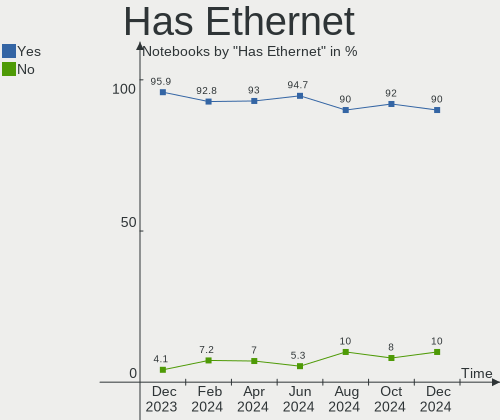
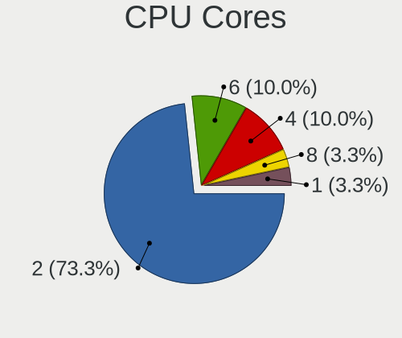
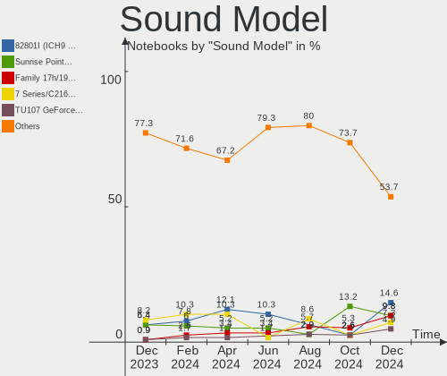

BlackPanther Hardware Trends (Notebook)
---------------------------------------

A project to identify most popular hardware characteristics and track their change
over time based on data collected by BlackPanther users at https://Linux-Hardware.org.

Anyone can contribute to the study by uploading probes of their computers by
the [hw-probe](https://github.com/linuxhw/hw-probe) tool:

    sudo -E hw-probe -all -upload

Full-feature report is available here: https://linux-hardware.org/?view=trends&formfactor=notebook

Period: Jun, 2021.

Contents
--------

- [ OS                       ](#os)
- [ OS Family                ](#os-family)
- [ Kernel                   ](#kernel)
- [ Kernel Family            ](#kernel-family)
- [ Kernel Major Ver.        ](#kernel-major-ver)
- [ Arch                     ](#arch)
- [ DE                       ](#de)
- [ Display Server           ](#display-server)
- [ Display Manager          ](#display-manager)
- [ OS Lang                  ](#os-lang)
- [ Boot Mode                ](#boot-mode)
- [ Filesystem               ](#filesystem)
- [ Part. scheme             ](#part-scheme)
- [ Dual Boot with Linux/BSD ](#dual-boot-with-linux/bsd)
- [ Dual Boot (Win)          ](#dual-boot-win)
- [ Country                  ](#country)
- [ City                     ](#city)
- [ Vendor                   ](#vendor)
- [ Model                    ](#model)
- [ Model Family             ](#model-family)
- [ MFG Year                 ](#mfg-year)
- [ Form Factor              ](#form-factor)
- [ Secure Boot              ](#secure-boot)
- [ Coreboot                 ](#coreboot)
- [ RAM Size                 ](#ram-size)
- [ RAM Used                 ](#ram-used)
- [ Has CD-ROM               ](#has-cd-rom)
- [ Total Drives             ](#total-drives)
- [ Has Ethernet             ](#has-ethernet)
- [ Has WiFi                 ](#has-wifi)
- [ Has Bluetooth            ](#has-bluetooth)
- [ Drive Vendor             ](#drive-vendor)
- [ Drive Model              ](#drive-model)
- [ HDD Vendor               ](#hdd-vendor)
- [ SSD Vendor               ](#ssd-vendor)
- [ Drive Kind               ](#drive-kind)
- [ Drive Connector          ](#drive-connector)
- [ Drive Size               ](#drive-size)
- [ Space Total              ](#space-total)
- [ Space Used               ](#space-used)
- [ Malfunc. Drives          ](#malfunc-drives)
- [ Malfunc. Drive Vendor    ](#malfunc-drive-vendor)
- [ Malfunc. HDD Vendor      ](#malfunc-hdd-vendor)
- [ Malfunc. Drive Kind      ](#malfunc-drive-kind)
- [ Failed Drives            ](#failed-drives)
- [ Failed Drive Vendor      ](#failed-drive-vendor)
- [ Drive Status             ](#drive-status)
- [ Storage Vendor           ](#storage-vendor)
- [ Storage Model            ](#storage-model)
- [ Storage Kind             ](#storage-kind)
- [ CPU Vendor               ](#cpu-vendor)
- [ CPU Model                ](#cpu-model)
- [ CPU Model Family         ](#cpu-model-family)
- [ CPU Cores                ](#cpu-cores)
- [ CPU Sockets              ](#cpu-sockets)
- [ CPU Threads              ](#cpu-threads)
- [ CPU Op-Modes             ](#cpu-op-modes)
- [ CPU Microcode            ](#cpu-microcode)
- [ CPU Microarch            ](#cpu-microarch)
- [ GPU Vendor               ](#gpu-vendor)
- [ GPU Model                ](#gpu-model)
- [ GPU Combo                ](#gpu-combo)
- [ GPU Driver               ](#gpu-driver)
- [ GPU Memory               ](#gpu-memory)
- [ Monitor Vendor           ](#monitor-vendor)
- [ Monitor Model            ](#monitor-model)
- [ Monitor Resolution       ](#monitor-resolution)
- [ Monitor Diagonal         ](#monitor-diagonal)
- [ Monitor Width            ](#monitor-width)
- [ Aspect Ratio             ](#aspect-ratio)
- [ Monitor Area             ](#monitor-area)
- [ Pixel Density            ](#pixel-density)
- [ Multiple Monitors        ](#multiple-monitors)
- [ Net Controller Vendor    ](#net-controller-vendor)
- [ Net Controller Model     ](#net-controller-model)
- [ Wireless Vendor          ](#wireless-vendor)
- [ Wireless Model           ](#wireless-model)
- [ Ethernet Vendor          ](#ethernet-vendor)
- [ Ethernet Model           ](#ethernet-model)
- [ Net Controller Kind      ](#net-controller-kind)
- [ Used Controller          ](#used-controller)
- [ NICs                     ](#nics)
- [ IPv6                     ](#ipv6)
- [ Memory Vendor            ](#memory-vendor)
- [ Memory Model             ](#memory-model)
- [ Memory Kind              ](#memory-kind)
- [ Memory Form Factor       ](#memory-form-factor)
- [ Memory Size              ](#memory-size)
- [ Memory Speed             ](#memory-speed)
- [ Sound Vendor             ](#sound-vendor)
- [ Sound Model              ](#sound-model)
- [ Camera Vendor            ](#camera-vendor)
- [ Camera Model             ](#camera-model)
- [ Fingerprint Vendor       ](#fingerprint-vendor)
- [ Fingerprint Model        ](#fingerprint-model)
- [ Chipcard Vendor          ](#chipcard-vendor)
- [ Chipcard Model           ](#chipcard-model)
- [ Printer Vendor           ](#printer-vendor)
- [ Printer Model            ](#printer-model)
- [ Scanner Vendor           ](#scanner-vendor)
- [ Scanner Model            ](#scanner-model)
- [ Bluetooth Vendor         ](#bluetooth-vendor)
- [ Bluetooth Model          ](#bluetooth-model)
- [ Unsupported Devices      ](#unsupported-devices)
- [ Unsupported Device Types ](#unsupported-device-types)

OS
--

Installed operating systems

| Name              | Notebooks | Percent |
|-------------------|-----------|---------|
| BlackPanther 18.1 | 64        | 100%    |

OS Family
---------

OS without a version

| Name         | Notebooks | Percent |
|--------------|-----------|---------|
| BlackPanther | 64        | 100%    |

Kernel
------

Version of the Linux kernel

| Version             | Notebooks | Percent |
|---------------------|-----------|---------|
| 5.6.14-desktop-2bP  | 53        | 82.81%  |
| 4.18.16-desktop-1bP | 11        | 17.19%  |

Kernel Family
-------------

Linux kernel without a distro release

| Version | Notebooks | Percent |
|---------|-----------|---------|
| 5.6.14  | 53        | 82.81%  |
| 4.18.16 | 11        | 17.19%  |

Kernel Major Ver.
-----------------

Linux kernel major version

| Version | Notebooks | Percent |
|---------|-----------|---------|
| 5.6     | 53        | 82.81%  |
| 4.18    | 11        | 17.19%  |

Arch
----

OS architecture (x86_64, i586, etc.)

| Name   | Notebooks | Percent |
|--------|-----------|---------|
| x86_64 | 64        | 100%    |

DE
--

Desktop Environment

| Name | Notebooks | Percent |
|------|-----------|---------|
| KDE5 | 64        | 100%    |

Display Server
--------------

X11 or Wayland

| Name | Notebooks | Percent |
|------|-----------|---------|
| X11  | 64        | 100%    |

Display Manager
---------------

SDDM, LightDM, etc.

| Name | Notebooks | Percent |
|------|-----------|---------|
| SDDM | 64        | 100%    |

OS Lang
-------

Language

| Lang    | Notebooks | Percent |
|---------|-----------|---------|
| Unknown | 64        | 100%    |

Boot Mode
---------

EFI or BIOS

| Mode | Notebooks | Percent |
|------|-----------|---------|
| BIOS | 39        | 60.94%  |
| EFI  | 25        | 39.06%  |

Filesystem
----------

Type of filesystem

| Type    | Notebooks | Percent |
|---------|-----------|---------|
| Overlay | 51        | 79.69%  |
| Ext4    | 13        | 20.31%  |

Part. scheme
------------

Scheme of partitioning

| Type    | Notebooks | Percent |
|---------|-----------|---------|
| MBR     | 32        | 50%     |
| GPT     | 31        | 48.44%  |
| Unknown | 1         | 1.56%   |

Dual Boot with Linux/BSD
------------------------

Hosting more than one Linux/BSD

| Dual boot | Notebooks | Percent |
|-----------|-----------|---------|
| No        | 43        | 67.19%  |
| Yes       | 21        | 32.81%  |

Dual Boot (Win)
---------------

Hosting Linux and Windows

| Dual boot | Notebooks | Percent |
|-----------|-----------|---------|
| Yes       | 35        | 54.69%  |
| No        | 29        | 45.31%  |

Country
-------

Geographic location (country)

| Country  | Notebooks | Percent |
|----------|-----------|---------|
| Hungary  | 45        | 70.31%  |
| Germany  | 5         | 7.81%   |
| Canada   | 2         | 3.13%   |
| Austria  | 2         | 3.13%   |
| USA      | 1         | 1.56%   |
| UK       | 1         | 1.56%   |
| Spain    | 1         | 1.56%   |
| Slovenia | 1         | 1.56%   |
| Slovakia | 1         | 1.56%   |
| Russia   | 1         | 1.56%   |
| Romania  | 1         | 1.56%   |
| Japan    | 1         | 1.56%   |
| Jamaica  | 1         | 1.56%   |
| France   | 1         | 1.56%   |

City
----

Geographic location (city)

| City              | Notebooks | Percent |
|-------------------|-----------|---------|
| Budapest          | 9         | 14.06%  |
| Pécs             | 4         | 6.25%   |
| Vienna            | 2         | 3.13%   |
| Sajolad           | 2         | 3.13%   |
| Ocsa              | 2         | 3.13%   |
| Miskolc           | 2         | 3.13%   |
| Csolyospalos      | 2         | 3.13%   |
| Ajka              | 2         | 3.13%   |
| Zirc              | 1         | 1.56%   |
| Zhukovskiy        | 1         | 1.56%   |
| Wernberg-Koblitz  | 1         | 1.56%   |
| Veszprém         | 1         | 1.56%   |
| Târgu Mureş     | 1         | 1.56%   |
| Trenčín         | 1         | 1.56%   |
| Toltestava        | 1         | 1.56%   |
| Szentes           | 1         | 1.56%   |
| Szekszárd        | 1         | 1.56%   |
| Sopron            | 1         | 1.56%   |
| Sokoropatka       | 1         | 1.56%   |
| Riesa             | 1         | 1.56%   |
| Puerto Lumbreras  | 1         | 1.56%   |
| Papa              | 1         | 1.56%   |
| Ozd               | 1         | 1.56%   |
| Nyiregyhaza       | 1         | 1.56%   |
| New York          | 1         | 1.56%   |
| Nerima            | 1         | 1.56%   |
| Nagykanizsa       | 1         | 1.56%   |
| Mosonszentmiklos  | 1         | 1.56%   |
| Moose Jaw         | 1         | 1.56%   |
| Maglod            | 1         | 1.56%   |
| Louvres           | 1         | 1.56%   |
| Kunszentmiklos    | 1         | 1.56%   |
| Koper             | 1         | 1.56%   |
| Keszthely         | 1         | 1.56%   |
| Jonesboro         | 1         | 1.56%   |
| Hamburg           | 1         | 1.56%   |
| Gödöllő        | 1         | 1.56%   |
| Győr             | 1         | 1.56%   |
| Gyorszemere       | 1         | 1.56%   |
| Gyongyos          | 1         | 1.56%   |
| Frankfurt am Main | 1         | 1.56%   |
| Enfield           | 1         | 1.56%   |
| Dunaújváros     | 1         | 1.56%   |
| Blackpool         | 1         | 1.56%   |
| Bicske            | 1         | 1.56%   |
| Berlin            | 1         | 1.56%   |
| Berettyóújfalu  | 1         | 1.56%   |

Vendor
------

Motherboard manufacturer

| Name                | Notebooks | Percent |
|---------------------|-----------|---------|
| Lenovo              | 12        | 18.75%  |
| Dell                | 10        | 15.63%  |
| Hewlett-Packard     | 9         | 14.06%  |
| ASUSTek Computer    | 7         | 10.94%  |
| Toshiba             | 5         | 7.81%   |
| Acer                | 5         | 7.81%   |
| Sony                | 3         | 4.69%   |
| Medion              | 2         | 3.13%   |
| Fujitsu             | 2         | 3.13%   |
| W550SU2             | 1         | 1.56%   |
| Timi                | 1         | 1.56%   |
| Samsung Electronics | 1         | 1.56%   |
| Packard Bell        | 1         | 1.56%   |
| MSI                 | 1         | 1.56%   |
| Hungaro Flotta Kft  | 1         | 1.56%   |
| Fujitsu Siemens     | 1         | 1.56%   |
| Apple               | 1         | 1.56%   |
| Alcor               | 1         | 1.56%   |

Model
-----

Motherboard model

| Name                                         | Notebooks | Percent |
|----------------------------------------------|-----------|---------|
| HP 250 G1                                    | 2         | 3.13%   |
| Toshiba Satellite PRO C850-1LZ               | 1         | 1.56%   |
| Toshiba Satellite M50D-A                     | 1         | 1.56%   |
| Toshiba Satellite L300                       | 1         | 1.56%   |
| Toshiba Satellite C660                       | 1         | 1.56%   |
| Toshiba Satellite A200                       | 1         | 1.56%   |
| Timi Mi Gaming Laptop 15.6                   | 1         | 1.56%   |
| Sony VPCEB3L1E                               | 1         | 1.56%   |
| Sony VGN-FZ31S                               | 1         | 1.56%   |
| Sony VGN-CR42S_W                             | 1         | 1.56%   |
| Samsung N150/N210/N220                       | 1         | 1.56%   |
| Packard Bell EasyNote TM86                   | 1         | 1.56%   |
| MSI EX620                                    | 1         | 1.56%   |
| Medion E6220                                 | 1         | 1.56%   |
| Medion AKOYA THE TOUCH 10                    | 1         | 1.56%   |
| Lenovo V145-15AST 81MT                       | 1         | 1.56%   |
| Lenovo ThinkPad X230 2325AC7                 | 1         | 1.56%   |
| Lenovo ThinkPad T440 20B7S27U00              | 1         | 1.56%   |
| Lenovo ThinkPad T410 2537KR6                 | 1         | 1.56%   |
| Lenovo ThinkPad T400 6474W66                 | 1         | 1.56%   |
| Lenovo S10-3                                 | 1         | 1.56%   |
| Lenovo IdeaPad S145-15AST 81N3               | 1         | 1.56%   |
| Lenovo IdeaPad 330-15IKB 81DE                | 1         | 1.56%   |
| Lenovo IdeaPad 320-15IKB 81BG                | 1         | 1.56%   |
| Lenovo IdeaPad 110-15IBR 80T7                | 1         | 1.56%   |
| Lenovo G580 20150                            | 1         | 1.56%   |
| Lenovo G550 20023                            | 1         | 1.56%   |
| Hungaro Flotta Kft Navon Stark NX14 PRO 2018 | 1         | 1.56%   |
| HP ProBook 6470b                             | 1         | 1.56%   |
| HP Presario CQ56                             | 1         | 1.56%   |
| HP Pavilion Laptop 15-cc5xx                  | 1         | 1.56%   |
| HP Laptop 15-bs0xx                           | 1         | 1.56%   |
| HP Compaq 6710b (GR684EA#AKC)                | 1         | 1.56%   |
| HP 650                                       | 1         | 1.56%   |
| HP 2000                                      | 1         | 1.56%   |
| Fujitsu Siemens ESPRIMO Mobile D9500         | 1         | 1.56%   |
| Fujitsu LIFEBOOK S761                        | 1         | 1.56%   |
| Fujitsu LIFEBOOK S760                        | 1         | 1.56%   |
| Dell Vostro 15-3568                          | 1         | 1.56%   |
| Dell Studio XPS 1647                         | 1         | 1.56%   |
| Dell Latitude E7470                          | 1         | 1.56%   |
| Dell Latitude E6430                          | 1         | 1.56%   |
| Dell Latitude E6230                          | 1         | 1.56%   |
| Dell Latitude E5520                          | 1         | 1.56%   |
| Dell Latitude E5430 non-vPro                 | 1         | 1.56%   |
| Dell Latitude E5420                          | 1         | 1.56%   |
| Dell Inspiron 5558                           | 1         | 1.56%   |
| Dell G3 3579                                 | 1         | 1.56%   |
| ASUS X550LN                                  | 1         | 1.56%   |
| ASUS X540LJ                                  | 1         | 1.56%   |
| ASUS TUF Gaming FX506LU_FX506LU              | 1         | 1.56%   |
| ASUS Strix 15 GL503GE                        | 1         | 1.56%   |
| ASUS K53TA                                   | 1         | 1.56%   |
| ASUS K501UX                                  | 1         | 1.56%   |
| ASUS ASUS TUF Gaming A15 FA506IU_FX506IU     | 1         | 1.56%   |
| Apple MacBookPro6,2                          | 1         | 1.56%   |
| Alcor SnugBook Q series                      | 1         | 1.56%   |
| Acer Aspire V3-371                           | 1         | 1.56%   |
| Acer Aspire S7-191                           | 1         | 1.56%   |
| Acer Aspire 7738                             | 1         | 1.56%   |

Model Family
------------

Motherboard model prefix

| Name                     | Notebooks | Percent |
|--------------------------|-----------|---------|
| Dell Latitude            | 6         | 9.38%   |
| Toshiba Satellite        | 5         | 7.81%   |
| Acer Aspire              | 5         | 7.81%   |
| Lenovo ThinkPad          | 4         | 6.25%   |
| Lenovo IdeaPad           | 4         | 6.25%   |
| HP 250                   | 2         | 3.13%   |
| Fujitsu LIFEBOOK         | 2         | 3.13%   |
| Timi Mi                  | 1         | 1.56%   |
| Sony VPCEB3L1E           | 1         | 1.56%   |
| Sony VGN-FZ31S           | 1         | 1.56%   |
| Sony VGN-CR42S           | 1         | 1.56%   |
| Samsung N150             | 1         | 1.56%   |
| Packard Bell EasyNote    | 1         | 1.56%   |
| MSI EX620                | 1         | 1.56%   |
| Medion E6220             | 1         | 1.56%   |
| Medion AKOYA             | 1         | 1.56%   |
| Lenovo V145-15AST        | 1         | 1.56%   |
| Lenovo S10-3             | 1         | 1.56%   |
| Lenovo G580              | 1         | 1.56%   |
| Lenovo G550              | 1         | 1.56%   |
| Hungaro Flotta Kft Navon | 1         | 1.56%   |
| HP ProBook               | 1         | 1.56%   |
| HP Presario              | 1         | 1.56%   |
| HP Pavilion              | 1         | 1.56%   |
| HP Laptop                | 1         | 1.56%   |
| HP Compaq                | 1         | 1.56%   |
| HP 650                   | 1         | 1.56%   |
| HP 2000                  | 1         | 1.56%   |
| Fujitsu Siemens ESPRIMO  | 1         | 1.56%   |
| Dell Vostro              | 1         | 1.56%   |
| Dell Studio              | 1         | 1.56%   |
| Dell Inspiron            | 1         | 1.56%   |
| Dell G3                  | 1         | 1.56%   |
| ASUS X550LN              | 1         | 1.56%   |
| ASUS X540LJ              | 1         | 1.56%   |
| ASUS TUF                 | 1         | 1.56%   |
| ASUS Strix               | 1         | 1.56%   |
| ASUS K53TA               | 1         | 1.56%   |
| ASUS K501UX              | 1         | 1.56%   |
| ASUS ASUS                | 1         | 1.56%   |
| Apple MacBookPro6        | 1         | 1.56%   |
| Alcor SnugBook           | 1         | 1.56%   |
| Unknown                  | 1         | 1.56%   |

MFG Year
--------

Motherboard manufacture year

| Year | Notebooks | Percent |
|------|-----------|---------|
| 2013 | 10        | 15.63%  |
| 2011 | 8         | 12.5%   |
| 2010 | 7         | 10.94%  |
| 2020 | 5         | 7.81%   |
| 2018 | 5         | 7.81%   |
| 2019 | 4         | 6.25%   |
| 2012 | 4         | 6.25%   |
| 2008 | 4         | 6.25%   |
| 2016 | 3         | 4.69%   |
| 2014 | 3         | 4.69%   |
| 2007 | 3         | 4.69%   |
| 2021 | 2         | 3.13%   |
| 2017 | 2         | 3.13%   |
| 2015 | 2         | 3.13%   |
| 2009 | 2         | 3.13%   |

Form Factor
-----------

Physical design of the computer

| Name     | Notebooks | Percent |
|----------|-----------|---------|
| Notebook | 64        | 100%    |

Secure Boot
-----------

Enabled or disabled

| State    | Notebooks | Percent |
|----------|-----------|---------|
| Disabled | 64        | 100%    |

Coreboot
--------

Have coreboot on board

| Used | Notebooks | Percent |
|------|-----------|---------|
| No   | 64        | 100%    |

RAM Size
--------

Total RAM memory

| Size in GB | Notebooks | Percent |
|------------|-----------|---------|
| 3.01-4.0   | 28        | 43.75%  |
| 4.01-8.0   | 17        | 26.56%  |
| 8.01-16.0  | 9         | 14.06%  |
| 1.01-2.0   | 6         | 9.38%   |
| 16.01-24.0 | 3         | 4.69%   |
| 2.01-3.0   | 1         | 1.56%   |

RAM Used
--------

Used RAM memory

| Used GB  | Notebooks | Percent |
|----------|-----------|---------|
| 1.01-2.0 | 27        | 42.19%  |
| 0.51-1.0 | 26        | 40.63%  |
| 0.01-0.5 | 11        | 17.19%  |

Has CD-ROM
----------

Has CD-ROM on board

| Presented | Notebooks | Percent |
|-----------|-----------|---------|
| Yes       | 36        | 56.25%  |
| No        | 28        | 43.75%  |

Total Drives
------------

Number of drives on board

| Drives | Notebooks | Percent |
|--------|-----------|---------|
| 1      | 41        | 64.06%  |
| 2      | 20        | 31.25%  |
| 3      | 2         | 3.13%   |
| 0      | 1         | 1.56%   |

Has Ethernet
------------

Has Ethernet on board

| Presented | Notebooks | Percent |
|-----------|-----------|---------|
| Yes       | 61        | 95.31%  |
| No        | 3         | 4.69%   |

Has WiFi
--------

Has WiFi module

| Presented | Notebooks | Percent |
|-----------|-----------|---------|
| Yes       | 63        | 98.44%  |
| No        | 1         | 1.56%   |

Has Bluetooth
-------------

Has Bluetooth module

| Presented | Notebooks | Percent |
|-----------|-----------|---------|
| Yes       | 47        | 73.44%  |
| No        | 17        | 26.56%  |

Drive Vendor
------------

Hard drive vendors

| Vendor              | Notebooks | Drives | Percent |
|---------------------|-----------|--------|---------|
| Seagate             | 17        | 17     | 21.25%  |
| WDC                 | 11        | 12     | 13.75%  |
| Toshiba             | 8         | 8      | 10%     |
| Kingston            | 8         | 8      | 10%     |
| Samsung Electronics | 6         | 6      | 7.5%    |
| HGST                | 4         | 4      | 5%      |
| Micron Technology   | 3         | 3      | 3.75%   |
| Intel               | 3         | 3      | 3.75%   |
| Hitachi             | 3         | 3      | 3.75%   |
| Unknown             | 2         | 2      | 2.5%    |
| SanDisk             | 2         | 2      | 2.5%    |
| PNY                 | 2         | 2      | 2.5%    |
| ZTE                 | 1         | 1      | 1.25%   |
| SPCC                | 1         | 1      | 1.25%   |
| sobetter            | 1         | 1      | 1.25%   |
| SK Hynix            | 1         | 1      | 1.25%   |
| LITEONIT            | 1         | 2      | 1.25%   |
| KingSpec            | 1         | 1      | 1.25%   |
| JMicron             | 1         | 1      | 1.25%   |
| Intenso             | 1         | 1      | 1.25%   |
| HS-SSD-C100         | 1         | 1      | 1.25%   |
| Hewlett-Packard     | 1         | 1      | 1.25%   |
| China               | 1         | 1      | 1.25%   |

Drive Model
-----------

Hard drive models

| Model                                 | Notebooks | Percent |
|---------------------------------------|-----------|---------|
| Seagate ST1000LM035-1RK172 1TB        | 5         | 6.17%   |
| Kingston SV300S37A120G 120GB SSD      | 3         | 3.7%    |
| Toshiba MQ01ABF050 500GB              | 2         | 2.47%   |
| Seagate ST9500325AS 500GB             | 2         | 2.47%   |
| Seagate ST500LT012-1DG142 500GB       | 2         | 2.47%   |
| Seagate ST500LM000-1EJ162 500GB       | 2         | 2.47%   |
| Micron 2210_MTFDHBA512QFD 512GB       | 2         | 2.47%   |
| Kingston SA400S37120G 120GB SSD       | 2         | 2.47%   |
| ZTE MMC Storage 8GB                   | 1         | 1.23%   |
| WDC WDS500G2B0A-00SM50 500GB SSD      | 1         | 1.23%   |
| WDC WDS250G2B0A 250GB SSD             | 1         | 1.23%   |
| WDC WDS120G1G0A-00SS50 120GB SSD      | 1         | 1.23%   |
| WDC WD7500BPVT-80HXZT3 752GB          | 1         | 1.23%   |
| WDC WD5000LPCX-24VHAT0 500GB          | 1         | 1.23%   |
| WDC WD5000LPCX-24C6HT0 500GB          | 1         | 1.23%   |
| WDC WD3200BUDT-63DPZY0 320GB          | 1         | 1.23%   |
| WDC WD2500BEVT-22ZCT0 250GB           | 1         | 1.23%   |
| WDC WD2500BEVT-22A23T0 250GB          | 1         | 1.23%   |
| WDC WD2500BEKT-60V5T1 250GB           | 1         | 1.23%   |
| WDC WD10SPZX-24Z10 1TB                | 1         | 1.23%   |
| WDC WD10JPVX-22JC3T0 1TB              | 1         | 1.23%   |
| Unknown SD2GB                         | 1         | 1.23%   |
| Unknown DA4032  32GB                  | 1         | 1.23%   |
| Toshiba THNSFJ256GCSU 256GB SSD       | 1         | 1.23%   |
| Toshiba MQ01ABD100 1TB                | 1         | 1.23%   |
| Toshiba MK3275GSX 320GB               | 1         | 1.23%   |
| Toshiba MK2576GSX 250GB               | 1         | 1.23%   |
| Toshiba KBG40ZNS256G NVMe 256GB       | 1         | 1.23%   |
| Toshiba HDWL120 2TB                   | 1         | 1.23%   |
| SPCC Solid State Disk 120GB           | 1         | 1.23%   |
| sobetter EXT 64GB                     | 1         | 1.23%   |
| SK Hynix HFS128G39MNC-2300A 128GB SSD | 1         | 1.23%   |
| Seagate ST9500325ASG 500GB            | 1         | 1.23%   |
| Seagate ST9320325AS 320GB             | 1         | 1.23%   |
| Seagate ST250LM004 HN-M250MBB 250GB   | 1         | 1.23%   |
| Seagate ST1000LX015-1U7172 1TB        | 1         | 1.23%   |
| Seagate ST1000LM 024 HN-M101MBB 1TB   | 1         | 1.23%   |
| Seagate BUP Slim BK 1TB               | 1         | 1.23%   |
| SanDisk SSD PLUS 120GB                | 1         | 1.23%   |
| SanDisk DF4064  64GB                  | 1         | 1.23%   |
| Samsung SSD 830 Series 128GB          | 1         | 1.23%   |
| Samsung MZVLW256HEHP-00000 256GB      | 1         | 1.23%   |
| Samsung MZVLB512HBJQ-000L7 512GB      | 1         | 1.23%   |
| Samsung MZNTY128HDHP-000H1 128GB SSD  | 1         | 1.23%   |
| Samsung MZ7PC256HAFU-000L7 256GB SSD  | 1         | 1.23%   |
| Samsung MZ7LN256HAJQ-000L2 256GB SSD  | 1         | 1.23%   |
| PNY CS900 240GB SSD                   | 1         | 1.23%   |
| PNY CS900 120GB SSD                   | 1         | 1.23%   |
| Micron MTFDDAK256TDL 256GB SSD        | 1         | 1.23%   |
| LITEONIT CMT-64L3M 64GB SSD           | 1         | 1.23%   |
| Kingston SUV500240G 240GB SSD         | 1         | 1.23%   |
| Kingston SA400S37480G 480GB SSD       | 1         | 1.23%   |
| Kingston SA400S37240G 240GB SSD       | 1         | 1.23%   |
| KingSpec P3-128 128GB SSD             | 1         | 1.23%   |
| JMicron Generic 500GB                 | 1         | 1.23%   |
| Intenso SSD SATAIII 240GB             | 1         | 1.23%   |
| Intel SSDSCKKF256H6 SATA 256GB        | 1         | 1.23%   |
| Intel SSDSC2BF180A4L 180GB            | 1         | 1.23%   |
| Intel SSDPEKNW010T8 1TB               | 1         | 1.23%   |
| HS-SSD-C100 SSD 120G                  | 1         | 1.23%   |

HDD Vendor
----------

Hard disk drive vendors

| Vendor  | Notebooks | Drives | Percent |
|---------|-----------|--------|---------|
| Seagate | 17        | 17     | 43.59%  |
| WDC     | 9         | 9      | 23.08%  |
| Toshiba | 6         | 6      | 15.38%  |
| HGST    | 4         | 4      | 10.26%  |
| Hitachi | 3         | 3      | 7.69%   |

SSD Vendor
----------

Solid state drive vendors

| Vendor              | Notebooks | Drives | Percent |
|---------------------|-----------|--------|---------|
| Kingston            | 8         | 8      | 26.67%  |
| Samsung Electronics | 4         | 4      | 13.33%  |
| WDC                 | 3         | 3      | 10%     |
| PNY                 | 2         | 2      | 6.67%   |
| Intel               | 2         | 2      | 6.67%   |
| Toshiba             | 1         | 1      | 3.33%   |
| SPCC                | 1         | 1      | 3.33%   |
| SK Hynix            | 1         | 1      | 3.33%   |
| SanDisk             | 1         | 1      | 3.33%   |
| Micron Technology   | 1         | 1      | 3.33%   |
| LITEONIT            | 1         | 2      | 3.33%   |
| KingSpec            | 1         | 1      | 3.33%   |
| Intenso             | 1         | 1      | 3.33%   |
| HS-SSD-C100         | 1         | 1      | 3.33%   |
| Hewlett-Packard     | 1         | 1      | 3.33%   |
| China               | 1         | 1      | 3.33%   |

Drive Kind
----------

HDD or SSD

| Kind    | Notebooks | Drives | Percent |
|---------|-----------|--------|---------|
| HDD     | 38        | 39     | 48.1%   |
| SSD     | 30        | 31     | 37.97%  |
| NVMe    | 6         | 7      | 7.59%   |
| MMC     | 3         | 3      | 3.8%    |
| Unknown | 2         | 2      | 2.53%   |

Drive Connector
---------------

SATA, SAS, NVMe, etc.

| Type | Notebooks | Drives | Percent |
|------|-----------|--------|---------|
| SATA | 60        | 68     | 82.19%  |
| SAS  | 5         | 5      | 6.85%   |
| NVMe | 5         | 6      | 6.85%   |
| MMC  | 3         | 3      | 4.11%   |

Drive Size
----------

Size of hard drive

| Size in TB | Notebooks | Drives | Percent |
|------------|-----------|--------|---------|
| 0.01-0.5   | 54        | 57     | 81.82%  |
| 0.51-1.0   | 11        | 12     | 16.67%  |
| 1.01-2.0   | 1         | 1      | 1.52%   |

Space Total
-----------

Amount of disk space available on the file system

| Size in GB | Notebooks | Percent |
|------------|-----------|---------|
| Unknown    | 50        | 78.13%  |
| 101-250    | 9         | 14.06%  |
| 251-500    | 3         | 4.69%   |
| 501-1000   | 1         | 1.56%   |
| 51-100     | 1         | 1.56%   |

Space Used
----------

Amount of used disk space

| Used GB | Notebooks | Percent |
|---------|-----------|---------|
| Unknown | 50        | 78.13%  |
| 1-20    | 14        | 21.88%  |

Malfunc. Drives
---------------

Drive models with a malfunction

| Model                                 | Notebooks | Drives | Percent |
|---------------------------------------|-----------|--------|---------|
| Toshiba MQ01ABF050 500GB              | 2         | 2      | 8.33%   |
| Seagate ST1000LM035-1RK172 1TB        | 2         | 2      | 8.33%   |
| WDC WD3200BUDT-63DPZY0 320GB          | 1         | 1      | 4.17%   |
| WDC WD2500BEVT-22A23T0 250GB          | 1         | 1      | 4.17%   |
| WDC WD2500BEKT-60V5T1 250GB           | 1         | 1      | 4.17%   |
| WDC WD10JPVX-22JC3T0 1TB              | 1         | 1      | 4.17%   |
| Toshiba THNSFJ256GCSU 256GB SSD       | 1         | 1      | 4.17%   |
| SK Hynix HFS128G39MNC-2300A 128GB SSD | 1         | 1      | 4.17%   |
| Seagate ST9500325AS 500GB             | 1         | 1      | 4.17%   |
| Seagate ST9320325AS 320GB             | 1         | 1      | 4.17%   |
| Seagate ST500LT012-1DG142 500GB       | 1         | 1      | 4.17%   |
| Seagate ST500LM000-1EJ162 500GB       | 1         | 1      | 4.17%   |
| Seagate ST250LM004 HN-M250MBB 250GB   | 1         | 1      | 4.17%   |
| Seagate ST1000LX015-1U7172 1TB        | 1         | 1      | 4.17%   |
| LITEONIT CMT-64L3M 64GB SSD           | 1         | 2      | 4.17%   |
| Kingston SV300S37A120G 120GB SSD      | 1         | 1      | 4.17%   |
| Intel SSDSCKKF256H6 SATA 256GB        | 1         | 1      | 4.17%   |
| Hitachi HTS547550A9E384 500GB         | 1         | 1      | 4.17%   |
| Hitachi HTS545050A7E380 500GB         | 1         | 1      | 4.17%   |
| Hitachi HTS542512K9SA00 120GB         | 1         | 1      | 4.17%   |
| HGST HTS545050A7E380 500GB            | 1         | 1      | 4.17%   |
| HGST HTS545032A7E380 320GB            | 1         | 1      | 4.17%   |

Malfunc. Drive Vendor
---------------------

Vendors of faulty drives

| Vendor   | Notebooks | Drives | Percent |
|----------|-----------|--------|---------|
| Seagate  | 8         | 8      | 33.33%  |
| WDC      | 4         | 4      | 16.67%  |
| Toshiba  | 3         | 3      | 12.5%   |
| Hitachi  | 3         | 3      | 12.5%   |
| HGST     | 2         | 2      | 8.33%   |
| SK Hynix | 1         | 1      | 4.17%   |
| LITEONIT | 1         | 2      | 4.17%   |
| Kingston | 1         | 1      | 4.17%   |
| Intel    | 1         | 1      | 4.17%   |

Malfunc. HDD Vendor
-------------------

Vendors of faulty HDD drives

| Vendor  | Notebooks | Drives | Percent |
|---------|-----------|--------|---------|
| Seagate | 8         | 8      | 42.11%  |
| WDC     | 4         | 4      | 21.05%  |
| Hitachi | 3         | 3      | 15.79%  |
| Toshiba | 2         | 2      | 10.53%  |
| HGST    | 2         | 2      | 10.53%  |

Malfunc. Drive Kind
-------------------

Kinds of faulty drives

| Kind | Notebooks | Drives | Percent |
|------|-----------|--------|---------|
| HDD  | 19        | 19     | 79.17%  |
| SSD  | 5         | 6      | 20.83%  |

Failed Drives
-------------

Failed drive models

| Model                   | Notebooks | Drives | Percent |
|-------------------------|-----------|--------|---------|
| Toshiba MK3275GSX 320GB | 1         | 1      | 100%    |

Failed Drive Vendor
-------------------

Failed drive vendors

| Vendor  | Notebooks | Drives | Percent |
|---------|-----------|--------|---------|
| Toshiba | 1         | 1      | 100%    |

Drive Status
------------

Number of failed and malfunc. drives

| Status   | Notebooks | Drives | Percent |
|----------|-----------|--------|---------|
| Works    | 40        | 48     | 56.34%  |
| Malfunc  | 23        | 25     | 32.39%  |
| Detected | 7         | 8      | 9.86%   |
| Failed   | 1         | 1      | 1.41%   |

Storage Vendor
--------------

Storage controller vendors

| Vendor              | Notebooks | Percent |
|---------------------|-----------|---------|
| Intel               | 57        | 85.07%  |
| AMD                 | 5         | 7.46%   |
| Samsung Electronics | 2         | 2.99%   |
| Micron Technology   | 2         | 2.99%   |
| KIOXIA              | 1         | 1.49%   |

Storage Model
-------------

Storage controller models

| Model                                                                                  | Notebooks | Percent |
|----------------------------------------------------------------------------------------|-----------|---------|
| Intel 7 Series Chipset Family 6-port SATA Controller [AHCI mode]                       | 8         | 10.39%  |
| Intel 82801IBM/IEM (ICH9M/ICH9M-E) 4 port SATA Controller [AHCI mode]                  | 6         | 7.79%   |
| Intel Sunrise Point-LP SATA Controller [AHCI mode]                                     | 5         | 6.49%   |
| Intel 82801 Mobile SATA Controller [RAID mode]                                         | 5         | 6.49%   |
| Intel 8 Series SATA Controller 1 [AHCI mode]                                           | 5         | 6.49%   |
| AMD FCH SATA Controller [AHCI mode]                                                    | 5         | 6.49%   |
| Intel 82801HM/HEM (ICH8M/ICH8M-E) SATA Controller [AHCI mode]                          | 4         | 5.19%   |
| Intel 82801HM/HEM (ICH8M/ICH8M-E) IDE Controller                                       | 4         | 5.19%   |
| Intel 5 Series/3400 Series Chipset 4 port SATA AHCI Controller                         | 4         | 5.19%   |
| Intel Cannon Lake Mobile PCH SATA AHCI Controller                                      | 3         | 3.9%    |
| Intel 6 Series/C200 Series Chipset Family 6 port Mobile SATA AHCI Controller           | 3         | 3.9%    |
| Intel 5 Series/3400 Series Chipset 6 port SATA AHCI Controller                         | 3         | 3.9%    |
| Micron Non-Volatile memory controller                                                  | 2         | 2.6%    |
| Intel NM10/ICH7 Family SATA Controller [AHCI mode]                                     | 2         | 2.6%    |
| Samsung NVMe SSD Controller SM981/PM981/PM983                                          | 1         | 1.3%    |
| Samsung NVMe SSD Controller SM961/PM961/SM963                                          | 1         | 1.3%    |
| KIOXIA Non-Volatile memory controller                                                  | 1         | 1.3%    |
| Intel Wildcat Point-LP SATA Controller [AHCI Mode]                                     | 1         | 1.3%    |
| Intel SSD 660P Series                                                                  | 1         | 1.3%    |
| Intel Mobile 4 Series Chipset PT IDER Controller                                       | 1         | 1.3%    |
| Intel Atom/Celeron/Pentium Processor x5-E8000/J3xxx/N3xxx Series SATA Controller       | 1         | 1.3%    |
| Intel Atom Processor E3800 Series SATA AHCI Controller                                 | 1         | 1.3%    |
| Intel 82801IBM/IEM (ICH9M/ICH9M-E) 2 port SATA Controller [IDE mode]                   | 1         | 1.3%    |
| Intel 82801HM/HEM (ICH8M/ICH8M-E) SATA Controller [IDE mode]                           | 1         | 1.3%    |
| Intel 7 Series Chipset Family 4-port SATA Controller [IDE mode]                        | 1         | 1.3%    |
| Intel 7 Series Chipset Family 2-port SATA Controller [IDE mode]                        | 1         | 1.3%    |
| Intel 6 Series/C200 Series Chipset Family Mobile SATA Controller (IDE mode, ports 4-5) | 1         | 1.3%    |
| Intel 6 Series/C200 Series Chipset Family Mobile SATA Controller (IDE mode, ports 0-3) | 1         | 1.3%    |
| Intel 5 Series/3400 Series Chipset PT IDER Controller                                  | 1         | 1.3%    |
| Intel 5 Series/3400 Series Chipset 4 port SATA IDE Controller                          | 1         | 1.3%    |
| Intel 5 Series/3400 Series Chipset 2 port SATA IDE Controller                          | 1         | 1.3%    |
| Intel 400 Series Chipset Family SATA AHCI Controller                                   | 1         | 1.3%    |

Storage Kind
------------

Kind of storage controller (IDE, SATA, NVMe, SAS, ...)

| Kind | Notebooks | Percent |
|------|-----------|---------|
| SATA | 52        | 71.23%  |
| IDE  | 11        | 15.07%  |
| RAID | 5         | 6.85%   |
| NVMe | 5         | 6.85%   |

CPU Vendor
----------

Processor vendors

| Vendor | Notebooks | Percent |
|--------|-----------|---------|
| Intel  | 59        | 92.19%  |
| AMD    | 5         | 7.81%   |

CPU Model
---------

Processor models

| Model                                        | Notebooks | Percent |
|----------------------------------------------|-----------|---------|
| Intel Core i5 CPU M 520 @ 2.40GHz            | 4         | 6.25%   |
| Intel Celeron CPU 1000M @ 1.80GHz            | 3         | 4.69%   |
| Intel Pentium Dual-Core CPU T4500 @ 2.30GHz  | 2         | 3.13%   |
| Intel Core i5-3340M CPU @ 2.70GHz            | 2         | 3.13%   |
| Intel Core i3-6006U CPU @ 2.00GHz            | 2         | 3.13%   |
| Intel Core i3-4005U CPU @ 1.70GHz            | 2         | 3.13%   |
| Intel Core 2 Duo CPU T8100 @ 2.10GHz         | 2         | 3.13%   |
| Intel Atom x5-Z8350 CPU @ 1.44GHz            | 2         | 3.13%   |
| Intel Pentium Dual-Core CPU T4400 @ 2.20GHz  | 1         | 1.56%   |
| Intel Pentium Dual-Core CPU T4200 @ 2.00GHz  | 1         | 1.56%   |
| Intel Pentium CPU P6100 @ 2.00GHz            | 1         | 1.56%   |
| Intel Pentium CPU B960 @ 2.20GHz             | 1         | 1.56%   |
| Intel Pentium CPU B940 @ 2.00GHz             | 1         | 1.56%   |
| Intel Pentium 3558U @ 1.70GHz                | 1         | 1.56%   |
| Intel Core i7-9750H CPU @ 2.60GHz            | 1         | 1.56%   |
| Intel Core i7-8750H CPU @ 2.20GHz            | 1         | 1.56%   |
| Intel Core i7-6500U CPU @ 2.50GHz            | 1         | 1.56%   |
| Intel Core i7-10870H CPU @ 2.20GHz           | 1         | 1.56%   |
| Intel Core i5-8300H CPU @ 2.30GHz            | 1         | 1.56%   |
| Intel Core i5-8250U CPU @ 1.60GHz            | 1         | 1.56%   |
| Intel Core i5-7200U CPU @ 2.50GHz            | 1         | 1.56%   |
| Intel Core i5-6300U CPU @ 2.40GHz            | 1         | 1.56%   |
| Intel Core i5-5200U CPU @ 2.20GHz            | 1         | 1.56%   |
| Intel Core i5-4300U CPU @ 1.90GHz            | 1         | 1.56%   |
| Intel Core i5-4210U CPU @ 1.70GHz            | 1         | 1.56%   |
| Intel Core i5-3320M CPU @ 2.60GHz            | 1         | 1.56%   |
| Intel Core i5-3317U CPU @ 1.70GHz            | 1         | 1.56%   |
| Intel Core i5-3230M CPU @ 2.60GHz            | 1         | 1.56%   |
| Intel Core i5-3210M CPU @ 2.50GHz            | 1         | 1.56%   |
| Intel Core i5-2540M CPU @ 2.60GHz            | 1         | 1.56%   |
| Intel Core i5-2520M CPU @ 2.50GHz            | 1         | 1.56%   |
| Intel Core i5 CPU M 540 @ 2.53GHz            | 1         | 1.56%   |
| Intel Core i5 CPU M 430 @ 2.27GHz            | 1         | 1.56%   |
| Intel Core i3-8130U CPU @ 2.20GHz            | 1         | 1.56%   |
| Intel Core i3-2348M CPU @ 2.30GHz            | 1         | 1.56%   |
| Intel Core i3-2330M CPU @ 2.20GHz            | 1         | 1.56%   |
| Intel Core i3-2328M CPU @ 2.20GHz            | 1         | 1.56%   |
| Intel Core i3 CPU M 370 @ 2.40GHz            | 1         | 1.56%   |
| Intel Core 2 Duo CPU T7500 @ 2.20GHz         | 1         | 1.56%   |
| Intel Core 2 Duo CPU T7250 @ 2.00GHz         | 1         | 1.56%   |
| Intel Core 2 Duo CPU T5250 @ 1.50GHz         | 1         | 1.56%   |
| Intel Core 2 Duo CPU P8400 @ 2.26GHz         | 1         | 1.56%   |
| Intel Core 2 Duo CPU P7550 @ 2.26GHz         | 1         | 1.56%   |
| Intel Core 2 Duo CPU P7350 @ 2.00GHz         | 1         | 1.56%   |
| Intel Celeron CPU N3060 @ 1.60GHz            | 1         | 1.56%   |
| Intel Celeron CPU N2807 @ 1.58GHz            | 1         | 1.56%   |
| Intel Atom CPU N455 @ 1.66GHz                | 1         | 1.56%   |
| Intel Atom CPU N450 @ 1.66GHz                | 1         | 1.56%   |
| AMD Ryzen 7 4800H with Radeon Graphics       | 1         | 1.56%   |
| AMD A6-9225 RADEON R4, 5 COMPUTE CORES 2C+3G | 1         | 1.56%   |
| AMD A6-3400M APU with Radeon HD Graphics     | 1         | 1.56%   |
| AMD A4-9125 RADEON R3, 4 COMPUTE CORES 2C+2G | 1         | 1.56%   |
| AMD A4-5000 APU with Radeon HD Graphics      | 1         | 1.56%   |

CPU Model Family
----------------

Processor model prefix

| Model                   | Notebooks | Percent |
|-------------------------|-----------|---------|
| Intel Core i5           | 21        | 32.81%  |
| Intel Core i3           | 9         | 14.06%  |
| Intel Core 2 Duo        | 8         | 12.5%   |
| Intel Celeron           | 5         | 7.81%   |
| Intel Pentium Dual-Core | 4         | 6.25%   |
| Intel Pentium           | 4         | 6.25%   |
| Intel Core i7           | 4         | 6.25%   |
| Intel Atom              | 4         | 6.25%   |
| AMD A6                  | 2         | 3.13%   |
| AMD A4                  | 2         | 3.13%   |
| AMD Ryzen 7             | 1         | 1.56%   |

CPU Cores
---------

Number of processor cores

| Number | Notebooks | Percent |
|--------|-----------|---------|
| 2      | 52        | 81.25%  |
| 4      | 6         | 9.38%   |
| 8      | 2         | 3.13%   |
| 6      | 2         | 3.13%   |
| 1      | 2         | 3.13%   |

CPU Sockets
-----------

Number of sockets

| Number | Notebooks | Percent |
|--------|-----------|---------|
| 1      | 64        | 100%    |

CPU Threads
-----------

Threads per core (Hyper-Threading)

| Number | Notebooks | Percent |
|--------|-----------|---------|
| 2      | 36        | 56.25%  |
| 1      | 28        | 43.75%  |

CPU Op-Modes
------------

CPU Operation Modes (32-bit, 64-bit)

| Op mode        | Notebooks | Percent |
|----------------|-----------|---------|
| 32-bit, 64-bit | 64        | 100%    |

CPU Microcode
-------------

Microcode number

| Number     | Notebooks | Percent |
|------------|-----------|---------|
| 0x306a9    | 9         | 14.06%  |
| 0x206a7    | 6         | 9.38%   |
| 0x40651    | 5         | 7.81%   |
| 0x20655    | 5         | 7.81%   |
| 0x1067a    | 5         | 7.81%   |
| 0x10676    | 4         | 6.25%   |
| 0x906ea    | 3         | 4.69%   |
| 0x406e3    | 3         | 4.69%   |
| 0x406c4    | 3         | 4.69%   |
| 0x20652    | 3         | 4.69%   |
| 0x806ea    | 2         | 3.13%   |
| 0x6fd      | 2         | 3.13%   |
| 0x106ca    | 2         | 3.13%   |
| 0x06006705 | 2         | 3.13%   |
| Unknown    | 2         | 3.13%   |
| 0xa0652    | 1         | 1.56%   |
| 0x806e9    | 1         | 1.56%   |
| 0x6fb      | 1         | 1.56%   |
| 0x306d4    | 1         | 1.56%   |
| 0x30678    | 1         | 1.56%   |
| 0x08600104 | 1         | 1.56%   |
| 0x0700010f | 1         | 1.56%   |
| 0x03000027 | 1         | 1.56%   |

CPU Microarch
-------------

Microarchitecture

| Name        | Notebooks | Percent |
|-------------|-----------|---------|
| Penryn      | 9         | 14.06%  |
| IvyBridge   | 9         | 14.06%  |
| Westmere    | 8         | 12.5%   |
| SandyBridge | 7         | 10.94%  |
| KabyLake    | 6         | 9.38%   |
| Haswell     | 5         | 7.81%   |
| Skylake     | 4         | 6.25%   |
| Silvermont  | 4         | 6.25%   |
| Core        | 3         | 4.69%   |
| Excavator   | 2         | 3.13%   |
| Bonnell     | 2         | 3.13%   |
| Zen 2       | 1         | 1.56%   |
| K10 Llano   | 1         | 1.56%   |
| Jaguar      | 1         | 1.56%   |
| CometLake   | 1         | 1.56%   |
| Broadwell   | 1         | 1.56%   |

GPU Vendor
----------

Vendors of graphics cards

| Vendor | Notebooks | Percent |
|--------|-----------|---------|
| Intel  | 51        | 68.92%  |
| Nvidia | 13        | 17.57%  |
| AMD    | 10        | 13.51%  |

GPU Model
---------

Graphics card models

| Model                                                                                    | Notebooks | Percent |
|------------------------------------------------------------------------------------------|-----------|---------|
| Intel 3rd Gen Core processor Graphics Controller                                         | 9         | 11.54%  |
| Intel Core Processor Integrated Graphics Controller                                      | 6         | 7.69%   |
| Intel 2nd Generation Core Processor Family Integrated Graphics Controller                | 6         | 7.69%   |
| Intel Mobile 4 Series Chipset Integrated Graphics Controller                             | 5         | 6.41%   |
| Intel Haswell-ULT Integrated Graphics Controller                                         | 5         | 6.41%   |
| Intel Skylake GT2 [HD Graphics 520]                                                      | 4         | 5.13%   |
| Intel CoffeeLake-H GT2 [UHD Graphics 630]                                                | 3         | 3.85%   |
| Intel Atom/Celeron/Pentium Processor x5-E8000/J3xxx/N3xxx Integrated Graphics Controller | 3         | 3.85%   |
| Nvidia TU116M [GeForce GTX 1660 Ti Mobile]                                               | 2         | 2.56%   |
| Nvidia GK208BM [GeForce 920M]                                                            | 2         | 2.56%   |
| Intel UHD Graphics 620                                                                   | 2         | 2.56%   |
| Intel Mobile GM965/GL960 Integrated Graphics Controller (secondary)                      | 2         | 2.56%   |
| Intel Mobile GM965/GL960 Integrated Graphics Controller (primary)                        | 2         | 2.56%   |
| Intel Atom Processor D4xx/D5xx/N4xx/N5xx Integrated Graphics Controller                  | 2         | 2.56%   |
| AMD Stoney [Radeon R2/R3/R4/R5 Graphics]                                                 | 2         | 2.56%   |
| Nvidia TU106M [GeForce RTX 2060 Mobile]                                                  | 1         | 1.28%   |
| Nvidia GT218M [GeForce 315M]                                                             | 1         | 1.28%   |
| Nvidia GT216M [GeForce GT 330M]                                                          | 1         | 1.28%   |
| Nvidia GP107M [GeForce GTX 1050 Ti Mobile]                                               | 1         | 1.28%   |
| Nvidia GP107M [GeForce GTX 1050 Mobile]                                                  | 1         | 1.28%   |
| Nvidia GM108M [GeForce 940MX]                                                            | 1         | 1.28%   |
| Nvidia GM107M [GeForce GTX 950M]                                                         | 1         | 1.28%   |
| Nvidia G96CM [GeForce GT 130M]                                                           | 1         | 1.28%   |
| Nvidia G86M [GeForce 8600M GS]                                                           | 1         | 1.28%   |
| Intel HD Graphics 620                                                                    | 1         | 1.28%   |
| Intel HD Graphics 5500                                                                   | 1         | 1.28%   |
| Intel CometLake-H GT2 [UHD Graphics]                                                     | 1         | 1.28%   |
| Intel Atom Processor Z36xxx/Z37xxx Series Graphics & Display                             | 1         | 1.28%   |
| AMD Whistler [Radeon HD 6630M/6650M/6750M/7670M/7690M]                                   | 1         | 1.28%   |
| AMD Topaz XT [Radeon R7 M260/M265 / M340/M360 / M440/M445 / 530/535 / 620/625 Mobile]    | 1         | 1.28%   |
| AMD Sumo [Radeon HD 6520G]                                                               | 1         | 1.28%   |
| AMD RV730/M96-XT [Mobility Radeon HD 4670]                                               | 1         | 1.28%   |
| AMD RV630/M76 [Mobility Radeon HD 2600]                                                  | 1         | 1.28%   |
| AMD RV620/M82 [Mobility Radeon HD 3450/3470]                                             | 1         | 1.28%   |
| AMD RV516/M64 [Mobility Radeon X2300]                                                    | 1         | 1.28%   |
| AMD Renoir                                                                               | 1         | 1.28%   |
| AMD Park [Mobility Radeon HD 5430/5450/5470]                                             | 1         | 1.28%   |
| AMD Kabini [Radeon HD 8330]                                                              | 1         | 1.28%   |

GPU Combo
---------

Combinations of graphics cards

| Name           | Notebooks | Percent |
|----------------|-----------|---------|
| 1 x Intel      | 42        | 65.63%  |
| Intel + Nvidia | 9         | 14.06%  |
| 1 x AMD        | 7         | 10.94%  |
| 1 x Nvidia     | 3         | 4.69%   |
| 2 x AMD        | 2         | 3.13%   |
| AMD + Nvidia   | 1         | 1.56%   |

GPU Driver
----------

Free vs proprietary

| Driver | Notebooks | Percent |
|--------|-----------|---------|
| Free   | 64        | 100%    |

GPU Memory
----------

Total video memory

| Size in GB | Notebooks | Percent |
|------------|-----------|---------|
| Unknown    | 42        | 65.63%  |
| 0.01-0.5   | 11        | 17.19%  |
| 5.01-6.0   | 3         | 4.69%   |
| 3.01-4.0   | 3         | 4.69%   |
| 1.01-2.0   | 3         | 4.69%   |
| 0.51-1.0   | 2         | 3.13%   |

Monitor Vendor
--------------

Monitor vendors

| Vendor                  | Notebooks | Percent |
|-------------------------|-----------|---------|
| LG Display              | 15        | 23.08%  |
| AU Optronics            | 12        | 18.46%  |
| Samsung Electronics     | 10        | 15.38%  |
| Chimei Innolux          | 10        | 15.38%  |
| BOE                     | 6         | 9.23%   |
| LG Philips              | 2         | 3.08%   |
| Lenovo                  | 2         | 3.08%   |
| Sony                    | 1         | 1.54%   |
| PANDA                   | 1         | 1.54%   |
| InnoLux Display         | 1         | 1.54%   |
| Chi Mei Optoelectronics | 1         | 1.54%   |
| BBK                     | 1         | 1.54%   |
| Apple                   | 1         | 1.54%   |
| AOC                     | 1         | 1.54%   |
| Acer                    | 1         | 1.54%   |

Monitor Model
-------------

Monitor models

| Model                                                                    | Notebooks | Percent |
|--------------------------------------------------------------------------|-----------|---------|
| LG Display LCD Monitor LGD0395 1366x768 344x194mm 15.5-inch              | 2         | 3.03%   |
| LG Display LCD Monitor LGD02DC 1366x768 344x194mm 15.5-inch              | 2         | 3.03%   |
| Sony Nvidia Defaul SNY05FA 1366x768 290x170mm 13.2-inch                  | 1         | 1.52%   |
| Samsung Electronics S27B350 SAM08DB 1920x1080 598x336mm 27.0-inch        | 1         | 1.52%   |
| Samsung Electronics LCD Monitor SEC544B 1600x900 382x214mm 17.2-inch     | 1         | 1.52%   |
| Samsung Electronics LCD Monitor SEC5441 1366x768 344x194mm 15.5-inch     | 1         | 1.52%   |
| Samsung Electronics LCD Monitor SEC4245 1280x800 331x207mm 15.4-inch     | 1         | 1.52%   |
| Samsung Electronics LCD Monitor SEC3754 1366x768 293x165mm 13.2-inch     | 1         | 1.52%   |
| Samsung Electronics LCD Monitor SEC325A 1366x768 344x194mm 15.5-inch     | 1         | 1.52%   |
| Samsung Electronics LCD Monitor SEC3250 1680x1050 331x207mm 15.4-inch    | 1         | 1.52%   |
| Samsung Electronics LCD Monitor SDC4E51 1366x768 340x190mm 15.3-inch     | 1         | 1.52%   |
| Samsung Electronics LCD Monitor SDC4751 1366x768 344x194mm 15.5-inch     | 1         | 1.52%   |
| Samsung Electronics LCD Monitor SDC4147 1366x768 344x194mm 15.5-inch     | 1         | 1.52%   |
| Samsung Electronics LCD Monitor SAM0921 1920x1080 1120x630mm 50.6-inch   | 1         | 1.52%   |
| PANDA LCD Monitor NCP004D 1920x1080 344x194mm 15.5-inch                  | 1         | 1.52%   |
| LG Philips LP154WX4-TLC8 LPL0120 1280x800 331x207mm 15.4-inch            | 1         | 1.52%   |
| LG Philips LCD Monitor LPLDC00 1280x800 331x207mm 15.4-inch              | 1         | 1.52%   |
| LG Display LP156WH2-TLAA LGD0230 1366x768 344x194mm 15.5-inch            | 1         | 1.52%   |
| LG Display LCD Monitor LGDD801 1366x768 344x194mm 15.5-inch              | 1         | 1.52%   |
| LG Display LCD Monitor LGD04FC 1366x768 344x194mm 15.5-inch              | 1         | 1.52%   |
| LG Display LCD Monitor LGD03FC 1600x900 309x174mm 14.0-inch              | 1         | 1.52%   |
| LG Display LCD Monitor LGD0384 1366x768 344x194mm 15.5-inch              | 1         | 1.52%   |
| LG Display LCD Monitor LGD036C 1366x768 277x156mm 12.5-inch              | 1         | 1.52%   |
| LG Display LCD Monitor LGD033E 1366x768 309x174mm 14.0-inch              | 1         | 1.52%   |
| LG Display LCD Monitor LGD0311 1366x768 293x165mm 13.2-inch              | 1         | 1.52%   |
| LG Display LCD Monitor LGD02D8 1366x768 277x156mm 12.5-inch              | 1         | 1.52%   |
| LG Display LCD Monitor LGD02AC 1366x768 344x194mm 15.5-inch              | 1         | 1.52%   |
| LG Display LCD Monitor LGD01CA 1600x900 382x215mm 17.3-inch              | 1         | 1.52%   |
| Lenovo LCD Monitor LEN4035 1280x800 304x190mm 14.1-inch                  | 1         | 1.52%   |
| Lenovo LCD Monitor LEN4031 1280x800 303x190mm 14.1-inch                  | 1         | 1.52%   |
| InnoLux Display BT101IW03V1 INL000D 1024x600 222x125mm 10.0-inch         | 1         | 1.52%   |
| Chimei Innolux LCD Monitor CMN15F4 1920x1080 344x193mm 15.5-inch         | 1         | 1.52%   |
| Chimei Innolux LCD Monitor CMN15E3 1920x1080 344x193mm 15.5-inch         | 1         | 1.52%   |
| Chimei Innolux LCD Monitor CMN15DB 1366x768 344x193mm 15.5-inch          | 1         | 1.52%   |
| Chimei Innolux LCD Monitor CMN15C5 1366x768 344x193mm 15.5-inch          | 1         | 1.52%   |
| Chimei Innolux LCD Monitor CMN15C4 1920x1080 344x193mm 15.5-inch         | 1         | 1.52%   |
| Chimei Innolux LCD Monitor CMN1521 1920x1080 344x193mm 15.5-inch         | 1         | 1.52%   |
| Chimei Innolux LCD Monitor CMN1482 1600x900 309x174mm 14.0-inch          | 1         | 1.52%   |
| Chimei Innolux LCD Monitor CMN1469 1366x768 309x174mm 14.0-inch          | 1         | 1.52%   |
| Chimei Innolux LCD Monitor CMN1362 1366x768 290x160mm 13.0-inch          | 1         | 1.52%   |
| Chimei Innolux LCD Monitor CMN1126 1920x1080 256x144mm 11.6-inch         | 1         | 1.52%   |
| Chi Mei Optoelectronics LCD Monitor CMO15A7 1366x768 350x190mm 15.7-inch | 1         | 1.52%   |
| BOE LCD Monitor BOE0867 1920x1080 344x193mm 15.5-inch                    | 1         | 1.52%   |
| BOE LCD Monitor BOE07B0 1920x1080 344x194mm 15.5-inch                    | 1         | 1.52%   |
| BOE LCD Monitor BOE0729 1920x1080 344x193mm 15.5-inch                    | 1         | 1.52%   |
| BOE LCD Monitor BOE0718 1920x1080 309x173mm 13.9-inch                    | 1         | 1.52%   |
| BOE LCD Monitor BOE0687 1920x1080 344x193mm 15.5-inch                    | 1         | 1.52%   |
| BOE LCD Monitor BOE0675 1366x768 344x194mm 15.5-inch                     | 1         | 1.52%   |
| BBK TV BBK0003 1920x1080 575x323mm 26.0-inch                             | 1         | 1.52%   |
| AU Optronics LCD Monitor AUO8074 1280x800 331x207mm 15.4-inch            | 1         | 1.52%   |
| AU Optronics LCD Monitor AUO61ED 1920x1080 340x190mm 15.3-inch           | 1         | 1.52%   |
| AU Optronics LCD Monitor AUO61D2 1024x600 220x130mm 10.1-inch            | 1         | 1.52%   |
| AU Optronics LCD Monitor AUO40EC 1366x768 340x190mm 15.3-inch            | 1         | 1.52%   |
| AU Optronics LCD Monitor AUO32EC 1366x768 344x193mm 15.5-inch            | 1         | 1.52%   |
| AU Optronics LCD Monitor AUO26EC 1366x768 344x193mm 15.5-inch            | 1         | 1.52%   |
| AU Optronics LCD Monitor AUO22EC 1366x768 344x193mm 15.5-inch            | 1         | 1.52%   |
| AU Optronics LCD Monitor AUO21EC 1366x768 340x190mm 15.3-inch            | 1         | 1.52%   |
| AU Optronics LCD Monitor AUO193C 1366x768 309x173mm 13.9-inch            | 1         | 1.52%   |
| AU Optronics LCD Monitor AUO133D 1920x1080 309x173mm 13.9-inch           | 1         | 1.52%   |
| AU Optronics LCD Monitor AUO12D4 1280x800 216x135mm 10.0-inch            | 1         | 1.52%   |

Monitor Resolution
------------------

Monitor screen resolution

| Resolution         | Notebooks | Percent |
|--------------------|-----------|---------|
| 1366x768 (WXGA)    | 32        | 49.23%  |
| 1920x1080 (FHD)    | 15        | 23.08%  |
| 1280x800 (WXGA)    | 7         | 10.77%  |
| 1600x900 (HD+)     | 4         | 6.15%   |
| 1440x900 (WXGA+)   | 2         | 3.08%   |
| 1024x600           | 2         | 3.08%   |
| 3840x2160 (4K)     | 1         | 1.54%   |
| 1680x1050 (WSXGA+) | 1         | 1.54%   |
| 1280x720 (HD)      | 1         | 1.54%   |

Monitor Diagonal
----------------

Diagonal size in inches

| Inches | Notebooks | Percent |
|--------|-----------|---------|
| 15     | 41        | 62.12%  |
| 14     | 6         | 9.09%   |
| 13     | 6         | 9.09%   |
| 10     | 3         | 4.55%   |
| 17     | 2         | 3.03%   |
| 12     | 2         | 3.03%   |
| 50     | 1         | 1.52%   |
| 31     | 1         | 1.52%   |
| 27     | 1         | 1.52%   |
| 26     | 1         | 1.52%   |
| 18     | 1         | 1.52%   |
| 11     | 1         | 1.52%   |

Monitor Width
-------------

Physical width

| Width in mm | Notebooks | Percent |
|-------------|-----------|---------|
| 301-350     | 49        | 74.24%  |
| 201-300     | 9         | 13.64%  |
| 351-400     | 3         | 4.55%   |
| 501-600     | 2         | 3.03%   |
| 601-700     | 1         | 1.52%   |
| 401-500     | 1         | 1.52%   |
| 1001-1500   | 1         | 1.52%   |

Aspect Ratio
------------

Proportional relationship between the width and the height

| Ratio | Notebooks | Percent |
|-------|-----------|---------|
| 16/9  | 53        | 85.48%  |
| 16/10 | 9         | 14.52%  |

Monitor Area
------------

Area in inch²

| Area in inch² | Notebooks | Percent |
|----------------|-----------|---------|
| 101-110        | 40        | 60.61%  |
| 81-90          | 9         | 13.64%  |
| 71-80          | 3         | 4.55%   |
| 41-50          | 3         | 4.55%   |
| 61-70          | 2         | 3.03%   |
| 121-130        | 2         | 3.03%   |
| More than 1000 | 1         | 1.52%   |
| 51-60          | 1         | 1.52%   |
| 351-500        | 1         | 1.52%   |
| 301-350        | 1         | 1.52%   |
| 251-300        | 1         | 1.52%   |
| 151-200        | 1         | 1.52%   |
| 91-100         | 1         | 1.52%   |

Pixel Density
-------------

Pixels per inch

| Density | Notebooks | Percent |
|---------|-----------|---------|
| 101-120 | 36        | 54.55%  |
| 121-160 | 18        | 27.27%  |
| 51-100  | 10        | 15.15%  |
| 1-50    | 1         | 1.52%   |
| 161-240 | 1         | 1.52%   |

Multiple Monitors
-----------------

Total monitors connected

| Total | Notebooks | Percent |
|-------|-----------|---------|
| 1     | 59        | 92.19%  |
| 2     | 5         | 7.81%   |

Net Controller Vendor
---------------------

Controller vendors

| Vendor                     | Notebooks | Percent |
|----------------------------|-----------|---------|
| Realtek Semiconductor      | 37        | 33.94%  |
| Intel                      | 26        | 23.85%  |
| Qualcomm Atheros           | 20        | 18.35%  |
| Broadcom                   | 9         | 8.26%   |
| Ralink                     | 5         | 4.59%   |
| Marvell Technology Group   | 4         | 3.67%   |
| Broadcom Limited           | 4         | 3.67%   |
| ZTE WCDMA Technologies MSM | 1         | 0.92%   |
| Spreadtrum Communications  | 1         | 0.92%   |
| Sierra Wireless            | 1         | 0.92%   |
| Ralink Technology          | 1         | 0.92%   |

Net Controller Model
--------------------

Controller models

| Model                                                                          | Notebooks | Percent |
|--------------------------------------------------------------------------------|-----------|---------|
| Realtek RTL8111/8168/8411 PCI Express Gigabit Ethernet Controller              | 22        | 17.32%  |
| Realtek RTL810xE PCI Express Fast Ethernet controller                          | 11        | 8.66%   |
| Qualcomm Atheros AR9285 Wireless Network Adapter (PCI-Express)                 | 7         | 5.51%   |
| Intel 82579LM Gigabit Network Connection (Lewisville)                          | 5         | 3.94%   |
| Ralink RT3290 Wireless 802.11n 1T/1R PCIe                                      | 4         | 3.15%   |
| Qualcomm Atheros QCA9565 / AR9565 Wireless Network Adapter                     | 3         | 2.36%   |
| Intel Centrino Advanced-N 6205 [Taylor Peak]                                   | 3         | 2.36%   |
| Intel Cannon Lake PCH CNVi WiFi                                                | 3         | 2.36%   |
| Broadcom BCM4313 802.11bgn Wireless Network Adapter                            | 3         | 2.36%   |
| Realtek RTL8821CE 802.11ac PCIe Wireless Network Adapter                       | 2         | 1.57%   |
| Qualcomm Atheros QCA9377 802.11ac Wireless Network Adapter                     | 2         | 1.57%   |
| Qualcomm Atheros AR9287 Wireless Network Adapter (PCI-Express)                 | 2         | 1.57%   |
| Qualcomm Atheros AR242x / AR542x Wireless Network Adapter (PCI-Express)        | 2         | 1.57%   |
| Intel Wireless 7265                                                            | 2         | 1.57%   |
| Intel Wireless 3160                                                            | 2         | 1.57%   |
| Intel PRO/Wireless 4965 AG or AGN [Kedron] Network Connection                  | 2         | 1.57%   |
| Intel PRO/Wireless 3945ABG [Golan] Network Connection                          | 2         | 1.57%   |
| Intel Dual Band Wireless-AC 3168NGW [Stone Peak]                               | 2         | 1.57%   |
| Intel 82577LM Gigabit Network Connection                                       | 2         | 1.57%   |
| Broadcom NetXtreme BCM5761 Gigabit Ethernet PCIe                               | 2         | 1.57%   |
| Broadcom NetLink BCM5784M Gigabit Ethernet PCIe                                | 2         | 1.57%   |
| Broadcom NetLink BCM57780 Gigabit Ethernet PCIe                                | 2         | 1.57%   |
| ZTE WCDMA MSM ZTE Mobile Broadband                                             | 1         | 0.79%   |
| Spreadtrum Spreadtrum Phone                                                    | 1         | 0.79%   |
| Sierra Wireless MC8305                                                         | 1         | 0.79%   |
| Realtek RTL8822CE 802.11ac PCIe Wireless Network Adapter                       | 1         | 0.79%   |
| Realtek RTL8821AE 802.11ac PCIe Wireless Network Adapter                       | 1         | 0.79%   |
| Realtek RTL8723BE PCIe Wireless Network Adapter                                | 1         | 0.79%   |
| Realtek RTL8192SE Wireless LAN Controller                                      | 1         | 0.79%   |
| Realtek RTL8191SEvB Wireless LAN Controller                                    | 1         | 0.79%   |
| Realtek RTL8188EE Wireless Network Adapter                                     | 1         | 0.79%   |
| Realtek RTL8152 Fast Ethernet Adapter                                          | 1         | 0.79%   |
| Ralink RT5370 Wireless Adapter                                                 | 1         | 0.79%   |
| Ralink RT3090 Wireless 802.11n 1T/1R PCIe                                      | 1         | 0.79%   |
| Qualcomm Atheros AR9462 Wireless Network Adapter                               | 1         | 0.79%   |
| Qualcomm Atheros AR928X Wireless Network Adapter (PCI-Express)                 | 1         | 0.79%   |
| Qualcomm Atheros AR8162 Fast Ethernet                                          | 1         | 0.79%   |
| Qualcomm Atheros AR8131 Gigabit Ethernet                                       | 1         | 0.79%   |
| Marvell Group Yukon Optima 88E8059 [PCIe Gigabit Ethernet Controller with AVB] | 1         | 0.79%   |
| Marvell Group 88E8055 PCI-E Gigabit Ethernet Controller                        | 1         | 0.79%   |
| Marvell Group 88E8040 PCI-E Fast Ethernet Controller                           | 1         | 0.79%   |
| Marvell Group 88E8036 PCI-E Fast Ethernet Controller                           | 1         | 0.79%   |
| Intel Wireless 8260                                                            | 1         | 0.79%   |
| Intel Wireless 7260                                                            | 1         | 0.79%   |
| Intel Wireless 3165                                                            | 1         | 0.79%   |
| Intel WiFi Link 5100                                                           | 1         | 0.79%   |
| Intel PRO/Wireless 5100 AGN [Shiloh] Network Connection                        | 1         | 0.79%   |
| Intel Ethernet Connection I219-LM                                              | 1         | 0.79%   |
| Intel Ethernet Connection I218-LM                                              | 1         | 0.79%   |
| Intel Comet Lake PCH CNVi WiFi                                                 | 1         | 0.79%   |
| Intel Centrino Ultimate-N 6300                                                 | 1         | 0.79%   |
| Intel Centrino Advanced-N 6200                                                 | 1         | 0.79%   |
| Intel 82567LM Gigabit Network Connection                                       | 1         | 0.79%   |
| Broadcom NetXtreme BCM5764M Gigabit Ethernet PCIe                              | 1         | 0.79%   |
| Broadcom NetLink BCM5906M Fast Ethernet PCI Express                            | 1         | 0.79%   |
| Broadcom Limited NetXtreme BCM5761 Gigabit Ethernet PCIe                       | 1         | 0.79%   |
| Broadcom Limited NetLink BCM5787M Gigabit Ethernet PCI Express                 | 1         | 0.79%   |
| Broadcom Limited NetLink BCM57780 Gigabit Ethernet PCIe                        | 1         | 0.79%   |
| Broadcom Limited BCM4313 802.11bgn Wireless Network Adapter                    | 1         | 0.79%   |
| Broadcom BCM43228 802.11a/b/g/n                                                | 1         | 0.79%   |

Wireless Vendor
---------------

Wireless vendors

| Vendor                | Notebooks | Percent |
|-----------------------|-----------|---------|
| Intel                 | 24        | 37.5%   |
| Qualcomm Atheros      | 18        | 28.13%  |
| Realtek Semiconductor | 8         | 12.5%   |
| Broadcom              | 6         | 9.38%   |
| Ralink                | 5         | 7.81%   |
| Sierra Wireless       | 1         | 1.56%   |
| Ralink Technology     | 1         | 1.56%   |
| Broadcom Limited      | 1         | 1.56%   |

Wireless Model
--------------

Wireless models

| Model                                                                   | Notebooks | Percent |
|-------------------------------------------------------------------------|-----------|---------|
| Qualcomm Atheros AR9285 Wireless Network Adapter (PCI-Express)          | 7         | 10.94%  |
| Ralink RT3290 Wireless 802.11n 1T/1R PCIe                               | 4         | 6.25%   |
| Qualcomm Atheros QCA9565 / AR9565 Wireless Network Adapter              | 3         | 4.69%   |
| Intel Centrino Advanced-N 6205 [Taylor Peak]                            | 3         | 4.69%   |
| Intel Cannon Lake PCH CNVi WiFi                                         | 3         | 4.69%   |
| Broadcom BCM4313 802.11bgn Wireless Network Adapter                     | 3         | 4.69%   |
| Realtek RTL8821CE 802.11ac PCIe Wireless Network Adapter                | 2         | 3.13%   |
| Qualcomm Atheros QCA9377 802.11ac Wireless Network Adapter              | 2         | 3.13%   |
| Qualcomm Atheros AR9287 Wireless Network Adapter (PCI-Express)          | 2         | 3.13%   |
| Qualcomm Atheros AR242x / AR542x Wireless Network Adapter (PCI-Express) | 2         | 3.13%   |
| Intel Wireless 7265                                                     | 2         | 3.13%   |
| Intel Wireless 3160                                                     | 2         | 3.13%   |
| Intel PRO/Wireless 4965 AG or AGN [Kedron] Network Connection           | 2         | 3.13%   |
| Intel PRO/Wireless 3945ABG [Golan] Network Connection                   | 2         | 3.13%   |
| Intel Dual Band Wireless-AC 3168NGW [Stone Peak]                        | 2         | 3.13%   |
| Sierra Wireless MC8305                                                  | 1         | 1.56%   |
| Realtek RTL8822CE 802.11ac PCIe Wireless Network Adapter                | 1         | 1.56%   |
| Realtek RTL8821AE 802.11ac PCIe Wireless Network Adapter                | 1         | 1.56%   |
| Realtek RTL8723BE PCIe Wireless Network Adapter                         | 1         | 1.56%   |
| Realtek RTL8192SE Wireless LAN Controller                               | 1         | 1.56%   |
| Realtek RTL8191SEvB Wireless LAN Controller                             | 1         | 1.56%   |
| Realtek RTL8188EE Wireless Network Adapter                              | 1         | 1.56%   |
| Ralink RT5370 Wireless Adapter                                          | 1         | 1.56%   |
| Ralink RT3090 Wireless 802.11n 1T/1R PCIe                               | 1         | 1.56%   |
| Qualcomm Atheros AR9462 Wireless Network Adapter                        | 1         | 1.56%   |
| Qualcomm Atheros AR928X Wireless Network Adapter (PCI-Express)          | 1         | 1.56%   |
| Intel Wireless 8260                                                     | 1         | 1.56%   |
| Intel Wireless 7260                                                     | 1         | 1.56%   |
| Intel Wireless 3165                                                     | 1         | 1.56%   |
| Intel WiFi Link 5100                                                    | 1         | 1.56%   |
| Intel PRO/Wireless 5100 AGN [Shiloh] Network Connection                 | 1         | 1.56%   |
| Intel Comet Lake PCH CNVi WiFi                                          | 1         | 1.56%   |
| Intel Centrino Ultimate-N 6300                                          | 1         | 1.56%   |
| Intel Centrino Advanced-N 6200                                          | 1         | 1.56%   |
| Broadcom Limited BCM4313 802.11bgn Wireless Network Adapter             | 1         | 1.56%   |
| Broadcom BCM43228 802.11a/b/g/n                                         | 1         | 1.56%   |
| Broadcom BCM43224 802.11a/b/g/n                                         | 1         | 1.56%   |
| Broadcom BCM4312 802.11b/g LP-PHY                                       | 1         | 1.56%   |

Ethernet Vendor
---------------

Ethernet vendors

| Vendor                    | Notebooks | Percent |
|---------------------------|-----------|---------|
| Realtek Semiconductor     | 34        | 54.84%  |
| Intel                     | 10        | 16.13%  |
| Broadcom                  | 8         | 12.9%   |
| Marvell Technology Group  | 4         | 6.45%   |
| Broadcom Limited          | 3         | 4.84%   |
| Qualcomm Atheros          | 2         | 3.23%   |
| Spreadtrum Communications | 1         | 1.61%   |

Ethernet Model
--------------

Ethernet models

| Model                                                                          | Notebooks | Percent |
|--------------------------------------------------------------------------------|-----------|---------|
| Realtek RTL8111/8168/8411 PCI Express Gigabit Ethernet Controller              | 22        | 35.48%  |
| Realtek RTL810xE PCI Express Fast Ethernet controller                          | 11        | 17.74%  |
| Intel 82579LM Gigabit Network Connection (Lewisville)                          | 5         | 8.06%   |
| Intel 82577LM Gigabit Network Connection                                       | 2         | 3.23%   |
| Broadcom NetXtreme BCM5761 Gigabit Ethernet PCIe                               | 2         | 3.23%   |
| Broadcom NetLink BCM5784M Gigabit Ethernet PCIe                                | 2         | 3.23%   |
| Broadcom NetLink BCM57780 Gigabit Ethernet PCIe                                | 2         | 3.23%   |
| Spreadtrum Spreadtrum Phone                                                    | 1         | 1.61%   |
| Realtek RTL8152 Fast Ethernet Adapter                                          | 1         | 1.61%   |
| Qualcomm Atheros AR8162 Fast Ethernet                                          | 1         | 1.61%   |
| Qualcomm Atheros AR8131 Gigabit Ethernet                                       | 1         | 1.61%   |
| Marvell Group Yukon Optima 88E8059 [PCIe Gigabit Ethernet Controller with AVB] | 1         | 1.61%   |
| Marvell Group 88E8055 PCI-E Gigabit Ethernet Controller                        | 1         | 1.61%   |
| Marvell Group 88E8040 PCI-E Fast Ethernet Controller                           | 1         | 1.61%   |
| Marvell Group 88E8036 PCI-E Fast Ethernet Controller                           | 1         | 1.61%   |
| Intel Ethernet Connection I219-LM                                              | 1         | 1.61%   |
| Intel Ethernet Connection I218-LM                                              | 1         | 1.61%   |
| Intel 82567LM Gigabit Network Connection                                       | 1         | 1.61%   |
| Broadcom NetXtreme BCM5764M Gigabit Ethernet PCIe                              | 1         | 1.61%   |
| Broadcom NetLink BCM5906M Fast Ethernet PCI Express                            | 1         | 1.61%   |
| Broadcom Limited NetXtreme BCM5761 Gigabit Ethernet PCIe                       | 1         | 1.61%   |
| Broadcom Limited NetLink BCM5787M Gigabit Ethernet PCI Express                 | 1         | 1.61%   |
| Broadcom Limited NetLink BCM57780 Gigabit Ethernet PCIe                        | 1         | 1.61%   |

Net Controller Kind
-------------------

Ethernet, WiFi or modem

| Kind     | Notebooks | Percent |
|----------|-----------|---------|
| WiFi     | 63        | 50.4%   |
| Ethernet | 61        | 48.8%   |
| Modem    | 1         | 0.8%    |

Used Controller
---------------

Currently used network controller

| Kind     | Notebooks | Percent |
|----------|-----------|---------|
| WiFi     | 48        | 71.64%  |
| Ethernet | 19        | 28.36%  |

NICs
----

Total network controllers on board

| Total | Notebooks | Percent |
|-------|-----------|---------|
| 2     | 59        | 92.19%  |
| 1     | 3         | 4.69%   |
| 0     | 2         | 3.13%   |

IPv6
----

IPv6 vs IPv4

| Used | Notebooks | Percent |
|------|-----------|---------|
| No   | 50        | 78.13%  |
| Yes  | 14        | 21.88%  |

Memory Vendor
-------------

Memory module vendors

| Vendor              | Notebooks | Percent |
|---------------------|-----------|---------|
| Samsung Electronics | 23        | 29.49%  |
| SK Hynix            | 16        | 20.51%  |
| Unknown             | 11        | 14.1%   |
| Micron Technology   | 10        | 12.82%  |
| Kingston            | 7         | 8.97%   |
| Elpida              | 4         | 5.13%   |
| Ramaxel Technology  | 2         | 2.56%   |
| A-DATA Technology   | 2         | 2.56%   |
| Nanya Technology    | 1         | 1.28%   |
| Corsair             | 1         | 1.28%   |
| 48spaces            | 1         | 1.28%   |

Memory Model
------------

Memory module models

| Model                                                                       | Notebooks | Percent |
|-----------------------------------------------------------------------------|-----------|---------|
| Samsung RAM M471B5273DH0-CH9 4096MB SODIMM DDR3 1334MT/s                    | 4         | 4.55%   |
| Unknown RAM Module 2048MB SODIMM DDR2 667MT/s                               | 3         | 3.41%   |
| Unknown RAM Module 2048MB SODIMM DDR2                                       | 3         | 3.41%   |
| SK Hynix RAM HMT451S6AFR8A-PB 4096MB SODIMM DDR3 1600MT/s                   | 3         | 3.41%   |
| Unknown RAM Module 4096MB SODIMM DDR3 1333MT/s                              | 2         | 2.27%   |
| Unknown RAM Module 1024MB SODIMM DDR2 667MT/s                               | 2         | 2.27%   |
| SK Hynix RAM HMT325S6CFR8A-PB 2048MB SODIMM DDR3 1600MT/s                   | 2         | 2.27%   |
| Samsung RAM M471B5773CHS-CH9 2048MB SODIMM DDR3 4199MT/s                    | 2         | 2.27%   |
| Samsung RAM M471B5173EB0-YK0 4096MB SODIMM DDR3 1600MT/s                    | 2         | 2.27%   |
| Samsung RAM M471A5244CB0-CRC 4096MB SODIMM DDR4 2667MT/s                    | 2         | 2.27%   |
| Micron RAM 4ATF1G64HZ-3G2E1 8192MB SODIMM DDR4 3200MT/s                     | 2         | 2.27%   |
| Unknown RAM Module 4096MB SODIMM DDR2 667MT/s                               | 1         | 1.14%   |
| Unknown RAM Module 2048MB SODIMM DDR3                                       | 1         | 1.14%   |
| Unknown RAM Module 2048MB SODIMM 800MT/s                                    | 1         | 1.14%   |
| SK Hynix RAM Module 4096MB DIMM DDR3 1066MT/s                               | 1         | 1.14%   |
| SK Hynix RAM Module 2048MB DIMM DDR3 800MT/s                                | 1         | 1.14%   |
| SK Hynix RAM HYMP512S64CP8-Y5 1GB SODIMM DDR2 1639MT/s                      | 1         | 1.14%   |
| SK Hynix RAM HMT451S6CFR6A-PB 4096MB SODIMM DDR3 1600MT/s                   | 1         | 1.14%   |
| SK Hynix RAM HMT41GS6BFR8A-PB 8GB SODIMM DDR3 1600MT/s                      | 1         | 1.14%   |
| SK Hynix RAM HMT351S6EFR8A-PB 4096MB SODIMM DDR3 1600MT/s                   | 1         | 1.14%   |
| SK Hynix RAM HMT351S6CFR8A-PB 4096MB SODIMM DDR3 1600MT/s                   | 1         | 1.14%   |
| SK Hynix RAM HMT351S6BFR8C-H9 4096MB SODIMM DDR3 1334MT/s                   | 1         | 1.14%   |
| SK Hynix RAM HMT325S6EFR8A-PB 2048MB SODIMM DDR3 1600MT/s                   | 1         | 1.14%   |
| SK Hynix RAM HMT325S6CFR8A-PB 2048MB SODIMM 1600MT/s                        | 1         | 1.14%   |
| SK Hynix RAM HMT325S6BFR8C-H9 2048MB SODIMM DDR3 1333MT/s                   | 1         | 1.14%   |
| SK Hynix RAM HMA851S6CJR6N-VK 4GB SODIMM DDR4 2667MT/s                      | 1         | 1.14%   |
| SK Hynix RAM HMA81GS6CJR8N-VK 8192MB SODIMM DDR4 2667MT/s                   | 1         | 1.14%   |
| SK Hynix RAM HMA41GS6AFR8N-TF 8192MB SODIMM DDR4 2133MT/s                   | 1         | 1.14%   |
| Samsung RAM Module 4096MB SODIMM DDR3 1600MT/s                              | 1         | 1.14%   |
| Samsung RAM M471B5674EB0-YK0 2048MB SODIMM DDR3 1600MT/s                    | 1         | 1.14%   |
| Samsung RAM M471B5673FH0-CH9 2048MB SODIMM DDR3 1334MT/s                    | 1         | 1.14%   |
| Samsung RAM M471B5673EH1-CF8 2048MB SODIMM DDR3 4199MT/s                    | 1         | 1.14%   |
| Samsung RAM M471B5273EB0-YK0 4096MB SODIMM DDR3 1600MT/s                    | 1         | 1.14%   |
| Samsung RAM M471B5273CH0-CK0 4GB SODIMM DDR3 1600MT/s                       | 1         | 1.14%   |
| Samsung RAM M471B5173QH0-YK0 4096MB SODIMM DDR3 1600MT/s                    | 1         | 1.14%   |
| Samsung RAM M471B5173DB0-YK0 4096MB SODIMM DDR3 1600MT/s                    | 1         | 1.14%   |
| Samsung RAM M471B5173BH0-YK0 4096MB SODIMM DDR3 1600MT/s                    | 1         | 1.14%   |
| Samsung RAM M471B5173BH0-CK0 4096MB SODIMM DDR3 1600MT/s                    | 1         | 1.14%   |
| Samsung RAM M471B1G73DB0-YK0 8192MB SODIMM DDR3 1600MT/s                    | 1         | 1.14%   |
| Samsung RAM M471A5244CB0-CTD 4096MB SODIMM DDR4 2667MT/s                    | 1         | 1.14%   |
| Samsung RAM M471A5143EB0-CPB 4096MB SODIMM DDR4 2133MT/s                    | 1         | 1.14%   |
| Samsung RAM M471A2K43CB1-CTD 16384MB SODIMM DDR4 2667MT/s                   | 1         | 1.14%   |
| Samsung RAM M471A1K43DB1-CTD 8GB SODIMM DDR4 2667MT/s                       | 1         | 1.14%   |
| Samsung RAM M471A1K43CB1-CRC 8192MB SODIMM DDR4 2667MT/s                    | 1         | 1.14%   |
| Samsung RAM 8B8B8B8B8B8B8B8B8B8B8B8B8B8B8B8B8B8B 2048MB SODIMM DDR2 800MT/s | 1         | 1.14%   |
| Ramaxel RAM RMT3160ED58E9W1600 4GB SODIMM DDR3 1600MT/s                     | 1         | 1.14%   |
| Ramaxel RAM RMSA3270ME86H9F-2666 4GB SODIMM DDR4 2667MT/s                   | 1         | 1.14%   |
| Nanya RAM NT4GC64C88B1NS-DI 4096MB SODIMM DDR3 1600MT/s                     | 1         | 1.14%   |
| Micron RAM BDBDBDBDBDBDBDBDBDBDBDBDBDBDBDBDBDBD 2048MB SODIMM DDR2 800MT/s  | 1         | 1.14%   |
| Micron RAM 8KTF51264HZ-1G6N1 4096MB SODIMM DDR3 1600MT/s                    | 1         | 1.14%   |
| Micron RAM 4KTF25664HZ-1G9P1 2048MB SODIMM DDR3 1776MT/s                    | 1         | 1.14%   |
| Micron RAM 4ATF51264HZ-2G3H1R 4096MB SODIMM DDR4 2400MT/s                   | 1         | 1.14%   |
| Micron RAM 16KTF51264HZ-1G6M1 4096MB SODIMM DDR3 1600MT/s                   | 1         | 1.14%   |
| Micron RAM 16JTF51264HZ-1G6M1 4096MB SODIMM DDR3 1600MT/s                   | 1         | 1.14%   |
| Micron RAM 16JSF51264HZ-1G4D1 4096MB SODIMM DDR3 1334MT/s                   | 1         | 1.14%   |
| Micron RAM 16HTF25664HZ-800J1 2048MB SODIMM DDR2 800MT/s                    | 1         | 1.14%   |
| Kingston RAM Module 4096MB SODIMM DDR3 1067MT/s                             | 1         | 1.14%   |
| Kingston RAM Module 2048MB SODIMM DDR2 667MT/s                              | 1         | 1.14%   |
| Kingston RAM Module 1024MB SODIMM DDR2 667MT/s                              | 1         | 1.14%   |
| Kingston RAM LV26D4S9S8HJ-8 8192MB SODIMM DDR4 2667MT/s                     | 1         | 1.14%   |

Memory Kind
-----------

Memory module kinds

| Kind    | Notebooks | Percent |
|---------|-----------|---------|
| DDR3    | 40        | 58.82%  |
| DDR4    | 13        | 19.12%  |
| DDR2    | 10        | 14.71%  |
| SDRAM   | 4         | 5.88%   |
| Unknown | 1         | 1.47%   |

Memory Form Factor
------------------

Physical design of the memory module

| Name   | Notebooks | Percent |
|--------|-----------|---------|
| SODIMM | 62        | 96.88%  |
| DIMM   | 2         | 3.13%   |

Memory Size
-----------

Memory module size

| Size  | Notebooks | Percent |
|-------|-----------|---------|
| 4096  | 33        | 45.83%  |
| 2048  | 25        | 34.72%  |
| 8192  | 9         | 12.5%   |
| 1024  | 4         | 5.56%   |
| 16384 | 1         | 1.39%   |

Memory Speed
------------

Memory module speed

| Speed   | Notebooks | Percent |
|---------|-----------|---------|
| 1600    | 23        | 30.67%  |
| 1334    | 10        | 13.33%  |
| 2667    | 8         | 10.67%  |
| 667     | 7         | 9.33%   |
| 1333    | 4         | 5.33%   |
| 800     | 4         | 5.33%   |
| Unknown | 4         | 5.33%   |
| 4199    | 3         | 4%      |
| 2133    | 3         | 4%      |
| 1067    | 3         | 4%      |
| 3200    | 2         | 2.67%   |
| 2400    | 1         | 1.33%   |
| 1776    | 1         | 1.33%   |
| 1639    | 1         | 1.33%   |
| 1066    | 1         | 1.33%   |

Sound Vendor
------------

Sound card vendors

| Vendor | Notebooks | Percent |
|--------|-----------|---------|
| Intel  | 57        | 77.03%  |
| AMD    | 9         | 12.16%  |
| Nvidia | 8         | 10.81%  |

Sound Model
-----------

Sound card models

| Model                                                                                             | Notebooks | Percent |
|---------------------------------------------------------------------------------------------------|-----------|---------|
| Intel 7 Series/C216 Chipset Family High Definition Audio Controller                               | 12        | 14.12%  |
| Intel 5 Series/3400 Series Chipset High Definition Audio                                          | 8         | 9.41%   |
| Intel Sunrise Point-LP HD Audio                                                                   | 7         | 8.24%   |
| Intel 82801I (ICH9 Family) HD Audio Controller                                                    | 7         | 8.24%   |
| Intel Haswell-ULT HD Audio Controller                                                             | 5         | 5.88%   |
| Intel 82801H (ICH8 Family) HD Audio Controller                                                    | 5         | 5.88%   |
| Intel 8 Series HD Audio Controller                                                                | 5         | 5.88%   |
| Intel 6 Series/C200 Series Chipset Family High Definition Audio Controller                        | 4         | 4.71%   |
| Intel Cannon Lake PCH cAVS                                                                        | 3         | 3.53%   |
| Nvidia TU116 High Definition Audio Controller                                                     | 2         | 2.35%   |
| Nvidia GK208 HDMI/DP Audio Controller                                                             | 2         | 2.35%   |
| Intel NM10/ICH7 Family High Definition Audio Controller                                           | 2         | 2.35%   |
| AMD High Definition Audio Controller                                                              | 2         | 2.35%   |
| AMD FCH Azalia Controller                                                                         | 2         | 2.35%   |
| AMD Family 15h (Models 60h-6fh) Audio Controller                                                  | 2         | 2.35%   |
| Nvidia TU106 High Definition Audio Controller                                                     | 1         | 1.18%   |
| Nvidia High Definition Audio Controller                                                           | 1         | 1.18%   |
| Nvidia GT216 HDMI Audio Controller                                                                | 1         | 1.18%   |
| Nvidia GP107GL High Definition Audio Controller                                                   | 1         | 1.18%   |
| Intel Wildcat Point-LP High Definition Audio Controller                                           | 1         | 1.18%   |
| Intel Comet Lake PCH cAVS                                                                         | 1         | 1.18%   |
| Intel Broadwell-U Audio Controller                                                                | 1         | 1.18%   |
| Intel Atom/Celeron/Pentium Processor x5-E8000/J3xxx/N3xxx Series High Definition Audio Controller | 1         | 1.18%   |
| Intel Atom Processor Z36xxx/Z37xxx Series High Definition Audio Controller                        | 1         | 1.18%   |
| AMD RV710/730 HDMI Audio [Radeon HD 4000 series]                                                  | 1         | 1.18%   |
| AMD RV630 HDMI Audio [Radeon HD 2600 PRO/XT / HD 3610]                                            | 1         | 1.18%   |
| AMD RV620 HDMI Audio [Radeon HD 3450/3470/3550/3570]                                              | 1         | 1.18%   |
| AMD Renoir Radeon High Definition Audio Controller                                                | 1         | 1.18%   |
| AMD Kabini HDMI/DP Audio                                                                          | 1         | 1.18%   |
| AMD Family 17h (Models 10h-1fh) HD Audio Controller                                               | 1         | 1.18%   |
| AMD Cedar HDMI Audio [Radeon HD 5400/6300/7300 Series]                                            | 1         | 1.18%   |
| AMD BeaverCreek HDMI Audio [Radeon HD 6500D and 6400G-6600G series]                               | 1         | 1.18%   |

Camera Vendor
-------------

Camera device vendors

| Vendor                                 | Notebooks | Percent |
|----------------------------------------|-----------|---------|
| Chicony Electronics                    | 11        | 21.15%  |
| IMC Networks                           | 7         | 13.46%  |
| Microdia                               | 5         | 9.62%   |
| Suyin                                  | 4         | 7.69%   |
| Realtek Semiconductor                  | 4         | 7.69%   |
| Acer                                   | 3         | 5.77%   |
| Sunplus Innovation Technology          | 2         | 3.85%   |
| Silicon Motion                         | 2         | 3.85%   |
| Ricoh                                  | 2         | 3.85%   |
| Alcor Micro                            | 2         | 3.85%   |
| Z-Star Microelectronics                | 1         | 1.92%   |
| Syntek                                 | 1         | 1.92%   |
| Quanta                                 | 1         | 1.92%   |
| Primax Electronics                     | 1         | 1.92%   |
| Lenovo                                 | 1         | 1.92%   |
| Importek                               | 1         | 1.92%   |
| GEMBIRD                                | 1         | 1.92%   |
| Cheng Uei Precision Industry (Foxlink) | 1         | 1.92%   |
| Apple                                  | 1         | 1.92%   |
| ALi                                    | 1         | 1.92%   |

Camera Model
------------

Camera device models

| Model                                                   | Notebooks | Percent |
|---------------------------------------------------------|-----------|---------|
| IMC Networks USB2.0 HD UVC WebCam                       | 3         | 5.77%   |
| IMC Networks EasyCamera                                 | 3         | 5.77%   |
| Z-Star Webcam                                           | 1         | 1.92%   |
| Syntek EasyCamera                                       | 1         | 1.92%   |
| Suyin WebCam                                            | 1         | 1.92%   |
| Suyin Integrated_Webcam_HD                              | 1         | 1.92%   |
| Suyin HD WebCam                                         | 1         | 1.92%   |
| Suyin HD Video WebCam                                   | 1         | 1.92%   |
| Sunplus Integrated_Webcam_HD                            | 1         | 1.92%   |
| Sunplus HP Truevision HD                                | 1         | 1.92%   |
| Silicon Motion Lenovo EasyCamera                        | 1         | 1.92%   |
| Silicon Motion HP Webcam-101 Integrated Camera          | 1         | 1.92%   |
| Ricoh Visual Communication Camera VGP-VCC8 [R5U870]     | 1         | 1.92%   |
| Ricoh Visual Communication Camera VGP-VCC6 [R5U870]     | 1         | 1.92%   |
| Realtek USB2.0 VGA UVC WebCam                           | 1         | 1.92%   |
| Realtek Integrated_Webcam_HD                            | 1         | 1.92%   |
| Realtek Integrated Webcam                               | 1         | 1.92%   |
| Realtek HP Truevision HD                                | 1         | 1.92%   |
| Quanta HP Webcam                                        | 1         | 1.92%   |
| Primax HP HD Webcam [Fixed]                             | 1         | 1.92%   |
| Microdia Webcam                                         | 1         | 1.92%   |
| Microdia Sonix USB 2.0 Camera                           | 1         | 1.92%   |
| Microdia Laptop_Integrated_Webcam_E4HD                  | 1         | 1.92%   |
| Microdia Laptop_Integrated_Webcam_2M                    | 1         | 1.92%   |
| Microdia Dell Integrated HD Webcam                      | 1         | 1.92%   |
| Lenovo Integrated Webcam [R5U877]                       | 1         | 1.92%   |
| Importek Webcam HD                                      | 1         | 1.92%   |
| IMC Networks Integrated Camera                          | 1         | 1.92%   |
| GEMBIRD USB2.0 PC CAMERA                                | 1         | 1.92%   |
| Chicony XiaoMi USB 2.0 Webcam                           | 1         | 1.92%   |
| Chicony USB2.0 VGA UVC WebCam                           | 1         | 1.92%   |
| Chicony TOSHIBA Web Camera - HD                         | 1         | 1.92%   |
| Chicony Integrated Camera                               | 1         | 1.92%   |
| Chicony HP Wide Vision HD Camera                        | 1         | 1.92%   |
| Chicony HP Truevision HD                                | 1         | 1.92%   |
| Chicony HD WebCam                                       | 1         | 1.92%   |
| Chicony FJ Camera                                       | 1         | 1.92%   |
| Chicony CNF9055 Toshiba Webcam                          | 1         | 1.92%   |
| Chicony Camera                                          | 1         | 1.92%   |
| Chicony 1.3M Webcam                                     | 1         | 1.92%   |
| Cheng Uei Precision Industry (Foxlink) HP Truevision HD | 1         | 1.92%   |
| Apple Built-in iSight                                   | 1         | 1.92%   |
| ALi Gateway Webcam                                      | 1         | 1.92%   |
| Alcor Micro USB 2.0 Camera                              | 1         | 1.92%   |
| Alcor Micro ASUS USB2.0 WebCam                          | 1         | 1.92%   |
| Acer SunplusIT INC. Integrated Camera                   | 1         | 1.92%   |
| Acer Lenovo Integrated Webcam                           | 1         | 1.92%   |
| Acer Lenovo EasyCamera                                  | 1         | 1.92%   |

Fingerprint Vendor
------------------

Fingerprint sensor vendors

| Vendor                | Notebooks | Percent |
|-----------------------|-----------|---------|
| AuthenTec             | 2         | 50%     |
| Validity Sensors      | 1         | 25%     |
| LighTuning Technology | 1         | 25%     |

Fingerprint Model
-----------------

Fingerprint sensor models

| Model                                | Notebooks | Percent |
|--------------------------------------|-----------|---------|
| Validity Sensors VFS491              | 1         | 25%     |
| LighTuning Fingerprint Reader        | 1         | 25%     |
| AuthenTec Fingerprint Sensor         | 1         | 25%     |
| AuthenTec AES2501 Fingerprint Sensor | 1         | 25%     |

Chipcard Vendor
---------------

Chipcard module vendors

| Vendor   | Notebooks | Percent |
|----------|-----------|---------|
| Lenovo   | 1         | 50%     |
| Broadcom | 1         | 50%     |

Chipcard Model
--------------

Chipcard module models

| Model                               | Notebooks | Percent |
|-------------------------------------|-----------|---------|
| Lenovo Integrated Smart Card Reader | 1         | 50%     |
| Broadcom 5880                       | 1         | 50%     |

Printer Vendor
--------------

Printer device vendors

Zero info for selected period =(

Printer Model
-------------

Printer device models

Zero info for selected period =(

Scanner Vendor
--------------

Scanner device vendors

Zero info for selected period =(

Scanner Model
-------------

Scanner device models

Zero info for selected period =(

Bluetooth Vendor
----------------

Controller vendors

| Vendor                          | Notebooks | Percent |
|---------------------------------|-----------|---------|
| Intel                           | 13        | 27.66%  |
| Qualcomm Atheros Communications | 5         | 10.64%  |
| Realtek Semiconductor           | 4         | 8.51%   |
| Ralink                          | 4         | 8.51%   |
| Foxconn / Hon Hai               | 4         | 8.51%   |
| Dell                            | 4         | 8.51%   |
| Broadcom                        | 4         | 8.51%   |
| Cambridge Silicon Radio         | 2         | 4.26%   |
| Toshiba                         | 1         | 2.13%   |
| Ralink Technology               | 1         | 2.13%   |
| Lite-On Technology              | 1         | 2.13%   |
| IMC Networks                    | 1         | 2.13%   |
| Hewlett-Packard                 | 1         | 2.13%   |
| Apple                           | 1         | 2.13%   |
| Alps Electric                   | 1         | 2.13%   |

Bluetooth Model
---------------

Controller models

| Model                                                                               | Notebooks | Percent |
|-------------------------------------------------------------------------------------|-----------|---------|
| Intel Bluetooth wireless interface                                                  | 7         | 14.89%  |
| Realtek Bluetooth Radio                                                             | 4         | 8.51%   |
| Ralink RT3290 Bluetooth                                                             | 4         | 8.51%   |
| Qualcomm Atheros  Bluetooth Device                                                  | 3         | 6.38%   |
| Intel Bluetooth 9460/9560 Jefferson Peak (JfP)                                      | 3         | 6.38%   |
| Qualcomm Atheros AR3011 Bluetooth                                                   | 2         | 4.26%   |
| Intel Wireless-AC 3168 Bluetooth                                                    | 2         | 4.26%   |
| Dell BCM20702A0 Bluetooth Module                                                    | 2         | 4.26%   |
| Cambridge Silicon Radio Bluetooth Dongle (HCI mode)                                 | 2         | 4.26%   |
| Toshiba Bluetooth Device                                                            | 1         | 2.13%   |
| Ralink Motorola BC4 Bluetooth 3.0+HS Adapter                                        | 1         | 2.13%   |
| Lite-On Bluetooth Radio                                                             | 1         | 2.13%   |
| Intel Bluetooth Device                                                              | 1         | 2.13%   |
| IMC Networks Bluetooth Device                                                       | 1         | 2.13%   |
| HP Bluetooth 2.0 Interface [Broadcom BCM2045]                                       | 1         | 2.13%   |
| Foxconn / Hon Hai Foxconn T77H114 BCM2070 [Single-Chip Bluetooth 2.1 + EDR Adapter] | 1         | 2.13%   |
| Foxconn / Hon Hai Broadcom BCM20702 Bluetooth                                       | 1         | 2.13%   |
| Foxconn / Hon Hai Bluetooth Device                                                  | 1         | 2.13%   |
| Foxconn / Hon Hai Acer Bluetooth module                                             | 1         | 2.13%   |
| Dell Wireless 370 Bluetooth Mini-card                                               | 1         | 2.13%   |
| Dell DW375 Bluetooth Module                                                         | 1         | 2.13%   |
| Broadcom HP Portable SoftSailing                                                    | 1         | 2.13%   |
| Broadcom Bluetooth 2.1 Device                                                       | 1         | 2.13%   |
| Broadcom Bluetooth                                                                  | 1         | 2.13%   |
| Broadcom BCM2046 Bluetooth Device                                                   | 1         | 2.13%   |
| Apple Bluetooth Host Controller                                                     | 1         | 2.13%   |
| Alps Electric Bluetooth Adapter                                                     | 1         | 2.13%   |

Unsupported Devices
-------------------

Total unsupported devices on board

| Total | Notebooks | Percent |
|-------|-----------|---------|
| 0     | 50        | 78.13%  |
| 1     | 14        | 21.88%  |

Unsupported Device Types
------------------------

Types of unsupported devices

| Type                  | Notebooks | Percent |
|-----------------------|-----------|---------|
| Fingerprint reader    | 4         | 28.57%  |
| Bluetooth             | 4         | 28.57%  |
| Storage               | 2         | 14.29%  |
| Chipcard              | 2         | 14.29%  |
| Multimedia controller | 1         | 7.14%   |
| Graphics card         | 1         | 7.14%   |

