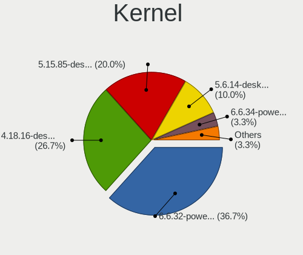
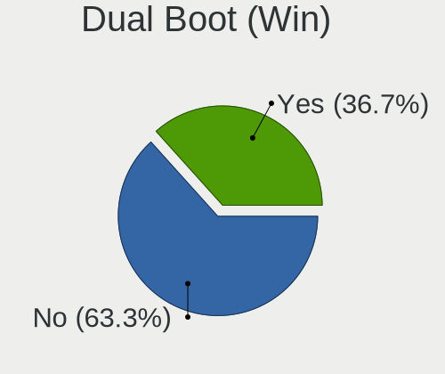
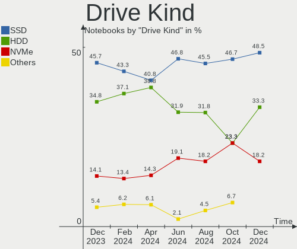
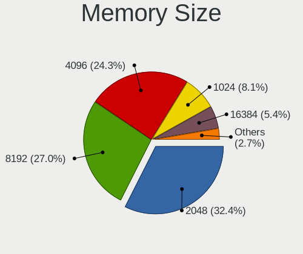

BlackPanther - Hardware Trends (Notebooks)
------------------------------------------

A project to identify most popular hardware characteristics and track their change
over time based on data collected by Linux users at https://Linux-Hardware.org.

Anyone can contribute to this report by the [hw-probe](https://github.com/linuxhw/hw-probe) tool:

    sudo -E hw-probe -all -upload

This report is for one last month. Overall report since the beginning of time: [TestDays](https://github.com/linuxhw/TestDays)

Period: Nov, 2023.

Contents
--------

* [ System ](#system)
  - [ OS                       ](#os)
  - [ OS Family                ](#os-family)
  - [ Kernel                   ](#kernel)
  - [ Kernel Family            ](#kernel-family)
  - [ Kernel Major Ver.        ](#kernel-major-ver)
  - [ Arch                     ](#arch)
  - [ DE                       ](#de)
  - [ Display Server           ](#display-server)
  - [ Display Manager          ](#display-manager)
  - [ OS Lang                  ](#os-lang)
  - [ Boot Mode                ](#boot-mode)
  - [ Filesystem               ](#filesystem)
  - [ Part. scheme             ](#part-scheme)
  - [ Dual Boot with Linux/BSD ](#dual-boot-with-linuxbsd)
  - [ Dual Boot (Win)          ](#dual-boot-win)

* [ Board ](#board)
  - [ Vendor                   ](#vendor)
  - [ Model                    ](#model)
  - [ Model Family             ](#model-family)
  - [ MFG Year                 ](#mfg-year)
  - [ Form Factor              ](#form-factor)
  - [ Secure Boot              ](#secure-boot)
  - [ Coreboot                 ](#coreboot)
  - [ RAM Size                 ](#ram-size)
  - [ RAM Used                 ](#ram-used)
  - [ Total Drives             ](#total-drives)
  - [ Has CD-ROM               ](#has-cd-rom)
  - [ Has Ethernet             ](#has-ethernet)
  - [ Has WiFi                 ](#has-wifi)
  - [ Has Bluetooth            ](#has-bluetooth)

* [ Location ](#location)
  - [ Country                  ](#country)
  - [ City                     ](#city)

* [ Drives ](#drives)
  - [ Drive Vendor             ](#drive-vendor)
  - [ Drive Model              ](#drive-model)
  - [ HDD Vendor               ](#hdd-vendor)
  - [ SSD Vendor               ](#ssd-vendor)
  - [ Drive Kind               ](#drive-kind)
  - [ Drive Connector          ](#drive-connector)
  - [ Drive Size               ](#drive-size)
  - [ Space Total              ](#space-total)
  - [ Space Used               ](#space-used)
  - [ Malfunc. Drives          ](#malfunc-drives)
  - [ Malfunc. Drive Vendor    ](#malfunc-drive-vendor)
  - [ Malfunc. HDD Vendor      ](#malfunc-hdd-vendor)
  - [ Malfunc. Drive Kind      ](#malfunc-drive-kind)
  - [ Failed Drives            ](#failed-drives)
  - [ Failed Drive Vendor      ](#failed-drive-vendor)
  - [ Drive Status             ](#drive-status)

* [ Storage controller ](#storage-controller)
  - [ Storage Vendor           ](#storage-vendor)
  - [ Storage Model            ](#storage-model)
  - [ Storage Kind             ](#storage-kind)

* [ Processor ](#processor)
  - [ CPU Vendor               ](#cpu-vendor)
  - [ CPU Model                ](#cpu-model)
  - [ CPU Model Family         ](#cpu-model-family)
  - [ CPU Cores                ](#cpu-cores)
  - [ CPU Sockets              ](#cpu-sockets)
  - [ CPU Threads              ](#cpu-threads)
  - [ CPU Op-Modes             ](#cpu-op-modes)
  - [ CPU Microcode            ](#cpu-microcode)
  - [ CPU Microarch            ](#cpu-microarch)

* [ Graphics ](#graphics)
  - [ GPU Vendor               ](#gpu-vendor)
  - [ GPU Model                ](#gpu-model)
  - [ GPU Combo                ](#gpu-combo)
  - [ GPU Driver               ](#gpu-driver)
  - [ GPU Memory               ](#gpu-memory)

* [ Monitor ](#monitor)
  - [ Monitor Vendor           ](#monitor-vendor)
  - [ Monitor Model            ](#monitor-model)
  - [ Monitor Resolution       ](#monitor-resolution)
  - [ Monitor Diagonal         ](#monitor-diagonal)
  - [ Monitor Width            ](#monitor-width)
  - [ Aspect Ratio             ](#aspect-ratio)
  - [ Monitor Area             ](#monitor-area)
  - [ Pixel Density            ](#pixel-density)
  - [ Multiple Monitors        ](#multiple-monitors)

* [ Network ](#network)
  - [ Net Controller Vendor    ](#net-controller-vendor)
  - [ Net Controller Model     ](#net-controller-model)
  - [ Wireless Vendor          ](#wireless-vendor)
  - [ Wireless Model           ](#wireless-model)
  - [ Ethernet Vendor          ](#ethernet-vendor)
  - [ Ethernet Model           ](#ethernet-model)
  - [ Net Controller Kind      ](#net-controller-kind)
  - [ Used Controller          ](#used-controller)
  - [ NICs                     ](#nics)
  - [ IPv6                     ](#ipv6)

* [ Bluetooth ](#bluetooth)
  - [ Bluetooth Vendor         ](#bluetooth-vendor)
  - [ Bluetooth Model          ](#bluetooth-model)

* [ Sound ](#sound)
  - [ Sound Vendor             ](#sound-vendor)
  - [ Sound Model              ](#sound-model)

* [ Memory ](#memory)
  - [ Memory Vendor            ](#memory-vendor)
  - [ Memory Model             ](#memory-model)
  - [ Memory Kind              ](#memory-kind)
  - [ Memory Form Factor       ](#memory-form-factor)
  - [ Memory Size              ](#memory-size)
  - [ Memory Speed             ](#memory-speed)

* [ Printers & scanners ](#printers--scanners)
  - [ Printer Vendor           ](#printer-vendor)
  - [ Printer Model            ](#printer-model)
  - [ Scanner Vendor           ](#scanner-vendor)
  - [ Scanner Model            ](#scanner-model)

* [ Camera ](#camera)
  - [ Camera Vendor            ](#camera-vendor)
  - [ Camera Model             ](#camera-model)

* [ Security ](#security)
  - [ Fingerprint Vendor       ](#fingerprint-vendor)
  - [ Fingerprint Model        ](#fingerprint-model)
  - [ Chipcard Vendor          ](#chipcard-vendor)
  - [ Chipcard Model           ](#chipcard-model)

* [ Unsupported ](#unsupported)
  - [ Unsupported Devices      ](#unsupported-devices)
  - [ Unsupported Device Types ](#unsupported-device-types)

System
------

OS
--

Installed operating systems

| Name              | Notebooks | Percent |
|-------------------|-----------|---------|
| BlackPanther 18.1 | 63        | 92.65%  |
| BlackPanther 22.1 | 5         | 7.35%   |

OS Family
---------

OS without a version

| Name         | Notebooks | Percent |
|--------------|-----------|---------|
| BlackPanther | 68        | 100%    |

Kernel
------

Version of the Linux kernel

| Version             | Notebooks | Percent |
|---------------------|-----------|---------|
| 5.15.85-desktop-1bP | 31        | 45.59%  |
| 5.6.14-desktop-2bP  | 16        | 23.53%  |
| 4.18.16-desktop-1bP | 13        | 19.12%  |
| 6.3.8-desktop-1bP   | 5         | 7.35%   |
| 6.5.7-power-1bP     | 1         | 1.47%   |
| 6.5.3-power-1bP     | 1         | 1.47%   |
| 5.6.14-server-2bP   | 1         | 1.47%   |

Kernel Family
-------------

Linux kernel without a distro release

| Version | Notebooks | Percent |
|---------|-----------|---------|
| 5.15.85 | 31        | 45.59%  |
| 5.6.14  | 17        | 25%     |
| 4.18.16 | 13        | 19.12%  |
| 6.3.8   | 5         | 7.35%   |
| 6.5.7   | 1         | 1.47%   |
| 6.5.3   | 1         | 1.47%   |

Kernel Major Ver.
-----------------

Linux kernel major version

| Version | Notebooks | Percent |
|---------|-----------|---------|
| 5.15    | 31        | 45.59%  |
| 5.6     | 17        | 25%     |
| 4.18    | 13        | 19.12%  |
| 6.3     | 5         | 7.35%   |
| 6.5     | 2         | 2.94%   |

Arch
----

OS architecture (x86_64, i586, etc.)

| Name   | Notebooks | Percent |
|--------|-----------|---------|
| x86_64 | 68        | 100%    |

DE
--

Desktop Environment

| Name    | Notebooks | Percent |
|---------|-----------|---------|
| KDE5    | 64        | 94.12%  |
| Unknown | 4         | 5.88%   |

Display Server
--------------

X11 or Wayland

| Name | Notebooks | Percent |
|------|-----------|---------|
| X11  | 68        | 100%    |

Display Manager
---------------

SDDM, LightDM, etc.

| Name | Notebooks | Percent |
|------|-----------|---------|
| SDDM | 68        | 100%    |

OS Lang
-------

Language

| Lang    | Notebooks | Percent |
|---------|-----------|---------|
| Unknown | 68        | 100%    |

Boot Mode
---------

EFI or BIOS

| Mode | Notebooks | Percent |
|------|-----------|---------|
| EFI  | 40        | 58.82%  |
| BIOS | 28        | 41.18%  |

Filesystem
----------

Type of filesystem

| Type    | Notebooks | Percent |
|---------|-----------|---------|
| Ext4    | 43        | 63.24%  |
| Overlay | 24        | 35.29%  |
| Btrfs   | 1         | 1.47%   |

Part. scheme
------------

Scheme of partitioning

| Type | Notebooks | Percent |
|------|-----------|---------|
| GPT  | 41        | 60.29%  |
| MBR  | 27        | 39.71%  |

Dual Boot with Linux/BSD
------------------------

Hosting more than one Linux/BSD

| Dual boot | Notebooks | Percent |
|-----------|-----------|---------|
| No        | 51        | 75%     |
| Yes       | 17        | 25%     |

Dual Boot (Win)
---------------

Hosting Linux and Windows

| Dual boot | Notebooks | Percent |
|-----------|-----------|---------|
| No        | 40        | 58.82%  |
| Yes       | 28        | 41.18%  |

Board
-----

Vendor
------

Motherboard manufacturer

| Name                | Notebooks | Percent |
|---------------------|-----------|---------|
| Dell                | 17        | 25%     |
| Hewlett-Packard     | 16        | 23.53%  |
| Lenovo              | 13        | 19.12%  |
| ASUSTek Computer    | 5         | 7.35%   |
| Acer                | 4         | 5.88%   |
| Samsung Electronics | 3         | 4.41%   |
| MSI                 | 2         | 2.94%   |
| Fujitsu             | 2         | 2.94%   |
| eMachines           | 2         | 2.94%   |
| Sony                | 1         | 1.47%   |
| Medion              | 1         | 1.47%   |
| AWOW                | 1         | 1.47%   |
| Apple               | 1         | 1.47%   |

Model
-----

Motherboard model

| Name                                | Notebooks | Percent |
|-------------------------------------|-----------|---------|
| HP 250 G1                           | 3         | 4.41%   |
| Samsung RV415/RV515/E3415           | 2         | 2.94%   |
| Lenovo IdeaPad 330-15IKB 81DE       | 2         | 2.94%   |
| HP ProBook 640 G8 Notebook PC       | 2         | 2.94%   |
| eMachines E725                      | 2         | 2.94%   |
| Dell Latitude 7390                  | 2         | 2.94%   |
| ASUS K54HR                          | 2         | 2.94%   |
| Sony SVS13118GBB                    | 1         | 1.47%   |
| Samsung 300E4C/300E5C/300E7C        | 1         | 1.47%   |
| MSI GT60 2OC/2OD                    | 1         | 1.47%   |
| MSI GP75 Leopard 9SE                | 1         | 1.47%   |
| Medion E7220                        | 1         | 1.47%   |
| Lenovo V15-ADA 82C7                 | 1         | 1.47%   |
| Lenovo ThinkPad X250 20CLS1JN00     | 1         | 1.47%   |
| Lenovo ThinkPad X230 2333A91        | 1         | 1.47%   |
| Lenovo ThinkPad T420 4236B87        | 1         | 1.47%   |
| Lenovo ThinkPad T410 2537VFQ        | 1         | 1.47%   |
| Lenovo IdeaPad Y700-15ISK 80NV      | 1         | 1.47%   |
| Lenovo IdeaPad 700-15ISK 80RU       | 1         | 1.47%   |
| Lenovo IdeaPad 110-15ACL 80TJ       | 1         | 1.47%   |
| Lenovo G550 20023                   | 1         | 1.47%   |
| Lenovo G50-45 80E3                  | 1         | 1.47%   |
| Lenovo Flex 2-15D 20377             | 1         | 1.47%   |
| HP ProBook 650 G2                   | 1         | 1.47%   |
| HP Presario CQ57                    | 1         | 1.47%   |
| HP Pavilion Gaming Laptop 15-ec1xxx | 1         | 1.47%   |
| HP Pavilion dv6                     | 1         | 1.47%   |
| HP Pavilion dv5                     | 1         | 1.47%   |
| HP Notebook                         | 1         | 1.47%   |
| HP HDX 16                           | 1         | 1.47%   |
| HP EliteBook Folio 9480m            | 1         | 1.47%   |
| HP EliteBook 8570w                  | 1         | 1.47%   |
| HP 650                              | 1         | 1.47%   |
| HP 620                              | 1         | 1.47%   |
| Fujitsu LIFEBOOK E744               | 1         | 1.47%   |
| Fujitsu LIFEBOOK A555               | 1         | 1.47%   |
| Dell Vostro 3500                    | 1         | 1.47%   |
| Dell Vostro 1015                    | 1         | 1.47%   |
| Dell Latitude E7240                 | 1         | 1.47%   |
| Dell Latitude E6520                 | 1         | 1.47%   |

Model Family
------------

Motherboard model prefix

| Name              | Notebooks | Percent |
|-------------------|-----------|---------|
| Dell Latitude     | 10        | 14.71%  |
| Lenovo IdeaPad    | 5         | 7.35%   |
| Dell Inspiron     | 5         | 7.35%   |
| Lenovo ThinkPad   | 4         | 5.88%   |
| HP ProBook        | 3         | 4.41%   |
| HP Pavilion       | 3         | 4.41%   |
| HP 250            | 3         | 4.41%   |
| Samsung RV415     | 2         | 2.94%   |
| HP EliteBook      | 2         | 2.94%   |
| Fujitsu LIFEBOOK  | 2         | 2.94%   |
| eMachines E725    | 2         | 2.94%   |
| Dell Vostro       | 2         | 2.94%   |
| ASUS K54HR        | 2         | 2.94%   |
| Acer Aspire       | 2         | 2.94%   |
| Sony SVS13118GBB  | 1         | 1.47%   |
| Samsung 300E4C    | 1         | 1.47%   |
| MSI GT60          | 1         | 1.47%   |
| MSI GP75          | 1         | 1.47%   |
| Medion E7220      | 1         | 1.47%   |
| Lenovo V15-ADA    | 1         | 1.47%   |
| Lenovo G550       | 1         | 1.47%   |
| Lenovo G50-45     | 1         | 1.47%   |
| Lenovo Flex       | 1         | 1.47%   |
| HP Presario       | 1         | 1.47%   |
| HP Notebook       | 1         | 1.47%   |
| HP HDX            | 1         | 1.47%   |
| HP 650            | 1         | 1.47%   |
| HP 620            | 1         | 1.47%   |
| AWOW AK41         | 1         | 1.47%   |
| ASUS X55U         | 1         | 1.47%   |
| ASUS K53U         | 1         | 1.47%   |
| ASUS ASUS         | 1         | 1.47%   |
| Apple MacBookAir5 | 1         | 1.47%   |
| Acer TravelMate   | 1         | 1.47%   |
| Acer Nitro        | 1         | 1.47%   |

MFG Year
--------

Motherboard manufacture year

| Year | Notebooks | Percent |
|------|-----------|---------|
| 2011 | 11        | 16.18%  |
| 2012 | 8         | 11.76%  |
| 2015 | 6         | 8.82%   |
| 2014 | 6         | 8.82%   |
| 2013 | 6         | 8.82%   |
| 2009 | 6         | 8.82%   |
| 2020 | 4         | 5.88%   |
| 2018 | 4         | 5.88%   |
| 2021 | 3         | 4.41%   |
| 2017 | 3         | 4.41%   |
| 2016 | 3         | 4.41%   |
| 2010 | 3         | 4.41%   |
| 2008 | 3         | 4.41%   |
| 2019 | 1         | 1.47%   |
| 2006 | 1         | 1.47%   |

Form Factor
-----------

Physical design of the computer

| Name     | Notebooks | Percent |
|----------|-----------|---------|
| Notebook | 68        | 100%    |

Secure Boot
-----------

Enabled or disabled

| State    | Notebooks | Percent |
|----------|-----------|---------|
| Disabled | 68        | 100%    |

Coreboot
--------

Have coreboot on board

| Used | Notebooks | Percent |
|------|-----------|---------|
| No   | 68        | 100%    |

RAM Size
--------

Total RAM memory

| Size in GB | Notebooks | Percent |
|------------|-----------|---------|
| 4.01-8.0   | 21        | 30.88%  |
| 3.01-4.0   | 17        | 25%     |
| 8.01-16.0  | 16        | 23.53%  |
| 16.01-24.0 | 5         | 7.35%   |
| 1.01-2.0   | 5         | 7.35%   |
| 2.01-3.0   | 3         | 4.41%   |
| 24.01-32.0 | 1         | 1.47%   |

RAM Used
--------

Used RAM memory

| Used GB    | Notebooks | Percent |
|------------|-----------|---------|
| 1.01-2.0   | 30        | 44.12%  |
| 0.51-1.0   | 20        | 29.41%  |
| 4.01-8.0   | 6         | 8.82%   |
| 2.01-3.0   | 5         | 7.35%   |
| 0.01-0.5   | 4         | 5.88%   |
| 3.01-4.0   | 2         | 2.94%   |
| 16.01-24.0 | 1         | 1.47%   |

Total Drives
------------

Number of drives on board

| Drives | Notebooks | Percent |
|--------|-----------|---------|
| 1      | 48        | 70.59%  |
| 2      | 18        | 26.47%  |
| 3      | 1         | 1.47%   |
| 0      | 1         | 1.47%   |

Has CD-ROM
----------

Has CD-ROM on board

| Presented | Notebooks | Percent |
|-----------|-----------|---------|
| Yes       | 36        | 52.94%  |
| No        | 32        | 47.06%  |

Has Ethernet
------------

Has Ethernet on board

| Presented | Notebooks | Percent |
|-----------|-----------|---------|
| Yes       | 66        | 97.06%  |
| No        | 2         | 2.94%   |

Has WiFi
--------

Has WiFi module

| Presented | Notebooks | Percent |
|-----------|-----------|---------|
| Yes       | 68        | 100%    |

Has Bluetooth
-------------

Has Bluetooth module

| Presented | Notebooks | Percent |
|-----------|-----------|---------|
| Yes       | 56        | 82.35%  |
| No        | 12        | 17.65%  |

Location
--------

Country
-------

Geographic location (country)

| Country  | Notebooks | Percent |
|----------|-----------|---------|
| Hungary  | 57        | 83.82%  |
| UK       | 3         | 4.41%   |
| Slovakia | 2         | 2.94%   |
| Germany  | 2         | 2.94%   |
| Austria  | 2         | 2.94%   |
| Romania  | 1         | 1.47%   |
| Canada   | 1         | 1.47%   |

City
----

Geographic location (city)

| City                    | Notebooks | Percent |
|-------------------------|-----------|---------|
| Budapest                | 15        | 22.06%  |
| Zalaegerszeg            | 3         | 4.41%   |
| Szombathely             | 3         | 4.41%   |
| Szigetszentmiklos       | 3         | 4.41%   |
| Vienna                  | 2         | 2.94%   |
| Tatabánya              | 2         | 2.94%   |
| Oroshaza                | 2         | 2.94%   |
| Miskolc                 | 2         | 2.94%   |
| Kiskunmajsa             | 2         | 2.94%   |
| Harlow                  | 2         | 2.94%   |
| Debrecen                | 2         | 2.94%   |
| Cegled                  | 2         | 2.94%   |
| Berettyóújfalu        | 2         | 2.94%   |
| Tornaľa                | 1         | 1.47%   |
| Tarnamera               | 1         | 1.47%   |
| Tamasi                  | 1         | 1.47%   |
| Szeghalom               | 1         | 1.47%   |
| Senec                   | 1         | 1.47%   |
| Salgotarjan             | 1         | 1.47%   |
| Pomaz                   | 1         | 1.47%   |
| Pfaffenhofen an der Ilm | 1         | 1.47%   |
| Nyiregyhaza             | 1         | 1.47%   |
| Miercurea-Ciuc          | 1         | 1.47%   |
| Mako                    | 1         | 1.47%   |
| Majoshaza               | 1         | 1.47%   |
| Lambeth                 | 1         | 1.47%   |
| Kistelek                | 1         | 1.47%   |
| Kiskunhalas             | 1         | 1.47%   |
| Kirchheim unter Teck    | 1         | 1.47%   |
| Kazincbarcika           | 1         | 1.47%   |
| Hajdusamson             | 1         | 1.47%   |
| Gyorujbarat             | 1         | 1.47%   |
| Fulop                   | 1         | 1.47%   |
| Fertoszentmiklos        | 1         | 1.47%   |
| Dunaharaszti            | 1         | 1.47%   |
| Csongrad                | 1         | 1.47%   |
| Berzence                | 1         | 1.47%   |
| Beauharnois             | 1         | 1.47%   |
| Almasfuzito             | 1         | 1.47%   |

Drives
------

Drive Vendor
------------

Hard drive vendors

| Vendor              | Notebooks | Drives | Percent |
|---------------------|-----------|--------|---------|
| WDC                 | 11        | 12     | 12.5%   |
| Seagate             | 11        | 11     | 12.5%   |
| Kingston            | 11        | 13     | 12.5%   |
| Samsung Electronics | 10        | 10     | 11.36%  |
| Toshiba             | 6         | 6      | 6.82%   |
| HGST                | 6         | 6      | 6.82%   |
| Unknown             | 4         | 4      | 4.55%   |
| Intenso             | 4         | 4      | 4.55%   |
| SPCC                | 3         | 3      | 3.41%   |
| SSSTC               | 2         | 2      | 2.27%   |
| SK hynix            | 2         | 2      | 2.27%   |
| SanDisk             | 2         | 2      | 2.27%   |
| LITEON              | 2         | 2      | 2.27%   |
| Intel               | 2         | 2      | 2.27%   |
| Hitachi             | 2         | 2      | 2.27%   |
| A-DATA Technology   | 2         | 2      | 2.27%   |
| Timetec             | 1         | 1      | 1.14%   |
| Solid               | 1         | 1      | 1.14%   |
| PNY                 | 1         | 1      | 1.14%   |
| LITEONIT            | 1         | 1      | 1.14%   |
| Kingmax             | 1         | 1      | 1.14%   |
| Apple               | 1         | 1      | 1.14%   |
| Apacer              | 1         | 1      | 1.14%   |
| Unknown             | 1         | 1      | 1.14%   |

Drive Model
-----------

Hard drive models

| Model                                   | Notebooks | Percent |
|-----------------------------------------|-----------|---------|
| Kingston SA400S37480G 480GB SSD         | 4         | 4.4%    |
| Kingston SA400S37240G 240GB SSD         | 4         | 4.4%    |
| WDC WD7500BPKX-60HPJT0 752GB            | 2         | 2.2%    |
| SSSTC CL1-8D256-HP 256GB                | 2         | 2.2%    |
| SPCC Solid State Disk 256GB             | 2         | 2.2%    |
| Seagate ST9320325AS 320GB               | 2         | 2.2%    |
| Samsung SSD 750 EVO 250GB               | 2         | 2.2%    |
| Kingston SA400S37120G 120GB SSD         | 2         | 2.2%    |
| HGST HTS545032A7E380 320GB              | 2         | 2.2%    |
| WDC WD5000LPCX-24VHAT0 500GB            | 1         | 1.1%    |
| WDC WD5000BEKT-22KA9T0 500GB            | 1         | 1.1%    |
| WDC WD3200BEVT-08A23T1 320GB            | 1         | 1.1%    |
| WDC WD3200BEKT-60V5T1 320GB             | 1         | 1.1%    |
| WDC WD2500BEVT-00ZCT0 250GB             | 1         | 1.1%    |
| WDC WD10SPCX-24HWST1 1TB                | 1         | 1.1%    |
| WDC WD10JPVX-75JC3T0 1TB                | 1         | 1.1%    |
| WDC WD10JPVX-60JC3T0 1TB                | 1         | 1.1%    |
| WDC WD10JPVX-22JC3T0 1TB                | 1         | 1.1%    |
| WDC WD10JPLX-00MBPT0 1TB                | 1         | 1.1%    |
| Unknown SL16G  16GB                     | 1         | 1.1%    |
| Unknown SD64G  64GB                     | 1         | 1.1%    |
| Unknown SD/MMC/MS PRO 128GB             | 1         | 1.1%    |
| Unknown 032G34  32GB                    | 1         | 1.1%    |
| Toshiba MQ01ABF050 500GB                | 1         | 1.1%    |
| Toshiba MQ01ABD100 1TB                  | 1         | 1.1%    |
| Toshiba MQ01ABD050 500GB                | 1         | 1.1%    |
| Toshiba MK2576GSX 250GB                 | 1         | 1.1%    |
| Toshiba KXG50ZNV256G NVMe 256GB         | 1         | 1.1%    |
| Toshiba KSG60ZMV256G M.2 2280 256GB SSD | 1         | 1.1%    |
| Timetec SD08 512GB                      | 1         | 1.1%    |
| SPCC Solid State Disk 128GB             | 1         | 1.1%    |
| Solid SSD0240S00 240GB                  | 1         | 1.1%    |
| SK hynix HFS256G3BTND-N210A 256GB SSD   | 1         | 1.1%    |
| SK hynix BC711 NVMe 512GB               | 1         | 1.1%    |
| Seagate ST9500420AS 500GB               | 1         | 1.1%    |
| Seagate ST9500325AS 500GB               | 1         | 1.1%    |
| Seagate ST9160310AS 160GB               | 1         | 1.1%    |
| Seagate ST500VT001-1K6142-160 500GB     | 1         | 1.1%    |
| Seagate ST500LT012-9WS142 500GB         | 1         | 1.1%    |
| Seagate ST500LT012-1DG142 500GB         | 1         | 1.1%    |

HDD Vendor
----------

Hard disk drive vendors

| Vendor  | Notebooks | Drives | Percent |
|---------|-----------|--------|---------|
| WDC     | 11        | 12     | 31.43%  |
| Seagate | 11        | 11     | 31.43%  |
| HGST    | 6         | 6      | 17.14%  |
| Toshiba | 4         | 4      | 11.43%  |
| Hitachi | 2         | 2      | 5.71%   |
| Unknown | 1         | 1      | 2.86%   |

SSD Vendor
----------

Solid state drive vendors

| Vendor              | Notebooks | Drives | Percent |
|---------------------|-----------|--------|---------|
| Kingston            | 9         | 11     | 24.32%  |
| Samsung Electronics | 8         | 8      | 21.62%  |
| Intenso             | 4         | 4      | 10.81%  |
| SPCC                | 3         | 3      | 8.11%   |
| A-DATA Technology   | 2         | 2      | 5.41%   |
| Toshiba             | 1         | 1      | 2.7%    |
| Timetec             | 1         | 1      | 2.7%    |
| Solid               | 1         | 1      | 2.7%    |
| SK hynix            | 1         | 1      | 2.7%    |
| SanDisk             | 1         | 1      | 2.7%    |
| PNY                 | 1         | 1      | 2.7%    |
| LITEONIT            | 1         | 1      | 2.7%    |
| LITEON              | 1         | 1      | 2.7%    |
| Kingmax             | 1         | 1      | 2.7%    |
| Intel               | 1         | 1      | 2.7%    |
| Apple               | 1         | 1      | 2.7%    |

Drive Kind
----------

HDD or SSD

| Kind | Notebooks | Drives | Percent |
|------|-----------|--------|---------|
| SSD  | 34        | 39     | 40.48%  |
| HDD  | 34        | 36     | 40.48%  |
| NVMe | 12        | 12     | 14.29%  |
| MMC  | 4         | 4      | 4.76%   |

Drive Connector
---------------

SATA, SAS, NVMe, etc.

| Type | Notebooks | Drives | Percent |
|------|-----------|--------|---------|
| SATA | 60        | 74     | 77.92%  |
| NVMe | 12        | 12     | 15.58%  |
| MMC  | 4         | 4      | 5.19%   |
| SAS  | 1         | 1      | 1.3%    |

Drive Size
----------

Size of hard drive

| Size in TB | Notebooks | Drives | Percent |
|------------|-----------|--------|---------|
| 0.01-0.5   | 49        | 57     | 74.24%  |
| 0.51-1.0   | 15        | 16     | 22.73%  |
| 1.01-2.0   | 2         | 2      | 3.03%   |

Space Total
-----------

Amount of disk space available on the file system

| Size in GB | Notebooks | Percent |
|------------|-----------|---------|
| Unknown    | 24        | 35.29%  |
| 101-250    | 16        | 23.53%  |
| 251-500    | 12        | 17.65%  |
| 501-1000   | 4         | 5.88%   |
| 21-50      | 3         | 4.41%   |
| 1001-2000  | 3         | 4.41%   |
| 51-100     | 3         | 4.41%   |
| 2001-3000  | 2         | 2.94%   |
| 1-20       | 1         | 1.47%   |

Space Used
----------

Amount of used disk space

| Used GB   | Notebooks | Percent |
|-----------|-----------|---------|
| Unknown   | 24        | 35.29%  |
| 21-50     | 14        | 20.59%  |
| 1-20      | 11        | 16.18%  |
| 101-250   | 8         | 11.76%  |
| 51-100    | 5         | 7.35%   |
| 251-500   | 3         | 4.41%   |
| 1001-2000 | 2         | 2.94%   |
| 2001-3000 | 1         | 1.47%   |

Malfunc. Drives
---------------

Drive models with a malfunction

| Model                                 | Notebooks | Drives | Percent |
|---------------------------------------|-----------|--------|---------|
| WDC WD7500BPKX-60HPJT0 752GB          | 2         | 2      | 8%      |
| Seagate ST9320325AS 320GB             | 2         | 2      | 8%      |
| HGST HTS545032A7E380 320GB            | 2         | 2      | 8%      |
| WDC WD5000BEKT-22KA9T0 500GB          | 1         | 1      | 4%      |
| WDC WD3200BEVT-08A23T1 320GB          | 1         | 1      | 4%      |
| WDC WD2500BEVT-00ZCT0 250GB           | 1         | 1      | 4%      |
| WDC WD10JPLX-00MBPT0 1TB              | 1         | 1      | 4%      |
| Toshiba MQ01ABF050 500GB              | 1         | 1      | 4%      |
| Timetec SD08 512GB                    | 1         | 1      | 4%      |
| Seagate ST9500420AS 500GB             | 1         | 1      | 4%      |
| Seagate ST9500325AS 500GB             | 1         | 1      | 4%      |
| Seagate ST9160310AS 160GB             | 1         | 1      | 4%      |
| Seagate ST500LT012-9WS142 500GB       | 1         | 1      | 4%      |
| Seagate ST500LT012-1DG142 500GB       | 1         | 1      | 4%      |
| Samsung Electronics SSD 750 EVO 250GB | 1         | 1      | 4%      |
| Intel SSDSC2BF180A4L 180GB            | 1         | 1      | 4%      |
| Hitachi HTS547550A9E384 500GB         | 1         | 1      | 4%      |
| Hitachi HTS545050A7E380 500GB         | 1         | 1      | 4%      |
| HGST HTS545050A7E380 500GB            | 1         | 1      | 4%      |
| HGST HTS541010A9E680 1TB              | 1         | 1      | 4%      |
| HGST HEJ423220H9E300 200GB            | 1         | 1      | 4%      |
| Apple SSD TS064E 64GB                 | 1         | 1      | 4%      |

Malfunc. Drive Vendor
---------------------

Vendors of faulty drives

| Vendor              | Notebooks | Drives | Percent |
|---------------------|-----------|--------|---------|
| Seagate             | 7         | 7      | 29.17%  |
| WDC                 | 5         | 6      | 20.83%  |
| HGST                | 5         | 5      | 20.83%  |
| Hitachi             | 2         | 2      | 8.33%   |
| Toshiba             | 1         | 1      | 4.17%   |
| Timetec             | 1         | 1      | 4.17%   |
| Samsung Electronics | 1         | 1      | 4.17%   |
| Intel               | 1         | 1      | 4.17%   |
| Apple               | 1         | 1      | 4.17%   |

Malfunc. HDD Vendor
-------------------

Vendors of faulty HDD drives

| Vendor  | Notebooks | Drives | Percent |
|---------|-----------|--------|---------|
| Seagate | 7         | 7      | 35%     |
| WDC     | 5         | 6      | 25%     |
| HGST    | 5         | 5      | 25%     |
| Hitachi | 2         | 2      | 10%     |
| Toshiba | 1         | 1      | 5%      |

Malfunc. Drive Kind
-------------------

Kinds of faulty drives

| Kind | Notebooks | Drives | Percent |
|------|-----------|--------|---------|
| HDD  | 20        | 21     | 83.33%  |
| SSD  | 4         | 4      | 16.67%  |

Failed Drives
-------------

Failed drive models

Zero info for selected period =(

Failed Drive Vendor
-------------------

Failed drive vendors

Zero info for selected period =(

Drive Status
------------

Number of failed and malfunc. drives

| Status   | Notebooks | Drives | Percent |
|----------|-----------|--------|---------|
| Works    | 49        | 61     | 62.82%  |
| Malfunc  | 24        | 25     | 30.77%  |
| Detected | 5         | 5      | 6.41%   |

Storage controller
------------------

Storage Vendor
--------------

Storage controller vendors

| Vendor                         | Notebooks | Percent |
|--------------------------------|-----------|---------|
| Intel                          | 55        | 70.51%  |
| AMD                            | 12        | 15.38%  |
| Solid State Storage Technology | 2         | 2.56%   |
| Samsung Electronics            | 2         | 2.56%   |
| Kingston Technology Company    | 2         | 2.56%   |
| Toshiba America Info Systems   | 1         | 1.28%   |
| SK hynix                       | 1         | 1.28%   |
| SanDisk                        | 1         | 1.28%   |
| Phison Electronics             | 1         | 1.28%   |
| Lite-On Technology             | 1         | 1.28%   |

Storage Model
-------------

Storage controller models

| Model                                                                                  | Notebooks | Percent |
|----------------------------------------------------------------------------------------|-----------|---------|
| Intel 7 Series Chipset Family 6-port SATA Controller [AHCI mode]                       | 9         | 10.71%  |
| Intel 82801IBM/IEM (ICH9M/ICH9M-E) 4 port SATA Controller [AHCI mode]                  | 6         | 7.14%   |
| AMD FCH SATA Controller [AHCI mode]                                                    | 6         | 7.14%   |
| Intel 82801 Mobile SATA Controller [RAID mode]                                         | 5         | 5.95%   |
| AMD SB7x0/SB8x0/SB9x0 SATA Controller [AHCI mode]                                      | 5         | 5.95%   |
| Intel Wildcat Point-LP SATA Controller [AHCI Mode]                                     | 4         | 4.76%   |
| Intel HM170/QM170 Chipset SATA Controller [AHCI Mode]                                  | 4         | 4.76%   |
| Intel 8 Series SATA Controller 1 [AHCI mode]                                           | 4         | 4.76%   |
| Intel 6 Series/C200 Series Chipset Family 6 port Mobile SATA AHCI Controller           | 4         | 4.76%   |
| Intel Volume Management Device NVMe RAID Controller                                    | 3         | 3.57%   |
| Intel Sunrise Point-LP SATA Controller [AHCI mode]                                     | 3         | 3.57%   |
| Solid State Storage CL1-3D256-Q11 NVMe SSD M.2                                         | 2         | 2.38%   |
| Intel Tiger Lake-LP SATA Controller                                                    | 2         | 2.38%   |
| Intel 8 Series/C220 Series Chipset Family 6-port SATA Controller 1 [AHCI mode]         | 2         | 2.38%   |
| Intel 5 Series/3400 Series Chipset 6 port SATA AHCI Controller                         | 2         | 2.38%   |
| AMD SB7x0/SB8x0/SB9x0 IDE Controller                                                   | 2         | 2.38%   |
| Toshiba America Info Systems XG5 NVMe SSD Controller                                   | 1         | 1.19%   |
| SK hynix Gold P31/BC711/PC711 NVMe Solid State Drive                                   | 1         | 1.19%   |
| SanDisk Ultra 3D / WD Blue SN570 NVMe SSD (DRAM-less)                                  | 1         | 1.19%   |
| Samsung NVMe SSD Controller SM981/PM981/PM983                                          | 1         | 1.19%   |
| Samsung NVMe SSD Controller 980 (DRAM-less)                                            | 1         | 1.19%   |
| Phison PS5015-E15 PCIe3 NVMe Controller (DRAM-less)                                    | 1         | 1.19%   |
| Lite-On CA3-8D256, CA3-8D512 NVMe SSD                                                  | 1         | 1.19%   |
| Kingston Company NV2 NVMe SSD SM2267XT                                                 | 1         | 1.19%   |
| Kingston Company A1000/U-SNS8154P3 x2 NVMe SSD                                         | 1         | 1.19%   |
| Intel SSD 670p Series [Keystone Harbor]                                                | 1         | 1.19%   |
| Intel Comet Lake SATA AHCI Controller                                                  | 1         | 1.19%   |
| Intel Celeron/Pentium Silver Processor SATA Controller                                 | 1         | 1.19%   |
| Intel Celeron N3350/Pentium N4200/Atom E3900 Series SATA AHCI Controller               | 1         | 1.19%   |
| Intel Cannon Lake Mobile PCH SATA AHCI Controller                                      | 1         | 1.19%   |
| Intel 82801IBM/IEM (ICH9M/ICH9M-E) 2 port SATA Controller [IDE mode]                   | 1         | 1.19%   |
| Intel 82801GBM/GHM (ICH7-M Family) SATA Controller [IDE mode]                          | 1         | 1.19%   |
| Intel 6 Series/C200 Series Chipset Family Mobile SATA Controller (IDE mode, ports 4-5) | 1         | 1.19%   |
| Intel 6 Series/C200 Series Chipset Family Mobile SATA Controller (IDE mode, ports 0-3) | 1         | 1.19%   |
| Intel 5 Series/3400 Series Chipset 4 port SATA AHCI Controller                         | 1         | 1.19%   |
| AMD FCH SATA Controller [IDE mode]                                                     | 1         | 1.19%   |
| AMD FCH IDE Controller                                                                 | 1         | 1.19%   |

Storage Kind
------------

Kind of storage controller (IDE, SATA, NVMe, SAS, ...)

| Kind | Notebooks | Percent |
|------|-----------|---------|
| SATA | 57        | 68.67%  |
| NVMe | 12        | 14.46%  |
| RAID | 8         | 9.64%   |
| IDE  | 6         | 7.23%   |

Processor
---------

CPU Vendor
----------

Processor vendors

| Vendor | Notebooks | Percent |
|--------|-----------|---------|
| Intel  | 56        | 82.35%  |
| AMD    | 12        | 17.65%  |

CPU Model
---------

Processor models

| Model                                       | Notebooks | Percent |
|---------------------------------------------|-----------|---------|
| Intel Core i5-8250U CPU @ 1.60GHz           | 3         | 4.41%   |
| Intel Core i5-2540M CPU @ 2.60GHz           | 3         | 4.41%   |
| Intel Celeron CPU 1000M @ 1.80GHz           | 3         | 4.41%   |
| Intel Pentium Dual-Core CPU T4400 @ 2.20GHz | 2         | 2.94%   |
| Intel Core i5-2520M CPU @ 2.50GHz           | 2         | 2.94%   |
| Intel 11th Gen Core i5-1135G7 @ 2.40GHz     | 2         | 2.94%   |
| Intel 11th Gen Core i3-1115G4 @ 3.00GHz     | 2         | 2.94%   |
| AMD E-450 APU with Radeon HD Graphics       | 2         | 2.94%   |
| AMD A8-6410 APU with AMD Radeon R5 Graphics | 2         | 2.94%   |
| Intel Pentium Dual-Core CPU T4500 @ 2.30GHz | 1         | 1.47%   |
| Intel Pentium Dual-Core CPU T4300 @ 2.10GHz | 1         | 1.47%   |
| Intel Pentium CPU B970 @ 2.30GHz            | 1         | 1.47%   |
| Intel Core i7-9750H CPU @ 2.60GHz           | 1         | 1.47%   |
| Intel Core i7-7700HQ CPU @ 2.80GHz          | 1         | 1.47%   |
| Intel Core i7-6820HQ CPU @ 2.70GHz          | 1         | 1.47%   |
| Intel Core i7-6700HQ CPU @ 2.60GHz          | 1         | 1.47%   |
| Intel Core i7-6600U CPU @ 2.60GHz           | 1         | 1.47%   |
| Intel Core i7-5500U CPU @ 2.40GHz           | 1         | 1.47%   |
| Intel Core i7-4700MQ CPU @ 2.40GHz          | 1         | 1.47%   |
| Intel Core i7-4600U CPU @ 2.10GHz           | 1         | 1.47%   |
| Intel Core i7-4510U CPU @ 2.00GHz           | 1         | 1.47%   |
| Intel Core i7-3720QM CPU @ 2.60GHz          | 1         | 1.47%   |
| Intel Core i7 CPU M 620 @ 2.67GHz           | 1         | 1.47%   |
| Intel Core i5-7300U CPU @ 2.60GHz           | 1         | 1.47%   |
| Intel Core i5-7200U CPU @ 2.50GHz           | 1         | 1.47%   |
| Intel Core i5-6300HQ CPU @ 2.30GHz          | 1         | 1.47%   |
| Intel Core i5-5300U CPU @ 2.30GHz           | 1         | 1.47%   |
| Intel Core i5-5200U CPU @ 2.20GHz           | 1         | 1.47%   |
| Intel Core i5-4310M CPU @ 2.70GHz           | 1         | 1.47%   |
| Intel Core i5-4210U CPU @ 1.70GHz           | 1         | 1.47%   |
| Intel Core i5-4200U CPU @ 1.60GHz           | 1         | 1.47%   |
| Intel Core i5-3427U CPU @ 1.80GHz           | 1         | 1.47%   |
| Intel Core i5-3340M CPU @ 2.70GHz           | 1         | 1.47%   |
| Intel Core i5-3320M CPU @ 2.60GHz           | 1         | 1.47%   |
| Intel Core i5-3210M CPU @ 2.50GHz           | 1         | 1.47%   |
| Intel Core i5 CPU M 520 @ 2.40GHz           | 1         | 1.47%   |
| Intel Core i3-5005U CPU @ 2.00GHz           | 1         | 1.47%   |
| Intel Core i3-2350M CPU @ 2.30GHz           | 1         | 1.47%   |
| Intel Core i3-2310M CPU @ 2.10GHz           | 1         | 1.47%   |
| Intel Core i3-10110U CPU @ 2.10GHz          | 1         | 1.47%   |

CPU Model Family
----------------

Processor model prefix

| Model                   | Notebooks | Percent |
|-------------------------|-----------|---------|
| Intel Core i5           | 21        | 30.88%  |
| Intel Core i7           | 11        | 16.18%  |
| Intel Celeron           | 6         | 8.82%   |
| Intel Core i3           | 5         | 7.35%   |
| Other                   | 4         | 5.88%   |
| Intel Pentium Dual-Core | 4         | 5.88%   |
| AMD E                   | 3         | 4.41%   |
| AMD A8                  | 3         | 4.41%   |
| Intel Core 2 Duo        | 2         | 2.94%   |
| AMD Ryzen 5             | 2         | 2.94%   |
| Intel Pentium           | 1         | 1.47%   |
| Intel Core 2 Quad       | 1         | 1.47%   |
| Intel Core 2            | 1         | 1.47%   |
| AMD E2                  | 1         | 1.47%   |
| AMD E1                  | 1         | 1.47%   |
| AMD C-50                | 1         | 1.47%   |
| AMD Athlon X2           | 1         | 1.47%   |

CPU Cores
---------

Number of processor cores

| Number | Notebooks | Percent |
|--------|-----------|---------|
| 2      | 48        | 70.59%  |
| 4      | 16        | 23.53%  |
| 6      | 2         | 2.94%   |
| 1      | 2         | 2.94%   |

CPU Sockets
-----------

Number of sockets

| Number | Notebooks | Percent |
|--------|-----------|---------|
| 1      | 68        | 100%    |

CPU Threads
-----------

Threads per core (Hyper-Threading)

| Number | Notebooks | Percent |
|--------|-----------|---------|
| 2      | 41        | 60.29%  |
| 1      | 27        | 39.71%  |

CPU Op-Modes
------------

CPU Operation Modes (32-bit, 64-bit)

| Op mode        | Notebooks | Percent |
|----------------|-----------|---------|
| 32-bit, 64-bit | 68        | 100%    |

CPU Microcode
-------------

Microcode number

| Number     | Notebooks | Percent |
|------------|-----------|---------|
| Unknown    | 11        | 16.18%  |
| 0x206a7    | 9         | 13.24%  |
| 0x306a9    | 7         | 10.29%  |
| 0x1067a    | 7         | 10.29%  |
| 0x506e3    | 3         | 4.41%   |
| 0x40651    | 3         | 4.41%   |
| 0x806ea    | 2         | 2.94%   |
| 0x806c1    | 2         | 2.94%   |
| 0x306d4    | 2         | 2.94%   |
| 0x306c3    | 2         | 2.94%   |
| 0x20655    | 2         | 2.94%   |
| 0x07030105 | 2         | 2.94%   |
| 0x05000119 | 2         | 2.94%   |
| 0x05000101 | 2         | 2.94%   |
| 0x906e9    | 1         | 1.47%   |
| 0x806ec    | 1         | 1.47%   |
| 0x706a1    | 1         | 1.47%   |
| 0x6f2      | 1         | 1.47%   |
| 0x506c9    | 1         | 1.47%   |
| 0x406e3    | 1         | 1.47%   |
| 0x20652    | 1         | 1.47%   |
| 0x08600106 | 1         | 1.47%   |
| 0x08108109 | 1         | 1.47%   |
| 0x06003109 | 1         | 1.47%   |
| 0x05000029 | 1         | 1.47%   |
| 0x02000032 | 1         | 1.47%   |

CPU Microarch
-------------

Microarchitecture

| Name            | Notebooks | Percent |
|-----------------|-----------|---------|
| SandyBridge     | 9         | 13.24%  |
| KabyLake        | 8         | 11.76%  |
| IvyBridge       | 8         | 11.76%  |
| Penryn          | 7         | 10.29%  |
| Haswell         | 6         | 8.82%   |
| Bobcat          | 5         | 7.35%   |
| TigerLake       | 4         | 5.88%   |
| Skylake         | 4         | 5.88%   |
| Broadwell       | 4         | 5.88%   |
| Westmere        | 3         | 4.41%   |
| Puma            | 3         | 4.41%   |
| Zen+            | 1         | 1.47%   |
| Zen 2           | 1         | 1.47%   |
| Steamroller     | 1         | 1.47%   |
| K8 & K10 hybrid | 1         | 1.47%   |
| Goldmont plus   | 1         | 1.47%   |
| Goldmont        | 1         | 1.47%   |
| Core            | 1         | 1.47%   |

Graphics
--------

GPU Vendor
----------

Vendors of graphics cards

| Vendor | Notebooks | Percent |
|--------|-----------|---------|
| Intel  | 51        | 61.45%  |
| Nvidia | 16        | 19.28%  |
| AMD    | 16        | 19.28%  |

GPU Model
---------

Graphics card models

| Model                                                                         | Notebooks | Percent |
|-------------------------------------------------------------------------------|-----------|---------|
| Intel 3rd Gen Core processor Graphics Controller                              | 7         | 8.14%   |
| Intel 2nd Generation Core Processor Family Integrated Graphics Controller     | 7         | 8.14%   |
| Intel Mobile 4 Series Chipset Integrated Graphics Controller                  | 5         | 5.81%   |
| Intel HD Graphics 5500                                                        | 4         | 4.65%   |
| Intel Haswell-ULT Integrated Graphics Controller                              | 4         | 4.65%   |
| AMD Seymour [Radeon HD 6400M/7400M Series]                                    | 4         | 4.65%   |
| Intel UHD Graphics 620                                                        | 3         | 3.49%   |
| Intel HD Graphics 530                                                         | 3         | 3.49%   |
| Intel Core Processor Integrated Graphics Controller                           | 3         | 3.49%   |
| Intel TigerLake-LP GT2 [Iris Xe Graphics]                                     | 2         | 2.33%   |
| Intel Tiger Lake-LP GT2 [UHD Graphics G4]                                     | 2         | 2.33%   |
| Intel HD Graphics 620                                                         | 2         | 2.33%   |
| Intel 4th Gen Core Processor Integrated Graphics Controller                   | 2         | 2.33%   |
| AMD Mullins [Radeon R4/R5 Graphics]                                           | 2         | 2.33%   |
| Nvidia TU117M [GeForce GTX 1650 Ti Mobile]                                    | 1         | 1.16%   |
| Nvidia TU106M [GeForce RTX 2060 Mobile]                                       | 1         | 1.16%   |
| Nvidia GT216M [GeForce GT 240M]                                               | 1         | 1.16%   |
| Nvidia GP107M [GeForce GTX 1050 Ti Mobile]                                    | 1         | 1.16%   |
| Nvidia GM108M [GeForce 930MX]                                                 | 1         | 1.16%   |
| Nvidia GM108M [GeForce 845M]                                                  | 1         | 1.16%   |
| Nvidia GM107M [GeForce GTX 960M]                                              | 1         | 1.16%   |
| Nvidia GM107M [GeForce GTX 950M]                                              | 1         | 1.16%   |
| Nvidia GK208BM [GeForce 920M]                                                 | 1         | 1.16%   |
| Nvidia GK107M [GeForce GT 750M]                                               | 1         | 1.16%   |
| Nvidia GK107M [GeForce GT 640M LE]                                            | 1         | 1.16%   |
| Nvidia GK107GLM [Quadro K2000M]                                               | 1         | 1.16%   |
| Nvidia GK106M [GeForce GTX 770M]                                              | 1         | 1.16%   |
| Nvidia GF119M [NVS 4200M]                                                     | 1         | 1.16%   |
| Nvidia GF117M [GeForce 610M/710M/810M/820M / GT 620M/625M/630M/720M]          | 1         | 1.16%   |
| Nvidia G96CM [GeForce 9600M GT]                                               | 1         | 1.16%   |
| Intel Skylake GT2 [HD Graphics 520]                                           | 1         | 1.16%   |
| Intel Mobile 945GM/GMS/GME, 943/940GML Express Integrated Graphics Controller | 1         | 1.16%   |
| Intel Mobile 945GM/GMS, 943/940GML Express Integrated Graphics Controller     | 1         | 1.16%   |
| Intel HD Graphics 630                                                         | 1         | 1.16%   |
| Intel HD Graphics 500                                                         | 1         | 1.16%   |
| Intel GeminiLake [UHD Graphics 600]                                           | 1         | 1.16%   |
| Intel CometLake-U GT2 [UHD Graphics]                                          | 1         | 1.16%   |
| Intel CoffeeLake-H GT2 [UHD Graphics 630]                                     | 1         | 1.16%   |
| AMD Wrestler [Radeon HD 7340]                                                 | 1         | 1.16%   |
| AMD Wrestler [Radeon HD 6310]                                                 | 1         | 1.16%   |

GPU Combo
---------

Combinations of graphics cards

| Name           | Notebooks | Percent |
|----------------|-----------|---------|
| 1 x Intel      | 37        | 54.41%  |
| Intel + Nvidia | 12        | 17.65%  |
| 1 x AMD        | 11        | 16.18%  |
| 1 x Nvidia     | 3         | 4.41%   |
| 2 x AMD        | 2         | 2.94%   |
| Intel + AMD    | 2         | 2.94%   |
| AMD + Nvidia   | 1         | 1.47%   |

GPU Driver
----------

Free vs proprietary

| Driver | Notebooks | Percent |
|--------|-----------|---------|
| Free   | 68        | 100%    |

GPU Memory
----------

Total video memory

| Size in GB | Notebooks | Percent |
|------------|-----------|---------|
| Unknown    | 42        | 61.76%  |
| 0.51-1.0   | 9         | 13.24%  |
| 0.01-0.5   | 7         | 10.29%  |
| 1.01-2.0   | 6         | 8.82%   |
| 3.01-4.0   | 3         | 4.41%   |
| 2.01-3.0   | 1         | 1.47%   |

Monitor
-------

Monitor Vendor
--------------

Monitor vendors

| Vendor                  | Notebooks | Percent |
|-------------------------|-----------|---------|
| LG Display              | 21        | 28%     |
| AU Optronics            | 18        | 24%     |
| Chimei Innolux          | 9         | 12%     |
| Samsung Electronics     | 6         | 8%      |
| PANDA                   | 3         | 4%      |
| BOE                     | 3         | 4%      |
| Hewlett-Packard         | 2         | 2.67%   |
| Dell                    | 2         | 2.67%   |
| Chi Mei Optoelectronics | 2         | 2.67%   |
| Sony                    | 1         | 1.33%   |
| Lenovo                  | 1         | 1.33%   |
| InnoLux Display         | 1         | 1.33%   |
| Hitachi                 | 1         | 1.33%   |
| Goldstar                | 1         | 1.33%   |
| BenQ                    | 1         | 1.33%   |
| Apple                   | 1         | 1.33%   |
| Ancor Communications    | 1         | 1.33%   |
| AGO                     | 1         | 1.33%   |

Monitor Model
-------------

Monitor models

| Model                                                                 | Notebooks | Percent |
|-----------------------------------------------------------------------|-----------|---------|
| LG Display LCD Monitor LGD0395 1366x768 344x194mm 15.5-inch           | 3         | 3.9%    |
| PANDA LCD Monitor NCP0065 1920x1080 309x174mm 14.0-inch               | 2         | 2.6%    |
| LG Display LCD Monitor LGD0589 1920x1080 294x165mm 13.3-inch          | 2         | 2.6%    |
| LG Display LCD Monitor LGD0259 1920x1080 345x194mm 15.6-inch          | 2         | 2.6%    |
| Chimei Innolux LCD Monitor CMN15D5 1920x1080 344x193mm 15.5-inch      | 2         | 2.6%    |
| BOE LCD Monitor BOE06D3 1366x768 344x194mm 15.5-inch                  | 2         | 2.6%    |
| AU Optronics LCD Monitor AUO61ED 1920x1080 344x194mm 15.5-inch        | 2         | 2.6%    |
| AU Optronics LCD Monitor AUO23EC 1366x768 344x193mm 15.5-inch         | 2         | 2.6%    |
| Sony TV *00 SNY7C04 3840x2160 1085x610mm 49.0-inch                    | 1         | 1.3%    |
| Samsung Electronics S22B370 SAM08BD 1920x1080 477x268mm 21.5-inch     | 1         | 1.3%    |
| Samsung Electronics LCD Monitor SEC5441 1366x768 309x174mm 14.0-inch  | 1         | 1.3%    |
| Samsung Electronics LCD Monitor SEC314D 1920x1080 353x198mm 15.9-inch | 1         | 1.3%    |
| Samsung Electronics LCD Monitor SEC3051 1600x900 398x232mm 18.1-inch  | 1         | 1.3%    |
| Samsung Electronics LCD Monitor SEC3046 1366x768 344x193mm 15.5-inch  | 1         | 1.3%    |
| Samsung Electronics LCD Monitor SDC3752 1920x1080 344x194mm 15.5-inch | 1         | 1.3%    |
| PANDA LCD Monitor NCP0058 1920x1080 344x194mm 15.5-inch               | 1         | 1.3%    |
| LG Display LP156WH2-TLAA LGD0230 1366x768 344x194mm 15.5-inch         | 1         | 1.3%    |
| LG Display LCD Monitor LGD6616 1366x768 277x156mm 12.5-inch           | 1         | 1.3%    |
| LG Display LCD Monitor LGD054F 1920x1080 344x194mm 15.5-inch          | 1         | 1.3%    |
| LG Display LCD Monitor LGD0525 1366x768 344x194mm 15.5-inch           | 1         | 1.3%    |
| LG Display LCD Monitor LGD04FC 1366x768 344x194mm 15.5-inch           | 1         | 1.3%    |
| LG Display LCD Monitor LGD0468 1366x768 344x194mm 15.5-inch           | 1         | 1.3%    |
| LG Display LCD Monitor LGD03FC 1600x900 309x174mm 14.0-inch           | 1         | 1.3%    |
| LG Display LCD Monitor LGD03ED 1366x768 277x156mm 12.5-inch           | 1         | 1.3%    |
| LG Display LCD Monitor LGD036C 1366x768 277x156mm 12.5-inch           | 1         | 1.3%    |
| LG Display LCD Monitor LGD0365 1600x900 382x215mm 17.3-inch           | 1         | 1.3%    |
| LG Display LCD Monitor LGD0353 1366x768 345x194mm 15.6-inch           | 1         | 1.3%    |
| LG Display LCD Monitor LGD02F2 1366x768 344x194mm 15.5-inch           | 1         | 1.3%    |
| LG Display LCD Monitor LGD02CF 1366x768 344x194mm 15.5-inch           | 1         | 1.3%    |
| LG Display LCD Monitor LGD01CA 1600x900 382x215mm 17.3-inch           | 1         | 1.3%    |
| Lenovo LCD Monitor LEN4036 1440x900 303x189mm 14.1-inch               | 1         | 1.3%    |
| InnoLux Display LCD Monitor INL0006 1366x768 344x194mm 15.5-inch      | 1         | 1.3%    |
| Hitachi HISENSE HEC002F 3840x2160 1872x1053mm 84.6-inch               | 1         | 1.3%    |
| Hitachi HDMI HEC0030 1920x1080 580x330mm 26.3-inch                    | 1         | 1.3%    |
| Hewlett-Packard w2207 HWP26A8 1680x1050 473x296mm 22.0-inch           | 1         | 1.3%    |
| Hewlett-Packard LP2475w HWP26F8 1920x1200 546x352mm 25.6-inch         | 1         | 1.3%    |
| Goldstar E2260 GSM57E1 1920x1080 477x268mm 21.5-inch                  | 1         | 1.3%    |
| Goldstar 2D HD TV GSM59CA 1366x768 509x286mm 23.0-inch                | 1         | 1.3%    |
| Dell S2340L DELD058 1920x1080 509x286mm 23.0-inch                     | 1         | 1.3%    |
| Dell P2214H DELA097 1920x1080 477x268mm 21.5-inch                     | 1         | 1.3%    |

Monitor Resolution
------------------

Monitor screen resolution

| Resolution         | Notebooks | Percent |
|--------------------|-----------|---------|
| 1366x768 (WXGA)    | 31        | 43.66%  |
| 1920x1080 (FHD)    | 23        | 32.39%  |
| 1600x900 (HD+)     | 8         | 11.27%  |
| 3840x2160 (4K)     | 3         | 4.23%   |
| 1440x900 (WXGA+)   | 3         | 4.23%   |
| 1920x1200 (WUXGA)  | 1         | 1.41%   |
| 1680x1050 (WSXGA+) | 1         | 1.41%   |
| 1024x768 (XGA)     | 1         | 1.41%   |

Monitor Diagonal
----------------

Diagonal size in inches

| Inches | Notebooks | Percent |
|--------|-----------|---------|
| 15     | 39        | 51.32%  |
| 14     | 8         | 10.53%  |
| 17     | 6         | 7.89%   |
| 13     | 6         | 7.89%   |
| 12     | 5         | 6.58%   |
| 21     | 3         | 3.95%   |
| 23     | 2         | 2.63%   |
| 84     | 1         | 1.32%   |
| 65     | 1         | 1.32%   |
| 27     | 1         | 1.32%   |
| 25     | 1         | 1.32%   |
| 22     | 1         | 1.32%   |
| 20     | 1         | 1.32%   |
| 18     | 1         | 1.32%   |

Monitor Width
-------------

Physical width

| Width in mm | Notebooks | Percent |
|-------------|-----------|---------|
| 301-350     | 46        | 61.33%  |
| 201-300     | 10        | 13.33%  |
| 351-400     | 9         | 12%     |
| 501-600     | 4         | 5.33%   |
| 401-500     | 4         | 5.33%   |
| 1501-2000   | 1         | 1.33%   |
| 1001-1500   | 1         | 1.33%   |

Aspect Ratio
------------

Proportional relationship between the width and the height

| Ratio | Notebooks | Percent |
|-------|-----------|---------|
| 16/9  | 63        | 90%     |
| 16/10 | 5         | 7.14%   |
| 4/3   | 2         | 2.86%   |

Monitor Area
------------

Area in inch²

| Area in inch² | Notebooks | Percent |
|----------------|-----------|---------|
| 101-110        | 40        | 53.33%  |
| 81-90          | 10        | 13.33%  |
| 61-70          | 5         | 6.67%   |
| 121-130        | 5         | 6.67%   |
| 201-250        | 4         | 5.33%   |
| 71-80          | 3         | 4%      |
| More than 1000 | 2         | 2.67%   |
| 151-200        | 2         | 2.67%   |
| 301-350        | 1         | 1.33%   |
| 251-300        | 1         | 1.33%   |
| 141-150        | 1         | 1.33%   |
| 131-140        | 1         | 1.33%   |

Pixel Density
-------------

Pixels per inch

| Density | Notebooks | Percent |
|---------|-----------|---------|
| 121-160 | 31        | 41.89%  |
| 101-120 | 29        | 39.19%  |
| 51-100  | 11        | 14.86%  |
| 161-240 | 3         | 4.05%   |

Multiple Monitors
-----------------

Total monitors connected

| Total | Notebooks | Percent |
|-------|-----------|---------|
| 1     | 62        | 91.18%  |
| 2     | 4         | 5.88%   |
| 4     | 1         | 1.47%   |
| 3     | 1         | 1.47%   |

Network
-------

Net Controller Vendor
---------------------

Controller vendors

| Vendor                | Notebooks | Percent |
|-----------------------|-----------|---------|
| Realtek Semiconductor | 37        | 33.94%  |
| Intel                 | 32        | 29.36%  |
| Qualcomm Atheros      | 22        | 20.18%  |
| Broadcom              | 8         | 7.34%   |
| Ralink                | 5         | 4.59%   |
| DisplayLink           | 2         | 1.83%   |
| Broadcom Limited      | 2         | 1.83%   |
| Ralink Technology     | 1         | 0.92%   |

Net Controller Model
--------------------

Controller models

| Model                                                                   | Notebooks | Percent |
|-------------------------------------------------------------------------|-----------|---------|
| Realtek RTL8111/8168/8411 PCI Express Gigabit Ethernet Controller       | 27        | 19.42%  |
| Realtek RTL810xE PCI Express Fast Ethernet controller                   | 7         | 5.04%   |
| Intel 82579LM Gigabit Network Connection (Lewisville)                   | 6         | 4.32%   |
| Qualcomm Atheros QCA9377 802.11ac Wireless Network Adapter              | 5         | 3.6%    |
| Intel Wireless 7260                                                     | 5         | 3.6%    |
| Qualcomm Atheros AR9285 Wireless Network Adapter (PCI-Express)          | 4         | 2.88%   |
| Intel Centrino Ultimate-N 6300                                          | 4         | 2.88%   |
| Ralink RT3290 Wireless 802.11n 1T/1R PCIe                               | 3         | 2.16%   |
| Qualcomm Atheros AR8151 v2.0 Gigabit Ethernet                           | 3         | 2.16%   |
| Intel Wireless 8265 / 8275                                              | 3         | 2.16%   |
| Intel Wireless 7265                                                     | 3         | 2.16%   |
| Intel Wi-Fi 6 AX201                                                     | 3         | 2.16%   |
| Intel Ethernet Connection (4) I219-LM                                   | 3         | 2.16%   |
| Intel Ethernet Connection (13) I219-V                                   | 3         | 2.16%   |
| Realtek RTL8723BE PCIe Wireless Network Adapter                         | 2         | 1.44%   |
| Ralink RT5390 Wireless 802.11n 1T/1R PCIe                               | 2         | 1.44%   |
| Qualcomm Atheros QCA9565 / AR9565 Wireless Network Adapter              | 2         | 1.44%   |
| Qualcomm Atheros QCA6174 802.11ac Wireless Network Adapter              | 2         | 1.44%   |
| Qualcomm Atheros AR9485 Wireless Network Adapter                        | 2         | 1.44%   |
| Qualcomm Atheros AR9462 Wireless Network Adapter                        | 2         | 1.44%   |
| Qualcomm Atheros AR8132 Fast Ethernet                                   | 2         | 1.44%   |
| Intel Wireless 8260                                                     | 2         | 1.44%   |
| Intel Ethernet Connection I218-LM                                       | 2         | 1.44%   |
| Intel Centrino Advanced-N 6205 [Taylor Peak]                            | 2         | 1.44%   |
| Intel 82577LM Gigabit Network Connection                                | 2         | 1.44%   |
| DisplayLink Comsol CMDL32D                                              | 2         | 1.44%   |
| Broadcom Limited BCM4312 802.11b/g LP-PHY                               | 2         | 1.44%   |
| Broadcom BCM4313 802.11bgn Wireless Network Adapter                     | 2         | 1.44%   |
| Realtek RTL8822CE 802.11ac PCIe Wireless Network Adapter                | 1         | 0.72%   |
| Realtek RTL8821AE 802.11ac PCIe Wireless Network Adapter                | 1         | 0.72%   |
| Realtek RTL8191SEvA Wireless LAN Controller                             | 1         | 0.72%   |
| Realtek RTL8188CUS 802.11n WLAN Adapter                                 | 1         | 0.72%   |
| Realtek RTL8187 Wireless Adapter                                        | 1         | 0.72%   |
| Realtek RTL8153 Gigabit Ethernet Adapter                                | 1         | 0.72%   |
| Ralink RT5372 Wireless Adapter                                          | 1         | 0.72%   |
| Qualcomm Atheros Killer E2400 Gigabit Ethernet Controller               | 1         | 0.72%   |
| Qualcomm Atheros Killer E220x Gigabit Ethernet Controller               | 1         | 0.72%   |
| Qualcomm Atheros AR8161 Gigabit Ethernet                                | 1         | 0.72%   |
| Qualcomm Atheros AR242x / AR542x Wireless Network Adapter (PCI-Express) | 1         | 0.72%   |
| Intel Wireless 3165                                                     | 1         | 0.72%   |

Wireless Vendor
---------------

Wireless vendors

| Vendor                | Notebooks | Percent |
|-----------------------|-----------|---------|
| Intel                 | 32        | 45.07%  |
| Qualcomm Atheros      | 18        | 25.35%  |
| Realtek Semiconductor | 7         | 9.86%   |
| Broadcom              | 6         | 8.45%   |
| Ralink                | 5         | 7.04%   |
| Broadcom Limited      | 2         | 2.82%   |
| Ralink Technology     | 1         | 1.41%   |

Wireless Model
--------------

Wireless models

| Model                                                                   | Notebooks | Percent |
|-------------------------------------------------------------------------|-----------|---------|
| Qualcomm Atheros QCA9377 802.11ac Wireless Network Adapter              | 5         | 7.04%   |
| Intel Wireless 7260                                                     | 5         | 7.04%   |
| Qualcomm Atheros AR9285 Wireless Network Adapter (PCI-Express)          | 4         | 5.63%   |
| Intel Centrino Ultimate-N 6300                                          | 4         | 5.63%   |
| Ralink RT3290 Wireless 802.11n 1T/1R PCIe                               | 3         | 4.23%   |
| Intel Wireless 8265 / 8275                                              | 3         | 4.23%   |
| Intel Wireless 7265                                                     | 3         | 4.23%   |
| Intel Wi-Fi 6 AX201                                                     | 3         | 4.23%   |
| Realtek RTL8723BE PCIe Wireless Network Adapter                         | 2         | 2.82%   |
| Ralink RT5390 Wireless 802.11n 1T/1R PCIe                               | 2         | 2.82%   |
| Qualcomm Atheros QCA9565 / AR9565 Wireless Network Adapter              | 2         | 2.82%   |
| Qualcomm Atheros QCA6174 802.11ac Wireless Network Adapter              | 2         | 2.82%   |
| Qualcomm Atheros AR9485 Wireless Network Adapter                        | 2         | 2.82%   |
| Qualcomm Atheros AR9462 Wireless Network Adapter                        | 2         | 2.82%   |
| Intel Wireless 8260                                                     | 2         | 2.82%   |
| Intel Centrino Advanced-N 6205 [Taylor Peak]                            | 2         | 2.82%   |
| Broadcom Limited BCM4312 802.11b/g LP-PHY                               | 2         | 2.82%   |
| Broadcom BCM4313 802.11bgn Wireless Network Adapter                     | 2         | 2.82%   |
| Realtek RTL8822CE 802.11ac PCIe Wireless Network Adapter                | 1         | 1.41%   |
| Realtek RTL8821AE 802.11ac PCIe Wireless Network Adapter                | 1         | 1.41%   |
| Realtek RTL8191SEvA Wireless LAN Controller                             | 1         | 1.41%   |
| Realtek RTL8188CUS 802.11n WLAN Adapter                                 | 1         | 1.41%   |
| Realtek RTL8187 Wireless Adapter                                        | 1         | 1.41%   |
| Ralink RT5372 Wireless Adapter                                          | 1         | 1.41%   |
| Qualcomm Atheros AR242x / AR542x Wireless Network Adapter (PCI-Express) | 1         | 1.41%   |
| Intel Wireless 3165                                                     | 1         | 1.41%   |
| Intel Wireless 3160                                                     | 1         | 1.41%   |
| Intel WiFi Link 5100                                                    | 1         | 1.41%   |
| Intel PRO/Wireless 5100 AGN [Shiloh] Network Connection                 | 1         | 1.41%   |
| Intel PRO/Wireless 3945ABG [Golan] Network Connection                   | 1         | 1.41%   |
| Intel Gemini Lake PCH CNVi WiFi                                         | 1         | 1.41%   |
| Intel Comet Lake PCH-LP CNVi WiFi                                       | 1         | 1.41%   |
| Intel Centrino Wireless-N 1030 [Rainbow Peak]                           | 1         | 1.41%   |
| Intel Centrino Advanced-N 6200                                          | 1         | 1.41%   |
| Intel Cannon Lake PCH CNVi WiFi                                         | 1         | 1.41%   |
| Broadcom BCM43228 802.11a/b/g/n                                         | 1         | 1.41%   |
| Broadcom BCM43224 802.11a/b/g/n                                         | 1         | 1.41%   |
| Broadcom BCM43142 802.11b/g/n                                           | 1         | 1.41%   |
| Broadcom BCM4312 802.11b/g LP-PHY                                       | 1         | 1.41%   |

Ethernet Vendor
---------------

Ethernet vendors

| Vendor                | Notebooks | Percent |
|-----------------------|-----------|---------|
| Realtek Semiconductor | 35        | 51.47%  |
| Intel                 | 19        | 27.94%  |
| Qualcomm Atheros      | 8         | 11.76%  |
| Broadcom              | 4         | 5.88%   |
| DisplayLink           | 2         | 2.94%   |

Ethernet Model
--------------

Ethernet models

| Model                                                             | Notebooks | Percent |
|-------------------------------------------------------------------|-----------|---------|
| Realtek RTL8111/8168/8411 PCI Express Gigabit Ethernet Controller | 27        | 39.71%  |
| Realtek RTL810xE PCI Express Fast Ethernet controller             | 7         | 10.29%  |
| Intel 82579LM Gigabit Network Connection (Lewisville)             | 6         | 8.82%   |
| Qualcomm Atheros AR8151 v2.0 Gigabit Ethernet                     | 3         | 4.41%   |
| Intel Ethernet Connection (4) I219-LM                             | 3         | 4.41%   |
| Intel Ethernet Connection (13) I219-V                             | 3         | 4.41%   |
| Qualcomm Atheros AR8132 Fast Ethernet                             | 2         | 2.94%   |
| Intel Ethernet Connection I218-LM                                 | 2         | 2.94%   |
| Intel 82577LM Gigabit Network Connection                          | 2         | 2.94%   |
| DisplayLink Comsol CMDL32D                                        | 2         | 2.94%   |
| Realtek RTL8153 Gigabit Ethernet Adapter                          | 1         | 1.47%   |
| Qualcomm Atheros Killer E2400 Gigabit Ethernet Controller         | 1         | 1.47%   |
| Qualcomm Atheros Killer E220x Gigabit Ethernet Controller         | 1         | 1.47%   |
| Qualcomm Atheros AR8161 Gigabit Ethernet                          | 1         | 1.47%   |
| Intel Ethernet Connection I217-V                                  | 1         | 1.47%   |
| Intel Ethernet Connection (3) I218-LM                             | 1         | 1.47%   |
| Intel Ethernet Connection (2) I219-LM                             | 1         | 1.47%   |
| Broadcom NetXtreme BCM5761 Gigabit Ethernet PCIe                  | 1         | 1.47%   |
| Broadcom NetLink BCM5906M Fast Ethernet PCI Express               | 1         | 1.47%   |
| Broadcom NetLink BCM5784M Gigabit Ethernet PCIe                   | 1         | 1.47%   |
| Broadcom BCM4401-B0 100Base-TX                                    | 1         | 1.47%   |

Net Controller Kind
-------------------

Ethernet, WiFi or modem

| Kind     | Notebooks | Percent |
|----------|-----------|---------|
| WiFi     | 68        | 50.75%  |
| Ethernet | 66        | 49.25%  |

Used Controller
---------------

Currently used network controller

| Kind     | Notebooks | Percent |
|----------|-----------|---------|
| WiFi     | 55        | 75.34%  |
| Ethernet | 18        | 24.66%  |

NICs
----

Total network controllers on board

| Total | Notebooks | Percent |
|-------|-----------|---------|
| 2     | 65        | 95.59%  |
| 1     | 3         | 4.41%   |

IPv6
----

IPv6 vs IPv4

| Used | Notebooks | Percent |
|------|-----------|---------|
| No   | 49        | 72.06%  |
| Yes  | 19        | 27.94%  |

Bluetooth
---------

Bluetooth Vendor
----------------

Controller vendors

| Vendor                          | Notebooks | Percent |
|---------------------------------|-----------|---------|
| Intel                           | 20        | 35.09%  |
| Qualcomm Atheros Communications | 11        | 19.3%   |
| Broadcom                        | 7         | 12.28%  |
| Realtek Semiconductor           | 4         | 7.02%   |
| Dell                            | 4         | 7.02%   |
| Ralink                          | 3         | 5.26%   |
| Lite-On Technology              | 2         | 3.51%   |
| Cambridge Silicon Radio         | 2         | 3.51%   |
| Hewlett-Packard                 | 1         | 1.75%   |
| Foxconn International           | 1         | 1.75%   |
| Foxconn / Hon Hai               | 1         | 1.75%   |
| Apple                           | 1         | 1.75%   |

Bluetooth Model
---------------

Controller models

| Model                                               | Notebooks | Percent |
|-----------------------------------------------------|-----------|---------|
| Intel Bluetooth wireless interface                  | 13        | 22.81%  |
| Qualcomm Atheros  Bluetooth Device                  | 5         | 8.77%   |
| Intel AX201 Bluetooth                               | 4         | 7.02%   |
| Ralink RT3290 Bluetooth                             | 3         | 5.26%   |
| Dell DW375 Bluetooth Module                         | 3         | 5.26%   |
| Realtek Bluetooth Radio                             | 2         | 3.51%   |
| Qualcomm Atheros AR3012 Bluetooth 4.0               | 2         | 3.51%   |
| Intel Bluetooth 9460/9560 Jefferson Peak (JfP)      | 2         | 3.51%   |
| Cambridge Silicon Radio Bluetooth Dongle (HCI mode) | 2         | 3.51%   |
| Broadcom BCM2070 Bluetooth Device                   | 2         | 3.51%   |
| Broadcom BCM2045B (BDC-2.1)                         | 2         | 3.51%   |
| Realtek RTL8723B Bluetooth                          | 1         | 1.75%   |
| Realtek 802.11ac WLAN Adapter                       | 1         | 1.75%   |
| Qualcomm Atheros QCA61x4 Bluetooth 4.0              | 1         | 1.75%   |
| Qualcomm Atheros AR9462 Bluetooth                   | 1         | 1.75%   |
| Qualcomm Atheros AR3012 Bluetooth                   | 1         | 1.75%   |
| Qualcomm Atheros AR3011 Bluetooth                   | 1         | 1.75%   |
| Lite-On Qualcomm Atheros QCA9377 Bluetooth          | 1         | 1.75%   |
| Lite-On Bluetooth Device                            | 1         | 1.75%   |
| Intel Centrino Advanced-N 6230 Bluetooth adapter    | 1         | 1.75%   |
| HP Broadcom 2070 Bluetooth Combo                    | 1         | 1.75%   |
| Foxconn International BCM43142A0 Bluetooth module   | 1         | 1.75%   |
| Foxconn / Hon Hai Bluetooth USB Host Controller     | 1         | 1.75%   |
| Dell Wireless 360 Bluetooth                         | 1         | 1.75%   |
| Broadcom HP Portable SoftSailing                    | 1         | 1.75%   |
| Broadcom BCM20702 Bluetooth 4.0 [ThinkPad]          | 1         | 1.75%   |
| Broadcom BCM2046 Bluetooth Device                   | 1         | 1.75%   |
| Apple Built-in Bluetooth 2.0+EDR HCI                | 1         | 1.75%   |

Sound
-----

Sound Vendor
------------

Sound card vendors

| Vendor              | Notebooks | Percent |
|---------------------|-----------|---------|
| Intel               | 56        | 68.29%  |
| AMD                 | 15        | 18.29%  |
| Nvidia              | 8         | 9.76%   |
| Logitech            | 1         | 1.22%   |
| Creative Technology | 1         | 1.22%   |
| C-Media Electronics | 1         | 1.22%   |

Sound Model
-----------

Sound card models

| Model                                                                             | Notebooks | Percent |
|-----------------------------------------------------------------------------------|-----------|---------|
| Intel 7 Series/C216 Chipset Family High Definition Audio Controller               | 10        | 9.9%    |
| Intel 82801I (ICH9 Family) HD Audio Controller                                    | 7         | 6.93%   |
| Intel 6 Series/C200 Series Chipset Family High Definition Audio Controller        | 7         | 6.93%   |
| Intel Sunrise Point-LP HD Audio                                                   | 6         | 5.94%   |
| AMD SBx00 Azalia (Intel HDA)                                                      | 5         | 4.95%   |
| AMD FCH Azalia Controller                                                         | 5         | 4.95%   |
| Intel Wildcat Point-LP High Definition Audio Controller                           | 4         | 3.96%   |
| Intel Tiger Lake-LP Smart Sound Technology Audio Controller                       | 4         | 3.96%   |
| Intel Haswell-ULT HD Audio Controller                                             | 4         | 3.96%   |
| Intel Broadwell-U Audio Controller                                                | 4         | 3.96%   |
| Intel 8 Series HD Audio Controller                                                | 4         | 3.96%   |
| AMD Caicos HDMI Audio [Radeon HD 6450 / 7450/8450/8490 OEM / R5 230/235/235X OEM] | 4         | 3.96%   |
| Intel 5 Series/3400 Series Chipset High Definition Audio                          | 3         | 2.97%   |
| Intel 100 Series/C230 Series Chipset Family HD Audio Controller                   | 3         | 2.97%   |
| AMD Kabini HDMI/DP Audio                                                          | 3         | 2.97%   |
| Intel 8 Series/C220 Series Chipset High Definition Audio Controller               | 2         | 1.98%   |
| AMD Wrestler HDMI Audio                                                           | 2         | 1.98%   |
| AMD Family 17h/19h HD Audio Controller                                            | 2         | 1.98%   |
| Nvidia TU107 GeForce GTX 1650 High Definition Audio Controller                    | 1         | 0.99%   |
| Nvidia TU106 High Definition Audio Controller                                     | 1         | 0.99%   |
| Nvidia GT216 HDMI Audio Controller                                                | 1         | 0.99%   |
| Nvidia GP107GL High Definition Audio Controller                                   | 1         | 0.99%   |
| Nvidia GK208 HDMI/DP Audio Controller                                             | 1         | 0.99%   |
| Nvidia GK107 HDMI Audio Controller                                                | 1         | 0.99%   |
| Nvidia GK106 HDMI Audio Controller                                                | 1         | 0.99%   |
| Nvidia GF119 HDMI Audio Controller                                                | 1         | 0.99%   |
| Logitech H390 headset with microphone                                             | 1         | 0.99%   |
| Intel Xeon E3-1200 v3/4th Gen Core Processor HD Audio Controller                  | 1         | 0.99%   |
| Intel NM10/ICH7 Family High Definition Audio Controller                           | 1         | 0.99%   |
| Intel Comet Lake PCH-LP cAVS                                                      | 1         | 0.99%   |
| Intel CM238 HD Audio Controller                                                   | 1         | 0.99%   |
| Intel Celeron/Pentium Silver Processor High Definition Audio                      | 1         | 0.99%   |
| Intel Celeron N3350/Pentium N4200/Atom E3900 Series Audio Cluster                 | 1         | 0.99%   |
| Intel Cannon Lake PCH cAVS                                                        | 1         | 0.99%   |
| Creative Technology Sound Blaster Play!                                           | 1         | 0.99%   |
| C-Media Electronics USB Audio Device                                              | 1         | 0.99%   |
| AMD RV620 HDMI Audio [Radeon HD 3450/3470/3550/3570]                              | 1         | 0.99%   |
| AMD Redwood HDMI Audio [Radeon HD 5000 Series]                                    | 1         | 0.99%   |
| AMD Raven/Raven2/Fenghuang HDMI/DP Audio Controller                               | 1         | 0.99%   |
| AMD Kaveri HDMI/DP Audio Controller                                               | 1         | 0.99%   |

Memory
------

Memory Vendor
-------------

Memory module vendors

| Vendor              | Notebooks | Percent |
|---------------------|-----------|---------|
| Samsung Electronics | 30        | 34.09%  |
| SK hynix            | 21        | 23.86%  |
| Micron Technology   | 11        | 12.5%   |
| Kingston            | 9         | 10.23%  |
| Unknown             | 4         | 4.55%   |
| Ramaxel Technology  | 3         | 3.41%   |
| A-DATA Technology   | 3         | 3.41%   |
| Nanya Technology    | 2         | 2.27%   |
| Unknown (ABCD)      | 1         | 1.14%   |
| Hikvision           | 1         | 1.14%   |
| Elpida              | 1         | 1.14%   |
| ASint Technology    | 1         | 1.14%   |
| Apacer              | 1         | 1.14%   |

Memory Model
------------

Memory module models

| Model                                                                        | Notebooks | Percent |
|------------------------------------------------------------------------------|-----------|---------|
| Samsung RAM M471B5173QH0-YK0 4GB SODIMM DDR3 1600MT/s                        | 4         | 4.3%    |
| Samsung RAM M471B5773DH0-CH9 2GB SODIMM DDR3 1600MT/s                        | 3         | 3.23%   |
| Samsung RAM M471B5273CH0-CH9 4GB SODIMM DDR3 1334MT/s                        | 3         | 3.23%   |
| SK hynix RAM HYMP125S64CP8-S6 2GB SODIMM DDR2 975MT/s                        | 2         | 2.15%   |
| SK hynix RAM HMT41GS6BFR8A-PB 8GB SODIMM DDR3 1600MT/s                       | 2         | 2.15%   |
| SK hynix RAM HMT41GS6AFR8A-PB 8GB SODIMM DDR3 1600MT/s                       | 2         | 2.15%   |
| SK hynix RAM HMT351S6CFR8C-PB 4GB SODIMM DDR3 1600MT/s                       | 2         | 2.15%   |
| Samsung RAM Module 8192MB SODIMM DDR4 3200MT/s                               | 2         | 2.15%   |
| Samsung RAM M471B5273CH0-CK0 4GB SODIMM DDR3 1600MT/s                        | 2         | 2.15%   |
| Samsung RAM M471B5173EB0-YK0 4GB SODIMM DDR3 1600MT/s                        | 2         | 2.15%   |
| Samsung RAM M471A5244CB0-CRC 4096MB SODIMM DDR4 2667MT/s                     | 2         | 2.15%   |
| Micron RAM 8KTF25664HZ-1G6M1 2GB SODIMM DDR3 1600MT/s                        | 2         | 2.15%   |
| Kingston RAM KMKYF9-MIB 8192MB SODIMM DDR4 2400MT/s                          | 2         | 2.15%   |
| Unknown RAM V02D4S84GB5285282400 4096MB SODIMM DDR4 2133MT/s                 | 1         | 1.08%   |
| Unknown RAM Module 4096MB SODIMM DDR3 1600MT/s                               | 1         | 1.08%   |
| Unknown RAM Module 4096MB SODIMM DDR3                                        | 1         | 1.08%   |
| Unknown RAM Module 2048MB SODIMM 800MT/s                                     | 1         | 1.08%   |
| Unknown (ABCD) RAM 123456789012345678 2GB SODIMM LPDDR4 2400MT/s             | 1         | 1.08%   |
| SK hynix RAM Module 2048MB SODIMM DDR3 1333MT/s                              | 1         | 1.08%   |
| SK hynix RAM HMT451S6BFR8A-PB 4GB SODIMM DDR3 1600MT/s                       | 1         | 1.08%   |
| SK hynix RAM HMT451S6AFR8A-PB 4GB SODIMM DDR3 1600MT/s                       | 1         | 1.08%   |
| SK hynix RAM HMT351S6EFR8C-PB 4096MB SODIMM DDR3 1600MT/s                    | 1         | 1.08%   |
| SK hynix RAM HMT351S6EFR8A-PB 4096MB SODIMM DDR3 1600MT/s                    | 1         | 1.08%   |
| SK hynix RAM HMT351S6CFR8C-H9 4GB SODIMM DDR3 1333MT/s                       | 1         | 1.08%   |
| SK hynix RAM HMT351S6AFR8C-G7 4096MB SODIMM DDR3 1067MT/s                    | 1         | 1.08%   |
| SK hynix RAM HMT325S6EFR8A-PB 2048MB SODIMM DDR3 1600MT/s                    | 1         | 1.08%   |
| SK hynix RAM HMT325S6CFR8A-PB 2048MB SODIMM DDR3 1600MT/s                    | 1         | 1.08%   |
| SK hynix RAM HMT325S6BFR8C-H9 2048MB SODIMM DDR3 1333MT/s                    | 1         | 1.08%   |
| SK hynix RAM HMA851S6AFR6N-UH 4GB SODIMM DDR4 2667MT/s                       | 1         | 1.08%   |
| SK hynix RAM HMA81GS6CJR8N-XN 8192MB SODIMM DDR4 3200MT/s                    | 1         | 1.08%   |
| SK hynix RAM DADADADADADADADADADADADADADADADADADA 2048MB SODIMM DDR2 800MT/s | 1         | 1.08%   |
| Samsung RAM Module 8192MB SODIMM DDR4 2133MT/s                               | 1         | 1.08%   |
| Samsung RAM M471B5773CHS-CH9 2GB SODIMM DDR3 4199MT/s                        | 1         | 1.08%   |
| Samsung RAM M471B5673FH0-CH9 2GB SODIMM DDR3 1334MT/s                        | 1         | 1.08%   |
| Samsung RAM M471B5673EH1-CH9 2048MB SODIMM DDR3 1334MT/s                     | 1         | 1.08%   |
| Samsung RAM M471B5273EB0-CH9 4GB SODIMM DDR3 1333MT/s                        | 1         | 1.08%   |
| Samsung RAM M471B5273DH0-CK0 4GB SODIMM DDR3 1600MT/s                        | 1         | 1.08%   |
| Samsung RAM M471B5273DH0-CH9 4GB SODIMM DDR3 1334MT/s                        | 1         | 1.08%   |
| Samsung RAM M471B5273CH0-YK0 4GB SODIMM DDR3 1600MT/s                        | 1         | 1.08%   |
| Samsung RAM M471B2873FHS-CH9 1GB SODIMM DDR3 1334MT/s                        | 1         | 1.08%   |

Memory Kind
-----------

Memory module kinds

| Kind    | Notebooks | Percent |
|---------|-----------|---------|
| DDR3    | 43        | 59.72%  |
| DDR4    | 18        | 25%     |
| DDR2    | 5         | 6.94%   |
| SDRAM   | 2         | 2.78%   |
| LPDDR4  | 2         | 2.78%   |
| DDR     | 1         | 1.39%   |
| Unknown | 1         | 1.39%   |

Memory Form Factor
------------------

Physical design of the memory module

| Name         | Notebooks | Percent |
|--------------|-----------|---------|
| SODIMM       | 68        | 98.55%  |
| Row Of Chips | 1         | 1.45%   |

Memory Size
-----------

Memory module size

| Size  | Notebooks | Percent |
|-------|-----------|---------|
| 4096  | 37        | 46.25%  |
| 8192  | 21        | 26.25%  |
| 2048  | 15        | 18.75%  |
| 16384 | 3         | 3.75%   |
| 1024  | 3         | 3.75%   |
| 32768 | 1         | 1.25%   |

Memory Speed
------------

Memory module speed

| Speed   | Notebooks | Percent |
|---------|-----------|---------|
| 1600    | 33        | 40.24%  |
| 2400    | 10        | 12.2%   |
| 1334    | 8         | 9.76%   |
| 3200    | 6         | 7.32%   |
| 2667    | 5         | 6.1%    |
| 1333    | 5         | 6.1%    |
| 800     | 3         | 3.66%   |
| 4199    | 2         | 2.44%   |
| 2133    | 2         | 2.44%   |
| 1067    | 2         | 2.44%   |
| 975     | 2         | 2.44%   |
| 667     | 2         | 2.44%   |
| 3266    | 1         | 1.22%   |
| Unknown | 1         | 1.22%   |

Printers & scanners
-------------------

Printer Vendor
--------------

Printer device vendors

Zero info for selected period =(

Printer Model
-------------

Printer device models

Zero info for selected period =(

Scanner Vendor
--------------

Scanner device vendors

Zero info for selected period =(

Scanner Model
-------------

Scanner device models

Zero info for selected period =(

Camera
------

Camera Vendor
-------------

Camera device vendors

| Vendor                                 | Notebooks | Percent |
|----------------------------------------|-----------|---------|
| Chicony Electronics                    | 15        | 24.59%  |
| Microdia                               | 7         | 11.48%  |
| Suyin                                  | 6         | 9.84%   |
| Realtek Semiconductor                  | 4         | 6.56%   |
| Cheng Uei Precision Industry (Foxlink) | 4         | 6.56%   |
| Sunplus Innovation Technology          | 3         | 4.92%   |
| Silicon Motion                         | 3         | 4.92%   |
| Quanta                                 | 3         | 4.92%   |
| IMC Networks                           | 3         | 4.92%   |
| Alcor Micro                            | 3         | 4.92%   |
| Syntek                                 | 2         | 3.28%   |
| Acer                                   | 2         | 3.28%   |
| Ricoh                                  | 1         | 1.64%   |
| Primax Electronics                     | 1         | 1.64%   |
| Lenovo                                 | 1         | 1.64%   |
| Intel                                  | 1         | 1.64%   |
| Bison Electronics                      | 1         | 1.64%   |
| Apple                                  | 1         | 1.64%   |

Camera Model
------------

Camera device models

| Model                                            | Notebooks | Percent |
|--------------------------------------------------|-----------|---------|
| Microdia Integrated_Webcam_HD                    | 3         | 4.92%   |
| Chicony Integrated Camera                        | 3         | 4.92%   |
| Chicony HP Truevision HD                         | 3         | 4.92%   |
| Silicon Motion WebCam SCB-0385N                  | 2         | 3.28%   |
| Quanta HP HD Camera                              | 2         | 3.28%   |
| Microdia Integrated HD Webcam                    | 2         | 3.28%   |
| IMC Networks EasyCamera                          | 2         | 3.28%   |
| Alcor Micro Asus Integrated Webcam               | 2         | 3.28%   |
| Acer Lenovo EasyCamera                           | 2         | 3.28%   |
| Syntek Lenovo EasyCamera                         | 1         | 1.64%   |
| Syntek Integrated Camera                         | 1         | 1.64%   |
| Suyin Integrated_Webcam_HD                       | 1         | 1.64%   |
| Suyin Integrated_Webcam_2M                       | 1         | 1.64%   |
| Suyin HP webcam [dv6-1190en]                     | 1         | 1.64%   |
| Suyin HP Webcam                                  | 1         | 1.64%   |
| Suyin HD Video WebCam                            | 1         | 1.64%   |
| Suyin Acer/HP Integrated Webcam [CN0314]         | 1         | 1.64%   |
| Sunplus Laptop_Integrated_Webcam_HD              | 1         | 1.64%   |
| Sunplus Integrated_Webcam_HD                     | 1         | 1.64%   |
| Sunplus Asus Webcam                              | 1         | 1.64%   |
| Silicon Motion WebCam SC-13HDL11939N             | 1         | 1.64%   |
| Ricoh Laptop_Integrated_Webcam_FHD               | 1         | 1.64%   |
| Realtek Lenovo EasyCamera                        | 1         | 1.64%   |
| Realtek Integrated Webcam_HD                     | 1         | 1.64%   |
| Realtek Integrated Webcam HD                     | 1         | 1.64%   |
| Realtek HD WebCam                                | 1         | 1.64%   |
| Quanta HP Webcam                                 | 1         | 1.64%   |
| Primax HP HD Webcam [Fixed]                      | 1         | 1.64%   |
| Microdia Integrated Webcam                       | 1         | 1.64%   |
| Microdia Dell Integrated HD Webcam               | 1         | 1.64%   |
| Lenovo Integrated Webcam [R5U877]                | 1         | 1.64%   |
| Intel RealSense 3D Camera (Front F200)           | 1         | 1.64%   |
| IMC Networks USB2.0 HD UVC WebCam                | 1         | 1.64%   |
| Chicony VGA WebCam                               | 1         | 1.64%   |
| Chicony HP Webcam-101                            | 1         | 1.64%   |
| Chicony HP TrueVision HD Camera                  | 1         | 1.64%   |
| Chicony HP Laptop Integrated Webcam [2 MP Fixed] | 1         | 1.64%   |
| Chicony HP HD Webcam                             | 1         | 1.64%   |
| Chicony HD Webcam                                | 1         | 1.64%   |
| Chicony HD User Facing                           | 1         | 1.64%   |

Security
--------

Fingerprint Vendor
------------------

Fingerprint sensor vendors

| Vendor                | Notebooks | Percent |
|-----------------------|-----------|---------|
| Validity Sensors      | 4         | 57.14%  |
| Upek                  | 1         | 14.29%  |
| LighTuning Technology | 1         | 14.29%  |
| AuthenTec             | 1         | 14.29%  |

Fingerprint Model
-----------------

Fingerprint sensor models

| Model                                                  | Notebooks | Percent |
|--------------------------------------------------------|-----------|---------|
| Validity Sensors VFS491                                | 2         | 28.57%  |
| Validity Sensors VFS301 Fingerprint Reader             | 1         | 14.29%  |
| Validity Sensors VFS101 Fingerprint Reader             | 1         | 14.29%  |
| Upek Biometric Touchchip/Touchstrip Fingerprint Sensor | 1         | 14.29%  |
| LighTuning Fingerprint Reader                          | 1         | 14.29%  |
| AuthenTec AES1660 Fingerprint Sensor                   | 1         | 14.29%  |

Chipcard Vendor
---------------

Chipcard module vendors

| Vendor   | Notebooks | Percent |
|----------|-----------|---------|
| Broadcom | 4         | 66.67%  |
| O2 Micro | 1         | 16.67%  |
| Lenovo   | 1         | 16.67%  |

Chipcard Model
--------------

Chipcard module models

| Model                                          | Notebooks | Percent |
|------------------------------------------------|-----------|---------|
| Broadcom BCM5880 Secure Applications Processor | 4         | 66.67%  |
| O2 Micro OZ776 CCID Smartcard Reader           | 1         | 16.67%  |
| Lenovo Integrated Smart Card Reader            | 1         | 16.67%  |

Unsupported
-----------

Unsupported Devices
-------------------

Total unsupported devices on board

| Total | Notebooks | Percent |
|-------|-----------|---------|
| 0     | 46        | 67.65%  |
| 1     | 19        | 27.94%  |
| 2     | 3         | 4.41%   |

Unsupported Device Types
------------------------

Types of unsupported devices

| Type                  | Notebooks | Percent |
|-----------------------|-----------|---------|
| Fingerprint reader    | 7         | 28%     |
| Chipcard              | 6         | 24%     |
| Storage               | 3         | 12%     |
| Net/wireless          | 3         | 12%     |
| Bluetooth             | 3         | 12%     |
| Graphics card         | 2         | 8%      |
| Multimedia controller | 1         | 4%      |

