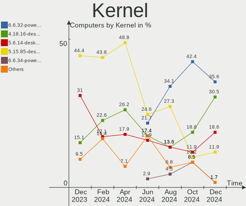
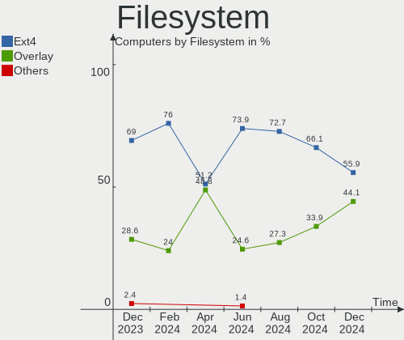
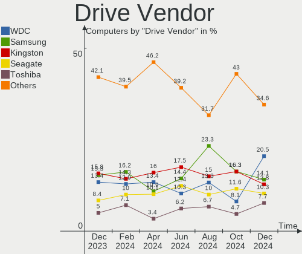
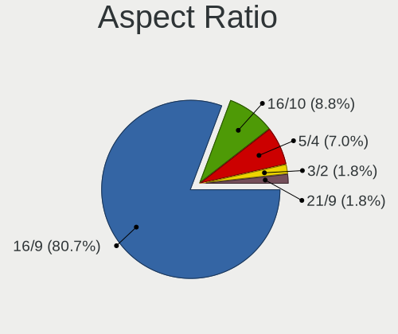
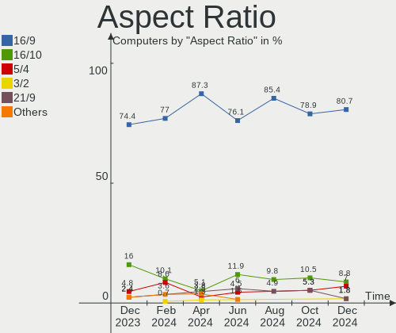
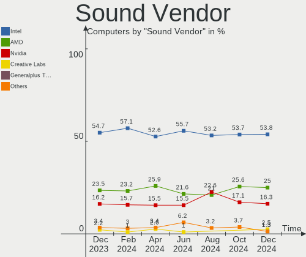

BlackPanther - Hardware Trends
------------------------------

A project to identify most popular hardware characteristics and track their change
over time based on data collected by Linux users at https://Linux-Hardware.org.

Anyone can contribute to this report by the [hw-probe](https://github.com/linuxhw/hw-probe) tool:

    sudo -E hw-probe -all -upload

This is a report for all computer types. See also reports for [desktops](/Dist/BlackPanther/Desktop/README.md) and [notebooks](/Dist/BlackPanther/Notebook/README.md).

This report is for one last month. Overall report since the beginning of time: [TestDays](https://github.com/linuxhw/TestDays)

Period: Apr, 2024.

Contents
--------

* [ System ](#system)
  - [ OS                       ](#os)
  - [ OS Family                ](#os-family)
  - [ Kernel                   ](#kernel)
  - [ Kernel Family            ](#kernel-family)
  - [ Kernel Major Ver.        ](#kernel-major-ver)
  - [ Arch                     ](#arch)
  - [ DE                       ](#de)
  - [ Display Server           ](#display-server)
  - [ Display Manager          ](#display-manager)
  - [ OS Lang                  ](#os-lang)
  - [ Boot Mode                ](#boot-mode)
  - [ Filesystem               ](#filesystem)
  - [ Part. scheme             ](#part-scheme)
  - [ Dual Boot with Linux/BSD ](#dual-boot-with-linuxbsd)
  - [ Dual Boot (Win)          ](#dual-boot-win)

* [ Board ](#board)
  - [ Vendor                   ](#vendor)
  - [ Model                    ](#model)
  - [ Model Family             ](#model-family)
  - [ MFG Year                 ](#mfg-year)
  - [ Form Factor              ](#form-factor)
  - [ Secure Boot              ](#secure-boot)
  - [ Coreboot                 ](#coreboot)
  - [ RAM Size                 ](#ram-size)
  - [ RAM Used                 ](#ram-used)
  - [ Total Drives             ](#total-drives)
  - [ Has CD-ROM               ](#has-cd-rom)
  - [ Has Ethernet             ](#has-ethernet)
  - [ Has WiFi                 ](#has-wifi)
  - [ Has Bluetooth            ](#has-bluetooth)

* [ Location ](#location)
  - [ Country                  ](#country)
  - [ City                     ](#city)

* [ Drives ](#drives)
  - [ Drive Vendor             ](#drive-vendor)
  - [ Drive Model              ](#drive-model)
  - [ HDD Vendor               ](#hdd-vendor)
  - [ SSD Vendor               ](#ssd-vendor)
  - [ Drive Kind               ](#drive-kind)
  - [ Drive Connector          ](#drive-connector)
  - [ Drive Size               ](#drive-size)
  - [ Space Total              ](#space-total)
  - [ Space Used               ](#space-used)
  - [ Malfunc. Drives          ](#malfunc-drives)
  - [ Malfunc. Drive Vendor    ](#malfunc-drive-vendor)
  - [ Malfunc. HDD Vendor      ](#malfunc-hdd-vendor)
  - [ Malfunc. Drive Kind      ](#malfunc-drive-kind)
  - [ Failed Drives            ](#failed-drives)
  - [ Failed Drive Vendor      ](#failed-drive-vendor)
  - [ Drive Status             ](#drive-status)

* [ Storage controller ](#storage-controller)
  - [ Storage Vendor           ](#storage-vendor)
  - [ Storage Model            ](#storage-model)
  - [ Storage Kind             ](#storage-kind)

* [ Processor ](#processor)
  - [ CPU Vendor               ](#cpu-vendor)
  - [ CPU Model                ](#cpu-model)
  - [ CPU Model Family         ](#cpu-model-family)
  - [ CPU Cores                ](#cpu-cores)
  - [ CPU Sockets              ](#cpu-sockets)
  - [ CPU Threads              ](#cpu-threads)
  - [ CPU Op-Modes             ](#cpu-op-modes)
  - [ CPU Microcode            ](#cpu-microcode)
  - [ CPU Microarch            ](#cpu-microarch)

* [ Graphics ](#graphics)
  - [ GPU Vendor               ](#gpu-vendor)
  - [ GPU Model                ](#gpu-model)
  - [ GPU Combo                ](#gpu-combo)
  - [ GPU Driver               ](#gpu-driver)
  - [ GPU Memory               ](#gpu-memory)

* [ Monitor ](#monitor)
  - [ Monitor Vendor           ](#monitor-vendor)
  - [ Monitor Model            ](#monitor-model)
  - [ Monitor Resolution       ](#monitor-resolution)
  - [ Monitor Diagonal         ](#monitor-diagonal)
  - [ Monitor Width            ](#monitor-width)
  - [ Aspect Ratio             ](#aspect-ratio)
  - [ Monitor Area             ](#monitor-area)
  - [ Pixel Density            ](#pixel-density)
  - [ Multiple Monitors        ](#multiple-monitors)

* [ Network ](#network)
  - [ Net Controller Vendor    ](#net-controller-vendor)
  - [ Net Controller Model     ](#net-controller-model)
  - [ Wireless Vendor          ](#wireless-vendor)
  - [ Wireless Model           ](#wireless-model)
  - [ Ethernet Vendor          ](#ethernet-vendor)
  - [ Ethernet Model           ](#ethernet-model)
  - [ Net Controller Kind      ](#net-controller-kind)
  - [ Used Controller          ](#used-controller)
  - [ NICs                     ](#nics)
  - [ IPv6                     ](#ipv6)

* [ Bluetooth ](#bluetooth)
  - [ Bluetooth Vendor         ](#bluetooth-vendor)
  - [ Bluetooth Model          ](#bluetooth-model)

* [ Sound ](#sound)
  - [ Sound Vendor             ](#sound-vendor)
  - [ Sound Model              ](#sound-model)

* [ Memory ](#memory)
  - [ Memory Vendor            ](#memory-vendor)
  - [ Memory Model             ](#memory-model)
  - [ Memory Kind              ](#memory-kind)
  - [ Memory Form Factor       ](#memory-form-factor)
  - [ Memory Size              ](#memory-size)
  - [ Memory Speed             ](#memory-speed)

* [ Printers & scanners ](#printers--scanners)
  - [ Printer Vendor           ](#printer-vendor)
  - [ Printer Model            ](#printer-model)
  - [ Scanner Vendor           ](#scanner-vendor)
  - [ Scanner Model            ](#scanner-model)

* [ Camera ](#camera)
  - [ Camera Vendor            ](#camera-vendor)
  - [ Camera Model             ](#camera-model)

* [ Security ](#security)
  - [ Fingerprint Vendor       ](#fingerprint-vendor)
  - [ Fingerprint Model        ](#fingerprint-model)
  - [ Chipcard Vendor          ](#chipcard-vendor)
  - [ Chipcard Model           ](#chipcard-model)

* [ Unsupported ](#unsupported)
  - [ Unsupported Devices      ](#unsupported-devices)
  - [ Unsupported Device Types ](#unsupported-device-types)

System
------

OS
--

Installed operating systems

| Name              | Computers | Percent |
|-------------------|-----------|---------|
| BlackPanther 18.1 | 79        | 94.05%  |
| BlackPanther 22.1 | 5         | 5.95%   |

OS Family
---------

OS without a version

| Name         | Computers | Percent |
|--------------|-----------|---------|
| BlackPanther | 84        | 100%    |

Kernel
------

Version of the Linux kernel

| Version             | Computers | Percent |
|---------------------|-----------|---------|
| 5.15.85-desktop-1bP | 41        | 48.81%  |
| 4.18.16-desktop-1bP | 22        | 26.19%  |
| 5.6.14-desktop-2bP  | 15        | 17.86%  |
| 6.3.3-desktop-1bP   | 3         | 3.57%   |
| 6.3.8-desktop-1bP   | 2         | 2.38%   |
| 6.7.0-power-2bP     | 1         | 1.19%   |

Kernel Family
-------------

Linux kernel without a distro release

| Version | Computers | Percent |
|---------|-----------|---------|
| 5.15.85 | 41        | 48.81%  |
| 4.18.16 | 22        | 26.19%  |
| 5.6.14  | 15        | 17.86%  |
| 6.3.3   | 3         | 3.57%   |
| 6.3.8   | 2         | 2.38%   |
| 6.7.0   | 1         | 1.19%   |

Kernel Major Ver.
-----------------

Linux kernel major version

| Version | Computers | Percent |
|---------|-----------|---------|
| 5.15    | 41        | 48.81%  |
| 4.18    | 22        | 26.19%  |
| 5.6     | 15        | 17.86%  |
| 6.3     | 5         | 5.95%   |
| 6.7     | 1         | 1.19%   |

Arch
----

OS architecture (x86_64, i586, etc.)

| Name   | Computers | Percent |
|--------|-----------|---------|
| x86_64 | 84        | 100%    |

DE
--

Desktop Environment

| Name    | Computers | Percent |
|---------|-----------|---------|
| KDE5    | 81        | 96.43%  |
| Unknown | 3         | 3.57%   |

Display Server
--------------

X11 or Wayland

| Name | Computers | Percent |
|------|-----------|---------|
| X11  | 84        | 100%    |

Display Manager
---------------

SDDM, LightDM, etc.

| Name    | Computers | Percent |
|---------|-----------|---------|
| SDDM    | 83        | 98.81%  |
| Unknown | 1         | 1.19%   |

OS Lang
-------

Language

| Lang    | Computers | Percent |
|---------|-----------|---------|
| Unknown | 83        | 98.81%  |
| hu_HU   | 1         | 1.19%   |

Boot Mode
---------

EFI or BIOS

| Mode | Computers | Percent |
|------|-----------|---------|
| BIOS | 54        | 64.29%  |
| EFI  | 30        | 35.71%  |

Filesystem
----------

Type of filesystem

| Type    | Computers | Percent |
|---------|-----------|---------|
| Ext4    | 43        | 51.19%  |
| Overlay | 41        | 48.81%  |

Part. scheme
------------

Scheme of partitioning

| Type    | Computers | Percent |
|---------|-----------|---------|
| GPT     | 46        | 54.76%  |
| MBR     | 37        | 44.05%  |
| Unknown | 1         | 1.19%   |

Dual Boot with Linux/BSD
------------------------

Hosting more than one Linux/BSD

| Dual boot | Computers | Percent |
|-----------|-----------|---------|
| No        | 53        | 63.1%   |
| Yes       | 31        | 36.9%   |

Dual Boot (Win)
---------------

Hosting Linux and Windows

| Dual boot | Computers | Percent |
|-----------|-----------|---------|
| No        | 49        | 58.33%  |
| Yes       | 35        | 41.67%  |

Board
-----

Vendor
------

Motherboard manufacturer

| Name                | Computers | Percent |
|---------------------|-----------|---------|
| Hewlett-Packard     | 18        | 21.43%  |
| Dell                | 16        | 19.05%  |
| ASUSTek Computer    | 14        | 16.67%  |
| Gigabyte Technology | 10        | 11.9%   |
| Lenovo              | 9         | 10.71%  |
| ASRock              | 5         | 5.95%   |
| Packard Bell        | 3         | 3.57%   |
| Toshiba             | 2         | 2.38%   |
| Fujitsu             | 2         | 2.38%   |
| Acer                | 2         | 2.38%   |
| MSI                 | 1         | 1.19%   |
| eMachines           | 1         | 1.19%   |
| Apple               | 1         | 1.19%   |

Model
-----

Motherboard model

| Name                                | Computers | Percent |
|-------------------------------------|-----------|---------|
| HP ProBook 455 G1                   | 4         | 4.76%   |
| Toshiba Satellite L650              | 2         | 2.38%   |
| Packard Bell EasyNote TK36          | 2         | 2.38%   |
| Gigabyte Z390 UD                    | 2         | 2.38%   |
| Gigabyte H61M-S1                    | 2         | 2.38%   |
| Packard Bell EasyNote TV43HC        | 1         | 1.19%   |
| MSI MS-7522                         | 1         | 1.19%   |
| Lenovo ThinkStation P520 30BFS44D04 | 1         | 1.19%   |
| Lenovo ThinkStation D20 4158AF8     | 1         | 1.19%   |
| Lenovo ThinkPad X200 74595FG        | 1         | 1.19%   |
| Lenovo ThinkPad T530 2429NL6        | 1         | 1.19%   |
| Lenovo ThinkPad T470 20HES58A1L     | 1         | 1.19%   |
| Lenovo ThinkPad T420 423662G        | 1         | 1.19%   |
| Lenovo ThinkCentre M78 10BNS02900   | 1         | 1.19%   |
| Lenovo IdeaPad 330-15IKB 81DE       | 1         | 1.19%   |
| Lenovo IdeaPad 120S-14IAP 81A5      | 1         | 1.19%   |
| HP Z400 Workstation                 | 1         | 1.19%   |
| HP ProDesk 400 G3 SFF               | 1         | 1.19%   |
| HP ProBook 650 G2                   | 1         | 1.19%   |
| HP ProBook 640 G8 Notebook PC       | 1         | 1.19%   |
| HP Presario CQ57                    | 1         | 1.19%   |
| HP Pavilion Gaming Laptop 15-ec1xxx | 1         | 1.19%   |
| HP Pavilion dv7                     | 1         | 1.19%   |
| HP Notebook                         | 1         | 1.19%   |
| HP Laptop 15-dw1xxx                 | 1         | 1.19%   |
| HP EliteDesk 705 G3 SFF             | 1         | 1.19%   |
| HP Compaq 8200 Elite CMT PC         | 1         | 1.19%   |
| HP 630                              | 1         | 1.19%   |
| HP 255 G5 Notebook PC               | 1         | 1.19%   |
| HP 250 G3                           | 1         | 1.19%   |
| Gigabyte H310M A 2.0                | 1         | 1.19%   |
| Gigabyte GA-890GPA-UD3H             | 1         | 1.19%   |
| Gigabyte F2A88XN-WIFI               | 1         | 1.19%   |
| Gigabyte B75M-D3H                   | 1         | 1.19%   |
| Gigabyte B660M GAMING DDR4          | 1         | 1.19%   |
| Gigabyte B450M GAMING               | 1         | 1.19%   |
| Fujitsu ESPRIMO E700                | 1         | 1.19%   |
| Fujitsu ESPRIMO E520                | 1         | 1.19%   |
| eMachines E725                      | 1         | 1.19%   |
| Dell Vostro 1015                    | 1         | 1.19%   |

Model Family
------------

Motherboard model prefix

| Name                    | Computers | Percent |
|-------------------------|-----------|---------|
| Dell OptiPlex           | 7         | 8.33%   |
| HP ProBook              | 6         | 7.14%   |
| Lenovo ThinkPad         | 4         | 4.76%   |
| Dell Latitude           | 4         | 4.76%   |
| Packard Bell EasyNote   | 3         | 3.57%   |
| Dell Inspiron           | 3         | 3.57%   |
| ASUS PRIME              | 3         | 3.57%   |
| Toshiba Satellite       | 2         | 2.38%   |
| Lenovo ThinkStation     | 2         | 2.38%   |
| Lenovo IdeaPad          | 2         | 2.38%   |
| HP Pavilion             | 2         | 2.38%   |
| Gigabyte Z390           | 2         | 2.38%   |
| Gigabyte H61M-S1        | 2         | 2.38%   |
| Fujitsu ESPRIMO         | 2         | 2.38%   |
| MSI MS-7522             | 1         | 1.19%   |
| Lenovo ThinkCentre      | 1         | 1.19%   |
| HP Z400                 | 1         | 1.19%   |
| HP ProDesk              | 1         | 1.19%   |
| HP Presario             | 1         | 1.19%   |
| HP Notebook             | 1         | 1.19%   |
| HP Laptop               | 1         | 1.19%   |
| HP EliteDesk            | 1         | 1.19%   |
| HP Compaq               | 1         | 1.19%   |
| HP 630                  | 1         | 1.19%   |
| HP 255                  | 1         | 1.19%   |
| HP 250                  | 1         | 1.19%   |
| Gigabyte H310M          | 1         | 1.19%   |
| Gigabyte GA-890GPA-UD3H | 1         | 1.19%   |
| Gigabyte F2A88XN-WIFI   | 1         | 1.19%   |
| Gigabyte B75M-D3H       | 1         | 1.19%   |
| Gigabyte B660M          | 1         | 1.19%   |
| Gigabyte B450M          | 1         | 1.19%   |
| eMachines E725          | 1         | 1.19%   |
| Dell Vostro             | 1         | 1.19%   |
| Dell Precision          | 1         | 1.19%   |
| ASUS ZenBook            | 1         | 1.19%   |
| ASUS X551CA             | 1         | 1.19%   |
| ASUS X541NA             | 1         | 1.19%   |
| ASUS ROG                | 1         | 1.19%   |
| ASUS P8Z77-V            | 1         | 1.19%   |

MFG Year
--------

Motherboard manufacture year

| Year | Computers | Percent |
|------|-----------|---------|
| 2011 | 13        | 15.48%  |
| 2010 | 10        | 11.9%   |
| 2012 | 9         | 10.71%  |
| 2017 | 8         | 9.52%   |
| 2013 | 7         | 8.33%   |
| 2021 | 6         | 7.14%   |
| 2018 | 6         | 7.14%   |
| 2014 | 5         | 5.95%   |
| 2016 | 4         | 4.76%   |
| 2009 | 4         | 4.76%   |
| 2019 | 3         | 3.57%   |
| 2020 | 2         | 2.38%   |
| 2015 | 2         | 2.38%   |
| 2008 | 2         | 2.38%   |
| 2007 | 2         | 2.38%   |
| 2006 | 1         | 1.19%   |

Form Factor
-----------

Physical design of the computer

| Name       | Computers | Percent |
|------------|-----------|---------|
| Notebook   | 43        | 51.19%  |
| Desktop    | 40        | 47.62%  |
| All in one | 1         | 1.19%   |

Secure Boot
-----------

Enabled or disabled

| State    | Computers | Percent |
|----------|-----------|---------|
| Disabled | 84        | 100%    |

Coreboot
--------

Have coreboot on board

| Used | Computers | Percent |
|------|-----------|---------|
| No   | 84        | 100%    |

RAM Size
--------

Total RAM memory

| Size in GB | Computers | Percent |
|------------|-----------|---------|
| 3.01-4.0   | 25        | 29.76%  |
| 8.01-16.0  | 23        | 27.38%  |
| 16.01-24.0 | 14        | 16.67%  |
| 4.01-8.0   | 11        | 13.1%   |
| 32.01-64.0 | 4         | 4.76%   |
| 1.01-2.0   | 4         | 4.76%   |
| 24.01-32.0 | 2         | 2.38%   |
| 2.01-3.0   | 1         | 1.19%   |

RAM Used
--------

Used RAM memory

| Used GB  | Computers | Percent |
|----------|-----------|---------|
| 1.01-2.0 | 40        | 47.62%  |
| 0.51-1.0 | 26        | 30.95%  |
| 0.01-0.5 | 12        | 14.29%  |
| 2.01-3.0 | 5         | 5.95%   |
| 4.01-8.0 | 1         | 1.19%   |

Total Drives
------------

Number of drives on board

| Drives | Computers | Percent |
|--------|-----------|---------|
| 1      | 56        | 66.67%  |
| 2      | 17        | 20.24%  |
| 3      | 9         | 10.71%  |
| 4      | 1         | 1.19%   |
| 0      | 1         | 1.19%   |

Has CD-ROM
----------

Has CD-ROM on board

| Presented | Computers | Percent |
|-----------|-----------|---------|
| Yes       | 56        | 66.67%  |
| No        | 28        | 33.33%  |

Has Ethernet
------------

Has Ethernet on board

| Presented | Computers | Percent |
|-----------|-----------|---------|
| Yes       | 81        | 96.43%  |
| No        | 3         | 3.57%   |

Has WiFi
--------

Has WiFi module

| Presented | Computers | Percent |
|-----------|-----------|---------|
| Yes       | 55        | 65.48%  |
| No        | 29        | 34.52%  |

Has Bluetooth
-------------

Has Bluetooth module

| Presented | Computers | Percent |
|-----------|-----------|---------|
| Yes       | 42        | 50%     |
| No        | 42        | 50%     |

Location
--------

Country
-------

Geographic location (country)

| Country  | Computers | Percent |
|----------|-----------|---------|
| Hungary  | 73        | 86.9%   |
| UK       | 3         | 3.57%   |
| Germany  | 3         | 3.57%   |
| Slovakia | 1         | 1.19%   |
| Serbia   | 1         | 1.19%   |
| Greece   | 1         | 1.19%   |
| Croatia  | 1         | 1.19%   |
| Canada   | 1         | 1.19%   |

City
----

Geographic location (city)

| City                    | Computers | Percent |
|-------------------------|-----------|---------|
| Budapest                | 25        | 29.76%  |
| Oroshaza                | 3         | 3.57%   |
| Koszeg                  | 3         | 3.57%   |
| Zalaegerszeg            | 2         | 2.38%   |
| Tatabánya              | 2         | 2.38%   |
| Szombathely             | 2         | 2.38%   |
| Pfaffenhofen an der Ilm | 2         | 2.38%   |
| Nyiregyhaza             | 2         | 2.38%   |
| Nyirad                  | 2         | 2.38%   |
| Nyergesujfalu           | 2         | 2.38%   |
| Kecskemét              | 2         | 2.38%   |
| Hatvan                  | 2         | 2.38%   |
| Győr                   | 2         | 2.38%   |
| Csongrad                | 2         | 2.38%   |
| Cegled                  | 2         | 2.38%   |
| Berettyóújfalu        | 2         | 2.38%   |
| Zalakomár              | 1         | 1.19%   |
| Winsford                | 1         | 1.19%   |
| Visnjevac               | 1         | 1.19%   |
| Tamasi                  | 1         | 1.19%   |
| Szolnok                 | 1         | 1.19%   |
| Szeged                  | 1         | 1.19%   |
| Siklos                  | 1         | 1.19%   |
| Šahy                   | 1         | 1.19%   |
| Pécs                   | 1         | 1.19%   |
| Opusztaszer             | 1         | 1.19%   |
| Nyaregyhaza             | 1         | 1.19%   |
| Lewisham                | 1         | 1.19%   |
| Kingston                | 1         | 1.19%   |
| Kastoria                | 1         | 1.19%   |
| Karloca                 | 1         | 1.19%   |
| Karcag                  | 1         | 1.19%   |
| Kaposvár               | 1         | 1.19%   |
| Jaszbereny              | 1         | 1.19%   |
| Isaszeg                 | 1         | 1.19%   |
| Heves                   | 1         | 1.19%   |
| Fulop                   | 1         | 1.19%   |
| Fertoszentmiklos        | 1         | 1.19%   |
| Esztergom               | 1         | 1.19%   |
| Dombovar                | 1         | 1.19%   |

Drives
------

Drive Vendor
------------

Hard drive vendors

| Vendor                      | Computers | Drives | Percent |
|-----------------------------|-----------|--------|---------|
| Kingston                    | 19        | 19     | 15.97%  |
| WDC                         | 16        | 16     | 13.45%  |
| Samsung Electronics         | 13        | 14     | 10.92%  |
| Seagate                     | 12        | 12     | 10.08%  |
| Intenso                     | 8         | 8      | 6.72%   |
| HGST                        | 7         | 8      | 5.88%   |
| SanDisk                     | 5         | 5      | 4.2%    |
| Toshiba                     | 4         | 4      | 3.36%   |
| Hitachi                     | 3         | 3      | 2.52%   |
| Unknown                     | 2         | 2      | 1.68%   |
| SPCC                        | 2         | 2      | 1.68%   |
| SK hynix                    | 2         | 2      | 1.68%   |
| Kingston Technology Company | 2         | 2      | 1.68%   |
| Kingmax                     | 2         | 2      | 1.68%   |
| China                       | 2         | 2      | 1.68%   |
| Unknown                     | 2         | 2      | 1.68%   |
| Zheino                      | 1         | 1      | 0.84%   |
| Timetec                     | 1         | 1      | 0.84%   |
| SSSTC                       | 1         | 1      | 0.84%   |
| Realtek Semiconductor       | 1         | 1      | 0.84%   |
| PNY                         | 1         | 1      | 0.84%   |
| Patriot                     | 1         | 1      | 0.84%   |
| Micron/Crucial Technology   | 1         | 1      | 0.84%   |
| Micron Technology           | 1         | 1      | 0.84%   |
| KIOXIA                      | 1         | 1      | 0.84%   |
| KingSpec                    | 1         | 1      | 0.84%   |
| Intel                       | 1         | 1      | 0.84%   |
| Integral                    | 1         | 1      | 0.84%   |
| ICY BOX                     | 1         | 1      | 0.84%   |
| Gigabyte Technology         | 1         | 1      | 0.84%   |
| ExcelStor                   | 1         | 1      | 0.84%   |
| Crucial                     | 1         | 1      | 0.84%   |
| Apacer                      | 1         | 1      | 0.84%   |
| A-DATA Technology           | 1         | 1      | 0.84%   |

Drive Model
-----------

Hard drive models

| Model                                 | Computers | Percent |
|---------------------------------------|-----------|---------|
| Kingston SA400S37120G 120GB SSD       | 5         | 4.17%   |
| Kingston SA400S37240G 240GB SSD       | 4         | 3.33%   |
| Kingston SNV2S500G 500GB              | 3         | 2.5%    |
| Kingston SA400S37480G 480GB SSD       | 3         | 2.5%    |
| Intenso SSD 120GB                     | 3         | 2.5%    |
| WDC WD5000AAKS-007AA0 500GB           | 2         | 1.67%   |
| WDC WD10JPVX-60JC3T0 1TB              | 2         | 1.67%   |
| Toshiba MQ01ACF050 500GB              | 2         | 1.67%   |
| Seagate ST500LT012-1DG142 500GB       | 2         | 1.67%   |
| SanDisk SDSSDH3512G 512GB             | 2         | 1.67%   |
| Samsung SSD 970 EVO 500GB             | 2         | 1.67%   |
| Samsung SSD 860 EVO 500GB             | 2         | 1.67%   |
| Kingston Company A2000 NVMe SSD 500GB | 2         | 1.67%   |
| Kingston SV300S37A120G 120GB SSD      | 2         | 1.67%   |
| Kingmax SSD 240GB                     | 2         | 1.67%   |
| HGST HTS725050A7E630 500GB            | 2         | 1.67%   |
| Unknown                               | 2         | 1.67%   |
| Zheino CHN-NGFFNV2280-256 256GB       | 1         | 0.83%   |
| WDC WDS500G2B0C-00PXH0 500GB          | 1         | 0.83%   |
| WDC WDS240G2G0B-00EPW0 240GB SSD      | 1         | 0.83%   |
| WDC WD800AAJS-75M0A0 80GB             | 1         | 0.83%   |
| WDC WD6400BPVT-80HXZT3 640GB          | 1         | 0.83%   |
| WDC WD5000LPVX-80V0TT0 500GB          | 1         | 0.83%   |
| WDC WD5000AAKX-329BA0 500GB           | 1         | 0.83%   |
| WDC WD5000AAKS-40V6A0 500GB           | 1         | 0.83%   |
| WDC WD2500KS-00MJB0 250GB             | 1         | 0.83%   |
| WDC WD20EZBX-00AYRA0 2TB              | 1         | 0.83%   |
| WDC WD10JPVX-22JC3T0 1TB              | 1         | 0.83%   |
| WDC WD10EZEX-22MFCA0 1TB              | 1         | 0.83%   |
| WDC WD10EZEX-00KUWA0 1TB              | 1         | 0.83%   |
| Unknown SD64G  64GB                   | 1         | 0.83%   |
| Unknown SD/MMC/MS PRO 128GB           | 1         | 0.83%   |
| Toshiba MK2565GSX 250GB               | 1         | 0.83%   |
| Toshiba DT01ACA100 1TB                | 1         | 0.83%   |
| Timetec SD08 512GB SSD                | 1         | 0.83%   |
| SSSTC CL1-8D256-HP 256GB              | 1         | 0.83%   |
| SPCC Solid State Disk 512GB           | 1         | 0.83%   |
| SPCC Solid State Disk 256GB           | 1         | 0.83%   |
| SK hynix HFS256G3BTND-N210A 256GB SSD | 1         | 0.83%   |
| SK hynix HFM512GD3JX013N 512GB        | 1         | 0.83%   |

HDD Vendor
----------

Hard disk drive vendors

| Vendor              | Computers | Drives | Percent |
|---------------------|-----------|--------|---------|
| WDC                 | 14        | 14     | 32.56%  |
| Seagate             | 11        | 11     | 25.58%  |
| HGST                | 7         | 8      | 16.28%  |
| Toshiba             | 4         | 4      | 9.3%    |
| Hitachi             | 3         | 3      | 6.98%   |
| Unknown             | 1         | 1      | 2.33%   |
| Samsung Electronics | 1         | 1      | 2.33%   |
| ICY BOX             | 1         | 1      | 2.33%   |
| ExcelStor           | 1         | 1      | 2.33%   |

SSD Vendor
----------

Solid state drive vendors

| Vendor              | Computers | Drives | Percent |
|---------------------|-----------|--------|---------|
| Kingston            | 16        | 16     | 30.77%  |
| Intenso             | 8         | 8      | 15.38%  |
| Samsung Electronics | 6         | 6      | 11.54%  |
| SanDisk             | 3         | 3      | 5.77%   |
| SPCC                | 2         | 2      | 3.85%   |
| Kingmax             | 2         | 2      | 3.85%   |
| China               | 2         | 2      | 3.85%   |
| WDC                 | 1         | 1      | 1.92%   |
| Timetec             | 1         | 1      | 1.92%   |
| SK hynix            | 1         | 1      | 1.92%   |
| PNY                 | 1         | 1      | 1.92%   |
| Patriot             | 1         | 1      | 1.92%   |
| Micron Technology   | 1         | 1      | 1.92%   |
| KingSpec            | 1         | 1      | 1.92%   |
| Intel               | 1         | 1      | 1.92%   |
| Integral            | 1         | 1      | 1.92%   |
| Crucial             | 1         | 1      | 1.92%   |
| Apacer              | 1         | 1      | 1.92%   |
| A-DATA Technology   | 1         | 1      | 1.92%   |
| Unknown             | 1         | 1      | 1.92%   |

Drive Kind
----------

HDD or SSD

| Kind    | Computers | Drives | Percent |
|---------|-----------|--------|---------|
| SSD     | 48        | 52     | 44.04%  |
| HDD     | 39        | 44     | 35.78%  |
| NVMe    | 18        | 21     | 16.51%  |
| MMC     | 3         | 3      | 2.75%   |
| Unknown | 1         | 1      | 0.92%   |

Drive Connector
---------------

SATA, SAS, NVMe, etc.

| Type | Computers | Drives | Percent |
|------|-----------|--------|---------|
| SATA | 71        | 92     | 73.2%   |
| NVMe | 18        | 21     | 18.56%  |
| SAS  | 5         | 5      | 5.15%   |
| MMC  | 3         | 3      | 3.09%   |

Drive Size
----------

Size of hard drive

| Size in TB | Computers | Drives | Percent |
|------------|-----------|--------|---------|
| 0.01-0.5   | 61        | 71     | 73.49%  |
| 0.51-1.0   | 18        | 20     | 21.69%  |
| 1.01-2.0   | 3         | 3      | 3.61%   |
| 3.01-4.0   | 1         | 2      | 1.2%    |

Space Total
-----------

Amount of disk space available on the file system

| Size in GB | Computers | Percent |
|------------|-----------|---------|
| Unknown    | 40        | 47.62%  |
| 101-250    | 21        | 25%     |
| 251-500    | 13        | 15.48%  |
| 51-100     | 5         | 5.95%   |
| 501-1000   | 3         | 3.57%   |
| 21-50      | 1         | 1.19%   |
| 2001-3000  | 1         | 1.19%   |

Space Used
----------

Amount of used disk space

| Used GB  | Computers | Percent |
|----------|-----------|---------|
| Unknown  | 40        | 47.62%  |
| 1-20     | 27        | 32.14%  |
| 51-100   | 8         | 9.52%   |
| 21-50    | 4         | 4.76%   |
| 101-250  | 4         | 4.76%   |
| 501-1000 | 1         | 1.19%   |

Malfunc. Drives
---------------

Drive models with a malfunction

| Model                                 | Computers | Drives | Percent |
|---------------------------------------|-----------|--------|---------|
| HGST HTS725050A7E630 500GB            | 2         | 2      | 8.33%   |
| WDC WD6400BPVT-80HXZT3 640GB          | 1         | 1      | 4.17%   |
| WDC WD5000AAKS-40V6A0 500GB           | 1         | 1      | 4.17%   |
| WDC WD5000AAKS-007AA0 500GB           | 1         | 1      | 4.17%   |
| WDC WD2500KS-00MJB0 250GB             | 1         | 1      | 4.17%   |
| WDC WD10JPVX-22JC3T0 1TB              | 1         | 1      | 4.17%   |
| Toshiba MK2565GSX 250GB               | 1         | 1      | 4.17%   |
| Timetec SD08 512GB SSD                | 1         | 1      | 4.17%   |
| SK hynix HFS256G3BTND-N210A 256GB SSD | 1         | 1      | 4.17%   |
| Seagate ST9160310AS 160GB             | 1         | 1      | 4.17%   |
| Seagate ST500LT012-1DG142 500GB       | 1         | 1      | 4.17%   |
| Seagate ST500LM000-SSHD-8GB           | 1         | 1      | 4.17%   |
| Seagate ST1000LM024 HN-M101MBB 1TB    | 1         | 1      | 4.17%   |
| Samsung Electronics SSD 750 EVO 250GB | 1         | 1      | 4.17%   |
| Samsung Electronics HD103UJ 1TB       | 1         | 1      | 4.17%   |
| Kingston SV300S37A120G 120GB SSD      | 1         | 1      | 4.17%   |
| Intel SSDSC2BF180A4H 180GB            | 1         | 1      | 4.17%   |
| ICY BOX IB-243U3 2TB                  | 1         | 1      | 4.17%   |
| Hitachi HTS542525K9A300 250GB         | 1         | 1      | 4.17%   |
| Hitachi HCS5C1032CLA382 320GB         | 1         | 1      | 4.17%   |
| HGST HTS545050A7E380 500GB            | 1         | 1      | 4.17%   |
| China SATA SSD 240GB                  | 1         | 1      | 4.17%   |
| A-DATA Technology SU630 240GB SSD     | 1         | 1      | 4.17%   |

Malfunc. Drive Vendor
---------------------

Vendors of faulty drives

| Vendor              | Computers | Drives | Percent |
|---------------------|-----------|--------|---------|
| WDC                 | 5         | 5      | 20.83%  |
| Seagate             | 4         | 4      | 16.67%  |
| HGST                | 3         | 3      | 12.5%   |
| Samsung Electronics | 2         | 2      | 8.33%   |
| Hitachi             | 2         | 2      | 8.33%   |
| Toshiba             | 1         | 1      | 4.17%   |
| Timetec             | 1         | 1      | 4.17%   |
| SK hynix            | 1         | 1      | 4.17%   |
| Kingston            | 1         | 1      | 4.17%   |
| Intel               | 1         | 1      | 4.17%   |
| ICY BOX             | 1         | 1      | 4.17%   |
| China               | 1         | 1      | 4.17%   |
| A-DATA Technology   | 1         | 1      | 4.17%   |

Malfunc. HDD Vendor
-------------------

Vendors of faulty HDD drives

| Vendor              | Computers | Drives | Percent |
|---------------------|-----------|--------|---------|
| WDC                 | 5         | 5      | 29.41%  |
| Seagate             | 4         | 4      | 23.53%  |
| HGST                | 3         | 3      | 17.65%  |
| Hitachi             | 2         | 2      | 11.76%  |
| Toshiba             | 1         | 1      | 5.88%   |
| Samsung Electronics | 1         | 1      | 5.88%   |
| ICY BOX             | 1         | 1      | 5.88%   |

Malfunc. Drive Kind
-------------------

Kinds of faulty drives

| Kind | Computers | Drives | Percent |
|------|-----------|--------|---------|
| HDD  | 16        | 17     | 69.57%  |
| SSD  | 7         | 7      | 30.43%  |

Failed Drives
-------------

Failed drive models

| Model                             | Computers | Drives | Percent |
|-----------------------------------|-----------|--------|---------|
| Samsung Electronics SSD 980 500GB | 1         | 1      | 50%     |
| ExcelStor Technology J8160S 160GB | 1         | 1      | 50%     |

Failed Drive Vendor
-------------------

Failed drive vendors

| Vendor              | Computers | Drives | Percent |
|---------------------|-----------|--------|---------|
| Samsung Electronics | 1         | 1      | 50%     |
| ExcelStor           | 1         | 1      | 50%     |

Drive Status
------------

Number of failed and malfunc. drives

| Status   | Computers | Drives | Percent |
|----------|-----------|--------|---------|
| Works    | 64        | 85     | 66.67%  |
| Malfunc  | 22        | 24     | 22.92%  |
| Detected | 8         | 10     | 8.33%   |
| Failed   | 2         | 2      | 2.08%   |

Storage controller
------------------

Storage Vendor
--------------

Storage controller vendors

| Vendor                         | Computers | Percent |
|--------------------------------|-----------|---------|
| Intel                          | 59        | 55.66%  |
| AMD                            | 20        | 18.87%  |
| Samsung Electronics            | 6         | 5.66%   |
| Kingston Technology Company    | 5         | 4.72%   |
| SanDisk                        | 2         | 1.89%   |
| JMicron Technology             | 2         | 1.89%   |
| VIA Technologies               | 1         | 0.94%   |
| Toshiba America Info Systems   | 1         | 0.94%   |
| Solid State Storage Technology | 1         | 0.94%   |
| SK hynix                       | 1         | 0.94%   |
| Silicon Motion                 | 1         | 0.94%   |
| Realtek Semiconductor          | 1         | 0.94%   |
| Phison Electronics             | 1         | 0.94%   |
| Nvidia                         | 1         | 0.94%   |
| Micron/Crucial Technology      | 1         | 0.94%   |
| ASMedia Technology             | 1         | 0.94%   |
| Adaptec                        | 1         | 0.94%   |
| 3ware                          | 1         | 0.94%   |

Storage Model
-------------

Storage controller models

| Model                                                                                   | Computers | Percent |
|-----------------------------------------------------------------------------------------|-----------|---------|
| AMD FCH SATA Controller [AHCI mode]                                                     | 15        | 12.2%   |
| Intel 7 Series Chipset Family 6-port SATA Controller [AHCI mode]                        | 6         | 4.88%   |
| Intel SATA Controller [RAID mode]                                                       | 5         | 4.07%   |
| Intel 82801IBM/IEM (ICH9M/ICH9M-E) 4 port SATA Controller [AHCI mode]                   | 5         | 4.07%   |
| Intel 6 Series/C200 Series Chipset Family 6 port Desktop SATA AHCI Controller           | 4         | 3.25%   |
| Intel 200 Series PCH SATA controller [AHCI mode]                                        | 4         | 3.25%   |
| Samsung NVMe SSD Controller SM981/PM981/PM983                                           | 3         | 2.44%   |
| Intel Volume Management Device NVMe RAID Controller                                     | 3         | 2.44%   |
| Intel Cannon Lake PCH SATA AHCI Controller                                              | 3         | 2.44%   |
| Intel 6 Series/C200 Series Chipset Family 6 port Mobile SATA AHCI Controller            | 3         | 2.44%   |
| AMD SB7x0/SB8x0/SB9x0 IDE Controller                                                    | 3         | 2.44%   |
| Samsung NVMe SSD Controller 980 (DRAM-less)                                             | 2         | 1.63%   |
| Kingston Company NV2 NVMe SSD SM2267XT (DRAM-less)                                      | 2         | 1.63%   |
| Kingston Company A2000 NVMe SSD SM2263EN                                                | 2         | 1.63%   |
| JMicron JMB363 SATA/IDE Controller                                                      | 2         | 1.63%   |
| Intel Q170/Q150/B150/H170/H110/Z170/CM236 Chipset SATA Controller [AHCI Mode]           | 2         | 1.63%   |
| Intel Celeron N3350/Pentium N4200/Atom E3900 Series SATA AHCI Controller                | 2         | 1.63%   |
| Intel Alder Lake-S PCH SATA Controller [AHCI Mode]                                      | 2         | 1.63%   |
| Intel 82801IBM/IEM (ICH9M/ICH9M-E) 2 port SATA Controller [IDE mode]                    | 2         | 1.63%   |
| Intel 82801 Mobile SATA Controller [RAID mode]                                          | 2         | 1.63%   |
| Intel 8 Series/C220 Series Chipset Family 6-port SATA Controller 1 [AHCI mode]          | 2         | 1.63%   |
| Intel 6 Series/C200 Series Chipset Family Desktop SATA Controller (IDE mode, ports 4-5) | 2         | 1.63%   |
| Intel 6 Series/C200 Series Chipset Family Desktop SATA Controller (IDE mode, ports 0-3) | 2         | 1.63%   |
| Intel 5 Series/3400 Series Chipset 4 port SATA AHCI Controller                          | 2         | 1.63%   |
| AMD SB7x0/SB8x0/SB9x0 SATA Controller [IDE mode]                                        | 2         | 1.63%   |
| AMD SB7x0/SB8x0/SB9x0 SATA Controller [AHCI mode]                                       | 2         | 1.63%   |
| VIA VT82C586A/B/VT82C686/A/B/VT823x/A/C PIPC Bus Master IDE                             | 1         | 0.81%   |
| VIA VT8237/8251 Serial ATA Controller                                                   | 1         | 0.81%   |
| Toshiba America Info Systems XG6 NVMe SSD Controller                                    | 1         | 0.81%   |
| Solid State Storage CL1-3D256-Q11 NVMe SSD M.2                                          | 1         | 0.81%   |
| SK hynix Gold P31/BC711/PC711 NVMe Solid State Drive                                    | 1         | 0.81%   |
| Silicon Motion SM2263EN/SM2263XT (DRAM-less) NVMe SSD Controllers                       | 1         | 0.81%   |
| SanDisk WD Blue SN570 NVMe SSD 2TB                                                      | 1         | 0.81%   |
| SanDisk Ultra 3D / WD Blue SN550 NVMe SSD                                               | 1         | 0.81%   |
| Samsung NVMe SSD Controller PM9A1/PM9A3/980PRO                                          | 1         | 0.81%   |
| Realtek RTS5762 NVMe SSD Controller                                                     | 1         | 0.81%   |
| Phison E16 PCIe4 NVMe Controller                                                        | 1         | 0.81%   |
| Nvidia MCP51 Serial ATA Controller                                                      | 1         | 0.81%   |
| Micron/Crucial P1 NVMe PCIe SSD[Frampton2]                                              | 1         | 0.81%   |
| Kingston Company NV2 NVMe SSD E21T (DRAM-less)                                          | 1         | 0.81%   |

Storage Kind
------------

Kind of storage controller (IDE, SATA, NVMe, SAS, ...)

| Kind | Computers | Percent |
|------|-----------|---------|
| SATA | 64        | 58.72%  |
| NVMe | 18        | 16.51%  |
| IDE  | 15        | 13.76%  |
| RAID | 11        | 10.09%  |
| SCSI | 1         | 0.92%   |

Processor
---------

CPU Vendor
----------

Processor vendors

| Vendor | Computers | Percent |
|--------|-----------|---------|
| Intel  | 62        | 73.81%  |
| AMD    | 22        | 26.19%  |

CPU Model
---------

Processor models

| Model                                       | Computers | Percent |
|---------------------------------------------|-----------|---------|
| AMD A10-5750M APU with Radeon HD Graphics   | 4         | 4.76%   |
| Intel Core i5-9400 CPU @ 2.90GHz            | 2         | 2.38%   |
| Intel Core i5-2320 CPU @ 3.00GHz            | 2         | 2.38%   |
| Intel Core i3-3217U CPU @ 1.80GHz           | 2         | 2.38%   |
| Intel Core i3-2120 CPU @ 3.30GHz            | 2         | 2.38%   |
| Intel Core i3 CPU M 330 @ 2.13GHz           | 2         | 2.38%   |
| Intel Xeon W-2135 CPU @ 3.70GHz             | 1         | 1.19%   |
| Intel Xeon CPU X5677 @ 3.47GHz              | 1         | 1.19%   |
| Intel Xeon CPU L5640 @ 2.27GHz              | 1         | 1.19%   |
| Intel Xeon CPU E5530 @ 2.40GHz              | 1         | 1.19%   |
| Intel Pentium Dual-Core CPU T4500 @ 2.30GHz | 1         | 1.19%   |
| Intel Pentium Dual-Core CPU T4400 @ 2.20GHz | 1         | 1.19%   |
| Intel Pentium CPU B980 @ 2.40GHz            | 1         | 1.19%   |
| Intel Core i7-7700 CPU @ 3.60GHz            | 1         | 1.19%   |
| Intel Core i7-6820HQ CPU @ 2.70GHz          | 1         | 1.19%   |
| Intel Core i7-6700 CPU @ 3.40GHz            | 1         | 1.19%   |
| Intel Core i7-6600U CPU @ 2.60GHz           | 1         | 1.19%   |
| Intel Core i7-4790 CPU @ 3.60GHz            | 1         | 1.19%   |
| Intel Core i7-3770K CPU @ 3.50GHz           | 1         | 1.19%   |
| Intel Core i7-3632QM CPU @ 2.20GHz          | 1         | 1.19%   |
| Intel Core i7 CPU 950 @ 3.07GHz             | 1         | 1.19%   |
| Intel Core i5-8600K CPU @ 3.60GHz           | 1         | 1.19%   |
| Intel Core i5-8500 CPU @ 3.00GHz            | 1         | 1.19%   |
| Intel Core i5-8250U CPU @ 1.60GHz           | 1         | 1.19%   |
| Intel Core i5-7300U CPU @ 2.60GHz           | 1         | 1.19%   |
| Intel Core i5-5200U CPU @ 2.20GHz           | 1         | 1.19%   |
| Intel Core i5-4210U CPU @ 1.70GHz           | 1         | 1.19%   |
| Intel Core i5-3470 CPU @ 3.20GHz            | 1         | 1.19%   |
| Intel Core i5-3340M CPU @ 2.70GHz           | 1         | 1.19%   |
| Intel Core i5-3320M CPU @ 2.60GHz           | 1         | 1.19%   |
| Intel Core i5-2540M CPU @ 2.60GHz           | 1         | 1.19%   |
| Intel Core i5-2520M CPU @ 2.50GHz           | 1         | 1.19%   |
| Intel Core i5-2500S CPU @ 2.70GHz           | 1         | 1.19%   |
| Intel Core i5-2450M CPU @ 2.50GHz           | 1         | 1.19%   |
| Intel Core i5-2400 CPU @ 3.10GHz            | 1         | 1.19%   |
| Intel Core i3-9100F CPU @ 3.60GHz           | 1         | 1.19%   |
| Intel Core i3-9100 CPU @ 3.60GHz            | 1         | 1.19%   |
| Intel Core i3-8100 CPU @ 3.60GHz            | 1         | 1.19%   |
| Intel Core i3-6100 CPU @ 3.70GHz            | 1         | 1.19%   |
| Intel Core i3-4130 CPU @ 3.40GHz            | 1         | 1.19%   |

CPU Model Family
----------------

Processor model prefix

| Model                   | Computers | Percent |
|-------------------------|-----------|---------|
| Intel Core i5           | 18        | 21.43%  |
| Intel Core i3           | 13        | 15.48%  |
| Intel Core i7           | 8         | 9.52%   |
| Intel Core 2 Duo        | 6         | 7.14%   |
| Other                   | 5         | 5.95%   |
| AMD A10                 | 5         | 5.95%   |
| Intel Xeon              | 4         | 4.76%   |
| Intel Celeron           | 3         | 3.57%   |
| AMD Ryzen 7             | 3         | 3.57%   |
| Intel Pentium Dual-Core | 2         | 2.38%   |
| AMD Ryzen 5             | 2         | 2.38%   |
| AMD Phenom II X4        | 2         | 2.38%   |
| AMD E                   | 2         | 2.38%   |
| AMD A6                  | 2         | 2.38%   |
| Intel Pentium           | 1         | 1.19%   |
| Intel Core 2 Quad       | 1         | 1.19%   |
| Intel Core 2            | 1         | 1.19%   |
| Intel Celeron Dual-Core | 1         | 1.19%   |
| AMD Ryzen 3             | 1         | 1.19%   |
| AMD Athlon X4           | 1         | 1.19%   |
| AMD Athlon 64 X2        | 1         | 1.19%   |
| AMD A8                  | 1         | 1.19%   |
| AMD A4                  | 1         | 1.19%   |

CPU Cores
---------

Number of processor cores

| Number | Computers | Percent |
|--------|-----------|---------|
| 2      | 42        | 50%     |
| 4      | 24        | 28.57%  |
| 6      | 11        | 13.1%   |
| 8      | 4         | 4.76%   |
| 1      | 3         | 3.57%   |

CPU Sockets
-----------

Number of sockets

| Number | Computers | Percent |
|--------|-----------|---------|
| 1      | 83        | 98.81%  |
| 2      | 1         | 1.19%   |

CPU Threads
-----------

Threads per core (Hyper-Threading)

| Number | Computers | Percent |
|--------|-----------|---------|
| 2      | 48        | 57.14%  |
| 1      | 36        | 42.86%  |

CPU Op-Modes
------------

CPU Operation Modes (32-bit, 64-bit)

| Op mode        | Computers | Percent |
|----------------|-----------|---------|
| 32-bit, 64-bit | 84        | 100%    |

CPU Microcode
-------------

Microcode number

| Number     | Computers | Percent |
|------------|-----------|---------|
| 0x206a7    | 10        | 11.9%   |
| 0x1067a    | 8         | 9.52%   |
| Unknown    | 8         | 9.52%   |
| 0x306a9    | 7         | 8.33%   |
| 0x06001119 | 5         | 5.95%   |
| 0x906ea    | 3         | 3.57%   |
| 0x506e3    | 3         | 3.57%   |
| 0x906eb    | 2         | 2.38%   |
| 0x506c9    | 2         | 2.38%   |
| 0x306c3    | 2         | 2.38%   |
| 0x20652    | 2         | 2.38%   |
| 0x106a5    | 2         | 2.38%   |
| 0x06003106 | 2         | 2.38%   |
| 0x010000c8 | 2         | 2.38%   |
| 0x906e9    | 1         | 1.19%   |
| 0x90675    | 1         | 1.19%   |
| 0x90672    | 1         | 1.19%   |
| 0x806ec    | 1         | 1.19%   |
| 0x806ea    | 1         | 1.19%   |
| 0x806e9    | 1         | 1.19%   |
| 0x806c1    | 1         | 1.19%   |
| 0x6fb      | 1         | 1.19%   |
| 0x6f2      | 1         | 1.19%   |
| 0x406e3    | 1         | 1.19%   |
| 0x40651    | 1         | 1.19%   |
| 0x306d4    | 1         | 1.19%   |
| 0x30678    | 1         | 1.19%   |
| 0x206c2    | 1         | 1.19%   |
| 0x10676    | 1         | 1.19%   |
| 0x0a50000d | 1         | 1.19%   |
| 0x0a20120a | 1         | 1.19%   |
| 0x08608103 | 1         | 1.19%   |
| 0x08101016 | 1         | 1.19%   |
| 0x08001137 | 1         | 1.19%   |
| 0x07030105 | 1         | 1.19%   |
| 0x0600611a | 1         | 1.19%   |
| 0x06003109 | 1         | 1.19%   |
| 0x05000119 | 1         | 1.19%   |
| 0x05000029 | 1         | 1.19%   |
| 0x03000027 | 1         | 1.19%   |

CPU Microarch
-------------

Microarchitecture

| Name             | Computers | Percent |
|------------------|-----------|---------|
| SandyBridge      | 11        | 13.1%   |
| KabyLake         | 11        | 13.1%   |
| Penryn           | 9         | 10.71%  |
| IvyBridge        | 7         | 8.33%   |
| Skylake          | 5         | 5.95%   |
| Piledriver       | 5         | 5.95%   |
| Westmere         | 4         | 4.76%   |
| Steamroller      | 3         | 3.57%   |
| Haswell          | 3         | 3.57%   |
| Zen 3            | 2         | 2.38%   |
| Zen              | 2         | 2.38%   |
| Nehalem          | 2         | 2.38%   |
| K10              | 2         | 2.38%   |
| Goldmont         | 2         | 2.38%   |
| Core             | 2         | 2.38%   |
| Bobcat           | 2         | 2.38%   |
| Alderlake Hybrid | 2         | 2.38%   |
| Unknown          | 2         | 2.38%   |
| Zen 2            | 1         | 1.19%   |
| TigerLake        | 1         | 1.19%   |
| Silvermont       | 1         | 1.19%   |
| Puma             | 1         | 1.19%   |
| K8 Hammer        | 1         | 1.19%   |
| K10 Llano        | 1         | 1.19%   |
| Excavator        | 1         | 1.19%   |
| Broadwell        | 1         | 1.19%   |

Graphics
--------

GPU Vendor
----------

Vendors of graphics cards

| Vendor | Computers | Percent |
|--------|-----------|---------|
| Intel  | 46        | 48.42%  |
| AMD    | 26        | 27.37%  |
| Nvidia | 23        | 24.21%  |

GPU Model
---------

Graphics card models

| Model                                                                         | Computers | Percent |
|-------------------------------------------------------------------------------|-----------|---------|
| Intel 2nd Generation Core Processor Family Integrated Graphics Controller     | 7         | 7.14%   |
| Intel Mobile 4 Series Chipset Integrated Graphics Controller                  | 6         | 6.12%   |
| Intel CoffeeLake-S GT2 [UHD Graphics 630]                                     | 5         | 5.1%    |
| Intel 3rd Gen Core processor Graphics Controller                              | 5         | 5.1%    |
| AMD Richland [Radeon HD 8650G]                                                | 4         | 4.08%   |
| Nvidia GF108 [GeForce GT 630]                                                 | 3         | 3.06%   |
| Intel HD Graphics 530                                                         | 3         | 3.06%   |
| Nvidia GP107 [GeForce GTX 1050 Ti]                                            | 2         | 2.04%   |
| Intel HD Graphics 500                                                         | 2         | 2.04%   |
| Intel Core Processor Integrated Graphics Controller                           | 2         | 2.04%   |
| AMD Wrestler [Radeon HD 6310]                                                 | 2         | 2.04%   |
| AMD Oland PRO [Radeon R7 240/340 / Radeon 520]                                | 2         | 2.04%   |
| Nvidia TU117M [GeForce GTX 1650 Ti Mobile]                                    | 1         | 1.02%   |
| Nvidia TU116 [GeForce GTX 1660 SUPER]                                         | 1         | 1.02%   |
| Nvidia GP106 [GeForce GTX 1060 6GB]                                           | 1         | 1.02%   |
| Nvidia GP106 [GeForce GTX 1060 3GB]                                           | 1         | 1.02%   |
| Nvidia GP104 [GeForce GTX 1080]                                               | 1         | 1.02%   |
| Nvidia GM206 [GeForce GTX 950]                                                | 1         | 1.02%   |
| Nvidia GM108M [GeForce 930MX]                                                 | 1         | 1.02%   |
| Nvidia GK208BM [GeForce 920M]                                                 | 1         | 1.02%   |
| Nvidia GK208B [GeForce GT 710]                                                | 1         | 1.02%   |
| Nvidia GF119M [NVS 4200M]                                                     | 1         | 1.02%   |
| Nvidia GF119 [GeForce 605]                                                    | 1         | 1.02%   |
| Nvidia GF117M [GeForce 610M/710M/810M/820M / GT 620M/625M/630M/720M]          | 1         | 1.02%   |
| Nvidia GA107M [GeForce RTX 3050 Ti Mobile]                                    | 1         | 1.02%   |
| Nvidia GA106 [GeForce RTX 3060]                                               | 1         | 1.02%   |
| Nvidia G96CM [GeForce 9600M GT]                                               | 1         | 1.02%   |
| Nvidia G96CGL [Quadro FX 580]                                                 | 1         | 1.02%   |
| Nvidia G94 [GeForce 9600 GT]                                                  | 1         | 1.02%   |
| Nvidia C51 [GeForce 6150 LE]                                                  | 1         | 1.02%   |
| Intel Xeon E3-1200 v3/4th Gen Core Processor Integrated Graphics Controller   | 1         | 1.02%   |
| Intel UHD Graphics 620                                                        | 1         | 1.02%   |
| Intel TigerLake-H GT1 [UHD Graphics]                                          | 1         | 1.02%   |
| Intel Tiger Lake-LP GT2 [UHD Graphics G4]                                     | 1         | 1.02%   |
| Intel Skylake GT2 [HD Graphics 520]                                           | 1         | 1.02%   |
| Intel Mobile 945GM/GMS/GME, 943/940GML Express Integrated Graphics Controller | 1         | 1.02%   |
| Intel Mobile 945GM/GMS, 943/940GML Express Integrated Graphics Controller     | 1         | 1.02%   |
| Intel IvyBridge GT2 [HD Graphics 4000]                                        | 1         | 1.02%   |
| Intel HD Graphics 630                                                         | 1         | 1.02%   |
| Intel HD Graphics 620                                                         | 1         | 1.02%   |

GPU Combo
---------

Combinations of graphics cards

| Name           | Computers | Percent |
|----------------|-----------|---------|
| 1 x Intel      | 36        | 42.86%  |
| 1 x AMD        | 21        | 25%     |
| 1 x Nvidia     | 17        | 20.24%  |
| Intel + Nvidia | 5         | 5.95%   |
| 2 x AMD        | 2         | 2.38%   |
| Intel + AMD    | 2         | 2.38%   |
| AMD + Nvidia   | 1         | 1.19%   |

GPU Driver
----------

Free vs proprietary

| Driver  | Computers | Percent |
|---------|-----------|---------|
| Free    | 82        | 97.62%  |
| Unknown | 2         | 2.38%   |

GPU Memory
----------

Total video memory

| Size in GB | Computers | Percent |
|------------|-----------|---------|
| Unknown    | 40        | 47.62%  |
| 0.51-1.0   | 17        | 20.24%  |
| 0.01-0.5   | 12        | 14.29%  |
| 1.01-2.0   | 5         | 5.95%   |
| 3.01-4.0   | 4         | 4.76%   |
| 7.01-8.0   | 2         | 2.38%   |
| 5.01-6.0   | 2         | 2.38%   |
| 8.01-16.0  | 2         | 2.38%   |

Monitor
-------

Monitor Vendor
--------------

Monitor vendors

| Vendor                  | Computers | Percent |
|-------------------------|-----------|---------|
| Samsung Electronics     | 12        | 15%     |
| AU Optronics            | 10        | 12.5%   |
| Chimei Innolux          | 9         | 11.25%  |
| LG Display              | 7         | 8.75%   |
| Goldstar                | 5         | 6.25%   |
| Dell                    | 4         | 5%      |
| Chi Mei Optoelectronics | 4         | 5%      |
| Philips                 | 3         | 3.75%   |
| Lenovo                  | 3         | 3.75%   |
| PANDA                   | 2         | 2.5%    |
| MStar                   | 2         | 2.5%    |
| Hewlett-Packard         | 2         | 2.5%    |
| Fujitsu Siemens         | 2         | 2.5%    |
| BOE                     | 2         | 2.5%    |
| Vestel Elektronik       | 1         | 1.25%   |
| LG Philips              | 1         | 1.25%   |
| LG Electronics          | 1         | 1.25%   |
| InnoLux Display         | 1         | 1.25%   |
| Iiyama                  | 1         | 1.25%   |
| Hitachi                 | 1         | 1.25%   |
| CVT                     | 1         | 1.25%   |
| BenQ                    | 1         | 1.25%   |
| ASUSTek Computer        | 1         | 1.25%   |
| Apple                   | 1         | 1.25%   |
| AOC                     | 1         | 1.25%   |
| Ancor Communications    | 1         | 1.25%   |
| Acer                    | 1         | 1.25%   |

Monitor Model
-------------

Monitor models

| Model                                                                    | Computers | Percent |
|--------------------------------------------------------------------------|-----------|---------|
| Chi Mei Optoelectronics LCD Monitor CMO15A7 1366x768 344x193mm 15.5-inch | 3         | 3.66%   |
| Samsung Electronics LS27AG30x SAM717A 1920x1080 597x336mm 27.0-inch      | 2         | 2.44%   |
| Samsung Electronics LCD Monitor SDC4751 1366x768 344x194mm 15.5-inch     | 2         | 2.44%   |
| MStar TV MST0030 1920x1080 708x398mm 32.0-inch                           | 2         | 2.44%   |
| LG Display LP156WH2-TLAA LGD0230 1366x768 344x194mm 15.5-inch            | 2         | 2.44%   |
| Chimei Innolux LCD Monitor CMN15BC 1366x768 344x194mm 15.5-inch          | 2         | 2.44%   |
| AU Optronics LCD Monitor AUO22EC 1366x768 344x193mm 15.5-inch            | 2         | 2.44%   |
| Vestel Elektronik 22W_LCD_TV VES3700 1920x540                            | 1         | 1.22%   |
| Samsung Electronics SyncMaster SAM05CC 1920x1080 530x300mm 24.0-inch     | 1         | 1.22%   |
| Samsung Electronics S27E500 SAM0D0D 1920x1080 598x336mm 27.0-inch        | 1         | 1.22%   |
| Samsung Electronics S24B350 SAM08D8 1920x1080 521x293mm 23.5-inch        | 1         | 1.22%   |
| Samsung Electronics S22F350 SAM0D1B 1920x1080 480x270mm 21.7-inch        | 1         | 1.22%   |
| Samsung Electronics LS49A950U SAM71CC 3840x1080 1192x336mm 48.8-inch     | 1         | 1.22%   |
| Samsung Electronics LCD Monitor SEC5441 1366x768 344x194mm 15.5-inch     | 1         | 1.22%   |
| Samsung Electronics LCD Monitor SEC325A 1366x768 344x194mm 15.5-inch     | 1         | 1.22%   |
| Samsung Electronics LCD Monitor SEC324A 1366x768 344x194mm 15.5-inch     | 1         | 1.22%   |
| Samsung Electronics LCD Monitor SAM7245 1920x1080 1210x680mm 54.6-inch   | 1         | 1.22%   |
| Philips PHL 272V8 PHLC21A 1920x1080 598x336mm 27.0-inch                  | 1         | 1.22%   |
| Philips PHL 226E9Q PHLC17D 1920x1080 477x268mm 21.5-inch                 | 1         | 1.22%   |
| Philips 197EL PHLC08B 1366x768 410x230mm 18.5-inch                       | 1         | 1.22%   |
| PANDA LCD Monitor NCP0065 1920x1080 309x174mm 14.0-inch                  | 1         | 1.22%   |
| PANDA LCD Monitor NCP0058 1920x1080 344x194mm 15.5-inch                  | 1         | 1.22%   |
| LG Philips LCD Monitor LPLA105 1440x900 367x230mm 17.1-inch              | 1         | 1.22%   |
| LG Electronics LCD Monitor LG TV 1920x1080                               | 1         | 1.22%   |
| LG Display LCD Monitor LGD06F5 1920x1080 344x194mm 15.5-inch             | 1         | 1.22%   |
| LG Display LCD Monitor LGD03D9 1366x768 345x194mm 15.6-inch              | 1         | 1.22%   |
| LG Display LCD Monitor LGD03AB 1366x768 344x194mm 15.5-inch              | 1         | 1.22%   |
| LG Display LCD Monitor LGD02F2 1366x768 344x194mm 15.5-inch              | 1         | 1.22%   |
| LG Display LCD Monitor LGD0250 1366x768 345x194mm 15.6-inch              | 1         | 1.22%   |
| Lenovo LEN L171 LEN24C9 1280x1024 337x270mm 17.0-inch                    | 1         | 1.22%   |
| Lenovo LCD Monitor LEN40B1 1600x900 345x194mm 15.6-inch                  | 1         | 1.22%   |
| Lenovo LCD Monitor LEN4011 1280x800 261x163mm 12.1-inch                  | 1         | 1.22%   |
| InnoLux Display LCD Monitor INL0006 1366x768 344x194mm 15.5-inch         | 1         | 1.22%   |
| Iiyama PL2473HD IVM6107 1920x1080 521x293mm 23.5-inch                    | 1         | 1.22%   |
| Hitachi HISENSE HEC0030 3840x2160 1872x1053mm 84.6-inch                  | 1         | 1.22%   |
| Hewlett-Packard w2007 HWP26A6 1680x1050 433x271mm 20.1-inch              | 1         | 1.22%   |
| Hewlett-Packard LP2475w HWP26F9 1920x1200 546x352mm 25.6-inch            | 1         | 1.22%   |
| Goldstar TV SSCR2 GSMC0C8 3840x2160                                      | 1         | 1.22%   |
| Goldstar M2262DP GSM5803 1920x1080 477x268mm 21.5-inch                   | 1         | 1.22%   |
| Goldstar E2360 GSM57E4 1920x1080 510x290mm 23.1-inch                     | 1         | 1.22%   |

Monitor Resolution
------------------

Monitor screen resolution

| Resolution         | Computers | Percent |
|--------------------|-----------|---------|
| 1920x1080 (FHD)    | 30        | 37.04%  |
| 1366x768 (WXGA)    | 29        | 35.8%   |
| 3840x2160 (4K)     | 6         | 7.41%   |
| 1600x900 (HD+)     | 4         | 4.94%   |
| 2560x1440 (QHD)    | 3         | 3.7%    |
| 1920x1200 (WUXGA)  | 2         | 2.47%   |
| 1280x1024 (SXGA)   | 2         | 2.47%   |
| 3840x1080          | 1         | 1.23%   |
| 1680x1050 (WSXGA+) | 1         | 1.23%   |
| 1440x900 (WXGA+)   | 1         | 1.23%   |
| 1280x800 (WXGA)    | 1         | 1.23%   |
| 1024x768 (XGA)     | 1         | 1.23%   |

Monitor Diagonal
----------------

Diagonal size in inches

| Inches  | Computers | Percent |
|---------|-----------|---------|
| 15      | 33        | 40.74%  |
| 27      | 9         | 11.11%  |
| 23      | 5         | 6.17%   |
| 13      | 5         | 6.17%   |
| 21      | 4         | 4.94%   |
| 24      | 3         | 3.7%    |
| 20      | 3         | 3.7%    |
| 17      | 3         | 3.7%    |
| 84      | 2         | 2.47%   |
| 52      | 2         | 2.47%   |
| 14      | 2         | 2.47%   |
| 72      | 1         | 1.23%   |
| 54      | 1         | 1.23%   |
| 48      | 1         | 1.23%   |
| 31      | 1         | 1.23%   |
| 26      | 1         | 1.23%   |
| 25      | 1         | 1.23%   |
| 19      | 1         | 1.23%   |
| 18      | 1         | 1.23%   |
| 12      | 1         | 1.23%   |
| Unknown | 1         | 1.23%   |

Monitor Width
-------------

Physical width

| Width in mm | Computers | Percent |
|-------------|-----------|---------|
| 301-350     | 39        | 48.15%  |
| 501-600     | 19        | 23.46%  |
| 401-500     | 8         | 9.88%   |
| 351-400     | 4         | 4.94%   |
| 1001-1500   | 4         | 4.94%   |
| 1501-2000   | 3         | 3.7%    |
| 201-300     | 2         | 2.47%   |
| 601-700     | 1         | 1.23%   |
| Unknown     | 1         | 1.23%   |

Aspect Ratio
------------

Proportional relationship between the width and the height

| Ratio   | Computers | Percent |
|---------|-----------|---------|
| 16/9    | 69        | 87.34%  |
| 16/10   | 4         | 5.06%   |
| 5/4     | 2         | 2.53%   |
| 4/3     | 1         | 1.27%   |
| 32/9    | 1         | 1.27%   |
| 3/2     | 1         | 1.27%   |
| Unknown | 1         | 1.27%   |

Monitor Area
------------

Area in inch²

| Area in inch² | Computers | Percent |
|----------------|-----------|---------|
| 101-110        | 33        | 40.74%  |
| 201-250        | 10        | 12.35%  |
| 301-350        | 9         | 11.11%  |
| More than 1000 | 6         | 7.41%   |
| 81-90          | 6         | 7.41%   |
| 151-200        | 5         | 6.17%   |
| 251-300        | 3         | 3.7%    |
| 141-150        | 2         | 2.47%   |
| 131-140        | 2         | 2.47%   |
| 71-80          | 1         | 1.23%   |
| 61-70          | 1         | 1.23%   |
| 351-500        | 1         | 1.23%   |
| 501-1000       | 1         | 1.23%   |
| Unknown        | 1         | 1.23%   |

Pixel Density
-------------

Pixels per inch

| Density | Computers | Percent |
|---------|-----------|---------|
| 51-100  | 37        | 46.25%  |
| 101-120 | 28        | 35%     |
| 121-160 | 11        | 13.75%  |
| 1-50    | 3         | 3.75%   |
| Unknown | 1         | 1.25%   |

Multiple Monitors
-----------------

Total monitors connected

| Total | Computers | Percent |
|-------|-----------|---------|
| 1     | 76        | 90.48%  |
| 2     | 6         | 7.14%   |
| 3     | 1         | 1.19%   |
| 0     | 1         | 1.19%   |

Network
-------

Net Controller Vendor
---------------------

Controller vendors

| Vendor                | Computers | Percent |
|-----------------------|-----------|---------|
| Realtek Semiconductor | 47        | 37.3%   |
| Intel                 | 30        | 23.81%  |
| Qualcomm Atheros      | 19        | 15.08%  |
| Broadcom              | 12        | 9.52%   |
| Ralink                | 6         | 4.76%   |
| Broadcom Limited      | 5         | 3.97%   |
| TP-Link               | 3         | 2.38%   |
| Ralink Technology     | 2         | 1.59%   |
| VIA Technologies      | 1         | 0.79%   |
| D-Link                | 1         | 0.79%   |

Net Controller Model
--------------------

Controller models

| Model                                                                  | Computers | Percent |
|------------------------------------------------------------------------|-----------|---------|
| Realtek RTL8111/8168/8211/8411 PCI Express Gigabit Ethernet Controller | 34        | 24.46%  |
| Realtek RTL810xE PCI Express Fast Ethernet controller                  | 8         | 5.76%   |
| Intel 82579LM Gigabit Network Connection (Lewisville)                  | 6         | 4.32%   |
| Ralink RT3290 Wireless 802.11n 1T/1R PCIe                              | 5         | 3.6%    |
| Qualcomm Atheros AR9285 Wireless Network Adapter (PCI-Express)         | 4         | 2.88%   |
| Qualcomm Atheros AR9485 Wireless Network Adapter                       | 3         | 2.16%   |
| Qualcomm Atheros AR9287 Wireless Network Adapter (PCI-Express)         | 3         | 2.16%   |
| Intel Wireless 8265 / 8275                                             | 3         | 2.16%   |
| Intel Ethernet Connection (2) I219-V                                   | 3         | 2.16%   |
| Intel Ethernet Connection (2) I219-LM                                  | 3         | 2.16%   |
| Broadcom NetXtreme BCM5754 Gigabit Ethernet PCI Express                | 3         | 2.16%   |
| Realtek RTL8822CE 802.11ac PCIe Wireless Network Adapter               | 2         | 1.44%   |
| Realtek RTL8723BE PCIe Wireless Network Adapter                        | 2         | 1.44%   |
| Realtek RTL8153 Gigabit Ethernet Adapter                               | 2         | 1.44%   |
| Qualcomm Atheros QCA9565 / AR9565 Wireless Network Adapter             | 2         | 1.44%   |
| Qualcomm Atheros QCA9377 802.11ac Wireless Network Adapter             | 2         | 1.44%   |
| Qualcomm Atheros AR8152 v1.1 Fast Ethernet                             | 2         | 1.44%   |
| Intel Wireless 7260                                                    | 2         | 1.44%   |
| Intel PRO/Wireless 5100 AGN [Shiloh] Network Connection                | 2         | 1.44%   |
| Intel Centrino Ultimate-N 6300                                         | 2         | 1.44%   |
| Intel Centrino Advanced-N 6205 [Taylor Peak]                           | 2         | 1.44%   |
| Broadcom NetLink BCM57785 Gigabit Ethernet PCIe                        | 2         | 1.44%   |
| Broadcom Limited NetLink BCM57780 Gigabit Ethernet PCIe                | 2         | 1.44%   |
| Broadcom Limited BCM4312 802.11b/g LP-PHY                              | 2         | 1.44%   |
| Broadcom BCM4313 802.11bgn Wireless Network Adapter                    | 2         | 1.44%   |
| VIA VT6102/VT6103 [Rhine-II]                                           | 1         | 0.72%   |
| TP-Link TL-WN823N v2/v3 [Realtek RTL8192EU]                            | 1         | 0.72%   |
| TP-Link TL-WN821N v5/v6 [RTL8192EU]                                    | 1         | 0.72%   |
| TP-Link 802.11ac WLAN Adapter                                          | 1         | 0.72%   |
| Realtek RTL8822BE 802.11a/b/g/n/ac WiFi adapter                        | 1         | 0.72%   |
| Realtek RTL8125 2.5GbE Controller                                      | 1         | 0.72%   |
| Realtek RTL8111/8168/8411 PCI Express Gigabit Ethernet Controller      | 1         | 0.72%   |
| Ralink RT5370 Wireless Adapter                                         | 1         | 0.72%   |
| Ralink MT7601U Wireless Adapter                                        | 1         | 0.72%   |
| Ralink RT5390 Wireless 802.11n 1T/1R PCIe                              | 1         | 0.72%   |
| Qualcomm Atheros AR93xx Wireless Network Adapter                       | 1         | 0.72%   |
| Qualcomm Atheros AR9227 Wireless Network Adapter                       | 1         | 0.72%   |
| Qualcomm Atheros AR8151 v2.0 Gigabit Ethernet                          | 1         | 0.72%   |
| Qualcomm Atheros AR8132 Fast Ethernet                                  | 1         | 0.72%   |
| Intel Wireless 8260                                                    | 1         | 0.72%   |

Wireless Vendor
---------------

Wireless vendors

| Vendor                | Computers | Percent |
|-----------------------|-----------|---------|
| Intel                 | 18        | 32.73%  |
| Qualcomm Atheros      | 16        | 29.09%  |
| Ralink                | 6         | 10.91%  |
| Realtek Semiconductor | 5         | 9.09%   |
| TP-Link               | 3         | 5.45%   |
| Ralink Technology     | 2         | 3.64%   |
| Broadcom Limited      | 2         | 3.64%   |
| Broadcom              | 2         | 3.64%   |
| D-Link                | 1         | 1.82%   |

Wireless Model
--------------

Wireless models

| Model                                                                | Computers | Percent |
|----------------------------------------------------------------------|-----------|---------|
| Ralink RT3290 Wireless 802.11n 1T/1R PCIe                            | 5         | 9.09%   |
| Qualcomm Atheros AR9285 Wireless Network Adapter (PCI-Express)       | 4         | 7.27%   |
| Qualcomm Atheros AR9485 Wireless Network Adapter                     | 3         | 5.45%   |
| Qualcomm Atheros AR9287 Wireless Network Adapter (PCI-Express)       | 3         | 5.45%   |
| Intel Wireless 8265 / 8275                                           | 3         | 5.45%   |
| Realtek RTL8822CE 802.11ac PCIe Wireless Network Adapter             | 2         | 3.64%   |
| Realtek RTL8723BE PCIe Wireless Network Adapter                      | 2         | 3.64%   |
| Qualcomm Atheros QCA9565 / AR9565 Wireless Network Adapter           | 2         | 3.64%   |
| Qualcomm Atheros QCA9377 802.11ac Wireless Network Adapter           | 2         | 3.64%   |
| Intel Wireless 7260                                                  | 2         | 3.64%   |
| Intel PRO/Wireless 5100 AGN [Shiloh] Network Connection              | 2         | 3.64%   |
| Intel Centrino Ultimate-N 6300                                       | 2         | 3.64%   |
| Intel Centrino Advanced-N 6205 [Taylor Peak]                         | 2         | 3.64%   |
| Broadcom Limited BCM4312 802.11b/g LP-PHY                            | 2         | 3.64%   |
| Broadcom BCM4313 802.11bgn Wireless Network Adapter                  | 2         | 3.64%   |
| TP-Link TL-WN823N v2/v3 [Realtek RTL8192EU]                          | 1         | 1.82%   |
| TP-Link TL-WN821N v5/v6 [RTL8192EU]                                  | 1         | 1.82%   |
| TP-Link 802.11ac WLAN Adapter                                        | 1         | 1.82%   |
| Realtek RTL8822BE 802.11a/b/g/n/ac WiFi adapter                      | 1         | 1.82%   |
| Ralink RT5370 Wireless Adapter                                       | 1         | 1.82%   |
| Ralink MT7601U Wireless Adapter                                      | 1         | 1.82%   |
| Ralink RT5390 Wireless 802.11n 1T/1R PCIe                            | 1         | 1.82%   |
| Qualcomm Atheros AR93xx Wireless Network Adapter                     | 1         | 1.82%   |
| Qualcomm Atheros AR9227 Wireless Network Adapter                     | 1         | 1.82%   |
| Intel Wireless 8260                                                  | 1         | 1.82%   |
| Intel Wireless 3165                                                  | 1         | 1.82%   |
| Intel Wireless 3160                                                  | 1         | 1.82%   |
| Intel WiFi Link 5100                                                 | 1         | 1.82%   |
| Intel Wi-Fi 6 AX201                                                  | 1         | 1.82%   |
| Intel Tiger Lake PCH CNVi WiFi                                       | 1         | 1.82%   |
| Intel PRO/Wireless 3945ABG [Golan] Network Connection                | 1         | 1.82%   |
| D-Link DWA-131 Wireless N Nano Adapter (Rev. E1) [Realtek RTL8192EU] | 1         | 1.82%   |

Ethernet Vendor
---------------

Ethernet vendors

| Vendor                | Computers | Percent |
|-----------------------|-----------|---------|
| Realtek Semiconductor | 46        | 54.76%  |
| Intel                 | 20        | 23.81%  |
| Broadcom              | 10        | 11.9%   |
| Qualcomm Atheros      | 4         | 4.76%   |
| Broadcom Limited      | 3         | 3.57%   |
| VIA Technologies      | 1         | 1.19%   |

Ethernet Model
--------------

Ethernet models

| Model                                                                  | Computers | Percent |
|------------------------------------------------------------------------|-----------|---------|
| Realtek RTL8111/8168/8211/8411 PCI Express Gigabit Ethernet Controller | 34        | 40.48%  |
| Realtek RTL810xE PCI Express Fast Ethernet controller                  | 8         | 9.52%   |
| Intel 82579LM Gigabit Network Connection (Lewisville)                  | 6         | 7.14%   |
| Intel Ethernet Connection (2) I219-V                                   | 3         | 3.57%   |
| Intel Ethernet Connection (2) I219-LM                                  | 3         | 3.57%   |
| Broadcom NetXtreme BCM5754 Gigabit Ethernet PCI Express                | 3         | 3.57%   |
| Realtek RTL8153 Gigabit Ethernet Adapter                               | 2         | 2.38%   |
| Qualcomm Atheros AR8152 v1.1 Fast Ethernet                             | 2         | 2.38%   |
| Broadcom NetLink BCM57785 Gigabit Ethernet PCIe                        | 2         | 2.38%   |
| Broadcom Limited NetLink BCM57780 Gigabit Ethernet PCIe                | 2         | 2.38%   |
| VIA VT6102/VT6103 [Rhine-II]                                           | 1         | 1.19%   |
| Realtek RTL8125 2.5GbE Controller                                      | 1         | 1.19%   |
| Realtek RTL8111/8168/8411 PCI Express Gigabit Ethernet Controller      | 1         | 1.19%   |
| Qualcomm Atheros AR8151 v2.0 Gigabit Ethernet                          | 1         | 1.19%   |
| Qualcomm Atheros AR8132 Fast Ethernet                                  | 1         | 1.19%   |
| Intel I211 Gigabit Network Connection                                  | 1         | 1.19%   |
| Intel Ethernet Connection I217-V                                       | 1         | 1.19%   |
| Intel Ethernet Connection (7) I219-V                                   | 1         | 1.19%   |
| Intel Ethernet Connection (4) I219-LM                                  | 1         | 1.19%   |
| Intel Ethernet Connection (13) I219-V                                  | 1         | 1.19%   |
| Intel 82579V Gigabit Network Connection                                | 1         | 1.19%   |
| Intel 82567LM-3 Gigabit Network Connection                             | 1         | 1.19%   |
| Intel 82567LM Gigabit Network Connection                               | 1         | 1.19%   |
| Broadcom NetXtreme BCM57765 Gigabit Ethernet PCIe                      | 1         | 1.19%   |
| Broadcom NetXtreme BCM5764M Gigabit Ethernet PCIe                      | 1         | 1.19%   |
| Broadcom NetXtreme BCM5762 Gigabit Ethernet PCIe                       | 1         | 1.19%   |
| Broadcom NetXtreme BCM5761 Gigabit Ethernet PCIe                       | 1         | 1.19%   |
| Broadcom Limited NetXtreme BCM5755 Gigabit Ethernet PCI Express        | 1         | 1.19%   |
| Broadcom BCM4401-B0 100Base-TX                                         | 1         | 1.19%   |

Net Controller Kind
-------------------

Ethernet, WiFi or modem

| Kind     | Computers | Percent |
|----------|-----------|---------|
| Ethernet | 81        | 59.56%  |
| WiFi     | 55        | 40.44%  |

Used Controller
---------------

Currently used network controller

| Kind     | Computers | Percent |
|----------|-----------|---------|
| Ethernet | 52        | 60.47%  |
| WiFi     | 34        | 39.53%  |

NICs
----

Total network controllers on board

| Total | Computers | Percent |
|-------|-----------|---------|
| 2     | 47        | 55.95%  |
| 1     | 37        | 44.05%  |

IPv6
----

IPv6 vs IPv4

| Used | Computers | Percent |
|------|-----------|---------|
| No   | 47        | 55.95%  |
| Yes  | 37        | 44.05%  |

Bluetooth
---------

Bluetooth Vendor
----------------

Controller vendors

| Vendor                          | Computers | Percent |
|---------------------------------|-----------|---------|
| Intel                           | 10        | 23.26%  |
| Qualcomm Atheros Communications | 7         | 16.28%  |
| Ralink                          | 5         | 11.63%  |
| Cambridge Silicon Radio         | 5         | 11.63%  |
| Realtek Semiconductor           | 4         | 9.3%    |
| Dell                            | 3         | 6.98%   |
| Broadcom                        | 3         | 6.98%   |
| Toshiba                         | 2         | 4.65%   |
| Foxconn / Hon Hai               | 2         | 4.65%   |
| ASUSTek Computer                | 1         | 2.33%   |
| Apple                           | 1         | 2.33%   |

Bluetooth Model
---------------

Controller models

| Model                                               | Computers | Percent |
|-----------------------------------------------------|-----------|---------|
| Ralink RT3290 Bluetooth                             | 5         | 11.63%  |
| Cambridge Silicon Radio Bluetooth Dongle (HCI mode) | 5         | 11.63%  |
| Intel Bluetooth wireless interface                  | 4         | 9.3%    |
| Intel Bluetooth Device                              | 4         | 9.3%    |
| Qualcomm Atheros AR3011 Bluetooth                   | 3         | 6.98%   |
| Toshiba Askey Bluetooth Module                      | 2         | 4.65%   |
| Realtek Bluetooth Radio                             | 2         | 4.65%   |
| Realtek 802.11ac WLAN Adapter                       | 2         | 4.65%   |
| Qualcomm Atheros  Bluetooth Device                  | 2         | 4.65%   |
| Qualcomm Atheros AR9462 Bluetooth                   | 2         | 4.65%   |
| Intel AX201 Bluetooth                               | 2         | 4.65%   |
| Foxconn / Hon Hai Bluetooth Device                  | 1         | 2.33%   |
| Foxconn / Hon Hai Acer Bluetooth module             | 1         | 2.33%   |
| Dell Wireless 360 Bluetooth                         | 1         | 2.33%   |
| Dell DW375 Bluetooth Module                         | 1         | 2.33%   |
| Dell BCM20702A0 Bluetooth Module                    | 1         | 2.33%   |
| Broadcom BCM20702 Bluetooth 4.0 [ThinkPad]          | 1         | 2.33%   |
| Broadcom BCM2045B (BDC-2.1) [Bluetooth Controller]  | 1         | 2.33%   |
| Broadcom BCM2045B (BDC-2.1)                         | 1         | 2.33%   |
| ASUS Bluetooth Radio                                | 1         | 2.33%   |
| Apple Built-in Bluetooth 2.0+EDR HCI                | 1         | 2.33%   |

Sound
-----

Sound Vendor
------------

Sound card vendors

| Vendor              | Computers | Percent |
|---------------------|-----------|---------|
| Intel               | 61        | 52.59%  |
| AMD                 | 30        | 25.86%  |
| Nvidia              | 18        | 15.52%  |
| Creative Labs       | 3         | 2.59%   |
| C-Media Electronics | 3         | 2.59%   |
| VIA Technologies    | 1         | 0.86%   |

Sound Model
-----------

Sound card models

| Model                                                                                           | Computers | Percent |
|-------------------------------------------------------------------------------------------------|-----------|---------|
| Intel 6 Series/C200 Series Chipset Family High Definition Audio Controller                      | 10        | 7.41%   |
| AMD FCH Azalia Controller                                                                       | 10        | 7.41%   |
| Intel 7 Series/C216 Chipset Family High Definition Audio Controller                             | 8         | 5.93%   |
| Intel 82801I (ICH9 Family) HD Audio Controller                                                  | 7         | 5.19%   |
| Intel 200 Series PCH HD Audio                                                                   | 6         | 4.44%   |
| AMD Trinity HDMI Audio Controller                                                               | 5         | 3.7%    |
| Intel 82801JI (ICH10 Family) HD Audio Controller                                                | 4         | 2.96%   |
| AMD SBx00 Azalia (Intel HDA)                                                                    | 4         | 2.96%   |
| AMD Oland/Hainan/Cape Verde/Pitcairn HDMI Audio [Radeon HD 7000 Series]                         | 4         | 2.96%   |
| AMD Family 17h/19h HD Audio Controller                                                          | 4         | 2.96%   |
| Nvidia GF108 High Definition Audio Controller                                                   | 3         | 2.22%   |
| Intel Sunrise Point-LP HD Audio                                                                 | 3         | 2.22%   |
| Intel Cannon Lake PCH cAVS                                                                      | 3         | 2.22%   |
| Intel 100 Series/C230 Series Chipset Family HD Audio Controller                                 | 3         | 2.22%   |
| Nvidia GP107GL High Definition Audio Controller                                                 | 2         | 1.48%   |
| Nvidia GP106 High Definition Audio Controller                                                   | 2         | 1.48%   |
| Nvidia GK208 HDMI/DP Audio Controller                                                           | 2         | 1.48%   |
| Nvidia GF119 HDMI Audio Controller                                                              | 2         | 1.48%   |
| Intel Xeon E3-1200 v3/4th Gen Core Processor HD Audio Controller                                | 2         | 1.48%   |
| Intel Celeron N3350/Pentium N4200/Atom E3900 Series Audio Cluster                               | 2         | 1.48%   |
| Intel Alder Lake-S HD Audio Controller                                                          | 2         | 1.48%   |
| Intel 8 Series/C220 Series Chipset High Definition Audio Controller                             | 2         | 1.48%   |
| Intel 5 Series/3400 Series Chipset High Definition Audio                                        | 2         | 1.48%   |
| Creative Labs CA0132 Sound Core3D [Sound Blaster Recon3D / Z-Series / Sound BlasterX AE-5 Plus] | 2         | 1.48%   |
| C-Media Electronics CM108 Audio Controller                                                      | 2         | 1.48%   |
| AMD Renoir Radeon High Definition Audio Controller                                              | 2         | 1.48%   |
| AMD Navi 21/23 HDMI/DP Audio Controller                                                         | 2         | 1.48%   |
| AMD Kaveri HDMI/DP Audio Controller                                                             | 2         | 1.48%   |
| AMD Kabini HDMI/DP Audio                                                                        | 2         | 1.48%   |
| VIA Technologies VX900/VT8xxx High Definition Audio Controller                                  | 1         | 0.74%   |
| Nvidia TU116 High Definition Audio Controller                                                   | 1         | 0.74%   |
| Nvidia TU107 GeForce GTX 1650 High Definition Audio Controller                                  | 1         | 0.74%   |
| Nvidia MCP51 High Definition Audio                                                              | 1         | 0.74%   |
| Nvidia GP104 High Definition Audio Controller                                                   | 1         | 0.74%   |
| Nvidia GM206 High Definition Audio Controller                                                   | 1         | 0.74%   |
| Nvidia GA106 High Definition Audio Controller                                                   | 1         | 0.74%   |
| Nvidia Audio device                                                                             | 1         | 0.74%   |
| Intel Wildcat Point-LP High Definition Audio Controller                                         | 1         | 0.74%   |
| Intel Tiger Lake-LP Smart Sound Technology Audio Controller                                     | 1         | 0.74%   |
| Intel Tiger Lake-H HD Audio Controller                                                          | 1         | 0.74%   |

Memory
------

Memory Vendor
-------------

Memory module vendors

| Vendor                       | Computers | Percent |
|------------------------------|-----------|---------|
| Samsung Electronics          | 23        | 21.9%   |
| SK hynix                     | 20        | 19.05%  |
| Kingston                     | 15        | 14.29%  |
| Unknown                      | 11        | 10.48%  |
| Kingmax                      | 6         | 5.71%   |
| Micron Technology            | 5         | 4.76%   |
| Crucial                      | 5         | 4.76%   |
| Nanya Technology             | 3         | 2.86%   |
| G.Skill                      | 3         | 2.86%   |
| Corsair                      | 3         | 2.86%   |
| Team                         | 2         | 1.9%    |
| Elpida                       | 2         | 1.9%    |
| ASint Technology             | 2         | 1.9%    |
| Patriot Memory (PDP Systems) | 1         | 0.95%   |
| Patriot                      | 1         | 0.95%   |
| Hikvision                    | 1         | 0.95%   |
| CSX                          | 1         | 0.95%   |
| Apacer                       | 1         | 0.95%   |

Memory Model
------------

Memory module models

| Model                                                      | Computers | Percent |
|------------------------------------------------------------|-----------|---------|
| Samsung RAM M471B5673FH0-CF8 2GB SODIMM DDR3 1067MT/s      | 3         | 2.56%   |
| Samsung RAM M471B5173QH0-YK0 4GB SODIMM DDR3 1600MT/s      | 3         | 2.56%   |
| Unknown RAM Module 4096MB DIMM DDR3 1600MT/s               | 2         | 1.71%   |
| Unknown RAM Module 2048MB SODIMM 800MT/s                   | 2         | 1.71%   |
| SK hynix RAM HMT351S6EFR8A-PB 4096MB SODIMM DDR3 1600MT/s  | 2         | 1.71%   |
| Samsung RAM M471B5773DH0-CH9 2GB SODIMM DDR3 1600MT/s      | 2         | 1.71%   |
| Unknown RAM Module 8192MB DIMM 1600MT/s                    | 1         | 0.85%   |
| Unknown RAM Module 4096MB SODIMM DDR3 1600MT/s             | 1         | 0.85%   |
| Unknown RAM Module 4096MB SODIMM DDR3 1333MT/s             | 1         | 0.85%   |
| Unknown RAM Module 4096MB SODIMM 800MT/s                   | 1         | 0.85%   |
| Unknown RAM Module 2048MB DIMM SDRAM                       | 1         | 0.85%   |
| Unknown RAM Module 2048MB DIMM 1333MT/s                    | 1         | 0.85%   |
| Unknown RAM Module 16384MB DIMM DDR4 3200MT/s              | 1         | 0.85%   |
| Team RAM TEAMGROUP-UD4-3200 8GB DIMM DDR4 3800MT/s         | 1         | 0.85%   |
| Team RAM TEAMGROUP-SD4-3200 16384MB SODIMM DDR4 3200MT/s   | 1         | 0.85%   |
| SK hynix RAM Module 8GB DIMM DDR4 2933MT/s                 | 1         | 0.85%   |
| SK hynix RAM HYMP125S64CP8-S6 2GB SODIMM DDR2 975MT/s      | 1         | 0.85%   |
| SK hynix RAM HMT451S6MFR8C-PB 4GB SODIMM DDR3 1600MT/s     | 1         | 0.85%   |
| SK hynix RAM HMT451S6AFR8C-PB 4GB SODIMM DDR3 1600MT/s     | 1         | 0.85%   |
| SK hynix RAM HMT451S6AFR8A-PB 4096MB SODIMM DDR3 1600MT/s  | 1         | 0.85%   |
| SK hynix RAM HMT41GS6BFR8A-PB 8GB SODIMM DDR3 1600MT/s     | 1         | 0.85%   |
| SK hynix RAM HMT41GR7BFR4A-PB 8GB DIMM DDR3 1333MT/s       | 1         | 0.85%   |
| SK hynix RAM HMT41GR7AFR4A-PB 8GB DIMM DDR3 1600MT/s       | 1         | 0.85%   |
| SK hynix RAM HMT351S6EFR8C-PB 4096MB SODIMM DDR3 1600MT/s  | 1         | 0.85%   |
| SK hynix RAM HMT325U6CFR8C-H9 2048MB DIMM 1333MT/s         | 1         | 0.85%   |
| SK hynix RAM HMT312S6BFR6C-H9 1024MB SODIMM DDR3 1333MT/s  | 1         | 0.85%   |
| SK hynix RAM HMT151R7BFR4C-H9 4GB DIMM DDR3 1333MT/s       | 1         | 0.85%   |
| SK hynix RAM HMT112U6BFR8C-G7 1024MB DIMM DDR3 1066MT/s    | 1         | 0.85%   |
| SK hynix RAM HMA851U6AFR6N-UH 4GB DIMM DDR4 2400MT/s       | 1         | 0.85%   |
| SK hynix RAM HMA81GU6AFR8N-UH 8GB DIMM DDR4 2400MT/s       | 1         | 0.85%   |
| SK hynix RAM HMA81GS6DJR8N-XN 8192MB SODIMM DDR4 3200MT/s  | 1         | 0.85%   |
| SK hynix RAM HMA81GS6CJR8N-XN 8192MB SODIMM DDR4 3200MT/s  | 1         | 0.85%   |
| SK hynix RAM HMA81GS6AFR8N-UH 8GB SODIMM DDR4 2667MT/s     | 1         | 0.85%   |
| SK hynix RAM H9HCNNNCPMMLXR-NEE 8GB SODIMM LPDDR4 4266MT/s | 1         | 0.85%   |
| SK hynix RAM 9905428-416.A00LF 8192MB SODIMM DDR3 1600MT/s | 1         | 0.85%   |
| Samsung RAM Module 8192MB SODIMM DDR4 3200MT/s             | 1         | 0.85%   |
| Samsung RAM Module 8192MB SODIMM DDR4 2133MT/s             | 1         | 0.85%   |
| Samsung RAM Module 4096MB DIMM DDR4 2133MT/s               | 1         | 0.85%   |
| Samsung RAM Module 2048MB SODIMM DDR3 1333MT/s             | 1         | 0.85%   |
| Samsung RAM M471B5773CHS-CH9 2048MB SODIMM DDR3 4199MT/s   | 1         | 0.85%   |

Memory Kind
-----------

Memory module kinds

| Kind    | Computers | Percent |
|---------|-----------|---------|
| DDR3    | 43        | 50%     |
| DDR4    | 25        | 29.07%  |
| Unknown | 6         | 6.98%   |
| DDR2    | 5         | 5.81%   |
| SDRAM   | 3         | 3.49%   |
| LPDDR4  | 2         | 2.33%   |
| DDR     | 2         | 2.33%   |

Memory Form Factor
------------------

Physical design of the memory module

| Name   | Computers | Percent |
|--------|-----------|---------|
| SODIMM | 44        | 53.66%  |
| DIMM   | 38        | 46.34%  |

Memory Size
-----------

Memory module size

| Size  | Computers | Percent |
|-------|-----------|---------|
| 4096  | 37        | 39.78%  |
| 8192  | 29        | 31.18%  |
| 2048  | 18        | 19.35%  |
| 1024  | 4         | 4.3%    |
| 16384 | 3         | 3.23%   |
| 32768 | 2         | 2.15%   |

Memory Speed
------------

Memory module speed

| Speed   | Computers | Percent |
|---------|-----------|---------|
| 1600    | 28        | 27.45%  |
| 1333    | 16        | 15.69%  |
| 2400    | 10        | 9.8%    |
| 3200    | 8         | 7.84%   |
| 1334    | 6         | 5.88%   |
| 800     | 6         | 5.88%   |
| 2133    | 4         | 3.92%   |
| 1067    | 3         | 2.94%   |
| 1066    | 3         | 2.94%   |
| 2667    | 2         | 1.96%   |
| 1867    | 2         | 1.96%   |
| 975     | 2         | 1.96%   |
| 4266    | 1         | 0.98%   |
| 4199    | 1         | 0.98%   |
| 3800    | 1         | 0.98%   |
| 3733    | 1         | 0.98%   |
| 3666    | 1         | 0.98%   |
| 3600    | 1         | 0.98%   |
| 3400    | 1         | 0.98%   |
| 2933    | 1         | 0.98%   |
| 2666    | 1         | 0.98%   |
| 2048    | 1         | 0.98%   |
| 667     | 1         | 0.98%   |
| Unknown | 1         | 0.98%   |

Printers & scanners
-------------------

Printer Vendor
--------------

Printer device vendors

| Vendor              | Computers | Percent |
|---------------------|-----------|---------|
| Hewlett-Packard     | 2         | 50%     |
| Samsung Electronics | 1         | 25%     |
| Canon               | 1         | 25%     |

Printer Model
-------------

Printer device models

| Model                               | Computers | Percent |
|-------------------------------------|-----------|---------|
| Samsung ML-2010P Mono Laser Printer | 1         | 25%     |
| HP LaserJet 1020                    | 1         | 25%     |
| HP DeskJet 2600 series              | 1         | 25%     |
| Canon LiDE 300                      | 1         | 25%     |

Scanner Vendor
--------------

Scanner device vendors

Zero info for selected period =(

Scanner Model
-------------

Scanner device models

Zero info for selected period =(

Camera
------

Camera Vendor
-------------

Camera device vendors

| Vendor                                 | Computers | Percent |
|----------------------------------------|-----------|---------|
| Chicony Electronics                    | 10        | 21.74%  |
| Microdia                               | 6         | 13.04%  |
| IMC Networks                           | 5         | 10.87%  |
| Suyin                                  | 3         | 6.52%   |
| Cheng Uei Precision Industry (Foxlink) | 3         | 6.52%   |
| Alcor Micro                            | 3         | 6.52%   |
| Sunplus Innovation Technology          | 2         | 4.35%   |
| Lite-On Technology                     | 2         | 4.35%   |
| Importek                               | 2         | 4.35%   |
| Ricoh                                  | 1         | 2.17%   |
| Realtek Semiconductor                  | 1         | 2.17%   |
| Quanta                                 | 1         | 2.17%   |
| Luxvisions Innotech Limited            | 1         | 2.17%   |
| Logitech                               | 1         | 2.17%   |
| KYE Systems (Mouse Systems)            | 1         | 2.17%   |
| Cubeternet                             | 1         | 2.17%   |
| Bison Electronics                      | 1         | 2.17%   |
| Apple                                  | 1         | 2.17%   |
| ALi                                    | 1         | 2.17%   |

Camera Model
------------

Camera device models

| Model                                               | Computers | Percent |
|-----------------------------------------------------|-----------|---------|
| Sunplus HD WebCam                                   | 2         | 4.35%   |
| Microdia Camera                                     | 2         | 4.35%   |
| Lite-On HP HD Webcam                                | 2         | 4.35%   |
| Importek Laptop Integrated Webcam                   | 2         | 4.35%   |
| IMC Networks USB2.0 HD UVC WebCam                   | 2         | 4.35%   |
| Chicony HP HD Webcam                                | 2         | 4.35%   |
| Cheng Uei Precision Industry (Foxlink) HP Webcam    | 2         | 4.35%   |
| Alcor Micro ASUS USB2.0 WebCam                      | 2         | 4.35%   |
| Suyin Integrated_Webcam_HD                          | 1         | 2.17%   |
| Suyin Integrated_Webcam_2M                          | 1         | 2.17%   |
| Suyin Acer/HP Integrated Webcam [CN0314]            | 1         | 2.17%   |
| Ricoh Laptop_Integrated_Webcam_FHD                  | 1         | 2.17%   |
| Realtek Integrated Webcam HD                        | 1         | 2.17%   |
| Quanta HP HD Camera                                 | 1         | 2.17%   |
| Microdia USB 2.0 Camera                             | 1         | 2.17%   |
| Microdia Integrated_Webcam_HD                       | 1         | 2.17%   |
| Microdia Dell Laptop Integrated Webcam HD           | 1         | 2.17%   |
| Microdia Dell Integrated HD Webcam                  | 1         | 2.17%   |
| Luxvisions Innotech Limited HP TrueVision HD Camera | 1         | 2.17%   |
| Logitech HP Webcam                                  | 1         | 2.17%   |
| KYE Systems (Mouse Systems) FaceCam 1000X           | 1         | 2.17%   |
| IMC Networks UVC VGA Webcam                         | 1         | 2.17%   |
| IMC Networks USB2.0 VGA UVC WebCam                  | 1         | 2.17%   |
| IMC Networks EasyCamera                             | 1         | 2.17%   |
| Cubeternet USB2.0 Camera                            | 1         | 2.17%   |
| Chicony Webcam                                      | 1         | 2.17%   |
| Chicony USB2.0 HD UVC WebCam                        | 1         | 2.17%   |
| Chicony integrated camera                           | 1         | 2.17%   |
| Chicony HP Webcam                                   | 1         | 2.17%   |
| Chicony HP TrueVision HD Camera                     | 1         | 2.17%   |
| Chicony HP Integrated Webcam                        | 1         | 2.17%   |
| Chicony EasyCamera                                  | 1         | 2.17%   |
| Chicony 1.3M Webcam                                 | 1         | 2.17%   |
| Cheng Uei Precision Industry (Foxlink) HP HD Camera | 1         | 2.17%   |
| Bison Integrated Camera                             | 1         | 2.17%   |
| Apple FaceTime HD Camera (Built-in)                 | 1         | 2.17%   |
| ALi Gateway Webcam                                  | 1         | 2.17%   |
| Alcor Micro HP Webcam-101                           | 1         | 2.17%   |

Security
--------

Fingerprint Vendor
------------------

Fingerprint sensor vendors

| Vendor                | Computers | Percent |
|-----------------------|-----------|---------|
| Validity Sensors      | 2         | 50%     |
| LighTuning Technology | 1         | 25%     |
| AuthenTec             | 1         | 25%     |

Fingerprint Model
-----------------

Fingerprint sensor models

| Model                                      | Computers | Percent |
|--------------------------------------------|-----------|---------|
| Validity Sensors VFS101 Fingerprint Reader | 1         | 25%     |
| Validity Sensors Synaptics WBDI            | 1         | 25%     |
| LighTuning Fingerprint Reader              | 1         | 25%     |
| AuthenTec AES2810                          | 1         | 25%     |

Chipcard Vendor
---------------

Chipcard module vendors

| Vendor   | Computers | Percent |
|----------|-----------|---------|
| Broadcom | 2         | 100%    |

Chipcard Model
--------------

Chipcard module models

| Model                                                                        | Computers | Percent |
|------------------------------------------------------------------------------|-----------|---------|
| Broadcom BCM5880 Secure Applications Processor with fingerprint swipe sensor | 1         | 50%     |
| Broadcom BCM5880 Secure Applications Processor                               | 1         | 50%     |

Unsupported
-----------

Unsupported Devices
-------------------

Total unsupported devices on board

| Total | Computers | Percent |
|-------|-----------|---------|
| 0     | 66        | 78.57%  |
| 1     | 17        | 20.24%  |
| 2     | 1         | 1.19%   |

Unsupported Device Types
------------------------

Types of unsupported devices

| Type               | Computers | Percent |
|--------------------|-----------|---------|
| Bluetooth          | 5         | 26.32%  |
| Graphics card      | 4         | 21.05%  |
| Fingerprint reader | 4         | 21.05%  |
| Net/wireless       | 3         | 15.79%  |
| Chipcard           | 2         | 10.53%  |
| Storage            | 1         | 5.26%   |

