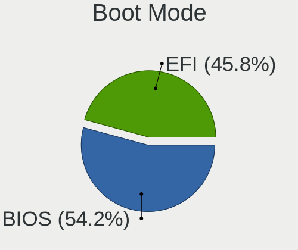
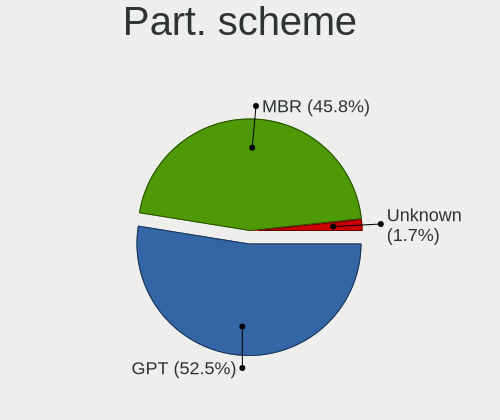
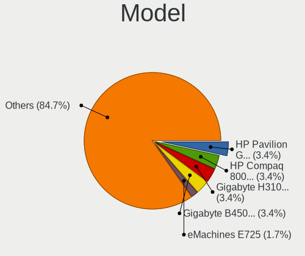
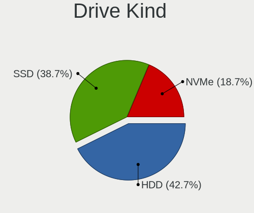
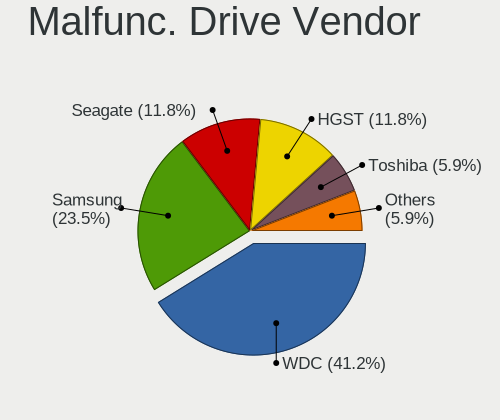
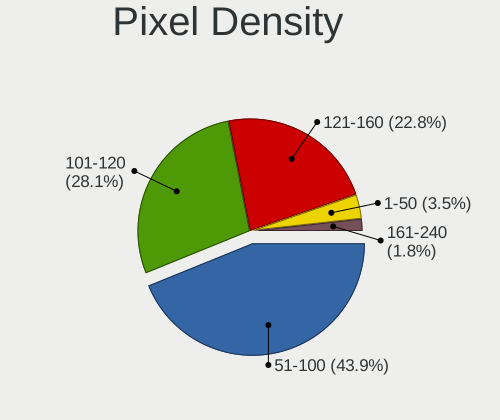

BlackPanther - Hardware Trends
------------------------------

A project to identify most popular hardware characteristics and track their change
over time based on data collected by Linux users at https://Linux-Hardware.org.

Anyone can contribute to this report by the [hw-probe](https://github.com/linuxhw/hw-probe) tool:

    sudo -E hw-probe -all -upload

This is a report for all computer types. See also reports for [desktops](/Dist/BlackPanther/Desktop/README.md) and [notebooks](/Dist/BlackPanther/Notebook/README.md).

This report is for one last month. Overall report since the beginning of time: [TestDays](https://github.com/linuxhw/TestDays)

Period: Jan, 2024.

Contents
--------

* [ System ](#system)
  - [ OS                       ](#os)
  - [ OS Family                ](#os-family)
  - [ Kernel                   ](#kernel)
  - [ Kernel Family            ](#kernel-family)
  - [ Kernel Major Ver.        ](#kernel-major-ver)
  - [ Arch                     ](#arch)
  - [ DE                       ](#de)
  - [ Display Server           ](#display-server)
  - [ Display Manager          ](#display-manager)
  - [ OS Lang                  ](#os-lang)
  - [ Boot Mode                ](#boot-mode)
  - [ Filesystem               ](#filesystem)
  - [ Part. scheme             ](#part-scheme)
  - [ Dual Boot with Linux/BSD ](#dual-boot-with-linuxbsd)
  - [ Dual Boot (Win)          ](#dual-boot-win)

* [ Board ](#board)
  - [ Vendor                   ](#vendor)
  - [ Model                    ](#model)
  - [ Model Family             ](#model-family)
  - [ MFG Year                 ](#mfg-year)
  - [ Form Factor              ](#form-factor)
  - [ Secure Boot              ](#secure-boot)
  - [ Coreboot                 ](#coreboot)
  - [ RAM Size                 ](#ram-size)
  - [ RAM Used                 ](#ram-used)
  - [ Total Drives             ](#total-drives)
  - [ Has CD-ROM               ](#has-cd-rom)
  - [ Has Ethernet             ](#has-ethernet)
  - [ Has WiFi                 ](#has-wifi)
  - [ Has Bluetooth            ](#has-bluetooth)

* [ Location ](#location)
  - [ Country                  ](#country)
  - [ City                     ](#city)

* [ Drives ](#drives)
  - [ Drive Vendor             ](#drive-vendor)
  - [ Drive Model              ](#drive-model)
  - [ HDD Vendor               ](#hdd-vendor)
  - [ SSD Vendor               ](#ssd-vendor)
  - [ Drive Kind               ](#drive-kind)
  - [ Drive Connector          ](#drive-connector)
  - [ Drive Size               ](#drive-size)
  - [ Space Total              ](#space-total)
  - [ Space Used               ](#space-used)
  - [ Malfunc. Drives          ](#malfunc-drives)
  - [ Malfunc. Drive Vendor    ](#malfunc-drive-vendor)
  - [ Malfunc. HDD Vendor      ](#malfunc-hdd-vendor)
  - [ Malfunc. Drive Kind      ](#malfunc-drive-kind)
  - [ Failed Drives            ](#failed-drives)
  - [ Failed Drive Vendor      ](#failed-drive-vendor)
  - [ Drive Status             ](#drive-status)

* [ Storage controller ](#storage-controller)
  - [ Storage Vendor           ](#storage-vendor)
  - [ Storage Model            ](#storage-model)
  - [ Storage Kind             ](#storage-kind)

* [ Processor ](#processor)
  - [ CPU Vendor               ](#cpu-vendor)
  - [ CPU Model                ](#cpu-model)
  - [ CPU Model Family         ](#cpu-model-family)
  - [ CPU Cores                ](#cpu-cores)
  - [ CPU Sockets              ](#cpu-sockets)
  - [ CPU Threads              ](#cpu-threads)
  - [ CPU Op-Modes             ](#cpu-op-modes)
  - [ CPU Microcode            ](#cpu-microcode)
  - [ CPU Microarch            ](#cpu-microarch)

* [ Graphics ](#graphics)
  - [ GPU Vendor               ](#gpu-vendor)
  - [ GPU Model                ](#gpu-model)
  - [ GPU Combo                ](#gpu-combo)
  - [ GPU Driver               ](#gpu-driver)
  - [ GPU Memory               ](#gpu-memory)

* [ Monitor ](#monitor)
  - [ Monitor Vendor           ](#monitor-vendor)
  - [ Monitor Model            ](#monitor-model)
  - [ Monitor Resolution       ](#monitor-resolution)
  - [ Monitor Diagonal         ](#monitor-diagonal)
  - [ Monitor Width            ](#monitor-width)
  - [ Aspect Ratio             ](#aspect-ratio)
  - [ Monitor Area             ](#monitor-area)
  - [ Pixel Density            ](#pixel-density)
  - [ Multiple Monitors        ](#multiple-monitors)

* [ Network ](#network)
  - [ Net Controller Vendor    ](#net-controller-vendor)
  - [ Net Controller Model     ](#net-controller-model)
  - [ Wireless Vendor          ](#wireless-vendor)
  - [ Wireless Model           ](#wireless-model)
  - [ Ethernet Vendor          ](#ethernet-vendor)
  - [ Ethernet Model           ](#ethernet-model)
  - [ Net Controller Kind      ](#net-controller-kind)
  - [ Used Controller          ](#used-controller)
  - [ NICs                     ](#nics)
  - [ IPv6                     ](#ipv6)

* [ Bluetooth ](#bluetooth)
  - [ Bluetooth Vendor         ](#bluetooth-vendor)
  - [ Bluetooth Model          ](#bluetooth-model)

* [ Sound ](#sound)
  - [ Sound Vendor             ](#sound-vendor)
  - [ Sound Model              ](#sound-model)

* [ Memory ](#memory)
  - [ Memory Vendor            ](#memory-vendor)
  - [ Memory Model             ](#memory-model)
  - [ Memory Kind              ](#memory-kind)
  - [ Memory Form Factor       ](#memory-form-factor)
  - [ Memory Size              ](#memory-size)
  - [ Memory Speed             ](#memory-speed)

* [ Printers & scanners ](#printers--scanners)
  - [ Printer Vendor           ](#printer-vendor)
  - [ Printer Model            ](#printer-model)
  - [ Scanner Vendor           ](#scanner-vendor)
  - [ Scanner Model            ](#scanner-model)

* [ Camera ](#camera)
  - [ Camera Vendor            ](#camera-vendor)
  - [ Camera Model             ](#camera-model)

* [ Security ](#security)
  - [ Fingerprint Vendor       ](#fingerprint-vendor)
  - [ Fingerprint Model        ](#fingerprint-model)
  - [ Chipcard Vendor          ](#chipcard-vendor)
  - [ Chipcard Model           ](#chipcard-model)

* [ Unsupported ](#unsupported)
  - [ Unsupported Devices      ](#unsupported-devices)
  - [ Unsupported Device Types ](#unsupported-device-types)

System
------

OS
--

Installed operating systems

| Name              | Computers | Percent |
|-------------------|-----------|---------|
| BlackPanther 18.1 | 130       | 92.86%  |
| BlackPanther 22.1 | 9         | 6.43%   |
| BlackPanther 16.1 | 1         | 0.71%   |

OS Family
---------

OS without a version

| Name         | Computers | Percent |
|--------------|-----------|---------|
| BlackPanther | 140       | 100%    |

Kernel
------

Version of the Linux kernel

| Version             | Computers | Percent |
|---------------------|-----------|---------|
| 5.15.85-desktop-1bP | 68        | 48.57%  |
| 5.6.14-desktop-2bP  | 33        | 23.57%  |
| 4.18.16-desktop-1bP | 25        | 17.86%  |
| 6.3.8-desktop-1bP   | 6         | 4.29%   |
| 6.7.0-rc4-tkg-eevdf | 1         | 0.71%   |
| 6.6.11-power-1bP    | 1         | 0.71%   |
| 6.5.3-power-1bP     | 1         | 0.71%   |
| 6.4.3-desktop-1bP   | 1         | 0.71%   |
| 6.3.3-desktop-1bP   | 1         | 0.71%   |
| 6.2.9-desktop-1bP   | 1         | 0.71%   |
| 5.6.14-server-2bP   | 1         | 0.71%   |
| 4.7.0-desktop-1bP   | 1         | 0.71%   |

Kernel Family
-------------

Linux kernel without a distro release

| Version | Computers | Percent |
|---------|-----------|---------|
| 5.15.85 | 68        | 48.57%  |
| 5.6.14  | 34        | 24.29%  |
| 4.18.16 | 25        | 17.86%  |
| 6.3.8   | 6         | 4.29%   |
| 6.7.0   | 1         | 0.71%   |
| 6.6.11  | 1         | 0.71%   |
| 6.5.3   | 1         | 0.71%   |
| 6.4.3   | 1         | 0.71%   |
| 6.3.3   | 1         | 0.71%   |
| 6.2.9   | 1         | 0.71%   |
| 4.7.0   | 1         | 0.71%   |

Kernel Major Ver.
-----------------

Linux kernel major version

| Version | Computers | Percent |
|---------|-----------|---------|
| 5.15    | 68        | 48.57%  |
| 5.6     | 34        | 24.29%  |
| 4.18    | 25        | 17.86%  |
| 6.3     | 7         | 5%      |
| 6.7     | 1         | 0.71%   |
| 6.6     | 1         | 0.71%   |
| 6.5     | 1         | 0.71%   |
| 6.4     | 1         | 0.71%   |
| 6.2     | 1         | 0.71%   |
| 4.7     | 1         | 0.71%   |

Arch
----

OS architecture (x86_64, i586, etc.)

| Name   | Computers | Percent |
|--------|-----------|---------|
| x86_64 | 139       | 99.29%  |
| i686   | 1         | 0.71%   |

DE
--

Desktop Environment

| Name    | Computers | Percent |
|---------|-----------|---------|
| KDE5    | 135       | 96.43%  |
| Unknown | 5         | 3.57%   |

Display Server
--------------

X11 or Wayland

| Name | Computers | Percent |
|------|-----------|---------|
| X11  | 140       | 100%    |

Display Manager
---------------

SDDM, LightDM, etc.

| Name | Computers | Percent |
|------|-----------|---------|
| SDDM | 140       | 100%    |

OS Lang
-------

Language

| Lang    | Computers | Percent |
|---------|-----------|---------|
| Unknown | 140       | 100%    |

Boot Mode
---------

EFI or BIOS

| Mode | Computers | Percent |
|------|-----------|---------|
| EFI  | 71        | 50.71%  |
| BIOS | 69        | 49.29%  |

Filesystem
----------

Type of filesystem

| Type    | Computers | Percent |
|---------|-----------|---------|
| Ext4    | 87        | 62.14%  |
| Overlay | 51        | 36.43%  |
| Btrfs   | 2         | 1.43%   |

Part. scheme
------------

Scheme of partitioning

| Type | Computers | Percent |
|------|-----------|---------|
| GPT  | 86        | 61.43%  |
| MBR  | 54        | 38.57%  |

Dual Boot with Linux/BSD
------------------------

Hosting more than one Linux/BSD

| Dual boot | Computers | Percent |
|-----------|-----------|---------|
| No        | 106       | 75.71%  |
| Yes       | 34        | 24.29%  |

Dual Boot (Win)
---------------

Hosting Linux and Windows

| Dual boot | Computers | Percent |
|-----------|-----------|---------|
| No        | 78        | 55.71%  |
| Yes       | 62        | 44.29%  |

Board
-----

Vendor
------

Motherboard manufacturer

| Name                | Computers | Percent |
|---------------------|-----------|---------|
| Dell                | 26        | 18.57%  |
| Lenovo              | 20        | 14.29%  |
| Gigabyte Technology | 17        | 12.14%  |
| ASUSTek Computer    | 17        | 12.14%  |
| Hewlett-Packard     | 15        | 10.71%  |
| Fujitsu             | 9         | 6.43%   |
| ASRock              | 7         | 5%      |
| Acer                | 7         | 5%      |
| MSI                 | 4         | 2.86%   |
| Fujitsu Siemens     | 4         | 2.86%   |
| eMachines           | 3         | 2.14%   |
| Apple               | 3         | 2.14%   |
| Toshiba             | 2         | 1.43%   |
| Samsung Electronics | 2         | 1.43%   |
| Medion              | 2         | 1.43%   |
| Sony                | 1         | 0.71%   |
| AWOW                | 1         | 0.71%   |

Model
-----

Motherboard model

| Name                                | Computers | Percent |
|-------------------------------------|-----------|---------|
| HP 250 G1                           | 3         | 2.14%   |
| Gigabyte H61M-S2PV                  | 2         | 1.43%   |
| Fujitsu LIFEBOOK A530               | 2         | 1.43%   |
| Fujitsu ESPRIMO P920                | 2         | 1.43%   |
| eMachines E725                      | 2         | 1.43%   |
| Dell Latitude 5480                  | 2         | 1.43%   |
| Dell Inspiron 3521                  | 2         | 1.43%   |
| Dell Inspiron 15-3567               | 2         | 1.43%   |
| Toshiba Satellite M50D-A            | 1         | 0.71%   |
| Toshiba Satellite L500              | 1         | 0.71%   |
| Sony VPCS13V9E                      | 1         | 0.71%   |
| Samsung NC10                        | 1         | 0.71%   |
| Samsung 300E4C/300E5C/300E7C        | 1         | 0.71%   |
| MSI MS-7C94                         | 1         | 0.71%   |
| MSI MS-7817                         | 1         | 0.71%   |
| MSI MS-7519                         | 1         | 0.71%   |
| MSI GT60 2OC/2OD                    | 1         | 0.71%   |
| Medion MS-7748                      | 1         | 0.71%   |
| Medion E7218                        | 1         | 0.71%   |
| Lenovo Yoga 530-14ARR 81H9          | 1         | 0.71%   |
| Lenovo V15-ADA 82C7                 | 1         | 0.71%   |
| Lenovo ThinkStation P520 30BFS44D04 | 1         | 0.71%   |
| Lenovo ThinkStation C30 1097A34     | 1         | 0.71%   |
| Lenovo ThinkPad X250 20CLS1JN00     | 1         | 0.71%   |
| Lenovo ThinkPad T540p 20BE003YUK    | 1         | 0.71%   |
| Lenovo ThinkPad T440s 20ARA0Y500    | 1         | 0.71%   |
| Lenovo ThinkPad T420 4236B87        | 1         | 0.71%   |
| Lenovo ThinkPad T410 2537VFQ        | 1         | 0.71%   |
| Lenovo ThinkPad T410 2537BF9        | 1         | 0.71%   |
| Lenovo ThinkPad T400 2768WGB        | 1         | 0.71%   |
| Lenovo ThinkCentre M720s 10SUS0C000 | 1         | 0.71%   |
| Lenovo IdeaPad 700-15ISK 80RU       | 1         | 0.71%   |
| Lenovo IdeaPad 330-15IKB 81DE       | 1         | 0.71%   |
| Lenovo IdeaPad 3-15ITL6 82H8        | 1         | 0.71%   |
| Lenovo IdeaPad 110-15ACL 80TJ       | 1         | 0.71%   |
| Lenovo IdeaPad 100-15IBY 80MJ       | 1         | 0.71%   |
| Lenovo G505s 20255                  | 1         | 0.71%   |
| Lenovo Flex 2-15D 20377             | 1         | 0.71%   |
| Lenovo B50-30 20382                 | 1         | 0.71%   |
| HP Z400 Workstation                 | 1         | 0.71%   |

Model Family
------------

Motherboard model prefix

| Name                    | Computers | Percent |
|-------------------------|-----------|---------|
| Dell Inspiron           | 10        | 7.14%   |
| Dell Latitude           | 9         | 6.43%   |
| Lenovo ThinkPad         | 7         | 5%      |
| Lenovo IdeaPad          | 5         | 3.57%   |
| Dell OptiPlex           | 5         | 3.57%   |
| Acer Aspire             | 5         | 3.57%   |
| Fujitsu LIFEBOOK        | 4         | 2.86%   |
| Fujitsu ESPRIMO         | 4         | 2.86%   |
| HP Compaq               | 3         | 2.14%   |
| HP 250                  | 3         | 2.14%   |
| Fujitsu Siemens ESPRIMO | 3         | 2.14%   |
| Toshiba Satellite       | 2         | 1.43%   |
| Lenovo ThinkStation     | 2         | 1.43%   |
| HP Pavilion             | 2         | 1.43%   |
| Gigabyte H61M-S2PV      | 2         | 1.43%   |
| eMachines E725          | 2         | 1.43%   |
| ASUS PRIME              | 2         | 1.43%   |
| Acer TravelMate         | 2         | 1.43%   |
| Sony VPCS13V9E          | 1         | 0.71%   |
| Samsung NC10            | 1         | 0.71%   |
| Samsung 300E4C          | 1         | 0.71%   |
| MSI MS-7C94             | 1         | 0.71%   |
| MSI MS-7817             | 1         | 0.71%   |
| MSI MS-7519             | 1         | 0.71%   |
| MSI GT60                | 1         | 0.71%   |
| Medion MS-7748          | 1         | 0.71%   |
| Medion E7218            | 1         | 0.71%   |
| Lenovo Yoga             | 1         | 0.71%   |
| Lenovo V15-ADA          | 1         | 0.71%   |
| Lenovo ThinkCentre      | 1         | 0.71%   |
| Lenovo G505s            | 1         | 0.71%   |
| Lenovo Flex             | 1         | 0.71%   |
| Lenovo B50-30           | 1         | 0.71%   |
| HP Z400                 | 1         | 0.71%   |
| HP ProBook              | 1         | 0.71%   |
| HP Notebook             | 1         | 0.71%   |
| HP Laptop               | 1         | 0.71%   |
| HP EliteDesk            | 1         | 0.71%   |
| HP EliteBook            | 1         | 0.71%   |
| HP 650                  | 1         | 0.71%   |

MFG Year
--------

Motherboard manufacture year

| Year | Computers | Percent |
|------|-----------|---------|
| 2013 | 19        | 13.57%  |
| 2012 | 16        | 11.43%  |
| 2009 | 12        | 8.57%   |
| 2015 | 11        | 7.86%   |
| 2011 | 11        | 7.86%   |
| 2010 | 11        | 7.86%   |
| 2014 | 10        | 7.14%   |
| 2020 | 8         | 5.71%   |
| 2017 | 8         | 5.71%   |
| 2016 | 7         | 5%      |
| 2019 | 6         | 4.29%   |
| 2018 | 6         | 4.29%   |
| 2008 | 6         | 4.29%   |
| 2021 | 3         | 2.14%   |
| 2007 | 3         | 2.14%   |
| 2006 | 2         | 1.43%   |
| 2023 | 1         | 0.71%   |

Form Factor
-----------

Physical design of the computer

| Name        | Computers | Percent |
|-------------|-----------|---------|
| Notebook    | 83        | 59.29%  |
| Desktop     | 56        | 40%     |
| Convertible | 1         | 0.71%   |

Secure Boot
-----------

Enabled or disabled

| State    | Computers | Percent |
|----------|-----------|---------|
| Disabled | 140       | 100%    |

Coreboot
--------

Have coreboot on board

| Used | Computers | Percent |
|------|-----------|---------|
| No   | 140       | 100%    |

RAM Size
--------

Total RAM memory

| Size in GB | Computers | Percent |
|------------|-----------|---------|
| 4.01-8.0   | 39        | 27.86%  |
| 3.01-4.0   | 35        | 25%     |
| 8.01-16.0  | 35        | 25%     |
| 1.01-2.0   | 10        | 7.14%   |
| 16.01-24.0 | 9         | 6.43%   |
| 32.01-64.0 | 7         | 5%      |
| 2.01-3.0   | 3         | 2.14%   |
| 24.01-32.0 | 2         | 1.43%   |

RAM Used
--------

Used RAM memory

| Used GB    | Computers | Percent |
|------------|-----------|---------|
| 1.01-2.0   | 68        | 48.57%  |
| 0.51-1.0   | 39        | 27.86%  |
| 0.01-0.5   | 14        | 10%     |
| 2.01-3.0   | 12        | 8.57%   |
| 4.01-8.0   | 3         | 2.14%   |
| 3.01-4.0   | 3         | 2.14%   |
| 16.01-24.0 | 1         | 0.71%   |

Total Drives
------------

Number of drives on board

| Drives | Computers | Percent |
|--------|-----------|---------|
| 1      | 90        | 64.29%  |
| 2      | 32        | 22.86%  |
| 3      | 12        | 8.57%   |
| 5      | 3         | 2.14%   |
| 4      | 2         | 1.43%   |
| 6      | 1         | 0.71%   |

Has CD-ROM
----------

Has CD-ROM on board

| Presented | Computers | Percent |
|-----------|-----------|---------|
| Yes       | 84        | 60%     |
| No        | 56        | 40%     |

Has Ethernet
------------

Has Ethernet on board

| Presented | Computers | Percent |
|-----------|-----------|---------|
| Yes       | 134       | 95.71%  |
| No        | 6         | 4.29%   |

Has WiFi
--------

Has WiFi module

| Presented | Computers | Percent |
|-----------|-----------|---------|
| Yes       | 104       | 74.29%  |
| No        | 36        | 25.71%  |

Has Bluetooth
-------------

Has Bluetooth module

| Presented | Computers | Percent |
|-----------|-----------|---------|
| Yes       | 80        | 57.14%  |
| No        | 60        | 42.86%  |

Location
--------

Country
-------

Geographic location (country)

| Country      | Computers | Percent |
|--------------|-----------|---------|
| Hungary      | 118       | 84.29%  |
| UK           | 6         | 4.29%   |
| Slovakia     | 3         | 2.14%   |
| Austria      | 3         | 2.14%   |
| South Africa | 2         | 1.43%   |
| Greece       | 2         | 1.43%   |
| Serbia       | 1         | 0.71%   |
| Romania      | 1         | 0.71%   |
| Netherlands  | 1         | 0.71%   |
| Germany      | 1         | 0.71%   |
| Croatia      | 1         | 0.71%   |
| Canada       | 1         | 0.71%   |

City
----

Geographic location (city)

| City                    | Computers | Percent |
|-------------------------|-----------|---------|
| Budapest                | 30        | 21.43%  |
| Tatabánya              | 7         | 5%      |
| Berettyóújfalu        | 7         | 5%      |
| Pécs                   | 4         | 2.86%   |
| Miskolc                 | 4         | 2.86%   |
| Debrecen                | 4         | 2.86%   |
| Csongrad                | 4         | 2.86%   |
| Zalaegerszeg            | 3         | 2.14%   |
| Tamasi                  | 3         | 2.14%   |
| Pomaz                   | 3         | 2.14%   |
| Agfalva                 | 3         | 2.14%   |
| Vienna                  | 2         | 1.43%   |
| Tiszaujvaros            | 2         | 1.43%   |
| Szeghalom               | 2         | 1.43%   |
| Crewe                   | 2         | 1.43%   |
| Cegled                  | 2         | 1.43%   |
| Cape Town               | 2         | 1.43%   |
| Balatonfuered           | 2         | 1.43%   |
| Balassagyarmat          | 2         | 1.43%   |
| Zvolen                  | 1         | 0.71%   |
| Zalău                  | 1         | 0.71%   |
| Vinkovci                | 1         | 0.71%   |
| Veresegyhaz             | 1         | 0.71%   |
| Tornaľa                | 1         | 0.71%   |
| Toeroekbalint           | 1         | 0.71%   |
| Taksony                 | 1         | 0.71%   |
| Szombathely             | 1         | 0.71%   |
| Szolnok                 | 1         | 0.71%   |
| Szigethalom             | 1         | 0.71%   |
| Szentes                 | 1         | 0.71%   |
| Szentendre              | 1         | 0.71%   |
| Szekszárd              | 1         | 0.71%   |
| Székesfehérvár       | 1         | 0.71%   |
| Szeged                  | 1         | 0.71%   |
| Sopron                  | 1         | 0.71%   |
| Sajoivanka              | 1         | 0.71%   |
| Retsag                  | 1         | 0.71%   |
| Prešov                 | 1         | 0.71%   |
| Pfaffenhofen an der Ilm | 1         | 0.71%   |
| Oroshaza                | 1         | 0.71%   |

Drives
------

Drive Vendor
------------

Hard drive vendors

| Vendor                      | Computers | Drives | Percent |
|-----------------------------|-----------|--------|---------|
| Samsung Electronics         | 33        | 39     | 15.49%  |
| Kingston                    | 32        | 34     | 15.02%  |
| WDC                         | 27        | 33     | 12.68%  |
| Seagate                     | 23        | 25     | 10.8%   |
| Toshiba                     | 13        | 14     | 6.1%    |
| A-DATA Technology           | 11        | 11     | 5.16%   |
| SanDisk                     | 7         | 7      | 3.29%   |
| HGST                        | 7         | 8      | 3.29%   |
| Unknown                     | 5         | 7      | 2.35%   |
| Intenso                     | 5         | 5      | 2.35%   |
| SK hynix                    | 4         | 4      | 1.88%   |
| Hitachi                     | 4         | 5      | 1.88%   |
| SPCC                        | 3         | 3      | 1.41%   |
| PNY                         | 3         | 3      | 1.41%   |
| JMicron Technology          | 3         | 3      | 1.41%   |
| Intel                       | 3         | 3      | 1.41%   |
| Gigabyte Technology         | 3         | 3      | 1.41%   |
| Crucial                     | 3         | 3      | 1.41%   |
| Micron Technology           | 2         | 2      | 0.94%   |
| Kingmax                     | 2         | 2      | 0.94%   |
| Zheino                      | 1         | 1      | 0.47%   |
| XPG                         | 1         | 1      | 0.47%   |
| Transcend                   | 1         | 1      | 0.47%   |
| TO Exter                    | 1         | 1      | 0.47%   |
| Timetec                     | 1         | 1      | 0.47%   |
| Team                        | 1         | 1      | 0.47%   |
| Realtek Semiconductor       | 1         | 1      | 0.47%   |
| Patriot                     | 1         | 1      | 0.47%   |
| Netac                       | 1         | 1      | 0.47%   |
| Micron/Crucial Technology   | 1         | 1      | 0.47%   |
| Maxtor                      | 1         | 1      | 0.47%   |
| LITEONIT                    | 1         | 1      | 0.47%   |
| LITEON                      | 1         | 1      | 0.47%   |
| KIOXIA                      | 1         | 1      | 0.47%   |
| Kingston Technology Company | 1         | 1      | 0.47%   |
| KingFast                    | 1         | 1      | 0.47%   |
| China                       | 1         | 1      | 0.47%   |
| ASENNO                      | 1         | 1      | 0.47%   |
| Apple                       | 1         | 1      | 0.47%   |
| Unknown                     | 1         | 1      | 0.47%   |

Drive Model
-----------

Hard drive models

| Model                              | Computers | Percent |
|------------------------------------|-----------|---------|
| Kingston SA400S37240G 240GB SSD    | 8         | 3.46%   |
| Kingston SA400S37480G 480GB SSD    | 7         | 3.03%   |
| Kingston SA400S37120G 120GB SSD    | 6         | 2.6%    |
| SPCC Solid State Disk 256GB        | 3         | 1.3%    |
| Seagate ST500LT012-1DG142 500GB    | 3         | 1.3%    |
| Samsung SSD 860 EVO 250GB          | 3         | 1.3%    |
| Kingston SNV2S500G 500GB           | 3         | 1.3%    |
| JMicron Generic 8GB                | 3         | 1.3%    |
| A-DATA SU630 240GB SSD             | 3         | 1.3%    |
| WDC WD30EZRX-00DC0B0 3TB           | 2         | 0.87%   |
| WDC WD20EZRX-00D8PB0 2TB           | 2         | 0.87%   |
| WDC WD Green 2.5 240GB SSD         | 2         | 0.87%   |
| Toshiba DT01ACA100 1TB             | 2         | 0.87%   |
| Seagate ST9320325AS 320GB          | 2         | 0.87%   |
| Seagate ST1000LM024 HN-M101MBB 1TB | 2         | 0.87%   |
| Seagate Expansion 1TB              | 2         | 0.87%   |
| Samsung SSD 970 EVO 500GB          | 2         | 0.87%   |
| Samsung SSD 870 EVO 250GB          | 2         | 0.87%   |
| Samsung SSD 750 EVO 250GB          | 2         | 0.87%   |
| PNY CS900 240GB SSD                | 2         | 0.87%   |
| Kingston SV300S37A120G 120GB SSD   | 2         | 0.87%   |
| Kingston SUV400S37120G 120GB SSD   | 2         | 0.87%   |
| Kingston SNVS500G 500GB            | 2         | 0.87%   |
| Kingston SA400S37960G 960GB SSD    | 2         | 0.87%   |
| Intenso SSD 120GB                  | 2         | 0.87%   |
| Hitachi HTS545050A7E380 500GB      | 2         | 0.87%   |
| HGST HTS545032A7E380 320GB         | 2         | 0.87%   |
| A-DATA SU650 240GB SSD             | 2         | 0.87%   |
| A-DATA SP600 64GB SSD              | 2         | 0.87%   |
| Zheino CHN-NGFFNV2280-256 256GB    | 1         | 0.43%   |
| XPG SPECTRIX S40G 1TB              | 1         | 0.43%   |
| WDC WDS240G2G0B-00EPW0 240GB SSD   | 1         | 0.43%   |
| WDC WD800JD-75MSA3 80GB            | 1         | 0.43%   |
| WDC WD800JD-23LSA0 80GB            | 1         | 0.43%   |
| WDC WD5003AZEX-00MK2A0 500GB       | 1         | 0.43%   |
| WDC WD5000LPVX-22V0TT0 500GB       | 1         | 0.43%   |
| WDC WD5000LPLX-75ZNTT0 500GB       | 1         | 0.43%   |
| WDC WD5000LPCX-24VHAT0 500GB       | 1         | 0.43%   |
| WDC WD5000LPCX-24C6HT0 500GB       | 1         | 0.43%   |
| WDC WD5000BEKT-22KA9T0 500GB       | 1         | 0.43%   |

HDD Vendor
----------

Hard disk drive vendors

| Vendor              | Computers | Drives | Percent |
|---------------------|-----------|--------|---------|
| WDC                 | 24        | 30     | 28.92%  |
| Seagate             | 23        | 25     | 27.71%  |
| Toshiba             | 12        | 13     | 14.46%  |
| Samsung Electronics | 7         | 7      | 8.43%   |
| HGST                | 7         | 8      | 8.43%   |
| Hitachi             | 4         | 5      | 4.82%   |
| JMicron Technology  | 3         | 3      | 3.61%   |
| Unknown             | 1         | 1      | 1.2%    |
| TO Exter            | 1         | 1      | 1.2%    |
| Maxtor              | 1         | 1      | 1.2%    |

SSD Vendor
----------

Solid state drive vendors

| Vendor              | Computers | Drives | Percent |
|---------------------|-----------|--------|---------|
| Kingston            | 27        | 29     | 26.73%  |
| Samsung Electronics | 20        | 21     | 19.8%   |
| A-DATA Technology   | 11        | 11     | 10.89%  |
| SanDisk             | 6         | 6      | 5.94%   |
| Intenso             | 5         | 5      | 4.95%   |
| WDC                 | 3         | 3      | 2.97%   |
| SPCC                | 3         | 3      | 2.97%   |
| PNY                 | 3         | 3      | 2.97%   |
| SK hynix            | 2         | 2      | 1.98%   |
| Micron Technology   | 2         | 2      | 1.98%   |
| Kingmax             | 2         | 2      | 1.98%   |
| Intel               | 2         | 2      | 1.98%   |
| Gigabyte Technology | 2         | 2      | 1.98%   |
| Crucial             | 2         | 2      | 1.98%   |
| Transcend           | 1         | 1      | 0.99%   |
| Toshiba             | 1         | 1      | 0.99%   |
| Timetec             | 1         | 1      | 0.99%   |
| Team                | 1         | 1      | 0.99%   |
| Patriot             | 1         | 1      | 0.99%   |
| Netac               | 1         | 1      | 0.99%   |
| LITEONIT            | 1         | 1      | 0.99%   |
| KingFast            | 1         | 1      | 0.99%   |
| China               | 1         | 1      | 0.99%   |
| ASENNO              | 1         | 1      | 0.99%   |
| Apple               | 1         | 1      | 0.99%   |

Drive Kind
----------

HDD or SSD

| Kind    | Computers | Drives | Percent |
|---------|-----------|--------|---------|
| SSD     | 90        | 104    | 47.87%  |
| HDD     | 72        | 94     | 38.3%   |
| NVMe    | 21        | 29     | 11.17%  |
| MMC     | 4         | 4      | 2.13%   |
| Unknown | 1         | 3      | 0.53%   |

Drive Connector
---------------

SATA, SAS, NVMe, etc.

| Type | Computers | Drives | Percent |
|------|-----------|--------|---------|
| SATA | 130       | 185    | 77.38%  |
| NVMe | 21        | 29     | 12.5%   |
| SAS  | 13        | 16     | 7.74%   |
| MMC  | 4         | 4      | 2.38%   |

Drive Size
----------

Size of hard drive

| Size in TB | Computers | Drives | Percent |
|------------|-----------|--------|---------|
| 0.01-0.5   | 116       | 145    | 70.73%  |
| 0.51-1.0   | 35        | 36     | 21.34%  |
| 1.01-2.0   | 5         | 7      | 3.05%   |
| 2.01-3.0   | 4         | 5      | 2.44%   |
| 3.01-4.0   | 3         | 4      | 1.83%   |
| 4.01-10.0  | 1         | 1      | 0.61%   |

Space Total
-----------

Amount of disk space available on the file system

| Size in GB     | Computers | Percent |
|----------------|-----------|---------|
| Unknown        | 46        | 32.86%  |
| 101-250        | 35        | 25%     |
| 251-500        | 28        | 20%     |
| 501-1000       | 13        | 9.29%   |
| 1001-2000      | 8         | 5.71%   |
| 51-100         | 5         | 3.57%   |
| 21-50          | 3         | 2.14%   |
| More than 3000 | 2         | 1.43%   |

Space Used
----------

Amount of used disk space

| Used GB        | Computers | Percent |
|----------------|-----------|---------|
| Unknown        | 46        | 32.86%  |
| 1-20           | 25        | 17.86%  |
| 101-250        | 24        | 17.14%  |
| 51-100         | 21        | 15%     |
| 21-50          | 17        | 12.14%  |
| 251-500        | 3         | 2.14%   |
| More than 3000 | 2         | 1.43%   |
| 1001-2000      | 1         | 0.71%   |
| 501-1000       | 1         | 0.71%   |

Malfunc. Drives
---------------

Drive models with a malfunction

| Model                                 | Computers | Drives | Percent |
|---------------------------------------|-----------|--------|---------|
| Seagate ST500LT012-1DG142 500GB       | 3         | 3      | 5.66%   |
| WDC WD Green 2.5 240GB SSD            | 2         | 2      | 3.77%   |
| Seagate ST9320325AS 320GB             | 2         | 2      | 3.77%   |
| Hitachi HTS545050A7E380 500GB         | 2         | 2      | 3.77%   |
| HGST HTS545032A7E380 320GB            | 2         | 2      | 3.77%   |
| A-DATA Technology SU630 240GB SSD     | 2         | 2      | 3.77%   |
| A-DATA Technology SP600 64GB SSD      | 2         | 2      | 3.77%   |
| WDC WD800JD-23LSA0 80GB               | 1         | 1      | 1.89%   |
| WDC WD5000LPVX-22V0TT0 500GB          | 1         | 1      | 1.89%   |
| WDC WD5000BEKT-22KA9T0 500GB          | 1         | 1      | 1.89%   |
| WDC WD5000AZLX-75K2TA0 500GB          | 1         | 1      | 1.89%   |
| WDC WD5000AAKS-00UU3A0 500GB          | 1         | 1      | 1.89%   |
| WDC WD3200AAKS-00L9A0 320GB           | 1         | 1      | 1.89%   |
| WDC WD2500BEVT-00ZCT0 250GB           | 1         | 1      | 1.89%   |
| WDC WD20EARS-00MVWB0 2TB              | 1         | 1      | 1.89%   |
| WDC WD10PURZ-85U8XY0 1TB              | 1         | 1      | 1.89%   |
| WDC WD10JPLX-00MBPT0 1TB              | 1         | 1      | 1.89%   |
| WDC WD10EARS-00Y5B1 1TB               | 1         | 1      | 1.89%   |
| Toshiba MQ01ABD050 500GB              | 1         | 1      | 1.89%   |
| Toshiba MQ01ABB200 2TB                | 1         | 1      | 1.89%   |
| Toshiba MK3259GSX 320GB               | 1         | 1      | 1.89%   |
| Toshiba MK2555GSX 250GB               | 1         | 1      | 1.89%   |
| Toshiba MK1676GSX H 160GB             | 1         | 1      | 1.89%   |
| Toshiba HDWD130 3TB                   | 1         | 1      | 1.89%   |
| Toshiba DT01ACA100 1TB                | 1         | 1      | 1.89%   |
| Timetec SD08 512GB SSD                | 1         | 1      | 1.89%   |
| Seagate ST9500420AS 500GB             | 1         | 1      | 1.89%   |
| Seagate ST9320320AS 320GB             | 1         | 1      | 1.89%   |
| Seagate ST9160301AS 160GB             | 1         | 1      | 1.89%   |
| Seagate ST500LT012-9WS142 500GB       | 1         | 1      | 1.89%   |
| Seagate ST500LM000-SSHD-8GB           | 1         | 1      | 1.89%   |
| Seagate ST3160318AS 160GB             | 1         | 1      | 1.89%   |
| Samsung Electronics SSD 750 EVO 250GB | 1         | 1      | 1.89%   |
| Samsung Electronics HM321HI 320GB     | 1         | 1      | 1.89%   |
| Samsung Electronics HD200HJ 200GB     | 1         | 1      | 1.89%   |
| Samsung Electronics HD103UJ 1TB       | 1         | 1      | 1.89%   |
| Maxtor STM3160215AS 160GB             | 1         | 1      | 1.89%   |
| Kingston SUV400S37120G 120GB SSD      | 1         | 1      | 1.89%   |
| Kingston SA400S37120G 120GB SSD       | 1         | 1      | 1.89%   |
| Intel SSDSC2KF240H6L 240GB            | 1         | 1      | 1.89%   |

Malfunc. Drive Vendor
---------------------

Vendors of faulty drives

| Vendor              | Computers | Drives | Percent |
|---------------------|-----------|--------|---------|
| WDC                 | 11        | 13     | 22%     |
| Seagate             | 11        | 11     | 22%     |
| Toshiba             | 6         | 7      | 12%     |
| Samsung Electronics | 4         | 4      | 8%      |
| Hitachi             | 4         | 4      | 8%      |
| A-DATA Technology   | 4         | 4      | 8%      |
| HGST                | 3         | 3      | 6%      |
| Kingston            | 2         | 2      | 4%      |
| Intel               | 2         | 2      | 4%      |
| Timetec             | 1         | 1      | 2%      |
| Maxtor              | 1         | 1      | 2%      |
| Apple               | 1         | 1      | 2%      |

Malfunc. HDD Vendor
-------------------

Vendors of faulty HDD drives

| Vendor              | Computers | Drives | Percent |
|---------------------|-----------|--------|---------|
| Seagate             | 11        | 11     | 29.73%  |
| WDC                 | 9         | 11     | 24.32%  |
| Toshiba             | 6         | 7      | 16.22%  |
| Hitachi             | 4         | 4      | 10.81%  |
| Samsung Electronics | 3         | 3      | 8.11%   |
| HGST                | 3         | 3      | 8.11%   |
| Maxtor              | 1         | 1      | 2.7%    |

Malfunc. Drive Kind
-------------------

Kinds of faulty drives

| Kind | Computers | Drives | Percent |
|------|-----------|--------|---------|
| HDD  | 34        | 40     | 72.34%  |
| SSD  | 13        | 13     | 27.66%  |

Failed Drives
-------------

Failed drive models

| Model                     | Computers | Drives | Percent |
|---------------------------|-----------|--------|---------|
| Seagate ST9160412AS 160GB | 1         | 1      | 100%    |

Failed Drive Vendor
-------------------

Failed drive vendors

| Vendor  | Computers | Drives | Percent |
|---------|-----------|--------|---------|
| Seagate | 1         | 1      | 100%    |

Drive Status
------------

Number of failed and malfunc. drives

| Status   | Computers | Drives | Percent |
|----------|-----------|--------|---------|
| Works    | 110       | 162    | 63.95%  |
| Malfunc  | 47        | 53     | 27.33%  |
| Detected | 14        | 18     | 8.14%   |
| Failed   | 1         | 1      | 0.58%   |

Storage controller
------------------

Storage Vendor
--------------

Storage controller vendors

| Vendor                       | Computers | Percent |
|------------------------------|-----------|---------|
| Intel                        | 107       | 65.64%  |
| AMD                          | 26        | 15.95%  |
| Samsung Electronics          | 8         | 4.91%   |
| Kingston Technology Company  | 6         | 3.68%   |
| Nvidia                       | 4         | 2.45%   |
| SK hynix                     | 2         | 1.23%   |
| JMicron Technology           | 2         | 1.23%   |
| VIA Technologies             | 1         | 0.61%   |
| Toshiba America Info Systems | 1         | 0.61%   |
| Silicon Motion               | 1         | 0.61%   |
| SanDisk                      | 1         | 0.61%   |
| Realtek Semiconductor        | 1         | 0.61%   |
| Phison Electronics           | 1         | 0.61%   |
| Micron/Crucial Technology    | 1         | 0.61%   |
| Lite-On Technology           | 1         | 0.61%   |

Storage Model
-------------

Storage controller models

| Model                                                                                   | Computers | Percent |
|-----------------------------------------------------------------------------------------|-----------|---------|
| AMD FCH SATA Controller [AHCI mode]                                                     | 18        | 9.47%   |
| Intel 7 Series Chipset Family 6-port SATA Controller [AHCI mode]                        | 12        | 6.32%   |
| Intel 8 Series/C220 Series Chipset Family 6-port SATA Controller 1 [AHCI mode]          | 8         | 4.21%   |
| Intel Sunrise Point-LP SATA Controller [AHCI mode]                                      | 7         | 3.68%   |
| Intel 82801IBM/IEM (ICH9M/ICH9M-E) 4 port SATA Controller [AHCI mode]                   | 6         | 3.16%   |
| Intel Wildcat Point-LP SATA Controller [AHCI Mode]                                      | 5         | 2.63%   |
| Intel NM10/ICH7 Family SATA Controller [IDE mode]                                       | 5         | 2.63%   |
| Intel 82801 Mobile SATA Controller [RAID mode]                                          | 5         | 2.63%   |
| Samsung NVMe SSD Controller SM981/PM981/PM983                                           | 4         | 2.11%   |
| Intel 82801G (ICH7 Family) IDE Controller                                               | 4         | 2.11%   |
| Intel 6 Series/C200 Series Chipset Family 6 port Mobile SATA AHCI Controller            | 4         | 2.11%   |
| Intel 5 Series/3400 Series Chipset 4 port SATA AHCI Controller                          | 4         | 2.11%   |
| Intel 200 Series PCH SATA controller [AHCI mode]                                        | 4         | 2.11%   |
| AMD 500 Series Chipset SATA Controller                                                  | 4         | 2.11%   |
| Intel Q170/Q150/B150/H170/H110/Z170/CM236 Chipset SATA Controller [AHCI Mode]           | 3         | 1.58%   |
| Intel Atom Processor E3800 Series SATA AHCI Controller                                  | 3         | 1.58%   |
| Intel 8 Series SATA Controller 1 [AHCI mode]                                            | 3         | 1.58%   |
| Intel 6 Series/C200 Series Chipset Family Desktop SATA Controller (IDE mode, ports 4-5) | 3         | 1.58%   |
| Intel 6 Series/C200 Series Chipset Family Desktop SATA Controller (IDE mode, ports 0-3) | 3         | 1.58%   |
| Intel 6 Series/C200 Series Chipset Family 6 port Desktop SATA AHCI Controller           | 3         | 1.58%   |
| AMD SB7x0/SB8x0/SB9x0 IDE Controller                                                    | 3         | 1.58%   |
| Samsung NVMe SSD Controller 980 (DRAM-less)                                             | 2         | 1.05%   |
| Nvidia MCP79 AHCI Controller                                                            | 2         | 1.05%   |
| Kingston Company NV2 NVMe SSD SM2267XT (DRAM-less)                                      | 2         | 1.05%   |
| Kingston Company NV1 NVMe SSD E13T (DRAM-less)                                          | 2         | 1.05%   |
| Intel Volume Management Device NVMe RAID Controller                                     | 2         | 1.05%   |
| Intel Tiger Lake-LP SATA Controller                                                     | 2         | 1.05%   |
| Intel HM170/QM170 Chipset SATA Controller [AHCI Mode]                                   | 2         | 1.05%   |
| Intel Celeron N3350/Pentium N4200/Atom E3900 Series SATA AHCI Controller                | 2         | 1.05%   |
| Intel Cannon Lake PCH SATA AHCI Controller                                              | 2         | 1.05%   |
| Intel 82801JI (ICH10 Family) SATA AHCI Controller                                       | 2         | 1.05%   |
| Intel 82801JD/DO (ICH10 Family) 4-port SATA IDE Controller                              | 2         | 1.05%   |
| Intel 82801JD/DO (ICH10 Family) 2-port SATA IDE Controller                              | 2         | 1.05%   |
| Intel 82801IBM/IEM (ICH9M/ICH9M-E) 2 port SATA Controller [IDE mode]                    | 2         | 1.05%   |
| Intel 82801GBM/GHM (ICH7-M Family) SATA Controller [IDE mode]                           | 2         | 1.05%   |
| Intel 7 Series/C210 Series Chipset Family 6-port SATA Controller [AHCI mode]            | 2         | 1.05%   |
| Intel 5 Series/3400 Series Chipset 6 port SATA AHCI Controller                          | 2         | 1.05%   |
| AMD SB7x0/SB8x0/SB9x0 SATA Controller [IDE mode]                                        | 2         | 1.05%   |
| AMD FCH IDE Controller                                                                  | 2         | 1.05%   |
| AMD 300 Series Chipset SATA Controller                                                  | 2         | 1.05%   |

Storage Kind
------------

Kind of storage controller (IDE, SATA, NVMe, SAS, ...)

| Kind | Computers | Percent |
|------|-----------|---------|
| SATA | 113       | 66.47%  |
| IDE  | 26        | 15.29%  |
| NVMe | 21        | 12.35%  |
| RAID | 9         | 5.29%   |
| SAS  | 1         | 0.59%   |

Processor
---------

CPU Vendor
----------

Processor vendors

| Vendor | Computers | Percent |
|--------|-----------|---------|
| Intel  | 110       | 78.57%  |
| AMD    | 30        | 21.43%  |

CPU Model
---------

Processor models

| Model                                       | Computers | Percent |
|---------------------------------------------|-----------|---------|
| Intel Core 2 Duo CPU P8600 @ 2.40GHz        | 4         | 2.86%   |
| Intel Core i5-7200U CPU @ 2.50GHz           | 3         | 2.14%   |
| Intel Celeron CPU 1000M @ 1.80GHz           | 3         | 2.14%   |
| Intel Pentium Dual-Core CPU T4400 @ 2.20GHz | 2         | 1.43%   |
| Intel Core i7-4700MQ CPU @ 2.40GHz          | 2         | 1.43%   |
| Intel Core i5-8400 CPU @ 2.80GHz            | 2         | 1.43%   |
| Intel Core i5-6200U CPU @ 2.30GHz           | 2         | 1.43%   |
| Intel Core i5-5200U CPU @ 2.20GHz           | 2         | 1.43%   |
| Intel Core i5-2540M CPU @ 2.60GHz           | 2         | 1.43%   |
| Intel Core i5-2520M CPU @ 2.50GHz           | 2         | 1.43%   |
| Intel Core i5 CPU M 520 @ 2.40GHz           | 2         | 1.43%   |
| Intel Core i3-3217U CPU @ 1.80GHz           | 2         | 1.43%   |
| Intel Core i3-2120 CPU @ 3.30GHz            | 2         | 1.43%   |
| Intel Core i3-10110U CPU @ 2.10GHz          | 2         | 1.43%   |
| Intel Core i3 CPU M 350 @ 2.27GHz           | 2         | 1.43%   |
| Intel Celeron CPU N3350 @ 1.10GHz           | 2         | 1.43%   |
| Intel Celeron CPU N2840 @ 2.16GHz           | 2         | 1.43%   |
| Intel Xeon W-2135 CPU @ 3.70GHz             | 1         | 0.71%   |
| Intel Xeon CPU W3550 @ 3.07GHz              | 1         | 0.71%   |
| Intel Xeon CPU L5640 @ 2.27GHz              | 1         | 0.71%   |
| Intel Xeon CPU E5440 @ 2.83GHz              | 1         | 0.71%   |
| Intel Xeon CPU E5-2696 v3 @ 2.30GHz         | 1         | 0.71%   |
| Intel Xeon CPU E5-2637 0 @ 3.00GHz          | 1         | 0.71%   |
| Intel Pentium Dual-Core CPU T4300 @ 2.10GHz | 1         | 0.71%   |
| Intel Pentium Dual CPU E2180 @ 2.00GHz      | 1         | 0.71%   |
| Intel Pentium Dual CPU E2140 @ 1.60GHz      | 1         | 0.71%   |
| Intel Pentium CPU N3710 @ 1.60GHz           | 1         | 0.71%   |
| Intel Pentium CPU G4560 @ 3.50GHz           | 1         | 0.71%   |
| Intel Pentium CPU G3430 @ 3.30GHz           | 1         | 0.71%   |
| Intel Pentium CPU B970 @ 2.30GHz            | 1         | 0.71%   |
| Intel Pentium CPU B950 @ 2.10GHz            | 1         | 0.71%   |
| Intel Genuine CPU U7300 @ 1.30GHz           | 1         | 0.71%   |
| Intel Core i7-6820HQ CPU @ 2.70GHz          | 1         | 0.71%   |
| Intel Core i7-6600U CPU @ 2.60GHz           | 1         | 0.71%   |
| Intel Core i7-5500U CPU @ 2.40GHz           | 1         | 0.71%   |
| Intel Core i7-4810MQ CPU @ 2.80GHz          | 1         | 0.71%   |
| Intel Core i7-4600U CPU @ 2.10GHz           | 1         | 0.71%   |
| Intel Core i7-4510U CPU @ 2.00GHz           | 1         | 0.71%   |
| Intel Core i7-3720QM CPU @ 2.60GHz          | 1         | 0.71%   |
| Intel Core i7-3632QM CPU @ 2.20GHz          | 1         | 0.71%   |

CPU Model Family
----------------

Processor model prefix

| Model                   | Computers | Percent |
|-------------------------|-----------|---------|
| Intel Core i5           | 32        | 22.86%  |
| Intel Core i3           | 22        | 15.71%  |
| Intel Celeron           | 11        | 7.86%   |
| Intel Core i7           | 10        | 7.14%   |
| Intel Core 2 Duo        | 7         | 5%      |
| Intel Xeon              | 6         | 4.29%   |
| AMD Ryzen 5             | 6         | 4.29%   |
| AMD A8                  | 6         | 4.29%   |
| Intel Pentium           | 5         | 3.57%   |
| Other                   | 4         | 2.86%   |
| Intel Pentium Dual-Core | 3         | 2.14%   |
| Intel Core 2            | 3         | 2.14%   |
| AMD Ryzen 7             | 3         | 2.14%   |
| Intel Pentium Dual      | 2         | 1.43%   |
| Intel Core 2 Quad       | 2         | 1.43%   |
| Intel Atom              | 2         | 1.43%   |
| AMD Ryzen 3             | 2         | 1.43%   |
| AMD Athlon II X2        | 2         | 1.43%   |
| Intel Genuine           | 1         | 0.71%   |
| Intel Celeron Dual-Core | 1         | 0.71%   |
| AMD Ryzen 9             | 1         | 0.71%   |
| AMD Phenom II X4        | 1         | 0.71%   |
| AMD E2                  | 1         | 0.71%   |
| AMD E1                  | 1         | 0.71%   |
| AMD C-70                | 1         | 0.71%   |
| AMD Athlon X4           | 1         | 0.71%   |
| AMD Athlon II X4        | 1         | 0.71%   |
| AMD Athlon Dual Core    | 1         | 0.71%   |
| AMD A4                  | 1         | 0.71%   |
| AMD A10                 | 1         | 0.71%   |

CPU Cores
---------

Number of processor cores

| Number | Computers | Percent |
|--------|-----------|---------|
| 2      | 86        | 61.43%  |
| 4      | 35        | 25%     |
| 6      | 9         | 6.43%   |
| 1      | 5         | 3.57%   |
| 8      | 3         | 2.14%   |
| 18     | 1         | 0.71%   |
| 16     | 1         | 0.71%   |

CPU Sockets
-----------

Number of sockets

| Number | Computers | Percent |
|--------|-----------|---------|
| 1      | 139       | 99.29%  |
| 2      | 1         | 0.71%   |

CPU Threads
-----------

Threads per core (Hyper-Threading)

| Number | Computers | Percent |
|--------|-----------|---------|
| 2      | 78        | 55.71%  |
| 1      | 62        | 44.29%  |

CPU Op-Modes
------------

CPU Operation Modes (32-bit, 64-bit)

| Op mode        | Computers | Percent |
|----------------|-----------|---------|
| 32-bit, 64-bit | 139       | 99.29%  |
| 32-bit         | 1         | 0.71%   |

CPU Microcode
-------------

Microcode number

| Number     | Computers | Percent |
|------------|-----------|---------|
| Unknown    | 19        | 13.57%  |
| 0x306a9    | 13        | 9.29%   |
| 0x206a7    | 11        | 7.86%   |
| 0x1067a    | 10        | 7.14%   |
| 0x306c3    | 8         | 5.71%   |
| 0x20655    | 4         | 2.86%   |
| 0x010000c8 | 4         | 2.86%   |
| 0x406e3    | 3         | 2.14%   |
| 0x306d4    | 3         | 2.14%   |
| 0x06003106 | 3         | 2.14%   |
| 0x906eb    | 2         | 1.43%   |
| 0x906ea    | 2         | 1.43%   |
| 0x806ec    | 2         | 1.43%   |
| 0x806e9    | 2         | 1.43%   |
| 0x6fd      | 2         | 1.43%   |
| 0x6fb      | 2         | 1.43%   |
| 0x6f6      | 2         | 1.43%   |
| 0x506e3    | 2         | 1.43%   |
| 0x506c9    | 2         | 1.43%   |
| 0x40651    | 2         | 1.43%   |
| 0x30678    | 2         | 1.43%   |
| 0x20652    | 2         | 1.43%   |
| 0x10676    | 2         | 1.43%   |
| 0x0810100b | 2         | 1.43%   |
| 0x06001119 | 2         | 1.43%   |
| 0x05000119 | 2         | 1.43%   |
| 0xf49      | 1         | 0.71%   |
| 0x906e9    | 1         | 0.71%   |
| 0x90672    | 1         | 0.71%   |
| 0x806ea    | 1         | 0.71%   |
| 0x806c1    | 1         | 0.71%   |
| 0x706a1    | 1         | 0.71%   |
| 0x6f2      | 1         | 0.71%   |
| 0x406c4    | 1         | 0.71%   |
| 0x30673    | 1         | 0.71%   |
| 0x206d7    | 1         | 0.71%   |
| 0x206c2    | 1         | 0.71%   |
| 0x106ca    | 1         | 0.71%   |
| 0x106c2    | 1         | 0.71%   |
| 0x106a5    | 1         | 0.71%   |

CPU Microarch
-------------

Microarchitecture

| Name             | Computers | Percent |
|------------------|-----------|---------|
| IvyBridge        | 15        | 10.71%  |
| Haswell          | 14        | 10%     |
| SandyBridge      | 13        | 9.29%   |
| Penryn           | 13        | 9.29%   |
| KabyLake         | 13        | 9.29%   |
| Skylake          | 9         | 6.43%   |
| Westmere         | 7         | 5%      |
| Core             | 7         | 5%      |
| Broadwell        | 5         | 3.57%   |
| Zen 3            | 4         | 2.86%   |
| Steamroller      | 4         | 2.86%   |
| Silvermont       | 4         | 2.86%   |
| K10              | 4         | 2.86%   |
| Zen              | 3         | 2.14%   |
| Zen+             | 2         | 1.43%   |
| Zen 2            | 2         | 1.43%   |
| TigerLake        | 2         | 1.43%   |
| Puma             | 2         | 1.43%   |
| Piledriver       | 2         | 1.43%   |
| Goldmont         | 2         | 1.43%   |
| Bonnell          | 2         | 1.43%   |
| Bobcat           | 2         | 1.43%   |
| NetBurst         | 1         | 0.71%   |
| Nehalem          | 1         | 0.71%   |
| K8 Hammer        | 1         | 0.71%   |
| K10 Llano        | 1         | 0.71%   |
| Jaguar           | 1         | 0.71%   |
| Goldmont plus    | 1         | 0.71%   |
| Excavator        | 1         | 0.71%   |
| Alderlake Hybrid | 1         | 0.71%   |
| Unknown          | 1         | 0.71%   |

Graphics
--------

GPU Vendor
----------

Vendors of graphics cards

| Vendor | Computers | Percent |
|--------|-----------|---------|
| Intel  | 80        | 50.31%  |
| AMD    | 40        | 25.16%  |
| Nvidia | 39        | 24.53%  |

GPU Model
---------

Graphics card models

| Model                                                                         | Computers | Percent |
|-------------------------------------------------------------------------------|-----------|---------|
| Intel 3rd Gen Core processor Graphics Controller                              | 10        | 5.95%   |
| Intel 2nd Generation Core Processor Family Integrated Graphics Controller     | 8         | 4.76%   |
| Intel Mobile 4 Series Chipset Integrated Graphics Controller                  | 6         | 3.57%   |
| Intel HD Graphics 5500                                                        | 5         | 2.98%   |
| Intel Core Processor Integrated Graphics Controller                           | 5         | 2.98%   |
| Nvidia GK208B [GeForce GT 710]                                                | 4         | 2.38%   |
| Intel Xeon E3-1200 v3/4th Gen Core Processor Integrated Graphics Controller   | 4         | 2.38%   |
| Intel Skylake GT2 [HD Graphics 520]                                           | 4         | 2.38%   |
| Intel HD Graphics 620                                                         | 4         | 2.38%   |
| Intel CoffeeLake-S GT2 [UHD Graphics 630]                                     | 4         | 2.38%   |
| Intel 4th Gen Core Processor Integrated Graphics Controller                   | 4         | 2.38%   |
| Intel Mobile 945GM/GMS/GME, 943/940GML Express Integrated Graphics Controller | 3         | 1.79%   |
| Intel HD Graphics 530                                                         | 3         | 1.79%   |
| Intel Haswell-ULT Integrated Graphics Controller                              | 3         | 1.79%   |
| Intel Atom Processor Z36xxx/Z37xxx Series Graphics & Display                  | 3         | 1.79%   |
| Nvidia GF108 [GeForce GT 630]                                                 | 2         | 1.19%   |
| Nvidia C79 [GeForce 9400M]                                                    | 2         | 1.19%   |
| Intel Mobile 945GM/GMS, 943/940GML Express Integrated Graphics Controller     | 2         | 1.19%   |
| Intel HD Graphics 500                                                         | 2         | 1.19%   |
| Intel CometLake-U GT2 [UHD Graphics]                                          | 2         | 1.19%   |
| AMD Sun XT [Radeon HD 8670A/8670M/8690M / R5 M330 / M430 / Radeon 520 Mobile] | 2         | 1.19%   |
| AMD Redwood PRO [Radeon HD 5550/5570/5630/6510/6610/7570]                     | 2         | 1.19%   |
| AMD Navi 22 [Radeon RX 6700/6700 XT/6750 XT / 6800M/6850M XT]                 | 2         | 1.19%   |
| AMD Kaveri [Radeon R7 Graphics]                                               | 2         | 1.19%   |
| AMD Caicos [Radeon HD 6450/7450/8450 / R5 230 OEM]                            | 2         | 1.19%   |
| AMD Baffin [Radeon RX 550 640SP / RX 560/560X]                                | 2         | 1.19%   |
| Nvidia TU117M [GeForce GTX 1650 Ti Mobile]                                    | 1         | 0.6%    |
| Nvidia TU116 [GeForce GTX 1660 SUPER]                                         | 1         | 0.6%    |
| Nvidia GT218M [GeForce 310M]                                                  | 1         | 0.6%    |
| Nvidia GT218 [GeForce G210]                                                   | 1         | 0.6%    |
| Nvidia GT218 [GeForce 210]                                                    | 1         | 0.6%    |
| Nvidia GP107 [GeForce GTX 1050 Ti]                                            | 1         | 0.6%    |
| Nvidia GP104 [GeForce GTX 1080]                                               | 1         | 0.6%    |
| Nvidia GM206 [GeForce GTX 950]                                                | 1         | 0.6%    |
| Nvidia GM108M [GeForce 930MX]                                                 | 1         | 0.6%    |
| Nvidia GM108M [GeForce 845M]                                                  | 1         | 0.6%    |
| Nvidia GM107M [GeForce GTX 960M]                                              | 1         | 0.6%    |
| Nvidia GM107M [GeForce GTX 950M]                                              | 1         | 0.6%    |
| Nvidia GM107GL [Quadro K620]                                                  | 1         | 0.6%    |
| Nvidia GM107 [GeForce GTX 750]                                                | 1         | 0.6%    |

GPU Combo
---------

Combinations of graphics cards

| Name           | Computers | Percent |
|----------------|-----------|---------|
| 1 x Intel      | 63        | 45%     |
| 1 x AMD        | 29        | 20.71%  |
| 1 x Nvidia     | 25        | 17.86%  |
| Intel + Nvidia | 11        | 7.86%   |
| Intel + AMD    | 5         | 3.57%   |
| 2 x AMD        | 4         | 2.86%   |
| AMD + Nvidia   | 2         | 1.43%   |
| 2 x Nvidia     | 1         | 0.71%   |

GPU Driver
----------

Free vs proprietary

| Driver  | Computers | Percent |
|---------|-----------|---------|
| Free    | 134       | 95.71%  |
| Unknown | 6         | 4.29%   |

GPU Memory
----------

Total video memory

| Size in GB | Computers | Percent |
|------------|-----------|---------|
| Unknown    | 70        | 50%     |
| 0.51-1.0   | 23        | 16.43%  |
| 0.01-0.5   | 18        | 12.86%  |
| 1.01-2.0   | 15        | 10.71%  |
| 3.01-4.0   | 7         | 5%      |
| 8.01-16.0  | 3         | 2.14%   |
| 7.01-8.0   | 2         | 1.43%   |
| 5.01-6.0   | 1         | 0.71%   |
| 2.01-3.0   | 1         | 0.71%   |

Monitor
-------

Monitor Vendor
--------------

Monitor vendors

| Vendor                  | Computers | Percent |
|-------------------------|-----------|---------|
| LG Display              | 24        | 16%     |
| Samsung Electronics     | 21        | 14%     |
| AU Optronics            | 20        | 13.33%  |
| Goldstar                | 12        | 8%      |
| Chimei Innolux          | 10        | 6.67%   |
| BOE                     | 6         | 4%      |
| Lenovo                  | 5         | 3.33%   |
| Ancor Communications    | 5         | 3.33%   |
| LG Electronics          | 4         | 2.67%   |
| Dell                    | 4         | 2.67%   |
| Philips                 | 3         | 2%      |
| Iiyama                  | 3         | 2%      |
| Hewlett-Packard         | 3         | 2%      |
| Chi Mei Optoelectronics | 3         | 2%      |
| BenQ                    | 3         | 2%      |
| Apple                   | 3         | 2%      |
| AOC                     | 3         | 2%      |
| OEM                     | 2         | 1.33%   |
| Grundig                 | 2         | 1.33%   |
| Toshiba                 | 1         | 0.67%   |
| Sony                    | 1         | 0.67%   |
| PANDA                   | 1         | 0.67%   |
| MStar                   | 1         | 0.67%   |
| Medion                  | 1         | 0.67%   |
| InnoLux Display         | 1         | 0.67%   |
| HKC                     | 1         | 0.67%   |
| Hitachi                 | 1         | 0.67%   |
| HannStar                | 1         | 0.67%   |
| Fujitsu Siemens         | 1         | 0.67%   |
| Eizo                    | 1         | 0.67%   |
| CVT                     | 1         | 0.67%   |
| CPT                     | 1         | 0.67%   |
| Acer                    | 1         | 0.67%   |

Monitor Model
-------------

Monitor models

| Model                                                                 | Computers | Percent |
|-----------------------------------------------------------------------|-----------|---------|
| LG Display LCD Monitor LGD0395 1366x768 344x194mm 15.5-inch           | 3         | 2%      |
| Lenovo LCD Monitor LEN4036 1440x900 303x190mm 14.1-inch               | 3         | 2%      |
| Samsung Electronics LCD Monitor SAM0900 1366x768 700x390mm 31.5-inch  | 2         | 1.33%   |
| OEM 19W_LCD_TV OEM3700 1920x540                                       | 2         | 1.33%   |
| LG Display LCD Monitor LGD0259 1920x1080 345x194mm 15.6-inch          | 2         | 1.33%   |
| Grundig WXGA GRU4448 1600x1200                                        | 2         | 1.33%   |
| Chimei Innolux LCD Monitor CMN14D4 1920x1080 309x173mm 13.9-inch      | 2         | 1.33%   |
| BOE LCD Monitor BOE0690 1920x1080 344x193mm 15.5-inch                 | 2         | 1.33%   |
| AU Optronics LCD Monitor AUO23EC 1366x768 344x193mm 15.5-inch         | 2         | 1.33%   |
| AU Optronics LCD Monitor AUO10EC 1366x768 344x193mm 15.5-inch         | 2         | 1.33%   |
| Toshiba LCD Monitor LCD58E1 1280x800 261x163mm 12.1-inch              | 1         | 0.67%   |
| Sony LCD Monitor SNY05FA 1366x768 340x190mm 15.3-inch                 | 1         | 0.67%   |
| Samsung Electronics T22B300 SAM092B 1920x1080 477x268mm 21.5-inch     | 1         | 0.67%   |
| Samsung Electronics SyncMaster SAM05CD 1920x1080                      | 1         | 0.67%   |
| Samsung Electronics SyncMaster SAM0593 1920x1080 477x268mm 21.5-inch  | 1         | 0.67%   |
| Samsung Electronics SyncMaster SAM02DB 1680x1050 474x296mm 22.0-inch  | 1         | 0.67%   |
| Samsung Electronics SyncMaster SAM01B8 1280x1024 338x270mm 17.0-inch  | 1         | 0.67%   |
| Samsung Electronics SyncMaster SAM01B7 1280x1024 338x270mm 17.0-inch  | 1         | 0.67%   |
| Samsung Electronics S24R35x SAM100E 1920x1080 527x296mm 23.8-inch     | 1         | 0.67%   |
| Samsung Electronics S24D330 SAM0D92 1920x1080 531x299mm 24.0-inch     | 1         | 0.67%   |
| Samsung Electronics S22D300 SAM0B3B 1920x1080 477x268mm 21.5-inch     | 1         | 0.67%   |
| Samsung Electronics LS49A950U SAM71CC 3840x1080 1192x336mm 48.8-inch  | 1         | 0.67%   |
| Samsung Electronics LCD Monitor SEC3157 1280x800 303x190mm 14.1-inch  | 1         | 0.67%   |
| Samsung Electronics LCD Monitor SEC3051 1366x768 344x194mm 15.5-inch  | 1         | 0.67%   |
| Samsung Electronics LCD Monitor SEC3046 1366x768 344x193mm 15.5-inch  | 1         | 0.67%   |
| Samsung Electronics LCD Monitor SDC5441 1366x768 344x194mm 15.5-inch  | 1         | 0.67%   |
| Samsung Electronics LCD Monitor SDC4C48 1920x1080 344x194mm 15.5-inch | 1         | 0.67%   |
| Samsung Electronics LCD Monitor SDC4A52 1366x768 344x194mm 15.5-inch  | 1         | 0.67%   |
| Samsung Electronics LCD Monitor SDC324C 1920x1080 344x194mm 15.5-inch | 1         | 0.67%   |
| Samsung Electronics LCD Monitor SAM0679 1360x768 410x256mm 19.0-inch  | 1         | 0.67%   |
| Samsung Electronics C27F390 SAM0D32 1920x1080 598x336mm 27.0-inch     | 1         | 0.67%   |
| Philips PHL 272V8 PHLC21A 1920x1080 600x340mm 27.2-inch               | 1         | 0.67%   |
| Philips 221B PHL08A1 1920x1080 477x268mm 21.5-inch                    | 1         | 0.67%   |
| Philips 196V4 PHLC0AF 1366x768 410x230mm 18.5-inch                    | 1         | 0.67%   |
| PANDA LCD Monitor NCP0058 1920x1080 344x194mm 15.5-inch               | 1         | 0.67%   |
| MStar TV MST0030 1920x1080 708x398mm 32.0-inch                        | 1         | 0.67%   |
| Medion MD20328 MED3941 1600x900 462x272mm 21.1-inch                   | 1         | 0.67%   |
| LG Electronics LCD Monitor MP59G 1920x1080                            | 1         | 0.67%   |
| LG Electronics LCD Monitor LG ULTRAWIDE 1920x1080                     | 1         | 0.67%   |
| LG Electronics LCD Monitor LG TV 1920x1080                            | 1         | 0.67%   |

Monitor Resolution
------------------

Monitor screen resolution

| Resolution         | Computers | Percent |
|--------------------|-----------|---------|
| 1920x1080 (FHD)    | 53        | 36.55%  |
| 1366x768 (WXGA)    | 45        | 31.03%  |
| 1280x1024 (SXGA)   | 10        | 6.9%    |
| 1440x900 (WXGA+)   | 8         | 5.52%   |
| 3840x2160 (4K)     | 7         | 4.83%   |
| 1600x900 (HD+)     | 6         | 4.14%   |
| 1680x1050 (WSXGA+) | 5         | 3.45%   |
| 2560x1440 (QHD)    | 2         | 1.38%   |
| 1920x540           | 2         | 1.38%   |
| 1280x800 (WXGA)    | 2         | 1.38%   |
| 1024x600           | 2         | 1.38%   |
| 3840x1080          | 1         | 0.69%   |
| 1920x1200 (WUXGA)  | 1         | 0.69%   |
| 1360x768           | 1         | 0.69%   |

Monitor Diagonal
----------------

Diagonal size in inches

| Inches  | Computers | Percent |
|---------|-----------|---------|
| 15      | 49        | 32.89%  |
| 21      | 12        | 8.05%   |
| 17      | 10        | 6.71%   |
| 13      | 10        | 6.71%   |
| 27      | 8         | 5.37%   |
| 24      | 6         | 4.03%   |
| 18      | 6         | 4.03%   |
| 14      | 6         | 4.03%   |
| Unknown | 6         | 4.03%   |
| 19      | 5         | 3.36%   |
| 12      | 5         | 3.36%   |
| 23      | 4         | 2.68%   |
| 31      | 3         | 2.01%   |
| 22      | 3         | 2.01%   |
| 20      | 3         | 2.01%   |
| 54      | 2         | 1.34%   |
| 11      | 2         | 1.34%   |
| 10      | 2         | 1.34%   |
| 84      | 1         | 0.67%   |
| 52      | 1         | 0.67%   |
| 48      | 1         | 0.67%   |
| 44      | 1         | 0.67%   |
| 40      | 1         | 0.67%   |
| 26      | 1         | 0.67%   |
| 25      | 1         | 0.67%   |

Monitor Width
-------------

Physical width

| Width in mm | Computers | Percent |
|-------------|-----------|---------|
| 301-350     | 66        | 44.9%   |
| 401-500     | 23        | 15.65%  |
| 501-600     | 19        | 12.93%  |
| 201-300     | 14        | 9.52%   |
| 351-400     | 9         | 6.12%   |
| Unknown     | 6         | 4.08%   |
| 1001-1500   | 4         | 2.72%   |
| 601-700     | 3         | 2.04%   |
| 801-900     | 1         | 0.68%   |
| 1501-2000   | 1         | 0.68%   |
| 901-1000    | 1         | 0.68%   |

Aspect Ratio
------------

Proportional relationship between the width and the height

| Ratio   | Computers | Percent |
|---------|-----------|---------|
| 16/9    | 108       | 76.06%  |
| 16/10   | 17        | 11.97%  |
| 5/4     | 10        | 7.04%   |
| Unknown | 5         | 3.52%   |
| 32/9    | 1         | 0.7%    |
| 3/2     | 1         | 0.7%    |

Monitor Area
------------

Area in inch²

| Area in inch² | Computers | Percent |
|----------------|-----------|---------|
| 101-110        | 48        | 32.21%  |
| 201-250        | 20        | 13.42%  |
| 151-200        | 13        | 8.72%   |
| 81-90          | 12        | 8.05%   |
| 141-150        | 11        | 7.38%   |
| 301-350        | 8         | 5.37%   |
| Unknown        | 6         | 4.03%   |
| 61-70          | 5         | 3.36%   |
| More than 1000 | 4         | 2.68%   |
| 71-80          | 4         | 2.68%   |
| 351-500        | 3         | 2.01%   |
| 251-300        | 3         | 2.01%   |
| 121-130        | 3         | 2.01%   |
| 501-1000       | 3         | 2.01%   |
| 51-60          | 2         | 1.34%   |
| 41-50          | 2         | 1.34%   |
| 131-140        | 1         | 0.67%   |
| 91-100         | 1         | 0.67%   |

Pixel Density
-------------

Pixels per inch

| Density | Computers | Percent |
|---------|-----------|---------|
| 101-120 | 56        | 38.89%  |
| 51-100  | 43        | 29.86%  |
| 121-160 | 33        | 22.92%  |
| Unknown | 6         | 4.17%   |
| 1-50    | 4         | 2.78%   |
| 161-240 | 2         | 1.39%   |

Multiple Monitors
-----------------

Total monitors connected

| Total | Computers | Percent |
|-------|-----------|---------|
| 1     | 128       | 91.43%  |
| 2     | 8         | 5.71%   |
| 3     | 3         | 2.14%   |
| 0     | 1         | 0.71%   |

Network
-------

Net Controller Vendor
---------------------

Controller vendors

| Vendor                   | Computers | Percent |
|--------------------------|-----------|---------|
| Realtek Semiconductor    | 74        | 34.26%  |
| Intel                    | 54        | 25%     |
| Qualcomm Atheros         | 41        | 18.98%  |
| Broadcom                 | 14        | 6.48%   |
| Ralink Technology        | 8         | 3.7%    |
| TP-Link                  | 5         | 2.31%   |
| Ralink                   | 4         | 1.85%   |
| Nvidia                   | 3         | 1.39%   |
| Marvell Technology Group | 2         | 0.93%   |
| Broadcom Limited         | 2         | 0.93%   |
| Xiaomi                   | 1         | 0.46%   |
| Samsung Electronics      | 1         | 0.46%   |
| IMC Networks             | 1         | 0.46%   |
| Huawei Technologies      | 1         | 0.46%   |
| DisplayLink              | 1         | 0.46%   |
| Dell                     | 1         | 0.46%   |
| D-Link System            | 1         | 0.46%   |
| D-Link                   | 1         | 0.46%   |
| Aquantia                 | 1         | 0.46%   |

Net Controller Model
--------------------

Controller models

| Model                                                                   | Computers | Percent |
|-------------------------------------------------------------------------|-----------|---------|
| Realtek RTL8111/8168/8211/8411 PCI Express Gigabit Ethernet Controller  | 49        | 19.68%  |
| Realtek RTL810xE PCI Express Fast Ethernet controller                   | 17        | 6.83%   |
| Intel 82579LM Gigabit Network Connection (Lewisville)                   | 9         | 3.61%   |
| Qualcomm Atheros QCA9565 / AR9565 Wireless Network Adapter              | 7         | 2.81%   |
| Qualcomm Atheros AR9285 Wireless Network Adapter (PCI-Express)          | 6         | 2.41%   |
| Intel Wireless 7260                                                     | 6         | 2.41%   |
| Ralink MT7601U Wireless Adapter                                         | 5         | 2.01%   |
| Qualcomm Atheros QCA9377 802.11ac Wireless Network Adapter              | 5         | 2.01%   |
| Intel Ethernet Connection I217-LM                                       | 5         | 2.01%   |
| Qualcomm Atheros AR8132 Fast Ethernet                                   | 4         | 1.61%   |
| Intel Wireless 8265 / 8275                                              | 4         | 1.61%   |
| Intel Wireless 7265                                                     | 4         | 1.61%   |
| Realtek RTL8723BE PCIe Wireless Network Adapter                         | 3         | 1.2%    |
| Ralink RT3290 Wireless 802.11n 1T/1R PCIe                               | 3         | 1.2%    |
| Qualcomm Atheros AR9485 Wireless Network Adapter                        | 3         | 1.2%    |
| Qualcomm Atheros AR9462 Wireless Network Adapter                        | 3         | 1.2%    |
| Intel Centrino Advanced-N 6200                                          | 3         | 1.2%    |
| Intel 82567LM-3 Gigabit Network Connection                              | 3         | 1.2%    |
| Realtek RTL8822CE 802.11ac PCIe Wireless Network Adapter                | 2         | 0.8%    |
| Realtek RTL8125 2.5GbE Controller                                       | 2         | 0.8%    |
| Qualcomm Atheros QCA8171 Gigabit Ethernet                               | 2         | 0.8%    |
| Qualcomm Atheros AR9287 Wireless Network Adapter (PCI-Express)          | 2         | 0.8%    |
| Qualcomm Atheros AR9227 Wireless Network Adapter                        | 2         | 0.8%    |
| Qualcomm Atheros AR8151 v2.0 Gigabit Ethernet                           | 2         | 0.8%    |
| Qualcomm Atheros AR242x / AR542x Wireless Network Adapter (PCI-Express) | 2         | 0.8%    |
| Nvidia MCP79 Ethernet                                                   | 2         | 0.8%    |
| Intel Wireless 3165                                                     | 2         | 0.8%    |
| Intel Wireless 3160                                                     | 2         | 0.8%    |
| Intel Wi-Fi 6E(802.11ax) AX210/AX1675* 2x2 [Typhoon Peak]               | 2         | 0.8%    |
| Intel Wi-Fi 6 AX201                                                     | 2         | 0.8%    |
| Intel I211 Gigabit Network Connection                                   | 2         | 0.8%    |
| Intel Ethernet Connection I218-LM                                       | 2         | 0.8%    |
| Intel Ethernet Connection I217-V                                        | 2         | 0.8%    |
| Intel Ethernet Connection (4) I219-LM                                   | 2         | 0.8%    |
| Intel Ethernet Connection (2) I219-LM                                   | 2         | 0.8%    |
| Intel Centrino Ultimate-N 6300                                          | 2         | 0.8%    |
| Intel 82577LM Gigabit Network Connection                                | 2         | 0.8%    |
| Broadcom NetLink BCM57785 Gigabit Ethernet PCIe                         | 2         | 0.8%    |
| Broadcom Limited BCM4312 802.11b/g LP-PHY                               | 2         | 0.8%    |
| Broadcom BCM43228 802.11a/b/g/n                                         | 2         | 0.8%    |

Wireless Vendor
---------------

Wireless vendors

| Vendor                | Computers | Percent |
|-----------------------|-----------|---------|
| Intel                 | 36        | 33.33%  |
| Qualcomm Atheros      | 33        | 30.56%  |
| Realtek Semiconductor | 10        | 9.26%   |
| Ralink Technology     | 8         | 7.41%   |
| Broadcom              | 7         | 6.48%   |
| TP-Link               | 5         | 4.63%   |
| Ralink                | 4         | 3.7%    |
| Broadcom Limited      | 2         | 1.85%   |
| IMC Networks          | 1         | 0.93%   |
| Dell                  | 1         | 0.93%   |
| D-Link                | 1         | 0.93%   |

Wireless Model
--------------

Wireless models

| Model                                                                   | Computers | Percent |
|-------------------------------------------------------------------------|-----------|---------|
| Qualcomm Atheros QCA9565 / AR9565 Wireless Network Adapter              | 7         | 6.48%   |
| Qualcomm Atheros AR9285 Wireless Network Adapter (PCI-Express)          | 6         | 5.56%   |
| Intel Wireless 7260                                                     | 6         | 5.56%   |
| Ralink MT7601U Wireless Adapter                                         | 5         | 4.63%   |
| Qualcomm Atheros QCA9377 802.11ac Wireless Network Adapter              | 5         | 4.63%   |
| Intel Wireless 8265 / 8275                                              | 4         | 3.7%    |
| Intel Wireless 7265                                                     | 4         | 3.7%    |
| Realtek RTL8723BE PCIe Wireless Network Adapter                         | 3         | 2.78%   |
| Ralink RT3290 Wireless 802.11n 1T/1R PCIe                               | 3         | 2.78%   |
| Qualcomm Atheros AR9485 Wireless Network Adapter                        | 3         | 2.78%   |
| Qualcomm Atheros AR9462 Wireless Network Adapter                        | 3         | 2.78%   |
| Intel Centrino Advanced-N 6200                                          | 3         | 2.78%   |
| Realtek RTL8822CE 802.11ac PCIe Wireless Network Adapter                | 2         | 1.85%   |
| Qualcomm Atheros AR9287 Wireless Network Adapter (PCI-Express)          | 2         | 1.85%   |
| Qualcomm Atheros AR9227 Wireless Network Adapter                        | 2         | 1.85%   |
| Qualcomm Atheros AR242x / AR542x Wireless Network Adapter (PCI-Express) | 2         | 1.85%   |
| Intel Wireless 3165                                                     | 2         | 1.85%   |
| Intel Wireless 3160                                                     | 2         | 1.85%   |
| Intel Wi-Fi 6E(802.11ax) AX210/AX1675* 2x2 [Typhoon Peak]               | 2         | 1.85%   |
| Intel Wi-Fi 6 AX201                                                     | 2         | 1.85%   |
| Intel Centrino Ultimate-N 6300                                          | 2         | 1.85%   |
| Broadcom Limited BCM4312 802.11b/g LP-PHY                               | 2         | 1.85%   |
| Broadcom BCM43228 802.11a/b/g/n                                         | 2         | 1.85%   |
| Broadcom BCM4322 802.11a/b/g/n Wireless LAN Controller                  | 2         | 1.85%   |
| TP-Link TL-WN823N v2/v3 [Realtek RTL8192EU]                             | 1         | 0.93%   |
| TP-Link TL-WN821N v5/v6 [RTL8192EU]                                     | 1         | 0.93%   |
| TP-Link 802.11n NIC                                                     | 1         | 0.93%   |
| TP-Link 802.11ac WLAN Adapter                                           | 1         | 0.93%   |
| TP-Link 802.11ac NIC                                                    | 1         | 0.93%   |
| Realtek RTL8821CE 802.11ac PCIe Wireless Network Adapter                | 1         | 0.93%   |
| Realtek RTL8821AE 802.11ac PCIe Wireless Network Adapter                | 1         | 0.93%   |
| Realtek RTL8188EUS 802.11n Wireless Network Adapter                     | 1         | 0.93%   |
| Realtek RTL8188EE Wireless Network Adapter                              | 1         | 0.93%   |
| Realtek RTL8187B Wireless Adapter                                       | 1         | 0.93%   |
| Ralink RT5372 Wireless Adapter                                          | 1         | 0.93%   |
| Ralink RT2501/RT2573 Wireless Adapter                                   | 1         | 0.93%   |
| Ralink MT7610U ("Archer T2U" 2.4G+5G WLAN Adapter                       | 1         | 0.93%   |
| Ralink RT5390 Wireless 802.11n 1T/1R PCIe                               | 1         | 0.93%   |
| Qualcomm Atheros QCA6174 802.11ac Wireless Network Adapter              | 1         | 0.93%   |
| Qualcomm Atheros AR922X Wireless Network Adapter                        | 1         | 0.93%   |

Ethernet Vendor
---------------

Ethernet vendors

| Vendor                   | Computers | Percent |
|--------------------------|-----------|---------|
| Realtek Semiconductor    | 72        | 51.8%   |
| Intel                    | 35        | 25.18%  |
| Qualcomm Atheros         | 14        | 10.07%  |
| Broadcom                 | 8         | 5.76%   |
| Nvidia                   | 3         | 2.16%   |
| Marvell Technology Group | 2         | 1.44%   |
| Xiaomi                   | 1         | 0.72%   |
| Huawei Technologies      | 1         | 0.72%   |
| DisplayLink              | 1         | 0.72%   |
| D-Link System            | 1         | 0.72%   |
| Aquantia                 | 1         | 0.72%   |

Ethernet Model
--------------

Ethernet models

| Model                                                                  | Computers | Percent |
|------------------------------------------------------------------------|-----------|---------|
| Realtek RTL8111/8168/8211/8411 PCI Express Gigabit Ethernet Controller | 49        | 35%     |
| Realtek RTL810xE PCI Express Fast Ethernet controller                  | 17        | 12.14%  |
| Intel 82579LM Gigabit Network Connection (Lewisville)                  | 9         | 6.43%   |
| Intel Ethernet Connection I217-LM                                      | 5         | 3.57%   |
| Qualcomm Atheros AR8132 Fast Ethernet                                  | 4         | 2.86%   |
| Intel 82567LM-3 Gigabit Network Connection                             | 3         | 2.14%   |
| Realtek RTL8125 2.5GbE Controller                                      | 2         | 1.43%   |
| Qualcomm Atheros QCA8171 Gigabit Ethernet                              | 2         | 1.43%   |
| Qualcomm Atheros AR8151 v2.0 Gigabit Ethernet                          | 2         | 1.43%   |
| Nvidia MCP79 Ethernet                                                  | 2         | 1.43%   |
| Intel I211 Gigabit Network Connection                                  | 2         | 1.43%   |
| Intel Ethernet Connection I218-LM                                      | 2         | 1.43%   |
| Intel Ethernet Connection I217-V                                       | 2         | 1.43%   |
| Intel Ethernet Connection (4) I219-LM                                  | 2         | 1.43%   |
| Intel Ethernet Connection (2) I219-LM                                  | 2         | 1.43%   |
| Intel 82577LM Gigabit Network Connection                               | 2         | 1.43%   |
| Broadcom NetLink BCM57785 Gigabit Ethernet PCIe                        | 2         | 1.43%   |
| Xiaomi Mi/Redmi series (RNDIS)                                         | 1         | 0.71%   |
| Realtek RTL8169 PCI Gigabit Ethernet Controller                        | 1         | 0.71%   |
| Realtek RTL8153 Gigabit Ethernet Adapter                               | 1         | 0.71%   |
| Realtek RTL8111/8168/8411 PCI Express Gigabit Ethernet Controller      | 1         | 0.71%   |
| Realtek RTL-8100/8101L/8139 PCI Fast Ethernet Adapter                  | 1         | 0.71%   |
| Qualcomm Atheros QCA8172 Fast Ethernet                                 | 1         | 0.71%   |
| Qualcomm Atheros Killer E220x Gigabit Ethernet Controller              | 1         | 0.71%   |
| Qualcomm Atheros Attansic L2 Fast Ethernet                             | 1         | 0.71%   |
| Qualcomm Atheros AR8161 Gigabit Ethernet                               | 1         | 0.71%   |
| Qualcomm Atheros AR8152 v2.0 Fast Ethernet                             | 1         | 0.71%   |
| Qualcomm Atheros AR8131 Gigabit Ethernet                               | 1         | 0.71%   |
| Nvidia MCP61 Ethernet                                                  | 1         | 0.71%   |
| Marvell Group 88E8055 PCI-E Gigabit Ethernet Controller                | 1         | 0.71%   |
| Marvell Group 88E8040 PCI-E Fast Ethernet Controller                   | 1         | 0.71%   |
| Intel I350 Gigabit Network Connection                                  | 1         | 0.71%   |
| Intel Ethernet Connection (7) I219-V                                   | 1         | 0.71%   |
| Intel Ethernet Connection (3) I218-LM                                  | 1         | 0.71%   |
| Intel Ethernet Connection (2) I219-V                                   | 1         | 0.71%   |
| Intel Ethernet Connection (13) I219-V                                  | 1         | 0.71%   |
| Intel 82567LM Gigabit Network Connection                               | 1         | 0.71%   |
| Intel 82567LF Gigabit Network Connection                               | 1         | 0.71%   |
| Huawei STG-LX1                                                         | 1         | 0.71%   |
| DisplayLink USB3 to HDMI                                               | 1         | 0.71%   |

Net Controller Kind
-------------------

Ethernet, WiFi or modem

| Kind     | Computers | Percent |
|----------|-----------|---------|
| Ethernet | 134       | 56.07%  |
| WiFi     | 104       | 43.51%  |
| Modem    | 1         | 0.42%   |

Used Controller
---------------

Currently used network controller

| Kind     | Computers | Percent |
|----------|-----------|---------|
| WiFi     | 85        | 57.82%  |
| Ethernet | 62        | 42.18%  |

NICs
----

Total network controllers on board

| Total | Computers | Percent |
|-------|-----------|---------|
| 2     | 84        | 60%     |
| 1     | 53        | 37.86%  |
| 3     | 2         | 1.43%   |
| 0     | 1         | 0.71%   |

IPv6
----

IPv6 vs IPv4

| Used | Computers | Percent |
|------|-----------|---------|
| No   | 83        | 59.29%  |
| Yes  | 57        | 40.71%  |

Bluetooth
---------

Bluetooth Vendor
----------------

Controller vendors

| Vendor                          | Computers | Percent |
|---------------------------------|-----------|---------|
| Intel                           | 28        | 35%     |
| Qualcomm Atheros Communications | 12        | 15%     |
| Cambridge Silicon Radio         | 10        | 12.5%   |
| Realtek Semiconductor           | 6         | 7.5%    |
| Ralink                          | 3         | 3.75%   |
| Broadcom                        | 3         | 3.75%   |
| Apple                           | 3         | 3.75%   |
| Toshiba                         | 2         | 2.5%    |
| Lite-On Technology              | 2         | 2.5%    |
| IMC Networks                    | 2         | 2.5%    |
| Foxconn / Hon Hai               | 2         | 2.5%    |
| Dell                            | 2         | 2.5%    |
| Askey Computer                  | 2         | 2.5%    |
| Foxconn International           | 1         | 1.25%   |
| Chicony Electronics             | 1         | 1.25%   |
| Belkin Components               | 1         | 1.25%   |

Bluetooth Model
---------------

Controller models

| Model                                               | Computers | Percent |
|-----------------------------------------------------|-----------|---------|
| Intel Bluetooth wireless interface                  | 19        | 23.75%  |
| Cambridge Silicon Radio Bluetooth Dongle (HCI mode) | 10        | 12.5%   |
| Realtek Bluetooth Radio                             | 6         | 7.5%    |
| Qualcomm Atheros  Bluetooth Device                  | 4         | 5%      |
| Qualcomm Atheros AR3012 Bluetooth 4.0               | 4         | 5%      |
| Ralink RT3290 Bluetooth                             | 3         | 3.75%   |
| Qualcomm Atheros AR9462 Bluetooth                   | 2         | 2.5%    |
| Lite-On Qualcomm Atheros QCA9377 Bluetooth          | 2         | 2.5%    |
| Intel Centrino Bluetooth Wireless Transceiver       | 2         | 2.5%    |
| Intel Bluetooth 9460/9560 Jefferson Peak (JfP)      | 2         | 2.5%    |
| Intel AX210 Bluetooth                               | 2         | 2.5%    |
| Intel AX201 Bluetooth                               | 2         | 2.5%    |
| Broadcom BCM2045B (BDC-2.1)                         | 2         | 2.5%    |
| Askey Bluetooth Device                              | 2         | 2.5%    |
| Apple Bluetooth Host Controller                     | 2         | 2.5%    |
| Toshiba Bluetooth Device                            | 1         | 1.25%   |
| Toshiba Askey for                                   | 1         | 1.25%   |
| Qualcomm Atheros QCA61x4 Bluetooth 4.0              | 1         | 1.25%   |
| Qualcomm Atheros AR3012 Bluetooth                   | 1         | 1.25%   |
| Intel Bluetooth Device                              | 1         | 1.25%   |
| IMC Networks Bluetooth Device                       | 1         | 1.25%   |
| IMC Networks Atheros AR3012 Bluetooth               | 1         | 1.25%   |
| Foxconn International BCM43142A0 Bluetooth module   | 1         | 1.25%   |
| Foxconn / Hon Hai BCM20702A0                        | 1         | 1.25%   |
| Foxconn / Hon Hai Acer Bluetooth module             | 1         | 1.25%   |
| Dell Wireless 360 Bluetooth                         | 1         | 1.25%   |
| Dell DW375 Bluetooth Module                         | 1         | 1.25%   |
| Chicony Bluetooth Radio                             | 1         | 1.25%   |
| Broadcom HP Portable SoftSailing                    | 1         | 1.25%   |
| Belkin Components Bluetooth Mini Dongle             | 1         | 1.25%   |
| Apple Built-in Bluetooth 2.0+EDR HCI                | 1         | 1.25%   |

Sound
-----

Sound Vendor
------------

Sound card vendors

| Vendor              | Computers | Percent |
|---------------------|-----------|---------|
| Intel               | 108       | 58.06%  |
| AMD                 | 40        | 21.51%  |
| Nvidia              | 31        | 16.67%  |
| C-Media Electronics | 2         | 1.08%   |
| Texas Instruments   | 1         | 0.54%   |
| Logitech            | 1         | 0.54%   |
| JMTek               | 1         | 0.54%   |
| GN Netcom           | 1         | 0.54%   |
| Creative Technology | 1         | 0.54%   |

Sound Model
-----------

Sound card models

| Model                                                                             | Computers | Percent |
|-----------------------------------------------------------------------------------|-----------|---------|
| Intel 7 Series/C216 Chipset Family High Definition Audio Controller               | 15        | 6.55%   |
| Intel 6 Series/C200 Series Chipset Family High Definition Audio Controller        | 12        | 5.24%   |
| AMD FCH Azalia Controller                                                         | 12        | 5.24%   |
| Intel Sunrise Point-LP HD Audio                                                   | 9         | 3.93%   |
| Intel 8 Series/C220 Series Chipset High Definition Audio Controller               | 9         | 3.93%   |
| Intel Xeon E3-1200 v3/4th Gen Core Processor HD Audio Controller                  | 8         | 3.49%   |
| Intel NM10/ICH7 Family High Definition Audio Controller                           | 8         | 3.49%   |
| Intel 82801I (ICH9 Family) HD Audio Controller                                    | 8         | 3.49%   |
| AMD Family 17h/19h HD Audio Controller                                            | 7         | 3.06%   |
| Nvidia GK208 HDMI/DP Audio Controller                                             | 6         | 2.62%   |
| Intel 5 Series/3400 Series Chipset High Definition Audio                          | 6         | 2.62%   |
| Intel Wildcat Point-LP High Definition Audio Controller                           | 5         | 2.18%   |
| Intel Broadwell-U Audio Controller                                                | 5         | 2.18%   |
| Intel 100 Series/C230 Series Chipset Family HD Audio Controller                   | 5         | 2.18%   |
| Nvidia GM107 High Definition Audio Controller [GeForce 940MX]                     | 4         | 1.75%   |
| Intel 200 Series PCH HD Audio                                                     | 4         | 1.75%   |
| AMD Starship/Matisse HD Audio Controller                                          | 4         | 1.75%   |
| AMD Redwood HDMI Audio [Radeon HD 5000 Series]                                    | 4         | 1.75%   |
| AMD Kabini HDMI/DP Audio                                                          | 4         | 1.75%   |
| Nvidia High Definition Audio Controller                                           | 3         | 1.31%   |
| Nvidia GK107 HDMI Audio Controller                                                | 3         | 1.31%   |
| Nvidia GK106 HDMI Audio Controller                                                | 3         | 1.31%   |
| Intel Haswell-ULT HD Audio Controller                                             | 3         | 1.31%   |
| Intel Atom Processor Z36xxx/Z37xxx Series High Definition Audio Controller        | 3         | 1.31%   |
| Intel 82801JI (ICH10 Family) HD Audio Controller                                  | 3         | 1.31%   |
| Intel 82801JD/DO (ICH10 Family) HD Audio Controller                               | 3         | 1.31%   |
| Intel 8 Series HD Audio Controller                                                | 3         | 1.31%   |
| AMD SBx00 Azalia (Intel HDA)                                                      | 3         | 1.31%   |
| AMD Navi 21/23 HDMI/DP Audio Controller                                           | 3         | 1.31%   |
| AMD Kaveri HDMI/DP Audio Controller                                               | 3         | 1.31%   |
| AMD Caicos HDMI Audio [Radeon HD 6450 / 7450/8450/8490 OEM / R5 230/235/235X OEM] | 3         | 1.31%   |
| AMD Baffin HDMI/DP Audio [Radeon RX 550 640SP / RX 560/560X]                      | 3         | 1.31%   |
| Nvidia MCP79 High Definition Audio                                                | 2         | 0.87%   |
| Nvidia GF108 High Definition Audio Controller                                     | 2         | 0.87%   |
| Intel Tiger Lake-LP Smart Sound Technology Audio Controller                       | 2         | 0.87%   |
| Intel Comet Lake PCH-LP cAVS                                                      | 2         | 0.87%   |
| Intel Celeron N3350/Pentium N4200/Atom E3900 Series Audio Cluster                 | 2         | 0.87%   |
| Intel Cannon Lake PCH cAVS                                                        | 2         | 0.87%   |
| AMD Wrestler HDMI Audio                                                           | 2         | 0.87%   |
| AMD Trinity HDMI Audio Controller                                                 | 2         | 0.87%   |

Memory
------

Memory Vendor
-------------

Memory module vendors

| Vendor                | Computers | Percent |
|-----------------------|-----------|---------|
| Samsung Electronics   | 40        | 23.81%  |
| SK hynix              | 36        | 21.43%  |
| Kingston              | 24        | 14.29%  |
| Unknown               | 22        | 13.1%   |
| Micron Technology     | 11        | 6.55%   |
| Crucial               | 7         | 4.17%   |
| Kingmax               | 6         | 3.57%   |
| G.Skill               | 4         | 2.38%   |
| Nanya Technology      | 3         | 1.79%   |
| Ramaxel Technology    | 2         | 1.19%   |
| Patriot               | 2         | 1.19%   |
| Elpida                | 2         | 1.19%   |
| Corsair               | 2         | 1.19%   |
| A-DATA Technology     | 2         | 1.19%   |
| Unknown (ABCD)        | 1         | 0.6%    |
| Toshiba               | 1         | 0.6%    |
| Kingmax Semiconductor | 1         | 0.6%    |
| Apacer                | 1         | 0.6%    |
| A Force               | 1         | 0.6%    |

Memory Model
------------

Memory module models

| Model                                                               | Computers | Percent |
|---------------------------------------------------------------------|-----------|---------|
| Samsung RAM M471B5173QH0-YK0 4096MB SODIMM DDR3 1600MT/s            | 6         | 3.17%   |
| SK hynix RAM HMT41GS6BFR8A-PB 8GB SODIMM DDR3 1600MT/s              | 4         | 2.12%   |
| Samsung RAM M378B5273DH0-CH9 4096MB DIMM DDR2 2133MT/s              | 3         | 1.59%   |
| G.Skill RAM F4-3000C16-8GISB 8192MB DIMM DDR4 3200MT/s              | 3         | 1.59%   |
| Unknown RAM Module 4096MB SODIMM DDR3 1600MT/s                      | 2         | 1.06%   |
| Unknown RAM Module 4096MB DIMM DDR3 1600MT/s                        | 2         | 1.06%   |
| Unknown RAM Module 2048MB SODIMM DDR2 667MT/s                       | 2         | 1.06%   |
| Unknown RAM Module 2048MB DIMM 1333MT/s                             | 2         | 1.06%   |
| Unknown RAM Module 1024MB DIMM DDR2 667MT/s                         | 2         | 1.06%   |
| SK hynix RAM HMT451S6BFR8A-PB 4GB SODIMM DDR3 1600MT/s              | 2         | 1.06%   |
| SK hynix RAM HMT451S6AFR8A-PB 4GB SODIMM DDR3 1600MT/s              | 2         | 1.06%   |
| SK hynix RAM HMA851S6AFR6N-UH 4GB SODIMM DDR4 2667MT/s              | 2         | 1.06%   |
| Samsung RAM M471B5773DH0-CH9 2GB SODIMM DDR3 1600MT/s               | 2         | 1.06%   |
| Samsung RAM M471B5673FH0-CH9 2GB SODIMM DDR3 1334MT/s               | 2         | 1.06%   |
| Samsung RAM M471B5273DH0-CH9 4GB SODIMM DDR3 1334MT/s               | 2         | 1.06%   |
| Samsung RAM M471B5273CH0-CH9 4GB SODIMM DDR3 1334MT/s               | 2         | 1.06%   |
| Samsung RAM M471B5173EB0-YK0 4GB SODIMM DDR3 1600MT/s               | 2         | 1.06%   |
| Samsung RAM M471A5244CB0-CTD 4096MB SODIMM DDR4 3266MT/s            | 2         | 1.06%   |
| Samsung RAM M378B5173QH0-CK0 4GB DIMM DDR3 1600MT/s                 | 2         | 1.06%   |
| Samsung RAM M378B5173DB0-CK0 4GB DIMM DDR3 1600MT/s                 | 2         | 1.06%   |
| Kingston RAM KHX1600C9D3/4GX 4GB DIMM DDR3 1600MT/s                 | 2         | 1.06%   |
| Kingston RAM KF3200C16D4/8GX 8GB DIMM DDR4 3600MT/s                 | 2         | 1.06%   |
| Kingmax RAM KLDE88F-B8KW6 2048MB DIMM DDR 800MT/s                   | 2         | 1.06%   |
| A-DATA RAM AM1U16BC4P2-B19H 4096MB SODIMM DDR3 1600MT/s             | 2         | 1.06%   |
| Unknown RAM V02L3L84GB52852816 4096MB DIMM DDR3 1333MT/s            | 1         | 0.53%   |
| Unknown RAM Module 512MB SODIMM DDR2 333MT/s                        | 1         | 0.53%   |
| Unknown RAM Module 4096MB SODIMM DDR3                               | 1         | 0.53%   |
| Unknown RAM Module 4096MB DIMM SDRAM                                | 1         | 0.53%   |
| Unknown RAM Module 2048MB SODIMM DDR2 533MT/s                       | 1         | 0.53%   |
| Unknown RAM Module 2048MB SODIMM 800MT/s                            | 1         | 0.53%   |
| Unknown RAM Module 2048MB DIMM SDRAM 1333MT/s                       | 1         | 0.53%   |
| Unknown RAM Module 2048MB DIMM DDR2 667MT/s                         | 1         | 0.53%   |
| Unknown RAM Module 2048MB DIMM DDR2 333MT/s                         | 1         | 0.53%   |
| Unknown RAM Module 2048MB DIMM DDR2                                 | 1         | 0.53%   |
| Unknown RAM Module 2048MB DIMM 400MT/s                              | 1         | 0.53%   |
| Unknown RAM Module 2048MB DIMM 1066MT/s                             | 1         | 0.53%   |
| Unknown RAM Module 1024MB SODIMM DDR2 333MT/s                       | 1         | 0.53%   |
| Unknown RAM Module 1024MB DIMM DDR2                                 | 1         | 0.53%   |
| Unknown RAM Module 1024MB DIMM 667MT/s                              | 1         | 0.53%   |
| Unknown (ABCD) RAM 123456789012345678 2048MB SODIMM LPDDR4 2400MT/s | 1         | 0.53%   |

Memory Kind
-----------

Memory module kinds

| Kind    | Computers | Percent |
|---------|-----------|---------|
| DDR3    | 75        | 51.37%  |
| DDR4    | 36        | 24.66%  |
| DDR2    | 16        | 10.96%  |
| SDRAM   | 7         | 4.79%   |
| Unknown | 6         | 4.11%   |
| LPDDR4  | 4         | 2.74%   |
| DDR     | 2         | 1.37%   |

Memory Form Factor
------------------

Physical design of the memory module

| Name         | Computers | Percent |
|--------------|-----------|---------|
| SODIMM       | 84        | 59.15%  |
| DIMM         | 54        | 38.03%  |
| Row Of Chips | 2         | 1.41%   |
| RIMM         | 1         | 0.7%    |
| Chip         | 1         | 0.7%    |

Memory Size
-----------

Memory module size

| Size  | Computers | Percent |
|-------|-----------|---------|
| 4096  | 62        | 38.99%  |
| 8192  | 41        | 25.79%  |
| 2048  | 37        | 23.27%  |
| 1024  | 10        | 6.29%   |
| 16384 | 7         | 4.4%    |
| 32768 | 1         | 0.63%   |
| 512   | 1         | 0.63%   |

Memory Speed
------------

Memory module speed

| Speed   | Computers | Percent |
|---------|-----------|---------|
| 1600    | 47        | 29.01%  |
| 1333    | 18        | 11.11%  |
| 2400    | 13        | 8.02%   |
| 3200    | 9         | 5.56%   |
| 1334    | 9         | 5.56%   |
| 2667    | 8         | 4.94%   |
| 2133    | 8         | 4.94%   |
| 667     | 7         | 4.32%   |
| 800     | 6         | 3.7%    |
| 4199    | 4         | 2.47%   |
| 3600    | 4         | 2.47%   |
| 3266    | 3         | 1.85%   |
| 1866    | 3         | 1.85%   |
| 1067    | 3         | 1.85%   |
| 1066    | 3         | 1.85%   |
| Unknown | 3         | 1.85%   |
| 2666    | 2         | 1.23%   |
| 333     | 2         | 1.23%   |
| 4266    | 1         | 0.62%   |
| 3666    | 1         | 0.62%   |
| 2933    | 1         | 0.62%   |
| 2000    | 1         | 0.62%   |
| 1867    | 1         | 0.62%   |
| 1800    | 1         | 0.62%   |
| 1400    | 1         | 0.62%   |
| 975     | 1         | 0.62%   |
| 533     | 1         | 0.62%   |
| 400     | 1         | 0.62%   |

Printers & scanners
-------------------

Printer Vendor
--------------

Printer device vendors

| Vendor              | Computers | Percent |
|---------------------|-----------|---------|
| Hewlett-Packard     | 2         | 50%     |
| Samsung Electronics | 1         | 25%     |
| QinHeng Electronics | 1         | 25%     |

Printer Model
-------------

Printer device models

| Model                  | Computers | Percent |
|------------------------|-----------|---------|
| Samsung ML-1660 Series | 1         | 25%     |
| QinHeng CH340S         | 1         | 25%     |
| HP OfficeJet 6950      | 1         | 25%     |
| HP DeskJet 2600 series | 1         | 25%     |

Scanner Vendor
--------------

Scanner device vendors

Zero info for selected period =(

Scanner Model
-------------

Scanner device models

Zero info for selected period =(

Camera
------

Camera Vendor
-------------

Camera device vendors

| Vendor                                 | Computers | Percent |
|----------------------------------------|-----------|---------|
| Chicony Electronics                    | 18        | 19.57%  |
| Microdia                               | 12        | 13.04%  |
| Sunplus Innovation Technology          | 9         | 9.78%   |
| Suyin                                  | 7         | 7.61%   |
| IMC Networks                           | 6         | 6.52%   |
| Syntek                                 | 4         | 4.35%   |
| Realtek Semiconductor                  | 4         | 4.35%   |
| Logitech                               | 3         | 3.26%   |
| Lenovo                                 | 3         | 3.26%   |
| KYE Systems (Mouse Systems)            | 3         | 3.26%   |
| Cheng Uei Precision Industry (Foxlink) | 3         | 3.26%   |
| Bison Electronics                      | 3         | 3.26%   |
| Apple                                  | 3         | 3.26%   |
| Z-Star Microelectronics                | 2         | 2.17%   |
| Quanta                                 | 2         | 2.17%   |
| Silicon Motion                         | 1         | 1.09%   |
| Samsung Electronics                    | 1         | 1.09%   |
| Ricoh                                  | 1         | 1.09%   |
| Primax Electronics                     | 1         | 1.09%   |
| Microsoft                              | 1         | 1.09%   |
| Luxvisions Innotech Limited            | 1         | 1.09%   |
| Lite-On Technology                     | 1         | 1.09%   |
| Cubeternet                             | 1         | 1.09%   |
| Alcor Micro                            | 1         | 1.09%   |
| Acer                                   | 1         | 1.09%   |

Camera Model
------------

Camera device models

| Model                                     | Computers | Percent |
|-------------------------------------------|-----------|---------|
| Sunplus Integrated_Webcam_HD              | 4         | 4.35%   |
| Syntek Integrated Camera                  | 3         | 3.26%   |
| Microdia Camera                           | 3         | 3.26%   |
| Chicony HP Truevision HD                  | 3         | 3.26%   |
| Suyin Integrated_Webcam_HD                | 2         | 2.17%   |
| Suyin Acer/HP Integrated Webcam [CN0314]  | 2         | 2.17%   |
| Quanta USB Webcam                         | 2         | 2.17%   |
| Microdia Integrated_Webcam_HD             | 2         | 2.17%   |
| Microdia Integrated Webcam                | 2         | 2.17%   |
| Microdia Integrated HD Webcam             | 2         | 2.17%   |
| Lenovo Integrated Webcam [R5U877]         | 2         | 2.17%   |
| IMC Networks USB2.0 HD UVC WebCam         | 2         | 2.17%   |
| Chicony USB2.0 HD UVC WebCam              | 2         | 2.17%   |
| Chicony Integrated Camera                 | 2         | 2.17%   |
| Chicony FJ Camera                         | 2         | 2.17%   |
| Bison Lenovo EasyCamera                   | 2         | 2.17%   |
| Apple Built-in iSight                     | 2         | 2.17%   |
| Z-Star Saturn USB 2.0 Camera              | 1         | 1.09%   |
| Z-Star Namuga 1.3M Webcam                 | 1         | 1.09%   |
| Syntek Lenovo EasyCamera                  | 1         | 1.09%   |
| Suyin Integrated_Webcam_2M                | 1         | 1.09%   |
| Suyin HP Webcam                           | 1         | 1.09%   |
| Suyin HD WebCam                           | 1         | 1.09%   |
| Sunplus Laptop_Integrated_Webcam_HD       | 1         | 1.09%   |
| Sunplus HD WebCam                         | 1         | 1.09%   |
| Sunplus Full HD webcam                    | 1         | 1.09%   |
| Sunplus Asus Webcam                       | 1         | 1.09%   |
| Sunplus 1.3M HD WebCam                    | 1         | 1.09%   |
| Silicon Motion WebCam SC-13HDL11939N      | 1         | 1.09%   |
| Samsung Galaxy series, misc. (MTP mode)   | 1         | 1.09%   |
| Ricoh Sony Visual Communication Camera    | 1         | 1.09%   |
| Realtek Lenovo EasyCamera                 | 1         | 1.09%   |
| Realtek Integrated_Webcam_HD              | 1         | 1.09%   |
| Realtek Integrated Webcam HD              | 1         | 1.09%   |
| Realtek HD WebCam                         | 1         | 1.09%   |
| Primax HP HD Webcam [Fixed]               | 1         | 1.09%   |
| Microsoft LifeCam VX-700                  | 1         | 1.09%   |
| Microdia USB 2.0 Camera                   | 1         | 1.09%   |
| Microdia Dell Laptop Integrated Webcam HD | 1         | 1.09%   |
| Microdia Dell Integrated HD Webcam        | 1         | 1.09%   |

Security
--------

Fingerprint Vendor
------------------

Fingerprint sensor vendors

| Vendor                | Computers | Percent |
|-----------------------|-----------|---------|
| Validity Sensors      | 5         | 55.56%  |
| Upek                  | 2         | 22.22%  |
| Synaptics             | 1         | 11.11%  |
| LighTuning Technology | 1         | 11.11%  |

Fingerprint Model
-----------------

Fingerprint sensor models

| Model                                                  | Computers | Percent |
|--------------------------------------------------------|-----------|---------|
| Validity Sensors VFS 5011 fingerprint sensor           | 2         | 22.22%  |
| Validity Sensors VFS5011 Fingerprint Reader            | 1         | 11.11%  |
| Validity Sensors VFS491                                | 1         | 11.11%  |
| Validity Sensors VFS301 Fingerprint Reader             | 1         | 11.11%  |
| Upek TCS5B Fingerprint sensor                          | 1         | 11.11%  |
| Upek Biometric Touchchip/Touchstrip Fingerprint Sensor | 1         | 11.11%  |
| Synaptics  WBDI                                        | 1         | 11.11%  |
| LighTuning Fingerprint Reader                          | 1         | 11.11%  |

Chipcard Vendor
---------------

Chipcard module vendors

| Vendor      | Computers | Percent |
|-------------|-----------|---------|
| Lenovo      | 3         | 37.5%   |
| Broadcom    | 3         | 37.5%   |
| O2 Micro    | 1         | 12.5%   |
| Alcor Micro | 1         | 12.5%   |

Chipcard Model
--------------

Chipcard module models

| Model                                                                        | Computers | Percent |
|------------------------------------------------------------------------------|-----------|---------|
| Lenovo Integrated Smart Card Reader                                          | 3         | 37.5%   |
| Broadcom BCM5880 Secure Applications Processor                               | 2         | 25%     |
| O2 Micro OZ776 CCID Smartcard Reader                                         | 1         | 12.5%   |
| Broadcom BCM5880 Secure Applications Processor with fingerprint swipe sensor | 1         | 12.5%   |
| Alcor Micro AU9540 Smartcard Reader                                          | 1         | 12.5%   |

Unsupported
-----------

Unsupported Devices
-------------------

Total unsupported devices on board

| Total | Computers | Percent |
|-------|-----------|---------|
| 0     | 111       | 79.29%  |
| 1     | 27        | 19.29%  |
| 2     | 2         | 1.43%   |

Unsupported Device Types
------------------------

Types of unsupported devices

| Type               | Computers | Percent |
|--------------------|-----------|---------|
| Fingerprint reader | 9         | 29.03%  |
| Chipcard           | 8         | 25.81%  |
| Net/wireless       | 5         | 16.13%  |
| Graphics card      | 3         | 9.68%   |
| Bluetooth          | 3         | 9.68%   |
| Storage            | 2         | 6.45%   |
| Unassigned class   | 1         | 3.23%   |

