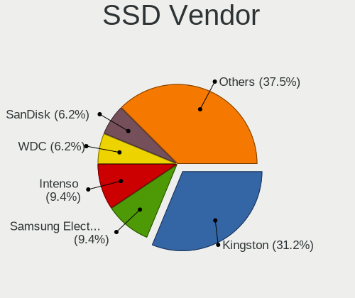
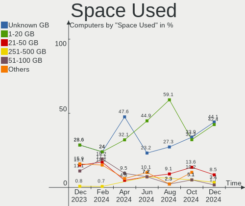
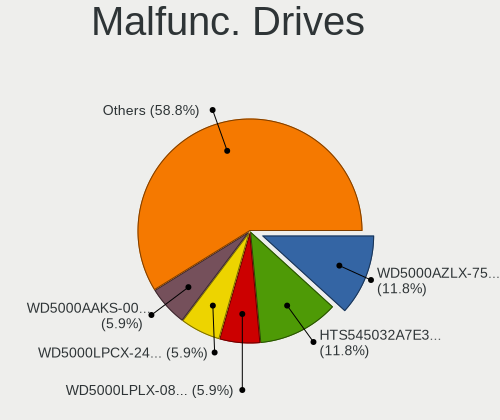
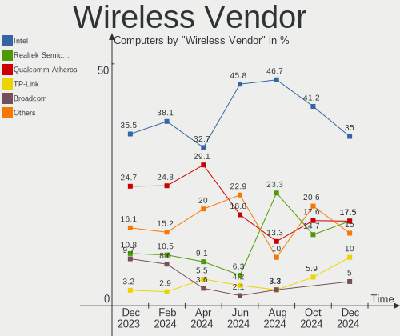
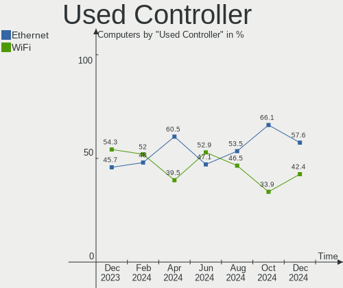
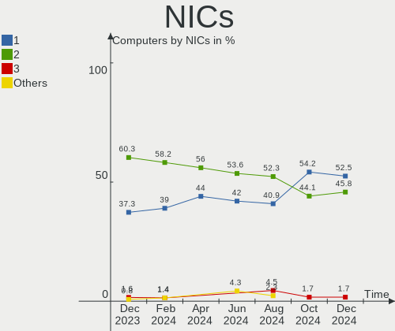

BlackPanther Hardware Trends
----------------------------

A project to identify most popular hardware characteristics and track their change
over time based on data collected by BlackPanther users at https://Linux-Hardware.org.

Anyone can contribute to this report by the [hw-probe](https://github.com/linuxhw/hw-probe) tool:

    sudo -E hw-probe -all -upload

This is a report for all computer types. See also reports for [desktops](/Dist/BlackPanther/Desktop/README.md) and [notebooks](/Dist/BlackPanther/Notebook/README.md).

Full-feature report is available here: https://linux-hardware.org/?view=trends

Period: Sep, 2021.

Contents
--------

* [ System ](#system)
  - [ OS                       ](#os)
  - [ OS Family                ](#os-family)
  - [ Kernel                   ](#kernel)
  - [ Kernel Family            ](#kernel-family)
  - [ Kernel Major Ver.        ](#kernel-major-ver)
  - [ Arch                     ](#arch)
  - [ DE                       ](#de)
  - [ Display Server           ](#display-server)
  - [ Display Manager          ](#display-manager)
  - [ OS Lang                  ](#os-lang)
  - [ Boot Mode                ](#boot-mode)
  - [ Filesystem               ](#filesystem)
  - [ Part. scheme             ](#part-scheme)
  - [ Dual Boot with Linux/BSD ](#dual-boot-with-linuxbsd)
  - [ Dual Boot (Win)          ](#dual-boot-win)

* [ Board ](#board)
  - [ Vendor                   ](#vendor)
  - [ Model                    ](#model)
  - [ Model Family             ](#model-family)
  - [ MFG Year                 ](#mfg-year)
  - [ Form Factor              ](#form-factor)
  - [ Secure Boot              ](#secure-boot)
  - [ Coreboot                 ](#coreboot)
  - [ RAM Size                 ](#ram-size)
  - [ RAM Used                 ](#ram-used)
  - [ Total Drives             ](#total-drives)
  - [ Has CD-ROM               ](#has-cd-rom)
  - [ Has Ethernet             ](#has-ethernet)
  - [ Has WiFi                 ](#has-wifi)
  - [ Has Bluetooth            ](#has-bluetooth)

* [ Location ](#location)
  - [ Country                  ](#country)
  - [ City                     ](#city)

* [ Drives ](#drives)
  - [ Drive Vendor             ](#drive-vendor)
  - [ Drive Model              ](#drive-model)
  - [ HDD Vendor               ](#hdd-vendor)
  - [ SSD Vendor               ](#ssd-vendor)
  - [ Drive Kind               ](#drive-kind)
  - [ Drive Connector          ](#drive-connector)
  - [ Drive Size               ](#drive-size)
  - [ Space Total              ](#space-total)
  - [ Space Used               ](#space-used)
  - [ Malfunc. Drives          ](#malfunc-drives)
  - [ Malfunc. Drive Vendor    ](#malfunc-drive-vendor)
  - [ Malfunc. HDD Vendor      ](#malfunc-hdd-vendor)
  - [ Malfunc. Drive Kind      ](#malfunc-drive-kind)
  - [ Failed Drives            ](#failed-drives)
  - [ Failed Drive Vendor      ](#failed-drive-vendor)
  - [ Drive Status             ](#drive-status)

* [ Storage controller ](#storage-controller)
  - [ Storage Vendor           ](#storage-vendor)
  - [ Storage Model            ](#storage-model)
  - [ Storage Kind             ](#storage-kind)

* [ Processor ](#processor)
  - [ CPU Vendor               ](#cpu-vendor)
  - [ CPU Model                ](#cpu-model)
  - [ CPU Model Family         ](#cpu-model-family)
  - [ CPU Cores                ](#cpu-cores)
  - [ CPU Sockets              ](#cpu-sockets)
  - [ CPU Threads              ](#cpu-threads)
  - [ CPU Op-Modes             ](#cpu-op-modes)
  - [ CPU Microcode            ](#cpu-microcode)
  - [ CPU Microarch            ](#cpu-microarch)

* [ Graphics ](#graphics)
  - [ GPU Vendor               ](#gpu-vendor)
  - [ GPU Model                ](#gpu-model)
  - [ GPU Combo                ](#gpu-combo)
  - [ GPU Driver               ](#gpu-driver)
  - [ GPU Memory               ](#gpu-memory)

* [ Monitor ](#monitor)
  - [ Monitor Vendor           ](#monitor-vendor)
  - [ Monitor Model            ](#monitor-model)
  - [ Monitor Resolution       ](#monitor-resolution)
  - [ Monitor Diagonal         ](#monitor-diagonal)
  - [ Monitor Width            ](#monitor-width)
  - [ Aspect Ratio             ](#aspect-ratio)
  - [ Monitor Area             ](#monitor-area)
  - [ Pixel Density            ](#pixel-density)
  - [ Multiple Monitors        ](#multiple-monitors)

* [ Network ](#network)
  - [ Net Controller Vendor    ](#net-controller-vendor)
  - [ Net Controller Model     ](#net-controller-model)
  - [ Wireless Vendor          ](#wireless-vendor)
  - [ Wireless Model           ](#wireless-model)
  - [ Ethernet Vendor          ](#ethernet-vendor)
  - [ Ethernet Model           ](#ethernet-model)
  - [ Net Controller Kind      ](#net-controller-kind)
  - [ Used Controller          ](#used-controller)
  - [ NICs                     ](#nics)
  - [ IPv6                     ](#ipv6)

* [ Bluetooth ](#bluetooth)
  - [ Bluetooth Vendor         ](#bluetooth-vendor)
  - [ Bluetooth Model          ](#bluetooth-model)

* [ Sound ](#sound)
  - [ Sound Vendor             ](#sound-vendor)
  - [ Sound Model              ](#sound-model)

* [ Memory ](#memory)
  - [ Memory Vendor            ](#memory-vendor)
  - [ Memory Model             ](#memory-model)
  - [ Memory Kind              ](#memory-kind)
  - [ Memory Form Factor       ](#memory-form-factor)
  - [ Memory Size              ](#memory-size)
  - [ Memory Speed             ](#memory-speed)

* [ Printers & scanners ](#printers--scanners)
  - [ Printer Vendor           ](#printer-vendor)
  - [ Printer Model            ](#printer-model)
  - [ Scanner Vendor           ](#scanner-vendor)
  - [ Scanner Model            ](#scanner-model)

* [ Camera ](#camera)
  - [ Camera Vendor            ](#camera-vendor)
  - [ Camera Model             ](#camera-model)

* [ Security ](#security)
  - [ Fingerprint Vendor       ](#fingerprint-vendor)
  - [ Fingerprint Model        ](#fingerprint-model)
  - [ Chipcard Vendor          ](#chipcard-vendor)
  - [ Chipcard Model           ](#chipcard-model)

* [ Unsupported ](#unsupported)
  - [ Unsupported Devices      ](#unsupported-devices)
  - [ Unsupported Device Types ](#unsupported-device-types)

System
------

OS
--

Installed operating systems

| Name              | Computers | Percent |
|-------------------|-----------|---------|
| BlackPanther 18.1 | 58        | 98.31%  |
| BlackPanther 16.2 | 1         | 1.69%   |

OS Family
---------

OS without a version

| Name         | Computers | Percent |
|--------------|-----------|---------|
| BlackPanther | 59        | 100%    |

Kernel
------

Version of the Linux kernel

| Version                | Computers | Percent |
|------------------------|-----------|---------|
| 4.18.16-desktop-1bP    | 32        | 54.24%  |
| 5.6.14-desktop-2bP     | 26        | 44.07%  |
| 4.9.20-desktop-pae-1bP | 1         | 1.69%   |

Kernel Family
-------------

Linux kernel without a distro release

| Version | Computers | Percent |
|---------|-----------|---------|
| 4.18.16 | 32        | 54.24%  |
| 5.6.14  | 26        | 44.07%  |
| 4.9.20  | 1         | 1.69%   |

Kernel Major Ver.
-----------------

Linux kernel major version

| Version | Computers | Percent |
|---------|-----------|---------|
| 4.18    | 32        | 54.24%  |
| 5.6     | 26        | 44.07%  |
| 4.9     | 1         | 1.69%   |

Arch
----

OS architecture (x86_64, i586, etc.)

| Name   | Computers | Percent |
|--------|-----------|---------|
| x86_64 | 58        | 98.31%  |
| i686   | 1         | 1.69%   |

DE
--

Desktop Environment

| Name | Computers | Percent |
|------|-----------|---------|
| KDE5 | 59        | 100%    |

Display Server
--------------

X11 or Wayland

| Name | Computers | Percent |
|------|-----------|---------|
| X11  | 59        | 100%    |

Display Manager
---------------

SDDM, LightDM, etc.

| Name | Computers | Percent |
|------|-----------|---------|
| SDDM | 59        | 100%    |

OS Lang
-------

Language

| Lang    | Computers | Percent |
|---------|-----------|---------|
| Unknown | 59        | 100%    |

Boot Mode
---------

EFI or BIOS

| Mode | Computers | Percent |
|------|-----------|---------|
| BIOS | 41        | 69.49%  |
| EFI  | 18        | 30.51%  |

Filesystem
----------

Type of filesystem

| Type    | Computers | Percent |
|---------|-----------|---------|
| Overlay | 48        | 81.36%  |
| Ext4    | 11        | 18.64%  |

Part. scheme
------------

Scheme of partitioning

| Type    | Computers | Percent |
|---------|-----------|---------|
| MBR     | 36        | 61.02%  |
| GPT     | 22        | 37.29%  |
| Unknown | 1         | 1.69%   |

Dual Boot with Linux/BSD
------------------------

Hosting more than one Linux/BSD

| Dual boot | Computers | Percent |
|-----------|-----------|---------|
| Yes       | 32        | 54.24%  |
| No        | 27        | 45.76%  |

Dual Boot (Win)
---------------

Hosting Linux and Windows

| Dual boot | Computers | Percent |
|-----------|-----------|---------|
| No        | 32        | 54.24%  |
| Yes       | 27        | 45.76%  |

Board
-----

Vendor
------

Motherboard manufacturer

| Name                | Computers | Percent |
|---------------------|-----------|---------|
| ASUSTek Computer    | 12        | 20.34%  |
| Hewlett-Packard     | 7         | 11.86%  |
| Acer                | 6         | 10.17%  |
| Fujitsu             | 5         | 8.47%   |
| ASRock              | 5         | 8.47%   |
| Gigabyte Technology | 4         | 6.78%   |
| Dell                | 4         | 6.78%   |
| Samsung Electronics | 3         | 5.08%   |
| Lenovo              | 3         | 5.08%   |
| Intel               | 2         | 3.39%   |
| Apple               | 2         | 3.39%   |
| Toshiba             | 1         | 1.69%   |
| Packard Bell        | 1         | 1.69%   |
| MSI                 | 1         | 1.69%   |
| Insyde              | 1         | 1.69%   |
| eMachines           | 1         | 1.69%   |
| Unknown             | 1         | 1.69%   |

Model
-----

Motherboard model

| Name                                       | Computers | Percent |
|--------------------------------------------|-----------|---------|
| Acer Aspire 2930Z                          | 3         | 5.08%   |
| Gigabyte H61M-S1                           | 2         | 3.39%   |
| ASRock FM2A75M Pro4+                       | 2         | 3.39%   |
| Acer Aspire ES1-532G                       | 2         | 3.39%   |
| Toshiba Satellite L750                     | 1         | 1.69%   |
| Samsung R540/R580/R780/SA41/E452/E852      | 1         | 1.69%   |
| Samsung N150/N210/N220                     | 1         | 1.69%   |
| Samsung 300E4A/300E5A/300E7A/3430EA/3530EA | 1         | 1.69%   |
| Packard Bell EasyNote TK11BZ               | 1         | 1.69%   |
| MSI MS-7529                                | 1         | 1.69%   |
| Lenovo Yoga 310-11IAP 80U2                 | 1         | 1.69%   |
| Lenovo ThinkPad T470s 20HF005BMZ           | 1         | 1.69%   |
| Lenovo ThinkCentre M73 10B6001SUS          | 1         | 1.69%   |
| Intel DG43GT AAE62768-300                  | 1         | 1.69%   |
| Intel DG35EC AAE29266-206                  | 1         | 1.69%   |
| Insyde Braswell                            | 1         | 1.69%   |
| HP ProBook 6470b                           | 1         | 1.69%   |
| HP Pavilion 17                             | 1         | 1.69%   |
| HP Compaq Pro 6305 SFF                     | 1         | 1.69%   |
| HP Compaq Pro 6305 MT                      | 1         | 1.69%   |
| HP Compaq Pro 6300 SFF                     | 1         | 1.69%   |
| HP 650                                     | 1         | 1.69%   |
| HP 250 G6 Notebook PC                      | 1         | 1.69%   |
| Gigabyte P67A-D3-B3                        | 1         | 1.69%   |
| Gigabyte G41MT-S2PT                        | 1         | 1.69%   |
| Fujitsu LIFEBOOK AH531                     | 1         | 1.69%   |
| Fujitsu ESPRIMO P7936                      | 1         | 1.69%   |
| Fujitsu ESPRIMO P720                       | 1         | 1.69%   |
| Fujitsu ESPRIMO E7935                      | 1         | 1.69%   |
| Fujitsu CELSIUS M470                       | 1         | 1.69%   |
| eMachines E525                             | 1         | 1.69%   |
| Dell Vostro 15-3568                        | 1         | 1.69%   |
| Dell OptiPlex 3010                         | 1         | 1.69%   |
| Dell Latitude E6430                        | 1         | 1.69%   |
| Dell Inspiron 3537                         | 1         | 1.69%   |
| ASUS VivoBook 15_ASUS Laptop X540UBR       | 1         | 1.69%   |
| ASUS Strix 15 GL503GE                      | 1         | 1.69%   |
| ASUS PRIME B365M-A                         | 1         | 1.69%   |
| ASUS PRIME A320M-R                         | 1         | 1.69%   |
| ASUS P7P55D                                | 1         | 1.69%   |
| ASUS P5KPL-AM IN/ROEM/SI                   | 1         | 1.69%   |
| ASUS H110M-K                               | 1         | 1.69%   |
| ASUS H110M-A                               | 1         | 1.69%   |
| ASUS F1A75-M PRO                           | 1         | 1.69%   |
| ASUS Crosshair IV Formula                  | 1         | 1.69%   |
| ASUS ASUS TUF Gaming A15 FA506IU_FX506IU   | 1         | 1.69%   |
| ASUS All Series                            | 1         | 1.69%   |
| ASRock FM2A68M-HD+                         | 1         | 1.69%   |
| ASRock 945GCM-S                            | 1         | 1.69%   |
| ASRock 4CoreDual-SATA2                     | 1         | 1.69%   |
| Apple MacPro2,1                            | 1         | 1.69%   |
| Apple MacBookPro5,5                        | 1         | 1.69%   |
| Acer F                                     | 1         | 1.69%   |
| Unknown                                    | 1         | 1.69%   |

Model Family
------------

Motherboard model prefix

| Name                   | Computers | Percent |
|------------------------|-----------|---------|
| Acer Aspire            | 5         | 8.47%   |
| HP Compaq              | 3         | 5.08%   |
| Fujitsu ESPRIMO        | 3         | 5.08%   |
| Gigabyte H61M-S1       | 2         | 3.39%   |
| ASUS PRIME             | 2         | 3.39%   |
| ASRock FM2A75M         | 2         | 3.39%   |
| Toshiba Satellite      | 1         | 1.69%   |
| Samsung R540           | 1         | 1.69%   |
| Samsung N150           | 1         | 1.69%   |
| Samsung 300E4A         | 1         | 1.69%   |
| Packard Bell EasyNote  | 1         | 1.69%   |
| MSI MS-7529            | 1         | 1.69%   |
| Lenovo Yoga            | 1         | 1.69%   |
| Lenovo ThinkPad        | 1         | 1.69%   |
| Lenovo ThinkCentre     | 1         | 1.69%   |
| Intel DG43GT           | 1         | 1.69%   |
| Intel DG35EC           | 1         | 1.69%   |
| Insyde Braswell        | 1         | 1.69%   |
| HP ProBook             | 1         | 1.69%   |
| HP Pavilion            | 1         | 1.69%   |
| HP 650                 | 1         | 1.69%   |
| HP 250                 | 1         | 1.69%   |
| Gigabyte P67A-D3-B3    | 1         | 1.69%   |
| Gigabyte G41MT-S2PT    | 1         | 1.69%   |
| Fujitsu LIFEBOOK       | 1         | 1.69%   |
| Fujitsu CELSIUS        | 1         | 1.69%   |
| eMachines E525         | 1         | 1.69%   |
| Dell Vostro            | 1         | 1.69%   |
| Dell OptiPlex          | 1         | 1.69%   |
| Dell Latitude          | 1         | 1.69%   |
| Dell Inspiron          | 1         | 1.69%   |
| ASUS VivoBook          | 1         | 1.69%   |
| ASUS Strix             | 1         | 1.69%   |
| ASUS P7P55D            | 1         | 1.69%   |
| ASUS P5KPL-AM          | 1         | 1.69%   |
| ASUS H110M-K           | 1         | 1.69%   |
| ASUS H110M-A           | 1         | 1.69%   |
| ASUS F1A75-M           | 1         | 1.69%   |
| ASUS Crosshair         | 1         | 1.69%   |
| ASUS ASUS              | 1         | 1.69%   |
| ASUS All               | 1         | 1.69%   |
| ASRock FM2A68M-HD+     | 1         | 1.69%   |
| ASRock 945GCM-S        | 1         | 1.69%   |
| ASRock 4CoreDual-SATA2 | 1         | 1.69%   |
| Apple MacPro2          | 1         | 1.69%   |
| Apple MacBookPro5      | 1         | 1.69%   |
| Acer F                 | 1         | 1.69%   |
| Unknown                | 1         | 1.69%   |

MFG Year
--------

Motherboard manufacture year

| Year | Computers | Percent |
|------|-----------|---------|
| 2019 | 8         | 13.56%  |
| 2011 | 8         | 13.56%  |
| 2012 | 6         | 10.17%  |
| 2010 | 6         | 10.17%  |
| 2018 | 5         | 8.47%   |
| 2009 | 5         | 8.47%   |
| 2014 | 4         | 6.78%   |
| 2008 | 4         | 6.78%   |
| 2016 | 3         | 5.08%   |
| 2013 | 3         | 5.08%   |
| 2020 | 2         | 3.39%   |
| 2021 | 1         | 1.69%   |
| 2017 | 1         | 1.69%   |
| 2015 | 1         | 1.69%   |
| 2007 | 1         | 1.69%   |
| 2006 | 1         | 1.69%   |

Form Factor
-----------

Physical design of the computer

| Name        | Computers | Percent |
|-------------|-----------|---------|
| Desktop     | 32        | 54.24%  |
| Notebook    | 26        | 44.07%  |
| Convertible | 1         | 1.69%   |

Secure Boot
-----------

Enabled or disabled

| State    | Computers | Percent |
|----------|-----------|---------|
| Disabled | 59        | 100%    |

Coreboot
--------

Have coreboot on board

| Used | Computers | Percent |
|------|-----------|---------|
| No   | 59        | 100%    |

RAM Size
--------

Total RAM memory

| Size in GB | Computers | Percent |
|------------|-----------|---------|
| 3.01-4.0   | 19        | 32.2%   |
| 8.01-16.0  | 17        | 28.81%  |
| 4.01-8.0   | 10        | 16.95%  |
| 1.01-2.0   | 6         | 10.17%  |
| 16.01-24.0 | 4         | 6.78%   |
| 2.01-3.0   | 2         | 3.39%   |
| 24.01-32.0 | 1         | 1.69%   |

RAM Used
--------

Used RAM memory

| Used GB  | Computers | Percent |
|----------|-----------|---------|
| 0.01-0.5 | 26        | 44.07%  |
| 0.51-1.0 | 22        | 37.29%  |
| 1.01-2.0 | 11        | 18.64%  |

Total Drives
------------

Number of drives on board

| Drives | Computers | Percent |
|--------|-----------|---------|
| 1      | 37        | 62.71%  |
| 2      | 11        | 18.64%  |
| 3      | 5         | 8.47%   |
| 4      | 2         | 3.39%   |
| 0      | 2         | 3.39%   |
| 6      | 1         | 1.69%   |
| 5      | 1         | 1.69%   |

Has CD-ROM
----------

Has CD-ROM on board

| Presented | Computers | Percent |
|-----------|-----------|---------|
| Yes       | 36        | 61.02%  |
| No        | 23        | 38.98%  |

Has Ethernet
------------

Has Ethernet on board

| Presented | Computers | Percent |
|-----------|-----------|---------|
| Yes       | 57        | 96.61%  |
| No        | 2         | 3.39%   |

Has WiFi
--------

Has WiFi module

| Presented | Computers | Percent |
|-----------|-----------|---------|
| Yes       | 34        | 57.63%  |
| No        | 25        | 42.37%  |

Has Bluetooth
-------------

Has Bluetooth module

| Presented | Computers | Percent |
|-----------|-----------|---------|
| No        | 37        | 62.71%  |
| Yes       | 22        | 37.29%  |

Location
--------

Country
-------

Geographic location (country)

| Country       | Computers | Percent |
|---------------|-----------|---------|
| Hungary       | 47        | 79.66%  |
| Argentina     | 4         | 6.78%   |
| Germany       | 3         | 5.08%   |
| USA           | 2         | 3.39%   |
| Slovakia      | 2         | 3.39%   |
| Liechtenstein | 1         | 1.69%   |

City
----

Geographic location (city)

| City             | Computers | Percent |
|------------------|-----------|---------|
| Budapest         | 11        | 18.64%  |
| Gy?‘r            | 5         | 8.47%   |
| Tigre            | 4         | 6.78%   |
| Sokoropatka      | 3         | 5.08%   |
| Tiszafured       | 2         | 3.39%   |
| Tatab??nya       | 2         | 3.39%   |
| Szeksz??rd       | 2         | 3.39%   |
| North Hollywood  | 2         | 3.39%   |
| Kenderes         | 2         | 3.39%   |
| Hnusta           | 2         | 3.39%   |
| Debrecen         | 2         | 3.39%   |
| Wernberg-Koblitz | 1         | 1.69%   |
| Triesen          | 1         | 1.69%   |
| Tarnok           | 1         | 1.69%   |
| Szeged           | 1         | 1.69%   |
| Ruzsa            | 1         | 1.69%   |
| Roszke           | 1         | 1.69%   |
| P?©cs            | 1         | 1.69%   |
| Pap              | 1         | 1.69%   |
| Oroshaza         | 1         | 1.69%   |
| Nagykoros        | 1         | 1.69%   |
| Miskolc          | 1         | 1.69%   |
| Leipzig          | 1         | 1.69%   |
| Kunszentmiklos   | 1         | 1.69%   |
| Kony             | 1         | 1.69%   |
| Keszthely        | 1         | 1.69%   |
| Karcag           | 1         | 1.69%   |
| Hodmezovasarhely | 1         | 1.69%   |
| Heves            | 1         | 1.69%   |
| Fuzesabony       | 1         | 1.69%   |
| Cegled           | 1         | 1.69%   |
| Bochum           | 1         | 1.69%   |
| Ajka             | 1         | 1.69%   |

Drives
------

Drive Vendor
------------

Hard drive vendors

| Vendor              | Computers | Drives | Percent |
|---------------------|-----------|--------|---------|
| WDC                 | 17        | 22     | 19.54%  |
| Samsung Electronics | 17        | 19     | 19.54%  |
| Toshiba             | 12        | 14     | 13.79%  |
| Kingston            | 9         | 10     | 10.34%  |
| Seagate             | 6         | 7      | 6.9%    |
| Hitachi             | 4         | 4      | 4.6%    |
| A-DATA Technology   | 3         | 3      | 3.45%   |
| PNY                 | 2         | 2      | 2.3%    |
| Patriot             | 2         | 2      | 2.3%    |
| Crucial             | 2         | 2      | 2.3%    |
| Zheino              | 1         | 1      | 1.15%   |
| WD MediaMax         | 1         | 1      | 1.15%   |
| Unknown             | 1         | 1      | 1.15%   |
| Team                | 1         | 1      | 1.15%   |
| SPCC                | 1         | 1      | 1.15%   |
| SanDisk             | 1         | 1      | 1.15%   |
| Micron Technology   | 1         | 1      | 1.15%   |
| MAXTOR              | 1         | 1      | 1.15%   |
| HGST                | 1         | 1      | 1.15%   |
| Hewlett-Packard     | 1         | 1      | 1.15%   |
| Fujitsu             | 1         | 1      | 1.15%   |
| China               | 1         | 1      | 1.15%   |
| Apacer              | 1         | 1      | 1.15%   |

Drive Model
-----------

Hard drive models

| Model                               | Computers | Percent |
|-------------------------------------|-----------|---------|
| Samsung HD502IJ 500GB               | 3         | 3.09%   |
| WDC WD20EZRX-00D8PB0 2TB            | 2         | 2.06%   |
| WDC WD10EZEX-00KUWA0 1TB            | 2         | 2.06%   |
| Toshiba MQ01ABD100 1TB              | 2         | 2.06%   |
| Seagate ST9500325AS 500GB           | 2         | 2.06%   |
| Samsung HD103UJ 1TB                 | 2         | 2.06%   |
| Patriot Burst 120GB SSD             | 2         | 2.06%   |
| Kingston SV300S37A120G 120GB SSD    | 2         | 2.06%   |
| Kingston SUV400S37120G 120GB SSD    | 2         | 2.06%   |
| Kingston SA400S37480G 480GB SSD     | 2         | 2.06%   |
| Kingston SA400S37240G 240GB SSD     | 2         | 2.06%   |
| Hitachi HTS543232A7A384 320GB       | 2         | 2.06%   |
| A-DATA SU630 240GB SSD              | 2         | 2.06%   |
| Zheino CHN-NGFFNV2280-256 256GB     | 1         | 1.03%   |
| WDC WDS240G2G0B-00EPW0 240GB SSD    | 1         | 1.03%   |
| WDC WD7500BPVT-60HXZT3 752GB        | 1         | 1.03%   |
| WDC WD5000BPVT-22HXZT1 500GB        | 1         | 1.03%   |
| WDC WD5000BEVT-22ZAT0 500GB         | 1         | 1.03%   |
| WDC WD400BB-23DEA0 40GB             | 1         | 1.03%   |
| WDC WD3200LPLX-00ZNTT0 320GB        | 1         | 1.03%   |
| WDC WD30EZRZ-00GXCB0 3TB            | 1         | 1.03%   |
| WDC WD30EZRX-00DC0B0 3TB            | 1         | 1.03%   |
| WDC WD30EFRX-68EUZN0 3TB            | 1         | 1.03%   |
| WDC WD2500YS-01SHB0 256GB           | 1         | 1.03%   |
| WDC WD2500AAJS-75B4A0 250GB         | 1         | 1.03%   |
| WDC WD1600BEVT-80A23T0 160GB        | 1         | 1.03%   |
| WDC WD1600BEVT-22ZCT0 160GB         | 1         | 1.03%   |
| WDC WD1600BB-55GUC0 160GB           | 1         | 1.03%   |
| WDC WD1600AAJB-56WRA0 160GB         | 1         | 1.03%   |
| WDC WD10JPVX-22JC3T0 1TB            | 1         | 1.03%   |
| WDC WD10EZEX-21WN4A0 1TB            | 1         | 1.03%   |
| WDC WD10EADS-00L5B1 1TB             | 1         | 1.03%   |
| WD MediaMax WL160GSA872B 160GB      | 1         | 1.03%   |
| Unknown HCG4a2  64GB                | 1         | 1.03%   |
| Toshiba TL100 120GB SSD             | 1         | 1.03%   |
| Toshiba THNSFJ256GCSU 256GB SSD     | 1         | 1.03%   |
| Toshiba MQ04ABF100 1TB              | 1         | 1.03%   |
| Toshiba MQ01ABD075 752GB            | 1         | 1.03%   |
| Toshiba MK6475GSX 640GB             | 1         | 1.03%   |
| Toshiba MK6465GSX 640GB             | 1         | 1.03%   |
| Toshiba MK1665GSX 160GB             | 1         | 1.03%   |
| Toshiba HDWQ140 4TB                 | 1         | 1.03%   |
| Toshiba HDWL120 2TB                 | 1         | 1.03%   |
| Toshiba DT01ACA200 2TB              | 1         | 1.03%   |
| Toshiba DT01ACA100 1TB              | 1         | 1.03%   |
| Toshiba DT01ACA050 500GB            | 1         | 1.03%   |
| Team T253X1480G 480GB SSD           | 1         | 1.03%   |
| SPCC Solid State Disk 256GB         | 1         | 1.03%   |
| Seagate ST500LT012-1DG142 500GB     | 1         | 1.03%   |
| Seagate ST500DM002-1BD142 500GB     | 1         | 1.03%   |
| Seagate ST320LT000-9VL142 320GB     | 1         | 1.03%   |
| Seagate ST1000LX015-1U7172 1TB      | 1         | 1.03%   |
| Seagate ST1000LM 024 HN-M101MBB 1TB | 1         | 1.03%   |
| SanDisk DF4032  32GB                | 1         | 1.03%   |
| Samsung SSD 870 EVO 500GB           | 1         | 1.03%   |
| Samsung SSD 860 EVO 1TB             | 1         | 1.03%   |
| Samsung SSD 830 Series 64GB         | 1         | 1.03%   |
| Samsung SP2004C 200GB               | 1         | 1.03%   |
| Samsung MZVLW512HMJP-000L7 512GB    | 1         | 1.03%   |
| Samsung MZVLW256HEHP-00000 256GB    | 1         | 1.03%   |

HDD Vendor
----------

Hard disk drive vendors

| Vendor              | Computers | Drives | Percent |
|---------------------|-----------|--------|---------|
| WDC                 | 16        | 21     | 30.77%  |
| Samsung Electronics | 12        | 12     | 23.08%  |
| Toshiba             | 10        | 12     | 19.23%  |
| Seagate             | 6         | 7      | 11.54%  |
| Hitachi             | 4         | 4      | 7.69%   |
| WD MediaMax         | 1         | 1      | 1.92%   |
| MAXTOR              | 1         | 1      | 1.92%   |
| HGST                | 1         | 1      | 1.92%   |
| Fujitsu             | 1         | 1      | 1.92%   |

SSD Vendor
----------

Solid state drive vendors

| Vendor              | Computers | Drives | Percent |
|---------------------|-----------|--------|---------|
| Kingston            | 9         | 10     | 31.03%  |
| Samsung Electronics | 3         | 4      | 10.34%  |
| A-DATA Technology   | 3         | 3      | 10.34%  |
| Toshiba             | 2         | 2      | 6.9%    |
| PNY                 | 2         | 2      | 6.9%    |
| Patriot             | 2         | 2      | 6.9%    |
| Crucial             | 2         | 2      | 6.9%    |
| WDC                 | 1         | 1      | 3.45%   |
| Team                | 1         | 1      | 3.45%   |
| SPCC                | 1         | 1      | 3.45%   |
| Hewlett-Packard     | 1         | 1      | 3.45%   |
| China               | 1         | 1      | 3.45%   |
| Apacer              | 1         | 1      | 3.45%   |

Drive Kind
----------

HDD or SSD

| Kind | Computers | Drives | Percent |
|------|-----------|--------|---------|
| HDD  | 43        | 60     | 58.11%  |
| SSD  | 25        | 31     | 33.78%  |
| NVMe | 4         | 5      | 5.41%   |
| MMC  | 2         | 2      | 2.7%    |

Drive Connector
---------------

SATA, SAS, NVMe, etc.

| Type | Computers | Drives | Percent |
|------|-----------|--------|---------|
| SATA | 54        | 90     | 88.52%  |
| NVMe | 4         | 5      | 6.56%   |
| MMC  | 2         | 2      | 3.28%   |
| SAS  | 1         | 1      | 1.64%   |

Drive Size
----------

Size of hard drive

| Size in TB | Computers | Drives | Percent |
|------------|-----------|--------|---------|
| 0.01-0.5   | 43        | 64     | 63.24%  |
| 0.51-1.0   | 18        | 19     | 26.47%  |
| 1.01-2.0   | 4         | 4      | 5.88%   |
| 2.01-3.0   | 2         | 3      | 2.94%   |
| 3.01-4.0   | 1         | 1      | 1.47%   |

Space Total
-----------

Amount of disk space available on the file system

| Size in GB | Computers | Percent |
|------------|-----------|---------|
| Unknown    | 48        | 81.36%  |
| 101-250    | 4         | 6.78%   |
| 251-500    | 3         | 5.08%   |
| 21-50      | 2         | 3.39%   |
| 51-100     | 2         | 3.39%   |

Space Used
----------

Amount of used disk space

| Used GB | Computers | Percent |
|---------|-----------|---------|
| Unknown | 48        | 81.36%  |
| 1-20    | 11        | 18.64%  |

Malfunc. Drives
---------------

Drive models with a malfunction

| Model                             | Computers | Drives | Percent |
|-----------------------------------|-----------|--------|---------|
| Seagate ST9500325AS 500GB         | 2         | 2      | 6.06%   |
| Samsung Electronics HD103UJ 1TB   | 2         | 2      | 6.06%   |
| A-DATA Technology SU630 240GB SSD | 2         | 2      | 6.06%   |
| WDC WD7500BPVT-60HXZT3 752GB      | 1         | 1      | 3.03%   |
| WDC WD400BB-23DEA0 40GB           | 1         | 1      | 3.03%   |
| WDC WD2500YS-01SHB0 256GB         | 1         | 1      | 3.03%   |
| WDC WD2500AAJS-75B4A0 250GB       | 1         | 1      | 3.03%   |
| WDC WD1600BB-55GUC0 160GB         | 1         | 1      | 3.03%   |
| WDC WD1600AAJB-56WRA0 160GB       | 1         | 1      | 3.03%   |
| WDC WD10JPVX-22JC3T0 1TB          | 1         | 1      | 3.03%   |
| WD MediaMax WL160GSA872B 160GB    | 1         | 1      | 3.03%   |
| Toshiba THNSFJ256GCSU 256GB SSD   | 1         | 1      | 3.03%   |
| Toshiba MQ01ABD075 752GB          | 1         | 1      | 3.03%   |
| Toshiba MK6465GSX 640GB           | 1         | 1      | 3.03%   |
| Toshiba MK1665GSX 160GB           | 1         | 1      | 3.03%   |
| Seagate ST500LT012-1DG142 500GB   | 1         | 1      | 3.03%   |
| Seagate ST500DM002-1BD142 500GB   | 1         | 1      | 3.03%   |
| Seagate ST320LT000-9VL142 320GB   | 1         | 1      | 3.03%   |
| Seagate ST1000LX015-1U7172 1TB    | 1         | 1      | 3.03%   |
| Samsung Electronics SP2004C 200GB | 1         | 1      | 3.03%   |
| Samsung Electronics HM321HI 320GB | 1         | 1      | 3.03%   |
| Samsung Electronics HM160HI 160GB | 1         | 1      | 3.03%   |
| Samsung Electronics HD503HI 500GB | 1         | 1      | 3.03%   |
| Samsung Electronics HD502IJ 500GB | 1         | 1      | 3.03%   |
| MAXTOR 6V250F0 256GB              | 1         | 1      | 3.03%   |
| Hitachi HTS721010G9SA00 100GB     | 1         | 1      | 3.03%   |
| Hitachi HTS543232L9A300 320GB     | 1         | 1      | 3.03%   |
| Hitachi HTS543232A7A384 320GB     | 1         | 1      | 3.03%   |
| HGST HTS545050A7E680 500GB        | 1         | 1      | 3.03%   |
| Fujitsu MHZ2320BH G2 320GB        | 1         | 1      | 3.03%   |

Malfunc. Drive Vendor
---------------------

Vendors of faulty drives

| Vendor              | Computers | Drives | Percent |
|---------------------|-----------|--------|---------|
| WDC                 | 7         | 7      | 21.88%  |
| Samsung Electronics | 7         | 7      | 21.88%  |
| Seagate             | 5         | 6      | 15.63%  |
| Toshiba             | 4         | 4      | 12.5%   |
| Hitachi             | 3         | 3      | 9.38%   |
| A-DATA Technology   | 2         | 2      | 6.25%   |
| WD MediaMax         | 1         | 1      | 3.13%   |
| MAXTOR              | 1         | 1      | 3.13%   |
| HGST                | 1         | 1      | 3.13%   |
| Fujitsu             | 1         | 1      | 3.13%   |

Malfunc. HDD Vendor
-------------------

Vendors of faulty HDD drives

| Vendor              | Computers | Drives | Percent |
|---------------------|-----------|--------|---------|
| WDC                 | 7         | 7      | 24.14%  |
| Samsung Electronics | 7         | 7      | 24.14%  |
| Seagate             | 5         | 6      | 17.24%  |
| Toshiba             | 3         | 3      | 10.34%  |
| Hitachi             | 3         | 3      | 10.34%  |
| WD MediaMax         | 1         | 1      | 3.45%   |
| MAXTOR              | 1         | 1      | 3.45%   |
| HGST                | 1         | 1      | 3.45%   |
| Fujitsu             | 1         | 1      | 3.45%   |

Malfunc. Drive Kind
-------------------

Kinds of faulty drives

| Kind | Computers | Drives | Percent |
|------|-----------|--------|---------|
| HDD  | 26        | 30     | 89.66%  |
| SSD  | 3         | 3      | 10.34%  |

Failed Drives
-------------

Failed drive models

| Model                       | Computers | Drives | Percent |
|-----------------------------|-----------|--------|---------|
| WDC WD5000BEVT-22ZAT0 500GB | 1         | 1      | 50%     |
| Toshiba MK6475GSX 640GB     | 1         | 1      | 50%     |

Failed Drive Vendor
-------------------

Failed drive vendors

| Vendor  | Computers | Drives | Percent |
|---------|-----------|--------|---------|
| WDC     | 1         | 1      | 50%     |
| Toshiba | 1         | 1      | 50%     |

Drive Status
------------

Number of failed and malfunc. drives

| Status   | Computers | Drives | Percent |
|----------|-----------|--------|---------|
| Works    | 32        | 57     | 47.76%  |
| Malfunc  | 28        | 33     | 41.79%  |
| Detected | 5         | 6      | 7.46%   |
| Failed   | 2         | 2      | 2.99%   |

Storage controller
------------------

Storage Vendor
--------------

Storage controller vendors

| Vendor                   | Computers | Percent |
|--------------------------|-----------|---------|
| Intel                    | 43        | 63.24%  |
| AMD                      | 11        | 16.18%  |
| Samsung Electronics      | 3         | 4.41%   |
| JMicron Technology       | 3         | 4.41%   |
| VIA Technologies         | 2         | 2.94%   |
| Silicon Motion           | 1         | 1.47%   |
| Nvidia                   | 1         | 1.47%   |
| Micron Technology        | 1         | 1.47%   |
| Marvell Technology Group | 1         | 1.47%   |
| Adaptec                  | 1         | 1.47%   |
| 3ware                    | 1         | 1.47%   |

Storage Model
-------------

Storage controller models

| Model                                                                                   | Computers | Percent |
|-----------------------------------------------------------------------------------------|-----------|---------|
| AMD FCH SATA Controller [AHCI mode]                                                     | 9         | 10.34%  |
| Intel NM10/ICH7 Family SATA Controller [IDE mode]                                       | 4         | 4.6%    |
| Intel 82801IBM/IEM (ICH9M/ICH9M-E) 4 port SATA Controller [AHCI mode]                   | 4         | 4.6%    |
| Intel 82801G (ICH7 Family) IDE Controller                                               | 4         | 4.6%    |
| Intel 8 Series/C220 Series Chipset Family 6-port SATA Controller 1 [AHCI mode]          | 3         | 3.45%   |
| Intel 6 Series/C200 Series Chipset Family Desktop SATA Controller (IDE mode, ports 4-5) | 3         | 3.45%   |
| Intel 6 Series/C200 Series Chipset Family Desktop SATA Controller (IDE mode, ports 0-3) | 3         | 3.45%   |
| Intel 6 Series/C200 Series Chipset Family 6 port Mobile SATA AHCI Controller            | 3         | 3.45%   |
| VIA VT82C586A/B/VT82C686/A/B/VT823x/A/C PIPC Bus Master IDE                             | 2         | 2.3%    |
| Samsung NVMe SSD Controller SM961/PM961/SM963                                           | 2         | 2.3%    |
| JMicron JMB363 SATA/IDE Controller                                                      | 2         | 2.3%    |
| Intel Sunrise Point-LP SATA Controller [AHCI mode]                                      | 2         | 2.3%    |
| Intel Q170/Q150/B150/H170/H110/Z170/CM236 Chipset SATA Controller [AHCI Mode]           | 2         | 2.3%    |
| Intel Atom/Celeron/Pentium Processor x5-E8000/J3xxx/N3xxx Series SATA Controller        | 2         | 2.3%    |
| Intel 7 Series Chipset Family 6-port SATA Controller [AHCI mode]                        | 2         | 2.3%    |
| AMD FCH IDE Controller                                                                  | 2         | 2.3%    |
| VIA VT8237/8251 Serial ATA Controller                                                   | 1         | 1.15%   |
| VIA VIA VT6420 SATA RAID Controller                                                     | 1         | 1.15%   |
| Silicon Motion SM2263EN/SM2263XT SSD Controller                                         | 1         | 1.15%   |
| Samsung NVMe SSD Controller SM981/PM981/PM983                                           | 1         | 1.15%   |
| Nvidia MCP79 AHCI Controller                                                            | 1         | 1.15%   |
| Micron Non-Volatile memory controller                                                   | 1         | 1.15%   |
| Marvell Group 88SE6101/6102 single-port PATA133 interface                               | 1         | 1.15%   |
| JMicron JMB368 IDE controller                                                           | 1         | 1.15%   |
| Intel NM10/ICH7 Family SATA Controller [AHCI mode]                                      | 1         | 1.15%   |
| Intel Celeron/Pentium Silver Processor SATA Controller                                  | 1         | 1.15%   |
| Intel Celeron N3350/Pentium N4200/Atom E3900 Series SATA AHCI Controller                | 1         | 1.15%   |
| Intel Cannon Lake Mobile PCH SATA AHCI Controller                                       | 1         | 1.15%   |
| Intel 82801JI (ICH10 Family) SATA AHCI Controller                                       | 1         | 1.15%   |
| Intel 82801JI (ICH10 Family) 4 port SATA IDE Controller #1                              | 1         | 1.15%   |
| Intel 82801JI (ICH10 Family) 2 port SATA IDE Controller #2                              | 1         | 1.15%   |
| Intel 82801JD/DO (ICH10 Family) SATA AHCI Controller                                    | 1         | 1.15%   |
| Intel 82801JD/DO (ICH10 Family) 4-port SATA IDE Controller                              | 1         | 1.15%   |
| Intel 82801JD/DO (ICH10 Family) 2-port SATA IDE Controller                              | 1         | 1.15%   |
| Intel 82801IBM/IEM (ICH9M/ICH9M-E) 2 port SATA Controller [IDE mode]                    | 1         | 1.15%   |
| Intel 82801HR/HO/HH (ICH8R/DO/DH) 2 port SATA Controller [IDE mode]                     | 1         | 1.15%   |
| Intel 82801H (ICH8 Family) 4 port SATA Controller [IDE mode]                            | 1         | 1.15%   |
| Intel 82801 Mobile SATA Controller [RAID mode]                                          | 1         | 1.15%   |
| Intel 8 Series SATA Controller 1 [AHCI mode]                                            | 1         | 1.15%   |
| Intel 7 Series/C210 Series Chipset Family 6-port SATA Controller [AHCI mode]            | 1         | 1.15%   |
| Intel 631xESB/632xESB/3100 Chipset SATA IDE Controller                                  | 1         | 1.15%   |
| Intel 631xESB/632xESB IDE Controller                                                    | 1         | 1.15%   |
| Intel 6 Series/C200 Series Chipset Family 6 port Desktop SATA AHCI Controller           | 1         | 1.15%   |
| Intel 5 Series/3400 Series Chipset 4 port SATA IDE Controller                           | 1         | 1.15%   |
| Intel 5 Series/3400 Series Chipset 4 port SATA AHCI Controller                          | 1         | 1.15%   |
| Intel 5 Series/3400 Series Chipset 2 port SATA IDE Controller                           | 1         | 1.15%   |
| Intel 4 Series Chipset PT IDER Controller                                               | 1         | 1.15%   |
| Intel 200 Series PCH SATA controller [AHCI mode]                                        | 1         | 1.15%   |
| AMD SB7x0/SB8x0/SB9x0 SATA Controller [IDE mode]                                        | 1         | 1.15%   |
| AMD SB7x0/SB8x0/SB9x0 SATA Controller [AHCI mode]                                       | 1         | 1.15%   |
| AMD SB7x0/SB8x0/SB9x0 IDE Controller                                                    | 1         | 1.15%   |
| AMD FCH SATA Controller D                                                               | 1         | 1.15%   |
| Adaptec AIC-7870P/7871 [AHA-2940/W/S76]                                                 | 1         | 1.15%   |
| 3ware 7xxx/8xxx-series PATA/SATA-RAID                                                   | 1         | 1.15%   |

Storage Kind
------------

Kind of storage controller (IDE, SATA, NVMe, SAS, ...)

| Kind | Computers | Percent |
|------|-----------|---------|
| SATA | 41        | 61.19%  |
| IDE  | 19        | 28.36%  |
| NVMe | 4         | 5.97%   |
| RAID | 2         | 2.99%   |
| SCSI | 1         | 1.49%   |

Processor
---------

CPU Vendor
----------

Processor vendors

| Vendor | Computers | Percent |
|--------|-----------|---------|
| Intel  | 48        | 81.36%  |
| AMD    | 11        | 18.64%  |

CPU Model
---------

Processor models

| Model                                       | Computers | Percent |
|---------------------------------------------|-----------|---------|
| Intel Pentium Dual CPU T3200 @ 2.00GHz      | 3         | 5.08%   |
| Intel Celeron CPU N3160 @ 1.60GHz           | 2         | 3.39%   |
| Intel Celeron CPU G1610 @ 2.60GHz           | 2         | 3.39%   |
| AMD A8-6600K APU with Radeon HD Graphics    | 2         | 3.39%   |
| Intel Xeon CPU X5355 @ 2.66GHz              | 1         | 1.69%   |
| Intel Xeon CPU W3550 @ 3.07GHz              | 1         | 1.69%   |
| Intel Pentium Dual-Core CPU E6500 @ 2.93GHz | 1         | 1.69%   |
| Intel Pentium Dual-Core CPU E6300 @ 2.80GHz | 1         | 1.69%   |
| Intel Pentium CPU G3240 @ 3.10GHz           | 1         | 1.69%   |
| Intel Pentium CPU B970 @ 2.30GHz            | 1         | 1.69%   |
| Intel Pentium 4 CPU 3.00GHz                 | 1         | 1.69%   |
| Intel Core i7-8750H CPU @ 2.20GHz           | 1         | 1.69%   |
| Intel Core i7-7500U CPU @ 2.70GHz           | 1         | 1.69%   |
| Intel Core i7-4500U CPU @ 1.80GHz           | 1         | 1.69%   |
| Intel Core i5-6500 CPU @ 3.20GHz            | 1         | 1.69%   |
| Intel Core i5-4590 CPU @ 3.30GHz            | 1         | 1.69%   |
| Intel Core i5-3470 CPU @ 3.20GHz            | 1         | 1.69%   |
| Intel Core i5-3380M CPU @ 2.90GHz           | 1         | 1.69%   |
| Intel Core i5-3340M CPU @ 2.70GHz           | 1         | 1.69%   |
| Intel Core i5-2430M CPU @ 2.40GHz           | 1         | 1.69%   |
| Intel Core i5-2300 CPU @ 2.80GHz            | 1         | 1.69%   |
| Intel Core i5 CPU 650 @ 3.20GHz             | 1         | 1.69%   |
| Intel Core i3-8130U CPU @ 2.20GHz           | 1         | 1.69%   |
| Intel Core i3-8100 CPU @ 3.60GHz            | 1         | 1.69%   |
| Intel Core i3-7100 CPU @ 3.90GHz            | 1         | 1.69%   |
| Intel Core i3-6006U CPU @ 2.00GHz           | 1         | 1.69%   |
| Intel Core i3-4130 CPU @ 3.40GHz            | 1         | 1.69%   |
| Intel Core i3-3225 CPU @ 3.30GHz            | 1         | 1.69%   |
| Intel Core i3-2350M CPU @ 2.30GHz           | 1         | 1.69%   |
| Intel Core i3-2330M CPU @ 2.20GHz           | 1         | 1.69%   |
| Intel Core i3 CPU M 370 @ 2.40GHz           | 1         | 1.69%   |
| Intel Core 2 Quad CPU Q9300 @ 2.50GHz       | 1         | 1.69%   |
| Intel Core 2 Duo CPU P7550 @ 2.26GHz        | 1         | 1.69%   |
| Intel Core 2 Duo CPU P7450 @ 2.13GHz        | 1         | 1.69%   |
| Intel Core 2 Duo CPU E8400 @ 3.00GHz        | 1         | 1.69%   |
| Intel Core 2 Duo CPU E7500 @ 2.93GHz        | 1         | 1.69%   |
| Intel Core 2 Duo CPU E7300 @ 2.66GHz        | 1         | 1.69%   |
| Intel Core 2 Duo CPU E7200 @ 2.53GHz        | 1         | 1.69%   |
| Intel Core 2 CPU 4300 @ 1.80GHz             | 1         | 1.69%   |
| Intel Celeron N4000 CPU @ 1.10GHz           | 1         | 1.69%   |
| Intel Celeron CPU N3350 @ 1.10GHz           | 1         | 1.69%   |
| Intel Celeron CPU N3050 @ 1.60GHz           | 1         | 1.69%   |
| Intel Celeron CPU E3400 @ 2.60GHz           | 1         | 1.69%   |
| Intel Celeron CPU 900 @ 2.20GHz             | 1         | 1.69%   |
| Intel Atom CPU N450 @ 1.66GHz               | 1         | 1.69%   |
| AMD Ryzen 7 4800H with Radeon Graphics      | 1         | 1.69%   |
| AMD Ryzen 3 2200G with Radeon Vega Graphics | 1         | 1.69%   |
| AMD Phenom II X6 1090T Processor            | 1         | 1.69%   |
| AMD E-350 Processor                         | 1         | 1.69%   |
| AMD A8-5500B APU with Radeon HD Graphics    | 1         | 1.69%   |
| AMD A8-3870 APU with Radeon HD Graphics     | 1         | 1.69%   |
| AMD A4-6300 APU with Radeon HD Graphics     | 1         | 1.69%   |
| AMD A4-5300B APU with Radeon HD Graphics    | 1         | 1.69%   |
| AMD A4-5000 APU with Radeon HD Graphics     | 1         | 1.69%   |

CPU Model Family
----------------

Processor model prefix

| Model                   | Computers | Percent |
|-------------------------|-----------|---------|
| Intel Core i3           | 9         | 15.25%  |
| Intel Celeron           | 9         | 15.25%  |
| Intel Core i5           | 8         | 13.56%  |
| Intel Core 2 Duo        | 6         | 10.17%  |
| AMD A8                  | 4         | 6.78%   |
| Intel Pentium Dual      | 3         | 5.08%   |
| Intel Core i7           | 3         | 5.08%   |
| AMD A4                  | 3         | 5.08%   |
| Intel Xeon              | 2         | 3.39%   |
| Intel Pentium Dual-Core | 2         | 3.39%   |
| Intel Pentium           | 2         | 3.39%   |
| Intel Pentium 4         | 1         | 1.69%   |
| Intel Core 2 Quad       | 1         | 1.69%   |
| Intel Core 2            | 1         | 1.69%   |
| Intel Atom              | 1         | 1.69%   |
| AMD Ryzen 7             | 1         | 1.69%   |
| AMD Ryzen 3             | 1         | 1.69%   |
| AMD Phenom II X6        | 1         | 1.69%   |
| AMD E                   | 1         | 1.69%   |

CPU Cores
---------

Number of processor cores

| Number | Computers | Percent |
|--------|-----------|---------|
| 2      | 37        | 62.71%  |
| 4      | 12        | 20.34%  |
| 1      | 6         | 10.17%  |
| 8      | 2         | 3.39%   |
| 6      | 2         | 3.39%   |

CPU Sockets
-----------

Number of sockets

| Number | Computers | Percent |
|--------|-----------|---------|
| 1      | 58        | 98.31%  |
| 2      | 1         | 1.69%   |

CPU Threads
-----------

Threads per core (Hyper-Threading)

| Number | Computers | Percent |
|--------|-----------|---------|
| 1      | 36        | 61.02%  |
| 2      | 23        | 38.98%  |

CPU Op-Modes
------------

CPU Operation Modes (32-bit, 64-bit)

| Op mode        | Computers | Percent |
|----------------|-----------|---------|
| 32-bit, 64-bit | 59        | 100%    |

CPU Microcode
-------------

Microcode number

| Number     | Computers | Percent |
|------------|-----------|---------|
| 0x1067a    | 8         | 13.56%  |
| 0x306a9    | 6         | 10.17%  |
| 0x206a7    | 5         | 8.47%   |
| 0x06001119 | 4         | 6.78%   |
| 0x6fd      | 3         | 5.08%   |
| 0x306c3    | 3         | 5.08%   |
| Unknown    | 2         | 3.39%   |
| 0xf43      | 1         | 1.69%   |
| 0x906eb    | 1         | 1.69%   |
| 0x906ea    | 1         | 1.69%   |
| 0x906e9    | 1         | 1.69%   |
| 0x806ea    | 1         | 1.69%   |
| 0x806e9    | 1         | 1.69%   |
| 0x706a1    | 1         | 1.69%   |
| 0x6f7      | 1         | 1.69%   |
| 0x6f2      | 1         | 1.69%   |
| 0x506e3    | 1         | 1.69%   |
| 0x506c9    | 1         | 1.69%   |
| 0x406e3    | 1         | 1.69%   |
| 0x406c4    | 1         | 1.69%   |
| 0x406c3    | 1         | 1.69%   |
| 0x40651    | 1         | 1.69%   |
| 0x20655    | 1         | 1.69%   |
| 0x20652    | 1         | 1.69%   |
| 0x106ca    | 1         | 1.69%   |
| 0x106a5    | 1         | 1.69%   |
| 0x10677    | 1         | 1.69%   |
| 0x10676    | 1         | 1.69%   |
| 0x08600104 | 1         | 1.69%   |
| 0x0810100b | 1         | 1.69%   |
| 0x0700010f | 1         | 1.69%   |
| 0x0600111f | 1         | 1.69%   |
| 0x05000029 | 1         | 1.69%   |
| 0x03000027 | 1         | 1.69%   |
| 0x010000dc | 1         | 1.69%   |

CPU Microarch
-------------

Microarchitecture

| Name          | Computers | Percent |
|---------------|-----------|---------|
| Penryn        | 11        | 18.64%  |
| IvyBridge     | 6         | 10.17%  |
| SandyBridge   | 5         | 8.47%   |
| Piledriver    | 5         | 8.47%   |
| KabyLake      | 5         | 8.47%   |
| Core          | 5         | 8.47%   |
| Haswell       | 4         | 6.78%   |
| Silvermont    | 3         | 5.08%   |
| Westmere      | 2         | 3.39%   |
| Skylake       | 2         | 3.39%   |
| Zen 2         | 1         | 1.69%   |
| Zen           | 1         | 1.69%   |
| NetBurst      | 1         | 1.69%   |
| Nehalem       | 1         | 1.69%   |
| K10 Llano     | 1         | 1.69%   |
| K10           | 1         | 1.69%   |
| Jaguar        | 1         | 1.69%   |
| Goldmont plus | 1         | 1.69%   |
| Goldmont      | 1         | 1.69%   |
| Bonnell       | 1         | 1.69%   |
| Bobcat        | 1         | 1.69%   |

Graphics
--------

GPU Vendor
----------

Vendors of graphics cards

| Vendor | Computers | Percent |
|--------|-----------|---------|
| Intel  | 28        | 41.18%  |
| Nvidia | 23        | 33.82%  |
| AMD    | 17        | 25%     |

GPU Model
---------

Graphics card models

| Model                                                                                    | Computers | Percent |
|------------------------------------------------------------------------------------------|-----------|---------|
| Intel Mobile 4 Series Chipset Integrated Graphics Controller                             | 5         | 7.25%   |
| Nvidia GF108 [GeForce GT 630]                                                            | 3         | 4.35%   |
| Intel Atom/Celeron/Pentium Processor x5-E8000/J3xxx/N3xxx Integrated Graphics Controller | 3         | 4.35%   |
| Intel 4 Series Chipset Integrated Graphics Controller                                    | 3         | 4.35%   |
| Intel 2nd Generation Core Processor Family Integrated Graphics Controller                | 3         | 4.35%   |
| Nvidia GM108M [GeForce 920MX]                                                            | 2         | 2.9%    |
| Nvidia G73 [GeForce 7300 GT]                                                             | 2         | 2.9%    |
| Intel Xeon E3-1200 v3/4th Gen Core Processor Integrated Graphics Controller              | 2         | 2.9%    |
| Intel 3rd Gen Core processor Graphics Controller                                         | 2         | 2.9%    |
| AMD Richland [Radeon HD 8570D]                                                           | 2         | 2.9%    |
| AMD Cedar [Radeon HD 5000/6000/7350/8350 Series]                                         | 2         | 2.9%    |
| Nvidia TU116M [GeForce GTX 1660 Ti Mobile]                                               | 1         | 1.45%   |
| Nvidia NV43 [GeForce 6600]                                                               | 1         | 1.45%   |
| Nvidia GT218 [GeForce 210]                                                               | 1         | 1.45%   |
| Nvidia GP108 [GeForce GT 1030]                                                           | 1         | 1.45%   |
| Nvidia GP107M [GeForce GTX 1050 Ti Mobile]                                               | 1         | 1.45%   |
| Nvidia GP107 [GeForce GTX 1050 Ti]                                                       | 1         | 1.45%   |
| Nvidia GM108M [GeForce MX110]                                                            | 1         | 1.45%   |
| Nvidia GK208B [GeForce GT 720]                                                           | 1         | 1.45%   |
| Nvidia GK208B [GeForce GT 710]                                                           | 1         | 1.45%   |
| Nvidia GK106GL [Quadro K4000]                                                            | 1         | 1.45%   |
| Nvidia GF119M [GeForce GT 520M]                                                          | 1         | 1.45%   |
| Nvidia GF119M [GeForce GT 520MX]                                                         | 1         | 1.45%   |
| Nvidia GF114 [GeForce GTX 560]                                                           | 1         | 1.45%   |
| Nvidia GF108GLM [NVS 5200M]                                                              | 1         | 1.45%   |
| Nvidia G94 [GeForce 9600 GT]                                                             | 1         | 1.45%   |
| Nvidia C79 [GeForce 9400M]                                                               | 1         | 1.45%   |
| Intel UHD Graphics 620                                                                   | 1         | 1.45%   |
| Intel Skylake GT2 [HD Graphics 520]                                                      | 1         | 1.45%   |
| Intel HD Graphics 620                                                                    | 1         | 1.45%   |
| Intel HD Graphics 500                                                                    | 1         | 1.45%   |
| Intel Haswell-ULT Integrated Graphics Controller                                         | 1         | 1.45%   |
| Intel GeminiLake [UHD Graphics 600]                                                      | 1         | 1.45%   |
| Intel CoffeeLake-S GT2 [UHD Graphics 630]                                                | 1         | 1.45%   |
| Intel CoffeeLake-H GT2 [UHD Graphics 630]                                                | 1         | 1.45%   |
| Intel Atom Processor D4xx/D5xx/N4xx/N5xx Integrated Graphics Controller                  | 1         | 1.45%   |
| Intel 82G33/G31 Express Integrated Graphics Controller                                   | 1         | 1.45%   |
| AMD Wrestler [Radeon HD 6310]                                                            | 1         | 1.45%   |
| AMD Venus PRO [Radeon HD 8850M / R9 M265X]                                               | 1         | 1.45%   |
| AMD Trinity [Radeon HD 7560D]                                                            | 1         | 1.45%   |
| AMD Trinity 2 [Radeon HD 7480D]                                                          | 1         | 1.45%   |
| AMD RV730/M96-XT [Mobility Radeon HD 4670]                                               | 1         | 1.45%   |
| AMD RV710/M92 [Mobility Radeon HD 4530/4570/545v]                                        | 1         | 1.45%   |
| AMD RV710 [Radeon HD 4350/4550]                                                          | 1         | 1.45%   |
| AMD RV630 XT [Radeon HD 2600 XT]                                                         | 1         | 1.45%   |
| AMD Richland [Radeon HD 8370D]                                                           | 1         | 1.45%   |
| AMD Renoir                                                                               | 1         | 1.45%   |
| AMD Redwood XT [Radeon HD 5670/5690/5730]                                                | 1         | 1.45%   |
| AMD Kabini [Radeon HD 8330]                                                              | 1         | 1.45%   |
| AMD Ellesmere [Radeon RX 470/480/570/570X/580/580X/590]                                  | 1         | 1.45%   |
| AMD Curacao XT / Trinidad XT [Radeon R7 370 / R9 270X/370X]                              | 1         | 1.45%   |

GPU Combo
---------

Combinations of graphics cards

| Name           | Computers | Percent |
|----------------|-----------|---------|
| 1 x Intel      | 20        | 33.9%   |
| 1 x Nvidia     | 16        | 27.12%  |
| 1 x AMD        | 13        | 22.03%  |
| Intel + Nvidia | 6         | 10.17%  |
| Intel + AMD    | 2         | 3.39%   |
| 2 x AMD        | 1         | 1.69%   |
| AMD + Nvidia   | 1         | 1.69%   |

GPU Driver
----------

Free vs proprietary

| Driver  | Computers | Percent |
|---------|-----------|---------|
| Free    | 58        | 98.31%  |
| Unknown | 1         | 1.69%   |

GPU Memory
----------

Total video memory

| Size in GB | Computers | Percent |
|------------|-----------|---------|
| Unknown    | 25        | 42.37%  |
| 0.51-1.0   | 15        | 25.42%  |
| 0.01-0.5   | 10        | 16.95%  |
| 3.01-4.0   | 4         | 6.78%   |
| 1.01-2.0   | 3         | 5.08%   |
| 5.01-6.0   | 1         | 1.69%   |
| 2.01-3.0   | 1         | 1.69%   |

Monitor
-------

Monitor Vendor
--------------

Monitor vendors

| Vendor                  | Computers | Percent |
|-------------------------|-----------|---------|
| Samsung Electronics     | 7         | 12.07%  |
| LG Display              | 6         | 10.34%  |
| Chimei Innolux          | 6         | 10.34%  |
| AU Optronics            | 5         | 8.62%   |
| Dell                    | 4         | 6.9%    |
| Goldstar                | 3         | 5.17%   |
| BenQ                    | 3         | 5.17%   |
| Toshiba                 | 2         | 3.45%   |
| Philips                 | 2         | 3.45%   |
| PANDA                   | 2         | 3.45%   |
| Fujitsu Siemens         | 2         | 3.45%   |
| CVT                     | 2         | 3.45%   |
| BOE                     | 2         | 3.45%   |
| AOC                     | 2         | 3.45%   |
| MStar                   | 1         | 1.72%   |
| Lenovo                  | 1         | 1.72%   |
| KTC                     | 1         | 1.72%   |
| InnoLux Display         | 1         | 1.72%   |
| Gericom                 | 1         | 1.72%   |
| Eizo                    | 1         | 1.72%   |
| Chi Mei Optoelectronics | 1         | 1.72%   |
| Apple                   | 1         | 1.72%   |
| Ancor Communications    | 1         | 1.72%   |
| Acer                    | 1         | 1.72%   |

Monitor Model
-------------

Monitor models

| Model                                                                     | Computers | Percent |
|---------------------------------------------------------------------------|-----------|---------|
| Chimei Innolux LCD Monitor CMN15DB 1366x768 344x193mm 15.5-inch           | 3         | 5.17%   |
| BenQ EW277HDR BNQ7948 1920x1080 598x336mm 27.0-inch                       | 3         | 5.17%   |
| AU Optronics LCD Monitor AUO3714 1280x800 261x163mm 12.1-inch             | 3         | 5.17%   |
| Toshiba TV TSB0108 1920x1080 890x500mm 40.2-inch                          | 2         | 3.45%   |
| CVT CVTE TV CVT0003 1920x1080 575x323mm 26.0-inch                         | 2         | 3.45%   |
| Samsung Electronics SyncMaster SAM055D 1920x1080 510x290mm 23.1-inch      | 1         | 1.72%   |
| Samsung Electronics SyncMaster SAM01B8 1280x1024 338x270mm 17.0-inch      | 1         | 1.72%   |
| Samsung Electronics S24R35x SAM100E 1920x1080 530x300mm 24.0-inch         | 1         | 1.72%   |
| Samsung Electronics LCD Monitor SEC5541 1366x768 344x193mm 15.5-inch      | 1         | 1.72%   |
| Samsung Electronics LCD Monitor SEC324A 1366x768 344x194mm 15.5-inch      | 1         | 1.72%   |
| Samsung Electronics LCD Monitor SEC3245 1366x768 344x194mm 15.5-inch      | 1         | 1.72%   |
| Samsung Electronics LCD Monitor SAM0C3C 1920x1080 700x390mm 31.5-inch     | 1         | 1.72%   |
| Philips FTV PHL01EA 1920x1080 1440x810mm 65.0-inch                        | 1         | 1.72%   |
| Philips 196V4 PHLC0AF 1366x768 410x230mm 18.5-inch                        | 1         | 1.72%   |
| PANDA LM156LF1L03 NCP001C 1920x1080 344x194mm 15.5-inch                   | 1         | 1.72%   |
| PANDA LCD Monitor NCP004D 1920x1080 344x194mm 15.5-inch                   | 1         | 1.72%   |
| MStar TV_MONITOR MST0030 1440x900 1150x650mm 52.0-inch                    | 1         | 1.72%   |
| LG Display LP156WH1-TLA3 LGD01C2 1366x768 344x194mm 15.5-inch             | 1         | 1.72%   |
| LG Display LCD Monitor LGD055F 2560x1440 310x174mm 14.0-inch              | 1         | 1.72%   |
| LG Display LCD Monitor LGD03AB 1366x768 344x194mm 15.5-inch               | 1         | 1.72%   |
| LG Display LCD Monitor LGD02F2 1366x768 344x194mm 15.5-inch               | 1         | 1.72%   |
| LG Display LCD Monitor LGD02DF 1600x900 310x174mm 14.0-inch               | 1         | 1.72%   |
| LG Display LCD Monitor LGD02DC 1366x768 344x194mm 15.5-inch               | 1         | 1.72%   |
| Lenovo LEN L171p LEN24C9 1280x1024 338x270mm 17.0-inch                    | 1         | 1.72%   |
| KTC 32T55-H-CS KTC3200 1360x768 698x392mm 31.5-inch                       | 1         | 1.72%   |
| InnoLux Display BT101IW03V1 INL000D 1024x600 222x125mm 10.0-inch          | 1         | 1.72%   |
| Goldstar FULL HD GSM5B54 1920x1080 480x270mm 21.7-inch                    | 1         | 1.72%   |
| Goldstar E2350 GSM5790 1920x1080 510x290mm 23.1-inch                      | 1         | 1.72%   |
| Goldstar 27MP55 GSM5A1D 1920x1080 510x290mm 23.1-inch                     | 1         | 1.72%   |
| Gericom Q19 QMX52C6 1440x900 410x257mm 19.1-inch                          | 1         | 1.72%   |
| Fujitsu Siemens E19-1 FUS0582 1280x1024 376x301mm 19.0-inch               | 1         | 1.72%   |
| Fujitsu Siemens B22W-5 ECO FUS07C4 1680x1050 474x296mm 22.0-inch          | 1         | 1.72%   |
| Eizo EV2216W ENC2440 1680x1050 474x297mm 22.0-inch                        | 1         | 1.72%   |
| Dell U2312HM DEL4072 1920x1080 510x290mm 23.1-inch                        | 1         | 1.72%   |
| Dell IN2020 DELF028 1600x900 443x249mm 20.0-inch                          | 1         | 1.72%   |
| Dell E170S DELA04A 1280x1024 338x270mm 17.0-inch                          | 1         | 1.72%   |
| Dell 2209WA DELF010 1680x1050 470x300mm 22.0-inch                         | 1         | 1.72%   |
| Chimei Innolux LCD Monitor CMN15F4 1920x1080 344x193mm 15.5-inch          | 1         | 1.72%   |
| Chimei Innolux LCD Monitor CMN15CA 1366x768 340x190mm 15.3-inch           | 1         | 1.72%   |
| Chimei Innolux LCD Monitor CMN1469 1366x768 309x174mm 14.0-inch           | 1         | 1.72%   |
| Chi Mei Optoelectronics LCD Monitor CMO1807 1920x1080 408x230mm 18.4-inch | 1         | 1.72%   |
| BOE LCD Monitor BOE0731 1366x768 256x144mm 11.6-inch                      | 1         | 1.72%   |
| BOE LCD Monitor BOE0674 1366x768 344x194mm 15.5-inch                      | 1         | 1.72%   |
| AU Optronics LCD Monitor AUO26EC 1366x768 344x193mm 15.5-inch             | 1         | 1.72%   |
| AU Optronics LCD Monitor AUO159E 1600x900 380x210mm 17.1-inch             | 1         | 1.72%   |
| Apple LCD Monitor APP9C9F 1280x800 286x179mm 13.3-inch                    | 1         | 1.72%   |
| AOC Q32G1WG4 AOC3201 2560x1440 697x393mm 31.5-inch                        | 1         | 1.72%   |
| AOC 24V2W1G5 AOC2402 1920x1080 527x296mm 23.8-inch                        | 1         | 1.72%   |
| Ancor Communications VW195 ACI19AB 1440x900 410x260mm 19.1-inch           | 1         | 1.72%   |
| Acer AL1717 A ACRAD46 1280x1024 338x270mm 17.0-inch                       | 1         | 1.72%   |

Monitor Resolution
------------------

Monitor screen resolution

| Resolution         | Computers | Percent |
|--------------------|-----------|---------|
| 1920x1080 (FHD)    | 17        | 29.31%  |
| 1366x768 (WXGA)    | 16        | 27.59%  |
| 1280x1024 (SXGA)   | 5         | 8.62%   |
| 1600x900 (HD+)     | 4         | 6.9%    |
| 1280x800 (WXGA)    | 4         | 6.9%    |
| 1680x1050 (WSXGA+) | 3         | 5.17%   |
| 3840x2160 (4K)     | 2         | 3.45%   |
| 2560x1440 (QHD)    | 2         | 3.45%   |
| 1920x540           | 2         | 3.45%   |
| 1440x900 (WXGA+)   | 2         | 3.45%   |
| 1024x600           | 1         | 1.72%   |

Monitor Diagonal
----------------

Diagonal size in inches

| Inches | Computers | Percent |
|--------|-----------|---------|
| 15     | 16        | 27.59%  |
| 23     | 5         | 8.62%   |
| 17     | 5         | 8.62%   |
| 27     | 3         | 5.17%   |
| 22     | 3         | 5.17%   |
| 19     | 3         | 5.17%   |
| 14     | 3         | 5.17%   |
| 12     | 3         | 5.17%   |
| 72     | 2         | 3.45%   |
| 31     | 2         | 3.45%   |
| 26     | 2         | 3.45%   |
| 18     | 2         | 3.45%   |
| 65     | 1         | 1.72%   |
| 52     | 1         | 1.72%   |
| 32     | 1         | 1.72%   |
| 24     | 1         | 1.72%   |
| 21     | 1         | 1.72%   |
| 20     | 1         | 1.72%   |
| 13     | 1         | 1.72%   |
| 11     | 1         | 1.72%   |
| 10     | 1         | 1.72%   |

Monitor Width
-------------

Physical width

| Width in mm | Computers | Percent |
|-------------|-----------|---------|
| 301-350     | 23        | 39.66%  |
| 501-600     | 11        | 18.97%  |
| 401-500     | 9         | 15.52%  |
| 201-300     | 6         | 10.34%  |
| 601-700     | 2         | 3.45%   |
| 351-400     | 2         | 3.45%   |
| 1501-2000   | 2         | 3.45%   |
| 1001-1500   | 2         | 3.45%   |
| 701-800     | 1         | 1.72%   |

Aspect Ratio
------------

Proportional relationship between the width and the height

| Ratio | Computers | Percent |
|-------|-----------|---------|
| 16/9  | 41        | 74.55%  |
| 16/10 | 9         | 16.36%  |
| 5/4   | 5         | 9.09%   |

Monitor Area
------------

Area in inch²

| Area in inch² | Computers | Percent |
|----------------|-----------|---------|
| 101-110        | 16        | 27.59%  |
| 201-250        | 10        | 17.24%  |
| 141-150        | 6         | 10.34%  |
| More than 1000 | 4         | 6.9%    |
| 81-90          | 4         | 6.9%    |
| 151-200        | 4         | 6.9%    |
| 61-70          | 3         | 5.17%   |
| 351-500        | 3         | 5.17%   |
| 301-350        | 3         | 5.17%   |
| 251-300        | 2         | 3.45%   |
| 51-60          | 1         | 1.72%   |
| 41-50          | 1         | 1.72%   |
| 121-130        | 1         | 1.72%   |

Pixel Density
-------------

Pixels per inch

| Density | Computers | Percent |
|---------|-----------|---------|
| 51-100  | 25        | 43.86%  |
| 101-120 | 19        | 33.33%  |
| 121-160 | 8         | 14.04%  |
| 1-50    | 4         | 7.02%   |
| 161-240 | 1         | 1.75%   |

Multiple Monitors
-----------------

Total monitors connected

| Total | Computers | Percent |
|-------|-----------|---------|
| 1     | 56        | 94.92%  |
| 2     | 2         | 3.39%   |
| 0     | 1         | 1.69%   |

Network
-------

Net Controller Vendor
---------------------

Controller vendors

| Vendor                          | Computers | Percent |
|---------------------------------|-----------|---------|
| Realtek Semiconductor           | 35        | 39.77%  |
| Intel                           | 21        | 23.86%  |
| Qualcomm Atheros                | 12        | 13.64%  |
| Broadcom Limited                | 4         | 4.55%   |
| VIA Technologies                | 2         | 2.27%   |
| Ralink                          | 2         | 2.27%   |
| Marvell Technology Group        | 2         | 2.27%   |
| Broadcom                        | 2         | 2.27%   |
| TP-Link                         | 1         | 1.14%   |
| Sierra Wireless                 | 1         | 1.14%   |
| Ralink Technology               | 1         | 1.14%   |
| Qualcomm Atheros Communications | 1         | 1.14%   |
| Qualcomm                        | 1         | 1.14%   |
| Nvidia                          | 1         | 1.14%   |
| D-Link System                   | 1         | 1.14%   |
| 3Com                            | 1         | 1.14%   |

Net Controller Model
--------------------

Controller models

| Model                                                                          | Computers | Percent |
|--------------------------------------------------------------------------------|-----------|---------|
| Realtek RTL8111/8168/8411 PCI Express Gigabit Ethernet Controller              | 27        | 28.72%  |
| Realtek RTL810xE PCI Express Fast Ethernet controller                          | 5         | 5.32%   |
| Qualcomm Atheros AR928X Wireless Network Adapter (PCI-Express)                 | 3         | 3.19%   |
| Intel 82579LM Gigabit Network Connection (Lewisville)                          | 3         | 3.19%   |
| VIA VT6102/VT6103 [Rhine-II]                                                   | 2         | 2.13%   |
| Qualcomm Atheros QCA8171 Gigabit Ethernet                                      | 2         | 2.13%   |
| Qualcomm Atheros AR9285 Wireless Network Adapter (PCI-Express)                 | 2         | 2.13%   |
| Intel Wireless 8265 / 8275                                                     | 2         | 2.13%   |
| Intel WiFi Link 5100                                                           | 2         | 2.13%   |
| Intel Dual Band Wireless-AC 3168NGW [Stone Peak]                               | 2         | 2.13%   |
| Intel Centrino Ultimate-N 6300                                                 | 2         | 2.13%   |
| Intel 82567LM-3 Gigabit Network Connection                                     | 2         | 2.13%   |
| Broadcom Limited NetXtreme BCM5761 Gigabit Ethernet PCIe                       | 2         | 2.13%   |
| TP-Link TL-WN821N Version 5 RTL8192EU                                          | 1         | 1.06%   |
| Sierra Wireless EM7455 Qualcomm Snapdragon X7 LTE-A                            | 1         | 1.06%   |
| Realtek RTL8822CE 802.11ac PCIe Wireless Network Adapter                       | 1         | 1.06%   |
| Realtek RTL8812AE 802.11ac PCIe Wireless Network Adapter                       | 1         | 1.06%   |
| Realtek RTL8723BU 802.11b/g/n WLAN Adapter                                     | 1         | 1.06%   |
| Realtek RTL8188EUS 802.11n Wireless Network Adapter                            | 1         | 1.06%   |
| Realtek RTL8169 PCI Gigabit Ethernet Controller                                | 1         | 1.06%   |
| Ralink WLAN controller                                                         | 1         | 1.06%   |
| Ralink RT2870/RT3070 Wireless Adapter                                          | 1         | 1.06%   |
| Ralink RT3290 Wireless 802.11n 1T/1R PCIe                                      | 1         | 1.06%   |
| Qualcomm Smart Ultra 6                                                         | 1         | 1.06%   |
| Qualcomm Atheros QCA9565 / AR9565 Wireless Network Adapter                     | 1         | 1.06%   |
| Qualcomm Atheros QCA9377 802.11ac Wireless Network Adapter                     | 1         | 1.06%   |
| Qualcomm Atheros AR9271 802.11n                                                | 1         | 1.06%   |
| Qualcomm Atheros AR922X Wireless Network Adapter                               | 1         | 1.06%   |
| Qualcomm Atheros AR8152 v2.0 Fast Ethernet                                     | 1         | 1.06%   |
| Qualcomm Atheros AR8151 v2.0 Gigabit Ethernet                                  | 1         | 1.06%   |
| Qualcomm Atheros AR8132 Fast Ethernet                                          | 1         | 1.06%   |
| Nvidia MCP79 Ethernet                                                          | 1         | 1.06%   |
| Marvell Group Yukon Optima 88E8059 [PCIe Gigabit Ethernet Controller with AVB] | 1         | 1.06%   |
| Marvell Group 88E8040 PCI-E Fast Ethernet Controller                           | 1         | 1.06%   |
| Intel Wireless 3165                                                            | 1         | 1.06%   |
| Intel Wi-Fi 6 AX200                                                            | 1         | 1.06%   |
| Intel Gemini Lake PCH CNVi WiFi                                                | 1         | 1.06%   |
| Intel Ethernet Connection I217-V                                               | 1         | 1.06%   |
| Intel Ethernet Connection (4) I219-V                                           | 1         | 1.06%   |
| Intel Centrino Wireless-N 130                                                  | 1         | 1.06%   |
| Intel Centrino Advanced-N 6205 [Taylor Peak]                                   | 1         | 1.06%   |
| Intel Cannon Lake PCH CNVi WiFi                                                | 1         | 1.06%   |
| Intel 82567V-2 Gigabit Network Connection                                      | 1         | 1.06%   |
| Intel 82566DC Gigabit Network Connection                                       | 1         | 1.06%   |
| Intel 80003ES2LAN Gigabit Ethernet Controller (Copper)                         | 1         | 1.06%   |
| D-Link System DL10050 Sundance Ethernet                                        | 1         | 1.06%   |
| Broadcom Limited NetLink BCM5784M Gigabit Ethernet PCIe                        | 1         | 1.06%   |
| Broadcom Limited BCM43225 802.11b/g/n                                          | 1         | 1.06%   |
| Broadcom BCM4322 802.11a/b/g/n Wireless LAN Controller                         | 1         | 1.06%   |
| Broadcom BCM4313 802.11bgn Wireless Network Adapter                            | 1         | 1.06%   |
| 3Com 3c905B 100BaseTX [Cyclone]                                                | 1         | 1.06%   |

Wireless Vendor
---------------

Wireless vendors

| Vendor                          | Computers | Percent |
|---------------------------------|-----------|---------|
| Intel                           | 14        | 40%     |
| Qualcomm Atheros                | 8         | 22.86%  |
| Realtek Semiconductor           | 4         | 11.43%  |
| Ralink                          | 2         | 5.71%   |
| Broadcom                        | 2         | 5.71%   |
| TP-Link                         | 1         | 2.86%   |
| Sierra Wireless                 | 1         | 2.86%   |
| Ralink Technology               | 1         | 2.86%   |
| Qualcomm Atheros Communications | 1         | 2.86%   |
| Broadcom Limited                | 1         | 2.86%   |

Wireless Model
--------------

Wireless models

| Model                                                          | Computers | Percent |
|----------------------------------------------------------------|-----------|---------|
| Qualcomm Atheros AR928X Wireless Network Adapter (PCI-Express) | 3         | 8.57%   |
| Qualcomm Atheros AR9285 Wireless Network Adapter (PCI-Express) | 2         | 5.71%   |
| Intel Wireless 8265 / 8275                                     | 2         | 5.71%   |
| Intel WiFi Link 5100                                           | 2         | 5.71%   |
| Intel Dual Band Wireless-AC 3168NGW [Stone Peak]               | 2         | 5.71%   |
| Intel Centrino Ultimate-N 6300                                 | 2         | 5.71%   |
| TP-Link TL-WN821N Version 5 RTL8192EU                          | 1         | 2.86%   |
| Sierra Wireless EM7455 Qualcomm Snapdragon X7 LTE-A            | 1         | 2.86%   |
| Realtek RTL8822CE 802.11ac PCIe Wireless Network Adapter       | 1         | 2.86%   |
| Realtek RTL8812AE 802.11ac PCIe Wireless Network Adapter       | 1         | 2.86%   |
| Realtek RTL8723BU 802.11b/g/n WLAN Adapter                     | 1         | 2.86%   |
| Realtek RTL8188EUS 802.11n Wireless Network Adapter            | 1         | 2.86%   |
| Ralink WLAN controller                                         | 1         | 2.86%   |
| Ralink RT2870/RT3070 Wireless Adapter                          | 1         | 2.86%   |
| Ralink RT3290 Wireless 802.11n 1T/1R PCIe                      | 1         | 2.86%   |
| Qualcomm Atheros QCA9565 / AR9565 Wireless Network Adapter     | 1         | 2.86%   |
| Qualcomm Atheros QCA9377 802.11ac Wireless Network Adapter     | 1         | 2.86%   |
| Qualcomm Atheros AR9271 802.11n                                | 1         | 2.86%   |
| Qualcomm Atheros AR922X Wireless Network Adapter               | 1         | 2.86%   |
| Intel Wireless 3165                                            | 1         | 2.86%   |
| Intel Wi-Fi 6 AX200                                            | 1         | 2.86%   |
| Intel Gemini Lake PCH CNVi WiFi                                | 1         | 2.86%   |
| Intel Centrino Wireless-N 130                                  | 1         | 2.86%   |
| Intel Centrino Advanced-N 6205 [Taylor Peak]                   | 1         | 2.86%   |
| Intel Cannon Lake PCH CNVi WiFi                                | 1         | 2.86%   |
| Broadcom Limited BCM43225 802.11b/g/n                          | 1         | 2.86%   |
| Broadcom BCM4322 802.11a/b/g/n Wireless LAN Controller         | 1         | 2.86%   |
| Broadcom BCM4313 802.11bgn Wireless Network Adapter            | 1         | 2.86%   |

Ethernet Vendor
---------------

Ethernet vendors

| Vendor                   | Computers | Percent |
|--------------------------|-----------|---------|
| Realtek Semiconductor    | 33        | 55.93%  |
| Intel                    | 10        | 16.95%  |
| Qualcomm Atheros         | 5         | 8.47%   |
| Broadcom Limited         | 3         | 5.08%   |
| VIA Technologies         | 2         | 3.39%   |
| Marvell Technology Group | 2         | 3.39%   |
| Qualcomm                 | 1         | 1.69%   |
| Nvidia                   | 1         | 1.69%   |
| D-Link System            | 1         | 1.69%   |
| 3Com                     | 1         | 1.69%   |

Ethernet Model
--------------

Ethernet models

| Model                                                                          | Computers | Percent |
|--------------------------------------------------------------------------------|-----------|---------|
| Realtek RTL8111/8168/8411 PCI Express Gigabit Ethernet Controller              | 27        | 45.76%  |
| Realtek RTL810xE PCI Express Fast Ethernet controller                          | 5         | 8.47%   |
| Intel 82579LM Gigabit Network Connection (Lewisville)                          | 3         | 5.08%   |
| VIA VT6102/VT6103 [Rhine-II]                                                   | 2         | 3.39%   |
| Qualcomm Atheros QCA8171 Gigabit Ethernet                                      | 2         | 3.39%   |
| Intel 82567LM-3 Gigabit Network Connection                                     | 2         | 3.39%   |
| Broadcom Limited NetXtreme BCM5761 Gigabit Ethernet PCIe                       | 2         | 3.39%   |
| Realtek RTL8169 PCI Gigabit Ethernet Controller                                | 1         | 1.69%   |
| Qualcomm Smart Ultra 6                                                         | 1         | 1.69%   |
| Qualcomm Atheros AR8152 v2.0 Fast Ethernet                                     | 1         | 1.69%   |
| Qualcomm Atheros AR8151 v2.0 Gigabit Ethernet                                  | 1         | 1.69%   |
| Qualcomm Atheros AR8132 Fast Ethernet                                          | 1         | 1.69%   |
| Nvidia MCP79 Ethernet                                                          | 1         | 1.69%   |
| Marvell Group Yukon Optima 88E8059 [PCIe Gigabit Ethernet Controller with AVB] | 1         | 1.69%   |
| Marvell Group 88E8040 PCI-E Fast Ethernet Controller                           | 1         | 1.69%   |
| Intel Ethernet Connection I217-V                                               | 1         | 1.69%   |
| Intel Ethernet Connection (4) I219-V                                           | 1         | 1.69%   |
| Intel 82567V-2 Gigabit Network Connection                                      | 1         | 1.69%   |
| Intel 82566DC Gigabit Network Connection                                       | 1         | 1.69%   |
| Intel 80003ES2LAN Gigabit Ethernet Controller (Copper)                         | 1         | 1.69%   |
| D-Link System DL10050 Sundance Ethernet                                        | 1         | 1.69%   |
| Broadcom Limited NetLink BCM5784M Gigabit Ethernet PCIe                        | 1         | 1.69%   |
| 3Com 3c905B 100BaseTX [Cyclone]                                                | 1         | 1.69%   |

Net Controller Kind
-------------------

Ethernet, WiFi or modem

| Kind     | Computers | Percent |
|----------|-----------|---------|
| Ethernet | 56        | 62.22%  |
| WiFi     | 34        | 37.78%  |

Used Controller
---------------

Currently used network controller

| Kind     | Computers | Percent |
|----------|-----------|---------|
| Ethernet | 36        | 58.06%  |
| WiFi     | 26        | 41.94%  |

NICs
----

Total network controllers on board

| Total | Computers | Percent |
|-------|-----------|---------|
| 2     | 30        | 50.85%  |
| 1     | 28        | 47.46%  |
| 0     | 1         | 1.69%   |

IPv6
----

IPv6 vs IPv4

| Used | Computers | Percent |
|------|-----------|---------|
| No   | 41        | 69.49%  |
| Yes  | 18        | 30.51%  |

Bluetooth
---------

Bluetooth Vendor
----------------

Controller vendors

| Vendor                          | Computers | Percent |
|---------------------------------|-----------|---------|
| Intel                           | 9         | 39.13%  |
| Broadcom                        | 4         | 17.39%  |
| Qualcomm Atheros Communications | 3         | 13.04%  |
| Cambridge Silicon Radio         | 2         | 8.7%    |
| Ralink                          | 1         | 4.35%   |
| Lite-On Technology              | 1         | 4.35%   |
| Dell                            | 1         | 4.35%   |
| Conwise Technology              | 1         | 4.35%   |
| Apple                           | 1         | 4.35%   |

Bluetooth Model
---------------

Controller models

| Model                                               | Computers | Percent |
|-----------------------------------------------------|-----------|---------|
| Intel Bluetooth Device                              | 3         | 13.04%  |
| Intel Bluetooth wireless interface                  | 2         | 8.7%    |
| Intel Bluetooth 9460/9560 Jefferson Peak (JfP)      | 2         | 8.7%    |
| Cambridge Silicon Radio Bluetooth Dongle (HCI mode) | 2         | 8.7%    |
| Ralink RT3290 Bluetooth                             | 1         | 4.35%   |
| Qualcomm Atheros  Bluetooth Device                  | 1         | 4.35%   |
| Qualcomm Atheros AR9462 Bluetooth                   | 1         | 4.35%   |
| Qualcomm Atheros AR3011 Bluetooth                   | 1         | 4.35%   |
| Lite-On Bluetooth Radio                             | 1         | 4.35%   |
| Intel Centrino Advanced-N 6230 Bluetooth adapter    | 1         | 4.35%   |
| Intel AX200 Bluetooth                               | 1         | 4.35%   |
| Dell BCM20702A0                                     | 1         | 4.35%   |
| Conwise CW6622                                      | 1         | 4.35%   |
| Broadcom HP Portable SoftSailing                    | 1         | 4.35%   |
| Broadcom Bluetooth 2.1 Device                       | 1         | 4.35%   |
| Broadcom Bluetooth                                  | 1         | 4.35%   |
| Broadcom BCM2070 Bluetooth Device                   | 1         | 4.35%   |
| Apple Bluetooth Host Controller                     | 1         | 4.35%   |

Sound
-----

Sound Vendor
------------

Sound card vendors

| Vendor              | Computers | Percent |
|---------------------|-----------|---------|
| Intel               | 44        | 55%     |
| AMD                 | 18        | 22.5%   |
| Nvidia              | 13        | 16.25%  |
| C-Media Electronics | 3         | 3.75%   |
| VIA Technologies    | 2         | 2.5%    |

Sound Model
-----------

Sound card models

| Model                                                                                             | Computers | Percent |
|---------------------------------------------------------------------------------------------------|-----------|---------|
| Intel 6 Series/C200 Series Chipset Family High Definition Audio Controller                        | 7         | 7.69%   |
| AMD FCH Azalia Controller                                                                         | 6         | 6.59%   |
| Intel 82801I (ICH9 Family) HD Audio Controller                                                    | 5         | 5.49%   |
| AMD Trinity HDMI Audio Controller                                                                 | 5         | 5.49%   |
| Intel NM10/ICH7 Family High Definition Audio Controller                                           | 4         | 4.4%    |
| Intel 7 Series/C216 Chipset Family High Definition Audio Controller                               | 4         | 4.4%    |
| Nvidia GF108 High Definition Audio Controller                                                     | 3         | 3.3%    |
| Intel Sunrise Point-LP HD Audio                                                                   | 3         | 3.3%    |
| Intel Atom/Celeron/Pentium Processor x5-E8000/J3xxx/N3xxx Series High Definition Audio Controller | 3         | 3.3%    |
| Intel 8 Series/C220 Series Chipset High Definition Audio Controller                               | 3         | 3.3%    |
| AMD RV710/730 HDMI Audio [Radeon HD 4000 series]                                                  | 3         | 3.3%    |
| Nvidia GK208 HDMI/DP Audio Controller                                                             | 2         | 2.2%    |
| Intel 82801JI (ICH10 Family) HD Audio Controller                                                  | 2         | 2.2%    |
| Intel 82801JD/DO (ICH10 Family) HD Audio Controller                                               | 2         | 2.2%    |
| Intel 5 Series/3400 Series Chipset High Definition Audio                                          | 2         | 2.2%    |
| Intel 100 Series/C230 Series Chipset Family HD Audio Controller                                   | 2         | 2.2%    |
| C-Media Electronics CMI8738/CMI8768 PCI Audio                                                     | 2         | 2.2%    |
| AMD SBx00 Azalia (Intel HDA)                                                                      | 2         | 2.2%    |
| AMD Family 17h (Models 10h-1fh) HD Audio Controller                                               | 2         | 2.2%    |
| AMD Cedar HDMI Audio [Radeon HD 5400/6300/7300 Series]                                            | 2         | 2.2%    |
| VIA Technologies VX900/VT8xxx High Definition Audio Controller                                    | 1         | 1.1%    |
| VIA Technologies VT8233/A/8235/8237 AC97 Audio Controller                                         | 1         | 1.1%    |
| Nvidia TU116 High Definition Audio Controller                                                     | 1         | 1.1%    |
| Nvidia MCP79 High Definition Audio                                                                | 1         | 1.1%    |
| Nvidia High Definition Audio Controller                                                           | 1         | 1.1%    |
| Nvidia GP108 High Definition Audio Controller                                                     | 1         | 1.1%    |
| Nvidia GP107GL High Definition Audio Controller                                                   | 1         | 1.1%    |
| Nvidia GK106 HDMI Audio Controller                                                                | 1         | 1.1%    |
| Nvidia GF119 HDMI Audio Controller                                                                | 1         | 1.1%    |
| Nvidia GF114 HDMI Audio Controller                                                                | 1         | 1.1%    |
| Intel Xeon E3-1200 v3/4th Gen Core Processor HD Audio Controller                                  | 1         | 1.1%    |
| Intel Haswell-ULT HD Audio Controller                                                             | 1         | 1.1%    |
| Intel Celeron/Pentium Silver Processor High Definition Audio                                      | 1         | 1.1%    |
| Intel Celeron N3350/Pentium N4200/Atom E3900 Series Audio Cluster                                 | 1         | 1.1%    |
| Intel Cannon Lake PCH cAVS                                                                        | 1         | 1.1%    |
| Intel 82801H (ICH8 Family) HD Audio Controller                                                    | 1         | 1.1%    |
| Intel 8 Series HD Audio Controller                                                                | 1         | 1.1%    |
| Intel 631xESB/632xESB High Definition Audio Controller                                            | 1         | 1.1%    |
| Intel 200 Series PCH HD Audio                                                                     | 1         | 1.1%    |
| C-Media Electronics CM108 Audio Controller                                                        | 1         | 1.1%    |
| AMD Wrestler HDMI Audio                                                                           | 1         | 1.1%    |
| AMD RV630 HDMI Audio [Radeon HD 2600 PRO/XT / HD 3610]                                            | 1         | 1.1%    |
| AMD Renoir Radeon High Definition Audio Controller                                                | 1         | 1.1%    |
| AMD Redwood HDMI Audio [Radeon HD 5000 Series]                                                    | 1         | 1.1%    |
| AMD Oland/Hainan/Cape Verde/Pitcairn HDMI Audio [Radeon HD 7000 Series]                           | 1         | 1.1%    |
| AMD Kabini HDMI/DP Audio                                                                          | 1         | 1.1%    |
| AMD Ellesmere HDMI Audio [Radeon RX 470/480 / 570/580/590]                                        | 1         | 1.1%    |

Memory
------

Memory Vendor
-------------

Memory module vendors

| Vendor                | Computers | Percent |
|-----------------------|-----------|---------|
| Samsung Electronics   | 16        | 22.22%  |
| Unknown               | 15        | 20.83%  |
| SK Hynix              | 8         | 11.11%  |
| Kingston              | 8         | 11.11%  |
| Micron Technology     | 6         | 8.33%   |
| Kingmax               | 3         | 4.17%   |
| Nanya Technology      | 2         | 2.78%   |
| Elpida                | 2         | 2.78%   |
| Crucial               | 2         | 2.78%   |
| Corsair               | 2         | 2.78%   |
| OCZ                   | 1         | 1.39%   |
| Kingmax Semiconductor | 1         | 1.39%   |
| Intersil              | 1         | 1.39%   |
| H                     | 1         | 1.39%   |
| G.Skill               | 1         | 1.39%   |
| CSX                   | 1         | 1.39%   |
| A-DATA Technology     | 1         | 1.39%   |
| 48spaces              | 1         | 1.39%   |

Memory Model
------------

Memory module models

| Model                                                                        | Computers | Percent |
|------------------------------------------------------------------------------|-----------|---------|
| SK Hynix RAM 212121212121212121212121212121212121 2048MB SODIMM DDR2 667MT/s | 3         | 3.61%   |
| SK Hynix RAM 202020202020202020202020202020202020 2048MB SODIMM DDR2 667MT/s | 3         | 3.61%   |
| Unknown RAM Module 2048MB SODIMM DDR3 1600MT/s                               | 2         | 2.41%   |
| Unknown RAM Module 2048MB DIMM SDRAM                                         | 2         | 2.41%   |
| Unknown RAM Module 2048MB DIMM DDR2 800MT/s                                  | 2         | 2.41%   |
| Samsung RAM M471B5673EH1-CF8 2048MB SODIMM DDR3 4199MT/s                     | 2         | 2.41%   |
| Samsung RAM M471B5273CH0-CH9 4096MB SODIMM DDR3 1334MT/s                     | 2         | 2.41%   |
| Samsung RAM M471A5244BB0-CRC 4096MB SODIMM DDR4 2667MT/s                     | 2         | 2.41%   |
| Kingston RAM KHX1600C10D3/4G 4096MB DIMM DDR3 1866MT/s                       | 2         | 2.41%   |
| Kingston RAM 99U5584-001.A00LF 4096MB DIMM DDR3 1600MT/s                     | 2         | 2.41%   |
| Kingston RAM 99U5428-018.A00LF 8GB SODIMM DDR3 1600MT/s                      | 2         | 2.41%   |
| Unknown SODIMM 2048MB SODIMM 1066MT/s                                        | 1         | 1.2%    |
| Unknown RAM V02L3L84GB52852816 4096MB DIMM DDR3 1333MT/s                     | 1         | 1.2%    |
| Unknown RAM Module 4096MB DIMM DDR3 800MT/s                                  | 1         | 1.2%    |
| Unknown RAM Module 4096MB DIMM DDR 800MT/s                                   | 1         | 1.2%    |
| Unknown RAM Module 2048MB DIMM DDR3 1600MT/s                                 | 1         | 1.2%    |
| Unknown RAM Module 2048MB DIMM DDR3 1333MT/s                                 | 1         | 1.2%    |
| Unknown RAM Module 2048MB DIMM DDR 800MT/s                                   | 1         | 1.2%    |
| Unknown RAM Module 2048MB DIMM 400MT/s                                       | 1         | 1.2%    |
| Unknown RAM Module 2048MB DIMM 1333MT/s                                      | 1         | 1.2%    |
| Unknown RAM Module 1024MB DIMM SDRAM                                         | 1         | 1.2%    |
| Unknown RAM Module 1024MB DIMM DDR2 800MT/s                                  | 1         | 1.2%    |
| Unknown RAM Module 1024MB DIMM                                               | 1         | 1.2%    |
| SK Hynix RAM Module 4096MB FB-DIMM DDR2 667MT/s                              | 1         | 1.2%    |
| SK Hynix RAM Module 1024MB SODIMM DDR3 1067MT/s                              | 1         | 1.2%    |
| SK Hynix RAM HMT351S6CFR8C-PB 4096MB SODIMM DDR3 1600MT/s                    | 1         | 1.2%    |
| SK Hynix RAM HMA851S6AFR6N-UH 4GB SODIMM DDR4 2667MT/s                       | 1         | 1.2%    |
| SK Hynix RAM DMT451E6AFR8C-PB 4GB DIMM DDR3 1600MT/s                         | 1         | 1.2%    |
| Samsung RAM M471B5773CHS-CH9 2048MB SODIMM DDR3 4199MT/s                     | 1         | 1.2%    |
| Samsung RAM M471B5673FH0-CF8 2048MB SODIMM DDR3 1067MT/s                     | 1         | 1.2%    |
| Samsung RAM M471B5673EH1-CH9 2048MB SODIMM DDR3 1334MT/s                     | 1         | 1.2%    |
| Samsung RAM M471B5273DH0-CH9 4096MB SODIMM DDR3 1334MT/s                     | 1         | 1.2%    |
| Samsung RAM M471B5173QH0-YK0 4GB SODIMM DDR3 1600MT/s                        | 1         | 1.2%    |
| Samsung RAM M471B2873FHS-CF8 1024MB SODIMM DDR3 1067MT/s                     | 1         | 1.2%    |
| Samsung RAM M471A2K43CB1-CTD 16GB SODIMM DDR4 2667MT/s                       | 1         | 1.2%    |
| Samsung RAM M471A2K43BB1-CRC 16384MB SODIMM DDR4 2400MT/s                    | 1         | 1.2%    |
| Samsung RAM M378B5273DH0-CH9 4GB DIMM DDR3 2133MT/s                          | 1         | 1.2%    |
| Samsung RAM M378B5273CH0-CK0 4096MB DIMM DDR3 2000MT/s                       | 1         | 1.2%    |
| Samsung RAM M378B5173QH0-CK0 4GB DIMM DDR3 1866MT/s                          | 1         | 1.2%    |
| Samsung RAM M378B5173DB0-CK0 4GB DIMM DDR3 1600MT/s                          | 1         | 1.2%    |
| Samsung RAM CBCBCBCBCBCBCBCBCBCBCBCBCBCBCBCBCBCB 2048MB SODIMM DDR2 667MT/s  | 1         | 1.2%    |
| Samsung RAM 4D332037385435363633515A332D43463720 2048MB DIMM DDR2 800MT/s    | 1         | 1.2%    |
| OCZ RAM OCZ3G1333LV2G 2048MB DIMM 1066MT/s                                   | 1         | 1.2%    |
| Nanya RAM NT4GC64B8HG0NS-CG 4096MB SODIMM DDR3 1333MT/s                      | 1         | 1.2%    |
| Nanya RAM Module 4096MB FB-DIMM DDR2 667MT/s                                 | 1         | 1.2%    |
| Micron RAM CT8G4DFD8213.16FA11 8192MB DIMM DDR4 2133MT/s                     | 1         | 1.2%    |
| Micron RAM 8KTF51264HZ-1G6N1 4GB SODIMM DDR3 1600MT/s                        | 1         | 1.2%    |
| Micron RAM 8KTF51264HZ-1G6E1 4096MB SODIMM DDR3 1600MT/s                     | 1         | 1.2%    |
| Micron RAM 4ATS1G64HZ-2G3A1 8192MB SODIMM DDR4 2400MT/s                      | 1         | 1.2%    |
| Micron RAM 4ATF1G64HZ-3G2E1 8GB SODIMM DDR4 3200MT/s                         | 1         | 1.2%    |
| Micron RAM 151515151515151515151515151515151515 1024MB SODIMM DDR2 667MT/s   | 1         | 1.2%    |
| Kingston RAM KHX1866C10D3/8G 8192MB DIMM DDR3 1867MT/s                       | 1         | 1.2%    |
| Kingston RAM 99U5584-005.A00LF 4096MB DIMM DDR3 1600MT/s                     | 1         | 1.2%    |
| Kingmax RAM FSGF63F-D8 4096MB SODIMM DDR3 1600MT/s                           | 1         | 1.2%    |
| Kingmax RAM Module 2048MB DIMM DDR2 800MT/s                                  | 1         | 1.2%    |
| Kingmax RAM GLAG42F-18--------- 8192MB DIMM DDR4 2400MT/s                    | 1         | 1.2%    |
| Kingmax RAM GLAF62F-D8--------- 4096MB DIMM DDR4 2400MT/s                    | 1         | 1.2%    |
| Kingmax RAM FLFF65F-D8KQ900000 4096MB DIMM 667MT/s                           | 1         | 1.2%    |
| Intersil RAM NT2GC64B88B0NF-CG 2048MB DIMM DDR3 1067MT/s                     | 1         | 1.2%    |
| H RAM Module 4096MB DIMM DDR3 800MT/s                                        | 1         | 1.2%    |

Memory Kind
-----------

Memory module kinds

| Kind    | Computers | Percent |
|---------|-----------|---------|
| DDR3    | 31        | 48.44%  |
| DDR4    | 10        | 15.63%  |
| DDR2    | 9         | 14.06%  |
| SDRAM   | 7         | 10.94%  |
| Unknown | 5         | 7.81%   |
| LPDDR4  | 1         | 1.56%   |
| DDR     | 1         | 1.56%   |

Memory Form Factor
------------------

Physical design of the memory module

| Name    | Computers | Percent |
|---------|-----------|---------|
| DIMM    | 31        | 51.67%  |
| SODIMM  | 28        | 46.67%  |
| FB-DIMM | 1         | 1.67%   |

Memory Size
-----------

Memory module size

| Size  | Computers | Percent |
|-------|-----------|---------|
| 2048  | 27        | 37.5%   |
| 4096  | 25        | 34.72%  |
| 8192  | 12        | 16.67%  |
| 1024  | 6         | 8.33%   |
| 16384 | 2         | 2.78%   |

Memory Speed
------------

Memory module speed

| Speed   | Computers | Percent |
|---------|-----------|---------|
| 1600    | 17        | 24.29%  |
| 667     | 7         | 10%     |
| 800     | 6         | 8.57%   |
| 1333    | 5         | 7.14%   |
| 2667    | 4         | 5.71%   |
| 2133    | 4         | 5.71%   |
| 1334    | 4         | 5.71%   |
| Unknown | 4         | 5.71%   |
| 4199    | 3         | 4.29%   |
| 2400    | 3         | 4.29%   |
| 1866    | 3         | 4.29%   |
| 1067    | 3         | 4.29%   |
| 1066    | 2         | 2.86%   |
| 3200    | 1         | 1.43%   |
| 2448    | 1         | 1.43%   |
| 2267    | 1         | 1.43%   |
| 2000    | 1         | 1.43%   |
| 400     | 1         | 1.43%   |

Printers & scanners
-------------------

Printer Vendor
--------------

Printer device vendors

| Vendor              | Computers | Percent |
|---------------------|-----------|---------|
| Hewlett-Packard     | 4         | 80%     |
| QinHeng Electronics | 1         | 20%     |

Printer Model
-------------

Printer device models

| Model                           | Computers | Percent |
|---------------------------------|-----------|---------|
| HP Deskjet 1050 J410            | 2         | 40%     |
| QinHeng CH340S                  | 1         | 20%     |
| HP DeskJet F4100 Printer series | 1         | 20%     |
| HP DeskJet 2600 series          | 1         | 20%     |

Scanner Vendor
--------------

Scanner device vendors

Zero info for selected period =(

Scanner Model
-------------

Scanner device models

Zero info for selected period =(

Camera
------

Camera Vendor
-------------

Camera device vendors

| Vendor                                 | Computers | Percent |
|----------------------------------------|-----------|---------|
| Suyin                                  | 6         | 17.65%  |
| Microdia                               | 6         | 17.65%  |
| Chicony Electronics                    | 5         | 14.71%  |
| Realtek Semiconductor                  | 3         | 8.82%   |
| Z-Star Microelectronics                | 2         | 5.88%   |
| IMC Networks                           | 2         | 5.88%   |
| Acer                                   | 2         | 5.88%   |
| Quanta                                 | 1         | 2.94%   |
| Primax Electronics                     | 1         | 2.94%   |
| Microsoft                              | 1         | 2.94%   |
| KYE Systems (Mouse Systems)            | 1         | 2.94%   |
| DigiTech                               | 1         | 2.94%   |
| Cubeternet                             | 1         | 2.94%   |
| Cheng Uei Precision Industry (Foxlink) | 1         | 2.94%   |
| Apple                                  | 1         | 2.94%   |

Camera Model
------------

Camera device models

| Model                                               | Computers | Percent |
|-----------------------------------------------------|-----------|---------|
| Suyin Acer HD Crystal Eye webcam                    | 4         | 11.76%  |
| Microdia Camera                                     | 3         | 8.82%   |
| Realtek USB Camera                                  | 2         | 5.88%   |
| IMC Networks USB2.0 HD UVC WebCam                   | 2         | 5.88%   |
| Chicony VGA Webcam                                  | 2         | 5.88%   |
| Z-Star WebCam SC-03FFL11739P                        | 1         | 2.94%   |
| Z-Star Webcam                                       | 1         | 2.94%   |
| Suyin Acer/HP Integrated Webcam [CN0314]            | 1         | 2.94%   |
| Suyin 1.3M HD WebCam                                | 1         | 2.94%   |
| Realtek Integrated Webcam                           | 1         | 2.94%   |
| Quanta HP Webcam                                    | 1         | 2.94%   |
| Primax HP HD Webcam [Fixed]                         | 1         | 2.94%   |
| Microsoft LifeCam HD-3000                           | 1         | 2.94%   |
| Microdia Sonix USB 2.0 Camera                       | 1         | 2.94%   |
| Microdia Laptop_Integrated_Webcam_HD                | 1         | 2.94%   |
| Microdia Integrated Webcam                          | 1         | 2.94%   |
| KYE Systems (Mouse Systems) iSlim 321R              | 1         | 2.94%   |
| DigiTech USB 2.0 PC Camera                          | 1         | 2.94%   |
| Cubeternet USB2.0 Camera                            | 1         | 2.94%   |
| Chicony USB2.0 VGA UVC WebCam                       | 1         | 2.94%   |
| Chicony HP Truevision HD                            | 1         | 2.94%   |
| Chicony Fujitsu Integrated Camera                   | 1         | 2.94%   |
| Cheng Uei Precision Industry (Foxlink) HP Webcam-50 | 1         | 2.94%   |
| Apple Built-in iSight                               | 1         | 2.94%   |
| Acer Integrated Camera                              | 1         | 2.94%   |
| Acer EasyCamera                                     | 1         | 2.94%   |

Security
--------

Fingerprint Vendor
------------------

Fingerprint sensor vendors

| Vendor           | Computers | Percent |
|------------------|-----------|---------|
| Validity Sensors | 2         | 100%    |

Fingerprint Model
-----------------

Fingerprint sensor models

| Model                           | Computers | Percent |
|---------------------------------|-----------|---------|
| Validity Sensors VFS491         | 1         | 50%     |
| Validity Sensors Synaptics WBDI | 1         | 50%     |

Chipcard Vendor
---------------

Chipcard module vendors

| Vendor      | Computers | Percent |
|-------------|-----------|---------|
| Alcor Micro | 1         | 100%    |

Chipcard Model
--------------

Chipcard module models

| Model                               | Computers | Percent |
|-------------------------------------|-----------|---------|
| Alcor Micro AU9540 Smartcard Reader | 1         | 100%    |

Unsupported
-----------

Unsupported Devices
-------------------

Total unsupported devices on board

| Total | Computers | Percent |
|-------|-----------|---------|
| 0     | 48        | 81.36%  |
| 1     | 9         | 15.25%  |
| 2     | 2         | 3.39%   |

Unsupported Device Types
------------------------

Types of unsupported devices

| Type                     | Computers | Percent |
|--------------------------|-----------|---------|
| Graphics card            | 5         | 41.67%  |
| Fingerprint reader       | 2         | 16.67%  |
| Storage                  | 1         | 8.33%   |
| Communication controller | 1         | 8.33%   |
| Chipcard                 | 1         | 8.33%   |
| Card reader              | 1         | 8.33%   |
| Bluetooth                | 1         | 8.33%   |

