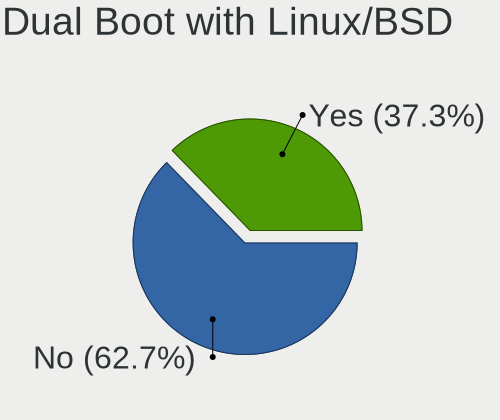
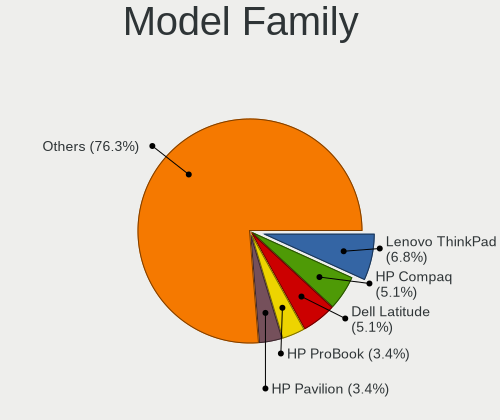
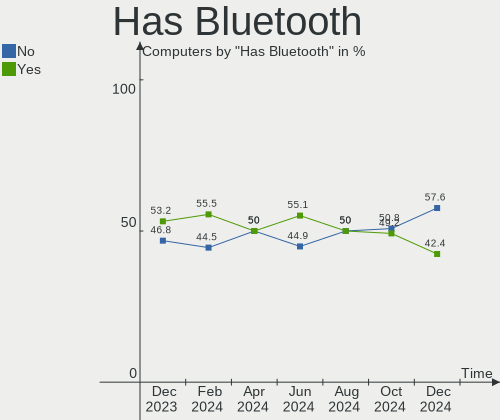

BlackPanther - Hardware Trends
------------------------------

A project to identify most popular hardware characteristics and track their change
over time based on data collected by Linux users at https://Linux-Hardware.org.

Anyone can contribute to this report by the [hw-probe](https://github.com/linuxhw/hw-probe) tool:

    sudo -E hw-probe -all -upload

This is a report for all computer types. See also reports for [desktops](/Dist/BlackPanther/Desktop/README.md) and [notebooks](/Dist/BlackPanther/Notebook/README.md).

This report is for one last month. Overall report since the beginning of time: [TestDays](https://github.com/linuxhw/TestDays)

Period: Apr, 2023.

Contents
--------

* [ System ](#system)
  - [ OS                       ](#os)
  - [ OS Family                ](#os-family)
  - [ Kernel                   ](#kernel)
  - [ Kernel Family            ](#kernel-family)
  - [ Kernel Major Ver.        ](#kernel-major-ver)
  - [ Arch                     ](#arch)
  - [ DE                       ](#de)
  - [ Display Server           ](#display-server)
  - [ Display Manager          ](#display-manager)
  - [ OS Lang                  ](#os-lang)
  - [ Boot Mode                ](#boot-mode)
  - [ Filesystem               ](#filesystem)
  - [ Part. scheme             ](#part-scheme)
  - [ Dual Boot with Linux/BSD ](#dual-boot-with-linuxbsd)
  - [ Dual Boot (Win)          ](#dual-boot-win)

* [ Board ](#board)
  - [ Vendor                   ](#vendor)
  - [ Model                    ](#model)
  - [ Model Family             ](#model-family)
  - [ MFG Year                 ](#mfg-year)
  - [ Form Factor              ](#form-factor)
  - [ Secure Boot              ](#secure-boot)
  - [ Coreboot                 ](#coreboot)
  - [ RAM Size                 ](#ram-size)
  - [ RAM Used                 ](#ram-used)
  - [ Total Drives             ](#total-drives)
  - [ Has CD-ROM               ](#has-cd-rom)
  - [ Has Ethernet             ](#has-ethernet)
  - [ Has WiFi                 ](#has-wifi)
  - [ Has Bluetooth            ](#has-bluetooth)

* [ Location ](#location)
  - [ Country                  ](#country)
  - [ City                     ](#city)

* [ Drives ](#drives)
  - [ Drive Vendor             ](#drive-vendor)
  - [ Drive Model              ](#drive-model)
  - [ HDD Vendor               ](#hdd-vendor)
  - [ SSD Vendor               ](#ssd-vendor)
  - [ Drive Kind               ](#drive-kind)
  - [ Drive Connector          ](#drive-connector)
  - [ Drive Size               ](#drive-size)
  - [ Space Total              ](#space-total)
  - [ Space Used               ](#space-used)
  - [ Malfunc. Drives          ](#malfunc-drives)
  - [ Malfunc. Drive Vendor    ](#malfunc-drive-vendor)
  - [ Malfunc. HDD Vendor      ](#malfunc-hdd-vendor)
  - [ Malfunc. Drive Kind      ](#malfunc-drive-kind)
  - [ Failed Drives            ](#failed-drives)
  - [ Failed Drive Vendor      ](#failed-drive-vendor)
  - [ Drive Status             ](#drive-status)

* [ Storage controller ](#storage-controller)
  - [ Storage Vendor           ](#storage-vendor)
  - [ Storage Model            ](#storage-model)
  - [ Storage Kind             ](#storage-kind)

* [ Processor ](#processor)
  - [ CPU Vendor               ](#cpu-vendor)
  - [ CPU Model                ](#cpu-model)
  - [ CPU Model Family         ](#cpu-model-family)
  - [ CPU Cores                ](#cpu-cores)
  - [ CPU Sockets              ](#cpu-sockets)
  - [ CPU Threads              ](#cpu-threads)
  - [ CPU Op-Modes             ](#cpu-op-modes)
  - [ CPU Microcode            ](#cpu-microcode)
  - [ CPU Microarch            ](#cpu-microarch)

* [ Graphics ](#graphics)
  - [ GPU Vendor               ](#gpu-vendor)
  - [ GPU Model                ](#gpu-model)
  - [ GPU Combo                ](#gpu-combo)
  - [ GPU Driver               ](#gpu-driver)
  - [ GPU Memory               ](#gpu-memory)

* [ Monitor ](#monitor)
  - [ Monitor Vendor           ](#monitor-vendor)
  - [ Monitor Model            ](#monitor-model)
  - [ Monitor Resolution       ](#monitor-resolution)
  - [ Monitor Diagonal         ](#monitor-diagonal)
  - [ Monitor Width            ](#monitor-width)
  - [ Aspect Ratio             ](#aspect-ratio)
  - [ Monitor Area             ](#monitor-area)
  - [ Pixel Density            ](#pixel-density)
  - [ Multiple Monitors        ](#multiple-monitors)

* [ Network ](#network)
  - [ Net Controller Vendor    ](#net-controller-vendor)
  - [ Net Controller Model     ](#net-controller-model)
  - [ Wireless Vendor          ](#wireless-vendor)
  - [ Wireless Model           ](#wireless-model)
  - [ Ethernet Vendor          ](#ethernet-vendor)
  - [ Ethernet Model           ](#ethernet-model)
  - [ Net Controller Kind      ](#net-controller-kind)
  - [ Used Controller          ](#used-controller)
  - [ NICs                     ](#nics)
  - [ IPv6                     ](#ipv6)

* [ Bluetooth ](#bluetooth)
  - [ Bluetooth Vendor         ](#bluetooth-vendor)
  - [ Bluetooth Model          ](#bluetooth-model)

* [ Sound ](#sound)
  - [ Sound Vendor             ](#sound-vendor)
  - [ Sound Model              ](#sound-model)

* [ Memory ](#memory)
  - [ Memory Vendor            ](#memory-vendor)
  - [ Memory Model             ](#memory-model)
  - [ Memory Kind              ](#memory-kind)
  - [ Memory Form Factor       ](#memory-form-factor)
  - [ Memory Size              ](#memory-size)
  - [ Memory Speed             ](#memory-speed)

* [ Printers & scanners ](#printers--scanners)
  - [ Printer Vendor           ](#printer-vendor)
  - [ Printer Model            ](#printer-model)
  - [ Scanner Vendor           ](#scanner-vendor)
  - [ Scanner Model            ](#scanner-model)

* [ Camera ](#camera)
  - [ Camera Vendor            ](#camera-vendor)
  - [ Camera Model             ](#camera-model)

* [ Security ](#security)
  - [ Fingerprint Vendor       ](#fingerprint-vendor)
  - [ Fingerprint Model        ](#fingerprint-model)
  - [ Chipcard Vendor          ](#chipcard-vendor)
  - [ Chipcard Model           ](#chipcard-model)

* [ Unsupported ](#unsupported)
  - [ Unsupported Devices      ](#unsupported-devices)
  - [ Unsupported Device Types ](#unsupported-device-types)

System
------

OS
--

Installed operating systems

| Name              | Computers | Percent |
|-------------------|-----------|---------|
| BlackPanther 18.1 | 50        | 96.15%  |
| BlackPanther 22.1 | 1         | 1.92%   |
| BlackPanther 16.2 | 1         | 1.92%   |

OS Family
---------

OS without a version

| Name         | Computers | Percent |
|--------------|-----------|---------|
| BlackPanther | 52        | 100%    |

Kernel
------

Version of the Linux kernel

| Version                | Computers | Percent |
|------------------------|-----------|---------|
| 5.6.14-desktop-2bP     | 26        | 50%     |
| 4.18.16-desktop-1bP    | 24        | 46.15%  |
| 6.2.9-desktop-1bP      | 1         | 1.92%   |
| 4.9.20-desktop-pae-1bP | 1         | 1.92%   |

Kernel Family
-------------

Linux kernel without a distro release

| Version | Computers | Percent |
|---------|-----------|---------|
| 5.6.14  | 26        | 50%     |
| 4.18.16 | 24        | 46.15%  |
| 6.2.9   | 1         | 1.92%   |
| 4.9.20  | 1         | 1.92%   |

Kernel Major Ver.
-----------------

Linux kernel major version

| Version | Computers | Percent |
|---------|-----------|---------|
| 5.6     | 26        | 50%     |
| 4.18    | 24        | 46.15%  |
| 6.2     | 1         | 1.92%   |
| 4.9     | 1         | 1.92%   |

Arch
----

OS architecture (x86_64, i586, etc.)

| Name   | Computers | Percent |
|--------|-----------|---------|
| x86_64 | 51        | 98.08%  |
| i686   | 1         | 1.92%   |

DE
--

Desktop Environment

| Name    | Computers | Percent |
|---------|-----------|---------|
| KDE5    | 51        | 98.08%  |
| Unknown | 1         | 1.92%   |

Display Server
--------------

X11 or Wayland

| Name | Computers | Percent |
|------|-----------|---------|
| X11  | 52        | 100%    |

Display Manager
---------------

SDDM, LightDM, etc.

| Name | Computers | Percent |
|------|-----------|---------|
| SDDM | 52        | 100%    |

OS Lang
-------

Language

| Lang    | Computers | Percent |
|---------|-----------|---------|
| Unknown | 52        | 100%    |

Boot Mode
---------

EFI or BIOS

| Mode | Computers | Percent |
|------|-----------|---------|
| BIOS | 34        | 65.38%  |
| EFI  | 18        | 34.62%  |

Filesystem
----------

Type of filesystem

| Type    | Computers | Percent |
|---------|-----------|---------|
| Overlay | 44        | 84.62%  |
| Ext4    | 8         | 15.38%  |

Part. scheme
------------

Scheme of partitioning

| Type    | Computers | Percent |
|---------|-----------|---------|
| MBR     | 27        | 51.92%  |
| GPT     | 24        | 46.15%  |
| Unknown | 1         | 1.92%   |

Dual Boot with Linux/BSD
------------------------

Hosting more than one Linux/BSD

| Dual boot | Computers | Percent |
|-----------|-----------|---------|
| Yes       | 31        | 59.62%  |
| No        | 21        | 40.38%  |

Dual Boot (Win)
---------------

Hosting Linux and Windows

| Dual boot | Computers | Percent |
|-----------|-----------|---------|
| Yes       | 27        | 51.92%  |
| No        | 25        | 48.08%  |

Board
-----

Vendor
------

Motherboard manufacturer

| Name                | Computers | Percent |
|---------------------|-----------|---------|
| Gigabyte Technology | 8         | 15.38%  |
| Dell                | 8         | 15.38%  |
| Lenovo              | 7         | 13.46%  |
| Hewlett-Packard     | 7         | 13.46%  |
| ASUSTek Computer    | 5         | 9.62%   |
| Fujitsu             | 4         | 7.69%   |
| MSI                 | 3         | 5.77%   |
| Fujitsu Siemens     | 2         | 3.85%   |
| eMachines           | 2         | 3.85%   |
| Toshiba             | 1         | 1.92%   |
| THD                 | 1         | 1.92%   |
| Sony                | 1         | 1.92%   |
| Shuttle             | 1         | 1.92%   |
| Samsung Electronics | 1         | 1.92%   |
| Acer                | 1         | 1.92%   |

Model
-----

Motherboard model

| Name                                        | Computers | Percent |
|---------------------------------------------|-----------|---------|
| HP EliteDesk 705 G3 SFF                     | 3         | 5.77%   |
| Fujitsu Siemens ESPRIMO EDITION P2511       | 2         | 3.85%   |
| eMachines E725                              | 2         | 3.85%   |
| Toshiba Satellite M50D-A                    | 1         | 1.92%   |
| THD PX1                                     | 1         | 1.92%   |
| Sony VPCS13V9E                              | 1         | 1.92%   |
| Shuttle XS35                                | 1         | 1.92%   |
| Samsung RV411/RV511/E3511/S3511/RV711/E3411 | 1         | 1.92%   |
| MSI MS-7817                                 | 1         | 1.92%   |
| MSI MS-7721                                 | 1         | 1.92%   |
| MSI GT60 2OC/2OD                            | 1         | 1.92%   |
| Lenovo ThinkStation D20 4158AF8             | 1         | 1.92%   |
| Lenovo ThinkPad T420 4236W8L                | 1         | 1.92%   |
| Lenovo ThinkPad T420 4236B87                | 1         | 1.92%   |
| Lenovo ThinkPad T400 2768WGB                | 1         | 1.92%   |
| Lenovo ThinkCentre M93p 10A7003AUK          | 1         | 1.92%   |
| Lenovo ThinkCentre M73 10B6001SUS           | 1         | 1.92%   |
| Lenovo IdeaPad Y700-15ISK 80NV              | 1         | 1.92%   |
| HP ProBook 640 G8 Notebook PC               | 1         | 1.92%   |
| HP Notebook                                 | 1         | 1.92%   |
| HP EliteDesk 800 G2 DM 35W                  | 1         | 1.92%   |
| HP Compaq dc5800 Small Form Factor          | 1         | 1.92%   |
| Gigabyte Z390 UD                            | 1         | 1.92%   |
| Gigabyte Z270N-WIFI                         | 1         | 1.92%   |
| Gigabyte P67A-D3-B3                         | 1         | 1.92%   |
| Gigabyte H61M-S2PV                          | 1         | 1.92%   |
| Gigabyte G41MT-S2                           | 1         | 1.92%   |
| Gigabyte F2A88XM-HD3                        | 1         | 1.92%   |
| Gigabyte B450M GAMING                       | 1         | 1.92%   |
| Gigabyte AB350M-DS3H V2                     | 1         | 1.92%   |
| Fujitsu LIFEBOOK U745                       | 1         | 1.92%   |
| Fujitsu ESPRIMO E7935                       | 1         | 1.92%   |
| Fujitsu D3061-B1                            | 1         | 1.92%   |
| Fujitsu CELSIUS R670-2                      | 1         | 1.92%   |
| Dell Precision WorkStation T5500            | 1         | 1.92%   |
| Dell OptiPlex 790                           | 1         | 1.92%   |
| Dell Latitude E6230                         | 1         | 1.92%   |
| Dell Latitude E5410                         | 1         | 1.92%   |
| Dell Latitude D630                          | 1         | 1.92%   |
| Dell Inspiron One 2310                      | 1         | 1.92%   |

Model Family
------------

Motherboard model prefix

| Name                    | Computers | Percent |
|-------------------------|-----------|---------|
| HP EliteDesk            | 4         | 7.69%   |
| Lenovo ThinkPad         | 3         | 5.77%   |
| Dell Latitude           | 3         | 5.77%   |
| Dell Inspiron           | 3         | 5.77%   |
| Lenovo ThinkCentre      | 2         | 3.85%   |
| Fujitsu Siemens ESPRIMO | 2         | 3.85%   |
| eMachines E725          | 2         | 3.85%   |
| ASUS VivoBook           | 2         | 3.85%   |
| ASUS M5A78L-M           | 2         | 3.85%   |
| Toshiba Satellite       | 1         | 1.92%   |
| THD PX1                 | 1         | 1.92%   |
| Sony VPCS13V9E          | 1         | 1.92%   |
| Shuttle XS35            | 1         | 1.92%   |
| Samsung RV411           | 1         | 1.92%   |
| MSI MS-7817             | 1         | 1.92%   |
| MSI MS-7721             | 1         | 1.92%   |
| MSI GT60                | 1         | 1.92%   |
| Lenovo ThinkStation     | 1         | 1.92%   |
| Lenovo IdeaPad          | 1         | 1.92%   |
| HP ProBook              | 1         | 1.92%   |
| HP Notebook             | 1         | 1.92%   |
| HP Compaq               | 1         | 1.92%   |
| Gigabyte Z390           | 1         | 1.92%   |
| Gigabyte Z270N-WIFI     | 1         | 1.92%   |
| Gigabyte P67A-D3-B3     | 1         | 1.92%   |
| Gigabyte H61M-S2PV      | 1         | 1.92%   |
| Gigabyte G41MT-S2       | 1         | 1.92%   |
| Gigabyte F2A88XM-HD3    | 1         | 1.92%   |
| Gigabyte B450M          | 1         | 1.92%   |
| Gigabyte AB350M-DS3H    | 1         | 1.92%   |
| Fujitsu LIFEBOOK        | 1         | 1.92%   |
| Fujitsu ESPRIMO         | 1         | 1.92%   |
| Fujitsu D3061-B1        | 1         | 1.92%   |
| Fujitsu CELSIUS         | 1         | 1.92%   |
| Dell Precision          | 1         | 1.92%   |
| Dell OptiPlex           | 1         | 1.92%   |
| ASUS M5A97              | 1         | 1.92%   |
| Acer Aspire             | 1         | 1.92%   |

MFG Year
--------

Motherboard manufacture year

| Year | Computers | Percent |
|------|-----------|---------|
| 2010 | 11        | 21.15%  |
| 2012 | 5         | 9.62%   |
| 2011 | 5         | 9.62%   |
| 2018 | 4         | 7.69%   |
| 2017 | 4         | 7.69%   |
| 2015 | 4         | 7.69%   |
| 2013 | 4         | 7.69%   |
| 2007 | 4         | 7.69%   |
| 2014 | 3         | 5.77%   |
| 2009 | 2         | 3.85%   |
| 2008 | 2         | 3.85%   |
| 2022 | 1         | 1.92%   |
| 2021 | 1         | 1.92%   |
| 2019 | 1         | 1.92%   |
| 2016 | 1         | 1.92%   |

Form Factor
-----------

Physical design of the computer

| Name        | Computers | Percent |
|-------------|-----------|---------|
| Desktop     | 29        | 55.77%  |
| Notebook    | 21        | 40.38%  |
| Convertible | 1         | 1.92%   |
| All in one  | 1         | 1.92%   |

Secure Boot
-----------

Enabled or disabled

| State    | Computers | Percent |
|----------|-----------|---------|
| Disabled | 52        | 100%    |

Coreboot
--------

Have coreboot on board

| Used | Computers | Percent |
|------|-----------|---------|
| No   | 52        | 100%    |

RAM Size
--------

Total RAM memory

| Size in GB | Computers | Percent |
|------------|-----------|---------|
| 3.01-4.0   | 17        | 32.69%  |
| 4.01-8.0   | 12        | 23.08%  |
| 8.01-16.0  | 10        | 19.23%  |
| 16.01-24.0 | 5         | 9.62%   |
| 1.01-2.0   | 5         | 9.62%   |
| 24.01-32.0 | 2         | 3.85%   |
| 32.01-64.0 | 1         | 1.92%   |

RAM Used
--------

Used RAM memory

| Used GB  | Computers | Percent |
|----------|-----------|---------|
| 0.51-1.0 | 28        | 53.85%  |
| 0.01-0.5 | 13        | 25%     |
| 1.01-2.0 | 11        | 21.15%  |

Total Drives
------------

Number of drives on board

| Drives | Computers | Percent |
|--------|-----------|---------|
| 1      | 33        | 63.46%  |
| 2      | 14        | 26.92%  |
| 3      | 2         | 3.85%   |
| 5      | 1         | 1.92%   |
| 4      | 1         | 1.92%   |
| 0      | 1         | 1.92%   |

Has CD-ROM
----------

Has CD-ROM on board

| Presented | Computers | Percent |
|-----------|-----------|---------|
| Yes       | 34        | 65.38%  |
| No        | 18        | 34.62%  |

Has Ethernet
------------

Has Ethernet on board

| Presented | Computers | Percent |
|-----------|-----------|---------|
| Yes       | 48        | 92.31%  |
| No        | 4         | 7.69%   |

Has WiFi
--------

Has WiFi module

| Presented | Computers | Percent |
|-----------|-----------|---------|
| Yes       | 34        | 65.38%  |
| No        | 18        | 34.62%  |

Has Bluetooth
-------------

Has Bluetooth module

| Presented | Computers | Percent |
|-----------|-----------|---------|
| No        | 32        | 61.54%  |
| Yes       | 20        | 38.46%  |

Location
--------

Country
-------

Geographic location (country)

| Country   | Computers | Percent |
|-----------|-----------|---------|
| Hungary   | 45        | 86.54%  |
| Romania   | 2         | 3.85%   |
| UK        | 1         | 1.92%   |
| Slovakia  | 1         | 1.92%   |
| Germany   | 1         | 1.92%   |
| France    | 1         | 1.92%   |
| Argentina | 1         | 1.92%   |

City
----

Geographic location (city)

| City                    | Computers | Percent |
|-------------------------|-----------|---------|
| Berettyóújfalu        | 6         | 11.54%  |
| Budapest                | 5         | 9.62%   |
| Tatabánya              | 4         | 7.69%   |
| Szajol                  | 4         | 7.69%   |
| Fertoszentmiklos        | 2         | 3.85%   |
| Debrecen                | 2         | 3.85%   |
| Zalău                  | 1         | 1.92%   |
| Zalaegerszeg            | 1         | 1.92%   |
| Veresegyhaz             | 1         | 1.92%   |
| Urom                    | 1         | 1.92%   |
| Turnu Magurele          | 1         | 1.92%   |
| Tornaľa                | 1         | 1.92%   |
| Tengelic                | 1         | 1.92%   |
| Szolnok                 | 1         | 1.92%   |
| Szentes                 | 1         | 1.92%   |
| Szekszárd              | 1         | 1.92%   |
| Szarvas                 | 1         | 1.92%   |
| Rackeve                 | 1         | 1.92%   |
| Pomaz                   | 1         | 1.92%   |
| Pfaffenhofen an der Ilm | 1         | 1.92%   |
| Pécs                   | 1         | 1.92%   |
| Nancy                   | 1         | 1.92%   |
| Morahalom               | 1         | 1.92%   |
| Kisvarda                | 1         | 1.92%   |
| Karcag                  | 1         | 1.92%   |
| Kaposmero               | 1         | 1.92%   |
| Harlow                  | 1         | 1.92%   |
| Hajduboszormeny         | 1         | 1.92%   |
| Győr                   | 1         | 1.92%   |
| Gyal                    | 1         | 1.92%   |
| Eszteregnye             | 1         | 1.92%   |
| Csanadpalota            | 1         | 1.92%   |
| Celldomolk              | 1         | 1.92%   |
| Belen de Escobar        | 1         | 1.92%   |
| Balassagyarmat          | 1         | 1.92%   |

Drives
------

Drive Vendor
------------

Hard drive vendors

| Vendor              | Computers | Drives | Percent |
|---------------------|-----------|--------|---------|
| WDC                 | 15        | 18     | 21.13%  |
| Kingston            | 14        | 15     | 19.72%  |
| Samsung Electronics | 10        | 12     | 14.08%  |
| Seagate             | 5         | 5      | 7.04%   |
| Toshiba             | 4         | 5      | 5.63%   |
| Unknown             | 3         | 4      | 4.23%   |
| Intenso             | 3         | 3      | 4.23%   |
| Gigabyte Technology | 2         | 2      | 2.82%   |
| Crucial             | 2         | 2      | 2.82%   |
| A-DATA Technology   | 2         | 2      | 2.82%   |
| SSSTC               | 1         | 1      | 1.41%   |
| SK hynix            | 1         | 1      | 1.41%   |
| SanDisk             | 1         | 1      | 1.41%   |
| PNY                 | 1         | 1      | 1.41%   |
| Patriot             | 1         | 1      | 1.41%   |
| Micron Technology   | 1         | 1      | 1.41%   |
| Maxtor              | 1         | 1      | 1.41%   |
| LITEON              | 1         | 1      | 1.41%   |
| Kingmax             | 1         | 1      | 1.41%   |
| HGST                | 1         | 1      | 1.41%   |
| CSD                 | 1         | 1      | 1.41%   |

Drive Model
-----------

Hard drive models

| Model                                | Computers | Percent |
|--------------------------------------|-----------|---------|
| Kingston SA400S37240G 240GB SSD      | 4         | 5.13%   |
| WDC WD10PURZ-85U8XY0 1TB             | 3         | 3.85%   |
| Kingston SV300S37A120G 120GB SSD     | 3         | 3.85%   |
| Unknown DA4128  128GB                | 2         | 2.56%   |
| Samsung SSD 830 Series 64GB          | 2         | 2.56%   |
| Samsung SSD 750 EVO 250GB            | 2         | 2.56%   |
| Kingston SA400S37480G 480GB SSD      | 2         | 2.56%   |
| Gigabyte GP-GSTFS31120GNTD 120GB SSD | 2         | 2.56%   |
| WDC WDS240G2G0A-00JH30 240GB SSD     | 1         | 1.28%   |
| WDC WD800JD-55MUA1 80GB              | 1         | 1.28%   |
| WDC WD5000LPVX-22V0TT0 500GB         | 1         | 1.28%   |
| WDC WD5000BPVT-24HXZT3 500GB         | 1         | 1.28%   |
| WDC WD5000AZLX-75K2TA0 500GB         | 1         | 1.28%   |
| WDC WD5000AAKS-007AA0 500GB          | 1         | 1.28%   |
| WDC WD3200BPVT-75ZEST0 320GB         | 1         | 1.28%   |
| WDC WD3200AAJS-56M0A0 320GB          | 1         | 1.28%   |
| WDC WD30EZRZ-00GXCB0 3TB             | 1         | 1.28%   |
| WDC WD30EFRX-68EUZN0 3TB             | 1         | 1.28%   |
| WDC WD2500BEKT-75PVMT0 250GB         | 1         | 1.28%   |
| WDC WD1600BEVT-00A23T0 160GB         | 1         | 1.28%   |
| WDC WD10SPCX-24HWST1 1TB             | 1         | 1.28%   |
| WDC WD10JPLX-00MBPT0 1TB             | 1         | 1.28%   |
| WDC WD10EZRX-00L4HB0 1TB             | 1         | 1.28%   |
| Unknown SL16G  16GB                  | 1         | 1.28%   |
| Unknown SA08G  8GB                   | 1         | 1.28%   |
| Toshiba MQ01ABF050 500GB             | 1         | 1.28%   |
| Toshiba MQ01ABF032 320GB             | 1         | 1.28%   |
| Toshiba MK5061GSYN 500GB             | 1         | 1.28%   |
| Toshiba DT01ACA200 2TB               | 1         | 1.28%   |
| Toshiba DT01ACA100 1TB               | 1         | 1.28%   |
| SSSTC CL1-8D256-HP 256GB             | 1         | 1.28%   |
| SK hynix SC311 SATA 256GB SSD        | 1         | 1.28%   |
| Seagate ST9100824AS 100GB            | 1         | 1.28%   |
| Seagate ST500LT012-1DG142 500GB      | 1         | 1.28%   |
| Seagate ST3500312CS 500GB            | 1         | 1.28%   |
| Seagate ST1000LM024 HN-M101MBB 1TB   | 1         | 1.28%   |
| Seagate ST1000DM003-9YN162 1TB       | 1         | 1.28%   |
| SanDisk SDSSDH3512G 512GB            | 1         | 1.28%   |
| Samsung SSD 860 EVO 500GB            | 1         | 1.28%   |
| Samsung SSD 850 EVO 500GB            | 1         | 1.28%   |

HDD Vendor
----------

Hard disk drive vendors

| Vendor              | Computers | Drives | Percent |
|---------------------|-----------|--------|---------|
| WDC                 | 14        | 17     | 51.85%  |
| Seagate             | 5         | 5      | 18.52%  |
| Toshiba             | 4         | 5      | 14.81%  |
| Samsung Electronics | 1         | 1      | 3.7%    |
| Maxtor              | 1         | 1      | 3.7%    |
| HGST                | 1         | 1      | 3.7%    |
| CSD                 | 1         | 1      | 3.7%    |

SSD Vendor
----------

Solid state drive vendors

| Vendor              | Computers | Drives | Percent |
|---------------------|-----------|--------|---------|
| Kingston            | 12        | 13     | 31.58%  |
| Samsung Electronics | 10        | 11     | 26.32%  |
| Intenso             | 3         | 3      | 7.89%   |
| Gigabyte Technology | 2         | 2      | 5.26%   |
| Crucial             | 2         | 2      | 5.26%   |
| WDC                 | 1         | 1      | 2.63%   |
| SK hynix            | 1         | 1      | 2.63%   |
| SanDisk             | 1         | 1      | 2.63%   |
| PNY                 | 1         | 1      | 2.63%   |
| Patriot             | 1         | 1      | 2.63%   |
| Micron Technology   | 1         | 1      | 2.63%   |
| LITEON              | 1         | 1      | 2.63%   |
| Kingmax             | 1         | 1      | 2.63%   |
| A-DATA Technology   | 1         | 1      | 2.63%   |

Drive Kind
----------

HDD or SSD

| Kind | Computers | Drives | Percent |
|------|-----------|--------|---------|
| SSD  | 32        | 40     | 50%     |
| HDD  | 25        | 31     | 39.06%  |
| NVMe | 4         | 4      | 6.25%   |
| MMC  | 3         | 4      | 4.69%   |

Drive Connector
---------------

SATA, SAS, NVMe, etc.

| Type | Computers | Drives | Percent |
|------|-----------|--------|---------|
| SATA | 47        | 70     | 85.45%  |
| NVMe | 4         | 4      | 7.27%   |
| MMC  | 3         | 4      | 5.45%   |
| SAS  | 1         | 1      | 1.82%   |

Drive Size
----------

Size of hard drive

| Size in TB | Computers | Drives | Percent |
|------------|-----------|--------|---------|
| 0.01-0.5   | 42        | 53     | 73.68%  |
| 0.51-1.0   | 13        | 15     | 22.81%  |
| 2.01-3.0   | 1         | 2      | 1.75%   |
| 1.01-2.0   | 1         | 1      | 1.75%   |

Space Total
-----------

Amount of disk space available on the file system

| Size in GB | Computers | Percent |
|------------|-----------|---------|
| Unknown    | 44        | 84.62%  |
| 251-500    | 2         | 3.85%   |
| 101-250    | 2         | 3.85%   |
| 51-100     | 2         | 3.85%   |
| 21-50      | 1         | 1.92%   |
| 501-1000   | 1         | 1.92%   |

Space Used
----------

Amount of used disk space

| Used GB | Computers | Percent |
|---------|-----------|---------|
| Unknown | 44        | 84.62%  |
| 1-20    | 8         | 15.38%  |

Malfunc. Drives
---------------

Drive models with a malfunction

| Model                                            | Computers | Drives | Percent |
|--------------------------------------------------|-----------|--------|---------|
| WDC WD10PURZ-85U8XY0 1TB                         | 3         | 3      | 14.29%  |
| Kingston SV300S37A120G 120GB SSD                 | 3         | 3      | 14.29%  |
| Samsung Electronics SSD 750 EVO 250GB            | 2         | 2      | 9.52%   |
| WDC WD5000AAKS-007AA0 500GB                      | 1         | 1      | 4.76%   |
| WDC WD3200BPVT-75ZEST0 320GB                     | 1         | 1      | 4.76%   |
| WDC WD2500BEKT-75PVMT0 250GB                     | 1         | 1      | 4.76%   |
| WDC WD1600BEVT-00A23T0 160GB                     | 1         | 1      | 4.76%   |
| WDC WD10JPLX-00MBPT0 1TB                         | 1         | 1      | 4.76%   |
| Toshiba MQ01ABF050 500GB                         | 1         | 1      | 4.76%   |
| Toshiba MK5061GSYN 500GB                         | 1         | 1      | 4.76%   |
| Toshiba DT01ACA200 2TB                           | 1         | 1      | 4.76%   |
| Seagate ST9100824AS 100GB                        | 1         | 1      | 4.76%   |
| Seagate ST1000LM024 HN-M101MBB 1TB               | 1         | 1      | 4.76%   |
| Samsung Electronics MZ7LN256HMJP-000H1 256GB SSD | 1         | 1      | 4.76%   |
| CSD T52SX250 250GB                               | 1         | 1      | 4.76%   |
| A-DATA Technology SU630 240GB SSD                | 1         | 1      | 4.76%   |

Malfunc. Drive Vendor
---------------------

Vendors of faulty drives

| Vendor              | Computers | Drives | Percent |
|---------------------|-----------|--------|---------|
| WDC                 | 8         | 8      | 40%     |
| Samsung Electronics | 3         | 3      | 15%     |
| Kingston            | 3         | 3      | 15%     |
| Toshiba             | 2         | 3      | 10%     |
| Seagate             | 2         | 2      | 10%     |
| CSD                 | 1         | 1      | 5%      |
| A-DATA Technology   | 1         | 1      | 5%      |

Malfunc. HDD Vendor
-------------------

Vendors of faulty HDD drives

| Vendor  | Computers | Drives | Percent |
|---------|-----------|--------|---------|
| WDC     | 8         | 8      | 61.54%  |
| Toshiba | 2         | 3      | 15.38%  |
| Seagate | 2         | 2      | 15.38%  |
| CSD     | 1         | 1      | 7.69%   |

Malfunc. Drive Kind
-------------------

Kinds of faulty drives

| Kind | Computers | Drives | Percent |
|------|-----------|--------|---------|
| HDD  | 13        | 14     | 65%     |
| SSD  | 7         | 7      | 35%     |

Failed Drives
-------------

Failed drive models

Zero info for selected period =(

Failed Drive Vendor
-------------------

Failed drive vendors

Zero info for selected period =(

Drive Status
------------

Number of failed and malfunc. drives

| Status   | Computers | Drives | Percent |
|----------|-----------|--------|---------|
| Works    | 35        | 53     | 59.32%  |
| Malfunc  | 20        | 21     | 33.9%   |
| Detected | 4         | 5      | 6.78%   |

Storage controller
------------------

Storage Vendor
--------------

Storage controller vendors

| Vendor                         | Computers | Percent |
|--------------------------------|-----------|---------|
| Intel                          | 38        | 66.67%  |
| AMD                            | 14        | 24.56%  |
| Kingston Technology Company    | 2         | 3.51%   |
| Solid State Storage Technology | 1         | 1.75%   |
| Silicon Motion                 | 1         | 1.75%   |
| ASMedia Technology             | 1         | 1.75%   |

Storage Model
-------------

Storage controller models

| Model                                                                                   | Computers | Percent |
|-----------------------------------------------------------------------------------------|-----------|---------|
| AMD FCH SATA Controller [AHCI mode]                                                     | 7         | 9.46%   |
| Intel NM10/ICH7 Family SATA Controller [IDE mode]                                       | 5         | 6.76%   |
| Intel 8 Series/C220 Series Chipset Family 6-port SATA Controller 1 [AHCI mode]          | 4         | 5.41%   |
| AMD 300 Series Chipset SATA Controller                                                  | 4         | 5.41%   |
| Intel 82801IBM/IEM (ICH9M/ICH9M-E) 4 port SATA Controller [AHCI mode]                   | 3         | 4.05%   |
| Intel 5 Series/3400 Series Chipset 4 port SATA AHCI Controller                          | 3         | 4.05%   |
| AMD SB7x0/SB8x0/SB9x0 SATA Controller [IDE mode]                                        | 3         | 4.05%   |
| AMD SB7x0/SB8x0/SB9x0 IDE Controller                                                    | 3         | 4.05%   |
| Intel Wildcat Point-LP SATA Controller [AHCI Mode]                                      | 2         | 2.7%    |
| Intel Celeron/Pentium Silver Processor SATA Controller                                  | 2         | 2.7%    |
| Intel 82801JI (ICH10 Family) SATA AHCI Controller                                       | 2         | 2.7%    |
| Intel 6 Series/C200 Series Chipset Family Desktop SATA Controller (IDE mode, ports 4-5) | 2         | 2.7%    |
| Intel 6 Series/C200 Series Chipset Family Desktop SATA Controller (IDE mode, ports 0-3) | 2         | 2.7%    |
| Intel 6 Series/C200 Series Chipset Family 6 port Mobile SATA AHCI Controller            | 2         | 2.7%    |
| Intel 6 Series/C200 Series Chipset Family 6 port Desktop SATA AHCI Controller           | 2         | 2.7%    |
| AMD FCH/SOC SATA Controller [RAID Bottom]                                               | 2         | 2.7%    |
| Solid State Storage Non-Volatile memory controller                                      | 1         | 1.35%   |
| Silicon Motion Non-Volatile memory controller                                           | 1         | 1.35%   |
| Kingston Company NVMe Controller                                                        | 1         | 1.35%   |
| Kingston Company A2000 NVMe SSD                                                         | 1         | 1.35%   |
| Intel Volume Management Device NVMe RAID Controller                                     | 1         | 1.35%   |
| Intel SATA Controller [RAID mode]                                                       | 1         | 1.35%   |
| Intel Q170/Q150/B150/H170/H110/Z170/CM236 Chipset SATA Controller [AHCI Mode]           | 1         | 1.35%   |
| Intel HM170/QM170 Chipset SATA Controller [AHCI Mode]                                   | 1         | 1.35%   |
| Intel Cannon Lake PCH SATA AHCI Controller                                              | 1         | 1.35%   |
| Intel 82801JD/DO (ICH10 Family) 4-port SATA IDE Controller                              | 1         | 1.35%   |
| Intel 82801JD/DO (ICH10 Family) 2-port SATA IDE Controller                              | 1         | 1.35%   |
| Intel 82801IB (ICH9) 2 port SATA Controller [IDE mode]                                  | 1         | 1.35%   |
| Intel 82801I (ICH9 Family) 2 port SATA Controller [IDE mode]                            | 1         | 1.35%   |
| Intel 82801HM/HEM (ICH8M/ICH8M-E) SATA Controller [IDE mode]                            | 1         | 1.35%   |
| Intel 82801HM/HEM (ICH8M/ICH8M-E) IDE Controller                                        | 1         | 1.35%   |
| Intel 82801 Mobile SATA Controller [RAID mode]                                          | 1         | 1.35%   |
| Intel 8 Series/C220 Series Chipset Family IDE-r Controller                              | 1         | 1.35%   |
| Intel 5 Series/3400 Series Chipset 6 port SATA AHCI Controller                          | 1         | 1.35%   |
| Intel 4 Series Chipset PT IDER Controller                                               | 1         | 1.35%   |
| Intel 200 Series PCH SATA controller [AHCI mode]                                        | 1         | 1.35%   |
| ASMedia ASM1062 Serial ATA Controller                                                   | 1         | 1.35%   |
| AMD SB7x0/SB8x0/SB9x0 SATA Controller [AHCI mode]                                       | 1         | 1.35%   |
| AMD IXP SB4x0 Serial ATA Controller                                                     | 1         | 1.35%   |
| AMD IXP SB4x0 IDE Controller                                                            | 1         | 1.35%   |

Storage Kind
------------

Kind of storage controller (IDE, SATA, NVMe, SAS, ...)

| Kind | Computers | Percent |
|------|-----------|---------|
| SATA | 38        | 60.32%  |
| IDE  | 16        | 25.4%   |
| RAID | 5         | 7.94%   |
| NVMe | 4         | 6.35%   |

Processor
---------

CPU Vendor
----------

Processor vendors

| Vendor | Computers | Percent |
|--------|-----------|---------|
| Intel  | 38        | 73.08%  |
| AMD    | 14        | 26.92%  |

CPU Model
---------

Processor models

| Model                                       | Computers | Percent |
|---------------------------------------------|-----------|---------|
| AMD PRO A6-9500 R5, 8 COMPUTE CORES 2C+6G   | 3         | 5.77%   |
| Intel Pentium Dual-Core CPU T4400 @ 2.20GHz | 2         | 3.85%   |
| Intel Pentium Dual CPU E2140 @ 1.60GHz      | 2         | 3.85%   |
| AMD Ryzen 5 3400G with Radeon Vega Graphics | 2         | 3.85%   |
| Intel Xeon CPU X5677 @ 3.47GHz              | 1         | 1.92%   |
| Intel Xeon CPU X5650 @ 2.67GHz              | 1         | 1.92%   |
| Intel Xeon CPU E5530 @ 2.40GHz              | 1         | 1.92%   |
| Intel Pentium Silver N5000 CPU @ 1.10GHz    | 1         | 1.92%   |
| Intel Pentium Dual-Core CPU E5700 @ 3.00GHz | 1         | 1.92%   |
| Intel Core i7-7700K CPU @ 4.20GHz           | 1         | 1.92%   |
| Intel Core i7-6700T CPU @ 2.80GHz           | 1         | 1.92%   |
| Intel Core i7-6700HQ CPU @ 2.60GHz          | 1         | 1.92%   |
| Intel Core i7-5600U CPU @ 2.60GHz           | 1         | 1.92%   |
| Intel Core i7-4790 CPU @ 3.60GHz            | 1         | 1.92%   |
| Intel Core i7-4700MQ CPU @ 2.40GHz          | 1         | 1.92%   |
| Intel Core i5-9400 CPU @ 2.90GHz            | 1         | 1.92%   |
| Intel Core i5-5200U CPU @ 2.20GHz           | 1         | 1.92%   |
| Intel Core i5-4590 CPU @ 3.30GHz            | 1         | 1.92%   |
| Intel Core i5-3340M CPU @ 2.70GHz           | 1         | 1.92%   |
| Intel Core i5-2540M CPU @ 2.60GHz           | 1         | 1.92%   |
| Intel Core i5-2520M CPU @ 2.50GHz           | 1         | 1.92%   |
| Intel Core i5-2400S CPU @ 2.50GHz           | 1         | 1.92%   |
| Intel Core i5-2400 CPU @ 3.10GHz            | 1         | 1.92%   |
| Intel Core i5-2300 CPU @ 2.80GHz            | 1         | 1.92%   |
| Intel Core i5 CPU M 520 @ 2.40GHz           | 1         | 1.92%   |
| Intel Core i5 CPU M 460 @ 2.53GHz           | 1         | 1.92%   |
| Intel Core i3-4130 CPU @ 3.40GHz            | 1         | 1.92%   |
| Intel Core i3-3220 CPU @ 3.30GHz            | 1         | 1.92%   |
| Intel Core i3 CPU M 380 @ 2.53GHz           | 1         | 1.92%   |
| Intel Core i3 CPU M 370 @ 2.40GHz           | 1         | 1.92%   |
| Intel Core 2 Duo CPU T7250 @ 2.00GHz        | 1         | 1.92%   |
| Intel Core 2 Duo CPU P8600 @ 2.40GHz        | 1         | 1.92%   |
| Intel Core 2 Duo CPU E7300 @ 2.66GHz        | 1         | 1.92%   |
| Intel Core 2 CPU 4300 @ 1.80GHz             | 1         | 1.92%   |
| Intel Celeron N4020 CPU @ 1.10GHz           | 1         | 1.92%   |
| Intel Atom CPU N455 @ 1.66GHz               | 1         | 1.92%   |
| Intel Atom CPU D510 @ 1.66GHz               | 1         | 1.92%   |
| Intel 11th Gen Core i3-1115G4 @ 3.00GHz     | 1         | 1.92%   |
| AMD V160 Processor                          | 1         | 1.92%   |
| AMD Turion 64 X2 Mobile Technology TL-52    | 1         | 1.92%   |

CPU Model Family
----------------

Processor model prefix

| Model                   | Computers | Percent |
|-------------------------|-----------|---------|
| Intel Core i5           | 11        | 21.15%  |
| Intel Core i7           | 6         | 11.54%  |
| Other                   | 4         | 7.69%   |
| Intel Core i3           | 4         | 7.69%   |
| Intel Xeon              | 3         | 5.77%   |
| Intel Pentium Dual-Core | 3         | 5.77%   |
| Intel Core 2 Duo        | 3         | 5.77%   |
| AMD FX                  | 3         | 5.77%   |
| AMD A8                  | 3         | 5.77%   |
| Intel Pentium Dual      | 2         | 3.85%   |
| Intel Atom              | 2         | 3.85%   |
| AMD Ryzen 5             | 2         | 3.85%   |
| Intel Pentium Silver    | 1         | 1.92%   |
| Intel Core 2            | 1         | 1.92%   |
| Intel Celeron           | 1         | 1.92%   |
| AMD V160                | 1         | 1.92%   |
| AMD Turion 64 X2 Mobile | 1         | 1.92%   |
| AMD A4                  | 1         | 1.92%   |

CPU Cores
---------

Number of processor cores

| Number | Computers | Percent |
|--------|-----------|---------|
| 2      | 25        | 48.08%  |
| 4      | 15        | 28.85%  |
| 1      | 8         | 15.38%  |
| 6      | 2         | 3.85%   |
| 8      | 1         | 1.92%   |
| 3      | 1         | 1.92%   |

CPU Sockets
-----------

Number of sockets

| Number | Computers | Percent |
|--------|-----------|---------|
| 1      | 51        | 98.08%  |
| 2      | 1         | 1.92%   |

CPU Threads
-----------

Threads per core (Hyper-Threading)

| Number | Computers | Percent |
|--------|-----------|---------|
| 2      | 31        | 59.62%  |
| 1      | 21        | 40.38%  |

CPU Op-Modes
------------

CPU Operation Modes (32-bit, 64-bit)

| Op mode        | Computers | Percent |
|----------------|-----------|---------|
| 32-bit, 64-bit | 52        | 100%    |

CPU Microcode
-------------

Microcode number

| Number     | Computers | Percent |
|------------|-----------|---------|
| 0x206a7    | 5         | 9.62%   |
| 0x306c3    | 4         | 7.69%   |
| 0x1067a    | 4         | 7.69%   |
| 0x6fd      | 3         | 5.77%   |
| 0x20655    | 3         | 5.77%   |
| 0x0600611a | 3         | 5.77%   |
| 0x506e3    | 2         | 3.85%   |
| 0x306d4    | 2         | 3.85%   |
| 0x306a9    | 2         | 3.85%   |
| 0x106ca    | 2         | 3.85%   |
| 0x08108109 | 2         | 3.85%   |
| 0x06001119 | 2         | 3.85%   |
| 0x06000852 | 2         | 3.85%   |
| Unknown    | 2         | 3.85%   |
| 0x906ea    | 1         | 1.92%   |
| 0x906e9    | 1         | 1.92%   |
| 0x806c1    | 1         | 1.92%   |
| 0x706a8    | 1         | 1.92%   |
| 0x706a1    | 1         | 1.92%   |
| 0x6f2      | 1         | 1.92%   |
| 0x206c2    | 1         | 1.92%   |
| 0x20652    | 1         | 1.92%   |
| 0x106a5    | 1         | 1.92%   |
| 0x10676    | 1         | 1.92%   |
| 0x0700010f | 1         | 1.92%   |
| 0x06003109 | 1         | 1.92%   |
| 0x0600084f | 1         | 1.92%   |
| 0x010000c8 | 1         | 1.92%   |

CPU Microarch
-------------

Microarchitecture

| Name          | Computers | Percent |
|---------------|-----------|---------|
| Westmere      | 6         | 11.54%  |
| SandyBridge   | 5         | 9.62%   |
| Piledriver    | 5         | 9.62%   |
| Penryn        | 5         | 9.62%   |
| Haswell       | 4         | 7.69%   |
| Core          | 4         | 7.69%   |
| Excavator     | 3         | 5.77%   |
| Zen+          | 2         | 3.85%   |
| Skylake       | 2         | 3.85%   |
| KabyLake      | 2         | 3.85%   |
| IvyBridge     | 2         | 3.85%   |
| Goldmont plus | 2         | 3.85%   |
| Broadwell     | 2         | 3.85%   |
| Bonnell       | 2         | 3.85%   |
| TigerLake     | 1         | 1.92%   |
| Steamroller   | 1         | 1.92%   |
| Nehalem       | 1         | 1.92%   |
| K8 Hammer     | 1         | 1.92%   |
| K10           | 1         | 1.92%   |
| Jaguar        | 1         | 1.92%   |

Graphics
--------

GPU Vendor
----------

Vendors of graphics cards

| Vendor | Computers | Percent |
|--------|-----------|---------|
| Intel  | 22        | 39.29%  |
| AMD    | 18        | 32.14%  |
| Nvidia | 16        | 28.57%  |

GPU Model
---------

Graphics card models

| Model                                                                       | Computers | Percent |
|-----------------------------------------------------------------------------|-----------|---------|
| AMD Wani [Radeon R5/R6/R7 Graphics]                                         | 3         | 5.08%   |
| AMD Cedar [Radeon HD 5000/6000/7350/8350 Series]                            | 3         | 5.08%   |
| Nvidia G72 [GeForce 7300 LE]                                                | 2         | 3.39%   |
| Intel Xeon E3-1200 v3/4th Gen Core Processor Integrated Graphics Controller | 2         | 3.39%   |
| Intel Mobile 4 Series Chipset Integrated Graphics Controller                | 2         | 3.39%   |
| Intel HD Graphics 5500                                                      | 2         | 3.39%   |
| Intel HD Graphics 530                                                       | 2         | 3.39%   |
| Intel Atom Processor D4xx/D5xx/N4xx/N5xx Integrated Graphics Controller     | 2         | 3.39%   |
| Intel 4 Series Chipset Integrated Graphics Controller                       | 2         | 3.39%   |
| Intel 2nd Generation Core Processor Family Integrated Graphics Controller   | 2         | 3.39%   |
| Nvidia TU117 [GeForce GTX 1650]                                             | 1         | 1.69%   |
| Nvidia GT218M [GeForce 315M]                                                | 1         | 1.69%   |
| Nvidia GT218M [GeForce 310M]                                                | 1         | 1.69%   |
| Nvidia GT218 [GeForce 210]                                                  | 1         | 1.69%   |
| Nvidia GP108 [GeForce GT 1030]                                              | 1         | 1.69%   |
| Nvidia GM107M [GeForce GTX 960M]                                            | 1         | 1.69%   |
| Nvidia GK208BM [GeForce 920M]                                               | 1         | 1.69%   |
| Nvidia GK208B [GeForce GT 720]                                              | 1         | 1.69%   |
| Nvidia GK107 [GeForce GTX 650]                                              | 1         | 1.69%   |
| Nvidia GK106M [GeForce GTX 770M]                                            | 1         | 1.69%   |
| Nvidia GF119 [GeForce GT 610]                                               | 1         | 1.69%   |
| Nvidia G96CGL [Quadro FX 580]                                               | 1         | 1.69%   |
| Nvidia G84 [GeForce 8600 GS]                                                | 1         | 1.69%   |
| Nvidia G72 [GeForce 7500 LE]                                                | 1         | 1.69%   |
| Intel Xeon E3-1200 v2/3rd Gen Core processor Graphics Controller            | 1         | 1.69%   |
| Intel Tiger Lake-LP GT2 [UHD Graphics G4]                                   | 1         | 1.69%   |
| Intel Mobile GM965/GL960 Integrated Graphics Controller (secondary)         | 1         | 1.69%   |
| Intel Mobile GM965/GL960 Integrated Graphics Controller (primary)           | 1         | 1.69%   |
| Intel GeminiLake [UHD Graphics 605]                                         | 1         | 1.69%   |
| Intel GeminiLake [UHD Graphics 600]                                         | 1         | 1.69%   |
| Intel Core Processor Integrated Graphics Controller                         | 1         | 1.69%   |
| Intel 4th Gen Core Processor Integrated Graphics Controller                 | 1         | 1.69%   |
| Intel 3rd Gen Core processor Graphics Controller                            | 1         | 1.69%   |
| AMD RV635 [Radeon HD 3650/3750/4570/4580]                                   | 1         | 1.69%   |
| AMD RV620/M82 [Mobility Radeon HD 3450/3470]                                | 1         | 1.69%   |
| AMD RV530/M56-P [Mobility Radeon X1600]                                     | 1         | 1.69%   |
| AMD RV370 [Radeon X300/X550/X1050 Series] (Secondary)                       | 1         | 1.69%   |
| AMD RV370 [Radeon X300/X550/X1050 Series]                                   | 1         | 1.69%   |
| AMD RS880M [Mobility Radeon HD 4225/4250]                                   | 1         | 1.69%   |
| AMD RS780L [Radeon 3000]                                                    | 1         | 1.69%   |

GPU Combo
---------

Combinations of graphics cards

| Name           | Computers | Percent |
|----------------|-----------|---------|
| 1 x Intel      | 18        | 34.62%  |
| 1 x AMD        | 16        | 30.77%  |
| 1 x Nvidia     | 13        | 25%     |
| Intel + Nvidia | 3         | 5.77%   |
| 2 x AMD        | 2         | 3.85%   |

GPU Driver
----------

Free vs proprietary

| Driver  | Computers | Percent |
|---------|-----------|---------|
| Free    | 50        | 96.15%  |
| Unknown | 2         | 3.85%   |

GPU Memory
----------

Total video memory

| Size in GB | Computers | Percent |
|------------|-----------|---------|
| Unknown    | 19        | 36.54%  |
| 0.01-0.5   | 17        | 32.69%  |
| 0.51-1.0   | 8         | 15.38%  |
| 1.01-2.0   | 4         | 7.69%   |
| 3.01-4.0   | 3         | 5.77%   |
| 2.01-3.0   | 1         | 1.92%   |

Monitor
-------

Monitor Vendor
--------------

Monitor vendors

| Vendor                  | Computers | Percent |
|-------------------------|-----------|---------|
| Samsung Electronics     | 14        | 28.57%  |
| Goldstar                | 5         | 10.2%   |
| AU Optronics            | 5         | 10.2%   |
| Chi Mei Optoelectronics | 4         | 8.16%   |
| LG Display              | 3         | 6.12%   |
| Chimei Innolux          | 3         | 6.12%   |
| Ancor Communications    | 3         | 6.12%   |
| Dell                    | 2         | 4.08%   |
| BenQ                    | 2         | 4.08%   |
| Sony                    | 1         | 2.04%   |
| Quanta Display          | 1         | 2.04%   |
| PANDA                   | 1         | 2.04%   |
| Medion                  | 1         | 2.04%   |
| Lenovo                  | 1         | 2.04%   |
| Iiyama                  | 1         | 2.04%   |
| Hewlett-Packard         | 1         | 2.04%   |
| Acer                    | 1         | 2.04%   |

Monitor Model
-------------

Monitor models

| Model                                                                    | Computers | Percent |
|--------------------------------------------------------------------------|-----------|---------|
| Chi Mei Optoelectronics CMC 19" AD CMO0198 1280x1024 338x270mm 17.0-inch | 4         | 8%      |
| Samsung Electronics LCD Monitor SEC5441 1366x768 344x194mm 15.5-inch     | 2         | 4%      |
| AU Optronics LCD Monitor AUO213E 1600x900 309x174mm 14.0-inch            | 2         | 4%      |
| AU Optronics LCD Monitor AUO10EC 1366x768 344x193mm 15.5-inch            | 2         | 4%      |
| Sony NvidiaDefault SNY05FA 1366x768 290x170mm 13.2-inch                  | 1         | 2%      |
| Samsung Electronics SyncMaster SAM01B8 1280x1024 338x270mm 17.0-inch     | 1         | 2%      |
| Samsung Electronics SMB2240W SAM0699 1680x1050 459x296mm 21.5-inch       | 1         | 2%      |
| Samsung Electronics SM2443DW SAM0748 1920x1080 518x324mm 24.1-inch       | 1         | 2%      |
| Samsung Electronics SA300/SA350 SAM0849 1920x1080 477x268mm 21.5-inch    | 1         | 2%      |
| Samsung Electronics S27E500 SAM0D0D 1920x1080 598x336mm 27.0-inch        | 1         | 2%      |
| Samsung Electronics S24D330 SAM0D92 1920x1080 531x299mm 24.0-inch        | 1         | 2%      |
| Samsung Electronics S22F350 SAM0D1B 1920x1080 477x268mm 21.5-inch        | 1         | 2%      |
| Samsung Electronics LS27AG30x SAM717A 1920x1080 597x336mm 27.0-inch      | 1         | 2%      |
| Samsung Electronics LCD Monitor SEC384A 1366x768 344x194mm 15.5-inch     | 1         | 2%      |
| Samsung Electronics LCD Monitor SEC3157 1280x800 303x190mm 14.1-inch     | 1         | 2%      |
| Samsung Electronics LCD Monitor SDC4147 1366x768 344x194mm 15.5-inch     | 1         | 2%      |
| Samsung Electronics LCD Monitor SDC3752 1920x1080 344x194mm 15.5-inch    | 1         | 2%      |
| Samsung Electronics LCD Monitor SAM0900 1366x768 410x230mm 18.5-inch     | 1         | 2%      |
| Quanta Display LCD Monitor QDS0041 1280x800 331x207mm 15.4-inch          | 1         | 2%      |
| PANDA LCD Monitor NCP0065 1920x1080 309x174mm 14.0-inch                  | 1         | 2%      |
| Medion MD20666 MED3672 1920x1080 533x312mm 24.3-inch                     | 1         | 2%      |
| LG Display LCD Monitor LGD05AB 1920x1080 309x174mm 14.0-inch             | 1         | 2%      |
| LG Display LCD Monitor LGD036C 1366x768 277x156mm 12.5-inch              | 1         | 2%      |
| LG Display LCD Monitor LGD0259 1920x1080 345x194mm 15.6-inch             | 1         | 2%      |
| Lenovo LCD Monitor LEN4036 1440x900 304x190mm 14.1-inch                  | 1         | 2%      |
| Iiyama PL2474H IVM6146 1920x1080 521x293mm 23.5-inch                     | 1         | 2%      |
| Hewlett-Packard E242 HWP326E 1920x1080 518x324mm 24.1-inch               | 1         | 2%      |
| Goldstar M2294D-PZ GSM56B0 1680x1050 473x296mm 22.0-inch                 | 1         | 2%      |
| Goldstar HD GSM5ACB 1366x768 410x230mm 18.5-inch                         | 1         | 2%      |
| Goldstar FULL HD GSM5B55 1920x1080 480x270mm 21.7-inch                   | 1         | 2%      |
| Goldstar FULL HD GSM5B54 1920x1080 480x270mm 21.7-inch                   | 1         | 2%      |
| Goldstar E2350 GSM5790 1920x1080 510x290mm 23.1-inch                     | 1         | 2%      |
| Dell INSPIRON ONE DELB123 1920x1080 510x287mm 23.0-inch                  | 1         | 2%      |
| Dell E173FP DELA00B 1280x1024 338x270mm 17.0-inch                        | 1         | 2%      |
| Chimei Innolux LCD Monitor CMN1733 1600x900 382x215mm 17.3-inch          | 1         | 2%      |
| Chimei Innolux LCD Monitor CMN14D4 1920x1080 309x173mm 13.9-inch         | 1         | 2%      |
| Chimei Innolux LCD Monitor CMN14C3 1366x768 309x173mm 13.9-inch          | 1         | 2%      |
| BenQ GW2780 BNQ78E6 1920x1080 598x336mm 27.0-inch                        | 1         | 2%      |
| BenQ EW277HDR BNQ7948 1920x1080 598x336mm 27.0-inch                      | 1         | 2%      |
| AU Optronics LCD Monitor AUO40EC 1366x768 344x193mm 15.5-inch            | 1         | 2%      |

Monitor Resolution
------------------

Monitor screen resolution

| Resolution         | Computers | Percent |
|--------------------|-----------|---------|
| 1920x1080 (FHD)    | 21        | 43.75%  |
| 1366x768 (WXGA)    | 11        | 22.92%  |
| 1280x1024 (SXGA)   | 6         | 12.5%   |
| 1600x900 (HD+)     | 3         | 6.25%   |
| 3840x2160 (4K)     | 2         | 4.17%   |
| 1680x1050 (WSXGA+) | 2         | 4.17%   |
| 1440x900 (WXGA+)   | 2         | 4.17%   |
| 1280x800 (WXGA)    | 1         | 2.08%   |

Monitor Diagonal
----------------

Diagonal size in inches

| Inches | Computers | Percent |
|--------|-----------|---------|
| 15     | 11        | 22%     |
| 21     | 6         | 12%     |
| 14     | 6         | 12%     |
| 27     | 5         | 10%     |
| 19     | 5         | 10%     |
| 24     | 4         | 8%      |
| 23     | 3         | 6%      |
| 17     | 3         | 6%      |
| 22     | 2         | 4%      |
| 13     | 2         | 4%      |
| 31     | 1         | 2%      |
| 18     | 1         | 2%      |
| 12     | 1         | 2%      |

Monitor Width
-------------

Physical width

| Width in mm | Computers | Percent |
|-------------|-----------|---------|
| 301-350     | 19        | 38%     |
| 501-600     | 12        | 24%     |
| 401-500     | 10        | 20%     |
| 351-400     | 7         | 14%     |
| 601-700     | 1         | 2%      |
| 201-300     | 1         | 2%      |

Aspect Ratio
------------

Proportional relationship between the width and the height

| Ratio | Computers | Percent |
|-------|-----------|---------|
| 16/9  | 35        | 74.47%  |
| 5/4   | 6         | 12.77%  |
| 16/10 | 6         | 12.77%  |

Monitor Area
------------

Area in inch²

| Area in inch² | Computers | Percent |
|----------------|-----------|---------|
| 201-250        | 12        | 24%     |
| 101-110        | 10        | 20%     |
| 81-90          | 8         | 16%     |
| 301-350        | 5         | 10%     |
| 151-200        | 5         | 10%     |
| 251-300        | 3         | 6%      |
| 141-150        | 3         | 6%      |
| 61-70          | 1         | 2%      |
| 351-500        | 1         | 2%      |
| 131-140        | 1         | 2%      |
| 91-100         | 1         | 2%      |

Pixel Density
-------------

Pixels per inch

| Density | Computers | Percent |
|---------|-----------|---------|
| 51-100  | 24        | 48.98%  |
| 101-120 | 15        | 30.61%  |
| 121-160 | 9         | 18.37%  |
| 1-50    | 1         | 2.04%   |

Multiple Monitors
-----------------

Total monitors connected

| Total | Computers | Percent |
|-------|-----------|---------|
| 1     | 47        | 90.38%  |
| 2     | 4         | 7.69%   |
| 0     | 1         | 1.92%   |

Network
-------

Net Controller Vendor
---------------------

Controller vendors

| Vendor                                 | Computers | Percent |
|----------------------------------------|-----------|---------|
| Realtek Semiconductor                  | 25        | 33.33%  |
| Intel                                  | 18        | 24%     |
| Qualcomm Atheros                       | 14        | 18.67%  |
| Broadcom                               | 8         | 10.67%  |
| Broadcom Limited                       | 3         | 4%      |
| TP-Link                                | 2         | 2.67%   |
| Ralink Technology                      | 2         | 2.67%   |
| Sony Ericsson Mobile Communications AB | 1         | 1.33%   |
| JMicron Technology                     | 1         | 1.33%   |
| Ericsson Business Mobile Networks      | 1         | 1.33%   |

Net Controller Model
--------------------

Controller models

| Model                                                             | Computers | Percent |
|-------------------------------------------------------------------|-----------|---------|
| Realtek RTL8111/8168/8411 PCI Express Gigabit Ethernet Controller | 14        | 15.73%  |
| Intel 82579LM Gigabit Network Connection (Lewisville)             | 4         | 4.49%   |
| Realtek RTL810xE PCI Express Fast Ethernet controller             | 3         | 3.37%   |
| Qualcomm Atheros AR9287 Wireless Network Adapter (PCI-Express)    | 3         | 3.37%   |
| Broadcom BCM4313 802.11bgn Wireless Network Adapter               | 3         | 3.37%   |
| Realtek RTL8169 PCI Gigabit Ethernet Controller                   | 2         | 2.25%   |
| Realtek RTL-8100/8101L/8139 PCI Fast Ethernet Adapter             | 2         | 2.25%   |
| Qualcomm Atheros AR9285 Wireless Network Adapter (PCI-Express)    | 2         | 2.25%   |
| Qualcomm Atheros AR9227 Wireless Network Adapter                  | 2         | 2.25%   |
| Qualcomm Atheros AR8132 Fast Ethernet                             | 2         | 2.25%   |
| Intel Centrino Advanced-N 6205 [Taylor Peak]                      | 2         | 2.25%   |
| Broadcom NetXtreme BCM5762 Gigabit Ethernet PCIe                  | 2         | 2.25%   |
| Broadcom Limited BCM4312 802.11b/g LP-PHY                         | 2         | 2.25%   |
| TP-Link TL-WN722N v2/v3 [Realtek RTL8188EUS]                      | 1         | 1.12%   |
| TP-Link 802.11ac WLAN Adapter                                     | 1         | 1.12%   |
| Sony Ericsson Mobile AB XQ-CC54                                   | 1         | 1.12%   |
| Realtek RTL8822CE 802.11ac PCIe Wireless Network Adapter          | 1         | 1.12%   |
| Realtek RTL8723BE PCIe Wireless Network Adapter                   | 1         | 1.12%   |
| Realtek RTL8191SEvB Wireless LAN Controller                       | 1         | 1.12%   |
| Realtek RTL8191SEvA Wireless LAN Controller                       | 1         | 1.12%   |
| Realtek RTL8188EUS 802.11n Wireless Network Adapter               | 1         | 1.12%   |
| Realtek RTL8188EE Wireless Network Adapter                        | 1         | 1.12%   |
| Realtek RTL8188CUS 802.11n WLAN Adapter                           | 1         | 1.12%   |
| Ralink RT5372 Wireless Adapter                                    | 1         | 1.12%   |
| Ralink MT7601U Wireless Adapter                                   | 1         | 1.12%   |
| Qualcomm Atheros QCA9565 / AR9565 Wireless Network Adapter        | 1         | 1.12%   |
| Qualcomm Atheros QCA8171 Gigabit Ethernet                         | 1         | 1.12%   |
| Qualcomm Atheros Killer E220x Gigabit Ethernet Controller         | 1         | 1.12%   |
| Qualcomm Atheros AR9462 Wireless Network Adapter                  | 1         | 1.12%   |
| Qualcomm Atheros AR8152 v2.0 Fast Ethernet                        | 1         | 1.12%   |
| Qualcomm Atheros AR8151 v1.0 Gigabit Ethernet                     | 1         | 1.12%   |
| Qualcomm Atheros AR8131 Gigabit Ethernet                          | 1         | 1.12%   |
| JMicron JMC260 PCI Express Fast Ethernet Controller               | 1         | 1.12%   |
| Intel Wireless 8265 / 8275                                        | 1         | 1.12%   |
| Intel Wireless 8260                                               | 1         | 1.12%   |
| Intel Wireless 7265                                               | 1         | 1.12%   |
| Intel Wireless 3160                                               | 1         | 1.12%   |
| Intel Wi-Fi 6 AX201                                               | 1         | 1.12%   |
| Intel PRO/Wireless 5100 AGN [Shiloh] Network Connection           | 1         | 1.12%   |
| Intel PRO/Wireless 3945ABG [Golan] Network Connection             | 1         | 1.12%   |

Wireless Vendor
---------------

Wireless vendors

| Vendor                | Computers | Percent |
|-----------------------|-----------|---------|
| Intel                 | 12        | 32.43%  |
| Qualcomm Atheros      | 9         | 24.32%  |
| Realtek Semiconductor | 7         | 18.92%  |
| Broadcom              | 3         | 8.11%   |
| TP-Link               | 2         | 5.41%   |
| Ralink Technology     | 2         | 5.41%   |
| Broadcom Limited      | 2         | 5.41%   |

Wireless Model
--------------

Wireless models

| Model                                                          | Computers | Percent |
|----------------------------------------------------------------|-----------|---------|
| Qualcomm Atheros AR9287 Wireless Network Adapter (PCI-Express) | 3         | 8.11%   |
| Broadcom BCM4313 802.11bgn Wireless Network Adapter            | 3         | 8.11%   |
| Qualcomm Atheros AR9285 Wireless Network Adapter (PCI-Express) | 2         | 5.41%   |
| Qualcomm Atheros AR9227 Wireless Network Adapter               | 2         | 5.41%   |
| Intel Centrino Advanced-N 6205 [Taylor Peak]                   | 2         | 5.41%   |
| Broadcom Limited BCM4312 802.11b/g LP-PHY                      | 2         | 5.41%   |
| TP-Link TL-WN722N v2/v3 [Realtek RTL8188EUS]                   | 1         | 2.7%    |
| TP-Link 802.11ac WLAN Adapter                                  | 1         | 2.7%    |
| Realtek RTL8822CE 802.11ac PCIe Wireless Network Adapter       | 1         | 2.7%    |
| Realtek RTL8723BE PCIe Wireless Network Adapter                | 1         | 2.7%    |
| Realtek RTL8191SEvB Wireless LAN Controller                    | 1         | 2.7%    |
| Realtek RTL8191SEvA Wireless LAN Controller                    | 1         | 2.7%    |
| Realtek RTL8188EUS 802.11n Wireless Network Adapter            | 1         | 2.7%    |
| Realtek RTL8188EE Wireless Network Adapter                     | 1         | 2.7%    |
| Realtek RTL8188CUS 802.11n WLAN Adapter                        | 1         | 2.7%    |
| Ralink RT5372 Wireless Adapter                                 | 1         | 2.7%    |
| Ralink MT7601U Wireless Adapter                                | 1         | 2.7%    |
| Qualcomm Atheros QCA9565 / AR9565 Wireless Network Adapter     | 1         | 2.7%    |
| Qualcomm Atheros AR9462 Wireless Network Adapter               | 1         | 2.7%    |
| Intel Wireless 8265 / 8275                                     | 1         | 2.7%    |
| Intel Wireless 8260                                            | 1         | 2.7%    |
| Intel Wireless 7265                                            | 1         | 2.7%    |
| Intel Wireless 3160                                            | 1         | 2.7%    |
| Intel Wi-Fi 6 AX201                                            | 1         | 2.7%    |
| Intel PRO/Wireless 5100 AGN [Shiloh] Network Connection        | 1         | 2.7%    |
| Intel PRO/Wireless 3945ABG [Golan] Network Connection          | 1         | 2.7%    |
| Intel Gemini Lake PCH CNVi WiFi                                | 1         | 2.7%    |
| Intel Centrino Ultimate-N 6300                                 | 1         | 2.7%    |
| Intel Centrino Advanced-N 6200                                 | 1         | 2.7%    |

Ethernet Vendor
---------------

Ethernet vendors

| Vendor                                 | Computers | Percent |
|----------------------------------------|-----------|---------|
| Realtek Semiconductor                  | 21        | 42%     |
| Intel                                  | 13        | 26%     |
| Qualcomm Atheros                       | 7         | 14%     |
| Broadcom                               | 6         | 12%     |
| Sony Ericsson Mobile Communications AB | 1         | 2%      |
| JMicron Technology                     | 1         | 2%      |
| Broadcom Limited                       | 1         | 2%      |

Ethernet Model
--------------

Ethernet models

| Model                                                             | Computers | Percent |
|-------------------------------------------------------------------|-----------|---------|
| Realtek RTL8111/8168/8411 PCI Express Gigabit Ethernet Controller | 14        | 27.45%  |
| Intel 82579LM Gigabit Network Connection (Lewisville)             | 4         | 7.84%   |
| Realtek RTL810xE PCI Express Fast Ethernet controller             | 3         | 5.88%   |
| Realtek RTL8169 PCI Gigabit Ethernet Controller                   | 2         | 3.92%   |
| Realtek RTL-8100/8101L/8139 PCI Fast Ethernet Adapter             | 2         | 3.92%   |
| Qualcomm Atheros AR8132 Fast Ethernet                             | 2         | 3.92%   |
| Broadcom NetXtreme BCM5762 Gigabit Ethernet PCIe                  | 2         | 3.92%   |
| Sony Ericsson Mobile AB XQ-CC54                                   | 1         | 1.96%   |
| Qualcomm Atheros QCA8171 Gigabit Ethernet                         | 1         | 1.96%   |
| Qualcomm Atheros Killer E220x Gigabit Ethernet Controller         | 1         | 1.96%   |
| Qualcomm Atheros AR8152 v2.0 Fast Ethernet                        | 1         | 1.96%   |
| Qualcomm Atheros AR8151 v1.0 Gigabit Ethernet                     | 1         | 1.96%   |
| Qualcomm Atheros AR8131 Gigabit Ethernet                          | 1         | 1.96%   |
| JMicron JMC260 PCI Express Fast Ethernet Controller               | 1         | 1.96%   |
| Intel I211 Gigabit Network Connection                             | 1         | 1.96%   |
| Intel Ethernet Connection I217-LM                                 | 1         | 1.96%   |
| Intel Ethernet Connection (3) I218-LM                             | 1         | 1.96%   |
| Intel Ethernet Connection (2) I219-V                              | 1         | 1.96%   |
| Intel Ethernet Connection (2) I219-LM                             | 1         | 1.96%   |
| Intel Ethernet Connection (13) I219-V                             | 1         | 1.96%   |
| Intel 82579V Gigabit Network Connection                           | 1         | 1.96%   |
| Intel 82567LM-3 Gigabit Network Connection                        | 1         | 1.96%   |
| Intel 82567LM Gigabit Network Connection                          | 1         | 1.96%   |
| Intel 82566DM-2 Gigabit Network Connection                        | 1         | 1.96%   |
| Broadcom NetXtreme BCM5761e Gigabit Ethernet PCIe                 | 1         | 1.96%   |
| Broadcom NetXtreme BCM5761 Gigabit Ethernet PCIe                  | 1         | 1.96%   |
| Broadcom NetXtreme BCM5755M Gigabit Ethernet PCI Express          | 1         | 1.96%   |
| Broadcom NetXtreme BCM5754 Gigabit Ethernet PCI Express           | 1         | 1.96%   |
| Broadcom Limited NetXtreme BCM5755 Gigabit Ethernet PCI Express   | 1         | 1.96%   |

Net Controller Kind
-------------------

Ethernet, WiFi or modem

| Kind     | Computers | Percent |
|----------|-----------|---------|
| Ethernet | 48        | 57.83%  |
| WiFi     | 34        | 40.96%  |
| Modem    | 1         | 1.2%    |

Used Controller
---------------

Currently used network controller

| Kind     | Computers | Percent |
|----------|-----------|---------|
| WiFi     | 27        | 50.94%  |
| Ethernet | 26        | 49.06%  |

NICs
----

Total network controllers on board

| Total | Computers | Percent |
|-------|-----------|---------|
| 2     | 28        | 53.85%  |
| 1     | 23        | 44.23%  |
| 3     | 1         | 1.92%   |

IPv6
----

IPv6 vs IPv4

| Used | Computers | Percent |
|------|-----------|---------|
| No   | 31        | 59.62%  |
| Yes  | 21        | 40.38%  |

Bluetooth
---------

Bluetooth Vendor
----------------

Controller vendors

| Vendor                          | Computers | Percent |
|---------------------------------|-----------|---------|
| Intel                           | 6         | 30%     |
| Cambridge Silicon Radio         | 5         | 25%     |
| Dell                            | 2         | 10%     |
| Broadcom                        | 2         | 10%     |
| Toshiba                         | 1         | 5%      |
| Realtek Semiconductor           | 1         | 5%      |
| Qualcomm Atheros Communications | 1         | 5%      |
| Lite-On Technology              | 1         | 5%      |
| Foxconn / Hon Hai               | 1         | 5%      |

Bluetooth Model
---------------

Controller models

| Model                                                                               | Computers | Percent |
|-------------------------------------------------------------------------------------|-----------|---------|
| Cambridge Silicon Radio Bluetooth Dongle (HCI mode)                                 | 5         | 25%     |
| Intel Bluetooth wireless interface                                                  | 4         | 20%     |
| Toshiba Bluetooth Device                                                            | 1         | 5%      |
| Realtek Bluetooth Radio                                                             | 1         | 5%      |
| Qualcomm Atheros AR3012 Bluetooth 4.0                                               | 1         | 5%      |
| Lite-On Bluetooth Radio                                                             | 1         | 5%      |
| Intel Bluetooth 9460/9560 Jefferson Peak (JfP)                                      | 1         | 5%      |
| Intel AX201 Bluetooth                                                               | 1         | 5%      |
| Foxconn / Hon Hai Foxconn T77H114 BCM2070 [Single-Chip Bluetooth 2.1 + EDR Adapter] | 1         | 5%      |
| Dell Wireless 365 Bluetooth                                                         | 1         | 5%      |
| Dell Wireless 360 Bluetooth                                                         | 1         | 5%      |
| Broadcom BCM2070 Bluetooth Device                                                   | 1         | 5%      |
| Broadcom BCM2045B (BDC-2.1)                                                         | 1         | 5%      |

Sound
-----

Sound Vendor
------------

Sound card vendors

| Vendor              | Computers | Percent |
|---------------------|-----------|---------|
| Intel               | 37        | 53.62%  |
| AMD                 | 18        | 26.09%  |
| Nvidia              | 9         | 13.04%  |
| Creative Labs       | 2         | 2.9%    |
| C-Media Electronics | 2         | 2.9%    |
| Texas Instruments   | 1         | 1.45%   |

Sound Model
-----------

Sound card models

| Model                                                                                           | Computers | Percent |
|-------------------------------------------------------------------------------------------------|-----------|---------|
| Intel 6 Series/C200 Series Chipset Family High Definition Audio Controller                      | 6         | 7.41%   |
| Intel NM10/ICH7 Family High Definition Audio Controller                                         | 4         | 4.94%   |
| Intel 82801I (ICH9 Family) HD Audio Controller                                                  | 4         | 4.94%   |
| Intel 8 Series/C220 Series Chipset High Definition Audio Controller                             | 4         | 4.94%   |
| Intel 5 Series/3400 Series Chipset High Definition Audio                                        | 4         | 4.94%   |
| AMD SBx00 Azalia (Intel HDA)                                                                    | 4         | 4.94%   |
| AMD Kabini HDMI/DP Audio                                                                        | 4         | 4.94%   |
| Nvidia High Definition Audio Controller                                                         | 3         | 3.7%    |
| Intel 82801JI (ICH10 Family) HD Audio Controller                                                | 3         | 3.7%    |
| AMD FCH Azalia Controller                                                                       | 3         | 3.7%    |
| AMD Family 15h (Models 60h-6fh) Audio Controller                                                | 3         | 3.7%    |
| AMD Cedar HDMI Audio [Radeon HD 5400/6300/7300 Series]                                          | 3         | 3.7%    |
| Nvidia GK208 HDMI/DP Audio Controller                                                           | 2         | 2.47%   |
| Intel Xeon E3-1200 v3/4th Gen Core Processor HD Audio Controller                                | 2         | 2.47%   |
| Intel Wildcat Point-LP High Definition Audio Controller                                         | 2         | 2.47%   |
| Intel Celeron/Pentium Silver Processor High Definition Audio                                    | 2         | 2.47%   |
| Intel Broadwell-U Audio Controller                                                              | 2         | 2.47%   |
| Intel 100 Series/C230 Series Chipset Family HD Audio Controller                                 | 2         | 2.47%   |
| AMD Family 17h/19h HD Audio Controller                                                          | 2         | 2.47%   |
| Texas Instruments PCM2902 Audio Codec                                                           | 1         | 1.23%   |
| Nvidia TU107 GeForce GTX 1650 High Definition Audio Controller                                  | 1         | 1.23%   |
| Nvidia GP108 High Definition Audio Controller                                                   | 1         | 1.23%   |
| Nvidia GK107 HDMI Audio Controller                                                              | 1         | 1.23%   |
| Nvidia GF119 HDMI Audio Controller                                                              | 1         | 1.23%   |
| Intel Tiger Lake-LP Smart Sound Technology Audio Controller                                     | 1         | 1.23%   |
| Intel Cannon Lake PCH cAVS                                                                      | 1         | 1.23%   |
| Intel 82801JD/DO (ICH10 Family) HD Audio Controller                                             | 1         | 1.23%   |
| Intel 82801H (ICH8 Family) HD Audio Controller                                                  | 1         | 1.23%   |
| Intel 7 Series/C216 Chipset Family High Definition Audio Controller                             | 1         | 1.23%   |
| Intel 200 Series PCH HD Audio                                                                   | 1         | 1.23%   |
| Creative Labs EMU10k2/CA0100/CA0102/CA10200 [Sound Blaster Audigy Series]                       | 1         | 1.23%   |
| Creative Labs CA0132 Sound Core3D [Sound Blaster Recon3D / Z-Series / Sound BlasterX AE-5 Plus] | 1         | 1.23%   |
| C-Media Electronics CMI8788 [Oxygen HD Audio]                                                   | 1         | 1.23%   |
| C-Media Electronics Audio Adapter                                                               | 1         | 1.23%   |
| AMD RV635 HDMI Audio [Radeon HD 3650/3730/3750]                                                 | 1         | 1.23%   |
| AMD Redwood HDMI Audio [Radeon HD 5000 Series]                                                  | 1         | 1.23%   |
| AMD Raven/Raven2/Fenghuang HDMI/DP Audio Controller                                             | 1         | 1.23%   |
| AMD Oland/Hainan/Cape Verde/Pitcairn HDMI Audio [Radeon HD 7000 Series]                         | 1         | 1.23%   |
| AMD Kaveri HDMI/DP Audio Controller                                                             | 1         | 1.23%   |
| AMD IXP SB4x0 High Definition Audio Controller                                                  | 1         | 1.23%   |

Memory
------

Memory Vendor
-------------

Memory module vendors

| Vendor              | Computers | Percent |
|---------------------|-----------|---------|
| Unknown             | 14        | 24.56%  |
| Samsung Electronics | 12        | 21.05%  |
| SK hynix            | 10        | 17.54%  |
| Micron Technology   | 5         | 8.77%   |
| Kingston            | 5         | 8.77%   |
| Nanya Technology    | 4         | 7.02%   |
| G.Skill             | 2         | 3.51%   |
| Corsair             | 2         | 3.51%   |
| Team                | 1         | 1.75%   |
| Elpida              | 1         | 1.75%   |
| Crucial             | 1         | 1.75%   |

Memory Model
------------

Memory module models

| Model                                                                     | Computers | Percent |
|---------------------------------------------------------------------------|-----------|---------|
| Samsung RAM Module 4096MB DIMM DDR4 2133MT/s                              | 3         | 4.76%   |
| Unknown RAM Module 2048MB SODIMM DDR2 667MT/s                             | 2         | 3.17%   |
| Unknown RAM Module 2048MB SODIMM 800MT/s                                  | 2         | 3.17%   |
| Unknown RAM Module 2048MB DIMM DDR2 667MT/s                               | 2         | 3.17%   |
| Unknown RAM Module 1024MB DIMM DDR2 667MT/s                               | 2         | 3.17%   |
| Samsung RAM M471B5173QH0-YK0 4GB SODIMM DDR3 1600MT/s                     | 2         | 3.17%   |
| Unknown RAM Module 4096MB SODIMM DDR4 2400MT/s                            | 1         | 1.59%   |
| Unknown RAM Module 4096MB SODIMM DDR3                                     | 1         | 1.59%   |
| Unknown RAM Module 4096MB DIMM DDR3 1333MT/s                              | 1         | 1.59%   |
| Unknown RAM Module 4096MB DIMM 667MT/s                                    | 1         | 1.59%   |
| Unknown RAM Module 2048MB SODIMM DDR2                                     | 1         | 1.59%   |
| Unknown RAM Module 2048MB DIMM 400MT/s                                    | 1         | 1.59%   |
| Unknown RAM Module 2048MB DIMM 1333MT/s                                   | 1         | 1.59%   |
| Unknown RAM DDR3 1600 8G 8192MB DIMM DDR3 1600MT/s                        | 1         | 1.59%   |
| Team RAM TEAMGROUP-UD3 8192MB DIMM DDR3 1600MT/s                          | 1         | 1.59%   |
| SK hynix RAM HYMP125S64CP8-Y5 2048MB SODIMM DDR 667MT/s                   | 1         | 1.59%   |
| SK hynix RAM HMT451S6BFR8A-PB 4GB SODIMM DDR3 1600MT/s                    | 1         | 1.59%   |
| SK hynix RAM HMT451S6AFR8A-PB 4GB SODIMM DDR3 1600MT/s                    | 1         | 1.59%   |
| SK hynix RAM HMT351S6EFR8A-PB 4GB SODIMM DDR3 1600MT/s                    | 1         | 1.59%   |
| SK hynix RAM HMT351S6CFR8C-H9 4096MB SODIMM DDR3 1333MT/s                 | 1         | 1.59%   |
| SK hynix RAM HMT325S6BFR8C-H9 2048MB DIMM DDR3 1333MT/s                   | 1         | 1.59%   |
| SK hynix RAM HMT151R7BFR4C-H9 4GB DIMM DDR3 1333MT/s                      | 1         | 1.59%   |
| SK hynix RAM HMT151R7BFR4C-H9 4096MB DIMM DDR2 1333MT/s                   | 1         | 1.59%   |
| SK hynix RAM HMT125S6BFR8C-G7 2048MB SODIMM DDR3 1067MT/s                 | 1         | 1.59%   |
| SK hynix RAM HMT125R7BFR8C-H9 2048MB DIMM DDR2 1333MT/s                   | 1         | 1.59%   |
| SK hynix RAM HMA851S6AFR6N-UH 4GB SODIMM DDR4 2667MT/s                    | 1         | 1.59%   |
| Samsung RAM Module 8192MB SODIMM DDR4 3200MT/s                            | 1         | 1.59%   |
| Samsung RAM Module 8192MB SODIMM DDR4 2133MT/s                            | 1         | 1.59%   |
| Samsung RAM M471B5773DH0-CH9 2GB SODIMM DDR3 1600MT/s                     | 1         | 1.59%   |
| Samsung RAM M471B5273CH0-CH9 4GB SODIMM DDR3 1334MT/s                     | 1         | 1.59%   |
| Samsung RAM M471B5173EB0-YK0 4GB SODIMM DDR3 1600MT/s                     | 1         | 1.59%   |
| Samsung RAM M471B5173BH0-YK0 4GB SODIMM DDR3 1600MT/s                     | 1         | 1.59%   |
| Samsung RAM M471A5143DB0-CPB 4GB SODIMM DDR4 2133MT/s                     | 1         | 1.59%   |
| Samsung RAM M378B5173QH0-CK0 4GB DIMM DDR3 1600MT/s                       | 1         | 1.59%   |
| Samsung RAM 4D332037385435363633515A332D43463720 2048MB DIMM DDR2 800MT/s | 1         | 1.59%   |
| Nanya RAM NT4GC72B4NA1NL-BE 4096MB DIMM DDR3 1066MT/s                     | 1         | 1.59%   |
| Nanya RAM NT4GC64C88B1NS-DI 4096MB SODIMM DDR3 1600MT/s                   | 1         | 1.59%   |
| Nanya RAM NT2GC64B88B0NS-CG 2GB SODIMM DDR3 1334MT/s                      | 1         | 1.59%   |
| Nanya RAM NT1GT64U88D0BY-AD 1024MB DIMM DDR2 49926MT/s                    | 1         | 1.59%   |
| Micron RAM Module 4096MB SODIMM DDR3 1600MT/s                             | 1         | 1.59%   |

Memory Kind
-----------

Memory module kinds

| Kind    | Computers | Percent |
|---------|-----------|---------|
| DDR3    | 27        | 51.92%  |
| DDR4    | 11        | 21.15%  |
| DDR2    | 8         | 15.38%  |
| Unknown | 5         | 9.62%   |
| LPDDR4  | 1         | 1.92%   |

Memory Form Factor
------------------

Physical design of the memory module

| Name   | Computers | Percent |
|--------|-----------|---------|
| DIMM   | 27        | 52.94%  |
| SODIMM | 24        | 47.06%  |

Memory Size
-----------

Memory module size

| Size | Computers | Percent |
|------|-----------|---------|
| 4096 | 24        | 41.38%  |
| 2048 | 18        | 31.03%  |
| 8192 | 13        | 22.41%  |
| 1024 | 3         | 5.17%   |

Memory Speed
------------

Memory module speed

| Speed   | Computers | Percent |
|---------|-----------|---------|
| 1600    | 10        | 19.23%  |
| 2133    | 6         | 11.54%  |
| 1333    | 6         | 11.54%  |
| 667     | 6         | 11.54%  |
| 3200    | 3         | 5.77%   |
| 2400    | 3         | 5.77%   |
| 1334    | 3         | 5.77%   |
| 800     | 3         | 5.77%   |
| Unknown | 2         | 3.85%   |
| 49926   | 1         | 1.92%   |
| 2800    | 1         | 1.92%   |
| 2667    | 1         | 1.92%   |
| 1867    | 1         | 1.92%   |
| 1866    | 1         | 1.92%   |
| 1648    | 1         | 1.92%   |
| 1400    | 1         | 1.92%   |
| 1067    | 1         | 1.92%   |
| 1066    | 1         | 1.92%   |
| 400     | 1         | 1.92%   |

Printers & scanners
-------------------

Printer Vendor
--------------

Printer device vendors

| Vendor              | Computers | Percent |
|---------------------|-----------|---------|
| Samsung Electronics | 1         | 100%    |

Printer Model
-------------

Printer device models

| Model               | Computers | Percent |
|---------------------|-----------|---------|
| Samsung C48x Series | 1         | 100%    |

Scanner Vendor
--------------

Scanner device vendors

Zero info for selected period =(

Scanner Model
-------------

Scanner device models

Zero info for selected period =(

Camera
------

Camera Vendor
-------------

Camera device vendors

| Vendor                                 | Computers | Percent |
|----------------------------------------|-----------|---------|
| GEMBIRD                                | 5         | 17.86%  |
| Microdia                               | 4         | 14.29%  |
| Suyin                                  | 3         | 10.71%  |
| Realtek Semiconductor                  | 2         | 7.14%   |
| IMC Networks                           | 2         | 7.14%   |
| Chicony Electronics                    | 2         | 7.14%   |
| Z-Star Microelectronics                | 1         | 3.57%   |
| Silicon Motion                         | 1         | 3.57%   |
| Samsung Electronics                    | 1         | 3.57%   |
| Ricoh                                  | 1         | 3.57%   |
| Quanta                                 | 1         | 3.57%   |
| Microsoft                              | 1         | 3.57%   |
| Lenovo                                 | 1         | 3.57%   |
| Intel                                  | 1         | 3.57%   |
| Cheng Uei Precision Industry (Foxlink) | 1         | 3.57%   |
| Alcor Micro                            | 1         | 3.57%   |

Camera Model
------------

Camera device models

| Model                                            | Computers | Percent |
|--------------------------------------------------|-----------|---------|
| GEMBIRD USB2.0 PC CAMERA                         | 5         | 17.86%  |
| Suyin Acer/HP Integrated Webcam [CN0314]         | 2         | 7.14%   |
| Chicony integrated camera                        | 2         | 7.14%   |
| Z-Star Vimicro USB Camera (Altair)               | 1         | 3.57%   |
| Suyin Integrated_Webcam_HD                       | 1         | 3.57%   |
| Silicon Motion WebCam SC-0311139N                | 1         | 3.57%   |
| Samsung Galaxy series, misc. (MTP mode)          | 1         | 3.57%   |
| Ricoh Sony Visual Communication Camera           | 1         | 3.57%   |
| Realtek FJ Camera                                | 1         | 3.57%   |
| Realtek 2SF022                                   | 1         | 3.57%   |
| Quanta HP HD Camera                              | 1         | 3.57%   |
| Microsoft LifeCam VX-500 [1357]                  | 1         | 3.57%   |
| Microdia Integrated Webcam                       | 1         | 3.57%   |
| Microdia Integrated Camera                       | 1         | 3.57%   |
| Microdia HP Integrated Webcam                    | 1         | 3.57%   |
| Microdia Dell Integrated HD Webcam               | 1         | 3.57%   |
| Lenovo Integrated Webcam                         | 1         | 3.57%   |
| Intel RealSense 3D Camera (Front F200)           | 1         | 3.57%   |
| IMC Networks VGA UVC WebCam                      | 1         | 3.57%   |
| IMC Networks USB2.0 VGA UVC WebCam               | 1         | 3.57%   |
| Cheng Uei Precision Industry (Foxlink) HP Webcam | 1         | 3.57%   |
| Alcor Micro Laptop_Integrated_Webcam_2M          | 1         | 3.57%   |

Security
--------

Fingerprint Vendor
------------------

Fingerprint sensor vendors

| Vendor | Computers | Percent |
|--------|-----------|---------|
| Upek   | 2         | 100%    |

Fingerprint Model
-----------------

Fingerprint sensor models

| Model                                                  | Computers | Percent |
|--------------------------------------------------------|-----------|---------|
| Upek TCS5B Fingerprint sensor                          | 1         | 50%     |
| Upek Biometric Touchchip/Touchstrip Fingerprint Sensor | 1         | 50%     |

Chipcard Vendor
---------------

Chipcard module vendors

| Vendor   | Computers | Percent |
|----------|-----------|---------|
| O2 Micro | 2         | 50%     |
| Lenovo   | 2         | 50%     |

Chipcard Model
--------------

Chipcard module models

| Model                                | Computers | Percent |
|--------------------------------------|-----------|---------|
| O2 Micro OZ776 CCID Smartcard Reader | 2         | 50%     |
| Lenovo Integrated Smart Card Reader  | 2         | 50%     |

Unsupported
-----------

Unsupported Devices
-------------------

Total unsupported devices on board

| Total | Computers | Percent |
|-------|-----------|---------|
| 0     | 40        | 76.92%  |
| 1     | 11        | 21.15%  |
| 2     | 1         | 1.92%   |

Unsupported Device Types
------------------------

Types of unsupported devices

| Type               | Computers | Percent |
|--------------------|-----------|---------|
| Chipcard           | 4         | 33.33%  |
| Graphics card      | 3         | 25%     |
| Fingerprint reader | 2         | 16.67%  |
| Flash memory       | 1         | 8.33%   |
| Dvb card           | 1         | 8.33%   |
| Camera             | 1         | 8.33%   |

