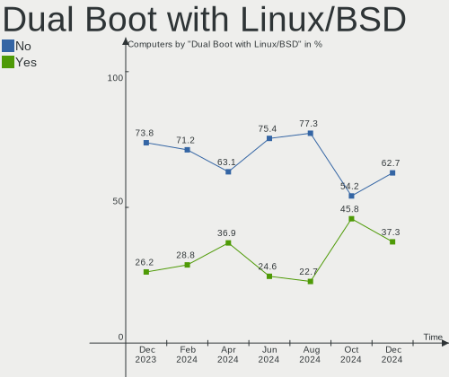
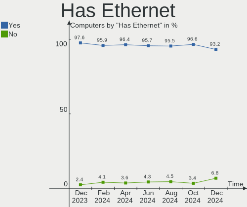
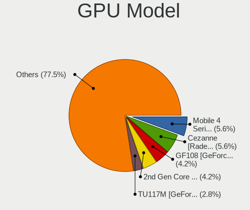
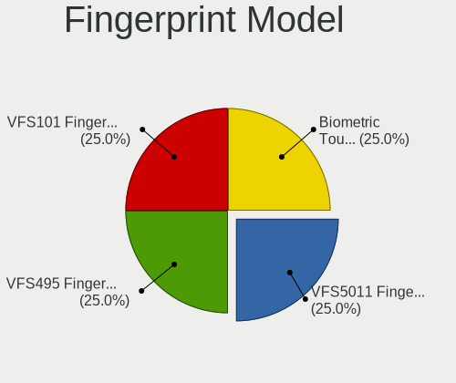

BlackPanther Hardware Trends
----------------------------

A project to identify most popular hardware characteristics and track their change
over time based on data collected by BlackPanther users at https://Linux-Hardware.org.

Anyone can contribute to this report by the [hw-probe](https://github.com/linuxhw/hw-probe) tool:

    sudo -E hw-probe -all -upload

This is a report for all computer types. See also reports for [desktops](/Dist/BlackPanther/Desktop/README.md) and [notebooks](/Dist/BlackPanther/Notebook/README.md).

Full-feature report is available here: https://linux-hardware.org/?view=trends

Period: Nov, 2021.

Contents
--------

* [ System ](#system)
  - [ OS                       ](#os)
  - [ OS Family                ](#os-family)
  - [ Kernel                   ](#kernel)
  - [ Kernel Family            ](#kernel-family)
  - [ Kernel Major Ver.        ](#kernel-major-ver)
  - [ Arch                     ](#arch)
  - [ DE                       ](#de)
  - [ Display Server           ](#display-server)
  - [ Display Manager          ](#display-manager)
  - [ OS Lang                  ](#os-lang)
  - [ Boot Mode                ](#boot-mode)
  - [ Filesystem               ](#filesystem)
  - [ Part. scheme             ](#part-scheme)
  - [ Dual Boot with Linux/BSD ](#dual-boot-with-linuxbsd)
  - [ Dual Boot (Win)          ](#dual-boot-win)

* [ Board ](#board)
  - [ Vendor                   ](#vendor)
  - [ Model                    ](#model)
  - [ Model Family             ](#model-family)
  - [ MFG Year                 ](#mfg-year)
  - [ Form Factor              ](#form-factor)
  - [ Secure Boot              ](#secure-boot)
  - [ Coreboot                 ](#coreboot)
  - [ RAM Size                 ](#ram-size)
  - [ RAM Used                 ](#ram-used)
  - [ Total Drives             ](#total-drives)
  - [ Has CD-ROM               ](#has-cd-rom)
  - [ Has Ethernet             ](#has-ethernet)
  - [ Has WiFi                 ](#has-wifi)
  - [ Has Bluetooth            ](#has-bluetooth)

* [ Location ](#location)
  - [ Country                  ](#country)
  - [ City                     ](#city)

* [ Drives ](#drives)
  - [ Drive Vendor             ](#drive-vendor)
  - [ Drive Model              ](#drive-model)
  - [ HDD Vendor               ](#hdd-vendor)
  - [ SSD Vendor               ](#ssd-vendor)
  - [ Drive Kind               ](#drive-kind)
  - [ Drive Connector          ](#drive-connector)
  - [ Drive Size               ](#drive-size)
  - [ Space Total              ](#space-total)
  - [ Space Used               ](#space-used)
  - [ Malfunc. Drives          ](#malfunc-drives)
  - [ Malfunc. Drive Vendor    ](#malfunc-drive-vendor)
  - [ Malfunc. HDD Vendor      ](#malfunc-hdd-vendor)
  - [ Malfunc. Drive Kind      ](#malfunc-drive-kind)
  - [ Failed Drives            ](#failed-drives)
  - [ Failed Drive Vendor      ](#failed-drive-vendor)
  - [ Drive Status             ](#drive-status)

* [ Storage controller ](#storage-controller)
  - [ Storage Vendor           ](#storage-vendor)
  - [ Storage Model            ](#storage-model)
  - [ Storage Kind             ](#storage-kind)

* [ Processor ](#processor)
  - [ CPU Vendor               ](#cpu-vendor)
  - [ CPU Model                ](#cpu-model)
  - [ CPU Model Family         ](#cpu-model-family)
  - [ CPU Cores                ](#cpu-cores)
  - [ CPU Sockets              ](#cpu-sockets)
  - [ CPU Threads              ](#cpu-threads)
  - [ CPU Op-Modes             ](#cpu-op-modes)
  - [ CPU Microcode            ](#cpu-microcode)
  - [ CPU Microarch            ](#cpu-microarch)

* [ Graphics ](#graphics)
  - [ GPU Vendor               ](#gpu-vendor)
  - [ GPU Model                ](#gpu-model)
  - [ GPU Combo                ](#gpu-combo)
  - [ GPU Driver               ](#gpu-driver)
  - [ GPU Memory               ](#gpu-memory)

* [ Monitor ](#monitor)
  - [ Monitor Vendor           ](#monitor-vendor)
  - [ Monitor Model            ](#monitor-model)
  - [ Monitor Resolution       ](#monitor-resolution)
  - [ Monitor Diagonal         ](#monitor-diagonal)
  - [ Monitor Width            ](#monitor-width)
  - [ Aspect Ratio             ](#aspect-ratio)
  - [ Monitor Area             ](#monitor-area)
  - [ Pixel Density            ](#pixel-density)
  - [ Multiple Monitors        ](#multiple-monitors)

* [ Network ](#network)
  - [ Net Controller Vendor    ](#net-controller-vendor)
  - [ Net Controller Model     ](#net-controller-model)
  - [ Wireless Vendor          ](#wireless-vendor)
  - [ Wireless Model           ](#wireless-model)
  - [ Ethernet Vendor          ](#ethernet-vendor)
  - [ Ethernet Model           ](#ethernet-model)
  - [ Net Controller Kind      ](#net-controller-kind)
  - [ Used Controller          ](#used-controller)
  - [ NICs                     ](#nics)
  - [ IPv6                     ](#ipv6)

* [ Bluetooth ](#bluetooth)
  - [ Bluetooth Vendor         ](#bluetooth-vendor)
  - [ Bluetooth Model          ](#bluetooth-model)

* [ Sound ](#sound)
  - [ Sound Vendor             ](#sound-vendor)
  - [ Sound Model              ](#sound-model)

* [ Memory ](#memory)
  - [ Memory Vendor            ](#memory-vendor)
  - [ Memory Model             ](#memory-model)
  - [ Memory Kind              ](#memory-kind)
  - [ Memory Form Factor       ](#memory-form-factor)
  - [ Memory Size              ](#memory-size)
  - [ Memory Speed             ](#memory-speed)

* [ Printers & scanners ](#printers--scanners)
  - [ Printer Vendor           ](#printer-vendor)
  - [ Printer Model            ](#printer-model)
  - [ Scanner Vendor           ](#scanner-vendor)
  - [ Scanner Model            ](#scanner-model)

* [ Camera ](#camera)
  - [ Camera Vendor            ](#camera-vendor)
  - [ Camera Model             ](#camera-model)

* [ Security ](#security)
  - [ Fingerprint Vendor       ](#fingerprint-vendor)
  - [ Fingerprint Model        ](#fingerprint-model)
  - [ Chipcard Vendor          ](#chipcard-vendor)
  - [ Chipcard Model           ](#chipcard-model)

* [ Unsupported ](#unsupported)
  - [ Unsupported Devices      ](#unsupported-devices)
  - [ Unsupported Device Types ](#unsupported-device-types)

System
------

OS
--

Installed operating systems

| Name              | Computers | Percent |
|-------------------|-----------|---------|
| BlackPanther 18.1 | 87        | 98.86%  |
| BlackPanther 16.2 | 1         | 1.14%   |

OS Family
---------

OS without a version

| Name         | Computers | Percent |
|--------------|-----------|---------|
| BlackPanther | 88        | 100%    |

Kernel
------

Version of the Linux kernel

| Version             | Computers | Percent |
|---------------------|-----------|---------|
| 5.6.14-desktop-2bP  | 63        | 71.59%  |
| 4.18.16-desktop-1bP | 24        | 27.27%  |
| 4.7.0-desktop-1bP   | 1         | 1.14%   |

Kernel Family
-------------

Linux kernel without a distro release

| Version | Computers | Percent |
|---------|-----------|---------|
| 5.6.14  | 63        | 71.59%  |
| 4.18.16 | 24        | 27.27%  |
| 4.7.0   | 1         | 1.14%   |

Kernel Major Ver.
-----------------

Linux kernel major version

| Version | Computers | Percent |
|---------|-----------|---------|
| 5.6     | 63        | 71.59%  |
| 4.18    | 24        | 27.27%  |
| 4.7     | 1         | 1.14%   |

Arch
----

OS architecture (x86_64, i586, etc.)

| Name   | Computers | Percent |
|--------|-----------|---------|
| x86_64 | 87        | 98.86%  |
| i686   | 1         | 1.14%   |

DE
--

Desktop Environment

| Name | Computers | Percent |
|------|-----------|---------|
| KDE5 | 88        | 100%    |

Display Server
--------------

X11 or Wayland

| Name | Computers | Percent |
|------|-----------|---------|
| X11  | 88        | 100%    |

Display Manager
---------------

SDDM, LightDM, etc.

| Name | Computers | Percent |
|------|-----------|---------|
| SDDM | 88        | 100%    |

OS Lang
-------

Language

| Lang    | Computers | Percent |
|---------|-----------|---------|
| Unknown | 88        | 100%    |

Boot Mode
---------

EFI or BIOS

| Mode | Computers | Percent |
|------|-----------|---------|
| BIOS | 51        | 57.95%  |
| EFI  | 37        | 42.05%  |

Filesystem
----------

Type of filesystem

| Type    | Computers | Percent |
|---------|-----------|---------|
| Overlay | 79        | 89.77%  |
| Ext4    | 9         | 10.23%  |

Part. scheme
------------

Scheme of partitioning

| Type | Computers | Percent |
|------|-----------|---------|
| MBR  | 52        | 59.09%  |
| GPT  | 36        | 40.91%  |

Dual Boot with Linux/BSD
------------------------

Hosting more than one Linux/BSD

| Dual boot | Computers | Percent |
|-----------|-----------|---------|
| No        | 50        | 56.82%  |
| Yes       | 38        | 43.18%  |

Dual Boot (Win)
---------------

Hosting Linux and Windows

| Dual boot | Computers | Percent |
|-----------|-----------|---------|
| Yes       | 49        | 55.68%  |
| No        | 39        | 44.32%  |

Board
-----

Vendor
------

Motherboard manufacturer

| Name                           | Computers | Percent |
|--------------------------------|-----------|---------|
| Dell                           | 16        | 18.18%  |
| Lenovo                         | 12        | 13.64%  |
| Hewlett-Packard                | 11        | 12.5%   |
| ASUSTek Computer               | 11        | 12.5%   |
| Gigabyte Technology            | 8         | 9.09%   |
| Toshiba                        | 4         | 4.55%   |
| Fujitsu                        | 4         | 4.55%   |
| ASRock                         | 4         | 4.55%   |
| Apple                          | 3         | 3.41%   |
| Acer                           | 3         | 3.41%   |
| Sony                           | 2         | 2.27%   |
| MSI                            | 2         | 2.27%   |
| Medion                         | 2         | 2.27%   |
| Shanghai Zhaoxin Semiconductor | 1         | 1.14%   |
| Samsung Electronics            | 1         | 1.14%   |
| Jumper                         | 1         | 1.14%   |
| Fujitsu Siemens                | 1         | 1.14%   |
| eMachines                      | 1         | 1.14%   |
| BenQ                           | 1         | 1.14%   |

Model
-----

Motherboard model

| Name                            | Computers | Percent |
|---------------------------------|-----------|---------|
| Toshiba Satellite U400          | 1         | 1.14%   |
| Toshiba Satellite L750          | 1         | 1.14%   |
| Toshiba Satellite L500          | 1         | 1.14%   |
| Toshiba NB550D                  | 1         | 1.14%   |
| Sony VPCEH2J1E                  | 1         | 1.14%   |
| Sony SVS13118GBB                | 1         | 1.14%   |
| Shanghai Zhaoxin ZXE CRB        | 1         | 1.14%   |
| Samsung NC210/NC110             | 1         | 1.14%   |
| MSI PPPPP-CCC#MMMMMMMM          | 1         | 1.14%   |
| MSI CR610                       | 1         | 1.14%   |
| Medion MS-7748                  | 1         | 1.14%   |
| Medion MS-7646                  | 1         | 1.14%   |
| Lenovo Z50-75 80EC              | 1         | 1.14%   |
| Lenovo ThinkPad T530 2429NL6    | 1         | 1.14%   |
| Lenovo ThinkPad A475 20KMS0EJ00 | 1         | 1.14%   |
| Lenovo IdeaPad S145-15IWL 81MV  | 1         | 1.14%   |
| Lenovo IdeaPad 330S-15IKB 81F5  | 1         | 1.14%   |
| Lenovo IdeaPad 330-15IKB 81DE   | 1         | 1.14%   |
| Lenovo IdeaPad 320-17ABR 80YN   | 1         | 1.14%   |
| Lenovo G550 20023               | 1         | 1.14%   |
| Lenovo G505s 20255              | 1         | 1.14%   |
| Lenovo G40-45 80E1              | 1         | 1.14%   |
| Lenovo B50-70 20384             | 1         | 1.14%   |
| Lenovo 7052-A9G                 | 1         | 1.14%   |
| Jumper EZbook                   | 1         | 1.14%   |
| HP ProDesk 600 G2 SFF           | 1         | 1.14%   |
| HP ProBook 6470b                | 1         | 1.14%   |
| HP ProBook 4330s                | 1         | 1.14%   |
| HP Pavilion Notebook            | 1         | 1.14%   |
| HP ENVY 15                      | 1         | 1.14%   |
| HP EliteBook 8540p              | 1         | 1.14%   |
| HP Compaq Pro 6300 MT           | 1         | 1.14%   |
| HP Compaq 8100 Elite CMT PC     | 1         | 1.14%   |
| HP Compaq 6005 Pro MT PC        | 1         | 1.14%   |
| HP 650                          | 1         | 1.14%   |
| HP 250 G4                       | 1         | 1.14%   |
| Gigabyte P67A-D3-B3             | 1         | 1.14%   |
| Gigabyte J4005ND2P-CF           | 1         | 1.14%   |
| Gigabyte H510M H                | 1         | 1.14%   |
| Gigabyte H110M-S2H              | 1         | 1.14%   |
| Gigabyte GA-E350N               | 1         | 1.14%   |
| Gigabyte G41MT-S2PT             | 1         | 1.14%   |
| Gigabyte B450M S2H              | 1         | 1.14%   |
| Gigabyte B450M GAMING           | 1         | 1.14%   |
| Fujitsu Siemens LIFEBOOK S7110  | 1         | 1.14%   |
| Fujitsu LIFEBOOK U745           | 1         | 1.14%   |
| Fujitsu ESPRIMO P720            | 1         | 1.14%   |
| Fujitsu ESPRIMO P710            | 1         | 1.14%   |
| Fujitsu ESPRIMO E910            | 1         | 1.14%   |
| eMachines eME732G               | 1         | 1.14%   |
| Dell Vostro 1540                | 1         | 1.14%   |
| Dell OptiPlex GX620             | 1         | 1.14%   |
| Dell OptiPlex 9020              | 1         | 1.14%   |
| Dell OptiPlex 9010              | 1         | 1.14%   |
| Dell OptiPlex 7010              | 1         | 1.14%   |
| Dell OptiPlex 330               | 1         | 1.14%   |
| Dell Latitude E7470             | 1         | 1.14%   |
| Dell Latitude E6530             | 1         | 1.14%   |
| Dell Latitude E6430             | 1         | 1.14%   |
| Dell Latitude E6410             | 1         | 1.14%   |

Model Family
------------

Motherboard model prefix

| Name                     | Computers | Percent |
|--------------------------|-----------|---------|
| Dell Latitude            | 9         | 10.23%  |
| Dell OptiPlex            | 5         | 5.68%   |
| Lenovo IdeaPad           | 4         | 4.55%   |
| Toshiba Satellite        | 3         | 3.41%   |
| HP Compaq                | 3         | 3.41%   |
| Fujitsu ESPRIMO          | 3         | 3.41%   |
| ASUS PRIME               | 3         | 3.41%   |
| Acer Aspire              | 3         | 3.41%   |
| Lenovo ThinkPad          | 2         | 2.27%   |
| HP ProBook               | 2         | 2.27%   |
| Gigabyte B450M           | 2         | 2.27%   |
| Toshiba NB550D           | 1         | 1.14%   |
| Sony VPCEH2J1E           | 1         | 1.14%   |
| Sony SVS13118GBB         | 1         | 1.14%   |
| Shanghai Zhaoxin ZXE     | 1         | 1.14%   |
| Samsung NC210            | 1         | 1.14%   |
| MSI PPPPP-CCC#MMMMMMMM   | 1         | 1.14%   |
| MSI CR610                | 1         | 1.14%   |
| Medion MS-7748           | 1         | 1.14%   |
| Medion MS-7646           | 1         | 1.14%   |
| Lenovo Z50-75            | 1         | 1.14%   |
| Lenovo G550              | 1         | 1.14%   |
| Lenovo G505s             | 1         | 1.14%   |
| Lenovo G40-45            | 1         | 1.14%   |
| Lenovo B50-70            | 1         | 1.14%   |
| Lenovo 7052-A9G          | 1         | 1.14%   |
| Jumper EZbook            | 1         | 1.14%   |
| HP ProDesk               | 1         | 1.14%   |
| HP Pavilion              | 1         | 1.14%   |
| HP ENVY                  | 1         | 1.14%   |
| HP EliteBook             | 1         | 1.14%   |
| HP 650                   | 1         | 1.14%   |
| HP 250                   | 1         | 1.14%   |
| Gigabyte P67A-D3-B3      | 1         | 1.14%   |
| Gigabyte J4005ND2P-CF    | 1         | 1.14%   |
| Gigabyte H510M           | 1         | 1.14%   |
| Gigabyte H110M-S2H       | 1         | 1.14%   |
| Gigabyte GA-E350N        | 1         | 1.14%   |
| Gigabyte G41MT-S2PT      | 1         | 1.14%   |
| Fujitsu Siemens LIFEBOOK | 1         | 1.14%   |
| Fujitsu LIFEBOOK         | 1         | 1.14%   |
| eMachines eME732G        | 1         | 1.14%   |
| Dell Vostro              | 1         | 1.14%   |
| Dell Inspiron            | 1         | 1.14%   |
| BenQ Joybook             | 1         | 1.14%   |
| ASUS Vivo                | 1         | 1.14%   |
| ASUS P6T7                | 1         | 1.14%   |
| ASUS P5KPL-AM            | 1         | 1.14%   |
| ASUS P5B-PLUS            | 1         | 1.14%   |
| ASUS K53U                | 1         | 1.14%   |
| ASUS K50IN               | 1         | 1.14%   |
| ASUS H110-PLUS           | 1         | 1.14%   |
| ASUS All                 | 1         | 1.14%   |
| ASRock ION3D-HT          | 1         | 1.14%   |
| ASRock G31M-GS           | 1         | 1.14%   |
| ASRock FM2A75M           | 1         | 1.14%   |
| ASRock B85M              | 1         | 1.14%   |
| Apple MacBookPro6        | 1         | 1.14%   |
| Apple MacBookPro5        | 1         | 1.14%   |
| Apple iMac8              | 1         | 1.14%   |

MFG Year
--------

Motherboard manufacture year

| Year | Computers | Percent |
|------|-----------|---------|
| 2018 | 12        | 13.64%  |
| 2014 | 10        | 11.36%  |
| 2012 | 9         | 10.23%  |
| 2011 | 9         | 10.23%  |
| 2010 | 9         | 10.23%  |
| 2021 | 6         | 6.82%   |
| 2019 | 6         | 6.82%   |
| 2015 | 5         | 5.68%   |
| 2013 | 5         | 5.68%   |
| 2009 | 4         | 4.55%   |
| 2008 | 4         | 4.55%   |
| 2020 | 3         | 3.41%   |
| 2017 | 2         | 2.27%   |
| 2006 | 2         | 2.27%   |
| 2016 | 1         | 1.14%   |
| 2007 | 1         | 1.14%   |

Form Factor
-----------

Physical design of the computer

| Name       | Computers | Percent |
|------------|-----------|---------|
| Notebook   | 49        | 55.68%  |
| Desktop    | 37        | 42.05%  |
| All in one | 2         | 2.27%   |

Secure Boot
-----------

Enabled or disabled

| State    | Computers | Percent |
|----------|-----------|---------|
| Disabled | 88        | 100%    |

Coreboot
--------

Have coreboot on board

| Used | Computers | Percent |
|------|-----------|---------|
| No   | 88        | 100%    |

RAM Size
--------

Total RAM memory

| Size in GB | Computers | Percent |
|------------|-----------|---------|
| 3.01-4.0   | 35        | 39.77%  |
| 8.01-16.0  | 20        | 22.73%  |
| 4.01-8.0   | 18        | 20.45%  |
| 16.01-24.0 | 7         | 7.95%   |
| 1.01-2.0   | 5         | 5.68%   |
| 2.01-3.0   | 2         | 2.27%   |
| 24.01-32.0 | 1         | 1.14%   |

RAM Used
--------

Used RAM memory

| Used GB  | Computers | Percent |
|----------|-----------|---------|
| 0.51-1.0 | 36        | 40.91%  |
| 0.01-0.5 | 34        | 38.64%  |
| 1.01-2.0 | 18        | 20.45%  |

Total Drives
------------

Number of drives on board

| Drives | Computers | Percent |
|--------|-----------|---------|
| 1      | 62        | 70.45%  |
| 2      | 19        | 21.59%  |
| 3      | 4         | 4.55%   |
| 5      | 2         | 2.27%   |
| 9      | 1         | 1.14%   |

Has CD-ROM
----------

Has CD-ROM on board

| Presented | Computers | Percent |
|-----------|-----------|---------|
| Yes       | 57        | 64.77%  |
| No        | 31        | 35.23%  |

Has Ethernet
------------

Has Ethernet on board

| Presented | Computers | Percent |
|-----------|-----------|---------|
| Yes       | 85        | 96.59%  |
| No        | 3         | 3.41%   |

Has WiFi
--------

Has WiFi module

| Presented | Computers | Percent |
|-----------|-----------|---------|
| Yes       | 58        | 65.91%  |
| No        | 30        | 34.09%  |

Has Bluetooth
-------------

Has Bluetooth module

| Presented | Computers | Percent |
|-----------|-----------|---------|
| Yes       | 49        | 55.68%  |
| No        | 39        | 44.32%  |

Location
--------

Country
-------

Geographic location (country)

| Country   | Computers | Percent |
|-----------|-----------|---------|
| Hungary   | 78        | 88.64%  |
| Slovakia  | 2         | 2.27%   |
| China     | 2         | 2.27%   |
| Austria   | 2         | 2.27%   |
| Spain     | 1         | 1.14%   |
| Jamaica   | 1         | 1.14%   |
| Belgium   | 1         | 1.14%   |
| Argentina | 1         | 1.14%   |

City
----

Geographic location (city)

| City                        | Computers | Percent |
|-----------------------------|-----------|---------|
| Budapest                    | 18        | 20.45%  |
| Veresegyhaz                 | 4         | 4.55%   |
| Debrecen                    | 4         | 4.55%   |
| Vienna                      | 2         | 2.27%   |
| Vemend                      | 2         | 2.27%   |
| V??c                        | 2         | 2.27%   |
| Szolnok                     | 2         | 2.27%   |
| Szerencs                    | 2         | 2.27%   |
| P?©cs                       | 2         | 2.27%   |
| Papkeszi                    | 2         | 2.27%   |
| Oroshaza                    | 2         | 2.27%   |
| Lebeny                      | 2         | 2.27%   |
| Kecsked                     | 2         | 2.27%   |
| Jaszdozsa                   | 2         | 2.27%   |
| Holic                       | 2         | 2.27%   |
| Esztergom                   | 2         | 2.27%   |
| Dalian                      | 2         | 2.27%   |
| Turkeve                     | 1         | 1.14%   |
| Tatab??nya                  | 1         | 1.14%   |
| Sandorfalva                 | 1         | 1.14%   |
| San Nicol??s de los Arroyos | 1         | 1.14%   |
| Salgotarjan                 | 1         | 1.14%   |
| Roszke                      | 1         | 1.14%   |
| Pilismarot                  | 1         | 1.14%   |
| Paszto                      | 1         | 1.14%   |
| Nyirtass                    | 1         | 1.14%   |
| Nyiregyhaza                 | 1         | 1.14%   |
| Mezokovesd                  | 1         | 1.14%   |
| Lajosmizse                  | 1         | 1.14%   |
| Koszeg                      | 1         | 1.14%   |
| Kisvarda                    | 1         | 1.14%   |
| Kingston                    | 1         | 1.14%   |
| Karcag                      | 1         | 1.14%   |
| Kaposv??r                   | 1         | 1.14%   |
| Kal                         | 1         | 1.14%   |
| Jerez de la Frontera        | 1         | 1.14%   |
| Huy                         | 1         | 1.14%   |
| Hodmezovasarhely            | 1         | 1.14%   |
| Gyomro                      | 1         | 1.14%   |
| Gyomaendrod                 | 1         | 1.14%   |
| Gy?‘r                       | 1         | 1.14%   |
| G?¶d?¶ll?‘                  | 1         | 1.14%   |
| Fuzesabony                  | 1         | 1.14%   |
| Farmos                      | 1         | 1.14%   |
| Dombovar                    | 1         | 1.14%   |
| Cserepfalu                  | 1         | 1.14%   |
| Buk                         | 1         | 1.14%   |
| Balatonfured                | 1         | 1.14%   |
| ?‰rd                        | 1         | 1.14%   |
| Alsozsolca                  | 1         | 1.14%   |
| Ajka                        | 1         | 1.14%   |

Drives
------

Drive Vendor
------------

Hard drive vendors

| Vendor              | Computers | Drives | Percent |
|---------------------|-----------|--------|---------|
| WDC                 | 21        | 24     | 16.41%  |
| Toshiba             | 20        | 20     | 15.63%  |
| Samsung Electronics | 16        | 19     | 12.5%   |
| Seagate             | 15        | 18     | 11.72%  |
| Kingston            | 15        | 15     | 11.72%  |
| Hitachi             | 7         | 8      | 5.47%   |
| A-DATA Technology   | 4         | 4      | 3.13%   |
| Intenso             | 3         | 3      | 2.34%   |
| HGST                | 3         | 3      | 2.34%   |
| Unknown             | 2         | 2      | 1.56%   |
| Team                | 2         | 2      | 1.56%   |
| SK Hynix            | 2         | 2      | 1.56%   |
| SanDisk             | 2         | 2      | 1.56%   |
| Crucial             | 2         | 2      | 1.56%   |
| China               | 2         | 2      | 1.56%   |
| Transcend           | 1         | 1      | 0.78%   |
| Teclast             | 1         | 1      | 0.78%   |
| SPCC                | 1         | 1      | 0.78%   |
| Solid               | 1         | 1      | 0.78%   |
| sobetter            | 1         | 1      | 0.78%   |
| Philips             | 1         | 1      | 0.78%   |
| JMicron             | 1         | 1      | 0.78%   |
| Intel               | 1         | 1      | 0.78%   |
| GOODRAM             | 1         | 1      | 0.78%   |
| Gigabyte Technology | 1         | 1      | 0.78%   |
| Apacer              | 1         | 1      | 0.78%   |
| Unknown             | 1         | 1      | 0.78%   |

Drive Model
-----------

Hard drive models

| Model                                 | Computers | Percent |
|---------------------------------------|-----------|---------|
| Toshiba MQ04ABF100 1TB                | 4         | 2.92%   |
| Toshiba MQ01ABF050 500GB              | 4         | 2.92%   |
| Kingston SV300S37A120G 120GB SSD      | 4         | 2.92%   |
| Kingston SA400S37240G 240GB SSD       | 4         | 2.92%   |
| Toshiba MQ01ABD100 1TB                | 3         | 2.19%   |
| Kingston SA400S37120G 120GB SSD       | 3         | 2.19%   |
| Seagate ST500LT012-1DG142 500GB       | 2         | 1.46%   |
| Seagate ST500DM002-1BD142 500GB       | 2         | 1.46%   |
| Seagate ST3500418AS 500GB             | 2         | 1.46%   |
| Samsung SSD PM871b M.2 2280 256GB     | 2         | 1.46%   |
| Samsung SSD 870 EVO 250GB             | 2         | 1.46%   |
| Kingston SUV400S37120G 120GB SSD      | 2         | 1.46%   |
| Hitachi HTS543232L9A300 320GB         | 2         | 1.46%   |
| Hitachi HTS543232A7A384 320GB         | 2         | 1.46%   |
| WDC WD7500BPVX-60JC3T0 752GB          | 1         | 0.73%   |
| WDC WD5000LPVX-22V0TT0 500GB          | 1         | 0.73%   |
| WDC WD5000BPVT-80HXZT3 500GB          | 1         | 0.73%   |
| WDC WD5000AVCS-982DY1 500GB           | 1         | 0.73%   |
| WDC WD5000AAKX-75U6AA0 500GB          | 1         | 0.73%   |
| WDC WD5000AAKX-60U6AA0 500GB          | 1         | 0.73%   |
| WDC WD5000AAKX-08U6AA0 500GB          | 1         | 0.73%   |
| WDC WD40 EZAZ-00SF3B0 4TB             | 1         | 0.73%   |
| WDC WD3200LPLX-00ZNTT0 320GB          | 1         | 0.73%   |
| WDC WD3200BUDT-63DPZY0 320GB          | 1         | 0.73%   |
| WDC WD30EZRZ-00GXCB0 3TB              | 1         | 0.73%   |
| WDC WD30EFRX-68EUZN0 3TB              | 1         | 0.73%   |
| WDC WD2500BEVT-22A23T0 250GB          | 1         | 0.73%   |
| WDC WD2500AAKX-221CA1 250GB           | 1         | 0.73%   |
| WDC WD2500AAJS-07M0A0 250GB           | 1         | 0.73%   |
| WDC WD20EZRZ-00Z5HB0 2TB              | 1         | 0.73%   |
| WDC WD1600BEVT-22ZCT0 160GB           | 1         | 0.73%   |
| WDC WD1600AAJB-56WRA0 160GB           | 1         | 0.73%   |
| WDC WD1500HLFS-01MZUV0 150GB          | 1         | 0.73%   |
| WDC WD10SPCX-24HWST1 1TB              | 1         | 0.73%   |
| WDC WD10JPVX-60JC3T0 1TB              | 1         | 0.73%   |
| WDC WD10JPVX-22JC3T0 1TB              | 1         | 0.73%   |
| WDC WD10EZRX-00A8LB0 1TB              | 1         | 0.73%   |
| WDC WD10EZEX-08WN4A0 1TB              | 1         | 0.73%   |
| Unknown SLD128  128GB                 | 1         | 0.73%   |
| Unknown SC32G  32GB                   | 1         | 0.73%   |
| Transcend TS128GMTE110S 128GB         | 1         | 0.73%   |
| Toshiba THNSFJ256GCSU 256GB SSD       | 1         | 0.73%   |
| Toshiba Q300. 240GB SSD               | 1         | 0.73%   |
| Toshiba MQ01ABD075 752GB              | 1         | 0.73%   |
| Toshiba MK2561GSYN 250GB              | 1         | 0.73%   |
| Toshiba MK2555GSX 250GB               | 1         | 0.73%   |
| Toshiba MK1252GSX 120GB               | 1         | 0.73%   |
| Toshiba HDWD220 2TB                   | 1         | 0.73%   |
| Toshiba HDWD130 3TB                   | 1         | 0.73%   |
| Toshiba DT01ACA050 500GB              | 1         | 0.73%   |
| Teclast 256GB A850 SSD                | 1         | 0.73%   |
| Team T253X1240G 240GB SSD             | 1         | 0.73%   |
| Team L7 EVO SSD 60GB                  | 1         | 0.73%   |
| SPCC M.2 PCIe SSD 512GB               | 1         | 0.73%   |
| Solid SSD0240S00 240GB                | 1         | 0.73%   |
| sobetter EXT 1TB                      | 1         | 0.73%   |
| SK Hynix PC300 NVMe 1TB               | 1         | 0.73%   |
| SK Hynix HFS256G39TNF-N3A0A 256GB SSD | 1         | 0.73%   |
| Seagate ST96812AS 64GB                | 1         | 0.73%   |
| Seagate ST9500420AS 500GB             | 1         | 0.73%   |

HDD Vendor
----------

Hard disk drive vendors

| Vendor              | Computers | Drives | Percent |
|---------------------|-----------|--------|---------|
| WDC                 | 21        | 24     | 30.43%  |
| Toshiba             | 18        | 18     | 26.09%  |
| Seagate             | 15        | 18     | 21.74%  |
| Hitachi             | 7         | 8      | 10.14%  |
| Samsung Electronics | 5         | 5      | 7.25%   |
| HGST                | 3         | 3      | 4.35%   |

SSD Vendor
----------

Solid state drive vendors

| Vendor              | Computers | Drives | Percent |
|---------------------|-----------|--------|---------|
| Kingston            | 13        | 13     | 27.08%  |
| Samsung Electronics | 10        | 11     | 20.83%  |
| Intenso             | 3         | 3      | 6.25%   |
| A-DATA Technology   | 3         | 3      | 6.25%   |
| Toshiba             | 2         | 2      | 4.17%   |
| Team                | 2         | 2      | 4.17%   |
| SanDisk             | 2         | 2      | 4.17%   |
| Crucial             | 2         | 2      | 4.17%   |
| China               | 2         | 2      | 4.17%   |
| Teclast             | 1         | 1      | 2.08%   |
| Solid               | 1         | 1      | 2.08%   |
| SK Hynix            | 1         | 1      | 2.08%   |
| Philips             | 1         | 1      | 2.08%   |
| JMicron             | 1         | 1      | 2.08%   |
| Intel               | 1         | 1      | 2.08%   |
| GOODRAM             | 1         | 1      | 2.08%   |
| Gigabyte Technology | 1         | 1      | 2.08%   |
| Apacer              | 1         | 1      | 2.08%   |

Drive Kind
----------

HDD or SSD

| Kind    | Computers | Drives | Percent |
|---------|-----------|--------|---------|
| HDD     | 62        | 76     | 52.1%   |
| SSD     | 46        | 49     | 38.66%  |
| NVMe    | 7         | 9      | 5.88%   |
| MMC     | 3         | 3      | 2.52%   |
| Unknown | 1         | 1      | 0.84%   |

Drive Connector
---------------

SATA, SAS, NVMe, etc.

| Type | Computers | Drives | Percent |
|------|-----------|--------|---------|
| SATA | 86        | 119    | 86.87%  |
| NVMe | 7         | 9      | 7.07%   |
| SAS  | 3         | 7      | 3.03%   |
| MMC  | 3         | 3      | 3.03%   |

Drive Size
----------

Size of hard drive

| Size in TB | Computers | Drives | Percent |
|------------|-----------|--------|---------|
| 0.01-0.5   | 72        | 90     | 71.29%  |
| 0.51-1.0   | 24        | 28     | 23.76%  |
| 2.01-3.0   | 2         | 3      | 1.98%   |
| 1.01-2.0   | 2         | 2      | 1.98%   |
| 3.01-4.0   | 1         | 2      | 0.99%   |

Space Total
-----------

Amount of disk space available on the file system

| Size in GB | Computers | Percent |
|------------|-----------|---------|
| Unknown    | 77        | 87.5%   |
| 101-250    | 6         | 6.82%   |
| 251-500    | 3         | 3.41%   |
| 21-50      | 1         | 1.14%   |
| 501-1000   | 1         | 1.14%   |

Space Used
----------

Amount of used disk space

| Used GB | Computers | Percent |
|---------|-----------|---------|
| Unknown | 77        | 87.5%   |
| 1-20    | 11        | 12.5%   |

Malfunc. Drives
---------------

Drive models with a malfunction

| Model                               | Computers | Drives | Percent |
|-------------------------------------|-----------|--------|---------|
| WDC WD7500BPVX-60JC3T0 752GB        | 1         | 1      | 2.5%    |
| WDC WD5000BPVT-80HXZT3 500GB        | 1         | 1      | 2.5%    |
| WDC WD5000AAKX-08U6AA0 500GB        | 1         | 1      | 2.5%    |
| WDC WD3200BUDT-63DPZY0 320GB        | 1         | 1      | 2.5%    |
| WDC WD2500BEVT-22A23T0 250GB        | 1         | 1      | 2.5%    |
| WDC WD2500AAKX-221CA1 250GB         | 1         | 1      | 2.5%    |
| WDC WD2500AAJS-07M0A0 250GB         | 1         | 1      | 2.5%    |
| WDC WD1500HLFS-01MZUV0 150GB        | 1         | 1      | 2.5%    |
| WDC WD10JPVX-22JC3T0 1TB            | 1         | 1      | 2.5%    |
| WDC WD10EZRX-00A8LB0 1TB            | 1         | 1      | 2.5%    |
| WDC WD10EZEX-08WN4A0 1TB            | 1         | 1      | 2.5%    |
| Toshiba THNSFJ256GCSU 256GB SSD     | 1         | 1      | 2.5%    |
| Toshiba MQ01ABF050 500GB            | 1         | 1      | 2.5%    |
| Toshiba MQ01ABD100 1TB              | 1         | 1      | 2.5%    |
| Toshiba MQ01ABD075 752GB            | 1         | 1      | 2.5%    |
| Toshiba MK2561GSYN 250GB            | 1         | 1      | 2.5%    |
| Toshiba MK2555GSX 250GB             | 1         | 1      | 2.5%    |
| Toshiba HDWD130 3TB                 | 1         | 1      | 2.5%    |
| Toshiba DT01ACA050 500GB            | 1         | 1      | 2.5%    |
| Seagate ST96812AS 64GB              | 1         | 1      | 2.5%    |
| Seagate ST9500420AS 500GB           | 1         | 1      | 2.5%    |
| Seagate ST9250315AS 250GB           | 1         | 1      | 2.5%    |
| Seagate ST500LT012-1DG142 500GB     | 1         | 1      | 2.5%    |
| Seagate ST500DM002-1BD142 500GB     | 1         | 1      | 2.5%    |
| Seagate ST4000DM 000-1F2168 4TB     | 1         | 1      | 2.5%    |
| Seagate ST3500418AS 500GB           | 1         | 1      | 2.5%    |
| Seagate ST3160023AS 160GB           | 1         | 1      | 2.5%    |
| Seagate ST1000LM024 HN-M101MBB 1TB  | 1         | 1      | 2.5%    |
| Seagate ST1000LM014-1EJ164-SSHD 1TB | 1         | 1      | 2.5%    |
| Samsung Electronics SP2004C 200GB   | 1         | 1      | 2.5%    |
| Samsung Electronics HM160HI 160GB   | 1         | 1      | 2.5%    |
| Samsung Electronics HD503HI 500GB   | 1         | 1      | 2.5%    |
| Intel SSDSCKKF256H6 SATA 256GB      | 1         | 1      | 2.5%    |
| Hitachi HTS547550A9E384 500GB       | 1         | 1      | 2.5%    |
| Hitachi HTS543232A7A384 320GB       | 1         | 1      | 2.5%    |
| Hitachi HTS542516K9SA00 160GB       | 1         | 1      | 2.5%    |
| Hitachi HDS721010CLA330 1TB         | 1         | 1      | 2.5%    |
| HGST HTS545050A7E680 500GB          | 1         | 1      | 2.5%    |
| HGST HTS541010A9E680 1TB            | 1         | 1      | 2.5%    |
| A-DATA Technology SU630 240GB SSD   | 1         | 1      | 2.5%    |

Malfunc. Drive Vendor
---------------------

Vendors of faulty drives

| Vendor              | Computers | Drives | Percent |
|---------------------|-----------|--------|---------|
| WDC                 | 11        | 11     | 28.21%  |
| Seagate             | 9         | 10     | 23.08%  |
| Toshiba             | 8         | 8      | 20.51%  |
| Hitachi             | 4         | 4      | 10.26%  |
| Samsung Electronics | 3         | 3      | 7.69%   |
| HGST                | 2         | 2      | 5.13%   |
| Intel               | 1         | 1      | 2.56%   |
| A-DATA Technology   | 1         | 1      | 2.56%   |

Malfunc. HDD Vendor
-------------------

Vendors of faulty HDD drives

| Vendor              | Computers | Drives | Percent |
|---------------------|-----------|--------|---------|
| WDC                 | 11        | 11     | 30.56%  |
| Seagate             | 9         | 10     | 25%     |
| Toshiba             | 7         | 7      | 19.44%  |
| Hitachi             | 4         | 4      | 11.11%  |
| Samsung Electronics | 3         | 3      | 8.33%   |
| HGST                | 2         | 2      | 5.56%   |

Malfunc. Drive Kind
-------------------

Kinds of faulty drives

| Kind | Computers | Drives | Percent |
|------|-----------|--------|---------|
| HDD  | 34        | 37     | 91.89%  |
| SSD  | 3         | 3      | 8.11%   |

Failed Drives
-------------

Failed drive models

| Model                     | Computers | Drives | Percent |
|---------------------------|-----------|--------|---------|
| Seagate ST9320325AS 320GB | 1         | 1      | 100%    |

Failed Drive Vendor
-------------------

Failed drive vendors

| Vendor  | Computers | Drives | Percent |
|---------|-----------|--------|---------|
| Seagate | 1         | 1      | 100%    |

Drive Status
------------

Number of failed and malfunc. drives

| Status   | Computers | Drives | Percent |
|----------|-----------|--------|---------|
| Works    | 62        | 88     | 59.62%  |
| Malfunc  | 35        | 40     | 33.65%  |
| Detected | 6         | 9      | 5.77%   |
| Failed   | 1         | 1      | 0.96%   |

Storage controller
------------------

Storage Vendor
--------------

Storage controller vendors

| Vendor                      | Computers | Percent |
|-----------------------------|-----------|---------|
| Intel                       | 66        | 66.67%  |
| AMD                         | 19        | 19.19%  |
| Samsung Electronics         | 3         | 3.03%   |
| Nvidia                      | 2         | 2.02%   |
| Kingston Technology Company | 2         | 2.02%   |
| Zhaoxin                     | 1         | 1.01%   |
| SK Hynix                    | 1         | 1.01%   |
| Silicon Motion              | 1         | 1.01%   |
| Silicon Image               | 1         | 1.01%   |
| Phison Electronics          | 1         | 1.01%   |
| JMicron Technology          | 1         | 1.01%   |
| ADATA Technology            | 1         | 1.01%   |

Storage Model
-------------

Storage controller models

| Model                                                                                   | Computers | Percent |
|-----------------------------------------------------------------------------------------|-----------|---------|
| AMD FCH SATA Controller [AHCI mode]                                                     | 11        | 9.09%   |
| Intel 82801 Mobile SATA Controller [RAID mode]                                          | 7         | 5.79%   |
| Intel 82801G (ICH7 Family) IDE Controller                                               | 6         | 4.96%   |
| Intel Sunrise Point-LP SATA Controller [AHCI mode]                                      | 5         | 4.13%   |
| Intel 7 Series/C210 Series Chipset Family 6-port SATA Controller [AHCI mode]            | 5         | 4.13%   |
| Intel NM10/ICH7 Family SATA Controller [IDE mode]                                       | 4         | 3.31%   |
| Intel 82801HM/HEM (ICH8M/ICH8M-E) IDE Controller                                        | 4         | 3.31%   |
| Intel 8 Series/C220 Series Chipset Family 6-port SATA Controller 1 [AHCI mode]          | 4         | 3.31%   |
| Intel 7 Series Chipset Family 6-port SATA Controller [AHCI mode]                        | 4         | 3.31%   |
| AMD SB7x0/SB8x0/SB9x0 SATA Controller [AHCI mode]                                       | 4         | 3.31%   |
| AMD SB7x0/SB8x0/SB9x0 IDE Controller                                                    | 4         | 3.31%   |
| Intel Wildcat Point-LP SATA Controller [AHCI Mode]                                      | 3         | 2.48%   |
| Intel SATA Controller [RAID mode]                                                       | 3         | 2.48%   |
| Intel Q170/Q150/B150/H170/H110/Z170/CM236 Chipset SATA Controller [AHCI Mode]           | 3         | 2.48%   |
| Intel 6 Series/C200 Series Chipset Family 6 port Mobile SATA AHCI Controller            | 3         | 2.48%   |
| Intel 5 Series/3400 Series Chipset 6 port SATA AHCI Controller                          | 3         | 2.48%   |
| Intel 5 Series/3400 Series Chipset 4 port SATA AHCI Controller                          | 3         | 2.48%   |
| AMD 400 Series Chipset SATA Controller                                                  | 3         | 2.48%   |
| Samsung NVMe SSD Controller SM981/PM981/PM983                                           | 2         | 1.65%   |
| Nvidia MCP79 AHCI Controller                                                            | 2         | 1.65%   |
| Intel NM10/ICH7 Family SATA Controller [AHCI mode]                                      | 2         | 1.65%   |
| Intel Celeron/Pentium Silver Processor SATA Controller                                  | 2         | 1.65%   |
| Intel 82801IBM/IEM (ICH9M/ICH9M-E) 4 port SATA Controller [AHCI mode]                   | 2         | 1.65%   |
| Intel 82801HM/HEM (ICH8M/ICH8M-E) SATA Controller [IDE mode]                            | 2         | 1.65%   |
| Intel 82801HM/HEM (ICH8M/ICH8M-E) SATA Controller [AHCI mode]                           | 2         | 1.65%   |
| AMD SB7x0/SB8x0/SB9x0 SATA Controller [IDE mode]                                        | 2         | 1.65%   |
| Zhaoxin ZX-100/ZX-200/ZX-E StorX AHCI Controller                                        | 1         | 0.83%   |
| SK Hynix PC300 NVMe Solid State Drive 1TB                                               | 1         | 0.83%   |
| Silicon Motion SM2263EN/SM2263XT SSD Controller                                         | 1         | 0.83%   |
| Silicon Image SiI 3114 [SATALink/SATARaid] Serial ATA Controller                        | 1         | 0.83%   |
| Samsung NVMe SSD Controller SM961/PM961/SM963                                           | 1         | 0.83%   |
| Phison E12 NVMe Controller                                                              | 1         | 0.83%   |
| Kingston Company U-SNS8154P3 NVMe SSD                                                   | 1         | 0.83%   |
| Kingston Company A2000 NVMe SSD                                                         | 1         | 0.83%   |
| JMicron JMB363 SATA/IDE Controller                                                      | 1         | 0.83%   |
| Intel Celeron N3350/Pentium N4200/Atom E3900 Series SATA AHCI Controller                | 1         | 0.83%   |
| Intel Cannon Point-LP SATA Controller [AHCI Mode]                                       | 1         | 0.83%   |
| Intel 82801JI (ICH10 Family) 4 port SATA IDE Controller #1                              | 1         | 0.83%   |
| Intel 82801JI (ICH10 Family) 2 port SATA IDE Controller #2                              | 1         | 0.83%   |
| Intel 82801HR/HO/HH (ICH8R/DO/DH) 6 port SATA Controller [AHCI mode]                    | 1         | 0.83%   |
| Intel 82801GBM/GHM (ICH7-M Family) SATA Controller [AHCI mode]                          | 1         | 0.83%   |
| Intel 8 Series SATA Controller 1 [AHCI mode]                                            | 1         | 0.83%   |
| Intel 6 Series/C200 Series Chipset Family Desktop SATA Controller (IDE mode, ports 4-5) | 1         | 0.83%   |
| Intel 6 Series/C200 Series Chipset Family Desktop SATA Controller (IDE mode, ports 0-3) | 1         | 0.83%   |
| Intel 6 Series/C200 Series Chipset Family 6 port Desktop SATA AHCI Controller           | 1         | 0.83%   |
| Intel 500 Series Chipset Family SATA AHCI Controller                                    | 1         | 0.83%   |
| AMD IXP SB4x0 Serial ATA Controller                                                     | 1         | 0.83%   |
| AMD IXP SB4x0 IDE Controller                                                            | 1         | 0.83%   |
| AMD IXP SB400 Serial ATA Controller                                                     | 1         | 0.83%   |
| AMD FCH SATA Controller D                                                               | 1         | 0.83%   |
| AMD FCH IDE Controller                                                                  | 1         | 0.83%   |
| ADATA XPG SX8200 Pro PCIe Gen3x4 M.2 2280 Solid State Drive                             | 1         | 0.83%   |

Storage Kind
------------

Kind of storage controller (IDE, SATA, NVMe, SAS, ...)

| Kind | Computers | Percent |
|------|-----------|---------|
| SATA | 69        | 65.09%  |
| IDE  | 19        | 17.92%  |
| RAID | 11        | 10.38%  |
| NVMe | 7         | 6.6%    |

Processor
---------

CPU Vendor
----------

Processor vendors

| Vendor       | Computers | Percent |
|--------------|-----------|---------|
| Intel        | 69        | 78.41%  |
| AMD          | 18        | 20.45%  |
| CentaurHauls | 1         | 1.14%   |

CPU Model
---------

Processor models

| Model                                          | Computers | Percent |
|------------------------------------------------|-----------|---------|
| Intel Core i5-3340M CPU @ 2.70GHz              | 3         | 3.41%   |
| Intel Pentium Dual-Core CPU T4500 @ 2.30GHz    | 2         | 2.27%   |
| Intel Core i7-6600U CPU @ 2.60GHz              | 2         | 2.27%   |
| Intel Core i5-6500 CPU @ 3.20GHz               | 2         | 2.27%   |
| Intel Core i5-3470 CPU @ 3.20GHz               | 2         | 2.27%   |
| Intel Core i5 CPU 650 @ 3.20GHz                | 2         | 2.27%   |
| Intel Core i3-7020U CPU @ 2.30GHz              | 2         | 2.27%   |
| Intel Core 2 Duo CPU P8700 @ 2.53GHz           | 2         | 2.27%   |
| Intel Celeron J4005 CPU @ 2.00GHz              | 2         | 2.27%   |
| Intel Pentium Dual-Core CPU T4200 @ 2.00GHz    | 1         | 1.14%   |
| Intel Pentium Dual-Core CPU E6500 @ 2.93GHz    | 1         | 1.14%   |
| Intel Pentium Dual-Core CPU E5700 @ 3.00GHz    | 1         | 1.14%   |
| Intel Pentium D CPU 3.40GHz                    | 1         | 1.14%   |
| Intel Pentium CPU G4560 @ 3.50GHz              | 1         | 1.14%   |
| Intel Pentium CPU G3420 @ 3.20GHz              | 1         | 1.14%   |
| Intel Pentium CPU 3825U @ 1.90GHz              | 1         | 1.14%   |
| Intel Core i7-5600U CPU @ 2.60GHz              | 1         | 1.14%   |
| Intel Core i7-4712HQ CPU @ 2.30GHz             | 1         | 1.14%   |
| Intel Core i7 CPU X 980 @ 3.33GHz              | 1         | 1.14%   |
| Intel Core i7 CPU M 620 @ 2.67GHz              | 1         | 1.14%   |
| Intel Core i5-7200U CPU @ 2.50GHz              | 1         | 1.14%   |
| Intel Core i5-6300U CPU @ 2.40GHz              | 1         | 1.14%   |
| Intel Core i5-5200U CPU @ 2.20GHz              | 1         | 1.14%   |
| Intel Core i5-4670 CPU @ 3.40GHz               | 1         | 1.14%   |
| Intel Core i5-4590 CPU @ 3.30GHz               | 1         | 1.14%   |
| Intel Core i5-4210U CPU @ 1.70GHz              | 1         | 1.14%   |
| Intel Core i5-3470S CPU @ 2.90GHz              | 1         | 1.14%   |
| Intel Core i5-3380M CPU @ 2.90GHz              | 1         | 1.14%   |
| Intel Core i5-3320M CPU @ 2.60GHz              | 1         | 1.14%   |
| Intel Core i5-3230M CPU @ 2.60GHz              | 1         | 1.14%   |
| Intel Core i5-3210M CPU @ 2.50GHz              | 1         | 1.14%   |
| Intel Core i5-2430M CPU @ 2.40GHz              | 1         | 1.14%   |
| Intel Core i5-2400 CPU @ 3.10GHz               | 1         | 1.14%   |
| Intel Core i5-2300 CPU @ 2.80GHz               | 1         | 1.14%   |
| Intel Core i5 CPU M 560 @ 2.67GHz              | 1         | 1.14%   |
| Intel Core i5 CPU M 540 @ 2.53GHz              | 1         | 1.14%   |
| Intel Core i3-8130U CPU @ 2.20GHz              | 1         | 1.14%   |
| Intel Core i3-7100 CPU @ 3.90GHz               | 1         | 1.14%   |
| Intel Core i3-4130 CPU @ 3.40GHz               | 1         | 1.14%   |
| Intel Core i3-3220 CPU @ 3.30GHz               | 1         | 1.14%   |
| Intel Core i3-2350M CPU @ 2.30GHz              | 1         | 1.14%   |
| Intel Core i3-2330M CPU @ 2.20GHz              | 1         | 1.14%   |
| Intel Core i3-2120 CPU @ 3.30GHz               | 1         | 1.14%   |
| Intel Core i3-10100 CPU @ 3.60GHz              | 1         | 1.14%   |
| Intel Core i3 CPU M 380 @ 2.53GHz              | 1         | 1.14%   |
| Intel Core i3 CPU M 370 @ 2.40GHz              | 1         | 1.14%   |
| Intel Core i3 CPU M 330 @ 2.13GHz              | 1         | 1.14%   |
| Intel Core Duo CPU T2450 @ 2.00GHz             | 1         | 1.14%   |
| Intel Core 2 Quad CPU Q9300 @ 2.50GHz          | 1         | 1.14%   |
| Intel Core 2 Duo CPU T7250 @ 2.00GHz           | 1         | 1.14%   |
| Intel Core 2 Duo CPU E8435 @ 3.06GHz           | 1         | 1.14%   |
| Intel Core 2 CPU T7200 @ 2.00GHz               | 1         | 1.14%   |
| Intel Core 2 CPU 6320 @ 1.86GHz                | 1         | 1.14%   |
| Intel Celeron CPU N3350 @ 1.10GHz              | 1         | 1.14%   |
| Intel Celeron CPU B830 @ 1.80GHz               | 1         | 1.14%   |
| Intel Celeron CPU 430 @ 1.80GHz                | 1         | 1.14%   |
| Intel Celeron CPU 4205U @ 1.80GHz              | 1         | 1.14%   |
| Intel Atom CPU N570 @ 1.66GHz                  | 1         | 1.14%   |
| Intel Atom CPU D525 @ 1.80GHz                  | 1         | 1.14%   |
| CentaurHauls ZHAOXIN KaiXian KX-6640MA@2.2+GHz | 1         | 1.14%   |

CPU Model Family
----------------

Processor model prefix

| Model                   | Computers | Percent |
|-------------------------|-----------|---------|
| Intel Core i5           | 25        | 28.41%  |
| Intel Core i3           | 13        | 14.77%  |
| Intel Core i7           | 6         | 6.82%   |
| Intel Celeron           | 6         | 6.82%   |
| Intel Pentium Dual-Core | 5         | 5.68%   |
| Intel Core 2 Duo        | 4         | 4.55%   |
| AMD A8                  | 4         | 4.55%   |
| Intel Pentium           | 3         | 3.41%   |
| AMD Ryzen 5             | 3         | 3.41%   |
| Other                   | 2         | 2.27%   |
| Intel Core 2            | 2         | 2.27%   |
| Intel Atom              | 2         | 2.27%   |
| AMD E                   | 2         | 2.27%   |
| Intel Pentium D         | 1         | 1.14%   |
| Intel Core Duo          | 1         | 1.14%   |
| Intel Core 2 Quad       | 1         | 1.14%   |
| AMD Ryzen 3             | 1         | 1.14%   |
| AMD C-30                | 1         | 1.14%   |
| AMD Athlon II X4        | 1         | 1.14%   |
| AMD Athlon II X2        | 1         | 1.14%   |
| AMD Athlon II Dual-Core | 1         | 1.14%   |
| AMD A4                  | 1         | 1.14%   |
| AMD A12                 | 1         | 1.14%   |
| AMD A10                 | 1         | 1.14%   |

CPU Cores
---------

Number of processor cores

| Number | Computers | Percent |
|--------|-----------|---------|
| 2      | 64        | 72.73%  |
| 4      | 20        | 22.73%  |
| 6      | 2         | 2.27%   |
| 1      | 2         | 2.27%   |

CPU Sockets
-----------

Number of sockets

| Number | Computers | Percent |
|--------|-----------|---------|
| 1      | 88        | 100%    |

CPU Threads
-----------

Threads per core (Hyper-Threading)

| Number | Computers | Percent |
|--------|-----------|---------|
| 2      | 46        | 52.27%  |
| 1      | 42        | 47.73%  |

CPU Op-Modes
------------

CPU Operation Modes (32-bit, 64-bit)

| Op mode        | Computers | Percent |
|----------------|-----------|---------|
| 32-bit, 64-bit | 87        | 98.86%  |
| 32-bit         | 1         | 1.14%   |

CPU Microcode
-------------

Microcode number

| Number     | Computers | Percent |
|------------|-----------|---------|
| 0x306a9    | 11        | 12.5%   |
| 0x206a7    | 7         | 7.95%   |
| 0x1067a    | 7         | 7.95%   |
| 0x306c3    | 5         | 5.68%   |
| 0x20655    | 5         | 5.68%   |
| 0x406e3    | 3         | 3.41%   |
| 0x306d4    | 3         | 3.41%   |
| 0x20652    | 3         | 3.41%   |
| 0x906e9    | 2         | 2.27%   |
| 0x806ea    | 2         | 2.27%   |
| 0x806e9    | 2         | 2.27%   |
| 0x706a1    | 2         | 2.27%   |
| 0x6f6      | 2         | 2.27%   |
| 0x506e3    | 2         | 2.27%   |
| 0x106ca    | 2         | 2.27%   |
| 0x0810100b | 2         | 2.27%   |
| 0x07030105 | 2         | 2.27%   |
| 0x0600611a | 2         | 2.27%   |
| 0x06001119 | 2         | 2.27%   |
| 0x05000119 | 2         | 2.27%   |
| Unknown    | 2         | 2.27%   |
| 0xf65      | 1         | 1.14%   |
| 0xa0653    | 1         | 1.14%   |
| 0x806eb    | 1         | 1.14%   |
| 0x6fd      | 1         | 1.14%   |
| 0x6ec      | 1         | 1.14%   |
| 0x506ca    | 1         | 1.14%   |
| 0x40651    | 1         | 1.14%   |
| 0x206c2    | 1         | 1.14%   |
| 0x10677    | 1         | 1.14%   |
| 0x10676    | 1         | 1.14%   |
| 0x10661    | 1         | 1.14%   |
| 0x08108109 | 1         | 1.14%   |
| 0x0800820d | 1         | 1.14%   |
| 0x06003106 | 1         | 1.14%   |
| 0x05000029 | 1         | 1.14%   |
| 0x03000027 | 1         | 1.14%   |
| 0x010000db | 1         | 1.14%   |
| 0x010000b6 | 1         | 1.14%   |

CPU Microarch
-------------

Microarchitecture

| Name          | Computers | Percent |
|---------------|-----------|---------|
| IvyBridge     | 11        | 12.5%   |
| Westmere      | 9         | 10.23%  |
| Penryn        | 9         | 10.23%  |
| SandyBridge   | 7         | 7.95%   |
| KabyLake      | 7         | 7.95%   |
| Haswell       | 6         | 6.82%   |
| Skylake       | 5         | 5.68%   |
| Core          | 4         | 4.55%   |
| K10           | 3         | 3.41%   |
| Broadwell     | 3         | 3.41%   |
| Bobcat        | 3         | 3.41%   |
| Zen+          | 2         | 2.27%   |
| Zen           | 2         | 2.27%   |
| Puma          | 2         | 2.27%   |
| Piledriver    | 2         | 2.27%   |
| Goldmont plus | 2         | 2.27%   |
| Excavator     | 2         | 2.27%   |
| Bonnell       | 2         | 2.27%   |
| Steamroller   | 1         | 1.14%   |
| P6            | 1         | 1.14%   |
| NetBurst      | 1         | 1.14%   |
| K10 Llano     | 1         | 1.14%   |
| Goldmont      | 1         | 1.14%   |
| CometLake     | 1         | 1.14%   |
| Unknown       | 1         | 1.14%   |

Graphics
--------

GPU Vendor
----------

Vendors of graphics cards

| Vendor  | Computers | Percent |
|---------|-----------|---------|
| Intel   | 43        | 44.33%  |
| AMD     | 30        | 30.93%  |
| Nvidia  | 23        | 23.71%  |
| Zhaoxin | 1         | 1.03%   |

GPU Model
---------

Graphics card models

| Model                                                                                 | Computers | Percent |
|---------------------------------------------------------------------------------------|-----------|---------|
| Intel 3rd Gen Core processor Graphics Controller                                      | 7         | 6.67%   |
| Intel Core Processor Integrated Graphics Controller                                   | 4         | 3.81%   |
| Intel Skylake GT2 [HD Graphics 520]                                                   | 3         | 2.86%   |
| Intel 2nd Generation Core Processor Family Integrated Graphics Controller             | 3         | 2.86%   |
| Nvidia GF108 [GeForce GT 630]                                                         | 2         | 1.9%    |
| Intel Xeon E3-1200 v3/4th Gen Core Processor Integrated Graphics Controller           | 2         | 1.9%    |
| Intel Xeon E3-1200 v2/3rd Gen Core processor Graphics Controller                      | 2         | 1.9%    |
| Intel Mobile GM965/GL960 Integrated Graphics Controller (secondary)                   | 2         | 1.9%    |
| Intel Mobile GM965/GL960 Integrated Graphics Controller (primary)                     | 2         | 1.9%    |
| Intel HD Graphics 620                                                                 | 2         | 1.9%    |
| Intel HD Graphics 5500                                                                | 2         | 1.9%    |
| Intel GeminiLake [UHD Graphics 600]                                                   | 2         | 1.9%    |
| AMD Wani [Radeon R5/R6/R7 Graphics]                                                   | 2         | 1.9%    |
| AMD Topaz XT [Radeon R7 M260/M265 / M340/M360 / M440/M445 / 530/535 / 620/625 Mobile] | 2         | 1.9%    |
| AMD Cedar [Radeon HD 5000/6000/7350/8350 Series]                                      | 2         | 1.9%    |
| Zhaoxin ZX-E C-960 GPU                                                                | 1         | 0.95%   |
| Nvidia GT218 [ION]                                                                    | 1         | 0.95%   |
| Nvidia GT216M [NVS 5100M]                                                             | 1         | 0.95%   |
| Nvidia GT216M [GeForce GT 330M]                                                       | 1         | 0.95%   |
| Nvidia GP107 [GeForce GTX 1050 Ti]                                                    | 1         | 0.95%   |
| Nvidia GP104 [GeForce GTX 1060 6GB]                                                   | 1         | 0.95%   |
| Nvidia GM108M [GeForce MX130]                                                         | 1         | 0.95%   |
| Nvidia GM108M [GeForce 930MX]                                                         | 1         | 0.95%   |
| Nvidia GM107M [GeForce GTX 850M]                                                      | 1         | 0.95%   |
| Nvidia GM107GL [Quadro K620]                                                          | 1         | 0.95%   |
| Nvidia GK208BM [GeForce 920M]                                                         | 1         | 0.95%   |
| Nvidia GK208B [GeForce GT 720]                                                        | 1         | 0.95%   |
| Nvidia GK107M [GeForce GT 640M LE]                                                    | 1         | 0.95%   |
| Nvidia GF119M [GeForce GT 520M]                                                       | 1         | 0.95%   |
| Nvidia GF119M [GeForce 410M]                                                          | 1         | 0.95%   |
| Nvidia GF119 [GeForce GT 610]                                                         | 1         | 0.95%   |
| Nvidia GF119 [GeForce GT 520]                                                         | 1         | 0.95%   |
| Nvidia GF108GLM [NVS 5200M]                                                           | 1         | 0.95%   |
| Nvidia G96CM [GeForce 9600M GT]                                                       | 1         | 0.95%   |
| Nvidia G92M [GeForce 8800M GTS]                                                       | 1         | 0.95%   |
| Nvidia C79 [GeForce G102M]                                                            | 1         | 0.95%   |
| Nvidia C79 [GeForce 9400M]                                                            | 1         | 0.95%   |
| Intel UHD Graphics 620                                                                | 1         | 0.95%   |
| Intel Mobile 945GM/GMS/GME, 943/940GML Express Integrated Graphics Controller         | 1         | 0.95%   |
| Intel Mobile 945GM/GMS, 943/940GML Express Integrated Graphics Controller             | 1         | 0.95%   |
| Intel Mobile 4 Series Chipset Integrated Graphics Controller                          | 1         | 0.95%   |
| Intel Kaby Lake-U GT2f HD 620 Graphics Controller                                     | 1         | 0.95%   |
| Intel HD Graphics 630                                                                 | 1         | 0.95%   |
| Intel HD Graphics 530                                                                 | 1         | 0.95%   |
| Intel HD Graphics 500                                                                 | 1         | 0.95%   |
| Intel HD Graphics                                                                     | 1         | 0.95%   |
| Intel Haswell-ULT Integrated Graphics Controller                                      | 1         | 0.95%   |
| Intel CometLake-S GT2 [UHD Graphics 630]                                              | 1         | 0.95%   |
| Intel Coffee Lake UHD 610 Graphics Controller                                         | 1         | 0.95%   |
| Intel Atom Processor D4xx/D5xx/N4xx/N5xx Integrated Graphics Controller               | 1         | 0.95%   |
| Intel 82G33/G31 Express Integrated Graphics Controller                                | 1         | 0.95%   |
| Intel 4th Gen Core Processor Integrated Graphics Controller                           | 1         | 0.95%   |
| AMD Wrestler [Radeon HD 6320]                                                         | 1         | 0.95%   |
| AMD Wrestler [Radeon HD 6310]                                                         | 1         | 0.95%   |
| AMD Wrestler [Radeon HD 6250]                                                         | 1         | 0.95%   |
| AMD Turks XT [Radeon HD 6670/7670]                                                    | 1         | 0.95%   |
| AMD Sun LE [Radeon HD 8550M / R5 M230]                                                | 1         | 0.95%   |
| AMD Sumo [Radeon HD 6550D]                                                            | 1         | 0.95%   |
| AMD RV710/M92 [Mobility Radeon HD 4530/4570/545v]                                     | 1         | 0.95%   |
| AMD RV630 XT [Radeon HD 2600 XT]                                                      | 1         | 0.95%   |

GPU Combo
---------

Combinations of graphics cards

| Name           | Computers | Percent |
|----------------|-----------|---------|
| 1 x Intel      | 34        | 38.64%  |
| 1 x AMD        | 24        | 27.27%  |
| 1 x Nvidia     | 15        | 17.05%  |
| Intel + Nvidia | 8         | 9.09%   |
| 2 x AMD        | 5         | 5.68%   |
| 1 x Zhaoxin    | 1         | 1.14%   |
| Intel + AMD    | 1         | 1.14%   |

GPU Driver
----------

Free vs proprietary

| Driver  | Computers | Percent |
|---------|-----------|---------|
| Free    | 84        | 95.45%  |
| Unknown | 4         | 4.55%   |

GPU Memory
----------

Total video memory

| Size in GB | Computers | Percent |
|------------|-----------|---------|
| Unknown    | 36        | 40.91%  |
| 0.01-0.5   | 22        | 25%     |
| 0.51-1.0   | 15        | 17.05%  |
| 1.01-2.0   | 8         | 9.09%   |
| 3.01-4.0   | 5         | 5.68%   |
| 7.01-8.0   | 1         | 1.14%   |
| 5.01-6.0   | 1         | 1.14%   |

Monitor
-------

Monitor Vendor
--------------

Monitor vendors

| Vendor                  | Computers | Percent |
|-------------------------|-----------|---------|
| Samsung Electronics     | 14        | 16.67%  |
| LG Display              | 11        | 13.1%   |
| Chimei Innolux          | 10        | 11.9%   |
| AU Optronics            | 10        | 11.9%   |
| BOE                     | 5         | 5.95%   |
| Hewlett-Packard         | 4         | 4.76%   |
| Apple                   | 4         | 4.76%   |
| Goldstar                | 3         | 3.57%   |
| Dell                    | 3         | 3.57%   |
| Vestel Elektronik       | 2         | 2.38%   |
| Philips                 | 2         | 2.38%   |
| Chi Mei Optoelectronics | 2         | 2.38%   |
| Ancor Communications    | 2         | 2.38%   |
| Acer                    | 2         | 2.38%   |
| MStar                   | 1         | 1.19%   |
| MiTAC                   | 1         | 1.19%   |
| Medion                  | 1         | 1.19%   |
| Iiyama                  | 1         | 1.19%   |
| HKC                     | 1         | 1.19%   |
| Hitachi                 | 1         | 1.19%   |
| Daewoo                  | 1         | 1.19%   |
| BenQ                    | 1         | 1.19%   |
| Belinea                 | 1         | 1.19%   |
| AOC                     | 1         | 1.19%   |

Monitor Model
-------------

Monitor models

| Model                                                                    | Computers | Percent |
|--------------------------------------------------------------------------|-----------|---------|
| Vestel Elektronik 50UHD_LCD_TV VES3700 3840x2160 1872x1053mm 84.6-inch   | 2         | 2.35%   |
| Samsung Electronics LCD Monitor SEC5541 1366x768 344x193mm 15.5-inch     | 2         | 2.35%   |
| Chimei Innolux LCD Monitor CMN15C4 1920x1080 344x193mm 15.5-inch         | 2         | 2.35%   |
| Chi Mei Optoelectronics LCD Monitor CMO15A7 1366x768 350x190mm 15.7-inch | 2         | 2.35%   |
| Samsung Electronics T24B301 SAM098E 1920x1080 521x293mm 23.5-inch        | 1         | 1.18%   |
| Samsung Electronics S27E500 SAM0D0D 1920x1080 600x340mm 27.2-inch        | 1         | 1.18%   |
| Samsung Electronics S27C450 SAM09D1 1920x1080 598x336mm 27.0-inch        | 1         | 1.18%   |
| Samsung Electronics LF27T35 SAM707F 1920x1080 600x340mm 27.2-inch        | 1         | 1.18%   |
| Samsung Electronics LCD Monitor SEC5441 1366x768 344x194mm 15.5-inch     | 1         | 1.18%   |
| Samsung Electronics LCD Monitor SEC3651 1366x768 344x194mm 15.5-inch     | 1         | 1.18%   |
| Samsung Electronics LCD Monitor SEC3252 1600x900 344x194mm 15.5-inch     | 1         | 1.18%   |
| Samsung Electronics LCD Monitor SEC3242 1920x1080 230x130mm 10.4-inch    | 1         | 1.18%   |
| Samsung Electronics LCD Monitor SEC3157 1280x800 300x190mm 14.0-inch     | 1         | 1.18%   |
| Samsung Electronics LCD Monitor SAM7016 3840x2160 950x540mm 43.0-inch    | 1         | 1.18%   |
| Samsung Electronics LCD Monitor SAM0FA2 3840x2160 1872x1053mm 84.6-inch  | 1         | 1.18%   |
| Samsung Electronics LCD Monitor SAM0902 1920x1080 1020x570mm 46.0-inch   | 1         | 1.18%   |
| Philips PHL 223V5 PHLC0CF 1920x1080 480x270mm 21.7-inch                  | 1         | 1.18%   |
| Philips FTV PHL01EA 1920x1080 1440x810mm 65.0-inch                       | 1         | 1.18%   |
| MStar TV_MONITOR MST0030 1440x900 1150x650mm 52.0-inch                   | 1         | 1.18%   |
| MiTAC MTC26T42 MTC0B01 1920x1080 700x390mm 31.5-inch                     | 1         | 1.18%   |
| Medion MD20328 MED3941 1600x900 462x272mm 21.1-inch                      | 1         | 1.18%   |
| LG Display LP156WH2-TLAA LGD0230 1366x768 344x194mm 15.5-inch            | 1         | 1.18%   |
| LG Display LP101WSA-TLN1 LGD0295 1024x600 224x126mm 10.1-inch            | 1         | 1.18%   |
| LG Display LCD Monitor LGD0558 1920x1080 309x174mm 14.0-inch             | 1         | 1.18%   |
| LG Display LCD Monitor LGD0521 1920x1080 309x174mm 14.0-inch             | 1         | 1.18%   |
| LG Display LCD Monitor LGD039F 1366x768 345x194mm 15.6-inch              | 1         | 1.18%   |
| LG Display LCD Monitor LGD036C 1366x768 277x156mm 12.5-inch              | 1         | 1.18%   |
| LG Display LCD Monitor LGD0338 1600x900 344x194mm 15.5-inch              | 1         | 1.18%   |
| LG Display LCD Monitor LGD02E3 1366x768 344x194mm 15.5-inch              | 1         | 1.18%   |
| LG Display LCD Monitor LGD02DF 1600x900 310x174mm 14.0-inch              | 1         | 1.18%   |
| LG Display LCD Monitor LGD02AD 1366x768 344x194mm 15.5-inch              | 1         | 1.18%   |
| LG Display LCD Monitor LGD01DA 1366x768 294x166mm 13.3-inch              | 1         | 1.18%   |
| Iiyama PLX2783H IVM6648 1920x1080 598x336mm 27.0-inch                    | 1         | 1.18%   |
| HKC LCD MONITOR HKC03D7 1440x900 410x256mm 19.0-inch                     | 1         | 1.18%   |
| Hitachi HDMI HEC0029 1920x1080 1150x650mm 52.0-inch                      | 1         | 1.18%   |
| Hewlett-Packard w2207 HWP26A9 1680x1050 473x296mm 22.0-inch              | 1         | 1.18%   |
| Hewlett-Packard w2207 HWP26A8 1680x1050 473x296mm 22.0-inch              | 1         | 1.18%   |
| Hewlett-Packard LP2065 HWP0A72 1600x1200 408x306mm 20.1-inch             | 1         | 1.18%   |
| Hewlett-Packard E221c HWP3093 1920x1080 497x292mm 22.7-inch              | 1         | 1.18%   |
| Hewlett-Packard 7500 HWP2603 1280x1024 312x234mm 15.4-inch               | 1         | 1.18%   |
| Goldstar LG ULTRAWIDE GSM59F1 1920x1080 580x240mm 24.7-inch              | 1         | 1.18%   |
| Goldstar FULL HD GSM5B54 1920x1080 480x270mm 21.7-inch                   | 1         | 1.18%   |
| Goldstar E2350 GSM5790 1920x1080 510x290mm 23.1-inch                     | 1         | 1.18%   |
| Dell P2213 DELF041 1680x1050 473x296mm 22.0-inch                         | 1         | 1.18%   |
| Dell E198FP DELA028 1280x1024 380x305mm 19.2-inch                        | 1         | 1.18%   |
| Dell 2208WFP DEL403B 1680x1050 473x296mm 22.0-inch                       | 1         | 1.18%   |
| Daewoo LM1710 (VGA) DWE1710 1280x1024 337x270mm 17.0-inch                | 1         | 1.18%   |
| Chimei Innolux LCD Monitor CMN15E6 1366x768 344x193mm 15.5-inch          | 1         | 1.18%   |
| Chimei Innolux LCD Monitor CMN15CB 1920x1080 344x193mm 15.5-inch         | 1         | 1.18%   |
| Chimei Innolux LCD Monitor CMN15BE 1366x768 340x190mm 15.3-inch          | 1         | 1.18%   |
| Chimei Innolux LCD Monitor CMN15BC 1366x768 350x190mm 15.7-inch          | 1         | 1.18%   |
| Chimei Innolux LCD Monitor CMN14C3 1366x768 309x173mm 13.9-inch          | 1         | 1.18%   |
| Chimei Innolux LCD Monitor CMN1487 1366x768 310x170mm 13.9-inch          | 1         | 1.18%   |
| Chimei Innolux LCD Monitor CMN1469 1366x768 309x174mm 14.0-inch          | 1         | 1.18%   |
| Chimei Innolux LCD Monitor CMN1340 1600x900 294x165mm 13.3-inch          | 1         | 1.18%   |
| BOE LCD Monitor BOE07EF 1920x1080 309x174mm 14.0-inch                    | 1         | 1.18%   |
| BOE LCD Monitor BOE0729 1920x1080 344x193mm 15.5-inch                    | 1         | 1.18%   |
| BOE LCD Monitor BOE06C0 1920x1080 280x165mm 12.8-inch                    | 1         | 1.18%   |
| BOE LCD Monitor BOE0685 1600x900 382x215mm 17.3-inch                     | 1         | 1.18%   |
| BOE LCD Monitor BOE0675 1366x768 344x194mm 15.5-inch                     | 1         | 1.18%   |

Monitor Resolution
------------------

Monitor screen resolution

| Resolution         | Computers | Percent |
|--------------------|-----------|---------|
| 1920x1080 (FHD)    | 24        | 28.57%  |
| 1366x768 (WXGA)    | 24        | 28.57%  |
| 1600x900 (HD+)     | 8         | 9.52%   |
| 3840x2160 (4K)     | 5         | 5.95%   |
| 1280x800 (WXGA)    | 5         | 5.95%   |
| 1280x1024 (SXGA)   | 5         | 5.95%   |
| 1680x1050 (WSXGA+) | 4         | 4.76%   |
| 1440x900 (WXGA+)   | 4         | 4.76%   |
| 2560x1080          | 1         | 1.19%   |
| 1920x540           | 1         | 1.19%   |
| 1920x1200 (WUXGA)  | 1         | 1.19%   |
| 1600x1200          | 1         | 1.19%   |
| 1024x600           | 1         | 1.19%   |

Monitor Diagonal
----------------

Diagonal size in inches

| Inches | Computers | Percent |
|--------|-----------|---------|
| 15     | 29        | 34.12%  |
| 14     | 9         | 10.59%  |
| 13     | 6         | 7.06%   |
| 27     | 5         | 5.88%   |
| 22     | 5         | 5.88%   |
| 84     | 4         | 4.71%   |
| 21     | 4         | 4.71%   |
| 19     | 4         | 4.71%   |
| 17     | 3         | 3.53%   |
| 52     | 2         | 2.35%   |
| 23     | 2         | 2.35%   |
| 20     | 2         | 2.35%   |
| 12     | 2         | 2.35%   |
| 10     | 2         | 2.35%   |
| 65     | 1         | 1.18%   |
| 46     | 1         | 1.18%   |
| 34     | 1         | 1.18%   |
| 32     | 1         | 1.18%   |
| 24     | 1         | 1.18%   |
| 18     | 1         | 1.18%   |

Monitor Width
-------------

Physical width

| Width in mm | Computers | Percent |
|-------------|-----------|---------|
| 301-350     | 41        | 48.24%  |
| 401-500     | 14        | 16.47%  |
| 501-600     | 8         | 9.41%   |
| 201-300     | 8         | 9.41%   |
| 351-400     | 4         | 4.71%   |
| 1501-2000   | 4         | 4.71%   |
| 1001-1500   | 4         | 4.71%   |
| 701-800     | 2         | 2.35%   |

Aspect Ratio
------------

Proportional relationship between the width and the height

| Ratio | Computers | Percent |
|-------|-----------|---------|
| 16/9  | 62        | 74.7%   |
| 16/10 | 14        | 16.87%  |
| 5/4   | 4         | 4.82%   |
| 4/3   | 2         | 2.41%   |
| 21/9  | 1         | 1.2%    |

Monitor Area
------------

Area in inch²

| Area in inch² | Computers | Percent |
|----------------|-----------|---------|
| 101-110        | 28        | 32.94%  |
| 81-90          | 13        | 15.29%  |
| 201-250        | 10        | 11.76%  |
| More than 1000 | 7         | 8.24%   |
| 151-200        | 7         | 8.24%   |
| 301-350        | 5         | 5.88%   |
| 71-80          | 3         | 3.53%   |
| 141-150        | 3         | 3.53%   |
| 351-500        | 2         | 2.35%   |
| 41-50          | 2         | 2.35%   |
| 61-70          | 1         | 1.18%   |
| 251-300        | 1         | 1.18%   |
| 121-130        | 1         | 1.18%   |
| 111-120        | 1         | 1.18%   |
| 501-1000       | 1         | 1.18%   |

Pixel Density
-------------

Pixels per inch

| Density | Computers | Percent |
|---------|-----------|---------|
| 51-100  | 34        | 40.96%  |
| 101-120 | 30        | 36.14%  |
| 121-160 | 13        | 15.66%  |
| 1-50    | 4         | 4.82%   |
| 161-240 | 2         | 2.41%   |

Multiple Monitors
-----------------

Total monitors connected

| Total | Computers | Percent |
|-------|-----------|---------|
| 1     | 80        | 90.91%  |
| 2     | 5         | 5.68%   |
| 0     | 3         | 3.41%   |

Network
-------

Net Controller Vendor
---------------------

Controller vendors

| Vendor                          | Computers | Percent |
|---------------------------------|-----------|---------|
| Realtek Semiconductor           | 48        | 38.4%   |
| Intel                           | 33        | 26.4%   |
| Qualcomm Atheros                | 19        | 15.2%   |
| Broadcom                        | 11        | 8.8%    |
| Marvell Technology Group        | 4         | 3.2%    |
| Broadcom Limited                | 3         | 2.4%    |
| IMC Networks                    | 2         | 1.6%    |
| Dell                            | 2         | 1.6%    |
| Ralink                          | 1         | 0.8%    |
| Qualcomm Atheros Communications | 1         | 0.8%    |
| Nvidia                          | 1         | 0.8%    |

Net Controller Model
--------------------

Controller models

| Model                                                                   | Computers | Percent |
|-------------------------------------------------------------------------|-----------|---------|
| Realtek RTL8111/8168/8411 PCI Express Gigabit Ethernet Controller       | 37        | 25.34%  |
| Intel 82579LM Gigabit Network Connection (Lewisville)                   | 10        | 6.85%   |
| Realtek RTL810xE PCI Express Fast Ethernet controller                   | 8         | 5.48%   |
| Qualcomm Atheros AR9285 Wireless Network Adapter (PCI-Express)          | 6         | 4.11%   |
| Qualcomm Atheros QCA9377 802.11ac Wireless Network Adapter              | 4         | 2.74%   |
| Intel Centrino Advanced-N 6205 [Taylor Peak]                            | 4         | 2.74%   |
| Qualcomm Atheros QCA9565 / AR9565 Wireless Network Adapter              | 3         | 2.05%   |
| Intel Wireless 7265                                                     | 3         | 2.05%   |
| Intel Wireless 8265 / 8275                                              | 2         | 1.37%   |
| Intel Wireless 3160                                                     | 2         | 1.37%   |
| Intel PRO/Wireless 3945ABG [Golan] Network Connection                   | 2         | 1.37%   |
| Intel Ethernet Connection I217-V                                        | 2         | 1.37%   |
| Intel Ethernet Connection (4) I219-LM                                   | 2         | 1.37%   |
| Intel Centrino Ultimate-N 6300                                          | 2         | 1.37%   |
| Intel Centrino Advanced-N 6200                                          | 2         | 1.37%   |
| Intel 82577LM Gigabit Network Connection                                | 2         | 1.37%   |
| IMC Networks Mediao 802.11n WLAN [Realtek RTL8191SU]                    | 2         | 1.37%   |
| Broadcom NetXtreme BCM5761 Gigabit Ethernet PCIe                        | 2         | 1.37%   |
| Realtek RTL88x2bu [AC1200 Techkey]                                      | 1         | 0.68%   |
| Realtek RTL8822BE 802.11a/b/g/n/ac WiFi adapter                         | 1         | 0.68%   |
| Realtek RTL8821AE 802.11ac PCIe Wireless Network Adapter                | 1         | 0.68%   |
| Realtek RTL8723BE PCIe Wireless Network Adapter                         | 1         | 0.68%   |
| Realtek RTL8191SU 802.11n WLAN Adapter                                  | 1         | 0.68%   |
| Realtek RTL8191SEvB Wireless LAN Controller                             | 1         | 0.68%   |
| Realtek RTL8188EUS 802.11n Wireless Network Adapter                     | 1         | 0.68%   |
| Realtek RTL8169 PCI Gigabit Ethernet Controller                         | 1         | 0.68%   |
| Realtek RTL-8100/8101L/8139 PCI Fast Ethernet Adapter                   | 1         | 0.68%   |
| Ralink RT3090 Wireless 802.11n 1T/1R PCIe                               | 1         | 0.68%   |
| Qualcomm Atheros QCA8172 Fast Ethernet                                  | 1         | 0.68%   |
| Qualcomm Atheros QCA8171 Gigabit Ethernet                               | 1         | 0.68%   |
| Qualcomm Atheros QCA6164 802.11ac Wireless Network Adapter              | 1         | 0.68%   |
| Qualcomm Atheros AR9271 802.11n                                         | 1         | 0.68%   |
| Qualcomm Atheros Attansic L1 Gigabit Ethernet                           | 1         | 0.68%   |
| Qualcomm Atheros AR9485 Wireless Network Adapter                        | 1         | 0.68%   |
| Qualcomm Atheros AR922X Wireless Network Adapter                        | 1         | 0.68%   |
| Qualcomm Atheros AR8152 v2.0 Fast Ethernet                              | 1         | 0.68%   |
| Qualcomm Atheros AR242x / AR542x Wireless Network Adapter (PCI-Express) | 1         | 0.68%   |
| Nvidia MCP79 Ethernet                                                   | 1         | 0.68%   |
| Marvell Group 88E8071 PCI-E Gigabit Ethernet Controller                 | 1         | 0.68%   |
| Marvell Group 88E8058 PCI-E Gigabit Ethernet Controller                 | 1         | 0.68%   |
| Marvell Group 88E8055 PCI-E Gigabit Ethernet Controller                 | 1         | 0.68%   |
| Marvell Group 88E8040T PCI-E Fast Ethernet Controller                   | 1         | 0.68%   |
| Intel Wireless 8260                                                     | 1         | 0.68%   |
| Intel Wireless 7260                                                     | 1         | 0.68%   |
| Intel Wireless 3165                                                     | 1         | 0.68%   |
| Intel WiFi Link 5100                                                    | 1         | 0.68%   |
| Intel Ethernet Connection I219-LM                                       | 1         | 0.68%   |
| Intel Ethernet Connection I217-LM                                       | 1         | 0.68%   |
| Intel Ethernet Connection (3) I218-LM                                   | 1         | 0.68%   |
| Intel Ethernet Connection (2) I219-LM                                   | 1         | 0.68%   |
| Intel Dual Band Wireless-AC 3168NGW [Stone Peak]                        | 1         | 0.68%   |
| Intel Cannon Point-LP CNVi [Wireless-AC]                                | 1         | 0.68%   |
| Intel 82579V Gigabit Network Connection                                 | 1         | 0.68%   |
| Intel 82578DM Gigabit Network Connection                                | 1         | 0.68%   |
| Dell F3607gw v2 Mobile Broadband Module                                 | 1         | 0.68%   |
| Dell DW5816e Snapdragon???„?? X7 LTE                                    | 1         | 0.68%   |
| Broadcom NetXtreme BCM5764M Gigabit Ethernet PCIe                       | 1         | 0.68%   |
| Broadcom NetXtreme BCM5755M Gigabit Ethernet PCI Express                | 1         | 0.68%   |
| Broadcom NetXtreme BCM5751 Gigabit Ethernet PCI Express                 | 1         | 0.68%   |
| Broadcom Limited NetLink BCM5787 Gigabit Ethernet PCI Express           | 1         | 0.68%   |

Wireless Vendor
---------------

Wireless vendors

| Vendor                          | Computers | Percent |
|---------------------------------|-----------|---------|
| Intel                           | 22        | 37.29%  |
| Qualcomm Atheros                | 17        | 28.81%  |
| Realtek Semiconductor           | 7         | 11.86%  |
| Broadcom                        | 7         | 11.86%  |
| IMC Networks                    | 2         | 3.39%   |
| Ralink                          | 1         | 1.69%   |
| Qualcomm Atheros Communications | 1         | 1.69%   |
| Dell                            | 1         | 1.69%   |
| Broadcom Limited                | 1         | 1.69%   |

Wireless Model
--------------

Wireless models

| Model                                                                   | Computers | Percent |
|-------------------------------------------------------------------------|-----------|---------|
| Qualcomm Atheros AR9285 Wireless Network Adapter (PCI-Express)          | 6         | 10%     |
| Qualcomm Atheros QCA9377 802.11ac Wireless Network Adapter              | 4         | 6.67%   |
| Intel Centrino Advanced-N 6205 [Taylor Peak]                            | 4         | 6.67%   |
| Qualcomm Atheros QCA9565 / AR9565 Wireless Network Adapter              | 3         | 5%      |
| Intel Wireless 7265                                                     | 3         | 5%      |
| Intel Wireless 8265 / 8275                                              | 2         | 3.33%   |
| Intel Wireless 3160                                                     | 2         | 3.33%   |
| Intel PRO/Wireless 3945ABG [Golan] Network Connection                   | 2         | 3.33%   |
| Intel Centrino Ultimate-N 6300                                          | 2         | 3.33%   |
| Intel Centrino Advanced-N 6200                                          | 2         | 3.33%   |
| IMC Networks Mediao 802.11n WLAN [Realtek RTL8191SU]                    | 2         | 3.33%   |
| Realtek RTL88x2bu [AC1200 Techkey]                                      | 1         | 1.67%   |
| Realtek RTL8822BE 802.11a/b/g/n/ac WiFi adapter                         | 1         | 1.67%   |
| Realtek RTL8821AE 802.11ac PCIe Wireless Network Adapter                | 1         | 1.67%   |
| Realtek RTL8723BE PCIe Wireless Network Adapter                         | 1         | 1.67%   |
| Realtek RTL8191SU 802.11n WLAN Adapter                                  | 1         | 1.67%   |
| Realtek RTL8191SEvB Wireless LAN Controller                             | 1         | 1.67%   |
| Realtek RTL8188EUS 802.11n Wireless Network Adapter                     | 1         | 1.67%   |
| Ralink RT3090 Wireless 802.11n 1T/1R PCIe                               | 1         | 1.67%   |
| Qualcomm Atheros QCA6164 802.11ac Wireless Network Adapter              | 1         | 1.67%   |
| Qualcomm Atheros AR9271 802.11n                                         | 1         | 1.67%   |
| Qualcomm Atheros AR9485 Wireless Network Adapter                        | 1         | 1.67%   |
| Qualcomm Atheros AR922X Wireless Network Adapter                        | 1         | 1.67%   |
| Qualcomm Atheros AR242x / AR542x Wireless Network Adapter (PCI-Express) | 1         | 1.67%   |
| Intel Wireless 8260                                                     | 1         | 1.67%   |
| Intel Wireless 7260                                                     | 1         | 1.67%   |
| Intel Wireless 3165                                                     | 1         | 1.67%   |
| Intel WiFi Link 5100                                                    | 1         | 1.67%   |
| Intel Dual Band Wireless-AC 3168NGW [Stone Peak]                        | 1         | 1.67%   |
| Intel Cannon Point-LP CNVi [Wireless-AC]                                | 1         | 1.67%   |
| Dell DW5816e Snapdragon???„?? X7 LTE                                    | 1         | 1.67%   |
| Broadcom Limited BCM4313 802.11bgn Wireless Network Adapter             | 1         | 1.67%   |
| Broadcom BCM43225 802.11b/g/n                                           | 1         | 1.67%   |
| Broadcom BCM43224 802.11a/b/g/n                                         | 1         | 1.67%   |
| Broadcom BCM4322 802.11a/b/g/n Wireless LAN Controller                  | 1         | 1.67%   |
| Broadcom BCM4321 802.11a/b/g/n                                          | 1         | 1.67%   |
| Broadcom BCM43142 802.11b/g/n                                           | 1         | 1.67%   |
| Broadcom BCM4313 802.11bgn Wireless Network Adapter                     | 1         | 1.67%   |
| Broadcom BCM4312 802.11b/g LP-PHY                                       | 1         | 1.67%   |

Ethernet Vendor
---------------

Ethernet vendors

| Vendor                   | Computers | Percent |
|--------------------------|-----------|---------|
| Realtek Semiconductor    | 47        | 55.29%  |
| Intel                    | 22        | 25.88%  |
| Broadcom                 | 5         | 5.88%   |
| Qualcomm Atheros         | 4         | 4.71%   |
| Marvell Technology Group | 4         | 4.71%   |
| Broadcom Limited         | 2         | 2.35%   |
| Nvidia                   | 1         | 1.18%   |

Ethernet Model
--------------

Ethernet models

| Model                                                             | Computers | Percent |
|-------------------------------------------------------------------|-----------|---------|
| Realtek RTL8111/8168/8411 PCI Express Gigabit Ethernet Controller | 37        | 43.53%  |
| Intel 82579LM Gigabit Network Connection (Lewisville)             | 10        | 11.76%  |
| Realtek RTL810xE PCI Express Fast Ethernet controller             | 8         | 9.41%   |
| Intel Ethernet Connection I217-V                                  | 2         | 2.35%   |
| Intel Ethernet Connection (4) I219-LM                             | 2         | 2.35%   |
| Intel 82577LM Gigabit Network Connection                          | 2         | 2.35%   |
| Broadcom NetXtreme BCM5761 Gigabit Ethernet PCIe                  | 2         | 2.35%   |
| Realtek RTL8169 PCI Gigabit Ethernet Controller                   | 1         | 1.18%   |
| Realtek RTL-8100/8101L/8139 PCI Fast Ethernet Adapter             | 1         | 1.18%   |
| Qualcomm Atheros QCA8172 Fast Ethernet                            | 1         | 1.18%   |
| Qualcomm Atheros QCA8171 Gigabit Ethernet                         | 1         | 1.18%   |
| Qualcomm Atheros Attansic L1 Gigabit Ethernet                     | 1         | 1.18%   |
| Qualcomm Atheros AR8152 v2.0 Fast Ethernet                        | 1         | 1.18%   |
| Nvidia MCP79 Ethernet                                             | 1         | 1.18%   |
| Marvell Group 88E8071 PCI-E Gigabit Ethernet Controller           | 1         | 1.18%   |
| Marvell Group 88E8058 PCI-E Gigabit Ethernet Controller           | 1         | 1.18%   |
| Marvell Group 88E8055 PCI-E Gigabit Ethernet Controller           | 1         | 1.18%   |
| Marvell Group 88E8040T PCI-E Fast Ethernet Controller             | 1         | 1.18%   |
| Intel Ethernet Connection I219-LM                                 | 1         | 1.18%   |
| Intel Ethernet Connection I217-LM                                 | 1         | 1.18%   |
| Intel Ethernet Connection (3) I218-LM                             | 1         | 1.18%   |
| Intel Ethernet Connection (2) I219-LM                             | 1         | 1.18%   |
| Intel 82579V Gigabit Network Connection                           | 1         | 1.18%   |
| Intel 82578DM Gigabit Network Connection                          | 1         | 1.18%   |
| Broadcom NetXtreme BCM5764M Gigabit Ethernet PCIe                 | 1         | 1.18%   |
| Broadcom NetXtreme BCM5755M Gigabit Ethernet PCI Express          | 1         | 1.18%   |
| Broadcom NetXtreme BCM5751 Gigabit Ethernet PCI Express           | 1         | 1.18%   |
| Broadcom Limited NetLink BCM5787 Gigabit Ethernet PCI Express     | 1         | 1.18%   |
| Broadcom Limited NetLink BCM57780 Gigabit Ethernet PCIe           | 1         | 1.18%   |

Net Controller Kind
-------------------

Ethernet, WiFi or modem

| Kind     | Computers | Percent |
|----------|-----------|---------|
| Ethernet | 85        | 59.03%  |
| WiFi     | 58        | 40.28%  |
| Modem    | 1         | 0.69%   |

Used Controller
---------------

Currently used network controller

| Kind     | Computers | Percent |
|----------|-----------|---------|
| Ethernet | 46        | 51.11%  |
| WiFi     | 44        | 48.89%  |

NICs
----

Total network controllers on board

| Total | Computers | Percent |
|-------|-----------|---------|
| 2     | 49        | 55.68%  |
| 1     | 38        | 43.18%  |
| 3     | 1         | 1.14%   |

IPv6
----

IPv6 vs IPv4

| Used | Computers | Percent |
|------|-----------|---------|
| No   | 78        | 88.64%  |
| Yes  | 10        | 11.36%  |

Bluetooth
---------

Bluetooth Vendor
----------------

Controller vendors

| Vendor                          | Computers | Percent |
|---------------------------------|-----------|---------|
| Intel                           | 12        | 24%     |
| Qualcomm Atheros Communications | 10        | 20%     |
| Broadcom                        | 6         | 12%     |
| Dell                            | 5         | 10%     |
| Cambridge Silicon Radio         | 5         | 10%     |
| Realtek Semiconductor           | 3         | 6%      |
| Apple                           | 3         | 6%      |
| Toshiba                         | 1         | 2%      |
| Lite-On Technology              | 1         | 2%      |
| Integrated System Solution      | 1         | 2%      |
| IMC Networks                    | 1         | 2%      |
| Hewlett-Packard                 | 1         | 2%      |
| Foxconn / Hon Hai               | 1         | 2%      |

Bluetooth Model
---------------

Controller models

| Model                                               | Computers | Percent |
|-----------------------------------------------------|-----------|---------|
| Intel Bluetooth wireless interface                  | 10        | 20%     |
| Cambridge Silicon Radio Bluetooth Dongle (HCI mode) | 5         | 10%     |
| Qualcomm Atheros AR3011 Bluetooth                   | 4         | 8%      |
| Dell BCM20702A0                                     | 3         | 6%      |
| Qualcomm Atheros  Bluetooth Device                  | 2         | 4%      |
| Qualcomm Atheros AR3012 Bluetooth 4.0               | 2         | 4%      |
| Apple Bluetooth Host Controller                     | 2         | 4%      |
| Toshiba Integrated Bluetooth HCI                    | 1         | 2%      |
| Realtek RTL8822BE Bluetooth 4.2 Adapter             | 1         | 2%      |
| Realtek RTL8821A Bluetooth                          | 1         | 2%      |
| Realtek RTL8723B Bluetooth                          | 1         | 2%      |
| Qualcomm Atheros QCA61x4 Bluetooth 4.0              | 1         | 2%      |
| Qualcomm Atheros AR3012 Bluetooth                   | 1         | 2%      |
| Lite-On Qualcomm Atheros QCA9377 Bluetooth          | 1         | 2%      |
| Intel Wireless-AC 3168 Bluetooth                    | 1         | 2%      |
| Intel Bluetooth 9460/9560 Jefferson Peak (JfP)      | 1         | 2%      |
| Integrated System Solution Bluetooth Device         | 1         | 2%      |
| IMC Networks Bluetooth Device                       | 1         | 2%      |
| HP Broadcom 2070 Bluetooth Combo                    | 1         | 2%      |
| Foxconn / Hon Hai Bluetooth USB Host Controller     | 1         | 2%      |
| Dell Wireless 360 Bluetooth                         | 1         | 2%      |
| Dell DW375 Bluetooth Module                         | 1         | 2%      |
| Broadcom HP Portable SoftSailing                    | 1         | 2%      |
| Broadcom BCM43142A0 Bluetooth 4.0                   | 1         | 2%      |
| Broadcom BCM20702 Bluetooth 4.0 [ThinkPad]          | 1         | 2%      |
| Broadcom BCM2070 Bluetooth Device                   | 1         | 2%      |
| Broadcom BCM2070 Bluetooth 2.1 + EDR                | 1         | 2%      |
| Broadcom BCM2046 Bluetooth Device                   | 1         | 2%      |
| Apple Bluetooth HCI                                 | 1         | 2%      |

Sound
-----

Sound Vendor
------------

Sound card vendors

| Vendor              | Computers | Percent |
|---------------------|-----------|---------|
| Intel               | 65        | 56.03%  |
| AMD                 | 30        | 25.86%  |
| Nvidia              | 16        | 13.79%  |
| Zhaoxin             | 1         | 0.86%   |
| Focusrite-Novation  | 1         | 0.86%   |
| Creative Technology | 1         | 0.86%   |
| C-Media Electronics | 1         | 0.86%   |
| ASUSTek Computer    | 1         | 0.86%   |

Sound Model
-----------

Sound card models

| Model                                                                      | Computers | Percent |
|----------------------------------------------------------------------------|-----------|---------|
| Intel 7 Series/C216 Chipset Family High Definition Audio Controller        | 13        | 9.29%   |
| Intel 5 Series/3400 Series Chipset High Definition Audio                   | 8         | 5.71%   |
| Intel Sunrise Point-LP HD Audio                                            | 7         | 5%      |
| Intel NM10/ICH7 Family High Definition Audio Controller                    | 6         | 4.29%   |
| AMD SBx00 Azalia (Intel HDA)                                               | 6         | 4.29%   |
| AMD FCH Azalia Controller                                                  | 6         | 4.29%   |
| Intel 82801H (ICH8 Family) HD Audio Controller                             | 5         | 3.57%   |
| Intel 8 Series/C220 Series Chipset High Definition Audio Controller        | 5         | 3.57%   |
| Intel 6 Series/C200 Series Chipset Family High Definition Audio Controller | 5         | 3.57%   |
| Nvidia GF119 HDMI Audio Controller                                         | 4         | 2.86%   |
| AMD Kabini HDMI/DP Audio                                                   | 4         | 2.86%   |
| AMD Cedar HDMI Audio [Radeon HD 5400/6300/7300 Series]                     | 4         | 2.86%   |
| Intel Xeon E3-1200 v3/4th Gen Core Processor HD Audio Controller           | 3         | 2.14%   |
| Intel Wildcat Point-LP High Definition Audio Controller                    | 3         | 2.14%   |
| Intel Broadwell-U Audio Controller                                         | 3         | 2.14%   |
| Intel 100 Series/C230 Series Chipset Family HD Audio Controller            | 3         | 2.14%   |
| AMD Wrestler HDMI Audio                                                    | 3         | 2.14%   |
| AMD Family 17h (Models 10h-1fh) HD Audio Controller                        | 3         | 2.14%   |
| Nvidia MCP79 High Definition Audio                                         | 2         | 1.43%   |
| Nvidia GT216 HDMI Audio Controller                                         | 2         | 1.43%   |
| Nvidia GK208 HDMI/DP Audio Controller                                      | 2         | 1.43%   |
| Nvidia GF108 High Definition Audio Controller                              | 2         | 1.43%   |
| Intel Celeron/Pentium Silver Processor High Definition Audio               | 2         | 1.43%   |
| Intel 82801I (ICH9 Family) HD Audio Controller                             | 2         | 1.43%   |
| AMD Trinity HDMI Audio Controller                                          | 2         | 1.43%   |
| AMD Family 15h (Models 60h-6fh) Audio Controller                           | 2         | 1.43%   |
| Zhaoxin ZX-E High Definition Audio Controller                              | 1         | 0.71%   |
| Zhaoxin ZX-100/ZX-D/ZX-E High Definition Audio Controller                  | 1         | 0.71%   |
| Nvidia High Definition Audio Controller                                    | 1         | 0.71%   |
| Nvidia GP107GL High Definition Audio Controller                            | 1         | 0.71%   |
| Nvidia GP104 High Definition Audio Controller                              | 1         | 0.71%   |
| Nvidia GM107 High Definition Audio Controller [GeForce 940MX]              | 1         | 0.71%   |
| Intel Haswell-ULT HD Audio Controller                                      | 1         | 0.71%   |
| Intel Celeron N3350/Pentium N4200/Atom E3900 Series Audio Cluster          | 1         | 0.71%   |
| Intel Cannon Point-LP High Definition Audio Controller                     | 1         | 0.71%   |
| Intel Audio device                                                         | 1         | 0.71%   |
| Intel 82801JI (ICH10 Family) HD Audio Controller                           | 1         | 0.71%   |
| Intel 82801G (ICH7 Family) AC'97 Audio Controller                          | 1         | 0.71%   |
| Intel 8 Series HD Audio Controller                                         | 1         | 0.71%   |
| Focusrite-Novation Scarlett Solo USB                                       | 1         | 0.71%   |
| Creative Technology Sound Blaster Play!                                    | 1         | 0.71%   |
| C-Media Electronics CMI8788 [Oxygen HD Audio]                              | 1         | 0.71%   |
| ASUSTek Computer Xonar U3 sound card                                       | 1         | 0.71%   |
| AMD Turks HDMI Audio [Radeon HD 6500/6600 / 6700M Series]                  | 1         | 0.71%   |
| AMD Tobago HDMI Audio [Radeon R7 360 / R9 360 OEM]                         | 1         | 0.71%   |
| AMD RV710/730 HDMI Audio [Radeon HD 4000 series]                           | 1         | 0.71%   |
| AMD RV630 HDMI Audio [Radeon HD 2600 PRO/XT / HD 3610]                     | 1         | 0.71%   |
| AMD RV610 HDMI Audio [Radeon HD 2350 PRO / 2400 PRO/XT / HD 3410]          | 1         | 0.71%   |
| AMD RS880 HDMI Audio [Radeon HD 4200 Series]                               | 1         | 0.71%   |
| AMD Redwood HDMI Audio [Radeon HD 5000 Series]                             | 1         | 0.71%   |
| AMD Raven/Raven2/Fenghuang HDMI/DP Audio Controller                        | 1         | 0.71%   |
| AMD Oland/Hainan/Cape Verde/Pitcairn HDMI Audio [Radeon HD 7000 Series]    | 1         | 0.71%   |
| AMD Kaveri HDMI/DP Audio Controller                                        | 1         | 0.71%   |
| AMD IXP SB4x0 High Definition Audio Controller                             | 1         | 0.71%   |
| AMD Family 17h (Models 00h-0fh) HD Audio Controller                        | 1         | 0.71%   |
| AMD Ellesmere HDMI Audio [Radeon RX 470/480 / 570/580/590]                 | 1         | 0.71%   |
| AMD Cypress HDMI Audio [Radeon HD 5830/5850/5870 / 6850/6870 Rebrand]      | 1         | 0.71%   |
| AMD BeaverCreek HDMI Audio [Radeon HD 6500D and 6400G-6600G series]        | 1         | 0.71%   |
| AMD Baffin HDMI/DP Audio [Radeon RX 550 640SP / RX 560/560X]               | 1         | 0.71%   |

Memory
------

Memory Vendor
-------------

Memory module vendors

| Vendor              | Computers | Percent |
|---------------------|-----------|---------|
| Samsung Electronics | 21        | 20.19%  |
| SK Hynix            | 19        | 18.27%  |
| Unknown             | 16        | 15.38%  |
| Kingston            | 13        | 12.5%   |
| Micron Technology   | 8         | 7.69%   |
| Nanya Technology    | 7         | 6.73%   |
| Ramaxel Technology  | 4         | 3.85%   |
| Elpida              | 3         | 2.88%   |
| Kingmax             | 2         | 1.92%   |
| G.Skill             | 2         | 1.92%   |
| Corsair             | 2         | 1.92%   |
| Unknown (ABCD)      | 1         | 0.96%   |
| Team                | 1         | 0.96%   |
| Silicon Power       | 1         | 0.96%   |
| J&A Information     | 1         | 0.96%   |
| Crucial             | 1         | 0.96%   |
| ASint Technology    | 1         | 0.96%   |
| 48spaces            | 1         | 0.96%   |

Memory Model
------------

Memory module models

| Model                                                          | Computers | Percent |
|----------------------------------------------------------------|-----------|---------|
| Samsung RAM M471B5173EB0-YK0 4096MB SODIMM DDR3 1600MT/s       | 3         | 2.68%   |
| Unknown RAM Module 2048MB SODIMM DDR2 667MT/s                  | 2         | 1.79%   |
| SK Hynix RAM HMT451S6BFR8A-PB 4GB SODIMM DDR3 1600MT/s         | 2         | 1.79%   |
| SK Hynix RAM HMT351S6EFR8A-PB 4096MB SODIMM DDR3 1600MT/s      | 2         | 1.79%   |
| Samsung RAM M471B5673EH1-CF8 2048MB SODIMM DDR3 4199MT/s       | 2         | 1.79%   |
| Samsung RAM M471B5273CH0-CH9 4096MB SODIMM DDR3 1334MT/s       | 2         | 1.79%   |
| Samsung RAM M471B5173QH0-YK0 4096MB SODIMM DDR3 1600MT/s       | 2         | 1.79%   |
| Samsung RAM M471A5244CB0-CRC 4GB SODIMM DDR4 2667MT/s          | 2         | 1.79%   |
| Samsung RAM M378B5173QH0-CK0 4GB DIMM DDR3 1866MT/s            | 2         | 1.79%   |
| Samsung RAM M378B5173DB0-CK0 4GB DIMM DDR3 1600MT/s            | 2         | 1.79%   |
| Kingston RAM KHX1600C9D3/4GX 4096MB DIMM DDR3 2400MT/s         | 2         | 1.79%   |
| Unknown RAM Module 8192MB SODIMM DDR3                          | 1         | 0.89%   |
| Unknown RAM Module 8192MB DIMM DDR3 1600MT/s                   | 1         | 0.89%   |
| Unknown RAM Module 8192MB DIMM 1333MT/s                        | 1         | 0.89%   |
| Unknown RAM Module 4096MB SODIMM DDR3                          | 1         | 0.89%   |
| Unknown RAM Module 2048MB SODIMM DDR2 800MT/s                  | 1         | 0.89%   |
| Unknown RAM Module 2048MB SODIMM DDR2 400MT/s                  | 1         | 0.89%   |
| Unknown RAM Module 2048MB SODIMM DDR2 333MT/s                  | 1         | 0.89%   |
| Unknown RAM Module 2048MB DIMM SDRAM                           | 1         | 0.89%   |
| Unknown RAM Module 2048MB DIMM DDR2 800MT/s                    | 1         | 0.89%   |
| Unknown RAM Module 2048MB DIMM 400MT/s                         | 1         | 0.89%   |
| Unknown RAM Module 2048MB DIMM 1333MT/s                        | 1         | 0.89%   |
| Unknown RAM Module 2048MB DIMM 1066MT/s                        | 1         | 0.89%   |
| Unknown RAM Module 1024MB SODIMM DDR2 667MT/s                  | 1         | 0.89%   |
| Unknown RAM Module 1024MB SODIMM DDR2 533MT/s                  | 1         | 0.89%   |
| Unknown RAM Module 1024MB SODIMM DDR2 333MT/s                  | 1         | 0.89%   |
| Unknown RAM Module 1024MB DIMM SDRAM 800MT/s                   | 1         | 0.89%   |
| Unknown RAM Module 1024MB DIMM DDR2 800MT/s                    | 1         | 0.89%   |
| Unknown (ABCD) RAM 123456789012345678 2GB SODIMM DDR4 2400MT/s | 1         | 0.89%   |
| Team RAM TEAMGROUP-UD4-2400 8GB DIMM DDR4 2400MT/s             | 1         | 0.89%   |
| SK Hynix RAM Module 4096MB DIMM DDR4 2133MT/s                  | 1         | 0.89%   |
| SK Hynix RAM HYMP125S64CP8-Y5 2GB SODIMM DDR2 667MT/s          | 1         | 0.89%   |
| SK Hynix RAM HMT451B6AFR8A-PB 4096MB SODIMM DDR3 1600MT/s      | 1         | 0.89%   |
| SK Hynix RAM HMT41GS6AFR8A-PB 8GB SODIMM DDR3 1600MT/s         | 1         | 0.89%   |
| SK Hynix RAM HMT351U6EFR8C-PB 4096MB DIMM DDR3 1800MT/s        | 1         | 0.89%   |
| SK Hynix RAM HMT351U6CFR8C-PB 4GB DIMM DDR3 1800MT/s           | 1         | 0.89%   |
| SK Hynix RAM HMT351S6CFR8C-PB 4GB SODIMM DDR3 1600MT/s         | 1         | 0.89%   |
| SK Hynix RAM HMT351S6BFR8C-H9 4GB SODIMM DDR3 1334MT/s         | 1         | 0.89%   |
| SK Hynix RAM HMT325S6BFR8C-H9 2GB SODIMM DDR3 1600MT/s         | 1         | 0.89%   |
| SK Hynix RAM HMT125U7TFR8C-H9 2048MB DIMM DDR3 1333MT/s        | 1         | 0.89%   |
| SK Hynix RAM HMT125S6BFR8C-G7 2GB SODIMM DDR3 1067MT/s         | 1         | 0.89%   |
| SK Hynix RAM HMA851S6CJR6N-UH 4096MB SODIMM DDR4 2400MT/s      | 1         | 0.89%   |
| SK Hynix RAM HMA851S6AFR6N-UH 4096MB SODIMM DDR4 2667MT/s      | 1         | 0.89%   |
| SK Hynix RAM HMA81GS6AFR8N-UH 8192MB SODIMM DDR4 2667MT/s      | 1         | 0.89%   |
| SK Hynix RAM HMA41GS6AFR8N-TF 8192MB SODIMM DDR4 2667MT/s      | 1         | 0.89%   |
| Silicon Power RAM SP004GBLFU240C02 4096MB DIMM DDR4 2400MT/s   | 1         | 0.89%   |
| Samsung RAM Module 8192MB DIMM DDR4 2666MT/s                   | 1         | 0.89%   |
| Samsung RAM M471B5773DH0-CH9 2GB SODIMM DDR3 1600MT/s          | 1         | 0.89%   |
| Samsung RAM M471B5273DH0-CK0 4GB SODIMM DDR3 1600MT/s          | 1         | 0.89%   |
| Samsung RAM M471B1G73DB0-YK0 8GB SODIMM DDR3 1600MT/s          | 1         | 0.89%   |
| Samsung RAM M471A5244CB0-CTD 4GB SODIMM DDR4 3266MT/s          | 1         | 0.89%   |
| Samsung RAM M471A5143EB0-CPB 4GB SODIMM DDR4 2133MT/s          | 1         | 0.89%   |
| Samsung RAM M378B5773DH0-CH9 2048MB DIMM DDR3 1333MT/s         | 1         | 0.89%   |
| Samsung RAM M378B5673FH0-CH9 2048MB DIMM 1600MT/s              | 1         | 0.89%   |
| Samsung RAM M378B5673EH1-CH9 2048MB DIMM DDR3 1333MT/s         | 1         | 0.89%   |
| Ramaxel RAM RMT3170MN68F9F1600 4GB SODIMM DDR3 1600MT/s        | 1         | 0.89%   |
| Ramaxel RAM RMT3170ME68F9F1600 4GB SODIMM DDR3 1600MT/s        | 1         | 0.89%   |
| Ramaxel RAM RMT1950ED48E7W1066 1024MB SODIMM DDR3 1067MT/s     | 1         | 0.89%   |
| Ramaxel RAM RMSA3260ME78HAF-2666 8GB SODIMM DDR4 2667MT/s      | 1         | 0.89%   |
| Nanya RAM NT4GC64C88B1NS-DI 4096MB SODIMM DDR3 1600MT/s        | 1         | 0.89%   |

Memory Kind
-----------

Memory module kinds

| Kind    | Computers | Percent |
|---------|-----------|---------|
| DDR3    | 45        | 48.91%  |
| DDR4    | 21        | 22.83%  |
| DDR2    | 10        | 10.87%  |
| SDRAM   | 9         | 9.78%   |
| Unknown | 5         | 5.43%   |
| LPDDR4  | 2         | 2.17%   |

Memory Form Factor
------------------

Physical design of the memory module

| Name   | Computers | Percent |
|--------|-----------|---------|
| SODIMM | 52        | 59.09%  |
| DIMM   | 36        | 40.91%  |

Memory Size
-----------

Memory module size

| Size  | Computers | Percent |
|-------|-----------|---------|
| 4096  | 42        | 41.58%  |
| 2048  | 31        | 30.69%  |
| 8192  | 19        | 18.81%  |
| 1024  | 7         | 6.93%   |
| 16384 | 2         | 1.98%   |

Memory Speed
------------

Memory module speed

| Speed   | Computers | Percent |
|---------|-----------|---------|
| 1600    | 24        | 23.76%  |
| 2400    | 12        | 11.88%  |
| 1333    | 11        | 10.89%  |
| 2667    | 8         | 7.92%   |
| 1334    | 7         | 6.93%   |
| 800     | 6         | 5.94%   |
| 667     | 5         | 4.95%   |
| 2133    | 3         | 2.97%   |
| 1866    | 3         | 2.97%   |
| Unknown | 3         | 2.97%   |
| 4199    | 2         | 1.98%   |
| 2666    | 2         | 1.98%   |
| 1800    | 2         | 1.98%   |
| 1067    | 2         | 1.98%   |
| 533     | 2         | 1.98%   |
| 400     | 2         | 1.98%   |
| 3266    | 1         | 0.99%   |
| 3200    | 1         | 0.99%   |
| 2048    | 1         | 0.99%   |
| 1867    | 1         | 0.99%   |
| 1400    | 1         | 0.99%   |
| 1066    | 1         | 0.99%   |
| 333     | 1         | 0.99%   |

Printers & scanners
-------------------

Printer Vendor
--------------

Printer device vendors

| Vendor              | Computers | Percent |
|---------------------|-----------|---------|
| Samsung Electronics | 1         | 50%     |
| Canon               | 1         | 50%     |

Printer Model
-------------

Printer device models

| Model                   | Computers | Percent |
|-------------------------|-----------|---------|
| Samsung SCX-3400 Series | 1         | 50%     |
| Canon MB2700 series     | 1         | 50%     |

Scanner Vendor
--------------

Scanner device vendors

| Vendor | Computers | Percent |
|--------|-----------|---------|
| Canon  | 1         | 100%    |

Scanner Model
-------------

Scanner device models

| Model                  | Computers | Percent |
|------------------------|-----------|---------|
| Canon CanoScan LIDE 25 | 1         | 100%    |

Camera
------

Camera Vendor
-------------

Camera device vendors

| Vendor                                 | Computers | Percent |
|----------------------------------------|-----------|---------|
| Realtek Semiconductor                  | 9         | 17.31%  |
| Chicony Electronics                    | 7         | 13.46%  |
| Microdia                               | 6         | 11.54%  |
| Suyin                                  | 4         | 7.69%   |
| Syntek                                 | 3         | 5.77%   |
| IMC Networks                           | 3         | 5.77%   |
| Apple                                  | 3         | 5.77%   |
| Acer                                   | 3         | 5.77%   |
| Sunplus Innovation Technology          | 2         | 3.85%   |
| Silicon Motion                         | 2         | 3.85%   |
| Microsoft                              | 2         | 3.85%   |
| Ricoh                                  | 1         | 1.92%   |
| Quanta                                 | 1         | 1.92%   |
| Primax Electronics                     | 1         | 1.92%   |
| Nebraska Furniture Mart                | 1         | 1.92%   |
| MACROSIL                               | 1         | 1.92%   |
| KYE Systems (Mouse Systems)            | 1         | 1.92%   |
| Generalplus Technology                 | 1         | 1.92%   |
| Cheng Uei Precision Industry (Foxlink) | 1         | 1.92%   |

Camera Model
------------

Camera device models

| Model                                                       | Computers | Percent |
|-------------------------------------------------------------|-----------|---------|
| Apple Built-in iSight                                       | 3         | 5.77%   |
| Realtek Integrated Webcam HD                                | 2         | 3.85%   |
| Realtek 2SF022                                              | 2         | 3.85%   |
| Microdia Dell Integrated HD Webcam                          | 2         | 3.85%   |
| Microdia Camera                                             | 2         | 3.85%   |
| Chicony HP Truevision HD                                    | 2         | 3.85%   |
| Syntek Lenovo EasyCamera                                    | 1         | 1.92%   |
| Syntek Integrated Camera                                    | 1         | 1.92%   |
| Syntek EasyCamera                                           | 1         | 1.92%   |
| Suyin Integrated_Webcam_HD                                  | 1         | 1.92%   |
| Suyin Integrated Webcam                                     | 1         | 1.92%   |
| Suyin Acer HD Crystal Eye webcam                            | 1         | 1.92%   |
| Suyin 1.3M WebCam (notebook emachines E730, Acer sub-brand) | 1         | 1.92%   |
| Sunplus USB2.0 Camera                                       | 1         | 1.92%   |
| Sunplus HP HD Webcam [Fixed]                                | 1         | 1.92%   |
| Silicon Motion WebCam SCB-0385N                             | 1         | 1.92%   |
| Silicon Motion Lenovo EasyCamera                            | 1         | 1.92%   |
| Ricoh HD Webcam                                             | 1         | 1.92%   |
| Realtek USB Camera                                          | 1         | 1.92%   |
| Realtek Lenovo EasyCamera                                   | 1         | 1.92%   |
| Realtek Integrated_Webcam_HD                                | 1         | 1.92%   |
| Realtek FJ Camera                                           | 1         | 1.92%   |
| Realtek Acer 640 x 480 laptop camera                        | 1         | 1.92%   |
| Quanta VGA WebCam                                           | 1         | 1.92%   |
| Primax HP HD Webcam [Fixed]                                 | 1         | 1.92%   |
| Nebraska Furniture Mart USB 2.0 PC cam                      | 1         | 1.92%   |
| Microsoft LifeCam VX-2000                                   | 1         | 1.92%   |
| Microsoft LifeCam HD-3000                                   | 1         | 1.92%   |
| Microdia Lenovo EasyCamera                                  | 1         | 1.92%   |
| Microdia Integrated Webcam                                  | 1         | 1.92%   |
| MACROSIL AV TO USB2.0                                       | 1         | 1.92%   |
| KYE Systems (Mouse Systems) iSlim 321R                      | 1         | 1.92%   |
| IMC Networks USB2.0 HD UVC WebCam                           | 1         | 1.92%   |
| IMC Networks Integrated Camera                              | 1         | 1.92%   |
| IMC Networks EasyCamera                                     | 1         | 1.92%   |
| Generalplus GENERAL WEBCAM                                  | 1         | 1.92%   |
| Chicony USB2.0 UVC WebCam                                   | 1         | 1.92%   |
| Chicony USB 2.0 Camera                                      | 1         | 1.92%   |
| Chicony HP Webcam                                           | 1         | 1.92%   |
| Chicony CNFA078                                             | 1         | 1.92%   |
| Chicony 2.0M UVC Webcam / CNF7129                           | 1         | 1.92%   |
| Cheng Uei Precision Industry (Foxlink) HP Truevision HD     | 1         | 1.92%   |
| Acer Sony Visual Communication Camera                       | 1         | 1.92%   |
| Acer Lenovo EasyCamera                                      | 1         | 1.92%   |
| Acer Integrated Camera                                      | 1         | 1.92%   |

Security
--------

Fingerprint Vendor
------------------

Fingerprint sensor vendors

| Vendor           | Computers | Percent |
|------------------|-----------|---------|
| Validity Sensors | 3         | 60%     |
| AuthenTec        | 2         | 40%     |

Fingerprint Model
-----------------

Fingerprint sensor models

| Model                                       | Computers | Percent |
|---------------------------------------------|-----------|---------|
| Validity Sensors VFS5011 Fingerprint Reader | 1         | 20%     |
| Validity Sensors VFS491                     | 1         | 20%     |
| Validity Sensors VFS471 Fingerprint Reader  | 1         | 20%     |
| AuthenTec AES2810                           | 1         | 20%     |
| AuthenTec AES1660 Fingerprint Sensor        | 1         | 20%     |

Chipcard Vendor
---------------

Chipcard module vendors

| Vendor   | Computers | Percent |
|----------|-----------|---------|
| O2 Micro | 3         | 50%     |
| Broadcom | 3         | 50%     |

Chipcard Model
--------------

Chipcard module models

| Model                                                                        | Computers | Percent |
|------------------------------------------------------------------------------|-----------|---------|
| O2 Micro OZ776 CCID Smartcard Reader                                         | 3         | 50%     |
| Broadcom BCM5880 Secure Applications Processor with fingerprint swipe sensor | 1         | 16.67%  |
| Broadcom BCM5880 Secure Applications Processor                               | 1         | 16.67%  |
| Broadcom 5880                                                                | 1         | 16.67%  |

Unsupported
-----------

Unsupported Devices
-------------------

Total unsupported devices on board

| Total | Computers | Percent |
|-------|-----------|---------|
| 0     | 66        | 75%     |
| 1     | 19        | 21.59%  |
| 2     | 3         | 3.41%   |

Unsupported Device Types
------------------------

Types of unsupported devices

| Type                     | Computers | Percent |
|--------------------------|-----------|---------|
| Net/wireless             | 6         | 24%     |
| Chipcard                 | 6         | 24%     |
| Graphics card            | 5         | 20%     |
| Fingerprint reader       | 5         | 20%     |
| Storage                  | 1         | 4%      |
| Sound                    | 1         | 4%      |
| Communication controller | 1         | 4%      |

