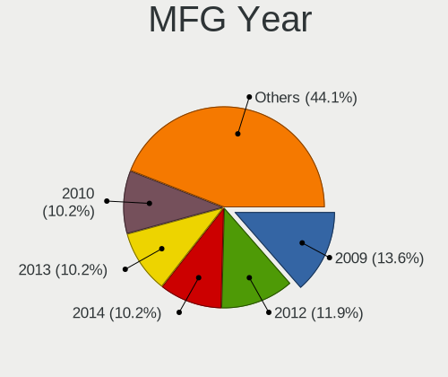
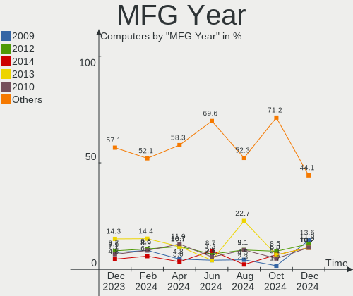
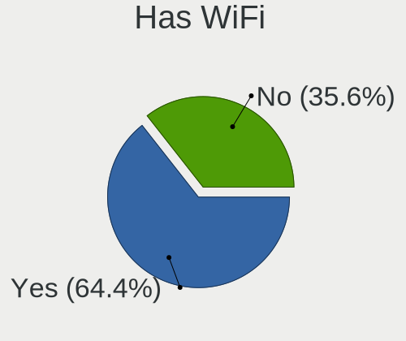
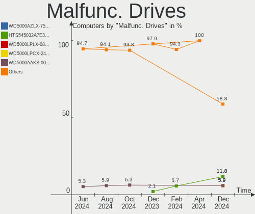
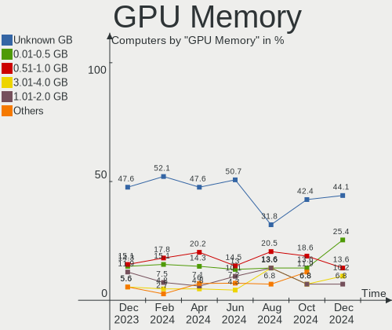
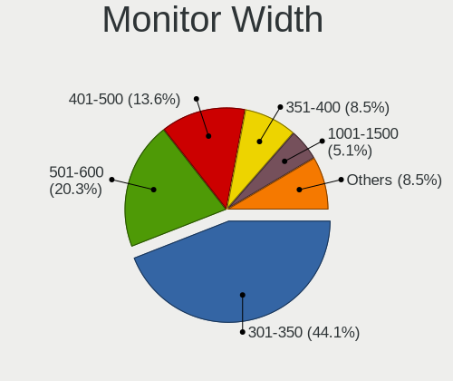
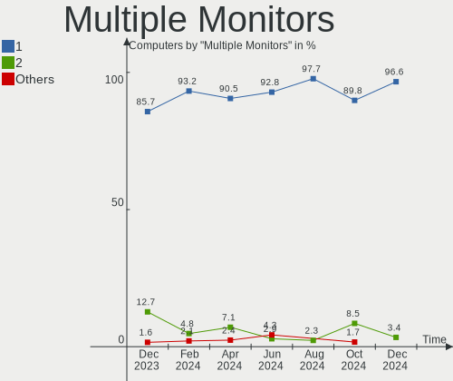
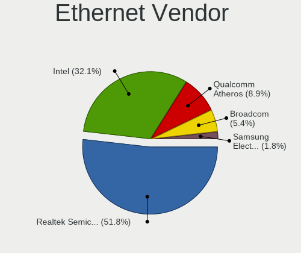
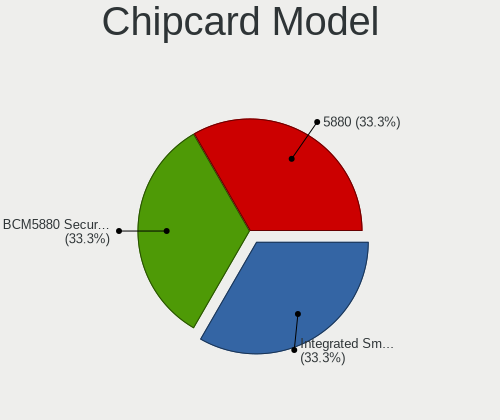
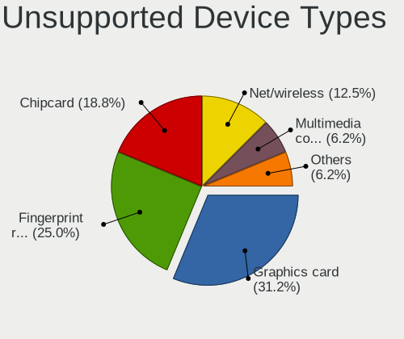

BlackPanther - Hardware Trends
------------------------------

A project to identify most popular hardware characteristics and track their change
over time based on data collected by Linux users at https://Linux-Hardware.org.

Anyone can contribute to this report by the [hw-probe](https://github.com/linuxhw/hw-probe) tool:

    sudo -E hw-probe -all -upload

This is a report for all computer types. See also reports for [desktops](/Dist/BlackPanther/Desktop/README.md) and [notebooks](/Dist/BlackPanther/Notebook/README.md).

This report is for one last month. Overall report since the beginning of time: [TestDays](https://github.com/linuxhw/TestDays)

Period: Dec, 2023.

Contents
--------

* [ System ](#system)
  - [ OS                       ](#os)
  - [ OS Family                ](#os-family)
  - [ Kernel                   ](#kernel)
  - [ Kernel Family            ](#kernel-family)
  - [ Kernel Major Ver.        ](#kernel-major-ver)
  - [ Arch                     ](#arch)
  - [ DE                       ](#de)
  - [ Display Server           ](#display-server)
  - [ Display Manager          ](#display-manager)
  - [ OS Lang                  ](#os-lang)
  - [ Boot Mode                ](#boot-mode)
  - [ Filesystem               ](#filesystem)
  - [ Part. scheme             ](#part-scheme)
  - [ Dual Boot with Linux/BSD ](#dual-boot-with-linuxbsd)
  - [ Dual Boot (Win)          ](#dual-boot-win)

* [ Board ](#board)
  - [ Vendor                   ](#vendor)
  - [ Model                    ](#model)
  - [ Model Family             ](#model-family)
  - [ MFG Year                 ](#mfg-year)
  - [ Form Factor              ](#form-factor)
  - [ Secure Boot              ](#secure-boot)
  - [ Coreboot                 ](#coreboot)
  - [ RAM Size                 ](#ram-size)
  - [ RAM Used                 ](#ram-used)
  - [ Total Drives             ](#total-drives)
  - [ Has CD-ROM               ](#has-cd-rom)
  - [ Has Ethernet             ](#has-ethernet)
  - [ Has WiFi                 ](#has-wifi)
  - [ Has Bluetooth            ](#has-bluetooth)

* [ Location ](#location)
  - [ Country                  ](#country)
  - [ City                     ](#city)

* [ Drives ](#drives)
  - [ Drive Vendor             ](#drive-vendor)
  - [ Drive Model              ](#drive-model)
  - [ HDD Vendor               ](#hdd-vendor)
  - [ SSD Vendor               ](#ssd-vendor)
  - [ Drive Kind               ](#drive-kind)
  - [ Drive Connector          ](#drive-connector)
  - [ Drive Size               ](#drive-size)
  - [ Space Total              ](#space-total)
  - [ Space Used               ](#space-used)
  - [ Malfunc. Drives          ](#malfunc-drives)
  - [ Malfunc. Drive Vendor    ](#malfunc-drive-vendor)
  - [ Malfunc. HDD Vendor      ](#malfunc-hdd-vendor)
  - [ Malfunc. Drive Kind      ](#malfunc-drive-kind)
  - [ Failed Drives            ](#failed-drives)
  - [ Failed Drive Vendor      ](#failed-drive-vendor)
  - [ Drive Status             ](#drive-status)

* [ Storage controller ](#storage-controller)
  - [ Storage Vendor           ](#storage-vendor)
  - [ Storage Model            ](#storage-model)
  - [ Storage Kind             ](#storage-kind)

* [ Processor ](#processor)
  - [ CPU Vendor               ](#cpu-vendor)
  - [ CPU Model                ](#cpu-model)
  - [ CPU Model Family         ](#cpu-model-family)
  - [ CPU Cores                ](#cpu-cores)
  - [ CPU Sockets              ](#cpu-sockets)
  - [ CPU Threads              ](#cpu-threads)
  - [ CPU Op-Modes             ](#cpu-op-modes)
  - [ CPU Microcode            ](#cpu-microcode)
  - [ CPU Microarch            ](#cpu-microarch)

* [ Graphics ](#graphics)
  - [ GPU Vendor               ](#gpu-vendor)
  - [ GPU Model                ](#gpu-model)
  - [ GPU Combo                ](#gpu-combo)
  - [ GPU Driver               ](#gpu-driver)
  - [ GPU Memory               ](#gpu-memory)

* [ Monitor ](#monitor)
  - [ Monitor Vendor           ](#monitor-vendor)
  - [ Monitor Model            ](#monitor-model)
  - [ Monitor Resolution       ](#monitor-resolution)
  - [ Monitor Diagonal         ](#monitor-diagonal)
  - [ Monitor Width            ](#monitor-width)
  - [ Aspect Ratio             ](#aspect-ratio)
  - [ Monitor Area             ](#monitor-area)
  - [ Pixel Density            ](#pixel-density)
  - [ Multiple Monitors        ](#multiple-monitors)

* [ Network ](#network)
  - [ Net Controller Vendor    ](#net-controller-vendor)
  - [ Net Controller Model     ](#net-controller-model)
  - [ Wireless Vendor          ](#wireless-vendor)
  - [ Wireless Model           ](#wireless-model)
  - [ Ethernet Vendor          ](#ethernet-vendor)
  - [ Ethernet Model           ](#ethernet-model)
  - [ Net Controller Kind      ](#net-controller-kind)
  - [ Used Controller          ](#used-controller)
  - [ NICs                     ](#nics)
  - [ IPv6                     ](#ipv6)

* [ Bluetooth ](#bluetooth)
  - [ Bluetooth Vendor         ](#bluetooth-vendor)
  - [ Bluetooth Model          ](#bluetooth-model)

* [ Sound ](#sound)
  - [ Sound Vendor             ](#sound-vendor)
  - [ Sound Model              ](#sound-model)

* [ Memory ](#memory)
  - [ Memory Vendor            ](#memory-vendor)
  - [ Memory Model             ](#memory-model)
  - [ Memory Kind              ](#memory-kind)
  - [ Memory Form Factor       ](#memory-form-factor)
  - [ Memory Size              ](#memory-size)
  - [ Memory Speed             ](#memory-speed)

* [ Printers & scanners ](#printers--scanners)
  - [ Printer Vendor           ](#printer-vendor)
  - [ Printer Model            ](#printer-model)
  - [ Scanner Vendor           ](#scanner-vendor)
  - [ Scanner Model            ](#scanner-model)

* [ Camera ](#camera)
  - [ Camera Vendor            ](#camera-vendor)
  - [ Camera Model             ](#camera-model)

* [ Security ](#security)
  - [ Fingerprint Vendor       ](#fingerprint-vendor)
  - [ Fingerprint Model        ](#fingerprint-model)
  - [ Chipcard Vendor          ](#chipcard-vendor)
  - [ Chipcard Model           ](#chipcard-model)

* [ Unsupported ](#unsupported)
  - [ Unsupported Devices      ](#unsupported-devices)
  - [ Unsupported Device Types ](#unsupported-device-types)

System
------

OS
--

Installed operating systems

| Name              | Computers | Percent |
|-------------------|-----------|---------|
| BlackPanther 18.1 | 122       | 96.83%  |
| BlackPanther 22.1 | 4         | 3.17%   |

OS Family
---------

OS without a version

| Name         | Computers | Percent |
|--------------|-----------|---------|
| BlackPanther | 126       | 100%    |

Kernel
------

Version of the Linux kernel

| Version               | Computers | Percent |
|-----------------------|-----------|---------|
| 5.15.85-desktop-1bP   | 57        | 45.24%  |
| 5.6.14-desktop-2bP    | 38        | 30.16%  |
| 4.18.16-desktop-1bP   | 19        | 15.08%  |
| 6.3.8-desktop-1bP     | 5         | 3.97%   |
| 6.7.0-rc4-tkg-eevdf   | 1         | 0.79%   |
| 6.6.4-200.fc39.x86_64 | 1         | 0.79%   |
| 6.5.7-power-1bP       | 1         | 0.79%   |
| 6.3.3-desktop-1bP     | 1         | 0.79%   |
| 6.2.9-desktop-1bP     | 1         | 0.79%   |
| 5.6.14-server-2bP     | 1         | 0.79%   |
| 5.1.15-desktop-1bP    | 1         | 0.79%   |

Kernel Family
-------------

Linux kernel without a distro release

| Version | Computers | Percent |
|---------|-----------|---------|
| 5.15.85 | 57        | 45.24%  |
| 5.6.14  | 39        | 30.95%  |
| 4.18.16 | 19        | 15.08%  |
| 6.3.8   | 5         | 3.97%   |
| 6.7.0   | 1         | 0.79%   |
| 6.6.4   | 1         | 0.79%   |
| 6.5.7   | 1         | 0.79%   |
| 6.3.3   | 1         | 0.79%   |
| 6.2.9   | 1         | 0.79%   |
| 5.1.15  | 1         | 0.79%   |

Kernel Major Ver.
-----------------

Linux kernel major version

| Version | Computers | Percent |
|---------|-----------|---------|
| 5.15    | 57        | 45.24%  |
| 5.6     | 39        | 30.95%  |
| 4.18    | 19        | 15.08%  |
| 6.3     | 6         | 4.76%   |
| 6.7     | 1         | 0.79%   |
| 6.6     | 1         | 0.79%   |
| 6.5     | 1         | 0.79%   |
| 6.2     | 1         | 0.79%   |
| 5.1     | 1         | 0.79%   |

Arch
----

OS architecture (x86_64, i586, etc.)

| Name   | Computers | Percent |
|--------|-----------|---------|
| x86_64 | 126       | 100%    |

DE
--

Desktop Environment

| Name    | Computers | Percent |
|---------|-----------|---------|
| KDE5    | 123       | 97.62%  |
| Unknown | 3         | 2.38%   |

Display Server
--------------

X11 or Wayland

| Name    | Computers | Percent |
|---------|-----------|---------|
| X11     | 124       | 98.41%  |
| Wayland | 1         | 0.79%   |
| Unknown | 1         | 0.79%   |

Display Manager
---------------

SDDM, LightDM, etc.

| Name    | Computers | Percent |
|---------|-----------|---------|
| SDDM    | 125       | 99.21%  |
| Unknown | 1         | 0.79%   |

OS Lang
-------

Language

| Lang    | Computers | Percent |
|---------|-----------|---------|
| Unknown | 126       | 100%    |

Boot Mode
---------

EFI or BIOS

| Mode | Computers | Percent |
|------|-----------|---------|
| EFI  | 64        | 50.79%  |
| BIOS | 62        | 49.21%  |

Filesystem
----------

Type of filesystem

| Type    | Computers | Percent |
|---------|-----------|---------|
| Ext4    | 82        | 65.08%  |
| Overlay | 41        | 32.54%  |
| Btrfs   | 2         | 1.59%   |
| Unknown | 1         | 0.79%   |

Part. scheme
------------

Scheme of partitioning

| Type    | Computers | Percent |
|---------|-----------|---------|
| GPT     | 75        | 59.52%  |
| MBR     | 50        | 39.68%  |
| Unknown | 1         | 0.79%   |

Dual Boot with Linux/BSD
------------------------

Hosting more than one Linux/BSD

| Dual boot | Computers | Percent |
|-----------|-----------|---------|
| No        | 92        | 73.02%  |
| Yes       | 34        | 26.98%  |

Dual Boot (Win)
---------------

Hosting Linux and Windows

| Dual boot | Computers | Percent |
|-----------|-----------|---------|
| No        | 72        | 57.14%  |
| Yes       | 54        | 42.86%  |

Board
-----

Vendor
------

Motherboard manufacturer

| Name                | Computers | Percent |
|---------------------|-----------|---------|
| Hewlett-Packard     | 22        | 17.46%  |
| Gigabyte Technology | 19        | 15.08%  |
| Lenovo              | 18        | 14.29%  |
| ASUSTek Computer    | 16        | 12.7%   |
| Dell                | 15        | 11.9%   |
| Acer                | 9         | 7.14%   |
| Fujitsu             | 6         | 4.76%   |
| MSI                 | 5         | 3.97%   |
| ASRock              | 4         | 3.17%   |
| Apple               | 4         | 3.17%   |
| eMachines           | 2         | 1.59%   |
| Sony                | 1         | 0.79%   |
| Samsung Electronics | 1         | 0.79%   |
| Medion              | 1         | 0.79%   |
| Intel               | 1         | 0.79%   |
| Fujitsu Siemens     | 1         | 0.79%   |
| AWOW                | 1         | 0.79%   |

Model
-----

Motherboard model

| Name                                | Computers | Percent |
|-------------------------------------|-----------|---------|
| Gigabyte Z390 UD                    | 3         | 2.38%   |
| Lenovo ThinkStation P520 30BFS44D04 | 2         | 1.59%   |
| Lenovo IdeaPad 110-15ACL 80TJ       | 2         | 1.59%   |
| HP ProBook 640 G8 Notebook PC       | 2         | 1.59%   |
| HP 250 G1                           | 2         | 1.59%   |
| Fujitsu ESPRIMO P920                | 2         | 1.59%   |
| ASUS K54HR                          | 2         | 1.59%   |
| Sony VPCS13V9E                      | 1         | 0.79%   |
| Samsung 300E4C/300E5C/300E7C        | 1         | 0.79%   |
| MSI MS-7C52                         | 1         | 0.79%   |
| MSI MS-7996                         | 1         | 0.79%   |
| MSI MS-7519                         | 1         | 0.79%   |
| MSI GT60 2OC/2OD                    | 1         | 0.79%   |
| MSI GP75 Leopard 9SE                | 1         | 0.79%   |
| Medion MS-7748                      | 1         | 0.79%   |
| Lenovo ThinkPad X250 20CLS1JN00     | 1         | 0.79%   |
| Lenovo ThinkPad X230 2333A91        | 1         | 0.79%   |
| Lenovo ThinkPad T540p 20BE003YUK    | 1         | 0.79%   |
| Lenovo ThinkPad T410 2537VFQ        | 1         | 0.79%   |
| Lenovo ThinkPad T410 2537AL8        | 1         | 0.79%   |
| Lenovo ThinkPad T400 2768WGB        | 1         | 0.79%   |
| Lenovo ThinkCentre M93p 10A7003AUK  | 1         | 0.79%   |
| Lenovo IdeaPad 700-15ISK 80RU       | 1         | 0.79%   |
| Lenovo IdeaPad 330-15IKB 81DE       | 1         | 0.79%   |
| Lenovo IdeaPad 320-17ABR 80YN       | 1         | 0.79%   |
| Lenovo IdeaPad 3-15ITL6 82H8        | 1         | 0.79%   |
| Lenovo G70-70 80HW                  | 1         | 0.79%   |
| Lenovo G505s 20255                  | 1         | 0.79%   |
| Lenovo Flex 2-15D 20377             | 1         | 0.79%   |
| Intel S5500HCV                      | 1         | 0.79%   |
| HP Z400 Workstation                 | 1         | 0.79%   |
| HP ProBook 650 G2                   | 1         | 0.79%   |
| HP ProBook 450 G1                   | 1         | 0.79%   |
| HP Pavilion Gaming Laptop 15-ec1xxx | 1         | 0.79%   |
| HP Pavilion dv7                     | 1         | 0.79%   |
| HP Pavilion dv6                     | 1         | 0.79%   |
| HP Pavilion dv5                     | 1         | 0.79%   |
| HP Notebook                         | 1         | 0.79%   |
| HP Laptop 15-dw1xxx                 | 1         | 0.79%   |
| HP EliteBook Folio 9480m            | 1         | 0.79%   |

Model Family
------------

Motherboard model prefix

| Name                | Computers | Percent |
|---------------------|-----------|---------|
| Dell Latitude       | 7         | 5.56%   |
| Lenovo ThinkPad     | 6         | 4.76%   |
| Lenovo IdeaPad      | 6         | 4.76%   |
| Dell Inspiron       | 6         | 4.76%   |
| Acer Aspire         | 6         | 4.76%   |
| HP Compaq           | 5         | 3.97%   |
| HP ProBook          | 4         | 3.17%   |
| HP Pavilion         | 4         | 3.17%   |
| HP EliteBook        | 4         | 3.17%   |
| Fujitsu ESPRIMO     | 4         | 3.17%   |
| Gigabyte Z390       | 3         | 2.38%   |
| Lenovo ThinkStation | 2         | 1.59%   |
| HP 250              | 2         | 1.59%   |
| Gigabyte X570       | 2         | 1.59%   |
| Dell OptiPlex       | 2         | 1.59%   |
| ASUS PRIME          | 2         | 1.59%   |
| ASUS K54HR          | 2         | 1.59%   |
| Sony VPCS13V9E      | 1         | 0.79%   |
| Samsung 300E4C      | 1         | 0.79%   |
| MSI MS-7C52         | 1         | 0.79%   |
| MSI MS-7996         | 1         | 0.79%   |
| MSI MS-7519         | 1         | 0.79%   |
| MSI GT60            | 1         | 0.79%   |
| MSI GP75            | 1         | 0.79%   |
| Medion MS-7748      | 1         | 0.79%   |
| Lenovo ThinkCentre  | 1         | 0.79%   |
| Lenovo G70-70       | 1         | 0.79%   |
| Lenovo G505s        | 1         | 0.79%   |
| Lenovo Flex         | 1         | 0.79%   |
| Intel S5500HCV      | 1         | 0.79%   |
| HP Z400             | 1         | 0.79%   |
| HP Notebook         | 1         | 0.79%   |
| HP Laptop           | 1         | 0.79%   |
| Gigabyte P67A-D3-B3 | 1         | 0.79%   |
| Gigabyte P35-DS3R   | 1         | 0.79%   |
| Gigabyte H97-D3H    | 1         | 0.79%   |
| Gigabyte H61MA-D3V  | 1         | 0.79%   |
| Gigabyte H61M-S2PV  | 1         | 0.79%   |
| Gigabyte H61M-S1    | 1         | 0.79%   |
| Gigabyte H310M      | 1         | 0.79%   |

MFG Year
--------

Motherboard manufacture year

| Year | Computers | Percent |
|------|-----------|---------|
| 2013 | 18        | 14.29%  |
| 2012 | 12        | 9.52%   |
| 2011 | 11        | 8.73%   |
| 2009 | 10        | 7.94%   |
| 2018 | 9         | 7.14%   |
| 2010 | 9         | 7.14%   |
| 2015 | 8         | 6.35%   |
| 2008 | 8         | 6.35%   |
| 2019 | 7         | 5.56%   |
| 2017 | 7         | 5.56%   |
| 2020 | 6         | 4.76%   |
| 2016 | 6         | 4.76%   |
| 2014 | 6         | 4.76%   |
| 2021 | 4         | 3.17%   |
| 2007 | 4         | 3.17%   |
| 2023 | 1         | 0.79%   |

Form Factor
-----------

Physical design of the computer

| Name       | Computers | Percent |
|------------|-----------|---------|
| Notebook   | 74        | 58.73%  |
| Desktop    | 50        | 39.68%  |
| All in one | 1         | 0.79%   |
| Server     | 1         | 0.79%   |

Secure Boot
-----------

Enabled or disabled

| State    | Computers | Percent |
|----------|-----------|---------|
| Disabled | 125       | 99.21%  |
| Enabled  | 1         | 0.79%   |

Coreboot
--------

Have coreboot on board

| Used | Computers | Percent |
|------|-----------|---------|
| No   | 126       | 100%    |

RAM Size
--------

Total RAM memory

| Size in GB | Computers | Percent |
|------------|-----------|---------|
| 3.01-4.0   | 34        | 26.98%  |
| 4.01-8.0   | 31        | 24.6%   |
| 8.01-16.0  | 31        | 24.6%   |
| 16.01-24.0 | 15        | 11.9%   |
| 32.01-64.0 | 7         | 5.56%   |
| 1.01-2.0   | 4         | 3.17%   |
| 2.01-3.0   | 2         | 1.59%   |
| 24.01-32.0 | 1         | 0.79%   |
| Unknown    | 1         | 0.79%   |

RAM Used
--------

Used RAM memory

| Used GB   | Computers | Percent |
|-----------|-----------|---------|
| 1.01-2.0  | 55        | 43.65%  |
| 0.51-1.0  | 42        | 33.33%  |
| 0.01-0.5  | 11        | 8.73%   |
| 2.01-3.0  | 7         | 5.56%   |
| 3.01-4.0  | 5         | 3.97%   |
| 4.01-8.0  | 4         | 3.17%   |
| 8.01-16.0 | 1         | 0.79%   |
| Unknown   | 1         | 0.79%   |

Total Drives
------------

Number of drives on board

| Drives | Computers | Percent |
|--------|-----------|---------|
| 1      | 75        | 59.52%  |
| 2      | 29        | 23.02%  |
| 3      | 14        | 11.11%  |
| 5      | 3         | 2.38%   |
| 4      | 3         | 2.38%   |
| 6      | 1         | 0.79%   |
| 0      | 1         | 0.79%   |

Has CD-ROM
----------

Has CD-ROM on board

| Presented | Computers | Percent |
|-----------|-----------|---------|
| Yes       | 73        | 57.94%  |
| No        | 53        | 42.06%  |

Has Ethernet
------------

Has Ethernet on board

| Presented | Computers | Percent |
|-----------|-----------|---------|
| Yes       | 123       | 97.62%  |
| No        | 3         | 2.38%   |

Has WiFi
--------

Has WiFi module

| Presented | Computers | Percent |
|-----------|-----------|---------|
| Yes       | 88        | 69.84%  |
| No        | 38        | 30.16%  |

Has Bluetooth
-------------

Has Bluetooth module

| Presented | Computers | Percent |
|-----------|-----------|---------|
| Yes       | 67        | 53.17%  |
| No        | 59        | 46.83%  |

Location
--------

Country
-------

Geographic location (country)

| Country  | Computers | Percent |
|----------|-----------|---------|
| Hungary  | 108       | 85.71%  |
| UK       | 4         | 3.17%   |
| Slovakia | 4         | 3.17%   |
| Germany  | 4         | 3.17%   |
| Austria  | 2         | 1.59%   |
| Romania  | 1         | 0.79%   |
| Greece   | 1         | 0.79%   |
| France   | 1         | 0.79%   |
| Canada   | 1         | 0.79%   |

City
----

Geographic location (city)

| City                    | Computers | Percent |
|-------------------------|-----------|---------|
| Budapest                | 23        | 18.25%  |
| Tatabánya              | 5         | 3.97%   |
| Pécs                   | 5         | 3.97%   |
| Csongrad                | 5         | 3.97%   |
| Zalaegerszeg            | 4         | 3.17%   |
| Pfaffenhofen an der Ilm | 4         | 3.17%   |
| Miskolc                 | 3         | 2.38%   |
| Győr                   | 3         | 2.38%   |
| Tiszaujvaros            | 2         | 1.59%   |
| Tamasi                  | 2         | 1.59%   |
| Székesfehérvár       | 2         | 1.59%   |
| Szeghalom               | 2         | 1.59%   |
| Nyiregyhaza             | 2         | 1.59%   |
| Kiskunhalas             | 2         | 1.59%   |
| Kazincbarcika           | 2         | 1.59%   |
| Fertoszentmiklos        | 2         | 1.59%   |
| Cegled                  | 2         | 1.59%   |
| Berettyóújfalu        | 2         | 1.59%   |
| Balassagyarmat          | 2         | 1.59%   |
| Vienna                  | 1         | 0.79%   |
| Veszprém               | 1         | 0.79%   |
| Tornaľa                | 1         | 0.79%   |
| Toeroekbalint           | 1         | 0.79%   |
| Tapioszolos             | 1         | 0.79%   |
| Szombathely             | 1         | 0.79%   |
| Szolnok                 | 1         | 0.79%   |
| Szigetszentmiklos       | 1         | 0.79%   |
| Szekszárd              | 1         | 0.79%   |
| Szeged                  | 1         | 0.79%   |
| Siófok                 | 1         | 0.79%   |
| Prešov                 | 1         | 0.79%   |
| Pecel                   | 1         | 0.79%   |
| Patak                   | 1         | 0.79%   |
| Oroshaza                | 1         | 0.79%   |
| Nancy                   | 1         | 0.79%   |
| Nagyvenyim              | 1         | 0.79%   |
| Nagykoroes              | 1         | 0.79%   |
| Nagykanizsa             | 1         | 0.79%   |
| Nadudvar                | 1         | 0.79%   |
| Miercurea-Ciuc          | 1         | 0.79%   |

Drives
------

Drive Vendor
------------

Hard drive vendors

| Vendor                    | Computers | Drives | Percent |
|---------------------------|-----------|--------|---------|
| Kingston                  | 32        | 34     | 15.84%  |
| Samsung Electronics       | 31        | 37     | 15.35%  |
| WDC                       | 27        | 32     | 13.37%  |
| Seagate                   | 17        | 18     | 8.42%   |
| Toshiba                   | 10        | 11     | 4.95%   |
| HGST                      | 8         | 10     | 3.96%   |
| SanDisk                   | 7         | 7      | 3.47%   |
| SPCC                      | 6         | 6      | 2.97%   |
| Intenso                   | 6         | 6      | 2.97%   |
| Unknown                   | 5         | 6      | 2.48%   |
| Intel                     | 5         | 5      | 2.48%   |
| Hitachi                   | 5         | 6      | 2.48%   |
| Gigabyte Technology       | 4         | 4      | 1.98%   |
| XPG                       | 3         | 4      | 1.49%   |
| SSSTC                     | 3         | 3      | 1.49%   |
| Patriot                   | 3         | 3      | 1.49%   |
| Fujitsu                   | 3         | 3      | 1.49%   |
| China                     | 3         | 3      | 1.49%   |
| Apacer                    | 3         | 3      | 1.49%   |
| A-DATA Technology         | 3         | 3      | 1.49%   |
| PNY                       | 2         | 2      | 0.99%   |
| Zheino                    | 1         | 1      | 0.5%    |
| TO Exter                  | 1         | 1      | 0.5%    |
| Timetec                   | 1         | 1      | 0.5%    |
| SK hynix                  | 1         | 1      | 0.5%    |
| OSC M.2                   | 1         | 1      | 0.5%    |
| Micron/Crucial Technology | 1         | 1      | 0.5%    |
| Micron Technology         | 1         | 1      | 0.5%    |
| LITEON                    | 1         | 1      | 0.5%    |
| KIOXIA                    | 1         | 1      | 0.5%    |
| Kingmax                   | 1         | 1      | 0.5%    |
| KingFast                  | 1         | 1      | 0.5%    |
| Crucial                   | 1         | 1      | 0.5%    |
| Corsair                   | 1         | 1      | 0.5%    |
| ASENNO                    | 1         | 1      | 0.5%    |
| Apple                     | 1         | 1      | 0.5%    |
| Unknown                   | 1         | 1      | 0.5%    |

Drive Model
-----------

Hard drive models

| Model                                | Computers | Percent |
|--------------------------------------|-----------|---------|
| Kingston SA400S37240G 240GB SSD      | 9         | 4.13%   |
| Kingston SA400S37120G 120GB SSD      | 6         | 2.75%   |
| Kingston SA400S37480G 480GB SSD      | 5         | 2.29%   |
| WDC WD5000AAKS-007AA0 500GB          | 3         | 1.38%   |
| Toshiba DT01ACA100 1TB               | 3         | 1.38%   |
| SSSTC CL1-8D256-HP 256GB             | 3         | 1.38%   |
| SPCC Solid State Disk 256GB          | 3         | 1.38%   |
| SanDisk SDSSDH3512G 512GB            | 3         | 1.38%   |
| Samsung SSD 870 EVO 250GB            | 3         | 1.38%   |
| Kingston SV300S37A120G 120GB SSD     | 3         | 1.38%   |
| Intenso Portable SSD 128GB           | 3         | 1.38%   |
| Gigabyte GP-GSTFS31120GNTD 120GB     | 3         | 1.38%   |
| XPG SPECTRIX S40G 1TB                | 2         | 0.92%   |
| WDC WD5000AAKS-00UU3A0 500GB         | 2         | 0.92%   |
| Samsung SSD 980 500GB                | 2         | 0.92%   |
| Samsung SSD 970 EVO Plus 2TB         | 2         | 0.92%   |
| Samsung SSD 970 EVO 500GB            | 2         | 0.92%   |
| Samsung SSD 750 EVO 250GB            | 2         | 0.92%   |
| Samsung MZNLF128HCHP-000H1 128GB SSD | 2         | 0.92%   |
| PNY CS900 240GB SSD                  | 2         | 0.92%   |
| Patriot Burst 120GB SSD              | 2         | 0.92%   |
| Kingston SUV400S37120G 120GB SSD     | 2         | 0.92%   |
| Kingston SKC600256G 256GB SSD        | 2         | 0.92%   |
| Intenso SSD 120GB                    | 2         | 0.92%   |
| Hitachi HTS545050A7E380 500GB        | 2         | 0.92%   |
| Hitachi HDS721050CLA662 500GB        | 2         | 0.92%   |
| HGST HMS5C4040BLE640 4TB             | 2         | 0.92%   |
| China SATA SSD 480GB                 | 2         | 0.92%   |
| Zheino CHN-NGFFNV2280-256 256GB      | 1         | 0.46%   |
| XPG GAMMIX S11 Pro 256GB             | 1         | 0.46%   |
| WDC WDS240G2G0B-00EPW0 240GB SSD     | 1         | 0.46%   |
| WDC WD5000LPVX-22V0TT0 500GB         | 1         | 0.46%   |
| WDC WD5000LPLX-75ZNTT0 500GB         | 1         | 0.46%   |
| WDC WD5000LPCX-24VHAT0 500GB         | 1         | 0.46%   |
| WDC WD5000LPCX-24C6HT0 500GB         | 1         | 0.46%   |
| WDC WD5000BEVT-22A0RT0 500GB         | 1         | 0.46%   |
| WDC WD5000BEKT-22KA9T0 500GB         | 1         | 0.46%   |
| WDC WD5000AZRX-00A8LB0 500GB         | 1         | 0.46%   |
| WDC WD40EFAX-68JH4N1 4TB             | 1         | 0.46%   |
| WDC WD3200BPVT-22JJ5T0 320GB         | 1         | 0.46%   |

HDD Vendor
----------

Hard disk drive vendors

| Vendor              | Computers | Drives | Percent |
|---------------------|-----------|--------|---------|
| WDC                 | 26        | 31     | 33.77%  |
| Seagate             | 17        | 18     | 22.08%  |
| Toshiba             | 9         | 10     | 11.69%  |
| HGST                | 8         | 10     | 10.39%  |
| Samsung Electronics | 7         | 7      | 9.09%   |
| Hitachi             | 5         | 6      | 6.49%   |
| Fujitsu             | 3         | 3      | 3.9%    |
| Unknown             | 1         | 1      | 1.3%    |
| TO Exter            | 1         | 1      | 1.3%    |

SSD Vendor
----------

Solid state drive vendors

| Vendor              | Computers | Drives | Percent |
|---------------------|-----------|--------|---------|
| Kingston            | 29        | 31     | 31.18%  |
| Samsung Electronics | 16        | 18     | 17.2%   |
| SanDisk             | 6         | 6      | 6.45%   |
| Intenso             | 6         | 6      | 6.45%   |
| SPCC                | 5         | 5      | 5.38%   |
| Intel               | 4         | 4      | 4.3%    |
| Patriot             | 3         | 3      | 3.23%   |
| Gigabyte Technology | 3         | 3      | 3.23%   |
| China               | 3         | 3      | 3.23%   |
| A-DATA Technology   | 3         | 3      | 3.23%   |
| PNY                 | 2         | 2      | 2.15%   |
| Apacer              | 2         | 2      | 2.15%   |
| WDC                 | 1         | 1      | 1.08%   |
| Toshiba             | 1         | 1      | 1.08%   |
| Timetec             | 1         | 1      | 1.08%   |
| SK hynix            | 1         | 1      | 1.08%   |
| Micron Technology   | 1         | 1      | 1.08%   |
| Kingmax             | 1         | 1      | 1.08%   |
| KingFast            | 1         | 1      | 1.08%   |
| Crucial             | 1         | 1      | 1.08%   |
| Corsair             | 1         | 1      | 1.08%   |
| ASENNO              | 1         | 1      | 1.08%   |
| Apple               | 1         | 1      | 1.08%   |

Drive Kind
----------

HDD or SSD

| Kind    | Computers | Drives | Percent |
|---------|-----------|--------|---------|
| SSD     | 80        | 97     | 45.71%  |
| HDD     | 65        | 87     | 37.14%  |
| NVMe    | 24        | 31     | 13.71%  |
| MMC     | 4         | 4      | 2.29%   |
| Unknown | 2         | 3      | 1.14%   |

Drive Connector
---------------

SATA, SAS, NVMe, etc.

| Type | Computers | Drives | Percent |
|------|-----------|--------|---------|
| SATA | 114       | 174    | 74.03%  |
| NVMe | 24        | 31     | 15.58%  |
| SAS  | 12        | 13     | 7.79%   |
| MMC  | 4         | 4      | 2.6%    |

Drive Size
----------

Size of hard drive

| Size in TB | Computers | Drives | Percent |
|------------|-----------|--------|---------|
| 0.01-0.5   | 98        | 131    | 69.01%  |
| 0.51-1.0   | 28        | 31     | 19.72%  |
| 1.01-2.0   | 7         | 10     | 4.93%   |
| 3.01-4.0   | 6         | 8      | 4.23%   |
| 2.01-3.0   | 3         | 4      | 2.11%   |

Space Total
-----------

Amount of disk space available on the file system

| Size in GB     | Computers | Percent |
|----------------|-----------|---------|
| 101-250        | 40        | 31.75%  |
| Unknown        | 40        | 31.75%  |
| 251-500        | 18        | 14.29%  |
| 51-100         | 8         | 6.35%   |
| 501-1000       | 6         | 4.76%   |
| More than 3000 | 5         | 3.97%   |
| 21-50          | 4         | 3.17%   |
| 1001-2000      | 3         | 2.38%   |
| 2001-3000      | 1         | 0.79%   |
| 1-20           | 1         | 0.79%   |

Space Used
----------

Amount of used disk space

| Used GB        | Computers | Percent |
|----------------|-----------|---------|
| Unknown        | 40        | 31.75%  |
| 1-20           | 31        | 24.6%   |
| 21-50          | 19        | 15.08%  |
| 101-250        | 15        | 11.9%   |
| 51-100         | 14        | 11.11%  |
| More than 3000 | 3         | 2.38%   |
| 1001-2000      | 2         | 1.59%   |
| 251-500        | 1         | 0.79%   |
| 501-1000       | 1         | 0.79%   |

Malfunc. Drives
---------------

Drive models with a malfunction

| Model                                            | Computers | Drives | Percent |
|--------------------------------------------------|-----------|--------|---------|
| WDC WD5000AAKS-007AA0 500GB                      | 3         | 3      | 6.25%   |
| Hitachi HTS545050A7E380 500GB                    | 2         | 2      | 4.17%   |
| WDC WD5000BEVT-22A0RT0 500GB                     | 1         | 1      | 2.08%   |
| WDC WD5000BEKT-22KA9T0 500GB                     | 1         | 1      | 2.08%   |
| WDC WD3200BEVT-08A23T1 320GB                     | 1         | 1      | 2.08%   |
| WDC WD3200AAKS-00L9A0 320GB                      | 1         | 1      | 2.08%   |
| WDC WD20PURX-64P6ZY0 2TB                         | 1         | 1      | 2.08%   |
| WDC WD20EARS-00MVWB0 2TB                         | 1         | 1      | 2.08%   |
| WDC WD10JPLX-00MBPT0 1TB                         | 1         | 1      | 2.08%   |
| WDC WD10EARS-00Y5B1 1TB                          | 1         | 1      | 2.08%   |
| Toshiba MQ01ABF050 500GB                         | 1         | 1      | 2.08%   |
| Toshiba MQ01ABB200 2TB                           | 1         | 1      | 2.08%   |
| Toshiba MK3259GSX 320GB                          | 1         | 1      | 2.08%   |
| Toshiba DT01ACA100 1TB                           | 1         | 1      | 2.08%   |
| Timetec SD08 512GB SSD                           | 1         | 1      | 2.08%   |
| Seagate ST9500420AS 500GB                        | 1         | 1      | 2.08%   |
| Seagate ST9500325AS 500GB                        | 1         | 1      | 2.08%   |
| Seagate ST9320320AS 320GB                        | 1         | 1      | 2.08%   |
| Seagate ST9160310AS 160GB                        | 1         | 1      | 2.08%   |
| Seagate ST9160301AS 160GB                        | 1         | 1      | 2.08%   |
| Seagate ST500LT012-1DG142 500GB                  | 1         | 1      | 2.08%   |
| Seagate ST500LM000-SSHD-8GB                      | 1         | 1      | 2.08%   |
| Seagate ST2000LM007-1R8174 2TB                   | 1         | 1      | 2.08%   |
| Seagate ST1000LM035-1RK172 1TB                   | 1         | 1      | 2.08%   |
| Samsung Electronics SSD 750 EVO 250GB            | 1         | 1      | 2.08%   |
| Samsung Electronics SP2504C 250GB                | 1         | 1      | 2.08%   |
| Samsung Electronics MZ7LN256HMJP-000H1 256GB SSD | 1         | 1      | 2.08%   |
| Samsung Electronics HD103UJ 1TB                  | 1         | 1      | 2.08%   |
| Samsung Electronics HD103SJ 1TB                  | 1         | 1      | 2.08%   |
| Kingston SUV400S37120G 120GB SSD                 | 1         | 1      | 2.08%   |
| Kingston SA400S37480G 480GB SSD                  | 1         | 1      | 2.08%   |
| Kingston SA400S37120G 120GB SSD                  | 1         | 1      | 2.08%   |
| Intel SSDSC2KF240H6L 240GB                       | 1         | 1      | 2.08%   |
| Intel SSDSC2BF180A4L 180GB                       | 1         | 1      | 2.08%   |
| Intel SSDSC2BF180A4H 180GB                       | 1         | 1      | 2.08%   |
| Intel SSDSA1M160G2HP 160GB                       | 1         | 1      | 2.08%   |
| Hitachi HTS545050B9A300 500GB                    | 1         | 1      | 2.08%   |
| Hitachi HTS542525K9A300 250GB                    | 1         | 1      | 2.08%   |
| Hitachi HDS721050CLA662 500GB                    | 1         | 1      | 2.08%   |
| HGST HTS545050A7E380 500GB                       | 1         | 1      | 2.08%   |

Malfunc. Drive Vendor
---------------------

Vendors of faulty drives

| Vendor              | Computers | Drives | Percent |
|---------------------|-----------|--------|---------|
| WDC                 | 10        | 11     | 21.74%  |
| Seagate             | 9         | 9      | 19.57%  |
| Samsung Electronics | 5         | 5      | 10.87%  |
| Hitachi             | 5         | 5      | 10.87%  |
| Intel               | 4         | 4      | 8.7%    |
| Toshiba             | 3         | 4      | 6.52%   |
| Kingston            | 3         | 3      | 6.52%   |
| HGST                | 3         | 3      | 6.52%   |
| Fujitsu             | 2         | 2      | 4.35%   |
| Timetec             | 1         | 1      | 2.17%   |
| Apple               | 1         | 1      | 2.17%   |

Malfunc. HDD Vendor
-------------------

Vendors of faulty HDD drives

| Vendor              | Computers | Drives | Percent |
|---------------------|-----------|--------|---------|
| WDC                 | 10        | 11     | 28.57%  |
| Seagate             | 9         | 9      | 25.71%  |
| Hitachi             | 5         | 5      | 14.29%  |
| Toshiba             | 3         | 4      | 8.57%   |
| Samsung Electronics | 3         | 3      | 8.57%   |
| HGST                | 3         | 3      | 8.57%   |
| Fujitsu             | 2         | 2      | 5.71%   |

Malfunc. Drive Kind
-------------------

Kinds of faulty drives

| Kind | Computers | Drives | Percent |
|------|-----------|--------|---------|
| HDD  | 31        | 37     | 73.81%  |
| SSD  | 11        | 11     | 26.19%  |

Failed Drives
-------------

Failed drive models

Zero info for selected period =(

Failed Drive Vendor
-------------------

Failed drive vendors

Zero info for selected period =(

Drive Status
------------

Number of failed and malfunc. drives

| Status   | Computers | Drives | Percent |
|----------|-----------|--------|---------|
| Works    | 103       | 159    | 64.78%  |
| Malfunc  | 42        | 48     | 26.42%  |
| Detected | 14        | 15     | 8.81%   |

Storage controller
------------------

Storage Vendor
--------------

Storage controller vendors

| Vendor                         | Computers | Percent |
|--------------------------------|-----------|---------|
| Intel                          | 98        | 63.23%  |
| AMD                            | 26        | 16.77%  |
| Samsung Electronics            | 9         | 5.81%   |
| Solid State Storage Technology | 3         | 1.94%   |
| Kingston Technology Company    | 3         | 1.94%   |
| Realtek Semiconductor          | 2         | 1.29%   |
| Phison Electronics             | 2         | 1.29%   |
| JMicron Technology             | 2         | 1.29%   |
| ASMedia Technology             | 2         | 1.29%   |
| Toshiba America Info Systems   | 1         | 0.65%   |
| Silicon Motion                 | 1         | 0.65%   |
| SanDisk                        | 1         | 0.65%   |
| Nvidia                         | 1         | 0.65%   |
| Micron/Crucial Technology      | 1         | 0.65%   |
| Marvell Technology Group       | 1         | 0.65%   |
| Lite-On Technology             | 1         | 0.65%   |
| ADATA Technology               | 1         | 0.65%   |

Storage Model
-------------

Storage controller models

| Model                                                                                   | Computers | Percent |
|-----------------------------------------------------------------------------------------|-----------|---------|
| AMD FCH SATA Controller [AHCI mode]                                                     | 15        | 8.24%   |
| Intel 8 Series/C220 Series Chipset Family 6-port SATA Controller 1 [AHCI mode]          | 8         | 4.4%    |
| Intel 82801IBM/IEM (ICH9M/ICH9M-E) 4 port SATA Controller [AHCI mode]                   | 7         | 3.85%   |
| Intel 82801 Mobile SATA Controller [RAID mode]                                          | 7         | 3.85%   |
| Intel 7 Series Chipset Family 6-port SATA Controller [AHCI mode]                        | 7         | 3.85%   |
| Samsung NVMe SSD Controller SM981/PM981/PM983                                           | 5         | 2.75%   |
| Intel 8 Series SATA Controller 1 [AHCI mode]                                            | 5         | 2.75%   |
| Intel 6 Series/C200 Series Chipset Family Desktop SATA Controller (IDE mode, ports 4-5) | 5         | 2.75%   |
| Intel 6 Series/C200 Series Chipset Family Desktop SATA Controller (IDE mode, ports 0-3) | 5         | 2.75%   |
| Intel 6 Series/C200 Series Chipset Family 6 port Mobile SATA AHCI Controller            | 5         | 2.75%   |
| Intel 200 Series PCH SATA controller [AHCI mode]                                        | 5         | 2.75%   |
| AMD SB7x0/SB8x0/SB9x0 SATA Controller [AHCI mode]                                       | 5         | 2.75%   |
| Intel Volume Management Device NVMe RAID Controller                                     | 4         | 2.2%    |
| Intel Sunrise Point-LP SATA Controller [AHCI mode]                                      | 4         | 2.2%    |
| Intel 5 Series/3400 Series Chipset 6 port SATA AHCI Controller                          | 4         | 2.2%    |
| AMD SB7x0/SB8x0/SB9x0 IDE Controller                                                    | 4         | 2.2%    |
| Solid State Storage CL1-3D256-Q11 NVMe SSD M.2                                          | 3         | 1.65%   |
| Samsung NVMe SSD Controller 980 (DRAM-less)                                             | 3         | 1.65%   |
| Intel Wildcat Point-LP SATA Controller [AHCI Mode]                                      | 3         | 1.65%   |
| Intel Q170/Q150/B150/H170/H110/Z170/CM236 Chipset SATA Controller [AHCI Mode]           | 3         | 1.65%   |
| Intel NM10/ICH7 Family SATA Controller [IDE mode]                                       | 3         | 1.65%   |
| Intel HM170/QM170 Chipset SATA Controller [AHCI Mode]                                   | 3         | 1.65%   |
| Intel Cannon Lake PCH SATA AHCI Controller                                              | 3         | 1.65%   |
| Intel 82801JI (ICH10 Family) SATA AHCI Controller                                       | 3         | 1.65%   |
| Realtek RTS5762 NVMe SSD Controller                                                     | 2         | 1.1%    |
| Intel Celeron N3350/Pentium N4200/Atom E3900 Series SATA AHCI Controller                | 2         | 1.1%    |
| Intel 82801HM/HEM (ICH8M/ICH8M-E) SATA Controller [AHCI mode]                           | 2         | 1.1%    |
| Intel 82801HM/HEM (ICH8M/ICH8M-E) IDE Controller                                        | 2         | 1.1%    |
| Intel 5 Series/3400 Series Chipset 4 port SATA AHCI Controller                          | 2         | 1.1%    |
| Intel 4 Series Chipset PT IDER Controller                                               | 2         | 1.1%    |
| ASMedia ASM1062 Serial ATA Controller                                                   | 2         | 1.1%    |
| AMD FCH SATA Controller [IDE mode]                                                      | 2         | 1.1%    |
| AMD FCH SATA Controller D                                                               | 2         | 1.1%    |
| AMD 500 Series Chipset SATA Controller                                                  | 2         | 1.1%    |
| Toshiba America Info Systems XG6 NVMe SSD Controller                                    | 1         | 0.55%   |
| Silicon Motion SM2263EN/SM2263XT (DRAM-less) NVMe SSD Controllers                       | 1         | 0.55%   |
| SanDisk WD Blue SN570 NVMe SSD 2TB                                                      | 1         | 0.55%   |
| Samsung NVMe SSD Controller PM9A1/PM9A3/980PRO                                          | 1         | 0.55%   |
| Phison PS5015-E15 PCIe3 NVMe Controller (DRAM-less)                                     | 1         | 0.55%   |
| Phison E16 PCIe4 NVMe Controller                                                        | 1         | 0.55%   |

Storage Kind
------------

Kind of storage controller (IDE, SATA, NVMe, SAS, ...)

| Kind | Computers | Percent |
|------|-----------|---------|
| SATA | 103       | 63.98%  |
| NVMe | 24        | 14.91%  |
| IDE  | 22        | 13.66%  |
| RAID | 12        | 7.45%   |

Processor
---------

CPU Vendor
----------

Processor vendors

| Vendor | Computers | Percent |
|--------|-----------|---------|
| Intel  | 100       | 79.37%  |
| AMD    | 26        | 20.63%  |

CPU Model
---------

Processor models

| Model                                       | Computers | Percent |
|---------------------------------------------|-----------|---------|
| Intel Core i5-9400 CPU @ 2.90GHz            | 3         | 2.38%   |
| Intel Core i5-7200U CPU @ 2.50GHz           | 3         | 2.38%   |
| Intel 11th Gen Core i3-1115G4 @ 3.00GHz     | 3         | 2.38%   |
| Intel Xeon W-2135 CPU @ 3.70GHz             | 2         | 1.59%   |
| Intel Core i7-4790 CPU @ 3.60GHz            | 2         | 1.59%   |
| Intel Core i7-4700MQ CPU @ 2.40GHz          | 2         | 1.59%   |
| Intel Core i7-4510U CPU @ 2.00GHz           | 2         | 1.59%   |
| Intel Core i5-2540M CPU @ 2.60GHz           | 2         | 1.59%   |
| Intel Core i5 CPU M 520 @ 2.40GHz           | 2         | 1.59%   |
| Intel Core i3-10110U CPU @ 2.10GHz          | 2         | 1.59%   |
| Intel Core 2 Quad CPU Q6600 @ 2.40GHz       | 2         | 1.59%   |
| Intel Core 2 Duo CPU P8600 @ 2.40GHz        | 2         | 1.59%   |
| Intel Core 2 Duo CPU E8400 @ 3.00GHz        | 2         | 1.59%   |
| Intel Celeron CPU N3350 @ 1.10GHz           | 2         | 1.59%   |
| Intel Celeron CPU 1000M @ 1.80GHz           | 2         | 1.59%   |
| AMD Ryzen 9 5950X 16-Core Processor         | 2         | 1.59%   |
| AMD Ryzen 5 3400G with Radeon Vega Graphics | 2         | 1.59%   |
| AMD E1-7010 APU with AMD Radeon R2 Graphics | 2         | 1.59%   |
| Intel Xeon CPU X5670 @ 2.93GHz              | 1         | 0.79%   |
| Intel Xeon CPU W3550 @ 3.07GHz              | 1         | 0.79%   |
| Intel Xeon CPU L5640 @ 2.27GHz              | 1         | 0.79%   |
| Intel Xeon CPU E5440 @ 2.83GHz              | 1         | 0.79%   |
| Intel Pentium Dual-Core CPU T4400 @ 2.20GHz | 1         | 0.79%   |
| Intel Pentium CPU G4560 @ 3.50GHz           | 1         | 0.79%   |
| Intel Pentium CPU G3220 @ 3.00GHz           | 1         | 0.79%   |
| Intel Pentium CPU B950 @ 2.10GHz            | 1         | 0.79%   |
| Intel Core i7-9750H CPU @ 2.60GHz           | 1         | 0.79%   |
| Intel Core i7-7700HQ CPU @ 2.80GHz          | 1         | 0.79%   |
| Intel Core i7-6820HQ CPU @ 2.70GHz          | 1         | 0.79%   |
| Intel Core i7-6600U CPU @ 2.60GHz           | 1         | 0.79%   |
| Intel Core i7-5500U CPU @ 2.40GHz           | 1         | 0.79%   |
| Intel Core i7-4810MQ CPU @ 2.80GHz          | 1         | 0.79%   |
| Intel Core i7-4600U CPU @ 2.10GHz           | 1         | 0.79%   |
| Intel Core i7-3630QM CPU @ 2.40GHz          | 1         | 0.79%   |
| Intel Core i7 CPU L 640 @ 2.13GHz           | 1         | 0.79%   |
| Intel Core i5-9400F CPU @ 2.90GHz           | 1         | 0.79%   |
| Intel Core i5-8250U CPU @ 1.60GHz           | 1         | 0.79%   |
| Intel Core i5-7500 CPU @ 3.40GHz            | 1         | 0.79%   |
| Intel Core i5-7300U CPU @ 2.60GHz           | 1         | 0.79%   |
| Intel Core i5-6500 CPU @ 3.20GHz            | 1         | 0.79%   |

CPU Model Family
----------------

Processor model prefix

| Model                   | Computers | Percent |
|-------------------------|-----------|---------|
| Intel Core i5           | 32        | 25.4%   |
| Intel Core i7           | 15        | 11.9%   |
| Intel Core i3           | 14        | 11.11%  |
| Intel Core 2 Duo        | 9         | 7.14%   |
| Intel Celeron           | 7         | 5.56%   |
| Intel Xeon              | 6         | 4.76%   |
| Other                   | 5         | 3.97%   |
| AMD A8                  | 5         | 3.97%   |
| AMD Ryzen 5             | 4         | 3.17%   |
| Intel Pentium           | 3         | 2.38%   |
| Intel Core 2 Quad       | 3         | 2.38%   |
| AMD Ryzen 7             | 3         | 2.38%   |
| Intel Celeron Dual-Core | 2         | 1.59%   |
| AMD Ryzen 9             | 2         | 1.59%   |
| AMD Ryzen 3             | 2         | 1.59%   |
| AMD E1                  | 2         | 1.59%   |
| Intel Pentium Dual-Core | 1         | 0.79%   |
| Intel Core 2 Extreme    | 1         | 0.79%   |
| Intel Core 2            | 1         | 0.79%   |
| Intel Atom              | 1         | 0.79%   |
| AMD Phenom II X4        | 1         | 0.79%   |
| AMD FX                  | 1         | 0.79%   |
| AMD E2                  | 1         | 0.79%   |
| AMD E                   | 1         | 0.79%   |
| AMD Athlon X2           | 1         | 0.79%   |
| AMD Athlon II X2        | 1         | 0.79%   |
| AMD Athlon II Dual-Core | 1         | 0.79%   |
| AMD A12                 | 1         | 0.79%   |

CPU Cores
---------

Number of processor cores

| Number | Computers | Percent |
|--------|-----------|---------|
| 2      | 73        | 57.94%  |
| 4      | 33        | 26.19%  |
| 6      | 11        | 8.73%   |
| 8      | 3         | 2.38%   |
| 16     | 2         | 1.59%   |
| 1      | 2         | 1.59%   |
| 12     | 1         | 0.79%   |
| 3      | 1         | 0.79%   |

CPU Sockets
-----------

Number of sockets

| Number | Computers | Percent |
|--------|-----------|---------|
| 1      | 125       | 99.21%  |
| 2      | 1         | 0.79%   |

CPU Threads
-----------

Threads per core (Hyper-Threading)

| Number | Computers | Percent |
|--------|-----------|---------|
| 2      | 72        | 57.14%  |
| 1      | 54        | 42.86%  |

CPU Op-Modes
------------

CPU Operation Modes (32-bit, 64-bit)

| Op mode        | Computers | Percent |
|----------------|-----------|---------|
| 32-bit, 64-bit | 125       | 99.21%  |
| Unknown        | 1         | 0.79%   |

CPU Microcode
-------------

Microcode number

| Number     | Computers | Percent |
|------------|-----------|---------|
| Unknown    | 17        | 13.49%  |
| 0x306a9    | 10        | 7.94%   |
| 0x206a7    | 10        | 7.94%   |
| 0x1067a    | 10        | 7.94%   |
| 0x306c3    | 6         | 4.76%   |
| 0x806c1    | 4         | 3.17%   |
| 0x6fb      | 4         | 3.17%   |
| 0x40651    | 4         | 3.17%   |
| 0x20655    | 4         | 3.17%   |
| 0x906ea    | 3         | 2.38%   |
| 0x906e9    | 3         | 2.38%   |
| 0x506e3    | 3         | 2.38%   |
| 0x10676    | 3         | 2.38%   |
| 0x906eb    | 2         | 1.59%   |
| 0x806ec    | 2         | 1.59%   |
| 0x806e9    | 2         | 1.59%   |
| 0x506c9    | 2         | 1.59%   |
| 0x406e3    | 2         | 1.59%   |
| 0x206c2    | 2         | 1.59%   |
| 0x0a50000c | 2         | 1.59%   |
| 0x08108109 | 2         | 1.59%   |
| 0x07030105 | 2         | 1.59%   |
| 0x906ed    | 1         | 0.79%   |
| 0x90672    | 1         | 0.79%   |
| 0x806ea    | 1         | 0.79%   |
| 0x706a1    | 1         | 0.79%   |
| 0x6f2      | 1         | 0.79%   |
| 0x50654    | 1         | 0.79%   |
| 0x306d4    | 1         | 0.79%   |
| 0x20652    | 1         | 0.79%   |
| 0x106ca    | 1         | 0.79%   |
| 0x106a5    | 1         | 0.79%   |
| 0x0a20120e | 1         | 0.79%   |
| 0x0a20120a | 1         | 0.79%   |
| 0x0a201009 | 1         | 0.79%   |
| 0x08600109 | 1         | 0.79%   |
| 0x0810100b | 1         | 0.79%   |
| 0x0800820d | 1         | 0.79%   |
| 0x08001137 | 1         | 0.79%   |
| 0x06006118 | 1         | 0.79%   |

CPU Microarch
-------------

Microarchitecture

| Name             | Computers | Percent |
|------------------|-----------|---------|
| KabyLake         | 17        | 13.49%  |
| Haswell          | 15        | 11.9%   |
| Penryn           | 13        | 10.32%  |
| SandyBridge      | 11        | 8.73%   |
| IvyBridge        | 11        | 8.73%   |
| Westmere         | 8         | 6.35%   |
| Skylake          | 7         | 5.56%   |
| Zen 3            | 5         | 3.97%   |
| Core             | 5         | 3.97%   |
| TigerLake        | 4         | 3.17%   |
| Zen+             | 3         | 2.38%   |
| Puma             | 3         | 2.38%   |
| K10              | 3         | 2.38%   |
| Broadwell        | 3         | 2.38%   |
| Zen              | 2         | 1.59%   |
| Steamroller      | 2         | 1.59%   |
| Piledriver       | 2         | 1.59%   |
| Goldmont         | 2         | 1.59%   |
| Bobcat           | 2         | 1.59%   |
| Zen 2            | 1         | 0.79%   |
| Nehalem          | 1         | 0.79%   |
| K8 & K10 hybrid  | 1         | 0.79%   |
| K10 Llano        | 1         | 0.79%   |
| Goldmont plus    | 1         | 0.79%   |
| Excavator        | 1         | 0.79%   |
| Bonnell          | 1         | 0.79%   |
| Alderlake Hybrid | 1         | 0.79%   |

Graphics
--------

GPU Vendor
----------

Vendors of graphics cards

| Vendor | Computers | Percent |
|--------|-----------|---------|
| Intel  | 71        | 47.02%  |
| AMD    | 42        | 27.81%  |
| Nvidia | 38        | 25.17%  |

GPU Model
---------

Graphics card models

| Model                                                                         | Computers | Percent |
|-------------------------------------------------------------------------------|-----------|---------|
| Intel 3rd Gen Core processor Graphics Controller                              | 7         | 4.46%   |
| Intel 2nd Generation Core Processor Family Integrated Graphics Controller     | 7         | 4.46%   |
| Nvidia GK208B [GeForce GT 710]                                                | 5         | 3.18%   |
| Intel Xeon E3-1200 v3/4th Gen Core Processor Integrated Graphics Controller   | 5         | 3.18%   |
| Intel Haswell-ULT Integrated Graphics Controller                              | 5         | 3.18%   |
| Intel Mobile 4 Series Chipset Integrated Graphics Controller                  | 4         | 2.55%   |
| Intel HD Graphics 620                                                         | 4         | 2.55%   |
| Intel Core Processor Integrated Graphics Controller                           | 4         | 2.55%   |
| Intel CoffeeLake-S GT2 [UHD Graphics 630]                                     | 4         | 2.55%   |
| Intel 4th Gen Core Processor Integrated Graphics Controller                   | 4         | 2.55%   |
| Intel Tiger Lake-LP GT2 [UHD Graphics G4]                                     | 3         | 1.91%   |
| Intel HD Graphics 5500                                                        | 3         | 1.91%   |
| AMD Seymour [Radeon HD 6400M/7400M Series]                                    | 3         | 1.91%   |
| AMD Oland PRO [Radeon R7 240/340 / Radeon 520]                                | 3         | 1.91%   |
| AMD Navi 21 [Radeon RX 6800/6800 XT / 6900 XT]                                | 3         | 1.91%   |
| Nvidia GK107 [GeForce GTX 650]                                                | 2         | 1.27%   |
| Nvidia GF108 [GeForce GT 630]                                                 | 2         | 1.27%   |
| Intel Skylake GT2 [HD Graphics 520]                                           | 2         | 1.27%   |
| Intel HD Graphics 530                                                         | 2         | 1.27%   |
| Intel HD Graphics 500                                                         | 2         | 1.27%   |
| Intel CometLake-U GT2 [UHD Graphics]                                          | 2         | 1.27%   |
| Intel 4 Series Chipset Integrated Graphics Controller                         | 2         | 1.27%   |
| AMD Sun XT [Radeon HD 8670A/8670M/8690M / R5 M330 / M430 / Radeon 520 Mobile] | 2         | 1.27%   |
| AMD RV620/M82 [Mobility Radeon HD 3450/3470]                                  | 2         | 1.27%   |
| AMD Mullins [Radeon R2 Graphics]                                              | 2         | 1.27%   |
| AMD Cezanne [Radeon Vega Series / Radeon Vega Mobile Series]                  | 2         | 1.27%   |
| AMD Cedar [Radeon HD 5000/6000/7350/8350 Series]                              | 2         | 1.27%   |
| Nvidia TU117M [GeForce GTX 1650 Ti Mobile]                                    | 1         | 0.64%   |
| Nvidia TU116 [GeForce GTX 1660 SUPER]                                         | 1         | 0.64%   |
| Nvidia TU106M [GeForce RTX 2060 Mobile]                                       | 1         | 0.64%   |
| Nvidia GT218M [NVS 3100M]                                                     | 1         | 0.64%   |
| Nvidia GT218M [GeForce 310M]                                                  | 1         | 0.64%   |
| Nvidia GT218 [GeForce 210]                                                    | 1         | 0.64%   |
| Nvidia GT216M [GeForce GT 240M]                                               | 1         | 0.64%   |
| Nvidia GP108M [GeForce MX150]                                                 | 1         | 0.64%   |
| Nvidia GP108 [GeForce GT 1030]                                                | 1         | 0.64%   |
| Nvidia GP107M [GeForce GTX 1050 Ti Mobile]                                    | 1         | 0.64%   |
| Nvidia GP107 [GeForce GTX 1050 Ti]                                            | 1         | 0.64%   |
| Nvidia GP106 [GeForce GTX 1060 3GB]                                           | 1         | 0.64%   |
| Nvidia GP104 [GeForce GTX 1080]                                               | 1         | 0.64%   |

GPU Combo
---------

Combinations of graphics cards

| Name           | Computers | Percent |
|----------------|-----------|---------|
| 1 x Intel      | 49        | 38.89%  |
| 1 x AMD        | 27        | 21.43%  |
| 1 x Nvidia     | 21        | 16.67%  |
| Intel + Nvidia | 14        | 11.11%  |
| Intel + AMD    | 7         | 5.56%   |
| 2 x AMD        | 5         | 3.97%   |
| AMD + Nvidia   | 3         | 2.38%   |

GPU Driver
----------

Free vs proprietary

| Driver  | Computers | Percent |
|---------|-----------|---------|
| Free    | 123       | 97.62%  |
| Unknown | 3         | 2.38%   |

GPU Memory
----------

Total video memory

| Size in GB | Computers | Percent |
|------------|-----------|---------|
| Unknown    | 60        | 47.62%  |
| 0.51-1.0   | 19        | 15.08%  |
| 0.01-0.5   | 18        | 14.29%  |
| 1.01-2.0   | 15        | 11.9%   |
| 3.01-4.0   | 7         | 5.56%   |
| 8.01-16.0  | 3         | 2.38%   |
| 2.01-3.0   | 2         | 1.59%   |
| 7.01-8.0   | 1         | 0.79%   |
| 5.01-6.0   | 1         | 0.79%   |

Monitor
-------

Monitor Vendor
--------------

Monitor vendors

| Vendor                  | Computers | Percent |
|-------------------------|-----------|---------|
| LG Display              | 21        | 16.03%  |
| Samsung Electronics     | 20        | 15.27%  |
| AU Optronics            | 15        | 11.45%  |
| Chimei Innolux          | 10        | 7.63%   |
| Goldstar                | 9         | 6.87%   |
| Ancor Communications    | 7         | 5.34%   |
| Lenovo                  | 5         | 3.82%   |
| Dell                    | 4         | 3.05%   |
| BOE                     | 4         | 3.05%   |
| Apple                   | 4         | 3.05%   |
| AOC                     | 4         | 3.05%   |
| PANDA                   | 3         | 2.29%   |
| Chi Mei Optoelectronics | 3         | 2.29%   |
| BenQ                    | 3         | 2.29%   |
| ViewSonic               | 2         | 1.53%   |
| Philips                 | 2         | 1.53%   |
| LG Electronics          | 2         | 1.53%   |
| Vestel Elektronik       | 1         | 0.76%   |
| Toshiba                 | 1         | 0.76%   |
| Sony                    | 1         | 0.76%   |
| MStar                   | 1         | 0.76%   |
| Mi                      | 1         | 0.76%   |
| Medion                  | 1         | 0.76%   |
| LG Philips              | 1         | 0.76%   |
| Iiyama                  | 1         | 0.76%   |
| Hitachi                 | 1         | 0.76%   |
| Hewlett-Packard         | 1         | 0.76%   |
| HannStar                | 1         | 0.76%   |
| Eizo                    | 1         | 0.76%   |
| CVT                     | 1         | 0.76%   |

Monitor Model
-------------

Monitor models

| Model                                                                    | Computers | Percent |
|--------------------------------------------------------------------------|-----------|---------|
| Samsung Electronics LS27AG30x SAM717A 1920x1080 597x336mm 27.0-inch      | 3         | 2.24%   |
| Lenovo LCD Monitor LEN4036 1440x900 303x190mm 14.1-inch                  | 3         | 2.24%   |
| ViewSonic VG2236 SERIES VSCE726 1920x1080 477x268mm 21.5-inch            | 2         | 1.49%   |
| Samsung Electronics S24D330 SAM0D92 1920x1080 531x299mm 24.0-inch        | 2         | 1.49%   |
| Samsung Electronics S22D300 SAM0B3B 1920x1080 477x268mm 21.5-inch        | 2         | 1.49%   |
| Samsung Electronics LCD Monitor SAM0900 1366x768 700x390mm 31.5-inch     | 2         | 1.49%   |
| PANDA LCD Monitor NCP0065 1920x1080 309x174mm 14.0-inch                  | 2         | 1.49%   |
| LG Display LCD Monitor LGD04FC 1366x768 344x194mm 15.5-inch              | 2         | 1.49%   |
| LG Display LCD Monitor LGD0395 1366x768 344x194mm 15.5-inch              | 2         | 1.49%   |
| LG Display LCD Monitor LGD0259 1920x1080 345x194mm 15.6-inch             | 2         | 1.49%   |
| Chi Mei Optoelectronics LCD Monitor CMO15A7 1366x768 344x193mm 15.5-inch | 2         | 1.49%   |
| AU Optronics LCD Monitor AUO23EC 1366x768 344x193mm 15.5-inch            | 2         | 1.49%   |
| AU Optronics LCD Monitor AUO10EC 1366x768 344x193mm 15.5-inch            | 2         | 1.49%   |
| AOC Q32G1WG4 AOC3201 2560x1440 697x393mm 31.5-inch                       | 2         | 1.49%   |
| Ancor Communications VC279 ACI27C4 1920x1080 598x336mm 27.0-inch         | 2         | 1.49%   |
| Ancor Communications ASUS VH192 ACI19E4 1366x768 410x230mm 18.5-inch     | 2         | 1.49%   |
| Vestel Elektronik 55UHD_LCD_TV VES3700 3840x2160 1872x1053mm 84.6-inch   | 1         | 0.75%   |
| Toshiba LCD Monitor LCD58E1 1280x800 261x163mm 12.1-inch                 | 1         | 0.75%   |
| Sony NvidiaDefault SNY05FA 1366x768 290x170mm 13.2-inch                  | 1         | 0.75%   |
| Samsung Electronics SyncMaster SAM03EB 1680x1050 433x271mm 20.1-inch     | 1         | 0.75%   |
| Samsung Electronics SyncMaster SAM02DB 1680x1050 474x296mm 22.0-inch     | 1         | 0.75%   |
| Samsung Electronics SyncMaster SAM01B8 1280x1024 338x270mm 17.0-inch     | 1         | 0.75%   |
| Samsung Electronics SyncMaster SAM01B7 1280x1024 340x270mm 17.1-inch     | 1         | 0.75%   |
| Samsung Electronics SyncMaster SAM0191 1280x1024 338x270mm 17.0-inch     | 1         | 0.75%   |
| Samsung Electronics S27E500 SAM0D0D 1920x1080 598x336mm 27.0-inch        | 1         | 0.75%   |
| Samsung Electronics S24R35x SAM100E 1920x1080 527x296mm 23.8-inch        | 1         | 0.75%   |
| Samsung Electronics S24A31x SAM7114 1920x1080 527x296mm 23.8-inch        | 1         | 0.75%   |
| Samsung Electronics S22B370 SAM08BD 1920x1080 477x268mm 21.5-inch        | 1         | 0.75%   |
| Samsung Electronics LCD Monitor SEC384A 1366x768 344x194mm 15.5-inch     | 1         | 0.75%   |
| Samsung Electronics LCD Monitor SEC3051 1600x900 398x232mm 18.1-inch     | 1         | 0.75%   |
| Samsung Electronics LCD Monitor SDC4C48 1920x1080 344x194mm 15.5-inch    | 1         | 0.75%   |
| Philips PHL 272V8 PHLC21A 1920x1080 598x336mm 27.0-inch                  | 1         | 0.75%   |
| Philips 196V4 PHLC0AF 1366x768 410x230mm 18.5-inch                       | 1         | 0.75%   |
| PANDA LCD Monitor NCP0058 1920x1080 344x194mm 15.5-inch                  | 1         | 0.75%   |
| MStar TV MST0030 1920x1080 708x398mm 32.0-inch                           | 1         | 0.75%   |
| Mi 30 HFCW XMIA014 2560x1080 690x291mm 29.5-inch                         | 1         | 0.75%   |
| Medion MD20328 MED3941 1600x900 462x272mm 21.1-inch                      | 1         | 0.75%   |
| LG Philips LCD Monitor LPLA105 1440x900 367x230mm 17.1-inch              | 1         | 0.75%   |
| LG Electronics LCD Monitor MP59G 1920x1080                               | 1         | 0.75%   |
| LG Electronics LCD Monitor LG TV 1920x1080                               | 1         | 0.75%   |

Monitor Resolution
------------------

Monitor screen resolution

| Resolution         | Computers | Percent |
|--------------------|-----------|---------|
| 1920x1080 (FHD)    | 50        | 39.37%  |
| 1366x768 (WXGA)    | 35        | 27.56%  |
| 1440x900 (WXGA+)   | 9         | 7.09%   |
| 3840x2160 (4K)     | 6         | 4.72%   |
| 1600x900 (HD+)     | 6         | 4.72%   |
| 1280x1024 (SXGA)   | 6         | 4.72%   |
| 1280x800 (WXGA)    | 4         | 3.15%   |
| 2560x1080          | 3         | 2.36%   |
| 1680x1050 (WSXGA+) | 3         | 2.36%   |
| 2560x1440 (QHD)    | 2         | 1.57%   |
| 1920x1200 (WUXGA)  | 2         | 1.57%   |
| 1024x600           | 1         | 0.79%   |

Monitor Diagonal
----------------

Diagonal size in inches

| Inches  | Computers | Percent |
|---------|-----------|---------|
| 15      | 40        | 29.85%  |
| 17      | 12        | 8.96%   |
| 27      | 11        | 8.21%   |
| 21      | 11        | 8.21%   |
| 14      | 8         | 5.97%   |
| 23      | 7         | 5.22%   |
| 24      | 6         | 4.48%   |
| 18      | 6         | 4.48%   |
| 12      | 6         | 4.48%   |
| 13      | 5         | 3.73%   |
| 31      | 4         | 2.99%   |
| Unknown | 3         | 2.24%   |
| 84      | 2         | 1.49%   |
| 34      | 2         | 1.49%   |
| 26      | 2         | 1.49%   |
| 22      | 2         | 1.49%   |
| 20      | 2         | 1.49%   |
| 52      | 1         | 0.75%   |
| 29      | 1         | 0.75%   |
| 25      | 1         | 0.75%   |
| 19      | 1         | 0.75%   |
| 10      | 1         | 0.75%   |

Monitor Width
-------------

Physical width

| Width in mm | Computers | Percent |
|-------------|-----------|---------|
| 301-350     | 55        | 41.98%  |
| 501-600     | 26        | 19.85%  |
| 401-500     | 18        | 13.74%  |
| 201-300     | 10        | 7.63%   |
| 351-400     | 9         | 6.87%   |
| 601-700     | 5         | 3.82%   |
| Unknown     | 3         | 2.29%   |
| 701-800     | 2         | 1.53%   |
| 1501-2000   | 2         | 1.53%   |
| 1001-1500   | 1         | 0.76%   |

Aspect Ratio
------------

Proportional relationship between the width and the height

| Ratio   | Computers | Percent |
|---------|-----------|---------|
| 16/9    | 93        | 75%     |
| 16/10   | 19        | 15.32%  |
| 5/4     | 6         | 4.84%   |
| 21/9    | 3         | 2.42%   |
| Unknown | 3         | 2.42%   |

Monitor Area
------------

Area in inch²

| Area in inch² | Computers | Percent |
|----------------|-----------|---------|
| 101-110        | 39        | 29.1%   |
| 201-250        | 19        | 14.18%  |
| 301-350        | 13        | 9.7%    |
| 81-90          | 12        | 8.96%   |
| 141-150        | 10        | 7.46%   |
| 151-200        | 9         | 6.72%   |
| 61-70          | 6         | 4.48%   |
| 351-500        | 6         | 4.48%   |
| 121-130        | 5         | 3.73%   |
| 251-300        | 4         | 2.99%   |
| More than 1000 | 3         | 2.24%   |
| Unknown        | 3         | 2.24%   |
| 131-140        | 2         | 1.49%   |
| 71-80          | 1         | 0.75%   |
| 41-50          | 1         | 0.75%   |
| 91-100         | 1         | 0.75%   |

Pixel Density
-------------

Pixels per inch

| Density | Computers | Percent |
|---------|-----------|---------|
| 51-100  | 51        | 38.35%  |
| 101-120 | 44        | 33.08%  |
| 121-160 | 30        | 22.56%  |
| 1-50    | 3         | 2.26%   |
| Unknown | 3         | 2.26%   |
| 161-240 | 2         | 1.5%    |

Multiple Monitors
-----------------

Total monitors connected

| Total | Computers | Percent |
|-------|-----------|---------|
| 1     | 108       | 85.71%  |
| 2     | 16        | 12.7%   |
| 0     | 2         | 1.59%   |

Network
-------

Net Controller Vendor
---------------------

Controller vendors

| Vendor                   | Computers | Percent |
|--------------------------|-----------|---------|
| Realtek Semiconductor    | 67        | 35.64%  |
| Intel                    | 53        | 28.19%  |
| Qualcomm Atheros         | 28        | 14.89%  |
| Broadcom                 | 14        | 7.45%   |
| Ralink Technology        | 6         | 3.19%   |
| Ralink                   | 4         | 2.13%   |
| TP-Link                  | 3         | 1.6%    |
| Broadcom Limited         | 2         | 1.06%   |
| Samsung Electronics      | 1         | 0.53%   |
| Nvidia                   | 1         | 0.53%   |
| Microsoft                | 1         | 0.53%   |
| MediaTek                 | 1         | 0.53%   |
| Marvell Technology Group | 1         | 0.53%   |
| IMC Networks             | 1         | 0.53%   |
| Huawei Technologies      | 1         | 0.53%   |
| DisplayLink              | 1         | 0.53%   |
| D-Link System            | 1         | 0.53%   |
| ASUSTek Computer         | 1         | 0.53%   |
| Aquantia                 | 1         | 0.53%   |

Net Controller Model
--------------------

Controller models

| Model                                                                   | Computers | Percent |
|-------------------------------------------------------------------------|-----------|---------|
| Realtek RTL8111/8168/8411 PCI Express Gigabit Ethernet Controller       | 53        | 23.77%  |
| Realtek RTL810xE PCI Express Fast Ethernet controller                   | 10        | 4.48%   |
| Intel 82579LM Gigabit Network Connection (Lewisville)                   | 7         | 3.14%   |
| Ralink MT7601U Wireless Adapter                                         | 5         | 2.24%   |
| Qualcomm Atheros AR9285 Wireless Network Adapter (PCI-Express)          | 5         | 2.24%   |
| Intel Ethernet Connection I217-LM                                       | 5         | 2.24%   |
| Qualcomm Atheros QCA9377 802.11ac Wireless Network Adapter              | 4         | 1.79%   |
| Intel Wireless 7260                                                     | 4         | 1.79%   |
| Intel Wi-Fi 6 AX201                                                     | 4         | 1.79%   |
| Intel I211 Gigabit Network Connection                                   | 4         | 1.79%   |
| Intel Centrino Advanced-N 6200                                          | 4         | 1.79%   |
| Intel 82577LM Gigabit Network Connection                                | 4         | 1.79%   |
| Realtek RTL8821AE 802.11ac PCIe Wireless Network Adapter                | 3         | 1.35%   |
| Realtek RTL8723BE PCIe Wireless Network Adapter                         | 3         | 1.35%   |
| Qualcomm Atheros AR9485 Wireless Network Adapter                        | 3         | 1.35%   |
| Qualcomm Atheros AR8132 Fast Ethernet                                   | 3         | 1.35%   |
| Intel Ethernet Connection (2) I219-LM                                   | 3         | 1.35%   |
| Realtek RTL8822CE 802.11ac PCIe Wireless Network Adapter                | 2         | 0.9%    |
| Ralink RT3290 Wireless 802.11n 1T/1R PCIe                               | 2         | 0.9%    |
| Qualcomm Atheros QCA9565 / AR9565 Wireless Network Adapter              | 2         | 0.9%    |
| Qualcomm Atheros AR9462 Wireless Network Adapter                        | 2         | 0.9%    |
| Qualcomm Atheros AR9287 Wireless Network Adapter (PCI-Express)          | 2         | 0.9%    |
| Qualcomm Atheros AR8151 v2.0 Gigabit Ethernet                           | 2         | 0.9%    |
| Qualcomm Atheros AR8131 Gigabit Ethernet                                | 2         | 0.9%    |
| Qualcomm Atheros AR242x / AR542x Wireless Network Adapter (PCI-Express) | 2         | 0.9%    |
| Intel Wireless 8265 / 8275                                              | 2         | 0.9%    |
| Intel Wireless 7265                                                     | 2         | 0.9%    |
| Intel Wireless 3160                                                     | 2         | 0.9%    |
| Intel PRO/Wireless 5100 AGN [Shiloh] Network Connection                 | 2         | 0.9%    |
| Intel Ethernet Connection I217-V                                        | 2         | 0.9%    |
| Intel Ethernet Connection (13) I219-V                                   | 2         | 0.9%    |
| Intel Centrino Advanced-N 6205 [Taylor Peak]                            | 2         | 0.9%    |
| Intel 82567LM-3 Gigabit Network Connection                              | 2         | 0.9%    |
| Broadcom BCM43142 802.11b/g/n                                           | 2         | 0.9%    |
| TP-Link TL-WN821N Version 5 RTL8192EU                                   | 1         | 0.45%   |
| TP-Link TL-WN722N v2/v3 [Realtek RTL8188EUS]                            | 1         | 0.45%   |
| TP-Link 802.11ac WLAN Adapter                                           | 1         | 0.45%   |
| Samsung Galaxy series, misc. (tethering mode)                           | 1         | 0.45%   |
| Realtek RTL88x2bu [AC1200 Techkey]                                      | 1         | 0.45%   |
| Realtek RTL8188EE Wireless Network Adapter                              | 1         | 0.45%   |

Wireless Vendor
---------------

Wireless vendors

| Vendor                | Computers | Percent |
|-----------------------|-----------|---------|
| Intel                 | 33        | 35.48%  |
| Qualcomm Atheros      | 23        | 24.73%  |
| Realtek Semiconductor | 10        | 10.75%  |
| Broadcom              | 9         | 9.68%   |
| Ralink Technology     | 6         | 6.45%   |
| Ralink                | 4         | 4.3%    |
| TP-Link               | 3         | 3.23%   |
| Microsoft             | 1         | 1.08%   |
| MediaTek              | 1         | 1.08%   |
| IMC Networks          | 1         | 1.08%   |
| Broadcom Limited      | 1         | 1.08%   |
| ASUSTek Computer      | 1         | 1.08%   |

Wireless Model
--------------

Wireless models

| Model                                                                   | Computers | Percent |
|-------------------------------------------------------------------------|-----------|---------|
| Ralink MT7601U Wireless Adapter                                         | 5         | 5.38%   |
| Qualcomm Atheros AR9285 Wireless Network Adapter (PCI-Express)          | 5         | 5.38%   |
| Qualcomm Atheros QCA9377 802.11ac Wireless Network Adapter              | 4         | 4.3%    |
| Intel Wireless 7260                                                     | 4         | 4.3%    |
| Intel Wi-Fi 6 AX201                                                     | 4         | 4.3%    |
| Intel Centrino Advanced-N 6200                                          | 4         | 4.3%    |
| Realtek RTL8821AE 802.11ac PCIe Wireless Network Adapter                | 3         | 3.23%   |
| Realtek RTL8723BE PCIe Wireless Network Adapter                         | 3         | 3.23%   |
| Qualcomm Atheros AR9485 Wireless Network Adapter                        | 3         | 3.23%   |
| Realtek RTL8822CE 802.11ac PCIe Wireless Network Adapter                | 2         | 2.15%   |
| Ralink RT3290 Wireless 802.11n 1T/1R PCIe                               | 2         | 2.15%   |
| Qualcomm Atheros QCA9565 / AR9565 Wireless Network Adapter              | 2         | 2.15%   |
| Qualcomm Atheros AR9462 Wireless Network Adapter                        | 2         | 2.15%   |
| Qualcomm Atheros AR9287 Wireless Network Adapter (PCI-Express)          | 2         | 2.15%   |
| Qualcomm Atheros AR242x / AR542x Wireless Network Adapter (PCI-Express) | 2         | 2.15%   |
| Intel Wireless 8265 / 8275                                              | 2         | 2.15%   |
| Intel Wireless 7265                                                     | 2         | 2.15%   |
| Intel Wireless 3160                                                     | 2         | 2.15%   |
| Intel PRO/Wireless 5100 AGN [Shiloh] Network Connection                 | 2         | 2.15%   |
| Intel Centrino Advanced-N 6205 [Taylor Peak]                            | 2         | 2.15%   |
| Broadcom BCM43142 802.11b/g/n                                           | 2         | 2.15%   |
| TP-Link TL-WN821N Version 5 RTL8192EU                                   | 1         | 1.08%   |
| TP-Link TL-WN722N v2/v3 [Realtek RTL8188EUS]                            | 1         | 1.08%   |
| TP-Link 802.11ac WLAN Adapter                                           | 1         | 1.08%   |
| Realtek RTL88x2bu [AC1200 Techkey]                                      | 1         | 1.08%   |
| Realtek RTL8188EE Wireless Network Adapter                              | 1         | 1.08%   |
| Ralink RT5372 Wireless Adapter                                          | 1         | 1.08%   |
| Ralink RT5390 Wireless 802.11n 1T/1R PCIe                               | 1         | 1.08%   |
| Ralink RT2561/RT61 802.11g PCI                                          | 1         | 1.08%   |
| Qualcomm Atheros QCA6174 802.11ac Wireless Network Adapter              | 1         | 1.08%   |
| Qualcomm Atheros AR922X Wireless Network Adapter                        | 1         | 1.08%   |
| Qualcomm Atheros AR2427 802.11bg Wireless Network Adapter (PCI-Express) | 1         | 1.08%   |
| Microsoft Xbox Wireless Adapter for Windows                             | 1         | 1.08%   |
| MediaTek MT7630e 802.11bgn Wireless Network Adapter                     | 1         | 1.08%   |
| Intel Wireless 8260                                                     | 1         | 1.08%   |
| Intel Wireless 3165                                                     | 1         | 1.08%   |
| Intel WiFi Link 5100                                                    | 1         | 1.08%   |
| Intel Wi-Fi 6 AX210/AX211/AX411 160MHz                                  | 1         | 1.08%   |
| Intel Gemini Lake PCH CNVi WiFi                                         | 1         | 1.08%   |
| Intel Dual Band Wireless-AC 3168NGW [Stone Peak]                        | 1         | 1.08%   |

Ethernet Vendor
---------------

Ethernet vendors

| Vendor                   | Computers | Percent |
|--------------------------|-----------|---------|
| Realtek Semiconductor    | 66        | 50.77%  |
| Intel                    | 37        | 28.46%  |
| Qualcomm Atheros         | 12        | 9.23%   |
| Broadcom                 | 7         | 5.38%   |
| Samsung Electronics      | 1         | 0.77%   |
| Nvidia                   | 1         | 0.77%   |
| Marvell Technology Group | 1         | 0.77%   |
| Huawei Technologies      | 1         | 0.77%   |
| DisplayLink              | 1         | 0.77%   |
| D-Link System            | 1         | 0.77%   |
| Broadcom Limited         | 1         | 0.77%   |
| Aquantia                 | 1         | 0.77%   |

Ethernet Model
--------------

Ethernet models

| Model                                                             | Computers | Percent |
|-------------------------------------------------------------------|-----------|---------|
| Realtek RTL8111/8168/8411 PCI Express Gigabit Ethernet Controller | 53        | 40.77%  |
| Realtek RTL810xE PCI Express Fast Ethernet controller             | 10        | 7.69%   |
| Intel 82579LM Gigabit Network Connection (Lewisville)             | 7         | 5.38%   |
| Intel Ethernet Connection I217-LM                                 | 5         | 3.85%   |
| Intel I211 Gigabit Network Connection                             | 4         | 3.08%   |
| Intel 82577LM Gigabit Network Connection                          | 4         | 3.08%   |
| Qualcomm Atheros AR8132 Fast Ethernet                             | 3         | 2.31%   |
| Intel Ethernet Connection (2) I219-LM                             | 3         | 2.31%   |
| Qualcomm Atheros AR8151 v2.0 Gigabit Ethernet                     | 2         | 1.54%   |
| Qualcomm Atheros AR8131 Gigabit Ethernet                          | 2         | 1.54%   |
| Intel Ethernet Connection I217-V                                  | 2         | 1.54%   |
| Intel Ethernet Connection (13) I219-V                             | 2         | 1.54%   |
| Intel 82567LM-3 Gigabit Network Connection                        | 2         | 1.54%   |
| Samsung Galaxy series, misc. (tethering mode)                     | 1         | 0.77%   |
| Realtek RTL8169 PCI Gigabit Ethernet Controller                   | 1         | 0.77%   |
| Realtek RTL8153 Gigabit Ethernet Adapter                          | 1         | 0.77%   |
| Realtek RTL8125 2.5GbE Controller                                 | 1         | 0.77%   |
| Qualcomm Atheros QCA8172 Fast Ethernet                            | 1         | 0.77%   |
| Qualcomm Atheros Killer E2400 Gigabit Ethernet Controller         | 1         | 0.77%   |
| Qualcomm Atheros Killer E220x Gigabit Ethernet Controller         | 1         | 0.77%   |
| Qualcomm Atheros AR8161 Gigabit Ethernet                          | 1         | 0.77%   |
| Qualcomm Atheros AR8121/AR8113/AR8114 Gigabit or Fast Ethernet    | 1         | 0.77%   |
| Nvidia MCP79 Ethernet                                             | 1         | 0.77%   |
| Marvell Group 88E8058 PCI-E Gigabit Ethernet Controller           | 1         | 0.77%   |
| Intel Ethernet Connection I218-LM                                 | 1         | 0.77%   |
| Intel Ethernet Connection (4) I219-LM                             | 1         | 0.77%   |
| Intel Ethernet Connection (3) I218-LM                             | 1         | 0.77%   |
| Intel Ethernet Connection (2) I219-V                              | 1         | 0.77%   |
| Intel 82575EB Gigabit Network Connection                          | 1         | 0.77%   |
| Intel 82567LM Gigabit Network Connection                          | 1         | 0.77%   |
| Intel 82567LF Gigabit Network Connection                          | 1         | 0.77%   |
| Intel 82566DM-2 Gigabit Network Connection                        | 1         | 0.77%   |
| Huawei MAR-LX1M                                                   | 1         | 0.77%   |
| DisplayLink USB Display                                           | 1         | 0.77%   |
| D-Link System DL10050 Sundance Ethernet                           | 1         | 0.77%   |
| Broadcom NetXtreme BCM57786 Gigabit Ethernet PCIe                 | 1         | 0.77%   |
| Broadcom NetXtreme BCM57765 Gigabit Ethernet PCIe                 | 1         | 0.77%   |
| Broadcom NetXtreme BCM5764M Gigabit Ethernet PCIe                 | 1         | 0.77%   |
| Broadcom NetXtreme BCM5761 Gigabit Ethernet PCIe                  | 1         | 0.77%   |
| Broadcom NetXtreme BCM5754 Gigabit Ethernet PCI Express           | 1         | 0.77%   |

Net Controller Kind
-------------------

Ethernet, WiFi or modem

| Kind     | Computers | Percent |
|----------|-----------|---------|
| Ethernet | 123       | 58.29%  |
| WiFi     | 88        | 41.71%  |

Used Controller
---------------

Currently used network controller

| Kind     | Computers | Percent |
|----------|-----------|---------|
| WiFi     | 69        | 54.33%  |
| Ethernet | 58        | 45.67%  |

NICs
----

Total network controllers on board

| Total | Computers | Percent |
|-------|-----------|---------|
| 2     | 76        | 60.32%  |
| 1     | 47        | 37.3%   |
| 3     | 2         | 1.59%   |
| 0     | 1         | 0.79%   |

IPv6
----

IPv6 vs IPv4

| Used | Computers | Percent |
|------|-----------|---------|
| No   | 78        | 61.9%   |
| Yes  | 48        | 38.1%   |

Bluetooth
---------

Bluetooth Vendor
----------------

Controller vendors

| Vendor                          | Computers | Percent |
|---------------------------------|-----------|---------|
| Intel                           | 22        | 32.84%  |
| Realtek Semiconductor           | 8         | 11.94%  |
| Qualcomm Atheros Communications | 7         | 10.45%  |
| Cambridge Silicon Radio         | 7         | 10.45%  |
| Broadcom                        | 5         | 7.46%   |
| Lite-On Technology              | 4         | 5.97%   |
| Apple                           | 4         | 5.97%   |
| Ralink                          | 2         | 2.99%   |
| Dell                            | 2         | 2.99%   |
| TP-Link                         | 1         | 1.49%   |
| MediaTek                        | 1         | 1.49%   |
| Hewlett-Packard                 | 1         | 1.49%   |
| Foxconn International           | 1         | 1.49%   |
| Foxconn / Hon Hai               | 1         | 1.49%   |
| Belkin Components               | 1         | 1.49%   |

Bluetooth Model
---------------

Controller models

| Model                                               | Computers | Percent |
|-----------------------------------------------------|-----------|---------|
| Intel Bluetooth wireless interface                  | 11        | 16.42%  |
| Cambridge Silicon Radio Bluetooth Dongle (HCI mode) | 7         | 10.45%  |
| Realtek Bluetooth Radio                             | 4         | 5.97%   |
| Intel Bluetooth Device                              | 4         | 5.97%   |
| Realtek RTL8821A Bluetooth                          | 3         | 4.48%   |
| Qualcomm Atheros  Bluetooth Device                  | 3         | 4.48%   |
| Qualcomm Atheros AR3012 Bluetooth 4.0               | 3         | 4.48%   |
| Intel Bluetooth 9460/9560 Jefferson Peak (JfP)      | 3         | 4.48%   |
| Ralink RT3290 Bluetooth                             | 2         | 2.99%   |
| Lite-On Qualcomm Atheros QCA9377 Bluetooth          | 2         | 2.99%   |
| Intel Centrino Bluetooth Wireless Transceiver       | 2         | 2.99%   |
| Dell DW375 Bluetooth Module                         | 2         | 2.99%   |
| Broadcom BCM2045B (BDC-2.1)                         | 2         | 2.99%   |
| Apple Bluetooth Host Controller                     | 2         | 2.99%   |
| TP-Link UB500 Adapter                               | 1         | 1.49%   |
| Realtek RTL8723B Bluetooth                          | 1         | 1.49%   |
| Qualcomm Atheros AR3011 Bluetooth                   | 1         | 1.49%   |
| MediaTek MT7630e Bluetooth Adapter                  | 1         | 1.49%   |
| Lite-On Bluetooth Device                            | 1         | 1.49%   |
| Lite-On Atheros AR3012 Bluetooth                    | 1         | 1.49%   |
| Intel Wireless-AC 3168 Bluetooth                    | 1         | 1.49%   |
| Intel AX210 Bluetooth                               | 1         | 1.49%   |
| HP Broadcom 2070 Bluetooth Combo                    | 1         | 1.49%   |
| Foxconn International BCM43142A0 Bluetooth module   | 1         | 1.49%   |
| Foxconn / Hon Hai Acer Bluetooth module             | 1         | 1.49%   |
| Broadcom HP Portable SoftSailing                    | 1         | 1.49%   |
| Broadcom BCM43142 Bluetooth 4.0                     | 1         | 1.49%   |
| Broadcom BCM20702 Bluetooth 4.0 [ThinkPad]          | 1         | 1.49%   |
| Belkin Components Bluetooth Mini Dongle             | 1         | 1.49%   |
| Apple Built-in Bluetooth 2.0+EDR HCI                | 1         | 1.49%   |
| Apple Bluetooth HCI                                 | 1         | 1.49%   |

Sound
-----

Sound Vendor
------------

Sound card vendors

| Vendor              | Computers | Percent |
|---------------------|-----------|---------|
| Intel               | 98        | 54.75%  |
| AMD                 | 42        | 23.46%  |
| Nvidia              | 29        | 16.2%   |
| Creative Labs       | 4         | 2.23%   |
| C-Media Electronics | 2         | 1.12%   |
| Texas Instruments   | 1         | 0.56%   |
| Hewlett-Packard     | 1         | 0.56%   |
| GN Netcom           | 1         | 0.56%   |
| Genesis Radium 600  | 1         | 0.56%   |

Sound Model
-----------

Sound card models

| Model                                                                                           | Computers | Percent |
|-------------------------------------------------------------------------------------------------|-----------|---------|
| Intel 6 Series/C200 Series Chipset Family High Definition Audio Controller                      | 12        | 5.58%   |
| Intel 7 Series/C216 Chipset Family High Definition Audio Controller                             | 10        | 4.65%   |
| Intel 82801I (ICH9 Family) HD Audio Controller                                                  | 9         | 4.19%   |
| Intel 8 Series/C220 Series Chipset High Definition Audio Controller                             | 9         | 4.19%   |
| Intel Xeon E3-1200 v3/4th Gen Core Processor HD Audio Controller                                | 8         | 3.72%   |
| AMD FCH Azalia Controller                                                                       | 8         | 3.72%   |
| Intel Sunrise Point-LP HD Audio                                                                 | 7         | 3.26%   |
| Nvidia GK208 HDMI/DP Audio Controller                                                           | 6         | 2.79%   |
| Intel 5 Series/3400 Series Chipset High Definition Audio                                        | 6         | 2.79%   |
| AMD SBx00 Azalia (Intel HDA)                                                                    | 6         | 2.79%   |
| AMD Family 17h/19h HD Audio Controller                                                          | 6         | 2.79%   |
| Intel Haswell-ULT HD Audio Controller                                                           | 5         | 2.33%   |
| Intel 8 Series HD Audio Controller                                                              | 5         | 2.33%   |
| Intel 200 Series PCH HD Audio                                                                   | 5         | 2.33%   |
| Intel 100 Series/C230 Series Chipset Family HD Audio Controller                                 | 5         | 2.33%   |
| AMD Oland/Hainan/Cape Verde/Pitcairn HDMI Audio [Radeon HD 7000 Series]                         | 5         | 2.33%   |
| Intel Tiger Lake-LP Smart Sound Technology Audio Controller                                     | 4         | 1.86%   |
| Intel Cannon Lake PCH cAVS                                                                      | 4         | 1.86%   |
| AMD Navi 21/23 HDMI/DP Audio Controller                                                         | 4         | 1.86%   |
| AMD Kabini HDMI/DP Audio                                                                        | 4         | 1.86%   |
| Nvidia High Definition Audio Controller                                                         | 3         | 1.4%    |
| Nvidia GM107 High Definition Audio Controller [GeForce 940MX]                                   | 3         | 1.4%    |
| Nvidia GK106 HDMI Audio Controller                                                              | 3         | 1.4%    |
| Intel Wildcat Point-LP High Definition Audio Controller                                         | 3         | 1.4%    |
| Intel NM10/ICH7 Family High Definition Audio Controller                                         | 3         | 1.4%    |
| Intel Broadwell-U Audio Controller                                                              | 3         | 1.4%    |
| Intel 82801JI (ICH10 Family) HD Audio Controller                                                | 3         | 1.4%    |
| Intel 82801H (ICH8 Family) HD Audio Controller                                                  | 3         | 1.4%    |
| Creative Labs CA0132 Sound Core3D [Sound Blaster Recon3D / Z-Series / Sound BlasterX AE-5 Plus] | 3         | 1.4%    |
| AMD Starship/Matisse HD Audio Controller                                                        | 3         | 1.4%    |
| AMD Redwood HDMI Audio [Radeon HD 5000 Series]                                                  | 3         | 1.4%    |
| Nvidia GP107GL High Definition Audio Controller                                                 | 2         | 0.93%   |
| Nvidia GK107 HDMI Audio Controller                                                              | 2         | 0.93%   |
| Nvidia GF108 High Definition Audio Controller                                                   | 2         | 0.93%   |
| Intel Comet Lake PCH-LP cAVS                                                                    | 2         | 0.93%   |
| Intel Celeron N3350/Pentium N4200/Atom E3900 Series Audio Cluster                               | 2         | 0.93%   |
| Intel 82801JD/DO (ICH10 Family) HD Audio Controller                                             | 2         | 0.93%   |
| AMD Wrestler HDMI Audio                                                                         | 2         | 0.93%   |
| AMD RV620 HDMI Audio [Radeon HD 3450/3470/3550/3570]                                            | 2         | 0.93%   |
| AMD Renoir Radeon High Definition Audio Controller                                              | 2         | 0.93%   |

Memory
------

Memory Vendor
-------------

Memory module vendors

| Vendor                | Computers | Percent |
|-----------------------|-----------|---------|
| SK hynix              | 29        | 18.83%  |
| Samsung Electronics   | 29        | 18.83%  |
| Kingston              | 24        | 15.58%  |
| Unknown               | 20        | 12.99%  |
| Micron Technology     | 10        | 6.49%   |
| Crucial               | 10        | 6.49%   |
| Kingmax               | 6         | 3.9%    |
| G.Skill               | 6         | 3.9%    |
| Ramaxel Technology    | 4         | 2.6%    |
| Corsair               | 3         | 1.95%   |
| A-DATA Technology     | 3         | 1.95%   |
| Nanya Technology      | 2         | 1.3%    |
| Elpida                | 2         | 1.3%    |
| Unknown (ABCD)        | 1         | 0.65%   |
| Team                  | 1         | 0.65%   |
| Patriot               | 1         | 0.65%   |
| Kingmax Semiconductor | 1         | 0.65%   |
| Hikvision             | 1         | 0.65%   |
| ASint Technology      | 1         | 0.65%   |

Memory Model
------------

Memory module models

| Model                                                            | Computers | Percent |
|------------------------------------------------------------------|-----------|---------|
| SK hynix RAM HMT41GS6BFR8A-PB 8GB SODIMM DDR3 1600MT/s           | 3         | 1.75%   |
| Samsung RAM M471B5173QH0-YK0 4GB SODIMM DDR3 1600MT/s            | 3         | 1.75%   |
| Samsung RAM M378B5273DH0-CH9 4096MB DIMM DDR2 2133MT/s           | 3         | 1.75%   |
| Kingston RAM M378A1K43BB2-CRC 4096MB DIMM DDR4 2400MT/s          | 3         | 1.75%   |
| G.Skill RAM F4-3000C16-8GISB 8192MB DIMM DDR4 3200MT/s           | 3         | 1.75%   |
| Crucial RAM BLS4G4D240FSB.8FBD2 4096MB DIMM DDR4 2400MT/s        | 3         | 1.75%   |
| Unknown RAM Module 4096MB SODIMM DDR3 1600MT/s                   | 2         | 1.17%   |
| Unknown RAM Module 4096MB DIMM DDR3 1333MT/s                     | 2         | 1.17%   |
| Unknown RAM Module 2048MB SODIMM DDR2 667MT/s                    | 2         | 1.17%   |
| Unknown RAM Module 2048MB SODIMM 800MT/s                         | 2         | 1.17%   |
| Unknown RAM Module 2048MB DIMM 800MT/s                           | 2         | 1.17%   |
| Unknown RAM Module 1024MB DIMM 667MT/s                           | 2         | 1.17%   |
| SK hynix RAM HMT451S6BFR8A-PB 4GB SODIMM DDR3 1600MT/s           | 2         | 1.17%   |
| SK hynix RAM HMT351S6EFR8A-PB 4GB SODIMM DDR3 1600MT/s           | 2         | 1.17%   |
| SK hynix RAM HMT351S6CFR8C-PB 4GB SODIMM DDR3 1600MT/s           | 2         | 1.17%   |
| SK hynix RAM HMA851S6AFR6N-UH 4096MB SODIMM DDR4 2667MT/s        | 2         | 1.17%   |
| Samsung RAM Module 8192MB SODIMM DDR4 3200MT/s                   | 2         | 1.17%   |
| Samsung RAM M471B5673FH0-CH9 2048MB SODIMM DDR3 1334MT/s         | 2         | 1.17%   |
| Samsung RAM M471B5173EB0-YK0 4GB SODIMM DDR3 1600MT/s            | 2         | 1.17%   |
| Samsung RAM M471A5244CB0-CRC 4096MB SODIMM DDR4 2667MT/s         | 2         | 1.17%   |
| Samsung RAM M378B5173DB0-CK0 4GB DIMM DDR3 1600MT/s              | 2         | 1.17%   |
| Kingston RAM KHX1600C9D3/4GX 4096MB DIMM DDR3 1600MT/s           | 2         | 1.17%   |
| A-DATA RAM AM1U16BC4P2-B19H 4096MB SODIMM DDR3 1600MT/s          | 2         | 1.17%   |
| Unknown RAM V02L3L84GB52852816 4096MB DIMM DDR3 1333MT/s         | 1         | 0.58%   |
| Unknown RAM Module 8192MB SODIMM DDR3 1600MT/s                   | 1         | 0.58%   |
| Unknown RAM Module 4096MB SODIMM DDR3                            | 1         | 0.58%   |
| Unknown RAM Module 4096MB DIMM DDR3 1600MT/s                     | 1         | 0.58%   |
| Unknown RAM Module 4096MB DIMM DDR2 52217MT/s                    | 1         | 0.58%   |
| Unknown RAM Module 4096MB DIMM 52217MT/s                         | 1         | 0.58%   |
| Unknown RAM Module 2048MB SODIMM DDR2 333MT/s                    | 1         | 0.58%   |
| Unknown RAM Module 2048MB DIMM SDRAM 1333MT/s                    | 1         | 0.58%   |
| Unknown RAM Module 2048MB DIMM 667MT/s                           | 1         | 0.58%   |
| Unknown RAM Module 2048MB DIMM 1333MT/s                          | 1         | 0.58%   |
| Unknown RAM DDR3 1600 8G 8192MB DIMM DDR3 1600MT/s               | 1         | 0.58%   |
| Unknown (ABCD) RAM 123456789012345678 2GB SODIMM LPDDR4 2400MT/s | 1         | 0.58%   |
| Team RAM TEAMGROUP-UD4-2666 8192MB DIMM DDR4 3000MT/s            | 1         | 0.58%   |
| SK hynix RAM Module 8GB DIMM DDR4 2933MT/s                       | 1         | 0.58%   |
| SK hynix RAM Module 8192MB DIMM DDR4 2933MT/s                    | 1         | 0.58%   |
| SK hynix RAM Module 2048MB SODIMM DDR3 1333MT/s                  | 1         | 0.58%   |
| SK hynix RAM HMT451S6AFR8C-PB 4096MB SODIMM DDR3 1600MT/s        | 1         | 0.58%   |

Memory Kind
-----------

Memory module kinds

| Kind    | Computers | Percent |
|---------|-----------|---------|
| DDR3    | 64        | 48.85%  |
| DDR4    | 40        | 30.53%  |
| DDR2    | 12        | 9.16%   |
| Unknown | 7         | 5.34%   |
| SDRAM   | 4         | 3.05%   |
| LPDDR4  | 3         | 2.29%   |
| DDR     | 1         | 0.76%   |

Memory Form Factor
------------------

Physical design of the memory module

| Name         | Computers | Percent |
|--------------|-----------|---------|
| SODIMM       | 75        | 59.52%  |
| DIMM         | 50        | 39.68%  |
| Row Of Chips | 1         | 0.79%   |

Memory Size
-----------

Memory module size

| Size  | Computers | Percent |
|-------|-----------|---------|
| 4096  | 55        | 38.46%  |
| 8192  | 39        | 27.27%  |
| 2048  | 32        | 22.38%  |
| 16384 | 8         | 5.59%   |
| 1024  | 6         | 4.2%    |
| 32768 | 3         | 2.1%    |

Memory Speed
------------

Memory module speed

| Speed   | Computers | Percent |
|---------|-----------|---------|
| 1600    | 44        | 30.34%  |
| 2400    | 17        | 11.72%  |
| 1333    | 16        | 11.03%  |
| 3200    | 11        | 7.59%   |
| 2667    | 8         | 5.52%   |
| 2133    | 8         | 5.52%   |
| 800     | 8         | 5.52%   |
| 667     | 8         | 5.52%   |
| 1334    | 4         | 2.76%   |
| 3600    | 3         | 2.07%   |
| 1067    | 3         | 2.07%   |
| 4199    | 2         | 1.38%   |
| 3666    | 2         | 1.38%   |
| 2933    | 2         | 1.38%   |
| 2666    | 2         | 1.38%   |
| 52217   | 1         | 0.69%   |
| 3334    | 1         | 0.69%   |
| 3000    | 1         | 0.69%   |
| 2000    | 1         | 0.69%   |
| 975     | 1         | 0.69%   |
| 333     | 1         | 0.69%   |
| Unknown | 1         | 0.69%   |

Printers & scanners
-------------------

Printer Vendor
--------------

Printer device vendors

| Vendor              | Computers | Percent |
|---------------------|-----------|---------|
| Samsung Electronics | 2         | 40%     |
| Hewlett-Packard     | 2         | 40%     |
| QinHeng Electronics | 1         | 20%     |

Printer Model
-------------

Printer device models

| Model                  | Computers | Percent |
|------------------------|-----------|---------|
| Samsung C48x Series    | 2         | 40%     |
| QinHeng CH340S         | 1         | 20%     |
| HP LaserJet M14-M17    | 1         | 20%     |
| HP DeskJet 2600 series | 1         | 20%     |

Scanner Vendor
--------------

Scanner device vendors

Zero info for selected period =(

Scanner Model
-------------

Scanner device models

Zero info for selected period =(

Camera
------

Camera Vendor
-------------

Camera device vendors

| Vendor                                 | Computers | Percent |
|----------------------------------------|-----------|---------|
| Chicony Electronics                    | 18        | 23.38%  |
| Suyin                                  | 8         | 10.39%  |
| Microdia                               | 8         | 10.39%  |
| Realtek Semiconductor                  | 6         | 7.79%   |
| Sunplus Innovation Technology          | 5         | 6.49%   |
| IMC Networks                           | 4         | 5.19%   |
| Apple                                  | 4         | 5.19%   |
| Syntek                                 | 3         | 3.9%    |
| Lenovo                                 | 3         | 3.9%    |
| Alcor Micro                            | 3         | 3.9%    |
| Acer                                   | 3         | 3.9%    |
| Quanta                                 | 2         | 2.6%    |
| Logitech                               | 2         | 2.6%    |
| KYE Systems (Mouse Systems)            | 2         | 2.6%    |
| Cheng Uei Precision Industry (Foxlink) | 2         | 2.6%    |
| Z-Star Microelectronics                | 1         | 1.3%    |
| Silicon Motion                         | 1         | 1.3%    |
| Ricoh                                  | 1         | 1.3%    |
| Luxvisions Innotech Limited            | 1         | 1.3%    |

Camera Model
------------

Camera device models

| Model                                               | Computers | Percent |
|-----------------------------------------------------|-----------|---------|
| Microdia Camera                                     | 3         | 3.9%    |
| Suyin Integrated_Webcam_HD                          | 2         | 2.6%    |
| Suyin Acer/HP Integrated Webcam [CN0314]            | 2         | 2.6%    |
| Realtek Lenovo EasyCamera                           | 2         | 2.6%    |
| Realtek Integrated Webcam HD                        | 2         | 2.6%    |
| Realtek HD WebCam                                   | 2         | 2.6%    |
| Quanta HP HD Camera                                 | 2         | 2.6%    |
| Lenovo Integrated Webcam [R5U877]                   | 2         | 2.6%    |
| IMC Networks EasyCamera                             | 2         | 2.6%    |
| Chicony Integrated Camera                           | 2         | 2.6%    |
| Chicony HP Truevision HD                            | 2         | 2.6%    |
| Chicony HP HD Webcam                                | 2         | 2.6%    |
| Chicony HD Webcam                                   | 2         | 2.6%    |
| Apple Built-in iSight                               | 2         | 2.6%    |
| Alcor Micro Asus Integrated Webcam                  | 2         | 2.6%    |
| Z-Star Saturn USB 2.0 Camera                        | 1         | 1.3%    |
| Syntek Lenovo EasyCamera                            | 1         | 1.3%    |
| Syntek Integrated Camera                            | 1         | 1.3%    |
| Syntek EasyCamera                                   | 1         | 1.3%    |
| Suyin HP webcam [dv6-1190en]                        | 1         | 1.3%    |
| Suyin HP Webcam                                     | 1         | 1.3%    |
| Suyin HD WebCam                                     | 1         | 1.3%    |
| Suyin HD Video WebCam                               | 1         | 1.3%    |
| Sunplus Laptop_Integrated_Webcam_HD                 | 1         | 1.3%    |
| Sunplus Integrated_Webcam_HD                        | 1         | 1.3%    |
| Sunplus Full HD webcam                              | 1         | 1.3%    |
| Sunplus ASUS USB2.0 Webcam                          | 1         | 1.3%    |
| Sunplus 1.3M HD WebCam                              | 1         | 1.3%    |
| Silicon Motion WebCam SC-13HDL11939N                | 1         | 1.3%    |
| Ricoh Sony Visual Communication Camera              | 1         | 1.3%    |
| Microdia USB Camera                                 | 1         | 1.3%    |
| Microdia Integrated_Webcam_HD                       | 1         | 1.3%    |
| Microdia Integrated Webcam                          | 1         | 1.3%    |
| Microdia Integrated HD Webcam                       | 1         | 1.3%    |
| Microdia Dell Integrated HD Webcam                  | 1         | 1.3%    |
| Luxvisions Innotech Limited HP TrueVision HD Camera | 1         | 1.3%    |
| Logitech QuickCam Communicate Deluxe/S7500          | 1         | 1.3%    |
| Logitech HP Webcam                                  | 1         | 1.3%    |
| Lenovo Integrated Webcam                            | 1         | 1.3%    |
| KYE Systems (Mouse Systems) Genius Webcam           | 1         | 1.3%    |

Security
--------

Fingerprint Vendor
------------------

Fingerprint sensor vendors

| Vendor                | Computers | Percent |
|-----------------------|-----------|---------|
| Validity Sensors      | 5         | 50%     |
| Upek                  | 3         | 30%     |
| Synaptics             | 1         | 10%     |
| LighTuning Technology | 1         | 10%     |

Fingerprint Model
-----------------

Fingerprint sensor models

| Model                                                    | Computers | Percent |
|----------------------------------------------------------|-----------|---------|
| Validity Sensors VFS491                                  | 2         | 20%     |
| Upek Biometric Touchchip/Touchstrip Fingerprint Sensor   | 2         | 20%     |
| Validity Sensors VFS301 Fingerprint Reader               | 1         | 10%     |
| Validity Sensors VFS101 Fingerprint Reader               | 1         | 10%     |
| Validity Sensors VFS 5011 fingerprint sensor             | 1         | 10%     |
| Upek TCS5B Fingerprint sensor                            | 1         | 10%     |
| Synaptics FS7604 Touch Fingerprint Sensor with PurePrint | 1         | 10%     |
| LighTuning Fingerprint Reader                            | 1         | 10%     |

Chipcard Vendor
---------------

Chipcard module vendors

| Vendor                   | Computers | Percent |
|--------------------------|-----------|---------|
| Broadcom                 | 3         | 50%     |
| Reiner SCT Kartensysteme | 1         | 16.67%  |
| O2 Micro                 | 1         | 16.67%  |
| Lenovo                   | 1         | 16.67%  |

Chipcard Model
--------------

Chipcard module models

| Model                                                                        | Computers | Percent |
|------------------------------------------------------------------------------|-----------|---------|
| Broadcom BCM5880 Secure Applications Processor                               | 2         | 33.33%  |
| Reiner SCT Kartensysteme cyberJack RFID basis contactless smartcard reader   | 1         | 16.67%  |
| O2 Micro OZ776 CCID Smartcard Reader                                         | 1         | 16.67%  |
| Lenovo Integrated Smart Card Reader                                          | 1         | 16.67%  |
| Broadcom BCM5880 Secure Applications Processor with fingerprint swipe sensor | 1         | 16.67%  |

Unsupported
-----------

Unsupported Devices
-------------------

Total unsupported devices on board

| Total | Computers | Percent |
|-------|-----------|---------|
| 0     | 96        | 76.19%  |
| 1     | 27        | 21.43%  |
| 2     | 2         | 1.59%   |
| 9     | 1         | 0.79%   |

Unsupported Device Types
------------------------

Types of unsupported devices

| Type                     | Computers | Percent |
|--------------------------|-----------|---------|
| Fingerprint reader       | 10        | 27.03%  |
| Net/wireless             | 6         | 16.22%  |
| Graphics card            | 5         | 13.51%  |
| Chipcard                 | 5         | 13.51%  |
| Bluetooth                | 3         | 8.11%   |
| Storage                  | 2         | 5.41%   |
| Unassigned class         | 1         | 2.7%    |
| Storage/ata              | 1         | 2.7%    |
| Sound                    | 1         | 2.7%    |
| Net/ethernet             | 1         | 2.7%    |
| Communication controller | 1         | 2.7%    |
| Card reader              | 1         | 2.7%    |

