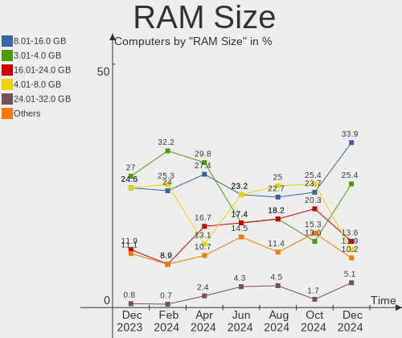
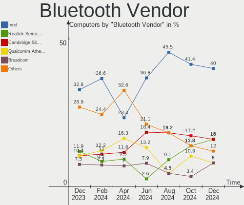
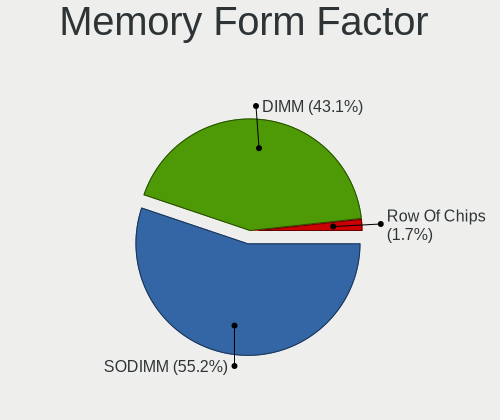
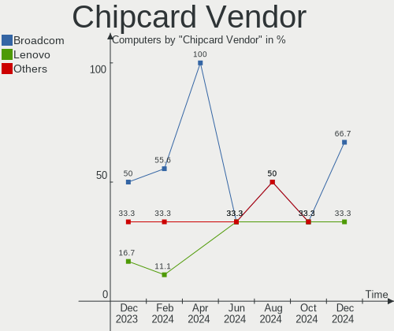
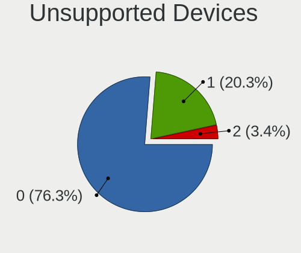

BlackPanther - Hardware Trends
------------------------------

A project to identify most popular hardware characteristics and track their change
over time based on data collected by Linux users at https://Linux-Hardware.org.

Anyone can contribute to this report by the [hw-probe](https://github.com/linuxhw/hw-probe) tool:

    sudo -E hw-probe -all -upload

This is a report for all computer types. See also reports for [desktops](/Dist/BlackPanther/Desktop/README.md) and [notebooks](/Dist/BlackPanther/Notebook/README.md).

This report is for one last month. Overall report since the beginning of time: [TestDays](https://github.com/linuxhw/TestDays)

Period: Jul, 2023.

Contents
--------

* [ System ](#system)
  - [ OS                       ](#os)
  - [ OS Family                ](#os-family)
  - [ Kernel                   ](#kernel)
  - [ Kernel Family            ](#kernel-family)
  - [ Kernel Major Ver.        ](#kernel-major-ver)
  - [ Arch                     ](#arch)
  - [ DE                       ](#de)
  - [ Display Server           ](#display-server)
  - [ Display Manager          ](#display-manager)
  - [ OS Lang                  ](#os-lang)
  - [ Boot Mode                ](#boot-mode)
  - [ Filesystem               ](#filesystem)
  - [ Part. scheme             ](#part-scheme)
  - [ Dual Boot with Linux/BSD ](#dual-boot-with-linuxbsd)
  - [ Dual Boot (Win)          ](#dual-boot-win)

* [ Board ](#board)
  - [ Vendor                   ](#vendor)
  - [ Model                    ](#model)
  - [ Model Family             ](#model-family)
  - [ MFG Year                 ](#mfg-year)
  - [ Form Factor              ](#form-factor)
  - [ Secure Boot              ](#secure-boot)
  - [ Coreboot                 ](#coreboot)
  - [ RAM Size                 ](#ram-size)
  - [ RAM Used                 ](#ram-used)
  - [ Total Drives             ](#total-drives)
  - [ Has CD-ROM               ](#has-cd-rom)
  - [ Has Ethernet             ](#has-ethernet)
  - [ Has WiFi                 ](#has-wifi)
  - [ Has Bluetooth            ](#has-bluetooth)

* [ Location ](#location)
  - [ Country                  ](#country)
  - [ City                     ](#city)

* [ Drives ](#drives)
  - [ Drive Vendor             ](#drive-vendor)
  - [ Drive Model              ](#drive-model)
  - [ HDD Vendor               ](#hdd-vendor)
  - [ SSD Vendor               ](#ssd-vendor)
  - [ Drive Kind               ](#drive-kind)
  - [ Drive Connector          ](#drive-connector)
  - [ Drive Size               ](#drive-size)
  - [ Space Total              ](#space-total)
  - [ Space Used               ](#space-used)
  - [ Malfunc. Drives          ](#malfunc-drives)
  - [ Malfunc. Drive Vendor    ](#malfunc-drive-vendor)
  - [ Malfunc. HDD Vendor      ](#malfunc-hdd-vendor)
  - [ Malfunc. Drive Kind      ](#malfunc-drive-kind)
  - [ Failed Drives            ](#failed-drives)
  - [ Failed Drive Vendor      ](#failed-drive-vendor)
  - [ Drive Status             ](#drive-status)

* [ Storage controller ](#storage-controller)
  - [ Storage Vendor           ](#storage-vendor)
  - [ Storage Model            ](#storage-model)
  - [ Storage Kind             ](#storage-kind)

* [ Processor ](#processor)
  - [ CPU Vendor               ](#cpu-vendor)
  - [ CPU Model                ](#cpu-model)
  - [ CPU Model Family         ](#cpu-model-family)
  - [ CPU Cores                ](#cpu-cores)
  - [ CPU Sockets              ](#cpu-sockets)
  - [ CPU Threads              ](#cpu-threads)
  - [ CPU Op-Modes             ](#cpu-op-modes)
  - [ CPU Microcode            ](#cpu-microcode)
  - [ CPU Microarch            ](#cpu-microarch)

* [ Graphics ](#graphics)
  - [ GPU Vendor               ](#gpu-vendor)
  - [ GPU Model                ](#gpu-model)
  - [ GPU Combo                ](#gpu-combo)
  - [ GPU Driver               ](#gpu-driver)
  - [ GPU Memory               ](#gpu-memory)

* [ Monitor ](#monitor)
  - [ Monitor Vendor           ](#monitor-vendor)
  - [ Monitor Model            ](#monitor-model)
  - [ Monitor Resolution       ](#monitor-resolution)
  - [ Monitor Diagonal         ](#monitor-diagonal)
  - [ Monitor Width            ](#monitor-width)
  - [ Aspect Ratio             ](#aspect-ratio)
  - [ Monitor Area             ](#monitor-area)
  - [ Pixel Density            ](#pixel-density)
  - [ Multiple Monitors        ](#multiple-monitors)

* [ Network ](#network)
  - [ Net Controller Vendor    ](#net-controller-vendor)
  - [ Net Controller Model     ](#net-controller-model)
  - [ Wireless Vendor          ](#wireless-vendor)
  - [ Wireless Model           ](#wireless-model)
  - [ Ethernet Vendor          ](#ethernet-vendor)
  - [ Ethernet Model           ](#ethernet-model)
  - [ Net Controller Kind      ](#net-controller-kind)
  - [ Used Controller          ](#used-controller)
  - [ NICs                     ](#nics)
  - [ IPv6                     ](#ipv6)

* [ Bluetooth ](#bluetooth)
  - [ Bluetooth Vendor         ](#bluetooth-vendor)
  - [ Bluetooth Model          ](#bluetooth-model)

* [ Sound ](#sound)
  - [ Sound Vendor             ](#sound-vendor)
  - [ Sound Model              ](#sound-model)

* [ Memory ](#memory)
  - [ Memory Vendor            ](#memory-vendor)
  - [ Memory Model             ](#memory-model)
  - [ Memory Kind              ](#memory-kind)
  - [ Memory Form Factor       ](#memory-form-factor)
  - [ Memory Size              ](#memory-size)
  - [ Memory Speed             ](#memory-speed)

* [ Printers & scanners ](#printers--scanners)
  - [ Printer Vendor           ](#printer-vendor)
  - [ Printer Model            ](#printer-model)
  - [ Scanner Vendor           ](#scanner-vendor)
  - [ Scanner Model            ](#scanner-model)

* [ Camera ](#camera)
  - [ Camera Vendor            ](#camera-vendor)
  - [ Camera Model             ](#camera-model)

* [ Security ](#security)
  - [ Fingerprint Vendor       ](#fingerprint-vendor)
  - [ Fingerprint Model        ](#fingerprint-model)
  - [ Chipcard Vendor          ](#chipcard-vendor)
  - [ Chipcard Model           ](#chipcard-model)

* [ Unsupported ](#unsupported)
  - [ Unsupported Devices      ](#unsupported-devices)
  - [ Unsupported Device Types ](#unsupported-device-types)

System
------

OS
--

Installed operating systems

| Name              | Computers | Percent |
|-------------------|-----------|---------|
| BlackPanther 18.1 | 49        | 85.96%  |
| BlackPanther 22.1 | 7         | 12.28%  |
| BlackPanther 16.2 | 1         | 1.75%   |

OS Family
---------

OS without a version

| Name         | Computers | Percent |
|--------------|-----------|---------|
| BlackPanther | 57        | 100%    |

Kernel
------

Version of the Linux kernel

| Version                | Computers | Percent |
|------------------------|-----------|---------|
| 5.6.14-desktop-2bP     | 33        | 57.89%  |
| 4.18.16-desktop-1bP    | 13        | 22.81%  |
| 6.4.3-desktop-1bP      | 2         | 3.51%   |
| 6.3.8-desktop-1bP      | 2         | 3.51%   |
| 6.3.3-desktop-1bP      | 2         | 3.51%   |
| 5.15.85-desktop-1bP    | 2         | 3.51%   |
| 6.1.0-1bP              | 1         | 1.75%   |
| 5.1.15-desktop-1bP     | 1         | 1.75%   |
| 4.9.20-desktop-pae-1bP | 1         | 1.75%   |

Kernel Family
-------------

Linux kernel without a distro release

| Version | Computers | Percent |
|---------|-----------|---------|
| 5.6.14  | 33        | 57.89%  |
| 4.18.16 | 13        | 22.81%  |
| 6.4.3   | 2         | 3.51%   |
| 6.3.8   | 2         | 3.51%   |
| 6.3.3   | 2         | 3.51%   |
| 5.15.85 | 2         | 3.51%   |
| 6.1.0   | 1         | 1.75%   |
| 5.1.15  | 1         | 1.75%   |
| 4.9.20  | 1         | 1.75%   |

Kernel Major Ver.
-----------------

Linux kernel major version

| Version | Computers | Percent |
|---------|-----------|---------|
| 5.6     | 33        | 57.89%  |
| 4.18    | 13        | 22.81%  |
| 6.3     | 4         | 7.02%   |
| 6.4     | 2         | 3.51%   |
| 5.15    | 2         | 3.51%   |
| 6.1     | 1         | 1.75%   |
| 5.1     | 1         | 1.75%   |
| 4.9     | 1         | 1.75%   |

Arch
----

OS architecture (x86_64, i586, etc.)

| Name   | Computers | Percent |
|--------|-----------|---------|
| x86_64 | 56        | 98.25%  |
| i686   | 1         | 1.75%   |

DE
--

Desktop Environment

| Name    | Computers | Percent |
|---------|-----------|---------|
| KDE5    | 53        | 92.98%  |
| Unknown | 4         | 7.02%   |

Display Server
--------------

X11 or Wayland

| Name | Computers | Percent |
|------|-----------|---------|
| X11  | 57        | 100%    |

Display Manager
---------------

SDDM, LightDM, etc.

| Name | Computers | Percent |
|------|-----------|---------|
| SDDM | 57        | 100%    |

OS Lang
-------

Language

| Lang    | Computers | Percent |
|---------|-----------|---------|
| Unknown | 57        | 100%    |

Boot Mode
---------

EFI or BIOS

| Mode | Computers | Percent |
|------|-----------|---------|
| BIOS | 30        | 52.63%  |
| EFI  | 27        | 47.37%  |

Filesystem
----------

Type of filesystem

| Type    | Computers | Percent |
|---------|-----------|---------|
| Overlay | 37        | 64.91%  |
| Ext4    | 20        | 35.09%  |

Part. scheme
------------

Scheme of partitioning

| Type | Computers | Percent |
|------|-----------|---------|
| MBR  | 31        | 54.39%  |
| GPT  | 26        | 45.61%  |

Dual Boot with Linux/BSD
------------------------

Hosting more than one Linux/BSD

| Dual boot | Computers | Percent |
|-----------|-----------|---------|
| Yes       | 36        | 63.16%  |
| No        | 21        | 36.84%  |

Dual Boot (Win)
---------------

Hosting Linux and Windows

| Dual boot | Computers | Percent |
|-----------|-----------|---------|
| No        | 33        | 57.89%  |
| Yes       | 24        | 42.11%  |

Board
-----

Vendor
------

Motherboard manufacturer

| Name                | Computers | Percent |
|---------------------|-----------|---------|
| Dell                | 12        | 21.05%  |
| Gigabyte Technology | 10        | 17.54%  |
| Hewlett-Packard     | 6         | 10.53%  |
| Acer                | 6         | 10.53%  |
| Lenovo              | 4         | 7.02%   |
| ASUSTek Computer    | 4         | 7.02%   |
| Toshiba             | 2         | 3.51%   |
| Samsung Electronics | 2         | 3.51%   |
| MSI                 | 2         | 3.51%   |
| Huanan              | 2         | 3.51%   |
| Fujitsu             | 2         | 3.51%   |
| Sony                | 1         | 1.75%   |
| RM                  | 1         | 1.75%   |
| Fujitsu Siemens     | 1         | 1.75%   |
| eMachines           | 1         | 1.75%   |
| ASRock              | 1         | 1.75%   |

Model
-----

Motherboard model

| Name                                        | Computers | Percent |
|---------------------------------------------|-----------|---------|
| Huanan X99-QD4 V1.0                         | 2         | 3.51%   |
| Gigabyte G31M-ES2C                          | 2         | 3.51%   |
| Dell OptiPlex 3020                          | 2         | 3.51%   |
| Dell Inspiron 7737                          | 2         | 3.51%   |
| Toshiba Satellite C660                      | 1         | 1.75%   |
| Toshiba Satellite C55-A-1NV                 | 1         | 1.75%   |
| Sony VPCYB3V1E                              | 1         | 1.75%   |
| Samsung RV411/RV511/E3511/S3511/RV711/E3411 | 1         | 1.75%   |
| Samsung 300E4C/300E5C/300E7C                | 1         | 1.75%   |
| RM Mobile ONE WIDESCREEN                    | 1         | 1.75%   |
| MSI MS-7C91                                 | 1         | 1.75%   |
| MSI MS-7817                                 | 1         | 1.75%   |
| Lenovo ThinkPad T500 2056CL8                | 1         | 1.75%   |
| Lenovo ThinkPad R400 7440EL1                | 1         | 1.75%   |
| Lenovo ThinkCentre M73 10B6001SUS           | 1         | 1.75%   |
| Lenovo B50-30 20382                         | 1         | 1.75%   |
| HP ProBook 640 G8 Notebook PC               | 1         | 1.75%   |
| HP Notebook                                 | 1         | 1.75%   |
| HP EliteDesk 705 G3 SFF                     | 1         | 1.75%   |
| HP EliteBook 8570w                          | 1         | 1.75%   |
| HP Compaq 8200 Elite MT PC                  | 1         | 1.75%   |
| HP 650                                      | 1         | 1.75%   |
| Gigabyte Z97MX-Gaming 5                     | 1         | 1.75%   |
| Gigabyte Z390 UD                            | 1         | 1.75%   |
| Gigabyte H61M-S2PV                          | 1         | 1.75%   |
| Gigabyte H61M-S1                            | 1         | 1.75%   |
| Gigabyte H310M A 2.0                        | 1         | 1.75%   |
| Gigabyte G31M-ES2L                          | 1         | 1.75%   |
| Gigabyte F2A88XM-D3HP                       | 1         | 1.75%   |
| Gigabyte B450M GAMING                       | 1         | 1.75%   |
| Fujitsu Siemens ESPRIMO P5625               | 1         | 1.75%   |
| Fujitsu LIFEBOOK U745                       | 1         | 1.75%   |
| Fujitsu LIFEBOOK A512                       | 1         | 1.75%   |
| eMachines E725                              | 1         | 1.75%   |
| Dell Precision WorkStation T5500            | 1         | 1.75%   |
| Dell OptiPlex 755                           | 1         | 1.75%   |
| Dell OptiPlex 7010                          | 1         | 1.75%   |
| Dell Latitude E5410                         | 1         | 1.75%   |
| Dell Inspiron One 2310                      | 1         | 1.75%   |
| Dell Inspiron 5558                          | 1         | 1.75%   |

Model Family
------------

Motherboard model prefix

| Name                    | Computers | Percent |
|-------------------------|-----------|---------|
| Dell Inspiron           | 6         | 10.53%  |
| Acer Aspire             | 5         | 8.77%   |
| Dell OptiPlex           | 4         | 7.02%   |
| Toshiba Satellite       | 2         | 3.51%   |
| Lenovo ThinkPad         | 2         | 3.51%   |
| Huanan X99-QD4          | 2         | 3.51%   |
| Gigabyte G31M-ES2C      | 2         | 3.51%   |
| Fujitsu LIFEBOOK        | 2         | 3.51%   |
| Sony VPCYB3V1E          | 1         | 1.75%   |
| Samsung RV411           | 1         | 1.75%   |
| Samsung 300E4C          | 1         | 1.75%   |
| RM Mobile               | 1         | 1.75%   |
| MSI MS-7C91             | 1         | 1.75%   |
| MSI MS-7817             | 1         | 1.75%   |
| Lenovo ThinkCentre      | 1         | 1.75%   |
| Lenovo B50-30           | 1         | 1.75%   |
| HP ProBook              | 1         | 1.75%   |
| HP Notebook             | 1         | 1.75%   |
| HP EliteDesk            | 1         | 1.75%   |
| HP EliteBook            | 1         | 1.75%   |
| HP Compaq               | 1         | 1.75%   |
| HP 650                  | 1         | 1.75%   |
| Gigabyte Z97MX-Gaming   | 1         | 1.75%   |
| Gigabyte Z390           | 1         | 1.75%   |
| Gigabyte H61M-S2PV      | 1         | 1.75%   |
| Gigabyte H61M-S1        | 1         | 1.75%   |
| Gigabyte H310M          | 1         | 1.75%   |
| Gigabyte G31M-ES2L      | 1         | 1.75%   |
| Gigabyte F2A88XM-D3HP   | 1         | 1.75%   |
| Gigabyte B450M          | 1         | 1.75%   |
| Fujitsu Siemens ESPRIMO | 1         | 1.75%   |
| eMachines E725          | 1         | 1.75%   |
| Dell Precision          | 1         | 1.75%   |
| Dell Latitude           | 1         | 1.75%   |
| ASUS Z170               | 1         | 1.75%   |
| ASUS X550CL             | 1         | 1.75%   |
| ASUS PRIME              | 1         | 1.75%   |
| ASUS ASUS               | 1         | 1.75%   |
| ASRock FM2A75M          | 1         | 1.75%   |
| Acer Veriton            | 1         | 1.75%   |

MFG Year
--------

Motherboard manufacture year

| Year | Computers | Percent |
|------|-----------|---------|
| 2014 | 8         | 14.04%  |
| 2008 | 7         | 12.28%  |
| 2013 | 6         | 10.53%  |
| 2015 | 5         | 8.77%   |
| 2012 | 5         | 8.77%   |
| 2010 | 5         | 8.77%   |
| 2011 | 4         | 7.02%   |
| 2018 | 3         | 5.26%   |
| 2016 | 3         | 5.26%   |
| 2022 | 2         | 3.51%   |
| 2021 | 2         | 3.51%   |
| 2009 | 2         | 3.51%   |
| 2007 | 2         | 3.51%   |
| 2020 | 1         | 1.75%   |
| 2019 | 1         | 1.75%   |
| 2017 | 1         | 1.75%   |

Form Factor
-----------

Physical design of the computer

| Name       | Computers | Percent |
|------------|-----------|---------|
| Notebook   | 29        | 50.88%  |
| Desktop    | 27        | 47.37%  |
| All in one | 1         | 1.75%   |

Secure Boot
-----------

Enabled or disabled

| State    | Computers | Percent |
|----------|-----------|---------|
| Disabled | 57        | 100%    |

Coreboot
--------

Have coreboot on board

| Used | Computers | Percent |
|------|-----------|---------|
| No   | 57        | 100%    |

RAM Size
--------

Total RAM memory

| Size in GB | Computers | Percent |
|------------|-----------|---------|
| 3.01-4.0   | 25        | 43.86%  |
| 4.01-8.0   | 12        | 21.05%  |
| 8.01-16.0  | 10        | 17.54%  |
| 32.01-64.0 | 4         | 7.02%   |
| 16.01-24.0 | 4         | 7.02%   |
| 24.01-32.0 | 1         | 1.75%   |
| 1.01-2.0   | 1         | 1.75%   |

RAM Used
--------

Used RAM memory

| Used GB  | Computers | Percent |
|----------|-----------|---------|
| 0.51-1.0 | 27        | 47.37%  |
| 1.01-2.0 | 14        | 24.56%  |
| 0.01-0.5 | 12        | 21.05%  |
| 4.01-8.0 | 2         | 3.51%   |
| 3.01-4.0 | 1         | 1.75%   |
| 2.01-3.0 | 1         | 1.75%   |

Total Drives
------------

Number of drives on board

| Drives | Computers | Percent |
|--------|-----------|---------|
| 1      | 34        | 59.65%  |
| 2      | 19        | 33.33%  |
| 4      | 2         | 3.51%   |
| 3      | 2         | 3.51%   |

Has CD-ROM
----------

Has CD-ROM on board

| Presented | Computers | Percent |
|-----------|-----------|---------|
| Yes       | 36        | 63.16%  |
| No        | 21        | 36.84%  |

Has Ethernet
------------

Has Ethernet on board

| Presented | Computers | Percent |
|-----------|-----------|---------|
| Yes       | 57        | 100%    |

Has WiFi
--------

Has WiFi module

| Presented | Computers | Percent |
|-----------|-----------|---------|
| Yes       | 34        | 59.65%  |
| No        | 23        | 40.35%  |

Has Bluetooth
-------------

Has Bluetooth module

| Presented | Computers | Percent |
|-----------|-----------|---------|
| No        | 30        | 52.63%  |
| Yes       | 27        | 47.37%  |

Location
--------

Country
-------

Geographic location (country)

| Country      | Computers | Percent |
|--------------|-----------|---------|
| Hungary      | 51        | 89.47%  |
| South Africa | 1         | 1.75%   |
| Slovakia     | 1         | 1.75%   |
| Germany      | 1         | 1.75%   |
| Austria      | 1         | 1.75%   |
| Australia    | 1         | 1.75%   |
| Argentina    | 1         | 1.75%   |

City
----

Geographic location (city)

| City                    | Computers | Percent |
|-------------------------|-----------|---------|
| Budapest                | 11        | 19.3%   |
| Zalaegerszeg            | 4         | 7.02%   |
| Tamasi                  | 3         | 5.26%   |
| Karcag                  | 3         | 5.26%   |
| Csongrad                | 3         | 5.26%   |
| Győr                   | 2         | 3.51%   |
| Berettyóújfalu        | 2         | 3.51%   |
| Vonock                  | 1         | 1.75%   |
| Vienna                  | 1         | 1.75%   |
| Tatabánya              | 1         | 1.75%   |
| Szolnok                 | 1         | 1.75%   |
| Szigetszentmiklos       | 1         | 1.75%   |
| Szekszárd              | 1         | 1.75%   |
| Szeged                  | 1         | 1.75%   |
| Sarbogard               | 1         | 1.75%   |
| San Fernando            | 1         | 1.75%   |
| Pfaffenhofen an der Ilm | 1         | 1.75%   |
| Pécs                   | 1         | 1.75%   |
| Nagykoroes              | 1         | 1.75%   |
| Nagykanizsa             | 1         | 1.75%   |
| Miskolc                 | 1         | 1.75%   |
| Mezotur                 | 1         | 1.75%   |
| Melbourne               | 1         | 1.75%   |
| Kisvarda                | 1         | 1.75%   |
| Kiskunhalas             | 1         | 1.75%   |
| Kecskemét              | 1         | 1.75%   |
| Janoshaza               | 1         | 1.75%   |
| Isaszeg                 | 1         | 1.75%   |
| Hajduboszormeny         | 1         | 1.75%   |
| Fertoszentmiklos        | 1         | 1.75%   |
| Debrecen                | 1         | 1.75%   |
| Cegled                  | 1         | 1.75%   |
| Cape Town               | 1         | 1.75%   |
| Besnyo                  | 1         | 1.75%   |
| Banská Bystrica        | 1         | 1.75%   |
| Abadszalok              | 1         | 1.75%   |

Drives
------

Drive Vendor
------------

Hard drive vendors

| Vendor                | Computers | Drives | Percent |
|-----------------------|-----------|--------|---------|
| WDC                   | 14        | 18     | 17.28%  |
| Seagate               | 13        | 13     | 16.05%  |
| Kingston              | 12        | 15     | 14.81%  |
| Samsung Electronics   | 8         | 9      | 9.88%   |
| Toshiba               | 4         | 4      | 4.94%   |
| SanDisk               | 4         | 4      | 4.94%   |
| HGST                  | 4         | 5      | 4.94%   |
| Patriot               | 3         | 3      | 3.7%    |
| Crucial               | 3         | 3      | 3.7%    |
| A-DATA Technology     | 3         | 3      | 3.7%    |
| Intel                 | 2         | 2      | 2.47%   |
| Hitachi               | 2         | 2      | 2.47%   |
| Fujitsu               | 2         | 2      | 2.47%   |
| SSSTC                 | 1         | 1      | 1.23%   |
| Realtek Semiconductor | 1         | 1      | 1.23%   |
| Micron Technology     | 1         | 1      | 1.23%   |
| LITEONIT              | 1         | 1      | 1.23%   |
| Kingmax               | 1         | 1      | 1.23%   |
| Initio                | 1         | 1      | 1.23%   |
| Apacer                | 1         | 1      | 1.23%   |

Drive Model
-----------

Hard drive models

| Model                              | Computers | Percent |
|------------------------------------|-----------|---------|
| Kingston SA400S37480G 480GB SSD    | 4         | 4.55%   |
| Seagate ST1000LM035-1RK172 1TB     | 3         | 3.41%   |
| Patriot Burst 120GB SSD            | 3         | 3.41%   |
| Seagate ST500LT012-1DG142 500GB    | 2         | 2.27%   |
| Seagate ST1000LM024 HN-M101MBB 1TB | 2         | 2.27%   |
| Samsung SSD 860 EVO 500GB          | 2         | 2.27%   |
| Kingston SUV400S37120G 120GB SSD   | 2         | 2.27%   |
| Kingston SA400S37960G 960GB SSD    | 2         | 2.27%   |
| Kingston SA400S37120G 120GB SSD    | 2         | 2.27%   |
| HGST HTS725050A7E630 500GB         | 2         | 2.27%   |
| Fujitsu MHV2100BH 100GB            | 2         | 2.27%   |
| WDC WDS256G1X0C-00ENX0 256GB       | 1         | 1.14%   |
| WDC WD800JD-75MSA3 80GB            | 1         | 1.14%   |
| WDC WD5000LPCX-22VHAT0 500GB       | 1         | 1.14%   |
| WDC WD5000BPVT-00HXZT1 500GB       | 1         | 1.14%   |
| WDC WD5000BPKT-75PK4T0 500GB       | 1         | 1.14%   |
| WDC WD5000AAKX-08U6AA0 500GB       | 1         | 1.14%   |
| WDC WD5000AAKS-00UU3A0 500GB       | 1         | 1.14%   |
| WDC WD5000AAKS-007AA0 500GB        | 1         | 1.14%   |
| WDC WD30EFRX-68EUZN0 3TB           | 1         | 1.14%   |
| WDC WD2500BEKT-75PVMT0 250GB       | 1         | 1.14%   |
| WDC WD2500AAKX-00ERMA0 250GB       | 1         | 1.14%   |
| WDC WD20EZRZ-00Z5HB0 2TB           | 1         | 1.14%   |
| WDC WD20EZRX-00D8PB0 2TB           | 1         | 1.14%   |
| WDC WD20EZBX-00AYRA0 2TB           | 1         | 1.14%   |
| WDC WD10PURZ-85U8XY0 1TB           | 1         | 1.14%   |
| WDC WD10EZRX-00L4HB0 1TB           | 1         | 1.14%   |
| WDC WD10EZEX-00KUWA0 1TB           | 1         | 1.14%   |
| Toshiba MK6465GSX 640GB            | 1         | 1.14%   |
| Toshiba HDWD130 3TB                | 1         | 1.14%   |
| Toshiba DT01ACA100 1TB             | 1         | 1.14%   |
| Toshiba DT01ACA050 LENOVO 500GB    | 1         | 1.14%   |
| SSSTC CL1-8D256-HP 256GB           | 1         | 1.14%   |
| Seagate ST500LT012-9WS142 500GB    | 1         | 1.14%   |
| Seagate ST500DM002-1BD142 500GB    | 1         | 1.14%   |
| Seagate ST3250318AS 250GB          | 1         | 1.14%   |
| Seagate ST250DM000-1BD141 250GB    | 1         | 1.14%   |
| Seagate ST2000LM003 HN-M201RAD 2TB | 1         | 1.14%   |
| Seagate ST1000LM014-1EJ164 1TB     | 1         | 1.14%   |
| Sandisk WD Blue SN570 1TB          | 1         | 1.14%   |

HDD Vendor
----------

Hard disk drive vendors

| Vendor  | Computers | Drives | Percent |
|---------|-----------|--------|---------|
| WDC     | 13        | 17     | 33.33%  |
| Seagate | 13        | 13     | 33.33%  |
| Toshiba | 4         | 4      | 10.26%  |
| HGST    | 4         | 5      | 10.26%  |
| Hitachi | 2         | 2      | 5.13%   |
| Fujitsu | 2         | 2      | 5.13%   |
| Initio  | 1         | 1      | 2.56%   |

SSD Vendor
----------

Solid state drive vendors

| Vendor              | Computers | Drives | Percent |
|---------------------|-----------|--------|---------|
| Kingston            | 11        | 14     | 31.43%  |
| Samsung Electronics | 7         | 7      | 20%     |
| Patriot             | 3         | 3      | 8.57%   |
| Crucial             | 3         | 3      | 8.57%   |
| A-DATA Technology   | 3         | 3      | 8.57%   |
| SanDisk             | 2         | 2      | 5.71%   |
| Intel               | 2         | 2      | 5.71%   |
| Micron Technology   | 1         | 1      | 2.86%   |
| LITEONIT            | 1         | 1      | 2.86%   |
| Kingmax             | 1         | 1      | 2.86%   |
| Apacer              | 1         | 1      | 2.86%   |

Drive Kind
----------

HDD or SSD

| Kind | Computers | Drives | Percent |
|------|-----------|--------|---------|
| HDD  | 37        | 44     | 48.68%  |
| SSD  | 31        | 38     | 40.79%  |
| NVMe | 8         | 8      | 10.53%  |

Drive Connector
---------------

SATA, SAS, NVMe, etc.

| Type | Computers | Drives | Percent |
|------|-----------|--------|---------|
| SATA | 54        | 81     | 85.71%  |
| NVMe | 8         | 8      | 12.7%   |
| SAS  | 1         | 1      | 1.59%   |

Drive Size
----------

Size of hard drive

| Size in TB | Computers | Drives | Percent |
|------------|-----------|--------|---------|
| 0.01-0.5   | 45        | 55     | 65.22%  |
| 0.51-1.0   | 17        | 18     | 24.64%  |
| 1.01-2.0   | 4         | 4      | 5.8%    |
| 2.01-3.0   | 2         | 3      | 2.9%    |
| 3.01-4.0   | 1         | 2      | 1.45%   |

Space Total
-----------

Amount of disk space available on the file system

| Size in GB     | Computers | Percent |
|----------------|-----------|---------|
| Unknown        | 37        | 64.91%  |
| 101-250        | 8         | 14.04%  |
| 501-1000       | 4         | 7.02%   |
| 51-100         | 3         | 5.26%   |
| 251-500        | 2         | 3.51%   |
| More than 3000 | 1         | 1.75%   |
| 21-50          | 1         | 1.75%   |
| 1001-2000      | 1         | 1.75%   |

Space Used
----------

Amount of used disk space

| Used GB   | Computers | Percent |
|-----------|-----------|---------|
| Unknown   | 37        | 64.91%  |
| 1-20      | 10        | 17.54%  |
| 21-50     | 3         | 5.26%   |
| 251-500   | 2         | 3.51%   |
| 1001-2000 | 2         | 3.51%   |
| 51-100    | 2         | 3.51%   |
| 501-1000  | 1         | 1.75%   |

Malfunc. Drives
---------------

Drive models with a malfunction

| Model                                 | Computers | Drives | Percent |
|---------------------------------------|-----------|--------|---------|
| HGST HTS725050A7E630 500GB            | 2         | 2      | 11.11%  |
| Fujitsu MHV2100BH 100GB               | 2         | 2      | 11.11%  |
| WDC WD5000AAKX-08U6AA0 500GB          | 1         | 1      | 5.56%   |
| WDC WD5000AAKS-00UU3A0 500GB          | 1         | 1      | 5.56%   |
| WDC WD5000AAKS-007AA0 500GB           | 1         | 1      | 5.56%   |
| WDC WD2500BEKT-75PVMT0 250GB          | 1         | 1      | 5.56%   |
| WDC WD10PURZ-85U8XY0 1TB              | 1         | 1      | 5.56%   |
| WDC WD10EZRX-00L4HB0 1TB              | 1         | 1      | 5.56%   |
| Toshiba HDWD130 3TB                   | 1         | 1      | 5.56%   |
| Seagate ST500LT012-9WS142 500GB       | 1         | 1      | 5.56%   |
| Seagate ST1000LM024 HN-M101MBB 1TB    | 1         | 1      | 5.56%   |
| Samsung Electronics SSD 750 EVO 250GB | 1         | 1      | 5.56%   |
| Intel SSDSC2KF240H6L 240GB            | 1         | 1      | 5.56%   |
| Initio 3639S 240GB                    | 1         | 1      | 5.56%   |
| Hitachi HTS547550A9E384 500GB         | 1         | 1      | 5.56%   |
| A-DATA Technology SU630 240GB SSD     | 1         | 1      | 5.56%   |

Malfunc. Drive Vendor
---------------------

Vendors of faulty drives

| Vendor              | Computers | Drives | Percent |
|---------------------|-----------|--------|---------|
| WDC                 | 5         | 6      | 29.41%  |
| Seagate             | 2         | 2      | 11.76%  |
| HGST                | 2         | 2      | 11.76%  |
| Fujitsu             | 2         | 2      | 11.76%  |
| Toshiba             | 1         | 1      | 5.88%   |
| Samsung Electronics | 1         | 1      | 5.88%   |
| Intel               | 1         | 1      | 5.88%   |
| Initio              | 1         | 1      | 5.88%   |
| Hitachi             | 1         | 1      | 5.88%   |
| A-DATA Technology   | 1         | 1      | 5.88%   |

Malfunc. HDD Vendor
-------------------

Vendors of faulty HDD drives

| Vendor  | Computers | Drives | Percent |
|---------|-----------|--------|---------|
| WDC     | 5         | 6      | 35.71%  |
| Seagate | 2         | 2      | 14.29%  |
| HGST    | 2         | 2      | 14.29%  |
| Fujitsu | 2         | 2      | 14.29%  |
| Toshiba | 1         | 1      | 7.14%   |
| Initio  | 1         | 1      | 7.14%   |
| Hitachi | 1         | 1      | 7.14%   |

Malfunc. Drive Kind
-------------------

Kinds of faulty drives

| Kind | Computers | Drives | Percent |
|------|-----------|--------|---------|
| HDD  | 14        | 15     | 82.35%  |
| SSD  | 3         | 3      | 17.65%  |

Failed Drives
-------------

Failed drive models

Zero info for selected period =(

Failed Drive Vendor
-------------------

Failed drive vendors

Zero info for selected period =(

Drive Status
------------

Number of failed and malfunc. drives

| Status   | Computers | Drives | Percent |
|----------|-----------|--------|---------|
| Works    | 50        | 71     | 73.53%  |
| Malfunc  | 17        | 18     | 25%     |
| Detected | 1         | 1      | 1.47%   |

Storage controller
------------------

Storage Vendor
--------------

Storage controller vendors

| Vendor                         | Computers | Percent |
|--------------------------------|-----------|---------|
| Intel                          | 47        | 73.44%  |
| AMD                            | 8         | 12.5%   |
| SanDisk                        | 3         | 4.69%   |
| Samsung Electronics            | 2         | 3.13%   |
| Solid State Storage Technology | 1         | 1.56%   |
| Realtek Semiconductor          | 1         | 1.56%   |
| Nvidia                         | 1         | 1.56%   |
| Kingston Technology Company    | 1         | 1.56%   |

Storage Model
-------------

Storage controller models

| Model                                                                                   | Computers | Percent |
|-----------------------------------------------------------------------------------------|-----------|---------|
| Intel 82801IBM/IEM (ICH9M/ICH9M-E) 4 port SATA Controller [AHCI mode]                   | 5         | 6.49%   |
| Intel 8 Series/C220 Series Chipset Family 6-port SATA Controller 1 [AHCI mode]          | 5         | 6.49%   |
| AMD FCH SATA Controller [AHCI mode]                                                     | 5         | 6.49%   |
| Intel Wildcat Point-LP SATA Controller [AHCI Mode]                                      | 4         | 5.19%   |
| Intel 7 Series Chipset Family 6-port SATA Controller [AHCI mode]                        | 4         | 5.19%   |
| Intel 6 Series/C200 Series Chipset Family Desktop SATA Controller (IDE mode, ports 4-5) | 4         | 5.19%   |
| Intel 6 Series/C200 Series Chipset Family Desktop SATA Controller (IDE mode, ports 0-3) | 4         | 5.19%   |
| Intel NM10/ICH7 Family SATA Controller [IDE mode]                                       | 3         | 3.9%    |
| Intel 5 Series/3400 Series Chipset 4 port SATA AHCI Controller                          | 3         | 3.9%    |
| Intel Volume Management Device NVMe RAID Controller                                     | 2         | 2.6%    |
| Intel Sunrise Point-LP SATA Controller [AHCI mode]                                      | 2         | 2.6%    |
| Intel 8 Series SATA Controller 1 [AHCI mode]                                            | 2         | 2.6%    |
| AMD FCH IDE Controller                                                                  | 2         | 2.6%    |
| AMD 400 Series Chipset SATA Controller                                                  | 2         | 2.6%    |
| Solid State Storage CL1-3D256-Q11 NVMe SSD M.2                                          | 1         | 1.3%    |
| SanDisk WD Blue SN570 NVMe SSD 2TB                                                      | 1         | 1.3%    |
| SanDisk WD Blue SN570 NVMe SSD 1TB                                                      | 1         | 1.3%    |
| SanDisk WD Black NVMe SSD                                                               | 1         | 1.3%    |
| Samsung NVMe SSD Controller SM981/PM981/PM983                                           | 1         | 1.3%    |
| Samsung NVMe SSD Controller SM961/PM961/SM963                                           | 1         | 1.3%    |
| Realtek RTS5763DL NVMe SSD Controller                                                   | 1         | 1.3%    |
| Nvidia MCP78S [GeForce 8200] AHCI Controller                                            | 1         | 1.3%    |
| Kingston Company A2000 NVMe SSD                                                         | 1         | 1.3%    |
| Intel Tiger Lake-LP SATA Controller                                                     | 1         | 1.3%    |
| Intel SATA Controller [RAID mode]                                                       | 1         | 1.3%    |
| Intel Q170/Q150/B150/H170/H110/Z170/CM236 Chipset SATA Controller [AHCI Mode]           | 1         | 1.3%    |
| Intel Cannon Lake PCH SATA AHCI Controller                                              | 1         | 1.3%    |
| Intel Atom Processor E3800 Series SATA AHCI Controller                                  | 1         | 1.3%    |
| Intel 9 Series Chipset Family SATA Controller [AHCI Mode]                               | 1         | 1.3%    |
| Intel 82Q35 Express PT IDER Controller                                                  | 1         | 1.3%    |
| Intel 82801IR/IO/IH (ICH9R/DO/DH) 6 port SATA Controller [AHCI mode]                    | 1         | 1.3%    |
| Intel 82801IBM/IEM (ICH9M/ICH9M-E) 2 port SATA Controller [IDE mode]                    | 1         | 1.3%    |
| Intel 82801HM/HEM (ICH8M/ICH8M-E) SATA Controller [AHCI mode]                           | 1         | 1.3%    |
| Intel 82801HM/HEM (ICH8M/ICH8M-E) IDE Controller                                        | 1         | 1.3%    |
| Intel 82801 Mobile SATA Controller [RAID mode]                                          | 1         | 1.3%    |
| Intel 8 Series/C220 Series Chipset Family 4-port SATA Controller 1 [IDE mode]           | 1         | 1.3%    |
| Intel 7 Series/C210 Series Chipset Family 6-port SATA Controller [AHCI mode]            | 1         | 1.3%    |
| Intel 6 Series/C200 Series Chipset Family IDE-r Controller                              | 1         | 1.3%    |
| Intel 6 Series/C200 Series Chipset Family 6 port Desktop SATA AHCI Controller           | 1         | 1.3%    |
| Intel 5 Series/3400 Series Chipset 6 port SATA AHCI Controller                          | 1         | 1.3%    |

Storage Kind
------------

Kind of storage controller (IDE, SATA, NVMe, SAS, ...)

| Kind | Computers | Percent |
|------|-----------|---------|
| SATA | 45        | 64.29%  |
| IDE  | 13        | 18.57%  |
| NVMe | 8         | 11.43%  |
| RAID | 4         | 5.71%   |

Processor
---------

CPU Vendor
----------

Processor vendors

| Vendor | Computers | Percent |
|--------|-----------|---------|
| Intel  | 48        | 84.21%  |
| AMD    | 9         | 15.79%  |

CPU Model
---------

Processor models

| Model                                       | Computers | Percent |
|---------------------------------------------|-----------|---------|
| Intel Xeon CPU E5-2696 v3 @ 2.30GHz         | 2         | 3.51%   |
| Intel Core i7-4510U CPU @ 2.00GHz           | 2         | 3.51%   |
| Intel Xeon CPU E5530 @ 2.40GHz              | 1         | 1.75%   |
| Intel Pentium Dual-Core CPU T4500 @ 2.30GHz | 1         | 1.75%   |
| Intel Pentium Dual-Core CPU T4400 @ 2.20GHz | 1         | 1.75%   |
| Intel Pentium Dual-Core CPU E5400 @ 2.70GHz | 1         | 1.75%   |
| Intel Pentium CPU G3220 @ 3.00GHz           | 1         | 1.75%   |
| Intel Pentium CPU B970 @ 2.30GHz            | 1         | 1.75%   |
| Intel Pentium CPU 2117U @ 1.80GHz           | 1         | 1.75%   |
| Intel Core i7-6700K CPU @ 4.00GHz           | 1         | 1.75%   |
| Intel Core i7-5600U CPU @ 2.60GHz           | 1         | 1.75%   |
| Intel Core i7-5500U CPU @ 2.40GHz           | 1         | 1.75%   |
| Intel Core i7-3630QM CPU @ 2.40GHz          | 1         | 1.75%   |
| Intel Core i5-9400 CPU @ 2.90GHz            | 1         | 1.75%   |
| Intel Core i5-7200U CPU @ 2.50GHz           | 1         | 1.75%   |
| Intel Core i5-5200U CPU @ 2.20GHz           | 1         | 1.75%   |
| Intel Core i5-4590 CPU @ 3.30GHz            | 1         | 1.75%   |
| Intel Core i5-4200M CPU @ 2.50GHz           | 1         | 1.75%   |
| Intel Core i5-3470S CPU @ 2.90GHz           | 1         | 1.75%   |
| Intel Core i5-3470 CPU @ 3.20GHz            | 1         | 1.75%   |
| Intel Core i5-2400 CPU @ 3.10GHz            | 1         | 1.75%   |
| Intel Core i5 CPU M 520 @ 2.40GHz           | 1         | 1.75%   |
| Intel Core i3-9100F CPU @ 3.60GHz           | 1         | 1.75%   |
| Intel Core i3-6006U CPU @ 2.00GHz           | 1         | 1.75%   |
| Intel Core i3-5005U CPU @ 2.00GHz           | 1         | 1.75%   |
| Intel Core i3-4170 CPU @ 3.70GHz            | 1         | 1.75%   |
| Intel Core i3-4160 CPU @ 3.60GHz            | 1         | 1.75%   |
| Intel Core i3-4130 CPU @ 3.40GHz            | 1         | 1.75%   |
| Intel Core i3-3220 CPU @ 3.30GHz            | 1         | 1.75%   |
| Intel Core i3-3110M CPU @ 2.40GHz           | 1         | 1.75%   |
| Intel Core i3-2120 CPU @ 3.30GHz            | 1         | 1.75%   |
| Intel Core i3 CPU M 380 @ 2.53GHz           | 1         | 1.75%   |
| Intel Core i3 CPU M 370 @ 2.40GHz           | 1         | 1.75%   |
| Intel Core 2 Quad CPU Q6600 @ 2.40GHz       | 1         | 1.75%   |
| Intel Core 2 Duo CPU T9900 @ 3.06GHz        | 1         | 1.75%   |
| Intel Core 2 Duo CPU T7500 @ 2.20GHz        | 1         | 1.75%   |
| Intel Core 2 Duo CPU P8700 @ 2.53GHz        | 1         | 1.75%   |
| Intel Core 2 Duo CPU P8600 @ 2.40GHz        | 1         | 1.75%   |
| Intel Core 2 Duo CPU E8500 @ 3.16GHz        | 1         | 1.75%   |
| Intel Core 2 Duo CPU E6750 @ 2.66GHz        | 1         | 1.75%   |

CPU Model Family
----------------

Processor model prefix

| Model                   | Computers | Percent |
|-------------------------|-----------|---------|
| Intel Core i3           | 11        | 19.3%   |
| Intel Core i5           | 9         | 15.79%  |
| Intel Core i7           | 6         | 10.53%  |
| Intel Core 2 Duo        | 6         | 10.53%  |
| Intel Celeron           | 4         | 7.02%   |
| Other                   | 3         | 5.26%   |
| Intel Xeon              | 3         | 5.26%   |
| Intel Pentium Dual-Core | 3         | 5.26%   |
| Intel Pentium           | 3         | 5.26%   |
| AMD Ryzen 5             | 2         | 3.51%   |
| AMD A8                  | 2         | 3.51%   |
| Intel Core 2 Quad       | 1         | 1.75%   |
| AMD Ryzen 7             | 1         | 1.75%   |
| AMD E                   | 1         | 1.75%   |
| AMD Athlon Dual Core    | 1         | 1.75%   |
| AMD A10                 | 1         | 1.75%   |

CPU Cores
---------

Number of processor cores

| Number | Computers | Percent |
|--------|-----------|---------|
| 2      | 36        | 63.16%  |
| 4      | 12        | 21.05%  |
| 1      | 4         | 7.02%   |
| 10     | 2         | 3.51%   |
| 6      | 2         | 3.51%   |
| 8      | 1         | 1.75%   |

CPU Sockets
-----------

Number of sockets

| Number | Computers | Percent |
|--------|-----------|---------|
| 1      | 57        | 100%    |

CPU Threads
-----------

Threads per core (Hyper-Threading)

| Number | Computers | Percent |
|--------|-----------|---------|
| 2      | 30        | 52.63%  |
| 1      | 27        | 47.37%  |

CPU Op-Modes
------------

CPU Operation Modes (32-bit, 64-bit)

| Op mode        | Computers | Percent |
|----------------|-----------|---------|
| 32-bit, 64-bit | 57        | 100%    |

CPU Microcode
-------------

Microcode number

| Number     | Computers | Percent |
|------------|-----------|---------|
| 0x1067a    | 7         | 12.28%  |
| 0x306c3    | 6         | 10.53%  |
| 0x306a9    | 6         | 10.53%  |
| Unknown    | 6         | 10.53%  |
| 0x306d4    | 4         | 7.02%   |
| 0x206a7    | 4         | 7.02%   |
| 0x20655    | 3         | 5.26%   |
| 0x6fb      | 2         | 3.51%   |
| 0x06003106 | 2         | 3.51%   |
| 0x906eb    | 1         | 1.75%   |
| 0x906ea    | 1         | 1.75%   |
| 0x806e9    | 1         | 1.75%   |
| 0x806c1    | 1         | 1.75%   |
| 0x6fa      | 1         | 1.75%   |
| 0x506e3    | 1         | 1.75%   |
| 0x406e3    | 1         | 1.75%   |
| 0x30678    | 1         | 1.75%   |
| 0x20652    | 1         | 1.75%   |
| 0x106a5    | 1         | 1.75%   |
| 0x10661    | 1         | 1.75%   |
| 0x0a20120a | 1         | 1.75%   |
| 0x08108109 | 1         | 1.75%   |
| 0x0800820d | 1         | 1.75%   |
| 0x0600611a | 1         | 1.75%   |
| 0x06001119 | 1         | 1.75%   |
| 0x05000101 | 1         | 1.75%   |

CPU Microarch
-------------

Microarchitecture

| Name        | Computers | Percent |
|-------------|-----------|---------|
| Haswell     | 10        | 17.54%  |
| Penryn      | 7         | 12.28%  |
| IvyBridge   | 6         | 10.53%  |
| Westmere    | 4         | 7.02%   |
| SandyBridge | 4         | 7.02%   |
| Core        | 4         | 7.02%   |
| Broadwell   | 4         | 7.02%   |
| KabyLake    | 3         | 5.26%   |
| Zen+        | 2         | 3.51%   |
| TigerLake   | 2         | 3.51%   |
| Steamroller | 2         | 3.51%   |
| Skylake     | 2         | 3.51%   |
| Zen 3       | 1         | 1.75%   |
| Silvermont  | 1         | 1.75%   |
| Piledriver  | 1         | 1.75%   |
| Nehalem     | 1         | 1.75%   |
| K8 Hammer   | 1         | 1.75%   |
| Excavator   | 1         | 1.75%   |
| Bobcat      | 1         | 1.75%   |

Graphics
--------

GPU Vendor
----------

Vendors of graphics cards

| Vendor | Computers | Percent |
|--------|-----------|---------|
| Intel  | 30        | 44.12%  |
| Nvidia | 26        | 38.24%  |
| AMD    | 12        | 17.65%  |

GPU Model
---------

Graphics card models

| Model                                                                       | Computers | Percent |
|-----------------------------------------------------------------------------|-----------|---------|
| Intel Mobile 4 Series Chipset Integrated Graphics Controller                | 4         | 5.71%   |
| Intel HD Graphics 5500                                                      | 4         | 5.71%   |
| Nvidia GK208B [GeForce GT 710]                                              | 3         | 4.29%   |
| Nvidia GF117M [GeForce 610M/710M/810M/820M / GT 620M/625M/630M/720M]        | 3         | 4.29%   |
| Intel 2nd Generation Core Processor Family Integrated Graphics Controller   | 3         | 4.29%   |
| Nvidia GK107M [GeForce GT 750M]                                             | 2         | 2.86%   |
| Nvidia GA104 [GeForce RTX 3060 Ti Lite Hash Rate]                           | 2         | 2.86%   |
| Intel Xeon E3-1200 v3/4th Gen Core Processor Integrated Graphics Controller | 2         | 2.86%   |
| Intel Haswell-ULT Integrated Graphics Controller                            | 2         | 2.86%   |
| Intel Core Processor Integrated Graphics Controller                         | 2         | 2.86%   |
| Intel 4th Generation Core Processor Family Integrated Graphics Controller   | 2         | 2.86%   |
| Intel 3rd Gen Core processor Graphics Controller                            | 2         | 2.86%   |
| Nvidia TU106 [GeForce RTX 2070]                                             | 1         | 1.43%   |
| Nvidia GT218M [GeForce 315M]                                                | 1         | 1.43%   |
| Nvidia GT218 [GeForce G210]                                                 | 1         | 1.43%   |
| Nvidia GP106 [GeForce GTX 1060 6GB]                                         | 1         | 1.43%   |
| Nvidia GM206 [GeForce GTX 960]                                              | 1         | 1.43%   |
| Nvidia GM108M [GeForce 845M]                                                | 1         | 1.43%   |
| Nvidia GM107GL [Quadro K620]                                                | 1         | 1.43%   |
| Nvidia GM107 [GeForce GTX 750 Ti]                                           | 1         | 1.43%   |
| Nvidia GM107 [GeForce 940MX]                                                | 1         | 1.43%   |
| Nvidia GK208BM [GeForce 920M]                                               | 1         | 1.43%   |
| Nvidia GF116 [GeForce GTX 550 Ti]                                           | 1         | 1.43%   |
| Nvidia GF108 [GeForce GT 630]                                               | 1         | 1.43%   |
| Nvidia GA106 [Geforce RTX 3050]                                             | 1         | 1.43%   |
| Nvidia G96CM [GeForce 9600M GT]                                             | 1         | 1.43%   |
| Nvidia G96CM [GeForce 9600M GS]                                             | 1         | 1.43%   |
| Nvidia G96CGL [Quadro FX 580]                                               | 1         | 1.43%   |
| Nvidia G96C [GeForce 9500 GT]                                               | 1         | 1.43%   |
| Intel Xeon E3-1200 v2/3rd Gen Core processor Graphics Controller            | 1         | 1.43%   |
| Intel TigerLake-LP GT2 [Iris Xe Graphics]                                   | 1         | 1.43%   |
| Intel Tiger Lake-LP GT2 [UHD Graphics G4]                                   | 1         | 1.43%   |
| Intel Skylake GT2 [HD Graphics 520]                                         | 1         | 1.43%   |
| Intel Mobile GM965/GL960 Integrated Graphics Controller (secondary)         | 1         | 1.43%   |
| Intel Mobile GM965/GL960 Integrated Graphics Controller (primary)           | 1         | 1.43%   |
| Intel HD Graphics 620                                                       | 1         | 1.43%   |
| Intel Atom Processor Z36xxx/Z37xxx Series Graphics & Display                | 1         | 1.43%   |
| Intel 82G33/G31 Express Integrated Graphics Controller                      | 1         | 1.43%   |
| Intel 4th Gen Core Processor Integrated Graphics Controller                 | 1         | 1.43%   |
| AMD Wrestler [Radeon HD 6320]                                               | 1         | 1.43%   |

GPU Combo
---------

Combinations of graphics cards

| Name           | Computers | Percent |
|----------------|-----------|---------|
| 1 x Intel      | 19        | 33.33%  |
| 1 x Nvidia     | 17        | 29.82%  |
| 1 x AMD        | 10        | 17.54%  |
| Intel + Nvidia | 8         | 14.04%  |
| Intel + AMD    | 2         | 3.51%   |
| 2 x Nvidia     | 1         | 1.75%   |

GPU Driver
----------

Free vs proprietary

| Driver | Computers | Percent |
|--------|-----------|---------|
| Free   | 57        | 100%    |

GPU Memory
----------

Total video memory

| Size in GB | Computers | Percent |
|------------|-----------|---------|
| Unknown    | 20        | 35.09%  |
| 0.51-1.0   | 14        | 24.56%  |
| 1.01-2.0   | 10        | 17.54%  |
| 0.01-0.5   | 7         | 12.28%  |
| 7.01-8.0   | 3         | 5.26%   |
| 3.01-4.0   | 2         | 3.51%   |
| 5.01-6.0   | 1         | 1.75%   |

Monitor
-------

Monitor Vendor
--------------

Monitor vendors

| Vendor                  | Computers | Percent |
|-------------------------|-----------|---------|
| Samsung Electronics     | 11        | 19.3%   |
| AU Optronics            | 8         | 14.04%  |
| LG Display              | 6         | 10.53%  |
| Goldstar                | 5         | 8.77%   |
| Dell                    | 3         | 5.26%   |
| Chimei Innolux          | 3         | 5.26%   |
| Ancor Communications    | 3         | 5.26%   |
| Philips                 | 2         | 3.51%   |
| Lenovo                  | 2         | 3.51%   |
| Chi Mei Optoelectronics | 2         | 3.51%   |
| BOE                     | 2         | 3.51%   |
| BenQ                    | 2         | 3.51%   |
| AOC                     | 2         | 3.51%   |
| ViewSonic               | 1         | 1.75%   |
| PANDA                   | 1         | 1.75%   |
| Medion                  | 1         | 1.75%   |
| Iiyama                  | 1         | 1.75%   |
| Hewlett-Packard         | 1         | 1.75%   |
| CVT                     | 1         | 1.75%   |

Monitor Model
-------------

Monitor models

| Model                                                                | Computers | Percent |
|----------------------------------------------------------------------|-----------|---------|
| LG Display LCD Monitor LGD0365 1600x900 382x215mm 17.3-inch          | 2         | 3.23%   |
| Goldstar E2260 GSM57E1 1920x1080 477x268mm 21.5-inch                 | 2         | 3.23%   |
| Goldstar E1940 GSM4BD6 1360x768 410x230mm 18.5-inch                  | 2         | 3.23%   |
| Goldstar 2D HD TV GSM59CA 1366x768 509x286mm 23.0-inch               | 2         | 3.23%   |
| BenQ EW277HDR BNQ7948 1920x1080 598x336mm 27.0-inch                  | 2         | 3.23%   |
| AOC Q32G1WG4 AOC3201 2560x1440 697x393mm 31.5-inch                   | 2         | 3.23%   |
| ViewSonic VG2236 SERIES VSCE726 1920x1080 477x268mm 21.5-inch        | 1         | 1.61%   |
| Samsung Electronics SyncMaster SAM037B 1680x1050 474x296mm 22.0-inch | 1         | 1.61%   |
| Samsung Electronics S27E500 SAM0D0D 1920x1080 598x336mm 27.0-inch    | 1         | 1.61%   |
| Samsung Electronics S24D300 SAM0B45 1920x1080 521x293mm 23.5-inch    | 1         | 1.61%   |
| Samsung Electronics S22B370 SAM08BD 1920x1080 477x268mm 21.5-inch    | 1         | 1.61%   |
| Samsung Electronics LS27AG30x SAM717A 1920x1080 597x336mm 27.0-inch  | 1         | 1.61%   |
| Samsung Electronics LCD Monitor SEC5541 1366x768 344x193mm 15.5-inch | 1         | 1.61%   |
| Samsung Electronics LCD Monitor SEC5441 1366x768 344x194mm 15.5-inch | 1         | 1.61%   |
| Samsung Electronics LCD Monitor SEC384A 1366x768 344x194mm 15.5-inch | 1         | 1.61%   |
| Samsung Electronics LCD Monitor SEC304F 1680x945 409x230mm 18.5-inch | 1         | 1.61%   |
| Samsung Electronics LCD Monitor SEC304C 1366x768 309x174mm 14.0-inch | 1         | 1.61%   |
| Samsung Electronics LCD Monitor SDC3652 1366x768 344x194mm 15.5-inch | 1         | 1.61%   |
| Samsung Electronics LCD Monitor SAM0679 1360x768 410x256mm 19.0-inch | 1         | 1.61%   |
| Philips PHL 223V5 PHLC0CF 1920x1080 477x268mm 21.5-inch              | 1         | 1.61%   |
| Philips 190WV PHLC014 1440x900 408x255mm 18.9-inch                   | 1         | 1.61%   |
| PANDA LCD Monitor NCP0065 1920x1080 309x174mm 14.0-inch              | 1         | 1.61%   |
| Medion MD20666 MED3673 1920x1080 533x312mm 24.3-inch                 | 1         | 1.61%   |
| LG Display LCD Monitor LGD0506 1366x768 344x194mm 15.5-inch          | 1         | 1.61%   |
| LG Display LCD Monitor LGD0456 1366x768 344x194mm 15.5-inch          | 1         | 1.61%   |
| LG Display LCD Monitor LGD033A 1366x768 344x194mm 15.5-inch          | 1         | 1.61%   |
| LG Display LCD Monitor LGD0259 1920x1080 345x194mm 15.6-inch         | 1         | 1.61%   |
| Lenovo LCD Monitor LEN4057 1280x800 331x207mm 15.4-inch              | 1         | 1.61%   |
| Lenovo LCD Monitor LEN4035 1280x800 303x189mm 14.1-inch              | 1         | 1.61%   |
| Iiyama PLX2783H IVM6648 1920x1080 598x336mm 27.0-inch                | 1         | 1.61%   |
| Hewlett-Packard w2207 HWP26A8 1680x1050 473x296mm 22.0-inch          | 1         | 1.61%   |
| Goldstar W2242 GSM5678 1680x1050 474x296mm 22.0-inch                 | 1         | 1.61%   |
| Goldstar L1919S GSM4AF2 1280x1024 338x270mm 17.0-inch                | 1         | 1.61%   |
| Goldstar 2D FHD TV GSM59C6 1920x1080 509x286mm 23.0-inch             | 1         | 1.61%   |
| Dell S2719H DELD0CE 1920x1080 598x336mm 27.0-inch                    | 1         | 1.61%   |
| Dell INSPIRON ONE DELB123 1920x1080 510x287mm 23.0-inch              | 1         | 1.61%   |
| Dell E1912H DELF03E 1366x768 410x230mm 18.5-inch                     | 1         | 1.61%   |
| CVT CVTE TV CVT0003 1360x768 575x323mm 26.0-inch                     | 1         | 1.61%   |
| Chimei Innolux LCD Monitor CMN1733 1600x900 382x215mm 17.3-inch      | 1         | 1.61%   |
| Chimei Innolux LCD Monitor CMN15A9 1366x768 344x193mm 15.5-inch      | 1         | 1.61%   |

Monitor Resolution
------------------

Monitor screen resolution

| Resolution         | Computers | Percent |
|--------------------|-----------|---------|
| 1920x1080 (FHD)    | 23        | 39.66%  |
| 1366x768 (WXGA)    | 17        | 29.31%  |
| 1680x1050 (WSXGA+) | 3         | 5.17%   |
| 1600x900 (HD+)     | 3         | 5.17%   |
| 1360x768           | 3         | 5.17%   |
| 1280x800 (WXGA)    | 3         | 5.17%   |
| 3840x2160 (4K)     | 2         | 3.45%   |
| 1280x1024 (SXGA)   | 2         | 3.45%   |
| 1680x945           | 1         | 1.72%   |
| 1440x900 (WXGA+)   | 1         | 1.72%   |

Monitor Diagonal
----------------

Diagonal size in inches

| Inches | Computers | Percent |
|--------|-----------|---------|
| 15     | 19        | 30.65%  |
| 21     | 7         | 11.29%  |
| 27     | 6         | 9.68%   |
| 23     | 6         | 9.68%   |
| 18     | 5         | 8.06%   |
| 17     | 4         | 6.45%   |
| 19     | 3         | 4.84%   |
| 31     | 2         | 3.23%   |
| 24     | 2         | 3.23%   |
| 22     | 2         | 3.23%   |
| 14     | 2         | 3.23%   |
| 11     | 2         | 3.23%   |
| 26     | 1         | 1.61%   |
| 13     | 1         | 1.61%   |

Monitor Width
-------------

Physical width

| Width in mm | Computers | Percent |
|-------------|-----------|---------|
| 301-350     | 20        | 33.33%  |
| 501-600     | 14        | 23.33%  |
| 401-500     | 14        | 23.33%  |
| 351-400     | 8         | 13.33%  |
| 601-700     | 2         | 3.33%   |
| 201-300     | 2         | 3.33%   |

Aspect Ratio
------------

Proportional relationship between the width and the height

| Ratio | Computers | Percent |
|-------|-----------|---------|
| 16/9  | 44        | 81.48%  |
| 16/10 | 7         | 12.96%  |
| 5/4   | 2         | 3.7%    |
| 3/2   | 1         | 1.85%   |

Monitor Area
------------

Area in inch²

| Area in inch² | Computers | Percent |
|----------------|-----------|---------|
| 101-110        | 19        | 31.67%  |
| 201-250        | 13        | 21.67%  |
| 301-350        | 6         | 10%     |
| 151-200        | 5         | 8.33%   |
| 141-150        | 4         | 6.67%   |
| 81-90          | 3         | 5%      |
| 121-130        | 3         | 5%      |
| 51-60          | 2         | 3.33%   |
| 351-500        | 2         | 3.33%   |
| 251-300        | 2         | 3.33%   |
| 131-140        | 1         | 1.67%   |

Pixel Density
-------------

Pixels per inch

| Density | Computers | Percent |
|---------|-----------|---------|
| 51-100  | 28        | 48.28%  |
| 101-120 | 23        | 39.66%  |
| 121-160 | 7         | 12.07%  |

Multiple Monitors
-----------------

Total monitors connected

| Total | Computers | Percent |
|-------|-----------|---------|
| 1     | 52        | 91.23%  |
| 2     | 3         | 5.26%   |
| 4     | 2         | 3.51%   |

Network
-------

Net Controller Vendor
---------------------

Controller vendors

| Vendor                | Computers | Percent |
|-----------------------|-----------|---------|
| Realtek Semiconductor | 32        | 39.02%  |
| Intel                 | 21        | 25.61%  |
| Qualcomm Atheros      | 18        | 21.95%  |
| Broadcom              | 7         | 8.54%   |
| Ralink Technology     | 2         | 2.44%   |
| Ralink                | 1         | 1.22%   |
| Broadcom Limited      | 1         | 1.22%   |

Net Controller Model
--------------------

Controller models

| Model                                                             | Computers | Percent |
|-------------------------------------------------------------------|-----------|---------|
| Realtek RTL8111/8168/8411 PCI Express Gigabit Ethernet Controller | 27        | 28.13%  |
| Realtek RTL810xE PCI Express Fast Ethernet controller             | 5         | 5.21%   |
| Qualcomm Atheros QCA9565 / AR9565 Wireless Network Adapter        | 4         | 4.17%   |
| Intel 82579LM Gigabit Network Connection (Lewisville)             | 4         | 4.17%   |
| Broadcom BCM4313 802.11bgn Wireless Network Adapter               | 4         | 4.17%   |
| Intel Wireless 7260                                               | 3         | 3.13%   |
| Ralink MT7601U Wireless Adapter                                   | 2         | 2.08%   |
| Qualcomm Atheros QCA9377 802.11ac Wireless Network Adapter        | 2         | 2.08%   |
| Qualcomm Atheros AR9485 Wireless Network Adapter                  | 2         | 2.08%   |
| Qualcomm Atheros AR8132 Fast Ethernet                             | 2         | 2.08%   |
| Qualcomm Atheros AR8131 Gigabit Ethernet                          | 2         | 2.08%   |
| Qualcomm Atheros AR8121/AR8113/AR8114 Gigabit or Fast Ethernet    | 2         | 2.08%   |
| Intel Wireless 7265                                               | 2         | 2.08%   |
| Intel Wi-Fi 6 AX201                                               | 2         | 2.08%   |
| Intel Ethernet Connection (2) I219-V                              | 2         | 2.08%   |
| Intel Ethernet Connection (13) I219-V                             | 2         | 2.08%   |
| Realtek RTL8723BE PCIe Wireless Network Adapter                   | 1         | 1.04%   |
| Realtek RTL8188EUS 802.11n Wireless Network Adapter               | 1         | 1.04%   |
| Realtek RTL8188EE Wireless Network Adapter                        | 1         | 1.04%   |
| Realtek RTL8125 2.5GbE Controller                                 | 1         | 1.04%   |
| Realtek RTL-8110SC/8169SC Gigabit Ethernet                        | 1         | 1.04%   |
| Ralink RT2561/RT61 802.11g PCI                                    | 1         | 1.04%   |
| Qualcomm Atheros QCA8172 Fast Ethernet                            | 1         | 1.04%   |
| Qualcomm Atheros QCA8171 Gigabit Ethernet                         | 1         | 1.04%   |
| Qualcomm Atheros Killer E220x Gigabit Ethernet Controller         | 1         | 1.04%   |
| Qualcomm Atheros AR9287 Wireless Network Adapter (PCI-Express)    | 1         | 1.04%   |
| Qualcomm Atheros AR9285 Wireless Network Adapter (PCI-Express)    | 1         | 1.04%   |
| Qualcomm Atheros AR8151 v1.0 Gigabit Ethernet                     | 1         | 1.04%   |
| Intel Wireless 3160                                               | 1         | 1.04%   |
| Intel WiFi Link 5100                                              | 1         | 1.04%   |
| Intel Ultimate N WiFi Link 5300                                   | 1         | 1.04%   |
| Intel PRO/Wireless 5100 AGN [Shiloh] Network Connection           | 1         | 1.04%   |
| Intel PRO/Wireless 4965 AG or AGN [Kedron] Network Connection     | 1         | 1.04%   |
| Intel PRO/Wireless 3945ABG [Golan] Network Connection             | 1         | 1.04%   |
| Intel Ethernet Connection (3) I218-LM                             | 1         | 1.04%   |
| Intel Centrino Wireless-N 2230                                    | 1         | 1.04%   |
| Intel Centrino Ultimate-N 6300                                    | 1         | 1.04%   |
| Intel 82567LM Gigabit Network Connection                          | 1         | 1.04%   |
| Intel 82567LF Gigabit Network Connection                          | 1         | 1.04%   |
| Intel 82566DM-2 Gigabit Network Connection                        | 1         | 1.04%   |

Wireless Vendor
---------------

Wireless vendors

| Vendor                | Computers | Percent |
|-----------------------|-----------|---------|
| Intel                 | 15        | 41.67%  |
| Qualcomm Atheros      | 10        | 27.78%  |
| Broadcom              | 4         | 11.11%  |
| Realtek Semiconductor | 3         | 8.33%   |
| Ralink Technology     | 2         | 5.56%   |
| Ralink                | 1         | 2.78%   |
| Broadcom Limited      | 1         | 2.78%   |

Wireless Model
--------------

Wireless models

| Model                                                          | Computers | Percent |
|----------------------------------------------------------------|-----------|---------|
| Qualcomm Atheros QCA9565 / AR9565 Wireless Network Adapter     | 4         | 11.11%  |
| Broadcom BCM4313 802.11bgn Wireless Network Adapter            | 4         | 11.11%  |
| Intel Wireless 7260                                            | 3         | 8.33%   |
| Ralink MT7601U Wireless Adapter                                | 2         | 5.56%   |
| Qualcomm Atheros QCA9377 802.11ac Wireless Network Adapter     | 2         | 5.56%   |
| Qualcomm Atheros AR9485 Wireless Network Adapter               | 2         | 5.56%   |
| Intel Wireless 7265                                            | 2         | 5.56%   |
| Intel Wi-Fi 6 AX201                                            | 2         | 5.56%   |
| Realtek RTL8723BE PCIe Wireless Network Adapter                | 1         | 2.78%   |
| Realtek RTL8188EUS 802.11n Wireless Network Adapter            | 1         | 2.78%   |
| Realtek RTL8188EE Wireless Network Adapter                     | 1         | 2.78%   |
| Ralink RT2561/RT61 802.11g PCI                                 | 1         | 2.78%   |
| Qualcomm Atheros AR9287 Wireless Network Adapter (PCI-Express) | 1         | 2.78%   |
| Qualcomm Atheros AR9285 Wireless Network Adapter (PCI-Express) | 1         | 2.78%   |
| Intel Wireless 3160                                            | 1         | 2.78%   |
| Intel WiFi Link 5100                                           | 1         | 2.78%   |
| Intel Ultimate N WiFi Link 5300                                | 1         | 2.78%   |
| Intel PRO/Wireless 5100 AGN [Shiloh] Network Connection        | 1         | 2.78%   |
| Intel PRO/Wireless 4965 AG or AGN [Kedron] Network Connection  | 1         | 2.78%   |
| Intel PRO/Wireless 3945ABG [Golan] Network Connection          | 1         | 2.78%   |
| Intel Centrino Wireless-N 2230                                 | 1         | 2.78%   |
| Intel Centrino Ultimate-N 6300                                 | 1         | 2.78%   |
| Broadcom Limited BCM4312 802.11b/g LP-PHY                      | 1         | 2.78%   |

Ethernet Vendor
---------------

Ethernet vendors

| Vendor                | Computers | Percent |
|-----------------------|-----------|---------|
| Realtek Semiconductor | 32        | 55.17%  |
| Intel                 | 12        | 20.69%  |
| Qualcomm Atheros      | 10        | 17.24%  |
| Broadcom              | 4         | 6.9%    |

Ethernet Model
--------------

Ethernet models

| Model                                                             | Computers | Percent |
|-------------------------------------------------------------------|-----------|---------|
| Realtek RTL8111/8168/8411 PCI Express Gigabit Ethernet Controller | 27        | 45%     |
| Realtek RTL810xE PCI Express Fast Ethernet controller             | 5         | 8.33%   |
| Intel 82579LM Gigabit Network Connection (Lewisville)             | 4         | 6.67%   |
| Qualcomm Atheros AR8132 Fast Ethernet                             | 2         | 3.33%   |
| Qualcomm Atheros AR8131 Gigabit Ethernet                          | 2         | 3.33%   |
| Qualcomm Atheros AR8121/AR8113/AR8114 Gigabit or Fast Ethernet    | 2         | 3.33%   |
| Intel Ethernet Connection (2) I219-V                              | 2         | 3.33%   |
| Intel Ethernet Connection (13) I219-V                             | 2         | 3.33%   |
| Realtek RTL8125 2.5GbE Controller                                 | 1         | 1.67%   |
| Realtek RTL-8110SC/8169SC Gigabit Ethernet                        | 1         | 1.67%   |
| Qualcomm Atheros QCA8172 Fast Ethernet                            | 1         | 1.67%   |
| Qualcomm Atheros QCA8171 Gigabit Ethernet                         | 1         | 1.67%   |
| Qualcomm Atheros Killer E220x Gigabit Ethernet Controller         | 1         | 1.67%   |
| Qualcomm Atheros AR8151 v1.0 Gigabit Ethernet                     | 1         | 1.67%   |
| Intel Ethernet Connection (3) I218-LM                             | 1         | 1.67%   |
| Intel 82567LM Gigabit Network Connection                          | 1         | 1.67%   |
| Intel 82567LF Gigabit Network Connection                          | 1         | 1.67%   |
| Intel 82566DM-2 Gigabit Network Connection                        | 1         | 1.67%   |
| Broadcom NetXtreme BCM5762 Gigabit Ethernet PCIe                  | 1         | 1.67%   |
| Broadcom NetXtreme BCM5761e Gigabit Ethernet PCIe                 | 1         | 1.67%   |
| Broadcom NetXtreme BCM5761 Gigabit Ethernet PCIe                  | 1         | 1.67%   |
| Broadcom NetLink BCM5787 Gigabit Ethernet PCI Express             | 1         | 1.67%   |

Net Controller Kind
-------------------

Ethernet, WiFi or modem

| Kind     | Computers | Percent |
|----------|-----------|---------|
| Ethernet | 57        | 62.64%  |
| WiFi     | 34        | 37.36%  |

Used Controller
---------------

Currently used network controller

| Kind     | Computers | Percent |
|----------|-----------|---------|
| Ethernet | 30        | 50.85%  |
| WiFi     | 29        | 49.15%  |

NICs
----

Total network controllers on board

| Total | Computers | Percent |
|-------|-----------|---------|
| 2     | 34        | 59.65%  |
| 1     | 22        | 38.6%   |
| 3     | 1         | 1.75%   |

IPv6
----

IPv6 vs IPv4

| Used | Computers | Percent |
|------|-----------|---------|
| No   | 30        | 52.63%  |
| Yes  | 27        | 47.37%  |

Bluetooth
---------

Bluetooth Vendor
----------------

Controller vendors

| Vendor                          | Computers | Percent |
|---------------------------------|-----------|---------|
| Intel                           | 9         | 32.14%  |
| Qualcomm Atheros Communications | 4         | 14.29%  |
| Cambridge Silicon Radio         | 4         | 14.29%  |
| Broadcom                        | 4         | 14.29%  |
| Toshiba                         | 2         | 7.14%   |
| Lite-On Technology              | 2         | 7.14%   |
| TP-Link                         | 1         | 3.57%   |
| Realtek Semiconductor           | 1         | 3.57%   |
| Foxconn / Hon Hai               | 1         | 3.57%   |

Bluetooth Model
---------------

Controller models

| Model                                               | Computers | Percent |
|-----------------------------------------------------|-----------|---------|
| Intel Bluetooth wireless interface                  | 6         | 21.43%  |
| Cambridge Silicon Radio Bluetooth Dongle (HCI mode) | 4         | 14.29%  |
| Qualcomm Atheros AR3012 Bluetooth 4.0               | 2         | 7.14%   |
| Intel AX201 Bluetooth                               | 2         | 7.14%   |
| Broadcom BCM2045B (BDC-2.1) [Bluetooth Controller]  | 2         | 7.14%   |
| TP-Link UB500 Adapter                               | 1         | 3.57%   |
| Toshiba Bluetooth Device                            | 1         | 3.57%   |
| Toshiba Askey Bluetooth Module                      | 1         | 3.57%   |
| Realtek Bluetooth Radio                             | 1         | 3.57%   |
| Qualcomm Atheros  Bluetooth Device                  | 1         | 3.57%   |
| Qualcomm Atheros AR3012 Bluetooth                   | 1         | 3.57%   |
| Lite-On Qualcomm Atheros QCA9377 Bluetooth          | 1         | 3.57%   |
| Lite-On Qualcomm Atheros Bluetooth                  | 1         | 3.57%   |
| Intel Centrino Bluetooth Wireless Transceiver       | 1         | 3.57%   |
| Foxconn / Hon Hai Acer Module                       | 1         | 3.57%   |
| Broadcom HP Portable SoftSailing                    | 1         | 3.57%   |
| Broadcom BCM2070 Bluetooth Device                   | 1         | 3.57%   |

Sound
-----

Sound Vendor
------------

Sound card vendors

| Vendor              | Computers | Percent |
|---------------------|-----------|---------|
| Intel               | 48        | 61.54%  |
| Nvidia              | 15        | 19.23%  |
| AMD                 | 11        | 14.1%   |
| Texas Instruments   | 1         | 1.28%   |
| Logitech            | 1         | 1.28%   |
| Creative Technology | 1         | 1.28%   |
| Creative Labs       | 1         | 1.28%   |

Sound Model
-----------

Sound card models

| Model                                                                                           | Computers | Percent |
|-------------------------------------------------------------------------------------------------|-----------|---------|
| Intel 82801I (ICH9 Family) HD Audio Controller                                                  | 7         | 7.22%   |
| Intel 8 Series/C220 Series Chipset High Definition Audio Controller                             | 7         | 7.22%   |
| Intel 7 Series/C216 Chipset Family High Definition Audio Controller                             | 6         | 6.19%   |
| Intel Xeon E3-1200 v3/4th Gen Core Processor HD Audio Controller                                | 5         | 5.15%   |
| Nvidia GK208 HDMI/DP Audio Controller                                                           | 4         | 4.12%   |
| Intel Wildcat Point-LP High Definition Audio Controller                                         | 4         | 4.12%   |
| Intel Broadwell-U Audio Controller                                                              | 4         | 4.12%   |
| Intel 6 Series/C200 Series Chipset Family High Definition Audio Controller                      | 4         | 4.12%   |
| Intel 5 Series/3400 Series Chipset High Definition Audio                                        | 4         | 4.12%   |
| Intel NM10/ICH7 Family High Definition Audio Controller                                         | 3         | 3.09%   |
| AMD FCH Azalia Controller                                                                       | 3         | 3.09%   |
| Nvidia High Definition Audio Controller                                                         | 2         | 2.06%   |
| Nvidia GM107 High Definition Audio Controller [GeForce 940MX]                                   | 2         | 2.06%   |
| Nvidia GA104 High Definition Audio Controller                                                   | 2         | 2.06%   |
| Intel Tiger Lake-LP Smart Sound Technology Audio Controller                                     | 2         | 2.06%   |
| Intel Sunrise Point-LP HD Audio                                                                 | 2         | 2.06%   |
| Intel Haswell-ULT HD Audio Controller                                                           | 2         | 2.06%   |
| Intel 8 Series HD Audio Controller                                                              | 2         | 2.06%   |
| AMD Oland/Hainan/Cape Verde/Pitcairn HDMI Audio [Radeon HD 7000 Series]                         | 2         | 2.06%   |
| AMD Kaveri HDMI/DP Audio Controller                                                             | 2         | 2.06%   |
| Texas Instruments PCM2902 Audio Codec                                                           | 1         | 1.03%   |
| Nvidia TU106 High Definition Audio Controller                                                   | 1         | 1.03%   |
| Nvidia MCP72XE/MCP72P/MCP78U/MCP78S High Definition Audio                                       | 1         | 1.03%   |
| Nvidia GP106 High Definition Audio Controller                                                   | 1         | 1.03%   |
| Nvidia GM206 High Definition Audio Controller                                                   | 1         | 1.03%   |
| Nvidia GF116 High Definition Audio Controller                                                   | 1         | 1.03%   |
| Nvidia GF108 High Definition Audio Controller                                                   | 1         | 1.03%   |
| Nvidia GA106 High Definition Audio Controller                                                   | 1         | 1.03%   |
| Logitech H390 headset with microphone                                                           | 1         | 1.03%   |
| Intel Cannon Lake PCH cAVS                                                                      | 1         | 1.03%   |
| Intel Atom Processor Z36xxx/Z37xxx Series High Definition Audio Controller                      | 1         | 1.03%   |
| Intel 9 Series Chipset Family HD Audio Controller                                               | 1         | 1.03%   |
| Intel 82801JI (ICH10 Family) HD Audio Controller                                                | 1         | 1.03%   |
| Intel 82801H (ICH8 Family) HD Audio Controller                                                  | 1         | 1.03%   |
| Intel 200 Series PCH HD Audio                                                                   | 1         | 1.03%   |
| Intel 100 Series/C230 Series Chipset Family HD Audio Controller                                 | 1         | 1.03%   |
| Creative Technology Sound Blaster Play!                                                         | 1         | 1.03%   |
| Creative Labs CA0132 Sound Core3D [Sound Blaster Recon3D / Z-Series / Sound BlasterX AE-5 Plus] | 1         | 1.03%   |
| AMD Wrestler HDMI Audio                                                                         | 1         | 1.03%   |
| AMD Trinity HDMI Audio Controller                                                               | 1         | 1.03%   |

Memory
------

Memory Vendor
-------------

Memory module vendors

| Vendor              | Computers | Percent |
|---------------------|-----------|---------|
| Samsung Electronics | 14        | 21.88%  |
| SK hynix            | 12        | 18.75%  |
| Kingston            | 11        | 17.19%  |
| Unknown             | 8         | 12.5%   |
| Nanya Technology    | 4         | 6.25%   |
| Micron Technology   | 3         | 4.69%   |
| Patriot             | 2         | 3.13%   |
| Kingmax             | 2         | 3.13%   |
| G.Skill             | 2         | 3.13%   |
| Elpida              | 2         | 3.13%   |
| Crucial             | 2         | 3.13%   |
| Toshiba             | 1         | 1.56%   |
| Ramaxel Technology  | 1         | 1.56%   |

Memory Model
------------

Memory module models

| Model                                                      | Computers | Percent |
|------------------------------------------------------------|-----------|---------|
| Unknown RAM Module 2048MB DIMM 800MT/s                     | 3         | 3.95%   |
| SK hynix RAM HMT451S6BFR8A-PB 4GB SODIMM DDR3 1600MT/s     | 3         | 3.95%   |
| Unknown RAM Module 2048MB SODIMM 800MT/s                   | 2         | 2.63%   |
| SK hynix RAM HMT351S6CFR8C-PB 4GB SODIMM DDR3 1600MT/s     | 2         | 2.63%   |
| SK hynix RAM HMA41GR7MFR8N-TF 8GB DIMM DDR4 2133MT/s       | 2         | 2.63%   |
| SK hynix RAM HMA41GR7AFR8N-TF 8GB DIMM DDR4 2133MT/s       | 2         | 2.63%   |
| Samsung RAM M393A1G43DB0-CPB 8GB DIMM DDR4 2133MT/s        | 2         | 2.63%   |
| Nanya RAM Module 2048MB DIMM DDR3 1333MT/s                 | 2         | 2.63%   |
| Unknown RAM Module 2048MB SODIMM DDR2 667MT/s              | 1         | 1.32%   |
| Unknown RAM Module 2048MB SODIMM DDR2 533MT/s              | 1         | 1.32%   |
| Unknown RAM Module 2048MB DIMM DDR2                        | 1         | 1.32%   |
| Unknown RAM Module 1024MB DIMM DDR2                        | 1         | 1.32%   |
| Unknown RAM Module 1024MB DIMM 667MT/s                     | 1         | 1.32%   |
| Toshiba RAM 8HTF12864HDY-800G1 2048MB SODIMM 1066MT/s      | 1         | 1.32%   |
| Toshiba RAM 64T128020EDL2.5C2 2048MB SODIMM 1066MT/s       | 1         | 1.32%   |
| SK hynix RAM HMT451U6BFR8A-PB 4GB DIMM DDR3 1648MT/s       | 1         | 1.32%   |
| SK hynix RAM HMT41GS6BFR8A-PB 8GB SODIMM DDR3 1600MT/s     | 1         | 1.32%   |
| SK hynix RAM HMT351U6EFR8C-PB 4GB DIMM DDR3 1800MT/s       | 1         | 1.32%   |
| SK hynix RAM HMT325S6CFR8C-H9 2048MB SODIMM DDR3 1333MT/s  | 1         | 1.32%   |
| SK hynix RAM HMT325S6BFR8C-H9 2048MB DIMM DDR3 1333MT/s    | 1         | 1.32%   |
| SK hynix RAM HMA851S6AFR6N-UH 4096MB SODIMM DDR4 2667MT/s  | 1         | 1.32%   |
| Samsung RAM Module 8192MB SODIMM DDR4 3200MT/s             | 1         | 1.32%   |
| Samsung RAM Module 4096MB DIMM DDR4 2133MT/s               | 1         | 1.32%   |
| Samsung RAM M471B5673FH0-CF8 2048MB SODIMM DDR3 1067MT/s   | 1         | 1.32%   |
| Samsung RAM M471B5273EB0-CH9 4096MB SODIMM DDR3 1333MT/s   | 1         | 1.32%   |
| Samsung RAM M471B5273DH0-CK0 4GB SODIMM DDR3 1600MT/s      | 1         | 1.32%   |
| Samsung RAM M471B5273DH0-CH9 4GB SODIMM DDR3 1334MT/s      | 1         | 1.32%   |
| Samsung RAM M471B5273CH0-CH9 4GB SODIMM DDR3 1334MT/s      | 1         | 1.32%   |
| Samsung RAM M471B5173QH0-YK0 4096MB SODIMM DDR3 1600MT/s   | 1         | 1.32%   |
| Samsung RAM M471B5173EB0-YK0 4GB SODIMM DDR3 1600MT/s      | 1         | 1.32%   |
| Samsung RAM M471B5173DB0-YK0 4GB SODIMM DDR3 1600MT/s      | 1         | 1.32%   |
| Samsung RAM M471B5173CB0-YK0 4GB SODIMM DDR3 1600MT/s      | 1         | 1.32%   |
| Samsung RAM M471B1G73EB0-YK0 8GB SODIMM DDR3 1600MT/s      | 1         | 1.32%   |
| Samsung RAM M378B5173QH0-CK0 4GB DIMM DDR3 1600MT/s        | 1         | 1.32%   |
| Ramaxel RAM RMT1970ED48E8F1066 2048MB SODIMM DDR3 1067MT/s | 1         | 1.32%   |
| Patriot RAM PSD44G266681 4096MB DIMM DDR4 2667MT/s         | 1         | 1.32%   |
| Patriot RAM PSD416G24002 16384MB DIMM DDR4 2400MT/s        | 1         | 1.32%   |
| Nanya RAM NT4GC72B4NA1NL-BE 4096MB DIMM DDR3 1066MT/s      | 1         | 1.32%   |
| Nanya RAM NT2GC64B88B0NS-CG 2GB SODIMM DDR3 1334MT/s       | 1         | 1.32%   |
| Micron RAM Module 8GB SODIMM DDR4 3200MT/s                 | 1         | 1.32%   |

Memory Kind
-----------

Memory module kinds

| Kind    | Computers | Percent |
|---------|-----------|---------|
| DDR3    | 33        | 58.93%  |
| DDR4    | 12        | 21.43%  |
| DDR2    | 5         | 8.93%   |
| Unknown | 5         | 8.93%   |
| LPDDR4  | 1         | 1.79%   |

Memory Form Factor
------------------

Physical design of the memory module

| Name   | Computers | Percent |
|--------|-----------|---------|
| SODIMM | 29        | 51.79%  |
| DIMM   | 27        | 48.21%  |

Memory Size
-----------

Memory module size

| Size  | Computers | Percent |
|-------|-----------|---------|
| 4096  | 27        | 42.86%  |
| 2048  | 17        | 26.98%  |
| 8192  | 12        | 19.05%  |
| 16384 | 4         | 6.35%   |
| 1024  | 3         | 4.76%   |

Memory Speed
------------

Memory module speed

| Speed   | Computers | Percent |
|---------|-----------|---------|
| 1600    | 19        | 30.65%  |
| 1333    | 6         | 9.68%   |
| 800     | 6         | 9.68%   |
| 2400    | 5         | 8.06%   |
| 3200    | 4         | 6.45%   |
| 2133    | 4         | 6.45%   |
| 1334    | 3         | 4.84%   |
| 2667    | 2         | 3.23%   |
| 1866    | 2         | 3.23%   |
| 1067    | 2         | 3.23%   |
| 1066    | 2         | 3.23%   |
| 667     | 2         | 3.23%   |
| 3600    | 1         | 1.61%   |
| 1800    | 1         | 1.61%   |
| 1648    | 1         | 1.61%   |
| 533     | 1         | 1.61%   |
| Unknown | 1         | 1.61%   |

Printers & scanners
-------------------

Printer Vendor
--------------

Printer device vendors

Zero info for selected period =(

Printer Model
-------------

Printer device models

Zero info for selected period =(

Scanner Vendor
--------------

Scanner device vendors

Zero info for selected period =(

Scanner Model
-------------

Scanner device models

Zero info for selected period =(

Camera
------

Camera Vendor
-------------

Camera device vendors

| Vendor                                 | Computers | Percent |
|----------------------------------------|-----------|---------|
| Chicony Electronics                    | 7         | 23.33%  |
| Suyin                                  | 5         | 16.67%  |
| Microdia                               | 5         | 16.67%  |
| Realtek Semiconductor                  | 3         | 10%     |
| Silicon Motion                         | 2         | 6.67%   |
| Cheng Uei Precision Industry (Foxlink) | 2         | 6.67%   |
| Syntek                                 | 1         | 3.33%   |
| Sunplus Innovation Technology          | 1         | 3.33%   |
| Quanta                                 | 1         | 3.33%   |
| KYE Systems (Mouse Systems)            | 1         | 3.33%   |
| IMC Networks                           | 1         | 3.33%   |
| Alcor Micro                            | 1         | 3.33%   |

Camera Model
------------

Camera device models

| Model                                                   | Computers | Percent |
|---------------------------------------------------------|-----------|---------|
| Microdia Integrated HD Webcam                           | 3         | 10%     |
| Suyin Acer/HP Integrated Webcam [CN0314]                | 2         | 6.67%   |
| Syntek Sonix 1.3MPixel USB 2.0 Camera                   | 1         | 3.33%   |
| Suyin Integrated_Webcam_HD                              | 1         | 3.33%   |
| Suyin Acer/Lenovo Webcam [CN0316]                       | 1         | 3.33%   |
| Suyin Acer HD Crystal Eye webcam                        | 1         | 3.33%   |
| Sunplus Integrated_Webcam_HD                            | 1         | 3.33%   |
| Silicon Motion WebCam SC-13HDL11939N                    | 1         | 3.33%   |
| Silicon Motion WebCam SC-0311139N                       | 1         | 3.33%   |
| Realtek Lenovo EasyCamera                               | 1         | 3.33%   |
| Realtek HD WebCam                                       | 1         | 3.33%   |
| Realtek FJ Camera                                       | 1         | 3.33%   |
| Quanta HP HD Camera                                     | 1         | 3.33%   |
| Microdia Sonix USB 2.0 Camera                           | 1         | 3.33%   |
| Microdia Integrated Webcam                              | 1         | 3.33%   |
| KYE Systems (Mouse Systems) FaceCam 320X                | 1         | 3.33%   |
| IMC Networks USB2.0 HD UVC WebCam                       | 1         | 3.33%   |
| Chicony VGA Webcam                                      | 1         | 3.33%   |
| Chicony USB2.0 HD UVC WebCam                            | 1         | 3.33%   |
| Chicony TOSHIBA Web Camera - HD                         | 1         | 3.33%   |
| Chicony Sony Visual Communication Camera                | 1         | 3.33%   |
| Chicony HP HD Webcam [Fixed]                            | 1         | 3.33%   |
| Chicony FJ Camera                                       | 1         | 3.33%   |
| Chicony CNF9055 Toshiba Webcam                          | 1         | 3.33%   |
| Cheng Uei Precision Industry (Foxlink) HP Webcam        | 1         | 3.33%   |
| Cheng Uei Precision Industry (Foxlink) HP Truevision HD | 1         | 3.33%   |
| Alcor Micro Laptop_Integrated_Webcam_2M                 | 1         | 3.33%   |

Security
--------

Fingerprint Vendor
------------------

Fingerprint sensor vendors

| Vendor           | Computers | Percent |
|------------------|-----------|---------|
| Validity Sensors | 3         | 60%     |
| Upek             | 1         | 20%     |
| AuthenTec        | 1         | 20%     |

Fingerprint Model
-----------------

Fingerprint sensor models

| Model                                                  | Computers | Percent |
|--------------------------------------------------------|-----------|---------|
| Validity Sensors VFS5011 Fingerprint Reader            | 1         | 20%     |
| Validity Sensors VFS491                                | 1         | 20%     |
| Validity Sensors VFS101 Fingerprint Reader             | 1         | 20%     |
| Upek Biometric Touchchip/Touchstrip Fingerprint Sensor | 1         | 20%     |
| AuthenTec AES2810                                      | 1         | 20%     |

Chipcard Vendor
---------------

Chipcard module vendors

| Vendor      | Computers | Percent |
|-------------|-----------|---------|
| O2 Micro    | 1         | 50%     |
| Alcor Micro | 1         | 50%     |

Chipcard Model
--------------

Chipcard module models

| Model                                | Computers | Percent |
|--------------------------------------|-----------|---------|
| O2 Micro OZ776 CCID Smartcard Reader | 1         | 50%     |
| Alcor Micro AU9540 Smartcard Reader  | 1         | 50%     |

Unsupported
-----------

Unsupported Devices
-------------------

Total unsupported devices on board

| Total | Computers | Percent |
|-------|-----------|---------|
| 0     | 47        | 82.46%  |
| 1     | 8         | 14.04%  |
| 2     | 2         | 3.51%   |

Unsupported Device Types
------------------------

Types of unsupported devices

| Type               | Computers | Percent |
|--------------------|-----------|---------|
| Fingerprint reader | 5         | 41.67%  |
| Graphics card      | 4         | 33.33%  |
| Chipcard           | 2         | 16.67%  |
| Dvb card           | 1         | 8.33%   |

