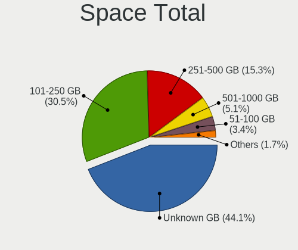
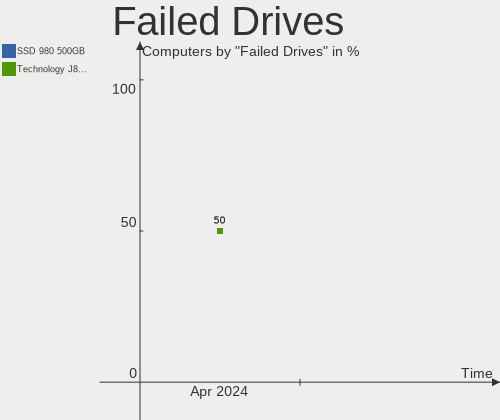
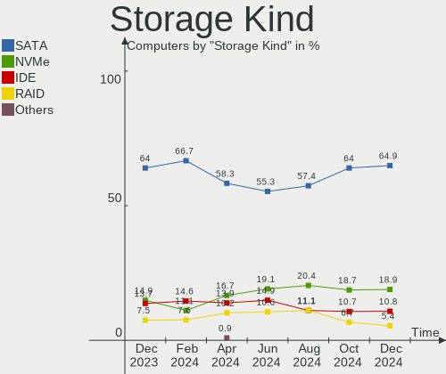
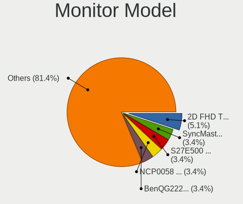

BlackPanther Hardware Trends
----------------------------

A project to identify most popular hardware characteristics and track their change
over time based on data collected by BlackPanther users at https://Linux-Hardware.org.

Anyone can contribute to the study by uploading probes of their computers by
the [hw-probe](https://github.com/linuxhw/hw-probe) tool:

    sudo hw-probe -all -upload

This is a report for all computer types. See also reports for [desktops](/Dist/BlackPanther/Desktop/README.md) and [notebooks](/Dist/BlackPanther/Notebook/README.md).

Full-feature report is available here: https://linux-hardware.org/?view=trends

Period: Feb, 2020.

Contents
--------

- [ OS                       ](#os)
- [ OS Family                ](#os-family)
- [ Kernel                   ](#kernel)
- [ Kernel Family            ](#kernel-family)
- [ Kernel Major Ver.        ](#kernel-major-ver)
- [ Arch                     ](#arch)
- [ DE                       ](#de)
- [ Display Server           ](#display-server)
- [ OS Lang                  ](#os-lang)
- [ Boot Mode                ](#boot-mode)
- [ Filesystem               ](#filesystem)
- [ Dual Boot with Linux     ](#dual-boot-with-linux)
- [ Dual Boot (Win)          ](#dual-boot-win)
- [ Country                  ](#country)
- [ City                     ](#city)
- [ Vendor                   ](#vendor)
- [ Model                    ](#model)
- [ Model Family             ](#model-family)
- [ MFG Year                 ](#mfg-year)
- [ Form Factor              ](#form-factor)
- [ Secure Boot              ](#secure-boot)
- [ Coreboot                 ](#coreboot)
- [ RAM Size                 ](#ram-size)
- [ RAM Used                 ](#ram-used)
- [ Drive Vendor             ](#drive-vendor)
- [ Drive Model              ](#drive-model)
- [ Drive Kind               ](#drive-kind)
- [ Drive Connector          ](#drive-connector)
- [ Drive Size               ](#drive-size)
- [ Space Total              ](#space-total)
- [ Space Used               ](#space-used)
- [ Malfunc. Drives          ](#malfunc-drives)
- [ Malfunc. Drive Vendor    ](#malfunc-drive-vendor)
- [ Malfunc. Drive Kind      ](#malfunc-drive-kind)
- [ Failed Drives            ](#failed-drives)
- [ Failed Drive Vendor      ](#failed-drive-vendor)
- [ Drive Status             ](#drive-status)
- [ Storage Vendor           ](#storage-vendor)
- [ Storage Model            ](#storage-model)
- [ Storage Kind             ](#storage-kind)
- [ CPU Vendor               ](#cpu-vendor)
- [ CPU Model                ](#cpu-model)
- [ CPU Model Family         ](#cpu-model-family)
- [ CPU Cores                ](#cpu-cores)
- [ CPU Sockets              ](#cpu-sockets)
- [ CPU Threads              ](#cpu-threads)
- [ CPU Op-Modes             ](#cpu-op-modes)
- [ CPU Microarch            ](#cpu-microarch)
- [ CPU Microcode            ](#cpu-microcode)
- [ GPU Vendor               ](#gpu-vendor)
- [ GPU Model                ](#gpu-model)
- [ GPU Combo                ](#gpu-combo)
- [ GPU Driver               ](#gpu-driver)
- [ GPU Memory               ](#gpu-memory)
- [ Monitor Vendor           ](#monitor-vendor)
- [ Monitor Model            ](#monitor-model)
- [ Monitor Resolution       ](#monitor-resolution)
- [ Monitor Diagonal         ](#monitor-diagonal)
- [ Monitor Width            ](#monitor-width)
- [ Aspect Ratio             ](#aspect-ratio)
- [ Monitor Area             ](#monitor-area)
- [ Pixel Density            ](#pixel-density)
- [ Multiple Monitors        ](#multiple-monitors)
- [ Net Controller Vendor    ](#net-controller-vendor)
- [ Net Controller Model     ](#net-controller-model)
- [ Net Controller Kind      ](#net-controller-kind)
- [ Used Controller          ](#used-controller)
- [ NICs                     ](#nics)
- [ Unsupported Devices      ](#unsupported-devices)
- [ Unsupported Device Types ](#unsupported-device-types)

OS
--

Installed operating systems

| Name              | Computers | Percent |
|-------------------|-----------|---------|
| BlackPanther 18.1 | 240       | 93.39%  |
| BlackPanther 16.2 | 16        | 6.23%   |
| BlackPanther 16.1 | 1         | 0.39%   |

OS Family
---------

OS without a version

| Name         | Computers | Percent |
|--------------|-----------|---------|
| BlackPanther | 257       | 100%    |

Kernel
------

Version of the Linux kernel

| Version                | Computers | Percent |
|------------------------|-----------|---------|
| 4.18.16-desktop-1bP    | 169       | 65.76%  |
| 5.1.15-desktop-1bP     | 70        | 27.24%  |
| 4.9.20-desktop-pae-1bP | 15        | 5.84%   |
| 5.1.15-server-1bP      | 1         | 0.39%   |
| 4.9.20-desktop-1bP     | 1         | 0.39%   |
| 4.7.0-desktop-1bP      | 1         | 0.39%   |

Kernel Family
-------------

Linux kernel without a distro release

| Version | Computers | Percent |
|---------|-----------|---------|
| 4.18.16 | 169       | 65.76%  |
| 5.1.15  | 71        | 27.63%  |
| 4.9.20  | 16        | 6.23%   |
| 4.7.0   | 1         | 0.39%   |

Kernel Major Ver.
-----------------

Linux kernel major version

| Version | Computers | Percent |
|---------|-----------|---------|
| 4.18    | 169       | 65.76%  |
| 5.1     | 71        | 27.63%  |
| 4.9     | 16        | 6.23%   |
| 4.7     | 1         | 0.39%   |

Arch
----

OS architecture (x86_64, i586, etc.)

| Name   | Computers | Percent |
|--------|-----------|---------|
| x86_64 | 240       | 93.39%  |
| i686   | 17        | 6.61%   |

DE
--

Desktop Environment

| Name   | Computers | Percent |
|--------|-----------|---------|
| KDE5   | 256       | 99.61%  |
| Budgie | 1         | 0.39%   |

Display Server
--------------

X11 or Wayland

| Name | Computers | Percent |
|------|-----------|---------|
| X11  | 257       | 100%    |

OS Lang
-------

Language

| Lang    | Computers | Percent |
|---------|-----------|---------|
| Unknown | 257       | 100%    |

Boot Mode
---------

EFI or BIOS

| Mode | Computers | Percent |
|------|-----------|---------|
| BIOS | 180       | 70.04%  |
| EFI  | 77        | 29.96%  |

Filesystem
----------

Type of filesystem

| Type    | Computers | Percent |
|---------|-----------|---------|
| Ext4    | 242       | 94.16%  |
| Overlay | 15        | 5.84%   |

Dual Boot with Linux
--------------------

Hosting more than one Linux

| Dual boot | Computers | Percent |
|-----------|-----------|---------|
| No        | 200       | 77.82%  |
| Yes       | 57        | 22.18%  |

Dual Boot (Win)
---------------

Hosting Linux and Windows

| Dual boot | Computers | Percent |
|-----------|-----------|---------|
| No        | 150       | 58.37%  |
| Yes       | 107       | 41.63%  |

Country
-------

Geographic location (country)

| Country              | Computers | Percent |
|----------------------|-----------|---------|
| Hungary              | 200       | 77.82%  |
| Germany              | 17        | 6.61%   |
| USA                  | 10        | 3.89%   |
| Romania              | 6         | 2.33%   |
| UK                   | 5         | 1.95%   |
| Slovakia             | 4         | 1.56%   |
| France               | 3         | 1.17%   |
| Canada               | 2         | 0.78%   |
| Turkey               | 1         | 0.39%   |
| Serbia               | 1         | 0.39%   |
| Puerto Rico          | 1         | 0.39%   |
| Poland               | 1         | 0.39%   |
| Philippines          | 1         | 0.39%   |
| Moldova, Republic of | 1         | 0.39%   |
| Italy                | 1         | 0.39%   |
| Greece               | 1         | 0.39%   |
| Brazil               | 1         | 0.39%   |
| Australia            | 1         | 0.39%   |

City
----

Geographic location (city)

| City                | Computers | Percent |
|---------------------|-----------|---------|
| Budapest            | 53        | 20.62%  |
| Miskolc             | 9         | 3.5%    |
| Eger                | 8         | 3.11%   |
| Székesfehérvár   | 7         | 2.72%   |
| Gödöllő          | 7         | 2.72%   |
| Szigetszentmiklos   | 6         | 2.33%   |
| Győr               | 6         | 2.33%   |
| Debrecen            | 6         | 2.33%   |
| Zalaegerszeg        | 4         | 1.56%   |
| Szentgyorgyvolgy    | 4         | 1.56%   |
| Regensburg          | 4         | 1.56%   |
| Nuremberg           | 4         | 1.56%   |
| Érd                | 3         | 1.17%   |
| Tata                | 3         | 1.17%   |
| Szombathely         | 3         | 1.17%   |
| Pécs               | 3         | 1.17%   |
| Nyiregyhaza         | 3         | 1.17%   |
| Veszprém           | 2         | 0.78%   |
| Tottenham           | 2         | 0.78%   |
| Tiszafured          | 2         | 0.78%   |
| Oroshaza            | 2         | 0.78%   |
| Laupheim            | 2         | 0.78%   |
| Kiskoros            | 2         | 0.78%   |
| Kisbucsa            | 2         | 0.78%   |
| Keszthely           | 2         | 0.78%   |
| Janoshalma          | 2         | 0.78%   |
| Hodmezovasarhely    | 2         | 0.78%   |
| Hatvan              | 2         | 0.78%   |
| Gyomro              | 2         | 0.78%   |
| Csakbereny          | 2         | 0.78%   |
| Alsoberecki         | 2         | 0.78%   |
| Zamoly              | 1         | 0.39%   |
| Zalalovo            | 1         | 0.39%   |
| Wysokie Mazowieckie | 1         | 0.39%   |
| Wilmington          | 1         | 0.39%   |
| Voluntari           | 1         | 0.39%   |
| Vicovu de Sus       | 1         | 0.39%   |
| Vecses              | 1         | 0.39%   |
| Ujiraz              | 1         | 0.39%   |
| Târgu Mureş       | 1         | 0.39%   |
| Tura                | 1         | 0.39%   |
| Toronto             | 1         | 0.39%   |
| Tornaľa            | 1         | 0.39%   |
| Tiszakecske         | 1         | 0.39%   |
| Thessaloniki        | 1         | 0.39%   |
| Thalmassing         | 1         | 0.39%   |
| Tatabánya          | 1         | 0.39%   |
| Tarnok              | 1         | 0.39%   |
| Szigethalom         | 1         | 0.39%   |
| Szekszárd          | 1         | 0.39%   |
| Szeged              | 1         | 0.39%   |
| Szabadbattyan       | 1         | 0.39%   |
| Sumter              | 1         | 0.39%   |
| Somogysard          | 1         | 0.39%   |
| Soltvadkert         | 1         | 0.39%   |
| Siófok             | 1         | 0.39%   |
| Seattle             | 1         | 0.39%   |
| Schweitenkirchen    | 1         | 0.39%   |
| Sarvar              | 1         | 0.39%   |
| Sarospatak          | 1         | 0.39%   |

Vendor
------

Motherboard manufacturer

| Name                | Computers | Percent |
|---------------------|-----------|---------|
| ASUSTek Computer    | 41        | 15.95%  |
| Dell                | 40        | 15.56%  |
| Hewlett-Packard     | 37        | 14.4%   |
| Lenovo              | 33        | 12.84%  |
| Gigabyte Technology | 30        | 11.67%  |
| ASRock              | 15        | 5.84%   |
| Acer                | 12        | 4.67%   |
| Toshiba             | 8         | 3.11%   |
| Samsung Electronics | 7         | 2.72%   |
| MSI                 | 7         | 2.72%   |
| Fujitsu             | 7         | 2.72%   |
| Fujitsu Siemens     | 3         | 1.17%   |
| Foxconn             | 3         | 1.17%   |
| Sony                | 2         | 0.78%   |
| Medion              | 2         | 0.78%   |
| Intel               | 2         | 0.78%   |
| Apple               | 2         | 0.78%   |
| Unknown             | 2         | 0.78%   |
| Gateway             | 1         | 0.39%   |
| EMAXX TECHNOLOGY    | 1         | 0.39%   |
| eMachines           | 1         | 0.39%   |
| Biostar             | 1         | 0.39%   |

Model
-----

Motherboard model

| Name                                                       | Computers | Percent |
|------------------------------------------------------------|-----------|---------|
| HP 250 G1                                                  | 5         | 1.95%   |
| HP Notebook                                                | 3         | 1.17%   |
| HP EliteBook 8460p                                         | 3         | 1.17%   |
| Gigabyte G31M-ES2L                                         | 3         | 1.17%   |
| ASUS All Series                                            | 3         | 1.17%   |
| Toshiba Satellite C660                                     | 2         | 0.78%   |
| Lenovo G550 20023                                          | 2         | 0.78%   |
| HP Pavilion g6                                             | 2         | 0.78%   |
| HP EliteBook 8470p                                         | 2         | 0.78%   |
| Gigabyte H61M-S1                                           | 2         | 0.78%   |
| Gigabyte B85M-DS3H-A                                       | 2         | 0.78%   |
| Fujitsu Siemens ESPRIMO E                                  | 2         | 0.78%   |
| Foxconn Pro 3500 Series                                    | 2         | 0.78%   |
| Dell OptiPlex 3020                                         | 2         | 0.78%   |
| Dell Latitude E7240                                        | 2         | 0.78%   |
| Dell Latitude E6540                                        | 2         | 0.78%   |
| Dell Latitude E6400                                        | 2         | 0.78%   |
| Dell Inspiron 5558                                         | 2         | 0.78%   |
| ASUS X541NA                                                | 2         | 0.78%   |
| ASUS VivoBook 15_ASUS Laptop X540UAR                       | 2         | 0.78%   |
| ASRock FM2A75M Pro4+                                       | 2         | 0.78%   |
| Unknown                                                    | 2         | 0.78%   |
| Toshiba Satellite P300                                     | 1         | 0.39%   |
| Toshiba Satellite L855                                     | 1         | 0.39%   |
| Toshiba Satellite L300                                     | 1         | 0.39%   |
| Toshiba Satellite C55D-A                                   | 1         | 0.39%   |
| Toshiba Satellite C50-A-1G1                                | 1         | 0.39%   |
| Toshiba PORTEGE R830                                       | 1         | 0.39%   |
| Sony VPCEH2N1E                                             | 1         | 0.39%   |
| Sony VGN-FZ140E                                            | 1         | 0.39%   |
| Samsung Electronics RV410/RV510/S3510/E3510                | 1         | 0.39%   |
| Samsung Electronics RV409/RV509/RV709                      | 1         | 0.39%   |
| Samsung Electronics R540/R580/R780/SA41/E452/E852          | 1         | 0.39%   |
| Samsung Electronics N150/N210/N220                         | 1         | 0.39%   |
| Samsung Electronics 350V5C/351V5C/3540VC/3440VC            | 1         | 0.39%   |
| Samsung Electronics 300E5EV/300E4EV/270E5EV/270E4EV/2470EV | 1         | 0.39%   |
| Samsung Electronics 300E4A/300E5A/300E7A/3430EA/3530EA     | 1         | 0.39%   |
| MSI VR601                                                  | 1         | 0.39%   |
| MSI MS-7A74                                                | 1         | 0.39%   |
| MSI MS-7883                                                | 1         | 0.39%   |
| MSI MS-7309                                                | 1         | 0.39%   |
| MSI MS-7235                                                | 1         | 0.39%   |
| MSI MS-1738                                                | 1         | 0.39%   |
| MSI GX720                                                  | 1         | 0.39%   |
| Medion E7214                                               | 1         | 0.39%   |
| Medion BTDD-LT                                             | 1         | 0.39%   |
| Lenovo ThinkStation D20 4158AF8                            | 1         | 0.39%   |
| Lenovo ThinkPad X61 7673BW3                                | 1         | 0.39%   |
| Lenovo ThinkPad X200 Tablet 7453WRX                        | 1         | 0.39%   |
| Lenovo ThinkPad X200 74595FG                               | 1         | 0.39%   |
| Lenovo ThinkPad X1 Carbon 34608G1                          | 1         | 0.39%   |
| Lenovo ThinkPad W510 431924G                               | 1         | 0.39%   |
| Lenovo ThinkPad T61 6458Y56                                | 1         | 0.39%   |
| Lenovo ThinkPad T450 20BUS09Y0E                            | 1         | 0.39%   |
| Lenovo ThinkPad T440s 20ARS0MS00                           | 1         | 0.39%   |
| Lenovo ThinkPad T420 4236Z9U                               | 1         | 0.39%   |
| Lenovo ThinkPad T420 4236BD5                               | 1         | 0.39%   |
| Lenovo ThinkPad T410 2537VFQ                               | 1         | 0.39%   |
| Lenovo ThinkPad T400 2768WGB                               | 1         | 0.39%   |
| Lenovo ThinkPad R500 27148UG                               | 1         | 0.39%   |

Model Family
------------

Motherboard model prefix

| Name                        | Computers | Percent |
|-----------------------------|-----------|---------|
| Dell Latitude               | 15        | 5.84%   |
| Lenovo ThinkPad             | 13        | 5.06%   |
| Dell OptiPlex               | 11        | 4.28%   |
| Dell Inspiron               | 10        | 3.89%   |
| Lenovo IdeaPad              | 8         | 3.11%   |
| Toshiba Satellite           | 7         | 2.72%   |
| Acer Aspire                 | 7         | 2.72%   |
| HP Pavilion                 | 5         | 1.95%   |
| HP EliteBook                | 5         | 1.95%   |
| HP Compaq                   | 5         | 1.95%   |
| HP 250                      | 5         | 1.95%   |
| HP ProBook                  | 4         | 1.56%   |
| ASUS VivoBook               | 4         | 1.56%   |
| Acer TravelMate             | 4         | 1.56%   |
| Lenovo ThinkCentre          | 3         | 1.17%   |
| HP Notebook                 | 3         | 1.17%   |
| Gigabyte G31M-ES2L          | 3         | 1.17%   |
| Fujitsu Siemens ESPRIMO     | 3         | 1.17%   |
| Fujitsu LIFEBOOK            | 3         | 1.17%   |
| ASUS All                    | 3         | 1.17%   |
| Lenovo G550                 | 2         | 0.78%   |
| Gigabyte H61M-S1            | 2         | 0.78%   |
| Gigabyte B85M-DS3H-A        | 2         | 0.78%   |
| Fujitsu ESPRIMO             | 2         | 0.78%   |
| Foxconn Pro                 | 2         | 0.78%   |
| Dell Precision              | 2         | 0.78%   |
| ASUS X541NA                 | 2         | 0.78%   |
| ASUS ROG                    | 2         | 0.78%   |
| ASUS P5KPL-AM               | 2         | 0.78%   |
| ASRock FM2A75M              | 2         | 0.78%   |
| Unknown                     | 2         | 0.78%   |
| Toshiba PORTEGE             | 1         | 0.39%   |
| Sony VPCEH2N1E              | 1         | 0.39%   |
| Sony VGN-FZ140E             | 1         | 0.39%   |
| Samsung Electronics RV410   | 1         | 0.39%   |
| Samsung Electronics RV409   | 1         | 0.39%   |
| Samsung Electronics R540    | 1         | 0.39%   |
| Samsung Electronics N150    | 1         | 0.39%   |
| Samsung Electronics 350V5C  | 1         | 0.39%   |
| Samsung Electronics 300E5EV | 1         | 0.39%   |
| Samsung Electronics 300E4A  | 1         | 0.39%   |
| MSI VR601                   | 1         | 0.39%   |
| MSI MS-7A74                 | 1         | 0.39%   |
| MSI MS-7883                 | 1         | 0.39%   |
| MSI MS-7309                 | 1         | 0.39%   |
| MSI MS-7235                 | 1         | 0.39%   |
| MSI MS-1738                 | 1         | 0.39%   |
| MSI GX720                   | 1         | 0.39%   |
| Medion E7214                | 1         | 0.39%   |
| Medion BTDD-LT              | 1         | 0.39%   |
| Lenovo ThinkStation         | 1         | 0.39%   |
| Lenovo S10-3                | 1         | 0.39%   |
| Lenovo G70-70               | 1         | 0.39%   |
| Lenovo G500                 | 1         | 0.39%   |
| Lenovo G50-30               | 1         | 0.39%   |
| Lenovo Flex                 | 1         | 0.39%   |
| Lenovo 3000                 | 1         | 0.39%   |
| Intel Nobilis               | 1         | 0.39%   |
| Intel DH61CR                | 1         | 0.39%   |
| HP t520                     | 1         | 0.39%   |

MFG Year
--------

Motherboard manufacture year

| Year | Computers | Percent |
|------|-----------|---------|
| 2018 | 27        | 10.51%  |
| 2013 | 27        | 10.51%  |
| 2010 | 27        | 10.51%  |
| 2011 | 25        | 9.73%   |
| 2015 | 23        | 8.95%   |
| 2012 | 21        | 8.17%   |
| 2014 | 20        | 7.78%   |
| 2019 | 18        | 7%      |
| 2009 | 17        | 6.61%   |
| 2008 | 17        | 6.61%   |
| 2016 | 13        | 5.06%   |
| 2017 | 10        | 3.89%   |
| 2007 | 6         | 2.33%   |
| 2006 | 3         | 1.17%   |
| 2005 | 3         | 1.17%   |

Form Factor
-----------

Physical design of the computer

| Name        | Computers | Percent |
|-------------|-----------|---------|
| Notebook    | 145       | 56.42%  |
| Desktop     | 109       | 42.41%  |
| All in one  | 2         | 0.78%   |
| Convertible | 1         | 0.39%   |

Secure Boot
-----------

Enabled or disabled

| State    | Computers | Percent |
|----------|-----------|---------|
| Disabled | 257       | 100%    |

Coreboot
--------

Have coreboot on board

| Used | Computers | Percent |
|------|-----------|---------|
| No   | 257       | 100%    |

RAM Size
--------

Total RAM memory

| Size in GB | Computers | Percent |
|------------|-----------|---------|
| 3.01-4.0   | 108       | 42.02%  |
| 8.01-16.0  | 58        | 22.57%  |
| 4.01-8.0   | 45        | 17.51%  |
| 16.01-24.0 | 15        | 5.84%   |
| 1.01-2.0   | 15        | 5.84%   |
| 2.01-3.0   | 13        | 5.06%   |
| 0.01-1.0   | 2         | 0.78%   |
| 32.01-64.0 | 1         | 0.39%   |

RAM Used
--------

Used RAM memory

| Used GB   | Computers | Percent |
|-----------|-----------|---------|
| 0.01-1.0  | 131       | 50.97%  |
| 1.01-2.0  | 94        | 36.58%  |
| 2.01-3.0  | 22        | 8.56%   |
| 3.01-4.0  | 7         | 2.72%   |
| 4.01-8.0  | 2         | 0.78%   |
| 8.01-16.0 | 1         | 0.39%   |

Drive Vendor
------------

Hard drive vendors

| Vendor              | Computers | Drives  | Percent |
|---------------------|-----------|---------|---------|
| WDC                 | 63        | 74      | 18%     |
| Seagate             | 63        | 70      | 18%     |
| Toshiba             | 35        | 37      | 10%     |
| Samsung Electronics | 33        | 37      | 9.43%   |
| Kingston            | 31        | 37      | 8.86%   |
| Hitachi             | 21        | 22      | 6%      |
| HGST                | 19        | 19      | 5.43%   |
| SanDisk             | 15        | 19      | 4.29%   |
| A-DATA Technology   | 10        | 11      | 2.86%   |
| SK Hynix            | 6         | 6       | 1.71%   |
| Unknown             | 4         | 4       | 1.14%   |
| Intel               | 4         | 4       | 1.14%   |
| Crucial             | 4         | 4       | 1.14%   |
| Patriot             | 3         | 3       | 0.86%   |
| HL-DT-ST            | 3         | Unknown | 0.86%   |
| Hewlett-Packard     | 3         | 3       | 0.86%   |
| Fujitsu             | 3         | 3       | 0.86%   |
| China               | 3         | 3       | 0.86%   |
| SPCC                | 2         | 2       | 0.57%   |
| Micron Technology   | 2         | 2       | 0.57%   |
| LITEONIT            | 2         | 2       | 0.57%   |
| Gigabyte Technology | 2         | 2       | 0.57%   |
| Generic             | 2         | 2       | 0.57%   |
| Apacer              | 2         | 3       | 0.57%   |
| Zheino              | 1         | 1       | 0.29%   |
| XPG                 | 1         | 1       | 0.29%   |
| WDC WD40            | 1         | 1       | 0.29%   |
| Transcend           | 1         | 1       | 0.29%   |
| Team                | 1         | 1       | 0.29%   |
| Phison              | 1         | 1       | 0.29%   |
| OCZ                 | 1         | 1       | 0.29%   |
| LITEON              | 1         | 1       | 0.29%   |
| JMicron             | 1         | 1       | 0.29%   |
| Intenso             | 1         | 1       | 0.29%   |
| HGST HTS            | 1         | 1       | 0.29%   |
| Dell                | 1         | 1       | 0.29%   |
| Corsair             | 1         | 1       | 0.29%   |
| BIWIN               | 1         | 1       | 0.29%   |
| Apple               | 1         | 1       | 0.29%   |

Drive Model
-----------

Hard drive models

| Model                        | Computers | Percent |
|------------------------------|-----------|---------|
| SA400S37240G 240GB SSD       | 7         | 1.82%   |
| SA400S37120G 120GB SSD       | 6         | 1.56%   |
| ST500DM002-1BD142 500GB      | 5         | 1.3%    |
| DT01ACA100 1TB               | 5         | 1.3%    |
| SV300S37A240G 240GB SSD      | 4         | 1.04%   |
| ST1000LM024 HN-M101MBB 1TB   | 4         | 1.04%   |
| MQ04ABF100 1TB               | 4         | 1.04%   |
| MQ01ABF050 500GB             | 4         | 1.04%   |
| M3 Portable 2TB              | 4         | 1.04%   |
| HTS721010A9E630 1TB          | 4         | 1.04%   |
| HTS545032A7E380 320GB        | 4         | 1.04%   |
| HTS541010A9E680 1TB          | 4         | 1.04%   |
| WD10EZEX-22MFCA0 1TB         | 3         | 0.78%   |
| SV300S37A120G 120GB SSD      | 3         | 0.78%   |
| SUV400S37120G 120GB SSD      | 3         | 0.78%   |
| ST380815AS 80GB              | 3         | 0.78%   |
| ST3250318AS 250GB            | 3         | 0.78%   |
| ST1000LM035-1RK172 1TB       | 3         | 0.78%   |
| SSD PLUS 240GB               | 3         | 0.78%   |
| SDSSDH3250G 250GB            | 3         | 0.78%   |
| HTS545050A7E680 500GB        | 3         | 0.78%   |
| HTS545025B9A300 250GB        | 3         | 0.78%   |
| HDS721010CLA332 1TB          | 3         | 0.78%   |
| DVDRAM GUC0N 1GB             | 3         | 0.78%   |
| DT01ACA200 2TB               | 3         | 0.78%   |
| DT01ACA050 500GB             | 3         | 0.78%   |
| WDS240G2G0B-00EPW0 240GB SSD | 2         | 0.52%   |
| WDS240G2G0A-00JH30 240GB SSD | 2         | 0.52%   |
| WD10JPVX-22JC3T0 1TB         | 2         | 0.52%   |
| WD10EZRZ-00HTKB0 1TB         | 2         | 0.52%   |
| WD10EZEX-08WN4A0 1TB         | 2         | 0.52%   |
| SU630 240GB SSD              | 2         | 0.52%   |
| STM3250318AS 250GB           | 2         | 0.52%   |
| ST980811AS 80GB              | 2         | 0.52%   |
| ST9500325AS 500GB            | 2         | 0.52%   |
| ST9250315AS 250GB            | 2         | 0.52%   |
| ST500LT012-1DG142 500GB      | 2         | 0.52%   |
| ST4000DM004-2CV104 4TB       | 2         | 0.52%   |
| ST3320311CS 320GB            | 2         | 0.52%   |
| ST1000LX015-1U7172 1TB       | 2         | 0.52%   |
| Solid State Disk 120GB       | 2         | 0.52%   |
| SDSSDH3512G 512GB            | 2         | 0.52%   |
| SDSSDH3 250G                 | 2         | 0.52%   |
| SD/MMC/MS PRO 64GB           | 2         | 0.52%   |
| SATA SSD 120GB               | 2         | 0.52%   |
| SA400S37480G 480GB SSD       | 2         | 0.52%   |
| MK6475GSX 640GB              | 2         | 0.52%   |
| HTS545050A7E380 500GB        | 2         | 0.52%   |
| Expansion 1TB                | 2         | 0.52%   |
| CT120BX500SSD1 120GB         | 2         | 0.52%   |
| AS350 256GB SSD              | 2         | 0.52%   |
| WDS500G2X0C-00L350 500GB     | 1         | 0.26%   |
| WDS120G2G0B-00EPW0 120GB SSD | 1         | 0.26%   |
| WDS120G2G0A-00JH30 120GB SSD | 1         | 0.26%   |
| WD800JD-60LSA5 80GB          | 1         | 0.26%   |
| WD800JB-00JJC0 80GB          | 1         | 0.26%   |
| WD7501AALS-00E3A0 752GB      | 1         | 0.26%   |
| WD7500BPVT-60HXZT3 752GB     | 1         | 0.26%   |
| WD6400BEVT-22A0RT0 640GB     | 1         | 0.26%   |
| WD6400AAVS-00G9B1 640GB      | 1         | 0.26%   |

Drive Kind
----------

HDD or SSD

| Kind    | Computers | Drives | Percent |
|---------|-----------|--------|---------|
| HDD     | 189       | 228    | 58.15%  |
| SSD     | 106       | 127    | 32.62%  |
| NVMe    | 14        | 15     | 4.31%   |
| Unknown | 13        | 10     | 4%      |
| MMC     | 3         | 4      | 0.92%   |

Drive Connector
---------------

SATA, SAS, NVMe, etc.

| Type | Computers | Drives | Percent |
|------|-----------|--------|---------|
| SATA | 252       | 347    | 87.2%   |
| SAS  | 20        | 18     | 6.92%   |
| NVMe | 14        | 15     | 4.84%   |
| MMC  | 3         | 4      | 1.04%   |

Drive Size
----------

Size of hard drive

| Size in TB | Computers | Drives | Percent |
|------------|-----------|--------|---------|
| 0.01-0.5   | 216       | 269    | 67.92%  |
| 0.51-1.0   | 79        | 87     | 24.84%  |
| 1.01-2.0   | 17        | 21     | 5.35%   |
| 3.01-4.0   | 3         | 4      | 0.94%   |
| 2.01-3.0   | 3         | 3      | 0.94%   |

Space Total
-----------

Amount of disk space available on the file system

| Size in GB     | Computers | Percent |
|----------------|-----------|---------|
| 101-250        | 99        | 38.52%  |
| 251-500        | 53        | 20.62%  |
| 21-50          | 27        | 10.51%  |
| 501-1000       | 27        | 10.51%  |
| 51-100         | 21        | 8.17%   |
| Unknown        | 12        | 4.67%   |
| 1001-2000      | 10        | 3.89%   |
| 2001-3000      | 4         | 1.56%   |
| More than 3000 | 3         | 1.17%   |
| 1-20           | 1         | 0.39%   |

Space Used
----------

Amount of used disk space

| Used GB        | Computers | Percent |
|----------------|-----------|---------|
| 1-20           | 156       | 60.7%   |
| 21-50          | 36        | 14.01%  |
| 51-100         | 25        | 9.73%   |
| Unknown        | 12        | 4.67%   |
| 101-250        | 10        | 3.89%   |
| 501-1000       | 8         | 3.11%   |
| 251-500        | 5         | 1.95%   |
| 1001-2000      | 3         | 1.17%   |
| More than 3000 | 1         | 0.39%   |
| 2001-3000      | 1         | 0.39%   |

Malfunc. Drives
---------------

Drive models with a malfunction

| Model                    | Computers | Drives | Percent |
|--------------------------|-----------|--------|---------|
| HTS545032A7E380 320GB    | 4         | 4      | 4.35%   |
| ST500DM002-1BD142 500GB  | 3         | 3      | 3.26%   |
| HTS541010A9E680 1TB      | 3         | 3      | 3.26%   |
| HDS721010CLA332 1TB      | 3         | 3      | 3.26%   |
| ST9500325AS 500GB        | 2         | 2      | 2.17%   |
| MQ01ABF050 500GB         | 2         | 2      | 2.17%   |
| HTS545050A7E680 500GB    | 2         | 2      | 2.17%   |
| HTS545050A7E380 500GB    | 2         | 2      | 2.17%   |
| HTS545025B9A300 250GB    | 2         | 2      | 2.17%   |
| DT01ACA050 500GB         | 2         | 2      | 2.17%   |
| WD800JB-00JJC0 80GB      | 1         | 1      | 1.09%   |
| WD7500BPVT-60HXZT3 752GB | 1         | 1      | 1.09%   |
| WD6400BEVT-22A0RT0 640GB | 1         | 1      | 1.09%   |
| WD6400AAVS-00G9B1 640GB  | 1         | 1      | 1.09%   |
| WD5000AAKX-75U6AA0 500GB | 1         | 1      | 1.09%   |
| WD5000AAKX-60U6AA0 500GB | 1         | 1      | 1.09%   |
| WD5000AAKS-00UU3A0 500GB | 1         | 1      | 1.09%   |
| WD5000AAKS-007AA0 500GB  | 1         | 1      | 1.09%   |
| WD3200AAKS-00UU3A0 320GB | 1         | 1      | 1.09%   |
| WD3200AAJS-00L7A0 320GB  | 1         | 1      | 1.09%   |
| WD30EFRX-68EUZN0 3TB     | 1         | 1      | 1.09%   |
| WD2500BEKT-60PVMT0 250GB | 1         | 1      | 1.09%   |
| WD20EFRX-68EUZN0 2TB     | 1         | 1      | 1.09%   |
| WD20EARS-60MVWB0 2TB     | 1         | 1      | 1.09%   |
| WD20EARS-00J2GB0 2TB     | 1         | 1      | 1.09%   |
| WD20EADS-00S2B0 2TB      | 1         | 1      | 1.09%   |
| WD2000JB-00GVA0 200GB    | 1         | 1      | 1.09%   |
| WD10EZEX-75WN4A0 1TB     | 1         | 1      | 1.09%   |
| WD10EZEX-22MFCA0 1TB     | 1         | 1      | 1.09%   |
| WD10EZEX-08WN4A0 1TB     | 1         | 1      | 1.09%   |
| WD10EARS-00Y5B1 1TB      | 1         | 1      | 1.09%   |
| WD10EARS-00MVWB0 1TB     | 1         | 1      | 1.09%   |
| VB0250EAVER 250GB        | 1         | 1      | 1.09%   |
| SV300S37A120G 120GB SSD  | 1         | 1      | 1.09%   |
| SUV400S37240G 240GB SSD  | 1         | 1      | 1.09%   |
| STM3250318AS 250GB       | 1         | 1      | 1.09%   |
| ST980811AS 80GB          | 1         | 1      | 1.09%   |
| ST9500420AS 500GB        | 1         | 1      | 1.09%   |
| ST9320325AS 320GB        | 1         | 1      | 1.09%   |
| ST9250315AS 250GB        | 1         | 1      | 1.09%   |
| ST500LT012-9WS142 500GB  | 1         | 1      | 1.09%   |
| ST500LM021-1KJ152 500GB  | 1         | 1      | 1.09%   |
| ST3320613AS 320GB        | 1         | 1      | 1.09%   |
| ST3250318AS 250GB        | 1         | 1      | 1.09%   |
| ST320LT020-9YG142 320GB  | 1         | 1      | 1.09%   |
| ST320LT007-9ZV142 320GB  | 1         | 1      | 1.09%   |
| ST3120026AS 120GB        | 1         | 1      | 1.09%   |
| ST2000LM007-1R8174 2TB   | 1         | 1      | 1.09%   |
| ST1000LX015-1U7172 1TB   | 1         | 1      | 1.09%   |
| SP1614C 160GB            | 1         | 1      | 1.09%   |
| SHPM2280P2H 480G SSD     | 1         | 1      | 1.09%   |
| SH920 mSATA 128GB SSD    | 1         | 1      | 1.09%   |
| SC210 2.5 7MM 128GB SSD  | 1         | 1      | 1.09%   |
| SA400S37120G 120GB SSD   | 1         | 2      | 1.09%   |
| MK3275GSX 320GB          | 1         | 1      | 1.09%   |
| MK3265GSXN 320GB         | 1         | 1      | 1.09%   |
| MK2546GSX 250GB          | 1         | 1      | 1.09%   |
| MK2035GSS 200GB          | 1         | 1      | 1.09%   |
| MK1059GSM 1TB            | 1         | 1      | 1.09%   |
| MHV2080AH 80GB           | 1         | 1      | 1.09%   |

Malfunc. Drive Vendor
---------------------

Vendors of faulty drives

| Vendor              | Computers | Drives | Percent |
|---------------------|-----------|--------|---------|
| WDC                 | 20        | 22     | 22.73%  |
| Seagate             | 19        | 19     | 21.59%  |
| Hitachi             | 16        | 17     | 18.18%  |
| Toshiba             | 10        | 10     | 11.36%  |
| HGST                | 10        | 10     | 11.36%  |
| Samsung Electronics | 5         | 6      | 5.68%   |
| Kingston            | 4         | 5      | 4.55%   |
| SK Hynix            | 2         | 2      | 2.27%   |
| Hewlett-Packard     | 1         | 1      | 1.14%   |
| Fujitsu             | 1         | 1      | 1.14%   |

Malfunc. Drive Kind
-------------------

Kinds of faulty drives

| Kind | Computers | Drives | Percent |
|------|-----------|--------|---------|
| HDD  | 77        | 86     | 92.77%  |
| SSD  | 6         | 7      | 7.23%   |

Failed Drives
-------------

Failed drive models

| Model                      | Computers | Drives | Percent |
|----------------------------|-----------|--------|---------|
| ST380815AS 80GB            | 1         | 1      | 50%     |
| ST1000LM024 HN-M101MBB 1TB | 1         | 1      | 50%     |

Failed Drive Vendor
-------------------

Failed drive vendors

| Vendor  | Computers | Drives | Percent |
|---------|-----------|--------|---------|
| Seagate | 2         | 2      | 100%    |

Drive Status
------------

Number of failed and malfunc. drives

| Status   | Computers | Drives | Percent |
|----------|-----------|--------|---------|
| Works    | 185       | 253    | 61.06%  |
| Malfunc  | 83        | 93     | 27.39%  |
| Detected | 33        | 36     | 10.89%  |
| Failed   | 2         | 2      | 0.66%   |

Storage Vendor
--------------

Storage controller vendors

| Vendor                       | Computers | Percent |
|------------------------------|-----------|---------|
| Intel                        | 211       | 73.26%  |
| AMD                          | 37        | 12.85%  |
| JMicron Technology           | 10        | 3.47%   |
| Nvidia                       | 7         | 2.43%   |
| Marvell Technology Group     | 7         | 2.43%   |
| Samsung Electronics          | 4         | 1.39%   |
| Silicon Motion               | 2         | 0.69%   |
| Phison Electronics           | 2         | 0.69%   |
| Kingston Technology Company  | 2         | 0.69%   |
| Unknown                      | 1         | 0.35%   |
| Toshiba America Info Systems | 1         | 0.35%   |
| Sandisk                      | 1         | 0.35%   |
| Realtek Semiconductor        | 1         | 0.35%   |
| Micron Technology            | 1         | 0.35%   |
| ASMedia Technology           | 1         | 0.35%   |

Storage Model
-------------

Storage controller models

| Model                                                                             | Computers | Percent |
|-----------------------------------------------------------------------------------|-----------|---------|
| FCH SATA Controller [AHCI mode]                                                   | 27        | 7.48%   |
| 7 Series Chipset Family 6-port SATA Controller [AHCI mode]                        | 22        | 6.09%   |
| NM10/ICH7 Family SATA Controller [IDE mode]                                       | 17        | 4.71%   |
| 82801G (ICH7 Family) IDE Controller                                               | 13        | 3.6%    |
| 6 Series/C200 Series Chipset Family 6 port Mobile SATA AHCI Controller            | 13        | 3.6%    |
| 82801IBM/IEM (ICH9M/ICH9M-E) 4 port SATA Controller [AHCI mode]                   | 11        | 3.05%   |
| 8 Series/C220 Series Chipset Family 6-port SATA Controller 1 [AHCI mode]          | 11        | 3.05%   |
| Sunrise Point-LP SATA Controller [AHCI mode]                                      | 10        | 2.77%   |
| 8 Series SATA Controller 1 [AHCI mode]                                            | 10        | 2.77%   |
| 82801HM/HEM (ICH8M/ICH8M-E) IDE Controller                                        | 9         | 2.49%   |
| 5 Series/3400 Series Chipset 4 port SATA AHCI Controller                          | 9         | 2.49%   |
| 82801 Mobile SATA Controller [RAID mode]                                          | 8         | 2.22%   |
| 200 Series PCH SATA controller [AHCI mode]                                        | 8         | 2.22%   |
| FCH IDE Controller                                                                | 7         | 1.94%   |
| 82801HM/HEM (ICH8M/ICH8M-E) SATA Controller [AHCI mode]                           | 7         | 1.94%   |
| 6 Series/C200 Series Chipset Family 6 port Desktop SATA AHCI Controller           | 7         | 1.94%   |
| 5 Series/3400 Series Chipset 6 port SATA AHCI Controller                          | 7         | 1.94%   |
| 82801I (ICH9 Family) 2 port SATA Controller [IDE mode]                            | 6         | 1.66%   |
| Wildcat Point-LP SATA Controller [AHCI Mode]                                      | 5         | 1.39%   |
| Non-Volatile memory controller                                                    | 5         | 1.39%   |
| Atom Processor E3800 Series SATA AHCI Controller                                  | 5         | 1.39%   |
| 82801JI (ICH10 Family) 4 port SATA IDE Controller #1                              | 5         | 1.39%   |
| 82801JI (ICH10 Family) 2 port SATA IDE Controller #2                              | 5         | 1.39%   |
| SB7x0/SB8x0/SB9x0 IDE Controller                                                  | 4         | 1.11%   |
| SATA Controller [RAID mode]                                                       | 4         | 1.11%   |
| JMB368 IDE controller                                                             | 4         | 1.11%   |
| JMB363 SATA/IDE Controller                                                        | 4         | 1.11%   |
| 82801IR/IO/IH (ICH9R/DO/DH) 4 port SATA Controller [IDE mode]                     | 4         | 1.11%   |
| 82801IBM/IEM (ICH9M/ICH9M-E) 2 port SATA Controller [IDE mode]                    | 4         | 1.11%   |
| SB7x0/SB8x0/SB9x0 SATA Controller [IDE mode]                                      | 3         | 0.83%   |
| SB7x0/SB8x0/SB9x0 SATA Controller [AHCI mode]                                     | 3         | 0.83%   |
| NVMe SSD Controller SM981/PM981/PM983                                             | 3         | 0.83%   |
| NM10/ICH7 Family SATA Controller [AHCI mode]                                      | 3         | 0.83%   |
| MCP61 SATA Controller                                                             | 3         | 0.83%   |
| MCP61 IDE                                                                         | 3         | 0.83%   |
| FCH SATA Controller [IDE mode]                                                    | 3         | 0.83%   |
| Celeron N3350/Pentium N4200/Atom E3900 Series SATA AHCI Controller                | 3         | 0.83%   |
| 88SE6111/6121 SATA II / PATA Controller                                           | 3         | 0.83%   |
| 82801HR/HO/HH (ICH8R/DO/DH) 2 port SATA Controller [IDE mode]                     | 3         | 0.83%   |
| 82801HM/HEM (ICH8M/ICH8M-E) SATA Controller [IDE mode]                            | 3         | 0.83%   |
| 82801H (ICH8 Family) 4 port SATA Controller [IDE mode]                            | 3         | 0.83%   |
| 82801GBM/GHM (ICH7-M Family) SATA Controller [IDE mode]                           | 3         | 0.83%   |
| Q170/Q150/B150/H170/H110/Z170/CM236 Chipset SATA Controller [AHCI Mode]           | 2         | 0.55%   |
| HM170/QM170 Chipset SATA Controller [AHCI Mode]                                   | 2         | 0.55%   |
| Atom/Celeron/Pentium Processor x5-E8000/J3xxx/N3xxx Series SATA Controller        | 2         | 0.55%   |
| 82801JI (ICH10 Family) SATA AHCI Controller                                       | 2         | 0.55%   |
| 82801JD/DO (ICH10 Family) 4-port SATA IDE Controller                              | 2         | 0.55%   |
| 82801JD/DO (ICH10 Family) 2-port SATA IDE Controller                              | 2         | 0.55%   |
| 82801IB (ICH9) 2 port SATA Controller [IDE mode]                                  | 2         | 0.55%   |
| 82801FB/FBM/FR/FW/FRW (ICH6 Family) IDE Controller                                | 2         | 0.55%   |
| 6 Series/C200 Series Chipset Family Desktop SATA Controller (IDE mode, ports 4-5) | 2         | 0.55%   |
| 6 Series/C200 Series Chipset Family Desktop SATA Controller (IDE mode, ports 0-3) | 2         | 0.55%   |
| 5 Series/3400 Series Chipset 4 port SATA IDE Controller                           | 2         | 0.55%   |
| 5 Series/3400 Series Chipset 2 port SATA IDE Controller                           | 2         | 0.55%   |
| 4 Series Chipset PT IDER Controller                                               | 2         | 0.55%   |
| X370 Series Chipset SATA Controller                                               | 1         | 0.28%   |
| WD Black 2018/PC SN720 NVMe SSD                                                   | 1         | 0.28%   |
| Toshiba America Info Non-Volatile memory controller                               | 1         | 0.28%   |
| SSD Pro 7600p/760p/E 6100p Series                                                 | 1         | 0.28%   |
| SSD 660P Series                                                                   | 1         | 0.28%   |

Storage Kind
------------

Kind of storage controller (IDE, SATA, NVMe, SAS, ...)

| Kind | Computers | Percent |
|------|-----------|---------|
| SATA | 188       | 63.73%  |
| IDE  | 80        | 27.12%  |
| NVMe | 14        | 4.75%   |
| RAID | 13        | 4.41%   |

CPU Vendor
----------

Processor vendors

| Vendor | Computers | Percent |
|--------|-----------|---------|
| Intel  | 214       | 83.27%  |
| AMD    | 43        | 16.73%  |

CPU Model
---------

Processor models

| Model                                       | Computers | Percent |
|---------------------------------------------|-----------|---------|
| Intel Core i5-2520M CPU @ 2.50GHz           | 6         | 2.33%   |
| Intel Celeron CPU 1000M @ 1.80GHz           | 5         | 1.95%   |
| Intel Core i5-3210M CPU @ 2.50GHz           | 4         | 1.56%   |
| Intel Core 2 Duo CPU E8400 @ 3.00GHz        | 4         | 1.56%   |
| Intel Core i5-3230M CPU @ 2.60GHz           | 3         | 1.17%   |
| Intel Core i3-5005U CPU @ 2.00GHz           | 3         | 1.17%   |
| Intel Core i3-2310M CPU @ 2.10GHz           | 3         | 1.17%   |
| Intel Core 2 Quad CPU Q6600 @ 2.40GHz       | 3         | 1.17%   |
| Intel Core 2 Duo CPU E7300 @ 2.66GHz        | 3         | 1.17%   |
| Intel Xeon CPU E5440 @ 2.83GHz              | 2         | 0.78%   |
| Intel Pentium Dual-Core CPU E6500 @ 2.93GHz | 2         | 0.78%   |
| Intel Pentium Dual-Core CPU E5700 @ 3.00GHz | 2         | 0.78%   |
| Intel Pentium CPU G4560 @ 3.50GHz           | 2         | 0.78%   |
| Intel Core i7-4510U CPU @ 2.00GHz           | 2         | 0.78%   |
| Intel Core i7-3610QM CPU @ 2.30GHz          | 2         | 0.78%   |
| Intel Core i5-7200U CPU @ 2.50GHz           | 2         | 0.78%   |
| Intel Core i5-5300U CPU @ 2.30GHz           | 2         | 0.78%   |
| Intel Core i5-4460 CPU @ 3.20GHz            | 2         | 0.78%   |
| Intel Core i5-4210U CPU @ 1.70GHz           | 2         | 0.78%   |
| Intel Core i5-4210M CPU @ 2.60GHz           | 2         | 0.78%   |
| Intel Core i5-2400 CPU @ 3.10GHz            | 2         | 0.78%   |
| Intel Core i5 CPU M 520 @ 2.40GHz           | 2         | 0.78%   |
| Intel Core i5 CPU M 430 @ 2.27GHz           | 2         | 0.78%   |
| Intel Core i3-8350K CPU @ 4.00GHz           | 2         | 0.78%   |
| Intel Core i3-7020U CPU @ 2.30GHz           | 2         | 0.78%   |
| Intel Core i3-6006U CPU @ 2.00GHz           | 2         | 0.78%   |
| Intel Core i3-4160 CPU @ 3.60GHz            | 2         | 0.78%   |
| Intel Core i3-4030U CPU @ 1.90GHz           | 2         | 0.78%   |
| Intel Core i3-3220 CPU @ 3.30GHz            | 2         | 0.78%   |
| Intel Core i3-2350M CPU @ 2.30GHz           | 2         | 0.78%   |
| Intel Core i3 CPU M 380 @ 2.53GHz           | 2         | 0.78%   |
| Intel Core i3 CPU M 370 @ 2.40GHz           | 2         | 0.78%   |
| Intel Core 2 Quad CPU Q8300 @ 2.50GHz       | 2         | 0.78%   |
| Intel Core 2 Duo CPU T8300 @ 2.40GHz        | 2         | 0.78%   |
| Intel Core 2 Duo CPU T8100 @ 2.10GHz        | 2         | 0.78%   |
| Intel Core 2 Duo CPU T7500 @ 2.20GHz        | 2         | 0.78%   |
| Intel Core 2 Duo CPU P8600 @ 2.40GHz        | 2         | 0.78%   |
| Intel Core 2 Duo CPU P8400 @ 2.26GHz        | 2         | 0.78%   |
| Intel Core 2 Duo CPU E7500 @ 2.93GHz        | 2         | 0.78%   |
| Intel Core 2 CPU 6300 @ 1.86GHz             | 2         | 0.78%   |
| Intel Celeron Dual-Core CPU T3100 @ 1.90GHz | 2         | 0.78%   |
| Intel Celeron CPU N3350 @ 1.10GHz           | 2         | 0.78%   |
| Intel Atom CPU N450 @ 1.66GHz               | 2         | 0.78%   |
| AMD Athlon 64 X2 Dual Core Processor 4800+  | 2         | 0.78%   |
| AMD A8-6600K APU with Radeon HD Graphics    | 2         | 0.78%   |
| AMD A6-5400K APU with Radeon HD Graphics    | 2         | 0.78%   |
| AMD A6-4400M APU with Radeon HD Graphics    | 2         | 0.78%   |
| AMD A4-6300 APU with Radeon HD Graphics     | 2         | 0.78%   |
| Intel Xeon CPU X5677 @ 3.47GHz              | 1         | 0.39%   |
| Intel Xeon CPU X5450 @ 3.00GHz              | 1         | 0.39%   |
| Intel Xeon CPU W3550 @ 3.07GHz              | 1         | 0.39%   |
| Intel Xeon CPU W3530 @ 2.80GHz              | 1         | 0.39%   |
| Intel Pentium Silver N5000 CPU @ 1.10GHz    | 1         | 0.39%   |
| Intel Pentium M processor 1.86GHz           | 1         | 0.39%   |
| Intel Pentium Gold G5400 CPU @ 3.70GHz      | 1         | 0.39%   |
| Intel Pentium Dual-Core CPU T4400 @ 2.20GHz | 1         | 0.39%   |
| Intel Pentium Dual-Core CPU E5800 @ 3.20GHz | 1         | 0.39%   |
| Intel Pentium Dual-Core CPU E5500 @ 2.80GHz | 1         | 0.39%   |
| Intel Pentium Dual-Core CPU E5400 @ 2.70GHz | 1         | 0.39%   |
| Intel Pentium Dual-Core CPU E5200 @ 2.50GHz | 1         | 0.39%   |

CPU Model Family
----------------

Processor model prefix

| Model                   | Computers | Percent |
|-------------------------|-----------|---------|
| Intel Core i5           | 52        | 20.23%  |
| Intel Core i3           | 40        | 15.56%  |
| Intel Core 2 Duo        | 32        | 12.45%  |
| Intel Core i7           | 18        | 7%      |
| Intel Celeron           | 15        | 5.84%   |
| Intel Pentium           | 13        | 5.06%   |
| Intel Pentium Dual-Core | 9         | 3.5%    |
| Intel Core 2 Quad       | 7         | 2.72%   |
| Intel Xeon              | 6         | 2.33%   |
| AMD A6                  | 6         | 2.33%   |
| Intel Core 2            | 4         | 1.56%   |
| Intel Atom              | 4         | 1.56%   |
| AMD A8                  | 4         | 1.56%   |
| AMD A4                  | 4         | 1.56%   |
| Intel Pentium Dual      | 3         | 1.17%   |
| Intel Celeron Dual-Core | 3         | 1.17%   |
| AMD E1                  | 3         | 1.17%   |
| AMD A10                 | 3         | 1.17%   |
| Intel Pentium 4         | 2         | 0.78%   |
| AMD Ryzen 5             | 2         | 0.78%   |
| AMD Ryzen 3             | 2         | 0.78%   |
| AMD Phenom II X4        | 2         | 0.78%   |
| AMD E                   | 2         | 0.78%   |
| AMD Athlon 64 X2        | 2         | 0.78%   |
| Other                   | 1         | 0.39%   |
| Intel Pentium Silver    | 1         | 0.39%   |
| Intel Pentium M         | 1         | 0.39%   |
| Intel Pentium Gold      | 1         | 0.39%   |
| Intel Genuine           | 1         | 0.39%   |
| Intel Core 2 Solo       | 1         | 0.39%   |
| Intel Celeron M         | 1         | 0.39%   |
| AMD Ryzen 7             | 1         | 0.39%   |
| AMD Phenom II X2        | 1         | 0.39%   |
| AMD GX                  | 1         | 0.39%   |
| AMD FX                  | 1         | 0.39%   |
| AMD E2                  | 1         | 0.39%   |
| AMD Athlon X4           | 1         | 0.39%   |
| AMD Athlon II X4        | 1         | 0.39%   |
| AMD Athlon II X3        | 1         | 0.39%   |
| AMD Athlon II X2        | 1         | 0.39%   |
| AMD Athlon 64           | 1         | 0.39%   |
| AMD Athlon              | 1         | 0.39%   |
| AMD A12                 | 1         | 0.39%   |

CPU Cores
---------

Number of processor cores

| Number | Computers | Percent |
|--------|-----------|---------|
| 2      | 176       | 68.48%  |
| 4      | 53        | 20.62%  |
| 1      | 22        | 8.56%   |
| 6      | 4         | 1.56%   |
| 8      | 1         | 0.39%   |
| 3      | 1         | 0.39%   |

CPU Sockets
-----------

Number of sockets

| Number | Computers | Percent |
|--------|-----------|---------|
| 1      | 257       | 100%    |

CPU Threads
-----------

Threads per core (Hyper-Threading)

| Number | Computers | Percent |
|--------|-----------|---------|
| 1      | 129       | 50.19%  |
| 2      | 128       | 49.81%  |

CPU Op-Modes
------------

CPU Operation Modes (32-bit, 64-bit)

| Op mode        | Computers | Percent |
|----------------|-----------|---------|
| 32-bit, 64-bit | 253       | 98.44%  |
| 32-bit         | 4         | 1.56%   |

CPU Microarch
-------------

Microarchitecture

| Name          | Computers | Percent |
|---------------|-----------|---------|
| Core          | 61        | 23.74%  |
| Haswell       | 27        | 10.51%  |
| IvyBridge     | 25        | 9.73%   |
| Skylake       | 23        | 8.95%   |
| SandyBridge   | 23        | 8.95%   |
| Westmere      | 17        | 6.61%   |
| Piledriver    | 13        | 5.06%   |
| Silvermont    | 8         | 3.11%   |
| K10           | 7         | 2.72%   |
| Broadwell     | 7         | 2.72%   |
| Zen           | 5         | 1.95%   |
| Steamroller   | 4         | 1.56%   |
| Puma          | 4         | 1.56%   |
| Nehalem       | 4         | 1.56%   |
| KabyLake      | 4         | 1.56%   |
| Penryn        | 3         | 1.17%   |
| NetBurst      | 3         | 1.17%   |
| K8 Hammer     | 3         | 1.17%   |
| Goldmont      | 3         | 1.17%   |
| Excavator     | 3         | 1.17%   |
| Bonnell       | 3         | 1.17%   |
| Bobcat        | 3         | 1.17%   |
| P6            | 2         | 0.78%   |
| K10 Llano     | 1         | 0.39%   |
| Goldmont plus | 1         | 0.39%   |

CPU Microcode
-------------

Microcode number

| Number     | Computers | Percent |
|------------|-----------|---------|
| 0x1067a    | 32        | 12.45%  |
| 0x306a9    | 25        | 9.73%   |
| 0x206a7    | 22        | 8.56%   |
| Unknown    | 19        | 7.39%   |
| 0x306c3    | 13        | 5.06%   |
| 0x20655    | 11        | 4.28%   |
| 0x40651    | 10        | 3.89%   |
| 0x10676    | 10        | 3.89%   |
| 0x06001119 | 9         | 3.5%    |
| 0x6fd      | 7         | 2.72%   |
| 0x906e9    | 6         | 2.33%   |
| 0x6fb      | 6         | 2.33%   |
| 0x306d4    | 5         | 1.95%   |
| 0x906ea    | 4         | 1.56%   |
| 0x806e9    | 4         | 1.56%   |
| 0x506e3    | 4         | 1.56%   |
| 0x20652    | 4         | 1.56%   |
| 0x06003106 | 4         | 1.56%   |
| 0x506c9    | 3         | 1.17%   |
| 0x406e3    | 3         | 1.17%   |
| 0x406c4    | 3         | 1.17%   |
| 0x30678    | 3         | 1.17%   |
| 0x0810100b | 3         | 1.17%   |
| 0x07030105 | 3         | 1.17%   |
| 0x010000db | 3         | 1.17%   |
| 0x906eb    | 2         | 0.78%   |
| 0x806ea    | 2         | 0.78%   |
| 0x6f6      | 2         | 0.78%   |
| 0x6f2      | 2         | 0.78%   |
| 0x30673    | 2         | 0.78%   |
| 0x106ca    | 2         | 0.78%   |
| 0x106a5    | 2         | 0.78%   |
| 0x08001137 | 2         | 0.78%   |
| 0x06006705 | 2         | 0.78%   |
| 0x05000119 | 2         | 0.78%   |
| 0xf43      | 1         | 0.39%   |
| 0xf34      | 1         | 0.39%   |
| 0x706a1    | 1         | 0.39%   |
| 0x6fa      | 1         | 0.39%   |
| 0x6ec      | 1         | 0.39%   |
| 0x6d8      | 1         | 0.39%   |
| 0x306f2    | 1         | 0.39%   |
| 0x206c2    | 1         | 0.39%   |
| 0x106e5    | 1         | 0.39%   |
| 0x106c2    | 1         | 0.39%   |
| 0x10677    | 1         | 0.39%   |
| 0x10661    | 1         | 0.39%   |
| 0x07030104 | 1         | 0.39%   |
| 0x06006118 | 1         | 0.39%   |
| 0x06001116 | 1         | 0.39%   |
| 0x06000852 | 1         | 0.39%   |
| 0x05000029 | 1         | 0.39%   |
| 0x03000027 | 1         | 0.39%   |
| 0x010000c8 | 1         | 0.39%   |
| 0x01000086 | 1         | 0.39%   |
| 0x01000083 | 1         | 0.39%   |

GPU Vendor
----------

Vendors of graphics cards

| Vendor | Computers | Percent |
|--------|-----------|---------|
| Intel  | 145       | 51.24%  |
| Nvidia | 75        | 26.5%   |
| AMD    | 63        | 22.26%  |

GPU Model
---------

Graphics card models

| Model                                                                              | Computers | Percent |
|------------------------------------------------------------------------------------|-----------|---------|
| 3rd Gen Core processor Graphics Controller                                         | 20        | 6.71%   |
| 2nd Generation Core Processor Family Integrated Graphics Controller                | 17        | 5.7%    |
| Mobile 4 Series Chipset Integrated Graphics Controller                             | 12        | 4.03%   |
| Haswell-ULT Integrated Graphics Controller                                         | 12        | 4.03%   |
| Core Processor Integrated Graphics Controller                                      | 8         | 2.68%   |
| 4 Series Chipset Integrated Graphics Controller                                    | 6         | 2.01%   |
| Xeon E3-1200 v3/4th Gen Core Processor Integrated Graphics Controller              | 5         | 1.68%   |
| Mobile GM965/GL960 Integrated Graphics Controller (secondary)                      | 5         | 1.68%   |
| Mobile GM965/GL960 Integrated Graphics Controller (primary)                        | 5         | 1.68%   |
| HD Graphics 5500                                                                   | 5         | 1.68%   |
| GK208B [GeForce GT 710]                                                            | 5         | 1.68%   |
| GF117M [GeForce 610M/710M/810M/820M / GT 620M/625M/630M/720M]                      | 5         | 1.68%   |
| 82G33/G31 Express Integrated Graphics Controller                                   | 5         | 1.68%   |
| Seymour [Radeon HD 6400M/7400M Series]                                             | 4         | 1.34%   |
| Park [Mobility Radeon HD 5430/5450/5470]                                           | 4         | 1.34%   |
| Atom Processor Z36xxx/Z37xxx Series Graphics & Display                             | 4         | 1.34%   |
| 4th Gen Core Processor Integrated Graphics Controller                              | 4         | 1.34%   |
| Xeon E3-1200 v2/3rd Gen Core processor Graphics Controller                         | 3         | 1.01%   |
| Thames [Radeon HD 7500M/7600M Series]                                              | 3         | 1.01%   |
| RV710 [Radeon HD 4350/4550]                                                        | 3         | 1.01%   |
| Raven Ridge [Radeon Vega Series / Radeon Vega Mobile Series]                       | 3         | 1.01%   |
| Mobile 945GM/GMS/GME, 943/940GML Express Integrated Graphics Controller            | 3         | 1.01%   |
| Mobile 945GM/GMS, 943/940GML Express Integrated Graphics Controller                | 3         | 1.01%   |
| HD Graphics 620                                                                    | 3         | 1.01%   |
| HD Graphics 530                                                                    | 3         | 1.01%   |
| HD Graphics 500                                                                    | 3         | 1.01%   |
| GT218 [GeForce 210]                                                                | 3         | 1.01%   |
| GP107 [GeForce GTX 1050]                                                           | 3         | 1.01%   |
| GF119 [GeForce GT 610]                                                             | 3         | 1.01%   |
| Atom/Celeron/Pentium Processor x5-E8000/J3xxx/N3xxx Integrated Graphics Controller | 3         | 1.01%   |
| 4th Generation Core Processor Family Integrated Graphics Controller                | 3         | 1.01%   |
| Trinity 2 [Radeon HD 7520G]                                                        | 2         | 0.67%   |
| Stoney [Radeon R2/R3/R4/R5 Graphics]                                               | 2         | 0.67%   |
| Skylake GT2 [HD Graphics 520]                                                      | 2         | 0.67%   |
| RV770 [Radeon HD 4850]                                                             | 2         | 0.67%   |
| Richland [Radeon HD 8570D]                                                         | 2         | 0.67%   |
| Richland [Radeon HD 8370D]                                                         | 2         | 0.67%   |
| Mullins [Radeon R2 Graphics]                                                       | 2         | 0.67%   |
| Kaby Lake-U GT2f Integrated Graphics Controller                                    | 2         | 0.67%   |
| Juniper XT [Radeon HD 5770]                                                        | 2         | 0.67%   |
| GP106 [GeForce GTX 1060 3GB]                                                       | 2         | 0.67%   |
| GK208BM [GeForce 920M]                                                             | 2         | 0.67%   |
| GK208B [GeForce GT 730]                                                            | 2         | 0.67%   |
| GF108 [GeForce GT 730]                                                             | 2         | 0.67%   |
| GF108 [GeForce GT 430]                                                             | 2         | 0.67%   |
| G96CM [GeForce 9600M GT]                                                           | 2         | 0.67%   |
| G92 [GeForce GTS 250]                                                              | 2         | 0.67%   |
| G84 [GeForce 8600 GT]                                                              | 2         | 0.67%   |
| Cape Verde XT [Radeon HD 7770/8760 / R7 250X]                                      | 2         | 0.67%   |
| Atom Processor D4xx/D5xx/N4xx/N5xx Integrated Graphics Controller                  | 2         | 0.67%   |
| 82Q963/Q965 Integrated Graphics Controller                                         | 2         | 0.67%   |
| Wrestler [Radeon HD 7310]                                                          | 1         | 0.34%   |
| Wrestler [Radeon HD 6320]                                                          | 1         | 0.34%   |
| Wrestler [Radeon HD 6310]                                                          | 1         | 0.34%   |
| Whistler [Radeon HD 6630M/6650M/6750M/7670M/7690M]                                 | 1         | 0.34%   |
| Wani [Radeon R5/R6/R7 Graphics]                                                    | 1         | 0.34%   |
| Venus PRO [Radeon HD 8850M / R9 M265X]                                             | 1         | 0.34%   |
| UHD Graphics 630 (Mobile)                                                          | 1         | 0.34%   |
| UHD Graphics 620 (Whiskey Lake)                                                    | 1         | 0.34%   |
| UHD Graphics 620                                                                   | 1         | 0.34%   |

GPU Combo
---------

Combinations of graphics cards

| Name           | Computers | Percent |
|----------------|-----------|---------|
| 1 x Intel      | 119       | 46.3%   |
| 1 x Nvidia     | 55        | 21.4%   |
| 1 x AMD        | 50        | 19.46%  |
| Intel + Nvidia | 20        | 7.78%   |
| 2 x AMD        | 7         | 2.72%   |
| Intel + AMD    | 6         | 2.33%   |

GPU Driver
----------

Free vs proprietary

| Driver      | Computers | Percent |
|-------------|-----------|---------|
| Free        | 255       | 99.22%  |
| Proprietary | 2         | 0.78%   |

GPU Memory
----------

Total video memory

| Size in GB | Computers | Percent |
|------------|-----------|---------|
| Unknown    | 118       | 45.91%  |
| 0.51-1.0   | 50        | 19.46%  |
| 0.01-0.5   | 44        | 17.12%  |
| 1.01-2.0   | 34        | 13.23%  |
| 3.01-4.0   | 5         | 1.95%   |
| 5.01-6.0   | 3         | 1.17%   |
| 7.01-8.0   | 2         | 0.78%   |
| 2.01-3.0   | 1         | 0.39%   |

Monitor Vendor
--------------

Monitor vendors

| Vendor                  | Computers | Percent |
|-------------------------|-----------|---------|
| Samsung Electronics     | 52        | 20.8%   |
| AU Optronics            | 26        | 10.4%   |
| LG Display              | 24        | 9.6%    |
| Goldstar                | 21        | 8.4%    |
| BOE                     | 15        | 6%      |
| Chimei Innolux          | 14        | 5.6%    |
| Chi Mei Optoelectronics | 12        | 4.8%    |
| Dell                    | 11        | 4.4%    |
| Lenovo                  | 10        | 4%      |
| Ancor Communications    | 7         | 2.8%    |
| Hewlett-Packard         | 6         | 2.4%    |
| LG Philips              | 4         | 1.6%    |
| Eizo                    | 4         | 1.6%    |
| BenQ                    | 4         | 1.6%    |
| Acer                    | 4         | 1.6%    |
| HKC                     | 3         | 1.2%    |
| Fujitsu Siemens         | 3         | 1.2%    |
| AOC                     | 3         | 1.2%    |
| ViewSonic               | 2         | 0.8%    |
| Vestel Elektronik       | 2         | 0.8%    |
| Sony                    | 2         | 0.8%    |
| Philips                 | 2         | 0.8%    |
| Panasonic               | 2         | 0.8%    |
| Medion                  | 2         | 0.8%    |
| IBM                     | 2         | 0.8%    |
| Apple                   | 2         | 0.8%    |
| Toshiba                 | 1         | 0.4%    |
| PANDA                   | 1         | 0.4%    |
| KTC                     | 1         | 0.4%    |
| InnoLux Display         | 1         | 0.4%    |
| Iiyama                  | 1         | 0.4%    |
| Gericom                 | 1         | 0.4%    |
| EST                     | 1         | 0.4%    |
| CVT                     | 1         | 0.4%    |
| CTV                     | 1         | 0.4%    |
| Belinea                 | 1         | 0.4%    |
| ASUSTek Computer        | 1         | 0.4%    |

Monitor Model
-------------

Monitor models

| Model                                                       | Computers | Percent |
|-------------------------------------------------------------|-----------|---------|
| LCD Monitor LGD0395 1366x768 344x194mm 15.5-inch            | 5         | 1.98%   |
| LCD Monitor CMO15A7 1366x768 350x190mm 15.7-inch            | 5         | 1.98%   |
| LCD Monitor BOE06A5 1366x768 344x194mm 15.5-inch            | 5         | 1.98%   |
| LCD Monitor SEC5441 1366x768 344x194mm 15.5-inch            | 4         | 1.59%   |
| Checksum: 0x8a (valid) HKC1850 1360x768 304x228mm 15.0-inch | 3         | 1.19%   |
| S2202W ENC1976 1680x1050 474x297mm 22.0-inch                | 2         | 0.79%   |
| LCD Monitor SEC315A 1366x768 344x194mm 15.5-inch            | 2         | 0.79%   |
| LCD Monitor LGD03AB 1366x768 344x194mm 15.5-inch            | 2         | 0.79%   |
| LCD Monitor LEN4036 1440x900 304x190mm 14.1-inch            | 2         | 0.79%   |
| LCD Monitor LEN4011 1280x800 261x163mm 12.1-inch            | 2         | 0.79%   |
| LCD Monitor CMO15A3 1366x768 344x193mm 15.5-inch            | 2         | 0.79%   |
| LCD Monitor CMN1734 1600x900 382x214mm 17.2-inch            | 2         | 0.79%   |
| LCD Monitor BOE0675 1366x768 344x194mm 15.5-inch            | 2         | 0.79%   |
| LCD Monitor AUO46EC 1366x768 344x193mm 15.5-inch            | 2         | 0.79%   |
| L19W-2 FUS070D 1440x900 410x256mm 19.0-inch                 | 2         | 0.79%   |
| FULL HD GSM5B54 1920x1080 480x270mm 21.7-inch               | 2         | 0.79%   |
| 50UHD_LCD_TV VES3700 3840x2160 1872x1053mm 84.6-inch        | 2         | 0.79%   |
| Z22i HWP308C 1920x1080 477x268mm 21.5-inch                  | 1         | 0.4%    |
| XB252Q ACR0563 1920x1080 544x303mm 24.5-inch                | 1         | 0.4%    |
| W2261 GSM56CF 1920x1080 477x268mm 21.5-inch                 | 1         | 0.4%    |
| W2234 GSM56B8 1680x1050 474x296mm 22.0-inch                 | 1         | 0.4%    |
| W1934 GSM4B7A 1440x900 410x260mm 19.1-inch                  | 1         | 0.4%    |
| VZ249 AUS24CC 1920x1080 527x296mm 23.8-inch                 | 1         | 0.4%    |
| VW202 ACI20A2 1680x1050 433x271mm 20.1-inch                 | 1         | 0.4%    |
| VH226 ACI22F2 1920x1080 477x268mm 21.5-inch                 | 1         | 0.4%    |
| VE175 VSCF419 1280x1024 338x270mm 17.0-inch                 | 1         | 0.4%    |
| VC279 ACI27C4 1920x1080 598x336mm 27.0-inch                 | 1         | 0.4%    |
| VA2445 SERIES VSC712E 1920x1080 521x293mm 23.5-inch         | 1         | 0.4%    |
| V196HQL ACR033D 1366x768 410x230mm 18.5-inch                | 1         | 0.4%    |
| ULTRAWIDE GSM76F9 2560x1080 531x298mm 24.0-inch             | 1         | 0.4%    |
| Ultra HD GSM5B09 3840x2160 600x340mm 27.2-inch              | 1         | 0.4%    |
| U2312HM DEL4071 1920x1080 510x287mm 23.0-inch               | 1         | 0.4%    |
| TV SNYE903 1920x1080 1600x900mm 72.3-inch                   | 1         | 0.4%    |
| TV SNY4803 1920x1080 1107x623mm 50.0-inch                   | 1         | 0.4%    |
| TV MEIA296 1920x1080 1280x720mm 57.8-inch                   | 1         | 0.4%    |
| TV MEIA096 1920x1080 698x392mm 31.5-inch                    | 1         | 0.4%    |
| TouchSmart HWP4205 1920x1080 510x287mm 23.0-inch            | 1         | 0.4%    |
| T90X BNQ76AF 1280x1024 376x301mm 19.0-inch                  | 1         | 0.4%    |
| T24D390 SAM0B6C 1920x1080 521x293mm 23.5-inch               | 1         | 0.4%    |
| T24C300 SAM0A9B 1920x1080 531x299mm 24.0-inch               | 1         | 0.4%    |
| T24B300 SAM0930 1920x1080 521x293mm 23.5-inch               | 1         | 0.4%    |
| T2200HD BNQ7726 1920x1080 477x268mm 21.5-inch               | 1         | 0.4%    |
| SyncMaster SAM060A 1920x1080                                | 1         | 0.4%    |
| SyncMaster SAM0608 1920x1080 510x290mm 23.1-inch            | 1         | 0.4%    |
| SyncMaster SAM056A 1440x900 470x300mm 22.0-inch             | 1         | 0.4%    |
| SyncMaster SAM055D 1920x1080 510x290mm 23.1-inch            | 1         | 0.4%    |
| SyncMaster SAM0440 1920x1200 518x324mm 24.1-inch            | 1         | 0.4%    |
| SyncMaster SAM0420 1680x1050 474x296mm 22.0-inch            | 1         | 0.4%    |
| SyncMaster SAM03C2 1680x1050 459x296mm 21.5-inch            | 1         | 0.4%    |
| SyncMaster SAM036F 1440x900 428x255mm 19.6-inch             | 1         | 0.4%    |
| SyncMaster SAM01E1 1280x1024 376x301mm 19.0-inch            | 1         | 0.4%    |
| SyncMaster SAM01B7 1280x1024 338x270mm 17.0-inch            | 1         | 0.4%    |
| SyncMaster SAM01AE 1600x1200 408x306mm 20.1-inch            | 1         | 0.4%    |
| SyncMaster SAM011F 1280x1024 376x301mm 19.0-inch            | 1         | 0.4%    |
| SP2208WFP DEL403A 1680x1050 473x296mm 22.0-inch             | 1         | 0.4%    |
| SMEX2220 SAM0685 1920x1080 477x268mm 21.5-inch              | 1         | 0.4%    |
| SMBX2231 SAM076D 1920x1080 477x268mm 21.5-inch              | 1         | 0.4%    |
| SE55UET CTV1086 3840x2160 708x398mm 32.0-inch               | 1         | 0.4%    |
| S27F350 SAM0D22 1920x1080 598x336mm 27.0-inch               | 1         | 0.4%    |
| S27E500 SAM0D0D 1920x1080 600x340mm 27.2-inch               | 1         | 0.4%    |

Monitor Resolution
------------------

Monitor screen resolution

| Resolution         | Computers | Percent |
|--------------------|-----------|---------|
| 1366x768 (WXGA)    | 80        | 32%     |
| 1920x1080 (FHD)    | 74        | 29.6%   |
| 1280x1024 (SXGA)   | 18        | 7.2%    |
| 1440x900 (WXGA+)   | 16        | 6.4%    |
| 1680x1050 (WSXGA+) | 15        | 6%      |
| 1600x900 (HD+)     | 14        | 5.6%    |
| 1280x800 (WXGA)    | 10        | 4%      |
| 1360x768           | 6         | 2.4%    |
| 1024x768 (XGA)     | 6         | 2.4%    |
| 3840x2160 (4K)     | 3         | 1.2%    |
| 1024x600           | 2         | 0.8%    |
| 2560x1440 (QHD)    | 1         | 0.4%    |
| 2560x1080          | 1         | 0.4%    |
| 1920x1200 (WUXGA)  | 1         | 0.4%    |
| 1680x945           | 1         | 0.4%    |
| 1600x1200          | 1         | 0.4%    |
| 1280x768           | 1         | 0.4%    |

Monitor Diagonal
----------------

Diagonal size in inches

| Inches  | Computers | Percent |
|---------|-----------|---------|
| 15      | 85        | 33.73%  |
| 21      | 23        | 9.13%   |
| 14      | 21        | 8.33%   |
| 17      | 18        | 7.14%   |
| 23      | 17        | 6.75%   |
| 19      | 17        | 6.75%   |
| 13      | 13        | 5.16%   |
| 22      | 8         | 3.17%   |
| 18      | 8         | 3.17%   |
| 27      | 5         | 1.98%   |
| 24      | 5         | 1.98%   |
| 20      | 5         | 1.98%   |
| 12      | 5         | 1.98%   |
| 32      | 4         | 1.59%   |
| 31      | 4         | 1.59%   |
| Unknown | 4         | 1.59%   |
| 40      | 2         | 0.79%   |
| 11      | 2         | 0.79%   |
| 10      | 2         | 0.79%   |
| 72      | 1         | 0.4%    |
| 55      | 1         | 0.4%    |
| 26      | 1         | 0.4%    |
| 16      | 1         | 0.4%    |

Monitor Width
-------------

Physical width

| Width in mm | Computers | Percent |
|-------------|-----------|---------|
| 301-350     | 121       | 48.21%  |
| 401-500     | 51        | 20.32%  |
| 501-600     | 28        | 11.16%  |
| 351-400     | 20        | 7.97%   |
| 201-300     | 15        | 5.98%   |
| 701-800     | 4         | 1.59%   |
| 601-700     | 4         | 1.59%   |
| Unknown     | 4         | 1.59%   |
| 801-900     | 2         | 0.8%    |
| 1501-2000   | 1         | 0.4%    |
| 1001-1500   | 1         | 0.4%    |

Aspect Ratio
------------

Proportional relationship between the width and the height

| Ratio   | Computers | Percent |
|---------|-----------|---------|
| 16/9    | 171       | 70.66%  |
| 16/10   | 40        | 16.53%  |
| 5/4     | 18        | 7.44%   |
| 4/3     | 10        | 4.13%   |
| 3/2     | 2         | 0.83%   |
| Unknown | 1         | 0.41%   |

Monitor Area
------------

Area in inch²

| Area in inch² | Computers | Percent |
|----------------|-----------|---------|
| 101-110        | 84        | 33.33%  |
| 151-200        | 42        | 16.67%  |
| 201-250        | 34        | 13.49%  |
| 81-90          | 28        | 11.11%  |
| 141-150        | 14        | 5.56%   |
| 351-500        | 8         | 3.17%   |
| 121-130        | 7         | 2.78%   |
| 71-80          | 6         | 2.38%   |
| 61-70          | 5         | 1.98%   |
| 301-350        | 5         | 1.98%   |
| Unknown        | 4         | 1.59%   |
| 251-300        | 3         | 1.19%   |
| 131-140        | 3         | 1.19%   |
| More than 1000 | 2         | 0.79%   |
| 51-60          | 2         | 0.79%   |
| 41-50          | 2         | 0.79%   |
| 501-1000       | 2         | 0.79%   |
| 91-100         | 1         | 0.4%    |

Pixel Density
-------------

Pixels per inch

| Density | Computers | Percent |
|---------|-----------|---------|
| 101-120 | 115       | 46.37%  |
| 51-100  | 91        | 36.69%  |
| 121-160 | 34        | 13.71%  |
| Unknown | 4         | 1.61%   |
| 1-50    | 2         | 0.81%   |
| 161-240 | 2         | 0.81%   |

Multiple Monitors
-----------------

Total monitors connected

| Total | Computers | Percent |
|-------|-----------|---------|
| 1     | 239       | 93%     |
| 2     | 18        | 7%      |

Net Controller Vendor
---------------------

Controller vendors

| Vendor                            | Computers | Percent |
|-----------------------------------|-----------|---------|
| Intel                             | 45        | 71.43%  |
| Nvidia                            | 4         | 6.35%   |
| Samsung Electronics               | 3         | 4.76%   |
| Realtek Semiconductor             | 3         | 4.76%   |
| Huawei Technologies               | 2         | 3.17%   |
| Westell                           | 1         | 1.59%   |
| Sierra Wireless                   | 1         | 1.59%   |
| Hewlett-Packard                   | 1         | 1.59%   |
| Ericsson Business Mobile Networks | 1         | 1.59%   |
| Edimax Technology                 | 1         | 1.59%   |
| Broadcom Limited                  | 1         | 1.59%   |

Net Controller Model
--------------------

Controller models

| Model                                                      | Computers | Percent |
|------------------------------------------------------------|-----------|---------|
| 82579LM Gigabit Network Connection (Lewisville)            | 14        | 18.42%  |
| Centrino Advanced-N 6205 [Taylor Peak]                     | 10        | 13.16%  |
| 82567LM Gigabit Network Connection                         | 5         | 6.58%   |
| 82579V Gigabit Network Connection                          | 4         | 5.26%   |
| 82577LM Gigabit Network Connection                         | 4         | 5.26%   |
| MCP61 Ethernet                                             | 3         | 3.95%   |
| 82567LM-3 Gigabit Network Connection                       | 3         | 3.95%   |
| RTL8111/8168/8411 PCI Express Gigabit Ethernet Controller  | 2         | 2.63%   |
| GT-I9070 (network tethering, USB debugging enabled)        | 2         | 2.63%   |
| DLI-TL20                                                   | 2         | 2.63%   |
| Centrino Ultimate-N 6300                                   | 2         | 2.63%   |
| Centrino Advanced-N 6230 [Rainbow Peak]                    | 2         | 2.63%   |
| Centrino Advanced-N 6200                                   | 2         | 2.63%   |
| 82566MM Gigabit Network Connection                         | 2         | 2.63%   |
| 82566DM-2 Gigabit Network Connection                       | 2         | 2.63%   |
| WireSpeed Dual Connect Modem                               | 1         | 1.32%   |
| un2430 Mobile Broadband Module                             | 1         | 1.32%   |
| RTL8811AU AC600 USB                                        | 1         | 1.32%   |
| RTL8723DE Wireless Network Adapter                         | 1         | 1.32%   |
| Kiera                                                      | 1         | 1.32%   |
| I211 Gigabit Network Connection                            | 1         | 1.32%   |
| F3507g Mobile Broadband Module                             | 1         | 1.32%   |
| EM7305                                                     | 1         | 1.32%   |
| CK8S Ethernet Controller                                   | 1         | 1.32%   |
| Centrino Advanced-N 6235                                   | 1         | 1.32%   |
| BCM4401-B0 100Base-TX                                      | 1         | 1.32%   |
| 82801FB/FBM/FR/FW/FRW (ICH6 Family) AC'97 Modem Controller | 1         | 1.32%   |
| 82583V Gigabit Network Connection                          | 1         | 1.32%   |
| 82578DM Gigabit Network Connection                         | 1         | 1.32%   |
| 82574L Gigabit Network Connection                          | 1         | 1.32%   |
| 82567LF-3 Gigabit Network Connection                       | 1         | 1.32%   |
| 82566DM Gigabit Network Connection                         | 1         | 1.32%   |

Net Controller Kind
-------------------

Ethernet, WiFi or modem

| Kind     | Computers | Percent |
|----------|-----------|---------|
| Ethernet | 48        | 67.61%  |
| WiFi     | 20        | 28.17%  |
| Modem    | 3         | 4.23%   |

Used Controller
---------------

Currently used network controller

| Kind     | Computers | Percent |
|----------|-----------|---------|
| WiFi     | 14        | 50%     |
| Ethernet | 14        | 50%     |

NICs
----

Total network controllers on board

| Total | Computers | Percent |
|-------|-----------|---------|
| 2     | 152       | 59.14%  |
| 1     | 101       | 39.3%   |
| 3     | 3         | 1.17%   |
| 0     | 1         | 0.39%   |

Unsupported Devices
-------------------

Total unsupported devices on board

| Total | Computers | Percent |
|-------|-----------|---------|
| 0     | 201       | 78.21%  |
| 1     | 53        | 20.62%  |
| 2     | 3         | 1.17%   |

Unsupported Device Types
------------------------

Types of unsupported devices

| Type                     | Computers | Percent |
|--------------------------|-----------|---------|
| Fingerprint reader       | 18        | 30.51%  |
| Chipcard                 | 18        | 30.51%  |
| Bluetooth                | 8         | 13.56%  |
| Storage                  | 5         | 8.47%   |
| Net/wireless             | 2         | 3.39%   |
| Multimedia controller    | 2         | 3.39%   |
| Graphics card            | 2         | 3.39%   |
| Communication controller | 2         | 3.39%   |
| Unassigned class         | 1         | 1.69%   |
| Camera                   | 1         | 1.69%   |

