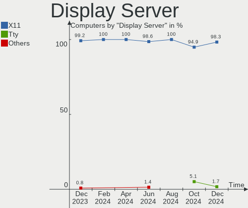
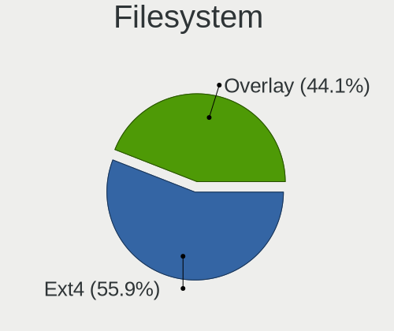
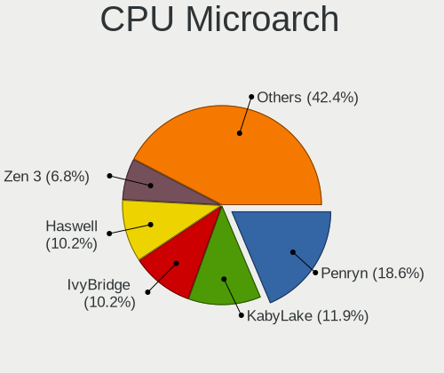
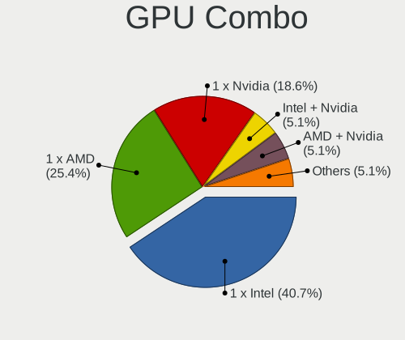

BlackPanther Hardware Trends
----------------------------

A project to identify most popular hardware characteristics and track their change
over time based on data collected by BlackPanther users at https://Linux-Hardware.org.

Anyone can contribute to this report by the [hw-probe](https://github.com/linuxhw/hw-probe) tool:

    sudo -E hw-probe -all -upload

This is a report for all computer types. See also reports for [desktops](/Dist/BlackPanther/Desktop/README.md) and [notebooks](/Dist/BlackPanther/Notebook/README.md).

Full-feature report is available here: https://linux-hardware.org/?view=trends

Period: Jan, 2022.

Contents
--------

* [ System ](#system)
  - [ OS                       ](#os)
  - [ OS Family                ](#os-family)
  - [ Kernel                   ](#kernel)
  - [ Kernel Family            ](#kernel-family)
  - [ Kernel Major Ver.        ](#kernel-major-ver)
  - [ Arch                     ](#arch)
  - [ DE                       ](#de)
  - [ Display Server           ](#display-server)
  - [ Display Manager          ](#display-manager)
  - [ OS Lang                  ](#os-lang)
  - [ Boot Mode                ](#boot-mode)
  - [ Filesystem               ](#filesystem)
  - [ Part. scheme             ](#part-scheme)
  - [ Dual Boot with Linux/BSD ](#dual-boot-with-linuxbsd)
  - [ Dual Boot (Win)          ](#dual-boot-win)

* [ Board ](#board)
  - [ Vendor                   ](#vendor)
  - [ Model                    ](#model)
  - [ Model Family             ](#model-family)
  - [ MFG Year                 ](#mfg-year)
  - [ Form Factor              ](#form-factor)
  - [ Secure Boot              ](#secure-boot)
  - [ Coreboot                 ](#coreboot)
  - [ RAM Size                 ](#ram-size)
  - [ RAM Used                 ](#ram-used)
  - [ Total Drives             ](#total-drives)
  - [ Has CD-ROM               ](#has-cd-rom)
  - [ Has Ethernet             ](#has-ethernet)
  - [ Has WiFi                 ](#has-wifi)
  - [ Has Bluetooth            ](#has-bluetooth)

* [ Location ](#location)
  - [ Country                  ](#country)
  - [ City                     ](#city)

* [ Drives ](#drives)
  - [ Drive Vendor             ](#drive-vendor)
  - [ Drive Model              ](#drive-model)
  - [ HDD Vendor               ](#hdd-vendor)
  - [ SSD Vendor               ](#ssd-vendor)
  - [ Drive Kind               ](#drive-kind)
  - [ Drive Connector          ](#drive-connector)
  - [ Drive Size               ](#drive-size)
  - [ Space Total              ](#space-total)
  - [ Space Used               ](#space-used)
  - [ Malfunc. Drives          ](#malfunc-drives)
  - [ Malfunc. Drive Vendor    ](#malfunc-drive-vendor)
  - [ Malfunc. HDD Vendor      ](#malfunc-hdd-vendor)
  - [ Malfunc. Drive Kind      ](#malfunc-drive-kind)
  - [ Failed Drives            ](#failed-drives)
  - [ Failed Drive Vendor      ](#failed-drive-vendor)
  - [ Drive Status             ](#drive-status)

* [ Storage controller ](#storage-controller)
  - [ Storage Vendor           ](#storage-vendor)
  - [ Storage Model            ](#storage-model)
  - [ Storage Kind             ](#storage-kind)

* [ Processor ](#processor)
  - [ CPU Vendor               ](#cpu-vendor)
  - [ CPU Model                ](#cpu-model)
  - [ CPU Model Family         ](#cpu-model-family)
  - [ CPU Cores                ](#cpu-cores)
  - [ CPU Sockets              ](#cpu-sockets)
  - [ CPU Threads              ](#cpu-threads)
  - [ CPU Op-Modes             ](#cpu-op-modes)
  - [ CPU Microcode            ](#cpu-microcode)
  - [ CPU Microarch            ](#cpu-microarch)

* [ Graphics ](#graphics)
  - [ GPU Vendor               ](#gpu-vendor)
  - [ GPU Model                ](#gpu-model)
  - [ GPU Combo                ](#gpu-combo)
  - [ GPU Driver               ](#gpu-driver)
  - [ GPU Memory               ](#gpu-memory)

* [ Monitor ](#monitor)
  - [ Monitor Vendor           ](#monitor-vendor)
  - [ Monitor Model            ](#monitor-model)
  - [ Monitor Resolution       ](#monitor-resolution)
  - [ Monitor Diagonal         ](#monitor-diagonal)
  - [ Monitor Width            ](#monitor-width)
  - [ Aspect Ratio             ](#aspect-ratio)
  - [ Monitor Area             ](#monitor-area)
  - [ Pixel Density            ](#pixel-density)
  - [ Multiple Monitors        ](#multiple-monitors)

* [ Network ](#network)
  - [ Net Controller Vendor    ](#net-controller-vendor)
  - [ Net Controller Model     ](#net-controller-model)
  - [ Wireless Vendor          ](#wireless-vendor)
  - [ Wireless Model           ](#wireless-model)
  - [ Ethernet Vendor          ](#ethernet-vendor)
  - [ Ethernet Model           ](#ethernet-model)
  - [ Net Controller Kind      ](#net-controller-kind)
  - [ Used Controller          ](#used-controller)
  - [ NICs                     ](#nics)
  - [ IPv6                     ](#ipv6)

* [ Bluetooth ](#bluetooth)
  - [ Bluetooth Vendor         ](#bluetooth-vendor)
  - [ Bluetooth Model          ](#bluetooth-model)

* [ Sound ](#sound)
  - [ Sound Vendor             ](#sound-vendor)
  - [ Sound Model              ](#sound-model)

* [ Memory ](#memory)
  - [ Memory Vendor            ](#memory-vendor)
  - [ Memory Model             ](#memory-model)
  - [ Memory Kind              ](#memory-kind)
  - [ Memory Form Factor       ](#memory-form-factor)
  - [ Memory Size              ](#memory-size)
  - [ Memory Speed             ](#memory-speed)

* [ Printers & scanners ](#printers--scanners)
  - [ Printer Vendor           ](#printer-vendor)
  - [ Printer Model            ](#printer-model)
  - [ Scanner Vendor           ](#scanner-vendor)
  - [ Scanner Model            ](#scanner-model)

* [ Camera ](#camera)
  - [ Camera Vendor            ](#camera-vendor)
  - [ Camera Model             ](#camera-model)

* [ Security ](#security)
  - [ Fingerprint Vendor       ](#fingerprint-vendor)
  - [ Fingerprint Model        ](#fingerprint-model)
  - [ Chipcard Vendor          ](#chipcard-vendor)
  - [ Chipcard Model           ](#chipcard-model)

* [ Unsupported ](#unsupported)
  - [ Unsupported Devices      ](#unsupported-devices)
  - [ Unsupported Device Types ](#unsupported-device-types)

System
------

OS
--

Installed operating systems

| Name              | Computers | Percent |
|-------------------|-----------|---------|
| BlackPanther 18.1 | 65        | 98.48%  |
| BlackPanther 16.2 | 1         | 1.52%   |

OS Family
---------

OS without a version

| Name         | Computers | Percent |
|--------------|-----------|---------|
| BlackPanther | 66        | 100%    |

Kernel
------

Version of the Linux kernel

| Version                | Computers | Percent |
|------------------------|-----------|---------|
| 5.6.14-desktop-2bP     | 43        | 65.15%  |
| 4.18.16-desktop-1bP    | 22        | 33.33%  |
| 4.9.20-desktop-pae-1bP | 1         | 1.52%   |

Kernel Family
-------------

Linux kernel without a distro release

| Version | Computers | Percent |
|---------|-----------|---------|
| 5.6.14  | 43        | 65.15%  |
| 4.18.16 | 22        | 33.33%  |
| 4.9.20  | 1         | 1.52%   |

Kernel Major Ver.
-----------------

Linux kernel major version

| Version | Computers | Percent |
|---------|-----------|---------|
| 5.6     | 43        | 65.15%  |
| 4.18    | 22        | 33.33%  |
| 4.9     | 1         | 1.52%   |

Arch
----

OS architecture (x86_64, i586, etc.)

| Name   | Computers | Percent |
|--------|-----------|---------|
| x86_64 | 65        | 98.48%  |
| i686   | 1         | 1.52%   |

DE
--

Desktop Environment

| Name | Computers | Percent |
|------|-----------|---------|
| KDE5 | 66        | 100%    |

Display Server
--------------

X11 or Wayland

| Name | Computers | Percent |
|------|-----------|---------|
| X11  | 66        | 100%    |

Display Manager
---------------

SDDM, LightDM, etc.

| Name | Computers | Percent |
|------|-----------|---------|
| SDDM | 66        | 100%    |

OS Lang
-------

Language

| Lang    | Computers | Percent |
|---------|-----------|---------|
| Unknown | 66        | 100%    |

Boot Mode
---------

EFI or BIOS

| Mode | Computers | Percent |
|------|-----------|---------|
| BIOS | 40        | 60.61%  |
| EFI  | 26        | 39.39%  |

Filesystem
----------

Type of filesystem

| Type    | Computers | Percent |
|---------|-----------|---------|
| Overlay | 57        | 86.36%  |
| Ext4    | 8         | 12.12%  |
| Ext3    | 1         | 1.52%   |

Part. scheme
------------

Scheme of partitioning

| Type | Computers | Percent |
|------|-----------|---------|
| MBR  | 38        | 57.58%  |
| GPT  | 28        | 42.42%  |

Dual Boot with Linux/BSD
------------------------

Hosting more than one Linux/BSD

| Dual boot | Computers | Percent |
|-----------|-----------|---------|
| Yes       | 37        | 56.06%  |
| No        | 29        | 43.94%  |

Dual Boot (Win)
---------------

Hosting Linux and Windows

| Dual boot | Computers | Percent |
|-----------|-----------|---------|
| No        | 34        | 51.52%  |
| Yes       | 32        | 48.48%  |

Board
-----

Vendor
------

Motherboard manufacturer

| Name                | Computers | Percent |
|---------------------|-----------|---------|
| Hewlett-Packard     | 13        | 19.7%   |
| ASUSTek Computer    | 11        | 16.67%  |
| Lenovo              | 9         | 13.64%  |
| Dell                | 8         | 12.12%  |
| Gigabyte Technology | 7         | 10.61%  |
| Medion              | 3         | 4.55%   |
| Sony                | 2         | 3.03%   |
| MSI                 | 2         | 3.03%   |
| Fujitsu             | 2         | 3.03%   |
| ASRock              | 2         | 3.03%   |
| Acer                | 2         | 3.03%   |
| Samsung Electronics | 1         | 1.52%   |
| Packard Bell        | 1         | 1.52%   |
| Insyde              | 1         | 1.52%   |
| Apple               | 1         | 1.52%   |
| Unknown             | 1         | 1.52%   |

Model
-----

Motherboard model

| Name                                        | Computers | Percent |
|---------------------------------------------|-----------|---------|
| HP ProBook 6470b                            | 2         | 3.03%   |
| ASUS X541UVK                                | 2         | 3.03%   |
| Unknown                                     | 2         | 3.03%   |
| Sony VGN-N31S_W                             | 1         | 1.52%   |
| Sony SVS13118GBB                            | 1         | 1.52%   |
| Samsung RV411/RV511/E3511/S3511/RV711/E3411 | 1         | 1.52%   |
| Packard Bell EasyNote TK37                  | 1         | 1.52%   |
| MSI MS-7846                                 | 1         | 1.52%   |
| MSI MS-7642                                 | 1         | 1.52%   |
| Medion MS-7748                              | 1         | 1.52%   |
| Medion MS-7646                              | 1         | 1.52%   |
| Medion CRAWLER E10                          | 1         | 1.52%   |
| Lenovo Yoga 310-11IAP 80U2                  | 1         | 1.52%   |
| Lenovo ThinkPad X61 76753BJ                 | 1         | 1.52%   |
| Lenovo ThinkPad T61 6458Y56                 | 1         | 1.52%   |
| Lenovo ThinkPad T500 2056CL8                | 1         | 1.52%   |
| Lenovo ThinkPad L420 78544UG                | 1         | 1.52%   |
| Lenovo ThinkCentre M77 1996AB8              | 1         | 1.52%   |
| Lenovo IdeaPad S145-15IGM 81MX              | 1         | 1.52%   |
| Lenovo IdeaPad 320-17ABR 80YN               | 1         | 1.52%   |
| Lenovo IdeaPad 320-15IAP 80XR               | 1         | 1.52%   |
| Insyde Braswell                             | 1         | 1.52%   |
| HP ProDesk 600 G1 SFF                       | 1         | 1.52%   |
| HP Pavilion Gaming Laptop 15-ec1xxx         | 1         | 1.52%   |
| HP EliteBook 820 G1                         | 1         | 1.52%   |
| HP Compaq dc7800p Small Form Factor         | 1         | 1.52%   |
| HP Compaq dc5850 Microtower                 | 1         | 1.52%   |
| HP Compaq 8200 Elite USDT PC                | 1         | 1.52%   |
| HP Compaq 8000 Elite CMT PC                 | 1         | 1.52%   |
| HP 650                                      | 1         | 1.52%   |
| HP 255 G5 Notebook PC                       | 1         | 1.52%   |
| HP 250 G6 Notebook PC                       | 1         | 1.52%   |
| Gigabyte P35-S3G                            | 1         | 1.52%   |
| Gigabyte H61M-S2PV                          | 1         | 1.52%   |
| Gigabyte H61M-D2-B3                         | 1         | 1.52%   |
| Gigabyte H310M H 2.0                        | 1         | 1.52%   |
| Gigabyte G41MT-S2PT                         | 1         | 1.52%   |
| Gigabyte F2A88XN-WIFI                       | 1         | 1.52%   |
| Gigabyte B450M GAMING                       | 1         | 1.52%   |
| Fujitsu ESPRIMO P7936                       | 1         | 1.52%   |
| Fujitsu ESPRIMO P710                        | 1         | 1.52%   |
| Dell OptiPlex 760                           | 1         | 1.52%   |
| Dell OptiPlex 7020                          | 1         | 1.52%   |
| Dell Latitude E6430                         | 1         | 1.52%   |
| Dell Latitude E6230                         | 1         | 1.52%   |
| Dell Latitude D630                          | 1         | 1.52%   |
| Dell Inspiron M5030                         | 1         | 1.52%   |
| Dell Inspiron 5558                          | 1         | 1.52%   |
| Dell Inspiron 1525                          | 1         | 1.52%   |
| ASUS X550VX                                 | 1         | 1.52%   |
| ASUS VM40B                                  | 1         | 1.52%   |
| ASUS VivoBook 14_ASUS Laptop E406SAS        | 1         | 1.52%   |
| ASUS Vivo AIO 22 V222GA_V222GA              | 1         | 1.52%   |
| ASUS PRIME H370-PLUS                        | 1         | 1.52%   |
| ASUS P6T7 WS SUPERCOMPUTER                  | 1         | 1.52%   |
| ASUS K53U                                   | 1         | 1.52%   |
| ASUS K50IN                                  | 1         | 1.52%   |
| ASUS Crosshair IV Formula                   | 1         | 1.52%   |
| ASRock G31M-VS                              | 1         | 1.52%   |
| ASRock B550M Pro4                           | 1         | 1.52%   |

Model Family
------------

Motherboard model prefix

| Name                  | Computers | Percent |
|-----------------------|-----------|---------|
| Lenovo ThinkPad       | 4         | 6.06%   |
| HP Compaq             | 4         | 6.06%   |
| Lenovo IdeaPad        | 3         | 4.55%   |
| Dell Latitude         | 3         | 4.55%   |
| Dell Inspiron         | 3         | 4.55%   |
| HP ProBook            | 2         | 3.03%   |
| Fujitsu ESPRIMO       | 2         | 3.03%   |
| Dell OptiPlex         | 2         | 3.03%   |
| ASUS X541UVK          | 2         | 3.03%   |
| Acer Aspire           | 2         | 3.03%   |
| Unknown               | 2         | 3.03%   |
| Sony VGN-N31S         | 1         | 1.52%   |
| Sony SVS13118GBB      | 1         | 1.52%   |
| Samsung RV411         | 1         | 1.52%   |
| Packard Bell EasyNote | 1         | 1.52%   |
| MSI MS-7846           | 1         | 1.52%   |
| MSI MS-7642           | 1         | 1.52%   |
| Medion MS-7748        | 1         | 1.52%   |
| Medion MS-7646        | 1         | 1.52%   |
| Medion CRAWLER        | 1         | 1.52%   |
| Lenovo Yoga           | 1         | 1.52%   |
| Lenovo ThinkCentre    | 1         | 1.52%   |
| Insyde Braswell       | 1         | 1.52%   |
| HP ProDesk            | 1         | 1.52%   |
| HP Pavilion           | 1         | 1.52%   |
| HP EliteBook          | 1         | 1.52%   |
| HP 650                | 1         | 1.52%   |
| HP 255                | 1         | 1.52%   |
| HP 250                | 1         | 1.52%   |
| Gigabyte P35-S3G      | 1         | 1.52%   |
| Gigabyte H61M-S2PV    | 1         | 1.52%   |
| Gigabyte H61M-D2-B3   | 1         | 1.52%   |
| Gigabyte H310M        | 1         | 1.52%   |
| Gigabyte G41MT-S2PT   | 1         | 1.52%   |
| Gigabyte F2A88XN-WIFI | 1         | 1.52%   |
| Gigabyte B450M        | 1         | 1.52%   |
| ASUS X550VX           | 1         | 1.52%   |
| ASUS VM40B            | 1         | 1.52%   |
| ASUS VivoBook         | 1         | 1.52%   |
| ASUS Vivo             | 1         | 1.52%   |
| ASUS PRIME            | 1         | 1.52%   |
| ASUS P6T7             | 1         | 1.52%   |
| ASUS K53U             | 1         | 1.52%   |
| ASUS K50IN            | 1         | 1.52%   |
| ASUS Crosshair        | 1         | 1.52%   |
| ASRock G31M-VS        | 1         | 1.52%   |
| ASRock B550M          | 1         | 1.52%   |
| Apple MacBookPro6     | 1         | 1.52%   |

MFG Year
--------

Motherboard manufacture year

| Year | Computers | Percent |
|------|-----------|---------|
| 2012 | 10        | 15.15%  |
| 2011 | 7         | 10.61%  |
| 2010 | 7         | 10.61%  |
| 2017 | 6         | 9.09%   |
| 2007 | 6         | 9.09%   |
| 2016 | 5         | 7.58%   |
| 2019 | 4         | 6.06%   |
| 2013 | 4         | 6.06%   |
| 2008 | 4         | 6.06%   |
| 2020 | 3         | 4.55%   |
| 2014 | 3         | 4.55%   |
| 2009 | 3         | 4.55%   |
| 2018 | 2         | 3.03%   |
| 2015 | 1         | 1.52%   |
| 2006 | 1         | 1.52%   |

Form Factor
-----------

Physical design of the computer

| Name        | Computers | Percent |
|-------------|-----------|---------|
| Notebook    | 36        | 54.55%  |
| Desktop     | 28        | 42.42%  |
| Convertible | 1         | 1.52%   |
| All in one  | 1         | 1.52%   |

Secure Boot
-----------

Enabled or disabled

| State    | Computers | Percent |
|----------|-----------|---------|
| Disabled | 66        | 100%    |

Coreboot
--------

Have coreboot on board

| Used | Computers | Percent |
|------|-----------|---------|
| No   | 66        | 100%    |

RAM Size
--------

Total RAM memory

| Size in GB | Computers | Percent |
|------------|-----------|---------|
| 3.01-4.0   | 27        | 40.91%  |
| 8.01-16.0  | 18        | 27.27%  |
| 4.01-8.0   | 11        | 16.67%  |
| 16.01-24.0 | 4         | 6.06%   |
| 1.01-2.0   | 4         | 6.06%   |
| 24.01-32.0 | 1         | 1.52%   |
| 2.01-3.0   | 1         | 1.52%   |

RAM Used
--------

Used RAM memory

| Used GB  | Computers | Percent |
|----------|-----------|---------|
| 0.51-1.0 | 34        | 51.52%  |
| 0.01-0.5 | 22        | 33.33%  |
| 1.01-2.0 | 9         | 13.64%  |
| 2.01-3.0 | 1         | 1.52%   |

Total Drives
------------

Number of drives on board

| Drives | Computers | Percent |
|--------|-----------|---------|
| 1      | 44        | 66.67%  |
| 2      | 15        | 22.73%  |
| 4      | 4         | 6.06%   |
| 3      | 2         | 3.03%   |
| 0      | 1         | 1.52%   |

Has CD-ROM
----------

Has CD-ROM on board

| Presented | Computers | Percent |
|-----------|-----------|---------|
| Yes       | 42        | 63.64%  |
| No        | 24        | 36.36%  |

Has Ethernet
------------

Has Ethernet on board

| Presented | Computers | Percent |
|-----------|-----------|---------|
| Yes       | 63        | 95.45%  |
| No        | 3         | 4.55%   |

Has WiFi
--------

Has WiFi module

| Presented | Computers | Percent |
|-----------|-----------|---------|
| Yes       | 46        | 69.7%   |
| No        | 20        | 30.3%   |

Has Bluetooth
-------------

Has Bluetooth module

| Presented | Computers | Percent |
|-----------|-----------|---------|
| Yes       | 36        | 54.55%  |
| No        | 30        | 45.45%  |

Location
--------

Country
-------

Geographic location (country)

| Country   | Computers | Percent |
|-----------|-----------|---------|
| Hungary   | 59        | 89.39%  |
| Germany   | 3         | 4.55%   |
| Romania   | 1         | 1.52%   |
| Japan     | 1         | 1.52%   |
| Austria   | 1         | 1.52%   |
| Argentina | 1         | 1.52%   |

City
----

Geographic location (city)

| City              | Computers | Percent |
|-------------------|-----------|---------|
| Budapest          | 11        | 16.67%  |
| Tatab??nya        | 3         | 4.55%   |
| Hajduboszormeny   | 3         | 4.55%   |
| Szeksz??rd        | 2         | 3.03%   |
| Sz?©kesfeh?©rv??r | 2         | 3.03%   |
| Sarvar            | 2         | 3.03%   |
| P?©cs             | 2         | 3.03%   |
| Lebeny            | 2         | 3.03%   |
| Fuzesabony        | 2         | 3.03%   |
| Esztergom         | 2         | 3.03%   |
| Celldomolk        | 2         | 3.03%   |
| ?‰rd              | 2         | 3.03%   |
| Thaur             | 1         | 1.52%   |
| Tarnaszentmiklos  | 1         | 1.52%   |
| Tapioszentmarton  | 1         | 1.52%   |
| Szombathely       | 1         | 1.52%   |
| Szentantalfa      | 1         | 1.52%   |
| Szazhalombatta    | 1         | 1.52%   |
| Stuttgart         | 1         | 1.52%   |
| Sandorfalva       | 1         | 1.52%   |
| Roszke            | 1         | 1.52%   |
| Pomaz             | 1         | 1.52%   |
| Pecel             | 1         | 1.52%   |
| Paszto            | 1         | 1.52%   |
| Nagykata          | 1         | 1.52%   |
| Moron             | 1         | 1.52%   |
| Mateszalka        | 1         | 1.52%   |
| Magyarlak         | 1         | 1.52%   |
| Kecskem?©t        | 1         | 1.52%   |
| Kanazawa          | 1         | 1.52%   |
| Halle             | 1         | 1.52%   |
| Gyonk             | 1         | 1.52%   |
| Gy?‘r             | 1         | 1.52%   |
| Fonyod            | 1         | 1.52%   |
| Felcsut           | 1         | 1.52%   |
| Eger              | 1         | 1.52%   |
| Duna??jv??ros     | 1         | 1.52%   |
| Debrecen          | 1         | 1.52%   |
| Bucharest         | 1         | 1.52%   |
| Balatonfured      | 1         | 1.52%   |
| Baja              | 1         | 1.52%   |
| Augsburg          | 1         | 1.52%   |
| Alcsutdoboz       | 1         | 1.52%   |

Drives
------

Drive Vendor
------------

Hard drive vendors

| Vendor              | Computers | Drives | Percent |
|---------------------|-----------|--------|---------|
| WDC                 | 19        | 21     | 20.21%  |
| Seagate             | 15        | 17     | 15.96%  |
| Toshiba             | 13        | 13     | 13.83%  |
| Samsung Electronics | 9         | 10     | 9.57%   |
| Kingston            | 8         | 8      | 8.51%   |
| Hitachi             | 5         | 5      | 5.32%   |
| A-DATA Technology   | 4         | 4      | 4.26%   |
| SanDisk             | 3         | 3      | 3.19%   |
| MAXTOR              | 2         | 2      | 2.13%   |
| HGST                | 2         | 2      | 2.13%   |
| Crucial             | 2         | 2      | 2.13%   |
| China               | 2         | 2      | 2.13%   |
| Apacer              | 2         | 2      | 2.13%   |
| Unknown             | 1         | 1      | 1.06%   |
| Union Memory        | 1         | 1      | 1.06%   |
| Solid               | 1         | 1      | 1.06%   |
| Patriot             | 1         | 1      | 1.06%   |
| LITEON              | 1         | 1      | 1.06%   |
| Intenso             | 1         | 2      | 1.06%   |
| Intel               | 1         | 1      | 1.06%   |
| Gigabyte Technology | 1         | 1      | 1.06%   |

Drive Model
-----------

Hard drive models

| Model                                  | Computers | Percent |
|----------------------------------------|-----------|---------|
| Toshiba THNSFJ256GCSU 256GB SSD        | 3         | 3.03%   |
| WDC WD10JPVX-22JC3T0 1TB               | 2         | 2.02%   |
| Toshiba MQ04ABF100 1TB                 | 2         | 2.02%   |
| Seagate ST500LT012-1DG142 500GB        | 2         | 2.02%   |
| Seagate ST1000DM010-2EP102 1TB         | 2         | 2.02%   |
| Kingston SA400S37120G 120GB SSD        | 2         | 2.02%   |
| HGST HTS541010B7E610 1TB               | 2         | 2.02%   |
| A-DATA SU650 120GB SSD                 | 2         | 2.02%   |
| WDC WDS500G2B0B-00YS70 500GB SSD       | 1         | 1.01%   |
| WDC WD800AAJS-60PSA0 80GB              | 1         | 1.01%   |
| WDC WD5000BPVT-80HXZT3 500GB           | 1         | 1.01%   |
| WDC WD5000BPVT-22HXZT1 500GB           | 1         | 1.01%   |
| WDC WD5000BEVT-22A0RT0 500GB           | 1         | 1.01%   |
| WDC WD5000AAKS-00TMA0 500GB            | 1         | 1.01%   |
| WDC WD3200BPVT-75ZEST0 320GB           | 1         | 1.01%   |
| WDC WD3200BEVT-22ZCT0 320GB            | 1         | 1.01%   |
| WDC WD30EZRZ-00Z5HB0 3TB               | 1         | 1.01%   |
| WDC WD3000HLFS-01G6U1 304GB            | 1         | 1.01%   |
| WDC WD2500AAKX-07U6AA0 250GB           | 1         | 1.01%   |
| WDC WD2500AAJS-75B4A0 250GB            | 1         | 1.01%   |
| WDC WD2500AAJS-07M0A0 250GB            | 1         | 1.01%   |
| WDC WD20EZRX-00D8PB0 2TB               | 1         | 1.01%   |
| WDC WD1600AAJB-56WRA0 160GB            | 1         | 1.01%   |
| WDC WD1200BEVS-22UST0 120GB            | 1         | 1.01%   |
| WDC WD10JPVX-60JC3T0 1TB               | 1         | 1.01%   |
| WDC WD10EZRX-00A8LB0 1TB               | 1         | 1.01%   |
| WDC WD10EZEX-21WN4A0 1TB               | 1         | 1.01%   |
| Unknown HCG4a2  64GB                   | 1         | 1.01%   |
| Union Memory RTOTJ128VGD2EYX 128GB SSD | 1         | 1.01%   |
| Toshiba MQ01ABF050 500GB               | 1         | 1.01%   |
| Toshiba MQ01ABD100 1TB                 | 1         | 1.01%   |
| Toshiba MK8009GAH 80GB                 | 1         | 1.01%   |
| Toshiba MK5076GSX 500GB                | 1         | 1.01%   |
| Toshiba MK1237GSX 120GB                | 1         | 1.01%   |
| Toshiba MK1034GSX 100GB                | 1         | 1.01%   |
| Toshiba KBG30ZMV512G 512GB             | 1         | 1.01%   |
| Toshiba DT01ACA200 2TB                 | 1         | 1.01%   |
| Solid SSD0240S00 240GB                 | 1         | 1.01%   |
| Seagate ST9320325AS 320GB              | 1         | 1.01%   |
| Seagate ST9250315AS 250GB              | 1         | 1.01%   |
| Seagate ST9160314AS 160GB              | 1         | 1.01%   |
| Seagate ST500DM002-1BD142 500GB        | 1         | 1.01%   |
| Seagate ST4000DM004-2CV104 4TB         | 1         | 1.01%   |
| Seagate ST4000DM000-1F2168 4TB         | 1         | 1.01%   |
| Seagate ST380815AS 80GB                | 1         | 1.01%   |
| Seagate ST3500410SV 500GB              | 1         | 1.01%   |
| Seagate ST3160815AS 160GB              | 1         | 1.01%   |
| Seagate ST2000DM008-2FR102 2TB         | 1         | 1.01%   |
| Seagate ST2000DM001-1CH164 2TB         | 1         | 1.01%   |
| Seagate ST1000LM024 HN-M101MBB 1TB     | 1         | 1.01%   |
| Seagate ST1000LM 024 HN-M101MBB 1TB    | 1         | 1.01%   |
| SanDisk SDSSDH3 1T00 1TB               | 1         | 1.01%   |
| SanDisk DF4064  64GB                   | 1         | 1.01%   |
| SanDisk DF4032  32GB                   | 1         | 1.01%   |
| Samsung SSD 980 500GB                  | 1         | 1.01%   |
| Samsung SSD 870 EVO 250GB              | 1         | 1.01%   |
| Samsung SSD 850 EVO 120GB              | 1         | 1.01%   |
| Samsung SSD 830 Series 128GB           | 1         | 1.01%   |
| Samsung SP2004C 200GB                  | 1         | 1.01%   |
| Samsung MZ7TE128HMGR-000L1 128GB SSD   | 1         | 1.01%   |

HDD Vendor
----------

Hard disk drive vendors

| Vendor              | Computers | Drives | Percent |
|---------------------|-----------|--------|---------|
| WDC                 | 18        | 20     | 32.73%  |
| Seagate             | 15        | 17     | 27.27%  |
| Toshiba             | 9         | 9      | 16.36%  |
| Hitachi             | 5         | 5      | 9.09%   |
| Samsung Electronics | 4         | 5      | 7.27%   |
| MAXTOR              | 2         | 2      | 3.64%   |
| HGST                | 2         | 2      | 3.64%   |

SSD Vendor
----------

Solid state drive vendors

| Vendor              | Computers | Drives | Percent |
|---------------------|-----------|--------|---------|
| Kingston            | 7         | 7      | 21.88%  |
| Samsung Electronics | 4         | 4      | 12.5%   |
| A-DATA Technology   | 4         | 4      | 12.5%   |
| Toshiba             | 3         | 3      | 9.38%   |
| China               | 2         | 2      | 6.25%   |
| Apacer              | 2         | 2      | 6.25%   |
| WDC                 | 1         | 1      | 3.13%   |
| Union Memory        | 1         | 1      | 3.13%   |
| Solid               | 1         | 1      | 3.13%   |
| SanDisk             | 1         | 1      | 3.13%   |
| Patriot             | 1         | 1      | 3.13%   |
| LITEON              | 1         | 1      | 3.13%   |
| Intenso             | 1         | 2      | 3.13%   |
| Intel               | 1         | 1      | 3.13%   |
| Gigabyte Technology | 1         | 1      | 3.13%   |
| Crucial             | 1         | 1      | 3.13%   |

Drive Kind
----------

HDD or SSD

| Kind | Computers | Drives | Percent |
|------|-----------|--------|---------|
| HDD  | 47        | 60     | 55.29%  |
| SSD  | 31        | 33     | 36.47%  |
| NVMe | 4         | 4      | 4.71%   |
| MMC  | 3         | 3      | 3.53%   |

Drive Connector
---------------

SATA, SAS, NVMe, etc.

| Type | Computers | Drives | Percent |
|------|-----------|--------|---------|
| SATA | 60        | 92     | 88.24%  |
| NVMe | 4         | 4      | 5.88%   |
| MMC  | 3         | 3      | 4.41%   |
| SAS  | 1         | 1      | 1.47%   |

Drive Size
----------

Size of hard drive

| Size in TB | Computers | Drives | Percent |
|------------|-----------|--------|---------|
| 0.01-0.5   | 51        | 67     | 68%     |
| 0.51-1.0   | 17        | 19     | 22.67%  |
| 1.01-2.0   | 4         | 4      | 5.33%   |
| 3.01-4.0   | 2         | 2      | 2.67%   |
| 2.01-3.0   | 1         | 1      | 1.33%   |

Space Total
-----------

Amount of disk space available on the file system

| Size in GB | Computers | Percent |
|------------|-----------|---------|
| Unknown    | 59        | 89.39%  |
| 101-250    | 4         | 6.06%   |
| 251-500    | 2         | 3.03%   |
| 51-100     | 1         | 1.52%   |

Space Used
----------

Amount of used disk space

| Used GB | Computers | Percent |
|---------|-----------|---------|
| Unknown | 59        | 89.39%  |
| 1-20    | 7         | 10.61%  |

Malfunc. Drives
---------------

Drive models with a malfunction

| Model                               | Computers | Drives | Percent |
|-------------------------------------|-----------|--------|---------|
| Toshiba THNSFJ256GCSU 256GB SSD     | 3         | 3      | 9.09%   |
| WDC WD10JPVX-22JC3T0 1TB            | 2         | 2      | 6.06%   |
| WDC WD5000BPVT-80HXZT3 500GB        | 1         | 1      | 3.03%   |
| WDC WD5000BPVT-22HXZT1 500GB        | 1         | 1      | 3.03%   |
| WDC WD2500AAJS-75B4A0 250GB         | 1         | 1      | 3.03%   |
| WDC WD2500AAJS-07M0A0 250GB         | 1         | 1      | 3.03%   |
| WDC WD10EZRX-00A8LB0 1TB            | 1         | 1      | 3.03%   |
| Toshiba MQ01ABF050 500GB            | 1         | 1      | 3.03%   |
| Toshiba MQ01ABD100 1TB              | 1         | 1      | 3.03%   |
| Toshiba MK8009GAH 80GB              | 1         | 1      | 3.03%   |
| Toshiba MK1237GSX 120GB             | 1         | 1      | 3.03%   |
| Toshiba MK1034GSX 100GB             | 1         | 1      | 3.03%   |
| Seagate ST9320325AS 320GB           | 1         | 1      | 3.03%   |
| Seagate ST9250315AS 250GB           | 1         | 1      | 3.03%   |
| Seagate ST9160314AS 160GB           | 1         | 1      | 3.03%   |
| Seagate ST500LT012-1DG142 500GB     | 1         | 1      | 3.03%   |
| Seagate ST500DM002-1BD142 500GB     | 1         | 1      | 3.03%   |
| Seagate ST4000DM000-1F2168 4TB      | 1         | 1      | 3.03%   |
| Seagate ST380815AS 80GB             | 1         | 1      | 3.03%   |
| Seagate ST3500410SV 500GB           | 1         | 1      | 3.03%   |
| Seagate ST1000LM024 HN-M101MBB 1TB  | 1         | 1      | 3.03%   |
| Samsung Electronics SP2004C 200GB   | 1         | 1      | 3.03%   |
| Samsung Electronics HM321HI 320GB   | 1         | 1      | 3.03%   |
| MAXTOR STM380215A 80GB              | 1         | 1      | 3.03%   |
| MAXTOR 6V250F0 256GB                | 1         | 1      | 3.03%   |
| LITEON CV8-8E128-HP 128GB SSD       | 1         | 1      | 3.03%   |
| Hitachi HTS547550A9E384 500GB       | 1         | 1      | 3.03%   |
| Hitachi HCC543232A7A380 320GB       | 1         | 1      | 3.03%   |
| Crucial C300-CTFDDAC064MAG 64GB SSD | 1         | 1      | 3.03%   |
| A-DATA Technology SP920SS 128GB SSD | 1         | 1      | 3.03%   |

Malfunc. Drive Vendor
---------------------

Vendors of faulty drives

| Vendor              | Computers | Drives | Percent |
|---------------------|-----------|--------|---------|
| Seagate             | 9         | 9      | 27.27%  |
| Toshiba             | 8         | 8      | 24.24%  |
| WDC                 | 7         | 7      | 21.21%  |
| Samsung Electronics | 2         | 2      | 6.06%   |
| MAXTOR              | 2         | 2      | 6.06%   |
| Hitachi             | 2         | 2      | 6.06%   |
| LITEON              | 1         | 1      | 3.03%   |
| Crucial             | 1         | 1      | 3.03%   |
| A-DATA Technology   | 1         | 1      | 3.03%   |

Malfunc. HDD Vendor
-------------------

Vendors of faulty HDD drives

| Vendor              | Computers | Drives | Percent |
|---------------------|-----------|--------|---------|
| Seagate             | 9         | 9      | 33.33%  |
| WDC                 | 7         | 7      | 25.93%  |
| Toshiba             | 5         | 5      | 18.52%  |
| Samsung Electronics | 2         | 2      | 7.41%   |
| MAXTOR              | 2         | 2      | 7.41%   |
| Hitachi             | 2         | 2      | 7.41%   |

Malfunc. Drive Kind
-------------------

Kinds of faulty drives

| Kind | Computers | Drives | Percent |
|------|-----------|--------|---------|
| HDD  | 25        | 27     | 80.65%  |
| SSD  | 6         | 6      | 19.35%  |

Failed Drives
-------------

Failed drive models

Zero info for selected period =(

Failed Drive Vendor
-------------------

Failed drive vendors

Zero info for selected period =(

Drive Status
------------

Number of failed and malfunc. drives

| Status   | Computers | Drives | Percent |
|----------|-----------|--------|---------|
| Works    | 45        | 63     | 58.44%  |
| Malfunc  | 28        | 33     | 36.36%  |
| Detected | 4         | 4      | 5.19%   |

Storage controller
------------------

Storage Vendor
--------------

Storage controller vendors

| Vendor                       | Computers | Percent |
|------------------------------|-----------|---------|
| Intel                        | 48        | 65.75%  |
| AMD                          | 14        | 19.18%  |
| JMicron Technology           | 3         | 4.11%   |
| VIA Technologies             | 2         | 2.74%   |
| Toshiba America Info Systems | 1         | 1.37%   |
| Samsung Electronics          | 1         | 1.37%   |
| Nvidia                       | 1         | 1.37%   |
| Micron/Crucial Technology    | 1         | 1.37%   |
| Marvell Technology Group     | 1         | 1.37%   |
| Kingston Technology Company  | 1         | 1.37%   |

Storage Model
-------------

Storage controller models

| Model                                                                                   | Computers | Percent |
|-----------------------------------------------------------------------------------------|-----------|---------|
| Intel 82801HM/HEM (ICH8M/ICH8M-E) IDE Controller                                        | 5         | 5.32%   |
| Intel 7 Series Chipset Family 6-port SATA Controller [AHCI mode]                        | 5         | 5.32%   |
| AMD SB7x0/SB8x0/SB9x0 SATA Controller [IDE mode]                                        | 5         | 5.32%   |
| AMD SB7x0/SB8x0/SB9x0 IDE Controller                                                    | 5         | 5.32%   |
| AMD FCH SATA Controller [AHCI mode]                                                     | 5         | 5.32%   |
| Intel Sunrise Point-LP SATA Controller [AHCI mode]                                      | 3         | 3.19%   |
| Intel Celeron/Pentium Silver Processor SATA Controller                                  | 3         | 3.19%   |
| Intel 82801JD/DO (ICH10 Family) SATA AHCI Controller                                    | 3         | 3.19%   |
| Intel 82801HM/HEM (ICH8M/ICH8M-E) SATA Controller [AHCI mode]                           | 3         | 3.19%   |
| Intel 82801G (ICH7 Family) IDE Controller                                               | 3         | 3.19%   |
| Intel 8 Series/C220 Series Chipset Family 6-port SATA Controller 1 [AHCI mode]          | 3         | 3.19%   |
| JMicron JMB368 IDE controller                                                           | 2         | 2.13%   |
| Intel NM10/ICH7 Family SATA Controller [IDE mode]                                       | 2         | 2.13%   |
| Intel Celeron N3350/Pentium N4200/Atom E3900 Series SATA AHCI Controller                | 2         | 2.13%   |
| Intel 82801 Mobile SATA Controller [RAID mode]                                          | 2         | 2.13%   |
| Intel 6 Series/C200 Series Chipset Family 6 port Desktop SATA AHCI Controller           | 2         | 2.13%   |
| Intel 5 Series/3400 Series Chipset 4 port SATA AHCI Controller                          | 2         | 2.13%   |
| Intel 4 Series Chipset PT IDER Controller                                               | 2         | 2.13%   |
| AMD SB7x0/SB8x0/SB9x0 SATA Controller [AHCI mode]                                       | 2         | 2.13%   |
| VIA VT82C586A/B/VT82C686/A/B/VT823x/A/C PIPC Bus Master IDE                             | 1         | 1.06%   |
| VIA VT6421 IDE/SATA Controller                                                          | 1         | 1.06%   |
| VIA VIA VT6420 SATA RAID Controller                                                     | 1         | 1.06%   |
| Toshiba America Info Systems BG3 NVMe SSD Controller                                    | 1         | 1.06%   |
| Samsung NVMe SSD Controller 980                                                         | 1         | 1.06%   |
| Nvidia MCP79 AHCI Controller                                                            | 1         | 1.06%   |
| Micron/Crucial NVMe Controller                                                          | 1         | 1.06%   |
| Marvell Group 88SE6111/6121 SATA II / PATA Controller                                   | 1         | 1.06%   |
| Kingston Company A2000 NVMe SSD                                                         | 1         | 1.06%   |
| JMicron JMB363 SATA/IDE Controller                                                      | 1         | 1.06%   |
| Intel Wildcat Point-LP SATA Controller [AHCI Mode]                                      | 1         | 1.06%   |
| Intel SATA Controller [RAID mode]                                                       | 1         | 1.06%   |
| Intel Mobile PM965/GM965 PT IDER Controller                                             | 1         | 1.06%   |
| Intel HM170/QM170 Chipset SATA Controller [AHCI Mode]                                   | 1         | 1.06%   |
| Intel Atom/Celeron/Pentium Processor x5-E8000/J3xxx/N3xxx Series SATA Controller        | 1         | 1.06%   |
| Intel 82Q35 Express PT IDER Controller                                                  | 1         | 1.06%   |
| Intel 82801JI (ICH10 Family) 4 port SATA IDE Controller #1                              | 1         | 1.06%   |
| Intel 82801JI (ICH10 Family) 2 port SATA IDE Controller #2                              | 1         | 1.06%   |
| Intel 82801IR/IO/IH (ICH9R/DO/DH) 4 port SATA Controller [IDE mode]                     | 1         | 1.06%   |
| Intel 82801IBM/IEM (ICH9M/ICH9M-E) 4 port SATA Controller [AHCI mode]                   | 1         | 1.06%   |
| Intel 82801IBM/IEM (ICH9M/ICH9M-E) 2 port SATA Controller [IDE mode]                    | 1         | 1.06%   |
| Intel 82801IB (ICH9) 4 port SATA Controller [AHCI mode]                                 | 1         | 1.06%   |
| Intel 82801I (ICH9 Family) 2 port SATA Controller [IDE mode]                            | 1         | 1.06%   |
| Intel 82801HM/HEM (ICH8M/ICH8M-E) SATA Controller [IDE mode]                            | 1         | 1.06%   |
| Intel 82801GBM/GHM (ICH7-M Family) SATA Controller [IDE mode]                           | 1         | 1.06%   |
| Intel 8 Series SATA Controller 1 [AHCI mode]                                            | 1         | 1.06%   |
| Intel 7 Series/C210 Series Chipset Family 6-port SATA Controller [AHCI mode]            | 1         | 1.06%   |
| Intel 6 Series/C200 Series Chipset Family Mobile SATA Controller (IDE mode, ports 4-5)  | 1         | 1.06%   |
| Intel 6 Series/C200 Series Chipset Family Mobile SATA Controller (IDE mode, ports 0-3)  | 1         | 1.06%   |
| Intel 6 Series/C200 Series Chipset Family Desktop SATA Controller (IDE mode, ports 4-5) | 1         | 1.06%   |
| Intel 6 Series/C200 Series Chipset Family Desktop SATA Controller (IDE mode, ports 0-3) | 1         | 1.06%   |
| Intel 400 Series Chipset Family SATA AHCI Controller                                    | 1         | 1.06%   |
| Intel 200 Series PCH SATA controller [AHCI mode]                                        | 1         | 1.06%   |
| AMD Starship/Matisse Chipset SATA Controller [AHCI mode]                                | 1         | 1.06%   |
| AMD 400 Series Chipset SATA Controller                                                  | 1         | 1.06%   |

Storage Kind
------------

Kind of storage controller (IDE, SATA, NVMe, SAS, ...)

| Kind | Computers | Percent |
|------|-----------|---------|
| SATA | 50        | 62.5%   |
| IDE  | 22        | 27.5%   |
| RAID | 4         | 5%      |
| NVMe | 4         | 5%      |

Processor
---------

CPU Vendor
----------

Processor vendors

| Vendor | Computers | Percent |
|--------|-----------|---------|
| Intel  | 52        | 78.79%  |
| AMD    | 14        | 21.21%  |

CPU Model
---------

Processor models

| Model                                           | Computers | Percent |
|-------------------------------------------------|-----------|---------|
| Intel Core i5-3340M CPU @ 2.70GHz               | 3         | 4.55%   |
| Intel Core 2 Duo CPU E8400 @ 3.00GHz            | 3         | 4.55%   |
| Intel Core i3-2120 CPU @ 3.30GHz                | 2         | 3.03%   |
| Intel Core 2 Quad CPU Q6600 @ 2.40GHz           | 2         | 3.03%   |
| Intel Celeron CPU N3350 @ 1.10GHz               | 2         | 3.03%   |
| Intel Celeron CPU N3160 @ 1.60GHz               | 2         | 3.03%   |
| AMD Phenom II X6 1090T Processor                | 2         | 3.03%   |
| Intel Pentium Silver N5000 CPU @ 1.10GHz        | 1         | 1.52%   |
| Intel Pentium Gold G5400 CPU @ 3.70GHz          | 1         | 1.52%   |
| Intel Pentium Dual-Core CPU T4200 @ 2.00GHz     | 1         | 1.52%   |
| Intel Pentium Dual CPU T3200 @ 2.00GHz          | 1         | 1.52%   |
| Intel Pentium CPU P6200 @ 2.13GHz               | 1         | 1.52%   |
| Intel Pentium CPU G840 @ 2.80GHz                | 1         | 1.52%   |
| Intel Pentium CPU G3420 @ 3.20GHz               | 1         | 1.52%   |
| Intel Pentium CPU G3240 @ 3.10GHz               | 1         | 1.52%   |
| Intel Pentium 4 CPU 3.00GHz                     | 1         | 1.52%   |
| Intel Core i7-6700HQ CPU @ 2.60GHz              | 1         | 1.52%   |
| Intel Core i7 CPU X 980 @ 3.33GHz               | 1         | 1.52%   |
| Intel Core i7 CPU M 620 @ 2.67GHz               | 1         | 1.52%   |
| Intel Core i5-8500 CPU @ 3.00GHz                | 1         | 1.52%   |
| Intel Core i5-7200U CPU @ 2.50GHz               | 1         | 1.52%   |
| Intel Core i5-5200U CPU @ 2.20GHz               | 1         | 1.52%   |
| Intel Core i5-4300U CPU @ 1.90GHz               | 1         | 1.52%   |
| Intel Core i5-3320M CPU @ 2.60GHz               | 1         | 1.52%   |
| Intel Core i5-3210M CPU @ 2.50GHz               | 1         | 1.52%   |
| Intel Core i5-2520M CPU @ 2.50GHz               | 1         | 1.52%   |
| Intel Core i5-2500S CPU @ 2.70GHz               | 1         | 1.52%   |
| Intel Core i5-10300H CPU @ 2.50GHz              | 1         | 1.52%   |
| Intel Core i3-7100U CPU @ 2.40GHz               | 1         | 1.52%   |
| Intel Core i3-6006U CPU @ 2.00GHz               | 1         | 1.52%   |
| Intel Core 2 Quad CPU Q9300 @ 2.50GHz           | 1         | 1.52%   |
| Intel Core 2 Duo CPU U7600 @ 1.20GHz            | 1         | 1.52%   |
| Intel Core 2 Duo CPU T9900 @ 3.06GHz            | 1         | 1.52%   |
| Intel Core 2 Duo CPU T7500 @ 2.20GHz            | 1         | 1.52%   |
| Intel Core 2 Duo CPU T7250 @ 2.00GHz            | 1         | 1.52%   |
| Intel Core 2 Duo CPU T7100 @ 1.80GHz            | 1         | 1.52%   |
| Intel Core 2 Duo CPU P7350 @ 2.00GHz            | 1         | 1.52%   |
| Intel Core 2 Duo CPU E4600 @ 2.40GHz            | 1         | 1.52%   |
| Intel Core 2 CPU T5500 @ 1.66GHz                | 1         | 1.52%   |
| Intel Celeron N4000 CPU @ 1.10GHz               | 1         | 1.52%   |
| Intel Celeron J4005 CPU @ 2.00GHz               | 1         | 1.52%   |
| Intel Celeron CPU N3050 @ 1.60GHz               | 1         | 1.52%   |
| Intel Celeron CPU G1840 @ 2.80GHz               | 1         | 1.52%   |
| Intel Celeron CPU B830 @ 1.80GHz                | 1         | 1.52%   |
| Intel Celeron CPU 1017U @ 1.60GHz               | 1         | 1.52%   |
| AMD V160 Processor                              | 1         | 1.52%   |
| AMD Ryzen 7 3700X 8-Core Processor              | 1         | 1.52%   |
| AMD Ryzen 5 4600H with Radeon Graphics          | 1         | 1.52%   |
| AMD Ryzen 5 3400G with Radeon Vega Graphics     | 1         | 1.52%   |
| AMD FX-4100 Quad-Core Processor                 | 1         | 1.52%   |
| AMD C-50 Processor                              | 1         | 1.52%   |
| AMD Athlon II X4 620 Processor                  | 1         | 1.52%   |
| AMD Athlon 64 X2 Dual Core Processor 5200+      | 1         | 1.52%   |
| AMD A8-3800 APU with Radeon HD Graphics         | 1         | 1.52%   |
| AMD A6-7310 APU with AMD Radeon R4 Graphics     | 1         | 1.52%   |
| AMD A12-9720P RADEON R7, 12 COMPUTE CORES 4C+8G | 1         | 1.52%   |
| AMD A10-7890K Radeon R7, 12 Compute Cores 4C+8G | 1         | 1.52%   |

CPU Model Family
----------------

Processor model prefix

| Model                   | Computers | Percent |
|-------------------------|-----------|---------|
| Intel Core i5           | 12        | 18.18%  |
| Intel Core 2 Duo        | 10        | 15.15%  |
| Intel Celeron           | 10        | 15.15%  |
| Intel Pentium           | 4         | 6.06%   |
| Intel Core i3           | 4         | 6.06%   |
| Intel Core i7           | 3         | 4.55%   |
| Intel Core 2 Quad       | 3         | 4.55%   |
| AMD Ryzen 5             | 2         | 3.03%   |
| AMD Phenom II X6        | 2         | 3.03%   |
| Intel Pentium Silver    | 1         | 1.52%   |
| Intel Pentium Gold      | 1         | 1.52%   |
| Intel Pentium Dual-Core | 1         | 1.52%   |
| Intel Pentium Dual      | 1         | 1.52%   |
| Intel Pentium 4         | 1         | 1.52%   |
| Intel Core 2            | 1         | 1.52%   |
| AMD V160                | 1         | 1.52%   |
| AMD Ryzen 7             | 1         | 1.52%   |
| AMD FX                  | 1         | 1.52%   |
| AMD C-50                | 1         | 1.52%   |
| AMD Athlon II X4        | 1         | 1.52%   |
| AMD Athlon 64 X2        | 1         | 1.52%   |
| AMD A8                  | 1         | 1.52%   |
| AMD A6                  | 1         | 1.52%   |
| AMD A12                 | 1         | 1.52%   |
| AMD A10                 | 1         | 1.52%   |

CPU Cores
---------

Number of processor cores

| Number | Computers | Percent |
|--------|-----------|---------|
| 2      | 45        | 68.18%  |
| 4      | 13        | 19.7%   |
| 6      | 5         | 7.58%   |
| 1      | 2         | 3.03%   |
| 8      | 1         | 1.52%   |

CPU Sockets
-----------

Number of sockets

| Number | Computers | Percent |
|--------|-----------|---------|
| 1      | 66        | 100%    |

CPU Threads
-----------

Threads per core (Hyper-Threading)

| Number | Computers | Percent |
|--------|-----------|---------|
| 1      | 41        | 62.12%  |
| 2      | 25        | 37.88%  |

CPU Op-Modes
------------

CPU Operation Modes (32-bit, 64-bit)

| Op mode        | Computers | Percent |
|----------------|-----------|---------|
| 32-bit, 64-bit | 66        | 100%    |

CPU Microcode
-------------

Microcode number

| Number     | Computers | Percent |
|------------|-----------|---------|
| 0x306a9    | 6         | 9.09%   |
| 0x206a7    | 6         | 9.09%   |
| 0x6fd      | 5         | 7.58%   |
| 0x1067a    | 5         | 7.58%   |
| 0x706a1    | 3         | 4.55%   |
| 0x6fb      | 3         | 4.55%   |
| 0x306c3    | 3         | 4.55%   |
| Unknown    | 3         | 4.55%   |
| 0x906ea    | 2         | 3.03%   |
| 0x506c9    | 2         | 3.03%   |
| 0x406c4    | 2         | 3.03%   |
| 0x20655    | 2         | 3.03%   |
| 0x010000dc | 2         | 3.03%   |
| 0xf43      | 1         | 1.52%   |
| 0xa0652    | 1         | 1.52%   |
| 0x806e9    | 1         | 1.52%   |
| 0x6f2      | 1         | 1.52%   |
| 0x506e3    | 1         | 1.52%   |
| 0x406c3    | 1         | 1.52%   |
| 0x40651    | 1         | 1.52%   |
| 0x306d4    | 1         | 1.52%   |
| 0x206c2    | 1         | 1.52%   |
| 0x10677    | 1         | 1.52%   |
| 0x10676    | 1         | 1.52%   |
| 0x08701021 | 1         | 1.52%   |
| 0x08600106 | 1         | 1.52%   |
| 0x08108109 | 1         | 1.52%   |
| 0x07030105 | 1         | 1.52%   |
| 0x06006118 | 1         | 1.52%   |
| 0x06003106 | 1         | 1.52%   |
| 0x0600063e | 1         | 1.52%   |
| 0x05000029 | 1         | 1.52%   |
| 0x03000027 | 1         | 1.52%   |
| 0x010000db | 1         | 1.52%   |
| 0x010000c8 | 1         | 1.52%   |

CPU Microarch
-------------

Microarchitecture

| Name          | Computers | Percent |
|---------------|-----------|---------|
| Core          | 9         | 13.64%  |
| Penryn        | 7         | 10.61%  |
| SandyBridge   | 6         | 9.09%   |
| IvyBridge     | 6         | 9.09%   |
| KabyLake      | 4         | 6.06%   |
| K10           | 4         | 6.06%   |
| Haswell       | 4         | 6.06%   |
| Westmere      | 3         | 4.55%   |
| Silvermont    | 3         | 4.55%   |
| Goldmont plus | 3         | 4.55%   |
| Zen 2         | 2         | 3.03%   |
| Skylake       | 2         | 3.03%   |
| Goldmont      | 2         | 3.03%   |
| Zen+          | 1         | 1.52%   |
| Steamroller   | 1         | 1.52%   |
| Puma          | 1         | 1.52%   |
| NetBurst      | 1         | 1.52%   |
| K8 Hammer     | 1         | 1.52%   |
| K10 Llano     | 1         | 1.52%   |
| Excavator     | 1         | 1.52%   |
| CometLake     | 1         | 1.52%   |
| Bulldozer     | 1         | 1.52%   |
| Broadwell     | 1         | 1.52%   |
| Bobcat        | 1         | 1.52%   |

Graphics
--------

GPU Vendor
----------

Vendors of graphics cards

| Vendor           | Computers | Percent |
|------------------|-----------|---------|
| Intel            | 39        | 50%     |
| Nvidia           | 20        | 25.64%  |
| AMD              | 18        | 23.08%  |
| VIA Technologies | 1         | 1.28%   |

GPU Model
---------

Graphics card models

| Model                                                                                    | Computers | Percent |
|------------------------------------------------------------------------------------------|-----------|---------|
| Intel 3rd Gen Core processor Graphics Controller                                         | 6         | 7.14%   |
| Intel Mobile GM965/GL960 Integrated Graphics Controller (secondary)                      | 4         | 4.76%   |
| Intel Mobile GM965/GL960 Integrated Graphics Controller (primary)                        | 4         | 4.76%   |
| Nvidia GM108M [GeForce 920MX]                                                            | 3         | 3.57%   |
| Intel Xeon E3-1200 v3/4th Gen Core Processor Integrated Graphics Controller              | 3         | 3.57%   |
| Intel Atom/Celeron/Pentium Processor x5-E8000/J3xxx/N3xxx Integrated Graphics Controller | 3         | 3.57%   |
| Intel 2nd Generation Core Processor Family Integrated Graphics Controller                | 3         | 3.57%   |
| Nvidia TU117M [GeForce GTX 1650 Ti Mobile]                                               | 2         | 2.38%   |
| Nvidia GT218 [GeForce 210]                                                               | 2         | 2.38%   |
| Nvidia GM107M [GeForce GTX 950M]                                                         | 2         | 2.38%   |
| Intel Mobile 4 Series Chipset Integrated Graphics Controller                             | 2         | 2.38%   |
| Intel HD Graphics 620                                                                    | 2         | 2.38%   |
| Intel HD Graphics 500                                                                    | 2         | 2.38%   |
| Intel GeminiLake [UHD Graphics 600]                                                      | 2         | 2.38%   |
| Intel 4 Series Chipset Integrated Graphics Controller                                    | 2         | 2.38%   |
| VIA Technologies CN700/P4M800 Pro/P4M800 CE/VN800 Graphics [S3 UniChrome Pro]            | 1         | 1.19%   |
| Nvidia GT218M [GeForce 315M]                                                             | 1         | 1.19%   |
| Nvidia GT216M [GeForce GT 330M]                                                          | 1         | 1.19%   |
| Nvidia GK208BM [GeForce 920M]                                                            | 1         | 1.19%   |
| Nvidia GK208B [GeForce GT 710]                                                           | 1         | 1.19%   |
| Nvidia GK107M [GeForce GT 640M LE]                                                       | 1         | 1.19%   |
| Nvidia GF119 [GeForce GT 610]                                                            | 1         | 1.19%   |
| Nvidia GF116 [GeForce GTX 550 Ti]                                                        | 1         | 1.19%   |
| Nvidia GF114 [GeForce GTX 560]                                                           | 1         | 1.19%   |
| Nvidia GF108 [GeForce GT 630]                                                            | 1         | 1.19%   |
| Nvidia G86M [Quadro NVS 140M]                                                            | 1         | 1.19%   |
| Nvidia C79 [GeForce G102M]                                                               | 1         | 1.19%   |
| Intel Skylake GT2 [HD Graphics 520]                                                      | 1         | 1.19%   |
| Intel Mobile 945GM/GMS/GME, 943/940GML Express Integrated Graphics Controller            | 1         | 1.19%   |
| Intel Mobile 945GM/GMS, 943/940GML Express Integrated Graphics Controller                | 1         | 1.19%   |
| Intel HD Graphics 5500                                                                   | 1         | 1.19%   |
| Intel HD Graphics 530                                                                    | 1         | 1.19%   |
| Intel Haswell-ULT Integrated Graphics Controller                                         | 1         | 1.19%   |
| Intel GeminiLake [UHD Graphics 605]                                                      | 1         | 1.19%   |
| Intel Core Processor Integrated Graphics Controller                                      | 1         | 1.19%   |
| Intel CometLake-H GT2 [UHD Graphics]                                                     | 1         | 1.19%   |
| Intel CoffeeLake-S GT1 [UHD Graphics 610]                                                | 1         | 1.19%   |
| Intel 82Q35 Express Integrated Graphics Controller                                       | 1         | 1.19%   |
| AMD Wrestler [Radeon HD 6250]                                                            | 1         | 1.19%   |
| AMD Wani [Radeon R5/R6/R7 Graphics]                                                      | 1         | 1.19%   |
| AMD Turks XT [Radeon HD 6670/7670]                                                       | 1         | 1.19%   |
| AMD Topaz XT [Radeon R7 M260/M265 / M340/M360 / M440/M445 / 530/535 / 620/625 Mobile]    | 1         | 1.19%   |
| AMD Sumo [Radeon HD 6550D]                                                               | 1         | 1.19%   |
| AMD RV635/M86 [Mobility Radeon HD 3650]                                                  | 1         | 1.19%   |
| AMD RV630 XT [Radeon HD 2600 XT]                                                         | 1         | 1.19%   |
| AMD RS880M [Mobility Radeon HD 4225/4250]                                                | 1         | 1.19%   |
| AMD RS880 [Radeon HD 4250]                                                               | 1         | 1.19%   |
| AMD RS780C [Radeon 3100]                                                                 | 1         | 1.19%   |
| AMD Renoir                                                                               | 1         | 1.19%   |
| AMD Picasso/Raven 2 [Radeon Vega Series / Radeon Vega Mobile Series]                     | 1         | 1.19%   |
| AMD Oland XT [Radeon HD 8670 / R5 340X OEM / R7 250/350/350X OEM]                        | 1         | 1.19%   |
| AMD Oland PRO [Radeon R7 240/340 / Radeon 520]                                           | 1         | 1.19%   |
| AMD Navi 22 [Radeon RX 6700/6700 XT / 6800M]                                             | 1         | 1.19%   |
| AMD Mullins [Radeon R4/R5 Graphics]                                                      | 1         | 1.19%   |
| AMD Kaveri [Radeon R7 Graphics]                                                          | 1         | 1.19%   |
| AMD Cypress XT [Radeon HD 5870]                                                          | 1         | 1.19%   |
| AMD Caicos XT [Radeon HD 7470/8470 / R5 235/310 OEM]                                     | 1         | 1.19%   |

GPU Combo
---------

Combinations of graphics cards

| Name           | Computers | Percent |
|----------------|-----------|---------|
| 1 x Intel      | 28        | 42.42%  |
| 1 x AMD        | 15        | 22.73%  |
| 1 x Nvidia     | 10        | 15.15%  |
| Intel + Nvidia | 9         | 13.64%  |
| 2 x AMD        | 1         | 1.52%   |
| 1 x VIA        | 1         | 1.52%   |
| Intel + AMD    | 1         | 1.52%   |
| AMD + Nvidia   | 1         | 1.52%   |

GPU Driver
----------

Free vs proprietary

| Driver  | Computers | Percent |
|---------|-----------|---------|
| Free    | 63        | 95.45%  |
| Unknown | 3         | 4.55%   |

GPU Memory
----------

Total video memory

| Size in GB | Computers | Percent |
|------------|-----------|---------|
| Unknown    | 32        | 48.48%  |
| 0.51-1.0   | 13        | 19.7%   |
| 0.01-0.5   | 12        | 18.18%  |
| 1.01-2.0   | 5         | 7.58%   |
| 3.01-4.0   | 4         | 6.06%   |

Monitor
-------

Monitor Vendor
--------------

Monitor vendors

| Vendor                  | Computers | Percent |
|-------------------------|-----------|---------|
| Samsung Electronics     | 11        | 17.74%  |
| BOE                     | 9         | 14.52%  |
| Chimei Innolux          | 6         | 9.68%   |
| AU Optronics            | 4         | 6.45%   |
| LG Display              | 3         | 4.84%   |
| Lenovo                  | 3         | 4.84%   |
| Dell                    | 3         | 4.84%   |
| Chi Mei Optoelectronics | 3         | 4.84%   |
| Ancor Communications    | 3         | 4.84%   |
| Goldstar                | 2         | 3.23%   |
| Belinea                 | 2         | 3.23%   |
| Acer                    | 2         | 3.23%   |
| SKY                     | 1         | 1.61%   |
| Philips                 | 1         | 1.61%   |
| PANDA                   | 1         | 1.61%   |
| Orion                   | 1         | 1.61%   |
| OEM                     | 1         | 1.61%   |
| Medion                  | 1         | 1.61%   |
| IBM                     | 1         | 1.61%   |
| Hewlett-Packard         | 1         | 1.61%   |
| HannStar                | 1         | 1.61%   |
| BenQ                    | 1         | 1.61%   |
| Apple                   | 1         | 1.61%   |

Monitor Model
-------------

Monitor models

| Model                                                                    | Computers | Percent |
|--------------------------------------------------------------------------|-----------|---------|
| Samsung Electronics LCD Monitor SEC5441 1366x768 344x194mm 15.5-inch     | 3         | 4.84%   |
| Chimei Innolux LCD Monitor CMN15DB 1366x768 344x193mm 15.5-inch          | 2         | 3.23%   |
| Chimei Innolux LCD Monitor CMN1469 1366x768 309x174mm 14.0-inch          | 2         | 3.23%   |
| SKY TV-monitor SKY0402 1920x1080 885x498mm 40.0-inch                     | 1         | 1.61%   |
| Samsung Electronics SyncMaster SAM03E4 1680x1050 474x296mm 22.0-inch     | 1         | 1.61%   |
| Samsung Electronics SyncMaster SAM036F 1440x900 428x255mm 19.6-inch      | 1         | 1.61%   |
| Samsung Electronics SyncMaster SAM01E1 1280x1024 376x301mm 19.0-inch     | 1         | 1.61%   |
| Samsung Electronics S27E500 SAM0D0D 1920x1080 598x336mm 27.0-inch        | 1         | 1.61%   |
| Samsung Electronics S24B350 SAM08D8 1920x1080 521x293mm 23.5-inch        | 1         | 1.61%   |
| Samsung Electronics LCD Monitor SEC3358 1280x800 331x207mm 15.4-inch     | 1         | 1.61%   |
| Samsung Electronics LCD Monitor SEC3157 1280x800 303x190mm 14.1-inch     | 1         | 1.61%   |
| Samsung Electronics LCD Monitor SAM7016 3840x2160 1872x1053mm 84.6-inch  | 1         | 1.61%   |
| Philips FTV PHL01EA 1920x1080 1440x810mm 65.0-inch                       | 1         | 1.61%   |
| PANDA LM156LF1L03 NCP001C 1920x1080 344x194mm 15.5-inch                  | 1         | 1.61%   |
| Orion ORION ORN0105 1280x720                                             | 1         | 1.61%   |
| OEM 37W_LCD_TV OEM3700 1920x1080                                         | 1         | 1.61%   |
| Medion MD20328 MED3941 1600x900 462x272mm 21.1-inch                      | 1         | 1.61%   |
| LG Display LCD Monitor LGD05E5 1920x1080 344x194mm 15.5-inch             | 1         | 1.61%   |
| LG Display LCD Monitor LGD036C 1366x768 277x156mm 12.5-inch              | 1         | 1.61%   |
| LG Display LCD Monitor LGD02DF 1600x900 310x174mm 14.0-inch              | 1         | 1.61%   |
| Lenovo LT2252p Wide LEN0A0C 1680x1050 474x296mm 22.0-inch                | 1         | 1.61%   |
| Lenovo LCD Monitor LEN4057 1280x800 331x207mm 15.4-inch                  | 1         | 1.61%   |
| Lenovo LCD Monitor LEN4000 1024x768 246x184mm 12.1-inch                  | 1         | 1.61%   |
| IBM LCD Monitor IBM2887 1680x1050 331x207mm 15.4-inch                    | 1         | 1.61%   |
| Hewlett-Packard w2207 HWP26A9 1680x1050 473x296mm 22.0-inch              | 1         | 1.61%   |
| HannStar HannsG HS191D HSD0013 1280x1024 376x301mm 19.0-inch             | 1         | 1.61%   |
| Goldstar L1918S GSM4B31 1280x1024 376x301mm 19.0-inch                    | 1         | 1.61%   |
| Goldstar 27MP55 GSM5A1D 1920x1080 510x290mm 23.1-inch                    | 1         | 1.61%   |
| Dell SE2717H/HX DELD0A1 1920x1080 600x340mm 27.2-inch                    | 1         | 1.61%   |
| Dell IN2020 DELF028 1600x900 443x249mm 20.0-inch                         | 1         | 1.61%   |
| Dell E170S DELA04A 1280x1024 338x270mm 17.0-inch                         | 1         | 1.61%   |
| Chimei Innolux LCD Monitor CMN15C4 1920x1080 344x193mm 15.5-inch         | 1         | 1.61%   |
| Chimei Innolux LCD Monitor CMN1340 1600x900 294x165mm 13.3-inch          | 1         | 1.61%   |
| Chi Mei Optoelectronics LCD Monitor CMO15A7 1366x768 344x193mm 15.5-inch | 1         | 1.61%   |
| Chi Mei Optoelectronics LCD Monitor CMO1592 1366x768 344x193mm 15.5-inch | 1         | 1.61%   |
| Chi Mei Optoelectronics LCD Monitor CMO1221 1280x800 261x163mm 12.1-inch | 1         | 1.61%   |
| BOE LCD Monitor BOE0757 1366x768 344x194mm 15.5-inch                     | 1         | 1.61%   |
| BOE LCD Monitor BOE0731 1366x768 256x144mm 11.6-inch                     | 1         | 1.61%   |
| BOE LCD Monitor BOE06A5 1366x768 344x194mm 15.5-inch                     | 1         | 1.61%   |
| BOE LCD Monitor BOE069C 1920x1080 344x193mm 15.5-inch                    | 1         | 1.61%   |
| BOE LCD Monitor BOE0687 1920x1080 344x193mm 15.5-inch                    | 1         | 1.61%   |
| BOE LCD Monitor BOE0685 1600x900 382x215mm 17.3-inch                     | 1         | 1.61%   |
| BOE LCD Monitor BOE0675 1366x768 344x194mm 15.5-inch                     | 1         | 1.61%   |
| BOE LCD Monitor BOE0610 1920x1080 344x193mm 15.5-inch                    | 1         | 1.61%   |
| BOE LCD Monitor BOE05F5 1366x768 277x156mm 12.5-inch                     | 1         | 1.61%   |
| BenQ G700 BNQ7801 1280x1024 338x270mm 17.0-inch                          | 1         | 1.61%   |
| Belinea B102035W MAX07D5 1680x1050 433x270mm 20.1-inch                   | 1         | 1.61%   |
| Belinea 101920 MAX0778 1280x1024 376x301mm 19.0-inch                     | 1         | 1.61%   |
| AU Optronics LCD Monitor AUO423D 1920x1080 309x173mm 13.9-inch           | 1         | 1.61%   |
| AU Optronics LCD Monitor AUO40EC 1366x768 344x193mm 15.5-inch            | 1         | 1.61%   |
| AU Optronics LCD Monitor AUO23EC 1366x768 344x193mm 15.5-inch            | 1         | 1.61%   |
| AU Optronics LCD Monitor AUO193C 1366x768 309x173mm 13.9-inch            | 1         | 1.61%   |
| Apple LCD Monitor APP9CA3 1440x900 331x207mm 15.4-inch                   | 1         | 1.61%   |
| Ancor Communications VW195 ACI19AB 1440x900 408x255mm 18.9-inch          | 1         | 1.61%   |
| Ancor Communications ASUS VS207 ACI20C1 1366x768 434x236mm 19.4-inch     | 1         | 1.61%   |
| Ancor Communications ASUS VH192 ACI19E4 1366x768 410x230mm 18.5-inch     | 1         | 1.61%   |
| Acer V193W ACR0025 1440x900 408x255mm 18.9-inch                          | 1         | 1.61%   |
| Acer KA220HQ ACR0497 1920x1080 477x268mm 21.5-inch                       | 1         | 1.61%   |

Monitor Resolution
------------------

Monitor screen resolution

| Resolution         | Computers | Percent |
|--------------------|-----------|---------|
| 1366x768 (WXGA)    | 20        | 32.26%  |
| 1920x1080 (FHD)    | 15        | 24.19%  |
| 1440x900 (WXGA+)   | 6         | 9.68%   |
| 1680x1050 (WSXGA+) | 5         | 8.06%   |
| 1600x900 (HD+)     | 5         | 8.06%   |
| 1280x1024 (SXGA)   | 5         | 8.06%   |
| 1280x800 (WXGA)    | 3         | 4.84%   |
| 3840x2160 (4K)     | 1         | 1.61%   |
| 1920x540           | 1         | 1.61%   |
| 1280x720 (HD)      | 1         | 1.61%   |

Monitor Diagonal
----------------

Diagonal size in inches

| Inches  | Computers | Percent |
|---------|-----------|---------|
| 15      | 22        | 35.48%  |
| 19      | 7         | 11.29%  |
| 14      | 4         | 6.45%   |
| 23      | 3         | 4.84%   |
| 22      | 3         | 4.84%   |
| 17      | 3         | 4.84%   |
| 13      | 3         | 4.84%   |
| 12      | 3         | 4.84%   |
| 27      | 2         | 3.23%   |
| 21      | 2         | 3.23%   |
| 20      | 2         | 3.23%   |
| 18      | 2         | 3.23%   |
| 84      | 1         | 1.61%   |
| 65      | 1         | 1.61%   |
| 40      | 1         | 1.61%   |
| 24      | 1         | 1.61%   |
| 11      | 1         | 1.61%   |
| Unknown | 1         | 1.61%   |

Monitor Width
-------------

Physical width

| Width in mm | Computers | Percent |
|-------------|-----------|---------|
| 301-350     | 27        | 43.55%  |
| 401-500     | 12        | 19.35%  |
| 351-400     | 8         | 12.9%   |
| 501-600     | 6         | 9.68%   |
| 201-300     | 5         | 8.06%   |
| 801-900     | 1         | 1.61%   |
| 1501-2000   | 1         | 1.61%   |
| 1001-1500   | 1         | 1.61%   |
| Unknown     | 1         | 1.61%   |

Aspect Ratio
------------

Proportional relationship between the width and the height

| Ratio | Computers | Percent |
|-------|-----------|---------|
| 16/9  | 43        | 70.49%  |
| 16/10 | 12        | 19.67%  |
| 5/4   | 6         | 9.84%   |

Monitor Area
------------

Area in inch²

| Area in inch² | Computers | Percent |
|----------------|-----------|---------|
| 101-110        | 22        | 35.48%  |
| 151-200        | 11        | 17.74%  |
| 201-250        | 8         | 12.9%   |
| 81-90          | 6         | 9.68%   |
| 61-70          | 3         | 4.84%   |
| 141-150        | 3         | 4.84%   |
| More than 1000 | 2         | 3.23%   |
| 301-350        | 2         | 3.23%   |
| 71-80          | 1         | 1.61%   |
| 51-60          | 1         | 1.61%   |
| 121-130        | 1         | 1.61%   |
| 501-1000       | 1         | 1.61%   |
| Unknown        | 1         | 1.61%   |

Pixel Density
-------------

Pixels per inch

| Density | Computers | Percent |
|---------|-----------|---------|
| 51-100  | 31        | 50.82%  |
| 121-160 | 14        | 22.95%  |
| 101-120 | 14        | 22.95%  |
| 1-50    | 1         | 1.64%   |
| Unknown | 1         | 1.64%   |

Multiple Monitors
-----------------

Total monitors connected

| Total | Computers | Percent |
|-------|-----------|---------|
| 1     | 63        | 95.45%  |
| 0     | 2         | 3.03%   |
| 2     | 1         | 1.52%   |

Network
-------

Net Controller Vendor
---------------------

Controller vendors

| Vendor                            | Computers | Percent |
|-----------------------------------|-----------|---------|
| Realtek Semiconductor             | 38        | 40.43%  |
| Intel                             | 24        | 25.53%  |
| Qualcomm Atheros                  | 11        | 11.7%   |
| Broadcom                          | 7         | 7.45%   |
| Marvell Technology Group          | 3         | 3.19%   |
| Qualcomm Atheros Communications   | 2         | 2.13%   |
| IMC Networks                      | 2         | 2.13%   |
| VIA Technologies                  | 1         | 1.06%   |
| TP-Link                           | 1         | 1.06%   |
| Ralink Technology                 | 1         | 1.06%   |
| Huawei Technologies               | 1         | 1.06%   |
| Ericsson Business Mobile Networks | 1         | 1.06%   |
| Broadcom Limited                  | 1         | 1.06%   |
| Belkin Components                 | 1         | 1.06%   |

Net Controller Model
--------------------

Controller models

| Model                                                                          | Computers | Percent |
|--------------------------------------------------------------------------------|-----------|---------|
| Realtek RTL8111/8168/8411 PCI Express Gigabit Ethernet Controller              | 31        | 27.43%  |
| Realtek RTL810xE PCI Express Fast Ethernet controller                          | 5         | 4.42%   |
| Intel 82579LM Gigabit Network Connection (Lewisville)                          | 5         | 4.42%   |
| Realtek RTL8821AE 802.11ac PCIe Wireless Network Adapter                       | 4         | 3.54%   |
| Qualcomm Atheros QCA9377 802.11ac Wireless Network Adapter                     | 4         | 3.54%   |
| Intel Centrino Advanced-N 6205 [Taylor Peak]                                   | 4         | 3.54%   |
| Qualcomm Atheros AR9285 Wireless Network Adapter (PCI-Express)                 | 3         | 2.65%   |
| Intel PRO/Wireless 4965 AG or AGN [Kedron] Network Connection                  | 3         | 2.65%   |
| Intel 82567LM-3 Gigabit Network Connection                                     | 3         | 2.65%   |
| Intel 82566MM Gigabit Network Connection                                       | 3         | 2.65%   |
| Realtek RTL8723BE PCIe Wireless Network Adapter                                | 2         | 1.77%   |
| Qualcomm Atheros AR9271 802.11n                                                | 2         | 1.77%   |
| Intel Wireless 7260                                                            | 2         | 1.77%   |
| Intel Ethernet Connection I217-LM                                              | 2         | 1.77%   |
| IMC Networks Mediao 802.11n WLAN [Realtek RTL8191SU]                           | 2         | 1.77%   |
| Broadcom BCM4313 802.11bgn Wireless Network Adapter                            | 2         | 1.77%   |
| VIA VT6102/VT6103 [Rhine-II]                                                   | 1         | 0.88%   |
| TP-Link TL-WN722N v2/v3 [Realtek RTL8188EUS]                                   | 1         | 0.88%   |
| Realtek RTL8822CE 802.11ac PCIe Wireless Network Adapter                       | 1         | 0.88%   |
| Realtek RTL8821CE 802.11ac PCIe Wireless Network Adapter                       | 1         | 0.88%   |
| Realtek RTL8723BU 802.11b/g/n WLAN Adapter                                     | 1         | 0.88%   |
| Realtek RTL-8100/8101L/8139 PCI Fast Ethernet Adapter                          | 1         | 0.88%   |
| Ralink MT7610U ("Archer T2U" 2.4G+5G WLAN Adapter                              | 1         | 0.88%   |
| Qualcomm Atheros QCA9565 / AR9565 Wireless Network Adapter                     | 1         | 0.88%   |
| Qualcomm Atheros AR9485 Wireless Network Adapter                               | 1         | 0.88%   |
| Qualcomm Atheros AR9287 Wireless Network Adapter (PCI-Express)                 | 1         | 0.88%   |
| Qualcomm Atheros AR8152 v2.0 Fast Ethernet                                     | 1         | 0.88%   |
| Qualcomm Atheros AR242x / AR542x Wireless Network Adapter (PCI-Express)        | 1         | 0.88%   |
| Marvell Group Yukon Optima 88E8059 [PCIe Gigabit Ethernet Controller with AVB] | 1         | 0.88%   |
| Marvell Group 88E8040 PCI-E Fast Ethernet Controller                           | 1         | 0.88%   |
| Marvell Group 88E8036 PCI-E Fast Ethernet Controller                           | 1         | 0.88%   |
| Intel Wireless 3165                                                            | 1         | 0.88%   |
| Intel Wireless 3160                                                            | 1         | 0.88%   |
| Intel Ultimate N WiFi Link 5300                                                | 1         | 0.88%   |
| Intel PRO/Wireless 3945ABG [Golan] Network Connection                          | 1         | 0.88%   |
| Intel Gemini Lake PCH CNVi WiFi                                                | 1         | 0.88%   |
| Intel Ethernet Connection I218-LM                                              | 1         | 0.88%   |
| Intel Dual Band Wireless-AC 3168NGW [Stone Peak]                               | 1         | 0.88%   |
| Intel Comet Lake PCH CNVi WiFi                                                 | 1         | 0.88%   |
| Intel 82579V Gigabit Network Connection                                        | 1         | 0.88%   |
| Intel 82567LM Gigabit Network Connection                                       | 1         | 0.88%   |
| Intel 82566DM-2 Gigabit Network Connection                                     | 1         | 0.88%   |
| Huawei SNE-LX1                                                                 | 1         | 0.88%   |
| Ericsson Business Mobile Networks F5521gw                                      | 1         | 0.88%   |
| Broadcom NetXtreme BCM5764M Gigabit Ethernet PCIe                              | 1         | 0.88%   |
| Broadcom NetXtreme BCM5761 Gigabit Ethernet PCIe                               | 1         | 0.88%   |
| Broadcom NetXtreme BCM5755M Gigabit Ethernet PCI Express                       | 1         | 0.88%   |
| Broadcom NetLink BCM57780 Gigabit Ethernet PCIe                                | 1         | 0.88%   |
| Broadcom Limited NetXtreme BCM5754 Gigabit Ethernet PCI Express                | 1         | 0.88%   |
| Broadcom BCM43224 802.11a/b/g/n                                                | 1         | 0.88%   |
| Broadcom BCM4312 802.11b/g LP-PHY                                              | 1         | 0.88%   |
| Belkin Components F5D7050 Wireless G Adapter v3000 [Ralink RT2571W]            | 1         | 0.88%   |

Wireless Vendor
---------------

Wireless vendors

| Vendor                          | Computers | Percent |
|---------------------------------|-----------|---------|
| Intel                           | 16        | 34.04%  |
| Qualcomm Atheros                | 11        | 23.4%   |
| Realtek Semiconductor           | 9         | 19.15%  |
| Broadcom                        | 4         | 8.51%   |
| Qualcomm Atheros Communications | 2         | 4.26%   |
| IMC Networks                    | 2         | 4.26%   |
| TP-Link                         | 1         | 2.13%   |
| Ralink Technology               | 1         | 2.13%   |
| Belkin Components               | 1         | 2.13%   |

Wireless Model
--------------

Wireless models

| Model                                                                   | Computers | Percent |
|-------------------------------------------------------------------------|-----------|---------|
| Realtek RTL8821AE 802.11ac PCIe Wireless Network Adapter                | 4         | 8.51%   |
| Qualcomm Atheros QCA9377 802.11ac Wireless Network Adapter              | 4         | 8.51%   |
| Intel Centrino Advanced-N 6205 [Taylor Peak]                            | 4         | 8.51%   |
| Qualcomm Atheros AR9285 Wireless Network Adapter (PCI-Express)          | 3         | 6.38%   |
| Intel PRO/Wireless 4965 AG or AGN [Kedron] Network Connection           | 3         | 6.38%   |
| Realtek RTL8723BE PCIe Wireless Network Adapter                         | 2         | 4.26%   |
| Qualcomm Atheros AR9271 802.11n                                         | 2         | 4.26%   |
| Intel Wireless 7260                                                     | 2         | 4.26%   |
| IMC Networks Mediao 802.11n WLAN [Realtek RTL8191SU]                    | 2         | 4.26%   |
| Broadcom BCM4313 802.11bgn Wireless Network Adapter                     | 2         | 4.26%   |
| TP-Link TL-WN722N v2/v3 [Realtek RTL8188EUS]                            | 1         | 2.13%   |
| Realtek RTL8822CE 802.11ac PCIe Wireless Network Adapter                | 1         | 2.13%   |
| Realtek RTL8821CE 802.11ac PCIe Wireless Network Adapter                | 1         | 2.13%   |
| Realtek RTL8723BU 802.11b/g/n WLAN Adapter                              | 1         | 2.13%   |
| Ralink MT7610U ("Archer T2U" 2.4G+5G WLAN Adapter                       | 1         | 2.13%   |
| Qualcomm Atheros QCA9565 / AR9565 Wireless Network Adapter              | 1         | 2.13%   |
| Qualcomm Atheros AR9485 Wireless Network Adapter                        | 1         | 2.13%   |
| Qualcomm Atheros AR9287 Wireless Network Adapter (PCI-Express)          | 1         | 2.13%   |
| Qualcomm Atheros AR242x / AR542x Wireless Network Adapter (PCI-Express) | 1         | 2.13%   |
| Intel Wireless 3165                                                     | 1         | 2.13%   |
| Intel Wireless 3160                                                     | 1         | 2.13%   |
| Intel Ultimate N WiFi Link 5300                                         | 1         | 2.13%   |
| Intel PRO/Wireless 3945ABG [Golan] Network Connection                   | 1         | 2.13%   |
| Intel Gemini Lake PCH CNVi WiFi                                         | 1         | 2.13%   |
| Intel Dual Band Wireless-AC 3168NGW [Stone Peak]                        | 1         | 2.13%   |
| Intel Comet Lake PCH CNVi WiFi                                          | 1         | 2.13%   |
| Broadcom BCM43224 802.11a/b/g/n                                         | 1         | 2.13%   |
| Broadcom BCM4312 802.11b/g LP-PHY                                       | 1         | 2.13%   |
| Belkin Components F5D7050 Wireless G Adapter v3000 [Ralink RT2571W]     | 1         | 2.13%   |

Ethernet Vendor
---------------

Ethernet vendors

| Vendor                   | Computers | Percent |
|--------------------------|-----------|---------|
| Realtek Semiconductor    | 36        | 56.25%  |
| Intel                    | 17        | 26.56%  |
| Broadcom                 | 4         | 6.25%   |
| Marvell Technology Group | 3         | 4.69%   |
| VIA Technologies         | 1         | 1.56%   |
| Qualcomm Atheros         | 1         | 1.56%   |
| Huawei Technologies      | 1         | 1.56%   |
| Broadcom Limited         | 1         | 1.56%   |

Ethernet Model
--------------

Ethernet models

| Model                                                                          | Computers | Percent |
|--------------------------------------------------------------------------------|-----------|---------|
| Realtek RTL8111/8168/8411 PCI Express Gigabit Ethernet Controller              | 31        | 47.69%  |
| Realtek RTL810xE PCI Express Fast Ethernet controller                          | 5         | 7.69%   |
| Intel 82579LM Gigabit Network Connection (Lewisville)                          | 5         | 7.69%   |
| Intel 82567LM-3 Gigabit Network Connection                                     | 3         | 4.62%   |
| Intel 82566MM Gigabit Network Connection                                       | 3         | 4.62%   |
| Intel Ethernet Connection I217-LM                                              | 2         | 3.08%   |
| VIA VT6102/VT6103 [Rhine-II]                                                   | 1         | 1.54%   |
| Realtek RTL-8100/8101L/8139 PCI Fast Ethernet Adapter                          | 1         | 1.54%   |
| Qualcomm Atheros AR8152 v2.0 Fast Ethernet                                     | 1         | 1.54%   |
| Marvell Group Yukon Optima 88E8059 [PCIe Gigabit Ethernet Controller with AVB] | 1         | 1.54%   |
| Marvell Group 88E8040 PCI-E Fast Ethernet Controller                           | 1         | 1.54%   |
| Marvell Group 88E8036 PCI-E Fast Ethernet Controller                           | 1         | 1.54%   |
| Intel Ethernet Connection I218-LM                                              | 1         | 1.54%   |
| Intel 82579V Gigabit Network Connection                                        | 1         | 1.54%   |
| Intel 82567LM Gigabit Network Connection                                       | 1         | 1.54%   |
| Intel 82566DM-2 Gigabit Network Connection                                     | 1         | 1.54%   |
| Huawei SNE-LX1                                                                 | 1         | 1.54%   |
| Broadcom NetXtreme BCM5764M Gigabit Ethernet PCIe                              | 1         | 1.54%   |
| Broadcom NetXtreme BCM5761 Gigabit Ethernet PCIe                               | 1         | 1.54%   |
| Broadcom NetXtreme BCM5755M Gigabit Ethernet PCI Express                       | 1         | 1.54%   |
| Broadcom NetLink BCM57780 Gigabit Ethernet PCIe                                | 1         | 1.54%   |
| Broadcom Limited NetXtreme BCM5754 Gigabit Ethernet PCI Express                | 1         | 1.54%   |

Net Controller Kind
-------------------

Ethernet, WiFi or modem

| Kind     | Computers | Percent |
|----------|-----------|---------|
| Ethernet | 63        | 57.27%  |
| WiFi     | 46        | 41.82%  |
| Modem    | 1         | 0.91%   |

Used Controller
---------------

Currently used network controller

| Kind     | Computers | Percent |
|----------|-----------|---------|
| WiFi     | 37        | 52.11%  |
| Ethernet | 34        | 47.89%  |

NICs
----

Total network controllers on board

| Total | Computers | Percent |
|-------|-----------|---------|
| 2     | 39        | 59.09%  |
| 1     | 26        | 39.39%  |
| 0     | 1         | 1.52%   |

IPv6
----

IPv6 vs IPv4

| Used | Computers | Percent |
|------|-----------|---------|
| No   | 49        | 74.24%  |
| Yes  | 17        | 25.76%  |

Bluetooth
---------

Bluetooth Vendor
----------------

Controller vendors

| Vendor                          | Computers | Percent |
|---------------------------------|-----------|---------|
| Intel                           | 7         | 19.44%  |
| Broadcom                        | 7         | 19.44%  |
| Realtek Semiconductor           | 6         | 16.67%  |
| Dell                            | 4         | 11.11%  |
| Qualcomm Atheros Communications | 2         | 5.56%   |
| IMC Networks                    | 2         | 5.56%   |
| Cambridge Silicon Radio         | 2         | 5.56%   |
| Realtek                         | 1         | 2.78%   |
| Lite-On Technology              | 1         | 2.78%   |
| Hewlett-Packard                 | 1         | 2.78%   |
| Foxconn / Hon Hai               | 1         | 2.78%   |
| ASUSTek Computer                | 1         | 2.78%   |
| Apple                           | 1         | 2.78%   |

Bluetooth Model
---------------

Controller models

| Model                                               | Computers | Percent |
|-----------------------------------------------------|-----------|---------|
| Intel Bluetooth Device                              | 5         | 13.51%  |
| Realtek Bluetooth Radio                             | 4         | 10.81%  |
| Realtek RTL8821A Bluetooth                          | 2         | 5.41%   |
| IMC Networks Bluetooth Device                       | 2         | 5.41%   |
| Cambridge Silicon Radio Bluetooth Dongle (HCI mode) | 2         | 5.41%   |
| Broadcom HP Portable SoftSailing                    | 2         | 5.41%   |
| Broadcom BCM2070 Bluetooth Device                   | 2         | 5.41%   |
| Broadcom BCM2045B (BDC-2) [Bluetooth Controller]    | 2         | 5.41%   |
| Realtek Bluetooth Radio                             | 1         | 2.7%    |
| Qualcomm Atheros  Bluetooth Device                  | 1         | 2.7%    |
| Qualcomm Atheros AR3012 Bluetooth                   | 1         | 2.7%    |
| Lite-On Qualcomm Atheros QCA9377 Bluetooth          | 1         | 2.7%    |
| Intel Wireless-AC 3168 Bluetooth                    | 1         | 2.7%    |
| Intel Bluetooth 9460/9560 Jefferson Peak (JfP)      | 1         | 2.7%    |
| HP Bluetooth 2.0 Interface [Broadcom BCM2045]       | 1         | 2.7%    |
| Foxconn / Hon Hai Bluetooth USB Host Controller     | 1         | 2.7%    |
| Dell Wireless 370 Bluetooth Mini-card               | 1         | 2.7%    |
| Dell Wireless 365 Bluetooth                         | 1         | 2.7%    |
| Dell Wireless 360 Bluetooth                         | 1         | 2.7%    |
| Dell Wireless 355 Bluetooth                         | 1         | 2.7%    |
| Dell BCM20702A0 Bluetooth Module                    | 1         | 2.7%    |
| Broadcom BCM2045B (BDC-2.1) [Bluetooth Controller]  | 1         | 2.7%    |
| ASUS Bluetooth Radio                                | 1         | 2.7%    |
| Apple Bluetooth Host Controller                     | 1         | 2.7%    |

Sound
-----

Sound Vendor
------------

Sound card vendors

| Vendor           | Computers | Percent |
|------------------|-----------|---------|
| Intel            | 50        | 60.98%  |
| AMD              | 19        | 23.17%  |
| Nvidia           | 12        | 14.63%  |
| VIA Technologies | 1         | 1.22%   |

Sound Model
-----------

Sound card models

| Model                                                                                             | Computers | Percent |
|---------------------------------------------------------------------------------------------------|-----------|---------|
| Intel 7 Series/C216 Chipset Family High Definition Audio Controller                               | 8         | 8.42%   |
| AMD SBx00 Azalia (Intel HDA)                                                                      | 7         | 7.37%   |
| Intel 82801H (ICH8 Family) HD Audio Controller                                                    | 5         | 5.26%   |
| Intel 82801I (ICH9 Family) HD Audio Controller                                                    | 4         | 4.21%   |
| Intel 6 Series/C200 Series Chipset Family High Definition Audio Controller                        | 4         | 4.21%   |
| Nvidia High Definition Audio Controller                                                           | 3         | 3.16%   |
| Intel Xeon E3-1200 v3/4th Gen Core Processor HD Audio Controller                                  | 3         | 3.16%   |
| Intel Sunrise Point-LP HD Audio                                                                   | 3         | 3.16%   |
| Intel NM10/ICH7 Family High Definition Audio Controller                                           | 3         | 3.16%   |
| Intel Celeron/Pentium Silver Processor High Definition Audio                                      | 3         | 3.16%   |
| Intel Atom/Celeron/Pentium Processor x5-E8000/J3xxx/N3xxx Series High Definition Audio Controller | 3         | 3.16%   |
| Intel 82801JD/DO (ICH10 Family) HD Audio Controller                                               | 3         | 3.16%   |
| Intel 8 Series/C220 Series Chipset High Definition Audio Controller                               | 3         | 3.16%   |
| AMD FCH Azalia Controller                                                                         | 3         | 3.16%   |
| Nvidia GK208 HDMI/DP Audio Controller                                                             | 2         | 2.11%   |
| Intel Celeron N3350/Pentium N4200/Atom E3900 Series Audio Cluster                                 | 2         | 2.11%   |
| Intel 5 Series/3400 Series Chipset High Definition Audio                                          | 2         | 2.11%   |
| AMD Oland/Hainan/Cape Verde/Pitcairn HDMI Audio [Radeon HD 7000 Series]                           | 2         | 2.11%   |
| AMD Kabini HDMI/DP Audio                                                                          | 2         | 2.11%   |
| AMD Family 17h (Models 10h-1fh) HD Audio Controller                                               | 2         | 2.11%   |
| VIA Technologies VT8233/A/8235/8237 AC97 Audio Controller                                         | 1         | 1.05%   |
| Nvidia TU107 GeForce GTX 1650 High Definition Audio Controller                                    | 1         | 1.05%   |
| Nvidia MCP79 High Definition Audio                                                                | 1         | 1.05%   |
| Nvidia GT216 HDMI Audio Controller                                                                | 1         | 1.05%   |
| Nvidia GF119 HDMI Audio Controller                                                                | 1         | 1.05%   |
| Nvidia GF116 High Definition Audio Controller                                                     | 1         | 1.05%   |
| Nvidia GF114 HDMI Audio Controller                                                                | 1         | 1.05%   |
| Nvidia GF108 High Definition Audio Controller                                                     | 1         | 1.05%   |
| Intel Wildcat Point-LP High Definition Audio Controller                                           | 1         | 1.05%   |
| Intel Haswell-ULT HD Audio Controller                                                             | 1         | 1.05%   |
| Intel Comet Lake PCH cAVS                                                                         | 1         | 1.05%   |
| Intel Cannon Lake PCH cAVS                                                                        | 1         | 1.05%   |
| Intel Broadwell-U Audio Controller                                                                | 1         | 1.05%   |
| Intel 82801JI (ICH10 Family) HD Audio Controller                                                  | 1         | 1.05%   |
| Intel 8 Series HD Audio Controller                                                                | 1         | 1.05%   |
| Intel 200 Series PCH HD Audio                                                                     | 1         | 1.05%   |
| Intel 100 Series/C230 Series Chipset Family HD Audio Controller                                   | 1         | 1.05%   |
| AMD Wrestler HDMI Audio                                                                           | 1         | 1.05%   |
| AMD Turks HDMI Audio [Radeon HD 6500/6600 / 6700M Series]                                         | 1         | 1.05%   |
| AMD Starship/Matisse HD Audio Controller                                                          | 1         | 1.05%   |
| AMD RV630 HDMI Audio [Radeon HD 2600 PRO/XT / HD 3610]                                            | 1         | 1.05%   |
| AMD Raven/Raven2/Fenghuang HDMI/DP Audio Controller                                               | 1         | 1.05%   |
| AMD Navi 21 HDMI Audio [Radeon RX 6800/6800 XT / 6900 XT]                                         | 1         | 1.05%   |
| AMD Kaveri HDMI/DP Audio Controller                                                               | 1         | 1.05%   |
| AMD Family 15h (Models 60h-6fh) Audio Controller                                                  | 1         | 1.05%   |
| AMD Cypress HDMI Audio [Radeon HD 5830/5850/5870 / 6850/6870 Rebrand]                             | 1         | 1.05%   |
| AMD Caicos HDMI Audio [Radeon HD 6450 / 7450/8450/8490 OEM / R5 230/235/235X OEM]                 | 1         | 1.05%   |
| AMD BeaverCreek HDMI Audio [Radeon HD 6500D and 6400G-6600G series]                               | 1         | 1.05%   |

Memory
------

Memory Vendor
-------------

Memory module vendors

| Vendor              | Computers | Percent |
|---------------------|-----------|---------|
| Samsung Electronics | 17        | 20.73%  |
| Unknown             | 15        | 18.29%  |
| Kingston            | 9         | 10.98%  |
| SK Hynix            | 8         | 9.76%   |
| Micron Technology   | 7         | 8.54%   |
| Nanya Technology    | 6         | 7.32%   |
| Ramaxel Technology  | 5         | 6.1%    |
| Kingmax             | 4         | 4.88%   |
| G.Skill             | 2         | 2.44%   |
| Crucial             | 2         | 2.44%   |
| Qimonda             | 1         | 1.22%   |
| OCZ                 | 1         | 1.22%   |
| Intersil            | 1         | 1.22%   |
| Elpida              | 1         | 1.22%   |
| Corsair             | 1         | 1.22%   |
| Apacer              | 1         | 1.22%   |
| A-DATA Technology   | 1         | 1.22%   |

Memory Model
------------

Memory module models

| Model                                                        | Computers | Percent |
|--------------------------------------------------------------|-----------|---------|
| Unknown RAM Module 2048MB SODIMM DDR3 1600MT/s               | 3         | 3.41%   |
| Samsung RAM M471B5173QH0-YK0 4GB SODIMM DDR3 1600MT/s        | 3         | 3.41%   |
| Unknown RAM Module 2048MB SODIMM DDR2 667MT/s                | 2         | 2.27%   |
| Samsung RAM M471B5773DH0-CH9 2GB SODIMM DDR3 1600MT/s        | 2         | 2.27%   |
| Samsung RAM M471B5273DH0-CK0 4096MB SODIMM DDR3 1600MT/s     | 2         | 2.27%   |
| Unknown RAM Module 8192MB DIMM 1333MT/s                      | 1         | 1.14%   |
| Unknown RAM Module 4096MB SODIMM DDR3                        | 1         | 1.14%   |
| Unknown RAM Module 4096MB DIMM 1333MT/s                      | 1         | 1.14%   |
| Unknown RAM Module 2048MB SODIMM DDR2                        | 1         | 1.14%   |
| Unknown RAM Module 2048MB SODIMM 1067MT/s                    | 1         | 1.14%   |
| Unknown RAM Module 2048MB DIMM SDRAM                         | 1         | 1.14%   |
| Unknown RAM Module 2048MB DIMM DDR3 1333MT/s                 | 1         | 1.14%   |
| Unknown RAM Module 2048MB DIMM 800MT/s                       | 1         | 1.14%   |
| Unknown RAM Module 2048MB DIMM 400MT/s                       | 1         | 1.14%   |
| Unknown RAM Module 1024MB DIMM                               | 1         | 1.14%   |
| SK Hynix RAM HYMP325S64AMP8-Y5 2048MB SODIMM DDR2 667MT/s    | 1         | 1.14%   |
| SK Hynix RAM HYMP125S64CP8-Y5 2048MB SODIMM DDR 667MT/s      | 1         | 1.14%   |
| SK Hynix RAM HYMP125S64CP8-S6 2GB SODIMM DDR 975MT/s         | 1         | 1.14%   |
| SK Hynix RAM HYMP112U64CP8-S6 1024MB DIMM DDR2 800MT/s       | 1         | 1.14%   |
| SK Hynix RAM HMT325U6CFR8C-PB 2048MB DIMM DDR3 1600MT/s      | 1         | 1.14%   |
| SK Hynix RAM HMP125U6EFR8C-S6 2048MB DIMM DDR2 800MT/s       | 1         | 1.14%   |
| SK Hynix RAM HMA851S6AFR6N-UH 4096MB SODIMM DDR4 2667MT/s    | 1         | 1.14%   |
| SK Hynix RAM HMA81GS6CJR8N-XN 8192MB SODIMM DDR4 3200MT/s    | 1         | 1.14%   |
| Samsung RAM Module 8192MB SODIMM DDR3 1333MT/s               | 1         | 1.14%   |
| Samsung RAM M471B5674EB0-YK0 2048MB SODIMM DDR3 1600MT/s     | 1         | 1.14%   |
| Samsung RAM M471B2873GB0-CH9 1024MB SODIMM DDR3 1334MT/s     | 1         | 1.14%   |
| Samsung RAM M471B1G73EB0-YK0 8192MB SODIMM DDR3 1600MT/s     | 1         | 1.14%   |
| Samsung RAM M471A5244CB0-CRC 4096MB SODIMM DDR4 2667MT/s     | 1         | 1.14%   |
| Samsung RAM M471A5244BB0-CRC 4096MB SODIMM DDR4 2667MT/s     | 1         | 1.14%   |
| Samsung RAM M471A5143EB0-CPB 4096MB SODIMM DDR4 2133MT/s     | 1         | 1.14%   |
| Samsung RAM M471A1K43CB1-CTD 8GB SODIMM DDR4 2667MT/s        | 1         | 1.14%   |
| Samsung RAM M471A1K43BB0-CPB 8192MB SODIMM DDR4 2133MT/s     | 1         | 1.14%   |
| Samsung RAM M378B5673FH0-CH9 2GB DIMM DDR3 1600MT/s          | 1         | 1.14%   |
| Samsung RAM M378B5273CH0-CH9 4096MB DIMM DDR3 1867MT/s       | 1         | 1.14%   |
| Ramaxel RAM RMT3170MP68F9F1600 4096MB SODIMM DDR3 1600MT/s   | 1         | 1.14%   |
| Ramaxel RAM RMT3010EC58E8F1333 2GB SODIMM DDR3 1600MT/s      | 1         | 1.14%   |
| Ramaxel RAM RMT1970ED48E8F1066 2048MB SODIMM DDR3 1066MT/s   | 1         | 1.14%   |
| Ramaxel RAM RMSA3270ME86H9F-2666 4096MB SODIMM DDR4 2667MT/s | 1         | 1.14%   |
| Ramaxel RAM RMR1810EC58E8F1333 2048MB DIMM DDR3 1333MT/s     | 1         | 1.14%   |
| Qimonda RAM 64T128020HU3SB 1024MB DIMM DDR2 667MT/s          | 1         | 1.14%   |
| OCZ RAM OCZ3G1333LV2G 2048MB DIMM DDR3 1333MT/s              | 1         | 1.14%   |
| Nanya RAM NT4GC64C88B1NS-DI 4096MB SODIMM DDR3 1600MT/s      | 1         | 1.14%   |
| Nanya RAM NT2GT64U8HD0BN-AD 2048MB SODIMM DDR2 2048MT/s      | 1         | 1.14%   |
| Nanya RAM NT2GC64B8HA0NF-BE 2048MB DIMM 533MT/s              | 1         | 1.14%   |
| Nanya RAM NT1GT64U8HB0BY-3C 1024MB DIMM DDR2 667MT/s         | 1         | 1.14%   |
| Nanya RAM Module 4096MB SODIMM DDR3 1067MT/s                 | 1         | 1.14%   |
| Nanya RAM M2Y2G64TU8HD6B-AC 2048MB DIMM DDR2 800MT/s         | 1         | 1.14%   |
| Nanya RAM M2F2G64CB88G4N-CG 2048MB DIMM DDR3 1333MT/s        | 1         | 1.14%   |
| Micron RAM 8KTF51264HZ-1G6N1 4096MB SODIMM DDR3 1600MT/s     | 1         | 1.14%   |
| Micron RAM 8JTF25664AZ-1G4M1 2GB DIMM DDR3 1333MT/s          | 1         | 1.14%   |
| Micron RAM 8JSF25664HZ-1G4D1 2048MB SODIMM DDR3 1334MT/s     | 1         | 1.14%   |
| Micron RAM 8HTF12864AY-800E1 1024MB DIMM DDR2 800MT/s        | 1         | 1.14%   |
| Micron RAM 8ATF1G64HZ-2G3B1 8192MB SODIMM DDR4 2400MT/s      | 1         | 1.14%   |
| Micron RAM 16JTF25664AZ-1G4G1 2048MB DIMM DDR3 1400MT/s      | 1         | 1.14%   |
| Micron RAM 16HTF25664HY-800J1 2048MB SODIMM DDR 2048MT/s     | 1         | 1.14%   |
| Micron RAM 16HTF25664AZ-800H1 2048MB DIMM DDR2 800MT/s       | 1         | 1.14%   |
| Kingston RAM KHX2400C14S4/8G 8192MB SODIMM DDR4 2400MT/s     | 1         | 1.14%   |
| Kingston RAM KHX2400C11D3/ 4096MB DIMM DDR3 1600MT/s         | 1         | 1.14%   |
| Kingston RAM KHX1600C9D3/4GX 4096MB DIMM DDR3 2400MT/s       | 1         | 1.14%   |
| Kingston RAM KHX1600C10D3/8G 8192MB DIMM DDR3 1867MT/s       | 1         | 1.14%   |

Memory Kind
-----------

Memory module kinds

| Kind    | Computers | Percent |
|---------|-----------|---------|
| DDR3    | 33        | 47.83%  |
| DDR4    | 13        | 18.84%  |
| DDR2    | 9         | 13.04%  |
| Unknown | 9         | 13.04%  |
| SDRAM   | 4         | 5.8%    |
| LPDDR4  | 1         | 1.45%   |

Memory Form Factor
------------------

Physical design of the memory module

| Name   | Computers | Percent |
|--------|-----------|---------|
| SODIMM | 39        | 60%     |
| DIMM   | 26        | 40%     |

Memory Size
-----------

Memory module size

| Size | Computers | Percent |
|------|-----------|---------|
| 2048 | 29        | 39.19%  |
| 4096 | 25        | 33.78%  |
| 8192 | 16        | 21.62%  |
| 1024 | 4         | 5.41%   |

Memory Speed
------------

Memory module speed

| Speed   | Computers | Percent |
|---------|-----------|---------|
| 1600    | 20        | 26.32%  |
| 1333    | 13        | 17.11%  |
| 667     | 6         | 7.89%   |
| 2667    | 5         | 6.58%   |
| 2133    | 4         | 5.26%   |
| 800     | 4         | 5.26%   |
| Unknown | 4         | 5.26%   |
| 3200    | 3         | 3.95%   |
| 1067    | 3         | 3.95%   |
| 2400    | 2         | 2.63%   |
| 2048    | 2         | 2.63%   |
| 1867    | 2         | 2.63%   |
| 1334    | 2         | 2.63%   |
| 2933    | 1         | 1.32%   |
| 1400    | 1         | 1.32%   |
| 1066    | 1         | 1.32%   |
| 975     | 1         | 1.32%   |
| 533     | 1         | 1.32%   |
| 400     | 1         | 1.32%   |

Printers & scanners
-------------------

Printer Vendor
--------------

Printer device vendors

| Vendor          | Computers | Percent |
|-----------------|-----------|---------|
| Hewlett-Packard | 2         | 66.67%  |
| Canon           | 1         | 33.33%  |

Printer Model
-------------

Printer device models

| Model                  | Computers | Percent |
|------------------------|-----------|---------|
| HP LaserJet 1020       | 1         | 33.33%  |
| HP DeskJet 2130 series | 1         | 33.33%  |
| Canon MB2700 series    | 1         | 33.33%  |

Scanner Vendor
--------------

Scanner device vendors

Zero info for selected period =(

Scanner Model
-------------

Scanner device models

Zero info for selected period =(

Camera
------

Camera Vendor
-------------

Camera device vendors

| Vendor                                 | Computers | Percent |
|----------------------------------------|-----------|---------|
| Chicony Electronics                    | 7         | 20.59%  |
| IMC Networks                           | 6         | 17.65%  |
| Realtek Semiconductor                  | 2         | 5.88%   |
| Primax Electronics                     | 2         | 5.88%   |
| Microdia                               | 2         | 5.88%   |
| Cheng Uei Precision Industry (Foxlink) | 2         | 5.88%   |
| Syntek                                 | 1         | 2.94%   |
| Suyin                                  | 1         | 2.94%   |
| Sunplus Innovation Technology          | 1         | 2.94%   |
| Silicon Motion                         | 1         | 2.94%   |
| Quanta                                 | 1         | 2.94%   |
| OmniVision Technologies                | 1         | 2.94%   |
| Microsoft                              | 1         | 2.94%   |
| Logitech                               | 1         | 2.94%   |
| KYE Systems (Mouse Systems)            | 1         | 2.94%   |
| Hewlett-Packard                        | 1         | 2.94%   |
| Apple                                  | 1         | 2.94%   |
| Alcor Micro                            | 1         | 2.94%   |
| Acer                                   | 1         | 2.94%   |

Camera Model
------------

Camera device models

| Model                                                   | Computers | Percent |
|---------------------------------------------------------|-----------|---------|
| Primax HP HD Webcam [Fixed]                             | 2         | 5.88%   |
| IMC Networks USB2.0 VGA UVC WebCam                      | 2         | 5.88%   |
| IMC Networks EasyCamera                                 | 2         | 5.88%   |
| Syntek Integrated Camera                                | 1         | 2.94%   |
| Suyin Integrated_Webcam_HD                              | 1         | 2.94%   |
| Sunplus USB2.0 Camera                                   | 1         | 2.94%   |
| Silicon Motion WebCam SC-0311139N                       | 1         | 2.94%   |
| Realtek USB Camera                                      | 1         | 2.94%   |
| Realtek HD WebCam                                       | 1         | 2.94%   |
| Quanta HP Webcam                                        | 1         | 2.94%   |
| OmniVision OV2640 Webcam                                | 1         | 2.94%   |
| Microsoft LifeCam HD-3000                               | 1         | 2.94%   |
| Microdia HP Integrated Webcam                           | 1         | 2.94%   |
| Microdia Dell Integrated HD Webcam                      | 1         | 2.94%   |
| Logitech HD Webcam C525                                 | 1         | 2.94%   |
| KYE Systems (Mouse Systems) iSlim 321R                  | 1         | 2.94%   |
| IMC Networks VGA UVC WebCam                             | 1         | 2.94%   |
| IMC Networks USB2.0 HD UVC WebCam                       | 1         | 2.94%   |
| HP Webcam 1300                                          | 1         | 2.94%   |
| Chicony VGA Webcam                                      | 1         | 2.94%   |
| Chicony USB2.0 VGA UVC WebCam                           | 1         | 2.94%   |
| Chicony USB2.0 Camera                                   | 1         | 2.94%   |
| Chicony HP Webcam                                       | 1         | 2.94%   |
| Chicony HP TrueVision HD Camera                         | 1         | 2.94%   |
| Chicony 2.0M UVC Webcam / CNF7129                       | 1         | 2.94%   |
| Chicony 1.3M Webcam                                     | 1         | 2.94%   |
| Cheng Uei Precision Industry (Foxlink) HP Truevision HD | 1         | 2.94%   |
| Cheng Uei Precision Industry (Foxlink) HP HD Webcam     | 1         | 2.94%   |
| Apple Built-in iSight                                   | 1         | 2.94%   |
| Alcor Micro ASUS USB2.0 WebCam                          | 1         | 2.94%   |
| Acer EasyCamera                                         | 1         | 2.94%   |

Security
--------

Fingerprint Vendor
------------------

Fingerprint sensor vendors

| Vendor           | Computers | Percent |
|------------------|-----------|---------|
| AuthenTec        | 3         | 50%     |
| Validity Sensors | 2         | 33.33%  |
| Upek             | 1         | 16.67%  |

Fingerprint Model
-----------------

Fingerprint sensor models

| Model                                                  | Computers | Percent |
|--------------------------------------------------------|-----------|---------|
| Validity Sensors VFS491                                | 2         | 33.33%  |
| Upek Biometric Touchchip/Touchstrip Fingerprint Sensor | 1         | 16.67%  |
| AuthenTec AES2810                                      | 1         | 16.67%  |
| AuthenTec AES2501 Fingerprint Sensor                   | 1         | 16.67%  |
| AuthenTec AES1660 Fingerprint Sensor                   | 1         | 16.67%  |

Chipcard Vendor
---------------

Chipcard module vendors

| Vendor   | Computers | Percent |
|----------|-----------|---------|
| O2 Micro | 1         | 50%     |
| Lenovo   | 1         | 50%     |

Chipcard Model
--------------

Chipcard module models

| Model                                | Computers | Percent |
|--------------------------------------|-----------|---------|
| O2 Micro OZ776 CCID Smartcard Reader | 1         | 50%     |
| Lenovo Integrated Smart Card Reader  | 1         | 50%     |

Unsupported
-----------

Unsupported Devices
-------------------

Total unsupported devices on board

| Total | Computers | Percent |
|-------|-----------|---------|
| 0     | 50        | 75.76%  |
| 1     | 12        | 18.18%  |
| 2     | 3         | 4.55%   |
| 3     | 1         | 1.52%   |

Unsupported Device Types
------------------------

Types of unsupported devices

| Type                     | Computers | Percent |
|--------------------------|-----------|---------|
| Fingerprint reader       | 6         | 33.33%  |
| Graphics card            | 4         | 22.22%  |
| Net/wireless             | 3         | 16.67%  |
| Communication controller | 2         | 11.11%  |
| Chipcard                 | 2         | 11.11%  |
| Multimedia controller    | 1         | 5.56%   |

