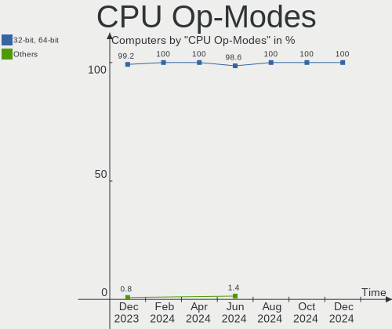
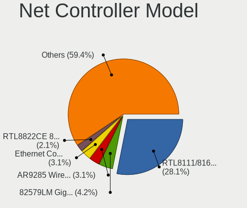
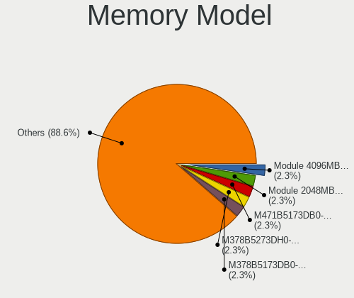
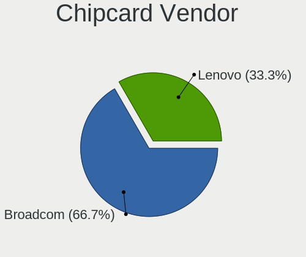

BlackPanther Hardware Trends
----------------------------

A project to identify most popular hardware characteristics and track their change
over time based on data collected by BlackPanther users at https://Linux-Hardware.org.

Anyone can contribute to the study by uploading probes of their computers by
the [hw-probe](https://github.com/linuxhw/hw-probe) tool:

    sudo -E hw-probe -all -upload

This is a report for all computer types. See also reports for [desktops](/Dist/BlackPanther/Desktop/README.md) and [notebooks](/Dist/BlackPanther/Notebook/README.md).

Full-feature report is available here: https://linux-hardware.org/?view=trends

Period: Dec, 2020.

Contents
--------

- [ OS                       ](#os)
- [ OS Family                ](#os-family)
- [ Kernel                   ](#kernel)
- [ Kernel Family            ](#kernel-family)
- [ Kernel Major Ver.        ](#kernel-major-ver)
- [ Arch                     ](#arch)
- [ DE                       ](#de)
- [ Display Server           ](#display-server)
- [ Display Manager          ](#display-manager)
- [ OS Lang                  ](#os-lang)
- [ Boot Mode                ](#boot-mode)
- [ Filesystem               ](#filesystem)
- [ Part. scheme             ](#part-scheme)
- [ Dual Boot with Linux/BSD ](#dual-boot-with-linux/bsd)
- [ Dual Boot (Win)          ](#dual-boot-win)
- [ Country                  ](#country)
- [ City                     ](#city)
- [ Vendor                   ](#vendor)
- [ Model                    ](#model)
- [ Model Family             ](#model-family)
- [ MFG Year                 ](#mfg-year)
- [ Form Factor              ](#form-factor)
- [ Secure Boot              ](#secure-boot)
- [ Coreboot                 ](#coreboot)
- [ RAM Size                 ](#ram-size)
- [ RAM Used                 ](#ram-used)
- [ Has CD-ROM               ](#has-cd-rom)
- [ Total Drives             ](#total-drives)
- [ Has Ethernet             ](#has-ethernet)
- [ Drive Vendor             ](#drive-vendor)
- [ Drive Model              ](#drive-model)
- [ HDD Vendor               ](#hdd-vendor)
- [ SSD Vendor               ](#ssd-vendor)
- [ Drive Kind               ](#drive-kind)
- [ Drive Connector          ](#drive-connector)
- [ Drive Size               ](#drive-size)
- [ Space Total              ](#space-total)
- [ Space Used               ](#space-used)
- [ Malfunc. Drives          ](#malfunc-drives)
- [ Malfunc. Drive Vendor    ](#malfunc-drive-vendor)
- [ Malfunc. HDD Vendor      ](#malfunc-hdd-vendor)
- [ Malfunc. Drive Kind      ](#malfunc-drive-kind)
- [ Failed Drives            ](#failed-drives)
- [ Failed Drive Vendor      ](#failed-drive-vendor)
- [ Drive Status             ](#drive-status)
- [ Storage Vendor           ](#storage-vendor)
- [ Storage Model            ](#storage-model)
- [ Storage Kind             ](#storage-kind)
- [ CPU Vendor               ](#cpu-vendor)
- [ CPU Model                ](#cpu-model)
- [ CPU Model Family         ](#cpu-model-family)
- [ CPU Cores                ](#cpu-cores)
- [ CPU Sockets              ](#cpu-sockets)
- [ CPU Threads              ](#cpu-threads)
- [ CPU Op-Modes             ](#cpu-op-modes)
- [ CPU Microcode            ](#cpu-microcode)
- [ CPU Microarch            ](#cpu-microarch)
- [ GPU Vendor               ](#gpu-vendor)
- [ GPU Model                ](#gpu-model)
- [ GPU Combo                ](#gpu-combo)
- [ GPU Driver               ](#gpu-driver)
- [ GPU Memory               ](#gpu-memory)
- [ Monitor Vendor           ](#monitor-vendor)
- [ Monitor Model            ](#monitor-model)
- [ Monitor Resolution       ](#monitor-resolution)
- [ Monitor Diagonal         ](#monitor-diagonal)
- [ Monitor Width            ](#monitor-width)
- [ Aspect Ratio             ](#aspect-ratio)
- [ Monitor Area             ](#monitor-area)
- [ Pixel Density            ](#pixel-density)
- [ Multiple Monitors        ](#multiple-monitors)
- [ Net Controller Vendor    ](#net-controller-vendor)
- [ Net Controller Model     ](#net-controller-model)
- [ Wireless Vendor          ](#wireless-vendor)
- [ Wireless Model           ](#wireless-model)
- [ Ethernet Vendor          ](#ethernet-vendor)
- [ Ethernet Model           ](#ethernet-model)
- [ Net Controller Kind      ](#net-controller-kind)
- [ Used Controller          ](#used-controller)
- [ NICs                     ](#nics)
- [ Memory Vendor            ](#memory-vendor)
- [ Memory Model             ](#memory-model)
- [ Memory Kind              ](#memory-kind)
- [ Memory Form Factor       ](#memory-form-factor)
- [ Memory Size              ](#memory-size)
- [ Memory Speed             ](#memory-speed)
- [ Sound Vendor             ](#sound-vendor)
- [ Sound Model              ](#sound-model)
- [ Camera Vendor            ](#camera-vendor)
- [ Camera Model             ](#camera-model)
- [ Fingerprint Vendor       ](#fingerprint-vendor)
- [ Fingerprint Model        ](#fingerprint-model)
- [ Chipcard Vendor          ](#chipcard-vendor)
- [ Chipcard Model           ](#chipcard-model)
- [ Printer Vendor           ](#printer-vendor)
- [ Printer Model            ](#printer-model)
- [ Scanner Vendor           ](#scanner-vendor)
- [ Scanner Model            ](#scanner-model)
- [ Bluetooth Vendor         ](#bluetooth-vendor)
- [ Bluetooth Model          ](#bluetooth-model)
- [ Unsupported Devices      ](#unsupported-devices)
- [ Unsupported Device Types ](#unsupported-device-types)

OS
--

Installed operating systems

| Name              | Computers | Percent |
|-------------------|-----------|---------|
| BlackPanther 18.1 | 208       | 94.98%  |
| BlackPanther 16.2 | 11        | 5.02%   |

OS Family
---------

OS without a version

| Name         | Computers | Percent |
|--------------|-----------|---------|
| BlackPanther | 219       | 100%    |

Kernel
------

Version of the Linux kernel

| Version                | Computers | Percent |
|------------------------|-----------|---------|
| 4.18.16-desktop-1bP    | 195       | 89.04%  |
| 5.6.14-desktop-2bP     | 12        | 5.48%   |
| 4.9.20-desktop-pae-1bP | 9         | 4.11%   |
| 5.8.11-desktop-2bP     | 1         | 0.46%   |
| 5.6.14-server-2bP      | 1         | 0.46%   |
| 4.7.0-desktop-1bP      | 1         | 0.46%   |

Kernel Family
-------------

Linux kernel without a distro release

| Version | Computers | Percent |
|---------|-----------|---------|
| 4.18.16 | 195       | 89.04%  |
| 5.6.14  | 13        | 5.94%   |
| 4.9.20  | 9         | 4.11%   |
| 5.8.11  | 1         | 0.46%   |
| 4.7.0   | 1         | 0.46%   |

Kernel Major Ver.
-----------------

Linux kernel major version

| Version | Computers | Percent |
|---------|-----------|---------|
| 4.18    | 195       | 89.04%  |
| 5.6     | 13        | 5.94%   |
| 4.9     | 9         | 4.11%   |
| 5.8     | 1         | 0.46%   |
| 4.7     | 1         | 0.46%   |

Arch
----

OS architecture (x86_64, i586, etc.)

| Name   | Computers | Percent |
|--------|-----------|---------|
| x86_64 | 208       | 94.98%  |
| i686   | 10        | 4.57%   |
| unknow | 1         | 0.46%   |

DE
--

Desktop Environment

| Name    | Computers | Percent |
|---------|-----------|---------|
| KDE5    | 216       | 98.63%  |
| Unknown | 3         | 1.37%   |

Display Server
--------------

X11 or Wayland

| Name | Computers | Percent |
|------|-----------|---------|
| X11  | 219       | 100%    |

Display Manager
---------------

SDDM, LightDM, etc.

| Name    | Computers | Percent |
|---------|-----------|---------|
| SDDM    | 218       | 99.54%  |
| Unknown | 1         | 0.46%   |

OS Lang
-------

Language

| Lang    | Computers | Percent |
|---------|-----------|---------|
| Unknown | 218       | 99.54%  |
| hu_HU   | 1         | 0.46%   |

Boot Mode
---------

EFI or BIOS

| Mode | Computers | Percent |
|------|-----------|---------|
| BIOS | 159       | 72.6%   |
| EFI  | 60        | 27.4%   |

Filesystem
----------

Type of filesystem

| Type    | Computers | Percent |
|---------|-----------|---------|
| Overlay | 188       | 85.84%  |
| Ext4    | 29        | 13.24%  |
| Ext2    | 1         | 0.46%   |
| Unknown | 1         | 0.46%   |

Part. scheme
------------

Scheme of partitioning

| Type    | Computers | Percent |
|---------|-----------|---------|
| MBR     | 141       | 64.38%  |
| GPT     | 77        | 35.16%  |
| Unknown | 1         | 0.46%   |

Dual Boot with Linux/BSD
------------------------

Hosting more than one Linux/BSD

| Dual boot | Computers | Percent |
|-----------|-----------|---------|
| No        | 118       | 53.88%  |
| Yes       | 101       | 46.12%  |

Dual Boot (Win)
---------------

Hosting Linux and Windows

| Dual boot | Computers | Percent |
|-----------|-----------|---------|
| Yes       | 125       | 57.08%  |
| No        | 94        | 42.92%  |

Country
-------

Geographic location (country)

| Country      | Computers | Percent |
|--------------|-----------|---------|
| Hungary      | 172       | 78.54%  |
| Germany      | 7         | 3.2%    |
| Romania      | 4         | 1.83%   |
| France       | 4         | 1.83%   |
| Brazil       | 4         | 1.83%   |
| Slovakia     | 3         | 1.37%   |
| Italy        | 3         | 1.37%   |
| USA          | 2         | 0.91%   |
| Ukraine      | 2         | 0.91%   |
| UK           | 2         | 0.91%   |
| Serbia       | 2         | 0.91%   |
| Philippines  | 2         | 0.91%   |
| Uruguay      | 1         | 0.46%   |
| Turkey       | 1         | 0.46%   |
| Thailand     | 1         | 0.46%   |
| Switzerland  | 1         | 0.46%   |
| Spain        | 1         | 0.46%   |
| South Africa | 1         | 0.46%   |
| Netherlands  | 1         | 0.46%   |
| India        | 1         | 0.46%   |
| Finland      | 1         | 0.46%   |
| Egypt        | 1         | 0.46%   |
| Colombia     | 1         | 0.46%   |
| Australia    | 1         | 0.46%   |

City
----

Geographic location (city)

| City                      | Computers | Percent |
|---------------------------|-----------|---------|
| Budapest                  | 57        | 26.03%  |
| Debrecen                  | 7         | 3.2%    |
| Székesfehérvár         | 6         | 2.74%   |
| Győr                     | 6         | 2.74%   |
| Miskolc                   | 5         | 2.28%   |
| Karcag                    | 5         | 2.28%   |
| Tatabánya                | 4         | 1.83%   |
| Zalaegerszeg              | 3         | 1.37%   |
| Veszprém                 | 3         | 1.37%   |
| Kazincbarcika             | 3         | 1.37%   |
| Gödöllő                | 3         | 1.37%   |
| Békéscsaba              | 3         | 1.37%   |
| Balassagyarmat            | 3         | 1.37%   |
| Uzhhorod                  | 2         | 0.91%   |
| Tiszaujvaros              | 2         | 0.91%   |
| Szigetszentmiklos         | 2         | 0.91%   |
| Szekszárd                | 2         | 0.91%   |
| Sarvar                    | 2         | 0.91%   |
| Pécs                     | 2         | 0.91%   |
| Oroshaza                  | 2         | 0.91%   |
| Orbottyan                 | 2         | 0.91%   |
| Nyiregyhaza               | 2         | 0.91%   |
| Hajduszoboszlo            | 2         | 0.91%   |
| Farmos                    | 2         | 0.91%   |
| Dunaharaszti              | 2         | 0.91%   |
| Dittenheim                | 2         | 0.91%   |
| Bucharest                 | 2         | 0.91%   |
| Bologna                   | 2         | 0.91%   |
| Backa Topola              | 2         | 0.91%   |
| Zsambek                   | 1         | 0.46%   |
| Visakhapatnam             | 1         | 0.46%   |
| Veszpremvarsany           | 1         | 0.46%   |
| Ullo                      | 1         | 0.46%   |
| Torokszentmiklos          | 1         | 0.46%   |
| Tornaľa                  | 1         | 0.46%   |
| Timișoara                | 1         | 0.46%   |
| Teuchern                  | 1         | 0.46%   |
| Teresopolis               | 1         | 0.46%   |
| Tata                      | 1         | 0.46%   |
| Tarcal                    | 1         | 0.46%   |
| Tap                       | 1         | 0.46%   |
| Szombathely               | 1         | 0.46%   |
| Szeged                    | 1         | 0.46%   |
| Sydney                    | 1         | 0.46%   |
| Sutto                     | 1         | 0.46%   |
| Salvador                  | 1         | 0.46%   |
| Saint-Gilles-Croix-de-Vie | 1         | 0.46%   |
| Rackeve                   | 1         | 0.46%   |
| Pusztahencse              | 1         | 0.46%   |
| Portland                  | 1         | 0.46%   |
| Pontevedra                | 1         | 0.46%   |
| Papa                      | 1         | 0.46%   |
| Paks                      | 1         | 0.46%   |
| Nyergesujfalu             | 1         | 0.46%   |
| Nuremberg                 | 1         | 0.46%   |
| Novo Gama                 | 1         | 0.46%   |
| Naszaly                   | 1         | 0.46%   |
| Nagykoros                 | 1         | 0.46%   |
| Mosonmagyaróvár         | 1         | 0.46%   |
| Montevideo                | 1         | 0.46%   |

Vendor
------

Motherboard manufacturer

| Name                | Computers | Percent |
|---------------------|-----------|---------|
| Hewlett-Packard     | 41        | 18.72%  |
| ASUSTek Computer    | 41        | 18.72%  |
| Dell                | 24        | 10.96%  |
| Lenovo              | 21        | 9.59%   |
| Gigabyte Technology | 20        | 9.13%   |
| ASRock              | 17        | 7.76%   |
| Acer                | 14        | 6.39%   |
| MSI                 | 10        | 4.57%   |
| Fujitsu             | 6         | 2.74%   |
| Toshiba             | 5         | 2.28%   |
| Samsung Electronics | 5         | 2.28%   |
| Fujitsu Siemens     | 4         | 1.83%   |
| Packard Bell        | 2         | 0.91%   |
| WINCOR NIXDORF      | 1         | 0.46%   |
| Supermicro          | 1         | 0.46%   |
| PCSMART             | 1         | 0.46%   |
| Notebook            | 1         | 0.46%   |
| Intel               | 1         | 0.46%   |
| eMachines           | 1         | 0.46%   |
| Biostar             | 1         | 0.46%   |
| Apple               | 1         | 0.46%   |
| Alcor               | 1         | 0.46%   |

Model
-----

Motherboard model

| Name                                       | Computers | Percent |
|--------------------------------------------|-----------|---------|
| HP Compaq dc5800 Small Form Factor         | 4         | 1.83%   |
| ASUS All Series                            | 3         | 1.37%   |
| Unknown                                    | 3         | 1.37%   |
| HP EliteBook 8440p                         | 2         | 0.91%   |
| HP 250 G1                                  | 2         | 0.91%   |
| Gigabyte H61MS                             | 2         | 0.91%   |
| Gigabyte G31M-ES2L                         | 2         | 0.91%   |
| Dell Latitude E5500                        | 2         | 0.91%   |
| Dell Latitude E4310                        | 2         | 0.91%   |
| Dell Inspiron 1525                         | 2         | 0.91%   |
| ASUS K53E                                  | 2         | 0.91%   |
| ASRock N68C-S UCC                          | 2         | 0.91%   |
| ASRock FM2A75M Pro4+                       | 2         | 0.91%   |
| ASRock ConRoe1333-D667                     | 2         | 0.91%   |
| ASRock 970M Pro3                           | 2         | 0.91%   |
| ASRock 970 Pro3 R2.0                       | 2         | 0.91%   |
| Acer Aspire 5732Z                          | 2         | 0.91%   |
| WINCOR NIXDORF BEETLE                      | 1         | 0.46%   |
| Toshiba Satellite Pro L300                 | 1         | 0.46%   |
| Toshiba Satellite P300                     | 1         | 0.46%   |
| Toshiba Satellite P100                     | 1         | 0.46%   |
| Toshiba Satellite L750                     | 1         | 0.46%   |
| Toshiba Satellite C660                     | 1         | 0.46%   |
| Supermicro SYS-5015A-EHF-D525              | 1         | 0.46%   |
| Samsung N150/N210/N220                     | 1         | 0.46%   |
| Samsung 905S3G/906S3G/915S3G/9305SG        | 1         | 0.46%   |
| Samsung 730U3E/740U3E                      | 1         | 0.46%   |
| Samsung 300V3A/300V4A/300V5A/200A4B/200A5B | 1         | 0.46%   |
| Samsung 300E4A/300E5A/300E7A/3430EA/3530EA | 1         | 0.46%   |
| Packard Bell EasyNote TS11HR               | 1         | 0.46%   |
| Packard Bell EasyNote TE11HC               | 1         | 0.46%   |
| Notebook Satori                            | 1         | 0.46%   |
| MSI Pro 3130 Small Form Factor PC          | 1         | 0.46%   |
| MSI MS-7C00                                | 1         | 0.46%   |
| MSI MS-7A33                                | 1         | 0.46%   |
| MSI MS-7994                                | 1         | 0.46%   |
| MSI MS-7977                                | 1         | 0.46%   |
| MSI MS-7817                                | 1         | 0.46%   |
| MSI MS-7786                                | 1         | 0.46%   |
| MSI MS-7592                                | 1         | 0.46%   |
| MSI MS-7376                                | 1         | 0.46%   |
| MSI MS-7309                                | 1         | 0.46%   |
| Lenovo V145-15AST 81MT                     | 1         | 0.46%   |
| Lenovo ThinkStation D20 4158AF8            | 1         | 0.46%   |
| Lenovo ThinkPad W510 431924G               | 1         | 0.46%   |
| Lenovo ThinkPad T61 6458WK6                | 1         | 0.46%   |
| Lenovo ThinkPad T400 6474E18               | 1         | 0.46%   |
| Lenovo ThinkPad T400 2768G17               | 1         | 0.46%   |
| Lenovo ThinkCentre M81 5048W6L             | 1         | 0.46%   |
| Lenovo ThinkCentre M70e 00P5607            | 1         | 0.46%   |
| Lenovo IdeaPad Z570 HuronRiver Platform    | 1         | 0.46%   |
| Lenovo IdeaPad L340-17IRH Gaming 81LL      | 1         | 0.46%   |
| Lenovo IdeaPad 520-15IKB 81BF              | 1         | 0.46%   |
| Lenovo IdeaPad 510-15ISK 80SR              | 1         | 0.46%   |
| Lenovo IdeaPad 330-15IKB 81FE              | 1         | 0.46%   |
| Lenovo IdeaPad 330-15IKB 81DE              | 1         | 0.46%   |
| Lenovo IdeaPad 320-15IAP 80XR              | 1         | 0.46%   |
| Lenovo IdeaPad 305-15IBD 80NJ              | 1         | 0.46%   |
| Lenovo IdeaCentre AIO 300-22ISU F0BX00JXHV | 1         | 0.46%   |
| Lenovo G550 20023                          | 1         | 0.46%   |

Model Family
------------

Motherboard model prefix

| Name                          | Computers | Percent |
|-------------------------------|-----------|---------|
| HP Compaq                     | 12        | 5.48%   |
| Acer Aspire                   | 10        | 4.57%   |
| Dell Latitude                 | 9         | 4.11%   |
| Lenovo IdeaPad                | 8         | 3.65%   |
| Dell OptiPlex                 | 7         | 3.2%    |
| Dell Inspiron                 | 6         | 2.74%   |
| Toshiba Satellite             | 5         | 2.28%   |
| HP ProBook                    | 5         | 2.28%   |
| HP Pavilion                   | 5         | 2.28%   |
| Lenovo ThinkPad               | 4         | 1.83%   |
| HP 250                        | 4         | 1.83%   |
| Fujitsu Siemens AMILO         | 4         | 1.83%   |
| Fujitsu ESPRIMO               | 4         | 1.83%   |
| ASUS PRIME                    | 4         | 1.83%   |
| HP EliteBook                  | 3         | 1.37%   |
| ASUS VivoBook                 | 3         | 1.37%   |
| ASUS All                      | 3         | 1.37%   |
| Unknown                       | 3         | 1.37%   |
| Packard Bell EasyNote         | 2         | 0.91%   |
| Lenovo ThinkCentre            | 2         | 0.91%   |
| Gigabyte H61MS                | 2         | 0.91%   |
| Gigabyte G31M-ES2L            | 2         | 0.91%   |
| Fujitsu CELSIUS               | 2         | 0.91%   |
| ASUS K53E                     | 2         | 0.91%   |
| ASRock N68C-S                 | 2         | 0.91%   |
| ASRock FM2A75M                | 2         | 0.91%   |
| ASRock ConRoe1333-D667        | 2         | 0.91%   |
| ASRock 970M                   | 2         | 0.91%   |
| ASRock 970                    | 2         | 0.91%   |
| WINCOR NIXDORF BEETLE         | 1         | 0.46%   |
| Supermicro SYS-5015A-EHF-D525 | 1         | 0.46%   |
| Samsung N150                  | 1         | 0.46%   |
| Samsung 905S3G                | 1         | 0.46%   |
| Samsung 730U3E                | 1         | 0.46%   |
| Samsung 300V3A                | 1         | 0.46%   |
| Samsung 300E4A                | 1         | 0.46%   |
| Notebook Satori               | 1         | 0.46%   |
| MSI Pro                       | 1         | 0.46%   |
| MSI MS-7C00                   | 1         | 0.46%   |
| MSI MS-7A33                   | 1         | 0.46%   |
| MSI MS-7994                   | 1         | 0.46%   |
| MSI MS-7977                   | 1         | 0.46%   |
| MSI MS-7817                   | 1         | 0.46%   |
| MSI MS-7786                   | 1         | 0.46%   |
| MSI MS-7592                   | 1         | 0.46%   |
| MSI MS-7376                   | 1         | 0.46%   |
| MSI MS-7309                   | 1         | 0.46%   |
| Lenovo V145-15AST             | 1         | 0.46%   |
| Lenovo ThinkStation           | 1         | 0.46%   |
| Lenovo IdeaCentre             | 1         | 0.46%   |
| Lenovo G550                   | 1         | 0.46%   |
| Lenovo G50-45                 | 1         | 0.46%   |
| Lenovo G50-30                 | 1         | 0.46%   |
| Lenovo B50-70                 | 1         | 0.46%   |
| Intel D510MO                  | 1         | 0.46%   |
| HP ProDesk                    | 1         | 0.46%   |
| HP OMEN                       | 1         | 0.46%   |
| HP Notebook                   | 1         | 0.46%   |
| HP Laptop                     | 1         | 0.46%   |
| HP G56                        | 1         | 0.46%   |

MFG Year
--------

Motherboard manufacture year

| Year    | Computers | Percent |
|---------|-----------|---------|
| 2011    | 31        | 14.16%  |
| 2010    | 23        | 10.5%   |
| 2009    | 19        | 8.68%   |
| 2013    | 17        | 7.76%   |
| 2012    | 17        | 7.76%   |
| 2008    | 16        | 7.31%   |
| 2019    | 15        | 6.85%   |
| 2018    | 14        | 6.39%   |
| 2016    | 14        | 6.39%   |
| 2014    | 14        | 6.39%   |
| 2020    | 12        | 5.48%   |
| 2015    | 11        | 5.02%   |
| 2017    | 8         | 3.65%   |
| 2007    | 6         | 2.74%   |
| 2005    | 1         | 0.46%   |
| Unknown | 1         | 0.46%   |

Form Factor
-----------

Physical design of the computer

| Name       | Computers | Percent |
|------------|-----------|---------|
| Notebook   | 111       | 50.68%  |
| Desktop    | 105       | 47.95%  |
| All in one | 2         | 0.91%   |
| Mini pc    | 1         | 0.46%   |

Secure Boot
-----------

Enabled or disabled

| State    | Computers | Percent |
|----------|-----------|---------|
| Disabled | 219       | 100%    |

Coreboot
--------

Have coreboot on board

| Used | Computers | Percent |
|------|-----------|---------|
| No   | 219       | 100%    |

RAM Size
--------

Total RAM memory

| Size in GB | Computers | Percent |
|------------|-----------|---------|
| 3.01-4.0   | 69        | 31.51%  |
| 8.01-16.0  | 48        | 21.92%  |
| 4.01-8.0   | 35        | 15.98%  |
| 1.01-2.0   | 35        | 15.98%  |
| 16.01-24.0 | 23        | 10.5%   |
| 2.01-3.0   | 5         | 2.28%   |
| 24.01-32.0 | 2         | 0.91%   |
| 32.01-64.0 | 1         | 0.46%   |
| 0.51-1.0   | 1         | 0.46%   |

RAM Used
--------

Used RAM memory

| Used GB  | Computers | Percent |
|----------|-----------|---------|
| 0.51-1.0 | 98        | 44.75%  |
| 0.01-0.5 | 85        | 38.81%  |
| 1.01-2.0 | 33        | 15.07%  |
| 2.01-3.0 | 2         | 0.91%   |
| 4.01-8.0 | 1         | 0.46%   |

Has CD-ROM
----------

Has CD-ROM on board

| Presented | Computers | Percent |
|-----------|-----------|---------|
| Yes       | 153       | 69.86%  |
| No        | 66        | 30.14%  |

Total Drives
------------

Number of drives on board

| Drives | Computers | Percent |
|--------|-----------|---------|
| 1      | 154       | 70.32%  |
| 2      | 39        | 17.81%  |
| 3      | 13        | 5.94%   |
| 4      | 7         | 3.2%    |
| 5      | 3         | 1.37%   |
| 7      | 1         | 0.46%   |
| 6      | 1         | 0.46%   |
| 0      | 1         | 0.46%   |

Has Ethernet
------------

Has Ethernet on board

| Presented | Computers | Percent |
|-----------|-----------|---------|
| Yes       | 212       | 96.8%   |
| No        | 7         | 3.2%    |

Drive Vendor
------------

Hard drive vendors

| Vendor              | Computers | Drives | Percent |
|---------------------|-----------|--------|---------|
| WDC                 | 63        | 72     | 20.26%  |
| Seagate             | 49        | 50     | 15.76%  |
| Samsung Electronics | 41        | 49     | 13.18%  |
| Toshiba             | 31        | 33     | 9.97%   |
| Kingston            | 31        | 35     | 9.97%   |
| Hitachi             | 21        | 22     | 6.75%   |
| SanDisk             | 13        | 13     | 4.18%   |
| HGST                | 13        | 13     | 4.18%   |
| Crucial             | 5         | 5      | 1.61%   |
| A-DATA Technology   | 5         | 5      | 1.61%   |
| USB3.0              | 3         | 4      | 0.96%   |
| Micron Technology   | 3         | 3      | 0.96%   |
| Maxtor              | 3         | 3      | 0.96%   |
| Fujitsu             | 3         | 3      | 0.96%   |
| Unknown             | 2         | 4      | 0.64%   |
| SPCC                | 2         | 2      | 0.64%   |
| PNY                 | 2         | 2      | 0.64%   |
| JMicron             | 2         | 2      | 0.64%   |
| Intel               | 2         | 2      | 0.64%   |
| Gigabyte Technology | 2         | 2      | 0.64%   |
| China               | 2         | 2      | 0.64%   |
| Zheino              | 1         | 1      | 0.32%   |
| Team                | 1         | 1      | 0.32%   |
| PLEXTOR             | 1         | 1      | 0.32%   |
| Patriot             | 1         | 1      | 0.32%   |
| OCZ                 | 1         | 1      | 0.32%   |
| LITEON              | 1         | 1      | 0.32%   |
| KingSpec            | 1         | 1      | 0.32%   |
| Kingmax             | 1         | 1      | 0.32%   |
| Intenso             | 1         | 1      | 0.32%   |
| HGST HTS            | 1         | 1      | 0.32%   |
| Emphase             | 1         | 1      | 0.32%   |
| Apple               | 1         | 1      | 0.32%   |
| Apacer              | 1         | 1      | 0.32%   |

Drive Model
-----------

Hard drive models

| Model                            | Computers | Percent |
|----------------------------------|-----------|---------|
| Toshiba MQ01ABF050 500GB         | 7         | 2.1%    |
| Kingston SA400S37480G 480GB SSD  | 7         | 2.1%    |
| Kingston SA400S37240G 240GB SSD  | 6         | 1.8%    |
| Seagate ST500LT012-1DG142 500GB  | 5         | 1.5%    |
| Seagate ST500DM002-1BD142 500GB  | 4         | 1.2%    |
| Seagate ST1000LM035-1RK172 1TB   | 4         | 1.2%    |
| Kingston SA400S37120G 120GB SSD  | 4         | 1.2%    |
| HGST HTS721010A9E630 1TB         | 4         | 1.2%    |
| WDC WD1600BEVT-22ZCT0 160GB      | 3         | 0.9%    |
| USB3.0 Disk 80GB                 | 3         | 0.9%    |
| Toshiba DT01ACA100 1TB           | 3         | 0.9%    |
| Seagate ST9320325AS 320GB        | 3         | 0.9%    |
| SanDisk SSD PLUS 240GB           | 3         | 0.9%    |
| Samsung HD502HJ 500GB            | 3         | 0.9%    |
| Kingston SV300S37A120G 120GB SSD | 3         | 0.9%    |
| Kingston SUV400S37120G 120GB SSD | 3         | 0.9%    |
| Hitachi HTS543232A7A384 320GB    | 3         | 0.9%    |
| WDC WDS500G2B0A-00SM50 500GB SSD | 2         | 0.6%    |
| WDC WDS120G2G0A-00JH30 120GB SSD | 2         | 0.6%    |
| WDC WD5000AAKS-007AA0 500GB      | 2         | 0.6%    |
| WDC WD3200BEVT-22ZCT0 320GB      | 2         | 0.6%    |
| WDC WD3200AAKS-00L9A0 320GB      | 2         | 0.6%    |
| WDC WD20EFRX-68EUZN0 2TB         | 2         | 0.6%    |
| WDC WD10JPVX-22JC3T0 1TB         | 2         | 0.6%    |
| WDC WD10EZRZ-00HTKB0 1TB         | 2         | 0.6%    |
| Toshiba MQ01ABD100 1TB           | 2         | 0.6%    |
| Toshiba MQ01ABD050V 500GB        | 2         | 0.6%    |
| Toshiba MK5059GSXP 500GB         | 2         | 0.6%    |
| Toshiba DT01ACA050 500GB         | 2         | 0.6%    |
| SPCC Solid State Disk 256GB      | 2         | 0.6%    |
| Seagate ST9750423AS 752GB        | 2         | 0.6%    |
| Seagate ST1000DM003-1ER162 1TB   | 2         | 0.6%    |
| SanDisk SD9TB8W1T001001 1TB SSD  | 2         | 0.6%    |
| Samsung SSD 830 Series 64GB      | 2         | 0.6%    |
| Samsung SSD 830 Series 128GB     | 2         | 0.6%    |
| Samsung SSD 750 EVO 250GB        | 2         | 0.6%    |
| Samsung SP1203N 120GB            | 2         | 0.6%    |
| Samsung HD642JJ 640GB            | 2         | 0.6%    |
| Samsung HD502IJ 500GB            | 2         | 0.6%    |
| Samsung HD253GJ 250GB            | 2         | 0.6%    |
| Samsung HD160JJ 160GB            | 2         | 0.6%    |
| Samsung HD103UJ 1TB              | 2         | 0.6%    |
| Samsung HD082GJ 80GB             | 2         | 0.6%    |
| PNY CS900 120GB SSD              | 2         | 0.6%    |
| JMicron Generic 120GB            | 2         | 0.6%    |
| Hitachi HDS721050CLA662 500GB    | 2         | 0.6%    |
| HGST HTS545050A7E680 500GB       | 2         | 0.6%    |
| HGST HTS545050A7E380 500GB       | 2         | 0.6%    |
| Gigabyte GP-GSTFS31120GNTD 120GB | 2         | 0.6%    |
| Crucial CT120BX500SSD1 120GB     | 2         | 0.6%    |
| A-DATA SU700 120GB SSD           | 2         | 0.6%    |
| Zheino CHN-NGFFNV2280-256 256GB  | 1         | 0.3%    |
| WDC WDS250G2B0A-00SM50 250GB SSD | 1         | 0.3%    |
| WDC WDS240G2G0B-00EPW0 240GB SSD | 1         | 0.3%    |
| WDC WDS120G2G0B-00EPW0 120GB SSD | 1         | 0.3%    |
| WDC WD800JD-55MUA1 80GB          | 1         | 0.3%    |
| WDC WD800JD-08MSA1 80GB          | 1         | 0.3%    |
| WDC WD800AAJS-60PSA0 80GB        | 1         | 0.3%    |
| WDC WD7500BPVT-22HXZT3 752GB     | 1         | 0.3%    |
| WDC WD7500AYPS-01ZKB0 752GB      | 1         | 0.3%    |

HDD Vendor
----------

Hard disk drive vendors

| Vendor              | Computers | Drives | Percent |
|---------------------|-----------|--------|---------|
| WDC                 | 57        | 65     | 27.8%   |
| Seagate             | 48        | 49     | 23.41%  |
| Toshiba             | 28        | 30     | 13.66%  |
| Samsung Electronics | 27        | 30     | 13.17%  |
| Hitachi             | 21        | 22     | 10.24%  |
| HGST                | 13        | 13     | 6.34%   |
| USB3.0              | 3         | 4      | 1.46%   |
| Maxtor              | 3         | 3      | 1.46%   |
| Fujitsu             | 3         | 3      | 1.46%   |
| Emphase             | 1         | 1      | 0.49%   |
| Apple               | 1         | 1      | 0.49%   |

SSD Vendor
----------

Solid state drive vendors

| Vendor              | Computers | Drives | Percent |
|---------------------|-----------|--------|---------|
| Kingston            | 30        | 34     | 31.25%  |
| Samsung Electronics | 13        | 14     | 13.54%  |
| SanDisk             | 12        | 12     | 12.5%   |
| WDC                 | 6         | 7      | 6.25%   |
| A-DATA Technology   | 5         | 5      | 5.21%   |
| Crucial             | 4         | 4      | 4.17%   |
| Toshiba             | 2         | 2      | 2.08%   |
| SPCC                | 2         | 2      | 2.08%   |
| PNY                 | 2         | 2      | 2.08%   |
| Micron Technology   | 2         | 2      | 2.08%   |
| JMicron             | 2         | 2      | 2.08%   |
| Intel               | 2         | 2      | 2.08%   |
| Gigabyte Technology | 2         | 2      | 2.08%   |
| China               | 2         | 2      | 2.08%   |
| Unknown             | 1         | 1      | 1.04%   |
| Team                | 1         | 1      | 1.04%   |
| Seagate             | 1         | 1      | 1.04%   |
| Patriot             | 1         | 1      | 1.04%   |
| OCZ                 | 1         | 1      | 1.04%   |
| LITEON              | 1         | 1      | 1.04%   |
| KingSpec            | 1         | 1      | 1.04%   |
| Kingmax             | 1         | 1      | 1.04%   |
| Intenso             | 1         | 1      | 1.04%   |
| Apacer              | 1         | 1      | 1.04%   |

Drive Kind
----------

HDD or SSD

| Kind    | Computers | Drives | Percent |
|---------|-----------|--------|---------|
| HDD     | 170       | 221    | 62.5%   |
| SSD     | 89        | 102    | 32.72%  |
| NVMe    | 9         | 11     | 3.31%   |
| MMC     | 3         | 4      | 1.1%    |
| Unknown | 1         | 1      | 0.37%   |

Drive Connector
---------------

SATA, SAS, NVMe, etc.

| Type | Computers | Drives | Percent |
|------|-----------|--------|---------|
| SATA | 216       | 314    | 91.53%  |
| NVMe | 9         | 11     | 3.81%   |
| SAS  | 8         | 10     | 3.39%   |
| MMC  | 3         | 4      | 1.27%   |

Drive Size
----------

Size of hard drive

| Size in TB | Computers | Drives | Percent |
|------------|-----------|--------|---------|
| 0.01-0.5   | 188       | 248    | 74.31%  |
| 0.51-1.0   | 56        | 64     | 22.13%  |
| 1.01-2.0   | 6         | 7      | 2.37%   |
| 2.01-3.0   | 2         | 3      | 0.79%   |
| 3.01-4.0   | 1         | 1      | 0.4%    |

Space Total
-----------

Amount of disk space available on the file system

| Size in GB | Computers | Percent |
|------------|-----------|---------|
| Unknown    | 180       | 82.19%  |
| 101-250    | 16        | 7.31%   |
| 251-500    | 7         | 3.2%    |
| 51-100     | 6         | 2.74%   |
| 501-1000   | 5         | 2.28%   |
| 1001-2000  | 2         | 0.91%   |
| 1-20       | 2         | 0.91%   |
| 21-50      | 1         | 0.46%   |

Space Used
----------

Amount of used disk space

| Used GB  | Computers | Percent |
|----------|-----------|---------|
| Unknown  | 180       | 82.19%  |
| 1-20     | 29        | 13.24%  |
| 101-250  | 4         | 1.83%   |
| 21-50    | 2         | 0.91%   |
| 501-1000 | 2         | 0.91%   |
| 251-500  | 1         | 0.46%   |
| 51-100   | 1         | 0.46%   |

Malfunc. Drives
---------------

Drive models with a malfunction

| Model                              | Computers | Drives | Percent |
|------------------------------------|-----------|--------|---------|
| WDC WD3200AAKS-00L9A0 320GB        | 2         | 2      | 2.15%   |
| Toshiba MQ01ABF050 500GB           | 2         | 2      | 2.15%   |
| Seagate ST9320325AS 320GB          | 2         | 2      | 2.15%   |
| Seagate ST500DM002-1BD142 500GB    | 2         | 2      | 2.15%   |
| Samsung Electronics SP1203N 120GB  | 2         | 2      | 2.15%   |
| Samsung Electronics HD642JJ 640GB  | 2         | 2      | 2.15%   |
| Samsung Electronics HD103UJ 1TB    | 2         | 2      | 2.15%   |
| Samsung Electronics HD082GJ 80GB   | 2         | 2      | 2.15%   |
| Hitachi HTS543232A7A384 320GB      | 2         | 2      | 2.15%   |
| HGST HTS545050A7E680 500GB         | 2         | 2      | 2.15%   |
| WDC WD800JD-55MUA1 80GB            | 1         | 1      | 1.08%   |
| WDC WD6400AAKS-07A7B0 640GB        | 1         | 1      | 1.08%   |
| WDC WD5000AVCS-632DY1 500GB        | 1         | 1      | 1.08%   |
| WDC WD5000AAVS-22G9B1 500GB        | 1         | 1      | 1.08%   |
| WDC WD5000AAKX-22ERMA0 500GB       | 1         | 1      | 1.08%   |
| WDC WD5000AAKX-08U6AA0 500GB       | 1         | 1      | 1.08%   |
| WDC WD5000AAKX-00ERMA0 500GB       | 1         | 1      | 1.08%   |
| WDC WD5000AAKS-22A7B0 500GB        | 1         | 1      | 1.08%   |
| WDC WD5000AAKS-00UU3A0 500GB       | 1         | 1      | 1.08%   |
| WDC WD5000AAKS-007AA0 500GB        | 1         | 1      | 1.08%   |
| WDC WD3200BPVT-00JJ5T0 320GB       | 1         | 1      | 1.08%   |
| WDC WD3200BEVT-22ZCT0 320GB        | 1         | 1      | 1.08%   |
| WDC WD2500AAKX-75U6AA0 250GB       | 1         | 1      | 1.08%   |
| WDC WD2500AAKX-60U6AA0 250GB       | 1         | 1      | 1.08%   |
| WDC WD20EFRX-68EUZN0 2TB           | 1         | 1      | 1.08%   |
| WDC WD10SPZX-24Z10T0 1TB           | 1         | 1      | 1.08%   |
| WDC WD10SPCX-11HWST0 1TB           | 1         | 1      | 1.08%   |
| WDC WD10JPVX-22JC3T0 1TB           | 1         | 1      | 1.08%   |
| WDC WD10EARS-00Y5B1 1TB            | 1         | 1      | 1.08%   |
| WDC WD10EALX-009BA0 1TB            | 1         | 1      | 1.08%   |
| Toshiba MQ01ABD075 752GB           | 1         | 1      | 1.08%   |
| Toshiba MK8009GAH 80GB             | 1         | 1      | 1.08%   |
| Toshiba MK1655GSX 160GB            | 1         | 1      | 1.08%   |
| Toshiba MK1652GSX 160GB            | 1         | 1      | 1.08%   |
| Seagate ST9750423AS 752GB          | 1         | 1      | 1.08%   |
| Seagate ST95005620AS 500GB         | 1         | 1      | 1.08%   |
| Seagate ST9320423AS 320GB          | 1         | 1      | 1.08%   |
| Seagate ST9250410AS 250GB          | 1         | 1      | 1.08%   |
| Seagate ST500LT012-9WS142 500GB    | 1         | 1      | 1.08%   |
| Seagate ST500LM000-1EJ162 500GB    | 1         | 1      | 1.08%   |
| Seagate ST380011A 80GB             | 1         | 1      | 1.08%   |
| Seagate ST3500620AS 500GB          | 1         | 1      | 1.08%   |
| Seagate ST3500418AS 500GB          | 1         | 1      | 1.08%   |
| Seagate ST3250318AS 249GB          | 1         | 1      | 1.08%   |
| Seagate ST1500DL003-9VT16L 1TB     | 1         | 1      | 1.08%   |
| Seagate ST1000LX015-1U7172 1TB     | 1         | 1      | 1.08%   |
| Seagate ST1000LM024 HN-M101MBB 1TB | 1         | 1      | 1.08%   |
| Seagate ST1000DM003-9YN162 1TB     | 1         | 1      | 1.08%   |
| Seagate ST1000DM003-1ER162 1TB     | 1         | 1      | 1.08%   |
| Samsung Electronics SP2504C 250GB  | 1         | 1      | 1.08%   |
| Samsung Electronics HM321HI 320GB  | 1         | 1      | 1.08%   |
| Samsung Electronics HM160HI 160GB  | 1         | 1      | 1.08%   |
| Samsung Electronics HD402LJ 400GB  | 1         | 1      | 1.08%   |
| Samsung Electronics HD253GJ 250GB  | 1         | 1      | 1.08%   |
| Samsung Electronics HD250HJ 250GB  | 1         | 1      | 1.08%   |
| Samsung Electronics HD161GJ 160GB  | 1         | 1      | 1.08%   |
| Samsung Electronics HD103SI 1TB    | 1         | 1      | 1.08%   |
| OCZ AGILITY3 64GB SSD              | 1         | 1      | 1.08%   |
| Maxtor 6Y080L0 82GB                | 1         | 1      | 1.08%   |
| Maxtor 2B020H1 20GB                | 1         | 1      | 1.08%   |

Malfunc. Drive Vendor
---------------------

Vendors of faulty drives

| Vendor              | Computers | Drives | Percent |
|---------------------|-----------|--------|---------|
| WDC                 | 21        | 22     | 23.6%   |
| Seagate             | 19        | 19     | 21.35%  |
| Samsung Electronics | 14        | 16     | 15.73%  |
| Hitachi             | 14        | 15     | 15.73%  |
| Toshiba             | 6         | 6      | 6.74%   |
| HGST                | 6         | 6      | 6.74%   |
| Kingston            | 3         | 3      | 3.37%   |
| Maxtor              | 2         | 2      | 2.25%   |
| OCZ                 | 1         | 1      | 1.12%   |
| KingSpec            | 1         | 1      | 1.12%   |
| Fujitsu             | 1         | 1      | 1.12%   |
| A-DATA Technology   | 1         | 1      | 1.12%   |

Malfunc. HDD Vendor
-------------------

Vendors of faulty HDD drives

| Vendor              | Computers | Drives | Percent |
|---------------------|-----------|--------|---------|
| WDC                 | 21        | 22     | 25.3%   |
| Seagate             | 19        | 19     | 22.89%  |
| Samsung Electronics | 14        | 16     | 16.87%  |
| Hitachi             | 14        | 15     | 16.87%  |
| Toshiba             | 6         | 6      | 7.23%   |
| HGST                | 6         | 6      | 7.23%   |
| Maxtor              | 2         | 2      | 2.41%   |
| Fujitsu             | 1         | 1      | 1.2%    |

Malfunc. Drive Kind
-------------------

Kinds of faulty drives

| Kind | Computers | Drives | Percent |
|------|-----------|--------|---------|
| HDD  | 77        | 87     | 92.77%  |
| SSD  | 6         | 6      | 7.23%   |

Failed Drives
-------------

Failed drive models

| Model                             | Computers | Drives | Percent |
|-----------------------------------|-----------|--------|---------|
| WDC WD2500LPCX-24C6HT0 250GB      | 1         | 1      | 25%     |
| Toshiba MQ01ABD050V 500GB         | 1         | 1      | 25%     |
| Samsung Electronics SP0802N 80GB  | 1         | 1      | 25%     |
| Samsung Electronics HD502HJ 500GB | 1         | 1      | 25%     |

Failed Drive Vendor
-------------------

Failed drive vendors

| Vendor              | Computers | Drives | Percent |
|---------------------|-----------|--------|---------|
| Samsung Electronics | 2         | 2      | 50%     |
| WDC                 | 1         | 1      | 25%     |
| Toshiba             | 1         | 1      | 25%     |

Drive Status
------------

Number of failed and malfunc. drives

| Status   | Computers | Drives | Percent |
|----------|-----------|--------|---------|
| Works    | 167       | 226    | 63.02%  |
| Malfunc  | 81        | 93     | 30.57%  |
| Detected | 13        | 16     | 4.91%   |
| Failed   | 4         | 4      | 1.51%   |

Storage Vendor
--------------

Storage controller vendors

| Vendor                       | Computers | Percent |
|------------------------------|-----------|---------|
| Intel                        | 165       | 65.48%  |
| AMD                          | 44        | 17.46%  |
| Nvidia                       | 9         | 3.57%   |
| JMicron Technology           | 8         | 3.17%   |
| Samsung Electronics          | 5         | 1.98%   |
| ASMedia Technology           | 5         | 1.98%   |
| Marvell Technology Group     | 3         | 1.19%   |
| VIA Technologies             | 2         | 0.79%   |
| Silicon Image                | 2         | 0.79%   |
| Toshiba America Info Systems | 1         | 0.4%    |
| Silicon Motion               | 1         | 0.4%    |
| Promise Technology           | 1         | 0.4%    |
| Micron/Crucial Technology    | 1         | 0.4%    |
| Micron Technology            | 1         | 0.4%    |
| Lite-On Technology           | 1         | 0.4%    |
| Kingston Technology Company  | 1         | 0.4%    |
| Hewlett-Packard              | 1         | 0.4%    |
| Broadcom / LSI               | 1         | 0.4%    |

Storage Model
-------------

Storage controller models

| Model                                                                                   | Computers | Percent |
|-----------------------------------------------------------------------------------------|-----------|---------|
| AMD FCH SATA Controller [AHCI mode]                                                     | 21        | 6.38%   |
| Intel NM10/ICH7 Family SATA Controller [IDE mode]                                       | 18        | 5.47%   |
| Intel 82801IBM/IEM (ICH9M/ICH9M-E) 4 port SATA Controller [AHCI mode]                   | 14        | 4.26%   |
| Intel 6 Series/C200 Series Chipset Family 6 port Mobile SATA AHCI Controller            | 14        | 4.26%   |
| Intel 82801G (ICH7 Family) IDE Controller                                               | 13        | 3.95%   |
| Intel 7 Series Chipset Family 6-port SATA Controller [AHCI mode]                        | 11        | 3.34%   |
| AMD SB7x0/SB8x0/SB9x0 SATA Controller [AHCI mode]                                       | 11        | 3.34%   |
| Intel Sunrise Point-LP SATA Controller [AHCI mode]                                      | 10        | 3.04%   |
| Intel 82801HM/HEM (ICH8M/ICH8M-E) IDE Controller                                        | 9         | 2.74%   |
| Intel 82801HM/HEM (ICH8M/ICH8M-E) SATA Controller [AHCI mode]                           | 8         | 2.43%   |
| Intel 8 Series/C220 Series Chipset Family 6-port SATA Controller 1 [AHCI mode]          | 8         | 2.43%   |
| AMD SB7x0/SB8x0/SB9x0 IDE Controller                                                    | 8         | 2.43%   |
| AMD FCH IDE Controller                                                                  | 8         | 2.43%   |
| Intel 82801I (ICH9 Family) 2 port SATA Controller [IDE mode]                            | 7         | 2.13%   |
| Intel 82801 Mobile SATA Controller [RAID mode]                                          | 7         | 2.13%   |
| Intel Q170/Q150/B150/H170/H110/Z170/CM236 Chipset SATA Controller [AHCI Mode]           | 6         | 1.82%   |
| Intel 82801IB (ICH9) 2 port SATA Controller [IDE mode]                                  | 6         | 1.82%   |
| Nvidia MCP61 SATA Controller                                                            | 5         | 1.52%   |
| Nvidia MCP61 IDE                                                                        | 5         | 1.52%   |
| JMicron JMB368 IDE controller                                                           | 5         | 1.52%   |
| Intel Wildcat Point-LP SATA Controller [AHCI Mode]                                      | 5         | 1.52%   |
| Intel 6 Series/C200 Series Chipset Family 6 port Desktop SATA AHCI Controller           | 5         | 1.52%   |
| Intel 5 Series/3400 Series Chipset 4 port SATA IDE Controller                           | 5         | 1.52%   |
| AMD SB7x0/SB8x0/SB9x0 SATA Controller [IDE mode]                                        | 5         | 1.52%   |
| Intel 6 Series/C200 Series Chipset Family Desktop SATA Controller (IDE mode, ports 4-5) | 4         | 1.22%   |
| Intel 6 Series/C200 Series Chipset Family Desktop SATA Controller (IDE mode, ports 0-3) | 4         | 1.22%   |
| Intel 5 Series/3400 Series Chipset 2 port SATA IDE Controller                           | 4         | 1.22%   |
| ASMedia ASM1062 Serial ATA Controller                                                   | 4         | 1.22%   |
| Samsung NVMe SSD Controller SM981/PM981/PM983                                           | 3         | 0.91%   |
| JMicron JMB363 SATA/IDE Controller                                                      | 3         | 0.91%   |
| Intel NM10/ICH7 Family SATA Controller [AHCI mode]                                      | 3         | 0.91%   |
| Intel Cannon Lake PCH SATA AHCI Controller                                              | 3         | 0.91%   |
| Intel 82801JI (ICH10 Family) SATA AHCI Controller                                       | 3         | 0.91%   |
| Intel 82801IR/IO/IH (ICH9R/DO/DH) 6 port SATA Controller [AHCI mode]                    | 3         | 0.91%   |
| Intel 8 Series SATA Controller 1 [AHCI mode]                                            | 3         | 0.91%   |
| Intel 200 Series PCH SATA controller [AHCI mode]                                        | 3         | 0.91%   |
| AMD SB600 Non-Raid-5 SATA                                                               | 3         | 0.91%   |
| AMD SB600 IDE                                                                           | 3         | 0.91%   |
| AMD FCH SATA Controller [IDE mode]                                                      | 3         | 0.91%   |
| AMD 400 Series Chipset SATA Controller                                                  | 3         | 0.91%   |
| Silicon Image SiI 3114 [SATALink/SATARaid] Serial ATA Controller                        | 2         | 0.61%   |
| Samsung NVMe SSD Controller SM961/PM961/SM963                                           | 2         | 0.61%   |
| Nvidia MCP51 Serial ATA Controller                                                      | 2         | 0.61%   |
| Intel Cannon Lake Mobile PCH SATA AHCI Controller                                       | 2         | 0.61%   |
| Intel Atom/Celeron/Pentium Processor x5-E8000/J3xxx/N3xxx Series SATA Controller        | 2         | 0.61%   |
| Intel Atom Processor E3800 Series SATA AHCI Controller                                  | 2         | 0.61%   |
| Intel 82801JI (ICH10 Family) 4 port SATA IDE Controller #1                              | 2         | 0.61%   |
| Intel 82801JI (ICH10 Family) 2 port SATA IDE Controller #2                              | 2         | 0.61%   |
| Intel 5 Series/3400 Series Chipset 6 port SATA AHCI Controller                          | 2         | 0.61%   |
| VIA VT82C586A/B/VT82C686/A/B/VT823x/A/C PIPC Bus Master IDE                             | 1         | 0.3%    |
| VIA VT8237A SATA 2-Port Controller                                                      | 1         | 0.3%    |
| VIA VT6421 IDE/SATA Controller                                                          | 1         | 0.3%    |
| Toshiba America Info Systems Toshiba America Info Non-Volatile memory controller        | 1         | 0.3%    |
| Silicon Motion SM2263EN/SM2263XT SSD Controller                                         | 1         | 0.3%    |
| Promise PDC42819 [FastTrak TX2650/TX4650]                                               | 1         | 0.3%    |
| Nvidia MCP73 SATA Controller (IDE mode)                                                 | 1         | 0.3%    |
| Nvidia MCP67 IDE Controller                                                             | 1         | 0.3%    |
| Nvidia MCP67 AHCI Controller                                                            | 1         | 0.3%    |
| Nvidia MCP51 IDE                                                                        | 1         | 0.3%    |
| Micron/Crucial P1 NVMe PCIe SSD                                                         | 1         | 0.3%    |

Storage Kind
------------

Kind of storage controller (IDE, SATA, NVMe, SAS, ...)

| Kind | Computers | Percent |
|------|-----------|---------|
| SATA | 160       | 60.15%  |
| IDE  | 83        | 31.2%   |
| RAID | 13        | 4.89%   |
| NVMe | 9         | 3.38%   |
| SCSI | 1         | 0.38%   |

CPU Vendor
----------

Processor vendors

| Vendor | Computers | Percent |
|--------|-----------|---------|
| Intel  | 169       | 77.17%  |
| AMD    | 50        | 22.83%  |

CPU Model
---------

Processor models

| Model                                       | Computers | Percent |
|---------------------------------------------|-----------|---------|
| Intel Core 2 Duo CPU P8600 @ 2.40GHz        | 4         | 1.83%   |
| Intel Core 2 Duo CPU E7200 @ 2.53GHz        | 4         | 1.83%   |
| Intel Pentium Dual-Core CPU T4400 @ 2.20GHz | 3         | 1.37%   |
| Intel Core i5-8250U CPU @ 1.60GHz           | 3         | 1.37%   |
| Intel Core i3-3220 CPU @ 3.30GHz            | 3         | 1.37%   |
| Intel Core i3-2350M CPU @ 2.30GHz           | 3         | 1.37%   |
| AMD Athlon 64 X2 Dual Core Processor 6000+  | 3         | 1.37%   |
| Intel Pentium Dual-Core CPU E5700 @ 3.00GHz | 2         | 0.91%   |
| Intel Pentium Dual-Core CPU E5300 @ 2.60GHz | 2         | 0.91%   |
| Intel Pentium CPU B960 @ 2.20GHz            | 2         | 0.91%   |
| Intel Core i7-4810MQ CPU @ 2.80GHz          | 2         | 0.91%   |
| Intel Core i7-2630QM CPU @ 2.00GHz          | 2         | 0.91%   |
| Intel Core i5-6500 CPU @ 3.20GHz            | 2         | 0.91%   |
| Intel Core i5-6200U CPU @ 2.30GHz           | 2         | 0.91%   |
| Intel Core i5-2430M CPU @ 2.40GHz           | 2         | 0.91%   |
| Intel Core i5 CPU M 560 @ 2.67GHz           | 2         | 0.91%   |
| Intel Core i3-8100 CPU @ 3.60GHz            | 2         | 0.91%   |
| Intel Core i3-6006U CPU @ 2.00GHz           | 2         | 0.91%   |
| Intel Core i3-5005U CPU @ 2.00GHz           | 2         | 0.91%   |
| Intel Core 2 Quad CPU Q8200 @ 2.33GHz       | 2         | 0.91%   |
| Intel Core 2 Duo CPU T8300 @ 2.40GHz        | 2         | 0.91%   |
| Intel Core 2 Duo CPU P8400 @ 2.26GHz        | 2         | 0.91%   |
| Intel Core 2 Duo CPU E8400 @ 3.00GHz        | 2         | 0.91%   |
| Intel Core 2 Duo CPU E7500 @ 2.93GHz        | 2         | 0.91%   |
| Intel Core 2 Duo CPU E7300 @ 2.66GHz        | 2         | 0.91%   |
| Intel Core 2 CPU 4300 @ 1.80GHz             | 2         | 0.91%   |
| Intel Celeron Dual-Core CPU T3000 @ 1.80GHz | 2         | 0.91%   |
| Intel Celeron CPU N2840 @ 2.16GHz           | 2         | 0.91%   |
| Intel Atom CPU N450 @ 1.66GHz               | 2         | 0.91%   |
| AMD FX-6300 Six-Core Processor              | 2         | 0.91%   |
| AMD A8-6600K APU with Radeon HD Graphics    | 2         | 0.91%   |
| Intel Xeon CPU X5677 @ 3.47GHz              | 1         | 0.46%   |
| Intel Xeon CPU E5620 @ 2.40GHz              | 1         | 0.46%   |
| Intel Pentium Dual-Core CPU T4500 @ 2.30GHz | 1         | 0.46%   |
| Intel Pentium Dual-Core CPU E6700 @ 3.20GHz | 1         | 0.46%   |
| Intel Pentium Dual-Core CPU E6500 @ 2.93GHz | 1         | 0.46%   |
| Intel Pentium Dual-Core CPU E5400 @ 2.70GHz | 1         | 0.46%   |
| Intel Pentium Dual CPU T2390 @ 1.86GHz      | 1         | 0.46%   |
| Intel Pentium D CPU 3.00GHz                 | 1         | 0.46%   |
| Intel Pentium CPU N3700 @ 1.60GHz           | 1         | 0.46%   |
| Intel Pentium CPU G620 @ 2.60GHz            | 1         | 0.46%   |
| Intel Pentium CPU G3260 @ 3.30GHz           | 1         | 0.46%   |
| Intel Pentium CPU G3258 @ 3.20GHz           | 1         | 0.46%   |
| Intel Pentium CPU G3240 @ 3.10GHz           | 1         | 0.46%   |
| Intel Pentium CPU G2030 @ 3.00GHz           | 1         | 0.46%   |
| Intel Pentium CPU 3825U @ 1.90GHz           | 1         | 0.46%   |
| Intel Pentium CPU 2117U @ 1.80GHz           | 1         | 0.46%   |
| Intel Pentium 4 CPU 3.20GHz                 | 1         | 0.46%   |
| Intel Pentium 4 CPU 3.00GHz                 | 1         | 0.46%   |
| Intel Genuine CPU T1500 @ 1.86GHz           | 1         | 0.46%   |
| Intel Core i7-8750H CPU @ 2.20GHz           | 1         | 0.46%   |
| Intel Core i7-8700 CPU @ 3.20GHz            | 1         | 0.46%   |
| Intel Core i7-7700T CPU @ 2.90GHz           | 1         | 0.46%   |
| Intel Core i7-7700HQ CPU @ 2.80GHz          | 1         | 0.46%   |
| Intel Core i7-7700 CPU @ 3.60GHz            | 1         | 0.46%   |
| Intel Core i7-6700HQ CPU @ 2.60GHz          | 1         | 0.46%   |
| Intel Core i7-5500U CPU @ 2.40GHz           | 1         | 0.46%   |
| Intel Core i7-4510U CPU @ 2.00GHz           | 1         | 0.46%   |
| Intel Core i7-3740QM CPU @ 2.70GHz          | 1         | 0.46%   |
| Intel Core i7-3540M CPU @ 3.00GHz           | 1         | 0.46%   |

CPU Model Family
----------------

Processor model prefix

| Model                   | Computers | Percent |
|-------------------------|-----------|---------|
| Intel Core i5           | 35        | 15.98%  |
| Intel Core 2 Duo        | 29        | 13.24%  |
| Intel Core i3           | 25        | 11.42%  |
| Intel Core i7           | 19        | 8.68%   |
| Intel Celeron           | 12        | 5.48%   |
| Intel Pentium Dual-Core | 11        | 5.02%   |
| Intel Pentium           | 10        | 4.57%   |
| Intel Core 2 Quad       | 7         | 3.2%    |
| AMD Ryzen 5             | 6         | 2.74%   |
| Intel Atom              | 5         | 2.28%   |
| AMD FX                  | 5         | 2.28%   |
| AMD Athlon 64 X2        | 5         | 2.28%   |
| AMD A4                  | 5         | 2.28%   |
| Intel Core 2            | 4         | 1.83%   |
| AMD A8                  | 4         | 1.83%   |
| AMD Athlon II X4        | 3         | 1.37%   |
| Intel Xeon              | 2         | 0.91%   |
| Intel Pentium 4         | 2         | 0.91%   |
| Intel Celeron Dual-Core | 2         | 0.91%   |
| AMD E2                  | 2         | 0.91%   |
| AMD Athlon II X2        | 2         | 0.91%   |
| AMD Athlon Dual Core    | 2         | 0.91%   |
| AMD A6                  | 2         | 0.91%   |
| Other                   | 1         | 0.46%   |
| Intel Pentium Dual      | 1         | 0.46%   |
| Intel Pentium D         | 1         | 0.46%   |
| Intel Genuine           | 1         | 0.46%   |
| Intel Core Duo          | 1         | 0.46%   |
| Intel Celeron M         | 1         | 0.46%   |
| Intel Celeron D         | 1         | 0.46%   |
| AMD Turion 64 X2 Mobile | 1         | 0.46%   |
| AMD Sempron             | 1         | 0.46%   |
| AMD Ryzen 7             | 1         | 0.46%   |
| AMD Quad-Core           | 1         | 0.46%   |
| AMD Phenom II X6        | 1         | 0.46%   |
| AMD Phenom II X3        | 1         | 0.46%   |
| AMD Phenom II X2        | 1         | 0.46%   |
| AMD Phenom              | 1         | 0.46%   |
| AMD E                   | 1         | 0.46%   |
| AMD Athlon X2           | 1         | 0.46%   |
| AMD Athlon II X3        | 1         | 0.46%   |
| AMD Athlon II Dual-Core | 1         | 0.46%   |
| AMD A10                 | 1         | 0.46%   |

CPU Cores
---------

Number of processor cores

| Number | Computers | Percent |
|--------|-----------|---------|
| 2      | 142       | 64.84%  |
| 4      | 50        | 22.83%  |
| 1      | 12        | 5.48%   |
| 6      | 8         | 3.65%   |
| 3      | 4         | 1.83%   |
| 8      | 3         | 1.37%   |

CPU Sockets
-----------

Number of sockets

| Number | Computers | Percent |
|--------|-----------|---------|
| 1      | 217       | 99.09%  |
| 2      | 2         | 0.91%   |

CPU Threads
-----------

Threads per core (Hyper-Threading)

| Number | Computers | Percent |
|--------|-----------|---------|
| 1      | 129       | 58.9%   |
| 2      | 90        | 41.1%   |

CPU Op-Modes
------------

CPU Operation Modes (32-bit, 64-bit)

| Op mode        | Computers | Percent |
|----------------|-----------|---------|
| 32-bit, 64-bit | 218       | 99.54%  |
| 32-bit         | 1         | 0.46%   |

CPU Microcode
-------------

Microcode number

| Number     | Computers | Percent |
|------------|-----------|---------|
| 0x1067a    | 29        | 13.24%  |
| 0x206a7    | 21        | 9.59%   |
| 0x306a9    | 17        | 7.76%   |
| Unknown    | 12        | 5.48%   |
| 0x10676    | 11        | 5.02%   |
| 0x306c3    | 9         | 4.11%   |
| 0x6fd      | 7         | 3.2%    |
| 0x906ea    | 6         | 2.74%   |
| 0x306d4    | 5         | 2.28%   |
| 0x20655    | 5         | 2.28%   |
| 0x106ca    | 5         | 2.28%   |
| 0x03000027 | 5         | 2.28%   |
| 0x010000c8 | 5         | 2.28%   |
| 0x906e9    | 4         | 1.83%   |
| 0x406e3    | 4         | 1.83%   |
| 0x0700010f | 4         | 1.83%   |
| 0x806ea    | 3         | 1.37%   |
| 0x506e3    | 3         | 1.37%   |
| 0x40651    | 3         | 1.37%   |
| 0x106e5    | 3         | 1.37%   |
| 0x06001119 | 3         | 1.37%   |
| 0x06000852 | 3         | 1.37%   |
| 0xf65      | 2         | 0.91%   |
| 0x906eb    | 2         | 0.91%   |
| 0x806e9    | 2         | 0.91%   |
| 0x6fb      | 2         | 0.91%   |
| 0x6f6      | 2         | 0.91%   |
| 0x6f2      | 2         | 0.91%   |
| 0x406c3    | 2         | 0.91%   |
| 0x30678    | 2         | 0.91%   |
| 0x206c2    | 2         | 0.91%   |
| 0x20652    | 2         | 0.91%   |
| 0x10677    | 2         | 0.91%   |
| 0x10661    | 2         | 0.91%   |
| 0x06006705 | 2         | 0.91%   |
| 0x0600084f | 2         | 0.91%   |
| 0xf49      | 1         | 0.46%   |
| 0xf43      | 1         | 0.46%   |
| 0xa0653    | 1         | 0.46%   |
| 0x906ec    | 1         | 0.46%   |
| 0x806ec    | 1         | 0.46%   |
| 0x706a1    | 1         | 0.46%   |
| 0x6ec      | 1         | 0.46%   |
| 0x106a5    | 1         | 0.46%   |
| 0x08701013 | 1         | 0.46%   |
| 0x08600104 | 1         | 0.46%   |
| 0x08108109 | 1         | 0.46%   |
| 0x0810100b | 1         | 0.46%   |
| 0x0800820d | 1         | 0.46%   |
| 0x08001138 | 1         | 0.46%   |
| 0x07030105 | 1         | 0.46%   |
| 0x06003109 | 1         | 0.46%   |
| 0x0600111f | 1         | 0.46%   |
| 0x05000119 | 1         | 0.46%   |
| 0x0500010d | 1         | 0.46%   |
| 0x02000057 | 1         | 0.46%   |
| 0x010000dc | 1         | 0.46%   |
| 0x010000db | 1         | 0.46%   |
| 0x010000c9 | 1         | 0.46%   |
| 0x010000c7 | 1         | 0.46%   |

CPU Microarch
-------------

Microarchitecture

| Name            | Computers | Percent |
|-----------------|-----------|---------|
| Penryn          | 42        | 19.18%  |
| SandyBridge     | 21        | 9.59%   |
| KabyLake        | 19        | 8.68%   |
| IvyBridge       | 17        | 7.76%   |
| Core            | 15        | 6.85%   |
| Haswell         | 12        | 5.48%   |
| K10             | 10        | 4.57%   |
| Westmere        | 9         | 4.11%   |
| Piledriver      | 9         | 4.11%   |
| Skylake         | 8         | 3.65%   |
| K8 Hammer       | 8         | 3.65%   |
| K10 Llano       | 5         | 2.28%   |
| Broadwell       | 5         | 2.28%   |
| Bonnell         | 5         | 2.28%   |
| Silvermont      | 4         | 1.83%   |
| NetBurst        | 4         | 1.83%   |
| Nehalem         | 4         | 1.83%   |
| Jaguar          | 4         | 1.83%   |
| Zen             | 3         | 1.37%   |
| Zen+            | 2         | 0.91%   |
| Zen 2           | 2         | 0.91%   |
| Excavator       | 2         | 0.91%   |
| Bobcat          | 2         | 0.91%   |
| Steamroller     | 1         | 0.46%   |
| Puma            | 1         | 0.46%   |
| P6              | 1         | 0.46%   |
| K8 & K10 hybrid | 1         | 0.46%   |
| Goldmont plus   | 1         | 0.46%   |
| Goldmont        | 1         | 0.46%   |
| CometLake       | 1         | 0.46%   |

GPU Vendor
----------

Vendors of graphics cards

| Vendor                     | Computers | Percent |
|----------------------------|-----------|---------|
| Intel                      | 113       | 45.38%  |
| Nvidia                     | 68        | 27.31%  |
| AMD                        | 66        | 26.51%  |
| VIA Technologies           | 1         | 0.4%    |
| Matrox Electronics Systems | 1         | 0.4%    |

GPU Model
---------

Graphics card models

| Model                                                                                    | Computers | Percent |
|------------------------------------------------------------------------------------------|-----------|---------|
| Intel 2nd Generation Core Processor Family Integrated Graphics Controller                | 16        | 6.02%   |
| Intel Mobile 4 Series Chipset Integrated Graphics Controller                             | 14        | 5.26%   |
| Intel 3rd Gen Core processor Graphics Controller                                         | 11        | 4.14%   |
| Intel Mobile GM965/GL960 Integrated Graphics Controller (secondary)                      | 7         | 2.63%   |
| Intel Mobile GM965/GL960 Integrated Graphics Controller (primary)                        | 7         | 2.63%   |
| Nvidia GT218 [GeForce 210]                                                               | 5         | 1.88%   |
| Intel Skylake GT2 [HD Graphics 520]                                                      | 5         | 1.88%   |
| Intel Xeon E3-1200 v3/4th Gen Core Processor Integrated Graphics Controller              | 4         | 1.5%    |
| Intel HD Graphics 5500                                                                   | 4         | 1.5%    |
| Intel Atom Processor D4xx/D5xx/N4xx/N5xx Integrated Graphics Controller                  | 4         | 1.5%    |
| Intel 4 Series Chipset Integrated Graphics Controller                                    | 4         | 1.5%    |
| AMD Cedar [Radeon HD 5000/6000/7350/8350 Series]                                         | 4         | 1.5%    |
| Nvidia GP106 [GeForce GTX 1060 6GB]                                                      | 3         | 1.13%   |
| Nvidia C61 [GeForce 7025 / nForce 630a]                                                  | 3         | 1.13%   |
| Intel Xeon E3-1200 v2/3rd Gen Core processor Graphics Controller                         | 3         | 1.13%   |
| Intel UHD Graphics 630 (Mobile)                                                          | 3         | 1.13%   |
| Intel UHD Graphics 620                                                                   | 3         | 1.13%   |
| Intel Haswell-ULT Integrated Graphics Controller                                         | 3         | 1.13%   |
| Intel Core Processor Integrated Graphics Controller                                      | 3         | 1.13%   |
| Intel 82Q33 Express Integrated Graphics Controller                                       | 3         | 1.13%   |
| AMD Park [Mobility Radeon HD 5430/5450/5470]                                             | 3         | 1.13%   |
| AMD Oland PRO [Radeon R7 240/340]                                                        | 3         | 1.13%   |
| AMD Caicos [Radeon HD 6450/7450/8450 / R5 230 OEM]                                       | 3         | 1.13%   |
| Nvidia GP108M [GeForce MX150]                                                            | 2         | 0.75%   |
| Nvidia GP108 [GeForce GT 1030]                                                           | 2         | 0.75%   |
| Nvidia GM108M [GeForce MX110]                                                            | 2         | 0.75%   |
| Nvidia GM108M [GeForce 940MX]                                                            | 2         | 0.75%   |
| Nvidia GM107M [GeForce GTX 950M]                                                         | 2         | 0.75%   |
| Nvidia GF108 [GeForce GT 730]                                                            | 2         | 0.75%   |
| Nvidia GF108 [GeForce GT 440]                                                            | 2         | 0.75%   |
| Intel HD Graphics 630                                                                    | 2         | 0.75%   |
| Intel HD Graphics 530                                                                    | 2         | 0.75%   |
| Intel Atom/Celeron/Pentium Processor x5-E8000/J3xxx/N3xxx Integrated Graphics Controller | 2         | 0.75%   |
| Intel Atom Processor Z36xxx/Z37xxx Series Graphics & Display                             | 2         | 0.75%   |
| Intel 8th Gen Core Processor Gaussian Mixture Model                                      | 2         | 0.75%   |
| Intel 82G33/G31 Express Integrated Graphics Controller                                   | 2         | 0.75%   |
| Intel 82945G/GZ Integrated Graphics Controller                                           | 2         | 0.75%   |
| Intel 4th Gen Core Processor Integrated Graphics Controller                              | 2         | 0.75%   |
| AMD Turks PRO [Radeon HD 6570/7570/8550]                                                 | 2         | 0.75%   |
| AMD Topaz XT [Radeon R7 M260/M265 / M340/M360 / M440/M445 / 530/535 / 620/625 Mobile]    | 2         | 0.75%   |
| AMD Stoney [Radeon R2/R3/R4/R5 Graphics]                                                 | 2         | 0.75%   |
| AMD RS880 [Radeon HD 4250]                                                               | 2         | 0.75%   |
| AMD RS880 [Radeon HD 4200]                                                               | 2         | 0.75%   |
| AMD Richland [Radeon HD 8570D]                                                           | 2         | 0.75%   |
| AMD Raven Ridge [Radeon Vega Series / Radeon Vega Mobile Series]                         | 2         | 0.75%   |
| AMD Kabini [Radeon HD 8280 / R3 Series]                                                  | 2         | 0.75%   |
| AMD Juniper XT [Radeon HD 5770]                                                          | 2         | 0.75%   |
| AMD Ellesmere [Radeon RX 470/480/570/570X/580/580X/590]                                  | 2         | 0.75%   |
| AMD Caicos PRO [Radeon HD 7450]                                                          | 2         | 0.75%   |
| VIA Technologies CN896/VN896/P4M900 [Chrome 9 HC]                                        | 1         | 0.38%   |
| Nvidia TU117 [GeForce GTX 1650]                                                          | 1         | 0.38%   |
| Nvidia TU116M [GeForce GTX 1660 Ti Mobile]                                               | 1         | 0.38%   |
| Nvidia GT218M [NVS 3100M]                                                                | 1         | 0.38%   |
| Nvidia GT216GLM [Quadro FX 880M]                                                         | 1         | 0.38%   |
| Nvidia GP107M [GeForce GTX 1050 Ti Mobile]                                               | 1         | 0.38%   |
| Nvidia GP107M [GeForce GTX 1050 Mobile]                                                  | 1         | 0.38%   |
| Nvidia GP107M [GeForce GTX 1050 3 GB Max-Q]                                              | 1         | 0.38%   |
| Nvidia GP107 [GeForce GTX 1050]                                                          | 1         | 0.38%   |
| Nvidia GP107 [GeForce GTX 1050 Ti]                                                       | 1         | 0.38%   |
| Nvidia GP106BM [GeForce GTX 1060 Mobile 6GB]                                             | 1         | 0.38%   |

GPU Combo
---------

Combinations of graphics cards

| Name           | Computers | Percent |
|----------------|-----------|---------|
| 1 x Intel      | 85        | 38.81%  |
| 1 x AMD        | 50        | 22.83%  |
| 1 x Nvidia     | 44        | 20.09%  |
| Intel + Nvidia | 22        | 10.05%  |
| 2 x AMD        | 9         | 4.11%   |
| Intel + AMD    | 6         | 2.74%   |
| 1 x VIA        | 1         | 0.46%   |
| 1 x Matrox     | 1         | 0.46%   |
| AMD + Nvidia   | 1         | 0.46%   |

GPU Driver
----------

Free vs proprietary

| Driver      | Computers | Percent |
|-------------|-----------|---------|
| Free        | 214       | 97.72%  |
| Unknown     | 4         | 1.83%   |
| Proprietary | 1         | 0.46%   |

GPU Memory
----------

Total video memory

| Size in GB | Computers | Percent |
|------------|-----------|---------|
| Unknown    | 97        | 44.29%  |
| 0.01-0.5   | 46        | 21%     |
| 0.51-1.0   | 35        | 15.98%  |
| 1.01-2.0   | 22        | 10.05%  |
| 3.01-4.0   | 9         | 4.11%   |
| 5.01-6.0   | 6         | 2.74%   |
| 2.01-3.0   | 3         | 1.37%   |
| 7.01-8.0   | 1         | 0.46%   |

Monitor Vendor
--------------

Monitor vendors

| Vendor                  | Computers | Percent |
|-------------------------|-----------|---------|
| Samsung Electronics     | 40        | 18.78%  |
| LG Display              | 32        | 15.02%  |
| AU Optronics            | 21        | 9.86%   |
| Goldstar                | 14        | 6.57%   |
| Dell                    | 10        | 4.69%   |
| Chi Mei Optoelectronics | 10        | 4.69%   |
| Chimei Innolux          | 8         | 3.76%   |
| BOE                     | 8         | 3.76%   |
| Ancor Communications    | 7         | 3.29%   |
| Philips                 | 6         | 2.82%   |
| Lenovo                  | 6         | 2.82%   |
| Acer                    | 6         | 2.82%   |
| Hewlett-Packard         | 5         | 2.35%   |
| NEC Computers           | 4         | 1.88%   |
| AOC                     | 4         | 1.88%   |
| Fujitsu Siemens         | 3         | 1.41%   |
| BenQ                    | 3         | 1.41%   |
| LG Philips              | 2         | 0.94%   |
| InnoLux Display         | 2         | 0.94%   |
| HannStar                | 2         | 0.94%   |
| ___                     | 1         | 0.47%   |
| ZLS                     | 1         | 0.47%   |
| ViewSonic               | 1         | 0.47%   |
| Vestel Elektronik       | 1         | 0.47%   |
| Unknown (XXX)           | 1         | 0.47%   |
| Unknown                 | 1         | 0.47%   |
| Toshiba                 | 1         | 0.47%   |
| Sharp                   | 1         | 0.47%   |
| S2-Tek                  | 1         | 0.47%   |
| PANDA                   | 1         | 0.47%   |
| MStar                   | 1         | 0.47%   |
| Marantz                 | 1         | 0.47%   |
| Lenovo Group Limited    | 1         | 0.47%   |
| InfoVision              | 1         | 0.47%   |
| Iiyama                  | 1         | 0.47%   |
| IBM                     | 1         | 0.47%   |
| Gericom                 | 1         | 0.47%   |
| CVT                     | 1         | 0.47%   |
| CPT                     | 1         | 0.47%   |
| Arnos Instruments       | 1         | 0.47%   |

Monitor Model
-------------

Monitor models

| Model                                                                    | Computers | Percent |
|--------------------------------------------------------------------------|-----------|---------|
| Samsung Electronics LCD Monitor SEC324A 1366x768 344x194mm 15.5-inch     | 3         | 1.4%    |
| LG Display LCD Monitor LGD0395 1366x768 344x194mm 15.5-inch              | 3         | 1.4%    |
| LG Display LCD Monitor LGD02DC 1366x768 344x194mm 15.5-inch              | 3         | 1.4%    |
| Samsung Electronics S24D330 SAM0D93 1920x1080 530x300mm 24.0-inch        | 2         | 0.93%   |
| Samsung Electronics LCD Monitor SEC5441 1366x768 344x194mm 15.5-inch     | 2         | 0.93%   |
| Samsung Electronics LCD Monitor SEC3157 1280x800 300x190mm 14.0-inch     | 2         | 0.93%   |
| Philips PHL 223V5 PHLC0CF 1920x1080 480x270mm 21.7-inch                  | 2         | 0.93%   |
| Philips 197EL PHLC08B 1366x768 410x230mm 18.5-inch                       | 2         | 0.93%   |
| NEC Computers LCD195VXM+ NEC66C1 1280x1024 376x301mm 19.0-inch           | 2         | 0.93%   |
| Lenovo LCD Monitor LEN4035 1280x800 304x190mm 14.1-inch                  | 2         | 0.93%   |
| HannStar Hanns.G HX191 HSD0013 1280x1024 376x301mm 19.0-inch             | 2         | 0.93%   |
| Dell E173FP DELA00B 1280x1024 338x270mm 17.0-inch                        | 2         | 0.93%   |
| Chi Mei Optoelectronics LCD Monitor CMO1526 1280x800 331x207mm 15.4-inch | 2         | 0.93%   |
| BenQ EW277HDR BNQ7948 1920x1080 598x336mm 27.0-inch                      | 2         | 0.93%   |
| AU Optronics LCD Monitor AUO48EC 1366x768 344x193mm 15.5-inch            | 2         | 0.93%   |
| AU Optronics LCD Monitor AUO26EC 1366x768 344x193mm 15.5-inch            | 2         | 0.93%   |
| AU Optronics LCD Monitor AUO23EC 1366x768 344x193mm 15.5-inch            | 2         | 0.93%   |
| AU Optronics LCD Monitor AUO21ED 1920x1080 344x194mm 15.5-inch           | 2         | 0.93%   |
| Ancor Communications ASUS VW193D ACI19D5 1440x900 408x255mm 18.9-inch    | 2         | 0.93%   |
| Acer XF240Q P ACR06A6 1920x1080 521x293mm 23.5-inch                      | 2         | 0.93%   |
| ___ LCDTV16 ___0101 1600x1200 1600x900mm 72.3-inch                       | 1         | 0.47%   |
| ZLS VMD-1951 ZLS1950 1600x900                                            | 1         | 0.47%   |
| ViewSonic Q22wb VSCDB1F 1680x1050 474x296mm 22.0-inch                    | 1         | 0.47%   |
| Vestel Elektronik 50UHD_LCD_TV VES3700 3840x2160 1872x1053mm 84.6-inch   | 1         | 0.47%   |
| Unknown LCD TV 0101 1920x1080 1600x900mm 72.3-inch                       | 1         | 0.47%   |
| Unknown (XXX) SMART TV XXX6586 3840x2160 708x398mm 32.0-inch             | 1         | 0.47%   |
| Toshiba TV TSB0106 1280x720 1050x590mm 47.4-inch                         | 1         | 0.47%   |
| Sharp HDMI SHP1009 1280x720 820x460mm 37.0-inch                          | 1         | 0.47%   |
| Samsung Electronics U24E590 SAM0CD3 3840x2160 521x293mm 23.5-inch        | 1         | 0.47%   |
| Samsung Electronics T24B300 SAM092E 1920x1080 521x293mm 23.5-inch        | 1         | 0.47%   |
| Samsung Electronics T22C300 SAM0AB3 1920x1080 477x268mm 21.5-inch        | 1         | 0.47%   |
| Samsung Electronics SyncMaster SAM05F7 1920x1080 510x287mm 23.0-inch     | 1         | 0.47%   |
| Samsung Electronics SyncMaster SAM0579 1920x1080                         | 1         | 0.47%   |
| Samsung Electronics SyncMaster SAM0420 1680x1050 474x296mm 22.0-inch     | 1         | 0.47%   |
| Samsung Electronics SyncMaster SAM02DB 1680x1050 474x296mm 22.0-inch     | 1         | 0.47%   |
| Samsung Electronics SyncMaster SAM01B8 1280x1024 338x270mm 17.0-inch     | 1         | 0.47%   |
| Samsung Electronics SyncMaster SAM0027 1280x1024 320x240mm 15.7-inch     | 1         | 0.47%   |
| Samsung Electronics SMS23A350H SAM07D4 1920x1080 510x290mm 23.1-inch     | 1         | 0.47%   |
| Samsung Electronics SMS22A450 SAM0835 1680x1050 470x300mm 22.0-inch      | 1         | 0.47%   |
| Samsung Electronics SMS19A100 SAM0867 1366x768 410x230mm 18.5-inch       | 1         | 0.47%   |
| Samsung Electronics SMBX2250 SAM071B 1920x1080 477x268mm 21.5-inch       | 1         | 0.47%   |
| Samsung Electronics S27E500 SAM0D0D 1920x1080 600x340mm 27.2-inch        | 1         | 0.47%   |
| Samsung Electronics S24F350 SAM0D20 1920x1080 521x293mm 23.5-inch        | 1         | 0.47%   |
| Samsung Electronics S24D330 SAM0D92 1920x1080 531x299mm 24.0-inch        | 1         | 0.47%   |
| Samsung Electronics S22F350 SAM0D1B 1920x1080 477x268mm 21.5-inch        | 1         | 0.47%   |
| Samsung Electronics S20B300 SAM08A8 1600x900 443x249mm 20.0-inch         | 1         | 0.47%   |
| Samsung Electronics LCD Monitor SEC5541 1366x768 344x193mm 15.5-inch     | 1         | 0.47%   |
| Samsung Electronics LCD Monitor SEC4251 1366x768 344x194mm 15.5-inch     | 1         | 0.47%   |
| Samsung Electronics LCD Monitor SEC3953 1366x768 256x144mm 11.6-inch     | 1         | 0.47%   |
| Samsung Electronics LCD Monitor SEC3741 1280x800 331x207mm 15.4-inch     | 1         | 0.47%   |
| Samsung Electronics LCD Monitor SEC3647 1440x900 367x230mm 17.1-inch     | 1         | 0.47%   |
| Samsung Electronics LCD Monitor SEC3358 1280x800 331x207mm 15.4-inch     | 1         | 0.47%   |
| Samsung Electronics LCD Monitor SEC3345 1280x800 331x207mm 15.4-inch     | 1         | 0.47%   |
| Samsung Electronics LCD Monitor SEC3245 1366x768 344x194mm 15.5-inch     | 1         | 0.47%   |
| Samsung Electronics LCD Monitor SDC4951 1366x768 344x194mm 15.5-inch     | 1         | 0.47%   |
| Samsung Electronics LCD Monitor SDC3652 1366x768 340x190mm 15.3-inch     | 1         | 0.47%   |
| Samsung Electronics LCD Monitor SAM0DF6 3840x2160 890x500mm 40.2-inch    | 1         | 0.47%   |
| Samsung Electronics LCD Monitor SAM0659 1920x1080                        | 1         | 0.47%   |
| Samsung Electronics LCD Monitor SAM0518 1920x1080                        | 1         | 0.47%   |
| S2-Tek TV STK531A 1920x1080 930x530mm 42.1-inch                          | 1         | 0.47%   |

Monitor Resolution
------------------

Monitor screen resolution

| Resolution         | Computers | Percent |
|--------------------|-----------|---------|
| 1920x1080 (FHD)    | 63        | 30.29%  |
| 1366x768 (WXGA)    | 63        | 30.29%  |
| 1280x1024 (SXGA)   | 16        | 7.69%   |
| 1680x1050 (WSXGA+) | 14        | 6.73%   |
| 1280x800 (WXGA)    | 13        | 6.25%   |
| 1600x900 (HD+)     | 11        | 5.29%   |
| 1440x900 (WXGA+)   | 11        | 5.29%   |
| 3840x2160 (4K)     | 9         | 4.33%   |
| 1360x768           | 2         | 0.96%   |
| 1024x600           | 2         | 0.96%   |
| 2560x1440 (QHD)    | 1         | 0.48%   |
| 1920x540           | 1         | 0.48%   |
| 1920x1200 (WUXGA)  | 1         | 0.48%   |
| 1280x720 (HD)      | 1         | 0.48%   |

Monitor Diagonal
----------------

Diagonal size in inches

| Inches  | Computers | Percent |
|---------|-----------|---------|
| 15      | 74        | 34.74%  |
| 21      | 17        | 7.98%   |
| 17      | 17        | 7.98%   |
| 23      | 15        | 7.04%   |
| 19      | 14        | 6.57%   |
| 14      | 10        | 4.69%   |
| 22      | 9         | 4.23%   |
| 27      | 8         | 3.76%   |
| 20      | 7         | 3.29%   |
| 18      | 7         | 3.29%   |
| 24      | 6         | 2.82%   |
| 13      | 5         | 2.35%   |
| Unknown | 5         | 2.35%   |
| 12      | 3         | 1.41%   |
| 10      | 3         | 1.41%   |
| 84      | 2         | 0.94%   |
| 72      | 2         | 0.94%   |
| 32      | 2         | 0.94%   |
| 11      | 2         | 0.94%   |
| 52      | 1         | 0.47%   |
| 47      | 1         | 0.47%   |
| 42      | 1         | 0.47%   |
| 37      | 1         | 0.47%   |
| 26      | 1         | 0.47%   |

Monitor Width
-------------

Physical width

| Width in mm | Computers | Percent |
|-------------|-----------|---------|
| 301-350     | 92        | 43.19%  |
| 401-500     | 45        | 21.13%  |
| 501-600     | 30        | 14.08%  |
| 351-400     | 20        | 9.39%   |
| 201-300     | 11        | 5.16%   |
| Unknown     | 5         | 2.35%   |
| 1501-2000   | 4         | 1.88%   |
| 701-800     | 2         | 0.94%   |
| 1001-1500   | 2         | 0.94%   |
| 801-900     | 1         | 0.47%   |
| 901-1000    | 1         | 0.47%   |

Aspect Ratio
------------

Proportional relationship between the width and the height

| Ratio   | Computers | Percent |
|---------|-----------|---------|
| 16/9    | 145       | 71.78%  |
| 16/10   | 37        | 18.32%  |
| 5/4     | 17        | 8.42%   |
| 4/3     | 1         | 0.5%    |
| 3/2     | 1         | 0.5%    |
| Unknown | 1         | 0.5%    |

Monitor Area
------------

Area in inch²

| Area in inch² | Computers | Percent |
|----------------|-----------|---------|
| 101-110        | 73        | 34.43%  |
| 201-250        | 41        | 19.34%  |
| 151-200        | 25        | 11.79%  |
| 141-150        | 15        | 7.08%   |
| 81-90          | 12        | 5.66%   |
| 301-350        | 8         | 3.77%   |
| 121-130        | 7         | 3.3%    |
| More than 1000 | 5         | 2.36%   |
| Unknown        | 5         | 2.36%   |
| 71-80          | 3         | 1.42%   |
| 61-70          | 3         | 1.42%   |
| 41-50          | 3         | 1.42%   |
| 501-1000       | 3         | 1.42%   |
| 51-60          | 2         | 0.94%   |
| 351-500        | 2         | 0.94%   |
| 251-300        | 2         | 0.94%   |
| 131-140        | 2         | 0.94%   |
| 111-120        | 1         | 0.47%   |

Pixel Density
-------------

Pixels per inch

| Density | Computers | Percent |
|---------|-----------|---------|
| 51-100  | 90        | 42.86%  |
| 101-120 | 78        | 37.14%  |
| 121-160 | 29        | 13.81%  |
| Unknown | 5         | 2.38%   |
| 1-50    | 4         | 1.9%    |
| 161-240 | 4         | 1.9%    |

Multiple Monitors
-----------------

Total monitors connected

| Total | Computers | Percent |
|-------|-----------|---------|
| 1     | 199       | 90.87%  |
| 2     | 15        | 6.85%   |
| 0     | 4         | 1.83%   |
| 3     | 1         | 0.46%   |

Net Controller Vendor
---------------------

Controller vendors

| Vendor                            | Computers | Percent |
|-----------------------------------|-----------|---------|
| Realtek Semiconductor             | 124       | 39.24%  |
| Intel                             | 68        | 21.52%  |
| Qualcomm Atheros                  | 51        | 16.14%  |
| Broadcom Inc. and subsidiaries    | 25        | 7.91%   |
| Marvell Technology Group          | 11        | 3.48%   |
| Broadcom Limited                  | 10        | 3.16%   |
| Ralink                            | 6         | 1.9%    |
| Nvidia                            | 5         | 1.58%   |
| Ralink Technology                 | 4         | 1.27%   |
| TP-Link                           | 2         | 0.63%   |
| Qualcomm Atheros Communications   | 2         | 0.63%   |
| VIA Technologies                  | 1         | 0.32%   |
| Sierra Wireless                   | 1         | 0.32%   |
| Samsung Electronics               | 1         | 0.32%   |
| JMicron Technology                | 1         | 0.32%   |
| IMC Networks                      | 1         | 0.32%   |
| Ericsson Business Mobile Networks | 1         | 0.32%   |
| D-Link System                     | 1         | 0.32%   |
| Belkin Components                 | 1         | 0.32%   |

Net Controller Model
--------------------

Controller models

| Model                                                                         | Computers | Percent |
|-------------------------------------------------------------------------------|-----------|---------|
| Realtek RTL8111/8168/8411 PCI Express Gigabit Ethernet Controller             | 88        | 25%     |
| Realtek RTL810xE PCI Express Fast Ethernet controller                         | 22        | 6.25%   |
| Qualcomm Atheros QCA9565 / AR9565 Wireless Network Adapter                    | 12        | 3.41%   |
| Qualcomm Atheros AR9285 Wireless Network Adapter (PCI-Express)                | 9         | 2.56%   |
| Intel 82579LM Gigabit Network Connection (Lewisville)                         | 7         | 1.99%   |
| Qualcomm Atheros AR8151 v2.0 Gigabit Ethernet                                 | 6         | 1.7%    |
| Intel 82566DM-2 Gigabit Network Connection                                    | 6         | 1.7%    |
| Broadcom Inc. and subsidiaries BCM4312 802.11b/g LP-PHY                       | 6         | 1.7%    |
| Intel PRO/Wireless 3945ABG [Golan] Network Connection                         | 5         | 1.42%   |
| Intel 82577LM Gigabit Network Connection                                      | 5         | 1.42%   |
| Qualcomm Atheros QCA9377 802.11ac Wireless Network Adapter                    | 4         | 1.14%   |
| Qualcomm Atheros AR928X Wireless Network Adapter (PCI-Express)                | 4         | 1.14%   |
| Intel 82567LM Gigabit Network Connection                                      | 4         | 1.14%   |
| Realtek RTL8821CE 802.11ac PCIe Wireless Network Adapter                      | 3         | 0.85%   |
| Realtek RTL-8100/8101L/8139 PCI Fast Ethernet Adapter                         | 3         | 0.85%   |
| Ralink RT3290 Wireless 802.11n 1T/1R PCIe                                     | 3         | 0.85%   |
| Qualcomm Atheros AR8132 Fast Ethernet                                         | 3         | 0.85%   |
| Qualcomm Atheros AR242x / AR542x Wireless Network Adapter (PCI-Express)       | 3         | 0.85%   |
| Nvidia MCP61 Ethernet                                                         | 3         | 0.85%   |
| Marvell Group 88E8056 PCI-E Gigabit Ethernet Controller                       | 3         | 0.85%   |
| Marvell Group 88E8040 PCI-E Fast Ethernet Controller                          | 3         | 0.85%   |
| Intel Wireless 7265                                                           | 3         | 0.85%   |
| Intel Wireless 7260                                                           | 3         | 0.85%   |
| Intel WiFi Link 5100                                                          | 3         | 0.85%   |
| Intel Dual Band Wireless-AC 3165 Plus Bluetooth                               | 3         | 0.85%   |
| Intel Centrino Advanced-N 6205 [Taylor Peak]                                  | 3         | 0.85%   |
| Intel Centrino Advanced-N 6200                                                | 3         | 0.85%   |
| Intel 82579V Gigabit Network Connection                                       | 3         | 0.85%   |
| Broadcom Limited BCM4312 802.11b/g LP-PHY                                     | 3         | 0.85%   |
| Realtek RTL8723BE PCIe Wireless Network Adapter                               | 2         | 0.57%   |
| Realtek RTL8192EE PCIe Wireless Network Adapter                               | 2         | 0.57%   |
| Realtek RTL8188EUS 802.11n Wireless Network Adapter                           | 2         | 0.57%   |
| Realtek RTL8188CUS 802.11n WLAN Adapter                                       | 2         | 0.57%   |
| Realtek RTL8169 PCI Gigabit Ethernet Controller                               | 2         | 0.57%   |
| Ralink RT5390 Wireless 802.11n 1T/1R PCIe                                     | 2         | 0.57%   |
| Qualcomm Atheros QCA8171 Gigabit Ethernet                                     | 2         | 0.57%   |
| Qualcomm Atheros AR9271 802.11n                                               | 2         | 0.57%   |
| Qualcomm Atheros AR9485 Wireless Network Adapter                              | 2         | 0.57%   |
| Qualcomm Atheros AR9462 Wireless Network Adapter                              | 2         | 0.57%   |
| Qualcomm Atheros AR8152 v2.0 Fast Ethernet                                    | 2         | 0.57%   |
| Qualcomm Atheros AR8131 Gigabit Ethernet                                      | 2         | 0.57%   |
| Qualcomm Atheros AR2413/AR2414 Wireless Network Adapter [AR5005G(S) 802.11bg] | 2         | 0.57%   |
| Marvell Group 88E8042 PCI-E Fast Ethernet Controller                          | 2         | 0.57%   |
| Intel Wireless-AC 9560 [Jefferson Peak]                                       | 2         | 0.57%   |
| Intel Wireless 8265 / 8275                                                    | 2         | 0.57%   |
| Intel Wireless 3160                                                           | 2         | 0.57%   |
| Intel PRO/Wireless 4965 AG or AGN [Kedron] Network Connection                 | 2         | 0.57%   |
| Intel Ethernet Connection I217-V                                              | 2         | 0.57%   |
| Intel Ethernet Connection (2) I219-V                                          | 2         | 0.57%   |
| Intel Centrino Wireless-N 130                                                 | 2         | 0.57%   |
| Intel Centrino Wireless-N 100                                                 | 2         | 0.57%   |
| Intel Centrino Ultimate-N 6300                                                | 2         | 0.57%   |
| Intel Centrino Advanced-N 6235                                                | 2         | 0.57%   |
| Intel 82567LM-3 Gigabit Network Connection                                    | 2         | 0.57%   |
| Intel 82566MM Gigabit Network Connection                                      | 2         | 0.57%   |
| Broadcom Limited NetXtreme BCM5761 Gigabit Ethernet PCIe                      | 2         | 0.57%   |
| Broadcom Inc. and subsidiaries NetXtreme BCM57786 Gigabit Ethernet PCIe       | 2         | 0.57%   |
| Broadcom Inc. and subsidiaries NetXtreme BCM5761e Gigabit Ethernet PCIe       | 2         | 0.57%   |
| Broadcom Inc. and subsidiaries NetXtreme BCM5754 Gigabit Ethernet PCI Express | 2         | 0.57%   |
| Broadcom Inc. and subsidiaries NetLink BCM57785 Gigabit Ethernet PCIe         | 2         | 0.57%   |

Wireless Vendor
---------------

Wireless vendors

| Vendor                          | Computers | Percent |
|---------------------------------|-----------|---------|
| Intel                           | 44        | 31.88%  |
| Qualcomm Atheros                | 40        | 28.99%  |
| Realtek Semiconductor           | 20        | 14.49%  |
| Broadcom Inc. and subsidiaries  | 13        | 9.42%   |
| Ralink                          | 6         | 4.35%   |
| Ralink Technology               | 4         | 2.9%    |
| Broadcom Limited                | 3         | 2.17%   |
| TP-Link                         | 2         | 1.45%   |
| Qualcomm Atheros Communications | 2         | 1.45%   |
| Sierra Wireless                 | 1         | 0.72%   |
| IMC Networks                    | 1         | 0.72%   |
| D-Link System                   | 1         | 0.72%   |
| Belkin Components               | 1         | 0.72%   |

Wireless Model
--------------

Wireless models

| Model                                                                         | Computers | Percent |
|-------------------------------------------------------------------------------|-----------|---------|
| Qualcomm Atheros QCA9565 / AR9565 Wireless Network Adapter                    | 12        | 8.7%    |
| Qualcomm Atheros AR9285 Wireless Network Adapter (PCI-Express)                | 9         | 6.52%   |
| Broadcom Inc. and subsidiaries BCM4312 802.11b/g LP-PHY                       | 6         | 4.35%   |
| Intel PRO/Wireless 3945ABG [Golan] Network Connection                         | 5         | 3.62%   |
| Qualcomm Atheros QCA9377 802.11ac Wireless Network Adapter                    | 4         | 2.9%    |
| Qualcomm Atheros AR928X Wireless Network Adapter (PCI-Express)                | 4         | 2.9%    |
| Realtek RTL8821CE 802.11ac PCIe Wireless Network Adapter                      | 3         | 2.17%   |
| Ralink RT3290 Wireless 802.11n 1T/1R PCIe                                     | 3         | 2.17%   |
| Qualcomm Atheros AR242x / AR542x Wireless Network Adapter (PCI-Express)       | 3         | 2.17%   |
| Intel Wireless 7265                                                           | 3         | 2.17%   |
| Intel Wireless 7260                                                           | 3         | 2.17%   |
| Intel WiFi Link 5100                                                          | 3         | 2.17%   |
| Intel Dual Band Wireless-AC 3165 Plus Bluetooth                               | 3         | 2.17%   |
| Intel Centrino Advanced-N 6205 [Taylor Peak]                                  | 3         | 2.17%   |
| Intel Centrino Advanced-N 6200                                                | 3         | 2.17%   |
| Broadcom Limited BCM4312 802.11b/g LP-PHY                                     | 3         | 2.17%   |
| Realtek RTL8723BE PCIe Wireless Network Adapter                               | 2         | 1.45%   |
| Realtek RTL8192EE PCIe Wireless Network Adapter                               | 2         | 1.45%   |
| Realtek RTL8188EUS 802.11n Wireless Network Adapter                           | 2         | 1.45%   |
| Realtek RTL8188CUS 802.11n WLAN Adapter                                       | 2         | 1.45%   |
| Ralink RT5390 Wireless 802.11n 1T/1R PCIe                                     | 2         | 1.45%   |
| Qualcomm Atheros AR9271 802.11n                                               | 2         | 1.45%   |
| Qualcomm Atheros AR9485 Wireless Network Adapter                              | 2         | 1.45%   |
| Qualcomm Atheros AR9462 Wireless Network Adapter                              | 2         | 1.45%   |
| Qualcomm Atheros AR2413/AR2414 Wireless Network Adapter [AR5005G(S) 802.11bg] | 2         | 1.45%   |
| Intel Wireless-AC 9560 [Jefferson Peak]                                       | 2         | 1.45%   |
| Intel Wireless 8265 / 8275                                                    | 2         | 1.45%   |
| Intel Wireless 3160                                                           | 2         | 1.45%   |
| Intel PRO/Wireless 4965 AG or AGN [Kedron] Network Connection                 | 2         | 1.45%   |
| Intel Centrino Wireless-N 130                                                 | 2         | 1.45%   |
| Intel Centrino Wireless-N 100                                                 | 2         | 1.45%   |
| Intel Centrino Ultimate-N 6300                                                | 2         | 1.45%   |
| Intel Centrino Advanced-N 6235                                                | 2         | 1.45%   |
| Broadcom Inc. and subsidiaries BCM4313 802.11bgn Wireless Network Adapter     | 2         | 1.45%   |
| TP-Link TL-WN823N v2/v3 [Realtek RTL8192EU]                                   | 1         | 0.72%   |
| TP-Link TL-WN821N Version 5 RTL8192EU                                         | 1         | 0.72%   |
| Sierra Wireless MC8305                                                        | 1         | 0.72%   |
| Realtek RTL8822CE 802.11ac PCIe Wireless Network Adapter                      | 1         | 0.72%   |
| Realtek RTL8821AE 802.11ac PCIe Wireless Network Adapter                      | 1         | 0.72%   |
| Realtek RTL8723DE Wireless Network Adapter                                    | 1         | 0.72%   |
| Realtek RTL8191SU 802.11n WLAN Adapter                                        | 1         | 0.72%   |
| Realtek RTL8191SEvA Wireless LAN Controller                                   | 1         | 0.72%   |
| Realtek RTL8188EE Wireless Network Adapter                                    | 1         | 0.72%   |
| Realtek RTL8188CE 802.11b/g/n WiFi Adapter                                    | 1         | 0.72%   |
| Realtek RTL8187B Wireless Adapter                                             | 1         | 0.72%   |
| Realtek 802.11n WLAN Adapter                                                  | 1         | 0.72%   |
| Ralink RT5372 Wireless Adapter                                                | 1         | 0.72%   |
| Ralink RT2501/RT2573 Wireless Adapter                                         | 1         | 0.72%   |
| Ralink RT2070 Wireless Adapter                                                | 1         | 0.72%   |
| Ralink MT7601U Wireless Adapter                                               | 1         | 0.72%   |
| Ralink RT3062 Wireless 802.11n 2T/2R                                          | 1         | 0.72%   |
| Qualcomm Atheros AR9287 Wireless Network Adapter (PCI-Express)                | 1         | 0.72%   |
| Qualcomm Atheros AR9227 Wireless Network Adapter                              | 1         | 0.72%   |
| Intel Wireless 8260                                                           | 1         | 0.72%   |
| Intel Wireless 3165                                                           | 1         | 0.72%   |
| Intel Ultimate N WiFi Link 5300                                               | 1         | 0.72%   |
| Intel PRO/Wireless 5100 AGN [Shiloh] Network Connection                       | 1         | 0.72%   |
| Intel Centrino Wireless-N 1000 [Condor Peak]                                  | 1         | 0.72%   |
| IMC Networks AW-NU222 802.11bgn Wireless Module [Ralink RT2770+RT2720]        | 1         | 0.72%   |
| D-Link System DWA-125 Wireless N 150 Adapter(rev.A2) [Ralink RT3070]          | 1         | 0.72%   |

Ethernet Vendor
---------------

Ethernet vendors

| Vendor                         | Computers | Percent |
|--------------------------------|-----------|---------|
| Realtek Semiconductor          | 117       | 54.93%  |
| Intel                          | 39        | 18.31%  |
| Qualcomm Atheros               | 17        | 7.98%   |
| Broadcom Inc. and subsidiaries | 14        | 6.57%   |
| Marvell Technology Group       | 11        | 5.16%   |
| Broadcom Limited               | 7         | 3.29%   |
| Nvidia                         | 5         | 2.35%   |
| VIA Technologies               | 1         | 0.47%   |
| Samsung Electronics            | 1         | 0.47%   |
| JMicron Technology             | 1         | 0.47%   |

Ethernet Model
--------------

Ethernet models

| Model                                                                          | Computers | Percent |
|--------------------------------------------------------------------------------|-----------|---------|
| Realtek RTL8111/8168/8411 PCI Express Gigabit Ethernet Controller              | 88        | 41.31%  |
| Realtek RTL810xE PCI Express Fast Ethernet controller                          | 22        | 10.33%  |
| Intel 82579LM Gigabit Network Connection (Lewisville)                          | 7         | 3.29%   |
| Qualcomm Atheros AR8151 v2.0 Gigabit Ethernet                                  | 6         | 2.82%   |
| Intel 82566DM-2 Gigabit Network Connection                                     | 6         | 2.82%   |
| Intel 82577LM Gigabit Network Connection                                       | 5         | 2.35%   |
| Intel 82567LM Gigabit Network Connection                                       | 4         | 1.88%   |
| Realtek RTL-8100/8101L/8139 PCI Fast Ethernet Adapter                          | 3         | 1.41%   |
| Qualcomm Atheros AR8132 Fast Ethernet                                          | 3         | 1.41%   |
| Nvidia MCP61 Ethernet                                                          | 3         | 1.41%   |
| Marvell Group 88E8056 PCI-E Gigabit Ethernet Controller                        | 3         | 1.41%   |
| Marvell Group 88E8040 PCI-E Fast Ethernet Controller                           | 3         | 1.41%   |
| Intel 82579V Gigabit Network Connection                                        | 3         | 1.41%   |
| Realtek RTL8169 PCI Gigabit Ethernet Controller                                | 2         | 0.94%   |
| Qualcomm Atheros QCA8171 Gigabit Ethernet                                      | 2         | 0.94%   |
| Qualcomm Atheros AR8152 v2.0 Fast Ethernet                                     | 2         | 0.94%   |
| Qualcomm Atheros AR8131 Gigabit Ethernet                                       | 2         | 0.94%   |
| Marvell Group 88E8042 PCI-E Fast Ethernet Controller                           | 2         | 0.94%   |
| Intel Ethernet Connection I217-V                                               | 2         | 0.94%   |
| Intel Ethernet Connection (2) I219-V                                           | 2         | 0.94%   |
| Intel 82567LM-3 Gigabit Network Connection                                     | 2         | 0.94%   |
| Intel 82566MM Gigabit Network Connection                                       | 2         | 0.94%   |
| Broadcom Limited NetXtreme BCM5761 Gigabit Ethernet PCIe                       | 2         | 0.94%   |
| Broadcom Inc. and subsidiaries NetXtreme BCM57786 Gigabit Ethernet PCIe        | 2         | 0.94%   |
| Broadcom Inc. and subsidiaries NetXtreme BCM5761e Gigabit Ethernet PCIe        | 2         | 0.94%   |
| Broadcom Inc. and subsidiaries NetXtreme BCM5754 Gigabit Ethernet PCI Express  | 2         | 0.94%   |
| Broadcom Inc. and subsidiaries NetLink BCM57785 Gigabit Ethernet PCIe          | 2         | 0.94%   |
| VIA VT6102/VT6103 [Rhine-II]                                                   | 1         | 0.47%   |
| Samsung Galaxy series, misc. (tethering mode)                                  | 1         | 0.47%   |
| Realtek RTL8153 Gigabit Ethernet Adapter                                       | 1         | 0.47%   |
| Realtek RTL8152 Fast Ethernet Adapter                                          | 1         | 0.47%   |
| Qualcomm Atheros Killer E2400 Gigabit Ethernet Controller                      | 1         | 0.47%   |
| Qualcomm Atheros AR8121/AR8113/AR8114 Gigabit or Fast Ethernet                 | 1         | 0.47%   |
| Nvidia MCP73 Ethernet                                                          | 1         | 0.47%   |
| Nvidia MCP67 Ethernet                                                          | 1         | 0.47%   |
| Marvell Group 88E8072 PCI-E Gigabit Ethernet Controller                        | 1         | 0.47%   |
| Marvell Group 88E8057 PCI-E Gigabit Ethernet Controller                        | 1         | 0.47%   |
| Marvell Group 88E8040T PCI-E Fast Ethernet Controller                          | 1         | 0.47%   |
| JMicron JMC250 PCI Express Gigabit Ethernet Controller                         | 1         | 0.47%   |
| Intel PRO/100 VE Network Connection                                            | 1         | 0.47%   |
| Intel I211 Gigabit Network Connection                                          | 1         | 0.47%   |
| Intel Ethernet Connection I219-V                                               | 1         | 0.47%   |
| Intel Ethernet Connection I217-LM                                              | 1         | 0.47%   |
| Intel 82574L Gigabit Network Connection                                        | 1         | 0.47%   |
| Intel 82562ET/EZ/GT/GZ - PRO/100 VE (LOM) Ethernet Controller Mobile           | 1         | 0.47%   |
| Broadcom Limited NetXtreme BCM5755 Gigabit Ethernet PCI Express                | 1         | 0.47%   |
| Broadcom Limited NetXtreme BCM5754 Gigabit Ethernet PCI Express                | 1         | 0.47%   |
| Broadcom Limited NetLink BCM5789 Gigabit Ethernet PCI Express                  | 1         | 0.47%   |
| Broadcom Limited NetLink BCM5787M Gigabit Ethernet PCI Express                 | 1         | 0.47%   |
| Broadcom Limited BCM4401-B0 100Base-TX                                         | 1         | 0.47%   |
| Broadcom Inc. and subsidiaries NetXtreme BCM57766 Gigabit Ethernet PCIe        | 1         | 0.47%   |
| Broadcom Inc. and subsidiaries NetXtreme BCM5761 Gigabit Ethernet PCIe         | 1         | 0.47%   |
| Broadcom Inc. and subsidiaries NetXtreme BCM5755M Gigabit Ethernet PCI Express | 1         | 0.47%   |
| Broadcom Inc. and subsidiaries NetLink BCM5906M Fast Ethernet PCI Express      | 1         | 0.47%   |
| Broadcom Inc. and subsidiaries NetLink BCM5784M Gigabit Ethernet PCIe          | 1         | 0.47%   |
| Broadcom Inc. and subsidiaries NetLink BCM57780 Gigabit Ethernet PCIe          | 1         | 0.47%   |

Net Controller Kind
-------------------

Ethernet, WiFi or modem

| Kind     | Computers | Percent |
|----------|-----------|---------|
| Ethernet | 212       | 60.74%  |
| WiFi     | 136       | 38.97%  |
| Modem    | 1         | 0.29%   |

Used Controller
---------------

Currently used network controller

| Kind     | Computers | Percent |
|----------|-----------|---------|
| Ethernet | 132       | 53.66%  |
| WiFi     | 114       | 46.34%  |

NICs
----

Total network controllers on board

| Total | Computers | Percent |
|-------|-----------|---------|
| 2     | 115       | 52.51%  |
| 1     | 102       | 46.58%  |
| 0     | 2         | 0.91%   |

Memory Vendor
-------------

Memory module vendors

| Vendor                       | Computers | Percent |
|------------------------------|-----------|---------|
| Unknown                      | 58        | 22.14%  |
| Samsung Electronics          | 53        | 20.23%  |
| Kingston                     | 45        | 17.18%  |
| SK Hynix                     | 38        | 14.5%   |
| Micron Technology            | 12        | 4.58%   |
| ELPIDA                       | 11        | 4.2%    |
| Nanya Technology             | 7         | 2.67%   |
| G.Skill                      | 5         | 1.91%   |
| Crucial                      | 5         | 1.91%   |
| Corsair                      | 5         | 1.91%   |
| Kingmax                      | 4         | 1.53%   |
| Transcend                    | 3         | 1.15%   |
| Ramaxel Technology           | 3         | 1.15%   |
| Unknown (7F7F7F8300000000)   | 1         | 0.38%   |
| Unknown (0x7F7F7F8300000000) | 1         | 0.38%   |
| SMART Brazil                 | 1         | 0.38%   |
| Qimonda                      | 1         | 0.38%   |
| Patriot                      | 1         | 0.38%   |
| Mushkin                      | 1         | 0.38%   |
| Kingmax Semiconductor        | 1         | 0.38%   |
| GOODRAM                      | 1         | 0.38%   |
| CSX                          | 1         | 0.38%   |
| ASint Technology             | 1         | 0.38%   |
| A-DATA Technology            | 1         | 0.38%   |
| 48spaces                     | 1         | 0.38%   |
| 314F000000000000             | 1         | 0.38%   |

Memory Model
------------

Memory module models

| Model                                                     | Computers | Percent |
|-----------------------------------------------------------|-----------|---------|
| Unknown RAM Module 2048MB DIMM DDR2 800MT/s               | 5         | 1.72%   |
| Samsung RAM M471B5173QH0-YK0 4096MB SODIMM DDR3 1600MT/s  | 5         | 1.72%   |
| Unknown RAM Module 2048MB SODIMM DDR2 667MT/s             | 4         | 1.37%   |
| Unknown RAM Module 2048MB DIMM SDRAM                      | 4         | 1.37%   |
| Unknown RAM Module 2048MB DIMM DDR3 1333MT/s              | 4         | 1.37%   |
| Unknown RAM Module 2048MB DIMM 800MT/s                    | 4         | 1.37%   |
| Unknown RAM Module 1024MB DIMM 800MT/s                    | 4         | 1.37%   |
| Samsung RAM M471B5273CH0-CH9 4096MB SODIMM DDR3 1334MT/s  | 4         | 1.37%   |
| Unknown RAM Module 2048MB SODIMM 800MT/s                  | 3         | 1.03%   |
| SK Hynix RAM HYMP112S64CP6-S6 1024MB SODIMM DDR2 975MT/s  | 3         | 1.03%   |
| Samsung RAM M471B5273DH0-CH9 4GB SODIMM DDR3 1334MT/s     | 3         | 1.03%   |
| Samsung RAM M471B5173EB0-YK0 4096MB SODIMM DDR3 1600MT/s  | 3         | 1.03%   |
| Kingston RAM KHX2666C16/8G 8GB DIMM DDR4 2800MT/s         | 3         | 1.03%   |
| Kingston RAM KHX1866C10D3/8G 8192MB DIMM DDR3 1904MT/s    | 3         | 1.03%   |
| Kingston RAM KHX1600C10D3/4G 4096MB DIMM DDR3 1866MT/s    | 3         | 1.03%   |
| Unknown RAM Module 2048MB DIMM DDR2 266MT/s               | 2         | 0.69%   |
| Unknown RAM Module 2048MB DIMM 1333MT/s                   | 2         | 0.69%   |
| Unknown RAM Module 2048MB DIMM 1066MT/s                   | 2         | 0.69%   |
| SK Hynix RAM HYMP125U64CP8-S6 2048MB DIMM DDR2 49926MT/s  | 2         | 0.69%   |
| SK Hynix RAM HMT451S6BFR8A-PB 4096MB SODIMM DDR3 1600MT/s | 2         | 0.69%   |
| SK Hynix RAM HMT351S6EFR8A-PB 4096MB SODIMM DDR3 1600MT/s | 2         | 0.69%   |
| SK Hynix RAM HMT351S6CFR8C-PB 4096MB SODIMM DDR3 1600MT/s | 2         | 0.69%   |
| SK Hynix RAM HMT325S6BFR8C-H9 2048MB SODIMM DDR3 1333MT/s | 2         | 0.69%   |
| SK Hynix RAM HMT125S6TFR8C-H9 2048MB SODIMM DDR3 1334MT/s | 2         | 0.69%   |
| Samsung RAM M471B5673FH0-CF8 2048MB SODIMM DDR3 1067MT/s  | 2         | 0.69%   |
| Samsung RAM M471B5673EH1-CF8 2048MB SODIMM DDR3 4199MT/s  | 2         | 0.69%   |
| Samsung RAM M471A5244CB0-CTD 4096MB SODIMM DDR4 2667MT/s  | 2         | 0.69%   |
| Samsung RAM M471A5244CB0-CRC 4096MB SODIMM DDR4 2667MT/s  | 2         | 0.69%   |
| Samsung RAM M471A1K43BB0-CPB 8192MB SODIMM DDR4 2133MT/s  | 2         | 0.69%   |
| Samsung RAM M378B5673FH0-CH9 2048MB DIMM DDR3 1600MT/s    | 2         | 0.69%   |
| Samsung RAM M378B5173QH0-CK0 4096MB DIMM DDR3 1866MT/s    | 2         | 0.69%   |
| Samsung RAM M378B5173DB0-CK0 4096MB DIMM DDR3 1600MT/s    | 2         | 0.69%   |
| Kingston RAM ACR128X64D2S800C6 1024MB SODIMM DDR2 800MT/s | 2         | 0.69%   |
| Kingston RAM 99U5584-005.A00LF 4096MB DIMM DDR3 1600MT/s  | 2         | 0.69%   |
| Elpida RAM EBJ40UG8BBU0-GN-F 4096MB SODIMM DDR3 1600MT/s  | 2         | 0.69%   |
| ELPIDA RAM EBJ21UE8BDS0-DJ-F 2GB SODIMM DDR3 1334MT/s     | 2         | 0.69%   |
| Elpida RAM EBJ21UE8BDS0-AE-F 2048MB SODIMM 1067MT/s       | 2         | 0.69%   |
| Crucial RAM CT102464BF160B.M16 8GB SODIMM DDR3 1600MT/s   | 2         | 0.69%   |
| Unknown SODIMM 2048MB SODIMM DDR2 667MT/s                 | 1         | 0.34%   |
| Unknown SODIMM 1024MB SODIMM DDR2 533MT/s                 | 1         | 0.34%   |
| Unknown RAM V02D2LF2GB1881880 2048MB DIMM DDR2 800MT/s    | 1         | 0.34%   |
| Unknown RAM Module 8192MB SODIMM DDR3 1333MT/s            | 1         | 0.34%   |
| Unknown RAM Module 512MB SODIMM DDR2 333MT/s              | 1         | 0.34%   |
| Unknown RAM Module 512MB DIMM DDR2 667MT/s                | 1         | 0.34%   |
| Unknown RAM Module 512MB DIMM 66MT/s                      | 1         | 0.34%   |
| Unknown RAM Module 4096MB SODIMM DDR3 800MT/s             | 1         | 0.34%   |
| Unknown RAM Module 4096MB DIMM SDRAM 1066MT/s             | 1         | 0.34%   |
| Unknown RAM Module 4096MB DIMM DDR3 667MT/s               | 1         | 0.34%   |
| Unknown RAM Module 4096MB DIMM DDR3 1333MT/s              | 1         | 0.34%   |
| Unknown RAM Module 4096MB DIMM DDR2 667MT/s               | 1         | 0.34%   |
| Unknown RAM Module 4096MB DIMM DDR2 1067MT/s              | 1         | 0.34%   |
| Unknown RAM Module 4096MB DIMM DDR 1333MT/s               | 1         | 0.34%   |
| Unknown RAM Module 4096MB DIMM 667MT/s                    | 1         | 0.34%   |
| Unknown RAM Module 4096MB DIMM 400MT/s                    | 1         | 0.34%   |
| Unknown RAM Module 4096MB DIMM 1600MT/s                   | 1         | 0.34%   |
| Unknown RAM Module 4096MB DIMM 1333MT/s                   | 1         | 0.34%   |
| Unknown RAM Module 2048MB SODIMM DDR2 333MT/s             | 1         | 0.34%   |
| Unknown RAM Module 2048MB SODIMM DDR2                     | 1         | 0.34%   |
| Unknown RAM Module 2048MB DIMM SDRAM 800MT/s              | 1         | 0.34%   |
| Unknown RAM Module 2048MB DIMM DDR3 1600MT/s              | 1         | 0.34%   |

Memory Kind
-----------

Memory module kinds

| Kind    | Computers | Percent |
|---------|-----------|---------|
| DDR3    | 94        | 41.59%  |
| DDR2    | 47        | 20.8%   |
| DDR4    | 37        | 16.37%  |
| Unknown | 22        | 9.73%   |
| SDRAM   | 18        | 7.96%   |
| DDR     | 5         | 2.21%   |
| LPDDR4  | 1         | 0.44%   |
| LPDDR3  | 1         | 0.44%   |
| DRAM    | 1         | 0.44%   |

Memory Form Factor
------------------

Physical design of the memory module

| Name   | Computers | Percent |
|--------|-----------|---------|
| SODIMM | 113       | 53.05%  |
| DIMM   | 100       | 46.95%  |

Memory Size
-----------

Memory module size

| Size  | Computers | Percent |
|-------|-----------|---------|
| 2048  | 87        | 35.37%  |
| 4096  | 84        | 34.15%  |
| 8192  | 37        | 15.04%  |
| 1024  | 28        | 11.38%  |
| 16384 | 7         | 2.85%   |
| 512   | 3         | 1.22%   |

Memory Speed
------------

Memory module speed

| Speed   | Computers | Percent |
|---------|-----------|---------|
| 1600    | 55        | 21.91%  |
| 800     | 32        | 12.75%  |
| 1333    | 27        | 10.76%  |
| 667     | 24        | 9.56%   |
| 1334    | 17        | 6.77%   |
| 2667    | 14        | 5.58%   |
| 2133    | 12        | 4.78%   |
| Unknown | 7         | 2.79%   |
| 2400    | 6         | 2.39%   |
| 1067    | 6         | 2.39%   |
| 533     | 6         | 2.39%   |
| 1866    | 5         | 1.99%   |
| 975     | 5         | 1.99%   |
| 4199    | 4         | 1.59%   |
| 3200    | 4         | 1.59%   |
| 2048    | 4         | 1.59%   |
| 1066    | 4         | 1.59%   |
| 2800    | 3         | 1.2%    |
| 49926   | 2         | 0.8%    |
| 3000    | 2         | 0.8%    |
| 333     | 2         | 0.8%    |
| 266     | 2         | 0.8%    |
| 3600    | 1         | 0.4%    |
| 3533    | 1         | 0.4%    |
| 2933    | 1         | 0.4%    |
| 2000    | 1         | 0.4%    |
| 1867    | 1         | 0.4%    |
| 1639    | 1         | 0.4%    |
| 400     | 1         | 0.4%    |
| 66      | 1         | 0.4%    |

Sound Vendor
------------

Sound card vendors

| Vendor              | Computers | Percent |
|---------------------|-----------|---------|
| Intel               | 162       | 57.45%  |
| AMD                 | 66        | 23.4%   |
| Nvidia              | 42        | 14.89%  |
| Logitech            | 3         | 1.06%   |
| Creative Labs       | 2         | 0.71%   |
| VIA Technologies    | 1         | 0.35%   |
| Texas Instruments   | 1         | 0.35%   |
| Tenx Technology     | 1         | 0.35%   |
| JMTek               | 1         | 0.35%   |
| Ensoniq             | 1         | 0.35%   |
| C-Media Electronics | 1         | 0.35%   |
| ASUSTek Computer    | 1         | 0.35%   |

Sound Model
-----------

Sound card models

| Model                                                                                             | Computers | Percent |
|---------------------------------------------------------------------------------------------------|-----------|---------|
| Intel NM10/ICH7 Family High Definition Audio Controller                                           | 23        | 7.03%   |
| Intel 82801I (ICH9 Family) HD Audio Controller                                                    | 23        | 7.03%   |
| Intel 6 Series/C200 Series Chipset Family High Definition Audio Controller                        | 23        | 7.03%   |
| AMD SBx00 Azalia (Intel HDA)                                                                      | 19        | 5.81%   |
| AMD FCH Azalia Controller                                                                         | 16        | 4.89%   |
| Intel 7 Series/C216 Chipset Family High Definition Audio Controller                               | 15        | 4.59%   |
| Intel 82801H (ICH8 Family) HD Audio Controller                                                    | 11        | 3.36%   |
| Intel Sunrise Point-LP HD Audio                                                                   | 10        | 3.06%   |
| Intel 5 Series/3400 Series Chipset High Definition Audio                                          | 10        | 3.06%   |
| Intel 8 Series/C220 Series Chipset High Definition Audio Controller                               | 9         | 2.75%   |
| Nvidia High Definition Audio Controller                                                           | 6         | 1.83%   |
| Nvidia GF108 High Definition Audio Controller                                                     | 6         | 1.83%   |
| Intel Cannon Lake PCH cAVS                                                                        | 6         | 1.83%   |
| Intel 100 Series/C230 Series Chipset Family HD Audio Controller                                   | 6         | 1.83%   |
| AMD Cedar HDMI Audio [Radeon HD 5400/6300/7300 Series]                                            | 6         | 1.83%   |
| AMD Caicos HDMI Audio [Radeon HD 6450 / 7450/8450/8490 OEM / R5 230/235/235X OEM]                 | 6         | 1.83%   |
| Nvidia MCP61 High Definition Audio                                                                | 5         | 1.53%   |
| Nvidia GP106 High Definition Audio Controller                                                     | 5         | 1.53%   |
| Intel Xeon E3-1200 v3/4th Gen Core Processor HD Audio Controller                                  | 5         | 1.53%   |
| Intel Wildcat Point-LP High Definition Audio Controller                                           | 5         | 1.53%   |
| Intel Broadwell-U Audio Controller                                                                | 5         | 1.53%   |
| AMD Oland/Hainan/Cape Verde/Pitcairn HDMI Audio [Radeon HD 7000 Series]                           | 5         | 1.53%   |
| AMD Kabini HDMI/DP Audio                                                                          | 5         | 1.53%   |
| Intel 82801JI (ICH10 Family) HD Audio Controller                                                  | 4         | 1.22%   |
| AMD Trinity HDMI Audio Controller                                                                 | 4         | 1.22%   |
| AMD Family 17h (Models 10h-1fh) HD Audio Controller                                               | 4         | 1.22%   |
| Intel Haswell-ULT HD Audio Controller                                                             | 3         | 0.92%   |
| Intel 8 Series HD Audio Controller                                                                | 3         | 0.92%   |
| Intel 200 Series PCH HD Audio                                                                     | 3         | 0.92%   |
| AMD RV710/730 HDMI Audio [Radeon HD 4000 series]                                                  | 3         | 0.92%   |
| AMD Raven/Raven2/Fenghuang HDMI/DP Audio Controller                                               | 3         | 0.92%   |
| AMD BeaverCreek HDMI Audio [Radeon HD 6500D and 6400G-6600G series]                               | 3         | 0.92%   |
| Nvidia MCP51 High Definition Audio                                                                | 2         | 0.61%   |
| Nvidia GP108 High Definition Audio Controller                                                     | 2         | 0.61%   |
| Nvidia GP107GL High Definition Audio Controller                                                   | 2         | 0.61%   |
| Nvidia GK208 HDMI/DP Audio Controller                                                             | 2         | 0.61%   |
| Nvidia GF119 HDMI Audio Controller                                                                | 2         | 0.61%   |
| Intel Atom/Celeron/Pentium Processor x5-E8000/J3xxx/N3xxx Series High Definition Audio Controller | 2         | 0.61%   |
| Intel Atom Processor Z36xxx/Z37xxx Series High Definition Audio Controller                        | 2         | 0.61%   |
| Intel 82801JD/DO (ICH10 Family) HD Audio Controller                                               | 2         | 0.61%   |
| Creative Labs EMU20k1 [Sound Blaster X-Fi Series]                                                 | 2         | 0.61%   |
| AMD Wrestler HDMI Audio                                                                           | 2         | 0.61%   |
| AMD Turks HDMI Audio [Radeon HD 6500/6600 / 6700M Series]                                         | 2         | 0.61%   |
| AMD Juniper HDMI Audio [Radeon HD 5700 Series]                                                    | 2         | 0.61%   |
| AMD High Definition Audio Controller                                                              | 2         | 0.61%   |
| AMD Family 17h (Models 00h-0fh) HD Audio Controller                                               | 2         | 0.61%   |
| AMD Family 15h (Models 60h-6fh) Audio Controller                                                  | 2         | 0.61%   |
| AMD Ellesmere HDMI Audio [Radeon RX 470/480 / 570/580/590]                                        | 2         | 0.61%   |
| VIA Technologies VT8237A/VT8251 HDA Controller                                                    | 1         | 0.31%   |
| Texas Instruments PCM2900 Audio Codec                                                             | 1         | 0.31%   |
| Tenx Technology USB AUDIO                                                                         | 1         | 0.31%   |
| Nvidia TU116 High Definition Audio Controller                                                     | 1         | 0.31%   |
| Nvidia TU107 GeForce GTX 1650 High Definition Audio Controller                                    | 1         | 0.31%   |
| Nvidia MCP73 High Definition Audio                                                                | 1         | 0.31%   |
| Nvidia MCP67 High Definition Audio                                                                | 1         | 0.31%   |
| Nvidia GT216 HDMI Audio Controller                                                                | 1         | 0.31%   |
| Nvidia GP104 High Definition Audio Controller                                                     | 1         | 0.31%   |
| Nvidia GM206 High Definition Audio Controller                                                     | 1         | 0.31%   |
| Nvidia GM204 High Definition Audio Controller                                                     | 1         | 0.31%   |
| Nvidia GK110 High Definition Audio Controller                                                     | 1         | 0.31%   |

Camera Vendor
-------------

Camera device vendors

| Vendor                                 | Computers | Percent |
|----------------------------------------|-----------|---------|
| Chicony Electronics                    | 26        | 25%     |
| IMC Networks                           | 11        | 10.58%  |
| Realtek Semiconductor                  | 9         | 8.65%   |
| Microdia                               | 8         | 7.69%   |
| Suyin                                  | 7         | 6.73%   |
| Acer                                   | 7         | 6.73%   |
| Z-Star Microelectronics                | 5         | 4.81%   |
| Syntek                                 | 5         | 4.81%   |
| Cheng Uei Precision Industry (Foxlink) | 5         | 4.81%   |
| Sunplus Innovation Technology          | 3         | 2.88%   |
| Silicon Motion                         | 3         | 2.88%   |
| OmniVision Technologies                | 2         | 1.92%   |
| Logitech                               | 2         | 1.92%   |
| Lenovo                                 | 2         | 1.92%   |
| Cubeternet                             | 2         | 1.92%   |
| SHENZHEN EMEET TECHNOLOGY              | 1         | 0.96%   |
| Primax Electronics                     | 1         | 0.96%   |
| Pixart Imaging                         | 1         | 0.96%   |
| Microsoft                              | 1         | 0.96%   |
| Lite-On Technology                     | 1         | 0.96%   |
| LG Electronics                         | 1         | 0.96%   |
| Alcor Micro                            | 1         | 0.96%   |

Camera Model
------------

Camera device models

| Model                                                   | Computers | Percent |
|---------------------------------------------------------|-----------|---------|
| Chicony HD WebCam                                       | 4         | 3.81%   |
| Suyin Acer/HP Integrated Webcam [CN0314]                | 3         | 2.86%   |
| Realtek HP Truevision HD                                | 3         | 2.86%   |
| IMC Networks UVC VGA Webcam                             | 3         | 2.86%   |
| IMC Networks USB2.0 VGA UVC WebCam                      | 3         | 2.86%   |
| Chicony HP TrueVision HD Camera                         | 3         | 2.86%   |
| OmniVision OV2640 Webcam                                | 2         | 1.9%    |
| Microdia Lenovo EasyCamera                              | 2         | 1.9%    |
| Microdia Camera                                         | 2         | 1.9%    |
| Logitech HD Webcam C525                                 | 2         | 1.9%    |
| IMC Networks USB2.0 HD UVC WebCam                       | 2         | 1.9%    |
| IMC Networks EasyCamera                                 | 2         | 1.9%    |
| Chicony HP Webcam [2 MP Macro]                          | 2         | 1.9%    |
| Chicony HP TrueVision HD                                | 2         | 1.9%    |
| Chicony EasyCamera                                      | 2         | 1.9%    |
| Cheng Uei Precision Industry (Foxlink) HP Webcam-101    | 2         | 1.9%    |
| Cheng Uei Precision Industry (Foxlink) HP Truevision HD | 2         | 1.9%    |
| Acer Lenovo EasyCamera                                  | 2         | 1.9%    |
| Acer HP Webcam [2 MP Fixed]                             | 2         | 1.9%    |
| Z-Star WebCam SC-03FFL11739P                            | 1         | 0.95%   |
| Z-Star Webcam                                           | 1         | 0.95%   |
| Z-Star Vimicro USB Camera (Altair)                      | 1         | 0.95%   |
| Z-Star Saturn USB 2.0 Camera                            | 1         | 0.95%   |
| Z-Star Laptop_Integrated_Webcam_2M                      | 1         | 0.95%   |
| Syntek USB2.0 UVC PC Camera                             | 1         | 0.95%   |
| Syntek USB Video Device                                 | 1         | 0.95%   |
| Syntek Sonix USB 2.0 Camera                             | 1         | 0.95%   |
| Syntek Integrated Webcam                                | 1         | 0.95%   |
| Syntek EasyCamera                                       | 1         | 0.95%   |
| Suyin HP TrueVision HD Integrated Webcam                | 1         | 0.95%   |
| Suyin HD WebCam                                         | 1         | 0.95%   |
| Suyin Acer/Lenovo Webcam [CN0316]                       | 1         | 0.95%   |
| Suyin Acer HD Crystal Eye webcam                        | 1         | 0.95%   |
| Sunplus Integrated_Webcam_HD                            | 1         | 0.95%   |
| Sunplus HP HD Webcam [Fixed]                            | 1         | 0.95%   |
| Sunplus Asus Webcam                                     | 1         | 0.95%   |
| Silicon Motion WebCam SC-10HDP12631N                    | 1         | 0.95%   |
| Silicon Motion WebCam SC-10HDD13335N                    | 1         | 0.95%   |
| Silicon Motion WebCam SC-0311139N                       | 1         | 0.95%   |
| SHENZHEN EMEET TECHNOLOGY HD Webcam eMeet C960          | 1         | 0.95%   |
| Realtek USB2.0 VGA UVC WebCam                           | 1         | 0.95%   |
| Realtek Lenovo EasyCamera                               | 1         | 0.95%   |
| Realtek Integrated Webcam                               | 1         | 0.95%   |
| Realtek HD WebCam                                       | 1         | 0.95%   |
| Realtek EasyCamera                                      | 1         | 0.95%   |
| Realtek 2SF022                                          | 1         | 0.95%   |
| Primax Dell Laptop Integrated Webcam 2Mpix              | 1         | 0.95%   |
| Pixart Imaging A4 TECH PC Camera                        | 1         | 0.95%   |
| Microsoft LifeCam VX-2000                               | 1         | 0.95%   |
| Microdia Webcam Vitade AF                               | 1         | 0.95%   |
| Microdia Integrated Webcam                              | 1         | 0.95%   |
| Microdia Integrated HD Webcam                           | 1         | 0.95%   |
| Microdia Dell Integrated HD Webcam                      | 1         | 0.95%   |
| Lite-On HP HD Camera                                    | 1         | 0.95%   |
| LG G2/G3 Android Phone [MTP/PTP/Download mode]          | 1         | 0.95%   |
| Lenovo Integrated Webcam [R5U877]                       | 1         | 0.95%   |
| Lenovo Integrated Webcam                                | 1         | 0.95%   |
| IMC Networks Integrated Webcam                          | 1         | 0.95%   |
| Cubeternet USB2.0 Camera                                | 1         | 0.95%   |
| Cubeternet GL-UPC822 UVC WebCam                         | 1         | 0.95%   |

Fingerprint Vendor
------------------

Fingerprint sensor vendors

| Vendor                | Computers | Percent |
|-----------------------|-----------|---------|
| Validity Sensors      | 6         | 46.15%  |
| AuthenTec             | 3         | 23.08%  |
| LighTuning Technology | 2         | 15.38%  |
| Upek                  | 1         | 7.69%   |
| Synaptics             | 1         | 7.69%   |

Fingerprint Model
-----------------

Fingerprint sensor models

| Model                                                  | Computers | Percent |
|--------------------------------------------------------|-----------|---------|
| Validity Sensors VFS451 Fingerprint Reader             | 2         | 15.38%  |
| AuthenTec AES2501 Fingerprint Sensor                   | 2         | 15.38%  |
| Validity Sensors VFS495 Fingerprint Reader             | 1         | 7.69%   |
| Validity Sensors VFS471 Fingerprint Reader             | 1         | 7.69%   |
| Validity Sensors VFS101 Fingerprint Reader             | 1         | 7.69%   |
| Validity Sensors Fingerprint scanner                   | 1         | 7.69%   |
| Upek Biometric Touchchip/Touchstrip Fingerprint Sensor | 1         | 7.69%   |
| Synaptics  WBDI                                        | 1         | 7.69%   |
| LighTuning Fingerprint Reader                          | 1         | 7.69%   |
| LighTuning ES603 Swipe Fingerprint Sensor              | 1         | 7.69%   |
| AuthenTec Fingerprint Sensor                           | 1         | 7.69%   |

Chipcard Vendor
---------------

Chipcard module vendors

| Vendor   | Computers | Percent |
|----------|-----------|---------|
| Broadcom | 5         | 50%     |
| Lenovo   | 3         | 30%     |
| O2 Micro | 2         | 20%     |

Chipcard Model
--------------

Chipcard module models

| Model                                          | Computers | Percent |
|------------------------------------------------|-----------|---------|
| Broadcom BCM5880 Secure Applications Processor | 5         | 50%     |
| Lenovo Integrated Smart Card Reader            | 3         | 30%     |
| O2 Micro OZ776 CCID Smartcard Reader           | 2         | 20%     |

Printer Vendor
--------------

Printer device vendors

| Vendor                | Computers | Percent |
|-----------------------|-----------|---------|
| Hewlett-Packard       | 6         | 66.67%  |
| Samsung Electronics   | 1         | 11.11%  |
| Lexmark International | 1         | 11.11%  |
| Canon                 | 1         | 11.11%  |

Printer Model
-------------

Printer device models

| Model                                                 | Computers | Percent |
|-------------------------------------------------------|-----------|---------|
| HP LaserJet P1005                                     | 2         | 22.22%  |
| Samsung C48x Series Color Laser Multifunction Printer | 1         | 11.11%  |
| Lexmark International InkJet Color Printer            | 1         | 11.11%  |
| HP LaserJet 1022                                      | 1         | 11.11%  |
| HP LaserJet 1020                                      | 1         | 11.11%  |
| HP LaserJet 1010                                      | 1         | 11.11%  |
| HP DeskJet 2600 series                                | 1         | 11.11%  |
| Canon TS5100 series                                   | 1         | 11.11%  |

Scanner Vendor
--------------

Scanner device vendors

| Vendor | Computers | Percent |
|--------|-----------|---------|
| Canon  | 1         | 100%    |

Scanner Model
-------------

Scanner device models

| Model                   | Computers | Percent |
|-------------------------|-----------|---------|
| Canon CanoScan LiDE 110 | 1         | 100%    |

Bluetooth Vendor
----------------

Controller vendors

| Vendor                          | Computers | Percent |
|---------------------------------|-----------|---------|
| Intel                           | 21        | 23.86%  |
| Qualcomm Atheros Communications | 11        | 12.5%   |
| Broadcom                        | 9         | 10.23%  |
| Hewlett-Packard                 | 7         | 7.95%   |
| Realtek Semiconductor           | 6         | 6.82%   |
| Lite-On Technology              | 6         | 6.82%   |
| Cambridge Silicon Radio         | 6         | 6.82%   |
| Foxconn / Hon Hai               | 5         | 5.68%   |
| Dell                            | 4         | 4.55%   |
| ASUSTek Computer                | 4         | 4.55%   |
| Ralink                          | 3         | 3.41%   |
| IMC Networks                    | 3         | 3.41%   |
| Toshiba                         | 2         | 2.27%   |
| Apple                           | 1         | 1.14%   |

Bluetooth Model
---------------

Controller models

| Model                                               | Computers | Percent |
|-----------------------------------------------------|-----------|---------|
| Intel Bluetooth wireless interface                  | 12        | 13.64%  |
| Cambridge Silicon Radio Bluetooth Dongle (HCI mode) | 6         | 6.82%   |
| Realtek Bluetooth Radio                             | 5         | 5.68%   |
| HP Broadcom 2070 Bluetooth Combo                    | 5         | 5.68%   |
| Qualcomm Atheros  Bluetooth Device                  | 4         | 4.55%   |
| Ralink RT3290 Bluetooth                             | 3         | 3.41%   |
| Qualcomm Atheros AR3012 Bluetooth 4.0               | 3         | 3.41%   |
| Qualcomm Atheros AR3011 Bluetooth                   | 3         | 3.41%   |
| Intel Bluetooth Device                              | 3         | 3.41%   |
| Toshiba Integrated Bluetooth HCI                    | 2         | 2.27%   |
| Lite-On Qualcomm Atheros QCA9377 Bluetooth          | 2         | 2.27%   |
| Lite-On Atheros AR3012 Bluetooth                    | 2         | 2.27%   |
| Intel Centrino Bluetooth Wireless Transceiver       | 2         | 2.27%   |
| Intel Centrino Advanced-N 6230 Bluetooth adapter    | 2         | 2.27%   |
| Intel Bluetooth 9460/9560 Jefferson Peak (JfP)      | 2         | 2.27%   |
| HP Bluetooth 2.0 Interface [Broadcom BCM2045]       | 2         | 2.27%   |
| Foxconn / Hon Hai Bluetooth Device                  | 2         | 2.27%   |
| Broadcom HP Portable SoftSailing                    | 2         | 2.27%   |
| Realtek  Bluetooth 4.2 Adapter                      | 1         | 1.14%   |
| Qualcomm Atheros AR3012 Bluetooth                   | 1         | 1.14%   |
| Lite-On Qualcomm Atheros Bluetooth                  | 1         | 1.14%   |
| Lite-On Bluetooth Radio                             | 1         | 1.14%   |
| IMC Networks Bluetooth Radio                        | 1         | 1.14%   |
| IMC Networks Bluetooth Device                       | 1         | 1.14%   |
| IMC Networks Atheros AR3012 Bluetooth 4.0 Adapter   | 1         | 1.14%   |
| Foxconn / Hon Hai Broadcom Bluetooth 2.1 Device     | 1         | 1.14%   |
| Foxconn / Hon Hai BCM20702A0                        | 1         | 1.14%   |
| Foxconn / Hon Hai Acer Bluetooth module             | 1         | 1.14%   |
| Dell Wireless 365 Bluetooth                         | 1         | 1.14%   |
| Dell Wireless 360 Bluetooth                         | 1         | 1.14%   |
| Dell DW375 Bluetooth Module                         | 1         | 1.14%   |
| Dell BCM20702A0 Bluetooth Module                    | 1         | 1.14%   |
| Broadcom Bluetooth dongle                           | 1         | 1.14%   |
| Broadcom Bluetooth 2.1 Device                       | 1         | 1.14%   |
| Broadcom BCM43142A0 Bluetooth 4.0                   | 1         | 1.14%   |
| Broadcom BCM2046 Bluetooth Device                   | 1         | 1.14%   |
| Broadcom BCM2045B (BDC-2.1) [Bluetooth Controller]  | 1         | 1.14%   |
| Broadcom BCM2045B (BDC-2.1)                         | 1         | 1.14%   |
| Broadcom BCM2045 Bluetooth                          | 1         | 1.14%   |
| ASUS BT-270 Bluetooth Adapter                       | 1         | 1.14%   |
| ASUS BT-253 Bluetooth Adapter                       | 1         | 1.14%   |
| ASUS BT-183 Bluetooth 2.0+EDR adapter               | 1         | 1.14%   |
| ASUS Bluetooth Device                               | 1         | 1.14%   |
| Apple Bluetooth USB Host Controller                 | 1         | 1.14%   |

Unsupported Devices
-------------------

Total unsupported devices on board

| Total | Computers | Percent |
|-------|-----------|---------|
| 0     | 169       | 77.17%  |
| 1     | 44        | 20.09%  |
| 2     | 5         | 2.28%   |
| 9     | 1         | 0.46%   |

Unsupported Device Types
------------------------

Types of unsupported devices

| Type                     | Computers | Percent |
|--------------------------|-----------|---------|
| Graphics card            | 21        | 35.59%  |
| Fingerprint reader       | 13        | 22.03%  |
| Chipcard                 | 10        | 16.95%  |
| Bluetooth                | 4         | 6.78%   |
| Net/wireless             | 3         | 5.08%   |
| Multimedia controller    | 3         | 5.08%   |
| Camera                   | 2         | 3.39%   |
| Storage                  | 1         | 1.69%   |
| Sound                    | 1         | 1.69%   |
| Communication controller | 1         | 1.69%   |

