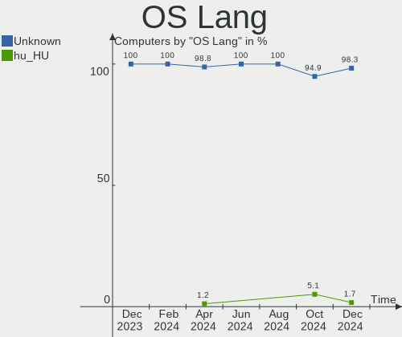
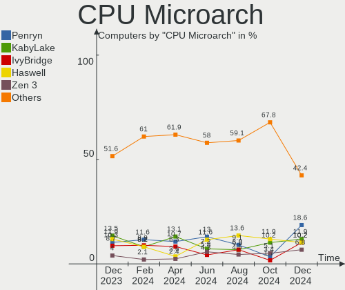
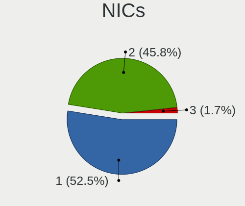

BlackPanther Hardware Trends
----------------------------

A project to identify most popular hardware characteristics and track their change
over time based on data collected by BlackPanther users at https://Linux-Hardware.org.

Anyone can contribute to the study by uploading probes of their computers by
the [hw-probe](https://github.com/linuxhw/hw-probe) tool:

    sudo hw-probe -all -upload

This is a report for all computer types. See also reports for [desktops](/Dist/BlackPanther/Desktop/README.md) and [notebooks](/Dist/BlackPanther/Notebook/README.md).

Full-feature report is available here: https://linux-hardware.org/?view=trends

Period: Mar, 2020.

Contents
--------

- [ OS                       ](#os)
- [ OS Family                ](#os-family)
- [ Kernel                   ](#kernel)
- [ Kernel Family            ](#kernel-family)
- [ Kernel Major Ver.        ](#kernel-major-ver)
- [ Arch                     ](#arch)
- [ DE                       ](#de)
- [ Display Server           ](#display-server)
- [ OS Lang                  ](#os-lang)
- [ Boot Mode                ](#boot-mode)
- [ Filesystem               ](#filesystem)
- [ Dual Boot with Linux     ](#dual-boot-with-linux)
- [ Dual Boot (Win)          ](#dual-boot-win)
- [ Country                  ](#country)
- [ City                     ](#city)
- [ Vendor                   ](#vendor)
- [ Model                    ](#model)
- [ Model Family             ](#model-family)
- [ MFG Year                 ](#mfg-year)
- [ Form Factor              ](#form-factor)
- [ Secure Boot              ](#secure-boot)
- [ Coreboot                 ](#coreboot)
- [ RAM Size                 ](#ram-size)
- [ RAM Used                 ](#ram-used)
- [ Drive Vendor             ](#drive-vendor)
- [ Drive Model              ](#drive-model)
- [ Drive Kind               ](#drive-kind)
- [ Drive Connector          ](#drive-connector)
- [ Drive Size               ](#drive-size)
- [ Space Total              ](#space-total)
- [ Space Used               ](#space-used)
- [ Malfunc. Drives          ](#malfunc-drives)
- [ Malfunc. Drive Vendor    ](#malfunc-drive-vendor)
- [ Malfunc. Drive Kind      ](#malfunc-drive-kind)
- [ Failed Drives            ](#failed-drives)
- [ Failed Drive Vendor      ](#failed-drive-vendor)
- [ Drive Status             ](#drive-status)
- [ Storage Vendor           ](#storage-vendor)
- [ Storage Model            ](#storage-model)
- [ Storage Kind             ](#storage-kind)
- [ CPU Vendor               ](#cpu-vendor)
- [ CPU Model                ](#cpu-model)
- [ CPU Model Family         ](#cpu-model-family)
- [ CPU Cores                ](#cpu-cores)
- [ CPU Sockets              ](#cpu-sockets)
- [ CPU Threads              ](#cpu-threads)
- [ CPU Op-Modes             ](#cpu-op-modes)
- [ CPU Microarch            ](#cpu-microarch)
- [ CPU Microcode            ](#cpu-microcode)
- [ GPU Vendor               ](#gpu-vendor)
- [ GPU Model                ](#gpu-model)
- [ GPU Combo                ](#gpu-combo)
- [ GPU Driver               ](#gpu-driver)
- [ GPU Memory               ](#gpu-memory)
- [ Monitor Vendor           ](#monitor-vendor)
- [ Monitor Model            ](#monitor-model)
- [ Monitor Resolution       ](#monitor-resolution)
- [ Monitor Diagonal         ](#monitor-diagonal)
- [ Monitor Width            ](#monitor-width)
- [ Aspect Ratio             ](#aspect-ratio)
- [ Monitor Area             ](#monitor-area)
- [ Pixel Density            ](#pixel-density)
- [ Multiple Monitors        ](#multiple-monitors)
- [ Net Controller Vendor    ](#net-controller-vendor)
- [ Net Controller Model     ](#net-controller-model)
- [ Net Controller Kind      ](#net-controller-kind)
- [ Used Controller          ](#used-controller)
- [ NICs                     ](#nics)
- [ Unsupported Devices      ](#unsupported-devices)
- [ Unsupported Device Types ](#unsupported-device-types)

OS
--

Installed operating systems

| Name              | Computers | Percent |
|-------------------|-----------|---------|
| BlackPanther 18.1 | 224       | 90.32%  |
| BlackPanther 16.2 | 24        | 9.68%   |

OS Family
---------

OS without a version

| Name         | Computers | Percent |
|--------------|-----------|---------|
| BlackPanther | 248       | 100%    |

Kernel
------

Version of the Linux kernel

| Version                | Computers | Percent |
|------------------------|-----------|---------|
| 4.18.16-desktop-1bP    | 177       | 71.37%  |
| 5.1.15-desktop-1bP     | 46        | 18.55%  |
| 4.9.20-desktop-pae-1bP | 22        | 8.87%   |
| 5.1.15-server-1bP      | 1         | 0.4%    |
| 4.7.0-desktop-1bP      | 1         | 0.4%    |
| 4.15.0-desktop-pae-1bP | 1         | 0.4%    |

Kernel Family
-------------

Linux kernel without a distro release

| Version | Computers | Percent |
|---------|-----------|---------|
| 4.18.16 | 177       | 71.37%  |
| 5.1.15  | 47        | 18.95%  |
| 4.9.20  | 22        | 8.87%   |
| 4.7.0   | 1         | 0.4%    |
| 4.15.0  | 1         | 0.4%    |

Kernel Major Ver.
-----------------

Linux kernel major version

| Version | Computers | Percent |
|---------|-----------|---------|
| 4.18    | 177       | 71.37%  |
| 5.1     | 47        | 18.95%  |
| 4.9     | 22        | 8.87%   |
| 4.7     | 1         | 0.4%    |
| 4.15    | 1         | 0.4%    |

Arch
----

OS architecture (x86_64, i586, etc.)

| Name   | Computers | Percent |
|--------|-----------|---------|
| x86_64 | 224       | 90.32%  |
| i686   | 24        | 9.68%   |

DE
--

Desktop Environment

| Name     | Computers | Percent |
|----------|-----------|---------|
| KDE5     | 247       | 99.6%   |
| Cinnamon | 1         | 0.4%    |

Display Server
--------------

X11 or Wayland

| Name | Computers | Percent |
|------|-----------|---------|
| X11  | 248       | 100%    |

OS Lang
-------

Language

| Lang    | Computers | Percent |
|---------|-----------|---------|
| Unknown | 248       | 100%    |

Boot Mode
---------

EFI or BIOS

| Mode | Computers | Percent |
|------|-----------|---------|
| BIOS | 176       | 70.97%  |
| EFI  | 72        | 29.03%  |

Filesystem
----------

Type of filesystem

| Type    | Computers | Percent |
|---------|-----------|---------|
| Ext4    | 218       | 87.9%   |
| Overlay | 29        | 11.69%  |
| Ext3    | 1         | 0.4%    |

Dual Boot with Linux
--------------------

Hosting more than one Linux

| Dual boot | Computers | Percent |
|-----------|-----------|---------|
| No        | 187       | 75.4%   |
| Yes       | 61        | 24.6%   |

Dual Boot (Win)
---------------

Hosting Linux and Windows

| Dual boot | Computers | Percent |
|-----------|-----------|---------|
| No        | 139       | 56.05%  |
| Yes       | 109       | 43.95%  |

Country
-------

Geographic location (country)

| Country            | Computers | Percent |
|--------------------|-----------|---------|
| Hungary            | 181       | 72.98%  |
| Germany            | 18        | 7.26%   |
| USA                | 12        | 4.84%   |
| Romania            | 8         | 3.23%   |
| UK                 | 3         | 1.21%   |
| Slovakia           | 3         | 1.21%   |
| Serbia             | 3         | 1.21%   |
| France             | 3         | 1.21%   |
| Poland             | 2         | 0.81%   |
| Canada             | 2         | 0.81%   |
| Brazil             | 2         | 0.81%   |
| Australia          | 2         | 0.81%   |
| UAE                | 1         | 0.4%    |
| South Africa       | 1         | 0.4%    |
| Puerto Rico        | 1         | 0.4%    |
| Philippines        | 1         | 0.4%    |
| Ghana              | 1         | 0.4%    |
| Finland            | 1         | 0.4%    |
| Dominican Republic | 1         | 0.4%    |
| Chile              | 1         | 0.4%    |
| Belarus            | 1         | 0.4%    |

City
----

Geographic location (city)

| City                | Computers | Percent |
|---------------------|-----------|---------|
| Budapest            | 43        | 17.34%  |
| Pécs               | 7         | 2.82%   |
| Székesfehérvár   | 6         | 2.42%   |
| Miskolc             | 6         | 2.42%   |
| Győr               | 6         | 2.42%   |
| Érd                | 5         | 2.02%   |
| Zalaegerszeg        | 5         | 2.02%   |
| Eger                | 5         | 2.02%   |
| Szigetszentmiklos   | 4         | 1.61%   |
| Debrecen            | 4         | 1.61%   |
| Ajka                | 4         | 1.61%   |
| Szombathely         | 3         | 1.21%   |
| Regensburg          | 3         | 1.21%   |
| Nyiregyhaza         | 3         | 1.21%   |
| Nuremberg           | 3         | 1.21%   |
| Kecskemét          | 3         | 1.21%   |
| Veszprém           | 2         | 0.81%   |
| Teloche             | 2         | 0.81%   |
| Szeged              | 2         | 0.81%   |
| Szazhalombatta      | 2         | 0.81%   |
| Sarospatak          | 2         | 0.81%   |
| Onga                | 2         | 0.81%   |
| Ocsa                | 2         | 0.81%   |
| Mezokovesd          | 2         | 0.81%   |
| Kiskunfelegyhaza    | 2         | 0.81%   |
| Baja                | 2         | 0.81%   |
| Zalahashagy         | 1         | 0.4%    |
| Wysokie Mazowieckie | 1         | 0.4%    |
| Winterrieden        | 1         | 0.4%    |
| Winston-Salem       | 1         | 0.4%    |
| Wichita             | 1         | 0.4%    |
| Vác                | 1         | 0.4%    |
| Vicovu de Sus       | 1         | 0.4%    |
| Vertesboglar        | 1         | 0.4%    |
| Verpelet            | 1         | 0.4%    |
| Velence             | 1         | 0.4%    |
| Vecses              | 1         | 0.4%    |
| Val-d'Or            | 1         | 0.4%    |
| Târgu Mureş       | 1         | 0.4%    |
| Toronto             | 1         | 0.4%    |
| Temerin             | 1         | 0.4%    |
| Tata                | 1         | 0.4%    |
| Tabdi               | 1         | 0.4%    |
| Szolnok             | 1         | 0.4%    |
| Szijartohaza        | 1         | 0.4%    |
| Szentgyorgyvolgy    | 1         | 0.4%    |
| Szentes             | 1         | 0.4%    |
| Szakald             | 1         | 0.4%    |
| Szada               | 1         | 0.4%    |
| Sydney              | 1         | 0.4%    |
| St. Petersburg      | 1         | 0.4%    |
| Spanaway            | 1         | 0.4%    |
| Southampton         | 1         | 0.4%    |
| Skierniewice        | 1         | 0.4%    |
| Shipley             | 1         | 0.4%    |
| Seattle             | 1         | 0.4%    |
| Satu Mare           | 1         | 0.4%    |
| Sarud               | 1         | 0.4%    |
| Santo Domingo Este  | 1         | 0.4%    |
| Salvador            | 1         | 0.4%    |

Vendor
------

Motherboard manufacturer

| Name                | Computers | Percent |
|---------------------|-----------|---------|
| Hewlett-Packard     | 43        | 17.34%  |
| Dell                | 36        | 14.52%  |
| ASUSTek Computer    | 36        | 14.52%  |
| Lenovo              | 33        | 13.31%  |
| Gigabyte Technology | 31        | 12.5%   |
| Acer                | 16        | 6.45%   |
| ASRock              | 15        | 6.05%   |
| MSI                 | 7         | 2.82%   |
| Fujitsu             | 6         | 2.42%   |
| Samsung Electronics | 5         | 2.02%   |
| Toshiba             | 4         | 1.61%   |
| Packard Bell        | 3         | 1.21%   |
| Gateway             | 2         | 0.81%   |
| Fujitsu Siemens     | 2         | 0.81%   |
| Foxconn             | 2         | 0.81%   |
| Sony                | 1         | 0.4%    |
| Medion              | 1         | 0.4%    |
| ECS                 | 1         | 0.4%    |
| Alcor               | 1         | 0.4%    |
| Albacomp zrt.       | 1         | 0.4%    |
| ABIT                | 1         | 0.4%    |
| Unknown             | 1         | 0.4%    |

Model
-----

Motherboard model

| Name                                                    | Computers | Percent |
|---------------------------------------------------------|-----------|---------|
| HP 250 G1                                               | 4         | 1.61%   |
| Gigabyte G31M-ES2L                                      | 3         | 1.21%   |
| Dell Latitude E6410                                     | 3         | 1.21%   |
| ASUS X55U                                               | 3         | 1.21%   |
| HP ProDesk 600 G2 SFF                                   | 2         | 0.81%   |
| HP Pavilion 17                                          | 2         | 0.81%   |
| HP Pavilion 15                                          | 2         | 0.81%   |
| HP Notebook                                             | 2         | 0.81%   |
| HP EliteBook 8460p                                      | 2         | 0.81%   |
| HP 15                                                   | 2         | 0.81%   |
| Gigabyte 970A-DS3P                                      | 2         | 0.81%   |
| Dell Precision WorkStation T3500                        | 2         | 0.81%   |
| Dell OptiPlex 745                                       | 2         | 0.81%   |
| Dell Latitude E7240                                     | 2         | 0.81%   |
| Dell Latitude E6540                                     | 2         | 0.81%   |
| Dell Inspiron 5558                                      | 2         | 0.81%   |
| ASUS All Series                                         | 2         | 0.81%   |
| ASRock G31M-VS2                                         | 2         | 0.81%   |
| ASRock G31M-S                                           | 2         | 0.81%   |
| Acer Veriton M420                                       | 2         | 0.81%   |
| Toshiba Satellite P300                                  | 1         | 0.4%    |
| Toshiba Satellite C660                                  | 1         | 0.4%    |
| Toshiba Satellite C55D-A                                | 1         | 0.4%    |
| Toshiba PORTEGE R830                                    | 1         | 0.4%    |
| Sony VPCYB3V1E                                          | 1         | 0.4%    |
| Samsung Electronics SQ45S70S                            | 1         | 0.4%    |
| Samsung Electronics RV411/RV511/E3511/S3511/RV711/E3411 | 1         | 0.4%    |
| Samsung Electronics RV410/RV510/S3510/E3510             | 1         | 0.4%    |
| Samsung Electronics R510/P510                           | 1         | 0.4%    |
| Samsung Electronics 350V5C/351V5C/3540VC/3440VC         | 1         | 0.4%    |
| Packard Bell EasyNote TK11BZ                            | 1         | 0.4%    |
| Packard Bell EasyNote TE11HC                            | 1         | 0.4%    |
| Packard Bell EasyNote LE69KB                            | 1         | 0.4%    |
| MSI U270DX                                              | 1         | 0.4%    |
| MSI Pro 3515 Series                                     | 1         | 0.4%    |
| MSI MS-7A74                                             | 1         | 0.4%    |
| MSI MS-7680                                             | 1         | 0.4%    |
| MSI MS-7596                                             | 1         | 0.4%    |
| MSI MS-7592                                             | 1         | 0.4%    |
| MSI MS-7309                                             | 1         | 0.4%    |
| Medion E7214                                            | 1         | 0.4%    |
| Lenovo Z710 20250                                       | 1         | 0.4%    |
| Lenovo Z50-70 20354                                     | 1         | 0.4%    |
| Lenovo ThinkStation D20 4158AF8                         | 1         | 0.4%    |
| Lenovo ThinkPad X61 7673BW3                             | 1         | 0.4%    |
| Lenovo ThinkPad X201 3680DE3                            | 1         | 0.4%    |
| Lenovo ThinkPad X201 3680D13                            | 1         | 0.4%    |
| Lenovo ThinkPad T61 6458Y56                             | 1         | 0.4%    |
| Lenovo ThinkPad T500 2056W2J                            | 1         | 0.4%    |
| Lenovo ThinkPad T450 20BUS09Y0E                         | 1         | 0.4%    |
| Lenovo ThinkPad R500 27148UG                            | 1         | 0.4%    |
| Lenovo ThinkCentre M92P 32371L5                         | 1         | 0.4%    |
| Lenovo ThinkCentre M91p 7034BN4                         | 1         | 0.4%    |
| Lenovo ThinkCentre M58p 6138DK1                         | 1         | 0.4%    |
| Lenovo ThinkCentre M58e 7408BA5                         | 1         | 0.4%    |
| Lenovo IdeaPad S100 20109                               | 1         | 0.4%    |
| Lenovo IdeaPad C340-14IWL 81N4                          | 1         | 0.4%    |
| Lenovo IdeaPad 700-15ISK 80RU                           | 1         | 0.4%    |
| Lenovo IdeaPad 330-15IKB 81FE                           | 1         | 0.4%    |
| Lenovo IdeaPad 330-15IKB 81DE                           | 1         | 0.4%    |

Model Family
------------

Motherboard model prefix

| Name                         | Computers | Percent |
|------------------------------|-----------|---------|
| Dell Latitude                | 14        | 5.65%   |
| Lenovo IdeaPad               | 11        | 4.44%   |
| Dell OptiPlex                | 9         | 3.63%   |
| Acer Aspire                  | 9         | 3.63%   |
| Dell Inspiron                | 8         | 3.23%   |
| Lenovo ThinkPad              | 7         | 2.82%   |
| HP Pavilion                  | 7         | 2.82%   |
| HP EliteBook                 | 5         | 2.02%   |
| HP 250                       | 5         | 2.02%   |
| Lenovo ThinkCentre           | 4         | 1.61%   |
| HP Compaq                    | 4         | 1.61%   |
| Toshiba Satellite            | 3         | 1.21%   |
| Packard Bell EasyNote        | 3         | 1.21%   |
| HP ProDesk                   | 3         | 1.21%   |
| Gigabyte G31M-ES2L           | 3         | 1.21%   |
| Fujitsu ESPRIMO              | 3         | 1.21%   |
| ASUS X55U                    | 3         | 1.21%   |
| Acer TravelMate              | 3         | 1.21%   |
| HP Notebook                  | 2         | 0.81%   |
| HP 15                        | 2         | 0.81%   |
| Gigabyte 970A-DS3P           | 2         | 0.81%   |
| Fujitsu LIFEBOOK             | 2         | 0.81%   |
| Dell Precision               | 2         | 0.81%   |
| ASUS All                     | 2         | 0.81%   |
| ASRock G31M-VS2              | 2         | 0.81%   |
| ASRock G31M-S                | 2         | 0.81%   |
| Acer Veriton                 | 2         | 0.81%   |
| Toshiba PORTEGE              | 1         | 0.4%    |
| Sony VPCYB3V1E               | 1         | 0.4%    |
| Samsung Electronics SQ45S70S | 1         | 0.4%    |
| Samsung Electronics RV411    | 1         | 0.4%    |
| Samsung Electronics RV410    | 1         | 0.4%    |
| Samsung Electronics R510     | 1         | 0.4%    |
| Samsung Electronics 350V5C   | 1         | 0.4%    |
| MSI U270DX                   | 1         | 0.4%    |
| MSI Pro                      | 1         | 0.4%    |
| MSI MS-7A74                  | 1         | 0.4%    |
| MSI MS-7680                  | 1         | 0.4%    |
| MSI MS-7596                  | 1         | 0.4%    |
| MSI MS-7592                  | 1         | 0.4%    |
| MSI MS-7309                  | 1         | 0.4%    |
| Medion E7214                 | 1         | 0.4%    |
| Lenovo Z710                  | 1         | 0.4%    |
| Lenovo Z50-70                | 1         | 0.4%    |
| Lenovo ThinkStation          | 1         | 0.4%    |
| Lenovo IdeaCentre            | 1         | 0.4%    |
| Lenovo G70-70                | 1         | 0.4%    |
| Lenovo G585                  | 1         | 0.4%    |
| Lenovo G580                  | 1         | 0.4%    |
| Lenovo G550                  | 1         | 0.4%    |
| Lenovo G50-45                | 1         | 0.4%    |
| Lenovo Flex                  | 1         | 0.4%    |
| Lenovo B50-80                | 1         | 0.4%    |
| HP Z600                      | 1         | 0.4%    |
| HP x2                        | 1         | 0.4%    |
| HP t520                      | 1         | 0.4%    |
| HP Stream                    | 1         | 0.4%    |
| HP Slim                      | 1         | 0.4%    |
| HP Presario                  | 1         | 0.4%    |
| HP OMEN                      | 1         | 0.4%    |

MFG Year
--------

Motherboard manufacture year

| Year | Computers | Percent |
|------|-----------|---------|
| 2012 | 28        | 11.29%  |
| 2011 | 28        | 11.29%  |
| 2018 | 24        | 9.68%   |
| 2013 | 22        | 8.87%   |
| 2010 | 22        | 8.87%   |
| 2016 | 20        | 8.06%   |
| 2015 | 19        | 7.66%   |
| 2009 | 19        | 7.66%   |
| 2014 | 15        | 6.05%   |
| 2008 | 15        | 6.05%   |
| 2019 | 14        | 5.65%   |
| 2017 | 11        | 4.44%   |
| 2007 | 6         | 2.42%   |
| 2006 | 2         | 0.81%   |
| 2005 | 2         | 0.81%   |
| 2004 | 1         | 0.4%    |

Form Factor
-----------

Physical design of the computer

| Name        | Computers | Percent |
|-------------|-----------|---------|
| Notebook    | 134       | 54.03%  |
| Desktop     | 110       | 44.35%  |
| Tablet      | 1         | 0.4%    |
| Convertible | 1         | 0.4%    |
| Mini pc     | 1         | 0.4%    |
| All in one  | 1         | 0.4%    |

Secure Boot
-----------

Enabled or disabled

| State    | Computers | Percent |
|----------|-----------|---------|
| Disabled | 248       | 100%    |

Coreboot
--------

Have coreboot on board

| Used | Computers | Percent |
|------|-----------|---------|
| No   | 248       | 100%    |

RAM Size
--------

Total RAM memory

| Size in GB | Computers | Percent |
|------------|-----------|---------|
| 3.01-4.0   | 107       | 43.15%  |
| 8.01-16.0  | 48        | 19.35%  |
| 4.01-8.0   | 44        | 17.74%  |
| 1.01-2.0   | 20        | 8.06%   |
| 16.01-24.0 | 14        | 5.65%   |
| 2.01-3.0   | 10        | 4.03%   |
| 0.01-1.0   | 3         | 1.21%   |
| 24.01-32.0 | 2         | 0.81%   |

RAM Used
--------

Used RAM memory

| Used GB  | Computers | Percent |
|----------|-----------|---------|
| 0.01-1.0 | 116       | 46.77%  |
| 1.01-2.0 | 98        | 39.52%  |
| 2.01-3.0 | 26        | 10.48%  |
| 3.01-4.0 | 7         | 2.82%   |
| 4.01-8.0 | 1         | 0.4%    |

Drive Vendor
------------

Hard drive vendors

| Vendor              | Computers | Drives  | Percent |
|---------------------|-----------|---------|---------|
| Seagate             | 63        | 69      | 18.69%  |
| WDC                 | 50        | 58      | 14.84%  |
| Kingston            | 37        | 39      | 10.98%  |
| Toshiba             | 33        | 33      | 9.79%   |
| Samsung Electronics | 31        | 34      | 9.2%    |
| Hitachi             | 20        | 21      | 5.93%   |
| HGST                | 19        | 19      | 5.64%   |
| SanDisk             | 8         | 10      | 2.37%   |
| SK Hynix            | 7         | 7       | 2.08%   |
| HL-DT-ST            | 6         | Unknown | 1.78%   |
| Unknown             | 5         | 5       | 1.48%   |
| Maxtor              | 5         | 5       | 1.48%   |
| A-DATA Technology   | 5         | 5       | 1.48%   |
| SPCC                | 4         | 4       | 1.19%   |
| Fujitsu             | 4         | 4       | 1.19%   |
| China               | 4         | 4       | 1.19%   |
| Patriot             | 3         | 3       | 0.89%   |
| Hewlett-Packard     | 3         | 3       | 0.89%   |
| Generic             | 3         | 3       | 0.89%   |
| Intenso             | 2         | 2       | 0.59%   |
| Intel               | 2         | 2       | 0.59%   |
| Gigabyte Technology | 2         | 2       | 0.59%   |
| Crucial             | 2         | 4       | 0.59%   |
| Corsair             | 2         | 2       | 0.59%   |
| Zheino              | 1         | 1       | 0.3%    |
| XPG                 | 1         | 1       | 0.3%    |
| WDC WD50            | 1         | 1       | 0.3%    |
| Verbatim            | 1         | 1       | 0.3%    |
| USB3.0              | 1         | 1       | 0.3%    |
| Transcend           | 1         | 1       | 0.3%    |
| Team                | 1         | 1       | 0.3%    |
| Phison              | 1         | 1       | 0.3%    |
| OCZ                 | 1         | 1       | 0.3%    |
| Netac               | 1         | 1       | 0.3%    |
| Micron Technology   | 1         | 1       | 0.3%    |
| LITEONIT            | 1         | 1       | 0.3%    |
| KingSpec            | 1         | 1       | 0.3%    |
| ICY BOX             | 1         | 1       | 0.3%    |
| HGST HTS            | 1         | 1       | 0.3%    |
| BIWIN               | 1         | 1       | 0.3%    |
| Apacer              | 1         | 1       | 0.3%    |

Drive Model
-----------

Hard drive models

| Model                        | Computers | Percent |
|------------------------------|-----------|---------|
| SA400S37240G 240GB SSD       | 9         | 2.5%    |
| DT01ACA100 1TB               | 8         | 2.22%   |
| SA400S37120G 120GB SSD       | 6         | 1.67%   |
| ST380815AS 80GB              | 5         | 1.39%   |
| MQ01ABF050 500GB             | 5         | 1.39%   |
| SV300S37A120G 120GB SSD      | 4         | 1.11%   |
| ST500LT012-1DG142 500GB      | 4         | 1.11%   |
| ST3160318AS 160GB            | 4         | 1.11%   |
| MQ04ABF100 1TB               | 4         | 1.11%   |
| DT01ACA050 500GB             | 4         | 1.11%   |
| WDS120G2G0A-00JH30 120GB SSD | 3         | 0.83%   |
| WD5000AAKX-60U6AA0 500GB     | 3         | 0.83%   |
| SUV400S37120G 120GB SSD      | 3         | 0.83%   |
| ST9320325AS 320GB            | 3         | 0.83%   |
| ST500DM002-1BD142 500GB      | 3         | 0.83%   |
| ST3160815AS 160GB            | 3         | 0.83%   |
| ST1000LM035-1RK172 1TB       | 3         | 0.83%   |
| SD/MMC/MS PRO 16GB           | 3         | 0.83%   |
| SATA SSD 120GB               | 3         | 0.83%   |
| HTS721010A9E630 1TB          | 3         | 0.83%   |
| HTS545050A7E380 500GB        | 3         | 0.83%   |
| HTS545032A7E380 320GB        | 3         | 0.83%   |
| HTS541010A9E680 1TB          | 3         | 0.83%   |
| HDT721010SLA360 1TB          | 3         | 0.83%   |
| HD080HJ 80GB                 | 3         | 0.83%   |
| DVDRAM GUE1N 3GB             | 3         | 0.83%   |
| DVDRAM GUC0N 1GB             | 3         | 0.83%   |
| WDS240G2G0B-00EPW0 240GB SSD | 2         | 0.56%   |
| WD5000LPCX-60VHAT0 500GB     | 2         | 0.56%   |
| WD10EZEX-75WN4A0 1TB         | 2         | 0.56%   |
| WD10EZEX-22MFCA0 1TB         | 2         | 0.56%   |
| SUV500120G 120GB SSD         | 2         | 0.56%   |
| SUV400S37240G 240GB SSD      | 2         | 0.56%   |
| ST1000LM024 HN-M101MBB 1TB   | 2         | 0.56%   |
| ST1000DM010-2EP102 1TB       | 2         | 0.56%   |
| SSD 850 EVO 250GB            | 2         | 0.56%   |
| SSD 128GB                    | 2         | 0.56%   |
| Solid State Disk 256GB       | 2         | 0.56%   |
| Solid State Disk 120GB       | 2         | 0.56%   |
| SDSSDH3250G 250GB            | 2         | 0.56%   |
| SA400S37480G 480GB SSD       | 2         | 0.56%   |
| HTS545050A7E680 500GB        | 2         | 0.56%   |
| HTS543232A7A384 320GB        | 2         | 0.56%   |
| HFS128G39TND-N210A 128GB SSD | 2         | 0.56%   |
| HEJ423220H9E300 200GB        | 2         | 0.56%   |
| HD502HJ 500GB                | 2         | 0.56%   |
| GP-GSTFS31120GNTD 120GB      | 2         | 0.56%   |
| Expansion 1TB                | 2         | 0.56%   |
| Burst 240GB SSD              | 2         | 0.56%   |
| WDS500G2X0C-00L350 500GB     | 1         | 0.28%   |
| WDS500G2B0A-00SM50 500GB SSD | 1         | 0.28%   |
| WDS120G2G0B-00EPW0 120GB SSD | 1         | 0.28%   |
| WD7501AALS-00E3A0 752GB      | 1         | 0.28%   |
| WD6400BEVT-22A0RT0 640GB     | 1         | 0.28%   |
| WD6400AAVS-00G9B1 640GB      | 1         | 0.28%   |
| WD5000LPVX-22V0TT0 500GB     | 1         | 0.28%   |
| WD5000LPCX-75VHAT0 500GB     | 1         | 0.28%   |
| WD5000LPCX-24VHAT0 500GB     | 1         | 0.28%   |
| WD5000BPKT-75PK4T0 500GB     | 1         | 0.28%   |
| WD5000BPKT-00PK4T0 500GB     | 1         | 0.28%   |

Drive Kind
----------

HDD or SSD

| Kind    | Computers | Drives | Percent |
|---------|-----------|--------|---------|
| HDD     | 182       | 216    | 59.48%  |
| SSD     | 94        | 112    | 30.72%  |
| Unknown | 12        | 6      | 3.92%   |
| NVMe    | 10        | 13     | 3.27%   |
| MMC     | 8         | 8      | 2.61%   |

Drive Connector
---------------

SATA, SAS, NVMe, etc.

| Type | Computers | Drives | Percent |
|------|-----------|--------|---------|
| SATA | 241       | 320    | 86.69%  |
| SAS  | 19        | 14     | 6.83%   |
| NVMe | 10        | 13     | 3.6%    |
| MMC  | 8         | 8      | 2.88%   |

Drive Size
----------

Size of hard drive

| Size in TB | Computers | Drives | Percent |
|------------|-----------|--------|---------|
| 0.01-0.5   | 216       | 264    | 72.97%  |
| 0.51-1.0   | 69        | 76     | 23.31%  |
| 1.01-2.0   | 6         | 10     | 2.03%   |
| 2.01-3.0   | 3         | 3      | 1.01%   |
| 3.01-4.0   | 1         | 1      | 0.34%   |
| 4.01-10.0  | 1         | 1      | 0.34%   |

Space Total
-----------

Amount of disk space available on the file system

| Size in GB     | Computers | Percent |
|----------------|-----------|---------|
| 101-250        | 85        | 34.27%  |
| 251-500        | 47        | 18.95%  |
| 51-100         | 30        | 12.1%   |
| 501-1000       | 25        | 10.08%  |
| Unknown        | 25        | 10.08%  |
| 21-50          | 21        | 8.47%   |
| 1-20           | 7         | 2.82%   |
| 1001-2000      | 5         | 2.02%   |
| 2001-3000      | 2         | 0.81%   |
| More than 3000 | 1         | 0.4%    |

Space Used
----------

Amount of used disk space

| Used GB   | Computers | Percent |
|-----------|-----------|---------|
| 1-20      | 159       | 64.11%  |
| Unknown   | 25        | 10.08%  |
| 51-100    | 21        | 8.47%   |
| 21-50     | 17        | 6.85%   |
| 101-250   | 10        | 4.03%   |
| 251-500   | 8         | 3.23%   |
| 501-1000  | 6         | 2.42%   |
| 1001-2000 | 2         | 0.81%   |

Malfunc. Drives
---------------

Drive models with a malfunction

| Model                        | Computers | Drives | Percent |
|------------------------------|-----------|--------|---------|
| ST9320325AS 320GB            | 3         | 3      | 3.41%   |
| HTS545032A7E380 320GB        | 3         | 3      | 3.41%   |
| HTS541010A9E680 1TB          | 3         | 3      | 3.41%   |
| WD10EZEX-75WN4A0 1TB         | 2         | 2      | 2.27%   |
| ST500DM002-1BD142 500GB      | 2         | 2      | 2.27%   |
| HTS545050A7E680 500GB        | 2         | 2      | 2.27%   |
| HTS545050A7E380 500GB        | 2         | 2      | 2.27%   |
| HTS543232A7A384 320GB        | 2         | 2      | 2.27%   |
| HDT721010SLA360 1TB          | 2         | 2      | 2.27%   |
| HD080HJ 80GB                 | 2         | 2      | 2.27%   |
| WD6400BEVT-22A0RT0 640GB     | 1         | 1      | 1.14%   |
| WD6400AAVS-00G9B1 640GB      | 1         | 1      | 1.14%   |
| WD5000AAKX-60U6AA0 500GB     | 1         | 1      | 1.14%   |
| WD5000AAKS-22A7B0 500GB      | 1         | 1      | 1.14%   |
| WD3200AAKS-00UU3A0 320GB     | 1         | 1      | 1.14%   |
| WD3200AAJS-00L7A0 320GB      | 1         | 1      | 1.14%   |
| WD30EFRX-68EUZN0 3TB         | 1         | 1      | 1.14%   |
| WD2500BPVT-22JJ5T0 250GB     | 1         | 1      | 1.14%   |
| WD20EARS-60MVWB0 2TB         | 1         | 1      | 1.14%   |
| WD20EARS-00J2GB0 2TB         | 1         | 1      | 1.14%   |
| WD2000JB-00GVA0 200GB        | 1         | 1      | 1.14%   |
| WD10JPVX-60JC3T1 1TB         | 1         | 1      | 1.14%   |
| WD10EZEX-00M2NA0 1TB         | 1         | 1      | 1.14%   |
| WD10EADS-00M2B0 1TB          | 1         | 1      | 1.14%   |
| VERTEX460A 120GB SSD         | 1         | 1      | 1.14%   |
| SV300S37A120G 120GB SSD      | 1         | 1      | 1.14%   |
| SUV400S37240G 240GB SSD      | 1         | 1      | 1.14%   |
| SU700 120GB SSD              | 1         | 1      | 1.14%   |
| STM380215A 80GB              | 1         | 1      | 1.14%   |
| STM3250318AS 250GB           | 1         | 1      | 1.14%   |
| ST980811AS 80GB              | 1         | 1      | 1.14%   |
| ST9750423AS 752GB            | 1         | 1      | 1.14%   |
| ST9500325AS 500GB            | 1         | 1      | 1.14%   |
| ST500LT012-9WS142 500GB      | 1         | 1      | 1.14%   |
| ST500LT012-1DG142 500GB      | 1         | 1      | 1.14%   |
| ST340016A 40GB               | 1         | 1      | 1.14%   |
| ST3320820AS 320GB            | 1         | 1      | 1.14%   |
| ST320LT020-9YG142 320GB      | 1         | 1      | 1.14%   |
| ST3160815AS 160GB            | 1         | 1      | 1.14%   |
| ST3160318AS 160GB            | 1         | 1      | 1.14%   |
| ST31000524AS 1TB             | 1         | 1      | 1.14%   |
| SP1614C 160GB                | 1         | 1      | 1.14%   |
| SP1213N 120GB                | 1         | 1      | 1.14%   |
| SNV425S264GB SSD             | 1         | 1      | 1.14%   |
| SD9SN8W-128G-1006 128GB SSD  | 1         | 1      | 1.14%   |
| SC210 2.5 7MM 128GB SSD      | 1         | 1      | 1.14%   |
| RBUSNS8180DS3256GH 256GB SSD | 1         | 1      | 1.14%   |
| MQ01ABF050 500GB             | 1         | 1      | 1.14%   |
| MK8050GAC 80GB               | 1         | 1      | 1.14%   |
| MK3275GSX 320GB              | 1         | 1      | 1.14%   |
| MK3265GSX 320GB              | 1         | 1      | 1.14%   |
| MK1059GSM 1TB                | 1         | 1      | 1.14%   |
| MHZ2160BH G1 160GB           | 1         | 1      | 1.14%   |
| HTS725050A7E635 500GB        | 1         | 1      | 1.14%   |
| HTS723232A7A365 320GB        | 1         | 1      | 1.14%   |
| HTS722016K9A300 160GB        | 1         | 1      | 1.14%   |
| HTS547575A9E384 752GB        | 1         | 1      | 1.14%   |
| HTS547564A9E384 640GB        | 1         | 1      | 1.14%   |
| HTS545050B9A300 500GB        | 1         | 1      | 1.14%   |
| HTS545032B9A300 320GB        | 1         | 1      | 1.14%   |

Malfunc. Drive Vendor
---------------------

Vendors of faulty drives

| Vendor              | Computers | Drives | Percent |
|---------------------|-----------|--------|---------|
| Seagate             | 17        | 17     | 19.54%  |
| Hitachi             | 17        | 18     | 19.54%  |
| WDC                 | 16        | 16     | 18.39%  |
| HGST                | 11        | 11     | 12.64%  |
| Samsung Electronics | 9         | 9      | 10.34%  |
| Toshiba             | 6         | 6      | 6.9%    |
| Kingston            | 4         | 4      | 4.6%    |
| MAXTOR              | 2         | 2      | 2.3%    |
| SK Hynix            | 1         | 1      | 1.15%   |
| SanDisk             | 1         | 1      | 1.15%   |
| OCZ                 | 1         | 1      | 1.15%   |
| Fujitsu             | 1         | 1      | 1.15%   |
| A-DATA Technology   | 1         | 1      | 1.15%   |

Malfunc. Drive Kind
-------------------

Kinds of faulty drives

| Kind | Computers | Drives | Percent |
|------|-----------|--------|---------|
| HDD  | 77        | 80     | 90.59%  |
| SSD  | 8         | 8      | 9.41%   |

Failed Drives
-------------

Failed drive models

| Model             | Computers | Drives | Percent |
|-------------------|-----------|--------|---------|
| ST380815AS 80GB   | 1         | 1      | 50%     |
| ST3160815AS 160GB | 1         | 1      | 50%     |

Failed Drive Vendor
-------------------

Failed drive vendors

| Vendor  | Computers | Drives | Percent |
|---------|-----------|--------|---------|
| Seagate | 2         | 2      | 100%    |

Drive Status
------------

Number of failed and malfunc. drives

| Status   | Computers | Drives | Percent |
|----------|-----------|--------|---------|
| Works    | 176       | 233    | 60.07%  |
| Malfunc  | 85        | 88     | 29.01%  |
| Detected | 30        | 32     | 10.24%  |
| Failed   | 2         | 2      | 0.68%   |

Storage Vendor
--------------

Storage controller vendors

| Vendor                        | Computers | Percent |
|-------------------------------|-----------|---------|
| Intel                         | 184       | 68.15%  |
| AMD                           | 49        | 18.15%  |
| Nvidia                        | 10        | 3.7%    |
| Marvell Technology Group      | 8         | 2.96%   |
| JMicron Technology            | 7         | 2.59%   |
| Silicon Motion                | 2         | 0.74%   |
| Samsung Electronics           | 2         | 0.74%   |
| Phison Electronics            | 2         | 0.74%   |
| VIA Technologies              | 1         | 0.37%   |
| Toshiba America Info Systems  | 1         | 0.37%   |
| Sandisk                       | 1         | 0.37%   |
| Realtek Semiconductor         | 1         | 0.37%   |
| Kingston Technology Company   | 1         | 0.37%   |
| Integrated Technology Express | 1         | 0.37%   |

Storage Model
-------------

Storage controller models

| Model                                                                             | Computers | Percent |
|-----------------------------------------------------------------------------------|-----------|---------|
| FCH SATA Controller [AHCI mode]                                                   | 26        | 7.45%   |
| NM10/ICH7 Family SATA Controller [IDE mode]                                       | 21        | 6.02%   |
| 82801G (ICH7 Family) IDE Controller                                               | 17        | 4.87%   |
| 7 Series Chipset Family 6-port SATA Controller [AHCI mode]                        | 14        | 4.01%   |
| Sunrise Point-LP SATA Controller [AHCI mode]                                      | 13        | 3.72%   |
| SB7x0/SB8x0/SB9x0 IDE Controller                                                  | 11        | 3.15%   |
| SB7x0/SB8x0/SB9x0 SATA Controller [AHCI mode]                                     | 9         | 2.58%   |
| 82801IBM/IEM (ICH9M/ICH9M-E) 4 port SATA Controller [AHCI mode]                   | 9         | 2.58%   |
| 5 Series/3400 Series Chipset 6 port SATA AHCI Controller                          | 8         | 2.29%   |
| SB7x0/SB8x0/SB9x0 SATA Controller [IDE mode]                                      | 7         | 2.01%   |
| 8 Series/C220 Series Chipset Family 6-port SATA Controller 1 [AHCI mode]          | 7         | 2.01%   |
| 8 Series SATA Controller 1 [AHCI mode]                                            | 7         | 2.01%   |
| FCH IDE Controller                                                                | 6         | 1.72%   |
| 82801HM/HEM (ICH8M/ICH8M-E) IDE Controller                                        | 6         | 1.72%   |
| 82801 Mobile SATA Controller [RAID mode]                                          | 6         | 1.72%   |
| 6 Series/C200 Series Chipset Family 6 port Mobile SATA AHCI Controller            | 6         | 1.72%   |
| 200 Series PCH SATA controller [AHCI mode]                                        | 6         | 1.72%   |
| Wildcat Point-LP SATA Controller [AHCI Mode]                                      | 5         | 1.43%   |
| SATA controller                                                                   | 5         | 1.43%   |
| FCH SATA Controller [IDE mode]                                                    | 5         | 1.43%   |
| 82801JI (ICH10 Family) 4 port SATA IDE Controller #1                              | 5         | 1.43%   |
| 82801JI (ICH10 Family) 2 port SATA IDE Controller #2                              | 5         | 1.43%   |
| 6 Series/C200 Series Chipset Family 6 port Desktop SATA AHCI Controller           | 5         | 1.43%   |
| 5 Series/3400 Series Chipset 4 port SATA AHCI Controller                          | 5         | 1.43%   |
| SATA Controller [RAID mode]                                                       | 4         | 1.15%   |
| MCP61 SATA Controller                                                             | 4         | 1.15%   |
| HM170/QM170 Chipset SATA Controller [AHCI Mode]                                   | 4         | 1.15%   |
| 88SE6111/6121 SATA II / PATA Controller                                           | 4         | 1.15%   |
| 82801HM/HEM (ICH8M/ICH8M-E) SATA Controller [AHCI mode]                           | 4         | 1.15%   |
| 6 Series/C200 Series Chipset Family Desktop SATA Controller (IDE mode, ports 4-5) | 4         | 1.15%   |
| 6 Series/C200 Series Chipset Family Desktop SATA Controller (IDE mode, ports 0-3) | 4         | 1.15%   |
| Non-Volatile memory controller                                                    | 3         | 0.86%   |
| MCP61 IDE                                                                         | 3         | 0.86%   |
| JMB368 IDE controller                                                             | 3         | 0.86%   |
| JMB363 SATA/IDE Controller                                                        | 3         | 0.86%   |
| Atom/Celeron/Pentium Processor x5-E8000/J3xxx/N3xxx Series SATA Controller        | 3         | 0.86%   |
| Atom Processor E3800 Series SATA AHCI Controller                                  | 3         | 0.86%   |
| 82801JI (ICH10 Family) SATA AHCI Controller                                       | 3         | 0.86%   |
| 82801IBM/IEM (ICH9M/ICH9M-E) 2 port SATA Controller [IDE mode]                    | 3         | 0.86%   |
| 82801I (ICH9 Family) 2 port SATA Controller [IDE mode]                            | 3         | 0.86%   |
| 82801HR/HO/HH (ICH8R/DO/DH) 2 port SATA Controller [IDE mode]                     | 3         | 0.86%   |
| 82801HM/HEM (ICH8M/ICH8M-E) SATA Controller [IDE mode]                            | 3         | 0.86%   |
| 82801H (ICH8 Family) 4 port SATA Controller [IDE mode]                            | 3         | 0.86%   |
| SB600 Non-Raid-5 SATA                                                             | 2         | 0.57%   |
| SB600 IDE                                                                         | 2         | 0.57%   |
| Q170/Q150/B150/H170/H110/Z170/CM236 Chipset SATA Controller [AHCI Mode]           | 2         | 0.57%   |
| NVMe SSD Controller SM981/PM981/PM983                                             | 2         | 0.57%   |
| Mobile 4 Series Chipset PT IDER Controller                                        | 2         | 0.57%   |
| Celeron N3350/Pentium N4200/Atom E3900 Series SATA AHCI Controller                | 2         | 0.57%   |
| Cannon Point-LP SATA Controller [AHCI Mode]                                       | 2         | 0.57%   |
| Cannon Lake PCH SATA AHCI Controller                                              | 2         | 0.57%   |
| 82801JD/DO (ICH10 Family) 4-port SATA IDE Controller                              | 2         | 0.57%   |
| 82801JD/DO (ICH10 Family) 2-port SATA IDE Controller                              | 2         | 0.57%   |
| 82801IB (ICH9) 2 port SATA Controller [IDE mode]                                  | 2         | 0.57%   |
| 82801GBM/GHM (ICH7-M Family) SATA Controller [AHCI mode]                          | 2         | 0.57%   |
| 82801FB/FBM/FR/FW/FRW (ICH6 Family) IDE Controller                                | 2         | 0.57%   |
| 7 Series/C210 Series Chipset Family 6-port SATA Controller [AHCI mode]            | 2         | 0.57%   |
| 4 Series Chipset PT IDER Controller                                               | 2         | 0.57%   |
| WD Black 2018/PC SN720 NVMe SSD                                                   | 1         | 0.29%   |
| VT82C586A/B/VT82C686/A/B/VT823x/A/C PIPC Bus Master IDE                           | 1         | 0.29%   |

Storage Kind
------------

Kind of storage controller (IDE, SATA, NVMe, SAS, ...)

| Kind | Computers | Percent |
|------|-----------|---------|
| SATA | 174       | 60.42%  |
| IDE  | 92        | 31.94%  |
| RAID | 12        | 4.17%   |
| NVMe | 10        | 3.47%   |

CPU Vendor
----------

Processor vendors

| Vendor | Computers | Percent |
|--------|-----------|---------|
| Intel  | 192       | 77.42%  |
| AMD    | 56        | 22.58%  |

CPU Model
---------

Processor models

| Model                                       | Computers | Percent |
|---------------------------------------------|-----------|---------|
| Intel Celeron N4000 CPU @ 1.10GHz           | 4         | 1.61%   |
| Intel Celeron CPU 1000M @ 1.80GHz           | 4         | 1.61%   |
| Intel Pentium Dual-Core CPU T4400 @ 2.20GHz | 3         | 1.21%   |
| Intel Core i5-7200U CPU @ 2.50GHz           | 3         | 1.21%   |
| Intel Core i3-6006U CPU @ 2.00GHz           | 3         | 1.21%   |
| Intel Core i3-5005U CPU @ 2.00GHz           | 3         | 1.21%   |
| Intel Core i3-3217U CPU @ 1.80GHz           | 3         | 1.21%   |
| Intel Core 2 Duo CPU E8400 @ 3.00GHz        | 3         | 1.21%   |
| Intel Celeron CPU E3400 @ 2.60GHz           | 3         | 1.21%   |
| Intel Atom x5-Z8350 CPU @ 1.44GHz           | 3         | 1.21%   |
| Intel Xeon CPU E5620 @ 2.40GHz              | 2         | 0.81%   |
| Intel Pentium Silver N5000 CPU @ 1.10GHz    | 2         | 0.81%   |
| Intel Pentium Dual-Core CPU E5400 @ 2.70GHz | 2         | 0.81%   |
| Intel Pentium Dual CPU E2180 @ 2.00GHz      | 2         | 0.81%   |
| Intel Pentium CPU G840 @ 2.80GHz            | 2         | 0.81%   |
| Intel Pentium CPU G4560 @ 3.50GHz           | 2         | 0.81%   |
| Intel Pentium 4 CPU 3.00GHz                 | 2         | 0.81%   |
| Intel Core i7-7700HQ CPU @ 2.80GHz          | 2         | 0.81%   |
| Intel Core i7-4510U CPU @ 2.00GHz           | 2         | 0.81%   |
| Intel Core i5-8250U CPU @ 1.60GHz           | 2         | 0.81%   |
| Intel Core i5-6500 CPU @ 3.20GHz            | 2         | 0.81%   |
| Intel Core i5-4210U CPU @ 1.70GHz           | 2         | 0.81%   |
| Intel Core i5-3210M CPU @ 2.50GHz           | 2         | 0.81%   |
| Intel Core i5-2520M CPU @ 2.50GHz           | 2         | 0.81%   |
| Intel Core i5 CPU M 560 @ 2.67GHz           | 2         | 0.81%   |
| Intel Core i5 CPU M 520 @ 2.40GHz           | 2         | 0.81%   |
| Intel Core i3-3220 CPU @ 3.30GHz            | 2         | 0.81%   |
| Intel Core 2 Quad CPU Q8300 @ 2.50GHz       | 2         | 0.81%   |
| Intel Core 2 Quad CPU Q6600 @ 2.40GHz       | 2         | 0.81%   |
| Intel Core 2 Duo CPU T8300 @ 2.40GHz        | 2         | 0.81%   |
| Intel Core 2 Duo CPU T7500 @ 2.20GHz        | 2         | 0.81%   |
| Intel Core 2 Duo CPU P8400 @ 2.26GHz        | 2         | 0.81%   |
| Intel Core 2 Duo CPU E7500 @ 2.93GHz        | 2         | 0.81%   |
| Intel Core 2 Duo CPU E7300 @ 2.66GHz        | 2         | 0.81%   |
| Intel Core 2 Duo CPU E4500 @ 2.20GHz        | 2         | 0.81%   |
| Intel Core 2 CPU 6300 @ 1.86GHz             | 2         | 0.81%   |
| Intel Celeron CPU N3060 @ 1.60GHz           | 2         | 0.81%   |
| Intel Atom CPU N270 @ 1.60GHz               | 2         | 0.81%   |
| AMD Phenom II X4 955 Processor              | 2         | 0.81%   |
| AMD FX-6300 Six-Core Processor              | 2         | 0.81%   |
| AMD E2-1800 APU with Radeon HD Graphics     | 2         | 0.81%   |
| AMD E-450 APU with Radeon HD Graphics       | 2         | 0.81%   |
| AMD E-350 Processor                         | 2         | 0.81%   |
| AMD C-60 APU with Radeon HD Graphics        | 2         | 0.81%   |
| AMD Athlon X4 860K Quad Core Processor      | 2         | 0.81%   |
| AMD Athlon 64 X2 Dual Core Processor 4800+  | 2         | 0.81%   |
| AMD A4-6300 APU with Radeon HD Graphics     | 2         | 0.81%   |
| AMD A4-5300 APU with Radeon HD Graphics     | 2         | 0.81%   |
| Intel Xeon CPU X5677 @ 3.47GHz              | 1         | 0.4%    |
| Intel Xeon CPU X5450 @ 3.00GHz              | 1         | 0.4%    |
| Intel Xeon CPU W3530 @ 2.80GHz              | 1         | 0.4%    |
| Intel Xeon CPU E5440 @ 2.83GHz              | 1         | 0.4%    |
| Intel Pentium M processor 1.86GHz           | 1         | 0.4%    |
| Intel Pentium M processor 1.73GHz           | 1         | 0.4%    |
| Intel Pentium Gold G5400 CPU @ 3.70GHz      | 1         | 0.4%    |
| Intel Pentium Dual-Core CPU E6700 @ 3.20GHz | 1         | 0.4%    |
| Intel Pentium Dual-Core CPU E6500 @ 2.93GHz | 1         | 0.4%    |
| Intel Pentium Dual-Core CPU E5800 @ 3.20GHz | 1         | 0.4%    |
| Intel Pentium Dual-Core CPU E5500 @ 2.80GHz | 1         | 0.4%    |
| Intel Pentium Dual-Core CPU E5300 @ 2.60GHz | 1         | 0.4%    |

CPU Model Family
----------------

Processor model prefix

| Model                   | Computers | Percent |
|-------------------------|-----------|---------|
| Intel Core i5           | 40        | 16.13%  |
| Intel Core i3           | 28        | 11.29%  |
| Intel Core 2 Duo        | 27        | 10.89%  |
| Intel Celeron           | 21        | 8.47%   |
| Intel Core i7           | 18        | 7.26%   |
| Intel Pentium           | 11        | 4.44%   |
| Intel Pentium Dual-Core | 10        | 4.03%   |
| Intel Xeon              | 6         | 2.42%   |
| Intel Core 2 Quad       | 6         | 2.42%   |
| Intel Core 2            | 6         | 2.42%   |
| Intel Atom              | 6         | 2.42%   |
| AMD A4                  | 6         | 2.42%   |
| AMD FX                  | 5         | 2.02%   |
| AMD E                   | 5         | 2.02%   |
| AMD A10                 | 5         | 2.02%   |
| AMD E2                  | 4         | 1.61%   |
| AMD Athlon II X2        | 4         | 1.61%   |
| Intel Pentium 4         | 3         | 1.21%   |
| AMD Athlon X4           | 3         | 1.21%   |
| AMD Athlon 64 X2        | 3         | 1.21%   |
| Intel Pentium Silver    | 2         | 0.81%   |
| Intel Pentium M         | 2         | 0.81%   |
| Intel Pentium Dual      | 2         | 0.81%   |
| AMD Phenom II X4        | 2         | 0.81%   |
| AMD E1                  | 2         | 0.81%   |
| AMD C-60                | 2         | 0.81%   |
| AMD A8                  | 2         | 0.81%   |
| AMD A6                  | 2         | 0.81%   |
| Other                   | 1         | 0.4%    |
| Intel Pentium Gold      | 1         | 0.4%    |
| Intel Pentium D         | 1         | 0.4%    |
| Intel Core 2 Solo       | 1         | 0.4%    |
| Intel Celeron Dual-Core | 1         | 0.4%    |
| AMD V140                | 1         | 0.4%    |
| AMD Turion 64 X2 Mobile | 1         | 0.4%    |
| AMD Ryzen 5             | 1         | 0.4%    |
| AMD Ryzen 3             | 1         | 0.4%    |
| AMD Phenom II X2        | 1         | 0.4%    |
| AMD Phenom              | 1         | 0.4%    |
| AMD GX                  | 1         | 0.4%    |
| AMD Athlon II X4        | 1         | 0.4%    |
| AMD Athlon 64           | 1         | 0.4%    |
| AMD Athlon              | 1         | 0.4%    |

CPU Cores
---------

Number of processor cores

| Number | Computers | Percent |
|--------|-----------|---------|
| 2      | 172       | 69.35%  |
| 4      | 52        | 20.97%  |
| 1      | 17        | 6.85%   |
| 6      | 4         | 1.61%   |
| 3      | 2         | 0.81%   |
| 8      | 1         | 0.4%    |

CPU Sockets
-----------

Number of sockets

| Number | Computers | Percent |
|--------|-----------|---------|
| 1      | 247       | 99.6%   |
| 2      | 1         | 0.4%    |

CPU Threads
-----------

Threads per core (Hyper-Threading)

| Number | Computers | Percent |
|--------|-----------|---------|
| 1      | 140       | 56.45%  |
| 2      | 108       | 43.55%  |

CPU Op-Modes
------------

CPU Operation Modes (32-bit, 64-bit)

| Op mode        | Computers | Percent |
|----------------|-----------|---------|
| 32-bit, 64-bit | 242       | 97.58%  |
| 32-bit         | 6         | 2.42%   |

CPU Microarch
-------------

Microarchitecture

| Name          | Computers | Percent |
|---------------|-----------|---------|
| Core          | 58        | 23.39%  |
| Skylake       | 26        | 10.48%  |
| Haswell       | 19        | 7.66%   |
| SandyBridge   | 18        | 7.26%   |
| Westmere      | 17        | 6.85%   |
| IvyBridge     | 15        | 6.05%   |
| K10           | 11        | 4.44%   |
| Bobcat        | 10        | 4.03%   |
| Silvermont    | 9         | 3.63%   |
| Piledriver    | 9         | 3.63%   |
| Steamroller   | 6         | 2.42%   |
| Goldmont plus | 6         | 2.42%   |
| K8 Hammer     | 5         | 2.02%   |
| Excavator     | 5         | 2.02%   |
| Broadwell     | 5         | 2.02%   |
| NetBurst      | 4         | 1.61%   |
| KabyLake      | 4         | 1.61%   |
| Zen           | 3         | 1.21%   |
| Jaguar        | 3         | 1.21%   |
| Bonnell       | 3         | 1.21%   |
| Puma          | 2         | 0.81%   |
| Penryn        | 2         | 0.81%   |
| P6            | 2         | 0.81%   |
| Nehalem       | 2         | 0.81%   |
| K10 Llano     | 2         | 0.81%   |
| Goldmont      | 2         | 0.81%   |

CPU Microcode
-------------

Microcode number

| Number     | Computers | Percent |
|------------|-----------|---------|
| 0x1067a    | 32        | 12.9%   |
| Unknown    | 23        | 9.27%   |
| 0x206a7    | 18        | 7.26%   |
| 0x306a9    | 13        | 5.24%   |
| 0x306c3    | 10        | 4.03%   |
| 0x20655    | 9         | 3.63%   |
| 0x05000119 | 8         | 3.23%   |
| 0x6fd      | 7         | 2.82%   |
| 0x40651    | 7         | 2.82%   |
| 0x10676    | 7         | 2.82%   |
| 0x6fb      | 6         | 2.42%   |
| 0x406e3    | 6         | 2.42%   |
| 0x406c4    | 6         | 2.42%   |
| 0x706a1    | 5         | 2.02%   |
| 0x506e3    | 5         | 2.02%   |
| 0x306d4    | 5         | 2.02%   |
| 0x06003106 | 5         | 2.02%   |
| 0x010000c8 | 5         | 2.02%   |
| 0x906ea    | 4         | 1.61%   |
| 0x906e9    | 4         | 1.61%   |
| 0x06001119 | 4         | 1.61%   |
| 0x06000852 | 4         | 1.61%   |
| 0x6f6      | 3         | 1.21%   |
| 0x6f2      | 3         | 1.21%   |
| 0x206c2    | 3         | 1.21%   |
| 0x20652    | 3         | 1.21%   |
| 0x0700010f | 3         | 1.21%   |
| 0x806ea    | 2         | 0.81%   |
| 0x806e9    | 2         | 0.81%   |
| 0x6d8      | 2         | 0.81%   |
| 0x30678    | 2         | 0.81%   |
| 0x106c2    | 2         | 0.81%   |
| 0x0810100b | 2         | 0.81%   |
| 0x06006705 | 2         | 0.81%   |
| 0x05000029 | 2         | 0.81%   |
| 0x03000027 | 2         | 0.81%   |
| 0xf64      | 1         | 0.4%    |
| 0xf49      | 1         | 0.4%    |
| 0xf41      | 1         | 0.4%    |
| 0xf33      | 1         | 0.4%    |
| 0x906eb    | 1         | 0.4%    |
| 0x806ec    | 1         | 0.4%    |
| 0x506c9    | 1         | 0.4%    |
| 0x30673    | 1         | 0.4%    |
| 0x106e5    | 1         | 0.4%    |
| 0x106ca    | 1         | 0.4%    |
| 0x106a5    | 1         | 0.4%    |
| 0x08001137 | 1         | 0.4%    |
| 0x07030105 | 1         | 0.4%    |
| 0x07030104 | 1         | 0.4%    |
| 0x06006704 | 1         | 0.4%    |
| 0x0600611a | 1         | 0.4%    |
| 0x06006118 | 1         | 0.4%    |
| 0x06003104 | 1         | 0.4%    |
| 0x0600111f | 1         | 0.4%    |
| 0x010000db | 1         | 0.4%    |
| 0x010000af | 1         | 0.4%    |
| 0x01000083 | 1         | 0.4%    |

GPU Vendor
----------

Vendors of graphics cards

| Vendor           | Computers | Percent |
|------------------|-----------|---------|
| Intel            | 127       | 46.86%  |
| AMD              | 74        | 27.31%  |
| Nvidia           | 69        | 25.46%  |
| VIA Technologies | 1         | 0.37%   |

GPU Model
---------

Graphics card models

| Model                                                                              | Computers | Percent |
|------------------------------------------------------------------------------------|-----------|---------|
| 3rd Gen Core processor Graphics Controller                                         | 11        | 3.79%   |
| 2nd Generation Core Processor Family Integrated Graphics Controller                | 11        | 3.79%   |
| Mobile 4 Series Chipset Integrated Graphics Controller                             | 9         | 3.1%    |
| Haswell-ULT Integrated Graphics Controller                                         | 9         | 3.1%    |
| Core Processor Integrated Graphics Controller                                      | 8         | 2.76%   |
| UHD Graphics 605                                                                   | 6         | 2.07%   |
| Atom/Celeron/Pentium Processor x5-E8000/J3xxx/N3xxx Integrated Graphics Controller | 6         | 2.07%   |
| Skylake GT2 [HD Graphics 520]                                                      | 5         | 1.72%   |
| HD Graphics 5500                                                                   | 5         | 1.72%   |
| HD Graphics 530                                                                    | 5         | 1.72%   |
| 82G33/G31 Express Integrated Graphics Controller                                   | 5         | 1.72%   |
| 4 Series Chipset Integrated Graphics Controller                                    | 5         | 1.72%   |
| Xeon E3-1200 v3/4th Gen Core Processor Integrated Graphics Controller              | 4         | 1.38%   |
| Sun XT [Radeon HD 8670A/8670M/8690M / R5 M330 / M430 / Radeon 520 Mobile]          | 4         | 1.38%   |
| Seymour [Radeon HD 6400M/7400M Series]                                             | 4         | 1.38%   |
| Mobile 945GM/GMS/GME, 943/940GML Express Integrated Graphics Controller            | 4         | 1.38%   |
| HD Graphics 620                                                                    | 4         | 1.38%   |
| GT218 [GeForce 210]                                                                | 4         | 1.38%   |
| 4th Gen Core Processor Integrated Graphics Controller                              | 4         | 1.38%   |
| Xeon E3-1200 v2/3rd Gen Core processor Graphics Controller                         | 3         | 1.03%   |
| Wrestler [Radeon HD 6310]                                                          | 3         | 1.03%   |
| Stoney [Radeon R2/R3/R4/R5 Graphics]                                               | 3         | 1.03%   |
| Park [Mobility Radeon HD 5430/5450/5470]                                           | 3         | 1.03%   |
| Mobile GM965/GL960 Integrated Graphics Controller (secondary)                      | 3         | 1.03%   |
| Mobile GM965/GL960 Integrated Graphics Controller (primary)                        | 3         | 1.03%   |
| Mobile 945GSE Express Integrated Graphics Controller                               | 3         | 1.03%   |
| Kaveri [Radeon R7 Graphics]                                                        | 3         | 1.03%   |
| GP106 [GeForce GTX 1060 3GB]                                                       | 3         | 1.03%   |
| GK208BM [GeForce 920M]                                                             | 3         | 1.03%   |
| GK208B [GeForce GT 710]                                                            | 3         | 1.03%   |
| Wrestler [Radeon HD 7340]                                                          | 2         | 0.69%   |
| Wrestler [Radeon HD 6320]                                                          | 2         | 0.69%   |
| Wrestler [Radeon HD 6290]                                                          | 2         | 0.69%   |
| Wani [Radeon R5/R6/R7 Graphics]                                                    | 2         | 0.69%   |
| UHD Graphics 620                                                                   | 2         | 0.69%   |
| Trinity 2 [Radeon HD 7480D]                                                        | 2         | 0.69%   |
| RV710 [Radeon HD 4350/4550]                                                        | 2         | 0.69%   |
| RV635/M86 [Mobility Radeon HD 3650]                                                | 2         | 0.69%   |
| Richland [Radeon HD 8370D]                                                         | 2         | 0.69%   |
| Raven Ridge [Radeon Vega Series / Radeon Vega Mobile Series]                       | 2         | 0.69%   |
| Pitcairn PRO [Radeon HD 7850 / R7 265 / R9 270 1024SP]                             | 2         | 0.69%   |
| GP107 [GeForce GTX 1050]                                                           | 2         | 0.69%   |
| GP107 [GeForce GTX 1050 Ti]                                                        | 2         | 0.69%   |
| GK208B [GeForce GT 730]                                                            | 2         | 0.69%   |
| GF117M [GeForce 610M/710M/810M/820M / GT 620M/625M/630M/720M]                      | 2         | 0.69%   |
| G96C [GeForce 9500 GT]                                                             | 2         | 0.69%   |
| G94GL [Quadro FX 1800]                                                             | 2         | 0.69%   |
| G92 [GeForce GTS 250]                                                              | 2         | 0.69%   |
| Cedar [Radeon HD 7350/8350 / R5 220]                                               | 2         | 0.69%   |
| Caicos [Radeon HD 6450/7450/8450 / R5 230 OEM]                                     | 2         | 0.69%   |
| Atom Processor Z36xxx/Z37xxx Series Graphics & Display                             | 2         | 0.69%   |
| 82Q963/Q965 Integrated Graphics Controller                                         | 2         | 0.69%   |
| Wrestler [Radeon HD 7310]                                                          | 1         | 0.34%   |
| Whistler [Radeon HD 6630M/6650M/6750M/7670M/7690M]                                 | 1         | 0.34%   |
| UHD Graphics 630 (Mobile)                                                          | 1         | 0.34%   |
| UHD Graphics 620 (Whiskey Lake)                                                    | 1         | 0.34%   |
| Turks PRO [Radeon HD 6570/7570/8550]                                               | 1         | 0.34%   |
| Topaz XT [Radeon R7 M260/M265 / M340/M360 / M440/M445 / 530/535 / 620/625 Mobile]  | 1         | 0.34%   |
| Thames [Radeon HD 7500M/7600M Series]                                              | 1         | 0.34%   |
| Sun LE [Radeon HD 8550M / R5 M230]                                                 | 1         | 0.34%   |

GPU Combo
---------

Combinations of graphics cards

| Name           | Computers | Percent |
|----------------|-----------|---------|
| 1 x Intel      | 105       | 42.34%  |
| 1 x AMD        | 58        | 23.39%  |
| 1 x Nvidia     | 52        | 20.97%  |
| Intel + Nvidia | 15        | 6.05%   |
| 2 x AMD        | 10        | 4.03%   |
| Intel + AMD    | 6         | 2.42%   |
| 2 x Nvidia     | 1         | 0.4%    |
| 1 x VIA        | 1         | 0.4%    |

GPU Driver
----------

Free vs proprietary

| Driver      | Computers | Percent |
|-------------|-----------|---------|
| Free        | 245       | 98.79%  |
| Proprietary | 2         | 0.81%   |
| Unknown     | 1         | 0.4%    |

GPU Memory
----------

Total video memory

| Size in GB | Computers | Percent |
|------------|-----------|---------|
| Unknown    | 102       | 41.13%  |
| 0.01-0.5   | 56        | 22.58%  |
| 0.51-1.0   | 49        | 19.76%  |
| 1.01-2.0   | 26        | 10.48%  |
| 3.01-4.0   | 8         | 3.23%   |
| 5.01-6.0   | 3         | 1.21%   |
| 2.01-3.0   | 3         | 1.21%   |
| 7.01-8.0   | 1         | 0.4%    |

Monitor Vendor
--------------

Monitor vendors

| Vendor                  | Computers | Percent |
|-------------------------|-----------|---------|
| Samsung Electronics     | 42        | 17.14%  |
| AU Optronics            | 35        | 14.29%  |
| Goldstar                | 25        | 10.2%   |
| LG Display              | 23        | 9.39%   |
| Chimei Innolux          | 16        | 6.53%   |
| BOE                     | 14        | 5.71%   |
| Chi Mei Optoelectronics | 10        | 4.08%   |
| Acer                    | 9         | 3.67%   |
| Dell                    | 8         | 3.27%   |
| Lenovo                  | 7         | 2.86%   |
| Hewlett-Packard         | 6         | 2.45%   |
| BenQ                    | 6         | 2.45%   |
| Ancor Communications    | 5         | 2.04%   |
| Philips                 | 4         | 1.63%   |
| AOC                     | 4         | 1.63%   |
| ViewSonic               | 3         | 1.22%   |
| Medion                  | 3         | 1.22%   |
| LG Philips              | 3         | 1.22%   |
| Plain Tree Systems      | 2         | 0.82%   |
| Gericom                 | 2         | 0.82%   |
| Videoseven              | 1         | 0.41%   |
| Vestel Elektronik       | 1         | 0.41%   |
| Sony                    | 1         | 0.41%   |
| Sceptre Tech            | 1         | 0.41%   |
| PANDA                   | 1         | 0.41%   |
| Panasonic               | 1         | 0.41%   |
| LMV                     | 1         | 0.41%   |
| KTC                     | 1         | 0.41%   |
| Iiyama                  | 1         | 0.41%   |
| IBM                     | 1         | 0.41%   |
| HKC                     | 1         | 0.41%   |
| HannStar                | 1         | 0.41%   |
| Fujitsu Siemens         | 1         | 0.41%   |
| Eizo                    | 1         | 0.41%   |
| CPT                     | 1         | 0.41%   |
| CHI                     | 1         | 0.41%   |
| BLS                     | 1         | 0.41%   |
| Belinea                 | 1         | 0.41%   |

Monitor Model
-------------

Monitor models

| Model                                               | Computers | Percent |
|-----------------------------------------------------|-----------|---------|
| LCD Monitor AUO22EC 1366x768 344x193mm 15.5-inch    | 7         | 2.86%   |
| LCD Monitor LGD0395 1366x768 344x194mm 15.5-inch    | 5         | 2.04%   |
| LCD Monitor CMO15A7 1366x768 350x190mm 15.7-inch    | 5         | 2.04%   |
| W1934 GSM4B7A 1440x900 410x260mm 19.1-inch          | 3         | 1.22%   |
| S19B150 SAM08A2 1366x768 410x230mm 18.5-inch        | 2         | 0.82%   |
| P222va HWP322B 1920x1080 476x268mm 21.5-inch        | 2         | 0.82%   |
| MD30999PE MED89C4 1440x900 410x256mm 19.0-inch      | 2         | 0.82%   |
| LCD Monitor SEC5441 1366x768 344x194mm 15.5-inch    | 2         | 0.82%   |
| LCD Monitor SEC324A 1366x768 344x194mm 15.5-inch    | 2         | 0.82%   |
| LCD Monitor LGD039F 1366x768 345x194mm 15.6-inch    | 2         | 0.82%   |
| LCD Monitor LGD02DC 1366x768 344x194mm 15.5-inch    | 2         | 0.82%   |
| LCD Monitor LEN4011 1280x800 261x163mm 12.1-inch    | 2         | 0.82%   |
| LCD Monitor CMN15DB 1366x768 344x193mm 15.5-inch    | 2         | 0.82%   |
| LCD Monitor CMN15C9 1366x768 344x193mm 15.5-inch    | 2         | 0.82%   |
| LCD Monitor BOE0675 1366x768 344x194mm 15.5-inch    | 2         | 0.82%   |
| LCD Monitor BOE0672 1366x768 344x194mm 15.5-inch    | 2         | 0.82%   |
| LCD Monitor AUO46EC 1366x768 344x193mm 15.5-inch    | 2         | 0.82%   |
| LCD Monitor AUO38ED 1920x1080 340x190mm 15.3-inch   | 2         | 0.82%   |
| 1908FP DEL4025 1280x1024 380x300mm 19.1-inch        | 2         | 0.82%   |
| XB252Q ACR0563 1920x1080 544x303mm 24.5-inch        | 1         | 0.41%   |
| X223W ACR0011 1680x1050 473x296mm 22.0-inch         | 1         | 0.41%   |
| X223HQ ACR0098 1920x1080 470x270mm 21.3-inch        | 1         | 0.41%   |
| VW202 ACI20A2 1680x1050 433x271mm 20.1-inch         | 1         | 0.41%   |
| Vision L22FHD QMX2472 1920x1080 478x269mm 21.6-inch | 1         | 0.41%   |
| VGA DISPLAY CHIBD1B 1920x1080 880x500mm 39.8-inch   | 1         | 0.41%   |
| VG240Y ACR06BF 1920x1080 530x300mm 24.0-inch        | 1         | 0.41%   |
| VE175 VSCF419 1280x1024 338x270mm 17.0-inch         | 1         | 0.41%   |
| VA2445 SERIES VSC712E 1920x1080 521x293mm 23.5-inch | 1         | 0.41%   |
| VA1913 series VSC1A22 1366x768 410x230mm 18.5-inch  | 1         | 0.41%   |
| V196HQL ACR033D 1366x768 410x230mm 18.5-inch        | 1         | 0.41%   |
| ULTRAWIDE GSM76FE 2560x1080 798x334mm 34.1-inch     | 1         | 0.41%   |
| ULTRAWIDE GSM76F9 2560x1080 531x298mm 24.0-inch     | 1         | 0.41%   |
| Ultra HD GSM5B09 3840x2160 600x340mm 27.2-inch      | 1         | 0.41%   |
| TV SNY4803 1920x1080 1107x623mm 50.0-inch           | 1         | 0.41%   |
| TV MEIA296 1920x1080 1280x720mm 57.8-inch           | 1         | 0.41%   |
| TouchSmart HWP4205 1920x1080 510x287mm 23.0-inch    | 1         | 0.41%   |
| TFT19DXP PTS03A0 1280x1024 376x301mm 19.0-inch      | 1         | 0.41%   |
| TFT17XPT PTS02D8 1280x1024 337x270mm 17.0-inch      | 1         | 0.41%   |
| TFT1780 AOC1780 1280x1024 304x228mm 15.0-inch       | 1         | 0.41%   |
| T90X BNQ76AF 1280x1024 376x301mm 19.0-inch          | 1         | 0.41%   |
| T24C300 SAM0A9B 1920x1080 531x299mm 24.0-inch       | 1         | 0.41%   |
| T24B300 SAM0930 1920x1080 521x293mm 23.5-inch       | 1         | 0.41%   |
| T2200HD BNQ7726 1920x1080 477x268mm 21.5-inch       | 1         | 0.41%   |
| SyncMaster SAM0582 1680x1050 480x270mm 21.7-inch    | 1         | 0.41%   |
| SyncMaster SAM0569 1680x1050 459x296mm 21.5-inch    | 1         | 0.41%   |
| SyncMaster SAM055D 1920x1080 510x290mm 23.1-inch    | 1         | 0.41%   |
| SyncMaster SAM0440 1920x1200 518x324mm 24.1-inch    | 1         | 0.41%   |
| SyncMaster SAM021E 1680x1050 433x271mm 20.1-inch    | 1         | 0.41%   |
| SyncMaster SAM01E1 1280x1024 376x301mm 19.0-inch    | 1         | 0.41%   |
| SyncMaster SAM01B7 1280x1024 338x270mm 17.0-inch    | 1         | 0.41%   |
| SyncMaster SAM011F 1280x1024 376x301mm 19.0-inch    | 1         | 0.41%   |
| SW2700 BNQ7F47 2560x1440 596x335mm 26.9-inch        | 1         | 0.41%   |
| SP2208WFP DEL403A 1680x1050 473x296mm 22.0-inch     | 1         | 0.41%   |
| SMBX2231 SAM076D 1920x1080 477x268mm 21.5-inch      | 1         | 0.41%   |
| Sceptre X22HG SPT2204 1920x1080 474x296mm 22.0-inch | 1         | 0.41%   |
| S27E500 SAM0D0D 1920x1080 600x340mm 27.2-inch       | 1         | 0.41%   |
| S24F350 SAM0D20 1920x1080 521x293mm 23.5-inch       | 1         | 0.41%   |
| S24D330 SAM0D93 1920x1080 530x300mm 24.0-inch       | 1         | 0.41%   |
| S24D300 SAM0B45 1920x1080 521x293mm 23.5-inch       | 1         | 0.41%   |
| S24C450 SAM09CB 1920x1080 531x299mm 24.0-inch       | 1         | 0.41%   |

Monitor Resolution
------------------

Monitor screen resolution

| Resolution         | Computers | Percent |
|--------------------|-----------|---------|
| 1366x768 (WXGA)    | 80        | 33.06%  |
| 1920x1080 (FHD)    | 73        | 30.17%  |
| 1280x1024 (SXGA)   | 24        | 9.92%   |
| 1680x1050 (WSXGA+) | 15        | 6.2%    |
| 1440x900 (WXGA+)   | 15        | 6.2%    |
| 1280x800 (WXGA)    | 12        | 4.96%   |
| 1600x900 (HD+)     | 11        | 4.55%   |
| 1024x768 (XGA)     | 3         | 1.24%   |
| 2560x1440 (QHD)    | 2         | 0.83%   |
| 2560x1080          | 2         | 0.83%   |
| 1024x600           | 2         | 0.83%   |
| 3840x2160 (4K)     | 1         | 0.41%   |
| 1920x1200 (WUXGA)  | 1         | 0.41%   |
| 1360x768           | 1         | 0.41%   |

Monitor Diagonal
----------------

Diagonal size in inches

| Inches  | Computers | Percent |
|---------|-----------|---------|
| 15      | 87        | 35.66%  |
| 19      | 22        | 9.02%   |
| 17      | 22        | 9.02%   |
| 21      | 18        | 7.38%   |
| 23      | 15        | 6.15%   |
| 18      | 12        | 4.92%   |
| 13      | 11        | 4.51%   |
| 22      | 10        | 4.1%    |
| 14      | 9         | 3.69%   |
| 24      | 7         | 2.87%   |
| 12      | 7         | 2.87%   |
| 20      | 5         | 2.05%   |
| 27      | 3         | 1.23%   |
| 11      | 3         | 1.23%   |
| 10      | 2         | 0.82%   |
| 65      | 1         | 0.41%   |
| 57      | 1         | 0.41%   |
| 55      | 1         | 0.41%   |
| 40      | 1         | 0.41%   |
| 39      | 1         | 0.41%   |
| 34      | 1         | 0.41%   |
| 32      | 1         | 0.41%   |
| 31      | 1         | 0.41%   |
| 26      | 1         | 0.41%   |
| 8       | 1         | 0.41%   |
| Unknown | 1         | 0.41%   |

Monitor Width
-------------

Physical width

| Width in mm | Computers | Percent |
|-------------|-----------|---------|
| 301-350     | 113       | 46.5%   |
| 401-500     | 52        | 21.4%   |
| 501-600     | 26        | 10.7%   |
| 351-400     | 26        | 10.7%   |
| 201-300     | 16        | 6.58%   |
| 1001-1500   | 3         | 1.23%   |
| 801-900     | 2         | 0.82%   |
| 701-800     | 2         | 0.82%   |
| 601-700     | 1         | 0.41%   |
| 101-200     | 1         | 0.41%   |
| Unknown     | 1         | 0.41%   |

Aspect Ratio
------------

Proportional relationship between the width and the height

| Ratio   | Computers | Percent |
|---------|-----------|---------|
| 16/9    | 163       | 69.07%  |
| 16/10   | 42        | 17.8%   |
| 5/4     | 23        | 9.75%   |
| 4/3     | 5         | 2.12%   |
| 3/2     | 1         | 0.42%   |
| 21/9    | 1         | 0.42%   |
| Unknown | 1         | 0.42%   |

Monitor Area
------------

Area in inch²

| Area in inch² | Computers | Percent |
|----------------|-----------|---------|
| 101-110        | 86        | 35.25%  |
| 151-200        | 44        | 18.03%  |
| 201-250        | 35        | 14.34%  |
| 141-150        | 18        | 7.38%   |
| 81-90          | 16        | 6.56%   |
| 121-130        | 9         | 3.69%   |
| 61-70          | 6         | 2.46%   |
| 71-80          | 4         | 1.64%   |
| 301-350        | 4         | 1.64%   |
| More than 1000 | 3         | 1.23%   |
| 51-60          | 3         | 1.23%   |
| 351-500        | 3         | 1.23%   |
| 131-140        | 3         | 1.23%   |
| 41-50          | 2         | 0.82%   |
| 251-300        | 2         | 0.82%   |
| 501-1000       | 2         | 0.82%   |
| 91-100         | 2         | 0.82%   |
| 1-40           | 1         | 0.41%   |
| Unknown        | 1         | 0.41%   |

Pixel Density
-------------

Pixels per inch

| Density | Computers | Percent |
|---------|-----------|---------|
| 101-120 | 104       | 43.15%  |
| 51-100  | 93        | 38.59%  |
| 121-160 | 36        | 14.94%  |
| 161-240 | 4         | 1.66%   |
| 1-50    | 3         | 1.24%   |
| Unknown | 1         | 0.41%   |

Multiple Monitors
-----------------

Total monitors connected

| Total | Computers | Percent |
|-------|-----------|---------|
| 1     | 234       | 94.35%  |
| 2     | 14        | 5.65%   |

Net Controller Vendor
---------------------

Controller vendors

| Vendor                         | Computers | Percent |
|--------------------------------|-----------|---------|
| Intel                          | 38        | 64.41%  |
| Nvidia                         | 5         | 8.47%   |
| Realtek Semiconductor          | 4         | 6.78%   |
| MediaTek                       | 2         | 3.39%   |
| Westell                        | 1         | 1.69%   |
| VIA Technologies               | 1         | 1.69%   |
| Sierra Wireless                | 1         | 1.69%   |
| LG Electronics                 | 1         | 1.69%   |
| Huawei Technologies            | 1         | 1.69%   |
| Hewlett-Packard                | 1         | 1.69%   |
| D-Link                         | 1         | 1.69%   |
| Broadcom Limited               | 1         | 1.69%   |
| Broadcom Inc. and subsidiaries | 1         | 1.69%   |
| Broadcom                       | 1         | 1.69%   |

Net Controller Model
--------------------

Controller models

| Model                                                      | Computers | Percent |
|------------------------------------------------------------|-----------|---------|
| 82579LM Gigabit Network Connection (Lewisville)            | 10        | 14.71%  |
| 82577LM Gigabit Network Connection                         | 6         | 8.82%   |
| Centrino Ultimate-N 6300                                   | 5         | 7.35%   |
| MCP61 Ethernet                                             | 4         | 5.88%   |
| Centrino Advanced-N 6205 [Taylor Peak]                     | 4         | 5.88%   |
| 82567LM-3 Gigabit Network Connection                       | 3         | 4.41%   |
| 82567LM Gigabit Network Connection                         | 3         | 4.41%   |
| RTL8111/8168/8411 PCI Express Gigabit Ethernet Controller  | 2         | 2.94%   |
| BCM4401-B0 100Base-TX                                      | 2         | 2.94%   |
| 82579V Gigabit Network Connection                          | 2         | 2.94%   |
| 82566MM Gigabit Network Connection                         | 2         | 2.94%   |
| 82566DM-2 Gigabit Network Connection                       | 2         | 2.94%   |
| WireSpeed Dual Connect Modem                               | 1         | 1.47%   |
| Wireless 8265 / 8275                                       | 1         | 1.47%   |
| VT6102/VT6103 [Rhine-II]                                   | 1         | 1.47%   |
| un2430 Mobile Broadband Module                             | 1         | 1.47%   |
| RTL8152 Fast Ethernet Adapter                              | 1         | 1.47%   |
| RTL810xE PCI Express Fast Ethernet controller              | 1         | 1.47%   |
| G2 Android Phone [tethering mode]                          | 1         | 1.47%   |
| EM7305                                                     | 1         | 1.47%   |
| DWA-140 RangeBooster N Adapter(rev.B3) [Ralink RT5372]     | 1         | 1.47%   |
| DLI-TL20                                                   | 1         | 1.47%   |
| CPH1717                                                    | 1         | 1.47%   |
| CK8S Ethernet Controller                                   | 1         | 1.47%   |
| Centrino Advanced-N 6235                                   | 1         | 1.47%   |
| Centrino Advanced-N 6230 [Rainbow Peak]                    | 1         | 1.47%   |
| BCM4401 100Base-T                                          | 1         | 1.47%   |
| Android                                                    | 1         | 1.47%   |
| 82801FB/FBM/FR/FW/FRW (ICH6 Family) AC'97 Modem Controller | 1         | 1.47%   |
| 82583V Gigabit Network Connection                          | 1         | 1.47%   |
| 82578DM Gigabit Network Connection                         | 1         | 1.47%   |
| 82574L Gigabit Network Connection                          | 1         | 1.47%   |
| 82566DM Gigabit Network Connection                         | 1         | 1.47%   |
| 82562V 10/100 Network Connection                           | 1         | 1.47%   |
| 82562GT 10/100 Network Connection                          | 1         | 1.47%   |

Net Controller Kind
-------------------

Ethernet, WiFi or modem

| Kind     | Computers | Percent |
|----------|-----------|---------|
| Ethernet | 51        | 77.27%  |
| WiFi     | 14        | 21.21%  |
| Modem    | 1         | 1.52%   |

Used Controller
---------------

Currently used network controller

| Kind     | Computers | Percent |
|----------|-----------|---------|
| Ethernet | 23        | 71.88%  |
| WiFi     | 9         | 28.13%  |

NICs
----

Total network controllers on board

| Total | Computers | Percent |
|-------|-----------|---------|
| 2     | 139       | 56.05%  |
| 1     | 106       | 42.74%  |
| 3     | 2         | 0.81%   |
| 0     | 1         | 0.4%    |

Unsupported Devices
-------------------

Total unsupported devices on board

| Total | Computers | Percent |
|-------|-----------|---------|
| 0     | 204       | 82.26%  |
| 1     | 42        | 16.94%  |
| 3     | 1         | 0.4%    |
| 2     | 1         | 0.4%    |

Unsupported Device Types
------------------------

Types of unsupported devices

| Type                     | Computers | Percent |
|--------------------------|-----------|---------|
| Chipcard                 | 12        | 26.67%  |
| Fingerprint reader       | 11        | 24.44%  |
| Bluetooth                | 6         | 13.33%  |
| Graphics card            | 4         | 8.89%   |
| Storage                  | 2         | 4.44%   |
| Net/wireless             | 2         | 4.44%   |
| Multimedia controller    | 2         | 4.44%   |
| Flash memory             | 2         | 4.44%   |
| Communication controller | 2         | 4.44%   |
| Net/ethernet             | 1         | 2.22%   |
| Camera                   | 1         | 2.22%   |

