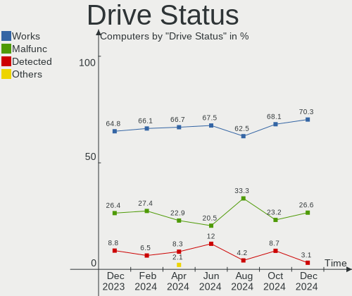
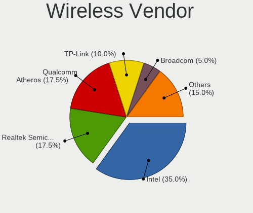

BlackPanther - Hardware Trends
------------------------------

A project to identify most popular hardware characteristics and track their change
over time based on data collected by Linux users at https://Linux-Hardware.org.

Anyone can contribute to this report by the [hw-probe](https://github.com/linuxhw/hw-probe) tool:

    sudo -E hw-probe -all -upload

This is a report for all computer types. See also reports for [desktops](/Dist/BlackPanther/Desktop/README.md) and [notebooks](/Dist/BlackPanther/Notebook/README.md).

This report is for one last month. Overall report since the beginning of time: [TestCoverage](https://github.com/linuxhw/TestCoverage)

Period: Jan, 2023.

Contents
--------

* [ System ](#system)
  - [ OS                       ](#os)
  - [ OS Family                ](#os-family)
  - [ Kernel                   ](#kernel)
  - [ Kernel Family            ](#kernel-family)
  - [ Kernel Major Ver.        ](#kernel-major-ver)
  - [ Arch                     ](#arch)
  - [ DE                       ](#de)
  - [ Display Server           ](#display-server)
  - [ Display Manager          ](#display-manager)
  - [ OS Lang                  ](#os-lang)
  - [ Boot Mode                ](#boot-mode)
  - [ Filesystem               ](#filesystem)
  - [ Part. scheme             ](#part-scheme)
  - [ Dual Boot with Linux/BSD ](#dual-boot-with-linuxbsd)
  - [ Dual Boot (Win)          ](#dual-boot-win)

* [ Board ](#board)
  - [ Vendor                   ](#vendor)
  - [ Model                    ](#model)
  - [ Model Family             ](#model-family)
  - [ MFG Year                 ](#mfg-year)
  - [ Form Factor              ](#form-factor)
  - [ Secure Boot              ](#secure-boot)
  - [ Coreboot                 ](#coreboot)
  - [ RAM Size                 ](#ram-size)
  - [ RAM Used                 ](#ram-used)
  - [ Total Drives             ](#total-drives)
  - [ Has CD-ROM               ](#has-cd-rom)
  - [ Has Ethernet             ](#has-ethernet)
  - [ Has WiFi                 ](#has-wifi)
  - [ Has Bluetooth            ](#has-bluetooth)

* [ Location ](#location)
  - [ Country                  ](#country)
  - [ City                     ](#city)

* [ Drives ](#drives)
  - [ Drive Vendor             ](#drive-vendor)
  - [ Drive Model              ](#drive-model)
  - [ HDD Vendor               ](#hdd-vendor)
  - [ SSD Vendor               ](#ssd-vendor)
  - [ Drive Kind               ](#drive-kind)
  - [ Drive Connector          ](#drive-connector)
  - [ Drive Size               ](#drive-size)
  - [ Space Total              ](#space-total)
  - [ Space Used               ](#space-used)
  - [ Malfunc. Drives          ](#malfunc-drives)
  - [ Malfunc. Drive Vendor    ](#malfunc-drive-vendor)
  - [ Malfunc. HDD Vendor      ](#malfunc-hdd-vendor)
  - [ Malfunc. Drive Kind      ](#malfunc-drive-kind)
  - [ Failed Drives            ](#failed-drives)
  - [ Failed Drive Vendor      ](#failed-drive-vendor)
  - [ Drive Status             ](#drive-status)

* [ Storage controller ](#storage-controller)
  - [ Storage Vendor           ](#storage-vendor)
  - [ Storage Model            ](#storage-model)
  - [ Storage Kind             ](#storage-kind)

* [ Processor ](#processor)
  - [ CPU Vendor               ](#cpu-vendor)
  - [ CPU Model                ](#cpu-model)
  - [ CPU Model Family         ](#cpu-model-family)
  - [ CPU Cores                ](#cpu-cores)
  - [ CPU Sockets              ](#cpu-sockets)
  - [ CPU Threads              ](#cpu-threads)
  - [ CPU Op-Modes             ](#cpu-op-modes)
  - [ CPU Microcode            ](#cpu-microcode)
  - [ CPU Microarch            ](#cpu-microarch)

* [ Graphics ](#graphics)
  - [ GPU Vendor               ](#gpu-vendor)
  - [ GPU Model                ](#gpu-model)
  - [ GPU Combo                ](#gpu-combo)
  - [ GPU Driver               ](#gpu-driver)
  - [ GPU Memory               ](#gpu-memory)

* [ Monitor ](#monitor)
  - [ Monitor Vendor           ](#monitor-vendor)
  - [ Monitor Model            ](#monitor-model)
  - [ Monitor Resolution       ](#monitor-resolution)
  - [ Monitor Diagonal         ](#monitor-diagonal)
  - [ Monitor Width            ](#monitor-width)
  - [ Aspect Ratio             ](#aspect-ratio)
  - [ Monitor Area             ](#monitor-area)
  - [ Pixel Density            ](#pixel-density)
  - [ Multiple Monitors        ](#multiple-monitors)

* [ Network ](#network)
  - [ Net Controller Vendor    ](#net-controller-vendor)
  - [ Net Controller Model     ](#net-controller-model)
  - [ Wireless Vendor          ](#wireless-vendor)
  - [ Wireless Model           ](#wireless-model)
  - [ Ethernet Vendor          ](#ethernet-vendor)
  - [ Ethernet Model           ](#ethernet-model)
  - [ Net Controller Kind      ](#net-controller-kind)
  - [ Used Controller          ](#used-controller)
  - [ NICs                     ](#nics)
  - [ IPv6                     ](#ipv6)

* [ Bluetooth ](#bluetooth)
  - [ Bluetooth Vendor         ](#bluetooth-vendor)
  - [ Bluetooth Model          ](#bluetooth-model)

* [ Sound ](#sound)
  - [ Sound Vendor             ](#sound-vendor)
  - [ Sound Model              ](#sound-model)

* [ Memory ](#memory)
  - [ Memory Vendor            ](#memory-vendor)
  - [ Memory Model             ](#memory-model)
  - [ Memory Kind              ](#memory-kind)
  - [ Memory Form Factor       ](#memory-form-factor)
  - [ Memory Size              ](#memory-size)
  - [ Memory Speed             ](#memory-speed)

* [ Printers & scanners ](#printers--scanners)
  - [ Printer Vendor           ](#printer-vendor)
  - [ Printer Model            ](#printer-model)
  - [ Scanner Vendor           ](#scanner-vendor)
  - [ Scanner Model            ](#scanner-model)

* [ Camera ](#camera)
  - [ Camera Vendor            ](#camera-vendor)
  - [ Camera Model             ](#camera-model)

* [ Security ](#security)
  - [ Fingerprint Vendor       ](#fingerprint-vendor)
  - [ Fingerprint Model        ](#fingerprint-model)
  - [ Chipcard Vendor          ](#chipcard-vendor)
  - [ Chipcard Model           ](#chipcard-model)

* [ Unsupported ](#unsupported)
  - [ Unsupported Devices      ](#unsupported-devices)
  - [ Unsupported Device Types ](#unsupported-device-types)

System
------

OS
--

Installed operating systems

| Name              | Computers | Percent |
|-------------------|-----------|---------|
| BlackPanther 18.1 | 35        | 100%    |

OS Family
---------

OS without a version

| Name         | Computers | Percent |
|--------------|-----------|---------|
| BlackPanther | 35        | 100%    |

Kernel
------

Version of the Linux kernel

| Version             | Computers | Percent |
|---------------------|-----------|---------|
| 5.6.14-desktop-2bP  | 20        | 57.14%  |
| 4.18.16-desktop-1bP | 15        | 42.86%  |

Kernel Family
-------------

Linux kernel without a distro release

| Version | Computers | Percent |
|---------|-----------|---------|
| 5.6.14  | 20        | 57.14%  |
| 4.18.16 | 15        | 42.86%  |

Kernel Major Ver.
-----------------

Linux kernel major version

| Version | Computers | Percent |
|---------|-----------|---------|
| 5.6     | 20        | 57.14%  |
| 4.18    | 15        | 42.86%  |

Arch
----

OS architecture (x86_64, i586, etc.)

| Name   | Computers | Percent |
|--------|-----------|---------|
| x86_64 | 35        | 100%    |

DE
--

Desktop Environment

| Name | Computers | Percent |
|------|-----------|---------|
| KDE5 | 35        | 100%    |

Display Server
--------------

X11 or Wayland

| Name | Computers | Percent |
|------|-----------|---------|
| X11  | 35        | 100%    |

Display Manager
---------------

SDDM, LightDM, etc.

| Name | Computers | Percent |
|------|-----------|---------|
| SDDM | 35        | 100%    |

OS Lang
-------

Language

| Lang    | Computers | Percent |
|---------|-----------|---------|
| Unknown | 35        | 100%    |

Boot Mode
---------

EFI or BIOS

| Mode | Computers | Percent |
|------|-----------|---------|
| BIOS | 18        | 51.43%  |
| EFI  | 17        | 48.57%  |

Filesystem
----------

Type of filesystem

| Type    | Computers | Percent |
|---------|-----------|---------|
| Overlay | 30        | 85.71%  |
| Ext4    | 5         | 14.29%  |

Part. scheme
------------

Scheme of partitioning

| Type | Computers | Percent |
|------|-----------|---------|
| GPT  | 22        | 62.86%  |
| MBR  | 13        | 37.14%  |

Dual Boot with Linux/BSD
------------------------

Hosting more than one Linux/BSD

| Dual boot | Computers | Percent |
|-----------|-----------|---------|
| Yes       | 20        | 57.14%  |
| No        | 15        | 42.86%  |

Dual Boot (Win)
---------------

Hosting Linux and Windows

| Dual boot | Computers | Percent |
|-----------|-----------|---------|
| No        | 20        | 57.14%  |
| Yes       | 15        | 42.86%  |

Board
-----

Vendor
------

Motherboard manufacturer

| Name                | Computers | Percent |
|---------------------|-----------|---------|
| Hewlett-Packard     | 9         | 25.71%  |
| Lenovo              | 6         | 17.14%  |
| Gigabyte Technology | 6         | 17.14%  |
| Dell                | 4         | 11.43%  |
| MSI                 | 3         | 8.57%   |
| ASUSTek Computer    | 3         | 8.57%   |
| Acer                | 2         | 5.71%   |
| Samsung Electronics | 1         | 2.86%   |
| Fujitsu             | 1         | 2.86%   |

Model
-----

Motherboard model

| Name                                   | Computers | Percent |
|----------------------------------------|-----------|---------|
| HP 255 G5 Notebook PC                  | 2         | 5.71%   |
| Gigabyte H61M-S2PV                     | 2         | 5.71%   |
| Samsung N102S                          | 1         | 2.86%   |
| MSI MS-7817                            | 1         | 2.86%   |
| MSI MS-7576                            | 1         | 2.86%   |
| MSI MCP55                              | 1         | 2.86%   |
| Lenovo Y50-70 20378                    | 1         | 2.86%   |
| Lenovo ThinkPad W510 431924G           | 1         | 2.86%   |
| Lenovo ThinkPad T410 2537BF9           | 1         | 2.86%   |
| Lenovo ThinkCentre M72e 3655A79        | 1         | 2.86%   |
| Lenovo IdeaPad 700-15ISK 80RU          | 1         | 2.86%   |
| Lenovo G580 20150                      | 1         | 2.86%   |
| HP ProBook 6570b                       | 1         | 2.86%   |
| HP Pavilion Gaming Laptop 15-ec1xxx    | 1         | 2.86%   |
| HP Laptop 17-ak0xx                     | 1         | 2.86%   |
| HP EliteDesk 705 G3 SFF                | 1         | 2.86%   |
| HP EliteBook Folio 9480m               | 1         | 2.86%   |
| HP EliteBook 2540p                     | 1         | 2.86%   |
| HP Compaq dc7900 Convertible Minitower | 1         | 2.86%   |
| Gigabyte P67A-D3-B3                    | 1         | 2.86%   |
| Gigabyte M52LT-D3                      | 1         | 2.86%   |
| Gigabyte H61M-S1                       | 1         | 2.86%   |
| Gigabyte AB350M-DS3H V2                | 1         | 2.86%   |
| Fujitsu LIFEBOOK U745                  | 1         | 2.86%   |
| Dell Precision WorkStation T5500       | 1         | 2.86%   |
| Dell Precision Tower 5810              | 1         | 2.86%   |
| Dell Inspiron One 2310                 | 1         | 2.86%   |
| Dell Inspiron 5558                     | 1         | 2.86%   |
| ASUS Strix 15 GL503GE                  | 1         | 2.86%   |
| ASUS PRIME B365M-A                     | 1         | 2.86%   |
| ASUS All Series                        | 1         | 2.86%   |
| Acer TravelMate B117-M                 | 1         | 2.86%   |
| Acer TravelMate 8571                   | 1         | 2.86%   |

Model Family
------------

Motherboard model prefix

| Name                 | Computers | Percent |
|----------------------|-----------|---------|
| Lenovo ThinkPad      | 2         | 5.71%   |
| HP EliteBook         | 2         | 5.71%   |
| HP 255               | 2         | 5.71%   |
| Gigabyte H61M-S2PV   | 2         | 5.71%   |
| Dell Precision       | 2         | 5.71%   |
| Dell Inspiron        | 2         | 5.71%   |
| Acer TravelMate      | 2         | 5.71%   |
| Samsung N102S        | 1         | 2.86%   |
| MSI MS-7817          | 1         | 2.86%   |
| MSI MS-7576          | 1         | 2.86%   |
| MSI MCP55            | 1         | 2.86%   |
| Lenovo Y50-70        | 1         | 2.86%   |
| Lenovo ThinkCentre   | 1         | 2.86%   |
| Lenovo IdeaPad       | 1         | 2.86%   |
| Lenovo G580          | 1         | 2.86%   |
| HP ProBook           | 1         | 2.86%   |
| HP Pavilion          | 1         | 2.86%   |
| HP Laptop            | 1         | 2.86%   |
| HP EliteDesk         | 1         | 2.86%   |
| HP Compaq            | 1         | 2.86%   |
| Gigabyte P67A-D3-B3  | 1         | 2.86%   |
| Gigabyte M52LT-D3    | 1         | 2.86%   |
| Gigabyte H61M-S1     | 1         | 2.86%   |
| Gigabyte AB350M-DS3H | 1         | 2.86%   |
| Fujitsu LIFEBOOK     | 1         | 2.86%   |
| ASUS Strix           | 1         | 2.86%   |
| ASUS PRIME           | 1         | 2.86%   |
| ASUS All             | 1         | 2.86%   |

MFG Year
--------

Motherboard manufacture year

| Year | Computers | Percent |
|------|-----------|---------|
| 2012 | 6         | 17.14%  |
| 2010 | 6         | 17.14%  |
| 2014 | 5         | 14.29%  |
| 2016 | 3         | 8.57%   |
| 2018 | 2         | 5.71%   |
| 2017 | 2         | 5.71%   |
| 2015 | 2         | 5.71%   |
| 2011 | 2         | 5.71%   |
| 2009 | 2         | 5.71%   |
| 2008 | 2         | 5.71%   |
| 2020 | 1         | 2.86%   |
| 2019 | 1         | 2.86%   |
| 2013 | 1         | 2.86%   |

Form Factor
-----------

Physical design of the computer

| Name       | Computers | Percent |
|------------|-----------|---------|
| Notebook   | 18        | 51.43%  |
| Desktop    | 15        | 42.86%  |
| All in one | 1         | 2.86%   |
| Server     | 1         | 2.86%   |

Secure Boot
-----------

Enabled or disabled

| State    | Computers | Percent |
|----------|-----------|---------|
| Disabled | 35        | 100%    |

Coreboot
--------

Have coreboot on board

| Used | Computers | Percent |
|------|-----------|---------|
| No   | 35        | 100%    |

RAM Size
--------

Total RAM memory

| Size in GB | Computers | Percent |
|------------|-----------|---------|
| 8.01-16.0  | 14        | 40%     |
| 4.01-8.0   | 9         | 25.71%  |
| 3.01-4.0   | 8         | 22.86%  |
| 16.01-24.0 | 2         | 5.71%   |
| 32.01-64.0 | 1         | 2.86%   |
| 0.51-1.0   | 1         | 2.86%   |

RAM Used
--------

Used RAM memory

| Used GB  | Computers | Percent |
|----------|-----------|---------|
| 0.51-1.0 | 16        | 45.71%  |
| 0.01-0.5 | 11        | 31.43%  |
| 1.01-2.0 | 8         | 22.86%  |

Total Drives
------------

Number of drives on board

| Drives | Computers | Percent |
|--------|-----------|---------|
| 1      | 24        | 68.57%  |
| 2      | 9         | 25.71%  |
| 5      | 1         | 2.86%   |
| 4      | 1         | 2.86%   |

Has CD-ROM
----------

Has CD-ROM on board

| Presented | Computers | Percent |
|-----------|-----------|---------|
| Yes       | 20        | 57.14%  |
| No        | 15        | 42.86%  |

Has Ethernet
------------

Has Ethernet on board

| Presented | Computers | Percent |
|-----------|-----------|---------|
| Yes       | 34        | 97.14%  |
| No        | 1         | 2.86%   |

Has WiFi
--------

Has WiFi module

| Presented | Computers | Percent |
|-----------|-----------|---------|
| Yes       | 24        | 68.57%  |
| No        | 11        | 31.43%  |

Has Bluetooth
-------------

Has Bluetooth module

| Presented | Computers | Percent |
|-----------|-----------|---------|
| Yes       | 19        | 54.29%  |
| No        | 16        | 45.71%  |

Location
--------

Country
-------

Geographic location (country)

| Country  | Computers | Percent |
|----------|-----------|---------|
| Hungary  | 33        | 94.29%  |
| USA      | 1         | 2.86%   |
| Slovakia | 1         | 2.86%   |

City
----

Geographic location (city)

| City          | Computers | Percent |
|---------------|-----------|---------|
| Budapest      | 8         | 22.86%  |
| Zalaegerszeg  | 2         | 5.71%   |
| Szekszárd    | 2         | 5.71%   |
| Győr         | 2         | 5.71%   |
| Bicske        | 2         | 5.71%   |
| Zvolen        | 1         | 2.86%   |
| Veszprém     | 1         | 2.86%   |
| Tatabánya    | 1         | 2.86%   |
| Szombathely   | 1         | 2.86%   |
| Szodliget     | 1         | 2.86%   |
| Rad           | 1         | 2.86%   |
| Oroshaza      | 1         | 2.86%   |
| Nagyvenyim    | 1         | 2.86%   |
| Nagykanizsa   | 1         | 2.86%   |
| Kisvarda      | 1         | 2.86%   |
| Kiskunhalas   | 1         | 2.86%   |
| Karcag        | 1         | 2.86%   |
| Kakucs        | 1         | 2.86%   |
| Hempstead     | 1         | 2.86%   |
| Hajmasker     | 1         | 2.86%   |
| Dunaújváros | 1         | 2.86%   |
| Diosd         | 1         | 2.86%   |
| Debrecen      | 1         | 2.86%   |
| Ajka          | 1         | 2.86%   |

Drives
------

Drive Vendor
------------

Hard drive vendors

| Vendor              | Computers | Drives | Percent |
|---------------------|-----------|--------|---------|
| Samsung Electronics | 12        | 14     | 22.22%  |
| WDC                 | 9         | 10     | 16.67%  |
| Seagate             | 6         | 6      | 11.11%  |
| Kingston            | 5         | 5      | 9.26%   |
| Toshiba             | 3         | 3      | 5.56%   |
| SanDisk             | 2         | 2      | 3.7%    |
| HGST                | 2         | 3      | 3.7%    |
| Crucial             | 2         | 2      | 3.7%    |
| China               | 2         | 2      | 3.7%    |
| Zheino              | 1         | 1      | 1.85%   |
| SPCC                | 1         | 1      | 1.85%   |
| Patriot             | 1         | 1      | 1.85%   |
| OCZ                 | 1         | 1      | 1.85%   |
| Kingmax             | 1         | 1      | 1.85%   |
| Intenso             | 1         | 1      | 1.85%   |
| Intel               | 1         | 1      | 1.85%   |
| Initio              | 1         | 1      | 1.85%   |
| Hitachi             | 1         | 1      | 1.85%   |
| Apacer              | 1         | 1      | 1.85%   |
| A-DATA Technology   | 1         | 1      | 1.85%   |

Drive Model
-----------

Hard drive models

| Model                                | Computers | Percent |
|--------------------------------------|-----------|---------|
| Samsung SSD 860 EVO 500GB            | 3         | 5.36%   |
| WDC WD10JPVX-60JC3T0 1TB             | 2         | 3.57%   |
| Kingston SA400S37240G 240GB SSD      | 2         | 3.57%   |
| Zheino CHN-NGFFNV2280-256 256GB      | 1         | 1.79%   |
| WDC WDS240G2G0B-00EPW0 240GB SSD     | 1         | 1.79%   |
| WDC WD800AAJS-00PSA0 80GB            | 1         | 1.79%   |
| WDC WD5000LPCX-80VHAT1 500GB         | 1         | 1.79%   |
| WDC WD3200BPVT-35ZEST0 320GB         | 1         | 1.79%   |
| WDC WD30EZRZ-00GXCB0 3TB             | 1         | 1.79%   |
| WDC WD30EFRX-68EUZN0 3TB             | 1         | 1.79%   |
| WDC WD1200BEVS-75UST0 120GB          | 1         | 1.79%   |
| WDC WD10EZEX-00KUWA0 1TB             | 1         | 1.79%   |
| Toshiba MQ01ABD100 1TB               | 1         | 1.79%   |
| Toshiba HDWD110 1TB                  | 1         | 1.79%   |
| Toshiba DT01ACA100 1TB               | 1         | 1.79%   |
| SPCC Solid State Disk 256GB          | 1         | 1.79%   |
| Seagate ST500LT012-9WS142 500GB      | 1         | 1.79%   |
| Seagate ST500LT012-1DG142 500GB      | 1         | 1.79%   |
| Seagate ST500LM000-SSHD-8GB          | 1         | 1.79%   |
| Seagate ST380815AS 80GB              | 1         | 1.79%   |
| Seagate ST320LT007-9ZV142 320GB      | 1         | 1.79%   |
| Seagate ST1000LX015-1U7172 1TB       | 1         | 1.79%   |
| SanDisk SSD PLUS 240GB               | 1         | 1.79%   |
| SanDisk SD8SB8U-256G-1006 256GB SSD  | 1         | 1.79%   |
| Samsung SSD 980 500GB                | 1         | 1.79%   |
| Samsung SSD 960 EVO 500GB            | 1         | 1.79%   |
| Samsung SSD 870 EVO 1TB              | 1         | 1.79%   |
| Samsung SSD 830 Series 64GB          | 1         | 1.79%   |
| Samsung MZVLW256HEHP-00000 256GB     | 1         | 1.79%   |
| Samsung MZ7LN256HCHP-00000 256GB SSD | 1         | 1.79%   |
| Samsung HD502HJ 500GB                | 1         | 1.79%   |
| Samsung HD200HJ 200GB                | 1         | 1.79%   |
| Samsung HD154UI 1TB                  | 1         | 1.79%   |
| Samsung HD103UJ 1TB                  | 1         | 1.79%   |
| Patriot Burst 120GB SSD              | 1         | 1.79%   |
| OCZ VERTEX PLUS 64GB SSD             | 1         | 1.79%   |
| Kingston SV300S37A120G 120GB SSD     | 1         | 1.79%   |
| Kingston SA400S37120G 120GB SSD      | 1         | 1.79%   |
| Kingston SA1000M8240G 240GB          | 1         | 1.79%   |
| Kingmax SSD 480GB                    | 1         | 1.79%   |

HDD Vendor
----------

Hard disk drive vendors

| Vendor              | Computers | Drives | Percent |
|---------------------|-----------|--------|---------|
| WDC                 | 8         | 9      | 33.33%  |
| Seagate             | 6         | 6      | 25%     |
| Samsung Electronics | 4         | 4      | 16.67%  |
| Toshiba             | 3         | 3      | 12.5%   |
| HGST                | 2         | 3      | 8.33%   |
| Hitachi             | 1         | 1      | 4.17%   |

SSD Vendor
----------

Solid state drive vendors

| Vendor              | Computers | Drives | Percent |
|---------------------|-----------|--------|---------|
| Samsung Electronics | 6         | 7      | 23.08%  |
| Kingston            | 4         | 4      | 15.38%  |
| SanDisk             | 2         | 2      | 7.69%   |
| Crucial             | 2         | 2      | 7.69%   |
| China               | 2         | 2      | 7.69%   |
| WDC                 | 1         | 1      | 3.85%   |
| SPCC                | 1         | 1      | 3.85%   |
| Patriot             | 1         | 1      | 3.85%   |
| OCZ                 | 1         | 1      | 3.85%   |
| Kingmax             | 1         | 1      | 3.85%   |
| Intenso             | 1         | 1      | 3.85%   |
| Intel               | 1         | 1      | 3.85%   |
| Initio              | 1         | 1      | 3.85%   |
| Apacer              | 1         | 1      | 3.85%   |
| A-DATA Technology   | 1         | 1      | 3.85%   |

Drive Kind
----------

HDD or SSD

| Kind | Computers | Drives | Percent |
|------|-----------|--------|---------|
| SSD  | 24        | 27     | 47.06%  |
| HDD  | 22        | 26     | 43.14%  |
| NVMe | 5         | 5      | 9.8%    |

Drive Connector
---------------

SATA, SAS, NVMe, etc.

| Type | Computers | Drives | Percent |
|------|-----------|--------|---------|
| SATA | 35        | 52     | 85.37%  |
| NVMe | 5         | 5      | 12.2%   |
| SAS  | 1         | 1      | 2.44%   |

Drive Size
----------

Size of hard drive

| Size in TB | Computers | Drives | Percent |
|------------|-----------|--------|---------|
| 0.01-0.5   | 26        | 35     | 61.9%   |
| 0.51-1.0   | 14        | 14     | 33.33%  |
| 3.01-4.0   | 1         | 2      | 2.38%   |
| 2.01-3.0   | 1         | 2      | 2.38%   |

Space Total
-----------

Amount of disk space available on the file system

| Size in GB | Computers | Percent |
|------------|-----------|---------|
| Unknown    | 29        | 82.86%  |
| 101-250    | 4         | 11.43%  |
| 251-500    | 1         | 2.86%   |
| 21-50      | 1         | 2.86%   |

Space Used
----------

Amount of used disk space

| Used GB | Computers | Percent |
|---------|-----------|---------|
| Unknown | 29        | 82.86%  |
| 1-20    | 5         | 14.29%  |
| 51-100  | 1         | 2.86%   |

Malfunc. Drives
---------------

Drive models with a malfunction

| Model                             | Computers | Drives | Percent |
|-----------------------------------|-----------|--------|---------|
| WDC WD5000LPCX-80VHAT1 500GB      | 1         | 1      | 10%     |
| Seagate ST500LT012-9WS142 500GB   | 1         | 1      | 10%     |
| Seagate ST500LM000-SSHD-8GB       | 1         | 1      | 10%     |
| Seagate ST1000LX015-1U7172 1TB    | 1         | 1      | 10%     |
| Samsung Electronics HD200HJ 200GB | 1         | 1      | 10%     |
| Samsung Electronics HD103UJ 1TB   | 1         | 1      | 10%     |
| Intel SSDSA1M160G2HP 160GB        | 1         | 1      | 10%     |
| Initio 3639S 160GB SSD            | 1         | 1      | 10%     |
| Hitachi HTS545050A7E380 500GB     | 1         | 1      | 10%     |
| HGST HTS541010A9E680 1TB          | 1         | 1      | 10%     |

Malfunc. Drive Vendor
---------------------

Vendors of faulty drives

| Vendor              | Computers | Drives | Percent |
|---------------------|-----------|--------|---------|
| Seagate             | 3         | 3      | 30%     |
| Samsung Electronics | 2         | 2      | 20%     |
| WDC                 | 1         | 1      | 10%     |
| Intel               | 1         | 1      | 10%     |
| Initio              | 1         | 1      | 10%     |
| Hitachi             | 1         | 1      | 10%     |
| HGST                | 1         | 1      | 10%     |

Malfunc. HDD Vendor
-------------------

Vendors of faulty HDD drives

| Vendor              | Computers | Drives | Percent |
|---------------------|-----------|--------|---------|
| Seagate             | 3         | 3      | 37.5%   |
| Samsung Electronics | 2         | 2      | 25%     |
| WDC                 | 1         | 1      | 12.5%   |
| Hitachi             | 1         | 1      | 12.5%   |
| HGST                | 1         | 1      | 12.5%   |

Malfunc. Drive Kind
-------------------

Kinds of faulty drives

| Kind | Computers | Drives | Percent |
|------|-----------|--------|---------|
| HDD  | 8         | 8      | 80%     |
| SSD  | 2         | 2      | 20%     |

Failed Drives
-------------

Failed drive models

Zero info for selected period =(

Failed Drive Vendor
-------------------

Failed drive vendors

Zero info for selected period =(

Drive Status
------------

Number of failed and malfunc. drives

| Status  | Computers | Drives | Percent |
|---------|-----------|--------|---------|
| Works   | 31        | 48     | 75.61%  |
| Malfunc | 10        | 10     | 24.39%  |

Storage controller
------------------

Storage Vendor
--------------

Storage controller vendors

| Vendor                      | Computers | Percent |
|-----------------------------|-----------|---------|
| Intel                       | 26        | 63.41%  |
| AMD                         | 7         | 17.07%  |
| Samsung Electronics         | 3         | 7.32%   |
| Nvidia                      | 2         | 4.88%   |
| VIA Technologies            | 1         | 2.44%   |
| Silicon Motion              | 1         | 2.44%   |
| Kingston Technology Company | 1         | 2.44%   |

Storage Model
-------------

Storage controller models

| Model                                                                                   | Computers | Percent |
|-----------------------------------------------------------------------------------------|-----------|---------|
| AMD FCH SATA Controller [AHCI mode]                                                     | 6         | 11.54%  |
| Intel 8 Series/C220 Series Chipset Family 6-port SATA Controller 1 [AHCI mode]          | 3         | 5.77%   |
| Intel 6 Series/C200 Series Chipset Family Desktop SATA Controller (IDE mode, ports 4-5) | 3         | 5.77%   |
| Intel 6 Series/C200 Series Chipset Family Desktop SATA Controller (IDE mode, ports 0-3) | 3         | 5.77%   |
| Intel 5 Series/3400 Series Chipset 6 port SATA AHCI Controller                          | 3         | 5.77%   |
| Samsung NVMe SSD Controller SM961/PM961/SM963                                           | 2         | 3.85%   |
| Intel Wildcat Point-LP SATA Controller [AHCI Mode]                                      | 2         | 3.85%   |
| Intel 7 Series Chipset Family 6-port SATA Controller [AHCI mode]                        | 2         | 3.85%   |
| Intel 6 Series/C200 Series Chipset Family 6 port Desktop SATA AHCI Controller           | 2         | 3.85%   |
| AMD 300 Series Chipset SATA Controller                                                  | 2         | 3.85%   |
| VIA VT6421 IDE/SATA Controller                                                          | 1         | 1.92%   |
| Silicon Motion SM2263EN/SM2263XT SSD Controller                                         | 1         | 1.92%   |
| Samsung NVMe SSD Controller 980                                                         | 1         | 1.92%   |
| Nvidia MCP61 SATA Controller                                                            | 1         | 1.92%   |
| Nvidia MCP61 IDE                                                                        | 1         | 1.92%   |
| Nvidia MCP55 SATA Controller                                                            | 1         | 1.92%   |
| Nvidia MCP55 IDE                                                                        | 1         | 1.92%   |
| Kingston Company U-SNS8154P3 NVMe SSD                                                   | 1         | 1.92%   |
| Intel SATA Controller [RAID mode]                                                       | 1         | 1.92%   |
| Intel NM10/ICH7 Family SATA Controller [AHCI mode]                                      | 1         | 1.92%   |
| Intel HM170/QM170 Chipset SATA Controller [AHCI Mode]                                   | 1         | 1.92%   |
| Intel Cannon Lake Mobile PCH SATA AHCI Controller                                       | 1         | 1.92%   |
| Intel C610/X99 series chipset sSATA Controller [AHCI mode]                              | 1         | 1.92%   |
| Intel C610/X99 series chipset IDE-r Controller                                          | 1         | 1.92%   |
| Intel C600/X79 series chipset SATA RAID Controller                                      | 1         | 1.92%   |
| Intel Atom/Celeron/Pentium Processor x5-E8000/J3xxx/N3xxx Series SATA Controller        | 1         | 1.92%   |
| Intel 82801JD/DO (ICH10 Family) SATA AHCI Controller                                    | 1         | 1.92%   |
| Intel 82801IBM/IEM (ICH9M/ICH9M-E) 4 port SATA Controller [AHCI mode]                   | 1         | 1.92%   |
| Intel 8 Series SATA Controller 1 [AHCI mode]                                            | 1         | 1.92%   |
| Intel 5 Series/3400 Series Chipset 4 port SATA IDE Controller                           | 1         | 1.92%   |
| Intel 5 Series/3400 Series Chipset 2 port SATA IDE Controller                           | 1         | 1.92%   |
| Intel 200 Series PCH SATA controller [AHCI mode]                                        | 1         | 1.92%   |
| AMD SB7x0/SB8x0/SB9x0 SATA Controller [IDE mode]                                        | 1         | 1.92%   |
| AMD SB7x0/SB8x0/SB9x0 IDE Controller                                                    | 1         | 1.92%   |

Storage Kind
------------

Kind of storage controller (IDE, SATA, NVMe, SAS, ...)

| Kind | Computers | Percent |
|------|-----------|---------|
| SATA | 28        | 63.64%  |
| IDE  | 8         | 18.18%  |
| NVMe | 5         | 11.36%  |
| RAID | 3         | 6.82%   |

Processor
---------

CPU Vendor
----------

Processor vendors

| Vendor | Computers | Percent |
|--------|-----------|---------|
| Intel  | 26        | 74.29%  |
| AMD    | 9         | 25.71%  |

CPU Model
---------

Processor models

| Model                                        | Computers | Percent |
|----------------------------------------------|-----------|---------|
| AMD A6-7310 APU with AMD Radeon R4 Graphics  | 2         | 5.71%   |
| Intel Xeon CPU E5530 @ 2.40GHz               | 1         | 2.86%   |
| Intel Xeon CPU E5-1620 v3 @ 3.50GHz          | 1         | 2.86%   |
| Intel Pentium CPU G3220 @ 3.00GHz            | 1         | 2.86%   |
| Intel Pentium CPU B960 @ 2.20GHz             | 1         | 2.86%   |
| Intel Core i7-8750H CPU @ 2.20GHz            | 1         | 2.86%   |
| Intel Core i7-5600U CPU @ 2.60GHz            | 1         | 2.86%   |
| Intel Core i7-4710HQ CPU @ 2.50GHz           | 1         | 2.86%   |
| Intel Core i7-4600U CPU @ 2.10GHz            | 1         | 2.86%   |
| Intel Core i7 CPU Q 720 @ 1.60GHz            | 1         | 2.86%   |
| Intel Core i7 CPU L 640 @ 2.13GHz            | 1         | 2.86%   |
| Intel Core i5-6300HQ CPU @ 2.30GHz           | 1         | 2.86%   |
| Intel Core i5-5200U CPU @ 2.20GHz            | 1         | 2.86%   |
| Intel Core i5-3550S CPU @ 3.00GHz            | 1         | 2.86%   |
| Intel Core i5-3470 CPU @ 3.20GHz             | 1         | 2.86%   |
| Intel Core i5-3320M CPU @ 2.60GHz            | 1         | 2.86%   |
| Intel Core i5-2300 CPU @ 2.80GHz             | 1         | 2.86%   |
| Intel Core i5 CPU M 520 @ 2.40GHz            | 1         | 2.86%   |
| Intel Core i3-8100 CPU @ 3.60GHz             | 1         | 2.86%   |
| Intel Core i3-4130 CPU @ 3.40GHz             | 1         | 2.86%   |
| Intel Core i3-3220 CPU @ 3.30GHz             | 1         | 2.86%   |
| Intel Core i3-2120 CPU @ 3.30GHz             | 1         | 2.86%   |
| Intel Core i3 CPU M 370 @ 2.40GHz            | 1         | 2.86%   |
| Intel Core 2 Duo CPU U9400 @ 1.40GHz         | 1         | 2.86%   |
| Intel Core 2 Duo CPU E8400 @ 3.00GHz         | 1         | 2.86%   |
| Intel Celeron CPU N3160 @ 1.60GHz            | 1         | 2.86%   |
| Intel Atom CPU N435 @ 1.33GHz                | 1         | 2.86%   |
| AMD Ryzen 5 4600H with Radeon Graphics       | 1         | 2.86%   |
| AMD Ryzen 5 3400G with Radeon Vega Graphics  | 1         | 2.86%   |
| AMD Quad-Core Opteron Processor 2352         | 1         | 2.86%   |
| AMD PRO A10-8770 R7, 10 COMPUTE CORES 4C+6G  | 1         | 2.86%   |
| AMD Phenom II X4 965 Processor               | 1         | 2.86%   |
| AMD Athlon II X2 240 Processor               | 1         | 2.86%   |
| AMD A9-9420 RADEON R5, 5 COMPUTE CORES 2C+3G | 1         | 2.86%   |

CPU Model Family
----------------

Processor model prefix

| Model                 | Computers | Percent |
|-----------------------|-----------|---------|
| Intel Core i5         | 7         | 20%     |
| Intel Core i7         | 6         | 17.14%  |
| Intel Core i3         | 5         | 14.29%  |
| Intel Xeon            | 2         | 5.71%   |
| Intel Pentium         | 2         | 5.71%   |
| Intel Core 2 Duo      | 2         | 5.71%   |
| AMD Ryzen 5           | 2         | 5.71%   |
| AMD A6                | 2         | 5.71%   |
| Other                 | 1         | 2.86%   |
| Intel Celeron         | 1         | 2.86%   |
| Intel Atom            | 1         | 2.86%   |
| AMD Quad-Core Opteron | 1         | 2.86%   |
| AMD PRO A10           | 1         | 2.86%   |
| AMD Phenom II X4      | 1         | 2.86%   |
| AMD Athlon II X2      | 1         | 2.86%   |

CPU Cores
---------

Number of processor cores

| Number | Computers | Percent |
|--------|-----------|---------|
| 2      | 17        | 48.57%  |
| 4      | 14        | 40%     |
| 1      | 2         | 5.71%   |
| 8      | 1         | 2.86%   |
| 6      | 1         | 2.86%   |

CPU Sockets
-----------

Number of sockets

| Number | Computers | Percent |
|--------|-----------|---------|
| 1      | 34        | 97.14%  |
| 2      | 1         | 2.86%   |

CPU Threads
-----------

Threads per core (Hyper-Threading)

| Number | Computers | Percent |
|--------|-----------|---------|
| 1      | 18        | 51.43%  |
| 2      | 17        | 48.57%  |

CPU Op-Modes
------------

CPU Operation Modes (32-bit, 64-bit)

| Op mode        | Computers | Percent |
|----------------|-----------|---------|
| 32-bit, 64-bit | 35        | 100%    |

CPU Microcode
-------------

Microcode number

| Number     | Computers | Percent |
|------------|-----------|---------|
| 0x306a9    | 4         | 11.43%  |
| 0x306c3    | 3         | 8.57%   |
| 0x206a7    | 3         | 8.57%   |
| 0x20655    | 3         | 8.57%   |
| 0x306d4    | 2         | 5.71%   |
| 0x1067a    | 2         | 5.71%   |
| 0x07030105 | 2         | 5.71%   |
| 0x906eb    | 1         | 2.86%   |
| 0x906ea    | 1         | 2.86%   |
| 0x506e3    | 1         | 2.86%   |
| 0x406c4    | 1         | 2.86%   |
| 0x40651    | 1         | 2.86%   |
| 0x306f2    | 1         | 2.86%   |
| 0x106e5    | 1         | 2.86%   |
| 0x106ca    | 1         | 2.86%   |
| 0x106a5    | 1         | 2.86%   |
| 0x08600106 | 1         | 2.86%   |
| 0x08108109 | 1         | 2.86%   |
| 0x06006705 | 1         | 2.86%   |
| 0x0600611a | 1         | 2.86%   |
| 0x010000c8 | 1         | 2.86%   |
| 0x010000c7 | 1         | 2.86%   |
| 0x01000083 | 1         | 2.86%   |

CPU Microarch
-------------

Microarchitecture

| Name        | Computers | Percent |
|-------------|-----------|---------|
| Haswell     | 5         | 14.29%  |
| IvyBridge   | 4         | 11.43%  |
| Westmere    | 3         | 8.57%   |
| SandyBridge | 3         | 8.57%   |
| K10         | 3         | 8.57%   |
| Puma        | 2         | 5.71%   |
| Penryn      | 2         | 5.71%   |
| Nehalem     | 2         | 5.71%   |
| KabyLake    | 2         | 5.71%   |
| Excavator   | 2         | 5.71%   |
| Broadwell   | 2         | 5.71%   |
| Zen+        | 1         | 2.86%   |
| Zen 2       | 1         | 2.86%   |
| Skylake     | 1         | 2.86%   |
| Silvermont  | 1         | 2.86%   |
| Bonnell     | 1         | 2.86%   |

Graphics
--------

GPU Vendor
----------

Vendors of graphics cards

| Vendor                                       | Computers | Percent |
|----------------------------------------------|-----------|---------|
| Intel                                        | 17        | 40.48%  |
| Nvidia                                       | 13        | 30.95%  |
| AMD                                          | 11        | 26.19%  |
| XGI Technology (eXtreme Graphics Innovation) | 1         | 2.38%   |

GPU Model
---------

Graphics card models

| Model                                                                                    | Computers | Percent |
|------------------------------------------------------------------------------------------|-----------|---------|
| Intel HD Graphics 5500                                                                   | 2         | 4.65%   |
| Intel Core Processor Integrated Graphics Controller                                      | 2         | 4.65%   |
| AMD Mullins [Radeon R4/R5 Graphics]                                                      | 2         | 4.65%   |
| AMD Cedar [Radeon HD 5000/6000/7350/8350 Series]                                         | 2         | 4.65%   |
| XGI Technology (eXtreme Graphics Innovation) Z7/Z9 (XG20 core)                           | 1         | 2.33%   |
| Nvidia TU117M [GeForce GTX 1650 Ti Mobile]                                               | 1         | 2.33%   |
| Nvidia GT218 [GeForce 210]                                                               | 1         | 2.33%   |
| Nvidia GT216GLM [Quadro FX 880M]                                                         | 1         | 2.33%   |
| Nvidia GP107M [GeForce GTX 1050 Ti Mobile]                                               | 1         | 2.33%   |
| Nvidia GP107 [GeForce GTX 1050 Ti]                                                       | 1         | 2.33%   |
| Nvidia GM107M [GeForce GTX 950M]                                                         | 1         | 2.33%   |
| Nvidia GM107M [GeForce GTX 860M]                                                         | 1         | 2.33%   |
| Nvidia GK208BM [GeForce 920M]                                                            | 1         | 2.33%   |
| Nvidia GK208B [GeForce GT 720]                                                           | 1         | 2.33%   |
| Nvidia GK106 [GeForce GTX 660]                                                           | 1         | 2.33%   |
| Nvidia GF108 [GeForce GT 630]                                                            | 1         | 2.33%   |
| Nvidia GA104 [GeForce RTX 3060 Ti Lite Hash Rate]                                        | 1         | 2.33%   |
| Nvidia G96CGL [Quadro FX 580]                                                            | 1         | 2.33%   |
| Intel Xeon E3-1200 v3/4th Gen Core Processor Integrated Graphics Controller              | 1         | 2.33%   |
| Intel Xeon E3-1200 v2/3rd Gen Core processor Graphics Controller                         | 1         | 2.33%   |
| Intel Mobile 4 Series Chipset Integrated Graphics Controller                             | 1         | 2.33%   |
| Intel HD Graphics 530                                                                    | 1         | 2.33%   |
| Intel Haswell-ULT Integrated Graphics Controller                                         | 1         | 2.33%   |
| Intel CoffeeLake-S GT2 [UHD Graphics 630]                                                | 1         | 2.33%   |
| Intel CoffeeLake-H GT2 [UHD Graphics 630]                                                | 1         | 2.33%   |
| Intel Atom/Celeron/Pentium Processor x5-E8000/J3xxx/N3xxx Integrated Graphics Controller | 1         | 2.33%   |
| Intel Atom Processor D4xx/D5xx/N4xx/N5xx Integrated Graphics Controller                  | 1         | 2.33%   |
| Intel 4th Gen Core Processor Integrated Graphics Controller                              | 1         | 2.33%   |
| Intel 4 Series Chipset Integrated Graphics Controller                                    | 1         | 2.33%   |
| Intel 3rd Gen Core processor Graphics Controller                                         | 1         | 2.33%   |
| Intel 2nd Generation Core Processor Family Integrated Graphics Controller                | 1         | 2.33%   |
| AMD Wani [Radeon R5/R6/R7 Graphics]                                                      | 1         | 2.33%   |
| AMD Stoney [Radeon R2/R3/R4/R5 Graphics]                                                 | 1         | 2.33%   |
| AMD Renoir                                                                               | 1         | 2.33%   |
| AMD Redwood XT [Radeon HD 5670/5690/5730]                                                | 1         | 2.33%   |
| AMD Park [Mobility Radeon HD 5430/5450/5470]                                             | 1         | 2.33%   |
| AMD Oland XT [Radeon HD 8670 / R5 340X OEM / R7 250/350/350X OEM]                        | 1         | 2.33%   |
| AMD Lexa PRO [Radeon 540/540X/550/550X / RX 540X/550/550X]                               | 1         | 2.33%   |
| AMD Baffin [Radeon RX 550 640SP / RX 560/560X]                                           | 1         | 2.33%   |

GPU Combo
---------

Combinations of graphics cards

| Name           | Computers | Percent |
|----------------|-----------|---------|
| 1 x Intel      | 12        | 34.29%  |
| 1 x Nvidia     | 8         | 22.86%  |
| 1 x AMD        | 8         | 22.86%  |
| Intel + Nvidia | 4         | 11.43%  |
| 2 x AMD        | 1         | 2.86%   |
| AMD + XGI      | 1         | 2.86%   |
| AMD + Nvidia   | 1         | 2.86%   |

GPU Driver
----------

Free vs proprietary

| Driver  | Computers | Percent |
|---------|-----------|---------|
| Free    | 34        | 97.14%  |
| Unknown | 1         | 2.86%   |

GPU Memory
----------

Total video memory

| Size in GB | Computers | Percent |
|------------|-----------|---------|
| Unknown    | 14        | 40%     |
| 0.51-1.0   | 10        | 28.57%  |
| 3.01-4.0   | 6         | 17.14%  |
| 0.01-0.5   | 3         | 8.57%   |
| 1.01-2.0   | 2         | 5.71%   |

Monitor
-------

Monitor Vendor
--------------

Monitor vendors

| Vendor                  | Computers | Percent |
|-------------------------|-----------|---------|
| Samsung Electronics     | 5         | 15.15%  |
| Chimei Innolux          | 4         | 12.12%  |
| AU Optronics            | 4         | 12.12%  |
| LG Display              | 3         | 9.09%   |
| Lenovo                  | 3         | 9.09%   |
| Goldstar                | 3         | 9.09%   |
| Dell                    | 3         | 9.09%   |
| BOE                     | 2         | 6.06%   |
| PANDA                   | 1         | 3.03%   |
| Medion                  | 1         | 3.03%   |
| CVT                     | 1         | 3.03%   |
| Chi Mei Optoelectronics | 1         | 3.03%   |
| Apple                   | 1         | 3.03%   |
| Ancor Communications    | 1         | 3.03%   |

Monitor Model
-------------

Monitor models

| Model                                                                    | Computers | Percent |
|--------------------------------------------------------------------------|-----------|---------|
| BOE LCD Monitor BOE0687 1920x1080 344x193mm 15.5-inch                    | 2         | 6.06%   |
| Samsung Electronics SyncMaster SAM03F2 1680x1050                         | 1         | 3.03%   |
| Samsung Electronics SyncMaster SAM034F 1440x900 428x255mm 19.6-inch      | 1         | 3.03%   |
| Samsung Electronics SyncMaster SAM011F 1280x1024 376x301mm 19.0-inch     | 1         | 3.03%   |
| Samsung Electronics S24D330 SAM0D92 1920x1080 531x299mm 24.0-inch        | 1         | 3.03%   |
| Samsung Electronics LCD Monitor SDC4852 3840x2160 340x190mm 15.3-inch    | 1         | 3.03%   |
| PANDA LCD Monitor NCP0058 1920x1080 344x194mm 15.5-inch                  | 1         | 3.03%   |
| Medion MD20666 MED3672 1920x1080 533x312mm 24.3-inch                     | 1         | 3.03%   |
| LG Display LCD Monitor LGD054F 1920x1080 344x194mm 15.5-inch             | 1         | 3.03%   |
| LG Display LCD Monitor LGD0258 1600x900 345x194mm 15.6-inch              | 1         | 3.03%   |
| LG Display LCD Monitor LGD024F 1280x800 260x160mm 12.0-inch              | 1         | 3.03%   |
| Lenovo LEN L171 LEN24C9 1280x1024 337x270mm 17.0-inch                    | 1         | 3.03%   |
| Lenovo LCD Monitor LEN40B1 1600x900 344x193mm 15.5-inch                  | 1         | 3.03%   |
| Lenovo LCD Monitor LEN4036 1440x900 303x189mm 14.1-inch                  | 1         | 3.03%   |
| Goldstar MP59G GSM5B34 1920x1080 480x270mm 21.7-inch                     | 1         | 3.03%   |
| Goldstar FULL HD GSM5B55 1920x1080 480x270mm 21.7-inch                   | 1         | 3.03%   |
| Goldstar E2350 GSM5790 1920x1080 510x290mm 23.1-inch                     | 1         | 3.03%   |
| Dell SE2717H/HX DELD0A1 1920x1080 598x336mm 27.0-inch                    | 1         | 3.03%   |
| Dell E1912H DELF03E 1366x768 410x230mm 18.5-inch                         | 1         | 3.03%   |
| Dell 23" AIO DELB123 1920x1080 510x287mm 23.0-inch                       | 1         | 3.03%   |
| CVT CVTE TV CVT0003 1360x768 575x323mm 26.0-inch                         | 1         | 3.03%   |
| Chimei Innolux LCD Monitor CMN15F4 1920x1080 344x193mm 15.5-inch         | 1         | 3.03%   |
| Chimei Innolux LCD Monitor CMN14C3 1366x768 309x173mm 13.9-inch          | 1         | 3.03%   |
| Chimei Innolux LCD Monitor CMN14A4 1366x768 309x174mm 14.0-inch          | 1         | 3.03%   |
| Chimei Innolux LCD Monitor CMN1132 1366x768 256x144mm 11.6-inch          | 1         | 3.03%   |
| Chi Mei Optoelectronics LCD Monitor CMO1032 1024x600 222x125mm 10.0-inch | 1         | 3.03%   |
| AU Optronics LCD Monitor AUO40EC 1366x768 344x193mm 15.5-inch            | 1         | 3.03%   |
| AU Optronics LCD Monitor AUO32EC 1366x768 344x193mm 15.5-inch            | 1         | 3.03%   |
| AU Optronics LCD Monitor AUO21EC 1366x768 344x193mm 15.5-inch            | 1         | 3.03%   |
| AU Optronics LCD Monitor AUO219E 1600x900 382x214mm 17.2-inch            | 1         | 3.03%   |
| Apple Cinema Displa y APP921D 1680x1050 433x270mm 20.1-inch              | 1         | 3.03%   |
| Ancor Communications ASUS VW193D ACI19D5 1440x900 408x255mm 18.9-inch    | 1         | 3.03%   |

Monitor Resolution
------------------

Monitor screen resolution

| Resolution         | Computers | Percent |
|--------------------|-----------|---------|
| 1920x1080 (FHD)    | 12        | 37.5%   |
| 1366x768 (WXGA)    | 7         | 21.88%  |
| 1600x900 (HD+)     | 3         | 9.38%   |
| 1440x900 (WXGA+)   | 3         | 9.38%   |
| 3840x2160 (4K)     | 2         | 6.25%   |
| 1280x1024 (SXGA)   | 2         | 6.25%   |
| 1680x1050 (WSXGA+) | 1         | 3.13%   |
| 1280x800 (WXGA)    | 1         | 3.13%   |
| 1024x600           | 1         | 3.13%   |

Monitor Diagonal
----------------

Diagonal size in inches

| Inches  | Computers | Percent |
|---------|-----------|---------|
| 15      | 11        | 33.33%  |
| 19      | 3         | 9.09%   |
| 24      | 2         | 6.06%   |
| 23      | 2         | 6.06%   |
| 21      | 2         | 6.06%   |
| 17      | 2         | 6.06%   |
| 14      | 2         | 6.06%   |
| 27      | 1         | 3.03%   |
| 26      | 1         | 3.03%   |
| 20      | 1         | 3.03%   |
| 18      | 1         | 3.03%   |
| 13      | 1         | 3.03%   |
| 12      | 1         | 3.03%   |
| 11      | 1         | 3.03%   |
| 10      | 1         | 3.03%   |
| Unknown | 1         | 3.03%   |

Monitor Width
-------------

Physical width

| Width in mm | Computers | Percent |
|-------------|-----------|---------|
| 301-350     | 15        | 45.45%  |
| 501-600     | 6         | 18.18%  |
| 401-500     | 6         | 18.18%  |
| 201-300     | 3         | 9.09%   |
| 351-400     | 2         | 6.06%   |
| Unknown     | 1         | 3.03%   |

Aspect Ratio
------------

Proportional relationship between the width and the height

| Ratio | Computers | Percent |
|-------|-----------|---------|
| 16/9  | 26        | 81.25%  |
| 16/10 | 4         | 12.5%   |
| 5/4   | 2         | 6.25%   |

Monitor Area
------------

Area in inch²

| Area in inch² | Computers | Percent |
|----------------|-----------|---------|
| 101-110        | 11        | 33.33%  |
| 201-250        | 5         | 15.15%  |
| 151-200        | 4         | 12.12%  |
| 81-90          | 3         | 9.09%   |
| 251-300        | 2         | 6.06%   |
| 141-150        | 2         | 6.06%   |
| 61-70          | 1         | 3.03%   |
| 51-60          | 1         | 3.03%   |
| 41-50          | 1         | 3.03%   |
| 301-350        | 1         | 3.03%   |
| 121-130        | 1         | 3.03%   |
| Unknown        | 1         | 3.03%   |

Pixel Density
-------------

Pixels per inch

| Density | Computers | Percent |
|---------|-----------|---------|
| 101-120 | 12        | 36.36%  |
| 51-100  | 12        | 36.36%  |
| 121-160 | 8         | 24.24%  |
| Unknown | 1         | 3.03%   |

Multiple Monitors
-----------------

Total monitors connected

| Total | Computers | Percent |
|-------|-----------|---------|
| 1     | 34        | 97.14%  |
| 0     | 1         | 2.86%   |

Network
-------

Net Controller Vendor
---------------------

Controller vendors

| Vendor                | Computers | Percent |
|-----------------------|-----------|---------|
| Realtek Semiconductor | 21        | 39.62%  |
| Intel                 | 17        | 32.08%  |
| Broadcom              | 3         | 5.66%   |
| Xiaomi                | 2         | 3.77%   |
| TP-Link               | 2         | 3.77%   |
| Samsung Electronics   | 2         | 3.77%   |
| Qualcomm Atheros      | 2         | 3.77%   |
| Ralink                | 1         | 1.89%   |
| Nvidia                | 1         | 1.89%   |
| Huawei Technologies   | 1         | 1.89%   |
| Broadcom Limited      | 1         | 1.89%   |

Net Controller Model
--------------------

Controller models

| Model                                                                         | Computers | Percent |
|-------------------------------------------------------------------------------|-----------|---------|
| Realtek RTL8111/8168/8411 PCI Express Gigabit Ethernet Controller             | 18        | 28.13%  |
| Intel Centrino Advanced-N 6200                                                | 3         | 4.69%   |
| Intel 82577LM Gigabit Network Connection                                      | 3         | 4.69%   |
| Xiaomi Mi/Redmi series (RNDIS)                                                | 2         | 3.13%   |
| Samsung Galaxy series, misc. (tethering mode)                                 | 2         | 3.13%   |
| Realtek RTL8188EUS 802.11n Wireless Network Adapter                           | 2         | 3.13%   |
| Realtek RTL810xE PCI Express Fast Ethernet controller                         | 2         | 3.13%   |
| Intel Wireless 7265                                                           | 2         | 3.13%   |
| Intel Wireless 7260                                                           | 2         | 3.13%   |
| Intel Wireless 3165                                                           | 2         | 3.13%   |
| TP-Link TL-WN821N v5/v6 [RTL8192EU]                                           | 1         | 1.56%   |
| TP-Link AC600 wireless Realtek RTL8811AU [Archer T2U Nano]                    | 1         | 1.56%   |
| Realtek RTL8822CE 802.11ac PCIe Wireless Network Adapter                      | 1         | 1.56%   |
| Realtek RTL8821AE 802.11ac PCIe Wireless Network Adapter                      | 1         | 1.56%   |
| Realtek RTL8723DE Wireless Network Adapter                                    | 1         | 1.56%   |
| Realtek RTL8169 PCI Gigabit Ethernet Controller                               | 1         | 1.56%   |
| Ralink RT2561/RT61 802.11g PCI                                                | 1         | 1.56%   |
| Qualcomm Atheros AR9227 Wireless Network Adapter                              | 1         | 1.56%   |
| Qualcomm Atheros AR8162 Fast Ethernet                                         | 1         | 1.56%   |
| Nvidia MCP55 Ethernet                                                         | 1         | 1.56%   |
| Intel Wireless 3160                                                           | 1         | 1.56%   |
| Intel WiFi Link 5100                                                          | 1         | 1.56%   |
| Intel Wi-Fi 6 AX200                                                           | 1         | 1.56%   |
| Intel Ethernet Connection I218-LM                                             | 1         | 1.56%   |
| Intel Ethernet Connection I217-LM                                             | 1         | 1.56%   |
| Intel Ethernet Connection (3) I218-LM                                         | 1         | 1.56%   |
| Intel Centrino Wireless-N 130                                                 | 1         | 1.56%   |
| Intel Cannon Lake PCH CNVi WiFi                                               | 1         | 1.56%   |
| Intel 82579V Gigabit Network Connection                                       | 1         | 1.56%   |
| Intel 82571EB/82571GB Gigabit Ethernet Controller D0/D1 (copper applications) | 1         | 1.56%   |
| Intel 82567LM-3 Gigabit Network Connection                                    | 1         | 1.56%   |
| Huawei ELS-NX9                                                                | 1         | 1.56%   |
| Broadcom NetXtreme BCM5762 Gigabit Ethernet PCIe                              | 1         | 1.56%   |
| Broadcom NetXtreme BCM5761 Gigabit Ethernet PCIe                              | 1         | 1.56%   |
| Broadcom Limited BCM4313 802.11bgn Wireless Network Adapter                   | 1         | 1.56%   |
| Broadcom BCM4313 802.11bgn Wireless Network Adapter                           | 1         | 1.56%   |

Wireless Vendor
---------------

Wireless vendors

| Vendor                | Computers | Percent |
|-----------------------|-----------|---------|
| Intel                 | 14        | 58.33%  |
| Realtek Semiconductor | 4         | 16.67%  |
| TP-Link               | 2         | 8.33%   |
| Ralink                | 1         | 4.17%   |
| Qualcomm Atheros      | 1         | 4.17%   |
| Broadcom Limited      | 1         | 4.17%   |
| Broadcom              | 1         | 4.17%   |

Wireless Model
--------------

Wireless models

| Model                                                       | Computers | Percent |
|-------------------------------------------------------------|-----------|---------|
| Intel Centrino Advanced-N 6200                              | 3         | 12%     |
| Realtek RTL8188EUS 802.11n Wireless Network Adapter         | 2         | 8%      |
| Intel Wireless 7265                                         | 2         | 8%      |
| Intel Wireless 7260                                         | 2         | 8%      |
| Intel Wireless 3165                                         | 2         | 8%      |
| TP-Link TL-WN821N v5/v6 [RTL8192EU]                         | 1         | 4%      |
| TP-Link AC600 wireless Realtek RTL8811AU [Archer T2U Nano]  | 1         | 4%      |
| Realtek RTL8822CE 802.11ac PCIe Wireless Network Adapter    | 1         | 4%      |
| Realtek RTL8821AE 802.11ac PCIe Wireless Network Adapter    | 1         | 4%      |
| Realtek RTL8723DE Wireless Network Adapter                  | 1         | 4%      |
| Ralink RT2561/RT61 802.11g PCI                              | 1         | 4%      |
| Qualcomm Atheros AR9227 Wireless Network Adapter            | 1         | 4%      |
| Intel Wireless 3160                                         | 1         | 4%      |
| Intel WiFi Link 5100                                        | 1         | 4%      |
| Intel Wi-Fi 6 AX200                                         | 1         | 4%      |
| Intel Centrino Wireless-N 130                               | 1         | 4%      |
| Intel Cannon Lake PCH CNVi WiFi                             | 1         | 4%      |
| Broadcom Limited BCM4313 802.11bgn Wireless Network Adapter | 1         | 4%      |
| Broadcom BCM4313 802.11bgn Wireless Network Adapter         | 1         | 4%      |

Ethernet Vendor
---------------

Ethernet vendors

| Vendor                | Computers | Percent |
|-----------------------|-----------|---------|
| Realtek Semiconductor | 21        | 53.85%  |
| Intel                 | 9         | 23.08%  |
| Xiaomi                | 2         | 5.13%   |
| Samsung Electronics   | 2         | 5.13%   |
| Broadcom              | 2         | 5.13%   |
| Qualcomm Atheros      | 1         | 2.56%   |
| Nvidia                | 1         | 2.56%   |
| Huawei Technologies   | 1         | 2.56%   |

Ethernet Model
--------------

Ethernet models

| Model                                                                         | Computers | Percent |
|-------------------------------------------------------------------------------|-----------|---------|
| Realtek RTL8111/8168/8411 PCI Express Gigabit Ethernet Controller             | 18        | 46.15%  |
| Intel 82577LM Gigabit Network Connection                                      | 3         | 7.69%   |
| Xiaomi Mi/Redmi series (RNDIS)                                                | 2         | 5.13%   |
| Samsung Galaxy series, misc. (tethering mode)                                 | 2         | 5.13%   |
| Realtek RTL810xE PCI Express Fast Ethernet controller                         | 2         | 5.13%   |
| Realtek RTL8169 PCI Gigabit Ethernet Controller                               | 1         | 2.56%   |
| Qualcomm Atheros AR8162 Fast Ethernet                                         | 1         | 2.56%   |
| Nvidia MCP55 Ethernet                                                         | 1         | 2.56%   |
| Intel Ethernet Connection I218-LM                                             | 1         | 2.56%   |
| Intel Ethernet Connection I217-LM                                             | 1         | 2.56%   |
| Intel Ethernet Connection (3) I218-LM                                         | 1         | 2.56%   |
| Intel 82579V Gigabit Network Connection                                       | 1         | 2.56%   |
| Intel 82571EB/82571GB Gigabit Ethernet Controller D0/D1 (copper applications) | 1         | 2.56%   |
| Intel 82567LM-3 Gigabit Network Connection                                    | 1         | 2.56%   |
| Huawei ELS-NX9                                                                | 1         | 2.56%   |
| Broadcom NetXtreme BCM5762 Gigabit Ethernet PCIe                              | 1         | 2.56%   |
| Broadcom NetXtreme BCM5761 Gigabit Ethernet PCIe                              | 1         | 2.56%   |

Net Controller Kind
-------------------

Ethernet, WiFi or modem

| Kind     | Computers | Percent |
|----------|-----------|---------|
| Ethernet | 34        | 58.62%  |
| WiFi     | 24        | 41.38%  |

Used Controller
---------------

Currently used network controller

| Kind     | Computers | Percent |
|----------|-----------|---------|
| Ethernet | 19        | 55.88%  |
| WiFi     | 15        | 44.12%  |

NICs
----

Total network controllers on board

| Total | Computers | Percent |
|-------|-----------|---------|
| 2     | 20        | 57.14%  |
| 1     | 13        | 37.14%  |
| 4     | 1         | 2.86%   |
| 0     | 1         | 2.86%   |

IPv6
----

IPv6 vs IPv4

| Used | Computers | Percent |
|------|-----------|---------|
| No   | 22        | 62.86%  |
| Yes  | 13        | 37.14%  |

Bluetooth
---------

Bluetooth Vendor
----------------

Controller vendors

| Vendor                  | Computers | Percent |
|-------------------------|-----------|---------|
| Intel                   | 9         | 47.37%  |
| Realtek Semiconductor   | 3         | 15.79%  |
| Broadcom                | 3         | 15.79%  |
| Foxconn / Hon Hai       | 2         | 10.53%  |
| Hewlett-Packard         | 1         | 5.26%   |
| Cambridge Silicon Radio | 1         | 5.26%   |

Bluetooth Model
---------------

Controller models

| Model                                               | Computers | Percent |
|-----------------------------------------------------|-----------|---------|
| Intel Bluetooth wireless interface                  | 7         | 36.84%  |
| Broadcom BCM2045B (BDC-2.1)                         | 2         | 10.53%  |
| Realtek RTL8821A Bluetooth                          | 1         | 5.26%   |
| Realtek  Bluetooth 4.2 Adapter                      | 1         | 5.26%   |
| Realtek Bluetooth Radio                             | 1         | 5.26%   |
| Intel Centrino Advanced-N 6230 Bluetooth adapter    | 1         | 5.26%   |
| Intel Bluetooth 9460/9560 Jefferson Peak (JfP)      | 1         | 5.26%   |
| HP Broadcom 2070 Bluetooth Combo                    | 1         | 5.26%   |
| Foxconn / Hon Hai Broadcom BCM20702 Bluetooth       | 1         | 5.26%   |
| Foxconn / Hon Hai Acer Bluetooth module             | 1         | 5.26%   |
| Cambridge Silicon Radio Bluetooth Dongle (HCI mode) | 1         | 5.26%   |
| Broadcom HP Portable SoftSailing                    | 1         | 5.26%   |

Sound
-----

Sound Vendor
------------

Sound card vendors

| Vendor      | Computers | Percent |
|-------------|-----------|---------|
| Intel       | 26        | 53.06%  |
| Nvidia      | 11        | 22.45%  |
| AMD         | 11        | 22.45%  |
| Plantronics | 1         | 2.04%   |

Sound Model
-----------

Sound card models

| Model                                                                                             | Computers | Percent |
|---------------------------------------------------------------------------------------------------|-----------|---------|
| Intel 6 Series/C200 Series Chipset Family High Definition Audio Controller                        | 5         | 8.33%   |
| Intel 5 Series/3400 Series Chipset High Definition Audio                                          | 4         | 6.67%   |
| Intel 8 Series/C220 Series Chipset High Definition Audio Controller                               | 3         | 5%      |
| AMD Kabini HDMI/DP Audio                                                                          | 3         | 5%      |
| Nvidia GK208 HDMI/DP Audio Controller                                                             | 2         | 3.33%   |
| Intel Wildcat Point-LP High Definition Audio Controller                                           | 2         | 3.33%   |
| Intel Broadwell-U Audio Controller                                                                | 2         | 3.33%   |
| Intel 7 Series/C216 Chipset Family High Definition Audio Controller                               | 2         | 3.33%   |
| AMD FCH Azalia Controller                                                                         | 2         | 3.33%   |
| AMD Family 17h/19h HD Audio Controller                                                            | 2         | 3.33%   |
| AMD Family 15h (Models 60h-6fh) Audio Controller                                                  | 2         | 3.33%   |
| AMD Cedar HDMI Audio [Radeon HD 5400/6300/7300 Series]                                            | 2         | 3.33%   |
| AMD Baffin HDMI/DP Audio [Radeon RX 550 640SP / RX 560/560X]                                      | 2         | 3.33%   |
| Plantronics Blackwire 325.1                                                                       | 1         | 1.67%   |
| Nvidia TU107 GeForce GTX 1650 High Definition Audio Controller                                    | 1         | 1.67%   |
| Nvidia MCP61 High Definition Audio                                                                | 1         | 1.67%   |
| Nvidia MCP55 High Definition Audio                                                                | 1         | 1.67%   |
| Nvidia High Definition Audio Controller                                                           | 1         | 1.67%   |
| Nvidia GT216 HDMI Audio Controller                                                                | 1         | 1.67%   |
| Nvidia GP107GL High Definition Audio Controller                                                   | 1         | 1.67%   |
| Nvidia GM107 High Definition Audio Controller [GeForce 940MX]                                     | 1         | 1.67%   |
| Nvidia GK106 HDMI Audio Controller                                                                | 1         | 1.67%   |
| Nvidia GF108 High Definition Audio Controller                                                     | 1         | 1.67%   |
| Nvidia GA104 High Definition Audio Controller                                                     | 1         | 1.67%   |
| Intel Xeon E3-1200 v3/4th Gen Core Processor HD Audio Controller                                  | 1         | 1.67%   |
| Intel NM10/ICH7 Family High Definition Audio Controller                                           | 1         | 1.67%   |
| Intel Haswell-ULT HD Audio Controller                                                             | 1         | 1.67%   |
| Intel Cannon Lake PCH cAVS                                                                        | 1         | 1.67%   |
| Intel C610/X99 series chipset HD Audio Controller                                                 | 1         | 1.67%   |
| Intel Atom/Celeron/Pentium Processor x5-E8000/J3xxx/N3xxx Series High Definition Audio Controller | 1         | 1.67%   |
| Intel 82801JI (ICH10 Family) HD Audio Controller                                                  | 1         | 1.67%   |
| Intel 82801JD/DO (ICH10 Family) HD Audio Controller                                               | 1         | 1.67%   |
| Intel 82801I (ICH9 Family) HD Audio Controller                                                    | 1         | 1.67%   |
| Intel 8 Series HD Audio Controller                                                                | 1         | 1.67%   |
| Intel 200 Series PCH HD Audio                                                                     | 1         | 1.67%   |
| Intel 100 Series/C230 Series Chipset Family HD Audio Controller                                   | 1         | 1.67%   |
| AMD SBx00 Azalia (Intel HDA)                                                                      | 1         | 1.67%   |
| AMD Redwood HDMI Audio [Radeon HD 5000 Series]                                                    | 1         | 1.67%   |
| AMD Oland/Hainan/Cape Verde/Pitcairn HDMI Audio [Radeon HD 7000 Series]                           | 1         | 1.67%   |
| AMD High Definition Audio Controller                                                              | 1         | 1.67%   |

Memory
------

Memory Vendor
-------------

Memory module vendors

| Vendor              | Computers | Percent |
|---------------------|-----------|---------|
| SK hynix            | 9         | 21.95%  |
| Samsung Electronics | 9         | 21.95%  |
| Unknown             | 5         | 12.2%   |
| Kingston            | 5         | 12.2%   |
| Ramaxel Technology  | 3         | 7.32%   |
| Micron Technology   | 3         | 7.32%   |
| Kingmax             | 2         | 4.88%   |
| Nanya Technology    | 1         | 2.44%   |
| G.Skill             | 1         | 2.44%   |
| Corsair             | 1         | 2.44%   |
| A-DATA Technology   | 1         | 2.44%   |
| 48spaces            | 1         | 2.44%   |

Memory Model
------------

Memory module models

| Model                                                       | Computers | Percent |
|-------------------------------------------------------------|-----------|---------|
| Samsung RAM M471B1G73EB0-YK0 8GB SODIMM DDR3 1600MT/s       | 2         | 4.08%   |
| Ramaxel RAM RMT3170ME68F9F1600 4096MB SODIMM DDR3 1600MT/s  | 2         | 4.08%   |
| Unknown RAM Module 4096MB DIMM SDRAM 1333MT/s               | 1         | 2.04%   |
| Unknown RAM Module 4096MB DIMM DDR3 1333MT/s                | 1         | 2.04%   |
| Unknown RAM Module 4096MB DIMM 1066MT/s                     | 1         | 2.04%   |
| Unknown RAM Module 2048MB DIMM DDR2                         | 1         | 2.04%   |
| Unknown RAM Module 2048MB DIMM 1333MT/s                     | 1         | 2.04%   |
| Unknown RAM Module 2048MB DIMM 1066MT/s                     | 1         | 2.04%   |
| SK hynix RAM Module 2048MB SODIMM DDR3 1600MT/s             | 1         | 2.04%   |
| SK hynix RAM HMT451S6BFR8A-PB 4096MB SODIMM DDR3 1600MT/s   | 1         | 2.04%   |
| SK hynix RAM HMT451S6AFR8A-PB 4096MB SODIMM DDR3 1600MT/s   | 1         | 2.04%   |
| SK hynix RAM HMT41GS6BFR8A-PB 8GB SODIMM DDR3 1600MT/s      | 1         | 2.04%   |
| SK hynix RAM HMT351S6EFR8C-PB 4096MB SODIMM DDR3 1600MT/s   | 1         | 2.04%   |
| SK hynix RAM HMT351S6CFR8C-PB 4GB SODIMM DDR3 1600MT/s      | 1         | 2.04%   |
| SK hynix RAM HMT351S6CFR8C-PB 4096MB SODIMM DDR3 1600MT/s   | 1         | 2.04%   |
| SK hynix RAM HMT325S6BFR8C-H9 2048MB DIMM DDR3 1333MT/s     | 1         | 2.04%   |
| SK hynix RAM HMA851S6AFR6N-UH 4096MB SODIMM DDR4 2400MT/s   | 1         | 2.04%   |
| SK hynix RAM HMA81GS6CJR8N-XN 8GB SODIMM DDR4 3200MT/s      | 1         | 2.04%   |
| SK hynix RAM HMA41GR7MFR8N-TF 8192MB RIMM DDR4 2133MT/s     | 1         | 2.04%   |
| SK hynix RAM HMA41GR7AFR8N-TF 8192MB RIMM DDR4 2133MT/s     | 1         | 2.04%   |
| Samsung RAM M471B5673FH0-CH9 2GB SODIMM DDR3 1334MT/s       | 1         | 2.04%   |
| Samsung RAM M471B5673EH1-CF8 2GB SODIMM 4199MT/s            | 1         | 2.04%   |
| Samsung RAM M471B5273CH0-CH9 4GB SODIMM DDR3 1334MT/s       | 1         | 2.04%   |
| Samsung RAM M471A2K43CB1-CTD 16384MB SODIMM DDR4 8400MT/s   | 1         | 2.04%   |
| Samsung RAM M393A1G43DB0-CPB 8192MB RIMM DDR4 2133MT/s      | 1         | 2.04%   |
| Samsung RAM M378B5173QH0-CK0 4GB DIMM DDR3 1600MT/s         | 1         | 2.04%   |
| Samsung RAM M3 78T2863RZS-CF7 1024MB DIMM DDR2 800MT/s      | 1         | 2.04%   |
| Samsung RAM M3 78T2863QZS-CF7 1GB DIMM DDR2 800MT/s         | 1         | 2.04%   |
| Ramaxel RAM RMSA3270MB86H9F2400 4096MB SODIMM DDR4 2400MT/s | 1         | 2.04%   |
| Nanya RAM NT4GC72B4NA1NL-BE 4096MB DIMM DDR3 1066MT/s       | 1         | 2.04%   |
| Micron RAM Module 4096MB SODIMM DDR3 1600MT/s               | 1         | 2.04%   |
| Micron RAM 8KTF51264HZ-1G6N1 4GB SODIMM DDR3 1600MT/s       | 1         | 2.04%   |
| Micron RAM 16JSF25664HZ-1G1F1 2048MB SODIMM DDR3 1067MT/s   | 1         | 2.04%   |
| Kingston RAM Module 4096MB DIMM DDR4 2400MT/s               | 1         | 2.04%   |
| Kingston RAM KHX1866C10D3/8G 8192MB DIMM DDR3 2133MT/s      | 1         | 2.04%   |
| Kingston RAM KHX1600C9D3/4GX 4GB DIMM DDR3 2400MT/s         | 1         | 2.04%   |
| Kingston RAM 99U5584-009.A00LF 4096MB DIMM DDR3 1600MT/s    | 1         | 2.04%   |
| Kingston RAM 99U5584-001.A00LF 4096MB DIMM DDR3 1600MT/s    | 1         | 2.04%   |
| Kingston RAM 99U5469-028.A00LF 4096MB SODIMM DDR3 1600MT/s  | 1         | 2.04%   |
| Kingmax RAM GLAG42F-18--------- 8192MB DIMM DDR4 2666MT/s   | 1         | 2.04%   |

Memory Kind
-----------

Memory module kinds

| Kind    | Computers | Percent |
|---------|-----------|---------|
| DDR3    | 21        | 56.76%  |
| DDR4    | 8         | 21.62%  |
| SDRAM   | 3         | 8.11%   |
| Unknown | 3         | 8.11%   |
| DDR2    | 2         | 5.41%   |

Memory Form Factor
------------------

Physical design of the memory module

| Name   | Computers | Percent |
|--------|-----------|---------|
| SODIMM | 18        | 51.43%  |
| DIMM   | 16        | 45.71%  |
| RIMM   | 1         | 2.86%   |

Memory Size
-----------

Memory module size

| Size  | Computers | Percent |
|-------|-----------|---------|
| 4096  | 21        | 52.5%   |
| 2048  | 9         | 22.5%   |
| 8192  | 8         | 20%     |
| 16384 | 1         | 2.5%    |
| 1024  | 1         | 2.5%    |

Memory Speed
------------

Memory module speed

| Speed   | Computers | Percent |
|---------|-----------|---------|
| 1600    | 11        | 28.95%  |
| 2400    | 5         | 13.16%  |
| 1333    | 5         | 13.16%  |
| 3200    | 2         | 5.26%   |
| 2133    | 2         | 5.26%   |
| 1334    | 2         | 5.26%   |
| 1066    | 2         | 5.26%   |
| 800     | 2         | 5.26%   |
| 8400    | 1         | 2.63%   |
| 4199    | 1         | 2.63%   |
| 2666    | 1         | 2.63%   |
| 1866    | 1         | 2.63%   |
| 1067    | 1         | 2.63%   |
| 667     | 1         | 2.63%   |
| Unknown | 1         | 2.63%   |

Printers & scanners
-------------------

Printer Vendor
--------------

Printer device vendors

| Vendor          | Computers | Percent |
|-----------------|-----------|---------|
| Hewlett-Packard | 1         | 100%    |

Printer Model
-------------

Printer device models

| Model                  | Computers | Percent |
|------------------------|-----------|---------|
| HP DeskJet 2600 series | 1         | 100%    |

Scanner Vendor
--------------

Scanner device vendors

Zero info for selected period =(

Scanner Model
-------------

Scanner device models

Zero info for selected period =(

Camera
------

Camera Vendor
-------------

Camera device vendors

| Vendor                                 | Computers | Percent |
|----------------------------------------|-----------|---------|
| Chicony Electronics                    | 6         | 27.27%  |
| Acer                                   | 3         | 13.64%  |
| Realtek Semiconductor                  | 2         | 9.09%   |
| Microdia                               | 2         | 9.09%   |
| Lenovo                                 | 2         | 9.09%   |
| Suyin                                  | 1         | 4.55%   |
| Silicon Motion                         | 1         | 4.55%   |
| SHENZHEN EMEET TECHNOLOGY              | 1         | 4.55%   |
| Logitech                               | 1         | 4.55%   |
| IMC Networks                           | 1         | 4.55%   |
| Cheng Uei Precision Industry (Foxlink) | 1         | 4.55%   |
| Alcor Micro                            | 1         | 4.55%   |

Camera Model
------------

Camera device models

| Model                                            | Computers | Percent |
|--------------------------------------------------|-----------|---------|
| Acer Lenovo EasyCamera                           | 3         | 13.64%  |
| Lenovo Integrated Webcam [R5U877]                | 2         | 9.09%   |
| Chicony HP Webcam                                | 2         | 9.09%   |
| Suyin Integrated_Webcam_HD                       | 1         | 4.55%   |
| Silicon Motion WebCam SC-0311139N                | 1         | 4.55%   |
| SHENZHEN EMEET TECHNOLOGY HD Webcam eMeet C960   | 1         | 4.55%   |
| Realtek HD WebCam                                | 1         | 4.55%   |
| Realtek FJ Camera                                | 1         | 4.55%   |
| Microdia Laptop_Integrated_Webcam_FHD            | 1         | 4.55%   |
| Microdia Camera                                  | 1         | 4.55%   |
| Logitech HD Webcam C525                          | 1         | 4.55%   |
| IMC Networks USB2.0 HD UVC WebCam                | 1         | 4.55%   |
| Chicony Webcam                                   | 1         | 4.55%   |
| Chicony HP Webcam [2 MP Macro]                   | 1         | 4.55%   |
| Chicony HP TrueVision HD Camera                  | 1         | 4.55%   |
| Chicony HP HD Webcam                             | 1         | 4.55%   |
| Cheng Uei Precision Industry (Foxlink) HP Webcam | 1         | 4.55%   |
| Alcor Micro Laptop_Integrated_Webcam_2M          | 1         | 4.55%   |

Security
--------

Fingerprint Vendor
------------------

Fingerprint sensor vendors

| Vendor                | Computers | Percent |
|-----------------------|-----------|---------|
| Validity Sensors      | 1         | 33.33%  |
| Upek                  | 1         | 33.33%  |
| LighTuning Technology | 1         | 33.33%  |

Fingerprint Model
-----------------

Fingerprint sensor models

| Model                                                  | Computers | Percent |
|--------------------------------------------------------|-----------|---------|
| Validity Sensors VFS491                                | 1         | 33.33%  |
| Upek Biometric Touchchip/Touchstrip Fingerprint Sensor | 1         | 33.33%  |
| LighTuning Fingerprint Reader                          | 1         | 33.33%  |

Chipcard Vendor
---------------

Chipcard module vendors

| Vendor   | Computers | Percent |
|----------|-----------|---------|
| Lenovo   | 2         | 66.67%  |
| O2 Micro | 1         | 33.33%  |

Chipcard Model
--------------

Chipcard module models

| Model                                | Computers | Percent |
|--------------------------------------|-----------|---------|
| Lenovo Integrated Smart Card Reader  | 2         | 66.67%  |
| O2 Micro OZ776 CCID Smartcard Reader | 1         | 33.33%  |

Unsupported
-----------

Unsupported Devices
-------------------

Total unsupported devices on board

| Total | Computers | Percent |
|-------|-----------|---------|
| 0     | 24        | 68.57%  |
| 1     | 9         | 25.71%  |
| 2     | 2         | 5.71%   |

Unsupported Device Types
------------------------

Types of unsupported devices

| Type               | Computers | Percent |
|--------------------|-----------|---------|
| Graphics card      | 4         | 30.77%  |
| Fingerprint reader | 3         | 23.08%  |
| Chipcard           | 3         | 23.08%  |
| Unassigned class   | 1         | 7.69%   |
| Net/wireless       | 1         | 7.69%   |
| Dvb card           | 1         | 7.69%   |

