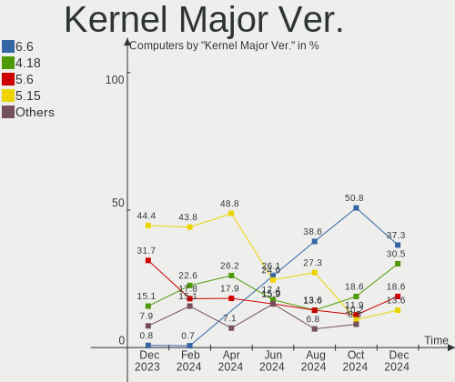
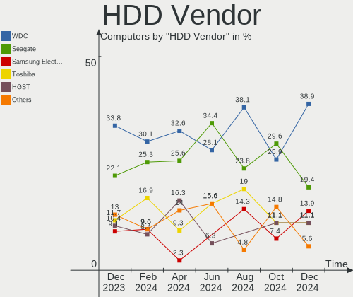
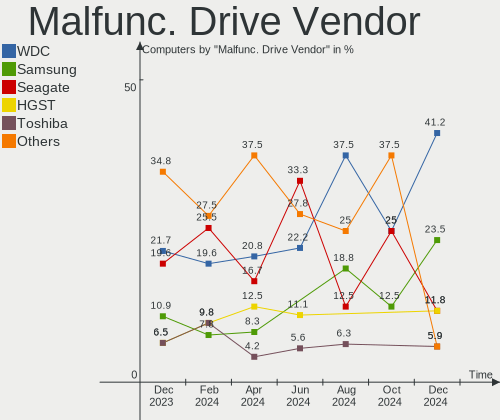
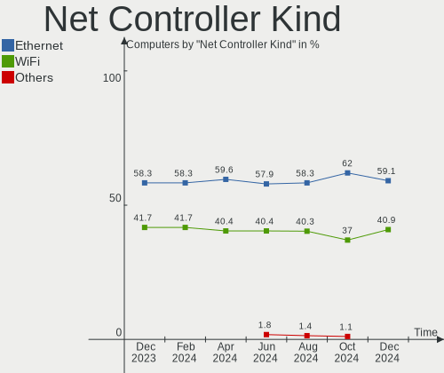

BlackPanther - Hardware Trends
------------------------------

A project to identify most popular hardware characteristics and track their change
over time based on data collected by Linux users at https://Linux-Hardware.org.

Anyone can contribute to this report by the [hw-probe](https://github.com/linuxhw/hw-probe) tool:

    sudo -E hw-probe -all -upload

This is a report for all computer types. See also reports for [desktops](/Dist/BlackPanther/Desktop/README.md) and [notebooks](/Dist/BlackPanther/Notebook/README.md).

This report is for one last month. Overall report since the beginning of time: [TestDays](https://github.com/linuxhw/TestDays)

Period: Oct, 2023.

Contents
--------

* [ System ](#system)
  - [ OS                       ](#os)
  - [ OS Family                ](#os-family)
  - [ Kernel                   ](#kernel)
  - [ Kernel Family            ](#kernel-family)
  - [ Kernel Major Ver.        ](#kernel-major-ver)
  - [ Arch                     ](#arch)
  - [ DE                       ](#de)
  - [ Display Server           ](#display-server)
  - [ Display Manager          ](#display-manager)
  - [ OS Lang                  ](#os-lang)
  - [ Boot Mode                ](#boot-mode)
  - [ Filesystem               ](#filesystem)
  - [ Part. scheme             ](#part-scheme)
  - [ Dual Boot with Linux/BSD ](#dual-boot-with-linuxbsd)
  - [ Dual Boot (Win)          ](#dual-boot-win)

* [ Board ](#board)
  - [ Vendor                   ](#vendor)
  - [ Model                    ](#model)
  - [ Model Family             ](#model-family)
  - [ MFG Year                 ](#mfg-year)
  - [ Form Factor              ](#form-factor)
  - [ Secure Boot              ](#secure-boot)
  - [ Coreboot                 ](#coreboot)
  - [ RAM Size                 ](#ram-size)
  - [ RAM Used                 ](#ram-used)
  - [ Total Drives             ](#total-drives)
  - [ Has CD-ROM               ](#has-cd-rom)
  - [ Has Ethernet             ](#has-ethernet)
  - [ Has WiFi                 ](#has-wifi)
  - [ Has Bluetooth            ](#has-bluetooth)

* [ Location ](#location)
  - [ Country                  ](#country)
  - [ City                     ](#city)

* [ Drives ](#drives)
  - [ Drive Vendor             ](#drive-vendor)
  - [ Drive Model              ](#drive-model)
  - [ HDD Vendor               ](#hdd-vendor)
  - [ SSD Vendor               ](#ssd-vendor)
  - [ Drive Kind               ](#drive-kind)
  - [ Drive Connector          ](#drive-connector)
  - [ Drive Size               ](#drive-size)
  - [ Space Total              ](#space-total)
  - [ Space Used               ](#space-used)
  - [ Malfunc. Drives          ](#malfunc-drives)
  - [ Malfunc. Drive Vendor    ](#malfunc-drive-vendor)
  - [ Malfunc. HDD Vendor      ](#malfunc-hdd-vendor)
  - [ Malfunc. Drive Kind      ](#malfunc-drive-kind)
  - [ Failed Drives            ](#failed-drives)
  - [ Failed Drive Vendor      ](#failed-drive-vendor)
  - [ Drive Status             ](#drive-status)

* [ Storage controller ](#storage-controller)
  - [ Storage Vendor           ](#storage-vendor)
  - [ Storage Model            ](#storage-model)
  - [ Storage Kind             ](#storage-kind)

* [ Processor ](#processor)
  - [ CPU Vendor               ](#cpu-vendor)
  - [ CPU Model                ](#cpu-model)
  - [ CPU Model Family         ](#cpu-model-family)
  - [ CPU Cores                ](#cpu-cores)
  - [ CPU Sockets              ](#cpu-sockets)
  - [ CPU Threads              ](#cpu-threads)
  - [ CPU Op-Modes             ](#cpu-op-modes)
  - [ CPU Microcode            ](#cpu-microcode)
  - [ CPU Microarch            ](#cpu-microarch)

* [ Graphics ](#graphics)
  - [ GPU Vendor               ](#gpu-vendor)
  - [ GPU Model                ](#gpu-model)
  - [ GPU Combo                ](#gpu-combo)
  - [ GPU Driver               ](#gpu-driver)
  - [ GPU Memory               ](#gpu-memory)

* [ Monitor ](#monitor)
  - [ Monitor Vendor           ](#monitor-vendor)
  - [ Monitor Model            ](#monitor-model)
  - [ Monitor Resolution       ](#monitor-resolution)
  - [ Monitor Diagonal         ](#monitor-diagonal)
  - [ Monitor Width            ](#monitor-width)
  - [ Aspect Ratio             ](#aspect-ratio)
  - [ Monitor Area             ](#monitor-area)
  - [ Pixel Density            ](#pixel-density)
  - [ Multiple Monitors        ](#multiple-monitors)

* [ Network ](#network)
  - [ Net Controller Vendor    ](#net-controller-vendor)
  - [ Net Controller Model     ](#net-controller-model)
  - [ Wireless Vendor          ](#wireless-vendor)
  - [ Wireless Model           ](#wireless-model)
  - [ Ethernet Vendor          ](#ethernet-vendor)
  - [ Ethernet Model           ](#ethernet-model)
  - [ Net Controller Kind      ](#net-controller-kind)
  - [ Used Controller          ](#used-controller)
  - [ NICs                     ](#nics)
  - [ IPv6                     ](#ipv6)

* [ Bluetooth ](#bluetooth)
  - [ Bluetooth Vendor         ](#bluetooth-vendor)
  - [ Bluetooth Model          ](#bluetooth-model)

* [ Sound ](#sound)
  - [ Sound Vendor             ](#sound-vendor)
  - [ Sound Model              ](#sound-model)

* [ Memory ](#memory)
  - [ Memory Vendor            ](#memory-vendor)
  - [ Memory Model             ](#memory-model)
  - [ Memory Kind              ](#memory-kind)
  - [ Memory Form Factor       ](#memory-form-factor)
  - [ Memory Size              ](#memory-size)
  - [ Memory Speed             ](#memory-speed)

* [ Printers & scanners ](#printers--scanners)
  - [ Printer Vendor           ](#printer-vendor)
  - [ Printer Model            ](#printer-model)
  - [ Scanner Vendor           ](#scanner-vendor)
  - [ Scanner Model            ](#scanner-model)

* [ Camera ](#camera)
  - [ Camera Vendor            ](#camera-vendor)
  - [ Camera Model             ](#camera-model)

* [ Security ](#security)
  - [ Fingerprint Vendor       ](#fingerprint-vendor)
  - [ Fingerprint Model        ](#fingerprint-model)
  - [ Chipcard Vendor          ](#chipcard-vendor)
  - [ Chipcard Model           ](#chipcard-model)

* [ Unsupported ](#unsupported)
  - [ Unsupported Devices      ](#unsupported-devices)
  - [ Unsupported Device Types ](#unsupported-device-types)

System
------

OS
--

Installed operating systems

| Name              | Computers | Percent |
|-------------------|-----------|---------|
| BlackPanther 18.1 | 92        | 89.32%  |
| BlackPanther 22.1 | 11        | 10.68%  |

OS Family
---------

OS without a version

| Name         | Computers | Percent |
|--------------|-----------|---------|
| BlackPanther | 103       | 100%    |

Kernel
------

Version of the Linux kernel

| Version             | Computers | Percent |
|---------------------|-----------|---------|
| 5.6.14-desktop-2bP  | 44        | 42.72%  |
| 4.18.16-desktop-1bP | 28        | 27.18%  |
| 5.15.85-desktop-1bP | 21        | 20.39%  |
| 6.3.8-desktop-1bP   | 4         | 3.88%   |
| 6.5.3-power-1bP     | 2         | 1.94%   |
| 6.4.3-desktop-1bP   | 2         | 1.94%   |
| 6.5.7-power-1bP     | 1         | 0.97%   |
| 6.2.9-desktop-1bP   | 1         | 0.97%   |

Kernel Family
-------------

Linux kernel without a distro release

| Version | Computers | Percent |
|---------|-----------|---------|
| 5.6.14  | 44        | 42.72%  |
| 4.18.16 | 28        | 27.18%  |
| 5.15.85 | 21        | 20.39%  |
| 6.3.8   | 4         | 3.88%   |
| 6.5.3   | 2         | 1.94%   |
| 6.4.3   | 2         | 1.94%   |
| 6.5.7   | 1         | 0.97%   |
| 6.2.9   | 1         | 0.97%   |

Kernel Major Ver.
-----------------

Linux kernel major version

| Version | Computers | Percent |
|---------|-----------|---------|
| 5.6     | 44        | 42.72%  |
| 4.18    | 28        | 27.18%  |
| 5.15    | 21        | 20.39%  |
| 6.3     | 4         | 3.88%   |
| 6.5     | 3         | 2.91%   |
| 6.4     | 2         | 1.94%   |
| 6.2     | 1         | 0.97%   |

Arch
----

OS architecture (x86_64, i586, etc.)

| Name   | Computers | Percent |
|--------|-----------|---------|
| x86_64 | 103       | 100%    |

DE
--

Desktop Environment

| Name    | Computers | Percent |
|---------|-----------|---------|
| KDE5    | 98        | 95.15%  |
| Unknown | 5         | 4.85%   |

Display Server
--------------

X11 or Wayland

| Name | Computers | Percent |
|------|-----------|---------|
| X11  | 103       | 100%    |

Display Manager
---------------

SDDM, LightDM, etc.

| Name | Computers | Percent |
|------|-----------|---------|
| SDDM | 103       | 100%    |

OS Lang
-------

Language

| Lang    | Computers | Percent |
|---------|-----------|---------|
| Unknown | 103       | 100%    |

Boot Mode
---------

EFI or BIOS

| Mode | Computers | Percent |
|------|-----------|---------|
| EFI  | 52        | 50.49%  |
| BIOS | 51        | 49.51%  |

Filesystem
----------

Type of filesystem

| Type    | Computers | Percent |
|---------|-----------|---------|
| Overlay | 53        | 51.46%  |
| Ext4    | 48        | 46.6%   |
| Btrfs   | 2         | 1.94%   |

Part. scheme
------------

Scheme of partitioning

| Type | Computers | Percent |
|------|-----------|---------|
| GPT  | 61        | 59.22%  |
| MBR  | 42        | 40.78%  |

Dual Boot with Linux/BSD
------------------------

Hosting more than one Linux/BSD

| Dual boot | Computers | Percent |
|-----------|-----------|---------|
| No        | 61        | 59.22%  |
| Yes       | 42        | 40.78%  |

Dual Boot (Win)
---------------

Hosting Linux and Windows

| Dual boot | Computers | Percent |
|-----------|-----------|---------|
| No        | 59        | 57.28%  |
| Yes       | 44        | 42.72%  |

Board
-----

Vendor
------

Motherboard manufacturer

| Name                | Computers | Percent |
|---------------------|-----------|---------|
| Lenovo              | 18        | 17.48%  |
| ASUSTek Computer    | 15        | 14.56%  |
| Gigabyte Technology | 14        | 13.59%  |
| Dell                | 14        | 13.59%  |
| Hewlett-Packard     | 9         | 8.74%   |
| MSI                 | 7         | 6.8%    |
| Fujitsu             | 4         | 3.88%   |
| ASRock              | 4         | 3.88%   |
| eMachines           | 3         | 2.91%   |
| Acer                | 3         | 2.91%   |
| Sony                | 2         | 1.94%   |
| Fujitsu Siemens     | 2         | 1.94%   |
| Apple               | 2         | 1.94%   |
| Samsung Electronics | 1         | 0.97%   |
| Pegatron            | 1         | 0.97%   |
| Microsoft           | 1         | 0.97%   |
| Medion              | 1         | 0.97%   |
| GPU Company         | 1         | 0.97%   |
| AWOW                | 1         | 0.97%   |

Model
-----

Motherboard model

| Name                                        | Computers | Percent |
|---------------------------------------------|-----------|---------|
| MSI MS-7C91                                 | 2         | 1.94%   |
| MSI MS-7817                                 | 2         | 1.94%   |
| HP EliteDesk 705 G3 SFF                     | 2         | 1.94%   |
| Sony VPCS13V9E                              | 1         | 0.97%   |
| Sony VPCEH2N1E                              | 1         | 0.97%   |
| Samsung RV411/RV511/E3511/S3511/RV711/E3411 | 1         | 0.97%   |
| Pegatron Elite 7200 MT Business PC          | 1         | 0.97%   |
| MSI MS-7923                                 | 1         | 0.97%   |
| MSI MS-7680                                 | 1         | 0.97%   |
| MSI GT60 2OC/2OD                            | 1         | 0.97%   |
| Microsoft Surface Pro                       | 1         | 0.97%   |
| Medion MS-7748                              | 1         | 0.97%   |
| Lenovo V15-ADA 82C7                         | 1         | 0.97%   |
| Lenovo ThinkStation P520 30BFS44D04         | 1         | 0.97%   |
| Lenovo ThinkStation D20 4158AF8             | 1         | 0.97%   |
| Lenovo ThinkPad X230 2333A91                | 1         | 0.97%   |
| Lenovo ThinkPad T61 889855G                 | 1         | 0.97%   |
| Lenovo ThinkPad T420 4236B87                | 1         | 0.97%   |
| Lenovo ThinkCentre M93p 10A7003AUK          | 1         | 0.97%   |
| Lenovo ThinkCentre M73 10B6001SUS           | 1         | 0.97%   |
| Lenovo ThinkCentre M715s 10MCS03C00         | 1         | 0.97%   |
| Lenovo IdeaPad Y700-15ISK 80NV              | 1         | 0.97%   |
| Lenovo IdeaPad 330-15IKB 81DE               | 1         | 0.97%   |
| Lenovo IdeaPad 110-15ISK 80UD               | 1         | 0.97%   |
| Lenovo G505s 20255                          | 1         | 0.97%   |
| Lenovo G505 20240                           | 1         | 0.97%   |
| Lenovo G50-30 80G0                          | 1         | 0.97%   |
| Lenovo Flex 2-15D 20377                     | 1         | 0.97%   |
| Lenovo E50-80 80J2                          | 1         | 0.97%   |
| Lenovo 1730-A1G                             | 1         | 0.97%   |
| HP ProBook 6570b                            | 1         | 0.97%   |
| HP Notebook                                 | 1         | 0.97%   |
| HP HDX 16                                   | 1         | 0.97%   |
| HP Compaq Pro 6300 SFF                      | 1         | 0.97%   |
| HP Compaq Pro 6300 MT                       | 1         | 0.97%   |
| HP Compaq dc7800 Small Form Factor          | 1         | 0.97%   |
| HP Compaq 8200 Elite CMT PC                 | 1         | 0.97%   |
| GPU Company GWAP42424                       | 1         | 0.97%   |
| Gigabyte Z390 UD                            | 1         | 0.97%   |
| Gigabyte P67A-D3-B3                         | 1         | 0.97%   |

Model Family
------------

Motherboard model prefix

| Name                  | Computers | Percent |
|-----------------------|-----------|---------|
| Dell Inspiron         | 8         | 7.77%   |
| HP Compaq             | 4         | 3.88%   |
| Lenovo ThinkPad       | 3         | 2.91%   |
| Lenovo ThinkCentre    | 3         | 2.91%   |
| Lenovo IdeaPad        | 3         | 2.91%   |
| Dell Latitude         | 3         | 2.91%   |
| MSI MS-7C91           | 2         | 1.94%   |
| MSI MS-7817           | 2         | 1.94%   |
| Lenovo ThinkStation   | 2         | 1.94%   |
| HP EliteDesk          | 2         | 1.94%   |
| Fujitsu LIFEBOOK      | 2         | 1.94%   |
| Fujitsu ESPRIMO       | 2         | 1.94%   |
| Dell Precision        | 2         | 1.94%   |
| ASUS PRIME            | 2         | 1.94%   |
| Acer Aspire           | 2         | 1.94%   |
| Sony VPCS13V9E        | 1         | 0.97%   |
| Sony VPCEH2N1E        | 1         | 0.97%   |
| Samsung RV411         | 1         | 0.97%   |
| Pegatron Elite        | 1         | 0.97%   |
| MSI MS-7923           | 1         | 0.97%   |
| MSI MS-7680           | 1         | 0.97%   |
| MSI GT60              | 1         | 0.97%   |
| Microsoft Surface     | 1         | 0.97%   |
| Medion MS-7748        | 1         | 0.97%   |
| Lenovo V15-ADA        | 1         | 0.97%   |
| Lenovo G505s          | 1         | 0.97%   |
| Lenovo G505           | 1         | 0.97%   |
| Lenovo G50-30         | 1         | 0.97%   |
| Lenovo Flex           | 1         | 0.97%   |
| Lenovo E50-80         | 1         | 0.97%   |
| Lenovo 1730-A1G       | 1         | 0.97%   |
| HP ProBook            | 1         | 0.97%   |
| HP Notebook           | 1         | 0.97%   |
| HP HDX                | 1         | 0.97%   |
| GPU Company GWAP42424 | 1         | 0.97%   |
| Gigabyte Z390         | 1         | 0.97%   |
| Gigabyte P67A-D3-B3   | 1         | 0.97%   |
| Gigabyte J4005ND2P-CF | 1         | 0.97%   |
| Gigabyte H81M-HD3     | 1         | 0.97%   |
| Gigabyte H61MA-D3V    | 1         | 0.97%   |

MFG Year
--------

Motherboard manufacture year

| Year | Computers | Percent |
|------|-----------|---------|
| 2011 | 14        | 13.59%  |
| 2013 | 11        | 10.68%  |
| 2014 | 10        | 9.71%   |
| 2012 | 10        | 9.71%   |
| 2015 | 9         | 8.74%   |
| 2018 | 8         | 7.77%   |
| 2010 | 8         | 7.77%   |
| 2020 | 6         | 5.83%   |
| 2009 | 6         | 5.83%   |
| 2008 | 5         | 4.85%   |
| 2019 | 4         | 3.88%   |
| 2017 | 3         | 2.91%   |
| 2016 | 3         | 2.91%   |
| 2021 | 2         | 1.94%   |
| 2007 | 2         | 1.94%   |
| 2022 | 1         | 0.97%   |
| 2006 | 1         | 0.97%   |

Form Factor
-----------

Physical design of the computer

| Name       | Computers | Percent |
|------------|-----------|---------|
| Desktop    | 52        | 50.49%  |
| Notebook   | 46        | 44.66%  |
| All in one | 4         | 3.88%   |
| Tablet     | 1         | 0.97%   |

Secure Boot
-----------

Enabled or disabled

| State    | Computers | Percent |
|----------|-----------|---------|
| Disabled | 103       | 100%    |

Coreboot
--------

Have coreboot on board

| Used | Computers | Percent |
|------|-----------|---------|
| No   | 103       | 100%    |

RAM Size
--------

Total RAM memory

| Size in GB | Computers | Percent |
|------------|-----------|---------|
| 8.01-16.0  | 28        | 27.18%  |
| 3.01-4.0   | 25        | 24.27%  |
| 4.01-8.0   | 23        | 22.33%  |
| 16.01-24.0 | 11        | 10.68%  |
| 32.01-64.0 | 7         | 6.8%    |
| 2.01-3.0   | 4         | 3.88%   |
| 24.01-32.0 | 3         | 2.91%   |
| 1.01-2.0   | 2         | 1.94%   |

RAM Used
--------

Used RAM memory

| Used GB  | Computers | Percent |
|----------|-----------|---------|
| 1.01-2.0 | 37        | 35.92%  |
| 0.51-1.0 | 37        | 35.92%  |
| 0.01-0.5 | 18        | 17.48%  |
| 2.01-3.0 | 5         | 4.85%   |
| 3.01-4.0 | 4         | 3.88%   |
| 4.01-8.0 | 2         | 1.94%   |

Total Drives
------------

Number of drives on board

| Drives | Computers | Percent |
|--------|-----------|---------|
| 1      | 61        | 59.22%  |
| 2      | 27        | 26.21%  |
| 3      | 8         | 7.77%   |
| 4      | 4         | 3.88%   |
| 5      | 2         | 1.94%   |
| 0      | 1         | 0.97%   |

Has CD-ROM
----------

Has CD-ROM on board

| Presented | Computers | Percent |
|-----------|-----------|---------|
| Yes       | 61        | 59.22%  |
| No        | 42        | 40.78%  |

Has Ethernet
------------

Has Ethernet on board

| Presented | Computers | Percent |
|-----------|-----------|---------|
| Yes       | 100       | 97.09%  |
| No        | 3         | 2.91%   |

Has WiFi
--------

Has WiFi module

| Presented | Computers | Percent |
|-----------|-----------|---------|
| Yes       | 68        | 66.02%  |
| No        | 35        | 33.98%  |

Has Bluetooth
-------------

Has Bluetooth module

| Presented | Computers | Percent |
|-----------|-----------|---------|
| Yes       | 52        | 50.49%  |
| No        | 51        | 49.51%  |

Location
--------

Country
-------

Geographic location (country)

| Country  | Computers | Percent |
|----------|-----------|---------|
| Hungary  | 90        | 87.38%  |
| UK       | 4         | 3.88%   |
| Germany  | 3         | 2.91%   |
| USA      | 2         | 1.94%   |
| Slovakia | 1         | 0.97%   |
| Romania  | 1         | 0.97%   |
| France   | 1         | 0.97%   |
| Austria  | 1         | 0.97%   |

City
----

Geographic location (city)

| City                    | Computers | Percent |
|-------------------------|-----------|---------|
| Budapest                | 27        | 26.21%  |
| Zalaegerszeg            | 3         | 2.91%   |
| Toeroekbalint           | 3         | 2.91%   |
| Tamasi                  | 3         | 2.91%   |
| Szeghalom               | 3         | 2.91%   |
| Pomaz                   | 3         | 2.91%   |
| Tatabánya              | 2         | 1.94%   |
| Szombathely             | 2         | 1.94%   |
| Szolnok                 | 2         | 1.94%   |
| Pfaffenhofen an der Ilm | 2         | 1.94%   |
| Pécs                   | 2         | 1.94%   |
| Nagykoroes              | 2         | 1.94%   |
| Kiskunhalas             | 2         | 1.94%   |
| Harlow                  | 2         | 1.94%   |
| Győr                   | 2         | 1.94%   |
| Fertoszentmiklos        | 2         | 1.94%   |
| Berettyóújfalu        | 2         | 1.94%   |
| Balatonfuered           | 2         | 1.94%   |
| Agfalva                 | 2         | 1.94%   |
| Zichyujfalu             | 1         | 0.97%   |
| Zalău                  | 1         | 0.97%   |
| Veszprém               | 1         | 0.97%   |
| Tornaľa                | 1         | 0.97%   |
| Tolna                   | 1         | 0.97%   |
| Szigetszentmiklos       | 1         | 0.97%   |
| Szigethalom             | 1         | 0.97%   |
| Szentendre              | 1         | 0.97%   |
| Szekszárd              | 1         | 0.97%   |
| Siófok                 | 1         | 0.97%   |
| Sarkad                  | 1         | 0.97%   |
| Rockland                | 1         | 0.97%   |
| Regensburg              | 1         | 0.97%   |
| Oroshaza                | 1         | 0.97%   |
| Nancy                   | 1         | 0.97%   |
| Nagykanizsa             | 1         | 0.97%   |
| Mandok                  | 1         | 0.97%   |
| Lambeth                 | 1         | 0.97%   |
| Kiskunmajsa             | 1         | 0.97%   |
| Karcag                  | 1         | 0.97%   |
| Jaszdozsa               | 1         | 0.97%   |

Drives
------

Drive Vendor
------------

Hard drive vendors

| Vendor                    | Computers | Drives | Percent |
|---------------------------|-----------|--------|---------|
| Samsung Electronics       | 25        | 29     | 16.56%  |
| WDC                       | 22        | 29     | 14.57%  |
| Seagate                   | 18        | 18     | 11.92%  |
| Kingston                  | 17        | 20     | 11.26%  |
| Toshiba                   | 10        | 10     | 6.62%   |
| SPCC                      | 7         | 7      | 4.64%   |
| SanDisk                   | 6         | 6      | 3.97%   |
| Intel                     | 4         | 4      | 2.65%   |
| Crucial                   | 4         | 4      | 2.65%   |
| Unknown                   | 3         | 4      | 1.99%   |
| Intenso                   | 3         | 3      | 1.99%   |
| Hitachi                   | 3         | 3      | 1.99%   |
| HGST                      | 3         | 3      | 1.99%   |
| A-DATA Technology         | 3         | 4      | 1.99%   |
| PNY                       | 2         | 2      | 1.32%   |
| Micron Technology         | 2         | 2      | 1.32%   |
| LITEON                    | 2         | 2      | 1.32%   |
| Gigabyte Technology       | 2         | 2      | 1.32%   |
| Apacer                    | 2         | 2      | 1.32%   |
| Zheino                    | 1         | 1      | 0.66%   |
| XPG                       | 1         | 1      | 0.66%   |
| Wibtek                    | 1         | 1      | 0.66%   |
| Verbatim                  | 1         | 1      | 0.66%   |
| Transcend                 | 1         | 1      | 0.66%   |
| Team                      | 1         | 1      | 0.66%   |
| SK hynix                  | 1         | 1      | 0.66%   |
| Netac                     | 1         | 1      | 0.66%   |
| Micron/Crucial Technology | 1         | 1      | 0.66%   |
| JMicron Technology        | 1         | 1      | 0.66%   |
| Fujitsu                   | 1         | 1      | 0.66%   |
| China                     | 1         | 1      | 0.66%   |
| Unknown                   | 1         | 1      | 0.66%   |

Drive Model
-----------

Hard drive models

| Model                              | Computers | Percent |
|------------------------------------|-----------|---------|
| Kingston SA400S37240G 240GB SSD    | 6         | 3.66%   |
| Toshiba DT01ACA100 1TB             | 4         | 2.44%   |
| SPCC Solid State Disk 256GB        | 4         | 2.44%   |
| Samsung SSD 850 EVO 250GB          | 4         | 2.44%   |
| Kingston SA400S37480G 480GB SSD    | 4         | 2.44%   |
| Samsung SSD 870 EVO 250GB          | 3         | 1.83%   |
| Samsung SSD 850 EVO 120GB          | 3         | 1.83%   |
| Kingston SA400S37120G 120GB SSD    | 3         | 1.83%   |
| WDC WD30EFRX-68EUZN0 3TB           | 2         | 1.22%   |
| WDC WD20EZRZ-00Z5HB0 2TB           | 2         | 1.22%   |
| WDC WD10SPCX-24HWST1 1TB           | 2         | 1.22%   |
| Toshiba DT01ACA050 500GB           | 2         | 1.22%   |
| SPCC Solid State Disk 128GB        | 2         | 1.22%   |
| Seagate ST500LT012-1DG142 500GB    | 2         | 1.22%   |
| Seagate ST500DM002-1BD142 500GB    | 2         | 1.22%   |
| Seagate ST1000LM024 HN-M101MBB 1TB | 2         | 1.22%   |
| Samsung SSD 970 EVO Plus 500GB     | 2         | 1.22%   |
| Samsung SSD 860 EVO 500GB          | 2         | 1.22%   |
| Kingston SNV2S500G 500GB           | 2         | 1.22%   |
| Kingston SA400S37960G 960GB SSD    | 2         | 1.22%   |
| Crucial CT1000MX500SSD4 1TB        | 2         | 1.22%   |
| Apacer AS340 240GB SSD             | 2         | 1.22%   |
| A-DATA SU800 128GB SSD             | 2         | 1.22%   |
| Zheino CHN-NGFFNV2280-256 256GB    | 1         | 0.61%   |
| XPG SPECTRIX S40G 1TB              | 1         | 0.61%   |
| Wibtek W800S 128GB SSD             | 1         | 0.61%   |
| WDC WDS500G2B0A 500GB SSD          | 1         | 0.61%   |
| WDC WDS240G2G0B-00EPW0 240GB SSD   | 1         | 0.61%   |
| WDC WDS120G2G0B-00EPW0 120GB SSD   | 1         | 0.61%   |
| WDC WD800JD-75MSA3 80GB            | 1         | 0.61%   |
| WDC WD800AAJS-60PSA0 80GB          | 1         | 0.61%   |
| WDC WD5003AZEX-00MK2A0 500GB       | 1         | 0.61%   |
| WDC WD5000BPKT-75PK4T0 500GB       | 1         | 0.61%   |
| WDC WD5000BEKT-22KA9T0 500GB       | 1         | 0.61%   |
| WDC WD5000AAKX-60U6AA0 500GB       | 1         | 0.61%   |
| WDC WD5000AAKX-329BA0 500GB        | 1         | 0.61%   |
| WDC WD5000AAKS-00UU3A0 500GB       | 1         | 0.61%   |
| WDC WD5000AAKS-007AA0 500GB        | 1         | 0.61%   |
| WDC WD3200BPVT-80ZEST0 320GB       | 1         | 0.61%   |
| WDC WD30EZRZ-00GXCB0 3TB           | 1         | 0.61%   |

HDD Vendor
----------

Hard disk drive vendors

| Vendor              | Computers | Drives | Percent |
|---------------------|-----------|--------|---------|
| WDC                 | 20        | 26     | 33.9%   |
| Seagate             | 18        | 18     | 30.51%  |
| Toshiba             | 9         | 9      | 15.25%  |
| Samsung Electronics | 5         | 5      | 8.47%   |
| Hitachi             | 3         | 3      | 5.08%   |
| HGST                | 3         | 3      | 5.08%   |
| Fujitsu             | 1         | 1      | 1.69%   |

SSD Vendor
----------

Solid state drive vendors

| Vendor              | Computers | Drives | Percent |
|---------------------|-----------|--------|---------|
| Samsung Electronics | 18        | 19     | 24.66%  |
| Kingston            | 15        | 18     | 20.55%  |
| SPCC                | 6         | 6      | 8.22%   |
| SanDisk             | 4         | 4      | 5.48%   |
| Crucial             | 4         | 4      | 5.48%   |
| WDC                 | 3         | 3      | 4.11%   |
| Intenso             | 3         | 3      | 4.11%   |
| Intel               | 3         | 3      | 4.11%   |
| A-DATA Technology   | 3         | 4      | 4.11%   |
| PNY                 | 2         | 2      | 2.74%   |
| Micron Technology   | 2         | 2      | 2.74%   |
| Apacer              | 2         | 2      | 2.74%   |
| Wibtek              | 1         | 1      | 1.37%   |
| Verbatim            | 1         | 1      | 1.37%   |
| Toshiba             | 1         | 1      | 1.37%   |
| Team                | 1         | 1      | 1.37%   |
| Netac               | 1         | 1      | 1.37%   |
| LITEON              | 1         | 1      | 1.37%   |
| Gigabyte Technology | 1         | 1      | 1.37%   |
| China               | 1         | 1      | 1.37%   |

Drive Kind
----------

HDD or SSD

| Kind    | Computers | Drives | Percent |
|---------|-----------|--------|---------|
| SSD     | 64        | 78     | 45.71%  |
| HDD     | 55        | 65     | 39.29%  |
| NVMe    | 17        | 19     | 12.14%  |
| MMC     | 3         | 3      | 2.14%   |
| Unknown | 1         | 2      | 0.71%   |

Drive Connector
---------------

SATA, SAS, NVMe, etc.

| Type | Computers | Drives | Percent |
|------|-----------|--------|---------|
| SATA | 94        | 139    | 78.33%  |
| NVMe | 17        | 18     | 14.17%  |
| SAS  | 6         | 7      | 5%      |
| MMC  | 3         | 3      | 2.5%    |

Drive Size
----------

Size of hard drive

| Size in TB | Computers | Drives | Percent |
|------------|-----------|--------|---------|
| 0.01-0.5   | 81        | 102    | 68.64%  |
| 0.51-1.0   | 29        | 31     | 24.58%  |
| 1.01-2.0   | 5         | 5      | 4.24%   |
| 2.01-3.0   | 3         | 5      | 2.54%   |

Space Total
-----------

Amount of disk space available on the file system

| Size in GB     | Computers | Percent |
|----------------|-----------|---------|
| Unknown        | 52        | 50.49%  |
| 101-250        | 22        | 21.36%  |
| 251-500        | 11        | 10.68%  |
| 501-1000       | 7         | 6.8%    |
| 51-100         | 4         | 3.88%   |
| 2001-3000      | 2         | 1.94%   |
| 1001-2000      | 2         | 1.94%   |
| More than 3000 | 1         | 0.97%   |
| 21-50          | 1         | 0.97%   |
| 1-20           | 1         | 0.97%   |

Space Used
----------

Amount of used disk space

| Used GB   | Computers | Percent |
|-----------|-----------|---------|
| Unknown   | 52        | 50.49%  |
| 1-20      | 29        | 28.16%  |
| 21-50     | 8         | 7.77%   |
| 51-100    | 5         | 4.85%   |
| 101-250   | 3         | 2.91%   |
| 1001-2000 | 3         | 2.91%   |
| 251-500   | 2         | 1.94%   |
| 2001-3000 | 1         | 0.97%   |

Malfunc. Drives
---------------

Drive models with a malfunction

| Model                                            | Computers | Drives | Percent |
|--------------------------------------------------|-----------|--------|---------|
| Seagate ST500LT012-1DG142 500GB                  | 2         | 2      | 6.9%    |
| WDC WD5000BEKT-22KA9T0 500GB                     | 1         | 1      | 3.45%   |
| WDC WD5000AAKS-00UU3A0 500GB                     | 1         | 1      | 3.45%   |
| WDC WD5000AAKS-007AA0 500GB                      | 1         | 1      | 3.45%   |
| WDC WD3200BPVT-80ZEST0 320GB                     | 1         | 1      | 3.45%   |
| WDC WD10PURZ-85U8XY0 1TB                         | 1         | 1      | 3.45%   |
| WDC WD10JPLX-00MBPT0 1TB                         | 1         | 1      | 3.45%   |
| Toshiba MQ01ABD050 500GB                         | 1         | 1      | 3.45%   |
| Seagate ST980813AS 80GB                          | 1         | 1      | 3.45%   |
| Seagate ST9160310AS 160GB                        | 1         | 1      | 3.45%   |
| Seagate ST500LT012-9WS142 500GB                  | 1         | 1      | 3.45%   |
| Seagate ST500LM000-SSHD-8GB                      | 1         | 1      | 3.45%   |
| Seagate ST500DM002-1BD142 500GB                  | 1         | 1      | 3.45%   |
| Seagate ST3500418AS 500GB                        | 1         | 1      | 3.45%   |
| Seagate ST1000LM024 HN-M101MBB 1TB               | 1         | 1      | 3.45%   |
| Seagate ST1000DL002-9TT153 1TB                   | 1         | 1      | 3.45%   |
| Samsung Electronics SSD 750 EVO 250GB            | 1         | 1      | 3.45%   |
| Samsung Electronics MZ7LN256HMJP-000H1 256GB SSD | 1         | 1      | 3.45%   |
| Samsung Electronics HD200HJ 200GB                | 1         | 1      | 3.45%   |
| Samsung Electronics HD103UJ 1TB                  | 1         | 1      | 3.45%   |
| Kingston SA400S37480G 480GB SSD                  | 1         | 1      | 3.45%   |
| Kingston SA400S37120G 120GB SSD                  | 1         | 1      | 3.45%   |
| Intel SSDSC2KF240H6L 240GB                       | 1         | 1      | 3.45%   |
| Intel SSDSC2BF180A4L 180GB                       | 1         | 1      | 3.45%   |
| Hitachi HTS723232A7A364 320GB                    | 1         | 1      | 3.45%   |
| Hitachi HTS545050A7E380 500GB                    | 1         | 1      | 3.45%   |
| Hitachi HTS543225L9A300 250GB                    | 1         | 1      | 3.45%   |
| A-DATA Technology SP600 64GB SSD                 | 1         | 1      | 3.45%   |

Malfunc. Drive Vendor
---------------------

Vendors of faulty drives

| Vendor              | Computers | Drives | Percent |
|---------------------|-----------|--------|---------|
| Seagate             | 10        | 10     | 35.71%  |
| WDC                 | 5         | 6      | 17.86%  |
| Samsung Electronics | 4         | 4      | 14.29%  |
| Hitachi             | 3         | 3      | 10.71%  |
| Kingston            | 2         | 2      | 7.14%   |
| Intel               | 2         | 2      | 7.14%   |
| Toshiba             | 1         | 1      | 3.57%   |
| A-DATA Technology   | 1         | 1      | 3.57%   |

Malfunc. HDD Vendor
-------------------

Vendors of faulty HDD drives

| Vendor              | Computers | Drives | Percent |
|---------------------|-----------|--------|---------|
| Seagate             | 10        | 10     | 47.62%  |
| WDC                 | 5         | 6      | 23.81%  |
| Hitachi             | 3         | 3      | 14.29%  |
| Samsung Electronics | 2         | 2      | 9.52%   |
| Toshiba             | 1         | 1      | 4.76%   |

Malfunc. Drive Kind
-------------------

Kinds of faulty drives

| Kind | Computers | Drives | Percent |
|------|-----------|--------|---------|
| HDD  | 20        | 22     | 74.07%  |
| SSD  | 7         | 7      | 25.93%  |

Failed Drives
-------------

Failed drive models

Zero info for selected period =(

Failed Drive Vendor
-------------------

Failed drive vendors

Zero info for selected period =(

Drive Status
------------

Number of failed and malfunc. drives

| Status   | Computers | Drives | Percent |
|----------|-----------|--------|---------|
| Works    | 85        | 127    | 70.25%  |
| Malfunc  | 27        | 29     | 22.31%  |
| Detected | 9         | 11     | 7.44%   |

Storage controller
------------------

Storage Vendor
--------------

Storage controller vendors

| Vendor                      | Computers | Percent |
|-----------------------------|-----------|---------|
| Intel                       | 74        | 60.66%  |
| AMD                         | 25        | 20.49%  |
| Samsung Electronics         | 5         | 4.1%    |
| Nvidia                      | 3         | 2.46%   |
| Silicon Motion              | 2         | 1.64%   |
| SanDisk                     | 2         | 1.64%   |
| Phison Electronics          | 2         | 1.64%   |
| Kingston Technology Company | 2         | 1.64%   |
| SK hynix                    | 1         | 0.82%   |
| Silicon Image               | 1         | 0.82%   |
| Realtek Semiconductor       | 1         | 0.82%   |
| Micron/Crucial Technology   | 1         | 0.82%   |
| Marvell Technology Group    | 1         | 0.82%   |
| Lite-On Technology          | 1         | 0.82%   |
| JMicron Technology          | 1         | 0.82%   |

Storage Model
-------------

Storage controller models

| Model                                                                                   | Computers | Percent |
|-----------------------------------------------------------------------------------------|-----------|---------|
| AMD FCH SATA Controller [AHCI mode]                                                     | 11        | 7.43%   |
| Intel 8 Series/C220 Series Chipset Family 6-port SATA Controller 1 [AHCI mode]          | 8         | 5.41%   |
| Intel Wildcat Point-LP SATA Controller [AHCI Mode]                                      | 5         | 3.38%   |
| Intel Celeron/Pentium Silver Processor SATA Controller                                  | 4         | 2.7%    |
| Intel 82801 Mobile SATA Controller [RAID mode]                                          | 4         | 2.7%    |
| Intel 7 Series Chipset Family 6-port SATA Controller [AHCI mode]                        | 4         | 2.7%    |
| Intel 6 Series/C200 Series Chipset Family 6 port Mobile SATA AHCI Controller            | 4         | 2.7%    |
| Intel 200 Series PCH SATA controller [AHCI mode]                                        | 4         | 2.7%    |
| Samsung NVMe SSD Controller SM981/PM981/PM983                                           | 3         | 2.03%   |
| Intel Q170/Q150/B150/H170/H110/Z170/CM236 Chipset SATA Controller [AHCI Mode]           | 3         | 2.03%   |
| Intel 82801IBM/IEM (ICH9M/ICH9M-E) 4 port SATA Controller [AHCI mode]                   | 3         | 2.03%   |
| Intel 82801HM/HEM (ICH8M/ICH8M-E) SATA Controller [AHCI mode]                           | 3         | 2.03%   |
| Intel 82801HM/HEM (ICH8M/ICH8M-E) IDE Controller                                        | 3         | 2.03%   |
| Intel 6 Series/C200 Series Chipset Family Desktop SATA Controller (IDE mode, ports 4-5) | 3         | 2.03%   |
| Intel 6 Series/C200 Series Chipset Family Desktop SATA Controller (IDE mode, ports 0-3) | 3         | 2.03%   |
| Intel 6 Series/C200 Series Chipset Family 6 port Desktop SATA AHCI Controller           | 3         | 2.03%   |
| AMD SB7x0/SB8x0/SB9x0 SATA Controller [IDE mode]                                        | 3         | 2.03%   |
| AMD SB7x0/SB8x0/SB9x0 SATA Controller [AHCI mode]                                       | 3         | 2.03%   |
| AMD SB7x0/SB8x0/SB9x0 IDE Controller                                                    | 3         | 2.03%   |
| AMD FCH SATA Controller [IDE mode]                                                      | 3         | 2.03%   |
| AMD 500 Series Chipset SATA Controller                                                  | 3         | 2.03%   |
| AMD 300 Series Chipset SATA Controller                                                  | 3         | 2.03%   |
| Silicon Motion SM2263EN/SM2263XT (DRAM-less) NVMe SSD Controllers                       | 2         | 1.35%   |
| Kingston Company NV2 NVMe SSD SM2267XT                                                  | 2         | 1.35%   |
| Intel Tiger Lake-LP SATA Controller                                                     | 2         | 1.35%   |
| Intel Sunrise Point-LP SATA Controller [AHCI mode]                                      | 2         | 1.35%   |
| Intel NM10/ICH7 Family SATA Controller [IDE mode]                                       | 2         | 1.35%   |
| Intel Atom Processor E3800 Series SATA AHCI Controller                                  | 2         | 1.35%   |
| Intel 82801G (ICH7 Family) IDE Controller                                               | 2         | 1.35%   |
| Intel 7 Series/C210 Series Chipset Family 6-port SATA Controller [AHCI mode]            | 2         | 1.35%   |
| Intel 5 Series/3400 Series Chipset 6 port SATA AHCI Controller                          | 2         | 1.35%   |
| Intel 5 Series/3400 Series Chipset 4 port SATA AHCI Controller                          | 2         | 1.35%   |
| AMD FCH IDE Controller                                                                  | 2         | 1.35%   |
| AMD 400 Series Chipset SATA Controller                                                  | 2         | 1.35%   |
| SK hynix Gold P31/BC711/PC711 NVMe Solid State Drive                                    | 1         | 0.68%   |
| Silicon Image SiI 3531 [SATALink/SATARaid] Serial ATA Controller                        | 1         | 0.68%   |
| SanDisk WD Blue SN570 NVMe SSD 2TB                                                      | 1         | 0.68%   |
| SanDisk Ultra 3D / WD Blue SN570 NVMe SSD (DRAM-less)                                   | 1         | 0.68%   |
| Samsung NVMe SSD SM0032L                                                                | 1         | 0.68%   |
| Samsung NVMe SSD Controller SM961/PM961/SM963                                           | 1         | 0.68%   |

Storage Kind
------------

Kind of storage controller (IDE, SATA, NVMe, SAS, ...)

| Kind | Computers | Percent |
|------|-----------|---------|
| SATA | 87        | 66.41%  |
| IDE  | 20        | 15.27%  |
| NVMe | 17        | 12.98%  |
| RAID | 7         | 5.34%   |

Processor
---------

CPU Vendor
----------

Processor vendors

| Vendor | Computers | Percent |
|--------|-----------|---------|
| Intel  | 76        | 73.79%  |
| AMD    | 27        | 26.21%  |

CPU Model
---------

Processor models

| Model                                       | Computers | Percent |
|---------------------------------------------|-----------|---------|
| Intel Core i3-4130 CPU @ 3.40GHz            | 3         | 2.91%   |
| Intel Core i5-7300U CPU @ 2.60GHz           | 2         | 1.94%   |
| Intel Core i5-5200U CPU @ 2.20GHz           | 2         | 1.94%   |
| Intel Core i5-3320M CPU @ 2.60GHz           | 2         | 1.94%   |
| Intel Core i5 CPU M 460 @ 2.53GHz           | 2         | 1.94%   |
| Intel Core i3-5005U CPU @ 2.00GHz           | 2         | 1.94%   |
| Intel Core i3-2100 CPU @ 3.10GHz            | 2         | 1.94%   |
| Intel 11th Gen Core i5-1135G7 @ 2.40GHz     | 2         | 1.94%   |
| AMD Ryzen 7 5800X 8-Core Processor          | 2         | 1.94%   |
| AMD PRO A10-8770 R7, 10 COMPUTE CORES 4C+6G | 2         | 1.94%   |
| Intel Xeon W-2135 CPU @ 3.70GHz             | 1         | 0.97%   |
| Intel Xeon CPU X5677 @ 3.47GHz              | 1         | 0.97%   |
| Intel Xeon CPU E5530 @ 2.40GHz              | 1         | 0.97%   |
| Intel Xeon CPU E5-2696 v3 @ 2.30GHz         | 1         | 0.97%   |
| Intel Xeon CPU E3-1230 V2 @ 3.30GHz         | 1         | 0.97%   |
| Intel Pentium Silver N5000 CPU @ 1.10GHz    | 1         | 0.97%   |
| Intel Pentium Silver J5040 CPU @ 2.00GHz    | 1         | 0.97%   |
| Intel Pentium Dual-Core CPU T4400 @ 2.20GHz | 1         | 0.97%   |
| Intel Pentium CPU P6200 @ 2.13GHz           | 1         | 0.97%   |
| Intel Pentium CPU G4560 @ 3.50GHz           | 1         | 0.97%   |
| Intel Pentium CPU G3220 @ 3.00GHz           | 1         | 0.97%   |
| Intel Pentium CPU B950 @ 2.10GHz            | 1         | 0.97%   |
| Intel Core i7-6700HQ CPU @ 2.60GHz          | 1         | 0.97%   |
| Intel Core i7-5500U CPU @ 2.40GHz           | 1         | 0.97%   |
| Intel Core i7-4810MQ CPU @ 2.80GHz          | 1         | 0.97%   |
| Intel Core i7-4790 CPU @ 3.60GHz            | 1         | 0.97%   |
| Intel Core i7-4700MQ CPU @ 2.40GHz          | 1         | 0.97%   |
| Intel Core i7-4510U CPU @ 2.00GHz           | 1         | 0.97%   |
| Intel Core i5-9400F CPU @ 2.90GHz           | 1         | 0.97%   |
| Intel Core i5-9400 CPU @ 2.90GHz            | 1         | 0.97%   |
| Intel Core i5-8250U CPU @ 1.60GHz           | 1         | 0.97%   |
| Intel Core i5-6500 CPU @ 3.20GHz            | 1         | 0.97%   |
| Intel Core i5-4670K CPU @ 3.40GHz           | 1         | 0.97%   |
| Intel Core i5-4590 CPU @ 3.30GHz            | 1         | 0.97%   |
| Intel Core i5-4430 CPU @ 3.00GHz            | 1         | 0.97%   |
| Intel Core i5-3340M CPU @ 2.70GHz           | 1         | 0.97%   |
| Intel Core i5-3337U CPU @ 1.80GHz           | 1         | 0.97%   |
| Intel Core i5-3330 CPU @ 3.00GHz            | 1         | 0.97%   |
| Intel Core i5-2520M CPU @ 2.50GHz           | 1         | 0.97%   |
| Intel Core i5-2450M CPU @ 2.50GHz           | 1         | 0.97%   |

CPU Model Family
----------------

Processor model prefix

| Model                   | Computers | Percent |
|-------------------------|-----------|---------|
| Intel Core i5           | 24        | 23.3%   |
| Intel Core i3           | 17        | 16.5%   |
| Intel Core i7           | 6         | 5.83%   |
| Intel Core 2 Duo        | 6         | 5.83%   |
| Intel Xeon              | 5         | 4.85%   |
| Other                   | 4         | 3.88%   |
| Intel Pentium           | 4         | 3.88%   |
| Intel Celeron           | 4         | 3.88%   |
| AMD A8                  | 4         | 3.88%   |
| AMD Ryzen 7             | 3         | 2.91%   |
| AMD Ryzen 5             | 3         | 2.91%   |
| Intel Pentium Silver    | 2         | 1.94%   |
| AMD PRO A10             | 2         | 1.94%   |
| AMD FX                  | 2         | 1.94%   |
| AMD Athlon II X2        | 2         | 1.94%   |
| AMD A10                 | 2         | 1.94%   |
| Intel Pentium Dual-Core | 1         | 0.97%   |
| Intel Core 2 Quad       | 1         | 0.97%   |
| Intel Core 2 Extreme    | 1         | 0.97%   |
| Intel Celeron Dual-Core | 1         | 0.97%   |
| Intel Celeron D         | 1         | 0.97%   |
| AMD Ryzen 3             | 1         | 0.97%   |
| AMD Phenom II X4        | 1         | 0.97%   |
| AMD E2                  | 1         | 0.97%   |
| AMD C-50                | 1         | 0.97%   |
| AMD Athlon II X4        | 1         | 0.97%   |
| AMD Athlon II Dual-Core | 1         | 0.97%   |
| AMD Athlon Dual Core    | 1         | 0.97%   |
| AMD A4                  | 1         | 0.97%   |

CPU Cores
---------

Number of processor cores

| Number | Computers | Percent |
|--------|-----------|---------|
| 2      | 57        | 55.34%  |
| 4      | 32        | 31.07%  |
| 6      | 5         | 4.85%   |
| 8      | 4         | 3.88%   |
| 1      | 3         | 2.91%   |
| 18     | 1         | 0.97%   |
| 3      | 1         | 0.97%   |

CPU Sockets
-----------

Number of sockets

| Number | Computers | Percent |
|--------|-----------|---------|
| 1      | 102       | 99.03%  |
| 2      | 1         | 0.97%   |

CPU Threads
-----------

Threads per core (Hyper-Threading)

| Number | Computers | Percent |
|--------|-----------|---------|
| 2      | 58        | 56.31%  |
| 1      | 45        | 43.69%  |

CPU Op-Modes
------------

CPU Operation Modes (32-bit, 64-bit)

| Op mode        | Computers | Percent |
|----------------|-----------|---------|
| 32-bit, 64-bit | 103       | 100%    |

CPU Microcode
-------------

Microcode number

| Number     | Computers | Percent |
|------------|-----------|---------|
| Unknown    | 14        | 13.59%  |
| 0x206a7    | 10        | 9.71%   |
| 0x306c3    | 8         | 7.77%   |
| 0x306a9    | 8         | 7.77%   |
| 0x1067a    | 6         | 5.83%   |
| 0x306d4    | 4         | 3.88%   |
| 0x20655    | 4         | 3.88%   |
| 0x706a1    | 3         | 2.91%   |
| 0x0a20120a | 3         | 2.91%   |
| 0x906eb    | 2         | 1.94%   |
| 0x806e9    | 2         | 1.94%   |
| 0x6fb      | 2         | 1.94%   |
| 0x506e3    | 2         | 1.94%   |
| 0x08108109 | 2         | 1.94%   |
| 0x0600611a | 2         | 1.94%   |
| 0x06003106 | 2         | 1.94%   |
| 0x06000852 | 2         | 1.94%   |
| 0x03000027 | 2         | 1.94%   |
| 0x010000c8 | 2         | 1.94%   |
| 0xf65      | 1         | 0.97%   |
| 0x906ea    | 1         | 0.97%   |
| 0x906e9    | 1         | 0.97%   |
| 0x90672    | 1         | 0.97%   |
| 0x806ec    | 1         | 0.97%   |
| 0x806ea    | 1         | 0.97%   |
| 0x706a8    | 1         | 0.97%   |
| 0x6fd      | 1         | 0.97%   |
| 0x50654    | 1         | 0.97%   |
| 0x406e3    | 1         | 0.97%   |
| 0x30678    | 1         | 0.97%   |
| 0x30673    | 1         | 0.97%   |
| 0x106a5    | 1         | 0.97%   |
| 0x10676    | 1         | 0.97%   |
| 0x08701021 | 1         | 0.97%   |
| 0x0810100b | 1         | 0.97%   |
| 0x07030104 | 1         | 0.97%   |
| 0x0700010f | 1         | 0.97%   |
| 0x06006118 | 1         | 0.97%   |
| 0x06003109 | 1         | 0.97%   |
| 0x06001119 | 1         | 0.97%   |

CPU Microarch
-------------

Microarchitecture

| Name             | Computers | Percent |
|------------------|-----------|---------|
| Haswell          | 12        | 11.65%  |
| SandyBridge      | 10        | 9.71%   |
| KabyLake         | 9         | 8.74%   |
| IvyBridge        | 9         | 8.74%   |
| Penryn           | 7         | 6.8%    |
| Westmere         | 5         | 4.85%   |
| Skylake          | 5         | 4.85%   |
| Broadwell        | 5         | 4.85%   |
| K10              | 4         | 3.88%   |
| Goldmont plus    | 4         | 3.88%   |
| Zen 3            | 3         | 2.91%   |
| Steamroller      | 3         | 2.91%   |
| Piledriver       | 3         | 2.91%   |
| Excavator        | 3         | 2.91%   |
| Core             | 3         | 2.91%   |
| Zen+             | 2         | 1.94%   |
| TigerLake        | 2         | 1.94%   |
| Silvermont       | 2         | 1.94%   |
| K10 Llano        | 2         | 1.94%   |
| Bobcat           | 2         | 1.94%   |
| Zen 2            | 1         | 0.97%   |
| Zen              | 1         | 0.97%   |
| Puma             | 1         | 0.97%   |
| NetBurst         | 1         | 0.97%   |
| Nehalem          | 1         | 0.97%   |
| K8 Hammer        | 1         | 0.97%   |
| Jaguar           | 1         | 0.97%   |
| Alderlake Hybrid | 1         | 0.97%   |

Graphics
--------

GPU Vendor
----------

Vendors of graphics cards

| Vendor | Computers | Percent |
|--------|-----------|---------|
| Intel  | 51        | 44.35%  |
| AMD    | 36        | 31.3%   |
| Nvidia | 28        | 24.35%  |

GPU Model
---------

Graphics card models

| Model                                                                       | Computers | Percent |
|-----------------------------------------------------------------------------|-----------|---------|
| Intel 2nd Generation Core Processor Family Integrated Graphics Controller   | 7         | 5.74%   |
| Intel 3rd Gen Core processor Graphics Controller                            | 6         | 4.92%   |
| Intel HD Graphics 5500                                                      | 5         | 4.1%    |
| Intel Xeon E3-1200 v3/4th Gen Core Processor Integrated Graphics Controller | 4         | 3.28%   |
| AMD Wani [Radeon R5/R6/R7 Graphics]                                         | 3         | 2.46%   |
| Nvidia TU116 [GeForce GTX 1660 SUPER]                                       | 2         | 1.64%   |
| Nvidia GM107 [GeForce GTX 750 Ti]                                           | 2         | 1.64%   |
| Nvidia GK208B [GeForce GT 720]                                              | 2         | 1.64%   |
| Nvidia GF116 [GeForce GTX 550 Ti]                                           | 2         | 1.64%   |
| Nvidia GA106 [Geforce RTX 3050]                                             | 2         | 1.64%   |
| Intel TigerLake-LP GT2 [Iris Xe Graphics]                                   | 2         | 1.64%   |
| Intel Mobile GM965/GL960 Integrated Graphics Controller (secondary)         | 2         | 1.64%   |
| Intel Mobile GM965/GL960 Integrated Graphics Controller (primary)           | 2         | 1.64%   |
| Intel Mobile 4 Series Chipset Integrated Graphics Controller                | 2         | 1.64%   |
| Intel HD Graphics 620                                                       | 2         | 1.64%   |
| Intel HD Graphics 530                                                       | 2         | 1.64%   |
| Intel GeminiLake [UHD Graphics 605]                                         | 2         | 1.64%   |
| Intel GeminiLake [UHD Graphics 600]                                         | 2         | 1.64%   |
| Intel CoffeeLake-S GT2 [UHD Graphics 630]                                   | 2         | 1.64%   |
| Intel Atom Processor Z36xxx/Z37xxx Series Graphics & Display                | 2         | 1.64%   |
| Intel 4th Gen Core Processor Integrated Graphics Controller                 | 2         | 1.64%   |
| AMD Picasso/Raven 2 [Radeon Vega Series / Radeon Vega Mobile Series]        | 2         | 1.64%   |
| AMD Park [Mobility Radeon HD 5430/5450/5470]                                | 2         | 1.64%   |
| AMD Kaveri [Radeon R7 Graphics]                                             | 2         | 1.64%   |
| AMD Cedar [Radeon HD 5000/6000/7350/8350 Series]                            | 2         | 1.64%   |
| Nvidia GT218M [GeForce 315M]                                                | 1         | 0.82%   |
| Nvidia GT218M [GeForce 310M]                                                | 1         | 0.82%   |
| Nvidia GT218 [GeForce 210]                                                  | 1         | 0.82%   |
| Nvidia GP107 [GeForce GTX 1050 Ti]                                          | 1         | 0.82%   |
| Nvidia GM108M [GeForce 845M]                                                | 1         | 0.82%   |
| Nvidia GM107M [GeForce GTX 960M]                                            | 1         | 0.82%   |
| Nvidia GK208BM [GeForce 920M]                                               | 1         | 0.82%   |
| Nvidia GK208B [GeForce GT 710]                                              | 1         | 0.82%   |
| Nvidia GK107M [GeForce GT 750M]                                             | 1         | 0.82%   |
| Nvidia GK106M [GeForce GTX 770M]                                            | 1         | 0.82%   |
| Nvidia GK106GL [Quadro K4000]                                               | 1         | 0.82%   |
| Nvidia GK106 [GeForce GTX 660]                                              | 1         | 0.82%   |
| Nvidia GF110 [GeForce GTX 570 Rev. 2]                                       | 1         | 0.82%   |
| Nvidia GF108M [GeForce GT 520M]                                             | 1         | 0.82%   |
| Nvidia GF108 [GeForce GT 630]                                               | 1         | 0.82%   |

GPU Combo
---------

Combinations of graphics cards

| Name           | Computers | Percent |
|----------------|-----------|---------|
| 1 x Intel      | 39        | 37.86%  |
| 1 x AMD        | 29        | 28.16%  |
| 1 x Nvidia     | 19        | 18.45%  |
| Intel + Nvidia | 7         | 6.8%    |
| Intel + AMD    | 4         | 3.88%   |
| 2 x AMD        | 3         | 2.91%   |
| 2 x Nvidia     | 2         | 1.94%   |

GPU Driver
----------

Free vs proprietary

| Driver  | Computers | Percent |
|---------|-----------|---------|
| Free    | 100       | 97.09%  |
| Unknown | 3         | 2.91%   |

GPU Memory
----------

Total video memory

| Size in GB | Computers | Percent |
|------------|-----------|---------|
| Unknown    | 47        | 45.63%  |
| 0.01-0.5   | 18        | 17.48%  |
| 0.51-1.0   | 17        | 16.5%   |
| 1.01-2.0   | 10        | 9.71%   |
| 3.01-4.0   | 4         | 3.88%   |
| 7.01-8.0   | 2         | 1.94%   |
| 2.01-3.0   | 2         | 1.94%   |
| 8.01-16.0  | 2         | 1.94%   |
| 5.01-6.0   | 1         | 0.97%   |

Monitor
-------

Monitor Vendor
--------------

Monitor vendors

| Vendor                  | Computers | Percent |
|-------------------------|-----------|---------|
| Samsung Electronics     | 13        | 12.15%  |
| Goldstar                | 13        | 12.15%  |
| LG Display              | 12        | 11.21%  |
| AU Optronics            | 11        | 10.28%  |
| Chimei Innolux          | 6         | 5.61%   |
| Dell                    | 5         | 4.67%   |
| Chi Mei Optoelectronics | 5         | 4.67%   |
| Ancor Communications    | 4         | 3.74%   |
| Philips                 | 3         | 2.8%    |
| Lenovo                  | 3         | 2.8%    |
| Hewlett-Packard         | 3         | 2.8%    |
| BOE                     | 3         | 2.8%    |
| BenQ                    | 3         | 2.8%    |
| Sony                    | 2         | 1.87%   |
| Panasonic               | 2         | 1.87%   |
| Fujitsu Siemens         | 2         | 1.87%   |
| Vestel Elektronik       | 1         | 0.93%   |
| Toshiba                 | 1         | 0.93%   |
| SKM                     | 1         | 0.93%   |
| S2-Tek                  | 1         | 0.93%   |
| NEC Computers           | 1         | 0.93%   |
| NCS                     | 1         | 0.93%   |
| MStar                   | 1         | 0.93%   |
| Medion                  | 1         | 0.93%   |
| LG Electronics          | 1         | 0.93%   |
| ITE                     | 1         | 0.93%   |
| InfoVision              | 1         | 0.93%   |
| Iiyama                  | 1         | 0.93%   |
| Hitachi                 | 1         | 0.93%   |
| Grundig                 | 1         | 0.93%   |
| Apple                   | 1         | 0.93%   |
| AOC                     | 1         | 0.93%   |
| Acer                    | 1         | 0.93%   |

Monitor Model
-------------

Monitor models

| Model                                                                    | Computers | Percent |
|--------------------------------------------------------------------------|-----------|---------|
| Chi Mei Optoelectronics LCD Monitor CMO15A7 1366x768 344x193mm 15.5-inch | 3         | 2.68%   |
| Panasonic TV MEIA096 1920x1080 698x392mm 31.5-inch                       | 2         | 1.79%   |
| Goldstar W2242 GSM5678 1680x1050 474x296mm 22.0-inch                     | 2         | 1.79%   |
| Goldstar 2D HD TV GSM59CA 1366x768 509x286mm 23.0-inch                   | 2         | 1.79%   |
| AU Optronics LCD Monitor AUO10EC 1366x768 344x193mm 15.5-inch            | 2         | 1.79%   |
| Vestel Elektronik 42 FHD_LCD-TV VES3700 1920x540                         | 1         | 0.89%   |
| Toshiba LCD Monitor LCD0307 1280x800 287x180mm 13.3-inch                 | 1         | 0.89%   |
| Sony Nvidia Defaul t Flat Panel SNY05FA 1366x768 309x174mm 14.0-inch     | 1         | 0.89%   |
| Sony KDL-S32A12U SNY5C00 1280x768                                        | 1         | 0.89%   |
| SKM T24 Air SKM9322 1920x1080 519x324mm 24.1-inch                        | 1         | 0.89%   |
| Samsung Electronics SyncMaster SAM05CC 1920x1080 530x300mm 24.0-inch     | 1         | 0.89%   |
| Samsung Electronics SyncMaster SAM01B7 1280x1024 338x270mm 17.0-inch     | 1         | 0.89%   |
| Samsung Electronics S27E500 SAM0D0D 1920x1080 598x336mm 27.0-inch        | 1         | 0.89%   |
| Samsung Electronics S24R35x SAM100E 1920x1080 527x296mm 23.8-inch        | 1         | 0.89%   |
| Samsung Electronics S24D300 SAM0B45 1920x1080 521x293mm 23.5-inch        | 1         | 0.89%   |
| Samsung Electronics S24A31x SAM7114 1920x1080 527x296mm 23.8-inch        | 1         | 0.89%   |
| Samsung Electronics S22B370 SAM08BD 1920x1080 477x268mm 21.5-inch        | 1         | 0.89%   |
| Samsung Electronics LS27AG30x SAM717A 1920x1080 597x336mm 27.0-inch      | 1         | 0.89%   |
| Samsung Electronics LCD Monitor SEC5441 1366x768 309x174mm 14.0-inch     | 1         | 0.89%   |
| Samsung Electronics LCD Monitor SEC324A 1366x768 344x194mm 15.5-inch     | 1         | 0.89%   |
| Samsung Electronics LCD Monitor SEC314D 1920x1080 353x198mm 15.9-inch    | 1         | 0.89%   |
| Samsung Electronics LCD Monitor SDC4C48 1920x1080 239x134mm 10.8-inch    | 1         | 0.89%   |
| Samsung Electronics LCD Monitor SDC3752 1920x1080 344x194mm 15.5-inch    | 1         | 0.89%   |
| Samsung Electronics LCD Monitor SAM0900 1366x768 580x320mm 26.1-inch     | 1         | 0.89%   |
| S2-Tek TV STK531A 1920x1080 930x530mm 42.1-inch                          | 1         | 0.89%   |
| Philips 221B PHL08A1 1920x1080 477x268mm 21.5-inch                       | 1         | 0.89%   |
| Philips 196V4 PHLC0AF 1366x768 410x230mm 18.5-inch                       | 1         | 0.89%   |
| Philips 190WV PHLC014 1440x900 408x255mm 18.9-inch                       | 1         | 0.89%   |
| NEC Computers EA223WM NEC6891 1680x1050 474x296mm 22.0-inch              | 1         | 0.89%   |
| NCS LCD Monitor NCS2275 1920x1080 256x192mm 12.6-inch                    | 1         | 0.89%   |
| MStar Demo MST0030 1920x1080 708x398mm 32.0-inch                         | 1         | 0.89%   |
| Medion MD20328 MED3941 1600x900 462x272mm 21.1-inch                      | 1         | 0.89%   |
| LG Electronics LCD Monitor LG HDR WFHD 1920x1080                         | 1         | 0.89%   |
| LG Display LCD Monitor LGD0589 1920x1080 294x165mm 13.3-inch             | 1         | 0.89%   |
| LG Display LCD Monitor LGD0555 1536x1024 263x175mm 12.4-inch             | 1         | 0.89%   |
| LG Display LCD Monitor LGD0456 1366x768 344x194mm 15.5-inch              | 1         | 0.89%   |
| LG Display LCD Monitor LGD03DD 1366x768 344x194mm 15.5-inch              | 1         | 0.89%   |
| LG Display LCD Monitor LGD03AB 1366x768 344x194mm 15.5-inch              | 1         | 0.89%   |
| LG Display LCD Monitor LGD036C 1366x768 277x156mm 12.5-inch              | 1         | 0.89%   |
| LG Display LCD Monitor LGD0365 1600x900 382x215mm 17.3-inch              | 1         | 0.89%   |

Monitor Resolution
------------------

Monitor screen resolution

| Resolution         | Computers | Percent |
|--------------------|-----------|---------|
| 1920x1080 (FHD)    | 44        | 42.72%  |
| 1366x768 (WXGA)    | 28        | 27.18%  |
| 3840x2160 (4K)     | 6         | 5.83%   |
| 1680x1050 (WSXGA+) | 6         | 5.83%   |
| 1600x900 (HD+)     | 5         | 4.85%   |
| 1280x1024 (SXGA)   | 4         | 3.88%   |
| 1920x1200 (WUXGA)  | 3         | 2.91%   |
| 1440x900 (WXGA+)   | 2         | 1.94%   |
| 2736x1824          | 1         | 0.97%   |
| 2560x1440 (QHD)    | 1         | 0.97%   |
| 1280x800 (WXGA)    | 1         | 0.97%   |
| 1280x768           | 1         | 0.97%   |
| 1024x768 (XGA)     | 1         | 0.97%   |

Monitor Diagonal
----------------

Diagonal size in inches

| Inches  | Computers | Percent |
|---------|-----------|---------|
| 15      | 33        | 30.28%  |
| 23      | 13        | 11.93%  |
| 21      | 12        | 11.01%  |
| 27      | 7         | 6.42%   |
| 17      | 6         | 5.5%    |
| 31      | 5         | 4.59%   |
| 18      | 5         | 4.59%   |
| 24      | 4         | 3.67%   |
| 22      | 4         | 3.67%   |
| 12      | 4         | 3.67%   |
| 84      | 2         | 1.83%   |
| 14      | 2         | 1.83%   |
| 13      | 2         | 1.83%   |
| Unknown | 2         | 1.83%   |
| 54      | 1         | 0.92%   |
| 52      | 1         | 0.92%   |
| 42      | 1         | 0.92%   |
| 26      | 1         | 0.92%   |
| 25      | 1         | 0.92%   |
| 20      | 1         | 0.92%   |
| 19      | 1         | 0.92%   |
| 11      | 1         | 0.92%   |

Monitor Width
-------------

Physical width

| Width in mm | Computers | Percent |
|-------------|-----------|---------|
| 301-350     | 35        | 32.41%  |
| 401-500     | 24        | 22.22%  |
| 501-600     | 23        | 21.3%   |
| 201-300     | 8         | 7.41%   |
| 351-400     | 6         | 5.56%   |
| 601-700     | 5         | 4.63%   |
| 1501-2000   | 2         | 1.85%   |
| 1001-1500   | 2         | 1.85%   |
| Unknown     | 2         | 1.85%   |
| 901-1000    | 1         | 0.93%   |

Aspect Ratio
------------

Proportional relationship between the width and the height

| Ratio   | Computers | Percent |
|---------|-----------|---------|
| 16/9    | 80        | 79.21%  |
| 16/10   | 10        | 9.9%    |
| 5/4     | 4         | 3.96%   |
| 3/2     | 4         | 3.96%   |
| 4/3     | 2         | 1.98%   |
| Unknown | 1         | 0.99%   |

Monitor Area
------------

Area in inch²

| Area in inch² | Computers | Percent |
|----------------|-----------|---------|
| 101-110        | 32        | 29.36%  |
| 201-250        | 25        | 22.94%  |
| 151-200        | 10        | 9.17%   |
| 301-350        | 8         | 7.34%   |
| 141-150        | 6         | 5.5%    |
| 351-500        | 5         | 4.59%   |
| More than 1000 | 4         | 3.67%   |
| 71-80          | 4         | 3.67%   |
| 251-300        | 3         | 2.75%   |
| 61-70          | 2         | 1.83%   |
| 121-130        | 2         | 1.83%   |
| 91-100         | 2         | 1.83%   |
| Unknown        | 2         | 1.83%   |
| 81-90          | 1         | 0.92%   |
| 51-60          | 1         | 0.92%   |
| 131-140        | 1         | 0.92%   |
| 501-1000       | 1         | 0.92%   |

Pixel Density
-------------

Pixels per inch

| Density | Computers | Percent |
|---------|-----------|---------|
| 51-100  | 48        | 47.06%  |
| 101-120 | 34        | 33.33%  |
| 121-160 | 14        | 13.73%  |
| 1-50    | 2         | 1.96%   |
| 161-240 | 2         | 1.96%   |
| Unknown | 2         | 1.96%   |

Multiple Monitors
-----------------

Total monitors connected

| Total | Computers | Percent |
|-------|-----------|---------|
| 1     | 92        | 89.32%  |
| 2     | 7         | 6.8%    |
| 3     | 2         | 1.94%   |
| 0     | 2         | 1.94%   |

Network
-------

Net Controller Vendor
---------------------

Controller vendors

| Vendor                          | Computers | Percent |
|---------------------------------|-----------|---------|
| Realtek Semiconductor           | 63        | 40.13%  |
| Intel                           | 33        | 21.02%  |
| Qualcomm Atheros                | 28        | 17.83%  |
| Broadcom                        | 12        | 7.64%   |
| Ralink Technology               | 6         | 3.82%   |
| Marvell Technology Group        | 4         | 2.55%   |
| Broadcom Limited                | 3         | 1.91%   |
| Nvidia                          | 2         | 1.27%   |
| TP-Link                         | 1         | 0.64%   |
| Ralink                          | 1         | 0.64%   |
| Qualcomm Atheros Communications | 1         | 0.64%   |
| IMC Networks                    | 1         | 0.64%   |
| D-Link                          | 1         | 0.64%   |
| Attansic Technology             | 1         | 0.64%   |

Net Controller Model
--------------------

Controller models

| Model                                                             | Computers | Percent |
|-------------------------------------------------------------------|-----------|---------|
| Realtek RTL8111/8168/8411 PCI Express Gigabit Ethernet Controller | 48        | 27.43%  |
| Realtek RTL810xE PCI Express Fast Ethernet controller             | 8         | 4.57%   |
| Intel 82579LM Gigabit Network Connection (Lewisville)             | 7         | 4%      |
| Qualcomm Atheros AR9285 Wireless Network Adapter (PCI-Express)    | 5         | 2.86%   |
| Qualcomm Atheros QCA9565 / AR9565 Wireless Network Adapter        | 4         | 2.29%   |
| Qualcomm Atheros QCA9377 802.11ac Wireless Network Adapter        | 4         | 2.29%   |
| Intel Ethernet Connection I217-LM                                 | 4         | 2.29%   |
| Realtek RTL8125 2.5GbE Controller                                 | 3         | 1.71%   |
| Ralink MT7601U Wireless Adapter                                   | 3         | 1.71%   |
| Intel Wireless 7265                                               | 3         | 1.71%   |
| Intel Wireless 7260                                               | 3         | 1.71%   |
| Broadcom BCM4313 802.11bgn Wireless Network Adapter               | 3         | 1.71%   |
| Realtek RTL8188EUS 802.11n Wireless Network Adapter               | 2         | 1.14%   |
| Ralink RT5372 Wireless Adapter                                    | 2         | 1.14%   |
| Qualcomm Atheros AR9485 Wireless Network Adapter                  | 2         | 1.14%   |
| Qualcomm Atheros AR9287 Wireless Network Adapter (PCI-Express)    | 2         | 1.14%   |
| Qualcomm Atheros AR8152 v2.0 Fast Ethernet                        | 2         | 1.14%   |
| Qualcomm Atheros AR8132 Fast Ethernet                             | 2         | 1.14%   |
| Intel Wireless 3160                                               | 2         | 1.14%   |
| Intel Wi-Fi 6 AX200                                               | 2         | 1.14%   |
| Broadcom NetXtreme BCM5762 Gigabit Ethernet PCIe                  | 2         | 1.14%   |
| Broadcom Limited BCM4312 802.11b/g LP-PHY                         | 2         | 1.14%   |
| Broadcom BCM43142 802.11b/g/n                                     | 2         | 1.14%   |
| TP-Link TL-WN821N v5/v6 [RTL8192EU]                               | 1         | 0.57%   |
| Realtek RTL8812AU 802.11a/b/g/n/ac 2T2R DB WLAN Adapter           | 1         | 0.57%   |
| Realtek RTL8723BE PCIe Wireless Network Adapter                   | 1         | 0.57%   |
| Realtek RTL8192EE PCIe Wireless Network Adapter                   | 1         | 0.57%   |
| Realtek RTL8188CUS 802.11n WLAN Adapter                           | 1         | 0.57%   |
| Realtek RTL8169 PCI Gigabit Ethernet Controller                   | 1         | 0.57%   |
| Realtek RTL-8185 IEEE 802.11a/b/g Wireless LAN Controller         | 1         | 0.57%   |
| Realtek RTL-8100/8101L/8139 PCI Fast Ethernet Adapter             | 1         | 0.57%   |
| Ralink MT7610U ("Archer T2U" 2.4G+5G WLAN Adapter                 | 1         | 0.57%   |
| Ralink RT5390 Wireless 802.11n 1T/1R PCIe                         | 1         | 0.57%   |
| Qualcomm Atheros QCA8172 Fast Ethernet                            | 1         | 0.57%   |
| Qualcomm Atheros QCA6174 802.11ac Wireless Network Adapter        | 1         | 0.57%   |
| Qualcomm Atheros Killer E220x Gigabit Ethernet Controller         | 1         | 0.57%   |
| Qualcomm Atheros AR9271 802.11n                                   | 1         | 0.57%   |
| Qualcomm Atheros AR9462 Wireless Network Adapter                  | 1         | 0.57%   |
| Qualcomm Atheros AR928X Wireless Network Adapter (PCI-Express)    | 1         | 0.57%   |
| Qualcomm Atheros AR922X Wireless Network Adapter                  | 1         | 0.57%   |

Wireless Vendor
---------------

Wireless vendors

| Vendor                          | Computers | Percent |
|---------------------------------|-----------|---------|
| Intel                           | 23        | 31.94%  |
| Qualcomm Atheros                | 22        | 30.56%  |
| Realtek Semiconductor           | 7         | 9.72%   |
| Ralink Technology               | 6         | 8.33%   |
| Broadcom                        | 6         | 8.33%   |
| Broadcom Limited                | 2         | 2.78%   |
| TP-Link                         | 1         | 1.39%   |
| Ralink                          | 1         | 1.39%   |
| Qualcomm Atheros Communications | 1         | 1.39%   |
| Marvell Technology Group        | 1         | 1.39%   |
| IMC Networks                    | 1         | 1.39%   |
| D-Link                          | 1         | 1.39%   |

Wireless Model
--------------

Wireless models

| Model                                                          | Computers | Percent |
|----------------------------------------------------------------|-----------|---------|
| Qualcomm Atheros AR9285 Wireless Network Adapter (PCI-Express) | 5         | 6.94%   |
| Qualcomm Atheros QCA9565 / AR9565 Wireless Network Adapter     | 4         | 5.56%   |
| Qualcomm Atheros QCA9377 802.11ac Wireless Network Adapter     | 4         | 5.56%   |
| Ralink MT7601U Wireless Adapter                                | 3         | 4.17%   |
| Intel Wireless 7265                                            | 3         | 4.17%   |
| Intel Wireless 7260                                            | 3         | 4.17%   |
| Broadcom BCM4313 802.11bgn Wireless Network Adapter            | 3         | 4.17%   |
| Realtek RTL8188EUS 802.11n Wireless Network Adapter            | 2         | 2.78%   |
| Ralink RT5372 Wireless Adapter                                 | 2         | 2.78%   |
| Qualcomm Atheros AR9485 Wireless Network Adapter               | 2         | 2.78%   |
| Qualcomm Atheros AR9287 Wireless Network Adapter (PCI-Express) | 2         | 2.78%   |
| Intel Wireless 3160                                            | 2         | 2.78%   |
| Intel Wi-Fi 6 AX200                                            | 2         | 2.78%   |
| Broadcom Limited BCM4312 802.11b/g LP-PHY                      | 2         | 2.78%   |
| Broadcom BCM43142 802.11b/g/n                                  | 2         | 2.78%   |
| TP-Link TL-WN821N v5/v6 [RTL8192EU]                            | 1         | 1.39%   |
| Realtek RTL8812AU 802.11a/b/g/n/ac 2T2R DB WLAN Adapter        | 1         | 1.39%   |
| Realtek RTL8723BE PCIe Wireless Network Adapter                | 1         | 1.39%   |
| Realtek RTL8192EE PCIe Wireless Network Adapter                | 1         | 1.39%   |
| Realtek RTL8188CUS 802.11n WLAN Adapter                        | 1         | 1.39%   |
| Realtek RTL-8185 IEEE 802.11a/b/g Wireless LAN Controller      | 1         | 1.39%   |
| Ralink MT7610U ("Archer T2U" 2.4G+5G WLAN Adapter              | 1         | 1.39%   |
| Ralink RT5390 Wireless 802.11n 1T/1R PCIe                      | 1         | 1.39%   |
| Qualcomm Atheros QCA6174 802.11ac Wireless Network Adapter     | 1         | 1.39%   |
| Qualcomm Atheros AR9271 802.11n                                | 1         | 1.39%   |
| Qualcomm Atheros AR9462 Wireless Network Adapter               | 1         | 1.39%   |
| Qualcomm Atheros AR928X Wireless Network Adapter (PCI-Express) | 1         | 1.39%   |
| Qualcomm Atheros AR922X Wireless Network Adapter               | 1         | 1.39%   |
| Qualcomm Atheros AR9227 Wireless Network Adapter               | 1         | 1.39%   |
| Marvell Group 88W8897 [AVASTAR] 802.11ac Wireless              | 1         | 1.39%   |
| Intel Wireless 8265 / 8275                                     | 1         | 1.39%   |
| Intel Wireless 8260                                            | 1         | 1.39%   |
| Intel Wi-Fi 6 AX201                                            | 1         | 1.39%   |
| Intel PRO/Wireless 5100 AGN [Shiloh] Network Connection        | 1         | 1.39%   |
| Intel PRO/Wireless 4965 AG or AGN [Kedron] Network Connection  | 1         | 1.39%   |
| Intel PRO/Wireless 3945ABG [Golan] Network Connection          | 1         | 1.39%   |
| Intel Gemini Lake PCH CNVi WiFi                                | 1         | 1.39%   |
| Intel Comet Lake PCH-LP CNVi WiFi                              | 1         | 1.39%   |
| Intel Centrino Wireless-N 2230                                 | 1         | 1.39%   |
| Intel Centrino Ultimate-N 6300                                 | 1         | 1.39%   |

Ethernet Vendor
---------------

Ethernet vendors

| Vendor                   | Computers | Percent |
|--------------------------|-----------|---------|
| Realtek Semiconductor    | 59        | 58.42%  |
| Intel                    | 18        | 17.82%  |
| Qualcomm Atheros         | 11        | 10.89%  |
| Broadcom                 | 6         | 5.94%   |
| Marvell Technology Group | 3         | 2.97%   |
| Nvidia                   | 2         | 1.98%   |
| Broadcom Limited         | 1         | 0.99%   |
| Attansic Technology      | 1         | 0.99%   |

Ethernet Model
--------------

Ethernet models

| Model                                                             | Computers | Percent |
|-------------------------------------------------------------------|-----------|---------|
| Realtek RTL8111/8168/8411 PCI Express Gigabit Ethernet Controller | 48        | 46.6%   |
| Realtek RTL810xE PCI Express Fast Ethernet controller             | 8         | 7.77%   |
| Intel 82579LM Gigabit Network Connection (Lewisville)             | 7         | 6.8%    |
| Intel Ethernet Connection I217-LM                                 | 4         | 3.88%   |
| Realtek RTL8125 2.5GbE Controller                                 | 3         | 2.91%   |
| Qualcomm Atheros AR8152 v2.0 Fast Ethernet                        | 2         | 1.94%   |
| Qualcomm Atheros AR8132 Fast Ethernet                             | 2         | 1.94%   |
| Broadcom NetXtreme BCM5762 Gigabit Ethernet PCIe                  | 2         | 1.94%   |
| Realtek RTL8169 PCI Gigabit Ethernet Controller                   | 1         | 0.97%   |
| Realtek RTL-8100/8101L/8139 PCI Fast Ethernet Adapter             | 1         | 0.97%   |
| Qualcomm Atheros QCA8172 Fast Ethernet                            | 1         | 0.97%   |
| Qualcomm Atheros Killer E220x Gigabit Ethernet Controller         | 1         | 0.97%   |
| Qualcomm Atheros AR8162 Fast Ethernet                             | 1         | 0.97%   |
| Qualcomm Atheros AR8161 Gigabit Ethernet                          | 1         | 0.97%   |
| Qualcomm Atheros AR8151 v2.0 Gigabit Ethernet                     | 1         | 0.97%   |
| Qualcomm Atheros AR8131 Gigabit Ethernet                          | 1         | 0.97%   |
| Qualcomm Atheros AR8121/AR8113/AR8114 Gigabit or Fast Ethernet    | 1         | 0.97%   |
| Nvidia MCP79 Ethernet                                             | 1         | 0.97%   |
| Nvidia MCP61 Ethernet                                             | 1         | 0.97%   |
| Marvell Group 88E8058 PCI-E Gigabit Ethernet Controller           | 1         | 0.97%   |
| Marvell Group 88E8055 PCI-E Gigabit Ethernet Controller           | 1         | 0.97%   |
| Marvell Group 88E8040 PCI-E Fast Ethernet Controller              | 1         | 0.97%   |
| Intel Ethernet Connection (4) I219-LM                             | 1         | 0.97%   |
| Intel Ethernet Connection (2) I219-V                              | 1         | 0.97%   |
| Intel Ethernet Connection (2) I219-LM                             | 1         | 0.97%   |
| Intel Ethernet Connection (13) I219-V                             | 1         | 0.97%   |
| Intel 82579V Gigabit Network Connection                           | 1         | 0.97%   |
| Intel 82566MM Gigabit Network Connection                          | 1         | 0.97%   |
| Intel 82566DM-2 Gigabit Network Connection                        | 1         | 0.97%   |
| Broadcom NetXtreme BCM5761 Gigabit Ethernet PCIe                  | 1         | 0.97%   |
| Broadcom NetXtreme BCM5754 Gigabit Ethernet PCI Express           | 1         | 0.97%   |
| Broadcom NetLink BCM5787 Gigabit Ethernet PCI Express             | 1         | 0.97%   |
| Broadcom NetLink BCM57785 Gigabit Ethernet PCIe                   | 1         | 0.97%   |
| Broadcom Limited NetXtreme BCM5755 Gigabit Ethernet PCI Express   | 1         | 0.97%   |
| Attansic AR8152 v2.0 Fast Ethernet                                | 1         | 0.97%   |

Net Controller Kind
-------------------

Ethernet, WiFi or modem

| Kind     | Computers | Percent |
|----------|-----------|---------|
| Ethernet | 100       | 59.52%  |
| WiFi     | 68        | 40.48%  |

Used Controller
---------------

Currently used network controller

| Kind     | Computers | Percent |
|----------|-----------|---------|
| WiFi     | 52        | 50.49%  |
| Ethernet | 51        | 49.51%  |

NICs
----

Total network controllers on board

| Total | Computers | Percent |
|-------|-----------|---------|
| 2     | 58        | 56.31%  |
| 1     | 45        | 43.69%  |

IPv6
----

IPv6 vs IPv4

| Used | Computers | Percent |
|------|-----------|---------|
| No   | 68        | 66.02%  |
| Yes  | 35        | 33.98%  |

Bluetooth
---------

Bluetooth Vendor
----------------

Controller vendors

| Vendor                          | Computers | Percent |
|---------------------------------|-----------|---------|
| Intel                           | 16        | 30.19%  |
| Qualcomm Atheros Communications | 11        | 20.75%  |
| Cambridge Silicon Radio         | 10        | 18.87%  |
| Broadcom                        | 5         | 9.43%   |
| Dell                            | 2         | 3.77%   |
| Apple                           | 2         | 3.77%   |
| Realtek Semiconductor           | 1         | 1.89%   |
| Marvell Semiconductor           | 1         | 1.89%   |
| Lite-On Technology              | 1         | 1.89%   |
| Foxconn International           | 1         | 1.89%   |
| Foxconn / Hon Hai               | 1         | 1.89%   |
| Conwise Technology              | 1         | 1.89%   |
| Belkin Components               | 1         | 1.89%   |

Bluetooth Model
---------------

Controller models

| Model                                                                               | Computers | Percent |
|-------------------------------------------------------------------------------------|-----------|---------|
| Intel Bluetooth wireless interface                                                  | 10        | 18.87%  |
| Cambridge Silicon Radio Bluetooth Dongle (HCI mode)                                 | 10        | 18.87%  |
| Qualcomm Atheros  Bluetooth Device                                                  | 4         | 7.55%   |
| Qualcomm Atheros AR3012 Bluetooth 4.0                                               | 3         | 5.66%   |
| Qualcomm Atheros AR3011 Bluetooth                                                   | 2         | 3.77%   |
| Intel Centrino Bluetooth Wireless Transceiver                                       | 2         | 3.77%   |
| Intel AX201 Bluetooth                                                               | 2         | 3.77%   |
| Dell Wireless 365 Bluetooth                                                         | 2         | 3.77%   |
| Realtek Bluetooth Radio                                                             | 1         | 1.89%   |
| Qualcomm Atheros QCA61x4 Bluetooth 4.0                                              | 1         | 1.89%   |
| Qualcomm Atheros AR9462 Bluetooth                                                   | 1         | 1.89%   |
| Marvell Bluetooth and Wireless LAN Composite                                        | 1         | 1.89%   |
| Lite-On Qualcomm Atheros Bluetooth                                                  | 1         | 1.89%   |
| Intel Bluetooth 9460/9560 Jefferson Peak (JfP)                                      | 1         | 1.89%   |
| Intel AX200 Bluetooth                                                               | 1         | 1.89%   |
| Foxconn International BCM43142A0 Bluetooth module                                   | 1         | 1.89%   |
| Foxconn / Hon Hai Foxconn T77H114 BCM2070 [Single-Chip Bluetooth 2.1 + EDR Adapter] | 1         | 1.89%   |
| Conwise CW6622                                                                      | 1         | 1.89%   |
| Broadcom HP Portable SoftSailing                                                    | 1         | 1.89%   |
| Broadcom Bluetooth 3.0 Device                                                       | 1         | 1.89%   |
| Broadcom BCM20702 Bluetooth 4.0 [ThinkPad]                                          | 1         | 1.89%   |
| Broadcom BCM2070 Bluetooth Device                                                   | 1         | 1.89%   |
| Broadcom BCM2045B (BDC-2.1)                                                         | 1         | 1.89%   |
| Belkin Components Bluetooth Mini Dongle                                             | 1         | 1.89%   |
| Apple Built-in Bluetooth 2.0+EDR HCI                                                | 1         | 1.89%   |
| Apple Bluetooth HCI                                                                 | 1         | 1.89%   |

Sound
-----

Sound Vendor
------------

Sound card vendors

| Vendor              | Computers | Percent |
|---------------------|-----------|---------|
| Intel               | 75        | 53.57%  |
| AMD                 | 35        | 25%     |
| Nvidia              | 23        | 16.43%  |
| Texas Instruments   | 2         | 1.43%   |
| Plantronics         | 1         | 0.71%   |
| Logitech            | 1         | 0.71%   |
| Creative Technology | 1         | 0.71%   |
| Creative Labs       | 1         | 0.71%   |
| C-Media Electronics | 1         | 0.71%   |

Sound Model
-----------

Sound card models

| Model                                                                      | Computers | Percent |
|----------------------------------------------------------------------------|-----------|---------|
| Intel 6 Series/C200 Series Chipset Family High Definition Audio Controller | 10        | 5.75%   |
| Intel 8 Series/C220 Series Chipset High Definition Audio Controller        | 9         | 5.17%   |
| Intel 7 Series/C216 Chipset Family High Definition Audio Controller        | 9         | 5.17%   |
| AMD FCH Azalia Controller                                                  | 9         | 5.17%   |
| AMD SBx00 Azalia (Intel HDA)                                               | 6         | 3.45%   |
| Intel Xeon E3-1200 v3/4th Gen Core Processor HD Audio Controller           | 5         | 2.87%   |
| Intel Wildcat Point-LP High Definition Audio Controller                    | 5         | 2.87%   |
| Intel Broadwell-U Audio Controller                                         | 5         | 2.87%   |
| Intel 82801I (ICH9 Family) HD Audio Controller                             | 5         | 2.87%   |
| AMD Kabini HDMI/DP Audio                                                   | 5         | 2.87%   |
| Nvidia GK208 HDMI/DP Audio Controller                                      | 4         | 2.3%    |
| Intel Sunrise Point-LP HD Audio                                            | 4         | 2.3%    |
| Intel Celeron/Pentium Silver Processor High Definition Audio               | 4         | 2.3%    |
| Intel 5 Series/3400 Series Chipset High Definition Audio                   | 4         | 2.3%    |
| Intel 200 Series PCH HD Audio                                              | 4         | 2.3%    |
| Intel 100 Series/C230 Series Chipset Family HD Audio Controller            | 4         | 2.3%    |
| AMD Starship/Matisse HD Audio Controller                                   | 4         | 2.3%    |
| Nvidia High Definition Audio Controller                                    | 3         | 1.72%   |
| Nvidia GK106 HDMI Audio Controller                                         | 3         | 1.72%   |
| Intel 82801H (ICH8 Family) HD Audio Controller                             | 3         | 1.72%   |
| AMD Oland/Hainan/Cape Verde/Pitcairn HDMI Audio [Radeon HD 7000 Series]    | 3         | 1.72%   |
| AMD Kaveri HDMI/DP Audio Controller                                        | 3         | 1.72%   |
| AMD Family 17h/19h HD Audio Controller                                     | 3         | 1.72%   |
| AMD Family 15h (Models 60h-6fh) Audio Controller                           | 3         | 1.72%   |
| AMD Cedar HDMI Audio [Radeon HD 5400/6300/7300 Series]                     | 3         | 1.72%   |
| Texas Instruments PCM2902 Audio Codec                                      | 2         | 1.15%   |
| Nvidia TU116 High Definition Audio Controller                              | 2         | 1.15%   |
| Nvidia GM107 High Definition Audio Controller [GeForce 940MX]              | 2         | 1.15%   |
| Nvidia GF116 High Definition Audio Controller                              | 2         | 1.15%   |
| Nvidia GF108 High Definition Audio Controller                              | 2         | 1.15%   |
| Nvidia GA106 High Definition Audio Controller                              | 2         | 1.15%   |
| Intel Tiger Lake-LP Smart Sound Technology Audio Controller                | 2         | 1.15%   |
| Intel NM10/ICH7 Family High Definition Audio Controller                    | 2         | 1.15%   |
| Intel Atom Processor Z36xxx/Z37xxx Series High Definition Audio Controller | 2         | 1.15%   |
| Intel 82801JI (ICH10 Family) HD Audio Controller                           | 2         | 1.15%   |
| AMD Wrestler HDMI Audio                                                    | 2         | 1.15%   |
| AMD Raven/Raven2/Fenghuang HDMI/DP Audio Controller                        | 2         | 1.15%   |
| AMD Navi 21/23 HDMI/DP Audio Controller                                    | 2         | 1.15%   |
| Plantronics Blackwire 325.1                                                | 1         | 0.57%   |
| Nvidia MCP79 High Definition Audio                                         | 1         | 0.57%   |

Memory
------

Memory Vendor
-------------

Memory module vendors

| Vendor                | Computers | Percent |
|-----------------------|-----------|---------|
| Samsung Electronics   | 28        | 22.22%  |
| Kingston              | 22        | 17.46%  |
| Unknown               | 21        | 16.67%  |
| SK hynix              | 19        | 15.08%  |
| Crucial               | 7         | 5.56%   |
| Kingmax               | 6         | 4.76%   |
| Micron Technology     | 5         | 3.97%   |
| Nanya Technology      | 3         | 2.38%   |
| G.Skill               | 3         | 2.38%   |
| Corsair               | 3         | 2.38%   |
| Ramaxel Technology    | 2         | 1.59%   |
| Unknown (ABCD)        | 1         | 0.79%   |
| Transcend             | 1         | 0.79%   |
| Silicon Power         | 1         | 0.79%   |
| Patriot               | 1         | 0.79%   |
| Kingmax Semiconductor | 1         | 0.79%   |
| Elpida                | 1         | 0.79%   |
| Unknown               | 1         | 0.79%   |

Memory Model
------------

Memory module models

| Model                                                            | Computers | Percent |
|------------------------------------------------------------------|-----------|---------|
| Samsung RAM M471B5173QH0-YK0 4GB SODIMM DDR3 1600MT/s            | 5         | 3.47%   |
| Unknown RAM Module 4096MB DIMM DDR3 1333MT/s                     | 3         | 2.08%   |
| SK hynix RAM HMT41GS6BFR8A-PB 8192MB SODIMM DDR3 1600MT/s        | 3         | 2.08%   |
| Unknown RAM Module 4096MB SODIMM DDR3                            | 2         | 1.39%   |
| Unknown RAM Module 2048MB SODIMM DDR2 667MT/s                    | 2         | 1.39%   |
| SK hynix RAM HMT351S6CFR8C-PB 4GB SODIMM DDR3 1600MT/s           | 2         | 1.39%   |
| Samsung RAM M471B5773DH0-CH9 2048MB SODIMM DDR3 1600MT/s         | 2         | 1.39%   |
| Samsung RAM M471B5173DB0-YK0 4GB SODIMM DDR3 1600MT/s            | 2         | 1.39%   |
| Samsung RAM M471A5244CB0-CRC 4GB SODIMM DDR4 2667MT/s            | 2         | 1.39%   |
| Samsung RAM M378B5273DH0-CH9 4096MB DIMM DDR3 2133MT/s           | 2         | 1.39%   |
| Samsung RAM M378B5173QH0-CK0 4GB DIMM DDR3 1600MT/s              | 2         | 1.39%   |
| Samsung RAM M378B5173DB0-CK0 4GB DIMM DDR3 1600MT/s              | 2         | 1.39%   |
| Kingmax RAM FLFF65F-C8KF9 4096MB DIMM DDR3 1333MT/s              | 2         | 1.39%   |
| Crucial RAM BL16G32C16U4B.16FE 16384MB DIMM DDR4 3200MT/s        | 2         | 1.39%   |
| Unknown RAM V02L3L84GB52852816 4096MB DIMM DDR3 1333MT/s         | 1         | 0.69%   |
| Unknown RAM V02D4S84GB5285282400 4096MB SODIMM DDR4 2133MT/s     | 1         | 0.69%   |
| Unknown RAM Module 4096MB SODIMM DDR3 1600MT/s                   | 1         | 0.69%   |
| Unknown RAM Module 4096MB DIMM SDRAM                             | 1         | 0.69%   |
| Unknown RAM Module 4096MB DIMM 1600MT/s                          | 1         | 0.69%   |
| Unknown RAM Module 2048MB SODIMM DDR3 1333MT/s                   | 1         | 0.69%   |
| Unknown RAM Module 2048MB SODIMM DDR2 333MT/s                    | 1         | 0.69%   |
| Unknown RAM Module 2048MB SODIMM 800MT/s                         | 1         | 0.69%   |
| Unknown RAM Module 2048MB DIMM SDRAM                             | 1         | 0.69%   |
| Unknown RAM Module 2048MB DIMM DDR2                              | 1         | 0.69%   |
| Unknown RAM Module 2048MB DIMM 800MT/s                           | 1         | 0.69%   |
| Unknown RAM Module 2048MB DIMM 1333MT/s                          | 1         | 0.69%   |
| Unknown RAM Module 1024MB SODIMM DDR2 667MT/s                    | 1         | 0.69%   |
| Unknown RAM Module 1024MB DIMM SDRAM                             | 1         | 0.69%   |
| Unknown RAM Module 1024MB DIMM DDR2                              | 1         | 0.69%   |
| Unknown RAM Module 1024MB DIMM 667MT/s                           | 1         | 0.69%   |
| Unknown RAM DDR3 1600 8G 8192MB DIMM DDR3 1600MT/s               | 1         | 0.69%   |
| Unknown (ABCD) RAM 123456789012345678 2GB SODIMM LPDDR4 2400MT/s | 1         | 0.69%   |
| Transcend RAM JM800QLU-2G 2048MB DIMM DDR2 2048MT/s              | 1         | 0.69%   |
| SK hynix RAM Module 8192MB DIMM DDR4 2933MT/s                    | 1         | 0.69%   |
| SK hynix RAM HYMP125S64CP8-S6 2048MB SODIMM DDR 975MT/s          | 1         | 0.69%   |
| SK hynix RAM HMT451S6BFR8A-PB 4GB SODIMM DDR3 1600MT/s           | 1         | 0.69%   |
| SK hynix RAM HMT451S6AFR8C-PB 4096MB SODIMM DDR3 1600MT/s        | 1         | 0.69%   |
| SK hynix RAM HMT451S6AFR8A-PB 4GB SODIMM DDR3 1600MT/s           | 1         | 0.69%   |
| SK hynix RAM HMT451S6AFR6R-PB 4GB SODIMM DDR3 1333MT/s           | 1         | 0.69%   |
| SK hynix RAM HMT41GS6AFR8A-PB 8GB SODIMM DDR3 1600MT/s           | 1         | 0.69%   |

Memory Kind
-----------

Memory module kinds

| Kind    | Computers | Percent |
|---------|-----------|---------|
| DDR3    | 54        | 50.94%  |
| DDR4    | 30        | 28.3%   |
| DDR2    | 9         | 8.49%   |
| SDRAM   | 6         | 5.66%   |
| Unknown | 5         | 4.72%   |
| LPDDR4  | 1         | 0.94%   |
| LPDDR3  | 1         | 0.94%   |

Memory Form Factor
------------------

Physical design of the memory module

| Name         | Computers | Percent |
|--------------|-----------|---------|
| SODIMM       | 50        | 48.54%  |
| DIMM         | 50        | 48.54%  |
| Row Of Chips | 2         | 1.94%   |
| RIMM         | 1         | 0.97%   |

Memory Size
-----------

Memory module size

| Size  | Computers | Percent |
|-------|-----------|---------|
| 4096  | 53        | 44.54%  |
| 8192  | 30        | 25.21%  |
| 2048  | 23        | 19.33%  |
| 1024  | 7         | 5.88%   |
| 16384 | 6         | 5.04%   |

Memory Speed
------------

Memory module speed

| Speed   | Computers | Percent |
|---------|-----------|---------|
| 1600    | 33        | 27.27%  |
| 1333    | 18        | 14.88%  |
| 2400    | 14        | 11.57%  |
| 2133    | 7         | 5.79%   |
| 3200    | 6         | 4.96%   |
| 2667    | 5         | 4.13%   |
| 667     | 5         | 4.13%   |
| Unknown | 5         | 4.13%   |
| 2666    | 3         | 2.48%   |
| 1334    | 3         | 2.48%   |
| 800     | 3         | 2.48%   |
| 2048    | 2         | 1.65%   |
| 1867    | 2         | 1.65%   |
| 1866    | 2         | 1.65%   |
| 1066    | 2         | 1.65%   |
| 975     | 2         | 1.65%   |
| 4199    | 1         | 0.83%   |
| 3733    | 1         | 0.83%   |
| 3666    | 1         | 0.83%   |
| 3600    | 1         | 0.83%   |
| 3266    | 1         | 0.83%   |
| 2933    | 1         | 0.83%   |
| 2000    | 1         | 0.83%   |
| 1067    | 1         | 0.83%   |
| 333     | 1         | 0.83%   |

Printers & scanners
-------------------

Printer Vendor
--------------

Printer device vendors

| Vendor                | Computers | Percent |
|-----------------------|-----------|---------|
| Hewlett-Packard       | 5         | 62.5%   |
| Samsung Electronics   | 1         | 12.5%   |
| QinHeng Electronics   | 1         | 12.5%   |
| Lexmark International | 1         | 12.5%   |

Printer Model
-------------

Printer device models

| Model                                | Computers | Percent |
|--------------------------------------|-----------|---------|
| HP DeskJet 2600 series               | 2         | 25%     |
| Samsung ML-1640 Series Laser Printer | 1         | 12.5%   |
| QinHeng CH340S                       | 1         | 12.5%   |
| Lexmark International Z35 Printer    | 1         | 12.5%   |
| HP OfficeJet 6950                    | 1         | 12.5%   |
| HP LaserJet M14-M17                  | 1         | 12.5%   |
| HP DeskJet 4100 series               | 1         | 12.5%   |

Scanner Vendor
--------------

Scanner device vendors

| Vendor | Computers | Percent |
|--------|-----------|---------|
| Canon  | 1         | 100%    |

Scanner Model
-------------

Scanner device models

| Model                              | Computers | Percent |
|------------------------------------|-----------|---------|
| Canon CanoScan N670U/N676U/LiDE 20 | 1         | 100%    |

Camera
------

Camera Vendor
-------------

Camera device vendors

| Vendor                                 | Computers | Percent |
|----------------------------------------|-----------|---------|
| Microdia                               | 14        | 26.92%  |
| Chicony Electronics                    | 9         | 17.31%  |
| Sunplus Innovation Technology          | 4         | 7.69%   |
| IMC Networks                           | 4         | 7.69%   |
| Suyin                                  | 3         | 5.77%   |
| Realtek Semiconductor                  | 3         | 5.77%   |
| Syntek                                 | 2         | 3.85%   |
| Ricoh                                  | 2         | 3.85%   |
| Apple                                  | 2         | 3.85%   |
| Silicon Motion                         | 1         | 1.92%   |
| SHENZHEN EMEET TECHNOLOGY              | 1         | 1.92%   |
| Quanta                                 | 1         | 1.92%   |
| MacroSilicon                           | 1         | 1.92%   |
| Logitech                               | 1         | 1.92%   |
| Intel                                  | 1         | 1.92%   |
| Cheng Uei Precision Industry (Foxlink) | 1         | 1.92%   |
| Bison Electronics                      | 1         | 1.92%   |
| Alcor Micro                            | 1         | 1.92%   |

Camera Model
------------

Camera device models

| Model                                            | Computers | Percent |
|--------------------------------------------------|-----------|---------|
| Microdia Camera                                  | 3         | 5.77%   |
| Suyin Acer/HP Integrated Webcam [CN0314]         | 2         | 3.85%   |
| Realtek Lenovo EasyCamera                        | 2         | 3.85%   |
| Microdia Integrated_Webcam_HD                    | 2         | 3.85%   |
| Microdia Integrated HD Webcam                    | 2         | 3.85%   |
| Chicony USB2.0 HD UVC WebCam                     | 2         | 3.85%   |
| Chicony Integrated Camera                        | 2         | 3.85%   |
| Chicony FJ Camera                                | 2         | 3.85%   |
| Apple Built-in iSight                            | 2         | 3.85%   |
| Syntek Lenovo EasyCamera                         | 1         | 1.92%   |
| Syntek Integrated Camera                         | 1         | 1.92%   |
| Suyin Integrated_Webcam_HD                       | 1         | 1.92%   |
| Sunplus MTD Camera                               | 1         | 1.92%   |
| Sunplus Integrated_Webcam_HD                     | 1         | 1.92%   |
| Sunplus Asus Webcam                              | 1         | 1.92%   |
| Sunplus 1.3M HD WebCam                           | 1         | 1.92%   |
| Silicon Motion WebCam SC-0311139N                | 1         | 1.92%   |
| SHENZHEN EMEET TECHNOLOGY HD Webcam eMeet C960   | 1         | 1.92%   |
| Ricoh Sony Visual Communication Camera           | 1         | 1.92%   |
| Ricoh Integrated Webcam                          | 1         | 1.92%   |
| Realtek Integrated Webcam                        | 1         | 1.92%   |
| Quanta HP Webcam                                 | 1         | 1.92%   |
| Microdia USB 2.0 Camera                          | 1         | 1.92%   |
| Microdia Sony Visual Communication Camera        | 1         | 1.92%   |
| Microdia Sonix USB 2.0 Camera                    | 1         | 1.92%   |
| Microdia Lenovo EasyCamera                       | 1         | 1.92%   |
| Microdia Integrated Webcam                       | 1         | 1.92%   |
| Microdia Dell Integrated HD Webcam               | 1         | 1.92%   |
| Microdia 1.3 MPixel Integrated Webcam            | 1         | 1.92%   |
| MacroSilicon USB Video                           | 1         | 1.92%   |
| Logitech C920 PRO HD Webcam                      | 1         | 1.92%   |
| Intel RealSense 3D Camera (Front F200)           | 1         | 1.92%   |
| IMC Networks UVC VGA Webcam                      | 1         | 1.92%   |
| IMC Networks USB2.0 HD UVC WebCam                | 1         | 1.92%   |
| IMC Networks USB 2.0 UVC VGA WebCam              | 1         | 1.92%   |
| IMC Networks EasyCamera                          | 1         | 1.92%   |
| Chicony HD User Facing                           | 1         | 1.92%   |
| Chicony EasyCamera                               | 1         | 1.92%   |
| Chicony 2.0M UVC Webcam / CNF7129                | 1         | 1.92%   |
| Cheng Uei Precision Industry (Foxlink) HP Webcam | 1         | 1.92%   |

Security
--------

Fingerprint Vendor
------------------

Fingerprint sensor vendors

| Vendor             | Computers | Percent |
|--------------------|-----------|---------|
| Validity Sensors   | 1         | 33.33%  |
| Upek               | 1         | 33.33%  |
| STMicroelectronics | 1         | 33.33%  |

Fingerprint Model
-----------------

Fingerprint sensor models

| Model                                      | Computers | Percent |
|--------------------------------------------|-----------|---------|
| Validity Sensors VFS101 Fingerprint Reader | 1         | 33.33%  |
| Upek TCS5B Fingerprint sensor              | 1         | 33.33%  |
| STMicroelectronics Fingerprint Reader      | 1         | 33.33%  |

Chipcard Vendor
---------------

Chipcard module vendors

| Vendor                   | Computers | Percent |
|--------------------------|-----------|---------|
| Reiner SCT Kartensysteme | 1         | 33.33%  |
| Lenovo                   | 1         | 33.33%  |
| Broadcom                 | 1         | 33.33%  |

Chipcard Model
--------------

Chipcard module models

| Model                                                                        | Computers | Percent |
|------------------------------------------------------------------------------|-----------|---------|
| Reiner SCT Kartensysteme cyberJack RFID basis contactless smartcard reader   | 1         | 33.33%  |
| Lenovo Integrated Smart Card Reader                                          | 1         | 33.33%  |
| Broadcom BCM5880 Secure Applications Processor with fingerprint swipe sensor | 1         | 33.33%  |

Unsupported
-----------

Unsupported Devices
-------------------

Total unsupported devices on board

| Total | Computers | Percent |
|-------|-----------|---------|
| 0     | 85        | 82.52%  |
| 1     | 14        | 13.59%  |
| 2     | 3         | 2.91%   |
| 3     | 1         | 0.97%   |

Unsupported Device Types
------------------------

Types of unsupported devices

| Type                     | Computers | Percent |
|--------------------------|-----------|---------|
| Graphics card            | 5         | 26.32%  |
| Net/wireless             | 4         | 21.05%  |
| Fingerprint reader       | 3         | 15.79%  |
| Multimedia controller    | 2         | 10.53%  |
| Chipcard                 | 2         | 10.53%  |
| Unassigned class         | 1         | 5.26%   |
| Dvb card                 | 1         | 5.26%   |
| Communication controller | 1         | 5.26%   |

