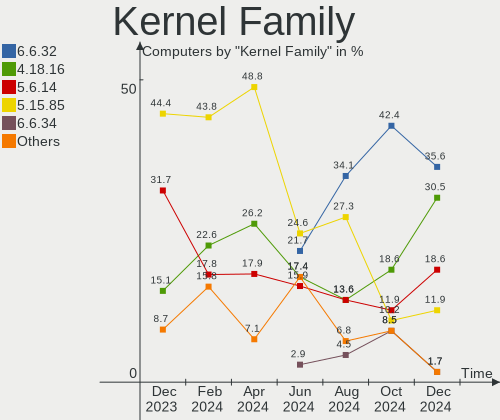
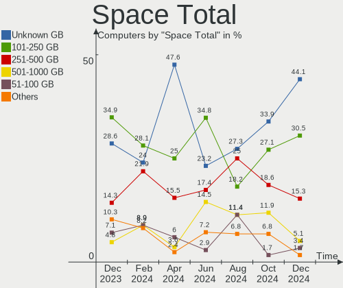
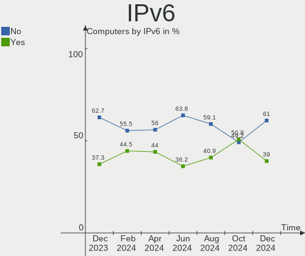
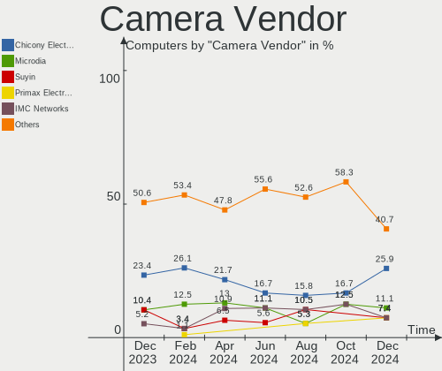

BlackPanther - Hardware Trends
------------------------------

A project to identify most popular hardware characteristics and track their change
over time based on data collected by Linux users at https://Linux-Hardware.org.

Anyone can contribute to this report by the [hw-probe](https://github.com/linuxhw/hw-probe) tool:

    sudo -E hw-probe -all -upload

This is a report for all computer types. See also reports for [desktops](/Dist/BlackPanther/Desktop/README.md) and [notebooks](/Dist/BlackPanther/Notebook/README.md).

This report is for one last month. Overall report since the beginning of time: [TestDays](https://github.com/linuxhw/TestDays)

Period: Aug, 2023.

Contents
--------

* [ System ](#system)
  - [ OS                       ](#os)
  - [ OS Family                ](#os-family)
  - [ Kernel                   ](#kernel)
  - [ Kernel Family            ](#kernel-family)
  - [ Kernel Major Ver.        ](#kernel-major-ver)
  - [ Arch                     ](#arch)
  - [ DE                       ](#de)
  - [ Display Server           ](#display-server)
  - [ Display Manager          ](#display-manager)
  - [ OS Lang                  ](#os-lang)
  - [ Boot Mode                ](#boot-mode)
  - [ Filesystem               ](#filesystem)
  - [ Part. scheme             ](#part-scheme)
  - [ Dual Boot with Linux/BSD ](#dual-boot-with-linuxbsd)
  - [ Dual Boot (Win)          ](#dual-boot-win)

* [ Board ](#board)
  - [ Vendor                   ](#vendor)
  - [ Model                    ](#model)
  - [ Model Family             ](#model-family)
  - [ MFG Year                 ](#mfg-year)
  - [ Form Factor              ](#form-factor)
  - [ Secure Boot              ](#secure-boot)
  - [ Coreboot                 ](#coreboot)
  - [ RAM Size                 ](#ram-size)
  - [ RAM Used                 ](#ram-used)
  - [ Total Drives             ](#total-drives)
  - [ Has CD-ROM               ](#has-cd-rom)
  - [ Has Ethernet             ](#has-ethernet)
  - [ Has WiFi                 ](#has-wifi)
  - [ Has Bluetooth            ](#has-bluetooth)

* [ Location ](#location)
  - [ Country                  ](#country)
  - [ City                     ](#city)

* [ Drives ](#drives)
  - [ Drive Vendor             ](#drive-vendor)
  - [ Drive Model              ](#drive-model)
  - [ HDD Vendor               ](#hdd-vendor)
  - [ SSD Vendor               ](#ssd-vendor)
  - [ Drive Kind               ](#drive-kind)
  - [ Drive Connector          ](#drive-connector)
  - [ Drive Size               ](#drive-size)
  - [ Space Total              ](#space-total)
  - [ Space Used               ](#space-used)
  - [ Malfunc. Drives          ](#malfunc-drives)
  - [ Malfunc. Drive Vendor    ](#malfunc-drive-vendor)
  - [ Malfunc. HDD Vendor      ](#malfunc-hdd-vendor)
  - [ Malfunc. Drive Kind      ](#malfunc-drive-kind)
  - [ Failed Drives            ](#failed-drives)
  - [ Failed Drive Vendor      ](#failed-drive-vendor)
  - [ Drive Status             ](#drive-status)

* [ Storage controller ](#storage-controller)
  - [ Storage Vendor           ](#storage-vendor)
  - [ Storage Model            ](#storage-model)
  - [ Storage Kind             ](#storage-kind)

* [ Processor ](#processor)
  - [ CPU Vendor               ](#cpu-vendor)
  - [ CPU Model                ](#cpu-model)
  - [ CPU Model Family         ](#cpu-model-family)
  - [ CPU Cores                ](#cpu-cores)
  - [ CPU Sockets              ](#cpu-sockets)
  - [ CPU Threads              ](#cpu-threads)
  - [ CPU Op-Modes             ](#cpu-op-modes)
  - [ CPU Microcode            ](#cpu-microcode)
  - [ CPU Microarch            ](#cpu-microarch)

* [ Graphics ](#graphics)
  - [ GPU Vendor               ](#gpu-vendor)
  - [ GPU Model                ](#gpu-model)
  - [ GPU Combo                ](#gpu-combo)
  - [ GPU Driver               ](#gpu-driver)
  - [ GPU Memory               ](#gpu-memory)

* [ Monitor ](#monitor)
  - [ Monitor Vendor           ](#monitor-vendor)
  - [ Monitor Model            ](#monitor-model)
  - [ Monitor Resolution       ](#monitor-resolution)
  - [ Monitor Diagonal         ](#monitor-diagonal)
  - [ Monitor Width            ](#monitor-width)
  - [ Aspect Ratio             ](#aspect-ratio)
  - [ Monitor Area             ](#monitor-area)
  - [ Pixel Density            ](#pixel-density)
  - [ Multiple Monitors        ](#multiple-monitors)

* [ Network ](#network)
  - [ Net Controller Vendor    ](#net-controller-vendor)
  - [ Net Controller Model     ](#net-controller-model)
  - [ Wireless Vendor          ](#wireless-vendor)
  - [ Wireless Model           ](#wireless-model)
  - [ Ethernet Vendor          ](#ethernet-vendor)
  - [ Ethernet Model           ](#ethernet-model)
  - [ Net Controller Kind      ](#net-controller-kind)
  - [ Used Controller          ](#used-controller)
  - [ NICs                     ](#nics)
  - [ IPv6                     ](#ipv6)

* [ Bluetooth ](#bluetooth)
  - [ Bluetooth Vendor         ](#bluetooth-vendor)
  - [ Bluetooth Model          ](#bluetooth-model)

* [ Sound ](#sound)
  - [ Sound Vendor             ](#sound-vendor)
  - [ Sound Model              ](#sound-model)

* [ Memory ](#memory)
  - [ Memory Vendor            ](#memory-vendor)
  - [ Memory Model             ](#memory-model)
  - [ Memory Kind              ](#memory-kind)
  - [ Memory Form Factor       ](#memory-form-factor)
  - [ Memory Size              ](#memory-size)
  - [ Memory Speed             ](#memory-speed)

* [ Printers & scanners ](#printers--scanners)
  - [ Printer Vendor           ](#printer-vendor)
  - [ Printer Model            ](#printer-model)
  - [ Scanner Vendor           ](#scanner-vendor)
  - [ Scanner Model            ](#scanner-model)

* [ Camera ](#camera)
  - [ Camera Vendor            ](#camera-vendor)
  - [ Camera Model             ](#camera-model)

* [ Security ](#security)
  - [ Fingerprint Vendor       ](#fingerprint-vendor)
  - [ Fingerprint Model        ](#fingerprint-model)
  - [ Chipcard Vendor          ](#chipcard-vendor)
  - [ Chipcard Model           ](#chipcard-model)

* [ Unsupported ](#unsupported)
  - [ Unsupported Devices      ](#unsupported-devices)
  - [ Unsupported Device Types ](#unsupported-device-types)

System
------

OS
--

Installed operating systems

| Name              | Computers | Percent |
|-------------------|-----------|---------|
| BlackPanther 18.1 | 96        | 95.05%  |
| BlackPanther 22.1 | 5         | 4.95%   |

OS Family
---------

OS without a version

| Name         | Computers | Percent |
|--------------|-----------|---------|
| BlackPanther | 101       | 100%    |

Kernel
------

Version of the Linux kernel

| Version             | Computers | Percent |
|---------------------|-----------|---------|
| 5.6.14-desktop-2bP  | 39        | 38.61%  |
| 4.18.16-desktop-1bP | 32        | 31.68%  |
| 5.15.85-desktop-1bP | 21        | 20.79%  |
| 6.3.8-desktop-1bP   | 5         | 4.95%   |
| 6.4.3-desktop-1bP   | 1         | 0.99%   |
| 6.3.3-desktop-1bP   | 1         | 0.99%   |
| 6.1.0-1bP           | 1         | 0.99%   |
| 5.6.14-server-2bP   | 1         | 0.99%   |

Kernel Family
-------------

Linux kernel without a distro release

| Version | Computers | Percent |
|---------|-----------|---------|
| 5.6.14  | 40        | 39.6%   |
| 4.18.16 | 32        | 31.68%  |
| 5.15.85 | 21        | 20.79%  |
| 6.3.8   | 5         | 4.95%   |
| 6.4.3   | 1         | 0.99%   |
| 6.3.3   | 1         | 0.99%   |
| 6.1.0   | 1         | 0.99%   |

Kernel Major Ver.
-----------------

Linux kernel major version

| Version | Computers | Percent |
|---------|-----------|---------|
| 5.6     | 40        | 39.6%   |
| 4.18    | 32        | 31.68%  |
| 5.15    | 21        | 20.79%  |
| 6.3     | 6         | 5.94%   |
| 6.4     | 1         | 0.99%   |
| 6.1     | 1         | 0.99%   |

Arch
----

OS architecture (x86_64, i586, etc.)

| Name   | Computers | Percent |
|--------|-----------|---------|
| x86_64 | 101       | 100%    |

DE
--

Desktop Environment

| Name    | Computers | Percent |
|---------|-----------|---------|
| KDE5    | 96        | 95.05%  |
| Unknown | 5         | 4.95%   |

Display Server
--------------

X11 or Wayland

| Name | Computers | Percent |
|------|-----------|---------|
| X11  | 101       | 100%    |

Display Manager
---------------

SDDM, LightDM, etc.

| Name | Computers | Percent |
|------|-----------|---------|
| SDDM | 101       | 100%    |

OS Lang
-------

Language

| Lang    | Computers | Percent |
|---------|-----------|---------|
| Unknown | 101       | 100%    |

Boot Mode
---------

EFI or BIOS

| Mode | Computers | Percent |
|------|-----------|---------|
| BIOS | 53        | 52.48%  |
| EFI  | 48        | 47.52%  |

Filesystem
----------

Type of filesystem

| Type    | Computers | Percent |
|---------|-----------|---------|
| Ext4    | 68        | 67.33%  |
| Overlay | 32        | 31.68%  |
| Btrfs   | 1         | 0.99%   |

Part. scheme
------------

Scheme of partitioning

| Type    | Computers | Percent |
|---------|-----------|---------|
| GPT     | 58        | 57.43%  |
| MBR     | 41        | 40.59%  |
| Unknown | 2         | 1.98%   |

Dual Boot with Linux/BSD
------------------------

Hosting more than one Linux/BSD

| Dual boot | Computers | Percent |
|-----------|-----------|---------|
| No        | 73        | 72.28%  |
| Yes       | 28        | 27.72%  |

Dual Boot (Win)
---------------

Hosting Linux and Windows

| Dual boot | Computers | Percent |
|-----------|-----------|---------|
| No        | 62        | 61.39%  |
| Yes       | 39        | 38.61%  |

Board
-----

Vendor
------

Motherboard manufacturer

| Name                | Computers | Percent |
|---------------------|-----------|---------|
| Hewlett-Packard     | 20        | 19.8%   |
| Dell                | 17        | 16.83%  |
| ASUSTek Computer    | 12        | 11.88%  |
| Gigabyte Technology | 11        | 10.89%  |
| Lenovo              | 10        | 9.9%    |
| Acer                | 6         | 5.94%   |
| MSI                 | 5         | 4.95%   |
| Fujitsu             | 4         | 3.96%   |
| ASRock              | 4         | 3.96%   |
| Sony                | 2         | 1.98%   |
| Huanan              | 2         | 1.98%   |
| eMachines           | 2         | 1.98%   |
| Apple               | 2         | 1.98%   |
| Toshiba             | 1         | 0.99%   |
| Microsoft           | 1         | 0.99%   |
| Medion              | 1         | 0.99%   |
| Intel               | 1         | 0.99%   |

Model
-----

Motherboard model

| Name                                 | Computers | Percent |
|--------------------------------------|-----------|---------|
| MSI MS-7817                          | 2         | 1.98%   |
| Huanan X99-QD4 V1.0                  | 2         | 1.98%   |
| HP 250 G1                            | 2         | 1.98%   |
| Gigabyte Z390 UD                     | 2         | 1.98%   |
| Gigabyte B450M GAMING                | 2         | 1.98%   |
| eMachines E725                       | 2         | 1.98%   |
| Dell Latitude E6410                  | 2         | 1.98%   |
| Toshiba Satellite C55D-A-14W         | 1         | 0.99%   |
| Sony VPCEH2N1E                       | 1         | 0.99%   |
| Sony VPCEH2J1E                       | 1         | 0.99%   |
| MSI MS-7519                          | 1         | 0.99%   |
| MSI GT60 2OC/2OD                     | 1         | 0.99%   |
| MSI GP75 Leopard 9SE                 | 1         | 0.99%   |
| Microsoft Surface Pro                | 1         | 0.99%   |
| Medion MS-7748                       | 1         | 0.99%   |
| Lenovo Z50-75 80EC                   | 1         | 0.99%   |
| Lenovo V15-ADA 82C7                  | 1         | 0.99%   |
| Lenovo ThinkStation D20 4158AF8      | 1         | 0.99%   |
| Lenovo ThinkPad X250 20CLS1JN00      | 1         | 0.99%   |
| Lenovo ThinkPad T470 20HES58A1L      | 1         | 0.99%   |
| Lenovo ThinkPad T410 2537VFQ         | 1         | 0.99%   |
| Lenovo ThinkCentre M73 10B6001SUS    | 1         | 0.99%   |
| Lenovo IdeaPad 330-15IKB 81DE        | 1         | 0.99%   |
| Lenovo IdeaPad 110-15ACL 80TJ        | 1         | 0.99%   |
| Lenovo G70-35 80Q5                   | 1         | 0.99%   |
| Intel S5500HCV                       | 1         | 0.99%   |
| HP Z400 Workstation                  | 1         | 0.99%   |
| HP ProBook 650 G2                    | 1         | 0.99%   |
| HP Pavilion Gaming Laptop 15-ec1xxx  | 1         | 0.99%   |
| HP Pavilion dv6                      | 1         | 0.99%   |
| HP Pavilion 17                       | 1         | 0.99%   |
| HP Notebook                          | 1         | 0.99%   |
| HP Laptop 17-ak0xx                   | 1         | 0.99%   |
| HP EliteDesk 705 G3 SFF              | 1         | 0.99%   |
| HP EliteBook 2540p                   | 1         | 0.99%   |
| HP Compaq Pro 6300 SFF               | 1         | 0.99%   |
| HP Compaq Pro 6300 MT                | 1         | 0.99%   |
| HP Compaq dc7900 Small Form Factor   | 1         | 0.99%   |
| HP Compaq dc7800p Ultra-slim Desktop | 1         | 0.99%   |
| HP Compaq 8200 Elite MT PC           | 1         | 0.99%   |

Model Family
------------

Motherboard model prefix

| Name                  | Computers | Percent |
|-----------------------|-----------|---------|
| HP Compaq             | 7         | 6.93%   |
| Dell Latitude         | 6         | 5.94%   |
| Acer Aspire           | 5         | 4.95%   |
| Dell Inspiron         | 4         | 3.96%   |
| Lenovo ThinkPad       | 3         | 2.97%   |
| HP Pavilion           | 3         | 2.97%   |
| HP 250                | 3         | 2.97%   |
| Dell Precision        | 3         | 2.97%   |
| Dell OptiPlex         | 3         | 2.97%   |
| MSI MS-7817           | 2         | 1.98%   |
| Lenovo IdeaPad        | 2         | 1.98%   |
| Huanan X99-QD4        | 2         | 1.98%   |
| Gigabyte Z390         | 2         | 1.98%   |
| Gigabyte B450M        | 2         | 1.98%   |
| Fujitsu ESPRIMO       | 2         | 1.98%   |
| eMachines E725        | 2         | 1.98%   |
| ASUS PRIME            | 2         | 1.98%   |
| Toshiba Satellite     | 1         | 0.99%   |
| Sony VPCEH2N1E        | 1         | 0.99%   |
| Sony VPCEH2J1E        | 1         | 0.99%   |
| MSI MS-7519           | 1         | 0.99%   |
| MSI GT60              | 1         | 0.99%   |
| MSI GP75              | 1         | 0.99%   |
| Microsoft Surface     | 1         | 0.99%   |
| Medion MS-7748        | 1         | 0.99%   |
| Lenovo Z50-75         | 1         | 0.99%   |
| Lenovo V15-ADA        | 1         | 0.99%   |
| Lenovo ThinkStation   | 1         | 0.99%   |
| Lenovo ThinkCentre    | 1         | 0.99%   |
| Lenovo G70-35         | 1         | 0.99%   |
| Intel S5500HCV        | 1         | 0.99%   |
| HP Z400               | 1         | 0.99%   |
| HP ProBook            | 1         | 0.99%   |
| HP Notebook           | 1         | 0.99%   |
| HP Laptop             | 1         | 0.99%   |
| HP EliteDesk          | 1         | 0.99%   |
| HP EliteBook          | 1         | 0.99%   |
| HP 650                | 1         | 0.99%   |
| Gigabyte J4005ND2P-CF | 1         | 0.99%   |
| Gigabyte H97-D3H      | 1         | 0.99%   |

MFG Year
--------

Motherboard manufacture year

| Year | Computers | Percent |
|------|-----------|---------|
| 2013 | 12        | 11.88%  |
| 2011 | 12        | 11.88%  |
| 2016 | 10        | 9.9%    |
| 2015 | 10        | 9.9%    |
| 2010 | 10        | 9.9%    |
| 2017 | 9         | 8.91%   |
| 2018 | 7         | 6.93%   |
| 2012 | 7         | 6.93%   |
| 2014 | 6         | 5.94%   |
| 2009 | 5         | 4.95%   |
| 2007 | 4         | 3.96%   |
| 2019 | 3         | 2.97%   |
| 2022 | 2         | 1.98%   |
| 2020 | 2         | 1.98%   |
| 2008 | 2         | 1.98%   |

Form Factor
-----------

Physical design of the computer

| Name       | Computers | Percent |
|------------|-----------|---------|
| Notebook   | 52        | 51.49%  |
| Desktop    | 46        | 45.54%  |
| Tablet     | 1         | 0.99%   |
| All in one | 1         | 0.99%   |
| Server     | 1         | 0.99%   |

Secure Boot
-----------

Enabled or disabled

| State    | Computers | Percent |
|----------|-----------|---------|
| Disabled | 101       | 100%    |

Coreboot
--------

Have coreboot on board

| Used | Computers | Percent |
|------|-----------|---------|
| No   | 101       | 100%    |

RAM Size
--------

Total RAM memory

| Size in GB  | Computers | Percent |
|-------------|-----------|---------|
| 8.01-16.0   | 30        | 29.7%   |
| 3.01-4.0    | 28        | 27.72%  |
| 4.01-8.0    | 21        | 20.79%  |
| 16.01-24.0  | 10        | 9.9%    |
| 1.01-2.0    | 7         | 6.93%   |
| 32.01-64.0  | 2         | 1.98%   |
| 24.01-32.0  | 2         | 1.98%   |
| 64.01-256.0 | 1         | 0.99%   |

RAM Used
--------

Used RAM memory

| Used GB  | Computers | Percent |
|----------|-----------|---------|
| 1.01-2.0 | 42        | 41.58%  |
| 0.51-1.0 | 38        | 37.62%  |
| 0.01-0.5 | 10        | 9.9%    |
| 2.01-3.0 | 5         | 4.95%   |
| 4.01-8.0 | 4         | 3.96%   |
| 3.01-4.0 | 2         | 1.98%   |

Total Drives
------------

Number of drives on board

| Drives | Computers | Percent |
|--------|-----------|---------|
| 1      | 60        | 59.41%  |
| 2      | 28        | 27.72%  |
| 3      | 11        | 10.89%  |
| 4      | 2         | 1.98%   |

Has CD-ROM
----------

Has CD-ROM on board

| Presented | Computers | Percent |
|-----------|-----------|---------|
| Yes       | 67        | 66.34%  |
| No        | 34        | 33.66%  |

Has Ethernet
------------

Has Ethernet on board

| Presented | Computers | Percent |
|-----------|-----------|---------|
| Yes       | 98        | 97.03%  |
| No        | 3         | 2.97%   |

Has WiFi
--------

Has WiFi module

| Presented | Computers | Percent |
|-----------|-----------|---------|
| Yes       | 67        | 66.34%  |
| No        | 34        | 33.66%  |

Has Bluetooth
-------------

Has Bluetooth module

| Presented | Computers | Percent |
|-----------|-----------|---------|
| Yes       | 53        | 52.48%  |
| No        | 48        | 47.52%  |

Location
--------

Country
-------

Geographic location (country)

| Country  | Computers | Percent |
|----------|-----------|---------|
| Hungary  | 78        | 77.23%  |
| Slovakia | 5         | 4.95%   |
| Germany  | 5         | 4.95%   |
| Austria  | 3         | 2.97%   |
| USA      | 2         | 1.98%   |
| UK       | 2         | 1.98%   |
| Romania  | 2         | 1.98%   |
| Greece   | 2         | 1.98%   |
| Morocco  | 1         | 0.99%   |
| Canada   | 1         | 0.99%   |

City
----

Geographic location (city)

| City                    | Computers | Percent |
|-------------------------|-----------|---------|
| Budapest                | 23        | 22.77%  |
| Zalaegerszeg            | 6         | 5.94%   |
| Vienna                  | 3         | 2.97%   |
| Tatabánya              | 3         | 2.97%   |
| Szekszárd              | 3         | 2.97%   |
| Fertoszentmiklos        | 3         | 2.97%   |
| Csongrad                | 3         | 2.97%   |
| Tornaľa                | 2         | 1.98%   |
| Randolph Township       | 2         | 1.98%   |
| Pfaffenhofen an der Ilm | 2         | 1.98%   |
| Miskolc                 | 2         | 1.98%   |
| Kastoria                | 2         | 1.98%   |
| Eger                    | 2         | 1.98%   |
| Debrecen                | 2         | 1.98%   |
| Crewe                   | 2         | 1.98%   |
| Berettyóújfalu        | 2         | 1.98%   |
| Zalău                  | 1         | 0.99%   |
| Veszprém               | 1         | 0.99%   |
| Ulm                     | 1         | 0.99%   |
| Tiszaujvaros            | 1         | 0.99%   |
| Tamasi                  | 1         | 0.99%   |
| Taksony                 | 1         | 0.99%   |
| Szolnok                 | 1         | 0.99%   |
| Szigetszentmiklos       | 1         | 0.99%   |
| Szentendre              | 1         | 0.99%   |
| Székesfehérvár       | 1         | 0.99%   |
| Szazhalombatta          | 1         | 0.99%   |
| Strazske                | 1         | 0.99%   |
| Salgotarjan             | 1         | 0.99%   |
| Regensburg              | 1         | 0.99%   |
| Pomaz                   | 1         | 0.99%   |
| Pécs                   | 1         | 0.99%   |
| Papa                    | 1         | 0.99%   |
| Oroshaza                | 1         | 0.99%   |
| Nyiregyhaza             | 1         | 0.99%   |
| Nagyatad                | 1         | 0.99%   |
| Miercurea-Ciuc          | 1         | 0.99%   |
| Kisvarda                | 1         | 0.99%   |
| Kiskoros                | 1         | 0.99%   |
| Kecskemét              | 1         | 0.99%   |

Drives
------

Drive Vendor
------------

Hard drive vendors

| Vendor                | Computers | Drives | Percent |
|-----------------------|-----------|--------|---------|
| WDC                   | 26        | 28     | 16.56%  |
| Samsung Electronics   | 24        | 26     | 15.29%  |
| Kingston              | 21        | 23     | 13.38%  |
| Seagate               | 15        | 15     | 9.55%   |
| Toshiba               | 13        | 14     | 8.28%   |
| SanDisk               | 9         | 9      | 5.73%   |
| HGST                  | 9         | 11     | 5.73%   |
| Intenso               | 6         | 6      | 3.82%   |
| Unknown               | 3         | 3      | 1.91%   |
| Intel                 | 3         | 3      | 1.91%   |
| Hitachi               | 3         | 3      | 1.91%   |
| XPG                   | 2         | 2      | 1.27%   |
| Patriot               | 2         | 2      | 1.27%   |
| Micron Technology     | 2         | 2      | 1.27%   |
| Gigabyte Technology   | 2         | 2      | 1.27%   |
| Crucial               | 2         | 2      | 1.27%   |
| A-DATA Technology     | 2         | 2      | 1.27%   |
| Zheino                | 1         | 1      | 0.64%   |
| Transcend             | 1         | 1      | 0.64%   |
| Timetec               | 1         | 1      | 0.64%   |
| SPCC                  | 1         | 1      | 0.64%   |
| SK hynix              | 1         | 1      | 0.64%   |
| Realtek Semiconductor | 1         | 1      | 0.64%   |
| PNY                   | 1         | 1      | 0.64%   |
| LITEONIT              | 1         | 1      | 0.64%   |
| Kingmax               | 1         | 1      | 0.64%   |
| Fujitsu               | 1         | 1      | 0.64%   |
| Apple                 | 1         | 1      | 0.64%   |
| 2-Power               | 1         | 1      | 0.64%   |
| Unknown               | 1         | 1      | 0.64%   |

Drive Model
-----------

Hard drive models

| Model                              | Computers | Percent |
|------------------------------------|-----------|---------|
| Kingston SA400S37240G 240GB SSD    | 7         | 4.27%   |
| Kingston SA400S37480G 480GB SSD    | 6         | 3.66%   |
| Toshiba MQ01ABD100 1TB             | 4         | 2.44%   |
| Toshiba DT01ACA100 1TB             | 3         | 1.83%   |
| Samsung SSD 860 EVO 500GB          | 3         | 1.83%   |
| XPG SPECTRIX S40G 1TB              | 2         | 1.22%   |
| WDC WDS240G2G0B-00EPW0 240GB SSD   | 2         | 1.22%   |
| WDC WD5000LPCX-24VHAT0 500GB       | 2         | 1.22%   |
| WDC WD5000AAKS-007AA0 500GB        | 2         | 1.22%   |
| WDC WD30 PURX-64PFUY0 3TB          | 2         | 1.22%   |
| Toshiba DT01ACA050 500GB           | 2         | 1.22%   |
| Seagate ST500LT012-1DG142 500GB    | 2         | 1.22%   |
| Seagate ST1000LM024 HN-M101MBB 1TB | 2         | 1.22%   |
| SanDisk SDSSDH3512G 512GB          | 2         | 1.22%   |
| SanDisk SD9SB8W128G1001 128GB SSD  | 2         | 1.22%   |
| SanDisk NVMe SSD Drive 2TB         | 2         | 1.22%   |
| Samsung SSD 970 EVO Plus 2TB       | 2         | 1.22%   |
| Samsung SSD 870 EVO 500GB          | 2         | 1.22%   |
| Samsung SSD 870 EVO 250GB          | 2         | 1.22%   |
| Samsung HD322HJ 320GB              | 2         | 1.22%   |
| Patriot Burst 120GB SSD            | 2         | 1.22%   |
| Kingston SUV400S37120G 120GB SSD   | 2         | 1.22%   |
| Kingston SNV2S500G 500GB           | 2         | 1.22%   |
| Intenso SSD 120GB                  | 2         | 1.22%   |
| Intenso Portable SSD 128GB         | 2         | 1.22%   |
| Intel SSDSC2BF180A4H 180GB         | 2         | 1.22%   |
| HGST HTS541010B7E610 1TB           | 2         | 1.22%   |
| HGST HMS5C4040BLE640 4TB           | 2         | 1.22%   |
| Zheino CHN-NGFFNV2280-256 256GB    | 1         | 0.61%   |
| WDC WDS256G1X0C-00ENX0 256GB       | 1         | 0.61%   |
| WDC WD60PURZ-85ZUFY1 6TB           | 1         | 0.61%   |
| WDC WD5000LPVX-22V0TT0 500GB       | 1         | 0.61%   |
| WDC WD5000LPLX-75ZNTT0 500GB       | 1         | 0.61%   |
| WDC WD5000BPVT-24HXZT3 500GB       | 1         | 0.61%   |
| WDC WD5000BEVT-35A0RT0 500GB       | 1         | 0.61%   |
| WDC WD5000AAKS-08V0A0 500GB        | 1         | 0.61%   |
| WDC WD30EZRX-00DC0B0 3TB           | 1         | 0.61%   |
| WDC WD2502ABYS-02B7A0 256GB        | 1         | 0.61%   |
| WDC WD2500BEVT-00ZCT0 250GB        | 1         | 0.61%   |
| WDC WD20EZBX-00AYRA0 2TB           | 1         | 0.61%   |

HDD Vendor
----------

Hard disk drive vendors

| Vendor              | Computers | Drives | Percent |
|---------------------|-----------|--------|---------|
| WDC                 | 24        | 25     | 32%     |
| Seagate             | 15        | 15     | 20%     |
| Toshiba             | 13        | 14     | 17.33%  |
| HGST                | 9         | 11     | 12%     |
| Samsung Electronics | 8         | 8      | 10.67%  |
| Hitachi             | 3         | 3      | 4%      |
| Unknown             | 1         | 1      | 1.33%   |
| Fujitsu             | 1         | 1      | 1.33%   |
| Unknown             | 1         | 1      | 1.33%   |

SSD Vendor
----------

Solid state drive vendors

| Vendor              | Computers | Drives | Percent |
|---------------------|-----------|--------|---------|
| Kingston            | 18        | 20     | 27.27%  |
| Samsung Electronics | 12        | 13     | 18.18%  |
| SanDisk             | 7         | 7      | 10.61%  |
| Intenso             | 6         | 6      | 9.09%   |
| Intel               | 3         | 3      | 4.55%   |
| WDC                 | 2         | 2      | 3.03%   |
| Patriot             | 2         | 2      | 3.03%   |
| Micron Technology   | 2         | 2      | 3.03%   |
| Gigabyte Technology | 2         | 2      | 3.03%   |
| Crucial             | 2         | 2      | 3.03%   |
| A-DATA Technology   | 2         | 2      | 3.03%   |
| Timetec             | 1         | 1      | 1.52%   |
| SPCC                | 1         | 1      | 1.52%   |
| SK hynix            | 1         | 1      | 1.52%   |
| PNY                 | 1         | 1      | 1.52%   |
| LITEONIT            | 1         | 1      | 1.52%   |
| Kingmax             | 1         | 1      | 1.52%   |
| Apple               | 1         | 1      | 1.52%   |
| 2-Power             | 1         | 1      | 1.52%   |

Drive Kind
----------

HDD or SSD

| Kind | Computers | Drives | Percent |
|------|-----------|--------|---------|
| HDD  | 67        | 79     | 48.55%  |
| SSD  | 55        | 69     | 39.86%  |
| NVMe | 14        | 16     | 10.14%  |
| MMC  | 2         | 2      | 1.45%   |

Drive Connector
---------------

SATA, SAS, NVMe, etc.

| Type | Computers | Drives | Percent |
|------|-----------|--------|---------|
| SATA | 97        | 141    | 80.83%  |
| NVMe | 14        | 16     | 11.67%  |
| SAS  | 7         | 7      | 5.83%   |
| MMC  | 2         | 2      | 1.67%   |

Drive Size
----------

Size of hard drive

| Size in TB | Computers | Drives | Percent |
|------------|-----------|--------|---------|
| 0.01-0.5   | 79        | 104    | 66.95%  |
| 0.51-1.0   | 28        | 31     | 23.73%  |
| 1.01-2.0   | 4         | 4      | 3.39%   |
| 3.01-4.0   | 3         | 5      | 2.54%   |
| 2.01-3.0   | 3         | 3      | 2.54%   |
| 4.01-10.0  | 1         | 1      | 0.85%   |

Space Total
-----------

Amount of disk space available on the file system

| Size in GB     | Computers | Percent |
|----------------|-----------|---------|
| Unknown        | 30        | 29.7%   |
| 101-250        | 24        | 23.76%  |
| 251-500        | 19        | 18.81%  |
| 501-1000       | 12        | 11.88%  |
| 51-100         | 7         | 6.93%   |
| 1001-2000      | 4         | 3.96%   |
| 21-50          | 3         | 2.97%   |
| More than 3000 | 1         | 0.99%   |
| 2001-3000      | 1         | 0.99%   |

Space Used
----------

Amount of used disk space

| Used GB        | Computers | Percent |
|----------------|-----------|---------|
| 1-20           | 31        | 30.69%  |
| Unknown        | 30        | 29.7%   |
| 51-100         | 15        | 14.85%  |
| 21-50          | 12        | 11.88%  |
| 101-250        | 10        | 9.9%    |
| More than 3000 | 1         | 0.99%   |
| 251-500        | 1         | 0.99%   |
| 2001-3000      | 1         | 0.99%   |

Malfunc. Drives
---------------

Drive models with a malfunction

| Model                                 | Computers | Drives | Percent |
|---------------------------------------|-----------|--------|---------|
| WDC WD5000AAKS-007AA0 500GB           | 2         | 2      | 5%      |
| Intel SSDSC2BF180A4H 180GB            | 2         | 2      | 5%      |
| WDC WD60PURZ-85ZUFY1 6TB              | 1         | 1      | 2.5%    |
| WDC WD5000BEVT-35A0RT0 500GB          | 1         | 1      | 2.5%    |
| WDC WD2500BEVT-00ZCT0 250GB           | 1         | 1      | 2.5%    |
| WDC WD20EARX-00PASB0 2TB              | 1         | 1      | 2.5%    |
| WDC WD15EARS-00MVWB0 1TB              | 1         | 1      | 2.5%    |
| WDC WD10PURZ-85U8XY0 1TB              | 1         | 1      | 2.5%    |
| WDC WD10JPLX-00MBPT0 1TB              | 1         | 1      | 2.5%    |
| WDC WD10JPCX-24UE4T0 1TB              | 1         | 1      | 2.5%    |
| Toshiba MQ01ABF050 500GB              | 1         | 1      | 2.5%    |
| Toshiba DT01ACA050 500GB              | 1         | 1      | 2.5%    |
| Timetec SD08 512GB SSD                | 1         | 1      | 2.5%    |
| Seagate ST9500420AS 500GB             | 1         | 1      | 2.5%    |
| Seagate ST9500325AS 500GB             | 1         | 1      | 2.5%    |
| Seagate ST9320325AS 320GB             | 1         | 1      | 2.5%    |
| Seagate ST500LT012-1DG142 500GB       | 1         | 1      | 2.5%    |
| Seagate ST340014AS 40GB               | 1         | 1      | 2.5%    |
| Seagate ST3160815AS 160GB             | 1         | 1      | 2.5%    |
| Seagate ST1000LM024 HN-M101MBB 1TB    | 1         | 1      | 2.5%    |
| Samsung Electronics SSD 870 EVO 500GB | 1         | 1      | 2.5%    |
| Samsung Electronics SSD 750 EVO 250GB | 1         | 1      | 2.5%    |
| Samsung Electronics HM160HI 160GB     | 1         | 1      | 2.5%    |
| Samsung Electronics HD200HJ 200GB     | 1         | 1      | 2.5%    |
| Samsung Electronics HD103UJ 1TB       | 1         | 1      | 2.5%    |
| Kingston SUV400S37120G 120GB SSD      | 1         | 1      | 2.5%    |
| Kingston SA400S37480G 480GB SSD       | 1         | 1      | 2.5%    |
| Intel SSDSA1M160G2HP 160GB            | 1         | 1      | 2.5%    |
| Hitachi HTS725025A9A364 250GB         | 1         | 1      | 2.5%    |
| Hitachi HTS547550A9E384 500GB         | 1         | 1      | 2.5%    |
| HGST HTS545050A7E680 500GB            | 1         | 1      | 2.5%    |
| HGST HTS545032A7E660 320GB            | 1         | 1      | 2.5%    |
| HGST HTS545032A7E380 320GB            | 1         | 1      | 2.5%    |
| HGST HTS541010A9E680 1TB              | 1         | 1      | 2.5%    |
| HGST HEJ423220H9E300 200GB            | 1         | 1      | 2.5%    |
| Fujitsu MHZ2120BH G2 120GB            | 1         | 1      | 2.5%    |
| Apple SSD TS064E 64GB                 | 1         | 1      | 2.5%    |
| A-DATA Technology SU630 240GB SSD     | 1         | 1      | 2.5%    |

Malfunc. Drive Vendor
---------------------

Vendors of faulty drives

| Vendor              | Computers | Drives | Percent |
|---------------------|-----------|--------|---------|
| WDC                 | 10        | 10     | 25%     |
| Seagate             | 7         | 7      | 17.5%   |
| Samsung Electronics | 5         | 5      | 12.5%   |
| HGST                | 5         | 5      | 12.5%   |
| Intel               | 3         | 3      | 7.5%    |
| Toshiba             | 2         | 2      | 5%      |
| Kingston            | 2         | 2      | 5%      |
| Hitachi             | 2         | 2      | 5%      |
| Timetec             | 1         | 1      | 2.5%    |
| Fujitsu             | 1         | 1      | 2.5%    |
| Apple               | 1         | 1      | 2.5%    |
| A-DATA Technology   | 1         | 1      | 2.5%    |

Malfunc. HDD Vendor
-------------------

Vendors of faulty HDD drives

| Vendor              | Computers | Drives | Percent |
|---------------------|-----------|--------|---------|
| WDC                 | 10        | 10     | 33.33%  |
| Seagate             | 7         | 7      | 23.33%  |
| HGST                | 5         | 5      | 16.67%  |
| Samsung Electronics | 3         | 3      | 10%     |
| Toshiba             | 2         | 2      | 6.67%   |
| Hitachi             | 2         | 2      | 6.67%   |
| Fujitsu             | 1         | 1      | 3.33%   |

Malfunc. Drive Kind
-------------------

Kinds of faulty drives

| Kind | Computers | Drives | Percent |
|------|-----------|--------|---------|
| HDD  | 29        | 30     | 74.36%  |
| SSD  | 10        | 10     | 25.64%  |

Failed Drives
-------------

Failed drive models

Zero info for selected period =(

Failed Drive Vendor
-------------------

Failed drive vendors

Zero info for selected period =(

Drive Status
------------

Number of failed and malfunc. drives

| Status   | Computers | Drives | Percent |
|----------|-----------|--------|---------|
| Works    | 75        | 116    | 60.48%  |
| Malfunc  | 39        | 40     | 31.45%  |
| Detected | 10        | 10     | 8.06%   |

Storage controller
------------------

Storage Vendor
--------------

Storage controller vendors

| Vendor                      | Computers | Percent |
|-----------------------------|-----------|---------|
| Intel                       | 81        | 71.05%  |
| AMD                         | 17        | 14.91%  |
| Samsung Electronics         | 4         | 3.51%   |
| SanDisk                     | 3         | 2.63%   |
| Kingston Technology Company | 3         | 2.63%   |
| Silicon Motion              | 2         | 1.75%   |
| Realtek Semiconductor       | 2         | 1.75%   |
| Nvidia                      | 1         | 0.88%   |
| JMicron Technology          | 1         | 0.88%   |

Storage Model
-------------

Storage controller models

| Model                                                                                   | Computers | Percent |
|-----------------------------------------------------------------------------------------|-----------|---------|
| AMD FCH SATA Controller [AHCI mode]                                                     | 12        | 8.96%   |
| Intel 8 Series/C220 Series Chipset Family 6-port SATA Controller 1 [AHCI mode]          | 9         | 6.72%   |
| Intel Q170/Q150/B150/H170/H110/Z170/CM236 Chipset SATA Controller [AHCI Mode]           | 6         | 4.48%   |
| Intel Wildcat Point-LP SATA Controller [AHCI Mode]                                      | 5         | 3.73%   |
| Intel 7 Series Chipset Family 6-port SATA Controller [AHCI mode]                        | 5         | 3.73%   |
| Intel Sunrise Point-LP SATA Controller [AHCI mode]                                      | 4         | 2.99%   |
| Intel 82801JI (ICH10 Family) SATA AHCI Controller                                       | 4         | 2.99%   |
| Intel 82801 Mobile SATA Controller [RAID mode]                                          | 4         | 2.99%   |
| Intel 6 Series/C200 Series Chipset Family 6 port Mobile SATA AHCI Controller            | 4         | 2.99%   |
| Intel SATA Controller [RAID mode]                                                       | 3         | 2.24%   |
| Intel Celeron N3350/Pentium N4200/Atom E3900 Series SATA AHCI Controller                | 3         | 2.24%   |
| Intel 82801IBM/IEM (ICH9M/ICH9M-E) 4 port SATA Controller [AHCI mode]                   | 3         | 2.24%   |
| Intel 8 Series SATA Controller 1 [AHCI mode]                                            | 3         | 2.24%   |
| Intel 6 Series/C200 Series Chipset Family Desktop SATA Controller (IDE mode, ports 4-5) | 3         | 2.24%   |
| Intel 6 Series/C200 Series Chipset Family Desktop SATA Controller (IDE mode, ports 0-3) | 3         | 2.24%   |
| Intel 5 Series/3400 Series Chipset 6 port SATA AHCI Controller                          | 3         | 2.24%   |
| Intel 4 Series Chipset PT IDER Controller                                               | 3         | 2.24%   |
| Silicon Motion SM2263EN/SM2263XT (DRAM-less) NVMe SSD Controllers                       | 2         | 1.49%   |
| SanDisk WD Blue SN570 NVMe SSD 2TB                                                      | 2         | 1.49%   |
| Samsung NVMe SSD Controller SM981/PM981/PM983                                           | 2         | 1.49%   |
| Realtek RTS5763DL NVMe SSD Controller                                                   | 2         | 1.49%   |
| Kingston Company Company Non-Volatile memory controller                                 | 2         | 1.49%   |
| Intel Cannon Lake PCH SATA AHCI Controller                                              | 2         | 1.49%   |
| Intel Atom/Celeron/Pentium Processor x5-E8000/J3xxx/N3xxx Series SATA Controller        | 2         | 1.49%   |
| Intel 82801IR/IO/IH (ICH9R/DO/DH) 4 port SATA Controller [IDE mode]                     | 2         | 1.49%   |
| Intel 82801I (ICH9 Family) 2 port SATA Controller [IDE mode]                            | 2         | 1.49%   |
| Intel 7 Series/C210 Series Chipset Family 6-port SATA Controller [AHCI mode]            | 2         | 1.49%   |
| Intel 5 Series/3400 Series Chipset 4 port SATA AHCI Controller                          | 2         | 1.49%   |
| Intel 200 Series PCH SATA controller [AHCI mode]                                        | 2         | 1.49%   |
| AMD 400 Series Chipset SATA Controller                                                  | 2         | 1.49%   |
| AMD 300 Series Chipset SATA Controller                                                  | 2         | 1.49%   |
| SanDisk WD Black NVMe SSD                                                               | 1         | 0.75%   |
| Samsung NVMe SSD SM0032L                                                                | 1         | 0.75%   |
| Samsung NVMe SSD Controller 980                                                         | 1         | 0.75%   |
| Nvidia MCP79 AHCI Controller                                                            | 1         | 0.75%   |
| Kingston Company A2000 NVMe SSD                                                         | 1         | 0.75%   |
| JMicron JMB368 IDE controller                                                           | 1         | 0.75%   |
| Intel NM10/ICH7 Family SATA Controller [IDE mode]                                       | 1         | 0.75%   |
| Intel HM170/QM170 Chipset SATA Controller [AHCI Mode]                                   | 1         | 0.75%   |
| Intel Celeron/Pentium Silver Processor SATA Controller                                  | 1         | 0.75%   |

Storage Kind
------------

Kind of storage controller (IDE, SATA, NVMe, SAS, ...)

| Kind | Computers | Percent |
|------|-----------|---------|
| SATA | 84        | 70%     |
| IDE  | 15        | 12.5%   |
| NVMe | 14        | 11.67%  |
| RAID | 7         | 5.83%   |

Processor
---------

CPU Vendor
----------

Processor vendors

| Vendor | Computers | Percent |
|--------|-----------|---------|
| Intel  | 85        | 84.16%  |
| AMD    | 16        | 15.84%  |

CPU Model
---------

Processor models

| Model                                       | Computers | Percent |
|---------------------------------------------|-----------|---------|
| Intel Core i3-4130 CPU @ 3.40GHz            | 3         | 2.97%   |
| AMD Ryzen 5 3400G with Radeon Vega Graphics | 3         | 2.97%   |
| Intel Xeon CPU E5-1660 v3 @ 3.00GHz         | 2         | 1.98%   |
| Intel Core i5-9400 CPU @ 2.90GHz            | 2         | 1.98%   |
| Intel Core i5-7300U CPU @ 2.60GHz           | 2         | 1.98%   |
| Intel Core i5-7200U CPU @ 2.50GHz           | 2         | 1.98%   |
| Intel Core i5-5200U CPU @ 2.20GHz           | 2         | 1.98%   |
| Intel Core i3-6100 CPU @ 3.70GHz            | 2         | 1.98%   |
| Intel Core i3-2120 CPU @ 3.30GHz            | 2         | 1.98%   |
| Intel Celeron CPU N3350 @ 1.10GHz           | 2         | 1.98%   |
| Intel Celeron CPU 1000M @ 1.80GHz           | 2         | 1.98%   |
| Intel Xeon CPU X5677 @ 3.47GHz              | 1         | 0.99%   |
| Intel Xeon CPU X5670 @ 2.93GHz              | 1         | 0.99%   |
| Intel Xeon CPU W3550 @ 3.07GHz              | 1         | 0.99%   |
| Intel Xeon CPU W3540 @ 2.93GHz              | 1         | 0.99%   |
| Intel Xeon CPU L5640 @ 2.27GHz              | 1         | 0.99%   |
| Intel Xeon CPU E5530 @ 2.40GHz              | 1         | 0.99%   |
| Intel Xeon CPU E5440 @ 2.83GHz              | 1         | 0.99%   |
| Intel Pentium Dual-Core CPU T4400 @ 2.20GHz | 1         | 0.99%   |
| Intel Pentium Dual-Core CPU T4300 @ 2.10GHz | 1         | 0.99%   |
| Intel Pentium Dual-Core CPU E5400 @ 2.70GHz | 1         | 0.99%   |
| Intel Pentium CPU N4200 @ 1.10GHz           | 1         | 0.99%   |
| Intel Pentium CPU N3700 @ 1.60GHz           | 1         | 0.99%   |
| Intel Pentium CPU G4560 @ 3.50GHz           | 1         | 0.99%   |
| Intel Pentium CPU G3430 @ 3.30GHz           | 1         | 0.99%   |
| Intel Pentium CPU G3220 @ 3.00GHz           | 1         | 0.99%   |
| Intel Pentium CPU 2117U @ 1.80GHz           | 1         | 0.99%   |
| Intel Genuine CPU 2140 @ 1.60GHz            | 1         | 0.99%   |
| Intel Core i7-9750H CPU @ 2.60GHz           | 1         | 0.99%   |
| Intel Core i7-6820HQ CPU @ 2.70GHz          | 1         | 0.99%   |
| Intel Core i7-5500U CPU @ 2.40GHz           | 1         | 0.99%   |
| Intel Core i7-4700MQ CPU @ 2.40GHz          | 1         | 0.99%   |
| Intel Core i7-2960XM CPU @ 2.70GHz          | 1         | 0.99%   |
| Intel Core i7 CPU M 640 @ 2.80GHz           | 1         | 0.99%   |
| Intel Core i7 CPU M 620 @ 2.67GHz           | 1         | 0.99%   |
| Intel Core i7 CPU L 640 @ 2.13GHz           | 1         | 0.99%   |
| Intel Core i5-8250U CPU @ 1.60GHz           | 1         | 0.99%   |
| Intel Core i5-7400 CPU @ 3.00GHz            | 1         | 0.99%   |
| Intel Core i5-6500 CPU @ 3.20GHz            | 1         | 0.99%   |
| Intel Core i5-5300U CPU @ 2.30GHz           | 1         | 0.99%   |

CPU Model Family
----------------

Processor model prefix

| Model                   | Computers | Percent |
|-------------------------|-----------|---------|
| Intel Core i5           | 23        | 22.77%  |
| Intel Core i3           | 18        | 17.82%  |
| Intel Celeron           | 10        | 9.9%    |
| Intel Xeon              | 9         | 8.91%   |
| Intel Core i7           | 8         | 7.92%   |
| Intel Pentium           | 6         | 5.94%   |
| Intel Core 2 Duo        | 6         | 5.94%   |
| AMD Ryzen 5             | 5         | 4.95%   |
| Intel Pentium Dual-Core | 3         | 2.97%   |
| Other                   | 2         | 1.98%   |
| AMD A8                  | 2         | 1.98%   |
| AMD A10                 | 2         | 1.98%   |
| Intel Genuine           | 1         | 0.99%   |
| Intel Core 2            | 1         | 0.99%   |
| AMD Ryzen 7             | 1         | 0.99%   |
| AMD FX                  | 1         | 0.99%   |
| AMD E1                  | 1         | 0.99%   |
| AMD A6                  | 1         | 0.99%   |
| AMD A4                  | 1         | 0.99%   |

CPU Cores
---------

Number of processor cores

| Number | Computers | Percent |
|--------|-----------|---------|
| 2      | 62        | 61.39%  |
| 4      | 26        | 25.74%  |
| 6      | 5         | 4.95%   |
| 8      | 4         | 3.96%   |
| 1      | 3         | 2.97%   |
| 12     | 1         | 0.99%   |

CPU Sockets
-----------

Number of sockets

| Number | Computers | Percent |
|--------|-----------|---------|
| 1      | 99        | 98.02%  |
| 2      | 2         | 1.98%   |

CPU Threads
-----------

Threads per core (Hyper-Threading)

| Number | Computers | Percent |
|--------|-----------|---------|
| 2      | 58        | 57.43%  |
| 1      | 43        | 42.57%  |

CPU Op-Modes
------------

CPU Operation Modes (32-bit, 64-bit)

| Op mode        | Computers | Percent |
|----------------|-----------|---------|
| 32-bit, 64-bit | 101       | 100%    |

CPU Microcode
-------------

Microcode number

| Number     | Computers | Percent |
|------------|-----------|---------|
| Unknown    | 15        | 14.85%  |
| 0x306c3    | 7         | 6.93%   |
| 0x306a9    | 7         | 6.93%   |
| 0x206a7    | 7         | 6.93%   |
| 0x1067a    | 7         | 6.93%   |
| 0x506e3    | 4         | 3.96%   |
| 0x306d4    | 4         | 3.96%   |
| 0x08108109 | 4         | 3.96%   |
| 0x506c9    | 3         | 2.97%   |
| 0x40651    | 3         | 2.97%   |
| 0x20655    | 3         | 2.97%   |
| 0x906eb    | 2         | 1.98%   |
| 0x906ea    | 2         | 1.98%   |
| 0x906e9    | 2         | 1.98%   |
| 0x806e9    | 2         | 1.98%   |
| 0x6f2      | 2         | 1.98%   |
| 0x206c2    | 2         | 1.98%   |
| 0x106a5    | 2         | 1.98%   |
| 0x07030105 | 2         | 1.98%   |
| 0x06003106 | 2         | 1.98%   |
| 0x806ea    | 1         | 0.99%   |
| 0x706a1    | 1         | 0.99%   |
| 0x6fd      | 1         | 0.99%   |
| 0x6fb      | 1         | 0.99%   |
| 0x406e3    | 1         | 0.99%   |
| 0x406c4    | 1         | 0.99%   |
| 0x406c3    | 1         | 0.99%   |
| 0x306f2    | 1         | 0.99%   |
| 0x20652    | 1         | 0.99%   |
| 0x10676    | 1         | 0.99%   |
| 0x10661    | 1         | 0.99%   |
| 0x08600106 | 1         | 0.99%   |
| 0x08001137 | 1         | 0.99%   |
| 0x0700010f | 1         | 0.99%   |
| 0x06006705 | 1         | 0.99%   |
| 0x0600611a | 1         | 0.99%   |
| 0x06006118 | 1         | 0.99%   |
| 0x06000852 | 1         | 0.99%   |
| 0x03000027 | 1         | 0.99%   |

CPU Microarch
-------------

Microarchitecture

| Name          | Computers | Percent |
|---------------|-----------|---------|
| Haswell       | 13        | 12.87%  |
| KabyLake      | 12        | 11.88%  |
| SandyBridge   | 10        | 9.9%    |
| Westmere      | 9         | 8.91%   |
| Penryn        | 8         | 7.92%   |
| IvyBridge     | 8         | 7.92%   |
| Skylake       | 6         | 5.94%   |
| Core          | 5         | 4.95%   |
| Broadwell     | 5         | 4.95%   |
| Zen+          | 4         | 3.96%   |
| Nehalem       | 3         | 2.97%   |
| Goldmont      | 3         | 2.97%   |
| Excavator     | 3         | 2.97%   |
| Steamroller   | 2         | 1.98%   |
| Silvermont    | 2         | 1.98%   |
| Puma          | 2         | 1.98%   |
| Zen 2         | 1         | 0.99%   |
| Zen           | 1         | 0.99%   |
| Piledriver    | 1         | 0.99%   |
| K10 Llano     | 1         | 0.99%   |
| Jaguar        | 1         | 0.99%   |
| Goldmont plus | 1         | 0.99%   |

Graphics
--------

GPU Vendor
----------

Vendors of graphics cards

| Vendor           | Computers | Percent |
|------------------|-----------|---------|
| Intel            | 61        | 52.59%  |
| Nvidia           | 30        | 25.86%  |
| AMD              | 24        | 20.69%  |
| ATI Technologies | 1         | 0.86%   |

GPU Model
---------

Graphics card models

| Model                                                                                    | Computers | Percent |
|------------------------------------------------------------------------------------------|-----------|---------|
| Intel 2nd Generation Core Processor Family Integrated Graphics Controller                | 7         | 5.93%   |
| Intel HD Graphics 5500                                                                   | 5         | 4.24%   |
| Intel Core Processor Integrated Graphics Controller                                      | 5         | 4.24%   |
| Intel 3rd Gen Core processor Graphics Controller                                         | 5         | 4.24%   |
| Intel Xeon E3-1200 v3/4th Gen Core Processor Integrated Graphics Controller              | 4         | 3.39%   |
| Intel HD Graphics 620                                                                    | 4         | 3.39%   |
| Intel HD Graphics 530                                                                    | 4         | 3.39%   |
| Intel 4 Series Chipset Integrated Graphics Controller                                    | 4         | 3.39%   |
| Intel Mobile 4 Series Chipset Integrated Graphics Controller                             | 3         | 2.54%   |
| Intel Haswell-ULT Integrated Graphics Controller                                         | 3         | 2.54%   |
| Intel CoffeeLake-S GT2 [UHD Graphics 630]                                                | 3         | 2.54%   |
| AMD Picasso/Raven 2 [Radeon Vega Series / Radeon Vega Mobile Series]                     | 3         | 2.54%   |
| Nvidia GK208BM [GeForce 920M]                                                            | 2         | 1.69%   |
| Nvidia GK208B [GeForce GT 720]                                                           | 2         | 1.69%   |
| Nvidia GK208B [GeForce GT 710]                                                           | 2         | 1.69%   |
| Nvidia GF108 [GeForce GT 630]                                                            | 2         | 1.69%   |
| Nvidia GA104 [GeForce RTX 3060 Ti Lite Hash Rate]                                        | 2         | 1.69%   |
| Intel HD Graphics 500                                                                    | 2         | 1.69%   |
| Intel Atom/Celeron/Pentium Processor x5-E8000/J3xxx/N3xxx Integrated Graphics Controller | 2         | 1.69%   |
| AMD Oland PRO [Radeon R7 240/340 / Radeon 520]                                           | 2         | 1.69%   |
| Nvidia TU117M [GeForce GTX 1650 Ti Mobile]                                               | 1         | 0.85%   |
| Nvidia TU116 [GeForce GTX 1660 SUPER]                                                    | 1         | 0.85%   |
| Nvidia TU106M [GeForce RTX 2060 Mobile]                                                  | 1         | 0.85%   |
| Nvidia GT218M [NVS 3100M]                                                                | 1         | 0.85%   |
| Nvidia GT218 [GeForce 210]                                                               | 1         | 0.85%   |
| Nvidia GP104 [GeForce GTX 1080]                                                          | 1         | 0.85%   |
| Nvidia GM108M [GeForce 845M]                                                             | 1         | 0.85%   |
| Nvidia GM107 [GeForce GTX 750]                                                           | 1         | 0.85%   |
| Nvidia GM107 [GeForce GTX 750 Ti]                                                        | 1         | 0.85%   |
| Nvidia GM107 [GeForce 940MX]                                                             | 1         | 0.85%   |
| Nvidia GK107GL [Quadro 410]                                                              | 1         | 0.85%   |
| Nvidia GK106M [GeForce GTX 770M]                                                         | 1         | 0.85%   |
| Nvidia GK106GL [Quadro K4000]                                                            | 1         | 0.85%   |
| Nvidia GK106 [GeForce GTX 660]                                                           | 1         | 0.85%   |
| Nvidia GF119M [GeForce 410M]                                                             | 1         | 0.85%   |
| Nvidia GF117M [GeForce 610M/710M/810M/820M / GT 620M/625M/630M/720M]                     | 1         | 0.85%   |
| Nvidia GF104GLM [Quadro 4000M]                                                           | 1         | 0.85%   |
| Nvidia G96CM [GeForce 9600M GT]                                                          | 1         | 0.85%   |
| Nvidia G96CGL [Quadro FX 580]                                                            | 1         | 0.85%   |
| Nvidia G72 [GeForce 7500 LE]                                                             | 1         | 0.85%   |

GPU Combo
---------

Combinations of graphics cards

| Name           | Computers | Percent |
|----------------|-----------|---------|
| 1 x Intel      | 48        | 47.52%  |
| 1 x AMD        | 21        | 20.79%  |
| 1 x Nvidia     | 18        | 17.82%  |
| Intel + Nvidia | 9         | 8.91%   |
| Intel + AMD    | 2         | 1.98%   |
| AMD + Nvidia   | 2         | 1.98%   |
| 2 x Nvidia     | 1         | 0.99%   |

GPU Driver
----------

Free vs proprietary

| Driver  | Computers | Percent |
|---------|-----------|---------|
| Free    | 99        | 98.02%  |
| Unknown | 2         | 1.98%   |

GPU Memory
----------

Total video memory

| Size in GB | Computers | Percent |
|------------|-----------|---------|
| Unknown    | 58        | 57.43%  |
| 0.51-1.0   | 14        | 13.86%  |
| 0.01-0.5   | 12        | 11.88%  |
| 1.01-2.0   | 9         | 8.91%   |
| 3.01-4.0   | 4         | 3.96%   |
| 7.01-8.0   | 2         | 1.98%   |
| 2.01-3.0   | 2         | 1.98%   |

Monitor
-------

Monitor Vendor
--------------

Monitor vendors

| Vendor                  | Computers | Percent |
|-------------------------|-----------|---------|
| Samsung Electronics     | 15        | 14.71%  |
| LG Display              | 14        | 13.73%  |
| AU Optronics            | 11        | 10.78%  |
| Chimei Innolux          | 9         | 8.82%   |
| Goldstar                | 8         | 7.84%   |
| Chi Mei Optoelectronics | 5         | 4.9%    |
| BOE                     | 4         | 3.92%   |
| Ancor Communications    | 4         | 3.92%   |
| Philips                 | 3         | 2.94%   |
| Hewlett-Packard         | 3         | 2.94%   |
| BenQ                    | 3         | 2.94%   |
| Vestel Elektronik       | 2         | 1.96%   |
| Lenovo                  | 2         | 1.96%   |
| Iiyama                  | 2         | 1.96%   |
| Dell                    | 2         | 1.96%   |
| Apple                   | 2         | 1.96%   |
| AOC                     | 2         | 1.96%   |
| Acer                    | 2         | 1.96%   |
| ViewSonic               | 1         | 0.98%   |
| Sony                    | 1         | 0.98%   |
| S2-Tek                  | 1         | 0.98%   |
| PANDA                   | 1         | 0.98%   |
| NEC Computers           | 1         | 0.98%   |
| Medion                  | 1         | 0.98%   |
| Fujitsu Siemens         | 1         | 0.98%   |
| Eizo                    | 1         | 0.98%   |
| CVT                     | 1         | 0.98%   |

Monitor Model
-------------

Monitor models

| Model                                                                    | Computers | Percent |
|--------------------------------------------------------------------------|-----------|---------|
| Vestel Elektronik 40W_LCD_TV VES3700 1920x540                            | 2         | 1.94%   |
| LG Display LCD Monitor LGD0395 1366x768 344x194mm 15.5-inch              | 2         | 1.94%   |
| Iiyama PL2473HD IVM6107 1920x1080 520x290mm 23.4-inch                    | 2         | 1.94%   |
| Goldstar FULL HD GSM5B55 1920x1080 480x270mm 21.7-inch                   | 2         | 1.94%   |
| Chimei Innolux LCD Monitor CMN15CA 1366x768 344x193mm 15.5-inch          | 2         | 1.94%   |
| Chi Mei Optoelectronics LCD Monitor CMO15A7 1366x768 344x193mm 15.5-inch | 2         | 1.94%   |
| BOE LCD Monitor BOE06A5 1366x768 344x194mm 15.5-inch                     | 2         | 1.94%   |
| AOC 32V1W AOC3201 1920x1080 698x393mm 31.5-inch                          | 2         | 1.94%   |
| Ancor Communications ASUS VS228 ACI22FD 1920x1080 476x268mm 21.5-inch    | 2         | 1.94%   |
| ViewSonic VG2236 SERIES VSCE726 1920x1080 477x268mm 21.5-inch            | 1         | 0.97%   |
| Sony TV  *00 SNY7C04 3840x2160 1080x610mm 48.8-inch                      | 1         | 0.97%   |
| Samsung Electronics SyncMaster SAM02DB 1680x1050 474x296mm 22.0-inch     | 1         | 0.97%   |
| Samsung Electronics SyncMaster SAM0258 1280x1024 376x301mm 19.0-inch     | 1         | 0.97%   |
| Samsung Electronics SyncMaster SAM01B8 1280x1024 338x270mm 17.0-inch     | 1         | 0.97%   |
| Samsung Electronics SyncMaster SAM01B7 1280x1024 338x270mm 17.0-inch     | 1         | 0.97%   |
| Samsung Electronics S27E500 SAM0D0D 1920x1080 598x336mm 27.0-inch        | 1         | 0.97%   |
| Samsung Electronics S24R35x SAM100E 1920x1080 521x293mm 23.5-inch        | 1         | 0.97%   |
| Samsung Electronics S24D330 SAM0D92 1920x1080 531x299mm 24.0-inch        | 1         | 0.97%   |
| Samsung Electronics S24A31x SAM7114 1920x1080 527x296mm 23.8-inch        | 1         | 0.97%   |
| Samsung Electronics LCD Monitor SEC5442 1440x900 303x190mm 14.1-inch     | 1         | 0.97%   |
| Samsung Electronics LCD Monitor SEC3051 1366x768 344x194mm 15.5-inch     | 1         | 0.97%   |
| Samsung Electronics LCD Monitor SEC3046 1366x768 344x193mm 15.5-inch     | 1         | 0.97%   |
| Samsung Electronics LCD Monitor SDC4347 1366x768 344x193mm 15.5-inch     | 1         | 0.97%   |
| Samsung Electronics LCD Monitor SDC3654 1600x900 382x215mm 17.3-inch     | 1         | 0.97%   |
| Samsung Electronics LCD Monitor SAM04FD 1280x720                         | 1         | 0.97%   |
| Samsung Electronics C24F390 SAM0D2C 1920x1080 521x293mm 23.5-inch        | 1         | 0.97%   |
| S2-Tek TV STK531A 1920x1080 930x530mm 42.1-inch                          | 1         | 0.97%   |
| Philips 221TE PHLC062 1920x1080 476x268mm 21.5-inch                      | 1         | 0.97%   |
| Philips 221B PHL08A1 1920x1080 477x268mm 21.5-inch                       | 1         | 0.97%   |
| Philips 196V4 PHLC0AF 1366x768 410x230mm 18.5-inch                       | 1         | 0.97%   |
| PANDA LCD Monitor NCP0058 1920x1080 344x194mm 15.5-inch                  | 1         | 0.97%   |
| NEC Computers EA223WM NEC6890 1680x1050 474x296mm 22.0-inch              | 1         | 0.97%   |
| Medion MD20328 MED3941 1600x900 462x272mm 21.1-inch                      | 1         | 0.97%   |
| LG Display LCD Monitor LGD6616 1366x768 277x156mm 12.5-inch              | 1         | 0.97%   |
| LG Display LCD Monitor LGD0555 2736x1824 260x173mm 12.3-inch             | 1         | 0.97%   |
| LG Display LCD Monitor LGD0525 1366x768 344x194mm 15.5-inch              | 1         | 0.97%   |
| LG Display LCD Monitor LGD0506 1366x768 344x194mm 15.5-inch              | 1         | 0.97%   |
| LG Display LCD Monitor LGD04FC 1366x768 344x194mm 15.5-inch              | 1         | 0.97%   |
| LG Display LCD Monitor LGD03ED 1366x768 277x156mm 12.5-inch              | 1         | 0.97%   |
| LG Display LCD Monitor LGD036C 1366x768 277x156mm 12.5-inch              | 1         | 0.97%   |

Monitor Resolution
------------------

Monitor screen resolution

| Resolution         | Computers | Percent |
|--------------------|-----------|---------|
| 1920x1080 (FHD)    | 36        | 36.36%  |
| 1366x768 (WXGA)    | 28        | 28.28%  |
| 3840x2160 (4K)     | 8         | 8.08%   |
| 1280x1024 (SXGA)   | 7         | 7.07%   |
| 1600x900 (HD+)     | 6         | 6.06%   |
| 1440x900 (WXGA+)   | 5         | 5.05%   |
| 1680x1050 (WSXGA+) | 4         | 4.04%   |
| 1280x800 (WXGA)    | 2         | 2.02%   |
| 2736x1824          | 1         | 1.01%   |
| 1360x768           | 1         | 1.01%   |
| 1024x768 (XGA)     | 1         | 1.01%   |

Monitor Diagonal
----------------

Diagonal size in inches

| Inches  | Computers | Percent |
|---------|-----------|---------|
| 15      | 31        | 30.1%   |
| 21      | 12        | 11.65%  |
| 17      | 12        | 11.65%  |
| 23      | 9         | 8.74%   |
| 12      | 6         | 5.83%   |
| 27      | 4         | 3.88%   |
| 19      | 4         | 3.88%   |
| 24      | 3         | 2.91%   |
| 22      | 3         | 2.91%   |
| 18      | 3         | 2.91%   |
| 14      | 3         | 2.91%   |
| 13      | 3         | 2.91%   |
| 84      | 2         | 1.94%   |
| 31      | 2         | 1.94%   |
| 65      | 1         | 0.97%   |
| 44      | 1         | 0.97%   |
| 42      | 1         | 0.97%   |
| 26      | 1         | 0.97%   |
| 11      | 1         | 0.97%   |
| Unknown | 1         | 0.97%   |

Monitor Width
-------------

Physical width

| Width in mm | Computers | Percent |
|-------------|-----------|---------|
| 301-350     | 40        | 38.83%  |
| 501-600     | 17        | 16.5%   |
| 401-500     | 17        | 16.5%   |
| 351-400     | 13        | 12.62%  |
| 201-300     | 8         | 7.77%   |
| 601-700     | 2         | 1.94%   |
| 1501-2000   | 2         | 1.94%   |
| 901-1000    | 2         | 1.94%   |
| 1001-1500   | 1         | 0.97%   |
| Unknown     | 1         | 0.97%   |

Aspect Ratio
------------

Proportional relationship between the width and the height

| Ratio   | Computers | Percent |
|---------|-----------|---------|
| 16/9    | 74        | 77.08%  |
| 16/10   | 11        | 11.46%  |
| 5/4     | 8         | 8.33%   |
| 4/3     | 1         | 1.04%   |
| 3/2     | 1         | 1.04%   |
| Unknown | 1         | 1.04%   |

Monitor Area
------------

Area in inch²

| Area in inch² | Computers | Percent |
|----------------|-----------|---------|
| 101-110        | 30        | 29.41%  |
| 201-250        | 23        | 22.55%  |
| 151-200        | 7         | 6.86%   |
| 141-150        | 7         | 6.86%   |
| 81-90          | 6         | 5.88%   |
| 121-130        | 6         | 5.88%   |
| 61-70          | 5         | 4.9%    |
| 301-350        | 4         | 3.92%   |
| More than 1000 | 3         | 2.94%   |
| 351-500        | 2         | 1.96%   |
| 131-140        | 2         | 1.96%   |
| 501-1000       | 2         | 1.96%   |
| 71-80          | 1         | 0.98%   |
| 51-60          | 1         | 0.98%   |
| 251-300        | 1         | 0.98%   |
| 111-120        | 1         | 0.98%   |
| Unknown        | 1         | 0.98%   |

Pixel Density
-------------

Pixels per inch

| Density | Computers | Percent |
|---------|-----------|---------|
| 51-100  | 39        | 38.61%  |
| 101-120 | 37        | 36.63%  |
| 121-160 | 22        | 21.78%  |
| 1-50    | 1         | 0.99%   |
| 161-240 | 1         | 0.99%   |
| Unknown | 1         | 0.99%   |

Multiple Monitors
-----------------

Total monitors connected

| Total | Computers | Percent |
|-------|-----------|---------|
| 1     | 90        | 89.11%  |
| 2     | 7         | 6.93%   |
| 0     | 3         | 2.97%   |
| 3     | 1         | 0.99%   |

Network
-------

Net Controller Vendor
---------------------

Controller vendors

| Vendor                   | Computers | Percent |
|--------------------------|-----------|---------|
| Realtek Semiconductor    | 55        | 37.93%  |
| Intel                    | 34        | 23.45%  |
| Qualcomm Atheros         | 27        | 18.62%  |
| Broadcom                 | 11        | 7.59%   |
| Ralink Technology        | 4         | 2.76%   |
| Broadcom Limited         | 4         | 2.76%   |
| TP-Link                  | 2         | 1.38%   |
| Ralink                   | 2         | 1.38%   |
| Samsung Electronics      | 1         | 0.69%   |
| Nvidia                   | 1         | 0.69%   |
| Marvell Technology Group | 1         | 0.69%   |
| IMC Networks             | 1         | 0.69%   |
| Huawei Technologies      | 1         | 0.69%   |
| D-Link System            | 1         | 0.69%   |

Net Controller Model
--------------------

Controller models

| Model                                                             | Computers | Percent |
|-------------------------------------------------------------------|-----------|---------|
| Realtek RTL8111/8168/8411 PCI Express Gigabit Ethernet Controller | 44        | 25.73%  |
| Realtek RTL810xE PCI Express Fast Ethernet controller             | 9         | 5.26%   |
| Intel 82579LM Gigabit Network Connection (Lewisville)             | 7         | 4.09%   |
| Qualcomm Atheros AR9285 Wireless Network Adapter (PCI-Express)    | 6         | 3.51%   |
| Qualcomm Atheros QCA9377 802.11ac Wireless Network Adapter        | 5         | 2.92%   |
| Realtek RTL8723BE PCIe Wireless Network Adapter                   | 4         | 2.34%   |
| Qualcomm Atheros QCA9565 / AR9565 Wireless Network Adapter        | 4         | 2.34%   |
| Intel 82577LM Gigabit Network Connection                          | 4         | 2.34%   |
| Intel Wireless 7265                                               | 3         | 1.75%   |
| Intel Centrino Advanced-N 6200                                    | 3         | 1.75%   |
| Intel 82567LM-3 Gigabit Network Connection                        | 3         | 1.75%   |
| Broadcom NetXtreme BCM5761 Gigabit Ethernet PCIe                  | 3         | 1.75%   |
| Realtek RTL8188EUS 802.11n Wireless Network Adapter               | 2         | 1.17%   |
| Ralink RT5372 Wireless Adapter                                    | 2         | 1.17%   |
| Ralink RT3290 Wireless 802.11n 1T/1R PCIe                         | 2         | 1.17%   |
| Qualcomm Atheros AR9485 Wireless Network Adapter                  | 2         | 1.17%   |
| Qualcomm Atheros AR9287 Wireless Network Adapter (PCI-Express)    | 2         | 1.17%   |
| Qualcomm Atheros AR8132 Fast Ethernet                             | 2         | 1.17%   |
| Intel Wireless 7260                                               | 2         | 1.17%   |
| Intel Wireless 3165                                               | 2         | 1.17%   |
| Intel Ethernet Connection (2) I219-V                              | 2         | 1.17%   |
| Intel Dual Band Wireless-AC 3168NGW [Stone Peak]                  | 2         | 1.17%   |
| Intel Centrino Advanced-N 6205 [Taylor Peak]                      | 2         | 1.17%   |
| TP-Link TL-WN821N Version 5 RTL8192EU                             | 1         | 0.58%   |
| TP-Link 802.11ac WLAN Adapter                                     | 1         | 0.58%   |
| Samsung Galaxy series, misc. (tethering mode)                     | 1         | 0.58%   |
| Realtek RTL8822CE 802.11ac PCIe Wireless Network Adapter          | 1         | 0.58%   |
| Realtek RTL8723DE Wireless Network Adapter                        | 1         | 0.58%   |
| Realtek RTL8192EE PCIe Wireless Network Adapter                   | 1         | 0.58%   |
| Realtek RTL8188EE Wireless Network Adapter                        | 1         | 0.58%   |
| Realtek RTL8188CE 802.11b/g/n WiFi Adapter                        | 1         | 0.58%   |
| Realtek RTL8169 PCI Gigabit Ethernet Controller                   | 1         | 0.58%   |
| Ralink RT2870/RT3070 Wireless Adapter                             | 1         | 0.58%   |
| Ralink MT7601U Wireless Adapter                                   | 1         | 0.58%   |
| Qualcomm Atheros QCA8172 Fast Ethernet                            | 1         | 0.58%   |
| Qualcomm Atheros QCA8171 Gigabit Ethernet                         | 1         | 0.58%   |
| Qualcomm Atheros QCA6174 802.11ac Wireless Network Adapter        | 1         | 0.58%   |
| Qualcomm Atheros Killer E2400 Gigabit Ethernet Controller         | 1         | 0.58%   |
| Qualcomm Atheros Killer E220x Gigabit Ethernet Controller         | 1         | 0.58%   |
| Qualcomm Atheros AR9462 Wireless Network Adapter                  | 1         | 0.58%   |

Wireless Vendor
---------------

Wireless vendors

| Vendor                   | Computers | Percent |
|--------------------------|-----------|---------|
| Qualcomm Atheros         | 22        | 32.84%  |
| Intel                    | 20        | 29.85%  |
| Realtek Semiconductor    | 10        | 14.93%  |
| Ralink Technology        | 4         | 5.97%   |
| Broadcom                 | 4         | 5.97%   |
| TP-Link                  | 2         | 2.99%   |
| Ralink                   | 2         | 2.99%   |
| Marvell Technology Group | 1         | 1.49%   |
| IMC Networks             | 1         | 1.49%   |
| Broadcom Limited         | 1         | 1.49%   |

Wireless Model
--------------

Wireless models

| Model                                                          | Computers | Percent |
|----------------------------------------------------------------|-----------|---------|
| Qualcomm Atheros AR9285 Wireless Network Adapter (PCI-Express) | 6         | 8.82%   |
| Qualcomm Atheros QCA9377 802.11ac Wireless Network Adapter     | 5         | 7.35%   |
| Realtek RTL8723BE PCIe Wireless Network Adapter                | 4         | 5.88%   |
| Qualcomm Atheros QCA9565 / AR9565 Wireless Network Adapter     | 4         | 5.88%   |
| Intel Wireless 7265                                            | 3         | 4.41%   |
| Intel Centrino Advanced-N 6200                                 | 3         | 4.41%   |
| Realtek RTL8188EUS 802.11n Wireless Network Adapter            | 2         | 2.94%   |
| Ralink RT5372 Wireless Adapter                                 | 2         | 2.94%   |
| Ralink RT3290 Wireless 802.11n 1T/1R PCIe                      | 2         | 2.94%   |
| Qualcomm Atheros AR9485 Wireless Network Adapter               | 2         | 2.94%   |
| Qualcomm Atheros AR9287 Wireless Network Adapter (PCI-Express) | 2         | 2.94%   |
| Intel Wireless 7260                                            | 2         | 2.94%   |
| Intel Wireless 3165                                            | 2         | 2.94%   |
| Intel Dual Band Wireless-AC 3168NGW [Stone Peak]               | 2         | 2.94%   |
| Intel Centrino Advanced-N 6205 [Taylor Peak]                   | 2         | 2.94%   |
| TP-Link TL-WN821N Version 5 RTL8192EU                          | 1         | 1.47%   |
| TP-Link 802.11ac WLAN Adapter                                  | 1         | 1.47%   |
| Realtek RTL8822CE 802.11ac PCIe Wireless Network Adapter       | 1         | 1.47%   |
| Realtek RTL8723DE Wireless Network Adapter                     | 1         | 1.47%   |
| Realtek RTL8192EE PCIe Wireless Network Adapter                | 1         | 1.47%   |
| Realtek RTL8188EE Wireless Network Adapter                     | 1         | 1.47%   |
| Realtek RTL8188CE 802.11b/g/n WiFi Adapter                     | 1         | 1.47%   |
| Ralink RT2870/RT3070 Wireless Adapter                          | 1         | 1.47%   |
| Ralink MT7601U Wireless Adapter                                | 1         | 1.47%   |
| Qualcomm Atheros QCA6174 802.11ac Wireless Network Adapter     | 1         | 1.47%   |
| Qualcomm Atheros AR9462 Wireless Network Adapter               | 1         | 1.47%   |
| Qualcomm Atheros AR922X Wireless Network Adapter               | 1         | 1.47%   |
| Marvell Group 88W8897 [AVASTAR] 802.11ac Wireless              | 1         | 1.47%   |
| Intel Wireless 8265 / 8275                                     | 1         | 1.47%   |
| Intel Wireless 8260                                            | 1         | 1.47%   |
| Intel Wireless 3160                                            | 1         | 1.47%   |
| Intel PRO/Wireless 5100 AGN [Shiloh] Network Connection        | 1         | 1.47%   |
| Intel Centrino Ultimate-N 6300                                 | 1         | 1.47%   |
| Intel Cannon Lake PCH CNVi WiFi                                | 1         | 1.47%   |
| IMC Networks Mediao 802.11n WLAN [Realtek RTL8191SU]           | 1         | 1.47%   |
| Broadcom Limited BCM4312 802.11b/g LP-PHY                      | 1         | 1.47%   |
| Broadcom BCM43228 802.11a/b/g/n                                | 1         | 1.47%   |
| Broadcom BCM43224 802.11a/b/g/n                                | 1         | 1.47%   |
| Broadcom BCM4322 802.11a/b/g/n Wireless LAN Controller         | 1         | 1.47%   |
| Broadcom BCM4313 802.11bgn Wireless Network Adapter            | 1         | 1.47%   |

Ethernet Vendor
---------------

Ethernet vendors

| Vendor                | Computers | Percent |
|-----------------------|-----------|---------|
| Realtek Semiconductor | 54        | 52.43%  |
| Intel                 | 25        | 24.27%  |
| Qualcomm Atheros      | 9         | 8.74%   |
| Broadcom              | 8         | 7.77%   |
| Broadcom Limited      | 3         | 2.91%   |
| Samsung Electronics   | 1         | 0.97%   |
| Nvidia                | 1         | 0.97%   |
| Huawei Technologies   | 1         | 0.97%   |
| D-Link System         | 1         | 0.97%   |

Ethernet Model
--------------

Ethernet models

| Model                                                             | Computers | Percent |
|-------------------------------------------------------------------|-----------|---------|
| Realtek RTL8111/8168/8411 PCI Express Gigabit Ethernet Controller | 44        | 42.72%  |
| Realtek RTL810xE PCI Express Fast Ethernet controller             | 9         | 8.74%   |
| Intel 82579LM Gigabit Network Connection (Lewisville)             | 7         | 6.8%    |
| Intel 82577LM Gigabit Network Connection                          | 4         | 3.88%   |
| Intel 82567LM-3 Gigabit Network Connection                        | 3         | 2.91%   |
| Broadcom NetXtreme BCM5761 Gigabit Ethernet PCIe                  | 3         | 2.91%   |
| Qualcomm Atheros AR8132 Fast Ethernet                             | 2         | 1.94%   |
| Intel Ethernet Connection (2) I219-V                              | 2         | 1.94%   |
| Samsung Galaxy series, misc. (tethering mode)                     | 1         | 0.97%   |
| Realtek RTL8169 PCI Gigabit Ethernet Controller                   | 1         | 0.97%   |
| Qualcomm Atheros QCA8172 Fast Ethernet                            | 1         | 0.97%   |
| Qualcomm Atheros QCA8171 Gigabit Ethernet                         | 1         | 0.97%   |
| Qualcomm Atheros Killer E2400 Gigabit Ethernet Controller         | 1         | 0.97%   |
| Qualcomm Atheros Killer E220x Gigabit Ethernet Controller         | 1         | 0.97%   |
| Qualcomm Atheros AR8152 v2.0 Fast Ethernet                        | 1         | 0.97%   |
| Qualcomm Atheros AR8151 v2.0 Gigabit Ethernet                     | 1         | 0.97%   |
| Qualcomm Atheros AR8151 v1.0 Gigabit Ethernet                     | 1         | 0.97%   |
| Nvidia MCP79 Ethernet                                             | 1         | 0.97%   |
| Intel I211 Gigabit Network Connection                             | 1         | 0.97%   |
| Intel Ethernet Connection I218-LM                                 | 1         | 0.97%   |
| Intel Ethernet Connection I217-V                                  | 1         | 0.97%   |
| Intel Ethernet Connection (4) I219-LM                             | 1         | 0.97%   |
| Intel Ethernet Connection (3) I218-LM                             | 1         | 0.97%   |
| Intel Ethernet Connection (2) I219-LM                             | 1         | 0.97%   |
| Intel 82575EB Gigabit Network Connection                          | 1         | 0.97%   |
| Intel 82566DM-2 Gigabit Network Connection                        | 1         | 0.97%   |
| Intel 82562V-2 10/100 Network Connection                          | 1         | 0.97%   |
| Huawei MLA-L11                                                    | 1         | 0.97%   |
| D-Link System DL10050 Sundance Ethernet                           | 1         | 0.97%   |
| Broadcom NetXtreme BCM57786 Gigabit Ethernet PCIe                 | 1         | 0.97%   |
| Broadcom NetXtreme BCM5764M Gigabit Ethernet PCIe                 | 1         | 0.97%   |
| Broadcom NetXtreme BCM5762 Gigabit Ethernet PCIe                  | 1         | 0.97%   |
| Broadcom NetXtreme BCM5754 Gigabit Ethernet PCI Express           | 1         | 0.97%   |
| Broadcom NetLink BCM5787M Gigabit Ethernet PCI Express            | 1         | 0.97%   |
| Broadcom Limited NetXtreme BCM5755 Gigabit Ethernet PCI Express   | 1         | 0.97%   |
| Broadcom Limited NetLink BCM5787M Gigabit Ethernet PCI Express    | 1         | 0.97%   |
| Broadcom Limited BCM4401-B0 100Base-TX                            | 1         | 0.97%   |

Net Controller Kind
-------------------

Ethernet, WiFi or modem

| Kind     | Computers | Percent |
|----------|-----------|---------|
| Ethernet | 98        | 59.39%  |
| WiFi     | 67        | 40.61%  |

Used Controller
---------------

Currently used network controller

| Kind     | Computers | Percent |
|----------|-----------|---------|
| WiFi     | 56        | 53.33%  |
| Ethernet | 49        | 46.67%  |

NICs
----

Total network controllers on board

| Total | Computers | Percent |
|-------|-----------|---------|
| 2     | 60        | 59.41%  |
| 1     | 41        | 40.59%  |

IPv6
----

IPv6 vs IPv4

| Used | Computers | Percent |
|------|-----------|---------|
| Yes  | 51        | 50.5%   |
| No   | 50        | 49.5%   |

Bluetooth
---------

Bluetooth Vendor
----------------

Controller vendors

| Vendor                          | Computers | Percent |
|---------------------------------|-----------|---------|
| Intel                           | 12        | 22.64%  |
| Qualcomm Atheros Communications | 9         | 16.98%  |
| Cambridge Silicon Radio         | 8         | 15.09%  |
| Realtek Semiconductor           | 6         | 11.32%  |
| Dell                            | 4         | 7.55%   |
| Lite-On Technology              | 3         | 5.66%   |
| Ralink                          | 2         | 3.77%   |
| Hewlett-Packard                 | 2         | 3.77%   |
| Apple                           | 2         | 3.77%   |
| TP-Link                         | 1         | 1.89%   |
| Toshiba                         | 1         | 1.89%   |
| Marvell Semiconductor           | 1         | 1.89%   |
| IMC Networks                    | 1         | 1.89%   |
| Broadcom                        | 1         | 1.89%   |

Bluetooth Model
---------------

Controller models

| Model                                               | Computers | Percent |
|-----------------------------------------------------|-----------|---------|
| Intel Bluetooth wireless interface                  | 9         | 16.98%  |
| Cambridge Silicon Radio Bluetooth Dongle (HCI mode) | 8         | 15.09%  |
| Realtek Bluetooth Radio                             | 5         | 9.43%   |
| Dell DW375 Bluetooth Module                         | 4         | 7.55%   |
| Qualcomm Atheros  Bluetooth Device                  | 3         | 5.66%   |
| Qualcomm Atheros AR3011 Bluetooth                   | 3         | 5.66%   |
| Ralink RT3290 Bluetooth                             | 2         | 3.77%   |
| Lite-On Qualcomm Atheros QCA9377 Bluetooth          | 2         | 3.77%   |
| Intel Bluetooth Device                              | 2         | 3.77%   |
| TP-Link UB5A Adapter                                | 1         | 1.89%   |
| Toshiba Bluetooth Device                            | 1         | 1.89%   |
| Realtek  Bluetooth 4.2 Adapter                      | 1         | 1.89%   |
| Qualcomm Atheros QCA61x4 Bluetooth 4.0              | 1         | 1.89%   |
| Qualcomm Atheros AR3012 Bluetooth 4.0               | 1         | 1.89%   |
| Qualcomm Atheros AR3012 Bluetooth                   | 1         | 1.89%   |
| Marvell Bluetooth and Wireless LAN Composite        | 1         | 1.89%   |
| Lite-On Atheros AR3012 Bluetooth                    | 1         | 1.89%   |
| Intel Bluetooth 9460/9560 Jefferson Peak (JfP)      | 1         | 1.89%   |
| IMC Networks Bluetooth Device                       | 1         | 1.89%   |
| HP Broadcom 2070 Bluetooth Combo                    | 1         | 1.89%   |
| HP Bluetooth 2.0 Interface [Broadcom BCM2045]       | 1         | 1.89%   |
| Broadcom BCM2045B (BDC-2.1)                         | 1         | 1.89%   |
| Apple Built-in Bluetooth 2.0+EDR HCI                | 1         | 1.89%   |
| Apple Bluetooth Host Controller                     | 1         | 1.89%   |

Sound
-----

Sound Vendor
------------

Sound card vendors

| Vendor              | Computers | Percent |
|---------------------|-----------|---------|
| Intel               | 82        | 58.99%  |
| AMD                 | 26        | 18.71%  |
| Nvidia              | 25        | 17.99%  |
| Creative Labs       | 3         | 2.16%   |
| Plantronics         | 1         | 0.72%   |
| C-Media Electronics | 1         | 0.72%   |
| ATI Technologies    | 1         | 0.72%   |

Sound Model
-----------

Sound card models

| Model                                                                                             | Computers | Percent |
|---------------------------------------------------------------------------------------------------|-----------|---------|
| Intel 6 Series/C200 Series Chipset Family High Definition Audio Controller                        | 10        | 6.13%   |
| Intel 8 Series/C220 Series Chipset High Definition Audio Controller                               | 9         | 5.52%   |
| Intel 7 Series/C216 Chipset Family High Definition Audio Controller                               | 8         | 4.91%   |
| Intel 100 Series/C230 Series Chipset Family HD Audio Controller                                   | 7         | 4.29%   |
| Intel Sunrise Point-LP HD Audio                                                                   | 6         | 3.68%   |
| Intel 82801JI (ICH10 Family) HD Audio Controller                                                  | 6         | 3.68%   |
| Intel 5 Series/3400 Series Chipset High Definition Audio                                          | 6         | 3.68%   |
| AMD FCH Azalia Controller                                                                         | 6         | 3.68%   |
| Nvidia GK208 HDMI/DP Audio Controller                                                             | 5         | 3.07%   |
| Intel Wildcat Point-LP High Definition Audio Controller                                           | 5         | 3.07%   |
| Intel Broadwell-U Audio Controller                                                                | 5         | 3.07%   |
| Intel 82801I (ICH9 Family) HD Audio Controller                                                    | 5         | 3.07%   |
| AMD Family 17h/19h HD Audio Controller                                                            | 5         | 3.07%   |
| Intel Xeon E3-1200 v3/4th Gen Core Processor HD Audio Controller                                  | 4         | 2.45%   |
| AMD Kabini HDMI/DP Audio                                                                          | 4         | 2.45%   |
| Nvidia GM107 High Definition Audio Controller [GeForce 940MX]                                     | 3         | 1.84%   |
| Nvidia GK106 HDMI Audio Controller                                                                | 3         | 1.84%   |
| Intel Haswell-ULT HD Audio Controller                                                             | 3         | 1.84%   |
| Intel Celeron N3350/Pentium N4200/Atom E3900 Series Audio Cluster                                 | 3         | 1.84%   |
| Intel Cannon Lake PCH cAVS                                                                        | 3         | 1.84%   |
| Intel 82801JD/DO (ICH10 Family) HD Audio Controller                                               | 3         | 1.84%   |
| Intel 8 Series HD Audio Controller                                                                | 3         | 1.84%   |
| AMD Raven/Raven2/Fenghuang HDMI/DP Audio Controller                                               | 3         | 1.84%   |
| AMD Family 15h (Models 60h-6fh) Audio Controller                                                  | 3         | 1.84%   |
| Nvidia High Definition Audio Controller                                                           | 2         | 1.23%   |
| Nvidia GF108 High Definition Audio Controller                                                     | 2         | 1.23%   |
| Nvidia GA104 High Definition Audio Controller                                                     | 2         | 1.23%   |
| Intel Atom/Celeron/Pentium Processor x5-E8000/J3xxx/N3xxx Series High Definition Audio Controller | 2         | 1.23%   |
| Intel 200 Series PCH HD Audio                                                                     | 2         | 1.23%   |
| Creative Labs CA0132 Sound Core3D [Sound Blaster Recon3D / Z-Series / Sound BlasterX AE-5 Plus]   | 2         | 1.23%   |
| AMD SBx00 Azalia (Intel HDA)                                                                      | 2         | 1.23%   |
| AMD Redwood HDMI Audio [Radeon HD 5000 Series]                                                    | 2         | 1.23%   |
| AMD Oland/Hainan/Cape Verde/Pitcairn HDMI Audio [Radeon HD 7000 Series]                           | 2         | 1.23%   |
| AMD Kaveri HDMI/DP Audio Controller                                                               | 2         | 1.23%   |
| AMD Caicos HDMI Audio [Radeon HD 6450 / 7450/8450/8490 OEM / R5 230/235/235X OEM]                 | 2         | 1.23%   |
| AMD Baffin HDMI/DP Audio [Radeon RX 550 640SP / RX 560/560X]                                      | 2         | 1.23%   |
| Plantronics Blackwire 325.1                                                                       | 1         | 0.61%   |
| Nvidia TU116 High Definition Audio Controller                                                     | 1         | 0.61%   |
| Nvidia TU107 GeForce GTX 1650 High Definition Audio Controller                                    | 1         | 0.61%   |
| Nvidia TU106 High Definition Audio Controller                                                     | 1         | 0.61%   |

Memory
------

Memory Vendor
-------------

Memory module vendors

| Vendor              | Computers | Percent |
|---------------------|-----------|---------|
| SK hynix            | 31        | 24.03%  |
| Samsung Electronics | 31        | 24.03%  |
| Kingston            | 16        | 12.4%   |
| Unknown             | 11        | 8.53%   |
| Micron Technology   | 7         | 5.43%   |
| Crucial             | 7         | 5.43%   |
| Nanya Technology    | 5         | 3.88%   |
| G.Skill             | 5         | 3.88%   |
| Ramaxel Technology  | 3         | 2.33%   |
| Kingmax             | 3         | 2.33%   |
| Elpida              | 3         | 2.33%   |
| Team                | 2         | 1.55%   |
| A-DATA Technology   | 2         | 1.55%   |
| Silicon Power       | 1         | 0.78%   |
| Patriot             | 1         | 0.78%   |
| Corsair             | 1         | 0.78%   |

Memory Model
------------

Memory module models

| Model                                                     | Computers | Percent |
|-----------------------------------------------------------|-----------|---------|
| Samsung RAM M471B5173QH0-YK0 4GB SODIMM DDR3 1600MT/s     | 3         | 2.08%   |
| Samsung RAM M471B5173EB0-YK0 4GB SODIMM DDR3 1600MT/s     | 3         | 2.08%   |
| G.Skill RAM F4-3000C16-8GISB 8GB DIMM DDR4 3200MT/s       | 3         | 2.08%   |
| SK hynix RAM HYMP164U64CP6-Y5 512MB DIMM DDR2 667MT/s     | 2         | 1.39%   |
| SK hynix RAM HMT41GS6BFR8A-PB 8192MB SODIMM DDR3 1600MT/s | 2         | 1.39%   |
| SK hynix RAM HMT351S6EFR8A-PB 4096MB SODIMM DDR3 1600MT/s | 2         | 1.39%   |
| SK hynix RAM HMA851S6AFR6N-UH 4GB SODIMM DDR4 2667MT/s    | 2         | 1.39%   |
| SK hynix RAM HMA81GR7CJR8N-WM 8192MB DIMM DDR4 2933MT/s   | 2         | 1.39%   |
| Samsung RAM M471B5673FH0-CH9 2GB SODIMM DDR3 1334MT/s     | 2         | 1.39%   |
| Samsung RAM M378B5273DH0-CH9 4GB DIMM DDR3 2133MT/s       | 2         | 1.39%   |
| Samsung RAM M378B5173QH0-CK0 4GB DIMM DDR3 1600MT/s       | 2         | 1.39%   |
| Kingston RAM M378A1K43BB2-CRC 4096MB DIMM DDR4 2400MT/s   | 2         | 1.39%   |
| Kingston RAM KHX1600C9D3/4GX 4GB DIMM DDR3 1600MT/s       | 2         | 1.39%   |
| G.Skill RAM F4-3200C16-8GIS 8GB DIMM DDR4 3200MT/s        | 2         | 1.39%   |
| Crucial RAM BLS4G4D240FSB.8FBD2 4096MB DIMM DDR4 2400MT/s | 2         | 1.39%   |
| Unknown RAM V02L3L84GB52852816 4096MB DIMM DDR3 1333MT/s  | 1         | 0.69%   |
| Unknown RAM Module 8192MB SODIMM DDR3                     | 1         | 0.69%   |
| Unknown RAM Module 8192MB DIMM DDR4 2400MT/s              | 1         | 0.69%   |
| Unknown RAM Module 4096MB SODIMM DDR3 1600MT/s            | 1         | 0.69%   |
| Unknown RAM Module 4096MB SODIMM DDR3                     | 1         | 0.69%   |
| Unknown RAM Module 4096MB DIMM DDR3 1600MT/s              | 1         | 0.69%   |
| Unknown RAM Module 4096MB DIMM DDR3 1333MT/s              | 1         | 0.69%   |
| Unknown RAM Module 2048MB SODIMM 800MT/s                  | 1         | 0.69%   |
| Unknown RAM Module 2048MB DIMM SDRAM 1333MT/s             | 1         | 0.69%   |
| Unknown RAM Module 2048MB DIMM SDRAM                      | 1         | 0.69%   |
| Unknown RAM Module 1024MB SODIMM DDR2 533MT/s             | 1         | 0.69%   |
| Team RAM TEAMGROUP-UD3-1600 8192MB DIMM DDR3 1600MT/s     | 1         | 0.69%   |
| Team RAM TEAMGROUP-SD4-3200 8192MB SODIMM DDR4 3200MT/s   | 1         | 0.69%   |
| SK hynix RAM Module 4096MB SODIMM DDR3 1333MT/s           | 1         | 0.69%   |
| SK hynix RAM Module 2048MB SODIMM DDR3 1333MT/s           | 1         | 0.69%   |
| SK hynix RAM HYMP512S64CP8-Y5 1024MB DIMM DDR2 667MT/s    | 1         | 0.69%   |
| SK hynix RAM HYMP125S64CP8-S6 2GB SODIMM DDR2 800MT/s     | 1         | 0.69%   |
| SK hynix RAM HMT451S6DFR8A-PB 4096MB SODIMM DDR3 1600MT/s | 1         | 0.69%   |
| SK hynix RAM HMT451S6CFR6A-PB 4096MB SODIMM DDR3 1600MT/s | 1         | 0.69%   |
| SK hynix RAM HMT451S6BFR8A-PB 4GB SODIMM DDR3 1600MT/s    | 1         | 0.69%   |
| SK hynix RAM HMT451S6AFR8A-PB 4GB SODIMM DDR3 1600MT/s    | 1         | 0.69%   |
| SK hynix RAM HMT425S6AFR6A-PB 2GB SODIMM DDR3 1600MT/s    | 1         | 0.69%   |
| SK hynix RAM HMT41GU6AFR8A-PB 8192MB DIMM DDR3 1600MT/s   | 1         | 0.69%   |
| SK hynix RAM HMT351S6CFR8C-PB 4GB SODIMM DDR3 1600MT/s    | 1         | 0.69%   |
| SK hynix RAM HMT351S6CFR8C-H9 4096MB SODIMM DDR3 1333MT/s | 1         | 0.69%   |

Memory Kind
-----------

Memory module kinds

| Kind    | Computers | Percent |
|---------|-----------|---------|
| DDR3    | 58        | 55.24%  |
| DDR4    | 28        | 26.67%  |
| DDR2    | 8         | 7.62%   |
| SDRAM   | 6         | 5.71%   |
| LPDDR4  | 2         | 1.9%    |
| Unknown | 2         | 1.9%    |
| LPDDR3  | 1         | 0.95%   |

Memory Form Factor
------------------

Physical design of the memory module

| Name         | Computers | Percent |
|--------------|-----------|---------|
| SODIMM       | 53        | 53%     |
| DIMM         | 45        | 45%     |
| Row Of Chips | 2         | 2%      |

Memory Size
-----------

Memory module size

| Size  | Computers | Percent |
|-------|-----------|---------|
| 4096  | 57        | 49.14%  |
| 8192  | 26        | 22.41%  |
| 2048  | 22        | 18.97%  |
| 1024  | 5         | 4.31%   |
| 16384 | 3         | 2.59%   |
| 512   | 2         | 1.72%   |
| 32768 | 1         | 0.86%   |

Memory Speed
------------

Memory module speed

| Speed   | Computers | Percent |
|---------|-----------|---------|
| 1600    | 37        | 29.6%   |
| 2400    | 13        | 10.4%   |
| 1333    | 13        | 10.4%   |
| 2133    | 8         | 6.4%    |
| 3200    | 7         | 5.6%    |
| 2667    | 6         | 4.8%    |
| 1334    | 5         | 4%      |
| 800     | 5         | 4%      |
| 667     | 4         | 3.2%    |
| 2666    | 3         | 2.4%    |
| 1866    | 3         | 2.4%    |
| Unknown | 3         | 2.4%    |
| 4199    | 2         | 1.6%    |
| 2933    | 2         | 1.6%    |
| 1867    | 2         | 1.6%    |
| 1067    | 2         | 1.6%    |
| 3266    | 1         | 0.8%    |
| 3066    | 1         | 0.8%    |
| 2733    | 1         | 0.8%    |
| 2048    | 1         | 0.8%    |
| 2000    | 1         | 0.8%    |
| 1800    | 1         | 0.8%    |
| 1400    | 1         | 0.8%    |
| 1331    | 1         | 0.8%    |
| 1066    | 1         | 0.8%    |
| 533     | 1         | 0.8%    |

Printers & scanners
-------------------

Printer Vendor
--------------

Printer device vendors

| Vendor              | Computers | Percent |
|---------------------|-----------|---------|
| Hewlett-Packard     | 2         | 66.67%  |
| QinHeng Electronics | 1         | 33.33%  |

Printer Model
-------------

Printer device models

| Model                  | Computers | Percent |
|------------------------|-----------|---------|
| QinHeng CH340S         | 1         | 33.33%  |
| HP LaserJet M14-M17    | 1         | 33.33%  |
| HP DeskJet 2600 series | 1         | 33.33%  |

Scanner Vendor
--------------

Scanner device vendors

Zero info for selected period =(

Scanner Model
-------------

Scanner device models

Zero info for selected period =(

Camera
------

Camera Vendor
-------------

Camera device vendors

| Vendor                                 | Computers | Percent |
|----------------------------------------|-----------|---------|
| Chicony Electronics                    | 14        | 25%     |
| Microdia                               | 11        | 19.64%  |
| Suyin                                  | 6         | 10.71%  |
| Cheng Uei Precision Industry (Foxlink) | 4         | 7.14%   |
| Realtek Semiconductor                  | 3         | 5.36%   |
| Acer                                   | 3         | 5.36%   |
| Sunplus Innovation Technology          | 2         | 3.57%   |
| KYE Systems (Mouse Systems)            | 2         | 3.57%   |
| IMC Networks                           | 2         | 3.57%   |
| Apple                                  | 2         | 3.57%   |
| Syntek                                 | 1         | 1.79%   |
| Ricoh                                  | 1         | 1.79%   |
| Quanta                                 | 1         | 1.79%   |
| Lite-On Technology                     | 1         | 1.79%   |
| Lenovo                                 | 1         | 1.79%   |
| Bison Electronics                      | 1         | 1.79%   |
| Alcor Micro                            | 1         | 1.79%   |

Camera Model
------------

Camera device models

| Model                                            | Computers | Percent |
|--------------------------------------------------|-----------|---------|
| Microdia Camera                                  | 3         | 5.36%   |
| Microdia Integrated Camera                       | 2         | 3.57%   |
| Chicony HP Webcam                                | 2         | 3.57%   |
| Chicony HP Truevision HD                         | 2         | 3.57%   |
| Cheng Uei Precision Industry (Foxlink) HP Webcam | 2         | 3.57%   |
| Syntek Integrated Camera                         | 1         | 1.79%   |
| Suyin Integrated_Webcam_HD                       | 1         | 1.79%   |
| Suyin HP Webcam                                  | 1         | 1.79%   |
| Suyin HP Truevision HD                           | 1         | 1.79%   |
| Suyin HD WebCam                                  | 1         | 1.79%   |
| Suyin Acer/Lenovo Webcam [CN0316]                | 1         | 1.79%   |
| Suyin Acer/HP Integrated Webcam [CN0314]         | 1         | 1.79%   |
| Sunplus Laptop_Integrated_Webcam_HD              | 1         | 1.79%   |
| Sunplus Integrated_Webcam_HD                     | 1         | 1.79%   |
| Ricoh Laptop_Integrated_Webcam_3M                | 1         | 1.79%   |
| Realtek USB2.0 VGA UVC WebCam                    | 1         | 1.79%   |
| Realtek Lenovo EasyCamera                        | 1         | 1.79%   |
| Realtek HD WebCam                                | 1         | 1.79%   |
| Quanta VGA Webcam                                | 1         | 1.79%   |
| Microdia Sony Visual Communication Camera        | 1         | 1.79%   |
| Microdia Sonix USB 2.0 Camera                    | 1         | 1.79%   |
| Microdia Integrated_Webcam_HD                    | 1         | 1.79%   |
| Microdia Integrated Webcam                       | 1         | 1.79%   |
| Microdia Integrated HD Webcam                    | 1         | 1.79%   |
| Microdia Dell Integrated HD Webcam               | 1         | 1.79%   |
| Lite-On TOSHIBA Web Camera - HD                  | 1         | 1.79%   |
| Lenovo Integrated Webcam [R5U877]                | 1         | 1.79%   |
| KYE Systems (Mouse Systems) FaceCam 320X         | 1         | 1.79%   |
| KYE Systems (Mouse Systems) FaceCam 1000X        | 1         | 1.79%   |
| IMC Networks USB2.0 VGA UVC WebCam               | 1         | 1.79%   |
| IMC Networks EasyCamera                          | 1         | 1.79%   |
| Chicony VGA WebCam                               | 1         | 1.79%   |
| Chicony USB2.0 VGA UVC WebCam                    | 1         | 1.79%   |
| Chicony USB2.0 HD UVC WebCam                     | 1         | 1.79%   |
| Chicony Integrated Camera                        | 1         | 1.79%   |
| Chicony HP Webcam [2 MP Macro]                   | 1         | 1.79%   |
| Chicony HP TrueVision HD Camera                  | 1         | 1.79%   |
| Chicony HD Webcam                                | 1         | 1.79%   |
| Chicony FJ Camera                                | 1         | 1.79%   |
| Chicony CKF7037 HP webcam                        | 1         | 1.79%   |

Security
--------

Fingerprint Vendor
------------------

Fingerprint sensor vendors

| Vendor           | Computers | Percent |
|------------------|-----------|---------|
| Validity Sensors | 2         | 66.67%  |
| Upek             | 1         | 33.33%  |

Fingerprint Model
-----------------

Fingerprint sensor models

| Model                                                  | Computers | Percent |
|--------------------------------------------------------|-----------|---------|
| Validity Sensors VFS301 Fingerprint Reader             | 1         | 33.33%  |
| Validity Sensors Synaptics WBDI                        | 1         | 33.33%  |
| Upek Biometric Touchchip/Touchstrip Fingerprint Sensor | 1         | 33.33%  |

Chipcard Vendor
---------------

Chipcard module vendors

| Vendor   | Computers | Percent |
|----------|-----------|---------|
| Broadcom | 5         | 100%    |

Chipcard Model
--------------

Chipcard module models

| Model                                                                        | Computers | Percent |
|------------------------------------------------------------------------------|-----------|---------|
| Broadcom BCM5880 Secure Applications Processor                               | 4         | 80%     |
| Broadcom BCM5880 Secure Applications Processor with fingerprint swipe sensor | 1         | 20%     |

Unsupported
-----------

Unsupported Devices
-------------------

Total unsupported devices on board

| Total | Computers | Percent |
|-------|-----------|---------|
| 0     | 85        | 84.16%  |
| 1     | 13        | 12.87%  |
| 2     | 2         | 1.98%   |
| 3     | 1         | 0.99%   |

Unsupported Device Types
------------------------

Types of unsupported devices

| Type                     | Computers | Percent |
|--------------------------|-----------|---------|
| Chipcard                 | 5         | 26.32%  |
| Graphics card            | 4         | 21.05%  |
| Storage                  | 3         | 15.79%  |
| Fingerprint reader       | 3         | 15.79%  |
| Bluetooth                | 2         | 10.53%  |
| Multimedia controller    | 1         | 5.26%   |
| Communication controller | 1         | 5.26%   |

