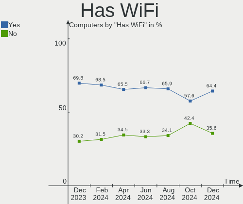
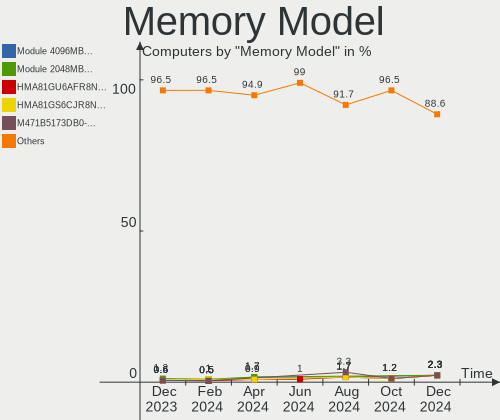

BlackPanther - Hardware Trends
------------------------------

A project to identify most popular hardware characteristics and track their change
over time based on data collected by Linux users at https://Linux-Hardware.org.

Anyone can contribute to this report by the [hw-probe](https://github.com/linuxhw/hw-probe) tool:

    sudo -E hw-probe -all -upload

This is a report for all computer types. See also reports for [desktops](/Dist/BlackPanther/Desktop/README.md) and [notebooks](/Dist/BlackPanther/Notebook/README.md).

This report is for one last month. Overall report since the beginning of time: [TestCoverage](https://github.com/linuxhw/TestCoverage)

Period: Sep, 2022.

Contents
--------

* [ System ](#system)
  - [ OS                       ](#os)
  - [ OS Family                ](#os-family)
  - [ Kernel                   ](#kernel)
  - [ Kernel Family            ](#kernel-family)
  - [ Kernel Major Ver.        ](#kernel-major-ver)
  - [ Arch                     ](#arch)
  - [ DE                       ](#de)
  - [ Display Server           ](#display-server)
  - [ Display Manager          ](#display-manager)
  - [ OS Lang                  ](#os-lang)
  - [ Boot Mode                ](#boot-mode)
  - [ Filesystem               ](#filesystem)
  - [ Part. scheme             ](#part-scheme)
  - [ Dual Boot with Linux/BSD ](#dual-boot-with-linuxbsd)
  - [ Dual Boot (Win)          ](#dual-boot-win)

* [ Board ](#board)
  - [ Vendor                   ](#vendor)
  - [ Model                    ](#model)
  - [ Model Family             ](#model-family)
  - [ MFG Year                 ](#mfg-year)
  - [ Form Factor              ](#form-factor)
  - [ Secure Boot              ](#secure-boot)
  - [ Coreboot                 ](#coreboot)
  - [ RAM Size                 ](#ram-size)
  - [ RAM Used                 ](#ram-used)
  - [ Total Drives             ](#total-drives)
  - [ Has CD-ROM               ](#has-cd-rom)
  - [ Has Ethernet             ](#has-ethernet)
  - [ Has WiFi                 ](#has-wifi)
  - [ Has Bluetooth            ](#has-bluetooth)

* [ Location ](#location)
  - [ Country                  ](#country)
  - [ City                     ](#city)

* [ Drives ](#drives)
  - [ Drive Vendor             ](#drive-vendor)
  - [ Drive Model              ](#drive-model)
  - [ HDD Vendor               ](#hdd-vendor)
  - [ SSD Vendor               ](#ssd-vendor)
  - [ Drive Kind               ](#drive-kind)
  - [ Drive Connector          ](#drive-connector)
  - [ Drive Size               ](#drive-size)
  - [ Space Total              ](#space-total)
  - [ Space Used               ](#space-used)
  - [ Malfunc. Drives          ](#malfunc-drives)
  - [ Malfunc. Drive Vendor    ](#malfunc-drive-vendor)
  - [ Malfunc. HDD Vendor      ](#malfunc-hdd-vendor)
  - [ Malfunc. Drive Kind      ](#malfunc-drive-kind)
  - [ Failed Drives            ](#failed-drives)
  - [ Failed Drive Vendor      ](#failed-drive-vendor)
  - [ Drive Status             ](#drive-status)

* [ Storage controller ](#storage-controller)
  - [ Storage Vendor           ](#storage-vendor)
  - [ Storage Model            ](#storage-model)
  - [ Storage Kind             ](#storage-kind)

* [ Processor ](#processor)
  - [ CPU Vendor               ](#cpu-vendor)
  - [ CPU Model                ](#cpu-model)
  - [ CPU Model Family         ](#cpu-model-family)
  - [ CPU Cores                ](#cpu-cores)
  - [ CPU Sockets              ](#cpu-sockets)
  - [ CPU Threads              ](#cpu-threads)
  - [ CPU Op-Modes             ](#cpu-op-modes)
  - [ CPU Microcode            ](#cpu-microcode)
  - [ CPU Microarch            ](#cpu-microarch)

* [ Graphics ](#graphics)
  - [ GPU Vendor               ](#gpu-vendor)
  - [ GPU Model                ](#gpu-model)
  - [ GPU Combo                ](#gpu-combo)
  - [ GPU Driver               ](#gpu-driver)
  - [ GPU Memory               ](#gpu-memory)

* [ Monitor ](#monitor)
  - [ Monitor Vendor           ](#monitor-vendor)
  - [ Monitor Model            ](#monitor-model)
  - [ Monitor Resolution       ](#monitor-resolution)
  - [ Monitor Diagonal         ](#monitor-diagonal)
  - [ Monitor Width            ](#monitor-width)
  - [ Aspect Ratio             ](#aspect-ratio)
  - [ Monitor Area             ](#monitor-area)
  - [ Pixel Density            ](#pixel-density)
  - [ Multiple Monitors        ](#multiple-monitors)

* [ Network ](#network)
  - [ Net Controller Vendor    ](#net-controller-vendor)
  - [ Net Controller Model     ](#net-controller-model)
  - [ Wireless Vendor          ](#wireless-vendor)
  - [ Wireless Model           ](#wireless-model)
  - [ Ethernet Vendor          ](#ethernet-vendor)
  - [ Ethernet Model           ](#ethernet-model)
  - [ Net Controller Kind      ](#net-controller-kind)
  - [ Used Controller          ](#used-controller)
  - [ NICs                     ](#nics)
  - [ IPv6                     ](#ipv6)

* [ Bluetooth ](#bluetooth)
  - [ Bluetooth Vendor         ](#bluetooth-vendor)
  - [ Bluetooth Model          ](#bluetooth-model)

* [ Sound ](#sound)
  - [ Sound Vendor             ](#sound-vendor)
  - [ Sound Model              ](#sound-model)

* [ Memory ](#memory)
  - [ Memory Vendor            ](#memory-vendor)
  - [ Memory Model             ](#memory-model)
  - [ Memory Kind              ](#memory-kind)
  - [ Memory Form Factor       ](#memory-form-factor)
  - [ Memory Size              ](#memory-size)
  - [ Memory Speed             ](#memory-speed)

* [ Printers & scanners ](#printers--scanners)
  - [ Printer Vendor           ](#printer-vendor)
  - [ Printer Model            ](#printer-model)
  - [ Scanner Vendor           ](#scanner-vendor)
  - [ Scanner Model            ](#scanner-model)

* [ Camera ](#camera)
  - [ Camera Vendor            ](#camera-vendor)
  - [ Camera Model             ](#camera-model)

* [ Security ](#security)
  - [ Fingerprint Vendor       ](#fingerprint-vendor)
  - [ Fingerprint Model        ](#fingerprint-model)
  - [ Chipcard Vendor          ](#chipcard-vendor)
  - [ Chipcard Model           ](#chipcard-model)

* [ Unsupported ](#unsupported)
  - [ Unsupported Devices      ](#unsupported-devices)
  - [ Unsupported Device Types ](#unsupported-device-types)

System
------

OS
--

Installed operating systems

| Name              | Computers | Percent |
|-------------------|-----------|---------|
| BlackPanther 18.1 | 29        | 100%    |

OS Family
---------

OS without a version

| Name         | Computers | Percent |
|--------------|-----------|---------|
| BlackPanther | 29        | 100%    |

Kernel
------

Version of the Linux kernel

| Version             | Computers | Percent |
|---------------------|-----------|---------|
| 4.18.16-desktop-1bP | 22        | 75.86%  |
| 5.6.14-desktop-2bP  | 7         | 24.14%  |

Kernel Family
-------------

Linux kernel without a distro release

| Version | Computers | Percent |
|---------|-----------|---------|
| 4.18.16 | 22        | 75.86%  |
| 5.6.14  | 7         | 24.14%  |

Kernel Major Ver.
-----------------

Linux kernel major version

| Version | Computers | Percent |
|---------|-----------|---------|
| 4.18    | 22        | 75.86%  |
| 5.6     | 7         | 24.14%  |

Arch
----

OS architecture (x86_64, i586, etc.)

| Name   | Computers | Percent |
|--------|-----------|---------|
| x86_64 | 29        | 100%    |

DE
--

Desktop Environment

| Name | Computers | Percent |
|------|-----------|---------|
| KDE5 | 29        | 100%    |

Display Server
--------------

X11 or Wayland

| Name | Computers | Percent |
|------|-----------|---------|
| X11  | 29        | 100%    |

Display Manager
---------------

SDDM, LightDM, etc.

| Name | Computers | Percent |
|------|-----------|---------|
| SDDM | 29        | 100%    |

OS Lang
-------

Language

| Lang    | Computers | Percent |
|---------|-----------|---------|
| Unknown | 29        | 100%    |

Boot Mode
---------

EFI or BIOS

| Mode | Computers | Percent |
|------|-----------|---------|
| BIOS | 18        | 62.07%  |
| EFI  | 11        | 37.93%  |

Filesystem
----------

Type of filesystem

| Type    | Computers | Percent |
|---------|-----------|---------|
| Overlay | 26        | 89.66%  |
| Ext4    | 3         | 10.34%  |

Part. scheme
------------

Scheme of partitioning

| Type | Computers | Percent |
|------|-----------|---------|
| MBR  | 16        | 55.17%  |
| GPT  | 13        | 44.83%  |

Dual Boot with Linux/BSD
------------------------

Hosting more than one Linux/BSD

| Dual boot | Computers | Percent |
|-----------|-----------|---------|
| Yes       | 15        | 51.72%  |
| No        | 14        | 48.28%  |

Dual Boot (Win)
---------------

Hosting Linux and Windows

| Dual boot | Computers | Percent |
|-----------|-----------|---------|
| Yes       | 17        | 58.62%  |
| No        | 12        | 41.38%  |

Board
-----

Vendor
------

Motherboard manufacturer

| Name                | Computers | Percent |
|---------------------|-----------|---------|
| ASUSTek Computer    | 7         | 24.14%  |
| Hewlett-Packard     | 4         | 13.79%  |
| Acer                | 4         | 13.79%  |
| Lenovo              | 3         | 10.34%  |
| Gigabyte Technology | 2         | 6.9%    |
| Dell                | 2         | 6.9%    |
| Toshiba             | 1         | 3.45%   |
| Sony                | 1         | 3.45%   |
| Pegatron            | 1         | 3.45%   |
| MSI                 | 1         | 3.45%   |
| Fujitsu Siemens     | 1         | 3.45%   |
| Fujitsu             | 1         | 3.45%   |
| eMachines           | 1         | 3.45%   |

Model
-----

Motherboard model

| Name                          | Computers | Percent |
|-------------------------------|-----------|---------|
| HP 650                        | 2         | 6.9%    |
| ASUS PRIME A320M-K            | 2         | 6.9%    |
| Toshiba Satellite L450        | 1         | 3.45%   |
| Sony SVS13118GBB              | 1         | 3.45%   |
| Pegatron A15                  | 1         | 3.45%   |
| MSI MS-7752                   | 1         | 3.45%   |
| Lenovo S500 10HS007LHX        | 1         | 3.45%   |
| Lenovo IdeaPad 320-17ABR 80YN | 1         | 3.45%   |
| Lenovo IdeaPad 110-15ISK 80UD | 1         | 3.45%   |
| HP Compaq 6710b (KE125ET#ABD) | 1         | 3.45%   |
| HP Compaq 6005 Pro SFF PC     | 1         | 3.45%   |
| Gigabyte P67A-D3-B3           | 1         | 3.45%   |
| Gigabyte H61M-S1              | 1         | 3.45%   |
| Fujitsu Siemens MS-7504VP-PV  | 1         | 3.45%   |
| Fujitsu LIFEBOOK U745         | 1         | 3.45%   |
| eMachines E725                | 1         | 3.45%   |
| Dell Latitude E6420           | 1         | 3.45%   |
| Dell Latitude E6230           | 1         | 3.45%   |
| ASUS X550CL                   | 1         | 3.45%   |
| ASUS V-M3N8200                | 1         | 3.45%   |
| ASUS P7P55D                   | 1         | 3.45%   |
| ASUS K54HR                    | 1         | 3.45%   |
| ASUS 1015BX                   | 1         | 3.45%   |
| Acer Aspire R3-471T           | 1         | 3.45%   |
| Acer Aspire E1-531            | 1         | 3.45%   |
| Acer Aspire 5820              | 1         | 3.45%   |
| Acer Aspire 5310              | 1         | 3.45%   |

Model Family
------------

Motherboard model prefix

| Name                         | Computers | Percent |
|------------------------------|-----------|---------|
| Acer Aspire                  | 4         | 13.79%  |
| Lenovo IdeaPad               | 2         | 6.9%    |
| HP Compaq                    | 2         | 6.9%    |
| HP 650                       | 2         | 6.9%    |
| Dell Latitude                | 2         | 6.9%    |
| ASUS PRIME                   | 2         | 6.9%    |
| Toshiba Satellite            | 1         | 3.45%   |
| Sony SVS13118GBB             | 1         | 3.45%   |
| Pegatron A15                 | 1         | 3.45%   |
| MSI MS-7752                  | 1         | 3.45%   |
| Lenovo S500                  | 1         | 3.45%   |
| Gigabyte P67A-D3-B3          | 1         | 3.45%   |
| Gigabyte H61M-S1             | 1         | 3.45%   |
| Fujitsu Siemens MS-7504VP-PV | 1         | 3.45%   |
| Fujitsu LIFEBOOK             | 1         | 3.45%   |
| eMachines E725               | 1         | 3.45%   |
| ASUS X550CL                  | 1         | 3.45%   |
| ASUS V-M3N8200               | 1         | 3.45%   |
| ASUS P7P55D                  | 1         | 3.45%   |
| ASUS K54HR                   | 1         | 3.45%   |
| ASUS 1015BX                  | 1         | 3.45%   |

MFG Year
--------

Motherboard manufacture year

| Year | Computers | Percent |
|------|-----------|---------|
| 2012 | 7         | 24.14%  |
| 2011 | 5         | 17.24%  |
| 2009 | 5         | 17.24%  |
| 2017 | 3         | 10.34%  |
| 2014 | 2         | 6.9%    |
| 2008 | 2         | 6.9%    |
| 2018 | 1         | 3.45%   |
| 2016 | 1         | 3.45%   |
| 2013 | 1         | 3.45%   |
| 2010 | 1         | 3.45%   |
| 2007 | 1         | 3.45%   |

Form Factor
-----------

Physical design of the computer

| Name     | Computers | Percent |
|----------|-----------|---------|
| Notebook | 19        | 65.52%  |
| Desktop  | 10        | 34.48%  |

Secure Boot
-----------

Enabled or disabled

| State    | Computers | Percent |
|----------|-----------|---------|
| Disabled | 29        | 100%    |

Coreboot
--------

Have coreboot on board

| Used | Computers | Percent |
|------|-----------|---------|
| No   | 29        | 100%    |

RAM Size
--------

Total RAM memory

| Size in GB | Computers | Percent |
|------------|-----------|---------|
| 3.01-4.0   | 14        | 48.28%  |
| 4.01-8.0   | 5         | 17.24%  |
| 8.01-16.0  | 5         | 17.24%  |
| 1.01-2.0   | 4         | 13.79%  |
| 2.01-3.0   | 1         | 3.45%   |

RAM Used
--------

Used RAM memory

| Used GB  | Computers | Percent |
|----------|-----------|---------|
| 0.51-1.0 | 18        | 62.07%  |
| 0.01-0.5 | 7         | 24.14%  |
| 1.01-2.0 | 4         | 13.79%  |

Total Drives
------------

Number of drives on board

| Drives | Computers | Percent |
|--------|-----------|---------|
| 1      | 20        | 68.97%  |
| 2      | 5         | 17.24%  |
| 4      | 3         | 10.34%  |
| 5      | 1         | 3.45%   |

Has CD-ROM
----------

Has CD-ROM on board

| Presented | Computers | Percent |
|-----------|-----------|---------|
| Yes       | 22        | 75.86%  |
| No        | 7         | 24.14%  |

Has Ethernet
------------

Has Ethernet on board

| Presented | Computers | Percent |
|-----------|-----------|---------|
| Yes       | 27        | 93.1%   |
| No        | 2         | 6.9%    |

Has WiFi
--------

Has WiFi module

| Presented | Computers | Percent |
|-----------|-----------|---------|
| Yes       | 23        | 79.31%  |
| No        | 6         | 20.69%  |

Has Bluetooth
-------------

Has Bluetooth module

| Presented | Computers | Percent |
|-----------|-----------|---------|
| No        | 19        | 65.52%  |
| Yes       | 10        | 34.48%  |

Location
--------

Country
-------

Geographic location (country)

| Country  | Computers | Percent |
|----------|-----------|---------|
| Hungary  | 23        | 79.31%  |
| USA      | 2         | 6.9%    |
| Germany  | 2         | 6.9%    |
| Portugal | 1         | 3.45%   |
| Israel   | 1         | 3.45%   |

City
----

Geographic location (city)

| City             | Computers | Percent |
|------------------|-----------|---------|
| Budapest         | 6         | 20.69%  |
| Debrecen         | 3         | 10.34%  |
| Niedernberg      | 2         | 6.9%    |
| Nagykoros        | 2         | 6.9%    |
| Zselickislak     | 1         | 3.45%   |
| Zalaegerszeg     | 1         | 3.45%   |
| Tatabánya       | 1         | 3.45%   |
| Szolnok          | 1         | 3.45%   |
| Szekszárd       | 1         | 3.45%   |
| Nahariya         | 1         | 3.45%   |
| Minneapolis      | 1         | 3.45%   |
| Los Angeles      | 1         | 3.45%   |
| Kazincbarcika    | 1         | 3.45%   |
| Kapuvar          | 1         | 3.45%   |
| Hodmezovasarhely | 1         | 3.45%   |
| Hatvan           | 1         | 3.45%   |
| Gegeny           | 1         | 3.45%   |
| Dunaharaszti     | 1         | 3.45%   |
| Bodrog           | 1         | 3.45%   |
| Amadora          | 1         | 3.45%   |

Drives
------

Drive Vendor
------------

Hard drive vendors

| Vendor              | Computers | Drives | Percent |
|---------------------|-----------|--------|---------|
| WDC                 | 11        | 15     | 26.19%  |
| Samsung Electronics | 6         | 8      | 14.29%  |
| Hitachi             | 6         | 7      | 14.29%  |
| Seagate             | 5         | 5      | 11.9%   |
| Kingston            | 4         | 4      | 9.52%   |
| Toshiba             | 3         | 3      | 7.14%   |
| Gigabyte Technology | 2         | 2      | 4.76%   |
| Solid               | 1         | 1      | 2.38%   |
| S3SSDE25            | 1         | 1      | 2.38%   |
| PNY                 | 1         | 1      | 2.38%   |
| LITEON              | 1         | 1      | 2.38%   |
| Hewlett-Packard     | 1         | 1      | 2.38%   |

Drive Model
-----------

Hard drive models

| Model                                | Computers | Percent |
|--------------------------------------|-----------|---------|
| WDC WDS240G2G0B-00EPW0 240GB SSD     | 2         | 4.17%   |
| WDC WD15EARS-00MVWB0 1TB             | 2         | 4.17%   |
| Seagate ST500LT012-1DG142 500GB      | 2         | 4.17%   |
| Samsung SP2504C 250GB                | 2         | 4.17%   |
| Hitachi HTS547550A9E384 500GB        | 2         | 4.17%   |
| Gigabyte GP-GSTFS31480GNTD 480GB SSD | 2         | 4.17%   |
| WDC WD800JD-75MSA3 80GB              | 1         | 2.08%   |
| WDC WD5000BPVT-24HXZT3 500GB         | 1         | 2.08%   |
| WDC WD5000BEVT-22A0RT0 500GB         | 1         | 2.08%   |
| WDC WD50 00BEVT-22A0RT0 500GB        | 1         | 2.08%   |
| WDC WD3200BPVT-80JJ5T0 320GB         | 1         | 2.08%   |
| WDC WD3200BEVT-08A23T1 320GB         | 1         | 2.08%   |
| WDC WD30EZRZ-00GXCB0 3TB             | 1         | 2.08%   |
| WDC WD30EFRX-68EUZN0 3TB             | 1         | 2.08%   |
| WDC WD20EZRX-00D8PB0 2TB             | 1         | 2.08%   |
| WDC WD10JPVX-22JC3T0 1TB             | 1         | 2.08%   |
| WDC WD10EZEX-00KUWA0 1TB             | 1         | 2.08%   |
| Toshiba MK8037GSX 80GB               | 1         | 2.08%   |
| Toshiba MK2555GSX 250GB              | 1         | 2.08%   |
| Toshiba MK1637GSX 160GB              | 1         | 2.08%   |
| Solid SSD0240S00 240GB               | 1         | 2.08%   |
| Seagate ST9500325AS 500GB            | 1         | 2.08%   |
| Seagate ST500DM002-1BD142 500GB      | 1         | 2.08%   |
| Seagate BUP Ultra Touch 2TB          | 1         | 2.08%   |
| Samsung SSD 830 Series 64GB          | 1         | 2.08%   |
| Samsung SSD 830 Series 128GB         | 1         | 2.08%   |
| Samsung MZ7LN256HCHP-00000 256GB SSD | 1         | 2.08%   |
| Samsung HD501LJ 500GB                | 1         | 2.08%   |
| Samsung HD154UI 1TB                  | 1         | 2.08%   |
| S3SSDE25 0SL 250GB                   | 1         | 2.08%   |
| PNY SSD2SC240G1CS1754D117-820 240GB  | 1         | 2.08%   |
| LITEON IT LCS-128L9S-HP 128GB SSD    | 1         | 2.08%   |
| Kingston SV300S37A120G 120GB SSD     | 1         | 2.08%   |
| Kingston SNV425S264GB SSD            | 1         | 2.08%   |
| Kingston SA400S37960G 960GB SSD      | 1         | 2.08%   |
| Kingston SA400S37240G 240GB SSD      | 1         | 2.08%   |
| Hitachi HTS723232A7A364 320GB        | 1         | 2.08%   |
| Hitachi HTS543225L9SA00 250GB        | 1         | 2.08%   |
| Hitachi HDT725025VLA380 250GB        | 1         | 2.08%   |
| Hitachi HDS721050CLA660 500GB        | 1         | 2.08%   |

HDD Vendor
----------

Hard disk drive vendors

| Vendor              | Computers | Drives | Percent |
|---------------------|-----------|--------|---------|
| WDC                 | 11        | 13     | 37.93%  |
| Hitachi             | 6         | 7      | 20.69%  |
| Seagate             | 5         | 5      | 17.24%  |
| Samsung Electronics | 4         | 4      | 13.79%  |
| Toshiba             | 3         | 3      | 10.34%  |

SSD Vendor
----------

Solid state drive vendors

| Vendor              | Computers | Drives | Percent |
|---------------------|-----------|--------|---------|
| Kingston            | 4         | 4      | 26.67%  |
| Samsung Electronics | 3         | 4      | 20%     |
| WDC                 | 2         | 2      | 13.33%  |
| Gigabyte Technology | 2         | 2      | 13.33%  |
| Solid               | 1         | 1      | 6.67%   |
| PNY                 | 1         | 1      | 6.67%   |
| LITEON              | 1         | 1      | 6.67%   |
| Hewlett-Packard     | 1         | 1      | 6.67%   |

Drive Kind
----------

HDD or SSD

| Kind    | Computers | Drives | Percent |
|---------|-----------|--------|---------|
| HDD     | 24        | 32     | 63.16%  |
| SSD     | 13        | 16     | 34.21%  |
| Unknown | 1         | 1      | 2.63%   |

Drive Connector
---------------

SATA, SAS, NVMe, etc.

| Type | Computers | Drives | Percent |
|------|-----------|--------|---------|
| SATA | 29        | 46     | 90.63%  |
| SAS  | 3         | 3      | 9.38%   |

Drive Size
----------

Size of hard drive

| Size in TB | Computers | Drives | Percent |
|------------|-----------|--------|---------|
| 0.01-0.5   | 27        | 38     | 75%     |
| 0.51-1.0   | 6         | 6      | 16.67%  |
| 1.01-2.0   | 2         | 2      | 5.56%   |
| 2.01-3.0   | 1         | 2      | 2.78%   |

Space Total
-----------

Amount of disk space available on the file system

| Size in GB | Computers | Percent |
|------------|-----------|---------|
| Unknown    | 26        | 89.66%  |
| 101-250    | 2         | 6.9%    |
| 51-100     | 1         | 3.45%   |

Space Used
----------

Amount of used disk space

| Used GB | Computers | Percent |
|---------|-----------|---------|
| Unknown | 26        | 89.66%  |
| 1-20    | 3         | 10.34%  |

Malfunc. Drives
---------------

Drive models with a malfunction

| Model                             | Computers | Drives | Percent |
|-----------------------------------|-----------|--------|---------|
| WDC WD15EARS-00MVWB0 1TB          | 2         | 2      | 14.29%  |
| Samsung Electronics SP2504C 250GB | 2         | 2      | 14.29%  |
| Hitachi HTS547550A9E384 500GB     | 2         | 2      | 14.29%  |
| WDC WD3200BEVT-08A23T1 320GB      | 1         | 1      | 7.14%   |
| Toshiba MK2555GSX 250GB           | 1         | 1      | 7.14%   |
| Toshiba MK1637GSX 160GB           | 1         | 1      | 7.14%   |
| Seagate ST9500325AS 500GB         | 1         | 1      | 7.14%   |
| Kingston SNV425S264GB SSD         | 1         | 1      | 7.14%   |
| Hitachi HTS723232A7A364 320GB     | 1         | 1      | 7.14%   |
| Hitachi HTS543225L9SA00 250GB     | 1         | 1      | 7.14%   |
| Hitachi HDT725025VLA380 250GB     | 1         | 1      | 7.14%   |

Malfunc. Drive Vendor
---------------------

Vendors of faulty drives

| Vendor              | Computers | Drives | Percent |
|---------------------|-----------|--------|---------|
| Hitachi             | 5         | 5      | 35.71%  |
| WDC                 | 3         | 3      | 21.43%  |
| Toshiba             | 2         | 2      | 14.29%  |
| Samsung Electronics | 2         | 2      | 14.29%  |
| Seagate             | 1         | 1      | 7.14%   |
| Kingston            | 1         | 1      | 7.14%   |

Malfunc. HDD Vendor
-------------------

Vendors of faulty HDD drives

| Vendor              | Computers | Drives | Percent |
|---------------------|-----------|--------|---------|
| Hitachi             | 5         | 5      | 38.46%  |
| WDC                 | 3         | 3      | 23.08%  |
| Toshiba             | 2         | 2      | 15.38%  |
| Samsung Electronics | 2         | 2      | 15.38%  |
| Seagate             | 1         | 1      | 7.69%   |

Malfunc. Drive Kind
-------------------

Kinds of faulty drives

| Kind | Computers | Drives | Percent |
|------|-----------|--------|---------|
| HDD  | 11        | 13     | 91.67%  |
| SSD  | 1         | 1      | 8.33%   |

Failed Drives
-------------

Failed drive models

| Model                        | Computers | Drives | Percent |
|------------------------------|-----------|--------|---------|
| WDC WD5000BEVT-22A0RT0 500GB | 1         | 1      | 100%    |

Failed Drive Vendor
-------------------

Failed drive vendors

| Vendor | Computers | Drives | Percent |
|--------|-----------|--------|---------|
| WDC    | 1         | 1      | 100%    |

Drive Status
------------

Number of failed and malfunc. drives

| Status   | Computers | Drives | Percent |
|----------|-----------|--------|---------|
| Works    | 21        | 31     | 58.33%  |
| Malfunc  | 11        | 14     | 30.56%  |
| Detected | 3         | 3      | 8.33%   |
| Failed   | 1         | 1      | 2.78%   |

Storage controller
------------------

Storage Vendor
--------------

Storage controller vendors

| Vendor             | Computers | Percent |
|--------------------|-----------|---------|
| Intel              | 22        | 73.33%  |
| AMD                | 5         | 16.67%  |
| Nvidia             | 2         | 6.67%   |
| JMicron Technology | 1         | 3.33%   |

Storage Model
-------------

Storage controller models

| Model                                                                                   | Computers | Percent |
|-----------------------------------------------------------------------------------------|-----------|---------|
| Intel 7 Series Chipset Family 6-port SATA Controller [AHCI mode]                        | 5         | 13.16%  |
| AMD FCH SATA Controller [AHCI mode]                                                     | 3         | 7.89%   |
| Intel Wildcat Point-LP SATA Controller [AHCI Mode]                                      | 2         | 5.26%   |
| Intel 82801IBM/IEM (ICH9M/ICH9M-E) 4 port SATA Controller [AHCI mode]                   | 2         | 5.26%   |
| Intel 82801 Mobile SATA Controller [RAID mode]                                          | 2         | 5.26%   |
| Intel 6 Series/C200 Series Chipset Family Desktop SATA Controller (IDE mode, ports 4-5) | 2         | 5.26%   |
| Intel 6 Series/C200 Series Chipset Family Desktop SATA Controller (IDE mode, ports 0-3) | 2         | 5.26%   |
| Intel 6 Series/C200 Series Chipset Family 6 port Mobile SATA AHCI Controller            | 2         | 5.26%   |
| AMD SB7x0/SB8x0/SB9x0 SATA Controller [AHCI mode]                                       | 2         | 5.26%   |
| AMD FCH SATA Controller D                                                               | 2         | 5.26%   |
| Nvidia MCP78S [GeForce 8200] SATA Controller (non-AHCI mode)                            | 1         | 2.63%   |
| Nvidia MCP78S [GeForce 8200] IDE                                                        | 1         | 2.63%   |
| Nvidia GeForce 7100/nForce 630i SATA                                                    | 1         | 2.63%   |
| JMicron JMB363 SATA/IDE Controller                                                      | 1         | 2.63%   |
| Intel Sunrise Point-LP SATA Controller [AHCI mode]                                      | 1         | 2.63%   |
| Intel 82801HM/HEM (ICH8M/ICH8M-E) SATA Controller [AHCI mode]                           | 1         | 2.63%   |
| Intel 82801HM/HEM (ICH8M/ICH8M-E) IDE Controller                                        | 1         | 2.63%   |
| Intel 82801GBM/GHM (ICH7-M Family) SATA Controller [AHCI mode]                          | 1         | 2.63%   |
| Intel 82801G (ICH7 Family) IDE Controller                                               | 1         | 2.63%   |
| Intel 8 Series/C220 Series Chipset Family 6-port SATA Controller 1 [AHCI mode]          | 1         | 2.63%   |
| Intel 7 Series/C210 Series Chipset Family 6-port SATA Controller [AHCI mode]            | 1         | 2.63%   |
| Intel 5 Series/3400 Series Chipset 4 port SATA IDE Controller                           | 1         | 2.63%   |
| Intel 5 Series/3400 Series Chipset 4 port SATA AHCI Controller                          | 1         | 2.63%   |
| Intel 5 Series/3400 Series Chipset 2 port SATA IDE Controller                           | 1         | 2.63%   |

Storage Kind
------------

Kind of storage controller (IDE, SATA, NVMe, SAS, ...)

| Kind | Computers | Percent |
|------|-----------|---------|
| SATA | 23        | 74.19%  |
| IDE  | 6         | 19.35%  |
| RAID | 2         | 6.45%   |

Processor
---------

CPU Vendor
----------

Processor vendors

| Vendor | Computers | Percent |
|--------|-----------|---------|
| Intel  | 23        | 79.31%  |
| AMD    | 6         | 20.69%  |

CPU Model
---------

Processor models

| Model                                           | Computers | Percent |
|-------------------------------------------------|-----------|---------|
| Intel Core i3-3220 CPU @ 3.30GHz                | 2         | 6.9%    |
| Intel Celeron CPU B830 @ 1.80GHz                | 2         | 6.9%    |
| AMD A10-9700 RADEON R7, 10 COMPUTE CORES 4C+6G  | 2         | 6.9%    |
| Intel Pentium Dual-Core CPU T4400 @ 2.20GHz     | 1         | 3.45%   |
| Intel Pentium CPU 2117U @ 1.80GHz               | 1         | 3.45%   |
| Intel Pentium CPU 2020M @ 2.40GHz               | 1         | 3.45%   |
| Intel Core i7-5600U CPU @ 2.60GHz               | 1         | 3.45%   |
| Intel Core i5-5200U CPU @ 2.20GHz               | 1         | 3.45%   |
| Intel Core i5-3340M CPU @ 2.70GHz               | 1         | 3.45%   |
| Intel Core i5-3210M CPU @ 2.50GHz               | 1         | 3.45%   |
| Intel Core i5-2520M CPU @ 2.50GHz               | 1         | 3.45%   |
| Intel Core i5-2300 CPU @ 2.80GHz                | 1         | 3.45%   |
| Intel Core i5 CPU 650 @ 3.20GHz                 | 1         | 3.45%   |
| Intel Core i3-6100U CPU @ 2.30GHz               | 1         | 3.45%   |
| Intel Core i3-4170 CPU @ 3.70GHz                | 1         | 3.45%   |
| Intel Core i3 CPU M 380 @ 2.53GHz               | 1         | 3.45%   |
| Intel Core 2 Quad CPU Q8200 @ 2.33GHz           | 1         | 3.45%   |
| Intel Core 2 Duo CPU T8300 @ 2.40GHz            | 1         | 3.45%   |
| Intel Celeron M CPU 520 @ 1.60GHz               | 1         | 3.45%   |
| Intel Celeron CPU B815 @ 1.60GHz                | 1         | 3.45%   |
| Intel Celeron CPU B800 @ 1.50GHz                | 1         | 3.45%   |
| Intel Celeron CPU 900 @ 2.20GHz                 | 1         | 3.45%   |
| AMD C-60 APU with Radeon HD Graphics            | 1         | 3.45%   |
| AMD Athlon II X2 220 Processor                  | 1         | 3.45%   |
| AMD Athlon 64 X2 Dual Core Processor 5000+      | 1         | 3.45%   |
| AMD A12-9720P RADEON R7, 12 COMPUTE CORES 4C+8G | 1         | 3.45%   |

CPU Model Family
----------------

Processor model prefix

| Model                   | Computers | Percent |
|-------------------------|-----------|---------|
| Intel Core i5           | 6         | 20.69%  |
| Intel Core i3           | 5         | 17.24%  |
| Intel Celeron           | 5         | 17.24%  |
| Intel Pentium           | 2         | 6.9%    |
| AMD A10                 | 2         | 6.9%    |
| Intel Pentium Dual-Core | 1         | 3.45%   |
| Intel Core i7           | 1         | 3.45%   |
| Intel Core 2 Quad       | 1         | 3.45%   |
| Intel Core 2 Duo        | 1         | 3.45%   |
| Intel Celeron M         | 1         | 3.45%   |
| AMD C-60                | 1         | 3.45%   |
| AMD Athlon II X2        | 1         | 3.45%   |
| AMD Athlon 64 X2        | 1         | 3.45%   |
| AMD A12                 | 1         | 3.45%   |

CPU Cores
---------

Number of processor cores

| Number | Computers | Percent |
|--------|-----------|---------|
| 2      | 25        | 86.21%  |
| 4      | 2         | 6.9%    |
| 1      | 2         | 6.9%    |

CPU Sockets
-----------

Number of sockets

| Number | Computers | Percent |
|--------|-----------|---------|
| 1      | 29        | 100%    |

CPU Threads
-----------

Threads per core (Hyper-Threading)

| Number | Computers | Percent |
|--------|-----------|---------|
| 1      | 15        | 51.72%  |
| 2      | 14        | 48.28%  |

CPU Op-Modes
------------

CPU Operation Modes (32-bit, 64-bit)

| Op mode        | Computers | Percent |
|----------------|-----------|---------|
| 32-bit, 64-bit | 29        | 100%    |

CPU Microcode
-------------

Microcode number

| Number     | Computers | Percent |
|------------|-----------|---------|
| 0x306a9    | 6         | 20.69%  |
| 0x206a7    | 6         | 20.69%  |
| 0x06006118 | 3         | 10.34%  |
| 0x306d4    | 2         | 6.9%    |
| 0x1067a    | 2         | 6.9%    |
| 0x6f6      | 1         | 3.45%   |
| 0x406e3    | 1         | 3.45%   |
| 0x306c3    | 1         | 3.45%   |
| 0x20655    | 1         | 3.45%   |
| 0x20652    | 1         | 3.45%   |
| 0x10677    | 1         | 3.45%   |
| 0x10676    | 1         | 3.45%   |
| 0x05000119 | 1         | 3.45%   |
| 0x010000c8 | 1         | 3.45%   |
| Unknown    | 1         | 3.45%   |

CPU Microarch
-------------

Microarchitecture

| Name        | Computers | Percent |
|-------------|-----------|---------|
| SandyBridge | 6         | 20.69%  |
| IvyBridge   | 6         | 20.69%  |
| Penryn      | 4         | 13.79%  |
| Excavator   | 3         | 10.34%  |
| Westmere    | 2         | 6.9%    |
| Broadwell   | 2         | 6.9%    |
| Skylake     | 1         | 3.45%   |
| K8 Hammer   | 1         | 3.45%   |
| K10         | 1         | 3.45%   |
| Haswell     | 1         | 3.45%   |
| Core        | 1         | 3.45%   |
| Bobcat      | 1         | 3.45%   |

Graphics
--------

GPU Vendor
----------

Vendors of graphics cards

| Vendor           | Computers | Percent |
|------------------|-----------|---------|
| Intel            | 17        | 54.84%  |
| AMD              | 7         | 22.58%  |
| Nvidia           | 5         | 16.13%  |
| ATI Technologies | 2         | 6.45%   |

GPU Model
---------

Graphics card models

| Model                                                                                 | Computers | Percent |
|---------------------------------------------------------------------------------------|-----------|---------|
| Intel 3rd Gen Core processor Graphics Controller                                      | 4         | 11.43%  |
| Intel 2nd Generation Core Processor Family Integrated Graphics Controller             | 4         | 11.43%  |
| AMD Cedar [Radeon HD 5000/6000/7350/8350 Series]                                      | 3         | 8.57%   |
| Intel Mobile 4 Series Chipset Integrated Graphics Controller                          | 2         | 5.71%   |
| Intel HD Graphics 5500                                                                | 2         | 5.71%   |
| ATI Technologies Wani [Radeon R5/R6/R7 Graphics]                                      | 2         | 5.71%   |
| Nvidia GK107M [GeForce GT 640M LE]                                                    | 1         | 2.86%   |
| Nvidia GK107 [GeForce GTX 650]                                                        | 1         | 2.86%   |
| Nvidia GF117M [GeForce 610M/710M/810M/820M / GT 620M/625M/630M/720M]                  | 1         | 2.86%   |
| Nvidia G84 [GeForce 8600 GS]                                                          | 1         | 2.86%   |
| Nvidia C73 [GeForce 7100 / nForce 630i]                                               | 1         | 2.86%   |
| Intel Skylake GT2 [HD Graphics 520]                                                   | 1         | 2.86%   |
| Intel Mobile GM965/GL960 Integrated Graphics Controller (secondary)                   | 1         | 2.86%   |
| Intel Mobile GM965/GL960 Integrated Graphics Controller (primary)                     | 1         | 2.86%   |
| Intel Mobile 945GM/GMS/GME, 943/940GML Express Integrated Graphics Controller         | 1         | 2.86%   |
| Intel Mobile 945GM/GMS, 943/940GML Express Integrated Graphics Controller             | 1         | 2.86%   |
| Intel Core Processor Integrated Graphics Controller                                   | 1         | 2.86%   |
| Intel 4th Generation Core Processor Family Integrated Graphics Controller             | 1         | 2.86%   |
| AMD Wrestler [Radeon HD 6290]                                                         | 1         | 2.86%   |
| AMD Wani [Radeon R5/R6/R7 Graphics]                                                   | 1         | 2.86%   |
| AMD Topaz XT [Radeon R7 M260/M265 / M340/M360 / M440/M445 / 530/535 / 620/625 Mobile] | 1         | 2.86%   |
| AMD Seymour [Radeon HD 6400M/7400M Series]                                            | 1         | 2.86%   |
| AMD RS880 [Radeon HD 4200]                                                            | 1         | 2.86%   |
| AMD Redwood XT [Radeon HD 5670/5690/5730]                                             | 1         | 2.86%   |

GPU Combo
---------

Combinations of graphics cards

| Name           | Computers | Percent |
|----------------|-----------|---------|
| 1 x Intel      | 15        | 51.72%  |
| 1 x AMD        | 7         | 24.14%  |
| 1 x Nvidia     | 3         | 10.34%  |
| 2 x AMD        | 2         | 6.9%    |
| Intel + Nvidia | 2         | 6.9%    |

GPU Driver
----------

Free vs proprietary

| Driver  | Computers | Percent |
|---------|-----------|---------|
| Free    | 28        | 96.55%  |
| Unknown | 1         | 3.45%   |

GPU Memory
----------

Total video memory

| Size in GB | Computers | Percent |
|------------|-----------|---------|
| Unknown    | 15        | 51.72%  |
| 0.51-1.0   | 9         | 31.03%  |
| 0.01-0.5   | 5         | 17.24%  |

Monitor
-------

Monitor Vendor
--------------

Monitor vendors

| Vendor                  | Computers | Percent |
|-------------------------|-----------|---------|
| LG Display              | 6         | 22.22%  |
| AU Optronics            | 6         | 22.22%  |
| Goldstar                | 4         | 14.81%  |
| Chimei Innolux          | 2         | 7.41%   |
| BOE                     | 2         | 7.41%   |
| Ancor Communications    | 2         | 7.41%   |
| Vestel Elektronik       | 1         | 3.7%    |
| Samsung Electronics     | 1         | 3.7%    |
| Philips                 | 1         | 3.7%    |
| InfoVision              | 1         | 3.7%    |
| Chi Mei Optoelectronics | 1         | 3.7%    |

Monitor Model
-------------

Monitor models

| Model                                                                    | Computers | Percent |
|--------------------------------------------------------------------------|-----------|---------|
| LG Display LCD Monitor LGD02DC 1366x768 344x194mm 15.5-inch              | 2         | 7.41%   |
| AU Optronics LCD Monitor AUO23EC 1366x768 344x193mm 15.5-inch            | 2         | 7.41%   |
| Ancor Communications ASUS PG191 ACI19B1 1280x1024 376x301mm 19.0-inch    | 2         | 7.41%   |
| Vestel Elektronik 24W_LCD_TV VES3700 1920x1080 706x398mm 31.9-inch       | 1         | 3.7%    |
| Samsung Electronics S22C150 SAM0AE5 1920x1080 477x268mm 21.5-inch        | 1         | 3.7%    |
| Philips 273ELH PHLC07D 1920x1080 598x336mm 27.0-inch                     | 1         | 3.7%    |
| LG Display LCD Monitor LGD6302 1366x768 344x194mm 15.5-inch              | 1         | 3.7%    |
| LG Display LCD Monitor LGD2297 1366x768 345x194mm 15.6-inch              | 1         | 3.7%    |
| LG Display LCD Monitor LGD036C 1366x768 277x156mm 12.5-inch              | 1         | 3.7%    |
| LG Display LCD Monitor LGD02DF 1600x900 310x174mm 14.0-inch              | 1         | 3.7%    |
| InfoVision LCD Monitor IVO03F4 1024x600 223x125mm 10.1-inch              | 1         | 3.7%    |
| Goldstar W2442 GSM56CC 1920x1080 531x299mm 24.0-inch                     | 1         | 3.7%    |
| Goldstar L225W GSM5662 1680x1050 474x296mm 22.0-inch                     | 1         | 3.7%    |
| Goldstar L204WT GSM4E48 1680x1050 434x270mm 20.1-inch                    | 1         | 3.7%    |
| Goldstar E2350 GSM5790 1920x1080 510x290mm 23.1-inch                     | 1         | 3.7%    |
| Chimei Innolux LCD Monitor CMN14C3 1366x768 309x173mm 13.9-inch          | 1         | 3.7%    |
| Chimei Innolux LCD Monitor CMN1340 1600x900 294x165mm 13.3-inch          | 1         | 3.7%    |
| Chi Mei Optoelectronics LCD Monitor CMO1524 1280x800 331x207mm 15.4-inch | 1         | 3.7%    |
| BOE LCD Monitor BOE0685 1600x900 382x215mm 17.3-inch                     | 1         | 3.7%    |
| BOE LCD Monitor BOE0672 1366x768 344x194mm 15.5-inch                     | 1         | 3.7%    |
| AU Optronics LCD Monitor AUO8174 1280x800 331x207mm 15.4-inch            | 1         | 3.7%    |
| AU Optronics LCD Monitor AUO293C 1366x768 309x173mm 13.9-inch            | 1         | 3.7%    |
| AU Optronics LCD Monitor AUO20EC 1366x768 344x193mm 15.5-inch            | 1         | 3.7%    |
| AU Optronics LCD Monitor AUO10EC 1366x768 344x193mm 15.5-inch            | 1         | 3.7%    |

Monitor Resolution
------------------

Monitor screen resolution

| Resolution         | Computers | Percent |
|--------------------|-----------|---------|
| 1366x768 (WXGA)    | 12        | 44.44%  |
| 1920x1080 (FHD)    | 4         | 14.81%  |
| 1600x900 (HD+)     | 3         | 11.11%  |
| 1680x1050 (WSXGA+) | 2         | 7.41%   |
| 1280x800 (WXGA)    | 2         | 7.41%   |
| 1280x1024 (SXGA)   | 2         | 7.41%   |
| 3840x2160 (4K)     | 1         | 3.7%    |
| 1920x1200 (WUXGA)  | 1         | 3.7%    |

Monitor Diagonal
----------------

Diagonal size in inches

| Inches | Computers | Percent |
|--------|-----------|---------|
| 15     | 12        | 44.44%  |
| 13     | 3         | 11.11%  |
| 19     | 2         | 7.41%   |
| 84     | 1         | 3.7%    |
| 27     | 1         | 3.7%    |
| 24     | 1         | 3.7%    |
| 23     | 1         | 3.7%    |
| 22     | 1         | 3.7%    |
| 21     | 1         | 3.7%    |
| 20     | 1         | 3.7%    |
| 17     | 1         | 3.7%    |
| 14     | 1         | 3.7%    |
| 12     | 1         | 3.7%    |

Monitor Width
-------------

Physical width

| Width in mm | Computers | Percent |
|-------------|-----------|---------|
| 301-350     | 15        | 55.56%  |
| 501-600     | 3         | 11.11%  |
| 401-500     | 3         | 11.11%  |
| 351-400     | 3         | 11.11%  |
| 201-300     | 2         | 7.41%   |
| 1501-2000   | 1         | 3.7%    |

Aspect Ratio
------------

Proportional relationship between the width and the height

| Ratio | Computers | Percent |
|-------|-----------|---------|
| 16/9  | 21        | 77.78%  |
| 16/10 | 4         | 14.81%  |
| 6/5   | 2         | 7.41%   |

Monitor Area
------------

Area in inch²

| Area in inch² | Computers | Percent |
|----------------|-----------|---------|
| 101-110        | 12        | 44.44%  |
| 201-250        | 4         | 14.81%  |
| 81-90          | 3         | 11.11%  |
| 151-200        | 3         | 11.11%  |
| More than 1000 | 1         | 3.7%    |
| 71-80          | 1         | 3.7%    |
| 61-70          | 1         | 3.7%    |
| 301-350        | 1         | 3.7%    |
| 121-130        | 1         | 3.7%    |

Pixel Density
-------------

Pixels per inch

| Density | Computers | Percent |
|---------|-----------|---------|
| 101-120 | 14        | 51.85%  |
| 51-100  | 10        | 37.04%  |
| 121-160 | 3         | 11.11%  |

Multiple Monitors
-----------------

Total monitors connected

| Total | Computers | Percent |
|-------|-----------|---------|
| 1     | 28        | 96.55%  |
| 2     | 1         | 3.45%   |

Network
-------

Net Controller Vendor
---------------------

Controller vendors

| Vendor                | Computers | Percent |
|-----------------------|-----------|---------|
| Realtek Semiconductor | 15        | 33.33%  |
| Qualcomm Atheros      | 11        | 24.44%  |
| Intel                 | 5         | 11.11%  |
| Broadcom              | 4         | 8.89%   |
| Broadcom Limited      | 3         | 6.67%   |
| TP-Link               | 2         | 4.44%   |
| Huawei Technologies   | 2         | 4.44%   |
| Ralink                | 1         | 2.22%   |
| Nvidia                | 1         | 2.22%   |
| Attansic Technology   | 1         | 2.22%   |

Net Controller Model
--------------------

Controller models

| Model                                                             | Computers | Percent |
|-------------------------------------------------------------------|-----------|---------|
| Realtek RTL8111/8168/8411 PCI Express Gigabit Ethernet Controller | 12        | 23.08%  |
| Qualcomm Atheros AR9485 Wireless Network Adapter                  | 3         | 5.77%   |
| Realtek RTL8821AE 802.11ac PCIe Wireless Network Adapter          | 2         | 3.85%   |
| Qualcomm Atheros QCA9565 / AR9565 Wireless Network Adapter        | 2         | 3.85%   |
| Qualcomm Atheros AR9285 Wireless Network Adapter (PCI-Express)    | 2         | 3.85%   |
| Qualcomm Atheros AR8151 v2.0 Gigabit Ethernet                     | 2         | 3.85%   |
| Intel 82579LM Gigabit Network Connection (Lewisville)             | 2         | 3.85%   |
| Broadcom Limited NetLink BCM5787M Gigabit Ethernet PCI Express    | 2         | 3.85%   |
| TP-Link TL-WN821N v5/v6 [RTL8192EU]                               | 1         | 1.92%   |
| TP-Link TL-WN722N v2/v3 [Realtek RTL8188EUS]                      | 1         | 1.92%   |
| Realtek RTL8188EE Wireless Network Adapter                        | 1         | 1.92%   |
| Realtek RTL8187B Wireless Adapter                                 | 1         | 1.92%   |
| Realtek RTL8169 PCI Gigabit Ethernet Controller                   | 1         | 1.92%   |
| Realtek RTL810xE PCI Express Fast Ethernet controller             | 1         | 1.92%   |
| Ralink RT5390 Wireless 802.11n 1T/1R PCIe                         | 1         | 1.92%   |
| Qualcomm Atheros QCA9377 802.11ac Wireless Network Adapter        | 1         | 1.92%   |
| Qualcomm Atheros AR9287 Wireless Network Adapter (PCI-Express)    | 1         | 1.92%   |
| Qualcomm Atheros AR8151 v1.0 Gigabit Ethernet                     | 1         | 1.92%   |
| Qualcomm Atheros AR8132 Fast Ethernet                             | 1         | 1.92%   |
| Nvidia MCP73 Ethernet                                             | 1         | 1.92%   |
| Intel Wireless 7265                                               | 1         | 1.92%   |
| Intel Wireless 3160                                               | 1         | 1.92%   |
| Intel PRO/Wireless 3945ABG [Golan] Network Connection             | 1         | 1.92%   |
| Intel Ethernet Connection (3) I218-LM                             | 1         | 1.92%   |
| Intel Centrino Advanced-N 6205 [Taylor Peak]                      | 1         | 1.92%   |
| Huawei EM770W miniPCI WCDMA Modem                                 | 1         | 1.92%   |
| Huawei E353/E3131                                                 | 1         | 1.92%   |
| Broadcom NetXtreme BCM5761 Gigabit Ethernet PCIe                  | 1         | 1.92%   |
| Broadcom NetLink BCM57785 Gigabit Ethernet PCIe                   | 1         | 1.92%   |
| Broadcom Limited BCM4312 802.11b/g LP-PHY                         | 1         | 1.92%   |
| Broadcom BCM4313 802.11bgn Wireless Network Adapter               | 1         | 1.92%   |
| Broadcom BCM4311 802.11b/g WLAN                                   | 1         | 1.92%   |
| Attansic AR8152 v2.0 Fast Ethernet                                | 1         | 1.92%   |

Wireless Vendor
---------------

Wireless vendors

| Vendor                | Computers | Percent |
|-----------------------|-----------|---------|
| Qualcomm Atheros      | 9         | 39.13%  |
| Realtek Semiconductor | 4         | 17.39%  |
| Intel                 | 4         | 17.39%  |
| TP-Link               | 2         | 8.7%    |
| Broadcom              | 2         | 8.7%    |
| Ralink                | 1         | 4.35%   |
| Broadcom Limited      | 1         | 4.35%   |

Wireless Model
--------------

Wireless models

| Model                                                          | Computers | Percent |
|----------------------------------------------------------------|-----------|---------|
| Qualcomm Atheros AR9485 Wireless Network Adapter               | 3         | 13.04%  |
| Realtek RTL8821AE 802.11ac PCIe Wireless Network Adapter       | 2         | 8.7%    |
| Qualcomm Atheros QCA9565 / AR9565 Wireless Network Adapter     | 2         | 8.7%    |
| Qualcomm Atheros AR9285 Wireless Network Adapter (PCI-Express) | 2         | 8.7%    |
| TP-Link TL-WN821N v5/v6 [RTL8192EU]                            | 1         | 4.35%   |
| TP-Link TL-WN722N v2/v3 [Realtek RTL8188EUS]                   | 1         | 4.35%   |
| Realtek RTL8188EE Wireless Network Adapter                     | 1         | 4.35%   |
| Realtek RTL8187B Wireless Adapter                              | 1         | 4.35%   |
| Ralink RT5390 Wireless 802.11n 1T/1R PCIe                      | 1         | 4.35%   |
| Qualcomm Atheros QCA9377 802.11ac Wireless Network Adapter     | 1         | 4.35%   |
| Qualcomm Atheros AR9287 Wireless Network Adapter (PCI-Express) | 1         | 4.35%   |
| Intel Wireless 7265                                            | 1         | 4.35%   |
| Intel Wireless 3160                                            | 1         | 4.35%   |
| Intel PRO/Wireless 3945ABG [Golan] Network Connection          | 1         | 4.35%   |
| Intel Centrino Advanced-N 6205 [Taylor Peak]                   | 1         | 4.35%   |
| Broadcom Limited BCM4312 802.11b/g LP-PHY                      | 1         | 4.35%   |
| Broadcom BCM4313 802.11bgn Wireless Network Adapter            | 1         | 4.35%   |
| Broadcom BCM4311 802.11b/g WLAN                                | 1         | 4.35%   |

Ethernet Vendor
---------------

Ethernet vendors

| Vendor                | Computers | Percent |
|-----------------------|-----------|---------|
| Realtek Semiconductor | 14        | 50%     |
| Qualcomm Atheros      | 4         | 14.29%  |
| Intel                 | 3         | 10.71%  |
| Broadcom Limited      | 2         | 7.14%   |
| Broadcom              | 2         | 7.14%   |
| Nvidia                | 1         | 3.57%   |
| Huawei Technologies   | 1         | 3.57%   |
| Attansic Technology   | 1         | 3.57%   |

Ethernet Model
--------------

Ethernet models

| Model                                                             | Computers | Percent |
|-------------------------------------------------------------------|-----------|---------|
| Realtek RTL8111/8168/8411 PCI Express Gigabit Ethernet Controller | 12        | 42.86%  |
| Qualcomm Atheros AR8151 v2.0 Gigabit Ethernet                     | 2         | 7.14%   |
| Intel 82579LM Gigabit Network Connection (Lewisville)             | 2         | 7.14%   |
| Broadcom Limited NetLink BCM5787M Gigabit Ethernet PCI Express    | 2         | 7.14%   |
| Realtek RTL8169 PCI Gigabit Ethernet Controller                   | 1         | 3.57%   |
| Realtek RTL810xE PCI Express Fast Ethernet controller             | 1         | 3.57%   |
| Qualcomm Atheros AR8151 v1.0 Gigabit Ethernet                     | 1         | 3.57%   |
| Qualcomm Atheros AR8132 Fast Ethernet                             | 1         | 3.57%   |
| Nvidia MCP73 Ethernet                                             | 1         | 3.57%   |
| Intel Ethernet Connection (3) I218-LM                             | 1         | 3.57%   |
| Huawei E353/E3131                                                 | 1         | 3.57%   |
| Broadcom NetXtreme BCM5761 Gigabit Ethernet PCIe                  | 1         | 3.57%   |
| Broadcom NetLink BCM57785 Gigabit Ethernet PCIe                   | 1         | 3.57%   |
| Attansic AR8152 v2.0 Fast Ethernet                                | 1         | 3.57%   |

Net Controller Kind
-------------------

Ethernet, WiFi or modem

| Kind     | Computers | Percent |
|----------|-----------|---------|
| Ethernet | 27        | 54%     |
| WiFi     | 22        | 44%     |
| Modem    | 1         | 2%      |

Used Controller
---------------

Currently used network controller

| Kind     | Computers | Percent |
|----------|-----------|---------|
| WiFi     | 20        | 68.97%  |
| Ethernet | 9         | 31.03%  |

NICs
----

Total network controllers on board

| Total | Computers | Percent |
|-------|-----------|---------|
| 2     | 20        | 68.97%  |
| 1     | 7         | 24.14%  |
| 0     | 2         | 6.9%    |

IPv6
----

IPv6 vs IPv4

| Used | Computers | Percent |
|------|-----------|---------|
| No   | 19        | 65.52%  |
| Yes  | 10        | 34.48%  |

Bluetooth
---------

Bluetooth Vendor
----------------

Controller vendors

| Vendor                          | Computers | Percent |
|---------------------------------|-----------|---------|
| Qualcomm Atheros Communications | 3         | 30%     |
| Realtek Semiconductor           | 2         | 20%     |
| Cambridge Silicon Radio         | 2         | 20%     |
| Intel                           | 1         | 10%     |
| Hewlett-Packard                 | 1         | 10%     |
| Foxconn / Hon Hai               | 1         | 10%     |

Bluetooth Model
---------------

Controller models

| Model                                               | Computers | Percent |
|-----------------------------------------------------|-----------|---------|
| Realtek Bluetooth Radio                             | 2         | 20%     |
| Qualcomm Atheros AR3012 Bluetooth                   | 2         | 20%     |
| Cambridge Silicon Radio Bluetooth Dongle (HCI mode) | 2         | 20%     |
| Qualcomm Atheros  Bluetooth Device                  | 1         | 10%     |
| Intel Bluetooth wireless interface                  | 1         | 10%     |
| HP Bluetooth 2.0 Interface [Broadcom BCM2045]       | 1         | 10%     |
| Foxconn / Hon Hai Bluetooth USB Host Controller     | 1         | 10%     |

Sound
-----

Sound Vendor
------------

Sound card vendors

| Vendor           | Computers | Percent |
|------------------|-----------|---------|
| Intel            | 22        | 61.11%  |
| AMD              | 9         | 25%     |
| Nvidia           | 3         | 8.33%   |
| ATI Technologies | 2         | 5.56%   |

Sound Model
-----------

Sound card models

| Model                                                                             | Computers | Percent |
|-----------------------------------------------------------------------------------|-----------|---------|
| Intel 7 Series/C216 Chipset Family High Definition Audio Controller               | 7         | 16.67%  |
| Intel 6 Series/C200 Series Chipset Family High Definition Audio Controller        | 5         | 11.9%   |
| AMD Family 15h (Models 60h-6fh) Audio Controller                                  | 3         | 7.14%   |
| AMD Cedar HDMI Audio [Radeon HD 5400/6300/7300 Series]                            | 3         | 7.14%   |
| Intel Wildcat Point-LP High Definition Audio Controller                           | 2         | 4.76%   |
| Intel Broadwell-U Audio Controller                                                | 2         | 4.76%   |
| Intel 82801I (ICH9 Family) HD Audio Controller                                    | 2         | 4.76%   |
| Intel 5 Series/3400 Series Chipset High Definition Audio                          | 2         | 4.76%   |
| ATI Technologies Kabini HDMI/DP Audio                                             | 2         | 4.76%   |
| AMD SBx00 Azalia (Intel HDA)                                                      | 2         | 4.76%   |
| Nvidia MCP73 High Definition Audio                                                | 1         | 2.38%   |
| Nvidia MCP72XE/MCP72P/MCP78U/MCP78S High Definition Audio                         | 1         | 2.38%   |
| Nvidia GK107 HDMI Audio Controller                                                | 1         | 2.38%   |
| Intel Xeon E3-1200 v3/4th Gen Core Processor HD Audio Controller                  | 1         | 2.38%   |
| Intel Sunrise Point-LP HD Audio                                                   | 1         | 2.38%   |
| Intel NM10/ICH7 Family High Definition Audio Controller                           | 1         | 2.38%   |
| Intel 82801H (ICH8 Family) HD Audio Controller                                    | 1         | 2.38%   |
| Intel 8 Series/C220 Series Chipset High Definition Audio Controller               | 1         | 2.38%   |
| AMD Wrestler HDMI Audio                                                           | 1         | 2.38%   |
| AMD Redwood HDMI Audio [Radeon HD 5000 Series]                                    | 1         | 2.38%   |
| AMD Kabini HDMI/DP Audio                                                          | 1         | 2.38%   |
| AMD Caicos HDMI Audio [Radeon HD 6450 / 7450/8450/8490 OEM / R5 230/235/235X OEM] | 1         | 2.38%   |

Memory
------

Memory Vendor
-------------

Memory module vendors

| Vendor              | Computers | Percent |
|---------------------|-----------|---------|
| Unknown             | 7         | 20.59%  |
| SK hynix            | 6         | 17.65%  |
| Samsung Electronics | 5         | 14.71%  |
| Kingston            | 4         | 11.76%  |
| Nanya Technology    | 3         | 8.82%   |
| Micron Technology   | 3         | 8.82%   |
| Crucial             | 2         | 5.88%   |
| Transcend           | 1         | 2.94%   |
| Toshiba             | 1         | 2.94%   |
| G.Skill             | 1         | 2.94%   |
| Elpida              | 1         | 2.94%   |

Memory Model
------------

Memory module models

| Model                                                     | Computers | Percent |
|-----------------------------------------------------------|-----------|---------|
| SK hynix RAM HMT451S6BFR8A-PB 4096MB SODIMM DDR3 1600MT/s | 2         | 5.13%   |
| Samsung RAM M471B5273DH0-CK0 4096MB SODIMM DDR3 1600MT/s  | 2         | 5.13%   |
| Crucial RAM CT4G4DFS824A.M8FB 4096MB DIMM DDR4 2400MT/s   | 2         | 5.13%   |
| Crucial RAM CT4G4DFS824A.C8FBD2 4GB DIMM DDR4 2733MT/s    | 2         | 5.13%   |
| Unknown RAM Module 4096MB SODIMM DDR3                     | 1         | 2.56%   |
| Unknown RAM Module 4096MB DIMM DDR 1333MT/s               | 1         | 2.56%   |
| Unknown RAM Module 2048MB SODIMM DDR3 1333MT/s            | 1         | 2.56%   |
| Unknown RAM Module 2048MB SODIMM 800MT/s                  | 1         | 2.56%   |
| Unknown RAM Module 2048MB DIMM DDR 1333MT/s               | 1         | 2.56%   |
| Unknown RAM Module 2048MB DIMM 1333MT/s                   | 1         | 2.56%   |
| Unknown RAM Module 1024MB SODIMM DDR2                     | 1         | 2.56%   |
| Unknown RAM Module 1024MB DIMM DDR2 667MT/s               | 1         | 2.56%   |
| Transcend RAM TS256MSK64V3N 2048MB SODIMM DDR3 1333MT/s   | 1         | 2.56%   |
| Toshiba RAM 8HTF12864HDY-800G1 1024MB SODIMM 1066MT/s     | 1         | 2.56%   |
| Toshiba RAM 64T128020EDL2.5C2 2048MB SODIMM 1066MT/s      | 1         | 2.56%   |
| SK hynix RAM Module 4096MB SODIMM DDR3 1600MT/s           | 1         | 2.56%   |
| SK hynix RAM HMT351S6CFR8C-H9 4096MB SODIMM DDR3 1333MT/s | 1         | 2.56%   |
| SK hynix RAM HMT325U6CFR8C-H9 2048MB DIMM DDR3 1600MT/s   | 1         | 2.56%   |
| SK hynix RAM HMT325S6BFR8C-H9 2GB SODIMM DDR3 1600MT/s    | 1         | 2.56%   |
| SK hynix RAM HMT125U6DFR8C-H9 2048MB DIMM DDR3 1333MT/s   | 1         | 2.56%   |
| Samsung RAM M471A5244CB0-CRC 4GB SODIMM DDR4 2667MT/s     | 1         | 2.56%   |
| Samsung RAM M471A5244BB0-CPB 4GB SODIMM DDR4 2400MT/s     | 1         | 2.56%   |
| Samsung RAM M3 78T5663QZ3-CF7 2048MB DIMM SDRAM           | 1         | 2.56%   |
| Nanya RAM NT4GC64C88B1NS-DI 4096MB SODIMM DDR3 1600MT/s   | 1         | 2.56%   |
| Nanya RAM NT4GC64B8HG0NS-CG 4GB SODIMM DDR3 1334MT/s      | 1         | 2.56%   |
| Nanya RAM NT2GC64B8HC0NS-CG 2GB SODIMM DDR3 1334MT/s      | 1         | 2.56%   |
| Micron RAM Module 4096MB SODIMM DDR3 1600MT/s             | 1         | 2.56%   |
| Micron RAM 8JTF25664AZ-1G4M1 2048MB DIMM DDR3 1333MT/s    | 1         | 2.56%   |
| Micron RAM 16HTF25664HY-667E1 2048MB SODIMM DDR2 667MT/s  | 1         | 2.56%   |
| Kingston RAM KHX1600C9D3/4GX 4GB DIMM DDR3 2400MT/s       | 1         | 2.56%   |
| Kingston RAM ACR16D3LS1NGG/4G 4096MB SODIMM DDR3 1600MT/s | 1         | 2.56%   |
| Kingston RAM 99U5595-005.A00LF 2048MB DIMM DDR3 1334MT/s  | 1         | 2.56%   |
| Kingston RAM 9905402-516.A00LF 2048MB DIMM DDR3 1333MT/s  | 1         | 2.56%   |
| G.Skill RAM F3-12800CL9-4GBRL 4GB DIMM DDR3 1866MT/s      | 1         | 2.56%   |
| Elpida RAM EBJ40UG8EFU0 4096MB SODIMM DDR3 1600MT/s       | 1         | 2.56%   |

Memory Kind
-----------

Memory module kinds

| Kind    | Computers | Percent |
|---------|-----------|---------|
| DDR3    | 17        | 58.62%  |
| DDR4    | 4         | 13.79%  |
| DDR2    | 4         | 13.79%  |
| Unknown | 2         | 6.9%    |
| SDRAM   | 1         | 3.45%   |
| DDR     | 1         | 3.45%   |

Memory Form Factor
------------------

Physical design of the memory module

| Name   | Computers | Percent |
|--------|-----------|---------|
| SODIMM | 19        | 65.52%  |
| DIMM   | 10        | 34.48%  |

Memory Size
-----------

Memory module size

| Size | Computers | Percent |
|------|-----------|---------|
| 4096 | 17        | 54.84%  |
| 2048 | 11        | 35.48%  |
| 1024 | 2         | 6.45%   |
| 8192 | 1         | 3.23%   |

Memory Speed
------------

Memory module speed

| Speed   | Computers | Percent |
|---------|-----------|---------|
| 1600    | 9         | 26.47%  |
| 1333    | 7         | 20.59%  |
| 2400    | 4         | 11.76%  |
| 1334    | 3         | 8.82%   |
| 2733    | 2         | 5.88%   |
| 667     | 2         | 5.88%   |
| Unknown | 2         | 5.88%   |
| 2667    | 1         | 2.94%   |
| 1866    | 1         | 2.94%   |
| 1639    | 1         | 2.94%   |
| 1066    | 1         | 2.94%   |
| 800     | 1         | 2.94%   |

Printers & scanners
-------------------

Printer Vendor
--------------

Printer device vendors

Zero info for selected period =(

Printer Model
-------------

Printer device models

Zero info for selected period =(

Scanner Vendor
--------------

Scanner device vendors

Zero info for selected period =(

Scanner Model
-------------

Scanner device models

Zero info for selected period =(

Camera
------

Camera Vendor
-------------

Camera device vendors

| Vendor                                 | Computers | Percent |
|----------------------------------------|-----------|---------|
| Chicony Electronics                    | 3         | 15%     |
| Cheng Uei Precision Industry (Foxlink) | 3         | 15%     |
| Sunplus Innovation Technology          | 2         | 10%     |
| Realtek Semiconductor                  | 2         | 10%     |
| Microdia                               | 2         | 10%     |
| KYE Systems (Mouse Systems)            | 2         | 10%     |
| IMC Networks                           | 2         | 10%     |
| Suyin                                  | 1         | 5%      |
| Microsoft                              | 1         | 5%      |
| ALi                                    | 1         | 5%      |
| Alcor Micro                            | 1         | 5%      |

Camera Model
------------

Camera device models

| Model                                                         | Computers | Percent |
|---------------------------------------------------------------|-----------|---------|
| KYE Systems (Mouse Systems) FaceCam 1000X                     | 2         | 10%     |
| Cheng Uei Precision Industry (Foxlink) HP Truevision HD       | 2         | 10%     |
| Suyin Acer/HP Integrated Webcam [CN0314]                      | 1         | 5%      |
| Sunplus USB2.0 Camera                                         | 1         | 5%      |
| Sunplus HD WebCam                                             | 1         | 5%      |
| Realtek HD WebCam                                             | 1         | 5%      |
| Realtek FJ Camera                                             | 1         | 5%      |
| Microsoft LifeCam VX-700                                      | 1         | 5%      |
| Microdia Sonix USB 2.0 Camera                                 | 1         | 5%      |
| Microdia Dell Integrated HD Webcam                            | 1         | 5%      |
| IMC Networks USB 2.0 UVC VGA WebCam                           | 1         | 5%      |
| IMC Networks EasyCamera                                       | 1         | 5%      |
| Chicony USB2.0 HD UVC WebCam                                  | 1         | 5%      |
| Chicony EasyCamera                                            | 1         | 5%      |
| Chicony Camera                                                | 1         | 5%      |
| Cheng Uei Precision Industry (Foxlink) USB2.0 UVC 1.3M Webcam | 1         | 5%      |
| ALi Gateway Webcam                                            | 1         | 5%      |
| Alcor Micro Asus Integrated Webcam                            | 1         | 5%      |

Security
--------

Fingerprint Vendor
------------------

Fingerprint sensor vendors

| Vendor    | Computers | Percent |
|-----------|-----------|---------|
| AuthenTec | 2         | 100%    |

Fingerprint Model
-----------------

Fingerprint sensor models

| Model                                | Computers | Percent |
|--------------------------------------|-----------|---------|
| AuthenTec AES2501 Fingerprint Sensor | 1         | 50%     |
| AuthenTec AES1660 Fingerprint Sensor | 1         | 50%     |

Chipcard Vendor
---------------

Chipcard module vendors

| Vendor   | Computers | Percent |
|----------|-----------|---------|
| O2 Micro | 1         | 50%     |
| Broadcom | 1         | 50%     |

Chipcard Model
--------------

Chipcard module models

| Model                                          | Computers | Percent |
|------------------------------------------------|-----------|---------|
| O2 Micro OZ776 CCID Smartcard Reader           | 1         | 50%     |
| Broadcom BCM5880 Secure Applications Processor | 1         | 50%     |

Unsupported
-----------

Unsupported Devices
-------------------

Total unsupported devices on board

| Total | Computers | Percent |
|-------|-----------|---------|
| 0     | 22        | 75.86%  |
| 1     | 5         | 17.24%  |
| 2     | 2         | 6.9%    |

Unsupported Device Types
------------------------

Types of unsupported devices

| Type               | Computers | Percent |
|--------------------|-----------|---------|
| Fingerprint reader | 2         | 25%     |
| Chipcard           | 2         | 25%     |
| Storage            | 1         | 12.5%   |
| Graphics card      | 1         | 12.5%   |
| Flash memory       | 1         | 12.5%   |
| Card reader        | 1         | 12.5%   |

