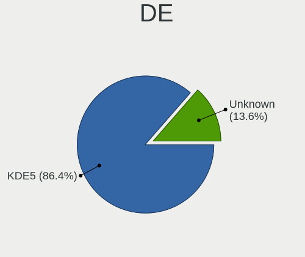
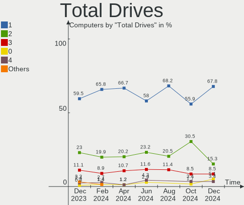
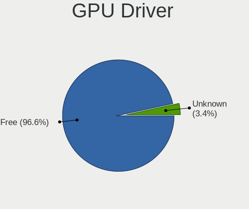
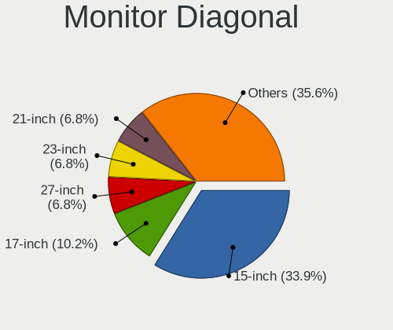
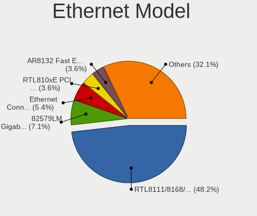
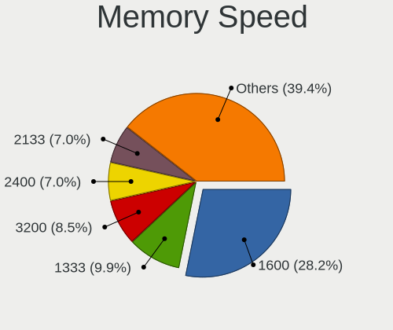
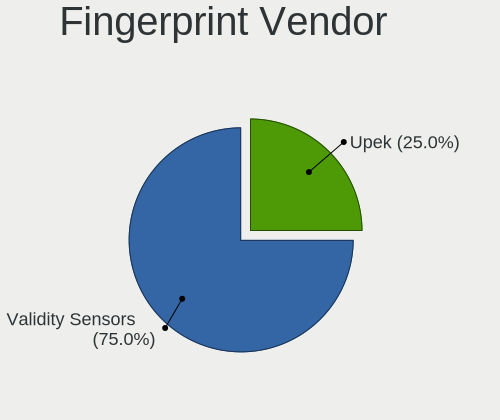

BlackPanther Hardware Trends
----------------------------

A project to identify most popular hardware characteristics and track their change
over time based on data collected by BlackPanther users at https://Linux-Hardware.org.

Anyone can contribute to this report by the [hw-probe](https://github.com/linuxhw/hw-probe) tool:

    sudo -E hw-probe -all -upload

This is a report for all computer types. See also reports for [desktops](/Dist/BlackPanther/Desktop/README.md) and [notebooks](/Dist/BlackPanther/Notebook/README.md).

Full-feature report is available here: https://linux-hardware.org/?view=trends

Period: Dec, 2021.

Contents
--------

* [ System ](#system)
  - [ OS                       ](#os)
  - [ OS Family                ](#os-family)
  - [ Kernel                   ](#kernel)
  - [ Kernel Family            ](#kernel-family)
  - [ Kernel Major Ver.        ](#kernel-major-ver)
  - [ Arch                     ](#arch)
  - [ DE                       ](#de)
  - [ Display Server           ](#display-server)
  - [ Display Manager          ](#display-manager)
  - [ OS Lang                  ](#os-lang)
  - [ Boot Mode                ](#boot-mode)
  - [ Filesystem               ](#filesystem)
  - [ Part. scheme             ](#part-scheme)
  - [ Dual Boot with Linux/BSD ](#dual-boot-with-linuxbsd)
  - [ Dual Boot (Win)          ](#dual-boot-win)

* [ Board ](#board)
  - [ Vendor                   ](#vendor)
  - [ Model                    ](#model)
  - [ Model Family             ](#model-family)
  - [ MFG Year                 ](#mfg-year)
  - [ Form Factor              ](#form-factor)
  - [ Secure Boot              ](#secure-boot)
  - [ Coreboot                 ](#coreboot)
  - [ RAM Size                 ](#ram-size)
  - [ RAM Used                 ](#ram-used)
  - [ Total Drives             ](#total-drives)
  - [ Has CD-ROM               ](#has-cd-rom)
  - [ Has Ethernet             ](#has-ethernet)
  - [ Has WiFi                 ](#has-wifi)
  - [ Has Bluetooth            ](#has-bluetooth)

* [ Location ](#location)
  - [ Country                  ](#country)
  - [ City                     ](#city)

* [ Drives ](#drives)
  - [ Drive Vendor             ](#drive-vendor)
  - [ Drive Model              ](#drive-model)
  - [ HDD Vendor               ](#hdd-vendor)
  - [ SSD Vendor               ](#ssd-vendor)
  - [ Drive Kind               ](#drive-kind)
  - [ Drive Connector          ](#drive-connector)
  - [ Drive Size               ](#drive-size)
  - [ Space Total              ](#space-total)
  - [ Space Used               ](#space-used)
  - [ Malfunc. Drives          ](#malfunc-drives)
  - [ Malfunc. Drive Vendor    ](#malfunc-drive-vendor)
  - [ Malfunc. HDD Vendor      ](#malfunc-hdd-vendor)
  - [ Malfunc. Drive Kind      ](#malfunc-drive-kind)
  - [ Failed Drives            ](#failed-drives)
  - [ Failed Drive Vendor      ](#failed-drive-vendor)
  - [ Drive Status             ](#drive-status)

* [ Storage controller ](#storage-controller)
  - [ Storage Vendor           ](#storage-vendor)
  - [ Storage Model            ](#storage-model)
  - [ Storage Kind             ](#storage-kind)

* [ Processor ](#processor)
  - [ CPU Vendor               ](#cpu-vendor)
  - [ CPU Model                ](#cpu-model)
  - [ CPU Model Family         ](#cpu-model-family)
  - [ CPU Cores                ](#cpu-cores)
  - [ CPU Sockets              ](#cpu-sockets)
  - [ CPU Threads              ](#cpu-threads)
  - [ CPU Op-Modes             ](#cpu-op-modes)
  - [ CPU Microcode            ](#cpu-microcode)
  - [ CPU Microarch            ](#cpu-microarch)

* [ Graphics ](#graphics)
  - [ GPU Vendor               ](#gpu-vendor)
  - [ GPU Model                ](#gpu-model)
  - [ GPU Combo                ](#gpu-combo)
  - [ GPU Driver               ](#gpu-driver)
  - [ GPU Memory               ](#gpu-memory)

* [ Monitor ](#monitor)
  - [ Monitor Vendor           ](#monitor-vendor)
  - [ Monitor Model            ](#monitor-model)
  - [ Monitor Resolution       ](#monitor-resolution)
  - [ Monitor Diagonal         ](#monitor-diagonal)
  - [ Monitor Width            ](#monitor-width)
  - [ Aspect Ratio             ](#aspect-ratio)
  - [ Monitor Area             ](#monitor-area)
  - [ Pixel Density            ](#pixel-density)
  - [ Multiple Monitors        ](#multiple-monitors)

* [ Network ](#network)
  - [ Net Controller Vendor    ](#net-controller-vendor)
  - [ Net Controller Model     ](#net-controller-model)
  - [ Wireless Vendor          ](#wireless-vendor)
  - [ Wireless Model           ](#wireless-model)
  - [ Ethernet Vendor          ](#ethernet-vendor)
  - [ Ethernet Model           ](#ethernet-model)
  - [ Net Controller Kind      ](#net-controller-kind)
  - [ Used Controller          ](#used-controller)
  - [ NICs                     ](#nics)
  - [ IPv6                     ](#ipv6)

* [ Bluetooth ](#bluetooth)
  - [ Bluetooth Vendor         ](#bluetooth-vendor)
  - [ Bluetooth Model          ](#bluetooth-model)

* [ Sound ](#sound)
  - [ Sound Vendor             ](#sound-vendor)
  - [ Sound Model              ](#sound-model)

* [ Memory ](#memory)
  - [ Memory Vendor            ](#memory-vendor)
  - [ Memory Model             ](#memory-model)
  - [ Memory Kind              ](#memory-kind)
  - [ Memory Form Factor       ](#memory-form-factor)
  - [ Memory Size              ](#memory-size)
  - [ Memory Speed             ](#memory-speed)

* [ Printers & scanners ](#printers--scanners)
  - [ Printer Vendor           ](#printer-vendor)
  - [ Printer Model            ](#printer-model)
  - [ Scanner Vendor           ](#scanner-vendor)
  - [ Scanner Model            ](#scanner-model)

* [ Camera ](#camera)
  - [ Camera Vendor            ](#camera-vendor)
  - [ Camera Model             ](#camera-model)

* [ Security ](#security)
  - [ Fingerprint Vendor       ](#fingerprint-vendor)
  - [ Fingerprint Model        ](#fingerprint-model)
  - [ Chipcard Vendor          ](#chipcard-vendor)
  - [ Chipcard Model           ](#chipcard-model)

* [ Unsupported ](#unsupported)
  - [ Unsupported Devices      ](#unsupported-devices)
  - [ Unsupported Device Types ](#unsupported-device-types)

System
------

OS
--

Installed operating systems

| Name              | Computers | Percent |
|-------------------|-----------|---------|
| BlackPanther 18.1 | 61        | 98.39%  |
| BlackPanther 16.2 | 1         | 1.61%   |

OS Family
---------

OS without a version

| Name         | Computers | Percent |
|--------------|-----------|---------|
| BlackPanther | 62        | 100%    |

Kernel
------

Version of the Linux kernel

| Version                | Computers | Percent |
|------------------------|-----------|---------|
| 5.6.14-desktop-2bP     | 47        | 75.81%  |
| 4.18.16-desktop-1bP    | 14        | 22.58%  |
| 4.9.20-desktop-pae-1bP | 1         | 1.61%   |

Kernel Family
-------------

Linux kernel without a distro release

| Version | Computers | Percent |
|---------|-----------|---------|
| 5.6.14  | 47        | 75.81%  |
| 4.18.16 | 14        | 22.58%  |
| 4.9.20  | 1         | 1.61%   |

Kernel Major Ver.
-----------------

Linux kernel major version

| Version | Computers | Percent |
|---------|-----------|---------|
| 5.6     | 47        | 75.81%  |
| 4.18    | 14        | 22.58%  |
| 4.9     | 1         | 1.61%   |

Arch
----

OS architecture (x86_64, i586, etc.)

| Name   | Computers | Percent |
|--------|-----------|---------|
| x86_64 | 61        | 98.39%  |
| i686   | 1         | 1.61%   |

DE
--

Desktop Environment

| Name | Computers | Percent |
|------|-----------|---------|
| KDE5 | 62        | 100%    |

Display Server
--------------

X11 or Wayland

| Name    | Computers | Percent |
|---------|-----------|---------|
| X11     | 61        | 98.39%  |
| Wayland | 1         | 1.61%   |

Display Manager
---------------

SDDM, LightDM, etc.

| Name | Computers | Percent |
|------|-----------|---------|
| SDDM | 62        | 100%    |

OS Lang
-------

Language

| Lang    | Computers | Percent |
|---------|-----------|---------|
| Unknown | 62        | 100%    |

Boot Mode
---------

EFI or BIOS

| Mode | Computers | Percent |
|------|-----------|---------|
| BIOS | 35        | 56.45%  |
| EFI  | 27        | 43.55%  |

Filesystem
----------

Type of filesystem

| Type    | Computers | Percent |
|---------|-----------|---------|
| Overlay | 54        | 87.1%   |
| Ext4    | 6         | 9.68%   |
| Ext3    | 1         | 1.61%   |
| Btrfs   | 1         | 1.61%   |

Part. scheme
------------

Scheme of partitioning

| Type | Computers | Percent |
|------|-----------|---------|
| MBR  | 35        | 56.45%  |
| GPT  | 27        | 43.55%  |

Dual Boot with Linux/BSD
------------------------

Hosting more than one Linux/BSD

| Dual boot | Computers | Percent |
|-----------|-----------|---------|
| No        | 34        | 54.84%  |
| Yes       | 28        | 45.16%  |

Dual Boot (Win)
---------------

Hosting Linux and Windows

| Dual boot | Computers | Percent |
|-----------|-----------|---------|
| Yes       | 39        | 62.9%   |
| No        | 23        | 37.1%   |

Board
-----

Vendor
------

Motherboard manufacturer

| Name                | Computers | Percent |
|---------------------|-----------|---------|
| Dell                | 12        | 19.35%  |
| Lenovo              | 9         | 14.52%  |
| Gigabyte Technology | 9         | 14.52%  |
| ASUSTek Computer    | 9         | 14.52%  |
| Hewlett-Packard     | 5         | 8.06%   |
| MSI                 | 3         | 4.84%   |
| Medion              | 3         | 4.84%   |
| ASRock              | 3         | 4.84%   |
| Acer                | 3         | 4.84%   |
| Foxconn             | 2         | 3.23%   |
| TYAN Computer       | 1         | 1.61%   |
| Toshiba             | 1         | 1.61%   |
| Fujitsu             | 1         | 1.61%   |
| Apple               | 1         | 1.61%   |

Model
-----

Motherboard model

| Name                                     | Computers | Percent |
|------------------------------------------|-----------|---------|
| Foxconn Pro 3500 Series                  | 2         | 3.23%   |
| ASRock FM2A75M Pro4+                     | 2         | 3.23%   |
| TYAN S2925                               | 1         | 1.61%   |
| Toshiba dynabook RX3 SN240Y/3HD          | 1         | 1.61%   |
| MSI MS-7C88                              | 1         | 1.61%   |
| MSI GP75 Leopard 9SE                     | 1         | 1.61%   |
| MSI CX600                                | 1         | 1.61%   |
| Medion MS-7748                           | 1         | 1.61%   |
| Medion MS-7646                           | 1         | 1.61%   |
| Medion E7218                             | 1         | 1.61%   |
| Lenovo Yoga 310-11IAP 80U2               | 1         | 1.61%   |
| Lenovo ThinkPad W510 431924G             | 1         | 1.61%   |
| Lenovo ThinkPad T61 6458WK6              | 1         | 1.61%   |
| Lenovo ThinkCentre M77 1996AB8           | 1         | 1.61%   |
| Lenovo IdeaPad S145-15IGM 81MX           | 1         | 1.61%   |
| Lenovo IdeaPad 320-17ABR 80YN            | 1         | 1.61%   |
| Lenovo IdeaCentre Q190 10115             | 1         | 1.61%   |
| Lenovo G580 20150                        | 1         | 1.61%   |
| Lenovo B590 20208                        | 1         | 1.61%   |
| HP Z230 Tower Workstation                | 1         | 1.61%   |
| HP Pavilion dv7                          | 1         | 1.61%   |
| HP EliteBook 8760w                       | 1         | 1.61%   |
| HP EliteBook 8570w                       | 1         | 1.61%   |
| HP 15                                    | 1         | 1.61%   |
| Gigabyte P67A-D3-B3                      | 1         | 1.61%   |
| Gigabyte H61M-S2PV                       | 1         | 1.61%   |
| Gigabyte H61M-DS2 DVI                    | 1         | 1.61%   |
| Gigabyte H61M-D2-B3                      | 1         | 1.61%   |
| Gigabyte G41MT-S2PT                      | 1         | 1.61%   |
| Gigabyte EG41MF-US2H                     | 1         | 1.61%   |
| Gigabyte B450M GAMING                    | 1         | 1.61%   |
| Gigabyte B450 AORUS ELITE                | 1         | 1.61%   |
| Gigabyte A520M S2H                       | 1         | 1.61%   |
| Fujitsu LIFEBOOK U745                    | 1         | 1.61%   |
| Dell Precision WorkStation T3500         | 1         | 1.61%   |
| Dell Precision M6600                     | 1         | 1.61%   |
| Dell Precision M2800                     | 1         | 1.61%   |
| Dell OptiPlex 780                        | 1         | 1.61%   |
| Dell OptiPlex 760                        | 1         | 1.61%   |
| Dell OptiPlex 330                        | 1         | 1.61%   |
| Dell Latitude E6430                      | 1         | 1.61%   |
| Dell Latitude E6420                      | 1         | 1.61%   |
| Dell Latitude E6410                      | 1         | 1.61%   |
| Dell Latitude D630                       | 1         | 1.61%   |
| Dell Latitude 5480                       | 1         | 1.61%   |
| Dell Inspiron 5558                       | 1         | 1.61%   |
| ASUS Vivo AIO 22 V222GA_V222GA           | 1         | 1.61%   |
| ASUS TUF X470-PLUS GAMING                | 1         | 1.61%   |
| ASUS Strix 15 GL503GE                    | 1         | 1.61%   |
| ASUS PRIME H370-PLUS                     | 1         | 1.61%   |
| ASUS PRIME H310M-E R2.0                  | 1         | 1.61%   |
| ASUS PRIME A320M-K                       | 1         | 1.61%   |
| ASUS M5A78L-M LE/USB3                    | 1         | 1.61%   |
| ASUS M4A88TD-V EVO/USB3                  | 1         | 1.61%   |
| ASUS ASUS TUF Gaming A15 FA506IU_FX506IU | 1         | 1.61%   |
| ASRock AM1B-ITX                          | 1         | 1.61%   |
| Apple MacBookPro6,2                      | 1         | 1.61%   |
| Acer Extensa E264                        | 1         | 1.61%   |
| Acer Aspire ES1-532G                     | 1         | 1.61%   |
| Acer Aspire 3050                         | 1         | 1.61%   |

Model Family
------------

Motherboard model prefix

| Name                 | Computers | Percent |
|----------------------|-----------|---------|
| Dell Latitude        | 5         | 8.06%   |
| Dell Precision       | 3         | 4.84%   |
| Dell OptiPlex        | 3         | 4.84%   |
| ASUS PRIME           | 3         | 4.84%   |
| Lenovo ThinkPad      | 2         | 3.23%   |
| Lenovo IdeaPad       | 2         | 3.23%   |
| HP EliteBook         | 2         | 3.23%   |
| Foxconn Pro          | 2         | 3.23%   |
| ASRock FM2A75M       | 2         | 3.23%   |
| Acer Aspire          | 2         | 3.23%   |
| TYAN S2925           | 1         | 1.61%   |
| Toshiba dynabook     | 1         | 1.61%   |
| MSI MS-7C88          | 1         | 1.61%   |
| MSI GP75             | 1         | 1.61%   |
| MSI CX600            | 1         | 1.61%   |
| Medion MS-7748       | 1         | 1.61%   |
| Medion MS-7646       | 1         | 1.61%   |
| Medion E7218         | 1         | 1.61%   |
| Lenovo Yoga          | 1         | 1.61%   |
| Lenovo ThinkCentre   | 1         | 1.61%   |
| Lenovo IdeaCentre    | 1         | 1.61%   |
| Lenovo G580          | 1         | 1.61%   |
| Lenovo B590          | 1         | 1.61%   |
| HP Z230              | 1         | 1.61%   |
| HP Pavilion          | 1         | 1.61%   |
| HP 15                | 1         | 1.61%   |
| Gigabyte P67A-D3-B3  | 1         | 1.61%   |
| Gigabyte H61M-S2PV   | 1         | 1.61%   |
| Gigabyte H61M-DS2    | 1         | 1.61%   |
| Gigabyte H61M-D2-B3  | 1         | 1.61%   |
| Gigabyte G41MT-S2PT  | 1         | 1.61%   |
| Gigabyte EG41MF-US2H | 1         | 1.61%   |
| Gigabyte B450M       | 1         | 1.61%   |
| Gigabyte B450        | 1         | 1.61%   |
| Gigabyte A520M       | 1         | 1.61%   |
| Fujitsu LIFEBOOK     | 1         | 1.61%   |
| Dell Inspiron        | 1         | 1.61%   |
| ASUS Vivo            | 1         | 1.61%   |
| ASUS TUF             | 1         | 1.61%   |
| ASUS Strix           | 1         | 1.61%   |
| ASUS M5A78L-M        | 1         | 1.61%   |
| ASUS M4A88TD-V       | 1         | 1.61%   |
| ASUS ASUS            | 1         | 1.61%   |
| ASRock AM1B-ITX      | 1         | 1.61%   |
| Apple MacBookPro6    | 1         | 1.61%   |
| Acer Extensa         | 1         | 1.61%   |

MFG Year
--------

Motherboard manufacture year

| Year | Computers | Percent |
|------|-----------|---------|
| 2019 | 7         | 11.29%  |
| 2012 | 7         | 11.29%  |
| 2011 | 7         | 11.29%  |
| 2018 | 5         | 8.06%   |
| 2014 | 5         | 8.06%   |
| 2020 | 4         | 6.45%   |
| 2013 | 4         | 6.45%   |
| 2009 | 4         | 6.45%   |
| 2021 | 3         | 4.84%   |
| 2017 | 3         | 4.84%   |
| 2010 | 3         | 4.84%   |
| 2008 | 3         | 4.84%   |
| 2007 | 3         | 4.84%   |
| 2016 | 2         | 3.23%   |
| 2015 | 2         | 3.23%   |

Form Factor
-----------

Physical design of the computer

| Name        | Computers | Percent |
|-------------|-----------|---------|
| Desktop     | 32        | 51.61%  |
| Notebook    | 28        | 45.16%  |
| Convertible | 1         | 1.61%   |
| All in one  | 1         | 1.61%   |

Secure Boot
-----------

Enabled or disabled

| State    | Computers | Percent |
|----------|-----------|---------|
| Disabled | 62        | 100%    |

Coreboot
--------

Have coreboot on board

| Used | Computers | Percent |
|------|-----------|---------|
| No   | 62        | 100%    |

RAM Size
--------

Total RAM memory

| Size in GB | Computers | Percent |
|------------|-----------|---------|
| 3.01-4.0   | 20        | 32.26%  |
| 8.01-16.0  | 18        | 29.03%  |
| 16.01-24.0 | 11        | 17.74%  |
| 4.01-8.0   | 9         | 14.52%  |
| 1.01-2.0   | 2         | 3.23%   |
| 32.01-64.0 | 1         | 1.61%   |
| 0.51-1.0   | 1         | 1.61%   |

RAM Used
--------

Used RAM memory

| Used GB  | Computers | Percent |
|----------|-----------|---------|
| 0.51-1.0 | 26        | 41.94%  |
| 0.01-0.5 | 25        | 40.32%  |
| 1.01-2.0 | 11        | 17.74%  |

Total Drives
------------

Number of drives on board

| Drives | Computers | Percent |
|--------|-----------|---------|
| 1      | 33        | 53.23%  |
| 2      | 18        | 29.03%  |
| 3      | 4         | 6.45%   |
| 4      | 3         | 4.84%   |
| 5      | 2         | 3.23%   |
| 0      | 2         | 3.23%   |

Has CD-ROM
----------

Has CD-ROM on board

| Presented | Computers | Percent |
|-----------|-----------|---------|
| Yes       | 39        | 62.9%   |
| No        | 23        | 37.1%   |

Has Ethernet
------------

Has Ethernet on board

| Presented | Computers | Percent |
|-----------|-----------|---------|
| Yes       | 61        | 98.39%  |
| No        | 1         | 1.61%   |

Has WiFi
--------

Has WiFi module

| Presented | Computers | Percent |
|-----------|-----------|---------|
| Yes       | 36        | 58.06%  |
| No        | 26        | 41.94%  |

Has Bluetooth
-------------

Has Bluetooth module

| Presented | Computers | Percent |
|-----------|-----------|---------|
| No        | 39        | 62.9%   |
| Yes       | 23        | 37.1%   |

Location
--------

Country
-------

Geographic location (country)

| Country | Computers | Percent |
|---------|-----------|---------|
| Hungary | 56        | 90.32%  |
| USA     | 1         | 1.61%   |
| Ukraine | 1         | 1.61%   |
| Romania | 1         | 1.61%   |
| Japan   | 1         | 1.61%   |
| Germany | 1         | 1.61%   |
| Canada  | 1         | 1.61%   |

City
----

Geographic location (city)

| City              | Computers | Percent |
|-------------------|-----------|---------|
| Budapest          | 13        | 20.97%  |
| Karcag            | 4         | 6.45%   |
| Tatab??nya        | 3         | 4.84%   |
| Debrecen          | 3         | 4.84%   |
| Zalaegerszeg      | 2         | 3.23%   |
| Veszpr?©m         | 2         | 3.23%   |
| Vardomb           | 2         | 3.23%   |
| Sz?©kesfeh?©rv??r | 2         | 3.23%   |
| Paszto            | 2         | 3.23%   |
| Oroshaza          | 2         | 3.23%   |
| Kisvarda          | 2         | 3.23%   |
| Balatonfured      | 2         | 3.23%   |
| Uzhhorod          | 1         | 1.61%   |
| Toronto           | 1         | 1.61%   |
| Szombathely       | 1         | 1.61%   |
| Szigetszentmiklos | 1         | 1.61%   |
| Szentantalfa      | 1         | 1.61%   |
| Sarvar            | 1         | 1.61%   |
| Sandorfalva       | 1         | 1.61%   |
| Roszke            | 1         | 1.61%   |
| Perkata           | 1         | 1.61%   |
| P?©cs             | 1         | 1.61%   |
| North Hollywood   | 1         | 1.61%   |
| Nagykata          | 1         | 1.61%   |
| Nagykallo         | 1         | 1.61%   |
| Miercurea-Ciuc    | 1         | 1.61%   |
| Lebeny            | 1         | 1.61%   |
| Jaszapati         | 1         | 1.61%   |
| Ichikawa          | 1         | 1.61%   |
| Hamburg           | 1         | 1.61%   |
| Gy?‘r             | 1         | 1.61%   |
| Felsonyek         | 1         | 1.61%   |
| Esztergom         | 1         | 1.61%   |
| Duna??jv??ros     | 1         | 1.61%   |
| Balatonszabadi    | 1         | 1.61%   |

Drives
------

Drive Vendor
------------

Hard drive vendors

| Vendor              | Computers | Drives | Percent |
|---------------------|-----------|--------|---------|
| Kingston            | 17        | 20     | 18.09%  |
| WDC                 | 16        | 19     | 17.02%  |
| Samsung Electronics | 14        | 17     | 14.89%  |
| Seagate             | 9         | 11     | 9.57%   |
| Hitachi             | 6         | 6      | 6.38%   |
| Toshiba             | 5         | 5      | 5.32%   |
| A-DATA Technology   | 4         | 4      | 4.26%   |
| HGST                | 3         | 3      | 3.19%   |
| Apacer              | 3         | 3      | 3.19%   |
| SanDisk             | 2         | 2      | 2.13%   |
| JMicron             | 2         | 2      | 2.13%   |
| Unknown             | 1         | 1      | 1.06%   |
| Union Memory        | 1         | 1      | 1.06%   |
| Netac               | 1         | 1      | 1.06%   |
| Micron Technology   | 1         | 1      | 1.06%   |
| MAXTOR              | 1         | 1      | 1.06%   |
| KingSpec            | 1         | 1      | 1.06%   |
| Kingmax             | 1         | 1      | 1.06%   |
| Intenso             | 1         | 1      | 1.06%   |
| Gigabyte Technology | 1         | 1      | 1.06%   |
| Fujitsu             | 1         | 1      | 1.06%   |
| Crucial             | 1         | 1      | 1.06%   |
| China               | 1         | 1      | 1.06%   |
| Apple               | 1         | 1      | 1.06%   |

Drive Model
-----------

Hard drive models

| Model                                  | Computers | Percent |
|----------------------------------------|-----------|---------|
| Kingston SA400S37240G 240GB SSD        | 6         | 5.88%   |
| Kingston SA400S37480G 480GB SSD        | 3         | 2.94%   |
| Toshiba MQ01ABD100 1TB                 | 2         | 1.96%   |
| Samsung HD154UI 1TB                    | 2         | 1.96%   |
| Kingston SUV400S37240G 240GB SSD       | 2         | 1.96%   |
| Kingston SUV400S37120G 120GB SSD       | 2         | 1.96%   |
| Hitachi HDS721050CLA360 500GB          | 2         | 1.96%   |
| A-DATA SU630 240GB SSD                 | 2         | 1.96%   |
| WDC WDS120G2G0A-00JH30 120GB SSD       | 1         | 0.98%   |
| WDC WDS100T3X0C-00SJG0 1TB             | 1         | 0.98%   |
| WDC WD5000BPVT-80HXZT1 500GB           | 1         | 0.98%   |
| WDC WD3200AAJS-22B4A0 320GB            | 1         | 0.98%   |
| WDC WD30EZRZ-00Z5HB0 3TB               | 1         | 0.98%   |
| WDC WD30EZRZ-00GXCB0 3TB               | 1         | 0.98%   |
| WDC WD30EFRX-68EUZN0 3TB               | 1         | 0.98%   |
| WDC WD2502ABYS-02B7A0 256GB            | 1         | 0.98%   |
| WDC WD2500AAJS-07M0A0 250GB            | 1         | 0.98%   |
| WDC WD20EARX-00PASB0 2TB               | 1         | 0.98%   |
| WDC WD1600BEVT-75ZCT2 160GB            | 1         | 0.98%   |
| WDC WD1600AAJS-00WAA0 160GB            | 1         | 0.98%   |
| WDC WD1600AAJB-56WRA0 160GB            | 1         | 0.98%   |
| WDC WD15EARS-00MVWB0 1TB               | 1         | 0.98%   |
| WDC WD10EZRZ-00HTKB0 1TB               | 1         | 0.98%   |
| WDC WD10EZEX-08WN4A0 1TB               | 1         | 0.98%   |
| WDC WD10EZEX-00ZF5A0 1TB               | 1         | 0.98%   |
| WDC WD10EZEX-00WN4A0 1TB               | 1         | 0.98%   |
| WDC WD10EZEX-00BN5A0 1TB               | 1         | 0.98%   |
| Unknown SD04G  4GB                     | 1         | 0.98%   |
| Union Memory RTOTJ128VGD2EYX 128GB SSD | 1         | 0.98%   |
| Toshiba MQ04ABF100 1TB                 | 1         | 0.98%   |
| Toshiba HDWL120 2TB                    | 1         | 0.98%   |
| Toshiba DT01ACA200 2TB                 | 1         | 0.98%   |
| Seagate ST9500325AS 500GB              | 1         | 0.98%   |
| Seagate ST9250315AS 250GB              | 1         | 0.98%   |
| Seagate ST500LT012-1DG142 500GB        | 1         | 0.98%   |
| Seagate ST500LM000-1EJ162 500GB        | 1         | 0.98%   |
| Seagate ST500DM002-1BD142 500GB        | 1         | 0.98%   |
| Seagate ST4000DM000-1F2168 4TB         | 1         | 0.98%   |
| Seagate ST2000LM003 HN-M201RAD 2TB     | 1         | 0.98%   |
| Seagate ST2000DM001-1CH164 2TB         | 1         | 0.98%   |
| Seagate ST1000LX015-1U7172 1TB         | 1         | 0.98%   |
| Seagate Portable 2TB                   | 1         | 0.98%   |
| SanDisk SDSSDA240G 240GB               | 1         | 0.98%   |
| SanDisk DF4032  32GB                   | 1         | 0.98%   |
| Samsung SSD PM871b M.2 2280 256GB      | 1         | 0.98%   |
| Samsung SSD PM810 TH 64GB              | 1         | 0.98%   |
| Samsung SSD 830 Series 64GB            | 1         | 0.98%   |
| Samsung SP2004C 200GB                  | 1         | 0.98%   |
| Samsung MZVLW256HEHP-00000 256GB       | 1         | 0.98%   |
| Samsung MZVLB512HBJQ-000L7 512GB       | 1         | 0.98%   |
| Samsung MZVLB1T0HALR-00000 1TB         | 1         | 0.98%   |
| Samsung MZ7TE128HMGR-000L1 128GB SSD   | 1         | 0.98%   |
| Samsung MZ7LN256HCHP-00000 256GB SSD   | 1         | 0.98%   |
| Samsung HM251JJ 250GB                  | 1         | 0.98%   |
| Samsung HD502IJ 500GB                  | 1         | 0.98%   |
| Samsung HD502HJ 500GB                  | 1         | 0.98%   |
| Samsung HD161HJ 160GB                  | 1         | 0.98%   |
| Netac SSD 256GB                        | 1         | 0.98%   |
| Micron 2210_MTFDHBA512QFD 512GB        | 1         | 0.98%   |
| MAXTOR 6V250F0 256GB                   | 1         | 0.98%   |

HDD Vendor
----------

Hard disk drive vendors

| Vendor              | Computers | Drives | Percent |
|---------------------|-----------|--------|---------|
| WDC                 | 15        | 17     | 31.91%  |
| Seagate             | 8         | 10     | 17.02%  |
| Samsung Electronics | 7         | 8      | 14.89%  |
| Hitachi             | 6         | 6      | 12.77%  |
| Toshiba             | 5         | 5      | 10.64%  |
| HGST                | 3         | 3      | 6.38%   |
| MAXTOR              | 1         | 1      | 2.13%   |
| Fujitsu             | 1         | 1      | 2.13%   |
| Apple               | 1         | 1      | 2.13%   |

SSD Vendor
----------

Solid state drive vendors

| Vendor              | Computers | Drives | Percent |
|---------------------|-----------|--------|---------|
| Kingston            | 15        | 18     | 40.54%  |
| Samsung Electronics | 5         | 6      | 13.51%  |
| A-DATA Technology   | 4         | 4      | 10.81%  |
| Apacer              | 3         | 3      | 8.11%   |
| WDC                 | 1         | 1      | 2.7%    |
| Union Memory        | 1         | 1      | 2.7%    |
| SanDisk             | 1         | 1      | 2.7%    |
| Netac               | 1         | 1      | 2.7%    |
| KingSpec            | 1         | 1      | 2.7%    |
| Kingmax             | 1         | 1      | 2.7%    |
| JMicron             | 1         | 1      | 2.7%    |
| Intenso             | 1         | 1      | 2.7%    |
| Crucial             | 1         | 1      | 2.7%    |
| China               | 1         | 1      | 2.7%    |

Drive Kind
----------

HDD or SSD

| Kind    | Computers | Drives | Percent |
|---------|-----------|--------|---------|
| HDD     | 38        | 52     | 46.91%  |
| SSD     | 32        | 41     | 39.51%  |
| NVMe    | 7         | 8      | 8.64%   |
| MMC     | 2         | 2      | 2.47%   |
| Unknown | 2         | 2      | 2.47%   |

Drive Connector
---------------

SATA, SAS, NVMe, etc.

| Type | Computers | Drives | Percent |
|------|-----------|--------|---------|
| SATA | 57        | 92     | 82.61%  |
| NVMe | 7         | 8      | 10.14%  |
| SAS  | 3         | 3      | 4.35%   |
| MMC  | 2         | 2      | 2.9%    |

Drive Size
----------

Size of hard drive

| Size in TB | Computers | Drives | Percent |
|------------|-----------|--------|---------|
| 0.01-0.5   | 46        | 67     | 66.67%  |
| 0.51-1.0   | 14        | 16     | 20.29%  |
| 1.01-2.0   | 6         | 6      | 8.7%    |
| 2.01-3.0   | 2         | 3      | 2.9%    |
| 3.01-4.0   | 1         | 1      | 1.45%   |

Space Total
-----------

Amount of disk space available on the file system

| Size in GB | Computers | Percent |
|------------|-----------|---------|
| Unknown    | 55        | 88.71%  |
| 101-250    | 7         | 11.29%  |

Space Used
----------

Amount of used disk space

| Used GB | Computers | Percent |
|---------|-----------|---------|
| Unknown | 55        | 88.71%  |
| 1-20    | 6         | 9.68%   |
| 51-100  | 1         | 1.61%   |

Malfunc. Drives
---------------

Drive models with a malfunction

| Model                               | Computers | Drives | Percent |
|-------------------------------------|-----------|--------|---------|
| A-DATA Technology SU630 240GB SSD   | 2         | 2      | 8.33%   |
| WDC WD5000BPVT-80HXZT1 500GB        | 1         | 1      | 4.17%   |
| WDC WD3200AAJS-22B4A0 320GB         | 1         | 1      | 4.17%   |
| WDC WD2500AAJS-07M0A0 250GB         | 1         | 1      | 4.17%   |
| WDC WD20EARX-00PASB0 2TB            | 1         | 1      | 4.17%   |
| WDC WD15EARS-00MVWB0 1TB            | 1         | 1      | 4.17%   |
| WDC WD10EZEX-08WN4A0 1TB            | 1         | 1      | 4.17%   |
| Seagate ST9500325AS 500GB           | 1         | 1      | 4.17%   |
| Seagate ST9250315AS 250GB           | 1         | 1      | 4.17%   |
| Seagate ST500DM002-1BD142 500GB     | 1         | 2      | 4.17%   |
| Seagate ST4000DM000-1F2168 4TB      | 1         | 1      | 4.17%   |
| Seagate ST1000LX015-1U7172 1TB      | 1         | 1      | 4.17%   |
| Samsung Electronics SP2004C 200GB   | 1         | 1      | 4.17%   |
| Samsung Electronics HM251JJ 250GB   | 1         | 1      | 4.17%   |
| Samsung Electronics HD161HJ 160GB   | 1         | 1      | 4.17%   |
| MAXTOR 6V250F0 256GB                | 1         | 1      | 4.17%   |
| Kingston SUV400S37240G 240GB SSD    | 1         | 1      | 4.17%   |
| Kingston SA400S37240G 240GB SSD     | 1         | 1      | 4.17%   |
| JMicron Tech 250GB                  | 1         | 1      | 4.17%   |
| Hitachi HTS723232A7A364 320GB       | 1         | 1      | 4.17%   |
| Hitachi HDP725050GLA360 500GB       | 1         | 1      | 4.17%   |
| HGST HTS545050A7E680 500GB          | 1         | 1      | 4.17%   |
| A-DATA Technology SP920SS 128GB SSD | 1         | 1      | 4.17%   |

Malfunc. Drive Vendor
---------------------

Vendors of faulty drives

| Vendor              | Computers | Drives | Percent |
|---------------------|-----------|--------|---------|
| WDC                 | 6         | 6      | 25%     |
| Seagate             | 5         | 6      | 20.83%  |
| Samsung Electronics | 3         | 3      | 12.5%   |
| A-DATA Technology   | 3         | 3      | 12.5%   |
| Kingston            | 2         | 2      | 8.33%   |
| Hitachi             | 2         | 2      | 8.33%   |
| MAXTOR              | 1         | 1      | 4.17%   |
| JMicron             | 1         | 1      | 4.17%   |
| HGST                | 1         | 1      | 4.17%   |

Malfunc. HDD Vendor
-------------------

Vendors of faulty HDD drives

| Vendor              | Computers | Drives | Percent |
|---------------------|-----------|--------|---------|
| WDC                 | 6         | 6      | 33.33%  |
| Seagate             | 5         | 6      | 27.78%  |
| Samsung Electronics | 3         | 3      | 16.67%  |
| Hitachi             | 2         | 2      | 11.11%  |
| MAXTOR              | 1         | 1      | 5.56%   |
| HGST                | 1         | 1      | 5.56%   |

Malfunc. Drive Kind
-------------------

Kinds of faulty drives

| Kind    | Computers | Drives | Percent |
|---------|-----------|--------|---------|
| HDD     | 17        | 19     | 73.91%  |
| SSD     | 5         | 5      | 21.74%  |
| Unknown | 1         | 1      | 4.35%   |

Failed Drives
-------------

Failed drive models

Zero info for selected period =(

Failed Drive Vendor
-------------------

Failed drive vendors

Zero info for selected period =(

Drive Status
------------

Number of failed and malfunc. drives

| Status   | Computers | Drives | Percent |
|----------|-----------|--------|---------|
| Works    | 48        | 75     | 63.16%  |
| Malfunc  | 23        | 25     | 30.26%  |
| Detected | 5         | 5      | 6.58%   |

Storage controller
------------------

Storage Vendor
--------------

Storage controller vendors

| Vendor                           | Computers | Percent |
|----------------------------------|-----------|---------|
| Intel                            | 42        | 56.76%  |
| AMD                              | 17        | 22.97%  |
| Samsung Electronics              | 3         | 4.05%   |
| VIA Technologies                 | 2         | 2.7%    |
| Nvidia                           | 2         | 2.7%    |
| Kingston Technology Company      | 2         | 2.7%    |
| ASMedia Technology               | 2         | 2.7%    |
| Silicon Integrated Systems [SiS] | 1         | 1.35%   |
| Sandisk                          | 1         | 1.35%   |
| Phison Electronics               | 1         | 1.35%   |
| Micron Technology                | 1         | 1.35%   |

Storage Model
-------------

Storage controller models

| Model                                                                                   | Computers | Percent |
|-----------------------------------------------------------------------------------------|-----------|---------|
| AMD FCH SATA Controller [AHCI mode]                                                     | 9         | 9.18%   |
| Intel 82801 Mobile SATA Controller [RAID mode]                                          | 4         | 4.08%   |
| Intel 7 Series Chipset Family 6-port SATA Controller [AHCI mode]                        | 3         | 3.06%   |
| Intel 6 Series/C200 Series Chipset Family Desktop SATA Controller (IDE mode, ports 4-5) | 3         | 3.06%   |
| Intel 6 Series/C200 Series Chipset Family Desktop SATA Controller (IDE mode, ports 0-3) | 3         | 3.06%   |
| Intel 6 Series/C200 Series Chipset Family 6 port Mobile SATA AHCI Controller            | 3         | 3.06%   |
| Intel 6 Series/C200 Series Chipset Family 6 port Desktop SATA AHCI Controller           | 3         | 3.06%   |
| AMD SB7x0/SB8x0/SB9x0 SATA Controller [AHCI mode]                                       | 3         | 3.06%   |
| AMD SB7x0/SB8x0/SB9x0 IDE Controller                                                    | 3         | 3.06%   |
| AMD 400 Series Chipset SATA Controller                                                  | 3         | 3.06%   |
| Samsung NVMe SSD Controller SM981/PM981/PM983                                           | 2         | 2.04%   |
| Intel Wildcat Point-LP SATA Controller [AHCI Mode]                                      | 2         | 2.04%   |
| Intel NM10/ICH7 Family SATA Controller [IDE mode]                                       | 2         | 2.04%   |
| Intel Celeron/Pentium Silver Processor SATA Controller                                  | 2         | 2.04%   |
| Intel Cannon Lake Mobile PCH SATA AHCI Controller                                       | 2         | 2.04%   |
| Intel 82801JD/DO (ICH10 Family) SATA AHCI Controller                                    | 2         | 2.04%   |
| Intel 82801HM/HEM (ICH8M/ICH8M-E) IDE Controller                                        | 2         | 2.04%   |
| Intel 82801G (ICH7 Family) IDE Controller                                               | 2         | 2.04%   |
| Intel 5 Series/3400 Series Chipset 4 port SATA AHCI Controller                          | 2         | 2.04%   |
| ASMedia ASM1062 Serial ATA Controller                                                   | 2         | 2.04%   |
| AMD SB7x0/SB8x0/SB9x0 SATA Controller [IDE mode]                                        | 2         | 2.04%   |
| AMD FCH IDE Controller                                                                  | 2         | 2.04%   |
| VIA VT6421 IDE/SATA Controller                                                          | 1         | 1.02%   |
| VIA VT6415 PATA IDE Host Controller                                                     | 1         | 1.02%   |
| Silicon Integrated Systems [SiS] SATA Controller / IDE mode                             | 1         | 1.02%   |
| Silicon Integrated Systems [SiS] 5513 IDE Controller                                    | 1         | 1.02%   |
| Sandisk WD Black SN750 / PC SN730 NVMe SSD                                              | 1         | 1.02%   |
| Samsung NVMe SSD Controller SM961/PM961/SM963                                           | 1         | 1.02%   |
| Phison PS5013 E13 NVMe Controller                                                       | 1         | 1.02%   |
| Nvidia MCP73 SATA Controller (IDE mode)                                                 | 1         | 1.02%   |
| Nvidia MCP73 IDE Controller                                                             | 1         | 1.02%   |
| Nvidia MCP55 SATA Controller                                                            | 1         | 1.02%   |
| Nvidia MCP55 IDE                                                                        | 1         | 1.02%   |
| Micron Non-Volatile memory controller                                                   | 1         | 1.02%   |
| Kingston Company SNVS2000G [NV1 NVMe PCIe SSD 2TB]                                      | 1         | 1.02%   |
| Kingston Company A2000 NVMe SSD                                                         | 1         | 1.02%   |
| Intel SATA Controller [RAID mode]                                                       | 1         | 1.02%   |
| Intel NM10/ICH7 Family SATA Controller [AHCI mode]                                      | 1         | 1.02%   |
| Intel Mobile PM965/GM965 PT IDER Controller                                             | 1         | 1.02%   |
| Intel Celeron N3350/Pentium N4200/Atom E3900 Series SATA AHCI Controller                | 1         | 1.02%   |
| Intel Atom/Celeron/Pentium Processor x5-E8000/J3xxx/N3xxx Series SATA Controller        | 1         | 1.02%   |
| Intel Atom Processor E3800 Series SATA AHCI Controller                                  | 1         | 1.02%   |
| Intel 82801JI (ICH10 Family) 4 port SATA IDE Controller #1                              | 1         | 1.02%   |
| Intel 82801JI (ICH10 Family) 2 port SATA IDE Controller #2                              | 1         | 1.02%   |
| Intel 82801HM/HEM (ICH8M/ICH8M-E) SATA Controller [IDE mode]                            | 1         | 1.02%   |
| Intel 82801HM/HEM (ICH8M/ICH8M-E) SATA Controller [AHCI mode]                           | 1         | 1.02%   |
| Intel 8 Series/C220 Series Chipset Family 6-port SATA Controller 1 [AHCI mode]          | 1         | 1.02%   |
| Intel 7 Series Chipset Family 4-port SATA Controller [IDE mode]                         | 1         | 1.02%   |
| Intel 7 Series Chipset Family 2-port SATA Controller [IDE mode]                         | 1         | 1.02%   |
| Intel 5 Series/3400 Series Chipset 6 port SATA AHCI Controller                          | 1         | 1.02%   |
| Intel 5 Series/3400 Series Chipset 4 port SATA IDE Controller                           | 1         | 1.02%   |
| Intel 5 Series/3400 Series Chipset 2 port SATA IDE Controller                           | 1         | 1.02%   |
| Intel 400 Series Chipset Family SATA AHCI Controller                                    | 1         | 1.02%   |
| Intel 4 Series Chipset PT IDER Controller                                               | 1         | 1.02%   |
| Intel 200 Series PCH SATA controller [AHCI mode]                                        | 1         | 1.02%   |
| AMD Starship/Matisse Chipset SATA Controller [AHCI mode]                                | 1         | 1.02%   |
| AMD IXP SB4x0 Serial ATA Controller                                                     | 1         | 1.02%   |
| AMD IXP SB4x0 IDE Controller                                                            | 1         | 1.02%   |
| AMD FCH SATA Controller D                                                               | 1         | 1.02%   |

Storage Kind
------------

Kind of storage controller (IDE, SATA, NVMe, SAS, ...)

| Kind | Computers | Percent |
|------|-----------|---------|
| SATA | 44        | 55.7%   |
| IDE  | 22        | 27.85%  |
| NVMe | 7         | 8.86%   |
| RAID | 6         | 7.59%   |

Processor
---------

CPU Vendor
----------

Processor vendors

| Vendor | Computers | Percent |
|--------|-----------|---------|
| Intel  | 44        | 70.97%  |
| AMD    | 18        | 29.03%  |

CPU Model
---------

Processor models

| Model                                           | Computers | Percent |
|-------------------------------------------------|-----------|---------|
| Intel Core i3-3220 CPU @ 3.30GHz                | 2         | 3.23%   |
| Intel Core i3-2120 CPU @ 3.30GHz                | 2         | 3.23%   |
| Intel Core 2 Duo CPU T7500 @ 2.20GHz            | 2         | 3.23%   |
| Intel Core 2 Duo CPU E8400 @ 3.00GHz            | 2         | 3.23%   |
| AMD A8-6600K APU with Radeon HD Graphics        | 2         | 3.23%   |
| Intel Xeon CPU W3540 @ 2.93GHz                  | 1         | 1.61%   |
| Intel Xeon CPU E3-1240 v3 @ 3.40GHz             | 1         | 1.61%   |
| Intel Pentium Silver N5000 CPU @ 1.10GHz        | 1         | 1.61%   |
| Intel Pentium Dual CPU E2220 @ 2.40GHz          | 1         | 1.61%   |
| Intel Pentium CPU G840 @ 2.80GHz                | 1         | 1.61%   |
| Intel Pentium CPU B960 @ 2.20GHz                | 1         | 1.61%   |
| Intel Core i7-9750H CPU @ 2.60GHz               | 1         | 1.61%   |
| Intel Core i7-8750H CPU @ 2.20GHz               | 1         | 1.61%   |
| Intel Core i7-6600U CPU @ 2.60GHz               | 1         | 1.61%   |
| Intel Core i7-5600U CPU @ 2.60GHz               | 1         | 1.61%   |
| Intel Core i7-4800MQ CPU @ 2.70GHz              | 1         | 1.61%   |
| Intel Core i7-3740QM CPU @ 2.70GHz              | 1         | 1.61%   |
| Intel Core i7-2960XM CPU @ 2.70GHz              | 1         | 1.61%   |
| Intel Core i7-2640M CPU @ 2.80GHz               | 1         | 1.61%   |
| Intel Core i7 CPU Q 720 @ 1.60GHz               | 1         | 1.61%   |
| Intel Core i7 CPU M 620 @ 2.67GHz               | 1         | 1.61%   |
| Intel Core i5-8500 CPU @ 3.00GHz                | 1         | 1.61%   |
| Intel Core i5-5200U CPU @ 2.20GHz               | 1         | 1.61%   |
| Intel Core i5-3340M CPU @ 2.70GHz               | 1         | 1.61%   |
| Intel Core i5-2520M CPU @ 2.50GHz               | 1         | 1.61%   |
| Intel Core i5-2300 CPU @ 2.80GHz                | 1         | 1.61%   |
| Intel Core i3-8100 CPU @ 3.60GHz                | 1         | 1.61%   |
| Intel Core i3-3217U CPU @ 1.80GHz               | 1         | 1.61%   |
| Intel Core i3-3110M CPU @ 2.40GHz               | 1         | 1.61%   |
| Intel Core i3-2310M CPU @ 2.10GHz               | 1         | 1.61%   |
| Intel Core i3-10100 CPU @ 3.60GHz               | 1         | 1.61%   |
| Intel Core i3 CPU M 380 @ 2.53GHz               | 1         | 1.61%   |
| Intel Core i3 CPU M 370 @ 2.40GHz               | 1         | 1.61%   |
| Intel Core 2 Quad CPU Q9300 @ 2.50GHz           | 1         | 1.61%   |
| Intel Core 2 Duo CPU T6500 @ 2.10GHz            | 1         | 1.61%   |
| Intel Celeron J4005 CPU @ 2.00GHz               | 1         | 1.61%   |
| Intel Celeron CPU N3350 @ 1.10GHz               | 1         | 1.61%   |
| Intel Celeron CPU N3160 @ 1.60GHz               | 1         | 1.61%   |
| Intel Celeron CPU N2840 @ 2.16GHz               | 1         | 1.61%   |
| Intel Celeron CPU E3300 @ 2.50GHz               | 1         | 1.61%   |
| Intel Celeron CPU 430 @ 1.80GHz                 | 1         | 1.61%   |
| AMD Turion X2 Dual-Core Mobile RM-70            | 1         | 1.61%   |
| AMD Sempron 3850 APU with Radeon R3             | 1         | 1.61%   |
| AMD Ryzen 7 4800H with Radeon Graphics          | 1         | 1.61%   |
| AMD Ryzen 5 5600G with Radeon Graphics          | 1         | 1.61%   |
| AMD Ryzen 5 3600X 6-Core Processor              | 1         | 1.61%   |
| AMD Ryzen 5 3400G with Radeon Vega Graphics     | 1         | 1.61%   |
| AMD Ryzen 5 1600X Six-Core Processor            | 1         | 1.61%   |
| AMD Ryzen 3 3200G with Radeon Vega Graphics     | 1         | 1.61%   |
| AMD Mobile Sempron Processor 3600+              | 1         | 1.61%   |
| AMD FX-6300 Six-Core Processor                  | 1         | 1.61%   |
| AMD FX-4100 Quad-Core Processor                 | 1         | 1.61%   |
| AMD Dual-Core Opteron Processor 1214            | 1         | 1.61%   |
| AMD Athlon II X4 640 Processor                  | 1         | 1.61%   |
| AMD Athlon II X4 620 Processor                  | 1         | 1.61%   |
| AMD A8-3800 APU with Radeon HD Graphics         | 1         | 1.61%   |
| AMD A12-9720P RADEON R7, 12 COMPUTE CORES 4C+8G | 1         | 1.61%   |

CPU Model Family
----------------

Processor model prefix

| Model                          | Computers | Percent |
|--------------------------------|-----------|---------|
| Intel Core i3                  | 11        | 17.74%  |
| Intel Core i7                  | 10        | 16.13%  |
| Intel Celeron                  | 6         | 9.68%   |
| Intel Core i5                  | 5         | 8.06%   |
| Intel Core 2 Duo               | 5         | 8.06%   |
| AMD Ryzen 5                    | 4         | 6.45%   |
| AMD A8                         | 3         | 4.84%   |
| Intel Xeon                     | 2         | 3.23%   |
| Intel Pentium                  | 2         | 3.23%   |
| AMD FX                         | 2         | 3.23%   |
| AMD Athlon II X4               | 2         | 3.23%   |
| Other                          | 1         | 1.61%   |
| Intel Pentium Silver           | 1         | 1.61%   |
| Intel Pentium Dual             | 1         | 1.61%   |
| Intel Core 2 Quad              | 1         | 1.61%   |
| AMD Turion X2 Dual-Core Mobile | 1         | 1.61%   |
| AMD Sempron                    | 1         | 1.61%   |
| AMD Ryzen 7                    | 1         | 1.61%   |
| AMD Ryzen 3                    | 1         | 1.61%   |
| AMD Mobile Sempron             | 1         | 1.61%   |
| AMD A12                        | 1         | 1.61%   |

CPU Cores
---------

Number of processor cores

| Number | Computers | Percent |
|--------|-----------|---------|
| 2      | 34        | 54.84%  |
| 4      | 18        | 29.03%  |
| 6      | 5         | 8.06%   |
| 1      | 3         | 4.84%   |
| 8      | 1         | 1.61%   |
| 3      | 1         | 1.61%   |

CPU Sockets
-----------

Number of sockets

| Number | Computers | Percent |
|--------|-----------|---------|
| 1      | 62        | 100%    |

CPU Threads
-----------

Threads per core (Hyper-Threading)

| Number | Computers | Percent |
|--------|-----------|---------|
| 2      | 33        | 53.23%  |
| 1      | 29        | 46.77%  |

CPU Op-Modes
------------

CPU Operation Modes (32-bit, 64-bit)

| Op mode        | Computers | Percent |
|----------------|-----------|---------|
| 32-bit, 64-bit | 62        | 100%    |

CPU Microcode
-------------

Microcode number

| Number     | Computers | Percent |
|------------|-----------|---------|
| 0x206a7    | 9         | 14.52%  |
| 0x306a9    | 6         | 9.68%   |
| 0x1067a    | 4         | 6.45%   |
| 0x20655    | 3         | 4.84%   |
| 0x906ea    | 2         | 3.23%   |
| 0x706a1    | 2         | 3.23%   |
| 0x6fb      | 2         | 3.23%   |
| 0x306d4    | 2         | 3.23%   |
| 0x306c3    | 2         | 3.23%   |
| 0x08108109 | 2         | 3.23%   |
| 0x06001119 | 2         | 3.23%   |
| Unknown    | 2         | 3.23%   |
| 0xa0653    | 1         | 1.61%   |
| 0x906ed    | 1         | 1.61%   |
| 0x906eb    | 1         | 1.61%   |
| 0x6fd      | 1         | 1.61%   |
| 0x506c9    | 1         | 1.61%   |
| 0x406e3    | 1         | 1.61%   |
| 0x406c4    | 1         | 1.61%   |
| 0x30678    | 1         | 1.61%   |
| 0x106e5    | 1         | 1.61%   |
| 0x106a5    | 1         | 1.61%   |
| 0x10677    | 1         | 1.61%   |
| 0x10661    | 1         | 1.61%   |
| 0x0a50000c | 1         | 1.61%   |
| 0x08701013 | 1         | 1.61%   |
| 0x08600104 | 1         | 1.61%   |
| 0x08001138 | 1         | 1.61%   |
| 0x0700010f | 1         | 1.61%   |
| 0x06006118 | 1         | 1.61%   |
| 0x06000852 | 1         | 1.61%   |
| 0x0600063d | 1         | 1.61%   |
| 0x03000027 | 1         | 1.61%   |
| 0x02000057 | 1         | 1.61%   |
| 0x010000db | 1         | 1.61%   |
| 0x010000c8 | 1         | 1.61%   |

CPU Microarch
-------------

Microarchitecture

| Name            | Computers | Percent |
|-----------------|-----------|---------|
| SandyBridge     | 9         | 14.52%  |
| IvyBridge       | 6         | 9.68%   |
| Penryn          | 5         | 8.06%   |
| KabyLake        | 4         | 6.45%   |
| Core            | 4         | 6.45%   |
| Westmere        | 3         | 4.84%   |
| Piledriver      | 3         | 4.84%   |
| Zen+            | 2         | 3.23%   |
| Zen 2           | 2         | 3.23%   |
| Silvermont      | 2         | 3.23%   |
| Nehalem         | 2         | 3.23%   |
| K8 Hammer       | 2         | 3.23%   |
| K10             | 2         | 3.23%   |
| Haswell         | 2         | 3.23%   |
| Goldmont plus   | 2         | 3.23%   |
| Broadwell       | 2         | 3.23%   |
| Zen 3           | 1         | 1.61%   |
| Zen             | 1         | 1.61%   |
| Skylake         | 1         | 1.61%   |
| K8 & K10 hybrid | 1         | 1.61%   |
| K10 Llano       | 1         | 1.61%   |
| Jaguar          | 1         | 1.61%   |
| Goldmont        | 1         | 1.61%   |
| Excavator       | 1         | 1.61%   |
| CometLake       | 1         | 1.61%   |
| Bulldozer       | 1         | 1.61%   |

Graphics
--------

GPU Vendor
----------

Vendors of graphics cards

| Vendor                                       | Computers | Percent |
|----------------------------------------------|-----------|---------|
| Intel                                        | 26        | 36.11%  |
| AMD                                          | 23        | 31.94%  |
| Nvidia                                       | 22        | 30.56%  |
| XGI Technology (eXtreme Graphics Innovation) | 1         | 1.39%   |

GPU Model
---------

Graphics card models

| Model                                                                                    | Computers | Percent |
|------------------------------------------------------------------------------------------|-----------|---------|
| Intel 2nd Generation Core Processor Family Integrated Graphics Controller                | 4         | 5.26%   |
| Intel 3rd Gen Core processor Graphics Controller                                         | 3         | 3.95%   |
| Nvidia G86 [GeForce 8500 GT]                                                             | 2         | 2.63%   |
| Intel HD Graphics 5500                                                                   | 2         | 2.63%   |
| Intel Core Processor Integrated Graphics Controller                                      | 2         | 2.63%   |
| Intel CoffeeLake-H GT2 [UHD Graphics 630]                                                | 2         | 2.63%   |
| Intel 4 Series Chipset Integrated Graphics Controller                                    | 2         | 2.63%   |
| AMD Richland [Radeon HD 8570D]                                                           | 2         | 2.63%   |
| AMD Redwood XT [Radeon HD 5670/5690/5730]                                                | 2         | 2.63%   |
| AMD Picasso/Raven 2 [Radeon Vega Series / Radeon Vega Mobile Series]                     | 2         | 2.63%   |
| AMD Oland PRO [Radeon R7 240/340]                                                        | 2         | 2.63%   |
| XGI Technology (eXtreme Graphics Innovation) Z7/Z9 (XG20 core)                           | 1         | 1.32%   |
| Nvidia TU116M [GeForce GTX 1660 Ti Mobile]                                               | 1         | 1.32%   |
| Nvidia TU106M [GeForce RTX 2060 Mobile]                                                  | 1         | 1.32%   |
| Nvidia GT218M [NVS 3100M]                                                                | 1         | 1.32%   |
| Nvidia GT218 [GeForce 210]                                                               | 1         | 1.32%   |
| Nvidia GT216M [GeForce GT 330M]                                                          | 1         | 1.32%   |
| Nvidia GT216GLM [Quadro FX 880M]                                                         | 1         | 1.32%   |
| Nvidia GP107M [GeForce GTX 1050 Ti Mobile]                                               | 1         | 1.32%   |
| Nvidia GM108M [GeForce 930MX]                                                            | 1         | 1.32%   |
| Nvidia GM108M [GeForce 920MX]                                                            | 1         | 1.32%   |
| Nvidia GK208BM [GeForce 920M]                                                            | 1         | 1.32%   |
| Nvidia GK208B [GeForce GT 710]                                                           | 1         | 1.32%   |
| Nvidia GK110B [GeForce GTX 780 Ti]                                                       | 1         | 1.32%   |
| Nvidia GK107GLM [Quadro K1000M]                                                          | 1         | 1.32%   |
| Nvidia GF119 [GeForce GT 610]                                                            | 1         | 1.32%   |
| Nvidia GF117M [GeForce 610M/710M/810M/820M / GT 620M/625M/630M/720M]                     | 1         | 1.32%   |
| Nvidia GF116 [GeForce GTS 450 Rev. 2]                                                    | 1         | 1.32%   |
| Nvidia GF108GL [Quadro 600]                                                              | 1         | 1.32%   |
| Nvidia GF104GLM [Quadro 4000M]                                                           | 1         | 1.32%   |
| Nvidia GF100GLM [Quadro 5010M]                                                           | 1         | 1.32%   |
| Nvidia G96C [GeForce 9500 GT]                                                            | 1         | 1.32%   |
| Nvidia G86M [Quadro NVS 140M]                                                            | 1         | 1.32%   |
| Intel Xeon E3-1200 v2/3rd Gen Core processor Graphics Controller                         | 1         | 1.32%   |
| Intel Skylake GT2 [HD Graphics 520]                                                      | 1         | 1.32%   |
| Intel Mobile GM965/GL960 Integrated Graphics Controller (secondary)                      | 1         | 1.32%   |
| Intel Mobile GM965/GL960 Integrated Graphics Controller (primary)                        | 1         | 1.32%   |
| Intel HD Graphics 500                                                                    | 1         | 1.32%   |
| Intel GeminiLake [UHD Graphics 605]                                                      | 1         | 1.32%   |
| Intel GeminiLake [UHD Graphics 600]                                                      | 1         | 1.32%   |
| Intel CoffeeLake-S GT2 [UHD Graphics 630]                                                | 1         | 1.32%   |
| Intel Atom/Celeron/Pentium Processor x5-E8000/J3xxx/N3xxx Integrated Graphics Controller | 1         | 1.32%   |
| Intel Atom Processor Z36xxx/Z37xxx Series Graphics & Display                             | 1         | 1.32%   |
| Intel 82G33/G31 Express Integrated Graphics Controller                                   | 1         | 1.32%   |
| Intel 4th Gen Core Processor Integrated Graphics Controller                              | 1         | 1.32%   |
| AMD Wani [Radeon R5/R6/R7 Graphics]                                                      | 1         | 1.32%   |
| AMD Turks XT [Radeon HD 6670/7670]                                                       | 1         | 1.32%   |
| AMD Topaz XT [Radeon R7 M260/M265 / M340/M360 / M440/M445 / 530/535 / 620/625 Mobile]    | 1         | 1.32%   |
| AMD Sumo [Radeon HD 6550D]                                                               | 1         | 1.32%   |
| AMD RV710/M92 [Mobility Radeon HD 4330/4350/4550]                                        | 1         | 1.32%   |
| AMD RV630 XT [Radeon HD 2600 XT]                                                         | 1         | 1.32%   |
| AMD RV610 [Radeon HD 2400 PRO]                                                           | 1         | 1.32%   |
| AMD RS880 [Radeon HD 4250]                                                               | 1         | 1.32%   |
| AMD RS780M [Mobility Radeon HD 3200]                                                     | 1         | 1.32%   |
| AMD RS482M [Mobility Radeon Xpress 200]                                                  | 1         | 1.32%   |
| AMD Renoir                                                                               | 1         | 1.32%   |
| AMD Oland XT [Radeon HD 8670 / R5 340X OEM / R7 250/350/350X OEM]                        | 1         | 1.32%   |
| AMD Mars XTX [Radeon HD 8790M]                                                           | 1         | 1.32%   |
| AMD Kabini [Radeon HD 8280 / R3 Series]                                                  | 1         | 1.32%   |
| AMD Ellesmere [Radeon RX 470/480/570/570X/580/580X/590]                                  | 1         | 1.32%   |

GPU Combo
---------

Combinations of graphics cards

| Name           | Computers | Percent |
|----------------|-----------|---------|
| 1 x AMD        | 19        | 30.65%  |
| 1 x Intel      | 17        | 27.42%  |
| 1 x Nvidia     | 13        | 20.97%  |
| Intel + Nvidia | 8         | 12.9%   |
| 2 x AMD        | 2         | 3.23%   |
| 1 x XGI        | 1         | 1.61%   |
| Intel + AMD    | 1         | 1.61%   |
| AMD + Nvidia   | 1         | 1.61%   |

GPU Driver
----------

Free vs proprietary

| Driver  | Computers | Percent |
|---------|-----------|---------|
| Free    | 59        | 95.16%  |
| Unknown | 3         | 4.84%   |

GPU Memory
----------

Total video memory

| Size in GB | Computers | Percent |
|------------|-----------|---------|
| Unknown    | 20        | 32.26%  |
| 0.51-1.0   | 14        | 22.58%  |
| 0.01-0.5   | 14        | 22.58%  |
| 1.01-2.0   | 10        | 16.13%  |
| 7.01-8.0   | 1         | 1.61%   |
| 5.01-6.0   | 1         | 1.61%   |
| 3.01-4.0   | 1         | 1.61%   |
| 2.01-3.0   | 1         | 1.61%   |

Monitor
-------

Monitor Vendor
--------------

Monitor vendors

| Vendor                  | Computers | Percent |
|-------------------------|-----------|---------|
| Samsung Electronics     | 11        | 17.74%  |
| Goldstar                | 7         | 11.29%  |
| LG Display              | 5         | 8.06%   |
| Chimei Innolux          | 5         | 8.06%   |
| Dell                    | 4         | 6.45%   |
| AU Optronics            | 4         | 6.45%   |
| Ancor Communications    | 4         | 6.45%   |
| BOE                     | 3         | 4.84%   |
| LG Philips              | 2         | 3.23%   |
| IBM                     | 2         | 3.23%   |
| HannStar                | 2         | 3.23%   |
| BenQ                    | 2         | 3.23%   |
| AOC                     | 2         | 3.23%   |
| ViewSonic               | 1         | 1.61%   |
| PANDA                   | 1         | 1.61%   |
| MStar                   | 1         | 1.61%   |
| Medion                  | 1         | 1.61%   |
| Lenovo                  | 1         | 1.61%   |
| Hewlett-Packard         | 1         | 1.61%   |
| Gigabyte Technology     | 1         | 1.61%   |
| Chi Mei Optoelectronics | 1         | 1.61%   |
| Apple                   | 1         | 1.61%   |

Monitor Model
-------------

Monitor models

| Model                                                                     | Computers | Percent |
|---------------------------------------------------------------------------|-----------|---------|
| BenQ EW277HDR BNQ7948 1920x1080 598x336mm 27.0-inch                       | 2         | 3.23%   |
| Ancor Communications VW195 ACI19AB 1440x900 410x260mm 19.1-inch           | 2         | 3.23%   |
| ViewSonic VG2436 SERIES VSCF126 1920x1080 525x297mm 23.7-inch             | 1         | 1.61%   |
| Samsung Electronics SyncMaster SAM050A 1920x1080 477x268mm 21.5-inch      | 1         | 1.61%   |
| Samsung Electronics SyncMaster SAM036F 1440x900 428x255mm 19.6-inch       | 1         | 1.61%   |
| Samsung Electronics SyncMaster SAM0258 1280x1024 376x301mm 19.0-inch      | 1         | 1.61%   |
| Samsung Electronics SMBX2250 SAM071B 1920x1080 477x268mm 21.5-inch        | 1         | 1.61%   |
| Samsung Electronics S27E500 SAM0D0D 1920x1080 600x340mm 27.2-inch         | 1         | 1.61%   |
| Samsung Electronics LCD Monitor SEC3257 1280x768 305x183mm 14.0-inch      | 1         | 1.61%   |
| Samsung Electronics LCD Monitor SEC3152 1366x768 344x194mm 15.5-inch      | 1         | 1.61%   |
| Samsung Electronics LCD Monitor SEC304C 1920x1080 353x198mm 15.9-inch     | 1         | 1.61%   |
| Samsung Electronics LCD Monitor SDC4951 1366x768 344x194mm 15.5-inch      | 1         | 1.61%   |
| Samsung Electronics LCD Monitor SAM0390 1920x1080                         | 1         | 1.61%   |
| Samsung Electronics EPSON PJ     SECA114 1600x1200                        | 1         | 1.61%   |
| PANDA LCD Monitor NCP004D 1920x1080 344x194mm 15.5-inch                   | 1         | 1.61%   |
| MStar TV_MONITOR MST0030 1440x900 1150x650mm 52.0-inch                    | 1         | 1.61%   |
| Medion MD20328 MED3941 1600x900 462x272mm 21.1-inch                       | 1         | 1.61%   |
| LG Philips LCD Monitor LPLE800 1280x800 304x190mm 14.1-inch               | 1         | 1.61%   |
| LG Philips LCD Monitor LPLA104 1440x900 367x230mm 17.1-inch               | 1         | 1.61%   |
| LG Display LCD Monitor LGD0558 1920x1080 309x174mm 14.0-inch              | 1         | 1.61%   |
| LG Display LCD Monitor LGD0383 1600x900 382x215mm 17.3-inch               | 1         | 1.61%   |
| LG Display LCD Monitor LGD033E 1366x768 309x174mm 14.0-inch               | 1         | 1.61%   |
| LG Display LCD Monitor LGD02EB 1366x768 309x174mm 14.0-inch               | 1         | 1.61%   |
| LG Display LCD Monitor LGD0259 1920x1080 350x190mm 15.7-inch              | 1         | 1.61%   |
| Lenovo LCD Monitor LEN40B1 1600x900 344x194mm 15.5-inch                   | 1         | 1.61%   |
| IBM LCD Monitor IBM2887 1680x1050 331x207mm 15.4-inch                     | 1         | 1.61%   |
| IBM E74M IBM1975 1024x768 310x230mm 15.2-inch                             | 1         | 1.61%   |
| Hewlett-Packard w2207 HWP26A9 1680x1050 473x296mm 22.0-inch               | 1         | 1.61%   |
| HannStar HL198DPB HSD629C 1440x900 408x255mm 18.9-inch                    | 1         | 1.61%   |
| HannStar Hanns.G HX191 HSD0013 1280x1024 376x301mm 19.0-inch              | 1         | 1.61%   |
| Goldstar W2234 GSM56B8 1680x1050 474x296mm 22.0-inch                      | 1         | 1.61%   |
| Goldstar ULTRAWIDE GSM76F9 2560x1080 531x298mm 24.0-inch                  | 1         | 1.61%   |
| Goldstar M2280D GSM57B7 1920x1080 477x268mm 21.5-inch                     | 1         | 1.61%   |
| Goldstar L1953S GSM4B3E 1280x1024 338x270mm 17.0-inch                     | 1         | 1.61%   |
| Goldstar L1752S GSM4432 1280x1024 338x270mm 17.0-inch                     | 1         | 1.61%   |
| Goldstar E2350 GSM5790 1920x1080 510x290mm 23.1-inch                      | 1         | 1.61%   |
| Goldstar E1942 GSM4C09 1366x768 410x230mm 18.5-inch                       | 1         | 1.61%   |
| Gigabyte Technology M32Q GBT3203 2560x1440 698x393mm 31.5-inch            | 1         | 1.61%   |
| Dell SE2717H/HX DELD0A1 1920x1080 600x340mm 27.2-inch                     | 1         | 1.61%   |
| Dell P2213 DELF041 1680x1050 473x296mm 22.0-inch                          | 1         | 1.61%   |
| Dell P2212H DELA07F 1920x1080 531x299mm 24.0-inch                         | 1         | 1.61%   |
| Dell IN2020 DELF028 1600x900 443x249mm 20.0-inch                          | 1         | 1.61%   |
| Chimei Innolux LCD Monitor CMN1760 1920x1080 381x214mm 17.2-inch          | 1         | 1.61%   |
| Chimei Innolux LCD Monitor CMN15F4 1920x1080 344x193mm 15.5-inch          | 1         | 1.61%   |
| Chimei Innolux LCD Monitor CMN15DB 1366x768 344x193mm 15.5-inch           | 1         | 1.61%   |
| Chimei Innolux LCD Monitor CMN15BA 1920x1080 344x194mm 15.5-inch          | 1         | 1.61%   |
| Chimei Innolux LCD Monitor CMN14C3 1366x768 309x173mm 13.9-inch           | 1         | 1.61%   |
| Chi Mei Optoelectronics LCD Monitor CMO1720 1920x1080 382x215mm 17.3-inch | 1         | 1.61%   |
| BOE LCD Monitor BOE0757 1366x768 344x194mm 15.5-inch                      | 1         | 1.61%   |
| BOE LCD Monitor BOE0731 1366x768 256x144mm 11.6-inch                      | 1         | 1.61%   |
| BOE LCD Monitor BOE0685 1600x900 382x215mm 17.3-inch                      | 1         | 1.61%   |
| AU Optronics LCD Monitor AUO5544 1280x800 303x189mm 14.1-inch             | 1         | 1.61%   |
| AU Optronics LCD Monitor AUO40EC 1366x768 340x190mm 15.3-inch             | 1         | 1.61%   |
| AU Optronics LCD Monitor AUO21EC 1366x768 340x190mm 15.3-inch             | 1         | 1.61%   |
| AU Optronics LCD Monitor AUO129E 1600x900 382x214mm 17.2-inch             | 1         | 1.61%   |
| Apple LCD Monitor APP9CA3 1440x900 330x210mm 15.4-inch                    | 1         | 1.61%   |
| AOC Q32G1WG4 AOC3201 2560x1440 697x393mm 31.5-inch                        | 1         | 1.61%   |
| AOC 2041 AOC2041 1600x900 443x249mm 20.0-inch                             | 1         | 1.61%   |
| Ancor Communications ASUS VW228 ACI22E2 1920x1080 509x286mm 23.0-inch     | 1         | 1.61%   |
| Ancor Communications ASUS VW193D ACI19D5 1440x900 408x255mm 18.9-inch     | 1         | 1.61%   |

Monitor Resolution
------------------

Monitor screen resolution

| Resolution         | Computers | Percent |
|--------------------|-----------|---------|
| 1920x1080 (FHD)    | 19        | 31.15%  |
| 1366x768 (WXGA)    | 11        | 18.03%  |
| 1440x900 (WXGA+)   | 8         | 13.11%  |
| 1600x900 (HD+)     | 7         | 11.48%  |
| 1680x1050 (WSXGA+) | 4         | 6.56%   |
| 1280x1024 (SXGA)   | 3         | 4.92%   |
| 3840x2160 (4K)     | 2         | 3.28%   |
| 2560x1440 (QHD)    | 1         | 1.64%   |
| 2560x1080          | 1         | 1.64%   |
| 2288x1287          | 1         | 1.64%   |
| 1600x1200          | 1         | 1.64%   |
| 1280x800 (WXGA)    | 1         | 1.64%   |
| 1280x768           | 1         | 1.64%   |
| 1024x768 (XGA)     | 1         | 1.64%   |

Monitor Diagonal
----------------

Diagonal size in inches

| Inches  | Computers | Percent |
|---------|-----------|---------|
| 15      | 15        | 24.19%  |
| 19      | 7         | 11.29%  |
| 17      | 7         | 11.29%  |
| 14      | 6         | 9.68%   |
| 27      | 4         | 6.45%   |
| 21      | 4         | 6.45%   |
| 23      | 3         | 4.84%   |
| 22      | 3         | 4.84%   |
| 31      | 2         | 3.23%   |
| 20      | 2         | 3.23%   |
| 18      | 2         | 3.23%   |
| Unknown | 2         | 3.23%   |
| 52      | 1         | 1.61%   |
| 34      | 1         | 1.61%   |
| 24      | 1         | 1.61%   |
| 13      | 1         | 1.61%   |
| 11      | 1         | 1.61%   |

Monitor Width
-------------

Physical width

| Width in mm | Computers | Percent |
|-------------|-----------|---------|
| 301-350     | 22        | 35.48%  |
| 401-500     | 15        | 24.19%  |
| 351-400     | 10        | 16.13%  |
| 501-600     | 8         | 12.9%   |
| 601-700     | 2         | 3.23%   |
| Unknown     | 2         | 3.23%   |
| 701-800     | 1         | 1.61%   |
| 201-300     | 1         | 1.61%   |
| 1001-1500   | 1         | 1.61%   |

Aspect Ratio
------------

Proportional relationship between the width and the height

| Ratio | Computers | Percent |
|-------|-----------|---------|
| 16/9  | 40        | 66.67%  |
| 16/10 | 13        | 21.67%  |
| 5/4   | 4         | 6.67%   |
| 4/3   | 2         | 3.33%   |
| 21/9  | 1         | 1.67%   |

Monitor Area
------------

Area in inch²

| Area in inch² | Computers | Percent |
|----------------|-----------|---------|
| 101-110        | 14        | 22.58%  |
| 151-200        | 13        | 20.97%  |
| 201-250        | 8         | 12.9%   |
| 81-90          | 7         | 11.29%  |
| 121-130        | 5         | 8.06%   |
| 301-350        | 4         | 6.45%   |
| 351-500        | 3         | 4.84%   |
| 141-150        | 2         | 3.23%   |
| Unknown        | 2         | 3.23%   |
| More than 1000 | 1         | 1.61%   |
| 51-60          | 1         | 1.61%   |
| 131-140        | 1         | 1.61%   |
| 111-120        | 1         | 1.61%   |

Pixel Density
-------------

Pixels per inch

| Density | Computers | Percent |
|---------|-----------|---------|
| 51-100  | 30        | 48.39%  |
| 101-120 | 20        | 32.26%  |
| 121-160 | 9         | 14.52%  |
| Unknown | 2         | 3.23%   |
| 1-50    | 1         | 1.61%   |

Multiple Monitors
-----------------

Total monitors connected

| Total | Computers | Percent |
|-------|-----------|---------|
| 1     | 58        | 93.55%  |
| 2     | 4         | 6.45%   |

Network
-------

Net Controller Vendor
---------------------

Controller vendors

| Vendor                           | Computers | Percent |
|----------------------------------|-----------|---------|
| Realtek Semiconductor            | 34        | 40%     |
| Intel                            | 22        | 25.88%  |
| Qualcomm Atheros                 | 11        | 12.94%  |
| Broadcom                         | 6         | 7.06%   |
| Ralink Technology                | 2         | 2.35%   |
| Nvidia                           | 2         | 2.35%   |
| IMC Networks                     | 2         | 2.35%   |
| Broadcom Limited                 | 2         | 2.35%   |
| Silicon Integrated Systems [SiS] | 1         | 1.18%   |
| Ralink                           | 1         | 1.18%   |
| Qualcomm Atheros Communications  | 1         | 1.18%   |
| Motorola PCS                     | 1         | 1.18%   |

Net Controller Model
--------------------

Controller models

| Model                                                                   | Computers | Percent |
|-------------------------------------------------------------------------|-----------|---------|
| Realtek RTL8111/8168/8411 PCI Express Gigabit Ethernet Controller       | 28        | 28.57%  |
| Intel 82579LM Gigabit Network Connection (Lewisville)                   | 5         | 5.1%    |
| Realtek RTL810xE PCI Express Fast Ethernet controller                   | 3         | 3.06%   |
| Qualcomm Atheros QCA9377 802.11ac Wireless Network Adapter              | 2         | 2.04%   |
| Qualcomm Atheros QCA8171 Gigabit Ethernet                               | 2         | 2.04%   |
| Qualcomm Atheros AR928X Wireless Network Adapter (PCI-Express)          | 2         | 2.04%   |
| Intel Ethernet Connection I217-LM                                       | 2         | 2.04%   |
| Intel Centrino Advanced-N 6200                                          | 2         | 2.04%   |
| Intel Cannon Lake PCH CNVi WiFi                                         | 2         | 2.04%   |
| Intel 82577LM Gigabit Network Connection                                | 2         | 2.04%   |
| Intel 82567LM-3 Gigabit Network Connection                              | 2         | 2.04%   |
| IMC Networks Mediao 802.11n WLAN [Realtek RTL8191SU]                    | 2         | 2.04%   |
| Broadcom NetXtreme BCM5761 Gigabit Ethernet PCIe                        | 2         | 2.04%   |
| Broadcom BCM4313 802.11bgn Wireless Network Adapter                     | 2         | 2.04%   |
| Silicon Integrated Systems [SiS] 191 Gigabit Ethernet Adapter           | 1         | 1.02%   |
| Realtek RTL8822CE 802.11ac PCIe Wireless Network Adapter                | 1         | 1.02%   |
| Realtek RTL8821CE 802.11ac PCIe Wireless Network Adapter                | 1         | 1.02%   |
| Realtek RTL8821AE 802.11ac PCIe Wireless Network Adapter                | 1         | 1.02%   |
| Realtek RTL8723BE PCIe Wireless Network Adapter                         | 1         | 1.02%   |
| Realtek RTL8188EE Wireless Network Adapter                              | 1         | 1.02%   |
| Realtek RTL8169 PCI Gigabit Ethernet Controller                         | 1         | 1.02%   |
| Realtek RTL-8100/8101L/8139 PCI Fast Ethernet Adapter                   | 1         | 1.02%   |
| Ralink RT5370 Wireless Adapter                                          | 1         | 1.02%   |
| Ralink MT7601U Wireless Adapter                                         | 1         | 1.02%   |
| Ralink RT3090 Wireless 802.11n 1T/1R PCIe                               | 1         | 1.02%   |
| Qualcomm Atheros Killer E2400 Gigabit Ethernet Controller               | 1         | 1.02%   |
| Qualcomm Atheros AR9271 802.11n                                         | 1         | 1.02%   |
| Qualcomm Atheros AR922X Wireless Network Adapter                        | 1         | 1.02%   |
| Qualcomm Atheros AR8162 Fast Ethernet                                   | 1         | 1.02%   |
| Qualcomm Atheros AR8151 v2.0 Gigabit Ethernet                           | 1         | 1.02%   |
| Qualcomm Atheros AR242x / AR542x Wireless Network Adapter (PCI-Express) | 1         | 1.02%   |
| Nvidia MCP73 Ethernet                                                   | 1         | 1.02%   |
| Nvidia MCP55 Ethernet                                                   | 1         | 1.02%   |
| Motorola PCS moto g 5G                                                  | 1         | 1.02%   |
| Intel Wireless 8265 / 8275                                              | 1         | 1.02%   |
| Intel Wireless 7265                                                     | 1         | 1.02%   |
| Intel Wireless 7260                                                     | 1         | 1.02%   |
| Intel Wireless 3160                                                     | 1         | 1.02%   |
| Intel PRO/Wireless 4965 AG or AGN [Kedron] Network Connection           | 1         | 1.02%   |
| Intel PRO/Wireless 3945ABG [Golan] Network Connection                   | 1         | 1.02%   |
| Intel Ethernet Connection (4) I219-LM                                   | 1         | 1.02%   |
| Intel Ethernet Connection (3) I218-LM                                   | 1         | 1.02%   |
| Intel Dual Band Wireless-AC 3168NGW [Stone Peak]                        | 1         | 1.02%   |
| Intel Centrino Wireless-N 2230                                          | 1         | 1.02%   |
| Intel Centrino Wireless-N 1030 [Rainbow Peak]                           | 1         | 1.02%   |
| Intel Centrino Ultimate-N 6300                                          | 1         | 1.02%   |
| Intel Centrino Advanced-N 6205 [Taylor Peak]                            | 1         | 1.02%   |
| Intel 82577LC Gigabit Network Connection                                | 1         | 1.02%   |
| Intel 82566MM Gigabit Network Connection                                | 1         | 1.02%   |
| Broadcom NetXtreme BCM5764M Gigabit Ethernet PCIe                       | 1         | 1.02%   |
| Broadcom NetXtreme BCM5755M Gigabit Ethernet PCI Express                | 1         | 1.02%   |
| Broadcom Limited NetLink BCM5787 Gigabit Ethernet PCI Express           | 1         | 1.02%   |
| Broadcom Limited BCM4313 802.11bgn Wireless Network Adapter             | 1         | 1.02%   |
| Broadcom BCM43224 802.11a/b/g/n                                         | 1         | 1.02%   |

Wireless Vendor
---------------

Wireless vendors

| Vendor                          | Computers | Percent |
|---------------------------------|-----------|---------|
| Intel                           | 15        | 41.67%  |
| Qualcomm Atheros                | 6         | 16.67%  |
| Realtek Semiconductor           | 5         | 13.89%  |
| Broadcom                        | 3         | 8.33%   |
| Ralink Technology               | 2         | 5.56%   |
| IMC Networks                    | 2         | 5.56%   |
| Ralink                          | 1         | 2.78%   |
| Qualcomm Atheros Communications | 1         | 2.78%   |
| Broadcom Limited                | 1         | 2.78%   |

Wireless Model
--------------

Wireless models

| Model                                                                   | Computers | Percent |
|-------------------------------------------------------------------------|-----------|---------|
| Qualcomm Atheros QCA9377 802.11ac Wireless Network Adapter              | 2         | 5.56%   |
| Qualcomm Atheros AR928X Wireless Network Adapter (PCI-Express)          | 2         | 5.56%   |
| Intel Centrino Advanced-N 6200                                          | 2         | 5.56%   |
| Intel Cannon Lake PCH CNVi WiFi                                         | 2         | 5.56%   |
| IMC Networks Mediao 802.11n WLAN [Realtek RTL8191SU]                    | 2         | 5.56%   |
| Broadcom BCM4313 802.11bgn Wireless Network Adapter                     | 2         | 5.56%   |
| Realtek RTL8822CE 802.11ac PCIe Wireless Network Adapter                | 1         | 2.78%   |
| Realtek RTL8821CE 802.11ac PCIe Wireless Network Adapter                | 1         | 2.78%   |
| Realtek RTL8821AE 802.11ac PCIe Wireless Network Adapter                | 1         | 2.78%   |
| Realtek RTL8723BE PCIe Wireless Network Adapter                         | 1         | 2.78%   |
| Realtek RTL8188EE Wireless Network Adapter                              | 1         | 2.78%   |
| Ralink RT5370 Wireless Adapter                                          | 1         | 2.78%   |
| Ralink MT7601U Wireless Adapter                                         | 1         | 2.78%   |
| Ralink RT3090 Wireless 802.11n 1T/1R PCIe                               | 1         | 2.78%   |
| Qualcomm Atheros AR9271 802.11n                                         | 1         | 2.78%   |
| Qualcomm Atheros AR922X Wireless Network Adapter                        | 1         | 2.78%   |
| Qualcomm Atheros AR242x / AR542x Wireless Network Adapter (PCI-Express) | 1         | 2.78%   |
| Intel Wireless 8265 / 8275                                              | 1         | 2.78%   |
| Intel Wireless 7265                                                     | 1         | 2.78%   |
| Intel Wireless 7260                                                     | 1         | 2.78%   |
| Intel Wireless 3160                                                     | 1         | 2.78%   |
| Intel PRO/Wireless 4965 AG or AGN [Kedron] Network Connection           | 1         | 2.78%   |
| Intel PRO/Wireless 3945ABG [Golan] Network Connection                   | 1         | 2.78%   |
| Intel Dual Band Wireless-AC 3168NGW [Stone Peak]                        | 1         | 2.78%   |
| Intel Centrino Wireless-N 2230                                          | 1         | 2.78%   |
| Intel Centrino Wireless-N 1030 [Rainbow Peak]                           | 1         | 2.78%   |
| Intel Centrino Ultimate-N 6300                                          | 1         | 2.78%   |
| Intel Centrino Advanced-N 6205 [Taylor Peak]                            | 1         | 2.78%   |
| Broadcom Limited BCM4313 802.11bgn Wireless Network Adapter             | 1         | 2.78%   |
| Broadcom BCM43224 802.11a/b/g/n                                         | 1         | 2.78%   |

Ethernet Vendor
---------------

Ethernet vendors

| Vendor                           | Computers | Percent |
|----------------------------------|-----------|---------|
| Realtek Semiconductor            | 33        | 53.23%  |
| Intel                            | 15        | 24.19%  |
| Qualcomm Atheros                 | 5         | 8.06%   |
| Broadcom                         | 4         | 6.45%   |
| Nvidia                           | 2         | 3.23%   |
| Silicon Integrated Systems [SiS] | 1         | 1.61%   |
| Motorola PCS                     | 1         | 1.61%   |
| Broadcom Limited                 | 1         | 1.61%   |

Ethernet Model
--------------

Ethernet models

| Model                                                             | Computers | Percent |
|-------------------------------------------------------------------|-----------|---------|
| Realtek RTL8111/8168/8411 PCI Express Gigabit Ethernet Controller | 28        | 45.16%  |
| Intel 82579LM Gigabit Network Connection (Lewisville)             | 5         | 8.06%   |
| Realtek RTL810xE PCI Express Fast Ethernet controller             | 3         | 4.84%   |
| Qualcomm Atheros QCA8171 Gigabit Ethernet                         | 2         | 3.23%   |
| Intel Ethernet Connection I217-LM                                 | 2         | 3.23%   |
| Intel 82577LM Gigabit Network Connection                          | 2         | 3.23%   |
| Intel 82567LM-3 Gigabit Network Connection                        | 2         | 3.23%   |
| Broadcom NetXtreme BCM5761 Gigabit Ethernet PCIe                  | 2         | 3.23%   |
| Silicon Integrated Systems [SiS] 191 Gigabit Ethernet Adapter     | 1         | 1.61%   |
| Realtek RTL8169 PCI Gigabit Ethernet Controller                   | 1         | 1.61%   |
| Realtek RTL-8100/8101L/8139 PCI Fast Ethernet Adapter             | 1         | 1.61%   |
| Qualcomm Atheros Killer E2400 Gigabit Ethernet Controller         | 1         | 1.61%   |
| Qualcomm Atheros AR8162 Fast Ethernet                             | 1         | 1.61%   |
| Qualcomm Atheros AR8151 v2.0 Gigabit Ethernet                     | 1         | 1.61%   |
| Nvidia MCP73 Ethernet                                             | 1         | 1.61%   |
| Nvidia MCP55 Ethernet                                             | 1         | 1.61%   |
| Motorola PCS moto g 5G                                            | 1         | 1.61%   |
| Intel Ethernet Connection (4) I219-LM                             | 1         | 1.61%   |
| Intel Ethernet Connection (3) I218-LM                             | 1         | 1.61%   |
| Intel 82577LC Gigabit Network Connection                          | 1         | 1.61%   |
| Intel 82566MM Gigabit Network Connection                          | 1         | 1.61%   |
| Broadcom NetXtreme BCM5764M Gigabit Ethernet PCIe                 | 1         | 1.61%   |
| Broadcom NetXtreme BCM5755M Gigabit Ethernet PCI Express          | 1         | 1.61%   |
| Broadcom Limited NetLink BCM5787 Gigabit Ethernet PCI Express     | 1         | 1.61%   |

Net Controller Kind
-------------------

Ethernet, WiFi or modem

| Kind     | Computers | Percent |
|----------|-----------|---------|
| Ethernet | 61        | 62.89%  |
| WiFi     | 36        | 37.11%  |

Used Controller
---------------

Currently used network controller

| Kind     | Computers | Percent |
|----------|-----------|---------|
| Ethernet | 41        | 63.08%  |
| WiFi     | 24        | 36.92%  |

NICs
----

Total network controllers on board

| Total | Computers | Percent |
|-------|-----------|---------|
| 2     | 31        | 50%     |
| 1     | 31        | 50%     |

IPv6
----

IPv6 vs IPv4

| Used | Computers | Percent |
|------|-----------|---------|
| No   | 41        | 66.13%  |
| Yes  | 21        | 33.87%  |

Bluetooth
---------

Bluetooth Vendor
----------------

Controller vendors

| Vendor                          | Computers | Percent |
|---------------------------------|-----------|---------|
| Intel                           | 9         | 39.13%  |
| Realtek Semiconductor           | 3         | 13.04%  |
| Broadcom                        | 3         | 13.04%  |
| Dell                            | 2         | 8.7%    |
| Qualcomm Atheros Communications | 1         | 4.35%   |
| Lite-On Technology              | 1         | 4.35%   |
| IMC Networks                    | 1         | 4.35%   |
| Foxconn / Hon Hai               | 1         | 4.35%   |
| Cambridge Silicon Radio         | 1         | 4.35%   |
| Apple                           | 1         | 4.35%   |

Bluetooth Model
---------------

Controller models

| Model                                               | Computers | Percent |
|-----------------------------------------------------|-----------|---------|
| Realtek Bluetooth Radio                             | 3         | 13.04%  |
| Intel Bluetooth wireless interface                  | 3         | 13.04%  |
| Intel Bluetooth Device                              | 3         | 13.04%  |
| Qualcomm Atheros  Bluetooth Device                  | 1         | 4.35%   |
| Lite-On Bluetooth Radio                             | 1         | 4.35%   |
| Intel Wireless-AC 3168 Bluetooth                    | 1         | 4.35%   |
| Intel Centrino Bluetooth Wireless Transceiver       | 1         | 4.35%   |
| Intel Centrino Advanced-N 6230 Bluetooth adapter    | 1         | 4.35%   |
| IMC Networks Bluetooth Device                       | 1         | 4.35%   |
| Foxconn / Hon Hai Broadcom BCM20702 Bluetooth       | 1         | 4.35%   |
| Dell Wireless 360 Bluetooth                         | 1         | 4.35%   |
| Dell DW375 Bluetooth Module                         | 1         | 4.35%   |
| Cambridge Silicon Radio Bluetooth Dongle (HCI mode) | 1         | 4.35%   |
| Broadcom HP Portable SoftSailing                    | 1         | 4.35%   |
| Broadcom BCM2045B (BDC-2.1)                         | 1         | 4.35%   |
| Broadcom BCM2045B (BDC-2) [Bluetooth Controller]    | 1         | 4.35%   |
| Apple Bluetooth Host Controller                     | 1         | 4.35%   |

Sound
-----

Sound Vendor
------------

Sound card vendors

| Vendor                           | Computers | Percent |
|----------------------------------|-----------|---------|
| Intel                            | 42        | 51.22%  |
| AMD                              | 21        | 25.61%  |
| Nvidia                           | 16        | 19.51%  |
| Texas Instruments                | 1         | 1.22%   |
| Silicon Integrated Systems [SiS] | 1         | 1.22%   |
| Promethean Limited               | 1         | 1.22%   |

Sound Model
-----------

Sound card models

| Model                                                                                             | Computers | Percent |
|---------------------------------------------------------------------------------------------------|-----------|---------|
| Intel 6 Series/C200 Series Chipset Family High Definition Audio Controller                        | 10        | 10%     |
| Intel 7 Series/C216 Chipset Family High Definition Audio Controller                               | 5         | 5%      |
| AMD SBx00 Azalia (Intel HDA)                                                                      | 5         | 5%      |
| Intel 5 Series/3400 Series Chipset High Definition Audio                                          | 4         | 4%      |
| AMD FCH Azalia Controller                                                                         | 4         | 4%      |
| AMD Family 17h (Models 10h-1fh) HD Audio Controller                                               | 4         | 4%      |
| Intel NM10/ICH7 Family High Definition Audio Controller                                           | 3         | 3%      |
| Intel Cannon Lake PCH cAVS                                                                        | 3         | 3%      |
| AMD Oland/Hainan/Cape Verde/Pitcairn HDMI Audio [Radeon HD 7000 Series]                           | 3         | 3%      |
| Nvidia High Definition Audio Controller                                                           | 2         | 2%      |
| Nvidia GT216 HDMI Audio Controller                                                                | 2         | 2%      |
| Nvidia GK208 HDMI/DP Audio Controller                                                             | 2         | 2%      |
| Intel Wildcat Point-LP High Definition Audio Controller                                           | 2         | 2%      |
| Intel Celeron/Pentium Silver Processor High Definition Audio                                      | 2         | 2%      |
| Intel Broadwell-U Audio Controller                                                                | 2         | 2%      |
| Intel 82801JD/DO (ICH10 Family) HD Audio Controller                                               | 2         | 2%      |
| Intel 82801H (ICH8 Family) HD Audio Controller                                                    | 2         | 2%      |
| Intel 8 Series/C220 Series Chipset High Definition Audio Controller                               | 2         | 2%      |
| AMD Trinity HDMI Audio Controller                                                                 | 2         | 2%      |
| AMD Renoir Radeon High Definition Audio Controller                                                | 2         | 2%      |
| AMD Redwood HDMI Audio [Radeon HD 5000 Series]                                                    | 2         | 2%      |
| AMD Raven/Raven2/Fenghuang HDMI/DP Audio Controller                                               | 2         | 2%      |
| AMD Kabini HDMI/DP Audio                                                                          | 2         | 2%      |
| Texas Instruments PCM2902 Audio Codec                                                             | 1         | 1%      |
| Silicon Integrated Systems [SiS] Azalia Audio Controller                                          | 1         | 1%      |
| Promethean Limited Audio                                                                          | 1         | 1%      |
| Nvidia TU116 High Definition Audio Controller                                                     | 1         | 1%      |
| Nvidia TU106 High Definition Audio Controller                                                     | 1         | 1%      |
| Nvidia MCP73 High Definition Audio                                                                | 1         | 1%      |
| Nvidia GK110 High Definition Audio Controller                                                     | 1         | 1%      |
| Nvidia GK107 HDMI Audio Controller                                                                | 1         | 1%      |
| Nvidia GF119 HDMI Audio Controller                                                                | 1         | 1%      |
| Nvidia GF116 High Definition Audio Controller                                                     | 1         | 1%      |
| Nvidia GF110 High Definition Audio Controller                                                     | 1         | 1%      |
| Nvidia GF108 High Definition Audio Controller                                                     | 1         | 1%      |
| Nvidia GF104 High Definition Audio Controller                                                     | 1         | 1%      |
| Intel Xeon E3-1200 v3/4th Gen Core Processor HD Audio Controller                                  | 1         | 1%      |
| Intel Sunrise Point-LP HD Audio                                                                   | 1         | 1%      |
| Intel Comet Lake PCH-V cAVS                                                                       | 1         | 1%      |
| Intel Celeron N3350/Pentium N4200/Atom E3900 Series Audio Cluster                                 | 1         | 1%      |
| Intel Atom/Celeron/Pentium Processor x5-E8000/J3xxx/N3xxx Series High Definition Audio Controller | 1         | 1%      |
| Intel Atom Processor Z36xxx/Z37xxx Series High Definition Audio Controller                        | 1         | 1%      |
| Intel 82801JI (ICH10 Family) HD Audio Controller                                                  | 1         | 1%      |
| Intel 200 Series PCH HD Audio                                                                     | 1         | 1%      |
| AMD Turks HDMI Audio [Radeon HD 6500/6600 / 6700M Series]                                         | 1         | 1%      |
| AMD Starship/Matisse HD Audio Controller                                                          | 1         | 1%      |
| AMD RV630 HDMI Audio [Radeon HD 2600 PRO/XT / HD 3610]                                            | 1         | 1%      |
| AMD RS780 HDMI Audio [Radeon 3000/3100 / HD 3200/3300]                                            | 1         | 1%      |
| AMD IXP SB4x0 High Definition Audio Controller                                                    | 1         | 1%      |
| AMD Family 17h (Models 00h-0fh) HD Audio Controller                                               | 1         | 1%      |
| AMD Family 15h (Models 60h-6fh) Audio Controller                                                  | 1         | 1%      |
| AMD Ellesmere HDMI Audio [Radeon RX 470/480 / 570/580/590]                                        | 1         | 1%      |
| AMD Cedar HDMI Audio [Radeon HD 5400/6300/7300 Series]                                            | 1         | 1%      |
| AMD BeaverCreek HDMI Audio [Radeon HD 6500D and 6400G-6600G series]                               | 1         | 1%      |

Memory
------

Memory Vendor
-------------

Memory module vendors

| Vendor              | Computers | Percent |
|---------------------|-----------|---------|
| Kingston            | 16        | 21.62%  |
| Unknown             | 12        | 16.22%  |
| Samsung Electronics | 12        | 16.22%  |
| SK Hynix            | 10        | 13.51%  |
| Micron Technology   | 8         | 10.81%  |
| Nanya Technology    | 4         | 5.41%   |
| Kingmax             | 3         | 4.05%   |
| Ramaxel Technology  | 2         | 2.7%    |
| G.Skill             | 2         | 2.7%    |
| Transcend           | 1         | 1.35%   |
| Team                | 1         | 1.35%   |
| Elpida              | 1         | 1.35%   |
| Corsair             | 1         | 1.35%   |
| A-DATA Technology   | 1         | 1.35%   |

Memory Model
------------

Memory module models

| Model                                                        | Computers | Percent |
|--------------------------------------------------------------|-----------|---------|
| Unknown RAM Module 4096MB DIMM 1333MT/s                      | 2         | 2.33%   |
| Unknown RAM Module 2048MB DIMM 1333MT/s                      | 2         | 2.33%   |
| SK Hynix RAM HMT41GS6BFR8A-PB 8192MB SODIMM DDR3 1600MT/s    | 2         | 2.33%   |
| Samsung RAM M471B5273DH0-CK0 4096MB SODIMM DDR3 1600MT/s     | 2         | 2.33%   |
| Samsung RAM M471B1G73DB0-YK0 8192MB SODIMM DDR3 1600MT/s     | 2         | 2.33%   |
| Kingston RAM KHX1600C10D3/4G 4096MB DIMM DDR3 1866MT/s       | 2         | 2.33%   |
| Unknown RAM Module 8192MB SODIMM DDR3 1600MT/s               | 1         | 1.16%   |
| Unknown RAM Module 4096MB DIMM DDR3 1866MT/s                 | 1         | 1.16%   |
| Unknown RAM Module 2048MB SODIMM DDR3 1600MT/s               | 1         | 1.16%   |
| Unknown RAM Module 2048MB SODIMM DDR2 667MT/s                | 1         | 1.16%   |
| Unknown RAM Module 2048MB SODIMM DDR2                        | 1         | 1.16%   |
| Unknown RAM Module 2048MB DIMM DDR2 667MT/s                  | 1         | 1.16%   |
| Unknown RAM Module 2048MB DIMM DDR2                          | 1         | 1.16%   |
| Unknown RAM Module 2048MB DIMM 400MT/s                       | 1         | 1.16%   |
| Unknown RAM Module 1024MB DIMM 800MT/s                       | 1         | 1.16%   |
| Transcend RAM JM2666HLG-16GK 8192MB DIMM DDR4 2667MT/s       | 1         | 1.16%   |
| Team RAM TEAMGROUP-UD4-3200 16384MB DIMM DDR4 3200MT/s       | 1         | 1.16%   |
| SK Hynix RAM HYMP125S64CP8-S6 2048MB SODIMM DDR2 975MT/s     | 1         | 1.16%   |
| SK Hynix RAM HMT451U6AFR8A-PB 4096MB DIMM DDR3 1600MT/s      | 1         | 1.16%   |
| SK Hynix RAM HMT451S6BFR8A-PB 4GB SODIMM DDR3 1600MT/s       | 1         | 1.16%   |
| SK Hynix RAM HMT451S6AFR8A-PB 4096MB SODIMM DDR3 1600MT/s    | 1         | 1.16%   |
| SK Hynix RAM HMT41GU7BFR8C-PB 8192MB DIMM DDR3 1600MT/s      | 1         | 1.16%   |
| SK Hynix RAM HMT41GU6AFR8A-PB 8192MB DIMM DDR3 1600MT/s      | 1         | 1.16%   |
| SK Hynix RAM HMT351S6EFR8C-PB 4096MB SODIMM DDR3 1600MT/s    | 1         | 1.16%   |
| SK Hynix RAM HMT351S6CFR8C-PB 4096MB SODIMM DDR3 1600MT/s    | 1         | 1.16%   |
| SK Hynix RAM HMT325S6CFR8C-PB 2048MB SODIMM DDR3 1600MT/s    | 1         | 1.16%   |
| SK Hynix RAM HMT325S6CFR8C-H9 2048MB SODIMM DDR3 1333MT/s    | 1         | 1.16%   |
| SK Hynix RAM HMA851S6AFR6N-UH 4096MB SODIMM DDR4 2667MT/s    | 1         | 1.16%   |
| Samsung RAM M471B5673EH1-CF8 2048MB SODIMM DDR3 4199MT/s     | 1         | 1.16%   |
| Samsung RAM M471B5173QH0-YK0 4GB SODIMM DDR3 1600MT/s        | 1         | 1.16%   |
| Samsung RAM M471B5173DB0-YK0 4096MB SODIMM DDR3 1600MT/s     | 1         | 1.16%   |
| Samsung RAM M471B1G73QH0-YK0 8192MB SODIMM DDR3 2667MT/s     | 1         | 1.16%   |
| Samsung RAM M471A5244CB0-CRC 4096MB SODIMM DDR4 2667MT/s     | 1         | 1.16%   |
| Samsung RAM M471A2K43CB1-CTD 16GB SODIMM DDR4 2667MT/s       | 1         | 1.16%   |
| Samsung RAM M471A1K43CB1-CTD 8192MB SODIMM DDR4 2667MT/s     | 1         | 1.16%   |
| Samsung RAM M378B5773DH0-CH9 2GB DIMM DDR3 1333MT/s          | 1         | 1.16%   |
| Samsung RAM M378B5673FH0-CH9 2GB DIMM DDR3 1600MT/s          | 1         | 1.16%   |
| Samsung RAM M378B5273CH0-CH9 4096MB DIMM DDR3 1867MT/s       | 1         | 1.16%   |
| Ramaxel RAM RMSA3270ME86H9F-2666 4096MB SODIMM DDR4 2667MT/s | 1         | 1.16%   |
| Ramaxel RAM RMR1810EC58E8F1333 2048MB DIMM DDR3 1333MT/s     | 1         | 1.16%   |
| Nanya RAM NT4GC64B8HG0NS-CG 4GB SODIMM DDR3 1334MT/s         | 1         | 1.16%   |
| Nanya RAM NT2GC64B8HC0NS-CG 2048MB SODIMM DDR3 1334MT/s      | 1         | 1.16%   |
| Nanya RAM NT2GC64B8HA0NF-BE 2048MB DIMM 533MT/s              | 1         | 1.16%   |
| Nanya RAM Module 4096MB SODIMM DDR3 1067MT/s                 | 1         | 1.16%   |
| Micron RAM Module 4096MB SODIMM DDR3 1600MT/s                | 1         | 1.16%   |
| Micron RAM 9JSF25672AZ-1G9K1 2048MB DIMM DDR3 1866MT/s       | 1         | 1.16%   |
| Micron RAM 8KTF51264HZ-1G6N1 4GB SODIMM DDR3 1600MT/s        | 1         | 1.16%   |
| Micron RAM 8JSF25664HZ-1G4D1 2048MB SODIMM DDR3 1334MT/s     | 1         | 1.16%   |
| Micron RAM 8ATF1G64HZ-2G3H1 8192MB SODIMM DDR4 2400MT/s      | 1         | 1.16%   |
| Micron RAM 4ATF1G64HZ-3G2E1 8GB SODIMM DDR4 3200MT/s         | 1         | 1.16%   |
| Micron RAM 16KTF51264HZ-1G6M1 4096MB SODIMM DDR3 1600MT/s    | 1         | 1.16%   |
| Micron RAM 16JSF25664HZ-1G1F1 2048MB SODIMM DDR3 1067MT/s    | 1         | 1.16%   |
| Kingston RAM KY9530-HYC 1024MB SODIMM DDR 667MT/s            | 1         | 1.16%   |
| Kingston RAM KHX3200C16D4/8GX 8192MB DIMM DDR4 3533MT/s      | 1         | 1.16%   |
| Kingston RAM KHX3200C16D4/16GX 16GB DIMM DDR4 3600MT/s       | 1         | 1.16%   |
| Kingston RAM KHX2666C16/8G 8GB DIMM DDR4 3200MT/s            | 1         | 1.16%   |
| Kingston RAM KF3200C16D4/8GX 8GB DIMM DDR4 3200MT/s          | 1         | 1.16%   |
| Kingston RAM HP698649-154-KEB 2048MB DIMM DDR3 1600MT/s      | 1         | 1.16%   |
| Kingston RAM ASU1333S9-4G-ECEWG 4096MB SODIMM DDR3 1333MT/s  | 1         | 1.16%   |
| Kingston RAM 99U5584-005.A00LF 4096MB DIMM DDR3 1600MT/s     | 1         | 1.16%   |

Memory Kind
-----------

Memory module kinds

| Kind    | Computers | Percent |
|---------|-----------|---------|
| DDR3    | 31        | 48.44%  |
| DDR4    | 14        | 21.88%  |
| DDR2    | 6         | 9.38%   |
| Unknown | 6         | 9.38%   |
| SDRAM   | 5         | 7.81%   |
| LPDDR4  | 1         | 1.56%   |
| DDR     | 1         | 1.56%   |

Memory Form Factor
------------------

Physical design of the memory module

| Name   | Computers | Percent |
|--------|-----------|---------|
| DIMM   | 31        | 50.82%  |
| SODIMM | 30        | 49.18%  |

Memory Size
-----------

Memory module size

| Size  | Computers | Percent |
|-------|-----------|---------|
| 4096  | 30        | 42.25%  |
| 2048  | 21        | 29.58%  |
| 8192  | 13        | 18.31%  |
| 1024  | 3         | 4.23%   |
| 16384 | 2         | 2.82%   |
| 32768 | 1         | 1.41%   |
| 512   | 1         | 1.41%   |

Memory Speed
------------

Memory module speed

| Speed   | Computers | Percent |
|---------|-----------|---------|
| 1600    | 21        | 29.58%  |
| 1333    | 11        | 15.49%  |
| 2667    | 7         | 9.86%   |
| 3200    | 5         | 7.04%   |
| 1866    | 4         | 5.63%   |
| 667     | 4         | 5.63%   |
| 1334    | 3         | 4.23%   |
| 1067    | 2         | 2.82%   |
| 800     | 2         | 2.82%   |
| Unknown | 2         | 2.82%   |
| 4199    | 1         | 1.41%   |
| 3600    | 1         | 1.41%   |
| 3533    | 1         | 1.41%   |
| 2400    | 1         | 1.41%   |
| 2133    | 1         | 1.41%   |
| 2048    | 1         | 1.41%   |
| 1867    | 1         | 1.41%   |
| 975     | 1         | 1.41%   |
| 533     | 1         | 1.41%   |
| 400     | 1         | 1.41%   |

Printers & scanners
-------------------

Printer Vendor
--------------

Printer device vendors

| Vendor | Computers | Percent |
|--------|-----------|---------|
| Canon  | 1         | 100%    |

Printer Model
-------------

Printer device models

| Model               | Computers | Percent |
|---------------------|-----------|---------|
| Canon MB2700 series | 1         | 100%    |

Scanner Vendor
--------------

Scanner device vendors

Zero info for selected period =(

Scanner Model
-------------

Scanner device models

Zero info for selected period =(

Camera
------

Camera Vendor
-------------

Camera device vendors

| Vendor                      | Computers | Percent |
|-----------------------------|-----------|---------|
| IMC Networks                | 4         | 16%     |
| Realtek Semiconductor       | 3         | 12%     |
| KYE Systems (Mouse Systems) | 3         | 12%     |
| Chicony Electronics         | 3         | 12%     |
| Acer                        | 3         | 12%     |
| Suyin                       | 2         | 8%      |
| Syntek                      | 1         | 4%      |
| Silicon Motion              | 1         | 4%      |
| Primax Electronics          | 1         | 4%      |
| Microdia                    | 1         | 4%      |
| Logitech                    | 1         | 4%      |
| Lenovo                      | 1         | 4%      |
| Apple                       | 1         | 4%      |

Camera Model
------------

Camera device models

| Model                                          | Computers | Percent |
|------------------------------------------------|-----------|---------|
| IMC Networks USB2.0 HD UVC WebCam              | 3         | 12%     |
| Acer Lenovo Integrated Webcam                  | 2         | 8%      |
| Syntek Integrated Camera                       | 1         | 4%      |
| Suyin Integrated_Webcam_HD                     | 1         | 4%      |
| Suyin HP Truevision HD                         | 1         | 4%      |
| Silicon Motion HP Webcam                       | 1         | 4%      |
| Realtek Integrated Webcam HD                   | 1         | 4%      |
| Realtek Full HD webcam                         | 1         | 4%      |
| Realtek FJ Camera                              | 1         | 4%      |
| Primax HP HD Webcam [Fixed]                    | 1         | 4%      |
| Microdia Integrated Webcam                     | 1         | 4%      |
| Logitech HD Webcam C525                        | 1         | 4%      |
| Lenovo Integrated Webcam [R5U877]              | 1         | 4%      |
| KYE Systems (Mouse Systems) iSlim 321R         | 1         | 4%      |
| KYE Systems (Mouse Systems) Genius Webcam      | 1         | 4%      |
| KYE Systems (Mouse Systems) Genius FaceCam 320 | 1         | 4%      |
| IMC Networks EasyCamera                        | 1         | 4%      |
| Chicony Webcam 3300                            | 1         | 4%      |
| Chicony VGA Webcam                             | 1         | 4%      |
| Chicony HD Webcam                              | 1         | 4%      |
| Apple Built-in iSight                          | 1         | 4%      |
| Acer EasyCamera                                | 1         | 4%      |

Security
--------

Fingerprint Vendor
------------------

Fingerprint sensor vendors

| Vendor    | Computers | Percent |
|-----------|-----------|---------|
| Upek      | 2         | 66.67%  |
| AuthenTec | 1         | 33.33%  |

Fingerprint Model
-----------------

Fingerprint sensor models

| Model                                                  | Computers | Percent |
|--------------------------------------------------------|-----------|---------|
| Upek Biometric Touchchip/Touchstrip Fingerprint Sensor | 2         | 66.67%  |
| AuthenTec Fingerprint Sensor                           | 1         | 33.33%  |

Chipcard Vendor
---------------

Chipcard module vendors

| Vendor   | Computers | Percent |
|----------|-----------|---------|
| Broadcom | 5         | 55.56%  |
| O2 Micro | 2         | 22.22%  |
| Lenovo   | 2         | 22.22%  |

Chipcard Model
--------------

Chipcard module models

| Model                                                                        | Computers | Percent |
|------------------------------------------------------------------------------|-----------|---------|
| Broadcom BCM5880 Secure Applications Processor                               | 4         | 44.44%  |
| O2 Micro OZ776 CCID Smartcard Reader                                         | 2         | 22.22%  |
| Lenovo Integrated Smart Card Reader                                          | 2         | 22.22%  |
| Broadcom BCM5880 Secure Applications Processor with fingerprint swipe sensor | 1         | 11.11%  |

Unsupported
-----------

Unsupported Devices
-------------------

Total unsupported devices on board

| Total | Computers | Percent |
|-------|-----------|---------|
| 0     | 42        | 67.74%  |
| 1     | 15        | 24.19%  |
| 2     | 4         | 6.45%   |
| 3     | 1         | 1.61%   |

Unsupported Device Types
------------------------

Types of unsupported devices

| Type                     | Computers | Percent |
|--------------------------|-----------|---------|
| Chipcard                 | 9         | 37.5%   |
| Graphics card            | 6         | 25%     |
| Fingerprint reader       | 3         | 12.5%   |
| Storage                  | 2         | 8.33%   |
| Net/wireless             | 2         | 8.33%   |
| Flash memory             | 1         | 4.17%   |
| Communication controller | 1         | 4.17%   |

