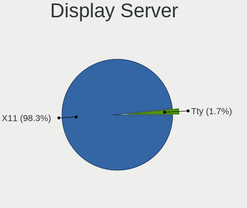
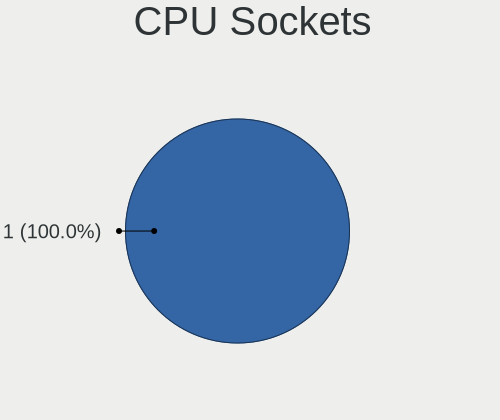
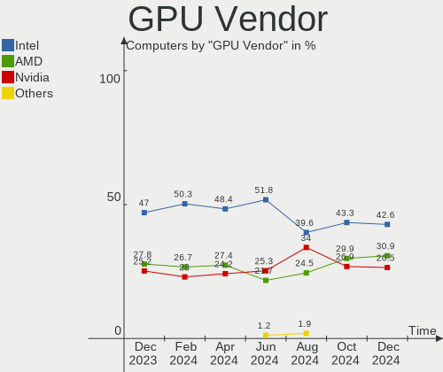
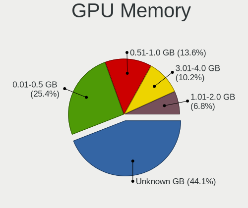
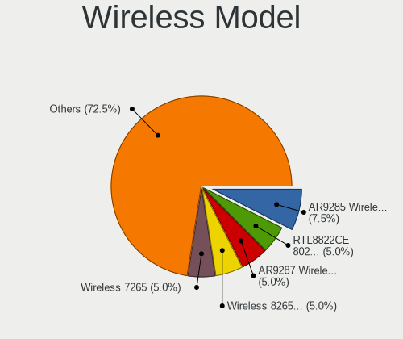
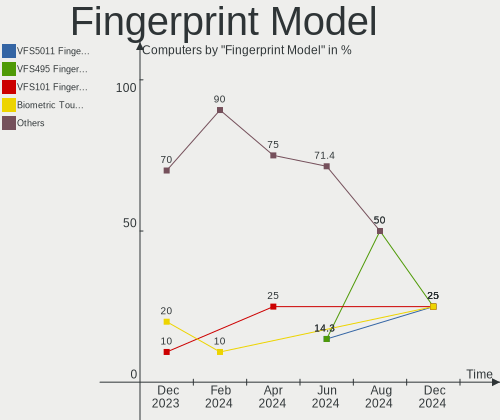

BlackPanther - Hardware Trends
------------------------------

A project to identify most popular hardware characteristics and track their change
over time based on data collected by Linux users at https://Linux-Hardware.org.

Anyone can contribute to this report by the [hw-probe](https://github.com/linuxhw/hw-probe) tool:

    sudo -E hw-probe -all -upload

This is a report for all computer types. See also reports for [desktops](/Dist/BlackPanther/Desktop/README.md) and [notebooks](/Dist/BlackPanther/Notebook/README.md).

This report is for one last month. Overall report since the beginning of time: [TestDays](https://github.com/linuxhw/TestDays)

Period: May, 2023.

Contents
--------

* [ System ](#system)
  - [ OS                       ](#os)
  - [ OS Family                ](#os-family)
  - [ Kernel                   ](#kernel)
  - [ Kernel Family            ](#kernel-family)
  - [ Kernel Major Ver.        ](#kernel-major-ver)
  - [ Arch                     ](#arch)
  - [ DE                       ](#de)
  - [ Display Server           ](#display-server)
  - [ Display Manager          ](#display-manager)
  - [ OS Lang                  ](#os-lang)
  - [ Boot Mode                ](#boot-mode)
  - [ Filesystem               ](#filesystem)
  - [ Part. scheme             ](#part-scheme)
  - [ Dual Boot with Linux/BSD ](#dual-boot-with-linuxbsd)
  - [ Dual Boot (Win)          ](#dual-boot-win)

* [ Board ](#board)
  - [ Vendor                   ](#vendor)
  - [ Model                    ](#model)
  - [ Model Family             ](#model-family)
  - [ MFG Year                 ](#mfg-year)
  - [ Form Factor              ](#form-factor)
  - [ Secure Boot              ](#secure-boot)
  - [ Coreboot                 ](#coreboot)
  - [ RAM Size                 ](#ram-size)
  - [ RAM Used                 ](#ram-used)
  - [ Total Drives             ](#total-drives)
  - [ Has CD-ROM               ](#has-cd-rom)
  - [ Has Ethernet             ](#has-ethernet)
  - [ Has WiFi                 ](#has-wifi)
  - [ Has Bluetooth            ](#has-bluetooth)

* [ Location ](#location)
  - [ Country                  ](#country)
  - [ City                     ](#city)

* [ Drives ](#drives)
  - [ Drive Vendor             ](#drive-vendor)
  - [ Drive Model              ](#drive-model)
  - [ HDD Vendor               ](#hdd-vendor)
  - [ SSD Vendor               ](#ssd-vendor)
  - [ Drive Kind               ](#drive-kind)
  - [ Drive Connector          ](#drive-connector)
  - [ Drive Size               ](#drive-size)
  - [ Space Total              ](#space-total)
  - [ Space Used               ](#space-used)
  - [ Malfunc. Drives          ](#malfunc-drives)
  - [ Malfunc. Drive Vendor    ](#malfunc-drive-vendor)
  - [ Malfunc. HDD Vendor      ](#malfunc-hdd-vendor)
  - [ Malfunc. Drive Kind      ](#malfunc-drive-kind)
  - [ Failed Drives            ](#failed-drives)
  - [ Failed Drive Vendor      ](#failed-drive-vendor)
  - [ Drive Status             ](#drive-status)

* [ Storage controller ](#storage-controller)
  - [ Storage Vendor           ](#storage-vendor)
  - [ Storage Model            ](#storage-model)
  - [ Storage Kind             ](#storage-kind)

* [ Processor ](#processor)
  - [ CPU Vendor               ](#cpu-vendor)
  - [ CPU Model                ](#cpu-model)
  - [ CPU Model Family         ](#cpu-model-family)
  - [ CPU Cores                ](#cpu-cores)
  - [ CPU Sockets              ](#cpu-sockets)
  - [ CPU Threads              ](#cpu-threads)
  - [ CPU Op-Modes             ](#cpu-op-modes)
  - [ CPU Microcode            ](#cpu-microcode)
  - [ CPU Microarch            ](#cpu-microarch)

* [ Graphics ](#graphics)
  - [ GPU Vendor               ](#gpu-vendor)
  - [ GPU Model                ](#gpu-model)
  - [ GPU Combo                ](#gpu-combo)
  - [ GPU Driver               ](#gpu-driver)
  - [ GPU Memory               ](#gpu-memory)

* [ Monitor ](#monitor)
  - [ Monitor Vendor           ](#monitor-vendor)
  - [ Monitor Model            ](#monitor-model)
  - [ Monitor Resolution       ](#monitor-resolution)
  - [ Monitor Diagonal         ](#monitor-diagonal)
  - [ Monitor Width            ](#monitor-width)
  - [ Aspect Ratio             ](#aspect-ratio)
  - [ Monitor Area             ](#monitor-area)
  - [ Pixel Density            ](#pixel-density)
  - [ Multiple Monitors        ](#multiple-monitors)

* [ Network ](#network)
  - [ Net Controller Vendor    ](#net-controller-vendor)
  - [ Net Controller Model     ](#net-controller-model)
  - [ Wireless Vendor          ](#wireless-vendor)
  - [ Wireless Model           ](#wireless-model)
  - [ Ethernet Vendor          ](#ethernet-vendor)
  - [ Ethernet Model           ](#ethernet-model)
  - [ Net Controller Kind      ](#net-controller-kind)
  - [ Used Controller          ](#used-controller)
  - [ NICs                     ](#nics)
  - [ IPv6                     ](#ipv6)

* [ Bluetooth ](#bluetooth)
  - [ Bluetooth Vendor         ](#bluetooth-vendor)
  - [ Bluetooth Model          ](#bluetooth-model)

* [ Sound ](#sound)
  - [ Sound Vendor             ](#sound-vendor)
  - [ Sound Model              ](#sound-model)

* [ Memory ](#memory)
  - [ Memory Vendor            ](#memory-vendor)
  - [ Memory Model             ](#memory-model)
  - [ Memory Kind              ](#memory-kind)
  - [ Memory Form Factor       ](#memory-form-factor)
  - [ Memory Size              ](#memory-size)
  - [ Memory Speed             ](#memory-speed)

* [ Printers & scanners ](#printers--scanners)
  - [ Printer Vendor           ](#printer-vendor)
  - [ Printer Model            ](#printer-model)
  - [ Scanner Vendor           ](#scanner-vendor)
  - [ Scanner Model            ](#scanner-model)

* [ Camera ](#camera)
  - [ Camera Vendor            ](#camera-vendor)
  - [ Camera Model             ](#camera-model)

* [ Security ](#security)
  - [ Fingerprint Vendor       ](#fingerprint-vendor)
  - [ Fingerprint Model        ](#fingerprint-model)
  - [ Chipcard Vendor          ](#chipcard-vendor)
  - [ Chipcard Model           ](#chipcard-model)

* [ Unsupported ](#unsupported)
  - [ Unsupported Devices      ](#unsupported-devices)
  - [ Unsupported Device Types ](#unsupported-device-types)

System
------

OS
--

Installed operating systems

| Name              | Computers | Percent |
|-------------------|-----------|---------|
| BlackPanther 18.1 | 97        | 93.27%  |
| BlackPanther 22.1 | 7         | 6.73%   |

OS Family
---------

OS without a version

| Name         | Computers | Percent |
|--------------|-----------|---------|
| BlackPanther | 104       | 100%    |

Kernel
------

Version of the Linux kernel

| Version             | Computers | Percent |
|---------------------|-----------|---------|
| 4.18.16-desktop-1bP | 34        | 32.69%  |
| 5.6.14-desktop-2bP  | 33        | 31.73%  |
| 5.15.85-desktop-1bP | 30        | 28.85%  |
| 6.2.9-desktop-1bP   | 4         | 3.85%   |
| 6.1.0-1bP           | 1         | 0.96%   |
| 5.6.14-server-2bP   | 1         | 0.96%   |
| 5.15.6-desktop-1bP  | 1         | 0.96%   |

Kernel Family
-------------

Linux kernel without a distro release

| Version | Computers | Percent |
|---------|-----------|---------|
| 5.6.14  | 34        | 32.69%  |
| 4.18.16 | 34        | 32.69%  |
| 5.15.85 | 30        | 28.85%  |
| 6.2.9   | 4         | 3.85%   |
| 6.1.0   | 1         | 0.96%   |
| 5.15.6  | 1         | 0.96%   |

Kernel Major Ver.
-----------------

Linux kernel major version

| Version | Computers | Percent |
|---------|-----------|---------|
| 5.6     | 34        | 32.69%  |
| 4.18    | 34        | 32.69%  |
| 5.15    | 31        | 29.81%  |
| 6.2     | 4         | 3.85%   |
| 6.1     | 1         | 0.96%   |

Arch
----

OS architecture (x86_64, i586, etc.)

| Name   | Computers | Percent |
|--------|-----------|---------|
| x86_64 | 104       | 100%    |

DE
--

Desktop Environment

| Name    | Computers | Percent |
|---------|-----------|---------|
| KDE5    | 99        | 95.19%  |
| Unknown | 5         | 4.81%   |

Display Server
--------------

X11 or Wayland

| Name    | Computers | Percent |
|---------|-----------|---------|
| X11     | 103       | 99.04%  |
| Unknown | 1         | 0.96%   |

Display Manager
---------------

SDDM, LightDM, etc.

| Name    | Computers | Percent |
|---------|-----------|---------|
| SDDM    | 101       | 97.12%  |
| Unknown | 3         | 2.88%   |

OS Lang
-------

Language

| Lang    | Computers | Percent |
|---------|-----------|---------|
| Unknown | 104       | 100%    |

Boot Mode
---------

EFI or BIOS

| Mode | Computers | Percent |
|------|-----------|---------|
| BIOS | 57        | 54.81%  |
| EFI  | 47        | 45.19%  |

Filesystem
----------

Type of filesystem

| Type    | Computers | Percent |
|---------|-----------|---------|
| Ext4    | 67        | 64.42%  |
| Overlay | 36        | 34.62%  |
| Unknown | 1         | 0.96%   |

Part. scheme
------------

Scheme of partitioning

| Type    | Computers | Percent |
|---------|-----------|---------|
| MBR     | 53        | 50.96%  |
| GPT     | 48        | 46.15%  |
| Unknown | 3         | 2.88%   |

Dual Boot with Linux/BSD
------------------------

Hosting more than one Linux/BSD

| Dual boot | Computers | Percent |
|-----------|-----------|---------|
| No        | 70        | 67.31%  |
| Yes       | 34        | 32.69%  |

Dual Boot (Win)
---------------

Hosting Linux and Windows

| Dual boot | Computers | Percent |
|-----------|-----------|---------|
| No        | 57        | 54.81%  |
| Yes       | 47        | 45.19%  |

Board
-----

Vendor
------

Motherboard manufacturer

| Name                | Computers | Percent |
|---------------------|-----------|---------|
| Lenovo              | 18        | 17.31%  |
| ASUSTek Computer    | 15        | 14.42%  |
| Gigabyte Technology | 14        | 13.46%  |
| Dell                | 13        | 12.5%   |
| Hewlett-Packard     | 12        | 11.54%  |
| Fujitsu             | 6         | 5.77%   |
| MSI                 | 5         | 4.81%   |
| Acer                | 5         | 4.81%   |
| Toshiba             | 3         | 2.88%   |
| ASRock              | 3         | 2.88%   |
| Samsung Electronics | 2         | 1.92%   |
| eMachines           | 2         | 1.92%   |
| Sony                | 1         | 0.96%   |
| Packard Bell        | 1         | 0.96%   |
| Medion              | 1         | 0.96%   |
| HUAWEI              | 1         | 0.96%   |
| Fujitsu Siemens     | 1         | 0.96%   |
| Apple               | 1         | 0.96%   |

Model
-----

Motherboard model

| Name                               | Computers | Percent |
|------------------------------------|-----------|---------|
| Lenovo ThinkPad T420 4236W8L       | 2         | 1.92%   |
| HP EliteDesk 705 G3 SFF            | 2         | 1.92%   |
| eMachines E725                     | 2         | 1.92%   |
| Dell Inspiron 7737                 | 2         | 1.92%   |
| ASUS K54HR                         | 2         | 1.92%   |
| Toshiba Satellite U300             | 1         | 0.96%   |
| Toshiba Satellite M50D-A           | 1         | 0.96%   |
| Toshiba Satellite C55-A-1NV        | 1         | 0.96%   |
| Sony VPCEH2J1E                     | 1         | 0.96%   |
| Samsung R530/R730/P530             | 1         | 0.96%   |
| Samsung 300E4C/300E5C/300E7C       | 1         | 0.96%   |
| Packard Bell EasyNote TK36         | 1         | 0.96%   |
| MSI MS-7C91                        | 1         | 0.96%   |
| MSI MS-7817                        | 1         | 0.96%   |
| MSI MS-7309                        | 1         | 0.96%   |
| MSI GT60 2OC/2OD                   | 1         | 0.96%   |
| MSI GP75 Leopard 9SE               | 1         | 0.96%   |
| Medion MS-7748                     | 1         | 0.96%   |
| Lenovo Z50-75 80EC                 | 1         | 0.96%   |
| Lenovo V15-ADA 82C7                | 1         | 0.96%   |
| Lenovo ThinkStation D20 4158AF8    | 1         | 0.96%   |
| Lenovo ThinkStation C30 1097A34    | 1         | 0.96%   |
| Lenovo ThinkPad X250 20CLS1JN00    | 1         | 0.96%   |
| Lenovo ThinkPad X200 74595FG       | 1         | 0.96%   |
| Lenovo ThinkPad T540p 20BE003YUK   | 1         | 0.96%   |
| Lenovo ThinkPad T500 2056CL8       | 1         | 0.96%   |
| Lenovo ThinkCentre M93p 10A7003AUK | 1         | 0.96%   |
| Lenovo ThinkCentre M73 10B6001SUS  | 1         | 0.96%   |
| Lenovo IdeaPad Y700-15ISK 80NV     | 1         | 0.96%   |
| Lenovo IdeaPad 700-15ISK 80RU      | 1         | 0.96%   |
| Lenovo IdeaPad 110-15ACL 80TJ      | 1         | 0.96%   |
| Lenovo G580 20150                  | 1         | 0.96%   |
| Lenovo G570 20079                  | 1         | 0.96%   |
| Lenovo E50-80 80J2                 | 1         | 0.96%   |
| HUAWEI HVY-WXX9                    | 1         | 0.96%   |
| HP ProBook 640 G8 Notebook PC      | 1         | 0.96%   |
| HP Pavilion dv6                    | 1         | 0.96%   |
| HP Notebook                        | 1         | 0.96%   |
| HP Laptop 15-dw1xxx                | 1         | 0.96%   |
| HP EliteDesk 800 G2 DM 35W         | 1         | 0.96%   |

Model Family
------------

Motherboard model prefix

| Name                  | Computers | Percent |
|-----------------------|-----------|---------|
| Lenovo ThinkPad       | 6         | 5.77%   |
| Dell Inspiron         | 5         | 4.81%   |
| Dell Latitude         | 4         | 3.85%   |
| Toshiba Satellite     | 3         | 2.88%   |
| Lenovo IdeaPad        | 3         | 2.88%   |
| HP EliteDesk          | 3         | 2.88%   |
| HP Compaq             | 3         | 2.88%   |
| ASUS PRIME            | 3         | 2.88%   |
| Acer Aspire           | 3         | 2.88%   |
| Lenovo ThinkStation   | 2         | 1.92%   |
| Lenovo ThinkCentre    | 2         | 1.92%   |
| Fujitsu LIFEBOOK      | 2         | 1.92%   |
| Fujitsu ESPRIMO       | 2         | 1.92%   |
| Fujitsu CELSIUS       | 2         | 1.92%   |
| eMachines E725        | 2         | 1.92%   |
| Dell OptiPlex         | 2         | 1.92%   |
| ASUS K54HR            | 2         | 1.92%   |
| Sony VPCEH2J1E        | 1         | 0.96%   |
| Samsung R530          | 1         | 0.96%   |
| Samsung 300E4C        | 1         | 0.96%   |
| Packard Bell EasyNote | 1         | 0.96%   |
| MSI MS-7C91           | 1         | 0.96%   |
| MSI MS-7817           | 1         | 0.96%   |
| MSI MS-7309           | 1         | 0.96%   |
| MSI GT60              | 1         | 0.96%   |
| MSI GP75              | 1         | 0.96%   |
| Medion MS-7748        | 1         | 0.96%   |
| Lenovo Z50-75         | 1         | 0.96%   |
| Lenovo V15-ADA        | 1         | 0.96%   |
| Lenovo G580           | 1         | 0.96%   |
| Lenovo G570           | 1         | 0.96%   |
| Lenovo E50-80         | 1         | 0.96%   |
| HUAWEI HVY-WXX9       | 1         | 0.96%   |
| HP ProBook            | 1         | 0.96%   |
| HP Pavilion           | 1         | 0.96%   |
| HP Notebook           | 1         | 0.96%   |
| HP Laptop             | 1         | 0.96%   |
| HP 650                | 1         | 0.96%   |
| HP 250                | 1         | 0.96%   |
| Gigabyte Z390         | 1         | 0.96%   |

MFG Year
--------

Motherboard manufacture year

| Year | Computers | Percent |
|------|-----------|---------|
| 2015 | 12        | 11.54%  |
| 2011 | 12        | 11.54%  |
| 2012 | 11        | 10.58%  |
| 2013 | 10        | 9.62%   |
| 2010 | 10        | 9.62%   |
| 2017 | 8         | 7.69%   |
| 2014 | 8         | 7.69%   |
| 2008 | 7         | 6.73%   |
| 2018 | 6         | 5.77%   |
| 2016 | 5         | 4.81%   |
| 2020 | 4         | 3.85%   |
| 2019 | 3         | 2.88%   |
| 2009 | 3         | 2.88%   |
| 2007 | 3         | 2.88%   |
| 2021 | 1         | 0.96%   |
| 2006 | 1         | 0.96%   |

Form Factor
-----------

Physical design of the computer

| Name       | Computers | Percent |
|------------|-----------|---------|
| Notebook   | 54        | 51.92%  |
| Desktop    | 49        | 47.12%  |
| All in one | 1         | 0.96%   |

Secure Boot
-----------

Enabled or disabled

| State    | Computers | Percent |
|----------|-----------|---------|
| Disabled | 104       | 100%    |

Coreboot
--------

Have coreboot on board

| Used | Computers | Percent |
|------|-----------|---------|
| No   | 104       | 100%    |

RAM Size
--------

Total RAM memory

| Size in GB | Computers | Percent |
|------------|-----------|---------|
| 3.01-4.0   | 35        | 33.65%  |
| 8.01-16.0  | 24        | 23.08%  |
| 4.01-8.0   | 18        | 17.31%  |
| 16.01-24.0 | 11        | 10.58%  |
| 1.01-2.0   | 7         | 6.73%   |
| 32.01-64.0 | 4         | 3.85%   |
| 24.01-32.0 | 2         | 1.92%   |
| 2.01-3.0   | 1         | 0.96%   |
| 0.51-1.0   | 1         | 0.96%   |
| Unknown    | 1         | 0.96%   |

RAM Used
--------

Used RAM memory

| Used GB  | Computers | Percent |
|----------|-----------|---------|
| 0.51-1.0 | 44        | 42.31%  |
| 1.01-2.0 | 33        | 31.73%  |
| 0.01-0.5 | 14        | 13.46%  |
| 2.01-3.0 | 6         | 5.77%   |
| 4.01-8.0 | 4         | 3.85%   |
| 3.01-4.0 | 2         | 1.92%   |
| Unknown  | 1         | 0.96%   |

Total Drives
------------

Number of drives on board

| Drives | Computers | Percent |
|--------|-----------|---------|
| 1      | 59        | 56.73%  |
| 2      | 33        | 31.73%  |
| 3      | 6         | 5.77%   |
| 4      | 3         | 2.88%   |
| 0      | 2         | 1.92%   |
| 5      | 1         | 0.96%   |

Has CD-ROM
----------

Has CD-ROM on board

| Presented | Computers | Percent |
|-----------|-----------|---------|
| Yes       | 57        | 54.81%  |
| No        | 47        | 45.19%  |

Has Ethernet
------------

Has Ethernet on board

| Presented | Computers | Percent |
|-----------|-----------|---------|
| Yes       | 99        | 95.19%  |
| No        | 5         | 4.81%   |

Has WiFi
--------

Has WiFi module

| Presented | Computers | Percent |
|-----------|-----------|---------|
| Yes       | 74        | 71.15%  |
| No        | 30        | 28.85%  |

Has Bluetooth
-------------

Has Bluetooth module

| Presented | Computers | Percent |
|-----------|-----------|---------|
| Yes       | 52        | 50%     |
| No        | 52        | 50%     |

Location
--------

Country
-------

Geographic location (country)

| Country  | Computers | Percent |
|----------|-----------|---------|
| Hungary  | 79        | 75.96%  |
| Germany  | 5         | 4.81%   |
| Slovakia | 4         | 3.85%   |
| UK       | 3         | 2.88%   |
| Romania  | 3         | 2.88%   |
| France   | 3         | 2.88%   |
| Austria  | 3         | 2.88%   |
| USA      | 1         | 0.96%   |
| Spain    | 1         | 0.96%   |
| Serbia   | 1         | 0.96%   |
| Greece   | 1         | 0.96%   |

City
----

Geographic location (city)

| City                         | Computers | Percent |
|------------------------------|-----------|---------|
| Budapest                     | 19        | 18.27%  |
| Szigetujfalu                 | 4         | 3.85%   |
| Debrecen                     | 4         | 3.85%   |
| Zalaegerszeg                 | 3         | 2.88%   |
| Tatabánya                   | 3         | 2.88%   |
| Szolnok                      | 3         | 2.88%   |
| Pécs                        | 3         | 2.88%   |
| Nancy                        | 3         | 2.88%   |
| Berettyóújfalu             | 3         | 2.88%   |
| Vienna                       | 2         | 1.92%   |
| Szekszárd                   | 2         | 1.92%   |
| Nyiregyhaza                  | 2         | 1.92%   |
| Harlow                       | 2         | 1.92%   |
| Győr                        | 2         | 1.92%   |
| Gödöllő                   | 2         | 1.92%   |
| Bad Hersfeld                 | 2         | 1.92%   |
| Zalău                       | 1         | 0.96%   |
| Tornaľa                     | 1         | 0.96%   |
| Toeroekbalint                | 1         | 0.96%   |
| Tiszakecske                  | 1         | 0.96%   |
| Szigethalom                  | 1         | 0.96%   |
| Szentendre                   | 1         | 0.96%   |
| Székesfehérvár            | 1         | 0.96%   |
| Sátoraljaújhely            | 1         | 0.96%   |
| Sarvar                       | 1         | 0.96%   |
| Sarbogard                    | 1         | 0.96%   |
| Salgotarjan                  | 1         | 0.96%   |
| Rožňava                    | 1         | 0.96%   |
| Randolph Township            | 1         | 0.96%   |
| Pomaz                        | 1         | 0.96%   |
| Pfaffenhofen an der Ilm      | 1         | 0.96%   |
| Oroshaza                     | 1         | 0.96%   |
| Opusztaszer                  | 1         | 0.96%   |
| Obertraubling                | 1         | 0.96%   |
| Niederkirchen bei Deidesheim | 1         | 0.96%   |
| Nickelsdorf                  | 1         | 0.96%   |
| Nagykanizsa                  | 1         | 0.96%   |
| Miskolc                      | 1         | 0.96%   |
| Miercurea-Ciuc               | 1         | 0.96%   |
| Martin                       | 1         | 0.96%   |

Drives
------

Drive Vendor
------------

Hard drive vendors

| Vendor              | Computers | Drives | Percent |
|---------------------|-----------|--------|---------|
| Samsung Electronics | 26        | 33     | 17.22%  |
| WDC                 | 25        | 29     | 16.56%  |
| Kingston            | 18        | 22     | 11.92%  |
| Seagate             | 14        | 15     | 9.27%   |
| Toshiba             | 12        | 12     | 7.95%   |
| A-DATA Technology   | 6         | 6      | 3.97%   |
| Patriot             | 5         | 5      | 3.31%   |
| Hitachi             | 5         | 5      | 3.31%   |
| Unknown             | 4         | 4      | 2.65%   |
| Intenso             | 4         | 4      | 2.65%   |
| Micron Technology   | 3         | 3      | 1.99%   |
| HGST                | 3         | 3      | 1.99%   |
| SPCC                | 2         | 2      | 1.32%   |
| SanDisk             | 2         | 2      | 1.32%   |
| LITEON              | 2         | 2      | 1.32%   |
| Gigabyte Technology | 2         | 2      | 1.32%   |
| Crucial             | 2         | 2      | 1.32%   |
| Zheino              | 1         | 1      | 0.66%   |
| Verbatim            | 1         | 1      | 0.66%   |
| SSSTC               | 1         | 1      | 0.66%   |
| SK hynix            | 1         | 1      | 0.66%   |
| Netac               | 1         | 1      | 0.66%   |
| KIOXIA              | 1         | 1      | 0.66%   |
| Kingmax             | 1         | 1      | 0.66%   |
| JMicron Technology  | 1         | 1      | 0.66%   |
| Intel               | 1         | 2      | 0.66%   |
| IB-1122             | 1         | 1      | 0.66%   |
| Hewlett-Packard     | 1         | 1      | 0.66%   |
| China               | 1         | 1      | 0.66%   |
| ASENNO              | 1         | 1      | 0.66%   |
| Apple               | 1         | 1      | 0.66%   |
| 2-Power             | 1         | 1      | 0.66%   |
| Unknown             | 1         | 1      | 0.66%   |

Drive Model
-----------

Hard drive models

| Model                                   | Computers | Percent |
|-----------------------------------------|-----------|---------|
| Kingston SA400S37240G 240GB SSD         | 5         | 3.01%   |
| Kingston SA400S37480G 480GB SSD         | 4         | 2.41%   |
| Kingston SA400S37120G 120GB SSD         | 4         | 2.41%   |
| WDC WD10SPCX-24HWST1 1TB                | 3         | 1.81%   |
| Toshiba DT01ACA100 1TB                  | 3         | 1.81%   |
| Patriot Burst 120GB SSD                 | 3         | 1.81%   |
| Hitachi HTS545050B9A300 500GB           | 3         | 1.81%   |
| WDC WD30EFRX-68EUZN0 3TB                | 2         | 1.2%    |
| WDC WD10PURZ-85U8XY0 1TB                | 2         | 1.2%    |
| Toshiba KSG60ZMV256G M.2 2280 256GB SSD | 2         | 1.2%    |
| SPCC Solid State Disk 256GB             | 2         | 1.2%    |
| Seagate ST500LT012-1DG142 500GB         | 2         | 1.2%    |
| Seagate ST500DM002-1BD142 500GB         | 2         | 1.2%    |
| Samsung SSD 970 EVO Plus 2TB            | 2         | 1.2%    |
| Samsung SSD 970 EVO 250GB               | 2         | 1.2%    |
| Samsung SSD 870 EVO 500GB               | 2         | 1.2%    |
| Samsung SSD 850 EVO 250GB               | 2         | 1.2%    |
| Samsung SSD 830 Series 64GB             | 2         | 1.2%    |
| Micron MTFDDAK256MAM-1K1 256GB SSD      | 2         | 1.2%    |
| Kingston SA400S37960G 960GB SSD         | 2         | 1.2%    |
| Intenso SSD 120GB                       | 2         | 1.2%    |
| Hitachi HTS547550A9E384 500GB           | 2         | 1.2%    |
| Gigabyte GP-GSTFS31120GNTD 120GB SSD    | 2         | 1.2%    |
| Zheino CHN-NGFFNV2280-256 256GB         | 1         | 0.6%    |
| WDC WDS240G2G0B-00EPW0 240GB SSD        | 1         | 0.6%    |
| WDC WD6400AAKS-07A7B0 640GB             | 1         | 0.6%    |
| WDC WD5003AZEX-00MK2A0 500GB            | 1         | 0.6%    |
| WDC WD5000LPVX-80V0TT0 500GB            | 1         | 0.6%    |
| WDC WD5000LPCX-24VHAT0 500GB            | 1         | 0.6%    |
| WDC WD5000BPVT-24HXZT3 500GB            | 1         | 0.6%    |
| WDC WD5000BPVT-00HXZT1 500GB            | 1         | 0.6%    |
| WDC WD5000BPKT-75PK4T0 500GB            | 1         | 0.6%    |
| WDC WD5000AAKX-08U6AA0 500GB            | 1         | 0.6%    |
| WDC WD5000AAKS-007AA0 500GB             | 1         | 0.6%    |
| WDC WD3200BEVT-08A23T1 320GB            | 1         | 0.6%    |
| WDC WD30EZRZ-00GXCB0 3TB                | 1         | 0.6%    |
| WDC WD30EZRX-00DC0B0 3TB                | 1         | 0.6%    |
| WDC WD2500BEVT-00ZCT0 250GB             | 1         | 0.6%    |
| WDC WD20EZRZ-00Z5HB0 2TB                | 1         | 0.6%    |
| WDC WD15EARX-00PASB0 1TB                | 1         | 0.6%    |

HDD Vendor
----------

Hard disk drive vendors

| Vendor              | Computers | Drives | Percent |
|---------------------|-----------|--------|---------|
| WDC                 | 24        | 28     | 36.36%  |
| Seagate             | 14        | 15     | 21.21%  |
| Toshiba             | 10        | 10     | 15.15%  |
| Samsung Electronics | 9         | 10     | 13.64%  |
| Hitachi             | 5         | 5      | 7.58%   |
| HGST                | 3         | 3      | 4.55%   |
| IB-1122             | 1         | 1      | 1.52%   |

SSD Vendor
----------

Solid state drive vendors

| Vendor              | Computers | Drives | Percent |
|---------------------|-----------|--------|---------|
| Kingston            | 15        | 19     | 22.06%  |
| Samsung Electronics | 14        | 15     | 20.59%  |
| Patriot             | 5         | 5      | 7.35%   |
| Intenso             | 4         | 4      | 5.88%   |
| A-DATA Technology   | 4         | 4      | 5.88%   |
| Micron Technology   | 3         | 3      | 4.41%   |
| Toshiba             | 2         | 2      | 2.94%   |
| SPCC                | 2         | 2      | 2.94%   |
| SanDisk             | 2         | 2      | 2.94%   |
| Gigabyte Technology | 2         | 2      | 2.94%   |
| Crucial             | 2         | 2      | 2.94%   |
| WDC                 | 1         | 1      | 1.47%   |
| Verbatim            | 1         | 1      | 1.47%   |
| SK hynix            | 1         | 1      | 1.47%   |
| Netac               | 1         | 1      | 1.47%   |
| LITEON              | 1         | 1      | 1.47%   |
| Kingmax             | 1         | 1      | 1.47%   |
| JMicron Technology  | 1         | 1      | 1.47%   |
| Intel               | 1         | 2      | 1.47%   |
| Hewlett-Packard     | 1         | 1      | 1.47%   |
| China               | 1         | 1      | 1.47%   |
| ASENNO              | 1         | 1      | 1.47%   |
| Apple               | 1         | 1      | 1.47%   |
| 2-Power             | 1         | 1      | 1.47%   |

Drive Kind
----------

HDD or SSD

| Kind    | Computers | Drives | Percent |
|---------|-----------|--------|---------|
| HDD     | 60        | 72     | 43.48%  |
| SSD     | 59        | 74     | 42.75%  |
| NVMe    | 15        | 17     | 10.87%  |
| MMC     | 3         | 3      | 2.17%   |
| Unknown | 1         | 2      | 0.72%   |

Drive Connector
---------------

SATA, SAS, NVMe, etc.

| Type | Computers | Drives | Percent |
|------|-----------|--------|---------|
| SATA | 95        | 143    | 81.2%   |
| NVMe | 15        | 17     | 12.82%  |
| SAS  | 4         | 5      | 3.42%   |
| MMC  | 3         | 3      | 2.56%   |

Drive Size
----------

Size of hard drive

| Size in TB | Computers | Drives | Percent |
|------------|-----------|--------|---------|
| 0.01-0.5   | 81        | 101    | 66.94%  |
| 0.51-1.0   | 32        | 36     | 26.45%  |
| 2.01-3.0   | 4         | 5      | 3.31%   |
| 1.01-2.0   | 3         | 3      | 2.48%   |
| 3.01-4.0   | 1         | 1      | 0.83%   |

Space Total
-----------

Amount of disk space available on the file system

| Size in GB     | Computers | Percent |
|----------------|-----------|---------|
| Unknown        | 38        | 36.54%  |
| 101-250        | 29        | 27.88%  |
| 251-500        | 10        | 9.62%   |
| 501-1000       | 8         | 7.69%   |
| 51-100         | 7         | 6.73%   |
| 21-50          | 4         | 3.85%   |
| 1001-2000      | 4         | 3.85%   |
| More than 3000 | 2         | 1.92%   |
| 2001-3000      | 2         | 1.92%   |

Space Used
----------

Amount of used disk space

| Used GB        | Computers | Percent |
|----------------|-----------|---------|
| Unknown        | 38        | 36.54%  |
| 1-20           | 21        | 20.19%  |
| 21-50          | 15        | 14.42%  |
| 51-100         | 11        | 10.58%  |
| 101-250        | 9         | 8.65%   |
| 251-500        | 3         | 2.88%   |
| 1001-2000      | 3         | 2.88%   |
| 501-1000       | 2         | 1.92%   |
| More than 3000 | 1         | 0.96%   |
| 2001-3000      | 1         | 0.96%   |

Malfunc. Drives
---------------

Drive models with a malfunction

| Model                                            | Computers | Drives | Percent |
|--------------------------------------------------|-----------|--------|---------|
| WDC WD10PURZ-85U8XY0 1TB                         | 2         | 2      | 5%      |
| Hitachi HTS545050B9A300 500GB                    | 2         | 2      | 5%      |
| WDC WD6400AAKS-07A7B0 640GB                      | 1         | 1      | 2.5%    |
| WDC WD5000LPVX-80V0TT0 500GB                     | 1         | 1      | 2.5%    |
| WDC WD5000AAKX-08U6AA0 500GB                     | 1         | 1      | 2.5%    |
| WDC WD5000AAKS-007AA0 500GB                      | 1         | 1      | 2.5%    |
| WDC WD3200BEVT-08A23T1 320GB                     | 1         | 1      | 2.5%    |
| WDC WD30EFRX-68EUZN0 3TB                         | 1         | 1      | 2.5%    |
| WDC WD2500BEVT-00ZCT0 250GB                      | 1         | 1      | 2.5%    |
| WDC WD10JPLX-00MBPT0 1TB                         | 1         | 1      | 2.5%    |
| WDC WD10JPCX-24UE4T0 1TB                         | 1         | 1      | 2.5%    |
| WDC WD10EARS-00Y5B1 1TB                          | 1         | 1      | 2.5%    |
| Toshiba MQ01ABF050 500GB                         | 1         | 1      | 2.5%    |
| Toshiba MK2035GSS 200GB                          | 1         | 1      | 2.5%    |
| Toshiba KSG60ZMV256G M.2 2280 256GB SSD          | 1         | 1      | 2.5%    |
| Toshiba HDWD130 3TB                              | 1         | 1      | 2.5%    |
| Seagate ST9500325AS 500GB                        | 1         | 1      | 2.5%    |
| Seagate ST9250315AS 250GB                        | 1         | 1      | 2.5%    |
| Seagate ST320LT020-9YG142 320GB                  | 1         | 1      | 2.5%    |
| Seagate ST3160812AS 160GB                        | 1         | 1      | 2.5%    |
| Seagate ST1000LM024 HN-M101MBB 1TB               | 1         | 1      | 2.5%    |
| Seagate ST1000LM014-1EJ164-SSHD 1TB              | 1         | 1      | 2.5%    |
| Samsung Electronics SSD 750 EVO 250GB            | 1         | 1      | 2.5%    |
| Samsung Electronics MZ7LN256HMJP-000H1 256GB SSD | 1         | 1      | 2.5%    |
| Samsung Electronics HM160HI 160GB                | 1         | 1      | 2.5%    |
| Samsung Electronics HD200HJ 200GB                | 1         | 1      | 2.5%    |
| Samsung Electronics HD161HJ 160GB                | 1         | 1      | 2.5%    |
| Samsung Electronics HD103UJ 1TB                  | 1         | 1      | 2.5%    |
| Kingston SA400S37480G 480GB SSD                  | 1         | 1      | 2.5%    |
| Kingston SA400S37240G 240GB SSD                  | 1         | 1      | 2.5%    |
| Intel SSDSC2KF240H6L 240GB                       | 1         | 1      | 2.5%    |
| Intel SSDSC2BF180A5L 180GB                       | 1         | 1      | 2.5%    |
| Hitachi HTS547550A9E384 500GB                    | 1         | 1      | 2.5%    |
| HGST HTS545032A7E380 320GB                       | 1         | 1      | 2.5%    |
| HGST HTS541010A9E680 1TB                         | 1         | 1      | 2.5%    |
| Apple SSD TS064E 64GB                            | 1         | 1      | 2.5%    |
| A-DATA Technology SX6000PNP 256GB                | 1         | 1      | 2.5%    |
| A-DATA Technology SU630 240GB SSD                | 1         | 1      | 2.5%    |

Malfunc. Drive Vendor
---------------------

Vendors of faulty drives

| Vendor              | Computers | Drives | Percent |
|---------------------|-----------|--------|---------|
| WDC                 | 12        | 12     | 30.77%  |
| Seagate             | 6         | 6      | 15.38%  |
| Samsung Electronics | 6         | 6      | 15.38%  |
| Toshiba             | 4         | 4      | 10.26%  |
| Hitachi             | 3         | 3      | 7.69%   |
| Kingston            | 2         | 2      | 5.13%   |
| HGST                | 2         | 2      | 5.13%   |
| A-DATA Technology   | 2         | 2      | 5.13%   |
| Intel               | 1         | 2      | 2.56%   |
| Apple               | 1         | 1      | 2.56%   |

Malfunc. HDD Vendor
-------------------

Vendors of faulty HDD drives

| Vendor              | Computers | Drives | Percent |
|---------------------|-----------|--------|---------|
| WDC                 | 12        | 12     | 40%     |
| Seagate             | 6         | 6      | 20%     |
| Samsung Electronics | 4         | 4      | 13.33%  |
| Toshiba             | 3         | 3      | 10%     |
| Hitachi             | 3         | 3      | 10%     |
| HGST                | 2         | 2      | 6.67%   |

Malfunc. Drive Kind
-------------------

Kinds of faulty drives

| Kind | Computers | Drives | Percent |
|------|-----------|--------|---------|
| HDD  | 29        | 30     | 76.32%  |
| SSD  | 8         | 9      | 21.05%  |
| NVMe | 1         | 1      | 2.63%   |

Failed Drives
-------------

Failed drive models

| Model                           | Computers | Drives | Percent |
|---------------------------------|-----------|--------|---------|
| Samsung Electronics HD103SJ 1TB | 1         | 1      | 100%    |

Failed Drive Vendor
-------------------

Failed drive vendors

| Vendor              | Computers | Drives | Percent |
|---------------------|-----------|--------|---------|
| Samsung Electronics | 1         | 1      | 100%    |

Drive Status
------------

Number of failed and malfunc. drives

| Status   | Computers | Drives | Percent |
|----------|-----------|--------|---------|
| Works    | 78        | 120    | 64.46%  |
| Malfunc  | 36        | 40     | 29.75%  |
| Detected | 6         | 7      | 4.96%   |
| Failed   | 1         | 1      | 0.83%   |

Storage controller
------------------

Storage Vendor
--------------

Storage controller vendors

| Vendor                         | Computers | Percent |
|--------------------------------|-----------|---------|
| Intel                          | 78        | 64.46%  |
| AMD                            | 22        | 18.18%  |
| Samsung Electronics            | 6         | 4.96%   |
| Nvidia                         | 3         | 2.48%   |
| Kingston Technology Company    | 3         | 2.48%   |
| Silicon Motion                 | 2         | 1.65%   |
| Toshiba America Info Systems   | 1         | 0.83%   |
| Solid State Storage Technology | 1         | 0.83%   |
| Silicon Image                  | 1         | 0.83%   |
| Realtek Semiconductor          | 1         | 0.83%   |
| Lite-On Technology             | 1         | 0.83%   |
| JMicron Technology             | 1         | 0.83%   |
| ASMedia Technology             | 1         | 0.83%   |

Storage Model
-------------

Storage controller models

| Model                                                                                   | Computers | Percent |
|-----------------------------------------------------------------------------------------|-----------|---------|
| AMD FCH SATA Controller [AHCI mode]                                                     | 12        | 8.22%   |
| Intel 8 Series/C220 Series Chipset Family 6-port SATA Controller 1 [AHCI mode]          | 9         | 6.16%   |
| Intel 7 Series Chipset Family 6-port SATA Controller [AHCI mode]                        | 8         | 5.48%   |
| Intel 6 Series/C200 Series Chipset Family 6 port Mobile SATA AHCI Controller            | 7         | 4.79%   |
| Samsung NVMe SSD Controller SM981/PM981/PM983                                           | 6         | 4.11%   |
| Intel Wildcat Point-LP SATA Controller [AHCI Mode]                                      | 5         | 3.42%   |
| Intel Q170/Q150/B150/H170/H110/Z170/CM236 Chipset SATA Controller [AHCI Mode]           | 5         | 3.42%   |
| Intel 82801IBM/IEM (ICH9M/ICH9M-E) 4 port SATA Controller [AHCI mode]                   | 5         | 3.42%   |
| AMD SB7x0/SB8x0/SB9x0 IDE Controller                                                    | 5         | 3.42%   |
| Intel 82801 Mobile SATA Controller [RAID mode]                                          | 4         | 2.74%   |
| Intel 7 Series/C210 Series Chipset Family 6-port SATA Controller [AHCI mode]            | 4         | 2.74%   |
| AMD SB7x0/SB8x0/SB9x0 SATA Controller [AHCI mode]                                       | 4         | 2.74%   |
| Intel 82801JI (ICH10 Family) SATA AHCI Controller                                       | 3         | 2.05%   |
| AMD SB7x0/SB8x0/SB9x0 SATA Controller [IDE mode]                                        | 3         | 2.05%   |
| AMD 300 Series Chipset SATA Controller                                                  | 3         | 2.05%   |
| Nvidia MCP61 SATA Controller                                                            | 2         | 1.37%   |
| Nvidia MCP61 IDE                                                                        | 2         | 1.37%   |
| Intel SATA Controller [RAID mode]                                                       | 2         | 1.37%   |
| Intel NM10/ICH7 Family SATA Controller [IDE mode]                                       | 2         | 1.37%   |
| Intel HM170/QM170 Chipset SATA Controller [AHCI Mode]                                   | 2         | 1.37%   |
| Intel 82801HM/HEM (ICH8M/ICH8M-E) IDE Controller                                        | 2         | 1.37%   |
| Intel 8 Series SATA Controller 1 [AHCI mode]                                            | 2         | 1.37%   |
| Intel 6 Series/C200 Series Chipset Family Desktop SATA Controller (IDE mode, ports 4-5) | 2         | 1.37%   |
| Intel 6 Series/C200 Series Chipset Family Desktop SATA Controller (IDE mode, ports 0-3) | 2         | 1.37%   |
| Intel 5 Series/3400 Series Chipset 4 port SATA AHCI Controller                          | 2         | 1.37%   |
| Intel 4 Series Chipset PT IDER Controller                                               | 2         | 1.37%   |
| Intel 200 Series PCH SATA controller [AHCI mode]                                        | 2         | 1.37%   |
| AMD X370 Series Chipset SATA Controller                                                 | 2         | 1.37%   |
| AMD 400 Series Chipset SATA Controller                                                  | 2         | 1.37%   |
| Toshiba America Info Systems XG6 NVMe SSD Controller                                    | 1         | 0.68%   |
| Solid State Storage Non-Volatile memory controller                                      | 1         | 0.68%   |
| Silicon Motion SM2263EN/SM2263XT SSD Controller                                         | 1         | 0.68%   |
| Silicon Motion Non-Volatile memory controller                                           | 1         | 0.68%   |
| Silicon Image SiI 3512 [SATALink/SATARaid] Serial ATA Controller                        | 1         | 0.68%   |
| Samsung NVMe SSD Controller PM9A1/PM9A3/980PRO                                          | 1         | 0.68%   |
| Realtek RTS5763DL NVMe SSD Controller                                                   | 1         | 0.68%   |
| Nvidia MCP73 SATA Controller (IDE mode)                                                 | 1         | 0.68%   |
| Lite-On Non-Volatile memory controller                                                  | 1         | 0.68%   |
| Kingston Company U-SNS8154P3 NVMe SSD                                                   | 1         | 0.68%   |
| Kingston Company Company Non-Volatile memory controller                                 | 1         | 0.68%   |

Storage Kind
------------

Kind of storage controller (IDE, SATA, NVMe, SAS, ...)

| Kind | Computers | Percent |
|------|-----------|---------|
| SATA | 87        | 67.44%  |
| IDE  | 18        | 13.95%  |
| NVMe | 15        | 11.63%  |
| RAID | 8         | 6.2%    |
| SAS  | 1         | 0.78%   |

Processor
---------

CPU Vendor
----------

Processor vendors

| Vendor | Computers | Percent |
|--------|-----------|---------|
| Intel  | 79        | 75.96%  |
| AMD    | 25        | 24.04%  |

CPU Model
---------

Processor models

| Model                                       | Computers | Percent |
|---------------------------------------------|-----------|---------|
| Intel Core i5-2540M CPU @ 2.60GHz           | 4         | 3.85%   |
| Intel Core i7-4510U CPU @ 2.00GHz           | 2         | 1.92%   |
| Intel Core i5-5200U CPU @ 2.20GHz           | 2         | 1.92%   |
| Intel Core i5-4200M CPU @ 2.50GHz           | 2         | 1.92%   |
| Intel Core i5-3470 CPU @ 3.20GHz            | 2         | 1.92%   |
| Intel Core i3-6100 CPU @ 3.70GHz            | 2         | 1.92%   |
| Intel Core i3-10110U CPU @ 2.10GHz          | 2         | 1.92%   |
| Intel Core 2 Duo CPU T7500 @ 2.20GHz        | 2         | 1.92%   |
| Intel Core 2 Duo CPU E8400 @ 3.00GHz        | 2         | 1.92%   |
| AMD Ryzen 5 3400G with Radeon Vega Graphics | 2         | 1.92%   |
| AMD PRO A6-9500 R5, 8 COMPUTE CORES 2C+6G   | 2         | 1.92%   |
| AMD FX-6300 Six-Core Processor              | 2         | 1.92%   |
| Intel Xeon CPU X5677 @ 3.47GHz              | 1         | 0.96%   |
| Intel Xeon CPU X5650 @ 2.67GHz              | 1         | 0.96%   |
| Intel Xeon CPU W3550 @ 3.07GHz              | 1         | 0.96%   |
| Intel Xeon CPU E5530 @ 2.40GHz              | 1         | 0.96%   |
| Intel Xeon CPU E5-2637 0 @ 3.00GHz          | 1         | 0.96%   |
| Intel Xeon CPU E3-1225 v3 @ 3.20GHz         | 1         | 0.96%   |
| Intel Pentium Dual-Core CPU T4400 @ 2.20GHz | 1         | 0.96%   |
| Intel Pentium Dual-Core CPU T4300 @ 2.10GHz | 1         | 0.96%   |
| Intel Pentium CPU N3530 @ 2.16GHz           | 1         | 0.96%   |
| Intel Pentium CPU G4560 @ 3.50GHz           | 1         | 0.96%   |
| Intel Pentium CPU G3260 @ 3.30GHz           | 1         | 0.96%   |
| Intel Pentium CPU B970 @ 2.30GHz            | 1         | 0.96%   |
| Intel Pentium CPU B960 @ 2.20GHz            | 1         | 0.96%   |
| Intel Pentium CPU 2117U @ 1.80GHz           | 1         | 0.96%   |
| Intel Core i7-9750H CPU @ 2.60GHz           | 1         | 0.96%   |
| Intel Core i7-7700K CPU @ 4.20GHz           | 1         | 0.96%   |
| Intel Core i7-6700T CPU @ 2.80GHz           | 1         | 0.96%   |
| Intel Core i7-6700HQ CPU @ 2.60GHz          | 1         | 0.96%   |
| Intel Core i7-6600U CPU @ 2.60GHz           | 1         | 0.96%   |
| Intel Core i7-5600U CPU @ 2.60GHz           | 1         | 0.96%   |
| Intel Core i7-4790 CPU @ 3.60GHz            | 1         | 0.96%   |
| Intel Core i7-4700MQ CPU @ 2.40GHz          | 1         | 0.96%   |
| Intel Core i7-2630QM CPU @ 2.00GHz          | 1         | 0.96%   |
| Intel Core i5-9400 CPU @ 2.90GHz            | 1         | 0.96%   |
| Intel Core i5-7300U CPU @ 2.60GHz           | 1         | 0.96%   |
| Intel Core i5-6500 CPU @ 3.20GHz            | 1         | 0.96%   |
| Intel Core i5-6300HQ CPU @ 2.30GHz          | 1         | 0.96%   |
| Intel Core i5-5300U CPU @ 2.30GHz           | 1         | 0.96%   |

CPU Model Family
----------------

Processor model prefix

| Model                   | Computers | Percent |
|-------------------------|-----------|---------|
| Intel Core i5           | 21        | 20.19%  |
| Intel Core i3           | 16        | 15.38%  |
| Intel Core i7           | 11        | 10.58%  |
| Intel Core 2 Duo        | 9         | 8.65%   |
| Intel Xeon              | 6         | 5.77%   |
| Intel Pentium           | 6         | 5.77%   |
| AMD Ryzen 5             | 5         | 4.81%   |
| Other                   | 4         | 3.85%   |
| Intel Celeron           | 4         | 3.85%   |
| AMD Ryzen 7             | 3         | 2.88%   |
| AMD FX                  | 3         | 2.88%   |
| Intel Pentium Dual-Core | 2         | 1.92%   |
| AMD Phenom II X4        | 2         | 1.92%   |
| AMD E                   | 2         | 1.92%   |
| AMD A8                  | 2         | 1.92%   |
| AMD A10                 | 2         | 1.92%   |
| Intel Core 2 Quad       | 1         | 0.96%   |
| Intel Core 2            | 1         | 0.96%   |
| Intel Atom              | 1         | 0.96%   |
| AMD E1                  | 1         | 0.96%   |
| AMD Athlon 64           | 1         | 0.96%   |
| AMD A4                  | 1         | 0.96%   |

CPU Cores
---------

Number of processor cores

| Number | Computers | Percent |
|--------|-----------|---------|
| 2      | 58        | 55.77%  |
| 4      | 29        | 27.88%  |
| 1      | 6         | 5.77%   |
| 6      | 5         | 4.81%   |
| 8      | 4         | 3.85%   |
| 3      | 2         | 1.92%   |

CPU Sockets
-----------

Number of sockets

| Number | Computers | Percent |
|--------|-----------|---------|
| 1      | 102       | 98.08%  |
| 2      | 2         | 1.92%   |

CPU Threads
-----------

Threads per core (Hyper-Threading)

| Number | Computers | Percent |
|--------|-----------|---------|
| 2      | 60        | 57.69%  |
| 1      | 44        | 42.31%  |

CPU Op-Modes
------------

CPU Operation Modes (32-bit, 64-bit)

| Op mode        | Computers | Percent |
|----------------|-----------|---------|
| 32-bit, 64-bit | 102       | 98.08%  |
| Unknown        | 2         | 1.92%   |

CPU Microcode
-------------

Microcode number

| Number     | Computers | Percent |
|------------|-----------|---------|
| 0x206a7    | 11        | 10.58%  |
| 0x306a9    | 10        | 9.62%   |
| Unknown    | 10        | 9.62%   |
| 0x306c3    | 9         | 8.65%   |
| 0x1067a    | 7         | 6.73%   |
| 0x506e3    | 6         | 5.77%   |
| 0x306d4    | 3         | 2.88%   |
| 0x08108109 | 3         | 2.88%   |
| 0x906e9    | 2         | 1.92%   |
| 0x806ec    | 2         | 1.92%   |
| 0x406e3    | 2         | 1.92%   |
| 0x20655    | 2         | 1.92%   |
| 0x106a5    | 2         | 1.92%   |
| 0x0600611a | 2         | 1.92%   |
| 0x06003106 | 2         | 1.92%   |
| 0x010000c8 | 2         | 1.92%   |
| 0x906eb    | 1         | 0.96%   |
| 0x906ea    | 1         | 0.96%   |
| 0x806c1    | 1         | 0.96%   |
| 0x6fd      | 1         | 0.96%   |
| 0x6fb      | 1         | 0.96%   |
| 0x6fa      | 1         | 0.96%   |
| 0x6f2      | 1         | 0.96%   |
| 0x506c9    | 1         | 0.96%   |
| 0x30678    | 1         | 0.96%   |
| 0x206d7    | 1         | 0.96%   |
| 0x206c2    | 1         | 0.96%   |
| 0x20652    | 1         | 0.96%   |
| 0x106ca    | 1         | 0.96%   |
| 0x10677    | 1         | 0.96%   |
| 0x10676    | 1         | 0.96%   |
| 0x0a20120a | 1         | 0.96%   |
| 0x08600106 | 1         | 0.96%   |
| 0x0800820d | 1         | 0.96%   |
| 0x08001138 | 1         | 0.96%   |
| 0x08001137 | 1         | 0.96%   |
| 0x07030105 | 1         | 0.96%   |
| 0x0700010f | 1         | 0.96%   |
| 0x06003109 | 1         | 0.96%   |
| 0x06000852 | 1         | 0.96%   |

CPU Microarch
-------------

Microarchitecture

| Name        | Computers | Percent |
|-------------|-----------|---------|
| SandyBridge | 12        | 11.54%  |
| Haswell     | 12        | 11.54%  |
| IvyBridge   | 10        | 9.62%   |
| Penryn      | 9         | 8.65%   |
| Skylake     | 8         | 7.69%   |
| KabyLake    | 8         | 7.69%   |
| Westmere    | 5         | 4.81%   |
| Broadwell   | 5         | 4.81%   |
| Zen+        | 4         | 3.85%   |
| Core        | 4         | 3.85%   |
| Steamroller | 3         | 2.88%   |
| Piledriver  | 3         | 2.88%   |
| K10         | 3         | 2.88%   |
| Zen         | 2         | 1.92%   |
| Nehalem     | 2         | 1.92%   |
| Excavator   | 2         | 1.92%   |
| Bobcat      | 2         | 1.92%   |
| Zen 3       | 1         | 0.96%   |
| Zen 2       | 1         | 0.96%   |
| TigerLake   | 1         | 0.96%   |
| Silvermont  | 1         | 0.96%   |
| Puma        | 1         | 0.96%   |
| K8 Hammer   | 1         | 0.96%   |
| K10 Llano   | 1         | 0.96%   |
| Jaguar      | 1         | 0.96%   |
| Goldmont    | 1         | 0.96%   |
| Bonnell     | 1         | 0.96%   |

Graphics
--------

GPU Vendor
----------

Vendors of graphics cards

| Vendor | Computers | Percent |
|--------|-----------|---------|
| Intel  | 54        | 45%     |
| Nvidia | 35        | 29.17%  |
| AMD    | 31        | 25.83%  |

GPU Model
---------

Graphics card models

| Model                                                                         | Computers | Percent |
|-------------------------------------------------------------------------------|-----------|---------|
| Intel 2nd Generation Core Processor Family Integrated Graphics Controller     | 7         | 5.56%   |
| Intel Mobile 4 Series Chipset Integrated Graphics Controller                  | 5         | 3.97%   |
| Intel HD Graphics 5500                                                        | 5         | 3.97%   |
| Intel HD Graphics 530                                                         | 5         | 3.97%   |
| Intel 3rd Gen Core processor Graphics Controller                              | 5         | 3.97%   |
| Nvidia GF117M [GeForce 610M/710M/810M/820M / GT 620M/625M/630M/720M]          | 3         | 2.38%   |
| Intel Xeon E3-1200 v3/4th Gen Core Processor Integrated Graphics Controller   | 3         | 2.38%   |
| Intel 4th Gen Core Processor Integrated Graphics Controller                   | 3         | 2.38%   |
| AMD Seymour [Radeon HD 6400M/7400M Series]                                    | 3         | 2.38%   |
| Nvidia GP104 [GeForce GTX 1080]                                               | 2         | 1.59%   |
| Nvidia GK107M [GeForce GT 750M]                                               | 2         | 1.59%   |
| Intel Skylake GT2 [HD Graphics 520]                                           | 2         | 1.59%   |
| Intel Mobile GM965/GL960 Integrated Graphics Controller (secondary)           | 2         | 1.59%   |
| Intel Mobile GM965/GL960 Integrated Graphics Controller (primary)             | 2         | 1.59%   |
| Intel Haswell-ULT Integrated Graphics Controller                              | 2         | 1.59%   |
| Intel CometLake-U GT2 [UHD Graphics]                                          | 2         | 1.59%   |
| Intel 4 Series Chipset Integrated Graphics Controller                         | 2         | 1.59%   |
| AMD Wrestler [Radeon HD 6310]                                                 | 2         | 1.59%   |
| AMD Wani [Radeon R5/R6/R7 Graphics]                                           | 2         | 1.59%   |
| AMD Sun XT [Radeon HD 8670A/8670M/8690M / R5 M330 / M430 / Radeon 520 Mobile] | 2         | 1.59%   |
| AMD Picasso/Raven 2 [Radeon Vega Series / Radeon Vega Mobile Series]          | 2         | 1.59%   |
| Nvidia TU117 [GeForce GTX 1650]                                               | 1         | 0.79%   |
| Nvidia TU106M [GeForce RTX 2060 Mobile]                                       | 1         | 0.79%   |
| Nvidia TU106 [GeForce RTX 2070]                                               | 1         | 0.79%   |
| Nvidia GT218M [GeForce 310M]                                                  | 1         | 0.79%   |
| Nvidia GT218 [GeForce 210]                                                    | 1         | 0.79%   |
| Nvidia GP108 [GeForce GT 1030]                                                | 1         | 0.79%   |
| Nvidia GM108M [GeForce 930MX]                                                 | 1         | 0.79%   |
| Nvidia GM107M [GeForce GTX 960M]                                              | 1         | 0.79%   |
| Nvidia GM107M [GeForce GTX 950M]                                              | 1         | 0.79%   |
| Nvidia GM107GL [Quadro K620]                                                  | 1         | 0.79%   |
| Nvidia GM107 [GeForce GTX 750 Ti]                                             | 1         | 0.79%   |
| Nvidia GK208M [GeForce GT 730M]                                               | 1         | 0.79%   |
| Nvidia GK208BM [GeForce 920M]                                                 | 1         | 0.79%   |
| Nvidia GK208B [GeForce GT 720]                                                | 1         | 0.79%   |
| Nvidia GK208B [GeForce GT 710]                                                | 1         | 0.79%   |
| Nvidia GK107GL [Quadro K2000]                                                 | 1         | 0.79%   |
| Nvidia GK106M [GeForce GTX 770M]                                              | 1         | 0.79%   |
| Nvidia GK106GL [Quadro K4000]                                                 | 1         | 0.79%   |
| Nvidia GK106 [GeForce GTX 660]                                                | 1         | 0.79%   |

GPU Combo
---------

Combinations of graphics cards

| Name           | Computers | Percent |
|----------------|-----------|---------|
| 1 x Intel      | 38        | 36.54%  |
| 1 x AMD        | 25        | 24.04%  |
| 1 x Nvidia     | 22        | 21.15%  |
| Intel + Nvidia | 12        | 11.54%  |
| Intel + AMD    | 4         | 3.85%   |
| 2 x AMD        | 2         | 1.92%   |
| 2 x Nvidia     | 1         | 0.96%   |

GPU Driver
----------

Free vs proprietary

| Driver  | Computers | Percent |
|---------|-----------|---------|
| Free    | 100       | 96.15%  |
| Unknown | 4         | 3.85%   |

GPU Memory
----------

Total video memory

| Size in GB | Computers | Percent |
|------------|-----------|---------|
| Unknown    | 45        | 43.27%  |
| 0.51-1.0   | 20        | 19.23%  |
| 0.01-0.5   | 17        | 16.35%  |
| 1.01-2.0   | 14        | 13.46%  |
| 3.01-4.0   | 4         | 3.85%   |
| 7.01-8.0   | 3         | 2.88%   |
| 2.01-3.0   | 1         | 0.96%   |

Monitor
-------

Monitor Vendor
--------------

Monitor vendors

| Vendor                  | Computers | Percent |
|-------------------------|-----------|---------|
| Samsung Electronics     | 17        | 15.74%  |
| LG Display              | 13        | 12.04%  |
| AU Optronics            | 12        | 11.11%  |
| Goldstar                | 9         | 8.33%   |
| Chimei Innolux          | 8         | 7.41%   |
| Chi Mei Optoelectronics | 5         | 4.63%   |
| Ancor Communications    | 5         | 4.63%   |
| Dell                    | 4         | 3.7%    |
| Acer                    | 4         | 3.7%    |
| Sony                    | 3         | 2.78%   |
| Lenovo                  | 3         | 2.78%   |
| Iiyama                  | 3         | 2.78%   |
| BOE                     | 3         | 2.78%   |
| NCS                     | 2         | 1.85%   |
| Hewlett-Packard         | 2         | 1.85%   |
| BenQ                    | 2         | 1.85%   |
| Apple                   | 2         | 1.85%   |
| Vestel Elektronik       | 1         | 0.93%   |
| Unknown                 | 1         | 0.93%   |
| Philips                 | 1         | 0.93%   |
| PANDA                   | 1         | 0.93%   |
| NEC Computers           | 1         | 0.93%   |
| MSI                     | 1         | 0.93%   |
| Medion                  | 1         | 0.93%   |
| LG Electronics          | 1         | 0.93%   |
| Fujitsu Siemens         | 1         | 0.93%   |
| Eizo                    | 1         | 0.93%   |
| CVT                     | 1         | 0.93%   |

Monitor Model
-------------

Monitor models

| Model                                                                    | Computers | Percent |
|--------------------------------------------------------------------------|-----------|---------|
| NCS LCD Monitor NCS2275 1920x1080 256x192mm 12.6-inch                    | 2         | 1.79%   |
| Iiyama PL2474H IVM6146 1920x1080 521x293mm 23.5-inch                     | 2         | 1.79%   |
| Goldstar E1940 GSM4BD6 1360x768 406x229mm 18.4-inch                      | 2         | 1.79%   |
| Chimei Innolux LCD Monitor CMN14C3 1366x768 309x173mm 13.9-inch          | 2         | 1.79%   |
| Chimei Innolux LCD Monitor CMN1119 1366x768 256x144mm 11.6-inch          | 2         | 1.79%   |
| Chi Mei Optoelectronics LCD Monitor CMO15A7 1366x768 344x193mm 15.5-inch | 2         | 1.79%   |
| Chi Mei Optoelectronics CMC 19" AD CMO0198 1280x1024 338x270mm 17.0-inch | 2         | 1.79%   |
| AU Optronics LCD Monitor AUO21EC 1366x768 344x193mm 15.5-inch            | 2         | 1.79%   |
| AU Optronics LCD Monitor AUO213E 1600x900 309x174mm 14.0-inch            | 2         | 1.79%   |
| Ancor Communications VX228 ACI22C1 1920x1080 476x268mm 21.5-inch         | 2         | 1.79%   |
| Vestel Elektronik 43UHD_LCD_TV VES3700 3840x2160 950x540mm 43.0-inch     | 1         | 0.89%   |
| Unknown LCD Monitor FFFF 2288x1287 2550x2550mm 142.0-inch                | 1         | 0.89%   |
| Sony TV *00 SNY7C04 3840x2160 1218x685mm 55.0-inch                       | 1         | 0.89%   |
| Sony TV *00 SNY3F05 3840x2160 1439x809mm 65.0-inch                       | 1         | 0.89%   |
| Sony KDL-S32A12U SNY5C00 1280x768                                        | 1         | 0.89%   |
| Samsung Electronics SyncMaster SAM02DB 1680x1050 474x296mm 22.0-inch     | 1         | 0.89%   |
| Samsung Electronics SyncMaster SAM01B8 1280x1024 338x270mm 17.0-inch     | 1         | 0.89%   |
| Samsung Electronics SyncMaster SAM0191 1280x1024 338x270mm 17.0-inch     | 1         | 0.89%   |
| Samsung Electronics SA300/SA350 SAM0849 1920x1080 477x268mm 21.5-inch    | 1         | 0.89%   |
| Samsung Electronics S27E500 SAM0D0D 1920x1080 598x336mm 27.0-inch        | 1         | 0.89%   |
| Samsung Electronics S24R35x SAM100E 1920x1080 527x296mm 23.8-inch        | 1         | 0.89%   |
| Samsung Electronics S24D330 SAM0D92 1920x1080 531x299mm 24.0-inch        | 1         | 0.89%   |
| Samsung Electronics S24D300 SAM0B45 1920x1080 521x293mm 23.5-inch        | 1         | 0.89%   |
| Samsung Electronics S22B370 SAM08BD 1920x1080 477x268mm 21.5-inch        | 1         | 0.89%   |
| Samsung Electronics LS27AG30x SAM717A 1920x1080 597x336mm 27.0-inch      | 1         | 0.89%   |
| Samsung Electronics LCD Monitor SMB2240W 2880x1200                       | 1         | 0.89%   |
| Samsung Electronics LCD Monitor SM2443DW                                 | 1         | 0.89%   |
| Samsung Electronics LCD Monitor SEC3157 1280x800 303x190mm 14.1-inch     | 1         | 0.89%   |
| Samsung Electronics LCD Monitor SEC3130 1024x600 223x125mm 10.1-inch     | 1         | 0.89%   |
| Samsung Electronics LCD Monitor SEC3051 1600x900 398x232mm 18.1-inch     | 1         | 0.89%   |
| Samsung Electronics LCD Monitor SEC304F 1680x945 409x230mm 18.5-inch     | 1         | 0.89%   |
| Samsung Electronics LCD Monitor SEC3046 1366x768 344x193mm 15.5-inch     | 1         | 0.89%   |
| Samsung Electronics LCD Monitor SDC3752 1920x1080 344x194mm 15.5-inch    | 1         | 0.89%   |
| Samsung Electronics C49J89x SAM0F21 3840x1080 1196x336mm 48.9-inch       | 1         | 0.89%   |
| Philips 196V4 PHLC0AF 1366x768 410x230mm 18.5-inch                       | 1         | 0.89%   |
| PANDA LCD Monitor NCP0065 1920x1080 309x174mm 14.0-inch                  | 1         | 0.89%   |
| NEC Computers EA223WM NEC6890 1680x1050 474x296mm 22.0-inch              | 1         | 0.89%   |
| MSI MAG271C MSI3FA6 1920x1080 598x336mm 27.0-inch                        | 1         | 0.89%   |
| Medion MD20328 MED3941 1600x900 462x272mm 21.1-inch                      | 1         | 0.89%   |
| LG Electronics LCD Monitor LG HDR WFHD 2560x1080                         | 1         | 0.89%   |

Monitor Resolution
------------------

Monitor screen resolution

| Resolution         | Computers | Percent |
|--------------------|-----------|---------|
| 1920x1080 (FHD)    | 37        | 34.26%  |
| 1366x768 (WXGA)    | 26        | 24.07%  |
| 1680x1050 (WSXGA+) | 8         | 7.41%   |
| 1280x1024 (SXGA)   | 8         | 7.41%   |
| 1600x900 (HD+)     | 7         | 6.48%   |
| 3840x2160 (4K)     | 5         | 4.63%   |
| 1280x800 (WXGA)    | 3         | 2.78%   |
| 2560x1080          | 2         | 1.85%   |
| 1440x900 (WXGA+)   | 2         | 1.85%   |
| 1360x768           | 2         | 1.85%   |
| 3840x1080          | 1         | 0.93%   |
| 2880x1200          | 1         | 0.93%   |
| 2288x1287          | 1         | 0.93%   |
| 1680x945           | 1         | 0.93%   |
| 1280x768           | 1         | 0.93%   |
| 1152x864           | 1         | 0.93%   |
| 1024x600           | 1         | 0.93%   |
| Unknown            | 1         | 0.93%   |

Monitor Diagonal
----------------

Diagonal size in inches

| Inches  | Computers | Percent |
|---------|-----------|---------|
| 15      | 28        | 25.23%  |
| 21      | 12        | 10.81%  |
| 27      | 8         | 7.21%   |
| 23      | 8         | 7.21%   |
| 17      | 8         | 7.21%   |
| 13      | 7         | 6.31%   |
| 18      | 6         | 5.41%   |
| 22      | 5         | 4.5%    |
| 19      | 4         | 3.6%    |
| 14      | 4         | 3.6%    |
| 12      | 4         | 3.6%    |
| Unknown | 3         | 2.7%    |
| 24      | 2         | 1.8%    |
| 11      | 2         | 1.8%    |
| 142     | 1         | 0.9%    |
| 84      | 1         | 0.9%    |
| 75      | 1         | 0.9%    |
| 65      | 1         | 0.9%    |
| 49      | 1         | 0.9%    |
| 34      | 1         | 0.9%    |
| 26      | 1         | 0.9%    |
| 20      | 1         | 0.9%    |
| 16      | 1         | 0.9%    |
| 10      | 1         | 0.9%    |

Monitor Width
-------------

Physical width

| Width in mm    | Computers | Percent |
|----------------|-----------|---------|
| 301-350        | 40        | 36.36%  |
| 401-500        | 23        | 20.91%  |
| 501-600        | 18        | 16.36%  |
| 351-400        | 10        | 9.09%   |
| 201-300        | 10        | 9.09%   |
| Unknown        | 3         | 2.73%   |
| 1501-2000      | 2         | 1.82%   |
| 1001-1500      | 2         | 1.82%   |
| More than 2000 | 1         | 0.91%   |
| 701-800        | 1         | 0.91%   |

Aspect Ratio
------------

Proportional relationship between the width and the height

| Ratio   | Computers | Percent |
|---------|-----------|---------|
| 16/9    | 75        | 72.82%  |
| 16/10   | 10        | 9.71%   |
| 5/4     | 8         | 7.77%   |
| 3/2     | 3         | 2.91%   |
| 4/3     | 2         | 1.94%   |
| Unknown | 2         | 1.94%   |
| 32/9    | 1         | 0.97%   |
| 21/9    | 1         | 0.97%   |
| 1.00    | 1         | 0.97%   |

Monitor Area
------------

Area in inch²

| Area in inch² | Computers | Percent |
|----------------|-----------|---------|
| 101-110        | 28        | 25.45%  |
| 201-250        | 22        | 20%     |
| 81-90          | 10        | 9.09%   |
| 141-150        | 10        | 9.09%   |
| 151-200        | 9         | 8.18%   |
| 301-350        | 8         | 7.27%   |
| More than 1000 | 4         | 3.64%   |
| 71-80          | 3         | 2.73%   |
| Unknown        | 3         | 2.73%   |
| 61-70          | 2         | 1.82%   |
| 51-60          | 2         | 1.82%   |
| 131-140        | 2         | 1.82%   |
| 121-130        | 2         | 1.82%   |
| 351-500        | 1         | 0.91%   |
| 41-50          | 1         | 0.91%   |
| 251-300        | 1         | 0.91%   |
| 111-120        | 1         | 0.91%   |
| 501-1000       | 1         | 0.91%   |

Pixel Density
-------------

Pixels per inch

| Density | Computers | Percent |
|---------|-----------|---------|
| 51-100  | 47        | 43.52%  |
| 101-120 | 34        | 31.48%  |
| 121-160 | 19        | 17.59%  |
| 161-240 | 4         | 3.7%    |
| Unknown | 3         | 2.78%   |
| 1-50    | 1         | 0.93%   |

Multiple Monitors
-----------------

Total monitors connected

| Total | Computers | Percent |
|-------|-----------|---------|
| 1     | 95        | 91.35%  |
| 2     | 7         | 6.73%   |
| 4     | 1         | 0.96%   |
| 0     | 1         | 0.96%   |

Network
-------

Net Controller Vendor
---------------------

Controller vendors

| Vendor                            | Computers | Percent |
|-----------------------------------|-----------|---------|
| Realtek Semiconductor             | 54        | 35.06%  |
| Intel                             | 37        | 24.03%  |
| Qualcomm Atheros                  | 35        | 22.73%  |
| Broadcom                          | 8         | 5.19%   |
| Broadcom Limited                  | 4         | 2.6%    |
| TP-Link                           | 3         | 1.95%   |
| Nvidia                            | 3         | 1.95%   |
| IMC Networks                      | 2         | 1.3%    |
| Ericsson Business Mobile Networks | 2         | 1.3%    |
| Shenzhen Goodix Technology        | 1         | 0.65%   |
| Ralink Technology                 | 1         | 0.65%   |
| Ralink                            | 1         | 0.65%   |
| Microsoft                         | 1         | 0.65%   |
| Marvell Technology Group          | 1         | 0.65%   |
| D-Link System                     | 1         | 0.65%   |

Net Controller Model
--------------------

Controller models

| Model                                                             | Computers | Percent |
|-------------------------------------------------------------------|-----------|---------|
| Realtek RTL8111/8168/8411 PCI Express Gigabit Ethernet Controller | 42        | 23.33%  |
| Realtek RTL810xE PCI Express Fast Ethernet controller             | 7         | 3.89%   |
| Qualcomm Atheros AR9285 Wireless Network Adapter (PCI-Express)    | 7         | 3.89%   |
| Intel 82579LM Gigabit Network Connection (Lewisville)             | 7         | 3.89%   |
| Qualcomm Atheros QCA9565 / AR9565 Wireless Network Adapter        | 4         | 2.22%   |
| Intel I211 Gigabit Network Connection                             | 4         | 2.22%   |
| Qualcomm Atheros QCA9377 802.11ac Wireless Network Adapter        | 3         | 1.67%   |
| Qualcomm Atheros AR9485 Wireless Network Adapter                  | 3         | 1.67%   |
| Qualcomm Atheros AR9462 Wireless Network Adapter                  | 3         | 1.67%   |
| Qualcomm Atheros AR9287 Wireless Network Adapter (PCI-Express)    | 3         | 1.67%   |
| Qualcomm Atheros AR8132 Fast Ethernet                             | 3         | 1.67%   |
| Intel Wireless 8265 / 8275                                        | 3         | 1.67%   |
| Intel Wireless 7265                                               | 3         | 1.67%   |
| Intel Wireless 7260                                               | 3         | 1.67%   |
| Intel Ethernet Connection I217-LM                                 | 3         | 1.67%   |
| Realtek RTL8723BE PCIe Wireless Network Adapter                   | 2         | 1.11%   |
| Realtek RTL8188EUS 802.11n Wireless Network Adapter               | 2         | 1.11%   |
| Qualcomm Atheros AR8152 v2.0 Fast Ethernet                        | 2         | 1.11%   |
| Qualcomm Atheros AR8151 v2.0 Gigabit Ethernet                     | 2         | 1.11%   |
| Nvidia MCP61 Ethernet                                             | 2         | 1.11%   |
| Intel Wireless 3160                                               | 2         | 1.11%   |
| Intel Ethernet Connection (4) I219-LM                             | 2         | 1.11%   |
| Intel Ethernet Connection (3) I218-LM                             | 2         | 1.11%   |
| Intel Ethernet Connection (2) I219-V                              | 2         | 1.11%   |
| Intel Centrino Advanced-N 6205 [Taylor Peak]                      | 2         | 1.11%   |
| Intel 82567LM-3 Gigabit Network Connection                        | 2         | 1.11%   |
| Intel 82567LM Gigabit Network Connection                          | 2         | 1.11%   |
| Ericsson Business Mobile Networks F5521gw                         | 2         | 1.11%   |
| Broadcom NetXtreme BCM5761 Gigabit Ethernet PCIe                  | 2         | 1.11%   |
| Broadcom BCM4313 802.11bgn Wireless Network Adapter               | 2         | 1.11%   |
| TP-Link TL-WN821N Version 5 RTL8192EU                             | 1         | 0.56%   |
| TP-Link TL-WN722N v2/v3 [Realtek RTL8188EUS]                      | 1         | 0.56%   |
| TP-Link 802.11ac WLAN Adapter                                     | 1         | 0.56%   |
| Shenzhen Goodix Unknow device                                     | 1         | 0.56%   |
| Realtek RTL8822CE 802.11ac PCIe Wireless Network Adapter          | 1         | 0.56%   |
| Realtek RTL8821AE 802.11ac PCIe Wireless Network Adapter          | 1         | 0.56%   |
| Realtek RTL8192CU 802.11n WLAN Adapter                            | 1         | 0.56%   |
| Realtek RTL8188CUS 802.11n WLAN Adapter                           | 1         | 0.56%   |
| Realtek RTL8188CE 802.11b/g/n WiFi Adapter                        | 1         | 0.56%   |
| Realtek RTL8169 PCI Gigabit Ethernet Controller                   | 1         | 0.56%   |

Wireless Vendor
---------------

Wireless vendors

| Vendor                | Computers | Percent |
|-----------------------|-----------|---------|
| Qualcomm Atheros      | 28        | 37.33%  |
| Intel                 | 24        | 32%     |
| Realtek Semiconductor | 9         | 12%     |
| Broadcom              | 4         | 5.33%   |
| TP-Link               | 3         | 4%      |
| IMC Networks          | 2         | 2.67%   |
| Broadcom Limited      | 2         | 2.67%   |
| Ralink Technology     | 1         | 1.33%   |
| Ralink                | 1         | 1.33%   |
| Microsoft             | 1         | 1.33%   |

Wireless Model
--------------

Wireless models

| Model                                                                  | Computers | Percent |
|------------------------------------------------------------------------|-----------|---------|
| Qualcomm Atheros AR9285 Wireless Network Adapter (PCI-Express)         | 7         | 9.33%   |
| Qualcomm Atheros QCA9565 / AR9565 Wireless Network Adapter             | 4         | 5.33%   |
| Qualcomm Atheros QCA9377 802.11ac Wireless Network Adapter             | 3         | 4%      |
| Qualcomm Atheros AR9485 Wireless Network Adapter                       | 3         | 4%      |
| Qualcomm Atheros AR9462 Wireless Network Adapter                       | 3         | 4%      |
| Qualcomm Atheros AR9287 Wireless Network Adapter (PCI-Express)         | 3         | 4%      |
| Intel Wireless 8265 / 8275                                             | 3         | 4%      |
| Intel Wireless 7265                                                    | 3         | 4%      |
| Intel Wireless 7260                                                    | 3         | 4%      |
| Realtek RTL8723BE PCIe Wireless Network Adapter                        | 2         | 2.67%   |
| Realtek RTL8188EUS 802.11n Wireless Network Adapter                    | 2         | 2.67%   |
| Intel Wireless 3160                                                    | 2         | 2.67%   |
| Intel Centrino Advanced-N 6205 [Taylor Peak]                           | 2         | 2.67%   |
| Broadcom BCM4313 802.11bgn Wireless Network Adapter                    | 2         | 2.67%   |
| TP-Link TL-WN821N Version 5 RTL8192EU                                  | 1         | 1.33%   |
| TP-Link TL-WN722N v2/v3 [Realtek RTL8188EUS]                           | 1         | 1.33%   |
| TP-Link 802.11ac WLAN Adapter                                          | 1         | 1.33%   |
| Realtek RTL8822CE 802.11ac PCIe Wireless Network Adapter               | 1         | 1.33%   |
| Realtek RTL8821AE 802.11ac PCIe Wireless Network Adapter               | 1         | 1.33%   |
| Realtek RTL8192CU 802.11n WLAN Adapter                                 | 1         | 1.33%   |
| Realtek RTL8188CUS 802.11n WLAN Adapter                                | 1         | 1.33%   |
| Realtek RTL8188CE 802.11b/g/n WiFi Adapter                             | 1         | 1.33%   |
| Ralink RT5372 Wireless Adapter                                         | 1         | 1.33%   |
| Ralink RT3290 Wireless 802.11n 1T/1R PCIe                              | 1         | 1.33%   |
| Qualcomm Atheros QCA6174 802.11ac Wireless Network Adapter             | 1         | 1.33%   |
| Qualcomm Atheros AR928X Wireless Network Adapter (PCI-Express)         | 1         | 1.33%   |
| Qualcomm Atheros AR922X Wireless Network Adapter                       | 1         | 1.33%   |
| Qualcomm Atheros AR9227 Wireless Network Adapter                       | 1         | 1.33%   |
| Qualcomm Atheros AR5416 Wireless Network Adapter [AR5008 802.11(a)bgn] | 1         | 1.33%   |
| Microsoft Xbox 360 Wireless Adapter                                    | 1         | 1.33%   |
| Intel Wireless 8260                                                    | 1         | 1.33%   |
| Intel WiFi Link 5100                                                   | 1         | 1.33%   |
| Intel Wi-Fi 6 AX201                                                    | 1         | 1.33%   |
| Intel Wi-Fi 6 AX200                                                    | 1         | 1.33%   |
| Intel Ultimate N WiFi Link 5300                                        | 1         | 1.33%   |
| Intel PRO/Wireless 5100 AGN [Shiloh] Network Connection                | 1         | 1.33%   |
| Intel PRO/Wireless 4965 AG or AGN [Kedron] Network Connection          | 1         | 1.33%   |
| Intel PRO/Wireless 3945ABG [Golan] Network Connection                  | 1         | 1.33%   |
| Intel Dual Band Wireless-AC 3168NGW [Stone Peak]                       | 1         | 1.33%   |
| Intel Comet Lake PCH-LP CNVi WiFi                                      | 1         | 1.33%   |

Ethernet Vendor
---------------

Ethernet vendors

| Vendor                   | Computers | Percent |
|--------------------------|-----------|---------|
| Realtek Semiconductor    | 50        | 50%     |
| Intel                    | 25        | 25%     |
| Qualcomm Atheros         | 13        | 13%     |
| Broadcom                 | 5         | 5%      |
| Nvidia                   | 3         | 3%      |
| Broadcom Limited         | 2         | 2%      |
| Marvell Technology Group | 1         | 1%      |
| D-Link System            | 1         | 1%      |

Ethernet Model
--------------

Ethernet models

| Model                                                                          | Computers | Percent |
|--------------------------------------------------------------------------------|-----------|---------|
| Realtek RTL8111/8168/8411 PCI Express Gigabit Ethernet Controller              | 42        | 41.18%  |
| Realtek RTL810xE PCI Express Fast Ethernet controller                          | 7         | 6.86%   |
| Intel 82579LM Gigabit Network Connection (Lewisville)                          | 7         | 6.86%   |
| Intel I211 Gigabit Network Connection                                          | 4         | 3.92%   |
| Qualcomm Atheros AR8132 Fast Ethernet                                          | 3         | 2.94%   |
| Intel Ethernet Connection I217-LM                                              | 3         | 2.94%   |
| Qualcomm Atheros AR8152 v2.0 Fast Ethernet                                     | 2         | 1.96%   |
| Qualcomm Atheros AR8151 v2.0 Gigabit Ethernet                                  | 2         | 1.96%   |
| Nvidia MCP61 Ethernet                                                          | 2         | 1.96%   |
| Intel Ethernet Connection (4) I219-LM                                          | 2         | 1.96%   |
| Intel Ethernet Connection (3) I218-LM                                          | 2         | 1.96%   |
| Intel Ethernet Connection (2) I219-V                                           | 2         | 1.96%   |
| Intel 82567LM-3 Gigabit Network Connection                                     | 2         | 1.96%   |
| Intel 82567LM Gigabit Network Connection                                       | 2         | 1.96%   |
| Broadcom NetXtreme BCM5761 Gigabit Ethernet PCIe                               | 2         | 1.96%   |
| Realtek RTL8169 PCI Gigabit Ethernet Controller                                | 1         | 0.98%   |
| Realtek RTL8125 2.5GbE Controller                                              | 1         | 0.98%   |
| Qualcomm Atheros QCA8172 Fast Ethernet                                         | 1         | 0.98%   |
| Qualcomm Atheros Killer E2400 Gigabit Ethernet Controller                      | 1         | 0.98%   |
| Qualcomm Atheros Killer E220x Gigabit Ethernet Controller                      | 1         | 0.98%   |
| Qualcomm Atheros AR8162 Fast Ethernet                                          | 1         | 0.98%   |
| Qualcomm Atheros AR8131 Gigabit Ethernet                                       | 1         | 0.98%   |
| Qualcomm Atheros AR8121/AR8113/AR8114 Gigabit or Fast Ethernet                 | 1         | 0.98%   |
| Nvidia MCP73 Ethernet                                                          | 1         | 0.98%   |
| Marvell Group Yukon Optima 88E8059 [PCIe Gigabit Ethernet Controller with AVB] | 1         | 0.98%   |
| Intel Ethernet Connection (2) I219-LM                                          | 1         | 0.98%   |
| Intel Ethernet Connection (13) I219-V                                          | 1         | 0.98%   |
| D-Link System DL10050 Sundance Ethernet                                        | 1         | 0.98%   |
| Broadcom NetXtreme BCM5755M Gigabit Ethernet PCI Express                       | 1         | 0.98%   |
| Broadcom NetXtreme BCM5754 Gigabit Ethernet PCI Express                        | 1         | 0.98%   |
| Broadcom NetLink BCM57785 Gigabit Ethernet PCIe                                | 1         | 0.98%   |
| Broadcom Limited NetXtreme BCM5755 Gigabit Ethernet PCI Express                | 1         | 0.98%   |
| Broadcom Limited NetLink BCM57780 Gigabit Ethernet PCIe                        | 1         | 0.98%   |

Net Controller Kind
-------------------

Ethernet, WiFi or modem

| Kind     | Computers | Percent |
|----------|-----------|---------|
| Ethernet | 99        | 56.25%  |
| WiFi     | 74        | 42.05%  |
| Modem    | 2         | 1.14%   |
| Unknown  | 1         | 0.57%   |

Used Controller
---------------

Currently used network controller

| Kind     | Computers | Percent |
|----------|-----------|---------|
| WiFi     | 54        | 51.43%  |
| Ethernet | 51        | 48.57%  |

NICs
----

Total network controllers on board

| Total | Computers | Percent |
|-------|-----------|---------|
| 2     | 60        | 57.69%  |
| 1     | 42        | 40.38%  |
| 3     | 1         | 0.96%   |
| 0     | 1         | 0.96%   |

IPv6
----

IPv6 vs IPv4

| Used | Computers | Percent |
|------|-----------|---------|
| No   | 63        | 60.58%  |
| Yes  | 41        | 39.42%  |

Bluetooth
---------

Bluetooth Vendor
----------------

Controller vendors

| Vendor                          | Computers | Percent |
|---------------------------------|-----------|---------|
| Intel                           | 16        | 30.77%  |
| Cambridge Silicon Radio         | 10        | 19.23%  |
| Qualcomm Atheros Communications | 9         | 17.31%  |
| Realtek Semiconductor           | 4         | 7.69%   |
| Toshiba                         | 3         | 5.77%   |
| Lite-On Technology              | 3         | 5.77%   |
| Foxconn / Hon Hai               | 2         | 3.85%   |
| TP-Link                         | 1         | 1.92%   |
| Ralink                          | 1         | 1.92%   |
| Dell                            | 1         | 1.92%   |
| Broadcom                        | 1         | 1.92%   |
| Apple                           | 1         | 1.92%   |

Bluetooth Model
---------------

Controller models

| Model                                               | Computers | Percent |
|-----------------------------------------------------|-----------|---------|
| Intel Bluetooth wireless interface                  | 11        | 21.15%  |
| Cambridge Silicon Radio Bluetooth Dongle (HCI mode) | 10        | 19.23%  |
| Qualcomm Atheros  Bluetooth Device                  | 3         | 5.77%   |
| Toshiba Bluetooth Device                            | 2         | 3.85%   |
| Realtek Bluetooth Radio                             | 2         | 3.85%   |
| Qualcomm Atheros AR3012 Bluetooth 4.0               | 2         | 3.85%   |
| Qualcomm Atheros AR3011 Bluetooth                   | 2         | 3.85%   |
| Intel AX201 Bluetooth                               | 2         | 3.85%   |
| TP-Link UB500 Adapter                               | 1         | 1.92%   |
| Toshiba Integrated Bluetooth HCI                    | 1         | 1.92%   |
| Realtek RTL8821A Bluetooth                          | 1         | 1.92%   |
| Realtek RTL8723B Bluetooth                          | 1         | 1.92%   |
| Ralink RT3290 Bluetooth                             | 1         | 1.92%   |
| Qualcomm Atheros QCA61x4 Bluetooth 4.0              | 1         | 1.92%   |
| Qualcomm Atheros AR3012 Bluetooth                   | 1         | 1.92%   |
| Lite-On Qualcomm Atheros QCA9377 Bluetooth          | 1         | 1.92%   |
| Lite-On Bluetooth Device                            | 1         | 1.92%   |
| Lite-On Atheros AR3012 Bluetooth                    | 1         | 1.92%   |
| Intel Wireless-AC 3168 Bluetooth                    | 1         | 1.92%   |
| Intel Bluetooth 9460/9560 Jefferson Peak (JfP)      | 1         | 1.92%   |
| Intel AX200 Bluetooth                               | 1         | 1.92%   |
| Foxconn / Hon Hai Broadcom Bluetooth 2.1 Device     | 1         | 1.92%   |
| Foxconn / Hon Hai Broadcom BCM20702 Bluetooth       | 1         | 1.92%   |
| Dell Wireless 360 Bluetooth                         | 1         | 1.92%   |
| Broadcom BCM2045B (BDC-2.1) [Bluetooth Controller]  | 1         | 1.92%   |
| Apple Built-in Bluetooth 2.0+EDR HCI                | 1         | 1.92%   |

Sound
-----

Sound Vendor
------------

Sound card vendors

| Vendor              | Computers | Percent |
|---------------------|-----------|---------|
| Intel               | 78        | 55.71%  |
| AMD                 | 33        | 23.57%  |
| Nvidia              | 24        | 17.14%  |
| Texas Instruments   | 1         | 0.71%   |
| Promethean Limited  | 1         | 0.71%   |
| Plantronics         | 1         | 0.71%   |
| Creative Technology | 1         | 0.71%   |
| Creative Labs       | 1         | 0.71%   |

Sound Model
-----------

Sound card models

| Model                                                                             | Computers | Percent |
|-----------------------------------------------------------------------------------|-----------|---------|
| Intel 7 Series/C216 Chipset Family High Definition Audio Controller               | 12        | 6.98%   |
| Intel 8 Series/C220 Series Chipset High Definition Audio Controller               | 10        | 5.81%   |
| Intel 6 Series/C200 Series Chipset Family High Definition Audio Controller        | 9         | 5.23%   |
| Intel 100 Series/C230 Series Chipset Family HD Audio Controller                   | 7         | 4.07%   |
| AMD SBx00 Azalia (Intel HDA)                                                      | 7         | 4.07%   |
| Intel Xeon E3-1200 v3/4th Gen Core Processor HD Audio Controller                  | 6         | 3.49%   |
| Intel 82801I (ICH9 Family) HD Audio Controller                                    | 6         | 3.49%   |
| AMD FCH Azalia Controller                                                         | 6         | 3.49%   |
| Intel Wildcat Point-LP High Definition Audio Controller                           | 5         | 2.91%   |
| Intel Broadwell-U Audio Controller                                                | 5         | 2.91%   |
| Intel 82801JI (ICH10 Family) HD Audio Controller                                  | 4         | 2.33%   |
| AMD Kabini HDMI/DP Audio                                                          | 4         | 2.33%   |
| AMD Family 17h/19h HD Audio Controller                                            | 4         | 2.33%   |
| AMD Caicos HDMI Audio [Radeon HD 6450 / 7450/8450/8490 OEM / R5 230/235/235X OEM] | 4         | 2.33%   |
| Nvidia GK208 HDMI/DP Audio Controller                                             | 3         | 1.74%   |
| Nvidia GK106 HDMI Audio Controller                                                | 3         | 1.74%   |
| Intel Sunrise Point-LP HD Audio                                                   | 3         | 1.74%   |
| Intel NM10/ICH7 Family High Definition Audio Controller                           | 3         | 1.74%   |
| Intel 5 Series/3400 Series Chipset High Definition Audio                          | 3         | 1.74%   |
| AMD Kaveri HDMI/DP Audio Controller                                               | 3         | 1.74%   |
| AMD Family 17h (Models 00h-0fh) HD Audio Controller                               | 3         | 1.74%   |
| Nvidia TU106 High Definition Audio Controller                                     | 2         | 1.16%   |
| Nvidia MCP61 High Definition Audio                                                | 2         | 1.16%   |
| Nvidia High Definition Audio Controller                                           | 2         | 1.16%   |
| Nvidia GP104 High Definition Audio Controller                                     | 2         | 1.16%   |
| Nvidia GM107 High Definition Audio Controller [GeForce 940MX]                     | 2         | 1.16%   |
| Nvidia GK107 HDMI Audio Controller                                                | 2         | 1.16%   |
| Nvidia GF119 HDMI Audio Controller                                                | 2         | 1.16%   |
| Intel Haswell-ULT HD Audio Controller                                             | 2         | 1.16%   |
| Intel Comet Lake PCH-LP cAVS                                                      | 2         | 1.16%   |
| Intel Cannon Lake PCH cAVS                                                        | 2         | 1.16%   |
| Intel 82801JD/DO (ICH10 Family) HD Audio Controller                               | 2         | 1.16%   |
| Intel 82801H (ICH8 Family) HD Audio Controller                                    | 2         | 1.16%   |
| Intel 8 Series HD Audio Controller                                                | 2         | 1.16%   |
| Intel 200 Series PCH HD Audio                                                     | 2         | 1.16%   |
| AMD Wrestler HDMI Audio                                                           | 2         | 1.16%   |
| AMD RV710/730 HDMI Audio [Radeon HD 4000 series]                                  | 2         | 1.16%   |
| AMD Redwood HDMI Audio [Radeon HD 5000 Series]                                    | 2         | 1.16%   |
| AMD Raven/Raven2/Fenghuang HDMI/DP Audio Controller                               | 2         | 1.16%   |
| AMD Oland/Hainan/Cape Verde/Pitcairn HDMI Audio [Radeon HD 7000 Series]           | 2         | 1.16%   |

Memory
------

Memory Vendor
-------------

Memory module vendors

| Vendor              | Computers | Percent |
|---------------------|-----------|---------|
| Samsung Electronics | 27        | 23.08%  |
| SK hynix            | 22        | 18.8%   |
| Unknown             | 17        | 14.53%  |
| Kingston            | 16        | 13.68%  |
| Micron Technology   | 10        | 8.55%   |
| G.Skill             | 6         | 5.13%   |
| Ramaxel Technology  | 4         | 3.42%   |
| Nanya Technology    | 3         | 2.56%   |
| Elpida              | 3         | 2.56%   |
| Crucial             | 3         | 2.56%   |
| Corsair             | 3         | 2.56%   |
| Qimonda             | 1         | 0.85%   |
| Kingmax             | 1         | 0.85%   |
| ASint Technology    | 1         | 0.85%   |

Memory Model
------------

Memory module models

| Model                                                     | Computers | Percent |
|-----------------------------------------------------------|-----------|---------|
| Unknown RAM Module 2048MB DIMM 1333MT/s                   | 3         | 2.36%   |
| SK hynix RAM HMT451S6BFR8A-PB 4GB SODIMM DDR3 1600MT/s    | 3         | 2.36%   |
| SK hynix RAM HMT351S6CFR8C-H9 4096MB SODIMM DDR3 1333MT/s | 3         | 2.36%   |
| Samsung RAM M471B5173QH0-YK0 4GB SODIMM DDR3 1600MT/s     | 3         | 2.36%   |
| G.Skill RAM F4-3000C16-8GISB 8192MB DIMM DDR4 3200MT/s    | 3         | 2.36%   |
| Unknown RAM Module 2048MB SODIMM 800MT/s                  | 2         | 1.57%   |
| Unknown RAM Module 1024MB SODIMM DDR2 667MT/s             | 2         | 1.57%   |
| Samsung RAM Module 4096MB DIMM DDR4 2133MT/s              | 2         | 1.57%   |
| Samsung RAM M471B5173EB0-YK0 4GB SODIMM DDR3 1600MT/s     | 2         | 1.57%   |
| Samsung RAM M378B5173QH0-CK0 4GB DIMM DDR3 1600MT/s       | 2         | 1.57%   |
| Kingston RAM KHX1600C10D3/4G 4GB DIMM DDR3 1866MT/s       | 2         | 1.57%   |
| Kingston RAM KHX1600C10D3/ 8GB DIMM DDR3 1600MT/s         | 2         | 1.57%   |
| Elpida RAM EBJ40UG8EFU0 4GB SODIMM DDR3 1600MT/s          | 2         | 1.57%   |
| Unknown RAM V02L3L84GB52852816 4096MB DIMM DDR3 1333MT/s  | 1         | 0.79%   |
| Unknown RAM Module 8192MB SODIMM DDR3                     | 1         | 0.79%   |
| Unknown RAM Module 4096MB SODIMM 800MT/s                  | 1         | 0.79%   |
| Unknown RAM Module 4096MB DIMM SDRAM                      | 1         | 0.79%   |
| Unknown RAM Module 4096MB DIMM DDR3 1333MT/s              | 1         | 0.79%   |
| Unknown RAM Module 4096MB DIMM 1600MT/s                   | 1         | 0.79%   |
| Unknown RAM Module 2048MB DIMM 800MT/s                    | 1         | 0.79%   |
| Unknown RAM Module 2048MB DIMM 667MT/s                    | 1         | 0.79%   |
| Unknown RAM Module 1024MB SODIMM 800MT/s                  | 1         | 0.79%   |
| Unknown RAM Module 1024MB DIMM DDR2                       | 1         | 0.79%   |
| Unknown RAM Module 1024MB DIMM 800MT/s                    | 1         | 0.79%   |
| Unknown RAM DDR3 1600 8G 8192MB DIMM DDR3 1600MT/s        | 1         | 0.79%   |
| SK hynix RAM Module 2048MB SODIMM DDR3 1333MT/s           | 1         | 0.79%   |
| SK hynix RAM HYMP125S64CP8-Y5 2GB SODIMM DDR2 667MT/s     | 1         | 0.79%   |
| SK hynix RAM HMT451U7BFR8A-PB 4096MB DIMM DDR3 1600MT/s   | 1         | 0.79%   |
| SK hynix RAM HMT451S6AFR8A-PB 4GB SODIMM DDR3 1600MT/s    | 1         | 0.79%   |
| SK hynix RAM HMT41GS6BFR8A-PB 8GB SODIMM DDR3 1600MT/s    | 1         | 0.79%   |
| SK hynix RAM HMT351U6EFR8C-PB 4GB DIMM DDR3 1800MT/s      | 1         | 0.79%   |
| SK hynix RAM HMT351S6EFR8C-PB 4GB SODIMM DDR3 1600MT/s    | 1         | 0.79%   |
| SK hynix RAM HMT351S6CFR8C-PB 4GB SODIMM DDR3 1600MT/s    | 1         | 0.79%   |
| SK hynix RAM HMT325S6EFR8A-PB 2048MB SODIMM DDR3 1600MT/s | 1         | 0.79%   |
| SK hynix RAM HMT325S6BFR8C-H9 2048MB SODIMM DDR3 1333MT/s | 1         | 0.79%   |
| SK hynix RAM HMT325S6BFR8C-H9 2048MB DIMM DDR3 1333MT/s   | 1         | 0.79%   |
| SK hynix RAM HMT312S6BFR6C-H9 1024MB SODIMM DDR3 1333MT/s | 1         | 0.79%   |
| SK hynix RAM HMT151R7BFR4C-H9 4GB DIMM DDR3 1333MT/s      | 1         | 0.79%   |
| SK hynix RAM HMT151R7BFR4C-H9 4096MB DIMM DDR2 1333MT/s   | 1         | 0.79%   |
| SK hynix RAM HMT125R7BFR8C-H9 2048MB DIMM DDR2 1333MT/s   | 1         | 0.79%   |

Memory Kind
-----------

Memory module kinds

| Kind    | Computers | Percent |
|---------|-----------|---------|
| DDR3    | 58        | 55.24%  |
| DDR4    | 26        | 24.76%  |
| Unknown | 9         | 8.57%   |
| DDR2    | 6         | 5.71%   |
| SDRAM   | 5         | 4.76%   |
| LPDDR4  | 1         | 0.95%   |

Memory Form Factor
------------------

Physical design of the memory module

| Name         | Computers | Percent |
|--------------|-----------|---------|
| SODIMM       | 54        | 51.43%  |
| DIMM         | 49        | 46.67%  |
| Row Of Chips | 2         | 1.9%    |

Memory Size
-----------

Memory module size

| Size  | Computers | Percent |
|-------|-----------|---------|
| 4096  | 53        | 46.09%  |
| 8192  | 28        | 24.35%  |
| 2048  | 24        | 20.87%  |
| 1024  | 6         | 5.22%   |
| 16384 | 4         | 3.48%   |

Memory Speed
------------

Memory module speed

| Speed   | Computers | Percent |
|---------|-----------|---------|
| 1600    | 34        | 29.82%  |
| 1333    | 16        | 14.04%  |
| 800     | 9         | 7.89%   |
| 3200    | 8         | 7.02%   |
| 2133    | 8         | 7.02%   |
| 2400    | 7         | 6.14%   |
| 1866    | 5         | 4.39%   |
| 667     | 4         | 3.51%   |
| 2667    | 3         | 2.63%   |
| 1334    | 3         | 2.63%   |
| Unknown | 3         | 2.63%   |
| 4199    | 2         | 1.75%   |
| 1067    | 2         | 1.75%   |
| 3600    | 1         | 0.88%   |
| 3334    | 1         | 0.88%   |
| 3266    | 1         | 0.88%   |
| 3066    | 1         | 0.88%   |
| 2800    | 1         | 0.88%   |
| 2666    | 1         | 0.88%   |
| 2448    | 1         | 0.88%   |
| 2000    | 1         | 0.88%   |
| 1800    | 1         | 0.88%   |
| 1066    | 1         | 0.88%   |

Printers & scanners
-------------------

Printer Vendor
--------------

Printer device vendors

| Vendor              | Computers | Percent |
|---------------------|-----------|---------|
| Samsung Electronics | 2         | 50%     |
| QinHeng Electronics | 1         | 25%     |
| Hewlett-Packard     | 1         | 25%     |

Printer Model
-------------

Printer device models

| Model                                | Computers | Percent |
|--------------------------------------|-----------|---------|
| Samsung ML-1640 Series Laser Printer | 1         | 25%     |
| Samsung C48x Series                  | 1         | 25%     |
| QinHeng CH340S                       | 1         | 25%     |
| HP DeskJet 2600 series               | 1         | 25%     |

Scanner Vendor
--------------

Scanner device vendors

| Vendor | Computers | Percent |
|--------|-----------|---------|
| Canon  | 1         | 100%    |

Scanner Model
-------------

Scanner device models

| Model                              | Computers | Percent |
|------------------------------------|-----------|---------|
| Canon CanoScan N670U/N676U/LiDE 20 | 1         | 100%    |

Camera
------

Camera Vendor
-------------

Camera device vendors

| Vendor                                 | Computers | Percent |
|----------------------------------------|-----------|---------|
| Chicony Electronics                    | 15        | 25.86%  |
| Microdia                               | 6         | 10.34%  |
| Bison Electronics                      | 6         | 10.34%  |
| Suyin                                  | 4         | 6.9%    |
| Alcor Micro                            | 4         | 6.9%    |
| Cheng Uei Precision Industry (Foxlink) | 3         | 5.17%   |
| Sunplus Innovation Technology          | 2         | 3.45%   |
| Realtek Semiconductor                  | 2         | 3.45%   |
| IMC Networks                           | 2         | 3.45%   |
| GEMBIRD                                | 2         | 3.45%   |
| Apple                                  | 2         | 3.45%   |
| Z-Star Microelectronics                | 1         | 1.72%   |
| Syntek                                 | 1         | 1.72%   |
| Silicon Motion                         | 1         | 1.72%   |
| Quanta                                 | 1         | 1.72%   |
| Luxvisions Innotech Limited            | 1         | 1.72%   |
| Intel                                  | 1         | 1.72%   |
| Generalplus Technology                 | 1         | 1.72%   |
| DigiTech                               | 1         | 1.72%   |
| ALi                                    | 1         | 1.72%   |
| Acer                                   | 1         | 1.72%   |

Camera Model
------------

Camera device models

| Model                                                   | Computers | Percent |
|---------------------------------------------------------|-----------|---------|
| Microdia Camera                                         | 3         | 5.17%   |
| Chicony integrated camera                               | 3         | 5.17%   |
| Sunplus Integrated_Webcam_HD                            | 2         | 3.45%   |
| GEMBIRD Generic UVC 1.00 camera [AppoTech AX2311]       | 2         | 3.45%   |
| Chicony USB2.0 HD UVC WebCam                            | 2         | 3.45%   |
| Bison Lenovo EasyCamera                                 | 2         | 3.45%   |
| Alcor Micro Asus Integrated Webcam                      | 2         | 3.45%   |
| Z-Star Venus USB2.0 Camera                              | 1         | 1.72%   |
| Syntek Integrated Camera                                | 1         | 1.72%   |
| Suyin Integrated_Webcam_HD                              | 1         | 1.72%   |
| Suyin HP Webcam                                         | 1         | 1.72%   |
| Suyin Acer/HP Integrated Webcam [CN0314]                | 1         | 1.72%   |
| Suyin Acer HD Crystal Eye webcam                        | 1         | 1.72%   |
| Silicon Motion WebCam SC-13HDL11939N                    | 1         | 1.72%   |
| Realtek Integrated Webcam HD                            | 1         | 1.72%   |
| Realtek FJ Camera                                       | 1         | 1.72%   |
| Quanta HP HD Camera                                     | 1         | 1.72%   |
| Microdia Sonix USB 2.0 Camera                           | 1         | 1.72%   |
| Microdia Integrated HD Webcam                           | 1         | 1.72%   |
| Microdia Integrated Camera                              | 1         | 1.72%   |
| Luxvisions Innotech Limited HP TrueVision HD Camera     | 1         | 1.72%   |
| Intel RealSense 3D Camera (Front F200)                  | 1         | 1.72%   |
| IMC Networks UVC VGA Webcam                             | 1         | 1.72%   |
| IMC Networks USB2.0 UVC HD Webcam                       | 1         | 1.72%   |
| Generalplus GENERAL WEBCAM                              | 1         | 1.72%   |
| DigiTech USB 2.0 PC Camera                              | 1         | 1.72%   |
| Chicony VGA WebCam                                      | 1         | 1.72%   |
| Chicony USB 2.0 Camera                                  | 1         | 1.72%   |
| Chicony TOSHIBA Web Camera - HD                         | 1         | 1.72%   |
| Chicony Lenovo EasyCamera                               | 1         | 1.72%   |
| Chicony HP Truevision HD                                | 1         | 1.72%   |
| Chicony HD WebCam (Acer)                                | 1         | 1.72%   |
| Chicony HD Webcam                                       | 1         | 1.72%   |
| Chicony HD User Facing                                  | 1         | 1.72%   |
| Chicony FJ Camera                                       | 1         | 1.72%   |
| Chicony Acer CrystalEye Webcam                          | 1         | 1.72%   |
| Cheng Uei Precision Industry (Foxlink) HP Webcam        | 1         | 1.72%   |
| Cheng Uei Precision Industry (Foxlink) HP Truevision HD | 1         | 1.72%   |
| Cheng Uei Precision Industry (Foxlink) HD Camera        | 1         | 1.72%   |
| Bison Sony Visual Communication Camera                  | 1         | 1.72%   |

Security
--------

Fingerprint Vendor
------------------

Fingerprint sensor vendors

| Vendor           | Computers | Percent |
|------------------|-----------|---------|
| Validity Sensors | 3         | 42.86%  |
| Upek             | 2         | 28.57%  |
| AuthenTec        | 2         | 28.57%  |

Fingerprint Model
-----------------

Fingerprint sensor models

| Model                                                  | Computers | Percent |
|--------------------------------------------------------|-----------|---------|
| Upek Biometric Touchchip/Touchstrip Fingerprint Sensor | 2         | 28.57%  |
| AuthenTec AES2810                                      | 2         | 28.57%  |
| Validity Sensors VFS301 Fingerprint Reader             | 1         | 14.29%  |
| Validity Sensors VFS101 Fingerprint Reader             | 1         | 14.29%  |
| Validity Sensors VFS 5011 fingerprint sensor           | 1         | 14.29%  |

Chipcard Vendor
---------------

Chipcard module vendors

| Vendor   | Computers | Percent |
|----------|-----------|---------|
| O2 Micro | 2         | 100%    |

Chipcard Model
--------------

Chipcard module models

| Model                                | Computers | Percent |
|--------------------------------------|-----------|---------|
| O2 Micro OZ776 CCID Smartcard Reader | 2         | 100%    |

Unsupported
-----------

Unsupported Devices
-------------------

Total unsupported devices on board

| Total | Computers | Percent |
|-------|-----------|---------|
| 0     | 85        | 81.73%  |
| 1     | 17        | 16.35%  |
| 10    | 1         | 0.96%   |
| 2     | 1         | 0.96%   |

Unsupported Device Types
------------------------

Types of unsupported devices

| Type                     | Computers | Percent |
|--------------------------|-----------|---------|
| Fingerprint reader       | 7         | 26.92%  |
| Graphics card            | 5         | 19.23%  |
| Net/wireless             | 2         | 7.69%   |
| Chipcard                 | 2         | 7.69%   |
| Storage/ata              | 1         | 3.85%   |
| Storage                  | 1         | 3.85%   |
| Sound                    | 1         | 3.85%   |
| Network                  | 1         | 3.85%   |
| Net/ethernet             | 1         | 3.85%   |
| Dvb card                 | 1         | 3.85%   |
| Communication controller | 1         | 3.85%   |
| Card reader              | 1         | 3.85%   |
| Camera                   | 1         | 3.85%   |
| Bluetooth                | 1         | 3.85%   |

