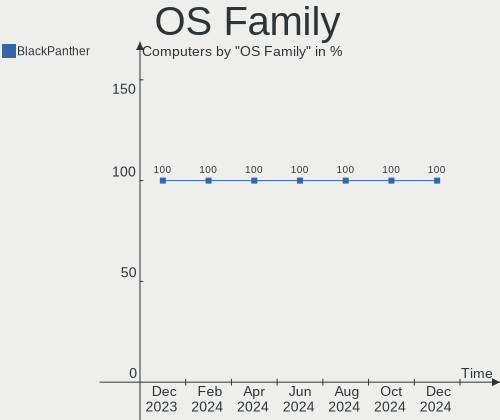
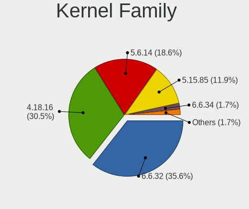
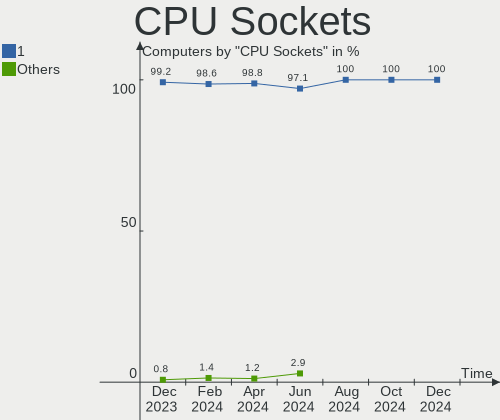
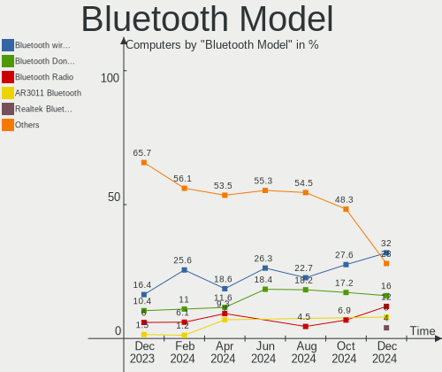
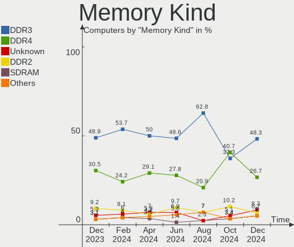

BlackPanther Hardware Trends
----------------------------

A project to identify most popular hardware characteristics and track their change
over time based on data collected by Linux users at https://Linux-Hardware.org.

Anyone can contribute to this report by the [hw-probe](https://github.com/linuxhw/hw-probe) tool:

    sudo -E hw-probe -all -upload

This is a report for all computer types. See also reports for [desktops](/Dist/BlackPanther/Desktop/README.md) and [notebooks](/Dist/BlackPanther/Notebook/README.md).

Full-feature report is available here: https://linux-hardware.org/?view=trends

Period: Jul, 2021.

Contents
--------

* [ System ](#system)
  - [ OS                       ](#os)
  - [ OS Family                ](#os-family)
  - [ Kernel                   ](#kernel)
  - [ Kernel Family            ](#kernel-family)
  - [ Kernel Major Ver.        ](#kernel-major-ver)
  - [ Arch                     ](#arch)
  - [ DE                       ](#de)
  - [ Display Server           ](#display-server)
  - [ Display Manager          ](#display-manager)
  - [ OS Lang                  ](#os-lang)
  - [ Boot Mode                ](#boot-mode)
  - [ Filesystem               ](#filesystem)
  - [ Part. scheme             ](#part-scheme)
  - [ Dual Boot with Linux/BSD ](#dual-boot-with-linuxbsd)
  - [ Dual Boot (Win)          ](#dual-boot-win)

* [ Board ](#board)
  - [ Vendor                   ](#vendor)
  - [ Model                    ](#model)
  - [ Model Family             ](#model-family)
  - [ MFG Year                 ](#mfg-year)
  - [ Form Factor              ](#form-factor)
  - [ Secure Boot              ](#secure-boot)
  - [ Coreboot                 ](#coreboot)
  - [ RAM Size                 ](#ram-size)
  - [ RAM Used                 ](#ram-used)
  - [ Total Drives             ](#total-drives)
  - [ Has CD-ROM               ](#has-cd-rom)
  - [ Has Ethernet             ](#has-ethernet)
  - [ Has WiFi                 ](#has-wifi)
  - [ Has Bluetooth            ](#has-bluetooth)

* [ Location ](#location)
  - [ Country                  ](#country)
  - [ City                     ](#city)

* [ Drives ](#drives)
  - [ Drive Vendor             ](#drive-vendor)
  - [ Drive Model              ](#drive-model)
  - [ HDD Vendor               ](#hdd-vendor)
  - [ SSD Vendor               ](#ssd-vendor)
  - [ Drive Kind               ](#drive-kind)
  - [ Drive Connector          ](#drive-connector)
  - [ Drive Size               ](#drive-size)
  - [ Space Total              ](#space-total)
  - [ Space Used               ](#space-used)
  - [ Malfunc. Drives          ](#malfunc-drives)
  - [ Malfunc. Drive Vendor    ](#malfunc-drive-vendor)
  - [ Malfunc. HDD Vendor      ](#malfunc-hdd-vendor)
  - [ Malfunc. Drive Kind      ](#malfunc-drive-kind)
  - [ Failed Drives            ](#failed-drives)
  - [ Failed Drive Vendor      ](#failed-drive-vendor)
  - [ Drive Status             ](#drive-status)

* [ Storage controller ](#storage-controller)
  - [ Storage Vendor           ](#storage-vendor)
  - [ Storage Model            ](#storage-model)
  - [ Storage Kind             ](#storage-kind)

* [ Processor ](#processor)
  - [ CPU Vendor               ](#cpu-vendor)
  - [ CPU Model                ](#cpu-model)
  - [ CPU Model Family         ](#cpu-model-family)
  - [ CPU Cores                ](#cpu-cores)
  - [ CPU Sockets              ](#cpu-sockets)
  - [ CPU Threads              ](#cpu-threads)
  - [ CPU Op-Modes             ](#cpu-op-modes)
  - [ CPU Microcode            ](#cpu-microcode)
  - [ CPU Microarch            ](#cpu-microarch)

* [ Graphics ](#graphics)
  - [ GPU Vendor               ](#gpu-vendor)
  - [ GPU Model                ](#gpu-model)
  - [ GPU Combo                ](#gpu-combo)
  - [ GPU Driver               ](#gpu-driver)
  - [ GPU Memory               ](#gpu-memory)

* [ Monitor ](#monitor)
  - [ Monitor Vendor           ](#monitor-vendor)
  - [ Monitor Model            ](#monitor-model)
  - [ Monitor Resolution       ](#monitor-resolution)
  - [ Monitor Diagonal         ](#monitor-diagonal)
  - [ Monitor Width            ](#monitor-width)
  - [ Aspect Ratio             ](#aspect-ratio)
  - [ Monitor Area             ](#monitor-area)
  - [ Pixel Density            ](#pixel-density)
  - [ Multiple Monitors        ](#multiple-monitors)

* [ Network ](#network)
  - [ Net Controller Vendor    ](#net-controller-vendor)
  - [ Net Controller Model     ](#net-controller-model)
  - [ Wireless Vendor          ](#wireless-vendor)
  - [ Wireless Model           ](#wireless-model)
  - [ Ethernet Vendor          ](#ethernet-vendor)
  - [ Ethernet Model           ](#ethernet-model)
  - [ Net Controller Kind      ](#net-controller-kind)
  - [ Used Controller          ](#used-controller)
  - [ NICs                     ](#nics)
  - [ IPv6                     ](#ipv6)

* [ Bluetooth ](#bluetooth)
  - [ Bluetooth Vendor         ](#bluetooth-vendor)
  - [ Bluetooth Model          ](#bluetooth-model)

* [ Sound ](#sound)
  - [ Sound Vendor             ](#sound-vendor)
  - [ Sound Model              ](#sound-model)

* [ Memory ](#memory)
  - [ Memory Vendor            ](#memory-vendor)
  - [ Memory Model             ](#memory-model)
  - [ Memory Kind              ](#memory-kind)
  - [ Memory Form Factor       ](#memory-form-factor)
  - [ Memory Size              ](#memory-size)
  - [ Memory Speed             ](#memory-speed)

* [ Printers & scanners ](#printers-&-scanners)
  - [ Printer Vendor           ](#printer-vendor)
  - [ Printer Model            ](#printer-model)
  - [ Scanner Vendor           ](#scanner-vendor)
  - [ Scanner Model            ](#scanner-model)

* [ Camera ](#camera)
  - [ Camera Vendor            ](#camera-vendor)
  - [ Camera Model             ](#camera-model)

* [ Security ](#security)
  - [ Fingerprint Vendor       ](#fingerprint-vendor)
  - [ Fingerprint Model        ](#fingerprint-model)
  - [ Chipcard Vendor          ](#chipcard-vendor)
  - [ Chipcard Model           ](#chipcard-model)

* [ Unsupported ](#unsupported)
  - [ Unsupported Devices      ](#unsupported-devices)
  - [ Unsupported Device Types ](#unsupported-device-types)

System
------

OS
--

Installed operating systems

| Name              | Computers | Percent |
|-------------------|-----------|---------|
| BlackPanther 18.1 | 109       | 100%    |

OS Family
---------

OS without a version

| Name         | Computers | Percent |
|--------------|-----------|---------|
| BlackPanther | 109       | 100%    |

Kernel
------

Version of the Linux kernel

| Version             | Computers | Percent |
|---------------------|-----------|---------|
| 5.6.14-desktop-2bP  | 92        | 84.4%   |
| 4.18.16-desktop-1bP | 17        | 15.6%   |

Kernel Family
-------------

Linux kernel without a distro release

| Version | Computers | Percent |
|---------|-----------|---------|
| 5.6.14  | 92        | 84.4%   |
| 4.18.16 | 17        | 15.6%   |

Kernel Major Ver.
-----------------

Linux kernel major version

| Version | Computers | Percent |
|---------|-----------|---------|
| 5.6     | 92        | 84.4%   |
| 4.18    | 17        | 15.6%   |

Arch
----

OS architecture (x86_64, i586, etc.)

| Name   | Computers | Percent |
|--------|-----------|---------|
| x86_64 | 109       | 100%    |

DE
--

Desktop Environment

| Name | Computers | Percent |
|------|-----------|---------|
| KDE5 | 109       | 100%    |

Display Server
--------------

X11 or Wayland

| Name    | Computers | Percent |
|---------|-----------|---------|
| X11     | 108       | 99.08%  |
| Wayland | 1         | 0.92%   |

Display Manager
---------------

SDDM, LightDM, etc.

| Name | Computers | Percent |
|------|-----------|---------|
| SDDM | 109       | 100%    |

OS Lang
-------

Language

| Lang    | Computers | Percent |
|---------|-----------|---------|
| Unknown | 109       | 100%    |

Boot Mode
---------

EFI or BIOS

| Mode | Computers | Percent |
|------|-----------|---------|
| BIOS | 61        | 55.96%  |
| EFI  | 48        | 44.04%  |

Filesystem
----------

Type of filesystem

| Type    | Computers | Percent |
|---------|-----------|---------|
| Overlay | 96        | 88.07%  |
| Ext4    | 13        | 11.93%  |

Part. scheme
------------

Scheme of partitioning

| Type    | Computers | Percent |
|---------|-----------|---------|
| MBR     | 55        | 50.46%  |
| GPT     | 53        | 48.62%  |
| Unknown | 1         | 0.92%   |

Dual Boot with Linux/BSD
------------------------

Hosting more than one Linux/BSD

| Dual boot | Computers | Percent |
|-----------|-----------|---------|
| No        | 56        | 51.38%  |
| Yes       | 53        | 48.62%  |

Dual Boot (Win)
---------------

Hosting Linux and Windows

| Dual boot | Computers | Percent |
|-----------|-----------|---------|
| Yes       | 68        | 62.39%  |
| No        | 41        | 37.61%  |

Board
-----

Vendor
------

Motherboard manufacturer

| Name                | Computers | Percent |
|---------------------|-----------|---------|
| ASUSTek Computer    | 25        | 22.94%  |
| Hewlett-Packard     | 19        | 17.43%  |
| Dell                | 15        | 13.76%  |
| Lenovo              | 12        | 11.01%  |
| Acer                | 10        | 9.17%   |
| ASRock              | 7         | 6.42%   |
| MSI                 | 4         | 3.67%   |
| Gigabyte Technology | 4         | 3.67%   |
| Samsung Electronics | 2         | 1.83%   |
| Apple               | 2         | 1.83%   |
| Toshiba             | 1         | 0.92%   |
| Sony                | 1         | 0.92%   |
| Pegatron            | 1         | 0.92%   |
| Intel               | 1         | 0.92%   |
| Fujitsu Siemens     | 1         | 0.92%   |
| Foxconn             | 1         | 0.92%   |
| Biostar             | 1         | 0.92%   |
| Alcor               | 1         | 0.92%   |
| Unknown             | 1         | 0.92%   |

Model
-----

Motherboard model

| Name                                       | Computers | Percent |
|--------------------------------------------|-----------|---------|
| HP Pavilion Desktop PC 570-p0xx            | 2         | 1.83%   |
| HP 250 G1                                  | 2         | 1.83%   |
| ASUS PRIME B365M-A                         | 2         | 1.83%   |
| ASUS P7P55D                                | 2         | 1.83%   |
| Toshiba Satellite C55-A-1NV                | 1         | 0.92%   |
| Sony VPCEH2J1E                             | 1         | 0.92%   |
| Samsung 300V3A/300V4A/300V5A/200A4B/200A5B | 1         | 0.92%   |
| Samsung 300E4A/300E5A/300E7A/3430EA/3530EA | 1         | 0.92%   |
| Pegatron 2A73                              | 1         | 0.92%   |
| MSI MS-7A40                                | 1         | 0.92%   |
| MSI MS-7369                                | 1         | 0.92%   |
| MSI GE70 2QE                               | 1         | 0.92%   |
| MSI Elite 7100 Microtower PC               | 1         | 0.92%   |
| Lenovo Yoga 310-11IAP 80U2                 | 1         | 0.92%   |
| Lenovo Y720-15IKB 80VR                     | 1         | 0.92%   |
| Lenovo V145-15AST 81MT                     | 1         | 0.92%   |
| Lenovo ThinkPad T400 6475W81               | 1         | 0.92%   |
| Lenovo ThinkCentre M57p 9196AB5            | 1         | 0.92%   |
| Lenovo ThinkCentre M57 6066A11             | 1         | 0.92%   |
| Lenovo ThinkCentre A57 98517HG             | 1         | 0.92%   |
| Lenovo IdeaPad L340-17IRH Gaming 81LL      | 1         | 0.92%   |
| Lenovo IdeaPad 320-17ABR 80YN              | 1         | 0.92%   |
| Lenovo G580                                | 1         | 0.92%   |
| Lenovo G50-30 80G0                         | 1         | 0.92%   |
| Lenovo Flex 2-14D 20376                    | 1         | 0.92%   |
| Intel Corbett Park                         | 1         | 0.92%   |
| HP xw4400 Workstation                      | 1         | 0.92%   |
| HP ProBook 6570b                           | 1         | 0.92%   |
| HP ProBook 6470b                           | 1         | 0.92%   |
| HP ProBook 430 G2                          | 1         | 0.92%   |
| HP Presario CQ57                           | 1         | 0.92%   |
| HP Pavilion g6                             | 1         | 0.92%   |
| HP Pavilion dv6                            | 1         | 0.92%   |
| HP EliteDesk 800 G2 DM 35W                 | 1         | 0.92%   |
| HP EliteBook 8530p                         | 1         | 0.92%   |
| HP EliteBook 8470p                         | 1         | 0.92%   |
| HP EliteBook 8440p                         | 1         | 0.92%   |
| HP Compaq Pro 6305 MT                      | 1         | 0.92%   |
| HP Compaq dc7800p Small Form Factor        | 1         | 0.92%   |
| HP Compaq dc5850 Microtower                | 1         | 0.92%   |
| HP Compaq 6005 Pro SFF PC                  | 1         | 0.92%   |
| Gigabyte P85-D3                            | 1         | 0.92%   |
| Gigabyte H81M-HD3                          | 1         | 0.92%   |
| Gigabyte EP45-UD3                          | 1         | 0.92%   |
| Gigabyte 970A-DS3P                         | 1         | 0.92%   |
| Fujitsu Siemens AMILO Li 2727              | 1         | 0.92%   |
| Foxconn OEM                                | 1         | 0.92%   |
| Dell Vostro 15-3568                        | 1         | 0.92%   |
| Dell PowerEdge T20                         | 1         | 0.92%   |
| Dell OptiPlex 990                          | 1         | 0.92%   |
| Dell OptiPlex 9020                         | 1         | 0.92%   |
| Dell OptiPlex 7050                         | 1         | 0.92%   |
| Dell OptiPlex 7010                         | 1         | 0.92%   |
| Dell Latitude E7470                        | 1         | 0.92%   |
| Dell Latitude E6530                        | 1         | 0.92%   |
| Dell Latitude E6520                        | 1         | 0.92%   |
| Dell Latitude E6410                        | 1         | 0.92%   |
| Dell Inspiron 5558                         | 1         | 0.92%   |
| Dell Inspiron 1520                         | 1         | 0.92%   |
| Dell Inspiron 15-7579                      | 1         | 0.92%   |

Model Family
------------

Motherboard model prefix

| Name                  | Computers | Percent |
|-----------------------|-----------|---------|
| Acer Aspire           | 8         | 7.34%   |
| HP Pavilion           | 4         | 3.67%   |
| HP Compaq             | 4         | 3.67%   |
| Dell OptiPlex         | 4         | 3.67%   |
| Dell Latitude         | 4         | 3.67%   |
| Lenovo ThinkCentre    | 3         | 2.75%   |
| HP ProBook            | 3         | 2.75%   |
| HP EliteBook          | 3         | 2.75%   |
| Dell Inspiron         | 3         | 2.75%   |
| ASUS PRIME            | 3         | 2.75%   |
| Lenovo IdeaPad        | 2         | 1.83%   |
| HP 250                | 2         | 1.83%   |
| ASUS P7P55D           | 2         | 1.83%   |
| Toshiba Satellite     | 1         | 0.92%   |
| Sony VPCEH2J1E        | 1         | 0.92%   |
| Samsung 300V3A        | 1         | 0.92%   |
| Samsung 300E4A        | 1         | 0.92%   |
| Pegatron 2A73         | 1         | 0.92%   |
| MSI MS-7A40           | 1         | 0.92%   |
| MSI MS-7369           | 1         | 0.92%   |
| MSI GE70              | 1         | 0.92%   |
| MSI Elite             | 1         | 0.92%   |
| Lenovo Yoga           | 1         | 0.92%   |
| Lenovo Y720-15IKB     | 1         | 0.92%   |
| Lenovo V145-15AST     | 1         | 0.92%   |
| Lenovo ThinkPad       | 1         | 0.92%   |
| Lenovo G580           | 1         | 0.92%   |
| Lenovo G50-30         | 1         | 0.92%   |
| Lenovo Flex           | 1         | 0.92%   |
| Intel Corbett         | 1         | 0.92%   |
| HP xw4400             | 1         | 0.92%   |
| HP Presario           | 1         | 0.92%   |
| HP EliteDesk          | 1         | 0.92%   |
| Gigabyte P85-D3       | 1         | 0.92%   |
| Gigabyte H81M-HD3     | 1         | 0.92%   |
| Gigabyte EP45-UD3     | 1         | 0.92%   |
| Gigabyte 970A-DS3P    | 1         | 0.92%   |
| Fujitsu Siemens AMILO | 1         | 0.92%   |
| Foxconn OEM           | 1         | 0.92%   |
| Dell Vostro           | 1         | 0.92%   |
| Dell PowerEdge        | 1         | 0.92%   |
| Dell G5               | 1         | 0.92%   |
| Dell G3               | 1         | 0.92%   |
| Biostar N61PA-M2S     | 1         | 0.92%   |
| ASUS X551CAP          | 1         | 0.92%   |
| ASUS X550LD           | 1         | 0.92%   |
| ASUS X550JX           | 1         | 0.92%   |
| ASUS X541UAK          | 1         | 0.92%   |
| ASUS X455LA           | 1         | 0.92%   |
| ASUS VC65R            | 1         | 0.92%   |
| ASUS ROG              | 1         | 0.92%   |
| ASUS P8H61-M          | 1         | 0.92%   |
| ASUS P7P55-M          | 1         | 0.92%   |
| ASUS P6T              | 1         | 0.92%   |
| ASUS P5QC             | 1         | 0.92%   |
| ASUS P5Q-E            | 1         | 0.92%   |
| ASUS P5KPL-AM         | 1         | 0.92%   |
| ASUS M5A97            | 1         | 0.92%   |
| ASUS M2N68-AM         | 1         | 0.92%   |
| ASUS K73BR            | 1         | 0.92%   |

MFG Year
--------

Motherboard manufacture year

| Year | Computers | Percent |
|------|-----------|---------|
| 2018 | 14        | 12.84%  |
| 2011 | 14        | 12.84%  |
| 2020 | 9         | 8.26%   |
| 2013 | 9         | 8.26%   |
| 2016 | 8         | 7.34%   |
| 2021 | 7         | 6.42%   |
| 2010 | 7         | 6.42%   |
| 2008 | 7         | 6.42%   |
| 2019 | 6         | 5.5%    |
| 2015 | 6         | 5.5%    |
| 2014 | 6         | 5.5%    |
| 2009 | 5         | 4.59%   |
| 2012 | 4         | 3.67%   |
| 2017 | 3         | 2.75%   |
| 2007 | 2         | 1.83%   |
| 2006 | 2         | 1.83%   |

Form Factor
-----------

Physical design of the computer

| Name        | Computers | Percent |
|-------------|-----------|---------|
| Desktop     | 53        | 48.62%  |
| Notebook    | 52        | 47.71%  |
| All in one  | 2         | 1.83%   |
| Other       | 1         | 0.92%   |
| Convertible | 1         | 0.92%   |

Secure Boot
-----------

Enabled or disabled

| State    | Computers | Percent |
|----------|-----------|---------|
| Disabled | 109       | 100%    |

Coreboot
--------

Have coreboot on board

| Used | Computers | Percent |
|------|-----------|---------|
| No   | 109       | 100%    |

RAM Size
--------

Total RAM memory

| Size in GB | Computers | Percent |
|------------|-----------|---------|
| 3.01-4.0   | 34        | 31.19%  |
| 4.01-8.0   | 22        | 20.18%  |
| 8.01-16.0  | 21        | 19.27%  |
| 16.01-24.0 | 19        | 17.43%  |
| 1.01-2.0   | 6         | 5.5%    |
| 2.01-3.0   | 5         | 4.59%   |
| 24.01-32.0 | 1         | 0.92%   |
| 0.51-1.0   | 1         | 0.92%   |

RAM Used
--------

Used RAM memory

| Used GB  | Computers | Percent |
|----------|-----------|---------|
| 0.51-1.0 | 48        | 44.04%  |
| 0.01-0.5 | 33        | 30.28%  |
| 1.01-2.0 | 28        | 25.69%  |

Total Drives
------------

Number of drives on board

| Drives | Computers | Percent |
|--------|-----------|---------|
| 1      | 71        | 65.14%  |
| 2      | 28        | 25.69%  |
| 3      | 5         | 4.59%   |
| 5      | 2         | 1.83%   |
| 4      | 2         | 1.83%   |
| 0      | 1         | 0.92%   |

Has CD-ROM
----------

Has CD-ROM on board

| Presented | Computers | Percent |
|-----------|-----------|---------|
| Yes       | 75        | 68.81%  |
| No        | 34        | 31.19%  |

Has Ethernet
------------

Has Ethernet on board

| Presented | Computers | Percent |
|-----------|-----------|---------|
| Yes       | 105       | 96.33%  |
| No        | 4         | 3.67%   |

Has WiFi
--------

Has WiFi module

| Presented | Computers | Percent |
|-----------|-----------|---------|
| Yes       | 73        | 66.97%  |
| No        | 36        | 33.03%  |

Has Bluetooth
-------------

Has Bluetooth module

| Presented | Computers | Percent |
|-----------|-----------|---------|
| Yes       | 56        | 51.38%  |
| No        | 53        | 48.62%  |

Location
--------

Country
-------

Geographic location (country)

| Country   | Computers | Percent |
|-----------|-----------|---------|
| Hungary   | 75        | 68.81%  |
| Australia | 6         | 5.5%    |
| Germany   | 5         | 4.59%   |
| USA       | 4         | 3.67%   |
| Romania   | 3         | 2.75%   |
| Spain     | 2         | 1.83%   |
| Slovakia  | 2         | 1.83%   |
| Poland    | 2         | 1.83%   |
| Austria   | 2         | 1.83%   |
| UK        | 1         | 0.92%   |
| Thailand  | 1         | 0.92%   |
| Slovenia  | 1         | 0.92%   |
| Mexico    | 1         | 0.92%   |
| Greece    | 1         | 0.92%   |
| Czechia   | 1         | 0.92%   |
| China     | 1         | 0.92%   |
| Belarus   | 1         | 0.92%   |

City
----

Geographic location (city)

| City                   | Computers | Percent |
|------------------------|-----------|---------|
| Budapest               | 20        | 18.35%  |
| Vienna                 | 2         | 1.83%   |
| Szombathely            | 2         | 1.83%   |
| Szigetszentmiklos      | 2         | 1.83%   |
| Szentlorinc            | 2         | 1.83%   |
| Szeksz√°rd             | 2         | 1.83%   |
| Szeksz??rd             | 2         | 1.83%   |
| Sydney                 | 2         | 1.83%   |
| Rimavsk√° Sobota       | 2         | 1.83%   |
| Portland               | 2         | 1.83%   |
| Perth                  | 2         | 1.83%   |
| Oroshaza               | 2         | 1.83%   |
| Keszthely              | 2         | 1.83%   |
| Gava                   | 2         | 1.83%   |
| Fot                    | 2         | 1.83%   |
| Debrecen               | 2         | 1.83%   |
| Caroline Springs       | 2         | 1.83%   |
| Ústí nad Labem       | 1         | 0.92%   |
| Zichyujfalu            | 1         | 0.92%   |
| Zalaegerszeg           | 1         | 0.92%   |
| Veszpr?©m              | 1         | 0.92%   |
| Ura                    | 1         | 0.92%   |
| Târgu Mureş          | 1         | 0.92%   |
| Tolnanemedi            | 1         | 0.92%   |
| Tiszafured             | 1         | 0.92%   |
| Szeged                 | 1         | 0.92%   |
| Szabadszentkiraly      | 1         | 0.92%   |
| Stuttgart              | 1         | 0.92%   |
| Southend-on-Sea        | 1         | 0.92%   |
| Siemianowice ≈ölƒÖskie | 1         | 0.92%   |
| Shanghai               | 1         | 0.92%   |
| Sarvar                 | 1         | 0.92%   |
| Pécs                  | 1         | 0.92%   |
| Petershagen            | 1         | 0.92%   |
| Papa                   | 1         | 0.92%   |
| Pap                    | 1         | 0.92%   |
| Oradea                 | 1         | 0.92%   |
| Nyiregyhaza            | 1         | 0.92%   |
| Nagykoros              | 1         | 0.92%   |
| Nagykanizsa            | 1         | 0.92%   |
| Nagyhalasz             | 1         | 0.92%   |
| Moh??cs                | 1         | 0.92%   |
| Miskolc                | 1         | 0.92%   |
| Mexico City            | 1         | 0.92%   |
| Lesencetomaj           | 1         | 0.92%   |
| Leesburg               | 1         | 0.92%   |
| Labod                  | 1         | 0.92%   |
| Kunszentmiklos         | 1         | 0.92%   |
| Koper                  | 1         | 0.92%   |
| Kondoros               | 1         | 0.92%   |
| Komadi                 | 1         | 0.92%   |
| Kecskemét             | 1         | 0.92%   |
| Karlsruhe              | 1         | 0.92%   |
| Kaposv??r              | 1         | 0.92%   |
| Hernadkak              | 1         | 0.92%   |
| Győr                  | 1         | 0.92%   |
| Gomel                  | 1         | 0.92%   |
| Freising               | 1         | 0.92%   |
| Epleny                 | 1         | 0.92%   |
| Eger                   | 1         | 0.92%   |

Drives
------

Drive Vendor
------------

Hard drive vendors

| Vendor              | Computers | Drives | Percent |
|---------------------|-----------|--------|---------|
| WDC                 | 28        | 29     | 17.61%  |
| Seagate             | 25        | 32     | 15.72%  |
| Samsung Electronics | 18        | 23     | 11.32%  |
| Kingston            | 16        | 18     | 10.06%  |
| Toshiba             | 14        | 14     | 8.81%   |
| HGST                | 10        | 10     | 6.29%   |
| SanDisk             | 7         | 7      | 4.4%    |
| Hitachi             | 4         | 4      | 2.52%   |
| Crucial             | 4         | 4      | 2.52%   |
| A-DATA Technology   | 4         | 4      | 2.52%   |
| Unknown             | 3         | 3      | 1.89%   |
| Maxtor              | 3         | 3      | 1.89%   |
| Zheino              | 2         | 2      | 1.26%   |
| Intel               | 2         | 2      | 1.26%   |
| GOODRAM             | 2         | 2      | 1.26%   |
| Gigabyte Technology | 2         | 2      | 1.26%   |
| XPG                 | 1         | 1      | 0.63%   |
| Verbatim            | 1         | 1      | 0.63%   |
| SPCC                | 1         | 1      | 0.63%   |
| SK Hynix            | 1         | 1      | 0.63%   |
| PNY                 | 1         | 1      | 0.63%   |
| OCZ                 | 1         | 1      | 0.63%   |
| Netac               | 1         | 1      | 0.63%   |
| Micron Technology   | 1         | 1      | 0.63%   |
| Kingmax             | 1         | 1      | 0.63%   |
| KingFast            | 1         | 1      | 0.63%   |
| JMicron             | 1         | 1      | 0.63%   |
| Intenso             | 1         | 1      | 0.63%   |
| HGST HTS            | 1         | 1      | 0.63%   |
| Apple               | 1         | 1      | 0.63%   |
| Apacer              | 1         | 1      | 0.63%   |

Drive Model
-----------

Hard drive models

| Model                                | Computers | Percent |
|--------------------------------------|-----------|---------|
| Kingston SA400S37120G 120GB SSD      | 7         | 4.07%   |
| Kingston SA400S37240G 240GB SSD      | 5         | 2.91%   |
| Samsung HD103UJ 1TB                  | 4         | 2.33%   |
| HGST HTS545050A7E680 500GB           | 4         | 2.33%   |
| Kingston SV300S37A120G 120GB SSD     | 3         | 1.74%   |
| Crucial CT1000P1SSD8 1TB             | 3         | 1.74%   |
| Zheino CHN-NGFFNV2280-256 256GB      | 2         | 1.16%   |
| WDC WDS240G2G0B-00EPW0 240GB SSD     | 2         | 1.16%   |
| WDC WD10SPCX-24HWST1 1TB             | 2         | 1.16%   |
| WDC WD10JPVX-22JC3T0 1TB             | 2         | 1.16%   |
| WDC WD10EZEX-60WN4A0 1TB             | 2         | 1.16%   |
| Toshiba MQ01ABD100 1TB               | 2         | 1.16%   |
| Toshiba DT01ACA100 1TB               | 2         | 1.16%   |
| Seagate ST500LT012-1DG142 500GB      | 2         | 1.16%   |
| Seagate ST3500418AS 500GB            | 2         | 1.16%   |
| Seagate ST3160318AS 160GB            | 2         | 1.16%   |
| Seagate ST1000LM035-1RK172 1TB       | 2         | 1.16%   |
| Samsung SSD 870 EVO 250GB            | 2         | 1.16%   |
| Samsung SSD 860 EVO 500GB            | 2         | 1.16%   |
| Samsung SSD 860 EVO 1TB              | 2         | 1.16%   |
| Samsung HD103SI 1TB                  | 2         | 1.16%   |
| HGST HTS545032A7E380 320GB           | 2         | 1.16%   |
| Gigabyte GP-GSTFS31120GNTD 120GB SSD | 2         | 1.16%   |
| A-DATA SP550 120GB SSD               | 2         | 1.16%   |
| XPG GAMMIX S11 Pro 512GB             | 1         | 0.58%   |
| WDC WDS240G2G0A-00JH30 240GB SSD     | 1         | 0.58%   |
| WDC WDS120G1G0A-00SS50 120GB SSD     | 1         | 0.58%   |
| WDC WD800JD-75MSA3 80GB              | 1         | 0.58%   |
| WDC WD6400AAKS-40H2B0 640GB          | 1         | 0.58%   |
| WDC WD60PURZ-85ZUFY1 6TB             | 1         | 0.58%   |
| WDC WD5000BEVT-22A0RT0 500GB         | 1         | 0.58%   |
| WDC WD5000AAKX-60U6AA0 500GB         | 1         | 0.58%   |
| WDC WD5000AAKX-08ERMA0 500GB         | 1         | 0.58%   |
| WDC WD3200BPVT-80ZEST0 320GB         | 1         | 0.58%   |
| WDC WD2500BEVS-22UST0 250GB          | 1         | 0.58%   |
| WDC WD2500BEKT-60PVMT0 250GB         | 1         | 0.58%   |
| WDC WD2500AAJS-75M0A0 250GB          | 1         | 0.58%   |
| WDC WD2500AAJS-00VTA0 250GB          | 1         | 0.58%   |
| WDC WD2003FZEX-00Z4SA0 2TB           | 1         | 0.58%   |
| WDC WD1600BEVS-22RST0 160GB          | 1         | 0.58%   |
| WDC WD1600BEVS-08VAT2 160GB          | 1         | 0.58%   |
| WDC WD10SPZX-24Z10 1TB               | 1         | 0.58%   |
| WDC WD10SPZX-21Z10T0 1TB             | 1         | 0.58%   |
| WDC WD10EZEX-08WN4A0 1TB             | 1         | 0.58%   |
| WDC PC SN520 SDAPNUW-512G-1014 512GB | 1         | 0.58%   |
| Verbatim Vi550 S3 SSD 128GB          | 1         | 0.58%   |
| Unknown SD32G  32GB                  | 1         | 0.58%   |
| Unknown SD/MMC/MS PRO 128GB          | 1         | 0.58%   |
| Unknown SC32G  32GB                  | 1         | 0.58%   |
| Toshiba TL100 120GB SSD              | 1         | 0.58%   |
| Toshiba MQ01ABF050 500GB             | 1         | 0.58%   |
| Toshiba MQ01ABD050 500GB             | 1         | 0.58%   |
| Toshiba MK5056GSY 500GB              | 1         | 0.58%   |
| Toshiba MK2552GSX 250GB              | 1         | 0.58%   |
| Toshiba MK1652GSX 160GB              | 1         | 0.58%   |
| Toshiba KBG40ZNS256G NVMe 256GB      | 1         | 0.58%   |
| Toshiba KBG30ZMS256G NVMe 256GB      | 1         | 0.58%   |
| Toshiba DT01ACA300 3TB               | 1         | 0.58%   |
| Toshiba DT01ACA050 500GB             | 1         | 0.58%   |
| SPCC Solid State Disk 128GB          | 1         | 0.58%   |

HDD Vendor
----------

Hard disk drive vendors

| Vendor              | Computers | Drives | Percent |
|---------------------|-----------|--------|---------|
| Seagate             | 25        | 31     | 29.41%  |
| WDC                 | 23        | 24     | 27.06%  |
| Toshiba             | 11        | 11     | 12.94%  |
| HGST                | 10        | 10     | 11.76%  |
| Samsung Electronics | 9         | 10     | 10.59%  |
| Hitachi             | 4         | 4      | 4.71%   |
| Maxtor              | 3         | 3      | 3.53%   |

SSD Vendor
----------

Solid state drive vendors

| Vendor              | Computers | Drives | Percent |
|---------------------|-----------|--------|---------|
| Kingston            | 16        | 18     | 28.57%  |
| Samsung Electronics | 7         | 8      | 12.5%   |
| WDC                 | 4         | 4      | 7.14%   |
| SanDisk             | 4         | 4      | 7.14%   |
| A-DATA Technology   | 4         | 4      | 7.14%   |
| Intel               | 2         | 2      | 3.57%   |
| GOODRAM             | 2         | 2      | 3.57%   |
| Gigabyte Technology | 2         | 2      | 3.57%   |
| Verbatim            | 1         | 1      | 1.79%   |
| Toshiba             | 1         | 1      | 1.79%   |
| SPCC                | 1         | 1      | 1.79%   |
| SK Hynix            | 1         | 1      | 1.79%   |
| PNY                 | 1         | 1      | 1.79%   |
| OCZ                 | 1         | 1      | 1.79%   |
| Netac               | 1         | 1      | 1.79%   |
| Micron Technology   | 1         | 1      | 1.79%   |
| Kingmax             | 1         | 1      | 1.79%   |
| KingFast            | 1         | 1      | 1.79%   |
| JMicron             | 1         | 1      | 1.79%   |
| Intenso             | 1         | 1      | 1.79%   |
| Crucial             | 1         | 1      | 1.79%   |
| Apple               | 1         | 1      | 1.79%   |
| Apacer              | 1         | 1      | 1.79%   |

Drive Kind
----------

HDD or SSD

| Kind    | Computers | Drives | Percent |
|---------|-----------|--------|---------|
| HDD     | 74        | 93     | 50%     |
| SSD     | 53        | 59     | 35.81%  |
| NVMe    | 13        | 14     | 8.78%   |
| MMC     | 5         | 5      | 3.38%   |
| Unknown | 3         | 3      | 2.03%   |

Drive Connector
---------------

SATA, SAS, NVMe, etc.

| Type | Computers | Drives | Percent |
|------|-----------|--------|---------|
| SATA | 104       | 150    | 82.54%  |
| NVMe | 13        | 14     | 10.32%  |
| MMC  | 5         | 5      | 3.97%   |
| SAS  | 4         | 5      | 3.17%   |

Drive Size
----------

Size of hard drive

| Size in TB | Computers | Drives | Percent |
|------------|-----------|--------|---------|
| 0.01-0.5   | 81        | 105    | 64.8%   |
| 0.51-1.0   | 33        | 35     | 26.4%   |
| 1.01-2.0   | 6         | 7      | 4.8%    |
| 3.01-4.0   | 2         | 2      | 1.6%    |
| 2.01-3.0   | 2         | 2      | 1.6%    |
| 4.01-10.0  | 1         | 1      | 0.8%    |

Space Total
-----------

Amount of disk space available on the file system

| Size in GB | Computers | Percent |
|------------|-----------|---------|
| Unknown    | 94        | 86.24%  |
| 101-250    | 8         | 7.34%   |
| 251-500    | 2         | 1.83%   |
| 501-1000   | 2         | 1.83%   |
| 51-100     | 2         | 1.83%   |
| 2001-3000  | 1         | 0.92%   |

Space Used
----------

Amount of used disk space

| Used GB   | Computers | Percent |
|-----------|-----------|---------|
| Unknown   | 94        | 86.24%  |
| 1-20      | 13        | 11.93%  |
| 21-50     | 1         | 0.92%   |
| 1001-2000 | 1         | 0.92%   |

Malfunc. Drives
---------------

Drive models with a malfunction

| Model                               | Computers | Drives | Percent |
|-------------------------------------|-----------|--------|---------|
| HGST HTS545050A7E680 500GB          | 3         | 3      | 6%      |
| WDC WD10EZEX-60WN4A0 1TB            | 2         | 2      | 4%      |
| Seagate ST3500418AS 500GB           | 2         | 2      | 4%      |
| Samsung Electronics HD103UJ 1TB     | 2         | 2      | 4%      |
| HGST HTS545032A7E380 320GB          | 2         | 2      | 4%      |
| WDC WD6400AAKS-40H2B0 640GB         | 1         | 1      | 2%      |
| WDC WD5000BEVT-22A0RT0 500GB        | 1         | 1      | 2%      |
| WDC WD5000AAKX-08ERMA0 500GB        | 1         | 1      | 2%      |
| WDC WD3200BPVT-80ZEST0 320GB        | 1         | 1      | 2%      |
| WDC WD2003FZEX-00Z4SA0 2TB          | 1         | 2      | 2%      |
| WDC WD1600BEVS-08VAT2 160GB         | 1         | 1      | 2%      |
| WDC WD10SPCX-24HWST1 1TB            | 1         | 1      | 2%      |
| Toshiba MK5056GSY 500GB             | 1         | 1      | 2%      |
| Toshiba DT01ACA050 500GB            | 1         | 1      | 2%      |
| Seagate ST9500325AS 500GB           | 1         | 1      | 2%      |
| Seagate ST9250410AS 250GB           | 1         | 1      | 2%      |
| Seagate ST750LM022 HN-M750MBB 752GB | 1         | 1      | 2%      |
| Seagate ST500DM002-1BD142 500GB     | 1         | 1      | 2%      |
| Seagate ST4000DM000-1F2168 4TB      | 1         | 1      | 2%      |
| Seagate ST3320413AS 320GB           | 1         | 1      | 2%      |
| Seagate ST320LT007-9ZV142 320GB     | 1         | 1      | 2%      |
| Seagate ST3160318AS 160GB           | 1         | 1      | 2%      |
| Seagate ST31000528AS 1TB            | 1         | 1      | 2%      |
| Seagate ST250LT012-1DG141 250GB     | 1         | 1      | 2%      |
| Seagate ST2000LM003 HN-M201RAD 2TB  | 1         | 1      | 2%      |
| Seagate ST2000DM001-9YN164 2TB      | 1         | 1      | 2%      |
| Seagate ST1000LM014-1EJ164-SSHD 1TB | 1         | 1      | 2%      |
| Seagate ST1000DM003-1CH162 1TB      | 1         | 1      | 2%      |
| Samsung Electronics SP2504C 250GB   | 1         | 1      | 2%      |
| Samsung Electronics HD502IJ 500GB   | 1         | 1      | 2%      |
| Samsung Electronics HD103SI 1TB     | 1         | 1      | 2%      |
| OCZ ARC100 240GB SSD                | 1         | 1      | 2%      |
| Netac SSD 120GB                     | 1         | 1      | 2%      |
| MAXTOR STM3250310AS 250GB           | 1         | 1      | 2%      |
| Maxtor 6Y080L0 82GB                 | 1         | 1      | 2%      |
| Maxtor 2B020H1 20GB                 | 1         | 1      | 2%      |
| Kingston SV300S37A120G 120GB SSD    | 1         | 1      | 2%      |
| Kingmax SSD 60GB                    | 1         | 1      | 2%      |
| Intel SSDSCKKF256H6 SATA 256GB      | 1         | 1      | 2%      |
| Hitachi HTS545025B9A300 250GB       | 1         | 1      | 2%      |
| Hitachi HTS541680J9SA00 80GB        | 1         | 1      | 2%      |
| HGST HTS541010A9E680 1TB            | 1         | 1      | 2%      |
| HGST HEJ423220H9E300 200GB          | 1         | 1      | 2%      |
| A-DATA Technology SP550 120GB SSD   | 1         | 1      | 2%      |

Malfunc. Drive Vendor
---------------------

Vendors of faulty drives

| Vendor              | Computers | Drives | Percent |
|---------------------|-----------|--------|---------|
| Seagate             | 14        | 16     | 29.17%  |
| WDC                 | 9         | 10     | 18.75%  |
| HGST                | 7         | 7      | 14.58%  |
| Samsung Electronics | 5         | 5      | 10.42%  |
| MAXTOR              | 3         | 3      | 6.25%   |
| Toshiba             | 2         | 2      | 4.17%   |
| Hitachi             | 2         | 2      | 4.17%   |
| OCZ                 | 1         | 1      | 2.08%   |
| Netac               | 1         | 1      | 2.08%   |
| Kingston            | 1         | 1      | 2.08%   |
| Kingmax             | 1         | 1      | 2.08%   |
| Intel               | 1         | 1      | 2.08%   |
| A-DATA Technology   | 1         | 1      | 2.08%   |

Malfunc. HDD Vendor
-------------------

Vendors of faulty HDD drives

| Vendor              | Computers | Drives | Percent |
|---------------------|-----------|--------|---------|
| Seagate             | 14        | 16     | 33.33%  |
| WDC                 | 9         | 10     | 21.43%  |
| HGST                | 7         | 7      | 16.67%  |
| Samsung Electronics | 5         | 5      | 11.9%   |
| Maxtor              | 3         | 3      | 7.14%   |
| Toshiba             | 2         | 2      | 4.76%   |
| Hitachi             | 2         | 2      | 4.76%   |

Malfunc. Drive Kind
-------------------

Kinds of faulty drives

| Kind | Computers | Drives | Percent |
|------|-----------|--------|---------|
| HDD  | 39        | 45     | 88.64%  |
| SSD  | 5         | 6      | 11.36%  |

Failed Drives
-------------

Failed drive models

| Model                           | Computers | Drives | Percent |
|---------------------------------|-----------|--------|---------|
| Samsung Electronics HD103UJ 1TB | 1         | 1      | 100%    |

Failed Drive Vendor
-------------------

Failed drive vendors

| Vendor              | Computers | Drives | Percent |
|---------------------|-----------|--------|---------|
| Samsung Electronics | 1         | 1      | 100%    |

Drive Status
------------

Number of failed and malfunc. drives

| Status   | Computers | Drives | Percent |
|----------|-----------|--------|---------|
| Works    | 80        | 112    | 60.15%  |
| Malfunc  | 44        | 51     | 33.08%  |
| Detected | 8         | 10     | 6.02%   |
| Failed   | 1         | 1      | 0.75%   |

Storage controller
------------------

Storage Vendor
--------------

Storage controller vendors

| Vendor                       | Computers | Percent |
|------------------------------|-----------|---------|
| Intel                        | 80        | 61.07%  |
| AMD                          | 22        | 16.79%  |
| Samsung Electronics          | 5         | 3.82%   |
| Nvidia                       | 5         | 3.82%   |
| JMicron Technology           | 4         | 3.05%   |
| Micron/Crucial Technology    | 3         | 2.29%   |
| Silicon Motion               | 2         | 1.53%   |
| Marvell Technology Group     | 2         | 1.53%   |
| ASMedia Technology           | 2         | 1.53%   |
| VIA Technologies             | 1         | 0.76%   |
| Toshiba America Info Systems | 1         | 0.76%   |
| Silicon Image                | 1         | 0.76%   |
| Sandisk                      | 1         | 0.76%   |
| KIOXIA                       | 1         | 0.76%   |
| ADATA Technology             | 1         | 0.76%   |

Storage Model
-------------

Storage controller models

| Model                                                                          | Computers | Percent |
|--------------------------------------------------------------------------------|-----------|---------|
| AMD FCH SATA Controller [AHCI mode]                                            | 13        | 7.69%   |
| Intel 8 Series/C220 Series Chipset Family 6-port SATA Controller 1 [AHCI mode] | 7         | 4.14%   |
| Intel SATA Controller [RAID mode]                                              | 6         | 3.55%   |
| Intel 7 Series Chipset Family 6-port SATA Controller [AHCI mode]               | 6         | 3.55%   |
| AMD SB7x0/SB8x0/SB9x0 SATA Controller [AHCI mode]                              | 6         | 3.55%   |
| Intel Sunrise Point-LP SATA Controller [AHCI mode]                             | 5         | 2.96%   |
| Intel Q170/Q150/B150/H170/H110/Z170/CM236 Chipset SATA Controller [AHCI Mode]  | 5         | 2.96%   |
| Intel NM10/ICH7 Family SATA Controller [IDE mode]                              | 5         | 2.96%   |
| Intel Cannon Lake Mobile PCH SATA AHCI Controller                              | 5         | 2.96%   |
| Samsung NVMe SSD Controller SM981/PM981/PM983                                  | 4         | 2.37%   |
| JMicron JMB363 SATA/IDE Controller                                             | 4         | 2.37%   |
| Intel 82801JI (ICH10 Family) 4 port SATA IDE Controller #1                     | 4         | 2.37%   |
| Intel 82801JI (ICH10 Family) 2 port SATA IDE Controller #2                     | 4         | 2.37%   |
| Intel 82801IR/IO/IH (ICH9R/DO/DH) 4 port SATA Controller [IDE mode]            | 4         | 2.37%   |
| Intel 82801I (ICH9 Family) 2 port SATA Controller [IDE mode]                   | 4         | 2.37%   |
| Intel 82801G (ICH7 Family) IDE Controller                                      | 4         | 2.37%   |
| Intel 6 Series/C200 Series Chipset Family 6 port Mobile SATA AHCI Controller   | 4         | 2.37%   |
| Intel 200 Series PCH SATA controller [AHCI mode]                               | 4         | 2.37%   |
| Micron/Crucial NVMe Controller                                                 | 3         | 1.78%   |
| Intel 82Q35 Express PT IDER Controller                                         | 3         | 1.78%   |
| Intel 82801 Mobile SATA Controller [RAID mode]                                 | 3         | 1.78%   |
| Intel 8 Series SATA Controller 1 [AHCI mode]                                   | 3         | 1.78%   |
| Intel 5 Series/3400 Series Chipset 4 port SATA IDE Controller                  | 3         | 1.78%   |
| Intel 5 Series/3400 Series Chipset 2 port SATA IDE Controller                  | 3         | 1.78%   |
| AMD 300 Series Chipset SATA Controller                                         | 3         | 1.78%   |
| Silicon Motion SM2263EN/SM2263XT SSD Controller                                | 2         | 1.18%   |
| Nvidia MCP61 SATA Controller                                                   | 2         | 1.18%   |
| Nvidia MCP61 IDE                                                               | 2         | 1.18%   |
| Marvell Group 88SE6111/6121 SATA II / PATA Controller                          | 2         | 1.18%   |
| Intel 82801HM/HEM (ICH8M/ICH8M-E) IDE Controller                               | 2         | 1.18%   |
| Intel 7 Series Chipset Family 4-port SATA Controller [IDE mode]                | 2         | 1.18%   |
| Intel 7 Series Chipset Family 2-port SATA Controller [IDE mode]                | 2         | 1.18%   |
| Intel 5 Series/3400 Series Chipset 6 port SATA AHCI Controller                 | 2         | 1.18%   |
| ASMedia ASM1062 Serial ATA Controller                                          | 2         | 1.18%   |
| AMD SB7x0/SB8x0/SB9x0 SATA Controller [IDE mode]                               | 2         | 1.18%   |
| AMD SB7x0/SB8x0/SB9x0 IDE Controller                                           | 2         | 1.18%   |
| AMD 400 Series Chipset SATA Controller                                         | 2         | 1.18%   |
| VIA VT6415 PATA IDE Host Controller                                            | 1         | 0.59%   |
| Toshiba America Info Systems BG3 NVMe SSD Controller                           | 1         | 0.59%   |
| Silicon Image SiI 3132 Serial ATA Raid II Controller                           | 1         | 0.59%   |
| Sandisk WD Blue SN500 / PC SN520 NVMe SSD                                      | 1         | 0.59%   |
| Samsung Electronics SATA controller                                            | 1         | 0.59%   |
| Nvidia MCP79 AHCI Controller                                                   | 1         | 0.59%   |
| Nvidia MCP73 SATA Controller (IDE mode)                                        | 1         | 0.59%   |
| Nvidia MCP73 IDE Controller                                                    | 1         | 0.59%   |
| Nvidia MCP65 SATA Controller                                                   | 1         | 0.59%   |
| Nvidia MCP65 IDE                                                               | 1         | 0.59%   |
| KIOXIA Non-Volatile memory controller                                          | 1         | 0.59%   |
| Intel Wildcat Point-LP SATA Controller [AHCI Mode]                             | 1         | 0.59%   |
| Intel HM170/QM170 Chipset SATA Controller [AHCI Mode]                          | 1         | 0.59%   |
| Intel Comet Lake SATA AHCI Controller                                          | 1         | 0.59%   |
| Intel Celeron/Pentium Silver Processor SATA Controller                         | 1         | 0.59%   |
| Intel Celeron N3350/Pentium N4200/Atom E3900 Series SATA AHCI Controller       | 1         | 0.59%   |
| Intel Atom Processor E3800 Series SATA AHCI Controller                         | 1         | 0.59%   |
| Intel 82801IBM/IEM (ICH9M/ICH9M-E) 4 port SATA Controller [AHCI mode]          | 1         | 0.59%   |
| Intel 82801IBM/IEM (ICH9M/ICH9M-E) 2 port SATA Controller [IDE mode]           | 1         | 0.59%   |
| Intel 82801HM/HEM (ICH8M/ICH8M-E) SATA Controller [IDE mode]                   | 1         | 0.59%   |
| Intel 82801HM/HEM (ICH8M/ICH8M-E) SATA Controller [AHCI mode]                  | 1         | 0.59%   |
| Intel 82801EB/ER (ICH5/ICH5R) IDE Controller                                   | 1         | 0.59%   |
| Intel 7 Series/C210 Series Chipset Family 6-port SATA Controller [AHCI mode]   | 1         | 0.59%   |

Storage Kind
------------

Kind of storage controller (IDE, SATA, NVMe, SAS, ...)

| Kind | Computers | Percent |
|------|-----------|---------|
| SATA | 75        | 58.59%  |
| IDE  | 30        | 23.44%  |
| NVMe | 13        | 10.16%  |
| RAID | 10        | 7.81%   |

Processor
---------

CPU Vendor
----------

Processor vendors

| Vendor | Computers | Percent |
|--------|-----------|---------|
| Intel  | 84        | 77.06%  |
| AMD    | 25        | 22.94%  |

CPU Model
---------

Processor models

| Model                                         | Computers | Percent |
|-----------------------------------------------|-----------|---------|
| Intel Pentium CPU G3220 @ 3.00GHz             | 3         | 2.75%   |
| Intel Core i3-6006U CPU @ 2.00GHz             | 3         | 2.75%   |
| Intel Core 2 Duo CPU E8400 @ 3.00GHz          | 3         | 2.75%   |
| Intel Core i7-8750H CPU @ 2.20GHz             | 2         | 1.83%   |
| Intel Core i5-3230M CPU @ 2.60GHz             | 2         | 1.83%   |
| Intel Core i5-2400 CPU @ 3.10GHz              | 2         | 1.83%   |
| Intel Core i5 CPU 750 @ 2.67GHz               | 2         | 1.83%   |
| Intel Core i5 CPU 650 @ 3.20GHz               | 2         | 1.83%   |
| Intel Core i3-8100 CPU @ 3.60GHz              | 2         | 1.83%   |
| Intel Core i3-4030U CPU @ 1.90GHz             | 2         | 1.83%   |
| Intel Core i3-2350M CPU @ 2.30GHz             | 2         | 1.83%   |
| Intel Core 2 Duo CPU E6550 @ 2.33GHz          | 2         | 1.83%   |
| Intel Celeron CPU 1000M @ 1.80GHz             | 2         | 1.83%   |
| AMD FX-6300 Six-Core Processor                | 2         | 1.83%   |
| AMD E-450 APU with Radeon HD Graphics         | 2         | 1.83%   |
| AMD A8-9600 RADEON R7, 10 COMPUTE CORES 4C+6G | 2         | 1.83%   |
| Intel Xeon CPU X5472 @ 3.00GHz                | 1         | 0.92%   |
| Intel Pentium Silver N5000 CPU @ 1.10GHz      | 1         | 0.92%   |
| Intel Pentium Dual CPU T2310 @ 1.46GHz        | 1         | 0.92%   |
| Intel Pentium CPU G4560 @ 3.50GHz             | 1         | 0.92%   |
| Intel Pentium CPU 2117U @ 1.80GHz             | 1         | 0.92%   |
| Intel Genuine CPU T1400 @ 1.73GHz             | 1         | 0.92%   |
| Intel Core i7-9750HF CPU @ 2.60GHz            | 1         | 0.92%   |
| Intel Core i7-7700HQ CPU @ 2.80GHz            | 1         | 0.92%   |
| Intel Core i7-4770 CPU @ 3.40GHz              | 1         | 0.92%   |
| Intel Core i7-4750HQ CPU @ 2.00GHz            | 1         | 0.92%   |
| Intel Core i7-4720HQ CPU @ 2.60GHz            | 1         | 0.92%   |
| Intel Core i7-10510U CPU @ 1.80GHz            | 1         | 0.92%   |
| Intel Core i7 CPU M 620 @ 2.67GHz             | 1         | 0.92%   |
| Intel Core i7 CPU 920 @ 2.67GHz               | 1         | 0.92%   |
| Intel Core i5-9300H CPU @ 2.40GHz             | 1         | 0.92%   |
| Intel Core i5-8500 CPU @ 3.00GHz              | 1         | 0.92%   |
| Intel Core i5-8300H CPU @ 2.30GHz             | 1         | 0.92%   |
| Intel Core i5-7400T CPU @ 2.40GHz             | 1         | 0.92%   |
| Intel Core i5-7200U CPU @ 2.50GHz             | 1         | 0.92%   |
| Intel Core i5-6600 CPU @ 3.30GHz              | 1         | 0.92%   |
| Intel Core i5-6500T CPU @ 2.50GHz             | 1         | 0.92%   |
| Intel Core i5-6500 CPU @ 3.20GHz              | 1         | 0.92%   |
| Intel Core i5-6400T CPU @ 2.20GHz             | 1         | 0.92%   |
| Intel Core i5-6300U CPU @ 2.40GHz             | 1         | 0.92%   |
| Intel Core i5-6200U CPU @ 2.30GHz             | 1         | 0.92%   |
| Intel Core i5-5350U CPU @ 1.80GHz             | 1         | 0.92%   |
| Intel Core i5-5200U CPU @ 2.20GHz             | 1         | 0.92%   |
| Intel Core i5-4670K CPU @ 3.40GHz             | 1         | 0.92%   |
| Intel Core i5-4210U CPU @ 1.70GHz             | 1         | 0.92%   |
| Intel Core i5-4200M CPU @ 2.50GHz             | 1         | 0.92%   |
| Intel Core i5-3340M CPU @ 2.70GHz             | 1         | 0.92%   |
| Intel Core i5-3320M CPU @ 2.60GHz             | 1         | 0.92%   |
| Intel Core i5-3210M CPU @ 2.50GHz             | 1         | 0.92%   |
| Intel Core i5-2540M CPU @ 2.60GHz             | 1         | 0.92%   |
| Intel Core i5 CPU M 520 @ 2.40GHz             | 1         | 0.92%   |
| Intel Core i3-7100 CPU @ 3.90GHz              | 1         | 0.92%   |
| Intel Core i3-4130 CPU @ 3.40GHz              | 1         | 0.92%   |
| Intel Core i3-3220 CPU @ 3.30GHz              | 1         | 0.92%   |
| Intel Core i3-2330M CPU @ 2.20GHz             | 1         | 0.92%   |
| Intel Core i3-2310M CPU @ 2.10GHz             | 1         | 0.92%   |
| Intel Core i3 CPU M 350 @ 2.27GHz             | 1         | 0.92%   |
| Intel Core 2 Quad CPU Q9300 @ 2.50GHz         | 1         | 0.92%   |
| Intel Core 2 Quad CPU Q6600 @ 2.40GHz         | 1         | 0.92%   |
| Intel Core 2 Duo CPU T9550 @ 2.66GHz          | 1         | 0.92%   |

CPU Model Family
----------------

Processor model prefix

| Model                | Computers | Percent |
|----------------------|-----------|---------|
| Intel Core i5        | 29        | 26.61%  |
| Intel Core i3        | 15        | 13.76%  |
| Intel Core 2 Duo     | 11        | 10.09%  |
| Intel Core i7        | 10        | 9.17%   |
| Intel Pentium        | 5         | 4.59%   |
| Intel Celeron        | 5         | 4.59%   |
| AMD A4               | 4         | 3.67%   |
| AMD FX               | 3         | 2.75%   |
| AMD A8               | 3         | 2.75%   |
| Intel Core 2 Quad    | 2         | 1.83%   |
| Intel Atom           | 2         | 1.83%   |
| AMD Ryzen 7          | 2         | 1.83%   |
| AMD Ryzen 5          | 2         | 1.83%   |
| AMD E                | 2         | 1.83%   |
| Intel Xeon           | 1         | 0.92%   |
| Intel Pentium Silver | 1         | 0.92%   |
| Intel Pentium Dual   | 1         | 0.92%   |
| Intel Genuine        | 1         | 0.92%   |
| Intel Core 2         | 1         | 0.92%   |
| AMD Sempron          | 1         | 0.92%   |
| AMD Ryzen 3          | 1         | 0.92%   |
| AMD Phenom II X3     | 1         | 0.92%   |
| AMD Phenom II        | 1         | 0.92%   |
| AMD Phenom           | 1         | 0.92%   |
| AMD Athlon II X2     | 1         | 0.92%   |
| AMD Athlon 64 X2     | 1         | 0.92%   |
| AMD A6               | 1         | 0.92%   |
| AMD A12              | 1         | 0.92%   |

CPU Cores
---------

Number of processor cores

| Number | Computers | Percent |
|--------|-----------|---------|
| 2      | 64        | 58.72%  |
| 4      | 31        | 28.44%  |
| 6      | 5         | 4.59%   |
| 1      | 4         | 3.67%   |
| 3      | 3         | 2.75%   |
| 8      | 2         | 1.83%   |

CPU Sockets
-----------

Number of sockets

| Number | Computers | Percent |
|--------|-----------|---------|
| 1      | 109       | 100%    |

CPU Threads
-----------

Threads per core (Hyper-Threading)

| Number | Computers | Percent |
|--------|-----------|---------|
| 1      | 55        | 50.46%  |
| 2      | 54        | 49.54%  |

CPU Op-Modes
------------

CPU Operation Modes (32-bit, 64-bit)

| Op mode        | Computers | Percent |
|----------------|-----------|---------|
| 32-bit, 64-bit | 109       | 100%    |

CPU Microcode
-------------

Microcode number

| Number     | Computers | Percent |
|------------|-----------|---------|
| 0x306a9    | 9         | 8.26%   |
| 0x306c3    | 8         | 7.34%   |
| 0x206a7    | 7         | 6.42%   |
| 0x1067a    | 7         | 6.42%   |
| 0x406e3    | 5         | 4.59%   |
| 0x906ea    | 4         | 3.67%   |
| 0x906e9    | 4         | 3.67%   |
| 0x506e3    | 4         | 3.67%   |
| 0x6fd      | 3         | 2.75%   |
| 0x6fb      | 3         | 2.75%   |
| 0x40651    | 3         | 2.75%   |
| 0x20652    | 3         | 2.75%   |
| 0x06000852 | 3         | 2.75%   |
| Unknown    | 3         | 2.75%   |
| 0x906ed    | 2         | 1.83%   |
| 0x906eb    | 2         | 1.83%   |
| 0x306d4    | 2         | 1.83%   |
| 0x20655    | 2         | 1.83%   |
| 0x106e5    | 2         | 1.83%   |
| 0x10676    | 2         | 1.83%   |
| 0x0600611a | 2         | 1.83%   |
| 0x05000119 | 2         | 1.83%   |
| 0x010000c8 | 2         | 1.83%   |
| 0xf49      | 1         | 0.92%   |
| 0x806ec    | 1         | 0.92%   |
| 0x806e9    | 1         | 0.92%   |
| 0x706a1    | 1         | 0.92%   |
| 0x6f6      | 1         | 0.92%   |
| 0x506c9    | 1         | 0.92%   |
| 0x406c4    | 1         | 0.92%   |
| 0x40661    | 1         | 0.92%   |
| 0x30678    | 1         | 0.92%   |
| 0x106ca    | 1         | 0.92%   |
| 0x106a5    | 1         | 0.92%   |
| 0x10677    | 1         | 0.92%   |
| 0x08701021 | 1         | 0.92%   |
| 0x08101016 | 1         | 0.92%   |
| 0x0810100b | 1         | 0.92%   |
| 0x0800820d | 1         | 0.92%   |
| 0x08001137 | 1         | 0.92%   |
| 0x07030105 | 1         | 0.92%   |
| 0x07030104 | 1         | 0.92%   |
| 0x06006705 | 1         | 0.92%   |
| 0x06006704 | 1         | 0.92%   |
| 0x06006118 | 1         | 0.92%   |
| 0x0600111f | 1         | 0.92%   |
| 0x06001119 | 1         | 0.92%   |
| 0x01000095 | 1         | 0.92%   |

CPU Microarch
-------------

Microarchitecture

| Name          | Computers | Percent |
|---------------|-----------|---------|
| KabyLake      | 14        | 12.84%  |
| Haswell       | 12        | 11.01%  |
| Penryn        | 10        | 9.17%   |
| Skylake       | 9         | 8.26%   |
| IvyBridge     | 9         | 8.26%   |
| SandyBridge   | 7         | 6.42%   |
| Core          | 7         | 6.42%   |
| Westmere      | 5         | 4.59%   |
| Piledriver    | 5         | 4.59%   |
| Excavator     | 5         | 4.59%   |
| K10           | 4         | 3.67%   |
| Zen           | 3         | 2.75%   |
| Nehalem       | 3         | 2.75%   |
| Silvermont    | 2         | 1.83%   |
| Puma          | 2         | 1.83%   |
| K8 Hammer     | 2         | 1.83%   |
| Broadwell     | 2         | 1.83%   |
| Bobcat        | 2         | 1.83%   |
| Zen+          | 1         | 0.92%   |
| Zen 2         | 1         | 0.92%   |
| NetBurst      | 1         | 0.92%   |
| Goldmont plus | 1         | 0.92%   |
| Goldmont      | 1         | 0.92%   |
| Bonnell       | 1         | 0.92%   |

Graphics
--------

GPU Vendor
----------

Vendors of graphics cards

| Vendor | Computers | Percent |
|--------|-----------|---------|
| Intel  | 58        | 46.4%   |
| Nvidia | 35        | 28%     |
| AMD    | 32        | 25.6%   |

GPU Model
---------

Graphics card models

| Model                                                                                    | Computers | Percent |
|------------------------------------------------------------------------------------------|-----------|---------|
| Intel 3rd Gen Core processor Graphics Controller                                         | 7         | 5.38%   |
| Intel Skylake GT2 [HD Graphics 520]                                                      | 5         | 3.85%   |
| Intel 2nd Generation Core Processor Family Integrated Graphics Controller                | 5         | 3.85%   |
| Nvidia GT218 [GeForce 210]                                                               | 3         | 2.31%   |
| Intel Xeon E3-1200 v3/4th Gen Core Processor Integrated Graphics Controller              | 3         | 2.31%   |
| Intel HD Graphics 530                                                                    | 3         | 2.31%   |
| Intel Haswell-ULT Integrated Graphics Controller                                         | 3         | 2.31%   |
| Intel Core Processor Integrated Graphics Controller                                      | 3         | 2.31%   |
| Intel CoffeeLake-H GT2 [UHD Graphics 630]                                                | 3         | 2.31%   |
| Intel 82Q35 Express Integrated Graphics Controller                                       | 3         | 2.31%   |
| Nvidia GP108 [GeForce GT 1030]                                                           | 2         | 1.54%   |
| Nvidia GK208B [GeForce GT 730]                                                           | 2         | 1.54%   |
| Nvidia GF119M [GeForce GT 520MX]                                                         | 2         | 1.54%   |
| Nvidia GF117M [GeForce 610M/710M/810M/820M / GT 620M/625M/630M/720M]                     | 2         | 1.54%   |
| Intel Mobile GM965/GL960 Integrated Graphics Controller (secondary)                      | 2         | 1.54%   |
| Intel Mobile GM965/GL960 Integrated Graphics Controller (primary)                        | 2         | 1.54%   |
| Intel HD Graphics 630                                                                    | 2         | 1.54%   |
| Intel CoffeeLake-S GT2 [UHD Graphics 630]                                                | 2         | 1.54%   |
| Intel 4th Gen Core Processor Integrated Graphics Controller                              | 2         | 1.54%   |
| AMD Stoney [Radeon R2/R3/R4/R5 Graphics]                                                 | 2         | 1.54%   |
| AMD Seymour [Radeon HD 6400M/7400M Series]                                               | 2         | 1.54%   |
| AMD Raven Ridge [Radeon Vega Series / Radeon Vega Mobile Series]                         | 2         | 1.54%   |
| AMD Oland PRO [Radeon R7 240/340]                                                        | 2         | 1.54%   |
| AMD Cedar [Radeon HD 5000/6000/7350/8350 Series]                                         | 2         | 1.54%   |
| Nvidia TU117M [GeForce GTX 1650 Mobile / Max-Q]                                          | 1         | 0.77%   |
| Nvidia TU116M [GeForce GTX 1660 Ti Mobile]                                               | 1         | 0.77%   |
| Nvidia NV44 [GeForce 6200 TurboCache]                                                    | 1         | 0.77%   |
| Nvidia NV34 [GeForce FX 5200]                                                            | 1         | 0.77%   |
| Nvidia GP108M [GeForce MX230]                                                            | 1         | 0.77%   |
| Nvidia GP107M [GeForce GTX 1050 Ti Mobile]                                               | 1         | 0.77%   |
| Nvidia GP107M [GeForce GTX 1050 Mobile]                                                  | 1         | 0.77%   |
| Nvidia GP106M [GeForce GTX 1060 Mobile]                                                  | 1         | 0.77%   |
| Nvidia GP104BM [GeForce GTX 1070 Mobile]                                                 | 1         | 0.77%   |
| Nvidia GP104 [GeForce GTX 1080]                                                          | 1         | 0.77%   |
| Nvidia GM206 [GeForce GTX 960]                                                           | 1         | 0.77%   |
| Nvidia GM108M [GeForce 940M]                                                             | 1         | 0.77%   |
| Nvidia GM108M [GeForce 940MX]                                                            | 1         | 0.77%   |
| Nvidia GM107M [GeForce GTX 960M]                                                         | 1         | 0.77%   |
| Nvidia GM107M [GeForce GTX 950M]                                                         | 1         | 0.77%   |
| Nvidia GK208BM [GeForce 920M]                                                            | 1         | 0.77%   |
| Nvidia GK106GL [Quadro K4000]                                                            | 1         | 0.77%   |
| Nvidia GK106 [GeForce GTX 660]                                                           | 1         | 0.77%   |
| Nvidia GF119M [GeForce GT 520M]                                                          | 1         | 0.77%   |
| Nvidia GF119M [GeForce 410M]                                                             | 1         | 0.77%   |
| Nvidia GF116 [GeForce GTX 550 Ti]                                                        | 1         | 0.77%   |
| Nvidia G96C [GeForce 9500 GT]                                                            | 1         | 0.77%   |
| Nvidia G96 [GeForce GT 120 Mac Edition]                                                  | 1         | 0.77%   |
| Nvidia G86 [GeForce 8500 GT]                                                             | 1         | 0.77%   |
| Intel Xeon E3-1200 v2/3rd Gen Core processor Graphics Controller                         | 1         | 0.77%   |
| Intel Mobile 4 Series Chipset Integrated Graphics Controller                             | 1         | 0.77%   |
| Intel HD Graphics 620                                                                    | 1         | 0.77%   |
| Intel HD Graphics 610                                                                    | 1         | 0.77%   |
| Intel HD Graphics 6000                                                                   | 1         | 0.77%   |
| Intel HD Graphics 5500                                                                   | 1         | 0.77%   |
| Intel HD Graphics 500                                                                    | 1         | 0.77%   |
| Intel GeminiLake [UHD Graphics 605]                                                      | 1         | 0.77%   |
| Intel Crystal Well Integrated Graphics Controller                                        | 1         | 0.77%   |
| Intel CometLake-U GT2 [UHD Graphics]                                                     | 1         | 0.77%   |
| Intel Atom/Celeron/Pentium Processor x5-E8000/J3xxx/N3xxx Integrated Graphics Controller | 1         | 0.77%   |
| Intel Atom Processor Z36xxx/Z37xxx Series Graphics & Display                             | 1         | 0.77%   |

GPU Combo
---------

Combinations of graphics cards

| Name           | Computers | Percent |
|----------------|-----------|---------|
| 1 x Intel      | 42        | 38.53%  |
| 1 x AMD        | 28        | 25.69%  |
| 1 x Nvidia     | 20        | 18.35%  |
| Intel + Nvidia | 15        | 13.76%  |
| 2 x AMD        | 3         | 2.75%   |
| Intel + AMD    | 1         | 0.92%   |

GPU Driver
----------

Free vs proprietary

| Driver  | Computers | Percent |
|---------|-----------|---------|
| Free    | 108       | 99.08%  |
| Unknown | 1         | 0.92%   |

GPU Memory
----------

Total video memory

| Size in GB | Computers | Percent |
|------------|-----------|---------|
| Unknown    | 44        | 40.37%  |
| 0.51-1.0   | 19        | 17.43%  |
| 0.01-0.5   | 18        | 16.51%  |
| 1.01-2.0   | 17        | 15.6%   |
| 3.01-4.0   | 5         | 4.59%   |
| 7.01-8.0   | 3         | 2.75%   |
| 5.01-6.0   | 2         | 1.83%   |
| 2.01-3.0   | 1         | 0.92%   |

Monitor
-------

Monitor Vendor
--------------

Monitor vendors

| Vendor                  | Computers | Percent |
|-------------------------|-----------|---------|
| Samsung Electronics     | 17        | 16.19%  |
| AU Optronics            | 15        | 14.29%  |
| Goldstar                | 8         | 7.62%   |
| Chimei Innolux          | 8         | 7.62%   |
| LG Display              | 7         | 6.67%   |
| BOE                     | 7         | 6.67%   |
| Hewlett-Packard         | 5         | 4.76%   |
| Dell                    | 5         | 4.76%   |
| Ancor Communications    | 5         | 4.76%   |
| Acer                    | 4         | 3.81%   |
| Lenovo                  | 3         | 2.86%   |
| Fujitsu Siemens         | 3         | 2.86%   |
| Chi Mei Optoelectronics | 3         | 2.86%   |
| BenQ                    | 3         | 2.86%   |
| AOC                     | 3         | 2.86%   |
| LG Philips              | 2         | 1.9%    |
| Apple                   | 2         | 1.9%    |
| ViewSonic               | 1         | 0.95%   |
| Sharp                   | 1         | 0.95%   |
| Plain Tree Systems      | 1         | 0.95%   |
| Philips                 | 1         | 0.95%   |
| HannStar                | 1         | 0.95%   |

Monitor Model
-------------

Monitor models

| Model                                                                    | Computers | Percent |
|--------------------------------------------------------------------------|-----------|---------|
| Chi Mei Optoelectronics LCD Monitor CMO15A7 1366x768 350x190mm 15.7-inch | 3         | 2.83%   |
| Samsung Electronics SyncMaster SAM05B0 1920x1080                         | 2         | 1.89%   |
| Samsung Electronics LCD Monitor SEC324A 1366x768 344x194mm 15.5-inch     | 2         | 1.89%   |
| LG Display LCD Monitor LGD0395 1366x768 344x194mm 15.5-inch              | 2         | 1.89%   |
| LG Display LCD Monitor LGD033A 1366x768 340x190mm 15.3-inch              | 2         | 1.89%   |
| Lenovo LEN L171p LEN24C9 1280x1024 338x270mm 17.0-inch                   | 2         | 1.89%   |
| Goldstar MP59HT GSM5B44 1920x1080 480x270mm 21.7-inch                    | 2         | 1.89%   |
| ViewSonic VA2445 SERIES VSC712E 1920x1080 521x293mm 23.5-inch            | 1         | 0.94%   |
| Sharp LCD SHP100A 1360x768                                               | 1         | 0.94%   |
| Samsung Electronics SyncMaster SAM055D 1920x1080 510x290mm 23.1-inch     | 1         | 0.94%   |
| Samsung Electronics SyncMaster SAM0521 1600x900 443x249mm 20.0-inch      | 1         | 0.94%   |
| Samsung Electronics SyncMaster SAM036F 1440x900 428x255mm 19.6-inch      | 1         | 0.94%   |
| Samsung Electronics SyncMaster SAM0288 1680x1050 474x296mm 22.0-inch     | 1         | 0.94%   |
| Samsung Electronics SyncMaster SAM0107 1280x1024 312x234mm 15.4-inch     | 1         | 0.94%   |
| Samsung Electronics SMB1920NW SAM06A5 1920x1080 410x260mm 19.1-inch      | 1         | 0.94%   |
| Samsung Electronics S24R35x SAM100E 1920x1080 530x300mm 24.0-inch        | 1         | 0.94%   |
| Samsung Electronics S24A31x SAM7114 1920x1080 527x296mm 23.8-inch        | 1         | 0.94%   |
| Samsung Electronics LCD Monitor SEC5441 1366x768 344x194mm 15.5-inch     | 1         | 0.94%   |
| Samsung Electronics LCD Monitor SEC4545 1280x800 331x207mm 15.4-inch     | 1         | 0.94%   |
| Samsung Electronics LCD Monitor SEC4251 1366x768 344x194mm 15.5-inch     | 1         | 0.94%   |
| Samsung Electronics LCD Monitor SEC3859 1366x768 293x165mm 13.2-inch     | 1         | 0.94%   |
| Samsung Electronics LCD Monitor SEC3051 1600x900 398x232mm 18.1-inch     | 1         | 0.94%   |
| Samsung Electronics LCD Monitor SDC4852 3840x2160 340x190mm 15.3-inch    | 1         | 0.94%   |
| Plain Tree Systems YakumoTFT19SL PTS03D6 1280x1024 376x301mm 19.0-inch   | 1         | 0.94%   |
| Philips 227ELPH PHLC07A 1920x1080 480x268mm 21.6-inch                    | 1         | 0.94%   |
| LG Philips LP154WX4-TLAB LPL3D01 1280x800 331x207mm 15.4-inch            | 1         | 0.94%   |
| LG Philips LCD Monitor LPL0301 1280x800 331x207mm 15.4-inch              | 1         | 0.94%   |
| LG Display LCD Monitor LGD0386 1366x768 309x174mm 14.0-inch              | 1         | 0.94%   |
| LG Display LCD Monitor LGD0338 1600x900 344x194mm 15.5-inch              | 1         | 0.94%   |
| LG Display LCD Monitor LGD02F1 1366x768 344x194mm 15.5-inch              | 1         | 0.94%   |
| Lenovo LCD Monitor LEN4035 1280x800 304x190mm 14.1-inch                  | 1         | 0.94%   |
| Hewlett-Packard w2448h HWP2815 1920x1200 520x320mm 24.0-inch             | 1         | 0.94%   |
| Hewlett-Packard w2207 HWP26A8 1680x1050 473x296mm 22.0-inch              | 1         | 0.94%   |
| Hewlett-Packard LE2201w HWP2843 1680x1050 473x296mm 22.0-inch            | 1         | 0.94%   |
| Hewlett-Packard LA1905 HWP2844 1440x900 408x255mm 18.9-inch              | 1         | 0.94%   |
| Hewlett-Packard L1950 HWP26E7 1280x1024 380x300mm 19.1-inch              | 1         | 0.94%   |
| HannStar Hanns.G HX191 HSD0013 1280x1024 376x301mm 19.0-inch             | 1         | 0.94%   |
| Goldstar T710BH GSM4366 1152x864 310x230mm 15.2-inch                     | 1         | 0.94%   |
| Goldstar L1918S GSM4B31 1280x1024 376x301mm 19.0-inch                    | 1         | 0.94%   |
| Goldstar FULL HD GSM5B55 1920x1080 480x270mm 21.7-inch                   | 1         | 0.94%   |
| Goldstar 3D FHD LG TV GSM59C2 1920x1080 509x286mm 23.0-inch              | 1         | 0.94%   |
| Goldstar 32GK850G GSM7709 2560x1440 697x392mm 31.5-inch                  | 1         | 0.94%   |
| Goldstar 22M35 GSM5A31 1920x1080 480x270mm 21.7-inch                     | 1         | 0.94%   |
| Fujitsu Siemens L20T-3 LED FUS0802 1600x900 442x249mm 20.0-inch          | 1         | 0.94%   |
| Fujitsu Siemens B22W-5 ECO FUS07C3 1680x1050 474x296mm 22.0-inch         | 1         | 0.94%   |
| Fujitsu Siemens B22T-7 LED PG FUS0828 1920x1080 477x268mm 21.5-inch      | 1         | 0.94%   |
| Dell P2317H DEL40F3 1920x1080 509x286mm 23.0-inch                        | 1         | 0.94%   |
| Dell P2212H DELA07F 1920x1080 531x299mm 24.0-inch                        | 1         | 0.94%   |
| Dell P1913 DELA089 1440x900 408x255mm 18.9-inch                          | 1         | 0.94%   |
| Dell IN2020 DELF028 1600x900 443x249mm 20.0-inch                         | 1         | 0.94%   |
| Dell 2208WFP DEL403B 1680x1050 473x296mm 22.0-inch                       | 1         | 0.94%   |
| Chimei Innolux LCD Monitor CMN1738 1920x1080 381x214mm 17.2-inch         | 1         | 0.94%   |
| Chimei Innolux LCD Monitor CMN1735 1920x1080 382x215mm 17.3-inch         | 1         | 0.94%   |
| Chimei Innolux LCD Monitor CMN15DC 1366x768 344x193mm 15.5-inch          | 1         | 0.94%   |
| Chimei Innolux LCD Monitor CMN15DB 1366x768 344x193mm 15.5-inch          | 1         | 0.94%   |
| Chimei Innolux LCD Monitor CMN15D3 1920x1080 344x193mm 15.5-inch         | 1         | 0.94%   |
| Chimei Innolux LCD Monitor CMN15CA 1366x768 340x190mm 15.3-inch          | 1         | 0.94%   |
| Chimei Innolux LCD Monitor CMN15C5 1366x768 344x193mm 15.5-inch          | 1         | 0.94%   |
| Chimei Innolux LCD Monitor CMN1491 1366x768 309x174mm 14.0-inch          | 1         | 0.94%   |
| BOE LCD Monitor BOE07B0 1920x1080 344x194mm 15.5-inch                    | 1         | 0.94%   |

Monitor Resolution
------------------

Monitor screen resolution

| Resolution         | Computers | Percent |
|--------------------|-----------|---------|
| 1920x1080 (FHD)    | 34        | 33.33%  |
| 1366x768 (WXGA)    | 27        | 26.47%  |
| 1600x900 (HD+)     | 9         | 8.82%   |
| 1280x1024 (SXGA)   | 8         | 7.84%   |
| 1680x1050 (WSXGA+) | 6         | 5.88%   |
| 1440x900 (WXGA+)   | 6         | 5.88%   |
| 1280x800 (WXGA)    | 4         | 3.92%   |
| 1920x1200 (WUXGA)  | 3         | 2.94%   |
| 3840x2160 (4K)     | 2         | 1.96%   |
| 2560x1440 (QHD)    | 1         | 0.98%   |
| 1360x768           | 1         | 0.98%   |
| 1152x864           | 1         | 0.98%   |

Monitor Diagonal
----------------

Diagonal size in inches

| Inches  | Computers | Percent |
|---------|-----------|---------|
| 15      | 34        | 32.38%  |
| 21      | 9         | 8.57%   |
| 17      | 9         | 8.57%   |
| 23      | 7         | 6.67%   |
| 19      | 7         | 6.67%   |
| 24      | 6         | 5.71%   |
| 22      | 6         | 5.71%   |
| 14      | 6         | 5.71%   |
| 13      | 6         | 5.71%   |
| 20      | 4         | 3.81%   |
| 18      | 3         | 2.86%   |
| Unknown | 3         | 2.86%   |
| 27      | 2         | 1.9%    |
| 31      | 1         | 0.95%   |
| 26      | 1         | 0.95%   |
| 11      | 1         | 0.95%   |

Monitor Width
-------------

Physical width

| Width in mm | Computers | Percent |
|-------------|-----------|---------|
| 301-350     | 46        | 44.23%  |
| 401-500     | 22        | 21.15%  |
| 501-600     | 16        | 15.38%  |
| 351-400     | 13        | 12.5%   |
| 201-300     | 3         | 2.88%   |
| Unknown     | 3         | 2.88%   |
| 601-700     | 1         | 0.96%   |

Aspect Ratio
------------

Proportional relationship between the width and the height

| Ratio | Computers | Percent |
|-------|-----------|---------|
| 16/9  | 71        | 71.72%  |
| 16/10 | 18        | 18.18%  |
| 5/4   | 8         | 8.08%   |
| 4/3   | 2         | 2.02%   |

Monitor Area
------------

Area in inch²

| Area in inch² | Computers | Percent |
|----------------|-----------|---------|
| 101-110        | 32        | 30.77%  |
| 201-250        | 22        | 21.15%  |
| 151-200        | 15        | 14.42%  |
| 81-90          | 11        | 10.58%  |
| 121-130        | 6         | 5.77%   |
| 141-150        | 4         | 3.85%   |
| 301-350        | 3         | 2.88%   |
| 251-300        | 3         | 2.88%   |
| Unknown        | 3         | 2.88%   |
| 111-120        | 2         | 1.92%   |
| 71-80          | 1         | 0.96%   |
| 51-60          | 1         | 0.96%   |
| 351-500        | 1         | 0.96%   |

Pixel Density
-------------

Pixels per inch

| Density | Computers | Percent |
|---------|-----------|---------|
| 51-100  | 45        | 43.69%  |
| 101-120 | 37        | 35.92%  |
| 121-160 | 18        | 17.48%  |
| Unknown | 3         | 2.91%   |

Multiple Monitors
-----------------

Total monitors connected

| Total | Computers | Percent |
|-------|-----------|---------|
| 1     | 98        | 89.91%  |
| 2     | 9         | 8.26%   |
| 3     | 1         | 0.92%   |
| 0     | 1         | 0.92%   |

Network
-------

Net Controller Vendor
---------------------

Controller vendors

| Vendor                   | Computers | Percent |
|--------------------------|-----------|---------|
| Realtek Semiconductor    | 68        | 42.24%  |
| Intel                    | 37        | 22.98%  |
| Qualcomm Atheros         | 29        | 18.01%  |
| Broadcom                 | 6         | 3.73%   |
| Nvidia                   | 4         | 2.48%   |
| TP-Link                  | 3         | 1.86%   |
| Ralink Technology        | 3         | 1.86%   |
| Ralink                   | 3         | 1.86%   |
| Broadcom Limited         | 3         | 1.86%   |
| Marvell Technology Group | 2         | 1.24%   |
| Samsung Electronics      | 1         | 0.62%   |
| D-Link System            | 1         | 0.62%   |
| D-Link                   | 1         | 0.62%   |

Net Controller Model
--------------------

Controller models

| Model                                                                          | Computers | Percent |
|--------------------------------------------------------------------------------|-----------|---------|
| Realtek RTL8111/8168/8411 PCI Express Gigabit Ethernet Controller              | 56        | 30.94%  |
| Realtek RTL810xE PCI Express Fast Ethernet controller                          | 7         | 3.87%   |
| Qualcomm Atheros QCA9377 802.11ac Wireless Network Adapter                     | 7         | 3.87%   |
| Qualcomm Atheros QCA9565 / AR9565 Wireless Network Adapter                     | 5         | 2.76%   |
| Qualcomm Atheros AR9285 Wireless Network Adapter (PCI-Express)                 | 5         | 2.76%   |
| Intel 82579LM Gigabit Network Connection (Lewisville)                          | 5         | 2.76%   |
| Qualcomm Atheros AR9485 Wireless Network Adapter                               | 4         | 2.21%   |
| Intel Centrino Advanced-N 6205 [Taylor Peak]                                   | 4         | 2.21%   |
| Intel Cannon Lake PCH CNVi WiFi                                                | 4         | 2.21%   |
| Realtek RTL8821CE 802.11ac PCIe Wireless Network Adapter                       | 3         | 1.66%   |
| Ralink RT3290 Wireless 802.11n 1T/1R PCIe                                      | 3         | 1.66%   |
| Intel Wireless 3165                                                            | 3         | 1.66%   |
| Intel 82566DM-2 Gigabit Network Connection                                     | 3         | 1.66%   |
| TP-Link TL-WN821N Version 5 RTL8192EU                                          | 2         | 1.1%    |
| Qualcomm Atheros AR242x / AR542x Wireless Network Adapter (PCI-Express)        | 2         | 1.1%    |
| Nvidia MCP61 Ethernet                                                          | 2         | 1.1%    |
| Marvell Group 88E8056 PCI-E Gigabit Ethernet Controller                        | 2         | 1.1%    |
| Intel Wireless 8260                                                            | 2         | 1.1%    |
| Intel Wireless 3160                                                            | 2         | 1.1%    |
| Intel Ethernet Connection I217-LM                                              | 2         | 1.1%    |
| Intel Dual Band Wireless-AC 3168NGW [Stone Peak]                               | 2         | 1.1%    |
| Intel Centrino Wireless-N 130                                                  | 2         | 1.1%    |
| Intel 82579V Gigabit Network Connection                                        | 2         | 1.1%    |
| Intel 82577LM Gigabit Network Connection                                       | 2         | 1.1%    |
| Intel 82567LM Gigabit Network Connection                                       | 2         | 1.1%    |
| Broadcom BCM4313 802.11bgn Wireless Network Adapter                            | 2         | 1.1%    |
| TP-Link TL-WN722N v2/v3 [Realtek RTL8188EUS]                                   | 1         | 0.55%   |
| Samsung Galaxy series, misc. (tethering mode)                                  | 1         | 0.55%   |
| Realtek RTL8821AE 802.11ac PCIe Wireless Network Adapter                       | 1         | 0.55%   |
| Realtek RTL8812AE 802.11ac PCIe Wireless Network Adapter                       | 1         | 0.55%   |
| Realtek RTL8723BE PCIe Wireless Network Adapter                                | 1         | 0.55%   |
| Realtek RTL8191SEvB Wireless LAN Controller                                    | 1         | 0.55%   |
| Realtek RTL8188CE 802.11b/g/n WiFi Adapter                                     | 1         | 0.55%   |
| Realtek RTL8169 PCI Gigabit Ethernet Controller                                | 1         | 0.55%   |
| Realtek RTL8152 Fast Ethernet Adapter                                          | 1         | 0.55%   |
| Realtek RTL-8100/8101L/8139 PCI Fast Ethernet Adapter                          | 1         | 0.55%   |
| Ralink RT5370 Wireless Adapter                                                 | 1         | 0.55%   |
| Ralink RT3572 Wireless Adapter                                                 | 1         | 0.55%   |
| Ralink MT7601U Wireless Adapter                                                | 1         | 0.55%   |
| Qualcomm Atheros QCA8172 Fast Ethernet                                         | 1         | 0.55%   |
| Qualcomm Atheros Killer E2500 Gigabit Ethernet Controller                      | 1         | 0.55%   |
| Qualcomm Atheros Killer E2400 Gigabit Ethernet Controller                      | 1         | 0.55%   |
| Qualcomm Atheros Killer E220x Gigabit Ethernet Controller                      | 1         | 0.55%   |
| Qualcomm Atheros AR8162 Fast Ethernet                                          | 1         | 0.55%   |
| Qualcomm Atheros AR8131 Gigabit Ethernet                                       | 1         | 0.55%   |
| Qualcomm Atheros AR8121/AR8113/AR8114 Gigabit or Fast Ethernet                 | 1         | 0.55%   |
| Qualcomm Atheros AR5413/AR5414 Wireless Network Adapter [AR5006X(S) 802.11abg] | 1         | 0.55%   |
| Nvidia MCP79 Ethernet                                                          | 1         | 0.55%   |
| Nvidia MCP73 Ethernet                                                          | 1         | 0.55%   |
| Marvell Group 88E8001 Gigabit Ethernet Controller                              | 1         | 0.55%   |
| Intel Wireless 8265 / 8275                                                     | 1         | 0.55%   |
| Intel Wireless 7265                                                            | 1         | 0.55%   |
| Intel Ultimate N WiFi Link 5300                                                | 1         | 0.55%   |
| Intel PRO/Wireless 3945ABG [Golan] Network Connection                          | 1         | 0.55%   |
| Intel I211 Gigabit Network Connection                                          | 1         | 0.55%   |
| Intel Ethernet Connection I219-LM                                              | 1         | 0.55%   |
| Intel Ethernet Connection (5) I219-LM                                          | 1         | 0.55%   |
| Intel Ethernet Connection (2) I219-V                                           | 1         | 0.55%   |
| Intel Ethernet Connection (2) I219-LM                                          | 1         | 0.55%   |
| Intel Dual Band Wireless-AC 3165 Plus Bluetooth                                | 1         | 0.55%   |

Wireless Vendor
---------------

Wireless vendors

| Vendor                | Computers | Percent |
|-----------------------|-----------|---------|
| Intel                 | 27        | 36.99%  |
| Qualcomm Atheros      | 24        | 32.88%  |
| Realtek Semiconductor | 8         | 10.96%  |
| TP-Link               | 3         | 4.11%   |
| Ralink Technology     | 3         | 4.11%   |
| Ralink                | 3         | 4.11%   |
| Broadcom              | 3         | 4.11%   |
| D-Link                | 1         | 1.37%   |
| Broadcom Limited      | 1         | 1.37%   |

Wireless Model
--------------

Wireless models

| Model                                                                          | Computers | Percent |
|--------------------------------------------------------------------------------|-----------|---------|
| Qualcomm Atheros QCA9377 802.11ac Wireless Network Adapter                     | 7         | 9.59%   |
| Qualcomm Atheros QCA9565 / AR9565 Wireless Network Adapter                     | 5         | 6.85%   |
| Qualcomm Atheros AR9285 Wireless Network Adapter (PCI-Express)                 | 5         | 6.85%   |
| Qualcomm Atheros AR9485 Wireless Network Adapter                               | 4         | 5.48%   |
| Intel Centrino Advanced-N 6205 [Taylor Peak]                                   | 4         | 5.48%   |
| Intel Cannon Lake PCH CNVi WiFi                                                | 4         | 5.48%   |
| Realtek RTL8821CE 802.11ac PCIe Wireless Network Adapter                       | 3         | 4.11%   |
| Ralink RT3290 Wireless 802.11n 1T/1R PCIe                                      | 3         | 4.11%   |
| Intel Wireless 3165                                                            | 3         | 4.11%   |
| TP-Link TL-WN821N Version 5 RTL8192EU                                          | 2         | 2.74%   |
| Qualcomm Atheros AR242x / AR542x Wireless Network Adapter (PCI-Express)        | 2         | 2.74%   |
| Intel Wireless 8260                                                            | 2         | 2.74%   |
| Intel Wireless 3160                                                            | 2         | 2.74%   |
| Intel Dual Band Wireless-AC 3168NGW [Stone Peak]                               | 2         | 2.74%   |
| Intel Centrino Wireless-N 130                                                  | 2         | 2.74%   |
| Broadcom BCM4313 802.11bgn Wireless Network Adapter                            | 2         | 2.74%   |
| TP-Link TL-WN722N v2/v3 [Realtek RTL8188EUS]                                   | 1         | 1.37%   |
| Realtek RTL8821AE 802.11ac PCIe Wireless Network Adapter                       | 1         | 1.37%   |
| Realtek RTL8812AE 802.11ac PCIe Wireless Network Adapter                       | 1         | 1.37%   |
| Realtek RTL8723BE PCIe Wireless Network Adapter                                | 1         | 1.37%   |
| Realtek RTL8191SEvB Wireless LAN Controller                                    | 1         | 1.37%   |
| Realtek RTL8188CE 802.11b/g/n WiFi Adapter                                     | 1         | 1.37%   |
| Ralink RT5370 Wireless Adapter                                                 | 1         | 1.37%   |
| Ralink RT3572 Wireless Adapter                                                 | 1         | 1.37%   |
| Ralink MT7601U Wireless Adapter                                                | 1         | 1.37%   |
| Qualcomm Atheros AR5413/AR5414 Wireless Network Adapter [AR5006X(S) 802.11abg] | 1         | 1.37%   |
| Intel Wireless 8265 / 8275                                                     | 1         | 1.37%   |
| Intel Wireless 7265                                                            | 1         | 1.37%   |
| Intel Ultimate N WiFi Link 5300                                                | 1         | 1.37%   |
| Intel PRO/Wireless 3945ABG [Golan] Network Connection                          | 1         | 1.37%   |
| Intel Dual Band Wireless-AC 3165 Plus Bluetooth                                | 1         | 1.37%   |
| Intel Centrino Ultimate-N 6300                                                 | 1         | 1.37%   |
| Intel Centrino Advanced-N 6230 [Rainbow Peak]                                  | 1         | 1.37%   |
| Intel Centrino Advanced-N 6200                                                 | 1         | 1.37%   |
| D-Link GO-USB-N150 N Adapter                                                   | 1         | 1.37%   |
| Broadcom Limited BCM4360 802.11ac Wireless Network Adapter                     | 1         | 1.37%   |
| Broadcom BCM4322 802.11a/b/g/n Wireless LAN Controller                         | 1         | 1.37%   |

Ethernet Vendor
---------------

Ethernet vendors

| Vendor                   | Computers | Percent |
|--------------------------|-----------|---------|
| Realtek Semiconductor    | 66        | 61.68%  |
| Intel                    | 21        | 19.63%  |
| Qualcomm Atheros         | 7         | 6.54%   |
| Nvidia                   | 4         | 3.74%   |
| Broadcom                 | 3         | 2.8%    |
| Marvell Technology Group | 2         | 1.87%   |
| Broadcom Limited         | 2         | 1.87%   |
| Samsung Electronics      | 1         | 0.93%   |
| D-Link System            | 1         | 0.93%   |

Ethernet Model
--------------

Ethernet models

| Model                                                             | Computers | Percent |
|-------------------------------------------------------------------|-----------|---------|
| Realtek RTL8111/8168/8411 PCI Express Gigabit Ethernet Controller | 56        | 51.85%  |
| Realtek RTL810xE PCI Express Fast Ethernet controller             | 7         | 6.48%   |
| Intel 82579LM Gigabit Network Connection (Lewisville)             | 5         | 4.63%   |
| Intel 82566DM-2 Gigabit Network Connection                        | 3         | 2.78%   |
| Nvidia MCP61 Ethernet                                             | 2         | 1.85%   |
| Marvell Group 88E8056 PCI-E Gigabit Ethernet Controller           | 2         | 1.85%   |
| Intel Ethernet Connection I217-LM                                 | 2         | 1.85%   |
| Intel 82579V Gigabit Network Connection                           | 2         | 1.85%   |
| Intel 82577LM Gigabit Network Connection                          | 2         | 1.85%   |
| Intel 82567LM Gigabit Network Connection                          | 2         | 1.85%   |
| Samsung Galaxy series, misc. (tethering mode)                     | 1         | 0.93%   |
| Realtek RTL8169 PCI Gigabit Ethernet Controller                   | 1         | 0.93%   |
| Realtek RTL8152 Fast Ethernet Adapter                             | 1         | 0.93%   |
| Realtek RTL-8100/8101L/8139 PCI Fast Ethernet Adapter             | 1         | 0.93%   |
| Qualcomm Atheros QCA8172 Fast Ethernet                            | 1         | 0.93%   |
| Qualcomm Atheros Killer E2500 Gigabit Ethernet Controller         | 1         | 0.93%   |
| Qualcomm Atheros Killer E2400 Gigabit Ethernet Controller         | 1         | 0.93%   |
| Qualcomm Atheros Killer E220x Gigabit Ethernet Controller         | 1         | 0.93%   |
| Qualcomm Atheros AR8162 Fast Ethernet                             | 1         | 0.93%   |
| Qualcomm Atheros AR8131 Gigabit Ethernet                          | 1         | 0.93%   |
| Qualcomm Atheros AR8121/AR8113/AR8114 Gigabit or Fast Ethernet    | 1         | 0.93%   |
| Nvidia MCP79 Ethernet                                             | 1         | 0.93%   |
| Nvidia MCP73 Ethernet                                             | 1         | 0.93%   |
| Marvell Group 88E8001 Gigabit Ethernet Controller                 | 1         | 0.93%   |
| Intel I211 Gigabit Network Connection                             | 1         | 0.93%   |
| Intel Ethernet Connection I219-LM                                 | 1         | 0.93%   |
| Intel Ethernet Connection (5) I219-LM                             | 1         | 0.93%   |
| Intel Ethernet Connection (2) I219-V                              | 1         | 0.93%   |
| Intel Ethernet Connection (2) I219-LM                             | 1         | 0.93%   |
| D-Link System DGE-528T Gigabit Ethernet Adapter                   | 1         | 0.93%   |
| Broadcom NetXtreme BCM5761 Gigabit Ethernet PCIe                  | 1         | 0.93%   |
| Broadcom NetXtreme BCM5755 Gigabit Ethernet PCI Express           | 1         | 0.93%   |
| Broadcom Limited NetXtreme BCM5761 Gigabit Ethernet PCIe          | 1         | 0.93%   |
| Broadcom Limited NetXtreme BCM5754 Gigabit Ethernet PCI Express   | 1         | 0.93%   |
| Broadcom BCM4401-B0 100Base-TX                                    | 1         | 0.93%   |

Net Controller Kind
-------------------

Ethernet, WiFi or modem

| Kind     | Computers | Percent |
|----------|-----------|---------|
| Ethernet | 105       | 58.99%  |
| WiFi     | 73        | 41.01%  |

Used Controller
---------------

Currently used network controller

| Kind     | Computers | Percent |
|----------|-----------|---------|
| Ethernet | 56        | 51.85%  |
| WiFi     | 52        | 48.15%  |

NICs
----

Total network controllers on board

| Total | Computers | Percent |
|-------|-----------|---------|
| 2     | 64        | 58.72%  |
| 1     | 42        | 38.53%  |
| 0     | 2         | 1.83%   |
| 3     | 1         | 0.92%   |

IPv6
----

IPv6 vs IPv4

| Used | Computers | Percent |
|------|-----------|---------|
| No   | 80        | 73.39%  |
| Yes  | 29        | 26.61%  |

Bluetooth
---------

Bluetooth Vendor
----------------

Controller vendors

| Vendor                          | Computers | Percent |
|---------------------------------|-----------|---------|
| Intel                           | 19        | 33.33%  |
| Qualcomm Atheros Communications | 6         | 10.53%  |
| Lite-On Technology              | 6         | 10.53%  |
| Realtek Semiconductor           | 5         | 8.77%   |
| Cambridge Silicon Radio         | 4         | 7.02%   |
| Broadcom                        | 4         | 7.02%   |
| Ralink                          | 3         | 5.26%   |
| Dell                            | 3         | 5.26%   |
| Conwise Technology              | 2         | 3.51%   |
| Apple                           | 2         | 3.51%   |
| Toshiba                         | 1         | 1.75%   |
| IMC Networks                    | 1         | 1.75%   |
| Foxconn / Hon Hai               | 1         | 1.75%   |

Bluetooth Model
---------------

Controller models

| Model                                               | Computers | Percent |
|-----------------------------------------------------|-----------|---------|
| Intel Bluetooth wireless interface                  | 10        | 17.54%  |
| Lite-On Qualcomm Atheros QCA9377 Bluetooth          | 5         | 8.77%   |
| Intel Bluetooth 9460/9560 Jefferson Peak (JfP)      | 4         | 7.02%   |
| Cambridge Silicon Radio Bluetooth Dongle (HCI mode) | 4         | 7.02%   |
| Ralink RT3290 Bluetooth                             | 3         | 5.26%   |
| Intel Centrino Advanced-N 6230 Bluetooth adapter    | 3         | 5.26%   |
| Broadcom HP Portable SoftSailing                    | 3         | 5.26%   |
| Realtek  Bluetooth 4.2 Adapter                      | 2         | 3.51%   |
| Realtek Bluetooth Radio                             | 2         | 3.51%   |
| Qualcomm Atheros  Bluetooth Device                  | 2         | 3.51%   |
| Qualcomm Atheros AR3012 Bluetooth 4.0               | 2         | 3.51%   |
| Qualcomm Atheros AR3011 Bluetooth                   | 2         | 3.51%   |
| Intel Wireless-AC 3168 Bluetooth                    | 2         | 3.51%   |
| Conwise CW6622                                      | 2         | 3.51%   |
| Toshiba Bluetooth Device                            | 1         | 1.75%   |
| Realtek RTL8821A Bluetooth                          | 1         | 1.75%   |
| Lite-On Bluetooth Device                            | 1         | 1.75%   |
| IMC Networks Bluetooth Device                       | 1         | 1.75%   |
| Foxconn / Hon Hai Bluetooth Device                  | 1         | 1.75%   |
| Dell Wireless 355 Bluetooth                         | 1         | 1.75%   |
| Dell DW375 Bluetooth Module                         | 1         | 1.75%   |
| Dell BCM20702A0 Bluetooth Module                    | 1         | 1.75%   |
| Broadcom HP Portable Valentine                      | 1         | 1.75%   |
| Apple Built-in Bluetooth 2.0+EDR HCI                | 1         | 1.75%   |
| Apple Bluetooth USB Host Controller                 | 1         | 1.75%   |

Sound
-----

Sound Vendor
------------

Sound card vendors

| Vendor              | Computers | Percent |
|---------------------|-----------|---------|
| Intel               | 80        | 54.79%  |
| AMD                 | 36        | 24.66%  |
| Nvidia              | 24        | 16.44%  |
| Razer USA           | 2         | 1.37%   |
| Focusrite-Novation  | 1         | 0.68%   |
| Creative Technology | 1         | 0.68%   |
| Creative Labs       | 1         | 0.68%   |
| C-Media Electronics | 1         | 0.68%   |

Sound Model
-----------

Sound card models

| Model                                                                             | Computers | Percent |
|-----------------------------------------------------------------------------------|-----------|---------|
| Intel 7 Series/C216 Chipset Family High Definition Audio Controller               | 9         | 5.29%   |
| Intel 8 Series/C220 Series Chipset High Definition Audio Controller               | 8         | 4.71%   |
| AMD SBx00 Azalia (Intel HDA)                                                      | 8         | 4.71%   |
| Intel 6 Series/C200 Series Chipset Family High Definition Audio Controller        | 7         | 4.12%   |
| Intel 5 Series/3400 Series Chipset High Definition Audio                          | 7         | 4.12%   |
| Intel Sunrise Point-LP HD Audio                                                   | 6         | 3.53%   |
| Intel Cannon Lake PCH cAVS                                                        | 6         | 3.53%   |
| Intel 82801I (ICH9 Family) HD Audio Controller                                    | 6         | 3.53%   |
| Intel NM10/ICH7 Family High Definition Audio Controller                           | 5         | 2.94%   |
| Intel 100 Series/C230 Series Chipset Family HD Audio Controller                   | 5         | 2.94%   |
| AMD Oland/Hainan/Cape Verde/Pitcairn HDMI Audio [Radeon HD 7000 Series]           | 5         | 2.94%   |
| AMD Family 15h (Models 60h-6fh) Audio Controller                                  | 5         | 2.94%   |
| Intel Xeon E3-1200 v3/4th Gen Core Processor HD Audio Controller                  | 4         | 2.35%   |
| Intel 82801JI (ICH10 Family) HD Audio Controller                                  | 4         | 2.35%   |
| Intel 200 Series PCH HD Audio                                                     | 4         | 2.35%   |
| AMD FCH Azalia Controller                                                         | 4         | 2.35%   |
| Nvidia High Definition Audio Controller                                           | 3         | 1.76%   |
| Nvidia GK208 HDMI/DP Audio Controller                                             | 3         | 1.76%   |
| Intel Haswell-ULT HD Audio Controller                                             | 3         | 1.76%   |
| Intel 8 Series HD Audio Controller                                                | 3         | 1.76%   |
| AMD Kabini HDMI/DP Audio                                                          | 3         | 1.76%   |
| AMD Caicos HDMI Audio [Radeon HD 6450 / 7450/8450/8490 OEM / R5 230/235/235X OEM] | 3         | 1.76%   |
| Razer USA Razer Nommo Chroma                                                      | 2         | 1.18%   |
| Nvidia GP108 High Definition Audio Controller                                     | 2         | 1.18%   |
| Nvidia GP107GL High Definition Audio Controller                                   | 2         | 1.18%   |
| Nvidia GP104 High Definition Audio Controller                                     | 2         | 1.18%   |
| Nvidia GK106 HDMI Audio Controller                                                | 2         | 1.18%   |
| Intel Wildcat Point-LP High Definition Audio Controller                           | 2         | 1.18%   |
| Intel Broadwell-U Audio Controller                                                | 2         | 1.18%   |
| Intel 82801H (ICH8 Family) HD Audio Controller                                    | 2         | 1.18%   |
| AMD Turks HDMI Audio [Radeon HD 6500/6600 / 6700M Series]                         | 2         | 1.18%   |
| AMD Trinity HDMI Audio Controller                                                 | 2         | 1.18%   |
| AMD Redwood HDMI Audio [Radeon HD 5000 Series]                                    | 2         | 1.18%   |
| AMD Raven/Raven2/Fenghuang HDMI/DP Audio Controller                               | 2         | 1.18%   |
| AMD High Definition Audio Controller                                              | 2         | 1.18%   |
| AMD Family 17h (Models 10h-1fh) HD Audio Controller                               | 2         | 1.18%   |
| AMD Family 17h (Models 00h-0fh) HD Audio Controller                               | 2         | 1.18%   |
| AMD Cedar HDMI Audio [Radeon HD 5400/6300/7300 Series]                            | 2         | 1.18%   |
| Nvidia TU116 High Definition Audio Controller                                     | 1         | 0.59%   |
| Nvidia TU107 GeForce GTX 1650 High Definition Audio Controller                    | 1         | 0.59%   |
| Nvidia MCP79 High Definition Audio                                                | 1         | 0.59%   |
| Nvidia MCP73 High Definition Audio                                                | 1         | 0.59%   |
| Nvidia MCP65 High Definition Audio                                                | 1         | 0.59%   |
| Nvidia MCP61 High Definition Audio                                                | 1         | 0.59%   |
| Nvidia GP106 High Definition Audio Controller                                     | 1         | 0.59%   |
| Nvidia GM206 High Definition Audio Controller                                     | 1         | 0.59%   |
| Nvidia GF119 HDMI Audio Controller                                                | 1         | 0.59%   |
| Nvidia GF116 High Definition Audio Controller                                     | 1         | 0.59%   |
| Intel Crystal Well HD Audio Controller                                            | 1         | 0.59%   |
| Intel Comet Lake PCH-LP cAVS                                                      | 1         | 0.59%   |
| Intel CM238 HD Audio Controller                                                   | 1         | 0.59%   |
| Intel Celeron/Pentium Silver Processor High Definition Audio                      | 1         | 0.59%   |
| Intel Celeron N3350/Pentium N4200/Atom E3900 Series Audio Cluster                 | 1         | 0.59%   |
| Intel Atom Processor Z36xxx/Z37xxx Series High Definition Audio Controller        | 1         | 0.59%   |
| Intel 82801EB/ER (ICH5/ICH5R) AC'97 Audio Controller                              | 1         | 0.59%   |
| Focusrite-Novation Scarlett Solo USB                                              | 1         | 0.59%   |
| Creative Technology Sound Blaster Play!                                           | 1         | 0.59%   |
| Creative Labs EMU20k1 [Sound Blaster X-Fi Series]                                 | 1         | 0.59%   |
| C-Media Electronics CMI8788 [Oxygen HD Audio]                                     | 1         | 0.59%   |
| AMD Starship/Matisse HD Audio Controller                                          | 1         | 0.59%   |

Memory
------

Memory Vendor
-------------

Memory module vendors

| Vendor                | Computers | Percent |
|-----------------------|-----------|---------|
| Samsung Electronics   | 28        | 21.37%  |
| SK Hynix              | 26        | 19.85%  |
| Unknown               | 24        | 18.32%  |
| Kingston              | 16        | 12.21%  |
| Micron Technology     | 10        | 7.63%   |
| Corsair               | 5         | 3.82%   |
| Kingmax               | 4         | 3.05%   |
| G.Skill               | 4         | 3.05%   |
| Nanya Technology      | 3         | 2.29%   |
| Elpida                | 3         | 2.29%   |
| Crucial               | 3         | 2.29%   |
| Qimonda               | 1         | 0.76%   |
| Kingmax Semiconductor | 1         | 0.76%   |
| Hyundai lnc           | 1         | 0.76%   |
| CSX                   | 1         | 0.76%   |
| ASint Technology      | 1         | 0.76%   |

Memory Model
------------

Memory module models

| Model                                                                     | Computers | Percent |
|---------------------------------------------------------------------------|-----------|---------|
| Unknown RAM Module 4096MB DIMM DDR 1333MT/s                               | 3         | 2%      |
| SK Hynix RAM HMA81GS6AFR8N-UH 8GB SODIMM DDR4 2667MT/s                    | 3         | 2%      |
| Unknown RAM Module 2048MB DIMM DDR2 667MT/s                               | 2         | 1.33%   |
| Unknown RAM Module 2048MB DIMM DDR 1333MT/s                               | 2         | 1.33%   |
| Samsung RAM M471B5273DH0-CH9 4GB SODIMM DDR3 1334MT/s                     | 2         | 1.33%   |
| Samsung RAM M471B2873FHS-CH9 1024MB SODIMM DDR3 1334MT/s                  | 2         | 1.33%   |
| Samsung RAM M471A5244CB0-CRC 4GB SODIMM DDR4 2667MT/s                     | 2         | 1.33%   |
| Samsung RAM M378A1K43CB2-CRC 8GB DIMM DDR4 3500MT/s                       | 2         | 1.33%   |
| Samsung RAM 4D332037385432383633525A532D43453620 1024MB DIMM DDR2 667MT/s | 2         | 1.33%   |
| Micron RAM MT16JSF25664HZ-1G4 2048MB SODIMM DDR3 1333MT/s                 | 2         | 1.33%   |
| Kingmax RAM GLAG42F-18--------- 8192MB DIMM DDR4 2400MT/s                 | 2         | 1.33%   |
| Kingmax RAM GLAF62F-D8--------- 4096MB DIMM DDR4 2400MT/s                 | 2         | 1.33%   |
| G.Skill RAM F4-3000C16-8GISB 8GB DIMM DDR4 3200MT/s                       | 2         | 1.33%   |
| Corsair RAM CMK16GX4M2A2400C16 8GB DIMM DDR4 2933MT/s                     | 2         | 1.33%   |
| Unknown SODIMM 512MB SODIMM DDR2 533MT/s                                  | 1         | 0.67%   |
| Unknown SODIMM 1024MB SODIMM DDR2 533MT/s                                 | 1         | 0.67%   |
| Unknown RAM Module 8192MB SODIMM DDR3                                     | 1         | 0.67%   |
| Unknown RAM Module 512MB DIMM SDRAM                                       | 1         | 0.67%   |
| Unknown RAM Module 4096MB DIMM SDRAM                                      | 1         | 0.67%   |
| Unknown RAM Module 4096MB DIMM DDR3 800MT/s                               | 1         | 0.67%   |
| Unknown RAM Module 4096MB DIMM DDR3 1600MT/s                              | 1         | 0.67%   |
| Unknown RAM Module 4096MB DIMM DDR3 1333MT/s                              | 1         | 0.67%   |
| Unknown RAM Module 4096MB DIMM DDR2 1333MT/s                              | 1         | 0.67%   |
| Unknown RAM Module 4096MB DIMM DDR 800MT/s                                | 1         | 0.67%   |
| Unknown RAM Module 256MB DIMM SDRAM                                       | 1         | 0.67%   |
| Unknown RAM Module 2048MB SODIMM DDR3 1600MT/s                            | 1         | 0.67%   |
| Unknown RAM Module 2048MB DIMM SDRAM                                      | 1         | 0.67%   |
| Unknown RAM Module 2048MB DIMM DDR3 1600MT/s                              | 1         | 0.67%   |
| Unknown RAM Module 2048MB DIMM DDR3 1333MT/s                              | 1         | 0.67%   |
| Unknown RAM Module 2048MB DIMM DDR2 1066MT/s                              | 1         | 0.67%   |
| Unknown RAM Module 2048MB DIMM DDR2                                       | 1         | 0.67%   |
| Unknown RAM Module 2048MB DIMM 800MT/s                                    | 1         | 0.67%   |
| Unknown RAM Module 2048MB DIMM 400MT/s                                    | 1         | 0.67%   |
| Unknown RAM Module 2048MB DIMM 1066MT/s                                   | 1         | 0.67%   |
| Unknown RAM Module 1024MB DIMM DDR2 667MT/s                               | 1         | 0.67%   |
| Unknown RAM Module 1024MB DIMM                                            | 1         | 0.67%   |
| Unknown RAM 3000 C16 Series 8192MB DIMM DDR4 2133MT/s                     | 1         | 0.67%   |
| SK Hynix RAM Module 4096MB SODIMM DDR4 2400MT/s                           | 1         | 0.67%   |
| SK Hynix RAM Module 4096MB DIMM DDR3 1600MT/s                             | 1         | 0.67%   |
| SK Hynix RAM Module 4096MB DIMM DDR3 1066MT/s                             | 1         | 0.67%   |
| SK Hynix RAM HYMP564S64BP6-C4 512MB SODIMM DDR 533MT/s                    | 1         | 0.67%   |
| SK Hynix RAM HMT451U7AFR8A-PB 4096MB DIMM DDR3 1600MT/s                   | 1         | 0.67%   |
| SK Hynix RAM HMT451U6AFR8C-PB 4096MB DIMM DDR3 1600MT/s                   | 1         | 0.67%   |
| SK Hynix RAM HMT451S6BFR8A-PB 4096MB SODIMM DDR3 1600MT/s                 | 1         | 0.67%   |
| SK Hynix RAM HMT41GS6DFR8A-PB 8192MB SODIMM DDR3 1600MT/s                 | 1         | 0.67%   |
| SK Hynix RAM HMT351S6CFR8C-PB 4GB SODIMM DDR3 1600MT/s                    | 1         | 0.67%   |
| SK Hynix RAM HMT351S6CFR8C-H9 4096MB SODIMM DDR3 1333MT/s                 | 1         | 0.67%   |
| SK Hynix RAM HMT351S6AFR8C-G7 4096MB SODIMM DDR3 1067MT/s                 | 1         | 0.67%   |
| SK Hynix RAM HMT325U6BFR8C-H9 2048MB DIMM DDR3 1333MT/s                   | 1         | 0.67%   |
| SK Hynix RAM HMT325S6EFR8A-PB 2GB SODIMM DDR3 1600MT/s                    | 1         | 0.67%   |
| SK Hynix RAM HMT325S6CFR8C-PB 2048MB SODIMM DDR3 1600MT/s                 | 1         | 0.67%   |
| SK Hynix RAM HMT325S6CFR8C-H9 2048MB SODIMM DDR3 1333MT/s                 | 1         | 0.67%   |
| SK Hynix RAM HMT325S6CFR8A-PB 2048MB SODIMM DDR3 1600MT/s                 | 1         | 0.67%   |
| SK Hynix RAM HMT325S6BFR8C-H9 2GB SODIMM DDR3 1600MT/s                    | 1         | 0.67%   |
| SK Hynix RAM HMT325S6BFR8C-H9 2048MB SODIMM DDR3 1333MT/s                 | 1         | 0.67%   |
| SK Hynix RAM HMT125S6TFR8C-H9 2048MB SODIMM DDR3 1333MT/s                 | 1         | 0.67%   |
| SK Hynix RAM HMT112U6TFR8C-H9 1GB DIMM DDR3 1333MT/s                      | 1         | 0.67%   |
| SK Hynix RAM HMA851S6CJR6N-VK 4GB SODIMM DDR4 2667MT/s                    | 1         | 0.67%   |
| SK Hynix RAM HMA81GS6CJR8N-VK 8192MB SODIMM DDR4 2667MT/s                 | 1         | 0.67%   |
| SK Hynix RAM HMA41GS6AFR8N-TF 8192MB SODIMM DDR4 2133MT/s                 | 1         | 0.67%   |

Memory Kind
-----------

Memory module kinds

| Kind    | Computers | Percent |
|---------|-----------|---------|
| DDR3    | 52        | 46.02%  |
| DDR4    | 32        | 28.32%  |
| DDR2    | 13        | 11.5%   |
| SDRAM   | 7         | 6.19%   |
| DDR     | 5         | 4.42%   |
| Unknown | 4         | 3.54%   |

Memory Form Factor
------------------

Physical design of the memory module

| Name   | Computers | Percent |
|--------|-----------|---------|
| SODIMM | 57        | 52.29%  |
| DIMM   | 52        | 47.71%  |

Memory Size
-----------

Memory module size

| Size  | Computers | Percent |
|-------|-----------|---------|
| 4096  | 52        | 40.31%  |
| 2048  | 35        | 27.13%  |
| 8192  | 27        | 20.93%  |
| 1024  | 8         | 6.2%    |
| 512   | 3         | 2.33%   |
| 16384 | 2         | 1.55%   |
| 32768 | 1         | 0.78%   |
| 256   | 1         | 0.78%   |

Memory Speed
------------

Memory module speed

| Speed   | Computers | Percent |
|---------|-----------|---------|
| 1600    | 29        | 22.66%  |
| 1333    | 19        | 14.84%  |
| 2667    | 13        | 10.16%  |
| 667     | 9         | 7.03%   |
| 2133    | 8         | 6.25%   |
| 1334    | 8         | 6.25%   |
| 2400    | 6         | 4.69%   |
| 800     | 5         | 3.91%   |
| Unknown | 5         | 3.91%   |
| 3200    | 4         | 3.13%   |
| 1067    | 3         | 2.34%   |
| 1066    | 3         | 2.34%   |
| 3500    | 2         | 1.56%   |
| 2933    | 2         | 1.56%   |
| 2048    | 2         | 1.56%   |
| 1867    | 2         | 1.56%   |
| 533     | 2         | 1.56%   |
| 4199    | 1         | 0.78%   |
| 3066    | 1         | 0.78%   |
| 2448    | 1         | 0.78%   |
| 1866    | 1         | 0.78%   |
| 1639    | 1         | 0.78%   |
| 400     | 1         | 0.78%   |

Printers & scanners
-------------------

Printer Vendor
--------------

Printer device vendors

| Vendor              | Computers | Percent |
|---------------------|-----------|---------|
| Hewlett-Packard     | 4         | 80%     |
| Samsung Electronics | 1         | 20%     |

Printer Model
-------------

Printer device models

| Model                                                 | Computers | Percent |
|-------------------------------------------------------|-----------|---------|
| HP DeskJet 2620 All-in-One Printer                    | 2         | 40%     |
| Samsung C48x Series Color Laser Multifunction Printer | 1         | 20%     |
| HP Deskjet F2280 series                               | 1         | 20%     |
| HP Deskjet 3050A                                      | 1         | 20%     |

Scanner Vendor
--------------

Scanner device vendors

Zero info for selected period =(

Scanner Model
-------------

Scanner device models

Zero info for selected period =(

Camera
------

Camera Vendor
-------------

Camera device vendors

| Vendor                                 | Computers | Percent |
|----------------------------------------|-----------|---------|
| Realtek Semiconductor                  | 9         | 18%     |
| Chicony Electronics                    | 9         | 18%     |
| Acer                                   | 6         | 12%     |
| IMC Networks                           | 4         | 8%      |
| Sunplus Innovation Technology          | 3         | 6%      |
| Microdia                               | 3         | 6%      |
| Suyin                                  | 2         | 4%      |
| Quanta                                 | 2         | 4%      |
| Primax Electronics                     | 2         | 4%      |
| Z-Star Microelectronics                | 1         | 2%      |
| Silicon Motion                         | 1         | 2%      |
| Samsung Electronics                    | 1         | 2%      |
| OmniVision Technologies                | 1         | 2%      |
| Microsoft                              | 1         | 2%      |
| Logitech                               | 1         | 2%      |
| GEMBIRD                                | 1         | 2%      |
| Cubeternet                             | 1         | 2%      |
| Cheng Uei Precision Industry (Foxlink) | 1         | 2%      |
| Apple                                  | 1         | 2%      |

Camera Model
------------

Camera device models

| Model                                               | Computers | Percent |
|-----------------------------------------------------|-----------|---------|
| Realtek USB Camera                                  | 3         | 6%      |
| Acer Lenovo EasyCamera                              | 3         | 6%      |
| Sunplus HP Truevision HD                            | 2         | 4%      |
| Realtek Integrated_Webcam_HD                        | 2         | 4%      |
| Quanta VGA WebCam                                   | 2         | 4%      |
| Microdia Camera                                     | 2         | 4%      |
| IMC Networks EasyCamera                             | 2         | 4%      |
| Chicony HD WebCam                                   | 2         | 4%      |
| Acer EasyCamera                                     | 2         | 4%      |
| Z-Star WebCam SC-03FFL11739P                        | 1         | 2%      |
| Suyin Integrated_Webcam_HD                          | 1         | 2%      |
| Suyin HP Webcam                                     | 1         | 2%      |
| Sunplus Integrated_Webcam_HD                        | 1         | 2%      |
| Silicon Motion WebCam SCB-1100N                     | 1         | 2%      |
| Samsung Galaxy A5 (MTP)                             | 1         | 2%      |
| Realtek VGA WebCam                                  | 1         | 2%      |
| Realtek Integrated Webcam                           | 1         | 2%      |
| Realtek HD Webcam - Realtek                         | 1         | 2%      |
| Realtek Acer 640 x 480 laptop camera                | 1         | 2%      |
| Primax webcam                                       | 1         | 2%      |
| Primax HP HD Webcam [Fixed]                         | 1         | 2%      |
| OmniVision OV2640 Webcam                            | 1         | 2%      |
| Microsoft LifeCam HD-3000                           | 1         | 2%      |
| Microdia Integrated_Webcam_HD                       | 1         | 2%      |
| Logitech Webcam C270                                | 1         | 2%      |
| IMC Networks USB2.0 VGA UVC WebCam                  | 1         | 2%      |
| IMC Networks USB 2.0 Camera                         | 1         | 2%      |
| GEMBIRD USB2.0 PC CAMERA                            | 1         | 2%      |
| Cubeternet GL-UPC822 UVC WebCam                     | 1         | 2%      |
| Chicony USB2.0 HD UVC WebCam                        | 1         | 2%      |
| Chicony USB2.0 FHD Camera                           | 1         | 2%      |
| Chicony Integrated HP HD Webcam                     | 1         | 2%      |
| Chicony Integrated Camera                           | 1         | 2%      |
| Chicony HP Webcam-101                               | 1         | 2%      |
| Chicony HP Webcam [2 MP Macro]                      | 1         | 2%      |
| Chicony CNFA078                                     | 1         | 2%      |
| Cheng Uei Precision Industry (Foxlink) HP HD Webcam | 1         | 2%      |
| Apple Built-in iSight                               | 1         | 2%      |
| Acer Sony Visual Communication Camera               | 1         | 2%      |

Security
--------

Fingerprint Vendor
------------------

Fingerprint sensor vendors

| Vendor           | Computers | Percent |
|------------------|-----------|---------|
| Validity Sensors | 4         | 80%     |
| AuthenTec        | 1         | 20%     |

Fingerprint Model
-----------------

Fingerprint sensor models

| Model                                      | Computers | Percent |
|--------------------------------------------|-----------|---------|
| Validity Sensors VFS495 Fingerprint Reader | 1         | 20%     |
| Validity Sensors VFS491                    | 1         | 20%     |
| Validity Sensors VFS451 Fingerprint Reader | 1         | 20%     |
| Validity Sensors VFS301 Fingerprint Reader | 1         | 20%     |
| AuthenTec AES2810                          | 1         | 20%     |

Chipcard Vendor
---------------

Chipcard module vendors

| Vendor   | Computers | Percent |
|----------|-----------|---------|
| Broadcom | 4         | 100%    |

Chipcard Model
--------------

Chipcard module models

| Model                                                                        | Computers | Percent |
|------------------------------------------------------------------------------|-----------|---------|
| Broadcom BCM5880 Secure Applications Processor                               | 2         | 50%     |
| Broadcom BCM5880 Secure Applications Processor with fingerprint swipe sensor | 1         | 25%     |
| Broadcom 5880                                                                | 1         | 25%     |

Unsupported
-----------

Unsupported Devices
-------------------

Total unsupported devices on board

| Total | Computers | Percent |
|-------|-----------|---------|
| 0     | 86        | 78.9%   |
| 1     | 20        | 18.35%  |
| 2     | 3         | 2.75%   |

Unsupported Device Types
------------------------

Types of unsupported devices

| Type                     | Computers | Percent |
|--------------------------|-----------|---------|
| Fingerprint reader       | 5         | 20%     |
| Net/wireless             | 4         | 16%     |
| Chipcard                 | 4         | 16%     |
| Graphics card            | 3         | 12%     |
| Bluetooth                | 3         | 12%     |
| Card reader              | 2         | 8%      |
| Storage                  | 1         | 4%      |
| Multimedia controller    | 1         | 4%      |
| Communication controller | 1         | 4%      |
| Camera                   | 1         | 4%      |

