CentOS Hardware Trends
----------------------

A project to identify most popular hardware characteristics and track their change
over time based on data collected by CentOS users at https://Linux-Hardware.org.

Anyone can contribute to this report by the [hw-probe](https://github.com/linuxhw/hw-probe) tool:

    sudo -E hw-probe -all -upload

This is a report for all computer types. See also reports for [desktops](/Dist/CentOS/Desktop/README.md) and [notebooks](/Dist/CentOS/Notebook/README.md).

Full-feature report is available here: https://linux-hardware.org/?view=trends

Period: Aug, 2021.

Contents
--------

* [ System ](#system)
  - [ OS                       ](#os)
  - [ OS Family                ](#os-family)
  - [ Kernel                   ](#kernel)
  - [ Kernel Family            ](#kernel-family)
  - [ Kernel Major Ver.        ](#kernel-major-ver)
  - [ Arch                     ](#arch)
  - [ DE                       ](#de)
  - [ Display Server           ](#display-server)
  - [ Display Manager          ](#display-manager)
  - [ OS Lang                  ](#os-lang)
  - [ Boot Mode                ](#boot-mode)
  - [ Filesystem               ](#filesystem)
  - [ Part. scheme             ](#part-scheme)
  - [ Dual Boot with Linux/BSD ](#dual-boot-with-linuxbsd)
  - [ Dual Boot (Win)          ](#dual-boot-win)

* [ Board ](#board)
  - [ Vendor                   ](#vendor)
  - [ Model                    ](#model)
  - [ Model Family             ](#model-family)
  - [ MFG Year                 ](#mfg-year)
  - [ Form Factor              ](#form-factor)
  - [ Secure Boot              ](#secure-boot)
  - [ Coreboot                 ](#coreboot)
  - [ RAM Size                 ](#ram-size)
  - [ RAM Used                 ](#ram-used)
  - [ Total Drives             ](#total-drives)
  - [ Has CD-ROM               ](#has-cd-rom)
  - [ Has Ethernet             ](#has-ethernet)
  - [ Has WiFi                 ](#has-wifi)
  - [ Has Bluetooth            ](#has-bluetooth)

* [ Location ](#location)
  - [ Country                  ](#country)
  - [ City                     ](#city)

* [ Drives ](#drives)
  - [ Drive Vendor             ](#drive-vendor)
  - [ Drive Model              ](#drive-model)
  - [ HDD Vendor               ](#hdd-vendor)
  - [ SSD Vendor               ](#ssd-vendor)
  - [ Drive Kind               ](#drive-kind)
  - [ Drive Connector          ](#drive-connector)
  - [ Drive Size               ](#drive-size)
  - [ Space Total              ](#space-total)
  - [ Space Used               ](#space-used)
  - [ Malfunc. Drives          ](#malfunc-drives)
  - [ Malfunc. Drive Vendor    ](#malfunc-drive-vendor)
  - [ Malfunc. HDD Vendor      ](#malfunc-hdd-vendor)
  - [ Malfunc. Drive Kind      ](#malfunc-drive-kind)
  - [ Failed Drives            ](#failed-drives)
  - [ Failed Drive Vendor      ](#failed-drive-vendor)
  - [ Drive Status             ](#drive-status)

* [ Storage controller ](#storage-controller)
  - [ Storage Vendor           ](#storage-vendor)
  - [ Storage Model            ](#storage-model)
  - [ Storage Kind             ](#storage-kind)

* [ Processor ](#processor)
  - [ CPU Vendor               ](#cpu-vendor)
  - [ CPU Model                ](#cpu-model)
  - [ CPU Model Family         ](#cpu-model-family)
  - [ CPU Cores                ](#cpu-cores)
  - [ CPU Sockets              ](#cpu-sockets)
  - [ CPU Threads              ](#cpu-threads)
  - [ CPU Op-Modes             ](#cpu-op-modes)
  - [ CPU Microcode            ](#cpu-microcode)
  - [ CPU Microarch            ](#cpu-microarch)

* [ Graphics ](#graphics)
  - [ GPU Vendor               ](#gpu-vendor)
  - [ GPU Model                ](#gpu-model)
  - [ GPU Combo                ](#gpu-combo)
  - [ GPU Driver               ](#gpu-driver)
  - [ GPU Memory               ](#gpu-memory)

* [ Monitor ](#monitor)
  - [ Monitor Vendor           ](#monitor-vendor)
  - [ Monitor Model            ](#monitor-model)
  - [ Monitor Resolution       ](#monitor-resolution)
  - [ Monitor Diagonal         ](#monitor-diagonal)
  - [ Monitor Width            ](#monitor-width)
  - [ Aspect Ratio             ](#aspect-ratio)
  - [ Monitor Area             ](#monitor-area)
  - [ Pixel Density            ](#pixel-density)
  - [ Multiple Monitors        ](#multiple-monitors)

* [ Network ](#network)
  - [ Net Controller Vendor    ](#net-controller-vendor)
  - [ Net Controller Model     ](#net-controller-model)
  - [ Wireless Vendor          ](#wireless-vendor)
  - [ Wireless Model           ](#wireless-model)
  - [ Ethernet Vendor          ](#ethernet-vendor)
  - [ Ethernet Model           ](#ethernet-model)
  - [ Net Controller Kind      ](#net-controller-kind)
  - [ Used Controller          ](#used-controller)
  - [ NICs                     ](#nics)
  - [ IPv6                     ](#ipv6)

* [ Bluetooth ](#bluetooth)
  - [ Bluetooth Vendor         ](#bluetooth-vendor)
  - [ Bluetooth Model          ](#bluetooth-model)

* [ Sound ](#sound)
  - [ Sound Vendor             ](#sound-vendor)
  - [ Sound Model              ](#sound-model)

* [ Memory ](#memory)
  - [ Memory Vendor            ](#memory-vendor)
  - [ Memory Model             ](#memory-model)
  - [ Memory Kind              ](#memory-kind)
  - [ Memory Form Factor       ](#memory-form-factor)
  - [ Memory Size              ](#memory-size)
  - [ Memory Speed             ](#memory-speed)

* [ Printers & scanners ](#printers--scanners)
  - [ Printer Vendor           ](#printer-vendor)
  - [ Printer Model            ](#printer-model)
  - [ Scanner Vendor           ](#scanner-vendor)
  - [ Scanner Model            ](#scanner-model)

* [ Camera ](#camera)
  - [ Camera Vendor            ](#camera-vendor)
  - [ Camera Model             ](#camera-model)

* [ Security ](#security)
  - [ Fingerprint Vendor       ](#fingerprint-vendor)
  - [ Fingerprint Model        ](#fingerprint-model)
  - [ Chipcard Vendor          ](#chipcard-vendor)
  - [ Chipcard Model           ](#chipcard-model)

* [ Unsupported ](#unsupported)
  - [ Unsupported Devices      ](#unsupported-devices)
  - [ Unsupported Device Types ](#unsupported-device-types)

System
------

OS
--

Installed operating systems

| Name            | Computers | Percent |
|-----------------|-----------|---------|
| CentOS 7.9.2009 | 20        | 41.67%  |
| CentOS 8        | 13        | 27.08%  |
| CentOS 7        | 12        | 25%     |
| CentOS 8.4.2105 | 2         | 4.17%   |
| CentOS Stream   | 1         | 2.08%   |

OS Family
---------

OS without a version

| Name   | Computers | Percent |
|--------|-----------|---------|
| CentOS | 48        | 100%    |

Kernel
------

Version of the Linux kernel

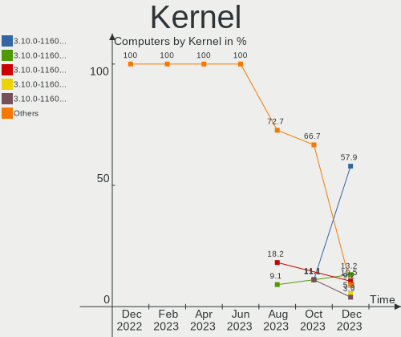

| Version                      | Computers | Percent |
|------------------------------|-----------|---------|
| 3.10.0-1160.31.1.el7.x86_64  | 9         | 18.75%  |
| 3.10.0-1160.25.1.el7.x86_64  | 9         | 18.75%  |
| 3.10.0-1160.36.2.el7.x86_64  | 5         | 10.42%  |
| 4.18.0-305.12.1.el8_4.x86_64 | 3         | 6.25%   |
| 4.18.0-305.10.2.el8_4.x86_64 | 3         | 6.25%   |
| 4.18.0-326.el8.x86_64        | 2         | 4.17%   |
| 3.10.0-1127.el7.x86_64       | 2         | 4.17%   |
| 3.10.0-1062.18.1.el7.x86_64  | 2         | 4.17%   |
| 5.4.142-1.el7.elrepo.x86_64  | 1         | 2.08%   |
| 5.13.7-1.el8.elrepo.x86_64   | 1         | 2.08%   |
| 5.13.11-1.el8.elrepo.x86_64  | 1         | 2.08%   |
| 5.10.3-1.el8.elrepo.x86_64   | 1         | 2.08%   |
| 4.18.0-338.el8.x86_64        | 1         | 2.08%   |
| 4.18.0-305.3.1.el8.x86_64    | 1         | 2.08%   |
| 4.18.0-277.el8.x86_64        | 1         | 2.08%   |
| 4.18.0-240.el8.x86_64        | 1         | 2.08%   |
| 4.18.0-240.22.1.el8_3.x86_64 | 1         | 2.08%   |
| 3.10.0-862.el7.x86_64        | 1         | 2.08%   |
| 3.10.0-1160.el7.x86_64       | 1         | 2.08%   |
| 3.10.0-1160.21.1.el7.x86_64  | 1         | 2.08%   |
| 3.10.0-1062.12.1.el7.x86_64  | 1         | 2.08%   |

Kernel Family
-------------

Linux kernel without a distro release

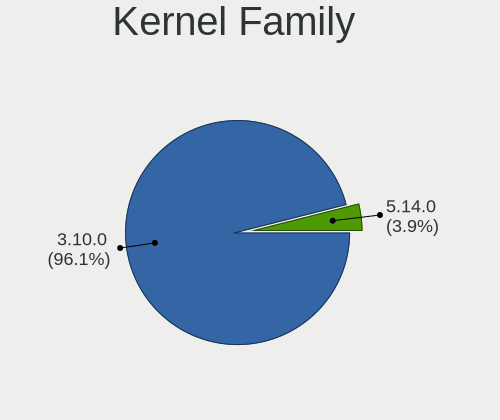

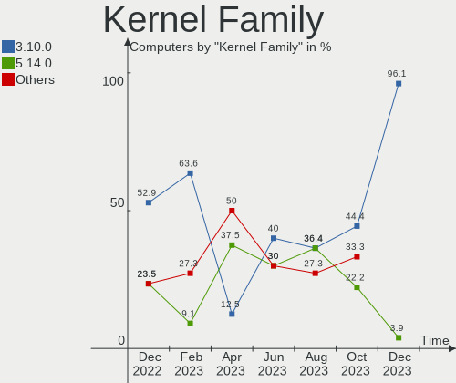

| Version | Computers | Percent |
|---------|-----------|---------|
| 3.10.0  | 31        | 64.58%  |
| 4.18.0  | 13        | 27.08%  |
| 5.4.142 | 1         | 2.08%   |
| 5.13.7  | 1         | 2.08%   |
| 5.13.11 | 1         | 2.08%   |
| 5.10.3  | 1         | 2.08%   |

Kernel Major Ver.
-----------------

Linux kernel major version

| Version | Computers | Percent |
|---------|-----------|---------|
| 3.10    | 31        | 64.58%  |
| 4.18    | 13        | 27.08%  |
| 5.13    | 2         | 4.17%   |
| 5.4     | 1         | 2.08%   |
| 5.10    | 1         | 2.08%   |

Arch
----

OS architecture (x86_64, i586, etc.)

| Name   | Computers | Percent |
|--------|-----------|---------|
| x86_64 | 48        | 100%    |

DE
--

Desktop Environment

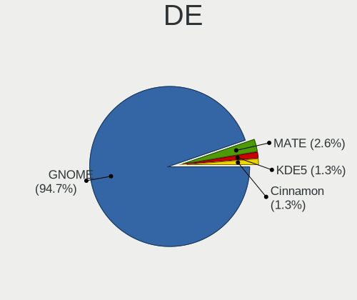

| Name          | Computers | Percent |
|---------------|-----------|---------|
| GNOME         | 33        | 68.75%  |
| KDE4          | 6         | 12.5%   |
| Unknown       | 5         | 10.42%  |
| XFCE          | 1         | 2.08%   |
| KDE5          | 1         | 2.08%   |
| GNOME Classic | 1         | 2.08%   |
| Cinnamon      | 1         | 2.08%   |

Display Server
--------------

X11 or Wayland

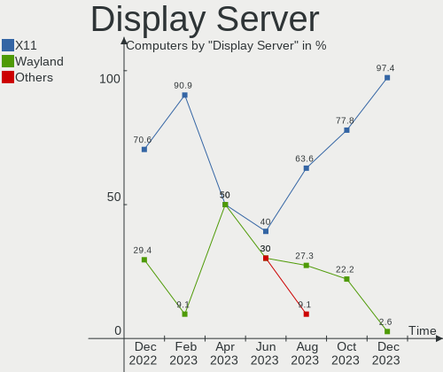

| Name    | Computers | Percent |
|---------|-----------|---------|
| X11     | 39        | 81.25%  |
| Wayland | 5         | 10.42%  |
| Unknown | 4         | 8.33%   |

Display Manager
---------------

SDDM, LightDM, etc.

| Name    | Computers | Percent |
|---------|-----------|---------|
| GDM     | 34        | 70.83%  |
| Unknown | 14        | 29.17%  |

OS Lang
-------

Language

| Lang    | Computers | Percent |
|---------|-----------|---------|
| en_US   | 21        | 43.75%  |
| C       | 18        | 37.5%   |
| ru_RU   | 2         | 4.17%   |
| en_GB   | 2         | 4.17%   |
| en_CA   | 2         | 4.17%   |
| de_DE   | 1         | 2.08%   |
| de_AT   | 1         | 2.08%   |
| Unknown | 1         | 2.08%   |

Boot Mode
---------

EFI or BIOS

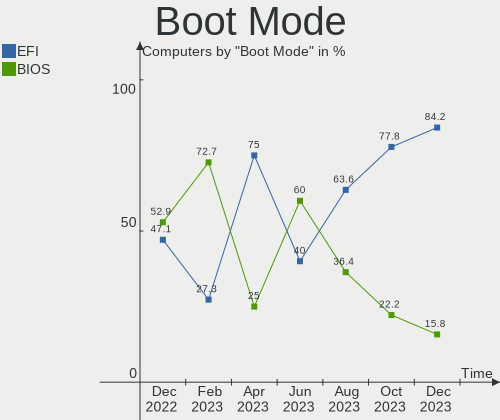

| Mode | Computers | Percent |
|------|-----------|---------|
| EFI  | 36        | 75%     |
| BIOS | 12        | 25%     |

Filesystem
----------

Type of filesystem

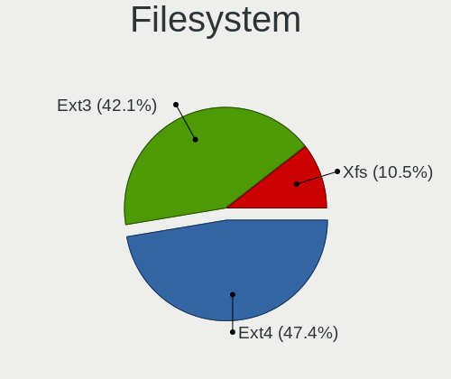

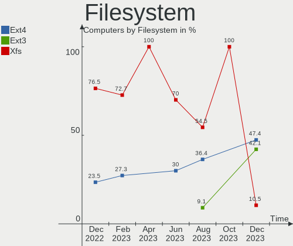

| Type | Computers | Percent |
|------|-----------|---------|
| Xfs  | 39        | 81.25%  |
| Ext4 | 9         | 18.75%  |

Part. scheme
------------

Scheme of partitioning

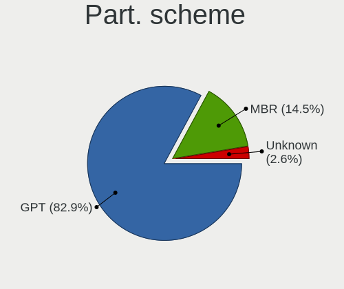

| Type    | Computers | Percent |
|---------|-----------|---------|
| GPT     | 33        | 68.75%  |
| Unknown | 8         | 16.67%  |
| MBR     | 7         | 14.58%  |

Dual Boot with Linux/BSD
------------------------

Hosting more than one Linux/BSD

| Dual boot | Computers | Percent |
|-----------|-----------|---------|
| No        | 46        | 95.83%  |
| Yes       | 2         | 4.17%   |

Dual Boot (Win)
---------------

Hosting Linux and Windows

| Dual boot | Computers | Percent |
|-----------|-----------|---------|
| No        | 43        | 89.58%  |
| Yes       | 5         | 10.42%  |

Board
-----

Vendor
------

Motherboard manufacturer

| Name                | Computers | Percent |
|---------------------|-----------|---------|
| Dell                | 18        | 37.5%   |
| Hewlett-Packard     | 8         | 16.67%  |
| Gigabyte Technology | 7         | 14.58%  |
| Supermicro          | 4         | 8.33%   |
| ASUSTek Computer    | 4         | 8.33%   |
| Sun Microsystems    | 2         | 4.17%   |
| MSI                 | 2         | 4.17%   |
| Lenovo              | 2         | 4.17%   |
| ASRock              | 1         | 2.08%   |

Model
-----

Motherboard model

| Name                                    | Computers | Percent |
|-----------------------------------------|-----------|---------|
| Dell OptiPlex 7040                      | 7         | 14.58%  |
| Dell OptiPlex 9020                      | 6         | 12.5%   |
| Supermicro Super Server                 | 2         | 4.17%   |
| Supermicro X8SAX                        | 1         | 2.08%   |
| Supermicro SYS-5019S-MR                 | 1         | 2.08%   |
| Sun Microsystems SUN FIRE X2270         | 1         | 2.08%   |
| Sun Microsystems Sun Fire X2200 M2      | 1         | 2.08%   |
| MSI MS-7C94                             | 1         | 2.08%   |
| MSI MS-7C37                             | 1         | 2.08%   |
| Lenovo ThinkSystem SR650 -[7X06CTO1WW]- | 1         | 2.08%   |
| Lenovo ThinkPad P50 20EN001PUS          | 1         | 2.08%   |
| HP Z2 Tower G5 Workstation              | 1         | 2.08%   |
| HP Z1 Entry Tower G5                    | 1         | 2.08%   |
| HP ProLiant DL360 G5                    | 1         | 2.08%   |
| HP Presario C700                        | 1         | 2.08%   |
| HP NOTEBOOKE 15-AY084TU                 | 1         | 2.08%   |
| HP EliteBook 8540w                      | 1         | 2.08%   |
| HP EliteBook 8440p                      | 1         | 2.08%   |
| HP 20-r124d                             | 1         | 2.08%   |
| Gigabyte Z170MX-Gaming 5                | 1         | 2.08%   |
| Gigabyte H97N-WIFI                      | 1         | 2.08%   |
| Gigabyte H270M-DS3H                     | 1         | 2.08%   |
| Gigabyte GA-990FXA-D3                   | 1         | 2.08%   |
| Gigabyte GA-78LMT-USB3 6.0              | 1         | 2.08%   |
| Gigabyte B85M-D3PH                      | 1         | 2.08%   |
| Gigabyte B450M DS3H                     | 1         | 2.08%   |
| Dell XPS 15 9570                        | 1         | 2.08%   |
| Dell XPS 15 7590                        | 1         | 2.08%   |
| Dell PowerEdge R610                     | 1         | 2.08%   |
| Dell OptiPlex 7070                      | 1         | 2.08%   |
| Dell Latitude 7420                      | 1         | 2.08%   |
| ASUS TUF B450M-PRO GAMING               | 1         | 2.08%   |
| ASUS ROG Maximus XIII HERO              | 1         | 2.08%   |
| ASUS PRIME B550-PLUS                    | 1         | 2.08%   |
| ASUS All Series                         | 1         | 2.08%   |
| ASRock A320M-HD                         | 1         | 2.08%   |

Model Family
------------

Motherboard model prefix

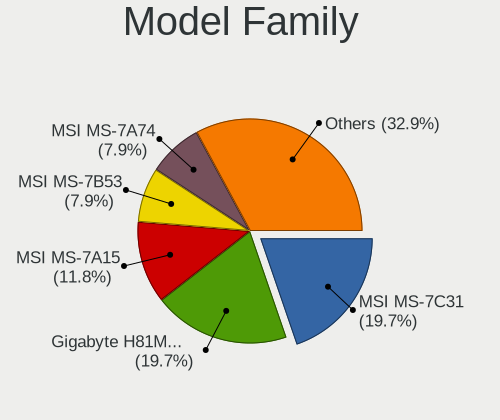

| Name                    | Computers | Percent |
|-------------------------|-----------|---------|
| Dell OptiPlex           | 14        | 29.17%  |
| Supermicro Super        | 2         | 4.17%   |
| Sun Microsystems SUN    | 2         | 4.17%   |
| HP EliteBook            | 2         | 4.17%   |
| Dell XPS                | 2         | 4.17%   |
| Supermicro X8SAX        | 1         | 2.08%   |
| Supermicro SYS-5019S-MR | 1         | 2.08%   |
| MSI MS-7C94             | 1         | 2.08%   |
| MSI MS-7C37             | 1         | 2.08%   |
| Lenovo ThinkSystem      | 1         | 2.08%   |
| Lenovo ThinkPad         | 1         | 2.08%   |
| HP Z2                   | 1         | 2.08%   |
| HP Z1                   | 1         | 2.08%   |
| HP ProLiant             | 1         | 2.08%   |
| HP Presario             | 1         | 2.08%   |
| HP NOTEBOOKE            | 1         | 2.08%   |
| HP 20-r124d             | 1         | 2.08%   |
| Gigabyte Z170MX-Gaming  | 1         | 2.08%   |
| Gigabyte H97N-WIFI      | 1         | 2.08%   |
| Gigabyte H270M-DS3H     | 1         | 2.08%   |
| Gigabyte GA-990FXA-D3   | 1         | 2.08%   |
| Gigabyte GA-78LMT-USB3  | 1         | 2.08%   |
| Gigabyte B85M-D3PH      | 1         | 2.08%   |
| Gigabyte B450M          | 1         | 2.08%   |
| Dell PowerEdge          | 1         | 2.08%   |
| Dell Latitude           | 1         | 2.08%   |
| ASUS TUF                | 1         | 2.08%   |
| ASUS ROG                | 1         | 2.08%   |
| ASUS PRIME              | 1         | 2.08%   |
| ASUS All                | 1         | 2.08%   |
| ASRock A320M-HD         | 1         | 2.08%   |

MFG Year
--------

Motherboard manufacture year

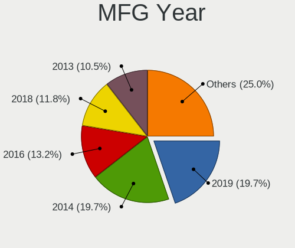

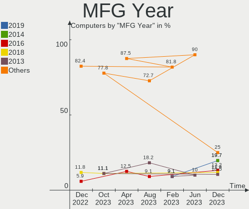

| Year | Computers | Percent |
|------|-----------|---------|
| 2021 | 14        | 29.17%  |
| 2019 | 9         | 18.75%  |
| 2015 | 6         | 12.5%   |
| 2020 | 5         | 10.42%  |
| 2010 | 3         | 6.25%   |
| 2017 | 2         | 4.17%   |
| 2016 | 2         | 4.17%   |
| 2014 | 2         | 4.17%   |
| 2013 | 2         | 4.17%   |
| 2011 | 1         | 2.08%   |
| 2008 | 1         | 2.08%   |
| 2007 | 1         | 2.08%   |

Form Factor
-----------

Physical design of the computer

| Name     | Computers | Percent |
|----------|-----------|---------|
| Desktop  | 33        | 68.75%  |
| Notebook | 8         | 16.67%  |
| Server   | 7         | 14.58%  |

Secure Boot
-----------

Enabled or disabled

| State    | Computers | Percent |
|----------|-----------|---------|
| Disabled | 48        | 100%    |

Coreboot
--------

Have coreboot on board

| Used | Computers | Percent |
|------|-----------|---------|
| No   | 48        | 100%    |

RAM Size
--------

Total RAM memory

| Size in GB      | Computers | Percent |
|-----------------|-----------|---------|
| 4.01-8.0        | 16        | 33.33%  |
| 32.01-64.0      | 14        | 29.17%  |
| 16.01-24.0      | 5         | 10.42%  |
| 8.01-16.0       | 5         | 10.42%  |
| More than 256.0 | 3         | 6.25%   |
| 64.01-256.0     | 2         | 4.17%   |
| 3.01-4.0        | 1         | 2.08%   |
| 24.01-32.0      | 1         | 2.08%   |
| 2.01-3.0        | 1         | 2.08%   |

RAM Used
--------

Used RAM memory

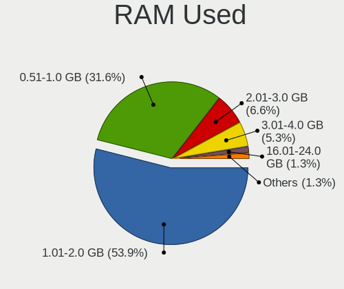

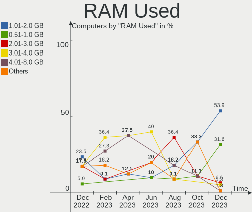

| Used GB         | Computers | Percent |
|-----------------|-----------|---------|
| 0.51-1.0        | 14        | 29.17%  |
| 2.01-3.0        | 11        | 22.92%  |
| 4.01-8.0        | 8         | 16.67%  |
| 1.01-2.0        | 8         | 16.67%  |
| 3.01-4.0        | 2         | 4.17%   |
| More than 256.0 | 1         | 2.08%   |
| 24.01-32.0      | 1         | 2.08%   |
| 16.01-24.0      | 1         | 2.08%   |
| 8.01-16.0       | 1         | 2.08%   |
| 0.01-0.5        | 1         | 2.08%   |

Total Drives
------------

Number of drives on board

| Drives | Computers | Percent |
|--------|-----------|---------|
| 1      | 29        | 60.42%  |
| 2      | 7         | 14.58%  |
| 5      | 3         | 6.25%   |
| 6      | 2         | 4.17%   |
| 209    | 1         | 2.08%   |
| 18     | 1         | 2.08%   |
| 15     | 1         | 2.08%   |
| 12     | 1         | 2.08%   |
| 7      | 1         | 2.08%   |
| 4      | 1         | 2.08%   |
| 3      | 1         | 2.08%   |

Has CD-ROM
----------

Has CD-ROM on board

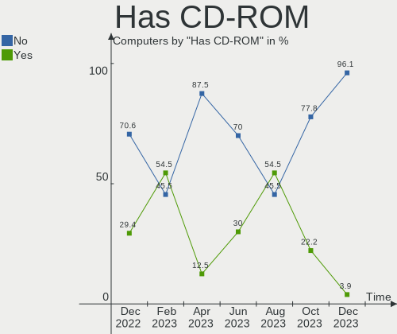

| Presented | Computers | Percent |
|-----------|-----------|---------|
| Yes       | 25        | 52.08%  |
| No        | 23        | 47.92%  |

Has Ethernet
------------

Has Ethernet on board

| Presented | Computers | Percent |
|-----------|-----------|---------|
| Yes       | 45        | 93.75%  |
| No        | 3         | 6.25%   |

Has WiFi
--------

Has WiFi module

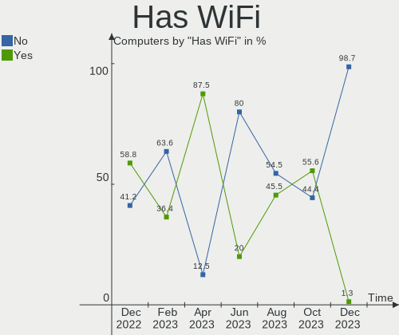

| Presented | Computers | Percent |
|-----------|-----------|---------|
| No        | 35        | 72.92%  |
| Yes       | 13        | 27.08%  |

Has Bluetooth
-------------

Has Bluetooth module

| Presented | Computers | Percent |
|-----------|-----------|---------|
| No        | 37        | 77.08%  |
| Yes       | 11        | 22.92%  |

Location
--------

Country
-------

Geographic location (country)

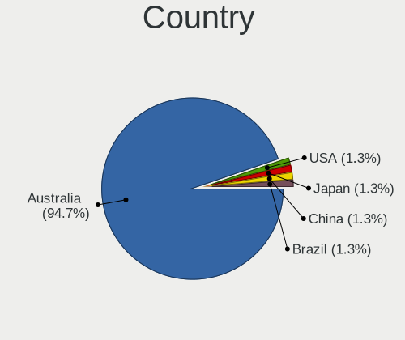

| Country   | Computers | Percent |
|-----------|-----------|---------|
| USA       | 25        | 52.08%  |
| Brazil    | 5         | 10.42%  |
| Germany   | 3         | 6.25%   |
| Canada    | 3         | 6.25%   |
| Russia    | 2         | 4.17%   |
| UK        | 1         | 2.08%   |
| Sweden    | 1         | 2.08%   |
| Romania   | 1         | 2.08%   |
| Lithuania | 1         | 2.08%   |
| Japan     | 1         | 2.08%   |
| Indonesia | 1         | 2.08%   |
| India     | 1         | 2.08%   |
| Greece    | 1         | 2.08%   |
| Finland   | 1         | 2.08%   |
| Australia | 1         | 2.08%   |

City
----

Geographic location (city)

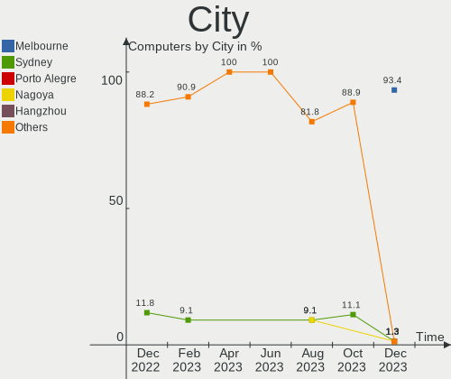

| City              | Computers | Percent |
|-------------------|-----------|---------|
| Rochester         | 19        | 39.58%  |
| Rio de Janeiro    | 3         | 6.25%   |
| Brampton          | 2         | 4.17%   |
| Ashburn           | 2         | 4.17%   |
| Warrington        | 1         | 2.08%   |
| Vilnius           | 1         | 2.08%   |
| Victoria          | 1         | 2.08%   |
| Tokyo             | 1         | 2.08%   |
| Sydney            | 1         | 2.08%   |
| Sollentuna        | 1         | 2.08%   |
| Rethymno          | 1         | 2.08%   |
| Recea             | 1         | 2.08%   |
| Portland          | 1         | 2.08%   |
| Penza             | 1         | 2.08%   |
| Munich            | 1         | 2.08%   |
| Mumbai            | 1         | 2.08%   |
| Moscow            | 1         | 2.08%   |
| Kuningan Barat    | 1         | 2.08%   |
| Hillsboro         | 1         | 2.08%   |
| Frankfurt am Main | 1         | 2.08%   |
| Florian??polis    | 1         | 2.08%   |
| Espoo             | 1         | 2.08%   |
| D??sseldorf       | 1         | 2.08%   |
| Campinas          | 1         | 2.08%   |
| Burlington        | 1         | 2.08%   |
| Albuquerque       | 1         | 2.08%   |

Drives
------

Drive Vendor
------------

Hard drive vendors

| Vendor              | Computers | Drives | Percent |
|---------------------|-----------|--------|---------|
| Seagate             | 16        | 62     | 27.12%  |
| Samsung Electronics | 10        | 15     | 16.95%  |
| WDC                 | 9         | 226    | 15.25%  |
| Toshiba             | 8         | 9      | 13.56%  |
| SanDisk             | 2         | 2      | 3.39%   |
| Kingston            | 2         | 2      | 3.39%   |
| Hitachi             | 2         | 2      | 3.39%   |
| Crucial             | 2         | 2      | 3.39%   |
| Verbatim            | 1         | 1      | 1.69%   |
| Unknown             | 1         | 1      | 1.69%   |
| SK Hynix            | 1         | 1      | 1.69%   |
| OCZ                 | 1         | 2      | 1.69%   |
| NVMe                | 1         | 1      | 1.69%   |
| Intel               | 1         | 1      | 1.69%   |
| Hewlett-Packard     | 1         | 3      | 1.69%   |
| Gigabyte Technology | 1         | 1      | 1.69%   |

Drive Model
-----------

Hard drive models

| Model                                     | Computers | Percent |
|-------------------------------------------|-----------|---------|
| Toshiba DT01ACA050 500GB                  | 6         | 8.45%   |
| Seagate ST500DM002-1SB10A 500GB           | 6         | 8.45%   |
| Samsung NVMe SSD Drive 512GB              | 3         | 4.23%   |
| WDC WDS250G2B0A-00SM50 250GB SSD          | 2         | 2.82%   |
| Seagate ST600MM0026 600GB                 | 2         | 2.82%   |
| Seagate ST1000DM003-1CH162 1TB            | 2         | 2.82%   |
| WDC WUH721816AL5204 16TB                  | 1         | 1.41%   |
| WDC WDS500G2B0A 500GB SSD                 | 1         | 1.41%   |
| WDC WDS240G2G0B-00EPW0 240GB SSD          | 1         | 1.41%   |
| WDC WD80EFAX-68KNBN0 8TB                  | 1         | 1.41%   |
| WDC WD5000AZLX-60K2TA1 500GB              | 1         | 1.41%   |
| WDC WD5000AAKX-00U6AA0 500GB              | 1         | 1.41%   |
| WDC WD3200AVVS-63L2B0 320GB               | 1         | 1.41%   |
| WDC WD20PURZ-85AKKY0 2TB                  | 1         | 1.41%   |
| WDC WD20EFRX-68EUZN0 2TB                  | 1         | 1.41%   |
| WDC WD181KFGX-68AFPN0 18TB                | 1         | 1.41%   |
| WDC WD10EZEX-75WN4A1 1TB                  | 1         | 1.41%   |
| WDC WD10EZEX-00RKKA0 1TB                  | 1         | 1.41%   |
| Verbatim Vi550 S3 SSD 128GB               | 1         | 1.41%   |
| Unknown MMC Card  32GB                    | 1         | 1.41%   |
| Toshiba MQ01ABD100 1TB                    | 1         | 1.41%   |
| Toshiba MG03ACA100 1TB                    | 1         | 1.41%   |
| SK Hynix PC401 NVMe 512GB                 | 1         | 1.41%   |
| Seagate ST980813ASG 80GB                  | 1         | 1.41%   |
| Seagate ST8000NM000A-2KE101 8TB           | 1         | 1.41%   |
| Seagate ST8000AS0002-1NA17Z 8TB           | 1         | 1.41%   |
| Seagate ST4000NM0033-9ZM170 4TB           | 1         | 1.41%   |
| Seagate ST4000NM0024-1HT178 4TB           | 1         | 1.41%   |
| Seagate ST31000528AS 1TB                  | 1         | 1.41%   |
| Seagate ST2000NM000A-2J2100 2TB           | 1         | 1.41%   |
| Seagate ST12000VN0008-2JH101 12TB         | 1         | 1.41%   |
| Seagate ST1000NM000A 1TB                  | 1         | 1.41%   |
| Seagate ST1000DM003-1ER162 1TB            | 1         | 1.41%   |
| Seagate BUP Slim BL 2TB                   | 1         | 1.41%   |
| SanDisk X400 M.2 2280 128GB SSD           | 1         | 1.41%   |
| SanDisk SD8SN8U-128G-1006 128GB SSD       | 1         | 1.41%   |
| Samsung SSD 970 EVO Plus 500GB            | 1         | 1.41%   |
| Samsung SSD 850 EVO 500GB                 | 1         | 1.41%   |
| Samsung SSD 850 EVO 250GB                 | 1         | 1.41%   |
| Samsung SSD 840 EVO 120GB                 | 1         | 1.41%   |
| Samsung PM991 NVMe Samsu 128GB            | 1         | 1.41%   |
| Samsung PM981 NVMe 2048GB                 | 1         | 1.41%   |
| Samsung HD501LJ 500GB                     | 1         | 1.41%   |
| OCZ VERTEX4 128GB SSD                     | 1         | 1.41%   |
| NVMe BC501 SK hynix 256GB                 | 1         | 1.41%   |
| Kingston SSDNOW 30GB                      | 1         | 1.41%   |
| Kingston SA400S37480G 480GB SSD           | 1         | 1.41%   |
| Intel SSDSA2M080G2LE 80GB                 | 1         | 1.41%   |
| Hitachi HUA7210SASUN1.0T 1007GD0TNF 1TB   | 1         | 1.41%   |
| Hitachi HDS7225SBSUN250G 0632NLKRTJ 250GB | 1         | 1.41%   |
| HP EH0146FBQDC 146GB                      | 1         | 1.41%   |
| HP EH0146FAWJB 146GB                      | 1         | 1.41%   |
| HP EH0146FARWD 146GB                      | 1         | 1.41%   |
| Gigabyte GP-ASM2NE6100TTTD 1TB            | 1         | 1.41%   |
| Crucial CT2000P2SSD8 2TB                  | 1         | 1.41%   |
| Crucial CT1000MX500SSD1 1TB               | 1         | 1.41%   |

HDD Vendor
----------

Hard disk drive vendors

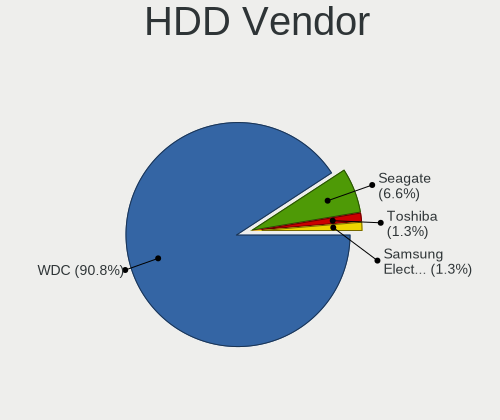

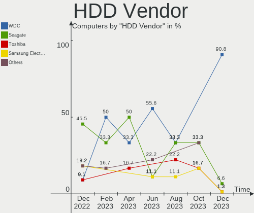

| Vendor              | Computers | Drives | Percent |
|---------------------|-----------|--------|---------|
| Seagate             | 16        | 62     | 44.44%  |
| WDC                 | 8         | 16     | 22.22%  |
| Toshiba             | 8         | 9      | 22.22%  |
| Hitachi             | 2         | 2      | 5.56%   |
| Samsung Electronics | 1         | 5      | 2.78%   |
| Hewlett-Packard     | 1         | 3      | 2.78%   |

SSD Vendor
----------

Solid state drive vendors

| Vendor              | Computers | Drives | Percent |
|---------------------|-----------|--------|---------|
| WDC                 | 3         | 5      | 21.43%  |
| Samsung Electronics | 3         | 4      | 21.43%  |
| SanDisk             | 2         | 2      | 14.29%  |
| Kingston            | 2         | 2      | 14.29%  |
| Verbatim            | 1         | 1      | 7.14%   |
| OCZ                 | 1         | 2      | 7.14%   |
| Intel               | 1         | 1      | 7.14%   |
| Crucial             | 1         | 1      | 7.14%   |

Drive Kind
----------

HDD or SSD

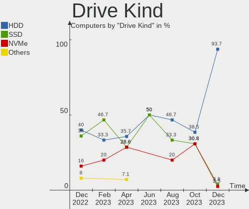

| Kind    | Computers | Drives | Percent |
|---------|-----------|--------|---------|
| HDD     | 34        | 97     | 59.65%  |
| SSD     | 11        | 18     | 19.3%   |
| NVMe    | 10        | 10     | 17.54%  |
| MMC     | 1         | 1      | 1.75%   |
| Unknown | 1         | 205    | 1.75%   |

Drive Connector
---------------

SATA, SAS, NVMe, etc.

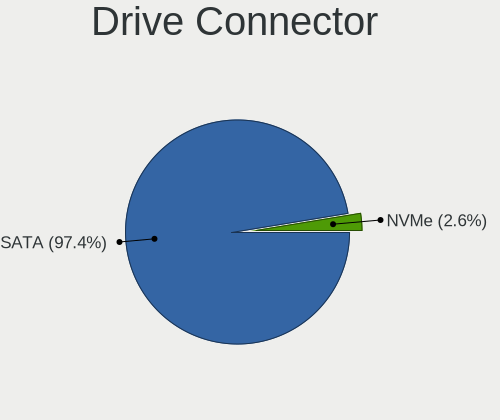

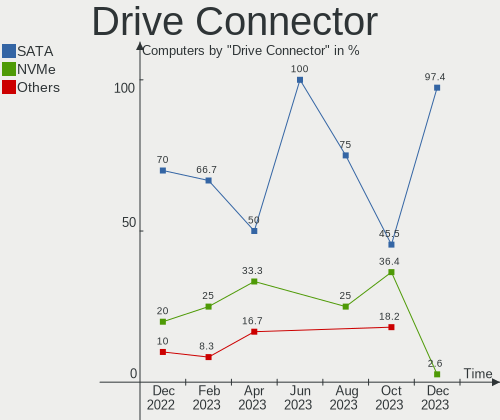

| Type | Computers | Drives | Percent |
|------|-----------|--------|---------|
| SATA | 40        | 114    | 75.47%  |
| NVMe | 10        | 10     | 18.87%  |
| SAS  | 2         | 206    | 3.77%   |
| MMC  | 1         | 1      | 1.89%   |

Drive Size
----------

Size of hard drive

| Size in TB | Computers | Drives | Percent |
|------------|-----------|--------|---------|
| 0.01-0.5   | 27        | 43     | 57.45%  |
| 0.51-1.0   | 11        | 41     | 23.4%   |
| 1.01-2.0   | 3         | 5      | 6.38%   |
| 3.01-4.0   | 2         | 6      | 4.26%   |
| 10.01-20.0 | 2         | 8      | 4.26%   |
| 4.01-10.0  | 2         | 12     | 4.26%   |

Space Total
-----------

Amount of disk space available on the file system

| Size in GB     | Computers | Percent |
|----------------|-----------|---------|
| 251-500        | 17        | 35.42%  |
| 501-1000       | 10        | 20.83%  |
| 101-250        | 9         | 18.75%  |
| 1-20           | 4         | 8.33%   |
| 21-50          | 3         | 6.25%   |
| More than 3000 | 2         | 4.17%   |
| 1001-2000      | 1         | 2.08%   |
| 51-100         | 1         | 2.08%   |
| Unknown        | 1         | 2.08%   |

Space Used
----------

Amount of used disk space

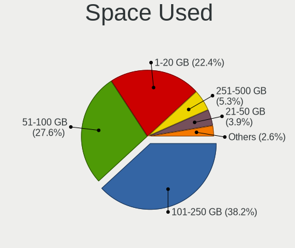

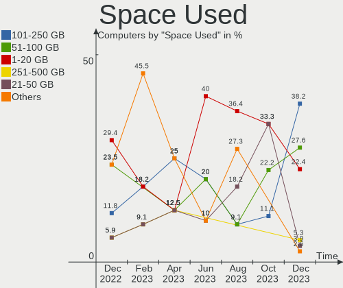

| Used GB        | Computers | Percent |
|----------------|-----------|---------|
| 1-20           | 28        | 58.33%  |
| 21-50          | 7         | 14.58%  |
| 101-250        | 7         | 14.58%  |
| 501-1000       | 2         | 4.17%   |
| More than 3000 | 1         | 2.08%   |
| 251-500        | 1         | 2.08%   |
| 51-100         | 1         | 2.08%   |
| Unknown        | 1         | 2.08%   |

Malfunc. Drives
---------------

Drive models with a malfunction

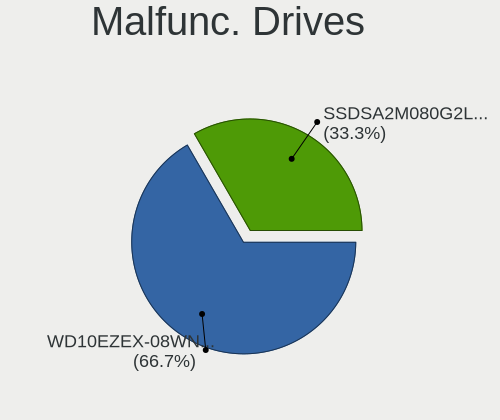

| Model                                     | Computers | Drives | Percent |
|-------------------------------------------|-----------|--------|---------|
| WDC WDS240G2G0B-00EPW0 240GB SSD          | 1         | 1      | 20%     |
| WDC WD3200AVVS-63L2B0 320GB               | 1         | 1      | 20%     |
| Seagate ST1000DM003-1ER162 1TB            | 1         | 1      | 20%     |
| Intel SSDSA2M080G2LE 80GB                 | 1         | 1      | 20%     |
| Hitachi HDS7225SBSUN250G 0632NLKRTJ 250GB | 1         | 1      | 20%     |

Malfunc. Drive Vendor
---------------------

Vendors of faulty drives

| Vendor  | Computers | Drives | Percent |
|---------|-----------|--------|---------|
| WDC     | 2         | 2      | 40%     |
| Seagate | 1         | 1      | 20%     |
| Intel   | 1         | 1      | 20%     |
| Hitachi | 1         | 1      | 20%     |

Malfunc. HDD Vendor
-------------------

Vendors of faulty HDD drives

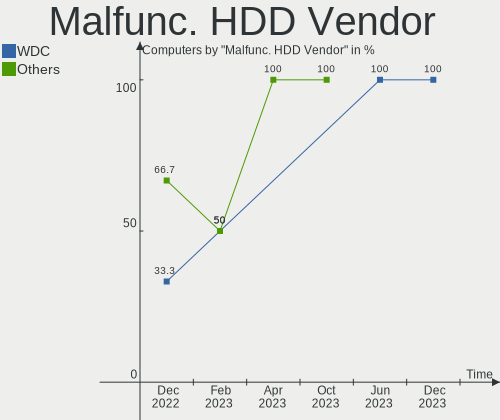

| Vendor  | Computers | Drives | Percent |
|---------|-----------|--------|---------|
| WDC     | 1         | 1      | 33.33%  |
| Seagate | 1         | 1      | 33.33%  |
| Hitachi | 1         | 1      | 33.33%  |

Malfunc. Drive Kind
-------------------

Kinds of faulty drives

| Kind | Computers | Drives | Percent |
|------|-----------|--------|---------|
| HDD  | 3         | 3      | 60%     |
| SSD  | 2         | 2      | 40%     |

Failed Drives
-------------

Failed drive models

Zero info for selected period =(

Failed Drive Vendor
-------------------

Failed drive vendors

Zero info for selected period =(

Drive Status
------------

Number of failed and malfunc. drives

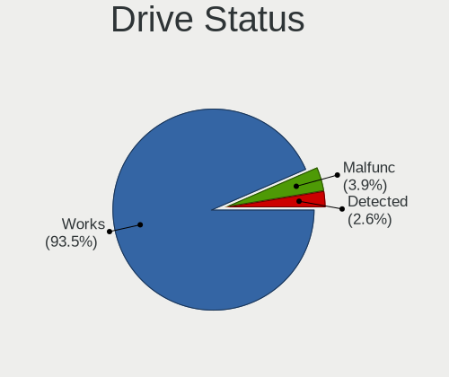

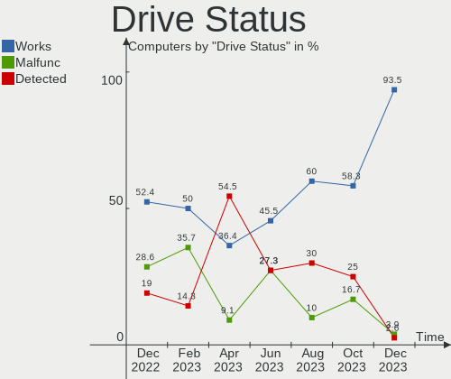

| Status   | Computers | Drives | Percent |
|----------|-----------|--------|---------|
| Works    | 37        | 106    | 69.81%  |
| Detected | 11        | 220    | 20.75%  |
| Malfunc  | 5         | 5      | 9.43%   |

Storage controller
------------------

Storage Vendor
--------------

Storage controller vendors

| Vendor                    | Computers | Percent |
|---------------------------|-----------|---------|
| Intel                     | 39        | 60%     |
| AMD                       | 7         | 10.77%  |
| Samsung Electronics       | 6         | 9.23%   |
| LSI Logic / Symbios Logic | 3         | 4.62%   |
| SK Hynix                  | 2         | 3.08%   |
| Marvell Technology Group  | 2         | 3.08%   |
| Phison Electronics        | 1         | 1.54%   |
| Nvidia                    | 1         | 1.54%   |
| Micron/Crucial Technology | 1         | 1.54%   |
| Hewlett-Packard           | 1         | 1.54%   |
| Broadcom / LSI            | 1         | 1.54%   |
| ASMedia Technology        | 1         | 1.54%   |

Storage Model
-------------

Storage controller models

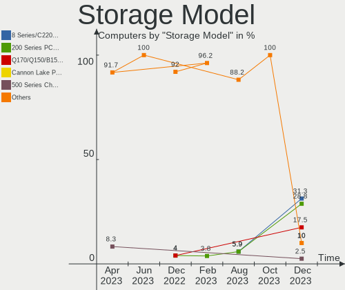

| Model                                                                          | Computers | Percent |
|--------------------------------------------------------------------------------|-----------|---------|
| Intel SATA Controller [RAID mode]                                              | 10        | 13.16%  |
| Intel 8 Series/C220 Series Chipset Family 6-port SATA Controller 1 [AHCI mode] | 7         | 9.21%   |
| AMD FCH SATA Controller [AHCI mode]                                            | 5         | 6.58%   |
| Samsung NVMe SSD Controller SM981/PM981/PM983                                  | 3         | 3.95%   |
| Samsung NVMe SSD Controller SM951/PM951                                        | 2         | 2.63%   |
| LSI Logic / Symbios Logic MegaRAID SAS-3 3108 [Invader]                        | 2         | 2.63%   |
| Intel Q170/Q150/B150/H170/H110/Z170/CM236 Chipset SATA Controller [AHCI Mode]  | 2         | 2.63%   |
| Intel Cannon Lake PCH SATA AHCI Controller                                     | 2         | 2.63%   |
| Intel Cannon Lake Mobile PCH SATA AHCI Controller                              | 2         | 2.63%   |
| Intel C610/X99 series chipset 6-Port SATA Controller [AHCI mode]               | 2         | 2.63%   |
| Intel 82801JI (ICH10 Family) SATA AHCI Controller                              | 2         | 2.63%   |
| Intel 5 Series/3400 Series Chipset 6 port SATA AHCI Controller                 | 2         | 2.63%   |
| AMD Starship/Matisse Chipset SATA Controller [AHCI mode]                       | 2         | 2.63%   |
| AMD 400 Series Chipset SATA Controller                                         | 2         | 2.63%   |
| SK Hynix PC401 NVMe Solid State Drive 256GB                                    | 1         | 1.32%   |
| SK Hynix BC501 NVMe Solid State Drive                                          | 1         | 1.32%   |
| Samsung NVMe Controller                                                        | 1         | 1.32%   |
| Phison E16 PCIe4 NVMe Controller                                               | 1         | 1.32%   |
| Nvidia MCP55 SATA Controller                                                   | 1         | 1.32%   |
| Nvidia MCP55 IDE                                                               | 1         | 1.32%   |
| Micron/Crucial P2 NVMe PCIe SSD                                                | 1         | 1.32%   |
| Marvell Group MV64460/64461/64462 System Controller, Revision B                | 1         | 1.32%   |
| Marvell Group 88SE9235 PCIe 2.0 x2 4-port SATA 6 Gb/s Controller               | 1         | 1.32%   |
| LSI Logic / Symbios Logic MegaRAID SAS 1078                                    | 1         | 1.32%   |
| Intel Sunrise Point-LP SATA Controller [AHCI mode]                             | 1         | 1.32%   |
| Intel C620 Series Chipset Family SSATA Controller [AHCI mode]                  | 1         | 1.32%   |
| Intel C620 Series Chipset Family SATA Controller [AHCI mode]                   | 1         | 1.32%   |
| Intel 9 Series Chipset Family SATA Controller [AHCI Mode]                      | 1         | 1.32%   |
| Intel 82801JI (ICH10 Family) 4 port SATA IDE Controller #1                     | 1         | 1.32%   |
| Intel 82801JI (ICH10 Family) 2 port SATA IDE Controller #2                     | 1         | 1.32%   |
| Intel 82801IB (ICH9) 2 port SATA Controller [IDE mode]                         | 1         | 1.32%   |
| Intel 82801HM/HEM (ICH8M/ICH8M-E) SATA Controller [AHCI mode]                  | 1         | 1.32%   |
| Intel 82801HM/HEM (ICH8M/ICH8M-E) IDE Controller                               | 1         | 1.32%   |
| Intel 631xESB/632xESB IDE Controller                                           | 1         | 1.32%   |
| Intel 500 Series Chipset Family SATA AHCI Controller                           | 1         | 1.32%   |
| Intel 400 Series Chipset Family SATA RAID Controller                           | 1         | 1.32%   |
| Intel 200 Series PCH SATA controller [AHCI mode]                               | 1         | 1.32%   |
| HP Smart Array Controller                                                      | 1         | 1.32%   |
| Broadcom / LSI SAS3416 Fusion-MPT Tri-Mode I/O Controller Chip (IOC)           | 1         | 1.32%   |
| Broadcom / LSI SAS3408 Fusion-MPT Tri-Mode I/O Controller Chip (IOC)           | 1         | 1.32%   |
| Broadcom / LSI MegaRAID SAS-3 3108 [Invader]                                   | 1         | 1.32%   |
| ASMedia ASM1062 Serial ATA Controller                                          | 1         | 1.32%   |
| AMD SB7x0/SB8x0/SB9x0 SATA Controller [Non-RAID5 mode]                         | 1         | 1.32%   |
| AMD SB7x0/SB8x0/SB9x0 IDE Controller                                           | 1         | 1.32%   |
| AMD FCH SATA Controller D                                                      | 1         | 1.32%   |

Storage Kind
------------

Kind of storage controller (IDE, SATA, NVMe, SAS, ...)

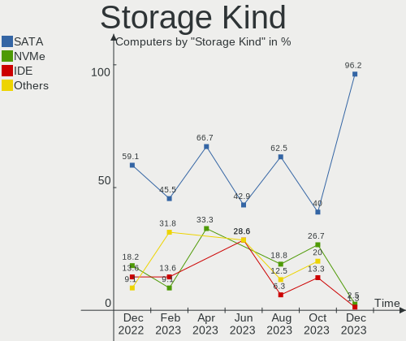

| Kind | Computers | Percent |
|------|-----------|---------|
| SATA | 31        | 46.97%  |
| RAID | 18        | 27.27%  |
| NVMe | 10        | 15.15%  |
| IDE  | 6         | 9.09%   |
| SAS  | 1         | 1.52%   |

Processor
---------

CPU Vendor
----------

Processor vendors

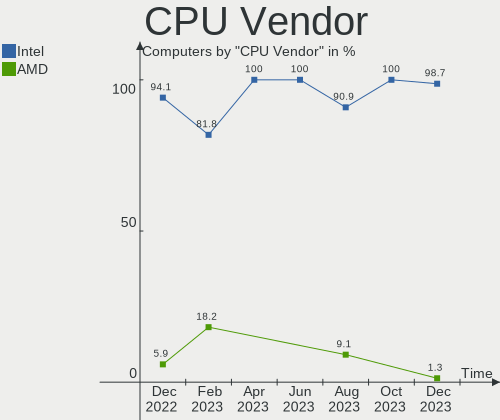

| Vendor | Computers | Percent |
|--------|-----------|---------|
| Intel  | 40        | 83.33%  |
| AMD    | 8         | 16.67%  |

CPU Model
---------

Processor models

| Model                                   | Computers | Percent |
|-----------------------------------------|-----------|---------|
| Intel Core i7-6700 CPU @ 3.40GHz        | 7         | 14.58%  |
| Intel Core i7-4790 CPU @ 3.60GHz        | 6         | 12.5%   |
| Intel Xeon CPU E5-2650 v3 @ 2.30GHz     | 2         | 4.17%   |
| AMD Ryzen 9 3900X 12-Core Processor     | 2         | 4.17%   |
| AMD Ryzen 7 3700X 8-Core Processor      | 2         | 4.17%   |
| Intel Xeon Gold 6248 CPU @ 2.50GHz      | 1         | 2.08%   |
| Intel Xeon CPU X5650 @ 2.67GHz          | 1         | 2.08%   |
| Intel Xeon CPU L5420 @ 2.50GHz          | 1         | 2.08%   |
| Intel Xeon CPU E5606 @ 2.13GHz          | 1         | 2.08%   |
| Intel Xeon CPU E5504 @ 2.00GHz          | 1         | 2.08%   |
| Intel Xeon CPU E3-1505M v5 @ 2.80GHz    | 1         | 2.08%   |
| Intel Pentium CPU G3258 @ 3.20GHz       | 1         | 2.08%   |
| Intel Core i9-9980HK CPU @ 2.40GHz      | 1         | 2.08%   |
| Intel Core i9-10900K CPU @ 3.70GHz      | 1         | 2.08%   |
| Intel Core i7-9700 CPU @ 3.00GHz        | 1         | 2.08%   |
| Intel Core i7-8750H CPU @ 2.20GHz       | 1         | 2.08%   |
| Intel Core i7-7700K CPU @ 4.20GHz       | 1         | 2.08%   |
| Intel Core i7-6700K CPU @ 4.00GHz       | 1         | 2.08%   |
| Intel Core i7-4790K CPU @ 4.00GHz       | 1         | 2.08%   |
| Intel Core i7-10700 CPU @ 2.90GHz       | 1         | 2.08%   |
| Intel Core i7 CPU Q 840 @ 1.87GHz       | 1         | 2.08%   |
| Intel Core i7 CPU M 640 @ 2.80GHz       | 1         | 2.08%   |
| Intel Core i5-9500 CPU @ 3.00GHz        | 1         | 2.08%   |
| Intel Core i5-6200U CPU @ 2.30GHz       | 1         | 2.08%   |
| Intel Core i5-4670 CPU @ 3.40GHz        | 1         | 2.08%   |
| Intel Core i5-4460T CPU @ 1.90GHz       | 1         | 2.08%   |
| Intel Core i3-6100 CPU @ 3.70GHz        | 1         | 2.08%   |
| Intel Core 2 Duo CPU T9300 @ 2.50GHz    | 1         | 2.08%   |
| Intel Core 2 Duo CPU E8400 @ 3.00GHz    | 1         | 2.08%   |
| Intel 11th Gen Core i7-1185G7 @ 3.00GHz | 1         | 2.08%   |
| AMD Ryzen 5 3500X 6-Core Processor      | 1         | 2.08%   |
| AMD Ryzen 5 1600 Six-Core Processor     | 1         | 2.08%   |
| AMD FX-8320 Eight-Core Processor        | 1         | 2.08%   |
| AMD Dual-Core Opteron Processor 2214    | 1         | 2.08%   |

CPU Model Family
----------------

Processor model prefix

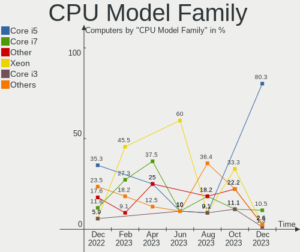

| Model            | Computers | Percent |
|------------------|-----------|---------|
| Intel Core i7    | 21        | 43.75%  |
| Intel Xeon       | 7         | 14.58%  |
| Intel Core i5    | 4         | 8.33%   |
| Other            | 2         | 4.17%   |
| Intel Core i9    | 2         | 4.17%   |
| Intel Core 2 Duo | 2         | 4.17%   |
| AMD Ryzen 9      | 2         | 4.17%   |
| AMD Ryzen 7      | 2         | 4.17%   |
| AMD Ryzen 5      | 2         | 4.17%   |
| Intel Xeon Gold  | 1         | 2.08%   |
| Intel Pentium    | 1         | 2.08%   |
| Intel Core i3    | 1         | 2.08%   |
| AMD FX           | 1         | 2.08%   |

CPU Cores
---------

Number of processor cores

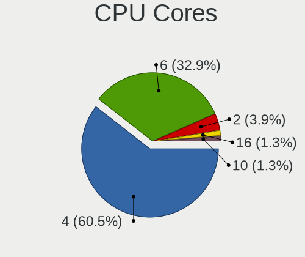

| Number | Computers | Percent |
|--------|-----------|---------|
| 4      | 24        | 50%     |
| 8      | 7         | 14.58%  |
| 2      | 6         | 12.5%   |
| 6      | 4         | 8.33%   |
| 12     | 3         | 6.25%   |
| 20     | 2         | 4.17%   |
| 40     | 1         | 2.08%   |
| 10     | 1         | 2.08%   |

CPU Sockets
-----------

Number of sockets

| Number | Computers | Percent |
|--------|-----------|---------|
| 1      | 41        | 85.42%  |
| 2      | 7         | 14.58%  |

CPU Threads
-----------

Threads per core (Hyper-Threading)

| Number | Computers | Percent |
|--------|-----------|---------|
| 2      | 36        | 75%     |
| 1      | 12        | 25%     |

CPU Op-Modes
------------

CPU Operation Modes (32-bit, 64-bit)

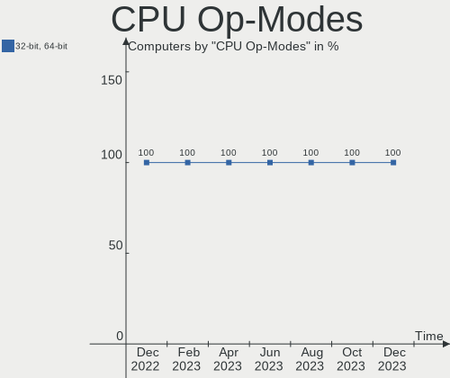

| Op mode        | Computers | Percent |
|----------------|-----------|---------|
| 32-bit, 64-bit | 48        | 100%    |

CPU Microcode
-------------

Microcode number

| Number     | Computers | Percent |
|------------|-----------|---------|
| 0x506e3    | 10        | 20.83%  |
| 0x306c3    | 10        | 20.83%  |
| Unknown    | 5         | 10.42%  |
| 0xa0655    | 2         | 4.17%   |
| 0x906ed    | 2         | 4.17%   |
| 0x906ea    | 2         | 4.17%   |
| 0x306f2    | 2         | 4.17%   |
| 0x10676    | 2         | 4.17%   |
| 0x08701021 | 2         | 4.17%   |
| 0x906e9    | 1         | 2.08%   |
| 0x806c1    | 1         | 2.08%   |
| 0x406e3    | 1         | 2.08%   |
| 0x206c2    | 1         | 2.08%   |
| 0x20655    | 1         | 2.08%   |
| 0x106e5    | 1         | 2.08%   |
| 0x106a5    | 1         | 2.08%   |
| 0x1067a    | 1         | 2.08%   |
| 0x08701013 | 1         | 2.08%   |
| 0x0800820d | 1         | 2.08%   |
| 0x06000852 | 1         | 2.08%   |

CPU Microarch
-------------

Microarchitecture

| Name       | Computers | Percent |
|------------|-----------|---------|
| Skylake    | 12        | 25%     |
| Haswell    | 12        | 25%     |
| Zen 2      | 5         | 10.42%  |
| KabyLake   | 5         | 10.42%  |
| Westmere   | 3         | 6.25%   |
| Penryn     | 3         | 6.25%   |
| Nehalem    | 2         | 4.17%   |
| CometLake  | 2         | 4.17%   |
| Zen+       | 1         | 2.08%   |
| TigerLake  | 1         | 2.08%   |
| Piledriver | 1         | 2.08%   |
| K8 Hammer  | 1         | 2.08%   |

Graphics
--------

GPU Vendor
----------

Vendors of graphics cards

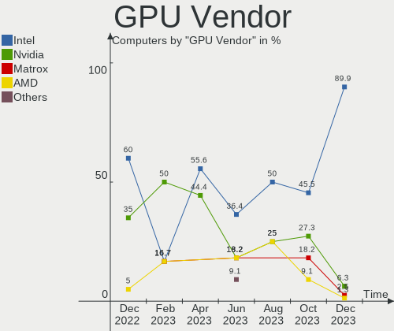

| Vendor                     | Computers | Percent |
|----------------------------|-----------|---------|
| AMD                        | 23        | 38.98%  |
| Intel                      | 18        | 30.51%  |
| Nvidia                     | 10        | 16.95%  |
| ASPEED Technology          | 5         | 8.47%   |
| Matrox Electronics Systems | 2         | 3.39%   |
| S3 Graphics                | 1         | 1.69%   |

GPU Model
---------

Graphics card models

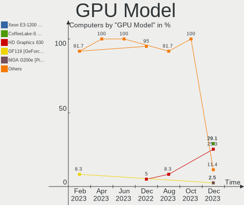

| Model                                                                       | Computers | Percent |
|-----------------------------------------------------------------------------|-----------|---------|
| AMD Oland [Radeon HD 8570 / R5 430 OEM / R7 240/340 / Radeon 520 OEM]       | 7         | 11.48%  |
| AMD Oland XT [Radeon HD 8670 / R5 340X OEM / R7 250/350/350X OEM]           | 7         | 11.48%  |
| ASPEED Technology ASPEED Graphics Family                                    | 5         | 8.2%    |
| Intel HD Graphics 530                                                       | 4         | 6.56%   |
| Intel Xeon E3-1200 v3/4th Gen Core Processor Integrated Graphics Controller | 3         | 4.92%   |
| Nvidia GK208B [GeForce GT 710]                                              | 2         | 3.28%   |
| Intel CometLake-S GT2 [UHD Graphics 630]                                    | 2         | 3.28%   |
| Intel CoffeeLake-H GT2 [UHD Graphics 630]                                   | 2         | 3.28%   |
| AMD Navi 14 [Radeon RX 5500/5500M / Pro 5500M]                              | 2         | 3.28%   |
| AMD Ellesmere [Radeon RX 470/480/570/570X/580/580X/590]                     | 2         | 3.28%   |
| S3 Graphics Savage 4                                                        | 1         | 1.64%   |
| Nvidia TU117M [GeForce GTX 1650 Mobile / Max-Q]                             | 1         | 1.64%   |
| Nvidia TU102 [TITAN RTX]                                                    | 1         | 1.64%   |
| Nvidia GT218 [GeForce 210]                                                  | 1         | 1.64%   |
| Nvidia GP107M [GeForce GTX 1050 Ti Mobile]                                  | 1         | 1.64%   |
| Nvidia GP107GL [Quadro P400]                                                | 1         | 1.64%   |
| Nvidia GP106GL [Quadro P2200]                                               | 1         | 1.64%   |
| Nvidia GM107GLM [Quadro M2000M]                                             | 1         | 1.64%   |
| Nvidia G72 [GeForce 7300 GS]                                                | 1         | 1.64%   |
| Matrox Electronics Systems MGA G200eW WPCM450                               | 1         | 1.64%   |
| Matrox Electronics Systems MGA G200e [Pilot] ServerEngines (SEP1)           | 1         | 1.64%   |
| Intel TigerLake-LP GT2 [Iris Xe Graphics]                                   | 1         | 1.64%   |
| Intel Skylake GT2 [HD Graphics 520]                                         | 1         | 1.64%   |
| Intel Mobile GM965/GL960 Integrated Graphics Controller (secondary)         | 1         | 1.64%   |
| Intel Mobile GM965/GL960 Integrated Graphics Controller (primary)           | 1         | 1.64%   |
| Intel HD Graphics P530                                                      | 1         | 1.64%   |
| Intel HD Graphics 630                                                       | 1         | 1.64%   |
| Intel Core Processor Integrated Graphics Controller                         | 1         | 1.64%   |
| Intel CoffeeLake-S GT2 [UHD Graphics 630]                                   | 1         | 1.64%   |
| AMD RS780L [Radeon 3000]                                                    | 1         | 1.64%   |
| AMD Madison [Mobility Radeon HD 5730 / 6570M]                               | 1         | 1.64%   |
| AMD Heathrow PRO [Radeon HD 7850M/8850M]                                    | 1         | 1.64%   |
| AMD ES1000                                                                  | 1         | 1.64%   |
| AMD Cayman PRO [Radeon HD 6950]                                             | 1         | 1.64%   |
| AMD Caicos [Radeon HD 6450/7450/8450 / R5 230 OEM]                          | 1         | 1.64%   |

GPU Combo
---------

Combinations of graphics cards

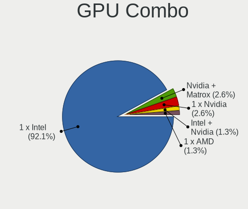

| Name            | Computers | Percent |
|-----------------|-----------|---------|
| 1 x AMD         | 19        | 39.58%  |
| 1 x Intel       | 7         | 14.58%  |
| 1 x Nvidia      | 6         | 12.5%   |
| 1 x ASPEED      | 5         | 10.42%  |
| Intel + Nvidia  | 4         | 8.33%   |
| Intel + AMD     | 3         | 6.25%   |
| 1 x Matrox      | 2         | 4.17%   |
| 2 x AMD         | 1         | 2.08%   |
| 1 x S3 Graphics | 1         | 2.08%   |

GPU Driver
----------

Free vs proprietary

| Driver      | Computers | Percent |
|-------------|-----------|---------|
| Free        | 44        | 91.67%  |
| Proprietary | 2         | 4.17%   |
| Unknown     | 2         | 4.17%   |

GPU Memory
----------

Total video memory

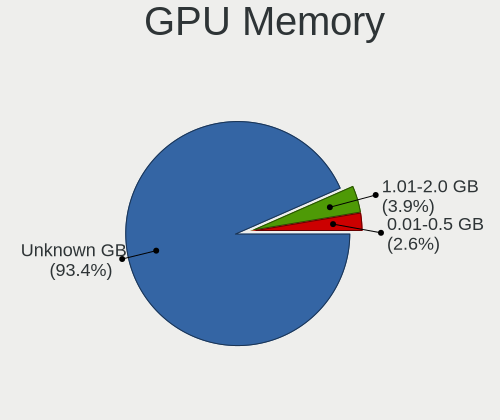

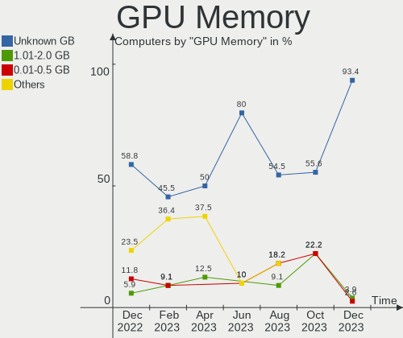

| Size in GB | Computers | Percent |
|------------|-----------|---------|
| Unknown    | 17        | 35.42%  |
| 1.01-2.0   | 11        | 22.92%  |
| 0.51-1.0   | 10        | 20.83%  |
| 3.01-4.0   | 4         | 8.33%   |
| 0.01-0.5   | 3         | 6.25%   |
| 7.01-8.0   | 1         | 2.08%   |
| 4.01-5.0   | 1         | 2.08%   |
| 16.01-24.0 | 1         | 2.08%   |

Monitor
-------

Monitor Vendor
--------------

Monitor vendors

| Vendor              | Computers | Percent |
|---------------------|-----------|---------|
| Dell                | 22        | 47.83%  |
| Samsung Electronics | 4         | 8.7%    |
| Hewlett-Packard     | 4         | 8.7%    |
| Goldstar            | 3         | 6.52%   |
| Sharp               | 2         | 4.35%   |
| AOC                 | 2         | 4.35%   |
| ___                 | 1         | 2.17%   |
| Xiaomi              | 1         | 2.17%   |
| Westinghouse        | 1         | 2.17%   |
| ViewSonic           | 1         | 2.17%   |
| Unknown             | 1         | 2.17%   |
| Chimei Innolux      | 1         | 2.17%   |
| BOE                 | 1         | 2.17%   |
| AU Optronics        | 1         | 2.17%   |
| Acer                | 1         | 2.17%   |

Monitor Model
-------------

Monitor models

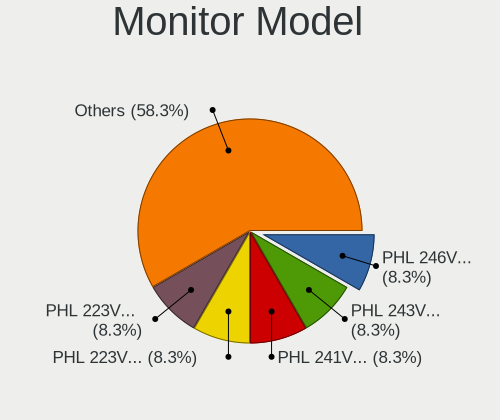

| Model                                                                                 | Computers | Percent |
|---------------------------------------------------------------------------------------|-----------|---------|
| Dell P2417H DELA0DB 1920x1080 527x296mm 23.8-inch                                     | 6         | 11.76%  |
| Dell P2414H DELA09A 1920x1080 527x297mm 23.8-inch                                     | 6         | 11.76%  |
| Dell P2417H DELA0DA 1920x1080 527x296mm 23.8-inch                                     | 2         | 3.92%   |
| ___ Monitor ranges (GTF): 48-62Hz V, 14-68kHz H, max dotclock 150MHz ___9000 1440x900 | 1         | 1.96%   |
| Xiaomi Mi TV XMD009A 2880x1800 480x270mm 21.7-inch                                    | 1         | 1.96%   |
| Westinghouse LD-2240 WDT19DA 1920x1080 480x270mm 21.7-inch                            | 1         | 1.96%   |
| ViewSonic VA2759 Series VSC6832 1920x1080 598x336mm 27.0-inch                         | 1         | 1.96%   |
| Unknown LCDTV16 9000 1360x768 1600x900mm 72.3-inch                                    | 1         | 1.96%   |
| Sharp LCD Monitor SHP14B9 3840x2160 344x194mm 15.5-inch                               | 1         | 1.96%   |
| Sharp LCD Monitor SHP149A 1920x1080 344x194mm 15.5-inch                               | 1         | 1.96%   |
| Samsung Electronics SMEX2220 SAM0685 1920x1080 477x268mm 21.5-inch                    | 1         | 1.96%   |
| Samsung Electronics LCD Monitor SEC4D45 1280x800 331x207mm 15.4-inch                  | 1         | 1.96%   |
| Samsung Electronics LCD Monitor SEC434E 1600x900 310x170mm 13.9-inch                  | 1         | 1.96%   |
| Samsung Electronics C27F390 SAM0D32 1920x1080 600x340mm 27.2-inch                     | 1         | 1.96%   |
| Hewlett-Packard ZR2440w HWP2956 1920x1200 518x324mm 24.1-inch                         | 1         | 1.96%   |
| Hewlett-Packard ALL-in-One HWP4244 1600x900 432x240mm 19.5-inch                       | 1         | 1.96%   |
| Hewlett-Packard 24mh HPN366C 1920x1080 527x296mm 23.8-inch                            | 1         | 1.96%   |
| Hewlett-Packard 2309 HWP2822 1920x1080 510x287mm 23.0-inch                            | 1         | 1.96%   |
| Goldstar L1753T GSM4476 1280x1024 338x270mm 17.0-inch                                 | 1         | 1.96%   |
| Goldstar FULL HD GSM5B55 1920x1080 480x270mm 21.7-inch                                | 1         | 1.96%   |
| Goldstar 22EA53 GSM59A5 1680x1050 480x270mm 21.7-inch                                 | 1         | 1.96%   |
| Dell SE2416H DELD082 1920x1080 527x296mm 23.8-inch                                    | 1         | 1.96%   |
| Dell SE2416H DELD081 1920x1080 527x296mm 23.8-inch                                    | 1         | 1.96%   |
| Dell P2419H DELD0D9 1920x1080 527x296mm 23.8-inch                                     | 1         | 1.96%   |
| Dell P2317H DEL40F4 1920x1080 509x286mm 23.0-inch                                     | 1         | 1.96%   |
| Dell P2317H DEL40F3 1920x1080 509x286mm 23.0-inch                                     | 1         | 1.96%   |
| Dell P2210 DEL404C 1680x1050 474x296mm 22.0-inch                                      | 1         | 1.96%   |
| Dell LCD Monitor 2405FPW 1920x1200                                                    | 1         | 1.96%   |
| Dell LCD Monitor 1703FP 1280x1024                                                     | 1         | 1.96%   |
| Dell 2405FPW DELA00F 1920x1200 519x324mm 24.1-inch                                    | 1         | 1.96%   |
| Dell 2009W DEL4041 1680x1050 430x270mm 20.0-inch                                      | 1         | 1.96%   |
| Dell 2007FP DELA021 1600x1200 367x275mm 18.1-inch                                     | 1         | 1.96%   |
| Dell 1909W DELA03C 1440x900 408x255mm 18.9-inch                                       | 1         | 1.96%   |
| Dell 1707FP DEL4012 1280x1024 338x270mm 17.0-inch                                     | 1         | 1.96%   |
| Chimei Innolux LCD Monitor CMN15C6 1366x768 340x190mm 15.3-inch                       | 1         | 1.96%   |
| BOE LCD Monitor BOE0630 1920x1080 344x194mm 15.5-inch                                 | 1         | 1.96%   |
| AU Optronics LCD Monitor AUO4A90 1920x1080 309x174mm 14.0-inch                        | 1         | 1.96%   |
| AOC 28E850 AOC0CCD 2560x1600 480x270mm 21.7-inch                                      | 1         | 1.96%   |
| AOC 22B1W AOC2201 1920x1080 476x268mm 21.5-inch                                       | 1         | 1.96%   |
| Acer E220HQ ACR01F8 1920x1080 477x268mm 21.5-inch                                     | 1         | 1.96%   |

Monitor Resolution
------------------

Monitor screen resolution

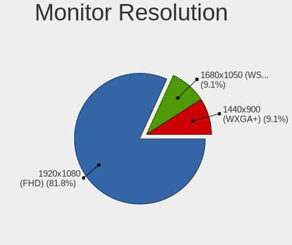

| Resolution         | Computers | Percent |
|--------------------|-----------|---------|
| 1920x1080 (FHD)    | 27        | 60%     |
| 1280x1024 (SXGA)   | 3         | 6.67%   |
| 3840x2160 (4K)     | 2         | 4.44%   |
| 1920x1200 (WUXGA)  | 2         | 4.44%   |
| 1600x900 (HD+)     | 2         | 4.44%   |
| 1440x900 (WXGA+)   | 2         | 4.44%   |
| 2880x1800          | 1         | 2.22%   |
| 2560x1440 (QHD)    | 1         | 2.22%   |
| 1680x1050 (WSXGA+) | 1         | 2.22%   |
| 1600x1200          | 1         | 2.22%   |
| 1366x768 (WXGA)    | 1         | 2.22%   |
| 1360x768           | 1         | 2.22%   |
| 1280x800 (WXGA)    | 1         | 2.22%   |

Monitor Diagonal
----------------

Diagonal size in inches

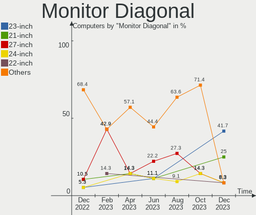

| Inches  | Computers | Percent |
|---------|-----------|---------|
| 24      | 16        | 33.33%  |
| 21      | 6         | 12.5%   |
| 23      | 5         | 10.42%  |
| 15      | 5         | 10.42%  |
| 27      | 3         | 6.25%   |
| Unknown | 3         | 6.25%   |
| 20      | 2         | 4.17%   |
| 19      | 2         | 4.17%   |
| 17      | 2         | 4.17%   |
| 14      | 2         | 4.17%   |
| 72      | 1         | 2.08%   |
| 22      | 1         | 2.08%   |

Monitor Width
-------------

Physical width

| Width in mm | Computers | Percent |
|-------------|-----------|---------|
| 501-600     | 22        | 50%     |
| 401-500     | 9         | 20.45%  |
| 301-350     | 9         | 20.45%  |
| Unknown     | 3         | 6.82%   |
| 1501-2000   | 1         | 2.27%   |

Aspect Ratio
------------

Proportional relationship between the width and the height

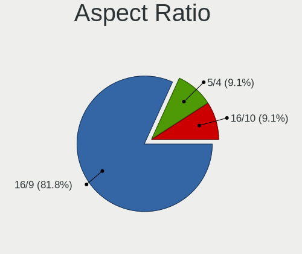

| Ratio   | Computers | Percent |
|---------|-----------|---------|
| 16/9    | 32        | 76.19%  |
| 16/10   | 5         | 11.9%   |
| 5/4     | 2         | 4.76%   |
| Unknown | 2         | 4.76%   |
| 4/3     | 1         | 2.38%   |

Monitor Area
------------

Area in inch

| Area in inch | Computers | Percent |
|----------------|-----------|---------|
| 201-250        | 22        | 48.89%  |
| 151-200        | 5         | 11.11%  |
| 101-110        | 5         | 11.11%  |
| 301-350        | 3         | 6.67%   |
| Unknown        | 3         | 6.67%   |
| 81-90          | 2         | 4.44%   |
| 251-300        | 2         | 4.44%   |
| 141-150        | 2         | 4.44%   |
| More than 1000 | 1         | 2.22%   |

Pixel Density
-------------

Pixels per inch

| Density       | Computers | Percent |
|---------------|-----------|---------|
| 51-100        | 28        | 62.22%  |
| 121-160       | 6         | 13.33%  |
| 101-120       | 6         | 13.33%  |
| Unknown       | 3         | 6.67%   |
| More than 240 | 1         | 2.22%   |
| 1-50          | 1         | 2.22%   |

Multiple Monitors
-----------------

Total monitors connected

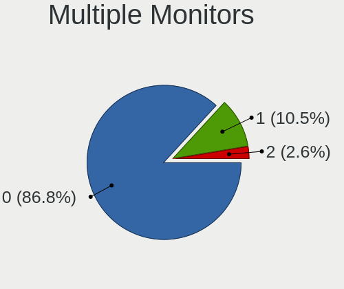

| Total | Computers | Percent |
|-------|-----------|---------|
| 1     | 37        | 77.08%  |
| 2     | 5         | 10.42%  |
| 0     | 4         | 8.33%   |
| 4     | 1         | 2.08%   |
| 3     | 1         | 2.08%   |

Network
-------

Net Controller Vendor
---------------------

Controller vendors

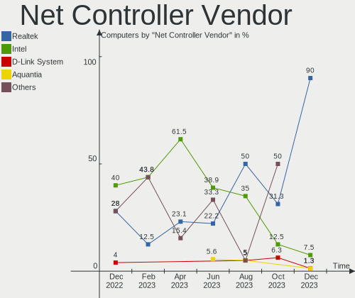

| Vendor                | Computers | Percent |
|-----------------------|-----------|---------|
| Intel                 | 31        | 52.54%  |
| Realtek Semiconductor | 14        | 23.73%  |
| Qualcomm Atheros      | 4         | 6.78%   |
| Broadcom              | 4         | 6.78%   |
| Nvidia                | 1         | 1.69%   |
| IBM                   | 1         | 1.69%   |
| Dell                  | 1         | 1.69%   |
| D-Link System         | 1         | 1.69%   |
| Broadcom Limited      | 1         | 1.69%   |
| Apple                 | 1         | 1.69%   |

Net Controller Model
--------------------

Controller models

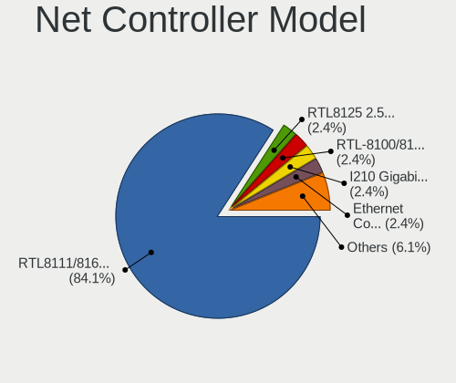

| Model                                                                   | Computers | Percent |
|-------------------------------------------------------------------------|-----------|---------|
| Realtek RTL8111/8168/8411 PCI Express Gigabit Ethernet Controller       | 11        | 15.94%  |
| Intel Ethernet Connection (2) I219-LM                                   | 8         | 11.59%  |
| Intel Ethernet Connection I217-LM                                       | 6         | 8.7%    |
| Intel I210 Gigabit Network Connection                                   | 4         | 5.8%    |
| Intel Wi-Fi 6 AX200                                                     | 2         | 2.9%    |
| Intel Ethernet Controller 10-Gigabit X540-AT2                           | 2         | 2.9%    |
| Intel Ethernet Connection (7) I219-LM                                   | 2         | 2.9%    |
| Intel Centrino Ultimate-N 6300                                          | 2         | 2.9%    |
| Intel 82577LM Gigabit Network Connection                                | 2         | 2.9%    |
| Realtek RTL8723BE PCIe Wireless Network Adapter                         | 1         | 1.45%   |
| Realtek RTL8125 2.5GbE Controller                                       | 1         | 1.45%   |
| Realtek RTL810xE PCI Express Fast Ethernet controller                   | 1         | 1.45%   |
| Realtek RTL-8100/8101L/8139 PCI Fast Ethernet Adapter                   | 1         | 1.45%   |
| Qualcomm Atheros QCA6174 802.11ac Wireless Network Adapter              | 1         | 1.45%   |
| Qualcomm Atheros Killer E2400 Gigabit Ethernet Controller               | 1         | 1.45%   |
| Qualcomm Atheros AR93xx Wireless Network Adapter                        | 1         | 1.45%   |
| Qualcomm Atheros AR242x / AR542x Wireless Network Adapter (PCI-Express) | 1         | 1.45%   |
| Nvidia MCP55 Ethernet                                                   | 1         | 1.45%   |
| Intel Wireless 7260                                                     | 1         | 1.45%   |
| Intel Wi-Fi 6 AX201                                                     | 1         | 1.45%   |
| Intel I350 Gigabit Network Connection                                   | 1         | 1.45%   |
| Intel Ethernet Controller X710 for 10GbE SFP+                           | 1         | 1.45%   |
| Intel Ethernet Controller I225-V                                        | 1         | 1.45%   |
| Intel Ethernet Connection X722 for 10GBASE-T                            | 1         | 1.45%   |
| Intel Ethernet Connection I217-V                                        | 1         | 1.45%   |
| Intel Ethernet Connection (2) I218-V                                    | 1         | 1.45%   |
| Intel Ethernet Connection (11) I219-LM                                  | 1         | 1.45%   |
| Intel Dual Band Wireless-AC 3168NGW [Stone Peak]                        | 1         | 1.45%   |
| Intel 82575EB Gigabit Network Connection                                | 1         | 1.45%   |
| Intel 82574L Gigabit Network Connection                                 | 1         | 1.45%   |
| IBM RNDIS/CDC ETHER                                                     | 1         | 1.45%   |
| Dell DW5811e Snapdragon????? X7 LTE                                    | 1         | 1.45%   |
| D-Link System RTL8139 Ethernet                                          | 1         | 1.45%   |
| Broadcom NetXtreme II BCM5709 Gigabit Ethernet                          | 1         | 1.45%   |
| Broadcom NetXtreme BCM5715 Gigabit Ethernet                             | 1         | 1.45%   |
| Broadcom Limited NetXtreme II BCM5708 Gigabit Ethernet                  | 1         | 1.45%   |
| Broadcom BCM4360 802.11ac Wireless Network Adapter                      | 1         | 1.45%   |
| Broadcom BCM43142 802.11b/g/n                                           | 1         | 1.45%   |
| Apple Ethernet Adapter [A1277]                                          | 1         | 1.45%   |

Wireless Vendor
---------------

Wireless vendors

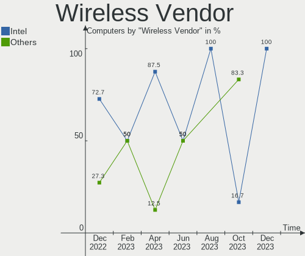

| Vendor                | Computers | Percent |
|-----------------------|-----------|---------|
| Intel                 | 7         | 50%     |
| Qualcomm Atheros      | 3         | 21.43%  |
| Broadcom              | 2         | 14.29%  |
| Realtek Semiconductor | 1         | 7.14%   |
| Dell                  | 1         | 7.14%   |

Wireless Model
--------------

Wireless models

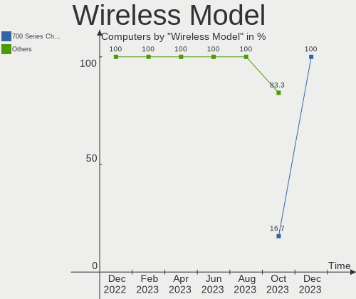

| Model                                                                   | Computers | Percent |
|-------------------------------------------------------------------------|-----------|---------|
| Intel Wi-Fi 6 AX200                                                     | 2         | 14.29%  |
| Intel Centrino Ultimate-N 6300                                          | 2         | 14.29%  |
| Realtek RTL8723BE PCIe Wireless Network Adapter                         | 1         | 7.14%   |
| Qualcomm Atheros QCA6174 802.11ac Wireless Network Adapter              | 1         | 7.14%   |
| Qualcomm Atheros AR93xx Wireless Network Adapter                        | 1         | 7.14%   |
| Qualcomm Atheros AR242x / AR542x Wireless Network Adapter (PCI-Express) | 1         | 7.14%   |
| Intel Wireless 7260                                                     | 1         | 7.14%   |
| Intel Wi-Fi 6 AX201                                                     | 1         | 7.14%   |
| Intel Dual Band Wireless-AC 3168NGW [Stone Peak]                        | 1         | 7.14%   |
| Dell DW5811e Snapdragon????? X7 LTE                                    | 1         | 7.14%   |
| Broadcom BCM4360 802.11ac Wireless Network Adapter                      | 1         | 7.14%   |
| Broadcom BCM43142 802.11b/g/n                                           | 1         | 7.14%   |

Ethernet Vendor
---------------

Ethernet vendors

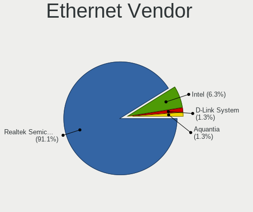

| Vendor                | Computers | Percent |
|-----------------------|-----------|---------|
| Intel                 | 28        | 56%     |
| Realtek Semiconductor | 14        | 28%     |
| Broadcom              | 2         | 4%      |
| Qualcomm Atheros      | 1         | 2%      |
| Nvidia                | 1         | 2%      |
| IBM                   | 1         | 2%      |
| D-Link System         | 1         | 2%      |
| Broadcom Limited      | 1         | 2%      |
| Apple                 | 1         | 2%      |

Ethernet Model
--------------

Ethernet models

| Model                                                             | Computers | Percent |
|-------------------------------------------------------------------|-----------|---------|
| Realtek RTL8111/8168/8411 PCI Express Gigabit Ethernet Controller | 11        | 20%     |
| Intel Ethernet Connection (2) I219-LM                             | 8         | 14.55%  |
| Intel Ethernet Connection I217-LM                                 | 6         | 10.91%  |
| Intel I210 Gigabit Network Connection                             | 4         | 7.27%   |
| Intel Ethernet Controller 10-Gigabit X540-AT2                     | 2         | 3.64%   |
| Intel Ethernet Connection (7) I219-LM                             | 2         | 3.64%   |
| Intel 82577LM Gigabit Network Connection                          | 2         | 3.64%   |
| Realtek RTL8125 2.5GbE Controller                                 | 1         | 1.82%   |
| Realtek RTL810xE PCI Express Fast Ethernet controller             | 1         | 1.82%   |
| Realtek RTL-8100/8101L/8139 PCI Fast Ethernet Adapter             | 1         | 1.82%   |
| Qualcomm Atheros Killer E2400 Gigabit Ethernet Controller         | 1         | 1.82%   |
| Nvidia MCP55 Ethernet                                             | 1         | 1.82%   |
| Intel I350 Gigabit Network Connection                             | 1         | 1.82%   |
| Intel Ethernet Controller X710 for 10GbE SFP+                     | 1         | 1.82%   |
| Intel Ethernet Controller I225-V                                  | 1         | 1.82%   |
| Intel Ethernet Connection X722 for 10GBASE-T                      | 1         | 1.82%   |
| Intel Ethernet Connection I217-V                                  | 1         | 1.82%   |
| Intel Ethernet Connection (2) I218-V                              | 1         | 1.82%   |
| Intel Ethernet Connection (11) I219-LM                            | 1         | 1.82%   |
| Intel 82575EB Gigabit Network Connection                          | 1         | 1.82%   |
| Intel 82574L Gigabit Network Connection                           | 1         | 1.82%   |
| IBM RNDIS/CDC ETHER                                               | 1         | 1.82%   |
| D-Link System RTL8139 Ethernet                                    | 1         | 1.82%   |
| Broadcom NetXtreme II BCM5709 Gigabit Ethernet                    | 1         | 1.82%   |
| Broadcom NetXtreme BCM5715 Gigabit Ethernet                       | 1         | 1.82%   |
| Broadcom Limited NetXtreme II BCM5708 Gigabit Ethernet            | 1         | 1.82%   |
| Apple Ethernet Adapter [A1277]                                    | 1         | 1.82%   |

Net Controller Kind
-------------------

Ethernet, WiFi or modem

| Kind     | Computers | Percent |
|----------|-----------|---------|
| Ethernet | 45        | 77.59%  |
| WiFi     | 13        | 22.41%  |

Used Controller
---------------

Currently used network controller

| Kind     | Computers | Percent |
|----------|-----------|---------|
| Ethernet | 43        | 79.63%  |
| WiFi     | 11        | 20.37%  |

NICs
----

Total network controllers on board

| Total | Computers | Percent |
|-------|-----------|---------|
| 1     | 26        | 54.17%  |
| 2     | 14        | 29.17%  |
| 4     | 4         | 8.33%   |
| 3     | 2         | 4.17%   |
| 12    | 1         | 2.08%   |
| 6     | 1         | 2.08%   |

IPv6
----

IPv6 vs IPv4

| Used | Computers | Percent |
|------|-----------|---------|
| No   | 38        | 79.17%  |
| Yes  | 10        | 20.83%  |

Bluetooth
---------

Bluetooth Vendor
----------------

Controller vendors

| Vendor                          | Computers | Percent |
|---------------------------------|-----------|---------|
| Intel                           | 5         | 45.45%  |
| Broadcom                        | 3         | 27.27%  |
| Realtek Semiconductor           | 1         | 9.09%   |
| Qualcomm Atheros Communications | 1         | 9.09%   |
| Hewlett-Packard                 | 1         | 9.09%   |

Bluetooth Model
---------------

Controller models

| Model                                  | Computers | Percent |
|----------------------------------------|-----------|---------|
| Intel AX200 Bluetooth                  | 2         | 18.18%  |
| Broadcom BCM20702A0 Bluetooth 4.0      | 2         | 18.18%  |
| Realtek Bluetooth Radio                | 1         | 9.09%   |
| Qualcomm Atheros QCA61x4 Bluetooth 4.0 | 1         | 9.09%   |
| Intel Wireless-AC 3168 Bluetooth       | 1         | 9.09%   |
| Intel Bluetooth wireless interface     | 1         | 9.09%   |
| Intel Bluetooth Device                 | 1         | 9.09%   |
| HP Broadcom 2070 Bluetooth Combo       | 1         | 9.09%   |
| Broadcom BCM43142A0 Bluetooth 4.0      | 1         | 9.09%   |

Sound
-----

Sound Vendor
------------

Sound card vendors

| Vendor            | Computers | Percent |
|-------------------|-----------|---------|
| Intel             | 32        | 46.38%  |
| AMD               | 25        | 36.23%  |
| Nvidia            | 7         | 10.14%  |
| Texas Instruments | 2         | 2.9%    |
| Logitech          | 1         | 1.45%   |
| GN Netcom         | 1         | 1.45%   |
| ASUSTek Computer  | 1         | 1.45%   |

Sound Model
-----------

Sound card models

| Model                                                                             | Computers | Percent |
|-----------------------------------------------------------------------------------|-----------|---------|
| AMD Oland/Hainan/Cape Verde/Pitcairn HDMI Audio [Radeon HD 7000 Series]           | 15        | 19.48%  |
| Intel 100 Series/C230 Series Chipset Family HD Audio Controller                   | 9         | 11.69%  |
| Intel 8 Series/C220 Series Chipset High Definition Audio Controller               | 8         | 10.39%  |
| AMD Starship/Matisse HD Audio Controller                                          | 5         | 6.49%   |
| Intel Cannon Lake PCH cAVS                                                        | 4         | 5.19%   |
| Intel Xeon E3-1200 v3/4th Gen Core Processor HD Audio Controller                  | 3         | 3.9%    |
| Nvidia GK208 HDMI/DP Audio Controller                                             | 2         | 2.6%    |
| Intel 9 Series Chipset Family HD Audio Controller                                 | 2         | 2.6%    |
| Intel 5 Series/3400 Series Chipset High Definition Audio                          | 2         | 2.6%    |
| AMD Navi 10 HDMI Audio                                                            | 2         | 2.6%    |
| AMD Ellesmere HDMI Audio [Radeon RX 470/480 / 570/580/590]                        | 2         | 2.6%    |
| Texas Instruments PCM2902 Audio Codec                                             | 1         | 1.3%    |
| Texas Instruments PCM2900B Audio CODEC                                            | 1         | 1.3%    |
| Nvidia TU102 High Definition Audio Controller                                     | 1         | 1.3%    |
| Nvidia High Definition Audio Controller                                           | 1         | 1.3%    |
| Nvidia GP107GL High Definition Audio Controller                                   | 1         | 1.3%    |
| Nvidia GP106 High Definition Audio Controller                                     | 1         | 1.3%    |
| Nvidia GM107 High Definition Audio Controller [GeForce 940MX]                     | 1         | 1.3%    |
| Logitech USB Headset                                                              | 1         | 1.3%    |
| Intel Tiger Lake-LP Smart Sound Technology Audio Controller                       | 1         | 1.3%    |
| Intel Sunrise Point-LP HD Audio                                                   | 1         | 1.3%    |
| Intel Comet Lake PCH cAVS                                                         | 1         | 1.3%    |
| Intel Audio device                                                                | 1         | 1.3%    |
| Intel 82801JI (ICH10 Family) HD Audio Controller                                  | 1         | 1.3%    |
| Intel 82801H (ICH8 Family) HD Audio Controller                                    | 1         | 1.3%    |
| Intel 200 Series PCH HD Audio                                                     | 1         | 1.3%    |
| GN Netcom Jabra Link 370                                                          | 1         | 1.3%    |
| ASUSTek Computer USB Audio                                                        | 1         | 1.3%    |
| AMD SBx00 Azalia (Intel HDA)                                                      | 1         | 1.3%    |
| AMD RS780 HDMI Audio [Radeon 3000/3100 / HD 3200/3300]                            | 1         | 1.3%    |
| AMD Redwood HDMI Audio [Radeon HD 5000 Series]                                    | 1         | 1.3%    |
| AMD Family 17h (Models 00h-0fh) HD Audio Controller                               | 1         | 1.3%    |
| AMD Cayman/Antilles HDMI Audio [Radeon HD 6930/6950/6970/6990]                    | 1         | 1.3%    |
| AMD Caicos HDMI Audio [Radeon HD 6450 / 7450/8450/8490 OEM / R5 230/235/235X OEM] | 1         | 1.3%    |

Memory
------

Memory Vendor
-------------

Memory module vendors

| Vendor              | Computers | Percent |
|---------------------|-----------|---------|
| Micron Technology   | 10        | 22.22%  |
| Samsung Electronics | 8         | 17.78%  |
| Unknown             | 7         | 15.56%  |
| Crucial             | 7         | 15.56%  |
| Kingston            | 6         | 13.33%  |
| SK Hynix            | 5         | 11.11%  |
| Team                | 1         | 2.22%   |
| Patriot             | 1         | 2.22%   |

Memory Model
------------

Memory module models

| Model                                                           | Computers | Percent |
|-----------------------------------------------------------------|-----------|---------|
| Samsung RAM M378B5173QH0-YK0 4096MB DIMM DDR3 1600MT/s          | 6         | 12%     |
| Micron RAM 4ATF51264AZ-2G3B1 4096MB DIMM DDR4 2800MT/s          | 4         | 8%      |
| Crucial RAM CT16G4DFD824A.C16FDD 16384MB DIMM DDR4 2400MT/s     | 4         | 8%      |
| Micron RAM 36ASF4G72PZ-2G3A1 32GB DIMM DDR4 2400MT/s            | 2         | 4%      |
| Crucial RAM CT8G4DFD824A.C16FBD1 8192MB DIMM DDR4 2400MT/s      | 2         | 4%      |
| Unknown RAM Module 8GB DIMM 1600MT/s                            | 1         | 2%      |
| Unknown RAM Module 8192MB DIMM DDR3 1333MT/s                    | 1         | 2%      |
| Unknown RAM Module 4GB DIMM 1333MT/s                            | 1         | 2%      |
| Unknown RAM Module 2048MB FB-DIMM DDR2 667MT/s                  | 1         | 2%      |
| Unknown RAM Module 2048MB DIMM DDR2 533MT/s                     | 1         | 2%      |
| Unknown RAM Module 2048MB DIMM 800MT/s                          | 1         | 2%      |
| Unknown RAM Module 1024MB DIMM DDR2 533MT/s                     | 1         | 2%      |
| Unknown RAM 53E2G32D4NQ-046 4096MB Row Of Chips LPDDR4 4267MT/s | 1         | 2%      |
| Team RAM TEAMGROUP-UD4-2666 8GB DIMM DDR4 2667MT/s              | 1         | 2%      |
| SK Hynix RAM Module 16GB DIMM DDR4 3200MT/s                     | 1         | 2%      |
| SK Hynix RAM HMT451S6BFR8A-PB 4096MB SODIMM DDR3 1600MT/s       | 1         | 2%      |
| SK Hynix RAM HMT151R7AFP4C-H9 4096MB DIMM 1333MT/s              | 1         | 2%      |
| SK Hynix RAM HMA82GS6JJR8N-VK 16384MB SODIMM DDR4 2667MT/s      | 1         | 2%      |
| SK Hynix RAM HMA81GU6DJR8N-VK 8192MB DIMM DDR4 2666MT/s         | 1         | 2%      |
| Samsung RAM Module 8192MB DIMM DDR4 3200MT/s                    | 1         | 2%      |
| Samsung RAM Module 2048MB SODIMM DDR2 667MT/s                   | 1         | 2%      |
| Samsung RAM Module 1024MB SODIMM DDR2 667MT/s                   | 1         | 2%      |
| Patriot RAM 2666 C16 Series 16GB DIMM DDR4 2667MT/s             | 1         | 2%      |
| Micron RAM 8JSF25664HZ-1G4D1 2048MB SODIMM DDR3 1334MT/s        | 1         | 2%      |
| Micron RAM 8ATF1G64HZ-2G6D1 8GB SODIMM DDR4 2667MT/s            | 1         | 2%      |
| Micron RAM 8ATF1G64AZ-2G3H1R 8192MB DIMM DDR4 2400MT/s          | 1         | 2%      |
| Micron RAM 36JSZF51272PZ1G4G1 4096MB DIMM DDR3 1333MT/s         | 1         | 2%      |
| Kingston RAM LV29D4R1D4MB-64R 64GB DIMM DDR4 2933MT/s           | 1         | 2%      |
| Kingston RAM KHX3200C16D4/32GX 32GB DIMM DDR4 3200MT/s          | 1         | 2%      |
| Kingston RAM KHX2400C11D3/8GX 8192MB DIMM DDR3 2400MT/s         | 1         | 2%      |
| Kingston RAM KHX1600C9D3/4GX 4096MB DIMM DDR3 2400MT/s          | 1         | 2%      |
| Kingston RAM 9965669-019.A00G 16384MB DIMM DDR4 2400MT/s        | 1         | 2%      |
| Kingston RAM 9905734-059.A00G 16GB DIMM DDR4 2666MT/s           | 1         | 2%      |
| Crucial RAM CT8G4DFRA266.C8FE 8192MB DIMM DDR4 2667MT/s         | 1         | 2%      |
| Crucial RAM CT8G4DFD824A.C16FBR2 8192MB DIMM DDR4 2400MT/s      | 1         | 2%      |
| Crucial RAM BLS16G4D26BFSE.16FD 16384MB DIMM DDR4 2666MT/s      | 1         | 2%      |
| Crucial RAM BL16G36C16U4R.M8FB1 16GB DIMM DDR4 3600MT/s         | 1         | 2%      |

Memory Kind
-----------

Memory module kinds

| Kind    | Computers | Percent |
|---------|-----------|---------|
| DDR4    | 22        | 52.38%  |
| DDR3    | 12        | 28.57%  |
| Unknown | 4         | 9.52%   |
| DDR2    | 3         | 7.14%   |
| LPDDR4  | 1         | 2.38%   |

Memory Form Factor
------------------

Physical design of the memory module

| Name         | Computers | Percent |
|--------------|-----------|---------|
| DIMM         | 35        | 83.33%  |
| SODIMM       | 5         | 11.9%   |
| Row Of Chips | 1         | 2.38%   |
| FB-DIMM      | 1         | 2.38%   |

Memory Size
-----------

Memory module size

| Size  | Computers | Percent |
|-------|-----------|---------|
| 4096  | 16        | 33.33%  |
| 16384 | 11        | 22.92%  |
| 8192  | 10        | 20.83%  |
| 2048  | 5         | 10.42%  |
| 32768 | 3         | 6.25%   |
| 1024  | 2         | 4.17%   |
| 65536 | 1         | 2.08%   |

Memory Speed
------------

Memory module speed

| Speed | Computers | Percent |
|-------|-----------|---------|
| 2400  | 9         | 20.93%  |
| 1600  | 8         | 18.6%   |
| 2800  | 4         | 9.3%    |
| 2667  | 4         | 9.3%    |
| 1333  | 4         | 9.3%    |
| 3200  | 3         | 6.98%   |
| 2666  | 3         | 6.98%   |
| 667   | 2         | 4.65%   |
| 4267  | 1         | 2.33%   |
| 3600  | 1         | 2.33%   |
| 2933  | 1         | 2.33%   |
| 1334  | 1         | 2.33%   |
| 800   | 1         | 2.33%   |
| 533   | 1         | 2.33%   |

Printers & scanners
-------------------

Printer Vendor
--------------

Printer device vendors

| Vendor          | Computers | Percent |
|-----------------|-----------|---------|
| Hewlett-Packard | 1         | 100%    |

Printer Model
-------------

Printer device models

| Model                  | Computers | Percent |
|------------------------|-----------|---------|
| HP LaserJet 400 M401dn | 1         | 100%    |

Scanner Vendor
--------------

Scanner device vendors

Zero info for selected period =(

Scanner Model
-------------

Scanner device models

Zero info for selected period =(

Camera
------

Camera Vendor
-------------

Camera device vendors

| Vendor                        | Computers | Percent |
|-------------------------------|-----------|---------|
| Logitech                      | 4         | 33.33%  |
| Chicony Electronics           | 3         | 25%     |
| Microdia                      | 2         | 16.67%  |
| Sunplus Innovation Technology | 1         | 8.33%   |
| Realtek Semiconductor         | 1         | 8.33%   |
| Acer                          | 1         | 8.33%   |

Camera Model
------------

Camera device models

| Model                               | Computers | Percent |
|-------------------------------------|-----------|---------|
| Microdia Integrated_Webcam_HD       | 2         | 16.67%  |
| Logitech HD Webcam C615             | 2         | 16.67%  |
| Sunplus Integrated_Webcam_FHD       | 1         | 8.33%   |
| Realtek Web Camera                  | 1         | 8.33%   |
| Logitech Webcam C310                | 1         | 8.33%   |
| Logitech Webcam C270                | 1         | 8.33%   |
| Chicony HP Webcam [2 MP Macro]      | 1         | 8.33%   |
| Chicony HP TrueVision HD            | 1         | 8.33%   |
| Chicony HP Integrated Webcam        | 1         | 8.33%   |
| Acer ThinkPad P50 Integrated Camera | 1         | 8.33%   |

Security
--------

Fingerprint Vendor
------------------

Fingerprint sensor vendors

| Vendor           | Computers | Percent |
|------------------|-----------|---------|
| Validity Sensors | 3         | 100%    |

Fingerprint Model
-----------------

Fingerprint sensor models

| Model                                             | Computers | Percent |
|---------------------------------------------------|-----------|---------|
| Validity Sensors VFS451 Fingerprint Reader        | 2         | 66.67%  |
| Validity Sensors VFS7500 Touch Fingerprint Sensor | 1         | 33.33%  |

Chipcard Vendor
---------------

Chipcard module vendors

| Vendor   | Computers | Percent |
|----------|-----------|---------|
| Broadcom | 1         | 100%    |

Chipcard Model
--------------

Chipcard module models

| Model          | Computers | Percent |
|----------------|-----------|---------|
| Broadcom 58200 | 1         | 100%    |

Unsupported
-----------

Unsupported Devices
-------------------

Total unsupported devices on board

| Total | Computers | Percent |
|-------|-----------|---------|
| 0     | 37        | 77.08%  |
| 1     | 7         | 14.58%  |
| 3     | 2         | 4.17%   |
| 2     | 2         | 4.17%   |

Unsupported Device Types
------------------------

Types of unsupported devices

| Type                     | Computers | Percent |
|--------------------------|-----------|---------|
| Communication controller | 4         | 26.67%  |
| Unassigned class         | 3         | 20%     |
| Graphics card            | 3         | 20%     |
| Fingerprint reader       | 3         | 20%     |
| Storage/raid             | 1         | 6.67%   |
| Network                  | 1         | 6.67%   |

