CentOS - Hardware Trends (Desktops)
-----------------------------------

A project to identify most popular hardware characteristics and track their change
over time based on data collected by Linux users at https://Linux-Hardware.org.

Anyone can contribute to this report by the [hw-probe](https://github.com/linuxhw/hw-probe) tool:

    sudo -E hw-probe -all -upload

This report is for one last month. Overall report since the beginning of time: [TestDays](https://github.com/linuxhw/TestDays)

Period: Dec, 2023.

Contents
--------

* [ System ](#system)
  - [ OS                       ](#os)
  - [ OS Family                ](#os-family)
  - [ Kernel                   ](#kernel)
  - [ Kernel Family            ](#kernel-family)
  - [ Kernel Major Ver.        ](#kernel-major-ver)
  - [ Arch                     ](#arch)
  - [ DE                       ](#de)
  - [ Display Server           ](#display-server)
  - [ Display Manager          ](#display-manager)
  - [ OS Lang                  ](#os-lang)
  - [ Boot Mode                ](#boot-mode)
  - [ Filesystem               ](#filesystem)
  - [ Part. scheme             ](#part-scheme)
  - [ Dual Boot with Linux/BSD ](#dual-boot-with-linuxbsd)
  - [ Dual Boot (Win)          ](#dual-boot-win)

* [ Board ](#board)
  - [ Vendor                   ](#vendor)
  - [ Model                    ](#model)
  - [ Model Family             ](#model-family)
  - [ MFG Year                 ](#mfg-year)
  - [ Form Factor              ](#form-factor)
  - [ Secure Boot              ](#secure-boot)
  - [ Coreboot                 ](#coreboot)
  - [ RAM Size                 ](#ram-size)
  - [ RAM Used                 ](#ram-used)
  - [ Total Drives             ](#total-drives)
  - [ Has CD-ROM               ](#has-cd-rom)
  - [ Has Ethernet             ](#has-ethernet)
  - [ Has WiFi                 ](#has-wifi)
  - [ Has Bluetooth            ](#has-bluetooth)

* [ Location ](#location)
  - [ Country                  ](#country)
  - [ City                     ](#city)

* [ Drives ](#drives)
  - [ Drive Vendor             ](#drive-vendor)
  - [ Drive Model              ](#drive-model)
  - [ HDD Vendor               ](#hdd-vendor)
  - [ SSD Vendor               ](#ssd-vendor)
  - [ Drive Kind               ](#drive-kind)
  - [ Drive Connector          ](#drive-connector)
  - [ Drive Size               ](#drive-size)
  - [ Space Total              ](#space-total)
  - [ Space Used               ](#space-used)
  - [ Malfunc. Drives          ](#malfunc-drives)
  - [ Malfunc. Drive Vendor    ](#malfunc-drive-vendor)
  - [ Malfunc. HDD Vendor      ](#malfunc-hdd-vendor)
  - [ Malfunc. Drive Kind      ](#malfunc-drive-kind)
  - [ Failed Drives            ](#failed-drives)
  - [ Failed Drive Vendor      ](#failed-drive-vendor)
  - [ Drive Status             ](#drive-status)

* [ Storage controller ](#storage-controller)
  - [ Storage Vendor           ](#storage-vendor)
  - [ Storage Model            ](#storage-model)
  - [ Storage Kind             ](#storage-kind)

* [ Processor ](#processor)
  - [ CPU Vendor               ](#cpu-vendor)
  - [ CPU Model                ](#cpu-model)
  - [ CPU Model Family         ](#cpu-model-family)
  - [ CPU Cores                ](#cpu-cores)
  - [ CPU Sockets              ](#cpu-sockets)
  - [ CPU Threads              ](#cpu-threads)
  - [ CPU Op-Modes             ](#cpu-op-modes)
  - [ CPU Microcode            ](#cpu-microcode)
  - [ CPU Microarch            ](#cpu-microarch)

* [ Graphics ](#graphics)
  - [ GPU Vendor               ](#gpu-vendor)
  - [ GPU Model                ](#gpu-model)
  - [ GPU Combo                ](#gpu-combo)
  - [ GPU Driver               ](#gpu-driver)
  - [ GPU Memory               ](#gpu-memory)

* [ Monitor ](#monitor)
  - [ Monitor Vendor           ](#monitor-vendor)
  - [ Monitor Model            ](#monitor-model)
  - [ Monitor Resolution       ](#monitor-resolution)
  - [ Monitor Diagonal         ](#monitor-diagonal)
  - [ Monitor Width            ](#monitor-width)
  - [ Aspect Ratio             ](#aspect-ratio)
  - [ Monitor Area             ](#monitor-area)
  - [ Pixel Density            ](#pixel-density)
  - [ Multiple Monitors        ](#multiple-monitors)

* [ Network ](#network)
  - [ Net Controller Vendor    ](#net-controller-vendor)
  - [ Net Controller Model     ](#net-controller-model)
  - [ Wireless Vendor          ](#wireless-vendor)
  - [ Wireless Model           ](#wireless-model)
  - [ Ethernet Vendor          ](#ethernet-vendor)
  - [ Ethernet Model           ](#ethernet-model)
  - [ Net Controller Kind      ](#net-controller-kind)
  - [ Used Controller          ](#used-controller)
  - [ NICs                     ](#nics)
  - [ IPv6                     ](#ipv6)

* [ Bluetooth ](#bluetooth)
  - [ Bluetooth Vendor         ](#bluetooth-vendor)
  - [ Bluetooth Model          ](#bluetooth-model)

* [ Sound ](#sound)
  - [ Sound Vendor             ](#sound-vendor)
  - [ Sound Model              ](#sound-model)

* [ Memory ](#memory)
  - [ Memory Vendor            ](#memory-vendor)
  - [ Memory Model             ](#memory-model)
  - [ Memory Kind              ](#memory-kind)
  - [ Memory Form Factor       ](#memory-form-factor)
  - [ Memory Size              ](#memory-size)
  - [ Memory Speed             ](#memory-speed)

* [ Printers & scanners ](#printers--scanners)
  - [ Printer Vendor           ](#printer-vendor)
  - [ Printer Model            ](#printer-model)
  - [ Scanner Vendor           ](#scanner-vendor)
  - [ Scanner Model            ](#scanner-model)

* [ Camera ](#camera)
  - [ Camera Vendor            ](#camera-vendor)
  - [ Camera Model             ](#camera-model)

* [ Security ](#security)
  - [ Fingerprint Vendor       ](#fingerprint-vendor)
  - [ Fingerprint Model        ](#fingerprint-model)
  - [ Chipcard Vendor          ](#chipcard-vendor)
  - [ Chipcard Model           ](#chipcard-model)

* [ Unsupported ](#unsupported)
  - [ Unsupported Devices      ](#unsupported-devices)
  - [ Unsupported Device Types ](#unsupported-device-types)

System
------

OS
--

Installed operating systems

| Name     | Desktops | Percent |
|----------|----------|---------|
| CentOS 7 | 71       | 95.95%  |
| CentOS 9 | 3        | 4.05%   |

OS Family
---------

OS without a version

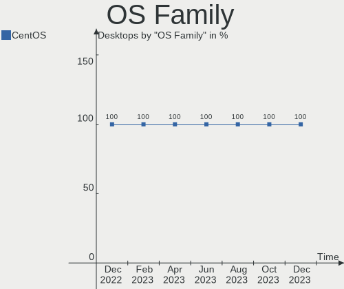

| Name   | Desktops | Percent |
|--------|----------|---------|
| CentOS | 74       | 100%    |

Kernel
------

Version of the Linux kernel

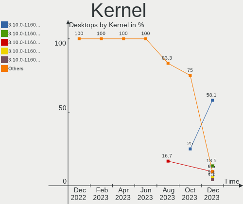

| Version                      | Desktops | Percent |
|------------------------------|----------|---------|
| 3.10.0-1160.102.1.el7.x86_64 | 43       | 58.11%  |
| 3.10.0-1160.90.1.el7.x86_64  | 10       | 13.51%  |
| 3.10.0-1160.95.1.el7.x86_64  | 7        | 9.46%   |
| 3.10.0-1160.45.1.el7.x86_64  | 4        | 5.41%   |
| 3.10.0-1160.88.1.el7.x86_64  | 3        | 4.05%   |
| 5.14.0-391.el9.x86_64        | 2        | 2.7%    |
| 3.10.0-1160.83.1.el7.x86_64  | 2        | 2.7%    |
| 3.10.0-1160.105.1.el7.x86_64 | 2        | 2.7%    |
| 5.14.0-390.el9.x86_64        | 1        | 1.35%   |

Kernel Family
-------------

Linux kernel without a distro release

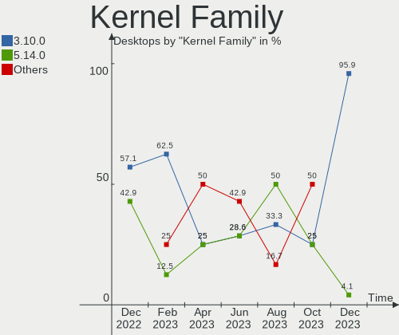

| Version | Desktops | Percent |
|---------|----------|---------|
| 3.10.0  | 71       | 95.95%  |
| 5.14.0  | 3        | 4.05%   |

Kernel Major Ver.
-----------------

Linux kernel major version

| Version | Desktops | Percent |
|---------|----------|---------|
| 3.10    | 71       | 95.95%  |
| 5.14    | 3        | 4.05%   |

Arch
----

OS architecture (x86_64, i586, etc.)

| Name   | Desktops | Percent |
|--------|----------|---------|
| x86_64 | 74       | 100%    |

DE
--

Desktop Environment

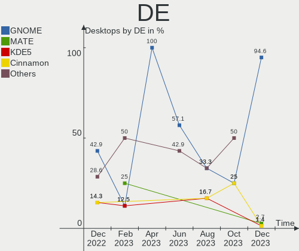

| Name     | Desktops | Percent |
|----------|----------|---------|
| GNOME    | 70       | 94.59%  |
| MATE     | 2        | 2.7%    |
| KDE5     | 1        | 1.35%   |
| Cinnamon | 1        | 1.35%   |

Display Server
--------------

X11 or Wayland

| Name    | Desktops | Percent |
|---------|----------|---------|
| X11     | 72       | 97.3%   |
| Wayland | 2        | 2.7%    |

Display Manager
---------------

SDDM, LightDM, etc.

| Name    | Desktops | Percent |
|---------|----------|---------|
| GDM     | 69       | 93.24%  |
| Unknown | 3        | 4.05%   |
| LightDM | 2        | 2.7%    |

OS Lang
-------

Language

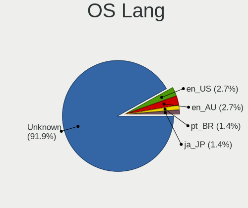

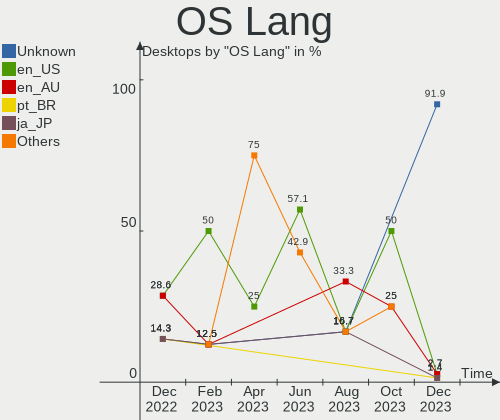

| Lang    | Desktops | Percent |
|---------|----------|---------|
| Unknown | 68       | 91.89%  |
| en_US   | 2        | 2.7%    |
| en_AU   | 2        | 2.7%    |
| pt_BR   | 1        | 1.35%   |
| ja_JP   | 1        | 1.35%   |

Boot Mode
---------

EFI or BIOS

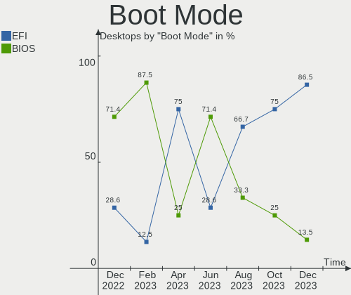

| Mode | Desktops | Percent |
|------|----------|---------|
| EFI  | 64       | 86.49%  |
| BIOS | 10       | 13.51%  |

Filesystem
----------

Type of filesystem

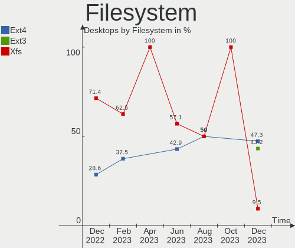

| Type | Desktops | Percent |
|------|----------|---------|
| Ext4 | 35       | 47.3%   |
| Ext3 | 32       | 43.24%  |
| Xfs  | 7        | 9.46%   |

Part. scheme
------------

Scheme of partitioning

| Type    | Desktops | Percent |
|---------|----------|---------|
| GPT     | 63       | 85.14%  |
| MBR     | 9        | 12.16%  |
| Unknown | 2        | 2.7%    |

Dual Boot with Linux/BSD
------------------------

Hosting more than one Linux/BSD

| Dual boot | Desktops | Percent |
|-----------|----------|---------|
| No        | 73       | 98.65%  |
| Yes       | 1        | 1.35%   |

Dual Boot (Win)
---------------

Hosting Linux and Windows

| Dual boot | Desktops | Percent |
|-----------|----------|---------|
| No        | 74       | 100%    |

Board
-----

Vendor
------

Motherboard manufacturer

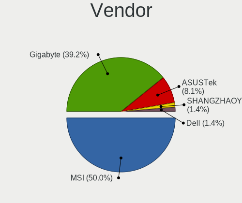

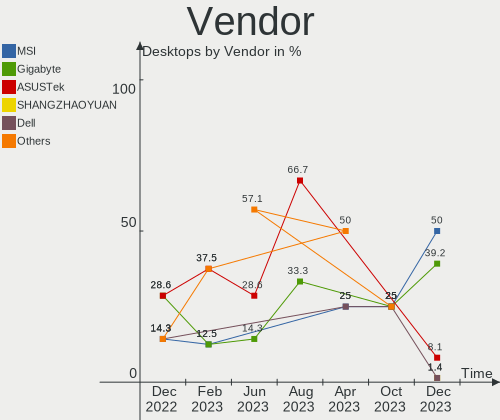

| Name                | Desktops | Percent |
|---------------------|----------|---------|
| MSI                 | 37       | 50%     |
| Gigabyte Technology | 29       | 39.19%  |
| ASUSTek Computer    | 6        | 8.11%   |
| SHANGZHAOYUAN       | 1        | 1.35%   |
| Dell                | 1        | 1.35%   |

Model
-----

Motherboard model

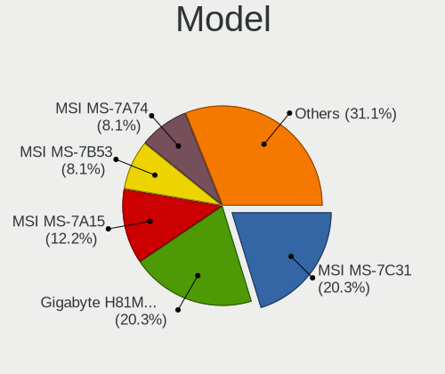

| Name                        | Desktops | Percent |
|-----------------------------|----------|---------|
| MSI MS-7C31                 | 15       | 20.27%  |
| Gigabyte H81M-S2H           | 15       | 20.27%  |
| MSI MS-7A15                 | 9        | 12.16%  |
| MSI MS-7B53                 | 6        | 8.11%   |
| MSI MS-7A74                 | 6        | 8.11%   |
| Gigabyte H81M-DS2           | 4        | 5.41%   |
| ASUS H110M-K                | 4        | 5.41%   |
| Gigabyte H81M-S2PV          | 3        | 4.05%   |
| Gigabyte B560M AORUS PRO    | 2        | 2.7%    |
| Gigabyte B360M-HD3          | 2        | 2.7%    |
| SHANGZHAOYUAN B85M-PRO V1.1 | 1        | 1.35%   |
| MSI MS-7E01                 | 1        | 1.35%   |
| Gigabyte H81M-S2PH          | 1        | 1.35%   |
| Gigabyte EP45-DS3L          | 1        | 1.35%   |
| Gigabyte B250M-HD3          | 1        | 1.35%   |
| Dell OptiPlex 7010          | 1        | 1.35%   |
| ASUS PRIME H670-PLUS D4     | 1        | 1.35%   |
| ASUS M5A78L-M LX V2         | 1        | 1.35%   |

Model Family
------------

Motherboard model prefix

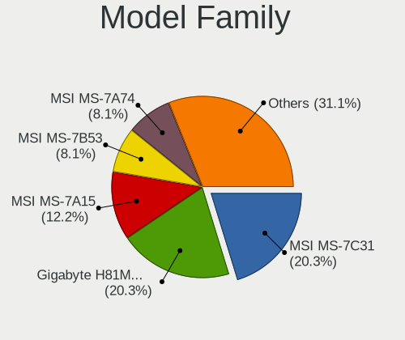

| Name                   | Desktops | Percent |
|------------------------|----------|---------|
| MSI MS-7C31            | 15       | 20.27%  |
| Gigabyte H81M-S2H      | 15       | 20.27%  |
| MSI MS-7A15            | 9        | 12.16%  |
| MSI MS-7B53            | 6        | 8.11%   |
| MSI MS-7A74            | 6        | 8.11%   |
| Gigabyte H81M-DS2      | 4        | 5.41%   |
| ASUS H110M-K           | 4        | 5.41%   |
| Gigabyte H81M-S2PV     | 3        | 4.05%   |
| Gigabyte B560M         | 2        | 2.7%    |
| Gigabyte B360M-HD3     | 2        | 2.7%    |
| SHANGZHAOYUAN B85M-PRO | 1        | 1.35%   |
| MSI MS-7E01            | 1        | 1.35%   |
| Gigabyte H81M-S2PH     | 1        | 1.35%   |
| Gigabyte EP45-DS3L     | 1        | 1.35%   |
| Gigabyte B250M-HD3     | 1        | 1.35%   |
| Dell OptiPlex          | 1        | 1.35%   |
| ASUS PRIME             | 1        | 1.35%   |
| ASUS M5A78L-M          | 1        | 1.35%   |

MFG Year
--------

Motherboard manufacture year

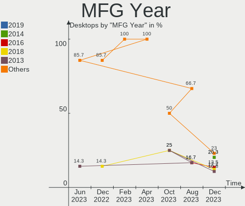

| Year | Desktops | Percent |
|------|----------|---------|
| 2019 | 15       | 20.27%  |
| 2014 | 15       | 20.27%  |
| 2016 | 10       | 13.51%  |
| 2018 | 9        | 12.16%  |
| 2013 | 8        | 10.81%  |
| 2017 | 6        | 8.11%   |
| 2015 | 4        | 5.41%   |
| 2021 | 3        | 4.05%   |
| 2022 | 2        | 2.7%    |
| 2011 | 1        | 1.35%   |
| 2008 | 1        | 1.35%   |

Form Factor
-----------

Physical design of the computer

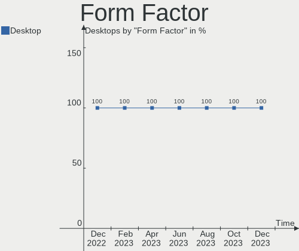

| Name    | Desktops | Percent |
|---------|----------|---------|
| Desktop | 74       | 100%    |

Secure Boot
-----------

Enabled or disabled

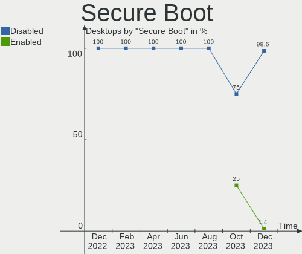

| State    | Desktops | Percent |
|----------|----------|---------|
| Disabled | 73       | 98.65%  |
| Enabled  | 1        | 1.35%   |

Coreboot
--------

Have coreboot on board

| Used | Desktops | Percent |
|------|----------|---------|
| No   | 74       | 100%    |

RAM Size
--------

Total RAM memory

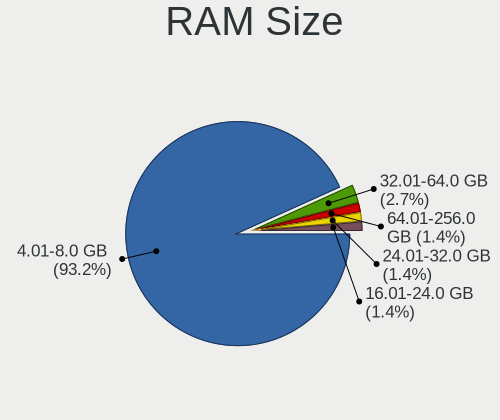

| Size in GB  | Desktops | Percent |
|-------------|----------|---------|
| 4.01-8.0    | 69       | 93.24%  |
| 32.01-64.0  | 2        | 2.7%    |
| 24.01-32.0  | 1        | 1.35%   |
| 64.01-256.0 | 1        | 1.35%   |
| 16.01-24.0  | 1        | 1.35%   |

RAM Used
--------

Used RAM memory

| Used GB    | Desktops | Percent |
|------------|----------|---------|
| 1.01-2.0   | 40       | 54.05%  |
| 0.51-1.0   | 24       | 32.43%  |
| 3.01-4.0   | 4        | 5.41%   |
| 2.01-3.0   | 4        | 5.41%   |
| 4.01-8.0   | 1        | 1.35%   |
| 16.01-24.0 | 1        | 1.35%   |

Total Drives
------------

Number of drives on board

| Drives | Desktops | Percent |
|--------|----------|---------|
| 1      | 70       | 94.59%  |
| 6      | 1        | 1.35%   |
| 4      | 1        | 1.35%   |
| 3      | 1        | 1.35%   |
| 2      | 1        | 1.35%   |

Has CD-ROM
----------

Has CD-ROM on board

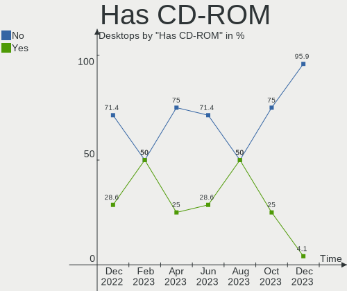

| Presented | Desktops | Percent |
|-----------|----------|---------|
| No        | 71       | 95.95%  |
| Yes       | 3        | 4.05%   |

Has Ethernet
------------

Has Ethernet on board

| Presented | Desktops | Percent |
|-----------|----------|---------|
| Yes       | 74       | 100%    |

Has WiFi
--------

Has WiFi module

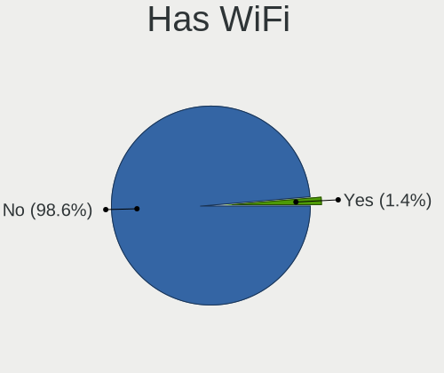

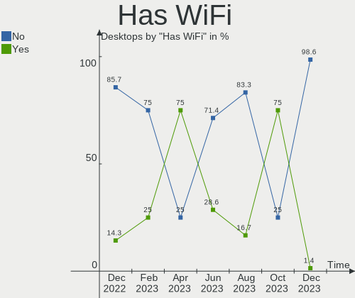

| Presented | Desktops | Percent |
|-----------|----------|---------|
| No        | 73       | 98.65%  |
| Yes       | 1        | 1.35%   |

Has Bluetooth
-------------

Has Bluetooth module

| Presented | Desktops | Percent |
|-----------|----------|---------|
| No        | 73       | 98.65%  |
| Yes       | 1        | 1.35%   |

Location
--------

Country
-------

Geographic location (country)

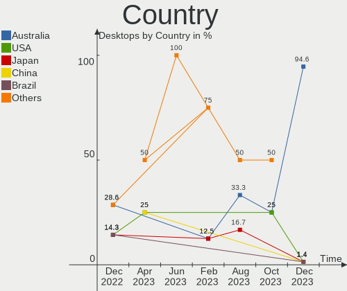

| Country   | Desktops | Percent |
|-----------|----------|---------|
| Australia | 70       | 94.59%  |
| USA       | 1        | 1.35%   |
| Japan     | 1        | 1.35%   |
| China     | 1        | 1.35%   |
| Brazil    | 1        | 1.35%   |

City
----

Geographic location (city)

| City         | Desktops | Percent |
|--------------|----------|---------|
| Melbourne    | 69       | 93.24%  |
| Sydney       | 1        | 1.35%   |
| Porto Alegre | 1        | 1.35%   |
| Nagoya       | 1        | 1.35%   |
| Hangzhou     | 1        | 1.35%   |
| Durham       | 1        | 1.35%   |

Drives
------

Drive Vendor
------------

Hard drive vendors

| Vendor              | Desktops | Drives | Percent |
|---------------------|----------|--------|---------|
| WDC                 | 68       | 69     | 87.18%  |
| Seagate             | 4        | 4      | 5.13%   |
| Toshiba             | 1        | 2      | 1.28%   |
| SanDisk             | 1        | 2      | 1.28%   |
| Samsung Electronics | 1        | 5      | 1.28%   |
| Kingston            | 1        | 1      | 1.28%   |
| Intel               | 1        | 1      | 1.28%   |
| Crucial             | 1        | 2      | 1.28%   |

Drive Model
-----------

Hard drive models

| Model                          | Desktops | Percent |
|--------------------------------|----------|---------|
| WDC WD10EZEX-08WN4A0 1TB       | 30       | 37.5%   |
| WDC WD10EZEX-00MFCA0 1TB       | 18       | 22.5%   |
| WDC WD10EZEX-00WN4A0 1TB       | 9        | 11.25%  |
| WDC WD10EZEX-75WN4A0 1TB       | 4        | 5%      |
| WDC WD10EZEX-60WN4A0 1TB       | 4        | 5%      |
| WDC WD10EZEX-00BBHA0 1TB       | 2        | 2.5%    |
| Seagate ST1000DM010-2EP102 1TB | 2        | 2.5%    |
| WDC WD10EZEX-22MFCA0 1TB       | 1        | 1.25%   |
| WDC WD Blue SA510 2.5 500GB    | 1        | 1.25%   |
| Toshiba DT01ACA200 2TB         | 1        | 1.25%   |
| Seagate ST2000VN004-2E4164 2TB | 1        | 1.25%   |
| Seagate ST1000DM003-1SB10C 1TB | 1        | 1.25%   |
| Sandisk WD_BLACK SN770 1TB     | 1        | 1.25%   |
| SanDisk SDSSDH3 1T00 1TB       | 1        | 1.25%   |
| Samsung HD501LJ 500GB          | 1        | 1.25%   |
| Kingston SFYRD2000G 2TB        | 1        | 1.25%   |
| Intel SSDSA2M080G2LE 80GB      | 1        | 1.25%   |
| Crucial CT525MX300SSD1 528GB   | 1        | 1.25%   |

HDD Vendor
----------

Hard disk drive vendors

| Vendor              | Desktops | Drives | Percent |
|---------------------|----------|--------|---------|
| WDC                 | 67       | 68     | 91.78%  |
| Seagate             | 4        | 4      | 5.48%   |
| Toshiba             | 1        | 2      | 1.37%   |
| Samsung Electronics | 1        | 5      | 1.37%   |

SSD Vendor
----------

Solid state drive vendors

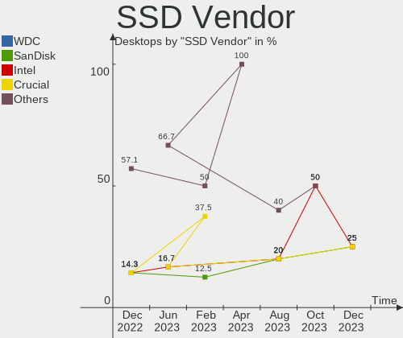

| Vendor  | Desktops | Drives | Percent |
|---------|----------|--------|---------|
| WDC     | 1        | 1      | 25%     |
| SanDisk | 1        | 1      | 25%     |
| Intel   | 1        | 1      | 25%     |
| Crucial | 1        | 2      | 25%     |

Drive Kind
----------

HDD or SSD

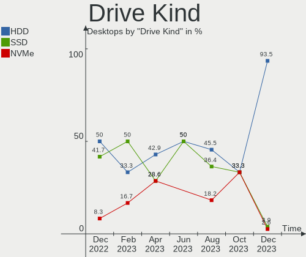

| Kind | Desktops | Drives | Percent |
|------|----------|--------|---------|
| HDD  | 72       | 79     | 93.51%  |
| SSD  | 3        | 5      | 3.9%    |
| NVMe | 2        | 2      | 2.6%    |

Drive Connector
---------------

SATA, SAS, NVMe, etc.

| Type | Desktops | Drives | Percent |
|------|----------|--------|---------|
| SATA | 73       | 84     | 97.33%  |
| NVMe | 2        | 2      | 2.67%   |

Drive Size
----------

Size of hard drive

| Size in TB | Desktops | Drives | Percent |
|------------|----------|--------|---------|
| 0.51-1.0   | 70       | 74     | 94.59%  |
| 1.01-2.0   | 2        | 3      | 2.7%    |
| 0.01-0.5   | 2        | 7      | 2.7%    |

Space Total
-----------

Amount of disk space available on the file system

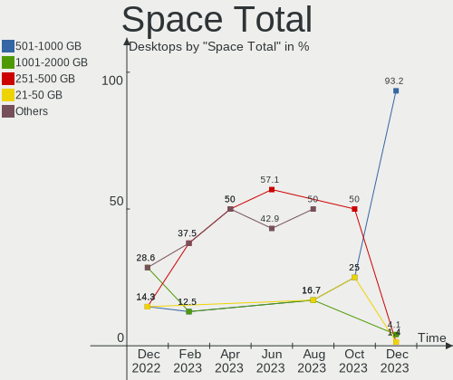

| Size in GB | Desktops | Percent |
|------------|----------|---------|
| 501-1000   | 69       | 93.24%  |
| 1001-2000  | 3        | 4.05%   |
| 251-500    | 1        | 1.35%   |
| 21-50      | 1        | 1.35%   |

Space Used
----------

Amount of used disk space

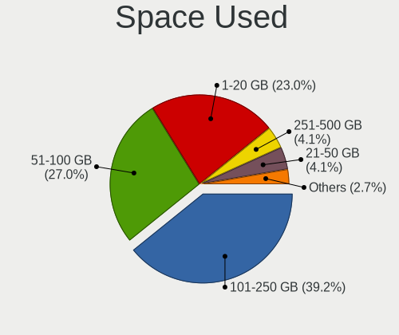

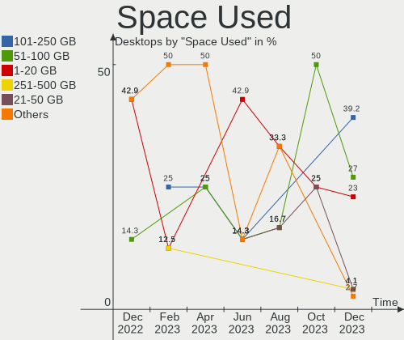

| Used GB  | Desktops | Percent |
|----------|----------|---------|
| 101-250  | 29       | 39.19%  |
| 51-100   | 20       | 27.03%  |
| 1-20     | 17       | 22.97%  |
| 251-500  | 3        | 4.05%   |
| 21-50    | 3        | 4.05%   |
| 501-1000 | 2        | 2.7%    |

Malfunc. Drives
---------------

Drive models with a malfunction

| Model                     | Desktops | Drives | Percent |
|---------------------------|----------|--------|---------|
| WDC WD10EZEX-08WN4A0 1TB  | 2        | 2      | 66.67%  |
| Intel SSDSA2M080G2LE 80GB | 1        | 1      | 33.33%  |

Malfunc. Drive Vendor
---------------------

Vendors of faulty drives

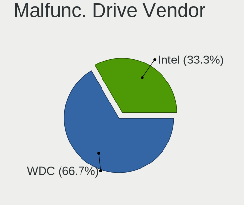

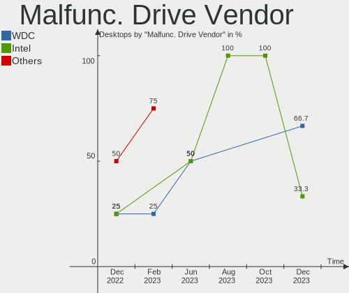

| Vendor | Desktops | Drives | Percent |
|--------|----------|--------|---------|
| WDC    | 2        | 2      | 66.67%  |
| Intel  | 1        | 1      | 33.33%  |

Malfunc. HDD Vendor
-------------------

Vendors of faulty HDD drives

| Vendor | Desktops | Drives | Percent |
|--------|----------|--------|---------|
| WDC    | 2        | 2      | 100%    |

Malfunc. Drive Kind
-------------------

Kinds of faulty drives

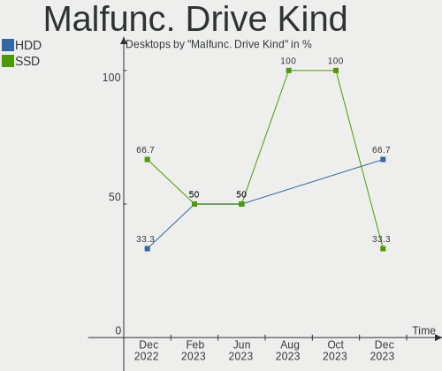

| Kind | Desktops | Drives | Percent |
|------|----------|--------|---------|
| HDD  | 2        | 2      | 66.67%  |
| SSD  | 1        | 1      | 33.33%  |

Failed Drives
-------------

Failed drive models

Zero info for selected period =(

Failed Drive Vendor
-------------------

Failed drive vendors

Zero info for selected period =(

Drive Status
------------

Number of failed and malfunc. drives

| Status   | Desktops | Drives | Percent |
|----------|----------|--------|---------|
| Works    | 70       | 78     | 93.33%  |
| Malfunc  | 3        | 3      | 4%      |
| Detected | 2        | 5      | 2.67%   |

Storage controller
------------------

Storage Vendor
--------------

Storage controller vendors

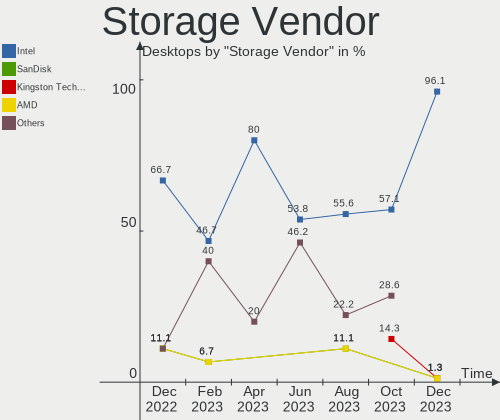

| Vendor                      | Desktops | Percent |
|-----------------------------|----------|---------|
| Intel                       | 73       | 96.05%  |
| SanDisk                     | 1        | 1.32%   |
| Kingston Technology Company | 1        | 1.32%   |
| AMD                         | 1        | 1.32%   |

Storage Model
-------------

Storage controller models

| Model                                                                          | Desktops | Percent |
|--------------------------------------------------------------------------------|----------|---------|
| Intel 8 Series/C220 Series Chipset Family 6-port SATA Controller 1 [AHCI mode] | 24       | 30.77%  |
| Intel 200 Series PCH SATA controller [AHCI mode]                               | 23       | 29.49%  |
| Intel Q170/Q150/B150/H170/H110/Z170/CM236 Chipset SATA Controller [AHCI Mode]  | 13       | 16.67%  |
| Intel Cannon Lake PCH SATA AHCI Controller                                     | 8        | 10.26%  |
| Intel 500 Series Chipset Family SATA AHCI Controller                           | 2        | 2.56%   |
| SanDisk WD Black SN770 / PC SN740 256GB / PC SN560 (DRAM-less) NVMe SSD        | 1        | 1.28%   |
| Kingston Company KC3000/FURY Renegade NVMe SSD E18                             | 1        | 1.28%   |
| Intel Alder Lake-S PCH SATA Controller [AHCI Mode]                             | 1        | 1.28%   |
| Intel 82801JI (ICH10 Family) SATA AHCI Controller                              | 1        | 1.28%   |
| Intel 700 Series Chipset Family SATA AHCI Controller                           | 1        | 1.28%   |
| Intel 7 Series/C210 Series Chipset Family 6-port SATA Controller [AHCI mode]   | 1        | 1.28%   |
| AMD SB7x0/SB8x0/SB9x0 SATA Controller [IDE mode]                               | 1        | 1.28%   |
| AMD SB7x0/SB8x0/SB9x0 IDE Controller                                           | 1        | 1.28%   |

Storage Kind
------------

Kind of storage controller (IDE, SATA, NVMe, SAS, ...)

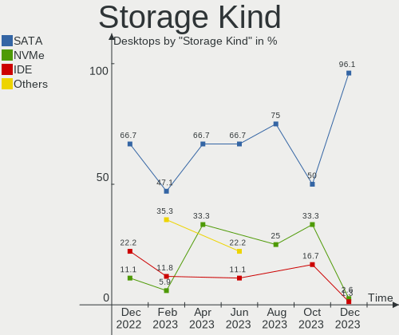

| Kind | Desktops | Percent |
|------|----------|---------|
| SATA | 74       | 96.1%   |
| NVMe | 2        | 2.6%    |
| IDE  | 1        | 1.3%    |

Processor
---------

CPU Vendor
----------

Processor vendors

| Vendor | Desktops | Percent |
|--------|----------|---------|
| Intel  | 73       | 98.65%  |
| AMD    | 1        | 1.35%   |

CPU Model
---------

Processor models

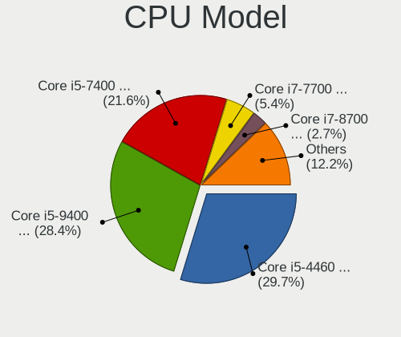

| Model                                | Desktops | Percent |
|--------------------------------------|----------|---------|
| Intel Core i5-4460 CPU @ 3.20GHz     | 22       | 29.73%  |
| Intel Core i5-9400 CPU @ 2.90GHz     | 21       | 28.38%  |
| Intel Core i5-7400 CPU @ 3.00GHz     | 16       | 21.62%  |
| Intel Core i7-7700 CPU @ 3.60GHz     | 4        | 5.41%   |
| Intel Core i7-8700 CPU @ 3.20GHz     | 2        | 2.7%    |
| Intel Core i5-10400 CPU @ 2.90GHz    | 2        | 2.7%    |
| Intel Core i7-4770K CPU @ 3.50GHz    | 1        | 1.35%   |
| Intel Core i7-3770 CPU @ 3.40GHz     | 1        | 1.35%   |
| Intel Core i3-4160 CPU @ 3.60GHz     | 1        | 1.35%   |
| Intel Core 2 Duo CPU E8400 @ 3.00GHz | 1        | 1.35%   |
| Intel 13th Gen Core i7-13700K        | 1        | 1.35%   |
| Intel 12th Gen Core i5-12600K        | 1        | 1.35%   |
| AMD FX-4130 Quad-Core Processor      | 1        | 1.35%   |

CPU Model Family
----------------

Processor model prefix

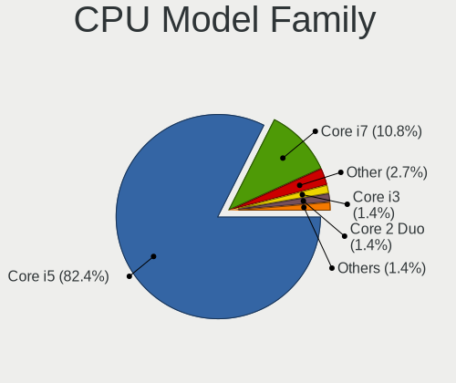

| Model            | Desktops | Percent |
|------------------|----------|---------|
| Intel Core i5    | 61       | 82.43%  |
| Intel Core i7    | 8        | 10.81%  |
| Other            | 2        | 2.7%    |
| Intel Core i3    | 1        | 1.35%   |
| Intel Core 2 Duo | 1        | 1.35%   |
| AMD FX           | 1        | 1.35%   |

CPU Cores
---------

Number of processor cores

| Number | Desktops | Percent |
|--------|----------|---------|
| 4      | 44       | 59.46%  |
| 6      | 25       | 33.78%  |
| 2      | 3        | 4.05%   |
| 16     | 1        | 1.35%   |
| 10     | 1        | 1.35%   |

CPU Sockets
-----------

Number of sockets

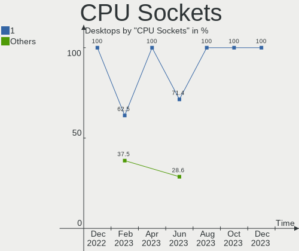

| Number | Desktops | Percent |
|--------|----------|---------|
| 1      | 74       | 100%    |

CPU Threads
-----------

Threads per core (Hyper-Threading)

| Number | Desktops | Percent |
|--------|----------|---------|
| 1      | 60       | 81.08%  |
| 2      | 14       | 18.92%  |

CPU Op-Modes
------------

CPU Operation Modes (32-bit, 64-bit)

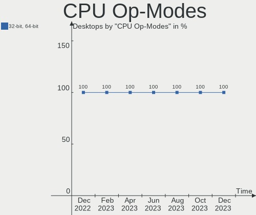

| Op mode        | Desktops | Percent |
|----------------|----------|---------|
| 32-bit, 64-bit | 74       | 100%    |

CPU Microcode
-------------

Microcode number

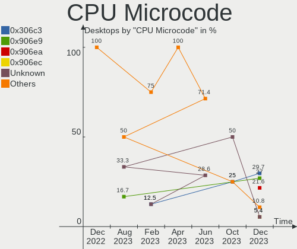

| Number     | Desktops | Percent |
|------------|----------|---------|
| 0x306c3    | 22       | 29.73%  |
| 0x906e9    | 20       | 27.03%  |
| 0x906ea    | 16       | 21.62%  |
| 0x906ec    | 4        | 5.41%   |
| Unknown    | 4        | 5.41%   |
| 0x906ed    | 3        | 4.05%   |
| 0xa0653    | 2        | 2.7%    |
| 0x306a9    | 1        | 1.35%   |
| 0x1067a    | 1        | 1.35%   |
| 0x0600063e | 1        | 1.35%   |

CPU Microarch
-------------

Microarchitecture

| Name             | Desktops | Percent |
|------------------|----------|---------|
| KabyLake         | 43       | 58.11%  |
| Haswell          | 24       | 32.43%  |
| CometLake        | 2        | 2.7%    |
| Alderlake Hybrid | 2        | 2.7%    |
| Penryn           | 1        | 1.35%   |
| IvyBridge        | 1        | 1.35%   |
| Bulldozer        | 1        | 1.35%   |

Graphics
--------

GPU Vendor
----------

Vendors of graphics cards

| Vendor | Desktops | Percent |
|--------|----------|---------|
| Intel  | 71       | 94.67%  |
| Nvidia | 3        | 4%      |
| AMD    | 1        | 1.33%   |

GPU Model
---------

Graphics card models

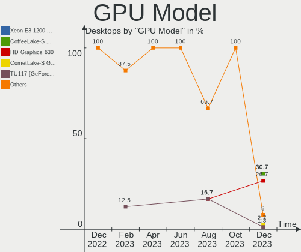

| Model                                                                       | Desktops | Percent |
|-----------------------------------------------------------------------------|----------|---------|
| Intel Xeon E3-1200 v3/4th Gen Core Processor Integrated Graphics Controller | 23       | 30.67%  |
| Intel CoffeeLake-S GT2 [UHD Graphics 630]                                   | 23       | 30.67%  |
| Intel HD Graphics 630                                                       | 20       | 26.67%  |
| Intel CometLake-S GT2 [UHD Graphics 630]                                    | 2        | 2.67%   |
| Nvidia TU117 [GeForce GTX 1650]                                             | 1        | 1.33%   |
| Nvidia GM107 [GeForce GTX 750 Ti]                                           | 1        | 1.33%   |
| Nvidia G72 [GeForce 7300 GS]                                                | 1        | 1.33%   |
| Intel Raptor Lake-S GT1 [UHD Graphics 770]                                  | 1        | 1.33%   |
| Intel IvyBridge GT2 [HD Graphics 4000]                                      | 1        | 1.33%   |
| Intel 4th Generation Core Processor Family Integrated Graphics Controller   | 1        | 1.33%   |
| AMD RS780L [Radeon 3000]                                                    | 1        | 1.33%   |

GPU Combo
---------

Combinations of graphics cards

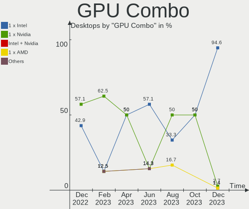

| Name           | Desktops | Percent |
|----------------|----------|---------|
| 1 x Intel      | 70       | 94.59%  |
| 1 x Nvidia     | 2        | 2.7%    |
| Intel + Nvidia | 1        | 1.35%   |
| 1 x AMD        | 1        | 1.35%   |

GPU Driver
----------

Free vs proprietary

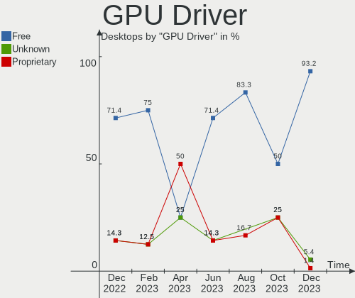

| Driver      | Desktops | Percent |
|-------------|----------|---------|
| Free        | 69       | 93.24%  |
| Unknown     | 4        | 5.41%   |
| Proprietary | 1        | 1.35%   |

GPU Memory
----------

Total video memory

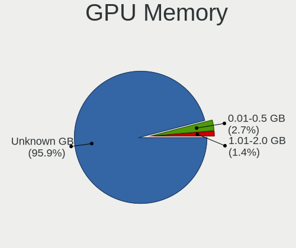

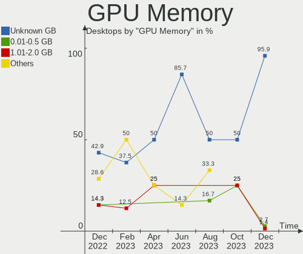

| Size in GB | Desktops | Percent |
|------------|----------|---------|
| Unknown    | 71       | 95.95%  |
| 0.01-0.5   | 2        | 2.7%    |
| 1.01-2.0   | 1        | 1.35%   |

Monitor
-------

Monitor Vendor
--------------

Monitor vendors

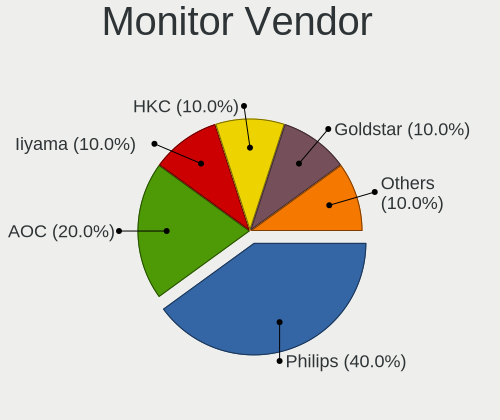

| Vendor   | Desktops | Percent |
|----------|----------|---------|
| Philips  | 4        | 40%     |
| AOC      | 2        | 20%     |
| Iiyama   | 1        | 10%     |
| HKC      | 1        | 10%     |
| Goldstar | 1        | 10%     |
| Dell     | 1        | 10%     |

Monitor Model
-------------

Monitor models

| Model                                                    | Desktops | Percent |
|----------------------------------------------------------|----------|---------|
| Philips PHL 246V5 PHLC0C5 1920x1080 531x299mm 24.0-inch  | 1        | 10%     |
| Philips PHL 243V5 PHLC0D1 1920x1080 521x293mm 23.5-inch  | 1        | 10%     |
| Philips PHL 241V8B PHLC314 1920x1080 527x296mm 23.8-inch | 1        | 10%     |
| Philips PHL 223V7 PHLC154 1920x1080 476x268mm 21.5-inch  | 1        | 10%     |
| Iiyama PL2888H IVM7106 1920x1080 620x340mm 27.8-inch     | 1        | 10%     |
| HKC 24N1 HKC2413 1920x1080 527x296mm 23.8-inch           | 1        | 10%     |
| Goldstar FULL HD GSM5ABB 1920x1080 480x270mm 21.7-inch   | 1        | 10%     |
| Dell P2317H DEL40F2 1920x1080 509x286mm 23.0-inch        | 1        | 10%     |
| AOC 2470W AOC2470 1920x1080 521x293mm 23.5-inch          | 1        | 10%     |
| AOC 2217 AOC2217 1680x1050 470x300mm 22.0-inch           | 1        | 10%     |

Monitor Resolution
------------------

Monitor screen resolution

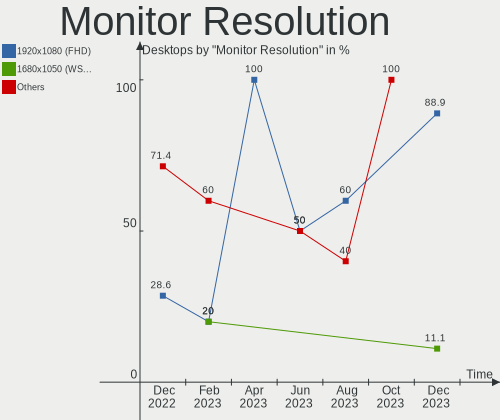

| Resolution         | Desktops | Percent |
|--------------------|----------|---------|
| 1920x1080 (FHD)    | 8        | 88.89%  |
| 1680x1050 (WSXGA+) | 1        | 11.11%  |

Monitor Diagonal
----------------

Diagonal size in inches

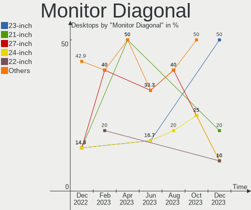

| Inches | Desktops | Percent |
|--------|----------|---------|
| 23     | 5        | 50%     |
| 21     | 2        | 20%     |
| 27     | 1        | 10%     |
| 24     | 1        | 10%     |
| 22     | 1        | 10%     |

Monitor Width
-------------

Physical width

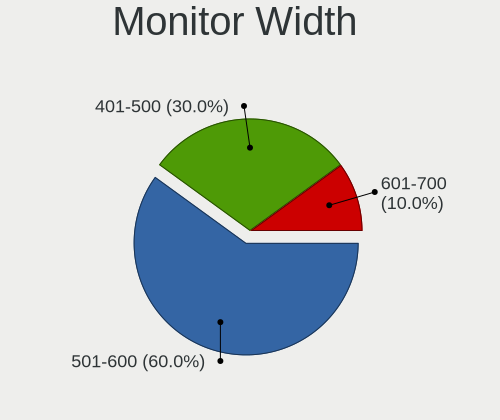

| Width in mm | Desktops | Percent |
|-------------|----------|---------|
| 501-600     | 6        | 60%     |
| 401-500     | 3        | 30%     |
| 601-700     | 1        | 10%     |

Aspect Ratio
------------

Proportional relationship between the width and the height

| Ratio | Desktops | Percent |
|-------|----------|---------|
| 16/9  | 8        | 88.89%  |
| 16/10 | 1        | 11.11%  |

Monitor Area
------------

Area in inch²

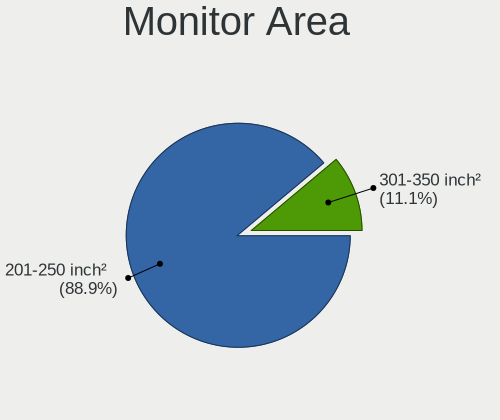

| Area in inch² | Desktops | Percent |
|----------------|----------|---------|
| 201-250        | 8        | 88.89%  |
| 301-350        | 1        | 11.11%  |

Pixel Density
-------------

Pixels per inch

| Density | Desktops | Percent |
|---------|----------|---------|
| 51-100  | 8        | 80%     |
| 101-120 | 2        | 20%     |

Multiple Monitors
-----------------

Total monitors connected

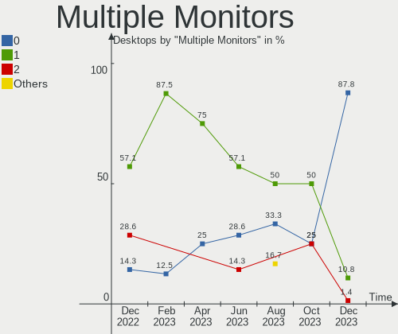

| Total | Desktops | Percent |
|-------|----------|---------|
| 0     | 65       | 87.84%  |
| 1     | 8        | 10.81%  |
| 2     | 1        | 1.35%   |

Network
-------

Net Controller Vendor
---------------------

Controller vendors

| Vendor                | Desktops | Percent |
|-----------------------|----------|---------|
| Realtek Semiconductor | 72       | 92.31%  |
| Intel                 | 4        | 5.13%   |
| D-Link System         | 1        | 1.28%   |
| Aquantia              | 1        | 1.28%   |

Net Controller Model
--------------------

Controller models

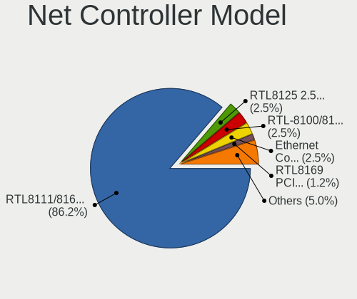

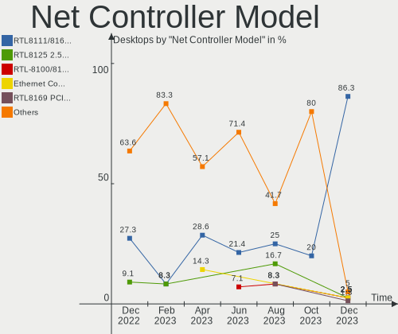

| Model                                                               | Desktops | Percent |
|---------------------------------------------------------------------|----------|---------|
| Realtek RTL8111/8168/8411 PCI Express Gigabit Ethernet Controller   | 69       | 86.25%  |
| Realtek RTL8125 2.5GbE Controller                                   | 2        | 2.5%    |
| Realtek RTL-8100/8101L/8139 PCI Fast Ethernet Adapter               | 2        | 2.5%    |
| Intel Ethernet Controller I225-V                                    | 2        | 2.5%    |
| Realtek RTL8169 PCI Gigabit Ethernet Controller                     | 1        | 1.25%   |
| Intel 82579LM Gigabit Network Connection (Lewisville)               | 1        | 1.25%   |
| Intel 700 Series Chipset Family Wi-Fi                               | 1        | 1.25%   |
| D-Link System RTL8139 Ethernet                                      | 1        | 1.25%   |
| Aquantia AQC113CS NBase-T/IEEE 802.3bz Ethernet Controller [AQtion] | 1        | 1.25%   |

Wireless Vendor
---------------

Wireless vendors

| Vendor | Desktops | Percent |
|--------|----------|---------|
| Intel  | 1        | 100%    |

Wireless Model
--------------

Wireless models

| Model                                 | Desktops | Percent |
|---------------------------------------|----------|---------|
| Intel 700 Series Chipset Family Wi-Fi | 1        | 100%    |

Ethernet Vendor
---------------

Ethernet vendors

| Vendor                | Desktops | Percent |
|-----------------------|----------|---------|
| Realtek Semiconductor | 72       | 93.51%  |
| Intel                 | 3        | 3.9%    |
| D-Link System         | 1        | 1.3%    |
| Aquantia              | 1        | 1.3%    |

Ethernet Model
--------------

Ethernet models

| Model                                                               | Desktops | Percent |
|---------------------------------------------------------------------|----------|---------|
| Realtek RTL8111/8168/8411 PCI Express Gigabit Ethernet Controller   | 69       | 87.34%  |
| Realtek RTL8125 2.5GbE Controller                                   | 2        | 2.53%   |
| Realtek RTL-8100/8101L/8139 PCI Fast Ethernet Adapter               | 2        | 2.53%   |
| Intel Ethernet Controller I225-V                                    | 2        | 2.53%   |
| Realtek RTL8169 PCI Gigabit Ethernet Controller                     | 1        | 1.27%   |
| Intel 82579LM Gigabit Network Connection (Lewisville)               | 1        | 1.27%   |
| D-Link System RTL8139 Ethernet                                      | 1        | 1.27%   |
| Aquantia AQC113CS NBase-T/IEEE 802.3bz Ethernet Controller [AQtion] | 1        | 1.27%   |

Net Controller Kind
-------------------

Ethernet, WiFi or modem

| Kind     | Desktops | Percent |
|----------|----------|---------|
| Ethernet | 74       | 98.67%  |
| WiFi     | 1        | 1.33%   |

Used Controller
---------------

Currently used network controller

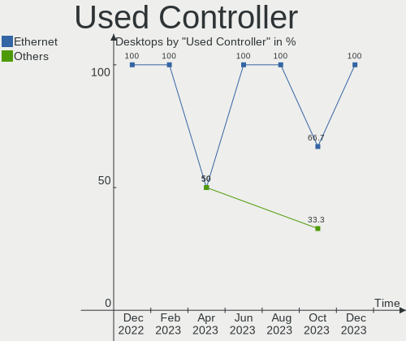

| Kind     | Desktops | Percent |
|----------|----------|---------|
| Ethernet | 74       | 100%    |

NICs
----

Total network controllers on board

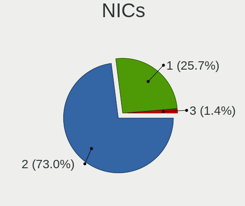

| Total | Desktops | Percent |
|-------|----------|---------|
| 2     | 54       | 72.97%  |
| 1     | 19       | 25.68%  |
| 3     | 1        | 1.35%   |

IPv6
----

IPv6 vs IPv4

| Used | Desktops | Percent |
|------|----------|---------|
| No   | 71       | 95.95%  |
| Yes  | 3        | 4.05%   |

Bluetooth
---------

Bluetooth Vendor
----------------

Controller vendors

| Vendor | Desktops | Percent |
|--------|----------|---------|
| Intel  | 1        | 100%    |

Bluetooth Model
---------------

Controller models

| Model                  | Desktops | Percent |
|------------------------|----------|---------|
| Intel Bluetooth Device | 1        | 100%    |

Sound
-----

Sound Vendor
------------

Sound card vendors

| Vendor | Desktops | Percent |
|--------|----------|---------|
| Intel  | 72       | 96%     |
| Nvidia | 2        | 2.67%   |
| AMD    | 1        | 1.33%   |

Sound Model
-----------

Sound card models

| Model                                                               | Desktops | Percent |
|---------------------------------------------------------------------|----------|---------|
| Intel Xeon E3-1200 v3/4th Gen Core Processor HD Audio Controller    | 24       | 24%     |
| Intel 8 Series/C220 Series Chipset High Definition Audio Controller | 24       | 24%     |
| Intel 200 Series PCH HD Audio                                       | 23       | 23%     |
| Intel 100 Series/C230 Series Chipset Family HD Audio Controller     | 13       | 13%     |
| Intel Cannon Lake PCH cAVS                                          | 8        | 8%      |
| Intel Smart Sound Technology (SST) Audio Controller                 | 2        | 2%      |
| Nvidia TU107 GeForce GTX 1650 High Definition Audio Controller      | 1        | 1%      |
| Nvidia GM107 High Definition Audio Controller [GeForce 940MX]       | 1        | 1%      |
| Intel Alder Lake-S HD Audio Controller                              | 1        | 1%      |
| Intel 700 Series Chipset Family Precise Touch and Stylus Port #1    | 1        | 1%      |
| Intel 7 Series/C216 Chipset Family High Definition Audio Controller | 1        | 1%      |
| AMD SBx00 Azalia (Intel HDA)                                        | 1        | 1%      |

Memory
------

Memory Vendor
-------------

Memory module vendors

| Vendor            | Desktops | Percent |
|-------------------|----------|---------|
| Kingston          | 22       | 30.99%  |
| Crucial           | 16       | 22.54%  |
| G.Skill           | 13       | 18.31%  |
| GeIL              | 9        | 12.68%  |
| Team              | 4        | 5.63%   |
| Unknown           | 2        | 2.82%   |
| PNY               | 2        | 2.82%   |
| SK hynix          | 1        | 1.41%   |
| Apacer            | 1        | 1.41%   |
| A-DATA Technology | 1        | 1.41%   |

Memory Model
------------

Memory module models

| Model                                                      | Desktops | Percent |
|------------------------------------------------------------|----------|---------|
| Kingston RAM CL16-16-16 D4-2400 8192MB DIMM DDR4 2400MT/s  | 9        | 12.68%  |
| GeIL RAM CL11-11-11 D3-1600 4GB DIMM 1600MT/s              | 9        | 12.68%  |
| G.Skill RAM F4-2666C19-8GIS 8GB DIMM DDR4 3000MT/s         | 9        | 12.68%  |
| Kingston RAM 9905678-173.A00G 8192MB DIMM DDR4 2400MT/s    | 5        | 7.04%   |
| Crucial RAM CT8G4DFD8213.C16FBD2 8192MB DIMM DDR4 2500MT/s | 5        | 7.04%   |
| Team RAM TEAMGROUP-UD4-2400 16GB DIMM DDR4 2400MT/s        | 4        | 5.63%   |
| G.Skill RAM F3-1600C11-8GNT 8GB DIMM DDR3 1600MT/s         | 4        | 5.63%   |
| Crucial RAM CT8G4DFS8213.C8FDD1 8192MB DIMM DDR4 2400MT/s  | 4        | 5.63%   |
| Kingston RAM 99U5471-058.A00LF 8192MB DIMM DDR3 1600MT/s   | 3        | 4.23%   |
| Crucial RAM CT102464BD160B.M16 8GB DIMM DDR3 1600MT/s      | 3        | 4.23%   |
| PNY RAM M4U08S681LJJJ43-12 8192MB DIMM DDR4 2666MT/s       | 2        | 2.82%   |
| Kingston RAM KHX1600C9D3/8GX 8192MB DIMM DDR3 2133MT/s     | 2        | 2.82%   |
| Crucial RAM CT8G4DFS8266.C8FN 8192MB DIMM DDR4 2667MT/s    | 2        | 2.82%   |
| Unknown RAM Module 8192MB DIMM 667MT/s                     | 1        | 1.41%   |
| Unknown RAM Module 2048MB DIMM 800MT/s                     | 1        | 1.41%   |
| SK hynix RAM HMT351U6CFR8C-PB 4GB DIMM DDR3 1800MT/s       | 1        | 1.41%   |
| Kingston RAM 99U5471-054.A00LF 8GB DIMM DDR3 1600MT/s      | 1        | 1.41%   |
| Kingston RAM 9905702-137.A00G 8GB DIMM DDR4 2400MT/s       | 1        | 1.41%   |
| Kingston RAM 9905702-119.A00G 8GB DIMM DDR4 2667MT/s       | 1        | 1.41%   |
| Crucial RAM CT8G4DFS8213.M8FB 8192MB DIMM DDR4 2133MT/s    | 1        | 1.41%   |
| Crucial RAM BLS8G3D1609DS1S00. 8GB DIMM DDR3 1800MT/s      | 1        | 1.41%   |
| Apacer RAM 78.C1GET.4210C 8192MB DIMM DDR3 1600MT/s        | 1        | 1.41%   |
| A-DATA RAM Module 8192MB DIMM DDR3 1600MT/s                | 1        | 1.41%   |

Memory Kind
-----------

Memory module kinds

| Kind    | Desktops | Percent |
|---------|----------|---------|
| DDR4    | 43       | 61.43%  |
| DDR3    | 25       | 35.71%  |
| Unknown | 2        | 2.86%   |

Memory Form Factor
------------------

Physical design of the memory module

| Name | Desktops | Percent |
|------|----------|---------|
| DIMM | 70       | 100%    |

Memory Size
-----------

Memory module size

| Size  | Desktops | Percent |
|-------|----------|---------|
| 8192  | 56       | 78.87%  |
| 16384 | 13       | 18.31%  |
| 4096  | 1        | 1.41%   |
| 2048  | 1        | 1.41%   |

Memory Speed
------------

Memory module speed

| Speed | Desktops | Percent |
|-------|----------|---------|
| 2400  | 23       | 32.39%  |
| 1600  | 22       | 30.99%  |
| 3000  | 9        | 12.68%  |
| 2500  | 5        | 7.04%   |
| 2667  | 3        | 4.23%   |
| 2133  | 3        | 4.23%   |
| 2666  | 2        | 2.82%   |
| 1800  | 2        | 2.82%   |
| 800   | 1        | 1.41%   |
| 667   | 1        | 1.41%   |

Printers & scanners
-------------------

Printer Vendor
--------------

Printer device vendors

Zero info for selected period =(

Printer Model
-------------

Printer device models

Zero info for selected period =(

Scanner Vendor
--------------

Scanner device vendors

Zero info for selected period =(

Scanner Model
-------------

Scanner device models

Zero info for selected period =(

Camera
------

Camera Vendor
-------------

Camera device vendors

Zero info for selected period =(

Camera Model
------------

Camera device models

Zero info for selected period =(

Security
--------

Fingerprint Vendor
------------------

Fingerprint sensor vendors

Zero info for selected period =(

Fingerprint Model
-----------------

Fingerprint sensor models

Zero info for selected period =(

Chipcard Vendor
---------------

Chipcard module vendors

Zero info for selected period =(

Chipcard Model
--------------

Chipcard module models

Zero info for selected period =(

Unsupported
-----------

Unsupported Devices
-------------------

Total unsupported devices on board

| Total | Desktops | Percent |
|-------|----------|---------|
| 0     | 70       | 94.59%  |
| 2     | 2        | 2.7%    |
| 1     | 2        | 2.7%    |

Unsupported Device Types
------------------------

Types of unsupported devices

| Type                     | Desktops | Percent |
|--------------------------|----------|---------|
| Graphics card            | 4        | 66.67%  |
| Communication controller | 2        | 33.33%  |

