CentOS Hardware Trends (Desktops)
---------------------------------

A project to identify most popular hardware characteristics and track their change
over time based on data collected by CentOS users at https://Linux-Hardware.org.

Anyone can contribute to this report by the [hw-probe](https://github.com/linuxhw/hw-probe) tool:

    sudo -E hw-probe -all -upload

Full-feature report is available here: https://linux-hardware.org/?view=trends&formfactor=desktop

Period: Aug, 2021.

Contents
--------

* [ System ](#system)
  - [ OS                       ](#os)
  - [ OS Family                ](#os-family)
  - [ Kernel                   ](#kernel)
  - [ Kernel Family            ](#kernel-family)
  - [ Kernel Major Ver.        ](#kernel-major-ver)
  - [ Arch                     ](#arch)
  - [ DE                       ](#de)
  - [ Display Server           ](#display-server)
  - [ Display Manager          ](#display-manager)
  - [ OS Lang                  ](#os-lang)
  - [ Boot Mode                ](#boot-mode)
  - [ Filesystem               ](#filesystem)
  - [ Part. scheme             ](#part-scheme)
  - [ Dual Boot with Linux/BSD ](#dual-boot-with-linuxbsd)
  - [ Dual Boot (Win)          ](#dual-boot-win)

* [ Board ](#board)
  - [ Vendor                   ](#vendor)
  - [ Model                    ](#model)
  - [ Model Family             ](#model-family)
  - [ MFG Year                 ](#mfg-year)
  - [ Form Factor              ](#form-factor)
  - [ Secure Boot              ](#secure-boot)
  - [ Coreboot                 ](#coreboot)
  - [ RAM Size                 ](#ram-size)
  - [ RAM Used                 ](#ram-used)
  - [ Total Drives             ](#total-drives)
  - [ Has CD-ROM               ](#has-cd-rom)
  - [ Has Ethernet             ](#has-ethernet)
  - [ Has WiFi                 ](#has-wifi)
  - [ Has Bluetooth            ](#has-bluetooth)

* [ Location ](#location)
  - [ Country                  ](#country)
  - [ City                     ](#city)

* [ Drives ](#drives)
  - [ Drive Vendor             ](#drive-vendor)
  - [ Drive Model              ](#drive-model)
  - [ HDD Vendor               ](#hdd-vendor)
  - [ SSD Vendor               ](#ssd-vendor)
  - [ Drive Kind               ](#drive-kind)
  - [ Drive Connector          ](#drive-connector)
  - [ Drive Size               ](#drive-size)
  - [ Space Total              ](#space-total)
  - [ Space Used               ](#space-used)
  - [ Malfunc. Drives          ](#malfunc-drives)
  - [ Malfunc. Drive Vendor    ](#malfunc-drive-vendor)
  - [ Malfunc. HDD Vendor      ](#malfunc-hdd-vendor)
  - [ Malfunc. Drive Kind      ](#malfunc-drive-kind)
  - [ Failed Drives            ](#failed-drives)
  - [ Failed Drive Vendor      ](#failed-drive-vendor)
  - [ Drive Status             ](#drive-status)

* [ Storage controller ](#storage-controller)
  - [ Storage Vendor           ](#storage-vendor)
  - [ Storage Model            ](#storage-model)
  - [ Storage Kind             ](#storage-kind)

* [ Processor ](#processor)
  - [ CPU Vendor               ](#cpu-vendor)
  - [ CPU Model                ](#cpu-model)
  - [ CPU Model Family         ](#cpu-model-family)
  - [ CPU Cores                ](#cpu-cores)
  - [ CPU Sockets              ](#cpu-sockets)
  - [ CPU Threads              ](#cpu-threads)
  - [ CPU Op-Modes             ](#cpu-op-modes)
  - [ CPU Microcode            ](#cpu-microcode)
  - [ CPU Microarch            ](#cpu-microarch)

* [ Graphics ](#graphics)
  - [ GPU Vendor               ](#gpu-vendor)
  - [ GPU Model                ](#gpu-model)
  - [ GPU Combo                ](#gpu-combo)
  - [ GPU Driver               ](#gpu-driver)
  - [ GPU Memory               ](#gpu-memory)

* [ Monitor ](#monitor)
  - [ Monitor Vendor           ](#monitor-vendor)
  - [ Monitor Model            ](#monitor-model)
  - [ Monitor Resolution       ](#monitor-resolution)
  - [ Monitor Diagonal         ](#monitor-diagonal)
  - [ Monitor Width            ](#monitor-width)
  - [ Aspect Ratio             ](#aspect-ratio)
  - [ Monitor Area             ](#monitor-area)
  - [ Pixel Density            ](#pixel-density)
  - [ Multiple Monitors        ](#multiple-monitors)

* [ Network ](#network)
  - [ Net Controller Vendor    ](#net-controller-vendor)
  - [ Net Controller Model     ](#net-controller-model)
  - [ Wireless Vendor          ](#wireless-vendor)
  - [ Wireless Model           ](#wireless-model)
  - [ Ethernet Vendor          ](#ethernet-vendor)
  - [ Ethernet Model           ](#ethernet-model)
  - [ Net Controller Kind      ](#net-controller-kind)
  - [ Used Controller          ](#used-controller)
  - [ NICs                     ](#nics)
  - [ IPv6                     ](#ipv6)

* [ Bluetooth ](#bluetooth)
  - [ Bluetooth Vendor         ](#bluetooth-vendor)
  - [ Bluetooth Model          ](#bluetooth-model)

* [ Sound ](#sound)
  - [ Sound Vendor             ](#sound-vendor)
  - [ Sound Model              ](#sound-model)

* [ Memory ](#memory)
  - [ Memory Vendor            ](#memory-vendor)
  - [ Memory Model             ](#memory-model)
  - [ Memory Kind              ](#memory-kind)
  - [ Memory Form Factor       ](#memory-form-factor)
  - [ Memory Size              ](#memory-size)
  - [ Memory Speed             ](#memory-speed)

* [ Printers & scanners ](#printers--scanners)
  - [ Printer Vendor           ](#printer-vendor)
  - [ Printer Model            ](#printer-model)
  - [ Scanner Vendor           ](#scanner-vendor)
  - [ Scanner Model            ](#scanner-model)

* [ Camera ](#camera)
  - [ Camera Vendor            ](#camera-vendor)
  - [ Camera Model             ](#camera-model)

* [ Security ](#security)
  - [ Fingerprint Vendor       ](#fingerprint-vendor)
  - [ Fingerprint Model        ](#fingerprint-model)
  - [ Chipcard Vendor          ](#chipcard-vendor)
  - [ Chipcard Model           ](#chipcard-model)

* [ Unsupported ](#unsupported)
  - [ Unsupported Devices      ](#unsupported-devices)
  - [ Unsupported Device Types ](#unsupported-device-types)

System
------

OS
--

Installed operating systems

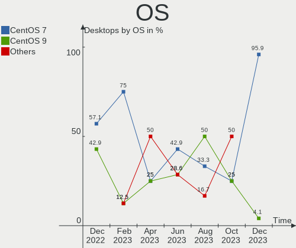

| Name            | Desktops | Percent |
|-----------------|----------|---------|
| CentOS 7.9.2009 | 16       | 48.48%  |
| CentOS 8        | 8        | 24.24%  |
| CentOS 7        | 7        | 21.21%  |
| CentOS Stream   | 1        | 3.03%   |
| CentOS 8.4.2105 | 1        | 3.03%   |

OS Family
---------

OS without a version

| Name   | Desktops | Percent |
|--------|----------|---------|
| CentOS | 33       | 100%    |

Kernel
------

Version of the Linux kernel

| Version                      | Desktops | Percent |
|------------------------------|----------|---------|
| 3.10.0-1160.31.1.el7.x86_64  | 9        | 27.27%  |
| 3.10.0-1160.25.1.el7.x86_64  | 6        | 18.18%  |
| 3.10.0-1160.36.2.el7.x86_64  | 5        | 15.15%  |
| 4.18.0-326.el8.x86_64        | 2        | 6.06%   |
| 4.18.0-305.12.1.el8_4.x86_64 | 2        | 6.06%   |
| 4.18.0-305.10.2.el8_4.x86_64 | 2        | 6.06%   |
| 5.4.142-1.el7.elrepo.x86_64  | 1        | 3.03%   |
| 5.13.11-1.el8.elrepo.x86_64  | 1        | 3.03%   |
| 5.10.3-1.el8.elrepo.x86_64   | 1        | 3.03%   |
| 4.18.0-338.el8.x86_64        | 1        | 3.03%   |
| 4.18.0-240.22.1.el8_3.x86_64 | 1        | 3.03%   |
| 3.10.0-862.el7.x86_64        | 1        | 3.03%   |
| 3.10.0-1062.12.1.el7.x86_64  | 1        | 3.03%   |

Kernel Family
-------------

Linux kernel without a distro release

| Version | Desktops | Percent |
|---------|----------|---------|
| 3.10.0  | 22       | 66.67%  |
| 4.18.0  | 8        | 24.24%  |
| 5.4.142 | 1        | 3.03%   |
| 5.13.11 | 1        | 3.03%   |
| 5.10.3  | 1        | 3.03%   |

Kernel Major Ver.
-----------------

Linux kernel major version

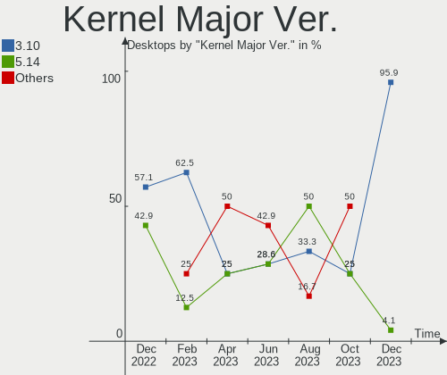

| Version | Desktops | Percent |
|---------|----------|---------|
| 3.10    | 22       | 66.67%  |
| 4.18    | 8        | 24.24%  |
| 5.4     | 1        | 3.03%   |
| 5.13    | 1        | 3.03%   |
| 5.10    | 1        | 3.03%   |

Arch
----

OS architecture (x86_64, i586, etc.)

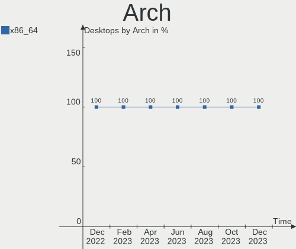

| Name   | Desktops | Percent |
|--------|----------|---------|
| x86_64 | 33       | 100%    |

DE
--

Desktop Environment

| Name     | Desktops | Percent |
|----------|----------|---------|
| GNOME    | 24       | 72.73%  |
| KDE4     | 4        | 12.12%  |
| Unknown  | 4        | 12.12%  |
| Cinnamon | 1        | 3.03%   |

Display Server
--------------

X11 or Wayland

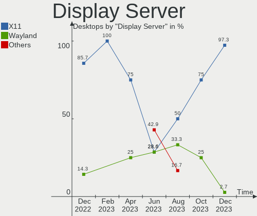

| Name    | Desktops | Percent |
|---------|----------|---------|
| X11     | 28       | 84.85%  |
| Unknown | 3        | 9.09%   |
| Wayland | 2        | 6.06%   |

Display Manager
---------------

SDDM, LightDM, etc.

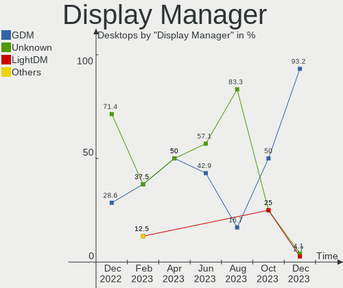

| Name    | Desktops | Percent |
|---------|----------|---------|
| GDM     | 24       | 72.73%  |
| Unknown | 9        | 27.27%  |

OS Lang
-------

Language

| Lang    | Desktops | Percent |
|---------|----------|---------|
| C       | 15       | 45.45%  |
| en_US   | 12       | 36.36%  |
| en_CA   | 2        | 6.06%   |
| ru_RU   | 1        | 3.03%   |
| en_GB   | 1        | 3.03%   |
| de_AT   | 1        | 3.03%   |
| Unknown | 1        | 3.03%   |

Boot Mode
---------

EFI or BIOS

| Mode | Desktops | Percent |
|------|----------|---------|
| EFI  | 27       | 81.82%  |
| BIOS | 6        | 18.18%  |

Filesystem
----------

Type of filesystem

| Type | Desktops | Percent |
|------|----------|---------|
| Xfs  | 28       | 84.85%  |
| Ext4 | 5        | 15.15%  |

Part. scheme
------------

Scheme of partitioning

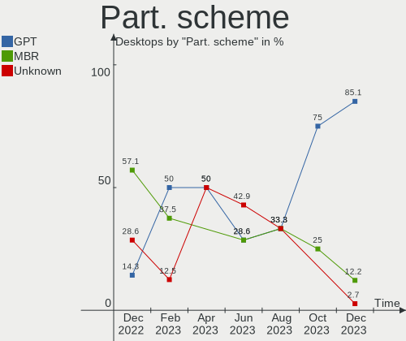

| Type    | Desktops | Percent |
|---------|----------|---------|
| GPT     | 26       | 78.79%  |
| Unknown | 5        | 15.15%  |
| MBR     | 2        | 6.06%   |

Dual Boot with Linux/BSD
------------------------

Hosting more than one Linux/BSD

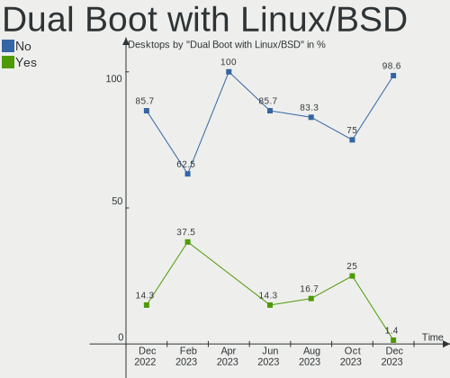

| Dual boot | Desktops | Percent |
|-----------|----------|---------|
| No        | 32       | 96.97%  |
| Yes       | 1        | 3.03%   |

Dual Boot (Win)
---------------

Hosting Linux and Windows

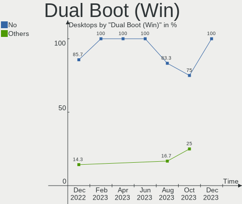

| Dual boot | Desktops | Percent |
|-----------|----------|---------|
| No        | 29       | 87.88%  |
| Yes       | 4        | 12.12%  |

Board
-----

Vendor
------

Motherboard manufacturer

| Name                | Desktops | Percent |
|---------------------|----------|---------|
| Dell                | 14       | 42.42%  |
| Gigabyte Technology | 7        | 21.21%  |
| ASUSTek Computer    | 4        | 12.12%  |
| Hewlett-Packard     | 3        | 9.09%   |
| Supermicro          | 2        | 6.06%   |
| MSI                 | 2        | 6.06%   |
| ASRock              | 1        | 3.03%   |

Model
-----

Motherboard model

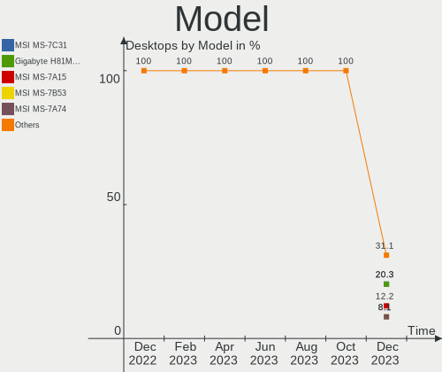

| Name                       | Desktops | Percent |
|----------------------------|----------|---------|
| Dell OptiPlex 7040         | 7        | 21.21%  |
| Dell OptiPlex 9020         | 6        | 18.18%  |
| Supermicro X8SAX           | 1        | 3.03%   |
| Supermicro SYS-5019S-MR    | 1        | 3.03%   |
| MSI MS-7C94                | 1        | 3.03%   |
| MSI MS-7C37                | 1        | 3.03%   |
| HP Z2 Tower G5 Workstation | 1        | 3.03%   |
| HP Z1 Entry Tower G5       | 1        | 3.03%   |
| HP 20-r124d                | 1        | 3.03%   |
| Gigabyte Z170MX-Gaming 5   | 1        | 3.03%   |
| Gigabyte H97N-WIFI         | 1        | 3.03%   |
| Gigabyte H270M-DS3H        | 1        | 3.03%   |
| Gigabyte GA-990FXA-D3      | 1        | 3.03%   |
| Gigabyte GA-78LMT-USB3 6.0 | 1        | 3.03%   |
| Gigabyte B85M-D3PH         | 1        | 3.03%   |
| Gigabyte B450M DS3H        | 1        | 3.03%   |
| Dell OptiPlex 7070         | 1        | 3.03%   |
| ASUS TUF B450M-PRO GAMING  | 1        | 3.03%   |
| ASUS ROG Maximus XIII HERO | 1        | 3.03%   |
| ASUS PRIME B550-PLUS       | 1        | 3.03%   |
| ASUS All Series            | 1        | 3.03%   |
| ASRock A320M-HD            | 1        | 3.03%   |

Model Family
------------

Motherboard model prefix

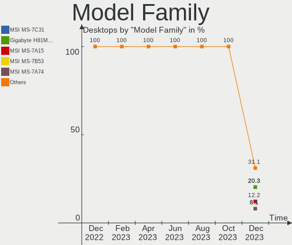

| Name                    | Desktops | Percent |
|-------------------------|----------|---------|
| Dell OptiPlex           | 14       | 42.42%  |
| Supermicro X8SAX        | 1        | 3.03%   |
| Supermicro SYS-5019S-MR | 1        | 3.03%   |
| MSI MS-7C94             | 1        | 3.03%   |
| MSI MS-7C37             | 1        | 3.03%   |
| HP Z2                   | 1        | 3.03%   |
| HP Z1                   | 1        | 3.03%   |
| HP 20-r124d             | 1        | 3.03%   |
| Gigabyte Z170MX-Gaming  | 1        | 3.03%   |
| Gigabyte H97N-WIFI      | 1        | 3.03%   |
| Gigabyte H270M-DS3H     | 1        | 3.03%   |
| Gigabyte GA-990FXA-D3   | 1        | 3.03%   |
| Gigabyte GA-78LMT-USB3  | 1        | 3.03%   |
| Gigabyte B85M-D3PH      | 1        | 3.03%   |
| Gigabyte B450M          | 1        | 3.03%   |
| ASUS TUF                | 1        | 3.03%   |
| ASUS ROG                | 1        | 3.03%   |
| ASUS PRIME              | 1        | 3.03%   |
| ASUS All                | 1        | 3.03%   |
| ASRock A320M-HD         | 1        | 3.03%   |

MFG Year
--------

Motherboard manufacture year

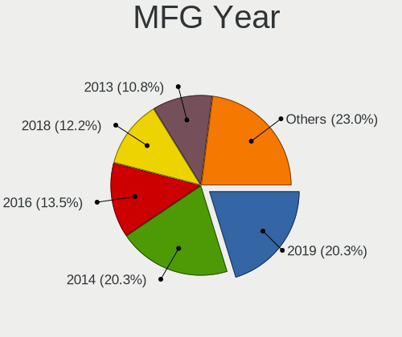

| Year | Desktops | Percent |
|------|----------|---------|
| 2021 | 12       | 36.36%  |
| 2019 | 8        | 24.24%  |
| 2020 | 3        | 9.09%   |
| 2015 | 3        | 9.09%   |
| 2017 | 2        | 6.06%   |
| 2016 | 1        | 3.03%   |
| 2014 | 1        | 3.03%   |
| 2013 | 1        | 3.03%   |
| 2010 | 1        | 3.03%   |
| 2008 | 1        | 3.03%   |

Form Factor
-----------

Physical design of the computer

| Name    | Desktops | Percent |
|---------|----------|---------|
| Desktop | 33       | 100%    |

Secure Boot
-----------

Enabled or disabled

| State    | Desktops | Percent |
|----------|----------|---------|
| Disabled | 33       | 100%    |

Coreboot
--------

Have coreboot on board

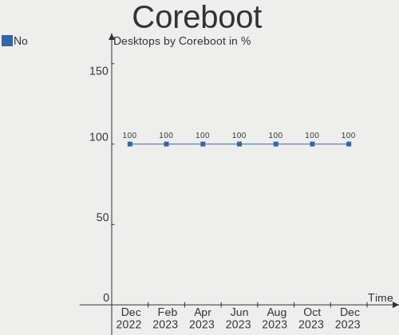

| Used | Desktops | Percent |
|------|----------|---------|
| No   | 33       | 100%    |

RAM Size
--------

Total RAM memory

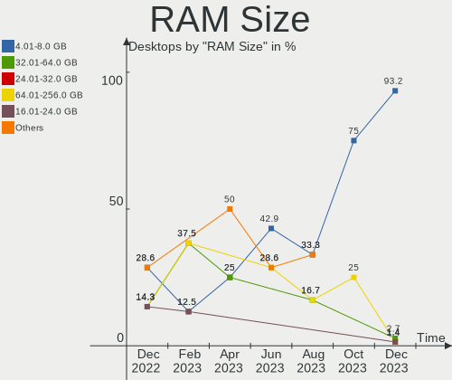

| Size in GB  | Desktops | Percent |
|-------------|----------|---------|
| 4.01-8.0    | 13       | 39.39%  |
| 32.01-64.0  | 11       | 33.33%  |
| 16.01-24.0  | 3        | 9.09%   |
| 8.01-16.0   | 3        | 9.09%   |
| 64.01-256.0 | 2        | 6.06%   |
| 3.01-4.0    | 1        | 3.03%   |

RAM Used
--------

Used RAM memory

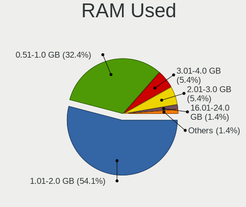

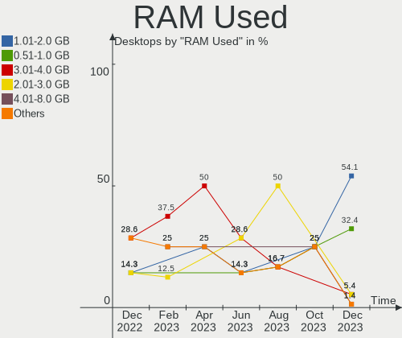

| Used GB    | Desktops | Percent |
|------------|----------|---------|
| 0.51-1.0   | 13       | 39.39%  |
| 2.01-3.0   | 6        | 18.18%  |
| 4.01-8.0   | 5        | 15.15%  |
| 1.01-2.0   | 4        | 12.12%  |
| 3.01-4.0   | 2        | 6.06%   |
| 24.01-32.0 | 1        | 3.03%   |
| 8.01-16.0  | 1        | 3.03%   |
| 0.01-0.5   | 1        | 3.03%   |

Total Drives
------------

Number of drives on board

| Drives | Desktops | Percent |
|--------|----------|---------|
| 1      | 19       | 57.58%  |
| 2      | 6        | 18.18%  |
| 6      | 2        | 6.06%   |
| 5      | 2        | 6.06%   |
| 12     | 1        | 3.03%   |
| 7      | 1        | 3.03%   |
| 4      | 1        | 3.03%   |
| 3      | 1        | 3.03%   |

Has CD-ROM
----------

Has CD-ROM on board

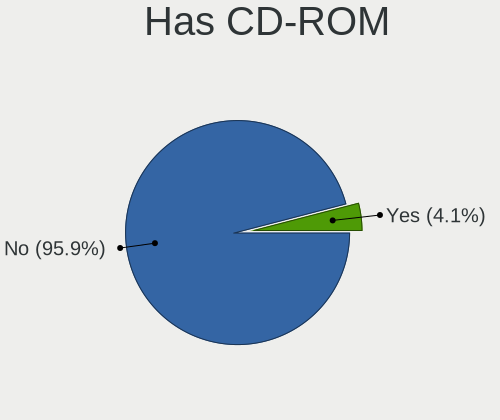

| Presented | Desktops | Percent |
|-----------|----------|---------|
| Yes       | 17       | 51.52%  |
| No        | 16       | 48.48%  |

Has Ethernet
------------

Has Ethernet on board

| Presented | Desktops | Percent |
|-----------|----------|---------|
| Yes       | 33       | 100%    |

Has WiFi
--------

Has WiFi module

| Presented | Desktops | Percent |
|-----------|----------|---------|
| No        | 28       | 84.85%  |
| Yes       | 5        | 15.15%  |

Has Bluetooth
-------------

Has Bluetooth module

| Presented | Desktops | Percent |
|-----------|----------|---------|
| No        | 28       | 84.85%  |
| Yes       | 5        | 15.15%  |

Location
--------

Country
-------

Geographic location (country)

| Country   | Desktops | Percent |
|-----------|----------|---------|
| USA       | 19       | 57.58%  |
| Canada    | 3        | 9.09%   |
| Brazil    | 3        | 9.09%   |
| Germany   | 2        | 6.06%   |
| Russia    | 1        | 3.03%   |
| Romania   | 1        | 3.03%   |
| Japan     | 1        | 3.03%   |
| Indonesia | 1        | 3.03%   |
| Finland   | 1        | 3.03%   |
| Australia | 1        | 3.03%   |

City
----

Geographic location (city)

| City              | Desktops | Percent |
|-------------------|----------|---------|
| Rochester         | 16       | 48.48%  |
| Brampton          | 2        | 6.06%   |
| Victoria          | 1        | 3.03%   |
| Tokyo             | 1        | 3.03%   |
| Sydney            | 1        | 3.03%   |
| Rio de Janeiro    | 1        | 3.03%   |
| Recea             | 1        | 3.03%   |
| Portland          | 1        | 3.03%   |
| Penza             | 1        | 3.03%   |
| Kuningan Barat    | 1        | 3.03%   |
| Hillsboro         | 1        | 3.03%   |
| Frankfurt am Main | 1        | 3.03%   |
| Florian??polis    | 1        | 3.03%   |
| Espoo             | 1        | 3.03%   |
| D??sseldorf       | 1        | 3.03%   |
| Campinas          | 1        | 3.03%   |
| Burlington        | 1        | 3.03%   |

Drives
------

Drive Vendor
------------

Hard drive vendors

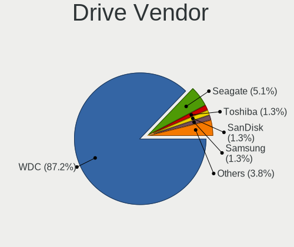

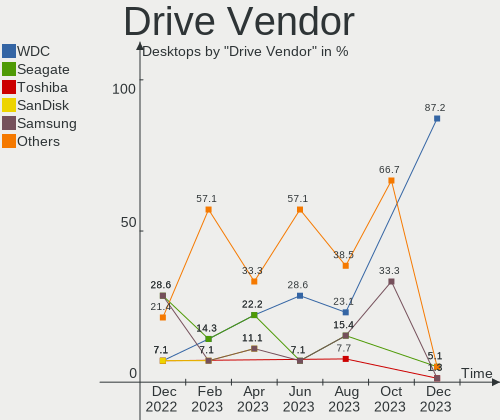

| Vendor              | Desktops | Drives | Percent |
|---------------------|----------|--------|---------|
| Seagate             | 12       | 28     | 27.91%  |
| WDC                 | 8        | 21     | 18.6%   |
| Toshiba             | 7        | 8      | 16.28%  |
| Samsung Electronics | 7        | 12     | 16.28%  |
| Kingston            | 2        | 2      | 4.65%   |
| Verbatim            | 1        | 1      | 2.33%   |
| SanDisk             | 1        | 1      | 2.33%   |
| OCZ                 | 1        | 2      | 2.33%   |
| NVMe                | 1        | 1      | 2.33%   |
| Intel               | 1        | 1      | 2.33%   |
| Gigabyte Technology | 1        | 1      | 2.33%   |
| Crucial             | 1        | 1      | 2.33%   |

Drive Model
-----------

Hard drive models

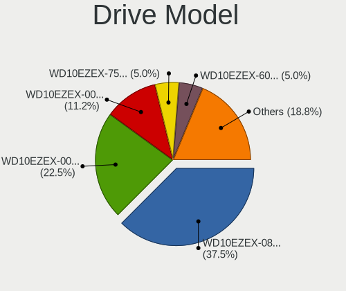

| Model                             | Desktops | Percent |
|-----------------------------------|----------|---------|
| Toshiba DT01ACA050 500GB          | 6        | 11.76%  |
| Seagate ST500DM002-1SB10A 500GB   | 6        | 11.76%  |
| WDC WDS250G2B0A-00SM50 250GB SSD  | 2        | 3.92%   |
| Seagate ST1000DM003-1CH162 1TB    | 2        | 3.92%   |
| Samsung NVMe SSD Drive 512GB      | 2        | 3.92%   |
| WDC WDS500G2B0A 500GB SSD         | 1        | 1.96%   |
| WDC WDS240G2G0B-00EPW0 240GB SSD  | 1        | 1.96%   |
| WDC WD80EFAX-68KNBN0 8TB          | 1        | 1.96%   |
| WDC WD5000AZLX-60K2TA1 500GB      | 1        | 1.96%   |
| WDC WD5000AAKX-00U6AA0 500GB      | 1        | 1.96%   |
| WDC WD3200AVVS-63L2B0 320GB       | 1        | 1.96%   |
| WDC WD20PURZ-85AKKY0 2TB          | 1        | 1.96%   |
| WDC WD20EFRX-68EUZN0 2TB          | 1        | 1.96%   |
| WDC WD181KFGX-68AFPN0 18TB        | 1        | 1.96%   |
| WDC WD10EZEX-75WN4A1 1TB          | 1        | 1.96%   |
| WDC WD10EZEX-00RKKA0 1TB          | 1        | 1.96%   |
| Verbatim Vi550 S3 SSD 128GB       | 1        | 1.96%   |
| Toshiba MG03ACA100 1TB            | 1        | 1.96%   |
| Seagate ST8000NM000A-2KE101 8TB   | 1        | 1.96%   |
| Seagate ST8000AS0002-1NA17Z 8TB   | 1        | 1.96%   |
| Seagate ST31000528AS 1TB          | 1        | 1.96%   |
| Seagate ST2000NM000A-2J2100 2TB   | 1        | 1.96%   |
| Seagate ST12000VN0008-2JH101 12TB | 1        | 1.96%   |
| Seagate ST1000DM003-1ER162 1TB    | 1        | 1.96%   |
| Seagate BUP Slim BL 2TB           | 1        | 1.96%   |
| SanDisk X400 M.2 2280 128GB SSD   | 1        | 1.96%   |
| Samsung SSD 970 EVO Plus 500GB    | 1        | 1.96%   |
| Samsung SSD 850 EVO 500GB         | 1        | 1.96%   |
| Samsung SSD 840 EVO 120GB         | 1        | 1.96%   |
| Samsung PM991 NVMe Samsu 128GB    | 1        | 1.96%   |
| Samsung HD501LJ 500GB             | 1        | 1.96%   |
| OCZ VERTEX4 128GB SSD             | 1        | 1.96%   |
| NVMe BC501 SK hynix 256GB         | 1        | 1.96%   |
| Kingston SSDNOW 30GB              | 1        | 1.96%   |
| Kingston SA400S37480G 480GB SSD   | 1        | 1.96%   |
| Intel SSDSA2M080G2LE 80GB         | 1        | 1.96%   |
| Gigabyte GP-ASM2NE6100TTTD 1TB    | 1        | 1.96%   |
| Crucial CT1000MX500SSD1 1TB       | 1        | 1.96%   |

HDD Vendor
----------

Hard disk drive vendors

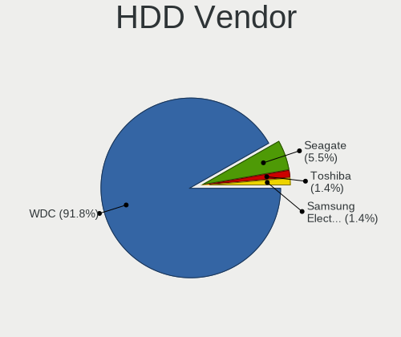

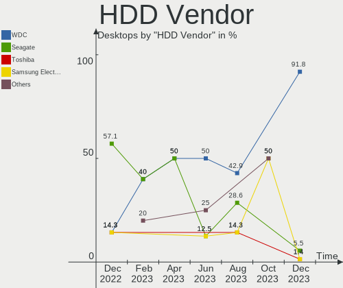

| Vendor              | Desktops | Drives | Percent |
|---------------------|----------|--------|---------|
| Seagate             | 12       | 28     | 42.86%  |
| WDC                 | 8        | 16     | 28.57%  |
| Toshiba             | 7        | 8      | 25%     |
| Samsung Electronics | 1        | 5      | 3.57%   |

SSD Vendor
----------

Solid state drive vendors

| Vendor              | Desktops | Drives | Percent |
|---------------------|----------|--------|---------|
| WDC                 | 3        | 5      | 25%     |
| Samsung Electronics | 2        | 3      | 16.67%  |
| Kingston            | 2        | 2      | 16.67%  |
| Verbatim            | 1        | 1      | 8.33%   |
| SanDisk             | 1        | 1      | 8.33%   |
| OCZ                 | 1        | 2      | 8.33%   |
| Intel               | 1        | 1      | 8.33%   |
| Crucial             | 1        | 1      | 8.33%   |

Drive Kind
----------

HDD or SSD

| Kind | Desktops | Drives | Percent |
|------|----------|--------|---------|
| HDD  | 26       | 57     | 63.41%  |
| SSD  | 9        | 16     | 21.95%  |
| NVMe | 6        | 6      | 14.63%  |

Drive Connector
---------------

SATA, SAS, NVMe, etc.

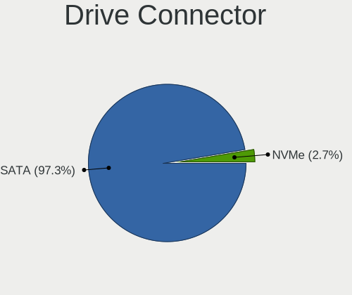

| Type | Desktops | Drives | Percent |
|------|----------|--------|---------|
| SATA | 30       | 72     | 81.08%  |
| NVMe | 6        | 6      | 16.22%  |
| SAS  | 1        | 1      | 2.7%    |

Drive Size
----------

Size of hard drive

| Size in TB | Desktops | Drives | Percent |
|------------|----------|--------|---------|
| 0.01-0.5   | 22       | 36     | 62.86%  |
| 0.51-1.0   | 6        | 12     | 17.14%  |
| 1.01-2.0   | 3        | 5      | 8.57%   |
| 10.01-20.0 | 2        | 8      | 5.71%   |
| 4.01-10.0  | 2        | 12     | 5.71%   |

Space Total
-----------

Amount of disk space available on the file system

| Size in GB     | Desktops | Percent |
|----------------|----------|---------|
| 251-500        | 15       | 45.45%  |
| 501-1000       | 7        | 21.21%  |
| 101-250        | 5        | 15.15%  |
| More than 3000 | 2        | 6.06%   |
| 21-50          | 1        | 3.03%   |
| 1001-2000      | 1        | 3.03%   |
| 1-20           | 1        | 3.03%   |
| Unknown        | 1        | 3.03%   |

Space Used
----------

Amount of used disk space

| Used GB        | Desktops | Percent |
|----------------|----------|---------|
| 1-20           | 18       | 54.55%  |
| 101-250        | 5        | 15.15%  |
| 21-50          | 4        | 12.12%  |
| 501-1000       | 2        | 6.06%   |
| More than 3000 | 1        | 3.03%   |
| 251-500        | 1        | 3.03%   |
| 51-100         | 1        | 3.03%   |
| Unknown        | 1        | 3.03%   |

Malfunc. Drives
---------------

Drive models with a malfunction

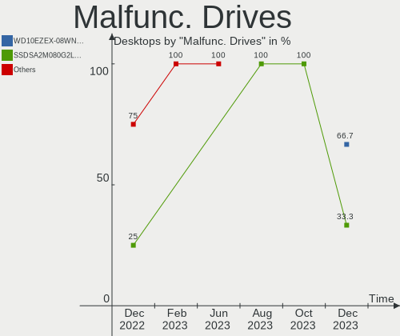

| Model                            | Desktops | Drives | Percent |
|----------------------------------|----------|--------|---------|
| WDC WDS240G2G0B-00EPW0 240GB SSD | 1        | 1      | 25%     |
| WDC WD3200AVVS-63L2B0 320GB      | 1        | 1      | 25%     |
| Seagate ST1000DM003-1ER162 1TB   | 1        | 1      | 25%     |
| Intel SSDSA2M080G2LE 80GB        | 1        | 1      | 25%     |

Malfunc. Drive Vendor
---------------------

Vendors of faulty drives

| Vendor  | Desktops | Drives | Percent |
|---------|----------|--------|---------|
| WDC     | 2        | 2      | 50%     |
| Seagate | 1        | 1      | 25%     |
| Intel   | 1        | 1      | 25%     |

Malfunc. HDD Vendor
-------------------

Vendors of faulty HDD drives

| Vendor  | Desktops | Drives | Percent |
|---------|----------|--------|---------|
| WDC     | 1        | 1      | 50%     |
| Seagate | 1        | 1      | 50%     |

Malfunc. Drive Kind
-------------------

Kinds of faulty drives

| Kind | Desktops | Drives | Percent |
|------|----------|--------|---------|
| SSD  | 2        | 2      | 50%     |
| HDD  | 2        | 2      | 50%     |

Failed Drives
-------------

Failed drive models

Zero info for selected period =(

Failed Drive Vendor
-------------------

Failed drive vendors

Zero info for selected period =(

Drive Status
------------

Number of failed and malfunc. drives

| Status   | Desktops | Drives | Percent |
|----------|----------|--------|---------|
| Works    | 27       | 64     | 72.97%  |
| Detected | 6        | 11     | 16.22%  |
| Malfunc  | 4        | 4      | 10.81%  |

Storage controller
------------------

Storage Vendor
--------------

Storage controller vendors

| Vendor                   | Desktops | Percent |
|--------------------------|----------|---------|
| Intel                    | 26       | 61.9%   |
| AMD                      | 7        | 16.67%  |
| Samsung Electronics      | 4        | 9.52%   |
| Marvell Technology Group | 2        | 4.76%   |
| SK Hynix                 | 1        | 2.38%   |
| Phison Electronics       | 1        | 2.38%   |
| ASMedia Technology       | 1        | 2.38%   |

Storage Model
-------------

Storage controller models

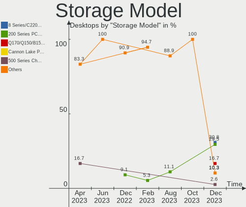

| Model                                                                          | Desktops | Percent |
|--------------------------------------------------------------------------------|----------|---------|
| Intel SATA Controller [RAID mode]                                              | 10       | 20.83%  |
| Intel 8 Series/C220 Series Chipset Family 6-port SATA Controller 1 [AHCI mode] | 7        | 14.58%  |
| AMD FCH SATA Controller [AHCI mode]                                            | 5        | 10.42%  |
| Samsung NVMe SSD Controller SM981/PM981/PM983                                  | 2        | 4.17%   |
| Intel Cannon Lake PCH SATA AHCI Controller                                     | 2        | 4.17%   |
| AMD Starship/Matisse Chipset SATA Controller [AHCI mode]                       | 2        | 4.17%   |
| AMD 400 Series Chipset SATA Controller                                         | 2        | 4.17%   |
| SK Hynix BC501 NVMe Solid State Drive                                          | 1        | 2.08%   |
| Samsung NVMe SSD Controller SM951/PM951                                        | 1        | 2.08%   |
| Samsung NVMe Controller                                                        | 1        | 2.08%   |
| Phison E16 PCIe4 NVMe Controller                                               | 1        | 2.08%   |
| Marvell Group MV64460/64461/64462 System Controller, Revision B                | 1        | 2.08%   |
| Marvell Group 88SE9235 PCIe 2.0 x2 4-port SATA 6 Gb/s Controller               | 1        | 2.08%   |
| Intel Q170/Q150/B150/H170/H110/Z170/CM236 Chipset SATA Controller [AHCI Mode]  | 1        | 2.08%   |
| Intel 9 Series Chipset Family SATA Controller [AHCI Mode]                      | 1        | 2.08%   |
| Intel 82801JI (ICH10 Family) SATA AHCI Controller                              | 1        | 2.08%   |
| Intel 82801JI (ICH10 Family) 4 port SATA IDE Controller #1                     | 1        | 2.08%   |
| Intel 82801JI (ICH10 Family) 2 port SATA IDE Controller #2                     | 1        | 2.08%   |
| Intel 500 Series Chipset Family SATA AHCI Controller                           | 1        | 2.08%   |
| Intel 400 Series Chipset Family SATA RAID Controller                           | 1        | 2.08%   |
| Intel 200 Series PCH SATA controller [AHCI mode]                               | 1        | 2.08%   |
| ASMedia ASM1062 Serial ATA Controller                                          | 1        | 2.08%   |
| AMD SB7x0/SB8x0/SB9x0 SATA Controller [Non-RAID5 mode]                         | 1        | 2.08%   |
| AMD SB7x0/SB8x0/SB9x0 IDE Controller                                           | 1        | 2.08%   |
| AMD FCH SATA Controller D                                                      | 1        | 2.08%   |

Storage Kind
------------

Kind of storage controller (IDE, SATA, NVMe, SAS, ...)

| Kind | Desktops | Percent |
|------|----------|---------|
| SATA | 20       | 48.78%  |
| RAID | 13       | 31.71%  |
| NVMe | 6        | 14.63%  |
| IDE  | 2        | 4.88%   |

Processor
---------

CPU Vendor
----------

Processor vendors

| Vendor | Desktops | Percent |
|--------|----------|---------|
| Intel  | 26       | 78.79%  |
| AMD    | 7        | 21.21%  |

CPU Model
---------

Processor models

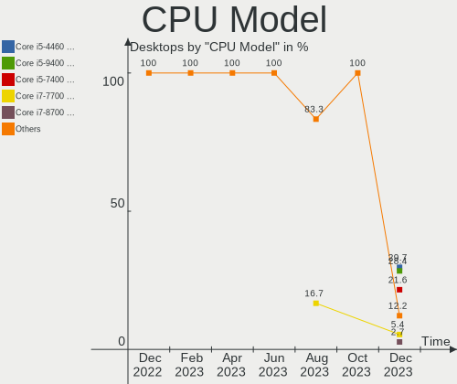

| Model                                | Desktops | Percent |
|--------------------------------------|----------|---------|
| Intel Core i7-6700 CPU @ 3.40GHz     | 7        | 21.21%  |
| Intel Core i7-4790 CPU @ 3.60GHz     | 6        | 18.18%  |
| AMD Ryzen 9 3900X 12-Core Processor  | 2        | 6.06%   |
| AMD Ryzen 7 3700X 8-Core Processor   | 2        | 6.06%   |
| Intel Xeon CPU E5606 @ 2.13GHz       | 1        | 3.03%   |
| Intel Pentium CPU G3258 @ 3.20GHz    | 1        | 3.03%   |
| Intel Core i9-10900K CPU @ 3.70GHz   | 1        | 3.03%   |
| Intel Core i7-9700 CPU @ 3.00GHz     | 1        | 3.03%   |
| Intel Core i7-7700K CPU @ 4.20GHz    | 1        | 3.03%   |
| Intel Core i7-6700K CPU @ 4.00GHz    | 1        | 3.03%   |
| Intel Core i7-4790K CPU @ 4.00GHz    | 1        | 3.03%   |
| Intel Core i7-10700 CPU @ 2.90GHz    | 1        | 3.03%   |
| Intel Core i5-9500 CPU @ 3.00GHz     | 1        | 3.03%   |
| Intel Core i5-4670 CPU @ 3.40GHz     | 1        | 3.03%   |
| Intel Core i5-4460T CPU @ 1.90GHz    | 1        | 3.03%   |
| Intel Core i3-6100 CPU @ 3.70GHz     | 1        | 3.03%   |
| Intel Core 2 Duo CPU E8400 @ 3.00GHz | 1        | 3.03%   |
| AMD Ryzen 5 3500X 6-Core Processor   | 1        | 3.03%   |
| AMD Ryzen 5 1600 Six-Core Processor  | 1        | 3.03%   |
| AMD FX-8320 Eight-Core Processor     | 1        | 3.03%   |

CPU Model Family
----------------

Processor model prefix

| Model            | Desktops | Percent |
|------------------|----------|---------|
| Intel Core i7    | 18       | 54.55%  |
| Intel Core i5    | 3        | 9.09%   |
| AMD Ryzen 9      | 2        | 6.06%   |
| AMD Ryzen 7      | 2        | 6.06%   |
| AMD Ryzen 5      | 2        | 6.06%   |
| Intel Xeon       | 1        | 3.03%   |
| Intel Pentium    | 1        | 3.03%   |
| Intel Core i9    | 1        | 3.03%   |
| Intel Core i3    | 1        | 3.03%   |
| Intel Core 2 Duo | 1        | 3.03%   |
| AMD FX           | 1        | 3.03%   |

CPU Cores
---------

Number of processor cores

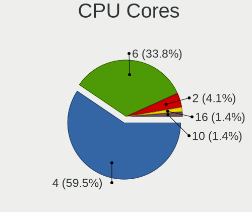

| Number | Desktops | Percent |
|--------|----------|---------|
| 4      | 20       | 60.61%  |
| 8      | 4        | 12.12%  |
| 6      | 3        | 9.09%   |
| 2      | 3        | 9.09%   |
| 12     | 2        | 6.06%   |
| 10     | 1        | 3.03%   |

CPU Sockets
-----------

Number of sockets

| Number | Desktops | Percent |
|--------|----------|---------|
| 1      | 33       | 100%    |

CPU Threads
-----------

Threads per core (Hyper-Threading)

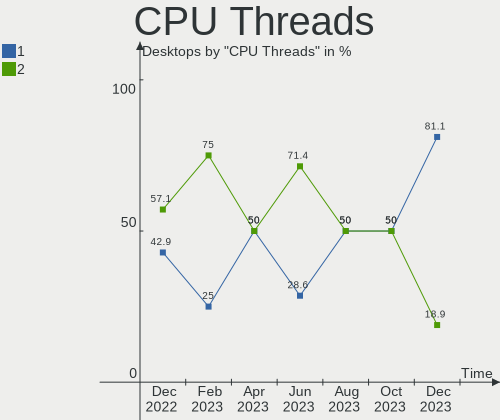

| Number | Desktops | Percent |
|--------|----------|---------|
| 2      | 25       | 75.76%  |
| 1      | 8        | 24.24%  |

CPU Op-Modes
------------

CPU Operation Modes (32-bit, 64-bit)

| Op mode        | Desktops | Percent |
|----------------|----------|---------|
| 32-bit, 64-bit | 33       | 100%    |

CPU Microcode
-------------

Microcode number

| Number     | Desktops | Percent |
|------------|----------|---------|
| 0x306c3    | 10       | 30.3%   |
| 0x506e3    | 9        | 27.27%  |
| Unknown    | 3        | 9.09%   |
| 0xa0655    | 2        | 6.06%   |
| 0x08701021 | 2        | 6.06%   |
| 0x906ed    | 1        | 3.03%   |
| 0x906ea    | 1        | 3.03%   |
| 0x906e9    | 1        | 3.03%   |
| 0x1067a    | 1        | 3.03%   |
| 0x08701013 | 1        | 3.03%   |
| 0x0800820d | 1        | 3.03%   |
| 0x06000852 | 1        | 3.03%   |

CPU Microarch
-------------

Microarchitecture

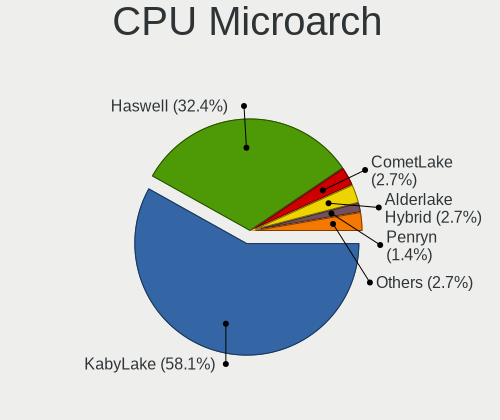

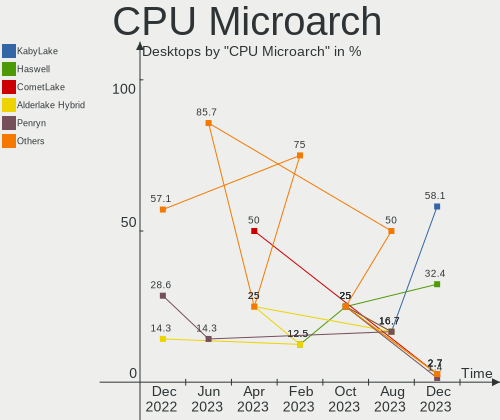

| Name       | Desktops | Percent |
|------------|----------|---------|
| Haswell    | 10       | 30.3%   |
| Skylake    | 9        | 27.27%  |
| Zen 2      | 5        | 15.15%  |
| KabyLake   | 3        | 9.09%   |
| CometLake  | 2        | 6.06%   |
| Zen+       | 1        | 3.03%   |
| Westmere   | 1        | 3.03%   |
| Piledriver | 1        | 3.03%   |
| Penryn     | 1        | 3.03%   |

Graphics
--------

GPU Vendor
----------

Vendors of graphics cards

| Vendor            | Desktops | Percent |
|-------------------|----------|---------|
| AMD               | 21       | 51.22%  |
| Intel             | 11       | 26.83%  |
| Nvidia            | 7        | 17.07%  |
| S3 Graphics       | 1        | 2.44%   |
| ASPEED Technology | 1        | 2.44%   |

GPU Model
---------

Graphics card models

| Model                                                                       | Desktops | Percent |
|-----------------------------------------------------------------------------|----------|---------|
| AMD Oland [Radeon HD 8570 / R5 430 OEM / R7 240/340 / Radeon 520 OEM]       | 7        | 16.67%  |
| AMD Oland XT [Radeon HD 8670 / R5 340X OEM / R7 250/350/350X OEM]           | 7        | 16.67%  |
| Intel HD Graphics 530                                                       | 4        | 9.52%   |
| Intel Xeon E3-1200 v3/4th Gen Core Processor Integrated Graphics Controller | 3        | 7.14%   |
| Nvidia GK208B [GeForce GT 710]                                              | 2        | 4.76%   |
| Intel CometLake-S GT2 [UHD Graphics 630]                                    | 2        | 4.76%   |
| AMD Navi 14 [Radeon RX 5500/5500M / Pro 5500M]                              | 2        | 4.76%   |
| AMD Ellesmere [Radeon RX 470/480/570/570X/580/580X/590]                     | 2        | 4.76%   |
| S3 Graphics Savage 4                                                        | 1        | 2.38%   |
| Nvidia TU102 [TITAN RTX]                                                    | 1        | 2.38%   |
| Nvidia GT218 [GeForce 210]                                                  | 1        | 2.38%   |
| Nvidia GP107GL [Quadro P400]                                                | 1        | 2.38%   |
| Nvidia GP106GL [Quadro P2200]                                               | 1        | 2.38%   |
| Nvidia G72 [GeForce 7300 GS]                                                | 1        | 2.38%   |
| Intel HD Graphics 630                                                       | 1        | 2.38%   |
| Intel CoffeeLake-S GT2 [UHD Graphics 630]                                   | 1        | 2.38%   |
| ASPEED Technology ASPEED Graphics Family                                    | 1        | 2.38%   |
| AMD RS780L [Radeon 3000]                                                    | 1        | 2.38%   |
| AMD Heathrow PRO [Radeon HD 7850M/8850M]                                    | 1        | 2.38%   |
| AMD Cayman PRO [Radeon HD 6950]                                             | 1        | 2.38%   |
| AMD Caicos [Radeon HD 6450/7450/8450 / R5 230 OEM]                          | 1        | 2.38%   |

GPU Combo
---------

Combinations of graphics cards

| Name            | Desktops | Percent |
|-----------------|----------|---------|
| 1 x AMD         | 17       | 51.52%  |
| 1 x Nvidia      | 6        | 18.18%  |
| Intel + AMD     | 3        | 9.09%   |
| 1 x Intel       | 3        | 9.09%   |
| 2 x AMD         | 1        | 3.03%   |
| 1 x S3 Graphics | 1        | 3.03%   |
| Intel + Nvidia  | 1        | 3.03%   |
| 1 x ASPEED      | 1        | 3.03%   |

GPU Driver
----------

Free vs proprietary

| Driver      | Desktops | Percent |
|-------------|----------|---------|
| Free        | 30       | 90.91%  |
| Proprietary | 2        | 6.06%   |
| Unknown     | 1        | 3.03%   |

GPU Memory
----------

Total video memory

| Size in GB | Desktops | Percent |
|------------|----------|---------|
| 1.01-2.0   | 11       | 33.33%  |
| 0.51-1.0   | 9        | 27.27%  |
| Unknown    | 6        | 18.18%  |
| 3.01-4.0   | 2        | 6.06%   |
| 0.01-0.5   | 2        | 6.06%   |
| 7.01-8.0   | 1        | 3.03%   |
| 4.01-5.0   | 1        | 3.03%   |
| 16.01-24.0 | 1        | 3.03%   |

Monitor
-------

Monitor Vendor
--------------

Monitor vendors

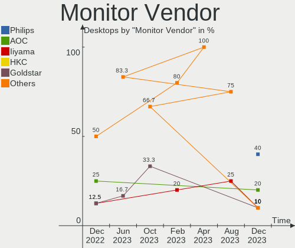

| Vendor              | Desktops | Percent |
|---------------------|----------|---------|
| Dell                | 20       | 57.14%  |
| Hewlett-Packard     | 4        | 11.43%  |
| Samsung Electronics | 2        | 5.71%   |
| Goldstar            | 2        | 5.71%   |
| AOC                 | 2        | 5.71%   |
| ___                 | 1        | 2.86%   |
| Xiaomi              | 1        | 2.86%   |
| ViewSonic           | 1        | 2.86%   |
| Unknown             | 1        | 2.86%   |
| Acer                | 1        | 2.86%   |

Monitor Model
-------------

Monitor models

| Model                                                                                 | Desktops | Percent |
|---------------------------------------------------------------------------------------|----------|---------|
| Dell P2417H DELA0DB 1920x1080 527x296mm 23.8-inch                                     | 6        | 15%     |
| Dell P2414H DELA09A 1920x1080 527x297mm 23.8-inch                                     | 6        | 15%     |
| Dell P2417H DELA0DA 1920x1080 527x296mm 23.8-inch                                     | 2        | 5%      |
| ___ Monitor ranges (GTF): 48-62Hz V, 14-68kHz H, max dotclock 150MHz ___9000 1440x900 | 1        | 2.5%    |
| Xiaomi Mi TV XMD009A 2880x1800 480x270mm 21.7-inch                                    | 1        | 2.5%    |
| ViewSonic VA2759 Series VSC6832 1920x1080 598x336mm 27.0-inch                         | 1        | 2.5%    |
| Unknown LCDTV16 9000 1360x768 1600x900mm 72.3-inch                                    | 1        | 2.5%    |
| Samsung Electronics SMEX2220 SAM0685 1920x1080 477x268mm 21.5-inch                    | 1        | 2.5%    |
| Samsung Electronics C27F390 SAM0D32 1920x1080 600x340mm 27.2-inch                     | 1        | 2.5%    |
| Hewlett-Packard ZR2440w HWP2956 1920x1200 518x324mm 24.1-inch                         | 1        | 2.5%    |
| Hewlett-Packard ALL-in-One HWP4244 1600x900 432x240mm 19.5-inch                       | 1        | 2.5%    |
| Hewlett-Packard 24mh HPN366C 1920x1080 527x296mm 23.8-inch                            | 1        | 2.5%    |
| Hewlett-Packard 2309 HWP2822 1920x1080 510x287mm 23.0-inch                            | 1        | 2.5%    |
| Goldstar FULL HD GSM5B55 1920x1080 480x270mm 21.7-inch                                | 1        | 2.5%    |
| Goldstar 22EA53 GSM59A5 1680x1050 480x270mm 21.7-inch                                 | 1        | 2.5%    |
| Dell SE2416H DELD082 1920x1080 527x296mm 23.8-inch                                    | 1        | 2.5%    |
| Dell SE2416H DELD081 1920x1080 527x296mm 23.8-inch                                    | 1        | 2.5%    |
| Dell P2419H DELD0D9 1920x1080 527x296mm 23.8-inch                                     | 1        | 2.5%    |
| Dell P2317H DEL40F4 1920x1080 509x286mm 23.0-inch                                     | 1        | 2.5%    |
| Dell P2317H DEL40F3 1920x1080 509x286mm 23.0-inch                                     | 1        | 2.5%    |
| Dell P2210 DEL404C 1680x1050 474x296mm 22.0-inch                                      | 1        | 2.5%    |
| Dell LCD Monitor 2405FPW 1920x1200                                                    | 1        | 2.5%    |
| Dell LCD Monitor 1703FP 1280x1024                                                     | 1        | 2.5%    |
| Dell 2405FPW DELA00F 1920x1200 519x324mm 24.1-inch                                    | 1        | 2.5%    |
| Dell 2009W DEL4041 1680x1050 430x270mm 20.0-inch                                      | 1        | 2.5%    |
| Dell 2007FP DELA021 1600x1200 367x275mm 18.1-inch                                     | 1        | 2.5%    |
| AOC 28E850 AOC0CCD 2560x1600 480x270mm 21.7-inch                                      | 1        | 2.5%    |
| AOC 22B1W AOC2201 1920x1080 476x268mm 21.5-inch                                       | 1        | 2.5%    |
| Acer E220HQ ACR01F8 1920x1080 477x268mm 21.5-inch                                     | 1        | 2.5%    |

Monitor Resolution
------------------

Monitor screen resolution

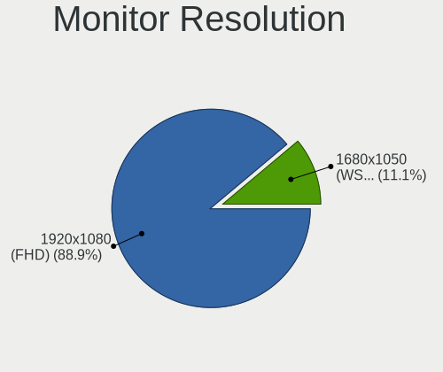

| Resolution         | Desktops | Percent |
|--------------------|----------|---------|
| 1920x1080 (FHD)    | 23       | 67.65%  |
| 1920x1200 (WUXGA)  | 2        | 5.88%   |
| 3840x2160 (4K)     | 1        | 2.94%   |
| 2880x1800          | 1        | 2.94%   |
| 2560x1440 (QHD)    | 1        | 2.94%   |
| 1680x1050 (WSXGA+) | 1        | 2.94%   |
| 1600x900 (HD+)     | 1        | 2.94%   |
| 1600x1200          | 1        | 2.94%   |
| 1440x900 (WXGA+)   | 1        | 2.94%   |
| 1360x768           | 1        | 2.94%   |
| 1280x1024 (SXGA)   | 1        | 2.94%   |

Monitor Diagonal
----------------

Diagonal size in inches

| Inches  | Desktops | Percent |
|---------|----------|---------|
| 24      | 16       | 43.24%  |
| 23      | 5        | 13.51%  |
| 21      | 5        | 13.51%  |
| 27      | 3        | 8.11%   |
| Unknown | 3        | 8.11%   |
| 20      | 2        | 5.41%   |
| 72      | 1        | 2.7%    |
| 22      | 1        | 2.7%    |
| 19      | 1        | 2.7%    |

Monitor Width
-------------

Physical width

| Width in mm | Desktops | Percent |
|-------------|----------|---------|
| 501-600     | 22       | 66.67%  |
| 401-500     | 7        | 21.21%  |
| Unknown     | 3        | 9.09%   |
| 1501-2000   | 1        | 3.03%   |

Aspect Ratio
------------

Proportional relationship between the width and the height

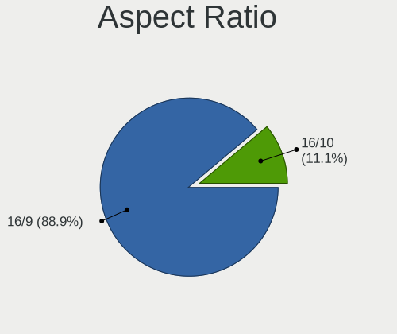

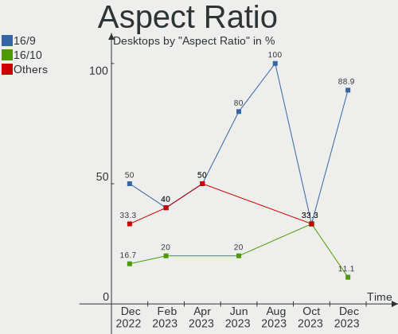

| Ratio   | Desktops | Percent |
|---------|----------|---------|
| 16/9    | 25       | 80.65%  |
| 16/10   | 3        | 9.68%   |
| Unknown | 2        | 6.45%   |
| 4/3     | 1        | 3.23%   |

Monitor Area
------------

Area in inch²

| Area in inch² | Desktops | Percent |
|----------------|----------|---------|
| 201-250        | 21       | 61.76%  |
| 151-200        | 4        | 11.76%  |
| 301-350        | 3        | 8.82%   |
| Unknown        | 3        | 8.82%   |
| 251-300        | 2        | 5.88%   |
| More than 1000 | 1        | 2.94%   |

Pixel Density
-------------

Pixels per inch

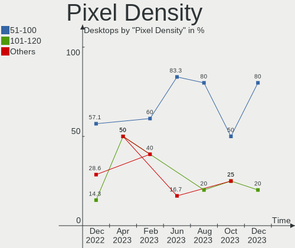

| Density | Desktops | Percent |
|---------|----------|---------|
| 51-100  | 24       | 70.59%  |
| 101-120 | 4        | 11.76%  |
| Unknown | 3        | 8.82%   |
| 121-160 | 2        | 5.88%   |
| 1-50    | 1        | 2.94%   |

Multiple Monitors
-----------------

Total monitors connected

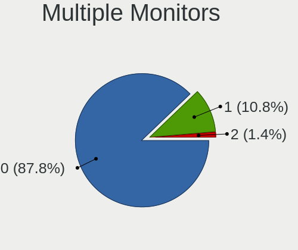

| Total | Desktops | Percent |
|-------|----------|---------|
| 1     | 23       | 69.7%   |
| 2     | 5        | 15.15%  |
| 0     | 3        | 9.09%   |
| 4     | 1        | 3.03%   |
| 3     | 1        | 3.03%   |

Network
-------

Net Controller Vendor
---------------------

Controller vendors

| Vendor                | Desktops | Percent |
|-----------------------|----------|---------|
| Intel                 | 22       | 55%     |
| Realtek Semiconductor | 12       | 30%     |
| Qualcomm Atheros      | 2        | 5%      |
| Broadcom              | 2        | 5%      |
| D-Link System         | 1        | 2.5%    |
| Apple                 | 1        | 2.5%    |

Net Controller Model
--------------------

Controller models

| Model                                                             | Desktops | Percent |
|-------------------------------------------------------------------|----------|---------|
| Realtek RTL8111/8168/8411 PCI Express Gigabit Ethernet Controller | 11       | 25.58%  |
| Intel Ethernet Connection (2) I219-LM                             | 7        | 16.28%  |
| Intel Ethernet Connection I217-LM                                 | 6        | 13.95%  |
| Intel I210 Gigabit Network Connection                             | 2        | 4.65%   |
| Intel Ethernet Connection (7) I219-LM                             | 2        | 4.65%   |
| Realtek RTL8125 2.5GbE Controller                                 | 1        | 2.33%   |
| Qualcomm Atheros Killer E2400 Gigabit Ethernet Controller         | 1        | 2.33%   |
| Qualcomm Atheros AR93xx Wireless Network Adapter                  | 1        | 2.33%   |
| Intel Wireless 7260                                               | 1        | 2.33%   |
| Intel I350 Gigabit Network Connection                             | 1        | 2.33%   |
| Intel Ethernet Controller I225-V                                  | 1        | 2.33%   |
| Intel Ethernet Connection I217-V                                  | 1        | 2.33%   |
| Intel Ethernet Connection (2) I218-V                              | 1        | 2.33%   |
| Intel Ethernet Connection (11) I219-LM                            | 1        | 2.33%   |
| Intel Dual Band Wireless-AC 3168NGW [Stone Peak]                  | 1        | 2.33%   |
| Intel 82574L Gigabit Network Connection                           | 1        | 2.33%   |
| D-Link System RTL8139 Ethernet                                    | 1        | 2.33%   |
| Broadcom BCM4360 802.11ac Wireless Network Adapter                | 1        | 2.33%   |
| Broadcom BCM43142 802.11b/g/n                                     | 1        | 2.33%   |
| Apple Ethernet Adapter [A1277]                                    | 1        | 2.33%   |

Wireless Vendor
---------------

Wireless vendors

| Vendor           | Desktops | Percent |
|------------------|----------|---------|
| Intel            | 2        | 40%     |
| Broadcom         | 2        | 40%     |
| Qualcomm Atheros | 1        | 20%     |

Wireless Model
--------------

Wireless models

| Model                                              | Desktops | Percent |
|----------------------------------------------------|----------|---------|
| Qualcomm Atheros AR93xx Wireless Network Adapter   | 1        | 20%     |
| Intel Wireless 7260                                | 1        | 20%     |
| Intel Dual Band Wireless-AC 3168NGW [Stone Peak]   | 1        | 20%     |
| Broadcom BCM4360 802.11ac Wireless Network Adapter | 1        | 20%     |
| Broadcom BCM43142 802.11b/g/n                      | 1        | 20%     |

Ethernet Vendor
---------------

Ethernet vendors

| Vendor                | Desktops | Percent |
|-----------------------|----------|---------|
| Intel                 | 21       | 58.33%  |
| Realtek Semiconductor | 12       | 33.33%  |
| Qualcomm Atheros      | 1        | 2.78%   |
| D-Link System         | 1        | 2.78%   |
| Apple                 | 1        | 2.78%   |

Ethernet Model
--------------

Ethernet models

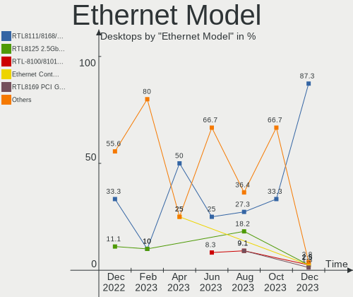

| Model                                                             | Desktops | Percent |
|-------------------------------------------------------------------|----------|---------|
| Realtek RTL8111/8168/8411 PCI Express Gigabit Ethernet Controller | 11       | 28.95%  |
| Intel Ethernet Connection (2) I219-LM                             | 7        | 18.42%  |
| Intel Ethernet Connection I217-LM                                 | 6        | 15.79%  |
| Intel I210 Gigabit Network Connection                             | 2        | 5.26%   |
| Intel Ethernet Connection (7) I219-LM                             | 2        | 5.26%   |
| Realtek RTL8125 2.5GbE Controller                                 | 1        | 2.63%   |
| Qualcomm Atheros Killer E2400 Gigabit Ethernet Controller         | 1        | 2.63%   |
| Intel I350 Gigabit Network Connection                             | 1        | 2.63%   |
| Intel Ethernet Controller I225-V                                  | 1        | 2.63%   |
| Intel Ethernet Connection I217-V                                  | 1        | 2.63%   |
| Intel Ethernet Connection (2) I218-V                              | 1        | 2.63%   |
| Intel Ethernet Connection (11) I219-LM                            | 1        | 2.63%   |
| Intel 82574L Gigabit Network Connection                           | 1        | 2.63%   |
| D-Link System RTL8139 Ethernet                                    | 1        | 2.63%   |
| Apple Ethernet Adapter [A1277]                                    | 1        | 2.63%   |

Net Controller Kind
-------------------

Ethernet, WiFi or modem

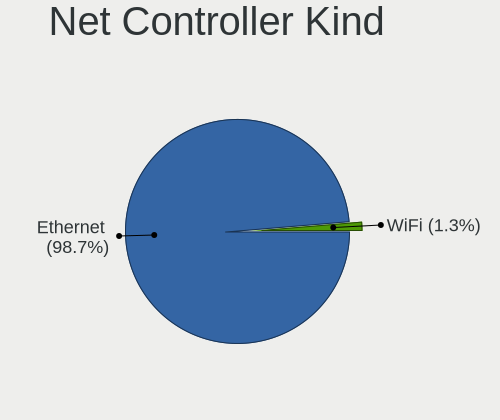

| Kind     | Desktops | Percent |
|----------|----------|---------|
| Ethernet | 33       | 86.84%  |
| WiFi     | 5        | 13.16%  |

Used Controller
---------------

Currently used network controller

| Kind     | Desktops | Percent |
|----------|----------|---------|
| Ethernet | 33       | 91.67%  |
| WiFi     | 3        | 8.33%   |

NICs
----

Total network controllers on board

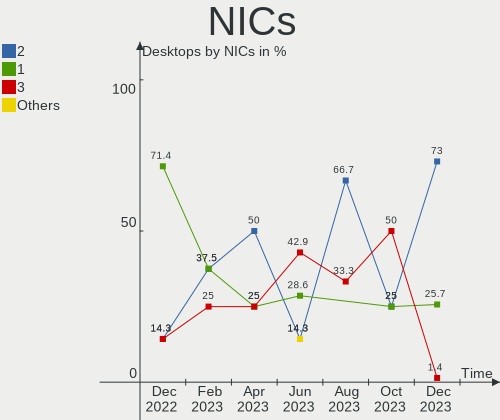

| Total | Desktops | Percent |
|-------|----------|---------|
| 1     | 23       | 69.7%   |
| 2     | 7        | 21.21%  |
| 3     | 2        | 6.06%   |
| 4     | 1        | 3.03%   |

IPv6
----

IPv6 vs IPv4

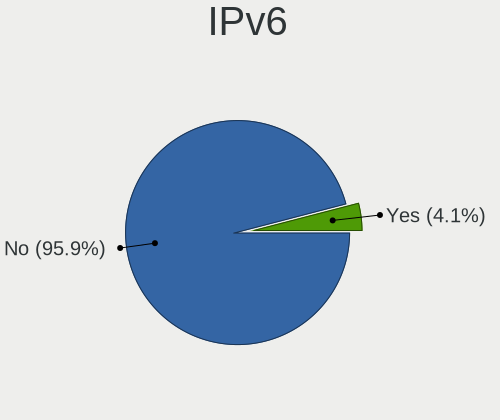

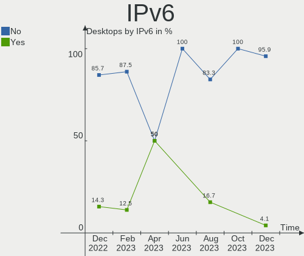

| Used | Desktops | Percent |
|------|----------|---------|
| No   | 28       | 84.85%  |
| Yes  | 5        | 15.15%  |

Bluetooth
---------

Bluetooth Vendor
----------------

Controller vendors

| Vendor   | Desktops | Percent |
|----------|----------|---------|
| Broadcom | 3        | 60%     |
| Intel    | 2        | 40%     |

Bluetooth Model
---------------

Controller models

| Model                              | Desktops | Percent |
|------------------------------------|----------|---------|
| Broadcom BCM20702A0 Bluetooth 4.0  | 2        | 40%     |
| Intel Wireless-AC 3168 Bluetooth   | 1        | 20%     |
| Intel Bluetooth wireless interface | 1        | 20%     |
| Broadcom BCM43142A0 Bluetooth 4.0  | 1        | 20%     |

Sound
-----

Sound Vendor
------------

Sound card vendors

| Vendor            | Desktops | Percent |
|-------------------|----------|---------|
| Intel             | 24       | 41.38%  |
| AMD               | 24       | 41.38%  |
| Nvidia            | 6        | 10.34%  |
| Texas Instruments | 2        | 3.45%   |
| Logitech          | 1        | 1.72%   |
| ASUSTek Computer  | 1        | 1.72%   |

Sound Model
-----------

Sound card models

| Model                                                                             | Desktops | Percent |
|-----------------------------------------------------------------------------------|----------|---------|
| AMD Oland/Hainan/Cape Verde/Pitcairn HDMI Audio [Radeon HD 7000 Series]           | 15       | 22.73%  |
| Intel 8 Series/C220 Series Chipset High Definition Audio Controller               | 8        | 12.12%  |
| Intel 100 Series/C230 Series Chipset Family HD Audio Controller                   | 8        | 12.12%  |
| AMD Starship/Matisse HD Audio Controller                                          | 5        | 7.58%   |
| Intel Xeon E3-1200 v3/4th Gen Core Processor HD Audio Controller                  | 3        | 4.55%   |
| Nvidia GK208 HDMI/DP Audio Controller                                             | 2        | 3.03%   |
| Intel Cannon Lake PCH cAVS                                                        | 2        | 3.03%   |
| Intel 9 Series Chipset Family HD Audio Controller                                 | 2        | 3.03%   |
| AMD Navi 10 HDMI Audio                                                            | 2        | 3.03%   |
| AMD Ellesmere HDMI Audio [Radeon RX 470/480 / 570/580/590]                        | 2        | 3.03%   |
| Texas Instruments PCM2902 Audio Codec                                             | 1        | 1.52%   |
| Texas Instruments PCM2900B Audio CODEC                                            | 1        | 1.52%   |
| Nvidia TU102 High Definition Audio Controller                                     | 1        | 1.52%   |
| Nvidia High Definition Audio Controller                                           | 1        | 1.52%   |
| Nvidia GP107GL High Definition Audio Controller                                   | 1        | 1.52%   |
| Nvidia GP106 High Definition Audio Controller                                     | 1        | 1.52%   |
| Logitech USB Headset                                                              | 1        | 1.52%   |
| Intel Comet Lake PCH cAVS                                                         | 1        | 1.52%   |
| Intel Audio device                                                                | 1        | 1.52%   |
| Intel 82801JI (ICH10 Family) HD Audio Controller                                  | 1        | 1.52%   |
| Intel 200 Series PCH HD Audio                                                     | 1        | 1.52%   |
| ASUSTek Computer USB Audio                                                        | 1        | 1.52%   |
| AMD SBx00 Azalia (Intel HDA)                                                      | 1        | 1.52%   |
| AMD RS780 HDMI Audio [Radeon 3000/3100 / HD 3200/3300]                            | 1        | 1.52%   |
| AMD Family 17h (Models 00h-0fh) HD Audio Controller                               | 1        | 1.52%   |
| AMD Cayman/Antilles HDMI Audio [Radeon HD 6930/6950/6970/6990]                    | 1        | 1.52%   |
| AMD Caicos HDMI Audio [Radeon HD 6450 / 7450/8450/8490 OEM / R5 230/235/235X OEM] | 1        | 1.52%   |

Memory
------

Memory Vendor
-------------

Memory module vendors

| Vendor              | Desktops | Percent |
|---------------------|----------|---------|
| Samsung Electronics | 7        | 21.88%  |
| Crucial             | 7        | 21.88%  |
| Micron Technology   | 5        | 15.63%  |
| Kingston            | 5        | 15.63%  |
| Unknown             | 3        | 9.38%   |
| SK Hynix            | 3        | 9.38%   |
| Team                | 1        | 3.13%   |
| Patriot             | 1        | 3.13%   |

Memory Model
------------

Memory module models

| Model                                                       | Desktops | Percent |
|-------------------------------------------------------------|----------|---------|
| Samsung RAM M378B5173QH0-YK0 4096MB DIMM DDR3 1600MT/s      | 6        | 17.14%  |
| Micron RAM 4ATF51264AZ-2G3B1 4096MB DIMM DDR4 2800MT/s      | 4        | 11.43%  |
| Crucial RAM CT16G4DFD824A.C16FDD 16384MB DIMM DDR4 2400MT/s | 4        | 11.43%  |
| Crucial RAM CT8G4DFD824A.C16FBD1 8192MB DIMM DDR4 2400MT/s  | 2        | 5.71%   |
| Unknown RAM Module 8GB DIMM 1600MT/s                        | 1        | 2.86%   |
| Unknown RAM Module 4GB DIMM 1333MT/s                        | 1        | 2.86%   |
| Unknown RAM Module 2048MB DIMM 800MT/s                      | 1        | 2.86%   |
| Team RAM TEAMGROUP-UD4-2666 8GB DIMM DDR4 2667MT/s          | 1        | 2.86%   |
| SK Hynix RAM Module 16GB DIMM DDR4 3200MT/s                 | 1        | 2.86%   |
| SK Hynix RAM HMT451S6BFR8A-PB 4096MB SODIMM DDR3 1600MT/s   | 1        | 2.86%   |
| SK Hynix RAM HMA81GU6DJR8N-VK 8192MB DIMM DDR4 2666MT/s     | 1        | 2.86%   |
| Samsung RAM Module 8192MB DIMM DDR4 3200MT/s                | 1        | 2.86%   |
| Patriot RAM 2666 C16 Series 16GB DIMM DDR4 2667MT/s         | 1        | 2.86%   |
| Micron RAM 8ATF1G64AZ-2G3H1R 8192MB DIMM DDR4 2400MT/s      | 1        | 2.86%   |
| Kingston RAM KHX3200C16D4/32GX 32GB DIMM DDR4 3200MT/s      | 1        | 2.86%   |
| Kingston RAM KHX2400C11D3/8GX 8192MB DIMM DDR3 2400MT/s     | 1        | 2.86%   |
| Kingston RAM KHX1600C9D3/4GX 4096MB DIMM DDR3 2400MT/s      | 1        | 2.86%   |
| Kingston RAM 9965669-019.A00G 16384MB DIMM DDR4 2400MT/s    | 1        | 2.86%   |
| Kingston RAM 9905734-059.A00G 16GB DIMM DDR4 2666MT/s       | 1        | 2.86%   |
| Crucial RAM CT8G4DFRA266.C8FE 8192MB DIMM DDR4 2667MT/s     | 1        | 2.86%   |
| Crucial RAM CT8G4DFD824A.C16FBR2 8192MB DIMM DDR4 2400MT/s  | 1        | 2.86%   |
| Crucial RAM BLS16G4D26BFSE.16FD 16384MB DIMM DDR4 2666MT/s  | 1        | 2.86%   |
| Crucial RAM BL16G36C16U4R.M8FB1 16GB DIMM DDR4 3600MT/s     | 1        | 2.86%   |

Memory Kind
-----------

Memory module kinds

| Kind    | Desktops | Percent |
|---------|----------|---------|
| DDR4    | 17       | 58.62%  |
| DDR3    | 9        | 31.03%  |
| Unknown | 3        | 10.34%  |

Memory Form Factor
------------------

Physical design of the memory module

| Name   | Desktops | Percent |
|--------|----------|---------|
| DIMM   | 28       | 96.55%  |
| SODIMM | 1        | 3.45%   |

Memory Size
-----------

Memory module size

| Size  | Desktops | Percent |
|-------|----------|---------|
| 4096  | 13       | 39.39%  |
| 16384 | 10       | 30.3%   |
| 8192  | 8        | 24.24%  |
| 32768 | 1        | 3.03%   |
| 2048  | 1        | 3.03%   |

Memory Speed
------------

Memory module speed

| Speed | Desktops | Percent |
|-------|----------|---------|
| 1600  | 8        | 26.67%  |
| 2400  | 7        | 23.33%  |
| 2800  | 4        | 13.33%  |
| 3200  | 3        | 10%     |
| 2666  | 3        | 10%     |
| 2667  | 2        | 6.67%   |
| 3600  | 1        | 3.33%   |
| 1333  | 1        | 3.33%   |
| 800   | 1        | 3.33%   |

Printers & scanners
-------------------

Printer Vendor
--------------

Printer device vendors

| Vendor          | Desktops | Percent |
|-----------------|----------|---------|
| Hewlett-Packard | 1        | 100%    |

Printer Model
-------------

Printer device models

| Model                  | Desktops | Percent |
|------------------------|----------|---------|
| HP LaserJet 400 M401dn | 1        | 100%    |

Scanner Vendor
--------------

Scanner device vendors

Zero info for selected period =(

Scanner Model
-------------

Scanner device models

Zero info for selected period =(

Camera
------

Camera Vendor
-------------

Camera device vendors

| Vendor                | Desktops | Percent |
|-----------------------|----------|---------|
| Logitech              | 4        | 66.67%  |
| Realtek Semiconductor | 1        | 16.67%  |
| Chicony Electronics   | 1        | 16.67%  |

Camera Model
------------

Camera device models

| Model                        | Desktops | Percent |
|------------------------------|----------|---------|
| Logitech HD Webcam C615      | 2        | 33.33%  |
| Realtek Web Camera           | 1        | 16.67%  |
| Logitech Webcam C310         | 1        | 16.67%  |
| Logitech Webcam C270         | 1        | 16.67%  |
| Chicony HP Integrated Webcam | 1        | 16.67%  |

Security
--------

Fingerprint Vendor
------------------

Fingerprint sensor vendors

Zero info for selected period =(

Fingerprint Model
-----------------

Fingerprint sensor models

Zero info for selected period =(

Chipcard Vendor
---------------

Chipcard module vendors

Zero info for selected period =(

Chipcard Model
--------------

Chipcard module models

Zero info for selected period =(

Unsupported
-----------

Unsupported Devices
-------------------

Total unsupported devices on board

| Total | Desktops | Percent |
|-------|----------|---------|
| 0     | 30       | 90.91%  |
| 1     | 3        | 9.09%   |

Unsupported Device Types
------------------------

Types of unsupported devices

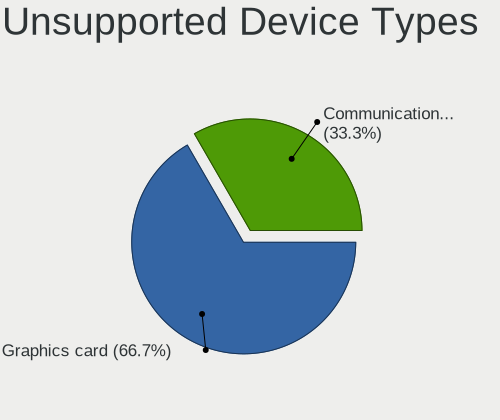

| Type                     | Desktops | Percent |
|--------------------------|----------|---------|
| Storage/raid             | 1        | 33.33%  |
| Graphics card            | 1        | 33.33%  |
| Communication controller | 1        | 33.33%  |

