CentOS Hardware Trends (Notebooks)
----------------------------------

A project to identify most popular hardware characteristics and track their change
over time based on data collected by CentOS users at https://Linux-Hardware.org.

Anyone can contribute to this report by the [hw-probe](https://github.com/linuxhw/hw-probe) tool:

    sudo -E hw-probe -all -upload

Full-feature report is available here: https://linux-hardware.org/?view=trends&formfactor=notebook

Period: Aug, 2021.

Contents
--------

* [ System ](#system)
  - [ OS                       ](#os)
  - [ OS Family                ](#os-family)
  - [ Kernel                   ](#kernel)
  - [ Kernel Family            ](#kernel-family)
  - [ Kernel Major Ver.        ](#kernel-major-ver)
  - [ Arch                     ](#arch)
  - [ DE                       ](#de)
  - [ Display Server           ](#display-server)
  - [ Display Manager          ](#display-manager)
  - [ OS Lang                  ](#os-lang)
  - [ Boot Mode                ](#boot-mode)
  - [ Filesystem               ](#filesystem)
  - [ Part. scheme             ](#part-scheme)
  - [ Dual Boot with Linux/BSD ](#dual-boot-with-linuxbsd)
  - [ Dual Boot (Win)          ](#dual-boot-win)

* [ Board ](#board)
  - [ Vendor                   ](#vendor)
  - [ Model                    ](#model)
  - [ Model Family             ](#model-family)
  - [ MFG Year                 ](#mfg-year)
  - [ Form Factor              ](#form-factor)
  - [ Secure Boot              ](#secure-boot)
  - [ Coreboot                 ](#coreboot)
  - [ RAM Size                 ](#ram-size)
  - [ RAM Used                 ](#ram-used)
  - [ Total Drives             ](#total-drives)
  - [ Has CD-ROM               ](#has-cd-rom)
  - [ Has Ethernet             ](#has-ethernet)
  - [ Has WiFi                 ](#has-wifi)
  - [ Has Bluetooth            ](#has-bluetooth)

* [ Location ](#location)
  - [ Country                  ](#country)
  - [ City                     ](#city)

* [ Drives ](#drives)
  - [ Drive Vendor             ](#drive-vendor)
  - [ Drive Model              ](#drive-model)
  - [ HDD Vendor               ](#hdd-vendor)
  - [ SSD Vendor               ](#ssd-vendor)
  - [ Drive Kind               ](#drive-kind)
  - [ Drive Connector          ](#drive-connector)
  - [ Drive Size               ](#drive-size)
  - [ Space Total              ](#space-total)
  - [ Space Used               ](#space-used)
  - [ Malfunc. Drives          ](#malfunc-drives)
  - [ Malfunc. Drive Vendor    ](#malfunc-drive-vendor)
  - [ Malfunc. HDD Vendor      ](#malfunc-hdd-vendor)
  - [ Malfunc. Drive Kind      ](#malfunc-drive-kind)
  - [ Failed Drives            ](#failed-drives)
  - [ Failed Drive Vendor      ](#failed-drive-vendor)
  - [ Drive Status             ](#drive-status)

* [ Storage controller ](#storage-controller)
  - [ Storage Vendor           ](#storage-vendor)
  - [ Storage Model            ](#storage-model)
  - [ Storage Kind             ](#storage-kind)

* [ Processor ](#processor)
  - [ CPU Vendor               ](#cpu-vendor)
  - [ CPU Model                ](#cpu-model)
  - [ CPU Model Family         ](#cpu-model-family)
  - [ CPU Cores                ](#cpu-cores)
  - [ CPU Sockets              ](#cpu-sockets)
  - [ CPU Threads              ](#cpu-threads)
  - [ CPU Op-Modes             ](#cpu-op-modes)
  - [ CPU Microcode            ](#cpu-microcode)
  - [ CPU Microarch            ](#cpu-microarch)

* [ Graphics ](#graphics)
  - [ GPU Vendor               ](#gpu-vendor)
  - [ GPU Model                ](#gpu-model)
  - [ GPU Combo                ](#gpu-combo)
  - [ GPU Driver               ](#gpu-driver)
  - [ GPU Memory               ](#gpu-memory)

* [ Monitor ](#monitor)
  - [ Monitor Vendor           ](#monitor-vendor)
  - [ Monitor Model            ](#monitor-model)
  - [ Monitor Resolution       ](#monitor-resolution)
  - [ Monitor Diagonal         ](#monitor-diagonal)
  - [ Monitor Width            ](#monitor-width)
  - [ Aspect Ratio             ](#aspect-ratio)
  - [ Monitor Area             ](#monitor-area)
  - [ Pixel Density            ](#pixel-density)
  - [ Multiple Monitors        ](#multiple-monitors)

* [ Network ](#network)
  - [ Net Controller Vendor    ](#net-controller-vendor)
  - [ Net Controller Model     ](#net-controller-model)
  - [ Wireless Vendor          ](#wireless-vendor)
  - [ Wireless Model           ](#wireless-model)
  - [ Ethernet Vendor          ](#ethernet-vendor)
  - [ Ethernet Model           ](#ethernet-model)
  - [ Net Controller Kind      ](#net-controller-kind)
  - [ Used Controller          ](#used-controller)
  - [ NICs                     ](#nics)
  - [ IPv6                     ](#ipv6)

* [ Bluetooth ](#bluetooth)
  - [ Bluetooth Vendor         ](#bluetooth-vendor)
  - [ Bluetooth Model          ](#bluetooth-model)

* [ Sound ](#sound)
  - [ Sound Vendor             ](#sound-vendor)
  - [ Sound Model              ](#sound-model)

* [ Memory ](#memory)
  - [ Memory Vendor            ](#memory-vendor)
  - [ Memory Model             ](#memory-model)
  - [ Memory Kind              ](#memory-kind)
  - [ Memory Form Factor       ](#memory-form-factor)
  - [ Memory Size              ](#memory-size)
  - [ Memory Speed             ](#memory-speed)

* [ Printers & scanners ](#printers--scanners)
  - [ Printer Vendor           ](#printer-vendor)
  - [ Printer Model            ](#printer-model)
  - [ Scanner Vendor           ](#scanner-vendor)
  - [ Scanner Model            ](#scanner-model)

* [ Camera ](#camera)
  - [ Camera Vendor            ](#camera-vendor)
  - [ Camera Model             ](#camera-model)

* [ Security ](#security)
  - [ Fingerprint Vendor       ](#fingerprint-vendor)
  - [ Fingerprint Model        ](#fingerprint-model)
  - [ Chipcard Vendor          ](#chipcard-vendor)
  - [ Chipcard Model           ](#chipcard-model)

* [ Unsupported ](#unsupported)
  - [ Unsupported Devices      ](#unsupported-devices)
  - [ Unsupported Device Types ](#unsupported-device-types)

System
------

OS
--

Installed operating systems

| Name            | Notebooks | Percent |
|-----------------|-----------|---------|
| CentOS 8        | 5         | 62.5%   |
| CentOS 7        | 2         | 25%     |
| CentOS 8.4.2105 | 1         | 12.5%   |

OS Family
---------

OS without a version

| Name   | Notebooks | Percent |
|--------|-----------|---------|
| CentOS | 8         | 100%    |

Kernel
------

Version of the Linux kernel

| Version                      | Notebooks | Percent |
|------------------------------|-----------|---------|
| 5.13.7-1.el8.elrepo.x86_64   | 1         | 12.5%   |
| 4.18.0-305.3.1.el8.x86_64    | 1         | 12.5%   |
| 4.18.0-305.12.1.el8_4.x86_64 | 1         | 12.5%   |
| 4.18.0-305.10.2.el8_4.x86_64 | 1         | 12.5%   |
| 4.18.0-277.el8.x86_64        | 1         | 12.5%   |
| 4.18.0-240.el8.x86_64        | 1         | 12.5%   |
| 3.10.0-1160.el7.x86_64       | 1         | 12.5%   |
| 3.10.0-1127.el7.x86_64       | 1         | 12.5%   |

Kernel Family
-------------

Linux kernel without a distro release

| Version | Notebooks | Percent |
|---------|-----------|---------|
| 4.18.0  | 5         | 62.5%   |
| 3.10.0  | 2         | 25%     |
| 5.13.7  | 1         | 12.5%   |

Kernel Major Ver.
-----------------

Linux kernel major version

| Version | Notebooks | Percent |
|---------|-----------|---------|
| 4.18    | 5         | 62.5%   |
| 3.10    | 2         | 25%     |
| 5.13    | 1         | 12.5%   |

Arch
----

OS architecture (x86_64, i586, etc.)

| Name   | Notebooks | Percent |
|--------|-----------|---------|
| x86_64 | 8         | 100%    |

DE
--

Desktop Environment

| Name          | Notebooks | Percent |
|---------------|-----------|---------|
| GNOME         | 5         | 62.5%   |
| XFCE          | 1         | 12.5%   |
| KDE5          | 1         | 12.5%   |
| GNOME Classic | 1         | 12.5%   |

Display Server
--------------

X11 or Wayland

| Name    | Notebooks | Percent |
|---------|-----------|---------|
| X11     | 5         | 62.5%   |
| Wayland | 3         | 37.5%   |

Display Manager
---------------

SDDM, LightDM, etc.

| Name    | Notebooks | Percent |
|---------|-----------|---------|
| GDM     | 4         | 50%     |
| Unknown | 4         | 50%     |

OS Lang
-------

Language

| Lang  | Notebooks | Percent |
|-------|-----------|---------|
| en_US | 6         | 75%     |
| en_GB | 1         | 12.5%   |
| de_DE | 1         | 12.5%   |

Boot Mode
---------

EFI or BIOS

| Mode | Notebooks | Percent |
|------|-----------|---------|
| EFI  | 6         | 75%     |
| BIOS | 2         | 25%     |

Filesystem
----------

Type of filesystem

| Type | Notebooks | Percent |
|------|-----------|---------|
| Xfs  | 6         | 75%     |
| Ext4 | 2         | 25%     |

Part. scheme
------------

Scheme of partitioning

| Type    | Notebooks | Percent |
|---------|-----------|---------|
| GPT     | 4         | 50%     |
| Unknown | 3         | 37.5%   |
| MBR     | 1         | 12.5%   |

Dual Boot with Linux/BSD
------------------------

Hosting more than one Linux/BSD

| Dual boot | Notebooks | Percent |
|-----------|-----------|---------|
| No        | 7         | 87.5%   |
| Yes       | 1         | 12.5%   |

Dual Boot (Win)
---------------

Hosting Linux and Windows

| Dual boot | Notebooks | Percent |
|-----------|-----------|---------|
| No        | 7         | 87.5%   |
| Yes       | 1         | 12.5%   |

Board
-----

Vendor
------

Motherboard manufacturer

| Name            | Notebooks | Percent |
|-----------------|-----------|---------|
| Hewlett-Packard | 4         | 50%     |
| Dell            | 3         | 37.5%   |
| Lenovo          | 1         | 12.5%   |

Model
-----

Motherboard model

| Name                           | Notebooks | Percent |
|--------------------------------|-----------|---------|
| Lenovo ThinkPad P50 20EN001PUS | 1         | 12.5%   |
| HP Presario C700               | 1         | 12.5%   |
| HP NOTEBOOKE 15-AY084TU        | 1         | 12.5%   |
| HP EliteBook 8540w             | 1         | 12.5%   |
| HP EliteBook 8440p             | 1         | 12.5%   |
| Dell XPS 15 9570               | 1         | 12.5%   |
| Dell XPS 15 7590               | 1         | 12.5%   |
| Dell Latitude 7420             | 1         | 12.5%   |

Model Family
------------

Motherboard model prefix

| Name            | Notebooks | Percent |
|-----------------|-----------|---------|
| HP EliteBook    | 2         | 25%     |
| Dell XPS        | 2         | 25%     |
| Lenovo ThinkPad | 1         | 12.5%   |
| HP Presario     | 1         | 12.5%   |
| HP NOTEBOOKE    | 1         | 12.5%   |
| Dell Latitude   | 1         | 12.5%   |

MFG Year
--------

Motherboard manufacture year

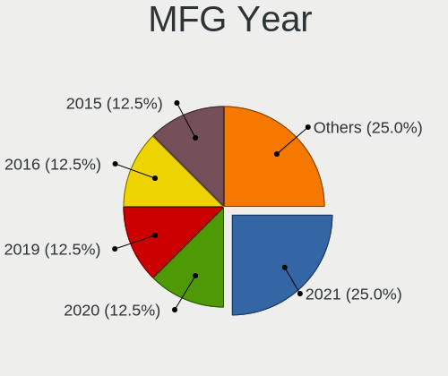

| Year | Notebooks | Percent |
|------|-----------|---------|
| 2021 | 2         | 25%     |
| 2020 | 1         | 12.5%   |
| 2019 | 1         | 12.5%   |
| 2016 | 1         | 12.5%   |
| 2015 | 1         | 12.5%   |
| 2014 | 1         | 12.5%   |
| 2010 | 1         | 12.5%   |

Form Factor
-----------

Physical design of the computer

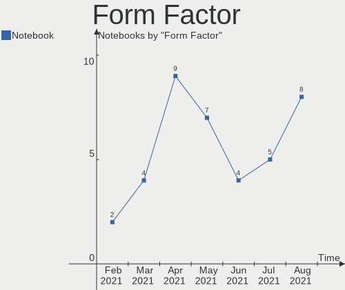

| Name     | Notebooks | Percent |
|----------|-----------|---------|
| Notebook | 8         | 100%    |

Secure Boot
-----------

Enabled or disabled

| State    | Notebooks | Percent |
|----------|-----------|---------|
| Disabled | 8         | 100%    |

Coreboot
--------

Have coreboot on board

| Used | Notebooks | Percent |
|------|-----------|---------|
| No   | 8         | 100%    |

RAM Size
--------

Total RAM memory

| Size in GB | Notebooks | Percent |
|------------|-----------|---------|
| 4.01-8.0   | 3         | 37.5%   |
| 32.01-64.0 | 2         | 25%     |
| 8.01-16.0  | 2         | 25%     |
| 2.01-3.0   | 1         | 12.5%   |

RAM Used
--------

Used RAM memory

| Used GB  | Notebooks | Percent |
|----------|-----------|---------|
| 2.01-3.0 | 4         | 50%     |
| 4.01-8.0 | 2         | 25%     |
| 1.01-2.0 | 1         | 12.5%   |
| 0.51-1.0 | 1         | 12.5%   |

Total Drives
------------

Number of drives on board

| Drives | Notebooks | Percent |
|--------|-----------|---------|
| 1      | 7         | 87.5%   |
| 2      | 1         | 12.5%   |

Has CD-ROM
----------

Has CD-ROM on board

| Presented | Notebooks | Percent |
|-----------|-----------|---------|
| Yes       | 4         | 50%     |
| No        | 4         | 50%     |

Has Ethernet
------------

Has Ethernet on board

| Presented | Notebooks | Percent |
|-----------|-----------|---------|
| Yes       | 5         | 62.5%   |
| No        | 3         | 37.5%   |

Has WiFi
--------

Has WiFi module

| Presented | Notebooks | Percent |
|-----------|-----------|---------|
| Yes       | 8         | 100%    |

Has Bluetooth
-------------

Has Bluetooth module

| Presented | Notebooks | Percent |
|-----------|-----------|---------|
| Yes       | 6         | 75%     |
| No        | 2         | 25%     |

Location
--------

Country
-------

Geographic location (country)

| Country   | Notebooks | Percent |
|-----------|-----------|---------|
| USA       | 2         | 25%     |
| UK        | 1         | 12.5%   |
| Sweden    | 1         | 12.5%   |
| Lithuania | 1         | 12.5%   |
| India     | 1         | 12.5%   |
| Greece    | 1         | 12.5%   |
| Germany   | 1         | 12.5%   |

City
----

Geographic location (city)

| City        | Notebooks | Percent |
|-------------|-----------|---------|
| Warrington  | 1         | 12.5%   |
| Vilnius     | 1         | 12.5%   |
| Sollentuna  | 1         | 12.5%   |
| Rethymno    | 1         | 12.5%   |
| Munich      | 1         | 12.5%   |
| Mumbai      | 1         | 12.5%   |
| Ashburn     | 1         | 12.5%   |
| Albuquerque | 1         | 12.5%   |

Drives
------

Drive Vendor
------------

Hard drive vendors

| Vendor              | Notebooks | Drives | Percent |
|---------------------|-----------|--------|---------|
| Samsung Electronics | 3         | 3      | 33.33%  |
| Unknown             | 1         | 1      | 11.11%  |
| Toshiba             | 1         | 1      | 11.11%  |
| SK Hynix            | 1         | 1      | 11.11%  |
| Seagate             | 1         | 1      | 11.11%  |
| SanDisk             | 1         | 1      | 11.11%  |
| Crucial             | 1         | 1      | 11.11%  |

Drive Model
-----------

Hard drive models

| Model                               | Notebooks | Percent |
|-------------------------------------|-----------|---------|
| Unknown MMC Card  32GB              | 1         | 11.11%  |
| Toshiba MQ01ABD100 1TB              | 1         | 11.11%  |
| SK Hynix PC401 NVMe 512GB           | 1         | 11.11%  |
| Seagate ST980813ASG 80GB            | 1         | 11.11%  |
| SanDisk SD8SN8U-128G-1006 128GB SSD | 1         | 11.11%  |
| Samsung SSD 850 EVO 250GB           | 1         | 11.11%  |
| Samsung PM981 NVMe 2048GB           | 1         | 11.11%  |
| Samsung NVMe SSD Drive 512GB        | 1         | 11.11%  |
| Crucial CT2000P2SSD8 2TB            | 1         | 11.11%  |

HDD Vendor
----------

Hard disk drive vendors

| Vendor  | Notebooks | Drives | Percent |
|---------|-----------|--------|---------|
| Toshiba | 1         | 1      | 50%     |
| Seagate | 1         | 1      | 50%     |

SSD Vendor
----------

Solid state drive vendors

| Vendor              | Notebooks | Drives | Percent |
|---------------------|-----------|--------|---------|
| SanDisk             | 1         | 1      | 50%     |
| Samsung Electronics | 1         | 1      | 50%     |

Drive Kind
----------

HDD or SSD

| Kind | Notebooks | Drives | Percent |
|------|-----------|--------|---------|
| NVMe | 4         | 4      | 44.44%  |
| SSD  | 2         | 2      | 22.22%  |
| HDD  | 2         | 2      | 22.22%  |
| MMC  | 1         | 1      | 11.11%  |

Drive Connector
---------------

SATA, SAS, NVMe, etc.

| Type | Notebooks | Drives | Percent |
|------|-----------|--------|---------|
| NVMe | 4         | 4      | 44.44%  |
| SATA | 4         | 4      | 44.44%  |
| MMC  | 1         | 1      | 11.11%  |

Drive Size
----------

Size of hard drive

| Size in TB | Notebooks | Drives | Percent |
|------------|-----------|--------|---------|
| 0.01-0.5   | 3         | 3      | 75%     |
| 0.51-1.0   | 1         | 1      | 25%     |

Space Total
-----------

Amount of disk space available on the file system

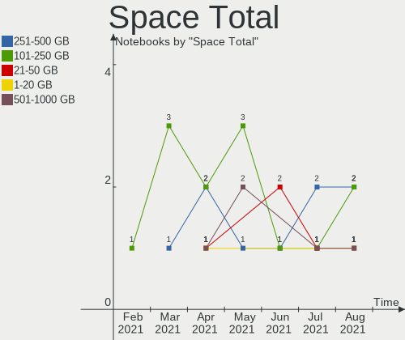

| Size in GB | Notebooks | Percent |
|------------|-----------|---------|
| 251-500    | 2         | 25%     |
| 101-250    | 2         | 25%     |
| 21-50      | 1         | 12.5%   |
| 1-20       | 1         | 12.5%   |
| 501-1000   | 1         | 12.5%   |
| 51-100     | 1         | 12.5%   |

Space Used
----------

Amount of used disk space

| Used GB | Notebooks | Percent |
|---------|-----------|---------|
| 1-20    | 4         | 50%     |
| 21-50   | 2         | 25%     |
| 101-250 | 2         | 25%     |

Malfunc. Drives
---------------

Drive models with a malfunction

Zero info for selected period =(

Malfunc. Drive Vendor
---------------------

Vendors of faulty drives

Zero info for selected period =(

Malfunc. HDD Vendor
-------------------

Vendors of faulty HDD drives

Zero info for selected period =(

Malfunc. Drive Kind
-------------------

Kinds of faulty drives

Zero info for selected period =(

Failed Drives
-------------

Failed drive models

Zero info for selected period =(

Failed Drive Vendor
-------------------

Failed drive vendors

Zero info for selected period =(

Drive Status
------------

Number of failed and malfunc. drives

| Status   | Notebooks | Drives | Percent |
|----------|-----------|--------|---------|
| Works    | 5         | 5      | 55.56%  |
| Detected | 4         | 4      | 44.44%  |

Storage controller
------------------

Storage Vendor
--------------

Storage controller vendors

| Vendor                    | Notebooks | Percent |
|---------------------------|-----------|---------|
| Intel                     | 7         | 63.64%  |
| Samsung Electronics       | 2         | 18.18%  |
| SK Hynix                  | 1         | 9.09%   |
| Micron/Crucial Technology | 1         | 9.09%   |

Storage Model
-------------

Storage controller models

| Model                                                                         | Notebooks | Percent |
|-------------------------------------------------------------------------------|-----------|---------|
| Intel Cannon Lake Mobile PCH SATA AHCI Controller                             | 2         | 16.67%  |
| Intel 5 Series/3400 Series Chipset 6 port SATA AHCI Controller                | 2         | 16.67%  |
| SK Hynix PC401 NVMe Solid State Drive 256GB                                   | 1         | 8.33%   |
| Samsung NVMe SSD Controller SM981/PM981/PM983                                 | 1         | 8.33%   |
| Samsung NVMe SSD Controller SM951/PM951                                       | 1         | 8.33%   |
| Micron/Crucial P2 NVMe PCIe SSD                                               | 1         | 8.33%   |
| Intel Sunrise Point-LP SATA Controller [AHCI mode]                            | 1         | 8.33%   |
| Intel Q170/Q150/B150/H170/H110/Z170/CM236 Chipset SATA Controller [AHCI Mode] | 1         | 8.33%   |
| Intel 82801HM/HEM (ICH8M/ICH8M-E) SATA Controller [AHCI mode]                 | 1         | 8.33%   |
| Intel 82801HM/HEM (ICH8M/ICH8M-E) IDE Controller                              | 1         | 8.33%   |

Storage Kind
------------

Kind of storage controller (IDE, SATA, NVMe, SAS, ...)

| Kind | Notebooks | Percent |
|------|-----------|---------|
| SATA | 7         | 58.33%  |
| NVMe | 4         | 33.33%  |
| IDE  | 1         | 8.33%   |

Processor
---------

CPU Vendor
----------

Processor vendors

| Vendor | Notebooks | Percent |
|--------|-----------|---------|
| Intel  | 8         | 100%    |

CPU Model
---------

Processor models

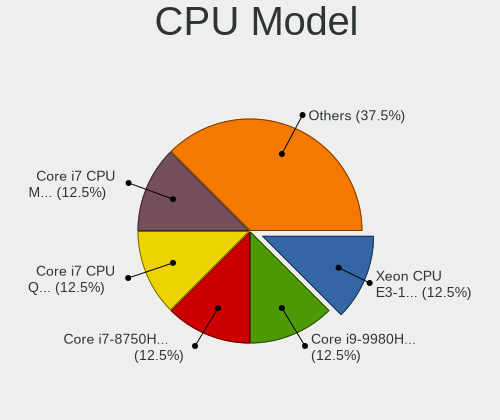

| Model                                   | Notebooks | Percent |
|-----------------------------------------|-----------|---------|
| Intel Xeon CPU E3-1505M v5 @ 2.80GHz    | 1         | 12.5%   |
| Intel Core i9-9980HK CPU @ 2.40GHz      | 1         | 12.5%   |
| Intel Core i7-8750H CPU @ 2.20GHz       | 1         | 12.5%   |
| Intel Core i7 CPU Q 840 @ 1.87GHz       | 1         | 12.5%   |
| Intel Core i7 CPU M 640 @ 2.80GHz       | 1         | 12.5%   |
| Intel Core i5-6200U CPU @ 2.30GHz       | 1         | 12.5%   |
| Intel Core 2 Duo CPU T9300 @ 2.50GHz    | 1         | 12.5%   |
| Intel 11th Gen Core i7-1185G7 @ 3.00GHz | 1         | 12.5%   |

CPU Model Family
----------------

Processor model prefix

| Model            | Notebooks | Percent |
|------------------|-----------|---------|
| Intel Core i7    | 3         | 37.5%   |
| Other            | 1         | 12.5%   |
| Intel Xeon       | 1         | 12.5%   |
| Intel Core i9    | 1         | 12.5%   |
| Intel Core i5    | 1         | 12.5%   |
| Intel Core 2 Duo | 1         | 12.5%   |

CPU Cores
---------

Number of processor cores

| Number | Notebooks | Percent |
|--------|-----------|---------|
| 4      | 3         | 37.5%   |
| 2      | 3         | 37.5%   |
| 8      | 1         | 12.5%   |
| 6      | 1         | 12.5%   |

CPU Sockets
-----------

Number of sockets

| Number | Notebooks | Percent |
|--------|-----------|---------|
| 1      | 8         | 100%    |

CPU Threads
-----------

Threads per core (Hyper-Threading)

| Number | Notebooks | Percent |
|--------|-----------|---------|
| 2      | 7         | 87.5%   |
| 1      | 1         | 12.5%   |

CPU Op-Modes
------------

CPU Operation Modes (32-bit, 64-bit)

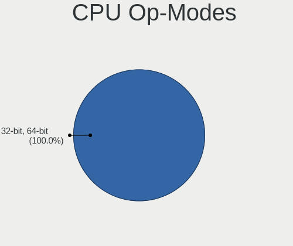

| Op mode        | Notebooks | Percent |
|----------------|-----------|---------|
| 32-bit, 64-bit | 8         | 100%    |

CPU Microcode
-------------

Microcode number

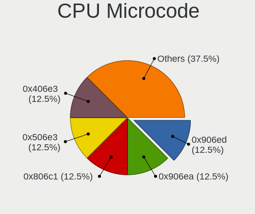

| Number  | Notebooks | Percent |
|---------|-----------|---------|
| 0x906ed | 1         | 12.5%   |
| 0x906ea | 1         | 12.5%   |
| 0x806c1 | 1         | 12.5%   |
| 0x506e3 | 1         | 12.5%   |
| 0x406e3 | 1         | 12.5%   |
| 0x20655 | 1         | 12.5%   |
| 0x106e5 | 1         | 12.5%   |
| 0x10676 | 1         | 12.5%   |

CPU Microarch
-------------

Microarchitecture

| Name      | Notebooks | Percent |
|-----------|-----------|---------|
| Skylake   | 2         | 25%     |
| KabyLake  | 2         | 25%     |
| Westmere  | 1         | 12.5%   |
| TigerLake | 1         | 12.5%   |
| Penryn    | 1         | 12.5%   |
| Nehalem   | 1         | 12.5%   |

Graphics
--------

GPU Vendor
----------

Vendors of graphics cards

| Vendor | Notebooks | Percent |
|--------|-----------|---------|
| Intel  | 7         | 63.64%  |
| Nvidia | 3         | 27.27%  |
| AMD    | 1         | 9.09%   |

GPU Model
---------

Graphics card models

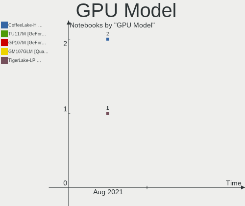

| Model                                                               | Notebooks | Percent |
|---------------------------------------------------------------------|-----------|---------|
| Intel CoffeeLake-H GT2 [UHD Graphics 630]                           | 2         | 16.67%  |
| Nvidia TU117M [GeForce GTX 1650 Mobile / Max-Q]                     | 1         | 8.33%   |
| Nvidia GP107M [GeForce GTX 1050 Ti Mobile]                          | 1         | 8.33%   |
| Nvidia GM107GLM [Quadro M2000M]                                     | 1         | 8.33%   |
| Intel TigerLake-LP GT2 [Iris Xe Graphics]                           | 1         | 8.33%   |
| Intel Skylake GT2 [HD Graphics 520]                                 | 1         | 8.33%   |
| Intel Mobile GM965/GL960 Integrated Graphics Controller (secondary) | 1         | 8.33%   |
| Intel Mobile GM965/GL960 Integrated Graphics Controller (primary)   | 1         | 8.33%   |
| Intel HD Graphics P530                                              | 1         | 8.33%   |
| Intel Core Processor Integrated Graphics Controller                 | 1         | 8.33%   |
| AMD Madison [Mobility Radeon HD 5730 / 6570M]                       | 1         | 8.33%   |

GPU Combo
---------

Combinations of graphics cards

| Name           | Notebooks | Percent |
|----------------|-----------|---------|
| 1 x Intel      | 4         | 50%     |
| Intel + Nvidia | 3         | 37.5%   |
| 1 x AMD        | 1         | 12.5%   |

GPU Driver
----------

Free vs proprietary

| Driver  | Notebooks | Percent |
|---------|-----------|---------|
| Free    | 7         | 87.5%   |
| Unknown | 1         | 12.5%   |

GPU Memory
----------

Total video memory

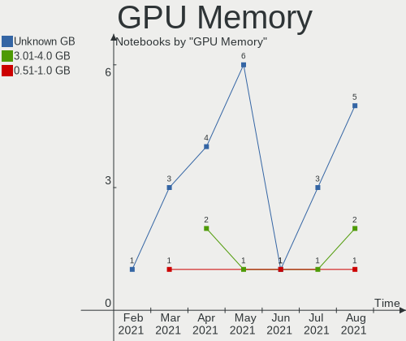

| Size in GB | Notebooks | Percent |
|------------|-----------|---------|
| Unknown    | 5         | 62.5%   |
| 3.01-4.0   | 2         | 25%     |
| 0.51-1.0   | 1         | 12.5%   |

Monitor
-------

Monitor Vendor
--------------

Monitor vendors

| Vendor              | Notebooks | Percent |
|---------------------|-----------|---------|
| Sharp               | 2         | 28.57%  |
| Samsung Electronics | 2         | 28.57%  |
| Chimei Innolux      | 1         | 14.29%  |
| BOE                 | 1         | 14.29%  |
| AU Optronics        | 1         | 14.29%  |

Monitor Model
-------------

Monitor models

| Model                                                                | Notebooks | Percent |
|----------------------------------------------------------------------|-----------|---------|
| Sharp LCD Monitor SHP14B9 3840x2160 344x194mm 15.5-inch              | 1         | 14.29%  |
| Sharp LCD Monitor SHP149A 1920x1080 344x194mm 15.5-inch              | 1         | 14.29%  |
| Samsung Electronics LCD Monitor SEC4D45 1280x800 331x207mm 15.4-inch | 1         | 14.29%  |
| Samsung Electronics LCD Monitor SEC434E 1600x900 310x170mm 13.9-inch | 1         | 14.29%  |
| Chimei Innolux LCD Monitor CMN15C6 1366x768 340x190mm 15.3-inch      | 1         | 14.29%  |
| BOE LCD Monitor BOE0630 1920x1080 344x194mm 15.5-inch                | 1         | 14.29%  |
| AU Optronics LCD Monitor AUO4A90 1920x1080 309x174mm 14.0-inch       | 1         | 14.29%  |

Monitor Resolution
------------------

Monitor screen resolution

| Resolution      | Notebooks | Percent |
|-----------------|-----------|---------|
| 1920x1080 (FHD) | 3         | 42.86%  |
| 3840x2160 (4K)  | 1         | 14.29%  |
| 1600x900 (HD+)  | 1         | 14.29%  |
| 1366x768 (WXGA) | 1         | 14.29%  |
| 1280x800 (WXGA) | 1         | 14.29%  |

Monitor Diagonal
----------------

Diagonal size in inches

| Inches | Notebooks | Percent |
|--------|-----------|---------|
| 15     | 5         | 71.43%  |
| 14     | 2         | 28.57%  |

Monitor Width
-------------

Physical width

| Width in mm | Notebooks | Percent |
|-------------|-----------|---------|
| 301-350     | 7         | 100%    |

Aspect Ratio
------------

Proportional relationship between the width and the height

| Ratio | Notebooks | Percent |
|-------|-----------|---------|
| 16/9  | 6         | 85.71%  |
| 16/10 | 1         | 14.29%  |

Monitor Area
------------

Area in inch²

| Area in inch² | Notebooks | Percent |
|----------------|-----------|---------|
| 101-110        | 5         | 71.43%  |
| 81-90          | 2         | 28.57%  |

Pixel Density
-------------

Pixels per inch

| Density       | Notebooks | Percent |
|---------------|-----------|---------|
| 121-160       | 4         | 57.14%  |
| More than 240 | 1         | 14.29%  |
| 101-120       | 1         | 14.29%  |
| 51-100        | 1         | 14.29%  |

Multiple Monitors
-----------------

Total monitors connected

| Total | Notebooks | Percent |
|-------|-----------|---------|
| 1     | 8         | 100%    |

Network
-------

Net Controller Vendor
---------------------

Controller vendors

| Vendor                | Notebooks | Percent |
|-----------------------|-----------|---------|
| Intel                 | 5         | 50%     |
| Realtek Semiconductor | 2         | 20%     |
| Qualcomm Atheros      | 2         | 20%     |
| Dell                  | 1         | 10%     |

Net Controller Model
--------------------

Controller models

| Model                                                                   | Notebooks | Percent |
|-------------------------------------------------------------------------|-----------|---------|
| Intel Wi-Fi 6 AX200                                                     | 2         | 14.29%  |
| Intel Centrino Ultimate-N 6300                                          | 2         | 14.29%  |
| Intel 82577LM Gigabit Network Connection                                | 2         | 14.29%  |
| Realtek RTL8723BE PCIe Wireless Network Adapter                         | 1         | 7.14%   |
| Realtek RTL810xE PCI Express Fast Ethernet controller                   | 1         | 7.14%   |
| Realtek RTL-8100/8101L/8139 PCI Fast Ethernet Adapter                   | 1         | 7.14%   |
| Qualcomm Atheros QCA6174 802.11ac Wireless Network Adapter              | 1         | 7.14%   |
| Qualcomm Atheros AR242x / AR542x Wireless Network Adapter (PCI-Express) | 1         | 7.14%   |
| Intel Wi-Fi 6 AX201                                                     | 1         | 7.14%   |
| Intel Ethernet Connection (2) I219-LM                                   | 1         | 7.14%   |
| Dell DW5811e Snapdragon???„?? X7 LTE                                    | 1         | 7.14%   |

Wireless Vendor
---------------

Wireless vendors

| Vendor                | Notebooks | Percent |
|-----------------------|-----------|---------|
| Intel                 | 5         | 55.56%  |
| Qualcomm Atheros      | 2         | 22.22%  |
| Realtek Semiconductor | 1         | 11.11%  |
| Dell                  | 1         | 11.11%  |

Wireless Model
--------------

Wireless models

| Model                                                                   | Notebooks | Percent |
|-------------------------------------------------------------------------|-----------|---------|
| Intel Wi-Fi 6 AX200                                                     | 2         | 22.22%  |
| Intel Centrino Ultimate-N 6300                                          | 2         | 22.22%  |
| Realtek RTL8723BE PCIe Wireless Network Adapter                         | 1         | 11.11%  |
| Qualcomm Atheros QCA6174 802.11ac Wireless Network Adapter              | 1         | 11.11%  |
| Qualcomm Atheros AR242x / AR542x Wireless Network Adapter (PCI-Express) | 1         | 11.11%  |
| Intel Wi-Fi 6 AX201                                                     | 1         | 11.11%  |
| Dell DW5811e Snapdragon???„?? X7 LTE                                    | 1         | 11.11%  |

Ethernet Vendor
---------------

Ethernet vendors

| Vendor                | Notebooks | Percent |
|-----------------------|-----------|---------|
| Intel                 | 3         | 60%     |
| Realtek Semiconductor | 2         | 40%     |

Ethernet Model
--------------

Ethernet models

| Model                                                 | Notebooks | Percent |
|-------------------------------------------------------|-----------|---------|
| Intel 82577LM Gigabit Network Connection              | 2         | 40%     |
| Realtek RTL810xE PCI Express Fast Ethernet controller | 1         | 20%     |
| Realtek RTL-8100/8101L/8139 PCI Fast Ethernet Adapter | 1         | 20%     |
| Intel Ethernet Connection (2) I219-LM                 | 1         | 20%     |

Net Controller Kind
-------------------

Ethernet, WiFi or modem

| Kind     | Notebooks | Percent |
|----------|-----------|---------|
| WiFi     | 8         | 61.54%  |
| Ethernet | 5         | 38.46%  |

Used Controller
---------------

Currently used network controller

| Kind     | Notebooks | Percent |
|----------|-----------|---------|
| WiFi     | 8         | 72.73%  |
| Ethernet | 3         | 27.27%  |

NICs
----

Total network controllers on board

| Total | Notebooks | Percent |
|-------|-----------|---------|
| 2     | 5         | 62.5%   |
| 1     | 3         | 37.5%   |

IPv6
----

IPv6 vs IPv4

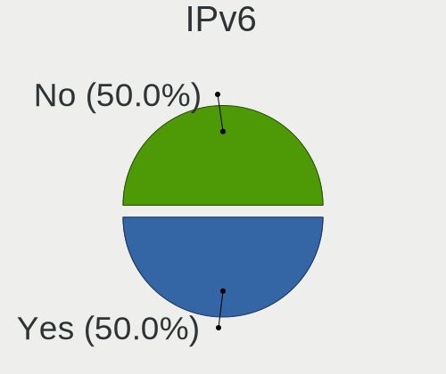

| Used | Notebooks | Percent |
|------|-----------|---------|
| Yes  | 4         | 50%     |
| No   | 4         | 50%     |

Bluetooth
---------

Bluetooth Vendor
----------------

Controller vendors

| Vendor                          | Notebooks | Percent |
|---------------------------------|-----------|---------|
| Intel                           | 3         | 50%     |
| Realtek Semiconductor           | 1         | 16.67%  |
| Qualcomm Atheros Communications | 1         | 16.67%  |
| Hewlett-Packard                 | 1         | 16.67%  |

Bluetooth Model
---------------

Controller models

| Model                                  | Notebooks | Percent |
|----------------------------------------|-----------|---------|
| Intel AX200 Bluetooth                  | 2         | 33.33%  |
| Realtek Bluetooth Radio                | 1         | 16.67%  |
| Qualcomm Atheros QCA61x4 Bluetooth 4.0 | 1         | 16.67%  |
| Intel Bluetooth Device                 | 1         | 16.67%  |
| HP Broadcom 2070 Bluetooth Combo       | 1         | 16.67%  |

Sound
-----

Sound Vendor
------------

Sound card vendors

| Vendor    | Notebooks | Percent |
|-----------|-----------|---------|
| Intel     | 8         | 72.73%  |
| Nvidia    | 1         | 9.09%   |
| GN Netcom | 1         | 9.09%   |
| AMD       | 1         | 9.09%   |

Sound Model
-----------

Sound card models

| Model                                                           | Notebooks | Percent |
|-----------------------------------------------------------------|-----------|---------|
| Intel Cannon Lake PCH cAVS                                      | 2         | 18.18%  |
| Intel 5 Series/3400 Series Chipset High Definition Audio        | 2         | 18.18%  |
| Nvidia GM107 High Definition Audio Controller [GeForce 940MX]   | 1         | 9.09%   |
| Intel Tiger Lake-LP Smart Sound Technology Audio Controller     | 1         | 9.09%   |
| Intel Sunrise Point-LP HD Audio                                 | 1         | 9.09%   |
| Intel 82801H (ICH8 Family) HD Audio Controller                  | 1         | 9.09%   |
| Intel 100 Series/C230 Series Chipset Family HD Audio Controller | 1         | 9.09%   |
| GN Netcom Jabra Link 370                                        | 1         | 9.09%   |
| AMD Redwood HDMI Audio [Radeon HD 5000 Series]                  | 1         | 9.09%   |

Memory
------

Memory Vendor
-------------

Memory module vendors

| Vendor              | Notebooks | Percent |
|---------------------|-----------|---------|
| Micron Technology   | 2         | 40%     |
| Unknown             | 1         | 20%     |
| SK Hynix            | 1         | 20%     |
| Samsung Electronics | 1         | 20%     |

Memory Model
------------

Memory module models

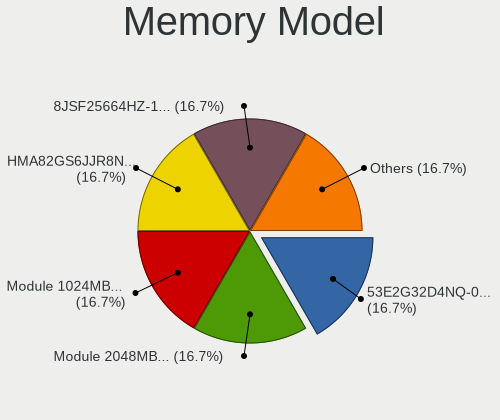

| Model                                                           | Notebooks | Percent |
|-----------------------------------------------------------------|-----------|---------|
| Unknown RAM 53E2G32D4NQ-046 4096MB Row Of Chips LPDDR4 4267MT/s | 1         | 16.67%  |
| SK Hynix RAM HMA82GS6JJR8N-VK 16384MB SODIMM DDR4 2667MT/s      | 1         | 16.67%  |
| Samsung RAM Module 2048MB SODIMM DDR2 667MT/s                   | 1         | 16.67%  |
| Samsung RAM Module 1024MB SODIMM DDR2 667MT/s                   | 1         | 16.67%  |
| Micron RAM 8JSF25664HZ-1G4D1 2048MB SODIMM DDR3 1334MT/s        | 1         | 16.67%  |
| Micron RAM 8ATF1G64HZ-2G6D1 8GB SODIMM DDR4 2667MT/s            | 1         | 16.67%  |

Memory Kind
-----------

Memory module kinds

| Kind   | Notebooks | Percent |
|--------|-----------|---------|
| DDR4   | 2         | 40%     |
| LPDDR4 | 1         | 20%     |
| DDR3   | 1         | 20%     |
| DDR2   | 1         | 20%     |

Memory Form Factor
------------------

Physical design of the memory module

| Name         | Notebooks | Percent |
|--------------|-----------|---------|
| SODIMM       | 4         | 80%     |
| Row Of Chips | 1         | 20%     |

Memory Size
-----------

Memory module size

| Size  | Notebooks | Percent |
|-------|-----------|---------|
| 2048  | 2         | 33.33%  |
| 16384 | 1         | 16.67%  |
| 8192  | 1         | 16.67%  |
| 4096  | 1         | 16.67%  |
| 1024  | 1         | 16.67%  |

Memory Speed
------------

Memory module speed

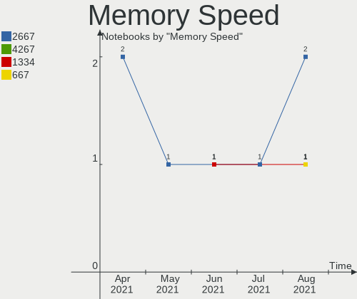

| Speed | Notebooks | Percent |
|-------|-----------|---------|
| 2667  | 2         | 40%     |
| 4267  | 1         | 20%     |
| 1334  | 1         | 20%     |
| 667   | 1         | 20%     |

Printers & scanners
-------------------

Printer Vendor
--------------

Printer device vendors

Zero info for selected period =(

Printer Model
-------------

Printer device models

Zero info for selected period =(

Scanner Vendor
--------------

Scanner device vendors

Zero info for selected period =(

Scanner Model
-------------

Scanner device models

Zero info for selected period =(

Camera
------

Camera Vendor
-------------

Camera device vendors

| Vendor                        | Notebooks | Percent |
|-------------------------------|-----------|---------|
| Microdia                      | 2         | 33.33%  |
| Chicony Electronics           | 2         | 33.33%  |
| Sunplus Innovation Technology | 1         | 16.67%  |
| Acer                          | 1         | 16.67%  |

Camera Model
------------

Camera device models

| Model                               | Notebooks | Percent |
|-------------------------------------|-----------|---------|
| Microdia Integrated_Webcam_HD       | 2         | 33.33%  |
| Sunplus Integrated_Webcam_FHD       | 1         | 16.67%  |
| Chicony HP Webcam [2 MP Macro]      | 1         | 16.67%  |
| Chicony HP TrueVision HD            | 1         | 16.67%  |
| Acer ThinkPad P50 Integrated Camera | 1         | 16.67%  |

Security
--------

Fingerprint Vendor
------------------

Fingerprint sensor vendors

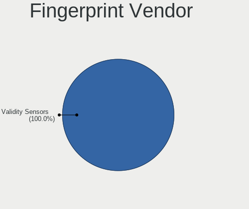

| Vendor           | Notebooks | Percent |
|------------------|-----------|---------|
| Validity Sensors | 3         | 100%    |

Fingerprint Model
-----------------

Fingerprint sensor models

| Model                                             | Notebooks | Percent |
|---------------------------------------------------|-----------|---------|
| Validity Sensors VFS451 Fingerprint Reader        | 2         | 66.67%  |
| Validity Sensors VFS7500 Touch Fingerprint Sensor | 1         | 33.33%  |

Chipcard Vendor
---------------

Chipcard module vendors

| Vendor   | Notebooks | Percent |
|----------|-----------|---------|
| Broadcom | 1         | 100%    |

Chipcard Model
--------------

Chipcard module models

| Model          | Notebooks | Percent |
|----------------|-----------|---------|
| Broadcom 58200 | 1         | 100%    |

Unsupported
-----------

Unsupported Devices
-------------------

Total unsupported devices on board

| Total | Notebooks | Percent |
|-------|-----------|---------|
| 0     | 4         | 50%     |
| 1     | 3         | 37.5%   |
| 3     | 1         | 12.5%   |

Unsupported Device Types
------------------------

Types of unsupported devices

| Type               | Notebooks | Percent |
|--------------------|-----------|---------|
| Fingerprint reader | 3         | 60%     |
| Graphics card      | 2         | 40%     |

