Clear Linux Hardware Trends
---------------------------

A project to identify most popular hardware characteristics and track their change
over time based on data collected by Clear Linux users at https://Linux-Hardware.org.

Anyone can contribute to the study by uploading probes of their computers by
the [hw-probe](https://github.com/linuxhw/hw-probe) tool:

    sudo hw-probe -all -upload

This is a report for all computer types. See also reports for [desktops](/Dist/Clear_Linux/Desktop/README.md) and [notebooks](/Dist/Clear_Linux/Notebook/README.md).

Full-feature report is available here: https://linux-hardware.org/?view=trends

Period: Feb, 2020.

Contents
--------

- [ OS                       ](#os)
- [ OS Family                ](#os-family)
- [ Kernel                   ](#kernel)
- [ Kernel Family            ](#kernel-family)
- [ Kernel Major Ver.        ](#kernel-major-ver)
- [ Arch                     ](#arch)
- [ DE                       ](#de)
- [ Display Server           ](#display-server)
- [ OS Lang                  ](#os-lang)
- [ Boot Mode                ](#boot-mode)
- [ Filesystem               ](#filesystem)
- [ Dual Boot with Linux     ](#dual-boot-with-linux)
- [ Dual Boot (Win)          ](#dual-boot-win)
- [ Country                  ](#country)
- [ City                     ](#city)
- [ Vendor                   ](#vendor)
- [ Model                    ](#model)
- [ Model Family             ](#model-family)
- [ MFG Year                 ](#mfg-year)
- [ Form Factor              ](#form-factor)
- [ Secure Boot              ](#secure-boot)
- [ Coreboot                 ](#coreboot)
- [ RAM Size                 ](#ram-size)
- [ RAM Used                 ](#ram-used)
- [ Drive Vendor             ](#drive-vendor)
- [ Drive Model              ](#drive-model)
- [ Drive Kind               ](#drive-kind)
- [ Drive Connector          ](#drive-connector)
- [ Drive Size               ](#drive-size)
- [ Space Total              ](#space-total)
- [ Space Used               ](#space-used)
- [ Malfunc. Drives          ](#malfunc-drives)
- [ Malfunc. Drive Vendor    ](#malfunc-drive-vendor)
- [ Malfunc. Drive Kind      ](#malfunc-drive-kind)
- [ Failed Drives            ](#failed-drives)
- [ Failed Drive Vendor      ](#failed-drive-vendor)
- [ Drive Status             ](#drive-status)
- [ Storage Vendor           ](#storage-vendor)
- [ Storage Model            ](#storage-model)
- [ Storage Kind             ](#storage-kind)
- [ CPU Vendor               ](#cpu-vendor)
- [ CPU Model                ](#cpu-model)
- [ CPU Model Family         ](#cpu-model-family)
- [ CPU Cores                ](#cpu-cores)
- [ CPU Sockets              ](#cpu-sockets)
- [ CPU Threads              ](#cpu-threads)
- [ CPU Op-Modes             ](#cpu-op-modes)
- [ CPU Microarch            ](#cpu-microarch)
- [ CPU Microcode            ](#cpu-microcode)
- [ GPU Vendor               ](#gpu-vendor)
- [ GPU Model                ](#gpu-model)
- [ GPU Combo                ](#gpu-combo)
- [ GPU Driver               ](#gpu-driver)
- [ GPU Memory               ](#gpu-memory)
- [ Monitor Vendor           ](#monitor-vendor)
- [ Monitor Model            ](#monitor-model)
- [ Monitor Resolution       ](#monitor-resolution)
- [ Monitor Diagonal         ](#monitor-diagonal)
- [ Monitor Width            ](#monitor-width)
- [ Aspect Ratio             ](#aspect-ratio)
- [ Monitor Area             ](#monitor-area)
- [ Pixel Density            ](#pixel-density)
- [ Multiple Monitors        ](#multiple-monitors)
- [ Net Controller Vendor    ](#net-controller-vendor)
- [ Net Controller Model     ](#net-controller-model)
- [ Net Controller Kind      ](#net-controller-kind)
- [ Used Controller          ](#used-controller)
- [ NICs                     ](#nics)
- [ Unsupported Devices      ](#unsupported-devices)
- [ Unsupported Device Types ](#unsupported-device-types)

OS
--

Installed operating systems

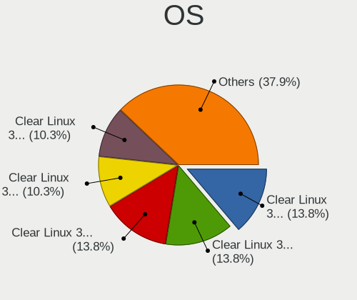

| Name              | Computers | Percent |
|-------------------|-----------|---------|
| Clear Linux 32270 | 15        | 17.65%  |
| Clear Linux 32480 | 11        | 12.94%  |
| Clear Linux 32380 | 11        | 12.94%  |
| Clear Linux 32330 | 10        | 11.76%  |
| Clear Linux 32390 | 6         | 7.06%   |
| Clear Linux 32370 | 5         | 5.88%   |
| Clear Linux 32340 | 5         | 5.88%   |
| Clear Linux 32310 | 4         | 4.71%   |
| Clear Linux 32280 | 4         | 4.71%   |
| Clear Linux 32400 | 3         | 3.53%   |
| Clear Linux 32230 | 3         | 3.53%   |
| Clear Linux 32350 | 2         | 2.35%   |
| Clear Linux 32260 | 2         | 2.35%   |
| Clear Linux       | 2         | 2.35%   |
| Clear Linux 32360 | 1         | 1.18%   |
| Clear Linux 32250 | 1         | 1.18%   |

OS Family
---------

OS without a version

| Name        | Computers | Percent |
|-------------|-----------|---------|
| Clear Linux | 85        | 100%    |

Kernel
------

Version of the Linux kernel

| Version              | Computers | Percent |
|----------------------|-----------|---------|
| 5.4.18-902.native    | 22        | 25.88%  |
| 5.5.6-914.native     | 15        | 17.65%  |
| 5.5.5-911.native     | 12        | 14.12%  |
| 5.5.3-908.native     | 9         | 10.59%  |
| 5.5.4-909.native     | 7         | 8.24%   |
| 5.5.4-910.native     | 4         | 4.71%   |
| 5.5.3-905.native     | 4         | 4.71%   |
| 5.4.16-900.native    | 4         | 4.71%   |
| 5.5.2-903.native     | 3         | 3.53%   |
| 5.4.17-901.native    | 1         | 1.18%   |
| 5.3.9-863.native     | 1         | 1.18%   |
| 4.19.104-114.lts2018 | 1         | 1.18%   |
| 4.19.103-113.lts2018 | 1         | 1.18%   |
| 4.19.102-111.lts2018 | 1         | 1.18%   |

Kernel Family
-------------

Linux kernel without a distro release

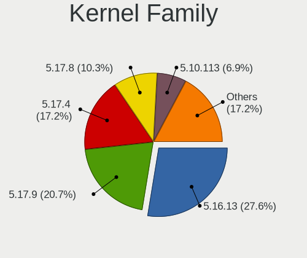

| Version  | Computers | Percent |
|----------|-----------|---------|
| 5.4.18   | 22        | 25.88%  |
| 5.5.6    | 15        | 17.65%  |
| 5.5.3    | 13        | 15.29%  |
| 5.5.5    | 12        | 14.12%  |
| 5.5.4    | 11        | 12.94%  |
| 5.4.16   | 4         | 4.71%   |
| 5.5.2    | 3         | 3.53%   |
| 5.4.17   | 1         | 1.18%   |
| 5.3.9    | 1         | 1.18%   |
| 4.19.104 | 1         | 1.18%   |
| 4.19.103 | 1         | 1.18%   |
| 4.19.102 | 1         | 1.18%   |

Kernel Major Ver.
-----------------

Linux kernel major version

| Version | Computers | Percent |
|---------|-----------|---------|
| 5.5     | 54        | 63.53%  |
| 5.4     | 27        | 31.76%  |
| 4.19    | 3         | 3.53%   |
| 5.3     | 1         | 1.18%   |

Arch
----

OS architecture (x86_64, i586, etc.)

| Name   | Computers | Percent |
|--------|-----------|---------|
| x86_64 | 85        | 100%    |

DE
--

Desktop Environment

| Name            | Computers | Percent |
|-----------------|-----------|---------|
| GNOME           | 75        | 88.24%  |
| KDE             | 3         | 3.53%   |
| GNOME Flashback | 3         | 3.53%   |
| XFCE            | 2         | 2.35%   |
| Unknown         | 2         | 2.35%   |

Display Server
--------------

X11 or Wayland

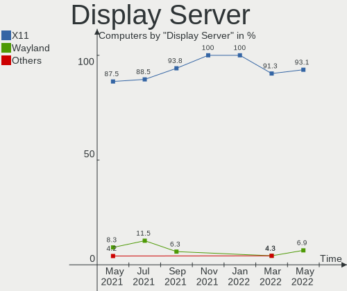

| Name    | Computers | Percent |
|---------|-----------|---------|
| X11     | 81        | 95.29%  |
| Wayland | 3         | 3.53%   |
| Tty     | 1         | 1.18%   |

OS Lang
-------

Language

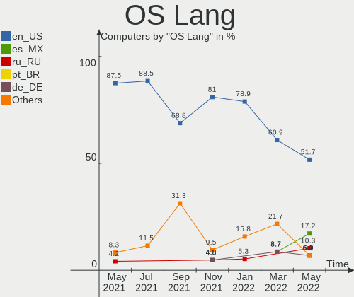

| Lang  | Computers | Percent |
|-------|-----------|---------|
| en_US | 69        | 81.18%  |
| ru_RU | 6         | 7.06%   |
| pl_PL | 2         | 2.35%   |
| de_DE | 2         | 2.35%   |
| tr_TR | 1         | 1.18%   |
| pt_BR | 1         | 1.18%   |
| hu_HU | 1         | 1.18%   |
| es_ES | 1         | 1.18%   |
| en_GB | 1         | 1.18%   |
| en_AU | 1         | 1.18%   |

Boot Mode
---------

EFI or BIOS

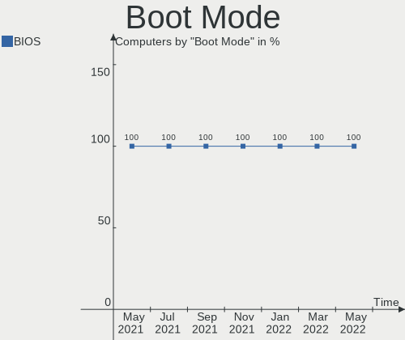

| Mode | Computers | Percent |
|------|-----------|---------|
| BIOS | 85        | 100%    |

Filesystem
----------

Type of filesystem

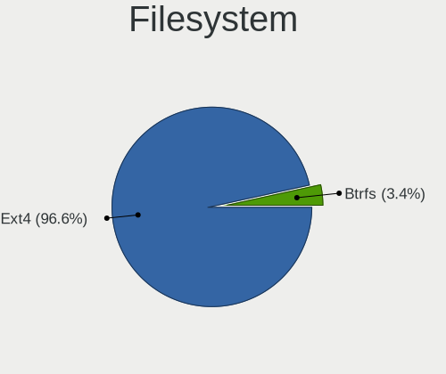

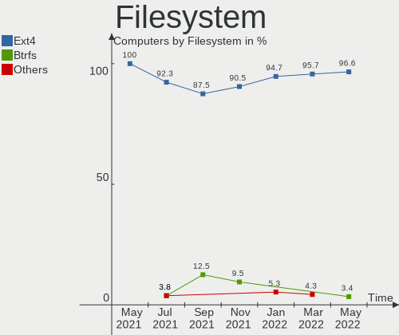

| Type | Computers | Percent |
|------|-----------|---------|
| Ext4 | 84        | 98.82%  |
| Xfs  | 1         | 1.18%   |

Dual Boot with Linux
--------------------

Hosting more than one Linux

| Dual boot | Computers | Percent |
|-----------|-----------|---------|
| No        | 84        | 98.82%  |
| Yes       | 1         | 1.18%   |

Dual Boot (Win)
---------------

Hosting Linux and Windows

| Dual boot | Computers | Percent |
|-----------|-----------|---------|
| No        | 83        | 97.65%  |
| Yes       | 2         | 2.35%   |

Country
-------

Geographic location (country)

| Country        | Computers | Percent |
|----------------|-----------|---------|
| USA            | 23        | 27.06%  |
| Germany        | 6         | 7.06%   |
| Russia         | 5         | 5.88%   |
| Poland         | 5         | 5.88%   |
| India          | 5         | 5.88%   |
| Romania        | 4         | 4.71%   |
| Netherlands    | 4         | 4.71%   |
| Ukraine        | 3         | 3.53%   |
| UK             | 3         | 3.53%   |
| Hungary        | 3         | 3.53%   |
| Brazil         | 3         | 3.53%   |
| Norway         | 2         | 2.35%   |
| Italy          | 2         | 2.35%   |
| Canada         | 2         | 2.35%   |
| Australia      | 2         | 2.35%   |
| Vietnam        | 1         | 1.18%   |
| Turkey         | 1         | 1.18%   |
| Thailand       | 1         | 1.18%   |
| Spain          | 1         | 1.18%   |
| Serbia         | 1         | 1.18%   |
| Portugal       | 1         | 1.18%   |
| Lebanon        | 1         | 1.18%   |
| Latvia         | 1         | 1.18%   |
| Iran           | 1         | 1.18%   |
| Indonesia      | 1         | 1.18%   |
| Czech Republic | 1         | 1.18%   |
| Croatia        | 1         | 1.18%   |
| Argentina      | 1         | 1.18%   |

City
----

Geographic location (city)

| City                    | Computers | Percent |
|-------------------------|-----------|---------|
| Moscow                  | 3         | 3.53%   |
| Kyiv                    | 2         | 2.35%   |
| Kolkata                 | 2         | 2.35%   |
| Ipswich                 | 2         | 2.35%   |
| Heidelberg              | 2         | 2.35%   |
| Zagreb                  | 1         | 1.18%   |
| Yogyakarta              | 1         | 1.18%   |
| West Covina             | 1         | 1.18%   |
| Warsaw                  | 1         | 1.18%   |
| Warrington              | 1         | 1.18%   |
| Wahroonga               | 1         | 1.18%   |
| Vũng Tàu              | 1         | 1.18%   |
| Villa Rica              | 1         | 1.18%   |
| Ullo                    | 1         | 1.18%   |
| Târgu Jiu              | 1         | 1.18%   |
| Tuchkovo                | 1         | 1.18%   |
| Tehran                  | 1         | 1.18%   |
| Syracuse                | 1         | 1.18%   |
| Sugar Land              | 1         | 1.18%   |
| Spruce Grove            | 1         | 1.18%   |
| South Fulton            | 1         | 1.18%   |
| Slatina                 | 1         | 1.18%   |
| Schio                   | 1         | 1.18%   |
| Roseto degli Abruzzi    | 1         | 1.18%   |
| Riga                    | 1         | 1.18%   |
| Raipur                  | 1         | 1.18%   |
| Prague                  | 1         | 1.18%   |
| Pawtucket               | 1         | 1.18%   |
| Park City               | 1         | 1.18%   |
| Park Avenue             | 1         | 1.18%   |
| Palm Harbor             | 1         | 1.18%   |
| Omaha                   | 1         | 1.18%   |
| Mount Juliet            | 1         | 1.18%   |
| Moncton                 | 1         | 1.18%   |
| Modesto                 | 1         | 1.18%   |
| Mediaş                 | 1         | 1.18%   |
| Louisville              | 1         | 1.18%   |
| Los Alamos              | 1         | 1.18%   |
| Lisbon                  | 1         | 1.18%   |
| Kłodzko                | 1         | 1.18%   |
| Kryvyy Rih              | 1         | 1.18%   |
| Katy                    | 1         | 1.18%   |
| João Pessoa            | 1         | 1.18%   |
| Jesup                   | 1         | 1.18%   |
| Jenison                 | 1         | 1.18%   |
| Janesville              | 1         | 1.18%   |
| Jaboatao dos Guararapes | 1         | 1.18%   |
| Hockenheim              | 1         | 1.18%   |
| Hamar                   | 1         | 1.18%   |
| Grua                    | 1         | 1.18%   |
| Gdańsk                 | 1         | 1.18%   |
| Frampol                 | 1         | 1.18%   |
| Fort Worth              | 1         | 1.18%   |
| Felsopakony             | 1         | 1.18%   |
| Fellbach                | 1         | 1.18%   |
| Estacada                | 1         | 1.18%   |
| Erzincan                | 1         | 1.18%   |
| Erechim                 | 1         | 1.18%   |
| Düsseldorf             | 1         | 1.18%   |
| Córdoba                | 1         | 1.18%   |

Vendor
------

Motherboard manufacturer

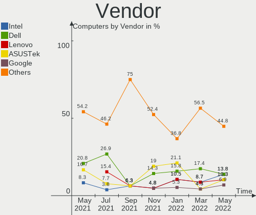

| Name                 | Computers | Percent |
|----------------------|-----------|---------|
| Hewlett-Packard      | 14        | 16.47%  |
| Dell                 | 13        | 15.29%  |
| Lenovo               | 12        | 14.12%  |
| ASUSTek Computer     | 9         | 10.59%  |
| Acer                 | 9         | 10.59%  |
| Gigabyte Technology  | 4         | 4.71%   |
| ASRock               | 4         | 4.71%   |
| MSI                  | 3         | 3.53%   |
| Samsung Electronics  | 2         | 2.35%   |
| Intel                | 2         | 2.35%   |
| Complet              | 2         | 2.35%   |
| Apple                | 2         | 2.35%   |
| Shuttle              | 1         | 1.18%   |
| Huanan               | 1         | 1.18%   |
| Google               | 1         | 1.18%   |
| Fujitsu              | 1         | 1.18%   |
| CyberPowerPC         | 1         | 1.18%   |
| Biostar              | 1         | 1.18%   |
| Bak USA Technologies | 1         | 1.18%   |
| Alienware            | 1         | 1.18%   |
| Unknown              | 1         | 1.18%   |

Model
-----

Motherboard model

| Name                                                   | Computers | Percent |
|--------------------------------------------------------|-----------|---------|
| Dell XPS 15 9560                                       | 2         | 2.35%   |
| Dell Inspiron 5370                                     | 2         | 2.35%   |
| Complet MY8312                                         | 2         | 2.35%   |
| ASUS X553MA                                            | 2         | 2.35%   |
| Shuttle DS81D                                          | 1         | 1.18%   |
| Samsung Electronics 900X3C/900X3D/900X3E/900X4C/900X4D | 1         | 1.18%   |
| Samsung Electronics 300E5K/300E5Q                      | 1         | 1.18%   |
| MSI MS-7B46                                            | 1         | 1.18%   |
| MSI MS-7916                                            | 1         | 1.18%   |
| MSI GL63 9SDK                                          | 1         | 1.18%   |
| Lenovo Y720-15IKB 80VR                                 | 1         | 1.18%   |
| Lenovo Y520-15IKBN 80WK                                | 1         | 1.18%   |
| Lenovo ThinkPad X250 20CM0048US                        | 1         | 1.18%   |
| Lenovo ThinkPad T420 4236FJ1                           | 1         | 1.18%   |
| Lenovo ThinkPad E580 20KS001JGE                        | 1         | 1.18%   |
| Lenovo IdeaPad Y500 20193                              | 1         | 1.18%   |
| Lenovo IdeaPad U310                                    | 1         | 1.18%   |
| Lenovo IdeaPad S340-15IWL 81N8                         | 1         | 1.18%   |
| Lenovo IdeaPad 310-15ISK 80SM                          | 1         | 1.18%   |
| Lenovo IdeaPad 130-15AST 81H5                          | 1         | 1.18%   |
| Lenovo IdeaPad 110-15ACL 80TJ                          | 1         | 1.18%   |
| Lenovo G500 20236                                      | 1         | 1.18%   |
| Intel X99 V102                                         | 1         | 1.18%   |
| Intel DH61BE AAG14062-204                              | 1         | 1.18%   |
| Huanan X99-F8                                          | 1         | 1.18%   |
| HP Stream Laptop 14-cb0XX                              | 1         | 1.18%   |
| HP ProBook 450 G1                                      | 1         | 1.18%   |
| HP Pavilion Sleekbook 14                               | 1         | 1.18%   |
| HP Pavilion Notebook                                   | 1         | 1.18%   |
| HP Pavilion Gaming Laptop 15-ec0xxx                    | 1         | 1.18%   |
| HP Pavilion g6                                         | 1         | 1.18%   |
| HP OMEN by HP Laptop                                   | 1         | 1.18%   |
| HP Notebook                                            | 1         | 1.18%   |
| HP ENVY x360 m6 Convertible                            | 1         | 1.18%   |
| HP ENVY x360 Convertible 15m-bq1xx                     | 1         | 1.18%   |
| HP EliteBook Folio 1040 G3                             | 1         | 1.18%   |
| HP EliteBook 840 G6                                    | 1         | 1.18%   |
| HP Compaq 6200 Pro MT PC                               | 1         | 1.18%   |
| HP 250 G6 Notebook PC                                  | 1         | 1.18%   |
| Google Squawks                                         | 1         | 1.18%   |
| Gigabyte Z390 AORUS MASTER                             | 1         | 1.18%   |
| Gigabyte Z170-HD3P                                     | 1         | 1.18%   |
| Gigabyte X79-UD3                                       | 1         | 1.18%   |
| Gigabyte J1800M-D3P                                    | 1         | 1.18%   |
| Fujitsu LIFEBOOK A514                                  | 1         | 1.18%   |
| Dell XPS 8930                                          | 1         | 1.18%   |
| Dell Precision Tower 5810                              | 1         | 1.18%   |
| Dell Precision T1650                                   | 1         | 1.18%   |
| Dell Precision 5540                                    | 1         | 1.18%   |
| Dell Precision 5510                                    | 1         | 1.18%   |
| Dell OptiPlex 990                                      | 1         | 1.18%   |
| Dell Latitude E7240                                    | 1         | 1.18%   |
| Dell Inspiron 5570                                     | 1         | 1.18%   |
| Dell Inspiron 13-5378                                  | 1         | 1.18%   |
| CyberPowerPC TRACER III                                | 1         | 1.18%   |
| Biostar TB85                                           | 1         | 1.18%   |
| Bak USA Technologies Atlas                             | 1         | 1.18%   |
| ASUS Z170-A                                            | 1         | 1.18%   |
| ASUS X406UAR                                           | 1         | 1.18%   |
| ASUS VivoBook_ASUSLaptop X571GT_F571GT                 | 1         | 1.18%   |

Model Family
------------

Motherboard model prefix

| Name                       | Computers | Percent |
|----------------------------|-----------|---------|
| Acer Aspire                | 7         | 8.24%   |
| Lenovo IdeaPad             | 6         | 7.06%   |
| HP Pavilion                | 4         | 4.71%   |
| Dell Precision             | 4         | 4.71%   |
| Dell Inspiron              | 4         | 4.71%   |
| Lenovo ThinkPad            | 3         | 3.53%   |
| Dell XPS                   | 3         | 3.53%   |
| HP ENVY                    | 2         | 2.35%   |
| HP EliteBook               | 2         | 2.35%   |
| Complet MY8312             | 2         | 2.35%   |
| ASUS X553MA                | 2         | 2.35%   |
| ASUS ROG                   | 2         | 2.35%   |
| Shuttle DS81D              | 1         | 1.18%   |
| Samsung Electronics 900X3C | 1         | 1.18%   |
| Samsung Electronics 300E5K | 1         | 1.18%   |
| MSI MS-7B46                | 1         | 1.18%   |
| MSI MS-7916                | 1         | 1.18%   |
| MSI GL63                   | 1         | 1.18%   |
| Lenovo Y720-15IKB          | 1         | 1.18%   |
| Lenovo Y520-15IKBN         | 1         | 1.18%   |
| Lenovo G500                | 1         | 1.18%   |
| Intel X99                  | 1         | 1.18%   |
| Intel DH61BE               | 1         | 1.18%   |
| Huanan X99-F8              | 1         | 1.18%   |
| HP Stream                  | 1         | 1.18%   |
| HP ProBook                 | 1         | 1.18%   |
| HP OMEN                    | 1         | 1.18%   |
| HP Notebook                | 1         | 1.18%   |
| HP Compaq                  | 1         | 1.18%   |
| HP 250                     | 1         | 1.18%   |
| Google Squawks             | 1         | 1.18%   |
| Gigabyte Z390              | 1         | 1.18%   |
| Gigabyte Z170-HD3P         | 1         | 1.18%   |
| Gigabyte X79-UD3           | 1         | 1.18%   |
| Gigabyte J1800M-D3P        | 1         | 1.18%   |
| Fujitsu LIFEBOOK           | 1         | 1.18%   |
| Dell OptiPlex              | 1         | 1.18%   |
| Dell Latitude              | 1         | 1.18%   |
| CyberPowerPC TRACER        | 1         | 1.18%   |
| Biostar TB85               | 1         | 1.18%   |
| Bak USA Technologies Atlas | 1         | 1.18%   |
| ASUS Z170-A                | 1         | 1.18%   |
| ASUS X406UAR               | 1         | 1.18%   |
| ASUS VivoBook              | 1         | 1.18%   |
| ASUS UX360UAK              | 1         | 1.18%   |
| ASUS PRIME                 | 1         | 1.18%   |
| ASRock Z390                | 1         | 1.18%   |
| ASRock Z170                | 1         | 1.18%   |
| ASRock X399                | 1         | 1.18%   |
| ASRock B150M-HDV           | 1         | 1.18%   |
| Apple MacBookPro8          | 1         | 1.18%   |
| Apple MacBookPro15         | 1         | 1.18%   |
| Alienware M14xR2           | 1         | 1.18%   |
| Acer Swift                 | 1         | 1.18%   |
| Acer Spin                  | 1         | 1.18%   |
| Unknown                    | 1         | 1.18%   |

MFG Year
--------

Motherboard manufacture year

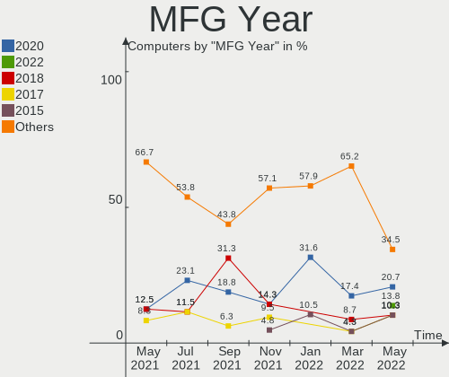

| Year | Computers | Percent |
|------|-----------|---------|
| 2019 | 28        | 32.94%  |
| 2018 | 24        | 28.24%  |
| 2016 | 9         | 10.59%  |
| 2013 | 7         | 8.24%   |
| 2014 | 6         | 7.06%   |
| 2020 | 3         | 3.53%   |
| 2017 | 3         | 3.53%   |
| 2015 | 2         | 2.35%   |
| 2012 | 2         | 2.35%   |
| 2011 | 1         | 1.18%   |

Form Factor
-----------

Physical design of the computer

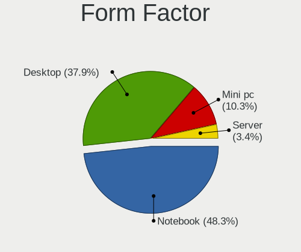

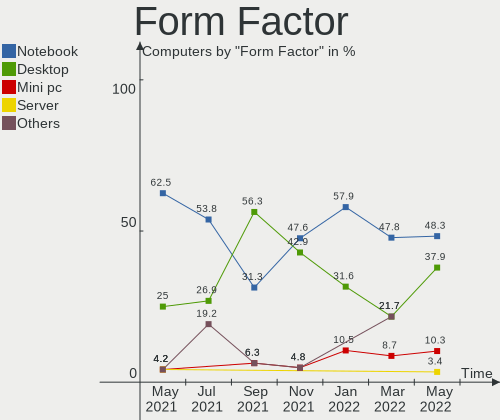

| Name        | Computers | Percent |
|-------------|-----------|---------|
| Notebook    | 56        | 65.88%  |
| Desktop     | 24        | 28.24%  |
| Convertible | 5         | 5.88%   |

Secure Boot
-----------

Enabled or disabled

| State    | Computers | Percent |
|----------|-----------|---------|
| Disabled | 85        | 100%    |

Coreboot
--------

Have coreboot on board

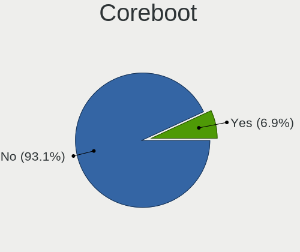

| Used | Computers | Percent |
|------|-----------|---------|
| No   | 84        | 98.82%  |
| Yes  | 1         | 1.18%   |

RAM Size
--------

Total RAM memory

| Size in GB  | Computers | Percent |
|-------------|-----------|---------|
| 8.01-16.0   | 26        | 30.59%  |
| 16.01-24.0  | 16        | 18.82%  |
| 3.01-4.0    | 14        | 16.47%  |
| 4.01-8.0    | 12        | 14.12%  |
| 32.01-64.0  | 9         | 10.59%  |
| 1.01-2.0    | 4         | 4.71%   |
| 24.01-32.0  | 2         | 2.35%   |
| 64.01-256.0 | 2         | 2.35%   |

RAM Used
--------

Used RAM memory

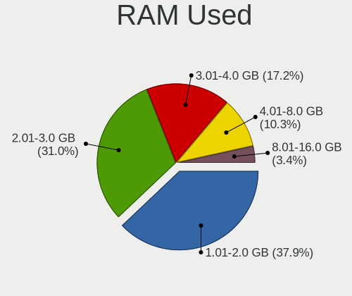

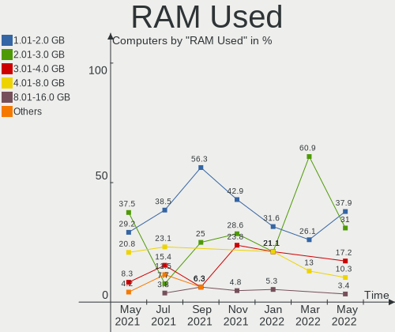

| Used GB   | Computers | Percent |
|-----------|-----------|---------|
| 1.01-2.0  | 37        | 43.53%  |
| 2.01-3.0  | 33        | 38.82%  |
| 3.01-4.0  | 7         | 8.24%   |
| 4.01-8.0  | 6         | 7.06%   |
| 8.01-16.0 | 1         | 1.18%   |
| 0.01-1.0  | 1         | 1.18%   |

Drive Vendor
------------

Hard drive vendors

| Vendor              | Computers | Drives | Percent |
|---------------------|-----------|--------|---------|
| Seagate             | 13        | 14     | 13.27%  |
| Toshiba             | 12        | 12     | 12.24%  |
| WDC                 | 11        | 11     | 11.22%  |
| Samsung Electronics | 10        | 14     | 10.2%   |
| SK Hynix            | 7         | 7      | 7.14%   |
| Kingston            | 6         | 7      | 6.12%   |
| HGST                | 6         | 7      | 6.12%   |
| A-DATA Technology   | 5         | 5      | 5.1%    |
| Unknown             | 3         | 4      | 3.06%   |
| SanDisk             | 3         | 3      | 3.06%   |
| FORESEE             | 3         | 3      | 3.06%   |
| SPCC                | 2         | 2      | 2.04%   |
| Micron Technology   | 2         | 2      | 2.04%   |
| LITEONIT            | 2         | 2      | 2.04%   |
| Hitachi             | 2         | 2      | 2.04%   |
| Hewlett-Packard     | 2         | 2      | 2.04%   |
| Crucial             | 2         | 2      | 2.04%   |
| SSK                 | 1         | 1      | 1.02%   |
| Patriot             | 1         | 1      | 1.02%   |
| Intel               | 1         | 1      | 1.02%   |
| Integral            | 1         | 1      | 1.02%   |
| GOODRAM             | 1         | 1      | 1.02%   |
| Generic             | 1         | 1      | 1.02%   |
| ASMT                | 1         | 2      | 1.02%   |

Drive Model
-----------

Hard drive models

| Model                        | Computers | Percent |
|------------------------------|-----------|---------|
| HTS721010A9E630 1TB          | 4         | 3.81%   |
| SSD 860 QVO 1TB              | 3         | 2.86%   |
| SC311 SATA 256GB SSD         | 3         | 2.86%   |
| MMC Card  32GB               | 3         | 2.86%   |
| ST1000LM035-1RK172 1TB       | 2         | 1.9%    |
| SSD M700 120GB               | 2         | 1.9%    |
| SHSS37A240G 240GB SSD        | 2         | 1.9%    |
| MQ01ABF050 500GB             | 2         | 1.9%    |
| MQ01ABD100 1TB               | 2         | 1.9%    |
| HFS256G39TND-N210A 256GB SSD | 2         | 1.9%    |
| 256GB SSD                    | 2         | 1.9%    |
| WDS250G2B0B-00YS70 250GB SSD | 1         | 0.95%   |
| WDS120G1G0B-00RC30 120GB SSD | 1         | 0.95%   |
| WDS100T2B0B-00YS70 1TB SSD   | 1         | 0.95%   |
| WDBNCE2500PNC 250GB SSD      | 1         | 0.95%   |
| WD6400AARS-00Y5B1 640GB      | 1         | 0.95%   |
| WD5000LPVX-16V0TT3 500GB     | 1         | 0.95%   |
| WD5000LPCX-35VHAT0 500GB     | 1         | 0.95%   |
| WD2500AAKX-083CA1 250GB      | 1         | 0.95%   |
| WD10SPCX-24HWST1 1TB         | 1         | 0.95%   |
| WD10EZEX-08WN4A0 1TB         | 1         | 0.95%   |
| WD10EALX-759BA1 1TB          | 1         | 0.95%   |
| VX500 1024GB SSD             | 1         | 0.95%   |
| V Series SATA SSD 240GB      | 1         | 0.95%   |
| TR150 960GB SSD              | 1         | 0.95%   |
| THNSNH128GCST 128GB SSD      | 1         | 0.95%   |
| THNSN51T02DUK NVMe 1024GB    | 1         | 0.95%   |
| SVP200S37A120G 120GB SSD     | 1         | 0.95%   |
| SV300S37A120G 120GB SSD      | 1         | 0.95%   |
| SU655 240GB SSD              | 1         | 0.95%   |
| SU630 480GB SSD              | 1         | 0.95%   |
| ST9500423AS 500GB            | 1         | 0.95%   |
| ST6000DM003-2CY186 6TB       | 1         | 0.95%   |
| ST500LT012-1DG142 500GB      | 1         | 0.95%   |
| ST4000DM005-2DP166 4TB       | 1         | 0.95%   |
| ST4000DM000-1F2168 4TB       | 1         | 0.95%   |
| ST3500413AS 500GB            | 1         | 0.95%   |
| ST320LT020-9YG142 320GB      | 1         | 0.95%   |
| ST3160812AS 160GB            | 1         | 0.95%   |
| ST1000LM024 HN-M101MBB 1TB   | 1         | 0.95%   |
| ST1000DX001-1CM162 1TB       | 1         | 0.95%   |
| ST1000DM003-1ER162 1TB       | 1         | 0.95%   |
| SSDSC2BW120A4 120GB          | 1         | 0.95%   |
| SSDPR-CX300-120 120GB        | 1         | 0.95%   |
| SSD U100 SMG2 128GB          | 1         | 0.95%   |
| SSD PLUS 120 GB              | 1         | 0.95%   |
| SSD 960 EVO 500GB            | 1         | 0.95%   |
| SSD 860 EVO M.2 250GB        | 1         | 0.95%   |
| SSD 860 EVO 250GB            | 1         | 0.95%   |
| SSD 850 PRO 2TB              | 1         | 0.95%   |
| SSD 850 EVO 250GB            | 1         | 0.95%   |
| SSD 850 EVO 120GB            | 1         | 0.95%   |
| SSD 840 Series 120GB         | 1         | 0.95%   |
| SSD 840 EVO 500GB            | 1         | 0.95%   |
| SSD 840 EVO 120GB            | 1         | 0.95%   |
| SSD 650 120GB                | 1         | 0.95%   |
| SP900 64GB SSD               | 1         | 0.95%   |
| SP550 240GB SSD              | 1         | 0.95%   |
| SP550 120GB SSD              | 1         | 0.95%   |
| Solid State Disk 512GB       | 1         | 0.95%   |

Drive Kind
----------

HDD or SSD

| Kind    | Computers | Drives | Percent |
|---------|-----------|--------|---------|
| SSD     | 51        | 59     | 54.26%  |
| HDD     | 35        | 38     | 37.23%  |
| MMC     | 3         | 4      | 3.19%   |
| Unknown | 3         | 4      | 3.19%   |
| NVMe    | 2         | 2      | 2.13%   |

Drive Connector
---------------

SATA, SAS, NVMe, etc.

| Type | Computers | Drives | Percent |
|------|-----------|--------|---------|
| SATA | 71        | 96     | 89.87%  |
| SAS  | 3         | 5      | 3.8%    |
| MMC  | 3         | 4      | 3.8%    |
| NVMe | 2         | 2      | 2.53%   |

Drive Size
----------

Size of hard drive

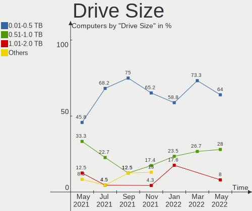

| Size in TB | Computers | Drives | Percent |
|------------|-----------|--------|---------|
| 0.01-0.5   | 60        | 74     | 65.93%  |
| 0.51-1.0   | 24        | 25     | 26.37%  |
| 1.01-2.0   | 3         | 3      | 3.3%    |
| 3.01-4.0   | 2         | 2      | 2.2%    |
| 4.01-10.0  | 2         | 3      | 2.2%    |

Space Total
-----------

Amount of disk space available on the file system

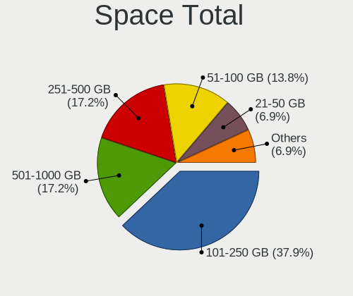

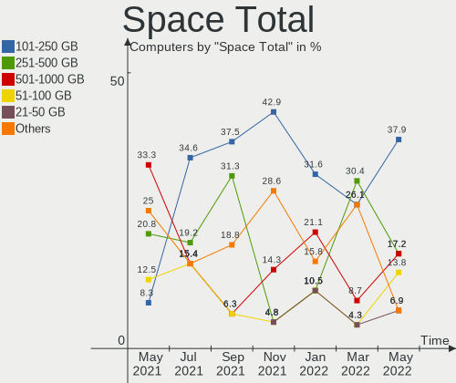

| Size in GB     | Computers | Percent |
|----------------|-----------|---------|
| 101-250        | 31        | 36.47%  |
| 251-500        | 19        | 22.35%  |
| 51-100         | 11        | 12.94%  |
| 501-1000       | 7         | 8.24%   |
| 21-50          | 5         | 5.88%   |
| 1001-2000      | 5         | 5.88%   |
| Unknown        | 4         | 4.71%   |
| More than 3000 | 1         | 1.18%   |
| 2001-3000      | 1         | 1.18%   |
| 1-20           | 1         | 1.18%   |

Space Used
----------

Amount of used disk space

| Used GB   | Computers | Percent |
|-----------|-----------|---------|
| 1-20      | 47        | 55.29%  |
| 21-50     | 19        | 22.35%  |
| 51-100    | 5         | 5.88%   |
| 101-250   | 4         | 4.71%   |
| Unknown   | 4         | 4.71%   |
| 251-500   | 2         | 2.35%   |
| 1001-2000 | 2         | 2.35%   |
| 501-1000  | 2         | 2.35%   |

Malfunc. Drives
---------------

Drive models with a malfunction

Zero info for selected period =(

Malfunc. Drive Vendor
---------------------

Vendors of faulty drives

Zero info for selected period =(

Malfunc. Drive Kind
-------------------

Kinds of faulty drives

Zero info for selected period =(

Failed Drives
-------------

Failed drive models

Zero info for selected period =(

Failed Drive Vendor
-------------------

Failed drive vendors

Zero info for selected period =(

Drive Status
------------

Number of failed and malfunc. drives

| Status   | Computers | Drives | Percent |
|----------|-----------|--------|---------|
| Detected | 73        | 105    | 97.33%  |
| Works    | 2         | 2      | 2.67%   |

Storage Vendor
--------------

Storage controller vendors

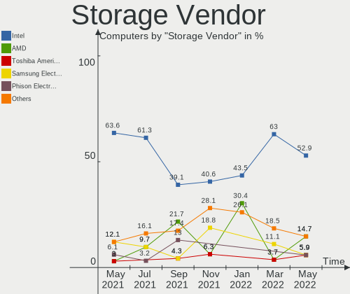

| Vendor                       | Computers | Percent |
|------------------------------|-----------|---------|
| Intel                        | 68        | 62.96%  |
| Samsung Electronics          | 11        | 10.19%  |
| AMD                          | 10        | 9.26%   |
| Toshiba America Info Systems | 5         | 4.63%   |
| Sandisk                      | 2         | 1.85%   |
| Marvell Technology Group     | 2         | 1.85%   |
| Kingston Technology Company  | 2         | 1.85%   |
| ADATA Technology             | 2         | 1.85%   |
| SK Hynix                     | 1         | 0.93%   |
| Silicon Motion               | 1         | 0.93%   |
| Realtek Semiconductor        | 1         | 0.93%   |
| Phison Electronics           | 1         | 0.93%   |
| ASMedia Technology           | 1         | 0.93%   |
| Apple                        | 1         | 0.93%   |

Storage Model
-------------

Storage controller models

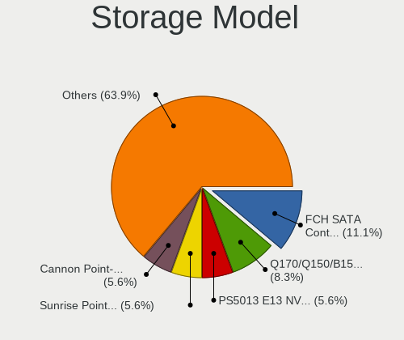

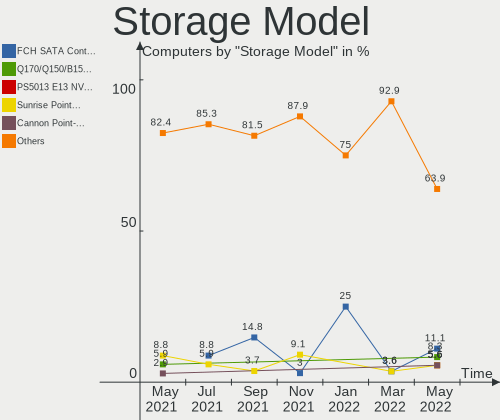

| Model                                                                    | Computers | Percent |
|--------------------------------------------------------------------------|-----------|---------|
| FCH SATA Controller [AHCI mode]                                          | 10        | 8.7%    |
| Sunrise Point-LP SATA Controller [AHCI mode]                             | 9         | 7.83%   |
| HM170/QM170 Chipset SATA Controller [AHCI Mode]                          | 6         | 5.22%   |
| 82801 Mobile SATA Controller [RAID mode]                                 | 6         | 5.22%   |
| Q170/Q150/B150/H170/H110/Z170/CM236 Chipset SATA Controller [AHCI Mode]  | 5         | 4.35%   |
| NVMe SSD Controller SM981/PM981/PM983                                    | 5         | 4.35%   |
| Non-Volatile memory controller                                           | 5         | 4.35%   |
| 7 Series Chipset Family 6-port SATA Controller [AHCI mode]               | 5         | 4.35%   |
| NVMe SSD Controller SM961/PM961                                          | 4         | 3.48%   |
| Cannon Lake Mobile PCH SATA AHCI Controller                              | 4         | 3.48%   |
| Atom Processor E3800 Series SATA AHCI Controller                         | 4         | 3.48%   |
| Wildcat Point-LP SATA Controller [AHCI Mode]                             | 3         | 2.61%   |
| Toshiba America Info Non-Volatile memory controller                      | 3         | 2.61%   |
| SSD 660P Series                                                          | 3         | 2.61%   |
| SATA Controller [RAID mode]                                              | 3         | 2.61%   |
| 8 Series/C220 Series Chipset Family 6-port SATA Controller 1 [AHCI mode] | 3         | 2.61%   |
| XPG SX8200 Pro PCIe Gen3x4 M.2 2280 Solid State Drive                    | 2         | 1.74%   |
| SATA controller                                                          | 2         | 1.74%   |
| NVMe SSD Controller SM951/PM951                                          | 2         | 1.74%   |
| Celeron N3350/Pentium N4200/Atom E3900 Series SATA AHCI Controller       | 2         | 1.74%   |
| Cannon Lake PCH SATA AHCI Controller                                     | 2         | 1.74%   |
| C610/X99 series chipset sSATA Controller [AHCI mode]                     | 2         | 1.74%   |
| 8 Series SATA Controller 1 [AHCI mode]                                   | 2         | 1.74%   |
| 6 Series/C200 Series Chipset Family 6 port Mobile SATA AHCI Controller   | 2         | 1.74%   |
| 6 Series/C200 Series Chipset Family 6 port Desktop SATA AHCI Controller  | 2         | 1.74%   |
| 400 Series Chipset SATA Controller                                       | 2         | 1.74%   |
| 200 Series PCH SATA controller [AHCI mode]                               | 2         | 1.74%   |
| XG4 NVMe SSD Controller                                                  | 1         | 0.87%   |
| X399 Series Chipset SATA Controller                                      | 1         | 0.87%   |
| WD Black 2018/PC SN520 NVMe SSD                                          | 1         | 0.87%   |
| Technology Company Non-Volatile memory controller                        | 1         | 0.87%   |
| Realtek Non-Volatile memory controller                                   | 1         | 0.87%   |
| E16 PCIe4 NVMe Controller                                                | 1         | 0.87%   |
| Cannon Point-LP SATA Controller [AHCI Mode]                              | 1         | 0.87%   |
| C610/X99 series chipset 6-Port SATA Controller [AHCI mode]               | 1         | 0.87%   |
| C600/X79 series chipset SATA RAID Controller                             | 1         | 0.87%   |
| C600/X79 series chipset 6-Port SATA AHCI Controller                      | 1         | 0.87%   |
| BG3 NVMe SSD Controller                                                  | 1         | 0.87%   |
| ASM1062 Serial ATA Controller                                            | 1         | 0.87%   |
| ANS2 NVMe Controller                                                     | 1         | 0.87%   |
| 88SE9172 SATA III 6Gb/s RAID Controller                                  | 1         | 0.87%   |
| 88SE9172 SATA 6Gb/s Controller                                           | 1         | 0.87%   |

Storage Kind
------------

Kind of storage controller (IDE, SATA, NVMe, SAS, ...)

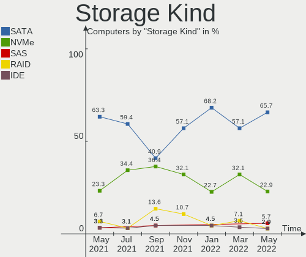

| Kind | Computers | Percent |
|------|-----------|---------|
| SATA | 69        | 63.3%   |
| NVMe | 29        | 26.61%  |
| RAID | 10        | 9.17%   |
| IDE  | 1         | 0.92%   |

CPU Vendor
----------

Processor vendors

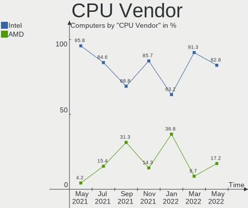

| Vendor | Computers | Percent |
|--------|-----------|---------|
| Intel  | 75        | 88.24%  |
| AMD    | 10        | 11.76%  |

CPU Model
---------

Processor models

| Model                                          | Computers | Percent |
|------------------------------------------------|-----------|---------|
| Intel Core i5-8250U CPU @ 1.60GHz              | 6         | 7.06%   |
| Intel Core i7-7700HQ CPU @ 2.80GHz             | 4         | 4.71%   |
| Intel Core i5-7200U CPU @ 2.50GHz              | 4         | 4.71%   |
| Intel Celeron CPU N2830 @ 2.16GHz              | 3         | 3.53%   |
| Intel Pentium CPU N4200 @ 1.10GHz              | 2         | 2.35%   |
| Intel Core i7-6700K CPU @ 4.00GHz              | 2         | 2.35%   |
| Intel Core i5-9300H CPU @ 2.40GHz              | 2         | 2.35%   |
| Intel Core i5-8265U CPU @ 1.60GHz              | 2         | 2.35%   |
| Intel Core i5-3317U CPU @ 1.70GHz              | 2         | 2.35%   |
| Intel Core i3-6006U CPU @ 2.00GHz              | 2         | 2.35%   |
| Intel Xeon CPU E5-2678 v3 @ 2.50GHz            | 1         | 1.18%   |
| Intel Xeon CPU E5-2640 v3 @ 2.60GHz            | 1         | 1.18%   |
| Intel Xeon CPU E5-1650 v3 @ 3.50GHz            | 1         | 1.18%   |
| Intel Xeon CPU E3-1505M v5 @ 2.80GHz           | 1         | 1.18%   |
| Intel Xeon CPU E3-1270 V2 @ 3.50GHz            | 1         | 1.18%   |
| Intel Pentium Silver N5000 CPU @ 1.10GHz       | 1         | 1.18%   |
| Intel Pentium CPU G620 @ 2.60GHz               | 1         | 1.18%   |
| Intel Core i9-9900K CPU @ 3.60GHz              | 1         | 1.18%   |
| Intel Core i9-9900 CPU @ 3.10GHz               | 1         | 1.18%   |
| Intel Core i7-9850H CPU @ 2.60GHz              | 1         | 1.18%   |
| Intel Core i7-9750H CPU @ 2.60GHz              | 1         | 1.18%   |
| Intel Core i7-8750H CPU @ 2.20GHz              | 1         | 1.18%   |
| Intel Core i7-8700 CPU @ 3.20GHz               | 1         | 1.18%   |
| Intel Core i7-8565U CPU @ 1.80GHz              | 1         | 1.18%   |
| Intel Core i7-8559U CPU @ 2.70GHz              | 1         | 1.18%   |
| Intel Core i7-6700HQ CPU @ 2.60GHz             | 1         | 1.18%   |
| Intel Core i7-5600U CPU @ 2.60GHz              | 1         | 1.18%   |
| Intel Core i7-4790K CPU @ 4.00GHz              | 1         | 1.18%   |
| Intel Core i7-4702MQ CPU @ 2.20GHz             | 1         | 1.18%   |
| Intel Core i7-3960X CPU @ 3.30GHz              | 1         | 1.18%   |
| Intel Core i7-3740QM CPU @ 2.70GHz             | 1         | 1.18%   |
| Intel Core i7-3630QM CPU @ 2.40GHz             | 1         | 1.18%   |
| Intel Core i7-3612QM CPU @ 2.10GHz             | 1         | 1.18%   |
| Intel Core i7-2720QM CPU @ 2.20GHz             | 1         | 1.18%   |
| Intel Core i5-8600K CPU @ 3.60GHz              | 1         | 1.18%   |
| Intel Core i5-8400 CPU @ 2.80GHz               | 1         | 1.18%   |
| Intel Core i5-7300HQ CPU @ 2.50GHz             | 1         | 1.18%   |
| Intel Core i5-6500 CPU @ 3.20GHz               | 1         | 1.18%   |
| Intel Core i5-6400 CPU @ 2.70GHz               | 1         | 1.18%   |
| Intel Core i5-6300U CPU @ 2.40GHz              | 1         | 1.18%   |
| Intel Core i5-6200U CPU @ 2.30GHz              | 1         | 1.18%   |
| Intel Core i5-5200U CPU @ 2.20GHz              | 1         | 1.18%   |
| Intel Core i5-4590S CPU @ 3.00GHz              | 1         | 1.18%   |
| Intel Core i5-4310U CPU @ 2.00GHz              | 1         | 1.18%   |
| Intel Core i5-3210M CPU @ 2.50GHz              | 1         | 1.18%   |
| Intel Core i5-2520M CPU @ 2.50GHz              | 1         | 1.18%   |
| Intel Core i5-2400S CPU @ 2.50GHz              | 1         | 1.18%   |
| Intel Core i3-4160 CPU @ 3.60GHz               | 1         | 1.18%   |
| Intel Core i3-4005U CPU @ 1.70GHz              | 1         | 1.18%   |
| Intel Core i3-2375M CPU @ 1.50GHz              | 1         | 1.18%   |
| Intel Core i3-2120 CPU @ 3.30GHz               | 1         | 1.18%   |
| Intel Celeron N4100 CPU @ 1.10GHz              | 1         | 1.18%   |
| Intel Celeron CPU N3060 @ 1.60GHz              | 1         | 1.18%   |
| Intel Celeron CPU N2840 @ 2.16GHz              | 1         | 1.18%   |
| Intel Celeron CPU J1800 @ 2.41GHz              | 1         | 1.18%   |
| Intel Celeron CPU 3215U @ 1.70GHz              | 1         | 1.18%   |
| AMD Ryzen Threadripper 2950X 16-Core Processor | 1         | 1.18%   |
| AMD Ryzen 7 2700X Eight-Core Processor         | 1         | 1.18%   |
| AMD Ryzen 7 1700 Eight-Core Processor          | 1         | 1.18%   |
| AMD Ryzen 5 3550H with Radeon Vega Mobile Gfx  | 1         | 1.18%   |

CPU Model Family
----------------

Processor model prefix

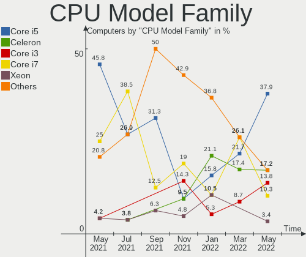

| Model                  | Computers | Percent |
|------------------------|-----------|---------|
| Intel Core i5          | 29        | 34.12%  |
| Intel Core i7          | 21        | 24.71%  |
| Intel Celeron          | 8         | 9.41%   |
| Intel Core i3          | 6         | 7.06%   |
| Intel Xeon             | 5         | 5.88%   |
| Intel Pentium          | 3         | 3.53%   |
| Intel Core i9          | 2         | 2.35%   |
| AMD Ryzen 7            | 2         | 2.35%   |
| AMD Ryzen 5            | 2         | 2.35%   |
| Intel Pentium Silver   | 1         | 1.18%   |
| AMD Ryzen Threadripper | 1         | 1.18%   |
| AMD FX                 | 1         | 1.18%   |
| AMD E1                 | 1         | 1.18%   |
| AMD A8                 | 1         | 1.18%   |
| AMD A6                 | 1         | 1.18%   |
| AMD A12                | 1         | 1.18%   |

CPU Cores
---------

Number of processor cores

| Number | Computers | Percent |
|--------|-----------|---------|
| 4      | 38        | 44.71%  |
| 2      | 32        | 37.65%  |
| 6      | 8         | 9.41%   |
| 8      | 5         | 5.88%   |
| 16     | 1         | 1.18%   |
| 12     | 1         | 1.18%   |

CPU Sockets
-----------

Number of sockets

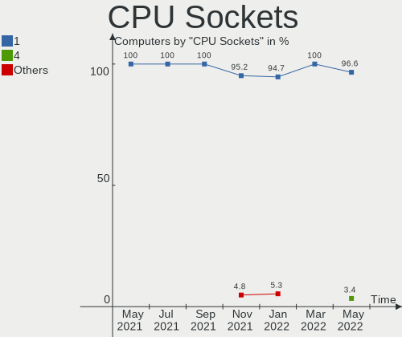

| Number | Computers | Percent |
|--------|-----------|---------|
| 1      | 85        | 100%    |

CPU Threads
-----------

Threads per core (Hyper-Threading)

| Number | Computers | Percent |
|--------|-----------|---------|
| 2      | 64        | 75.29%  |
| 1      | 21        | 24.71%  |

CPU Op-Modes
------------

CPU Operation Modes (32-bit, 64-bit)

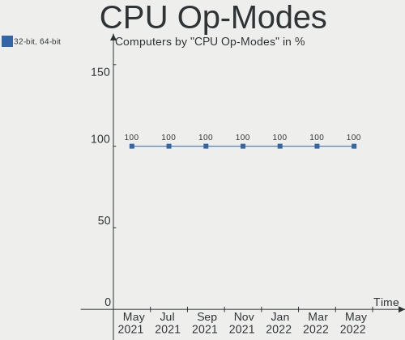

| Op mode        | Computers | Percent |
|----------------|-----------|---------|
| 32-bit, 64-bit | 85        | 100%    |

CPU Microarch
-------------

Microarchitecture

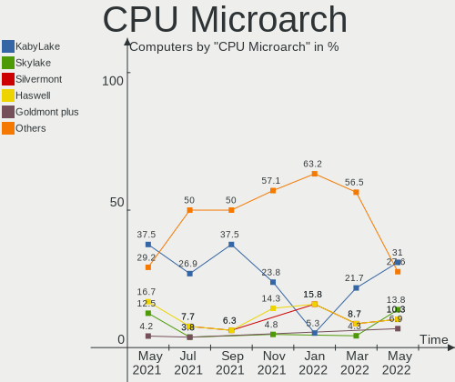

| Name          | Computers | Percent |
|---------------|-----------|---------|
| KabyLake      | 29        | 34.12%  |
| Skylake       | 10        | 11.76%  |
| Haswell       | 9         | 10.59%  |
| SandyBridge   | 7         | 8.24%   |
| IvyBridge     | 7         | 8.24%   |
| Silvermont    | 6         | 7.06%   |
| Zen+          | 3         | 3.53%   |
| Excavator     | 3         | 3.53%   |
| Broadwell     | 3         | 3.53%   |
| Zen           | 2         | 2.35%   |
| Goldmont plus | 2         | 2.35%   |
| Goldmont      | 2         | 2.35%   |
| Puma          | 1         | 1.18%   |
| Piledriver    | 1         | 1.18%   |

CPU Microcode
-------------

Microcode number

| Number  | Computers | Percent |
|---------|-----------|---------|
| Unknown | 83        | 97.65%  |
| 0x706a1 | 1         | 1.18%   |
| 0x306c3 | 1         | 1.18%   |

GPU Vendor
----------

Vendors of graphics cards

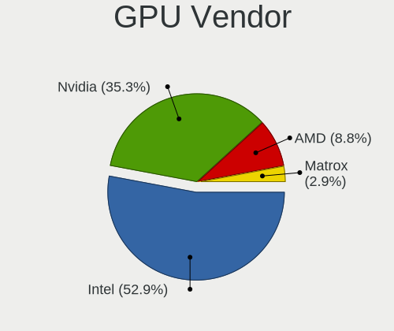

| Vendor | Computers | Percent |
|--------|-----------|---------|
| Intel  | 59        | 53.15%  |
| Nvidia | 33        | 29.73%  |
| AMD    | 19        | 17.12%  |

GPU Model
---------

Graphics card models

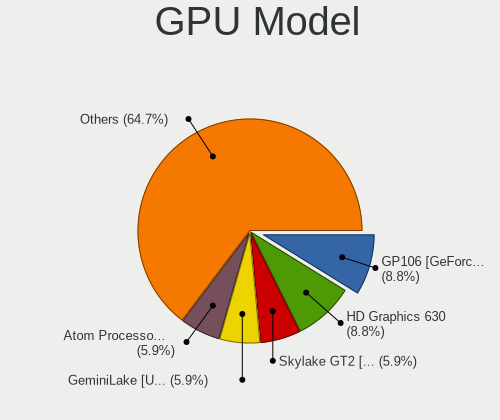

| Model                                                                             | Computers | Percent |
|-----------------------------------------------------------------------------------|-----------|---------|
| UHD Graphics 620                                                                  | 6         | 5.41%   |
| UHD Graphics 630 (Mobile)                                                         | 5         | 4.5%    |
| HD Graphics 630                                                                   | 5         | 4.5%    |
| Atom Processor Z36xxx/Z37xxx Series Graphics & Display                            | 5         | 4.5%    |
| 3rd Gen Core processor Graphics Controller                                        | 5         | 4.5%    |
| 2nd Generation Core Processor Family Integrated Graphics Controller               | 5         | 4.5%    |
| Skylake GT2 [HD Graphics 520]                                                     | 4         | 3.6%    |
| HD Graphics 620                                                                   | 4         | 3.6%    |
| UHD Graphics 620 (Whiskey Lake)                                                   | 3         | 2.7%    |
| Wani [Radeon R5/R6/R7 Graphics]                                                   | 2         | 1.8%    |
| UHD Graphics 605                                                                  | 2         | 1.8%    |
| TU116M [GeForce GTX 1660 Ti Mobile]                                               | 2         | 1.8%    |
| Mars [Radeon HD 8670A/8670M/8750M]                                                | 2         | 1.8%    |
| HD Graphics 5500                                                                  | 2         | 1.8%    |
| HD Graphics 530                                                                   | 2         | 1.8%    |
| Haswell-ULT Integrated Graphics Controller                                        | 2         | 1.8%    |
| GP107M [GeForce GTX 1050 Ti Mobile]                                               | 2         | 1.8%    |
| GP107M [GeForce GTX 1050 Mobile]                                                  | 2         | 1.8%    |
| GP106M [GeForce GTX 1060 Mobile]                                                  | 2         | 1.8%    |
| GP104 [GeForce GTX 1080]                                                          | 2         | 1.8%    |
| GK107M [GeForce GT 650M]                                                          | 2         | 1.8%    |
| Celeron N3350/Pentium N4200/Atom E3900 Series Integrated Graphics Controller      | 2         | 1.8%    |
| Whistler [Radeon HD 6630M/6650M/6750M/7670M/7690M]                                | 1         | 0.9%    |
| Vega 20 [Radeon VII]                                                              | 1         | 0.9%    |
| UHD Graphics 630 (Desktop)                                                        | 1         | 0.9%    |
| TU117M [GeForce GTX 1650 Mobile / Max-Q]                                          | 1         | 0.9%    |
| TU117GLM [Quadro T2000 Mobile / Max-Q]                                            | 1         | 0.9%    |
| TU106 [GeForce RTX 2070]                                                          | 1         | 0.9%    |
| TU106 [GeForce RTX 2070 Rev. A]                                                   | 1         | 0.9%    |
| TU106 [GeForce RTX 2060 SUPER]                                                    | 1         | 0.9%    |
| TU104 [GeForce RTX 2080 SUPER]                                                    | 1         | 0.9%    |
| Trinity [Radeon HD 7640G]                                                         | 1         | 0.9%    |
| Topaz XT [Radeon R7 M260/M265 / M340/M360 / M440/M445 / 530/535 / 620/625 Mobile] | 1         | 0.9%    |
| Thames [Radeon HD 7500M/7600M Series]                                             | 1         | 0.9%    |
| Tahiti XT [Radeon HD 7970/8970 OEM / R9 280X]                                     | 1         | 0.9%    |
| Sun XT [Radeon HD 8670A/8670M/8690M / R5 M330 / M430 / Radeon 520 Mobile]         | 1         | 0.9%    |
| Stoney [Radeon R2/R3/R4/R5 Graphics]                                              | 1         | 0.9%    |
| Redwood PRO [Radeon HD 5550/5570/5630/6510/6610/7570]                             | 1         | 0.9%    |
| Raven Ridge [Radeon Vega Series / Radeon Vega Mobile Series]                      | 1         | 0.9%    |
| Picasso                                                                           | 1         | 0.9%    |
| Navi 10 [Radeon RX 5600 OEM/5600 XT / 5700/5700 XT]                               | 1         | 0.9%    |
| Mullins [Radeon R2 Graphics]                                                      | 1         | 0.9%    |
| Iris Plus Graphics 655                                                            | 1         | 0.9%    |
| HD Graphics P530                                                                  | 1         | 0.9%    |
| HD Graphics                                                                       | 1         | 0.9%    |
| GP108 [GeForce GT 1030]                                                           | 1         | 0.9%    |
| GP107M [GeForce GTX 1050 3 GB Max-Q]                                              | 1         | 0.9%    |
| GP106 [GeForce GTX 1060 6GB]                                                      | 1         | 0.9%    |
| GP106 [GeForce GTX 1060 3GB]                                                      | 1         | 0.9%    |
| GP104 [GeForce GTX 1070]                                                          | 1         | 0.9%    |
| GM204 [GeForce GTX 970]                                                           | 1         | 0.9%    |
| GM108M [GeForce 940M]                                                             | 1         | 0.9%    |
| GM108M [GeForce 920MX]                                                            | 1         | 0.9%    |
| GM107M [GeForce GTX 960M]                                                         | 1         | 0.9%    |
| GM107GLM [Quadro M1000M]                                                          | 1         | 0.9%    |
| GM107GL [Quadro K620]                                                             | 1         | 0.9%    |
| GM107 [GeForce 940MX]                                                             | 1         | 0.9%    |
| GK208B [GeForce GT 730]                                                           | 1         | 0.9%    |
| GF106GL [Quadro 2000]                                                             | 1         | 0.9%    |
| G98 [GeForce 8400 GS Rev. 2]                                                      | 1         | 0.9%    |

GPU Combo
---------

Combinations of graphics cards

| Name           | Computers | Percent |
|----------------|-----------|---------|
| 1 x Intel      | 33        | 38.82%  |
| 1 x Nvidia     | 16        | 18.82%  |
| Intel + Nvidia | 16        | 18.82%  |
| 1 x AMD        | 12        | 14.12%  |
| Intel + AMD    | 6         | 7.06%   |
| Other          | 1         | 1.18%   |
| AMD + Nvidia   | 1         | 1.18%   |

GPU Driver
----------

Free vs proprietary

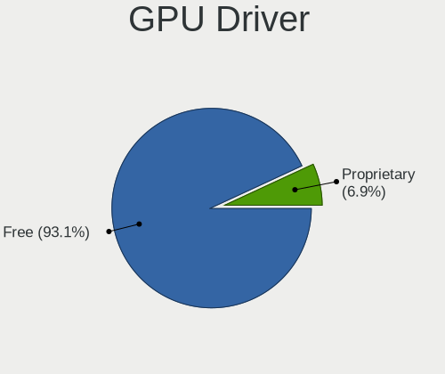

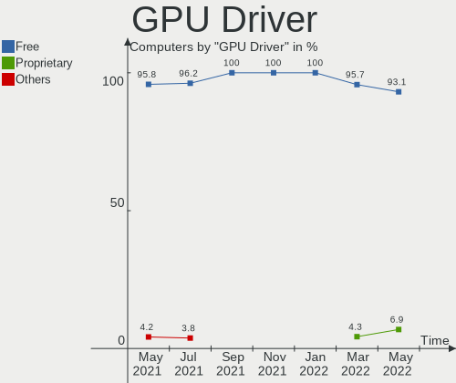

| Driver      | Computers | Percent |
|-------------|-----------|---------|
| Free        | 84        | 98.82%  |
| Proprietary | 1         | 1.18%   |

GPU Memory
----------

Total video memory

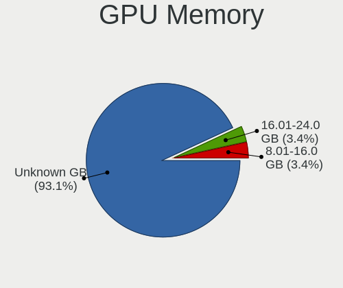

| Size in GB | Computers | Percent |
|------------|-----------|---------|
| Unknown    | 84        | 98.82%  |
| 5.01-6.0   | 1         | 1.18%   |

Monitor Vendor
--------------

Monitor vendors

| Vendor                  | Computers | Percent |
|-------------------------|-----------|---------|
| BOE                     | 13        | 14.29%  |
| Samsung Electronics     | 12        | 13.19%  |
| LG Display              | 12        | 13.19%  |
| Chimei Innolux          | 10        | 10.99%  |
| AU Optronics            | 9         | 9.89%   |
| Sharp                   | 4         | 4.4%    |
| Goldstar                | 4         | 4.4%    |
| BenQ                    | 4         | 4.4%    |
| ViewSonic               | 3         | 3.3%    |
| PANDA                   | 3         | 3.3%    |
| Dell                    | 3         | 3.3%    |
| InfoVision              | 2         | 2.2%    |
| Apple                   | 2         | 2.2%    |
| AOC                     | 2         | 2.2%    |
| Acer                    | 2         | 2.2%    |
| Medion                  | 1         | 1.1%    |
| Lenovo                  | 1         | 1.1%    |
| Hitachi                 | 1         | 1.1%    |
| Hewlett-Packard         | 1         | 1.1%    |
| Chi Mei Optoelectronics | 1         | 1.1%    |
| Ancor Communications    | 1         | 1.1%    |

Monitor Model
-------------

Monitor models

| Model                                               | Computers | Percent |
|-----------------------------------------------------|-----------|---------|
| LCD Monitor SDC354A 1366x768 344x194mm 15.5-inch    | 2         | 2.2%    |
| LCD Monitor CMN15F5 1920x1080 344x193mm 15.5-inch   | 2         | 2.2%    |
| LCD Monitor CMN1375 1920x1080 293x165mm 13.2-inch   | 2         | 2.2%    |
| LCD Monitor BOE06BA 1920x1080 344x193mm 15.5-inch   | 2         | 2.2%    |
| LCD Monitor BOE0672 1366x768 344x194mm 15.5-inch    | 2         | 2.2%    |
| LCD Monitor AUO102D 1920x1080 293x165mm 13.2-inch   | 2         | 2.2%    |
| IPS FULLHD GSM5AB8 1920x1080 480x270mm 21.7-inch    | 2         | 2.2%    |
| XB271H ACR0511 1920x1080 600x340mm 27.2-inch        | 1         | 1.1%    |
| VX3276-QHD VSCE635 2560x1440 698x393mm 31.5-inch    | 1         | 1.1%    |
| VX2363 Series VSC6B2F 1920x1080 509x286mm 23.0-inch | 1         | 1.1%    |
| ULTRAWIDE GSM76E4 3440x1440 800x335mm 34.1-inch     | 1         | 1.1%    |
| SyncMaster SAM0608 1920x1080 510x290mm 23.1-inch    | 1         | 1.1%    |
| SyncMaster SAM022B 1280x1024 338x270mm 17.0-inch    | 1         | 1.1%    |
| S27E330 SAM0D90 1920x1080 598x336mm 27.0-inch       | 1         | 1.1%    |
| P2715Q DEL40BD 3840x2160 597x336mm 27.0-inch        | 1         | 1.1%    |
| P2414H DELA09A 1920x1080 527x297mm 23.8-inch        | 1         | 1.1%    |
| MD21473 MED461C 2560x1440 597x336mm 27.0-inch       | 1         | 1.1%    |
| LCD Monitor SHP14BA 1920x1080 344x194mm 15.5-inch   | 1         | 1.1%    |
| LCD Monitor SHP1476 3840x2160 346x194mm 15.6-inch   | 1         | 1.1%    |
| LCD Monitor SHP1453 1920x1080 346x194mm 15.6-inch   | 1         | 1.1%    |
| LCD Monitor SHP143E 3840x2160 346x194mm 15.6-inch   | 1         | 1.1%    |
| LCD Monitor SDC4742 1366x768 309x174mm 14.0-inch    | 1         | 1.1%    |
| LCD Monitor SAM0B5C 1920x1080 1212x682mm 54.8-inch  | 1         | 1.1%    |
| LCD Monitor SAM02A2 1360x768 885x498mm 40.0-inch    | 1         | 1.1%    |
| LCD Monitor NCP0036 1920x1080 344x194mm 15.5-inch   | 1         | 1.1%    |
| LCD Monitor LGD05C8 1920x1080 344x194mm 15.5-inch   | 1         | 1.1%    |
| LCD Monitor LGD0590 1920x1080 344x194mm 15.5-inch   | 1         | 1.1%    |
| LCD Monitor LGD056D 1920x1080 380x210mm 17.1-inch   | 1         | 1.1%    |
| LCD Monitor LGD0563 1920x1080 344x194mm 15.5-inch   | 1         | 1.1%    |
| LCD Monitor LGD0532 1920x1080 344x194mm 15.5-inch   | 1         | 1.1%    |
| LCD Monitor LGD0512 3200x1800 293x165mm 13.2-inch   | 1         | 1.1%    |
| LCD Monitor LGD0503 1366x768 340x190mm 15.3-inch    | 1         | 1.1%    |
| LCD Monitor LGD0384 1366x768 344x194mm 15.5-inch    | 1         | 1.1%    |
| LCD Monitor LGD0366 1600x900 309x174mm 14.0-inch    | 1         | 1.1%    |
| LCD Monitor LGD0351 1366x768 340x190mm 15.3-inch    | 1         | 1.1%    |
| LCD Monitor LGD02E2 1600x900 310x174mm 14.0-inch    | 1         | 1.1%    |
| LCD Monitor LGD01E9 1920x1080 345x194mm 15.6-inch   | 1         | 1.1%    |
| LCD Monitor LEN40BA 1920x1080 344x194mm 15.5-inch   | 1         | 1.1%    |
| LCD Monitor IVO0535 1920x1080 294x165mm 13.3-inch   | 1         | 1.1%    |
| LCD Monitor IVO04E5 1366x768 276x155mm 12.5-inch    | 1         | 1.1%    |
| LCD Monitor CMO15A7 1366x768 350x190mm 15.7-inch    | 1         | 1.1%    |
| LCD Monitor CMN15E2 1920x1080 344x193mm 15.5-inch   | 1         | 1.1%    |
| LCD Monitor CMN15D3 1920x1080 344x193mm 15.5-inch   | 1         | 1.1%    |
| LCD Monitor CMN15BC 1366x768 350x190mm 15.7-inch    | 1         | 1.1%    |
| LCD Monitor CMN15B8 1366x768 340x190mm 15.3-inch    | 1         | 1.1%    |
| LCD Monitor CMN14C0 1920x1080 308x173mm 13.9-inch   | 1         | 1.1%    |
| LCD Monitor CMN1130 1366x768 256x144mm 11.6-inch    | 1         | 1.1%    |
| LCD Monitor BOE0868 1920x1080 309x174mm 14.0-inch   | 1         | 1.1%    |
| LCD Monitor BOE0747 1920x1080 344x194mm 15.5-inch   | 1         | 1.1%    |
| LCD Monitor BOE0718 1920x1080 309x173mm 13.9-inch   | 1         | 1.1%    |
| LCD Monitor BOE06F9 1920x1080 344x193mm 15.5-inch   | 1         | 1.1%    |
| LCD Monitor BOE06A9 1920x1080 344x193mm 15.5-inch   | 1         | 1.1%    |
| LCD Monitor BOE0687 1920x1080 344x193mm 15.5-inch   | 1         | 1.1%    |
| LCD Monitor BOE0675 1366x768 344x194mm 15.5-inch    | 1         | 1.1%    |
| LCD Monitor BOE0641 1920x1080 344x193mm 15.5-inch   | 1         | 1.1%    |
| LCD Monitor BOE05DA 1366x768 277x156mm 12.5-inch    | 1         | 1.1%    |
| LCD Monitor AUO70EC 1366x768 340x190mm 15.3-inch    | 1         | 1.1%    |
| LCD Monitor AUO47EC 1366x768 344x193mm 15.5-inch    | 1         | 1.1%    |
| LCD Monitor AUO40ED 1920x1080 344x193mm 15.5-inch   | 1         | 1.1%    |
| LCD Monitor AUO403D 1920x1080 309x173mm 13.9-inch   | 1         | 1.1%    |

Monitor Resolution
------------------

Monitor screen resolution

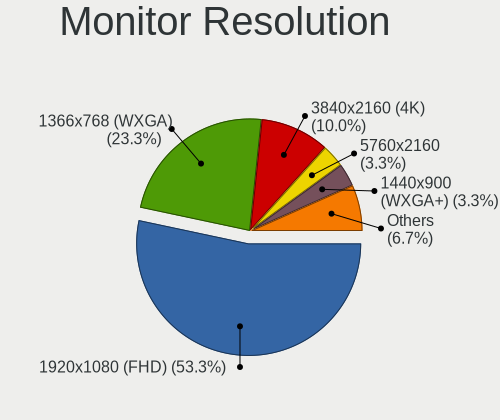

| Resolution         | Computers | Percent |
|--------------------|-----------|---------|
| 1920x1080 (FHD)    | 48        | 55.81%  |
| 1366x768 (WXGA)    | 20        | 23.26%  |
| 3840x2160 (4K)     | 4         | 4.65%   |
| 2560x1440 (QHD)    | 3         | 3.49%   |
| 3440x1440          | 2         | 2.33%   |
| 1600x900 (HD+)     | 2         | 2.33%   |
| 1280x1024 (SXGA)   | 2         | 2.33%   |
| 3200x1800 (QHD+)   | 1         | 1.16%   |
| 2560x1600          | 1         | 1.16%   |
| 1680x1050 (WSXGA+) | 1         | 1.16%   |
| 1440x900 (WXGA+)   | 1         | 1.16%   |
| 1360x768           | 1         | 1.16%   |

Monitor Diagonal
----------------

Diagonal size in inches

| Inches | Computers | Percent |
|--------|-----------|---------|
| 15     | 37        | 41.11%  |
| 13     | 15        | 16.67%  |
| 27     | 6         | 6.67%   |
| 23     | 6         | 6.67%   |
| 21     | 5         | 5.56%   |
| 24     | 4         | 4.44%   |
| 14     | 4         | 4.44%   |
| 17     | 3         | 3.33%   |
| 34     | 2         | 2.22%   |
| 12     | 2         | 2.22%   |
| 84     | 1         | 1.11%   |
| 54     | 1         | 1.11%   |
| 40     | 1         | 1.11%   |
| 31     | 1         | 1.11%   |
| 20     | 1         | 1.11%   |
| 11     | 1         | 1.11%   |

Monitor Width
-------------

Physical width

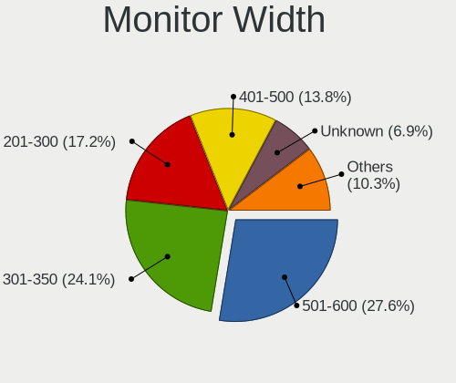

| Width in mm | Computers | Percent |
|-------------|-----------|---------|
| 301-350     | 46        | 52.27%  |
| 501-600     | 15        | 17.05%  |
| 201-300     | 13        | 14.77%  |
| 401-500     | 6         | 6.82%   |
| 701-800     | 2         | 2.27%   |
| 351-400     | 2         | 2.27%   |
| 801-900     | 1         | 1.14%   |
| 601-700     | 1         | 1.14%   |
| 1501-2000   | 1         | 1.14%   |
| 1001-1500   | 1         | 1.14%   |

Aspect Ratio
------------

Proportional relationship between the width and the height

| Ratio | Computers | Percent |
|-------|-----------|---------|
| 16/9  | 79        | 91.86%  |
| 16/10 | 3         | 3.49%   |
| 21/9  | 2         | 2.33%   |
| 5/4   | 1         | 1.16%   |
| 4/3   | 1         | 1.16%   |

Monitor Area
------------

Area in inch²

| Area in inch² | Computers | Percent |
|----------------|-----------|---------|
| 101-110        | 37        | 41.57%  |
| 71-80          | 10        | 11.24%  |
| 201-250        | 10        | 11.24%  |
| 81-90          | 9         | 10.11%  |
| 301-350        | 6         | 6.74%   |
| 151-200        | 4         | 4.49%   |
| 351-500        | 3         | 3.37%   |
| More than 1000 | 2         | 2.25%   |
| 61-70          | 2         | 2.25%   |
| 141-150        | 2         | 2.25%   |
| 51-60          | 1         | 1.12%   |
| 251-300        | 1         | 1.12%   |
| 121-130        | 1         | 1.12%   |
| 501-1000       | 1         | 1.12%   |

Pixel Density
-------------

Pixels per inch

| Density       | Computers | Percent |
|---------------|-----------|---------|
| 121-160       | 31        | 35.23%  |
| 101-120       | 27        | 30.68%  |
| 51-100        | 16        | 18.18%  |
| 161-240       | 9         | 10.23%  |
| More than 240 | 3         | 3.41%   |
| 1-50          | 2         | 2.27%   |

Multiple Monitors
-----------------

Total monitors connected

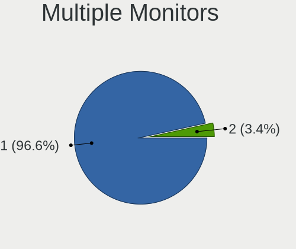

| Total | Computers | Percent |
|-------|-----------|---------|
| 1     | 78        | 91.76%  |
| 2     | 7         | 8.24%   |

Net Controller Vendor
---------------------

Controller vendors

| Vendor                   | Computers | Percent |
|--------------------------|-----------|---------|
| Intel                    | 12        | 60%     |
| Realtek Semiconductor    | 3         | 15%     |
| Nordic Semiconductor ASA | 1         | 5%      |
| Microchip Technology     | 1         | 5%      |
| LeafLabs                 | 1         | 5%      |
| DisplayLink              | 1         | 5%      |
| Apple                    | 1         | 5%      |

Net Controller Model
--------------------

Controller models

| Model                                           | Computers | Percent |
|-------------------------------------------------|-----------|---------|
| 82579LM Gigabit Network Connection (Lewisville) | 4         | 20%     |
| Wi-Fi 6 AX200                                   | 3         | 15%     |
| RTL8723BU 802.11n WLAN Adapter                  | 2         | 10%     |
| I211 Gigabit Network Connection                 | 2         | 10%     |
| 82579V Gigabit Network Connection               | 2         | 10%     |
| RTL8153 Gigabit Ethernet Adapter                | 1         | 5%      |
| nRF52 USB CDC BLE Demo                          | 1         | 5%      |
| Maple                                           | 1         | 5%      |
| HTC Hub Controller                              | 1         | 5%      |
| Ethernet Adapter [A1277]                        | 1         | 5%      |
| Dell USB3.0 Dock                                | 1         | 5%      |
| Centrino Advanced-N 6235                        | 1         | 5%      |

Net Controller Kind
-------------------

Ethernet, WiFi or modem

| Kind     | Computers | Percent |
|----------|-----------|---------|
| Ethernet | 10        | 52.63%  |
| WiFi     | 6         | 31.58%  |
| Modem    | 3         | 15.79%  |

Used Controller
---------------

Currently used network controller

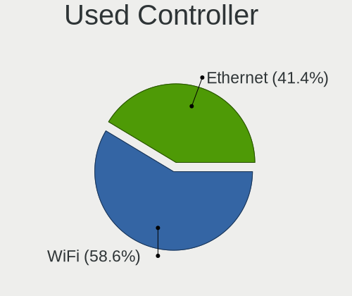

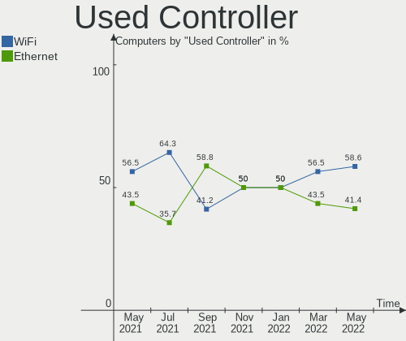

| Kind     | Computers | Percent |
|----------|-----------|---------|
| Ethernet | 9         | 64.29%  |
| WiFi     | 5         | 35.71%  |

NICs
----

Total network controllers on board

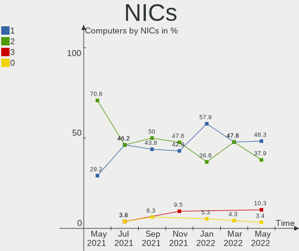

| Total | Computers | Percent |
|-------|-----------|---------|
| 2     | 45        | 52.94%  |
| 1     | 35        | 41.18%  |
| 0     | 3         | 3.53%   |
| 3     | 2         | 2.35%   |

Unsupported Devices
-------------------

Total unsupported devices on board

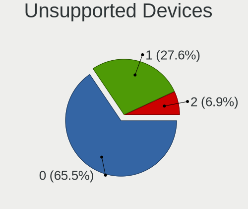

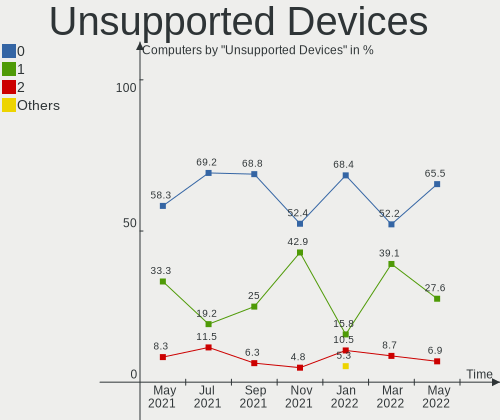

| Total | Computers | Percent |
|-------|-----------|---------|
| 0     | 63        | 74.12%  |
| 1     | 21        | 24.71%  |
| 2     | 1         | 1.18%   |

Unsupported Device Types
------------------------

Types of unsupported devices

| Type                  | Computers | Percent |
|-----------------------|-----------|---------|
| Fingerprint reader    | 7         | 30.43%  |
| Net/wireless          | 5         | 21.74%  |
| Unassigned class      | 3         | 13.04%  |
| Graphics card         | 3         | 13.04%  |
| Firewire controller   | 2         | 8.7%    |
| Sound                 | 1         | 4.35%   |
| Multimedia controller | 1         | 4.35%   |
| Chipcard              | 1         | 4.35%   |

