Clear Linux - Hardware Trends
-----------------------------

A project to identify most popular hardware characteristics and track their change
over time based on data collected by Linux users at https://Linux-Hardware.org.

Anyone can contribute to this report by the [hw-probe](https://github.com/linuxhw/hw-probe) tool:

    sudo -E hw-probe -all -upload

This is a report for all computer types. See also reports for [desktops](/Dist/Clear_Linux/Desktop/README.md) and [notebooks](/Dist/Clear_Linux/Notebook/README.md).

This report is for one last month. Overall report since the beginning of time: [TestCoverage](https://github.com/linuxhw/TestCoverage)

Period: May, 2022.

Contents
--------

* [ System ](#system)
  - [ OS                       ](#os)
  - [ OS Family                ](#os-family)
  - [ Kernel                   ](#kernel)
  - [ Kernel Family            ](#kernel-family)
  - [ Kernel Major Ver.        ](#kernel-major-ver)
  - [ Arch                     ](#arch)
  - [ DE                       ](#de)
  - [ Display Server           ](#display-server)
  - [ Display Manager          ](#display-manager)
  - [ OS Lang                  ](#os-lang)
  - [ Boot Mode                ](#boot-mode)
  - [ Filesystem               ](#filesystem)
  - [ Part. scheme             ](#part-scheme)
  - [ Dual Boot with Linux/BSD ](#dual-boot-with-linuxbsd)
  - [ Dual Boot (Win)          ](#dual-boot-win)

* [ Board ](#board)
  - [ Vendor                   ](#vendor)
  - [ Model                    ](#model)
  - [ Model Family             ](#model-family)
  - [ MFG Year                 ](#mfg-year)
  - [ Form Factor              ](#form-factor)
  - [ Secure Boot              ](#secure-boot)
  - [ Coreboot                 ](#coreboot)
  - [ RAM Size                 ](#ram-size)
  - [ RAM Used                 ](#ram-used)
  - [ Total Drives             ](#total-drives)
  - [ Has CD-ROM               ](#has-cd-rom)
  - [ Has Ethernet             ](#has-ethernet)
  - [ Has WiFi                 ](#has-wifi)
  - [ Has Bluetooth            ](#has-bluetooth)

* [ Location ](#location)
  - [ Country                  ](#country)
  - [ City                     ](#city)

* [ Drives ](#drives)
  - [ Drive Vendor             ](#drive-vendor)
  - [ Drive Model              ](#drive-model)
  - [ HDD Vendor               ](#hdd-vendor)
  - [ SSD Vendor               ](#ssd-vendor)
  - [ Drive Kind               ](#drive-kind)
  - [ Drive Connector          ](#drive-connector)
  - [ Drive Size               ](#drive-size)
  - [ Space Total              ](#space-total)
  - [ Space Used               ](#space-used)
  - [ Malfunc. Drives          ](#malfunc-drives)
  - [ Malfunc. Drive Vendor    ](#malfunc-drive-vendor)
  - [ Malfunc. HDD Vendor      ](#malfunc-hdd-vendor)
  - [ Malfunc. Drive Kind      ](#malfunc-drive-kind)
  - [ Failed Drives            ](#failed-drives)
  - [ Failed Drive Vendor      ](#failed-drive-vendor)
  - [ Drive Status             ](#drive-status)

* [ Storage controller ](#storage-controller)
  - [ Storage Vendor           ](#storage-vendor)
  - [ Storage Model            ](#storage-model)
  - [ Storage Kind             ](#storage-kind)

* [ Processor ](#processor)
  - [ CPU Vendor               ](#cpu-vendor)
  - [ CPU Model                ](#cpu-model)
  - [ CPU Model Family         ](#cpu-model-family)
  - [ CPU Cores                ](#cpu-cores)
  - [ CPU Sockets              ](#cpu-sockets)
  - [ CPU Threads              ](#cpu-threads)
  - [ CPU Op-Modes             ](#cpu-op-modes)
  - [ CPU Microcode            ](#cpu-microcode)
  - [ CPU Microarch            ](#cpu-microarch)

* [ Graphics ](#graphics)
  - [ GPU Vendor               ](#gpu-vendor)
  - [ GPU Model                ](#gpu-model)
  - [ GPU Combo                ](#gpu-combo)
  - [ GPU Driver               ](#gpu-driver)
  - [ GPU Memory               ](#gpu-memory)

* [ Monitor ](#monitor)
  - [ Monitor Vendor           ](#monitor-vendor)
  - [ Monitor Model            ](#monitor-model)
  - [ Monitor Resolution       ](#monitor-resolution)
  - [ Monitor Diagonal         ](#monitor-diagonal)
  - [ Monitor Width            ](#monitor-width)
  - [ Aspect Ratio             ](#aspect-ratio)
  - [ Monitor Area             ](#monitor-area)
  - [ Pixel Density            ](#pixel-density)
  - [ Multiple Monitors        ](#multiple-monitors)

* [ Network ](#network)
  - [ Net Controller Vendor    ](#net-controller-vendor)
  - [ Net Controller Model     ](#net-controller-model)
  - [ Wireless Vendor          ](#wireless-vendor)
  - [ Wireless Model           ](#wireless-model)
  - [ Ethernet Vendor          ](#ethernet-vendor)
  - [ Ethernet Model           ](#ethernet-model)
  - [ Net Controller Kind      ](#net-controller-kind)
  - [ Used Controller          ](#used-controller)
  - [ NICs                     ](#nics)
  - [ IPv6                     ](#ipv6)

* [ Bluetooth ](#bluetooth)
  - [ Bluetooth Vendor         ](#bluetooth-vendor)
  - [ Bluetooth Model          ](#bluetooth-model)

* [ Sound ](#sound)
  - [ Sound Vendor             ](#sound-vendor)
  - [ Sound Model              ](#sound-model)

* [ Memory ](#memory)
  - [ Memory Vendor            ](#memory-vendor)
  - [ Memory Model             ](#memory-model)
  - [ Memory Kind              ](#memory-kind)
  - [ Memory Form Factor       ](#memory-form-factor)
  - [ Memory Size              ](#memory-size)
  - [ Memory Speed             ](#memory-speed)

* [ Printers & scanners ](#printers--scanners)
  - [ Printer Vendor           ](#printer-vendor)
  - [ Printer Model            ](#printer-model)
  - [ Scanner Vendor           ](#scanner-vendor)
  - [ Scanner Model            ](#scanner-model)

* [ Camera ](#camera)
  - [ Camera Vendor            ](#camera-vendor)
  - [ Camera Model             ](#camera-model)

* [ Security ](#security)
  - [ Fingerprint Vendor       ](#fingerprint-vendor)
  - [ Fingerprint Model        ](#fingerprint-model)
  - [ Chipcard Vendor          ](#chipcard-vendor)
  - [ Chipcard Model           ](#chipcard-model)

* [ Unsupported ](#unsupported)
  - [ Unsupported Devices      ](#unsupported-devices)
  - [ Unsupported Device Types ](#unsupported-device-types)

System
------

OS
--

Installed operating systems

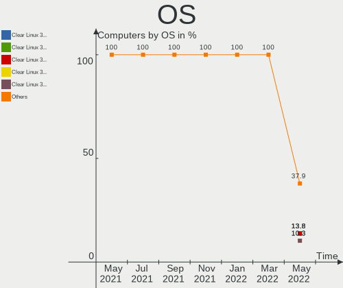

| Name              | Computers | Percent |
|-------------------|-----------|---------|
| Clear Linux 36410 | 4         | 13.79%  |
| Clear Linux 36360 | 4         | 13.79%  |
| Clear Linux 36250 | 4         | 13.79%  |
| Clear Linux 36350 | 3         | 10.34%  |
| Clear Linux 36270 | 3         | 10.34%  |
| Clear Linux 36010 | 3         | 10.34%  |
| Clear Linux 36400 | 2         | 6.9%    |
| Clear Linux 36380 | 2         | 6.9%    |
| Clear Linux 36260 | 2         | 6.9%    |
| Clear Linux 35540 | 1         | 3.45%   |
| Clear Linux 35000 | 1         | 3.45%   |

OS Family
---------

OS without a version

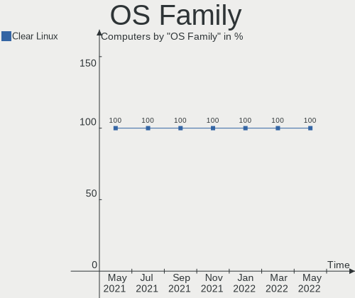

| Name        | Computers | Percent |
|-------------|-----------|---------|
| Clear Linux | 29        | 100%    |

Kernel
------

Version of the Linux kernel

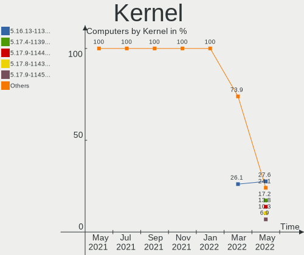

| Version             | Computers | Percent |
|---------------------|-----------|---------|
| 5.16.13-1132.native | 8         | 27.59%  |
| 5.17.4-1139.native  | 5         | 17.24%  |
| 5.17.9-1144.native  | 4         | 13.79%  |
| 5.17.8-1143.native  | 3         | 10.34%  |
| 5.17.9-1145.native  | 2         | 6.9%    |
| 5.10.113-64.lts2020 | 2         | 6.9%    |
| 5.17.11-1148.native | 1         | 3.45%   |
| 5.16.4-1119.native  | 1         | 3.45%   |
| 5.16.15-1134.native | 1         | 3.45%   |
| 5.15.12-1113.native | 1         | 3.45%   |
| 5.13.13-1070.native | 1         | 3.45%   |

Kernel Family
-------------

Linux kernel without a distro release

| Version  | Computers | Percent |
|----------|-----------|---------|
| 5.16.13  | 8         | 27.59%  |
| 5.17.9   | 6         | 20.69%  |
| 5.17.4   | 5         | 17.24%  |
| 5.17.8   | 3         | 10.34%  |
| 5.10.113 | 2         | 6.9%    |
| 5.17.11  | 1         | 3.45%   |
| 5.16.4   | 1         | 3.45%   |
| 5.16.15  | 1         | 3.45%   |
| 5.15.12  | 1         | 3.45%   |
| 5.13.13  | 1         | 3.45%   |

Kernel Major Ver.
-----------------

Linux kernel major version

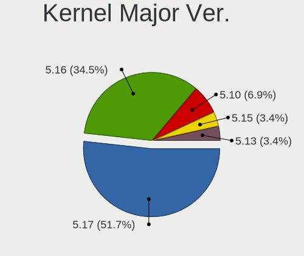

| Version | Computers | Percent |
|---------|-----------|---------|
| 5.17    | 15        | 51.72%  |
| 5.16    | 10        | 34.48%  |
| 5.10    | 2         | 6.9%    |
| 5.15    | 1         | 3.45%   |
| 5.13    | 1         | 3.45%   |

Arch
----

OS architecture (x86_64, i586, etc.)

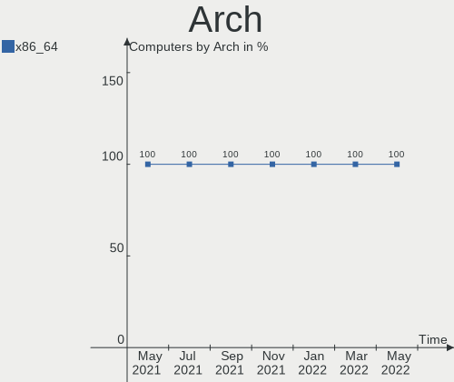

| Name   | Computers | Percent |
|--------|-----------|---------|
| x86_64 | 29        | 100%    |

DE
--

Desktop Environment

| Name    | Computers | Percent |
|---------|-----------|---------|
| GNOME   | 28        | 96.55%  |
| Unknown | 1         | 3.45%   |

Display Server
--------------

X11 or Wayland

| Name    | Computers | Percent |
|---------|-----------|---------|
| X11     | 27        | 93.1%   |
| Wayland | 2         | 6.9%    |

Display Manager
---------------

SDDM, LightDM, etc.

| Name    | Computers | Percent |
|---------|-----------|---------|
| Unknown | 29        | 100%    |

OS Lang
-------

Language

| Lang  | Computers | Percent |
|-------|-----------|---------|
| en_US | 15        | 51.72%  |
| es_MX | 5         | 17.24%  |
| ru_RU | 3         | 10.34%  |
| pt_BR | 2         | 6.9%    |
| de_DE | 2         | 6.9%    |
| sv_SE | 1         | 3.45%   |
| fr_FR | 1         | 3.45%   |

Boot Mode
---------

EFI or BIOS

| Mode | Computers | Percent |
|------|-----------|---------|
| BIOS | 29        | 100%    |

Filesystem
----------

Type of filesystem

| Type  | Computers | Percent |
|-------|-----------|---------|
| Ext4  | 28        | 96.55%  |
| Btrfs | 1         | 3.45%   |

Part. scheme
------------

Scheme of partitioning

| Type    | Computers | Percent |
|---------|-----------|---------|
| Unknown | 28        | 96.55%  |
| GPT     | 1         | 3.45%   |

Dual Boot with Linux/BSD
------------------------

Hosting more than one Linux/BSD

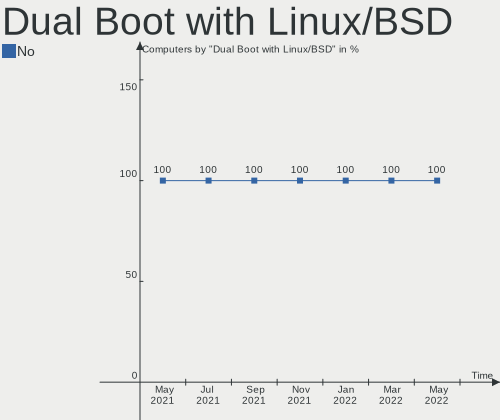

| Dual boot | Computers | Percent |
|-----------|-----------|---------|
| No        | 29        | 100%    |

Dual Boot (Win)
---------------

Hosting Linux and Windows

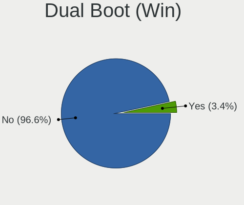

| Dual boot | Computers | Percent |
|-----------|-----------|---------|
| No        | 28        | 96.55%  |
| Yes       | 1         | 3.45%   |

Board
-----

Vendor
------

Motherboard manufacturer

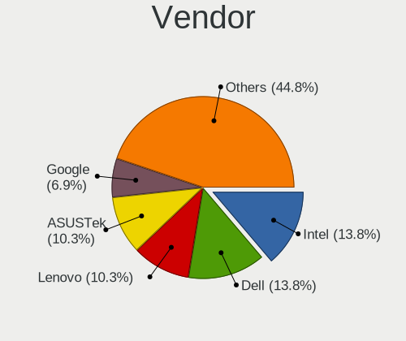

| Name                | Computers | Percent |
|---------------------|-----------|---------|
| Intel               | 4         | 13.79%  |
| Dell                | 4         | 13.79%  |
| Lenovo              | 3         | 10.34%  |
| ASUSTek Computer    | 3         | 10.34%  |
| Google              | 2         | 6.9%    |
| Gigabyte Technology | 2         | 6.9%    |
| TODOS INDUSTRIAL    | 1         | 3.45%   |
| Supermicro          | 1         | 3.45%   |
| MSI                 | 1         | 3.45%   |
| Medion              | 1         | 3.45%   |
| HUAWEI              | 1         | 3.45%   |
| Hewlett-Packard     | 1         | 3.45%   |
| Fujitsu             | 1         | 3.45%   |
| ASRock              | 1         | 3.45%   |
| Apple               | 1         | 3.45%   |
| Alienware           | 1         | 3.45%   |
| Acer                | 1         | 3.45%   |

Model
-----

Motherboard model

| Name                               | Computers | Percent |
|------------------------------------|-----------|---------|
| TODOS INDUSTRIAL Easytouch_2022_V1 | 1         | 3.45%   |
| Supermicro H8QG6                   | 1         | 3.45%   |
| MSI MS-7C60                        | 1         | 3.45%   |
| Medion MS-7728                     | 1         | 3.45%   |
| Lenovo ThinkPad X270 20HMS27Q00    | 1         | 3.45%   |
| Lenovo S21e-20 80M4                | 1         | 3.45%   |
| Lenovo IdeaPad S145-15IWL 81S9     | 1         | 3.45%   |
| Intel NUC9i7QNX                    | 1         | 3.45%   |
| Intel NUC8i7HVK                    | 1         | 3.45%   |
| Intel NUC8i3BEH                    | 1         | 3.45%   |
| Intel DN2820FYB H24582-205         | 1         | 3.45%   |
| HUAWEI NBLB-WAX9N                  | 1         | 3.45%   |
| HP EliteBook 8440p                 | 1         | 3.45%   |
| Google Lick                        | 1         | 3.45%   |
| Google Celes                       | 1         | 3.45%   |
| Gigabyte H87-HD3                   | 1         | 3.45%   |
| Gigabyte AX370M-Gaming 3           | 1         | 3.45%   |
| Fujitsu LIFEBOOK E746              | 1         | 3.45%   |
| Dell Vostro 3268                   | 1         | 3.45%   |
| Dell OptiPlex 9020                 | 1         | 3.45%   |
| Dell Latitude 7480                 | 1         | 3.45%   |
| Dell Inspiron 7559                 | 1         | 3.45%   |
| ASUS TUF Gaming X570-PRO           | 1         | 3.45%   |
| ASUS PRIME B460M-K                 | 1         | 3.45%   |
| ASUS H110M-K                       | 1         | 3.45%   |
| ASRock H370 Pro4                   | 1         | 3.45%   |
| Apple MacBookAir6,2                | 1         | 3.45%   |
| Alienware 17 R4                    | 1         | 3.45%   |
| Acer Aspire ES1-523                | 1         | 3.45%   |

Model Family
------------

Motherboard model prefix

| Name                       | Computers | Percent |
|----------------------------|-----------|---------|
| TODOS INDUSTRIAL Easytouch | 1         | 3.45%   |
| Supermicro H8QG6           | 1         | 3.45%   |
| MSI MS-7C60                | 1         | 3.45%   |
| Medion MS-7728             | 1         | 3.45%   |
| Lenovo ThinkPad            | 1         | 3.45%   |
| Lenovo S21e-20             | 1         | 3.45%   |
| Lenovo IdeaPad             | 1         | 3.45%   |
| Intel NUC9i7QNX            | 1         | 3.45%   |
| Intel NUC8i7HVK            | 1         | 3.45%   |
| Intel NUC8i3BEH            | 1         | 3.45%   |
| Intel DN2820FYB            | 1         | 3.45%   |
| HUAWEI NBLB-WAX9N          | 1         | 3.45%   |
| HP EliteBook               | 1         | 3.45%   |
| Google Lick                | 1         | 3.45%   |
| Google Celes               | 1         | 3.45%   |
| Gigabyte H87-HD3           | 1         | 3.45%   |
| Gigabyte AX370M-Gaming     | 1         | 3.45%   |
| Fujitsu LIFEBOOK           | 1         | 3.45%   |
| Dell Vostro                | 1         | 3.45%   |
| Dell OptiPlex              | 1         | 3.45%   |
| Dell Latitude              | 1         | 3.45%   |
| Dell Inspiron              | 1         | 3.45%   |
| ASUS TUF                   | 1         | 3.45%   |
| ASUS PRIME                 | 1         | 3.45%   |
| ASUS H110M-K               | 1         | 3.45%   |
| ASRock H370                | 1         | 3.45%   |
| Apple MacBookAir6          | 1         | 3.45%   |
| Alienware 17               | 1         | 3.45%   |
| Acer Aspire                | 1         | 3.45%   |

MFG Year
--------

Motherboard manufacture year

| Year | Computers | Percent |
|------|-----------|---------|
| 2020 | 6         | 20.69%  |
| 2022 | 4         | 13.79%  |
| 2018 | 3         | 10.34%  |
| 2017 | 3         | 10.34%  |
| 2015 | 3         | 10.34%  |
| 2016 | 2         | 6.9%    |
| 2013 | 2         | 6.9%    |
| 2021 | 1         | 3.45%   |
| 2019 | 1         | 3.45%   |
| 2014 | 1         | 3.45%   |
| 2012 | 1         | 3.45%   |
| 2011 | 1         | 3.45%   |
| 2010 | 1         | 3.45%   |

Form Factor
-----------

Physical design of the computer

| Name     | Computers | Percent |
|----------|-----------|---------|
| Notebook | 14        | 48.28%  |
| Desktop  | 11        | 37.93%  |
| Mini pc  | 3         | 10.34%  |
| Server   | 1         | 3.45%   |

Secure Boot
-----------

Enabled or disabled

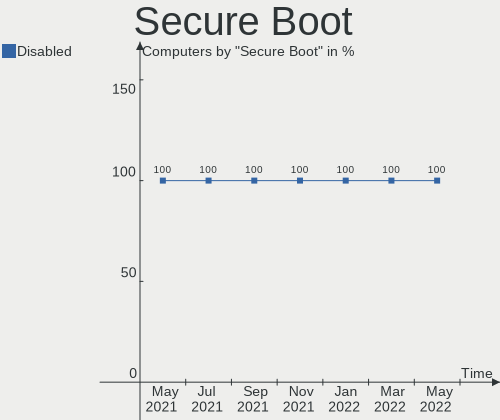

| State    | Computers | Percent |
|----------|-----------|---------|
| Disabled | 29        | 100%    |

Coreboot
--------

Have coreboot on board

| Used | Computers | Percent |
|------|-----------|---------|
| No   | 27        | 93.1%   |
| Yes  | 2         | 6.9%    |

RAM Size
--------

Total RAM memory

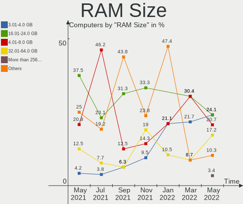

| Size in GB      | Computers | Percent |
|-----------------|-----------|---------|
| 3.01-4.0        | 7         | 24.14%  |
| 16.01-24.0      | 7         | 24.14%  |
| 4.01-8.0        | 6         | 20.69%  |
| 32.01-64.0      | 5         | 17.24%  |
| More than 256.0 | 1         | 3.45%   |
| 64.01-256.0     | 1         | 3.45%   |
| 1.01-2.0        | 1         | 3.45%   |
| 8.01-16.0       | 1         | 3.45%   |

RAM Used
--------

Used RAM memory

| Used GB   | Computers | Percent |
|-----------|-----------|---------|
| 1.01-2.0  | 11        | 37.93%  |
| 2.01-3.0  | 9         | 31.03%  |
| 3.01-4.0  | 5         | 17.24%  |
| 4.01-8.0  | 3         | 10.34%  |
| 8.01-16.0 | 1         | 3.45%   |

Total Drives
------------

Number of drives on board

| Drives | Computers | Percent |
|--------|-----------|---------|
| 1      | 18        | 62.07%  |
| 2      | 9         | 31.03%  |
| 7      | 1         | 3.45%   |
| 4      | 1         | 3.45%   |

Has CD-ROM
----------

Has CD-ROM on board

| Presented | Computers | Percent |
|-----------|-----------|---------|
| No        | 25        | 86.21%  |
| Yes       | 4         | 13.79%  |

Has Ethernet
------------

Has Ethernet on board

| Presented | Computers | Percent |
|-----------|-----------|---------|
| Yes       | 22        | 75.86%  |
| No        | 7         | 24.14%  |

Has WiFi
--------

Has WiFi module

| Presented | Computers | Percent |
|-----------|-----------|---------|
| Yes       | 21        | 72.41%  |
| No        | 8         | 27.59%  |

Has Bluetooth
-------------

Has Bluetooth module

| Presented | Computers | Percent |
|-----------|-----------|---------|
| Yes       | 21        | 72.41%  |
| No        | 8         | 27.59%  |

Location
--------

Country
-------

Geographic location (country)

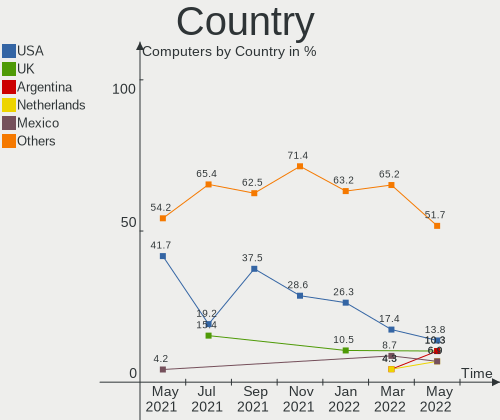

| Country            | Computers | Percent |
|--------------------|-----------|---------|
| USA                | 4         | 13.79%  |
| UK                 | 3         | 10.34%  |
| Argentina          | 3         | 10.34%  |
| Netherlands        | 2         | 6.9%    |
| Mexico             | 2         | 6.9%    |
| Germany            | 2         | 6.9%    |
| Brazil             | 2         | 6.9%    |
| Thailand           | 1         | 3.45%   |
| Sweden             | 1         | 3.45%   |
| Russia             | 1         | 3.45%   |
| New Zealand        | 1         | 3.45%   |
| Kyrgyzstan         | 1         | 3.45%   |
| Kazakhstan         | 1         | 3.45%   |
| Italy              | 1         | 3.45%   |
| India              | 1         | 3.45%   |
| France             | 1         | 3.45%   |
| Dominican Republic | 1         | 3.45%   |
| Chile              | 1         | 3.45%   |

City
----

Geographic location (city)

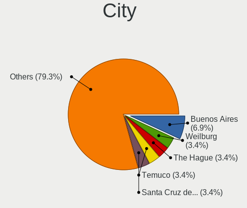

| City                   | Computers | Percent |
|------------------------|-----------|---------|
| Buenos Aires           | 2         | 6.9%    |
| Weilburg               | 1         | 3.45%   |
| The Hague              | 1         | 3.45%   |
| Temuco                 | 1         | 3.45%   |
| Santa Cruz de Barahona | 1         | 3.45%   |
| Rio de Janeiro         | 1         | 3.45%   |
| Reading                | 1         | 3.45%   |
| Pune                   | 1         | 3.45%   |
| Palermo                | 1         | 3.45%   |
| Northampton            | 1         | 3.45%   |
| Nelson                 | 1         | 3.45%   |
| Moscow                 | 1         | 3.45%   |
| Monterrey              | 1         | 3.45%   |
| Middleboro             | 1         | 3.45%   |
| Mexico City            | 1         | 3.45%   |
| Maricopa               | 1         | 3.45%   |
| Leiden                 | 1         | 3.45%   |
| La Plata               | 1         | 3.45%   |
| Kings Lynn             | 1         | 3.45%   |
| Handen                 | 1         | 3.45%   |
| Hamm                   | 1         | 3.45%   |
| Fortaleza              | 1         | 3.45%   |
| Cincinnati             | 1         | 3.45%   |
| Chiang Mai             | 1         | 3.45%   |
| Brooklyn               | 1         | 3.45%   |
| Bishkek                | 1         | 3.45%   |
| Anglet                 | 1         | 3.45%   |
| Almaty                 | 1         | 3.45%   |

Drives
------

Drive Vendor
------------

Hard drive vendors

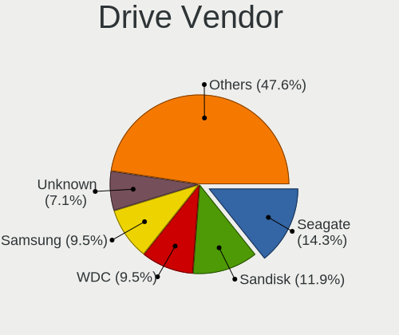

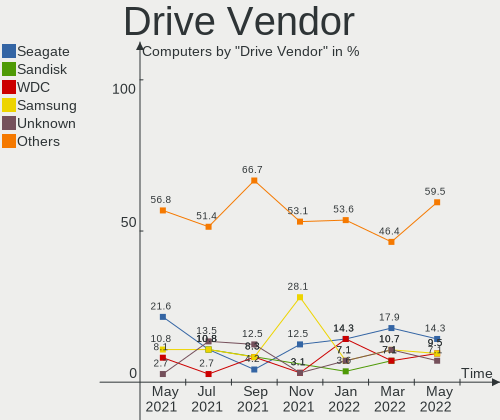

| Vendor              | Computers | Drives | Percent |
|---------------------|-----------|--------|---------|
| Seagate             | 6         | 6      | 14.29%  |
| Sandisk             | 5         | 6      | 11.9%   |
| WDC                 | 4         | 4      | 9.52%   |
| Samsung Electronics | 4         | 4      | 9.52%   |
| Unknown             | 3         | 3      | 7.14%   |
| Toshiba             | 3         | 4      | 7.14%   |
| Kingston            | 3         | 3      | 7.14%   |
| Phison              | 2         | 2      | 4.76%   |
| XPG                 | 1         | 1      | 2.38%   |
| PNY                 | 1         | 1      | 2.38%   |
| OCZ                 | 1         | 1      | 2.38%   |
| LITEONIT            | 1         | 1      | 2.38%   |
| Indilinx            | 1         | 1      | 2.38%   |
| HS-SSD-C100         | 1         | 1      | 2.38%   |
| Hikvision           | 1         | 1      | 2.38%   |
| HGST                | 1         | 1      | 2.38%   |
| China               | 1         | 4      | 2.38%   |
| Apple               | 1         | 1      | 2.38%   |
| Apacer              | 1         | 1      | 2.38%   |
| A-DATA Technology   | 1         | 1      | 2.38%   |

Drive Model
-----------

Hard drive models

| Model                               | Computers | Percent |
|-------------------------------------|-----------|---------|
| Unknown MMC Card  32GB              | 2         | 4.44%   |
| Samsung NVMe SSD Drive 1TB          | 2         | 4.44%   |
| XPG NVMe SSD Drive 256GB            | 1         | 2.22%   |
| WDC WD5000AAKX-00ERMA0 500GB        | 1         | 2.22%   |
| WDC WD20PURX-64P6ZY0 2TB            | 1         | 2.22%   |
| WDC WD10SPZX-24Z10 1TB              | 1         | 2.22%   |
| WDC WD10EFRX-68JCSN0 1TB            | 1         | 2.22%   |
| Unknown MMC Card  64GB              | 1         | 2.22%   |
| Toshiba NVMe SSD Drive 512GB        | 1         | 2.22%   |
| Toshiba KBG30ZMS128G 128GB NVMe SSD | 1         | 2.22%   |
| Toshiba HDWD110 1TB                 | 1         | 2.22%   |
| Toshiba DT01ACA100 1TB              | 1         | 2.22%   |
| Seagate ST500LM030-2E717D 500GB     | 1         | 2.22%   |
| Seagate ST500DM002-1BD142 500GB     | 1         | 2.22%   |
| Seagate ST3250318AS 250GB           | 1         | 2.22%   |
| Seagate ST2000LX001-1RG174 2TB      | 1         | 2.22%   |
| Seagate ST2000DM001-1ER164 2TB      | 1         | 2.22%   |
| Seagate ST1000DM010-2EP102 1TB      | 1         | 2.22%   |
| SanDisk Z400s M.2 2280 256GB SSD    | 1         | 2.22%   |
| SanDisk Ultra II 240GB SSD          | 1         | 2.22%   |
| SanDisk SSD PLUS 480GB              | 1         | 2.22%   |
| SanDisk SSD PLUS 120GB              | 1         | 2.22%   |
| SanDisk SD8SB8U128G1001 128GB SSD   | 1         | 2.22%   |
| Sandisk NVMe SSD Drive 250GB        | 1         | 2.22%   |
| Samsung SSD 860 EVO 500GB           | 1         | 2.22%   |
| Samsung Portable SSD T3 1TB         | 1         | 2.22%   |
| PNY CS1311 120GB SSD                | 1         | 2.22%   |
| Phison NVMe SSD Drive 256GB         | 1         | 2.22%   |
| Phison NVMe SSD Drive 1024GB        | 1         | 2.22%   |
| OCZ VERTEX4 128GB SSD               | 1         | 2.22%   |
| LITEONIT LAT-128M2S 128GB SSD       | 1         | 2.22%   |
| Kingston SA400S37960G 960GB SSD     | 1         | 2.22%   |
| Kingston SA400S37240G 240GB SSD     | 1         | 2.22%   |
| Kingston SA400S37120G 120GB SSD     | 1         | 2.22%   |
| Indilinx IND-S3N80P/128G 128GB      | 1         | 2.22%   |
| HS-SSD-C100 480G                    | 1         | 2.22%   |
| Hikvision HS-SSD-Minder(S) 120GB    | 1         | 2.22%   |
| HGST HTS721010A9E630 1TB            | 1         | 2.22%   |
| China SATA SSD 240GB                | 1         | 2.22%   |
| China SATA SSD 120GB                | 1         | 2.22%   |
| Apple SSD SD0128F 121GB             | 1         | 2.22%   |
| Apacer AS350 128GB SSD              | 1         | 2.22%   |
| A-DATA SP900 128GB SSD              | 1         | 2.22%   |

HDD Vendor
----------

Hard disk drive vendors

| Vendor  | Computers | Drives | Percent |
|---------|-----------|--------|---------|
| Seagate | 6         | 6      | 50%     |
| WDC     | 4         | 4      | 33.33%  |
| Toshiba | 1         | 2      | 8.33%   |
| HGST    | 1         | 1      | 8.33%   |

SSD Vendor
----------

Solid state drive vendors

| Vendor              | Computers | Drives | Percent |
|---------------------|-----------|--------|---------|
| SanDisk             | 4         | 5      | 23.53%  |
| Kingston            | 3         | 3      | 17.65%  |
| Samsung Electronics | 2         | 2      | 11.76%  |
| PNY                 | 1         | 1      | 5.88%   |
| OCZ                 | 1         | 1      | 5.88%   |
| LITEONIT            | 1         | 1      | 5.88%   |
| Hikvision           | 1         | 1      | 5.88%   |
| China               | 1         | 4      | 5.88%   |
| Apple               | 1         | 1      | 5.88%   |
| Apacer              | 1         | 1      | 5.88%   |
| A-DATA Technology   | 1         | 1      | 5.88%   |

Drive Kind
----------

HDD or SSD

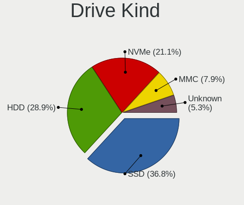

| Kind    | Computers | Drives | Percent |
|---------|-----------|--------|---------|
| SSD     | 14        | 21     | 36.84%  |
| HDD     | 11        | 13     | 28.95%  |
| NVMe    | 8         | 8      | 21.05%  |
| MMC     | 3         | 3      | 7.89%   |
| Unknown | 2         | 2      | 5.26%   |

Drive Connector
---------------

SATA, SAS, NVMe, etc.

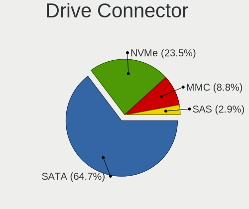

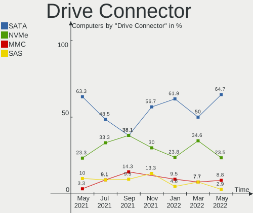

| Type | Computers | Drives | Percent |
|------|-----------|--------|---------|
| SATA | 22        | 35     | 64.71%  |
| NVMe | 8         | 8      | 23.53%  |
| MMC  | 3         | 3      | 8.82%   |
| SAS  | 1         | 1      | 2.94%   |

Drive Size
----------

Size of hard drive

| Size in TB | Computers | Drives | Percent |
|------------|-----------|--------|---------|
| 0.01-0.5   | 16        | 23     | 64%     |
| 0.51-1.0   | 7         | 8      | 28%     |
| 1.01-2.0   | 2         | 3      | 8%      |

Space Total
-----------

Amount of disk space available on the file system

| Size in GB     | Computers | Percent |
|----------------|-----------|---------|
| 101-250        | 11        | 37.93%  |
| 251-500        | 5         | 17.24%  |
| 501-1000       | 5         | 17.24%  |
| 51-100         | 4         | 13.79%  |
| 21-50          | 2         | 6.9%    |
| More than 3000 | 1         | 3.45%   |
| Unknown        | 1         | 3.45%   |

Space Used
----------

Amount of used disk space

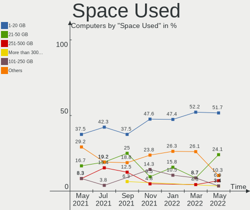

| Used GB        | Computers | Percent |
|----------------|-----------|---------|
| 1-20           | 15        | 51.72%  |
| 21-50          | 7         | 24.14%  |
| 251-500        | 2         | 6.9%    |
| More than 3000 | 1         | 3.45%   |
| 101-250        | 1         | 3.45%   |
| 501-1000       | 1         | 3.45%   |
| 51-100         | 1         | 3.45%   |
| Unknown        | 1         | 3.45%   |

Malfunc. Drives
---------------

Drive models with a malfunction

Zero info for selected period =(

Malfunc. Drive Vendor
---------------------

Vendors of faulty drives

Zero info for selected period =(

Malfunc. HDD Vendor
-------------------

Vendors of faulty HDD drives

Zero info for selected period =(

Malfunc. Drive Kind
-------------------

Kinds of faulty drives

Zero info for selected period =(

Failed Drives
-------------

Failed drive models

Zero info for selected period =(

Failed Drive Vendor
-------------------

Failed drive vendors

Zero info for selected period =(

Drive Status
------------

Number of failed and malfunc. drives

| Status   | Computers | Drives | Percent |
|----------|-----------|--------|---------|
| Detected | 29        | 47     | 100%    |

Storage controller
------------------

Storage Vendor
--------------

Storage controller vendors

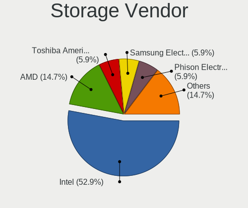

| Vendor                       | Computers | Percent |
|------------------------------|-----------|---------|
| Intel                        | 18        | 52.94%  |
| AMD                          | 5         | 14.71%  |
| Toshiba America Info Systems | 2         | 5.88%   |
| Samsung Electronics          | 2         | 5.88%   |
| Phison Electronics           | 2         | 5.88%   |
| Broadcom / LSI               | 2         | 5.88%   |
| Sandisk                      | 1         | 2.94%   |
| Marvell Technology Group     | 1         | 2.94%   |
| ADATA Technology             | 1         | 2.94%   |

Storage Model
-------------

Storage controller models

| Model                                                                            | Computers | Percent |
|----------------------------------------------------------------------------------|-----------|---------|
| AMD FCH SATA Controller [AHCI mode]                                              | 4         | 11.11%  |
| Intel Q170/Q150/B150/H170/H110/Z170/CM236 Chipset SATA Controller [AHCI Mode]    | 3         | 8.33%   |
| Phison PS5013 E13 NVMe Controller                                                | 2         | 5.56%   |
| Intel Sunrise Point-LP SATA Controller [AHCI mode]                               | 2         | 5.56%   |
| Intel Cannon Point-LP SATA Controller [AHCI Mode]                                | 2         | 5.56%   |
| Toshiba America Info Systems XG6 NVMe SSD Controller                             | 1         | 2.78%   |
| Toshiba America Info Systems Toshiba America Info Non-Volatile memory controller | 1         | 2.78%   |
| Sandisk WD Blue SN550 NVMe SSD                                                   | 1         | 2.78%   |
| Samsung NVMe SSD Controller SM981/PM981/PM983                                    | 1         | 2.78%   |
| Samsung NVMe SSD Controller 980                                                  | 1         | 2.78%   |
| Marvell Group 88SS9183 PCIe SSD Controller                                       | 1         | 2.78%   |
| Intel SATA Controller [RAID mode]                                                | 1         | 2.78%   |
| Intel HM170/QM170 Chipset SATA Controller [AHCI Mode]                            | 1         | 2.78%   |
| Intel Comet Lake SATA AHCI Controller                                            | 1         | 2.78%   |
| Intel Celeron/Pentium Silver Processor SATA Controller                           | 1         | 2.78%   |
| Intel Cannon Lake PCH SATA AHCI Controller                                       | 1         | 2.78%   |
| Intel Cannon Lake Mobile PCH SATA AHCI Controller                                | 1         | 2.78%   |
| Intel Atom Processor E3800 Series SATA AHCI Controller                           | 1         | 2.78%   |
| Intel 8 Series/C220 Series Chipset Family 6-port SATA Controller 1 [AHCI mode]   | 1         | 2.78%   |
| Intel 6 Series/C200 Series Chipset Family 6 port Desktop SATA AHCI Controller    | 1         | 2.78%   |
| Intel 5 Series/3400 Series Chipset 6 port SATA AHCI Controller                   | 1         | 2.78%   |
| Intel 400 Series Chipset Family SATA AHCI Controller                             | 1         | 2.78%   |
| Broadcom / LSI SAS2116 PCI-Express Fusion-MPT SAS-2 [Meteor]                     | 1         | 2.78%   |
| Broadcom / LSI SAS2008 PCI-Express Fusion-MPT SAS-2 [Falcon]                     | 1         | 2.78%   |
| AMD X370 Series Chipset SATA Controller                                          | 1         | 2.78%   |
| AMD SB7x0/SB8x0/SB9x0 SATA Controller [IDE mode]                                 | 1         | 2.78%   |
| AMD SB7x0/SB8x0/SB9x0 IDE Controller                                             | 1         | 2.78%   |
| ADATA XPG SX8200 Pro PCIe Gen3x4 M.2 2280 Solid State Drive                      | 1         | 2.78%   |

Storage Kind
------------

Kind of storage controller (IDE, SATA, NVMe, SAS, ...)

| Kind | Computers | Percent |
|------|-----------|---------|
| SATA | 23        | 65.71%  |
| NVMe | 8         | 22.86%  |
| SAS  | 2         | 5.71%   |
| RAID | 1         | 2.86%   |
| IDE  | 1         | 2.86%   |

Processor
---------

CPU Vendor
----------

Processor vendors

| Vendor | Computers | Percent |
|--------|-----------|---------|
| Intel  | 24        | 82.76%  |
| AMD    | 5         | 17.24%  |

CPU Model
---------

Processor models

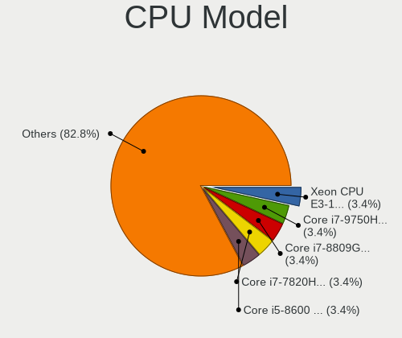

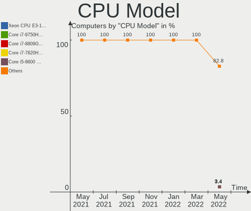

| Model                                          | Computers | Percent |
|------------------------------------------------|-----------|---------|
| Intel Xeon CPU E3-1240 v3 @ 3.40GHz            | 1         | 3.45%   |
| Intel Core i7-9750H CPU @ 2.60GHz              | 1         | 3.45%   |
| Intel Core i7-8809G CPU @ 3.10GHz              | 1         | 3.45%   |
| Intel Core i7-7820HK CPU @ 2.90GHz             | 1         | 3.45%   |
| Intel Core i5-8600 CPU @ 3.10GHz               | 1         | 3.45%   |
| Intel Core i5-8265U CPU @ 1.60GHz              | 1         | 3.45%   |
| Intel Core i5-7200U CPU @ 2.50GHz              | 1         | 3.45%   |
| Intel Core i5-6600K CPU @ 3.50GHz              | 1         | 3.45%   |
| Intel Core i5-6300U CPU @ 2.40GHz              | 1         | 3.45%   |
| Intel Core i5-6300HQ CPU @ 2.30GHz             | 1         | 3.45%   |
| Intel Core i5-6200U CPU @ 2.30GHz              | 1         | 3.45%   |
| Intel Core i5-4250U CPU @ 1.30GHz              | 1         | 3.45%   |
| Intel Core i5-2320 CPU @ 3.00GHz               | 1         | 3.45%   |
| Intel Core i5-10210U CPU @ 1.60GHz             | 1         | 3.45%   |
| Intel Core i5 CPU M 560 @ 2.67GHz              | 1         | 3.45%   |
| Intel Core i3-8109U CPU @ 3.00GHz              | 1         | 3.45%   |
| Intel Core i3-7100 CPU @ 3.90GHz               | 1         | 3.45%   |
| Intel Core i3-4160 CPU @ 3.60GHz               | 1         | 3.45%   |
| Intel Core i3-10100F CPU @ 3.60GHz             | 1         | 3.45%   |
| Intel Celeron N4120 CPU @ 1.10GHz              | 1         | 3.45%   |
| Intel Celeron N4020 CPU @ 1.10GHz              | 1         | 3.45%   |
| Intel Celeron CPU N3060 @ 1.60GHz              | 1         | 3.45%   |
| Intel Celeron CPU N2840 @ 2.16GHz              | 1         | 3.45%   |
| Intel Celeron CPU N2830 @ 2.16GHz              | 1         | 3.45%   |
| AMD Ryzen Threadripper 3960X 24-Core Processor | 1         | 3.45%   |
| AMD Ryzen 9 5950X 16-Core Processor            | 1         | 3.45%   |
| AMD Ryzen 5 2600X Six-Core Processor           | 1         | 3.45%   |
| AMD Opteron Processor 6282 SE                  | 1         | 3.45%   |
| AMD E1-7010 APU with AMD Radeon R2 Graphics    | 1         | 3.45%   |

CPU Model Family
----------------

Processor model prefix

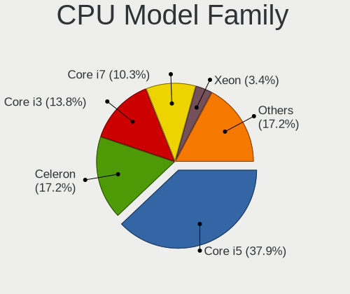

| Model                  | Computers | Percent |
|------------------------|-----------|---------|
| Intel Core i5          | 11        | 37.93%  |
| Intel Celeron          | 5         | 17.24%  |
| Intel Core i3          | 4         | 13.79%  |
| Intel Core i7          | 3         | 10.34%  |
| Intel Xeon             | 1         | 3.45%   |
| AMD Ryzen Threadripper | 1         | 3.45%   |
| AMD Ryzen 9            | 1         | 3.45%   |
| AMD Ryzen 5            | 1         | 3.45%   |
| AMD Opteron            | 1         | 3.45%   |
| AMD E1                 | 1         | 3.45%   |

CPU Cores
---------

Number of processor cores

| Number | Computers | Percent |
|--------|-----------|---------|
| 2      | 13        | 44.83%  |
| 4      | 10        | 34.48%  |
| 6      | 3         | 10.34%  |
| 32     | 1         | 3.45%   |
| 24     | 1         | 3.45%   |
| 16     | 1         | 3.45%   |

CPU Sockets
-----------

Number of sockets

| Number | Computers | Percent |
|--------|-----------|---------|
| 1      | 28        | 96.55%  |
| 4      | 1         | 3.45%   |

CPU Threads
-----------

Threads per core (Hyper-Threading)

| Number | Computers | Percent |
|--------|-----------|---------|
| 2      | 18        | 62.07%  |
| 1      | 11        | 37.93%  |

CPU Op-Modes
------------

CPU Operation Modes (32-bit, 64-bit)

| Op mode        | Computers | Percent |
|----------------|-----------|---------|
| 32-bit, 64-bit | 29        | 100%    |

CPU Microcode
-------------

Microcode number

| Number  | Computers | Percent |
|---------|-----------|---------|
| Unknown | 28        | 96.55%  |
| 0x706a8 | 1         | 3.45%   |

CPU Microarch
-------------

Microarchitecture

| Name          | Computers | Percent |
|---------------|-----------|---------|
| KabyLake      | 9         | 31.03%  |
| Skylake       | 4         | 13.79%  |
| Silvermont    | 3         | 10.34%  |
| Haswell       | 3         | 10.34%  |
| Goldmont plus | 2         | 6.9%    |
| Zen+          | 1         | 3.45%   |
| Zen 3         | 1         | 3.45%   |
| Zen 2         | 1         | 3.45%   |
| Westmere      | 1         | 3.45%   |
| SandyBridge   | 1         | 3.45%   |
| Puma          | 1         | 3.45%   |
| CometLake     | 1         | 3.45%   |
| Bulldozer     | 1         | 3.45%   |

Graphics
--------

GPU Vendor
----------

Vendors of graphics cards

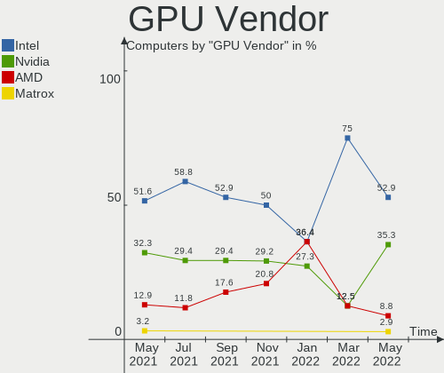

| Vendor                     | Computers | Percent |
|----------------------------|-----------|---------|
| Intel                      | 18        | 52.94%  |
| Nvidia                     | 12        | 35.29%  |
| AMD                        | 3         | 8.82%   |
| Matrox Electronics Systems | 1         | 2.94%   |

GPU Model
---------

Graphics card models

| Model                                                                                    | Computers | Percent |
|------------------------------------------------------------------------------------------|-----------|---------|
| Nvidia GP106 [GeForce GTX 1060 3GB]                                                      | 3         | 8.82%   |
| Intel HD Graphics 630                                                                    | 3         | 8.82%   |
| Intel Skylake GT2 [HD Graphics 520]                                                      | 2         | 5.88%   |
| Intel GeminiLake [UHD Graphics 600]                                                      | 2         | 5.88%   |
| Intel Atom Processor Z36xxx/Z37xxx Series Graphics & Display                             | 2         | 5.88%   |
| Nvidia TU117GLM [Quadro T1000 Mobile]                                                    | 1         | 2.94%   |
| Nvidia TU117 [GeForce GTX 1650]                                                          | 1         | 2.94%   |
| Nvidia GP108 [GeForce GT 1030]                                                           | 1         | 2.94%   |
| Nvidia GP104M [GeForce GTX 1080 Mobile]                                                  | 1         | 2.94%   |
| Nvidia GP104 [GeForce GTX 1070]                                                          | 1         | 2.94%   |
| Nvidia GM107M [GeForce GTX 960M]                                                         | 1         | 2.94%   |
| Nvidia GM107 [GeForce GTX 750 Ti]                                                        | 1         | 2.94%   |
| Nvidia GA106 [GeForce RTX 3060 Lite Hash Rate]                                           | 1         | 2.94%   |
| Nvidia GA102 [GeForce RTX 3090]                                                          | 1         | 2.94%   |
| Matrox Electronics Systems MGA G200eW WPCM450                                            | 1         | 2.94%   |
| Intel WhiskeyLake-U GT2 [UHD Graphics 620]                                               | 1         | 2.94%   |
| Intel HD Graphics 620                                                                    | 1         | 2.94%   |
| Intel HD Graphics 530                                                                    | 1         | 2.94%   |
| Intel Haswell-ULT Integrated Graphics Controller                                         | 1         | 2.94%   |
| Intel Core Processor Integrated Graphics Controller                                      | 1         | 2.94%   |
| Intel CometLake-U GT2 [UHD Graphics]                                                     | 1         | 2.94%   |
| Intel CoffeeLake-U GT3e [Iris Plus Graphics 655]                                         | 1         | 2.94%   |
| Intel CoffeeLake-H GT2 [UHD Graphics 630]                                                | 1         | 2.94%   |
| Intel Atom/Celeron/Pentium Processor x5-E8000/J3xxx/N3xxx Integrated Graphics Controller | 1         | 2.94%   |
| AMD Polaris 22 XT [Radeon RX Vega M GH]                                                  | 1         | 2.94%   |
| AMD Oland [Radeon HD 8570 / R5 430 OEM / R7 240/340 / Radeon 520 OEM]                    | 1         | 2.94%   |
| AMD Mullins [Radeon R2 Graphics]                                                         | 1         | 2.94%   |

GPU Combo
---------

Combinations of graphics cards

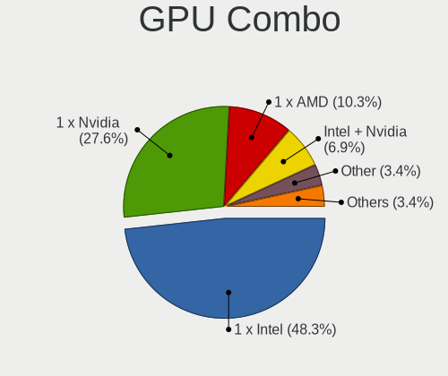

| Name            | Computers | Percent |
|-----------------|-----------|---------|
| 1 x Intel       | 14        | 48.28%  |
| 1 x Nvidia      | 8         | 27.59%  |
| 1 x AMD         | 3         | 10.34%  |
| Intel + Nvidia  | 2         | 6.9%    |
| Other           | 1         | 3.45%   |
| Nvidia + Matrox | 1         | 3.45%   |

GPU Driver
----------

Free vs proprietary

| Driver      | Computers | Percent |
|-------------|-----------|---------|
| Free        | 27        | 93.1%   |
| Proprietary | 2         | 6.9%    |

GPU Memory
----------

Total video memory

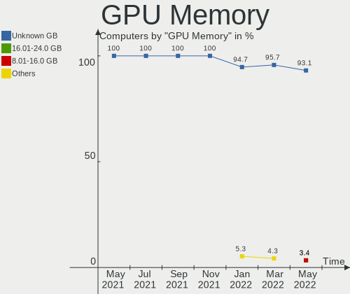

| Size in GB | Computers | Percent |
|------------|-----------|---------|
| Unknown    | 27        | 93.1%   |
| 16.01-24.0 | 1         | 3.45%   |
| 8.01-16.0  | 1         | 3.45%   |

Monitor
-------

Monitor Vendor
--------------

Monitor vendors

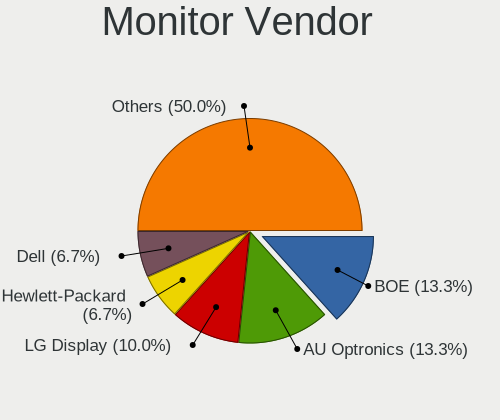

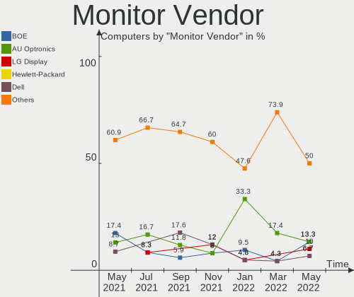

| Vendor              | Computers | Percent |
|---------------------|-----------|---------|
| BOE                 | 4         | 13.33%  |
| AU Optronics        | 4         | 13.33%  |
| LG Display          | 3         | 10%     |
| Hewlett-Packard     | 2         | 6.67%   |
| Dell                | 2         | 6.67%   |
| Acer                | 2         | 6.67%   |
| ZTR                 | 1         | 3.33%   |
| Yuraku              | 1         | 3.33%   |
| ViewSonic           | 1         | 3.33%   |
| Sharp               | 1         | 3.33%   |
| Samsung Electronics | 1         | 3.33%   |
| Medion Akoya        | 1         | 3.33%   |
| Medion              | 1         | 3.33%   |
| LG Electronics      | 1         | 3.33%   |
| Hitachi             | 1         | 3.33%   |
| FHD                 | 1         | 3.33%   |
| AUS                 | 1         | 3.33%   |
| Apple               | 1         | 3.33%   |
| AOC                 | 1         | 3.33%   |

Monitor Model
-------------

Monitor models

| Model                                                              | Computers | Percent |
|--------------------------------------------------------------------|-----------|---------|
| ZTR LCD Monitor ZTR0001 1366x768 256x144mm 11.6-inch               | 1         | 3.23%   |
| Yuraku MA2221 FAC2221 1920x1080 410x230mm 18.5-inch                | 1         | 3.23%   |
| ViewSonic LCD Monitor VA2212 Series                                | 1         | 3.23%   |
| Sharp HDMI SHP1009 1360x768 820x460mm 37.0-inch                    | 1         | 3.23%   |
| Samsung Electronics SMBX2250 SAM071B 1920x1080 477x268mm 21.5-inch | 1         | 3.23%   |
| Medion MD20831 MEA5107 1920x1080 527x296mm 23.8-inch               | 1         | 3.23%   |
| Medion Akoya MD20491 MEC5201 1920x1080 521x293mm 23.5-inch         | 1         | 3.23%   |
| LG Electronics LCD Monitor E2342 1920x1080                         | 1         | 3.23%   |
| LG Display LCD Monitor LGD04B9 1920x1080 344x194mm 15.5-inch       | 1         | 3.23%   |
| LG Display LCD Monitor LGD046D 1920x1080 309x174mm 14.0-inch       | 1         | 3.23%   |
| LG Display LCD Monitor LGD0212 1366x768 309x174mm 14.0-inch        | 1         | 3.23%   |
| Hitachi HDMI HEC0030 1920x1080 580x330mm 26.3-inch                 | 1         | 3.23%   |
| Hewlett-Packard V24 HPN36B5 1920x1080 531x299mm 24.0-inch          | 1         | 3.23%   |
| Hewlett-Packard 24f HPN3545 1920x1080 527x296mm 23.8-inch          | 1         | 3.23%   |
| FHD HDMI FHD1080 1920x1080 532x299mm 24.0-inch                     | 1         | 3.23%   |
| Dell S2721QS DELA197 3840x2160 597x336mm 27.0-inch                 | 1         | 3.23%   |
| Dell S2721QS DELA196 3840x2160 597x336mm 27.0-inch                 | 1         | 3.23%   |
| Dell E2216H DELF069 1920x1080 476x268mm 21.5-inch                  | 1         | 3.23%   |
| BOE LCD Monitor BOE0877 1920x1080 309x173mm 13.9-inch              | 1         | 3.23%   |
| BOE LCD Monitor BOE0757 1366x768 344x194mm 15.5-inch               | 1         | 3.23%   |
| BOE LCD Monitor BOE0731 1366x768 256x144mm 11.6-inch               | 1         | 3.23%   |
| BOE LCD Monitor BOE0675 1366x768 344x194mm 15.5-inch               | 1         | 3.23%   |
| AUS LCD Monitor ASUS PG43U 5760x2160                               | 1         | 3.23%   |
| AU Optronics LCD Monitor AUO333D 1920x1080 309x174mm 14.0-inch     | 1         | 3.23%   |
| AU Optronics LCD Monitor AUO235C 1366x768 256x144mm 11.6-inch      | 1         | 3.23%   |
| AU Optronics LCD Monitor AUO109B 3840x2160 382x214mm 17.2-inch     | 1         | 3.23%   |
| AU Optronics LCD Monitor AUO106C 1366x768 276x155mm 12.5-inch      | 1         | 3.23%   |
| Apple Color LCD APP9CDF 1440x900 286x179mm 13.3-inch               | 1         | 3.23%   |
| AOC AG251FWG2 AOC2510 1920x1080 544x303mm 24.5-inch                | 1         | 3.23%   |
| Acer T272HL ACR013B 1920x1080 598x336mm 27.0-inch                  | 1         | 3.23%   |
| Acer SB220Q ACR06AB 1920x1080 476x268mm 21.5-inch                  | 1         | 3.23%   |

Monitor Resolution
------------------

Monitor screen resolution

| Resolution       | Computers | Percent |
|------------------|-----------|---------|
| 1920x1080 (FHD)  | 16        | 53.33%  |
| 1366x768 (WXGA)  | 7         | 23.33%  |
| 3840x2160 (4K)   | 3         | 10%     |
| 5760x2160        | 1         | 3.33%   |
| 1440x900 (WXGA+) | 1         | 3.33%   |
| 1360x768         | 1         | 3.33%   |
| Unknown          | 1         | 3.33%   |

Monitor Diagonal
----------------

Diagonal size in inches

| Inches  | Computers | Percent |
|---------|-----------|---------|
| 24      | 4         | 13.79%  |
| 21      | 3         | 10.34%  |
| 15      | 3         | 10.34%  |
| 14      | 3         | 10.34%  |
| 11      | 3         | 10.34%  |
| 27      | 2         | 6.9%    |
| 23      | 2         | 6.9%    |
| 13      | 2         | 6.9%    |
| Unknown | 2         | 6.9%    |
| 84      | 1         | 3.45%   |
| 37      | 1         | 3.45%   |
| 18      | 1         | 3.45%   |
| 17      | 1         | 3.45%   |
| 12      | 1         | 3.45%   |

Monitor Width
-------------

Physical width

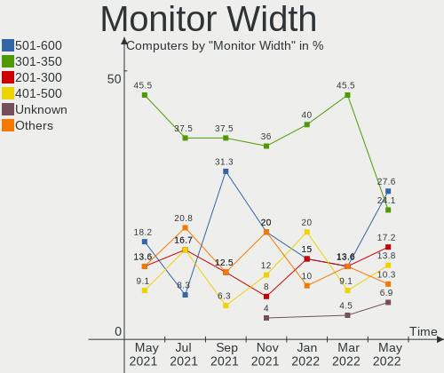

| Width in mm | Computers | Percent |
|-------------|-----------|---------|
| 501-600     | 8         | 27.59%  |
| 301-350     | 7         | 24.14%  |
| 201-300     | 5         | 17.24%  |
| 401-500     | 4         | 13.79%  |
| Unknown     | 2         | 6.9%    |
| 801-900     | 1         | 3.45%   |
| 351-400     | 1         | 3.45%   |
| 1501-2000   | 1         | 3.45%   |

Aspect Ratio
------------

Proportional relationship between the width and the height

| Ratio   | Computers | Percent |
|---------|-----------|---------|
| 16/9    | 26        | 89.66%  |
| Unknown | 2         | 6.9%    |
| 16/10   | 1         | 3.45%   |

Monitor Area
------------

Area in inch

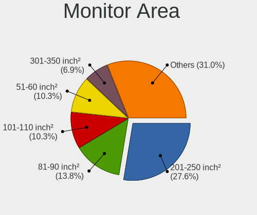

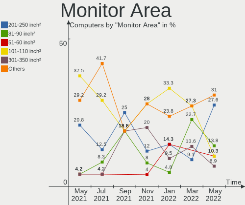

| Area in inch | Computers | Percent |
|----------------|-----------|---------|
| 201-250        | 8         | 27.59%  |
| 81-90          | 4         | 13.79%  |
| 51-60          | 3         | 10.34%  |
| 101-110        | 3         | 10.34%  |
| 301-350        | 2         | 6.9%    |
| Unknown        | 2         | 6.9%    |
| More than 1000 | 1         | 3.45%   |
| 71-80          | 1         | 3.45%   |
| 61-70          | 1         | 3.45%   |
| 251-300        | 1         | 3.45%   |
| 141-150        | 1         | 3.45%   |
| 121-130        | 1         | 3.45%   |
| 501-1000       | 1         | 3.45%   |

Pixel Density
-------------

Pixels per inch

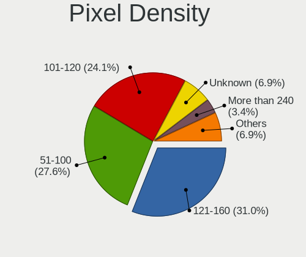

| Density       | Computers | Percent |
|---------------|-----------|---------|
| 121-160       | 9         | 31.03%  |
| 51-100        | 8         | 27.59%  |
| 101-120       | 7         | 24.14%  |
| Unknown       | 2         | 6.9%    |
| More than 240 | 1         | 3.45%   |
| 1-50          | 1         | 3.45%   |
| 161-240       | 1         | 3.45%   |

Multiple Monitors
-----------------

Total monitors connected

| Total | Computers | Percent |
|-------|-----------|---------|
| 1     | 28        | 96.55%  |
| 2     | 1         | 3.45%   |

Network
-------

Net Controller Vendor
---------------------

Controller vendors

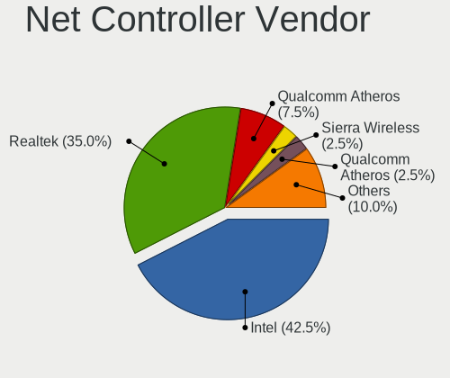

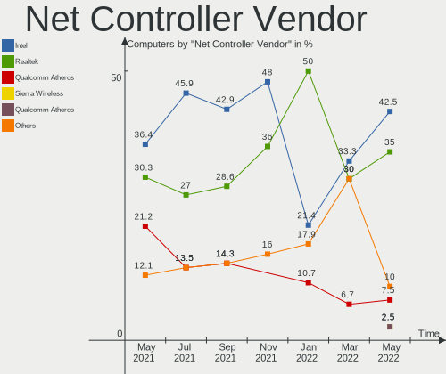

| Vendor                          | Computers | Percent |
|---------------------------------|-----------|---------|
| Intel                           | 17        | 42.5%   |
| Realtek Semiconductor           | 14        | 35%     |
| Qualcomm Atheros                | 3         | 7.5%    |
| Sierra Wireless                 | 1         | 2.5%    |
| Qualcomm Atheros Communications | 1         | 2.5%    |
| Microsoft                       | 1         | 2.5%    |
| Dell                            | 1         | 2.5%    |
| Broadcom Limited                | 1         | 2.5%    |
| Broadcom                        | 1         | 2.5%    |

Net Controller Model
--------------------

Controller models

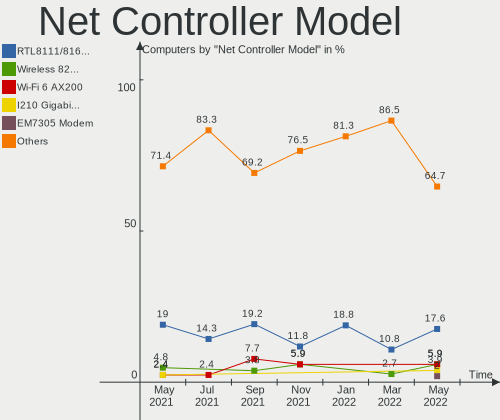

| Model                                                             | Computers | Percent |
|-------------------------------------------------------------------|-----------|---------|
| Realtek RTL8111/8168/8411 PCI Express Gigabit Ethernet Controller | 9         | 17.65%  |
| Intel Wireless 8265 / 8275                                        | 3         | 5.88%   |
| Intel Wi-Fi 6 AX200                                               | 3         | 5.88%   |
| Intel I210 Gigabit Network Connection                             | 2         | 3.92%   |
| Sierra Wireless EM7305 Modem                                      | 1         | 1.96%   |
| Realtek RTL8822CE 802.11ac PCIe Wireless Network Adapter          | 1         | 1.96%   |
| Realtek RTL8188CUS 802.11n WLAN Adapter                           | 1         | 1.96%   |
| Realtek RTL8187 Wireless Adapter                                  | 1         | 1.96%   |
| Realtek RTL8152 Fast Ethernet Adapter                             | 1         | 1.96%   |
| Realtek 802.11ac NIC                                              | 1         | 1.96%   |
| Qualcomm Atheros QCA9565 / AR9565 Wireless Network Adapter        | 1         | 1.96%   |
| Qualcomm Atheros QCA9377 802.11ac Wireless Network Adapter        | 1         | 1.96%   |
| Qualcomm Atheros QCA6174 802.11ac Wireless Network Adapter        | 1         | 1.96%   |
| Qualcomm Atheros Killer E2500 Gigabit Ethernet Controller         | 1         | 1.96%   |
| Qualcomm Atheros AR9271 802.11n                                   | 1         | 1.96%   |
| Microsoft Xbox 360 Wireless Adapter                               | 1         | 1.96%   |
| Intel Wireless 8260                                               | 1         | 1.96%   |
| Intel Wireless 3165                                               | 1         | 1.96%   |
| Intel I211 Gigabit Network Connection                             | 1         | 1.96%   |
| Intel Gemini Lake PCH CNVi WiFi                                   | 1         | 1.96%   |
| Intel Ethernet Controller I225-V                                  | 1         | 1.96%   |
| Intel Ethernet Connection I219-V                                  | 1         | 1.96%   |
| Intel Ethernet Connection I217-LM                                 | 1         | 1.96%   |
| Intel Ethernet Connection (7) I219-V                              | 1         | 1.96%   |
| Intel Ethernet Connection (7) I219-LM                             | 1         | 1.96%   |
| Intel Ethernet Connection (6) I219-V                              | 1         | 1.96%   |
| Intel Ethernet Connection (4) I219-V                              | 1         | 1.96%   |
| Intel Ethernet Connection (2) I219-LM                             | 1         | 1.96%   |
| Intel Dual Band Wireless-AC 3165 Plus Bluetooth                   | 1         | 1.96%   |
| Intel Comet Lake PCH-LP CNVi WiFi                                 | 1         | 1.96%   |
| Intel Centrino Wireless-N 2230                                    | 1         | 1.96%   |
| Intel Centrino Advanced-N 6200                                    | 1         | 1.96%   |
| Intel Cannon Point-LP CNVi [Wireless-AC]                          | 1         | 1.96%   |
| Intel 82577LM Gigabit Network Connection                          | 1         | 1.96%   |
| Intel 82576 Gigabit Network Connection                            | 1         | 1.96%   |
| Dell DW5811e Snapdragon X7 LTE                              | 1         | 1.96%   |
| Broadcom Limited BCM4360 802.11ac Wireless Network Adapter        | 1         | 1.96%   |
| Broadcom BCM43142 802.11b/g/n                                     | 1         | 1.96%   |

Wireless Vendor
---------------

Wireless vendors

| Vendor                          | Computers | Percent |
|---------------------------------|-----------|---------|
| Intel                           | 14        | 51.85%  |
| Realtek Semiconductor           | 4         | 14.81%  |
| Qualcomm Atheros                | 3         | 11.11%  |
| Sierra Wireless                 | 1         | 3.7%    |
| Qualcomm Atheros Communications | 1         | 3.7%    |
| Microsoft                       | 1         | 3.7%    |
| Dell                            | 1         | 3.7%    |
| Broadcom Limited                | 1         | 3.7%    |
| Broadcom                        | 1         | 3.7%    |

Wireless Model
--------------

Wireless models

| Model                                                      | Computers | Percent |
|------------------------------------------------------------|-----------|---------|
| Intel Wireless 8265 / 8275                                 | 3         | 11.11%  |
| Intel Wi-Fi 6 AX200                                        | 3         | 11.11%  |
| Sierra Wireless EM7305 Modem                               | 1         | 3.7%    |
| Realtek RTL8822CE 802.11ac PCIe Wireless Network Adapter   | 1         | 3.7%    |
| Realtek RTL8188CUS 802.11n WLAN Adapter                    | 1         | 3.7%    |
| Realtek RTL8187 Wireless Adapter                           | 1         | 3.7%    |
| Realtek 802.11ac NIC                                       | 1         | 3.7%    |
| Qualcomm Atheros QCA9565 / AR9565 Wireless Network Adapter | 1         | 3.7%    |
| Qualcomm Atheros QCA9377 802.11ac Wireless Network Adapter | 1         | 3.7%    |
| Qualcomm Atheros QCA6174 802.11ac Wireless Network Adapter | 1         | 3.7%    |
| Qualcomm Atheros AR9271 802.11n                            | 1         | 3.7%    |
| Microsoft Xbox 360 Wireless Adapter                        | 1         | 3.7%    |
| Intel Wireless 8260                                        | 1         | 3.7%    |
| Intel Wireless 3165                                        | 1         | 3.7%    |
| Intel Gemini Lake PCH CNVi WiFi                            | 1         | 3.7%    |
| Intel Dual Band Wireless-AC 3165 Plus Bluetooth            | 1         | 3.7%    |
| Intel Comet Lake PCH-LP CNVi WiFi                          | 1         | 3.7%    |
| Intel Centrino Wireless-N 2230                             | 1         | 3.7%    |
| Intel Centrino Advanced-N 6200                             | 1         | 3.7%    |
| Intel Cannon Point-LP CNVi [Wireless-AC]                   | 1         | 3.7%    |
| Dell DW5811e Snapdragon X7 LTE                       | 1         | 3.7%    |
| Broadcom Limited BCM4360 802.11ac Wireless Network Adapter | 1         | 3.7%    |
| Broadcom BCM43142 802.11b/g/n                              | 1         | 3.7%    |

Ethernet Vendor
---------------

Ethernet vendors

| Vendor                | Computers | Percent |
|-----------------------|-----------|---------|
| Intel                 | 11        | 50%     |
| Realtek Semiconductor | 10        | 45.45%  |
| Qualcomm Atheros      | 1         | 4.55%   |

Ethernet Model
--------------

Ethernet models

| Model                                                             | Computers | Percent |
|-------------------------------------------------------------------|-----------|---------|
| Realtek RTL8111/8168/8411 PCI Express Gigabit Ethernet Controller | 9         | 37.5%   |
| Intel I210 Gigabit Network Connection                             | 2         | 8.33%   |
| Realtek RTL8152 Fast Ethernet Adapter                             | 1         | 4.17%   |
| Qualcomm Atheros Killer E2500 Gigabit Ethernet Controller         | 1         | 4.17%   |
| Intel I211 Gigabit Network Connection                             | 1         | 4.17%   |
| Intel Ethernet Controller I225-V                                  | 1         | 4.17%   |
| Intel Ethernet Connection I219-V                                  | 1         | 4.17%   |
| Intel Ethernet Connection I217-LM                                 | 1         | 4.17%   |
| Intel Ethernet Connection (7) I219-V                              | 1         | 4.17%   |
| Intel Ethernet Connection (7) I219-LM                             | 1         | 4.17%   |
| Intel Ethernet Connection (6) I219-V                              | 1         | 4.17%   |
| Intel Ethernet Connection (4) I219-V                              | 1         | 4.17%   |
| Intel Ethernet Connection (2) I219-LM                             | 1         | 4.17%   |
| Intel 82577LM Gigabit Network Connection                          | 1         | 4.17%   |
| Intel 82576 Gigabit Network Connection                            | 1         | 4.17%   |

Net Controller Kind
-------------------

Ethernet, WiFi or modem

| Kind     | Computers | Percent |
|----------|-----------|---------|
| Ethernet | 22        | 51.16%  |
| WiFi     | 21        | 48.84%  |

Used Controller
---------------

Currently used network controller

| Kind     | Computers | Percent |
|----------|-----------|---------|
| WiFi     | 17        | 58.62%  |
| Ethernet | 12        | 41.38%  |

NICs
----

Total network controllers on board

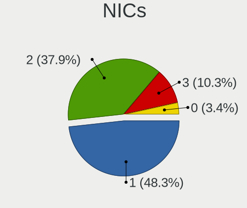

| Total | Computers | Percent |
|-------|-----------|---------|
| 1     | 14        | 48.28%  |
| 2     | 11        | 37.93%  |
| 3     | 3         | 10.34%  |
| 0     | 1         | 3.45%   |

IPv6
----

IPv6 vs IPv4

| Used | Computers | Percent |
|------|-----------|---------|
| No   | 24        | 82.76%  |
| Yes  | 5         | 17.24%  |

Bluetooth
---------

Bluetooth Vendor
----------------

Controller vendors

| Vendor                          | Computers | Percent |
|---------------------------------|-----------|---------|
| Intel                           | 12        | 57.14%  |
| Qualcomm Atheros Communications | 2         | 9.52%   |
| Realtek Semiconductor           | 1         | 4.76%   |
| IMC Networks                    | 1         | 4.76%   |
| Hewlett-Packard                 | 1         | 4.76%   |
| Foxconn International           | 1         | 4.76%   |
| Foxconn / Hon Hai               | 1         | 4.76%   |
| Cambridge Silicon Radio         | 1         | 4.76%   |
| Apple                           | 1         | 4.76%   |

Bluetooth Model
---------------

Controller models

| Model                                               | Computers | Percent |
|-----------------------------------------------------|-----------|---------|
| Intel Bluetooth wireless interface                  | 5         | 23.81%  |
| Intel Bluetooth 9460/9560 Jefferson Peak (JfP)      | 3         | 14.29%  |
| Intel AX200 Bluetooth                               | 3         | 14.29%  |
| Realtek Bluetooth Radio                             | 1         | 4.76%   |
| Qualcomm Atheros  Bluetooth Device                  | 1         | 4.76%   |
| Qualcomm Atheros QCA61x4 Bluetooth 4.0              | 1         | 4.76%   |
| Intel Centrino Bluetooth Wireless Transceiver       | 1         | 4.76%   |
| IMC Networks Bluetooth Radio                        | 1         | 4.76%   |
| HP Broadcom 2070 Bluetooth Combo                    | 1         | 4.76%   |
| Foxconn International BCM43142A0 Bluetooth module   | 1         | 4.76%   |
| Foxconn / Hon Hai Bluetooth Device                  | 1         | 4.76%   |
| Cambridge Silicon Radio Bluetooth Dongle (HCI mode) | 1         | 4.76%   |
| Apple Bluetooth USB Host Controller                 | 1         | 4.76%   |

Sound
-----

Sound Vendor
------------

Sound card vendors

| Vendor                   | Computers | Percent |
|--------------------------|-----------|---------|
| Intel                    | 24        | 52.17%  |
| Nvidia                   | 11        | 23.91%  |
| AMD                      | 6         | 13.04%  |
| C-Media Electronics      | 3         | 6.52%   |
| Micro Star International | 1         | 2.17%   |
| Logitech                 | 1         | 2.17%   |

Sound Model
-----------

Sound card models

| Model                                                                                             | Computers | Percent |
|---------------------------------------------------------------------------------------------------|-----------|---------|
| Nvidia GP106 High Definition Audio Controller                                                     | 3         | 6.25%   |
| Intel Sunrise Point-LP HD Audio                                                                   | 3         | 6.25%   |
| Intel 100 Series/C230 Series Chipset Family HD Audio Controller                                   | 3         | 6.25%   |
| Nvidia TU107 GeForce GTX 1650 High Definition Audio Controller                                    | 2         | 4.17%   |
| Nvidia GP104 High Definition Audio Controller                                                     | 2         | 4.17%   |
| Intel CM238 HD Audio Controller                                                                   | 2         | 4.17%   |
| Intel Celeron/Pentium Silver Processor High Definition Audio                                      | 2         | 4.17%   |
| Intel Cannon Point-LP High Definition Audio Controller                                            | 2         | 4.17%   |
| Intel Cannon Lake PCH cAVS                                                                        | 2         | 4.17%   |
| Intel Atom Processor Z36xxx/Z37xxx Series High Definition Audio Controller                        | 2         | 4.17%   |
| Intel 8 Series/C220 Series Chipset High Definition Audio Controller                               | 2         | 4.17%   |
| C-Media Electronics SADES Luna                                                                    | 2         | 4.17%   |
| AMD Starship/Matisse HD Audio Controller                                                          | 2         | 4.17%   |
| Nvidia GP108 High Definition Audio Controller                                                     | 1         | 2.08%   |
| Nvidia GM107 High Definition Audio Controller [GeForce 940MX]                                     | 1         | 2.08%   |
| Nvidia GA102 High Definition Audio Controller                                                     | 1         | 2.08%   |
| Nvidia Audio device                                                                               | 1         | 2.08%   |
| Micro Star International USB Audio                                                                | 1         | 2.08%   |
| Logitech G432 Gaming Headset                                                                      | 1         | 2.08%   |
| Intel Haswell-ULT HD Audio Controller                                                             | 1         | 2.08%   |
| Intel Comet Lake PCH-V cAVS                                                                       | 1         | 2.08%   |
| Intel Comet Lake PCH-LP cAVS                                                                      | 1         | 2.08%   |
| Intel Atom/Celeron/Pentium Processor x5-E8000/J3xxx/N3xxx Series High Definition Audio Controller | 1         | 2.08%   |
| Intel 8 Series HD Audio Controller                                                                | 1         | 2.08%   |
| Intel 6 Series/C200 Series Chipset Family High Definition Audio Controller                        | 1         | 2.08%   |
| Intel 5 Series/3400 Series Chipset High Definition Audio                                          | 1         | 2.08%   |
| C-Media Electronics TONOR TC30 Audio Device                                                       | 1         | 2.08%   |
| AMD Polaris 22 HDMI Audio                                                                         | 1         | 2.08%   |
| AMD Oland/Hainan/Cape Verde/Pitcairn HDMI Audio [Radeon HD 7000 Series]                           | 1         | 2.08%   |
| AMD Kabini HDMI/DP Audio                                                                          | 1         | 2.08%   |
| AMD FCH Azalia Controller                                                                         | 1         | 2.08%   |
| AMD Family 17h (Models 00h-0fh) HD Audio Controller                                               | 1         | 2.08%   |

Memory
------

Memory Vendor
-------------

Memory module vendors

| Vendor            | Computers | Percent |
|-------------------|-----------|---------|
| Micron Technology | 1         | 100%    |

Memory Model
------------

Memory module models

| Model                                          | Computers | Percent |
|------------------------------------------------|-----------|---------|
| Micron RAM MT53E512M32D2NP 2GB LPDDR4 2400MT/s | 1         | 100%    |

Memory Kind
-----------

Memory module kinds

| Kind   | Computers | Percent |
|--------|-----------|---------|
| LPDDR4 | 1         | 100%    |

Memory Form Factor
------------------

Physical design of the memory module

| Name    | Computers | Percent |
|---------|-----------|---------|
| Unknown | 1         | 100%    |

Memory Size
-----------

Memory module size

| Size | Computers | Percent |
|------|-----------|---------|
| 2048 | 1         | 100%    |

Memory Speed
------------

Memory module speed

| Speed | Computers | Percent |
|-------|-----------|---------|
| 2400  | 1         | 100%    |

Printers & scanners
-------------------

Printer Vendor
--------------

Printer device vendors

| Vendor      | Computers | Percent |
|-------------|-----------|---------|
| Seiko Epson | 1         | 50%     |
| Canon       | 1         | 50%     |

Printer Model
-------------

Printer device models

| Model                      | Computers | Percent |
|----------------------------|-----------|---------|
| Seiko Epson ET-2710 Series | 1         | 50%     |
| Canon PIXMA MG3600 Series  | 1         | 50%     |

Scanner Vendor
--------------

Scanner device vendors

Zero info for selected period =(

Scanner Model
-------------

Scanner device models

Zero info for selected period =(

Camera
------

Camera Vendor
-------------

Camera device vendors

| Vendor                        | Computers | Percent |
|-------------------------------|-----------|---------|
| Chicony Electronics           | 5         | 35.71%  |
| Realtek Semiconductor         | 2         | 14.29%  |
| IMC Networks                  | 2         | 14.29%  |
| Tobii Technology AB           | 1         | 7.14%   |
| Sunplus Innovation Technology | 1         | 7.14%   |
| Microdia                      | 1         | 7.14%   |
| KYE Systems (Mouse Systems)   | 1         | 7.14%   |
| Acer                          | 1         | 7.14%   |

Camera Model
------------

Camera device models

| Model                                     | Computers | Percent |
|-------------------------------------------|-----------|---------|
| Chicony Integrated Camera                 | 3         | 21.43%  |
| Tobii AB EyeChip                          | 1         | 7.14%   |
| Sunplus Integrated_Webcam_HD              | 1         | 7.14%   |
| Realtek MTD camera                        | 1         | 7.14%   |
| Realtek Integrated Webcam_HD              | 1         | 7.14%   |
| Microdia Integrated_Webcam_FHD            | 1         | 7.14%   |
| KYE Systems (Mouse Systems) Genius Webcam | 1         | 7.14%   |
| IMC Networks Lenovo EasyCamera            | 1         | 7.14%   |
| IMC Networks HD Camera                    | 1         | 7.14%   |
| Chicony VGA Webcam                        | 1         | 7.14%   |
| Chicony HP Webcam [2 MP Macro]            | 1         | 7.14%   |
| Acer EasyCamera                           | 1         | 7.14%   |

Security
--------

Fingerprint Vendor
------------------

Fingerprint sensor vendors

| Vendor           | Computers | Percent |
|------------------|-----------|---------|
| Validity Sensors | 2         | 100%    |

Fingerprint Model
-----------------

Fingerprint sensor models

| Model                                      | Computers | Percent |
|--------------------------------------------|-----------|---------|
| Validity Sensors VFS451 Fingerprint Reader | 1         | 50%     |
| Validity Sensors Swipe Fingerprint Sensor  | 1         | 50%     |

Chipcard Vendor
---------------

Chipcard module vendors

| Vendor   | Computers | Percent |
|----------|-----------|---------|
| Broadcom | 1         | 100%    |

Chipcard Model
--------------

Chipcard module models

| Model         | Computers | Percent |
|---------------|-----------|---------|
| Broadcom 5880 | 1         | 100%    |

Unsupported
-----------

Unsupported Devices
-------------------

Total unsupported devices on board

| Total | Computers | Percent |
|-------|-----------|---------|
| 0     | 19        | 65.52%  |
| 1     | 8         | 27.59%  |
| 2     | 2         | 6.9%    |

Unsupported Device Types
------------------------

Types of unsupported devices

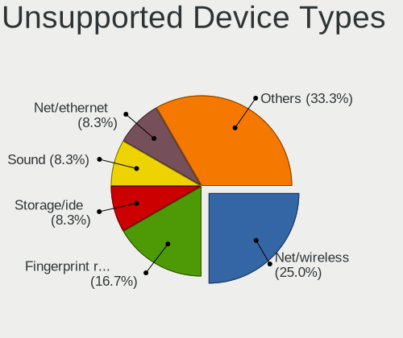

| Type                     | Computers | Percent |
|--------------------------|-----------|---------|
| Net/wireless             | 3         | 25%     |
| Fingerprint reader       | 2         | 16.67%  |
| Storage/ide              | 1         | 8.33%   |
| Sound                    | 1         | 8.33%   |
| Net/ethernet             | 1         | 8.33%   |
| Graphics card            | 1         | 8.33%   |
| Firewire controller      | 1         | 8.33%   |
| Communication controller | 1         | 8.33%   |
| Chipcard                 | 1         | 8.33%   |

