Clear Linux - Hardware Trends (Desktops)
----------------------------------------

A project to identify most popular hardware characteristics and track their change
over time based on data collected by Linux users at https://Linux-Hardware.org.

Anyone can contribute to this report by the [hw-probe](https://github.com/linuxhw/hw-probe) tool:

    sudo -E hw-probe -all -upload

This report is for one last month. Overall report since the beginning of time: [TestCoverage](https://github.com/linuxhw/TestCoverage)

Period: May, 2022.

Contents
--------

* [ System ](#system)
  - [ OS                       ](#os)
  - [ OS Family                ](#os-family)
  - [ Kernel                   ](#kernel)
  - [ Kernel Family            ](#kernel-family)
  - [ Kernel Major Ver.        ](#kernel-major-ver)
  - [ Arch                     ](#arch)
  - [ DE                       ](#de)
  - [ Display Server           ](#display-server)
  - [ Display Manager          ](#display-manager)
  - [ OS Lang                  ](#os-lang)
  - [ Boot Mode                ](#boot-mode)
  - [ Filesystem               ](#filesystem)
  - [ Part. scheme             ](#part-scheme)
  - [ Dual Boot with Linux/BSD ](#dual-boot-with-linuxbsd)
  - [ Dual Boot (Win)          ](#dual-boot-win)

* [ Board ](#board)
  - [ Vendor                   ](#vendor)
  - [ Model                    ](#model)
  - [ Model Family             ](#model-family)
  - [ MFG Year                 ](#mfg-year)
  - [ Form Factor              ](#form-factor)
  - [ Secure Boot              ](#secure-boot)
  - [ Coreboot                 ](#coreboot)
  - [ RAM Size                 ](#ram-size)
  - [ RAM Used                 ](#ram-used)
  - [ Total Drives             ](#total-drives)
  - [ Has CD-ROM               ](#has-cd-rom)
  - [ Has Ethernet             ](#has-ethernet)
  - [ Has WiFi                 ](#has-wifi)
  - [ Has Bluetooth            ](#has-bluetooth)

* [ Location ](#location)
  - [ Country                  ](#country)
  - [ City                     ](#city)

* [ Drives ](#drives)
  - [ Drive Vendor             ](#drive-vendor)
  - [ Drive Model              ](#drive-model)
  - [ HDD Vendor               ](#hdd-vendor)
  - [ SSD Vendor               ](#ssd-vendor)
  - [ Drive Kind               ](#drive-kind)
  - [ Drive Connector          ](#drive-connector)
  - [ Drive Size               ](#drive-size)
  - [ Space Total              ](#space-total)
  - [ Space Used               ](#space-used)
  - [ Malfunc. Drives          ](#malfunc-drives)
  - [ Malfunc. Drive Vendor    ](#malfunc-drive-vendor)
  - [ Malfunc. HDD Vendor      ](#malfunc-hdd-vendor)
  - [ Malfunc. Drive Kind      ](#malfunc-drive-kind)
  - [ Failed Drives            ](#failed-drives)
  - [ Failed Drive Vendor      ](#failed-drive-vendor)
  - [ Drive Status             ](#drive-status)

* [ Storage controller ](#storage-controller)
  - [ Storage Vendor           ](#storage-vendor)
  - [ Storage Model            ](#storage-model)
  - [ Storage Kind             ](#storage-kind)

* [ Processor ](#processor)
  - [ CPU Vendor               ](#cpu-vendor)
  - [ CPU Model                ](#cpu-model)
  - [ CPU Model Family         ](#cpu-model-family)
  - [ CPU Cores                ](#cpu-cores)
  - [ CPU Sockets              ](#cpu-sockets)
  - [ CPU Threads              ](#cpu-threads)
  - [ CPU Op-Modes             ](#cpu-op-modes)
  - [ CPU Microcode            ](#cpu-microcode)
  - [ CPU Microarch            ](#cpu-microarch)

* [ Graphics ](#graphics)
  - [ GPU Vendor               ](#gpu-vendor)
  - [ GPU Model                ](#gpu-model)
  - [ GPU Combo                ](#gpu-combo)
  - [ GPU Driver               ](#gpu-driver)
  - [ GPU Memory               ](#gpu-memory)

* [ Monitor ](#monitor)
  - [ Monitor Vendor           ](#monitor-vendor)
  - [ Monitor Model            ](#monitor-model)
  - [ Monitor Resolution       ](#monitor-resolution)
  - [ Monitor Diagonal         ](#monitor-diagonal)
  - [ Monitor Width            ](#monitor-width)
  - [ Aspect Ratio             ](#aspect-ratio)
  - [ Monitor Area             ](#monitor-area)
  - [ Pixel Density            ](#pixel-density)
  - [ Multiple Monitors        ](#multiple-monitors)

* [ Network ](#network)
  - [ Net Controller Vendor    ](#net-controller-vendor)
  - [ Net Controller Model     ](#net-controller-model)
  - [ Wireless Vendor          ](#wireless-vendor)
  - [ Wireless Model           ](#wireless-model)
  - [ Ethernet Vendor          ](#ethernet-vendor)
  - [ Ethernet Model           ](#ethernet-model)
  - [ Net Controller Kind      ](#net-controller-kind)
  - [ Used Controller          ](#used-controller)
  - [ NICs                     ](#nics)
  - [ IPv6                     ](#ipv6)

* [ Bluetooth ](#bluetooth)
  - [ Bluetooth Vendor         ](#bluetooth-vendor)
  - [ Bluetooth Model          ](#bluetooth-model)

* [ Sound ](#sound)
  - [ Sound Vendor             ](#sound-vendor)
  - [ Sound Model              ](#sound-model)

* [ Memory ](#memory)
  - [ Memory Vendor            ](#memory-vendor)
  - [ Memory Model             ](#memory-model)
  - [ Memory Kind              ](#memory-kind)
  - [ Memory Form Factor       ](#memory-form-factor)
  - [ Memory Size              ](#memory-size)
  - [ Memory Speed             ](#memory-speed)

* [ Printers & scanners ](#printers--scanners)
  - [ Printer Vendor           ](#printer-vendor)
  - [ Printer Model            ](#printer-model)
  - [ Scanner Vendor           ](#scanner-vendor)
  - [ Scanner Model            ](#scanner-model)

* [ Camera ](#camera)
  - [ Camera Vendor            ](#camera-vendor)
  - [ Camera Model             ](#camera-model)

* [ Security ](#security)
  - [ Fingerprint Vendor       ](#fingerprint-vendor)
  - [ Fingerprint Model        ](#fingerprint-model)
  - [ Chipcard Vendor          ](#chipcard-vendor)
  - [ Chipcard Model           ](#chipcard-model)

* [ Unsupported ](#unsupported)
  - [ Unsupported Devices      ](#unsupported-devices)
  - [ Unsupported Device Types ](#unsupported-device-types)

System
------

OS
--

Installed operating systems

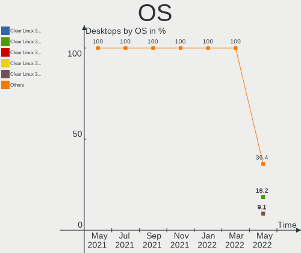

| Name              | Desktops | Percent |
|-------------------|----------|---------|
| Clear Linux 36410 | 2        | 18.18%  |
| Clear Linux 36360 | 2        | 18.18%  |
| Clear Linux 36400 | 1        | 9.09%   |
| Clear Linux 36380 | 1        | 9.09%   |
| Clear Linux 36350 | 1        | 9.09%   |
| Clear Linux 36260 | 1        | 9.09%   |
| Clear Linux 36250 | 1        | 9.09%   |
| Clear Linux 36010 | 1        | 9.09%   |
| Clear Linux 35000 | 1        | 9.09%   |

OS Family
---------

OS without a version

| Name        | Desktops | Percent |
|-------------|----------|---------|
| Clear Linux | 11       | 100%    |

Kernel
------

Version of the Linux kernel

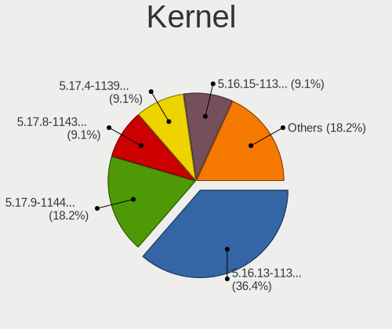

| Version             | Desktops | Percent |
|---------------------|----------|---------|
| 5.16.13-1132.native | 4        | 36.36%  |
| 5.17.9-1144.native  | 2        | 18.18%  |
| 5.17.8-1143.native  | 1        | 9.09%   |
| 5.17.4-1139.native  | 1        | 9.09%   |
| 5.16.15-1134.native | 1        | 9.09%   |
| 5.13.13-1070.native | 1        | 9.09%   |
| 5.10.113-64.lts2020 | 1        | 9.09%   |

Kernel Family
-------------

Linux kernel without a distro release

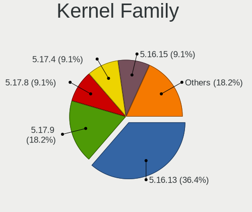

| Version  | Desktops | Percent |
|----------|----------|---------|
| 5.16.13  | 4        | 36.36%  |
| 5.17.9   | 2        | 18.18%  |
| 5.17.8   | 1        | 9.09%   |
| 5.17.4   | 1        | 9.09%   |
| 5.16.15  | 1        | 9.09%   |
| 5.13.13  | 1        | 9.09%   |
| 5.10.113 | 1        | 9.09%   |

Kernel Major Ver.
-----------------

Linux kernel major version

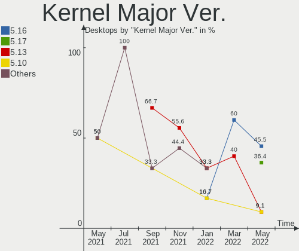

| Version | Desktops | Percent |
|---------|----------|---------|
| 5.16    | 5        | 45.45%  |
| 5.17    | 4        | 36.36%  |
| 5.13    | 1        | 9.09%   |
| 5.10    | 1        | 9.09%   |

Arch
----

OS architecture (x86_64, i586, etc.)

| Name   | Desktops | Percent |
|--------|----------|---------|
| x86_64 | 11       | 100%    |

DE
--

Desktop Environment

| Name  | Desktops | Percent |
|-------|----------|---------|
| GNOME | 11       | 100%    |

Display Server
--------------

X11 or Wayland

| Name | Desktops | Percent |
|------|----------|---------|
| X11  | 11       | 100%    |

Display Manager
---------------

SDDM, LightDM, etc.

| Name    | Desktops | Percent |
|---------|----------|---------|
| Unknown | 11       | 100%    |

OS Lang
-------

Language

| Lang  | Desktops | Percent |
|-------|----------|---------|
| es_MX | 4        | 36.36%  |
| en_US | 4        | 36.36%  |
| de_DE | 2        | 18.18%  |
| ru_RU | 1        | 9.09%   |

Boot Mode
---------

EFI or BIOS

| Mode | Desktops | Percent |
|------|----------|---------|
| BIOS | 11       | 100%    |

Filesystem
----------

Type of filesystem

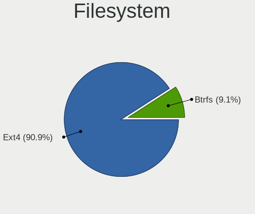

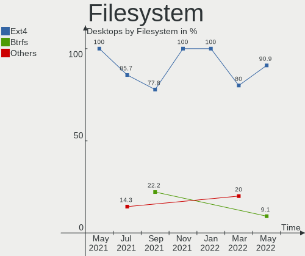

| Type  | Desktops | Percent |
|-------|----------|---------|
| Ext4  | 10       | 90.91%  |
| Btrfs | 1        | 9.09%   |

Part. scheme
------------

Scheme of partitioning

| Type    | Desktops | Percent |
|---------|----------|---------|
| Unknown | 11       | 100%    |

Dual Boot with Linux/BSD
------------------------

Hosting more than one Linux/BSD

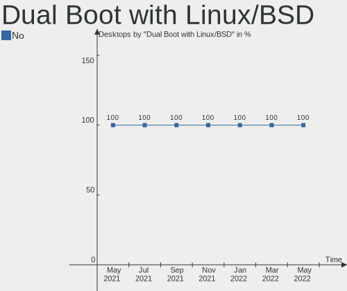

| Dual boot | Desktops | Percent |
|-----------|----------|---------|
| No        | 11       | 100%    |

Dual Boot (Win)
---------------

Hosting Linux and Windows

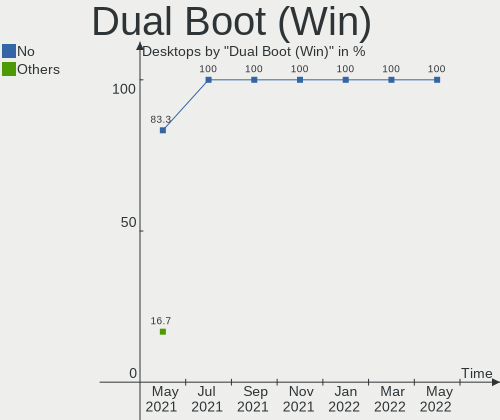

| Dual boot | Desktops | Percent |
|-----------|----------|---------|
| No        | 11       | 100%    |

Board
-----

Vendor
------

Motherboard manufacturer

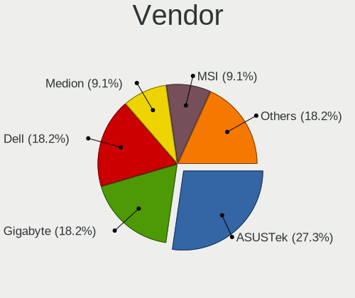

| Name                | Desktops | Percent |
|---------------------|----------|---------|
| ASUSTek Computer    | 3        | 27.27%  |
| Gigabyte Technology | 2        | 18.18%  |
| Dell                | 2        | 18.18%  |
| MSI                 | 1        | 9.09%   |
| Medion              | 1        | 9.09%   |
| Intel               | 1        | 9.09%   |
| ASRock              | 1        | 9.09%   |

Model
-----

Motherboard model

| Name                       | Desktops | Percent |
|----------------------------|----------|---------|
| MSI MS-7C60                | 1        | 9.09%   |
| Medion MS-7728             | 1        | 9.09%   |
| Intel DN2820FYB H24582-205 | 1        | 9.09%   |
| Gigabyte H87-HD3           | 1        | 9.09%   |
| Gigabyte AX370M-Gaming 3   | 1        | 9.09%   |
| Dell Vostro 3268           | 1        | 9.09%   |
| Dell OptiPlex 9020         | 1        | 9.09%   |
| ASUS TUF Gaming X570-PRO   | 1        | 9.09%   |
| ASUS PRIME B460M-K         | 1        | 9.09%   |
| ASUS H110M-K               | 1        | 9.09%   |
| ASRock H370 Pro4           | 1        | 9.09%   |

Model Family
------------

Motherboard model prefix

| Name                   | Desktops | Percent |
|------------------------|----------|---------|
| MSI MS-7C60            | 1        | 9.09%   |
| Medion MS-7728         | 1        | 9.09%   |
| Intel DN2820FYB        | 1        | 9.09%   |
| Gigabyte H87-HD3       | 1        | 9.09%   |
| Gigabyte AX370M-Gaming | 1        | 9.09%   |
| Dell Vostro            | 1        | 9.09%   |
| Dell OptiPlex          | 1        | 9.09%   |
| ASUS TUF               | 1        | 9.09%   |
| ASUS PRIME             | 1        | 9.09%   |
| ASUS H110M-K           | 1        | 9.09%   |
| ASRock H370            | 1        | 9.09%   |

MFG Year
--------

Motherboard manufacture year

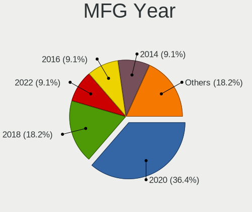

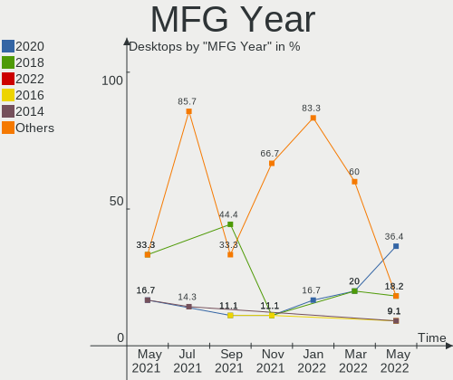

| Year | Desktops | Percent |
|------|----------|---------|
| 2020 | 4        | 36.36%  |
| 2018 | 2        | 18.18%  |
| 2022 | 1        | 9.09%   |
| 2016 | 1        | 9.09%   |
| 2014 | 1        | 9.09%   |
| 2013 | 1        | 9.09%   |
| 2011 | 1        | 9.09%   |

Form Factor
-----------

Physical design of the computer

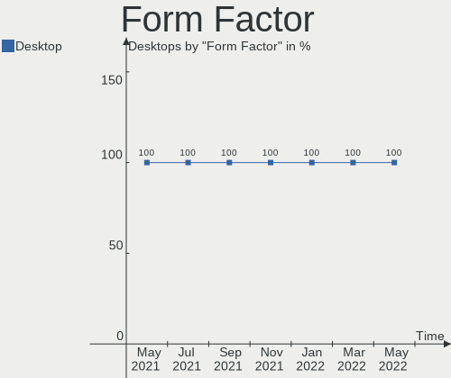

| Name    | Desktops | Percent |
|---------|----------|---------|
| Desktop | 11       | 100%    |

Secure Boot
-----------

Enabled or disabled

| State    | Desktops | Percent |
|----------|----------|---------|
| Disabled | 11       | 100%    |

Coreboot
--------

Have coreboot on board

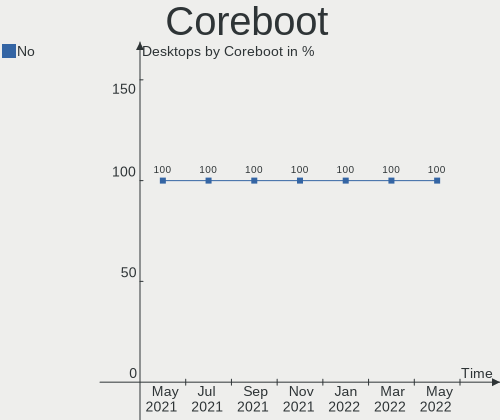

| Used | Desktops | Percent |
|------|----------|---------|
| No   | 11       | 100%    |

RAM Size
--------

Total RAM memory

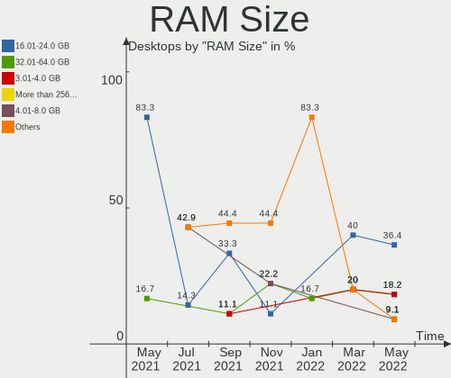

| Size in GB      | Desktops | Percent |
|-----------------|----------|---------|
| 16.01-24.0      | 4        | 36.36%  |
| 32.01-64.0      | 2        | 18.18%  |
| 3.01-4.0        | 2        | 18.18%  |
| More than 256.0 | 1        | 9.09%   |
| 4.01-8.0        | 1        | 9.09%   |
| 8.01-16.0       | 1        | 9.09%   |

RAM Used
--------

Used RAM memory

| Used GB   | Desktops | Percent |
|-----------|----------|---------|
| 1.01-2.0  | 6        | 54.55%  |
| 2.01-3.0  | 2        | 18.18%  |
| 4.01-8.0  | 1        | 9.09%   |
| 3.01-4.0  | 1        | 9.09%   |
| 8.01-16.0 | 1        | 9.09%   |

Total Drives
------------

Number of drives on board

| Drives | Desktops | Percent |
|--------|----------|---------|
| 1      | 5        | 45.45%  |
| 2      | 4        | 36.36%  |
| 7      | 1        | 9.09%   |
| 4      | 1        | 9.09%   |

Has CD-ROM
----------

Has CD-ROM on board

| Presented | Desktops | Percent |
|-----------|----------|---------|
| No        | 8        | 72.73%  |
| Yes       | 3        | 27.27%  |

Has Ethernet
------------

Has Ethernet on board

| Presented | Desktops | Percent |
|-----------|----------|---------|
| Yes       | 11       | 100%    |

Has WiFi
--------

Has WiFi module

| Presented | Desktops | Percent |
|-----------|----------|---------|
| No        | 6        | 54.55%  |
| Yes       | 5        | 45.45%  |

Has Bluetooth
-------------

Has Bluetooth module

| Presented | Desktops | Percent |
|-----------|----------|---------|
| Yes       | 6        | 54.55%  |
| No        | 5        | 45.45%  |

Location
--------

Country
-------

Geographic location (country)

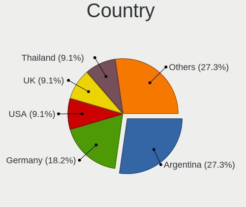

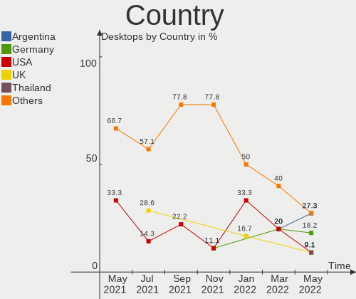

| Country    | Desktops | Percent |
|------------|----------|---------|
| Argentina  | 3        | 27.27%  |
| Germany    | 2        | 18.18%  |
| USA        | 1        | 9.09%   |
| UK         | 1        | 9.09%   |
| Thailand   | 1        | 9.09%   |
| Mexico     | 1        | 9.09%   |
| Kazakhstan | 1        | 9.09%   |
| Italy      | 1        | 9.09%   |

City
----

Geographic location (city)

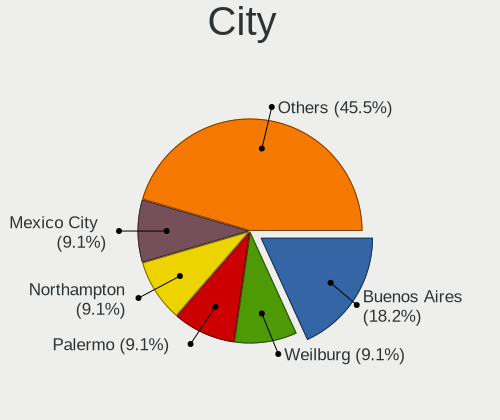

| City         | Desktops | Percent |
|--------------|----------|---------|
| Buenos Aires | 2        | 18.18%  |
| Weilburg     | 1        | 9.09%   |
| Palermo      | 1        | 9.09%   |
| Northampton  | 1        | 9.09%   |
| Mexico City  | 1        | 9.09%   |
| La Plata     | 1        | 9.09%   |
| Hamm         | 1        | 9.09%   |
| Cincinnati   | 1        | 9.09%   |
| Chiang Mai   | 1        | 9.09%   |
| Almaty       | 1        | 9.09%   |

Drives
------

Drive Vendor
------------

Hard drive vendors

| Vendor            | Desktops | Drives | Percent |
|-------------------|----------|--------|---------|
| Seagate           | 4        | 4      | 21.05%  |
| WDC               | 3        | 3      | 15.79%  |
| Sandisk           | 2        | 3      | 10.53%  |
| Kingston          | 2        | 2      | 10.53%  |
| Toshiba           | 1        | 2      | 5.26%   |
| PNY               | 1        | 1      | 5.26%   |
| Phison            | 1        | 1      | 5.26%   |
| LITEONIT          | 1        | 1      | 5.26%   |
| Hikvision         | 1        | 1      | 5.26%   |
| China             | 1        | 4      | 5.26%   |
| Apacer            | 1        | 1      | 5.26%   |
| A-DATA Technology | 1        | 1      | 5.26%   |

Drive Model
-----------

Hard drive models

| Model                            | Desktops | Percent |
|----------------------------------|----------|---------|
| WDC WD5000AAKX-00ERMA0 500GB     | 1        | 4.55%   |
| WDC WD20PURX-64P6ZY0 2TB         | 1        | 4.55%   |
| WDC WD10EFRX-68JCSN0 1TB         | 1        | 4.55%   |
| Toshiba HDWD110 1TB              | 1        | 4.55%   |
| Toshiba DT01ACA100 1TB           | 1        | 4.55%   |
| Seagate ST500LM030-2E717D 500GB  | 1        | 4.55%   |
| Seagate ST500DM002-1BD142 500GB  | 1        | 4.55%   |
| Seagate ST2000DM001-1ER164 2TB   | 1        | 4.55%   |
| Seagate ST1000DM010-2EP102 1TB   | 1        | 4.55%   |
| SanDisk SSD PLUS 480GB           | 1        | 4.55%   |
| SanDisk SSD PLUS 120GB           | 1        | 4.55%   |
| Sandisk NVMe SSD Drive 250GB     | 1        | 4.55%   |
| PNY CS1311 120GB SSD             | 1        | 4.55%   |
| Phison NVMe SSD Drive 256GB      | 1        | 4.55%   |
| LITEONIT LAT-128M2S 128GB SSD    | 1        | 4.55%   |
| Kingston SA400S37960G 960GB SSD  | 1        | 4.55%   |
| Kingston SA400S37120G 120GB SSD  | 1        | 4.55%   |
| Hikvision HS-SSD-Minder(S) 120GB | 1        | 4.55%   |
| China SATA SSD 240GB             | 1        | 4.55%   |
| China SATA SSD 120GB             | 1        | 4.55%   |
| Apacer AS350 128GB SSD           | 1        | 4.55%   |
| A-DATA SP900 128GB SSD           | 1        | 4.55%   |

HDD Vendor
----------

Hard disk drive vendors

| Vendor  | Desktops | Drives | Percent |
|---------|----------|--------|---------|
| Seagate | 4        | 4      | 50%     |
| WDC     | 3        | 3      | 37.5%   |
| Toshiba | 1        | 2      | 12.5%   |

SSD Vendor
----------

Solid state drive vendors

| Vendor            | Desktops | Drives | Percent |
|-------------------|----------|--------|---------|
| Kingston          | 2        | 2      | 22.22%  |
| SanDisk           | 1        | 2      | 11.11%  |
| PNY               | 1        | 1      | 11.11%  |
| LITEONIT          | 1        | 1      | 11.11%  |
| Hikvision         | 1        | 1      | 11.11%  |
| China             | 1        | 4      | 11.11%  |
| Apacer            | 1        | 1      | 11.11%  |
| A-DATA Technology | 1        | 1      | 11.11%  |

Drive Kind
----------

HDD or SSD

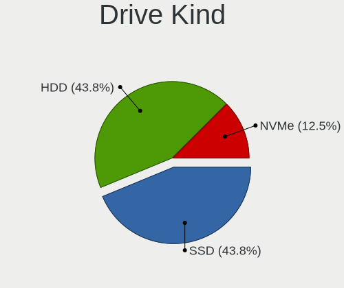

| Kind | Desktops | Drives | Percent |
|------|----------|--------|---------|
| SSD  | 7        | 13     | 43.75%  |
| HDD  | 7        | 9      | 43.75%  |
| NVMe | 2        | 2      | 12.5%   |

Drive Connector
---------------

SATA, SAS, NVMe, etc.

| Type | Desktops | Drives | Percent |
|------|----------|--------|---------|
| SATA | 11       | 22     | 84.62%  |
| NVMe | 2        | 2      | 15.38%  |

Drive Size
----------

Size of hard drive

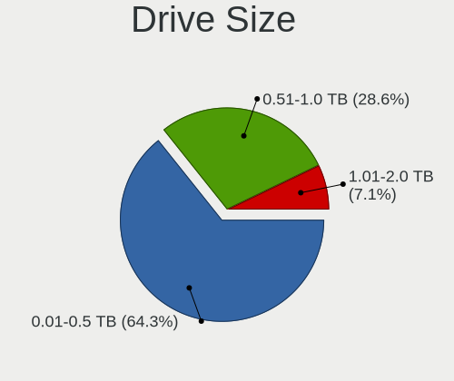

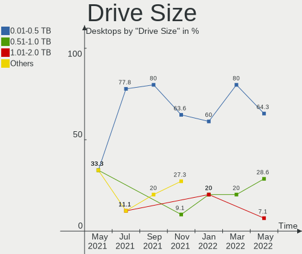

| Size in TB | Desktops | Drives | Percent |
|------------|----------|--------|---------|
| 0.01-0.5   | 9        | 15     | 64.29%  |
| 0.51-1.0   | 4        | 5      | 28.57%  |
| 1.01-2.0   | 1        | 2      | 7.14%   |

Space Total
-----------

Amount of disk space available on the file system

| Size in GB     | Desktops | Percent |
|----------------|----------|---------|
| 101-250        | 5        | 45.45%  |
| 251-500        | 3        | 27.27%  |
| 501-1000       | 2        | 18.18%  |
| More than 3000 | 1        | 9.09%   |

Space Used
----------

Amount of used disk space

| Used GB        | Desktops | Percent |
|----------------|----------|---------|
| 1-20           | 7        | 63.64%  |
| 21-50          | 2        | 18.18%  |
| More than 3000 | 1        | 9.09%   |
| 251-500        | 1        | 9.09%   |

Malfunc. Drives
---------------

Drive models with a malfunction

Zero info for selected period =(

Malfunc. Drive Vendor
---------------------

Vendors of faulty drives

Zero info for selected period =(

Malfunc. HDD Vendor
-------------------

Vendors of faulty HDD drives

Zero info for selected period =(

Malfunc. Drive Kind
-------------------

Kinds of faulty drives

Zero info for selected period =(

Failed Drives
-------------

Failed drive models

Zero info for selected period =(

Failed Drive Vendor
-------------------

Failed drive vendors

Zero info for selected period =(

Drive Status
------------

Number of failed and malfunc. drives

| Status   | Desktops | Drives | Percent |
|----------|----------|--------|---------|
| Detected | 11       | 24     | 100%    |

Storage controller
------------------

Storage Vendor
--------------

Storage controller vendors

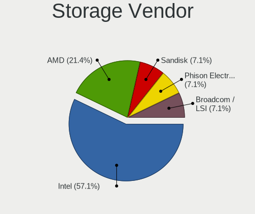

| Vendor             | Desktops | Percent |
|--------------------|----------|---------|
| Intel              | 8        | 57.14%  |
| AMD                | 3        | 21.43%  |
| Sandisk            | 1        | 7.14%   |
| Phison Electronics | 1        | 7.14%   |
| Broadcom / LSI     | 1        | 7.14%   |

Storage Model
-------------

Storage controller models

| Model                                                                          | Desktops | Percent |
|--------------------------------------------------------------------------------|----------|---------|
| AMD FCH SATA Controller [AHCI mode]                                            | 3        | 20%     |
| Intel Q170/Q150/B150/H170/H110/Z170/CM236 Chipset SATA Controller [AHCI Mode]  | 2        | 13.33%  |
| Sandisk WD Blue SN550 NVMe SSD                                                 | 1        | 6.67%   |
| Phison PS5013 E13 NVMe Controller                                              | 1        | 6.67%   |
| Intel SATA Controller [RAID mode]                                              | 1        | 6.67%   |
| Intel Cannon Lake PCH SATA AHCI Controller                                     | 1        | 6.67%   |
| Intel Atom Processor E3800 Series SATA AHCI Controller                         | 1        | 6.67%   |
| Intel 8 Series/C220 Series Chipset Family 6-port SATA Controller 1 [AHCI mode] | 1        | 6.67%   |
| Intel 6 Series/C200 Series Chipset Family 6 port Desktop SATA AHCI Controller  | 1        | 6.67%   |
| Intel 400 Series Chipset Family SATA AHCI Controller                           | 1        | 6.67%   |
| Broadcom / LSI SAS2116 PCI-Express Fusion-MPT SAS-2 [Meteor]                   | 1        | 6.67%   |
| AMD X370 Series Chipset SATA Controller                                        | 1        | 6.67%   |

Storage Kind
------------

Kind of storage controller (IDE, SATA, NVMe, SAS, ...)

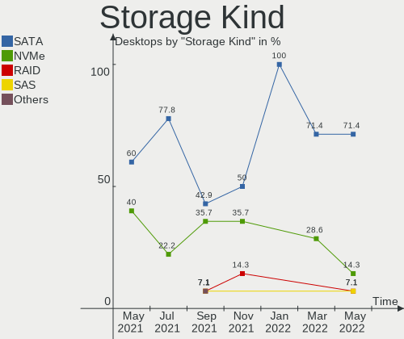

| Kind | Desktops | Percent |
|------|----------|---------|
| SATA | 10       | 71.43%  |
| NVMe | 2        | 14.29%  |
| RAID | 1        | 7.14%   |
| SAS  | 1        | 7.14%   |

Processor
---------

CPU Vendor
----------

Processor vendors

| Vendor | Desktops | Percent |
|--------|----------|---------|
| Intel  | 8        | 72.73%  |
| AMD    | 3        | 27.27%  |

CPU Model
---------

Processor models

| Model                                          | Desktops | Percent |
|------------------------------------------------|----------|---------|
| Intel Xeon CPU E3-1240 v3 @ 3.40GHz            | 1        | 9.09%   |
| Intel Core i5-8600 CPU @ 3.10GHz               | 1        | 9.09%   |
| Intel Core i5-6600K CPU @ 3.50GHz              | 1        | 9.09%   |
| Intel Core i5-2320 CPU @ 3.00GHz               | 1        | 9.09%   |
| Intel Core i3-7100 CPU @ 3.90GHz               | 1        | 9.09%   |
| Intel Core i3-4160 CPU @ 3.60GHz               | 1        | 9.09%   |
| Intel Core i3-10100F CPU @ 3.60GHz             | 1        | 9.09%   |
| Intel Celeron CPU N2830 @ 2.16GHz              | 1        | 9.09%   |
| AMD Ryzen Threadripper 3960X 24-Core Processor | 1        | 9.09%   |
| AMD Ryzen 9 5950X 16-Core Processor            | 1        | 9.09%   |
| AMD Ryzen 5 2600X Six-Core Processor           | 1        | 9.09%   |

CPU Model Family
----------------

Processor model prefix

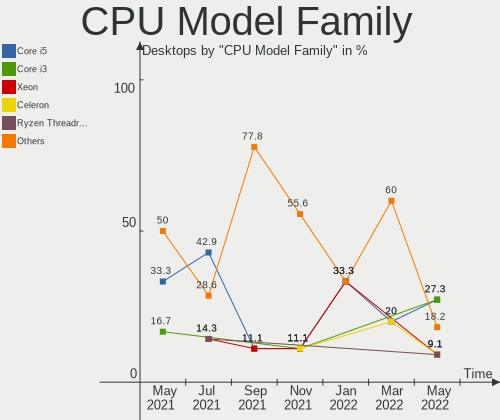

| Model                  | Desktops | Percent |
|------------------------|----------|---------|
| Intel Core i5          | 3        | 27.27%  |
| Intel Core i3          | 3        | 27.27%  |
| Intel Xeon             | 1        | 9.09%   |
| Intel Celeron          | 1        | 9.09%   |
| AMD Ryzen Threadripper | 1        | 9.09%   |
| AMD Ryzen 9            | 1        | 9.09%   |
| AMD Ryzen 5            | 1        | 9.09%   |

CPU Cores
---------

Number of processor cores

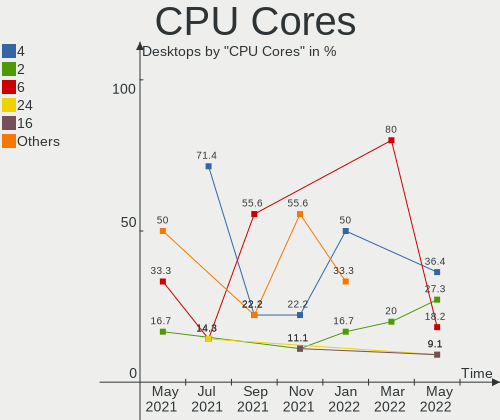

| Number | Desktops | Percent |
|--------|----------|---------|
| 4      | 4        | 36.36%  |
| 2      | 3        | 27.27%  |
| 6      | 2        | 18.18%  |
| 24     | 1        | 9.09%   |
| 16     | 1        | 9.09%   |

CPU Sockets
-----------

Number of sockets

| Number | Desktops | Percent |
|--------|----------|---------|
| 1      | 11       | 100%    |

CPU Threads
-----------

Threads per core (Hyper-Threading)

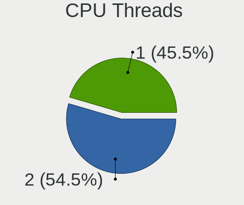

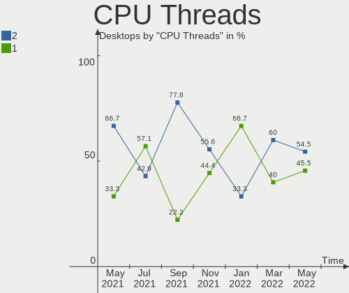

| Number | Desktops | Percent |
|--------|----------|---------|
| 2      | 6        | 54.55%  |
| 1      | 5        | 45.45%  |

CPU Op-Modes
------------

CPU Operation Modes (32-bit, 64-bit)

| Op mode        | Desktops | Percent |
|----------------|----------|---------|
| 32-bit, 64-bit | 11       | 100%    |

CPU Microcode
-------------

Microcode number

| Number  | Desktops | Percent |
|---------|----------|---------|
| Unknown | 11       | 100%    |

CPU Microarch
-------------

Microarchitecture

| Name        | Desktops | Percent |
|-------------|----------|---------|
| KabyLake    | 2        | 18.18%  |
| Haswell     | 2        | 18.18%  |
| Zen+        | 1        | 9.09%   |
| Zen 3       | 1        | 9.09%   |
| Zen 2       | 1        | 9.09%   |
| Skylake     | 1        | 9.09%   |
| Silvermont  | 1        | 9.09%   |
| SandyBridge | 1        | 9.09%   |
| CometLake   | 1        | 9.09%   |

Graphics
--------

GPU Vendor
----------

Vendors of graphics cards

| Vendor | Desktops | Percent |
|--------|----------|---------|
| Nvidia | 8        | 72.73%  |
| Intel  | 2        | 18.18%  |
| AMD    | 1        | 9.09%   |

GPU Model
---------

Graphics card models

| Model                                                                 | Desktops | Percent |
|-----------------------------------------------------------------------|----------|---------|
| Nvidia GP106 [GeForce GTX 1060 3GB]                                   | 2        | 18.18%  |
| Nvidia TU117 [GeForce GTX 1650]                                       | 1        | 9.09%   |
| Nvidia GP108 [GeForce GT 1030]                                        | 1        | 9.09%   |
| Nvidia GP104 [GeForce GTX 1070]                                       | 1        | 9.09%   |
| Nvidia GM107 [GeForce GTX 750 Ti]                                     | 1        | 9.09%   |
| Nvidia GA106 [GeForce RTX 3060 Lite Hash Rate]                        | 1        | 9.09%   |
| Nvidia GA102 [GeForce RTX 3090]                                       | 1        | 9.09%   |
| Intel HD Graphics 630                                                 | 1        | 9.09%   |
| Intel Atom Processor Z36xxx/Z37xxx Series Graphics & Display          | 1        | 9.09%   |
| AMD Oland [Radeon HD 8570 / R5 430 OEM / R7 240/340 / Radeon 520 OEM] | 1        | 9.09%   |

GPU Combo
---------

Combinations of graphics cards

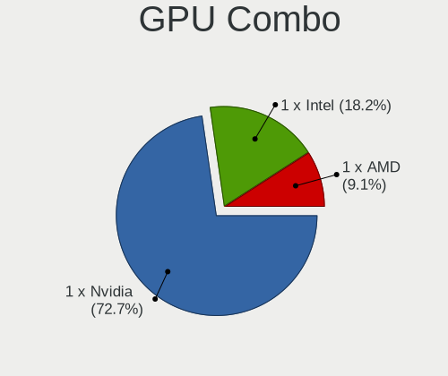

| Name       | Desktops | Percent |
|------------|----------|---------|
| 1 x Nvidia | 8        | 72.73%  |
| 1 x Intel  | 2        | 18.18%  |
| 1 x AMD    | 1        | 9.09%   |

GPU Driver
----------

Free vs proprietary

| Driver      | Desktops | Percent |
|-------------|----------|---------|
| Free        | 9        | 81.82%  |
| Proprietary | 2        | 18.18%  |

GPU Memory
----------

Total video memory

| Size in GB | Desktops | Percent |
|------------|----------|---------|
| Unknown    | 9        | 81.82%  |
| 16.01-24.0 | 1        | 9.09%   |
| 8.01-16.0  | 1        | 9.09%   |

Monitor
-------

Monitor Vendor
--------------

Monitor vendors

| Vendor              | Desktops | Percent |
|---------------------|----------|---------|
| Hewlett-Packard     | 2        | 16.67%  |
| Yuraku              | 1        | 8.33%   |
| ViewSonic           | 1        | 8.33%   |
| Samsung Electronics | 1        | 8.33%   |
| Medion Akoya        | 1        | 8.33%   |
| Medion              | 1        | 8.33%   |
| LG Electronics      | 1        | 8.33%   |
| Hitachi             | 1        | 8.33%   |
| FHD                 | 1        | 8.33%   |
| Dell                | 1        | 8.33%   |
| AUS                 | 1        | 8.33%   |

Monitor Model
-------------

Monitor models

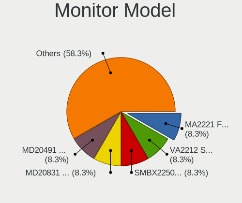

| Model                                                              | Desktops | Percent |
|--------------------------------------------------------------------|----------|---------|
| Yuraku MA2221 FAC2221 1920x1080 410x230mm 18.5-inch                | 1        | 8.33%   |
| ViewSonic LCD Monitor VA2212 Series                                | 1        | 8.33%   |
| Samsung Electronics SMBX2250 SAM071B 1920x1080 477x268mm 21.5-inch | 1        | 8.33%   |
| Medion MD20831 MEA5107 1920x1080 527x296mm 23.8-inch               | 1        | 8.33%   |
| Medion Akoya MD20491 MEC5201 1920x1080 521x293mm 23.5-inch         | 1        | 8.33%   |
| LG Electronics LCD Monitor E2342 1920x1080                         | 1        | 8.33%   |
| Hitachi HDMI HEC0030 1920x1080 580x330mm 26.3-inch                 | 1        | 8.33%   |
| Hewlett-Packard V24 HPN36B5 1920x1080 531x299mm 24.0-inch          | 1        | 8.33%   |
| Hewlett-Packard 24f HPN3545 1920x1080 527x296mm 23.8-inch          | 1        | 8.33%   |
| FHD HDMI FHD1080 1920x1080 532x299mm 24.0-inch                     | 1        | 8.33%   |
| Dell E2216H DELF069 1920x1080 476x268mm 21.5-inch                  | 1        | 8.33%   |
| AUS LCD Monitor ASUS PG43U 5760x2160                               | 1        | 8.33%   |

Monitor Resolution
------------------

Monitor screen resolution

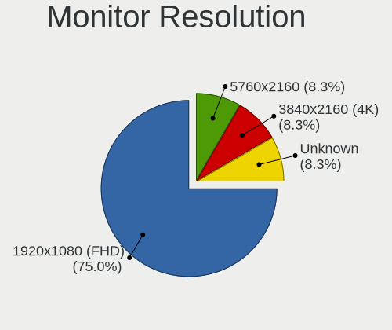

| Resolution      | Desktops | Percent |
|-----------------|----------|---------|
| 1920x1080 (FHD) | 9        | 75%     |
| 5760x2160       | 1        | 8.33%   |
| 3840x2160 (4K)  | 1        | 8.33%   |
| Unknown         | 1        | 8.33%   |

Monitor Diagonal
----------------

Diagonal size in inches

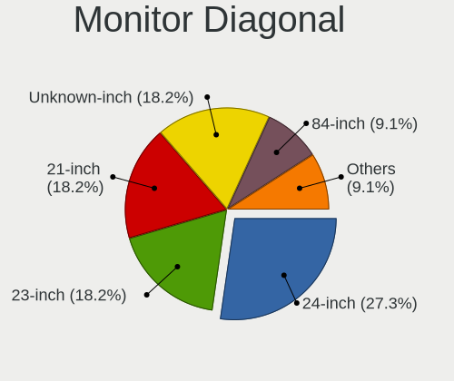

| Inches  | Desktops | Percent |
|---------|----------|---------|
| 24      | 3        | 27.27%  |
| 23      | 2        | 18.18%  |
| 21      | 2        | 18.18%  |
| Unknown | 2        | 18.18%  |
| 84      | 1        | 9.09%   |
| 18      | 1        | 9.09%   |

Monitor Width
-------------

Physical width

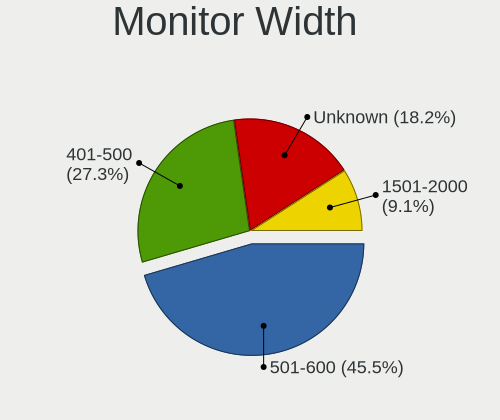

| Width in mm | Desktops | Percent |
|-------------|----------|---------|
| 501-600     | 5        | 45.45%  |
| 401-500     | 3        | 27.27%  |
| Unknown     | 2        | 18.18%  |
| 1501-2000   | 1        | 9.09%   |

Aspect Ratio
------------

Proportional relationship between the width and the height

| Ratio   | Desktops | Percent |
|---------|----------|---------|
| 16/9    | 9        | 81.82%  |
| Unknown | 2        | 18.18%  |

Monitor Area
------------

Area in inch²

| Area in inch² | Desktops | Percent |
|----------------|----------|---------|
| 201-250        | 7        | 63.64%  |
| Unknown        | 2        | 18.18%  |
| More than 1000 | 1        | 9.09%   |
| 141-150        | 1        | 9.09%   |

Pixel Density
-------------

Pixels per inch

| Density | Desktops | Percent |
|---------|----------|---------|
| 51-100  | 6        | 54.55%  |
| 101-120 | 3        | 27.27%  |
| Unknown | 2        | 18.18%  |

Multiple Monitors
-----------------

Total monitors connected

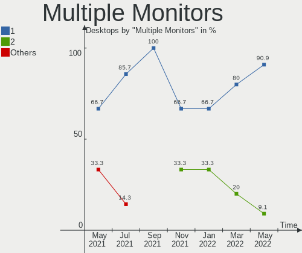

| Total | Desktops | Percent |
|-------|----------|---------|
| 1     | 10       | 90.91%  |
| 2     | 1        | 9.09%   |

Network
-------

Net Controller Vendor
---------------------

Controller vendors

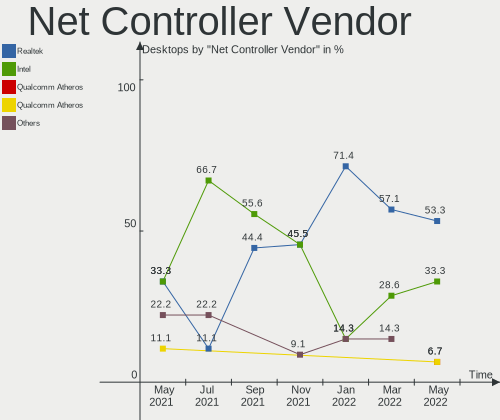

| Vendor                          | Desktops | Percent |
|---------------------------------|----------|---------|
| Realtek Semiconductor           | 8        | 53.33%  |
| Intel                           | 5        | 33.33%  |
| Qualcomm Atheros Communications | 1        | 6.67%   |
| Qualcomm Atheros                | 1        | 6.67%   |

Net Controller Model
--------------------

Controller models

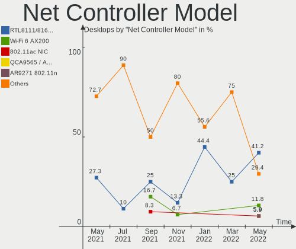

| Model                                                             | Desktops | Percent |
|-------------------------------------------------------------------|----------|---------|
| Realtek RTL8111/8168/8411 PCI Express Gigabit Ethernet Controller | 7        | 41.18%  |
| Intel Wi-Fi 6 AX200                                               | 2        | 11.76%  |
| Realtek 802.11ac NIC                                              | 1        | 5.88%   |
| Qualcomm Atheros QCA9565 / AR9565 Wireless Network Adapter        | 1        | 5.88%   |
| Qualcomm Atheros AR9271 802.11n                                   | 1        | 5.88%   |
| Intel I211 Gigabit Network Connection                             | 1        | 5.88%   |
| Intel Ethernet Controller I225-V                                  | 1        | 5.88%   |
| Intel Ethernet Connection I217-LM                                 | 1        | 5.88%   |
| Intel Ethernet Connection (7) I219-V                              | 1        | 5.88%   |
| Intel Centrino Wireless-N 2230                                    | 1        | 5.88%   |

Wireless Vendor
---------------

Wireless vendors

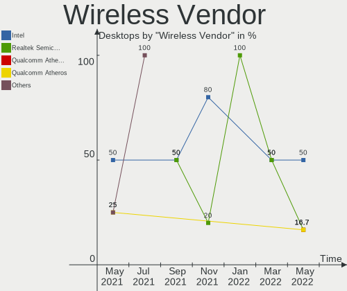

| Vendor                          | Desktops | Percent |
|---------------------------------|----------|---------|
| Intel                           | 3        | 50%     |
| Realtek Semiconductor           | 1        | 16.67%  |
| Qualcomm Atheros Communications | 1        | 16.67%  |
| Qualcomm Atheros                | 1        | 16.67%  |

Wireless Model
--------------

Wireless models

| Model                                                      | Desktops | Percent |
|------------------------------------------------------------|----------|---------|
| Intel Wi-Fi 6 AX200                                        | 2        | 33.33%  |
| Realtek 802.11ac NIC                                       | 1        | 16.67%  |
| Qualcomm Atheros QCA9565 / AR9565 Wireless Network Adapter | 1        | 16.67%  |
| Qualcomm Atheros AR9271 802.11n                            | 1        | 16.67%  |
| Intel Centrino Wireless-N 2230                             | 1        | 16.67%  |

Ethernet Vendor
---------------

Ethernet vendors

| Vendor                | Desktops | Percent |
|-----------------------|----------|---------|
| Realtek Semiconductor | 7        | 63.64%  |
| Intel                 | 4        | 36.36%  |

Ethernet Model
--------------

Ethernet models

| Model                                                             | Desktops | Percent |
|-------------------------------------------------------------------|----------|---------|
| Realtek RTL8111/8168/8411 PCI Express Gigabit Ethernet Controller | 7        | 63.64%  |
| Intel I211 Gigabit Network Connection                             | 1        | 9.09%   |
| Intel Ethernet Controller I225-V                                  | 1        | 9.09%   |
| Intel Ethernet Connection I217-LM                                 | 1        | 9.09%   |
| Intel Ethernet Connection (7) I219-V                              | 1        | 9.09%   |

Net Controller Kind
-------------------

Ethernet, WiFi or modem

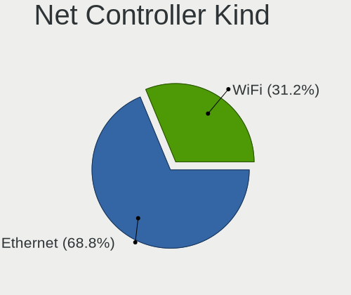

| Kind     | Desktops | Percent |
|----------|----------|---------|
| Ethernet | 11       | 68.75%  |
| WiFi     | 5        | 31.25%  |

Used Controller
---------------

Currently used network controller

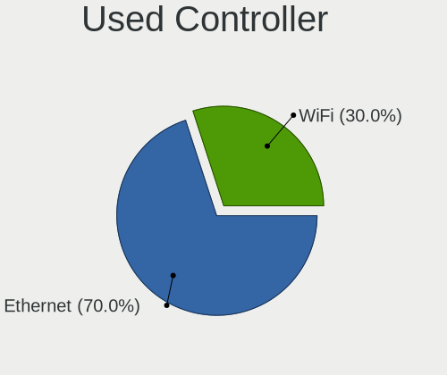

| Kind     | Desktops | Percent |
|----------|----------|---------|
| Ethernet | 7        | 70%     |
| WiFi     | 3        | 30%     |

NICs
----

Total network controllers on board

| Total | Desktops | Percent |
|-------|----------|---------|
| 1     | 7        | 63.64%  |
| 2     | 3        | 27.27%  |
| 3     | 1        | 9.09%   |

IPv6
----

IPv6 vs IPv4

| Used | Desktops | Percent |
|------|----------|---------|
| No   | 10       | 90.91%  |
| Yes  | 1        | 9.09%   |

Bluetooth
---------

Bluetooth Vendor
----------------

Controller vendors

| Vendor                          | Desktops | Percent |
|---------------------------------|----------|---------|
| Intel                           | 3        | 50%     |
| Realtek Semiconductor           | 1        | 16.67%  |
| Qualcomm Atheros Communications | 1        | 16.67%  |
| Cambridge Silicon Radio         | 1        | 16.67%  |

Bluetooth Model
---------------

Controller models

| Model                                               | Desktops | Percent |
|-----------------------------------------------------|----------|---------|
| Intel AX200 Bluetooth                               | 2        | 33.33%  |
| Realtek Bluetooth Radio                             | 1        | 16.67%  |
| Qualcomm Atheros  Bluetooth Device                  | 1        | 16.67%  |
| Intel Centrino Bluetooth Wireless Transceiver       | 1        | 16.67%  |
| Cambridge Silicon Radio Bluetooth Dongle (HCI mode) | 1        | 16.67%  |

Sound
-----

Sound Vendor
------------

Sound card vendors

| Vendor                   | Desktops | Percent |
|--------------------------|----------|---------|
| Nvidia                   | 8        | 33.33%  |
| Intel                    | 8        | 33.33%  |
| AMD                      | 4        | 16.67%  |
| C-Media Electronics      | 3        | 12.5%   |
| Micro Star International | 1        | 4.17%   |

Sound Model
-----------

Sound card models

| Model                                                                      | Desktops | Percent |
|----------------------------------------------------------------------------|----------|---------|
| Nvidia GP106 High Definition Audio Controller                              | 2        | 8.33%   |
| Intel 8 Series/C220 Series Chipset High Definition Audio Controller        | 2        | 8.33%   |
| Intel 100 Series/C230 Series Chipset Family HD Audio Controller            | 2        | 8.33%   |
| C-Media Electronics SADES Luna                                             | 2        | 8.33%   |
| AMD Starship/Matisse HD Audio Controller                                   | 2        | 8.33%   |
| Nvidia TU107 GeForce GTX 1650 High Definition Audio Controller             | 1        | 4.17%   |
| Nvidia GP108 High Definition Audio Controller                              | 1        | 4.17%   |
| Nvidia GP104 High Definition Audio Controller                              | 1        | 4.17%   |
| Nvidia GM107 High Definition Audio Controller [GeForce 940MX]              | 1        | 4.17%   |
| Nvidia GA102 High Definition Audio Controller                              | 1        | 4.17%   |
| Nvidia Audio device                                                        | 1        | 4.17%   |
| Micro Star International USB Audio                                         | 1        | 4.17%   |
| Intel Comet Lake PCH-V cAVS                                                | 1        | 4.17%   |
| Intel Cannon Lake PCH cAVS                                                 | 1        | 4.17%   |
| Intel Atom Processor Z36xxx/Z37xxx Series High Definition Audio Controller | 1        | 4.17%   |
| Intel 6 Series/C200 Series Chipset Family High Definition Audio Controller | 1        | 4.17%   |
| C-Media Electronics TONOR TC30 Audio Device                                | 1        | 4.17%   |
| AMD Oland/Hainan/Cape Verde/Pitcairn HDMI Audio [Radeon HD 7000 Series]    | 1        | 4.17%   |
| AMD Family 17h (Models 00h-0fh) HD Audio Controller                        | 1        | 4.17%   |

Memory
------

Memory Vendor
-------------

Memory module vendors

Zero info for selected period =(

Memory Model
------------

Memory module models

Zero info for selected period =(

Memory Kind
-----------

Memory module kinds

Zero info for selected period =(

Memory Form Factor
------------------

Physical design of the memory module

Zero info for selected period =(

Memory Size
-----------

Memory module size

Zero info for selected period =(

Memory Speed
------------

Memory module speed

Zero info for selected period =(

Printers & scanners
-------------------

Printer Vendor
--------------

Printer device vendors

| Vendor      | Desktops | Percent |
|-------------|----------|---------|
| Seiko Epson | 1        | 100%    |

Printer Model
-------------

Printer device models

| Model                      | Desktops | Percent |
|----------------------------|----------|---------|
| Seiko Epson ET-2710 Series | 1        | 100%    |

Scanner Vendor
--------------

Scanner device vendors

Zero info for selected period =(

Scanner Model
-------------

Scanner device models

Zero info for selected period =(

Camera
------

Camera Vendor
-------------

Camera device vendors

| Vendor                      | Desktops | Percent |
|-----------------------------|----------|---------|
| KYE Systems (Mouse Systems) | 1        | 100%    |

Camera Model
------------

Camera device models

| Model                                     | Desktops | Percent |
|-------------------------------------------|----------|---------|
| KYE Systems (Mouse Systems) Genius Webcam | 1        | 100%    |

Security
--------

Fingerprint Vendor
------------------

Fingerprint sensor vendors

Zero info for selected period =(

Fingerprint Model
-----------------

Fingerprint sensor models

Zero info for selected period =(

Chipcard Vendor
---------------

Chipcard module vendors

Zero info for selected period =(

Chipcard Model
--------------

Chipcard module models

Zero info for selected period =(

Unsupported
-----------

Unsupported Devices
-------------------

Total unsupported devices on board

| Total | Desktops | Percent |
|-------|----------|---------|
| 0     | 7        | 63.64%  |
| 1     | 3        | 27.27%  |
| 2     | 1        | 9.09%   |

Unsupported Device Types
------------------------

Types of unsupported devices

| Type                     | Desktops | Percent |
|--------------------------|----------|---------|
| Net/wireless             | 2        | 40%     |
| Sound                    | 1        | 20%     |
| Net/ethernet             | 1        | 20%     |
| Communication controller | 1        | 20%     |

