Clear Linux Hardware Trends (Desktop)
-------------------------------------

A project to identify most popular hardware characteristics and track their change
over time based on data collected by Clear Linux users at https://Linux-Hardware.org.

Anyone can contribute to the study by uploading probes of their computers by
the [hw-probe](https://github.com/linuxhw/hw-probe) tool:

    sudo hw-probe -all -upload

Full-feature report is available here: https://linux-hardware.org/?view=trends&formfactor=desktop

Period: Feb, 2020.

Contents
--------

- [ OS                       ](#os)
- [ OS Family                ](#os-family)
- [ Kernel                   ](#kernel)
- [ Kernel Family            ](#kernel-family)
- [ Kernel Major Ver.        ](#kernel-major-ver)
- [ Arch                     ](#arch)
- [ DE                       ](#de)
- [ Display Server           ](#display-server)
- [ OS Lang                  ](#os-lang)
- [ Boot Mode                ](#boot-mode)
- [ Filesystem               ](#filesystem)
- [ Dual Boot with Linux     ](#dual-boot-with-linux)
- [ Dual Boot (Win)          ](#dual-boot-win)
- [ Country                  ](#country)
- [ City                     ](#city)
- [ Vendor                   ](#vendor)
- [ Model                    ](#model)
- [ Model Family             ](#model-family)
- [ MFG Year                 ](#mfg-year)
- [ Form Factor              ](#form-factor)
- [ Secure Boot              ](#secure-boot)
- [ Coreboot                 ](#coreboot)
- [ RAM Size                 ](#ram-size)
- [ RAM Used                 ](#ram-used)
- [ Drive Vendor             ](#drive-vendor)
- [ Drive Model              ](#drive-model)
- [ Drive Kind               ](#drive-kind)
- [ Drive Connector          ](#drive-connector)
- [ Drive Size               ](#drive-size)
- [ Space Total              ](#space-total)
- [ Space Used               ](#space-used)
- [ Malfunc. Drives          ](#malfunc-drives)
- [ Malfunc. Drive Vendor    ](#malfunc-drive-vendor)
- [ Malfunc. Drive Kind      ](#malfunc-drive-kind)
- [ Failed Drives            ](#failed-drives)
- [ Failed Drive Vendor      ](#failed-drive-vendor)
- [ Drive Status             ](#drive-status)
- [ Storage Vendor           ](#storage-vendor)
- [ Storage Model            ](#storage-model)
- [ Storage Kind             ](#storage-kind)
- [ CPU Vendor               ](#cpu-vendor)
- [ CPU Model                ](#cpu-model)
- [ CPU Model Family         ](#cpu-model-family)
- [ CPU Cores                ](#cpu-cores)
- [ CPU Sockets              ](#cpu-sockets)
- [ CPU Threads              ](#cpu-threads)
- [ CPU Op-Modes             ](#cpu-op-modes)
- [ CPU Microarch            ](#cpu-microarch)
- [ CPU Microcode            ](#cpu-microcode)
- [ GPU Vendor               ](#gpu-vendor)
- [ GPU Model                ](#gpu-model)
- [ GPU Combo                ](#gpu-combo)
- [ GPU Driver               ](#gpu-driver)
- [ GPU Memory               ](#gpu-memory)
- [ Monitor Vendor           ](#monitor-vendor)
- [ Monitor Model            ](#monitor-model)
- [ Monitor Resolution       ](#monitor-resolution)
- [ Monitor Diagonal         ](#monitor-diagonal)
- [ Monitor Width            ](#monitor-width)
- [ Aspect Ratio             ](#aspect-ratio)
- [ Monitor Area             ](#monitor-area)
- [ Pixel Density            ](#pixel-density)
- [ Multiple Monitors        ](#multiple-monitors)
- [ Net Controller Vendor    ](#net-controller-vendor)
- [ Net Controller Model     ](#net-controller-model)
- [ Net Controller Kind      ](#net-controller-kind)
- [ Used Controller          ](#used-controller)
- [ NICs                     ](#nics)
- [ Unsupported Devices      ](#unsupported-devices)
- [ Unsupported Device Types ](#unsupported-device-types)

OS
--

Installed operating systems

| Name              | Computers | Percent |
|-------------------|-----------|---------|
| Clear Linux 32270 | 4         | 16.67%  |
| Clear Linux 32330 | 3         | 12.5%   |
| Clear Linux 32480 | 2         | 8.33%   |
| Clear Linux 32390 | 2         | 8.33%   |
| Clear Linux 32380 | 2         | 8.33%   |
| Clear Linux 32370 | 2         | 8.33%   |
| Clear Linux 32260 | 2         | 8.33%   |
| Clear Linux 32230 | 2         | 8.33%   |
| Clear Linux 32360 | 1         | 4.17%   |
| Clear Linux 32340 | 1         | 4.17%   |
| Clear Linux 32310 | 1         | 4.17%   |
| Clear Linux 32280 | 1         | 4.17%   |
| Clear Linux 32250 | 1         | 4.17%   |

OS Family
---------

OS without a version

| Name        | Computers | Percent |
|-------------|-----------|---------|
| Clear Linux | 24        | 100%    |

Kernel
------

Version of the Linux kernel

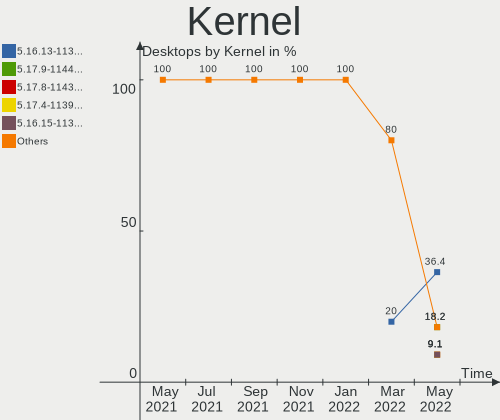

| Version           | Computers | Percent |
|-------------------|-----------|---------|
| 5.4.18-902.native | 6         | 25%     |
| 5.5.5-911.native  | 3         | 12.5%   |
| 5.5.4-910.native  | 3         | 12.5%   |
| 5.5.3-908.native  | 3         | 12.5%   |
| 5.5.6-914.native  | 2         | 8.33%   |
| 5.5.2-903.native  | 2         | 8.33%   |
| 5.4.16-900.native | 2         | 8.33%   |
| 5.5.4-909.native  | 1         | 4.17%   |
| 5.4.17-901.native | 1         | 4.17%   |
| 5.3.9-863.native  | 1         | 4.17%   |

Kernel Family
-------------

Linux kernel without a distro release

| Version | Computers | Percent |
|---------|-----------|---------|
| 5.4.18  | 6         | 25%     |
| 5.5.4   | 4         | 16.67%  |
| 5.5.5   | 3         | 12.5%   |
| 5.5.3   | 3         | 12.5%   |
| 5.5.6   | 2         | 8.33%   |
| 5.5.2   | 2         | 8.33%   |
| 5.4.16  | 2         | 8.33%   |
| 5.4.17  | 1         | 4.17%   |
| 5.3.9   | 1         | 4.17%   |

Kernel Major Ver.
-----------------

Linux kernel major version

| Version | Computers | Percent |
|---------|-----------|---------|
| 5.5     | 14        | 58.33%  |
| 5.4     | 9         | 37.5%   |
| 5.3     | 1         | 4.17%   |

Arch
----

OS architecture (x86_64, i586, etc.)

| Name   | Computers | Percent |
|--------|-----------|---------|
| x86_64 | 24        | 100%    |

DE
--

Desktop Environment

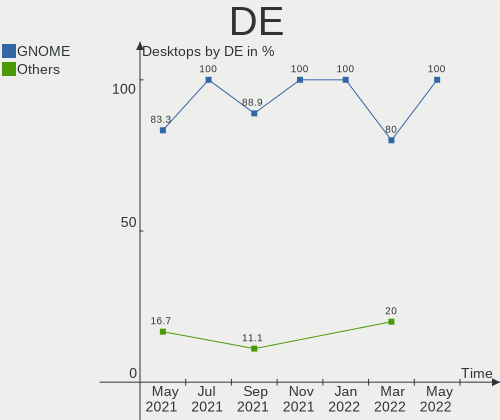

| Name  | Computers | Percent |
|-------|-----------|---------|
| GNOME | 22        | 91.67%  |
| XFCE  | 2         | 8.33%   |

Display Server
--------------

X11 or Wayland

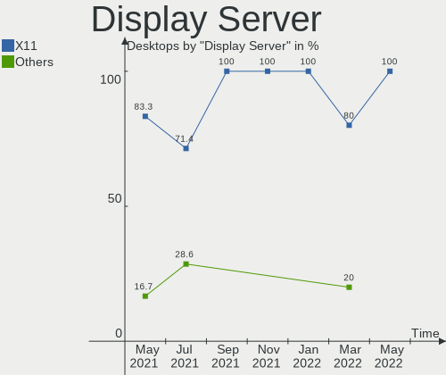

| Name | Computers | Percent |
|------|-----------|---------|
| X11  | 24        | 100%    |

OS Lang
-------

Language

| Lang  | Computers | Percent |
|-------|-----------|---------|
| en_US | 16        | 66.67%  |
| ru_RU | 3         | 12.5%   |
| pt_BR | 1         | 4.17%   |
| pl_PL | 1         | 4.17%   |
| en_GB | 1         | 4.17%   |
| en_AU | 1         | 4.17%   |
| de_DE | 1         | 4.17%   |

Boot Mode
---------

EFI or BIOS

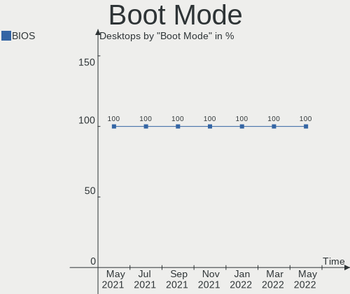

| Mode | Computers | Percent |
|------|-----------|---------|
| BIOS | 24        | 100%    |

Filesystem
----------

Type of filesystem

| Type | Computers | Percent |
|------|-----------|---------|
| Ext4 | 24        | 100%    |

Dual Boot with Linux
--------------------

Hosting more than one Linux

| Dual boot | Computers | Percent |
|-----------|-----------|---------|
| No        | 24        | 100%    |

Dual Boot (Win)
---------------

Hosting Linux and Windows

| Dual boot | Computers | Percent |
|-----------|-----------|---------|
| No        | 24        | 100%    |

Country
-------

Geographic location (country)

| Country     | Computers | Percent |
|-------------|-----------|---------|
| USA         | 4         | 16.67%  |
| UK          | 2         | 8.33%   |
| Russia      | 2         | 8.33%   |
| Netherlands | 2         | 8.33%   |
| Brazil      | 2         | 8.33%   |
| Vietnam     | 1         | 4.17%   |
| Serbia      | 1         | 4.17%   |
| Romania     | 1         | 4.17%   |
| Poland      | 1         | 4.17%   |
| Norway      | 1         | 4.17%   |
| Lebanon     | 1         | 4.17%   |
| Latvia      | 1         | 4.17%   |
| India       | 1         | 4.17%   |
| Germany     | 1         | 4.17%   |
| Croatia     | 1         | 4.17%   |
| Canada      | 1         | 4.17%   |
| Australia   | 1         | 4.17%   |

City
----

Geographic location (city)

| City                    | Computers | Percent |
|-------------------------|-----------|---------|
| Zagreb                  | 1         | 4.17%   |
| Warrington              | 1         | 4.17%   |
| Wahroonga               | 1         | 4.17%   |
| Vũng Tàu              | 1         | 4.17%   |
| Târgu Jiu              | 1         | 4.17%   |
| Spruce Grove            | 1         | 4.17%   |
| Riga                    | 1         | 4.17%   |
| Pawtucket               | 1         | 4.17%   |
| Omaha                   | 1         | 4.17%   |
| Moscow                  | 1         | 4.17%   |
| Jesup                   | 1         | 4.17%   |
| Jaboatao dos Guararapes | 1         | 4.17%   |
| Ipswich                 | 1         | 4.17%   |
| Hockenheim              | 1         | 4.17%   |
| Hamar                   | 1         | 4.17%   |
| Gdańsk                 | 1         | 4.17%   |
| Estacada                | 1         | 4.17%   |
| Erechim                 | 1         | 4.17%   |
| Creil                   | 1         | 4.17%   |
| Bengaluru               | 1         | 4.17%   |
| Belgrade                | 1         | 4.17%   |
| Beirut                  | 1         | 4.17%   |
| Angarsk                 | 1         | 4.17%   |
| Amersfoort              | 1         | 4.17%   |

Vendor
------

Motherboard manufacturer

| Name                | Computers | Percent |
|---------------------|-----------|---------|
| Gigabyte Technology | 4         | 16.67%  |
| Dell                | 4         | 16.67%  |
| ASRock              | 4         | 16.67%  |
| ASUSTek Computer    | 3         | 12.5%   |
| MSI                 | 2         | 8.33%   |
| Intel               | 2         | 8.33%   |
| Shuttle             | 1         | 4.17%   |
| Huanan              | 1         | 4.17%   |
| Hewlett-Packard     | 1         | 4.17%   |
| Biostar             | 1         | 4.17%   |
| Acer                | 1         | 4.17%   |

Model
-----

Motherboard model

| Name                              | Computers | Percent |
|-----------------------------------|-----------|---------|
| Shuttle DS81D                     | 1         | 4.17%   |
| MSI MS-7B46                       | 1         | 4.17%   |
| MSI MS-7916                       | 1         | 4.17%   |
| Intel X99 V102                    | 1         | 4.17%   |
| Intel DH61BE AAG14062-204         | 1         | 4.17%   |
| Huanan X99-F8                     | 1         | 4.17%   |
| HP Compaq 6200 Pro MT PC          | 1         | 4.17%   |
| Gigabyte Z390 AORUS MASTER        | 1         | 4.17%   |
| Gigabyte Z170-HD3P                | 1         | 4.17%   |
| Gigabyte X79-UD3                  | 1         | 4.17%   |
| Gigabyte J1800M-D3P               | 1         | 4.17%   |
| Dell XPS 8930                     | 1         | 4.17%   |
| Dell Precision Tower 5810         | 1         | 4.17%   |
| Dell Precision T1650              | 1         | 4.17%   |
| Dell OptiPlex 990                 | 1         | 4.17%   |
| Biostar TB85                      | 1         | 4.17%   |
| ASUS Z170-A                       | 1         | 4.17%   |
| ASUS ROG STRIX B450-F GAMING      | 1         | 4.17%   |
| ASUS PRIME B450M-A                | 1         | 4.17%   |
| ASRock Z390 Phantom Gaming-ITX/ac | 1         | 4.17%   |
| ASRock Z170 Gaming K4             | 1         | 4.17%   |
| ASRock X399 Taichi                | 1         | 4.17%   |
| ASRock B150M-HDV                  | 1         | 4.17%   |
| Acer Aspire TC-885G               | 1         | 4.17%   |

Model Family
------------

Motherboard model prefix

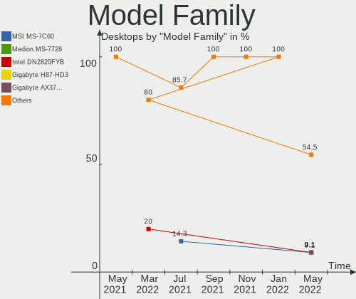

| Name                | Computers | Percent |
|---------------------|-----------|---------|
| Dell Precision      | 2         | 8.33%   |
| Shuttle DS81D       | 1         | 4.17%   |
| MSI MS-7B46         | 1         | 4.17%   |
| MSI MS-7916         | 1         | 4.17%   |
| Intel X99           | 1         | 4.17%   |
| Intel DH61BE        | 1         | 4.17%   |
| Huanan X99-F8       | 1         | 4.17%   |
| HP Compaq           | 1         | 4.17%   |
| Gigabyte Z390       | 1         | 4.17%   |
| Gigabyte Z170-HD3P  | 1         | 4.17%   |
| Gigabyte X79-UD3    | 1         | 4.17%   |
| Gigabyte J1800M-D3P | 1         | 4.17%   |
| Dell XPS            | 1         | 4.17%   |
| Dell OptiPlex       | 1         | 4.17%   |
| Biostar TB85        | 1         | 4.17%   |
| ASUS Z170-A         | 1         | 4.17%   |
| ASUS ROG            | 1         | 4.17%   |
| ASUS PRIME          | 1         | 4.17%   |
| ASRock Z390         | 1         | 4.17%   |
| ASRock Z170         | 1         | 4.17%   |
| ASRock X399         | 1         | 4.17%   |
| ASRock B150M-HDV    | 1         | 4.17%   |
| Acer Aspire         | 1         | 4.17%   |

MFG Year
--------

Motherboard manufacture year

| Year | Computers | Percent |
|------|-----------|---------|
| 2018 | 8         | 33.33%  |
| 2019 | 7         | 29.17%  |
| 2016 | 2         | 8.33%   |
| 2014 | 2         | 8.33%   |
| 2013 | 2         | 8.33%   |
| 2017 | 1         | 4.17%   |
| 2015 | 1         | 4.17%   |
| 2011 | 1         | 4.17%   |

Form Factor
-----------

Physical design of the computer

| Name    | Computers | Percent |
|---------|-----------|---------|
| Desktop | 24        | 100%    |

Secure Boot
-----------

Enabled or disabled

| State    | Computers | Percent |
|----------|-----------|---------|
| Disabled | 24        | 100%    |

Coreboot
--------

Have coreboot on board

| Used | Computers | Percent |
|------|-----------|---------|
| No   | 24        | 100%    |

RAM Size
--------

Total RAM memory

| Size in GB  | Computers | Percent |
|-------------|-----------|---------|
| 16.01-24.0  | 7         | 29.17%  |
| 32.01-64.0  | 6         | 25%     |
| 8.01-16.0   | 5         | 20.83%  |
| 64.01-256.0 | 2         | 8.33%   |
| 4.01-8.0    | 1         | 4.17%   |
| 3.01-4.0    | 1         | 4.17%   |
| 24.01-32.0  | 1         | 4.17%   |
| 1.01-2.0    | 1         | 4.17%   |

RAM Used
--------

Used RAM memory

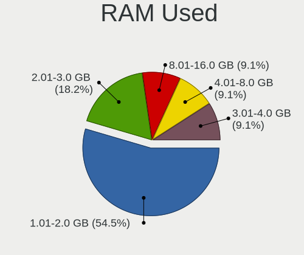

| Used GB   | Computers | Percent |
|-----------|-----------|---------|
| 1.01-2.0  | 11        | 45.83%  |
| 2.01-3.0  | 10        | 41.67%  |
| 4.01-8.0  | 2         | 8.33%   |
| 8.01-16.0 | 1         | 4.17%   |

Drive Vendor
------------

Hard drive vendors

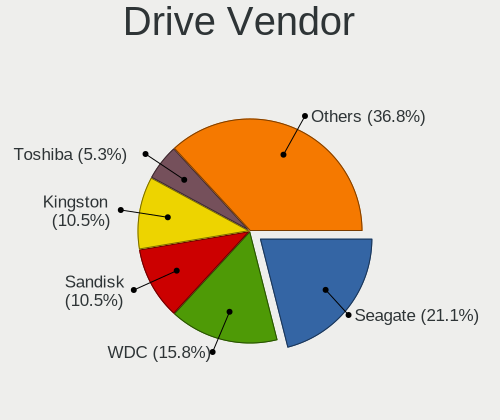

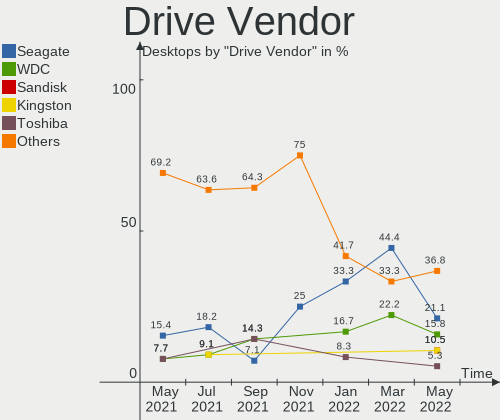

| Vendor              | Computers | Drives | Percent |
|---------------------|-----------|--------|---------|
| Seagate             | 8         | 9      | 21.05%  |
| WDC                 | 4         | 4      | 10.53%  |
| Toshiba             | 4         | 4      | 10.53%  |
| Samsung Electronics | 4         | 8      | 10.53%  |
| Kingston            | 4         | 5      | 10.53%  |
| A-DATA Technology   | 4         | 4      | 10.53%  |
| SK Hynix            | 1         | 1      | 2.63%   |
| SanDisk             | 1         | 1      | 2.63%   |
| LITEONIT            | 1         | 1      | 2.63%   |
| Intel               | 1         | 1      | 2.63%   |
| Hitachi             | 1         | 1      | 2.63%   |
| HGST                | 1         | 2      | 2.63%   |
| GOODRAM             | 1         | 1      | 2.63%   |
| Generic             | 1         | 1      | 2.63%   |
| Crucial             | 1         | 1      | 2.63%   |
| ASMT                | 1         | 2      | 2.63%   |

Drive Model
-----------

Hard drive models

| Model                        | Computers | Percent |
|------------------------------|-----------|---------|
| SSD 860 QVO 1TB              | 2         | 4.55%   |
| WD6400AARS-00Y5B1 640GB      | 1         | 2.27%   |
| WD2500AAKX-083CA1 250GB      | 1         | 2.27%   |
| WD10EZEX-08WN4A0 1TB         | 1         | 2.27%   |
| WD10EALX-759BA1 1TB          | 1         | 2.27%   |
| TR150 960GB SSD              | 1         | 2.27%   |
| THNSNH128GCST 128GB SSD      | 1         | 2.27%   |
| SVP200S37A120G 120GB SSD     | 1         | 2.27%   |
| SU630 480GB SSD              | 1         | 2.27%   |
| ST9500423AS 500GB            | 1         | 2.27%   |
| ST6000DM003-2CY186 6TB       | 1         | 2.27%   |
| ST4000DM005-2DP166 4TB       | 1         | 2.27%   |
| ST4000DM000-1F2168 4TB       | 1         | 2.27%   |
| ST3500413AS 500GB            | 1         | 2.27%   |
| ST3160812AS 160GB            | 1         | 2.27%   |
| ST1000DX001-1CM162 1TB       | 1         | 2.27%   |
| ST1000DM003-1ER162 1TB       | 1         | 2.27%   |
| SSDSC2BW120A4 120GB          | 1         | 2.27%   |
| SSDPR-CX300-120 120GB        | 1         | 2.27%   |
| SSD 960 EVO 500GB            | 1         | 2.27%   |
| SSD 850 EVO 120GB            | 1         | 2.27%   |
| SSD 840 Series 120GB         | 1         | 2.27%   |
| SSD 840 EVO 500GB            | 1         | 2.27%   |
| SSD 840 EVO 120GB            | 1         | 2.27%   |
| SSD 650 120GB                | 1         | 2.27%   |
| SP900 64GB SSD               | 1         | 2.27%   |
| SP550 240GB SSD              | 1         | 2.27%   |
| SP550 120GB SSD              | 1         | 2.27%   |
| SHSS37A240G 240GB SSD        | 1         | 2.27%   |
| SH920 2.5 7MM 256GB SSD      | 1         | 2.27%   |
| SH103S3120G 120GB SSD        | 1         | 2.27%   |
| SDSSDA240G 240GB             | 1         | 2.27%   |
| SD/MMC/MS PRO 64GB           | 1         | 2.27%   |
| SA400S37240G 240GB SSD       | 1         | 2.27%   |
| RBU-SC400S37256G 256GB SSD   | 1         | 2.27%   |
| MQ02ABF050H 500GB            | 1         | 2.27%   |
| LCT-256M3S 2.5 7mm 256GB SSD | 1         | 2.27%   |
| HUS726T6TALE6L4 6TB          | 1         | 2.27%   |
| HTS723232A7A364 320GB        | 1         | 2.27%   |
| Expansion 1TB                | 1         | 2.27%   |
| DT01ACA100 1TB               | 1         | 2.27%   |
| CT500MX500SSD1 500GB         | 1         | 2.27%   |
| ASM1352-PM 500GB             | 1         | 2.27%   |

Drive Kind
----------

HDD or SSD

| Kind    | Computers | Drives | Percent |
|---------|-----------|--------|---------|
| SSD     | 17        | 24     | 48.57%  |
| HDD     | 15        | 18     | 42.86%  |
| Unknown | 2         | 3      | 5.71%   |
| NVMe    | 1         | 1      | 2.86%   |

Drive Connector
---------------

SATA, SAS, NVMe, etc.

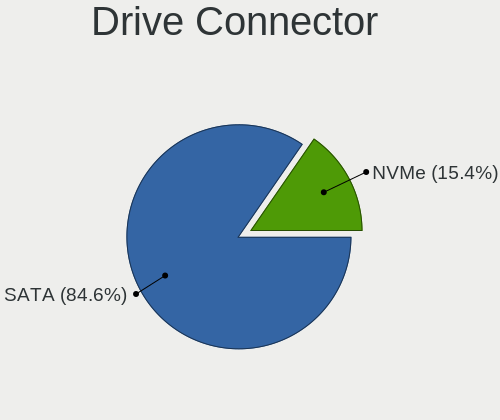

| Type | Computers | Drives | Percent |
|------|-----------|--------|---------|
| SATA | 22        | 41     | 88%     |
| SAS  | 2         | 4      | 8%      |
| NVMe | 1         | 1      | 4%      |

Drive Size
----------

Size of hard drive

| Size in TB | Computers | Drives | Percent |
|------------|-----------|--------|---------|
| 0.01-0.5   | 19        | 31     | 59.38%  |
| 0.51-1.0   | 9         | 10     | 28.13%  |
| 3.01-4.0   | 2         | 2      | 6.25%   |
| 4.01-10.0  | 2         | 3      | 6.25%   |

Space Total
-----------

Amount of disk space available on the file system

| Size in GB     | Computers | Percent |
|----------------|-----------|---------|
| 101-250        | 6         | 25%     |
| 251-500        | 5         | 20.83%  |
| 1001-2000      | 4         | 16.67%  |
| 51-100         | 3         | 12.5%   |
| 21-50          | 2         | 8.33%   |
| More than 3000 | 1         | 4.17%   |
| 2001-3000      | 1         | 4.17%   |
| 501-1000       | 1         | 4.17%   |
| Unknown        | 1         | 4.17%   |

Space Used
----------

Amount of used disk space

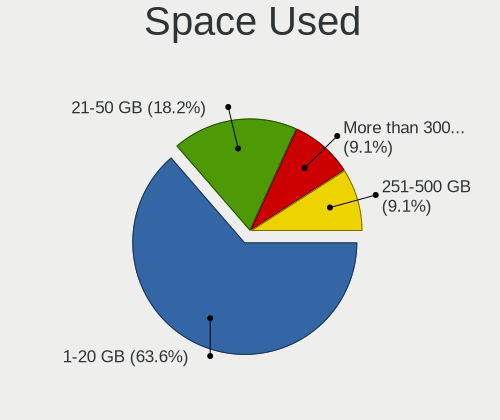

| Used GB   | Computers | Percent |
|-----------|-----------|---------|
| 1-20      | 9         | 37.5%   |
| 21-50     | 6         | 25%     |
| 251-500   | 2         | 8.33%   |
| 1001-2000 | 2         | 8.33%   |
| 51-100    | 2         | 8.33%   |
| 101-250   | 1         | 4.17%   |
| 501-1000  | 1         | 4.17%   |
| Unknown   | 1         | 4.17%   |

Malfunc. Drives
---------------

Drive models with a malfunction

Zero info for selected period =(

Malfunc. Drive Vendor
---------------------

Vendors of faulty drives

Zero info for selected period =(

Malfunc. Drive Kind
-------------------

Kinds of faulty drives

Zero info for selected period =(

Failed Drives
-------------

Failed drive models

Zero info for selected period =(

Failed Drive Vendor
-------------------

Failed drive vendors

Zero info for selected period =(

Drive Status
------------

Number of failed and malfunc. drives

| Status   | Computers | Drives | Percent |
|----------|-----------|--------|---------|
| Detected | 22        | 45     | 95.65%  |
| Works    | 1         | 1      | 4.35%   |

Storage Vendor
--------------

Storage controller vendors

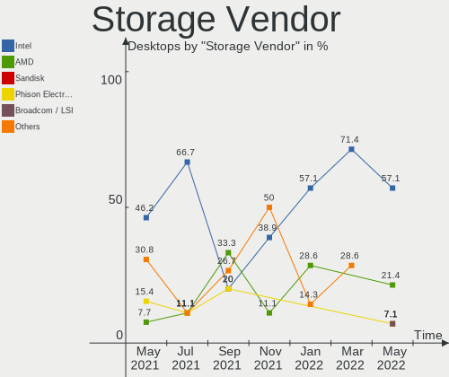

| Vendor                       | Computers | Percent |
|------------------------------|-----------|---------|
| Intel                        | 21        | 53.85%  |
| Samsung Electronics          | 6         | 15.38%  |
| AMD                          | 3         | 7.69%   |
| Marvell Technology Group     | 2         | 5.13%   |
| ADATA Technology             | 2         | 5.13%   |
| Toshiba America Info Systems | 1         | 2.56%   |
| Realtek Semiconductor        | 1         | 2.56%   |
| Phison Electronics           | 1         | 2.56%   |
| Kingston Technology Company  | 1         | 2.56%   |
| ASMedia Technology           | 1         | 2.56%   |

Storage Model
-------------

Storage controller models

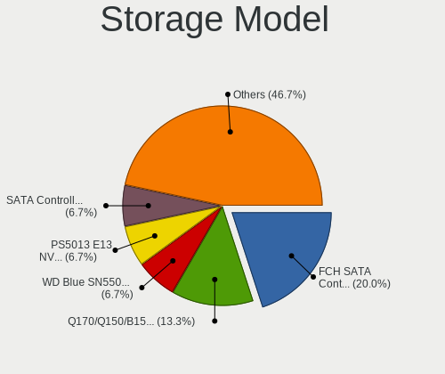

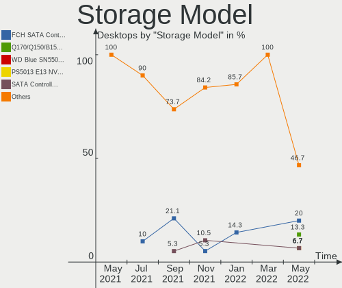

| Model                                                                    | Computers | Percent |
|--------------------------------------------------------------------------|-----------|---------|
| Q170/Q150/B150/H170/H110/Z170/CM236 Chipset SATA Controller [AHCI Mode]  | 4         | 9.09%   |
| SATA Controller [RAID mode]                                              | 3         | 6.82%   |
| NVMe SSD Controller SM961/PM961                                          | 3         | 6.82%   |
| FCH SATA Controller [AHCI mode]                                          | 3         | 6.82%   |
| XPG SX8200 Pro PCIe Gen3x4 M.2 2280 Solid State Drive                    | 2         | 4.55%   |
| NVMe SSD Controller SM981/PM981/PM983                                    | 2         | 4.55%   |
| Cannon Lake PCH SATA AHCI Controller                                     | 2         | 4.55%   |
| C610/X99 series chipset sSATA Controller [AHCI mode]                     | 2         | 4.55%   |
| 8 Series/C220 Series Chipset Family 6-port SATA Controller 1 [AHCI mode] | 2         | 4.55%   |
| 6 Series/C200 Series Chipset Family 6 port Desktop SATA AHCI Controller  | 2         | 4.55%   |
| 400 Series Chipset SATA Controller                                       | 2         | 4.55%   |
| 200 Series PCH SATA controller [AHCI mode]                               | 2         | 4.55%   |
| X399 Series Chipset SATA Controller                                      | 1         | 2.27%   |
| Toshiba America Info Non-Volatile memory controller                      | 1         | 2.27%   |
| Technology Company Non-Volatile memory controller                        | 1         | 2.27%   |
| SSD 660P Series                                                          | 1         | 2.27%   |
| Realtek Non-Volatile memory controller                                   | 1         | 2.27%   |
| NVMe SSD Controller SM951/PM951                                          | 1         | 2.27%   |
| Non-Volatile memory controller                                           | 1         | 2.27%   |
| E16 PCIe4 NVMe Controller                                                | 1         | 2.27%   |
| C610/X99 series chipset 6-Port SATA Controller [AHCI mode]               | 1         | 2.27%   |
| C600/X79 series chipset SATA RAID Controller                             | 1         | 2.27%   |
| C600/X79 series chipset 6-Port SATA AHCI Controller                      | 1         | 2.27%   |
| Atom Processor E3800 Series SATA AHCI Controller                         | 1         | 2.27%   |
| ASM1062 Serial ATA Controller                                            | 1         | 2.27%   |
| 88SE9172 SATA III 6Gb/s RAID Controller                                  | 1         | 2.27%   |
| 88SE9172 SATA 6Gb/s Controller                                           | 1         | 2.27%   |

Storage Kind
------------

Kind of storage controller (IDE, SATA, NVMe, SAS, ...)

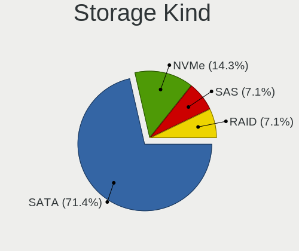

| Kind | Computers | Percent |
|------|-----------|---------|
| SATA | 21        | 55.26%  |
| NVMe | 12        | 31.58%  |
| RAID | 4         | 10.53%  |
| IDE  | 1         | 2.63%   |

CPU Vendor
----------

Processor vendors

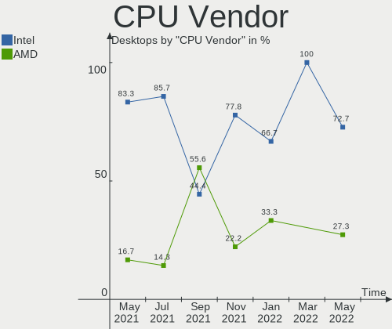

| Vendor | Computers | Percent |
|--------|-----------|---------|
| Intel  | 21        | 87.5%   |
| AMD    | 3         | 12.5%   |

CPU Model
---------

Processor models

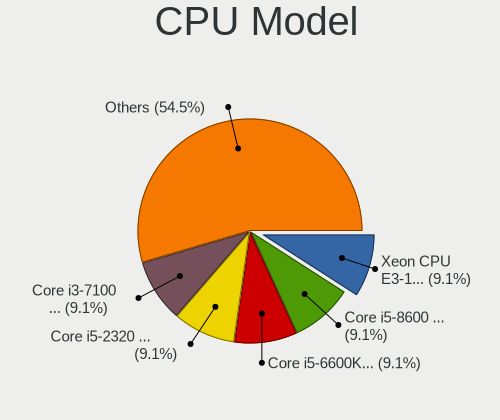

| Model                                          | Computers | Percent |
|------------------------------------------------|-----------|---------|
| Intel Core i7-6700K CPU @ 4.00GHz              | 2         | 8.33%   |
| Intel Xeon CPU E5-2678 v3 @ 2.50GHz            | 1         | 4.17%   |
| Intel Xeon CPU E5-2640 v3 @ 2.60GHz            | 1         | 4.17%   |
| Intel Xeon CPU E5-1650 v3 @ 3.50GHz            | 1         | 4.17%   |
| Intel Xeon CPU E3-1270 V2 @ 3.50GHz            | 1         | 4.17%   |
| Intel Pentium CPU G620 @ 2.60GHz               | 1         | 4.17%   |
| Intel Core i9-9900K CPU @ 3.60GHz              | 1         | 4.17%   |
| Intel Core i9-9900 CPU @ 3.10GHz               | 1         | 4.17%   |
| Intel Core i7-8700 CPU @ 3.20GHz               | 1         | 4.17%   |
| Intel Core i7-4790K CPU @ 4.00GHz              | 1         | 4.17%   |
| Intel Core i7-3960X CPU @ 3.30GHz              | 1         | 4.17%   |
| Intel Core i5-8600K CPU @ 3.60GHz              | 1         | 4.17%   |
| Intel Core i5-8400 CPU @ 2.80GHz               | 1         | 4.17%   |
| Intel Core i5-6500 CPU @ 3.20GHz               | 1         | 4.17%   |
| Intel Core i5-6400 CPU @ 2.70GHz               | 1         | 4.17%   |
| Intel Core i5-4590S CPU @ 3.00GHz              | 1         | 4.17%   |
| Intel Core i5-2400S CPU @ 2.50GHz              | 1         | 4.17%   |
| Intel Core i3-4160 CPU @ 3.60GHz               | 1         | 4.17%   |
| Intel Core i3-2120 CPU @ 3.30GHz               | 1         | 4.17%   |
| Intel Celeron CPU J1800 @ 2.41GHz              | 1         | 4.17%   |
| AMD Ryzen Threadripper 2950X 16-Core Processor | 1         | 4.17%   |
| AMD Ryzen 7 2700X Eight-Core Processor         | 1         | 4.17%   |
| AMD Ryzen 7 1700 Eight-Core Processor          | 1         | 4.17%   |

CPU Model Family
----------------

Processor model prefix

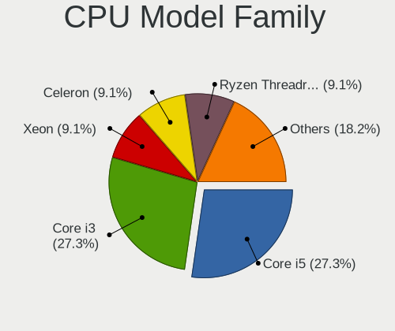

| Model                  | Computers | Percent |
|------------------------|-----------|---------|
| Intel Core i5          | 6         | 25%     |
| Intel Core i7          | 5         | 20.83%  |
| Intel Xeon             | 4         | 16.67%  |
| Intel Core i9          | 2         | 8.33%   |
| Intel Core i3          | 2         | 8.33%   |
| AMD Ryzen 7            | 2         | 8.33%   |
| Intel Pentium          | 1         | 4.17%   |
| Intel Celeron          | 1         | 4.17%   |
| AMD Ryzen Threadripper | 1         | 4.17%   |

CPU Cores
---------

Number of processor cores

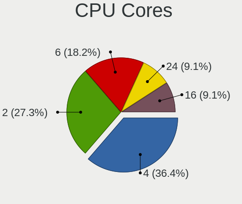

| Number | Computers | Percent |
|--------|-----------|---------|
| 4      | 8         | 33.33%  |
| 8      | 5         | 20.83%  |
| 6      | 5         | 20.83%  |
| 2      | 4         | 16.67%  |
| 16     | 1         | 4.17%   |
| 12     | 1         | 4.17%   |

CPU Sockets
-----------

Number of sockets

| Number | Computers | Percent |
|--------|-----------|---------|
| 1      | 24        | 100%    |

CPU Threads
-----------

Threads per core (Hyper-Threading)

| Number | Computers | Percent |
|--------|-----------|---------|
| 2      | 16        | 66.67%  |
| 1      | 8         | 33.33%  |

CPU Op-Modes
------------

CPU Operation Modes (32-bit, 64-bit)

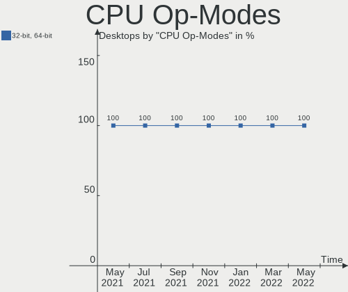

| Op mode        | Computers | Percent |
|----------------|-----------|---------|
| 32-bit, 64-bit | 24        | 100%    |

CPU Microarch
-------------

Microarchitecture

| Name        | Computers | Percent |
|-------------|-----------|---------|
| Haswell     | 6         | 25%     |
| KabyLake    | 5         | 20.83%  |
| Skylake     | 4         | 16.67%  |
| SandyBridge | 4         | 16.67%  |
| Zen+        | 2         | 8.33%   |
| Zen         | 1         | 4.17%   |
| Silvermont  | 1         | 4.17%   |
| IvyBridge   | 1         | 4.17%   |

CPU Microcode
-------------

Microcode number

| Number  | Computers | Percent |
|---------|-----------|---------|
| Unknown | 23        | 95.83%  |
| 0x306c3 | 1         | 4.17%   |

GPU Vendor
----------

Vendors of graphics cards

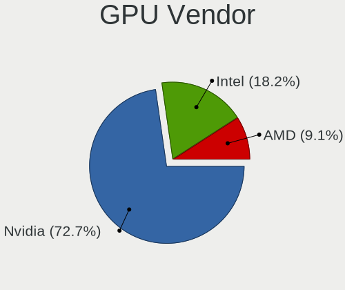

| Vendor | Computers | Percent |
|--------|-----------|---------|
| Nvidia | 15        | 55.56%  |
| Intel  | 6         | 22.22%  |
| AMD    | 6         | 22.22%  |

GPU Model
---------

Graphics card models

| Model                                                               | Computers | Percent |
|---------------------------------------------------------------------|-----------|---------|
| GP104 [GeForce GTX 1080]                                            | 2         | 7.41%   |
| 2nd Generation Core Processor Family Integrated Graphics Controller | 2         | 7.41%   |
| Vega 20 [Radeon VII]                                                | 1         | 3.7%    |
| UHD Graphics 630 (Desktop)                                          | 1         | 3.7%    |
| TU106 [GeForce RTX 2070]                                            | 1         | 3.7%    |
| TU106 [GeForce RTX 2070 Rev. A]                                     | 1         | 3.7%    |
| TU106 [GeForce RTX 2060 SUPER]                                      | 1         | 3.7%    |
| TU104 [GeForce RTX 2080 SUPER]                                      | 1         | 3.7%    |
| Tahiti XT [Radeon HD 7970/8970 OEM / R9 280X]                       | 1         | 3.7%    |
| Redwood PRO [Radeon HD 5550/5570/5630/6510/6610/7570]               | 1         | 3.7%    |
| Navi 10 [Radeon RX 5600 OEM/5600 XT / 5700/5700 XT]                 | 1         | 3.7%    |
| HD Graphics 530                                                     | 1         | 3.7%    |
| GP108 [GeForce GT 1030]                                             | 1         | 3.7%    |
| GP106 [GeForce GTX 1060 6GB]                                        | 1         | 3.7%    |
| GP106 [GeForce GTX 1060 3GB]                                        | 1         | 3.7%    |
| GP104 [GeForce GTX 1070]                                            | 1         | 3.7%    |
| GM204 [GeForce GTX 970]                                             | 1         | 3.7%    |
| GM107GL [Quadro K620]                                               | 1         | 3.7%    |
| GK208B [GeForce GT 730]                                             | 1         | 3.7%    |
| GF106GL [Quadro 2000]                                               | 1         | 3.7%    |
| G98 [GeForce 8400 GS Rev. 2]                                        | 1         | 3.7%    |
| Ellesmere [Radeon RX 470/480/570/570X/580/580X/590]                 | 1         | 3.7%    |
| Caicos [Radeon HD 6450/7450/8450 / R5 230 OEM]                      | 1         | 3.7%    |
| Atom Processor Z36xxx/Z37xxx Series Graphics & Display              | 1         | 3.7%    |
| 4th Generation Core Processor Family Integrated Graphics Controller | 1         | 3.7%    |

GPU Combo
---------

Combinations of graphics cards

| Name       | Computers | Percent |
|------------|-----------|---------|
| 1 x Nvidia | 15        | 62.5%   |
| 1 x AMD    | 6         | 25%     |
| 1 x Intel  | 3         | 12.5%   |

GPU Driver
----------

Free vs proprietary

| Driver | Computers | Percent |
|--------|-----------|---------|
| Free   | 24        | 100%    |

GPU Memory
----------

Total video memory

| Size in GB | Computers | Percent |
|------------|-----------|---------|
| Unknown    | 24        | 100%    |

Monitor Vendor
--------------

Monitor vendors

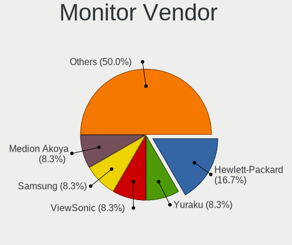

| Vendor               | Computers | Percent |
|----------------------|-----------|---------|
| Samsung Electronics  | 7         | 25%     |
| Goldstar             | 4         | 14.29%  |
| BenQ                 | 4         | 14.29%  |
| ViewSonic            | 3         | 10.71%  |
| Dell                 | 3         | 10.71%  |
| AOC                  | 2         | 7.14%   |
| Medion               | 1         | 3.57%   |
| Hitachi              | 1         | 3.57%   |
| Hewlett-Packard      | 1         | 3.57%   |
| Ancor Communications | 1         | 3.57%   |
| Acer                 | 1         | 3.57%   |

Monitor Model
-------------

Monitor models

| Model                                               | Computers | Percent |
|-----------------------------------------------------|-----------|---------|
| IPS FULLHD GSM5AB8 1920x1080 480x270mm 21.7-inch    | 2         | 7.14%   |
| VX3276-QHD VSCE635 2560x1440 698x393mm 31.5-inch    | 1         | 3.57%   |
| VX2363 Series VSC6B2F 1920x1080 509x286mm 23.0-inch | 1         | 3.57%   |
| ULTRAWIDE GSM76E4 3440x1440 800x335mm 34.1-inch     | 1         | 3.57%   |
| SyncMaster SAM0608 1920x1080 510x290mm 23.1-inch    | 1         | 3.57%   |
| P2715Q DEL40BD 3840x2160 597x336mm 27.0-inch        | 1         | 3.57%   |
| P2414H DELA09A 1920x1080 527x297mm 23.8-inch        | 1         | 3.57%   |
| MD21473 MED461C 2560x1440 597x336mm 27.0-inch       | 1         | 3.57%   |
| LCD Monitor SAM0B5C 1920x1080 1212x682mm 54.8-inch  | 1         | 3.57%   |
| LCD Monitor SAM02A2 1360x768 885x498mm 40.0-inch    | 1         | 3.57%   |
| HDMI HEC0030 4096x2160 1150x650mm 52.0-inch         | 1         | 3.57%   |
| GW2270 BNQ78DB 1920x1080 476x268mm 21.5-inch        | 1         | 3.57%   |
| GN246HL ACR02F9 1920x1080 531x299mm 24.0-inch       | 1         | 3.57%   |
| GL2450 BNQ78A5 1920x1080 531x298mm 24.0-inch        | 1         | 3.57%   |
| G90fb-2 VSC4907 1920x1440 357x268mm 17.6-inch       | 1         | 3.57%   |
| EW2775ZH BNQ7944 1920x1080 598x336mm 27.0-inch      | 1         | 3.57%   |
| EW2420 BNQ7923 1920x1080 530x300mm 24.0-inch        | 1         | 3.57%   |
| C34H89x SAM0E25 3440x1440 797x333mm 34.0-inch       | 1         | 3.57%   |
| C27HG7x SAM0E15 2560x1440 598x336mm 27.0-inch       | 1         | 3.57%   |
| C24FG7x SAM0E43 1920x1080 532x304mm 24.1-inch       | 1         | 3.57%   |
| C24F390 SAM0D2C 1920x1080 520x290mm 23.4-inch       | 1         | 3.57%   |
| ASUS VS228 ACI22FD 1920x1080 476x268mm 21.5-inch    | 1         | 3.57%   |
| 27ea HPN3395 1920x1080 527x296mm 23.8-inch          | 1         | 3.57%   |
| 27E1 AOC2701 1920x1080 598x336mm 27.0-inch          | 1         | 3.57%   |
| 24MP55 GSM5A20 1920x1080 510x290mm 23.1-inch        | 1         | 3.57%   |
| 2276WM AOC2276 1920x1080 477x268mm 21.5-inch        | 1         | 3.57%   |
| 2009W DEL4041 1680x1050 430x270mm 20.0-inch         | 1         | 3.57%   |

Monitor Resolution
------------------

Monitor screen resolution

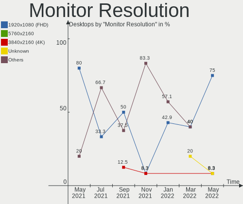

| Resolution         | Computers | Percent |
|--------------------|-----------|---------|
| 1920x1080 (FHD)    | 15        | 60%     |
| 2560x1440 (QHD)    | 3         | 12%     |
| 3840x2160 (4K)     | 2         | 8%      |
| 3440x1440          | 2         | 8%      |
| 1680x1050 (WSXGA+) | 1         | 4%      |
| 1360x768           | 1         | 4%      |
| 1280x1024 (SXGA)   | 1         | 4%      |

Monitor Diagonal
----------------

Diagonal size in inches

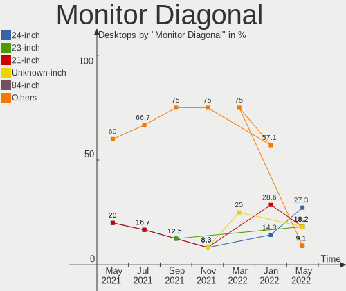

| Inches | Computers | Percent |
|--------|-----------|---------|
| 23     | 6         | 22.22%  |
| 21     | 5         | 18.52%  |
| 27     | 4         | 14.81%  |
| 24     | 4         | 14.81%  |
| 34     | 2         | 7.41%   |
| 84     | 1         | 3.7%    |
| 54     | 1         | 3.7%    |
| 40     | 1         | 3.7%    |
| 31     | 1         | 3.7%    |
| 20     | 1         | 3.7%    |
| 17     | 1         | 3.7%    |

Monitor Width
-------------

Physical width

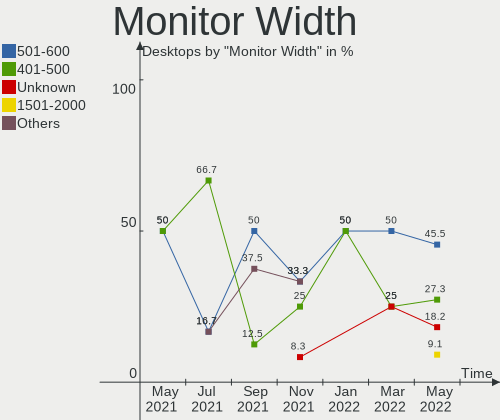

| Width in mm | Computers | Percent |
|-------------|-----------|---------|
| 501-600     | 13        | 50%     |
| 401-500     | 6         | 23.08%  |
| 701-800     | 2         | 7.69%   |
| 801-900     | 1         | 3.85%   |
| 601-700     | 1         | 3.85%   |
| 351-400     | 1         | 3.85%   |
| 1501-2000   | 1         | 3.85%   |
| 1001-1500   | 1         | 3.85%   |

Aspect Ratio
------------

Proportional relationship between the width and the height

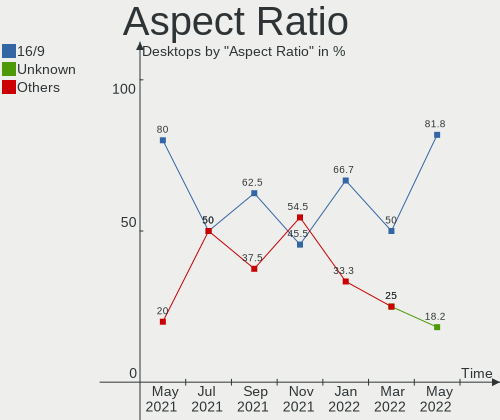

| Ratio | Computers | Percent |
|-------|-----------|---------|
| 16/9  | 21        | 84%     |
| 21/9  | 2         | 8%      |
| 4/3   | 1         | 4%      |
| 16/10 | 1         | 4%      |

Monitor Area
------------

Area in inch²

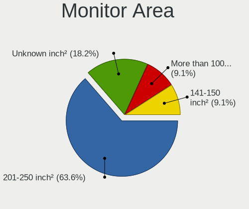

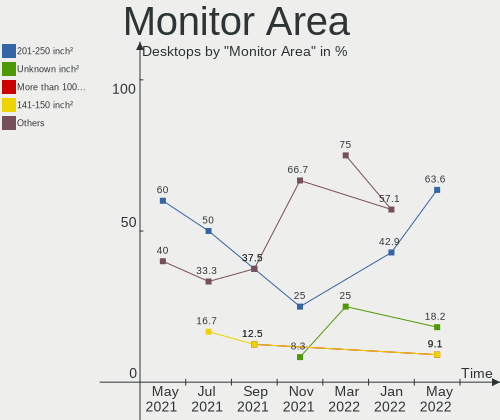

| Area in inch² | Computers | Percent |
|----------------|-----------|---------|
| 201-250        | 10        | 38.46%  |
| 301-350        | 4         | 15.38%  |
| 151-200        | 4         | 15.38%  |
| 351-500        | 3         | 11.54%  |
| More than 1000 | 2         | 7.69%   |
| 251-300        | 1         | 3.85%   |
| 141-150        | 1         | 3.85%   |
| 501-1000       | 1         | 3.85%   |

Pixel Density
-------------

Pixels per inch

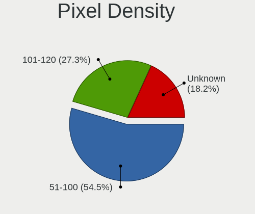

| Density | Computers | Percent |
|---------|-----------|---------|
| 51-100  | 13        | 52%     |
| 101-120 | 9         | 36%     |
| 1-50    | 2         | 8%      |
| 161-240 | 1         | 4%      |

Multiple Monitors
-----------------

Total monitors connected

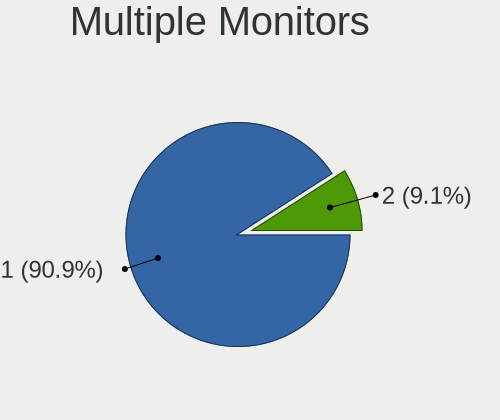

| Total | Computers | Percent |
|-------|-----------|---------|
| 1     | 20        | 83.33%  |
| 2     | 4         | 16.67%  |

Net Controller Vendor
---------------------

Controller vendors

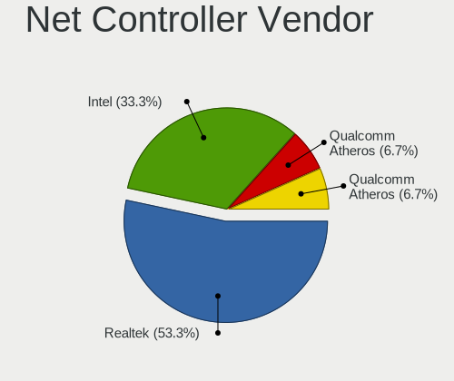

| Vendor                   | Computers | Percent |
|--------------------------|-----------|---------|
| Intel                    | 8         | 66.67%  |
| Nordic Semiconductor ASA | 1         | 8.33%   |
| Microchip Technology     | 1         | 8.33%   |
| LeafLabs                 | 1         | 8.33%   |
| DisplayLink              | 1         | 8.33%   |

Net Controller Model
--------------------

Controller models

| Model                                           | Computers | Percent |
|-------------------------------------------------|-----------|---------|
| 82579LM Gigabit Network Connection (Lewisville) | 3         | 25%     |
| I211 Gigabit Network Connection                 | 2         | 16.67%  |
| 82579V Gigabit Network Connection               | 2         | 16.67%  |
| Wi-Fi 6 AX200                                   | 1         | 8.33%   |
| nRF52 USB CDC BLE Demo                          | 1         | 8.33%   |
| Maple                                           | 1         | 8.33%   |
| HTC Hub Controller                              | 1         | 8.33%   |
| Dell USB3.0 Dock                                | 1         | 8.33%   |

Net Controller Kind
-------------------

Ethernet, WiFi or modem

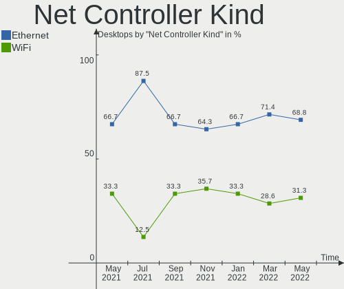

| Kind     | Computers | Percent |
|----------|-----------|---------|
| Ethernet | 7         | 63.64%  |
| Modem    | 3         | 27.27%  |
| WiFi     | 1         | 9.09%   |

Used Controller
---------------

Currently used network controller

| Kind     | Computers | Percent |
|----------|-----------|---------|
| Ethernet | 6         | 100%    |

NICs
----

Total network controllers on board

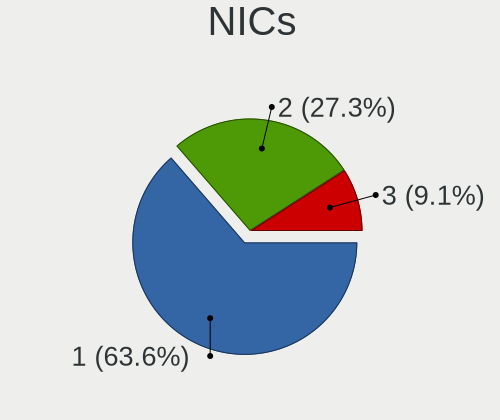

| Total | Computers | Percent |
|-------|-----------|---------|
| 1     | 17        | 70.83%  |
| 2     | 5         | 20.83%  |
| 3     | 2         | 8.33%   |

Unsupported Devices
-------------------

Total unsupported devices on board

| Total | Computers | Percent |
|-------|-----------|---------|
| 0     | 20        | 83.33%  |
| 1     | 4         | 16.67%  |

Unsupported Device Types
------------------------

Types of unsupported devices

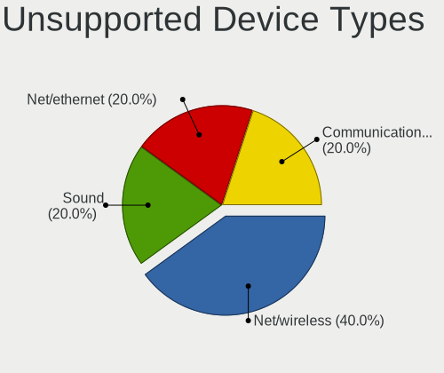

| Type             | Computers | Percent |
|------------------|-----------|---------|
| Unassigned class | 3         | 75%     |
| Net/wireless     | 1         | 25%     |

