Clear Linux Hardware Trends (Notebook)
--------------------------------------

A project to identify most popular hardware characteristics and track their change
over time based on data collected by Clear Linux users at https://Linux-Hardware.org.

Anyone can contribute to the study by uploading probes of their computers by
the [hw-probe](https://github.com/linuxhw/hw-probe) tool:

    sudo hw-probe -all -upload

Full-feature report is available here: https://linux-hardware.org/?view=trends&formfactor=notebook

Period: Feb, 2020.

Contents
--------

- [ OS                       ](#os)
- [ OS Family                ](#os-family)
- [ Kernel                   ](#kernel)
- [ Kernel Family            ](#kernel-family)
- [ Kernel Major Ver.        ](#kernel-major-ver)
- [ Arch                     ](#arch)
- [ DE                       ](#de)
- [ Display Server           ](#display-server)
- [ OS Lang                  ](#os-lang)
- [ Boot Mode                ](#boot-mode)
- [ Filesystem               ](#filesystem)
- [ Dual Boot with Linux     ](#dual-boot-with-linux)
- [ Dual Boot (Win)          ](#dual-boot-win)
- [ Country                  ](#country)
- [ City                     ](#city)
- [ Vendor                   ](#vendor)
- [ Model                    ](#model)
- [ Model Family             ](#model-family)
- [ MFG Year                 ](#mfg-year)
- [ Form Factor              ](#form-factor)
- [ Secure Boot              ](#secure-boot)
- [ Coreboot                 ](#coreboot)
- [ RAM Size                 ](#ram-size)
- [ RAM Used                 ](#ram-used)
- [ Drive Vendor             ](#drive-vendor)
- [ Drive Model              ](#drive-model)
- [ Drive Kind               ](#drive-kind)
- [ Drive Connector          ](#drive-connector)
- [ Drive Size               ](#drive-size)
- [ Space Total              ](#space-total)
- [ Space Used               ](#space-used)
- [ Malfunc. Drives          ](#malfunc-drives)
- [ Malfunc. Drive Vendor    ](#malfunc-drive-vendor)
- [ Malfunc. Drive Kind      ](#malfunc-drive-kind)
- [ Failed Drives            ](#failed-drives)
- [ Failed Drive Vendor      ](#failed-drive-vendor)
- [ Drive Status             ](#drive-status)
- [ Storage Vendor           ](#storage-vendor)
- [ Storage Model            ](#storage-model)
- [ Storage Kind             ](#storage-kind)
- [ CPU Vendor               ](#cpu-vendor)
- [ CPU Model                ](#cpu-model)
- [ CPU Model Family         ](#cpu-model-family)
- [ CPU Cores                ](#cpu-cores)
- [ CPU Sockets              ](#cpu-sockets)
- [ CPU Threads              ](#cpu-threads)
- [ CPU Op-Modes             ](#cpu-op-modes)
- [ CPU Microarch            ](#cpu-microarch)
- [ CPU Microcode            ](#cpu-microcode)
- [ GPU Vendor               ](#gpu-vendor)
- [ GPU Model                ](#gpu-model)
- [ GPU Combo                ](#gpu-combo)
- [ GPU Driver               ](#gpu-driver)
- [ GPU Memory               ](#gpu-memory)
- [ Monitor Vendor           ](#monitor-vendor)
- [ Monitor Model            ](#monitor-model)
- [ Monitor Resolution       ](#monitor-resolution)
- [ Monitor Diagonal         ](#monitor-diagonal)
- [ Monitor Width            ](#monitor-width)
- [ Aspect Ratio             ](#aspect-ratio)
- [ Monitor Area             ](#monitor-area)
- [ Pixel Density            ](#pixel-density)
- [ Multiple Monitors        ](#multiple-monitors)
- [ Net Controller Vendor    ](#net-controller-vendor)
- [ Net Controller Model     ](#net-controller-model)
- [ Net Controller Kind      ](#net-controller-kind)
- [ Used Controller          ](#used-controller)
- [ NICs                     ](#nics)
- [ Unsupported Devices      ](#unsupported-devices)
- [ Unsupported Device Types ](#unsupported-device-types)

OS
--

Installed operating systems

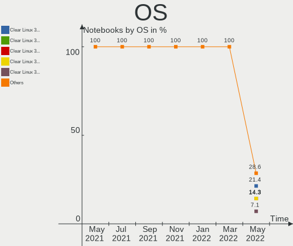

| Name              | Computers | Percent |
|-------------------|-----------|---------|
| Clear Linux 32270 | 10        | 17.86%  |
| Clear Linux 32480 | 8         | 14.29%  |
| Clear Linux 32380 | 8         | 14.29%  |
| Clear Linux 32330 | 7         | 12.5%   |
| Clear Linux 32390 | 4         | 7.14%   |
| Clear Linux 32340 | 4         | 7.14%   |
| Clear Linux 32400 | 3         | 5.36%   |
| Clear Linux 32310 | 3         | 5.36%   |
| Clear Linux 32280 | 3         | 5.36%   |
| Clear Linux 32370 | 2         | 3.57%   |
| Clear Linux 32350 | 2         | 3.57%   |
| Clear Linux 32230 | 1         | 1.79%   |
| Clear Linux       | 1         | 1.79%   |

OS Family
---------

OS without a version

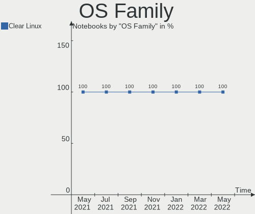

| Name        | Computers | Percent |
|-------------|-----------|---------|
| Clear Linux | 56        | 100%    |

Kernel
------

Version of the Linux kernel

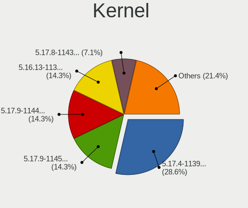

| Version              | Computers | Percent |
|----------------------|-----------|---------|
| 5.4.18-902.native    | 14        | 25%     |
| 5.5.6-914.native     | 12        | 21.43%  |
| 5.5.5-911.native     | 9         | 16.07%  |
| 5.5.4-909.native     | 6         | 10.71%  |
| 5.5.3-908.native     | 6         | 10.71%  |
| 5.5.3-905.native     | 4         | 7.14%   |
| 5.4.16-900.native    | 2         | 3.57%   |
| 5.5.2-903.native     | 1         | 1.79%   |
| 4.19.104-114.lts2018 | 1         | 1.79%   |
| 4.19.102-111.lts2018 | 1         | 1.79%   |

Kernel Family
-------------

Linux kernel without a distro release

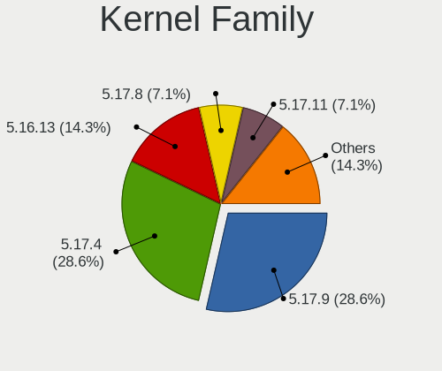

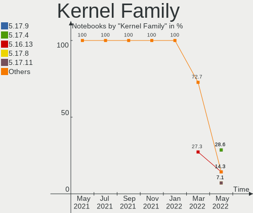

| Version  | Computers | Percent |
|----------|-----------|---------|
| 5.4.18   | 14        | 25%     |
| 5.5.6    | 12        | 21.43%  |
| 5.5.3    | 10        | 17.86%  |
| 5.5.5    | 9         | 16.07%  |
| 5.5.4    | 6         | 10.71%  |
| 5.4.16   | 2         | 3.57%   |
| 5.5.2    | 1         | 1.79%   |
| 4.19.104 | 1         | 1.79%   |
| 4.19.102 | 1         | 1.79%   |

Kernel Major Ver.
-----------------

Linux kernel major version

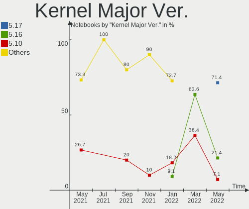

| Version | Computers | Percent |
|---------|-----------|---------|
| 5.5     | 38        | 67.86%  |
| 5.4     | 16        | 28.57%  |
| 4.19    | 2         | 3.57%   |

Arch
----

OS architecture (x86_64, i586, etc.)

| Name   | Computers | Percent |
|--------|-----------|---------|
| x86_64 | 56        | 100%    |

DE
--

Desktop Environment

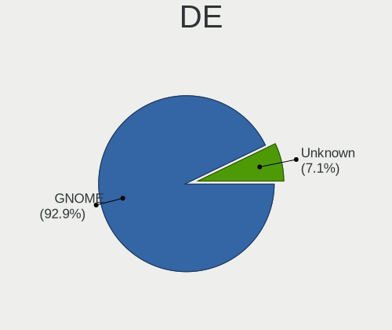

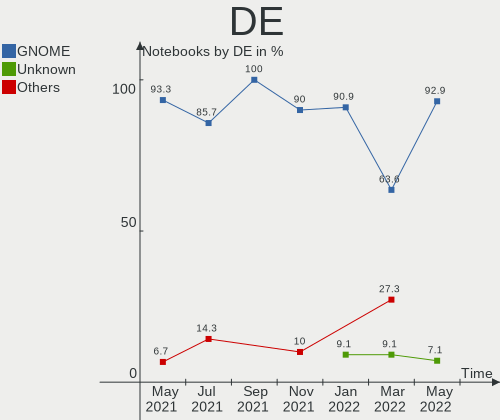

| Name            | Computers | Percent |
|-----------------|-----------|---------|
| GNOME           | 48        | 85.71%  |
| KDE             | 3         | 5.36%   |
| GNOME Flashback | 3         | 5.36%   |
| Unknown         | 2         | 3.57%   |

Display Server
--------------

X11 or Wayland

| Name    | Computers | Percent |
|---------|-----------|---------|
| X11     | 52        | 92.86%  |
| Wayland | 3         | 5.36%   |
| Tty     | 1         | 1.79%   |

OS Lang
-------

Language

| Lang  | Computers | Percent |
|-------|-----------|---------|
| en_US | 48        | 85.71%  |
| ru_RU | 3         | 5.36%   |
| tr_TR | 1         | 1.79%   |
| pl_PL | 1         | 1.79%   |
| hu_HU | 1         | 1.79%   |
| es_ES | 1         | 1.79%   |
| de_DE | 1         | 1.79%   |

Boot Mode
---------

EFI or BIOS

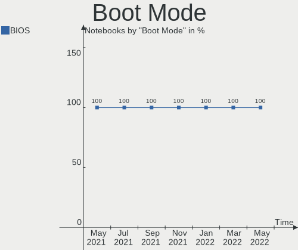

| Mode | Computers | Percent |
|------|-----------|---------|
| BIOS | 56        | 100%    |

Filesystem
----------

Type of filesystem

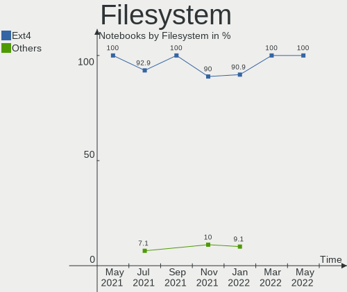

| Type | Computers | Percent |
|------|-----------|---------|
| Ext4 | 55        | 98.21%  |
| Xfs  | 1         | 1.79%   |

Dual Boot with Linux
--------------------

Hosting more than one Linux

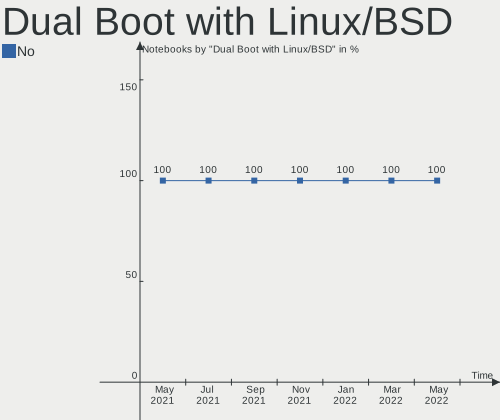

| Dual boot | Computers | Percent |
|-----------|-----------|---------|
| No        | 55        | 98.21%  |
| Yes       | 1         | 1.79%   |

Dual Boot (Win)
---------------

Hosting Linux and Windows

| Dual boot | Computers | Percent |
|-----------|-----------|---------|
| No        | 54        | 96.43%  |
| Yes       | 2         | 3.57%   |

Country
-------

Geographic location (country)

| Country        | Computers | Percent |
|----------------|-----------|---------|
| USA            | 17        | 30.36%  |
| Germany        | 5         | 8.93%   |
| Poland         | 4         | 7.14%   |
| India          | 4         | 7.14%   |
| Ukraine        | 3         | 5.36%   |
| Russia         | 3         | 5.36%   |
| Romania        | 3         | 5.36%   |
| Hungary        | 3         | 5.36%   |
| Netherlands    | 2         | 3.57%   |
| UK             | 1         | 1.79%   |
| Turkey         | 1         | 1.79%   |
| Thailand       | 1         | 1.79%   |
| Spain          | 1         | 1.79%   |
| Portugal       | 1         | 1.79%   |
| Norway         | 1         | 1.79%   |
| Italy          | 1         | 1.79%   |
| Czech Republic | 1         | 1.79%   |
| Canada         | 1         | 1.79%   |
| Brazil         | 1         | 1.79%   |
| Australia      | 1         | 1.79%   |
| Argentina      | 1         | 1.79%   |

City
----

Geographic location (city)

| City                | Computers | Percent |
|---------------------|-----------|---------|
| Moscow              | 2         | 3.57%   |
| Kyiv                | 2         | 3.57%   |
| Kolkata             | 2         | 3.57%   |
| Heidelberg          | 2         | 3.57%   |
| West Covina         | 1         | 1.79%   |
| Warsaw              | 1         | 1.79%   |
| Villa Rica          | 1         | 1.79%   |
| Ullo                | 1         | 1.79%   |
| Tuchkovo            | 1         | 1.79%   |
| Sugar Land          | 1         | 1.79%   |
| South Fulton        | 1         | 1.79%   |
| Slatina             | 1         | 1.79%   |
| Schio               | 1         | 1.79%   |
| Raipur              | 1         | 1.79%   |
| Prague              | 1         | 1.79%   |
| Park City           | 1         | 1.79%   |
| Park Avenue         | 1         | 1.79%   |
| Palm Harbor         | 1         | 1.79%   |
| Mount Juliet        | 1         | 1.79%   |
| Moncton             | 1         | 1.79%   |
| Modesto             | 1         | 1.79%   |
| Mediaş             | 1         | 1.79%   |
| Louisville          | 1         | 1.79%   |
| Los Alamos          | 1         | 1.79%   |
| Lisbon              | 1         | 1.79%   |
| Kłodzko            | 1         | 1.79%   |
| Kryvyy Rih          | 1         | 1.79%   |
| Katy                | 1         | 1.79%   |
| João Pessoa        | 1         | 1.79%   |
| Jenison             | 1         | 1.79%   |
| Ipswich             | 1         | 1.79%   |
| Grua                | 1         | 1.79%   |
| Frampol             | 1         | 1.79%   |
| Fort Worth          | 1         | 1.79%   |
| Felsopakony         | 1         | 1.79%   |
| Fellbach            | 1         | 1.79%   |
| Erzincan            | 1         | 1.79%   |
| Düsseldorf         | 1         | 1.79%   |
| Córdoba            | 1         | 1.79%   |
| Covington           | 1         | 1.79%   |
| Constanța          | 1         | 1.79%   |
| Cologne             | 1         | 1.79%   |
| Chicago             | 1         | 1.79%   |
| Chennai             | 1         | 1.79%   |
| Budapest            | 1         | 1.79%   |
| Brooklyn            | 1         | 1.79%   |
| Broken Arrow        | 1         | 1.79%   |
| Breda               | 1         | 1.79%   |
| Bielany Wroclawskie | 1         | 1.79%   |
| Bangkok             | 1         | 1.79%   |
| Amsterdam           | 1         | 1.79%   |
| Alicante            | 1         | 1.79%   |

Vendor
------

Motherboard manufacturer

| Name                 | Computers | Percent |
|----------------------|-----------|---------|
| Lenovo               | 12        | 21.43%  |
| Hewlett-Packard      | 11        | 19.64%  |
| Dell                 | 9         | 16.07%  |
| Acer                 | 7         | 12.5%   |
| ASUSTek Computer     | 5         | 8.93%   |
| Samsung Electronics  | 2         | 3.57%   |
| Complet              | 2         | 3.57%   |
| Apple                | 2         | 3.57%   |
| MSI                  | 1         | 1.79%   |
| Google               | 1         | 1.79%   |
| Fujitsu              | 1         | 1.79%   |
| CyberPowerPC         | 1         | 1.79%   |
| Bak USA Technologies | 1         | 1.79%   |
| Alienware            | 1         | 1.79%   |

Model
-----

Motherboard model

| Name                                                   | Computers | Percent |
|--------------------------------------------------------|-----------|---------|
| Dell XPS 15 9560                                       | 2         | 3.57%   |
| Dell Inspiron 5370                                     | 2         | 3.57%   |
| Complet MY8312                                         | 2         | 3.57%   |
| ASUS X553MA                                            | 2         | 3.57%   |
| Samsung Electronics 900X3C/900X3D/900X3E/900X4C/900X4D | 1         | 1.79%   |
| Samsung Electronics 300E5K/300E5Q                      | 1         | 1.79%   |
| MSI GL63 9SDK                                          | 1         | 1.79%   |
| Lenovo Y720-15IKB 80VR                                 | 1         | 1.79%   |
| Lenovo Y520-15IKBN 80WK                                | 1         | 1.79%   |
| Lenovo ThinkPad X250 20CM0048US                        | 1         | 1.79%   |
| Lenovo ThinkPad T420 4236FJ1                           | 1         | 1.79%   |
| Lenovo ThinkPad E580 20KS001JGE                        | 1         | 1.79%   |
| Lenovo IdeaPad Y500 20193                              | 1         | 1.79%   |
| Lenovo IdeaPad U310                                    | 1         | 1.79%   |
| Lenovo IdeaPad S340-15IWL 81N8                         | 1         | 1.79%   |
| Lenovo IdeaPad 310-15ISK 80SM                          | 1         | 1.79%   |
| Lenovo IdeaPad 130-15AST 81H5                          | 1         | 1.79%   |
| Lenovo IdeaPad 110-15ACL 80TJ                          | 1         | 1.79%   |
| Lenovo G500 20236                                      | 1         | 1.79%   |
| HP Stream Laptop 14-cb0XX                              | 1         | 1.79%   |
| HP ProBook 450 G1                                      | 1         | 1.79%   |
| HP Pavilion Sleekbook 14                               | 1         | 1.79%   |
| HP Pavilion Notebook                                   | 1         | 1.79%   |
| HP Pavilion Gaming Laptop 15-ec0xxx                    | 1         | 1.79%   |
| HP Pavilion g6                                         | 1         | 1.79%   |
| HP OMEN by HP Laptop                                   | 1         | 1.79%   |
| HP Notebook                                            | 1         | 1.79%   |
| HP EliteBook Folio 1040 G3                             | 1         | 1.79%   |
| HP EliteBook 840 G6                                    | 1         | 1.79%   |
| HP 250 G6 Notebook PC                                  | 1         | 1.79%   |
| Google Squawks                                         | 1         | 1.79%   |
| Fujitsu LIFEBOOK A514                                  | 1         | 1.79%   |
| Dell Precision 5540                                    | 1         | 1.79%   |
| Dell Precision 5510                                    | 1         | 1.79%   |
| Dell Latitude E7240                                    | 1         | 1.79%   |
| Dell Inspiron 5570                                     | 1         | 1.79%   |
| Dell Inspiron 13-5378                                  | 1         | 1.79%   |
| CyberPowerPC TRACER III                                | 1         | 1.79%   |
| Bak USA Technologies Atlas                             | 1         | 1.79%   |
| ASUS X406UAR                                           | 1         | 1.79%   |
| ASUS VivoBook_ASUSLaptop X571GT_F571GT                 | 1         | 1.79%   |
| ASUS ROG Strix G531GU_G531GU                           | 1         | 1.79%   |
| Apple MacBookPro8,2                                    | 1         | 1.79%   |
| Apple MacBookPro15,2                                   | 1         | 1.79%   |
| Alienware M14xR2                                       | 1         | 1.79%   |
| Acer Swift SF114-32                                    | 1         | 1.79%   |
| Acer Aspire VX5-591G                                   | 1         | 1.79%   |
| Acer Aspire V3-551                                     | 1         | 1.79%   |
| Acer Aspire F5-573G                                    | 1         | 1.79%   |
| Acer Aspire ES1-411                                    | 1         | 1.79%   |
| Acer Aspire E5-575                                     | 1         | 1.79%   |
| Acer Aspire A517-51                                    | 1         | 1.79%   |

Model Family
------------

Motherboard model prefix

| Name                       | Computers | Percent |
|----------------------------|-----------|---------|
| Lenovo IdeaPad             | 6         | 10.71%  |
| Acer Aspire                | 6         | 10.71%  |
| HP Pavilion                | 4         | 7.14%   |
| Dell Inspiron              | 4         | 7.14%   |
| Lenovo ThinkPad            | 3         | 5.36%   |
| HP EliteBook               | 2         | 3.57%   |
| Dell XPS                   | 2         | 3.57%   |
| Dell Precision             | 2         | 3.57%   |
| Complet MY8312             | 2         | 3.57%   |
| ASUS X553MA                | 2         | 3.57%   |
| Samsung Electronics 900X3C | 1         | 1.79%   |
| Samsung Electronics 300E5K | 1         | 1.79%   |
| MSI GL63                   | 1         | 1.79%   |
| Lenovo Y720-15IKB          | 1         | 1.79%   |
| Lenovo Y520-15IKBN         | 1         | 1.79%   |
| Lenovo G500                | 1         | 1.79%   |
| HP Stream                  | 1         | 1.79%   |
| HP ProBook                 | 1         | 1.79%   |
| HP OMEN                    | 1         | 1.79%   |
| HP Notebook                | 1         | 1.79%   |
| HP 250                     | 1         | 1.79%   |
| Google Squawks             | 1         | 1.79%   |
| Fujitsu LIFEBOOK           | 1         | 1.79%   |
| Dell Latitude              | 1         | 1.79%   |
| CyberPowerPC TRACER        | 1         | 1.79%   |
| Bak USA Technologies Atlas | 1         | 1.79%   |
| ASUS X406UAR               | 1         | 1.79%   |
| ASUS VivoBook              | 1         | 1.79%   |
| ASUS ROG                   | 1         | 1.79%   |
| Apple MacBookPro8          | 1         | 1.79%   |
| Apple MacBookPro15         | 1         | 1.79%   |
| Alienware M14xR2           | 1         | 1.79%   |
| Acer Swift                 | 1         | 1.79%   |

MFG Year
--------

Motherboard manufacture year

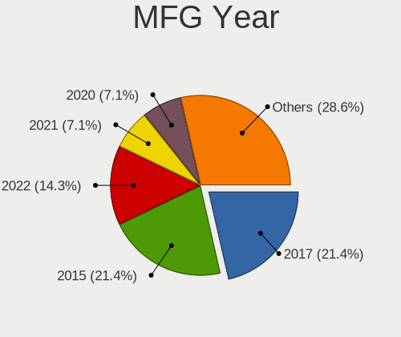

| Year | Computers | Percent |
|------|-----------|---------|
| 2019 | 18        | 32.14%  |
| 2018 | 15        | 26.79%  |
| 2016 | 6         | 10.71%  |
| 2013 | 5         | 8.93%   |
| 2014 | 4         | 7.14%   |
| 2020 | 3         | 5.36%   |
| 2017 | 2         | 3.57%   |
| 2012 | 2         | 3.57%   |
| 2015 | 1         | 1.79%   |

Form Factor
-----------

Physical design of the computer

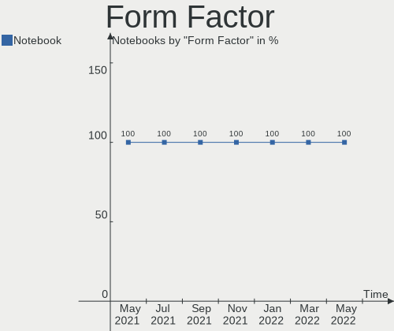

| Name     | Computers | Percent |
|----------|-----------|---------|
| Notebook | 56        | 100%    |

Secure Boot
-----------

Enabled or disabled

| State    | Computers | Percent |
|----------|-----------|---------|
| Disabled | 56        | 100%    |

Coreboot
--------

Have coreboot on board

| Used | Computers | Percent |
|------|-----------|---------|
| No   | 55        | 98.21%  |
| Yes  | 1         | 1.79%   |

RAM Size
--------

Total RAM memory

| Size in GB | Computers | Percent |
|------------|-----------|---------|
| 8.01-16.0  | 19        | 33.93%  |
| 3.01-4.0   | 12        | 21.43%  |
| 4.01-8.0   | 9         | 16.07%  |
| 16.01-24.0 | 9         | 16.07%  |
| 32.01-64.0 | 3         | 5.36%   |
| 1.01-2.0   | 3         | 5.36%   |
| 24.01-32.0 | 1         | 1.79%   |

RAM Used
--------

Used RAM memory

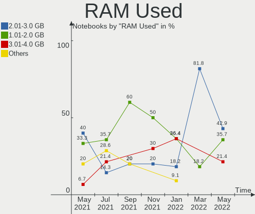

| Used GB  | Computers | Percent |
|----------|-----------|---------|
| 1.01-2.0 | 25        | 44.64%  |
| 2.01-3.0 | 21        | 37.5%   |
| 3.01-4.0 | 5         | 8.93%   |
| 4.01-8.0 | 4         | 7.14%   |
| 0.01-1.0 | 1         | 1.79%   |

Drive Vendor
------------

Hard drive vendors

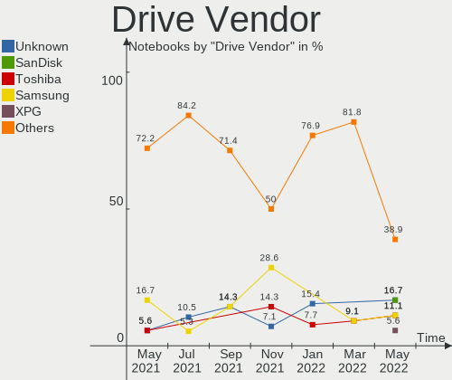

| Vendor              | Computers | Drives | Percent |
|---------------------|-----------|--------|---------|
| Toshiba             | 8         | 8      | 14.55%  |
| WDC                 | 7         | 7      | 12.73%  |
| SK Hynix            | 5         | 5      | 9.09%   |
| Seagate             | 5         | 5      | 9.09%   |
| Samsung Electronics | 5         | 5      | 9.09%   |
| Unknown             | 3         | 4      | 5.45%   |
| HGST                | 3         | 3      | 5.45%   |
| FORESEE             | 3         | 3      | 5.45%   |
| SPCC                | 2         | 2      | 3.64%   |
| SanDisk             | 2         | 2      | 3.64%   |
| Kingston            | 2         | 2      | 3.64%   |
| Hewlett-Packard     | 2         | 2      | 3.64%   |
| SSK                 | 1         | 1      | 1.82%   |
| Patriot             | 1         | 1      | 1.82%   |
| Micron Technology   | 1         | 1      | 1.82%   |
| LITEONIT            | 1         | 1      | 1.82%   |
| Integral            | 1         | 1      | 1.82%   |
| Hitachi             | 1         | 1      | 1.82%   |
| Crucial             | 1         | 1      | 1.82%   |
| A-DATA Technology   | 1         | 1      | 1.82%   |

Drive Model
-----------

Hard drive models

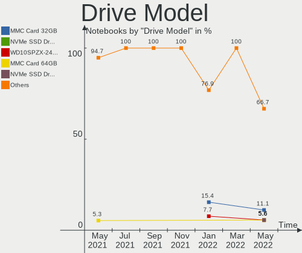

| Model                        | Computers | Percent |
|------------------------------|-----------|---------|
| SC311 SATA 256GB SSD         | 3         | 5.36%   |
| MMC Card  32GB               | 3         | 5.36%   |
| ST1000LM035-1RK172 1TB       | 2         | 3.57%   |
| SSD M700 120GB               | 2         | 3.57%   |
| MQ01ABF050 500GB             | 2         | 3.57%   |
| MQ01ABD100 1TB               | 2         | 3.57%   |
| HTS721010A9E630 1TB          | 2         | 3.57%   |
| HFS256G39TND-N210A 256GB SSD | 2         | 3.57%   |
| 256GB SSD                    | 2         | 3.57%   |
| WDS250G2B0B-00YS70 250GB SSD | 1         | 1.79%   |
| WDS120G1G0B-00RC30 120GB SSD | 1         | 1.79%   |
| WDS100T2B0B-00YS70 1TB SSD   | 1         | 1.79%   |
| WDBNCE2500PNC 250GB SSD      | 1         | 1.79%   |
| WD5000LPVX-16V0TT3 500GB     | 1         | 1.79%   |
| WD5000LPCX-35VHAT0 500GB     | 1         | 1.79%   |
| WD10SPCX-24HWST1 1TB         | 1         | 1.79%   |
| VX500 1024GB SSD             | 1         | 1.79%   |
| V Series SATA SSD 240GB      | 1         | 1.79%   |
| THNSN51T02DUK NVMe 1024GB    | 1         | 1.79%   |
| SV300S37A120G 120GB SSD      | 1         | 1.79%   |
| SU655 240GB SSD              | 1         | 1.79%   |
| ST500LT012-1DG142 500GB      | 1         | 1.79%   |
| ST320LT020-9YG142 320GB      | 1         | 1.79%   |
| ST1000LM024 HN-M101MBB 1TB   | 1         | 1.79%   |
| SSD U100 SMG2 128GB          | 1         | 1.79%   |
| SSD PLUS 120 GB              | 1         | 1.79%   |
| SSD 860 QVO 1TB              | 1         | 1.79%   |
| SSD 860 EVO 250GB            | 1         | 1.79%   |
| SSD 850 PRO 2TB              | 1         | 1.79%   |
| SSD 850 EVO 250GB            | 1         | 1.79%   |
| Solid State Disk 512GB       | 1         | 1.79%   |
| SHSS37A240G 240GB SSD        | 1         | 1.79%   |
| MZ7TD256HAFV-000L9 256GB SSD | 1         | 1.79%   |
| MQ01ACF050 500GB             | 1         | 1.79%   |
| MMC Card  256GB              | 1         | 1.79%   |
| MK2046GSX 200GB              | 1         | 1.79%   |
| M.2 SSD 128GB                | 1         | 1.79%   |
| LMT-128M6M mSATA 128GB SSD   | 1         | 1.79%   |
| HTS545050A7E380 500GB        | 1         | 1.79%   |
| HTS541010A9E680 1TB          | 1         | 1.79%   |
| Disk 128GB                   | 1         | 1.79%   |
| CT480BX500SSD1 480GB         | 1         | 1.79%   |
| Burst 120GB SSD              | 1         | 1.79%   |
| 128GB SSD                    | 1         | 1.79%   |
| 1100_MTFDDAV256TBN 256GB SSD | 1         | 1.79%   |

Drive Kind
----------

HDD or SSD

| Kind    | Computers | Drives | Percent |
|---------|-----------|--------|---------|
| SSD     | 31        | 32     | 57.41%  |
| HDD     | 18        | 18     | 33.33%  |
| MMC     | 3         | 4      | 5.56%   |
| NVMe    | 1         | 1      | 1.85%   |
| Unknown | 1         | 1      | 1.85%   |

Drive Connector
---------------

SATA, SAS, NVMe, etc.

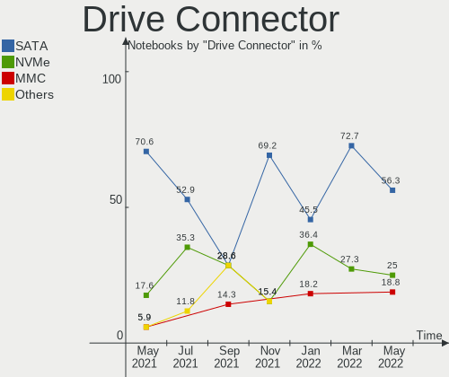

| Type | Computers | Drives | Percent |
|------|-----------|--------|---------|
| SATA | 45        | 50     | 90%     |
| MMC  | 3         | 4      | 6%      |
| SAS  | 1         | 1      | 2%      |
| NVMe | 1         | 1      | 2%      |

Drive Size
----------

Size of hard drive

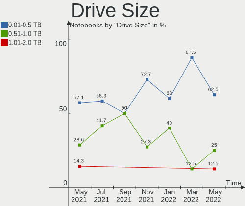

| Size in TB | Computers | Drives | Percent |
|------------|-----------|--------|---------|
| 0.01-0.5   | 39        | 41     | 72.22%  |
| 0.51-1.0   | 12        | 12     | 22.22%  |
| 1.01-2.0   | 3         | 3      | 5.56%   |

Space Total
-----------

Amount of disk space available on the file system

| Size in GB | Computers | Percent |
|------------|-----------|---------|
| 101-250    | 23        | 41.07%  |
| 251-500    | 12        | 21.43%  |
| 51-100     | 8         | 14.29%  |
| 501-1000   | 6         | 10.71%  |
| 21-50      | 3         | 5.36%   |
| Unknown    | 2         | 3.57%   |
| 1001-2000  | 1         | 1.79%   |
| 1-20       | 1         | 1.79%   |

Space Used
----------

Amount of used disk space

| Used GB  | Computers | Percent |
|----------|-----------|---------|
| 1-20     | 36        | 64.29%  |
| 21-50    | 12        | 21.43%  |
| 51-100   | 3         | 5.36%   |
| 101-250  | 2         | 3.57%   |
| Unknown  | 2         | 3.57%   |
| 501-1000 | 1         | 1.79%   |

Malfunc. Drives
---------------

Drive models with a malfunction

Zero info for selected period =(

Malfunc. Drive Vendor
---------------------

Vendors of faulty drives

Zero info for selected period =(

Malfunc. Drive Kind
-------------------

Kinds of faulty drives

Zero info for selected period =(

Failed Drives
-------------

Failed drive models

Zero info for selected period =(

Failed Drive Vendor
-------------------

Failed drive vendors

Zero info for selected period =(

Drive Status
------------

Number of failed and malfunc. drives

| Status   | Computers | Drives | Percent |
|----------|-----------|--------|---------|
| Detected | 47        | 55     | 97.92%  |
| Works    | 1         | 1      | 2.08%   |

Storage Vendor
--------------

Storage controller vendors

| Vendor                       | Computers | Percent |
|------------------------------|-----------|---------|
| Intel                        | 45        | 70.31%  |
| Samsung Electronics          | 5         | 7.81%   |
| AMD                          | 5         | 7.81%   |
| Toshiba America Info Systems | 3         | 4.69%   |
| Sandisk                      | 2         | 3.13%   |
| SK Hynix                     | 1         | 1.56%   |
| Silicon Motion               | 1         | 1.56%   |
| Kingston Technology Company  | 1         | 1.56%   |
| Apple                        | 1         | 1.56%   |

Storage Model
-------------

Storage controller models

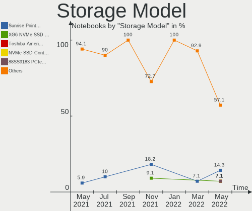

| Model                                                                    | Computers | Percent |
|--------------------------------------------------------------------------|-----------|---------|
| Sunrise Point-LP SATA Controller [AHCI mode]                             | 7         | 10.61%  |
| HM170/QM170 Chipset SATA Controller [AHCI Mode]                          | 6         | 9.09%   |
| 82801 Mobile SATA Controller [RAID mode]                                 | 6         | 9.09%   |
| FCH SATA Controller [AHCI mode]                                          | 5         | 7.58%   |
| 7 Series Chipset Family 6-port SATA Controller [AHCI mode]               | 5         | 7.58%   |
| Non-Volatile memory controller                                           | 4         | 6.06%   |
| Cannon Lake Mobile PCH SATA AHCI Controller                              | 4         | 6.06%   |
| Wildcat Point-LP SATA Controller [AHCI Mode]                             | 3         | 4.55%   |
| NVMe SSD Controller SM981/PM981/PM983                                    | 3         | 4.55%   |
| Atom Processor E3800 Series SATA AHCI Controller                         | 3         | 4.55%   |
| SSD 660P Series                                                          | 2         | 3.03%   |
| SATA controller                                                          | 2         | 3.03%   |
| Celeron N3350/Pentium N4200/Atom E3900 Series SATA AHCI Controller       | 2         | 3.03%   |
| 8 Series SATA Controller 1 [AHCI mode]                                   | 2         | 3.03%   |
| 6 Series/C200 Series Chipset Family 6 port Mobile SATA AHCI Controller   | 2         | 3.03%   |
| XG4 NVMe SSD Controller                                                  | 1         | 1.52%   |
| WD Black 2018/PC SN520 NVMe SSD                                          | 1         | 1.52%   |
| Toshiba America Info Non-Volatile memory controller                      | 1         | 1.52%   |
| Q170/Q150/B150/H170/H110/Z170/CM236 Chipset SATA Controller [AHCI Mode]  | 1         | 1.52%   |
| NVMe SSD Controller SM961/PM961                                          | 1         | 1.52%   |
| NVMe SSD Controller SM951/PM951                                          | 1         | 1.52%   |
| Cannon Point-LP SATA Controller [AHCI Mode]                              | 1         | 1.52%   |
| BG3 NVMe SSD Controller                                                  | 1         | 1.52%   |
| ANS2 NVMe Controller                                                     | 1         | 1.52%   |
| 8 Series/C220 Series Chipset Family 6-port SATA Controller 1 [AHCI mode] | 1         | 1.52%   |

Storage Kind
------------

Kind of storage controller (IDE, SATA, NVMe, SAS, ...)

| Kind | Computers | Percent |
|------|-----------|---------|
| SATA | 44        | 66.67%  |
| NVMe | 16        | 24.24%  |
| RAID | 6         | 9.09%   |

CPU Vendor
----------

Processor vendors

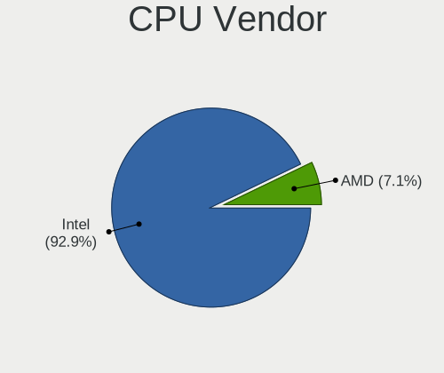

| Vendor | Computers | Percent |
|--------|-----------|---------|
| Intel  | 51        | 91.07%  |
| AMD    | 5         | 8.93%   |

CPU Model
---------

Processor models

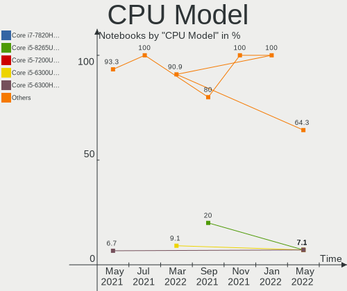

| Model                                           | Computers | Percent |
|-------------------------------------------------|-----------|---------|
| Intel Core i5-8250U CPU @ 1.60GHz               | 6         | 10.71%  |
| Intel Core i7-7700HQ CPU @ 2.80GHz              | 4         | 7.14%   |
| Intel Core i5-7200U CPU @ 2.50GHz               | 3         | 5.36%   |
| Intel Celeron CPU N2830 @ 2.16GHz               | 3         | 5.36%   |
| Intel Pentium CPU N4200 @ 1.10GHz               | 2         | 3.57%   |
| Intel Core i5-9300H CPU @ 2.40GHz               | 2         | 3.57%   |
| Intel Core i5-8265U CPU @ 1.60GHz               | 2         | 3.57%   |
| Intel Core i5-3317U CPU @ 1.70GHz               | 2         | 3.57%   |
| Intel Xeon CPU E3-1505M v5 @ 2.80GHz            | 1         | 1.79%   |
| Intel Pentium Silver N5000 CPU @ 1.10GHz        | 1         | 1.79%   |
| Intel Core i7-9850H CPU @ 2.60GHz               | 1         | 1.79%   |
| Intel Core i7-9750H CPU @ 2.60GHz               | 1         | 1.79%   |
| Intel Core i7-8750H CPU @ 2.20GHz               | 1         | 1.79%   |
| Intel Core i7-8559U CPU @ 2.70GHz               | 1         | 1.79%   |
| Intel Core i7-6700HQ CPU @ 2.60GHz              | 1         | 1.79%   |
| Intel Core i7-5600U CPU @ 2.60GHz               | 1         | 1.79%   |
| Intel Core i7-4702MQ CPU @ 2.20GHz              | 1         | 1.79%   |
| Intel Core i7-3740QM CPU @ 2.70GHz              | 1         | 1.79%   |
| Intel Core i7-3630QM CPU @ 2.40GHz              | 1         | 1.79%   |
| Intel Core i7-3612QM CPU @ 2.10GHz              | 1         | 1.79%   |
| Intel Core i7-2720QM CPU @ 2.20GHz              | 1         | 1.79%   |
| Intel Core i5-7300HQ CPU @ 2.50GHz              | 1         | 1.79%   |
| Intel Core i5-6300U CPU @ 2.40GHz               | 1         | 1.79%   |
| Intel Core i5-6200U CPU @ 2.30GHz               | 1         | 1.79%   |
| Intel Core i5-5200U CPU @ 2.20GHz               | 1         | 1.79%   |
| Intel Core i5-4310U CPU @ 2.00GHz               | 1         | 1.79%   |
| Intel Core i5-3210M CPU @ 2.50GHz               | 1         | 1.79%   |
| Intel Core i5-2520M CPU @ 2.50GHz               | 1         | 1.79%   |
| Intel Core i3-6006U CPU @ 2.00GHz               | 1         | 1.79%   |
| Intel Core i3-4005U CPU @ 1.70GHz               | 1         | 1.79%   |
| Intel Core i3-2375M CPU @ 1.50GHz               | 1         | 1.79%   |
| Intel Celeron N4100 CPU @ 1.10GHz               | 1         | 1.79%   |
| Intel Celeron CPU N3060 @ 1.60GHz               | 1         | 1.79%   |
| Intel Celeron CPU N2840 @ 2.16GHz               | 1         | 1.79%   |
| Intel Celeron CPU 3215U @ 1.70GHz               | 1         | 1.79%   |
| AMD Ryzen 5 3550H with Radeon Vega Mobile Gfx   | 1         | 1.79%   |
| AMD E1-7010 APU with AMD Radeon R2 Graphics     | 1         | 1.79%   |
| AMD A8-4500M APU with Radeon HD Graphics        | 1         | 1.79%   |
| AMD A6-9225 RADEON R4, 5 COMPUTE CORES 2C+3G    | 1         | 1.79%   |
| AMD A12-9700P RADEON R7, 10 COMPUTE CORES 4C+6G | 1         | 1.79%   |

CPU Model Family
----------------

Processor model prefix

| Model                | Computers | Percent |
|----------------------|-----------|---------|
| Intel Core i5        | 22        | 39.29%  |
| Intel Core i7        | 15        | 26.79%  |
| Intel Celeron        | 7         | 12.5%   |
| Intel Core i3        | 3         | 5.36%   |
| Intel Pentium        | 2         | 3.57%   |
| Intel Xeon           | 1         | 1.79%   |
| Intel Pentium Silver | 1         | 1.79%   |
| AMD Ryzen 5          | 1         | 1.79%   |
| AMD E1               | 1         | 1.79%   |
| AMD A8               | 1         | 1.79%   |
| AMD A6               | 1         | 1.79%   |
| AMD A12              | 1         | 1.79%   |

CPU Cores
---------

Number of processor cores

| Number | Computers | Percent |
|--------|-----------|---------|
| 4      | 28        | 50%     |
| 2      | 25        | 44.64%  |
| 6      | 3         | 5.36%   |

CPU Sockets
-----------

Number of sockets

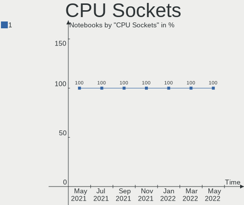

| Number | Computers | Percent |
|--------|-----------|---------|
| 1      | 56        | 100%    |

CPU Threads
-----------

Threads per core (Hyper-Threading)

| Number | Computers | Percent |
|--------|-----------|---------|
| 2      | 43        | 76.79%  |
| 1      | 13        | 23.21%  |

CPU Op-Modes
------------

CPU Operation Modes (32-bit, 64-bit)

| Op mode        | Computers | Percent |
|----------------|-----------|---------|
| 32-bit, 64-bit | 56        | 100%    |

CPU Microarch
-------------

Microarchitecture

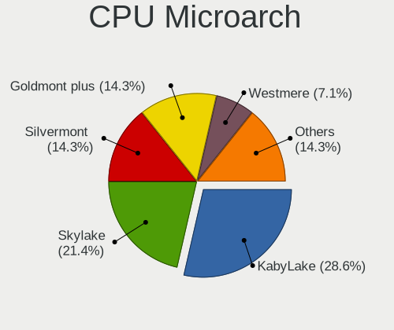

| Name          | Computers | Percent |
|---------------|-----------|---------|
| KabyLake      | 22        | 39.29%  |
| IvyBridge     | 6         | 10.71%  |
| Skylake       | 5         | 8.93%   |
| Silvermont    | 5         | 8.93%   |
| SandyBridge   | 3         | 5.36%   |
| Haswell       | 3         | 5.36%   |
| Broadwell     | 3         | 5.36%   |
| Goldmont plus | 2         | 3.57%   |
| Goldmont      | 2         | 3.57%   |
| Excavator     | 2         | 3.57%   |
| Zen+          | 1         | 1.79%   |
| Puma          | 1         | 1.79%   |
| Piledriver    | 1         | 1.79%   |

CPU Microcode
-------------

Microcode number

| Number  | Computers | Percent |
|---------|-----------|---------|
| Unknown | 55        | 98.21%  |
| 0x706a1 | 1         | 1.79%   |

GPU Vendor
----------

Vendors of graphics cards

| Vendor | Computers | Percent |
|--------|-----------|---------|
| Intel  | 50        | 63.29%  |
| Nvidia | 18        | 22.78%  |
| AMD    | 11        | 13.92%  |

GPU Model
---------

Graphics card models

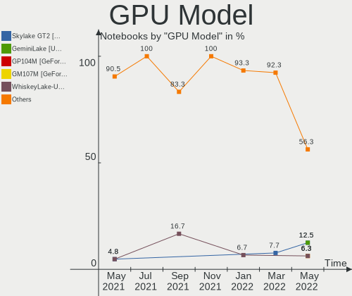

| Model                                                                              | Computers | Percent |
|------------------------------------------------------------------------------------|-----------|---------|
| UHD Graphics 620                                                                   | 6         | 7.59%   |
| UHD Graphics 630 (Mobile)                                                          | 5         | 6.33%   |
| HD Graphics 630                                                                    | 5         | 6.33%   |
| 3rd Gen Core processor Graphics Controller                                         | 5         | 6.33%   |
| Atom Processor Z36xxx/Z37xxx Series Graphics & Display                             | 4         | 5.06%   |
| Skylake GT2 [HD Graphics 520]                                                      | 3         | 3.8%    |
| HD Graphics 620                                                                    | 3         | 3.8%    |
| 2nd Generation Core Processor Family Integrated Graphics Controller                | 3         | 3.8%    |
| UHD Graphics 620 (Whiskey Lake)                                                    | 2         | 2.53%   |
| UHD Graphics 605                                                                   | 2         | 2.53%   |
| TU116M [GeForce GTX 1660 Ti Mobile]                                                | 2         | 2.53%   |
| Mars [Radeon HD 8670A/8670M/8750M]                                                 | 2         | 2.53%   |
| HD Graphics 5500                                                                   | 2         | 2.53%   |
| Haswell-ULT Integrated Graphics Controller                                         | 2         | 2.53%   |
| GP107M [GeForce GTX 1050 Ti Mobile]                                                | 2         | 2.53%   |
| GP107M [GeForce GTX 1050 Mobile]                                                   | 2         | 2.53%   |
| GP106M [GeForce GTX 1060 Mobile]                                                   | 2         | 2.53%   |
| GK107M [GeForce GT 650M]                                                           | 2         | 2.53%   |
| Celeron N3350/Pentium N4200/Atom E3900 Series Integrated Graphics Controller       | 2         | 2.53%   |
| Whistler [Radeon HD 6630M/6650M/6750M/7670M/7690M]                                 | 1         | 1.27%   |
| Wani [Radeon R5/R6/R7 Graphics]                                                    | 1         | 1.27%   |
| TU117M [GeForce GTX 1650 Mobile / Max-Q]                                           | 1         | 1.27%   |
| TU117GLM [Quadro T2000 Mobile / Max-Q]                                             | 1         | 1.27%   |
| Trinity [Radeon HD 7640G]                                                          | 1         | 1.27%   |
| Topaz XT [Radeon R7 M260/M265 / M340/M360 / M440/M445 / 530/535 / 620/625 Mobile]  | 1         | 1.27%   |
| Thames [Radeon HD 7500M/7600M Series]                                              | 1         | 1.27%   |
| Sun XT [Radeon HD 8670A/8670M/8690M / R5 M330 / M430 / Radeon 520 Mobile]          | 1         | 1.27%   |
| Stoney [Radeon R2/R3/R4/R5 Graphics]                                               | 1         | 1.27%   |
| Picasso                                                                            | 1         | 1.27%   |
| Mullins [Radeon R2 Graphics]                                                       | 1         | 1.27%   |
| Iris Plus Graphics 655                                                             | 1         | 1.27%   |
| HD Graphics P530                                                                   | 1         | 1.27%   |
| HD Graphics 530                                                                    | 1         | 1.27%   |
| HD Graphics                                                                        | 1         | 1.27%   |
| GP107M [GeForce GTX 1050 3 GB Max-Q]                                               | 1         | 1.27%   |
| GM108M [GeForce 940M]                                                              | 1         | 1.27%   |
| GM108M [GeForce 920MX]                                                             | 1         | 1.27%   |
| GM107M [GeForce GTX 960M]                                                          | 1         | 1.27%   |
| GM107GLM [Quadro M1000M]                                                           | 1         | 1.27%   |
| GM107 [GeForce 940MX]                                                              | 1         | 1.27%   |
| Atom/Celeron/Pentium Processor x5-E8000/J3xxx/N3xxx Integrated Graphics Controller | 1         | 1.27%   |
| 4th Gen Core Processor Integrated Graphics Controller                              | 1         | 1.27%   |

GPU Combo
---------

Combinations of graphics cards

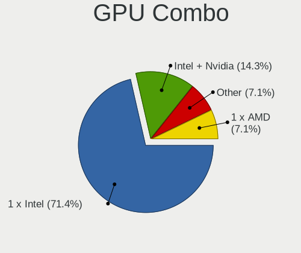

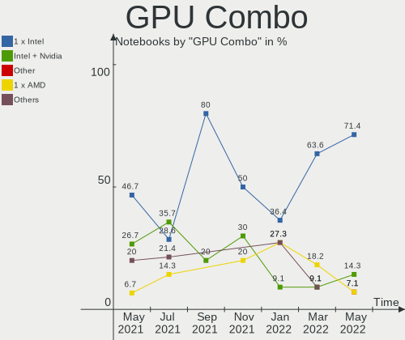

| Name           | Computers | Percent |
|----------------|-----------|---------|
| 1 x Intel      | 27        | 48.21%  |
| Intel + Nvidia | 16        | 28.57%  |
| Intel + AMD    | 6         | 10.71%  |
| 1 x AMD        | 4         | 7.14%   |
| Other          | 1         | 1.79%   |
| 1 x Nvidia     | 1         | 1.79%   |
| AMD + Nvidia   | 1         | 1.79%   |

GPU Driver
----------

Free vs proprietary

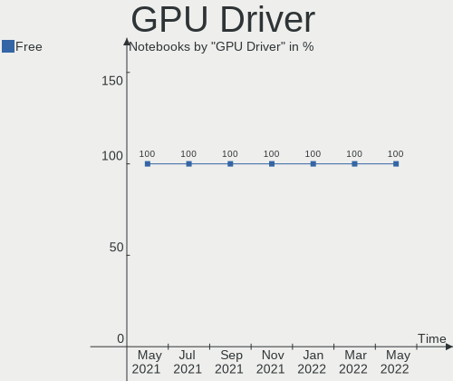

| Driver      | Computers | Percent |
|-------------|-----------|---------|
| Free        | 55        | 98.21%  |
| Proprietary | 1         | 1.79%   |

GPU Memory
----------

Total video memory

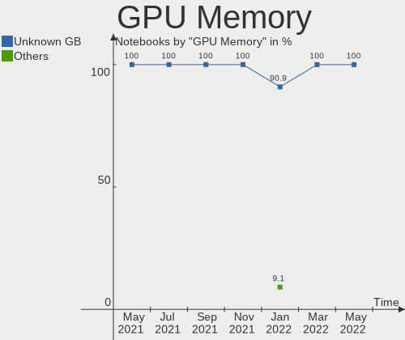

| Size in GB | Computers | Percent |
|------------|-----------|---------|
| Unknown    | 55        | 98.21%  |
| 5.01-6.0   | 1         | 1.79%   |

Monitor Vendor
--------------

Monitor vendors

| Vendor                  | Computers | Percent |
|-------------------------|-----------|---------|
| BOE                     | 12        | 20.69%  |
| LG Display              | 11        | 18.97%  |
| Chimei Innolux          | 10        | 17.24%  |
| AU Optronics            | 7         | 12.07%  |
| Samsung Electronics     | 5         | 8.62%   |
| Sharp                   | 4         | 6.9%    |
| PANDA                   | 3         | 5.17%   |
| Apple                   | 2         | 3.45%   |
| Lenovo                  | 1         | 1.72%   |
| InfoVision              | 1         | 1.72%   |
| Chi Mei Optoelectronics | 1         | 1.72%   |
| Acer                    | 1         | 1.72%   |

Monitor Model
-------------

Monitor models

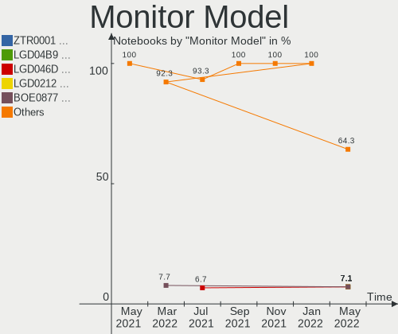

| Model                                             | Computers | Percent |
|---------------------------------------------------|-----------|---------|
| LCD Monitor SDC354A 1366x768 344x194mm 15.5-inch  | 2         | 3.45%   |
| LCD Monitor CMN15F5 1920x1080 344x193mm 15.5-inch | 2         | 3.45%   |
| LCD Monitor CMN1375 1920x1080 293x165mm 13.2-inch | 2         | 3.45%   |
| LCD Monitor BOE06BA 1920x1080 344x193mm 15.5-inch | 2         | 3.45%   |
| LCD Monitor BOE0672 1366x768 344x194mm 15.5-inch  | 2         | 3.45%   |
| XB271H ACR0511 1920x1080 600x340mm 27.2-inch      | 1         | 1.72%   |
| SyncMaster SAM022B 1280x1024 338x270mm 17.0-inch  | 1         | 1.72%   |
| S27E330 SAM0D90 1920x1080 598x336mm 27.0-inch     | 1         | 1.72%   |
| LCD Monitor SHP14BA 1920x1080 344x194mm 15.5-inch | 1         | 1.72%   |
| LCD Monitor SHP1476 3840x2160 346x194mm 15.6-inch | 1         | 1.72%   |
| LCD Monitor SHP1453 1920x1080 346x194mm 15.6-inch | 1         | 1.72%   |
| LCD Monitor SHP143E 3840x2160 346x194mm 15.6-inch | 1         | 1.72%   |
| LCD Monitor SDC4742 1366x768 309x174mm 14.0-inch  | 1         | 1.72%   |
| LCD Monitor NCP0036 1920x1080 344x194mm 15.5-inch | 1         | 1.72%   |
| LCD Monitor LGD05C8 1920x1080 344x194mm 15.5-inch | 1         | 1.72%   |
| LCD Monitor LGD0590 1920x1080 344x194mm 15.5-inch | 1         | 1.72%   |
| LCD Monitor LGD056D 1920x1080 380x210mm 17.1-inch | 1         | 1.72%   |
| LCD Monitor LGD0563 1920x1080 344x194mm 15.5-inch | 1         | 1.72%   |
| LCD Monitor LGD0532 1920x1080 344x194mm 15.5-inch | 1         | 1.72%   |
| LCD Monitor LGD0503 1366x768 340x190mm 15.3-inch  | 1         | 1.72%   |
| LCD Monitor LGD0384 1366x768 344x194mm 15.5-inch  | 1         | 1.72%   |
| LCD Monitor LGD0366 1600x900 309x174mm 14.0-inch  | 1         | 1.72%   |
| LCD Monitor LGD0351 1366x768 340x190mm 15.3-inch  | 1         | 1.72%   |
| LCD Monitor LGD02E2 1600x900 310x174mm 14.0-inch  | 1         | 1.72%   |
| LCD Monitor LGD01E9 1920x1080 345x194mm 15.6-inch | 1         | 1.72%   |
| LCD Monitor LEN40BA 1920x1080 344x194mm 15.5-inch | 1         | 1.72%   |
| LCD Monitor IVO04E5 1366x768 276x155mm 12.5-inch  | 1         | 1.72%   |
| LCD Monitor CMO15A7 1366x768 350x190mm 15.7-inch  | 1         | 1.72%   |
| LCD Monitor CMN15E2 1920x1080 344x193mm 15.5-inch | 1         | 1.72%   |
| LCD Monitor CMN15D3 1920x1080 344x193mm 15.5-inch | 1         | 1.72%   |
| LCD Monitor CMN15BC 1366x768 350x190mm 15.7-inch  | 1         | 1.72%   |
| LCD Monitor CMN15B8 1366x768 340x190mm 15.3-inch  | 1         | 1.72%   |
| LCD Monitor CMN14C0 1920x1080 308x173mm 13.9-inch | 1         | 1.72%   |
| LCD Monitor CMN1130 1366x768 256x144mm 11.6-inch  | 1         | 1.72%   |
| LCD Monitor BOE0868 1920x1080 309x174mm 14.0-inch | 1         | 1.72%   |
| LCD Monitor BOE0747 1920x1080 344x194mm 15.5-inch | 1         | 1.72%   |
| LCD Monitor BOE0718 1920x1080 309x173mm 13.9-inch | 1         | 1.72%   |
| LCD Monitor BOE06A9 1920x1080 344x193mm 15.5-inch | 1         | 1.72%   |
| LCD Monitor BOE0687 1920x1080 344x193mm 15.5-inch | 1         | 1.72%   |
| LCD Monitor BOE0675 1366x768 344x194mm 15.5-inch  | 1         | 1.72%   |
| LCD Monitor BOE0641 1920x1080 344x193mm 15.5-inch | 1         | 1.72%   |
| LCD Monitor BOE05DA 1366x768 277x156mm 12.5-inch  | 1         | 1.72%   |
| LCD Monitor AUO70EC 1366x768 340x190mm 15.3-inch  | 1         | 1.72%   |
| LCD Monitor AUO47EC 1366x768 344x193mm 15.5-inch  | 1         | 1.72%   |
| LCD Monitor AUO403D 1920x1080 309x173mm 13.9-inch | 1         | 1.72%   |
| LCD Monitor AUO323C 1366x768 310x170mm 13.9-inch  | 1         | 1.72%   |
| LCD Monitor AUO2D3C 1366x768 310x170mm 13.9-inch  | 1         | 1.72%   |
| LCD Monitor AUO102D 1920x1080 293x165mm 13.2-inch | 1         | 1.72%   |
| LCD Monitor AUO102C 1366x768 290x160mm 13.0-inch  | 1         | 1.72%   |
| LCD Monitor APP9CA3 1440x900 330x210mm 15.4-inch  | 1         | 1.72%   |
| LC133LF2L03 NCP0015 1920x1080 294x165mm 13.3-inch | 1         | 1.72%   |
| LC133LF1L02 NCP0019 1920x1080 294x165mm 13.3-inch | 1         | 1.72%   |
| Color LCD APPA03E 2560x1600 286x179mm 13.3-inch   | 1         | 1.72%   |

Monitor Resolution
------------------

Monitor screen resolution

| Resolution       | Computers | Percent |
|------------------|-----------|---------|
| 1920x1080 (FHD)  | 29        | 51.79%  |
| 1366x768 (WXGA)  | 20        | 35.71%  |
| 3840x2160 (4K)   | 2         | 3.57%   |
| 1600x900 (HD+)   | 2         | 3.57%   |
| 2560x1600        | 1         | 1.79%   |
| 1440x900 (WXGA+) | 1         | 1.79%   |
| 1280x1024 (SXGA) | 1         | 1.79%   |

Monitor Diagonal
----------------

Diagonal size in inches

| Inches | Computers | Percent |
|--------|-----------|---------|
| 15     | 35        | 60.34%  |
| 13     | 12        | 20.69%  |
| 14     | 4         | 6.9%    |
| 27     | 2         | 3.45%   |
| 17     | 2         | 3.45%   |
| 12     | 2         | 3.45%   |
| 11     | 1         | 1.72%   |

Monitor Width
-------------

Physical width

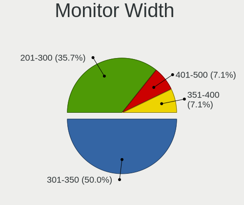

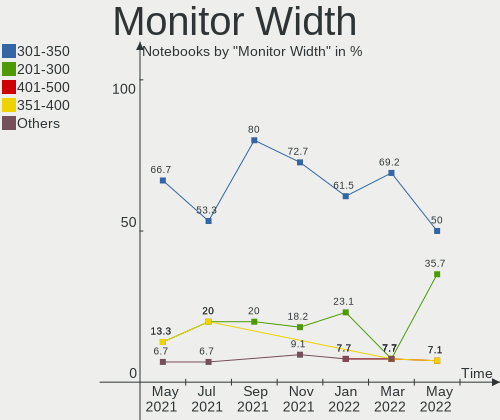

| Width in mm | Computers | Percent |
|-------------|-----------|---------|
| 301-350     | 44        | 77.19%  |
| 201-300     | 10        | 17.54%  |
| 501-600     | 2         | 3.51%   |
| 351-400     | 1         | 1.75%   |

Aspect Ratio
------------

Proportional relationship between the width and the height

| Ratio | Computers | Percent |
|-------|-----------|---------|
| 16/9  | 53        | 94.64%  |
| 16/10 | 2         | 3.57%   |
| 5/4   | 1         | 1.79%   |

Monitor Area
------------

Area in inch²

| Area in inch² | Computers | Percent |
|----------------|-----------|---------|
| 101-110        | 35        | 60.34%  |
| 81-90          | 9         | 15.52%  |
| 71-80          | 7         | 12.07%  |
| 61-70          | 2         | 3.45%   |
| 301-350        | 2         | 3.45%   |
| 51-60          | 1         | 1.72%   |
| 141-150        | 1         | 1.72%   |
| 121-130        | 1         | 1.72%   |

Pixel Density
-------------

Pixels per inch

| Density       | Computers | Percent |
|---------------|-----------|---------|
| 121-160       | 29        | 50%     |
| 101-120       | 18        | 31.03%  |
| 161-240       | 6         | 10.34%  |
| 51-100        | 3         | 5.17%   |
| More than 240 | 2         | 3.45%   |

Multiple Monitors
-----------------

Total monitors connected

| Total | Computers | Percent |
|-------|-----------|---------|
| 1     | 53        | 94.64%  |
| 2     | 3         | 5.36%   |

Net Controller Vendor
---------------------

Controller vendors

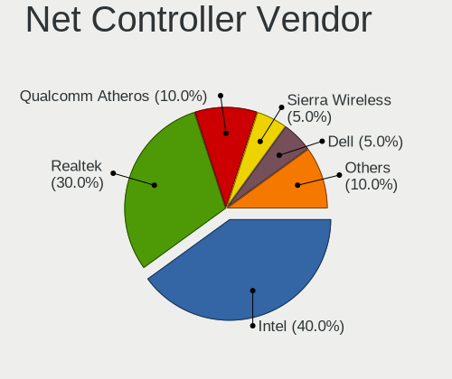

| Vendor                | Computers | Percent |
|-----------------------|-----------|---------|
| Intel                 | 4         | 50%     |
| Realtek Semiconductor | 3         | 37.5%   |
| Apple                 | 1         | 12.5%   |

Net Controller Model
--------------------

Controller models

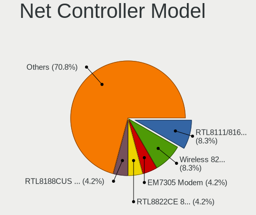

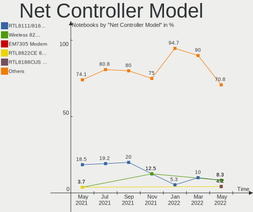

| Model                                           | Computers | Percent |
|-------------------------------------------------|-----------|---------|
| Wi-Fi 6 AX200                                   | 2         | 25%     |
| RTL8723BU 802.11n WLAN Adapter                  | 2         | 25%     |
| RTL8153 Gigabit Ethernet Adapter                | 1         | 12.5%   |
| Ethernet Adapter [A1277]                        | 1         | 12.5%   |
| Centrino Advanced-N 6235                        | 1         | 12.5%   |
| 82579LM Gigabit Network Connection (Lewisville) | 1         | 12.5%   |

Net Controller Kind
-------------------

Ethernet, WiFi or modem

| Kind     | Computers | Percent |
|----------|-----------|---------|
| WiFi     | 5         | 62.5%   |
| Ethernet | 3         | 37.5%   |

Used Controller
---------------

Currently used network controller

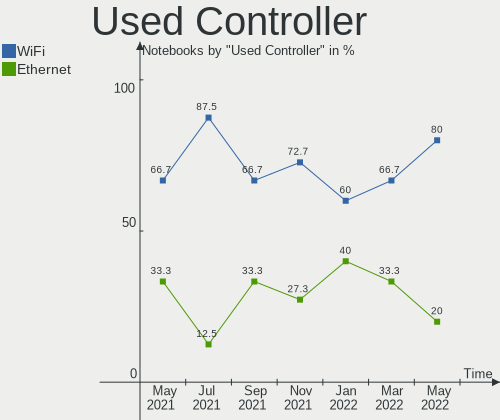

| Kind     | Computers | Percent |
|----------|-----------|---------|
| WiFi     | 5         | 62.5%   |
| Ethernet | 3         | 37.5%   |

NICs
----

Total network controllers on board

| Total | Computers | Percent |
|-------|-----------|---------|
| 2     | 40        | 71.43%  |
| 1     | 13        | 23.21%  |
| 0     | 3         | 5.36%   |

Unsupported Devices
-------------------

Total unsupported devices on board

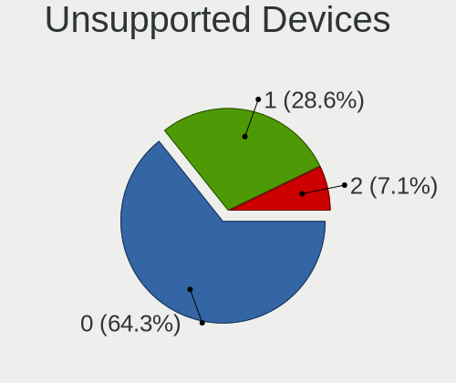

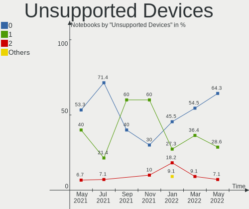

| Total | Computers | Percent |
|-------|-----------|---------|
| 0     | 40        | 71.43%  |
| 1     | 15        | 26.79%  |
| 2     | 1         | 1.79%   |

Unsupported Device Types
------------------------

Types of unsupported devices

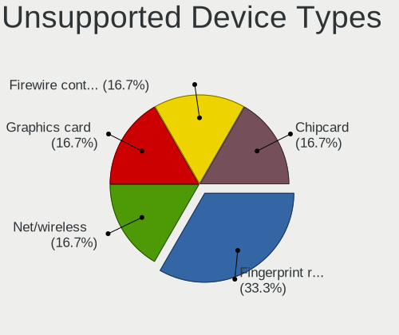

| Type                  | Computers | Percent |
|-----------------------|-----------|---------|
| Fingerprint reader    | 5         | 29.41%  |
| Net/wireless          | 4         | 23.53%  |
| Graphics card         | 3         | 17.65%  |
| Firewire controller   | 2         | 11.76%  |
| Sound                 | 1         | 5.88%   |
| Multimedia controller | 1         | 5.88%   |
| Chipcard              | 1         | 5.88%   |

