Clear Linux - Hardware Trends (Notebooks)
-----------------------------------------

A project to identify most popular hardware characteristics and track their change
over time based on data collected by Linux users at https://Linux-Hardware.org.

Anyone can contribute to this report by the [hw-probe](https://github.com/linuxhw/hw-probe) tool:

    sudo -E hw-probe -all -upload

This report is for one last month. Overall report since the beginning of time: [TestCoverage](https://github.com/linuxhw/TestCoverage)

Period: May, 2022.

Contents
--------

* [ System ](#system)
  - [ OS                       ](#os)
  - [ OS Family                ](#os-family)
  - [ Kernel                   ](#kernel)
  - [ Kernel Family            ](#kernel-family)
  - [ Kernel Major Ver.        ](#kernel-major-ver)
  - [ Arch                     ](#arch)
  - [ DE                       ](#de)
  - [ Display Server           ](#display-server)
  - [ Display Manager          ](#display-manager)
  - [ OS Lang                  ](#os-lang)
  - [ Boot Mode                ](#boot-mode)
  - [ Filesystem               ](#filesystem)
  - [ Part. scheme             ](#part-scheme)
  - [ Dual Boot with Linux/BSD ](#dual-boot-with-linuxbsd)
  - [ Dual Boot (Win)          ](#dual-boot-win)

* [ Board ](#board)
  - [ Vendor                   ](#vendor)
  - [ Model                    ](#model)
  - [ Model Family             ](#model-family)
  - [ MFG Year                 ](#mfg-year)
  - [ Form Factor              ](#form-factor)
  - [ Secure Boot              ](#secure-boot)
  - [ Coreboot                 ](#coreboot)
  - [ RAM Size                 ](#ram-size)
  - [ RAM Used                 ](#ram-used)
  - [ Total Drives             ](#total-drives)
  - [ Has CD-ROM               ](#has-cd-rom)
  - [ Has Ethernet             ](#has-ethernet)
  - [ Has WiFi                 ](#has-wifi)
  - [ Has Bluetooth            ](#has-bluetooth)

* [ Location ](#location)
  - [ Country                  ](#country)
  - [ City                     ](#city)

* [ Drives ](#drives)
  - [ Drive Vendor             ](#drive-vendor)
  - [ Drive Model              ](#drive-model)
  - [ HDD Vendor               ](#hdd-vendor)
  - [ SSD Vendor               ](#ssd-vendor)
  - [ Drive Kind               ](#drive-kind)
  - [ Drive Connector          ](#drive-connector)
  - [ Drive Size               ](#drive-size)
  - [ Space Total              ](#space-total)
  - [ Space Used               ](#space-used)
  - [ Malfunc. Drives          ](#malfunc-drives)
  - [ Malfunc. Drive Vendor    ](#malfunc-drive-vendor)
  - [ Malfunc. HDD Vendor      ](#malfunc-hdd-vendor)
  - [ Malfunc. Drive Kind      ](#malfunc-drive-kind)
  - [ Failed Drives            ](#failed-drives)
  - [ Failed Drive Vendor      ](#failed-drive-vendor)
  - [ Drive Status             ](#drive-status)

* [ Storage controller ](#storage-controller)
  - [ Storage Vendor           ](#storage-vendor)
  - [ Storage Model            ](#storage-model)
  - [ Storage Kind             ](#storage-kind)

* [ Processor ](#processor)
  - [ CPU Vendor               ](#cpu-vendor)
  - [ CPU Model                ](#cpu-model)
  - [ CPU Model Family         ](#cpu-model-family)
  - [ CPU Cores                ](#cpu-cores)
  - [ CPU Sockets              ](#cpu-sockets)
  - [ CPU Threads              ](#cpu-threads)
  - [ CPU Op-Modes             ](#cpu-op-modes)
  - [ CPU Microcode            ](#cpu-microcode)
  - [ CPU Microarch            ](#cpu-microarch)

* [ Graphics ](#graphics)
  - [ GPU Vendor               ](#gpu-vendor)
  - [ GPU Model                ](#gpu-model)
  - [ GPU Combo                ](#gpu-combo)
  - [ GPU Driver               ](#gpu-driver)
  - [ GPU Memory               ](#gpu-memory)

* [ Monitor ](#monitor)
  - [ Monitor Vendor           ](#monitor-vendor)
  - [ Monitor Model            ](#monitor-model)
  - [ Monitor Resolution       ](#monitor-resolution)
  - [ Monitor Diagonal         ](#monitor-diagonal)
  - [ Monitor Width            ](#monitor-width)
  - [ Aspect Ratio             ](#aspect-ratio)
  - [ Monitor Area             ](#monitor-area)
  - [ Pixel Density            ](#pixel-density)
  - [ Multiple Monitors        ](#multiple-monitors)

* [ Network ](#network)
  - [ Net Controller Vendor    ](#net-controller-vendor)
  - [ Net Controller Model     ](#net-controller-model)
  - [ Wireless Vendor          ](#wireless-vendor)
  - [ Wireless Model           ](#wireless-model)
  - [ Ethernet Vendor          ](#ethernet-vendor)
  - [ Ethernet Model           ](#ethernet-model)
  - [ Net Controller Kind      ](#net-controller-kind)
  - [ Used Controller          ](#used-controller)
  - [ NICs                     ](#nics)
  - [ IPv6                     ](#ipv6)

* [ Bluetooth ](#bluetooth)
  - [ Bluetooth Vendor         ](#bluetooth-vendor)
  - [ Bluetooth Model          ](#bluetooth-model)

* [ Sound ](#sound)
  - [ Sound Vendor             ](#sound-vendor)
  - [ Sound Model              ](#sound-model)

* [ Memory ](#memory)
  - [ Memory Vendor            ](#memory-vendor)
  - [ Memory Model             ](#memory-model)
  - [ Memory Kind              ](#memory-kind)
  - [ Memory Form Factor       ](#memory-form-factor)
  - [ Memory Size              ](#memory-size)
  - [ Memory Speed             ](#memory-speed)

* [ Printers & scanners ](#printers--scanners)
  - [ Printer Vendor           ](#printer-vendor)
  - [ Printer Model            ](#printer-model)
  - [ Scanner Vendor           ](#scanner-vendor)
  - [ Scanner Model            ](#scanner-model)

* [ Camera ](#camera)
  - [ Camera Vendor            ](#camera-vendor)
  - [ Camera Model             ](#camera-model)

* [ Security ](#security)
  - [ Fingerprint Vendor       ](#fingerprint-vendor)
  - [ Fingerprint Model        ](#fingerprint-model)
  - [ Chipcard Vendor          ](#chipcard-vendor)
  - [ Chipcard Model           ](#chipcard-model)

* [ Unsupported ](#unsupported)
  - [ Unsupported Devices      ](#unsupported-devices)
  - [ Unsupported Device Types ](#unsupported-device-types)

System
------

OS
--

Installed operating systems

| Name              | Notebooks | Percent |
|-------------------|-----------|---------|
| Clear Linux 36270 | 3         | 21.43%  |
| Clear Linux 36410 | 2         | 14.29%  |
| Clear Linux 36360 | 2         | 14.29%  |
| Clear Linux 36250 | 2         | 14.29%  |
| Clear Linux 36400 | 1         | 7.14%   |
| Clear Linux 36380 | 1         | 7.14%   |
| Clear Linux 36350 | 1         | 7.14%   |
| Clear Linux 36260 | 1         | 7.14%   |
| Clear Linux 36010 | 1         | 7.14%   |

OS Family
---------

OS without a version

| Name        | Notebooks | Percent |
|-------------|-----------|---------|
| Clear Linux | 14        | 100%    |

Kernel
------

Version of the Linux kernel

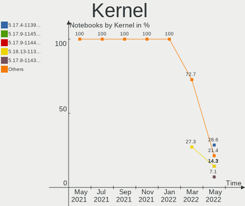

| Version             | Notebooks | Percent |
|---------------------|-----------|---------|
| 5.17.4-1139.native  | 4         | 28.57%  |
| 5.17.9-1145.native  | 2         | 14.29%  |
| 5.17.9-1144.native  | 2         | 14.29%  |
| 5.16.13-1132.native | 2         | 14.29%  |
| 5.17.8-1143.native  | 1         | 7.14%   |
| 5.17.11-1148.native | 1         | 7.14%   |
| 5.16.4-1119.native  | 1         | 7.14%   |
| 5.10.113-64.lts2020 | 1         | 7.14%   |

Kernel Family
-------------

Linux kernel without a distro release

| Version  | Notebooks | Percent |
|----------|-----------|---------|
| 5.17.9   | 4         | 28.57%  |
| 5.17.4   | 4         | 28.57%  |
| 5.16.13  | 2         | 14.29%  |
| 5.17.8   | 1         | 7.14%   |
| 5.17.11  | 1         | 7.14%   |
| 5.16.4   | 1         | 7.14%   |
| 5.10.113 | 1         | 7.14%   |

Kernel Major Ver.
-----------------

Linux kernel major version

| Version | Notebooks | Percent |
|---------|-----------|---------|
| 5.17    | 10        | 71.43%  |
| 5.16    | 3         | 21.43%  |
| 5.10    | 1         | 7.14%   |

Arch
----

OS architecture (x86_64, i586, etc.)

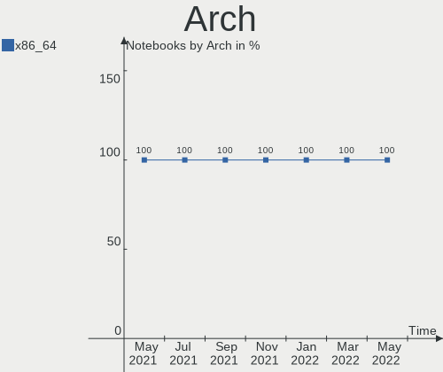

| Name   | Notebooks | Percent |
|--------|-----------|---------|
| x86_64 | 14        | 100%    |

DE
--

Desktop Environment

| Name    | Notebooks | Percent |
|---------|-----------|---------|
| GNOME   | 13        | 92.86%  |
| Unknown | 1         | 7.14%   |

Display Server
--------------

X11 or Wayland

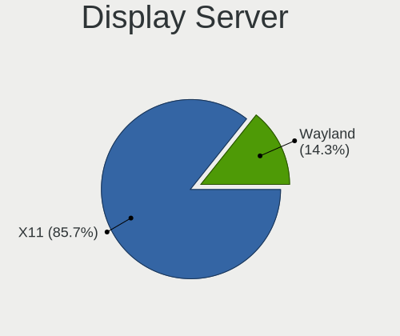

| Name    | Notebooks | Percent |
|---------|-----------|---------|
| X11     | 12        | 85.71%  |
| Wayland | 2         | 14.29%  |

Display Manager
---------------

SDDM, LightDM, etc.

| Name    | Notebooks | Percent |
|---------|-----------|---------|
| Unknown | 14        | 100%    |

OS Lang
-------

Language

| Lang  | Notebooks | Percent |
|-------|-----------|---------|
| en_US | 8         | 57.14%  |
| pt_BR | 2         | 14.29%  |
| sv_SE | 1         | 7.14%   |
| ru_RU | 1         | 7.14%   |
| fr_FR | 1         | 7.14%   |
| es_MX | 1         | 7.14%   |

Boot Mode
---------

EFI or BIOS

| Mode | Notebooks | Percent |
|------|-----------|---------|
| BIOS | 14        | 100%    |

Filesystem
----------

Type of filesystem

| Type | Notebooks | Percent |
|------|-----------|---------|
| Ext4 | 14        | 100%    |

Part. scheme
------------

Scheme of partitioning

| Type    | Notebooks | Percent |
|---------|-----------|---------|
| Unknown | 13        | 92.86%  |
| GPT     | 1         | 7.14%   |

Dual Boot with Linux/BSD
------------------------

Hosting more than one Linux/BSD

| Dual boot | Notebooks | Percent |
|-----------|-----------|---------|
| No        | 14        | 100%    |

Dual Boot (Win)
---------------

Hosting Linux and Windows

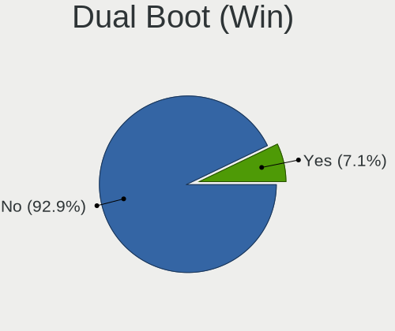

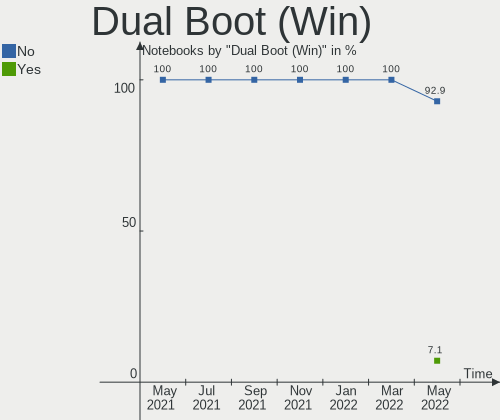

| Dual boot | Notebooks | Percent |
|-----------|-----------|---------|
| No        | 13        | 92.86%  |
| Yes       | 1         | 7.14%   |

Board
-----

Vendor
------

Motherboard manufacturer

| Name             | Notebooks | Percent |
|------------------|-----------|---------|
| Lenovo           | 3         | 21.43%  |
| Google           | 2         | 14.29%  |
| Dell             | 2         | 14.29%  |
| TODOS INDUSTRIAL | 1         | 7.14%   |
| HUAWEI           | 1         | 7.14%   |
| Hewlett-Packard  | 1         | 7.14%   |
| Fujitsu          | 1         | 7.14%   |
| Apple            | 1         | 7.14%   |
| Alienware        | 1         | 7.14%   |
| Acer             | 1         | 7.14%   |

Model
-----

Motherboard model

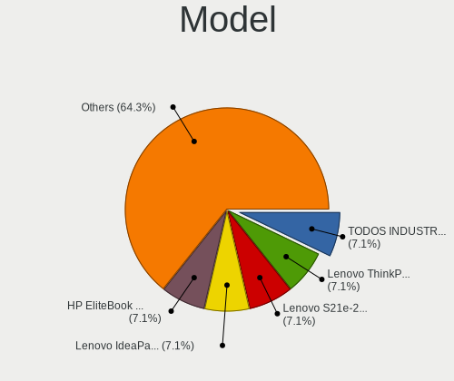

| Name                               | Notebooks | Percent |
|------------------------------------|-----------|---------|
| TODOS INDUSTRIAL Easytouch_2022_V1 | 1         | 7.14%   |
| Lenovo ThinkPad X270 20HMS27Q00    | 1         | 7.14%   |
| Lenovo S21e-20 80M4                | 1         | 7.14%   |
| Lenovo IdeaPad S145-15IWL 81S9     | 1         | 7.14%   |
| HUAWEI NBLB-WAX9N                  | 1         | 7.14%   |
| HP EliteBook 8440p                 | 1         | 7.14%   |
| Google Lick                        | 1         | 7.14%   |
| Google Celes                       | 1         | 7.14%   |
| Fujitsu LIFEBOOK E746              | 1         | 7.14%   |
| Dell Latitude 7480                 | 1         | 7.14%   |
| Dell Inspiron 7559                 | 1         | 7.14%   |
| Apple MacBookAir6,2                | 1         | 7.14%   |
| Alienware 17 R4                    | 1         | 7.14%   |
| Acer Aspire ES1-523                | 1         | 7.14%   |

Model Family
------------

Motherboard model prefix

| Name                       | Notebooks | Percent |
|----------------------------|-----------|---------|
| TODOS INDUSTRIAL Easytouch | 1         | 7.14%   |
| Lenovo ThinkPad            | 1         | 7.14%   |
| Lenovo S21e-20             | 1         | 7.14%   |
| Lenovo IdeaPad             | 1         | 7.14%   |
| HUAWEI NBLB-WAX9N          | 1         | 7.14%   |
| HP EliteBook               | 1         | 7.14%   |
| Google Lick                | 1         | 7.14%   |
| Google Celes               | 1         | 7.14%   |
| Fujitsu LIFEBOOK           | 1         | 7.14%   |
| Dell Latitude              | 1         | 7.14%   |
| Dell Inspiron              | 1         | 7.14%   |
| Apple MacBookAir6          | 1         | 7.14%   |
| Alienware 17               | 1         | 7.14%   |
| Acer Aspire                | 1         | 7.14%   |

MFG Year
--------

Motherboard manufacture year

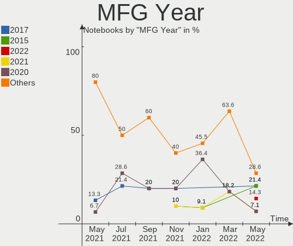

| Year | Notebooks | Percent |
|------|-----------|---------|
| 2017 | 3         | 21.43%  |
| 2015 | 3         | 21.43%  |
| 2022 | 2         | 14.29%  |
| 2021 | 1         | 7.14%   |
| 2020 | 1         | 7.14%   |
| 2019 | 1         | 7.14%   |
| 2016 | 1         | 7.14%   |
| 2013 | 1         | 7.14%   |
| 2010 | 1         | 7.14%   |

Form Factor
-----------

Physical design of the computer

| Name     | Notebooks | Percent |
|----------|-----------|---------|
| Notebook | 14        | 100%    |

Secure Boot
-----------

Enabled or disabled

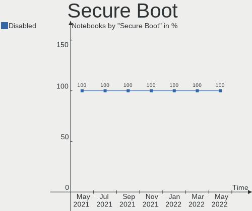

| State    | Notebooks | Percent |
|----------|-----------|---------|
| Disabled | 14        | 100%    |

Coreboot
--------

Have coreboot on board

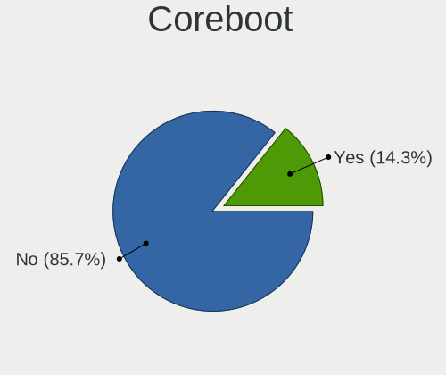

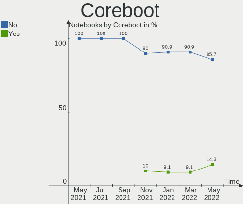

| Used | Notebooks | Percent |
|------|-----------|---------|
| No   | 12        | 85.71%  |
| Yes  | 2         | 14.29%  |

RAM Size
--------

Total RAM memory

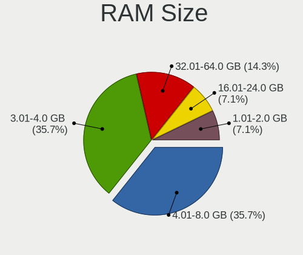

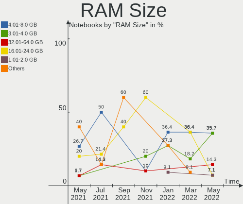

| Size in GB | Notebooks | Percent |
|------------|-----------|---------|
| 4.01-8.0   | 5         | 35.71%  |
| 3.01-4.0   | 5         | 35.71%  |
| 32.01-64.0 | 2         | 14.29%  |
| 16.01-24.0 | 1         | 7.14%   |
| 1.01-2.0   | 1         | 7.14%   |

RAM Used
--------

Used RAM memory

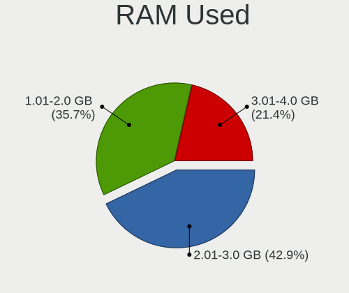

| Used GB  | Notebooks | Percent |
|----------|-----------|---------|
| 2.01-3.0 | 6         | 42.86%  |
| 1.01-2.0 | 5         | 35.71%  |
| 3.01-4.0 | 3         | 21.43%  |

Total Drives
------------

Number of drives on board

| Drives | Notebooks | Percent |
|--------|-----------|---------|
| 1      | 10        | 71.43%  |
| 2      | 4         | 28.57%  |

Has CD-ROM
----------

Has CD-ROM on board

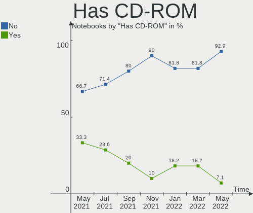

| Presented | Notebooks | Percent |
|-----------|-----------|---------|
| No        | 13        | 92.86%  |
| Yes       | 1         | 7.14%   |

Has Ethernet
------------

Has Ethernet on board

| Presented | Notebooks | Percent |
|-----------|-----------|---------|
| Yes       | 7         | 50%     |
| No        | 7         | 50%     |

Has WiFi
--------

Has WiFi module

| Presented | Notebooks | Percent |
|-----------|-----------|---------|
| Yes       | 13        | 92.86%  |
| No        | 1         | 7.14%   |

Has Bluetooth
-------------

Has Bluetooth module

| Presented | Notebooks | Percent |
|-----------|-----------|---------|
| Yes       | 12        | 85.71%  |
| No        | 2         | 14.29%  |

Location
--------

Country
-------

Geographic location (country)

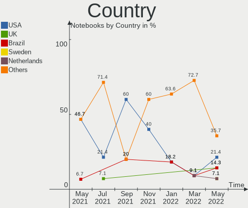

| Country            | Notebooks | Percent |
|--------------------|-----------|---------|
| USA                | 3         | 21.43%  |
| UK                 | 2         | 14.29%  |
| Brazil             | 2         | 14.29%  |
| Sweden             | 1         | 7.14%   |
| Netherlands        | 1         | 7.14%   |
| Mexico             | 1         | 7.14%   |
| Kyrgyzstan         | 1         | 7.14%   |
| India              | 1         | 7.14%   |
| France             | 1         | 7.14%   |
| Dominican Republic | 1         | 7.14%   |

City
----

Geographic location (city)

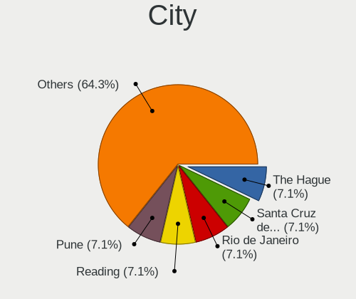

| City                   | Notebooks | Percent |
|------------------------|-----------|---------|
| The Hague              | 1         | 7.14%   |
| Santa Cruz de Barahona | 1         | 7.14%   |
| Rio de Janeiro         | 1         | 7.14%   |
| Reading                | 1         | 7.14%   |
| Pune                   | 1         | 7.14%   |
| Monterrey              | 1         | 7.14%   |
| Middleboro             | 1         | 7.14%   |
| Maricopa               | 1         | 7.14%   |
| Kings Lynn             | 1         | 7.14%   |
| Handen                 | 1         | 7.14%   |
| Fortaleza              | 1         | 7.14%   |
| Brooklyn               | 1         | 7.14%   |
| Bishkek                | 1         | 7.14%   |
| Anglet                 | 1         | 7.14%   |

Drives
------

Drive Vendor
------------

Hard drive vendors

| Vendor              | Notebooks | Drives | Percent |
|---------------------|-----------|--------|---------|
| Unknown             | 3         | 3      | 16.67%  |
| SanDisk             | 3         | 3      | 16.67%  |
| Toshiba             | 2         | 2      | 11.11%  |
| Samsung Electronics | 2         | 2      | 11.11%  |
| XPG                 | 1         | 1      | 5.56%   |
| WDC                 | 1         | 1      | 5.56%   |
| Seagate             | 1         | 1      | 5.56%   |
| OCZ                 | 1         | 1      | 5.56%   |
| Indilinx            | 1         | 1      | 5.56%   |
| HS-SSD-C100         | 1         | 1      | 5.56%   |
| HGST                | 1         | 1      | 5.56%   |
| Apple               | 1         | 1      | 5.56%   |

Drive Model
-----------

Hard drive models

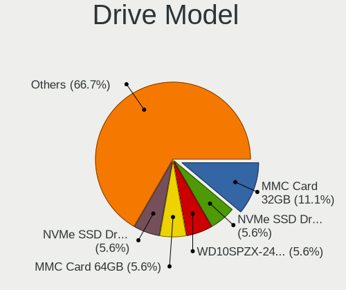

| Model                               | Notebooks | Percent |
|-------------------------------------|-----------|---------|
| Unknown MMC Card  32GB              | 2         | 11.11%  |
| XPG NVMe SSD Drive 256GB            | 1         | 5.56%   |
| WDC WD10SPZX-24Z10 1TB              | 1         | 5.56%   |
| Unknown MMC Card  64GB              | 1         | 5.56%   |
| Toshiba NVMe SSD Drive 512GB        | 1         | 5.56%   |
| Toshiba KBG30ZMS128G 128GB NVMe SSD | 1         | 5.56%   |
| Seagate ST2000LX001-1RG174 2TB      | 1         | 5.56%   |
| SanDisk Z400s M.2 2280 256GB SSD    | 1         | 5.56%   |
| SanDisk Ultra II 240GB SSD          | 1         | 5.56%   |
| SanDisk SD8SB8U128G1001 128GB SSD   | 1         | 5.56%   |
| Samsung SSD 860 EVO 500GB           | 1         | 5.56%   |
| Samsung NVMe SSD Drive 1TB          | 1         | 5.56%   |
| OCZ VERTEX4 128GB SSD               | 1         | 5.56%   |
| Indilinx IND-S3N80P/128G 128GB      | 1         | 5.56%   |
| HS-SSD-C100 480G                    | 1         | 5.56%   |
| HGST HTS721010A9E630 1TB            | 1         | 5.56%   |
| Apple SSD SD0128F 121GB             | 1         | 5.56%   |

HDD Vendor
----------

Hard disk drive vendors

| Vendor  | Notebooks | Drives | Percent |
|---------|-----------|--------|---------|
| WDC     | 1         | 1      | 33.33%  |
| Seagate | 1         | 1      | 33.33%  |
| HGST    | 1         | 1      | 33.33%  |

SSD Vendor
----------

Solid state drive vendors

| Vendor              | Notebooks | Drives | Percent |
|---------------------|-----------|--------|---------|
| SanDisk             | 3         | 3      | 50%     |
| Samsung Electronics | 1         | 1      | 16.67%  |
| OCZ                 | 1         | 1      | 16.67%  |
| Apple               | 1         | 1      | 16.67%  |

Drive Kind
----------

HDD or SSD

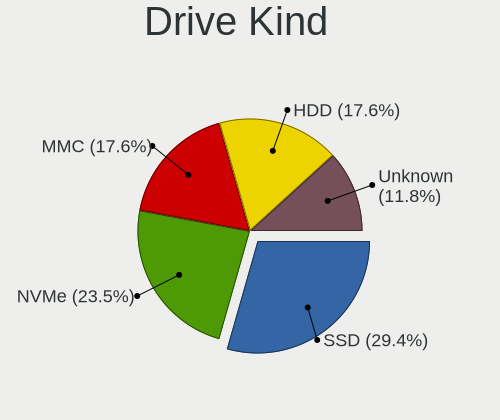

| Kind    | Notebooks | Drives | Percent |
|---------|-----------|--------|---------|
| SSD     | 5         | 6      | 29.41%  |
| NVMe    | 4         | 4      | 23.53%  |
| MMC     | 3         | 3      | 17.65%  |
| HDD     | 3         | 3      | 17.65%  |
| Unknown | 2         | 2      | 11.76%  |

Drive Connector
---------------

SATA, SAS, NVMe, etc.

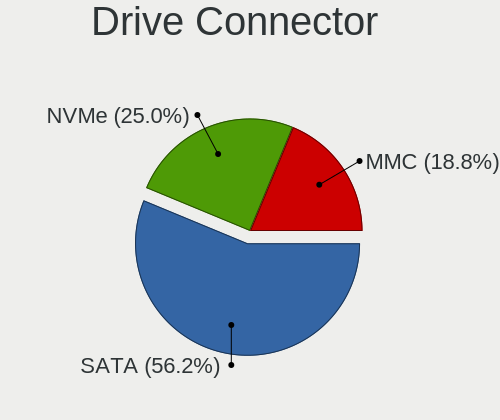

| Type | Notebooks | Drives | Percent |
|------|-----------|--------|---------|
| SATA | 9         | 11     | 56.25%  |
| NVMe | 4         | 4      | 25%     |
| MMC  | 3         | 3      | 18.75%  |

Drive Size
----------

Size of hard drive

| Size in TB | Notebooks | Drives | Percent |
|------------|-----------|--------|---------|
| 0.01-0.5   | 5         | 6      | 62.5%   |
| 0.51-1.0   | 2         | 2      | 25%     |
| 1.01-2.0   | 1         | 1      | 12.5%   |

Space Total
-----------

Amount of disk space available on the file system

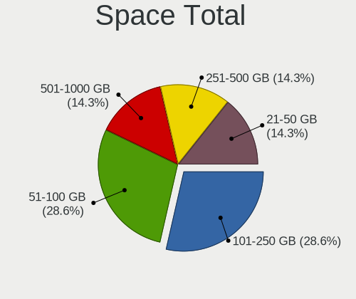

| Size in GB | Notebooks | Percent |
|------------|-----------|---------|
| 101-250    | 4         | 28.57%  |
| 51-100     | 4         | 28.57%  |
| 251-500    | 2         | 14.29%  |
| 21-50      | 2         | 14.29%  |
| 501-1000   | 2         | 14.29%  |

Space Used
----------

Amount of used disk space

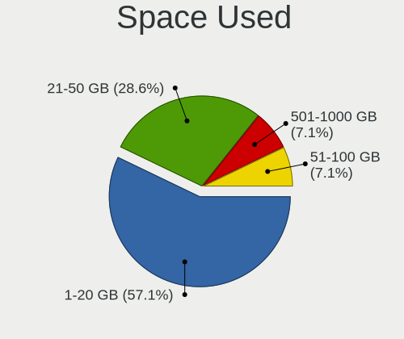

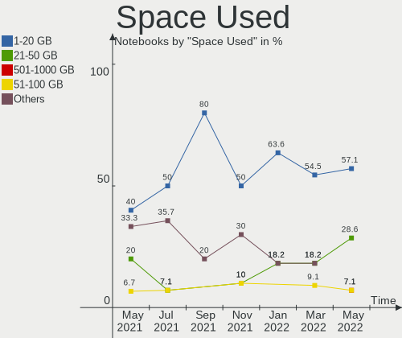

| Used GB  | Notebooks | Percent |
|----------|-----------|---------|
| 1-20     | 8         | 57.14%  |
| 21-50    | 4         | 28.57%  |
| 501-1000 | 1         | 7.14%   |
| 51-100   | 1         | 7.14%   |

Malfunc. Drives
---------------

Drive models with a malfunction

Zero info for selected period =(

Malfunc. Drive Vendor
---------------------

Vendors of faulty drives

Zero info for selected period =(

Malfunc. HDD Vendor
-------------------

Vendors of faulty HDD drives

Zero info for selected period =(

Malfunc. Drive Kind
-------------------

Kinds of faulty drives

Zero info for selected period =(

Failed Drives
-------------

Failed drive models

Zero info for selected period =(

Failed Drive Vendor
-------------------

Failed drive vendors

Zero info for selected period =(

Drive Status
------------

Number of failed and malfunc. drives

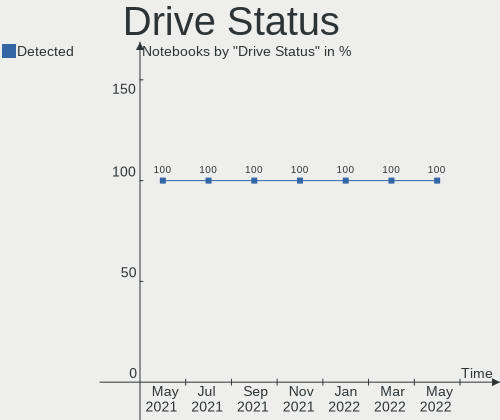

| Status   | Notebooks | Drives | Percent |
|----------|-----------|--------|---------|
| Detected | 14        | 18     | 100%    |

Storage controller
------------------

Storage Vendor
--------------

Storage controller vendors

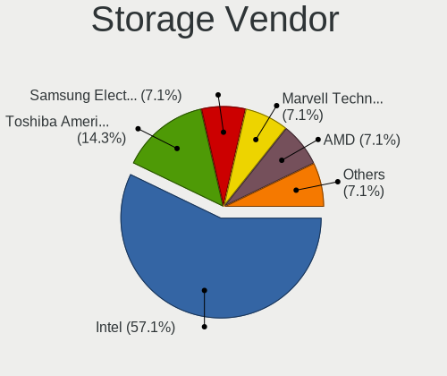

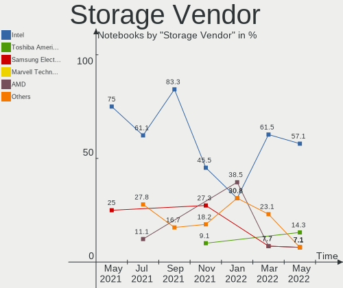

| Vendor                       | Notebooks | Percent |
|------------------------------|-----------|---------|
| Intel                        | 8         | 57.14%  |
| Toshiba America Info Systems | 2         | 14.29%  |
| Samsung Electronics          | 1         | 7.14%   |
| Marvell Technology Group     | 1         | 7.14%   |
| AMD                          | 1         | 7.14%   |
| ADATA Technology             | 1         | 7.14%   |

Storage Model
-------------

Storage controller models

| Model                                                                            | Notebooks | Percent |
|----------------------------------------------------------------------------------|-----------|---------|
| Intel Sunrise Point-LP SATA Controller [AHCI mode]                               | 2         | 14.29%  |
| Toshiba America Info Systems XG6 NVMe SSD Controller                             | 1         | 7.14%   |
| Toshiba America Info Systems Toshiba America Info Non-Volatile memory controller | 1         | 7.14%   |
| Samsung NVMe SSD Controller 980                                                  | 1         | 7.14%   |
| Marvell Group 88SS9183 PCIe SSD Controller                                       | 1         | 7.14%   |
| Intel Q170/Q150/B150/H170/H110/Z170/CM236 Chipset SATA Controller [AHCI Mode]    | 1         | 7.14%   |
| Intel HM170/QM170 Chipset SATA Controller [AHCI Mode]                            | 1         | 7.14%   |
| Intel Comet Lake SATA AHCI Controller                                            | 1         | 7.14%   |
| Intel Celeron/Pentium Silver Processor SATA Controller                           | 1         | 7.14%   |
| Intel Cannon Point-LP SATA Controller [AHCI Mode]                                | 1         | 7.14%   |
| Intel 5 Series/3400 Series Chipset 6 port SATA AHCI Controller                   | 1         | 7.14%   |
| AMD FCH SATA Controller [AHCI mode]                                              | 1         | 7.14%   |
| ADATA XPG SX8200 Pro PCIe Gen3x4 M.2 2280 Solid State Drive                      | 1         | 7.14%   |

Storage Kind
------------

Kind of storage controller (IDE, SATA, NVMe, SAS, ...)

| Kind | Notebooks | Percent |
|------|-----------|---------|
| SATA | 10        | 71.43%  |
| NVMe | 4         | 28.57%  |

Processor
---------

CPU Vendor
----------

Processor vendors

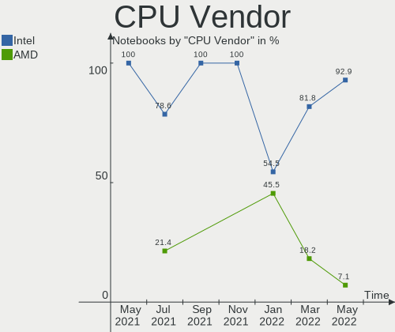

| Vendor | Notebooks | Percent |
|--------|-----------|---------|
| Intel  | 13        | 92.86%  |
| AMD    | 1         | 7.14%   |

CPU Model
---------

Processor models

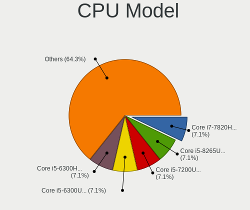

| Model                                       | Notebooks | Percent |
|---------------------------------------------|-----------|---------|
| Intel Core i7-7820HK CPU @ 2.90GHz          | 1         | 7.14%   |
| Intel Core i5-8265U CPU @ 1.60GHz           | 1         | 7.14%   |
| Intel Core i5-7200U CPU @ 2.50GHz           | 1         | 7.14%   |
| Intel Core i5-6300U CPU @ 2.40GHz           | 1         | 7.14%   |
| Intel Core i5-6300HQ CPU @ 2.30GHz          | 1         | 7.14%   |
| Intel Core i5-6200U CPU @ 2.30GHz           | 1         | 7.14%   |
| Intel Core i5-4250U CPU @ 1.30GHz           | 1         | 7.14%   |
| Intel Core i5-10210U CPU @ 1.60GHz          | 1         | 7.14%   |
| Intel Core i5 CPU M 560 @ 2.67GHz           | 1         | 7.14%   |
| Intel Celeron N4120 CPU @ 1.10GHz           | 1         | 7.14%   |
| Intel Celeron N4020 CPU @ 1.10GHz           | 1         | 7.14%   |
| Intel Celeron CPU N3060 @ 1.60GHz           | 1         | 7.14%   |
| Intel Celeron CPU N2840 @ 2.16GHz           | 1         | 7.14%   |
| AMD E1-7010 APU with AMD Radeon R2 Graphics | 1         | 7.14%   |

CPU Model Family
----------------

Processor model prefix

| Model         | Notebooks | Percent |
|---------------|-----------|---------|
| Intel Core i5 | 8         | 57.14%  |
| Intel Celeron | 4         | 28.57%  |
| Intel Core i7 | 1         | 7.14%   |
| AMD E1        | 1         | 7.14%   |

CPU Cores
---------

Number of processor cores

| Number | Notebooks | Percent |
|--------|-----------|---------|
| 2      | 9         | 64.29%  |
| 4      | 5         | 35.71%  |

CPU Sockets
-----------

Number of sockets

| Number | Notebooks | Percent |
|--------|-----------|---------|
| 1      | 14        | 100%    |

CPU Threads
-----------

Threads per core (Hyper-Threading)

| Number | Notebooks | Percent |
|--------|-----------|---------|
| 2      | 8         | 57.14%  |
| 1      | 6         | 42.86%  |

CPU Op-Modes
------------

CPU Operation Modes (32-bit, 64-bit)

| Op mode        | Notebooks | Percent |
|----------------|-----------|---------|
| 32-bit, 64-bit | 14        | 100%    |

CPU Microcode
-------------

Microcode number

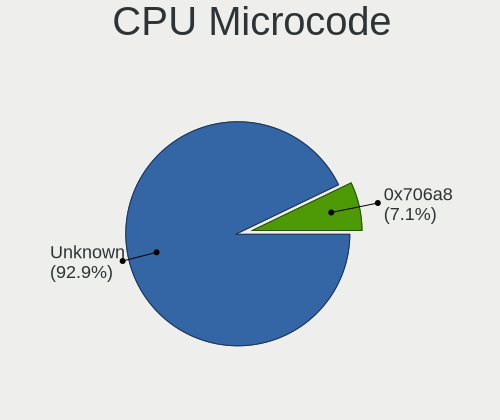

| Number  | Notebooks | Percent |
|---------|-----------|---------|
| Unknown | 13        | 92.86%  |
| 0x706a8 | 1         | 7.14%   |

CPU Microarch
-------------

Microarchitecture

| Name          | Notebooks | Percent |
|---------------|-----------|---------|
| KabyLake      | 4         | 28.57%  |
| Skylake       | 3         | 21.43%  |
| Silvermont    | 2         | 14.29%  |
| Goldmont plus | 2         | 14.29%  |
| Westmere      | 1         | 7.14%   |
| Puma          | 1         | 7.14%   |
| Haswell       | 1         | 7.14%   |

Graphics
--------

GPU Vendor
----------

Vendors of graphics cards

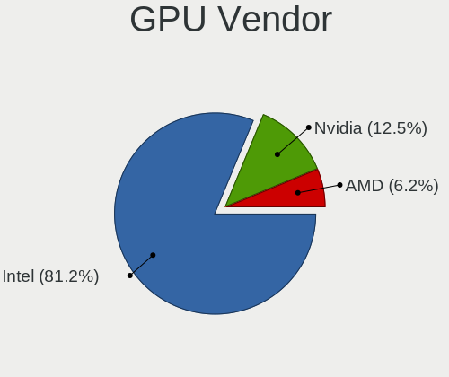

| Vendor | Notebooks | Percent |
|--------|-----------|---------|
| Intel  | 13        | 81.25%  |
| Nvidia | 2         | 12.5%   |
| AMD    | 1         | 6.25%   |

GPU Model
---------

Graphics card models

| Model                                                                                    | Notebooks | Percent |
|------------------------------------------------------------------------------------------|-----------|---------|
| Intel Skylake GT2 [HD Graphics 520]                                                      | 2         | 12.5%   |
| Intel GeminiLake [UHD Graphics 600]                                                      | 2         | 12.5%   |
| Nvidia GP104M [GeForce GTX 1080 Mobile]                                                  | 1         | 6.25%   |
| Nvidia GM107M [GeForce GTX 960M]                                                         | 1         | 6.25%   |
| Intel WhiskeyLake-U GT2 [UHD Graphics 620]                                               | 1         | 6.25%   |
| Intel HD Graphics 630                                                                    | 1         | 6.25%   |
| Intel HD Graphics 620                                                                    | 1         | 6.25%   |
| Intel HD Graphics 530                                                                    | 1         | 6.25%   |
| Intel Haswell-ULT Integrated Graphics Controller                                         | 1         | 6.25%   |
| Intel Core Processor Integrated Graphics Controller                                      | 1         | 6.25%   |
| Intel CometLake-U GT2 [UHD Graphics]                                                     | 1         | 6.25%   |
| Intel Atom/Celeron/Pentium Processor x5-E8000/J3xxx/N3xxx Integrated Graphics Controller | 1         | 6.25%   |
| Intel Atom Processor Z36xxx/Z37xxx Series Graphics & Display                             | 1         | 6.25%   |
| AMD Mullins [Radeon R2 Graphics]                                                         | 1         | 6.25%   |

GPU Combo
---------

Combinations of graphics cards

| Name           | Notebooks | Percent |
|----------------|-----------|---------|
| 1 x Intel      | 10        | 71.43%  |
| Intel + Nvidia | 2         | 14.29%  |
| Other          | 1         | 7.14%   |
| 1 x AMD        | 1         | 7.14%   |

GPU Driver
----------

Free vs proprietary

| Driver | Notebooks | Percent |
|--------|-----------|---------|
| Free   | 14        | 100%    |

GPU Memory
----------

Total video memory

| Size in GB | Notebooks | Percent |
|------------|-----------|---------|
| Unknown    | 14        | 100%    |

Monitor
-------

Monitor Vendor
--------------

Monitor vendors

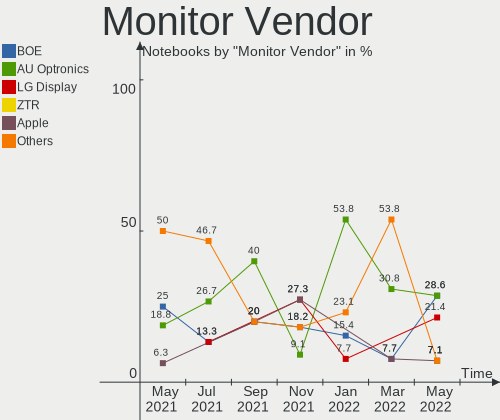

| Vendor       | Notebooks | Percent |
|--------------|-----------|---------|
| BOE          | 4         | 28.57%  |
| AU Optronics | 4         | 28.57%  |
| LG Display   | 3         | 21.43%  |
| ZTR          | 1         | 7.14%   |
| Apple        | 1         | 7.14%   |
| Acer         | 1         | 7.14%   |

Monitor Model
-------------

Monitor models

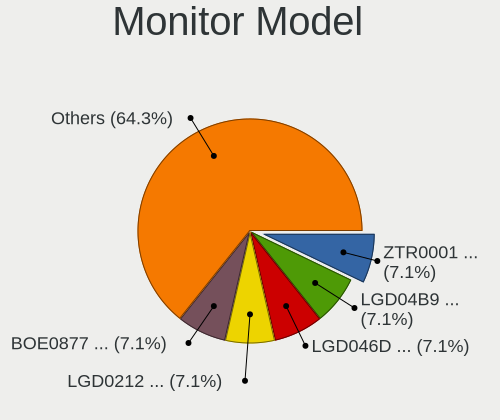

| Model                                                          | Notebooks | Percent |
|----------------------------------------------------------------|-----------|---------|
| ZTR LCD Monitor ZTR0001 1366x768 256x144mm 11.6-inch           | 1         | 7.14%   |
| LG Display LCD Monitor LGD04B9 1920x1080 344x194mm 15.5-inch   | 1         | 7.14%   |
| LG Display LCD Monitor LGD046D 1920x1080 309x174mm 14.0-inch   | 1         | 7.14%   |
| LG Display LCD Monitor LGD0212 1366x768 309x174mm 14.0-inch    | 1         | 7.14%   |
| BOE LCD Monitor BOE0877 1920x1080 309x173mm 13.9-inch          | 1         | 7.14%   |
| BOE LCD Monitor BOE0757 1366x768 344x194mm 15.5-inch           | 1         | 7.14%   |
| BOE LCD Monitor BOE0731 1366x768 256x144mm 11.6-inch           | 1         | 7.14%   |
| BOE LCD Monitor BOE0675 1366x768 344x194mm 15.5-inch           | 1         | 7.14%   |
| AU Optronics LCD Monitor AUO333D 1920x1080 309x174mm 14.0-inch | 1         | 7.14%   |
| AU Optronics LCD Monitor AUO235C 1366x768 256x144mm 11.6-inch  | 1         | 7.14%   |
| AU Optronics LCD Monitor AUO109B 3840x2160 382x214mm 17.2-inch | 1         | 7.14%   |
| AU Optronics LCD Monitor AUO106C 1366x768 276x155mm 12.5-inch  | 1         | 7.14%   |
| Apple Color LCD APP9CDF 1440x900 286x179mm 13.3-inch           | 1         | 7.14%   |
| Acer SB220Q ACR06AB 1920x1080 476x268mm 21.5-inch              | 1         | 7.14%   |

Monitor Resolution
------------------

Monitor screen resolution

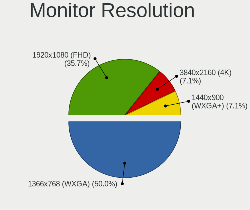

| Resolution       | Notebooks | Percent |
|------------------|-----------|---------|
| 1366x768 (WXGA)  | 7         | 50%     |
| 1920x1080 (FHD)  | 5         | 35.71%  |
| 3840x2160 (4K)   | 1         | 7.14%   |
| 1440x900 (WXGA+) | 1         | 7.14%   |

Monitor Diagonal
----------------

Diagonal size in inches

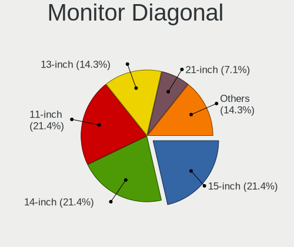

| Inches | Notebooks | Percent |
|--------|-----------|---------|
| 15     | 3         | 21.43%  |
| 14     | 3         | 21.43%  |
| 11     | 3         | 21.43%  |
| 13     | 2         | 14.29%  |
| 21     | 1         | 7.14%   |
| 17     | 1         | 7.14%   |
| 12     | 1         | 7.14%   |

Monitor Width
-------------

Physical width

| Width in mm | Notebooks | Percent |
|-------------|-----------|---------|
| 301-350     | 7         | 50%     |
| 201-300     | 5         | 35.71%  |
| 401-500     | 1         | 7.14%   |
| 351-400     | 1         | 7.14%   |

Aspect Ratio
------------

Proportional relationship between the width and the height

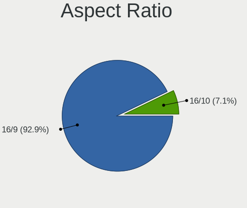

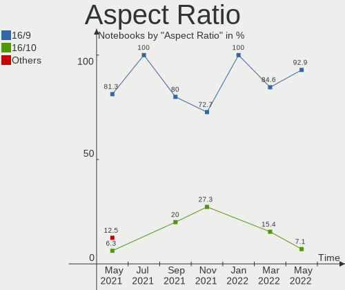

| Ratio | Notebooks | Percent |
|-------|-----------|---------|
| 16/9  | 13        | 92.86%  |
| 16/10 | 1         | 7.14%   |

Monitor Area
------------

Area in inch²

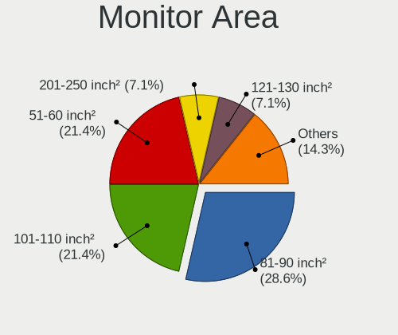

| Area in inch² | Notebooks | Percent |
|----------------|-----------|---------|
| 81-90          | 4         | 28.57%  |
| 51-60          | 3         | 21.43%  |
| 101-110        | 3         | 21.43%  |
| 71-80          | 1         | 7.14%   |
| 61-70          | 1         | 7.14%   |
| 201-250        | 1         | 7.14%   |
| 121-130        | 1         | 7.14%   |

Pixel Density
-------------

Pixels per inch

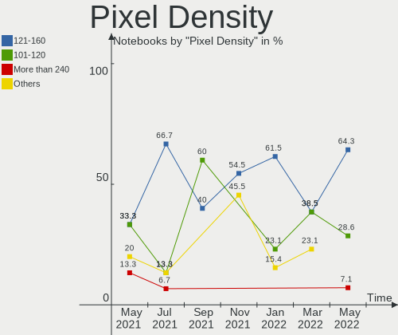

| Density       | Notebooks | Percent |
|---------------|-----------|---------|
| 121-160       | 9         | 64.29%  |
| 101-120       | 4         | 28.57%  |
| More than 240 | 1         | 7.14%   |

Multiple Monitors
-----------------

Total monitors connected

| Total | Notebooks | Percent |
|-------|-----------|---------|
| 1     | 14        | 100%    |

Network
-------

Net Controller Vendor
---------------------

Controller vendors

| Vendor                | Notebooks | Percent |
|-----------------------|-----------|---------|
| Intel                 | 8         | 40%     |
| Realtek Semiconductor | 6         | 30%     |
| Qualcomm Atheros      | 2         | 10%     |
| Sierra Wireless       | 1         | 5%      |
| Dell                  | 1         | 5%      |
| Broadcom Limited      | 1         | 5%      |
| Broadcom              | 1         | 5%      |

Net Controller Model
--------------------

Controller models

| Model                                                             | Notebooks | Percent |
|-------------------------------------------------------------------|-----------|---------|
| Realtek RTL8111/8168/8411 PCI Express Gigabit Ethernet Controller | 2         | 8.33%   |
| Intel Wireless 8265 / 8275                                        | 2         | 8.33%   |
| Sierra Wireless EM7305 Modem                                      | 1         | 4.17%   |
| Realtek RTL8822CE 802.11ac PCIe Wireless Network Adapter          | 1         | 4.17%   |
| Realtek RTL8188CUS 802.11n WLAN Adapter                           | 1         | 4.17%   |
| Realtek RTL8187 Wireless Adapter                                  | 1         | 4.17%   |
| Realtek RTL8152 Fast Ethernet Adapter                             | 1         | 4.17%   |
| Qualcomm Atheros QCA9377 802.11ac Wireless Network Adapter        | 1         | 4.17%   |
| Qualcomm Atheros QCA6174 802.11ac Wireless Network Adapter        | 1         | 4.17%   |
| Qualcomm Atheros Killer E2500 Gigabit Ethernet Controller         | 1         | 4.17%   |
| Intel Wireless 8260                                               | 1         | 4.17%   |
| Intel Wireless 3165                                               | 1         | 4.17%   |
| Intel Gemini Lake PCH CNVi WiFi                                   | 1         | 4.17%   |
| Intel Ethernet Connection I219-V                                  | 1         | 4.17%   |
| Intel Ethernet Connection (4) I219-V                              | 1         | 4.17%   |
| Intel Dual Band Wireless-AC 3165 Plus Bluetooth                   | 1         | 4.17%   |
| Intel Comet Lake PCH-LP CNVi WiFi                                 | 1         | 4.17%   |
| Intel Centrino Advanced-N 6200                                    | 1         | 4.17%   |
| Intel 82577LM Gigabit Network Connection                          | 1         | 4.17%   |
| Dell DW5811e Snapdragon™ X7 LTE                              | 1         | 4.17%   |
| Broadcom Limited BCM4360 802.11ac Wireless Network Adapter        | 1         | 4.17%   |
| Broadcom BCM43142 802.11b/g/n                                     | 1         | 4.17%   |

Wireless Vendor
---------------

Wireless vendors

| Vendor                | Notebooks | Percent |
|-----------------------|-----------|---------|
| Intel                 | 8         | 47.06%  |
| Realtek Semiconductor | 3         | 17.65%  |
| Qualcomm Atheros      | 2         | 11.76%  |
| Sierra Wireless       | 1         | 5.88%   |
| Dell                  | 1         | 5.88%   |
| Broadcom Limited      | 1         | 5.88%   |
| Broadcom              | 1         | 5.88%   |

Wireless Model
--------------

Wireless models

| Model                                                      | Notebooks | Percent |
|------------------------------------------------------------|-----------|---------|
| Intel Wireless 8265 / 8275                                 | 2         | 11.76%  |
| Sierra Wireless EM7305 Modem                               | 1         | 5.88%   |
| Realtek RTL8822CE 802.11ac PCIe Wireless Network Adapter   | 1         | 5.88%   |
| Realtek RTL8188CUS 802.11n WLAN Adapter                    | 1         | 5.88%   |
| Realtek RTL8187 Wireless Adapter                           | 1         | 5.88%   |
| Qualcomm Atheros QCA9377 802.11ac Wireless Network Adapter | 1         | 5.88%   |
| Qualcomm Atheros QCA6174 802.11ac Wireless Network Adapter | 1         | 5.88%   |
| Intel Wireless 8260                                        | 1         | 5.88%   |
| Intel Wireless 3165                                        | 1         | 5.88%   |
| Intel Gemini Lake PCH CNVi WiFi                            | 1         | 5.88%   |
| Intel Dual Band Wireless-AC 3165 Plus Bluetooth            | 1         | 5.88%   |
| Intel Comet Lake PCH-LP CNVi WiFi                          | 1         | 5.88%   |
| Intel Centrino Advanced-N 6200                             | 1         | 5.88%   |
| Dell DW5811e Snapdragon™ X7 LTE                       | 1         | 5.88%   |
| Broadcom Limited BCM4360 802.11ac Wireless Network Adapter | 1         | 5.88%   |
| Broadcom BCM43142 802.11b/g/n                              | 1         | 5.88%   |

Ethernet Vendor
---------------

Ethernet vendors

| Vendor                | Notebooks | Percent |
|-----------------------|-----------|---------|
| Realtek Semiconductor | 3         | 42.86%  |
| Intel                 | 3         | 42.86%  |
| Qualcomm Atheros      | 1         | 14.29%  |

Ethernet Model
--------------

Ethernet models

| Model                                                             | Notebooks | Percent |
|-------------------------------------------------------------------|-----------|---------|
| Realtek RTL8111/8168/8411 PCI Express Gigabit Ethernet Controller | 2         | 28.57%  |
| Realtek RTL8152 Fast Ethernet Adapter                             | 1         | 14.29%  |
| Qualcomm Atheros Killer E2500 Gigabit Ethernet Controller         | 1         | 14.29%  |
| Intel Ethernet Connection I219-V                                  | 1         | 14.29%  |
| Intel Ethernet Connection (4) I219-V                              | 1         | 14.29%  |
| Intel 82577LM Gigabit Network Connection                          | 1         | 14.29%  |

Net Controller Kind
-------------------

Ethernet, WiFi or modem

| Kind     | Notebooks | Percent |
|----------|-----------|---------|
| WiFi     | 13        | 65%     |
| Ethernet | 7         | 35%     |

Used Controller
---------------

Currently used network controller

| Kind     | Notebooks | Percent |
|----------|-----------|---------|
| WiFi     | 12        | 80%     |
| Ethernet | 3         | 20%     |

NICs
----

Total network controllers on board

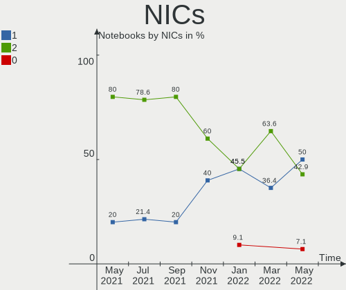

| Total | Notebooks | Percent |
|-------|-----------|---------|
| 1     | 7         | 50%     |
| 2     | 6         | 42.86%  |
| 0     | 1         | 7.14%   |

IPv6
----

IPv6 vs IPv4

| Used | Notebooks | Percent |
|------|-----------|---------|
| No   | 10        | 71.43%  |
| Yes  | 4         | 28.57%  |

Bluetooth
---------

Bluetooth Vendor
----------------

Controller vendors

| Vendor                          | Notebooks | Percent |
|---------------------------------|-----------|---------|
| Intel                           | 6         | 50%     |
| Qualcomm Atheros Communications | 1         | 8.33%   |
| IMC Networks                    | 1         | 8.33%   |
| Hewlett-Packard                 | 1         | 8.33%   |
| Foxconn International           | 1         | 8.33%   |
| Foxconn / Hon Hai               | 1         | 8.33%   |
| Apple                           | 1         | 8.33%   |

Bluetooth Model
---------------

Controller models

| Model                                             | Notebooks | Percent |
|---------------------------------------------------|-----------|---------|
| Intel Bluetooth wireless interface                | 4         | 33.33%  |
| Intel Bluetooth 9460/9560 Jefferson Peak (JfP)    | 2         | 16.67%  |
| Qualcomm Atheros QCA61x4 Bluetooth 4.0            | 1         | 8.33%   |
| IMC Networks Bluetooth Radio                      | 1         | 8.33%   |
| HP Broadcom 2070 Bluetooth Combo                  | 1         | 8.33%   |
| Foxconn International BCM43142A0 Bluetooth module | 1         | 8.33%   |
| Foxconn / Hon Hai Bluetooth Device                | 1         | 8.33%   |
| Apple Bluetooth USB Host Controller               | 1         | 8.33%   |

Sound
-----

Sound Vendor
------------

Sound card vendors

| Vendor | Notebooks | Percent |
|--------|-----------|---------|
| Intel  | 13        | 86.67%  |
| Nvidia | 1         | 6.67%   |
| AMD    | 1         | 6.67%   |

Sound Model
-----------

Sound card models

| Model                                                                                             | Notebooks | Percent |
|---------------------------------------------------------------------------------------------------|-----------|---------|
| Intel Sunrise Point-LP HD Audio                                                                   | 3         | 17.65%  |
| Intel Celeron/Pentium Silver Processor High Definition Audio                                      | 2         | 11.76%  |
| Nvidia GP104 High Definition Audio Controller                                                     | 1         | 5.88%   |
| Intel Haswell-ULT HD Audio Controller                                                             | 1         | 5.88%   |
| Intel Comet Lake PCH-LP cAVS                                                                      | 1         | 5.88%   |
| Intel CM238 HD Audio Controller                                                                   | 1         | 5.88%   |
| Intel Cannon Point-LP High Definition Audio Controller                                            | 1         | 5.88%   |
| Intel Atom/Celeron/Pentium Processor x5-E8000/J3xxx/N3xxx Series High Definition Audio Controller | 1         | 5.88%   |
| Intel Atom Processor Z36xxx/Z37xxx Series High Definition Audio Controller                        | 1         | 5.88%   |
| Intel 8 Series HD Audio Controller                                                                | 1         | 5.88%   |
| Intel 5 Series/3400 Series Chipset High Definition Audio                                          | 1         | 5.88%   |
| Intel 100 Series/C230 Series Chipset Family HD Audio Controller                                   | 1         | 5.88%   |
| AMD Kabini HDMI/DP Audio                                                                          | 1         | 5.88%   |
| AMD FCH Azalia Controller                                                                         | 1         | 5.88%   |

Memory
------

Memory Vendor
-------------

Memory module vendors

| Vendor            | Notebooks | Percent |
|-------------------|-----------|---------|
| Micron Technology | 1         | 100%    |

Memory Model
------------

Memory module models

| Model                                          | Notebooks | Percent |
|------------------------------------------------|-----------|---------|
| Micron RAM MT53E512M32D2NP 2GB LPDDR4 2400MT/s | 1         | 100%    |

Memory Kind
-----------

Memory module kinds

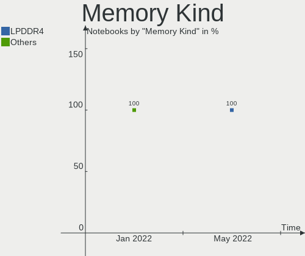

| Kind   | Notebooks | Percent |
|--------|-----------|---------|
| LPDDR4 | 1         | 100%    |

Memory Form Factor
------------------

Physical design of the memory module

| Name    | Notebooks | Percent |
|---------|-----------|---------|
| Unknown | 1         | 100%    |

Memory Size
-----------

Memory module size

| Size | Notebooks | Percent |
|------|-----------|---------|
| 2048 | 1         | 100%    |

Memory Speed
------------

Memory module speed

| Speed | Notebooks | Percent |
|-------|-----------|---------|
| 2400  | 1         | 100%    |

Printers & scanners
-------------------

Printer Vendor
--------------

Printer device vendors

| Vendor | Notebooks | Percent |
|--------|-----------|---------|
| Canon  | 1         | 100%    |

Printer Model
-------------

Printer device models

| Model                     | Notebooks | Percent |
|---------------------------|-----------|---------|
| Canon PIXMA MG3600 Series | 1         | 100%    |

Scanner Vendor
--------------

Scanner device vendors

Zero info for selected period =(

Scanner Model
-------------

Scanner device models

Zero info for selected period =(

Camera
------

Camera Vendor
-------------

Camera device vendors

| Vendor                        | Notebooks | Percent |
|-------------------------------|-----------|---------|
| Chicony Electronics           | 5         | 38.46%  |
| Realtek Semiconductor         | 2         | 15.38%  |
| IMC Networks                  | 2         | 15.38%  |
| Tobii Technology AB           | 1         | 7.69%   |
| Sunplus Innovation Technology | 1         | 7.69%   |
| Microdia                      | 1         | 7.69%   |
| Acer                          | 1         | 7.69%   |

Camera Model
------------

Camera device models

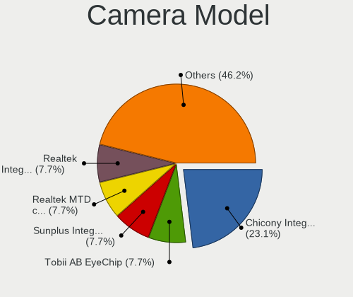

| Model                          | Notebooks | Percent |
|--------------------------------|-----------|---------|
| Chicony Integrated Camera      | 3         | 23.08%  |
| Tobii AB EyeChip               | 1         | 7.69%   |
| Sunplus Integrated_Webcam_HD   | 1         | 7.69%   |
| Realtek MTD camera             | 1         | 7.69%   |
| Realtek Integrated Webcam_HD   | 1         | 7.69%   |
| Microdia Integrated_Webcam_FHD | 1         | 7.69%   |
| IMC Networks Lenovo EasyCamera | 1         | 7.69%   |
| IMC Networks HD Camera         | 1         | 7.69%   |
| Chicony VGA Webcam             | 1         | 7.69%   |
| Chicony HP Webcam [2 MP Macro] | 1         | 7.69%   |
| Acer EasyCamera                | 1         | 7.69%   |

Security
--------

Fingerprint Vendor
------------------

Fingerprint sensor vendors

| Vendor           | Notebooks | Percent |
|------------------|-----------|---------|
| Validity Sensors | 2         | 100%    |

Fingerprint Model
-----------------

Fingerprint sensor models

| Model                                      | Notebooks | Percent |
|--------------------------------------------|-----------|---------|
| Validity Sensors VFS451 Fingerprint Reader | 1         | 50%     |
| Validity Sensors Swipe Fingerprint Sensor  | 1         | 50%     |

Chipcard Vendor
---------------

Chipcard module vendors

| Vendor   | Notebooks | Percent |
|----------|-----------|---------|
| Broadcom | 1         | 100%    |

Chipcard Model
--------------

Chipcard module models

| Model         | Notebooks | Percent |
|---------------|-----------|---------|
| Broadcom 5880 | 1         | 100%    |

Unsupported
-----------

Unsupported Devices
-------------------

Total unsupported devices on board

| Total | Notebooks | Percent |
|-------|-----------|---------|
| 0     | 9         | 64.29%  |
| 1     | 4         | 28.57%  |
| 2     | 1         | 7.14%   |

Unsupported Device Types
------------------------

Types of unsupported devices

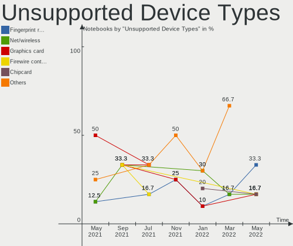

| Type                | Notebooks | Percent |
|---------------------|-----------|---------|
| Fingerprint reader  | 2         | 33.33%  |
| Net/wireless        | 1         | 16.67%  |
| Graphics card       | 1         | 16.67%  |
| Firewire controller | 1         | 16.67%  |
| Chipcard            | 1         | 16.67%  |

