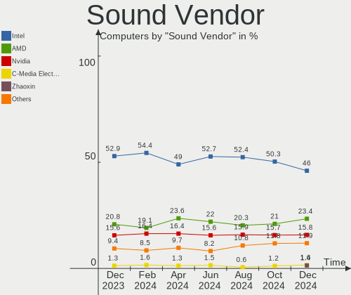
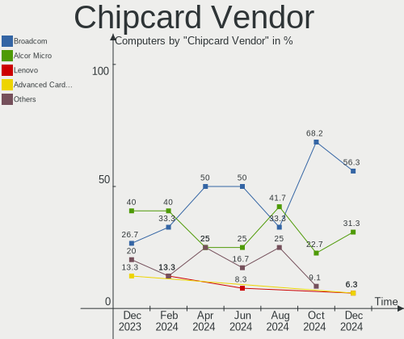

Debian - Hardware Trends
------------------------

A project to identify most popular hardware characteristics and track their change
over time based on data collected by Linux users at https://Linux-Hardware.org.

Anyone can contribute to this report by the [hw-probe](https://github.com/linuxhw/hw-probe) tool:

    sudo -E hw-probe -all -upload

This is a report for all computer types. See also reports for [desktops](/Dist/Debian/Desktop/README.md) and [notebooks](/Dist/Debian/Notebook/README.md).

This report is for one last month. Overall report since the beginning of time: [TestDays](https://github.com/linuxhw/TestDays)

Period: Aug, 2023.

Contents
--------

* [ System ](#system)
  - [ OS                       ](#os)
  - [ OS Family                ](#os-family)
  - [ Kernel                   ](#kernel)
  - [ Kernel Family            ](#kernel-family)
  - [ Kernel Major Ver.        ](#kernel-major-ver)
  - [ Arch                     ](#arch)
  - [ DE                       ](#de)
  - [ Display Server           ](#display-server)
  - [ Display Manager          ](#display-manager)
  - [ OS Lang                  ](#os-lang)
  - [ Boot Mode                ](#boot-mode)
  - [ Filesystem               ](#filesystem)
  - [ Part. scheme             ](#part-scheme)
  - [ Dual Boot with Linux/BSD ](#dual-boot-with-linuxbsd)
  - [ Dual Boot (Win)          ](#dual-boot-win)

* [ Board ](#board)
  - [ Vendor                   ](#vendor)
  - [ Model                    ](#model)
  - [ Model Family             ](#model-family)
  - [ MFG Year                 ](#mfg-year)
  - [ Form Factor              ](#form-factor)
  - [ Secure Boot              ](#secure-boot)
  - [ Coreboot                 ](#coreboot)
  - [ RAM Size                 ](#ram-size)
  - [ RAM Used                 ](#ram-used)
  - [ Total Drives             ](#total-drives)
  - [ Has CD-ROM               ](#has-cd-rom)
  - [ Has Ethernet             ](#has-ethernet)
  - [ Has WiFi                 ](#has-wifi)
  - [ Has Bluetooth            ](#has-bluetooth)

* [ Location ](#location)
  - [ Country                  ](#country)
  - [ City                     ](#city)

* [ Drives ](#drives)
  - [ Drive Vendor             ](#drive-vendor)
  - [ Drive Model              ](#drive-model)
  - [ HDD Vendor               ](#hdd-vendor)
  - [ SSD Vendor               ](#ssd-vendor)
  - [ Drive Kind               ](#drive-kind)
  - [ Drive Connector          ](#drive-connector)
  - [ Drive Size               ](#drive-size)
  - [ Space Total              ](#space-total)
  - [ Space Used               ](#space-used)
  - [ Malfunc. Drives          ](#malfunc-drives)
  - [ Malfunc. Drive Vendor    ](#malfunc-drive-vendor)
  - [ Malfunc. HDD Vendor      ](#malfunc-hdd-vendor)
  - [ Malfunc. Drive Kind      ](#malfunc-drive-kind)
  - [ Failed Drives            ](#failed-drives)
  - [ Failed Drive Vendor      ](#failed-drive-vendor)
  - [ Drive Status             ](#drive-status)

* [ Storage controller ](#storage-controller)
  - [ Storage Vendor           ](#storage-vendor)
  - [ Storage Model            ](#storage-model)
  - [ Storage Kind             ](#storage-kind)

* [ Processor ](#processor)
  - [ CPU Vendor               ](#cpu-vendor)
  - [ CPU Model                ](#cpu-model)
  - [ CPU Model Family         ](#cpu-model-family)
  - [ CPU Cores                ](#cpu-cores)
  - [ CPU Sockets              ](#cpu-sockets)
  - [ CPU Threads              ](#cpu-threads)
  - [ CPU Op-Modes             ](#cpu-op-modes)
  - [ CPU Microcode            ](#cpu-microcode)
  - [ CPU Microarch            ](#cpu-microarch)

* [ Graphics ](#graphics)
  - [ GPU Vendor               ](#gpu-vendor)
  - [ GPU Model                ](#gpu-model)
  - [ GPU Combo                ](#gpu-combo)
  - [ GPU Driver               ](#gpu-driver)
  - [ GPU Memory               ](#gpu-memory)

* [ Monitor ](#monitor)
  - [ Monitor Vendor           ](#monitor-vendor)
  - [ Monitor Model            ](#monitor-model)
  - [ Monitor Resolution       ](#monitor-resolution)
  - [ Monitor Diagonal         ](#monitor-diagonal)
  - [ Monitor Width            ](#monitor-width)
  - [ Aspect Ratio             ](#aspect-ratio)
  - [ Monitor Area             ](#monitor-area)
  - [ Pixel Density            ](#pixel-density)
  - [ Multiple Monitors        ](#multiple-monitors)

* [ Network ](#network)
  - [ Net Controller Vendor    ](#net-controller-vendor)
  - [ Net Controller Model     ](#net-controller-model)
  - [ Wireless Vendor          ](#wireless-vendor)
  - [ Wireless Model           ](#wireless-model)
  - [ Ethernet Vendor          ](#ethernet-vendor)
  - [ Ethernet Model           ](#ethernet-model)
  - [ Net Controller Kind      ](#net-controller-kind)
  - [ Used Controller          ](#used-controller)
  - [ NICs                     ](#nics)
  - [ IPv6                     ](#ipv6)

* [ Bluetooth ](#bluetooth)
  - [ Bluetooth Vendor         ](#bluetooth-vendor)
  - [ Bluetooth Model          ](#bluetooth-model)

* [ Sound ](#sound)
  - [ Sound Vendor             ](#sound-vendor)
  - [ Sound Model              ](#sound-model)

* [ Memory ](#memory)
  - [ Memory Vendor            ](#memory-vendor)
  - [ Memory Model             ](#memory-model)
  - [ Memory Kind              ](#memory-kind)
  - [ Memory Form Factor       ](#memory-form-factor)
  - [ Memory Size              ](#memory-size)
  - [ Memory Speed             ](#memory-speed)

* [ Printers & scanners ](#printers--scanners)
  - [ Printer Vendor           ](#printer-vendor)
  - [ Printer Model            ](#printer-model)
  - [ Scanner Vendor           ](#scanner-vendor)
  - [ Scanner Model            ](#scanner-model)

* [ Camera ](#camera)
  - [ Camera Vendor            ](#camera-vendor)
  - [ Camera Model             ](#camera-model)

* [ Security ](#security)
  - [ Fingerprint Vendor       ](#fingerprint-vendor)
  - [ Fingerprint Model        ](#fingerprint-model)
  - [ Chipcard Vendor          ](#chipcard-vendor)
  - [ Chipcard Model           ](#chipcard-model)

* [ Unsupported ](#unsupported)
  - [ Unsupported Devices      ](#unsupported-devices)
  - [ Unsupported Device Types ](#unsupported-device-types)

System
------

OS
--

Installed operating systems

| Name      | Computers | Percent |
|-----------|-----------|---------|
| Debian 12 | 341       | 77.5%   |
| Debian 11 | 61        | 13.86%  |
| Debian    | 35        | 7.95%   |
| Debian 23 | 1         | 0.23%   |
| Debian 22 | 1         | 0.23%   |
| Debian 10 | 1         | 0.23%   |

OS Family
---------

OS without a version

| Name   | Computers | Percent |
|--------|-----------|---------|
| Debian | 440       | 100%    |

Kernel
------

Version of the Linux kernel

| Version                 | Computers | Percent |
|-------------------------|-----------|---------|
| 6.1.0-11-amd64          | 190       | 43.18%  |
| 6.1.0-10-amd64          | 95        | 21.59%  |
| 6.4.0-1-amd64           | 13        | 2.95%   |
| 6.4.0-2-amd64           | 10        | 2.27%   |
| 6.1.0-4-amd64           | 10        | 2.27%   |
| 6.1.0-9-amd64           | 9         | 2.05%   |
| 5.10.0-23-amd64         | 9         | 2.05%   |
| 6.2.16-6-pve            | 8         | 1.82%   |
| 6.1.0-0.deb11.7-amd64   | 5         | 1.14%   |
| 5.10.0-25-amd64         | 5         | 1.14%   |
| 5.10.0-24-amd64         | 5         | 1.14%   |
| 6.4.0-3-amd64           | 4         | 0.91%   |
| 5.10.0-22-amd64         | 4         | 0.91%   |
| 6.4.0-0.deb12.2-amd64   | 3         | 0.68%   |
| 6.2.16-8-pve            | 3         | 0.68%   |
| 6.2.16-3-pve            | 3         | 0.68%   |
| 6.1.0-10-686-pae        | 3         | 0.68%   |
| 5.15.108-1-pve          | 3         | 0.68%   |
| 5.10.0-21-amd64         | 3         | 0.68%   |
| 6.4.8-1-liquorix-amd64  | 2         | 0.45%   |
| 5.15.0-starfive         | 2         | 0.45%   |
| 5.10.0-20-amd64         | 2         | 0.45%   |
| 5.10.0-16-amd64         | 2         | 0.45%   |
| 6.5.0-rc5               | 1         | 0.23%   |
| 6.5.0-060500rc7-generic | 1         | 0.23%   |
| 6.4.9-1-liquorix-amd64  | 1         | 0.23%   |
| 6.4.6-1-liquorix-amd64  | 1         | 0.23%   |
| 6.4.2-1-liquorix-amd64  | 1         | 0.23%   |
| 6.4.12-1-liquorix-amd64 | 1         | 0.23%   |
| 6.4.11-stable           | 1         | 0.23%   |
| 6.4.11-2-liquorix-amd64 | 1         | 0.23%   |
| 6.4.11-1-liquorix-amd64 | 1         | 0.23%   |
| 6.4.10-3-liquorix-amd64 | 1         | 0.23%   |
| 6.4.0-1mx-ahs-amd64     | 1         | 0.23%   |
| 6.3.0-1-amd64           | 1         | 0.23%   |
| 6.3.0-0-amd64           | 1         | 0.23%   |
| 6.2.16-5-pve            | 1         | 0.23%   |
| 6.2.16-4-pve            | 1         | 0.23%   |
| 6.2.16-10-pve           | 1         | 0.23%   |
| 6.1.38-Unraid           | 1         | 0.23%   |

Kernel Family
-------------

Linux kernel without a distro release

| Version  | Computers | Percent |
|----------|-----------|---------|
| 6.1.0    | 316       | 71.82%  |
| 5.10.0   | 34        | 7.73%   |
| 6.4.0    | 31        | 7.05%   |
| 6.2.16   | 17        | 3.86%   |
| 6.4.11   | 3         | 0.68%   |
| 6.1.38   | 3         | 0.68%   |
| 5.15.108 | 3         | 0.68%   |
| 6.5.0    | 2         | 0.45%   |
| 6.4.8    | 2         | 0.45%   |
| 6.3.0    | 2         | 0.45%   |
| 6.0.0    | 2         | 0.45%   |
| 5.19.0   | 2         | 0.45%   |
| 5.16.0   | 2         | 0.45%   |
| 5.15.107 | 2         | 0.45%   |
| 5.15.0   | 2         | 0.45%   |
| 6.4.9    | 1         | 0.23%   |
| 6.4.6    | 1         | 0.23%   |
| 6.4.2    | 1         | 0.23%   |
| 6.4.12   | 1         | 0.23%   |
| 6.4.10   | 1         | 0.23%   |
| 6.1.34   | 1         | 0.23%   |
| 6.1.11   | 1         | 0.23%   |
| 6.0.19   | 1         | 0.23%   |
| 5.4.142  | 1         | 0.23%   |
| 5.18.0   | 1         | 0.23%   |
| 5.17.0   | 1         | 0.23%   |
| 5.15.92  | 1         | 0.23%   |
| 5.10.191 | 1         | 0.23%   |
| 5.10.110 | 1         | 0.23%   |
| 4.9.312  | 1         | 0.23%   |
| 4.19.0   | 1         | 0.23%   |
| 3.18.19  | 1         | 0.23%   |

Kernel Major Ver.
-----------------

Linux kernel major version

| Version | Computers | Percent |
|---------|-----------|---------|
| 6.1     | 321       | 72.95%  |
| 6.4     | 41        | 9.32%   |
| 5.10    | 36        | 8.18%   |
| 6.2     | 17        | 3.86%   |
| 5.15    | 8         | 1.82%   |
| 6.0     | 3         | 0.68%   |
| 6.5     | 2         | 0.45%   |
| 6.3     | 2         | 0.45%   |
| 5.19    | 2         | 0.45%   |
| 5.16    | 2         | 0.45%   |
| 5.4     | 1         | 0.23%   |
| 5.18    | 1         | 0.23%   |
| 5.17    | 1         | 0.23%   |
| 4.9     | 1         | 0.23%   |
| 4.19    | 1         | 0.23%   |
| 3.18    | 1         | 0.23%   |

Arch
----

OS architecture (x86_64, i586, etc.)

| Name    | Computers | Percent |
|---------|-----------|---------|
| x86_64  | 423       | 96.14%  |
| i686    | 7         | 1.59%   |
| aarch64 | 7         | 1.59%   |
| riscv64 | 2         | 0.45%   |
| armv7l  | 1         | 0.23%   |

DE
--

Desktop Environment

| Name            | Computers | Percent |
|-----------------|-----------|---------|
| Unknown         | 164       | 37.27%  |
| GNOME           | 105       | 23.86%  |
| KDE5            | 77        | 17.5%   |
| XFCE            | 41        | 9.32%   |
| X-Cinnamon      | 14        | 3.18%   |
| LXDE            | 11        | 2.5%    |
| MATE            | 10        | 2.27%   |
| LXQt            | 5         | 1.14%   |
| i3              | 4         | 0.91%   |
| Cinnamon        | 3         | 0.68%   |
| GNOME Classic   | 2         | 0.45%   |
| dwm             | 2         | 0.45%   |
| GNOME Flashback | 1         | 0.23%   |
| Budgie          | 1         | 0.23%   |

Display Server
--------------

X11 or Wayland

| Name    | Computers | Percent |
|---------|-----------|---------|
| X11     | 162       | 36.82%  |
| Unknown | 135       | 30.68%  |
| Wayland | 107       | 24.32%  |
| Tty     | 36        | 8.18%   |

Display Manager
---------------

SDDM, LightDM, etc.

| Name    | Computers | Percent |
|---------|-----------|---------|
| Unknown | 247       | 56.14%  |
| GDM3    | 67        | 15.23%  |
| LightDM | 64        | 14.55%  |
| SDDM    | 48        | 10.91%  |
| GDM     | 9         | 2.05%   |
| Ly      | 2         | 0.45%   |
| XDM     | 1         | 0.23%   |
| WDM     | 1         | 0.23%   |
| SLiM    | 1         | 0.23%   |

OS Lang
-------

Language

| Lang    | Computers | Percent |
|---------|-----------|---------|
| en_US   | 149       | 33.86%  |
| Unknown | 113       | 25.68%  |
| ru_RU   | 23        | 5.23%   |
| de_DE   | 23        | 5.23%   |
| en_GB   | 21        | 4.77%   |
| pt_BR   | 16        | 3.64%   |
| fr_FR   | 9         | 2.05%   |
| es_ES   | 9         | 2.05%   |
| C       | 7         | 1.59%   |
| zh_CN   | 6         | 1.36%   |
| en_CA   | 6         | 1.36%   |
| en_AU   | 5         | 1.14%   |
| es_VE   | 4         | 0.91%   |
| en_IN   | 4         | 0.91%   |
| en_IE   | 4         | 0.91%   |
| ca_ES   | 4         | 0.91%   |
| nl_NL   | 3         | 0.68%   |
| it_IT   | 3         | 0.68%   |
| zh_TW   | 2         | 0.45%   |
| pl_PL   | 2         | 0.45%   |
| ja_JP   | 2         | 0.45%   |
| es_CL   | 2         | 0.45%   |
| de_CH   | 2         | 0.45%   |
| cs_CZ   | 2         | 0.45%   |
| zh_SG   | 1         | 0.23%   |
| pt_PT   | 1         | 0.23%   |
| POSIX   | 1         | 0.23%   |
| lv_LV   | 1         | 0.23%   |
| it_CH   | 1         | 0.23%   |
| hu_HU   | 1         | 0.23%   |
| gl_ES   | 1         | 0.23%   |
| fr_BE   | 1         | 0.23%   |
| es_UY   | 1         | 0.23%   |
| es_PE   | 1         | 0.23%   |
| es_MX   | 1         | 0.23%   |
| es_GT   | 1         | 0.23%   |
| es_AR   | 1         | 0.23%   |
| en_ZA   | 1         | 0.23%   |
| en_PH   | 1         | 0.23%   |
| en_DK   | 1         | 0.23%   |

Boot Mode
---------

EFI or BIOS

| Mode | Computers | Percent |
|------|-----------|---------|
| EFI  | 287       | 65.23%  |
| BIOS | 153       | 34.77%  |

Filesystem
----------

Type of filesystem

| Type    | Computers | Percent |
|---------|-----------|---------|
| Ext4    | 256       | 58.18%  |
| Overlay | 131       | 29.77%  |
| Btrfs   | 24        | 5.45%   |
| Tmpfs   | 12        | 2.73%   |
| Zfs     | 10        | 2.27%   |
| Xfs     | 5         | 1.14%   |
| Ext3    | 2         | 0.45%   |

Part. scheme
------------

Scheme of partitioning

| Type    | Computers | Percent |
|---------|-----------|---------|
| GPT     | 313       | 71.14%  |
| Unknown | 85        | 19.32%  |
| MBR     | 42        | 9.55%   |

Dual Boot with Linux/BSD
------------------------

Hosting more than one Linux/BSD

| Dual boot | Computers | Percent |
|-----------|-----------|---------|
| No        | 396       | 90%     |
| Yes       | 44        | 10%     |

Dual Boot (Win)
---------------

Hosting Linux and Windows

| Dual boot | Computers | Percent |
|-----------|-----------|---------|
| No        | 363       | 82.5%   |
| Yes       | 77        | 17.5%   |

Board
-----

Vendor
------

Motherboard manufacturer

| Name                                 | Computers | Percent |
|--------------------------------------|-----------|---------|
| Lenovo                               | 151       | 34.32%  |
| ASUSTek Computer                     | 53        | 12.05%  |
| Hewlett-Packard                      | 43        | 9.77%   |
| Dell                                 | 37        | 8.41%   |
| Acer                                 | 22        | 5%      |
| MSI                                  | 17        | 3.86%   |
| Gigabyte Technology                  | 16        | 3.64%   |
| Unknown                              | 14        | 3.18%   |
| Intel                                | 12        | 2.73%   |
| ASRock                               | 8         | 1.82%   |
| Apple                                | 8         | 1.82%   |
| Supermicro                           | 4         | 0.91%   |
| Sony                                 | 4         | 0.91%   |
| Google                               | 4         | 0.91%   |
| Samsung Electronics                  | 3         | 0.68%   |
| Raspberry Pi Foundation              | 3         | 0.68%   |
| Alienware                            | 3         | 0.68%   |
| Shenzhen Meigao Electronic Equipment | 2         | 0.45%   |
| HUAWEI                               | 2         | 0.45%   |
| GPU Company                          | 2         | 0.45%   |
| Framework                            | 2         | 0.45%   |
| BESSTAR Tech                         | 2         | 0.45%   |
| AZW                                  | 2         | 0.45%   |
| ASRockRack                           | 2         | 0.45%   |
| win element                          | 1         | 0.23%   |
| Timi                                 | 1         | 0.23%   |
| Shuttle                              | 1         | 0.23%   |
| Rockchip                             | 1         | 0.23%   |
| Positivo                             | 1         | 0.23%   |
| PCWare                               | 1         | 0.23%   |
| PC Specialist                        | 1         | 0.23%   |
| Panasonic                            | 1         | 0.23%   |
| MouseComputer                        | 1         | 0.23%   |
| Medion                               | 1         | 0.23%   |
| langchao                             | 1         | 0.23%   |
| Inspur                               | 1         | 0.23%   |
| HONOR                                | 1         | 0.23%   |
| HC Technology.                       | 1         | 0.23%   |
| Fujitsu                              | 1         | 0.23%   |
| Foxconn                              | 1         | 0.23%   |

Model
-----

Motherboard model

| Name                                       | Computers | Percent |
|--------------------------------------------|-----------|---------|
| Lenovo ThinkPad L13 Yoga Gen 2 20VK0019US  | 98        | 22.27%  |
| Unknown                                    | 14        | 3.18%   |
| Lenovo ThinkPad 13 2nd Gen 20J10046US      | 3         | 0.68%   |
| HP Laptop 15s-eq2xxx                       | 3         | 0.68%   |
| HP EliteBook 840 G3                        | 3         | 0.68%   |
| MSI MS-7A34                                | 2         | 0.45%   |
| Lenovo ThinkStation P520 30BFS44D00        | 2         | 0.45%   |
| HP Pavilion dv5                            | 2         | 0.45%   |
| HP ENVY x360 Convertible 13-ay0xxx         | 2         | 0.45%   |
| HP Compaq 6005 Pro MT PC                   | 2         | 0.45%   |
| Google Enguarde                            | 2         | 0.45%   |
| Framework Laptop (13th Gen Intel Core)     | 2         | 0.45%   |
| Dell XPS 9320                              | 2         | 0.45%   |
| Dell OptiPlex 755                          | 2         | 0.45%   |
| ASUS Z170-A                                | 2         | 0.45%   |
| ASUS STRIX H270F GAMING                    | 2         | 0.45%   |
| ASUS S20 K29                               | 2         | 0.45%   |
| ASUS ProArt X670E-CREATOR WIFI             | 2         | 0.45%   |
| ASUS All Series                            | 2         | 0.45%   |
| Acer Swift SF314-512                       | 2         | 0.45%   |
| Acer Aspire A515-57                        | 2         | 0.45%   |
| win element MoreFine S500+                 | 1         | 0.23%   |
| Timi Xiaomi Book Pro 16 2022               | 1         | 0.23%   |
| Supermicro X8ST3                           | 1         | 0.23%   |
| Supermicro X8DTU-LN4+                      | 1         | 0.23%   |
| Supermicro X10DRH                          | 1         | 0.23%   |
| Supermicro AS -2014S-TR                    | 1         | 0.23%   |
| Sony VPCEH2J9R                             | 1         | 0.23%   |
| Sony VGN-NS11S_S                           | 1         | 0.23%   |
| Sony VGN-FW373D                            | 1         | 0.23%   |
| Sony SVE14123CBW                           | 1         | 0.23%   |
| Shuttle DS47D                              | 1         | 0.23%   |
| Shenzhen Meigao Electronic Equipment HX99G | 1         | 0.23%   |
| Shenzhen Meigao Electronic Equipment HX90G | 1         | 0.23%   |
| Samsung 905S3G/906S3G/915S3G               | 1         | 0.23%   |
| Samsung 305U1A                             | 1         | 0.23%   |
| Samsung 300E5M/300E5L                      | 1         | 0.23%   |
| Rockchip RK3568 EVB1 DDR4 V10              | 1         | 0.23%   |
| RPi Raspberry Pi 4 Model B Rev 1.1         | 1         | 0.23%   |
| RPi Raspberry Pi 3 Model B Rev 1.2         | 1         | 0.23%   |

Model Family
------------

Motherboard model prefix

| Name                | Computers | Percent |
|---------------------|-----------|---------|
| Lenovo ThinkPad     | 127       | 28.86%  |
| Acer Aspire         | 14        | 3.18%   |
| Unknown             | 14        | 3.18%   |
| Dell Latitude       | 8         | 1.82%   |
| ASUS ROG            | 8         | 1.82%   |
| Lenovo IdeaPad      | 7         | 1.59%   |
| HP Laptop           | 7         | 1.59%   |
| Dell OptiPlex       | 7         | 1.59%   |
| Dell Inspiron       | 7         | 1.59%   |
| HP EliteBook        | 6         | 1.36%   |
| Dell Vostro         | 5         | 1.14%   |
| ASUS TUF            | 5         | 1.14%   |
| ASUS PRIME          | 5         | 1.14%   |
| HP ENVY             | 4         | 0.91%   |
| HP EliteDesk        | 4         | 0.91%   |
| HP Compaq           | 4         | 0.91%   |
| Dell XPS            | 4         | 0.91%   |
| Dell PowerEdge      | 4         | 0.91%   |
| RPi Raspberry       | 3         | 0.68%   |
| Lenovo ThinkStation | 3         | 0.68%   |
| Lenovo Legion       | 3         | 0.68%   |
| HP ProDesk          | 3         | 0.68%   |
| HP ProBook          | 3         | 0.68%   |
| HP Pavilion         | 3         | 0.68%   |
| ASUS VivoBook       | 3         | 0.68%   |
| Acer Swift          | 3         | 0.68%   |
| MSI MS-7A34         | 2         | 0.45%   |
| Lenovo Yoga         | 2         | 0.45%   |
| Lenovo ThinkCentre  | 2         | 0.45%   |
| Lenovo IdeaPadFlex  | 2         | 0.45%   |
| Google Enguarde     | 2         | 0.45%   |
| Gigabyte B450M      | 2         | 0.45%   |
| Framework Laptop    | 2         | 0.45%   |
| ASUS ZenBook        | 2         | 0.45%   |
| ASUS Z170-A         | 2         | 0.45%   |
| ASUS STRIX          | 2         | 0.45%   |
| ASUS S20            | 2         | 0.45%   |
| ASUS ProArt         | 2         | 0.45%   |
| ASUS Pro            | 2         | 0.45%   |
| ASUS ASUS           | 2         | 0.45%   |

MFG Year
--------

Motherboard manufacture year

| Year    | Computers | Percent |
|---------|-----------|---------|
| 2020    | 134       | 30.45%  |
| 2021    | 45        | 10.23%  |
| 2022    | 42        | 9.55%   |
| 2018    | 25        | 5.68%   |
| 2017    | 21        | 4.77%   |
| 2019    | 19        | 4.32%   |
| 2016    | 18        | 4.09%   |
| 2010    | 17        | 3.86%   |
| 2023    | 16        | 3.64%   |
| 2011    | 16        | 3.64%   |
| 2013    | 15        | 3.41%   |
| 2012    | 14        | 3.18%   |
| 2015    | 12        | 2.73%   |
| 2014    | 12        | 2.73%   |
| 2009    | 10        | 2.27%   |
| Unknown | 10        | 2.27%   |
| 2008    | 9         | 2.05%   |
| 2007    | 3         | 0.68%   |
| 2006    | 1         | 0.23%   |
| 2004    | 1         | 0.23%   |

Form Factor
-----------

Physical design of the computer

| Name           | Computers | Percent |
|----------------|-----------|---------|
| Notebook       | 164       | 37.27%  |
| Desktop        | 124       | 28.18%  |
| Convertible    | 109       | 24.77%  |
| Mini pc        | 20        | 4.55%   |
| System on chip | 10        | 2.27%   |
| Server         | 9         | 2.05%   |
| All in one     | 3         | 0.68%   |
| Tablet         | 1         | 0.23%   |

Secure Boot
-----------

Enabled or disabled

| State    | Computers | Percent |
|----------|-----------|---------|
| Disabled | 417       | 94.77%  |
| Enabled  | 23        | 5.23%   |

Coreboot
--------

Have coreboot on board

| Used | Computers | Percent |
|------|-----------|---------|
| No   | 433       | 98.41%  |
| Yes  | 7         | 1.59%   |

RAM Size
--------

Total RAM memory

| Size in GB      | Computers | Percent |
|-----------------|-----------|---------|
| 8.01-16.0       | 156       | 35.45%  |
| 16.01-24.0      | 88        | 20%     |
| 4.01-8.0        | 68        | 15.45%  |
| 32.01-64.0      | 42        | 9.55%   |
| 3.01-4.0        | 35        | 7.95%   |
| 64.01-256.0     | 25        | 5.68%   |
| 24.01-32.0      | 10        | 2.27%   |
| 1.01-2.0        | 5         | 1.14%   |
| 0.51-1.0        | 5         | 1.14%   |
| More than 256.0 | 4         | 0.91%   |
| 2.01-3.0        | 2         | 0.45%   |

RAM Used
--------

Used RAM memory

| Used GB     | Computers | Percent |
|-------------|-----------|---------|
| 1.01-2.0    | 173       | 39.32%  |
| 4.01-8.0    | 83        | 18.86%  |
| 2.01-3.0    | 60        | 13.64%  |
| 3.01-4.0    | 56        | 12.73%  |
| 0.51-1.0    | 26        | 5.91%   |
| 8.01-16.0   | 22        | 5%      |
| 0.01-0.5    | 12        | 2.73%   |
| 16.01-24.0  | 5         | 1.14%   |
| 64.01-256.0 | 2         | 0.45%   |
| 24.01-32.0  | 1         | 0.23%   |

Total Drives
------------

Number of drives on board

| Drives | Computers | Percent |
|--------|-----------|---------|
| 1      | 293       | 66.59%  |
| 2      | 79        | 17.95%  |
| 3      | 33        | 7.5%    |
| 4      | 15        | 3.41%   |
| 5      | 11        | 2.5%    |
| 6      | 4         | 0.91%   |
| 32     | 1         | 0.23%   |
| 19     | 1         | 0.23%   |
| 10     | 1         | 0.23%   |
| 8      | 1         | 0.23%   |
| 0      | 1         | 0.23%   |

Has CD-ROM
----------

Has CD-ROM on board

| Presented | Computers | Percent |
|-----------|-----------|---------|
| No        | 370       | 84.09%  |
| Yes       | 70        | 15.91%  |

Has Ethernet
------------

Has Ethernet on board

| Presented | Computers | Percent |
|-----------|-----------|---------|
| Yes       | 381       | 86.59%  |
| No        | 59        | 13.41%  |

Has WiFi
--------

Has WiFi module

| Presented | Computers | Percent |
|-----------|-----------|---------|
| Yes       | 350       | 79.55%  |
| No        | 90        | 20.45%  |

Has Bluetooth
-------------

Has Bluetooth module

| Presented | Computers | Percent |
|-----------|-----------|---------|
| Yes       | 316       | 71.82%  |
| No        | 124       | 28.18%  |

Location
--------

Country
-------

Geographic location (country)

| Country      | Computers | Percent |
|--------------|-----------|---------|
| USA          | 162       | 36.82%  |
| Germany      | 44        | 10%     |
| Russia       | 30        | 6.82%   |
| Brazil       | 18        | 4.09%   |
| Spain        | 14        | 3.18%   |
| Canada       | 13        | 2.95%   |
| UK           | 12        | 2.73%   |
| France       | 10        | 2.27%   |
| China        | 10        | 2.27%   |
| Netherlands  | 9         | 2.05%   |
| Poland       | 8         | 1.82%   |
| Australia    | 8         | 1.82%   |
| Italy        | 7         | 1.59%   |
| Venezuela    | 5         | 1.14%   |
| India        | 5         | 1.14%   |
| Czechia      | 5         | 1.14%   |
| Switzerland  | 4         | 0.91%   |
| Slovakia     | 4         | 0.91%   |
| Norway       | 4         | 0.91%   |
| Sweden       | 3         | 0.68%   |
| Serbia       | 3         | 0.68%   |
| Mexico       | 3         | 0.68%   |
| Lithuania    | 3         | 0.68%   |
| Japan        | 3         | 0.68%   |
| Iran         | 3         | 0.68%   |
| Costa Rica   | 3         | 0.68%   |
| Chile        | 3         | 0.68%   |
| Austria      | 3         | 0.68%   |
| Argentina    | 3         | 0.68%   |
| Ukraine      | 2         | 0.45%   |
| Taiwan       | 2         | 0.45%   |
| South Africa | 2         | 0.45%   |
| Singapore    | 2         | 0.45%   |
| Portugal     | 2         | 0.45%   |
| Peru         | 2         | 0.45%   |
| Ireland      | 2         | 0.45%   |
| Hungary      | 2         | 0.45%   |
| Denmark      | 2         | 0.45%   |
| Bangladesh   | 2         | 0.45%   |
| Uruguay      | 1         | 0.23%   |

City
----

Geographic location (city)

| City              | Computers | Percent |
|-------------------|-----------|---------|
| Bangor            | 113       | 25.68%  |
| Voronezh          | 11        | 2.5%    |
| Moscow            | 7         | 1.59%   |
| St Petersburg     | 5         | 1.14%   |
| Benicarló        | 4         | 0.91%   |
| Vancouver         | 3         | 0.68%   |
| Sydney            | 3         | 0.68%   |
| Santiago          | 3         | 0.68%   |
| Prague            | 3         | 0.68%   |
| Karlsruhe         | 3         | 0.68%   |
| Falkenstein       | 3         | 0.68%   |
| Berlin            | 3         | 0.68%   |
| Belgrade          | 3         | 0.68%   |
| Zhangzhou         | 2         | 0.45%   |
| Washington        | 2         | 0.45%   |
| Warsaw            | 2         | 0.45%   |
| Vilnius           | 2         | 0.45%   |
| Vienna            | 2         | 0.45%   |
| Toronto           | 2         | 0.45%   |
| Tehran            | 2         | 0.45%   |
| Stade             | 2         | 0.45%   |
| Springfield       | 2         | 0.45%   |
| Singapore         | 2         | 0.45%   |
| Rozhanovce        | 2         | 0.45%   |
| Paris             | 2         | 0.45%   |
| Melbourne         | 2         | 0.45%   |
| Manaus            | 2         | 0.45%   |
| Madrid            | 2         | 0.45%   |
| Lima              | 2         | 0.45%   |
| Leeds             | 2         | 0.45%   |
| Kunming           | 2         | 0.45%   |
| Košice           | 2         | 0.45%   |
| Jena              | 2         | 0.45%   |
| Jamestown         | 2         | 0.45%   |
| Hanover           | 2         | 0.45%   |
| Gladbeck          | 2         | 0.45%   |
| Fuenlabrada       | 2         | 0.45%   |
| Frankfurt am Main | 2         | 0.45%   |
| Fortaleza         | 2         | 0.45%   |
| Fort Morgan       | 2         | 0.45%   |

Drives
------

Drive Vendor
------------

Hard drive vendors

| Vendor                      | Computers | Drives | Percent |
|-----------------------------|-----------|--------|---------|
| Samsung Electronics         | 169       | 192    | 27.08%  |
| WDC                         | 69        | 94     | 11.06%  |
| Seagate                     | 48        | 65     | 7.69%   |
| SanDisk                     | 32        | 36     | 5.13%   |
| Kingston                    | 29        | 31     | 4.65%   |
| Toshiba                     | 25        | 29     | 4.01%   |
| Crucial                     | 23        | 32     | 3.69%   |
| Unknown                     | 21        | 23     | 3.37%   |
| SK hynix                    | 17        | 17     | 2.72%   |
| Intel                       | 17        | 20     | 2.72%   |
| Micron Technology           | 15        | 15     | 2.4%    |
| A-DATA Technology           | 13        | 15     | 2.08%   |
| HGST                        | 12        | 47     | 1.92%   |
| Hitachi                     | 11        | 12     | 1.76%   |
| Kingston Technology Company | 8         | 9      | 1.28%   |
| SSSTC                       | 5         | 5      | 0.8%    |
| SPCC                        | 5         | 5      | 0.8%    |
| PNY                         | 5         | 5      | 0.8%    |
| Micron/Crucial Technology   | 5         | 6      | 0.8%    |
| China                       | 5         | 5      | 0.8%    |
| Silicon Motion              | 4         | 4      | 0.64%   |
| Phison                      | 4         | 4      | 0.64%   |
| Patriot                     | 4         | 4      | 0.64%   |
| Unknown                     | 4         | 4      | 0.64%   |
| Phison Electronics          | 3         | 4      | 0.48%   |
| Maxtor                      | 3         | 3      | 0.48%   |
| KIOXIA                      | 3         | 3      | 0.48%   |
| Hewlett-Packard             | 3         | 3      | 0.48%   |
| Wibtek                      | 2         | 2      | 0.32%   |
| Transcend                   | 2         | 2      | 0.32%   |
| SD                          | 2         | 3      | 0.32%   |
| Plextor                     | 2         | 2      | 0.32%   |
| MAXIO Technology (Hangzhou) | 2         | 2      | 0.32%   |
| LITEON                      | 2         | 2      | 0.32%   |
| KIOXIA-EXCERIA              | 2         | 2      | 0.32%   |
| JMicron Technology          | 2         | 2      | 0.32%   |
| Intenso                     | 2         | 2      | 0.32%   |
| Fujitsu                     | 2         | 2      | 0.32%   |
| ASMT                        | 2         | 5      | 0.32%   |
| Apple                       | 2         | 2      | 0.32%   |

Drive Model
-----------

Hard drive models

| Model                                                 | Computers | Percent |
|-------------------------------------------------------|-----------|---------|
| Samsung MZVLB512HBJQ-000L7 512GB                      | 96        | 14.1%   |
| Kingston SA400S37240G 240GB SSD                       | 7         | 1.03%   |
| Samsung SSD 980 500GB                                 | 6         | 0.88%   |
| Seagate ST2000DM006-2DM164 2TB                        | 5         | 0.73%   |
| Micron/Crucial P2 NVMe PCIe SSD 1TB                   | 5         | 0.73%   |
| Kingston SA400S37120G 120GB SSD                       | 5         | 0.73%   |
| WDC PC SN730 SDBQNTY-512G-1001 512GB                  | 4         | 0.59%   |
| Seagate ST2000DM008-2FR102 2TB                        | 4         | 0.59%   |
| Seagate ST1000LM035-1RK172 1TB                        | 4         | 0.59%   |
| SanDisk SD8SN8U128G1001 128GB SSD                     | 4         | 0.59%   |
| SanDisk NVMe SSD Drive 2TB                            | 4         | 0.59%   |
| Samsung SSD 870 EVO 500GB                             | 4         | 0.59%   |
| Samsung SSD 860 EVO 500GB                             | 4         | 0.59%   |
| Samsung NVMe SSD Controller PM9A1/PM9A3/980PRO 1024GB | 4         | 0.59%   |
| Micron 2450_MTFDKBA512TFK 512GB                       | 4         | 0.59%   |
| Crucial CT1000MX500SSD1 1TB                           | 4         | 0.59%   |
| Unknown                                               | 4         | 0.59%   |
| WDC WDS100T3X0C-00SJG0 1TB                            | 3         | 0.44%   |
| Unknown MMC Card  16GB                                | 3         | 0.44%   |
| SanDisk NVMe SSD Drive 500GB                          | 3         | 0.44%   |
| Samsung SSD 980 1TB                                   | 3         | 0.44%   |
| Samsung SSD 860 QVO 1TB                               | 3         | 0.44%   |
| Samsung SSD 850 EVO 500GB                             | 3         | 0.44%   |
| Samsung NVMe SSD Controller SM981/PM981/PM983 500GB   | 3         | 0.44%   |
| Samsung NVMe SSD Controller SM961/PM961/SM963 1024GB  | 3         | 0.44%   |
| PNY CS900 240GB SSD                                   | 3         | 0.44%   |
| Kingston Company SNV2S1000G 1TB                       | 3         | 0.44%   |
| Kingston SUV400S37240G 240GB SSD                      | 3         | 0.44%   |
| Crucial CT500MX500SSD1 500GB                          | 3         | 0.44%   |
| China SSD 1TB                                         | 3         | 0.44%   |
| Wibtek W800S 512GB SSD                                | 2         | 0.29%   |
| WDC WDS240G2G0A-00JH30 240GB SSD                      | 2         | 0.29%   |
| WDC WD3000HLFS-01G6U0 304GB                           | 2         | 0.29%   |
| WDC WD20EZRZ-00Z5HB0 2TB                              | 2         | 0.29%   |
| WDC WD10SPZX-08Z10 1TB                                | 2         | 0.29%   |
| WDC WD10JPVX-22JC3T0 1TB                              | 2         | 0.29%   |
| Unknown SD/MMC/MS PRO 1GB                             | 2         | 0.29%   |
| Unknown MMC Card  128GB                               | 2         | 0.29%   |
| Unknown AJTD4R  16GB                                  | 2         | 0.29%   |
| Toshiba MQ04ABF100 1TB                                | 2         | 0.29%   |

HDD Vendor
----------

Hard disk drive vendors

| Vendor              | Computers | Drives | Percent |
|---------------------|-----------|--------|---------|
| WDC                 | 48        | 67     | 30.97%  |
| Seagate             | 48        | 65     | 30.97%  |
| Toshiba             | 18        | 22     | 11.61%  |
| HGST                | 12        | 47     | 7.74%   |
| Hitachi             | 11        | 12     | 7.1%    |
| Samsung Electronics | 5         | 6      | 3.23%   |
| Maxtor              | 3         | 3      | 1.94%   |
| Unknown             | 2         | 2      | 1.29%   |
| Fujitsu             | 2         | 2      | 1.29%   |
| WALRAM              | 1         | 1      | 0.65%   |
| SABRENT             | 1         | 1      | 0.65%   |
| Hewlett-Packard     | 1         | 1      | 0.65%   |
| DELLBOSS            | 1         | 1      | 0.65%   |
| Apple               | 1         | 1      | 0.65%   |
| Unknown             | 1         | 1      | 0.65%   |

SSD Vendor
----------

Solid state drive vendors

| Vendor              | Computers | Drives | Percent |
|---------------------|-----------|--------|---------|
| Samsung Electronics | 31        | 40     | 18.79%  |
| Kingston            | 22        | 23     | 13.33%  |
| Crucial             | 18        | 21     | 10.91%  |
| SanDisk             | 12        | 12     | 7.27%   |
| WDC                 | 10        | 10     | 6.06%   |
| A-DATA Technology   | 7         | 8      | 4.24%   |
| China               | 5         | 5      | 3.03%   |
| SPCC                | 4         | 4      | 2.42%   |
| PNY                 | 4         | 4      | 2.42%   |
| Patriot             | 4         | 4      | 2.42%   |
| Micron Technology   | 4         | 4      | 2.42%   |
| Intel               | 4         | 5      | 2.42%   |
| Wibtek              | 2         | 2      | 1.21%   |
| Transcend           | 2         | 2      | 1.21%   |
| SK hynix            | 2         | 2      | 1.21%   |
| SD                  | 2         | 3      | 1.21%   |
| LITEON              | 2         | 2      | 1.21%   |
| Hewlett-Packard     | 2         | 2      | 1.21%   |
| Toshiba             | 1         | 1      | 0.61%   |
| Timetec             | 1         | 2      | 0.61%   |
| Team                | 1         | 1      | 0.61%   |
| T-FORCE             | 1         | 1      | 0.61%   |
| SSSTC               | 1         | 1      | 0.61%   |
| Plextor             | 1         | 1      | 0.61%   |
| Netac               | 1         | 1      | 0.61%   |
| Mushkin             | 1         | 1      | 0.61%   |
| LITEONIT            | 1         | 1      | 0.61%   |
| KIOXIA-EXCERIA      | 1         | 1      | 0.61%   |
| Kingmax             | 1         | 1      | 0.61%   |
| KingFast            | 1         | 1      | 0.61%   |
| Kingchuxing         | 1         | 1      | 0.61%   |
| Intenso             | 1         | 1      | 0.61%   |
| INNOVATION IT       | 1         | 1      | 0.61%   |
| Inland              | 1         | 1      | 0.61%   |
| GOODRAM             | 1         | 2      | 0.61%   |
| GLOWAY              | 1         | 1      | 0.61%   |
| Gateway             | 1         | 1      | 0.61%   |
| Fanxiang            | 1         | 1      | 0.61%   |
| Emtec               | 1         | 1      | 0.61%   |
| DUEX                | 1         | 1      | 0.61%   |

Drive Kind
----------

HDD or SSD

| Kind    | Computers | Drives | Percent |
|---------|-----------|--------|---------|
| NVMe    | 257       | 313    | 46.14%  |
| SSD     | 144       | 183    | 25.85%  |
| HDD     | 129       | 232    | 23.16%  |
| MMC     | 20        | 22     | 3.59%   |
| Unknown | 7         | 10     | 1.26%   |

Drive Connector
---------------

SATA, SAS, NVMe, etc.

| Type | Computers | Drives | Percent |
|------|-----------|--------|---------|
| NVMe | 257       | 311    | 49.52%  |
| SATA | 221       | 367    | 42.58%  |
| SAS  | 21        | 60     | 4.05%   |
| MMC  | 20        | 22     | 3.85%   |

Drive Size
----------

Size of hard drive

| Size in TB | Computers | Drives | Percent |
|------------|-----------|--------|---------|
| 0.01-0.5   | 146       | 183    | 49.32%  |
| 0.51-1.0   | 88        | 107    | 29.73%  |
| 1.01-2.0   | 29        | 38     | 9.8%    |
| 3.01-4.0   | 12        | 22     | 4.05%   |
| 4.01-10.0  | 10        | 47     | 3.38%   |
| 2.01-3.0   | 6         | 7      | 2.03%   |
| 10.01-20.0 | 5         | 11     | 1.69%   |

Space Total
-----------

Amount of disk space available on the file system

| Size in GB     | Computers | Percent |
|----------------|-----------|---------|
| 251-500        | 176       | 40%     |
| 101-250        | 72        | 16.36%  |
| 501-1000       | 49        | 11.14%  |
| More than 3000 | 30        | 6.82%   |
| 1001-2000      | 25        | 5.68%   |
| 51-100         | 23        | 5.23%   |
| Unknown        | 22        | 5%      |
| 21-50          | 16        | 3.64%   |
| 1-20           | 16        | 3.64%   |
| 2001-3000      | 11        | 2.5%    |

Space Used
----------

Amount of used disk space

| Used GB        | Computers | Percent |
|----------------|-----------|---------|
| 1-20           | 229       | 52.05%  |
| 21-50          | 46        | 10.45%  |
| 101-250        | 36        | 8.18%   |
| 251-500        | 31        | 7.05%   |
| 51-100         | 29        | 6.59%   |
| Unknown        | 22        | 5%      |
| 501-1000       | 19        | 4.32%   |
| More than 3000 | 14        | 3.18%   |
| 1001-2000      | 9         | 2.05%   |
| 2001-3000      | 5         | 1.14%   |

Malfunc. Drives
---------------

Drive models with a malfunction

| Model                                      | Computers | Drives | Percent |
|--------------------------------------------|-----------|--------|---------|
| A-DATA Technology SU635 240GB SSD          | 2         | 2      | 4.55%   |
| WDC WDS240G2G0A-00JH30 240GB SSD           | 1         | 1      | 2.27%   |
| WDC WD5003ABYX-01WERA0 500GB               | 1         | 1      | 2.27%   |
| WDC WD5000AAKS-00A7B0 500GB                | 1         | 1      | 2.27%   |
| WDC WD3200BPVT-80ZEST0 320GB               | 1         | 1      | 2.27%   |
| WDC WD3200BEVT-80A0RT0 320GB               | 1         | 1      | 2.27%   |
| WDC WD3200AAJS-00L7A0 320GB                | 1         | 1      | 2.27%   |
| WDC WD30EFRX-68EUZN0 3TB                   | 1         | 1      | 2.27%   |
| WDC WD2500AAJS-00YZCA0 250GB               | 1         | 1      | 2.27%   |
| Toshiba MQ01ACF032 320GB                   | 1         | 1      | 2.27%   |
| Toshiba MK3265GSX 320GB                    | 1         | 1      | 2.27%   |
| SSSTC CVB-8D128-HP 128GB                   | 1         | 1      | 2.27%   |
| SSSTC CL1-4D128 128GB                      | 1         | 1      | 2.27%   |
| SK hynix PC711 HFS512GDE9X073N 512GB       | 1         | 1      | 2.27%   |
| SK hynix HFS128G3BTND-N210A 128GB SSD      | 1         | 1      | 2.27%   |
| SK hynix HFS128G39TND-N210A 128GB SSD      | 1         | 1      | 2.27%   |
| SK hynix BC711 HFM512GD3JX013N 512GB       | 1         | 1      | 2.27%   |
| ShiJi 1TB                                  | 1         | 1      | 2.27%   |
| Seagate ST3500418AS 500GB                  | 1         | 1      | 2.27%   |
| Seagate ST3250318AS 250GB                  | 1         | 1      | 2.27%   |
| Seagate ST320LM001 HN-M320MBB 320GB        | 1         | 1      | 2.27%   |
| Seagate ST31000528AS 1TB                   | 1         | 1      | 2.27%   |
| Seagate ST2000DX001-1CM164 2TB             | 1         | 1      | 2.27%   |
| Seagate ST2000DM006-2DM164 2TB             | 1         | 1      | 2.27%   |
| Seagate ST1000DM003-9YN162 1TB             | 1         | 1      | 2.27%   |
| Samsung Electronics SSD 860 EVO 500GB      | 1         | 1      | 2.27%   |
| Samsung Electronics SP1644N 160GB          | 1         | 1      | 2.27%   |
| Samsung Electronics MP0804H 80GB           | 1         | 1      | 2.27%   |
| Maxtor 6Y120P0 128GB                       | 1         | 1      | 2.27%   |
| LITEON CV8-8E128-HP 128GB SSD              | 1         | 1      | 2.27%   |
| Kingston SV300S37A120G 120GB SSD           | 1         | 1      | 2.27%   |
| Kingston SA400S37240G 240GB SSD            | 1         | 1      | 2.27%   |
| Intel SSDSC2BW120A4 120GB                  | 1         | 1      | 2.27%   |
| Intel SSDPEKKW128G7 BTPY63260KH2128A 128GB | 1         | 1      | 2.27%   |
| Intel SSDPEKKW128G7 BTPY63260JJU128A 128GB | 1         | 1      | 2.27%   |
| Intel SSDPEKKF360G7H 360GB                 | 1         | 1      | 2.27%   |
| Hitachi HDS721010CLA332 1TB                | 1         | 1      | 2.27%   |
| HGST HTS721010A9E630 1TB                   | 1         | 1      | 2.27%   |
| HGST HTS541010A9E680 1TB                   | 1         | 1      | 2.27%   |
| GLOWAY STK240GS3-S7 240GB SSD              | 1         | 1      | 2.27%   |

Malfunc. Drive Vendor
---------------------

Vendors of faulty drives

| Vendor              | Computers | Drives | Percent |
|---------------------|-----------|--------|---------|
| WDC                 | 8         | 8      | 18.6%   |
| Seagate             | 6         | 7      | 13.95%  |
| SK hynix            | 4         | 4      | 9.3%    |
| Intel               | 4         | 4      | 9.3%    |
| Samsung Electronics | 3         | 3      | 6.98%   |
| Toshiba             | 2         | 2      | 4.65%   |
| SSSTC               | 2         | 2      | 4.65%   |
| Kingston            | 2         | 2      | 4.65%   |
| HGST                | 2         | 2      | 4.65%   |
| Crucial             | 2         | 2      | 4.65%   |
| A-DATA Technology   | 2         | 2      | 4.65%   |
| ShiJi               | 1         | 1      | 2.33%   |
| Maxtor              | 1         | 1      | 2.33%   |
| LITEON              | 1         | 1      | 2.33%   |
| Hitachi             | 1         | 1      | 2.33%   |
| GLOWAY              | 1         | 1      | 2.33%   |
| Apple               | 1         | 1      | 2.33%   |

Malfunc. HDD Vendor
-------------------

Vendors of faulty HDD drives

| Vendor              | Computers | Drives | Percent |
|---------------------|-----------|--------|---------|
| WDC                 | 7         | 7      | 31.82%  |
| Seagate             | 6         | 7      | 27.27%  |
| Toshiba             | 2         | 2      | 9.09%   |
| Samsung Electronics | 2         | 2      | 9.09%   |
| HGST                | 2         | 2      | 9.09%   |
| Maxtor              | 1         | 1      | 4.55%   |
| Hitachi             | 1         | 1      | 4.55%   |
| Apple               | 1         | 1      | 4.55%   |

Malfunc. Drive Kind
-------------------

Kinds of faulty drives

| Kind | Computers | Drives | Percent |
|------|-----------|--------|---------|
| HDD  | 19        | 23     | 47.5%   |
| SSD  | 14        | 14     | 35%     |
| NVMe | 7         | 7      | 17.5%   |

Failed Drives
-------------

Failed drive models

Zero info for selected period =(

Failed Drive Vendor
-------------------

Failed drive vendors

Zero info for selected period =(

Drive Status
------------

Number of failed and malfunc. drives

| Status   | Computers | Drives | Percent |
|----------|-----------|--------|---------|
| Works    | 297       | 455    | 62.66%  |
| Detected | 137       | 261    | 28.9%   |
| Malfunc  | 40        | 44     | 8.44%   |

Storage controller
------------------

Storage Vendor
--------------

Storage controller vendors

| Vendor                         | Computers | Percent |
|--------------------------------|-----------|---------|
| Intel                          | 208       | 35.8%   |
| Samsung Electronics            | 139       | 23.92%  |
| AMD                            | 73        | 12.56%  |
| SanDisk                        | 34        | 5.85%   |
| Kingston Technology Company    | 16        | 2.75%   |
| SK hynix                       | 15        | 2.58%   |
| Micron/Crucial Technology      | 12        | 2.07%   |
| Micron Technology              | 11        | 1.89%   |
| Phison Electronics             | 10        | 1.72%   |
| ADATA Technology               | 9         | 1.55%   |
| Broadcom / LSI                 | 7         | 1.2%    |
| Toshiba America Info Systems   | 6         | 1.03%   |
| ASMedia Technology             | 6         | 1.03%   |
| Solid State Storage Technology | 5         | 0.86%   |
| Silicon Motion                 | 5         | 0.86%   |
| KIOXIA                         | 4         | 0.69%   |
| MAXIO Technology (Hangzhou)    | 3         | 0.52%   |
| Marvell Technology Group       | 3         | 0.52%   |
| INNOGRIT                       | 3         | 0.52%   |
| Yangtze Memory Technologies    | 2         | 0.34%   |
| Union Memory (Shenzhen)        | 2         | 0.34%   |
| JMicron Technology             | 2         | 0.34%   |
| VIA Technologies               | 1         | 0.17%   |
| Realtek Semiconductor          | 1         | 0.17%   |
| Nvidia                         | 1         | 0.17%   |
| LSI Logic / Symbios Logic      | 1         | 0.17%   |
| Hewlett-Packard                | 1         | 0.17%   |
| Adaptec                        | 1         | 0.17%   |

Storage Model
-------------

Storage controller models

| Model                                                                          | Computers | Percent |
|--------------------------------------------------------------------------------|-----------|---------|
| Samsung NVMe SSD Controller SM981/PM981/PM983                                  | 105       | 16.18%  |
| AMD FCH SATA Controller [AHCI mode]                                            | 53        | 8.17%   |
| Intel Volume Management Device NVMe RAID Controller                            | 19        | 2.93%   |
| Intel Sunrise Point-LP SATA Controller [AHCI mode]                             | 18        | 2.77%   |
| Samsung NVMe SSD Controller 980                                                | 17        | 2.62%   |
| Intel 200 Series PCH SATA controller [AHCI mode]                               | 16        | 2.47%   |
| Samsung NVMe SSD Controller PM9A1/PM9A3/980PRO                                 | 12        | 1.85%   |
| Intel 8 Series/C220 Series Chipset Family 6-port SATA Controller 1 [AHCI mode] | 12        | 1.85%   |
| AMD 400 Series Chipset SATA Controller                                         | 12        | 1.85%   |
| SK hynix Gold P31/BC711/PC711 NVMe Solid State Drive                           | 9         | 1.39%   |
| SanDisk WD Black SN750 / PC SN730 NVMe SSD                                     | 9         | 1.39%   |
| Micron/Crucial P2 [Nick P2] / P3 / P3 Plus NVMe PCIe SSD (DRAM-less)           | 9         | 1.39%   |
| Intel 7 Series Chipset Family 6-port SATA Controller [AHCI mode]               | 9         | 1.39%   |
| Intel Tiger Lake-LP SATA Controller                                            | 8         | 1.23%   |
| Intel Q170/Q150/B150/H170/H110/Z170/CM236 Chipset SATA Controller [AHCI Mode]  | 8         | 1.23%   |
| AMD SB7x0/SB8x0/SB9x0 SATA Controller [AHCI mode]                              | 8         | 1.23%   |
| Intel 82801 Mobile SATA Controller [RAID mode]                                 | 7         | 1.08%   |
| Intel 6 Series/C200 Series Chipset Family 6 port Desktop SATA AHCI Controller  | 7         | 1.08%   |
| Micron 2450 NVMe SSD [HendrixV] (DRAM-less)                                    | 6         | 0.92%   |
| Intel Alder Lake-P SATA AHCI Controller                                        | 6         | 0.92%   |
| Intel 82801IBM/IEM (ICH9M/ICH9M-E) 4 port SATA Controller [AHCI mode]          | 6         | 0.92%   |
| ASMedia ASM1062 Serial ATA Controller                                          | 6         | 0.92%   |
| AMD SB7x0/SB8x0/SB9x0 IDE Controller                                           | 6         | 0.92%   |
| Samsung NVMe SSD Controller SM961/PM961/SM963                                  | 5         | 0.77%   |
| Kingston Company Company Non-Volatile memory controller                        | 5         | 0.77%   |
| Intel Celeron/Pentium Silver Processor SATA Controller                         | 5         | 0.77%   |
| AMD 500 Series Chipset SATA Controller                                         | 5         | 0.77%   |
| SK hynix Platinum P41/PC801 NVMe Solid State Drive                             | 4         | 0.62%   |
| Silicon Motion SM2263EN/SM2263XT (DRAM-less) NVMe SSD Controllers              | 4         | 0.62%   |
| SanDisk WD Blue SN570 NVMe SSD 1TB                                             | 4         | 0.62%   |
| SanDisk WD Blue SN550 NVMe SSD                                                 | 4         | 0.62%   |
| SanDisk WD Black SN770 / PC SN740 256GB / PC SN560 (DRAM-less) NVMe SSD        | 4         | 0.62%   |
| Phison PS5013 E13 NVMe Controller                                              | 4         | 0.62%   |
| Intel Volume Management Device NVMe RAID Controller Intel Corporation          | 4         | 0.62%   |
| Intel SSD 600P Series                                                          | 4         | 0.62%   |
| Intel Comet Lake SATA AHCI Controller                                          | 4         | 0.62%   |
| Intel Celeron N3350/Pentium N4200/Atom E3900 Series SATA AHCI Controller       | 4         | 0.62%   |
| Intel C610/X99 series chipset 6-Port SATA Controller [AHCI mode]               | 4         | 0.62%   |
| Intel Atom Processor E3800 Series SATA AHCI Controller                         | 4         | 0.62%   |
| Intel Alder Lake-S PCH SATA Controller [AHCI Mode]                             | 4         | 0.62%   |

Storage Kind
------------

Kind of storage controller (IDE, SATA, NVMe, SAS, ...)

| Kind | Computers | Percent |
|------|-----------|---------|
| NVMe | 257       | 45.17%  |
| SATA | 238       | 41.83%  |
| RAID | 38        | 6.68%   |
| IDE  | 29        | 5.1%    |
| SAS  | 7         | 1.23%   |

Processor
---------

CPU Vendor
----------

Processor vendors

| Vendor        | Computers | Percent |
|---------------|-----------|---------|
| Intel         | 330       | 75%     |
| AMD           | 99        | 22.5%   |
| ARM           | 8         | 1.82%   |
| sifive,u74-mc | 2         | 0.45%   |
| CentaurHauls  | 1         | 0.23%   |

CPU Model
---------

Processor models

| Model                                       | Computers | Percent |
|---------------------------------------------|-----------|---------|
| Intel 11th Gen Core i7-1165G7 @ 2.80GHz     | 99        | 22.5%   |
| Intel 11th Gen Core i5-1135G7 @ 2.40GHz     | 7         | 1.59%   |
| ARM Processor                               | 6         | 1.36%   |
| Intel Core i7-2600 CPU @ 3.40GHz            | 4         | 0.91%   |
| Intel Core i5-7200U CPU @ 2.50GHz           | 4         | 0.91%   |
| Intel Celeron CPU 3865U @ 1.80GHz           | 4         | 0.91%   |
| AMD Ryzen 9 5900HX with Radeon Graphics     | 4         | 0.91%   |
| AMD Ryzen 5 5500U with Radeon Graphics      | 4         | 0.91%   |
| Intel Pentium Dual-Core CPU E6500 @ 2.93GHz | 3         | 0.68%   |
| Intel Core i7-4790 CPU @ 3.60GHz            | 3         | 0.68%   |
| Intel Core i5-2520M CPU @ 2.50GHz           | 3         | 0.68%   |
| Intel 13th Gen Core i7-13700K               | 3         | 0.68%   |
| Intel 13th Gen Core i7-1360P                | 3         | 0.68%   |
| Intel 12th Gen Core i7-1260P                | 3         | 0.68%   |
| AMD Ryzen 7 7730U with Radeon Graphics      | 3         | 0.68%   |
| AMD Ryzen 7 5800H with Radeon Graphics      | 3         | 0.68%   |
| AMD Ryzen 7 5700U with Radeon Graphics      | 3         | 0.68%   |
| AMD Ryzen 5 3600 6-Core Processor           | 3         | 0.68%   |
| sifive,u74-mc rv64imafdc                    | 2         | 0.45%   |
| Intel Xeon W-2135 CPU @ 3.70GHz             | 2         | 0.45%   |
| Intel Xeon CPU E5520 @ 2.27GHz              | 2         | 0.45%   |
| Intel Pentium Silver N6000 @ 1.10GHz        | 2         | 0.45%   |
| Intel Core i7-8750H CPU @ 2.20GHz           | 2         | 0.45%   |
| Intel Core i7-8650U CPU @ 1.90GHz           | 2         | 0.45%   |
| Intel Core i7-6700K CPU @ 4.00GHz           | 2         | 0.45%   |
| Intel Core i7-6700HQ CPU @ 2.60GHz          | 2         | 0.45%   |
| Intel Core i7-4510U CPU @ 2.00GHz           | 2         | 0.45%   |
| Intel Core i7-3610QM CPU @ 2.30GHz          | 2         | 0.45%   |
| Intel Core i5-9400 CPU @ 2.90GHz            | 2         | 0.45%   |
| Intel Core i5-8350U CPU @ 1.70GHz           | 2         | 0.45%   |
| Intel Core i5-8265U CPU @ 1.60GHz           | 2         | 0.45%   |
| Intel Core i5-8250U CPU @ 1.60GHz           | 2         | 0.45%   |
| Intel Core i5-7500 CPU @ 3.40GHz            | 2         | 0.45%   |
| Intel Core i5-7400 CPU @ 3.00GHz            | 2         | 0.45%   |
| Intel Core i5-6500T CPU @ 2.50GHz           | 2         | 0.45%   |
| Intel Core i5-6500 CPU @ 3.20GHz            | 2         | 0.45%   |
| Intel Core i5-6300U CPU @ 2.40GHz           | 2         | 0.45%   |
| Intel Core i5-5300U CPU @ 2.30GHz           | 2         | 0.45%   |
| Intel Core i5-4590 CPU @ 3.30GHz            | 2         | 0.45%   |
| Intel Core i5-3320M CPU @ 2.60GHz           | 2         | 0.45%   |

CPU Model Family
----------------

Processor model prefix

| Model                                | Computers | Percent |
|--------------------------------------|-----------|---------|
| Other                                | 151       | 34.32%  |
| Intel Core i5                        | 56        | 12.73%  |
| Intel Core i7                        | 44        | 10%     |
| AMD Ryzen 7                          | 26        | 5.91%   |
| AMD Ryzen 5                          | 24        | 5.45%   |
| Intel Celeron                        | 21        | 4.77%   |
| Intel Xeon                           | 18        | 4.09%   |
| Intel Core i3                        | 16        | 3.64%   |
| AMD Ryzen 9                          | 14        | 3.18%   |
| Intel Core 2 Duo                     | 9         | 2.05%   |
| Intel Pentium                        | 7         | 1.59%   |
| Intel Pentium Silver                 | 4         | 0.91%   |
| Intel Pentium Dual-Core              | 4         | 0.91%   |
| AMD Ryzen 7 PRO                      | 4         | 0.91%   |
| Intel Core 2 Quad                    | 3         | 0.68%   |
| AMD Ryzen 5 PRO                      | 3         | 0.68%   |
| AMD E                                | 3         | 0.68%   |
| Intel Core i9                        | 2         | 0.45%   |
| Intel Atom                           | 2         | 0.45%   |
| AMD Phenom II X3                     | 2         | 0.45%   |
| AMD EPYC                             | 2         | 0.45%   |
| AMD Athlon                           | 2         | 0.45%   |
| AMD A6                               | 2         | 0.45%   |
| Intel Xeon Silver                    | 1         | 0.23%   |
| Intel Pentium M                      | 1         | 0.23%   |
| CentaurHauls VIA Eden                | 1         | 0.23%   |
| ARM BCM                              | 1         | 0.23%   |
| ARM AArch64                          | 1         | 0.23%   |
| AMD Turion X2 Ultra Dual-Core Mobile | 1         | 0.23%   |
| AMD Ryzen Threadripper               | 1         | 0.23%   |
| AMD Ryzen 3 PRO                      | 1         | 0.23%   |
| AMD Ryzen 3                          | 1         | 0.23%   |
| AMD Quad-Core                        | 1         | 0.23%   |
| AMD PRO A10                          | 1         | 0.23%   |
| AMD Phenom II X4                     | 1         | 0.23%   |
| AMD FX                               | 1         | 0.23%   |
| AMD Embedded                         | 1         | 0.23%   |
| AMD C-70                             | 1         | 0.23%   |
| AMD C-50                             | 1         | 0.23%   |
| AMD Athlon II X3                     | 1         | 0.23%   |

CPU Cores
---------

Number of processor cores

| Number  | Computers | Percent |
|---------|-----------|---------|
| 4       | 213       | 48.41%  |
| 2       | 89        | 20.23%  |
| 6       | 40        | 9.09%   |
| 8       | 39        | 8.86%   |
| 12      | 15        | 3.41%   |
| 16      | 10        | 2.27%   |
| 10      | 10        | 2.27%   |
| 1       | 9         | 2.05%   |
| 24      | 3         | 0.68%   |
| 14      | 3         | 0.68%   |
| 3       | 3         | 0.68%   |
| Unknown | 3         | 0.68%   |
| 64      | 1         | 0.23%   |
| 44      | 1         | 0.23%   |
| 20      | 1         | 0.23%   |

CPU Sockets
-----------

Number of sockets

| Number  | Computers | Percent |
|---------|-----------|---------|
| 1       | 431       | 97.95%  |
| 2       | 6         | 1.36%   |
| Unknown | 3         | 0.68%   |

CPU Threads
-----------

Threads per core (Hyper-Threading)

| Number  | Computers | Percent |
|---------|-----------|---------|
| 2       | 340       | 77.27%  |
| 1       | 97        | 22.05%  |
| Unknown | 3         | 0.68%   |

CPU Op-Modes
------------

CPU Operation Modes (32-bit, 64-bit)

| Op mode        | Computers | Percent |
|----------------|-----------|---------|
| 32-bit, 64-bit | 434       | 98.64%  |
| 32-bit         | 3         | 0.68%   |
| Unknown        | 3         | 0.68%   |

CPU Microcode
-------------

Microcode number

| Number     | Computers | Percent |
|------------|-----------|---------|
| Unknown    | 147       | 33.41%  |
| 0x806c1    | 104       | 23.64%  |
| 0x306c3    | 9         | 2.05%   |
| 0x806e9    | 8         | 1.82%   |
| 0x0a50000c | 8         | 1.82%   |
| 0x306a9    | 7         | 1.59%   |
| 0x0a50000d | 7         | 1.59%   |
| 0x206a7    | 6         | 1.36%   |
| 0x08108109 | 6         | 1.36%   |
| 0x906ea    | 5         | 1.14%   |
| 0x806ec    | 5         | 1.14%   |
| 0x506e3    | 5         | 1.14%   |
| 0x30678    | 5         | 1.14%   |
| 0x1067a    | 5         | 1.14%   |
| 0xb06a2    | 4         | 0.91%   |
| 0x0a601203 | 4         | 0.91%   |
| 0x906e9    | 3         | 0.68%   |
| 0x906c0    | 3         | 0.68%   |
| 0x906a4    | 3         | 0.68%   |
| 0x906a3    | 3         | 0.68%   |
| 0x806eb    | 3         | 0.68%   |
| 0x806ea    | 3         | 0.68%   |
| 0x806c2    | 3         | 0.68%   |
| 0x706a8    | 3         | 0.68%   |
| 0x506c9    | 3         | 0.68%   |
| 0x406e3    | 3         | 0.68%   |
| 0x40651    | 3         | 0.68%   |
| 0x106e5    | 3         | 0.68%   |
| 0x08608104 | 3         | 0.68%   |
| 0xb0671    | 2         | 0.45%   |
| 0xa0660    | 2         | 0.45%   |
| 0x90672    | 2         | 0.45%   |
| 0x706a1    | 2         | 0.45%   |
| 0x50654    | 2         | 0.45%   |
| 0x406f1    | 2         | 0.45%   |
| 0x306d4    | 2         | 0.45%   |
| 0x20655    | 2         | 0.45%   |
| 0x106a5    | 2         | 0.45%   |
| 0x0a404102 | 2         | 0.45%   |
| 0x0a201025 | 2         | 0.45%   |

CPU Microarch
-------------

Microarchitecture

| Name             | Computers | Percent |
|------------------|-----------|---------|
| TigerLake        | 113       | 25.68%  |
| KabyLake         | 49        | 11.14%  |
| Unknown          | 39        | 8.86%   |
| Zen 3            | 27        | 6.14%   |
| Skylake          | 20        | 4.55%   |
| Haswell          | 20        | 4.55%   |
| Alderlake Hybrid | 20        | 4.55%   |
| Zen+             | 14        | 3.18%   |
| Zen 2            | 13        | 2.95%   |
| SandyBridge      | 13        | 2.95%   |
| IvyBridge        | 13        | 2.95%   |
| Penryn           | 12        | 2.73%   |
| CometLake        | 8         | 1.82%   |
| Broadwell        | 8         | 1.82%   |
| Goldmont plus    | 7         | 1.59%   |
| Westmere         | 6         | 1.36%   |
| Silvermont       | 6         | 1.36%   |
| Nehalem          | 6         | 1.36%   |
| K10              | 6         | 1.36%   |
| Zen              | 5         | 1.14%   |
| Core             | 5         | 1.14%   |
| Bobcat           | 5         | 1.14%   |
| Tremont          | 4         | 0.91%   |
| Piledriver       | 4         | 0.91%   |
| Goldmont         | 4         | 0.91%   |
| Excavator        | 4         | 0.91%   |
| IceLake          | 3         | 0.68%   |
| Bonnell          | 2         | 0.45%   |
| Steamroller      | 1         | 0.23%   |
| P6               | 1         | 0.23%   |
| K8 & K10 hybrid  | 1         | 0.23%   |
| Jaguar           | 1         | 0.23%   |

Graphics
--------

GPU Vendor
----------

Vendors of graphics cards

| Vendor                     | Computers | Percent |
|----------------------------|-----------|---------|
| Intel                      | 267       | 56.21%  |
| AMD                        | 108       | 22.74%  |
| Nvidia                     | 86        | 18.11%  |
| ASPEED Technology          | 7         | 1.47%   |
| Matrox Electronics Systems | 6         | 1.26%   |
| VIA Technologies           | 1         | 0.21%   |

GPU Model
---------

Graphics card models

| Model                                                                       | Computers | Percent |
|-----------------------------------------------------------------------------|-----------|---------|
| Intel TigerLake-LP GT2 [Iris Xe Graphics]                                   | 111       | 22.84%  |
| AMD Cezanne [Radeon Vega Series / Radeon Vega Mobile Series]                | 13        | 2.67%   |
| AMD Picasso/Raven 2 [Radeon Vega Series / Radeon Vega Mobile Series]        | 11        | 2.26%   |
| AMD Navi 23 [Radeon RX 6600/6600 XT/6600M]                                  | 9         | 1.85%   |
| Intel HD Graphics 620                                                       | 8         | 1.65%   |
| AMD Lucienne                                                                | 8         | 1.65%   |
| Intel UHD Graphics 620                                                      | 7         | 1.44%   |
| ASPEED Technology ASPEED Graphics Family                                    | 7         | 1.44%   |
| Intel WhiskeyLake-U GT2 [UHD Graphics 620]                                  | 6         | 1.23%   |
| Intel Raptor Lake-P [Iris Xe Graphics]                                      | 6         | 1.23%   |
| Intel HD Graphics 630                                                       | 6         | 1.23%   |
| Intel HD Graphics 530                                                       | 6         | 1.23%   |
| Intel Atom Processor Z36xxx/Z37xxx Series Graphics & Display                | 6         | 1.23%   |
| Intel Alder Lake-P Integrated Graphics Controller                           | 6         | 1.23%   |
| Intel 3rd Gen Core processor Graphics Controller                            | 6         | 1.23%   |
| AMD Renoir                                                                  | 6         | 1.23%   |
| AMD Barcelo                                                                 | 6         | 1.23%   |
| Intel Skylake GT2 [HD Graphics 520]                                         | 5         | 1.03%   |
| Intel Haswell-ULT Integrated Graphics Controller                            | 5         | 1.03%   |
| Intel GeminiLake [UHD Graphics 600]                                         | 5         | 1.03%   |
| Intel CoffeeLake-S GT2 [UHD Graphics 630]                                   | 5         | 1.03%   |
| Intel 2nd Generation Core Processor Family Integrated Graphics Controller   | 5         | 1.03%   |
| Nvidia GK208B [GeForce GT 710]                                              | 4         | 0.82%   |
| Matrox Electronics Systems MGA G200eW WPCM450                               | 4         | 0.82%   |
| Intel Xeon E3-1200 v3/4th Gen Core Processor Integrated Graphics Controller | 4         | 0.82%   |
| Intel JasperLake [UHD Graphics]                                             | 4         | 0.82%   |
| Intel HD Graphics 610                                                       | 4         | 0.82%   |
| Intel HD Graphics 5500                                                      | 4         | 0.82%   |
| Intel CometLake-U GT2 [UHD Graphics]                                        | 4         | 0.82%   |
| AMD Wani [Radeon R5/R6/R7 Graphics]                                         | 4         | 0.82%   |
| AMD Rembrandt [Radeon 680M]                                                 | 4         | 0.82%   |
| AMD Raphael                                                                 | 4         | 0.82%   |
| AMD Navi 22 [Radeon RX 6700/6700 XT/6750 XT / 6800M/6850M XT]               | 4         | 0.82%   |
| AMD Ellesmere [Radeon RX 470/480/570/570X/580/580X/590]                     | 4         | 0.82%   |
| Nvidia GA106M [GeForce RTX 3060 Mobile / Max-Q]                             | 3         | 0.62%   |
| Intel Mobile 4 Series Chipset Integrated Graphics Controller                | 3         | 0.62%   |
| Intel HD Graphics 500                                                       | 3         | 0.62%   |
| Intel Core Processor Integrated Graphics Controller                         | 3         | 0.62%   |
| Intel CometLake-S GT2 [UHD Graphics 630]                                    | 3         | 0.62%   |
| Intel CoffeeLake-H GT2 [UHD Graphics 630]                                   | 3         | 0.62%   |

GPU Combo
---------

Combinations of graphics cards

| Name           | Computers | Percent |
|----------------|-----------|---------|
| 1 x Intel      | 228       | 51.82%  |
| 1 x AMD        | 88        | 20%     |
| 1 x Nvidia     | 45        | 10.23%  |
| Intel + Nvidia | 32        | 7.27%   |
| Other          | 10        | 2.27%   |
| 2 x AMD        | 9         | 2.05%   |
| AMD + Nvidia   | 7         | 1.59%   |
| 1 x Matrox     | 6         | 1.36%   |
| 1 x ASPEED     | 6         | 1.36%   |
| 2 x Intel      | 3         | 0.68%   |
| Intel + AMD    | 3         | 0.68%   |
| 2 x Nvidia     | 1         | 0.23%   |
| 1 x VIA        | 1         | 0.23%   |
| AMD + ASPEED   | 1         | 0.23%   |

GPU Driver
----------

Free vs proprietary

| Driver      | Computers | Percent |
|-------------|-----------|---------|
| Free        | 370       | 84.09%  |
| Proprietary | 36        | 8.18%   |
| Unknown     | 34        | 7.73%   |

GPU Memory
----------

Total video memory

| Size in GB | Computers | Percent |
|------------|-----------|---------|
| Unknown    | 330       | 75%     |
| 0.01-0.5   | 34        | 7.73%   |
| 1.01-2.0   | 22        | 5%      |
| 7.01-8.0   | 15        | 3.41%   |
| 0.51-1.0   | 14        | 3.18%   |
| 3.01-4.0   | 8         | 1.82%   |
| 8.01-16.0  | 7         | 1.59%   |
| 5.01-6.0   | 5         | 1.14%   |
| 2.01-3.0   | 3         | 0.68%   |
| 16.01-24.0 | 2         | 0.45%   |

Monitor
-------

Monitor Vendor
--------------

Monitor vendors

| Vendor               | Computers | Percent |
|----------------------|-----------|---------|
| AU Optronics         | 132       | 30.28%  |
| Samsung Electronics  | 37        | 8.49%   |
| BOE                  | 36        | 8.26%   |
| Chimei Innolux       | 29        | 6.65%   |
| LG Display           | 18        | 4.13%   |
| Dell                 | 18        | 4.13%   |
| Goldstar             | 16        | 3.67%   |
| Lenovo               | 14        | 3.21%   |
| AOC                  | 12        | 2.75%   |
| Hewlett-Packard      | 11        | 2.52%   |
| Ancor Communications | 11        | 2.52%   |
| BenQ                 | 9         | 2.06%   |
| Sharp                | 7         | 1.61%   |
| Philips              | 7         | 1.61%   |
| PANDA                | 6         | 1.38%   |
| ASUSTek Computer     | 6         | 1.38%   |
| Acer                 | 6         | 1.38%   |
| InfoVision           | 5         | 1.15%   |
| CSO                  | 5         | 1.15%   |
| Unknown              | 4         | 0.92%   |
| LG Electronics       | 4         | 0.92%   |
| Apple                | 4         | 0.92%   |
| Iiyama               | 3         | 0.69%   |
| Fujitsu Siemens      | 3         | 0.69%   |
| Vizio                | 2         | 0.46%   |
| LG Philips           | 2         | 0.46%   |
| HKC                  | 2         | 0.46%   |
| Eizo                 | 2         | 0.46%   |
| Aosiman              | 2         | 0.46%   |
| ZDH                  | 1         | 0.23%   |
| Xiaomi               | 1         | 0.23%   |
| Vita                 | 1         | 0.23%   |
| ViewSonic            | 1         | 0.23%   |
| Tianma XM            | 1         | 0.23%   |
| Sceptre Tech         | 1         | 0.23%   |
| Pioneer              | 1         | 0.23%   |
| Panasonic            | 1         | 0.23%   |
| Packard Bell         | 1         | 0.23%   |
| MSD                  | 1         | 0.23%   |
| MiTAC                | 1         | 0.23%   |

Monitor Model
-------------

Monitor models

| Model                                                                 | Computers | Percent |
|-----------------------------------------------------------------------|-----------|---------|
| AU Optronics LCD Monitor AUO592D 1920x1080 293x165mm 13.2-inch        | 89        | 19.78%  |
| Chimei Innolux LCD Monitor CMN1387 1920x1080 293x165mm 13.2-inch      | 7         | 1.56%   |
| Ancor Communications ASUS VS229 ACI22D3 1920x1080 475x267mm 21.5-inch | 4         | 0.89%   |
| Lenovo T22i-20 LEN61FE 1920x1080 476x268mm 21.5-inch                  | 3         | 0.67%   |
| Chimei Innolux LCD Monitor CMN15E7 1920x1080 344x193mm 15.5-inch      | 3         | 0.67%   |
| Samsung Electronics U32J59x SAM0F34 3840x2160 697x392mm 31.5-inch     | 2         | 0.44%   |
| Samsung Electronics LCD Monitor SDC4163 3456x2160 288x180mm 13.4-inch | 2         | 0.44%   |
| Samsung Electronics C24F390 SAM0D2C 1920x1080 521x293mm 23.5-inch     | 2         | 0.44%   |
| LG Display LCD Monitor LGD02E9 1366x768 309x174mm 14.0-inch           | 2         | 0.44%   |
| Lenovo T27hv-20 LEN62A9 2560x1440 597x336mm 27.0-inch                 | 2         | 0.44%   |
| Lenovo T22v-10 LEN61BB 1920x1080 476x267mm 21.5-inch                  | 2         | 0.44%   |
| Lenovo LT2252p Wide LEN0A0C 1680x1050 474x296mm 22.0-inch             | 2         | 0.44%   |
| Chimei Innolux LCD Monitor CMN15E5 1920x1080 344x193mm 15.5-inch      | 2         | 0.44%   |
| Chimei Innolux LCD Monitor CMN15DB 1366x768 344x193mm 15.5-inch       | 2         | 0.44%   |
| Chimei Innolux LCD Monitor CMN153B 1920x1080 344x193mm 15.5-inch      | 2         | 0.44%   |
| BOE LCD Monitor BOE0BCA 2256x1504 285x190mm 13.5-inch                 | 2         | 0.44%   |
| BOE LCD Monitor BOE0A56 1920x1080 344x194mm 15.5-inch                 | 2         | 0.44%   |
| BOE LCD Monitor BOE06CF 1366x768 277x156mm 12.5-inch                  | 2         | 0.44%   |
| BenQ GW2270 BNQ78DB 1920x1080 476x268mm 21.5-inch                     | 2         | 0.44%   |
| AU Optronics LCD Monitor AUOE48D 1920x1080 344x194mm 15.5-inch        | 2         | 0.44%   |
| Aosiman ASM-156UC ASM1560 3840x2160 600x330mm 27.0-inch               | 2         | 0.44%   |
| Ancor Communications VS278 ACI27A1 1920x1080 598x336mm 27.0-inch      | 2         | 0.44%   |
| Ancor Communications ASUS VH238 ACI23C3 1920x1080 509x286mm 23.0-inch | 2         | 0.44%   |
| ZDH DHL22-F600 ZDH22F6 1920x1080 458x258mm 20.7-inch                  | 1         | 0.22%   |
| Xiaomi Mi TV XMD004A 1920x1080 890x500mm 40.2-inch                    | 1         | 0.22%   |
| Vizio E421VA VIZ0072 1920x1080 930x523mm 42.0-inch                    | 1         | 0.22%   |
| Vizio D32h-G9 VIZ1028 1366x768 520x290mm 23.4-inch                    | 1         | 0.22%   |
| Vita V195EW-W VIT1950 1600x900 430x240mm 19.4-inch                    | 1         | 0.22%   |
| ViewSonic VP2458 VSC5337 1920x1080 527x296mm 23.8-inch                | 1         | 0.22%   |
| Unknown LCD Monitor STD HDMI TV 1920x1080                             | 1         | 0.22%   |
| Unknown LCD Monitor SAMSUNG 3840x2160                                 | 1         | 0.22%   |
| Unknown LCD Monitor SAMSUNG                                           | 1         | 0.22%   |
| Unknown LCD Monitor FFFF 2288x1287 2550x2550mm 142.0-inch             | 1         | 0.22%   |
| Tianma XM LCD Monitor TLX1388 3000x2000 293x196mm 13.9-inch           | 1         | 0.22%   |
| Sharp LQ173M1JW04 SHP155B 1920x1080 382x215mm 17.3-inch               | 1         | 0.22%   |
| Sharp LQ156M1JW03 SHP155D 1920x1080 344x194mm 15.5-inch               | 1         | 0.22%   |
| Sharp LCD Monitor SHP14E0 1920x1280 259x173mm 12.3-inch               | 1         | 0.22%   |
| Sharp LCD Monitor SHP14A8 3840x2400 288x180mm 13.4-inch               | 1         | 0.22%   |
| Sharp LCD Monitor SHP14A2 1920x1080 309x174mm 14.0-inch               | 1         | 0.22%   |
| Sharp LCD Monitor SHP1479 1920x1280 259x173mm 12.3-inch               | 1         | 0.22%   |

Monitor Resolution
------------------

Monitor screen resolution

| Resolution         | Computers | Percent |
|--------------------|-----------|---------|
| 1920x1080 (FHD)    | 247       | 59.23%  |
| 1366x768 (WXGA)    | 40        | 9.59%   |
| 2560x1440 (QHD)    | 30        | 7.19%   |
| 3840x2160 (4K)     | 24        | 5.76%   |
| 1440x900 (WXGA+)   | 9         | 2.16%   |
| 1920x1200 (WUXGA)  | 8         | 1.92%   |
| 1680x1050 (WSXGA+) | 7         | 1.68%   |
| 2560x1600          | 5         | 1.2%    |
| 1280x800 (WXGA)    | 5         | 1.2%    |
| 1280x1024 (SXGA)   | 5         | 1.2%    |
| Unknown            | 5         | 1.2%    |
| 3840x2400          | 3         | 0.72%   |
| 3440x1440          | 3         | 0.72%   |
| 1600x900 (HD+)     | 3         | 0.72%   |
| 1360x768           | 3         | 0.72%   |
| 3456x2160          | 2         | 0.48%   |
| 2560x1080          | 2         | 0.48%   |
| 2256x1504          | 2         | 0.48%   |
| 1920x1280          | 2         | 0.48%   |
| 1024x600           | 2         | 0.48%   |
| 7680x2160          | 1         | 0.24%   |
| 5760x2160          | 1         | 0.24%   |
| 4480x1440          | 1         | 0.24%   |
| 3600x1080          | 1         | 0.24%   |
| 3200x2000          | 1         | 0.24%   |
| 3072x1920          | 1         | 0.24%   |
| 3000x2000          | 1         | 0.24%   |
| 2288x1287          | 1         | 0.24%   |
| 1920x540           | 1         | 0.24%   |
| 1024x768 (XGA)     | 1         | 0.24%   |

Monitor Diagonal
----------------

Diagonal size in inches

| Inches  | Computers | Percent |
|---------|-----------|---------|
| 13      | 130       | 30.02%  |
| 15      | 65        | 15.01%  |
| 14      | 34        | 7.85%   |
| 27      | 26        | 6%      |
| 21      | 23        | 5.31%   |
| 24      | 20        | 4.62%   |
| 23      | 19        | 4.39%   |
| 17      | 15        | 3.46%   |
| 31      | 14        | 3.23%   |
| Unknown | 13        | 3%      |
| 16      | 9         | 2.08%   |
| 19      | 8         | 1.85%   |
| 18      | 7         | 1.62%   |
| 12      | 6         | 1.39%   |
| 11      | 6         | 1.39%   |
| 22      | 4         | 0.92%   |
| 20      | 4         | 0.92%   |
| 84      | 3         | 0.69%   |
| 65      | 3         | 0.69%   |
| 34      | 3         | 0.69%   |
| 32      | 3         | 0.69%   |
| 54      | 2         | 0.46%   |
| 33      | 2         | 0.46%   |
| 28      | 2         | 0.46%   |
| 25      | 2         | 0.46%   |
| 10      | 2         | 0.46%   |
| 142     | 1         | 0.23%   |
| 72      | 1         | 0.23%   |
| 48      | 1         | 0.23%   |
| 46      | 1         | 0.23%   |
| 43      | 1         | 0.23%   |
| 42      | 1         | 0.23%   |
| 38      | 1         | 0.23%   |
| 36      | 1         | 0.23%   |

Monitor Width
-------------

Physical width

| Width in mm    | Computers | Percent |
|----------------|-----------|---------|
| 201-300        | 131       | 30.75%  |
| 301-350        | 123       | 28.87%  |
| 501-600        | 61        | 14.32%  |
| 401-500        | 43        | 10.09%  |
| 601-700        | 17        | 3.99%   |
| 351-400        | 14        | 3.29%   |
| Unknown        | 13        | 3.05%   |
| 701-800        | 9         | 2.11%   |
| 1001-1500      | 7         | 1.64%   |
| 1501-2000      | 4         | 0.94%   |
| 901-1000       | 2         | 0.47%   |
| More than 2000 | 1         | 0.23%   |
| 801-900        | 1         | 0.23%   |

Aspect Ratio
------------

Proportional relationship between the width and the height

| Ratio   | Computers | Percent |
|---------|-----------|---------|
| 16/9    | 327       | 82.99%  |
| 16/10   | 36        | 9.14%   |
| Unknown | 13        | 3.3%    |
| 5/4     | 6         | 1.52%   |
| 3/2     | 6         | 1.52%   |
| 21/9    | 4         | 1.02%   |
| 4/3     | 1         | 0.25%   |
| 1.00    | 1         | 0.25%   |

Monitor Area
------------

Area in inch²

| Area in inch² | Computers | Percent |
|----------------|-----------|---------|
| 71-80          | 112       | 25.93%  |
| 101-110        | 66        | 15.28%  |
| 81-90          | 51        | 11.81%  |
| 201-250        | 51        | 11.81%  |
| 301-350        | 26        | 6.02%   |
| 351-500        | 24        | 5.56%   |
| 151-200        | 22        | 5.09%   |
| Unknown        | 13        | 3.01%   |
| More than 1000 | 11        | 2.55%   |
| 141-150        | 11        | 2.55%   |
| 121-130        | 10        | 2.31%   |
| 111-120        | 8         | 1.85%   |
| 61-70          | 6         | 1.39%   |
| 51-60          | 6         | 1.39%   |
| 251-300        | 6         | 1.39%   |
| 501-1000       | 5         | 1.16%   |
| 41-50          | 2         | 0.46%   |
| 131-140        | 1         | 0.23%   |
| 91-100         | 1         | 0.23%   |

Pixel Density
-------------

Pixels per inch

| Density       | Computers | Percent |
|---------------|-----------|---------|
| 161-240       | 127       | 30.17%  |
| 121-160       | 99        | 23.52%  |
| 51-100        | 93        | 22.09%  |
| 101-120       | 71        | 16.86%  |
| Unknown       | 13        | 3.09%   |
| More than 240 | 9         | 2.14%   |
| 1-50          | 9         | 2.14%   |

Multiple Monitors
-----------------

Total monitors connected

| Total | Computers | Percent |
|-------|-----------|---------|
| 1     | 341       | 77.5%   |
| 2     | 52        | 11.82%  |
| 0     | 43        | 9.77%   |
| 3     | 3         | 0.68%   |
| 4     | 1         | 0.23%   |

Network
-------

Net Controller Vendor
---------------------

Controller vendors

| Vendor                            | Computers | Percent |
|-----------------------------------|-----------|---------|
| Intel                             | 276       | 44.73%  |
| Realtek Semiconductor             | 186       | 30.15%  |
| Qualcomm Atheros                  | 37        | 6%      |
| Broadcom                          | 25        | 4.05%   |
| MediaTek                          | 16        | 2.59%   |
| Ralink Technology                 | 7         | 1.13%   |
| Qualcomm                          | 5         | 0.81%   |
| Broadcom Limited                  | 5         | 0.81%   |
| TP-Link                           | 4         | 0.65%   |
| Marvell Technology Group          | 4         | 0.65%   |
| Lenovo                            | 4         | 0.65%   |
| Aquantia                          | 4         | 0.65%   |
| Sierra Wireless                   | 3         | 0.49%   |
| Samsung Electronics               | 3         | 0.49%   |
| Wilocity                          | 2         | 0.32%   |
| Sigma Designs                     | 2         | 0.32%   |
| Microsoft                         | 2         | 0.32%   |
| Microchip Technology              | 2         | 0.32%   |
| D-Link                            | 2         | 0.32%   |
| ASUSTek Computer                  | 2         | 0.32%   |
| ASIX Electronics                  | 2         | 0.32%   |
| ZTE WCDMA Technologies MSM        | 1         | 0.16%   |
| Xiaomi                            | 1         | 0.16%   |
| VIA Technologies                  | 1         | 0.16%   |
| Texas Instruments                 | 1         | 0.16%   |
| Standard Microsystems             | 1         | 0.16%   |
| Ralink                            | 1         | 0.16%   |
| Qualcomm Atheros Communications   | 1         | 0.16%   |
| QinHeng Electronics               | 1         | 0.16%   |
| Nvidia                            | 1         | 0.16%   |
| Motorola PCS                      | 1         | 0.16%   |
| Mellanox Technologies             | 1         | 0.16%   |
| Lakeview Research                 | 1         | 0.16%   |
| JMicron Technology                | 1         | 0.16%   |
| Insyde Software                   | 1         | 0.16%   |
| Hewlett-Packard                   | 1         | 0.16%   |
| Google                            | 1         | 0.16%   |
| Fibocom                           | 1         | 0.16%   |
| Ericsson Business Mobile Networks | 1         | 0.16%   |
| Emulex                            | 1         | 0.16%   |

Net Controller Model
--------------------

Controller models

| Model                                                             | Computers | Percent |
|-------------------------------------------------------------------|-----------|---------|
| Realtek RTL8111/8168/8411 PCI Express Gigabit Ethernet Controller | 118       | 14.55%  |
| Intel Wi-Fi 6 AX201                                               | 105       | 12.95%  |
| Intel Ethernet Connection (13) I219-V                             | 98        | 12.08%  |
| Intel Wireless 8265 / 8275                                        | 18        | 2.22%   |
| Realtek RTL8125 2.5GbE Controller                                 | 16        | 1.97%   |
| Realtek RTL8153 Gigabit Ethernet Adapter                          | 14        | 1.73%   |
| Intel Wi-Fi 6 AX200                                               | 14        | 1.73%   |
| Intel Ethernet Controller I225-V                                  | 12        | 1.48%   |
| Realtek RTL8822CE 802.11ac PCIe Wireless Network Adapter          | 10        | 1.23%   |
| Realtek RTL8821CE 802.11ac PCIe Wireless Network Adapter          | 10        | 1.23%   |
| Realtek RTL810xE PCI Express Fast Ethernet controller             | 10        | 1.23%   |
| Intel Wireless 8260                                               | 9         | 1.11%   |
| Intel Wi-Fi 6 AX210/AX211/AX411 160MHz                            | 9         | 1.11%   |
| Intel 82579LM Gigabit Network Connection (Lewisville)             | 9         | 1.11%   |
| Intel Ethernet Connection (4) I219-V                              | 8         | 0.99%   |
| Intel Wireless 7260                                               | 7         | 0.86%   |
| Intel Ethernet Connection (2) I219-V                              | 7         | 0.86%   |
| Intel Alder Lake-P PCH CNVi WiFi                                  | 7         | 0.86%   |
| Realtek RTL8852BE PCIe 802.11ax Wireless Network Controller       | 6         | 0.74%   |
| Realtek 802.11ac NIC                                              | 6         | 0.74%   |
| Qualcomm Atheros QCA6174 802.11ac Wireless Network Adapter        | 6         | 0.74%   |
| Intel Wireless 7265                                               | 6         | 0.74%   |
| Intel I211 Gigabit Network Connection                             | 6         | 0.74%   |
| Intel I210 Gigabit Network Connection                             | 6         | 0.74%   |
| Intel Comet Lake PCH-LP CNVi WiFi                                 | 6         | 0.74%   |
| MediaTek MT7922 802.11ax PCI Express Wireless Network Adapter     | 5         | 0.62%   |
| Intel Ethernet Connection (10) I219-V                             | 5         | 0.62%   |
| Intel 700 Series Chipset Family Wi-Fi                             | 5         | 0.62%   |
| Qualcomm QCNFA765 Wireless Network Adapter                        | 4         | 0.49%   |
| Qualcomm Atheros QCA9377 802.11ac Wireless Network Adapter        | 4         | 0.49%   |
| Qualcomm Atheros AR9485 Wireless Network Adapter                  | 4         | 0.49%   |
| MediaTek MT7921K (RZ608) Wi-Fi 6E 80MHz                           | 4         | 0.49%   |
| MediaTek MT7921 802.11ax PCI Express Wireless Network Adapter     | 4         | 0.49%   |
| Intel Ethernet Controller I226-V                                  | 4         | 0.49%   |
| Intel Dual Band Wireless-AC 3168NGW [Stone Peak]                  | 4         | 0.49%   |
| Intel Centrino Advanced-N 6205 [Taylor Peak]                      | 4         | 0.49%   |
| Realtek RTL8852AE 802.11ax PCIe Wireless Network Adapter          | 3         | 0.37%   |
| Realtek RTL8188EUS 802.11n Wireless Network Adapter               | 3         | 0.37%   |
| Realtek RTL8152 Fast Ethernet Adapter                             | 3         | 0.37%   |
| Qualcomm Atheros QCA9565 / AR9565 Wireless Network Adapter        | 3         | 0.37%   |

Wireless Vendor
---------------

Wireless vendors

| Vendor                          | Computers | Percent |
|---------------------------------|-----------|---------|
| Intel                           | 225       | 60.65%  |
| Realtek Semiconductor           | 51        | 13.75%  |
| Qualcomm Atheros                | 30        | 8.09%   |
| MediaTek                        | 16        | 4.31%   |
| Broadcom                        | 12        | 3.23%   |
| Ralink Technology               | 7         | 1.89%   |
| Broadcom Limited                | 5         | 1.35%   |
| TP-Link                         | 4         | 1.08%   |
| Qualcomm                        | 4         | 1.08%   |
| Sierra Wireless                 | 3         | 0.81%   |
| Wilocity                        | 2         | 0.54%   |
| Microsoft                       | 2         | 0.54%   |
| D-Link                          | 2         | 0.54%   |
| ASUSTek Computer                | 2         | 0.54%   |
| Xiaomi                          | 1         | 0.27%   |
| Ralink                          | 1         | 0.27%   |
| Qualcomm Atheros Communications | 1         | 0.27%   |
| Marvell Technology Group        | 1         | 0.27%   |
| Fibocom                         | 1         | 0.27%   |
| Belkin Components               | 1         | 0.27%   |

Wireless Model
--------------

Wireless models

| Model                                                          | Computers | Percent |
|----------------------------------------------------------------|-----------|---------|
| Intel Wi-Fi 6 AX201                                            | 105       | 28.3%   |
| Intel Wireless 8265 / 8275                                     | 18        | 4.85%   |
| Intel Wi-Fi 6 AX200                                            | 14        | 3.77%   |
| Realtek RTL8822CE 802.11ac PCIe Wireless Network Adapter       | 10        | 2.7%    |
| Realtek RTL8821CE 802.11ac PCIe Wireless Network Adapter       | 10        | 2.7%    |
| Intel Wireless 8260                                            | 9         | 2.43%   |
| Intel Wi-Fi 6 AX210/AX211/AX411 160MHz                         | 9         | 2.43%   |
| Intel Wireless 7260                                            | 7         | 1.89%   |
| Intel Alder Lake-P PCH CNVi WiFi                               | 7         | 1.89%   |
| Realtek RTL8852BE PCIe 802.11ax Wireless Network Controller    | 6         | 1.62%   |
| Realtek 802.11ac NIC                                           | 6         | 1.62%   |
| Qualcomm Atheros QCA6174 802.11ac Wireless Network Adapter     | 6         | 1.62%   |
| Intel Wireless 7265                                            | 6         | 1.62%   |
| Intel Comet Lake PCH-LP CNVi WiFi                              | 6         | 1.62%   |
| MediaTek MT7922 802.11ax PCI Express Wireless Network Adapter  | 5         | 1.35%   |
| Intel 700 Series Chipset Family Wi-Fi                          | 5         | 1.35%   |
| Qualcomm QCNFA765 Wireless Network Adapter                     | 4         | 1.08%   |
| Qualcomm Atheros QCA9377 802.11ac Wireless Network Adapter     | 4         | 1.08%   |
| Qualcomm Atheros AR9485 Wireless Network Adapter               | 4         | 1.08%   |
| MediaTek MT7921K (RZ608) Wi-Fi 6E 80MHz                        | 4         | 1.08%   |
| MediaTek MT7921 802.11ax PCI Express Wireless Network Adapter  | 4         | 1.08%   |
| Intel Dual Band Wireless-AC 3168NGW [Stone Peak]               | 4         | 1.08%   |
| Intel Centrino Advanced-N 6205 [Taylor Peak]                   | 4         | 1.08%   |
| Realtek RTL8852AE 802.11ax PCIe Wireless Network Adapter       | 3         | 0.81%   |
| Realtek RTL8188EUS 802.11n Wireless Network Adapter            | 3         | 0.81%   |
| Qualcomm Atheros QCA9565 / AR9565 Wireless Network Adapter     | 3         | 0.81%   |
| Qualcomm Atheros AR9285 Wireless Network Adapter (PCI-Express) | 3         | 0.81%   |
| Intel Raptor Lake PCH CNVi WiFi                                | 3         | 0.81%   |
| Intel Cannon Point-LP CNVi [Wireless-AC]                       | 3         | 0.81%   |
| Intel Cannon Lake PCH CNVi WiFi                                | 3         | 0.81%   |
| Wilocity Wil6200 802.11ad Wireless Network Adapter             | 2         | 0.54%   |
| TP-Link AC600 wireless Realtek RTL8811AU [Archer T2U Nano]     | 2         | 0.54%   |
| Sierra Wireless EM7455                                         | 2         | 0.54%   |
| Realtek RTL8822BE 802.11a/b/g/n/ac WiFi adapter                | 2         | 0.54%   |
| Realtek RTL8188EE Wireless Network Adapter                     | 2         | 0.54%   |
| Ralink RT5370 Wireless Adapter                                 | 2         | 0.54%   |
| Ralink MT7601U Wireless Adapter                                | 2         | 0.54%   |
| Qualcomm Atheros AR9462 Wireless Network Adapter               | 2         | 0.54%   |
| Qualcomm Atheros AR9287 Wireless Network Adapter (PCI-Express) | 2         | 0.54%   |
| Qualcomm Atheros AR9227 Wireless Network Adapter               | 2         | 0.54%   |

Ethernet Vendor
---------------

Ethernet vendors

| Vendor                   | Computers | Percent |
|--------------------------|-----------|---------|
| Intel                    | 196       | 47.34%  |
| Realtek Semiconductor    | 160       | 38.65%  |
| Broadcom                 | 16        | 3.86%   |
| Qualcomm Atheros         | 9         | 2.17%   |
| Lenovo                   | 4         | 0.97%   |
| Aquantia                 | 4         | 0.97%   |
| Samsung Electronics      | 3         | 0.72%   |
| Marvell Technology Group | 3         | 0.72%   |
| Microchip Technology     | 2         | 0.48%   |
| ASIX Electronics         | 2         | 0.48%   |
| VIA Technologies         | 1         | 0.24%   |
| Standard Microsystems    | 1         | 0.24%   |
| Qualcomm                 | 1         | 0.24%   |
| Nvidia                   | 1         | 0.24%   |
| Motorola PCS             | 1         | 0.24%   |
| Mellanox Technologies    | 1         | 0.24%   |
| JMicron Technology       | 1         | 0.24%   |
| Insyde Software          | 1         | 0.24%   |
| Hewlett-Packard          | 1         | 0.24%   |
| Google                   | 1         | 0.24%   |
| Emulex                   | 1         | 0.24%   |
| DisplayLink              | 1         | 0.24%   |
| Attansic Technology      | 1         | 0.24%   |
| American Megatrends      | 1         | 0.24%   |
| Accton Technology        | 1         | 0.24%   |

Ethernet Model
--------------

Ethernet models

| Model                                                               | Computers | Percent |
|---------------------------------------------------------------------|-----------|---------|
| Realtek RTL8111/8168/8411 PCI Express Gigabit Ethernet Controller   | 118       | 27.31%  |
| Intel Ethernet Connection (13) I219-V                               | 98        | 22.69%  |
| Realtek RTL8125 2.5GbE Controller                                   | 16        | 3.7%    |
| Realtek RTL8153 Gigabit Ethernet Adapter                            | 14        | 3.24%   |
| Intel Ethernet Controller I225-V                                    | 12        | 2.78%   |
| Realtek RTL810xE PCI Express Fast Ethernet controller               | 10        | 2.31%   |
| Intel 82579LM Gigabit Network Connection (Lewisville)               | 9         | 2.08%   |
| Intel Ethernet Connection (4) I219-V                                | 8         | 1.85%   |
| Intel Ethernet Connection (2) I219-V                                | 7         | 1.62%   |
| Intel I211 Gigabit Network Connection                               | 6         | 1.39%   |
| Intel I210 Gigabit Network Connection                               | 6         | 1.39%   |
| Intel Ethernet Connection (10) I219-V                               | 5         | 1.16%   |
| Intel Ethernet Controller I226-V                                    | 4         | 0.93%   |
| Realtek RTL8152 Fast Ethernet Adapter                               | 3         | 0.69%   |
| Intel Ethernet Connection I219-LM                                   | 3         | 0.69%   |
| Intel Ethernet Connection I217-LM                                   | 3         | 0.69%   |
| Intel Ethernet Connection (4) I219-LM                               | 3         | 0.69%   |
| Intel Ethernet Connection (2) I219-LM                               | 3         | 0.69%   |
| Intel 82574L Gigabit Network Connection                             | 3         | 0.69%   |
| Broadcom NetXtreme BCM5761 Gigabit Ethernet PCIe                    | 3         | 0.69%   |
| Broadcom NetXtreme BCM5720 Gigabit Ethernet PCIe                    | 3         | 0.69%   |
| Samsung Galaxy series, misc. (tethering mode)                       | 2         | 0.46%   |
| Realtek USB 10/100/1G/2.5G LAN                                      | 2         | 0.46%   |
| Realtek Killer E3000 2.5GbE Controller                              | 2         | 0.46%   |
| Qualcomm Atheros QCA8171 Gigabit Ethernet                           | 2         | 0.46%   |
| Qualcomm Atheros AR8132 Fast Ethernet                               | 2         | 0.46%   |
| Marvell Group 88E8055 PCI-E Gigabit Ethernet Controller             | 2         | 0.46%   |
| Intel I350 Gigabit Network Connection                               | 2         | 0.46%   |
| Intel Ethernet Connection I219-V                                    | 2         | 0.46%   |
| Intel Ethernet Connection (5) I219-LM                               | 2         | 0.46%   |
| Intel Ethernet Connection (3) I218-LM                               | 2         | 0.46%   |
| Intel 82567LM-3 Gigabit Network Connection                          | 2         | 0.46%   |
| Intel 82566DM-2 Gigabit Network Connection                          | 2         | 0.46%   |
| Broadcom NetXtreme II BCM5709 Gigabit Ethernet                      | 2         | 0.46%   |
| Broadcom NetXtreme BCM57766 Gigabit Ethernet PCIe                   | 2         | 0.46%   |
| Broadcom NetXtreme BCM5764M Gigabit Ethernet PCIe                   | 2         | 0.46%   |
| ASIX AX88179 Gigabit Ethernet                                       | 2         | 0.46%   |
| Aquantia AQC113CS NBase-T/IEEE 802.3bz Ethernet Controller [AQtion] | 2         | 0.46%   |
| VIA VT6102/VT6103 [Rhine-II]                                        | 1         | 0.23%   |
| Standard Microsystems Ethernet controller                           | 1         | 0.23%   |

Net Controller Kind
-------------------

Ethernet, WiFi or modem

| Kind     | Computers | Percent |
|----------|-----------|---------|
| Ethernet | 381       | 51.49%  |
| WiFi     | 351       | 47.43%  |
| Modem    | 7         | 0.95%   |
| Unknown  | 1         | 0.14%   |

Used Controller
---------------

Currently used network controller

| Kind     | Computers | Percent |
|----------|-----------|---------|
| WiFi     | 276       | 61.88%  |
| Ethernet | 170       | 38.12%  |

NICs
----

Total network controllers on board

| Total | Computers | Percent |
|-------|-----------|---------|
| 2     | 261       | 59.32%  |
| 1     | 141       | 32.05%  |
| 3     | 13        | 2.95%   |
| 0     | 11        | 2.5%    |
| 4     | 9         | 2.05%   |
| 6     | 3         | 0.68%   |
| 33    | 1         | 0.23%   |
| 7     | 1         | 0.23%   |

IPv6
----

IPv6 vs IPv4

| Used | Computers | Percent |
|------|-----------|---------|
| No   | 348       | 79.09%  |
| Yes  | 92        | 20.91%  |

Bluetooth
---------

Bluetooth Vendor
----------------

Controller vendors

| Vendor                          | Computers | Percent |
|---------------------------------|-----------|---------|
| Intel                           | 212       | 66.67%  |
| Realtek Semiconductor           | 33        | 10.38%  |
| Qualcomm Atheros Communications | 14        | 4.4%    |
| Foxconn / Hon Hai               | 10        | 3.14%   |
| Cambridge Silicon Radio         | 9         | 2.83%   |
| Broadcom                        | 9         | 2.83%   |
| MediaTek                        | 6         | 1.89%   |
| IMC Networks                    | 6         | 1.89%   |
| Apple                           | 6         | 1.89%   |
| Lite-On Technology              | 4         | 1.26%   |
| ASUSTek Computer                | 4         | 1.26%   |
| Realtek                         | 2         | 0.63%   |
| USI                             | 1         | 0.31%   |
| TP-Link                         | 1         | 0.31%   |
| Hewlett-Packard                 | 1         | 0.31%   |

Bluetooth Model
---------------

Controller models

| Model                                               | Computers | Percent |
|-----------------------------------------------------|-----------|---------|
| Intel AX201 Bluetooth                               | 114       | 35.85%  |
| Intel Bluetooth wireless interface                  | 42        | 13.21%  |
| Realtek Bluetooth Radio                             | 28        | 8.81%   |
| Intel Bluetooth Device                              | 18        | 5.66%   |
| Intel AX200 Bluetooth                               | 14        | 4.4%    |
| Intel Bluetooth 9460/9560 Jefferson Peak (JfP)      | 12        | 3.77%   |
| Intel AX210 Bluetooth                               | 9         | 2.83%   |
| Cambridge Silicon Radio Bluetooth Dongle (HCI mode) | 9         | 2.83%   |
| Qualcomm Atheros  Bluetooth Device                  | 8         | 2.52%   |
| MediaTek Wireless_Device                            | 6         | 1.89%   |
| Realtek  Bluetooth 4.2 Adapter                      | 4         | 1.26%   |
| Foxconn / Hon Hai Bluetooth Device                  | 4         | 1.26%   |
| IMC Networks Wireless_Device                        | 3         | 0.94%   |
| Foxconn / Hon Hai Wireless_Device                   | 3         | 0.94%   |
| Broadcom BCM20702A0 Bluetooth 4.0                   | 3         | 0.94%   |
| Apple Bluetooth Host Controller                     | 3         | 0.94%   |
| Realtek 802.11ac WLAN Adapter                       | 2         | 0.63%   |
| Qualcomm Atheros QCA61x4 Bluetooth 4.0              | 2         | 0.63%   |
| Qualcomm Atheros AR3011 Bluetooth                   | 2         | 0.63%   |
| Lite-On Wireless_Device                             | 2         | 0.63%   |
| Intel Wireless-AC 9260 Bluetooth Adapter            | 2         | 0.63%   |
| Broadcom BCM20702 Bluetooth 4.0 [ThinkPad]          | 2         | 0.63%   |
| Broadcom BCM2045B (BDC-2.1)                         | 2         | 0.63%   |
| ASUS Broadcom BCM20702A0 Bluetooth                  | 2         | 0.63%   |
| Apple Built-in Bluetooth 2.0+EDR HCI                | 2         | 0.63%   |
| USI Bluetooth Device                                | 1         | 0.31%   |
| TP-Link UB5A Adapter                                | 1         | 0.31%   |
| Realtek RTL8723A Bluetooth                          | 1         | 0.31%   |
| Qualcomm Atheros Bluetooth                          | 1         | 0.31%   |
| Qualcomm Atheros AR3012 Bluetooth 4.0               | 1         | 0.31%   |
| Lite-On Bluetooth Device                            | 1         | 0.31%   |
| Lite-On Atheros AR3012 Bluetooth                    | 1         | 0.31%   |
| Intel Centrino Bluetooth Wireless Transceiver       | 1         | 0.31%   |
| IMC Networks Bluetooth Radio                        | 1         | 0.31%   |
| IMC Networks BCM20702A0                             | 1         | 0.31%   |
| IMC Networks Atheros AR3012 Bluetooth 4.0 Adapter   | 1         | 0.31%   |
| HP Broadcom 2070 Bluetooth Combo                    | 1         | 0.31%   |
| Foxconn / Hon Hai MediaTek Bluetooth Adapter        | 1         | 0.31%   |
| Foxconn / Hon Hai Bluetooth USB Host Controller     | 1         | 0.31%   |
| Foxconn / Hon Hai Acer Bluetooth module             | 1         | 0.31%   |

Sound
-----

Sound Vendor
------------

Sound card vendors

| Vendor                                       | Computers | Percent |
|----------------------------------------------|-----------|---------|
| Intel                                        | 314       | 56.17%  |
| AMD                                          | 113       | 20.21%  |
| Nvidia                                       | 64        | 11.45%  |
| C-Media Electronics                          | 8         | 1.43%   |
| Lenovo                                       | 7         | 1.25%   |
| Logitech                                     | 6         | 1.07%   |
| Creative Labs                                | 5         | 0.89%   |
| Generalplus Technology                       | 4         | 0.72%   |
| Texas Instruments                            | 3         | 0.54%   |
| Realtek Semiconductor                        | 3         | 0.54%   |
| JMTek                                        | 3         | 0.54%   |
| Zoran Co. Personal Media Division (Nogatech) | 2         | 0.36%   |
| Yamaha                                       | 2         | 0.36%   |
| Micro Star International                     | 2         | 0.36%   |
| Corsair                                      | 2         | 0.36%   |
| ASUSTek Computer                             | 2         | 0.36%   |
| VIA Technologies                             | 1         | 0.18%   |
| Toshiba                                      | 1         | 0.18%   |
| Thesycon Systemsoftware & Consulting         | 1         | 0.18%   |
| Tdlasunnic                                   | 1         | 0.18%   |
| Samson Technologies                          | 1         | 0.18%   |
| Phoenix Audio Technologies                   | 1         | 0.18%   |
| M-Audio                                      | 1         | 0.18%   |
| Jieli Technology                             | 1         | 0.18%   |
| GN Netcom                                    | 1         | 0.18%   |
| DSEA A/S                                     | 1         | 0.18%   |
| Creative Technology                          | 1         | 0.18%   |
| Conexant Systems                             | 1         | 0.18%   |
| Cayin                                        | 1         | 0.18%   |
| Bose                                         | 1         | 0.18%   |
| Blue Microphones                             | 1         | 0.18%   |
| BlackWeb                                     | 1         | 0.18%   |
| BEHRINGER International                      | 1         | 0.18%   |
| Bang Olufsen                                 | 1         | 0.18%   |
| AlfaPlus Semiconductor                       | 1         | 0.18%   |

Sound Model
-----------

Sound card models

| Model                                                                      | Computers | Percent |
|----------------------------------------------------------------------------|-----------|---------|
| Intel Tiger Lake-LP Smart Sound Technology Audio Controller                | 113       | 17.1%   |
| AMD Family 17h/19h HD Audio Controller                                     | 54        | 8.17%   |
| AMD Renoir Radeon High Definition Audio Controller                         | 31        | 4.69%   |
| Intel Sunrise Point-LP HD Audio                                            | 24        | 3.63%   |
| Intel 200 Series PCH HD Audio                                              | 16        | 2.42%   |
| AMD Navi 21/23 HDMI/DP Audio Controller                                    | 15        | 2.27%   |
| Intel 6 Series/C200 Series Chipset Family High Definition Audio Controller | 14        | 2.12%   |
| Intel 8 Series/C220 Series Chipset High Definition Audio Controller        | 12        | 1.82%   |
| AMD Raven/Raven2/Fenghuang HDMI/DP Audio Controller                        | 12        | 1.82%   |
| Intel Alder Lake PCH-P High Definition Audio Controller                    | 11        | 1.66%   |
| AMD Starship/Matisse HD Audio Controller                                   | 11        | 1.66%   |
| AMD SBx00 Azalia (Intel HDA)                                               | 11        | 1.66%   |
| Intel 82801I (ICH9 Family) HD Audio Controller                             | 10        | 1.51%   |
| Intel 7 Series/C216 Chipset Family High Definition Audio Controller        | 10        | 1.51%   |
| Nvidia GK208 HDMI/DP Audio Controller                                      | 8         | 1.21%   |
| Intel Xeon E3-1200 v3/4th Gen Core Processor HD Audio Controller           | 8         | 1.21%   |
| Intel 100 Series/C230 Series Chipset Family HD Audio Controller            | 8         | 1.21%   |
| AMD Rembrandt Radeon High Definition Audio Controller                      | 8         | 1.21%   |
| AMD Family 17h (Models 00h-0fh) HD Audio Controller                        | 7         | 1.06%   |
| Nvidia GA106 High Definition Audio Controller                              | 6         | 0.91%   |
| Intel Comet Lake PCH-LP cAVS                                               | 6         | 0.91%   |
| Intel Celeron/Pentium Silver Processor High Definition Audio               | 6         | 0.91%   |
| Intel Cannon Point-LP High Definition Audio Controller                     | 6         | 0.91%   |
| Intel Cannon Lake PCH cAVS                                                 | 6         | 0.91%   |
| Intel Atom Processor Z36xxx/Z37xxx Series High Definition Audio Controller | 6         | 0.91%   |
| Intel 700 Series Chipset Family Precise Touch and Stylus Port #1           | 6         | 0.91%   |
| AMD FCH Azalia Controller                                                  | 6         | 0.91%   |
| Intel Wildcat Point-LP High Definition Audio Controller                    | 5         | 0.76%   |
| Intel Raptor Lake-P/U/H cAVS                                               | 5         | 0.76%   |
| Intel NM10/ICH7 Family High Definition Audio Controller                    | 5         | 0.76%   |
| Intel Haswell-ULT HD Audio Controller                                      | 5         | 0.76%   |
| Intel Broadwell-U Audio Controller                                         | 5         | 0.76%   |
| Intel 8 Series HD Audio Controller                                         | 5         | 0.76%   |
| Intel 5 Series/3400 Series Chipset High Definition Audio                   | 5         | 0.76%   |
| AMD Kabini HDMI/DP Audio                                                   | 5         | 0.76%   |
| Nvidia GP104 High Definition Audio Controller                              | 4         | 0.61%   |
| Nvidia Audio device                                                        | 4         | 0.61%   |
| Intel Jasper Lake HD Audio                                                 | 4         | 0.61%   |
| Intel Celeron N3350/Pentium N4200/Atom E3900 Series Audio Cluster          | 4         | 0.61%   |
| C-Media Electronics Audio Adapter (Unitek Y-247A)                          | 4         | 0.61%   |

Memory
------

Memory Vendor
-------------

Memory module vendors

| Vendor              | Computers | Percent |
|---------------------|-----------|---------|
| Samsung Electronics | 150       | 40.65%  |
| SK hynix            | 53        | 14.36%  |
| Crucial             | 27        | 7.32%   |
| Micron Technology   | 25        | 6.78%   |
| Kingston            | 22        | 5.96%   |
| Unknown             | 21        | 5.69%   |
| Corsair             | 11        | 2.98%   |
| A-DATA Technology   | 11        | 2.98%   |
| G.Skill             | 7         | 1.9%    |
| Unknown             | 5         | 1.36%   |
| Ramaxel Technology  | 4         | 1.08%   |
| Nanya Technology    | 4         | 1.08%   |
| Unknown (ABCD)      | 3         | 0.81%   |
| Elpida              | 3         | 0.81%   |
| Team                | 2         | 0.54%   |
| Smart               | 2         | 0.54%   |
| Patriot             | 2         | 0.54%   |
| ff                  | 2         | 0.54%   |
| 4ea5                | 2         | 0.54%   |
| Unknown (768A)      | 1         | 0.27%   |
| Unknown (0x873E)    | 1         | 0.27%   |
| Unknown (06CE)      | 1         | 0.27%   |
| Transcend           | 1         | 0.27%   |
| Toshiba             | 1         | 0.27%   |
| PCCOOLER            | 1         | 0.27%   |
| Kllisre             | 1         | 0.27%   |
| GeIL                | 1         | 0.27%   |
| EDB536160000        | 1         | 0.27%   |
| Avant               | 1         | 0.27%   |
| ASint Technology    | 1         | 0.27%   |
| Asgard              | 1         | 0.27%   |
| ad8a                | 1         | 0.27%   |

Memory Model
------------

Memory module models

| Model                                                          | Computers | Percent |
|----------------------------------------------------------------|-----------|---------|
| Samsung RAM M471A1G44AB0-CWE 8GB SODIMM DDR4 3200MT/s          | 99        | 25.65%  |
| Unknown                                                        | 5         | 1.3%    |
| SK hynix RAM Module 8GB SODIMM DDR4 2133MT/s                   | 4         | 1.04%   |
| Micron RAM 8ATF1G64HZ-3G2R1 8GB SODIMM DDR4 3200MT/s           | 4         | 1.04%   |
| SK hynix RAM HMT451S6AFR8A-PB 4GB SODIMM DDR3 1600MT/s         | 3         | 0.78%   |
| Samsung RAM M471A1G44BB0-CWE 8GB SODIMM DDR4 3200MT/s          | 3         | 0.78%   |
| Crucial RAM CT8G4SFS824A.M8FE 8GB SODIMM DDR4 2667MT/s         | 3         | 0.78%   |
| Unknown RAM Module 4GB SODIMM DDR3                             | 2         | 0.52%   |
| Unknown RAM Module 4GB DIMM DDR3 1333MT/s                      | 2         | 0.52%   |
| Unknown RAM Module 4GB DIMM 1333MT/s                           | 2         | 0.52%   |
| Unknown RAM Module 2GB DIMM DDR2 667MT/s                       | 2         | 0.52%   |
| Unknown (ABCD) RAM 123456789012345678 2GB DIMM LPDDR4 2400MT/s | 2         | 0.52%   |
| SK hynix RAM Module 8GB SODIMM DDR4 2400MT/s                   | 2         | 0.52%   |
| SK hynix RAM Module 8GB DIMM DDR3 1600MT/s                     | 2         | 0.52%   |
| SK hynix RAM Module 2GB SODIMM DDR3 1333MT/s                   | 2         | 0.52%   |
| SK hynix RAM HMT41GS6BFR8A-PB 8192MB SODIMM DDR3 1600MT/s      | 2         | 0.52%   |
| SK hynix RAM HMAB2GS6AMR6N-XN 16GB SODIMM DDR4 3200MT/s        | 2         | 0.52%   |
| SK hynix RAM HMAA1GS6CJR6N-XN 8GB SODIMM DDR4 3200MT/s         | 2         | 0.52%   |
| SK hynix RAM HMA81GS6AFR8N-UH 8GB SODIMM DDR4 2667MT/s         | 2         | 0.52%   |
| Samsung RAM M471A5244CB0-CTD 4GB SODIMM DDR4 3266MT/s          | 2         | 0.52%   |
| Samsung RAM M471A1K43EB1-CWE 8GB SODIMM DDR4 3200MT/s          | 2         | 0.52%   |
| Samsung RAM M471A1G44AB0-CWE 8GB Row Of Chips DDR4 3200MT/s    | 2         | 0.52%   |
| Samsung RAM M393A1G40DB0-CPB 8GB DIMM DDR4 2133MT/s            | 2         | 0.52%   |
| Samsung RAM M378B5773DH0-CH9 2GB DIMM DDR3 1333MT/s            | 2         | 0.52%   |
| Ramaxel RAM RMSA3320KE78HAF-3200 8GB SODIMM DDR4 3200MT/s      | 2         | 0.52%   |
| Micron RAM 4ATF51264HZ-2G6E1 4GB SODIMM DDR4 2667MT/s          | 2         | 0.52%   |
| Micron RAM 4ATF1G64HZ-3G2E1 8GB Row Of Chips DDR4 3200MT/s     | 2         | 0.52%   |
| Kingston RAM KF3200C16D4/16GX 16GB DIMM DDR4 3200MT/s          | 2         | 0.52%   |
| Elpida RAM Module 4GB SODIMM DDR3 1600MT/s                     | 2         | 0.52%   |
| A-DATA RAM Module 16GB SODIMM DDR4 3200MT/s                    | 2         | 0.52%   |
| Unknown RAM Module 8GB Row Of Chips LPDDR3 2133MT/s            | 1         | 0.26%   |
| Unknown RAM Module 8GB DIMM DDR3 1600MT/s                      | 1         | 0.26%   |
| Unknown RAM Module 8GB DIMM DDR3 1333MT/s                      | 1         | 0.26%   |
| Unknown RAM Module 8GB DIMM DDR3                               | 1         | 0.26%   |
| Unknown RAM Module 4GB SODIMM 800MT/s                          | 1         | 0.26%   |
| Unknown RAM Module 2GB SODIMM 800MT/s                          | 1         | 0.26%   |
| Unknown RAM Module 2GB DIMM SDRAM                              | 1         | 0.26%   |
| Unknown RAM Module 2GB DIMM DDR2 1067MT/s                      | 1         | 0.26%   |
| Unknown RAM Module 2GB DIMM 667MT/s                            | 1         | 0.26%   |
| Unknown RAM Module 2GB DIMM 1333MT/s                           | 1         | 0.26%   |

Memory Kind
-----------

Memory module kinds

| Kind    | Computers | Percent |
|---------|-----------|---------|
| DDR4    | 224       | 66.08%  |
| DDR3    | 59        | 17.4%   |
| LPDDR4  | 14        | 4.13%   |
| DDR5    | 12        | 3.54%   |
| SDRAM   | 7         | 2.06%   |
| LPDDR3  | 7         | 2.06%   |
| DDR2    | 6         | 1.77%   |
| LPDDR5  | 5         | 1.47%   |
| Unknown | 5         | 1.47%   |

Memory Form Factor
------------------

Physical design of the memory module

| Name         | Computers | Percent |
|--------------|-----------|---------|
| SODIMM       | 225       | 65.79%  |
| DIMM         | 89        | 26.02%  |
| Row Of Chips | 23        | 6.73%   |
| Unknown      | 3         | 0.88%   |
| RIMM         | 1         | 0.29%   |
| Chip         | 1         | 0.29%   |

Memory Size
-----------

Memory module size

| Size  | Computers | Percent |
|-------|-----------|---------|
| 8192  | 212       | 59.55%  |
| 4096  | 50        | 14.04%  |
| 16384 | 43        | 12.08%  |
| 2048  | 25        | 7.02%   |
| 32768 | 16        | 4.49%   |
| 1024  | 9         | 2.53%   |
| 65536 | 1         | 0.28%   |

Memory Speed
------------

Memory module speed

| Speed   | Computers | Percent |
|---------|-----------|---------|
| 3200    | 151       | 42.42%  |
| 1600    | 32        | 8.99%   |
| 2667    | 26        | 7.3%    |
| 2133    | 23        | 6.46%   |
| 2400    | 19        | 5.34%   |
| 1333    | 19        | 5.34%   |
| Unknown | 8         | 2.25%   |
| 6400    | 6         | 1.69%   |
| 3600    | 6         | 1.69%   |
| 4800    | 5         | 1.4%    |
| 4267    | 5         | 1.4%    |
| 2666    | 4         | 1.12%   |
| 1867    | 4         | 1.12%   |
| 667     | 4         | 1.12%   |
| 1800    | 3         | 0.84%   |
| 1334    | 3         | 0.84%   |
| 1067    | 3         | 0.84%   |
| 6000    | 2         | 0.56%   |
| 5600    | 2         | 0.56%   |
| 3466    | 2         | 0.56%   |
| 3266    | 2         | 0.56%   |
| 3000    | 2         | 0.56%   |
| 2933    | 2         | 0.56%   |
| 1066    | 2         | 0.56%   |
| 800     | 2         | 0.56%   |
| 8400    | 1         | 0.28%   |
| 6800    | 1         | 0.28%   |
| 5800    | 1         | 0.28%   |
| 4199    | 1         | 0.28%   |
| 3666    | 1         | 0.28%   |
| 3533    | 1         | 0.28%   |
| 3334    | 1         | 0.28%   |
| 3100    | 1         | 0.28%   |
| 3066    | 1         | 0.28%   |
| 2866    | 1         | 0.28%   |
| 2800    | 1         | 0.28%   |
| 2267    | 1         | 0.28%   |
| 2197    | 1         | 0.28%   |
| 2048    | 1         | 0.28%   |
| 1866    | 1         | 0.28%   |

Printers & scanners
-------------------

Printer Vendor
--------------

Printer device vendors

| Vendor             | Computers | Percent |
|--------------------|-----------|---------|
| Seiko Epson        | 1         | 20%     |
| Hewlett-Packard    | 1         | 20%     |
| Dymo-CoStar        | 1         | 20%     |
| Canon              | 1         | 20%     |
| Brother Industries | 1         | 20%     |

Printer Model
-------------

Printer device models

| Model                                  | Computers | Percent |
|----------------------------------------|-----------|---------|
| Seiko Epson M105 Series                | 1         | 20%     |
| HP LaserJet 1022                       | 1         | 20%     |
| Dymo-CoStar DYMO LabelWriter 450 Turbo | 1         | 20%     |
| Canon LiDE 400                         | 1         | 20%     |
| Brother DCP-L8450CDW                   | 1         | 20%     |

Scanner Vendor
--------------

Scanner device vendors

| Vendor      | Computers | Percent |
|-------------|-----------|---------|
| Seiko Epson | 1         | 33.33%  |
| Plustek     | 1         | 33.33%  |
| Canon       | 1         | 33.33%  |

Scanner Model
-------------

Scanner device models

| Model                                             | Computers | Percent |
|---------------------------------------------------|-----------|---------|
| Seiko Epson GT-F650 [GT-S600/Perfection V10/V100] | 1         | 33.33%  |
| Plustek 1200dpi USB Scanner                       | 1         | 33.33%  |
| Canon CanoScan LiDE 110                           | 1         | 33.33%  |

Camera
------

Camera Vendor
-------------

Camera device vendors

| Vendor                                 | Computers | Percent |
|----------------------------------------|-----------|---------|
| Chicony Electronics                    | 113       | 32.56%  |
| Bison Electronics                      | 106       | 30.55%  |
| IMC Networks                           | 19        | 5.48%   |
| Quanta                                 | 14        | 4.03%   |
| Microdia                               | 12        | 3.46%   |
| Logitech                               | 12        | 3.46%   |
| Realtek Semiconductor                  | 11        | 3.17%   |
| Luxvisions Innotech Limited            | 8         | 2.31%   |
| Sunplus Innovation Technology          | 7         | 2.02%   |
| Syntek                                 | 4         | 1.15%   |
| Cheng Uei Precision Industry (Foxlink) | 4         | 1.15%   |
| Apple                                  | 4         | 1.15%   |
| Acer                                   | 4         | 1.15%   |
| Silicon Motion                         | 3         | 0.86%   |
| Lite-On Technology                     | 3         | 0.86%   |
| Suyin                                  | 2         | 0.58%   |
| Ricoh                                  | 2         | 0.58%   |
| Microsoft                              | 2         | 0.58%   |
| Jieli Technology                       | 2         | 0.58%   |
| Generalplus Technology                 | 2         | 0.58%   |
| Z-Star Microelectronics                | 1         | 0.29%   |
| SunplusIT                              | 1         | 0.29%   |
| Sonix Technology                       | 1         | 0.29%   |
| SHENZHEN EMEET TECHNOLOGY              | 1         | 0.29%   |
| Samsung Electronics                    | 1         | 0.29%   |
| Ruision                                | 1         | 0.29%   |
| Lenovo                                 | 1         | 0.29%   |
| KYE Systems (Mouse Systems)            | 1         | 0.29%   |
| icSpring                               | 1         | 0.29%   |
| HRY                                    | 1         | 0.29%   |
| GEMBIRD                                | 1         | 0.29%   |
| Creative Technology                    | 1         | 0.29%   |
| BUFFALO                                | 1         | 0.29%   |

Camera Model
------------

Camera device models

| Model                                                       | Computers | Percent |
|-------------------------------------------------------------|-----------|---------|
| Bison Integrated Camera                                     | 64        | 16.75%  |
| Bison Integrated 5M Camera                                  | 60        | 15.71%  |
| Chicony Integrated Camera                                   | 52        | 13.61%  |
| Chicony Integrated 5M Camera                                | 38        | 9.95%   |
| IMC Networks USB2.0 HD UVC WebCam                           | 7         | 1.83%   |
| IMC Networks Integrated Camera                              | 7         | 1.83%   |
| Microdia Integrated_Webcam_HD                               | 5         | 1.31%   |
| Chicony HP HD Camera                                        | 5         | 1.31%   |
| Quanta HD User Facing                                       | 4         | 1.05%   |
| Quanta ACER HD User Facing                                  | 4         | 1.05%   |
| Luxvisions Innotech Limited HP TrueVision HD Camera         | 4         | 1.05%   |
| Sunplus Integrated_Webcam_HD                                | 3         | 0.79%   |
| Realtek Integrated_Webcam_HD                                | 3         | 0.79%   |
| Logitech Webcam C270                                        | 3         | 0.79%   |
| Chicony HD WebCam                                           | 3         | 0.79%   |
| Bison Integrated RGB Camera                                 | 3         | 0.79%   |
| Apple Built-in iSight                                       | 3         | 0.79%   |
| Syntek Integrated RGB Camera                                | 2         | 0.52%   |
| Syntek Integrated Camera                                    | 2         | 0.52%   |
| Ricoh Sony Vaio Integrated Webcam                           | 2         | 0.52%   |
| Realtek Laptop Camera                                       | 2         | 0.52%   |
| Microdia Integrated Webcam HD                               | 2         | 0.52%   |
| Luxvisions Innotech Limited Integrated Camera               | 2         | 0.52%   |
| Logitech HD Webcam C910                                     | 2         | 0.52%   |
| Logitech HD Pro Webcam C920                                 | 2         | 0.52%   |
| Logitech C922 Pro Stream Webcam                             | 2         | 0.52%   |
| Jieli USB PHY 2.0                                           | 2         | 0.52%   |
| Generalplus CAMERA - UVC                                    | 2         | 0.52%   |
| Chicony Integrated IR Camera                                | 2         | 0.52%   |
| Chicony Integrated Camera (1280x720@30)                     | 2         | 0.52%   |
| Chicony HP TrueVision HD Camera                             | 2         | 0.52%   |
| Chicony HD User Facing                                      | 2         | 0.52%   |
| Chicony EasyCamera                                          | 2         | 0.52%   |
| Bison SunplusIT Integrated Camera                           | 2         | 0.52%   |
| Acer HP Webcam                                              | 2         | 0.52%   |
| Z-Star Venus USB2.0 Camera                                  | 1         | 0.26%   |
| Suyin Acer/Lenovo Webcam [CN0316]                           | 1         | 0.26%   |
| Suyin 1.3M WebCam (notebook emachines E730, Acer sub-brand) | 1         | 0.26%   |
| SunplusIT HD Camera                                         | 1         | 0.26%   |
| Sunplus XiaoMi WebCam                                       | 1         | 0.26%   |

Security
--------

Fingerprint Vendor
------------------

Fingerprint sensor vendors

| Vendor                     | Computers | Percent |
|----------------------------|-----------|---------|
| Synaptics                  | 112       | 81.75%  |
| Validity Sensors           | 13        | 9.49%   |
| Shenzhen Goodix Technology | 6         | 4.38%   |
| Elan Microelectronics      | 3         | 2.19%   |
| Upek                       | 1         | 0.73%   |
| LighTuning Technology      | 1         | 0.73%   |
| Focal-systems.Corp         | 1         | 0.73%   |

Fingerprint Model
-----------------

Fingerprint sensor models

| Model                                                       | Computers | Percent |
|-------------------------------------------------------------|-----------|---------|
| Synaptics Prometheus MIS Touch Fingerprint Reader           | 103       | 75.18%  |
| Validity Sensors VFS495 Fingerprint Reader                  | 5         | 3.65%   |
| Validity Sensors VFS5011 Fingerprint Reader                 | 4         | 2.92%   |
| Synaptics Metallica MIS Touch Fingerprint Reader            | 4         | 2.92%   |
| Shenzhen Goodix  Fingerprint Device                         | 4         | 2.92%   |
| Validity Sensors VFS7500 Touch Fingerprint Sensor           | 2         | 1.46%   |
| Synaptics UWP WBDI                                          | 2         | 1.46%   |
| Shenzhen Goodix Fingerprint Reader                          | 2         | 1.46%   |
| Validity Sensors VFS 5011 fingerprint sensor                | 1         | 0.73%   |
| Validity Sensors Synaptics VFS7552 Touch Fingerprint Sensor | 1         | 0.73%   |
| Upek Biometric Touchchip/Touchstrip Fingerprint Sensor      | 1         | 0.73%   |
| Synaptics WBDI                                              | 1         | 0.73%   |
| Synaptics FS7604 Touch Fingerprint Sensor with PurePrint    | 1         | 0.73%   |
| LighTuning Fingerprint Sensor                               | 1         | 0.73%   |
| Focal-systems.Corp FT9201Fingerprint.                       | 1         | 0.73%   |
| Elan WBF Fingerprint Sensor                                 | 1         | 0.73%   |
| Elan ELAN:Fingerprint                                       | 1         | 0.73%   |
| Elan ELAN:ARM-M4                                            | 1         | 0.73%   |
| Unknown                                                     | 1         | 0.73%   |

Chipcard Vendor
---------------

Chipcard module vendors

| Vendor      | Computers | Percent |
|-------------|-----------|---------|
| Alcor Micro | 5         | 50%     |
| Broadcom    | 3         | 30%     |
| O2 Micro    | 1         | 10%     |
| Cherry      | 1         | 10%     |

Chipcard Model
--------------

Chipcard module models

| Model                                                                        | Computers | Percent |
|------------------------------------------------------------------------------|-----------|---------|
| Alcor Micro AU9540 Smartcard Reader                                          | 5         | 50%     |
| O2 Micro OZ776 CCID Smartcard Reader                                         | 1         | 10%     |
| Cherry SmartCard Reader Keyboard KC 1000 SC                                  | 1         | 10%     |
| Broadcom BCM5880 Secure Applications Processor with fingerprint swipe sensor | 1         | 10%     |
| Broadcom BCM5880 Secure Applications Processor                               | 1         | 10%     |
| Broadcom 58200                                                               | 1         | 10%     |

Unsupported
-----------

Unsupported Devices
-------------------

Total unsupported devices on board

| Total | Computers | Percent |
|-------|-----------|---------|
| 0     | 229       | 52.05%  |
| 1     | 188       | 42.73%  |
| 2     | 17        | 3.86%   |
| 3     | 3         | 0.68%   |
| 4     | 2         | 0.45%   |
| 6     | 1         | 0.23%   |

Unsupported Device Types
------------------------

Types of unsupported devices

| Type                     | Computers | Percent |
|--------------------------|-----------|---------|
| Fingerprint reader       | 136       | 57.14%  |
| Graphics card            | 39        | 16.39%  |
| Multimedia controller    | 13        | 5.46%   |
| Net/wireless             | 10        | 4.2%    |
| Camera                   | 10        | 4.2%    |
| Communication controller | 8         | 3.36%   |
| Chipcard                 | 7         | 2.94%   |
| Unassigned class         | 6         | 2.52%   |
| Sound                    | 3         | 1.26%   |
| Network                  | 2         | 0.84%   |
| Storage/raid             | 1         | 0.42%   |
| Storage                  | 1         | 0.42%   |
| Card reader              | 1         | 0.42%   |
| Bluetooth                | 1         | 0.42%   |

