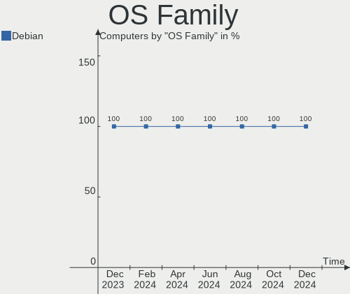
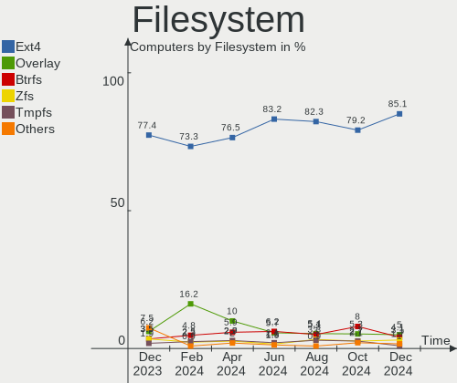
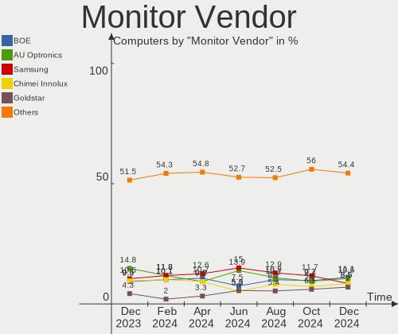
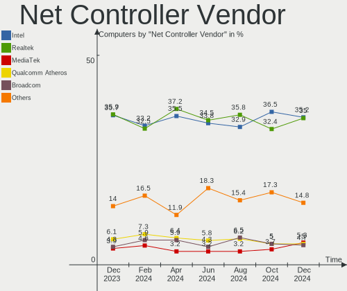
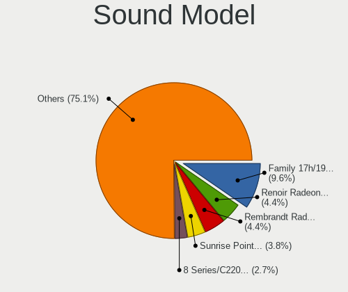

Debian Hardware Trends
----------------------

A project to identify most popular hardware characteristics and track their change
over time based on data collected by Debian users at https://Linux-Hardware.org.

Anyone can contribute to the study by uploading probes of their computers by
the [hw-probe](https://github.com/linuxhw/hw-probe) tool:

    sudo -E hw-probe -all -upload

This is a report for all computer types. See also reports for [desktops](/Dist/Debian/Desktop/README.md) and [notebooks](/Dist/Debian/Notebook/README.md).

Full-feature report is available here: https://linux-hardware.org/?view=trends

Period: Dec, 2020.

Contents
--------

- [ OS                       ](#os)
- [ OS Family                ](#os-family)
- [ Kernel                   ](#kernel)
- [ Kernel Family            ](#kernel-family)
- [ Kernel Major Ver.        ](#kernel-major-ver)
- [ Arch                     ](#arch)
- [ DE                       ](#de)
- [ Display Server           ](#display-server)
- [ Display Manager          ](#display-manager)
- [ OS Lang                  ](#os-lang)
- [ Boot Mode                ](#boot-mode)
- [ Filesystem               ](#filesystem)
- [ Part. scheme             ](#part-scheme)
- [ Dual Boot with Linux/BSD ](#dual-boot-with-linux/bsd)
- [ Dual Boot (Win)          ](#dual-boot-win)
- [ Country                  ](#country)
- [ City                     ](#city)
- [ Vendor                   ](#vendor)
- [ Model                    ](#model)
- [ Model Family             ](#model-family)
- [ MFG Year                 ](#mfg-year)
- [ Form Factor              ](#form-factor)
- [ Secure Boot              ](#secure-boot)
- [ Coreboot                 ](#coreboot)
- [ RAM Size                 ](#ram-size)
- [ RAM Used                 ](#ram-used)
- [ Has CD-ROM               ](#has-cd-rom)
- [ Total Drives             ](#total-drives)
- [ Has Ethernet             ](#has-ethernet)
- [ Drive Vendor             ](#drive-vendor)
- [ Drive Model              ](#drive-model)
- [ HDD Vendor               ](#hdd-vendor)
- [ SSD Vendor               ](#ssd-vendor)
- [ Drive Kind               ](#drive-kind)
- [ Drive Connector          ](#drive-connector)
- [ Drive Size               ](#drive-size)
- [ Space Total              ](#space-total)
- [ Space Used               ](#space-used)
- [ Malfunc. Drives          ](#malfunc-drives)
- [ Malfunc. Drive Vendor    ](#malfunc-drive-vendor)
- [ Malfunc. HDD Vendor      ](#malfunc-hdd-vendor)
- [ Malfunc. Drive Kind      ](#malfunc-drive-kind)
- [ Failed Drives            ](#failed-drives)
- [ Failed Drive Vendor      ](#failed-drive-vendor)
- [ Drive Status             ](#drive-status)
- [ Storage Vendor           ](#storage-vendor)
- [ Storage Model            ](#storage-model)
- [ Storage Kind             ](#storage-kind)
- [ CPU Vendor               ](#cpu-vendor)
- [ CPU Model                ](#cpu-model)
- [ CPU Model Family         ](#cpu-model-family)
- [ CPU Cores                ](#cpu-cores)
- [ CPU Sockets              ](#cpu-sockets)
- [ CPU Threads              ](#cpu-threads)
- [ CPU Op-Modes             ](#cpu-op-modes)
- [ CPU Microcode            ](#cpu-microcode)
- [ CPU Microarch            ](#cpu-microarch)
- [ GPU Vendor               ](#gpu-vendor)
- [ GPU Model                ](#gpu-model)
- [ GPU Combo                ](#gpu-combo)
- [ GPU Driver               ](#gpu-driver)
- [ GPU Memory               ](#gpu-memory)
- [ Monitor Vendor           ](#monitor-vendor)
- [ Monitor Model            ](#monitor-model)
- [ Monitor Resolution       ](#monitor-resolution)
- [ Monitor Diagonal         ](#monitor-diagonal)
- [ Monitor Width            ](#monitor-width)
- [ Aspect Ratio             ](#aspect-ratio)
- [ Monitor Area             ](#monitor-area)
- [ Pixel Density            ](#pixel-density)
- [ Multiple Monitors        ](#multiple-monitors)
- [ Net Controller Vendor    ](#net-controller-vendor)
- [ Net Controller Model     ](#net-controller-model)
- [ Wireless Vendor          ](#wireless-vendor)
- [ Wireless Model           ](#wireless-model)
- [ Ethernet Vendor          ](#ethernet-vendor)
- [ Ethernet Model           ](#ethernet-model)
- [ Net Controller Kind      ](#net-controller-kind)
- [ Used Controller          ](#used-controller)
- [ NICs                     ](#nics)
- [ Memory Vendor            ](#memory-vendor)
- [ Memory Model             ](#memory-model)
- [ Memory Kind              ](#memory-kind)
- [ Memory Form Factor       ](#memory-form-factor)
- [ Memory Size              ](#memory-size)
- [ Memory Speed             ](#memory-speed)
- [ Sound Vendor             ](#sound-vendor)
- [ Sound Model              ](#sound-model)
- [ Camera Vendor            ](#camera-vendor)
- [ Camera Model             ](#camera-model)
- [ Fingerprint Vendor       ](#fingerprint-vendor)
- [ Fingerprint Model        ](#fingerprint-model)
- [ Chipcard Vendor          ](#chipcard-vendor)
- [ Chipcard Model           ](#chipcard-model)
- [ Printer Vendor           ](#printer-vendor)
- [ Printer Model            ](#printer-model)
- [ Scanner Vendor           ](#scanner-vendor)
- [ Scanner Model            ](#scanner-model)
- [ Bluetooth Vendor         ](#bluetooth-vendor)
- [ Bluetooth Model          ](#bluetooth-model)
- [ Unsupported Devices      ](#unsupported-devices)
- [ Unsupported Device Types ](#unsupported-device-types)

OS
--

Installed operating systems

| Name            | Computers | Percent |
|-----------------|-----------|---------|
| Debian 10       | 104       | 63.8%   |
| Debian Testing  | 32        | 19.63%  |
| Debian          | 16        | 9.82%   |
| Debian Unstable | 7         | 4.29%   |
| Debian 9.13     | 3         | 1.84%   |
| Debian 9.12     | 1         | 0.61%   |

OS Family
---------

OS without a version

| Name   | Computers | Percent |
|--------|-----------|---------|
| Debian | 163       | 100%    |

Kernel
------

Version of the Linux kernel

| Version                                     | Computers | Percent |
|---------------------------------------------|-----------|---------|
| 4.19.0-13-amd64                             | 53        | 32.52%  |
| 5.9.0-4-amd64                               | 28        | 17.18%  |
| 4.19.0-12-amd64                             | 19        | 11.66%  |
| 5.9.0-5-amd64                               | 11        | 6.75%   |
| 5.9.0-0.bpo.2-amd64                         | 6         | 3.68%   |
| 5.9.0-3-amd64                               | 5         | 3.07%   |
| 4.19.0-6-amd64                              | 5         | 3.07%   |
| 5.8.0-3-amd64                               | 3         | 1.84%   |
| 4.9.0-14-amd64                              | 3         | 1.84%   |
| 4.19.0-11-amd64                             | 3         | 1.84%   |
| 5.8.0-0.bpo.2-amd64                         | 2         | 1.23%   |
| 4.19.0-9-amd64                              | 2         | 1.23%   |
| 5.9.15-xanmod1                              | 1         | 0.61%   |
| 5.9.14-xanmod1                              | 1         | 0.61%   |
| 5.9.11-amd64                                | 1         | 0.61%   |
| 5.9.0-4-686-pae                             | 1         | 0.61%   |
| 5.9.0-2-amd64                               | 1         | 0.61%   |
| 5.9.0-2-686-pae                             | 1         | 0.61%   |
| 5.7.0-19.1-liquorix-amd64                   | 1         | 0.61%   |
| 5.7.0-1-amd64                               | 1         | 0.61%   |
| 5.7.0-0.bpo.2-amd64                         | 1         | 0.61%   |
| 5.4.79-v8+                                  | 1         | 0.61%   |
| 5.4.78-1-pve                                | 1         | 0.61%   |
| 5.4.72-v8+                                  | 1         | 0.61%   |
| 5.4.31                                      | 1         | 0.61%   |
| 5.4.0-8.2-liquorix-amd64                    | 1         | 0.61%   |
| 5.10.0-rc6-hpdv2k-00060-g34816d20f173-dirty | 1         | 0.61%   |
| 5.10.0-rc5-croessler4                       | 1         | 0.61%   |
| 5.0.0-trunk-amd64                           | 1         | 0.61%   |
| 4.9.0-8-amd64                               | 1         | 0.61%   |
| 4.9.0-11-amd64                              | 1         | 0.61%   |
| 4.19.0-13-686-pae                           | 1         | 0.61%   |
| 4.19.0-12-lzk-bl-amd64                      | 1         | 0.61%   |
| 4.19.0-11-686-pae                           | 1         | 0.61%   |
| 4.19.0-10-686                               | 1         | 0.61%   |

Kernel Family
-------------

Linux kernel without a distro release

| Version | Computers | Percent |
|---------|-----------|---------|
| 4.19.0  | 86        | 52.76%  |
| 5.9.0   | 53        | 32.52%  |
| 5.8.0   | 5         | 3.07%   |
| 4.9.0   | 5         | 3.07%   |
| 5.7.0   | 3         | 1.84%   |
| 5.10.0  | 2         | 1.23%   |
| 5.9.15  | 1         | 0.61%   |
| 5.9.14  | 1         | 0.61%   |
| 5.9.11  | 1         | 0.61%   |
| 5.4.79  | 1         | 0.61%   |
| 5.4.78  | 1         | 0.61%   |
| 5.4.72  | 1         | 0.61%   |
| 5.4.31  | 1         | 0.61%   |
| 5.4.0   | 1         | 0.61%   |
| 5.0.0   | 1         | 0.61%   |

Kernel Major Ver.
-----------------

Linux kernel major version

| Version | Computers | Percent |
|---------|-----------|---------|
| 4.19    | 86        | 52.76%  |
| 5.9     | 56        | 34.36%  |
| 5.8     | 5         | 3.07%   |
| 5.4     | 5         | 3.07%   |
| 4.9     | 5         | 3.07%   |
| 5.7     | 3         | 1.84%   |
| 5.10    | 2         | 1.23%   |
| 5.0     | 1         | 0.61%   |

Arch
----

OS architecture (x86_64, i586, etc.)

| Name    | Computers | Percent |
|---------|-----------|---------|
| x86_64  | 155       | 95.09%  |
| i686    | 5         | 3.07%   |
| aarch64 | 2         | 1.23%   |
| armv7l  | 1         | 0.61%   |

DE
--

Desktop Environment

| Name             | Computers | Percent |
|------------------|-----------|---------|
| GNOME            | 36        | 22.09%  |
| XFCE             | 25        | 15.34%  |
| Unknown          | 24        | 14.72%  |
| KDE5             | 17        | 10.43%  |
| KDE              | 17        | 10.43%  |
| MATE             | 14        | 8.59%   |
| Cinnamon         | 9         | 5.52%   |
| X-Cinnamon       | 7         | 4.29%   |
| LXDE             | 3         | 1.84%   |
| fluxbox          | 3         | 1.84%   |
| i3               | 2         | 1.23%   |
| Openbox          | 1         | 0.61%   |
| LXQt             | 1         | 0.61%   |
| lightdm-xsession | 1         | 0.61%   |
| GNOME Flashback  | 1         | 0.61%   |
| default          | 1         | 0.61%   |
| Budgie           | 1         | 0.61%   |

Display Server
--------------

X11 or Wayland

| Name    | Computers | Percent |
|---------|-----------|---------|
| X11     | 115       | 70.55%  |
| Wayland | 25        | 15.34%  |
| Tty     | 17        | 10.43%  |
| Unknown | 6         | 3.68%   |

Display Manager
---------------

SDDM, LightDM, etc.

| Name    | Computers | Percent |
|---------|-----------|---------|
| Unknown | 78        | 47.85%  |
| TDM     | 37        | 22.7%   |
| GDM     | 24        | 14.72%  |
| SDDM    | 19        | 11.66%  |
| LightDM | 3         | 1.84%   |
| SLiM    | 1         | 0.61%   |
| GDM3    | 1         | 0.61%   |

OS Lang
-------

Language

| Lang       | Computers | Percent |
|------------|-----------|---------|
| en_US      | 53        | 32.52%  |
| de_DE      | 22        | 13.5%   |
| fr_FR      | 14        | 8.59%   |
| es_ES      | 11        | 6.75%   |
| en_GB      | 9         | 5.52%   |
| Unknown    | 7         | 4.29%   |
| ru_RU      | 6         | 3.68%   |
| pt_BR      | 4         | 2.45%   |
| pt_PT      | 3         | 1.84%   |
| pl_PL      | 3         | 1.84%   |
| it_IT      | 3         | 1.84%   |
| en_US.utf8 | 3         | 1.84%   |
| en_CA      | 3         | 1.84%   |
| en_AU      | 3         | 1.84%   |
| hu_HU      | 2         | 1.23%   |
| en_IN      | 2         | 1.23%   |
| de_CH      | 2         | 1.23%   |
| zh_TW      | 1         | 0.61%   |
| tr_TR      | 1         | 0.61%   |
| sk_SK      | 1         | 0.61%   |
| ro_RO      | 1         | 0.61%   |
| nl_BE      | 1         | 0.61%   |
| fr_CH      | 1         | 0.61%   |
| es_MX      | 1         | 0.61%   |
| es_CL      | 1         | 0.61%   |
| en_IE      | 1         | 0.61%   |
| en_DK      | 1         | 0.61%   |
| de_AT.UTF8 | 1         | 0.61%   |
| da_DK      | 1         | 0.61%   |
| C          | 1         | 0.61%   |

Boot Mode
---------

EFI or BIOS

| Mode | Computers | Percent |
|------|-----------|---------|
| BIOS | 88        | 53.99%  |
| EFI  | 75        | 46.01%  |

Filesystem
----------

Type of filesystem

| Type  | Computers | Percent |
|-------|-----------|---------|
| Ext4  | 151       | 92.64%  |
| Btrfs | 7         | 4.29%   |
| Xfs   | 3         | 1.84%   |
| F2fs  | 1         | 0.61%   |
| Ext3  | 1         | 0.61%   |

Part. scheme
------------

Scheme of partitioning

| Type    | Computers | Percent |
|---------|-----------|---------|
| GPT     | 82        | 50.31%  |
| Unknown | 61        | 37.42%  |
| MBR     | 20        | 12.27%  |

Dual Boot with Linux/BSD
------------------------

Hosting more than one Linux/BSD

| Dual boot | Computers | Percent |
|-----------|-----------|---------|
| No        | 146       | 89.57%  |
| Yes       | 17        | 10.43%  |

Dual Boot (Win)
---------------

Hosting Linux and Windows

| Dual boot | Computers | Percent |
|-----------|-----------|---------|
| No        | 130       | 79.75%  |
| Yes       | 33        | 20.25%  |

Country
-------

Geographic location (country)

| Country        | Computers | Percent |
|----------------|-----------|---------|
| USA            | 31        | 19.02%  |
| Germany        | 23        | 14.11%  |
| France         | 15        | 9.2%    |
| Spain          | 14        | 8.59%   |
| Russia         | 8         | 4.91%   |
| Switzerland    | 7         | 4.29%   |
| Poland         | 4         | 2.45%   |
| Italy          | 4         | 2.45%   |
| India          | 4         | 2.45%   |
| Brazil         | 4         | 2.45%   |
| UK             | 3         | 1.84%   |
| Turkey         | 3         | 1.84%   |
| Slovakia       | 3         | 1.84%   |
| Portugal       | 3         | 1.84%   |
| Hungary        | 3         | 1.84%   |
| Denmark        | 3         | 1.84%   |
| Australia      | 3         | 1.84%   |
| Norway         | 2         | 1.23%   |
| Mexico         | 2         | 1.23%   |
| Japan          | 2         | 1.23%   |
| Czech Republic | 2         | 1.23%   |
| Chile          | 2         | 1.23%   |
| Canada         | 2         | 1.23%   |
| Ukraine        | 1         | 0.61%   |
| Thailand       | 1         | 0.61%   |
| Taiwan         | 1         | 0.61%   |
| Saudi Arabia   | 1         | 0.61%   |
| Romania        | 1         | 0.61%   |
| Netherlands    | 1         | 0.61%   |
| Nepal          | 1         | 0.61%   |
| Iran           | 1         | 0.61%   |
| Guyana         | 1         | 0.61%   |
| Greece         | 1         | 0.61%   |
| Finland        | 1         | 0.61%   |
| Croatia        | 1         | 0.61%   |
| China          | 1         | 0.61%   |
| Belgium        | 1         | 0.61%   |
| Belarus        | 1         | 0.61%   |
| Austria        | 1         | 0.61%   |

City
----

Geographic location (city)

| City                | Computers | Percent |
|---------------------|-----------|---------|
| New York            | 5         | 3.07%   |
| Oberwil             | 3         | 1.84%   |
| Moscow              | 3         | 1.84%   |
| Madrid              | 3         | 1.84%   |
| Fruitland           | 3         | 1.84%   |
| Wuppertal           | 2         | 1.23%   |
| Springfield         | 2         | 1.23%   |
| Parla               | 2         | 1.23%   |
| Paris               | 2         | 1.23%   |
| Ingenio             | 2         | 1.23%   |
| Honcho              | 2         | 1.23%   |
| Hamburg             | 2         | 1.23%   |
| Antalya             | 2         | 1.23%   |
| Łódź             | 1         | 0.61%   |
| Zurich              | 1         | 0.61%   |
| Zubrohlava          | 1         | 0.61%   |
| Zaragoza            | 1         | 0.61%   |
| Yaya                | 1         | 0.61%   |
| Williamstown        | 1         | 0.61%   |
| Westminster         | 1         | 0.61%   |
| West Fargo          | 1         | 0.61%   |
| Wangen              | 1         | 0.61%   |
| Vitoria-Gasteiz     | 1         | 0.61%   |
| Vigo                | 1         | 0.61%   |
| Vienna              | 1         | 0.61%   |
| Vevey               | 1         | 0.61%   |
| Verona              | 1         | 0.61%   |
| Varaždin           | 1         | 0.61%   |
| Utrecht             | 1         | 0.61%   |
| Tweed Heads         | 1         | 0.61%   |
| Trondheim           | 1         | 0.61%   |
| Trebišov           | 1         | 0.61%   |
| Tellico Plains      | 1         | 0.61%   |
| Taipei              | 1         | 0.61%   |
| Syntagma            | 1         | 0.61%   |
| Sunnyvale           | 1         | 0.61%   |
| Sultanpur           | 1         | 0.61%   |
| Stuttgart           | 1         | 0.61%   |
| Stoke Newington     | 1         | 0.61%   |
| St Petersburg       | 1         | 0.61%   |
| Springe             | 1         | 0.61%   |
| South Burlington    | 1         | 0.61%   |
| Sonneberg           | 1         | 0.61%   |
| Silver Spring       | 1         | 0.61%   |
| Siegburg            | 1         | 0.61%   |
| Shenzhen            | 1         | 0.61%   |
| Santiago            | 1         | 0.61%   |
| Saint-Ouen          | 1         | 0.61%   |
| Saint James         | 1         | 0.61%   |
| Sabadell            | 1         | 0.61%   |
| Roubaix             | 1         | 0.61%   |
| Rome                | 1         | 0.61%   |
| Roanoke             | 1         | 0.61%   |
| Riyadh              | 1         | 0.61%   |
| Rio de Janeiro      | 1         | 0.61%   |
| Rancho Palos Verdes | 1         | 0.61%   |
| Puymirol            | 1         | 0.61%   |
| Prague              | 1         | 0.61%   |
| Portland            | 1         | 0.61%   |
| Pokhvistnevo        | 1         | 0.61%   |

Vendor
------

Motherboard manufacturer

| Name                    | Computers | Percent |
|-------------------------|-----------|---------|
| Lenovo                  | 34        | 20.86%  |
| ASUSTek Computer        | 31        | 19.02%  |
| Hewlett-Packard         | 22        | 13.5%   |
| Dell                    | 17        | 10.43%  |
| Gigabyte Technology     | 7         | 4.29%   |
| ASRock                  | 7         | 4.29%   |
| MSI                     | 6         | 3.68%   |
| Acer                    | 6         | 3.68%   |
| Intel                   | 4         | 2.45%   |
| Unknown                 | 4         | 2.45%   |
| Fujitsu Siemens         | 3         | 1.84%   |
| Toshiba                 | 2         | 1.23%   |
| Raspberry Pi Foundation | 2         | 1.23%   |
| HUAWEI                  | 2         | 1.23%   |
| Apple                   | 2         | 1.23%   |
| ZOTAC                   | 1         | 0.61%   |
| TUXEDO                  | 1         | 0.61%   |
| Supermicro              | 1         | 0.61%   |
| Samsung Electronics     | 1         | 0.61%   |
| Razer                   | 1         | 0.61%   |
| LG Electronics          | 1         | 0.61%   |
| Huanan                  | 1         | 0.61%   |
| HKC                     | 1         | 0.61%   |
| HASEE Computer          | 1         | 0.61%   |
| Fujitsu                 | 1         | 0.61%   |
| Compulab                | 1         | 0.61%   |
| Biostar                 | 1         | 0.61%   |
| AZW                     | 1         | 0.61%   |
| AMI                     | 1         | 0.61%   |

Model
-----

Motherboard model

| Name                                       | Computers | Percent |
|--------------------------------------------|-----------|---------|
| Unknown                                    | 4         | 2.45%   |
| ASUS All Series                            | 3         | 1.84%   |
| HUAWEI BOHK-WAX9X                          | 2         | 1.23%   |
| ASUS Rampage IV EXTREME                    | 2         | 1.23%   |
| ZOTAC ZBOX-MI551/BOX-MI571                 | 1         | 0.61%   |
| TUXEDO BC1510 1710                         | 1         | 0.61%   |
| Toshiba TECRA R840                         | 1         | 0.61%   |
| Toshiba QOSMIO X500                        | 1         | 0.61%   |
| Supermicro Super Server                    | 1         | 0.61%   |
| Samsung 700T1C                             | 1         | 0.61%   |
| Razer Blade Stealth                        | 1         | 0.61%   |
| RPi Raspberry Pi 4 Model B Rev 1.4         | 1         | 0.61%   |
| RPi Raspberry Pi 4 Model B Rev 1.1         | 1         | 0.61%   |
| MSI MS-B09611                              | 1         | 0.61%   |
| MSI MS-7C75                                | 1         | 0.61%   |
| MSI MS-7B79                                | 1         | 0.61%   |
| MSI MS-7817                                | 1         | 0.61%   |
| MSI MS-7751                                | 1         | 0.61%   |
| MSI MS-7693                                | 1         | 0.61%   |
| LG 17Z990-R.AAS8U1                         | 1         | 0.61%   |
| Lenovo Y50-70 20378                        | 1         | 0.61%   |
| Lenovo ThinkStation D30 435479G            | 1         | 0.61%   |
| Lenovo ThinkPad X1 Carbon Gen 8 20U90003GE | 1         | 0.61%   |
| Lenovo ThinkPad T60 1951WJ1                | 1         | 0.61%   |
| Lenovo ThinkPad T510 4384GEG               | 1         | 0.61%   |
| Lenovo ThinkPad T500 20828YG               | 1         | 0.61%   |
| Lenovo ThinkPad T495 20NJCTO1WW            | 1         | 0.61%   |
| Lenovo ThinkPad T490s 20NYS7K900           | 1         | 0.61%   |
| Lenovo ThinkPad T490s 20NX001PMD           | 1         | 0.61%   |
| Lenovo ThinkPad T490 20N2000FIX            | 1         | 0.61%   |
| Lenovo ThinkPad T460s 20FAS3KA00           | 1         | 0.61%   |
| Lenovo ThinkPad T460 20FMS08Q1B            | 1         | 0.61%   |
| Lenovo ThinkPad T450s 20BWS01300           | 1         | 0.61%   |
| Lenovo ThinkPad T440s 20ARS30Q00           | 1         | 0.61%   |
| Lenovo ThinkPad T400 6475WJE               | 1         | 0.61%   |
| Lenovo ThinkPad T14s Gen 1 20UJ001CMX      | 1         | 0.61%   |
| Lenovo ThinkPad T14 Gen 1 20UDCTO1WW       | 1         | 0.61%   |
| Lenovo ThinkPad S1 Yoga 20CD0038MN         | 1         | 0.61%   |
| Lenovo ThinkPad E590 20NB0012RT            | 1         | 0.61%   |
| Lenovo ThinkPad 11e 20DAS0PS00             | 1         | 0.61%   |
| Lenovo ThinkCentre M92p 3209EK4            | 1         | 0.61%   |
| Lenovo ThinkBook 13s-IWL 20R9              | 1         | 0.61%   |
| Lenovo K2450 20243                         | 1         | 0.61%   |
| Lenovo IdeaPad Z400 20201                  | 1         | 0.61%   |
| Lenovo IdeaPad Y560                        | 1         | 0.61%   |
| Lenovo IdeaPad Flex 5 15IIL05 81X3         | 1         | 0.61%   |
| Lenovo IdeaPad 5 15ARE05 81YQ              | 1         | 0.61%   |
| Lenovo IdeaPad 320-15IKB 81BT              | 1         | 0.61%   |
| Lenovo IdeaPad 110-15IBR 80T7              | 1         | 0.61%   |
| Lenovo IdeaCentre 510S-07ICB 90K800GHMW    | 1         | 0.61%   |
| Lenovo IdeaCentre 200-01IBW 90FA0011GE     | 1         | 0.61%   |
| Lenovo G50-80 80E5                         | 1         | 0.61%   |
| Lenovo G470 4328                           | 1         | 0.61%   |
| Lenovo 70LV003JEA ThinkServer TS150        | 1         | 0.61%   |
| Intel NUC8i5BEH                            | 1         | 0.61%   |
| Intel NUC7i3BNH                            | 1         | 0.61%   |
| Intel NUC10i7FNH                           | 1         | 0.61%   |
| Intel DH61WW AAG23116-204                  | 1         | 0.61%   |
| Huanan X79 V2.47                           | 1         | 0.61%   |
| HKC N14DC                                  | 1         | 0.61%   |

Model Family
------------

Motherboard model prefix

| Name                    | Computers | Percent |
|-------------------------|-----------|---------|
| Lenovo ThinkPad         | 18        | 11.04%  |
| Lenovo IdeaPad          | 6         | 3.68%   |
| Dell Latitude           | 6         | 3.68%   |
| HP Laptop               | 5         | 3.07%   |
| Acer Aspire             | 5         | 3.07%   |
| Dell Inspiron           | 4         | 2.45%   |
| Unknown                 | 4         | 2.45%   |
| HP Pavilion             | 3         | 1.84%   |
| HP EliteBook            | 3         | 1.84%   |
| Fujitsu Siemens ESPRIMO | 3         | 1.84%   |
| ASUS ROG                | 3         | 1.84%   |
| ASUS PRIME              | 3         | 1.84%   |
| ASUS All                | 3         | 1.84%   |
| RPi Raspberry           | 2         | 1.23%   |
| Lenovo IdeaCentre       | 2         | 1.23%   |
| HUAWEI BOHK-WAX9X       | 2         | 1.23%   |
| HP ProDesk              | 2         | 1.23%   |
| HP 15                   | 2         | 1.23%   |
| Dell OptiPlex           | 2         | 1.23%   |
| ASUS Rampage            | 2         | 1.23%   |
| ASUS P8Z68-V            | 2         | 1.23%   |
| ZOTAC ZBOX-MI551        | 1         | 0.61%   |
| TUXEDO BC1510           | 1         | 0.61%   |
| Toshiba TECRA           | 1         | 0.61%   |
| Toshiba QOSMIO          | 1         | 0.61%   |
| Supermicro Super        | 1         | 0.61%   |
| Samsung 700T1C          | 1         | 0.61%   |
| Razer Blade             | 1         | 0.61%   |
| MSI MS-B09611           | 1         | 0.61%   |
| MSI MS-7C75             | 1         | 0.61%   |
| MSI MS-7B79             | 1         | 0.61%   |
| MSI MS-7817             | 1         | 0.61%   |
| MSI MS-7751             | 1         | 0.61%   |
| MSI MS-7693             | 1         | 0.61%   |
| LG 17Z990-R.AAS8U1      | 1         | 0.61%   |
| Lenovo Y50-70           | 1         | 0.61%   |
| Lenovo ThinkStation     | 1         | 0.61%   |
| Lenovo ThinkCentre      | 1         | 0.61%   |
| Lenovo ThinkBook        | 1         | 0.61%   |
| Lenovo K2450            | 1         | 0.61%   |
| Lenovo G50-80           | 1         | 0.61%   |
| Lenovo G470             | 1         | 0.61%   |
| Lenovo 70LV003JEA       | 1         | 0.61%   |
| Intel NUC8i5BEH         | 1         | 0.61%   |
| Intel NUC7i3BNH         | 1         | 0.61%   |
| Intel NUC10i7FNH        | 1         | 0.61%   |
| Intel DH61WW            | 1         | 0.61%   |
| Huanan X79              | 1         | 0.61%   |
| HKC N14DC               | 1         | 0.61%   |
| HP t620                 | 1         | 0.61%   |
| HP t5740                | 1         | 0.61%   |
| HP Spectre              | 1         | 0.61%   |
| HP ProBook              | 1         | 0.61%   |
| HP NOTEBOOK             | 1         | 0.61%   |
| HP 250                  | 1         | 0.61%   |
| HP 2000                 | 1         | 0.61%   |
| HASEE PF4WN2F           | 1         | 0.61%   |
| Gigabyte X99-Gaming     | 1         | 0.61%   |
| Gigabyte X79-UP4        | 1         | 0.61%   |
| Gigabyte H97N-WIFI      | 1         | 0.61%   |

MFG Year
--------

Motherboard manufacture year

| Year    | Computers | Percent |
|---------|-----------|---------|
| 2020    | 28        | 17.18%  |
| 2019    | 27        | 16.56%  |
| 2014    | 15        | 9.2%    |
| 2017    | 14        | 8.59%   |
| 2018    | 11        | 6.75%   |
| 2016    | 11        | 6.75%   |
| 2010    | 9         | 5.52%   |
| 2015    | 8         | 4.91%   |
| 2013    | 8         | 4.91%   |
| 2012    | 8         | 4.91%   |
| 2011    | 6         | 3.68%   |
| 2009    | 6         | 3.68%   |
| Unknown | 4         | 2.45%   |
| 2008    | 2         | 1.23%   |
| 2007    | 2         | 1.23%   |
| 2006    | 2         | 1.23%   |
| 2005    | 1         | 0.61%   |
| 2000    | 1         | 0.61%   |

Form Factor
-----------

Physical design of the computer

| Name           | Computers | Percent |
|----------------|-----------|---------|
| Notebook       | 81        | 49.69%  |
| Desktop        | 65        | 39.88%  |
| Mini pc        | 6         | 3.68%   |
| Convertible    | 4         | 2.45%   |
| Server         | 3         | 1.84%   |
| System on chip | 2         | 1.23%   |
| All in one     | 2         | 1.23%   |

Secure Boot
-----------

Enabled or disabled

| State    | Computers | Percent |
|----------|-----------|---------|
| Disabled | 151       | 92.64%  |
| Enabled  | 12        | 7.36%   |

Coreboot
--------

Have coreboot on board

| Used | Computers | Percent |
|------|-----------|---------|
| No   | 162       | 99.39%  |
| Yes  | 1         | 0.61%   |

RAM Size
--------

Total RAM memory

| Size in GB      | Computers | Percent |
|-----------------|-----------|---------|
| 4.01-8.0        | 36        | 22.09%  |
| 8.01-16.0       | 34        | 20.86%  |
| 16.01-24.0      | 31        | 19.02%  |
| 3.01-4.0        | 26        | 15.95%  |
| 32.01-64.0      | 16        | 9.82%   |
| 1.01-2.0        | 6         | 3.68%   |
| 64.01-256.0     | 5         | 3.07%   |
| 2.01-3.0        | 4         | 2.45%   |
| 24.01-32.0      | 3         | 1.84%   |
| More than 256.0 | 1         | 0.61%   |
| 0.01-0.5        | 1         | 0.61%   |

RAM Used
--------

Used RAM memory

| Used GB    | Computers | Percent |
|------------|-----------|---------|
| 1.01-2.0   | 52        | 31.9%   |
| 2.01-3.0   | 45        | 27.61%  |
| 4.01-8.0   | 25        | 15.34%  |
| 3.01-4.0   | 13        | 7.98%   |
| 0.51-1.0   | 13        | 7.98%   |
| 8.01-16.0  | 8         | 4.91%   |
| 0.01-0.5   | 6         | 3.68%   |
| 32.01-64.0 | 1         | 0.61%   |

Has CD-ROM
----------

Has CD-ROM on board

| Presented | Computers | Percent |
|-----------|-----------|---------|
| No        | 102       | 62.58%  |
| Yes       | 61        | 37.42%  |

Total Drives
------------

Number of drives on board

| Drives | Computers | Percent |
|--------|-----------|---------|
| 1      | 103       | 63.19%  |
| 2      | 30        | 18.4%   |
| 3      | 17        | 10.43%  |
| 5      | 4         | 2.45%   |
| 4      | 4         | 2.45%   |
| 7      | 3         | 1.84%   |
| 13     | 1         | 0.61%   |
| 12     | 1         | 0.61%   |

Has Ethernet
------------

Has Ethernet on board

| Presented | Computers | Percent |
|-----------|-----------|---------|
| Yes       | 144       | 88.34%  |
| No        | 19        | 11.66%  |

Drive Vendor
------------

Hard drive vendors

| Vendor              | Computers | Drives | Percent |
|---------------------|-----------|--------|---------|
| Samsung Electronics | 41        | 44     | 17.01%  |
| WDC                 | 40        | 57     | 16.6%   |
| Seagate             | 34        | 49     | 14.11%  |
| Toshiba             | 19        | 19     | 7.88%   |
| Kingston            | 16        | 20     | 6.64%   |
| Unknown             | 13        | 14     | 5.39%   |
| Crucial             | 13        | 14     | 5.39%   |
| SanDisk             | 8         | 8      | 3.32%   |
| SK Hynix            | 7         | 7      | 2.9%    |
| Hitachi             | 7         | 7      | 2.9%    |
| HGST                | 6         | 7      | 2.49%   |
| Intel               | 5         | 5      | 2.07%   |
| Hewlett-Packard     | 4         | 7      | 1.66%   |
| OCZ                 | 3         | 5      | 1.24%   |
| Phison Electronics  | 2         | 2      | 0.83%   |
| Phison              | 2         | 3      | 0.83%   |
| Micron Technology   | 2         | 2      | 0.83%   |
| Jmicron             | 2         | 2      | 0.83%   |
| China               | 2         | 2      | 0.83%   |
| A-DATA Technology   | 2         | 2      | 0.83%   |
| VALK                | 1         | 1      | 0.41%   |
| SPCC                | 1         | 1      | 0.41%   |
| QUANTUM             | 1         | 1      | 0.41%   |
| Patriot             | 1         | 2      | 0.41%   |
| ORICO               | 1         | 1      | 0.41%   |
| Maxtor              | 1         | 2      | 0.41%   |
| KingDian            | 1         | 1      | 0.41%   |
| InnoLite            | 1         | 1      | 0.41%   |
| HPE                 | 1         | 1      | 0.41%   |
| Gigabyte Technology | 1         | 1      | 0.41%   |
| DOGFISH             | 1         | 1      | 0.41%   |
| Apple               | 1         | 1      | 0.41%   |
| AMD                 | 1         | 1      | 0.41%   |

Drive Model
-----------

Hard drive models

| Model                              | Computers | Percent |
|------------------------------------|-----------|---------|
| Samsung NVMe SSD Drive 512GB       | 4         | 1.52%   |
| Kingston SA400S37240G 240GB SSD    | 4         | 1.52%   |
| WDC WD10EALX-009BA0 1TB            | 3         | 1.14%   |
| Seagate ST500DM002-1BD142 500GB    | 3         | 1.14%   |
| Seagate ST1000LM024 HN-M101MBB 1TB | 3         | 1.14%   |
| Samsung SSD 970 EVO Plus 1TB       | 3         | 1.14%   |
| OCZ VERTEX4 256GB SSD              | 3         | 1.14%   |
| Kingston SUV400S37120G 120GB SSD   | 3         | 1.14%   |
| Kingston SA400S37480G 480GB SSD    | 3         | 1.14%   |
| WDC WDS240G2G0A-00JH30 240GB SSD   | 2         | 0.76%   |
| WDC WD40EZRX-00SPEB0 4TB           | 2         | 0.76%   |
| WDC WD30EZRX-00DC0B0 3TB           | 2         | 0.76%   |
| WDC WD20EFRX-68EUZN0 2TB           | 2         | 0.76%   |
| Unknown SD/MMC 8GB                 | 2         | 0.76%   |
| Unknown MMC Card  64GB             | 2         | 0.76%   |
| Unknown MMC Card  32GB             | 2         | 0.76%   |
| Toshiba MQ01ABF050 500GB           | 2         | 0.76%   |
| Toshiba MQ01ABD100 1TB             | 2         | 0.76%   |
| Toshiba MQ01ABD050 500GB           | 2         | 0.76%   |
| SK Hynix HCG8e  64GB               | 2         | 0.76%   |
| Seagate ST9500325AS 500GB          | 2         | 0.76%   |
| Seagate ST500LT012-1DG142 500GB    | 2         | 0.76%   |
| Seagate ST4000DM004-2CV104 4TB     | 2         | 0.76%   |
| Seagate ST4000DM000-1F2168 4TB     | 2         | 0.76%   |
| Samsung SSD 860 EVO 500GB          | 2         | 0.76%   |
| Samsung SSD 860 EVO 250GB          | 2         | 0.76%   |
| Samsung SSD 860 EVO 1TB            | 2         | 0.76%   |
| Samsung SSD 850 EVO 250GB          | 2         | 0.76%   |
| Samsung SSD 850 EVO 1TB            | 2         | 0.76%   |
| Phison PCIe SSD 1TB                | 2         | 0.76%   |
| HGST HTS545050A7E680 500GB         | 2         | 0.76%   |
| Crucial CT500MX500SSD4 500GB       | 2         | 0.76%   |
| Crucial CT500MX500SSD1 500GB       | 2         | 0.76%   |
| Crucial CT250MX500SSD1 250GB       | 2         | 0.76%   |
| WDC WDS500G2B0C-00PXH0 500GB       | 1         | 0.38%   |
| WDC WDS100T2B0A-00SM50 1TB SSD     | 1         | 0.38%   |
| WDC WD7500AADS-00M2B0 752GB        | 1         | 0.38%   |
| WDC WD7500AACS-65D6B0 752GB        | 1         | 0.38%   |
| WDC WD5001FZWX-00ZHUA0 5TB         | 1         | 0.38%   |
| WDC WD5000LPVX-80V0TT0 500GB       | 1         | 0.38%   |
| WDC WD5000LPVT-60G33T0 500GB       | 1         | 0.38%   |
| WDC WD5000LPCX-24VHAT0 500GB       | 1         | 0.38%   |
| WDC WD5000AAKX-003CA0 500GB        | 1         | 0.38%   |
| WDC WD5000AAKX-001CA0 500GB        | 1         | 0.38%   |
| WDC WD5000AAKS-75YGA0 500GB        | 1         | 0.38%   |
| WDC WD5000AAKS-00UU3A0 500GB       | 1         | 0.38%   |
| WDC WD5000AADS-00S9B0 500GB        | 1         | 0.38%   |
| WDC WD30EFRX-68EUZN0 3TB           | 1         | 0.38%   |
| WDC WD2500BEVT-60A23T0 250GB       | 1         | 0.38%   |
| WDC WD2500AAKX-75U6AA0 250GB       | 1         | 0.38%   |
| WDC WD2500AAKX-60U6AA0 250GB       | 1         | 0.38%   |
| WDC WD20EARS-00J2GB0 2TB           | 1         | 0.38%   |
| WDC WD2003FZEX-00Z4SA0 2TB         | 1         | 0.38%   |
| WDC WD10SPZX-60Z10T0 1TB           | 1         | 0.38%   |
| WDC WD10SPZX-21Z10T0 1TB           | 1         | 0.38%   |
| WDC WD10S21X-24R1BT0-SSHD-8GB      | 1         | 0.38%   |
| WDC WD10JPVX-60JC3T1 1TB           | 1         | 0.38%   |
| WDC WD10JFCX-68N6GN0 1TB           | 1         | 0.38%   |
| WDC WD10EZRX-00L4HB0 1TB           | 1         | 0.38%   |
| WDC WD10EZRX-00D8PB0 1TB           | 1         | 0.38%   |

HDD Vendor
----------

Hard disk drive vendors

| Vendor              | Computers | Drives | Percent |
|---------------------|-----------|--------|---------|
| WDC                 | 32        | 48     | 32.32%  |
| Seagate             | 32        | 46     | 32.32%  |
| Toshiba             | 15        | 15     | 15.15%  |
| Hitachi             | 7         | 7      | 7.07%   |
| HGST                | 6         | 7      | 6.06%   |
| Samsung Electronics | 2         | 3      | 2.02%   |
| QUANTUM             | 1         | 1      | 1.01%   |
| Maxtor              | 1         | 2      | 1.01%   |
| HPE                 | 1         | 1      | 1.01%   |
| Hewlett-Packard     | 1         | 1      | 1.01%   |
| Apple               | 1         | 1      | 1.01%   |

SSD Vendor
----------

Solid state drive vendors

| Vendor              | Computers | Drives | Percent |
|---------------------|-----------|--------|---------|
| Samsung Electronics | 20        | 20     | 25.64%  |
| Kingston            | 14        | 17     | 17.95%  |
| Crucial             | 13        | 13     | 16.67%  |
| SanDisk             | 6         | 6      | 7.69%   |
| WDC                 | 3         | 3      | 3.85%   |
| OCZ                 | 3         | 5      | 3.85%   |
| Intel               | 2         | 2      | 2.56%   |
| China               | 2         | 2      | 2.56%   |
| VALK                | 1         | 1      | 1.28%   |
| Unknown             | 1         | 1      | 1.28%   |
| SPCC                | 1         | 1      | 1.28%   |
| Seagate             | 1         | 2      | 1.28%   |
| Patriot             | 1         | 2      | 1.28%   |
| ORICO               | 1         | 1      | 1.28%   |
| Micron Technology   | 1         | 1      | 1.28%   |
| KingDian            | 1         | 1      | 1.28%   |
| JMicron             | 1         | 1      | 1.28%   |
| InnoLite            | 1         | 1      | 1.28%   |
| Hewlett-Packard     | 1         | 1      | 1.28%   |
| Gigabyte Technology | 1         | 1      | 1.28%   |
| DOGFISH             | 1         | 1      | 1.28%   |
| AMD                 | 1         | 1      | 1.28%   |
| A-DATA Technology   | 1         | 1      | 1.28%   |

Drive Kind
----------

HDD or SSD

| Kind    | Computers | Drives | Percent |
|---------|-----------|--------|---------|
| HDD     | 82        | 132    | 37.27%  |
| SSD     | 73        | 85     | 33.18%  |
| NVMe    | 48        | 56     | 21.82%  |
| MMC     | 12        | 12     | 5.45%   |
| Unknown | 5         | 6      | 2.27%   |

Drive Connector
---------------

SATA, SAS, NVMe, etc.

| Type | Computers | Drives | Percent |
|------|-----------|--------|---------|
| SATA | 121       | 210    | 63.35%  |
| NVMe | 48        | 56     | 25.13%  |
| MMC  | 12        | 12     | 6.28%   |
| SAS  | 10        | 13     | 5.24%   |

Drive Size
----------

Size of hard drive

| Size in TB | Computers | Drives | Percent |
|------------|-----------|--------|---------|
| 0.01-0.5   | 89        | 119    | 54.94%  |
| 0.51-1.0   | 42        | 48     | 25.93%  |
| 1.01-2.0   | 10        | 12     | 6.17%   |
| 3.01-4.0   | 8         | 17     | 4.94%   |
| 4.01-10.0  | 7         | 13     | 4.32%   |
| 2.01-3.0   | 6         | 8      | 3.7%    |

Space Total
-----------

Amount of disk space available on the file system

| Size in GB     | Computers | Percent |
|----------------|-----------|---------|
| 101-250        | 46        | 28.22%  |
| 251-500        | 40        | 24.54%  |
| 501-1000       | 20        | 12.27%  |
| More than 3000 | 18        | 11.04%  |
| 1001-2000      | 10        | 6.13%   |
| 51-100         | 9         | 5.52%   |
| Unknown        | 9         | 5.52%   |
| 21-50          | 5         | 3.07%   |
| 2001-3000      | 4         | 2.45%   |
| 1-20           | 2         | 1.23%   |

Space Used
----------

Amount of used disk space

| Used GB        | Computers | Percent |
|----------------|-----------|---------|
| 1-20           | 55        | 33.74%  |
| 101-250        | 25        | 15.34%  |
| 51-100         | 16        | 9.82%   |
| 251-500        | 15        | 9.2%    |
| 21-50          | 14        | 8.59%   |
| 501-1000       | 11        | 6.75%   |
| More than 3000 | 9         | 5.52%   |
| 1001-2000      | 9         | 5.52%   |
| Unknown        | 9         | 5.52%   |

Malfunc. Drives
---------------

Drive models with a malfunction

| Model                             | Computers | Drives | Percent |
|-----------------------------------|-----------|--------|---------|
| WDC WDS240G2G0A-00JH30 240GB SSD  | 1         | 1      | 4.55%   |
| WDC WD7500AACS-65D6B0 752GB       | 1         | 1      | 4.55%   |
| WDC WD5001FZWX-00ZHUA0 5TB        | 1         | 4      | 4.55%   |
| WDC WD5000AAKX-003CA0 500GB       | 1         | 1      | 4.55%   |
| WDC WD30EFRX-68EUZN0 3TB          | 1         | 2      | 4.55%   |
| WDC WD2500BEVT-60A23T0 250GB      | 1         | 1      | 4.55%   |
| WDC WD2500AAKX-60U6AA0 250GB      | 1         | 1      | 4.55%   |
| WDC WD1002FBYS-02A6B0 1TB         | 1         | 1      | 4.55%   |
| Unknown SSDSCKKB240G8R 240GB      | 1         | 1      | 4.55%   |
| Toshiba MQ01ACF050 500GB          | 1         | 1      | 4.55%   |
| Seagate ST9160412AS 160GB         | 1         | 1      | 4.55%   |
| Seagate ST3500320AS 500GB         | 1         | 1      | 4.55%   |
| SanDisk SDSSDA480G 480GB          | 1         | 1      | 4.55%   |
| Samsung Electronics HD154UI 1TB   | 1         | 2      | 4.55%   |
| OCZ VERTEX4 256GB SSD             | 1         | 2      | 4.55%   |
| Maxtor 85400D5 5GB                | 1         | 1      | 4.55%   |
| Maxtor 4R120L0 128GB              | 1         | 1      | 4.55%   |
| Kingston SA400S37480G 480GB SSD   | 1         | 1      | 4.55%   |
| Intel SSDSC2KF256H6 SATA 256GB    | 1         | 1      | 4.55%   |
| Hitachi HDS721010CLA332 1TB       | 1         | 1      | 4.55%   |
| Crucial CT480M500SSD3 480GB       | 1         | 1      | 4.55%   |
| A-DATA Technology SU630 240GB SSD | 1         | 1      | 4.55%   |

Malfunc. Drive Vendor
---------------------

Vendors of faulty drives

| Vendor              | Computers | Drives | Percent |
|---------------------|-----------|--------|---------|
| WDC                 | 8         | 12     | 38.1%   |
| Seagate             | 2         | 2      | 9.52%   |
| Unknown             | 1         | 1      | 4.76%   |
| Toshiba             | 1         | 1      | 4.76%   |
| SanDisk             | 1         | 1      | 4.76%   |
| Samsung Electronics | 1         | 2      | 4.76%   |
| OCZ                 | 1         | 2      | 4.76%   |
| Maxtor              | 1         | 2      | 4.76%   |
| Kingston            | 1         | 1      | 4.76%   |
| Intel               | 1         | 1      | 4.76%   |
| Hitachi             | 1         | 1      | 4.76%   |
| Crucial             | 1         | 1      | 4.76%   |
| A-DATA Technology   | 1         | 1      | 4.76%   |

Malfunc. HDD Vendor
-------------------

Vendors of faulty HDD drives

| Vendor              | Computers | Drives | Percent |
|---------------------|-----------|--------|---------|
| WDC                 | 7         | 11     | 53.85%  |
| Seagate             | 2         | 2      | 15.38%  |
| Toshiba             | 1         | 1      | 7.69%   |
| Samsung Electronics | 1         | 2      | 7.69%   |
| Maxtor              | 1         | 2      | 7.69%   |
| Hitachi             | 1         | 1      | 7.69%   |

Malfunc. Drive Kind
-------------------

Kinds of faulty drives

| Kind | Computers | Drives | Percent |
|------|-----------|--------|---------|
| HDD  | 13        | 19     | 61.9%   |
| SSD  | 8         | 9      | 38.1%   |

Failed Drives
-------------

Failed drive models

Zero info for selected period =(

Failed Drive Vendor
-------------------

Failed drive vendors

Zero info for selected period =(

Drive Status
------------

Number of failed and malfunc. drives

| Status   | Computers | Drives | Percent |
|----------|-----------|--------|---------|
| Works    | 91        | 152    | 49.19%  |
| Detected | 73        | 111    | 39.46%  |
| Malfunc  | 21        | 28     | 11.35%  |

Storage Vendor
--------------

Storage controller vendors

| Vendor                       | Computers | Percent |
|------------------------------|-----------|---------|
| Intel                        | 116       | 58%     |
| Samsung Electronics          | 20        | 10%     |
| AMD                          | 15        | 7.5%    |
| Sandisk                      | 7         | 3.5%    |
| ASMedia Technology           | 6         | 3%      |
| SK Hynix                     | 5         | 2.5%    |
| Nvidia                       | 5         | 2.5%    |
| Phison Electronics           | 4         | 2%      |
| Toshiba America Info Systems | 3         | 1.5%    |
| Marvell Technology Group     | 3         | 1.5%    |
| LSI Logic / Symbios Logic    | 3         | 1.5%    |
| JMicron Technology           | 3         | 1.5%    |
| Silicon Motion               | 2         | 1%      |
| Kingston Technology Company  | 2         | 1%      |
| VIA Technologies             | 1         | 0.5%    |
| Silicon Image                | 1         | 0.5%    |
| Micron/Crucial Technology    | 1         | 0.5%    |
| Micron Technology            | 1         | 0.5%    |
| KIOXIA                       | 1         | 0.5%    |
| ADATA Technology             | 1         | 0.5%    |

Storage Model
-------------

Storage controller models

| Model                                                                            | Computers | Percent |
|----------------------------------------------------------------------------------|-----------|---------|
| Intel Sunrise Point-LP SATA Controller [AHCI mode]                               | 15        | 6.7%    |
| Samsung NVMe SSD Controller SM981/PM981/PM983                                    | 14        | 6.25%   |
| AMD FCH SATA Controller [AHCI mode]                                              | 13        | 5.8%    |
| Intel Wildcat Point-LP SATA Controller [AHCI Mode]                               | 7         | 3.13%   |
| Intel 8 Series/C220 Series Chipset Family 6-port SATA Controller 1 [AHCI mode]   | 6         | 2.68%   |
| Intel 7 Series Chipset Family 6-port SATA Controller [AHCI mode]                 | 6         | 2.68%   |
| Intel 6 Series/C200 Series Chipset Family 6 port Mobile SATA AHCI Controller     | 6         | 2.68%   |
| Intel Q170/Q150/B150/H170/H110/Z170/CM236 Chipset SATA Controller [AHCI Mode]    | 5         | 2.23%   |
| Intel NM10/ICH7 Family SATA Controller [IDE mode]                                | 5         | 2.23%   |
| Intel C600/X79 series chipset 6-Port SATA AHCI Controller                        | 5         | 2.23%   |
| Intel 82801 Mobile SATA Controller [RAID mode]                                   | 5         | 2.23%   |
| Intel 8 Series SATA Controller 1 [AHCI mode]                                     | 5         | 2.23%   |
| ASMedia ASM1062 Serial ATA Controller                                            | 5         | 2.23%   |
| AMD 400 Series Chipset SATA Controller                                           | 5         | 2.23%   |
| Intel Cannon Lake PCH SATA AHCI Controller                                       | 4         | 1.79%   |
| Intel 82801JI (ICH10 Family) SATA AHCI Controller                                | 4         | 1.79%   |
| Intel 6 Series/C200 Series Chipset Family 6 port Desktop SATA AHCI Controller    | 4         | 1.79%   |
| Intel 5 Series/3400 Series Chipset 6 port SATA AHCI Controller                   | 4         | 1.79%   |
| SK Hynix Non-Volatile memory controller                                          | 3         | 1.34%   |
| Samsung NVMe SSD Controller SM951/PM951                                          | 3         | 1.34%   |
| Phison E12 NVMe Controller                                                       | 3         | 1.34%   |
| Intel Atom/Celeron/Pentium Processor x5-E8000/J3xxx/N3xxx Series SATA Controller | 3         | 1.34%   |
| Intel 82801IBM/IEM (ICH9M/ICH9M-E) 4 port SATA Controller [AHCI mode]            | 3         | 1.34%   |
| Intel 82801G (ICH7 Family) IDE Controller                                        | 3         | 1.34%   |
| Intel 7 Series/C210 Series Chipset Family 6-port SATA Controller [AHCI mode]     | 3         | 1.34%   |
| SK Hynix BC501 NVMe Solid State Drive 512GB                                      | 2         | 0.89%   |
| Sandisk WD Blue SN550 NVMe SSD                                                   | 2         | 0.89%   |
| Sandisk WD Black SN750 / PC SN730 NVMe SSD                                       | 2         | 0.89%   |
| Samsung NVMe SSD Controller SM961/PM961/SM963                                    | 2         | 0.89%   |
| Marvell Group 88SE9172 SATA 6Gb/s Controller                                     | 2         | 0.89%   |
| JMicron JMB363 SATA/IDE Controller                                               | 2         | 0.89%   |
| Intel SSD 660P Series                                                            | 2         | 0.89%   |
| Intel SATA Controller [RAID mode]                                                | 2         | 0.89%   |
| Intel Comet Lake SATA AHCI Controller                                            | 2         | 0.89%   |
| Intel Celeron/Pentium Silver Processor SATA Controller                           | 2         | 0.89%   |
| Intel Cannon Point-LP SATA Controller [AHCI Mode]                                | 2         | 0.89%   |
| Intel C610/X99 series chipset 6-Port SATA Controller [AHCI mode]                 | 2         | 0.89%   |
| Intel 9 Series Chipset Family SATA Controller [AHCI Mode]                        | 2         | 0.89%   |
| Intel 82801GBM/GHM (ICH7-M Family) SATA Controller [IDE mode]                    | 2         | 0.89%   |
| AMD SB7x0/SB8x0/SB9x0 SATA Controller [AHCI mode]                                | 2         | 0.89%   |
| VIA VT82C586A/B/VT82C686/A/B/VT823x/A/C PIPC Bus Master IDE                      | 1         | 0.45%   |
| Toshiba America Info Systems XG4 NVMe SSD Controller                             | 1         | 0.45%   |
| Toshiba America Info Systems Toshiba America Info Non-Volatile memory controller | 1         | 0.45%   |
| Toshiba America Info Systems BG3 NVMe SSD Controller                             | 1         | 0.45%   |
| Silicon Motion SM2263EN/SM2263XT SSD Controller                                  | 1         | 0.45%   |
| Silicon Motion SM2262/SM2262EN SSD Controller                                    | 1         | 0.45%   |
| Silicon Image SiI 3132 Serial ATA Raid II Controller                             | 1         | 0.45%   |
| Sandisk WD Blue SN500 / PC SN520 NVMe SSD                                        | 1         | 0.45%   |
| Sandisk WD Black 2018 / PC SN720 NVMe SSD                                        | 1         | 0.45%   |
| Sandisk PC SN520 NVMe SSD                                                        | 1         | 0.45%   |
| Samsung Electronics Non-Volatile memory controller                               | 1         | 0.45%   |
| Phison NVMe Storage Controller                                                   | 1         | 0.45%   |
| Nvidia MCP79 AHCI Controller                                                     | 1         | 0.45%   |
| Nvidia MCP78S [GeForce 8200] SATA Controller (non-AHCI mode)                     | 1         | 0.45%   |
| Nvidia MCP65 IDE                                                                 | 1         | 0.45%   |
| Nvidia MCP65 AHCI Controller                                                     | 1         | 0.45%   |
| Nvidia MCP55 SATA Controller                                                     | 1         | 0.45%   |
| Nvidia MCP55 IDE                                                                 | 1         | 0.45%   |
| Nvidia MCP51 Serial ATA Controller                                               | 1         | 0.45%   |
| Nvidia MCP51 IDE                                                                 | 1         | 0.45%   |

Storage Kind
------------

Kind of storage controller (IDE, SATA, NVMe, SAS, ...)

| Kind | Computers | Percent |
|------|-----------|---------|
| SATA | 114       | 58.16%  |
| NVMe | 48        | 24.49%  |
| IDE  | 21        | 10.71%  |
| RAID | 10        | 5.1%    |
| SAS  | 2         | 1.02%   |
| SCSI | 1         | 0.51%   |

CPU Vendor
----------

Processor vendors

| Vendor | Computers | Percent |
|--------|-----------|---------|
| Intel  | 135       | 82.82%  |
| AMD    | 25        | 15.34%  |
| ARM    | 3         | 1.84%   |

CPU Model
---------

Processor models

| Model                                         | Computers | Percent |
|-----------------------------------------------|-----------|---------|
| Intel Core i5-7200U CPU @ 2.50GHz             | 6         | 3.68%   |
| Intel Core i5-8265U CPU @ 1.60GHz             | 4         | 2.45%   |
| Intel Core i7-8565U CPU @ 1.80GHz             | 3         | 1.84%   |
| Intel Core i5-6300U CPU @ 2.40GHz             | 3         | 1.84%   |
| AMD Ryzen 5 3500U with Radeon Vega Mobile Gfx | 3         | 1.84%   |
| Intel Core i7-9750H CPU @ 2.60GHz             | 2         | 1.23%   |
| Intel Core i7-7500U CPU @ 2.70GHz             | 2         | 1.23%   |
| Intel Core i7-5500U CPU @ 2.40GHz             | 2         | 1.23%   |
| Intel Core i7-3930K CPU @ 3.20GHz             | 2         | 1.23%   |
| Intel Core i7-10710U CPU @ 1.10GHz            | 2         | 1.23%   |
| Intel Core i5-9400 CPU @ 2.90GHz              | 2         | 1.23%   |
| Intel Core i5-8250U CPU @ 1.60GHz             | 2         | 1.23%   |
| Intel Core i5-4590 CPU @ 3.30GHz              | 2         | 1.23%   |
| Intel Core i5-3570K CPU @ 3.40GHz             | 2         | 1.23%   |
| Intel Core i5-2410M CPU @ 2.30GHz             | 2         | 1.23%   |
| Intel Core i3-5005U CPU @ 2.00GHz             | 2         | 1.23%   |
| Intel Core i3-3110M CPU @ 2.40GHz             | 2         | 1.23%   |
| Intel Core 2 Quad CPU Q6600 @ 2.40GHz         | 2         | 1.23%   |
| Intel Core 2 Duo CPU E7500 @ 2.93GHz          | 2         | 1.23%   |
| Intel Celeron CPU N3060 @ 1.60GHz             | 2         | 1.23%   |
| Intel Celeron 3205U @ 1.50GHz                 | 2         | 1.23%   |
| Intel Atom x5-Z8300 CPU @ 1.44GHz             | 2         | 1.23%   |
| ARM Processor                                 | 2         | 1.23%   |
| AMD Ryzen 7 PRO 4750U with Radeon Graphics    | 2         | 1.23%   |
| AMD Ryzen 7 2700X Eight-Core Processor        | 2         | 1.23%   |
| AMD Ryzen 5 3600 6-Core Processor             | 2         | 1.23%   |
| Intel Xeon E-2246G CPU @ 3.60GHz              | 1         | 0.61%   |
| Intel Xeon CPU X5650 @ 2.67GHz                | 1         | 0.61%   |
| Intel Xeon CPU E5520 @ 2.27GHz                | 1         | 0.61%   |
| Intel Xeon CPU E5-2690 0 @ 2.90GHz            | 1         | 0.61%   |
| Intel Xeon CPU E5-2650 0 @ 2.00GHz            | 1         | 0.61%   |
| Intel Xeon CPU E3-1245 v3 @ 3.40GHz           | 1         | 0.61%   |
| Intel Xeon CPU E3-1225 v5 @ 3.30GHz           | 1         | 0.61%   |
| Intel Pentium III (Coppermine)                | 1         | 0.61%   |
| Intel Pentium D CPU 3.00GHz                   | 1         | 0.61%   |
| Intel Pentium CPU G4560 @ 3.50GHz             | 1         | 0.61%   |
| Intel Pentium CPU G3260 @ 3.30GHz             | 1         | 0.61%   |
| Intel Pentium CPU 5405U @ 2.30GHz             | 1         | 0.61%   |
| Intel Genuine CPU T2400 @ 1.83GHz             | 1         | 0.61%   |
| Intel Core i9-10980HK CPU @ 2.40GHz           | 1         | 0.61%   |
| Intel Core i7-9700 CPU @ 3.00GHz              | 1         | 0.61%   |
| Intel Core i7-8700K CPU @ 3.70GHz             | 1         | 0.61%   |
| Intel Core i7-8665U CPU @ 1.90GHz             | 1         | 0.61%   |
| Intel Core i7-8650U CPU @ 1.90GHz             | 1         | 0.61%   |
| Intel Core i7-8550U CPU @ 1.80GHz             | 1         | 0.61%   |
| Intel Core i7-7700HQ CPU @ 2.80GHz            | 1         | 0.61%   |
| Intel Core i7-7700 CPU @ 3.60GHz              | 1         | 0.61%   |
| Intel Core i7-6700K CPU @ 4.00GHz             | 1         | 0.61%   |
| Intel Core i7-6600U CPU @ 2.60GHz             | 1         | 0.61%   |
| Intel Core i7-6500U CPU @ 2.50GHz             | 1         | 0.61%   |
| Intel Core i7-5930K CPU @ 3.50GHz             | 1         | 0.61%   |
| Intel Core i7-5820K CPU @ 3.30GHz             | 1         | 0.61%   |
| Intel Core i7-5600U CPU @ 2.60GHz             | 1         | 0.61%   |
| Intel Core i7-4720HQ CPU @ 2.60GHz            | 1         | 0.61%   |
| Intel Core i7-4510U CPU @ 2.00GHz             | 1         | 0.61%   |
| Intel Core i7-4500U CPU @ 1.80GHz             | 1         | 0.61%   |
| Intel Core i7-3820 CPU @ 3.60GHz              | 1         | 0.61%   |
| Intel Core i7-2640M CPU @ 2.80GHz             | 1         | 0.61%   |
| Intel Core i7-10810U CPU @ 1.10GHz            | 1         | 0.61%   |
| Intel Core i7-10700KF CPU @ 3.80GHz           | 1         | 0.61%   |

CPU Model Family
----------------

Processor model prefix

| Model                  | Computers | Percent |
|------------------------|-----------|---------|
| Intel Core i5          | 42        | 25.77%  |
| Intel Core i7          | 39        | 23.93%  |
| Intel Core i3          | 13        | 7.98%   |
| Intel Celeron          | 9         | 5.52%   |
| Intel Atom             | 8         | 4.91%   |
| Intel Xeon             | 7         | 4.29%   |
| AMD Ryzen 5            | 6         | 3.68%   |
| Intel Core 2 Duo       | 5         | 3.07%   |
| AMD Ryzen 7            | 4         | 2.45%   |
| Other                  | 3         | 1.84%   |
| Intel Pentium          | 3         | 1.84%   |
| Intel Core 2 Quad      | 3         | 1.84%   |
| AMD Ryzen 7 PRO        | 3         | 1.84%   |
| Intel Core 2           | 2         | 1.23%   |
| AMD Phenom             | 2         | 1.23%   |
| Intel Pentium III      | 1         | 0.61%   |
| Intel Pentium D        | 1         | 0.61%   |
| Intel Genuine          | 1         | 0.61%   |
| Intel Core i9          | 1         | 0.61%   |
| AMD Turion 64 X2       | 1         | 0.61%   |
| AMD Sempron            | 1         | 0.61%   |
| AMD Ryzen Threadripper | 1         | 0.61%   |
| AMD Ryzen 3 PRO        | 1         | 0.61%   |
| AMD Ryzen 3            | 1         | 0.61%   |
| AMD Phenom II X4       | 1         | 0.61%   |
| AMD GX                 | 1         | 0.61%   |
| AMD FX                 | 1         | 0.61%   |
| AMD Athlon             | 1         | 0.61%   |
| AMD A6                 | 1         | 0.61%   |

CPU Cores
---------

Number of processor cores

| Number | Computers | Percent |
|--------|-----------|---------|
| 2      | 65        | 39.88%  |
| 4      | 61        | 37.42%  |
| 6      | 16        | 9.82%   |
| 8      | 11        | 6.75%   |
| 1      | 5         | 3.07%   |
| 16     | 2         | 1.23%   |
| 3      | 2         | 1.23%   |
| 12     | 1         | 0.61%   |

CPU Sockets
-----------

Number of sockets

| Number | Computers | Percent |
|--------|-----------|---------|
| 1      | 160       | 98.16%  |
| 2      | 3         | 1.84%   |

CPU Threads
-----------

Threads per core (Hyper-Threading)

| Number | Computers | Percent |
|--------|-----------|---------|
| 2      | 106       | 65.03%  |
| 1      | 57        | 34.97%  |

CPU Op-Modes
------------

CPU Operation Modes (32-bit, 64-bit)

| Op mode        | Computers | Percent |
|----------------|-----------|---------|
| 32-bit, 64-bit | 156       | 95.71%  |
| 32-bit         | 4         | 2.45%   |
| Unknown        | 3         | 1.84%   |

CPU Microcode
-------------

Microcode number

| Number     | Computers | Percent |
|------------|-----------|---------|
| Unknown    | 60        | 36.81%  |
| 0x306c3    | 8         | 4.91%   |
| 0x206a7    | 6         | 3.68%   |
| 0x806ec    | 5         | 3.07%   |
| 0x806e9    | 5         | 3.07%   |
| 0x906ea    | 4         | 2.45%   |
| 0x806ea    | 4         | 2.45%   |
| 0x306d4    | 4         | 2.45%   |
| 0x206d7    | 4         | 2.45%   |
| 0x806eb    | 3         | 1.84%   |
| 0x406e3    | 3         | 1.84%   |
| 0x406c4    | 3         | 1.84%   |
| 0x40651    | 3         | 1.84%   |
| 0x306a9    | 3         | 1.84%   |
| 0x08108109 | 3         | 1.84%   |
| 0xa0660    | 2         | 1.23%   |
| 0x906ed    | 2         | 1.23%   |
| 0x706e5    | 2         | 1.23%   |
| 0x406c3    | 2         | 1.23%   |
| 0x20652    | 2         | 1.23%   |
| 0x106c2    | 2         | 1.23%   |
| 0x1067a    | 2         | 1.23%   |
| 0x0700010b | 2         | 1.23%   |
| 0x01000083 | 2         | 1.23%   |
| 0xf65      | 1         | 0.61%   |
| 0xf41      | 1         | 0.61%   |
| 0xa0655    | 1         | 0.61%   |
| 0x906e9    | 1         | 0.61%   |
| 0x706a8    | 1         | 0.61%   |
| 0x706a1    | 1         | 0.61%   |
| 0x6e8      | 1         | 0.61%   |
| 0x681      | 1         | 0.61%   |
| 0x506f1    | 1         | 0.61%   |
| 0x506e3    | 1         | 0.61%   |
| 0x506c9    | 1         | 0.61%   |
| 0x30678    | 1         | 0.61%   |
| 0x206c2    | 1         | 0.61%   |
| 0x106e5    | 1         | 0.61%   |
| 0x106a5    | 1         | 0.61%   |
| 0x10676    | 1         | 0.61%   |
| 0x08701013 | 1         | 0.61%   |
| 0x08600106 | 1         | 0.61%   |
| 0x08600104 | 1         | 0.61%   |
| 0x08600103 | 1         | 0.61%   |
| 0x08600102 | 1         | 0.61%   |
| 0x08108102 | 1         | 0.61%   |
| 0x0810100b | 1         | 0.61%   |
| 0x0800820d | 1         | 0.61%   |
| 0x08001137 | 1         | 0.61%   |
| 0x06000822 | 1         | 0.61%   |
| 0x010000c8 | 1         | 0.61%   |

CPU Microarch
-------------

Microarchitecture

| Name          | Computers | Percent |
|---------------|-----------|---------|
| KabyLake      | 35        | 21.47%  |
| SandyBridge   | 16        | 9.82%   |
| Haswell       | 15        | 9.2%    |
| Skylake       | 10        | 6.13%   |
| IvyBridge     | 9         | 5.52%   |
| Zen+          | 8         | 4.91%   |
| Silvermont    | 8         | 4.91%   |
| Zen 2         | 7         | 4.29%   |
| Penryn        | 7         | 4.29%   |
| Broadwell     | 7         | 4.29%   |
| CometLake     | 5         | 3.07%   |
| Westmere      | 4         | 2.45%   |
| Nehalem       | 4         | 2.45%   |
| K10           | 3         | 1.84%   |
| Core          | 3         | 1.84%   |
| Unknown       | 3         | 1.84%   |
| Zen           | 2         | 1.23%   |
| P6            | 2         | 1.23%   |
| NetBurst      | 2         | 1.23%   |
| K8 Hammer     | 2         | 1.23%   |
| Jaguar        | 2         | 1.23%   |
| IceLake       | 2         | 1.23%   |
| Goldmont plus | 2         | 1.23%   |
| Goldmont      | 2         | 1.23%   |
| Bonnell       | 2         | 1.23%   |
| Piledriver    | 1         | 0.61%   |

GPU Vendor
----------

Vendors of graphics cards

| Vendor                     | Computers | Percent |
|----------------------------|-----------|---------|
| Intel                      | 105       | 56.45%  |
| Nvidia                     | 43        | 23.12%  |
| AMD                        | 36        | 19.35%  |
| Matrox Electronics Systems | 1         | 0.54%   |
| ASPEED Technology          | 1         | 0.54%   |

GPU Model
---------

Graphics card models

| Model                                                                                    | Computers | Percent |
|------------------------------------------------------------------------------------------|-----------|---------|
| Intel 2nd Generation Core Processor Family Integrated Graphics Controller                | 10        | 5.32%   |
| Intel HD Graphics 620                                                                    | 9         | 4.79%   |
| Intel UHD Graphics 620 (Whiskey Lake)                                                    | 8         | 4.26%   |
| Intel UHD Graphics                                                                       | 6         | 3.19%   |
| Intel Skylake GT2 [HD Graphics 520]                                                      | 6         | 3.19%   |
| Intel Atom/Celeron/Pentium Processor x5-E8000/J3xxx/N3xxx Integrated Graphics Controller | 6         | 3.19%   |
| Nvidia GK208B [GeForce GT 710]                                                           | 5         | 2.66%   |
| Intel HD Graphics 5500                                                                   | 5         | 2.66%   |
| Intel Haswell-ULT Integrated Graphics Controller                                         | 5         | 2.66%   |
| Intel 3rd Gen Core processor Graphics Controller                                         | 5         | 2.66%   |
| AMD Picasso                                                                              | 5         | 2.66%   |
| Intel Xeon E3-1200 v2/3rd Gen Core processor Graphics Controller                         | 4         | 2.13%   |
| Intel UHD Graphics 620                                                                   | 4         | 2.13%   |
| Intel Mobile 4 Series Chipset Integrated Graphics Controller                             | 4         | 2.13%   |
| AMD Renoir                                                                               | 4         | 2.13%   |
| Intel Xeon E3-1200 v3/4th Gen Core Processor Integrated Graphics Controller              | 3         | 1.6%    |
| Intel Core Processor Integrated Graphics Controller                                      | 3         | 1.6%    |
| AMD Topaz XT [Radeon R7 M260/M265 / M340/M360 / M440/M445 / 530/535 / 620/625 Mobile]    | 3         | 1.6%    |
| AMD Lexa PRO [Radeon 540/540X/550/550X / RX 540X/550/550X]                               | 3         | 1.6%    |
| AMD Ellesmere [Radeon RX 470/480/570/570X/580/580X/590]                                  | 3         | 1.6%    |
| Nvidia GP108M [GeForce MX250]                                                            | 2         | 1.06%   |
| Nvidia GP107 [GeForce GTX 1050 Ti]                                                       | 2         | 1.06%   |
| Nvidia GM107 [GeForce GTX 750 Ti]                                                        | 2         | 1.06%   |
| Nvidia GK208BM [GeForce 920M]                                                            | 2         | 1.06%   |
| Nvidia GF117M [GeForce 610M/710M/810M/820M / GT 620M/625M/630M/720M]                     | 2         | 1.06%   |
| Intel UHD Graphics 630 (Mobile)                                                          | 2         | 1.06%   |
| Intel UHD Graphics 630 (Desktop 9 Series)                                                | 2         | 1.06%   |
| Intel UHD Graphics 605                                                                   | 2         | 1.06%   |
| Intel Mobile 945GM/GMS/GME, 943/940GML Express Integrated Graphics Controller            | 2         | 1.06%   |
| Intel HD Graphics 530                                                                    | 2         | 1.06%   |
| Intel HD Graphics                                                                        | 2         | 1.06%   |
| Intel Atom Processor Z36xxx/Z37xxx Series Graphics & Display                             | 2         | 1.06%   |
| AMD Turks PRO [Radeon HD 6570/7570/8550]                                                 | 2         | 1.06%   |
| Nvidia TU116M [GeForce GTX 1660 Ti Mobile]                                               | 1         | 0.53%   |
| Nvidia TU116 [GeForce GTX 1660 Ti]                                                       | 1         | 0.53%   |
| Nvidia TU106M [GeForce RTX 2060 Mobile]                                                  | 1         | 0.53%   |
| Nvidia TU106 [GeForce RTX 2070]                                                          | 1         | 0.53%   |
| Nvidia TU106 [GeForce RTX 2060 SUPER]                                                    | 1         | 0.53%   |
| Nvidia GT218M [NVS 3100M]                                                                | 1         | 0.53%   |
| Nvidia GT218 [GeForce 8400 GS Rev. 3]                                                    | 1         | 0.53%   |
| Nvidia GT218 [GeForce 210]                                                               | 1         | 0.53%   |
| Nvidia GT215M [GeForce GTS 360M]                                                         | 1         | 0.53%   |
| Nvidia GP108M [GeForce MX330]                                                            | 1         | 0.53%   |
| Nvidia GP107M [GeForce GTX 1050 Ti Mobile]                                               | 1         | 0.53%   |
| Nvidia GP106 [GeForce GTX 1060 6GB]                                                      | 1         | 0.53%   |
| Nvidia GM108M [GeForce 840M]                                                             | 1         | 0.53%   |
| Nvidia GM107M [GeForce GTX 960M]                                                         | 1         | 0.53%   |
| Nvidia GM107 [GeForce 940MX]                                                             | 1         | 0.53%   |
| Nvidia GK208M [GeForce GT 740M]                                                          | 1         | 0.53%   |
| Nvidia GK110B [GeForce GTX 780 Ti]                                                       | 1         | 0.53%   |
| Nvidia GK107 [GeForce GT 740]                                                            | 1         | 0.53%   |
| Nvidia GK106 [GeForce GTX 660]                                                           | 1         | 0.53%   |
| Nvidia GK104 [GeForce GTX 760]                                                           | 1         | 0.53%   |
| Nvidia GF119M [GeForce GT 520M]                                                          | 1         | 0.53%   |
| Nvidia GF119 [GeForce GT 610]                                                            | 1         | 0.53%   |
| Nvidia GF116M [GeForce GT 550M]                                                          | 1         | 0.53%   |
| Nvidia GF116 [GeForce GTX 550 Ti]                                                        | 1         | 0.53%   |
| Nvidia GF104 [GeForce GTX 460 SE]                                                        | 1         | 0.53%   |
| Nvidia C79 [GeForce 9400M]                                                               | 1         | 0.53%   |
| Nvidia C77 [GeForce 8200]                                                                | 1         | 0.53%   |

GPU Combo
---------

Combinations of graphics cards

| Name           | Computers | Percent |
|----------------|-----------|---------|
| 1 x Intel      | 80        | 49.08%  |
| 1 x AMD        | 28        | 17.18%  |
| 1 x Nvidia     | 24        | 14.72%  |
| Intel + Nvidia | 18        | 11.04%  |
| Intel + AMD    | 7         | 4.29%   |
| Other          | 3         | 1.84%   |
| 1 x Matrox     | 1         | 0.61%   |
| 1 x ASPEED     | 1         | 0.61%   |
| AMD + Nvidia   | 1         | 0.61%   |

GPU Driver
----------

Free vs proprietary

| Driver      | Computers | Percent |
|-------------|-----------|---------|
| Free        | 138       | 84.66%  |
| Proprietary | 19        | 11.66%  |
| Unknown     | 6         | 3.68%   |

GPU Memory
----------

Total video memory

| Size in GB | Computers | Percent |
|------------|-----------|---------|
| Unknown    | 117       | 71.78%  |
| 0.51-1.0   | 15        | 9.2%    |
| 1.01-2.0   | 11        | 6.75%   |
| 0.01-0.5   | 10        | 6.13%   |
| 3.01-4.0   | 5         | 3.07%   |
| 7.01-8.0   | 2         | 1.23%   |
| 5.01-6.0   | 2         | 1.23%   |
| 2.01-3.0   | 1         | 0.61%   |

Monitor Vendor
--------------

Monitor vendors

| Vendor                  | Computers | Percent |
|-------------------------|-----------|---------|
| AU Optronics            | 20        | 11.63%  |
| Samsung Electronics     | 18        | 10.47%  |
| LG Display              | 18        | 10.47%  |
| Dell                    | 13        | 7.56%   |
| Chimei Innolux          | 13        | 7.56%   |
| BOE                     | 13        | 7.56%   |
| Acer                    | 7         | 4.07%   |
| Lenovo                  | 6         | 3.49%   |
| Goldstar                | 6         | 3.49%   |
| BenQ                    | 6         | 3.49%   |
| Ancor Communications    | 6         | 3.49%   |
| Iiyama                  | 5         | 2.91%   |
| Philips                 | 4         | 2.33%   |
| Hewlett-Packard         | 4         | 2.33%   |
| Apple                   | 3         | 1.74%   |
| AOC                     | 3         | 1.74%   |
| Vizio                   | 2         | 1.16%   |
| ViewSonic               | 2         | 1.16%   |
| InfoVision              | 2         | 1.16%   |
| CPT                     | 2         | 1.16%   |
| Vestel Elektronik       | 1         | 0.58%   |
| Unknown                 | 1         | 0.58%   |
| STD                     | 1         | 0.58%   |
| Sony                    | 1         | 0.58%   |
| Sharp                   | 1         | 0.58%   |
| NEC Computers           | 1         | 0.58%   |
| MStar                   | 1         | 0.58%   |
| MiTAC                   | 1         | 0.58%   |
| Medion                  | 1         | 0.58%   |
| LOE                     | 1         | 0.58%   |
| LG Electronics          | 1         | 0.58%   |
| ITE                     | 1         | 0.58%   |
| Idek Iiyama             | 1         | 0.58%   |
| GRM                     | 1         | 0.58%   |
| Eizo                    | 1         | 0.58%   |
| Denver                  | 1         | 0.58%   |
| Chi Mei Optoelectronics | 1         | 0.58%   |
| AUS                     | 1         | 0.58%   |
| ASUSTek Computer        | 1         | 0.58%   |

Monitor Model
-------------

Monitor models

| Model                                                                  | Computers | Percent |
|------------------------------------------------------------------------|-----------|---------|
| Vizio D32h-D1 VIZ1002 1360x768 697x392mm 31.5-inch                     | 2         | 1.14%   |
| Goldstar LG ULTRAWIDE GSM59F1 1920x1080 580x240mm 24.7-inch            | 2         | 1.14%   |
| Chimei Innolux LCD Monitor CMN14F2 1920x1080 309x173mm 13.9-inch       | 2         | 1.14%   |
| BOE LCD Monitor BOE0872 1920x1080 344x194mm 15.5-inch                  | 2         | 1.14%   |
| BenQ G2220HD BNQ7821 1920x1080 477x268mm 21.5-inch                     | 2         | 1.14%   |
| AU Optronics LCD Monitor AUO38ED 1920x1080 340x190mm 15.3-inch         | 2         | 1.14%   |
| AU Optronics LCD Monitor AUO22EC 1366x768 344x193mm 15.5-inch          | 2         | 1.14%   |
| Apple Cinema HD Display APP9220 2560x1600 641x401mm 29.8-inch          | 2         | 1.14%   |
| ViewSonic VA2465 SERIES VSCB730 1920x1080 521x293mm 23.5-inch          | 1         | 0.57%   |
| ViewSonic VA1931 Series VSCAC25 1366x768 410x230mm 18.5-inch           | 1         | 0.57%   |
| Vestel Elektronik 50UHD_LCD_TV VES3700 3840x2160 1872x1053mm 84.6-inch | 1         | 0.57%   |
| Unknown LCD Monitor HYO DUAL-DVI 2560x1440                             | 1         | 0.57%   |
| STD LED STD0001 1920x1080 480x260mm 21.5-inch                          | 1         | 0.57%   |
| STD LCD Monitor STD0001 1920x1080                                      | 1         | 0.57%   |
| Sony TV SNYEF03 1680x1050 1600x900mm 72.3-inch                         | 1         | 0.57%   |
| Sharp LQ133Z1JW26 SHP1493 3200x1800 294x165mm 13.3-inch                | 1         | 0.57%   |
| Samsung Electronics U28E590 SAM0C4C 3840x2160 608x345mm 27.5-inch      | 1         | 0.57%   |
| Samsung Electronics U28E570 SAM0D70 3840x2160 608x345mm 27.5-inch      | 1         | 0.57%   |
| Samsung Electronics SyncMaster SAM0486 1920x1080                       | 1         | 0.57%   |
| Samsung Electronics SyncMaster SAM041F 2048x1152 510x287mm 23.0-inch   | 1         | 0.57%   |
| Samsung Electronics SyncMaster SAM03D0 1440x900 410x257mm 19.1-inch    | 1         | 0.57%   |
| Samsung Electronics SyncMaster SAM01DF 1280x1024 376x301mm 19.0-inch   | 1         | 0.57%   |
| Samsung Electronics SMS24A450 SAM083A 1920x1200 518x324mm 24.1-inch    | 1         | 0.57%   |
| Samsung Electronics LCD Monitor SyncMaster 1440x900                    | 1         | 0.57%   |
| Samsung Electronics LCD Monitor SEC3448 1920x1200 367x230mm 17.1-inch  | 1         | 0.57%   |
| Samsung Electronics LCD Monitor SDC4852 3840x2160 340x190mm 15.3-inch  | 1         | 0.57%   |
| Samsung Electronics LCD Monitor SDC434B 3840x2160 340x190mm 15.3-inch  | 1         | 0.57%   |
| Samsung Electronics LCD Monitor SDC424A 3200x1800 293x165mm 13.2-inch  | 1         | 0.57%   |
| Samsung Electronics LCD Monitor SAM0A7A 1920x1080 1060x626mm 48.5-inch | 1         | 0.57%   |
| Samsung Electronics LCD Monitor SAM0509 1920x1080                      | 1         | 0.57%   |
| Samsung Electronics LC24RG50 SAM0F90 1920x1080 532x304mm 24.1-inch     | 1         | 0.57%   |
| Samsung Electronics EPSON PJ SECA606 1920x1080 1600x900mm 72.3-inch    | 1         | 0.57%   |
| Samsung Electronics Color LCD SDCA029 2160x1440 252x168mm 11.9-inch    | 1         | 0.57%   |
| Samsung Electronics C24F390 SAM0D2D 1920x1080 521x293mm 23.5-inch      | 1         | 0.57%   |
| Philips PHL 276E8V PHLC18F 3840x2160 597x336mm 27.0-inch               | 1         | 0.57%   |
| Philips PHL 258B6QJEB PHL08E9 2560x1440 553x311mm 25.0-inch            | 1         | 0.57%   |
| Philips PHL 247E6 PHLC0E7 1920x1080 521x293mm 23.5-inch                | 1         | 0.57%   |
| Philips PH107C/F/H/T6 PHLE01C 1280x960 306x230mm 15.1-inch             | 1         | 0.57%   |
| NEC Computers EA221WM NEC673D 1680x1050 474x296mm 22.0-inch            | 1         | 0.57%   |
| MStar TV_MONITOR MST0030 1440x900 1150x650mm 52.0-inch                 | 1         | 0.57%   |
| MiTAC HDMI MTC2483 1920x1080 580x360mm 26.9-inch                       | 1         | 0.57%   |
| Medion MD 20122 MED3602 1680x1050 474x296mm 22.0-inch                  | 1         | 0.57%   |
| LOE LOEWE TV LOEF409 1360x768 700x394mm 31.6-inch                      | 1         | 0.57%   |
| LG Electronics LCD Monitor LG IPS FULLHD 1920x1080                     | 1         | 0.57%   |
| LG Display LCD Monitor LGD40BA 1920x1080 344x194mm 15.5-inch           | 1         | 0.57%   |
| LG Display LCD Monitor LGD2298 1366x768 345x194mm 15.6-inch            | 1         | 0.57%   |
| LG Display LCD Monitor LGD0665 1920x1080 309x174mm 14.0-inch           | 1         | 0.57%   |
| LG Display LCD Monitor LGD064C 1920x1080 344x194mm 15.5-inch           | 1         | 0.57%   |
| LG Display LCD Monitor LGD05FA 1920x1080 309x174mm 14.0-inch           | 1         | 0.57%   |
| LG Display LCD Monitor LGD05F8 2560x1600 366x229mm 17.0-inch           | 1         | 0.57%   |
| LG Display LCD Monitor LGD0557 1920x1080 309x174mm 14.0-inch           | 1         | 0.57%   |
| LG Display LCD Monitor LGD0514 1920x1080 309x174mm 14.0-inch           | 1         | 0.57%   |
| LG Display LCD Monitor LGD04F9 1920x1080 309x174mm 14.0-inch           | 1         | 0.57%   |
| LG Display LCD Monitor LGD0493 1366x768 344x194mm 15.5-inch            | 1         | 0.57%   |
| LG Display LCD Monitor LGD0490 1920x1080 309x174mm 14.0-inch           | 1         | 0.57%   |
| LG Display LCD Monitor LGD0414 1920x1080 276x156mm 12.5-inch           | 1         | 0.57%   |
| LG Display LCD Monitor LGD040A 1920x1080 310x170mm 13.9-inch           | 1         | 0.57%   |
| LG Display LCD Monitor LGD03F8 1366x768 345x194mm 15.6-inch            | 1         | 0.57%   |
| LG Display LCD Monitor LGD03C8 1366x768 220x130mm 10.1-inch            | 1         | 0.57%   |
| LG Display LCD Monitor LGD03B3 1366x768 309x174mm 14.0-inch            | 1         | 0.57%   |

Monitor Resolution
------------------

Monitor screen resolution

| Resolution         | Computers | Percent |
|--------------------|-----------|---------|
| 1920x1080 (FHD)    | 73        | 45.06%  |
| 1366x768 (WXGA)    | 32        | 19.75%  |
| 3840x2160 (4K)     | 8         | 4.94%   |
| 2560x1440 (QHD)    | 8         | 4.94%   |
| 1600x900 (HD+)     | 6         | 3.7%    |
| 1920x1200 (WUXGA)  | 5         | 3.09%   |
| 1280x1024 (SXGA)   | 5         | 3.09%   |
| 1680x1050 (WSXGA+) | 4         | 2.47%   |
| 1440x900 (WXGA+)   | 4         | 2.47%   |
| 2560x1600          | 3         | 1.85%   |
| 2560x1080          | 3         | 1.85%   |
| 3200x1800 (QHD+)   | 2         | 1.23%   |
| 1360x768           | 2         | 1.23%   |
| 1280x800 (WXGA)    | 2         | 1.23%   |
| 3840x1100          | 1         | 0.62%   |
| 3440x1440          | 1         | 0.62%   |
| 2048x1152          | 1         | 0.62%   |
| 1280x720 (HD)      | 1         | 0.62%   |
| 1024x768 (XGA)     | 1         | 0.62%   |

Monitor Diagonal
----------------

Diagonal size in inches

| Inches  | Computers | Percent |
|---------|-----------|---------|
| 15      | 34        | 19.54%  |
| 14      | 20        | 11.49%  |
| 23      | 17        | 9.77%   |
| 13      | 15        | 8.62%   |
| 27      | 13        | 7.47%   |
| 24      | 11        | 6.32%   |
| 17      | 10        | 5.75%   |
| Unknown | 9         | 5.17%   |
| 21      | 5         | 2.87%   |
| 12      | 5         | 2.87%   |
| 19      | 4         | 2.3%    |
| 34      | 3         | 1.72%   |
| 31      | 3         | 1.72%   |
| 22      | 3         | 1.72%   |
| 20      | 3         | 1.72%   |
| 18      | 3         | 1.72%   |
| 72      | 2         | 1.15%   |
| 38      | 2         | 1.15%   |
| 29      | 2         | 1.15%   |
| 25      | 2         | 1.15%   |
| 11      | 2         | 1.15%   |
| 84      | 1         | 0.57%   |
| 52      | 1         | 0.57%   |
| 48      | 1         | 0.57%   |
| 35      | 1         | 0.57%   |
| 26      | 1         | 0.57%   |
| 10      | 1         | 0.57%   |

Monitor Width
-------------

Physical width

| Width in mm | Computers | Percent |
|-------------|-----------|---------|
| 301-350     | 64        | 37.87%  |
| 501-600     | 39        | 23.08%  |
| 401-500     | 16        | 9.47%   |
| 201-300     | 16        | 9.47%   |
| Unknown     | 9         | 5.33%   |
| 601-700     | 7         | 4.14%   |
| 351-400     | 7         | 4.14%   |
| 801-900     | 3         | 1.78%   |
| 701-800     | 3         | 1.78%   |
| 1501-2000   | 3         | 1.78%   |
| 1001-1500   | 2         | 1.18%   |

Aspect Ratio
------------

Proportional relationship between the width and the height

| Ratio   | Computers | Percent |
|---------|-----------|---------|
| 16/9    | 117       | 75.48%  |
| 16/10   | 19        | 12.26%  |
| Unknown | 6         | 3.87%   |
| 5/4     | 5         | 3.23%   |
| 21/9    | 4         | 2.58%   |
| 4/3     | 2         | 1.29%   |
| 3/2     | 1         | 0.65%   |
| 3.40    | 1         | 0.65%   |

Monitor Area
------------

Area in inch²

| Area in inch² | Computers | Percent |
|----------------|-----------|---------|
| 101-110        | 34        | 19.65%  |
| 201-250        | 29        | 16.76%  |
| 81-90          | 26        | 15.03%  |
| 301-350        | 14        | 8.09%   |
| 351-500        | 9         | 5.2%    |
| Unknown        | 9         | 5.2%    |
| 251-300        | 8         | 4.62%   |
| 151-200        | 8         | 4.62%   |
| 71-80          | 7         | 4.05%   |
| 141-150        | 6         | 3.47%   |
| 121-130        | 6         | 3.47%   |
| More than 1000 | 5         | 2.89%   |
| 61-70          | 5         | 2.89%   |
| 51-60          | 3         | 1.73%   |
| 501-1000       | 2         | 1.16%   |
| 41-50          | 1         | 0.58%   |
| 91-100         | 1         | 0.58%   |

Pixel Density
-------------

Pixels per inch

| Density       | Computers | Percent |
|---------------|-----------|---------|
| 51-100        | 53        | 32.12%  |
| 101-120       | 43        | 26.06%  |
| 121-160       | 41        | 24.85%  |
| Unknown       | 9         | 5.45%   |
| 161-240       | 8         | 4.85%   |
| 1-50          | 7         | 4.24%   |
| More than 240 | 4         | 2.42%   |

Multiple Monitors
-----------------

Total monitors connected

| Total | Computers | Percent |
|-------|-----------|---------|
| 1     | 126       | 77.3%   |
| 2     | 25        | 15.34%  |
| 0     | 10        | 6.13%   |
| 3     | 2         | 1.23%   |

Net Controller Vendor
---------------------

Controller vendors

| Vendor                            | Computers | Percent |
|-----------------------------------|-----------|---------|
| Realtek Semiconductor             | 85        | 34.69%  |
| Intel                             | 85        | 34.69%  |
| Qualcomm Atheros                  | 27        | 11.02%  |
| Broadcom Inc. and subsidiaries    | 11        | 4.49%   |
| ASUSTek Computer                  | 4         | 1.63%   |
| Ralink Technology                 | 3         | 1.22%   |
| Lenovo                            | 3         | 1.22%   |
| Broadcom Limited                  | 3         | 1.22%   |
| Nvidia                            | 2         | 0.82%   |
| Edimax Technology                 | 2         | 0.82%   |
| Dell                              | 2         | 0.82%   |
| Aquantia                          | 2         | 0.82%   |
| Wilocity                          | 1         | 0.41%   |
| Toshiba                           | 1         | 0.41%   |
| Spreadtrum Communications         | 1         | 0.41%   |
| Ralink                            | 1         | 0.41%   |
| Qualcomm Atheros Communications   | 1         | 0.41%   |
| Motorola PCS                      | 1         | 0.41%   |
| Huawei Technologies               | 1         | 0.41%   |
| Garmin International              | 1         | 0.41%   |
| Fibocom                           | 1         | 0.41%   |
| Ericsson Business Mobile Networks | 1         | 0.41%   |
| D-Link System                     | 1         | 0.41%   |
| D-Link                            | 1         | 0.41%   |
| ASIX Electronics                  | 1         | 0.41%   |
| Apple                             | 1         | 0.41%   |
| Android                           | 1         | 0.41%   |
| ADMtek                            | 1         | 0.41%   |

Net Controller Model
--------------------

Controller models

| Model                                                                     | Computers | Percent |
|---------------------------------------------------------------------------|-----------|---------|
| Realtek RTL8111/8168/8411 PCI Express Gigabit Ethernet Controller         | 64        | 21.33%  |
| Realtek RTL810xE PCI Express Fast Ethernet controller                     | 9         | 3%      |
| Intel Wireless 7260                                                       | 7         | 2.33%   |
| Intel I211 Gigabit Network Connection                                     | 7         | 2.33%   |
| Intel Cannon Point-LP CNVi [Wireless-AC]                                  | 7         | 2.33%   |
| Intel 82579V Gigabit Network Connection                                   | 7         | 2.33%   |
| Qualcomm Atheros QCA9565 / AR9565 Wireless Network Adapter                | 6         | 2%      |
| Intel Wireless 8260                                                       | 6         | 2%      |
| Qualcomm Atheros AR9285 Wireless Network Adapter (PCI-Express)            | 5         | 1.67%   |
| Intel Wi-Fi 6 AX200                                                       | 5         | 1.67%   |
| Intel Comet Lake PCH-LP CNVi WiFi                                         | 5         | 1.67%   |
| Qualcomm Atheros QCA9377 802.11ac Wireless Network Adapter                | 4         | 1.33%   |
| Intel Wireless 8265 / 8275                                                | 4         | 1.33%   |
| Intel Wireless 3160                                                       | 4         | 1.33%   |
| Intel Ethernet Connection I219-LM                                         | 4         | 1.33%   |
| Intel Dual Band Wireless-AC 3168NGW [Stone Peak]                          | 4         | 1.33%   |
| Intel 82574L Gigabit Network Connection                                   | 4         | 1.33%   |
| Realtek RTL8821CE 802.11ac PCIe Wireless Network Adapter                  | 3         | 1%      |
| Realtek RTL8723DE Wireless Network Adapter                                | 3         | 1%      |
| Qualcomm Atheros QCA6174 802.11ac Wireless Network Adapter                | 3         | 1%      |
| Intel Wireless-AC 9260                                                    | 3         | 1%      |
| Intel Wireless 7265                                                       | 3         | 1%      |
| Intel Ethernet Connection (6) I219-V                                      | 3         | 1%      |
| Intel Ethernet Connection (2) I219-V                                      | 3         | 1%      |
| Intel 82579LM Gigabit Network Connection (Lewisville)                     | 3         | 1%      |
| Realtek RTL8822CE 802.11ac PCIe Wireless Network Adapter                  | 2         | 0.67%   |
| Realtek RTL8822BE 802.11a/b/g/n/ac WiFi adapter                           | 2         | 0.67%   |
| Realtek RTL8188EUS 802.11n Wireless Network Adapter                       | 2         | 0.67%   |
| Realtek RTL8188CUS 802.11n WLAN Adapter                                   | 2         | 0.67%   |
| Realtek RTL8153 Gigabit Ethernet Adapter                                  | 2         | 0.67%   |
| Qualcomm Atheros Killer E220x Gigabit Ethernet Controller                 | 2         | 0.67%   |
| Qualcomm Atheros AR928X Wireless Network Adapter (PCI-Express)            | 2         | 0.67%   |
| Qualcomm Atheros AR8151 v2.0 Gigabit Ethernet                             | 2         | 0.67%   |
| Intel Wireless 3165                                                       | 2         | 0.67%   |
| Intel Ethernet Connection (4) I219-V                                      | 2         | 0.67%   |
| Intel Ethernet Connection (2) I218-V                                      | 2         | 0.67%   |
| Intel Ethernet Connection (10) I219-V                                     | 2         | 0.67%   |
| Intel 82567LM Gigabit Network Connection                                  | 2         | 0.67%   |
| Edimax EW-7811Un 802.11n Wireless Adapter [Realtek RTL8188CUS]            | 2         | 0.67%   |
| Broadcom Inc. and subsidiaries BCM4313 802.11bgn Wireless Network Adapter | 2         | 0.67%   |
| ASUS WL-167G v3 802.11n Adapter [Realtek RTL8188SU]                       | 2         | 0.67%   |
| Aquantia AQC107 NBase-T/IEEE 802.3bz Ethernet Controller [AQtion]         | 2         | 0.67%   |
| Wilocity Wil6200 802.11ad Wireless Network Adapter                        | 1         | 0.33%   |
| Toshiba F5521gw                                                           | 1         | 0.33%   |
| Spreadtrum RIO_BN                                                         | 1         | 0.33%   |
| Realtek RTL88x2bu [AC1200 Techkey]                                        | 1         | 0.33%   |
| Realtek RTL8723BE PCIe Wireless Network Adapter                           | 1         | 0.33%   |
| Realtek RTL8191SEvB Wireless LAN Controller                               | 1         | 0.33%   |
| Realtek RTL8188EE Wireless Network Adapter                                | 1         | 0.33%   |
| Realtek RTL8188CE 802.11b/g/n WiFi Adapter                                | 1         | 0.33%   |
| Realtek RTL8187 Wireless Adapter                                          | 1         | 0.33%   |
| Realtek RTL8152 Fast Ethernet Adapter                                     | 1         | 0.33%   |
| Realtek RTL8150 Fast Ethernet Adapter                                     | 1         | 0.33%   |
| Realtek RTL8125 2.5GbE Controller                                         | 1         | 0.33%   |
| Realtek RTL-8185 IEEE 802.11a/b/g Wireless LAN Controller                 | 1         | 0.33%   |
| Realtek RTL-8110SC/8169SC Gigabit Ethernet                                | 1         | 0.33%   |
| Ralink RT2870/RT3070 Wireless Adapter                                     | 1         | 0.33%   |
| Ralink RT2501/RT2573 Wireless Adapter                                     | 1         | 0.33%   |
| Ralink MT7601U Wireless Adapter                                           | 1         | 0.33%   |
| Ralink RT5390 Wireless 802.11n 1T/1R PCIe                                 | 1         | 0.33%   |

Wireless Vendor
---------------

Wireless vendors

| Vendor                          | Computers | Percent |
|---------------------------------|-----------|---------|
| Intel                           | 63        | 47.73%  |
| Qualcomm Atheros                | 23        | 17.42%  |
| Realtek Semiconductor           | 21        | 15.91%  |
| Broadcom Inc. and subsidiaries  | 7         | 5.3%    |
| ASUSTek Computer                | 4         | 3.03%   |
| Ralink Technology               | 3         | 2.27%   |
| Edimax Technology               | 2         | 1.52%   |
| Dell                            | 2         | 1.52%   |
| Wilocity                        | 1         | 0.76%   |
| Ralink                          | 1         | 0.76%   |
| Qualcomm Atheros Communications | 1         | 0.76%   |
| Fibocom                         | 1         | 0.76%   |
| D-Link System                   | 1         | 0.76%   |
| D-Link                          | 1         | 0.76%   |
| Broadcom Limited                | 1         | 0.76%   |

Wireless Model
--------------

Wireless models

| Model                                                                     | Computers | Percent |
|---------------------------------------------------------------------------|-----------|---------|
| Intel Wireless 7260                                                       | 7         | 5.26%   |
| Intel Cannon Point-LP CNVi [Wireless-AC]                                  | 7         | 5.26%   |
| Qualcomm Atheros QCA9565 / AR9565 Wireless Network Adapter                | 6         | 4.51%   |
| Intel Wireless 8260                                                       | 6         | 4.51%   |
| Qualcomm Atheros AR9285 Wireless Network Adapter (PCI-Express)            | 5         | 3.76%   |
| Intel Wi-Fi 6 AX200                                                       | 5         | 3.76%   |
| Intel Comet Lake PCH-LP CNVi WiFi                                         | 5         | 3.76%   |
| Qualcomm Atheros QCA9377 802.11ac Wireless Network Adapter                | 4         | 3.01%   |
| Intel Wireless 8265 / 8275                                                | 4         | 3.01%   |
| Intel Wireless 3160                                                       | 4         | 3.01%   |
| Intel Dual Band Wireless-AC 3168NGW [Stone Peak]                          | 4         | 3.01%   |
| Realtek RTL8821CE 802.11ac PCIe Wireless Network Adapter                  | 3         | 2.26%   |
| Realtek RTL8723DE Wireless Network Adapter                                | 3         | 2.26%   |
| Qualcomm Atheros QCA6174 802.11ac Wireless Network Adapter                | 3         | 2.26%   |
| Intel Wireless-AC 9260                                                    | 3         | 2.26%   |
| Intel Wireless 7265                                                       | 3         | 2.26%   |
| Realtek RTL8822CE 802.11ac PCIe Wireless Network Adapter                  | 2         | 1.5%    |
| Realtek RTL8822BE 802.11a/b/g/n/ac WiFi adapter                           | 2         | 1.5%    |
| Realtek RTL8188EUS 802.11n Wireless Network Adapter                       | 2         | 1.5%    |
| Realtek RTL8188CUS 802.11n WLAN Adapter                                   | 2         | 1.5%    |
| Qualcomm Atheros AR928X Wireless Network Adapter (PCI-Express)            | 2         | 1.5%    |
| Intel Wireless 3165                                                       | 2         | 1.5%    |
| Edimax EW-7811Un 802.11n Wireless Adapter [Realtek RTL8188CUS]            | 2         | 1.5%    |
| Broadcom Inc. and subsidiaries BCM4313 802.11bgn Wireless Network Adapter | 2         | 1.5%    |
| ASUS WL-167G v3 802.11n Adapter [Realtek RTL8188SU]                       | 2         | 1.5%    |
| Wilocity Wil6200 802.11ad Wireless Network Adapter                        | 1         | 0.75%   |
| Realtek RTL88x2bu [AC1200 Techkey]                                        | 1         | 0.75%   |
| Realtek RTL8723BE PCIe Wireless Network Adapter                           | 1         | 0.75%   |
| Realtek RTL8191SEvB Wireless LAN Controller                               | 1         | 0.75%   |
| Realtek RTL8188EE Wireless Network Adapter                                | 1         | 0.75%   |
| Realtek RTL8188CE 802.11b/g/n WiFi Adapter                                | 1         | 0.75%   |
| Realtek RTL8187 Wireless Adapter                                          | 1         | 0.75%   |
| Realtek RTL-8185 IEEE 802.11a/b/g Wireless LAN Controller                 | 1         | 0.75%   |
| Ralink RT2870/RT3070 Wireless Adapter                                     | 1         | 0.75%   |
| Ralink RT2501/RT2573 Wireless Adapter                                     | 1         | 0.75%   |
| Ralink MT7601U Wireless Adapter                                           | 1         | 0.75%   |
| Ralink RT5390 Wireless 802.11n 1T/1R PCIe                                 | 1         | 0.75%   |
| Qualcomm Atheros AR9271 802.11n                                           | 1         | 0.75%   |
| Qualcomm Atheros AR93xx Wireless Network Adapter                          | 1         | 0.75%   |
| Qualcomm Atheros AR9287 Wireless Network Adapter (PCI-Express)            | 1         | 0.75%   |
| Qualcomm Atheros AR2417 Wireless Network Adapter [AR5007G 802.11bg]       | 1         | 0.75%   |
| Intel Wireless-AC 9560 [Jefferson Peak]                                   | 1         | 0.75%   |
| Intel Wireless Gigabit 17265 Device                                       | 1         | 0.75%   |
| Intel Ultimate N WiFi Link 5300                                           | 1         | 0.75%   |
| Intel PRO/Wireless 5100 AGN [Shiloh] Network Connection                   | 1         | 0.75%   |
| Intel PRO/Wireless 3945ABG [Golan] Network Connection                     | 1         | 0.75%   |
| Intel Killer Wi-Fi 6 AX1650i 160MHz Wireless Network Adapter (201NGW)     | 1         | 0.75%   |
| Intel Dual Band Wireless-AC 3165 Plus Bluetooth                           | 1         | 0.75%   |
| Intel Comet Lake PCH CNVi WiFi                                            | 1         | 0.75%   |
| Intel Centrino Wireless-N 2230                                            | 1         | 0.75%   |
| Intel Centrino Wireless-N 1030 [Rainbow Peak]                             | 1         | 0.75%   |
| Intel Centrino Ultimate-N 6300                                            | 1         | 0.75%   |
| Intel Centrino Advanced-N 6235                                            | 1         | 0.75%   |
| Intel Centrino Advanced-N 6230 [Rainbow Peak]                             | 1         | 0.75%   |
| Intel Centrino Advanced-N 6205 [Taylor Peak]                              | 1         | 0.75%   |
| Fibocom L830-EB-00 LTE WWAN Modem                                         | 1         | 0.75%   |
| Dell Wireless 5570e HSPA+ (42Mbps) Mobile Broadband Card                  | 1         | 0.75%   |
| Dell DW5811e Snapdragon™ X7 LTE                                      | 1         | 0.75%   |
| D-Link Wireless Adapter                                                   | 1         | 0.75%   |
| D-Link System DWA-140 RangeBooster N Adapter(rev.B2) [Ralink RT3072]      | 1         | 0.75%   |

Ethernet Vendor
---------------

Ethernet vendors

| Vendor                         | Computers | Percent |
|--------------------------------|-----------|---------|
| Realtek Semiconductor          | 78        | 50%     |
| Intel                          | 50        | 32.05%  |
| Qualcomm Atheros               | 7         | 4.49%   |
| Broadcom Inc. and subsidiaries | 6         | 3.85%   |
| Lenovo                         | 3         | 1.92%   |
| Nvidia                         | 2         | 1.28%   |
| Broadcom Limited               | 2         | 1.28%   |
| Aquantia                       | 2         | 1.28%   |
| Spreadtrum Communications      | 1         | 0.64%   |
| Motorola PCS                   | 1         | 0.64%   |
| ASIX Electronics               | 1         | 0.64%   |
| Apple                          | 1         | 0.64%   |
| Android                        | 1         | 0.64%   |
| ADMtek                         | 1         | 0.64%   |

Ethernet Model
--------------

Ethernet models

| Model                                                                             | Computers | Percent |
|-----------------------------------------------------------------------------------|-----------|---------|
| Realtek RTL8111/8168/8411 PCI Express Gigabit Ethernet Controller                 | 64        | 39.26%  |
| Realtek RTL810xE PCI Express Fast Ethernet controller                             | 9         | 5.52%   |
| Intel I211 Gigabit Network Connection                                             | 7         | 4.29%   |
| Intel 82579V Gigabit Network Connection                                           | 7         | 4.29%   |
| Intel Ethernet Connection I219-LM                                                 | 4         | 2.45%   |
| Intel 82574L Gigabit Network Connection                                           | 4         | 2.45%   |
| Intel Ethernet Connection (6) I219-V                                              | 3         | 1.84%   |
| Intel Ethernet Connection (2) I219-V                                              | 3         | 1.84%   |
| Intel 82579LM Gigabit Network Connection (Lewisville)                             | 3         | 1.84%   |
| Realtek RTL8153 Gigabit Ethernet Adapter                                          | 2         | 1.23%   |
| Qualcomm Atheros Killer E220x Gigabit Ethernet Controller                         | 2         | 1.23%   |
| Qualcomm Atheros AR8151 v2.0 Gigabit Ethernet                                     | 2         | 1.23%   |
| Intel Ethernet Connection (4) I219-V                                              | 2         | 1.23%   |
| Intel Ethernet Connection (2) I218-V                                              | 2         | 1.23%   |
| Intel Ethernet Connection (10) I219-V                                             | 2         | 1.23%   |
| Intel 82567LM Gigabit Network Connection                                          | 2         | 1.23%   |
| Aquantia AQC107 NBase-T/IEEE 802.3bz Ethernet Controller [AQtion]                 | 2         | 1.23%   |
| Spreadtrum RIO_BN                                                                 | 1         | 0.61%   |
| Realtek RTL8152 Fast Ethernet Adapter                                             | 1         | 0.61%   |
| Realtek RTL8150 Fast Ethernet Adapter                                             | 1         | 0.61%   |
| Realtek RTL8125 2.5GbE Controller                                                 | 1         | 0.61%   |
| Realtek RTL-8110SC/8169SC Gigabit Ethernet                                        | 1         | 0.61%   |
| Qualcomm Atheros QCA8171 Gigabit Ethernet                                         | 1         | 0.61%   |
| Qualcomm Atheros AR8152 v2.0 Fast Ethernet                                        | 1         | 0.61%   |
| Qualcomm Atheros AR8131 Gigabit Ethernet                                          | 1         | 0.61%   |
| Nvidia MCP79 Ethernet                                                             | 1         | 0.61%   |
| Nvidia MCP51 Ethernet Controller                                                  | 1         | 0.61%   |
| Motorola PCS moto g(8) power                                                      | 1         | 0.61%   |
| Lenovo Thinkpad USB LAN                                                           | 1         | 0.61%   |
| Lenovo ThinkPad TBT 3 Dock                                                        | 1         | 0.61%   |
| Lenovo RTL8153 Gigabit Ethernet [ThinkPad OneLink Pro Dock]                       | 1         | 0.61%   |
| Intel Ethernet Connection X553 1GbE                                               | 1         | 0.61%   |
| Intel Ethernet Connection I218-V                                                  | 1         | 0.61%   |
| Intel Ethernet Connection I217-V                                                  | 1         | 0.61%   |
| Intel Ethernet Connection I217-LM                                                 | 1         | 0.61%   |
| Intel Ethernet Connection (7) I219-V                                              | 1         | 0.61%   |
| Intel Ethernet Connection (6) I219-LM                                             | 1         | 0.61%   |
| Intel Ethernet Connection (4) I219-LM                                             | 1         | 0.61%   |
| Intel Ethernet Connection (3) I218-LM                                             | 1         | 0.61%   |
| Intel Ethernet Connection (2) I219-LM                                             | 1         | 0.61%   |
| Intel Ethernet Connection (10) I219-LM                                            | 1         | 0.61%   |
| Intel 82599ES 10-Gigabit SFI/SFP+ Network Connection                              | 1         | 0.61%   |
| Intel 82577LM Gigabit Network Connection                                          | 1         | 0.61%   |
| Intel 82573L Gigabit Ethernet Controller                                          | 1         | 0.61%   |
| Intel 82567LF Gigabit Network Connection                                          | 1         | 0.61%   |
| Intel 82566DM Gigabit Network Connection                                          | 1         | 0.61%   |
| Intel 82566DC Gigabit Network Connection                                          | 1         | 0.61%   |
| Broadcom Limited NetXtreme BCM5751 Gigabit Ethernet PCI Express                   | 1         | 0.61%   |
| Broadcom Limited NetLink BCM57780 Gigabit Ethernet PCIe                           | 1         | 0.61%   |
| Broadcom Inc. and subsidiaries NetXtreme BCM57765 Gigabit Ethernet PCIe           | 1         | 0.61%   |
| Broadcom Inc. and subsidiaries NetXtreme BCM5761 Gigabit Ethernet PCIe            | 1         | 0.61%   |
| Broadcom Inc. and subsidiaries NetXtreme BCM5720 2-port Gigabit Ethernet PCIe     | 1         | 0.61%   |
| Broadcom Inc. and subsidiaries NetLink BCM5787 Gigabit Ethernet PCI Express       | 1         | 0.61%   |
| Broadcom Inc. and subsidiaries NetLink BCM57785 Gigabit Ethernet PCIe             | 1         | 0.61%   |
| Broadcom Inc. and subsidiaries NetLink BCM57780 Gigabit Ethernet PCIe             | 1         | 0.61%   |
| Broadcom Inc. and subsidiaries BCM57412 NetXtreme-E 10Gb RDMA Ethernet Controller | 1         | 0.61%   |
| ASIX 10/100 Ethernet                                                              | 1         | 0.61%   |
| Apple iPad 4/Mini1                                                                | 1         | 0.61%   |
| Android Android                                                                   | 1         | 0.61%   |
| ADMtek NC100 Network Everywhere Fast Ethernet 10/100                              | 1         | 0.61%   |

Net Controller Kind
-------------------

Ethernet, WiFi or modem

| Kind     | Computers | Percent |
|----------|-----------|---------|
| Ethernet | 144       | 53.14%  |
| WiFi     | 123       | 45.39%  |
| Modem    | 3         | 1.11%   |
| Unknown  | 1         | 0.37%   |

Used Controller
---------------

Currently used network controller

| Kind     | Computers | Percent |
|----------|-----------|---------|
| Ethernet | 124       | 55.36%  |
| WiFi     | 100       | 44.64%  |

NICs
----

Total network controllers on board

| Total | Computers | Percent |
|-------|-----------|---------|
| 2     | 87        | 53.37%  |
| 1     | 56        | 34.36%  |
| 3     | 8         | 4.91%   |
| 0     | 7         | 4.29%   |
| 4     | 5         | 3.07%   |

Memory Vendor
-------------

Memory module vendors

| Vendor              | Computers | Percent |
|---------------------|-----------|---------|
| Samsung Electronics | 33        | 28.95%  |
| SK Hynix            | 20        | 17.54%  |
| Unknown             | 13        | 11.4%   |
| Kingston            | 13        | 11.4%   |
| Micron Technology   | 11        | 9.65%   |
| Corsair             | 8         | 7.02%   |
| G.Skill             | 7         | 6.14%   |
| Crucial             | 3         | 2.63%   |
| Patriot             | 2         | 1.75%   |
| Elpida              | 2         | 1.75%   |
| Unknown (ABCD)      | 1         | 0.88%   |
| A-DATA Technology   | 1         | 0.88%   |

Memory Model
------------

Memory module models

| Model                                                            | Computers | Percent |
|------------------------------------------------------------------|-----------|---------|
| Samsung RAM M471A5244CB0-CRC 4096MB SODIMM DDR4 2667MT/s         | 3         | 2.46%   |
| SK Hynix RAM HMA851S6CJR6N-VK 4096MB Row Of Chips DDR4 2667MT/s  | 2         | 1.64%   |
| Samsung RAM M471B5273CH0-CH9 4096MB SODIMM DDR3 1334MT/s         | 2         | 1.64%   |
| Samsung RAM M471B5173EB0-YK0 4096MB SODIMM DDR3 1600MT/s         | 2         | 1.64%   |
| Samsung RAM M471B1G73EB0-YK0 8GB SODIMM DDR3 1600MT/s            | 2         | 1.64%   |
| Patriot RAM PSD34G1600L2S 4096MB SODIMM DDR2                     | 2         | 1.64%   |
| Micron RAM 8ATF1G64HZ-2G6E1 8192MB SODIMM DDR4 2667MT/s          | 2         | 1.64%   |
| Micron RAM 16KTF1G64HZ-1G6E1 8192MB SODIMM DDR3 1600MT/s         | 2         | 1.64%   |
| Unknown RAM Module 512MB DIMM DRAM                               | 1         | 0.82%   |
| Unknown RAM Module 4GB DIMM 400MT/s                              | 1         | 0.82%   |
| Unknown RAM Module 4GB DIMM 1066MT/s                             | 1         | 0.82%   |
| Unknown RAM Module 4096MB SODIMM DDR3 1333MT/s                   | 1         | 0.82%   |
| Unknown RAM Module 4096MB DIMM 1333MT/s                          | 1         | 0.82%   |
| Unknown RAM Module 2GB DIMM 1066MT/s                             | 1         | 0.82%   |
| Unknown RAM Module 2GB DIMM                                      | 1         | 0.82%   |
| Unknown RAM Module 2048MB SODIMM DDR3 1600MT/s                   | 1         | 0.82%   |
| Unknown RAM Module 2048MB DIMM DDR2 400MT/s                      | 1         | 0.82%   |
| Unknown RAM Module 2048MB DIMM 667MT/s                           | 1         | 0.82%   |
| Unknown RAM Module 2048MB DIMM 1333MT/s                          | 1         | 0.82%   |
| Unknown RAM Module 1GB SODIMM DDR2                               | 1         | 0.82%   |
| Unknown RAM Module 1GB SODIMM DDR 667MT/s                        | 1         | 0.82%   |
| Unknown RAM Module 128MB DIMM DRAM                               | 1         | 0.82%   |
| Unknown RAM Module 1024MB DIMM SDRAM 533MT/s                     | 1         | 0.82%   |
| Unknown RAM Module 1024MB DIMM DDR2 400MT/s                      | 1         | 0.82%   |
| Unknown RAM Module 1024MB DIMM 667MT/s                           | 1         | 0.82%   |
| Unknown (ABCD) RAM 123456789012345678 8GB DIMM DDR4 2400MT/s     | 1         | 0.82%   |
| SK Hynix RAM Module 4GB DIMM DDR3 1600MT/s                       | 1         | 0.82%   |
| SK Hynix RAM Module 4096MB SODIMM DDR3 1600MT/s                  | 1         | 0.82%   |
| SK Hynix RAM KMKYF9-MIH 8192MB SODIMM DDR4 2400MT/s              | 1         | 0.82%   |
| SK Hynix RAM HMT851S6AMR6R-PB 4GB Chip DDR3 1600MT/s             | 1         | 0.82%   |
| SK Hynix RAM HMT851S6AMR6A-PB 4GB Chip DDR3 1600MT/s             | 1         | 0.82%   |
| SK Hynix RAM HMT451S6AFR8A-PB 4GB SODIMM DDR3 1600MT/s           | 1         | 0.82%   |
| SK Hynix RAM HMT41GS6AFR8A-PB 8192MB SODIMM DDR3 1600MT/s        | 1         | 0.82%   |
| SK Hynix RAM HMT351S6EFR8A-PB 4GB Chip DDR3 1600MT/s             | 1         | 0.82%   |
| SK Hynix RAM HMT351S6CFR8C-PB 4096MB SODIMM DDR3 1600MT/s        | 1         | 0.82%   |
| SK Hynix RAM HMT31GR7BFR4A-H9 8GB DIMM DDR3 1333MT/s             | 1         | 0.82%   |
| SK Hynix RAM HMAA1GS6CMR6N-XN 8GB SODIMM DDR4 3200MT/s           | 1         | 0.82%   |
| SK Hynix RAM HMA851S6DJR6N-XN 4GB SODIMM DDR4 3200MT/s           | 1         | 0.82%   |
| SK Hynix RAM HMA851S6AFR6N-UH 4GB SODIMM DDR4 2667MT/s           | 1         | 0.82%   |
| SK Hynix RAM HMA82GU7DJR8N-VK 16384MB DIMM DDR4 2666MT/s         | 1         | 0.82%   |
| SK Hynix RAM HMA82GS6DJR8N-XN 16384MB SODIMM DDR4 3200MT/s       | 1         | 0.82%   |
| SK Hynix RAM HMA81GS6JJR8N-VK 8GB SODIMM DDR4 2667MT/s           | 1         | 0.82%   |
| SK Hynix RAM HMA81GS6CJR8N-VK 8192MB SODIMM DDR4 2667MT/s        | 1         | 0.82%   |
| SK Hynix RAM HMA41GS6AFR8N-TF 8GB SODIMM DDR4 2133MT/s           | 1         | 0.82%   |
| SK Hynix RAM H9CCNNNCLGALAR-NVD 8GB Row Of Chips LPDDR3 2133MT/s | 1         | 0.82%   |
| Samsung RAM Module 8GB Row Of Chips LPDDR3 2133MT/s              | 1         | 0.82%   |
| Samsung RAM Module 8192MB SODIMM DDR4 2133MT/s                   | 1         | 0.82%   |
| Samsung RAM Module 16GB SODIMM DDR4 2667MT/s                     | 1         | 0.82%   |
| Samsung RAM M471B5773DH0-CH9 2048MB SODIMM DDR3 1600MT/s         | 1         | 0.82%   |
| Samsung RAM M471B5273DH0-CH9 4GB SODIMM DDR3 1334MT/s            | 1         | 0.82%   |
| Samsung RAM M471B5173DB0-YK0 4GB SODIMM DDR3 1600MT/s            | 1         | 0.82%   |
| Samsung RAM M471A5244CB0-CWE 4GB Row Of Chips DDR4 3200MT/s      | 1         | 0.82%   |
| Samsung RAM M471A5244CB0-CTD 4096MB SODIMM DDR4 2667MT/s         | 1         | 0.82%   |
| Samsung RAM M471A5244BB0-CPB 4096MB SODIMM DDR4 2400MT/s         | 1         | 0.82%   |
| Samsung RAM M471A5143SB1-CRC 4096MB SODIMM DDR4 2400MT/s         | 1         | 0.82%   |
| Samsung RAM M471A4G43MB1-CTD 32GB SODIMM DDR4 2667MT/s           | 1         | 0.82%   |
| Samsung RAM M471A2K43DB1-CWE 16384MB SODIMM DDR4 3200MT/s        | 1         | 0.82%   |
| Samsung RAM M471A2K43CB1-CTD 16GB SODIMM DDR4 2667MT/s           | 1         | 0.82%   |
| Samsung RAM M471A2G44AM0-CWE 16GB SODIMM DDR4 3200MT/s           | 1         | 0.82%   |
| Samsung RAM M471A2G44AM0-CTD 16GB SODIMM DDR4 2667MT/s           | 1         | 0.82%   |

Memory Kind
-----------

Memory module kinds

| Kind    | Computers | Percent |
|---------|-----------|---------|
| DDR4    | 49        | 47.12%  |
| DDR3    | 39        | 37.5%   |
| Unknown | 6         | 5.77%   |
| DDR2    | 3         | 2.88%   |
| LPDDR4  | 2         | 1.92%   |
| LPDDR3  | 2         | 1.92%   |
| SDRAM   | 1         | 0.96%   |
| DRAM    | 1         | 0.96%   |
| DDR     | 1         | 0.96%   |

Memory Form Factor
------------------

Physical design of the memory module

| Name         | Computers | Percent |
|--------------|-----------|---------|
| SODIMM       | 55        | 52.88%  |
| DIMM         | 40        | 38.46%  |
| Row Of Chips | 7         | 6.73%   |
| Chip         | 2         | 1.92%   |

Memory Size
-----------

Memory module size

| Size  | Computers | Percent |
|-------|-----------|---------|
| 8192  | 42        | 36.84%  |
| 4096  | 36        | 31.58%  |
| 16384 | 16        | 14.04%  |
| 2048  | 12        | 10.53%  |
| 1024  | 5         | 4.39%   |
| 32768 | 1         | 0.88%   |
| 512   | 1         | 0.88%   |
| 128   | 1         | 0.88%   |

Memory Speed
------------

Memory module speed

| Speed   | Computers | Percent |
|---------|-----------|---------|
| 1600    | 29        | 26.36%  |
| 2667    | 23        | 20.91%  |
| 3200    | 12        | 10.91%  |
| 2133    | 8         | 7.27%   |
| 1333    | 7         | 6.36%   |
| 2400    | 6         | 5.45%   |
| 1334    | 3         | 2.73%   |
| Unknown | 3         | 2.73%   |
| 3600    | 2         | 1.82%   |
| 1866    | 2         | 1.82%   |
| 1066    | 2         | 1.82%   |
| 667     | 2         | 1.82%   |
| 400     | 2         | 1.82%   |
| 3400    | 1         | 0.91%   |
| 2933    | 1         | 0.91%   |
| 2666    | 1         | 0.91%   |
| 2200    | 1         | 0.91%   |
| 2134    | 1         | 0.91%   |
| 1776    | 1         | 0.91%   |
| 1067    | 1         | 0.91%   |
| 800     | 1         | 0.91%   |
| 533     | 1         | 0.91%   |

Sound Vendor
------------

Sound card vendors

| Vendor                      | Computers | Percent |
|-----------------------------|-----------|---------|
| Intel                       | 126       | 58.33%  |
| Nvidia                      | 35        | 16.2%   |
| AMD                         | 33        | 15.28%  |
| C-Media Electronics         | 5         | 2.31%   |
| Lenovo                      | 3         | 1.39%   |
| Creative Labs               | 3         | 1.39%   |
| SteelSeries ApS             | 1         | 0.46%   |
| Samsung Electronics         | 1         | 0.46%   |
| ROCCAT                      | 1         | 0.46%   |
| Razer USA                   | 1         | 0.46%   |
| Plantronics                 | 1         | 0.46%   |
| Logitech                    | 1         | 0.46%   |
| GN Netcom                   | 1         | 0.46%   |
| Generalplus Technology      | 1         | 0.46%   |
| Earth Computer Technologies | 1         | 0.46%   |
| Creative Technology         | 1         | 0.46%   |
| BEHRINGER International     | 1         | 0.46%   |

Sound Model
-----------

Sound card models

| Model                                                                                             | Computers | Percent |
|---------------------------------------------------------------------------------------------------|-----------|---------|
| Intel Sunrise Point-LP HD Audio                                                                   | 19        | 7.63%   |
| Intel 6 Series/C200 Series Chipset Family High Definition Audio Controller                        | 11        | 4.42%   |
| Intel Cannon Point-LP High Definition Audio Controller                                            | 10        | 4.02%   |
| AMD Family 17h (Models 10h-1fh) HD Audio Controller                                               | 10        | 4.02%   |
| Intel 7 Series/C216 Chipset Family High Definition Audio Controller                               | 9         | 3.61%   |
| Nvidia GK208 HDMI/DP Audio Controller                                                             | 7         | 2.81%   |
| Intel Wildcat Point-LP High Definition Audio Controller                                           | 7         | 2.81%   |
| Intel NM10/ICH7 Family High Definition Audio Controller                                           | 7         | 2.81%   |
| Intel Broadwell-U Audio Controller                                                                | 7         | 2.81%   |
| Intel Xeon E3-1200 v3/4th Gen Core Processor HD Audio Controller                                  | 6         | 2.41%   |
| Intel 8 Series/C220 Series Chipset High Definition Audio Controller                               | 6         | 2.41%   |
| AMD Raven/Raven2/Fenghuang HDMI/DP Audio Controller                                               | 6         | 2.41%   |
| Intel Haswell-ULT HD Audio Controller                                                             | 5         | 2.01%   |
| Intel Comet Lake PCH-LP cAVS                                                                      | 5         | 2.01%   |
| Intel Cannon Lake PCH cAVS                                                                        | 5         | 2.01%   |
| Intel C600/X79 series chipset High Definition Audio Controller                                    | 5         | 2.01%   |
| Intel 8 Series HD Audio Controller                                                                | 5         | 2.01%   |
| Intel 5 Series/3400 Series Chipset High Definition Audio                                          | 5         | 2.01%   |
| Intel 100 Series/C230 Series Chipset Family HD Audio Controller                                   | 5         | 2.01%   |
| Nvidia High Definition Audio Controller                                                           | 4         | 1.61%   |
| Intel 82801I (ICH9 Family) HD Audio Controller                                                    | 4         | 1.61%   |
| AMD Renoir Radeon High Definition Audio Controller                                                | 4         | 1.61%   |
| AMD Family 17h (Models 00h-0fh) HD Audio Controller                                               | 4         | 1.61%   |
| Nvidia TU106 High Definition Audio Controller                                                     | 3         | 1.2%    |
| Nvidia GP107GL High Definition Audio Controller                                                   | 3         | 1.2%    |
| Nvidia GM107 High Definition Audio Controller [GeForce 940MX]                                     | 3         | 1.2%    |
| Intel Atom/Celeron/Pentium Processor x5-E8000/J3xxx/N3xxx Series High Definition Audio Controller | 3         | 1.2%    |
| Intel 82801JI (ICH10 Family) HD Audio Controller                                                  | 3         | 1.2%    |
| AMD Turks HDMI Audio [Radeon HD 6500/6600 / 6700M Series]                                         | 3         | 1.2%    |
| AMD Starship/Matisse HD Audio Controller                                                          | 3         | 1.2%    |
| AMD Oland/Hainan/Cape Verde/Pitcairn HDMI Audio [Radeon HD 7000 Series]                           | 3         | 1.2%    |
| AMD Ellesmere HDMI Audio [Radeon RX 470/480 / 570/580/590]                                        | 3         | 1.2%    |
| Nvidia TU116 High Definition Audio Controller                                                     | 2         | 0.8%    |
| Nvidia GF116 High Definition Audio Controller                                                     | 2         | 0.8%    |
| Intel Ice Lake-LP Smart Sound Technology Audio Controller                                         | 2         | 0.8%    |
| Intel Comet Lake PCH cAVS                                                                         | 2         | 0.8%    |
| Intel Celeron/Pentium Silver Processor High Definition Audio                                      | 2         | 0.8%    |
| Intel C610/X99 series chipset HD Audio Controller                                                 | 2         | 0.8%    |
| Intel 9 Series Chipset Family HD Audio Controller                                                 | 2         | 0.8%    |
| Intel 82801H (ICH8 Family) HD Audio Controller                                                    | 2         | 0.8%    |
| C-Media Electronics CMI8788 [Oxygen HD Audio]                                                     | 2         | 0.8%    |
| AMD SBx00 Azalia (Intel HDA)                                                                      | 2         | 0.8%    |
| AMD Kabini HDMI/DP Audio                                                                          | 2         | 0.8%    |
| AMD FCH Azalia Controller                                                                         | 2         | 0.8%    |
| AMD Baffin HDMI/DP Audio [Radeon RX 550 640SP / RX 560/560X]                                      | 2         | 0.8%    |
| SteelSeries ApS Arctis 7 wireless adapter                                                         | 1         | 0.4%    |
| Samsung Electronics USBC Headset                                                                  | 1         | 0.4%    |
| ROCCAT Khan AIMO                                                                                  | 1         | 0.4%    |
| Razer USA Nommo Chroma                                                                            | 1         | 0.4%    |
| Plantronics C510-M                                                                                | 1         | 0.4%    |
| Nvidia MCP79 High Definition Audio                                                                | 1         | 0.4%    |
| Nvidia MCP72XE/MCP72P/MCP78U/MCP78S High Definition Audio                                         | 1         | 0.4%    |
| Nvidia MCP65 High Definition Audio                                                                | 1         | 0.4%    |
| Nvidia MCP55 High Definition Audio                                                                | 1         | 0.4%    |
| Nvidia MCP51 High Definition Audio                                                                | 1         | 0.4%    |
| Nvidia GP106 High Definition Audio Controller                                                     | 1         | 0.4%    |
| Nvidia GK110 High Definition Audio Controller                                                     | 1         | 0.4%    |
| Nvidia GK107 HDMI Audio Controller                                                                | 1         | 0.4%    |
| Nvidia GK106 HDMI Audio Controller                                                                | 1         | 0.4%    |
| Nvidia GK104 HDMI Audio Controller                                                                | 1         | 0.4%    |

Camera Vendor
-------------

Camera device vendors

| Vendor                                 | Computers | Percent |
|----------------------------------------|-----------|---------|
| Chicony Electronics                    | 25        | 26.32%  |
| Logitech                               | 10        | 10.53%  |
| IMC Networks                           | 10        | 10.53%  |
| Realtek Semiconductor                  | 8         | 8.42%   |
| Acer                                   | 7         | 7.37%   |
| Sunplus Innovation Technology          | 6         | 6.32%   |
| Microdia                               | 6         | 6.32%   |
| Cheng Uei Precision Industry (Foxlink) | 6         | 6.32%   |
| Quanta                                 | 3         | 3.16%   |
| Lite-On Technology                     | 3         | 3.16%   |
| Suyin                                  | 2         | 2.11%   |
| Samsung Electronics                    | 2         | 2.11%   |
| Apple                                  | 2         | 2.11%   |
| Syntek                                 | 1         | 1.05%   |
| Silicon Motion                         | 1         | 1.05%   |
| Lenovo                                 | 1         | 1.05%   |
| Jieli Technology                       | 1         | 1.05%   |
| GEMBIRD                                | 1         | 1.05%   |

Camera Model
------------

Camera device models

| Model                                             | Computers | Percent |
|---------------------------------------------------|-----------|---------|
| Chicony Integrated Camera                         | 6         | 6.25%   |
| IMC Networks Integrated Camera                    | 5         | 5.21%   |
| Chicony HD WebCam                                 | 5         | 5.21%   |
| Realtek Integrated_Webcam_HD                      | 4         | 4.17%   |
| Acer Lenovo EasyCamera                            | 4         | 4.17%   |
| Chicony HP TrueVision HD Camera                   | 3         | 3.13%   |
| Cheng Uei Precision Industry (Foxlink) HP Webcam  | 3         | 3.13%   |
| Sunplus Integrated_Webcam_HD                      | 2         | 2.08%   |
| Sunplus HD WebCam                                 | 2         | 2.08%   |
| Samsung Galaxy A5 (MTP)                           | 2         | 2.08%   |
| Logitech Webcam C270                              | 2         | 2.08%   |
| Logitech HD Webcam C615                           | 2         | 2.08%   |
| Lite-On Integrated Camera                         | 2         | 2.08%   |
| IMC Networks USB2.0 HD UVC WebCam                 | 2         | 2.08%   |
| Acer Integrated Camera                            | 2         | 2.08%   |
| Syntek Integrated RGB Camera                      | 1         | 1.04%   |
| Suyin HP TrueVision HD Integrated Webcam          | 1         | 1.04%   |
| Suyin Asus Integrated Webcam                      | 1         | 1.04%   |
| Sunplus USB Camera                                | 1         | 1.04%   |
| Sunplus HP HD Webcam [Fixed]                      | 1         | 1.04%   |
| Silicon Motion WebCam SC-50AFL11C54N              | 1         | 1.04%   |
| Silicon Motion WebCam SC-20HDM12347N              | 1         | 1.04%   |
| Realtek USB2.0 VGA UVC WebCam                     | 1         | 1.04%   |
| Realtek USB2.0 HD UVC WebCam                      | 1         | 1.04%   |
| Realtek Integrated Webcam_HD                      | 1         | 1.04%   |
| Realtek EasyCamera                                | 1         | 1.04%   |
| Quanta ov9734_techfront_camera                    | 1         | 1.04%   |
| Quanta Laptop_Integrated_Webcam_2HDM              | 1         | 1.04%   |
| Quanta HP HD Camera                               | 1         | 1.04%   |
| Microdia USB 2.0 Camera                           | 1         | 1.04%   |
| Microdia Sonix USB 2.0 Camera                     | 1         | 1.04%   |
| Microdia Laptop_Integrated_Webcam_HD              | 1         | 1.04%   |
| Microdia Integrated_Webcam_HD                     | 1         | 1.04%   |
| Microdia Integrated Camera                        | 1         | 1.04%   |
| Microdia HP Webcam                                | 1         | 1.04%   |
| Logitech Webcam C600                              | 1         | 1.04%   |
| Logitech QuickCam Express                         | 1         | 1.04%   |
| Logitech Logitech Webcam C160                     | 1         | 1.04%   |
| Logitech HD Webcam C910                           | 1         | 1.04%   |
| Logitech HD Webcam C525                           | 1         | 1.04%   |
| Logitech HD Pro Webcam C920                       | 1         | 1.04%   |
| Lite-On HP Wide Vision HD Camera                  | 1         | 1.04%   |
| Lenovo Integrated Webcam [R5U877]                 | 1         | 1.04%   |
| Jieli USB PHY 2.0                                 | 1         | 1.04%   |
| IMC Networks USB2.0 VGA Webcam                    | 1         | 1.04%   |
| IMC Networks ov9734_azurewave_camera              | 1         | 1.04%   |
| IMC Networks Lenovo EasyCamera                    | 1         | 1.04%   |
| GEMBIRD Generic UVC 1.00 camera [AppoTech AX2311] | 1         | 1.04%   |
| Chicony USB2.0 UVC WebCam                         | 1         | 1.04%   |
| Chicony USB2.0 HD UVC WebCam                      | 1         | 1.04%   |
| Chicony USB2.0 Camera                             | 1         | 1.04%   |
| Chicony ThinkPad T490 Webcam                      | 1         | 1.04%   |
| Chicony LG Camera                                 | 1         | 1.04%   |
| Chicony HP Wide Vision FHD Camera                 | 1         | 1.04%   |
| Chicony HP HD Camera                              | 1         | 1.04%   |
| Chicony EasyCamera                                | 1         | 1.04%   |
| Chicony CNF9055 Toshiba Webcam                    | 1         | 1.04%   |
| Chicony CKA7227                                   | 1         | 1.04%   |
| Chicony Asus Integrated Webcam                    | 1         | 1.04%   |
| Cheng Uei Precision Industry (Foxlink) Webcam     | 1         | 1.04%   |

Fingerprint Vendor
------------------

Fingerprint sensor vendors

| Vendor                     | Computers | Percent |
|----------------------------|-----------|---------|
| Synaptics                  | 8         | 33.33%  |
| AuthenTec                  | 6         | 25%     |
| Validity Sensors           | 4         | 16.67%  |
| Shenzhen Goodix Technology | 4         | 16.67%  |
| Upek                       | 1         | 4.17%   |
| STMicroelectronics         | 1         | 4.17%   |

Fingerprint Model
-----------------

Fingerprint sensor models

| Model                                                  | Computers | Percent |
|--------------------------------------------------------|-----------|---------|
| Synaptics Prometheus MIS Touch Fingerprint Reader      | 5         | 20.83%  |
| Shenzhen Goodix  FingerPrint Device                    | 4         | 16.67%  |
| AuthenTec AES2810                                      | 3         | 12.5%   |
| Unknown                                                | 2         | 8.33%   |
| Validity Sensors VFS7500 Touch Fingerprint Sensor      | 1         | 4.17%   |
| Validity Sensors VFS495 Fingerprint Reader             | 1         | 4.17%   |
| Validity Sensors VFS Fingerprint sensor                | 1         | 4.17%   |
| Validity Sensors VFS 5011 fingerprint sensor           | 1         | 4.17%   |
| Upek Biometric Touchchip/Touchstrip Fingerprint Sensor | 1         | 4.17%   |
| Synaptics Metallica MOH Touch Fingerprint Reader       | 1         | 4.17%   |
| STMicroelectronics Fingerprint Reader                  | 1         | 4.17%   |
| AuthenTec Fingerprint Sensor                           | 1         | 4.17%   |
| AuthenTec AES2550 Fingerprint Sensor                   | 1         | 4.17%   |
| AuthenTec AES1660 Fingerprint Sensor                   | 1         | 4.17%   |

Chipcard Vendor
---------------

Chipcard module vendors

| Vendor      | Computers | Percent |
|-------------|-----------|---------|
| Alcor Micro | 4         | 66.67%  |
| Broadcom    | 2         | 33.33%  |

Chipcard Model
--------------

Chipcard module models

| Model                               | Computers | Percent |
|-------------------------------------|-----------|---------|
| Alcor Micro AU9540 Smartcard Reader | 4         | 66.67%  |
| Broadcom 5880                       | 2         | 33.33%  |

Printer Vendor
--------------

Printer device vendors

| Vendor          | Computers | Percent |
|-----------------|-----------|---------|
| Hewlett-Packard | 5         | 71.43%  |
| Dell            | 1         | 14.29%  |
| Canon           | 1         | 14.29%  |

Printer Model
-------------

Printer device models

| Model                          | Computers | Percent |
|--------------------------------|-----------|---------|
| HP PhotoSmart P1000            | 1         | 14.29%  |
| HP DeskJet 6122                | 1         | 14.29%  |
| HP DeskJet 5850c               | 1         | 14.29%  |
| HP DeskJet 2700 series         | 1         | 14.29%  |
| HP Deskjet 1050 J410           | 1         | 14.29%  |
| Dell B1160w Mono Laser Printer | 1         | 14.29%  |
| Canon PIXMA MG2500 Series      | 1         | 14.29%  |

Scanner Vendor
--------------

Scanner device vendors

| Vendor          | Computers | Percent |
|-----------------|-----------|---------|
| Hewlett-Packard | 1         | 100%    |

Scanner Model
-------------

Scanner device models

| Model           | Computers | Percent |
|-----------------|-----------|---------|
| HP ScanJet 7650 | 1         | 100%    |

Bluetooth Vendor
----------------

Controller vendors

| Vendor                          | Computers | Percent |
|---------------------------------|-----------|---------|
| Intel                           | 52        | 51.49%  |
| Realtek Semiconductor           | 10        | 9.9%    |
| Qualcomm Atheros Communications | 7         | 6.93%   |
| Broadcom                        | 7         | 6.93%   |
| ASUSTek Computer                | 7         | 6.93%   |
| IMC Networks                    | 4         | 3.96%   |
| Foxconn / Hon Hai               | 3         | 2.97%   |
| Realtek                         | 2         | 1.98%   |
| Cambridge Silicon Radio         | 2         | 1.98%   |
| Apple                           | 2         | 1.98%   |
| Toshiba                         | 1         | 0.99%   |
| Lite-On Technology              | 1         | 0.99%   |
| Hewlett-Packard                 | 1         | 0.99%   |
| Foxconn International           | 1         | 0.99%   |
| Dell                            | 1         | 0.99%   |

Bluetooth Model
---------------

Controller models

| Model                                                  | Computers | Percent |
|--------------------------------------------------------|-----------|---------|
| Intel Bluetooth Device                                 | 19        | 18.81%  |
| Intel Bluetooth wireless interface                     | 15        | 14.85%  |
| Realtek  Bluetooth 4.2 Adapter                         | 7         | 6.93%   |
| Intel Bluetooth 9460/9560 Jefferson Peak (JfP)         | 7         | 6.93%   |
| Qualcomm Atheros  Bluetooth Device                     | 4         | 3.96%   |
| Intel Wireless-AC 3168 Bluetooth                       | 4         | 3.96%   |
| Realtek Bluetooth Radio                                | 3         | 2.97%   |
| Intel Wireless-AC 9260 Bluetooth Adapter               | 3         | 2.97%   |
| IMC Networks Bluetooth Device                          | 3         | 2.97%   |
| Realtek Bluetooth Radio                                | 2         | 1.98%   |
| Intel Centrino Bluetooth Wireless Transceiver          | 2         | 1.98%   |
| Intel Centrino Advanced-N 6230 Bluetooth adapter       | 2         | 1.98%   |
| Foxconn / Hon Hai Broadcom Bluetooth 2.1 Device        | 2         | 1.98%   |
| Cambridge Silicon Radio Bluetooth Dongle (HCI mode)    | 2         | 1.98%   |
| Broadcom BCM20702A0 Bluetooth 4.0                      | 2         | 1.98%   |
| Broadcom BCM2045B (BDC-2.1) [Bluetooth Controller]     | 2         | 1.98%   |
| ASUS Bluetooth Adapter                                 | 2         | 1.98%   |
| Apple Bluetooth Host Controller                        | 2         | 1.98%   |
| Toshiba Askey for                                      | 1         | 0.99%   |
| Qualcomm Atheros QCA61x4 Bluetooth 4.0                 | 1         | 0.99%   |
| Qualcomm Atheros AR3012 Bluetooth 4.0                  | 1         | 0.99%   |
| Qualcomm Atheros AR3011 Bluetooth (no firmware)        | 1         | 0.99%   |
| Lite-On Qualcomm Atheros QCA9377 Bluetooth             | 1         | 0.99%   |
| IMC Networks Asus Integrated Bluetooth module [AR3011] | 1         | 0.99%   |
| HP Bluetooth 2.0 Interface [Broadcom BCM2045]          | 1         | 0.99%   |
| Foxconn International BCM43142A0 Bluetooth module      | 1         | 0.99%   |
| Foxconn / Hon Hai Bluetooth Device                     | 1         | 0.99%   |
| Dell Wireless 365 Bluetooth                            | 1         | 0.99%   |
| Broadcom BCM92046DG-CL1ROM Bluetooth 2.1 Adapter       | 1         | 0.99%   |
| Broadcom BCM2070 Bluetooth 2.1 + EDR                   | 1         | 0.99%   |
| Broadcom BCM2045B (BDC-2.1)                            | 1         | 0.99%   |
| ASUS Qualcomm Bluetooth 4.1                            | 1         | 0.99%   |
| ASUS Broadcom BCM20702A0 Bluetooth                     | 1         | 0.99%   |
| ASUS Broadcom BCM20702 Single-Chip Bluetooth 4.0 + LE  | 1         | 0.99%   |
| ASUS Bluetooth Device                                  | 1         | 0.99%   |
| ASUS BCM20702A0                                        | 1         | 0.99%   |

Unsupported Devices
-------------------

Total unsupported devices on board

| Total | Computers | Percent |
|-------|-----------|---------|
| 0     | 115       | 70.55%  |
| 1     | 37        | 22.7%   |
| 2     | 9         | 5.52%   |
| 4     | 1         | 0.61%   |
| 3     | 1         | 0.61%   |

Unsupported Device Types
------------------------

Types of unsupported devices

| Type                     | Computers | Percent |
|--------------------------|-----------|---------|
| Fingerprint reader       | 24        | 38.71%  |
| Graphics card            | 10        | 16.13%  |
| Net/wireless             | 6         | 9.68%   |
| Chipcard                 | 6         | 9.68%   |
| Communication controller | 4         | 6.45%   |
| Unassigned class         | 3         | 4.84%   |
| Multimedia controller    | 2         | 3.23%   |
| Card reader              | 2         | 3.23%   |
| Camera                   | 2         | 3.23%   |
| Storage/ide              | 1         | 1.61%   |
| Storage                  | 1         | 1.61%   |
| Sound                    | 1         | 1.61%   |

