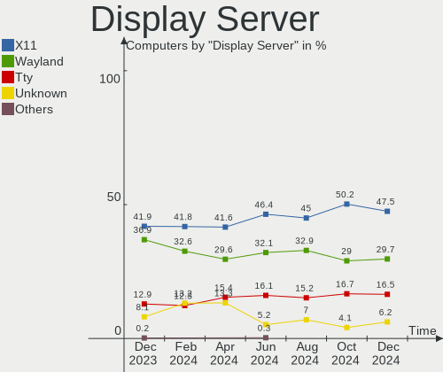
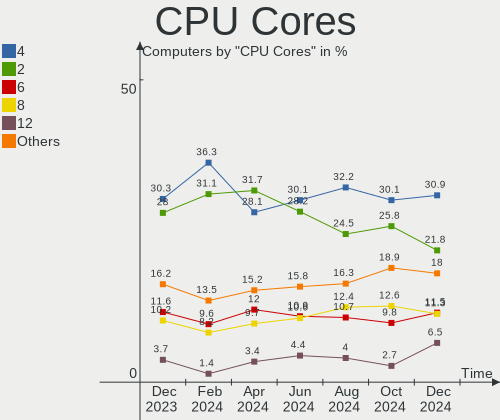

Debian Hardware Trends
----------------------

A project to identify most popular hardware characteristics and track their change
over time based on data collected by Debian users at https://Linux-Hardware.org.

Anyone can contribute to the study by uploading probes of their computers by
the [hw-probe](https://github.com/linuxhw/hw-probe) tool:

    sudo hw-probe -all -upload

This is a report for all computer types. See also reports for [desktops](/Dist/Debian/Desktop/README.md) and [notebooks](/Dist/Debian/Notebook/README.md).

Full-feature report is available here: https://linux-hardware.org/?view=trends

Period: Apr, 2020.

Contents
--------

- [ OS                       ](#os)
- [ OS Family                ](#os-family)
- [ Kernel                   ](#kernel)
- [ Kernel Family            ](#kernel-family)
- [ Kernel Major Ver.        ](#kernel-major-ver)
- [ Arch                     ](#arch)
- [ DE                       ](#de)
- [ Display Server           ](#display-server)
- [ Display Manager          ](#display-manager)
- [ OS Lang                  ](#os-lang)
- [ Boot Mode                ](#boot-mode)
- [ Filesystem               ](#filesystem)
- [ Dual Boot with Linux/BSD ](#dual-boot-with-linux/bsd)
- [ Dual Boot (Win)          ](#dual-boot-win)
- [ Country                  ](#country)
- [ City                     ](#city)
- [ Vendor                   ](#vendor)
- [ Model                    ](#model)
- [ Model Family             ](#model-family)
- [ MFG Year                 ](#mfg-year)
- [ Form Factor              ](#form-factor)
- [ Secure Boot              ](#secure-boot)
- [ Coreboot                 ](#coreboot)
- [ RAM Size                 ](#ram-size)
- [ RAM Used                 ](#ram-used)
- [ Drive Vendor             ](#drive-vendor)
- [ Drive Model              ](#drive-model)
- [ Drive Kind               ](#drive-kind)
- [ Drive Connector          ](#drive-connector)
- [ Drive Size               ](#drive-size)
- [ Space Total              ](#space-total)
- [ Space Used               ](#space-used)
- [ Malfunc. Drives          ](#malfunc-drives)
- [ Malfunc. Drive Vendor    ](#malfunc-drive-vendor)
- [ Malfunc. Drive Kind      ](#malfunc-drive-kind)
- [ Failed Drives            ](#failed-drives)
- [ Failed Drive Vendor      ](#failed-drive-vendor)
- [ Drive Status             ](#drive-status)
- [ Storage Vendor           ](#storage-vendor)
- [ Storage Model            ](#storage-model)
- [ Storage Kind             ](#storage-kind)
- [ CPU Vendor               ](#cpu-vendor)
- [ CPU Model                ](#cpu-model)
- [ CPU Model Family         ](#cpu-model-family)
- [ CPU Cores                ](#cpu-cores)
- [ CPU Sockets              ](#cpu-sockets)
- [ CPU Threads              ](#cpu-threads)
- [ CPU Op-Modes             ](#cpu-op-modes)
- [ CPU Microarch            ](#cpu-microarch)
- [ CPU Microcode            ](#cpu-microcode)
- [ GPU Vendor               ](#gpu-vendor)
- [ GPU Model                ](#gpu-model)
- [ GPU Combo                ](#gpu-combo)
- [ GPU Driver               ](#gpu-driver)
- [ GPU Memory               ](#gpu-memory)
- [ Monitor Vendor           ](#monitor-vendor)
- [ Monitor Model            ](#monitor-model)
- [ Monitor Resolution       ](#monitor-resolution)
- [ Monitor Diagonal         ](#monitor-diagonal)
- [ Monitor Width            ](#monitor-width)
- [ Aspect Ratio             ](#aspect-ratio)
- [ Monitor Area             ](#monitor-area)
- [ Pixel Density            ](#pixel-density)
- [ Multiple Monitors        ](#multiple-monitors)
- [ Net Controller Vendor    ](#net-controller-vendor)
- [ Net Controller Model     ](#net-controller-model)
- [ Net Controller Kind      ](#net-controller-kind)
- [ Used Controller          ](#used-controller)
- [ NICs                     ](#nics)
- [ Unsupported Devices      ](#unsupported-devices)
- [ Unsupported Device Types ](#unsupported-device-types)

OS
--

Installed operating systems

| Name            | Computers | Percent |
|-----------------|-----------|---------|
| Debian 10       | 81        | 61.36%  |
| Debian          | 18        | 13.64%  |
| Debian Testing  | 16        | 12.12%  |
| Debian 9.12     | 7         | 5.3%    |
| Debian Unstable | 6         | 4.55%   |
| Debian 9        | 3         | 2.27%   |
| Debian 9.5      | 1         | 0.76%   |

OS Family
---------

OS without a version

| Name   | Computers | Percent |
|--------|-----------|---------|
| Debian | 132       | 100%    |

Kernel
------

Version of the Linux kernel

| Version                      | Computers | Percent |
|------------------------------|-----------|---------|
| 4.19.0-8-amd64               | 53        | 40.15%  |
| 5.4.0-4-amd64                | 12        | 9.09%   |
| 5.4.0-0.bpo.4-amd64          | 8         | 6.06%   |
| 5.5.0-2-amd64                | 7         | 5.3%    |
| 4.9.0-12-amd64               | 7         | 5.3%    |
| 4.19.0-6-amd64               | 6         | 4.55%   |
| 5.5.0-1-amd64                | 5         | 3.79%   |
| 4.19.0-8-686                 | 4         | 3.03%   |
| 5.3.18-2-pve                 | 2         | 1.52%   |
| 4.9.0-12-rt-amd64            | 2         | 1.52%   |
| 4.9.0-12-686                 | 2         | 1.52%   |
| 5.6.3-surface                | 1         | 0.76%   |
| 5.6.2-towo.1-siduction-amd64 | 1         | 0.76%   |
| 5.6.2                        | 1         | 0.76%   |
| 5.6.0-vmalloc-purge-fix      | 1         | 0.76%   |
| 5.5.13                       | 1         | 0.76%   |
| 5.5.10-20.03.19.amdgpu       | 1         | 0.76%   |
| 5.5.10                       | 1         | 0.76%   |
| 5.4.0-kali4-amd64            | 1         | 0.76%   |
| 5.4.0-4-686-pae              | 1         | 0.76%   |
| 5.4.0-3-amd64                | 1         | 0.76%   |
| 5.4.0-0.bpo.4-686-pae        | 1         | 0.76%   |
| 5.4.0-0.bpo.2-amd64          | 1         | 0.76%   |
| 5.3.5-64                     | 1         | 0.76%   |
| 5.2.0                        | 1         | 0.76%   |
| 4.4.180                      | 1         | 0.76%   |
| 4.19.0-parrot1-13t-amd64     | 1         | 0.76%   |
| 4.19.0-8-686-pae             | 1         | 0.76%   |
| 4.19.0-6-686-pae             | 1         | 0.76%   |
| 4.19.0-5-amd64               | 1         | 0.76%   |
| 4.19.0-1-amd64               | 1         | 0.76%   |
| 4.19.0-0.steamos2.3-amd64    | 1         | 0.76%   |
| 4.14.71-ti-r80               | 1         | 0.76%   |
| 4.14.0-3-amd64               | 1         | 0.76%   |
| 3.10.72                      | 1         | 0.76%   |

Kernel Family
-------------

Linux kernel without a distro release

| Version | Computers | Percent |
|---------|-----------|---------|
| 4.19.0  | 69        | 52.27%  |
| 5.4.0   | 25        | 18.94%  |
| 5.5.0   | 12        | 9.09%   |
| 4.9.0   | 11        | 8.33%   |
| 5.6.2   | 2         | 1.52%   |
| 5.5.10  | 2         | 1.52%   |
| 5.3.18  | 2         | 1.52%   |
| 5.6.3   | 1         | 0.76%   |
| 5.6.0   | 1         | 0.76%   |
| 5.5.13  | 1         | 0.76%   |
| 5.3.5   | 1         | 0.76%   |
| 5.2.0   | 1         | 0.76%   |
| 4.4.180 | 1         | 0.76%   |
| 4.14.71 | 1         | 0.76%   |
| 4.14.0  | 1         | 0.76%   |
| 3.10.72 | 1         | 0.76%   |

Kernel Major Ver.
-----------------

Linux kernel major version

| Version | Computers | Percent |
|---------|-----------|---------|
| 4.19    | 69        | 52.27%  |
| 5.4     | 25        | 18.94%  |
| 5.5     | 15        | 11.36%  |
| 4.9     | 11        | 8.33%   |
| 5.6     | 4         | 3.03%   |
| 5.3     | 3         | 2.27%   |
| 4.14    | 2         | 1.52%   |
| 5.2     | 1         | 0.76%   |
| 4.4     | 1         | 0.76%   |
| 3.10    | 1         | 0.76%   |

Arch
----

OS architecture (x86_64, i586, etc.)

| Name    | Computers | Percent |
|---------|-----------|---------|
| x86_64  | 119       | 90.15%  |
| i686    | 10        | 7.58%   |
| armv7l  | 2         | 1.52%   |
| aarch64 | 1         | 0.76%   |

DE
--

Desktop Environment

| Name            | Computers | Percent |
|-----------------|-----------|---------|
| GNOME           | 29        | 21.97%  |
| XFCE            | 26        | 19.7%   |
| Unknown         | 19        | 14.39%  |
| KDE5            | 13        | 9.85%   |
| KDE             | 11        | 8.33%   |
| X-Cinnamon      | 9         | 6.82%   |
| MATE            | 7         | 5.3%    |
| Cinnamon        | 5         | 3.79%   |
| LXDE            | 4         | 3.03%   |
| LXQt            | 2         | 1.52%   |
| i3              | 2         | 1.52%   |
| Budgie          | 2         | 1.52%   |
| Trinity         | 1         | 0.76%   |
| i3-gaps         | 1         | 0.76%   |
| GNOME Flashback | 1         | 0.76%   |

Display Server
--------------

X11 or Wayland

| Name    | Computers | Percent |
|---------|-----------|---------|
| X11     | 101       | 76.52%  |
| Wayland | 16        | 12.12%  |
| Tty     | 9         | 6.82%   |
| Unknown | 6         | 4.55%   |

Display Manager
---------------

SDDM, LightDM, etc.

| Name    | Computers | Percent |
|---------|-----------|---------|
| Unknown | 72        | 54.55%  |
| LightDM | 27        | 20.45%  |
| GDM     | 19        | 14.39%  |
| SDDM    | 13        | 9.85%   |
| NODM    | 1         | 0.76%   |

OS Lang
-------

Language

| Lang       | Computers | Percent |
|------------|-----------|---------|
| en_US      | 41        | 31.06%  |
| de_DE      | 12        | 9.09%   |
| it_IT      | 9         | 6.82%   |
| en_GB      | 7         | 5.3%    |
| ru_RU      | 6         | 4.55%   |
| pt_BR      | 6         | 4.55%   |
| fr_FR      | 6         | 4.55%   |
| Unknown    | 6         | 4.55%   |
| es_ES      | 3         | 2.27%   |
| pt_PT      | 2         | 1.52%   |
| pl_PL.utf8 | 2         | 1.52%   |
| nl_NL      | 2         | 1.52%   |
| es_CO      | 2         | 1.52%   |
| es_AR      | 2         | 1.52%   |
| en_CA      | 2         | 1.52%   |
| en_AU      | 2         | 1.52%   |
| de_DE.utf8 | 2         | 1.52%   |
| da_DK      | 2         | 1.52%   |
| C          | 2         | 1.52%   |
| tr_TR      | 1         | 0.76%   |
| ru_UA      | 1         | 0.76%   |
| pt_BR.utf8 | 1         | 0.76%   |
| pl_PL      | 1         | 0.76%   |
| nl_BE      | 1         | 0.76%   |
| ko_KR.utf8 | 1         | 0.76%   |
| fr_LU      | 1         | 0.76%   |
| fr_FR.utf8 | 1         | 0.76%   |
| fi_FI      | 1         | 0.76%   |
| es_PE      | 1         | 0.76%   |
| es_CL      | 1         | 0.76%   |
| en_US.utf8 | 1         | 0.76%   |
| en_DE      | 1         | 0.76%   |
| de_AT.utf8 | 1         | 0.76%   |
| de_AT      | 1         | 0.76%   |
| cs_CZ      | 1         | 0.76%   |

Boot Mode
---------

EFI or BIOS

| Mode | Computers | Percent |
|------|-----------|---------|
| BIOS | 94        | 71.21%  |
| EFI  | 38        | 28.79%  |

Filesystem
----------

Type of filesystem

| Type    | Computers | Percent |
|---------|-----------|---------|
| Ext4    | 123       | 93.18%  |
| Btrfs   | 4         | 3.03%   |
| Tmpfs   | 1         | 0.76%   |
| Rootfs  | 1         | 0.76%   |
| Overlay | 1         | 0.76%   |
| Aufs    | 1         | 0.76%   |
| Unknown | 1         | 0.76%   |

Dual Boot with Linux/BSD
------------------------

Hosting more than one Linux/BSD

| Dual boot | Computers | Percent |
|-----------|-----------|---------|
| No        | 113       | 85.61%  |
| Yes       | 19        | 14.39%  |

Dual Boot (Win)
---------------

Hosting Linux and Windows

| Dual boot | Computers | Percent |
|-----------|-----------|---------|
| No        | 103       | 78.03%  |
| Yes       | 29        | 21.97%  |

Country
-------

Geographic location (country)

| Country            | Computers | Percent |
|--------------------|-----------|---------|
| Germany            | 16        | 12.12%  |
| France             | 13        | 9.85%   |
| USA                | 12        | 9.09%   |
| Russia             | 10        | 7.58%   |
| Italy              | 10        | 7.58%   |
| Brazil             | 9         | 6.82%   |
| Spain              | 5         | 3.79%   |
| Netherlands        | 4         | 3.03%   |
| Canada             | 4         | 3.03%   |
| UK                 | 3         | 2.27%   |
| Portugal           | 3         | 2.27%   |
| Poland             | 3         | 2.27%   |
| Vietnam            | 2         | 1.52%   |
| Turkey             | 2         | 1.52%   |
| Denmark            | 2         | 1.52%   |
| Colombia           | 2         | 1.52%   |
| Belgium            | 2         | 1.52%   |
| Austria            | 2         | 1.52%   |
| Australia          | 2         | 1.52%   |
| Argentina          | 2         | 1.52%   |
| Ukraine            | 1         | 0.76%   |
| Uganda             | 1         | 0.76%   |
| Taiwan             | 1         | 0.76%   |
| Switzerland        | 1         | 0.76%   |
| Sweden             | 1         | 0.76%   |
| Slovakia           | 1         | 0.76%   |
| Saudi Arabia       | 1         | 0.76%   |
| Puerto Rico        | 1         | 0.76%   |
| Peru               | 1         | 0.76%   |
| Kyrgyzstan         | 1         | 0.76%   |
| Korea, Republic of | 1         | 0.76%   |
| Kazakhstan         | 1         | 0.76%   |
| Israel             | 1         | 0.76%   |
| Indonesia          | 1         | 0.76%   |
| India              | 1         | 0.76%   |
| Hungary            | 1         | 0.76%   |
| Finland            | 1         | 0.76%   |
| Ethiopia           | 1         | 0.76%   |
| Dominican Republic | 1         | 0.76%   |
| Czech Republic     | 1         | 0.76%   |
| Cyprus             | 1         | 0.76%   |
| Chile              | 1         | 0.76%   |
| Bulgaria           | 1         | 0.76%   |
| Belarus            | 1         | 0.76%   |

City
----

Geographic location (city)

| City                  | Computers | Percent |
|-----------------------|-----------|---------|
| Paris                 | 4         | 3.03%   |
| Windsor               | 3         | 2.27%   |
| Rome                  | 3         | 2.27%   |
| Voronezh              | 2         | 1.52%   |
| Teresina              | 2         | 1.52%   |
| Shchelkovo            | 2         | 1.52%   |
| Moscow                | 2         | 1.52%   |
| Milan                 | 2         | 1.52%   |
| Meudon                | 2         | 1.52%   |
| Zella-Mehlis          | 1         | 0.76%   |
| Zeist                 | 1         | 0.76%   |
| Zeihen                | 1         | 0.76%   |
| Zatory                | 1         | 0.76%   |
| Zaragoza              | 1         | 0.76%   |
| Weimar                | 1         | 0.76%   |
| Vladimir              | 1         | 0.76%   |
| Vernon                | 1         | 0.76%   |
| Vega Baja             | 1         | 0.76%   |
| Valencia              | 1         | 0.76%   |
| Tver                  | 1         | 0.76%   |
| Trento                | 1         | 0.76%   |
| Tirat Carmel          | 1         | 0.76%   |
| Thanh Hóa            | 1         | 0.76%   |
| Taoyuan District      | 1         | 0.76%   |
| St Petersburg         | 1         | 0.76%   |
| Spokane               | 1         | 0.76%   |
| Sofia                 | 1         | 0.76%   |
| Sheffield             | 1         | 0.76%   |
| Sens                  | 1         | 0.76%   |
| Seattle               | 1         | 0.76%   |
| Schwertberg           | 1         | 0.76%   |
| Santo Domingo         | 1         | 0.76%   |
| Santiago              | 1         | 0.76%   |
| San Mateo             | 1         | 0.76%   |
| Salvador              | 1         | 0.76%   |
| Saarlouis             | 1         | 0.76%   |
| Royal Tunbridge Wells | 1         | 0.76%   |
| Rotterdam             | 1         | 0.76%   |
| Riyadh                | 1         | 0.76%   |
| Rio de Janeiro        | 1         | 0.76%   |
| Rio das Ostras        | 1         | 0.76%   |
| Pyeongtaek-si         | 1         | 0.76%   |
| Poznan                | 1         | 0.76%   |
| Porto Alegre          | 1         | 0.76%   |
| Porto                 | 1         | 0.76%   |
| Plano                 | 1         | 0.76%   |
| Piracicaba            | 1         | 0.76%   |
| Paphos                | 1         | 0.76%   |
| Palafolls             | 1         | 0.76%   |
| Ozarow Mazowiecki     | 1         | 0.76%   |
| Oulx                  | 1         | 0.76%   |
| Odesa                 | 1         | 0.76%   |
| Nuremberg             | 1         | 0.76%   |
| Nur-Sultan            | 1         | 0.76%   |
| Nefteyugansk          | 1         | 0.76%   |
| Munich                | 1         | 0.76%   |
| Mountain Home         | 1         | 0.76%   |
| Minsk                 | 1         | 0.76%   |
| Michalovce            | 1         | 0.76%   |
| Mesa                  | 1         | 0.76%   |

Vendor
------

Motherboard manufacturer

| Name                | Computers | Percent |
|---------------------|-----------|---------|
| Dell                | 26        | 19.7%   |
| ASUSTek Computer    | 26        | 19.7%   |
| Hewlett-Packard     | 18        | 13.64%  |
| Lenovo              | 16        | 12.12%  |
| Gigabyte Technology | 9         | 6.82%   |
| MSI                 | 7         | 5.3%    |
| ASRock              | 5         | 3.79%   |
| Unknown             | 5         | 3.79%   |
| Intel               | 3         | 2.27%   |
| Fujitsu Siemens     | 3         | 2.27%   |
| Acer                | 3         | 2.27%   |
| Toshiba             | 1         | 0.76%   |
| Supermicro          | 1         | 0.76%   |
| Sony                | 1         | 0.76%   |
| SLIMBOOK            | 1         | 0.76%   |
| Samsung Electronics | 1         | 0.76%   |
| Pegatron            | 1         | 0.76%   |
| Microsoft           | 1         | 0.76%   |
| IBM                 | 1         | 0.76%   |
| HPE                 | 1         | 0.76%   |
| Hometech            | 1         | 0.76%   |
| Gateway             | 1         | 0.76%   |

Model
-----

Motherboard model

| Name                                     | Computers | Percent |
|------------------------------------------|-----------|---------|
| Unknown                                  | 5         | 3.79%   |
| ASUS All Series                          | 4         | 3.03%   |
| Lenovo Legion Y530-15ICH-1060 81LB       | 2         | 1.52%   |
| HP EliteBook 840 G1                      | 2         | 1.52%   |
| Gigabyte B450M S2H                       | 2         | 1.52%   |
| Dell Precision 5530                      | 2         | 1.52%   |
| Dell PowerEdge R640                      | 2         | 1.52%   |
| Dell Latitude E6410                      | 2         | 1.52%   |
| Toshiba Satellite L515                   | 1         | 0.76%   |
| Supermicro SYS-5038MD-H24TRF-OS012       | 1         | 0.76%   |
| Sony VGN-NR220E                          | 1         | 0.76%   |
| SLIMBOOK PROX14                          | 1         | 0.76%   |
| Samsung Electronics RF510/RF410/RF710    | 1         | 0.76%   |
| Pegatron KJ382AA-ABA m9250f              | 1         | 0.76%   |
| MSI MS-7C59                              | 1         | 0.76%   |
| MSI MS-7B89                              | 1         | 0.76%   |
| MSI MS-7926                              | 1         | 0.76%   |
| MSI MS-7817                              | 1         | 0.76%   |
| MSI MS-7751                              | 1         | 0.76%   |
| MSI MS-7551                              | 1         | 0.76%   |
| MSI GF62 7RE                             | 1         | 0.76%   |
| Microsoft Surface Pro                    | 1         | 0.76%   |
| Lenovo Z50-75 80EC                       | 1         | 0.76%   |
| Lenovo Yoga 2 11 20332                   | 1         | 0.76%   |
| Lenovo ThinkPad X230 23259H1             | 1         | 0.76%   |
| Lenovo ThinkPad X230 2324EW3             | 1         | 0.76%   |
| Lenovo ThinkPad X1 Carbon 3rd 20BTS1D900 | 1         | 0.76%   |
| Lenovo ThinkPad W700 2752RZ2             | 1         | 0.76%   |
| Lenovo ThinkPad T495s 20QKS01E00         | 1         | 0.76%   |
| Lenovo ThinkPad L390 20NRCTO1WW          | 1         | 0.76%   |
| Lenovo ThinkBook 14-IML 20RV             | 1         | 0.76%   |
| Lenovo Legion Y530-15ICH 81FV            | 1         | 0.76%   |
| Lenovo Legion C730-19ICO 90JH0045US      | 1         | 0.76%   |
| Lenovo IdeaPad U430p 20269               | 1         | 0.76%   |
| Lenovo IdeaPad S145-15API 81V7           | 1         | 0.76%   |
| Lenovo G550 2958                         | 1         | 0.76%   |
| Intel FUCK                               | 1         | 0.76%   |
| Intel DG31PR AAE58249-302                | 1         | 0.76%   |
| Intel AHV                                | 1         | 0.76%   |
| IBM ThinkPad T42 2373FWG                 | 1         | 0.76%   |
| HPE ProLiant DL360 Gen10                 | 1         | 0.76%   |
| Hometech HT Book 14B                     | 1         | 0.76%   |
| HP ProDesk 600 G1 SFF                    | 1         | 0.76%   |
| HP ProBook 645 G1                        | 1         | 0.76%   |
| HP ProBook 4710s                         | 1         | 0.76%   |
| HP ProBook 470 G1                        | 1         | 0.76%   |
| HP Presario CQ57                         | 1         | 0.76%   |
| HP Pavilion x360 Convertible 14-dh0xxx   | 1         | 0.76%   |
| HP Pavilion dv6                          | 1         | 0.76%   |
| HP Notebook                              | 1         | 0.76%   |
| HP Mini 110-3100                         | 1         | 0.76%   |
| HP Laptop 15-da0xxx                      | 1         | 0.76%   |
| HP EliteBook 8470p                       | 1         | 0.76%   |
| HP EliteBook 8460p                       | 1         | 0.76%   |
| HP EliteBook 840 G6                      | 1         | 0.76%   |
| HP Compaq 6000 Pro SFF PC                | 1         | 0.76%   |
| HP All-in-One                            | 1         | 0.76%   |
| HP 2000                                  | 1         | 0.76%   |
| Gigabyte X79-UD3                         | 1         | 0.76%   |
| Gigabyte X470 AORUS ULTRA GAMING         | 1         | 0.76%   |

Model Family
------------

Motherboard model prefix

| Name                               | Computers | Percent |
|------------------------------------|-----------|---------|
| Dell Inspiron                      | 8         | 6.06%   |
| Lenovo ThinkPad                    | 6         | 4.55%   |
| HP EliteBook                       | 5         | 3.79%   |
| Dell Latitude                      | 5         | 3.79%   |
| Unknown                            | 5         | 3.79%   |
| Lenovo Legion                      | 4         | 3.03%   |
| Dell Precision                     | 4         | 3.03%   |
| ASUS All                           | 4         | 3.03%   |
| HP ProBook                         | 3         | 2.27%   |
| ASUS ROG                           | 3         | 2.27%   |
| Lenovo IdeaPad                     | 2         | 1.52%   |
| HP Pavilion                        | 2         | 1.52%   |
| Gigabyte B450M                     | 2         | 1.52%   |
| Fujitsu Siemens ESPRIMO            | 2         | 1.52%   |
| Dell XPS                           | 2         | 1.52%   |
| Dell Vostro                        | 2         | 1.52%   |
| Dell PowerEdge                     | 2         | 1.52%   |
| Dell OptiPlex                      | 2         | 1.52%   |
| Acer Aspire                        | 2         | 1.52%   |
| Toshiba Satellite                  | 1         | 0.76%   |
| Supermicro SYS-5038MD-H24TRF-OS012 | 1         | 0.76%   |
| Sony VGN-NR220E                    | 1         | 0.76%   |
| SLIMBOOK PROX14                    | 1         | 0.76%   |
| Samsung Electronics RF510          | 1         | 0.76%   |
| Pegatron KJ382AA-ABA               | 1         | 0.76%   |
| MSI MS-7C59                        | 1         | 0.76%   |
| MSI MS-7B89                        | 1         | 0.76%   |
| MSI MS-7926                        | 1         | 0.76%   |
| MSI MS-7817                        | 1         | 0.76%   |
| MSI MS-7751                        | 1         | 0.76%   |
| MSI MS-7551                        | 1         | 0.76%   |
| MSI GF62                           | 1         | 0.76%   |
| Microsoft Surface                  | 1         | 0.76%   |
| Lenovo Z50-75                      | 1         | 0.76%   |
| Lenovo Yoga                        | 1         | 0.76%   |
| Lenovo ThinkBook                   | 1         | 0.76%   |
| Lenovo G550                        | 1         | 0.76%   |
| Intel FUCK                         | 1         | 0.76%   |
| Intel DG31PR                       | 1         | 0.76%   |
| Intel AHV                          | 1         | 0.76%   |
| IBM ThinkPad                       | 1         | 0.76%   |
| HPE ProLiant                       | 1         | 0.76%   |
| Hometech HT                        | 1         | 0.76%   |
| HP ProDesk                         | 1         | 0.76%   |
| HP Presario                        | 1         | 0.76%   |
| HP Notebook                        | 1         | 0.76%   |
| HP Mini                            | 1         | 0.76%   |
| HP Laptop                          | 1         | 0.76%   |
| HP Compaq                          | 1         | 0.76%   |
| HP All-in-One                      | 1         | 0.76%   |
| HP 2000                            | 1         | 0.76%   |
| Gigabyte X79-UD3                   | 1         | 0.76%   |
| Gigabyte X470                      | 1         | 0.76%   |
| Gigabyte N3050ND3H                 | 1         | 0.76%   |
| Gigabyte M61SME-S2                 | 1         | 0.76%   |
| Gigabyte GA-880GMA-UD2H            | 1         | 0.76%   |
| Gigabyte GA-78LMT-USB3             | 1         | 0.76%   |
| Gigabyte 945GCM-S2L                | 1         | 0.76%   |
| Gateway NV78                       | 1         | 0.76%   |
| Fujitsu Siemens AMILO              | 1         | 0.76%   |

MFG Year
--------

Motherboard manufacture year

| Year    | Computers | Percent |
|---------|-----------|---------|
| 2019    | 34        | 25.76%  |
| 2018    | 16        | 12.12%  |
| 2008    | 11        | 8.33%   |
| 2011    | 10        | 7.58%   |
| 2015    | 9         | 6.82%   |
| 2016    | 7         | 5.3%    |
| 2014    | 7         | 5.3%    |
| 2012    | 7         | 5.3%    |
| 2009    | 6         | 4.55%   |
| 2020    | 4         | 3.03%   |
| 2017    | 4         | 3.03%   |
| 2013    | 4         | 3.03%   |
| 2010    | 4         | 3.03%   |
| 2007    | 3         | 2.27%   |
| Unknown | 3         | 2.27%   |
| 2004    | 2         | 1.52%   |
| 2006    | 1         | 0.76%   |

Form Factor
-----------

Physical design of the computer

| Name        | Computers | Percent |
|-------------|-----------|---------|
| Notebook    | 72        | 54.55%  |
| Desktop     | 50        | 37.88%  |
| Server      | 3         | 2.27%   |
| Other       | 2         | 1.52%   |
| Convertible | 2         | 1.52%   |
| Tablet      | 1         | 0.76%   |
| Mini pc     | 1         | 0.76%   |
| All in one  | 1         | 0.76%   |

Secure Boot
-----------

Enabled or disabled

| State    | Computers | Percent |
|----------|-----------|---------|
| Disabled | 129       | 97.73%  |
| Enabled  | 3         | 2.27%   |

Coreboot
--------

Have coreboot on board

| Used | Computers | Percent |
|------|-----------|---------|
| No   | 132       | 100%    |

RAM Size
--------

Total RAM memory

| Size in GB      | Computers | Percent |
|-----------------|-----------|---------|
| 8.01-16.0       | 27        | 20.45%  |
| 3.01-4.0        | 26        | 19.7%   |
| 4.01-8.0        | 23        | 17.42%  |
| 16.01-24.0      | 17        | 12.88%  |
| 32.01-64.0      | 14        | 10.61%  |
| 1.01-2.0        | 7         | 5.3%    |
| 2.01-3.0        | 5         | 3.79%   |
| 0.01-1.0        | 5         | 3.79%   |
| 24.01-32.0      | 3         | 2.27%   |
| 64.01-256.0     | 3         | 2.27%   |
| More than 256.0 | 2         | 1.52%   |

RAM Used
--------

Used RAM memory

| Used GB     | Computers | Percent |
|-------------|-----------|---------|
| 1.01-2.0    | 45        | 34.09%  |
| 2.01-3.0    | 27        | 20.45%  |
| 4.01-8.0    | 22        | 16.67%  |
| 3.01-4.0    | 17        | 12.88%  |
| 0.01-1.0    | 15        | 11.36%  |
| 8.01-16.0   | 3         | 2.27%   |
| 64.01-256.0 | 2         | 1.52%   |
| Unknown     | 1         | 0.76%   |

Drive Vendor
------------

Hard drive vendors

| Vendor              | Computers | Drives  | Percent |
|---------------------|-----------|---------|---------|
| Seagate             | 37        | 44      | 19.58%  |
| WDC                 | 31        | 37      | 16.4%   |
| Samsung Electronics | 26        | 28      | 13.76%  |
| Toshiba             | 18        | 19      | 9.52%   |
| Kingston            | 13        | 14      | 6.88%   |
| Crucial             | 12        | 14      | 6.35%   |
| Hitachi             | 7         | 7       | 3.7%    |
| Unknown             | 6         | 6       | 3.17%   |
| SanDisk             | 5         | 5       | 2.65%   |
| HGST                | 5         | 5       | 2.65%   |
| A-DATA Technology   | 3         | 3       | 1.59%   |
| Transcend           | 2         | 3       | 1.06%   |
| SK Hynix            | 2         | 2       | 1.06%   |
| HL-DT-ST            | 2         | Unknown | 1.06%   |
| Hewlett-Packard     | 2         | 2       | 1.06%   |
| Fujitsu             | 2         | 2       | 1.06%   |
| SPCC                | 1         | 1       | 0.53%   |
| Silicon Motion      | 1         | 1       | 0.53%   |
| PNY                 | 1         | 1       | 0.53%   |
| PLEXTOR             | 1         | 1       | 0.53%   |
| Phison              | 1         | 1       | 0.53%   |
| PHINOCOM            | 1         | 1       | 0.53%   |
| MAXTOR              | 1         | 1       | 0.53%   |
| LITEONIT            | 1         | 1       | 0.53%   |
| KingDian            | 1         | 1       | 0.53%   |
| Intenso             | 1         | 1       | 0.53%   |
| Intel               | 1         | 1       | 0.53%   |
| HPE                 | 1         | 1       | 0.53%   |
| Gigabyte Technology | 1         | 1       | 0.53%   |
| Corsair             | 1         | 2       | 0.53%   |
| China               | 1         | 1       | 0.53%   |
| ASUS-PHISON         | 1         | 1       | 0.53%   |

Drive Model
-----------

Hard drive models

| Model                       | Computers | Percent |
|-----------------------------|-----------|---------|
| ST1000LM024 HN-M101MBB 1TB  | 5         | 2.4%    |
| SA400S37120G 120GB SSD      | 4         | 1.92%   |
| SSD 850 EVO 250GB           | 3         | 1.44%   |
| MQ01ABD100 1TB              | 3         | 1.44%   |
| CT500MX500SSD1 500GB        | 3         | 1.44%   |
| WD5000LPLX-75ZNTT0 500GB    | 2         | 0.96%   |
| WD40EFRX-68N32N0 4TB        | 2         | 0.96%   |
| SV300S37A120G 120GB SSD     | 2         | 0.96%   |
| ST500LT012-9WS142 500GB     | 2         | 0.96%   |
| ST500LM012 HN-M500MBB 500GB | 2         | 0.96%   |
| ST3000DM001-1ER166 3TB      | 2         | 0.96%   |
| ST2000NX0463 2TB            | 2         | 0.96%   |
| ST2000DM001-1ER164 2TB      | 2         | 0.96%   |
| ST1000NX0443 1TB            | 2         | 0.96%   |
| ST1000DM003-1SB102 1TB      | 2         | 0.96%   |
| SSD 840 EVO 120GB           | 2         | 0.96%   |
| SD9SB8W512G1101 512GB SSD   | 2         | 0.96%   |
| SA400S37240G 240GB SSD      | 2         | 0.96%   |
| PM981 NVMe 256GB            | 2         | 0.96%   |
| MZ7KM480HMHQ0D3 480GB       | 2         | 0.96%   |
| HTS721010A9E630 1TB         | 2         | 0.96%   |
| HDWD120 2TB                 | 2         | 0.96%   |
| DVDRAM GUE1N 3GB            | 2         | 0.96%   |
| CT120BX500SSD1 120GB        | 2         | 0.96%   |
| CT1000MX500SSD1 1TB         | 2         | 0.96%   |
| WDS250G2X0C-00L350 250GB    | 1         | 0.48%   |
| WD800AAJB-00J3A0 80GB       | 1         | 0.48%   |
| WD7500BPKX-75HPJT0 752GB    | 1         | 0.48%   |
| WD5000LPCX-21VHAT0 500GB    | 1         | 0.48%   |
| WD5000BPVT-60HXZT1 500GB    | 1         | 0.48%   |
| WD5000BEVT-22ZAT0 500GB     | 1         | 0.48%   |
| WD5000AAKX-001CA0 500GB     | 1         | 0.48%   |
| WD5000AACS-00ZUB0 500GB     | 1         | 0.48%   |
| WD3200KS-75PFB0 320GB       | 1         | 0.48%   |
| WD30EZRX-00DC0B0 3TB        | 1         | 0.48%   |
| WD3000HLFS-01G6U4 304GB     | 1         | 0.48%   |
| WD2500AAJS-00V4A0 250GB     | 1         | 0.48%   |
| WD20EZRZ-00Z5HB0 2TB        | 1         | 0.48%   |
| WD20EZRX-00D8PB0 2TB        | 1         | 0.48%   |
| WD20EARX-00PASB0 2TB        | 1         | 0.48%   |
| WD20EARX-008FB0 2TB         | 1         | 0.48%   |
| WD2000JD-22HBC0 200GB       | 1         | 0.48%   |
| WD1600BEVS-22RST0 160GB     | 1         | 0.48%   |
| WD1200BEVS-22UST0 120GB     | 1         | 0.48%   |
| WD10SPZX-75Z10T3 1TB        | 1         | 0.48%   |
| WD10JPVX-22JC3T0 1TB        | 1         | 0.48%   |
| WD10JPCX-24UE4T0 1TB        | 1         | 0.48%   |
| WD10EZRZ-22HTKB0 1TB        | 1         | 0.48%   |
| WD10EZEX-75M2NA0 1TB        | 1         | 0.48%   |
| WD10EZEX-08WN4A0 1TB        | 1         | 0.48%   |
| WD10EZEX-08M2NA0 1TB        | 1         | 0.48%   |
| WD10EZEX-00WN4A0 1TB        | 1         | 0.48%   |
| WD10EAVS-00D7B1 1TB         | 1         | 0.48%   |
| WD10EARS-00Y5B1 1TB         | 1         | 0.48%   |
| WD10EALX-009BA0 1TB         | 1         | 0.48%   |
| WD10EADS-00L5B1 1TB         | 1         | 0.48%   |
| WD1002FAEX-00Z3A0 1TB       | 1         | 0.48%   |
| Viper M.2 VPN100 1TB        | 1         | 0.48%   |
| TS64GSSD340 64GB            | 1         | 0.48%   |
| TS64GMSA370 64GB SSD        | 1         | 0.48%   |

Drive Kind
----------

HDD or SSD

| Kind    | Computers | Drives | Percent |
|---------|-----------|--------|---------|
| HDD     | 86        | 112    | 51.5%   |
| SSD     | 55        | 68     | 32.93%  |
| NVMe    | 18        | 21     | 10.78%  |
| MMC     | 5         | 6      | 2.99%   |
| Unknown | 3         | 1      | 1.8%    |

Drive Connector
---------------

SATA, SAS, NVMe, etc.

| Type | Computers | Drives | Percent |
|------|-----------|--------|---------|
| SATA | 114       | 178    | 80.28%  |
| NVMe | 18        | 21     | 12.68%  |
| SAS  | 5         | 3      | 3.52%   |
| MMC  | 5         | 6      | 3.52%   |

Drive Size
----------

Size of hard drive

| Size in TB | Computers | Drives | Percent |
|------------|-----------|--------|---------|
| 0.01-0.5   | 98        | 123    | 58.68%  |
| 0.51-1.0   | 44        | 53     | 26.35%  |
| 1.01-2.0   | 16        | 21     | 9.58%   |
| 3.01-4.0   | 4         | 4      | 2.4%    |
| 2.01-3.0   | 4         | 6      | 2.4%    |
| 4.01-10.0  | 1         | 1      | 0.6%    |

Space Total
-----------

Amount of disk space available on the file system

| Size in GB     | Computers | Percent |
|----------------|-----------|---------|
| 101-250        | 34        | 25.76%  |
| 251-500        | 30        | 22.73%  |
| 501-1000       | 18        | 13.64%  |
| 51-100         | 17        | 12.88%  |
| More than 3000 | 10        | 7.58%   |
| 1001-2000      | 8         | 6.06%   |
| 1-20           | 7         | 5.3%    |
| Unknown        | 5         | 3.79%   |
| 2001-3000      | 3         | 2.27%   |

Space Used
----------

Amount of used disk space

| Used GB        | Computers | Percent |
|----------------|-----------|---------|
| 1-20           | 41        | 31.06%  |
| 101-250        | 21        | 15.91%  |
| 21-50          | 18        | 13.64%  |
| 251-500        | 14        | 10.61%  |
| 51-100         | 13        | 9.85%   |
| 501-1000       | 9         | 6.82%   |
| Unknown        | 5         | 3.79%   |
| 2001-3000      | 4         | 3.03%   |
| 1001-2000      | 4         | 3.03%   |
| More than 3000 | 3         | 2.27%   |

Malfunc. Drives
---------------

Drive models with a malfunction

| Model                      | Computers | Drives | Percent |
|----------------------------|-----------|--------|---------|
| STM3250310AS 250GB         | 1         | 1      | 7.69%   |
| ST9250410AS 250GB          | 1         | 1      | 7.69%   |
| ST500LT012-9WS142 500GB    | 1         | 1      | 7.69%   |
| ST380021A 80GB             | 1         | 1      | 7.69%   |
| ST1000LM024 HN-M101MBB 1TB | 1         | 1      | 7.69%   |
| SSDSA2M080G2GC 80GB        | 1         | 1      | 7.69%   |
| S280 120GB                 | 1         | 1      | 7.69%   |
| MK3261GSYN 320GB           | 1         | 1      | 7.69%   |
| MK1637GSX 160GB            | 1         | 1      | 7.69%   |
| MJA2320BH G2 320GB         | 1         | 1      | 7.69%   |
| HTS725050A7E630 500GB      | 1         | 1      | 7.69%   |
| HTS543232A7A384 320GB      | 1         | 1      | 7.69%   |
| HD103SI 1TB                | 1         | 1      | 7.69%   |

Malfunc. Drive Vendor
---------------------

Vendors of faulty drives

| Vendor              | Computers | Drives | Percent |
|---------------------|-----------|--------|---------|
| Seagate             | 4         | 4      | 30.77%  |
| Toshiba             | 2         | 2      | 15.38%  |
| Samsung Electronics | 1         | 1      | 7.69%   |
| MAXTOR              | 1         | 1      | 7.69%   |
| KingDian            | 1         | 1      | 7.69%   |
| Intel               | 1         | 1      | 7.69%   |
| Hitachi             | 1         | 1      | 7.69%   |
| HGST                | 1         | 1      | 7.69%   |
| Fujitsu             | 1         | 1      | 7.69%   |

Malfunc. Drive Kind
-------------------

Kinds of faulty drives

| Kind | Computers | Drives | Percent |
|------|-----------|--------|---------|
| HDD  | 11        | 11     | 84.62%  |
| SSD  | 2         | 2      | 15.38%  |

Failed Drives
-------------

Failed drive models

Zero info for selected period =(

Failed Drive Vendor
-------------------

Failed drive vendors

Zero info for selected period =(

Drive Status
------------

Number of failed and malfunc. drives

| Status   | Computers | Drives | Percent |
|----------|-----------|--------|---------|
| Works    | 69        | 109    | 48.94%  |
| Detected | 59        | 86     | 41.84%  |
| Malfunc  | 13        | 13     | 9.22%   |

Storage Vendor
--------------

Storage controller vendors

| Vendor                           | Computers | Percent |
|----------------------------------|-----------|---------|
| Intel                            | 90        | 54.88%  |
| AMD                              | 28        | 17.07%  |
| Samsung Electronics              | 11        | 6.71%   |
| Phison Electronics               | 5         | 3.05%   |
| ASMedia Technology               | 5         | 3.05%   |
| Silicon Motion                   | 4         | 2.44%   |
| LSI Logic / Symbios Logic        | 4         | 2.44%   |
| Toshiba America Info Systems     | 3         | 1.83%   |
| Sandisk                          | 3         | 1.83%   |
| JMicron Technology               | 3         | 1.83%   |
| SK Hynix                         | 2         | 1.22%   |
| VIA Technologies                 | 1         | 0.61%   |
| Silicon Integrated Systems [SiS] | 1         | 0.61%   |
| Nvidia                           | 1         | 0.61%   |
| Marvell Technology Group         | 1         | 0.61%   |
| Kingston Technology Company      | 1         | 0.61%   |
| Adaptec                          | 1         | 0.61%   |

Storage Model
-------------

Storage controller models

| Model                                                                      | Computers | Percent |
|----------------------------------------------------------------------------|-----------|---------|
| FCH SATA Controller [AHCI mode]                                            | 19        | 9.5%    |
| NVMe SSD Controller SM981/PM981/PM983                                      | 10        | 5%      |
| 7 Series Chipset Family 6-port SATA Controller [AHCI mode]                 | 9         | 4.5%    |
| 8 Series/C220 Series Chipset Family 6-port SATA Controller 1 [AHCI mode]   | 8         | 4%      |
| 400 Series Chipset SATA Controller                                         | 8         | 4%      |
| Sunrise Point-LP SATA Controller [AHCI mode]                               | 6         | 3%      |
| 82801IBM/IEM (ICH9M/ICH9M-E) 4 port SATA Controller [AHCI mode]            | 6         | 3%      |
| SB7x0/SB8x0/SB9x0 IDE Controller                                           | 5         | 2.5%    |
| Cannon Lake Mobile PCH SATA AHCI Controller                                | 5         | 2.5%    |
| 82801 Mobile SATA Controller [RAID mode]                                   | 5         | 2.5%    |
| SB7x0/SB8x0/SB9x0 SATA Controller [IDE mode]                               | 4         | 2%      |
| Non-Volatile memory controller                                             | 4         | 2%      |
| E12 NVMe Controller                                                        | 4         | 2%      |
| ASM1062 Serial ATA Controller                                              | 4         | 2%      |
| 8 Series SATA Controller 1 [AHCI mode]                                     | 4         | 2%      |
| 6 Series/C200 Series Chipset Family 6 port Mobile SATA AHCI Controller     | 4         | 2%      |
| WD Black 2018/PC SN720 NVMe SSD                                            | 3         | 1.5%    |
| SB7x0/SB8x0/SB9x0 SATA Controller [AHCI mode]                              | 3         | 1.5%    |
| Atom/Celeron/Pentium Processor x5-E8000/J3xxx/N3xxx Series SATA Controller | 3         | 1.5%    |
| Toshiba America Info Non-Volatile memory controller                        | 2         | 1%      |
| SB600 Non-Raid-5 SATA                                                      | 2         | 1%      |
| SB600 IDE                                                                  | 2         | 1%      |
| SATA Controller [RAID mode]                                                | 2         | 1%      |
| NM10/ICH7 Family SATA Controller [IDE mode]                                | 2         | 1%      |
| MegaRAID Tri-Mode SAS3508                                                  | 2         | 1%      |
| JMB363 SATA/IDE Controller                                                 | 2         | 1%      |
| HM170/QM170 Chipset SATA Controller [AHCI Mode]                            | 2         | 1%      |
| C620 Series Chipset Family SSATA Controller [AHCI mode]                    | 2         | 1%      |
| C620 Series Chipset Family SATA Controller [AHCI mode]                     | 2         | 1%      |
| C600/X79 series chipset 6-Port SATA AHCI Controller                        | 2         | 1%      |
| BC501 NVMe Solid State Drive 512GB                                         | 2         | 1%      |
| 9 Series Chipset Family SATA Controller [AHCI Mode]                        | 2         | 1%      |
| 82801JI (ICH10 Family) 4 port SATA IDE Controller #1                       | 2         | 1%      |
| 82801JI (ICH10 Family) 2 port SATA IDE Controller #2                       | 2         | 1%      |
| 82801IBM/IEM (ICH9M/ICH9M-E) 2 port SATA Controller [IDE mode]             | 2         | 1%      |
| 82801HR/HO/HH (ICH8R/DO/DH) 2 port SATA Controller [IDE mode]              | 2         | 1%      |
| 82801H (ICH8 Family) 4 port SATA Controller [IDE mode]                     | 2         | 1%      |
| 82801DBM (ICH4-M) IDE Controller                                           | 2         | 1%      |
| 200 Series PCH SATA controller [AHCI mode]                                 | 2         | 1%      |
| X370 Series Chipset SATA Controller                                        | 1         | 0.5%    |
| Wildcat Point-LP SATA Controller [AHCI Mode]                               | 1         | 0.5%    |
| VT6415 PATA IDE Host Controller                                            | 1         | 0.5%    |
| Technology Company Non-Volatile memory controller                          | 1         | 0.5%    |
| Smart Storage PQI 12G SAS/PCIe 3                                           | 1         | 0.5%    |
| SATA Controller / IDE mode                                                 | 1         | 0.5%    |
| SAS2308 PCI-Express Fusion-MPT SAS-2                                       | 1         | 0.5%    |
| SAS2008 PCI-Express Fusion-MPT SAS-2 [Falcon]                              | 1         | 0.5%    |
| Q170/Q150/B150/H170/H110/Z170/CM236 Chipset SATA Controller [AHCI Mode]    | 1         | 0.5%    |
| NM10/ICH7 Family SATA Controller [AHCI mode]                               | 1         | 0.5%    |
| MCP61 SATA Controller                                                      | 1         | 0.5%    |
| MCP61 IDE                                                                  | 1         | 0.5%    |
| JMB368 IDE controller                                                      | 1         | 0.5%    |
| FCH IDE Controller                                                         | 1         | 0.5%    |
| Electronics Non-Volatile memory controller                                 | 1         | 0.5%    |
| E16 PCIe4 NVMe Controller                                                  | 1         | 0.5%    |
| Comet Lake SATA AHCI Controller                                            | 1         | 0.5%    |
| Celeron N3350/Pentium N4200/Atom E3900 Series SATA AHCI Controller         | 1         | 0.5%    |
| Cannon Point-LP SATA Controller [AHCI Mode]                                | 1         | 0.5%    |
| Cannon Lake PCH SATA AHCI Controller                                       | 1         | 0.5%    |
| BG3 NVMe SSD Controller                                                    | 1         | 0.5%    |

Storage Kind
------------

Kind of storage controller (IDE, SATA, NVMe, SAS, ...)

| Kind | Computers | Percent |
|------|-----------|---------|
| SATA | 97        | 58.43%  |
| IDE  | 30        | 18.07%  |
| NVMe | 27        | 16.27%  |
| RAID | 9         | 5.42%   |
| SAS  | 3         | 1.81%   |

CPU Vendor
----------

Processor vendors

| Vendor | Computers | Percent |
|--------|-----------|---------|
| Intel  | 97        | 73.48%  |
| AMD    | 32        | 24.24%  |
| ARM    | 3         | 2.27%   |

CPU Model
---------

Processor models

| Model                                         | Computers | Percent |
|-----------------------------------------------|-----------|---------|
| Intel Xeon Silver 4114 CPU @ 2.20GHz          | 3         | 2.27%   |
| Intel Core i7-8565U CPU @ 1.80GHz             | 3         | 2.27%   |
| Intel Core i5-3320M CPU @ 2.60GHz             | 3         | 2.27%   |
| Intel Core 2 Duo CPU T6600 @ 2.20GHz          | 3         | 2.27%   |
| Intel Celeron CPU N3050 @ 1.60GHz             | 3         | 2.27%   |
| AMD Ryzen 7 3700X 8-Core Processor            | 3         | 2.27%   |
| Intel Core i7-8850H CPU @ 2.60GHz             | 2         | 1.52%   |
| Intel Core i7-8750H CPU @ 2.20GHz             | 2         | 1.52%   |
| Intel Core i7-7500U CPU @ 2.70GHz             | 2         | 1.52%   |
| Intel Core i5-8250U CPU @ 1.60GHz             | 2         | 1.52%   |
| Intel Core i5-4210U CPU @ 1.70GHz             | 2         | 1.52%   |
| AMD Ryzen 7 2700X Eight-Core Processor        | 2         | 1.52%   |
| AMD Ryzen 5 3500U with Radeon Vega Mobile Gfx | 2         | 1.52%   |
| AMD E-300 APU with Radeon HD Graphics         | 2         | 1.52%   |
| AMD A8-7600 Radeon R7, 10 Compute Cores 4C+6G | 2         | 1.52%   |
| Intel Xeon CPU E5-2630L 0 @ 2.00GHz           | 1         | 0.76%   |
| Intel Xeon CPU D-1531 @ 2.20GHz               | 1         | 0.76%   |
| Intel Pentium M processor 1600MHz             | 1         | 0.76%   |
| Intel Pentium M processor 1.60GHz             | 1         | 0.76%   |
| Intel Pentium Dual-Core CPU T4400 @ 2.20GHz   | 1         | 0.76%   |
| Intel Pentium Dual-Core CPU T4200 @ 2.00GHz   | 1         | 0.76%   |
| Intel Pentium Dual-Core CPU E5300 @ 2.60GHz   | 1         | 0.76%   |
| Intel Pentium Dual CPU T3400 @ 2.16GHz        | 1         | 0.76%   |
| Intel Pentium Dual CPU T2370 @ 1.73GHz        | 1         | 0.76%   |
| Intel Pentium Dual CPU T2330 @ 1.60GHz        | 1         | 0.76%   |
| Intel Pentium Dual CPU E2160 @ 1.80GHz        | 1         | 0.76%   |
| Intel Pentium CPU N3540 @ 2.16GHz             | 1         | 0.76%   |
| Intel Pentium CPU G4520 @ 3.60GHz             | 1         | 0.76%   |
| Intel Pentium CPU B960 @ 2.20GHz              | 1         | 0.76%   |
| Intel Pentium 4 CPU 2.80GHz                   | 1         | 0.76%   |
| Intel Core i9-9900K CPU @ 3.60GHz             | 1         | 0.76%   |
| Intel Core i9-9900 CPU @ 3.10GHz              | 1         | 0.76%   |
| Intel Core i7-8550U CPU @ 1.80GHz             | 1         | 0.76%   |
| Intel Core i7-7820HQ CPU @ 2.90GHz            | 1         | 0.76%   |
| Intel Core i7-7700HQ CPU @ 2.80GHz            | 1         | 0.76%   |
| Intel Core i7-6500U CPU @ 2.50GHz             | 1         | 0.76%   |
| Intel Core i7-5600U CPU @ 2.60GHz             | 1         | 0.76%   |
| Intel Core i7-4790K CPU @ 4.00GHz             | 1         | 0.76%   |
| Intel Core i7-4790 CPU @ 3.60GHz              | 1         | 0.76%   |
| Intel Core i7-4770K CPU @ 3.50GHz             | 1         | 0.76%   |
| Intel Core i7-4720HQ CPU @ 2.60GHz            | 1         | 0.76%   |
| Intel Core i7-4702MQ CPU @ 2.20GHz            | 1         | 0.76%   |
| Intel Core i7-4600U CPU @ 2.10GHz             | 1         | 0.76%   |
| Intel Core i7-3820 CPU @ 3.60GHz              | 1         | 0.76%   |
| Intel Core i7-3740QM CPU @ 2.70GHz            | 1         | 0.76%   |
| Intel Core i7-3612QM CPU @ 2.10GHz            | 1         | 0.76%   |
| Intel Core i7-3537U CPU @ 2.00GHz             | 1         | 0.76%   |
| Intel Core i7-2820QM CPU @ 2.30GHz            | 1         | 0.76%   |
| Intel Core i7 CPU Q 720 @ 1.60GHz             | 1         | 0.76%   |
| Intel Core i7 CPU 930 @ 2.80GHz               | 1         | 0.76%   |
| Intel Core i5-9300H CPU @ 2.40GHz             | 1         | 0.76%   |
| Intel Core i5-8300H CPU @ 2.30GHz             | 1         | 0.76%   |
| Intel Core i5-8265U CPU @ 1.60GHz             | 1         | 0.76%   |
| Intel Core i5-7300U CPU @ 2.60GHz             | 1         | 0.76%   |
| Intel Core i5-6300HQ CPU @ 2.30GHz            | 1         | 0.76%   |
| Intel Core i5-4590 CPU @ 3.30GHz              | 1         | 0.76%   |
| Intel Core i5-4430 CPU @ 3.00GHz              | 1         | 0.76%   |
| Intel Core i5-4300U CPU @ 1.90GHz             | 1         | 0.76%   |
| Intel Core i5-3570K CPU @ 3.40GHz             | 1         | 0.76%   |
| Intel Core i5-2540M CPU @ 2.60GHz             | 1         | 0.76%   |

CPU Model Family
----------------

Processor model prefix

| Model                   | Computers | Percent |
|-------------------------|-----------|---------|
| Intel Core i7           | 27        | 20.45%  |
| Intel Core i5           | 21        | 15.91%  |
| Intel Core i3           | 9         | 6.82%   |
| Intel Core 2 Duo        | 8         | 6.06%   |
| AMD Ryzen 7             | 8         | 6.06%   |
| Intel Celeron           | 5         | 3.79%   |
| Intel Pentium Dual      | 4         | 3.03%   |
| AMD Ryzen 5             | 4         | 3.03%   |
| Intel Xeon Silver       | 3         | 2.27%   |
| Intel Pentium Dual-Core | 3         | 2.27%   |
| Intel Pentium           | 3         | 2.27%   |
| Intel Core 2            | 3         | 2.27%   |
| Intel Atom              | 3         | 2.27%   |
| AMD FX                  | 3         | 2.27%   |
| AMD A8                  | 3         | 2.27%   |
| Other                   | 2         | 1.52%   |
| Intel Xeon              | 2         | 1.52%   |
| Intel Pentium M         | 2         | 1.52%   |
| Intel Core i9           | 2         | 1.52%   |
| AMD E                   | 2         | 1.52%   |
| Intel Pentium 4         | 1         | 0.76%   |
| Intel Core 2 Quad       | 1         | 0.76%   |
| ARM ARMv7               | 1         | 0.76%   |
| AMD Turion 64 X2 Mobile | 1         | 0.76%   |
| AMD Ryzen Threadripper  | 1         | 0.76%   |
| AMD Ryzen 7 PRO         | 1         | 0.76%   |
| AMD Ryzen 3             | 1         | 0.76%   |
| AMD Phenom II X6        | 1         | 0.76%   |
| AMD Phenom II X4        | 1         | 0.76%   |
| AMD E2                  | 1         | 0.76%   |
| AMD Athlon II X4        | 1         | 0.76%   |
| AMD Athlon Dual Core    | 1         | 0.76%   |
| AMD Athlon 64 X2        | 1         | 0.76%   |
| AMD Athlon 64           | 1         | 0.76%   |
| AMD Athlon              | 1         | 0.76%   |

CPU Cores
---------

Number of processor cores

| Number | Computers | Percent |
|--------|-----------|---------|
| 2      | 63        | 47.73%  |
| 4      | 41        | 31.06%  |
| 8      | 9         | 6.82%   |
| 6      | 8         | 6.06%   |
| 1      | 7         | 5.3%    |
| 20     | 3         | 2.27%   |
| 32     | 1         | 0.76%   |

CPU Sockets
-----------

Number of sockets

| Number | Computers | Percent |
|--------|-----------|---------|
| 1      | 129       | 97.73%  |
| 2      | 3         | 2.27%   |

CPU Threads
-----------

Threads per core (Hyper-Threading)

| Number | Computers | Percent |
|--------|-----------|---------|
| 2      | 83        | 62.88%  |
| 1      | 49        | 37.12%  |

CPU Op-Modes
------------

CPU Operation Modes (32-bit, 64-bit)

| Op mode        | Computers | Percent |
|----------------|-----------|---------|
| 32-bit, 64-bit | 125       | 94.7%   |
| 32-bit         | 4         | 3.03%   |
| Unknown        | 3         | 2.27%   |

CPU Microarch
-------------

Microarchitecture

| Name        | Computers | Percent |
|-------------|-----------|---------|
| Skylake     | 19        | 14.39%  |
| Haswell     | 15        | 11.36%  |
| Core        | 14        | 10.61%  |
| KabyLake    | 10        | 7.58%   |
| Zen+        | 9         | 6.82%   |
| IvyBridge   | 9         | 6.82%   |
| SandyBridge | 8         | 6.06%   |
| Zen 2       | 5         | 3.79%   |
| Silvermont  | 5         | 3.79%   |
| Penryn      | 5         | 3.79%   |
| K8 Hammer   | 4         | 3.03%   |
| Steamroller | 3         | 2.27%   |
| Piledriver  | 3         | 2.27%   |
| K10         | 3         | 2.27%   |
| Unknown     | 3         | 2.27%   |
| Zen         | 2         | 1.52%   |
| Westmere    | 2         | 1.52%   |
| P6          | 2         | 1.52%   |
| Nehalem     | 2         | 1.52%   |
| Broadwell   | 2         | 1.52%   |
| Bonnell     | 2         | 1.52%   |
| Bobcat      | 2         | 1.52%   |
| NetBurst    | 1         | 0.76%   |
| Goldmont    | 1         | 0.76%   |
| Excavator   | 1         | 0.76%   |

CPU Microcode
-------------

Microcode number

| Number     | Computers | Percent |
|------------|-----------|---------|
| Unknown    | 51        | 38.64%  |
| 0x306c3    | 8         | 6.06%   |
| 0x306a9    | 6         | 4.55%   |
| 0x1067a    | 5         | 3.79%   |
| 0x40651    | 4         | 3.03%   |
| 0x206a7    | 4         | 3.03%   |
| 0x906ea    | 3         | 2.27%   |
| 0x806ec    | 3         | 2.27%   |
| 0x6fd      | 3         | 2.27%   |
| 0x406c3    | 3         | 2.27%   |
| 0x08701013 | 3         | 2.27%   |
| 0x906ed    | 2         | 1.52%   |
| 0x906e9    | 2         | 1.52%   |
| 0x806ea    | 2         | 1.52%   |
| 0x806e9    | 2         | 1.52%   |
| 0x50654    | 2         | 1.52%   |
| 0x30678    | 2         | 1.52%   |
| 0x206d7    | 2         | 1.52%   |
| 0x08108109 | 2         | 1.52%   |
| 0x06003106 | 2         | 1.52%   |
| 0x05000119 | 2         | 1.52%   |
| 0xf41      | 1         | 0.76%   |
| 0x6f6      | 1         | 0.76%   |
| 0x695      | 1         | 0.76%   |
| 0x506c9    | 1         | 0.76%   |
| 0x50663    | 1         | 0.76%   |
| 0x406e3    | 1         | 0.76%   |
| 0x306d4    | 1         | 0.76%   |
| 0x106e5    | 1         | 0.76%   |
| 0x106c2    | 1         | 0.76%   |
| 0x106a5    | 1         | 0.76%   |
| 0x10676    | 1         | 0.76%   |
| 0x08301025 | 1         | 0.76%   |
| 0x08108102 | 1         | 0.76%   |
| 0x08101016 | 1         | 0.76%   |
| 0x0800820d | 1         | 0.76%   |
| 0x0800820b | 1         | 0.76%   |
| 0x06006705 | 1         | 0.76%   |
| 0x06000852 | 1         | 0.76%   |
| 0x010000dc | 1         | 0.76%   |

GPU Vendor
----------

Vendors of graphics cards

| Vendor                           | Computers | Percent |
|----------------------------------|-----------|---------|
| Intel                            | 72        | 48.98%  |
| Nvidia                           | 35        | 23.81%  |
| AMD                              | 35        | 23.81%  |
| Matrox Electronics Systems       | 3         | 2.04%   |
| Silicon Integrated Systems [SiS] | 1         | 0.68%   |
| ASPEED Technology                | 1         | 0.68%   |

GPU Model
---------

Graphics card models

| Model                                                                              | Computers | Percent |
|------------------------------------------------------------------------------------|-----------|---------|
| 3rd Gen Core processor Graphics Controller                                         | 8         | 5.3%    |
| UHD Graphics 630 (Mobile)                                                          | 6         | 3.97%   |
| Picasso                                                                            | 6         | 3.97%   |
| Mobile 4 Series Chipset Integrated Graphics Controller                             | 6         | 3.97%   |
| Haswell-ULT Integrated Graphics Controller                                         | 5         | 3.31%   |
| UHD Graphics 620 (Whiskey Lake)                                                    | 4         | 2.65%   |
| 2nd Generation Core Processor Family Integrated Graphics Controller                | 4         | 2.65%   |
| Xeon E3-1200 v3/4th Gen Core Processor Integrated Graphics Controller              | 3         | 1.99%   |
| UHD Graphics 620                                                                   | 3         | 1.99%   |
| HD Graphics 620                                                                    | 3         | 1.99%   |
| Ellesmere [Radeon RX 470/480/570/570X/580/580X/590]                                | 3         | 1.99%   |
| Atom/Celeron/Pentium Processor x5-E8000/J3xxx/N3xxx Integrated Graphics Controller | 3         | 1.99%   |
| Wrestler [Radeon HD 6310]                                                          | 2         | 1.32%   |
| Skylake GT2 [HD Graphics 520]                                                      | 2         | 1.32%   |
| Integrated Matrox G200eW3 Graphics Controller                                      | 2         | 1.32%   |
| HD Graphics 630                                                                    | 2         | 1.32%   |
| HD Graphics 530                                                                    | 2         | 1.32%   |
| GP107GLM [Quadro P1000 Mobile]                                                     | 2         | 1.32%   |
| GP106M [GeForce GTX 1060 Mobile]                                                   | 2         | 1.32%   |
| GK208B [GeForce GT 710]                                                            | 2         | 1.32%   |
| Core Processor Integrated Graphics Controller                                      | 2         | 1.32%   |
| Atom Processor Z36xxx/Z37xxx Series Graphics & Display                             | 2         | 1.32%   |
| 4th Generation Core Processor Family Integrated Graphics Controller                | 2         | 1.32%   |
| 4th Gen Core Processor Integrated Graphics Controller                              | 2         | 1.32%   |
| 4 Series Chipset Integrated Graphics Controller                                    | 2         | 1.32%   |
| Xeon E3-1200 v2/3rd Gen Core processor Graphics Controller                         | 1         | 0.66%   |
| Whistler [Radeon HD 6730M/6770M/7690M XT]                                          | 1         | 0.66%   |
| Vega 10 XL/XT [Radeon RX Vega 56/64]                                               | 1         | 0.66%   |
| UHD Graphics 630 (Desktop 9 Series)                                                | 1         | 0.66%   |
| UHD Graphics                                                                       | 1         | 0.66%   |
| TU117M [GeForce GTX 1650 Mobile / Max-Q]                                           | 1         | 0.66%   |
| TU116 [GeForce GTX 1660 Ti]                                                        | 1         | 0.66%   |
| TU116 [GeForce GTX 1650 SUPER]                                                     | 1         | 0.66%   |
| TU104 [GeForce RTX 2080]                                                           | 1         | 0.66%   |
| Sun XT [Radeon HD 8670A/8670M/8690M / R5 M330 / M430 / Radeon 520 Mobile]          | 1         | 0.66%   |
| Stoney [Radeon R2/R3/R4/R5 Graphics]                                               | 1         | 0.66%   |
| Seymour [Radeon HD 6400M/7400M Series]                                             | 1         | 0.66%   |
| RV710/M92 [Mobility Radeon HD 4330/4350/4550]                                      | 1         | 0.66%   |
| RV635 [Radeon HD 3650/3750/4570/4580]                                              | 1         | 0.66%   |
| RV380 [Radeon X600] (Secondary)                                                    | 1         | 0.66%   |
| RV380 [Radeon X600]                                                                | 1         | 0.66%   |
| RV200/M7 [Mobility Radeon 7500]                                                    | 1         | 0.66%   |
| RS880 [Radeon HD 4250]                                                             | 1         | 0.66%   |
| RS780D [Radeon HD 3300]                                                            | 1         | 0.66%   |
| RS690M [Radeon Xpress 1200/1250/1270]                                              | 1         | 0.66%   |
| RS482/RS485 [Radeon Xpress 1100/1150]                                              | 1         | 0.66%   |
| Richland [Radeon HD 8550G]                                                         | 1         | 0.66%   |
| Raven Ridge [Radeon Vega Series / Radeon Vega Mobile Series]                       | 1         | 0.66%   |
| Mobile GM965/GL960 Integrated Graphics Controller (secondary)                      | 1         | 0.66%   |
| Mobile GM965/GL960 Integrated Graphics Controller (primary)                        | 1         | 0.66%   |
| Mobile 945GSE Express Integrated Graphics Controller                               | 1         | 0.66%   |
| Mobile 945GM/GMS/GME, 943/940GML Express Integrated Graphics Controller            | 1         | 0.66%   |
| MGA G200eH3                                                                        | 1         | 0.66%   |
| Mars [Radeon HD 8670A/8670M/8750M]                                                 | 1         | 0.66%   |
| Kaveri [Radeon R7 Graphics]                                                        | 1         | 0.66%   |
| Kaveri [Radeon R6/R7 Graphics]                                                     | 1         | 0.66%   |
| Kaby Lake-U GT2f Integrated Graphics Controller                                    | 1         | 0.66%   |
| Jet PRO [Radeon R5 M230 / R7 M260DX / Radeon 520 Mobile]                           | 1         | 0.66%   |
| HD Graphics 5500                                                                   | 1         | 0.66%   |
| HD Graphics 500                                                                    | 1         | 0.66%   |

GPU Combo
---------

Combinations of graphics cards

| Name           | Computers | Percent |
|----------------|-----------|---------|
| 1 x Intel      | 53        | 40.15%  |
| 1 x AMD        | 30        | 22.73%  |
| 1 x Nvidia     | 21        | 15.91%  |
| Intel + Nvidia | 14        | 10.61%  |
| Other          | 4         | 3.03%   |
| Intel + AMD    | 4         | 3.03%   |
| 1 x Matrox     | 3         | 2.27%   |
| 2 x AMD        | 1         | 0.76%   |
| 1 x SiS        | 1         | 0.76%   |
| 1 x ASPEED     | 1         | 0.76%   |

GPU Driver
----------

Free vs proprietary

| Driver      | Computers | Percent |
|-------------|-----------|---------|
| Free        | 106       | 80.3%   |
| Proprietary | 17        | 12.88%  |
| Unknown     | 9         | 6.82%   |

GPU Memory
----------

Total video memory

| Size in GB | Computers | Percent |
|------------|-----------|---------|
| Unknown    | 87        | 65.91%  |
| 1.01-2.0   | 14        | 10.61%  |
| 0.51-1.0   | 12        | 9.09%   |
| 0.01-0.5   | 7         | 5.3%    |
| 7.01-8.0   | 6         | 4.55%   |
| 3.01-4.0   | 5         | 3.79%   |
| 5.01-6.0   | 1         | 0.76%   |

Monitor Vendor
--------------

Monitor vendors

| Vendor                  | Computers | Percent |
|-------------------------|-----------|---------|
| Samsung Electronics     | 22        | 17.05%  |
| LG Display              | 15        | 11.63%  |
| AU Optronics            | 15        | 11.63%  |
| BOE                     | 14        | 10.85%  |
| Chimei Innolux          | 7         | 5.43%   |
| Hewlett-Packard         | 6         | 4.65%   |
| Dell                    | 6         | 4.65%   |
| Sharp                   | 4         | 3.1%    |
| Philips                 | 4         | 3.1%    |
| BenQ                    | 4         | 3.1%    |
| Lenovo                  | 3         | 2.33%   |
| Iiyama                  | 3         | 2.33%   |
| Goldstar                | 3         | 2.33%   |
| Chi Mei Optoelectronics | 3         | 2.33%   |
| AOC                     | 3         | 2.33%   |
| ViewSonic               | 2         | 1.55%   |
| Unknown                 | 2         | 1.55%   |
| Acer                    | 2         | 1.55%   |
| Wacom                   | 1         | 0.78%   |
| Seiko/Epson             | 1         | 0.78%   |
| PANDA                   | 1         | 0.78%   |
| LG Electronics          | 1         | 0.78%   |
| InfoVision              | 1         | 0.78%   |
| Envision                | 1         | 0.78%   |
| Eizo                    | 1         | 0.78%   |
| Belinea                 | 1         | 0.78%   |
| AUS                     | 1         | 0.78%   |
| ASUSTek Computer        | 1         | 0.78%   |
| Ancor Communications    | 1         | 0.78%   |

Monitor Model
-------------

Monitor models

| Model                                               | Computers | Percent |
|-----------------------------------------------------|-----------|---------|
| LCD Monitor SHP149A 1920x1080 344x194mm 15.5-inch   | 2         | 1.54%   |
| LCD Monitor BOE06FB 1920x1080 344x194mm 15.5-inch   | 2         | 1.54%   |
| LCD Monitor AUO183C 1366x768 309x173mm 13.9-inch    | 2         | 1.54%   |
| ZR24w HWP286A 1920x1200 546x352mm 25.6-inch         | 1         | 0.77%   |
| w2007 HWP26A6 1680x1050 433x271mm 20.1-inch         | 1         | 0.77%   |
| VZ239 AUS23CC 1920x1080 509x286mm 23.0-inch         | 1         | 0.77%   |
| VA503 SERIES VSCEF1D 1024x768 300x230mm 14.9-inch   | 1         | 0.77%   |
| VA2216w SERIE VSC2920 1680x1050 465x291mm 21.6-inch | 1         | 0.77%   |
| U28H75x SAM0DFF 3840x2160 608x345mm 27.5-inch       | 1         | 0.77%   |
| U2412M DELA07B 1920x1200 518x324mm 24.1-inch        | 1         | 0.77%   |
| TV GSM5696 1680x1050 473x296mm 22.0-inch            | 1         | 0.77%   |
| T24v-10 LEN61BC 1920x1080 527x296mm 23.8-inch       | 1         | 0.77%   |
| SyncMaster SAM05CD 1920x1080                        | 1         | 0.77%   |
| SyncMaster SAM0523 1920x1080 477x268mm 21.5-inch    | 1         | 0.77%   |
| SyncMaster SAM04D5 1920x540                         | 1         | 0.77%   |
| SyncMaster SAM0302 1680x1050 459x296mm 21.5-inch    | 1         | 0.77%   |
| SyncMaster SAM0301 1680x1050 460x300mm 21.6-inch    | 1         | 0.77%   |
| SyncMaster SAM01D0 1600x1200 432x324mm 21.3-inch    | 1         | 0.77%   |
| SE2419H DELF109 1920x1080 527x296mm 23.8-inch       | 1         | 0.77%   |
| S24B350 SAM08DA 1920x1080 531x299mm 24.0-inch       | 1         | 0.77%   |
| S2440L DELA08B 1920x1080 530x300mm 24.0-inch        | 1         | 0.77%   |
| PLT2234 IVM561E 1920x1080 496x292mm 22.7-inch       | 1         | 0.77%   |
| PLB2403WS IVM5601 1920x1200 519x324mm 24.1-inch     | 1         | 0.77%   |
| PL3288UH IVM1176 3840x2160 698x393mm 31.5-inch      | 1         | 0.77%   |
| PHL 247E6 PHLC0E7 1920x1080 521x293mm 23.5-inch     | 1         | 0.77%   |
| PHL 246E9Q PHLC17C 1920x1080 527x296mm 23.8-inch    | 1         | 0.77%   |
| PD2700U BNQ802E 3840x2160 600x340mm 27.2-inch       | 1         | 0.77%   |
| P2419H DELD0D9 1920x1080 527x296mm 23.8-inch        | 1         | 0.77%   |
| P2214H DELA099 1920x1080 477x268mm 21.5-inch        | 1         | 0.77%   |
| LP156WH2-TLAA LGD0230 1366x768 344x194mm 15.5-inch  | 1         | 0.77%   |
| LEN L24e-20 LEN65DF 1920x1080 527x296mm 23.8-inch   | 1         | 0.77%   |
| LEN D24f-10 LEN65EB 1920x1080 520x290mm 23.4-inch   | 1         | 0.77%   |
| LCD Monitor VP249 1920x1080                         | 1         | 0.77%   |
| LCD Monitor VG248 1920x1080                         | 1         | 0.77%   |
| LCD Monitor U28E590 3840x2160                       | 1         | 0.77%   |
| LCD Monitor STK S2-TEK TV 1920x1080                 | 1         | 0.77%   |
| LCD Monitor SHP1453 1920x1080 346x194mm 15.6-inch   | 1         | 0.77%   |
| LCD Monitor SHP1449 1920x1080 294x165mm 13.3-inch   | 1         | 0.77%   |
| LCD Monitor Sharp LC50LBU711U 3840x2160             | 1         | 0.77%   |
| LCD Monitor SEC544B 1600x900 382x214mm 17.2-inch    | 1         | 0.77%   |
| LCD Monitor SEC5442 1440x900 367x230mm 17.1-inch    | 1         | 0.77%   |
| LCD Monitor SEC5441 1366x768 344x194mm 15.5-inch    | 1         | 0.77%   |
| LCD Monitor SEC4D42 1280x800 303x190mm 14.1-inch    | 1         | 0.77%   |
| LCD Monitor SEC3051 1600x900 398x232mm 18.1-inch    | 1         | 0.77%   |
| LCD Monitor SDC4A42 1366x768 309x174mm 14.0-inch    | 1         | 0.77%   |
| LCD Monitor SDC484E 1600x900 309x174mm 14.0-inch    | 1         | 0.77%   |
| LCD Monitor SDC3754 1600x900 382x215mm 17.3-inch    | 1         | 0.77%   |
| LCD Monitor SDC314D 1366x768 309x174mm 14.0-inch    | 1         | 0.77%   |
| LCD Monitor SAM08FC 1366x768                        | 1         | 0.77%   |
| LCD Monitor S24E450 1920x1080                       | 1         | 0.77%   |
| LCD Monitor NCP0035 1920x1080 309x174mm 14.0-inch   | 1         | 0.77%   |
| LCD Monitor LGD05E5 1920x1080 344x194mm 15.5-inch   | 1         | 0.77%   |
| LCD Monitor LGD0555 2736x1824 260x173mm 12.3-inch   | 1         | 0.77%   |
| LCD Monitor LGD053B 1920x1080 294x165mm 13.3-inch   | 1         | 0.77%   |
| LCD Monitor LGD0502 2560x1440 310x174mm 14.0-inch   | 1         | 0.77%   |
| LCD Monitor LGD0484 1366x768 344x194mm 15.5-inch    | 1         | 0.77%   |
| LCD Monitor LGD045E 1366x768 309x174mm 14.0-inch    | 1         | 0.77%   |
| LCD Monitor LGD03DC 1366x768 277x156mm 12.5-inch    | 1         | 0.77%   |
| LCD Monitor LGD0384 1366x768 344x194mm 15.5-inch    | 1         | 0.77%   |
| LCD Monitor LGD034C 1366x768 293x165mm 13.2-inch    | 1         | 0.77%   |

Monitor Resolution
------------------

Monitor screen resolution

| Resolution         | Computers | Percent |
|--------------------|-----------|---------|
| 1920x1080 (FHD)    | 53        | 43.09%  |
| 1366x768 (WXGA)    | 29        | 23.58%  |
| 1600x900 (HD+)     | 8         | 6.5%    |
| 1680x1050 (WSXGA+) | 6         | 4.88%   |
| 3840x2160 (4K)     | 5         | 4.07%   |
| 1280x1024 (SXGA)   | 5         | 4.07%   |
| 1920x1200 (WUXGA)  | 4         | 3.25%   |
| 2560x1440 (QHD)    | 3         | 2.44%   |
| 1600x1200          | 2         | 1.63%   |
| 1440x900 (WXGA+)   | 2         | 1.63%   |
| 1280x800 (WXGA)    | 2         | 1.63%   |
| 2736x1824          | 1         | 0.81%   |
| 1920x540           | 1         | 0.81%   |
| 1024x768 (XGA)     | 1         | 0.81%   |
| 1024x600           | 1         | 0.81%   |

Monitor Diagonal
----------------

Diagonal size in inches

| Inches  | Computers | Percent |
|---------|-----------|---------|
| 15      | 24        | 18.6%   |
| 14      | 17        | 13.18%  |
| 13      | 16        | 12.4%   |
| Unknown | 12        | 9.3%    |
| 23      | 11        | 8.53%   |
| 21      | 8         | 6.2%    |
| 17      | 8         | 6.2%    |
| 27      | 6         | 4.65%   |
| 24      | 6         | 4.65%   |
| 22      | 4         | 3.1%    |
| 19      | 4         | 3.1%    |
| 12      | 4         | 3.1%    |
| 31      | 2         | 1.55%   |
| 20      | 2         | 1.55%   |
| 18      | 2         | 1.55%   |
| 25      | 1         | 0.78%   |
| 11      | 1         | 0.78%   |
| 8       | 1         | 0.78%   |

Monitor Width
-------------

Physical width

| Width in mm | Computers | Percent |
|-------------|-----------|---------|
| 301-350     | 53        | 41.09%  |
| 501-600     | 23        | 17.83%  |
| 401-500     | 16        | 12.4%   |
| Unknown     | 12        | 9.3%    |
| 201-300     | 11        | 8.53%   |
| 351-400     | 10        | 7.75%   |
| 601-700     | 3         | 2.33%   |
| 101-200     | 1         | 0.78%   |

Aspect Ratio
------------

Proportional relationship between the width and the height

| Ratio   | Computers | Percent |
|---------|-----------|---------|
| 16/9    | 91        | 73.39%  |
| 16/10   | 14        | 11.29%  |
| Unknown | 9         | 7.26%   |
| 5/4     | 5         | 4.03%   |
| 4/3     | 3         | 2.42%   |
| 32/9    | 1         | 0.81%   |
| 3/2     | 1         | 0.81%   |

Monitor Area
------------

Area in inch²

| Area in inch² | Computers | Percent |
|----------------|-----------|---------|
| 81-90          | 28        | 22.22%  |
| 101-110        | 24        | 19.05%  |
| 201-250        | 20        | 15.87%  |
| Unknown        | 12        | 9.52%   |
| 151-200        | 11        | 8.73%   |
| 301-350        | 6         | 4.76%   |
| 71-80          | 5         | 3.97%   |
| 121-130        | 5         | 3.97%   |
| 61-70          | 4         | 3.17%   |
| 251-300        | 4         | 3.17%   |
| 351-500        | 2         | 1.59%   |
| 141-150        | 2         | 1.59%   |
| 51-60          | 1         | 0.79%   |
| 1-40           | 1         | 0.79%   |
| 131-140        | 1         | 0.79%   |

Pixel Density
-------------

Pixels per inch

| Density       | Computers | Percent |
|---------------|-----------|---------|
| 121-160       | 36        | 28.57%  |
| 51-100        | 36        | 28.57%  |
| 101-120       | 35        | 27.78%  |
| Unknown       | 12        | 9.52%   |
| 161-240       | 6         | 4.76%   |
| More than 240 | 1         | 0.79%   |

Multiple Monitors
-----------------

Total monitors connected

| Total | Computers | Percent |
|-------|-----------|---------|
| 1     | 101       | 76.52%  |
| 2     | 16        | 12.12%  |
| 0     | 15        | 11.36%  |

Net Controller Vendor
---------------------

Controller vendors

| Vendor                            | Computers | Percent |
|-----------------------------------|-----------|---------|
| Intel                             | 31        | 63.27%  |
| Realtek Semiconductor             | 8         | 16.33%  |
| Dell                              | 4         | 8.16%   |
| Sierra Wireless                   | 1         | 2.04%   |
| Samsung Electronics               | 1         | 2.04%   |
| Nvidia                            | 1         | 2.04%   |
| MediaTek                          | 1         | 2.04%   |
| Foxconn / Hon Hai                 | 1         | 2.04%   |
| Ericsson Business Mobile Networks | 1         | 2.04%   |

Net Controller Model
--------------------

Controller models

| Model                                                       | Computers | Percent |
|-------------------------------------------------------------|-----------|---------|
| I211 Gigabit Network Connection                             | 9         | 16.07%  |
| 82579LM Gigabit Network Connection (Lewisville)             | 6         | 10.71%  |
| RTL8153 Gigabit Ethernet Adapter                            | 4         | 7.14%   |
| Wi-Fi 6 AX200                                               | 3         | 5.36%   |
| Centrino Advanced-N 6205 [Taylor Peak]                      | 3         | 5.36%   |
| 82579V Gigabit Network Connection                           | 3         | 5.36%   |
| RTL8152 Fast Ethernet Adapter                               | 2         | 3.57%   |
| iDRAC Virtual NIC USB Device                                | 2         | 3.57%   |
| Centrino Advanced-N 6200                                    | 2         | 3.57%   |
| 82801DB/DBL/DBM (ICH4/ICH4-L/ICH4-M) AC'97 Modem Controller | 2         | 3.57%   |
| 82577LM Gigabit Network Connection                          | 2         | 3.57%   |
| X5max_PRO                                                   | 1         | 1.79%   |
| Wireless 8265 / 8275                                        | 1         | 1.79%   |
| RTL8723DE Wireless Network Adapter                          | 1         | 1.79%   |
| Nokia 8                                                     | 1         | 1.79%   |
| MCP61 Ethernet                                              | 1         | 1.79%   |
| I350 Gigabit Network Connection                             | 1         | 1.79%   |
| H5321 gw Mobile Broadband Driver                            | 1         | 1.79%   |
| GT-I9070 (network tethering, USB debugging enabled)         | 1         | 1.79%   |
| F3607gw v2 Mobile Broadband Module                          | 1         | 1.79%   |
| F3507g Mobile Broadband Module                              | 1         | 1.79%   |
| EM7345 4G LTE                                               | 1         | 1.79%   |
| Centrino Ultimate-N 6300                                    | 1         | 1.79%   |
| Centrino Advanced-N 6235                                    | 1         | 1.79%   |
| 82567LM-3 Gigabit Network Connection                        | 1         | 1.79%   |
| 82567LM Gigabit Network Connection                          | 1         | 1.79%   |
| 82566DM Gigabit Network Connection                          | 1         | 1.79%   |
| 82562V-2 10/100 Network Connection                          | 1         | 1.79%   |
| 802.11ac NIC                                                | 1         | 1.79%   |

Net Controller Kind
-------------------

Ethernet, WiFi or modem

| Kind     | Computers | Percent |
|----------|-----------|---------|
| Ethernet | 34        | 60.71%  |
| WiFi     | 15        | 26.79%  |
| Modem    | 5         | 8.93%   |
| Unknown  | 2         | 3.57%   |

Used Controller
---------------

Currently used network controller

| Kind     | Computers | Percent |
|----------|-----------|---------|
| Ethernet | 17        | 62.96%  |
| WiFi     | 8         | 29.63%  |
| Unknown  | 2         | 7.41%   |

NICs
----

Total network controllers on board

| Total | Computers | Percent |
|-------|-----------|---------|
| 2     | 73        | 55.3%   |
| 1     | 49        | 37.12%  |
| 0     | 4         | 3.03%   |
| 3     | 3         | 2.27%   |
| 10    | 2         | 1.52%   |
| 4     | 1         | 0.76%   |

Unsupported Devices
-------------------

Total unsupported devices on board

| Total | Computers | Percent |
|-------|-----------|---------|
| 0     | 87        | 65.91%  |
| 1     | 30        | 22.73%  |
| 2     | 10        | 7.58%   |
| 3     | 4         | 3.03%   |
| 4     | 1         | 0.76%   |

Unsupported Device Types
------------------------

Types of unsupported devices

| Type                     | Computers | Percent |
|--------------------------|-----------|---------|
| Fingerprint reader       | 14        | 22.95%  |
| Graphics card            | 12        | 19.67%  |
| Chipcard                 | 9         | 14.75%  |
| Net/wireless             | 7         | 11.48%  |
| Communication controller | 7         | 11.48%  |
| Unassigned class         | 3         | 4.92%   |
| Storage                  | 2         | 3.28%   |
| Multimedia controller    | 2         | 3.28%   |
| Card reader              | 2         | 3.28%   |
| Sound                    | 1         | 1.64%   |
| Net/ethernet             | 1         | 1.64%   |
| Camera                   | 1         | 1.64%   |

