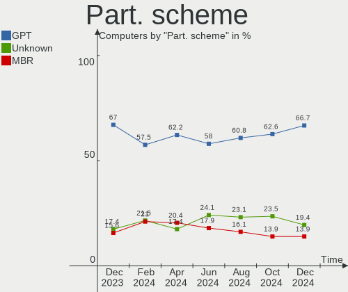
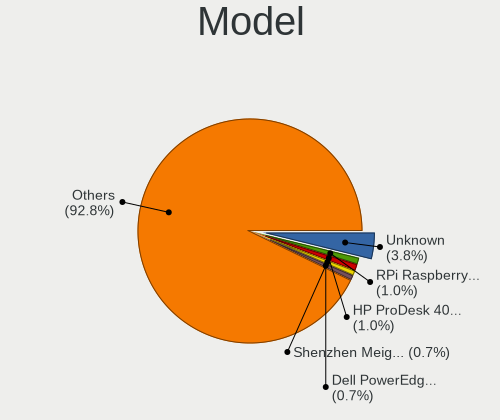
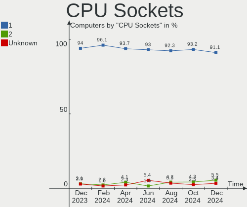
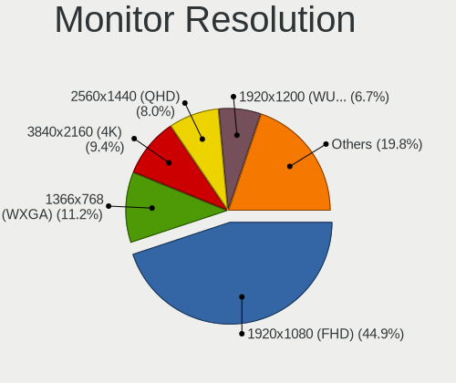
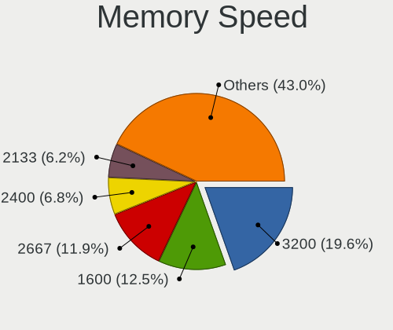
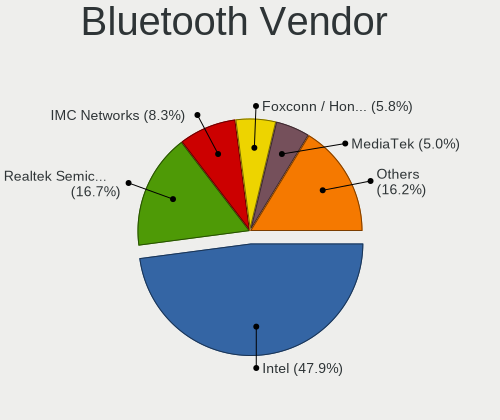

Debian Hardware Trends
----------------------

A project to identify most popular hardware characteristics and track their change
over time based on data collected by Debian users at https://Linux-Hardware.org.

Anyone can contribute to the study by uploading probes of their computers by
the [hw-probe](https://github.com/linuxhw/hw-probe) tool:

    sudo -E hw-probe -all -upload

This is a report for all computer types. See also reports for [desktops](/Dist/Debian/Desktop/README.md) and [notebooks](/Dist/Debian/Notebook/README.md).

Full-feature report is available here: https://linux-hardware.org/?view=trends

Period: Nov, 2020.

Contents
--------

- [ OS                       ](#os)
- [ OS Family                ](#os-family)
- [ Kernel                   ](#kernel)
- [ Kernel Family            ](#kernel-family)
- [ Kernel Major Ver.        ](#kernel-major-ver)
- [ Arch                     ](#arch)
- [ DE                       ](#de)
- [ Display Server           ](#display-server)
- [ Display Manager          ](#display-manager)
- [ OS Lang                  ](#os-lang)
- [ Boot Mode                ](#boot-mode)
- [ Filesystem               ](#filesystem)
- [ Part. scheme             ](#part-scheme)
- [ Dual Boot with Linux/BSD ](#dual-boot-with-linux/bsd)
- [ Dual Boot (Win)          ](#dual-boot-win)
- [ Country                  ](#country)
- [ City                     ](#city)
- [ Vendor                   ](#vendor)
- [ Model                    ](#model)
- [ Model Family             ](#model-family)
- [ MFG Year                 ](#mfg-year)
- [ Form Factor              ](#form-factor)
- [ Secure Boot              ](#secure-boot)
- [ Coreboot                 ](#coreboot)
- [ RAM Size                 ](#ram-size)
- [ RAM Used                 ](#ram-used)
- [ Has CD-ROM               ](#has-cd-rom)
- [ Total Drives             ](#total-drives)
- [ Has Ethernet             ](#has-ethernet)
- [ Drive Vendor             ](#drive-vendor)
- [ Drive Model              ](#drive-model)
- [ HDD Vendor               ](#hdd-vendor)
- [ SSD Vendor               ](#ssd-vendor)
- [ Drive Kind               ](#drive-kind)
- [ Drive Connector          ](#drive-connector)
- [ Drive Size               ](#drive-size)
- [ Space Total              ](#space-total)
- [ Space Used               ](#space-used)
- [ Malfunc. Drives          ](#malfunc-drives)
- [ Malfunc. Drive Vendor    ](#malfunc-drive-vendor)
- [ Malfunc. HDD Vendor      ](#malfunc-hdd-vendor)
- [ Malfunc. Drive Kind      ](#malfunc-drive-kind)
- [ Failed Drives            ](#failed-drives)
- [ Failed Drive Vendor      ](#failed-drive-vendor)
- [ Drive Status             ](#drive-status)
- [ Storage Vendor           ](#storage-vendor)
- [ Storage Model            ](#storage-model)
- [ Storage Kind             ](#storage-kind)
- [ CPU Vendor               ](#cpu-vendor)
- [ CPU Model                ](#cpu-model)
- [ CPU Model Family         ](#cpu-model-family)
- [ CPU Cores                ](#cpu-cores)
- [ CPU Sockets              ](#cpu-sockets)
- [ CPU Threads              ](#cpu-threads)
- [ CPU Op-Modes             ](#cpu-op-modes)
- [ CPU Microcode            ](#cpu-microcode)
- [ CPU Microarch            ](#cpu-microarch)
- [ GPU Vendor               ](#gpu-vendor)
- [ GPU Model                ](#gpu-model)
- [ GPU Combo                ](#gpu-combo)
- [ GPU Driver               ](#gpu-driver)
- [ GPU Memory               ](#gpu-memory)
- [ Monitor Vendor           ](#monitor-vendor)
- [ Monitor Model            ](#monitor-model)
- [ Monitor Resolution       ](#monitor-resolution)
- [ Monitor Diagonal         ](#monitor-diagonal)
- [ Monitor Width            ](#monitor-width)
- [ Aspect Ratio             ](#aspect-ratio)
- [ Monitor Area             ](#monitor-area)
- [ Pixel Density            ](#pixel-density)
- [ Multiple Monitors        ](#multiple-monitors)
- [ Net Controller Vendor    ](#net-controller-vendor)
- [ Net Controller Model     ](#net-controller-model)
- [ Wireless Vendor          ](#wireless-vendor)
- [ Wireless Model           ](#wireless-model)
- [ Ethernet Vendor          ](#ethernet-vendor)
- [ Ethernet Model           ](#ethernet-model)
- [ Net Controller Kind      ](#net-controller-kind)
- [ Used Controller          ](#used-controller)
- [ NICs                     ](#nics)
- [ Memory Vendor            ](#memory-vendor)
- [ Memory Model             ](#memory-model)
- [ Memory Kind              ](#memory-kind)
- [ Memory Form Factor       ](#memory-form-factor)
- [ Memory Size              ](#memory-size)
- [ Memory Speed             ](#memory-speed)
- [ Sound Vendor             ](#sound-vendor)
- [ Sound Model              ](#sound-model)
- [ Camera Vendor            ](#camera-vendor)
- [ Camera Model             ](#camera-model)
- [ Fingerprint Vendor       ](#fingerprint-vendor)
- [ Fingerprint Model        ](#fingerprint-model)
- [ Chipcard Vendor          ](#chipcard-vendor)
- [ Chipcard Model           ](#chipcard-model)
- [ Printer Vendor           ](#printer-vendor)
- [ Printer Model            ](#printer-model)
- [ Scanner Vendor           ](#scanner-vendor)
- [ Scanner Model            ](#scanner-model)
- [ Bluetooth Vendor         ](#bluetooth-vendor)
- [ Bluetooth Model          ](#bluetooth-model)
- [ Unsupported Devices      ](#unsupported-devices)
- [ Unsupported Device Types ](#unsupported-device-types)

OS
--

Installed operating systems

| Name            | Computers | Percent |
|-----------------|-----------|---------|
| Debian 10       | 90        | 57.32%  |
| Debian Testing  | 40        | 25.48%  |
| Debian          | 16        | 10.19%  |
| Debian Unstable | 7         | 4.46%   |
| Debian 9        | 2         | 1.27%   |
| Debian 9.11     | 1         | 0.64%   |
| Debian 9.1      | 1         | 0.64%   |

OS Family
---------

OS without a version

| Name   | Computers | Percent |
|--------|-----------|---------|
| Debian | 157       | 100%    |

Kernel
------

Version of the Linux kernel

| Version                   | Computers | Percent |
|---------------------------|-----------|---------|
| 4.19.0-12-amd64           | 53        | 33.76%  |
| 5.9.0-1-amd64             | 26        | 16.56%  |
| 5.8.0-0.bpo.2-amd64       | 10        | 6.37%   |
| 5.9.0-3-amd64             | 8         | 5.1%    |
| 5.9.0-2-amd64             | 8         | 5.1%    |
| 5.8.0-3-amd64             | 5         | 3.18%   |
| 5.6.0-2-amd64             | 5         | 3.18%   |
| 5.9.0-4-amd64             | 2         | 1.27%   |
| 5.4.65-1-pve              | 2         | 1.27%   |
| 4.9.0-8-amd64             | 2         | 1.27%   |
| 4.19.0-6-amd64            | 2         | 1.27%   |
| 4.19.0-11-amd64           | 2         | 1.27%   |
| 4.19.0-10-amd64           | 2         | 1.27%   |
| 5.9.8-xanmod1             | 1         | 0.64%   |
| 5.9.7-lqx                 | 1         | 0.64%   |
| 5.9.3-wrkd                | 1         | 0.64%   |
| 5.9.0-8.2-liquorix-amd64  | 1         | 0.64%   |
| 5.9.0-2-686-pae           | 1         | 0.64%   |
| 5.9.0-1-686-pae           | 1         | 0.64%   |
| 5.9-sunxi64               | 1         | 0.64%   |
| 5.8.10-bootes0-p-1000     | 1         | 0.64%   |
| 5.8.0-2-amd64             | 1         | 0.64%   |
| 5.8.0-16.1-liquorix-amd64 | 1         | 0.64%   |
| 5.8.0-1-amd64             | 1         | 0.64%   |
| 5.7.9-nv                  | 1         | 0.64%   |
| 5.7.0-0.bpo.2-amd64       | 1         | 0.64%   |
| 5.4.75-amd64              | 1         | 0.64%   |
| 5.4.73-1-pve              | 1         | 0.64%   |
| 5.4.72-odroidxu4          | 1         | 0.64%   |
| 5.4.51-v8+                | 1         | 0.64%   |
| 5.10.0-rc42               | 1         | 0.64%   |
| 5.0.15-1-pve              | 1         | 0.64%   |
| 5.0.0                     | 1         | 0.64%   |
| 4.9.0-14-amd64            | 1         | 0.64%   |
| 4.9.0-13-686              | 1         | 0.64%   |
| 4.9.0-12-686-pae          | 1         | 0.64%   |
| 4.19.0-8-amd64            | 1         | 0.64%   |
| 4.19.0-12-rt-686-pae      | 1         | 0.64%   |
| 4.19.0-12-686-pae         | 1         | 0.64%   |
| 4.19.0-12-686             | 1         | 0.64%   |
| 4.18.0-3-686-pae          | 1         | 0.64%   |
| 4.14.0-qcomlt-arm64       | 1         | 0.64%   |
| 4.10.17-2-pve             | 1         | 0.64%   |

Kernel Family
-------------

Linux kernel without a distro release

| Version | Computers | Percent |
|---------|-----------|---------|
| 4.19.0  | 63        | 40.13%  |
| 5.9.0   | 47        | 29.94%  |
| 5.8.0   | 18        | 11.46%  |
| 5.6.0   | 5         | 3.18%   |
| 4.9.0   | 5         | 3.18%   |
| 5.4.65  | 2         | 1.27%   |
| 5.9.8   | 1         | 0.64%   |
| 5.9.7   | 1         | 0.64%   |
| 5.9.3   | 1         | 0.64%   |
| 5.9     | 1         | 0.64%   |
| 5.8.10  | 1         | 0.64%   |
| 5.7.9   | 1         | 0.64%   |
| 5.7.0   | 1         | 0.64%   |
| 5.4.75  | 1         | 0.64%   |
| 5.4.73  | 1         | 0.64%   |
| 5.4.72  | 1         | 0.64%   |
| 5.4.51  | 1         | 0.64%   |
| 5.10.0  | 1         | 0.64%   |
| 5.0.15  | 1         | 0.64%   |
| 5.0.0   | 1         | 0.64%   |
| 4.18.0  | 1         | 0.64%   |
| 4.14.0  | 1         | 0.64%   |
| 4.10.17 | 1         | 0.64%   |

Kernel Major Ver.
-----------------

Linux kernel major version

| Version | Computers | Percent |
|---------|-----------|---------|
| 4.19    | 63        | 40.13%  |
| 5.9     | 50        | 31.85%  |
| 5.8     | 19        | 12.1%   |
| 5.4     | 6         | 3.82%   |
| 5.6     | 5         | 3.18%   |
| 4.9     | 5         | 3.18%   |
| 5.7     | 2         | 1.27%   |
| 5.0     | 2         | 1.27%   |
| 5.10    | 1         | 0.64%   |
| 5       | 1         | 0.64%   |
| 4.18    | 1         | 0.64%   |
| 4.14    | 1         | 0.64%   |
| 4.10    | 1         | 0.64%   |

Arch
----

OS architecture (x86_64, i586, etc.)

| Name    | Computers | Percent |
|---------|-----------|---------|
| x86_64  | 145       | 92.36%  |
| i686    | 8         | 5.1%    |
| aarch64 | 3         | 1.91%   |
| armv7l  | 1         | 0.64%   |

DE
--

Desktop Environment

| Name             | Computers | Percent |
|------------------|-----------|---------|
| GNOME            | 43        | 27.39%  |
| XFCE             | 26        | 16.56%  |
| KDE5             | 15        | 9.55%   |
| Unknown          | 14        | 8.92%   |
| KDE              | 11        | 7.01%   |
| MATE             | 9         | 5.73%   |
| X-Cinnamon       | 8         | 5.1%    |
| Cinnamon         | 7         | 4.46%   |
| LXQt             | 5         | 3.18%   |
| i3               | 5         | 3.18%   |
| LXDE             | 3         | 1.91%   |
| GNOME Flashback  | 3         | 1.91%   |
| lightdm-xsession | 2         | 1.27%   |
| GNOME Classic    | 2         | 1.27%   |
| Budgie           | 2         | 1.27%   |
| ICEWM            | 1         | 0.64%   |
| Fluxbox          | 1         | 0.64%   |

Display Server
--------------

X11 or Wayland

| Name    | Computers | Percent |
|---------|-----------|---------|
| X11     | 112       | 71.34%  |
| Wayland | 24        | 15.29%  |
| Tty     | 15        | 9.55%   |
| Unknown | 6         | 3.82%   |

Display Manager
---------------

SDDM, LightDM, etc.

| Name    | Computers | Percent |
|---------|-----------|---------|
| Unknown | 69        | 43.95%  |
| TDM     | 35        | 22.29%  |
| GDM     | 24        | 15.29%  |
| SDDM    | 19        | 12.1%   |
| XDM     | 3         | 1.91%   |
| LightDM | 2         | 1.27%   |
| SLiM    | 1         | 0.64%   |
| NODM    | 1         | 0.64%   |
| Ly      | 1         | 0.64%   |
| KDM     | 1         | 0.64%   |
| GDM3    | 1         | 0.64%   |

OS Lang
-------

Language

| Lang       | Computers | Percent |
|------------|-----------|---------|
| en_US      | 48        | 30.57%  |
| fr_FR      | 12        | 7.64%   |
| en_GB      | 10        | 6.37%   |
| de_DE      | 10        | 6.37%   |
| pt_BR      | 7         | 4.46%   |
| es_ES      | 6         | 3.82%   |
| ru_RU      | 4         | 2.55%   |
| C          | 4         | 2.55%   |
| Unknown    | 4         | 2.55%   |
| ru_UA      | 3         | 1.91%   |
| it_IT      | 3         | 1.91%   |
| en_CA      | 3         | 1.91%   |
| sv_SE      | 2         | 1.27%   |
| pt_PT      | 2         | 1.27%   |
| fr_CH      | 2         | 1.27%   |
| es_AR      | 2         | 1.27%   |
| en_US.utf8 | 2         | 1.27%   |
| en_IN      | 2         | 1.27%   |
| en_IE      | 2         | 1.27%   |
| de_DE.utf8 | 2         | 1.27%   |
| de_AT      | 2         | 1.27%   |
| cs_CZ      | 2         | 1.27%   |
| C          | 2         | 1.27%   |
| zh_CN      | 1         | 0.64%   |
| uk_UA      | 1         | 0.64%   |
| tt_RU      | 1         | 0.64%   |
| tr_TR      | 1         | 0.64%   |
| nl_NL      | 1         | 0.64%   |
| lt_LT      | 1         | 0.64%   |
| ja_JP      | 1         | 0.64%   |
| hu_HU      | 1         | 0.64%   |
| fr_FR.utf8 | 1         | 0.64%   |
| fr_BE      | 1         | 0.64%   |
| es_VE      | 1         | 0.64%   |
| es_NI      | 1         | 0.64%   |
| es_MX      | 1         | 0.64%   |
| es_ES.utf8 | 1         | 0.64%   |
| es_EC      | 1         | 0.64%   |
| es_CL      | 1         | 0.64%   |
| en_ZA      | 1         | 0.64%   |
| en_NZ      | 1         | 0.64%   |
| en_GB.utf8 | 1         | 0.64%   |
| en_DK      | 1         | 0.64%   |
| el_GR      | 1         | 0.64%   |

Boot Mode
---------

EFI or BIOS

| Mode | Computers | Percent |
|------|-----------|---------|
| BIOS | 97        | 61.78%  |
| EFI  | 60        | 38.22%  |

Filesystem
----------

Type of filesystem

| Type    | Computers | Percent |
|---------|-----------|---------|
| Ext4    | 133       | 84.71%  |
| Btrfs   | 7         | 4.46%   |
| Xfs     | 6         | 3.82%   |
| Zfs     | 3         | 1.91%   |
| Ext3    | 3         | 1.91%   |
| Overlay | 2         | 1.27%   |
| F2fs    | 2         | 1.27%   |
| Jfs     | 1         | 0.64%   |

Part. scheme
------------

Scheme of partitioning

| Type    | Computers | Percent |
|---------|-----------|---------|
| GPT     | 69        | 43.95%  |
| Unknown | 59        | 37.58%  |
| MBR     | 29        | 18.47%  |

Dual Boot with Linux/BSD
------------------------

Hosting more than one Linux/BSD

| Dual boot | Computers | Percent |
|-----------|-----------|---------|
| No        | 138       | 87.9%   |
| Yes       | 19        | 12.1%   |

Dual Boot (Win)
---------------

Hosting Linux and Windows

| Dual boot | Computers | Percent |
|-----------|-----------|---------|
| No        | 121       | 77.07%  |
| Yes       | 36        | 22.93%  |

Country
-------

Geographic location (country)

| Country                | Computers | Percent |
|------------------------|-----------|---------|
| USA                    | 19        | 12.1%   |
| France                 | 17        | 10.83%  |
| Germany                | 16        | 10.19%  |
| Russia                 | 14        | 8.92%   |
| Spain                  | 11        | 7.01%   |
| Brazil                 | 11        | 7.01%   |
| Ukraine                | 4         | 2.55%   |
| Switzerland            | 4         | 2.55%   |
| UK                     | 3         | 1.91%   |
| Netherlands            | 3         | 1.91%   |
| Italy                  | 3         | 1.91%   |
| Canada                 | 3         | 1.91%   |
| Belarus                | 3         | 1.91%   |
| Argentina              | 3         | 1.91%   |
| Sweden                 | 2         | 1.27%   |
| Romania                | 2         | 1.27%   |
| Portugal               | 2         | 1.27%   |
| Poland                 | 2         | 1.27%   |
| Norway                 | 2         | 1.27%   |
| Ireland                | 2         | 1.27%   |
| India                  | 2         | 1.27%   |
| Greece                 | 2         | 1.27%   |
| Finland                | 2         | 1.27%   |
| Czech Republic         | 2         | 1.27%   |
| Chile                  | 2         | 1.27%   |
| Bulgaria               | 2         | 1.27%   |
| Belgium                | 2         | 1.27%   |
| Austria                | 2         | 1.27%   |
| Venezuela              | 1         | 0.64%   |
| Turkey                 | 1         | 0.64%   |
| South Africa           | 1         | 0.64%   |
| Serbia                 | 1         | 0.64%   |
| Nicaragua              | 1         | 0.64%   |
| New Zealand            | 1         | 0.64%   |
| Mexico                 | 1         | 0.64%   |
| Lithuania              | 1         | 0.64%   |
| Japan                  | 1         | 0.64%   |
| Indonesia              | 1         | 0.64%   |
| Georgia                | 1         | 0.64%   |
| Ecuador                | 1         | 0.64%   |
| China                  | 1         | 0.64%   |
| Bosnia and Herzegovina | 1         | 0.64%   |
| Australia              | 1         | 0.64%   |

City
----

Geographic location (city)

| City                   | Computers | Percent |
|------------------------|-----------|---------|
| St Petersburg          | 6         | 3.82%   |
| São Paulo             | 5         | 3.18%   |
| Paris                  | 5         | 3.18%   |
| Minsk                  | 3         | 1.91%   |
| Sofia                  | 2         | 1.27%   |
| Rio de Janeiro         | 2         | 1.27%   |
| Oslo                   | 2         | 1.27%   |
| Moscow                 | 2         | 1.27%   |
| Kyiv                   | 2         | 1.27%   |
| Hennigsdorf            | 2         | 1.27%   |
| Galway                 | 2         | 1.27%   |
| Falkenstein            | 2         | 1.27%   |
| Ekaterinburg           | 2         | 1.27%   |
| Bielsk Podlaski        | 2         | 1.27%   |
| Barcelona              | 2         | 1.27%   |
| Zurich                 | 1         | 0.64%   |
| Zeist                  | 1         | 0.64%   |
| Yssingeaux             | 1         | 0.64%   |
| Woodstock              | 1         | 0.64%   |
| Wienerherberg          | 1         | 0.64%   |
| Wellington             | 1         | 0.64%   |
| Volnay                 | 1         | 0.64%   |
| Vienna                 | 1         | 0.64%   |
| Veinticinco de Mayo    | 1         | 0.64%   |
| Varese                 | 1         | 0.64%   |
| Vannes                 | 1         | 0.64%   |
| Valencia               | 1         | 0.64%   |
| Tuzla                  | 1         | 0.64%   |
| Tudela                 | 1         | 0.64%   |
| Thessaloniki           | 1         | 0.64%   |
| Tbilisi                | 1         | 0.64%   |
| Talca                  | 1         | 0.64%   |
| Steinau an der Strasse | 1         | 0.64%   |
| Sorocaba               | 1         | 0.64%   |
| Sirig                  | 1         | 0.64%   |
| Shchelkovo             | 1         | 0.64%   |
| Sete Lagoas            | 1         | 0.64%   |
| Schoenberg             | 1         | 0.64%   |
| Saratoga Springs       | 1         | 0.64%   |
| Santiago               | 1         | 0.64%   |
| Saint Paul             | 1         | 0.64%   |
| Safonovo               | 1         | 0.64%   |
| Roubaix                | 1         | 0.64%   |
| Resistencia            | 1         | 0.64%   |
| Raahe                  | 1         | 0.64%   |
| Prague                 | 1         | 0.64%   |
| Portland               | 1         | 0.64%   |
| Porrentruy             | 1         | 0.64%   |
| Pliezhausen            | 1         | 0.64%   |
| Pleneuf-Val-Andre      | 1         | 0.64%   |
| Pathanamthitta         | 1         | 0.64%   |
| Park City              | 1         | 0.64%   |
| Panciu                 | 1         | 0.64%   |
| Oxford                 | 1         | 0.64%   |
| Olot                   | 1         | 0.64%   |
| Olomouc                | 1         | 0.64%   |
| Nérac                 | 1         | 0.64%   |
| Novosibirsk            | 1         | 0.64%   |
| Notzingen              | 1         | 0.64%   |
| North Bay              | 1         | 0.64%   |

Vendor
------

Motherboard manufacturer

| Name                    | Computers | Percent |
|-------------------------|-----------|---------|
| ASUSTek Computer        | 32        | 20.38%  |
| Lenovo                  | 25        | 15.92%  |
| Dell                    | 23        | 14.65%  |
| Hewlett-Packard         | 20        | 12.74%  |
| ASRock                  | 10        | 6.37%   |
| MSI                     | 9         | 5.73%   |
| Gigabyte Technology     | 8         | 5.1%    |
| Acer                    | 6         | 3.82%   |
| Unknown                 | 3         | 1.91%   |
| Pegatron                | 2         | 1.27%   |
| Intel                   | 2         | 1.27%   |
| Apple                   | 2         | 1.27%   |
| Wistron                 | 1         | 0.64%   |
| Toshiba                 | 1         | 0.64%   |
| Supermicro              | 1         | 0.64%   |
| Samsung Electronics     | 1         | 0.64%   |
| Razer                   | 1         | 0.64%   |
| Raspberry Pi Foundation | 1         | 0.64%   |
| Pine Microsystems       | 1         | 0.64%   |
| Packard Bell            | 1         | 0.64%   |
| Megaware                | 1         | 0.64%   |
| HUAWEI                  | 1         | 0.64%   |
| Hardkernel              | 1         | 0.64%   |
| Foxconn                 | 1         | 0.64%   |
| DataLogic               | 1         | 0.64%   |
| AMI                     | 1         | 0.64%   |
| Alienware               | 1         | 0.64%   |

Model
-----

Motherboard model

| Name                                               | Computers | Percent |
|----------------------------------------------------|-----------|---------|
| Unknown                                            | 3         | 1.91%   |
| MSI MS-7A34                                        | 2         | 1.27%   |
| Wistron ProLiant ML110 G6                          | 1         | 0.64%   |
| Toshiba Satellite C55-C                            | 1         | 0.64%   |
| Supermicro X8DTU                                   | 1         | 0.64%   |
| Samsung 940Z5L                                     | 1         | 0.64%   |
| Razer Blade 15 Base Model (Early 2020) - RZ09-0328 | 1         | 0.64%   |
| RPi Raspberry Pi 4 Model B Rev 1.1                 | 1         | 0.64%   |
| Pine Microsystems Pine64 PinePhone (1.2)           | 1         | 0.64%   |
| Pegatron KP250AA-ABZ m9280.it                      | 1         | 0.64%   |
| Pegatron FQ587AA-ABA a6767c                        | 1         | 0.64%   |
| Packard Bell EasyNote LM81                         | 1         | 0.64%   |
| MSI MS-7C79                                        | 1         | 0.64%   |
| MSI MS-7C51                                        | 1         | 0.64%   |
| MSI MS-7C31                                        | 1         | 0.64%   |
| MSI MS-7A71                                        | 1         | 0.64%   |
| MSI MS-7751                                        | 1         | 0.64%   |
| MSI MS-7368                                        | 1         | 0.64%   |
| MSI GS43VR 7RE                                     | 1         | 0.64%   |
| Megaware MW-H61H2-M2                               | 1         | 0.64%   |
| Lenovo ThinkPad X240 20AM0012UK                    | 1         | 0.64%   |
| Lenovo ThinkPad X220 4290RV5                       | 1         | 0.64%   |
| Lenovo ThinkPad X1 Carbon 3443CTO                  | 1         | 0.64%   |
| Lenovo ThinkPad T60 1951WJ1                        | 1         | 0.64%   |
| Lenovo ThinkPad T500 20828YG                       | 1         | 0.64%   |
| Lenovo ThinkPad T470 20HE0055IT                    | 1         | 0.64%   |
| Lenovo ThinkPad T430 2349V4B                       | 1         | 0.64%   |
| Lenovo ThinkPad T420 4236S3C                       | 1         | 0.64%   |
| Lenovo ThinkPad T420 4180AG3                       | 1         | 0.64%   |
| Lenovo ThinkPad L15 Gen 1 20U3CTO1WW               | 1         | 0.64%   |
| Lenovo ThinkPad E590 20NB0012RT                    | 1         | 0.64%   |
| Lenovo ThinkPad E14 Gen 2 20T60026RT               | 1         | 0.64%   |
| Lenovo ThinkPad E14 20RAS0D800                     | 1         | 0.64%   |
| Lenovo ThinkPad E14 20RA001LMC                     | 1         | 0.64%   |
| Lenovo ThinkPad E14 20RA001HRT                     | 1         | 0.64%   |
| Lenovo ThinkCentre M92p 3209EK4                    | 1         | 0.64%   |
| Lenovo ThinkCentre M91p 4480B2G                    | 1         | 0.64%   |
| Lenovo Legion Y9000X 2020 81TH                     | 1         | 0.64%   |
| Lenovo K2450 20243                                 | 1         | 0.64%   |
| Lenovo IdeaPad Y470 0855                           | 1         | 0.64%   |
| Lenovo IdeaPad L340-17API 81LY                     | 1         | 0.64%   |
| Lenovo IdeaPad 520-15IKB 81BF                      | 1         | 0.64%   |
| Lenovo IdeaPad 330-15IKB 81DE                      | 1         | 0.64%   |
| Lenovo IdeaPad 310-15ABR 80ST                      | 1         | 0.64%   |
| Lenovo H505S 3230                                  | 1         | 0.64%   |
| Intel SharkBay Platform                            | 1         | 0.64%   |
| Intel Q3XXG4-P V1.0                                | 1         | 0.64%   |
| HUAWEI BOHK-WAX9X                                  | 1         | 0.64%   |
| HP t610 WW Thin Client                             | 1         | 0.64%   |
| HP ProBook 440 G6                                  | 1         | 0.64%   |
| HP Pavilion Notebook                               | 1         | 0.64%   |
| HP Pavilion dv5                                    | 1         | 0.64%   |
| HP OMEN by HP Laptop 15-dc0xxx                     | 1         | 0.64%   |
| HP Mini 110-3100                                   | 1         | 0.64%   |
| HP Laptop 17-by1xxx                                | 1         | 0.64%   |
| HP Laptop 15s-fq1xxx                               | 1         | 0.64%   |
| HP Laptop 15s-fq0xxx                               | 1         | 0.64%   |
| HP Laptop 15-bs0xx                                 | 1         | 0.64%   |
| HP ENVY 17                                         | 1         | 0.64%   |
| HP ENVY 14 SPECTRE                                 | 1         | 0.64%   |

Model Family
------------

Motherboard model prefix

| Name                      | Computers | Percent |
|---------------------------|-----------|---------|
| Lenovo ThinkPad           | 15        | 9.55%   |
| Lenovo IdeaPad            | 5         | 3.18%   |
| Dell Latitude             | 5         | 3.18%   |
| Dell Inspiron             | 5         | 3.18%   |
| HP Laptop                 | 4         | 2.55%   |
| ASUS PRIME                | 4         | 2.55%   |
| HP EliteBook              | 3         | 1.91%   |
| Dell XPS                  | 3         | 1.91%   |
| Dell OptiPlex             | 3         | 1.91%   |
| Acer Aspire               | 3         | 1.91%   |
| Unknown                   | 3         | 1.91%   |
| MSI MS-7A34               | 2         | 1.27%   |
| Lenovo ThinkCentre        | 2         | 1.27%   |
| HP Pavilion               | 2         | 1.27%   |
| HP ENVY                   | 2         | 1.27%   |
| HP EliteDesk              | 2         | 1.27%   |
| HP Compaq                 | 2         | 1.27%   |
| Dell Vostro               | 2         | 1.27%   |
| ASUS ZenBook              | 2         | 1.27%   |
| ASUS TUF                  | 2         | 1.27%   |
| ASUS ROG                  | 2         | 1.27%   |
| ASUS M5A97                | 2         | 1.27%   |
| ASRock X370               | 2         | 1.27%   |
| Wistron ProLiant          | 1         | 0.64%   |
| Toshiba Satellite         | 1         | 0.64%   |
| Supermicro X8DTU          | 1         | 0.64%   |
| Samsung 940Z5L            | 1         | 0.64%   |
| Razer Blade               | 1         | 0.64%   |
| RPi Raspberry             | 1         | 0.64%   |
| Pine Microsystems Pine64  | 1         | 0.64%   |
| Pegatron KP250AA-ABZ      | 1         | 0.64%   |
| Pegatron FQ587AA-ABA      | 1         | 0.64%   |
| Packard Bell EasyNote     | 1         | 0.64%   |
| MSI MS-7C79               | 1         | 0.64%   |
| MSI MS-7C51               | 1         | 0.64%   |
| MSI MS-7C31               | 1         | 0.64%   |
| MSI MS-7A71               | 1         | 0.64%   |
| MSI MS-7751               | 1         | 0.64%   |
| MSI MS-7368               | 1         | 0.64%   |
| MSI GS43VR                | 1         | 0.64%   |
| Megaware MW-H61H2-M2      | 1         | 0.64%   |
| Lenovo Legion             | 1         | 0.64%   |
| Lenovo K2450              | 1         | 0.64%   |
| Lenovo H505S              | 1         | 0.64%   |
| Intel SharkBay            | 1         | 0.64%   |
| Intel Q3XXG4-P            | 1         | 0.64%   |
| HUAWEI BOHK-WAX9X         | 1         | 0.64%   |
| HP t610                   | 1         | 0.64%   |
| HP ProBook                | 1         | 0.64%   |
| HP OMEN                   | 1         | 0.64%   |
| HP Mini                   | 1         | 0.64%   |
| HP 255                    | 1         | 0.64%   |
| Hardkernel Odroid         | 1         | 0.64%   |
| Gigabyte Z97N-WIFI        | 1         | 0.64%   |
| Gigabyte Z87X-UD5H        | 1         | 0.64%   |
| Gigabyte GB-BACE-3000-SBE | 1         | 0.64%   |
| Gigabyte GA-990FXA-D3     | 1         | 0.64%   |
| Gigabyte B550             | 1         | 0.64%   |
| Gigabyte B450M            | 1         | 0.64%   |
| Gigabyte B250M-D3H        | 1         | 0.64%   |

MFG Year
--------

Motherboard manufacture year

| Year    | Computers | Percent |
|---------|-----------|---------|
| 2019    | 30        | 19.11%  |
| 2020    | 27        | 17.2%   |
| 2018    | 13        | 8.28%   |
| 2011    | 13        | 8.28%   |
| 2012    | 12        | 7.64%   |
| 2015    | 11        | 7.01%   |
| 2017    | 10        | 6.37%   |
| 2009    | 9         | 5.73%   |
| 2014    | 7         | 4.46%   |
| 2013    | 7         | 4.46%   |
| Unknown | 4         | 2.55%   |
| 2016    | 3         | 1.91%   |
| 2008    | 3         | 1.91%   |
| 2006    | 3         | 1.91%   |
| 2007    | 2         | 1.27%   |
| 2010    | 1         | 0.64%   |
| 2005    | 1         | 0.64%   |
| 2004    | 1         | 0.64%   |

Form Factor
-----------

Physical design of the computer

| Name           | Computers | Percent |
|----------------|-----------|---------|
| Notebook       | 80        | 50.96%  |
| Desktop        | 69        | 43.95%  |
| System on chip | 3         | 1.91%   |
| Phone          | 1         | 0.64%   |
| Tablet         | 1         | 0.64%   |
| Convertible    | 1         | 0.64%   |
| Mini pc        | 1         | 0.64%   |
| Server         | 1         | 0.64%   |

Secure Boot
-----------

Enabled or disabled

| State    | Computers | Percent |
|----------|-----------|---------|
| Disabled | 149       | 94.9%   |
| Enabled  | 8         | 5.1%    |

Coreboot
--------

Have coreboot on board

| Used | Computers | Percent |
|------|-----------|---------|
| No   | 157       | 100%    |

RAM Size
--------

Total RAM memory

| Size in GB  | Computers | Percent |
|-------------|-----------|---------|
| 16.01-24.0  | 35        | 22.29%  |
| 8.01-16.0   | 31        | 19.75%  |
| 4.01-8.0    | 29        | 18.47%  |
| 3.01-4.0    | 23        | 14.65%  |
| 32.01-64.0  | 13        | 8.28%   |
| 1.01-2.0    | 12        | 7.64%   |
| 64.01-256.0 | 7         | 4.46%   |
| 2.01-3.0    | 6         | 3.82%   |
| 24.01-32.0  | 1         | 0.64%   |

RAM Used
--------

Used RAM memory

| Used GB    | Computers | Percent |
|------------|-----------|---------|
| 1.01-2.0   | 38        | 24.2%   |
| 4.01-8.0   | 31        | 19.75%  |
| 2.01-3.0   | 29        | 18.47%  |
| 3.01-4.0   | 20        | 12.74%  |
| 0.01-1.0   | 20        | 12.74%  |
| 8.01-16.0  | 14        | 8.92%   |
| 16.01-24.0 | 3         | 1.91%   |
| 32.01-64.0 | 2         | 1.27%   |

Has CD-ROM
----------

Has CD-ROM on board

| Presented | Computers | Percent |
|-----------|-----------|---------|
| No        | 95        | 60.51%  |
| Yes       | 62        | 39.49%  |

Total Drives
------------

Number of drives on board

| Drives | Computers | Percent |
|--------|-----------|---------|
| 1      | 78        | 49.68%  |
| 2      | 49        | 31.21%  |
| 3      | 12        | 7.64%   |
| 4      | 10        | 6.37%   |
| 6      | 4         | 2.55%   |
| 16     | 1         | 0.64%   |
| 8      | 1         | 0.64%   |
| 7      | 1         | 0.64%   |
| 5      | 1         | 0.64%   |

Has Ethernet
------------

Has Ethernet on board

| Presented | Computers | Percent |
|-----------|-----------|---------|
| Yes       | 138       | 87.9%   |
| No        | 19        | 12.1%   |

Drive Vendor
------------

Hard drive vendors

| Vendor                    | Computers | Drives | Percent |
|---------------------------|-----------|--------|---------|
| WDC                       | 50        | 62     | 19.16%  |
| Seagate                   | 41        | 47     | 15.71%  |
| Samsung Electronics       | 35        | 45     | 13.41%  |
| Toshiba                   | 15        | 22     | 5.75%   |
| Kingston                  | 14        | 14     | 5.36%   |
| Unknown                   | 13        | 13     | 4.98%   |
| Crucial                   | 11        | 11     | 4.21%   |
| Hitachi                   | 10        | 25     | 3.83%   |
| SK Hynix                  | 7         | 7      | 2.68%   |
| Intel                     | 7         | 7      | 2.68%   |
| HGST                      | 7         | 8      | 2.68%   |
| SanDisk                   | 6         | 6      | 2.3%    |
| A-DATA Technology         | 6         | 6      | 2.3%    |
| Transcend                 | 3         | 4      | 1.15%   |
| Phison                    | 3         | 4      | 1.15%   |
| Micron Technology         | 3         | 3      | 1.15%   |
| Maxtor                    | 3         | 3      | 1.15%   |
| OCZ                       | 2         | 2      | 0.77%   |
| Micron/Crucial Technology | 2         | 2      | 0.77%   |
| LITEON                    | 2         | 2      | 0.77%   |
| Hewlett-Packard           | 2         | 2      | 0.77%   |
| Fujitsu                   | 2         | 2      | 0.77%   |
| Apple                     | 2         | 2      | 0.77%   |
| Team                      | 1         | 1      | 0.38%   |
| SPCC                      | 1         | 1      | 0.38%   |
| PNY                       | 1         | 1      | 0.38%   |
| Patriot                   | 1         | 1      | 0.38%   |
| OCZ-VERTEX                | 1         | 1      | 0.38%   |
| MBED                      | 1         | 1      | 0.38%   |
| Lite-On                   | 1         | 1      | 0.38%   |
| Leven                     | 1         | 1      | 0.38%   |
| KIOXIA                    | 1         | 1      | 0.38%   |
| KingSpec                  | 1         | 1      | 0.38%   |
| HGST HDS                  | 1         | 1      | 0.38%   |
| Dogfish                   | 1         | 1      | 0.38%   |
| Corsair                   | 1         | 1      | 0.38%   |
| China                     | 1         | 1      | 0.38%   |
| ADATA Technology          | 1         | 1      | 0.38%   |

Drive Model
-----------

Hard drive models

| Model                                   | Computers | Percent |
|-----------------------------------------|-----------|---------|
| Seagate ST1000DM010-2EP102 1TB          | 4         | 1.37%   |
| Kingston SA400S37240G 240GB SSD         | 4         | 1.37%   |
| WDC WD10EZEX-08WN4A0 1TB                | 3         | 1.03%   |
| Unknown MMC Card  32GB                  | 3         | 1.03%   |
| SK Hynix BC501 HFM512GDJTNG-8310A 512GB | 3         | 1.03%   |
| Seagate ST3500418AS 500GB               | 3         | 1.03%   |
| Samsung SSD 860 EVO 500GB               | 3         | 1.03%   |
| Samsung SSD 850 EVO 250GB               | 3         | 1.03%   |
| Kingston SA400S37120G 120GB SSD         | 3         | 1.03%   |
| Crucial CT500MX500SSD1 500GB            | 3         | 1.03%   |
| WDC WD80EFZX-68UW8N0 8TB                | 2         | 0.69%   |
| WDC WD5000AADS-00S9B0 500GB             | 2         | 0.69%   |
| WDC WD30EFRX-68EUZN0 3TB                | 2         | 0.69%   |
| WDC WD20EARX-00PASB0 2TB                | 2         | 0.69%   |
| Unknown MMC Card  64GB                  | 2         | 0.69%   |
| Unknown MMC Card  128GB                 | 2         | 0.69%   |
| Toshiba MQ01ABD100 1TB                  | 2         | 0.69%   |
| Toshiba HDWD130 3TB                     | 2         | 0.69%   |
| Toshiba HDWD110 1TB                     | 2         | 0.69%   |
| Toshiba DT01ACA050 500GB                | 2         | 0.69%   |
| Seagate ST31000528AS 1TB                | 2         | 0.69%   |
| Seagate ST1000LM035-1RK172 1TB          | 2         | 0.69%   |
| Seagate ST1000LM024 HN-M101MBB 1TB      | 2         | 0.69%   |
| Sandisk NVMe SSD Drive 500GB            | 2         | 0.69%   |
| HGST HTS721010A9E630 1TB                | 2         | 0.69%   |
| HGST HTS545050A7E680 500GB              | 2         | 0.69%   |
| Crucial CT1000MX500SSD1 1TB             | 2         | 0.69%   |
| WDC WDS500G3X0C-00SJG0 500GB            | 1         | 0.34%   |
| WDC WDS500G1B0C-00S6U0 500GB            | 1         | 0.34%   |
| WDC WDS240G2G0B-00EPW0 240GB SSD        | 1         | 0.34%   |
| WDC WDS240G2G0A-00JH30 240GB SSD        | 1         | 0.34%   |
| WDC WDBNCE5000PNC 500GB SSD             | 1         | 0.34%   |
| WDC WD800JD-75MSA3 80GB                 | 1         | 0.34%   |
| WDC WD800BB-22JHC0 80GB                 | 1         | 0.34%   |
| WDC WD7500BPKT-75PK4T0 752GB            | 1         | 0.34%   |
| WDC WD7500AACS-00D6B0 752GB             | 1         | 0.34%   |
| WDC WD6400AAKS-65A7B0 640GB             | 1         | 0.34%   |
| WDC WD6400AAKS-00A7B0 640GB             | 1         | 0.34%   |
| WDC WD5000LPCX-75VHAT1 500GB            | 1         | 0.34%   |
| WDC WD5000LPCX-21VHAT0 500GB            | 1         | 0.34%   |
| WDC WD5000AZLX-60K2TA0 500GB            | 1         | 0.34%   |
| WDC WD5000AAKX-00U6AA0 500GB            | 1         | 0.34%   |
| WDC WD5000AAKX-00ERMA0 500GB            | 1         | 0.34%   |
| WDC WD5000AAKX-003CA0 500GB             | 1         | 0.34%   |
| WDC WD5000AAKX-001CA0 500GB             | 1         | 0.34%   |
| WDC WD5000AAKS-75YGA0 500GB             | 1         | 0.34%   |
| WDC WD5000AAKS-00A7B2 500GB             | 1         | 0.34%   |
| WDC WD5000AAKB-00H8A0 500GB             | 1         | 0.34%   |
| WDC WD40EFRX-68N32N0 4TB                | 1         | 0.34%   |
| WDC WD3200BEVT-22A23T0 320GB            | 1         | 0.34%   |
| WDC WD3200AAJB-00WGA0 320GB             | 1         | 0.34%   |
| WDC WD32 00BEKT-60PVMT0 320GB           | 1         | 0.34%   |
| WDC WD2500AVJB-63J5A0 250GB             | 1         | 0.34%   |
| WDC WD2500AAKS-00UU3A0 250GB            | 1         | 0.34%   |
| WDC WD20EZRZ-00Z5HB0 2TB                | 1         | 0.34%   |
| WDC WD20EFRX-68EUZN0 2TB                | 1         | 0.34%   |
| WDC WD1600AAJS-08PSA0 160GB             | 1         | 0.34%   |
| WDC WD10TMVW-11ZSMS5 1TB                | 1         | 0.34%   |
| WDC WD10SPZX-24Z10 1TB                  | 1         | 0.34%   |
| WDC WD10SPZX-00Z10T0 1TB                | 1         | 0.34%   |

HDD Vendor
----------

Hard disk drive vendors

| Vendor              | Computers | Drives | Percent |
|---------------------|-----------|--------|---------|
| WDC                 | 42        | 53     | 34.15%  |
| Seagate             | 39        | 45     | 31.71%  |
| Toshiba             | 10        | 11     | 8.13%   |
| Hitachi             | 10        | 25     | 8.13%   |
| Samsung Electronics | 9         | 12     | 7.32%   |
| HGST                | 7         | 8      | 5.69%   |
| Maxtor              | 3         | 3      | 2.44%   |
| Fujitsu             | 2         | 2      | 1.63%   |
| Unknown             | 1         | 1      | 0.81%   |

SSD Vendor
----------

Solid state drive vendors

| Vendor              | Computers | Drives | Percent |
|---------------------|-----------|--------|---------|
| Samsung Electronics | 19        | 21     | 23.75%  |
| Kingston            | 12        | 12     | 15%     |
| Crucial             | 11        | 11     | 13.75%  |
| SanDisk             | 4         | 4      | 5%      |
| A-DATA Technology   | 4         | 4      | 5%      |
| WDC                 | 3         | 3      | 3.75%   |
| Toshiba             | 3         | 8      | 3.75%   |
| Micron Technology   | 3         | 3      | 3.75%   |
| Transcend           | 2         | 3      | 2.5%    |
| OCZ                 | 2         | 2      | 2.5%    |
| LITEON              | 2         | 2      | 2.5%    |
| Intel               | 2         | 2      | 2.5%    |
| Apple               | 2         | 2      | 2.5%    |
| Team                | 1         | 1      | 1.25%   |
| SPCC                | 1         | 1      | 1.25%   |
| SK Hynix            | 1         | 1      | 1.25%   |
| Patriot             | 1         | 1      | 1.25%   |
| OCZ-VERTEX          | 1         | 1      | 1.25%   |
| Leven               | 1         | 1      | 1.25%   |
| KingSpec            | 1         | 1      | 1.25%   |
| Hewlett-Packard     | 1         | 1      | 1.25%   |
| Dogfish             | 1         | 1      | 1.25%   |
| Corsair             | 1         | 1      | 1.25%   |
| China               | 1         | 1      | 1.25%   |

Drive Kind
----------

HDD or SSD

| Kind    | Computers | Drives | Percent |
|---------|-----------|--------|---------|
| HDD     | 94        | 160    | 41.23%  |
| SSD     | 74        | 88     | 32.46%  |
| NVMe    | 45        | 51     | 19.74%  |
| MMC     | 12        | 12     | 5.26%   |
| Unknown | 3         | 3      | 1.32%   |

Drive Connector
---------------

SATA, SAS, NVMe, etc.

| Type | Computers | Drives | Percent |
|------|-----------|--------|---------|
| SATA | 132       | 227    | 66.67%  |
| NVMe | 45        | 51     | 22.73%  |
| MMC  | 12        | 12     | 6.06%   |
| SAS  | 9         | 24     | 4.55%   |

Drive Size
----------

Size of hard drive

| Size in TB | Computers | Drives | Percent |
|------------|-----------|--------|---------|
| 0.01-0.5   | 101       | 138    | 58.72%  |
| 0.51-1.0   | 47        | 65     | 27.33%  |
| 1.01-2.0   | 11        | 14     | 6.4%    |
| 2.01-3.0   | 6         | 21     | 3.49%   |
| 4.01-10.0  | 4         | 7      | 2.33%   |
| 3.01-4.0   | 3         | 3      | 1.74%   |

Space Total
-----------

Amount of disk space available on the file system

| Size in GB     | Computers | Percent |
|----------------|-----------|---------|
| 501-1000       | 38        | 24.2%   |
| 251-500        | 36        | 22.93%  |
| 101-250        | 35        | 22.29%  |
| More than 3000 | 14        | 8.92%   |
| 1001-2000      | 9         | 5.73%   |
| 51-100         | 8         | 5.1%    |
| Unknown        | 5         | 3.18%   |
| 21-50          | 4         | 2.55%   |
| 2001-3000      | 4         | 2.55%   |
| 1-20           | 4         | 2.55%   |

Space Used
----------

Amount of used disk space

| Used GB        | Computers | Percent |
|----------------|-----------|---------|
| 1-20           | 35        | 22.29%  |
| 101-250        | 23        | 14.65%  |
| 251-500        | 22        | 14.01%  |
| 501-1000       | 22        | 14.01%  |
| 51-100         | 20        | 12.74%  |
| 21-50          | 14        | 8.92%   |
| 1001-2000      | 8         | 5.1%    |
| More than 3000 | 5         | 3.18%   |
| Unknown        | 5         | 3.18%   |
| 2001-3000      | 3         | 1.91%   |

Malfunc. Drives
---------------

Drive models with a malfunction

| Model                               | Computers | Drives | Percent |
|-------------------------------------|-----------|--------|---------|
| WDC WD7500BPKT-75PK4T0 752GB        | 1         | 1      | 4.76%   |
| WDC WD5000AAKX-00U6AA0 500GB        | 1         | 1      | 4.76%   |
| WDC WD5000AAKX-003CA0 500GB         | 1         | 1      | 4.76%   |
| WDC WD1600AAJS-08PSA0 160GB         | 1         | 1      | 4.76%   |
| WDC WD10EACS-22D6B0 1TB             | 1         | 1      | 4.76%   |
| Seagate ST3500418AS 500GB           | 1         | 1      | 4.76%   |
| Seagate ST3250620AS 250GB           | 1         | 1      | 4.76%   |
| Seagate ST3250310AS 250GB           | 1         | 1      | 4.76%   |
| Seagate ST2000DM001-1CH164 2TB      | 1         | 1      | 4.76%   |
| Seagate ST1000LM024 HN-M101MBB 1TB  | 1         | 1      | 4.76%   |
| Samsung Electronics SSD 960 PRO 1TB | 1         | 1      | 4.76%   |
| Samsung Electronics SP1604N 160GB   | 1         | 1      | 4.76%   |
| Samsung Electronics HD753LJ 752GB   | 1         | 1      | 4.76%   |
| Samsung Electronics HD502HI 500GB   | 1         | 1      | 4.76%   |
| Maxtor 6L200S0 208GB                | 1         | 1      | 4.76%   |
| Kingston SV300S37A120G 120GB SSD    | 1         | 1      | 4.76%   |
| Hitachi HTS727550A9E364 500GB       | 1         | 1      | 4.76%   |
| Hitachi HTS545016B9A300 160GB       | 1         | 1      | 4.76%   |
| Hitachi HTS543225L9A300 250GB       | 1         | 1      | 4.76%   |
| Fujitsu MHV2080BH PL 80GB           | 1         | 1      | 4.76%   |
| Crucial CT1050MX300SSD1 1TB         | 1         | 1      | 4.76%   |

Malfunc. Drive Vendor
---------------------

Vendors of faulty drives

| Vendor              | Computers | Drives | Percent |
|---------------------|-----------|--------|---------|
| WDC                 | 5         | 5      | 23.81%  |
| Seagate             | 5         | 5      | 23.81%  |
| Samsung Electronics | 4         | 4      | 19.05%  |
| Hitachi             | 3         | 3      | 14.29%  |
| Maxtor              | 1         | 1      | 4.76%   |
| Kingston            | 1         | 1      | 4.76%   |
| Fujitsu             | 1         | 1      | 4.76%   |
| Crucial             | 1         | 1      | 4.76%   |

Malfunc. HDD Vendor
-------------------

Vendors of faulty HDD drives

| Vendor              | Computers | Drives | Percent |
|---------------------|-----------|--------|---------|
| WDC                 | 5         | 5      | 27.78%  |
| Seagate             | 5         | 5      | 27.78%  |
| Samsung Electronics | 3         | 3      | 16.67%  |
| Hitachi             | 3         | 3      | 16.67%  |
| Maxtor              | 1         | 1      | 5.56%   |
| Fujitsu             | 1         | 1      | 5.56%   |

Malfunc. Drive Kind
-------------------

Kinds of faulty drives

| Kind | Computers | Drives | Percent |
|------|-----------|--------|---------|
| HDD  | 16        | 18     | 84.21%  |
| SSD  | 2         | 2      | 10.53%  |
| NVMe | 1         | 1      | 5.26%   |

Failed Drives
-------------

Failed drive models

Zero info for selected period =(

Failed Drive Vendor
-------------------

Failed drive vendors

Zero info for selected period =(

Drive Status
------------

Number of failed and malfunc. drives

| Status   | Computers | Drives | Percent |
|----------|-----------|--------|---------|
| Works    | 84        | 127    | 47.46%  |
| Detected | 74        | 166    | 41.81%  |
| Malfunc  | 19        | 21     | 10.73%  |

Storage Vendor
--------------

Storage controller vendors

| Vendor                           | Computers | Percent |
|----------------------------------|-----------|---------|
| Intel                            | 96        | 48.48%  |
| AMD                              | 41        | 20.71%  |
| Samsung Electronics              | 10        | 5.05%   |
| Sandisk                          | 7         | 3.54%   |
| SK Hynix                         | 6         | 3.03%   |
| Phison Electronics               | 4         | 2.02%   |
| Nvidia                           | 4         | 2.02%   |
| Marvell Technology Group         | 4         | 2.02%   |
| ASMedia Technology               | 4         | 2.02%   |
| Toshiba America Info Systems     | 3         | 1.52%   |
| Broadcom / LSI                   | 3         | 1.52%   |
| ADATA Technology                 | 3         | 1.52%   |
| Silicon Motion                   | 2         | 1.01%   |
| Micron/Crucial Technology        | 2         | 1.01%   |
| Kingston Technology Company      | 2         | 1.01%   |
| VIA Technologies                 | 1         | 0.51%   |
| Silicon Integrated Systems [SiS] | 1         | 0.51%   |
| Silicon Image                    | 1         | 0.51%   |
| Seagate Technology               | 1         | 0.51%   |
| Lite-On Technology               | 1         | 0.51%   |
| KIOXIA                           | 1         | 0.51%   |
| JMicron Technology               | 1         | 0.51%   |

Storage Model
-------------

Storage controller models

| Model                                                                            | Computers | Percent |
|----------------------------------------------------------------------------------|-----------|---------|
| AMD FCH SATA Controller [AHCI mode]                                              | 24        | 10.13%  |
| Intel 6 Series/C200 Series Chipset Family 6 port Mobile SATA AHCI Controller     | 9         | 3.8%    |
| Intel 8 Series SATA Controller 1 [AHCI mode]                                     | 8         | 3.38%   |
| Intel Sunrise Point-LP SATA Controller [AHCI mode]                               | 7         | 2.95%   |
| AMD SB7x0/SB8x0/SB9x0 SATA Controller [AHCI mode]                                | 7         | 2.95%   |
| Intel 82801 Mobile SATA Controller [RAID mode]                                   | 6         | 2.53%   |
| Intel 7 Series Chipset Family 6-port SATA Controller [AHCI mode]                 | 6         | 2.53%   |
| SK Hynix BC501 NVMe Solid State Drive 512GB                                      | 5         | 2.11%   |
| Intel 8 Series/C220 Series Chipset Family 6-port SATA Controller 1 [AHCI mode]   | 5         | 2.11%   |
| Intel 200 Series PCH SATA controller [AHCI mode]                                 | 5         | 2.11%   |
| AMD SB7x0/SB8x0/SB9x0 IDE Controller                                             | 5         | 2.11%   |
| Samsung Electronics NVMe SSD Controller SM981/PM981/PM983                        | 4         | 1.69%   |
| Phison Electronics E12 NVMe Controller                                           | 4         | 1.69%   |
| Intel Comet Lake SATA AHCI Controller                                            | 4         | 1.69%   |
| Intel 82801IBM/IEM (ICH9M/ICH9M-E) 4 port SATA Controller [AHCI mode]            | 4         | 1.69%   |
| Intel 6 Series/C200 Series Chipset Family 6 port Desktop SATA AHCI Controller    | 4         | 1.69%   |
| AMD SB7x0/SB8x0/SB9x0 SATA Controller [IDE mode]                                 | 4         | 1.69%   |
| AMD 400 Series Chipset SATA Controller                                           | 4         | 1.69%   |
| AMD 300 Series Chipset SATA Controller                                           | 4         | 1.69%   |
| Sandisk WD Black 2019/PC SN750 NVMe SSD                                          | 3         | 1.27%   |
| Samsung Electronics NVMe SSD Controller SM961/PM961                              | 3         | 1.27%   |
| Samsung Electronics Electronics Non-Volatile memory controller                   | 3         | 1.27%   |
| Intel SATA Controller [RAID mode]                                                | 3         | 1.27%   |
| Intel Celeron N3350/Pentium N4200/Atom E3900 Series SATA AHCI Controller         | 3         | 1.27%   |
| Intel 82801G (ICH7 Family) IDE Controller                                        | 3         | 1.27%   |
| Intel 7 Series/C210 Series Chipset Family 6-port SATA Controller [AHCI mode]     | 3         | 1.27%   |
| ASMedia Technology ASM1062 Serial ATA Controller                                 | 3         | 1.27%   |
| AMD X370 Series Chipset SATA Controller                                          | 3         | 1.27%   |
| AMD FCH SATA Controller D                                                        | 3         | 1.27%   |
| Toshiba America Info Systems Toshiba America Info Non-Volatile memory controller | 2         | 0.84%   |
| Sandisk WD Black 2018 / PC SN520 NVMe SSD                                        | 2         | 0.84%   |
| Marvell Technology Group 88SE912x IDE Controller                                 | 2         | 0.84%   |
| Intel Wildcat Point-LP SATA Controller [AHCI Mode]                               | 2         | 0.84%   |
| Intel SSD 660P Series                                                            | 2         | 0.84%   |
| Intel SSD 600P Series                                                            | 2         | 0.84%   |
| Intel NM10/ICH7 Family SATA Controller [IDE mode]                                | 2         | 0.84%   |
| Intel HM170/QM170 Chipset SATA Controller [AHCI Mode]                            | 2         | 0.84%   |
| Intel Atom/Celeron/Pentium Processor x5-E8000/J3xxx/N3xxx Series SATA Controller | 2         | 0.84%   |
| Intel 400 Series Chipset Family SATA AHCI Controller                             | 2         | 0.84%   |
| AMD SB600 Non-Raid-5 SATA                                                        | 2         | 0.84%   |
| AMD SB600 IDE                                                                    | 2         | 0.84%   |
| AMD FCH SATA Controller [IDE mode]                                               | 2         | 0.84%   |
| AMD FCH IDE Controller                                                           | 2         | 0.84%   |
| ADATA Technology XPG SX8200 Pro PCIe Gen3x4 M.2 2280 Solid State Drive           | 2         | 0.84%   |
| VIA Technologies VT6421 IDE/SATA Controller                                      | 1         | 0.42%   |
| Toshiba America Info Systems NVMe Controller                                     | 1         | 0.42%   |
| SK Hynix Non-Volatile memory controller                                          | 1         | 0.42%   |
| Silicon Motion SM2262/SM2262EN SSD Controller                                    | 1         | 0.42%   |
| Silicon Motion Non-Volatile memory controller                                    | 1         | 0.42%   |
| Silicon Integrated Systems [SiS] SATA Controller / IDE mode                      | 1         | 0.42%   |
| Silicon Integrated Systems [SiS] 5513 IDE Controller                             | 1         | 0.42%   |
| Silicon Image SiI 3114 [SATALink/SATARaid] Serial ATA Controller                 | 1         | 0.42%   |
| Seagate Technology Non-Volatile memory controller                                | 1         | 0.42%   |
| Sandisk WD Blue SN550 NVMe SSD                                                   | 1         | 0.42%   |
| Sandisk WD Black 2018 / PC SN720 NVMe SSD                                        | 1         | 0.42%   |
| Nvidia nForce2 IDE                                                               | 1         | 0.42%   |
| Nvidia MCP78S [GeForce 8200] AHCI Controller                                     | 1         | 0.42%   |
| Nvidia MCP61 SATA Controller                                                     | 1         | 0.42%   |
| Nvidia MCP61 IDE                                                                 | 1         | 0.42%   |
| Nvidia CK804 Serial ATA Controller                                               | 1         | 0.42%   |

Storage Kind
------------

Kind of storage controller (IDE, SATA, NVMe, SAS, ...)

| Kind | Computers | Percent |
|------|-----------|---------|
| SATA | 122       | 59.51%  |
| NVMe | 45        | 21.95%  |
| IDE  | 24        | 11.71%  |
| RAID | 12        | 5.85%   |
| SAS  | 1         | 0.49%   |
| SCSI | 1         | 0.49%   |

CPU Vendor
----------

Processor vendors

| Vendor   | Computers | Percent |
|----------|-----------|---------|
| Intel    | 105       | 66.88%  |
| AMD      | 48        | 30.57%  |
| ARM      | 3         | 1.91%   |
| QUALCOMM | 1         | 0.64%   |

CPU Model
---------

Processor models

| Model                                         | Computers | Percent |
|-----------------------------------------------|-----------|---------|
| Intel Core i7-10510U CPU @ 1.80GHz            | 4         | 2.55%   |
| Intel Core i5-2520M CPU @ 2.50GHz             | 4         | 2.55%   |
| Intel Core i7-8550U CPU @ 1.80GHz             | 3         | 1.91%   |
| AMD Ryzen 9 3900X 12-Core Processor           | 3         | 1.91%   |
| AMD Ryzen 7 1700 Eight-Core Processor         | 3         | 1.91%   |
| Intel Core i7-8565U CPU @ 1.80GHz             | 2         | 1.27%   |
| Intel Core i7-7700HQ CPU @ 2.80GHz            | 2         | 1.27%   |
| Intel Core i7-7500U CPU @ 2.70GHz             | 2         | 1.27%   |
| Intel Core i5-8250U CPU @ 1.60GHz             | 2         | 1.27%   |
| Intel Core i5-4300U CPU @ 1.90GHz             | 2         | 1.27%   |
| Intel Core i5-4210U CPU @ 1.70GHz             | 2         | 1.27%   |
| Intel Core i5-3470 CPU @ 3.20GHz              | 2         | 1.27%   |
| Intel Core i5-2450M CPU @ 2.50GHz             | 2         | 1.27%   |
| Intel Core 2 Quad CPU Q6600 @ 2.40GHz         | 2         | 1.27%   |
| ARM Processor                                 | 2         | 1.27%   |
| AMD Ryzen 7 3700U with Radeon Vega Mobile Gfx | 2         | 1.27%   |
| AMD Ryzen 5 3500U with Radeon Vega Mobile Gfx | 2         | 1.27%   |
| AMD Ryzen 5 2500U with Radeon Vega Mobile Gfx | 2         | 1.27%   |
| AMD Ryzen 5 1600 Six-Core Processor           | 2         | 1.27%   |
| QUALCOMM Processor                            | 1         | 0.64%   |
| Intel Xeon CPU X3430 @ 2.40GHz                | 1         | 0.64%   |
| Intel Xeon CPU W3565 @ 3.20GHz                | 1         | 0.64%   |
| Intel Xeon CPU L5630 @ 2.13GHz                | 1         | 0.64%   |
| Intel Xeon CPU E5-2670 0 @ 2.60GHz            | 1         | 0.64%   |
| Intel Xeon CPU E3-1231 v3 @ 3.40GHz           | 1         | 0.64%   |
| Intel Pentium Dual-Core CPU T4400 @ 2.20GHz   | 1         | 0.64%   |
| Intel Pentium Dual-Core CPU T4300 @ 2.10GHz   | 1         | 0.64%   |
| Intel Pentium Dual CPU T3200 @ 2.00GHz        | 1         | 0.64%   |
| Intel Pentium Dual CPU T2370 @ 1.73GHz        | 1         | 0.64%   |
| Intel Pentium CPU N3700 @ 1.60GHz             | 1         | 0.64%   |
| Intel Pentium 4 CPU 2.80GHz                   | 1         | 0.64%   |
| Intel Genuine CPU T2400 @ 1.83GHz             | 1         | 0.64%   |
| Intel Core m5-6Y57 CPU @ 1.10GHz              | 1         | 0.64%   |
| Intel Core i7-9750H CPU @ 2.60GHz             | 1         | 0.64%   |
| Intel Core i7-8665U CPU @ 1.90GHz             | 1         | 0.64%   |
| Intel Core i7-7700K CPU @ 4.20GHz             | 1         | 0.64%   |
| Intel Core i7-6700K CPU @ 4.00GHz             | 1         | 0.64%   |
| Intel Core i7-6700HQ CPU @ 2.60GHz            | 1         | 0.64%   |
| Intel Core i7-6700 CPU @ 3.40GHz              | 1         | 0.64%   |
| Intel Core i7-5820K CPU @ 3.30GHz             | 1         | 0.64%   |
| Intel Core i7-4800MQ CPU @ 2.70GHz            | 1         | 0.64%   |
| Intel Core i7-4770 CPU @ 3.40GHz              | 1         | 0.64%   |
| Intel Core i7-4700MQ CPU @ 2.40GHz            | 1         | 0.64%   |
| Intel Core i7-4600U CPU @ 2.10GHz             | 1         | 0.64%   |
| Intel Core i7-4510U CPU @ 2.00GHz             | 1         | 0.64%   |
| Intel Core i7-3720QM CPU @ 2.60GHz            | 1         | 0.64%   |
| Intel Core i7-3540M CPU @ 3.00GHz             | 1         | 0.64%   |
| Intel Core i7-2677M CPU @ 1.80GHz             | 1         | 0.64%   |
| Intel Core i7-2670QM CPU @ 2.20GHz            | 1         | 0.64%   |
| Intel Core i7-10750H CPU @ 2.60GHz            | 1         | 0.64%   |
| Intel Core i7-1065G7 CPU @ 1.30GHz            | 1         | 0.64%   |
| Intel Core i5-9600K CPU @ 3.70GHz             | 1         | 0.64%   |
| Intel Core i5-8300H CPU @ 2.30GHz             | 1         | 0.64%   |
| Intel Core i5-8265U CPU @ 1.60GHz             | 1         | 0.64%   |
| Intel Core i5-7500 CPU @ 3.40GHz              | 1         | 0.64%   |
| Intel Core i5-7300U CPU @ 2.60GHz             | 1         | 0.64%   |
| Intel Core i5-7200U CPU @ 2.50GHz             | 1         | 0.64%   |
| Intel Core i5-5300U CPU @ 2.30GHz             | 1         | 0.64%   |
| Intel Core i5-5200U CPU @ 2.20GHz             | 1         | 0.64%   |
| Intel Core i5-4690K CPU @ 3.50GHz             | 1         | 0.64%   |

CPU Model Family
----------------

Processor model prefix

| Model                   | Computers | Percent |
|-------------------------|-----------|---------|
| Intel Core i5           | 36        | 22.93%  |
| Intel Core i7           | 31        | 19.75%  |
| AMD Ryzen 5             | 11        | 7.01%   |
| AMD Ryzen 7             | 7         | 4.46%   |
| Intel Core i3           | 6         | 3.82%   |
| Intel Celeron           | 6         | 3.82%   |
| Other                   | 5         | 3.18%   |
| Intel Xeon              | 5         | 3.18%   |
| AMD FX                  | 5         | 3.18%   |
| Intel Core 2 Quad       | 4         | 2.55%   |
| Intel Core 2 Duo        | 4         | 2.55%   |
| Intel Atom              | 3         | 1.91%   |
| AMD Ryzen 9             | 3         | 1.91%   |
| Intel Pentium Dual-Core | 2         | 1.27%   |
| Intel Pentium Dual      | 2         | 1.27%   |
| AMD Ryzen 3             | 2         | 1.27%   |
| AMD Phenom II X4        | 2         | 1.27%   |
| Intel Pentium 4         | 1         | 0.64%   |
| Intel Pentium           | 1         | 0.64%   |
| Intel Genuine           | 1         | 0.64%   |
| Intel Core m5           | 1         | 0.64%   |
| Intel Core 2            | 1         | 0.64%   |
| AMD V120                | 1         | 0.64%   |
| AMD Sempron             | 1         | 0.64%   |
| AMD Ryzen Threadripper  | 1         | 0.64%   |
| AMD Ryzen 5 PRO         | 1         | 0.64%   |
| AMD Ryzen 3 PRO         | 1         | 0.64%   |
| AMD Phenom II X6        | 1         | 0.64%   |
| AMD Phenom              | 1         | 0.64%   |
| AMD G                   | 1         | 0.64%   |
| AMD E1                  | 1         | 0.64%   |
| AMD C-50                | 1         | 0.64%   |
| AMD Athlon II X4        | 1         | 0.64%   |
| AMD Athlon 64 X2        | 1         | 0.64%   |
| AMD Athlon 64           | 1         | 0.64%   |
| AMD Athlon              | 1         | 0.64%   |
| AMD A8                  | 1         | 0.64%   |
| AMD A6                  | 1         | 0.64%   |
| AMD A12                 | 1         | 0.64%   |
| AMD A10                 | 1         | 0.64%   |

CPU Cores
---------

Number of processor cores

| Number | Computers | Percent |
|--------|-----------|---------|
| 4      | 75        | 47.77%  |
| 2      | 53        | 33.76%  |
| 6      | 11        | 7.01%   |
| 8      | 7         | 4.46%   |
| 1      | 6         | 3.82%   |
| 12     | 3         | 1.91%   |
| 16     | 2         | 1.27%   |

CPU Sockets
-----------

Number of sockets

| Number | Computers | Percent |
|--------|-----------|---------|
| 1      | 153       | 97.45%  |
| 2      | 4         | 2.55%   |

CPU Threads
-----------

Threads per core (Hyper-Threading)

| Number | Computers | Percent |
|--------|-----------|---------|
| 2      | 98        | 62.42%  |
| 1      | 59        | 37.58%  |

CPU Op-Modes
------------

CPU Operation Modes (32-bit, 64-bit)

| Op mode        | Computers | Percent |
|----------------|-----------|---------|
| 32-bit, 64-bit | 152       | 96.82%  |
| 32-bit         | 3         | 1.91%   |
| Unknown        | 2         | 1.27%   |

CPU Microcode
-------------

Microcode number

| Number     | Computers | Percent |
|------------|-----------|---------|
| Unknown    | 60        | 38.22%  |
| 0x206a7    | 9         | 5.73%   |
| 0x806ec    | 6         | 3.82%   |
| 0x1067a    | 6         | 3.82%   |
| 0x906e9    | 4         | 2.55%   |
| 0x40651    | 4         | 2.55%   |
| 0x306c3    | 4         | 2.55%   |
| 0x806ea    | 3         | 1.91%   |
| 0x506e3    | 3         | 1.91%   |
| 0x08701021 | 3         | 1.91%   |
| 0x08108109 | 3         | 1.91%   |
| 0x08108102 | 3         | 1.91%   |
| 0x08001137 | 3         | 1.91%   |
| 0x010000c8 | 3         | 1.91%   |
| 0x906ea    | 2         | 1.27%   |
| 0x706e5    | 2         | 1.27%   |
| 0x506c9    | 2         | 1.27%   |
| 0x406c3    | 2         | 1.27%   |
| 0x306a9    | 2         | 1.27%   |
| 0x08701013 | 2         | 1.27%   |
| 0x08101016 | 2         | 1.27%   |
| 0x0810100b | 2         | 1.27%   |
| 0x0500010d | 2         | 1.27%   |
| 0xf41      | 1         | 0.64%   |
| 0xa0655    | 1         | 0.64%   |
| 0x906eb    | 1         | 0.64%   |
| 0x806eb    | 1         | 0.64%   |
| 0x806c1    | 1         | 0.64%   |
| 0x706a1    | 1         | 0.64%   |
| 0x6fd      | 1         | 0.64%   |
| 0x6f6      | 1         | 0.64%   |
| 0x6e8      | 1         | 0.64%   |
| 0x406e3    | 1         | 0.64%   |
| 0x306d4    | 1         | 0.64%   |
| 0x30678    | 1         | 0.64%   |
| 0x206d7    | 1         | 0.64%   |
| 0x206c2    | 1         | 0.64%   |
| 0x106e5    | 1         | 0.64%   |
| 0x106a5    | 1         | 0.64%   |
| 0x08600103 | 1         | 0.64%   |
| 0x07030105 | 1         | 0.64%   |
| 0x06006118 | 1         | 0.64%   |
| 0x06001119 | 1         | 0.64%   |
| 0x06000852 | 1         | 0.64%   |
| 0x06000626 | 1         | 0.64%   |
| 0x03000027 | 1         | 0.64%   |
| 0x010000dc | 1         | 0.64%   |
| 0x01000095 | 1         | 0.64%   |

CPU Microarch
-------------

Microarchitecture

| Name          | Computers | Percent |
|---------------|-----------|---------|
| KabyLake      | 28        | 17.83%  |
| Haswell       | 16        | 10.19%  |
| SandyBridge   | 13        | 8.28%   |
| Zen           | 11        | 7.01%   |
| IvyBridge     | 10        | 6.37%   |
| Zen+          | 8         | 5.1%    |
| Zen 2         | 7         | 4.46%   |
| Penryn        | 7         | 4.46%   |
| K10           | 6         | 3.82%   |
| Core          | 6         | 3.82%   |
| Piledriver    | 5         | 3.18%   |
| Skylake       | 4         | 2.55%   |
| Silvermont    | 4         | 2.55%   |
| Unknown       | 4         | 2.55%   |
| K8 Hammer     | 3         | 1.91%   |
| Goldmont      | 3         | 1.91%   |
| Bobcat        | 3         | 1.91%   |
| Nehalem       | 2         | 1.27%   |
| IceLake       | 2         | 1.27%   |
| CometLake     | 2         | 1.27%   |
| Broadwell     | 2         | 1.27%   |
| Westmere      | 1         | 0.64%   |
| TigerLake     | 1         | 0.64%   |
| Puma          | 1         | 0.64%   |
| P6            | 1         | 0.64%   |
| NetBurst      | 1         | 0.64%   |
| K6            | 1         | 0.64%   |
| K10 Llano     | 1         | 0.64%   |
| Goldmont plus | 1         | 0.64%   |
| Excavator     | 1         | 0.64%   |
| Bulldozer     | 1         | 0.64%   |
| Bonnell       | 1         | 0.64%   |

GPU Vendor
----------

Vendors of graphics cards

| Vendor                           | Computers | Percent |
|----------------------------------|-----------|---------|
| Intel                            | 84        | 47.19%  |
| Nvidia                           | 56        | 31.46%  |
| AMD                              | 34        | 19.1%   |
| Matrox Electronics Systems       | 3         | 1.69%   |
| Silicon Integrated Systems [SiS] | 1         | 0.56%   |

GPU Model
---------

Graphics card models

| Model                                                                                    | Computers | Percent |
|------------------------------------------------------------------------------------------|-----------|---------|
| Intel 2nd Generation Core Processor Family Integrated Graphics Controller                | 11        | 5.95%   |
| Intel UHD Graphics                                                                       | 8         | 4.32%   |
| Intel Haswell-ULT Integrated Graphics Controller                                         | 8         | 4.32%   |
| AMD Picasso                                                                              | 7         | 3.78%   |
| Nvidia GP107 [GeForce GTX 1050 Ti]                                                       | 6         | 3.24%   |
| Intel UHD Graphics 620                                                                   | 5         | 2.7%    |
| Intel 3rd Gen Core processor Graphics Controller                                         | 5         | 2.7%    |
| Nvidia GP104 [GeForce GTX 1080]                                                          | 4         | 2.16%   |
| Intel UHD Graphics 620 (Whiskey Lake)                                                    | 4         | 2.16%   |
| Intel HD Graphics 620                                                                    | 4         | 2.16%   |
| AMD Ellesmere [Radeon RX 470/480/570/570X/580/580X/590]                                  | 4         | 2.16%   |
| Intel Xeon E3-1200 v2/3rd Gen Core processor Graphics Controller                         | 3         | 1.62%   |
| Intel Mobile 4 Series Chipset Integrated Graphics Controller                             | 3         | 1.62%   |
| Intel HD Graphics 630                                                                    | 3         | 1.62%   |
| Intel HD Graphics 500                                                                    | 3         | 1.62%   |
| AMD Raven Ridge [Radeon Vega Series / Radeon Vega Mobile Series]                         | 3         | 1.62%   |
| Nvidia TU106 [GeForce RTX 2060 Rev. A]                                                   | 2         | 1.08%   |
| Nvidia GP108M [GeForce MX230]                                                            | 2         | 1.08%   |
| Nvidia GM108M [GeForce 840M]                                                             | 2         | 1.08%   |
| Nvidia GM107 [GeForce GTX 750 Ti]                                                        | 2         | 1.08%   |
| Intel UHD Graphics 630 (Mobile)                                                          | 2         | 1.08%   |
| Intel Mobile 945GM/GMS/GME, 943/940GML Express Integrated Graphics Controller            | 2         | 1.08%   |
| Intel Mobile 945GM/GMS, 943/940GML Express Integrated Graphics Controller                | 2         | 1.08%   |
| Intel HD Graphics 5500                                                                   | 2         | 1.08%   |
| Intel HD Graphics 530                                                                    | 2         | 1.08%   |
| Intel Atom/Celeron/Pentium Processor x5-E8000/J3xxx/N3xxx Integrated Graphics Controller | 2         | 1.08%   |
| Intel Atom Processor Z36xxx/Z37xxx Series Graphics & Display                             | 2         | 1.08%   |
| Intel 4th Gen Core Processor Integrated Graphics Controller                              | 2         | 1.08%   |
| Intel 4 Series Chipset Integrated Graphics Controller                                    | 2         | 1.08%   |
| AMD Lexa PRO [Radeon 540/540X/550/550X / RX 540X/550/550X]                               | 2         | 1.08%   |
| AMD Cedar [Radeon HD 5000/6000/7350/8350 Series]                                         | 2         | 1.08%   |
| Silicon Integrated Systems [SiS] 771/671 PCIE VGA Display Adapter                        | 1         | 0.54%   |
| Nvidia TU116 [GeForce GTX 1660 SUPER]                                                    | 1         | 0.54%   |
| Nvidia TU106M [GeForce RTX 2060 Mobile]                                                  | 1         | 0.54%   |
| Nvidia TU106 [GeForce RTX 2070]                                                          | 1         | 0.54%   |
| Nvidia NV11 [GeForce2 MX/MX 400]                                                         | 1         | 0.54%   |
| Nvidia GT218 [GeForce 8400 GS Rev. 3]                                                    | 1         | 0.54%   |
| Nvidia GT218 [GeForce 210]                                                               | 1         | 0.54%   |
| Nvidia GP108M [GeForce MX150]                                                            | 1         | 0.54%   |
| Nvidia GP108 [GeForce GT 1030]                                                           | 1         | 0.54%   |
| Nvidia GP107M [GeForce GTX 1050 Mobile]                                                  | 1         | 0.54%   |
| Nvidia GP106M [GeForce GTX 1060 Mobile]                                                  | 1         | 0.54%   |
| Nvidia GP106BM [GeForce GTX 1060 Mobile 6GB]                                             | 1         | 0.54%   |
| Nvidia GP106 [GeForce GTX 1060 6GB]                                                      | 1         | 0.54%   |
| Nvidia GP104 [GeForce GTX 1070]                                                          | 1         | 0.54%   |
| Nvidia GM206 [GeForce GTX 960]                                                           | 1         | 0.54%   |
| Nvidia GM204 [GeForce GTX 970]                                                           | 1         | 0.54%   |
| Nvidia GM108M [GeForce 940M]                                                             | 1         | 0.54%   |
| Nvidia GM108M [GeForce 940MX]                                                            | 1         | 0.54%   |
| Nvidia GM107M [GeForce GTX 950M]                                                         | 1         | 0.54%   |
| Nvidia GK208M [GeForce GT 740M]                                                          | 1         | 0.54%   |
| Nvidia GK208BM [GeForce 920M]                                                            | 1         | 0.54%   |
| Nvidia GK208B [GeForce GT 710]                                                           | 1         | 0.54%   |
| Nvidia GK208 [GeForce GT 630 Rev. 2]                                                     | 1         | 0.54%   |
| Nvidia GK107M [GeForce GT 650M Mac Edition]                                              | 1         | 0.54%   |
| Nvidia GK107 [GeForce GTX 650]                                                           | 1         | 0.54%   |
| Nvidia GK107 [GeForce GT 640]                                                            | 1         | 0.54%   |
| Nvidia GK104GLM [Quadro K3100M]                                                          | 1         | 0.54%   |
| Nvidia GK104GL [Quadro K4200]                                                            | 1         | 0.54%   |
| Nvidia GF116 [GeForce GTS 450 Rev. 2]                                                    | 1         | 0.54%   |

GPU Combo
---------

Combinations of graphics cards

| Name           | Computers | Percent |
|----------------|-----------|---------|
| 1 x Intel      | 59        | 37.58%  |
| 1 x Nvidia     | 37        | 23.57%  |
| 1 x AMD        | 27        | 17.2%   |
| Intel + Nvidia | 19        | 12.1%   |
| Other          | 4         | 2.55%   |
| 2 x AMD        | 4         | 2.55%   |
| 1 x Matrox     | 3         | 1.91%   |
| Intel + AMD    | 3         | 1.91%   |
| 1 x SiS        | 1         | 0.64%   |

GPU Driver
----------

Free vs proprietary

| Driver      | Computers | Percent |
|-------------|-----------|---------|
| Free        | 109       | 69.43%  |
| Proprietary | 36        | 22.93%  |
| Unknown     | 12        | 7.64%   |

GPU Memory
----------

Total video memory

| Size in GB | Computers | Percent |
|------------|-----------|---------|
| Unknown    | 100       | 63.69%  |
| 1.01-2.0   | 13        | 8.28%   |
| 3.01-4.0   | 12        | 7.64%   |
| 0.51-1.0   | 11        | 7.01%   |
| 7.01-8.0   | 9         | 5.73%   |
| 0.01-0.5   | 6         | 3.82%   |
| 5.01-6.0   | 5         | 3.18%   |
| 2.01-3.0   | 1         | 0.64%   |

Monitor Vendor
--------------

Monitor vendors

| Vendor                  | Computers | Percent |
|-------------------------|-----------|---------|
| Samsung Electronics     | 29        | 15.85%  |
| AU Optronics            | 21        | 11.48%  |
| BOE                     | 19        | 10.38%  |
| Dell                    | 13        | 7.1%    |
| LG Display              | 11        | 6.01%   |
| Chimei Innolux          | 11        | 6.01%   |
| Acer                    | 10        | 5.46%   |
| Hewlett-Packard         | 7         | 3.83%   |
| Goldstar                | 7         | 3.83%   |
| AOC                     | 5         | 2.73%   |
| ViewSonic               | 4         | 2.19%   |
| LG Electronics          | 4         | 2.19%   |
| Eizo                    | 4         | 2.19%   |
| BenQ                    | 4         | 2.19%   |
| Ancor Communications    | 4         | 2.19%   |
| Sharp                   | 3         | 1.64%   |
| Lenovo                  | 3         | 1.64%   |
| Chi Mei Optoelectronics | 3         | 1.64%   |
| Unknown                 | 2         | 1.09%   |
| Sony                    | 2         | 1.09%   |
| Philips                 | 2         | 1.09%   |
| InfoVision              | 2         | 1.09%   |
| Iiyama                  | 2         | 1.09%   |
| ASUSTek Computer        | 2         | 1.09%   |
| Unknown (ADA)           | 1         | 0.55%   |
| Quanta Display          | 1         | 0.55%   |
| PANDA                   | 1         | 0.55%   |
| LGD                     | 1         | 0.55%   |
| INFOTRONIC              | 1         | 0.55%   |
| HIC                     | 1         | 0.55%   |
| HannStar                | 1         | 0.55%   |
| DENON                   | 1         | 0.55%   |
| Apple                   | 1         | 0.55%   |

Monitor Model
-------------

Monitor models

| Model                                                                   | Computers | Percent |
|-------------------------------------------------------------------------|-----------|---------|
| AU Optronics LCD Monitor AUO38ED 1920x1080 340x190mm 15.3-inch          | 3         | 1.6%    |
| Samsung Electronics SyncMaster SAM02B6 1920x1200 518x324mm 24.1-inch    | 2         | 1.06%   |
| Samsung Electronics LCD Monitor SyncMaster                              | 2         | 1.06%   |
| Samsung Electronics LCD Monitor SEC544B 1600x900 382x214mm 17.2-inch    | 2         | 1.06%   |
| BOE LCD Monitor BOE07C9 1920x1080 309x173mm 13.9-inch                   | 2         | 1.06%   |
| AU Optronics LCD Monitor AUO61ED 1920x1080 340x190mm 15.3-inch          | 2         | 1.06%   |
| AU Optronics LCD Monitor AUO213E 1600x900 309x174mm 14.0-inch           | 2         | 1.06%   |
| AU Optronics LCD Monitor AUO193C 1366x768 309x173mm 13.9-inch           | 2         | 1.06%   |
| Ancor Communications PA249 ACI24B2 1920x1200 518x324mm 24.1-inch        | 2         | 1.06%   |
| Ancor Communications PA248 ACI24B1 1920x1080 550x350mm 25.7-inch        | 2         | 1.06%   |
| ViewSonic VP2250wb VSC5320 1680x1050 465x291mm 21.6-inch                | 1         | 0.53%   |
| ViewSonic VG2719-2K VSC1935 2560x1440 597x336mm 27.0-inch               | 1         | 0.53%   |
| ViewSonic VA2232 Series VSC8224 1680x1050 474x296mm 22.0-inch           | 1         | 0.53%   |
| ViewSonic VA2216w SERIE VSC2920 1680x1050 465x291mm 21.6-inch           | 1         | 0.53%   |
| Unknown LCD Monitor PHILIPS 1920x1080                                   | 1         | 0.53%   |
| Unknown LCD Monitor CVT LCD                                             | 1         | 0.53%   |
| Unknown (ADA) LCD Monitor ADA0004 1280x800 150x100mm 7.1-inch           | 1         | 0.53%   |
| Sony TV SNYEF03 1680x1050 1600x900mm 72.3-inch                          | 1         | 0.53%   |
| Sony AVAMP SNY0F02 640x480 530x398mm 26.1-inch                          | 1         | 0.53%   |
| Sharp LCD Monitor SHP14F9 1920x1200 288x180mm 13.4-inch                 | 1         | 0.53%   |
| Sharp LCD Monitor SHP1449 1920x1080 294x165mm 13.3-inch                 | 1         | 0.53%   |
| SHARP LCD Monitor HDMI                                                  | 1         | 0.53%   |
| Samsung Electronics U28E590 SAM0C4D 3840x2160 607x345mm 27.5-inch       | 1         | 0.53%   |
| Samsung Electronics U28D590 SAM0B80 3840x2160 607x345mm 27.5-inch       | 1         | 0.53%   |
| Samsung Electronics SyncMaster SAM05B0 1920x1080                        | 1         | 0.53%   |
| Samsung Electronics SyncMaster SAM03E5 1680x1050 470x300mm 22.0-inch    | 1         | 0.53%   |
| Samsung Electronics SyncMaster SAM02B5 1920x1200 518x324mm 24.1-inch    | 1         | 0.53%   |
| Samsung Electronics SyncMaster SAM027F 1680x1050 474x296mm 22.0-inch    | 1         | 0.53%   |
| Samsung Electronics SyncMaster SAM0218 1280x1024 376x301mm 19.0-inch    | 1         | 0.53%   |
| Samsung Electronics SyncMaster SAM01F9 1280x1024 376x301mm 19.0-inch    | 1         | 0.53%   |
| Samsung Electronics SyncMaster SAM01C4 1280x1024 376x301mm 19.0-inch    | 1         | 0.53%   |
| Samsung Electronics SyncMaster SAM0125 1280x1024 338x270mm 17.0-inch    | 1         | 0.53%   |
| Samsung Electronics SMS24A450 SAM083A 1920x1200 518x324mm 24.1-inch     | 1         | 0.53%   |
| Samsung Electronics SA300/SA350 SAM0789 1366x768 410x230mm 18.5-inch    | 1         | 0.53%   |
| Samsung Electronics S27E650 SAM0CC8 1920x1080 600x340mm 27.2-inch       | 1         | 0.53%   |
| Samsung Electronics S24D330 SAM0D92 1920x1080 531x299mm 24.0-inch       | 1         | 0.53%   |
| Samsung Electronics LCD Monitor T24E390 3200x1080                       | 1         | 0.53%   |
| Samsung Electronics LCD Monitor SEC3241 1024x768 246x184mm 12.1-inch    | 1         | 0.53%   |
| Samsung Electronics LCD Monitor SDC4C48 1920x1080 409x230mm 18.5-inch   | 1         | 0.53%   |
| Samsung Electronics LCD Monitor SDC414A 3840x2160 344x194mm 15.5-inch   | 1         | 0.53%   |
| Samsung Electronics LCD Monitor SDC4141 1366x768 340x190mm 15.3-inch    | 1         | 0.53%   |
| Samsung Electronics LCD Monitor SAM0FEF 3840x2160 1872x1053mm 84.6-inch | 1         | 0.53%   |
| Samsung Electronics LCD Monitor SAM0B54 1366x768 609x347mm 27.6-inch    | 1         | 0.53%   |
| Samsung Electronics LCD Monitor SAM0B32 1920x1080 890x500mm 40.2-inch   | 1         | 0.53%   |
| Samsung Electronics LCD Monitor SAM0A7E 1920x1080 1060x626mm 48.5-inch  | 1         | 0.53%   |
| Samsung Electronics LCD Monitor SAM0A7A 1920x1080 1060x626mm 48.5-inch  | 1         | 0.53%   |
| Samsung Electronics LCD Monitor SAM069B 1920x1080 1020x570mm 46.0-inch  | 1         | 0.53%   |
| Samsung Electronics LCD Monitor SAM0659 1920x1080                       | 1         | 0.53%   |
| Samsung Electronics C27F390 SAM0D32 1920x1080 600x340mm 27.2-inch       | 1         | 0.53%   |
| Quanta Display LCD Monitor QDS004B 1280x800 331x207mm 15.4-inch         | 1         | 0.53%   |
| Philips PHL 272P7V PHL0902 3840x2160 597x336mm 27.0-inch                | 1         | 0.53%   |
| Philips PHL 245B1 PHL094C 2560x1440 527x296mm 23.8-inch                 | 1         | 0.53%   |
| PANDA LCD Monitor NCP0035 1920x1080 309x174mm 14.0-inch                 | 1         | 0.53%   |
| LGD LCD Monitor 1920x1080                                               | 1         | 0.53%   |
| LG Electronics LCD Monitor LG TV 1920x1080                              | 1         | 0.53%   |
| LG Electronics LCD Monitor LG HDR WFHD 2560x1080                        | 1         | 0.53%   |
| LG Electronics LCD Monitor LG FULL HD 1920x1080                         | 1         | 0.53%   |
| LG Electronics LCD Monitor E2442 1920x1080                              | 1         | 0.53%   |
| LG Display LCD Monitor LGD40A0 1366x768 310x174mm 14.0-inch             | 1         | 0.53%   |
| LG Display LCD Monitor LGD05FA 1920x1080 309x174mm 14.0-inch            | 1         | 0.53%   |

Monitor Resolution
------------------

Monitor screen resolution

| Resolution         | Computers | Percent |
|--------------------|-----------|---------|
| 1920x1080 (FHD)    | 65        | 36.93%  |
| 1366x768 (WXGA)    | 28        | 15.91%  |
| 1600x900 (HD+)     | 15        | 8.52%   |
| 1920x1200 (WUXGA)  | 12        | 6.82%   |
| 1680x1050 (WSXGA+) | 9         | 5.11%   |
| 3840x2160 (4K)     | 8         | 4.55%   |
| 1280x1024 (SXGA)   | 8         | 4.55%   |
| 2560x1440 (QHD)    | 6         | 3.41%   |
| Unknown            | 4         | 2.27%   |
| 3440x1440          | 3         | 1.7%    |
| 1440x900 (WXGA+)   | 3         | 1.7%    |
| 1280x800 (WXGA)    | 3         | 1.7%    |
| 3200x1080          | 2         | 1.14%   |
| 2560x1080          | 2         | 1.14%   |
| 1024x768 (XGA)     | 2         | 1.14%   |
| 640x480            | 1         | 0.57%   |
| 4880x1080          | 1         | 0.57%   |
| 2880x1920          | 1         | 0.57%   |
| 2880x1800          | 1         | 0.57%   |
| 1920x540           | 1         | 0.57%   |
| 1600x1200          | 1         | 0.57%   |

Monitor Diagonal
----------------

Diagonal size in inches

| Inches  | Computers | Percent |
|---------|-----------|---------|
| 15      | 31        | 17.32%  |
| 27      | 16        | 8.94%   |
| Unknown | 16        | 8.94%   |
| 17      | 15        | 8.38%   |
| 24      | 14        | 7.82%   |
| 14      | 14        | 7.82%   |
| 13      | 13        | 7.26%   |
| 21      | 7         | 3.91%   |
| 18      | 7         | 3.91%   |
| 12      | 7         | 3.91%   |
| 19      | 6         | 3.35%   |
| 23      | 5         | 2.79%   |
| 22      | 5         | 2.79%   |
| 11      | 4         | 2.23%   |
| 34      | 3         | 1.68%   |
| 20      | 3         | 1.68%   |
| 72      | 2         | 1.12%   |
| 25      | 2         | 1.12%   |
| 84      | 1         | 0.56%   |
| 54      | 1         | 0.56%   |
| 48      | 1         | 0.56%   |
| 46      | 1         | 0.56%   |
| 40      | 1         | 0.56%   |
| 33      | 1         | 0.56%   |
| 26      | 1         | 0.56%   |
| 10      | 1         | 0.56%   |
| 7       | 1         | 0.56%   |

Monitor Width
-------------

Physical width

| Width in mm | Computers | Percent |
|-------------|-----------|---------|
| 301-350     | 55        | 31.25%  |
| 501-600     | 32        | 18.18%  |
| 401-500     | 24        | 13.64%  |
| 201-300     | 18        | 10.23%  |
| 351-400     | 16        | 9.09%   |
| Unknown     | 16        | 9.09%   |
| 701-800     | 4         | 2.27%   |
| 601-700     | 3         | 1.7%    |
| 1501-2000   | 3         | 1.7%    |
| 1001-1500   | 3         | 1.7%    |
| 801-900     | 1         | 0.57%   |
| 101-200     | 1         | 0.57%   |

Aspect Ratio
------------

Proportional relationship between the width and the height

| Ratio   | Computers | Percent |
|---------|-----------|---------|
| 16/9    | 110       | 67.07%  |
| 16/10   | 21        | 12.8%   |
| Unknown | 13        | 7.93%   |
| 5/4     | 9         | 5.49%   |
| 4/3     | 5         | 3.05%   |
| 3/2     | 3         | 1.83%   |
| 21/9    | 3         | 1.83%   |

Monitor Area
------------

Area in inch²

| Area in inch² | Computers | Percent |
|----------------|-----------|---------|
| 101-110        | 31        | 17.32%  |
| 201-250        | 22        | 12.29%  |
| 81-90          | 21        | 11.73%  |
| 301-350        | 17        | 9.5%    |
| Unknown        | 16        | 8.94%   |
| 151-200        | 12        | 6.7%    |
| 141-150        | 10        | 5.59%   |
| 121-130        | 9         | 5.03%   |
| 251-300        | 8         | 4.47%   |
| 71-80          | 7         | 3.91%   |
| 61-70          | 6         | 3.35%   |
| More than 1000 | 5         | 2.79%   |
| 51-60          | 4         | 2.23%   |
| 351-500        | 4         | 2.23%   |
| 131-140        | 2         | 1.12%   |
| 501-1000       | 2         | 1.12%   |
| 41-50          | 1         | 0.56%   |
| 1-40           | 1         | 0.56%   |
| 91-100         | 1         | 0.56%   |

Pixel Density
-------------

Pixels per inch

| Density       | Computers | Percent |
|---------------|-----------|---------|
| 51-100        | 58        | 33.14%  |
| 121-160       | 49        | 28%     |
| 101-120       | 31        | 17.71%  |
| Unknown       | 16        | 9.14%   |
| 161-240       | 11        | 6.29%   |
| 1-50          | 7         | 4%      |
| More than 240 | 3         | 1.71%   |

Multiple Monitors
-----------------

Total monitors connected

| Total | Computers | Percent |
|-------|-----------|---------|
| 1     | 116       | 73.89%  |
| 2     | 30        | 19.11%  |
| 0     | 7         | 4.46%   |
| 3     | 4         | 2.55%   |

Net Controller Vendor
---------------------

Controller vendors

| Vendor                            | Computers | Percent |
|-----------------------------------|-----------|---------|
| Realtek Semiconductor             | 79        | 36.24%  |
| Intel                             | 73        | 33.49%  |
| Qualcomm Atheros                  | 25        | 11.47%  |
| Broadcom Inc. and subsidiaries    | 11        | 5.05%   |
| Broadcom Limited                  | 7         | 3.21%   |
| Nvidia                            | 4         | 1.83%   |
| Marvell Technology Group          | 3         | 1.38%   |
| Ericsson Business Mobile Networks | 2         | 0.92%   |
| Wilocity                          | 1         | 0.46%   |
| TP-Link                           | 1         | 0.46%   |
| Silicon Integrated Systems [SiS]  | 1         | 0.46%   |
| Samsung Electronics               | 1         | 0.46%   |
| Ralink                            | 1         | 0.46%   |
| Qualcomm Atheros Communications   | 1         | 0.46%   |
| NetGear                           | 1         | 0.46%   |
| Huawei Technologies               | 1         | 0.46%   |
| Hewlett-Packard                   | 1         | 0.46%   |
| Gemtek                            | 1         | 0.46%   |
| Dell                              | 1         | 0.46%   |
| Broadcom                          | 1         | 0.46%   |
| ASIX Electronics                  | 1         | 0.46%   |
| 3Com                              | 1         | 0.46%   |

Net Controller Model
--------------------

Controller models

| Model                                                                         | Computers | Percent |
|-------------------------------------------------------------------------------|-----------|---------|
| Realtek RTL8111/8168/8411 PCI Express Gigabit Ethernet Controller             | 61        | 24.21%  |
| Realtek RTL810xE PCI Express Fast Ethernet controller                         | 8         | 3.17%   |
| Qualcomm Atheros QCA9377 802.11ac Wireless Network Adapter                    | 7         | 2.78%   |
| Intel I211 Gigabit Network Connection                                         | 7         | 2.78%   |
| Intel 82579LM Gigabit Network Connection (Lewisville)                         | 7         | 2.78%   |
| Intel Wireless 7260                                                           | 6         | 2.38%   |
| Intel Wireless 8265 / 8275                                                    | 5         | 1.98%   |
| Intel Comet Lake PCH-LP CNVi WiFi                                             | 5         | 1.98%   |
| Realtek RTL8821CE 802.11ac PCIe Wireless Network Adapter                      | 4         | 1.59%   |
| Qualcomm Atheros QCA6174 802.11ac Wireless Network Adapter                    | 4         | 1.59%   |
| Qualcomm Atheros AR8151 v2.0 Gigabit Ethernet                                 | 4         | 1.59%   |
| Intel Wi-Fi 6 AX200                                                           | 4         | 1.59%   |
| Intel 82574L Gigabit Network Connection                                       | 4         | 1.59%   |
| Intel Ethernet Connection I218-LM                                             | 3         | 1.19%   |
| Intel Ethernet Connection (2) I219-V                                          | 3         | 1.19%   |
| Intel Centrino Ultimate-N 6300                                                | 3         | 1.19%   |
| Intel Centrino Advanced-N 6205 [Taylor Peak]                                  | 3         | 1.19%   |
| Realtek RTL8822CE 802.11ac PCIe Wireless Network Adapter                      | 2         | 0.79%   |
| Realtek RTL8822BE 802.11a/b/g/n/ac WiFi adapter                               | 2         | 0.79%   |
| Realtek RTL8723DE Wireless Network Adapter                                    | 2         | 0.79%   |
| Realtek RTL8723BE PCIe Wireless Network Adapter                               | 2         | 0.79%   |
| Realtek RTL8169 PCI Gigabit Ethernet Controller                               | 2         | 0.79%   |
| Realtek RTL8153 Gigabit Ethernet Adapter                                      | 2         | 0.79%   |
| Realtek RTL8125 2.5GbE Controller                                             | 2         | 0.79%   |
| Qualcomm Atheros QCA9565 / AR9565 Wireless Network Adapter                    | 2         | 0.79%   |
| Intel Wireless 8260                                                           | 2         | 0.79%   |
| Intel Wireless 3160                                                           | 2         | 0.79%   |
| Intel PRO/Wireless 3945ABG [Golan] Network Connection                         | 2         | 0.79%   |
| Intel Ethernet Connection I217-V                                              | 2         | 0.79%   |
| Intel Ethernet Connection (2) I218-V                                          | 2         | 0.79%   |
| Intel Comet Lake PCH CNVi WiFi                                                | 2         | 0.79%   |
| Intel Centrino Wireless-N 1000 [Condor Peak]                                  | 2         | 0.79%   |
| Intel Centrino Advanced-N 6230 [Rainbow Peak]                                 | 2         | 0.79%   |
| Broadcom Limited BCM4312 802.11b/g LP-PHY                                     | 2         | 0.79%   |
| Broadcom Inc. and subsidiaries NetLink BCM57780 Gigabit Ethernet PCIe         | 2         | 0.79%   |
| Broadcom Inc. and subsidiaries BCM4313 802.11bgn Wireless Network Adapter     | 2         | 0.79%   |
| Wilocity Wil6200 802.11ad Wireless Network Adapter                            | 1         | 0.4%    |
| TP-Link 802.11ac WLAN Adapter                                                 | 1         | 0.4%    |
| Silicon Integrated Systems [SiS] 191 Gigabit Ethernet Adapter                 | 1         | 0.4%    |
| Samsung GT-I9070 (network tethering, USB debugging enabled)                   | 1         | 0.4%    |
| Realtek RTL8812AU 802.11a/b/g/n/ac 2T2R DB WLAN Adapter                       | 1         | 0.4%    |
| Realtek RTL8192EE PCIe Wireless Network Adapter                               | 1         | 0.4%    |
| Realtek RTL8188EUS 802.11n Wireless Network Adapter                           | 1         | 0.4%    |
| Realtek RTL8188EE Wireless Network Adapter                                    | 1         | 0.4%    |
| Realtek RTL8188CUS 802.11n WLAN Adapter                                       | 1         | 0.4%    |
| Realtek RTL8188CE 802.11b/g/n WiFi Adapter                                    | 1         | 0.4%    |
| Realtek RTL-8100/8101L/8139 PCI Fast Ethernet Adapter                         | 1         | 0.4%    |
| Ralink RT5390 Wireless 802.11n 1T/1R PCIe                                     | 1         | 0.4%    |
| Qualcomm Atheros Killer E2500 Gigabit Ethernet Controller                     | 1         | 0.4%    |
| Qualcomm Atheros Killer E2400 Gigabit Ethernet Controller                     | 1         | 0.4%    |
| Qualcomm Atheros TP-Link TL-WN322G v3 / TL-WN422G v2 802.11g [Atheros AR9271] | 1         | 0.4%    |
| Qualcomm Atheros AR9462 Wireless Network Adapter                              | 1         | 0.4%    |
| Qualcomm Atheros AR928X Wireless Network Adapter (PCI-Express)                | 1         | 0.4%    |
| Qualcomm Atheros AR9287 Wireless Network Adapter (PCI-Express)                | 1         | 0.4%    |
| Qualcomm Atheros AR9285 Wireless Network Adapter (PCI-Express)                | 1         | 0.4%    |
| Qualcomm Atheros AR9227 Wireless Network Adapter                              | 1         | 0.4%    |
| Qualcomm Atheros AR8161 Gigabit Ethernet                                      | 1         | 0.4%    |
| Qualcomm Atheros AR8152 v2.0 Fast Ethernet                                    | 1         | 0.4%    |
| Qualcomm Atheros AR8121/AR8113/AR8114 Gigabit or Fast Ethernet                | 1         | 0.4%    |
| Nvidia nForce2 Ethernet Controller                                            | 1         | 0.4%    |

Wireless Vendor
---------------

Wireless vendors

| Vendor                          | Computers | Percent |
|---------------------------------|-----------|---------|
| Intel                           | 46        | 46.94%  |
| Realtek Semiconductor           | 18        | 18.37%  |
| Qualcomm Atheros                | 18        | 18.37%  |
| Broadcom Limited                | 4         | 4.08%   |
| Broadcom Inc. and subsidiaries  | 4         | 4.08%   |
| Wilocity                        | 1         | 1.02%   |
| TP-Link                         | 1         | 1.02%   |
| Ralink                          | 1         | 1.02%   |
| Qualcomm Atheros Communications | 1         | 1.02%   |
| NetGear                         | 1         | 1.02%   |
| Marvell Technology Group        | 1         | 1.02%   |
| Hewlett-Packard                 | 1         | 1.02%   |
| Gemtek                          | 1         | 1.02%   |

Wireless Model
--------------

Wireless models

| Model                                                                         | Computers | Percent |
|-------------------------------------------------------------------------------|-----------|---------|
| Qualcomm Atheros QCA9377 802.11ac Wireless Network Adapter                    | 7         | 7.14%   |
| Intel Wireless 7260                                                           | 6         | 6.12%   |
| Intel Wireless 8265 / 8275                                                    | 5         | 5.1%    |
| Intel Comet Lake PCH-LP CNVi WiFi                                             | 5         | 5.1%    |
| Realtek RTL8821CE 802.11ac PCIe Wireless Network Adapter                      | 4         | 4.08%   |
| Qualcomm Atheros QCA6174 802.11ac Wireless Network Adapter                    | 4         | 4.08%   |
| Intel Wi-Fi 6 AX200                                                           | 4         | 4.08%   |
| Intel Centrino Ultimate-N 6300                                                | 3         | 3.06%   |
| Intel Centrino Advanced-N 6205 [Taylor Peak]                                  | 3         | 3.06%   |
| Realtek RTL8822CE 802.11ac PCIe Wireless Network Adapter                      | 2         | 2.04%   |
| Realtek RTL8822BE 802.11a/b/g/n/ac WiFi adapter                               | 2         | 2.04%   |
| Realtek RTL8723DE Wireless Network Adapter                                    | 2         | 2.04%   |
| Realtek RTL8723BE PCIe Wireless Network Adapter                               | 2         | 2.04%   |
| Qualcomm Atheros QCA9565 / AR9565 Wireless Network Adapter                    | 2         | 2.04%   |
| Intel Wireless 8260                                                           | 2         | 2.04%   |
| Intel Wireless 3160                                                           | 2         | 2.04%   |
| Intel PRO/Wireless 3945ABG [Golan] Network Connection                         | 2         | 2.04%   |
| Intel Comet Lake PCH CNVi WiFi                                                | 2         | 2.04%   |
| Intel Centrino Wireless-N 1000 [Condor Peak]                                  | 2         | 2.04%   |
| Intel Centrino Advanced-N 6230 [Rainbow Peak]                                 | 2         | 2.04%   |
| Broadcom Limited BCM4312 802.11b/g LP-PHY                                     | 2         | 2.04%   |
| Broadcom Inc. and subsidiaries BCM4313 802.11bgn Wireless Network Adapter     | 2         | 2.04%   |
| Wilocity Wil6200 802.11ad Wireless Network Adapter                            | 1         | 1.02%   |
| TP-Link 802.11ac WLAN Adapter                                                 | 1         | 1.02%   |
| Realtek RTL8812AU 802.11a/b/g/n/ac 2T2R DB WLAN Adapter                       | 1         | 1.02%   |
| Realtek RTL8192EE PCIe Wireless Network Adapter                               | 1         | 1.02%   |
| Realtek RTL8188EUS 802.11n Wireless Network Adapter                           | 1         | 1.02%   |
| Realtek RTL8188EE Wireless Network Adapter                                    | 1         | 1.02%   |
| Realtek RTL8188CUS 802.11n WLAN Adapter                                       | 1         | 1.02%   |
| Realtek RTL8188CE 802.11b/g/n WiFi Adapter                                    | 1         | 1.02%   |
| Ralink RT5390 Wireless 802.11n 1T/1R PCIe                                     | 1         | 1.02%   |
| Qualcomm Atheros TP-Link TL-WN322G v3 / TL-WN422G v2 802.11g [Atheros AR9271] | 1         | 1.02%   |
| Qualcomm Atheros AR9462 Wireless Network Adapter                              | 1         | 1.02%   |
| Qualcomm Atheros AR928X Wireless Network Adapter (PCI-Express)                | 1         | 1.02%   |
| Qualcomm Atheros AR9287 Wireless Network Adapter (PCI-Express)                | 1         | 1.02%   |
| Qualcomm Atheros AR9285 Wireless Network Adapter (PCI-Express)                | 1         | 1.02%   |
| Qualcomm Atheros AR9227 Wireless Network Adapter                              | 1         | 1.02%   |
| NetGear WNA1100 Wireless-N 150 [Atheros AR9271]                               | 1         | 1.02%   |
| Marvell Group 88w8335 [Libertas] 802.11b/g Wireless                           | 1         | 1.02%   |
| Intel Wireless-AC 9560 [Jefferson Peak]                                       | 1         | 1.02%   |
| Intel Wireless-AC 9260                                                        | 1         | 1.02%   |
| Intel Wireless 7265                                                           | 1         | 1.02%   |
| Intel Wireless 3165                                                           | 1         | 1.02%   |
| Intel Wi-Fi 6 AX201                                                           | 1         | 1.02%   |
| Intel Ultimate N WiFi Link 5300                                               | 1         | 1.02%   |
| Intel Centrino Wireless-N 1030 [Rainbow Peak]                                 | 1         | 1.02%   |
| Intel Cannon Point-LP CNVi [Wireless-AC]                                      | 1         | 1.02%   |
| HP lt4112 Gobi 4G Module Network Device                                       | 1         | 1.02%   |
| Gemtek WUBR-177G [Ralink RT2571W]                                             | 1         | 1.02%   |
| Broadcom Limited BCM4331 802.11a/b/g/n                                        | 1         | 1.02%   |
| Broadcom Limited BCM43228 802.11a/b/g/n                                       | 1         | 1.02%   |
| Broadcom Inc. and subsidiaries BCM43142 802.11b/g/n                           | 1         | 1.02%   |
| Broadcom Inc. and subsidiaries BCM4312 802.11b/g LP-PHY                       | 1         | 1.02%   |

Ethernet Vendor
---------------

Ethernet vendors

| Vendor                           | Computers | Percent |
|----------------------------------|-----------|---------|
| Realtek Semiconductor            | 74        | 50.68%  |
| Intel                            | 41        | 28.08%  |
| Qualcomm Atheros                 | 9         | 6.16%   |
| Broadcom Inc. and subsidiaries   | 7         | 4.79%   |
| Nvidia                           | 4         | 2.74%   |
| Broadcom Limited                 | 3         | 2.05%   |
| Marvell Technology Group         | 2         | 1.37%   |
| Silicon Integrated Systems [SiS] | 1         | 0.68%   |
| Samsung Electronics              | 1         | 0.68%   |
| Huawei Technologies              | 1         | 0.68%   |
| Broadcom                         | 1         | 0.68%   |
| ASIX Electronics                 | 1         | 0.68%   |
| 3Com                             | 1         | 0.68%   |

Ethernet Model
--------------

Ethernet models

| Model                                                                    | Computers | Percent |
|--------------------------------------------------------------------------|-----------|---------|
| Realtek RTL8111/8168/8411 PCI Express Gigabit Ethernet Controller        | 61        | 40.67%  |
| Realtek RTL810xE PCI Express Fast Ethernet controller                    | 8         | 5.33%   |
| Intel I211 Gigabit Network Connection                                    | 7         | 4.67%   |
| Intel 82579LM Gigabit Network Connection (Lewisville)                    | 7         | 4.67%   |
| Qualcomm Atheros AR8151 v2.0 Gigabit Ethernet                            | 4         | 2.67%   |
| Intel 82574L Gigabit Network Connection                                  | 4         | 2.67%   |
| Intel Ethernet Connection I218-LM                                        | 3         | 2%      |
| Intel Ethernet Connection (2) I219-V                                     | 3         | 2%      |
| Realtek RTL8169 PCI Gigabit Ethernet Controller                          | 2         | 1.33%   |
| Realtek RTL8153 Gigabit Ethernet Adapter                                 | 2         | 1.33%   |
| Realtek RTL8125 2.5GbE Controller                                        | 2         | 1.33%   |
| Intel Ethernet Connection I217-V                                         | 2         | 1.33%   |
| Intel Ethernet Connection (2) I218-V                                     | 2         | 1.33%   |
| Broadcom Inc. and subsidiaries NetLink BCM57780 Gigabit Ethernet PCIe    | 2         | 1.33%   |
| Silicon Integrated Systems [SiS] 191 Gigabit Ethernet Adapter            | 1         | 0.67%   |
| Samsung GT-I9070 (network tethering, USB debugging enabled)              | 1         | 0.67%   |
| Realtek RTL-8100/8101L/8139 PCI Fast Ethernet Adapter                    | 1         | 0.67%   |
| Qualcomm Atheros Killer E2500 Gigabit Ethernet Controller                | 1         | 0.67%   |
| Qualcomm Atheros Killer E2400 Gigabit Ethernet Controller                | 1         | 0.67%   |
| Qualcomm Atheros AR8161 Gigabit Ethernet                                 | 1         | 0.67%   |
| Qualcomm Atheros AR8152 v2.0 Fast Ethernet                               | 1         | 0.67%   |
| Qualcomm Atheros AR8121/AR8113/AR8114 Gigabit or Fast Ethernet           | 1         | 0.67%   |
| Nvidia nForce2 Ethernet Controller                                       | 1         | 0.67%   |
| Nvidia MCP77 Ethernet                                                    | 1         | 0.67%   |
| Nvidia MCP61 Ethernet                                                    | 1         | 0.67%   |
| Nvidia CK804 Ethernet Controller                                         | 1         | 0.67%   |
| Marvell Group 88E8040 PCI-E Fast Ethernet Controller                     | 1         | 0.67%   |
| Marvell Group 88E8001 Gigabit Ethernet Controller                        | 1         | 0.67%   |
| Intel I210 Gigabit Network Connection                                    | 1         | 0.67%   |
| Intel Ethernet Connection I217-LM                                        | 1         | 0.67%   |
| Intel Ethernet Connection (5) I219-LM                                    | 1         | 0.67%   |
| Intel Ethernet Connection (4) I219-LM                                    | 1         | 0.67%   |
| Intel Ethernet Connection (3) I218-LM                                    | 1         | 0.67%   |
| Intel Ethernet Connection (10) I219-V                                    | 1         | 0.67%   |
| Intel 82599ES 10-Gigabit SFI/SFP+ Network Connection                     | 1         | 0.67%   |
| Intel 82579V Gigabit Network Connection                                  | 1         | 0.67%   |
| Intel 82576 Gigabit Network Connection                                   | 1         | 0.67%   |
| Intel 82573L Gigabit Ethernet Controller                                 | 1         | 0.67%   |
| Intel 82571EB/82571GB Gigabit Ethernet Controller (Copper)               | 1         | 0.67%   |
| Intel 82567LM-3 Gigabit Network Connection                               | 1         | 0.67%   |
| Intel 82567LF Gigabit Network Connection                                 | 1         | 0.67%   |
| Intel 82566DC Gigabit Network Connection                                 | 1         | 0.67%   |
| Intel 82546GB Gigabit Ethernet Controller                                | 1         | 0.67%   |
| Huawei LYA-L09                                                           | 1         | 0.67%   |
| Broadcom NetLink BCM5784M Gigabit Ethernet PCIe                          | 1         | 0.67%   |
| Broadcom Limited NetXtreme BCM5761 Gigabit Ethernet PCIe                 | 1         | 0.67%   |
| Broadcom Limited NetXtreme BCM5753M Gigabit Ethernet PCI Express         | 1         | 0.67%   |
| Broadcom Limited NetLink BCM57781 Gigabit Ethernet PCIe                  | 1         | 0.67%   |
| Broadcom Inc. and subsidiaries NetXtreme II BCM57810 10 Gigabit Ethernet | 1         | 0.67%   |
| Broadcom Inc. and subsidiaries NetXtreme BCM57786 Gigabit Ethernet PCIe  | 1         | 0.67%   |
| Broadcom Inc. and subsidiaries NetXtreme BCM5723 Gigabit Ethernet PCIe   | 1         | 0.67%   |
| Broadcom Inc. and subsidiaries NetLink BCM57781 Gigabit Ethernet PCIe    | 1         | 0.67%   |
| Broadcom Inc. and subsidiaries BCM4401-B0 100Base-TX                     | 1         | 0.67%   |
| ASIX AX88772                                                             | 1         | 0.67%   |
| 3Com 3c905C-TX/TX-M [Tornado]                                            | 1         | 0.67%   |

Net Controller Kind
-------------------

Ethernet, WiFi or modem

| Kind     | Computers | Percent |
|----------|-----------|---------|
| Ethernet | 138       | 57.98%  |
| WiFi     | 96        | 40.34%  |
| Modem    | 4         | 1.68%   |

Used Controller
---------------

Currently used network controller

| Kind     | Computers | Percent |
|----------|-----------|---------|
| Ethernet | 118       | 57.56%  |
| WiFi     | 86        | 41.95%  |
| Modem    | 1         | 0.49%   |

NICs
----

Total network controllers on board

| Total | Computers | Percent |
|-------|-----------|---------|
| 2     | 77        | 49.04%  |
| 1     | 68        | 43.31%  |
| 3     | 5         | 3.18%   |
| 0     | 5         | 3.18%   |
| 6     | 1         | 0.64%   |
| 4     | 1         | 0.64%   |

Memory Vendor
-------------

Memory module vendors

| Vendor              | Computers | Percent |
|---------------------|-----------|---------|
| Samsung Electronics | 24        | 20%     |
| Kingston            | 21        | 17.5%   |
| Unknown             | 20        | 16.67%  |
| SK Hynix            | 19        | 15.83%  |
| Micron Technology   | 9         | 7.5%    |
| Corsair             | 6         | 5%      |
| G.Skill             | 4         | 3.33%   |
| Elpida              | 4         | 3.33%   |
| Crucial             | 4         | 3.33%   |
| Ramaxel Technology  | 3         | 2.5%    |
| A-DATA Technology   | 3         | 2.5%    |
| Team                | 1         | 0.83%   |
| SHARETRONIC         | 1         | 0.83%   |
| Goldkey             | 1         | 0.83%   |

Memory Model
------------

Memory module models

| Model                                                        | Computers | Percent |
|--------------------------------------------------------------|-----------|---------|
| SK Hynix RAM HMA81GS6AFR8N-UH 8192MB SODIMM DDR4 2667MT/s    | 3         | 2.33%   |
| Samsung RAM M471A5244CB0-CRC 4GB SODIMM DDR4 2667MT/s        | 3         | 2.33%   |
| Kingston RAM KHX1866C10D3/8G 8GB DIMM DDR3 1904MT/s          | 3         | 2.33%   |
| Unknown RAM Module 2048MB DIMM DDR2 800MT/s                  | 2         | 1.55%   |
| SK Hynix RAM HMT451S6BFR8A-PB 4GB SODIMM DDR3 1600MT/s       | 2         | 1.55%   |
| Samsung RAM M471B5273CH0-CH9 4GB SODIMM DDR3 1334MT/s        | 2         | 1.55%   |
| Kingston RAM KHX3200C16D4/8GX 8GB DIMM DDR4 3533MT/s         | 2         | 1.55%   |
| Unknown RAM Module 8GB DIMM 1600MT/s                         | 1         | 0.78%   |
| Unknown RAM Module 8192MB DIMM 1600MT/s                      | 1         | 0.78%   |
| Unknown RAM Module 512MB DIMM                                | 1         | 0.78%   |
| Unknown RAM Module 4GB SODIMM DDR3 1866MT/s                  | 1         | 0.78%   |
| Unknown RAM Module 4GB SODIMM DDR3 1600MT/s                  | 1         | 0.78%   |
| Unknown RAM Module 4GB SODIMM DDR3 1333MT/s                  | 1         | 0.78%   |
| Unknown RAM Module 4096MB SODIMM DDR3 1600MT/s               | 1         | 0.78%   |
| Unknown RAM Module 4096MB DIMM DDR3 1600MT/s                 | 1         | 0.78%   |
| Unknown RAM Module 4096MB DIMM 1600MT/s                      | 1         | 0.78%   |
| Unknown RAM Module 2GB DIMM DDR3 1332MT/s                    | 1         | 0.78%   |
| Unknown RAM Module 2048MB SODIMM DRAM                        | 1         | 0.78%   |
| Unknown RAM Module 2048MB SODIMM DDR3 1333MT/s               | 1         | 0.78%   |
| Unknown RAM Module 2048MB Row Of Chips LPDDR4 4267MT/s       | 1         | 0.78%   |
| Unknown RAM Module 2048MB DIMM DDR2 533MT/s                  | 1         | 0.78%   |
| Unknown RAM Module 2048MB DIMM DDR2 333MT/s                  | 1         | 0.78%   |
| Unknown RAM Module 1GB DIMM SDRAM 533MT/s                    | 1         | 0.78%   |
| Unknown RAM Module 1024MB SODIMM DDR2                        | 1         | 0.78%   |
| Unknown RAM Module 1024MB DIMM DDR2 533MT/s                  | 1         | 0.78%   |
| Unknown RAM CL19-19-19 D4-2666 8192MB DIMM DDR4 2400MT/s     | 1         | 0.78%   |
| Unknown RAM 1866 CL10 Series 8192MB DIMM DDR3 933MT/s        | 1         | 0.78%   |
| Team RAM Elite-1333 4GB DIMM DDR3 1333MT/s                   | 1         | 0.78%   |
| SK Hynix RAM Module 2048MB DIMM DDR3 667MT/s                 | 1         | 0.78%   |
| SK Hynix RAM Module 16384MB SODIMM DDR4 2667MT/s             | 1         | 0.78%   |
| SK Hynix RAM HYMP112S64CP6-S6 1GB SODIMM DDR2 975MT/s        | 1         | 0.78%   |
| SK Hynix RAM HMT42GR7MFR4A-H9 16384MB DIMM DDR3 1333MT/s     | 1         | 0.78%   |
| SK Hynix RAM HMT42GR7BFR4A-PB 16384MB DIMM DDR3 1600MT/s     | 1         | 0.78%   |
| SK Hynix RAM HMT425S6AFR6A-PB 2048MB SODIMM DDR3 1600MT/s    | 1         | 0.78%   |
| SK Hynix RAM HMT41GV7BMR4C-H9 8192MB DIMM 1066MT/s           | 1         | 0.78%   |
| SK Hynix RAM HMT41GS6AFR8A-PB 8192MB SODIMM DDR3 1600MT/s    | 1         | 0.78%   |
| SK Hynix RAM HMT351S6CFR8C-H9 4GB SODIMM DDR3 1333MT/s       | 1         | 0.78%   |
| SK Hynix RAM HMT125U7BFR8C-H9 2GB DIMM DDR3 1333MT/s         | 1         | 0.78%   |
| SK Hynix RAM HMA851S6CJR6N-VK 4GB Row Of Chips DDR4 2667MT/s | 1         | 0.78%   |
| SK Hynix RAM HMA81GS6JJR8N-VK 8GB SODIMM DDR4 2667MT/s       | 1         | 0.78%   |
| SK Hynix RAM HMA81GS6DJR8N-VK 8GB SODIMM DDR4 2400MT/s       | 1         | 0.78%   |
| SK Hynix RAM HMA81GS6CJR8N-VK 8GB SODIMM DDR4 2667MT/s       | 1         | 0.78%   |
| SK Hynix RAM HMA81GS6CJR8N-VK 8192MB SODIMM DDR4 2667MT/s    | 1         | 0.78%   |
| SHARETRONIC RAM Module 4096MB DIMM DDR3 800MT/s              | 1         | 0.78%   |
| Samsung RAM Module 8GB DIMM DDR4 2400MT/s                    | 1         | 0.78%   |
| Samsung RAM Module 32GB DIMM DDR4 2667MT/s                   | 1         | 0.78%   |
| Samsung RAM M471B5673FH0-CH9 2GB SODIMM DDR3 1333MT/s        | 1         | 0.78%   |
| Samsung RAM M471B5273DH0-CH9 4096MB SODIMM DDR3 1334MT/s     | 1         | 0.78%   |
| Samsung RAM M471B5173QHY-YK0 4096MB SODIMM DDR3 1600MT/s     | 1         | 0.78%   |
| Samsung RAM M471B1G73QH0-YK0 8192MB SODIMM DDR3 1600MT/s     | 1         | 0.78%   |
| Samsung RAM M471B1G73EB0-YK0 8192MB SODIMM DDR3 1600MT/s     | 1         | 0.78%   |
| Samsung RAM M471A5244BB0-CPB 4GB SODIMM DDR4 2400MT/s        | 1         | 0.78%   |
| Samsung RAM M471A2K43DB1-CWE 16384MB SODIMM DDR4 3200MT/s    | 1         | 0.78%   |
| Samsung RAM M471A1K43DB1-CWE 8192MB SODIMM DDR4 3200MT/s     | 1         | 0.78%   |
| Samsung RAM M471A1K43CB1-CRC 8GB SODIMM DDR4 2667MT/s        | 1         | 0.78%   |
| Samsung RAM M471A1G44AB0-CWE 8GB SODIMM DDR4 3200MT/s        | 1         | 0.78%   |
| Samsung RAM M471A1G44AB0-CTD 8GB Row Of Chips DDR4 2667MT/s  | 1         | 0.78%   |
| Samsung RAM M4 70T2953CZ3-CD5 1GB SODIMM DDR2 533MT/s        | 1         | 0.78%   |
| Samsung RAM M4 70T2864EH3-CF7 1024MB SODIMM DDR 2048MT/s     | 1         | 0.78%   |
| Samsung RAM M393B2G70BH0-YK0 16384MB DIMM DDR3 1600MT/s      | 1         | 0.78%   |

Memory Kind
-----------

Memory module kinds

| Kind    | Computers | Percent |
|---------|-----------|---------|
| DDR4    | 48        | 48%     |
| DDR3    | 38        | 38%     |
| DDR2    | 6         | 6%      |
| Unknown | 4         | 4%      |
| SDRAM   | 2         | 2%      |
| LPDDR4  | 1         | 1%      |
| DRAM    | 1         | 1%      |

Memory Form Factor
------------------

Physical design of the memory module

| Name         | Computers | Percent |
|--------------|-----------|---------|
| SODIMM       | 52        | 52%     |
| DIMM         | 44        | 44%     |
| Row Of Chips | 3         | 3%      |
| Chip         | 1         | 1%      |

Memory Size
-----------

Memory module size

| Size  | Computers | Percent |
|-------|-----------|---------|
| 8192  | 43        | 38.05%  |
| 4096  | 29        | 25.66%  |
| 16384 | 17        | 15.04%  |
| 2048  | 14        | 12.39%  |
| 1024  | 7         | 6.19%   |
| 32768 | 2         | 1.77%   |
| 512   | 1         | 0.88%   |

Memory Speed
------------

Memory module speed

| Speed   | Computers | Percent |
|---------|-----------|---------|
| 2667    | 25        | 22.52%  |
| 1600    | 19        | 17.12%  |
| 2400    | 11        | 9.91%   |
| 1333    | 11        | 9.91%   |
| 2133    | 8         | 7.21%   |
| 3200    | 6         | 5.41%   |
| 1334    | 5         | 4.5%    |
| 800     | 3         | 2.7%    |
| 533     | 3         | 2.7%    |
| Unknown | 3         | 2.7%    |
| 3533    | 2         | 1.8%    |
| 3400    | 2         | 1.8%    |
| 3000    | 2         | 1.8%    |
| 1866    | 2         | 1.8%    |
| 4267    | 1         | 0.9%    |
| 2048    | 1         | 0.9%    |
| 1867    | 1         | 0.9%    |
| 1332    | 1         | 0.9%    |
| 1067    | 1         | 0.9%    |
| 1066    | 1         | 0.9%    |
| 975     | 1         | 0.9%    |
| 667     | 1         | 0.9%    |
| 333     | 1         | 0.9%    |

Sound Vendor
------------

Sound card vendors

| Vendor                           | Computers | Percent |
|----------------------------------|-----------|---------|
| Intel                            | 98        | 45.79%  |
| AMD                              | 47        | 21.96%  |
| Nvidia                           | 45        | 21.03%  |
| C-Media Electronics              | 8         | 3.74%   |
| Logitech                         | 2         | 0.93%   |
| Dell                             | 2         | 0.93%   |
| Creative Technology              | 2         | 0.93%   |
| Veho                             | 1         | 0.47%   |
| Texas Instruments                | 1         | 0.47%   |
| Silicon Integrated Systems [SiS] | 1         | 0.47%   |
| Samsung Electronics              | 1         | 0.47%   |
| Razer USA                        | 1         | 0.47%   |
| Plantronics                      | 1         | 0.47%   |
| M-Audio                          | 1         | 0.47%   |
| Focusrite-Novation               | 1         | 0.47%   |
| ESI Audiotechnik                 | 1         | 0.47%   |
| Creative Labs                    | 1         | 0.47%   |

Sound Model
-----------

Sound card models

| Model                                                                                             | Computers | Percent |
|---------------------------------------------------------------------------------------------------|-----------|---------|
| Intel 6 Series/C200 Series Chipset Family High Definition Audio Controller                        | 13        | 5.06%   |
| AMD Family 17h (Models 10h-1fh) HD Audio Controller                                               | 12        | 4.67%   |
| AMD SBx00 Azalia (Intel HDA)                                                                      | 11        | 4.28%   |
| Intel Sunrise Point-LP HD Audio                                                                   | 10        | 3.89%   |
| AMD Raven/Raven2/Fenghuang HDMI/DP Audio Controller                                               | 10        | 3.89%   |
| Intel 7 Series/C216 Chipset Family High Definition Audio Controller                               | 9         | 3.5%    |
| Intel Haswell-ULT HD Audio Controller                                                             | 8         | 3.11%   |
| Intel 8 Series HD Audio Controller                                                                | 8         | 3.11%   |
| AMD Family 17h (Models 00h-0fh) HD Audio Controller                                               | 8         | 3.11%   |
| Nvidia GP107GL High Definition Audio Controller                                                   | 6         | 2.33%   |
| Nvidia GF108 High Definition Audio Controller                                                     | 6         | 2.33%   |
| Intel Comet Lake PCH-LP cAVS                                                                      | 6         | 2.33%   |
| Intel 82801I (ICH9 Family) HD Audio Controller                                                    | 6         | 2.33%   |
| AMD Starship/Matisse HD Audio Controller                                                          | 6         | 2.33%   |
| Nvidia GP104 High Definition Audio Controller                                                     | 5         | 1.95%   |
| Intel NM10/ICH7 Family High Definition Audio Controller                                           | 5         | 1.95%   |
| Intel 8 Series/C220 Series Chipset High Definition Audio Controller                               | 5         | 1.95%   |
| Intel 200 Series PCH HD Audio                                                                     | 5         | 1.95%   |
| Nvidia TU106 High Definition Audio Controller                                                     | 4         | 1.56%   |
| Intel Xeon E3-1200 v3/4th Gen Core Processor HD Audio Controller                                  | 4         | 1.56%   |
| Intel Cannon Point-LP High Definition Audio Controller                                            | 4         | 1.56%   |
| AMD FCH Azalia Controller                                                                         | 4         | 1.56%   |
| AMD Ellesmere HDMI Audio [Radeon RX 470/480 / 570/580/590]                                        | 4         | 1.56%   |
| Nvidia GP106 High Definition Audio Controller                                                     | 3         | 1.17%   |
| Nvidia GK208 HDMI/DP Audio Controller                                                             | 3         | 1.17%   |
| Nvidia GK107 HDMI Audio Controller                                                                | 3         | 1.17%   |
| Intel Celeron N3350/Pentium N4200/Atom E3900 Series Audio Cluster                                 | 3         | 1.17%   |
| AMD Wrestler HDMI Audio                                                                           | 3         | 1.17%   |
| Nvidia High Definition Audio Controller                                                           | 2         | 0.78%   |
| Nvidia GM107 High Definition Audio Controller [GeForce 940MX]                                     | 2         | 0.78%   |
| Nvidia GK104 HDMI Audio Controller                                                                | 2         | 0.78%   |
| Nvidia GF116 High Definition Audio Controller                                                     | 2         | 0.78%   |
| Intel Wildcat Point-LP High Definition Audio Controller                                           | 2         | 0.78%   |
| Intel Smart Sound Technology Audio Controller                                                     | 2         | 0.78%   |
| Intel Comet Lake PCH cAVS                                                                         | 2         | 0.78%   |
| Intel CM238 HD Audio Controller                                                                   | 2         | 0.78%   |
| Intel Cannon Lake PCH cAVS                                                                        | 2         | 0.78%   |
| Intel Broadwell-U Audio Controller                                                                | 2         | 0.78%   |
| Intel Atom/Celeron/Pentium Processor x5-E8000/J3xxx/N3xxx Series High Definition Audio Controller | 2         | 0.78%   |
| Intel 9 Series Chipset Family HD Audio Controller                                                 | 2         | 0.78%   |
| Intel 82801H (ICH8 Family) HD Audio Controller                                                    | 2         | 0.78%   |
| Dell AC511 Sound Bar                                                                              | 2         | 0.78%   |
| C-Media Electronics CMI8788 [Oxygen HD Audio]                                                     | 2         | 0.78%   |
| C-Media Electronics Audio Adapter                                                                 | 2         | 0.78%   |
| AMD Kabini HDMI/DP Audio                                                                          | 2         | 0.78%   |
| AMD Cedar HDMI Audio [Radeon HD 5400/6300/7300 Series]                                            | 2         | 0.78%   |
| AMD Baffin HDMI/DP Audio [Radeon RX 550 640SP / RX 560/560X]                                      | 2         | 0.78%   |
| Veho 2.4G Wireless Headset                                                                        | 1         | 0.39%   |
| Texas Instruments PCM2902C Audio CODEC                                                            | 1         | 0.39%   |
| Silicon Integrated Systems [SiS] Azalia Audio Controller                                          | 1         | 0.39%   |
| Samsung Electronics USB Audio                                                                     | 1         | 0.39%   |
| Razer USA Nari (Wireless)                                                                         | 1         | 0.39%   |
| Plantronics Blackwire 3225 Series                                                                 | 1         | 0.39%   |
| Nvidia TU116 High Definition Audio Controller                                                     | 1         | 0.39%   |
| Nvidia nForce2 AC97 Audio Controler (MCP)                                                         | 1         | 0.39%   |
| Nvidia MCP72XE/MCP72P/MCP78U/MCP78S High Definition Audio                                         | 1         | 0.39%   |
| Nvidia MCP61 High Definition Audio                                                                | 1         | 0.39%   |
| Nvidia GP108 High Definition Audio Controller                                                     | 1         | 0.39%   |
| Nvidia GM206 High Definition Audio Controller                                                     | 1         | 0.39%   |
| Nvidia GM204 High Definition Audio Controller                                                     | 1         | 0.39%   |

Camera Vendor
-------------

Camera device vendors

| Vendor                                 | Computers | Percent |
|----------------------------------------|-----------|---------|
| Chicony Electronics                    | 17        | 20.48%  |
| Logitech                               | 11        | 13.25%  |
| IMC Networks                           | 11        | 13.25%  |
| Realtek Semiconductor                  | 9         | 10.84%  |
| Sunplus Innovation Technology          | 6         | 7.23%   |
| Acer                                   | 5         | 6.02%   |
| Quanta                                 | 4         | 4.82%   |
| Microdia                               | 4         | 4.82%   |
| Suyin                                  | 3         | 3.61%   |
| Ricoh                                  | 2         | 2.41%   |
| Lite-On Technology                     | 2         | 2.41%   |
| Cheng Uei Precision Industry (Foxlink) | 2         | 2.41%   |
| Syntek                                 | 1         | 1.2%    |
| Spreadtrum Communications              | 1         | 1.2%    |
| Silicon Motion                         | 1         | 1.2%    |
| Lenovo                                 | 1         | 1.2%    |
| Apple                                  | 1         | 1.2%    |
| ALi                                    | 1         | 1.2%    |
| Alcor Micro                            | 1         | 1.2%    |

Camera Model
------------

Camera device models

| Model                                                       | Computers | Percent |
|-------------------------------------------------------------|-----------|---------|
| Chicony integrated camera                                   | 5         | 6.02%   |
| IMC Networks Integrated Camera                              | 4         | 4.82%   |
| Realtek Integrated_Webcam_HD                                | 3         | 3.61%   |
| Acer Integrated Camera                                      | 3         | 3.61%   |
| Sunplus Laptop_Integrated_Webcam_FHD                        | 2         | 2.41%   |
| Sunplus Integrated_Webcam_HD                                | 2         | 2.41%   |
| Realtek USB Camera                                          | 2         | 2.41%   |
| Realtek EasyCamera                                          | 2         | 2.41%   |
| Microdia Integrated_Webcam_HD                               | 2         | 2.41%   |
| Logitech Webcam C270                                        | 2         | 2.41%   |
| Logitech HD Webcam C525                                     | 2         | 2.41%   |
| IMC Networks USB2.0 HD UVC WebCam                           | 2         | 2.41%   |
| Chicony USB2.0 VGA UVC WebCam                               | 2         | 2.41%   |
| Chicony HD WebCam                                           | 2         | 2.41%   |
| Syntek HP Webcam                                            | 1         | 1.2%    |
| Suyin HP webcam [dv6-1190en]                                | 1         | 1.2%    |
| Suyin HD WebCam                                             | 1         | 1.2%    |
| Suyin 1.3M WebCam (notebook emachines E730, Acer sub-brand) | 1         | 1.2%    |
| Sunplus HP Wide Vision HD                                   | 1         | 1.2%    |
| Sunplus HD WebCam                                           | 1         | 1.2%    |
| Spreadtrum Spreadtrum Phone                                 | 1         | 1.2%    |
| Silicon Motion ATIV Real HD Camera                          | 1         | 1.2%    |
| Ricoh Integrated_Webcam_1.3M                                | 1         | 1.2%    |
| Ricoh Integrated Webcam                                     | 1         | 1.2%    |
| Realtek Streaming Webcam                                    | 1         | 1.2%    |
| Realtek Full HD Webcam                                      | 1         | 1.2%    |
| Quanta Laptop_Integrated_Webcam_2HDM                        | 1         | 1.2%    |
| Quanta HP Webcam                                            | 1         | 1.2%    |
| Quanta HP TrueVision HD Camera                              | 1         | 1.2%    |
| Quanta HP HD Camera                                         | 1         | 1.2%    |
| Microdia Laptop_Integrated_Webcam_HD                        | 1         | 1.2%    |
| Microdia Laptop_Integrated_Webcam_2M                        | 1         | 1.2%    |
| Logitech Webcam Pro 9000                                    | 1         | 1.2%    |
| Logitech Webcam C310                                        | 1         | 1.2%    |
| Logitech Webcam C200                                        | 1         | 1.2%    |
| Logitech Webcam C170                                        | 1         | 1.2%    |
| Logitech HD Webcam C910                                     | 1         | 1.2%    |
| Logitech HD Webcam C615                                     | 1         | 1.2%    |
| Logitech C922 Pro Stream Webcam                             | 1         | 1.2%    |
| Lite-On HP Wide Vision HD Camera                            | 1         | 1.2%    |
| Lite-On HP HD Webcam                                        | 1         | 1.2%    |
| Lenovo UVC Camera                                           | 1         | 1.2%    |
| IMC Networks USB2.0 VGA UVC WebCam                          | 1         | 1.2%    |
| IMC Networks USB2.0 HD IR UVC WebCam                        | 1         | 1.2%    |
| IMC Networks USB Camera                                     | 1         | 1.2%    |
| IMC Networks ov9734_azurewave_camera                        | 1         | 1.2%    |
| IMC Networks HP TrueVision HD Camera                        | 1         | 1.2%    |
| Chicony USB2.0 HD UVC WebCam                                | 1         | 1.2%    |
| Chicony TOSHIBA Web Camera - HD                             | 1         | 1.2%    |
| Chicony Lenovo Integrated Camera (0.3MP)                    | 1         | 1.2%    |
| Chicony Integrated Camera (1280x720@30)                     | 1         | 1.2%    |
| Chicony HP TrueVision HD Camera                             | 1         | 1.2%    |
| Chicony HP Truevision HD                                    | 1         | 1.2%    |
| Chicony HP HD Camera                                        | 1         | 1.2%    |
| Chicony EasyCamera                                          | 1         | 1.2%    |
| Cheng Uei Precision Industry (Foxlink) Webcam               | 1         | 1.2%    |
| Cheng Uei Precision Industry (Foxlink) HP Webcam            | 1         | 1.2%    |
| Apple FaceTime HD Camera (Built-in)                         | 1         | 1.2%    |
| ALi WebCam                                                  | 1         | 1.2%    |
| Alcor Micro USB 2.0 Camera                                  | 1         | 1.2%    |

Fingerprint Vendor
------------------

Fingerprint sensor vendors

| Vendor                     | Computers | Percent |
|----------------------------|-----------|---------|
| Validity Sensors           | 5         | 25%     |
| Shenzhen Goodix Technology | 5         | 25%     |
| AuthenTec                  | 3         | 15%     |
| Upek                       | 2         | 10%     |
| Synaptics                  | 2         | 10%     |
| STMicroelectronics         | 1         | 5%      |
| Microsoft                  | 1         | 5%      |
| Elan Microelectronics      | 1         | 5%      |

Fingerprint Model
-----------------

Fingerprint sensor models

| Model                                                                      | Computers | Percent |
|----------------------------------------------------------------------------|-----------|---------|
| Shenzhen Goodix  FingerPrint Device                                        | 4         | 20%     |
| Upek Biometric Touchchip/Touchstrip Fingerprint Sensor                     | 2         | 10%     |
| AuthenTec AES2810                                                          | 2         | 10%     |
| Validity Sensors VFS5011 Fingerprint Reader                                | 1         | 5%      |
| Validity Sensors VFS495 Fingerprint Reader                                 | 1         | 5%      |
| Validity Sensors VFS 5011 fingerprint sensor                               | 1         | 5%      |
| Validity Sensors Synaptics VFS7552 Touch Fingerprint Sensor with PurePrint | 1         | 5%      |
| Validity Sensors Swipe Fingerprint Sensor                                  | 1         | 5%      |
| Synaptics  WBDI                                                            | 1         | 5%      |
| Synaptics Metallica MOH Touch Fingerprint Reader                           | 1         | 5%      |
| STMicroelectronics Fingerprint Reader                                      | 1         | 5%      |
| Shenzhen Goodix Fingerprint Reader                                         | 1         | 5%      |
| Microsoft Fingerprint Reader                                               | 1         | 5%      |
| Elan ELAN:Fingerprint                                                      | 1         | 5%      |
| AuthenTec AES2501 Fingerprint Sensor                                       | 1         | 5%      |

Chipcard Vendor
---------------

Chipcard module vendors

| Vendor                    | Computers | Percent |
|---------------------------|-----------|---------|
| Broadcom                  | 3         | 30%     |
| Lenovo                    | 2         | 20%     |
| Alcor Micro               | 2         | 20%     |
| Upek                      | 1         | 10%     |
| Chicony Electronics       | 1         | 10%     |
| Aladdin Knowledge Systems | 1         | 10%     |

Chipcard Model
--------------

Chipcard module models

| Model                                                      | Computers | Percent |
|------------------------------------------------------------|-----------|---------|
| Lenovo Integrated Smart Card Reader                        | 2         | 20%     |
| Broadcom BCM5880 Secure Applications Processor             | 2         | 20%     |
| Alcor Micro AU9540 Smartcard Reader                        | 2         | 20%     |
| Upek TouchChip Fingerprint Coprocessor (WBF advanced mode) | 1         | 10%     |
| Chicony Electronics HP Skylab USB Smartcard Keyboard       | 1         | 10%     |
| Broadcom 58200                                             | 1         | 10%     |
| Aladdin Knowledge Systems Token JC                         | 1         | 10%     |

Printer Vendor
--------------

Printer device vendors

| Vendor             | Computers | Percent |
|--------------------|-----------|---------|
| Hewlett-Packard    | 2         | 33.33%  |
| Zebra              | 1         | 16.67%  |
| Seiko Epson        | 1         | 16.67%  |
| Canon              | 1         | 16.67%  |
| Brother Industries | 1         | 16.67%  |

Printer Model
-------------

Printer device models

| Model                     | Computers | Percent |
|---------------------------|-----------|---------|
| Zebra ZTC S4M-200dpi ZPL  | 1         | 16.67%  |
| Seiko Epson Printer       | 1         | 16.67%  |
| HP PhotoSmart P1000       | 1         | 16.67%  |
| HP ENVY Photo 6200 series | 1         | 16.67%  |
| Canon MB5300 series       | 1         | 16.67%  |
| Brother HL-3040CN series  | 1         | 16.67%  |

Scanner Vendor
--------------

Scanner device vendors

| Vendor | Computers | Percent |
|--------|-----------|---------|
| Canon  | 1         | 100%    |

Scanner Model
-------------

Scanner device models

| Model                   | Computers | Percent |
|-------------------------|-----------|---------|
| Canon CanoScan LiDE 110 | 1         | 100%    |

Bluetooth Vendor
----------------

Controller vendors

| Vendor                          | Computers | Percent |
|---------------------------------|-----------|---------|
| Intel                           | 29        | 36.25%  |
| Qualcomm Atheros Communications | 11        | 13.75%  |
| Broadcom                        | 10        | 12.5%   |
| Realtek Semiconductor           | 9         | 11.25%  |
| Cambridge Silicon Radio         | 5         | 6.25%   |
| IMC Networks                    | 3         | 3.75%   |
| Dell                            | 3         | 3.75%   |
| ASUSTek Computer                | 3         | 3.75%   |
| Foxconn / Hon Hai               | 2         | 2.5%    |
| Toshiba                         | 1         | 1.25%   |
| Realtek                         | 1         | 1.25%   |
| Lite-On Technology              | 1         | 1.25%   |
| Hewlett-Packard                 | 1         | 1.25%   |
| Apple                           | 1         | 1.25%   |

Bluetooth Model
---------------

Controller models

| Model                                               | Computers | Percent |
|-----------------------------------------------------|-----------|---------|
| Intel Bluetooth wireless interface                  | 13        | 16.25%  |
| Qualcomm Atheros  Bluetooth Device                  | 9         | 11.25%  |
| Realtek  Bluetooth 4.2 Adapter                      | 5         | 6.25%   |
| Intel Bluetooth Device                              | 5         | 6.25%   |
| Cambridge Silicon Radio Bluetooth Dongle (HCI mode) | 5         | 6.25%   |
| Broadcom BCM20702A0 Bluetooth 4.0                   | 5         | 6.25%   |
| Realtek Bluetooth Radio                             | 4         | 5%      |
| Intel AX200 Bluetooth                               | 4         | 5%      |
| Intel Centrino Advanced-N 6230 Bluetooth adapter    | 3         | 3.75%   |
| Broadcom BCM2045B (BDC-2.1)                         | 3         | 3.75%   |
| Intel Wireless-AC 9260 Bluetooth Adapter            | 2         | 2.5%    |
| Intel Bluetooth 9460/9560 Jefferson Peak (JfP)      | 2         | 2.5%    |
| IMC Networks Bluetooth Radio                        | 2         | 2.5%    |
| Dell DW375 Bluetooth Module                         | 2         | 2.5%    |
| ASUS Broadcom BCM20702A0 Bluetooth                  | 2         | 2.5%    |
| Toshiba BCM43142A0                                  | 1         | 1.25%   |
| Realtek Bluetooth Radio                             | 1         | 1.25%   |
| Qualcomm Atheros AR3011 Bluetooth (no firmware)     | 1         | 1.25%   |
| Qualcomm Atheros AR3011 Bluetooth                   | 1         | 1.25%   |
| Lite-On Atheros AR3012 Bluetooth                    | 1         | 1.25%   |
| IMC Networks Bluetooth Device                       | 1         | 1.25%   |
| HP Bluetooth 2.0 Interface [Broadcom BCM2045]       | 1         | 1.25%   |
| Foxconn / Hon Hai Broadcom Bluetooth 2.1 Device     | 1         | 1.25%   |
| Foxconn / Hon Hai Bluetooth Device                  | 1         | 1.25%   |
| Dell BCM20702A0 Bluetooth Module                    | 1         | 1.25%   |
| Broadcom BCM2210 Bluetooth                          | 1         | 1.25%   |
| Broadcom BCM2045B (BDC-2.1) [Bluetooth Controller]  | 1         | 1.25%   |
| ASUS Bluetooth Device                               | 1         | 1.25%   |
| Apple Bluetooth Host Controller                     | 1         | 1.25%   |

Unsupported Devices
-------------------

Total unsupported devices on board

| Total | Computers | Percent |
|-------|-----------|---------|
| 0     | 108       | 68.79%  |
| 1     | 39        | 24.84%  |
| 2     | 10        | 6.37%   |

Unsupported Device Types
------------------------

Types of unsupported devices

| Type                     | Computers | Percent |
|--------------------------|-----------|---------|
| Fingerprint reader       | 18        | 31.58%  |
| Graphics card            | 12        | 21.05%  |
| Multimedia controller    | 6         | 10.53%  |
| Chipcard                 | 6         | 10.53%  |
| Net/wireless             | 4         | 7.02%   |
| Communication controller | 4         | 7.02%   |
| Unassigned class         | 1         | 1.75%   |
| Storage                  | 1         | 1.75%   |
| Network                  | 1         | 1.75%   |
| Net/ethernet             | 1         | 1.75%   |
| Card reader              | 1         | 1.75%   |
| Camera                   | 1         | 1.75%   |
| Bluetooth                | 1         | 1.75%   |

