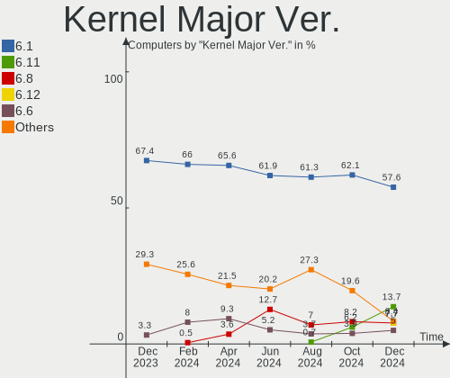
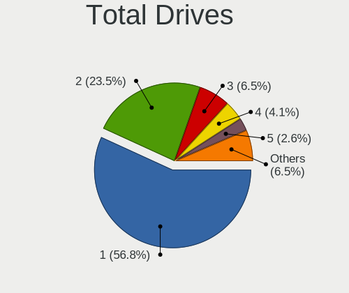
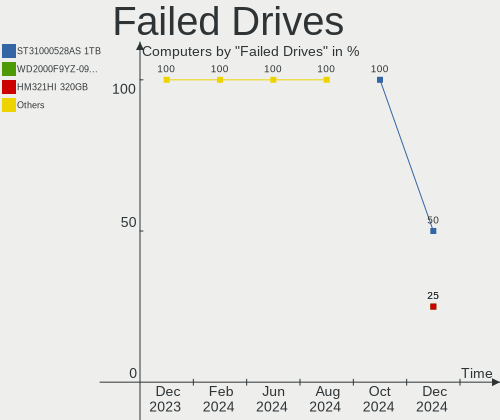
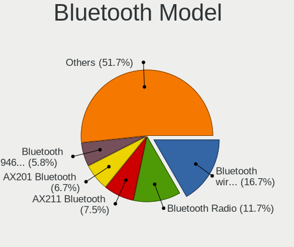
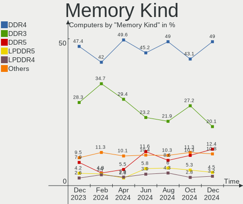
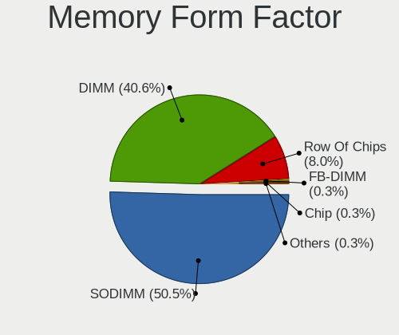

Debian - Hardware Trends
------------------------

A project to identify most popular hardware characteristics and track their change
over time based on data collected by Linux users at https://Linux-Hardware.org.

Anyone can contribute to this report by the [hw-probe](https://github.com/linuxhw/hw-probe) tool:

    sudo -E hw-probe -all -upload

This is a report for all computer types. See also reports for [desktops](/Dist/Debian/Desktop/README.md) and [notebooks](/Dist/Debian/Notebook/README.md).

This report is for one last month. Overall report since the beginning of time: [TestCoverage](https://github.com/linuxhw/TestCoverage)

Period: Aug, 2022.

Contents
--------

* [ System ](#system)
  - [ OS                       ](#os)
  - [ OS Family                ](#os-family)
  - [ Kernel                   ](#kernel)
  - [ Kernel Family            ](#kernel-family)
  - [ Kernel Major Ver.        ](#kernel-major-ver)
  - [ Arch                     ](#arch)
  - [ DE                       ](#de)
  - [ Display Server           ](#display-server)
  - [ Display Manager          ](#display-manager)
  - [ OS Lang                  ](#os-lang)
  - [ Boot Mode                ](#boot-mode)
  - [ Filesystem               ](#filesystem)
  - [ Part. scheme             ](#part-scheme)
  - [ Dual Boot with Linux/BSD ](#dual-boot-with-linuxbsd)
  - [ Dual Boot (Win)          ](#dual-boot-win)

* [ Board ](#board)
  - [ Vendor                   ](#vendor)
  - [ Model                    ](#model)
  - [ Model Family             ](#model-family)
  - [ MFG Year                 ](#mfg-year)
  - [ Form Factor              ](#form-factor)
  - [ Secure Boot              ](#secure-boot)
  - [ Coreboot                 ](#coreboot)
  - [ RAM Size                 ](#ram-size)
  - [ RAM Used                 ](#ram-used)
  - [ Total Drives             ](#total-drives)
  - [ Has CD-ROM               ](#has-cd-rom)
  - [ Has Ethernet             ](#has-ethernet)
  - [ Has WiFi                 ](#has-wifi)
  - [ Has Bluetooth            ](#has-bluetooth)

* [ Location ](#location)
  - [ Country                  ](#country)
  - [ City                     ](#city)

* [ Drives ](#drives)
  - [ Drive Vendor             ](#drive-vendor)
  - [ Drive Model              ](#drive-model)
  - [ HDD Vendor               ](#hdd-vendor)
  - [ SSD Vendor               ](#ssd-vendor)
  - [ Drive Kind               ](#drive-kind)
  - [ Drive Connector          ](#drive-connector)
  - [ Drive Size               ](#drive-size)
  - [ Space Total              ](#space-total)
  - [ Space Used               ](#space-used)
  - [ Malfunc. Drives          ](#malfunc-drives)
  - [ Malfunc. Drive Vendor    ](#malfunc-drive-vendor)
  - [ Malfunc. HDD Vendor      ](#malfunc-hdd-vendor)
  - [ Malfunc. Drive Kind      ](#malfunc-drive-kind)
  - [ Failed Drives            ](#failed-drives)
  - [ Failed Drive Vendor      ](#failed-drive-vendor)
  - [ Drive Status             ](#drive-status)

* [ Storage controller ](#storage-controller)
  - [ Storage Vendor           ](#storage-vendor)
  - [ Storage Model            ](#storage-model)
  - [ Storage Kind             ](#storage-kind)

* [ Processor ](#processor)
  - [ CPU Vendor               ](#cpu-vendor)
  - [ CPU Model                ](#cpu-model)
  - [ CPU Model Family         ](#cpu-model-family)
  - [ CPU Cores                ](#cpu-cores)
  - [ CPU Sockets              ](#cpu-sockets)
  - [ CPU Threads              ](#cpu-threads)
  - [ CPU Op-Modes             ](#cpu-op-modes)
  - [ CPU Microcode            ](#cpu-microcode)
  - [ CPU Microarch            ](#cpu-microarch)

* [ Graphics ](#graphics)
  - [ GPU Vendor               ](#gpu-vendor)
  - [ GPU Model                ](#gpu-model)
  - [ GPU Combo                ](#gpu-combo)
  - [ GPU Driver               ](#gpu-driver)
  - [ GPU Memory               ](#gpu-memory)

* [ Monitor ](#monitor)
  - [ Monitor Vendor           ](#monitor-vendor)
  - [ Monitor Model            ](#monitor-model)
  - [ Monitor Resolution       ](#monitor-resolution)
  - [ Monitor Diagonal         ](#monitor-diagonal)
  - [ Monitor Width            ](#monitor-width)
  - [ Aspect Ratio             ](#aspect-ratio)
  - [ Monitor Area             ](#monitor-area)
  - [ Pixel Density            ](#pixel-density)
  - [ Multiple Monitors        ](#multiple-monitors)

* [ Network ](#network)
  - [ Net Controller Vendor    ](#net-controller-vendor)
  - [ Net Controller Model     ](#net-controller-model)
  - [ Wireless Vendor          ](#wireless-vendor)
  - [ Wireless Model           ](#wireless-model)
  - [ Ethernet Vendor          ](#ethernet-vendor)
  - [ Ethernet Model           ](#ethernet-model)
  - [ Net Controller Kind      ](#net-controller-kind)
  - [ Used Controller          ](#used-controller)
  - [ NICs                     ](#nics)
  - [ IPv6                     ](#ipv6)

* [ Bluetooth ](#bluetooth)
  - [ Bluetooth Vendor         ](#bluetooth-vendor)
  - [ Bluetooth Model          ](#bluetooth-model)

* [ Sound ](#sound)
  - [ Sound Vendor             ](#sound-vendor)
  - [ Sound Model              ](#sound-model)

* [ Memory ](#memory)
  - [ Memory Vendor            ](#memory-vendor)
  - [ Memory Model             ](#memory-model)
  - [ Memory Kind              ](#memory-kind)
  - [ Memory Form Factor       ](#memory-form-factor)
  - [ Memory Size              ](#memory-size)
  - [ Memory Speed             ](#memory-speed)

* [ Printers & scanners ](#printers--scanners)
  - [ Printer Vendor           ](#printer-vendor)
  - [ Printer Model            ](#printer-model)
  - [ Scanner Vendor           ](#scanner-vendor)
  - [ Scanner Model            ](#scanner-model)

* [ Camera ](#camera)
  - [ Camera Vendor            ](#camera-vendor)
  - [ Camera Model             ](#camera-model)

* [ Security ](#security)
  - [ Fingerprint Vendor       ](#fingerprint-vendor)
  - [ Fingerprint Model        ](#fingerprint-model)
  - [ Chipcard Vendor          ](#chipcard-vendor)
  - [ Chipcard Model           ](#chipcard-model)

* [ Unsupported ](#unsupported)
  - [ Unsupported Devices      ](#unsupported-devices)
  - [ Unsupported Device Types ](#unsupported-device-types)

System
------

OS
--

Installed operating systems

| Name              | Computers | Percent |
|-------------------|-----------|---------|
| Debian 11         | 396       | 85.9%   |
| Debian Testing    | 34        | 7.38%   |
| Debian Unstable   | 16        | 3.47%   |
| Debian 10         | 9         | 1.95%   |
| Debian 11-updates | 3         | 0.65%   |
| Debian 9          | 1         | 0.22%   |
| Debian 8          | 1         | 0.22%   |
| Debian 7          | 1         | 0.22%   |

OS Family
---------

OS without a version

| Name   | Computers | Percent |
|--------|-----------|---------|
| Debian | 461       | 100%    |

Kernel
------

Version of the Linux kernel

| Version                    | Computers | Percent |
|----------------------------|-----------|---------|
| 5.10.0-16-amd64            | 237       | 51.41%  |
| 5.10.0-17-amd64            | 56        | 12.15%  |
| 5.10.0-7-amd64             | 29        | 6.29%   |
| 5.18.0-4-amd64             | 23        | 4.99%   |
| 5.18.0-3-amd64             | 23        | 4.99%   |
| 5.18.0-0.bpo.1-amd64       | 12        | 2.6%    |
| 5.10.0-13-amd64            | 4         | 0.87%   |
| 4.19.0-21-amd64            | 4         | 0.87%   |
| 5.18.0-0.deb11.3-amd64     | 3         | 0.65%   |
| 5.15.30-2-pve              | 3         | 0.65%   |
| 5.10.0-15-amd64            | 3         | 0.65%   |
| 4.19.0-6-amd64             | 3         | 0.65%   |
| 5.18.0-2-amd64             | 2         | 0.43%   |
| 5.18.0-16.1-liquorix-amd64 | 2         | 0.43%   |
| 5.15.39-4-pve              | 2         | 0.43%   |
| 5.15.39-2-pve              | 2         | 0.43%   |
| 5.10.0-17-686-pae          | 2         | 0.43%   |
| 5.10.0-17-686              | 2         | 0.43%   |
| 5.10.0-16-686-pae          | 2         | 0.43%   |
| 5.10.0-12-amd64            | 2         | 0.43%   |
| 5.10.0-11-amd64            | 2         | 0.43%   |
| 3.18.19+                   | 2         | 0.43%   |
| 6.0.0-rc2-v8+              | 1         | 0.22%   |
| 5.19.1                     | 1         | 0.22%   |
| 5.19.0-trunk-amd64         | 1         | 0.22%   |
| 5.19.0-rc6-amd64           | 1         | 0.22%   |
| 5.19.0-4.2-liquorix-amd64  | 1         | 0.22%   |
| 5.19.0                     | 1         | 0.22%   |
| 5.18.6                     | 1         | 0.22%   |
| 5.18.19-qcmm               | 1         | 0.22%   |
| 5.18.19-hpelite            | 1         | 0.22%   |
| 5.18.16-xanmod1            | 1         | 0.22%   |
| 5.18.15-xanmod1            | 1         | 0.22%   |
| 5.18.15-edge               | 1         | 0.22%   |
| 5.18.0-2mx-amd64           | 1         | 0.22%   |
| 5.17.11-1rodete2-amd64     | 1         | 0.22%   |
| 5.17-rockchip              | 1         | 0.22%   |
| 5.16.5                     | 1         | 0.22%   |
| 5.16.0-5-riscv64           | 1         | 0.22%   |
| 5.15.48-sunxi64            | 1         | 0.22%   |
| 5.15.48-sunxi              | 1         | 0.22%   |
| 5.15.44                    | 1         | 0.22%   |
| 5.15.39-3-pve              | 1         | 0.22%   |
| 5.15.39-1-pve              | 1         | 0.22%   |
| 5.15.35-2-pve              | 1         | 0.22%   |
| 5.15.32-v8+                | 1         | 0.22%   |
| 5.15.0-handsomekernel+     | 1         | 0.22%   |
| 5.15.0-0.bpo.2-amd64       | 1         | 0.22%   |
| 5.13.19-6-pve              | 1         | 0.22%   |
| 5.10.88-antix.1-amd64-smp  | 1         | 0.22%   |
| 5.10.60                    | 1         | 0.22%   |
| 5.10.43v64                 | 1         | 0.22%   |
| 5.10.4                     | 1         | 0.22%   |
| 5.10.120+truenas           | 1         | 0.22%   |
| 5.10.119-loc-os            | 1         | 0.22%   |
| 5.10.0-9-amd64             | 1         | 0.22%   |
| 5.10.0-16-arm64            | 1         | 0.22%   |
| 5.10.0-16-686              | 1         | 0.22%   |
| 4.19.147-rivoreo-amd64     | 1         | 0.22%   |
| 4.19.0-21-rt-amd64         | 1         | 0.22%   |

Kernel Family
-------------

Linux kernel without a distro release

| Version  | Computers | Percent |
|----------|-----------|---------|
| 5.10.0   | 342       | 74.19%  |
| 5.18.0   | 66        | 14.32%  |
| 4.19.0   | 9         | 1.95%   |
| 5.15.39  | 6         | 1.3%    |
| 5.19.0   | 4         | 0.87%   |
| 5.15.30  | 3         | 0.65%   |
| 5.18.19  | 2         | 0.43%   |
| 5.18.15  | 2         | 0.43%   |
| 5.15.48  | 2         | 0.43%   |
| 5.15.0   | 2         | 0.43%   |
| 3.18.19  | 2         | 0.43%   |
| 6.0.0    | 1         | 0.22%   |
| 5.19.1   | 1         | 0.22%   |
| 5.18.6   | 1         | 0.22%   |
| 5.18.16  | 1         | 0.22%   |
| 5.17.11  | 1         | 0.22%   |
| 5.17     | 1         | 0.22%   |
| 5.16.5   | 1         | 0.22%   |
| 5.16.0   | 1         | 0.22%   |
| 5.15.44  | 1         | 0.22%   |
| 5.15.35  | 1         | 0.22%   |
| 5.15.32  | 1         | 0.22%   |
| 5.13.19  | 1         | 0.22%   |
| 5.10.88  | 1         | 0.22%   |
| 5.10.60  | 1         | 0.22%   |
| 5.10.43  | 1         | 0.22%   |
| 5.10.4   | 1         | 0.22%   |
| 5.10.120 | 1         | 0.22%   |
| 5.10.119 | 1         | 0.22%   |
| 4.19.147 | 1         | 0.22%   |
| 3.4.11   | 1         | 0.22%   |
| 3.10.65  | 1         | 0.22%   |

Kernel Major Ver.
-----------------

Linux kernel major version

| Version | Computers | Percent |
|---------|-----------|---------|
| 5.10    | 348       | 75.49%  |
| 5.18    | 72        | 15.62%  |
| 5.15    | 16        | 3.47%   |
| 4.19    | 10        | 2.17%   |
| 5.19    | 5         | 1.08%   |
| 5.16    | 2         | 0.43%   |
| 3.18    | 2         | 0.43%   |
| 6.0     | 1         | 0.22%   |
| 5.17    | 1         | 0.22%   |
| 5.13    | 1         | 0.22%   |
| 5       | 1         | 0.22%   |
| 3.4     | 1         | 0.22%   |
| 3.10    | 1         | 0.22%   |

Arch
----

OS architecture (x86_64, i586, etc.)

| Name    | Computers | Percent |
|---------|-----------|---------|
| x86_64  | 438       | 95.01%  |
| aarch64 | 10        | 2.17%   |
| i686    | 8         | 1.74%   |
| riscv64 | 2         | 0.43%   |
| armv7l  | 2         | 0.43%   |
| sh4a    | 1         | 0.22%   |

DE
--

Desktop Environment

| Name             | Computers | Percent |
|------------------|-----------|---------|
| Unknown          | 212       | 45.99%  |
| GNOME            | 96        | 20.82%  |
| KDE5             | 52        | 11.28%  |
| XFCE             | 42        | 9.11%   |
| MATE             | 11        | 2.39%   |
| LXDE             | 10        | 2.17%   |
| Cinnamon         | 10        | 2.17%   |
| X-Cinnamon       | 7         | 1.52%   |
| LXQt             | 6         | 1.3%    |
| i3               | 3         | 0.65%   |
| Budgie           | 3         | 0.65%   |
| lightdm-xsession | 2         | 0.43%   |
| KDE              | 2         | 0.43%   |
| GNOME Flashback  | 2         | 0.43%   |
| Phosh:GNOME      | 1         | 0.22%   |
| Enlightenment    | 1         | 0.22%   |
| awesome          | 1         | 0.22%   |

Display Server
--------------

X11 or Wayland

| Name    | Computers | Percent |
|---------|-----------|---------|
| Unknown | 180       | 39.05%  |
| X11     | 170       | 36.88%  |
| Wayland | 70        | 15.18%  |
| Tty     | 41        | 8.89%   |

Display Manager
---------------

SDDM, LightDM, etc.

| Name    | Computers | Percent |
|---------|-----------|---------|
| Unknown | 248       | 53.8%   |
| LightDM | 72        | 15.62%  |
| GDM     | 65        | 14.1%   |
| SDDM    | 43        | 9.33%   |
| GDM3    | 32        | 6.94%   |
| XDM     | 1         | 0.22%   |

OS Lang
-------

Language

| Lang    | Computers | Percent |
|---------|-----------|---------|
| Unknown | 132       | 28.63%  |
| en_US   | 128       | 27.77%  |
| ru_RU   | 43        | 9.33%   |
| fr_FR   | 29        | 6.29%   |
| es_ES   | 16        | 3.47%   |
| en_GB   | 15        | 3.25%   |
| de_DE   | 15        | 3.25%   |
| pt_BR   | 8         | 1.74%   |
| en_AU   | 8         | 1.74%   |
| C       | 8         | 1.74%   |
| pl_PL   | 5         | 1.08%   |
| en_IN   | 5         | 1.08%   |
| es_CL   | 4         | 0.87%   |
| zh_CN   | 3         | 0.65%   |
| pt_PT   | 3         | 0.65%   |
| hu_HU   | 3         | 0.65%   |
| es_VE   | 3         | 0.65%   |
| en_NZ   | 3         | 0.65%   |
| en_IE   | 3         | 0.65%   |
| de_CH   | 3         | 0.65%   |
| nl_NL   | 2         | 0.43%   |
| it_IT   | 2         | 0.43%   |
| fr_CH   | 2         | 0.43%   |
| en_SG   | 2         | 0.43%   |
| en_CA   | 2         | 0.43%   |
| ro_RO   | 1         | 0.22%   |
| fr_BE   | 1         | 0.22%   |
| es_PE   | 1         | 0.22%   |
| es_MX   | 1         | 0.22%   |
| es_CO   | 1         | 0.22%   |
| es_AR   | 1         | 0.22%   |
| en_ZA   | 1         | 0.22%   |
| en_IL   | 1         | 0.22%   |
| el_GR   | 1         | 0.22%   |
| de_AT   | 1         | 0.22%   |
| da_DK   | 1         | 0.22%   |
| cs_CZ   | 1         | 0.22%   |
| ca_ES   | 1         | 0.22%   |
| ar_SA   | 1         | 0.22%   |

Boot Mode
---------

EFI or BIOS

| Mode | Computers | Percent |
|------|-----------|---------|
| EFI  | 322       | 69.85%  |
| BIOS | 139       | 30.15%  |

Filesystem
----------

Type of filesystem

| Type    | Computers | Percent |
|---------|-----------|---------|
| Ext4    | 254       | 55.1%   |
| Overlay | 180       | 39.05%  |
| Btrfs   | 18        | 3.9%    |
| Xfs     | 4         | 0.87%   |
| Zfs     | 3         | 0.65%   |
| Tmpfs   | 1         | 0.22%   |
| Rootfs  | 1         | 0.22%   |

Part. scheme
------------

Scheme of partitioning

| Type    | Computers | Percent |
|---------|-----------|---------|
| GPT     | 336       | 72.89%  |
| MBR     | 74        | 16.05%  |
| Unknown | 51        | 11.06%  |

Dual Boot with Linux/BSD
------------------------

Hosting more than one Linux/BSD

| Dual boot | Computers | Percent |
|-----------|-----------|---------|
| No        | 390       | 84.6%   |
| Yes       | 71        | 15.4%   |

Dual Boot (Win)
---------------

Hosting Linux and Windows

| Dual boot | Computers | Percent |
|-----------|-----------|---------|
| No        | 358       | 77.66%  |
| Yes       | 103       | 22.34%  |

Board
-----

Vendor
------

Motherboard manufacturer

| Name                    | Computers | Percent |
|-------------------------|-----------|---------|
| Lenovo                  | 145       | 31.45%  |
| ASUSTek Computer        | 49        | 10.63%  |
| Dell                    | 42        | 9.11%   |
| Hewlett-Packard         | 35        | 7.59%   |
| MSI                     | 24        | 5.21%   |
| Google                  | 24        | 5.21%   |
| Gigabyte Technology     | 24        | 5.21%   |
| Intel                   | 12        | 2.6%    |
| ASRock                  | 11        | 2.39%   |
| Apple                   | 11        | 2.39%   |
| Acer                    | 10        | 2.17%   |
| Unknown                 | 10        | 2.17%   |
| HUAWEI                  | 5         | 1.08%   |
| Raspberry Pi Foundation | 4         | 0.87%   |
| ECS                     | 4         | 0.87%   |
| Toshiba                 | 3         | 0.65%   |
| Samsung Electronics     | 3         | 0.65%   |
| Fujitsu                 | 3         | 0.65%   |
| Foxconn                 | 3         | 0.65%   |
| System76                | 2         | 0.43%   |
| Notebook                | 2         | 0.43%   |
| Fanless Mini PC         | 2         | 0.43%   |
| Biostar                 | 2         | 0.43%   |
| Alienware               | 2         | 0.43%   |
| Xunlong                 | 1         | 0.22%   |
| VANT                    | 1         | 0.22%   |
| TUXEDO                  | 1         | 0.22%   |
| SZMZ                    | 1         | 0.22%   |
| sunxi                   | 1         | 0.22%   |
| SLIMBOOK                | 1         | 0.22%   |
| Shuttle                 | 1         | 0.22%   |
| SANTECH                 | 1         | 0.22%   |
| retsamarret             | 1         | 0.22%   |
| Razer                   | 1         | 0.22%   |
| Positivo                | 1         | 0.22%   |
| Pegatron                | 1         | 0.22%   |
| PCBOX                   | 1         | 0.22%   |
| Packard Bell            | 1         | 0.22%   |
| NVN-ED01                | 1         | 0.22%   |
| Medion                  | 1         | 0.22%   |
| LG Electronics          | 1         | 0.22%   |
| ICL                     | 1         | 0.22%   |
| Huanan                  | 1         | 0.22%   |
| HONOR                   | 1         | 0.22%   |
| GPU Company             | 1         | 0.22%   |
| Gateway                 | 1         | 0.22%   |
| Fujitsu Siemens         | 1         | 0.22%   |
| CompuLab                | 1         | 0.22%   |
| Casper                  | 1         | 0.22%   |
| BANGHO                  | 1         | 0.22%   |
| AZW                     | 1         | 0.22%   |
| Aquarius                | 1         | 0.22%   |
| AMI                     | 1         | 0.22%   |

Model
-----

Motherboard model

| Name                                      | Computers | Percent |
|-------------------------------------------|-----------|---------|
| Lenovo ThinkPad L13 Yoga Gen 2 20VK0019US | 104       | 22.56%  |
| Google Terra                              | 14        | 3.04%   |
| Unknown                                   | 13        | 2.82%   |
| Google Reks                               | 7         | 1.52%   |
| MSI MS-7C91                               | 3         | 0.65%   |
| MSI MS-7996                               | 3         | 0.65%   |
| MSI MS-7817                               | 3         | 0.65%   |
| Lenovo ThinkPad 13 2nd Gen 20J10046US     | 3         | 0.65%   |
| ECS G31T-M9                               | 3         | 0.65%   |
| ASUS All Series                           | 3         | 0.65%   |
| Samsung 935XDB                            | 2         | 0.43%   |
| RPi Raspberry Pi 4 Model B Rev 1.4        | 2         | 0.43%   |
| HP ProLiant DL380p Gen8                   | 2         | 0.43%   |
| HP EliteBook 840 G8 Notebook PC           | 2         | 0.43%   |
| Gigabyte B360M-HD3                        | 2         | 0.43%   |
| Fanless Mini PC Quieter2                  | 2         | 0.43%   |
| Dell Vostro 15 5510                       | 2         | 0.43%   |
| Dell Latitude E6330                       | 2         | 0.43%   |
| Dell Latitude 5420                        | 2         | 0.43%   |
| Dell Latitude 3320                        | 2         | 0.43%   |
| ASUS X550CC                               | 2         | 0.43%   |
| ASUS VivoBook 15_ASUS Laptop X540UAR      | 2         | 0.43%   |
| ASUS Pro WS 565-ACE                       | 2         | 0.43%   |
| ASUS P8H61-M LX3                          | 2         | 0.43%   |
| ASRock B450M-HDV R4.0                     | 2         | 0.43%   |
| Apple MacBookAir7,2                       | 2         | 0.43%   |
| Apple iMac14,4                            | 2         | 0.43%   |
| Xunlong Orange Pi PC                      | 1         | 0.22%   |
| VANT MOOVE3-15                            | 1         | 0.22%   |
| TUXEDO Pulse 15 Gen1                      | 1         | 0.22%   |
| Toshiba TECRA Z40-C                       | 1         | 0.22%   |
| Toshiba TECRA R950                        | 1         | 0.22%   |
| Toshiba Satellite P50-B-103               | 1         | 0.22%   |
| SZMZ X99M-G2                              | 1         | 0.22%   |
| System76 Thelio                           | 1         | 0.22%   |
| System76 Oryx Pro                         | 1         | 0.22%   |
| SLIMBOOK PROX15-AMD                       | 1         | 0.22%   |
| Shuttle DS437                             | 1         | 0.22%   |
| SANTECH NHx0DB,DE                         | 1         | 0.22%   |
| Samsung 300E4C/300E5C/300E7C              | 1         | 0.22%   |
| Razer Blade 14 - RZ09-0370                | 1         | 0.22%   |
| RPi Raspberry Pi 4 Model B Rev 1.5        | 1         | 0.22%   |
| RPi Raspberry Pi 4 Model B Rev 1.1        | 1         | 0.22%   |
| Positivo Mobile                           | 1         | 0.22%   |
| Pegatron VG238AA-ABU s5229uk              | 1         | 0.22%   |
| PCBOX Kant                                | 1         | 0.22%   |
| Packard Bell EasyNote_MX37-U-017          | 1         | 0.22%   |
| Notebook V15x_V17xPNKPNJPNH               | 1         | 0.22%   |
| Notebook N2x0WU                           | 1         | 0.22%   |
| MSI VIG610M                               | 1         | 0.22%   |
| MSI Pulse GL76 12UEK                      | 1         | 0.22%   |
| MSI MS-7D53                               | 1         | 0.22%   |
| MSI MS-7C56                               | 1         | 0.22%   |
| MSI MS-7C09                               | 1         | 0.22%   |
| MSI MS-7B79                               | 1         | 0.22%   |
| MSI MS-7B49                               | 1         | 0.22%   |
| MSI MS-7A38                               | 1         | 0.22%   |
| MSI MS-7A20                               | 1         | 0.22%   |
| MSI MS-7917                               | 1         | 0.22%   |
| MSI MS-7698                               | 1         | 0.22%   |

Model Family
------------

Motherboard model prefix

| Name                     | Computers | Percent |
|--------------------------|-----------|---------|
| Lenovo ThinkPad          | 130       | 28.2%   |
| Dell Latitude            | 17        | 3.69%   |
| Google Terra             | 14        | 3.04%   |
| Unknown                  | 13        | 2.82%   |
| Lenovo IdeaPad           | 7         | 1.52%   |
| Google Reks              | 7         | 1.52%   |
| HP EliteBook             | 6         | 1.3%    |
| HP Compaq                | 6         | 1.3%    |
| Dell XPS                 | 6         | 1.3%    |
| ASUS VivoBook            | 6         | 1.3%    |
| Acer Aspire              | 6         | 1.3%    |
| Dell Vostro              | 5         | 1.08%   |
| ASUS ROG                 | 5         | 1.08%   |
| RPi Raspberry            | 4         | 0.87%   |
| Dell Precision           | 4         | 0.87%   |
| Dell Inspiron            | 4         | 0.87%   |
| ASUS PRIME               | 4         | 0.87%   |
| MSI MS-7C91              | 3         | 0.65%   |
| MSI MS-7996              | 3         | 0.65%   |
| MSI MS-7817              | 3         | 0.65%   |
| Lenovo ThinkStation      | 3         | 0.65%   |
| HP Pavilion              | 3         | 0.65%   |
| HP Laptop                | 3         | 0.65%   |
| ECS G31T-M9              | 3         | 0.65%   |
| Dell PowerEdge           | 3         | 0.65%   |
| ASUS Pro                 | 3         | 0.65%   |
| ASUS All                 | 3         | 0.65%   |
| Apple iMac14             | 3         | 0.65%   |
| Toshiba TECRA            | 2         | 0.43%   |
| Samsung 935XDB           | 2         | 0.43%   |
| Lenovo Yoga              | 2         | 0.43%   |
| HP ZBook                 | 2         | 0.43%   |
| HP ProLiant              | 2         | 0.43%   |
| HP ProBook               | 2         | 0.43%   |
| HP OMEN                  | 2         | 0.43%   |
| HP EliteDesk             | 2         | 0.43%   |
| HP 255                   | 2         | 0.43%   |
| Gigabyte B550            | 2         | 0.43%   |
| Gigabyte B360M-HD3       | 2         | 0.43%   |
| Fujitsu ESPRIMO          | 2         | 0.43%   |
| Fanless Mini PC Quieter2 | 2         | 0.43%   |
| Dell OptiPlex            | 2         | 0.43%   |
| ASUS X550CC              | 2         | 0.43%   |
| ASUS TUF                 | 2         | 0.43%   |
| ASUS P8H61-M             | 2         | 0.43%   |
| ASUS P5G41T-M            | 2         | 0.43%   |
| ASRock B450M-HDV         | 2         | 0.43%   |
| Apple MacBookAir7        | 2         | 0.43%   |
| Alienware m15            | 2         | 0.43%   |
| Acer TravelMate          | 2         | 0.43%   |
| Xunlong Orange           | 1         | 0.22%   |
| VANT MOOVE3-15           | 1         | 0.22%   |
| TUXEDO Pulse             | 1         | 0.22%   |
| Toshiba Satellite        | 1         | 0.22%   |
| SZMZ X99M-G2             | 1         | 0.22%   |
| System76 Thelio          | 1         | 0.22%   |
| System76 Oryx            | 1         | 0.22%   |
| SLIMBOOK PROX15-AMD      | 1         | 0.22%   |
| Shuttle DS437            | 1         | 0.22%   |
| SANTECH NHx0DB           | 1         | 0.22%   |

MFG Year
--------

Motherboard manufacture year

| Year    | Computers | Percent |
|---------|-----------|---------|
| 2020    | 146       | 31.67%  |
| 2021    | 52        | 11.28%  |
| 2022    | 40        | 8.68%   |
| 2018    | 25        | 5.42%   |
| 2013    | 21        | 4.56%   |
| 2011    | 20        | 4.34%   |
| 2019    | 19        | 4.12%   |
| 2017    | 17        | 3.69%   |
| 2016    | 17        | 3.69%   |
| 2012    | 17        | 3.69%   |
| 2010    | 17        | 3.69%   |
| 2015    | 15        | 3.25%   |
| Unknown | 14        | 3.04%   |
| 2014    | 12        | 2.6%    |
| 2007    | 10        | 2.17%   |
| 2009    | 9         | 1.95%   |
| 2008    | 5         | 1.08%   |
| 2006    | 3         | 0.65%   |
| 2005    | 1         | 0.22%   |
| 2003    | 1         | 0.22%   |

Form Factor
-----------

Physical design of the computer

| Name           | Computers | Percent |
|----------------|-----------|---------|
| Notebook       | 185       | 40.13%  |
| Desktop        | 132       | 28.63%  |
| Convertible    | 107       | 23.21%  |
| Mini pc        | 13        | 2.82%   |
| System on chip | 10        | 2.17%   |
| All in one     | 7         | 1.52%   |
| Server         | 7         | 1.52%   |

Secure Boot
-----------

Enabled or disabled

| State    | Computers | Percent |
|----------|-----------|---------|
| Disabled | 432       | 93.71%  |
| Enabled  | 29        | 6.29%   |

Coreboot
--------

Have coreboot on board

| Used | Computers | Percent |
|------|-----------|---------|
| No   | 436       | 94.58%  |
| Yes  | 25        | 5.42%   |

RAM Size
--------

Total RAM memory

| Size in GB      | Computers | Percent |
|-----------------|-----------|---------|
| 16.01-24.0      | 169       | 36.66%  |
| 4.01-8.0        | 74        | 16.05%  |
| 3.01-4.0        | 74        | 16.05%  |
| 8.01-16.0       | 47        | 10.2%   |
| 32.01-64.0      | 36        | 7.81%   |
| 64.01-256.0     | 24        | 5.21%   |
| 1.01-2.0        | 19        | 4.12%   |
| 24.01-32.0      | 6         | 1.3%    |
| 2.01-3.0        | 4         | 0.87%   |
| 0.51-1.0        | 4         | 0.87%   |
| 0.01-0.5        | 2         | 0.43%   |
| More than 256.0 | 1         | 0.22%   |
| Unknown         | 1         | 0.22%   |

RAM Used
--------

Used RAM memory

| Used GB    | Computers | Percent |
|------------|-----------|---------|
| 1.01-2.0   | 210       | 45.55%  |
| 2.01-3.0   | 68        | 14.75%  |
| 0.51-1.0   | 54        | 11.71%  |
| 4.01-8.0   | 51        | 11.06%  |
| 3.01-4.0   | 45        | 9.76%   |
| 8.01-16.0  | 16        | 3.47%   |
| 0.01-0.5   | 11        | 2.39%   |
| 16.01-24.0 | 3         | 0.65%   |
| Unknown    | 3         | 0.65%   |

Total Drives
------------

Number of drives on board

| Drives | Computers | Percent |
|--------|-----------|---------|
| 1      | 344       | 74.62%  |
| 2      | 64        | 13.88%  |
| 3      | 27        | 5.86%   |
| 4      | 9         | 1.95%   |
| 5      | 7         | 1.52%   |
| 6      | 5         | 1.08%   |
| 0      | 2         | 0.43%   |
| 14     | 1         | 0.22%   |
| 12     | 1         | 0.22%   |
| 7      | 1         | 0.22%   |

Has CD-ROM
----------

Has CD-ROM on board

| Presented | Computers | Percent |
|-----------|-----------|---------|
| No        | 383       | 83.08%  |
| Yes       | 78        | 16.92%  |

Has Ethernet
------------

Has Ethernet on board

| Presented | Computers | Percent |
|-----------|-----------|---------|
| Yes       | 394       | 85.47%  |
| No        | 67        | 14.53%  |

Has WiFi
--------

Has WiFi module

| Presented | Computers | Percent |
|-----------|-----------|---------|
| Yes       | 348       | 75.49%  |
| No        | 113       | 24.51%  |

Has Bluetooth
-------------

Has Bluetooth module

| Presented | Computers | Percent |
|-----------|-----------|---------|
| Yes       | 311       | 67.46%  |
| No        | 150       | 32.54%  |

Location
--------

Country
-------

Geographic location (country)

| Country      | Computers | Percent |
|--------------|-----------|---------|
| USA          | 187       | 40.56%  |
| Russia       | 45        | 9.76%   |
| France       | 35        | 7.59%   |
| Germany      | 27        | 5.86%   |
| Spain        | 16        | 3.47%   |
| Brazil       | 13        | 2.82%   |
| Australia    | 13        | 2.82%   |
| Poland       | 9         | 1.95%   |
| UK           | 7         | 1.52%   |
| China        | 7         | 1.52%   |
| Mexico       | 6         | 1.3%    |
| Italy        | 6         | 1.3%    |
| Finland      | 6         | 1.3%    |
| Argentina    | 6         | 1.3%    |
| Switzerland  | 5         | 1.08%   |
| Portugal     | 5         | 1.08%   |
| New Zealand  | 5         | 1.08%   |
| India        | 5         | 1.08%   |
| Hungary      | 5         | 1.08%   |
| Chile        | 5         | 1.08%   |
| Venezuela    | 4         | 0.87%   |
| South Africa | 3         | 0.65%   |
| Netherlands  | 3         | 0.65%   |
| Canada       | 3         | 0.65%   |
| Belgium      | 3         | 0.65%   |
| Turkey       | 2         | 0.43%   |
| Singapore    | 2         | 0.43%   |
| Romania      | 2         | 0.43%   |
| Peru         | 2         | 0.43%   |
| Norway       | 2         | 0.43%   |
| Ireland      | 2         | 0.43%   |
| Greece       | 2         | 0.43%   |
| Colombia     | 2         | 0.43%   |
| Belarus      | 2         | 0.43%   |
| Austria      | 2         | 0.43%   |
| Tunisia      | 1         | 0.22%   |
| Sweden       | 1         | 0.22%   |
| Sudan        | 1         | 0.22%   |
| Slovakia     | 1         | 0.22%   |
| Pakistan     | 1         | 0.22%   |
| Mauritius    | 1         | 0.22%   |
| Kazakhstan   | 1         | 0.22%   |
| Japan        | 1         | 0.22%   |
| Israel       | 1         | 0.22%   |
| Hong Kong    | 1         | 0.22%   |
| Denmark      | 1         | 0.22%   |
| Czechia      | 1         | 0.22%   |

City
----

Geographic location (city)

| City                | Computers | Percent |
|---------------------|-----------|---------|
| Bangor              | 142       | 30.8%   |
| Voronezh            | 29        | 6.29%   |
| Monistrol-sur-Loire | 6         | 1.3%    |
| Moscow              | 5         | 1.08%   |
| Madrid              | 5         | 1.08%   |
| St Petersburg       | 4         | 0.87%   |
| Tijuana             | 3         | 0.65%   |
| Sydney              | 3         | 0.65%   |
| Serpukhov           | 3         | 0.65%   |
| Melbourne           | 3         | 0.65%   |
| Central             | 3         | 0.65%   |
| Caracas             | 3         | 0.65%   |
| Brisbane            | 3         | 0.65%   |
| Berlin              | 3         | 0.65%   |
| Beijing             | 3         | 0.65%   |
| Warsaw              | 2         | 0.43%   |
| Vienna              | 2         | 0.43%   |
| Tuusula             | 2         | 0.43%   |
| St. Gallen          | 2         | 0.43%   |
| Singapore           | 2         | 0.43%   |
| Salford             | 2         | 0.43%   |
| Portland            | 2         | 0.43%   |
| Paris               | 2         | 0.43%   |
| Nuremberg           | 2         | 0.43%   |
| Natal               | 2         | 0.43%   |
| Nanhao              | 2         | 0.43%   |
| Marseille           | 2         | 0.43%   |
| Lima                | 2         | 0.43%   |
| İzmit              | 2         | 0.43%   |
| Helsinki            | 2         | 0.43%   |
| Frankfurt am Main   | 2         | 0.43%   |
| Falkenstein         | 2         | 0.43%   |
| Budapest            | 2         | 0.43%   |
| Amsterdam           | 2         | 0.43%   |
| Albuquerque         | 2         | 0.43%   |
| Żory               | 1         | 0.22%   |
| Zollikofen          | 1         | 0.22%   |
| Yekaterinburg       | 1         | 0.22%   |
| Winterport          | 1         | 0.22%   |
| Winter Park         | 1         | 0.22%   |
| Winchester          | 1         | 0.22%   |
| Willingboro         | 1         | 0.22%   |
| Whittier            | 1         | 0.22%   |
| Wentzville          | 1         | 0.22%   |
| Wellington          | 1         | 0.22%   |
| Weiler-Simmerberg   | 1         | 0.22%   |
| Washington          | 1         | 0.22%   |
| Wagrowiec           | 1         | 0.22%   |
| Wadsworth           | 1         | 0.22%   |
| Vitória            | 1         | 0.22%   |
| Viby J              | 1         | 0.22%   |
| Verona              | 1         | 0.22%   |
| Varosfoeld          | 1         | 0.22%   |
| Valladolid          | 1         | 0.22%   |
| Valencia            | 1         | 0.22%   |
| Valdivia            | 1         | 0.22%   |
| Ulyanovsk           | 1         | 0.22%   |
| Turin               | 1         | 0.22%   |
| Tupper Lake         | 1         | 0.22%   |
| Toronto             | 1         | 0.22%   |

Drives
------

Drive Vendor
------------

Hard drive vendors

| Vendor                    | Computers | Drives | Percent |
|---------------------------|-----------|--------|---------|
| Samsung Electronics       | 175       | 195    | 30.07%  |
| WDC                       | 72        | 108    | 12.37%  |
| Seagate                   | 50        | 71     | 8.59%   |
| Unknown                   | 47        | 54     | 8.08%   |
| Toshiba                   | 28        | 38     | 4.81%   |
| Kingston                  | 24        | 24     | 4.12%   |
| Crucial                   | 23        | 25     | 3.95%   |
| Hitachi                   | 17        | 19     | 2.92%   |
| SK hynix                  | 15        | 15     | 2.58%   |
| SanDisk                   | 14        | 15     | 2.41%   |
| A-DATA Technology         | 10        | 10     | 1.72%   |
| Intel                     | 9         | 10     | 1.55%   |
| Micron Technology         | 8         | 8      | 1.37%   |
| Unknown                   | 8         | 8      | 1.37%   |
| Apple                     | 7         | 9      | 1.2%    |
| China                     | 5         | 6      | 0.86%   |
| LITEONIT                  | 4         | 4      | 0.69%   |
| KIOXIA                    | 4         | 4      | 0.69%   |
| Intenso                   | 4         | 4      | 0.69%   |
| HGST                      | 4         | 7      | 0.69%   |
| SPCC                      | 3         | 3      | 0.52%   |
| Silicon Motion            | 3         | 3      | 0.52%   |
| Hewlett-Packard           | 3         | 7      | 0.52%   |
| Gigabyte Technology       | 3         | 3      | 0.52%   |
| Argon                     | 3         | 3      | 0.52%   |
| XPG                       | 2         | 3      | 0.34%   |
| Transcend                 | 2         | 2      | 0.34%   |
| Team                      | 2         | 2      | 0.34%   |
| PNY                       | 2         | 2      | 0.34%   |
| Phison                    | 2         | 2      | 0.34%   |
| Patriot                   | 2         | 2      | 0.34%   |
| LITEON                    | 2         | 2      | 0.34%   |
| ZTC                       | 1         | 1      | 0.17%   |
| Win Memory                | 1         | 1      | 0.17%   |
| Verbatim                  | 1         | 1      | 0.17%   |
| USB3.0                    | 1         | 1      | 0.17%   |
| T-FORCE                   | 1         | 1      | 0.17%   |
| SABRENT                   | 1         | 1      | 0.17%   |
| S3+                       | 1         | 1      | 0.17%   |
| Plextor                   | 1         | 1      | 0.17%   |
| OCZ                       | 1         | 1      | 0.17%   |
| Netac                     | 1         | 1      | 0.17%   |
| Micron/Crucial Technology | 1         | 1      | 0.17%   |
| Londisk                   | 1         | 1      | 0.17%   |
| KingSpec                  | 1         | 1      | 0.17%   |
| KingDian                  | 1         | 1      | 0.17%   |
| Kingchuxing               | 1         | 1      | 0.17%   |
| HS-SSD-C100               | 1         | 1      | 0.17%   |
| HP Phison                 | 1         | 1      | 0.17%   |
| Hikvision                 | 1         | 2      | 0.17%   |
| Hajaan                    | 1         | 1      | 0.17%   |
| GOODRAM                   | 1         | 1      | 0.17%   |
| Dell                      | 1         | 1      | 0.17%   |
| Corsair                   | 1         | 1      | 0.17%   |
| AMD                       | 1         | 1      | 0.17%   |
| addlink                   | 1         | 1      | 0.17%   |
| ADATA Technology          | 1         | 1      | 0.17%   |

Drive Model
-----------

Hard drive models

| Model                                | Computers | Percent |
|--------------------------------------|-----------|---------|
| Samsung MZVLB512HBJQ-000L7 512GB     | 101       | 15.81%  |
| Unknown SDW16G  16GB                 | 13        | 2.03%   |
| Unknown                              | 8         | 1.25%   |
| WDC WD10EZEX-08WN4A0 1TB             | 6         | 0.94%   |
| Seagate ST500DM002-1BD142 500GB      | 6         | 0.94%   |
| Samsung SSD 970 EVO Plus 1TB         | 6         | 0.94%   |
| Samsung SSD 860 EVO 500GB            | 6         | 0.94%   |
| Kingston SA400S37240G 240GB SSD      | 6         | 0.94%   |
| Crucial CT480BX500SSD1 480GB         | 6         | 0.94%   |
| WDC PC SN730 SDBQNTY-512G-1001 512GB | 5         | 0.78%   |
| Crucial CT1000MX500SSD1 1TB          | 5         | 0.78%   |
| Unknown MMC Card  8GB                | 4         | 0.63%   |
| Toshiba DT01ACA050 500GB             | 4         | 0.63%   |
| Seagate ST1000DM010-2EP102 1TB       | 4         | 0.63%   |
| SanDisk NVMe SSD Drive 1TB           | 4         | 0.63%   |
| WDC WDS500G2B0A-00SM50 500GB SSD     | 3         | 0.47%   |
| WDC WD1002FAEX-00Z3A0 1TB            | 3         | 0.47%   |
| Unknown MMC Card  64GB               | 3         | 0.47%   |
| Unknown MMC Card  32GB               | 3         | 0.47%   |
| Unknown MMC Card  16GB               | 3         | 0.47%   |
| Unknown HAG4a2  16GB                 | 3         | 0.47%   |
| Toshiba HDWD110 1TB                  | 3         | 0.47%   |
| Seagate ST3250318AS 250GB            | 3         | 0.47%   |
| Samsung SSD 980 1TB                  | 3         | 0.47%   |
| Kingston SV300S37A120G 120GB SSD     | 3         | 0.47%   |
| Hitachi HTS545032B9A300 320GB        | 3         | 0.47%   |
| Hitachi HDS721050CLA362 500GB        | 3         | 0.47%   |
| Crucial CT500MX500SSD1 500GB         | 3         | 0.47%   |
| Argon Forty 512GB                    | 3         | 0.47%   |
| Apple SSD SM0128G 121GB              | 3         | 0.47%   |
| XPG GAMMIX S11 Pro 1TB               | 2         | 0.31%   |
| WDC WDS240G2G0A-00JH30 240GB SSD     | 2         | 0.31%   |
| WDC WD60EZAZ-00SF3B0 6TB             | 2         | 0.31%   |
| WDC WD5000AAKX-001CA0 500GB          | 2         | 0.31%   |
| WDC WD40EZRZ-00GXCB0 4TB             | 2         | 0.31%   |
| WDC WD4005FZBX-00K5WB0 4TB           | 2         | 0.31%   |
| WDC WD20SPZX-22UA7T0 2TB             | 2         | 0.31%   |
| WDC WD1001FALS-00J7B0 1TB            | 2         | 0.31%   |
| WDC PC SN530 NVMe 256GB              | 2         | 0.31%   |
| Unknown SE32G  32GB                  | 2         | 0.31%   |
| Unknown MMC Card  4GB                | 2         | 0.31%   |
| Unknown DF4016  16GB                 | 2         | 0.31%   |
| Transcend TS64GMTS400S 64GB SSD      | 2         | 0.31%   |
| Toshiba DT01ACA300 3TB               | 2         | 0.31%   |
| Toshiba DT01ACA100 1TB               | 2         | 0.31%   |
| SPCC Solid State Disk 120GB          | 2         | 0.31%   |
| Seagate ST500LM012 HN-M500MBB 500GB  | 2         | 0.31%   |
| Seagate ST31000524AS 1TB             | 2         | 0.31%   |
| Seagate ST2000DM008-2FR102 2TB       | 2         | 0.31%   |
| Seagate ST1000LM048-2E7172 1TB       | 2         | 0.31%   |
| SanDisk SD8SN8U128G1001 128GB SSD    | 2         | 0.31%   |
| SanDisk SD8SBAT128G1122 128GB SSD    | 2         | 0.31%   |
| Samsung SSD 970 PRO 512GB            | 2         | 0.31%   |
| Samsung SSD 970 EVO Plus 500GB       | 2         | 0.31%   |
| Samsung SSD 970 EVO 500GB            | 2         | 0.31%   |
| Samsung SSD 860 EVO 1TB              | 2         | 0.31%   |
| Samsung SSD 850 EVO 250GB            | 2         | 0.31%   |
| Samsung NVMe SSD Drive 500GB         | 2         | 0.31%   |
| Samsung MZVLB1T0HBLR-000H1 1TB       | 2         | 0.31%   |
| Phison NVMe SSD Drive 256GB          | 2         | 0.31%   |

HDD Vendor
----------

Hard disk drive vendors

| Vendor              | Computers | Drives | Percent |
|---------------------|-----------|--------|---------|
| Seagate             | 49        | 70     | 33.33%  |
| WDC                 | 45        | 75     | 30.61%  |
| Toshiba             | 22        | 32     | 14.97%  |
| Hitachi             | 17        | 19     | 11.56%  |
| Samsung Electronics | 6         | 10     | 4.08%   |
| HGST                | 4         | 7      | 2.72%   |
| USB3.0              | 1         | 1      | 0.68%   |
| SABRENT             | 1         | 1      | 0.68%   |
| Hewlett-Packard     | 1         | 2      | 0.68%   |
| Apple               | 1         | 1      | 0.68%   |

SSD Vendor
----------

Solid state drive vendors

| Vendor              | Computers | Drives | Percent |
|---------------------|-----------|--------|---------|
| Samsung Electronics | 25        | 29     | 17.24%  |
| Kingston            | 20        | 20     | 13.79%  |
| Crucial             | 20        | 21     | 13.79%  |
| WDC                 | 10        | 10     | 6.9%    |
| SanDisk             | 10        | 10     | 6.9%    |
| Apple               | 6         | 6      | 4.14%   |
| China               | 5         | 6      | 3.45%   |
| A-DATA Technology   | 5         | 5      | 3.45%   |
| LITEONIT            | 4         | 4      | 2.76%   |
| Intenso             | 4         | 4      | 2.76%   |
| SPCC                | 3         | 3      | 2.07%   |
| Argon               | 3         | 3      | 2.07%   |
| Transcend           | 2         | 2      | 1.38%   |
| Toshiba             | 2         | 2      | 1.38%   |
| PNY                 | 2         | 2      | 1.38%   |
| Micron Technology   | 2         | 2      | 1.38%   |
| LITEON              | 2         | 2      | 1.38%   |
| Intel               | 2         | 2      | 1.38%   |
| ZTC                 | 1         | 1      | 0.69%   |
| Win Memory          | 1         | 1      | 0.69%   |
| Verbatim            | 1         | 1      | 0.69%   |
| Team                | 1         | 1      | 0.69%   |
| T-FORCE             | 1         | 1      | 0.69%   |
| SK hynix            | 1         | 1      | 0.69%   |
| S3+                 | 1         | 1      | 0.69%   |
| Plextor             | 1         | 1      | 0.69%   |
| OCZ                 | 1         | 1      | 0.69%   |
| Netac               | 1         | 1      | 0.69%   |
| Londisk             | 1         | 1      | 0.69%   |
| KingSpec            | 1         | 1      | 0.69%   |
| KingDian            | 1         | 1      | 0.69%   |
| Kingchuxing         | 1         | 1      | 0.69%   |
| HP Phison           | 1         | 1      | 0.69%   |
| Hajaan              | 1         | 1      | 0.69%   |
| GOODRAM             | 1         | 1      | 0.69%   |
| Unknown             | 1         | 1      | 0.69%   |

Drive Kind
----------

HDD or SSD

| Kind    | Computers | Drives | Percent |
|---------|-----------|--------|---------|
| NVMe    | 238       | 258    | 43.19%  |
| SSD     | 135       | 151    | 24.5%   |
| HDD     | 122       | 218    | 22.14%  |
| MMC     | 53        | 61     | 9.62%   |
| Unknown | 3         | 6      | 0.54%   |

Drive Connector
---------------

SATA, SAS, NVMe, etc.

| Type | Computers | Drives | Percent |
|------|-----------|--------|---------|
| NVMe | 238       | 257    | 45.59%  |
| SATA | 216       | 357    | 41.38%  |
| MMC  | 53        | 61     | 10.15%  |
| SAS  | 15        | 19     | 2.87%   |

Drive Size
----------

Size of hard drive

| Size in TB | Computers | Drives | Percent |
|------------|-----------|--------|---------|
| 0.01-0.5   | 165       | 203    | 59.78%  |
| 0.51-1.0   | 69        | 84     | 25%     |
| 1.01-2.0   | 19        | 37     | 6.88%   |
| 3.01-4.0   | 11        | 15     | 3.99%   |
| 4.01-10.0  | 6         | 11     | 2.17%   |
| 2.01-3.0   | 4         | 5      | 1.45%   |
| 10.01-20.0 | 2         | 14     | 0.72%   |

Space Total
-----------

Amount of disk space available on the file system

| Size in GB     | Computers | Percent |
|----------------|-----------|---------|
| 251-500        | 169       | 36.66%  |
| 101-250        | 81        | 17.57%  |
| Unknown        | 70        | 15.18%  |
| 501-1000       | 47        | 10.2%   |
| 51-100         | 24        | 5.21%   |
| 1001-2000      | 20        | 4.34%   |
| 1-20           | 17        | 3.69%   |
| More than 3000 | 12        | 2.6%    |
| 2001-3000      | 12        | 2.6%    |
| 21-50          | 9         | 1.95%   |

Space Used
----------

Amount of used disk space

| Used GB        | Computers | Percent |
|----------------|-----------|---------|
| 1-20           | 226       | 49.02%  |
| Unknown        | 70        | 15.18%  |
| 21-50          | 38        | 8.24%   |
| 251-500        | 33        | 7.16%   |
| 101-250        | 32        | 6.94%   |
| 51-100         | 28        | 6.07%   |
| 501-1000       | 13        | 2.82%   |
| 1001-2000      | 11        | 2.39%   |
| 2001-3000      | 5         | 1.08%   |
| More than 3000 | 3         | 0.65%   |
| 0              | 2         | 0.43%   |

Malfunc. Drives
---------------

Drive models with a malfunction

| Model                                               | Computers | Drives | Percent |
|-----------------------------------------------------|-----------|--------|---------|
| WDC WD5000AAKX-001CA0 500GB                         | 2         | 2      | 4.35%   |
| Hitachi HTS545032B9A300 320GB                       | 2         | 2      | 4.35%   |
| WDC WD6400AAKS-65Z7B0 640GB                         | 1         | 1      | 2.17%   |
| WDC WD5000AAKX-08U6AA0 500GB                        | 1         | 1      | 2.17%   |
| WDC WD5000AAKB-00H8A0 500GB                         | 1         | 1      | 2.17%   |
| WDC WD3200AAJS-60M0A0 320GB                         | 1         | 1      | 2.17%   |
| WDC WD2500AAKX-001CA0 250GB                         | 1         | 1      | 2.17%   |
| WDC WD1600AAJS-08L7A0 160GB                         | 1         | 1      | 2.17%   |
| WDC WD15EARS-00Z5B1 1TB                             | 1         | 2      | 2.17%   |
| WDC WD10SPZX-60Z10T0 1TB                            | 1         | 1      | 2.17%   |
| WDC WD10EZEX-08WN4A0 1TB                            | 1         | 1      | 2.17%   |
| WDC WD10EADS-11M2B1 1TB                             | 1         | 1      | 2.17%   |
| WDC WD1003FBYX-01Y7B1 1TB                           | 1         | 1      | 2.17%   |
| WDC WD1002FAEX-00Z3A0 1TB                           | 1         | 1      | 2.17%   |
| USB3.0 Extemal HDD 2TB                              | 1         | 1      | 2.17%   |
| Toshiba MQ01ABD075 752GB                            | 1         | 1      | 2.17%   |
| Toshiba DT01ACA100 1TB                              | 1         | 1      | 2.17%   |
| Toshiba DT01ACA050 500GB                            | 1         | 1      | 2.17%   |
| SK hynix BC711 HFM512GD3JX013N 512GB                | 1         | 1      | 2.17%   |
| Seagate ST9750423AS 752GB                           | 1         | 1      | 2.17%   |
| Seagate ST9160821AS 160GB                           | 1         | 1      | 2.17%   |
| Seagate ST500DM002-1BD142 500GB                     | 1         | 1      | 2.17%   |
| Seagate ST3500320AS 500GB                           | 1         | 1      | 2.17%   |
| Seagate ST3320620AS 320GB                           | 1         | 1      | 2.17%   |
| Seagate ST3320418AS 320GB                           | 1         | 1      | 2.17%   |
| Seagate ST3250312AS 250GB                           | 1         | 2      | 2.17%   |
| Seagate ST31000524AS 1TB                            | 1         | 1      | 2.17%   |
| Samsung Electronics SSD 860 EVO 500GB               | 1         | 1      | 2.17%   |
| Samsung Electronics SSD 850 PRO 512GB               | 1         | 1      | 2.17%   |
| Samsung Electronics SSD 850 EVO 250GB               | 1         | 1      | 2.17%   |
| Samsung Electronics HM251JI 250GB                   | 1         | 1      | 2.17%   |
| Samsung Electronics HD642JJ 640GB                   | 1         | 1      | 2.17%   |
| Micron Technology MTFDDAV256TDL-1AW1ZABHA 256GB SSD | 1         | 1      | 2.17%   |
| LITEON IT SCS-128L9S 128GB SSD                      | 1         | 1      | 2.17%   |
| Kingston SV300S37A120G 120GB SSD                    | 1         | 1      | 2.17%   |
| Kingston SA400S37240G 240GB SSD                     | 1         | 1      | 2.17%   |
| Intel SSDPEKKW128G7 128GB                           | 1         | 1      | 2.17%   |
| Intel SSDMAEMC040G2 40GB                            | 1         | 1      | 2.17%   |
| HP Phison PSSBN016GA27MC0 16GB SSD                  | 1         | 1      | 2.17%   |
| Hitachi HUA722010CLA331 1TB                         | 1         | 1      | 2.17%   |
| Hitachi HDS721050CLA362 500GB                       | 1         | 1      | 2.17%   |
| Hewlett-Packard MB2000EBZQC 2TB                     | 1         | 1      | 2.17%   |
| China SSD 240GB                                     | 1         | 1      | 2.17%   |
| A-DATA Technology SP900 256GB SSD                   | 1         | 1      | 2.17%   |

Malfunc. Drive Vendor
---------------------

Vendors of faulty drives

| Vendor              | Computers | Drives | Percent |
|---------------------|-----------|--------|---------|
| WDC                 | 14        | 15     | 31.11%  |
| Seagate             | 7         | 9      | 15.56%  |
| Samsung Electronics | 5         | 5      | 11.11%  |
| Hitachi             | 4         | 4      | 8.89%   |
| Toshiba             | 3         | 3      | 6.67%   |
| Kingston            | 2         | 2      | 4.44%   |
| Intel               | 2         | 2      | 4.44%   |
| USB3.0              | 1         | 1      | 2.22%   |
| SK hynix            | 1         | 1      | 2.22%   |
| Micron Technology   | 1         | 1      | 2.22%   |
| LITEON              | 1         | 1      | 2.22%   |
| HP Phison           | 1         | 1      | 2.22%   |
| Hewlett-Packard     | 1         | 1      | 2.22%   |
| China               | 1         | 1      | 2.22%   |
| A-DATA Technology   | 1         | 1      | 2.22%   |

Malfunc. HDD Vendor
-------------------

Vendors of faulty HDD drives

| Vendor              | Computers | Drives | Percent |
|---------------------|-----------|--------|---------|
| WDC                 | 14        | 15     | 43.75%  |
| Seagate             | 7         | 9      | 21.88%  |
| Hitachi             | 4         | 4      | 12.5%   |
| Toshiba             | 3         | 3      | 9.38%   |
| Samsung Electronics | 2         | 2      | 6.25%   |
| USB3.0              | 1         | 1      | 3.13%   |
| Hewlett-Packard     | 1         | 1      | 3.13%   |

Malfunc. Drive Kind
-------------------

Kinds of faulty drives

| Kind | Computers | Drives | Percent |
|------|-----------|--------|---------|
| HDD  | 27        | 35     | 67.5%   |
| SSD  | 11        | 11     | 27.5%   |
| NVMe | 2         | 2      | 5%      |

Failed Drives
-------------

Failed drive models

| Model                           | Computers | Drives | Percent |
|---------------------------------|-----------|--------|---------|
| Samsung Electronics HD103SJ 1TB | 1         | 1      | 100%    |

Failed Drive Vendor
-------------------

Failed drive vendors

| Vendor              | Computers | Drives | Percent |
|---------------------|-----------|--------|---------|
| Samsung Electronics | 1         | 1      | 100%    |

Drive Status
------------

Number of failed and malfunc. drives

| Status   | Computers | Drives | Percent |
|----------|-----------|--------|---------|
| Works    | 348       | 488    | 70.3%   |
| Detected | 108       | 157    | 21.82%  |
| Malfunc  | 38        | 48     | 7.68%   |
| Failed   | 1         | 1      | 0.2%    |

Storage controller
------------------

Storage Vendor
--------------

Storage controller vendors

| Vendor                           | Computers | Percent |
|----------------------------------|-----------|---------|
| Intel                            | 208       | 38.73%  |
| Samsung Electronics              | 153       | 28.49%  |
| AMD                              | 56        | 10.43%  |
| SanDisk                          | 28        | 5.21%   |
| SK hynix                         | 13        | 2.42%   |
| ASMedia Technology               | 12        | 2.23%   |
| Nvidia                           | 7         | 1.3%    |
| ADATA Technology                 | 7         | 1.3%    |
| Silicon Motion                   | 6         | 1.12%   |
| Phison Electronics               | 6         | 1.12%   |
| Micron Technology                | 6         | 1.12%   |
| Toshiba America Info Systems     | 4         | 0.74%   |
| Micron/Crucial Technology        | 4         | 0.74%   |
| Kingston Technology Company      | 4         | 0.74%   |
| Marvell Technology Group         | 3         | 0.56%   |
| LSI Logic / Symbios Logic        | 3         | 0.56%   |
| KIOXIA                           | 3         | 0.56%   |
| VIA Technologies                 | 2         | 0.37%   |
| JMicron Technology               | 2         | 0.37%   |
| Broadcom / LSI                   | 2         | 0.37%   |
| Adaptec                          | 2         | 0.37%   |
| Silicon Integrated Systems [SiS] | 1         | 0.19%   |
| Seagate Technology               | 1         | 0.19%   |
| Realtek Semiconductor            | 1         | 0.19%   |
| MAXIO Technology (Hangzhou)      | 1         | 0.19%   |
| Hewlett-Packard                  | 1         | 0.19%   |
| Apple                            | 1         | 0.19%   |

Storage Model
-------------

Storage controller models

| Model                                                                                   | Computers | Percent |
|-----------------------------------------------------------------------------------------|-----------|---------|
| Samsung NVMe SSD Controller SM981/PM981/PM983                                           | 127       | 20.72%  |
| AMD FCH SATA Controller [AHCI mode]                                                     | 37        | 6.04%   |
| Intel Sunrise Point-LP SATA Controller [AHCI mode]                                      | 20        | 3.26%   |
| Intel Volume Management Device NVMe RAID Controller                                     | 19        | 3.1%    |
| Intel 8 Series/C220 Series Chipset Family 6-port SATA Controller 1 [AHCI mode]          | 13        | 2.12%   |
| Samsung NVMe SSD Controller 980                                                         | 11        | 1.79%   |
| Intel NM10/ICH7 Family SATA Controller [IDE mode]                                       | 10        | 1.63%   |
| AMD 500 Series Chipset SATA Controller                                                  | 10        | 1.63%   |
| SanDisk WD Black SN750 / PC SN730 NVMe SSD                                              | 9         | 1.47%   |
| Intel Q170/Q150/B150/H170/H110/Z170/CM236 Chipset SATA Controller [AHCI Mode]           | 9         | 1.47%   |
| Intel Celeron/Pentium Silver Processor SATA Controller                                  | 9         | 1.47%   |
| Intel 82801G (ICH7 Family) IDE Controller                                               | 9         | 1.47%   |
| Intel 82801 Mobile SATA Controller [RAID mode]                                          | 9         | 1.47%   |
| Intel 7 Series Chipset Family 6-port SATA Controller [AHCI mode]                        | 9         | 1.47%   |
| Intel 200 Series PCH SATA controller [AHCI mode]                                        | 9         | 1.47%   |
| Intel Tiger Lake-LP SATA Controller                                                     | 8         | 1.31%   |
| Intel 6 Series/C200 Series Chipset Family 6 port Desktop SATA AHCI Controller           | 8         | 1.31%   |
| ASMedia ASM1062 Serial ATA Controller                                                   | 8         | 1.31%   |
| SK hynix Gold P31 SSD                                                                   | 7         | 1.14%   |
| SanDisk Non-Volatile memory controller                                                  | 7         | 1.14%   |
| AMD 400 Series Chipset SATA Controller                                                  | 7         | 1.14%   |
| SanDisk WD Blue SN550 NVMe SSD                                                          | 6         | 0.98%   |
| Samsung NVMe SSD Controller PM9A1/PM9A3/980PRO                                          | 6         | 0.98%   |
| Micron Non-Volatile memory controller                                                   | 6         | 0.98%   |
| Intel Comet Lake SATA AHCI Controller                                                   | 5         | 0.82%   |
| Intel C610/X99 series chipset sSATA Controller [AHCI mode]                              | 5         | 0.82%   |
| Intel C610/X99 series chipset 6-Port SATA Controller [AHCI mode]                        | 5         | 0.82%   |
| Intel 82801IBM/IEM (ICH9M/ICH9M-E) 4 port SATA Controller [AHCI mode]                   | 5         | 0.82%   |
| Intel 82801HM/HEM (ICH8M/ICH8M-E) SATA Controller [AHCI mode]                           | 5         | 0.82%   |
| Intel 82801HM/HEM (ICH8M/ICH8M-E) IDE Controller                                        | 5         | 0.82%   |
| AMD SB7x0/SB8x0/SB9x0 SATA Controller [AHCI mode]                                       | 5         | 0.82%   |
| Samsung Electronics SATA controller                                                     | 4         | 0.65%   |
| Phison PS5013 E13 NVMe Controller                                                       | 4         | 0.65%   |
| Micron/Crucial P2 NVMe PCIe SSD                                                         | 4         | 0.65%   |
| Intel 8 Series SATA Controller 1 [AHCI mode]                                            | 4         | 0.65%   |
| Intel 6 Series/C200 Series Chipset Family Desktop SATA Controller (IDE mode, ports 4-5) | 4         | 0.65%   |
| Intel 6 Series/C200 Series Chipset Family Desktop SATA Controller (IDE mode, ports 0-3) | 4         | 0.65%   |
| Intel 6 Series/C200 Series Chipset Family 6 port Mobile SATA AHCI Controller            | 4         | 0.65%   |
| Intel 400 Series Chipset Family SATA AHCI Controller                                    | 4         | 0.65%   |
| AMD SB7x0/SB8x0/SB9x0 IDE Controller                                                    | 4         | 0.65%   |
| Toshiba America Info Systems XG6 NVMe SSD Controller                                    | 3         | 0.49%   |
| SK hynix BC501 NVMe Solid State Drive                                                   | 3         | 0.49%   |
| Silicon Motion Non-Volatile memory controller                                           | 3         | 0.49%   |
| Nvidia MCP61 SATA Controller                                                            | 3         | 0.49%   |
| Intel Wildcat Point-LP SATA Controller [AHCI Mode]                                      | 3         | 0.49%   |
| Intel Mobile PM965/GM965 PT IDER Controller                                             | 3         | 0.49%   |
| Intel Jasper Lake SATA AHCI Controller                                                  | 3         | 0.49%   |
| Intel Cannon Point-LP SATA Controller [AHCI Mode]                                       | 3         | 0.49%   |
| Intel C600/X79 series chipset 6-Port SATA AHCI Controller                               | 3         | 0.49%   |
| Intel 9 Series Chipset Family SATA Controller [AHCI Mode]                               | 3         | 0.49%   |
| AMD SB7x0/SB8x0/SB9x0 SATA Controller [IDE mode]                                        | 3         | 0.49%   |
| ADATA XPG SX8200 Pro PCIe Gen3x4 M.2 2280 Solid State Drive                             | 3         | 0.49%   |
| ADATA Non-Volatile memory controller                                                    | 3         | 0.49%   |
| SK hynix BC511                                                                          | 2         | 0.33%   |
| Silicon Motion SM2263EN/SM2263XT SSD Controller                                         | 2         | 0.33%   |
| SanDisk WD PC SN810 / Black SN850 NVMe SSD                                              | 2         | 0.33%   |
| SanDisk WD Blue SN570 NVMe SSD                                                          | 2         | 0.33%   |
| Samsung NVMe SSD Controller SM951/PM951                                                 | 2         | 0.33%   |
| Nvidia MCP61 IDE                                                                        | 2         | 0.33%   |
| KIOXIA NVMe SSD Controller BG4                                                          | 2         | 0.33%   |

Storage Kind
------------

Kind of storage controller (IDE, SATA, NVMe, SAS, ...)

| Kind | Computers | Percent |
|------|-----------|---------|
| NVMe | 236       | 42.83%  |
| SATA | 222       | 40.29%  |
| IDE  | 51        | 9.26%   |
| RAID | 38        | 6.9%    |
| SAS  | 3         | 0.54%   |
| SCSI | 1         | 0.18%   |

Processor
---------

CPU Vendor
----------

Processor vendors

| Vendor         | Computers | Percent |
|----------------|-----------|---------|
| Intel          | 376       | 81.56%  |
| AMD            | 70        | 15.18%  |
| ARM            | 12        | 2.6%    |
| Unknown        | 2         | 0.43%   |
| sifive,bullet0 | 1         | 0.22%   |

CPU Model
---------

Processor models

| Model                                         | Computers | Percent |
|-----------------------------------------------|-----------|---------|
| Intel 11th Gen Core i7-1165G7 @ 2.80GHz       | 109       | 23.64%  |
| Intel Celeron CPU N3060 @ 1.60GHz             | 21        | 4.56%   |
| Intel 11th Gen Core i5-1135G7 @ 2.40GHz       | 9         | 1.95%   |
| ARM Processor                                 | 8         | 1.74%   |
| AMD Ryzen 9 5950X 16-Core Processor           | 6         | 1.3%    |
| Intel Celeron N4020 CPU @ 1.10GHz             | 5         | 1.08%   |
| Intel Core i7-10750H CPU @ 2.60GHz            | 4         | 0.87%   |
| Intel Core i5-8250U CPU @ 1.60GHz             | 4         | 0.87%   |
| Intel Core i3-7100U CPU @ 2.40GHz             | 4         | 0.87%   |
| AMD Ryzen 5 5500U with Radeon Graphics        | 4         | 0.87%   |
| Intel Pentium CPU G630 @ 2.70GHz              | 3         | 0.65%   |
| Intel Core i5-9400 CPU @ 2.90GHz              | 3         | 0.65%   |
| Intel Core i5-8265U CPU @ 1.60GHz             | 3         | 0.65%   |
| Intel Core i5-2520M CPU @ 2.50GHz             | 3         | 0.65%   |
| Intel Core i5-10210U CPU @ 1.60GHz            | 3         | 0.65%   |
| Intel Celeron J4125 CPU @ 2.00GHz             | 3         | 0.65%   |
| Intel Celeron CPU 3865U @ 1.80GHz             | 3         | 0.65%   |
| Intel 11th Gen Core i7-1185G7 @ 3.00GHz       | 3         | 0.65%   |
| AMD Ryzen 7 5800X 8-Core Processor            | 3         | 0.65%   |
| AMD Ryzen 7 5700G with Radeon Graphics        | 3         | 0.65%   |
| AMD Ryzen 5 3500U with Radeon Vega Mobile Gfx | 3         | 0.65%   |
| Intel Xeon CPU E5-2670 v3 @ 2.30GHz           | 2         | 0.43%   |
| Intel Xeon CPU E5-1650 v3 @ 3.50GHz           | 2         | 0.43%   |
| Intel Pentium Dual-Core CPU E6500 @ 2.93GHz   | 2         | 0.43%   |
| Intel Pentium CPU G4400 @ 3.30GHz             | 2         | 0.43%   |
| Intel Pentium CPU G3430 @ 3.30GHz             | 2         | 0.43%   |
| Intel Core i9-9980HK CPU @ 2.40GHz            | 2         | 0.43%   |
| Intel Core i7-7700K CPU @ 4.20GHz             | 2         | 0.43%   |
| Intel Core i7-6500U CPU @ 2.50GHz             | 2         | 0.43%   |
| Intel Core i7-3770 CPU @ 3.40GHz              | 2         | 0.43%   |
| Intel Core i5-8400 CPU @ 2.80GHz              | 2         | 0.43%   |
| Intel Core i5-7500 CPU @ 3.40GHz              | 2         | 0.43%   |
| Intel Core i5-7300U CPU @ 2.60GHz             | 2         | 0.43%   |
| Intel Core i5-6200U CPU @ 2.30GHz             | 2         | 0.43%   |
| Intel Core i5-5200U CPU @ 2.20GHz             | 2         | 0.43%   |
| Intel Core i5-4260U CPU @ 1.40GHz             | 2         | 0.43%   |
| Intel Core i5-3340M CPU @ 2.70GHz             | 2         | 0.43%   |
| Intel Core i5-10300H CPU @ 2.50GHz            | 2         | 0.43%   |
| Intel Core i3-8100 CPU @ 3.60GHz              | 2         | 0.43%   |
| Intel Core i3-6100 CPU @ 3.70GHz              | 2         | 0.43%   |
| Intel Core i3-3110M CPU @ 2.40GHz             | 2         | 0.43%   |
| Intel Celeron N4500 @ 1.10GHz                 | 2         | 0.43%   |
| Intel Celeron CPU E3300 @ 2.50GHz             | 2         | 0.43%   |
| Intel Atom CPU Z3735F @ 1.33GHz               | 2         | 0.43%   |
| Intel 12th Gen Core i7-1280P                  | 2         | 0.43%   |
| Intel 11th Gen Core i7-11800H @ 2.30GHz       | 2         | 0.43%   |
| Intel 11th Gen Core i7-11390H @ 3.40GHz       | 2         | 0.43%   |
| ARM AArch64 Processor rev 4 (aarch64)         | 2         | 0.43%   |
| AMD Ryzen 9 5900HX with Radeon Graphics       | 2         | 0.43%   |
| AMD Ryzen 7 4800H with Radeon Graphics        | 2         | 0.43%   |
| AMD Ryzen 7 3750H with Radeon Vega Mobile Gfx | 2         | 0.43%   |
| AMD Ryzen 5 5600H with Radeon Graphics        | 2         | 0.43%   |
| AMD Ryzen 5 3400G with Radeon Vega Graphics   | 2         | 0.43%   |
| AMD Ryzen 5 2600 Six-Core Processor           | 2         | 0.43%   |
|                                               | 2         | 0.43%   |
| sifive,bullet0 rv64imafdc                     | 1         | 0.22%   |
| Intel Xeon W-2245 CPU @ 3.90GHz               | 1         | 0.22%   |
| Intel Xeon Silver 4316 CPU @ 2.30GHz          | 1         | 0.22%   |
| Intel Xeon CPU X5690 @ 3.47GHz                | 1         | 0.22%   |
| Intel Xeon CPU X5680 @ 3.33GHz                | 1         | 0.22%   |

CPU Model Family
----------------

Processor model prefix

| Model                   | Computers | Percent |
|-------------------------|-----------|---------|
| Other                   | 150       | 32.54%  |
| Intel Core i5           | 63        | 13.67%  |
| Intel Celeron           | 49        | 10.63%  |
| Intel Core i7           | 35        | 7.59%   |
| Intel Core i3           | 20        | 4.34%   |
| Intel Xeon              | 18        | 3.9%    |
| AMD Ryzen 5             | 18        | 3.9%    |
| Intel Pentium           | 13        | 2.82%   |
| AMD Ryzen 7             | 13        | 2.82%   |
| Intel Core 2 Duo        | 11        | 2.39%   |
| AMD Ryzen 9             | 10        | 2.17%   |
| Intel Pentium Dual-Core | 7         | 1.52%   |
| Intel Core i9           | 5         | 1.08%   |
| Intel Atom              | 4         | 0.87%   |
| AMD FX                  | 4         | 0.87%   |
| Intel Pentium Dual      | 3         | 0.65%   |
| Intel Core 2            | 3         | 0.65%   |
| Intel Celeron M         | 2         | 0.43%   |
| ARM AArch64             | 2         | 0.43%   |
| AMD Ryzen 7 PRO         | 2         | 0.43%   |
| AMD Ryzen 5 PRO         | 2         | 0.43%   |
| AMD Ryzen 3             | 2         | 0.43%   |
| AMD Athlon II X2        | 2         | 0.43%   |
| AMD Athlon              | 2         | 0.43%   |
| AMD A4                  | 2         | 0.43%   |
| Intel Xeon Silver       | 1         | 0.22%   |
| Intel Pentium M         | 1         | 0.22%   |
| Intel Genuine           | 1         | 0.22%   |
| Intel Core 2 Quad       | 1         | 0.22%   |
| Intel Celeron Dual-Core | 1         | 0.22%   |
| ARM ARMv7               | 1         | 0.22%   |
| ARM Allwinner           | 1         | 0.22%   |
| AMD Ryzen Threadripper  | 1         | 0.22%   |
| AMD PRO A10             | 1         | 0.22%   |
| AMD Phenom II X6        | 1         | 0.22%   |
| AMD Phenom II X3        | 1         | 0.22%   |
| AMD GX                  | 1         | 0.22%   |
| AMD E1                  | 1         | 0.22%   |
| AMD E                   | 1         | 0.22%   |
| AMD Athlon II X4        | 1         | 0.22%   |
| AMD Athlon II X3        | 1         | 0.22%   |
| AMD Athlon 64           | 1         | 0.22%   |
| AMD A6                  | 1         | 0.22%   |
| AMD A10                 | 1         | 0.22%   |

CPU Cores
---------

Number of processor cores

| Number  | Computers | Percent |
|---------|-----------|---------|
| 4       | 217       | 47.07%  |
| 2       | 143       | 31.02%  |
| 6       | 31        | 6.72%   |
| 8       | 26        | 5.64%   |
| 1       | 10        | 2.17%   |
| 16      | 9         | 1.95%   |
| 12      | 6         | 1.3%    |
| 14      | 4         | 0.87%   |
| 3       | 4         | 0.87%   |
| 32      | 3         | 0.65%   |
| 10      | 3         | 0.65%   |
| Unknown | 3         | 0.65%   |
| 80      | 1         | 0.22%   |
| 20      | 1         | 0.22%   |

CPU Sockets
-----------

Number of sockets

| Number  | Computers | Percent |
|---------|-----------|---------|
| 1       | 452       | 98.05%  |
| 2       | 6         | 1.3%    |
| Unknown | 3         | 0.65%   |

CPU Threads
-----------

Threads per core (Hyper-Threading)

| Number  | Computers | Percent |
|---------|-----------|---------|
| 2       | 315       | 68.33%  |
| 1       | 143       | 31.02%  |
| Unknown | 3         | 0.65%   |

CPU Op-Modes
------------

CPU Operation Modes (32-bit, 64-bit)

| Op mode        | Computers | Percent |
|----------------|-----------|---------|
| 32-bit, 64-bit | 450       | 97.61%  |
| Unknown        | 6         | 1.3%    |
| 32-bit         | 3         | 0.65%   |
| 64-bit         | 2         | 0.43%   |

CPU Microcode
-------------

Microcode number

| Number     | Computers | Percent |
|------------|-----------|---------|
| 0x806c1    | 121       | 26.25%  |
| Unknown    | 62        | 13.45%  |
| 0x406c4    | 21        | 4.56%   |
| 0x306a9    | 16        | 3.47%   |
| 0x306c3    | 14        | 3.04%   |
| 0x206a7    | 13        | 2.82%   |
| 0x806e9    | 12        | 2.6%    |
| 0x1067a    | 12        | 2.6%    |
| 0xa0652    | 9         | 1.95%   |
| 0x806ec    | 8         | 1.74%   |
| 0x506e3    | 8         | 1.74%   |
| 0x706a8    | 7         | 1.52%   |
| 0x306d4    | 7         | 1.52%   |
| 0x08108109 | 7         | 1.52%   |
| 0x306f2    | 6         | 1.3%    |
| 0x0a201016 | 6         | 1.3%    |
| 0x906a3    | 5         | 1.08%   |
| 0x806ea    | 5         | 1.08%   |
| 0x40651    | 5         | 1.08%   |
| 0x08608103 | 5         | 1.08%   |
| 0xa0655    | 4         | 0.87%   |
| 0x906e9    | 4         | 0.87%   |
| 0x6fd      | 4         | 0.87%   |
| 0x30678    | 4         | 0.87%   |
| 0x0a50000c | 4         | 0.87%   |
| 0xa0653    | 3         | 0.65%   |
| 0x906ed    | 3         | 0.65%   |
| 0x906ea    | 3         | 0.65%   |
| 0x906c0    | 3         | 0.65%   |
| 0x806d1    | 3         | 0.65%   |
| 0x406e3    | 3         | 0.65%   |
| 0x206d7    | 3         | 0.65%   |
| 0x08701021 | 3         | 0.65%   |
| 0x0800820d | 3         | 0.65%   |
| 0x0600611a | 3         | 0.65%   |
| 0x010000b6 | 3         | 0.65%   |
| 0x906eb    | 2         | 0.43%   |
| 0x706e5    | 2         | 0.43%   |
| 0x6fb      | 2         | 0.43%   |
| 0x6f6      | 2         | 0.43%   |
| 0x6f2      | 2         | 0.43%   |
| 0x406f1    | 2         | 0.43%   |
| 0x206c2    | 2         | 0.43%   |
| 0x20655    | 2         | 0.43%   |
| 0x106ca    | 2         | 0.43%   |
| 0x08600106 | 2         | 0.43%   |
| 0x08600103 | 2         | 0.43%   |
| 0x08108102 | 2         | 0.43%   |
| 0x07000110 | 2         | 0.43%   |
| 0x90675    | 1         | 0.22%   |
| 0x90672    | 1         | 0.22%   |
| 0x806eb    | 1         | 0.22%   |
| 0x806c2    | 1         | 0.22%   |
| 0x706a1    | 1         | 0.22%   |
| 0x6e8      | 1         | 0.22%   |
| 0x6d6      | 1         | 0.22%   |
| 0x606a6    | 1         | 0.22%   |
| 0x506c9    | 1         | 0.22%   |
| 0x50657    | 1         | 0.22%   |
| 0x406c3    | 1         | 0.22%   |

CPU Microarch
-------------

Microarchitecture

| Name             | Computers | Percent |
|------------------|-----------|---------|
| TigerLake        | 128       | 27.77%  |
| KabyLake         | 44        | 9.54%   |
| Haswell          | 29        | 6.29%   |
| Silvermont       | 28        | 6.07%   |
| IvyBridge        | 21        | 4.56%   |
| Unknown          | 21        | 4.56%   |
| Zen 3            | 19        | 4.12%   |
| SandyBridge      | 19        | 4.12%   |
| CometLake        | 16        | 3.47%   |
| Zen+             | 15        | 3.25%   |
| Penryn           | 15        | 3.25%   |
| Core             | 15        | 3.25%   |
| Skylake          | 13        | 2.82%   |
| Goldmont plus    | 10        | 2.17%   |
| Zen 2            | 9         | 1.95%   |
| Broadwell        | 9         | 1.95%   |
| Alderlake Hybrid | 7         | 1.52%   |
| K10              | 6         | 1.3%    |
| IceLake          | 6         | 1.3%    |
| Westmere         | 4         | 0.87%   |
| Tremont          | 3         | 0.65%   |
| Jaguar           | 3         | 0.65%   |
| Excavator        | 3         | 0.65%   |
| Bulldozer        | 3         | 0.65%   |
| P6               | 2         | 0.43%   |
| Nehalem          | 2         | 0.43%   |
| Goldmont         | 2         | 0.43%   |
| Bonnell          | 2         | 0.43%   |
| Zen              | 1         | 0.22%   |
| Puma             | 1         | 0.22%   |
| Piledriver       | 1         | 0.22%   |
| K8 Hammer        | 1         | 0.22%   |
| K6               | 1         | 0.22%   |
| K10 Llano        | 1         | 0.22%   |
| Bobcat           | 1         | 0.22%   |

Graphics
--------

GPU Vendor
----------

Vendors of graphics cards

| Vendor                           | Computers | Percent |
|----------------------------------|-----------|---------|
| Intel                            | 322       | 65.31%  |
| Nvidia                           | 88        | 17.85%  |
| AMD                              | 70        | 14.2%   |
| Matrox Electronics Systems       | 6         | 1.22%   |
| ASPEED Technology                | 5         | 1.01%   |
| VIA Technologies                 | 1         | 0.2%    |
| Silicon Integrated Systems [SiS] | 1         | 0.2%    |

GPU Model
---------

Graphics card models

| Model                                                                                    | Computers | Percent |
|------------------------------------------------------------------------------------------|-----------|---------|
| Intel TigerLake-LP GT2 [Iris Xe Graphics]                                                | 125       | 24.8%   |
| Intel Atom/Celeron/Pentium Processor x5-E8000/J3xxx/N3xxx Integrated Graphics Controller | 22        | 4.37%   |
| Intel 3rd Gen Core processor Graphics Controller                                         | 15        | 2.98%   |
| Intel 2nd Generation Core Processor Family Integrated Graphics Controller                | 11        | 2.18%   |
| Intel GeminiLake [UHD Graphics 600]                                                      | 10        | 1.98%   |
| Intel Xeon E3-1200 v3/4th Gen Core Processor Integrated Graphics Controller              | 9         | 1.79%   |
| Intel CometLake-H GT2 [UHD Graphics]                                                     | 9         | 1.79%   |
| AMD Picasso/Raven 2 [Radeon Vega Series / Radeon Vega Mobile Series]                     | 9         | 1.79%   |
| Intel HD Graphics 620                                                                    | 8         | 1.59%   |
| AMD Cezanne                                                                              | 7         | 1.39%   |
| Intel UHD Graphics 620                                                                   | 6         | 1.19%   |
| Intel Haswell-ULT Integrated Graphics Controller                                         | 6         | 1.19%   |
| Intel Atom Processor Z36xxx/Z37xxx Series Graphics & Display                             | 6         | 1.19%   |
| Intel WhiskeyLake-U GT2 [UHD Graphics 620]                                               | 5         | 0.99%   |
| Intel Mobile 4 Series Chipset Integrated Graphics Controller                             | 5         | 0.99%   |
| Intel CometLake-U GT2 [UHD Graphics]                                                     | 5         | 0.99%   |
| Intel Alder Lake-P Integrated Graphics Controller                                        | 5         | 0.99%   |
| Intel 4 Series Chipset Integrated Graphics Controller                                    | 5         | 0.99%   |
| ASPEED Technology ASPEED Graphics Family                                                 | 5         | 0.99%   |
| AMD Renoir                                                                               | 5         | 0.99%   |
| AMD Lucienne                                                                             | 5         | 0.99%   |
| Nvidia GP108 [GeForce GT 1030]                                                           | 4         | 0.79%   |
| Nvidia GF108 [GeForce GT 730]                                                            | 4         | 0.79%   |
| Intel Skylake GT2 [HD Graphics 520]                                                      | 4         | 0.79%   |
| Intel Mobile GM965/GL960 Integrated Graphics Controller (secondary)                      | 4         | 0.79%   |
| Intel Mobile GM965/GL960 Integrated Graphics Controller (primary)                        | 4         | 0.79%   |
| Intel Kaby Lake-U GT1 Integrated Graphics Controller                                     | 4         | 0.79%   |
| Intel JasperLake [UHD Graphics]                                                          | 4         | 0.79%   |
| Intel HD Graphics 630                                                                    | 4         | 0.79%   |
| Intel HD Graphics 5500                                                                   | 4         | 0.79%   |
| Intel CoffeeLake-S GT2 [UHD Graphics 630]                                                | 4         | 0.79%   |
| Intel 82G33/G31 Express Integrated Graphics Controller                                   | 4         | 0.79%   |
| Nvidia TU117M [GeForce GTX 1650 Ti Mobile]                                               | 3         | 0.6%    |
| Nvidia TU117M [GeForce GTX 1650 Mobile / Max-Q]                                          | 3         | 0.6%    |
| Intel TigerLake-H GT1 [UHD Graphics]                                                     | 3         | 0.6%    |
| Intel IvyBridge GT2 [HD Graphics 4000]                                                   | 3         | 0.6%    |
| Intel HD Graphics 530                                                                    | 3         | 0.6%    |
| Intel CometLake-S GT2 [UHD Graphics 630]                                                 | 3         | 0.6%    |
| Intel 4th Gen Core Processor Integrated Graphics Controller                              | 3         | 0.6%    |
| AMD Wani [Radeon R5/R6/R7 Graphics]                                                      | 3         | 0.6%    |
| AMD Topaz XT [Radeon R7 M260/M265 / M340/M360 / M440/M445 / 530/535 / 620/625 Mobile]    | 3         | 0.6%    |
| Nvidia TU117M [GeForce MX450]                                                            | 2         | 0.4%    |
| Nvidia TU116 [GeForce GTX 1660 Ti]                                                       | 2         | 0.4%    |
| Nvidia GK208M [GeForce GT 720M]                                                          | 2         | 0.4%    |
| Nvidia GK208BM [GeForce 920M]                                                            | 2         | 0.4%    |
| Nvidia GK208B [GeForce GT 710]                                                           | 2         | 0.4%    |
| Nvidia GK106 [GeForce GTX 660]                                                           | 2         | 0.4%    |
| Nvidia GF119M [NVS 4200M]                                                                | 2         | 0.4%    |
| Nvidia GF117M [GeForce 610M/710M/810M/820M / GT 620M/625M/630M/720M]                     | 2         | 0.4%    |
| Nvidia GA104M [GeForce RTX 3080 Mobile / Max-Q 8GB/16GB]                                 | 2         | 0.4%    |
| Nvidia GA104M [GeForce RTX 3070 Mobile / Max-Q]                                          | 2         | 0.4%    |
| Nvidia GA104 [GeForce RTX 3060 Ti]                                                       | 2         | 0.4%    |
| Matrox Electronics Systems MGA G200EH                                                    | 2         | 0.4%    |
| Intel Tiger Lake Iris Xe Graphics                                                        | 2         | 0.4%    |
| Intel HD Graphics 6000                                                                   | 2         | 0.4%    |
| Intel HD Graphics 510                                                                    | 2         | 0.4%    |
| Intel HD Graphics 500                                                                    | 2         | 0.4%    |
| Intel Atom Processor D4xx/D5xx/N4xx/N5xx Integrated Graphics Controller                  | 2         | 0.4%    |
| Intel 4th Generation Core Processor Family Integrated Graphics Controller                | 2         | 0.4%    |
| AMD Turks PRO [Radeon HD 6570/7570/8550 / R5 230]                                        | 2         | 0.4%    |

GPU Combo
---------

Combinations of graphics cards

| Name           | Computers | Percent |
|----------------|-----------|---------|
| 1 x Intel      | 278       | 60.3%   |
| 1 x AMD        | 56        | 12.15%  |
| 1 x Nvidia     | 50        | 10.85%  |
| Intel + Nvidia | 35        | 7.59%   |
| Other          | 16        | 3.47%   |
| 1 x Matrox     | 6         | 1.3%    |
| 2 x AMD        | 5         | 1.08%   |
| Intel + AMD    | 5         | 1.08%   |
| 1 x ASPEED     | 5         | 1.08%   |
| AMD + Nvidia   | 3         | 0.65%   |
| 1 x VIA        | 1         | 0.22%   |
| 1 x SiS        | 1         | 0.22%   |

GPU Driver
----------

Free vs proprietary

| Driver      | Computers | Percent |
|-------------|-----------|---------|
| Free        | 356       | 77.22%  |
| Unknown     | 73        | 15.84%  |
| Proprietary | 32        | 6.94%   |

GPU Memory
----------

Total video memory

| Size in GB | Computers | Percent |
|------------|-----------|---------|
| Unknown    | 368       | 79.83%  |
| 0.01-0.5   | 25        | 5.42%   |
| 1.01-2.0   | 23        | 4.99%   |
| 0.51-1.0   | 15        | 3.25%   |
| 3.01-4.0   | 14        | 3.04%   |
| 7.01-8.0   | 11        | 2.39%   |
| 5.01-6.0   | 3         | 0.65%   |
| 2.01-3.0   | 1         | 0.22%   |
| 16.01-24.0 | 1         | 0.22%   |

Monitor
-------

Monitor Vendor
--------------

Monitor vendors

| Vendor                  | Computers | Percent |
|-------------------------|-----------|---------|
| AU Optronics            | 140       | 32.56%  |
| Samsung Electronics     | 37        | 8.6%    |
| BOE                     | 35        | 8.14%   |
| LG Display              | 28        | 6.51%   |
| Chimei Innolux          | 24        | 5.58%   |
| Dell                    | 23        | 5.35%   |
| Goldstar                | 14        | 3.26%   |
| Sharp                   | 11        | 2.56%   |
| Hewlett-Packard         | 11        | 2.56%   |
| Lenovo                  | 10        | 2.33%   |
| Apple                   | 10        | 2.33%   |
| AOC                     | 9         | 2.09%   |
| Ancor Communications    | 9         | 2.09%   |
| Acer                    | 7         | 1.63%   |
| BenQ                    | 6         | 1.4%    |
| Philips                 | 5         | 1.16%   |
| InfoVision              | 4         | 0.93%   |
| Iiyama                  | 4         | 0.93%   |
| ASUSTek Computer        | 4         | 0.93%   |
| PANDA                   | 3         | 0.7%    |
| Eizo                    | 3         | 0.7%    |
| ViewSonic               | 2         | 0.47%   |
| Vestel Elektronik       | 2         | 0.47%   |
| Unknown                 | 2         | 0.47%   |
| RTK                     | 2         | 0.47%   |
| Hitachi                 | 2         | 0.47%   |
| Gigabyte Technology     | 2         | 0.47%   |
| CSO                     | 2         | 0.47%   |
| Chi Mei Optoelectronics | 2         | 0.47%   |
| ___                     | 1         | 0.23%   |
| WCS                     | 1         | 0.23%   |
| VIZ                     | 1         | 0.23%   |
| Viotek                  | 1         | 0.23%   |
| USR                     | 1         | 0.23%   |
| TMX                     | 1         | 0.23%   |
| TEO                     | 1         | 0.23%   |
| Sony                    | 1         | 0.23%   |
| OEM                     | 1         | 0.23%   |
| NEC Computers           | 1         | 0.23%   |
| Mi                      | 1         | 0.23%   |
| LG Philips              | 1         | 0.23%   |
| HUAWEI                  | 1         | 0.23%   |
| HPN                     | 1         | 0.23%   |
| HKC                     | 1         | 0.23%   |
| DTV                     | 1         | 0.23%   |
| Belinea                 | 1         | 0.23%   |

Monitor Model
-------------

Monitor models

| Model                                                                  | Computers | Percent |
|------------------------------------------------------------------------|-----------|---------|
| AU Optronics LCD Monitor AUO592D 1920x1080 293x165mm 13.2-inch         | 99        | 22.6%   |
| AU Optronics LCD Monitor AUO235C 1366x768 256x144mm 11.6-inch          | 13        | 2.97%   |
| Chimei Innolux LCD Monitor CMN1132 1366x768 256x144mm 11.6-inch        | 4         | 0.91%   |
| Samsung Electronics LCD Monitor SDC4161 1920x1080 344x194mm 15.5-inch  | 3         | 0.68%   |
| Goldstar ULTRAWIDE GSM59F1 2560x1080 673x284mm 28.8-inch               | 3         | 0.68%   |
| Chimei Innolux LCD Monitor CMN1387 1920x1080 293x165mm 13.2-inch       | 3         | 0.68%   |
| Apple iMac APPA012 1920x1080 475x267mm 21.5-inch                       | 3         | 0.68%   |
| Vestel Elektronik 50UHD_LCD_TV VES3700 3840x2160 1872x1053mm 84.6-inch | 2         | 0.46%   |
| Unknown LCD Monitor FFFF 2288x1287 2550x2550mm 142.0-inch              | 2         | 0.46%   |
| Sharp LQ156M1JW01 SHP14C3 1920x1080 344x194mm 15.5-inch                | 2         | 0.46%   |
| Samsung Electronics LCD Monitor SEC544B 1600x900 382x215mm 17.3-inch   | 2         | 0.46%   |
| Samsung Electronics LCD Monitor SDC4156 1920x1080 294x165mm 13.3-inch  | 2         | 0.46%   |
| Samsung Electronics C32F391 SAM0D34 1920x1080 698x393mm 31.5-inch      | 2         | 0.46%   |
| Samsung Electronics C27F390 SAM0D32 1920x1080 600x340mm 27.2-inch      | 2         | 0.46%   |
| Samsung Electronics C24F390 SAM0D2C 1920x1080 520x290mm 23.4-inch      | 2         | 0.46%   |
| LG Display LCD Monitor LGD046D 1920x1080 309x174mm 14.0-inch           | 2         | 0.46%   |
| LG Display LCD Monitor LGD0456 1366x768 344x194mm 15.5-inch            | 2         | 0.46%   |
| LG Display LCD Monitor LGD034C 1366x768 293x165mm 13.2-inch            | 2         | 0.46%   |
| Lenovo LCD Monitor LEN40BA 1920x1080 344x194mm 15.5-inch               | 2         | 0.46%   |
| InfoVision LCD Monitor IVO048E 1366x768 256x144mm 11.6-inch            | 2         | 0.46%   |
| Chimei Innolux LCD Monitor CMN1482 1600x900 309x174mm 14.0-inch        | 2         | 0.46%   |
| BOE LCD Monitor BOE0936 1920x1080 344x194mm 15.5-inch                  | 2         | 0.46%   |
| BOE LCD Monitor BOE0928 1920x1080 344x194mm 15.5-inch                  | 2         | 0.46%   |
| BOE LCD Monitor BOE08D7 1920x1080 309x174mm 14.0-inch                  | 2         | 0.46%   |
| BOE LCD Monitor BOE06CF 1366x768 277x156mm 12.5-inch                   | 2         | 0.46%   |
| BOE LCD Monitor BOE0609 1366x768 256x144mm 11.6-inch                   | 2         | 0.46%   |
| AU Optronics LCD Monitor AUO2B99 1920x1080 293x165mm 13.2-inch         | 2         | 0.46%   |
| Ancor Communications VE248 ACI2494 1920x1080 531x299mm 24.0-inch       | 2         | 0.46%   |
| ___ LCDTV16 ___9000 1360x768                                           | 1         | 0.23%   |
| WCS HDMI WCS2556 1920x1080 345x194mm 15.6-inch                         | 1         | 0.23%   |
| VIZ LCD Monitor E600i-B3                                               | 1         | 0.23%   |
| Viotek VIOTEKNB32C VTK3200 1920x1080 698x393mm 31.5-inch               | 1         | 0.23%   |
| ViewSonic VX2457 VSCB931 1920x1080 521x293mm 23.5-inch                 | 1         | 0.23%   |
| ViewSonic VP2768-4k VSC9636 3840x2160 597x336mm 27.0-inch              | 1         | 0.23%   |
| USR 7CH 1080 USR0100 1920x1080 708x398mm 32.0-inch                     | 1         | 0.23%   |
| TMX TL140BDXP01-0 TMX1400 2560x1440 310x174mm 14.0-inch                | 1         | 0.23%   |
| TEO TL560 TEO5580 1024x768 304x228mm 15.0-inch                         | 1         | 0.23%   |
| Sony TV SNY1802 1920x1080                                              | 1         | 0.23%   |
| Sharp LQ173M1JW08 SHP1544 1920x1080 382x215mm 17.3-inch                | 1         | 0.23%   |
| Sharp LCD Monitor SHP1551 3840x2400 288x180mm 13.4-inch                | 1         | 0.23%   |
| Sharp LCD Monitor SHP151C 1920x1080 340x190mm 15.3-inch                | 1         | 0.23%   |
| Sharp LCD Monitor SHP14E2 1920x1080 309x174mm 14.0-inch                | 1         | 0.23%   |
| Sharp LCD Monitor SHP14D0 3840x2400 336x210mm 15.6-inch                | 1         | 0.23%   |
| Sharp LCD Monitor SHP14CC 3840x2400 288x180mm 13.4-inch                | 1         | 0.23%   |
| Sharp LCD Monitor SHP14B9 3840x2160 344x194mm 15.5-inch                | 1         | 0.23%   |
| Sharp LCD Monitor SHP1453 1920x1080 346x194mm 15.6-inch                | 1         | 0.23%   |
| Sharp LCD Monitor SHP1449 1920x1080 294x165mm 13.3-inch                | 1         | 0.23%   |
| Samsung Electronics U28E570 SAM0D71 3840x2160 608x345mm 27.5-inch      | 1         | 0.23%   |
| Samsung Electronics U28E570 SAM0D6F 3840x2160 607x345mm 27.5-inch      | 1         | 0.23%   |
| Samsung Electronics SyncMaster SAM05E8 1920x1080                       | 1         | 0.23%   |
| Samsung Electronics SyncMaster SAM03EE 1680x1050                       | 1         | 0.23%   |
| Samsung Electronics SyncMaster SAM01DB 1280x1024 376x301mm 19.0-inch   | 1         | 0.23%   |
| Samsung Electronics SyncMaster SAM01B7 1280x1024 338x270mm 17.0-inch   | 1         | 0.23%   |
| Samsung Electronics SyncMaster SAM0198 1280x1024 380x300mm 19.1-inch   | 1         | 0.23%   |
| Samsung Electronics SMXL2370HD SAM072B 1920x1080 510x287mm 23.0-inch   | 1         | 0.23%   |
| Samsung Electronics SMXL2370HD SAM0729 1920x1080 510x287mm 23.0-inch   | 1         | 0.23%   |
| Samsung Electronics SMS24A450 SAM083A 1920x1200 518x324mm 24.1-inch    | 1         | 0.23%   |
| Samsung Electronics SMB2330H SAM0649 1920x1080 509x286mm 23.0-inch     | 1         | 0.23%   |
| Samsung Electronics S22E200 SAM0C6E 1920x1080 477x268mm 21.5-inch      | 1         | 0.23%   |
| Samsung Electronics LCD Monitor SEC554E 1024x600 223x125mm 10.1-inch   | 1         | 0.23%   |

Monitor Resolution
------------------

Monitor screen resolution

| Resolution         | Computers | Percent |
|--------------------|-----------|---------|
| 1920x1080 (FHD)    | 229       | 55.05%  |
| 1366x768 (WXGA)    | 64        | 15.38%  |
| 3840x2160 (4K)     | 20        | 4.81%   |
| 1600x900 (HD+)     | 17        | 4.09%   |
| 2560x1440 (QHD)    | 13        | 3.13%   |
| 1440x900 (WXGA+)   | 12        | 2.88%   |
| 1280x1024 (SXGA)   | 11        | 2.64%   |
| 1920x1200 (WUXGA)  | 7         | 1.68%   |
| 2560x1080          | 5         | 1.2%    |
| 3840x2400          | 4         | 0.96%   |
| 2560x1600          | 4         | 0.96%   |
| 1680x1050 (WSXGA+) | 4         | 0.96%   |
| 1280x800 (WXGA)    | 3         | 0.72%   |
| Unknown            | 3         | 0.72%   |
| 3840x1080          | 2         | 0.48%   |
| 3440x1440          | 2         | 0.48%   |
| 2288x1287          | 2         | 0.48%   |
| 1600x1200          | 2         | 0.48%   |
| 1360x768           | 2         | 0.48%   |
| 1024x768 (XGA)     | 2         | 0.48%   |
| 4480x1600          | 1         | 0.24%   |
| 3840x1600          | 1         | 0.24%   |
| 3200x1080          | 1         | 0.24%   |
| 2880x1800          | 1         | 0.24%   |
| 2048x1152          | 1         | 0.24%   |
| 1920x540           | 1         | 0.24%   |
| 1400x1050          | 1         | 0.24%   |
| 1024x600           | 1         | 0.24%   |

Monitor Diagonal
----------------

Diagonal size in inches

| Inches  | Computers | Percent |
|---------|-----------|---------|
| 13      | 134       | 31.68%  |
| 15      | 64        | 15.13%  |
| 14      | 30        | 7.09%   |
| 24      | 26        | 6.15%   |
| 11      | 25        | 5.91%   |
| 27      | 24        | 5.67%   |
| 23      | 22        | 5.2%    |
| 17      | 21        | 4.96%   |
| 21      | 11        | 2.6%    |
| Unknown | 10        | 2.36%   |
| 19      | 7         | 1.65%   |
| 34      | 6         | 1.42%   |
| 31      | 6         | 1.42%   |
| 12      | 6         | 1.42%   |
| 20      | 5         | 1.18%   |
| 18      | 5         | 1.18%   |
| 84      | 4         | 0.95%   |
| 32      | 3         | 0.71%   |
| 25      | 3         | 0.71%   |
| 142     | 2         | 0.47%   |
| 48      | 2         | 0.47%   |
| 72      | 1         | 0.24%   |
| 42      | 1         | 0.24%   |
| 37      | 1         | 0.24%   |
| 28      | 1         | 0.24%   |
| 22      | 1         | 0.24%   |
| 16      | 1         | 0.24%   |
| 10      | 1         | 0.24%   |

Monitor Width
-------------

Physical width

| Width in mm    | Computers | Percent |
|----------------|-----------|---------|
| 201-300        | 153       | 36.6%   |
| 301-350        | 113       | 27.03%  |
| 501-600        | 66        | 15.79%  |
| 401-500        | 25        | 5.98%   |
| 351-400        | 20        | 4.78%   |
| 601-700        | 12        | 2.87%   |
| Unknown        | 10        | 2.39%   |
| 701-800        | 8         | 1.91%   |
| 1501-2000      | 5         | 1.2%    |
| More than 2000 | 2         | 0.48%   |
| 1001-1500      | 2         | 0.48%   |
| 801-900        | 1         | 0.24%   |
| 901-1000       | 1         | 0.24%   |

Aspect Ratio
------------

Proportional relationship between the width and the height

| Ratio   | Computers | Percent |
|---------|-----------|---------|
| 16/9    | 331       | 82.96%  |
| 16/10   | 39        | 9.77%   |
| 5/4     | 8         | 2.01%   |
| 21/9    | 8         | 2.01%   |
| Unknown | 5         | 1.25%   |
| 4/3     | 4         | 1%      |
| 1.00    | 2         | 0.5%    |
| 6/5     | 1         | 0.25%   |
| 32/9    | 1         | 0.25%   |

Monitor Area
------------

Area in inch²

| Area in inch² | Computers | Percent |
|----------------|-----------|---------|
| 71-80          | 119       | 28.33%  |
| 101-110        | 64        | 15.24%  |
| 81-90          | 45        | 10.71%  |
| 201-250        | 45        | 10.71%  |
| 51-60          | 25        | 5.95%   |
| 301-350        | 24        | 5.71%   |
| 151-200        | 16        | 3.81%   |
| 351-500        | 14        | 3.33%   |
| 251-300        | 14        | 3.33%   |
| 121-130        | 13        | 3.1%    |
| Unknown        | 10        | 2.38%   |
| 141-150        | 9         | 2.14%   |
| More than 1000 | 8         | 1.9%    |
| 61-70          | 6         | 1.43%   |
| 131-140        | 3         | 0.71%   |
| 501-1000       | 3         | 0.71%   |
| 41-50          | 1         | 0.24%   |
| 111-120        | 1         | 0.24%   |

Pixel Density
-------------

Pixels per inch

| Density       | Computers | Percent |
|---------------|-----------|---------|
| 161-240       | 122       | 29.26%  |
| 121-160       | 106       | 25.42%  |
| 51-100        | 101       | 24.22%  |
| 101-120       | 64        | 15.35%  |
| Unknown       | 10        | 2.4%    |
| More than 240 | 9         | 2.16%   |
| 1-50          | 5         | 1.2%    |

Multiple Monitors
-----------------

Total monitors connected

| Total | Computers | Percent |
|-------|-----------|---------|
| 1     | 333       | 72.23%  |
| 0     | 77        | 16.7%   |
| 2     | 44        | 9.54%   |
| 3     | 7         | 1.52%   |

Network
-------

Net Controller Vendor
---------------------

Controller vendors

| Vendor                           | Computers | Percent |
|----------------------------------|-----------|---------|
| Intel                            | 299       | 49.18%  |
| Realtek Semiconductor            | 173       | 28.45%  |
| Qualcomm Atheros                 | 36        | 5.92%   |
| Broadcom                         | 27        | 4.44%   |
| Broadcom Limited                 | 8         | 1.32%   |
| Nvidia                           | 7         | 1.15%   |
| ASIX Electronics                 | 7         | 1.15%   |
| Samsung Electronics              | 6         | 0.99%   |
| Ralink Technology                | 5         | 0.82%   |
| TP-Link                          | 4         | 0.66%   |
| Ralink                           | 4         | 0.66%   |
| MediaTek                         | 4         | 0.66%   |
| Huawei Technologies              | 4         | 0.66%   |
| VIA Technologies                 | 2         | 0.33%   |
| Mellanox Technologies            | 2         | 0.33%   |
| InterBiometrics                  | 2         | 0.33%   |
| Hewlett-Packard                  | 2         | 0.33%   |
| Wilocity                         | 1         | 0.16%   |
| Silicon Integrated Systems [SiS] | 1         | 0.16%   |
| Sierra Wireless                  | 1         | 0.16%   |
| OpenMoko                         | 1         | 0.16%   |
| NetGear                          | 1         | 0.16%   |
| Motorola PCS                     | 1         | 0.16%   |
| Microchip Technology             | 1         | 0.16%   |
| Marvell Technology Group         | 1         | 0.16%   |
| Lenovo                           | 1         | 0.16%   |
| Lakeview Research                | 1         | 0.16%   |
| JMicron Technology               | 1         | 0.16%   |
| Gemtek                           | 1         | 0.16%   |
| Edimax Technology                | 1         | 0.16%   |
| Dell                             | 1         | 0.16%   |
| D-Link System                    | 1         | 0.16%   |
| Aquantia                         | 1         | 0.16%   |

Net Controller Model
--------------------

Controller models

| Model                                                             | Computers | Percent |
|-------------------------------------------------------------------|-----------|---------|
| Intel Wi-Fi 6 AX201                                               | 122       | 15.31%  |
| Realtek RTL8111/8168/8411 PCI Express Gigabit Ethernet Controller | 112       | 14.05%  |
| Intel Ethernet Connection (13) I219-V                             | 106       | 13.3%   |
| Intel Wireless 7265                                               | 30        | 3.76%   |
| Realtek RTL8153 Gigabit Ethernet Adapter                          | 19        | 2.38%   |
| Realtek RTL810xE PCI Express Fast Ethernet controller             | 19        | 2.38%   |
| Intel Wi-Fi 6 AX200                                               | 15        | 1.88%   |
| Intel 82579LM Gigabit Network Connection (Lewisville)             | 12        | 1.51%   |
| Intel Wireless 8265 / 8275                                        | 11        | 1.38%   |
| Realtek RTL8821CE 802.11ac PCIe Wireless Network Adapter          | 10        | 1.25%   |
| Intel Wi-Fi 6 AX210/AX211/AX411 160MHz                            | 9         | 1.13%   |
| Intel Comet Lake PCH CNVi WiFi                                    | 8         | 1%      |
| Intel Wireless-AC 9260                                            | 7         | 0.88%   |
| Intel I211 Gigabit Network Connection                             | 7         | 0.88%   |
| Realtek RTL8125 2.5GbE Controller                                 | 6         | 0.75%   |
| Qualcomm Atheros QCA9377 802.11ac Wireless Network Adapter        | 6         | 0.75%   |
| Intel Wireless 7260                                               | 6         | 0.75%   |
| ASIX AX88179 Gigabit Ethernet                                     | 6         | 0.75%   |
| Samsung Galaxy series, misc. (tethering mode)                     | 5         | 0.63%   |
| Realtek RTL8822CE 802.11ac PCIe Wireless Network Adapter          | 5         | 0.63%   |
| Intel I210 Gigabit Network Connection                             | 5         | 0.63%   |
| Intel Ethernet Controller I225-V                                  | 5         | 0.63%   |
| Intel Ethernet Connection (4) I219-V                              | 5         | 0.63%   |
| Intel Ethernet Connection (2) I219-V                              | 5         | 0.63%   |
| Intel Alder Lake-P PCH CNVi WiFi                                  | 5         | 0.63%   |
| Qualcomm Atheros QCA9565 / AR9565 Wireless Network Adapter        | 4         | 0.5%    |
| Qualcomm Atheros AR9485 Wireless Network Adapter                  | 4         | 0.5%    |
| Intel PRO/Wireless 4965 AG or AGN [Kedron] Network Connection     | 4         | 0.5%    |
| Intel Ethernet Connection I217-LM                                 | 4         | 0.5%    |
| Intel Comet Lake PCH-LP CNVi WiFi                                 | 4         | 0.5%    |
| Intel Centrino Advanced-N 6205 [Taylor Peak]                      | 4         | 0.5%    |
| Intel Cannon Point-LP CNVi [Wireless-AC]                          | 4         | 0.5%    |
| Intel 82566MM Gigabit Network Connection                          | 4         | 0.5%    |
| Broadcom BCM4360 802.11ac Wireless Network Adapter                | 4         | 0.5%    |
| Realtek RTL8188CE 802.11b/g/n WiFi Adapter                        | 3         | 0.38%   |
| Qualcomm Atheros AR9285 Wireless Network Adapter (PCI-Express)    | 3         | 0.38%   |
| Qualcomm Atheros AR8131 Gigabit Ethernet                          | 3         | 0.38%   |
| Nvidia MCP61 Ethernet                                             | 3         | 0.38%   |
| Intel Wireless 8260                                               | 3         | 0.38%   |
| Intel Wireless 3165                                               | 3         | 0.38%   |
| Intel Wireless 3160                                               | 3         | 0.38%   |
| Intel PRO/Wireless 3945ABG [Golan] Network Connection             | 3         | 0.38%   |
| Intel Ethernet Connection (2) I218-V                              | 3         | 0.38%   |
| Intel 82579V Gigabit Network Connection                           | 3         | 0.38%   |
| Intel 82574L Gigabit Network Connection                           | 3         | 0.38%   |
| Broadcom NetXtreme BCM57766 Gigabit Ethernet PCIe                 | 3         | 0.38%   |
| TP-Link UE300 10/100/1000 LAN (ethernet mode) [Realtek RTL8153]   | 2         | 0.25%   |
| Realtek RTL8723BE PCIe Wireless Network Adapter                   | 2         | 0.25%   |
| Realtek RTL8188EUS 802.11n Wireless Network Adapter               | 2         | 0.25%   |
| Realtek RTL8152 Fast Ethernet Adapter                             | 2         | 0.25%   |
| Realtek Killer E2600 Gigabit Ethernet Controller                  | 2         | 0.25%   |
| Ralink RT5572 Wireless Adapter                                    | 2         | 0.25%   |
| Ralink MT7601U Wireless Adapter                                   | 2         | 0.25%   |
| Ralink RT5390 Wireless 802.11n 1T/1R PCIe                         | 2         | 0.25%   |
| Ralink RT3090 Wireless 802.11n 1T/1R PCIe                         | 2         | 0.25%   |
| Qualcomm Atheros QCA6174 802.11ac Wireless Network Adapter        | 2         | 0.25%   |
| Qualcomm Atheros Killer E2500 Gigabit Ethernet Controller         | 2         | 0.25%   |
| Qualcomm Atheros AR9462 Wireless Network Adapter                  | 2         | 0.25%   |
| MediaTek MT7921K (RZ608) Wi-Fi 6E 80MHz                           | 2         | 0.25%   |
| Intel Tiger Lake PCH CNVi WiFi                                    | 2         | 0.25%   |

Wireless Vendor
---------------

Wireless vendors

| Vendor                | Computers | Percent |
|-----------------------|-----------|---------|
| Intel                 | 256       | 72.32%  |
| Realtek Semiconductor | 30        | 8.47%   |
| Qualcomm Atheros      | 28        | 7.91%   |
| Broadcom              | 13        | 3.67%   |
| Broadcom Limited      | 6         | 1.69%   |
| Ralink Technology     | 5         | 1.41%   |
| Ralink                | 4         | 1.13%   |
| MediaTek              | 4         | 1.13%   |
| TP-Link               | 2         | 0.56%   |
| Wilocity              | 1         | 0.28%   |
| NetGear               | 1         | 0.28%   |
| Hewlett-Packard       | 1         | 0.28%   |
| Gemtek                | 1         | 0.28%   |
| Edimax Technology     | 1         | 0.28%   |
| D-Link System         | 1         | 0.28%   |

Wireless Model
--------------

Wireless models

| Model                                                          | Computers | Percent |
|----------------------------------------------------------------|-----------|---------|
| Intel Wi-Fi 6 AX201                                            | 122       | 34.37%  |
| Intel Wireless 7265                                            | 30        | 8.45%   |
| Intel Wi-Fi 6 AX200                                            | 15        | 4.23%   |
| Intel Wireless 8265 / 8275                                     | 11        | 3.1%    |
| Realtek RTL8821CE 802.11ac PCIe Wireless Network Adapter       | 10        | 2.82%   |
| Intel Wi-Fi 6 AX210/AX211/AX411 160MHz                         | 9         | 2.54%   |
| Intel Comet Lake PCH CNVi WiFi                                 | 8         | 2.25%   |
| Intel Wireless-AC 9260                                         | 7         | 1.97%   |
| Qualcomm Atheros QCA9377 802.11ac Wireless Network Adapter     | 6         | 1.69%   |
| Intel Wireless 7260                                            | 6         | 1.69%   |
| Realtek RTL8822CE 802.11ac PCIe Wireless Network Adapter       | 5         | 1.41%   |
| Intel Alder Lake-P PCH CNVi WiFi                               | 5         | 1.41%   |
| Qualcomm Atheros QCA9565 / AR9565 Wireless Network Adapter     | 4         | 1.13%   |
| Qualcomm Atheros AR9485 Wireless Network Adapter               | 4         | 1.13%   |
| Intel PRO/Wireless 4965 AG or AGN [Kedron] Network Connection  | 4         | 1.13%   |
| Intel Comet Lake PCH-LP CNVi WiFi                              | 4         | 1.13%   |
| Intel Centrino Advanced-N 6205 [Taylor Peak]                   | 4         | 1.13%   |
| Intel Cannon Point-LP CNVi [Wireless-AC]                       | 4         | 1.13%   |
| Broadcom BCM4360 802.11ac Wireless Network Adapter             | 4         | 1.13%   |
| Realtek RTL8188CE 802.11b/g/n WiFi Adapter                     | 3         | 0.85%   |
| Qualcomm Atheros AR9285 Wireless Network Adapter (PCI-Express) | 3         | 0.85%   |
| Intel Wireless 8260                                            | 3         | 0.85%   |
| Intel Wireless 3165                                            | 3         | 0.85%   |
| Intel Wireless 3160                                            | 3         | 0.85%   |
| Intel PRO/Wireless 3945ABG [Golan] Network Connection          | 3         | 0.85%   |
| Realtek RTL8723BE PCIe Wireless Network Adapter                | 2         | 0.56%   |
| Realtek RTL8188EUS 802.11n Wireless Network Adapter            | 2         | 0.56%   |
| Ralink RT5572 Wireless Adapter                                 | 2         | 0.56%   |
| Ralink MT7601U Wireless Adapter                                | 2         | 0.56%   |
| Ralink RT5390 Wireless 802.11n 1T/1R PCIe                      | 2         | 0.56%   |
| Ralink RT3090 Wireless 802.11n 1T/1R PCIe                      | 2         | 0.56%   |
| Qualcomm Atheros QCA6174 802.11ac Wireless Network Adapter     | 2         | 0.56%   |
| Qualcomm Atheros AR9462 Wireless Network Adapter               | 2         | 0.56%   |
| MediaTek MT7921K (RZ608) Wi-Fi 6E 80MHz                        | 2         | 0.56%   |
| Intel Tiger Lake PCH CNVi WiFi                                 | 2         | 0.56%   |
| Intel Dual Band Wireless-AC 3168NGW [Stone Peak]               | 2         | 0.56%   |
| Intel Centrino Ultimate-N 6300                                 | 2         | 0.56%   |
| Intel Centrino Advanced-N 6235                                 | 2         | 0.56%   |
| Broadcom Limited BCM4360 802.11ac Wireless Network Adapter     | 2         | 0.56%   |
| Broadcom BCM4350 802.11ac Wireless Network Adapter             | 2         | 0.56%   |
| Broadcom BCM43228 802.11a/b/g/n                                | 2         | 0.56%   |
| Broadcom BCM43142 802.11b/g/n                                  | 2         | 0.56%   |
| Wilocity Wil6200 802.11ad Wireless Network Adapter             | 1         | 0.28%   |
| TP-Link TL-WN823N v2/v3 [Realtek RTL8192EU]                    | 1         | 0.28%   |
| TP-Link Archer T4U ver.3                                       | 1         | 0.28%   |
| Realtek RTL88x2bu [AC1200 Techkey]                             | 1         | 0.28%   |
| Realtek RTL8852AE 802.11ax PCIe Wireless Network Adapter       | 1         | 0.28%   |
| Realtek RTL8812AE 802.11ac PCIe Wireless Network Adapter       | 1         | 0.28%   |
| Realtek RTL8723BU 802.11b/g/n WLAN Adapter                     | 1         | 0.28%   |
| Realtek RTL8192CU 802.11n WLAN Adapter                         | 1         | 0.28%   |
| Realtek RTL8188EE Wireless Network Adapter                     | 1         | 0.28%   |
| Realtek RTL8188CUS 802.11n WLAN Adapter                        | 1         | 0.28%   |
| Realtek 802.11n WLAN Adapter                                   | 1         | 0.28%   |
| Realtek 802.11ac NIC                                           | 1         | 0.28%   |
| Ralink RT5370 Wireless Adapter                                 | 1         | 0.28%   |
| Qualcomm Atheros AR93xx Wireless Network Adapter               | 1         | 0.28%   |
| Qualcomm Atheros AR928X Wireless Network Adapter (PCI-Express) | 1         | 0.28%   |
| Qualcomm Atheros AR9287 Wireless Network Adapter (PCI-Express) | 1         | 0.28%   |
| Qualcomm Atheros AR922X Wireless Network Adapter               | 1         | 0.28%   |
| Qualcomm Atheros AR5212/5213/2414 Wireless Network Adapter     | 1         | 0.28%   |

Ethernet Vendor
---------------

Ethernet vendors

| Vendor                           | Computers | Percent |
|----------------------------------|-----------|---------|
| Intel                            | 195       | 46.43%  |
| Realtek Semiconductor            | 158       | 37.62%  |
| Broadcom                         | 18        | 4.29%   |
| Qualcomm Atheros                 | 11        | 2.62%   |
| Nvidia                           | 7         | 1.67%   |
| ASIX Electronics                 | 7         | 1.67%   |
| Samsung Electronics              | 6         | 1.43%   |
| VIA Technologies                 | 2         | 0.48%   |
| TP-Link                          | 2         | 0.48%   |
| Huawei Technologies              | 2         | 0.48%   |
| Broadcom Limited                 | 2         | 0.48%   |
| Silicon Integrated Systems [SiS] | 1         | 0.24%   |
| Sierra Wireless                  | 1         | 0.24%   |
| Motorola PCS                     | 1         | 0.24%   |
| Microchip Technology             | 1         | 0.24%   |
| Mellanox Technologies            | 1         | 0.24%   |
| Marvell Technology Group         | 1         | 0.24%   |
| Lenovo                           | 1         | 0.24%   |
| JMicron Technology               | 1         | 0.24%   |
| Hewlett-Packard                  | 1         | 0.24%   |
| Aquantia                         | 1         | 0.24%   |

Ethernet Model
--------------

Ethernet models

| Model                                                             | Computers | Percent |
|-------------------------------------------------------------------|-----------|---------|
| Realtek RTL8111/8168/8411 PCI Express Gigabit Ethernet Controller | 112       | 25.87%  |
| Intel Ethernet Connection (13) I219-V                             | 106       | 24.48%  |
| Realtek RTL8153 Gigabit Ethernet Adapter                          | 19        | 4.39%   |
| Realtek RTL810xE PCI Express Fast Ethernet controller             | 19        | 4.39%   |
| Intel 82579LM Gigabit Network Connection (Lewisville)             | 12        | 2.77%   |
| Intel I211 Gigabit Network Connection                             | 7         | 1.62%   |
| Realtek RTL8125 2.5GbE Controller                                 | 6         | 1.39%   |
| ASIX AX88179 Gigabit Ethernet                                     | 6         | 1.39%   |
| Samsung Galaxy series, misc. (tethering mode)                     | 5         | 1.15%   |
| Intel I210 Gigabit Network Connection                             | 5         | 1.15%   |
| Intel Ethernet Controller I225-V                                  | 5         | 1.15%   |
| Intel Ethernet Connection (4) I219-V                              | 5         | 1.15%   |
| Intel Ethernet Connection (2) I219-V                              | 5         | 1.15%   |
| Intel Ethernet Connection I217-LM                                 | 4         | 0.92%   |
| Intel 82566MM Gigabit Network Connection                          | 4         | 0.92%   |
| Qualcomm Atheros AR8131 Gigabit Ethernet                          | 3         | 0.69%   |
| Nvidia MCP61 Ethernet                                             | 3         | 0.69%   |
| Intel Ethernet Connection (2) I218-V                              | 3         | 0.69%   |
| Intel 82579V Gigabit Network Connection                           | 3         | 0.69%   |
| Intel 82574L Gigabit Network Connection                           | 3         | 0.69%   |
| Broadcom NetXtreme BCM57766 Gigabit Ethernet PCIe                 | 3         | 0.69%   |
| TP-Link UE300 10/100/1000 LAN (ethernet mode) [Realtek RTL8153]   | 2         | 0.46%   |
| Realtek RTL8152 Fast Ethernet Adapter                             | 2         | 0.46%   |
| Realtek Killer E2600 Gigabit Ethernet Controller                  | 2         | 0.46%   |
| Qualcomm Atheros Killer E2500 Gigabit Ethernet Controller         | 2         | 0.46%   |
| Intel I350 Gigabit Network Connection                             | 2         | 0.46%   |
| Intel Ethernet Controller 10-Gigabit X540-AT2                     | 2         | 0.46%   |
| Intel Ethernet Connection I219-V                                  | 2         | 0.46%   |
| Intel Ethernet Connection I218-LM                                 | 2         | 0.46%   |
| Intel Ethernet Connection I217-V                                  | 2         | 0.46%   |
| Intel Ethernet Connection (6) I219-V                              | 2         | 0.46%   |
| Intel Ethernet Connection (4) I219-LM                             | 2         | 0.46%   |
| Intel Ethernet Connection (3) I218-LM                             | 2         | 0.46%   |
| Intel Ethernet Connection (2) I218-LM                             | 2         | 0.46%   |
| Intel Ethernet Connection (13) I219-LM                            | 2         | 0.46%   |
| Intel Ethernet Connection (10) I219-V                             | 2         | 0.46%   |
| Broadcom NetXtreme BCM5761 Gigabit Ethernet PCIe                  | 2         | 0.46%   |
| Broadcom NetXtreme BCM5719 Gigabit Ethernet PCIe                  | 2         | 0.46%   |
| Broadcom BCM4401-B0 100Base-TX                                    | 2         | 0.46%   |
| VIA VT6105/VT6106S [Rhine-III]                                    | 1         | 0.23%   |
| VIA VT6102/VT6103 [Rhine-II]                                      | 1         | 0.23%   |
| Silicon Integrated Systems [SiS] 191 Gigabit Ethernet Adapter     | 1         | 0.23%   |
| Sierra Wireless EM7345 4G LTE                                     | 1         | 0.23%   |
| Samsung GT-I9070 (network tethering, USB debugging enabled)       | 1         | 0.23%   |
| Realtek RTL8169 PCI Gigabit Ethernet Controller                   | 1         | 0.23%   |
| Realtek RTL-8100/8101L/8139 PCI Fast Ethernet Adapter             | 1         | 0.23%   |
| Realtek Killer E3000 2.5GbE Controller                            | 1         | 0.23%   |
| Qualcomm Atheros Killer E220x Gigabit Ethernet Controller         | 1         | 0.23%   |
| Qualcomm Atheros AR8161 Gigabit Ethernet                          | 1         | 0.23%   |
| Qualcomm Atheros AR8151 v2.0 Gigabit Ethernet                     | 1         | 0.23%   |
| Qualcomm Atheros AR8151 v1.0 Gigabit Ethernet                     | 1         | 0.23%   |
| Qualcomm Atheros AR8132 Fast Ethernet                             | 1         | 0.23%   |
| Qualcomm Atheros AR8121/AR8113/AR8114 Gigabit or Fast Ethernet    | 1         | 0.23%   |
| Nvidia nForce2 Ethernet Controller                                | 1         | 0.23%   |
| Nvidia MCP79 Ethernet                                             | 1         | 0.23%   |
| Nvidia MCP77 Ethernet                                             | 1         | 0.23%   |
| Nvidia MCP73 Ethernet                                             | 1         | 0.23%   |
| Motorola PCS Moto E (4) Plus                                      | 1         | 0.23%   |
| Microchip LAN7500 Ethernet 10/100/1000 Adapter                    | 1         | 0.23%   |
| Mellanox MT27500 Family [ConnectX-3]                              | 1         | 0.23%   |

Net Controller Kind
-------------------

Ethernet, WiFi or modem

| Kind     | Computers | Percent |
|----------|-----------|---------|
| Ethernet | 394       | 52.53%  |
| WiFi     | 347       | 46.27%  |
| Modem    | 8         | 1.07%   |
| Unknown  | 1         | 0.13%   |

Used Controller
---------------

Currently used network controller

| Kind     | Computers | Percent |
|----------|-----------|---------|
| WiFi     | 277       | 59.44%  |
| Ethernet | 189       | 40.56%  |

NICs
----

Total network controllers on board

| Total | Computers | Percent |
|-------|-----------|---------|
| 2     | 263       | 57.05%  |
| 1     | 165       | 35.79%  |
| 0     | 17        | 3.69%   |
| 3     | 10        | 2.17%   |
| 4     | 4         | 0.87%   |
| 6     | 1         | 0.22%   |
| 5     | 1         | 0.22%   |

IPv6
----

IPv6 vs IPv4

| Used | Computers | Percent |
|------|-----------|---------|
| No   | 386       | 83.73%  |
| Yes  | 75        | 16.27%  |

Bluetooth
---------

Bluetooth Vendor
----------------

Controller vendors

| Vendor                          | Computers | Percent |
|---------------------------------|-----------|---------|
| Intel                           | 230       | 73.25%  |
| Cambridge Silicon Radio         | 15        | 4.78%   |
| Realtek Semiconductor           | 14        | 4.46%   |
| Qualcomm Atheros Communications | 10        | 3.18%   |
| IMC Networks                    | 10        | 3.18%   |
| Apple                           | 10        | 3.18%   |
| Broadcom                        | 7         | 2.23%   |
| Lite-On Technology              | 4         | 1.27%   |
| Hewlett-Packard                 | 3         | 0.96%   |
| Dell                            | 3         | 0.96%   |
| Ralink Technology               | 2         | 0.64%   |
| MediaTek                        | 2         | 0.64%   |
| ASUSTek Computer                | 2         | 0.64%   |
| Realtek                         | 1         | 0.32%   |
| Foxconn / Hon Hai               | 1         | 0.32%   |

Bluetooth Model
---------------

Controller models

| Model                                                | Computers | Percent |
|------------------------------------------------------|-----------|---------|
| Intel AX201 Bluetooth                                | 134       | 42.68%  |
| Intel Bluetooth wireless interface                   | 52        | 16.56%  |
| Cambridge Silicon Radio Bluetooth Dongle (HCI mode)  | 15        | 4.78%   |
| Intel AX200 Bluetooth                                | 14        | 4.46%   |
| Realtek Bluetooth Radio                              | 13        | 4.14%   |
| Intel Bluetooth 9460/9560 Jefferson Peak (JfP)       | 8         | 2.55%   |
| Intel AX210 Bluetooth                                | 8         | 2.55%   |
| Intel Wireless-AC 9260 Bluetooth Adapter             | 7         | 2.23%   |
| IMC Networks Bluetooth Radio                         | 6         | 1.91%   |
| Apple Bluetooth USB Host Controller                  | 6         | 1.91%   |
| Qualcomm Atheros  Bluetooth Device                   | 5         | 1.59%   |
| Intel Bluetooth Device                               | 3         | 0.96%   |
| Ralink Motorola BC4 Bluetooth 3.0+HS Adapter         | 2         | 0.64%   |
| Qualcomm Atheros QCA61x4 Bluetooth 4.0               | 2         | 0.64%   |
| MediaTek Wireless_Device                             | 2         | 0.64%   |
| Lite-On Qualcomm Atheros QCA9377 Bluetooth           | 2         | 0.64%   |
| Intel Wireless-AC 3168 Bluetooth                     | 2         | 0.64%   |
| Intel Centrino Bluetooth Wireless Transceiver        | 2         | 0.64%   |
| IMC Networks Bluetooth Device                        | 2         | 0.64%   |
| IMC Networks Atheros AR3012 Bluetooth 4.0 Adapter    | 2         | 0.64%   |
| HP Bluetooth 2.0 Interface [Broadcom BCM2045]        | 2         | 0.64%   |
| Dell BCM20702A0 Bluetooth Module                     | 2         | 0.64%   |
| ASUS ASUS USB-BT500                                  | 2         | 0.64%   |
| Apple Built-in Bluetooth 2.0+EDR HCI                 | 2         | 0.64%   |
| Realtek RTL8723B Bluetooth                           | 1         | 0.32%   |
| Realtek Bluetooth Radio                              | 1         | 0.32%   |
| Qualcomm Atheros Dell Wireless 1802 Bluetooth 4.0 LE | 1         | 0.32%   |
| Qualcomm Atheros AR9462 Bluetooth                    | 1         | 0.32%   |
| Qualcomm Atheros AR3012 Bluetooth 4.0                | 1         | 0.32%   |
| Lite-On Broadcom BCM43142A0 Bluetooth Device         | 1         | 0.32%   |
| Lite-On Bluetooth Device                             | 1         | 0.32%   |
| HP Broadcom 2070 Bluetooth Combo                     | 1         | 0.32%   |
| Foxconn / Hon Hai Wireless_Device                    | 1         | 0.32%   |
| Dell DW375 Bluetooth Module                          | 1         | 0.32%   |
| Broadcom BCM920702 Bluetooth 4.0 Zero Touch Dongle   | 1         | 0.32%   |
| Broadcom BCM20702A0 Bluetooth 4.0                    | 1         | 0.32%   |
| Broadcom BCM20702A0                                  | 1         | 0.32%   |
| Broadcom BCM2045B (BDC-2.1) [Bluetooth Controller]   | 1         | 0.32%   |
| Broadcom BCM2045B (BDC-2.1)                          | 1         | 0.32%   |
| Broadcom BCM2045B (BDC-2) [Bluetooth Controller]     | 1         | 0.32%   |
| Broadcom BCM2045A0                                   | 1         | 0.32%   |
| Apple Bluetooth Host Controller                      | 1         | 0.32%   |
| Apple Bluetooth HCI                                  | 1         | 0.32%   |

Sound
-----

Sound Vendor
------------

Sound card vendors

| Vendor                                       | Computers | Percent |
|----------------------------------------------|-----------|---------|
| Intel                                        | 358       | 64.97%  |
| AMD                                          | 74        | 13.43%  |
| Nvidia                                       | 69        | 12.52%  |
| C-Media Electronics                          | 8         | 1.45%   |
| Lenovo                                       | 4         | 0.73%   |
| GN Netcom                                    | 4         | 0.73%   |
| Kingston Technology                          | 3         | 0.54%   |
| Creative Labs                                | 3         | 0.54%   |
| Realtek Semiconductor                        | 2         | 0.36%   |
| Plantronics                                  | 2         | 0.36%   |
| Logitech                                     | 2         | 0.36%   |
| Hewlett-Packard                              | 2         | 0.36%   |
| Generalplus Technology                       | 2         | 0.36%   |
| ASUSTek Computer                             | 2         | 0.36%   |
| Zoran Co. Personal Media Division (Nogatech) | 1         | 0.18%   |
| VIA Technologies                             | 1         | 0.18%   |
| Texas Instruments                            | 1         | 0.18%   |
| Silicon Integrated Systems [SiS]             | 1         | 0.18%   |
| SAVITECH                                     | 1         | 0.18%   |
| Microsoft                                    | 1         | 0.18%   |
| Micro Star International                     | 1         | 0.18%   |
| Focusrite-Novation                           | 1         | 0.18%   |
| Dell                                         | 1         | 0.18%   |
| Creative Technology                          | 1         | 0.18%   |
| Corsair                                      | 1         | 0.18%   |
| Cooler Master                                | 1         | 0.18%   |
| Conexant Systems                             | 1         | 0.18%   |
| Cirrus Logic                                 | 1         | 0.18%   |
| Blue Microphones                             | 1         | 0.18%   |
| Asahi Kasei Microsystems                     | 1         | 0.18%   |

Sound Model
-----------

Sound card models

| Model                                                                                             | Computers | Percent |
|---------------------------------------------------------------------------------------------------|-----------|---------|
| Intel Tiger Lake-LP Smart Sound Technology Audio Controller                                       | 128       | 20.45%  |
| AMD Family 17h/19h HD Audio Controller                                                            | 29        | 4.63%   |
| Intel Sunrise Point-LP HD Audio                                                                   | 23        | 3.67%   |
| Intel Atom/Celeron/Pentium Processor x5-E8000/J3xxx/N3xxx Series High Definition Audio Controller | 22        | 3.51%   |
| AMD Renoir Radeon High Definition Audio Controller                                                | 19        | 3.04%   |
| Intel 7 Series/C216 Chipset Family High Definition Audio Controller                               | 18        | 2.88%   |
| Intel NM10/ICH7 Family High Definition Audio Controller                                           | 15        | 2.4%    |
| Intel 8 Series/C220 Series Chipset High Definition Audio Controller                               | 15        | 2.4%    |
| Intel 6 Series/C200 Series Chipset Family High Definition Audio Controller                        | 15        | 2.4%    |
| Intel Comet Lake PCH cAVS                                                                         | 13        | 2.08%   |
| Intel Xeon E3-1200 v3/4th Gen Core Processor HD Audio Controller                                  | 11        | 1.76%   |
| AMD Starship/Matisse HD Audio Controller                                                          | 11        | 1.76%   |
| Intel Celeron/Pentium Silver Processor High Definition Audio                                      | 10        | 1.6%    |
| AMD Raven/Raven2/Fenghuang HDMI/DP Audio Controller                                               | 10        | 1.6%    |
| Intel 200 Series PCH HD Audio                                                                     | 9         | 1.44%   |
| Intel 100 Series/C230 Series Chipset Family HD Audio Controller                                   | 9         | 1.44%   |
| AMD SBx00 Azalia (Intel HDA)                                                                      | 8         | 1.28%   |
| Nvidia GK208 HDMI/DP Audio Controller                                                             | 7         | 1.12%   |
| Nvidia GA104 High Definition Audio Controller                                                     | 7         | 1.12%   |
| Intel Wildcat Point-LP High Definition Audio Controller                                           | 7         | 1.12%   |
| Intel Broadwell-U Audio Controller                                                                | 7         | 1.12%   |
| Intel 82801H (ICH8 Family) HD Audio Controller                                                    | 7         | 1.12%   |
| Nvidia GF108 High Definition Audio Controller                                                     | 6         | 0.96%   |
| Intel Haswell-ULT HD Audio Controller                                                             | 6         | 0.96%   |
| Intel Cannon Point-LP High Definition Audio Controller                                            | 6         | 0.96%   |
| Intel C610/X99 series chipset HD Audio Controller                                                 | 6         | 0.96%   |
| Intel 82801I (ICH9 Family) HD Audio Controller                                                    | 6         | 0.96%   |
| Intel 8 Series HD Audio Controller                                                                | 6         | 0.96%   |
| AMD Navi 21/23 HDMI/DP Audio Controller                                                           | 6         | 0.96%   |
| AMD Kabini HDMI/DP Audio                                                                          | 6         | 0.96%   |
| Nvidia TU116 High Definition Audio Controller                                                     | 5         | 0.8%    |
| Intel Comet Lake PCH-LP cAVS                                                                      | 5         | 0.8%    |
| Intel Alder Lake PCH-P High Definition Audio Controller                                           | 5         | 0.8%    |
| AMD FCH Azalia Controller                                                                         | 5         | 0.8%    |
| AMD Family 17h (Models 00h-0fh) HD Audio Controller                                               | 5         | 0.8%    |
| Nvidia TU107 GeForce GTX 1650 High Definition Audio Controller                                    | 4         | 0.64%   |
| Nvidia GP108 High Definition Audio Controller                                                     | 4         | 0.64%   |
| Intel Atom Processor Z36xxx/Z37xxx Series High Definition Audio Controller                        | 4         | 0.64%   |
| Nvidia MCP61 High Definition Audio                                                                | 3         | 0.48%   |
| Nvidia High Definition Audio Controller                                                           | 3         | 0.48%   |
| Nvidia GP104 High Definition Audio Controller                                                     | 3         | 0.48%   |
| Nvidia GF119 HDMI Audio Controller                                                                | 3         | 0.48%   |
| Intel Tiger Lake-H HD Audio Controller                                                            | 3         | 0.48%   |
| Intel Jasper Lake HD Audio                                                                        | 3         | 0.48%   |
| Intel Cannon Lake PCH cAVS                                                                        | 3         | 0.48%   |
| Intel 9 Series Chipset Family HD Audio Controller                                                 | 3         | 0.48%   |
| Intel 5 Series/3400 Series Chipset High Definition Audio                                          | 3         | 0.48%   |
| AMD Turks HDMI Audio [Radeon HD 6500/6600 / 6700M Series]                                         | 3         | 0.48%   |
| AMD Family 15h (Models 60h-6fh) Audio Controller                                                  | 3         | 0.48%   |
| AMD Caicos HDMI Audio [Radeon HD 6450 / 7450/8450/8490 OEM / R5 230/235/235X OEM]                 | 3         | 0.48%   |
| Realtek Semiconductor USB Audio                                                                   | 2         | 0.32%   |
| Nvidia TU106 High Definition Audio Controller                                                     | 2         | 0.32%   |
| Nvidia GT216 HDMI Audio Controller                                                                | 2         | 0.32%   |
| Nvidia GP106 High Definition Audio Controller                                                     | 2         | 0.32%   |
| Nvidia GM206 High Definition Audio Controller                                                     | 2         | 0.32%   |
| Nvidia GM107 High Definition Audio Controller [GeForce 940MX]                                     | 2         | 0.32%   |
| Nvidia GK106 HDMI Audio Controller                                                                | 2         | 0.32%   |
| Nvidia GF116 High Definition Audio Controller                                                     | 2         | 0.32%   |
| Nvidia GA106 High Definition Audio Controller                                                     | 2         | 0.32%   |
| Lenovo ThinkPad Dock USB Audio                                                                    | 2         | 0.32%   |

Memory
------

Memory Vendor
-------------

Memory module vendors

| Vendor              | Computers | Percent |
|---------------------|-----------|---------|
| Samsung Electronics | 177       | 39.95%  |
| SK hynix            | 51        | 11.51%  |
| Kingston            | 35        | 7.9%    |
| Unknown             | 34        | 7.67%   |
| Micron Technology   | 34        | 7.67%   |
| Crucial             | 34        | 7.67%   |
| Unknown             | 17        | 3.84%   |
| G.Skill             | 12        | 2.71%   |
| A-DATA Technology   | 12        | 2.71%   |
| Corsair             | 9         | 2.03%   |
| Elpida              | 6         | 1.35%   |
| Unknown (ABCD)      | 3         | 0.68%   |
| Team                | 3         | 0.68%   |
| Patriot             | 3         | 0.68%   |
| Neo Forza           | 2         | 0.45%   |
| Nanya Technology    | 2         | 0.45%   |
| Hewlett-Packard     | 2         | 0.45%   |
| Wilk                | 1         | 0.23%   |
| Toshiba             | 1         | 0.23%   |
| Silicon Power       | 1         | 0.23%   |
| Hikvision           | 1         | 0.23%   |
| GOODRAM             | 1         | 0.23%   |
| GeIL                | 1         | 0.23%   |
| Apacer              | 1         | 0.23%   |

Memory Model
------------

Memory module models

| Model                                                        | Computers | Percent |
|--------------------------------------------------------------|-----------|---------|
| Samsung RAM M471A1G44AB0-CWE 8GB SODIMM DDR4 3200MT/s        | 106       | 22.99%  |
| Unknown                                                      | 17        | 3.69%   |
| Samsung RAM K4E8E324EB-EGCF 2GB LPDDR3 1867MT/s              | 7         | 1.52%   |
| Unknown RAM Module 2GB DIMM SDRAM                            | 5         | 1.08%   |
| Micron RAM 4ATF1G64HZ-3G2E1 8GB SODIMM DDR4 3200MT/s         | 5         | 1.08%   |
| SK hynix RAM HMA81GS6DJR8N-XN 8GB SODIMM DDR4 3200MT/s       | 4         | 0.87%   |
| Crucial RAM CT8G4SFS824A.M8FE 8GB SODIMM DDR4 2667MT/s       | 4         | 0.87%   |
| SK hynix RAM Module 4GB SODIMM DDR3 1600MT/s                 | 3         | 0.65%   |
| SK hynix RAM HMAA1GS6CJR6N-XN 8GB SODIMM DDR4 3200MT/s       | 3         | 0.65%   |
| Kingston RAM KHX2666C16/8G 8GB DIMM DDR4 3466MT/s            | 3         | 0.65%   |
| Unknown RAM Module 4GB Row Of Chips LPDDR4 4267MT/s          | 2         | 0.43%   |
| Unknown RAM Module 4GB DIMM 400MT/s                          | 2         | 0.43%   |
| Unknown RAM Module 2GB SODIMM DDR3 1333MT/s                  | 2         | 0.43%   |
| Unknown RAM Module 2GB SODIMM DDR2 667MT/s                   | 2         | 0.43%   |
| Unknown RAM Module 1GB DIMM SDRAM                            | 2         | 0.43%   |
| Unknown (ABCD) RAM 123456789012345678 1GB DIMM DDR3 2400MT/s | 2         | 0.43%   |
| Team RAM TEAMGROUP-SD4-3200 16GB SODIMM DDR4 3200MT/s        | 2         | 0.43%   |
| SK hynix RAM HMT451S6BFR8A-PB 4GB SODIMM DDR3 1600MT/s       | 2         | 0.43%   |
| SK hynix RAM HMT41GS6BFR8A-PB 8GB SODIMM DDR3 1600MT/s       | 2         | 0.43%   |
| SK hynix RAM HMT351S6EFR8A-PB 4GB SODIMM DDR3 1600MT/s       | 2         | 0.43%   |
| SK hynix RAM HMT351S6CFR8C-PB 4GB SODIMM DDR3 1600MT/s       | 2         | 0.43%   |
| SK hynix RAM HMAA2GS6AJR8N-XN 16GB SODIMM DDR4 3200MT/s      | 2         | 0.43%   |
| SK hynix RAM HMA81GS6CJR8N-VK 8GB SODIMM DDR4 2667MT/s       | 2         | 0.43%   |
| SK hynix RAM HMA81GS6AFR8N-UH 8GB SODIMM DDR4 2667MT/s       | 2         | 0.43%   |
| Samsung RAM UBE3D4AA-MGCR 2GB Row Of Chips LPDDR4 4267MT/s   | 2         | 0.43%   |
| Samsung RAM M471B5273DH0-CK0 4GB SODIMM DDR3 1600MT/s        | 2         | 0.43%   |
| Samsung RAM M471B1G73EB0-YK0 8GB SODIMM DDR3 1600MT/s        | 2         | 0.43%   |
| Samsung RAM M471A5244CB0-CWE 4GB SODIMM DDR4 3200MT/s        | 2         | 0.43%   |
| Samsung RAM M471A2K43DB1-CWE 16GB SODIMM DDR4 3200MT/s       | 2         | 0.43%   |
| Samsung RAM M471A1K43DB1-CWE 8GB SODIMM DDR4 3200MT/s        | 2         | 0.43%   |
| Samsung RAM M471A1G44AB0-CWE 8GB Row Of Chips DDR4 3200MT/s  | 2         | 0.43%   |
| Samsung RAM M391A4G43AB1-CWE 32GB DIMM DDR4 3200MT/s         | 2         | 0.43%   |
| Samsung RAM M378B5773DH0-CH9 2GB DIMM DDR3 1333MT/s          | 2         | 0.43%   |
| Samsung RAM M378B5173QH0-CK0 4GB DIMM DDR3 1866MT/s          | 2         | 0.43%   |
| Micron RAM 4ATF51264HZ-3G2J1 4GB SODIMM DDR4 3200MT/s        | 2         | 0.43%   |
| Kingston RAM HP691160-H66-MCN 8GB SODIMM DDR3 1600MT/s       | 2         | 0.43%   |
| G.Skill RAM F3-2400C10-8GTX 8GB DIMM DDR3 2400MT/s           | 2         | 0.43%   |
| Elpida RAM Module 4GB SODIMM DDR3 1600MT/s                   | 2         | 0.43%   |
| Crucial RAM CT8G4SFRA32A.C8FR 8GB SODIMM DDR4 3200MT/s       | 2         | 0.43%   |
| Crucial RAM CT4G4DFS8213.C8FAR2 4GB DIMM DDR4 2133MT/s       | 2         | 0.43%   |
| A-DATA RAM AM1P26KC4U1-BACS 4GB SODIMM DDR4 2667MT/s         | 2         | 0.43%   |
| A-DATA RAM AL1P32NC8T1-B91S 8GB SODIMM DDR4 3200MT/s         | 2         | 0.43%   |
| Wilk RAM GR2666S464L19/32G 32GB SODIMM DDR4 2667MT/s         | 1         | 0.22%   |
| Unknown RAM Module 8GB Row Of Chips LPDDR4 4267MT/s          | 1         | 0.22%   |
| Unknown RAM Module 8GB DIMM DDR3 1333MT/s                    | 1         | 0.22%   |
| Unknown RAM Module 512MB DIMM DRAM                           | 1         | 0.22%   |
| Unknown RAM Module 512MB DIMM 400MT/s                        | 1         | 0.22%   |
| Unknown RAM Module 4GB SODIMM DDR3 1067MT/s                  | 1         | 0.22%   |
| Unknown RAM Module 4GB SODIMM DDR2 667MT/s                   | 1         | 0.22%   |
| Unknown RAM Module 4GB DIMM DDR3 1067MT/s                    | 1         | 0.22%   |
| Unknown RAM Module 4GB DIMM 1600MT/s                         | 1         | 0.22%   |
| Unknown RAM Module 4GB DIMM 1333MT/s                         | 1         | 0.22%   |
| Unknown RAM Module 4GB DIMM 1066MT/s                         | 1         | 0.22%   |
| Unknown RAM Module 2GB SODIMM DDR2 533MT/s                   | 1         | 0.22%   |
| Unknown RAM Module 2GB DIMM SDRAM 800MT/s                    | 1         | 0.22%   |
| Unknown RAM Module 2GB DIMM DDR3 1333MT/s                    | 1         | 0.22%   |
| Unknown RAM Module 2GB DIMM DDR3 1067MT/s                    | 1         | 0.22%   |
| Unknown RAM Module 2GB DIMM 533MT/s                          | 1         | 0.22%   |
| Unknown RAM Module 2GB DIMM 400MT/s                          | 1         | 0.22%   |
| Unknown RAM Module 2GB DIMM 1333MT/s                         | 1         | 0.22%   |

Memory Kind
-----------

Memory module kinds

| Kind    | Computers | Percent |
|---------|-----------|---------|
| DDR4    | 254       | 62.1%   |
| DDR3    | 80        | 19.56%  |
| LPDDR3  | 23        | 5.62%   |
| SDRAM   | 13        | 3.18%   |
| LPDDR4  | 12        | 2.93%   |
| DDR2    | 11        | 2.69%   |
| Unknown | 10        | 2.44%   |
| LPDDR5  | 2         | 0.49%   |
| DRAM    | 2         | 0.49%   |
| DDR5    | 1         | 0.24%   |
| DDR     | 1         | 0.24%   |

Memory Form Factor
------------------

Physical design of the memory module

| Name         | Computers | Percent |
|--------------|-----------|---------|
| SODIMM       | 251       | 61.37%  |
| DIMM         | 115       | 28.12%  |
| Unknown      | 22        | 5.38%   |
| Row Of Chips | 20        | 4.89%   |
| Chip         | 1         | 0.24%   |

Memory Size
-----------

Memory module size

| Size  | Computers | Percent |
|-------|-----------|---------|
| 8192  | 200       | 47.28%  |
| 4096  | 87        | 20.57%  |
| 2048  | 56        | 13.24%  |
| 16384 | 45        | 10.64%  |
| 32768 | 21        | 4.96%   |
| 1024  | 11        | 2.6%    |
| 512   | 3         | 0.71%   |

Memory Speed
------------

Memory module speed

| Speed   | Computers | Percent |
|---------|-----------|---------|
| 3200    | 168       | 39.81%  |
| 1600    | 63        | 14.93%  |
| 2667    | 38        | 9%      |
| 2400    | 25        | 5.92%   |
| 1333    | 23        | 5.45%   |
| 2133    | 13        | 3.08%   |
| 1867    | 11        | 2.61%   |
| 3600    | 9         | 2.13%   |
| Unknown | 8         | 1.9%    |
| 667     | 7         | 1.66%   |
| 4267    | 6         | 1.42%   |
| 3466    | 5         | 1.18%   |
| 1067    | 5         | 1.18%   |
| 800     | 4         | 0.95%   |
| 400     | 4         | 0.95%   |
| 3733    | 3         | 0.71%   |
| 2933    | 3         | 0.71%   |
| 1866    | 3         | 0.71%   |
| 1334    | 3         | 0.71%   |
| 533     | 3         | 0.71%   |
| 6400    | 2         | 0.47%   |
| 4199    | 2         | 0.47%   |
| 1066    | 2         | 0.47%   |
| 4800    | 1         | 0.24%   |
| 4266    | 1         | 0.24%   |
| 3800    | 1         | 0.24%   |
| 3333    | 1         | 0.24%   |
| 3266    | 1         | 0.24%   |
| 3066    | 1         | 0.24%   |
| 2866    | 1         | 0.24%   |
| 2800    | 1         | 0.24%   |
| 2666    | 1         | 0.24%   |
| 2267    | 1         | 0.24%   |
| 1800    | 1         | 0.24%   |
| 333     | 1         | 0.24%   |

Printers & scanners
-------------------

Printer Vendor
--------------

Printer device vendors

| Vendor             | Computers | Percent |
|--------------------|-----------|---------|
| Canon              | 2         | 66.67%  |
| Brother Industries | 1         | 33.33%  |

Printer Model
-------------

Printer device models

| Model                   | Computers | Percent |
|-------------------------|-----------|---------|
| Canon LBP3000           | 1         | 33.33%  |
| Canon imageCLASS D300   | 1         | 33.33%  |
| Brother HL-2240D series | 1         | 33.33%  |

Scanner Vendor
--------------

Scanner device vendors

| Vendor      | Computers | Percent |
|-------------|-----------|---------|
| Canon       | 2         | 66.67%  |
| Seiko Epson | 1         | 33.33%  |

Scanner Model
-------------

Scanner device models

| Model                                                         | Computers | Percent |
|---------------------------------------------------------------|-----------|---------|
| Seiko Epson GT-8700/GT-8700F [Perfection 1640SU/1640SU PHOTO] | 1         | 33.33%  |
| Canon CanoScan N1240U/LiDE 30                                 | 1         | 33.33%  |
| Canon CanoScan LiDE 210                                       | 1         | 33.33%  |

Camera
------

Camera Vendor
-------------

Camera device vendors

| Vendor                                 | Computers | Percent |
|----------------------------------------|-----------|---------|
| Chicony Electronics                    | 121       | 32.97%  |
| Acer                                   | 115       | 31.34%  |
| Microdia                               | 23        | 6.27%   |
| IMC Networks                           | 20        | 5.45%   |
| Quanta                                 | 19        | 5.18%   |
| Logitech                               | 12        | 3.27%   |
| Realtek Semiconductor                  | 10        | 2.72%   |
| Sunplus Innovation Technology          | 7         | 1.91%   |
| Apple                                  | 6         | 1.63%   |
| Cheng Uei Precision Industry (Foxlink) | 5         | 1.36%   |
| Syntek                                 | 4         | 1.09%   |
| Suyin                                  | 3         | 0.82%   |
| Luxvisions Innotech Limited            | 3         | 0.82%   |
| Lite-On Technology                     | 3         | 0.82%   |
| Unknown                                | 2         | 0.54%   |
| Vimicro                                | 1         | 0.27%   |
| Sunplus Technology                     | 1         | 0.27%   |
| Sonix Technology                       | 1         | 0.27%   |
| Silicon Motion                         | 1         | 0.27%   |
| ShineTech                              | 1         | 0.27%   |
| Ricoh                                  | 1         | 0.27%   |
| MacroSilicon                           | 1         | 0.27%   |
| Leap Motion                            | 1         | 0.27%   |
| Hewlett-Packard                        | 1         | 0.27%   |
| Cubeternet                             | 1         | 0.27%   |
| Creative Technology                    | 1         | 0.27%   |
| ARC International                      | 1         | 0.27%   |
| Anchor Chips                           | 1         | 0.27%   |
| Alcor Micro                            | 1         | 0.27%   |

Camera Model
------------

Camera device models

| Model                                                | Computers | Percent |
|------------------------------------------------------|-----------|---------|
| Acer Integrated Camera                               | 68        | 17.3%   |
| Acer Integrated 5M Camera                            | 63        | 16.03%  |
| Chicony Integrated Camera                            | 53        | 13.49%  |
| Chicony Integrated 5M Camera                         | 40        | 10.18%  |
| Microdia Integrated_Webcam_HD                        | 14        | 3.56%   |
| Chicony USB2.0 HD UVC WebCam                         | 14        | 3.56%   |
| Quanta Chromebook HD Camera                          | 7         | 1.78%   |
| IMC Networks Integrated Camera                       | 7         | 1.78%   |
| IMC Networks USB2.0 HD UVC WebCam                    | 6         | 1.53%   |
| Quanta HD User Facing                                | 4         | 1.02%   |
| Apple FaceTime HD Camera (Built-in)                  | 4         | 1.02%   |
| Acer BisonCam,NB Pro                                 | 4         | 1.02%   |
| Sunplus Integrated_Webcam_HD                         | 3         | 0.76%   |
| Logitech C922 Pro Stream Webcam                      | 3         | 0.76%   |
| Chicony HP HD Camera                                 | 3         | 0.76%   |
| Acer HD Webcam                                       | 3         | 0.76%   |
| Unknown 720p HD Camera                               | 2         | 0.51%   |
| Syntek Integrated Camera                             | 2         | 0.51%   |
| Realtek USB2.0 HD UVC WebCam                         | 2         | 0.51%   |
| Realtek USB Camera                                   | 2         | 0.51%   |
| Realtek Integrated_Webcam_HD                         | 2         | 0.51%   |
| Quanta HP HD Camera                                  | 2         | 0.51%   |
| Quanta HD Camera                                     | 2         | 0.51%   |
| Microdia Sonix USB 2.0 Camera                        | 2         | 0.51%   |
| Microdia Dell Integrated HD Webcam                   | 2         | 0.51%   |
| Luxvisions Innotech Limited HP TrueVision HD Camera  | 2         | 0.51%   |
| Logitech Webcam C270                                 | 2         | 0.51%   |
| Logitech HD Pro Webcam C920                          | 2         | 0.51%   |
| Logitech CrystalCam                                  | 2         | 0.51%   |
| Lite-On HP HD Camera                                 | 2         | 0.51%   |
| IMC Networks USB2.0 VGA UVC WebCam                   | 2         | 0.51%   |
| IMC Networks HD Camera                               | 2         | 0.51%   |
| Chicony USB2.0 Camera                                | 2         | 0.51%   |
| Chicony HD Webcam                                    | 2         | 0.51%   |
| Cheng Uei Precision Industry (Foxlink) HP Webcam-101 | 2         | 0.51%   |
| Apple Built-in iSight                                | 2         | 0.51%   |
| Vimicro Integrated Camera                            | 1         | 0.25%   |
| Syntek Integrated RGB Camera                         | 1         | 0.25%   |
| Syntek EasyCamera                                    | 1         | 0.25%   |
| Suyin UVC 1.3MPixel WebCam                           | 1         | 0.25%   |
| Suyin Integrated_Webcam_HD                           | 1         | 0.25%   |
| Suyin Acer/HP Integrated Webcam [CN0314]             | 1         | 0.25%   |
| Sunplus 1.3M HD WebCam                               | 1         | 0.25%   |
| Sunplus Laptop_Integrated_Webcam_FHD                 | 1         | 0.25%   |
| Sunplus HP Wide Vision HD                            | 1         | 0.25%   |
| Sunplus HP Universal Camera                          | 1         | 0.25%   |
| Sunplus ASUS USB2.0 Webcam                           | 1         | 0.25%   |
| Sonix USB2.0 HD UVC WebCam                           | 1         | 0.25%   |
| Silicon Motion WebCam SC-13HDL11939N                 | 1         | 0.25%   |
| ShineTech HD Camera                                  | 1         | 0.25%   |
| Ricoh Laptop_Integrated_Webcam_FHD                   | 1         | 0.25%   |
| Realtek USB2.0 VGA UVC WebCam                        | 1         | 0.25%   |
| Realtek LG Camera                                    | 1         | 0.25%   |
| Realtek HP "Truevision HD" laptop camera             | 1         | 0.25%   |
| Realtek Built-In Video Camera                        | 1         | 0.25%   |
| Quanta VGA WebCam                                    | 1         | 0.25%   |
| Quanta USB2.0 HD UVC WebCam                          | 1         | 0.25%   |
| Quanta HP Wide Vision HD Camera                      | 1         | 0.25%   |
| Quanta HP TrueVision HD Camera                       | 1         | 0.25%   |
| Microdia USB 2.0 Camera                              | 1         | 0.25%   |

Security
--------

Fingerprint Vendor
------------------

Fingerprint sensor vendors

| Vendor                     | Computers | Percent |
|----------------------------|-----------|---------|
| Synaptics                  | 118       | 81.38%  |
| Validity Sensors           | 13        | 8.97%   |
| Shenzhen Goodix Technology | 7         | 4.83%   |
| AuthenTec                  | 4         | 2.76%   |
| Upek                       | 1         | 0.69%   |
| STMicroelectronics         | 1         | 0.69%   |
| Elan Microelectronics      | 1         | 0.69%   |

Fingerprint Model
-----------------

Fingerprint sensor models

| Model                                                      | Computers | Percent |
|------------------------------------------------------------|-----------|---------|
| Synaptics Prometheus MIS Touch Fingerprint Reader          | 108       | 74.48%  |
| Unknown                                                    | 6         | 4.14%   |
| Shenzhen Goodix  Fingerprint Device                        | 5         | 3.45%   |
| Validity Sensors VFS5011 Fingerprint Reader                | 4         | 2.76%   |
| Validity Sensors VFS495 Fingerprint Reader                 | 3         | 2.07%   |
| Validity Sensors VFS 5011 fingerprint sensor               | 3         | 2.07%   |
| AuthenTec AES2501 Fingerprint Sensor                       | 3         | 2.07%   |
| Synaptics  FS7604 Touch Fingerprint Sensor with PurePrint  | 2         | 1.38%   |
| Validity Sensors VFS471 Fingerprint Reader                 | 1         | 0.69%   |
| Validity Sensors VFS Fingerprint sensor                    | 1         | 0.69%   |
| Validity Sensors Swipe Fingerprint Sensor                  | 1         | 0.69%   |
| Upek Biometric Touchchip/Touchstrip Fingerprint Sensor     | 1         | 0.69%   |
| Synaptics  VFS7552 Touch Fingerprint Sensor with PurePrint | 1         | 0.69%   |
| Synaptics Metallica MOH Touch Fingerprint Reader           | 1         | 0.69%   |
| STMicroelectronics Fingerprint Reader                      | 1         | 0.69%   |
| Shenzhen Goodix Fingerprint Reader                         | 1         | 0.69%   |
| Shenzhen Goodix FingerPrint                                | 1         | 0.69%   |
| Elan ELAN:ARM-M4                                           | 1         | 0.69%   |
| AuthenTec Fingerprint Sensor                               | 1         | 0.69%   |

Chipcard Vendor
---------------

Chipcard module vendors

| Vendor      | Computers | Percent |
|-------------|-----------|---------|
| Broadcom    | 8         | 38.1%   |
| Alcor Micro | 6         | 28.57%  |
| O2 Micro    | 4         | 19.05%  |
| Yubico.com  | 1         | 4.76%   |
| Lenovo      | 1         | 4.76%   |
| Cherry      | 1         | 4.76%   |

Chipcard Model
--------------

Chipcard module models

| Model                                          | Computers | Percent |
|------------------------------------------------|-----------|---------|
| Alcor Micro AU9540 Smartcard Reader            | 6         | 28.57%  |
| O2 Micro OZ776 CCID Smartcard Reader           | 4         | 19.05%  |
| Broadcom 58200                                 | 4         | 19.05%  |
| Broadcom BCM5880 Secure Applications Processor | 2         | 9.52%   |
| Broadcom 5880                                  | 2         | 9.52%   |
| Yubico.com Yubikey 4 U2F+CCID                  | 1         | 4.76%   |
| Lenovo Integrated Smart Card Reader            | 1         | 4.76%   |
| Cherry SmartCard Reader Keyboard KC 1000 SC    | 1         | 4.76%   |

Unsupported
-----------

Unsupported Devices
-------------------

Total unsupported devices on board

| Total | Computers | Percent |
|-------|-----------|---------|
| 1     | 225       | 48.81%  |
| 0     | 203       | 44.03%  |
| 2     | 23        | 4.99%   |
| 3     | 7         | 1.52%   |
| 4     | 2         | 0.43%   |
| 5     | 1         | 0.22%   |

Unsupported Device Types
------------------------

Types of unsupported devices

| Type                     | Computers | Percent |
|--------------------------|-----------|---------|
| Fingerprint reader       | 145       | 48.49%  |
| Graphics card            | 79        | 26.42%  |
| Chipcard                 | 16        | 5.35%   |
| Net/wireless             | 14        | 4.68%   |
| Communication controller | 11        | 3.68%   |
| Unassigned class         | 8         | 2.68%   |
| Multimedia controller    | 8         | 2.68%   |
| Bluetooth                | 4         | 1.34%   |
| Sound                    | 3         | 1%      |
| Camera                   | 3         | 1%      |
| Storage                  | 2         | 0.67%   |
| Network                  | 2         | 0.67%   |
| Card reader              | 2         | 0.67%   |
| Storage/raid             | 1         | 0.33%   |
| Modem                    | 1         | 0.33%   |

