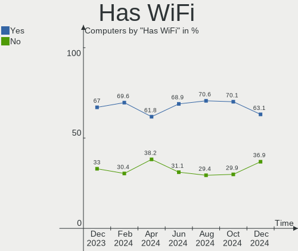
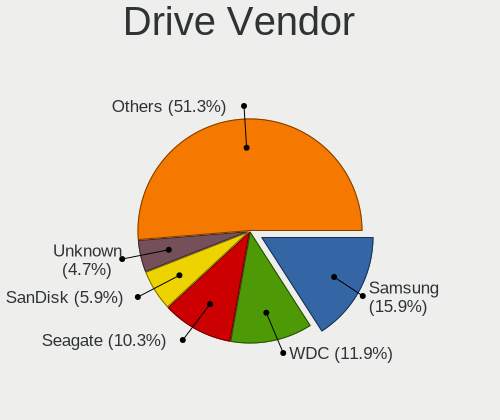
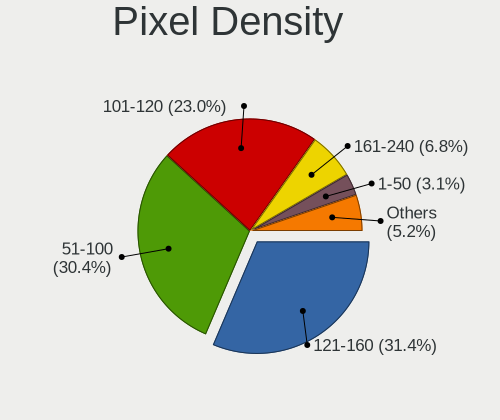
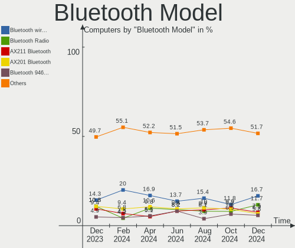
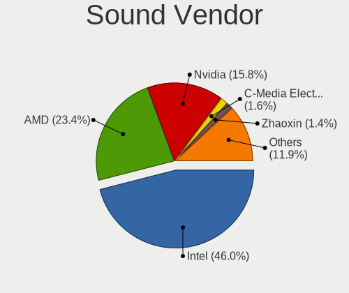

Debian - Hardware Trends
------------------------

A project to identify most popular hardware characteristics and track their change
over time based on data collected by Linux users at https://Linux-Hardware.org.

Anyone can contribute to this report by the [hw-probe](https://github.com/linuxhw/hw-probe) tool:

    sudo -E hw-probe -all -upload

This is a report for all computer types. See also reports for [desktops](/Dist/Debian/Desktop/README.md) and [notebooks](/Dist/Debian/Notebook/README.md).

This report is for one last month. Overall report since the beginning of time: [TestDays](https://github.com/linuxhw/TestDays)

Period: Dec, 2023.

Contents
--------

* [ System ](#system)
  - [ OS                       ](#os)
  - [ OS Family                ](#os-family)
  - [ Kernel                   ](#kernel)
  - [ Kernel Family            ](#kernel-family)
  - [ Kernel Major Ver.        ](#kernel-major-ver)
  - [ Arch                     ](#arch)
  - [ DE                       ](#de)
  - [ Display Server           ](#display-server)
  - [ Display Manager          ](#display-manager)
  - [ OS Lang                  ](#os-lang)
  - [ Boot Mode                ](#boot-mode)
  - [ Filesystem               ](#filesystem)
  - [ Part. scheme             ](#part-scheme)
  - [ Dual Boot with Linux/BSD ](#dual-boot-with-linuxbsd)
  - [ Dual Boot (Win)          ](#dual-boot-win)

* [ Board ](#board)
  - [ Vendor                   ](#vendor)
  - [ Model                    ](#model)
  - [ Model Family             ](#model-family)
  - [ MFG Year                 ](#mfg-year)
  - [ Form Factor              ](#form-factor)
  - [ Secure Boot              ](#secure-boot)
  - [ Coreboot                 ](#coreboot)
  - [ RAM Size                 ](#ram-size)
  - [ RAM Used                 ](#ram-used)
  - [ Total Drives             ](#total-drives)
  - [ Has CD-ROM               ](#has-cd-rom)
  - [ Has Ethernet             ](#has-ethernet)
  - [ Has WiFi                 ](#has-wifi)
  - [ Has Bluetooth            ](#has-bluetooth)

* [ Location ](#location)
  - [ Country                  ](#country)
  - [ City                     ](#city)

* [ Drives ](#drives)
  - [ Drive Vendor             ](#drive-vendor)
  - [ Drive Model              ](#drive-model)
  - [ HDD Vendor               ](#hdd-vendor)
  - [ SSD Vendor               ](#ssd-vendor)
  - [ Drive Kind               ](#drive-kind)
  - [ Drive Connector          ](#drive-connector)
  - [ Drive Size               ](#drive-size)
  - [ Space Total              ](#space-total)
  - [ Space Used               ](#space-used)
  - [ Malfunc. Drives          ](#malfunc-drives)
  - [ Malfunc. Drive Vendor    ](#malfunc-drive-vendor)
  - [ Malfunc. HDD Vendor      ](#malfunc-hdd-vendor)
  - [ Malfunc. Drive Kind      ](#malfunc-drive-kind)
  - [ Failed Drives            ](#failed-drives)
  - [ Failed Drive Vendor      ](#failed-drive-vendor)
  - [ Drive Status             ](#drive-status)

* [ Storage controller ](#storage-controller)
  - [ Storage Vendor           ](#storage-vendor)
  - [ Storage Model            ](#storage-model)
  - [ Storage Kind             ](#storage-kind)

* [ Processor ](#processor)
  - [ CPU Vendor               ](#cpu-vendor)
  - [ CPU Model                ](#cpu-model)
  - [ CPU Model Family         ](#cpu-model-family)
  - [ CPU Cores                ](#cpu-cores)
  - [ CPU Sockets              ](#cpu-sockets)
  - [ CPU Threads              ](#cpu-threads)
  - [ CPU Op-Modes             ](#cpu-op-modes)
  - [ CPU Microcode            ](#cpu-microcode)
  - [ CPU Microarch            ](#cpu-microarch)

* [ Graphics ](#graphics)
  - [ GPU Vendor               ](#gpu-vendor)
  - [ GPU Model                ](#gpu-model)
  - [ GPU Combo                ](#gpu-combo)
  - [ GPU Driver               ](#gpu-driver)
  - [ GPU Memory               ](#gpu-memory)

* [ Monitor ](#monitor)
  - [ Monitor Vendor           ](#monitor-vendor)
  - [ Monitor Model            ](#monitor-model)
  - [ Monitor Resolution       ](#monitor-resolution)
  - [ Monitor Diagonal         ](#monitor-diagonal)
  - [ Monitor Width            ](#monitor-width)
  - [ Aspect Ratio             ](#aspect-ratio)
  - [ Monitor Area             ](#monitor-area)
  - [ Pixel Density            ](#pixel-density)
  - [ Multiple Monitors        ](#multiple-monitors)

* [ Network ](#network)
  - [ Net Controller Vendor    ](#net-controller-vendor)
  - [ Net Controller Model     ](#net-controller-model)
  - [ Wireless Vendor          ](#wireless-vendor)
  - [ Wireless Model           ](#wireless-model)
  - [ Ethernet Vendor          ](#ethernet-vendor)
  - [ Ethernet Model           ](#ethernet-model)
  - [ Net Controller Kind      ](#net-controller-kind)
  - [ Used Controller          ](#used-controller)
  - [ NICs                     ](#nics)
  - [ IPv6                     ](#ipv6)

* [ Bluetooth ](#bluetooth)
  - [ Bluetooth Vendor         ](#bluetooth-vendor)
  - [ Bluetooth Model          ](#bluetooth-model)

* [ Sound ](#sound)
  - [ Sound Vendor             ](#sound-vendor)
  - [ Sound Model              ](#sound-model)

* [ Memory ](#memory)
  - [ Memory Vendor            ](#memory-vendor)
  - [ Memory Model             ](#memory-model)
  - [ Memory Kind              ](#memory-kind)
  - [ Memory Form Factor       ](#memory-form-factor)
  - [ Memory Size              ](#memory-size)
  - [ Memory Speed             ](#memory-speed)

* [ Printers & scanners ](#printers--scanners)
  - [ Printer Vendor           ](#printer-vendor)
  - [ Printer Model            ](#printer-model)
  - [ Scanner Vendor           ](#scanner-vendor)
  - [ Scanner Model            ](#scanner-model)

* [ Camera ](#camera)
  - [ Camera Vendor            ](#camera-vendor)
  - [ Camera Model             ](#camera-model)

* [ Security ](#security)
  - [ Fingerprint Vendor       ](#fingerprint-vendor)
  - [ Fingerprint Model        ](#fingerprint-model)
  - [ Chipcard Vendor          ](#chipcard-vendor)
  - [ Chipcard Model           ](#chipcard-model)

* [ Unsupported ](#unsupported)
  - [ Unsupported Devices      ](#unsupported-devices)
  - [ Unsupported Device Types ](#unsupported-device-types)

System
------

OS
--

Installed operating systems

| Name                    | Computers | Percent |
|-------------------------|-----------|---------|
| Debian 12               | 366       | 75.93%  |
| Debian 11               | 43        | 8.92%   |
| Debian                  | 39        | 8.09%   |
| Debian Testing/unstable | 24        | 4.98%   |
| Debian 10               | 4         | 0.83%   |
| Debian 6                | 2         | 0.41%   |
| Debian 12-updates       | 2         | 0.41%   |
| Debian 9                | 1         | 0.21%   |
| Debian 23100609         | 1         | 0.21%   |

OS Family
---------

OS without a version

| Name   | Computers | Percent |
|--------|-----------|---------|
| Debian | 482       | 100%    |

Kernel
------

Version of the Linux kernel

| Version                   | Computers | Percent |
|---------------------------|-----------|---------|
| 6.1.0-16-amd64            | 125       | 25.93%  |
| 6.1.0-13-amd64            | 92        | 19.09%  |
| 6.1.0-15-amd64            | 48        | 9.96%   |
| 5.10.10-64                | 26        | 5.39%   |
| 6.5.0-5-amd64             | 22        | 4.56%   |
| 5.10.0-26-amd64           | 13        | 2.7%    |
| 6.5.11-7-pve              | 12        | 2.49%   |
| 6.1.0-14-amd64            | 12        | 2.49%   |
| 6.5.0-0.deb12.4-amd64     | 8         | 1.66%   |
| 6.5.11-4-pve              | 7         | 1.45%   |
| 6.1.0-4-amd64             | 6         | 1.24%   |
| 6.5.0-4-amd64             | 5         | 1.04%   |
| 6.1.0-10-amd64            | 5         | 1.04%   |
| 6.5.11-6-pve              | 4         | 0.83%   |
| 6.1.21-v8+                | 4         | 0.83%   |
| 6.6.8-amd64               | 3         | 0.62%   |
| 6.5.0-0.deb12.1-amd64     | 3         | 0.62%   |
| 6.2.16-19-pve             | 3         | 0.62%   |
| 6.1.0-rpi7-rpi-v8         | 3         | 0.62%   |
| 6.1.0-12-amd64            | 3         | 0.62%   |
| 6.1.0-0.deb11.13-amd64    | 3         | 0.62%   |
| 6.6.4-1-liquorix-amd64    | 2         | 0.41%   |
| 6.1.63-production+truenas | 2         | 0.41%   |
| 6.1.0-rpi6-rpi-v8         | 2         | 0.41%   |
| 6.1.0-16-rt-amd64         | 2         | 0.41%   |
| 6.1.0-16-686-pae          | 2         | 0.41%   |
| 6.1.0-15-686-pae          | 2         | 0.41%   |
| 6.1.0-11-amd64            | 2         | 0.41%   |
| 6.0.0-6mx-amd64           | 2         | 0.41%   |
| 5.10.0-25-amd64           | 2         | 0.41%   |
| 5.10.0-21-amd64           | 2         | 0.41%   |
| 5.10.0-20-amd64           | 2         | 0.41%   |
| 6.7.0-rc4                 | 1         | 0.21%   |
| 6.6.8-2-liquorix-amd64    | 1         | 0.21%   |
| 6.6.7-edge-sunxi64        | 1         | 0.21%   |
| 6.6.7-edge-rk322x         | 1         | 0.21%   |
| 6.6.7-1-liquorix-amd64    | 1         | 0.21%   |
| 6.6.5-v8+                 | 1         | 0.21%   |
| 6.6.4-edge-sunxi64        | 1         | 0.21%   |
| 6.6.2-edge-rockchip64     | 1         | 0.21%   |

Kernel Family
-------------

Linux kernel without a distro release

| Version  | Computers | Percent |
|----------|-----------|---------|
| 6.1.0    | 314       | 65.15%  |
| 6.5.0    | 41        | 8.51%   |
| 5.10.10  | 26        | 5.39%   |
| 5.10.0   | 24        | 4.98%   |
| 6.5.11   | 23        | 4.77%   |
| 6.2.16   | 5         | 1.04%   |
| 6.6.8    | 4         | 0.83%   |
| 6.1.21   | 4         | 0.83%   |
| 6.6.7    | 3         | 0.62%   |
| 6.6.4    | 3         | 0.62%   |
| 6.6.2    | 2         | 0.41%   |
| 6.6.0    | 2         | 0.41%   |
| 6.1.63   | 2         | 0.41%   |
| 6.0.0    | 2         | 0.41%   |
| 6.7.0    | 1         | 0.21%   |
| 6.6.5    | 1         | 0.21%   |
| 6.6.1    | 1         | 0.21%   |
| 6.6      | 1         | 0.21%   |
| 6.5.10   | 1         | 0.21%   |
| 6.4.0    | 1         | 0.21%   |
| 6.2.1    | 1         | 0.21%   |
| 6.1.69   | 1         | 0.21%   |
| 6.1.68   | 1         | 0.21%   |
| 6.1.55   | 1         | 0.21%   |
| 6.1.52   | 1         | 0.21%   |
| 6.1.43   | 1         | 0.21%   |
| 6.1.25   | 1         | 0.21%   |
| 5.4.106  | 1         | 0.21%   |
| 5.19.0   | 1         | 0.21%   |
| 5.15.92  | 1         | 0.21%   |
| 5.15.74  | 1         | 0.21%   |
| 5.15.26  | 1         | 0.21%   |
| 5.15.145 | 1         | 0.21%   |
| 5.15.136 | 1         | 0.21%   |
| 5.15.126 | 1         | 0.21%   |
| 5.11.22  | 1         | 0.21%   |
| 5.10.160 | 1         | 0.21%   |
| 5.10.113 | 1         | 0.21%   |
| 5.10.103 | 1         | 0.21%   |
| 4.19.0   | 1         | 0.21%   |

Kernel Major Ver.
-----------------

Linux kernel major version

| Version | Computers | Percent |
|---------|-----------|---------|
| 6.1     | 326       | 67.63%  |
| 6.5     | 65        | 13.49%  |
| 5.10    | 53        | 11%     |
| 6.6     | 16        | 3.32%   |
| 6.2     | 6         | 1.24%   |
| 5.15    | 6         | 1.24%   |
| 6.0     | 2         | 0.41%   |
| 6.7     | 1         | 0.21%   |
| 6.4     | 1         | 0.21%   |
| 6       | 1         | 0.21%   |
| 5.4     | 1         | 0.21%   |
| 5.19    | 1         | 0.21%   |
| 5.11    | 1         | 0.21%   |
| 4.19    | 1         | 0.21%   |
| 2.6     | 1         | 0.21%   |

Arch
----

OS architecture (x86_64, i586, etc.)

| Name    | Computers | Percent |
|---------|-----------|---------|
| x86_64  | 448       | 92.95%  |
| aarch64 | 22        | 4.56%   |
| i686    | 8         | 1.66%   |
| armv7l  | 2         | 0.41%   |
| riscv64 | 1         | 0.21%   |
| i486    | 1         | 0.21%   |

DE
--

Desktop Environment

| Name             | Computers | Percent |
|------------------|-----------|---------|
| GNOME            | 151       | 31.33%  |
| KDE5             | 97        | 20.12%  |
| Unknown          | 87        | 18.05%  |
| XFCE             | 37        | 7.68%   |
| LXDE             | 36        | 7.47%   |
| X-Cinnamon       | 25        | 5.19%   |
| MATE             | 13        | 2.7%    |
| Cinnamon         | 8         | 1.66%   |
| i3               | 7         | 1.45%   |
| LXQt             | 6         | 1.24%   |
| GNOME Flashback  | 3         | 0.62%   |
| GNOME Classic    | 3         | 0.62%   |
| Openbox          | 2         | 0.41%   |
| sway             | 1         | 0.21%   |
| LXDE-pi-wayfire  | 1         | 0.21%   |
| lightdm-xsession | 1         | 0.21%   |
| KDE              | 1         | 0.21%   |
| GNUstep          | 1         | 0.21%   |
| Deepin           | 1         | 0.21%   |
| Budgie           | 1         | 0.21%   |

Display Server
--------------

X11 or Wayland

| Name    | Computers | Percent |
|---------|-----------|---------|
| X11     | 203       | 42.12%  |
| Wayland | 177       | 36.72%  |
| Tty     | 62        | 12.86%  |
| Unknown | 39        | 8.09%   |
| Web     | 1         | 0.21%   |

Display Manager
---------------

SDDM, LightDM, etc.

| Name    | Computers | Percent |
|---------|-----------|---------|
| Unknown | 166       | 34.44%  |
| GDM3    | 128       | 26.56%  |
| LightDM | 84        | 17.43%  |
| SDDM    | 68        | 14.11%  |
| NODM    | 26        | 5.39%   |
| GDM     | 6         | 1.24%   |
| XDM     | 1         | 0.21%   |
| LXDM    | 1         | 0.21%   |
| KDM     | 1         | 0.21%   |
| GREETD  | 1         | 0.21%   |

OS Lang
-------

Language

| Lang    | Computers | Percent |
|---------|-----------|---------|
| en_US   | 219       | 45.44%  |
| fr_FR   | 60        | 12.45%  |
| en_GB   | 28        | 5.81%   |
| de_DE   | 26        | 5.39%   |
| ru_RU   | 20        | 4.15%   |
| es_ES   | 15        | 3.11%   |
| it_IT   | 13        | 2.7%    |
| C       | 13        | 2.7%    |
| pl_PL   | 11        | 2.28%   |
| Unknown | 11        | 2.28%   |
| en_AU   | 8         | 1.66%   |
| pt_BR   | 7         | 1.45%   |
| pt_PT   | 5         | 1.04%   |
| en_IN   | 5         | 1.04%   |
| zh_TW   | 4         | 0.83%   |
| es_CL   | 3         | 0.62%   |
| en_CA   | 3         | 0.62%   |
| de_CH   | 3         | 0.62%   |
| zh_CN   | 2         | 0.41%   |
| ko_KR   | 2         | 0.41%   |
| es_MX   | 2         | 0.41%   |
| es_CO   | 2         | 0.41%   |
| en_ZA   | 2         | 0.41%   |
| en_IE   | 2         | 0.41%   |
| tr_TR   | 1         | 0.21%   |
| nl_BE   | 1         | 0.21%   |
| nb_NO   | 1         | 0.21%   |
| it_CH   | 1         | 0.21%   |
| hu_HU   | 1         | 0.21%   |
| es_PA   | 1         | 0.21%   |
| es_NI   | 1         | 0.21%   |
| es_CR   | 1         | 0.21%   |
| es_AR   | 1         | 0.21%   |
| en_SG   | 1         | 0.21%   |
| en_NZ   | 1         | 0.21%   |
| en_DK   | 1         | 0.21%   |
| en_AG   | 1         | 0.21%   |
| en      | 1         | 0.21%   |
| de_AT   | 1         | 0.21%   |
| cs_CZ   | 1         | 0.21%   |

Boot Mode
---------

EFI or BIOS

| Mode | Computers | Percent |
|------|-----------|---------|
| EFI  | 309       | 64.11%  |
| BIOS | 173       | 35.89%  |

Filesystem
----------

Type of filesystem

| Type    | Computers | Percent |
|---------|-----------|---------|
| Ext4    | 373       | 77.39%  |
| Overlay | 30        | 6.22%   |
| Rootfs  | 27        | 5.6%    |
| Zfs     | 17        | 3.53%   |
| Btrfs   | 17        | 3.53%   |
| Tmpfs   | 9         | 1.87%   |
| Xfs     | 4         | 0.83%   |
| Ext3    | 3         | 0.62%   |
| Unknown | 2         | 0.41%   |

Part. scheme
------------

Scheme of partitioning

| Type    | Computers | Percent |
|---------|-----------|---------|
| GPT     | 321       | 66.6%   |
| Unknown | 86        | 17.84%  |
| MBR     | 75        | 15.56%  |

Dual Boot with Linux/BSD
------------------------

Hosting more than one Linux/BSD

| Dual boot | Computers | Percent |
|-----------|-----------|---------|
| No        | 414       | 85.89%  |
| Yes       | 68        | 14.11%  |

Dual Boot (Win)
---------------

Hosting Linux and Windows

| Dual boot | Computers | Percent |
|-----------|-----------|---------|
| No        | 355       | 73.65%  |
| Yes       | 127       | 26.35%  |

Board
-----

Vendor
------

Motherboard manufacturer

| Name                                 | Computers | Percent |
|--------------------------------------|-----------|---------|
| Lenovo                               | 89        | 18.46%  |
| Hewlett-Packard                      | 75        | 15.56%  |
| ASUSTek Computer                     | 72        | 14.94%  |
| Dell                                 | 40        | 8.3%    |
| Gigabyte Technology                  | 30        | 6.22%   |
| MSI                                  | 24        | 4.98%   |
| Acer                                 | 17        | 3.53%   |
| Intel                                | 16        | 3.32%   |
| Raspberry Pi Foundation              | 14        | 2.9%    |
| Apple                                | 12        | 2.49%   |
| Unknown                              | 11        | 2.28%   |
| ASRock                               | 9         | 1.87%   |
| Toshiba                              | 5         | 1.04%   |
| Supermicro                           | 4         | 0.83%   |
| Samsung Electronics                  | 4         | 0.83%   |
| Google                               | 4         | 0.83%   |
| AZW                                  | 4         | 0.83%   |
| HUAWEI                               | 3         | 0.62%   |
| Fujitsu                              | 3         | 0.62%   |
| Biostar                              | 3         | 0.62%   |
| sunxi                                | 2         | 0.41%   |
| Sony                                 | 2         | 0.41%   |
| Packard Bell                         | 2         | 0.41%   |
| Medion                               | 2         | 0.41%   |
| HONOR                                | 2         | 0.41%   |
| AMI                                  | 2         | 0.41%   |
| Timi                                 | 1         | 0.21%   |
| T-bao TianBei                        | 1         | 0.21%   |
| Shenzhen Meigao Electronic Equipment | 1         | 0.21%   |
| Seeed Studio                         | 1         | 0.21%   |
| Schenker                             | 1         | 0.21%   |
| Rockchip                             | 1         | 0.21%   |
| Radxa                                | 1         | 0.21%   |
| Positivo                             | 1         | 0.21%   |
| MACHINIST                            | 1         | 0.21%   |
| MACHENIKE                            | 1         | 0.21%   |
| Jumper                               | 1         | 0.21%   |
| iRU                                  | 1         | 0.21%   |
| Inventec                             | 1         | 0.21%   |
| IceWhale Technology                  | 1         | 0.21%   |

Model
-----

Motherboard model

| Name                                      | Computers | Percent |
|-------------------------------------------|-----------|---------|
| Unknown                                   | 14        | 2.9%    |
| Lenovo ThinkPad X230 2325V2Y              | 8         | 1.66%   |
| RPi Raspberry Pi 4 Model B Rev 1.5        | 5         | 1.04%   |
| HP ProBook 650 G2                         | 5         | 1.04%   |
| HP ProBook 650 G1                         | 5         | 1.04%   |
| Lenovo ThinkCentre M800 10FXS0PS00        | 4         | 0.83%   |
| Intel NUC13ANHi7                          | 4         | 0.83%   |
| HP ProBook 450 G3                         | 4         | 0.83%   |
| HP ProBook 655 G2                         | 3         | 0.62%   |
| ASUS All Series                           | 3         | 0.62%   |
| Supermicro X8DTU                          | 2         | 0.41%   |
| RPi Raspberry Pi 4 Model B Rev 1.4        | 2         | 0.41%   |
| RPi Raspberry Pi 4 Model B Rev 1.1        | 2         | 0.41%   |
| RPi Raspberry Pi                          | 2         | 0.41%   |
| MSI MS-7D91                               | 2         | 0.41%   |
| Lenovo ThinkPad P16s Gen 2 21K9CTO1WW     | 2         | 0.41%   |
| Lenovo IdeaPad 3 15ALC6 82KU              | 2         | 0.41%   |
| HONOR HYM-WXX                             | 2         | 0.41%   |
| HP OMEN by Laptop 15-dc0xxx               | 2         | 0.41%   |
| HP EliteBook 830 G5                       | 2         | 0.41%   |
| Google Reks                               | 2         | 0.41%   |
| Gigabyte B650 AORUS ELITE AX              | 2         | 0.41%   |
| Gigabyte B550 AORUS ELITE V2              | 2         | 0.41%   |
| Dell OptiPlex 790                         | 2         | 0.41%   |
| AZW SER                                   | 2         | 0.41%   |
| ASUS ROG Strix G513RM_G513RM              | 2         | 0.41%   |
| ASUS H110M-R                              | 2         | 0.41%   |
| ASUS ASUS TUF Gaming F15 FX507ZC_TUF507ZC | 2         | 0.41%   |
| Apple MacBookPro12,1                      | 2         | 0.41%   |
| Apple MacBookAir7,2                       | 2         | 0.41%   |
| AMI Aptio CRB                             | 2         | 0.41%   |
| Toshiba Satellite L775                    | 1         | 0.21%   |
| Toshiba Satellite L50-A-19P               | 1         | 0.21%   |
| Toshiba Satellite C55-C                   | 1         | 0.21%   |
| Toshiba Satellite C50D-A-138              | 1         | 0.21%   |
| Toshiba Satellite A205                    | 1         | 0.21%   |
| Timi Mi Laptop Pro 15                     | 1         | 0.21%   |
| T-bao TianBei GOD78                       | 1         | 0.21%   |
| Supermicro SYS-6029P-WTRT                 | 1         | 0.21%   |
| Supermicro Super Server                   | 1         | 0.21%   |

Model Family
------------

Motherboard model prefix

| Name                | Computers | Percent |
|---------------------|-----------|---------|
| Lenovo ThinkPad     | 42        | 8.71%   |
| HP ProBook          | 20        | 4.15%   |
| RPi Raspberry       | 14        | 2.9%    |
| Unknown             | 14        | 2.9%    |
| ASUS ROG            | 11        | 2.28%   |
| Dell OptiPlex       | 10        | 2.07%   |
| Lenovo ThinkCentre  | 9         | 1.87%   |
| Lenovo IdeaPad      | 9         | 1.87%   |
| HP EliteBook        | 9         | 1.87%   |
| ASUS TUF            | 9         | 1.87%   |
| Acer Aspire         | 9         | 1.87%   |
| HP Pavilion         | 8         | 1.66%   |
| ASUS ASUS           | 8         | 1.66%   |
| HP Laptop           | 7         | 1.45%   |
| Dell Inspiron       | 7         | 1.45%   |
| Dell PowerEdge      | 6         | 1.24%   |
| ASUS PRIME          | 6         | 1.24%   |
| Toshiba Satellite   | 5         | 1.04%   |
| Lenovo ThinkBook    | 5         | 1.04%   |
| Lenovo Legion       | 5         | 1.04%   |
| Lenovo IdeaPadFlex  | 5         | 1.04%   |
| HP ProLiant         | 5         | 1.04%   |
| HP Compaq           | 5         | 1.04%   |
| Dell XPS            | 5         | 1.04%   |
| Dell Latitude       | 5         | 1.04%   |
| Intel NUC13ANHi7    | 4         | 0.83%   |
| HP ENVY             | 4         | 0.83%   |
| HP EliteDesk        | 4         | 0.83%   |
| Dell Vostro         | 4         | 0.83%   |
| ASUS VivoBook       | 4         | 0.83%   |
| HP OMEN             | 3         | 0.62%   |
| Gigabyte X570       | 3         | 0.62%   |
| ASUS All            | 3         | 0.62%   |
| Acer Swift          | 3         | 0.62%   |
| Supermicro X8DTU    | 2         | 0.41%   |
| MSI MS-7D91         | 2         | 0.41%   |
| Lenovo Yoga         | 2         | 0.41%   |
| Lenovo V15          | 2         | 0.41%   |
| Lenovo ThinkStation | 2         | 0.41%   |
| Lenovo Flex         | 2         | 0.41%   |

MFG Year
--------

Motherboard manufacture year

| Year    | Computers | Percent |
|---------|-----------|---------|
| 2023    | 62        | 12.86%  |
| 2022    | 47        | 9.75%   |
| 2021    | 41        | 8.51%   |
| 2020    | 39        | 8.09%   |
| 2012    | 33        | 6.85%   |
| 2018    | 30        | 6.22%   |
| 2016    | 30        | 6.22%   |
| 2019    | 28        | 5.81%   |
| 2013    | 27        | 5.6%    |
| Unknown | 27        | 5.6%    |
| 2015    | 24        | 4.98%   |
| 2011    | 21        | 4.36%   |
| 2014    | 19        | 3.94%   |
| 2017    | 14        | 2.9%    |
| 2009    | 13        | 2.7%    |
| 2010    | 10        | 2.07%   |
| 2007    | 8         | 1.66%   |
| 2008    | 4         | 0.83%   |
| 2004    | 3         | 0.62%   |
| 2006    | 1         | 0.21%   |
| 2005    | 1         | 0.21%   |

Form Factor
-----------

Physical design of the computer

| Name           | Computers | Percent |
|----------------|-----------|---------|
| Notebook       | 242       | 50.21%  |
| Desktop        | 161       | 33.4%   |
| System on chip | 24        | 4.98%   |
| Server         | 19        | 3.94%   |
| Mini pc        | 18        | 3.73%   |
| Convertible    | 11        | 2.28%   |
| All in one     | 5         | 1.04%   |
| Other          | 1         | 0.21%   |
| Tablet         | 1         | 0.21%   |

Secure Boot
-----------

Enabled or disabled

| State    | Computers | Percent |
|----------|-----------|---------|
| Disabled | 443       | 91.91%  |
| Enabled  | 39        | 8.09%   |

Coreboot
--------

Have coreboot on board

| Used | Computers | Percent |
|------|-----------|---------|
| No   | 477       | 98.96%  |
| Yes  | 5         | 1.04%   |

RAM Size
--------

Total RAM memory

| Size in GB      | Computers | Percent |
|-----------------|-----------|---------|
| 16.01-24.0      | 101       | 20.95%  |
| 4.01-8.0        | 99        | 20.54%  |
| 8.01-16.0       | 74        | 15.35%  |
| 3.01-4.0        | 65        | 13.49%  |
| 32.01-64.0      | 58        | 12.03%  |
| 64.01-256.0     | 32        | 6.64%   |
| 24.01-32.0      | 19        | 3.94%   |
| 1.01-2.0        | 17        | 3.53%   |
| 2.01-3.0        | 5         | 1.04%   |
| 0.51-1.0        | 5         | 1.04%   |
| More than 256.0 | 4         | 0.83%   |
| 0.01-0.5        | 1         | 0.21%   |
| 0               | 1         | 0.21%   |
| Unknown         | 1         | 0.21%   |

RAM Used
--------

Used RAM memory

| Used GB     | Computers | Percent |
|-------------|-----------|---------|
| 1.01-2.0    | 121       | 25.1%   |
| 2.01-3.0    | 106       | 21.99%  |
| 4.01-8.0    | 77        | 15.98%  |
| 3.01-4.0    | 67        | 13.9%   |
| 0.51-1.0    | 38        | 7.88%   |
| 8.01-16.0   | 27        | 5.6%    |
| 0.01-0.5    | 27        | 5.6%    |
| 24.01-32.0  | 5         | 1.04%   |
| 64.01-256.0 | 5         | 1.04%   |
| 16.01-24.0  | 4         | 0.83%   |
| 32.01-64.0  | 3         | 0.62%   |
| Unknown     | 2         | 0.41%   |

Total Drives
------------

Number of drives on board

| Drives | Computers | Percent |
|--------|-----------|---------|
| 1      | 276       | 57.26%  |
| 2      | 104       | 21.58%  |
| 3      | 39        | 8.09%   |
| 4      | 25        | 5.19%   |
| 5      | 9         | 1.87%   |
| 0      | 9         | 1.87%   |
| 6      | 7         | 1.45%   |
| 13     | 2         | 0.41%   |
| 9      | 2         | 0.41%   |
| 70     | 1         | 0.21%   |
| 26     | 1         | 0.21%   |
| 21     | 1         | 0.21%   |
| 18     | 1         | 0.21%   |
| 16     | 1         | 0.21%   |
| 15     | 1         | 0.21%   |
| 10     | 1         | 0.21%   |
| 8      | 1         | 0.21%   |
| 7      | 1         | 0.21%   |

Has CD-ROM
----------

Has CD-ROM on board

| Presented | Computers | Percent |
|-----------|-----------|---------|
| No        | 366       | 75.93%  |
| Yes       | 116       | 24.07%  |

Has Ethernet
------------

Has Ethernet on board

| Presented | Computers | Percent |
|-----------|-----------|---------|
| Yes       | 406       | 84.23%  |
| No        | 76        | 15.77%  |

Has WiFi
--------

Has WiFi module

| Presented | Computers | Percent |
|-----------|-----------|---------|
| Yes       | 330       | 68.46%  |
| No        | 152       | 31.54%  |

Has Bluetooth
-------------

Has Bluetooth module

| Presented | Computers | Percent |
|-----------|-----------|---------|
| Yes       | 283       | 58.71%  |
| No        | 199       | 41.29%  |

Location
--------

Country
-------

Geographic location (country)

| Country         | Computers | Percent |
|-----------------|-----------|---------|
| USA             | 76        | 15.77%  |
| France          | 64        | 13.28%  |
| Germany         | 48        | 9.96%   |
| Canada          | 36        | 7.47%   |
| Russia          | 35        | 7.26%   |
| Italy           | 25        | 5.19%   |
| Spain           | 20        | 4.15%   |
| Poland          | 19        | 3.94%   |
| Brazil          | 14        | 2.9%    |
| UK              | 12        | 2.49%   |
| Australia       | 12        | 2.49%   |
| Switzerland     | 9         | 1.87%   |
| India           | 6         | 1.24%   |
| Taiwan          | 5         | 1.04%   |
| Portugal        | 5         | 1.04%   |
| Hungary         | 5         | 1.04%   |
| Austria         | 5         | 1.04%   |
| Netherlands     | 4         | 0.83%   |
| Mexico          | 4         | 0.83%   |
| Turkey          | 3         | 0.62%   |
| Denmark         | 3         | 0.62%   |
| Colombia        | 3         | 0.62%   |
| China           | 3         | 0.62%   |
| Chile           | 3         | 0.62%   |
| Belgium         | 3         | 0.62%   |
| Argentina       | 3         | 0.62%   |
| The Netherlands | 2         | 0.41%   |
| Sweden          | 2         | 0.41%   |
| South Korea     | 2         | 0.41%   |
| South Africa    | 2         | 0.41%   |
| Slovakia        | 2         | 0.41%   |
| Romania         | 2         | 0.41%   |
| Norway          | 2         | 0.41%   |
| Nigeria         | 2         | 0.41%   |
| Japan           | 2         | 0.41%   |
| Ireland         | 2         | 0.41%   |
| Greece          | 2         | 0.41%   |
| Finland         | 2         | 0.41%   |
| Czechia         | 2         | 0.41%   |
| Bulgaria        | 2         | 0.41%   |

City
----

Geographic location (city)

| City              | Computers | Percent |
|-------------------|-----------|---------|
| Roubaix           | 36        | 7.47%   |
| Québec           | 13        | 2.7%    |
| Sydney            | 8         | 1.66%   |
| St Petersburg     | 8         | 1.66%   |
| Moscow            | 8         | 1.66%   |
| Levis             | 7         | 1.45%   |
| Voronezh          | 6         | 1.24%   |
| Madrid            | 5         | 1.04%   |
| Bangor            | 5         | 1.04%   |
| Sao Paulo         | 4         | 0.83%   |
| Perm              | 4         | 0.83%   |
| Paris             | 4         | 0.83%   |
| Milan             | 4         | 0.83%   |
| Hanau             | 4         | 0.83%   |
| Berlin            | 4         | 0.83%   |
| Zurich            | 3         | 0.62%   |
| Seville           | 3         | 0.62%   |
| San Antonio       | 3         | 0.62%   |
| Quimper           | 3         | 0.62%   |
| Gmina Chełmiec   | 3         | 0.62%   |
| Frankfurt am Main | 3         | 0.62%   |
| Bengaluru         | 3         | 0.62%   |
| Vienna            | 2         | 0.41%   |
| Toronto           | 2         | 0.41%   |
| Taipei            | 2         | 0.41%   |
| Santiago          | 2         | 0.41%   |
| Salt Lake City    | 2         | 0.41%   |
| Rome              | 2         | 0.41%   |
| Rio de Janeiro    | 2         | 0.41%   |
| Rho               | 2         | 0.41%   |
| Prague            | 2         | 0.41%   |
| Palma             | 2         | 0.41%   |
| New York          | 2         | 0.41%   |
| Montreal          | 2         | 0.41%   |
| Mexico City       | 2         | 0.41%   |
| Mainz             | 2         | 0.41%   |
| Leipzig           | 2         | 0.41%   |
| Kaohsiung City    | 2         | 0.41%   |
| Istanbul          | 2         | 0.41%   |
| Iowa City         | 2         | 0.41%   |

Drives
------

Drive Vendor
------------

Hard drive vendors

| Vendor                      | Computers | Drives | Percent |
|-----------------------------|-----------|--------|---------|
| Samsung Electronics         | 127       | 186    | 18.35%  |
| WDC                         | 100       | 156    | 14.45%  |
| Seagate                     | 73        | 122    | 10.55%  |
| Kingston                    | 41        | 47     | 5.92%   |
| SanDisk                     | 39        | 48     | 5.64%   |
| Unknown                     | 31        | 35     | 4.48%   |
| Crucial                     | 28        | 49     | 4.05%   |
| Toshiba                     | 27        | 39     | 3.9%    |
| SK hynix                    | 24        | 24     | 3.47%   |
| Micron Technology           | 17        | 18     | 2.46%   |
| HGST                        | 17        | 82     | 2.46%   |
| Hitachi                     | 15        | 18     | 2.17%   |
| Intel                       | 14        | 18     | 2.02%   |
| A-DATA Technology           | 10        | 10     | 1.45%   |
| Apple                       | 8         | 9      | 1.16%   |
| China                       | 7         | 7      | 1.01%   |
| Transcend                   | 6         | 6      | 0.87%   |
| Unknown                     | 6         | 6      | 0.87%   |
| SPCC                        | 5         | 5      | 0.72%   |
| Phison                      | 5         | 5      | 0.72%   |
| Team                        | 4         | 4      | 0.58%   |
| SSSTC                       | 4         | 4      | 0.58%   |
| Micron/Crucial Technology   | 4         | 4      | 0.58%   |
| Lexar                       | 4         | 4      | 0.58%   |
| Fanxiang                    | 4         | 6      | 0.58%   |
| ASMT                        | 4         | 13     | 0.58%   |
| Silicon Motion              | 3         | 3      | 0.43%   |
| Phison Electronics          | 3         | 3      | 0.43%   |
| MAXIO Technology (Hangzhou) | 3         | 3      | 0.43%   |
| KIOXIA-EXCERIA              | 3         | 4      | 0.43%   |
| Kingston Technology Company | 3         | 3      | 0.43%   |
| GOODRAM                     | 3         | 6      | 0.43%   |
| SABRENT                     | 2         | 2      | 0.29%   |
| PNY                         | 2         | 2      | 0.29%   |
| Patriot                     | 2         | 2      | 0.29%   |
| Netac                       | 2         | 2      | 0.29%   |
| Maxtor                      | 2         | 2      | 0.29%   |
| LITEON                      | 2         | 2      | 0.29%   |
| KIOXIA                      | 2         | 2      | 0.29%   |
| Intenso                     | 2         | 2      | 0.29%   |

Drive Model
-----------

Hard drive models

| Model                                              | Computers | Percent |
|----------------------------------------------------|-----------|---------|
| Kingston SA400S37240G 240GB SSD                    | 10        | 1.26%   |
| WDC WD5000LPLX-60ZNTT1 500GB                       | 9         | 1.14%   |
| Seagate ST500DM002-1BD142 500GB                    | 9         | 1.14%   |
| SanDisk NVMe SSD Drive 1TB                         | 8         | 1.01%   |
| Samsung SSD 970 EVO Plus 1TB                       | 7         | 0.88%   |
| Unknown                                            | 6         | 0.76%   |
| Seagate ST2000DM008-2FR102 2TB                     | 5         | 0.63%   |
| Samsung SSD 850 EVO 500GB                          | 5         | 0.63%   |
| Samsung NVMe SSD Controller PM9A1/PM9A3/980PRO 2TB | 5         | 0.63%   |
| Kingston SA400S37120G 120GB SSD                    | 5         | 0.63%   |
| Hitachi HTS543232A7A384 320GB                      | 5         | 0.63%   |
| Crucial CT500MX500SSD1 500GB                       | 5         | 0.63%   |
| WDC WD10EZEX-08WN4A0 1TB                           | 4         | 0.51%   |
| WDC WD10EZEX-00BN5A0 1TB                           | 4         | 0.51%   |
| Unknown MMC Card  32GB                             | 4         | 0.51%   |
| SK hynix BC711 HFM256GD3JX013N 256GB               | 4         | 0.51%   |
| Seagate ST1000DM010-2EP102 1TB                     | 4         | 0.51%   |
| SanDisk NVMe SSD Drive 512GB                       | 4         | 0.51%   |
| SanDisk NVMe SSD Drive 2TB                         | 4         | 0.51%   |
| Samsung SSD 990 PRO 2TB                            | 4         | 0.51%   |
| Samsung SSD 860 EVO 500GB                          | 4         | 0.51%   |
| Samsung SSD 850 EVO 250GB                          | 4         | 0.51%   |
| Samsung HM321HI 320GB                              | 4         | 0.51%   |
| Micron 2450_MTFDKBA512TFK 512GB                    | 4         | 0.51%   |
| Micron 2400_MTFDKBA512QFM 512GB                    | 4         | 0.51%   |
| HGST HTS541010A9E680 1TB                           | 4         | 0.51%   |
| WDC WD30EZRX-00MMMB0 3TB                           | 3         | 0.38%   |
| WDC WD20EFRX-68EUZN0 2TB                           | 3         | 0.38%   |
| WDC WD20EARX-00PASB0 2TB                           | 3         | 0.38%   |
| Toshiba MQ01ACF032 320GB                           | 3         | 0.38%   |
| Toshiba MQ01ABD100 1TB                             | 3         | 0.38%   |
| Toshiba HDWD130 3TB                                | 3         | 0.38%   |
| Seagate ST9500325AS 500GB                          | 3         | 0.38%   |
| Seagate ST3500418AS 500GB                          | 3         | 0.38%   |
| Seagate ST2000DM001-1ER164 2TB                     | 3         | 0.38%   |
| Samsung SSD 980 PRO 500GB                          | 3         | 0.38%   |
| Samsung SSD 980 PRO 1TB                            | 3         | 0.38%   |
| Samsung SSD 870 EVO 500GB                          | 3         | 0.38%   |
| Samsung SSD 860 EVO 250GB                          | 3         | 0.38%   |
| Samsung MZVL21T0HCLR-00BL2 1TB                     | 3         | 0.38%   |

HDD Vendor
----------

Hard disk drive vendors

| Vendor              | Computers | Drives | Percent |
|---------------------|-----------|--------|---------|
| WDC                 | 77        | 128    | 34.38%  |
| Seagate             | 71        | 120    | 31.7%   |
| Toshiba             | 24        | 35     | 10.71%  |
| HGST                | 16        | 80     | 7.14%   |
| Hitachi             | 15        | 18     | 6.7%    |
| Samsung Electronics | 7         | 7      | 3.13%   |
| Apple               | 3         | 3      | 1.34%   |
| SABRENT             | 2         | 2      | 0.89%   |
| Maxtor              | 2         | 2      | 0.89%   |
| ASMT                | 2         | 11     | 0.89%   |
| Unknown             | 1         | 1      | 0.45%   |
| H/W                 | 1         | 7      | 0.45%   |
| Fujitsu             | 1         | 1      | 0.45%   |
| Elite               | 1         | 1      | 0.45%   |
| Unknown             | 1         | 1      | 0.45%   |

SSD Vendor
----------

Solid state drive vendors

| Vendor              | Computers | Drives | Percent |
|---------------------|-----------|--------|---------|
| Samsung Electronics | 51        | 84     | 27.13%  |
| Kingston            | 27        | 32     | 14.36%  |
| Crucial             | 17        | 37     | 9.04%   |
| SanDisk             | 15        | 16     | 7.98%   |
| WDC                 | 11        | 11     | 5.85%   |
| China               | 7         | 7      | 3.72%   |
| A-DATA Technology   | 6         | 6      | 3.19%   |
| Transcend           | 4         | 4      | 2.13%   |
| Apple               | 4         | 4      | 2.13%   |
| Team                | 3         | 3      | 1.6%    |
| SK hynix            | 3         | 3      | 1.6%    |
| GOODRAM             | 3         | 4      | 1.6%    |
| Fanxiang            | 3         | 4      | 1.6%    |
| Toshiba             | 2         | 2      | 1.06%   |
| SPCC                | 2         | 2      | 1.06%   |
| PNY                 | 2         | 2      | 1.06%   |
| Patriot             | 2         | 2      | 1.06%   |
| Netac               | 2         | 2      | 1.06%   |
| LITEON              | 2         | 2      | 1.06%   |
| Intenso             | 2         | 2      | 1.06%   |
| FORESEE             | 2         | 2      | 1.06%   |
| ASMT                | 2         | 2      | 1.06%   |
| SSSTC               | 1         | 1      | 0.53%   |
| SMI                 | 1         | 1      | 0.53%   |
| Seagate             | 1         | 1      | 0.53%   |
| Reeinno             | 1         | 2      | 0.53%   |
| OCZ                 | 1         | 1      | 0.53%   |
| NGFF                | 1         | 1      | 0.53%   |
| Mushkin             | 1         | 1      | 0.53%   |
| Micron Technology   | 1         | 1      | 0.53%   |
| LITEONIT            | 1         | 1      | 0.53%   |
| Lexar               | 1         | 1      | 0.53%   |
| KIOXIA-EXCERIA      | 1         | 1      | 0.53%   |
| KingFast            | 1         | 1      | 0.53%   |
| Intel               | 1         | 1      | 0.53%   |
| Hised               | 1         | 1      | 0.53%   |
| CWDISK              | 1         | 1      | 0.53%   |
| 2.5                 | 1         | 1      | 0.53%   |

Drive Kind
----------

HDD or SSD

| Kind    | Computers | Drives | Percent |
|---------|-----------|--------|---------|
| NVMe    | 227       | 294    | 37.09%  |
| HDD     | 179       | 417    | 29.25%  |
| SSD     | 166       | 250    | 27.12%  |
| MMC     | 34        | 37     | 5.56%   |
| Unknown | 6         | 10     | 0.98%   |

Drive Connector
---------------

SATA, SAS, NVMe, etc.

| Type | Computers | Drives | Percent |
|------|-----------|--------|---------|
| SATA | 283       | 625    | 49.39%  |
| NVMe | 226       | 292    | 39.44%  |
| MMC  | 34        | 37     | 5.93%   |
| SAS  | 30        | 54     | 5.24%   |

Drive Size
----------

Size of hard drive

| Size in TB | Computers | Drives | Percent |
|------------|-----------|--------|---------|
| 0.01-0.5   | 204       | 255    | 52.71%  |
| 0.51-1.0   | 97        | 159    | 25.06%  |
| 1.01-2.0   | 39        | 93     | 10.08%  |
| 3.01-4.0   | 17        | 35     | 4.39%   |
| 2.01-3.0   | 15        | 30     | 3.88%   |
| 4.01-10.0  | 12        | 86     | 3.1%    |
| 10.01-20.0 | 3         | 9      | 0.78%   |

Space Total
-----------

Amount of disk space available on the file system

| Size in GB     | Computers | Percent |
|----------------|-----------|---------|
| 251-500        | 115       | 23.86%  |
| 101-250        | 95        | 19.71%  |
| 501-1000       | 75        | 15.56%  |
| More than 3000 | 42        | 8.71%   |
| 51-100         | 37        | 7.68%   |
| 1-20           | 31        | 6.43%   |
| Unknown        | 30        | 6.22%   |
| 1001-2000      | 26        | 5.39%   |
| 21-50          | 16        | 3.32%   |
| 2001-3000      | 15        | 3.11%   |

Space Used
----------

Amount of used disk space

| Used GB        | Computers | Percent |
|----------------|-----------|---------|
| 1-20           | 209       | 43.36%  |
| 21-50          | 53        | 11%     |
| 101-250        | 52        | 10.79%  |
| 51-100         | 45        | 9.34%   |
| 251-500        | 36        | 7.47%   |
| Unknown        | 30        | 6.22%   |
| 501-1000       | 19        | 3.94%   |
| More than 3000 | 17        | 3.53%   |
| 1001-2000      | 14        | 2.9%    |
| 2001-3000      | 7         | 1.45%   |

Malfunc. Drives
---------------

Drive models with a malfunction

| Model                                 | Computers | Drives | Percent |
|---------------------------------------|-----------|--------|---------|
| WDC WD5000LPLX-60ZNTT1 500GB          | 3         | 3      | 5.17%   |
| WDC WD20EARX-00PASB0 2TB              | 2         | 2      | 3.45%   |
| Toshiba HDWD130 3TB                   | 2         | 5      | 3.45%   |
| Seagate ST9320325AS 320GB             | 2         | 2      | 3.45%   |
| Seagate ST3500418AS 500GB             | 2         | 2      | 3.45%   |
| HGST HTS725050A7E630 500GB            | 2         | 2      | 3.45%   |
| XPG SPECTRIX S40G 1TB                 | 1         | 1      | 1.72%   |
| WDC WDS240G2G0A-00JH30 240GB SSD      | 1         | 1      | 1.72%   |
| WDC WD5000LPCX-00VHAT0 500GB          | 1         | 1      | 1.72%   |
| WDC WD5000AURX-63UY4Y0 500GB          | 1         | 1      | 1.72%   |
| WDC WD40PURX-64GVNY0 4TB              | 1         | 1      | 1.72%   |
| WDC WD30EZRX-00MMMB0 3TB              | 1         | 1      | 1.72%   |
| WDC WD30EURS-63R8UY0 3TB              | 1         | 1      | 1.72%   |
| WDC WD20PURX-64P6ZY0 2TB              | 1         | 1      | 1.72%   |
| WDC WD20EZRZ-00Z5HB0 2TB              | 1         | 1      | 1.72%   |
| WDC WD20EARS-00MVWB0 2TB              | 1         | 1      | 1.72%   |
| WDC WD2000F9YZ-09N20L0 2TB            | 1         | 2      | 1.72%   |
| WDC WD10EZEX-60ZF5A0 1TB              | 1         | 1      | 1.72%   |
| WDC WD10EZEX-00BN5A0 1TB              | 1         | 1      | 1.72%   |
| WDC WD10EADS-65M2B0 1TB               | 1         | 1      | 1.72%   |
| WDC WD1001FALS-00J7B0 1TB             | 1         | 1      | 1.72%   |
| WDC WD Blue SA510 2.5 1000GB SSD      | 1         | 1      | 1.72%   |
| Toshiba DT01ACA200 2TB                | 1         | 1      | 1.72%   |
| SK hynix BC711 HFM256GD3JX013N 256GB  | 1         | 1      | 1.72%   |
| Seagate ST9500325AS 500GB             | 1         | 1      | 1.72%   |
| Seagate ST8000DM004-2CX188 8TB        | 1         | 1      | 1.72%   |
| Seagate ST500LT012-1DG142 500GB       | 1         | 1      | 1.72%   |
| Seagate ST500DM002-1BD142 500GB       | 1         | 1      | 1.72%   |
| Seagate ST3500630NS 500GB             | 1         | 1      | 1.72%   |
| Seagate ST3500412AS 500GB             | 1         | 1      | 1.72%   |
| Seagate ST3320613AS 320GB             | 1         | 1      | 1.72%   |
| Seagate ST3320418AS 320GB             | 1         | 1      | 1.72%   |
| Seagate ST3160811AS 160GB             | 1         | 1      | 1.72%   |
| Seagate ST31000528AS 1TB              | 1         | 1      | 1.72%   |
| Seagate ST31000524NS 1TB              | 1         | 4      | 1.72%   |
| Seagate ST2000DM008-2FR102 2TB        | 1         | 1      | 1.72%   |
| Seagate ST2000DM006-2DM164 2TB        | 1         | 1      | 1.72%   |
| Seagate ST2000DM001-1CH164 2TB        | 1         | 1      | 1.72%   |
| Samsung Electronics SSD 980 PRO 500GB | 1         | 1      | 1.72%   |
| Phison ES 512GB                       | 1         | 1      | 1.72%   |

Malfunc. Drive Vendor
---------------------

Vendors of faulty drives

| Vendor              | Computers | Drives | Percent |
|---------------------|-----------|--------|---------|
| WDC                 | 18        | 21     | 33.33%  |
| Seagate             | 16        | 21     | 29.63%  |
| Hitachi             | 4         | 4      | 7.41%   |
| HGST                | 4         | 4      | 7.41%   |
| Toshiba             | 3         | 6      | 5.56%   |
| XPG                 | 1         | 1      | 1.85%   |
| SK hynix            | 1         | 1      | 1.85%   |
| Samsung Electronics | 1         | 1      | 1.85%   |
| Phison              | 1         | 1      | 1.85%   |
| Netac               | 1         | 1      | 1.85%   |
| Maxtor              | 1         | 1      | 1.85%   |
| Kimtigo             | 1         | 1      | 1.85%   |
| Crucial             | 1         | 1      | 1.85%   |
| China               | 1         | 1      | 1.85%   |

Malfunc. HDD Vendor
-------------------

Vendors of faulty HDD drives

| Vendor  | Computers | Drives | Percent |
|---------|-----------|--------|---------|
| WDC     | 16        | 19     | 36.36%  |
| Seagate | 16        | 21     | 36.36%  |
| Hitachi | 4         | 4      | 9.09%   |
| HGST    | 4         | 4      | 9.09%   |
| Toshiba | 3         | 6      | 6.82%   |
| Maxtor  | 1         | 1      | 2.27%   |

Malfunc. Drive Kind
-------------------

Kinds of faulty drives

| Kind | Computers | Drives | Percent |
|------|-----------|--------|---------|
| HDD  | 41        | 55     | 80.39%  |
| NVMe | 5         | 5      | 9.8%    |
| SSD  | 5         | 5      | 9.8%    |

Failed Drives
-------------

Failed drive models

| Model                    | Computers | Drives | Percent |
|--------------------------|-----------|--------|---------|
| Seagate ST2000NM0011 2TB | 1         | 1      | 100%    |

Failed Drive Vendor
-------------------

Failed drive vendors

| Vendor  | Computers | Drives | Percent |
|---------|-----------|--------|---------|
| Seagate | 1         | 1      | 100%    |

Drive Status
------------

Number of failed and malfunc. drives

| Status   | Computers | Drives | Percent |
|----------|-----------|--------|---------|
| Works    | 328       | 661    | 60.97%  |
| Detected | 158       | 281    | 29.37%  |
| Malfunc  | 51        | 65     | 9.48%   |
| Failed   | 1         | 1      | 0.19%   |

Storage controller
------------------

Storage Vendor
--------------

Storage controller vendors

| Vendor                         | Computers | Percent |
|--------------------------------|-----------|---------|
| Intel                          | 288       | 44.38%  |
| Samsung Electronics            | 82        | 12.63%  |
| AMD                            | 73        | 11.25%  |
| SanDisk                        | 37        | 5.7%    |
| SK hynix                       | 21        | 3.24%   |
| Kingston Technology Company    | 18        | 2.77%   |
| Micron Technology              | 17        | 2.62%   |
| Micron/Crucial Technology      | 15        | 2.31%   |
| ASMedia Technology             | 12        | 1.85%   |
| Phison Electronics             | 10        | 1.54%   |
| Silicon Motion                 | 8         | 1.23%   |
| Nvidia                         | 6         | 0.92%   |
| MAXIO Technology (Hangzhou)    | 6         | 0.92%   |
| Marvell Technology Group       | 6         | 0.92%   |
| Broadcom / LSI                 | 6         | 0.92%   |
| JMicron Technology             | 5         | 0.77%   |
| ADATA Technology               | 5         | 0.77%   |
| Realtek Semiconductor          | 4         | 0.62%   |
| KIOXIA                         | 4         | 0.62%   |
| Solid State Storage Technology | 3         | 0.46%   |
| Shenzhen Longsys Electronics   | 3         | 0.46%   |
| INNOGRIT                       | 3         | 0.46%   |
| Adaptec                        | 3         | 0.46%   |
| Union Memory (Shenzhen)        | 2         | 0.31%   |
| Transcend                      | 2         | 0.31%   |
| Toshiba America Info Systems   | 2         | 0.31%   |
| Hewlett-Packard                | 2         | 0.31%   |
| VIA Technologies               | 1         | 0.15%   |
| Solidigm                       | 1         | 0.15%   |
| Seagate Technology             | 1         | 0.15%   |
| LSI Logic / Symbios Logic      | 1         | 0.15%   |
| ATTO Technology                | 1         | 0.15%   |
| Apple                          | 1         | 0.15%   |

Storage Model
-------------

Storage controller models

| Model                                                                          | Computers | Percent |
|--------------------------------------------------------------------------------|-----------|---------|
| AMD FCH SATA Controller [AHCI mode]                                            | 51        | 7.16%   |
| Samsung NVMe SSD Controller SM981/PM981/PM983                                  | 31        | 4.35%   |
| Intel Sunrise Point-LP SATA Controller [AHCI mode]                             | 26        | 3.65%   |
| Intel Volume Management Device NVMe RAID Controller                            | 22        | 3.09%   |
| Intel 8 Series/C220 Series Chipset Family 6-port SATA Controller 1 [AHCI mode] | 21        | 2.95%   |
| Samsung NVMe SSD Controller PM9A1/PM9A3/980PRO                                 | 19        | 2.67%   |
| Intel 7 Series Chipset Family 6-port SATA Controller [AHCI mode]               | 17        | 2.39%   |
| Samsung NVMe SSD Controller 980 (DRAM-less)                                    | 15        | 2.11%   |
| Micron/Crucial P2 [Nick P2] / P3 / P3 Plus NVMe PCIe SSD (DRAM-less)           | 13        | 1.83%   |
| Intel Q170/Q150/B150/H170/H110/Z170/CM236 Chipset SATA Controller [AHCI Mode]  | 12        | 1.69%   |
| SK hynix Gold P31/BC711/PC711 NVMe Solid State Drive                           | 10        | 1.4%    |
| Intel 6 Series/C200 Series Chipset Family 6 port Desktop SATA AHCI Controller  | 10        | 1.4%    |
| Intel Volume Management Device NVMe RAID Controller Intel Corporation          | 9         | 1.26%   |
| Intel Alder Lake-P SATA AHCI Controller                                        | 9         | 1.26%   |
| Intel 82801 Mobile SATA Controller [RAID mode]                                 | 9         | 1.26%   |
| AMD 500 Series Chipset SATA Controller                                         | 9         | 1.26%   |
| SanDisk WD Black SN770 / PC SN740 256GB / PC SN560 (DRAM-less) NVMe SSD        | 8         | 1.12%   |
| Intel SSD 670p Series [Keystone Harbor]                                        | 8         | 1.12%   |
| Intel Comet Lake SATA AHCI Controller                                          | 8         | 1.12%   |
| Intel Cannon Lake PCH SATA AHCI Controller                                     | 8         | 1.12%   |
| Intel 6 Series/C200 Series Chipset Family 6 port Mobile SATA AHCI Controller   | 8         | 1.12%   |
| ASMedia ASM1062 Serial ATA Controller                                          | 8         | 1.12%   |
| AMD SB7x0/SB8x0/SB9x0 SATA Controller [AHCI mode]                              | 8         | 1.12%   |
| SanDisk Extreme Pro / WD Black SN750 / PC SN730 / Red SN700 NVMe SSD           | 7         | 0.98%   |
| Samsung NVMe SSD Controller S4LV008[Pascal]                                    | 7         | 0.98%   |
| Samsung NVMe SSD Controller PM9B1 (DRAM-less)                                  | 7         | 0.98%   |
| Intel Wildcat Point-LP SATA Controller [AHCI Mode]                             | 7         | 0.98%   |
| Intel 7 Series/C210 Series Chipset Family 6-port SATA Controller [AHCI mode]   | 7         | 0.98%   |
| Intel 500 Series Chipset Family SATA AHCI Controller                           | 7         | 0.98%   |
| Silicon Motion SM2263EN/SM2263XT (DRAM-less) NVMe SSD Controllers              | 6         | 0.84%   |
| Micron 2450 NVMe SSD [HendrixV] (DRAM-less)                                    | 6         | 0.84%   |
| Micron 2400 NVMe SSD (DRAM-less)                                               | 6         | 0.84%   |
| Intel Alder Lake-S PCH SATA Controller [AHCI Mode]                             | 6         | 0.84%   |
| Intel 82801G (ICH7 Family) IDE Controller                                      | 6         | 0.84%   |
| Intel 8 Series SATA Controller 1 [AHCI mode]                                   | 6         | 0.84%   |
| Intel 700 Series Chipset Family SATA AHCI Controller                           | 6         | 0.84%   |
| Intel 200 Series PCH SATA controller [AHCI mode]                               | 6         | 0.84%   |
| AMD 400 Series Chipset SATA Controller                                         | 6         | 0.84%   |
| SanDisk Ultra 3D / WD Blue SN550 NVMe SSD                                      | 5         | 0.7%    |
| MAXIO (Hangzhou) NVMe SSD Controller MAP1202                                   | 5         | 0.7%    |

Storage Kind
------------

Kind of storage controller (IDE, SATA, NVMe, SAS, ...)

| Kind | Computers | Percent |
|------|-----------|---------|
| SATA | 309       | 49.52%  |
| NVMe | 224       | 35.9%   |
| RAID | 47        | 7.53%   |
| IDE  | 34        | 5.45%   |
| SAS  | 7         | 1.12%   |
| SCSI | 3         | 0.48%   |

Processor
---------

CPU Vendor
----------

Processor vendors

| Vendor   | Computers | Percent |
|----------|-----------|---------|
| Intel    | 345       | 71.58%  |
| AMD      | 112       | 23.24%  |
| ARM      | 23        | 4.77%   |
| Qualcomm | 1         | 0.21%   |
| Unknown  | 1         | 0.21%   |

CPU Model
---------

Processor models

| Model                                         | Computers | Percent |
|-----------------------------------------------|-----------|---------|
| ARM Processor                                 | 21        | 4.36%   |
| Intel Core i5-3230M CPU @ 2.60GHz             | 9         | 1.87%   |
| Intel Core i3-6100U CPU @ 2.30GHz             | 7         | 1.45%   |
| AMD Ryzen 7 5700G with Radeon Graphics        | 7         | 1.45%   |
| Intel 12th Gen Core i7-12700H                 | 6         | 1.24%   |
| Intel 12th Gen Core i5-1235U                  | 6         | 1.24%   |
| Intel Core i7-8750H CPU @ 2.20GHz             | 5         | 1.04%   |
| Intel 13th Gen Core i7-1360P                  | 5         | 1.04%   |
| AMD Ryzen 7 PRO 7840U w/ Radeon 780M Graphics | 5         | 1.04%   |
| AMD Ryzen 5 5500U with Radeon Graphics        | 5         | 1.04%   |
| Intel Core i7-8550U CPU @ 1.80GHz             | 4         | 0.83%   |
| Intel Core i7-10750H CPU @ 2.60GHz            | 4         | 0.83%   |
| Intel Core i5-8350U CPU @ 1.70GHz             | 4         | 0.83%   |
| Intel Core i5-10210U CPU @ 1.60GHz            | 4         | 0.83%   |
| Intel Core i3-6100 CPU @ 3.70GHz              | 4         | 0.83%   |
| Intel Core i3-4000M CPU @ 2.40GHz             | 4         | 0.83%   |
| Intel 11th Gen Core i7-1165G7 @ 2.80GHz       | 4         | 0.83%   |
| Intel 11th Gen Core i5-1135G7 @ 2.40GHz       | 4         | 0.83%   |
| AMD PRO A10-8700B R6, 10 Compute Cores 4C+6G  | 4         | 0.83%   |
| Intel N95                                     | 3         | 0.62%   |
| Intel Core i7-7500U CPU @ 2.70GHz             | 3         | 0.62%   |
| Intel Core i7-6500U CPU @ 2.50GHz             | 3         | 0.62%   |
| Intel Core i5-8250U CPU @ 1.60GHz             | 3         | 0.62%   |
| Intel Core i5-7200U CPU @ 2.50GHz             | 3         | 0.62%   |
| Intel Core i5-6200U CPU @ 2.30GHz             | 3         | 0.62%   |
| Intel Core i5-3470 CPU @ 3.20GHz              | 3         | 0.62%   |
| Intel Core i5-2400 CPU @ 3.10GHz              | 3         | 0.62%   |
| Intel Core i3-8100 CPU @ 3.60GHz              | 3         | 0.62%   |
| Intel Core i3-7100 CPU @ 3.90GHz              | 3         | 0.62%   |
| Intel Celeron CPU 3855U @ 1.60GHz             | 3         | 0.62%   |
| Intel 13th Gen Core i9-13900K                 | 3         | 0.62%   |
| Intel 13th Gen Core i7-13700H                 | 3         | 0.62%   |
| Intel 13th Gen Core i5-1335U                  | 3         | 0.62%   |
| Intel 11th Gen Core i5-11400H @ 2.70GHz       | 3         | 0.62%   |
| AMD Ryzen 7 7735HS with Radeon Graphics       | 3         | 0.62%   |
| AMD Ryzen 7 6800H with Radeon Graphics        | 3         | 0.62%   |
| AMD Ryzen 7 5700X 8-Core Processor            | 3         | 0.62%   |
| AMD Ryzen 7 5700U with Radeon Graphics        | 3         | 0.62%   |
| AMD Ryzen 5 5600H with Radeon Graphics        | 3         | 0.62%   |
| Intel Xeon CPU E5606 @ 2.13GHz                | 2         | 0.41%   |

CPU Model Family
----------------

Processor model prefix

| Model                   | Computers | Percent |
|-------------------------|-----------|---------|
| Other                   | 105       | 21.78%  |
| Intel Core i5           | 86        | 17.84%  |
| Intel Core i7           | 55        | 11.41%  |
| Intel Core i3           | 45        | 9.34%   |
| AMD Ryzen 7             | 33        | 6.85%   |
| AMD Ryzen 5             | 27        | 5.6%    |
| Intel Xeon              | 25        | 5.19%   |
| Intel Celeron           | 21        | 4.36%   |
| AMD Ryzen 9             | 9         | 1.87%   |
| Intel Pentium           | 6         | 1.24%   |
| AMD Ryzen 3             | 6         | 1.24%   |
| Intel Core 2 Duo        | 5         | 1.04%   |
| Intel Atom              | 5         | 1.04%   |
| AMD Ryzen 7 PRO         | 5         | 1.04%   |
| AMD PRO A10             | 5         | 1.04%   |
| AMD FX                  | 5         | 1.04%   |
| Intel Core 2 Quad       | 3         | 0.62%   |
| AMD A8                  | 3         | 0.62%   |
| Intel Xeon Gold         | 2         | 0.41%   |
| Intel Pentium 4         | 2         | 0.41%   |
| Intel Genuine           | 2         | 0.41%   |
| AMD EPYC                | 2         | 0.41%   |
| AMD A10                 | 2         | 0.41%   |
| Intel Xeon Silver       | 1         | 0.21%   |
| Intel Pentium M         | 1         | 0.21%   |
| Intel Pentium Dual-Core | 1         | 0.21%   |
| Intel Pentium Dual      | 1         | 0.21%   |
| Intel Core i9           | 1         | 0.21%   |
| Intel Core 2            | 1         | 0.21%   |
| Intel Celeron M         | 1         | 0.21%   |
| ARM BCM                 | 1         | 0.21%   |
| AMD Ryzen Threadripper  | 1         | 0.21%   |
| AMD Ryzen 3 PRO         | 1         | 0.21%   |
| AMD Phenom II X6        | 1         | 0.21%   |
| AMD Opteron             | 1         | 0.21%   |
| AMD GX                  | 1         | 0.21%   |
| AMD E2                  | 1         | 0.21%   |
| AMD E1                  | 1         | 0.21%   |
| AMD C-50                | 1         | 0.21%   |
| AMD Athlon II X4        | 1         | 0.21%   |

CPU Cores
---------

Number of processor cores

| Number  | Computers | Percent |
|---------|-----------|---------|
| 4       | 146       | 30.29%  |
| 2       | 135       | 28.01%  |
| 6       | 56        | 11.62%  |
| 8       | 49        | 10.17%  |
| 12      | 18        | 3.73%   |
| 10      | 17        | 3.53%   |
| 14      | 15        | 3.11%   |
| Unknown | 15        | 3.11%   |
| 16      | 9         | 1.87%   |
| 1       | 9         | 1.87%   |
| 24      | 6         | 1.24%   |
| 40      | 2         | 0.41%   |
| 128     | 1         | 0.21%   |
| 28      | 1         | 0.21%   |
| 20      | 1         | 0.21%   |
| 18      | 1         | 0.21%   |
| 3       | 1         | 0.21%   |

CPU Sockets
-----------

Number of sockets

| Number  | Computers | Percent |
|---------|-----------|---------|
| 1       | 453       | 93.98%  |
| 2       | 15        | 3.11%   |
| Unknown | 14        | 2.9%    |

CPU Threads
-----------

Threads per core (Hyper-Threading)

| Number  | Computers | Percent |
|---------|-----------|---------|
| 2       | 337       | 69.92%  |
| 1       | 130       | 26.97%  |
| Unknown | 15        | 3.11%   |

CPU Op-Modes
------------

CPU Operation Modes (32-bit, 64-bit)

| Op mode        | Computers | Percent |
|----------------|-----------|---------|
| 32-bit, 64-bit | 470       | 97.51%  |
| Unknown        | 6         | 1.24%   |
| 32-bit         | 4         | 0.83%   |
| 64-bit         | 2         | 0.41%   |

CPU Microcode
-------------

Microcode number

| Number     | Computers | Percent |
|------------|-----------|---------|
| Unknown    | 166       | 34.44%  |
| 0x306c3    | 21        | 4.36%   |
| 0x306a9    | 19        | 3.94%   |
| 0x406e3    | 15        | 3.11%   |
| 0x206a7    | 11        | 2.28%   |
| 0xb0671    | 10        | 2.07%   |
| 0x806ea    | 10        | 2.07%   |
| 0x906e9    | 9         | 1.87%   |
| 0x906a3    | 9         | 1.87%   |
| 0x806ec    | 9         | 1.87%   |
| 0x806c1    | 9         | 1.87%   |
| 0x906ea    | 7         | 1.45%   |
| 0x506e3    | 7         | 1.45%   |
| 0x0a50000d | 7         | 1.45%   |
| 0x0a50000c | 7         | 1.45%   |
| 0x08608103 | 7         | 1.45%   |
| 0xb06a2    | 6         | 1.24%   |
| 0x906a4    | 6         | 1.24%   |
| 0x306d4    | 6         | 1.24%   |
| 0x0a704103 | 6         | 1.24%   |
| 0x08108109 | 6         | 1.24%   |
| 0x40651    | 5         | 1.04%   |
| 0x1067a    | 5         | 1.04%   |
| 0xb06a3    | 4         | 0.83%   |
| 0x906eb    | 4         | 0.83%   |
| 0x806d1    | 4         | 0.83%   |
| 0x0a404102 | 4         | 0.83%   |
| 0xa0671    | 3         | 0.62%   |
| 0xa0652    | 3         | 0.62%   |
| 0x6fd      | 3         | 0.62%   |
| 0x506c9    | 3         | 0.62%   |
| 0x406c4    | 3         | 0.62%   |
| 0x306f2    | 3         | 0.62%   |
| 0x30678    | 3         | 0.62%   |
| 0x20655    | 3         | 0.62%   |
| 0x106e5    | 3         | 0.62%   |
| 0x0700010f | 3         | 0.62%   |
| 0xb06e0    | 2         | 0.41%   |
| 0xa0655    | 2         | 0.41%   |
| 0xa0653    | 2         | 0.41%   |

CPU Microarch
-------------

Microarchitecture

| Name             | Computers | Percent |
|------------------|-----------|---------|
| Unknown          | 85        | 17.63%  |
| KabyLake         | 60        | 12.45%  |
| Haswell          | 41        | 8.51%   |
| Skylake          | 32        | 6.64%   |
| Alderlake Hybrid | 29        | 6.02%   |
| Zen 3            | 28        | 5.81%   |
| IvyBridge        | 28        | 5.81%   |
| SandyBridge      | 21        | 4.36%   |
| TigerLake        | 14        | 2.9%    |
| Icelake          | 13        | 2.7%    |
| Zen+             | 12        | 2.49%   |
| CometLake        | 12        | 2.49%   |
| Broadwell        | 12        | 2.49%   |
| Silvermont       | 10        | 2.07%   |
| Penryn           | 10        | 2.07%   |
| Westmere         | 8         | 1.66%   |
| Zen 2            | 7         | 1.45%   |
| Core             | 7         | 1.45%   |
| Excavator        | 6         | 1.24%   |
| Zen              | 5         | 1.04%   |
| Piledriver       | 4         | 0.83%   |
| K10              | 4         | 0.83%   |
| Nehalem          | 3         | 0.62%   |
| Jaguar           | 3         | 0.62%   |
| Goldmont plus    | 3         | 0.62%   |
| Goldmont         | 3         | 0.62%   |
| Bonnell          | 3         | 0.62%   |
| Tremont          | 2         | 0.41%   |
| Steamroller      | 2         | 0.41%   |
| P6               | 2         | 0.41%   |
| NetBurst         | 2         | 0.41%   |
| K8 Hammer        | 2         | 0.41%   |
| K10 Llano        | 2         | 0.41%   |
| Gracemont        | 2         | 0.41%   |
| Bulldozer        | 2         | 0.41%   |
| Bobcat           | 2         | 0.41%   |
| Puma             | 1         | 0.21%   |

Graphics
--------

GPU Vendor
----------

Vendors of graphics cards

| Vendor                     | Computers | Percent |
|----------------------------|-----------|---------|
| Intel                      | 280       | 52.73%  |
| AMD                        | 117       | 22.03%  |
| Nvidia                     | 115       | 21.66%  |
| Matrox Electronics Systems | 12        | 2.26%   |
| ASPEED Technology          | 7         | 1.32%   |

GPU Model
---------

Graphics card models

| Model                                                                                    | Computers | Percent |
|------------------------------------------------------------------------------------------|-----------|---------|
| Intel 2nd Generation Core Processor Family Integrated Graphics Controller                | 18        | 3.33%   |
| Intel Skylake GT2 [HD Graphics 520]                                                      | 15        | 2.77%   |
| Intel 3rd Gen Core processor Graphics Controller                                         | 15        | 2.77%   |
| AMD Cezanne [Radeon Vega Series / Radeon Vega Mobile Series]                             | 15        | 2.77%   |
| Intel UHD Graphics 620                                                                   | 14        | 2.59%   |
| Intel Raptor Lake-P [Iris Xe Graphics]                                                   | 14        | 2.59%   |
| Intel TigerLake-LP GT2 [Iris Xe Graphics]                                                | 13        | 2.4%    |
| Intel CometLake-U GT2 [UHD Graphics]                                                     | 9         | 1.66%   |
| Intel 4th Gen Core Processor Integrated Graphics Controller                              | 9         | 1.66%   |
| AMD Lucienne                                                                             | 9         | 1.66%   |
| Intel Alder Lake-P GT2 [Iris Xe Graphics]                                                | 8         | 1.48%   |
| AMD Picasso/Raven 2 [Radeon Vega Series / Radeon Vega Mobile Series]                     | 8         | 1.48%   |
| AMD Phoenix1                                                                             | 8         | 1.48%   |
| Nvidia TU117M [GeForce GTX 1650 Mobile / Max-Q]                                          | 7         | 1.29%   |
| Nvidia GA106M [GeForce RTX 3060 Mobile / Max-Q]                                          | 7         | 1.29%   |
| Intel Xeon E3-1200 v2/3rd Gen Core processor Graphics Controller                         | 7         | 1.29%   |
| Intel HD Graphics 630                                                                    | 7         | 1.29%   |
| Intel HD Graphics 5500                                                                   | 7         | 1.29%   |
| Intel Haswell-ULT Integrated Graphics Controller                                         | 7         | 1.29%   |
| ASPEED Technology ASPEED Graphics Family                                                 | 7         | 1.29%   |
| Intel Xeon E3-1200 v3/4th Gen Core Processor Integrated Graphics Controller              | 6         | 1.11%   |
| Intel HD Graphics 620                                                                    | 6         | 1.11%   |
| Intel HD Graphics 530                                                                    | 6         | 1.11%   |
| Intel CoffeeLake-S GT2 [UHD Graphics 630]                                                | 6         | 1.11%   |
| Intel CoffeeLake-H GT2 [UHD Graphics 630]                                                | 6         | 1.11%   |
| Intel Atom/Celeron/Pentium Processor x5-E8000/J3xxx/N3xxx Integrated Graphics Controller | 6         | 1.11%   |
| Intel Alder Lake-UP3 GT2 [Iris Xe Graphics]                                              | 6         | 1.11%   |
| AMD Wani [Radeon R5/R6/R7 Graphics]                                                      | 6         | 1.11%   |
| AMD Rembrandt [Radeon 680M]                                                              | 6         | 1.11%   |
| Nvidia GA107M [GeForce RTX 3050 Mobile]                                                  | 5         | 0.92%   |
| Intel TigerLake-H GT1 [UHD Graphics]                                                     | 5         | 0.92%   |
| Intel Raptor Lake-S GT1 [UHD Graphics 770]                                               | 5         | 0.92%   |
| Intel Core Processor Integrated Graphics Controller                                      | 5         | 0.92%   |
| AMD Raphael                                                                              | 5         | 0.92%   |
| AMD Navi 22 [Radeon RX 6700/6700 XT/6750 XT / 6800M/6850M XT]                            | 5         | 0.92%   |
| Nvidia AD107M [GeForce RTX 4060 Max-Q / Mobile]                                          | 4         | 0.74%   |
| Nvidia AD106M [GeForce RTX 4070 Max-Q / Mobile]                                          | 4         | 0.74%   |
| Intel CometLake-H GT2 [UHD Graphics]                                                     | 4         | 0.74%   |
| Intel Atom Processor Z36xxx/Z37xxx Series Graphics & Display                             | 4         | 0.74%   |
| Intel Alder Lake-N [UHD Graphics]                                                        | 4         | 0.74%   |

GPU Combo
---------

Combinations of graphics cards

| Name                    | Computers | Percent |
|-------------------------|-----------|---------|
| 1 x Intel               | 208       | 43.15%  |
| 1 x AMD                 | 99        | 20.54%  |
| Intel + Nvidia          | 57        | 11.83%  |
| 1 x Nvidia              | 45        | 9.34%   |
| Other                   | 27        | 5.6%    |
| 1 x Matrox              | 10        | 2.07%   |
| AMD + Nvidia            | 9         | 1.87%   |
| 2 x Intel               | 7         | 1.45%   |
| 1 x ASPEED              | 6         | 1.24%   |
| Intel + AMD             | 5         | 1.04%   |
| 2 x AMD                 | 4         | 0.83%   |
| 2 x Nvidia + 1 x Matrox | 1         | 0.21%   |
| 2 x Nvidia              | 1         | 0.21%   |
| 2 x Intel + 1 x Nvidia  | 1         | 0.21%   |
| Nvidia + Matrox         | 1         | 0.21%   |
| Intel + ASPEED          | 1         | 0.21%   |

GPU Driver
----------

Free vs proprietary

| Driver      | Computers | Percent |
|-------------|-----------|---------|
| Free        | 373       | 77.39%  |
| Unknown     | 66        | 13.69%  |
| Proprietary | 43        | 8.92%   |

GPU Memory
----------

Total video memory

| Size in GB | Computers | Percent |
|------------|-----------|---------|
| Unknown    | 356       | 73.86%  |
| 0.01-0.5   | 36        | 7.47%   |
| 1.01-2.0   | 26        | 5.39%   |
| 3.01-4.0   | 20        | 4.15%   |
| 0.51-1.0   | 18        | 3.73%   |
| 7.01-8.0   | 10        | 2.07%   |
| 5.01-6.0   | 10        | 2.07%   |
| 8.01-16.0  | 6         | 1.24%   |

Monitor
-------

Monitor Vendor
--------------

Monitor vendors

| Vendor                  | Computers | Percent |
|-------------------------|-----------|---------|
| AU Optronics            | 65        | 14.81%  |
| Samsung Electronics     | 46        | 10.48%  |
| Chimei Innolux          | 42        | 9.57%   |
| BOE                     | 41        | 9.34%   |
| Dell                    | 33        | 7.52%   |
| LG Display              | 30        | 6.83%   |
| Philips                 | 20        | 4.56%   |
| Goldstar                | 19        | 4.33%   |
| Lenovo                  | 12        | 2.73%   |
| Acer                    | 12        | 2.73%   |
| Hewlett-Packard         | 10        | 2.28%   |
| Sharp                   | 9         | 2.05%   |
| ASUSTek Computer        | 9         | 2.05%   |
| Apple                   | 9         | 2.05%   |
| AOC                     | 9         | 2.05%   |
| Iiyama                  | 8         | 1.82%   |
| BenQ                    | 7         | 1.59%   |
| ViewSonic               | 6         | 1.37%   |
| Ancor Communications    | 5         | 1.14%   |
| LG Philips              | 4         | 0.91%   |
| CSO                     | 4         | 0.91%   |
| RTK                     | 3         | 0.68%   |
| NEC Computers           | 3         | 0.68%   |
| InfoVision              | 3         | 0.68%   |
| Unknown                 | 2         | 0.46%   |
| Sony                    | 2         | 0.46%   |
| Sceptre Tech            | 2         | 0.46%   |
| HUAWEI                  | 2         | 0.46%   |
| Chi Mei Optoelectronics | 2         | 0.46%   |
| Unknown                 | 2         | 0.46%   |
| VIE                     | 1         | 0.23%   |
| Unknown (AAA)           | 1         | 0.23%   |
| TCT                     | 1         | 0.23%   |
| SKG                     | 1         | 0.23%   |
| PFS                     | 1         | 0.23%   |
| PANDA                   | 1         | 0.23%   |
| Mi                      | 1         | 0.23%   |
| Medion                  | 1         | 0.23%   |
| INNOCN                  | 1         | 0.23%   |
| Huion                   | 1         | 0.23%   |

Monitor Model
-------------

Monitor models

| Model                                                             | Computers | Percent |
|-------------------------------------------------------------------|-----------|---------|
| AU Optronics LCD Monitor AUO106C 1366x768 277x156mm 12.5-inch     | 9         | 1.99%   |
| Philips 197EL PHLC08B 1366x768 410x230mm 18.5-inch                | 7         | 1.55%   |
| Chimei Innolux LCD Monitor CMN15C9 1366x768 344x193mm 15.5-inch   | 5         | 1.11%   |
| Chimei Innolux LCD Monitor CMN14D4 1920x1080 309x173mm 13.9-inch  | 4         | 0.88%   |
| LG Display LCD Monitor LGD0465 1366x768 344x194mm 15.5-inch       | 3         | 0.66%   |
| Chimei Innolux LCD Monitor CMN15DB 1366x768 344x193mm 15.5-inch   | 3         | 0.66%   |
| Chimei Innolux LCD Monitor CMN15C3 1920x1080 344x193mm 15.5-inch  | 3         | 0.66%   |
| Chimei Innolux LCD Monitor CMN1521 1920x1080 344x193mm 15.5-inch  | 3         | 0.66%   |
| AU Optronics LCD Monitor AUO403D 1920x1080 309x173mm 13.9-inch    | 3         | 0.66%   |
| AU Optronics LCD Monitor AUO23ED 1920x1080 344x193mm 15.5-inch    | 3         | 0.66%   |
| AU Optronics LCD Monitor AUO21ED 1920x1080 344x193mm 15.5-inch    | 3         | 0.66%   |
| ViewSonic VX2000 VSC4208 1600x1200 408x306mm 20.1-inch            | 2         | 0.44%   |
| Samsung Electronics S24E390 SAM0C1A 1920x1080 520x290mm 23.4-inch | 2         | 0.44%   |
| RTK HDMI RTK0001 1920x1080 518x324mm 24.1-inch                    | 2         | 0.44%   |
| Philips PHL 243V5 PHLC0D1 1920x1080 521x293mm 23.5-inch           | 2         | 0.44%   |
| Philips PHL 223V5 PHLC0CF 1920x1080 480x270mm 21.7-inch           | 2         | 0.44%   |
| Philips PHL 221V8 PHLC211 1920x1080 477x268mm 21.5-inch           | 2         | 0.44%   |
| Philips PHL 193V5 PHLC0CD 1366x768 410x230mm 18.5-inch            | 2         | 0.44%   |
| Philips 220E PHLC02E 1920x1080 476x268mm 21.5-inch                | 2         | 0.44%   |
| LG Display LCD Monitor LGD038E 1366x768 344x194mm 15.5-inch       | 2         | 0.44%   |
| Iiyama PLE2483H IVM6113 1920x1080 531x299mm 24.0-inch             | 2         | 0.44%   |
| HUAWEI SSN-24 HWV6E4E 1920x1080 527x296mm 23.8-inch               | 2         | 0.44%   |
| Chimei Innolux LCD Monitor CMN15F5 1920x1080 344x193mm 15.5-inch  | 2         | 0.44%   |
| Chimei Innolux LCD Monitor CMN15E7 1920x1080 344x193mm 15.5-inch  | 2         | 0.44%   |
| Chimei Innolux LCD Monitor CMN1406 1920x1080 309x173mm 13.9-inch  | 2         | 0.44%   |
| Chimei Innolux LCD Monitor CMN1375 1920x1080 293x165mm 13.2-inch  | 2         | 0.44%   |
| BOE LCD Monitor BOE0991 1920x1080 344x194mm 15.5-inch             | 2         | 0.44%   |
| BOE LCD Monitor BOE08D5 1920x1080 344x194mm 15.5-inch             | 2         | 0.44%   |
| BOE LCD Monitor BOE0872 1920x1080 344x194mm 15.5-inch             | 2         | 0.44%   |
| BOE LCD Monitor BOE0672 1366x768 344x194mm 15.5-inch              | 2         | 0.44%   |
| AU Optronics LCD Monitor AUO8294 1920x1080 382x215mm 17.3-inch    | 2         | 0.44%   |
| AU Optronics LCD Monitor AUO2E3C 1366x768 309x173mm 13.9-inch     | 2         | 0.44%   |
| AU Optronics LCD Monitor AUO26EC 1366x768 344x193mm 15.5-inch     | 2         | 0.44%   |
| Apple Color LCD APP9CF0 1440x900 290x180mm 13.4-inch              | 2         | 0.44%   |
| AOC Q3279WG5B AOC3279 2560x1440 725x428mm 33.1-inch               | 2         | 0.44%   |
| AOC G2460 AOC2460 1920x1080 531x299mm 24.0-inch                   | 2         | 0.44%   |
| Unknown                                                           | 2         | 0.44%   |
| ViewSonic XG2431 VSC3B3B 1920x1080 527x296mm 23.8-inch            | 1         | 0.22%   |
| ViewSonic VX2433wm VSC3822 1920x1080 520x290mm 23.4-inch          | 1         | 0.22%   |
| ViewSonic VA2261 Series VSC0F30 1920x1080 477x268mm 21.5-inch     | 1         | 0.22%   |

Monitor Resolution
------------------

Monitor screen resolution

| Resolution         | Computers | Percent |
|--------------------|-----------|---------|
| 1920x1080 (FHD)    | 199       | 47.04%  |
| 1366x768 (WXGA)    | 73        | 17.26%  |
| 3840x2160 (4K)     | 27        | 6.38%   |
| 2560x1440 (QHD)    | 27        | 6.38%   |
| 1920x1200 (WUXGA)  | 17        | 4.02%   |
| 1600x900 (HD+)     | 12        | 2.84%   |
| 2560x1600          | 8         | 1.89%   |
| 1680x1050 (WSXGA+) | 7         | 1.65%   |
| 1440x900 (WXGA+)   | 6         | 1.42%   |
| 1280x800 (WXGA)    | 6         | 1.42%   |
| 1280x1024 (SXGA)   | 5         | 1.18%   |
| 1024x768 (XGA)     | 5         | 1.18%   |
| 2880x1800          | 4         | 0.95%   |
| 1600x1200          | 4         | 0.95%   |
| 2560x1080          | 3         | 0.71%   |
| 3840x2400          | 2         | 0.47%   |
| 3440x1440          | 2         | 0.47%   |
| 1360x768           | 2         | 0.47%   |
| 7280x1440          | 1         | 0.24%   |
| 3840x1600          | 1         | 0.24%   |
| 3200x2000          | 1         | 0.24%   |
| 3200x1800 (QHD+)   | 1         | 0.24%   |
| 3072x1920          | 1         | 0.24%   |
| 2288x1287          | 1         | 0.24%   |
| 2256x1504          | 1         | 0.24%   |
| 2240x1400          | 1         | 0.24%   |
| 2160x1440          | 1         | 0.24%   |
| 2048x1152          | 1         | 0.24%   |
| 1400x1050          | 1         | 0.24%   |
| 1280x720 (HD)      | 1         | 0.24%   |
| 1024x600           | 1         | 0.24%   |
| Unknown            | 1         | 0.24%   |

Monitor Diagonal
----------------

Diagonal size in inches

| Inches  | Computers | Percent |
|---------|-----------|---------|
| 15      | 107       | 24.26%  |
| 14      | 43        | 9.75%   |
| 13      | 40        | 9.07%   |
| 24      | 38        | 8.62%   |
| 27      | 37        | 8.39%   |
| 21      | 27        | 6.12%   |
| 23      | 25        | 5.67%   |
| 16      | 14        | 3.17%   |
| 31      | 13        | 2.95%   |
| 17      | 13        | 2.95%   |
| 12      | 13        | 2.95%   |
| 18      | 12        | 2.72%   |
| Unknown | 10        | 2.27%   |
| 19      | 8         | 1.81%   |
| 20      | 6         | 1.36%   |
| 22      | 5         | 1.13%   |
| 72      | 4         | 0.91%   |
| 11      | 4         | 0.91%   |
| 26      | 3         | 0.68%   |
| 84      | 2         | 0.45%   |
| 54      | 2         | 0.45%   |
| 40      | 2         | 0.45%   |
| 34      | 2         | 0.45%   |
| 33      | 2         | 0.45%   |
| 25      | 2         | 0.45%   |
| 10      | 2         | 0.45%   |
| 142     | 1         | 0.23%   |
| 41      | 1         | 0.23%   |
| 39      | 1         | 0.23%   |
| 32      | 1         | 0.23%   |
| 29      | 1         | 0.23%   |

Monitor Width
-------------

Physical width

| Width in mm    | Computers | Percent |
|----------------|-----------|---------|
| 301-350        | 176       | 40.18%  |
| 501-600        | 100       | 22.83%  |
| 401-500        | 52        | 11.87%  |
| 201-300        | 43        | 9.82%   |
| 351-400        | 23        | 5.25%   |
| 601-700        | 16        | 3.65%   |
| Unknown        | 10        | 2.28%   |
| 1501-2000      | 6         | 1.37%   |
| 701-800        | 5         | 1.14%   |
| 801-900        | 2         | 0.46%   |
| 1001-1500      | 2         | 0.46%   |
| 901-1000       | 2         | 0.46%   |
| More than 2000 | 1         | 0.23%   |

Aspect Ratio
------------

Proportional relationship between the width and the height

| Ratio   | Computers | Percent |
|---------|-----------|---------|
| 16/9    | 316       | 77.64%  |
| 16/10   | 61        | 14.99%  |
| 4/3     | 9         | 2.21%   |
| Unknown | 8         | 1.97%   |
| 5/4     | 5         | 1.23%   |
| 21/9    | 4         | 0.98%   |
| 3/2     | 2         | 0.49%   |
| 1.00    | 2         | 0.49%   |

Monitor Area
------------

Area in inch²

| Area in inch² | Computers | Percent |
|----------------|-----------|---------|
| 101-110        | 110       | 24.94%  |
| 201-250        | 67        | 15.19%  |
| 81-90          | 66        | 14.97%  |
| 301-350        | 40        | 9.07%   |
| 151-200        | 25        | 5.67%   |
| 251-300        | 20        | 4.54%   |
| 351-500        | 18        | 4.08%   |
| 71-80          | 14        | 3.17%   |
| 61-70          | 13        | 2.95%   |
| 121-130        | 13        | 2.95%   |
| 141-150        | 12        | 2.72%   |
| 111-120        | 11        | 2.49%   |
| Unknown        | 10        | 2.27%   |
| More than 1000 | 9         | 2.04%   |
| 51-60          | 4         | 0.91%   |
| 501-1000       | 4         | 0.91%   |
| 91-100         | 3         | 0.68%   |
| 41-50          | 2         | 0.45%   |

Pixel Density
-------------

Pixels per inch

| Density       | Computers | Percent |
|---------------|-----------|---------|
| 121-160       | 138       | 32.02%  |
| 51-100        | 132       | 30.63%  |
| 101-120       | 93        | 21.58%  |
| 161-240       | 35        | 8.12%   |
| More than 240 | 14        | 3.25%   |
| Unknown       | 10        | 2.32%   |
| 1-50          | 9         | 2.09%   |

Multiple Monitors
-----------------

Total monitors connected

| Total | Computers | Percent |
|-------|-----------|---------|
| 1     | 338       | 70.12%  |
| 0     | 87        | 18.05%  |
| 2     | 46        | 9.54%   |
| 3     | 10        | 2.07%   |
| 4     | 1         | 0.21%   |

Network
-------

Net Controller Vendor
---------------------

Controller vendors

| Vendor                            | Computers | Percent |
|-----------------------------------|-----------|---------|
| Realtek Semiconductor             | 248       | 35.89%  |
| Intel                             | 247       | 35.75%  |
| Qualcomm Atheros                  | 42        | 6.08%   |
| Broadcom                          | 30        | 4.34%   |
| MediaTek                          | 27        | 3.91%   |
| Broadcom Limited                  | 11        | 1.59%   |
| TP-Link                           | 8         | 1.16%   |
| Marvell Technology Group          | 8         | 1.16%   |
| Ericsson Business Mobile Networks | 8         | 1.16%   |
| Qualcomm                          | 7         | 1.01%   |
| Nvidia                            | 5         | 0.72%   |
| Xiaomi                            | 4         | 0.58%   |
| Samsung Electronics               | 4         | 0.58%   |
| Ralink Technology                 | 4         | 0.58%   |
| Ralink                            | 4         | 0.58%   |
| Lenovo                            | 4         | 0.58%   |
| Sigma Designs                     | 3         | 0.43%   |
| JMicron Technology                | 2         | 0.29%   |
| DisplayLink                       | 2         | 0.29%   |
| ASIX Electronics                  | 2         | 0.29%   |
| American Megatrends               | 2         | 0.29%   |
| U-Blox                            | 1         | 0.14%   |
| Sierra Wireless                   | 1         | 0.14%   |
| Seeed Technology                  | 1         | 0.14%   |
| QinHeng Electronics               | 1         | 0.14%   |
| Microsoft                         | 1         | 0.14%   |
| Microchip Technology              | 1         | 0.14%   |
| Mellanox Technologies             | 1         | 0.14%   |
| Linksys                           | 1         | 0.14%   |
| Lakeview Research                 | 1         | 0.14%   |
| Huawei Technologies               | 1         | 0.14%   |
| Google                            | 1         | 0.14%   |
| Fibocom                           | 1         | 0.14%   |
| Dresden Elektronik                | 1         | 0.14%   |
| Dell                              | 1         | 0.14%   |
| AVM                               | 1         | 0.14%   |
| Attansic Technology               | 1         | 0.14%   |
| Aquantia                          | 1         | 0.14%   |
| 3Com                              | 1         | 0.14%   |
| Unknown                           | 1         | 0.14%   |

Net Controller Model
--------------------

Controller models

| Model                                                              | Computers | Percent |
|--------------------------------------------------------------------|-----------|---------|
| Realtek RTL8111/8168/8411 PCI Express Gigabit Ethernet Controller  | 148       | 18.16%  |
| Realtek RTL8125 2.5GbE Controller                                  | 27        | 3.31%   |
| Intel 82579LM Gigabit Network Connection (Lewisville)              | 23        | 2.82%   |
| Realtek RTL8153 Gigabit Ethernet Adapter                           | 17        | 2.09%   |
| Intel Alder Lake-P PCH CNVi WiFi                                   | 16        | 1.96%   |
| Intel Wi-Fi 6 AX200                                                | 15        | 1.84%   |
| Realtek RTL8821CE 802.11ac PCIe Wireless Network Adapter           | 14        | 1.72%   |
| Realtek RTL810xE PCI Express Fast Ethernet controller              | 13        | 1.6%    |
| Intel Wireless 7265                                                | 12        | 1.47%   |
| Realtek RTL8822CE 802.11ac PCIe Wireless Network Adapter           | 11        | 1.35%   |
| Intel Wireless 8265 / 8275                                         | 11        | 1.35%   |
| Intel Raptor Lake PCH CNVi WiFi                                    | 11        | 1.35%   |
| Intel Ethernet Controller I225-V                                   | 11        | 1.35%   |
| MediaTek MT7922 802.11ax PCI Express Wireless Network Adapter      | 10        | 1.23%   |
| Intel Wi-Fi 6 AX210/AX211/AX411 160MHz                             | 10        | 1.23%   |
| Intel Wi-Fi 6 AX201                                                | 10        | 1.23%   |
| Intel Comet Lake PCH-LP CNVi WiFi                                  | 10        | 1.23%   |
| Realtek RTL8188CE 802.11b/g/n WiFi Adapter                         | 9         | 1.1%    |
| Qualcomm Atheros AR9485 Wireless Network Adapter                   | 9         | 1.1%    |
| MediaTek MT7921 802.11ax PCI Express Wireless Network Adapter      | 9         | 1.1%    |
| Intel Wireless 3165                                                | 9         | 1.1%    |
| Intel 700 Series Chipset Family Wi-Fi                              | 9         | 1.1%    |
| Qualcomm Atheros QCA9565 / AR9565 Wireless Network Adapter         | 8         | 0.98%   |
| Ericsson Business Mobile Networks H5321 gw Mobile Broadband Module | 8         | 0.98%   |
| Qualcomm QCNFA765 Wireless Network Adapter                         | 7         | 0.86%   |
| Intel Wireless 7260                                                | 7         | 0.86%   |
| Intel Ethernet Connection I217-V                                   | 7         | 0.86%   |
| Intel Ethernet Connection I217-LM                                  | 7         | 0.86%   |
| Intel Comet Lake PCH CNVi WiFi                                     | 7         | 0.86%   |
| Realtek RTL8852AE 802.11ax PCIe Wireless Network Adapter           | 6         | 0.74%   |
| Realtek RTL8188EE Wireless Network Adapter                         | 6         | 0.74%   |
| Intel Ethernet Controller I226-V                                   | 6         | 0.74%   |
| Intel Ethernet Connection I219-V                                   | 6         | 0.74%   |
| Intel Cannon Lake PCH CNVi WiFi                                    | 6         | 0.74%   |
| Qualcomm Atheros QCA9377 802.11ac Wireless Network Adapter         | 5         | 0.61%   |
| Intel Wireless 8260                                                | 5         | 0.61%   |
| Intel I350 Gigabit Network Connection                              | 5         | 0.61%   |
| Intel I211 Gigabit Network Connection                              | 5         | 0.61%   |
| Intel Ethernet Connection (4) I219-LM                              | 5         | 0.61%   |
| Intel Ethernet Connection (2) I219-LM                              | 5         | 0.61%   |

Wireless Vendor
---------------

Wireless vendors

| Vendor                | Computers | Percent |
|-----------------------|-----------|---------|
| Intel                 | 166       | 48.54%  |
| Realtek Semiconductor | 65        | 19.01%  |
| Qualcomm Atheros      | 34        | 9.94%   |
| MediaTek              | 25        | 7.31%   |
| Broadcom              | 16        | 4.68%   |
| Broadcom Limited      | 9         | 2.63%   |
| TP-Link               | 7         | 2.05%   |
| Qualcomm              | 7         | 2.05%   |
| Ralink Technology     | 4         | 1.17%   |
| Ralink                | 4         | 1.17%   |
| Sierra Wireless       | 1         | 0.29%   |
| Microsoft             | 1         | 0.29%   |
| Linksys               | 1         | 0.29%   |
| Fibocom               | 1         | 0.29%   |
| AVM                   | 1         | 0.29%   |

Wireless Model
--------------

Wireless models

| Model                                                                | Computers | Percent |
|----------------------------------------------------------------------|-----------|---------|
| Intel Alder Lake-P PCH CNVi WiFi                                     | 16        | 4.66%   |
| Intel Wi-Fi 6 AX200                                                  | 15        | 4.37%   |
| Realtek RTL8821CE 802.11ac PCIe Wireless Network Adapter             | 14        | 4.08%   |
| Intel Wireless 7265                                                  | 12        | 3.5%    |
| Realtek RTL8822CE 802.11ac PCIe Wireless Network Adapter             | 11        | 3.21%   |
| Intel Wireless 8265 / 8275                                           | 11        | 3.21%   |
| Intel Raptor Lake PCH CNVi WiFi                                      | 11        | 3.21%   |
| MediaTek MT7922 802.11ax PCI Express Wireless Network Adapter        | 10        | 2.92%   |
| Intel Wi-Fi 6 AX210/AX211/AX411 160MHz                               | 10        | 2.92%   |
| Intel Wi-Fi 6 AX201                                                  | 10        | 2.92%   |
| Intel Comet Lake PCH-LP CNVi WiFi                                    | 10        | 2.92%   |
| Realtek RTL8188CE 802.11b/g/n WiFi Adapter                           | 9         | 2.62%   |
| Qualcomm Atheros AR9485 Wireless Network Adapter                     | 9         | 2.62%   |
| MediaTek MT7921 802.11ax PCI Express Wireless Network Adapter        | 9         | 2.62%   |
| Intel Wireless 3165                                                  | 9         | 2.62%   |
| Intel 700 Series Chipset Family Wi-Fi                                | 9         | 2.62%   |
| Qualcomm Atheros QCA9565 / AR9565 Wireless Network Adapter           | 8         | 2.33%   |
| Qualcomm QCNFA765 Wireless Network Adapter                           | 7         | 2.04%   |
| Intel Wireless 7260                                                  | 7         | 2.04%   |
| Intel Comet Lake PCH CNVi WiFi                                       | 7         | 2.04%   |
| Realtek RTL8852AE 802.11ax PCIe Wireless Network Adapter             | 6         | 1.75%   |
| Realtek RTL8188EE Wireless Network Adapter                           | 6         | 1.75%   |
| Intel Cannon Lake PCH CNVi WiFi                                      | 6         | 1.75%   |
| Qualcomm Atheros QCA9377 802.11ac Wireless Network Adapter           | 5         | 1.46%   |
| Intel Wireless 8260                                                  | 5         | 1.46%   |
| Realtek RTL88x2bu [AC1200 Techkey]                                   | 4         | 1.17%   |
| Qualcomm Atheros QCA6174 802.11ac Wireless Network Adapter           | 4         | 1.17%   |
| Intel Centrino Advanced-N 6205 [Taylor Peak]                         | 4         | 1.17%   |
| Broadcom Limited BCM4360 802.11ac Dual Band Wireless Network Adapter | 4         | 1.17%   |
| Broadcom BCM4313 802.11bgn Wireless Network Adapter                  | 4         | 1.17%   |
| Realtek RTL8852BE PCIe 802.11ax Wireless Network Controller          | 3         | 0.87%   |
| Qualcomm Atheros AR9287 Wireless Network Adapter (PCI-Express)       | 3         | 0.87%   |
| MediaTek Wi-Fi 6E MT7902 Wireless Network Adapter                    | 3         | 0.87%   |
| MediaTek MT7921K (RZ608) Wi-Fi 6E 80MHz                              | 3         | 0.87%   |
| Intel Dual Band Wireless-AC 3168NGW [Stone Peak]                     | 3         | 0.87%   |
| Broadcom BCM43602 802.11ac Wireless LAN SoC                          | 3         | 0.87%   |
| TP-Link AC600 wireless Realtek RTL8811AU [Archer T2U Nano]           | 2         | 0.58%   |
| TP-Link 802.11ac NIC                                                 | 2         | 0.58%   |
| Realtek RTL8723BE PCIe Wireless Network Adapter                      | 2         | 0.58%   |
| Realtek RTL8188EUS 802.11n Wireless Network Adapter                  | 2         | 0.58%   |

Ethernet Vendor
---------------

Ethernet vendors

| Vendor                   | Computers | Percent |
|--------------------------|-----------|---------|
| Realtek Semiconductor    | 213       | 48.97%  |
| Intel                    | 147       | 33.79%  |
| Broadcom                 | 18        | 4.14%   |
| Qualcomm Atheros         | 11        | 2.53%   |
| Marvell Technology Group | 8         | 1.84%   |
| Xiaomi                   | 4         | 0.92%   |
| Samsung Electronics      | 4         | 0.92%   |
| Nvidia                   | 4         | 0.92%   |
| Lenovo                   | 4         | 0.92%   |
| MediaTek                 | 2         | 0.46%   |
| JMicron Technology       | 2         | 0.46%   |
| DisplayLink              | 2         | 0.46%   |
| Broadcom Limited         | 2         | 0.46%   |
| ASIX Electronics         | 2         | 0.46%   |
| American Megatrends      | 2         | 0.46%   |
| TP-Link                  | 1         | 0.23%   |
| QinHeng Electronics      | 1         | 0.23%   |
| Microchip Technology     | 1         | 0.23%   |
| Mellanox Technologies    | 1         | 0.23%   |
| Huawei Technologies      | 1         | 0.23%   |
| Google                   | 1         | 0.23%   |
| Attansic Technology      | 1         | 0.23%   |
| Aquantia                 | 1         | 0.23%   |
| 3Com                     | 1         | 0.23%   |
| Unknown                  | 1         | 0.23%   |

Ethernet Model
--------------

Ethernet models

| Model                                                             | Computers | Percent |
|-------------------------------------------------------------------|-----------|---------|
| Realtek RTL8111/8168/8411 PCI Express Gigabit Ethernet Controller | 148       | 32.6%   |
| Realtek RTL8125 2.5GbE Controller                                 | 27        | 5.95%   |
| Intel 82579LM Gigabit Network Connection (Lewisville)             | 23        | 5.07%   |
| Realtek RTL8153 Gigabit Ethernet Adapter                          | 17        | 3.74%   |
| Realtek RTL810xE PCI Express Fast Ethernet controller             | 13        | 2.86%   |
| Intel Ethernet Controller I225-V                                  | 11        | 2.42%   |
| Intel Ethernet Connection I217-V                                  | 7         | 1.54%   |
| Intel Ethernet Connection I217-LM                                 | 7         | 1.54%   |
| Intel Ethernet Controller I226-V                                  | 6         | 1.32%   |
| Intel Ethernet Connection I219-V                                  | 6         | 1.32%   |
| Intel I350 Gigabit Network Connection                             | 5         | 1.1%    |
| Intel I211 Gigabit Network Connection                             | 5         | 1.1%    |
| Intel Ethernet Connection (4) I219-LM                             | 5         | 1.1%    |
| Intel Ethernet Connection (2) I219-LM                             | 5         | 1.1%    |
| Intel Ethernet Connection (4) I219-V                              | 4         | 0.88%   |
| Xiaomi Mi/Redmi series (RNDIS)                                    | 3         | 0.66%   |
| Samsung Galaxy series, misc. (tethering mode)                     | 3         | 0.66%   |
| Realtek USB 10/100/1G/2.5G LAN                                    | 3         | 0.66%   |
| Realtek Killer E3000 2.5GbE Controller                            | 3         | 0.66%   |
| Qualcomm Atheros AR8151 v2.0 Gigabit Ethernet                     | 3         | 0.66%   |
| Intel I210 Gigabit Network Connection                             | 3         | 0.66%   |
| Intel Ethernet Connection I218-LM                                 | 3         | 0.66%   |
| Intel Ethernet Connection (3) I218-LM                             | 3         | 0.66%   |
| Intel Ethernet Connection (2) I219-V                              | 3         | 0.66%   |
| Intel Ethernet Connection (16) I219-V                             | 3         | 0.66%   |
| Intel Ethernet Connection (16) I219-LM                            | 3         | 0.66%   |
| Intel Ethernet Connection (14) I219-V                             | 3         | 0.66%   |
| Intel Ethernet Connection (11) I219-V                             | 3         | 0.66%   |
| Intel Ethernet Connection (10) I219-V                             | 3         | 0.66%   |
| Broadcom NetXtreme II BCM57810 10 Gigabit Ethernet                | 3         | 0.66%   |
| Broadcom NetXtreme BCM57766 Gigabit Ethernet PCIe                 | 3         | 0.66%   |
| Broadcom NetXtreme BCM5720 Gigabit Ethernet PCIe                  | 3         | 0.66%   |
| Broadcom NetXtreme BCM5719 Gigabit Ethernet PCIe                  | 3         | 0.66%   |
| Realtek RTL8152 Fast Ethernet Adapter                             | 2         | 0.44%   |
| Nvidia MCP79 Ethernet                                             | 2         | 0.44%   |
| Marvell Group 88E8040 PCI-E Fast Ethernet Controller              | 2         | 0.44%   |
| Intel Ethernet Connection I219-LM                                 | 2         | 0.44%   |
| Intel Ethernet Connection (7) I219-V                              | 2         | 0.44%   |
| Intel Ethernet Connection (7) I219-LM                             | 2         | 0.44%   |
| Intel Ethernet Connection (5) I219-LM                             | 2         | 0.44%   |

Net Controller Kind
-------------------

Ethernet, WiFi or modem

| Kind     | Computers | Percent |
|----------|-----------|---------|
| Ethernet | 406       | 53.92%  |
| WiFi     | 330       | 43.82%  |
| Modem    | 17        | 2.26%   |

Used Controller
---------------

Currently used network controller

| Kind     | Computers | Percent |
|----------|-----------|---------|
| Ethernet | 240       | 51.39%  |
| WiFi     | 227       | 48.61%  |

NICs
----

Total network controllers on board

| Total | Computers | Percent |
|-------|-----------|---------|
| 2     | 255       | 52.9%   |
| 1     | 172       | 35.68%  |
| 0     | 28        | 5.81%   |
| 3     | 15        | 3.11%   |
| 4     | 7         | 1.45%   |
| 6     | 3         | 0.62%   |
| 8     | 1         | 0.21%   |
| 5     | 1         | 0.21%   |

IPv6
----

IPv6 vs IPv4

| Used | Computers | Percent |
|------|-----------|---------|
| No   | 329       | 68.26%  |
| Yes  | 153       | 31.74%  |

Bluetooth
---------

Bluetooth Vendor
----------------

Controller vendors

| Vendor                          | Computers | Percent |
|---------------------------------|-----------|---------|
| Intel                           | 144       | 50.35%  |
| Realtek Semiconductor           | 40        | 13.99%  |
| Broadcom                        | 17        | 5.94%   |
| IMC Networks                    | 15        | 5.24%   |
| Cambridge Silicon Radio         | 11        | 3.85%   |
| Apple                           | 10        | 3.5%    |
| Qualcomm Atheros Communications | 9         | 3.15%   |
| Foxconn / Hon Hai               | 9         | 3.15%   |
| MediaTek                        | 8         | 2.8%    |
| USI                             | 5         | 1.75%   |
| Lite-On Technology              | 5         | 1.75%   |
| ASUSTek Computer                | 3         | 1.05%   |
| Toshiba                         | 2         | 0.7%    |
| Dell                            | 2         | 0.7%    |
| Taiyo Yuden                     | 1         | 0.35%   |
| Realtek                         | 1         | 0.35%   |
| Ralink Technology               | 1         | 0.35%   |
| Ralink                          | 1         | 0.35%   |
| Hewlett-Packard                 | 1         | 0.35%   |
| Foxconn International           | 1         | 0.35%   |

Bluetooth Model
---------------

Controller models

| Model                                               | Computers | Percent |
|-----------------------------------------------------|-----------|---------|
| Intel Bluetooth Device                              | 58        | 20.28%  |
| Intel Bluetooth wireless interface                  | 41        | 14.34%  |
| Realtek Bluetooth Radio                             | 38        | 13.29%  |
| Intel Bluetooth 9460/9560 Jefferson Peak (JfP)      | 14        | 4.9%    |
| Intel AX200 Bluetooth                               | 14        | 4.9%    |
| Cambridge Silicon Radio Bluetooth Dongle (HCI mode) | 11        | 3.85%   |
| Intel AX210 Bluetooth                               | 9         | 3.15%   |
| Broadcom BCM20702 Bluetooth 4.0 [ThinkPad]          | 9         | 3.15%   |
| MediaTek Wireless_Device                            | 8         | 2.8%    |
| IMC Networks Wireless_Device                        | 7         | 2.45%   |
| USI Bluetooth Device                                | 5         | 1.75%   |
| Apple Bluetooth USB Host Controller                 | 5         | 1.75%   |
| Qualcomm Atheros  Bluetooth Device                  | 4         | 1.4%    |
| IMC Networks Bluetooth Device                       | 4         | 1.4%    |
| Apple Bluetooth Host Controller                     | 4         | 1.4%    |
| Lite-On Wireless_Device                             | 3         | 1.05%   |
| Intel Wireless-AC 9260 Bluetooth Adapter            | 3         | 1.05%   |
| Intel Wireless-AC 3168 Bluetooth                    | 3         | 1.05%   |
| Foxconn / Hon Hai Wireless_Device                   | 3         | 1.05%   |
| Foxconn / Hon Hai Bluetooth Device                  | 3         | 1.05%   |
| Foxconn / Hon Hai Bluetooth Adapter                 | 3         | 1.05%   |
| Toshiba Bluetooth Device                            | 2         | 0.7%    |
| Qualcomm Atheros QCA61x4 Bluetooth 4.0              | 2         | 0.7%    |
| Qualcomm Atheros AR3012 Bluetooth 4.0               | 2         | 0.7%    |
| Lite-On Qualcomm Atheros QCA9377 Bluetooth          | 2         | 0.7%    |
| IMC Networks Bluetooth Radio                        | 2         | 0.7%    |
| Broadcom HP Portable Valentine                      | 2         | 0.7%    |
| ASUS Bluetooth Device                               | 2         | 0.7%    |
| Taiyo Yuden Bluetooth Device (V2.0+EDR)             | 1         | 0.35%   |
| Realtek RTL8822BE Bluetooth 4.2 Adapter             | 1         | 0.35%   |
| Realtek  Bluetooth 4.2 Adapter                      | 1         | 0.35%   |
| Realtek Bluetooth Radio                             | 1         | 0.35%   |
| Ralink Motorola BC4 Bluetooth 3.0+HS Adapter        | 1         | 0.35%   |
| Ralink RT3290 Bluetooth                             | 1         | 0.35%   |
| Qualcomm Atheros AR9462 Bluetooth                   | 1         | 0.35%   |
| Intel Centrino Bluetooth Wireless Transceiver       | 1         | 0.35%   |
| Intel Centrino Advanced-N 6230 Bluetooth adapter    | 1         | 0.35%   |
| IMC Networks Bluetooth module                       | 1         | 0.35%   |
| IMC Networks Atheros AR3012 Bluetooth 4.0 Adapter   | 1         | 0.35%   |
| HP Broadcom 2070 Bluetooth Combo                    | 1         | 0.35%   |

Sound
-----

Sound Vendor
------------

Sound card vendors

| Vendor                                       | Computers | Percent |
|----------------------------------------------|-----------|---------|
| Intel                                        | 315       | 52.85%  |
| AMD                                          | 124       | 20.81%  |
| Nvidia                                       | 93        | 15.6%   |
| C-Media Electronics                          | 8         | 1.34%   |
| ASUSTek Computer                             | 5         | 0.84%   |
| Texas Instruments                            | 4         | 0.67%   |
| JMTek                                        | 4         | 0.67%   |
| Zoran Co. Personal Media Division (Nogatech) | 3         | 0.5%    |
| Micro Star International                     | 3         | 0.5%    |
| Lenovo                                       | 3         | 0.5%    |
| Kingston Technology                          | 3         | 0.5%    |
| Creative Technology                          | 3         | 0.5%    |
| Realtek Semiconductor                        | 2         | 0.34%   |
| M-Audio                                      | 2         | 0.34%   |
| Logitech                                     | 2         | 0.34%   |
| GN Netcom                                    | 2         | 0.34%   |
| Creative Labs                                | 2         | 0.34%   |
| XMOS                                         | 1         | 0.17%   |
| Unknown                                      | 1         | 0.17%   |
| Thomann                                      | 1         | 0.17%   |
| Tenx Technology                              | 1         | 0.17%   |
| Sterling                                     | 1         | 0.17%   |
| SteelSeries ApS                              | 1         | 0.17%   |
| SAVITECH                                     | 1         | 0.17%   |
| Microchip Technology                         | 1         | 0.17%   |
| Logic3                                       | 1         | 0.17%   |
| KTMicro                                      | 1         | 0.17%   |
| Hewlett-Packard                              | 1         | 0.17%   |
| Generalplus Technology                       | 1         | 0.17%   |
| EGO SYStems                                  | 1         | 0.17%   |
| Conexant Systems                             | 1         | 0.17%   |
| Bose                                         | 1         | 0.17%   |
| BEHRINGER International                      | 1         | 0.17%   |
| Arturia                                      | 1         | 0.17%   |
| Unknown                                      | 1         | 0.17%   |

Sound Model
-----------

Sound card models

| Model                                                                                             | Computers | Percent |
|---------------------------------------------------------------------------------------------------|-----------|---------|
| AMD Family 17h/19h HD Audio Controller                                                            | 63        | 8.75%   |
| Intel Sunrise Point-LP HD Audio                                                                   | 40        | 5.56%   |
| AMD Renoir Radeon High Definition Audio Controller                                                | 29        | 4.03%   |
| Intel 7 Series/C216 Chipset Family High Definition Audio Controller                               | 25        | 3.47%   |
| Intel 8 Series/C220 Series Chipset High Definition Audio Controller                               | 23        | 3.19%   |
| Nvidia Audio device                                                                               | 20        | 2.78%   |
| Intel Alder Lake PCH-P High Definition Audio Controller                                           | 20        | 2.78%   |
| Intel 6 Series/C200 Series Chipset Family High Definition Audio Controller                        | 19        | 2.64%   |
| Intel Xeon E3-1200 v3/4th Gen Core Processor HD Audio Controller                                  | 18        | 2.5%    |
| AMD Rembrandt Radeon High Definition Audio Controller                                             | 18        | 2.5%    |
| Intel Tiger Lake-LP Smart Sound Technology Audio Controller                                       | 14        | 1.94%   |
| Intel Raptor Lake-P/U/H cAVS                                                                      | 14        | 1.94%   |
| Intel Cannon Lake PCH cAVS                                                                        | 14        | 1.94%   |
| AMD Starship/Matisse HD Audio Controller                                                          | 12        | 1.67%   |
| Nvidia GA106 High Definition Audio Controller                                                     | 11        | 1.53%   |
| Intel Wildcat Point-LP High Definition Audio Controller                                           | 11        | 1.53%   |
| Intel Broadwell-U Audio Controller                                                                | 11        | 1.53%   |
| Intel 100 Series/C230 Series Chipset Family HD Audio Controller                                   | 11        | 1.53%   |
| Intel NM10/ICH7 Family High Definition Audio Controller                                           | 10        | 1.39%   |
| Intel Comet Lake PCH-LP cAVS                                                                      | 10        | 1.39%   |
| Intel 700 Series Chipset Family Precise Touch and Stylus Port #1                                  | 10        | 1.39%   |
| AMD Raven/Raven2/Fenghuang HDMI/DP Audio Controller                                               | 10        | 1.39%   |
| AMD FCH Azalia Controller                                                                         | 10        | 1.39%   |
| Intel Tiger Lake-H HD Audio Controller                                                            | 9         | 1.25%   |
| AMD Navi 21/23 HDMI/DP Audio Controller                                                           | 9         | 1.25%   |
| AMD Kabini HDMI/DP Audio                                                                          | 9         | 1.25%   |
| Intel 5 Series/3400 Series Chipset High Definition Audio                                          | 8         | 1.11%   |
| AMD SBx00 Azalia (Intel HDA)                                                                      | 8         | 1.11%   |
| Intel Haswell-ULT HD Audio Controller                                                             | 7         | 0.97%   |
| Intel Comet Lake PCH cAVS                                                                         | 7         | 0.97%   |
| Intel 8 Series HD Audio Controller                                                                | 7         | 0.97%   |
| Intel 200 Series PCH HD Audio                                                                     | 7         | 0.97%   |
| Nvidia GP107GL High Definition Audio Controller                                                   | 6         | 0.83%   |
| Nvidia TU106 High Definition Audio Controller                                                     | 5         | 0.69%   |
| Nvidia GK208 HDMI/DP Audio Controller                                                             | 5         | 0.69%   |
| Intel Atom/Celeron/Pentium Processor x5-E8000/J3xxx/N3xxx Series High Definition Audio Controller | 5         | 0.69%   |
| Intel Alder Lake-S HD Audio Controller                                                            | 5         | 0.69%   |
| Intel 9 Series Chipset Family HD Audio Controller                                                 | 5         | 0.69%   |
| Intel 82801I (ICH9 Family) HD Audio Controller                                                    | 5         | 0.69%   |
| AMD Family 17h (Models 00h-0fh) HD Audio Controller                                               | 5         | 0.69%   |

Memory
------

Memory Vendor
-------------

Memory module vendors

| Vendor                                  | Computers | Percent |
|-----------------------------------------|-----------|---------|
| Samsung Electronics                     | 109       | 24.94%  |
| SK hynix                                | 75        | 17.16%  |
| Micron Technology                       | 49        | 11.21%  |
| Kingston                                | 49        | 11.21%  |
| Unknown                                 | 38        | 8.7%    |
| Corsair                                 | 22        | 5.03%   |
| Crucial                                 | 20        | 4.58%   |
| G.Skill                                 | 13        | 2.97%   |
| Ramaxel Technology                      | 9         | 2.06%   |
| Unknown                                 | 8         | 1.83%   |
| A-DATA Technology                       | 6         | 1.37%   |
| Team                                    | 5         | 1.14%   |
| Unknown (ABCD)                          | 3         | 0.69%   |
| Nanya Technology                        | 3         | 0.69%   |
| ASint Technology                        | 3         | 0.69%   |
| Silicon Power Computer & Communications | 2         | 0.46%   |
| Patriot                                 | 2         | 0.46%   |
| Hewlett-Packard                         | 2         | 0.46%   |
| Elpida                                  | 2         | 0.46%   |
| Vasekey                                 | 1         | 0.23%   |
| Unknown (8AF1)                          | 1         | 0.23%   |
| Unknown (0x5846)                        | 1         | 0.23%   |
| Unknown (0x0E9D)                        | 1         | 0.23%   |
| Unknown (0x0BEC)                        | 1         | 0.23%   |
| Unknown (0x0B85)                        | 1         | 0.23%   |
| Unknown (0x0B5E)                        | 1         | 0.23%   |
| Transcend                               | 1         | 0.23%   |
| Teikon                                  | 1         | 0.23%   |
| Sesame                                  | 1         | 0.23%   |
| Qimonda                                 | 1         | 0.23%   |
| PNY                                     | 1         | 0.23%   |
| PKI/Kingston                            | 1         | 0.23%   |
| PKI                                     | 1         | 0.23%   |
| fef5                                    | 1         | 0.23%   |
| Avant                                   | 1         | 0.23%   |
| 48spaces                                | 1         | 0.23%   |

Memory Model
------------

Memory module models

| Model                                                            | Computers | Percent |
|------------------------------------------------------------------|-----------|---------|
| SK hynix RAM HMT325S6CFR8C-PB 2GB SODIMM DDR3 1600MT/s           | 9         | 1.97%   |
| Unknown RAM Module 2GB SODIMM DDR3 1600MT/s                      | 8         | 1.75%   |
| Samsung RAM M471A1G44AB0-CWE 8GB SODIMM DDR4 3200MT/s            | 8         | 1.75%   |
| Unknown                                                          | 8         | 1.75%   |
| Samsung RAM M471A1K43EB1-CWE 8GB SODIMM DDR4 3200MT/s            | 6         | 1.31%   |
| SK hynix RAM Module 4GB SODIMM DDR3 1600MT/s                     | 5         | 1.09%   |
| Samsung RAM M471A1G44AB0-CWE 8GB Row Of Chips DDR4 3200MT/s      | 5         | 1.09%   |
| Samsung RAM M425R1GB4BB0-CQKOL 8GB SODIMM DDR5 4800MT/s          | 5         | 1.09%   |
| Samsung RAM M378A5143EB1-CPB 4GB DIMM DDR4 2400MT/s              | 4         | 0.87%   |
| SK hynix RAM Module 4GB SODIMM DDR4 2133MT/s                     | 3         | 0.66%   |
| SK hynix RAM HMT451S6BFR8A-PB 4GB SODIMM DDR3 1600MT/s           | 3         | 0.66%   |
| SK hynix RAM HMT41GS6BFR8A-PB 8GB SODIMM DDR3 1600MT/s           | 3         | 0.66%   |
| SK hynix RAM HMT351S6CFR8C-PB 4GB SODIMM DDR3 1600MT/s           | 3         | 0.66%   |
| SK hynix RAM HMA851S6CJR6N-VK 4GB SODIMM DDR4 2667MT/s           | 3         | 0.66%   |
| SK hynix RAM HMA81GS6AFR8N-UH 8GB SODIMM DDR4 2667MT/s           | 3         | 0.66%   |
| Samsung RAM Module 8GB SODIMM DDR4 2133MT/s                      | 3         | 0.66%   |
| Samsung RAM Module 4GB SODIMM DDR4 2133MT/s                      | 3         | 0.66%   |
| Samsung RAM M471B1G73QH0-YK0 8GB SODIMM DDR3 1867MT/s            | 3         | 0.66%   |
| Samsung RAM M471A5244CB0-CWE 4GB Row Of Chips DDR4 3200MT/s      | 3         | 0.66%   |
| Ramaxel RAM RMT3170MN68F9F1600 4096MB SODIMM DDR3 1600MT/s       | 3         | 0.66%   |
| Ramaxel RAM RMSA3260ME78HAF-2666 8GB SODIMM DDR4 2667MT/s        | 3         | 0.66%   |
| Kingston RAM KHX1600C10D3/4G 4GB DIMM DDR3 1600MT/s              | 3         | 0.66%   |
| Kingston RAM KF556S40-32 32GB SODIMM DDR5 5600MT/s               | 3         | 0.66%   |
| Kingston RAM KF3200C20S4/32GX 32GB SODIMM DDR4 3200MT/s          | 3         | 0.66%   |
| Corsair RAM CMK32GX4M2E3200C16 16GB DIMM DDR4 3534MT/s           | 3         | 0.66%   |
| Corsair RAM CMK16GX4M2E3200C16 8GB DIMM DDR4 3200MT/s            | 3         | 0.66%   |
| Unknown RAM Module 4GB DIMM 1333MT/s                             | 2         | 0.44%   |
| Unknown RAM Module 2GB DIMM DDR2 800MT/s                         | 2         | 0.44%   |
| Unknown (ABCD) RAM 123456789012345678 2GB DIMM LPDDR4 2400MT/s   | 2         | 0.44%   |
| Team RAM TEAMGROUP-SD4-3200 16GB SODIMM DDR4 3200MT/s            | 2         | 0.44%   |
| SK hynix RAM HMAG68EXNSA051N 8GB SODIMM DDR4 3200MT/s            | 2         | 0.44%   |
| SK hynix RAM HMA851S6AFR6N-UH 4096MB SODIMM DDR4 2667MT/s        | 2         | 0.44%   |
| SK hynix RAM H9JCNNNCP3MLYR-N6E 2GB Row Of Chips LPDDR5 6400MT/s | 2         | 0.44%   |
| Samsung RAM Module 4GB SODIMM DDR3 1600MT/s                      | 2         | 0.44%   |
| Samsung RAM Module 2GB Row Of Chips LPDDR5 6400MT/s              | 2         | 0.44%   |
| Samsung RAM M471B5273DH0-CH9 4096MB SODIMM DDR3 1334MT/s         | 2         | 0.44%   |
| Samsung RAM M471B5173EB0-YK0 4GB SODIMM DDR3 1600MT/s            | 2         | 0.44%   |
| Samsung RAM M471B1G73DB0-YK0 8GB SODIMM DDR3 1600MT/s            | 2         | 0.44%   |
| Samsung RAM M471A5244CB0-CTD 4GB SODIMM DDR4 3266MT/s            | 2         | 0.44%   |
| Samsung RAM M471A2K43EB1-CWE 16GB SODIMM DDR4 3200MT/s           | 2         | 0.44%   |

Memory Kind
-----------

Memory module kinds

| Kind    | Computers | Percent |
|---------|-----------|---------|
| DDR4    | 179       | 47.35%  |
| DDR3    | 107       | 28.31%  |
| DDR5    | 29        | 7.67%   |
| LPDDR5  | 16        | 4.23%   |
| LPDDR4  | 10        | 2.65%   |
| DDR2    | 10        | 2.65%   |
| Unknown | 9         | 2.38%   |
| SDRAM   | 8         | 2.12%   |
| LPDDR3  | 7         | 1.85%   |
| DDR     | 2         | 0.53%   |
| DRAM    | 1         | 0.26%   |

Memory Form Factor
------------------

Physical design of the memory module

| Name         | Computers | Percent |
|--------------|-----------|---------|
| SODIMM       | 212       | 55.5%   |
| DIMM         | 133       | 34.82%  |
| Row Of Chips | 31        | 8.12%   |
| Unknown      | 3         | 0.79%   |
| FB-DIMM      | 2         | 0.52%   |
| Chip         | 1         | 0.26%   |

Memory Size
-----------

Memory module size

| Size  | Computers | Percent |
|-------|-----------|---------|
| 8192  | 152       | 37.62%  |
| 4096  | 99        | 24.5%   |
| 16384 | 68        | 16.83%  |
| 2048  | 36        | 8.91%   |
| 32768 | 35        | 8.66%   |
| 1024  | 10        | 2.48%   |
| 512   | 2         | 0.5%    |
| 65536 | 1         | 0.25%   |
| 256   | 1         | 0.25%   |

Memory Speed
------------

Memory module speed

| Speed   | Computers | Percent |
|---------|-----------|---------|
| 3200    | 81        | 20.1%   |
| 1600    | 70        | 17.37%  |
| 2667    | 46        | 11.41%  |
| 2400    | 23        | 5.71%   |
| 2133    | 18        | 4.47%   |
| 1867    | 16        | 3.97%   |
| 6400    | 15        | 3.72%   |
| 4800    | 15        | 3.72%   |
| 1333    | 15        | 3.72%   |
| 5600    | 12        | 2.98%   |
| 3600    | 9         | 2.23%   |
| Unknown | 8         | 1.99%   |
| 1866    | 7         | 1.74%   |
| 800     | 7         | 1.74%   |
| 1334    | 6         | 1.49%   |
| 667     | 6         | 1.49%   |
| 3800    | 5         | 1.24%   |
| 4267    | 4         | 0.99%   |
| 1066    | 4         | 0.99%   |
| 3534    | 3         | 0.74%   |
| 1067    | 3         | 0.74%   |
| 7500    | 2         | 0.5%    |
| 3400    | 2         | 0.5%    |
| 3266    | 2         | 0.5%    |
| 2933    | 2         | 0.5%    |
| 1800    | 2         | 0.5%    |
| 400     | 2         | 0.5%    |
| 333     | 2         | 0.5%    |
| 8400    | 1         | 0.25%   |
| 7200    | 1         | 0.25%   |
| 6000    | 1         | 0.25%   |
| 4266    | 1         | 0.25%   |
| 4199    | 1         | 0.25%   |
| 3866    | 1         | 0.25%   |
| 3733    | 1         | 0.25%   |
| 3666    | 1         | 0.25%   |
| 3500    | 1         | 0.25%   |
| 3466    | 1         | 0.25%   |
| 3100    | 1         | 0.25%   |
| 2600    | 1         | 0.25%   |

Printers & scanners
-------------------

Printer Vendor
--------------

Printer device vendors

| Vendor             | Computers | Percent |
|--------------------|-----------|---------|
| Hewlett-Packard    | 3         | 50%     |
| Seiko Epson        | 1         | 16.67%  |
| Canon              | 1         | 16.67%  |
| Brother Industries | 1         | 16.67%  |

Printer Model
-------------

Printer device models

| Model                        | Computers | Percent |
|------------------------------|-----------|---------|
| Seiko Epson Printer          | 1         | 16.67%  |
| HP OfficeJet Pro 9010 series | 1         | 16.67%  |
| HP OfficeJet 5200 series     | 1         | 16.67%  |
| HP LaserJet 1018             | 1         | 16.67%  |
| Canon LiDE 400               | 1         | 16.67%  |
| Brother DCP-T420W            | 1         | 16.67%  |

Scanner Vendor
--------------

Scanner device vendors

| Vendor | Computers | Percent |
|--------|-----------|---------|
| Canon  | 4         | 100%    |

Scanner Model
-------------

Scanner device models

| Model                   | Computers | Percent |
|-------------------------|-----------|---------|
| Canon CanoScan LiDE 210 | 3         | 75%     |
| Canon CanoScan LiDE 220 | 1         | 25%     |

Camera
------

Camera Vendor
-------------

Camera device vendors

| Vendor                                 | Computers | Percent |
|----------------------------------------|-----------|---------|
| Chicony Electronics                    | 56        | 21.71%  |
| Bison Electronics                      | 22        | 8.53%   |
| Quanta                                 | 21        | 8.14%   |
| Microdia                               | 21        | 8.14%   |
| IMC Networks                           | 19        | 7.36%   |
| Cheng Uei Precision Industry (Foxlink) | 14        | 5.43%   |
| Realtek Semiconductor                  | 12        | 4.65%   |
| Lite-On Technology                     | 11        | 4.26%   |
| Syntek                                 | 9         | 3.49%   |
| Logitech                               | 9         | 3.49%   |
| Sonix Technology                       | 8         | 3.1%    |
| Sunplus Innovation Technology          | 7         | 2.71%   |
| Apple                                  | 7         | 2.71%   |
| Luxvisions Innotech Limited            | 6         | 2.33%   |
| Suyin                                  | 4         | 1.55%   |
| Samsung Electronics                    | 4         | 1.55%   |
| Acer                                   | 4         | 1.55%   |
| Alcor Micro                            | 3         | 1.16%   |
| SunplusIT                              | 2         | 0.78%   |
| Silicon Motion                         | 2         | 0.78%   |
| Z-Star Microelectronics                | 1         | 0.39%   |
| Y Media                                | 1         | 0.39%   |
| Tenveo                                 | 1         | 0.39%   |
| ShineTech                              | 1         | 0.39%   |
| Primax Electronics                     | 1         | 0.39%   |
| OmniVision Technologies                | 1         | 0.39%   |
| MacroSilicon                           | 1         | 0.39%   |
| icSpring                               | 1         | 0.39%   |
| Hopewin Electronic Material            | 1         | 0.39%   |
| Goodong                                | 1         | 0.39%   |
| GEMBIRD                                | 1         | 0.39%   |
| eMeet                                  | 1         | 0.39%   |
| DigiTech                               | 1         | 0.39%   |
| BillionPixels                          | 1         | 0.39%   |
| Aveo Technology                        | 1         | 0.39%   |
| Anker                                  | 1         | 0.39%   |
| 8SSC21D67422V1SR28902JL                | 1         | 0.39%   |

Camera Model
------------

Camera device models

| Model                                               | Computers | Percent |
|-----------------------------------------------------|-----------|---------|
| Chicony Integrated Camera                           | 20        | 7.63%   |
| Bison Integrated Camera                             | 10        | 3.82%   |
| Syntek Integrated Camera                            | 8         | 3.05%   |
| IMC Networks USB2.0 HD UVC WebCam                   | 8         | 3.05%   |
| Cheng Uei Precision Industry (Foxlink) HP HD Camera | 8         | 3.05%   |
| Lite-On HP HD Camera                                | 7         | 2.67%   |
| Microdia Integrated_Webcam_HD                       | 6         | 2.29%   |
| Sonix USB2.0 HD UVC WebCam                          | 5         | 1.91%   |
| IMC Networks Integrated Camera                      | 5         | 1.91%   |
| Samsung Galaxy series, misc. (MTP mode)             | 4         | 1.53%   |
| Bison HD Webcam                                     | 4         | 1.53%   |
| Sunplus Integrated_Webcam_HD                        | 3         | 1.15%   |
| Quanta HP TrueVision HD Camera                      | 3         | 1.15%   |
| Microdia USB Camera                                 | 3         | 1.15%   |
| Logitech Webcam C270                                | 3         | 1.15%   |
| Logitech HD Pro Webcam C920                         | 3         | 1.15%   |
| Chicony HP Truevision HD                            | 3         | 1.15%   |
| Chicony HP HD Camera                                | 3         | 1.15%   |
| Chicony HD WebCam                                   | 3         | 1.15%   |
| Bison SunplusIT Integrated Camera                   | 3         | 1.15%   |
| Apple iPhone 5/5C/5S/6/SE                           | 3         | 1.15%   |
| SunplusIT HD Camera                                 | 2         | 0.76%   |
| Sonix USB2.0 FHD UVC WebCam                         | 2         | 0.76%   |
| Realtek Integrated_Webcam_HD                        | 2         | 0.76%   |
| Realtek Integrated Webcam                           | 2         | 0.76%   |
| Quanta ov9734_techfront_camera                      | 2         | 0.76%   |
| Quanta HP Wide Vision HD Camera                     | 2         | 0.76%   |
| Quanta HP HD Camera                                 | 2         | 0.76%   |
| Quanta HD User Facing                               | 2         | 0.76%   |
| Quanta Chromebook HD Camera                         | 2         | 0.76%   |
| Quanta ACER HD User Facing                          | 2         | 0.76%   |
| Quanta Acer FHD User Facing                         | 2         | 0.76%   |
| Microdia Webcam Vitade AF                           | 2         | 0.76%   |
| Microdia Lumina Camera - Raw                        | 2         | 0.76%   |
| Microdia Integrated_Webcam_FHD                      | 2         | 0.76%   |
| Microdia Integrated Webcam                          | 2         | 0.76%   |
| Luxvisions Innotech Limited Integrated Camera       | 2         | 0.76%   |
| Luxvisions Innotech Limited HP TrueVision HD Camera | 2         | 0.76%   |
| Lite-On HP HD Webcam                                | 2         | 0.76%   |
| IMC Networks USB2.0 VGA UVC WebCam                  | 2         | 0.76%   |

Security
--------

Fingerprint Vendor
------------------

Fingerprint sensor vendors

| Vendor                     | Computers | Percent |
|----------------------------|-----------|---------|
| Synaptics                  | 15        | 39.47%  |
| Validity Sensors           | 9         | 23.68%  |
| Shenzhen Goodix Technology | 8         | 21.05%  |
| Elan Microelectronics      | 3         | 7.89%   |
| Upek                       | 1         | 2.63%   |
| LighTuning Technology      | 1         | 2.63%   |
| HOLTEK                     | 1         | 2.63%   |

Fingerprint Model
-----------------

Fingerprint sensor models

| Model                                                                      | Computers | Percent |
|----------------------------------------------------------------------------|-----------|---------|
| Synaptics Metallica MIS Touch Fingerprint Reader                           | 6         | 15.79%  |
| Shenzhen Goodix  Fingerprint Device                                        | 5         | 13.16%  |
| Synaptics Prometheus MIS Touch Fingerprint Reader                          | 4         | 10.53%  |
| Validity Sensors VFS495 Fingerprint Reader                                 | 3         | 7.89%   |
| Shenzhen Goodix Fingerprint Reader                                         | 3         | 7.89%   |
| Validity Sensors VFS491                                                    | 2         | 5.26%   |
| Synaptics  WBDI                                                            | 2         | 5.26%   |
| Elan ELAN:ARM-M4                                                           | 2         | 5.26%   |
| Validity Sensors VFS5011 Fingerprint Reader                                | 1         | 2.63%   |
| Validity Sensors VFS 5011 fingerprint sensor                               | 1         | 2.63%   |
| Validity Sensors Synaptics VFS7552 Touch Fingerprint Sensor with PurePrint | 1         | 2.63%   |
| Validity Sensors Swipe Fingerprint Sensor                                  | 1         | 2.63%   |
| Upek Biometric Touchchip/Touchstrip Fingerprint Sensor                     | 1         | 2.63%   |
| Synaptics WBDI Fingerprint Reader USB 086                                  | 1         | 2.63%   |
| Synaptics  FS7604 Touch Fingerprint Sensor with PurePrint                  | 1         | 2.63%   |
| Synaptics Fingerprint reader [HP G6]                                       | 1         | 2.63%   |
| LighTuning EgisTec Touch Fingerprint Sensor                                | 1         | 2.63%   |
| HOLTEK FocalTech Fingerprint Device                                        | 1         | 2.63%   |
| Elan ELAN:Fingerprint                                                      | 1         | 2.63%   |

Chipcard Vendor
---------------

Chipcard module vendors

| Vendor                | Computers | Percent |
|-----------------------|-----------|---------|
| Alcor Micro           | 6         | 40%     |
| Broadcom              | 4         | 26.67%  |
| Advanced Card Systems | 2         | 13.33%  |
| Upek                  | 1         | 6.67%   |
| Gemalto (was Gemplus) | 1         | 6.67%   |
| Chicony Electronics   | 1         | 6.67%   |

Chipcard Model
--------------

Chipcard module models

| Model                                                      | Computers | Percent |
|------------------------------------------------------------|-----------|---------|
| Alcor Micro AU9540 Smartcard Reader                        | 6         | 40%     |
| Broadcom BCM5880 Secure Applications Processor             | 2         | 13.33%  |
| Broadcom 58200                                             | 2         | 13.33%  |
| Advanced Card Systems ACR122U                              | 2         | 13.33%  |
| Upek TouchChip Fingerprint Coprocessor (WBF advanced mode) | 1         | 6.67%   |
| Gemalto (was Gemplus) GemPC Twin SmartCard Reader          | 1         | 6.67%   |
| Chicony Electronics HP Skylab USB Smartcard Keyboard       | 1         | 6.67%   |

Unsupported
-----------

Unsupported Devices
-------------------

Total unsupported devices on board

| Total | Computers | Percent |
|-------|-----------|---------|
| 0     | 319       | 66.18%  |
| 1     | 116       | 24.07%  |
| 2     | 22        | 4.56%   |
| 3     | 11        | 2.28%   |
| 5     | 5         | 1.04%   |
| 4     | 5         | 1.04%   |
| 6     | 4         | 0.83%   |

Unsupported Device Types
------------------------

Types of unsupported devices

| Type                     | Computers | Percent |
|--------------------------|-----------|---------|
| Graphics card            | 68        | 28.1%   |
| Fingerprint reader       | 38        | 15.7%   |
| Net/wireless             | 35        | 14.46%  |
| Communication controller | 22        | 9.09%   |
| Camera                   | 15        | 6.2%    |
| Sound                    | 14        | 5.79%   |
| Unassigned class         | 11        | 4.55%   |
| Chipcard                 | 11        | 4.55%   |
| Multimedia controller    | 9         | 3.72%   |
| Modem                    | 6         | 2.48%   |
| Bluetooth                | 5         | 2.07%   |
| Storage/raid             | 4         | 1.65%   |
| Card reader              | 2         | 0.83%   |
| Storage/ide              | 1         | 0.41%   |
| Net/ethernet             | 1         | 0.41%   |

