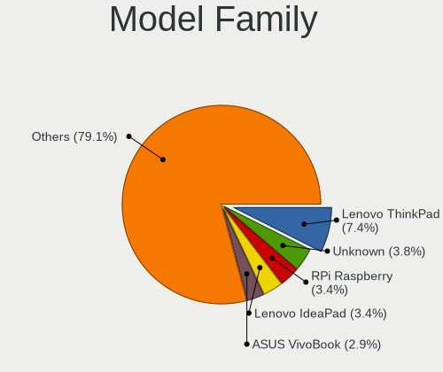
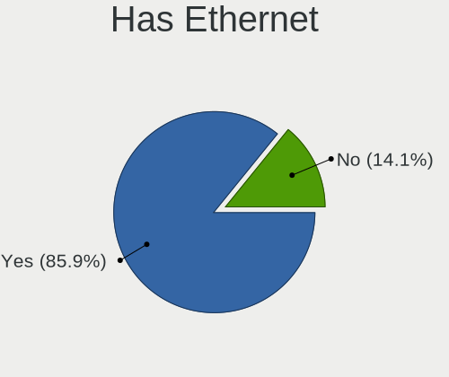
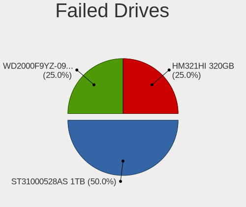
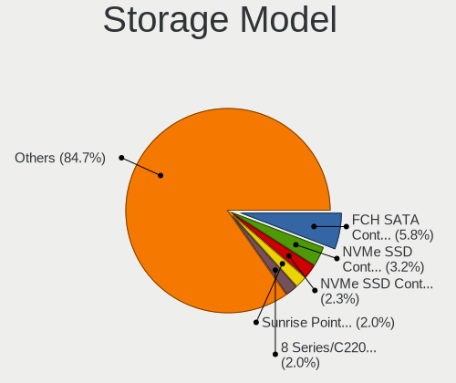
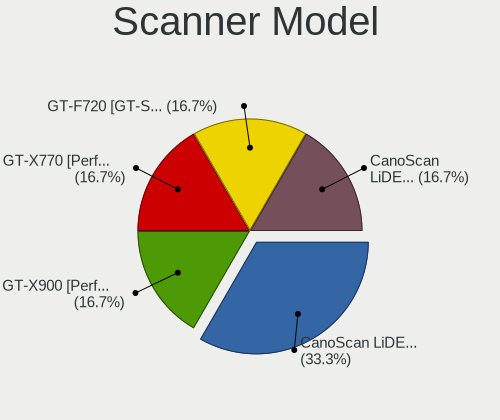

Debian - Hardware Trends
------------------------

A project to identify most popular hardware characteristics and track their change
over time based on data collected by Linux users at https://Linux-Hardware.org.

Anyone can contribute to this report by the [hw-probe](https://github.com/linuxhw/hw-probe) tool:

    sudo -E hw-probe -all -upload

This is a report for all computer types. See also reports for [desktops](/Dist/Debian/Desktop/README.md) and [notebooks](/Dist/Debian/Notebook/README.md).

This report is for one last month. Overall report since the beginning of time: [TestDays](https://github.com/linuxhw/TestDays)

Period: Feb, 2023.

Contents
--------

* [ System ](#system)
  - [ OS                       ](#os)
  - [ OS Family                ](#os-family)
  - [ Kernel                   ](#kernel)
  - [ Kernel Family            ](#kernel-family)
  - [ Kernel Major Ver.        ](#kernel-major-ver)
  - [ Arch                     ](#arch)
  - [ DE                       ](#de)
  - [ Display Server           ](#display-server)
  - [ Display Manager          ](#display-manager)
  - [ OS Lang                  ](#os-lang)
  - [ Boot Mode                ](#boot-mode)
  - [ Filesystem               ](#filesystem)
  - [ Part. scheme             ](#part-scheme)
  - [ Dual Boot with Linux/BSD ](#dual-boot-with-linuxbsd)
  - [ Dual Boot (Win)          ](#dual-boot-win)

* [ Board ](#board)
  - [ Vendor                   ](#vendor)
  - [ Model                    ](#model)
  - [ Model Family             ](#model-family)
  - [ MFG Year                 ](#mfg-year)
  - [ Form Factor              ](#form-factor)
  - [ Secure Boot              ](#secure-boot)
  - [ Coreboot                 ](#coreboot)
  - [ RAM Size                 ](#ram-size)
  - [ RAM Used                 ](#ram-used)
  - [ Total Drives             ](#total-drives)
  - [ Has CD-ROM               ](#has-cd-rom)
  - [ Has Ethernet             ](#has-ethernet)
  - [ Has WiFi                 ](#has-wifi)
  - [ Has Bluetooth            ](#has-bluetooth)

* [ Location ](#location)
  - [ Country                  ](#country)
  - [ City                     ](#city)

* [ Drives ](#drives)
  - [ Drive Vendor             ](#drive-vendor)
  - [ Drive Model              ](#drive-model)
  - [ HDD Vendor               ](#hdd-vendor)
  - [ SSD Vendor               ](#ssd-vendor)
  - [ Drive Kind               ](#drive-kind)
  - [ Drive Connector          ](#drive-connector)
  - [ Drive Size               ](#drive-size)
  - [ Space Total              ](#space-total)
  - [ Space Used               ](#space-used)
  - [ Malfunc. Drives          ](#malfunc-drives)
  - [ Malfunc. Drive Vendor    ](#malfunc-drive-vendor)
  - [ Malfunc. HDD Vendor      ](#malfunc-hdd-vendor)
  - [ Malfunc. Drive Kind      ](#malfunc-drive-kind)
  - [ Failed Drives            ](#failed-drives)
  - [ Failed Drive Vendor      ](#failed-drive-vendor)
  - [ Drive Status             ](#drive-status)

* [ Storage controller ](#storage-controller)
  - [ Storage Vendor           ](#storage-vendor)
  - [ Storage Model            ](#storage-model)
  - [ Storage Kind             ](#storage-kind)

* [ Processor ](#processor)
  - [ CPU Vendor               ](#cpu-vendor)
  - [ CPU Model                ](#cpu-model)
  - [ CPU Model Family         ](#cpu-model-family)
  - [ CPU Cores                ](#cpu-cores)
  - [ CPU Sockets              ](#cpu-sockets)
  - [ CPU Threads              ](#cpu-threads)
  - [ CPU Op-Modes             ](#cpu-op-modes)
  - [ CPU Microcode            ](#cpu-microcode)
  - [ CPU Microarch            ](#cpu-microarch)

* [ Graphics ](#graphics)
  - [ GPU Vendor               ](#gpu-vendor)
  - [ GPU Model                ](#gpu-model)
  - [ GPU Combo                ](#gpu-combo)
  - [ GPU Driver               ](#gpu-driver)
  - [ GPU Memory               ](#gpu-memory)

* [ Monitor ](#monitor)
  - [ Monitor Vendor           ](#monitor-vendor)
  - [ Monitor Model            ](#monitor-model)
  - [ Monitor Resolution       ](#monitor-resolution)
  - [ Monitor Diagonal         ](#monitor-diagonal)
  - [ Monitor Width            ](#monitor-width)
  - [ Aspect Ratio             ](#aspect-ratio)
  - [ Monitor Area             ](#monitor-area)
  - [ Pixel Density            ](#pixel-density)
  - [ Multiple Monitors        ](#multiple-monitors)

* [ Network ](#network)
  - [ Net Controller Vendor    ](#net-controller-vendor)
  - [ Net Controller Model     ](#net-controller-model)
  - [ Wireless Vendor          ](#wireless-vendor)
  - [ Wireless Model           ](#wireless-model)
  - [ Ethernet Vendor          ](#ethernet-vendor)
  - [ Ethernet Model           ](#ethernet-model)
  - [ Net Controller Kind      ](#net-controller-kind)
  - [ Used Controller          ](#used-controller)
  - [ NICs                     ](#nics)
  - [ IPv6                     ](#ipv6)

* [ Bluetooth ](#bluetooth)
  - [ Bluetooth Vendor         ](#bluetooth-vendor)
  - [ Bluetooth Model          ](#bluetooth-model)

* [ Sound ](#sound)
  - [ Sound Vendor             ](#sound-vendor)
  - [ Sound Model              ](#sound-model)

* [ Memory ](#memory)
  - [ Memory Vendor            ](#memory-vendor)
  - [ Memory Model             ](#memory-model)
  - [ Memory Kind              ](#memory-kind)
  - [ Memory Form Factor       ](#memory-form-factor)
  - [ Memory Size              ](#memory-size)
  - [ Memory Speed             ](#memory-speed)

* [ Printers & scanners ](#printers--scanners)
  - [ Printer Vendor           ](#printer-vendor)
  - [ Printer Model            ](#printer-model)
  - [ Scanner Vendor           ](#scanner-vendor)
  - [ Scanner Model            ](#scanner-model)

* [ Camera ](#camera)
  - [ Camera Vendor            ](#camera-vendor)
  - [ Camera Model             ](#camera-model)

* [ Security ](#security)
  - [ Fingerprint Vendor       ](#fingerprint-vendor)
  - [ Fingerprint Model        ](#fingerprint-model)
  - [ Chipcard Vendor          ](#chipcard-vendor)
  - [ Chipcard Model           ](#chipcard-model)

* [ Unsupported ](#unsupported)
  - [ Unsupported Devices      ](#unsupported-devices)
  - [ Unsupported Device Types ](#unsupported-device-types)

System
------

OS
--

Installed operating systems

| Name            | Computers | Percent |
|-----------------|-----------|---------|
| Debian 11       | 300       | 82.87%  |
| Debian          | 55        | 15.19%  |
| Debian 9        | 2         | 0.55%   |
| Debian 10       | 2         | 0.55%   |
| Debian Unstable | 1         | 0.28%   |
| Debian Sid      | 1         | 0.28%   |
| Debian 7        | 1         | 0.28%   |

OS Family
---------

OS without a version

| Name   | Computers | Percent |
|--------|-----------|---------|
| Debian | 362       | 100%    |

Kernel
------

Version of the Linux kernel

| Version                 | Computers | Percent |
|-------------------------|-----------|---------|
| 5.10.0-21-amd64         | 145       | 40.06%  |
| 5.10.0-20-amd64         | 35        | 9.67%   |
| 6.1.0-3-amd64           | 31        | 8.56%   |
| 5.10.0-2-amd64          | 17        | 4.7%    |
| 6.0.0-0.deb11.6-amd64   | 11        | 3.04%   |
| 5.15.74-1-pve           | 7         | 1.93%   |
| 5.10.0-18-amd64         | 7         | 1.93%   |
| 6.1.0-2-amd64           | 6         | 1.66%   |
| 5.15.85-1-pve           | 6         | 1.66%   |
| 5.13.19-6-pve           | 6         | 1.66%   |
| 6.1.0-4-amd64           | 5         | 1.38%   |
| 5.10.0-21-686-pae       | 5         | 1.38%   |
| 6.0.0-2-amd64           | 4         | 1.1%    |
| 5.15.84-v8+             | 4         | 1.1%    |
| 5.10.0-15-amd64         | 4         | 1.1%    |
| 5.18.0-0.deb11.4-amd64  | 3         | 0.83%   |
| 5.10.0-9-amd64          | 3         | 0.83%   |
| 5.10.0-20-686           | 3         | 0.83%   |
| 5.10.0-19-amd64         | 3         | 0.83%   |
| 6.1.0-5-amd64           | 2         | 0.55%   |
| 6.0.0-6-amd64           | 2         | 0.55%   |
| 5.16.0-0.bpo.4-amd64    | 2         | 0.55%   |
| 5.15.89-v8+             | 2         | 0.55%   |
| 5.15.83-1-pve           | 2         | 0.55%   |
| 5.10.0-21-686           | 2         | 0.55%   |
| 5.10.0-10-amd64         | 2         | 0.55%   |
| 6.1.9-x64v3-xanmod1     | 1         | 0.28%   |
| 6.1.9-titanide          | 1         | 0.28%   |
| 6.1.9-surface           | 1         | 0.28%   |
| 6.1.8-bcfs-oli+         | 1         | 0.28%   |
| 6.1.7                   | 1         | 0.28%   |
| 6.1.13-x64v1-xanmod1    | 1         | 0.28%   |
| 6.1.12-3-liquorix-amd64 | 1         | 0.28%   |
| 6.1.12-1-liquorix-amd64 | 1         | 0.28%   |
| 6.1.12                  | 1         | 0.28%   |
| 6.1.0-2mx-amd64         | 1         | 0.28%   |
| 6.1.0-1-amd64           | 1         | 0.28%   |
| 6.0.15-edge             | 1         | 0.28%   |
| 6.0.0-rc3-custom        | 1         | 0.28%   |
| 6.0.0-6mx-amd64         | 1         | 0.28%   |

Kernel Family
-------------

Linux kernel without a distro release

| Version  | Computers | Percent |
|----------|-----------|---------|
| 5.10.0   | 229       | 63.26%  |
| 6.1.0    | 46        | 12.71%  |
| 6.0.0    | 21        | 5.8%    |
| 5.15.74  | 7         | 1.93%   |
| 5.15.85  | 6         | 1.66%   |
| 5.13.19  | 6         | 1.66%   |
| 5.15.84  | 4         | 1.1%    |
| 6.1.9    | 3         | 0.83%   |
| 6.1.12   | 3         | 0.83%   |
| 5.18.0   | 3         | 0.83%   |
| 5.15.0   | 3         | 0.83%   |
| 5.19.0   | 2         | 0.55%   |
| 5.16.0   | 2         | 0.55%   |
| 5.15.94  | 2         | 0.55%   |
| 5.15.89  | 2         | 0.55%   |
| 5.15.83  | 2         | 0.55%   |
| 4.19.271 | 2         | 0.55%   |
| 4.19.0   | 2         | 0.55%   |
| 6.1.8    | 1         | 0.28%   |
| 6.1.7    | 1         | 0.28%   |
| 6.1.13   | 1         | 0.28%   |
| 6.0.15   | 1         | 0.28%   |
| 5.19.17  | 1         | 0.28%   |
| 5.15.90  | 1         | 0.28%   |
| 5.15.80  | 1         | 0.28%   |
| 5.15.79  | 1         | 0.28%   |
| 5.15.61  | 1         | 0.28%   |
| 5.15.30  | 1         | 0.28%   |
| 5.10.162 | 1         | 0.28%   |
| 5.10.153 | 1         | 0.28%   |
| 5.10.105 | 1         | 0.28%   |
| 4.9.79   | 1         | 0.28%   |
| 4.19.147 | 1         | 0.28%   |
| 4.14.254 | 1         | 0.28%   |
| 4.1.42   | 1         | 0.28%   |

Kernel Major Ver.
-----------------

Linux kernel major version

| Version | Computers | Percent |
|---------|-----------|---------|
| 5.10    | 232       | 64.09%  |
| 6.1     | 55        | 15.19%  |
| 5.15    | 31        | 8.56%   |
| 6.0     | 22        | 6.08%   |
| 5.13    | 6         | 1.66%   |
| 4.19    | 5         | 1.38%   |
| 5.19    | 3         | 0.83%   |
| 5.18    | 3         | 0.83%   |
| 5.16    | 2         | 0.55%   |
| 4.9     | 1         | 0.28%   |
| 4.14    | 1         | 0.28%   |
| 4.1     | 1         | 0.28%   |

Arch
----

OS architecture (x86_64, i586, etc.)

| Name    | Computers | Percent |
|---------|-----------|---------|
| x86_64  | 335       | 92.54%  |
| i686    | 10        | 2.76%   |
| aarch64 | 8         | 2.21%   |
| riscv64 | 2         | 0.55%   |
| armv7l  | 2         | 0.55%   |
| sparc64 | 1         | 0.28%   |
| ppc64le | 1         | 0.28%   |
| ppc64   | 1         | 0.28%   |
| mips64  | 1         | 0.28%   |
| i586    | 1         | 0.28%   |

DE
--

Desktop Environment

| Name             | Computers | Percent |
|------------------|-----------|---------|
| GNOME            | 102       | 28.18%  |
| Unknown          | 83        | 22.93%  |
| KDE5             | 51        | 14.09%  |
| XFCE             | 44        | 12.15%  |
| MATE             | 17        | 4.7%    |
| LXDE             | 15        | 4.14%   |
| X-Cinnamon       | 14        | 3.87%   |
| Cinnamon         | 9         | 2.49%   |
| openbox          | 7         | 1.93%   |
| LXQt             | 7         | 1.93%   |
| KDE              | 3         | 0.83%   |
| i3               | 3         | 0.83%   |
| lightdm-xsession | 2         | 0.55%   |
| GNOME Classic    | 2         | 0.55%   |
| xmonad           | 1         | 0.28%   |
| gnome-xorg       | 1         | 0.28%   |
| BunsenLabs       | 1         | 0.28%   |

Display Server
--------------

X11 or Wayland

| Name    | Computers | Percent |
|---------|-----------|---------|
| X11     | 192       | 53.04%  |
| Wayland | 71        | 19.61%  |
| Tty     | 53        | 14.64%  |
| Unknown | 46        | 12.71%  |

Display Manager
---------------

SDDM, LightDM, etc.

| Name    | Computers | Percent |
|---------|-----------|---------|
| Unknown | 125       | 34.53%  |
| LightDM | 98        | 27.07%  |
| GDM     | 65        | 17.96%  |
| SDDM    | 46        | 12.71%  |
| GDM3    | 22        | 6.08%   |
| XDM     | 2         | 0.55%   |
| LXDM    | 2         | 0.55%   |
| SLiM    | 1         | 0.28%   |
| Ly      | 1         | 0.28%   |

OS Lang
-------

Language

| Lang    | Computers | Percent |
|---------|-----------|---------|
| en_US   | 151       | 41.71%  |
| ru_RU   | 32        | 8.84%   |
| de_DE   | 26        | 7.18%   |
| en_GB   | 25        | 6.91%   |
| fr_FR   | 21        | 5.8%    |
| es_ES   | 13        | 3.59%   |
| C       | 11        | 3.04%   |
| Unknown | 10        | 2.76%   |
| it_IT   | 9         | 2.49%   |
| pl_PL   | 6         | 1.66%   |
| en_CA   | 5         | 1.38%   |
| zh_CN   | 4         | 1.1%    |
| pt_BR   | 4         | 1.1%    |
| nl_BE   | 3         | 0.83%   |
| fr_BE   | 3         | 0.83%   |
| es_MX   | 3         | 0.83%   |
| en_IN   | 3         | 0.83%   |
| ca_ES   | 3         | 0.83%   |
| sk_SK   | 2         | 0.55%   |
| pt_PT   | 2         | 0.55%   |
| fi_FI   | 2         | 0.55%   |
| es_AR   | 2         | 0.55%   |
| en_AU   | 2         | 0.55%   |
| de_CH   | 2         | 0.55%   |
| de_AT   | 2         | 0.55%   |
| zh_TW   | 1         | 0.28%   |
| sl_SI   | 1         | 0.28%   |
| lt_LT   | 1         | 0.28%   |
| ku_TR   | 1         | 0.28%   |
| ja_JP   | 1         | 0.28%   |
| hu_HU   | 1         | 0.28%   |
| fr_CA   | 1         | 0.28%   |
| es_VE   | 1         | 0.28%   |
| es_PE   | 1         | 0.28%   |
| es_GT   | 1         | 0.28%   |
| es_CL   | 1         | 0.28%   |
| en_NZ   | 1         | 0.28%   |
| en_IE   | 1         | 0.28%   |
| en_DE   | 1         | 0.28%   |
| cv_RU   | 1         | 0.28%   |

Boot Mode
---------

EFI or BIOS

| Mode | Computers | Percent |
|------|-----------|---------|
| EFI  | 215       | 59.39%  |
| BIOS | 147       | 40.61%  |

Filesystem
----------

Type of filesystem

| Type    | Computers | Percent |
|---------|-----------|---------|
| Ext4    | 287       | 79.28%  |
| Overlay | 41        | 11.33%  |
| Zfs     | 16        | 4.42%   |
| Btrfs   | 13        | 3.59%   |
| Xfs     | 3         | 0.83%   |
| Tmpfs   | 1         | 0.28%   |
| Ext3    | 1         | 0.28%   |

Part. scheme
------------

Scheme of partitioning

| Type    | Computers | Percent |
|---------|-----------|---------|
| GPT     | 239       | 66.02%  |
| MBR     | 80        | 22.1%   |
| Unknown | 43        | 11.88%  |

Dual Boot with Linux/BSD
------------------------

Hosting more than one Linux/BSD

| Dual boot | Computers | Percent |
|-----------|-----------|---------|
| No        | 304       | 83.98%  |
| Yes       | 58        | 16.02%  |

Dual Boot (Win)
---------------

Hosting Linux and Windows

| Dual boot | Computers | Percent |
|-----------|-----------|---------|
| No        | 266       | 73.48%  |
| Yes       | 96        | 26.52%  |

Board
-----

Vendor
------

Motherboard manufacturer

| Name                                 | Computers | Percent |
|--------------------------------------|-----------|---------|
| ASUSTek Computer                     | 55        | 15.19%  |
| Lenovo                               | 50        | 13.81%  |
| Dell                                 | 43        | 11.88%  |
| Hewlett-Packard                      | 36        | 9.94%   |
| Gigabyte Technology                  | 20        | 5.52%   |
| Intel                                | 17        | 4.7%    |
| Acer                                 | 16        | 4.42%   |
| Unknown                              | 13        | 3.59%   |
| ASRock                               | 12        | 3.31%   |
| MSI                                  | 10        | 2.76%   |
| Apple                                | 8         | 2.21%   |
| Raspberry Pi Foundation              | 7         | 1.93%   |
| HUAWEI                               | 5         | 1.38%   |
| Google                               | 5         | 1.38%   |
| AZW                                  | 5         | 1.38%   |
| Samsung Electronics                  | 4         | 1.1%    |
| Notebook                             | 4         | 1.1%    |
| Toshiba                              | 3         | 0.83%   |
| ASRockRack                           | 3         | 0.83%   |
| Aquarius                             | 3         | 0.83%   |
| Supermicro                           | 2         | 0.55%   |
| SmbiosType1_SystemManufacturer       | 2         | 0.55%   |
| Panasonic                            | 2         | 0.55%   |
| Microsoft                            | 2         | 0.55%   |
| Medion                               | 2         | 0.55%   |
| IBM                                  | 2         | 0.55%   |
| ECS                                  | 2         | 0.55%   |
| Xunlong                              | 1         | 0.28%   |
| Umbrel                               | 1         | 0.28%   |
| TYAN Computer                        | 1         | 0.28%   |
| TUXEDO                               | 1         | 0.28%   |
| Timi                                 | 1         | 0.28%   |
| SLIMBOOK                             | 1         | 0.28%   |
| Shenzhen Meigao Electronic Equipment | 1         | 0.28%   |
| Shanghai Zhaoxin Semiconductor       | 1         | 0.28%   |
| Semp Toshiba                         | 1         | 0.28%   |
| Seeed Studio                         | 1         | 0.28%   |
| retsamarret                          | 1         | 0.28%   |
| Pegatron                             | 1         | 0.28%   |
| Olimex                               | 1         | 0.28%   |

Model
-----

Motherboard model

| Name                                                         | Computers | Percent |
|--------------------------------------------------------------|-----------|---------|
| Unknown                                                      | 13        | 3.59%   |
| RPi Raspberry Pi 4 Model B Rev 1.2                           | 3         | 0.83%   |
| Intel H61                                                    | 3         | 0.83%   |
| Dell Precision 5570                                          | 3         | 0.83%   |
| AZW U59                                                      | 3         | 0.83%   |
| ASRock X300M-STX                                             | 3         | 0.83%   |
| SmbiosType1_SystemManufacturer SmbiosType1_SystemProductName | 2         | 0.55%   |
| RPi Raspberry Pi 4 Model B Rev 1.1                           | 2         | 0.55%   |
| MSI MS-7D30                                                  | 2         | 0.55%   |
| Intel Jasper Lake Client Platform                            | 2         | 0.55%   |
| HUAWEI WRT-WX9                                               | 2         | 0.55%   |
| HP Pavilion g6                                               | 2         | 0.55%   |
| HP Compaq Elite 8300 SFF                                     | 2         | 0.55%   |
| Gigabyte B550 GAMING X V2                                    | 2         | 0.55%   |
| Dell PowerEdge 1950                                          | 2         | 0.55%   |
| Dell OptiPlex 7010                                           | 2         | 0.55%   |
| Dell Latitude E6330                                          | 2         | 0.55%   |
| Dell Latitude E5430 non-vPro                                 | 2         | 0.55%   |
| AZW MINI S                                                   | 2         | 0.55%   |
| ASUS Pro WS WRX80E-SAGE SE WIFI                              | 2         | 0.55%   |
| ASUS AT4NM10T-I                                              | 2         | 0.55%   |
| Aquarius NS585                                               | 2         | 0.55%   |
| Apple MacBookAir7,2                                          | 2         | 0.55%   |
| Xunlong Orange Pi Zero                                       | 1         | 0.28%   |
| Umbrel Home                                                  | 1         | 0.28%   |
| TYAN CK8                                                     | 1         | 0.28%   |
| TUXEDO Aura 15 Gen2                                          | 1         | 0.28%   |
| Toshiba Satellite P775                                       | 1         | 0.28%   |
| Toshiba Satellite C660                                       | 1         | 0.28%   |
| Toshiba Satellite C655                                       | 1         | 0.28%   |
| Timi Mi Laptop Pro 15                                        | 1         | 0.28%   |
| Supermicro SYS-E300-9D-8CN8TP                                | 1         | 0.28%   |
| Supermicro Super Server                                      | 1         | 0.28%   |
| SLIMBOOK Essential15L                                        | 1         | 0.28%   |
| Shenzhen Meigao Electronic Equipment UM480                   | 1         | 0.28%   |
| Shanghai Zhaoxin ZXE CRB                                     | 1         | 0.28%   |
| Semp Toshiba IS 1412                                         | 1         | 0.28%   |
| Seeed Studio ODYSSEY-X86J4105                                | 1         | 0.28%   |
| Samsung R530/R730                                            | 1         | 0.28%   |
| Samsung N150P                                                | 1         | 0.28%   |

Model Family
------------

Motherboard model prefix

| Name                                       | Computers | Percent |
|--------------------------------------------|-----------|---------|
| Lenovo ThinkPad                            | 30        | 8.29%   |
| Dell Latitude                              | 16        | 4.42%   |
| Unknown                                    | 13        | 3.59%   |
| Acer Aspire                                | 9         | 2.49%   |
| RPi Raspberry                              | 7         | 1.93%   |
| HP Compaq                                  | 7         | 1.93%   |
| Dell Precision                             | 7         | 1.93%   |
| ASUS PRIME                                 | 7         | 1.93%   |
| HP EliteBook                               | 6         | 1.66%   |
| Dell PowerEdge                             | 6         | 1.66%   |
| Dell OptiPlex                              | 5         | 1.38%   |
| Lenovo IdeaPad                             | 4         | 1.1%    |
| HP ProBook                                 | 4         | 1.1%    |
| HP Pavilion                                | 4         | 1.1%    |
| Dell Inspiron                              | 4         | 1.1%    |
| ASUS ZenBook                               | 4         | 1.1%    |
| ASUS TUF                                   | 4         | 1.1%    |
| Toshiba Satellite                          | 3         | 0.83%   |
| Lenovo ThinkCentre                         | 3         | 0.83%   |
| Intel H61                                  | 3         | 0.83%   |
| Gigabyte B550                              | 3         | 0.83%   |
| AZW U59                                    | 3         | 0.83%   |
| ASUS VivoBook                              | 3         | 0.83%   |
| ASUS ROG                                   | 3         | 0.83%   |
| ASUS Pro                                   | 3         | 0.83%   |
| ASRock X300M-STX                           | 3         | 0.83%   |
| SmbiosType1_SystemManufacturer SmbiosType1 | 2         | 0.55%   |
| MSI MS-7D30                                | 2         | 0.55%   |
| Microsoft Surface                          | 2         | 0.55%   |
| Intel Jasper                               | 2         | 0.55%   |
| HUAWEI WRT-WX9                             | 2         | 0.55%   |
| HP ZBook                                   | 2         | 0.55%   |
| HP Laptop                                  | 2         | 0.55%   |
| Gigabyte X299                              | 2         | 0.55%   |
| Gigabyte B450M                             | 2         | 0.55%   |
| Dell Vostro                                | 2         | 0.55%   |
| AZW MINI                                   | 2         | 0.55%   |
| ASUS AT4NM10T-I                            | 2         | 0.55%   |
| ASUS ASUS                                  | 2         | 0.55%   |
| ASRock X370                                | 2         | 0.55%   |

MFG Year
--------

Motherboard manufacture year

| Year    | Computers | Percent |
|---------|-----------|---------|
| 2022    | 46        | 12.71%  |
| 2021    | 43        | 11.88%  |
| 2020    | 32        | 8.84%   |
| 2012    | 31        | 8.56%   |
| 2019    | 26        | 7.18%   |
| 2017    | 25        | 6.91%   |
| 2013    | 19        | 5.25%   |
| 2018    | 18        | 4.97%   |
| 2014    | 18        | 4.97%   |
| 2016    | 16        | 4.42%   |
| Unknown | 15        | 4.14%   |
| 2009    | 14        | 3.87%   |
| 2015    | 13        | 3.59%   |
| 2011    | 13        | 3.59%   |
| 2008    | 9         | 2.49%   |
| 2010    | 7         | 1.93%   |
| 2007    | 7         | 1.93%   |
| 2006    | 6         | 1.66%   |
| 2023    | 2         | 0.55%   |
| 2005    | 2         | 0.55%   |

Form Factor
-----------

Physical design of the computer

| Name           | Computers | Percent |
|----------------|-----------|---------|
| Notebook       | 171       | 47.24%  |
| Desktop        | 142       | 39.23%  |
| Server         | 13        | 3.59%   |
| Mini pc        | 12        | 3.31%   |
| System on chip | 11        | 3.04%   |
| Convertible    | 8         | 2.21%   |
| Tablet         | 4         | 1.1%    |
| Stick pc       | 1         | 0.28%   |

Secure Boot
-----------

Enabled or disabled

| State    | Computers | Percent |
|----------|-----------|---------|
| Disabled | 335       | 92.54%  |
| Enabled  | 27        | 7.46%   |

Coreboot
--------

Have coreboot on board

| Used | Computers | Percent |
|------|-----------|---------|
| No   | 357       | 98.62%  |
| Yes  | 5         | 1.38%   |

RAM Size
--------

Total RAM memory

| Size in GB      | Computers | Percent |
|-----------------|-----------|---------|
| 16.01-24.0      | 77        | 21.27%  |
| 4.01-8.0        | 74        | 20.44%  |
| 3.01-4.0        | 54        | 14.92%  |
| 8.01-16.0       | 52        | 14.36%  |
| 32.01-64.0      | 40        | 11.05%  |
| 64.01-256.0     | 27        | 7.46%   |
| 1.01-2.0        | 13        | 3.59%   |
| 24.01-32.0      | 7         | 1.93%   |
| 2.01-3.0        | 5         | 1.38%   |
| 0.51-1.0        | 4         | 1.1%    |
| 0.01-0.5        | 4         | 1.1%    |
| Unknown         | 4         | 1.1%    |
| More than 256.0 | 1         | 0.28%   |

RAM Used
--------

Used RAM memory

| Used GB     | Computers | Percent |
|-------------|-----------|---------|
| 1.01-2.0    | 93        | 25.69%  |
| 2.01-3.0    | 67        | 18.51%  |
| 4.01-8.0    | 51        | 14.09%  |
| 0.51-1.0    | 48        | 13.26%  |
| 3.01-4.0    | 35        | 9.67%   |
| 0.01-0.5    | 26        | 7.18%   |
| 8.01-16.0   | 19        | 5.25%   |
| 16.01-24.0  | 8         | 2.21%   |
| 32.01-64.0  | 5         | 1.38%   |
| 24.01-32.0  | 4         | 1.1%    |
| Unknown     | 4         | 1.1%    |
| 64.01-256.0 | 2         | 0.55%   |

Total Drives
------------

Number of drives on board

| Drives | Computers | Percent |
|--------|-----------|---------|
| 1      | 223       | 61.6%   |
| 2      | 62        | 17.13%  |
| 3      | 33        | 9.12%   |
| 4      | 14        | 3.87%   |
| 6      | 9         | 2.49%   |
| 8      | 6         | 1.66%   |
| 7      | 5         | 1.38%   |
| 5      | 5         | 1.38%   |
| 0      | 3         | 0.83%   |
| 10     | 2         | 0.55%   |

Has CD-ROM
----------

Has CD-ROM on board

| Presented | Computers | Percent |
|-----------|-----------|---------|
| No        | 257       | 70.99%  |
| Yes       | 105       | 29.01%  |

Has Ethernet
------------

Has Ethernet on board

| Presented | Computers | Percent |
|-----------|-----------|---------|
| Yes       | 315       | 87.02%  |
| No        | 47        | 12.98%  |

Has WiFi
--------

Has WiFi module

| Presented | Computers | Percent |
|-----------|-----------|---------|
| Yes       | 234       | 64.64%  |
| No        | 128       | 35.36%  |

Has Bluetooth
-------------

Has Bluetooth module

| Presented | Computers | Percent |
|-----------|-----------|---------|
| Yes       | 198       | 54.7%   |
| No        | 164       | 45.3%   |

Location
--------

Country
-------

Geographic location (country)

| Country     | Computers | Percent |
|-------------|-----------|---------|
| USA         | 62        | 17.13%  |
| Germany     | 39        | 10.77%  |
| Russia      | 33        | 9.12%   |
| France      | 28        | 7.73%   |
| Spain       | 16        | 4.42%   |
| Italy       | 16        | 4.42%   |
| Brazil      | 15        | 4.14%   |
| UK          | 14        | 3.87%   |
| Belgium     | 11        | 3.04%   |
| Poland      | 9         | 2.49%   |
| China       | 9         | 2.49%   |
| Finland     | 8         | 2.21%   |
| Canada      | 7         | 1.93%   |
| Netherlands | 6         | 1.66%   |
| Malaysia    | 6         | 1.66%   |
| Hungary     | 6         | 1.66%   |
| India       | 5         | 1.38%   |
| Switzerland | 4         | 1.1%    |
| Mexico      | 4         | 1.1%    |
| Austria     | 4         | 1.1%    |
| Turkey      | 3         | 0.83%   |
| Portugal    | 3         | 0.83%   |
| Norway      | 3         | 0.83%   |
| Bulgaria    | 3         | 0.83%   |
| Belarus     | 3         | 0.83%   |
| Argentina   | 3         | 0.83%   |
| Taiwan      | 2         | 0.55%   |
| Sweden      | 2         | 0.55%   |
| Slovakia    | 2         | 0.55%   |
| Singapore   | 2         | 0.55%   |
| Romania     | 2         | 0.55%   |
| Iran        | 2         | 0.55%   |
| Indonesia   | 2         | 0.55%   |
| Guatemala   | 2         | 0.55%   |
| Czechia     | 2         | 0.55%   |
| Chile       | 2         | 0.55%   |
| Australia   | 2         | 0.55%   |
| Venezuela   | 1         | 0.28%   |
| Ukraine     | 1         | 0.28%   |
| Thailand    | 1         | 0.28%   |

City
----

Geographic location (city)

| City              | Computers | Percent |
|-------------------|-----------|---------|
| Voronezh          | 18        | 4.97%   |
| Paris             | 8         | 2.21%   |
| Bangor            | 7         | 1.93%   |
| Kuala Lumpur      | 6         | 1.66%   |
| Warsaw            | 4         | 1.1%    |
| Vienna            | 4         | 1.1%    |
| Seville           | 4         | 1.1%    |
| Helsinki          | 4         | 1.1%    |
| Bieligutai        | 4         | 1.1%    |
| St Petersburg     | 3         | 0.83%   |
| Sao Paulo         | 3         | 0.83%   |
| Palhaza           | 3         | 0.83%   |
| Onalaska          | 3         | 0.83%   |
| Moscow            | 3         | 0.83%   |
| Istanbul          | 3         | 0.83%   |
| Bocholt           | 3         | 0.83%   |
| Barcelona         | 3         | 0.83%   |
| Sofia             | 2         | 0.55%   |
| Singapore         | 2         | 0.55%   |
| San Francisco     | 2         | 0.55%   |
| Rillaar           | 2         | 0.55%   |
| Oslo              | 2         | 0.55%   |
| New York          | 2         | 0.55%   |
| New Taipei        | 2         | 0.55%   |
| Naessjoe          | 2         | 0.55%   |
| Munich            | 2         | 0.55%   |
| Minsk             | 2         | 0.55%   |
| Mexico City       | 2         | 0.55%   |
| Madrid            | 2         | 0.55%   |
| Londrina          | 2         | 0.55%   |
| Leopoldsburg      | 2         | 0.55%   |
| Jakarta           | 2         | 0.55%   |
| Hamburg           | 2         | 0.55%   |
| Guatemala City    | 2         | 0.55%   |
| Fredericksburg    | 2         | 0.55%   |
| Frankfurt am Main | 2         | 0.55%   |
| Curitiba          | 2         | 0.55%   |
| Cottbus           | 2         | 0.55%   |
| Cologne           | 2         | 0.55%   |
| Chicago           | 2         | 0.55%   |

Drives
------

Drive Vendor
------------

Hard drive vendors

| Vendor                    | Computers | Drives | Percent |
|---------------------------|-----------|--------|---------|
| Samsung Electronics       | 92        | 107    | 17.01%  |
| Seagate                   | 73        | 112    | 13.49%  |
| WDC                       | 65        | 102    | 12.01%  |
| Kingston                  | 34        | 36     | 6.28%   |
| SanDisk                   | 29        | 35     | 5.36%   |
| Crucial                   | 29        | 30     | 5.36%   |
| Unknown                   | 28        | 29     | 5.18%   |
| Toshiba                   | 26        | 41     | 4.81%   |
| China                     | 14        | 15     | 2.59%   |
| A-DATA Technology         | 11        | 13     | 2.03%   |
| PNY                       | 9         | 19     | 1.66%   |
| Hitachi                   | 9         | 11     | 1.66%   |
| Intel                     | 8         | 11     | 1.48%   |
| SK hynix                  | 6         | 6      | 1.11%   |
| HGST                      | 6         | 7      | 1.11%   |
| Apple                     | 6         | 6      | 1.11%   |
| Unknown                   | 5         | 5      | 0.92%   |
| Transcend                 | 4         | 4      | 0.74%   |
| SPCC                      | 4         | 4      | 0.74%   |
| Micron Technology         | 4         | 4      | 0.74%   |
| KIOXIA                    | 4         | 4      | 0.74%   |
| JMicron Technology        | 4         | 4      | 0.74%   |
| GOODRAM                   | 4         | 4      | 0.74%   |
| Apacer                    | 4         | 6      | 0.74%   |
| Team                      | 3         | 3      | 0.55%   |
| Silicon Motion            | 3         | 3      | 0.55%   |
| Phison                    | 3         | 3      | 0.55%   |
| OCZ                       | 3         | 3      | 0.55%   |
| Micron/Crucial Technology | 3         | 3      | 0.55%   |
| LITEON                    | 3         | 3      | 0.55%   |
| Corsair                   | 3         | 5      | 0.55%   |
| SABRENT                   | 2         | 2      | 0.37%   |
| Intenso                   | 2         | 2      | 0.37%   |
| Hoodisk                   | 2         | 2      | 0.37%   |
| Gigabyte Technology       | 2         | 2      | 0.37%   |
| FORESEE                   | 2         | 2      | 0.37%   |
| ZTE                       | 1         | 1      | 0.18%   |
| Western Digital           | 1         | 1      | 0.18%   |
| UMIS                      | 1         | 1      | 0.18%   |
| TO Exter                  | 1         | 1      | 0.18%   |

Drive Model
-----------

Hard drive models

| Model                            | Computers | Percent |
|----------------------------------|-----------|---------|
| Seagate ST2000DM008-2UB102 2TB   | 8         | 1.34%   |
| Kingston SV300S37A120G 120GB SSD | 7         | 1.17%   |
| Seagate ST500DM002-1BD142 500GB  | 6         | 1.01%   |
| Samsung SSD 980 PRO 1TB          | 6         | 1.01%   |
| Samsung SSD 980 1TB              | 6         | 1.01%   |
| Kingston SA400S37480G 480GB SSD  | 6         | 1.01%   |
| WDC WD10EZEX-08WN4A0 1TB         | 5         | 0.84%   |
| Samsung SSD 970 EVO Plus 1TB     | 5         | 0.84%   |
| Samsung SSD 860 EVO 500GB        | 5         | 0.84%   |
| PNY 1TB SATA SSD                 | 5         | 0.84%   |
| Kingston SA400S37240G 240GB SSD  | 5         | 0.84%   |
| Crucial CT500MX500SSD1 500GB     | 5         | 0.84%   |
| Crucial CT240BX500SSD1 240GB     | 5         | 0.84%   |
| Unknown                          | 5         | 0.84%   |
| Toshiba DT01ACA100 1TB           | 4         | 0.67%   |
| Samsung SSD 980 PRO 2TB          | 4         | 0.67%   |
| A-DATA SX8200PNP 256GB           | 4         | 0.67%   |
| Toshiba HDWD130 3TB              | 3         | 0.5%    |
| Seagate ST4000VN008-2DR166 4TB   | 3         | 0.5%    |
| Seagate ST2000LM015-2E8174 2TB   | 3         | 0.5%    |
| SanDisk NVMe SSD Drive 1TB       | 3         | 0.5%    |
| Samsung SSD 970 EVO Plus 2TB     | 3         | 0.5%    |
| Samsung PM9A1 NVMe 1024GB        | 3         | 0.5%    |
| Samsung MZVLB512HBJQ-000L7 512GB | 3         | 0.5%    |
| JMicron Generic 200GB            | 3         | 0.5%    |
| Corsair Force MP510 240GB        | 3         | 0.5%    |
| China 512GB SSD                  | 3         | 0.5%    |
| WDC WDS100T2B0A-00SM50 1TB SSD   | 2         | 0.34%   |
| WDC WD80 EFAX-68KNBN0 8TB        | 2         | 0.34%   |
| WDC WD5000AAKX-60U6AA0 500GB     | 2         | 0.34%   |
| WDC WD5000AAKX-00ERMA0 500GB     | 2         | 0.34%   |
| WDC WD40EZAZ-00SF3B0 4TB         | 2         | 0.34%   |
| WDC WD4003FFBX-68MU3N0 4TB       | 2         | 0.34%   |
| WDC WD10EARS-00Y5B1 1TB          | 2         | 0.34%   |
| Unknown SN128  128GB             | 2         | 0.34%   |
| Unknown MMC Card  32GB           | 2         | 0.34%   |
| Unknown MMC Card  128GB          | 2         | 0.34%   |
| Toshiba DT01ACA200 2TB           | 2         | 0.34%   |
| Toshiba DT01ACA050 500GB         | 2         | 0.34%   |
| Seagate ST3500413AS 500GB        | 2         | 0.34%   |

HDD Vendor
----------

Hard disk drive vendors

| Vendor              | Computers | Drives | Percent |
|---------------------|-----------|--------|---------|
| Seagate             | 70        | 109    | 39.77%  |
| WDC                 | 51        | 82     | 28.98%  |
| Toshiba             | 20        | 34     | 11.36%  |
| Samsung Electronics | 9         | 10     | 5.11%   |
| Hitachi             | 9         | 11     | 5.11%   |
| HGST                | 6         | 7      | 3.41%   |
| JMicron Technology  | 3         | 3      | 1.7%    |
| SABRENT             | 2         | 2      | 1.14%   |
| Unknown             | 1         | 1      | 0.57%   |
| IBM-ESXS            | 1         | 2      | 0.57%   |
| Fujitsu             | 1         | 1      | 0.57%   |
| China               | 1         | 1      | 0.57%   |
| ASMedia             | 1         | 1      | 0.57%   |
| Apple               | 1         | 1      | 0.57%   |

SSD Vendor
----------

Solid state drive vendors

| Vendor              | Computers | Drives | Percent |
|---------------------|-----------|--------|---------|
| Samsung Electronics | 29        | 30     | 16.38%  |
| Kingston            | 23        | 25     | 12.99%  |
| Crucial             | 22        | 23     | 12.43%  |
| SanDisk             | 16        | 17     | 9.04%   |
| China               | 13        | 14     | 7.34%   |
| WDC                 | 8         | 8      | 4.52%   |
| PNY                 | 7         | 17     | 3.95%   |
| A-DATA Technology   | 6         | 6      | 3.39%   |
| GOODRAM             | 4         | 4      | 2.26%   |
| Apple               | 4         | 4      | 2.26%   |
| Transcend           | 3         | 3      | 1.69%   |
| Team                | 3         | 3      | 1.69%   |
| OCZ                 | 3         | 3      | 1.69%   |
| Intel               | 3         | 6      | 1.69%   |
| Toshiba             | 2         | 2      | 1.13%   |
| SPCC                | 2         | 2      | 1.13%   |
| Micron Technology   | 2         | 2      | 1.13%   |
| Intenso             | 2         | 2      | 1.13%   |
| FORESEE             | 2         | 2      | 1.13%   |
| Apacer              | 2         | 2      | 1.13%   |
| TO Exter            | 1         | 1      | 0.56%   |
| Teelkoou            | 1         | 1      | 0.56%   |
| Supermicro          | 1         | 1      | 0.56%   |
| sk600               | 1         | 1      | 0.56%   |
| Seagate             | 1         | 1      | 0.56%   |
| Phison              | 1         | 1      | 0.56%   |
| NT-2TB              | 1         | 1      | 0.56%   |
| Netac               | 1         | 1      | 0.56%   |
| LITEON              | 1         | 1      | 0.56%   |
| Kolink              | 1         | 1      | 0.56%   |
| KingFast            | 1         | 1      | 0.56%   |
| Kimtigo             | 1         | 1      | 0.56%   |
| Hoodisk             | 1         | 1      | 0.56%   |
| Hewlett-Packard     | 1         | 1      | 0.56%   |
| Haizhide            | 1         | 1      | 0.56%   |
| Gigabyte Technology | 1         | 1      | 0.56%   |
| FUTURE              | 1         | 1      | 0.56%   |
| Emtec               | 1         | 1      | 0.56%   |
| Dogfish             | 1         | 1      | 0.56%   |
| BR                  | 1         | 1      | 0.56%   |

Drive Kind
----------

HDD or SSD

| Kind    | Computers | Drives | Percent |
|---------|-----------|--------|---------|
| SSD     | 158       | 196    | 32.51%  |
| HDD     | 145       | 265    | 29.84%  |
| NVMe    | 144       | 179    | 29.63%  |
| MMC     | 31        | 32     | 6.38%   |
| Unknown | 8         | 9      | 1.65%   |

Drive Connector
---------------

SATA, SAS, NVMe, etc.

| Type | Computers | Drives | Percent |
|------|-----------|--------|---------|
| SATA | 244       | 437    | 55.33%  |
| NVMe | 143       | 178    | 32.43%  |
| MMC  | 31        | 32     | 7.03%   |
| SAS  | 23        | 34     | 5.22%   |

Drive Size
----------

Size of hard drive

| Size in TB | Computers | Drives | Percent |
|------------|-----------|--------|---------|
| 0.01-0.5   | 191       | 247    | 58.95%  |
| 0.51-1.0   | 66        | 106    | 20.37%  |
| 1.01-2.0   | 39        | 57     | 12.04%  |
| 3.01-4.0   | 12        | 25     | 3.7%    |
| 2.01-3.0   | 7         | 8      | 2.16%   |
| 4.01-10.0  | 6         | 8      | 1.85%   |
| 10.01-20.0 | 3         | 10     | 0.93%   |

Space Total
-----------

Amount of disk space available on the file system

| Size in GB     | Computers | Percent |
|----------------|-----------|---------|
| 101-250        | 86        | 23.76%  |
| 251-500        | 66        | 18.23%  |
| 501-1000       | 49        | 13.54%  |
| Unknown        | 37        | 10.22%  |
| 1001-2000      | 28        | 7.73%   |
| 51-100         | 24        | 6.63%   |
| More than 3000 | 21        | 5.8%    |
| 1-20           | 20        | 5.52%   |
| 21-50          | 17        | 4.7%    |
| 2001-3000      | 14        | 3.87%   |

Space Used
----------

Amount of used disk space

| Used GB        | Computers | Percent |
|----------------|-----------|---------|
| 1-20           | 144       | 39.78%  |
| 101-250        | 43        | 11.88%  |
| Unknown        | 37        | 10.22%  |
| 21-50          | 36        | 9.94%   |
| 51-100         | 30        | 8.29%   |
| 501-1000       | 26        | 7.18%   |
| 251-500        | 20        | 5.52%   |
| 1001-2000      | 12        | 3.31%   |
| More than 3000 | 6         | 1.66%   |
| 2001-3000      | 6         | 1.66%   |
| 0              | 2         | 0.55%   |

Malfunc. Drives
---------------

Drive models with a malfunction

| Model                                                           | Computers | Drives | Percent |
|-----------------------------------------------------------------|-----------|--------|---------|
| WDC WD5000AAKX-00ERMA0 500GB                                    | 2         | 2      | 3.64%   |
| Seagate ST250DM000-1BD141 250GB                                 | 2         | 2      | 3.64%   |
| Seagate ST2000LM007-1R8174 2TB                                  | 2         | 2      | 3.64%   |
| WDC WD6400AAKS-75A7B0 640GB                                     | 1         | 1      | 1.82%   |
| WDC WD5000AAKX-60U6AA0 500GB                                    | 1         | 1      | 1.82%   |
| WDC WD40EFRX-68N32N0 4TB                                        | 1         | 3      | 1.82%   |
| WDC WD4000FYYZ-01UL1B2 4TB                                      | 1         | 1      | 1.82%   |
| WDC WD30EFRX-68EUZN0 3TB                                        | 1         | 1      | 1.82%   |
| WDC WD25EZRX-00MMMB0 2TB                                        | 1         | 1      | 1.82%   |
| WDC WD20EARX-00PASB0 2TB                                        | 1         | 1      | 1.82%   |
| WDC WD10JPVX-08JC3T5 1TB                                        | 1         | 1      | 1.82%   |
| WDC WD10EZEX-08WN4A0 1TB                                        | 1         | 1      | 1.82%   |
| WDC WD1003FBYX-01Y7B1 1TB                                       | 1         | 1      | 1.82%   |
| Toshiba MQ01ACF050 500GB                                        | 1         | 1      | 1.82%   |
| Toshiba MK5061GSYN 500GB                                        | 1         | 1      | 1.82%   |
| Toshiba DT01ACA100 1TB                                          | 1         | 1      | 1.82%   |
| Toshiba DT01ACA050 500GB                                        | 1         | 1      | 1.82%   |
| SPCC Solid State Disk 128GB                                     | 1         | 1      | 1.82%   |
| Seagate ST9500420AS 500GB                                       | 1         | 1      | 1.82%   |
| Seagate ST9500325AS 500GB                                       | 1         | 1      | 1.82%   |
| Seagate ST500DM002-1BD142 500GB                                 | 1         | 1      | 1.82%   |
| Seagate ST5000LM000-2AN170 5TB                                  | 1         | 2      | 1.82%   |
| Seagate ST4000NM0033-9ZM170 4TB                                 | 1         | 2      | 1.82%   |
| Seagate ST3500413AS 500GB                                       | 1         | 1      | 1.82%   |
| Seagate ST3320820AS 320GB                                       | 1         | 1      | 1.82%   |
| Seagate ST3320418AS 320GB                                       | 1         | 1      | 1.82%   |
| Seagate ST3200822A 200GB                                        | 1         | 1      | 1.82%   |
| Seagate ST3160215AS 160GB                                       | 1         | 1      | 1.82%   |
| Seagate ST3120811AS 120GB                                       | 1         | 1      | 1.82%   |
| Seagate ST2000VX000-9YW164 2TB                                  | 1         | 1      | 1.82%   |
| Seagate ST14000NM0018-2H4101 14TB                               | 1         | 2      | 1.82%   |
| Seagate ST1000DM003-9YN162 1TB                                  | 1         | 1      | 1.82%   |
| SanDisk SSD PLUS 120 GB                                         | 1         | 1      | 1.82%   |
| Samsung Electronics SSD 980 1TB                                 | 1         | 1      | 1.82%   |
| Samsung Electronics SSD 840 EVO 120GB                           | 1         | 1      | 1.82%   |
| Samsung Electronics NVMe SSD Controller SM981/PM981/PM983 250GB | 1         | 1      | 1.82%   |
| Samsung Electronics HM160HI 160GB                               | 1         | 1      | 1.82%   |
| Samsung Electronics HM100JC 100GB                               | 1         | 1      | 1.82%   |
| Samsung Electronics HM060HI 64GB                                | 1         | 1      | 1.82%   |
| Samsung Electronics HD321HJ 320GB                               | 1         | 1      | 1.82%   |

Malfunc. Drive Vendor
---------------------

Vendors of faulty drives

| Vendor              | Computers | Drives | Percent |
|---------------------|-----------|--------|---------|
| Seagate             | 18        | 21     | 33.33%  |
| WDC                 | 11        | 14     | 20.37%  |
| Samsung Electronics | 7         | 7      | 12.96%  |
| Toshiba             | 4         | 4      | 7.41%   |
| Intel               | 3         | 3      | 5.56%   |
| OCZ                 | 2         | 2      | 3.7%    |
| HGST                | 2         | 2      | 3.7%    |
| SPCC                | 1         | 1      | 1.85%   |
| SanDisk             | 1         | 1      | 1.85%   |
| PNY                 | 1         | 3      | 1.85%   |
| Kingston            | 1         | 1      | 1.85%   |
| JMicron Technology  | 1         | 1      | 1.85%   |
| Hitachi             | 1         | 1      | 1.85%   |
| A-DATA Technology   | 1         | 1      | 1.85%   |

Malfunc. HDD Vendor
-------------------

Vendors of faulty HDD drives

| Vendor              | Computers | Drives | Percent |
|---------------------|-----------|--------|---------|
| Seagate             | 18        | 21     | 43.9%   |
| WDC                 | 11        | 14     | 26.83%  |
| Toshiba             | 4         | 4      | 9.76%   |
| Samsung Electronics | 4         | 4      | 9.76%   |
| HGST                | 2         | 2      | 4.88%   |
| JMicron Technology  | 1         | 1      | 2.44%   |
| Hitachi             | 1         | 1      | 2.44%   |

Malfunc. Drive Kind
-------------------

Kinds of faulty drives

| Kind | Computers | Drives | Percent |
|------|-----------|--------|---------|
| HDD  | 38        | 47     | 76%     |
| SSD  | 10        | 13     | 20%     |
| NVMe | 2         | 2      | 4%      |

Failed Drives
-------------

Failed drive models

| Model                            | Computers | Drives | Percent |
|----------------------------------|-----------|--------|---------|
| Samsung Electronics SP0802N 80GB | 1         | 1      | 33.33%  |
| IBM-ESXS ST9300605SS 304GB       | 1         | 2      | 33.33%  |
| HGST HTS725050A7E630 500GB       | 1         | 2      | 33.33%  |

Failed Drive Vendor
-------------------

Failed drive vendors

| Vendor              | Computers | Drives | Percent |
|---------------------|-----------|--------|---------|
| Samsung Electronics | 1         | 1      | 33.33%  |
| IBM-ESXS            | 1         | 2      | 33.33%  |
| HGST                | 1         | 2      | 33.33%  |

Drive Status
------------

Number of failed and malfunc. drives

| Status   | Computers | Drives | Percent |
|----------|-----------|--------|---------|
| Works    | 259       | 448    | 63.48%  |
| Detected | 97        | 166    | 23.77%  |
| Malfunc  | 49        | 62     | 12.01%  |
| Failed   | 3         | 5      | 0.74%   |

Storage controller
------------------

Storage Vendor
--------------

Storage controller vendors

| Vendor                           | Computers | Percent |
|----------------------------------|-----------|---------|
| Intel                            | 222       | 46.15%  |
| AMD                              | 59        | 12.27%  |
| Samsung Electronics              | 58        | 12.06%  |
| SanDisk                          | 24        | 4.99%   |
| ASMedia Technology               | 15        | 3.12%   |
| Phison Electronics               | 13        | 2.7%    |
| Kingston Technology Company      | 12        | 2.49%   |
| Micron/Crucial Technology        | 10        | 2.08%   |
| SK hynix                         | 6         | 1.25%   |
| LSI Logic / Symbios Logic        | 6         | 1.25%   |
| Broadcom / LSI                   | 6         | 1.25%   |
| ADATA Technology                 | 6         | 1.25%   |
| Silicon Motion                   | 5         | 1.04%   |
| KIOXIA                           | 5         | 1.04%   |
| Toshiba America Info Systems     | 4         | 0.83%   |
| Nvidia                           | 4         | 0.83%   |
| JMicron Technology               | 4         | 0.83%   |
| Marvell Technology Group         | 3         | 0.62%   |
| Lite-On Technology               | 3         | 0.62%   |
| VIA Technologies                 | 2         | 0.42%   |
| ULi Electronics                  | 2         | 0.42%   |
| Silicon Integrated Systems [SiS] | 2         | 0.42%   |
| Micron Technology                | 2         | 0.42%   |
| Union Memory (Shenzhen)          | 1         | 0.21%   |
| Silicon Image                    | 1         | 0.21%   |
| MAXIO Technology (Hangzhou)      | 1         | 0.21%   |
| Jiangsu Huacun Elec.             | 1         | 0.21%   |
| IBM                              | 1         | 0.21%   |
| Biwin Storage Technology         | 1         | 0.21%   |
| Apple                            | 1         | 0.21%   |
| Adaptec                          | 1         | 0.21%   |

Storage Model
-------------

Storage controller models

| Model                                                                                   | Computers | Percent |
|-----------------------------------------------------------------------------------------|-----------|---------|
| AMD FCH SATA Controller [AHCI mode]                                                     | 37        | 6.67%   |
| Samsung NVMe SSD Controller SM981/PM981/PM983                                           | 19        | 3.42%   |
| Samsung NVMe SSD Controller PM9A1/PM9A3/980PRO                                          | 18        | 3.24%   |
| Intel 7 Series Chipset Family 6-port SATA Controller [AHCI mode]                        | 16        | 2.88%   |
| Intel Sunrise Point-LP SATA Controller [AHCI mode]                                      | 14        | 2.52%   |
| Samsung NVMe SSD Controller 980                                                         | 13        | 2.34%   |
| Intel Volume Management Device NVMe RAID Controller                                     | 13        | 2.34%   |
| Intel Jasper Lake SATA AHCI Controller                                                  | 13        | 2.34%   |
| ASMedia ASM1062 Serial ATA Controller                                                   | 13        | 2.34%   |
| Sandisk Non-Volatile memory controller                                                  | 11        | 1.98%   |
| Intel Comet Lake SATA AHCI Controller                                                   | 10        | 1.8%    |
| Intel 8 Series/C220 Series Chipset Family 6-port SATA Controller 1 [AHCI mode]          | 10        | 1.8%    |
| Intel 82801 Mobile SATA Controller [RAID mode]                                          | 9         | 1.62%   |
| Intel Alder Lake-S PCH SATA Controller [AHCI Mode]                                      | 8         | 1.44%   |
| Intel 8 Series SATA Controller 1 [AHCI mode]                                            | 8         | 1.44%   |
| Intel 7 Series/C210 Series Chipset Family 6-port SATA Controller [AHCI mode]            | 8         | 1.44%   |
| AMD SB7x0/SB8x0/SB9x0 SATA Controller [AHCI mode]                                       | 8         | 1.44%   |
| AMD 500 Series Chipset SATA Controller                                                  | 8         | 1.44%   |
| Phison E12 NVMe Controller                                                              | 7         | 1.26%   |
| Micron/Crucial P2 NVMe PCIe SSD                                                         | 7         | 1.26%   |
| Intel 6 Series/C200 Series Chipset Family Desktop SATA Controller (IDE mode, ports 4-5) | 7         | 1.26%   |
| Intel 6 Series/C200 Series Chipset Family Desktop SATA Controller (IDE mode, ports 0-3) | 7         | 1.26%   |
| Intel 200 Series PCH SATA controller [AHCI mode]                                        | 7         | 1.26%   |
| Intel Wildcat Point-LP SATA Controller [AHCI Mode]                                      | 6         | 1.08%   |
| Intel Tiger Lake-LP SATA Controller                                                     | 6         | 1.08%   |
| Intel 6 Series/C200 Series Chipset Family 6 port Desktop SATA AHCI Controller           | 6         | 1.08%   |
| Intel Cannon Lake PCH SATA AHCI Controller                                              | 5         | 0.9%    |
| ADATA XPG SX8200 Pro PCIe Gen3x4 M.2 2280 Solid State Drive                             | 5         | 0.9%    |
| SanDisk WD Black SN750 / PC SN730 NVMe SSD                                              | 4         | 0.72%   |
| Samsung NVMe SSD Controller SM961/PM961/SM963                                           | 4         | 0.72%   |
| Kingston Company A2000 NVMe SSD                                                         | 4         | 0.72%   |
| Intel SATA Controller [RAID mode]                                                       | 4         | 0.72%   |
| Intel Celeron/Pentium Silver Processor SATA Controller                                  | 4         | 0.72%   |
| Intel Celeron N3350/Pentium N4200/Atom E3900 Series SATA AHCI Controller                | 4         | 0.72%   |
| Intel Cannon Point-LP SATA Controller [AHCI Mode]                                       | 4         | 0.72%   |
| Intel Alder Lake-P SATA AHCI Controller                                                 | 4         | 0.72%   |
| Intel 82801IBM/IEM (ICH9M/ICH9M-E) 4 port SATA Controller [AHCI mode]                   | 4         | 0.72%   |
| AMD SB7x0/SB8x0/SB9x0 IDE Controller                                                    | 4         | 0.72%   |
| SanDisk WD Blue SN570 NVMe SSD                                                          | 3         | 0.54%   |
| SanDisk WD Black 2018/SN750 / PC SN720 NVMe SSD                                         | 3         | 0.54%   |

Storage Kind
------------

Kind of storage controller (IDE, SATA, NVMe, SAS, ...)

| Kind | Computers | Percent |
|------|-----------|---------|
| SATA | 240       | 50%     |
| NVMe | 143       | 29.79%  |
| IDE  | 53        | 11.04%  |
| RAID | 35        | 7.29%   |
| SAS  | 7         | 1.46%   |
| SCSI | 2         | 0.42%   |

Processor
---------

CPU Vendor
----------

Processor vendors

| Vendor            | Computers | Percent |
|-------------------|-----------|---------|
| Intel             | 268       | 74.03%  |
| AMD               | 76        | 20.99%  |
| ARM               | 10        | 2.76%   |
| sifive,u74-mc     | 2         | 0.55%   |
| CentaurHauls      | 2         | 0.55%   |
| Unknown           | 2         | 0.55%   |
| PowerNV C829UAG3  | 1         | 0.28%   |
| CHRP IBM,8233-E8B | 1         | 0.28%   |

CPU Model
---------

Processor models

| Model                                   | Computers | Percent |
|-----------------------------------------|-----------|---------|
| Intel Celeron N5105 @ 2.00GHz           | 10        | 2.76%   |
| ARM Processor                           | 8         | 2.21%   |
| Intel Core i5-10210U CPU @ 1.60GHz      | 6         | 1.66%   |
| Intel Core i5-5300U CPU @ 2.30GHz       | 5         | 1.38%   |
| Intel 11th Gen Core i5-1135G7 @ 2.40GHz | 5         | 1.38%   |
| Intel Celeron CPU N3350 @ 1.10GHz       | 4         | 1.1%    |
| Intel 12th Gen Core i7-12700H           | 4         | 1.1%    |
| AMD Ryzen 5 5600X 6-Core Processor      | 4         | 1.1%    |
| Intel Core i7-8550U CPU @ 1.80GHz       | 3         | 0.83%   |
| Intel Core i7-7500U CPU @ 2.70GHz       | 3         | 0.83%   |
| Intel Core i7-10510U CPU @ 1.80GHz      | 3         | 0.83%   |
| Intel Core i5-8265U CPU @ 1.60GHz       | 3         | 0.83%   |
| Intel Core i5-8250U CPU @ 1.60GHz       | 3         | 0.83%   |
| Intel Core i5-3210M CPU @ 2.50GHz       | 3         | 0.83%   |
| Intel Core i3-3220 CPU @ 3.30GHz        | 3         | 0.83%   |
| Intel 12th Gen Core i7-1255U            | 3         | 0.83%   |
| AMD Ryzen 9 5950X 16-Core Processor     | 3         | 0.83%   |
| AMD Ryzen 7 5800H with Radeon Graphics  | 3         | 0.83%   |
| AMD Ryzen 7 5700G with Radeon Graphics  | 3         | 0.83%   |
| AMD Ryzen 7 4800U with Radeon Graphics  | 3         | 0.83%   |
| AMD FX-8350 Eight-Core Processor        | 3         | 0.83%   |
| sifive,u74-mc rv64imafdc                | 2         | 0.55%   |
| Intel Xeon CPU X5355 @ 2.66GHz          | 2         | 0.55%   |
| Intel Xeon CPU E5-2696 v3 @ 2.30GHz     | 2         | 0.55%   |
| Intel Core i7-8565U CPU @ 1.80GHz       | 2         | 0.55%   |
| Intel Core i7-7700 CPU @ 3.60GHz        | 2         | 0.55%   |
| Intel Core i7-7600U CPU @ 2.80GHz       | 2         | 0.55%   |
| Intel Core i7-4710MQ CPU @ 2.50GHz      | 2         | 0.55%   |
| Intel Core i7-3770 CPU @ 3.40GHz        | 2         | 0.55%   |
| Intel Core i7-3540M CPU @ 3.00GHz       | 2         | 0.55%   |
| Intel Core i5-7200U CPU @ 2.50GHz       | 2         | 0.55%   |
| Intel Core i5-5250U CPU @ 1.60GHz       | 2         | 0.55%   |
| Intel Core i5-4570 CPU @ 3.20GHz        | 2         | 0.55%   |
| Intel Core i5-4200U CPU @ 1.60GHz       | 2         | 0.55%   |
| Intel Core i5-3470 CPU @ 3.20GHz        | 2         | 0.55%   |
| Intel Core i5-3340M CPU @ 2.70GHz       | 2         | 0.55%   |
| Intel Core i5-3320M CPU @ 2.60GHz       | 2         | 0.55%   |
| Intel Core i5-3230M CPU @ 2.60GHz       | 2         | 0.55%   |
| Intel Core i5-2520M CPU @ 2.50GHz       | 2         | 0.55%   |
| Intel Core i5-10500 CPU @ 3.10GHz       | 2         | 0.55%   |

CPU Model Family
----------------

Processor model prefix

| Model                   | Computers | Percent |
|-------------------------|-----------|---------|
| Intel Core i5           | 68        | 18.78%  |
| Other                   | 54        | 14.92%  |
| Intel Core i7           | 42        | 11.6%   |
| Intel Celeron           | 32        | 8.84%   |
| Intel Core i3           | 26        | 7.18%   |
| AMD Ryzen 7             | 19        | 5.25%   |
| Intel Xeon              | 17        | 4.7%    |
| AMD Ryzen 5             | 14        | 3.87%   |
| Intel Core 2 Duo        | 10        | 2.76%   |
| Intel Atom              | 9         | 2.49%   |
| Intel Pentium           | 8         | 2.21%   |
| AMD Ryzen 9             | 7         | 1.93%   |
| AMD Ryzen Threadripper  | 4         | 1.1%    |
| AMD FX                  | 4         | 1.1%    |
| Intel Core i9           | 3         | 0.83%   |
| Intel Core 2            | 3         | 0.83%   |
| Intel Pentium Dual-Core | 2         | 0.55%   |
| Intel Pentium Dual      | 2         | 0.55%   |
| Intel Core 2 Quad       | 2         | 0.55%   |
| ARM Allwinner           | 2         | 0.55%   |
| AMD Ryzen 7 PRO         | 2         | 0.55%   |
| AMD EPYC                | 2         | 0.55%   |
| AMD E1                  | 2         | 0.55%   |
| AMD C-50                | 2         | 0.55%   |
| AMD Athlon 64 X2        | 2         | 0.55%   |
| AMD A8                  | 2         | 0.55%   |
| AMD A4                  | 2         | 0.55%   |
| Intel Xeon Bronze       | 1         | 0.28%   |
| Intel Pentium Silver    | 1         | 0.28%   |
| Intel Pentium M         | 1         | 0.28%   |
| Intel Pentium Gold      | 1         | 0.28%   |
| Intel Pentium D         | 1         | 0.28%   |
| Intel Pentium 4         | 1         | 0.28%   |
| Intel Genuine           | 1         | 0.28%   |
| Intel Core m7           | 1         | 0.28%   |
| AMD Turion 64 Mobile    | 1         | 0.28%   |
| AMD Ryzen 5 PRO         | 1         | 0.28%   |
| AMD Ryzen 3 PRO         | 1         | 0.28%   |
| AMD Ryzen 3             | 1         | 0.28%   |
| AMD Quad-Core Opteron   | 1         | 0.28%   |

CPU Cores
---------

Number of processor cores

| Number  | Computers | Percent |
|---------|-----------|---------|
| 2       | 125       | 34.53%  |
| 4       | 119       | 32.87%  |
| 8       | 35        | 9.67%   |
| 6       | 28        | 7.73%   |
| 1       | 12        | 3.31%   |
| 16      | 11        | 3.04%   |
| 12      | 10        | 2.76%   |
| 10      | 10        | 2.76%   |
| 14      | 4         | 1.1%    |
| Unknown | 3         | 0.83%   |
| 32      | 2         | 0.55%   |
| 36      | 1         | 0.28%   |
| 22      | 1         | 0.28%   |
| 18      | 1         | 0.28%   |

CPU Sockets
-----------

Number of sockets

| Number  | Computers | Percent |
|---------|-----------|---------|
| 1       | 349       | 96.41%  |
| 2       | 9         | 2.49%   |
| Unknown | 3         | 0.83%   |
| 8       | 1         | 0.28%   |

CPU Threads
-----------

Threads per core (Hyper-Threading)

| Number  | Computers | Percent |
|---------|-----------|---------|
| 2       | 219       | 60.5%   |
| 1       | 138       | 38.12%  |
| Unknown | 3         | 0.83%   |
| 8       | 1         | 0.28%   |
| 4       | 1         | 0.28%   |

CPU Op-Modes
------------

CPU Operation Modes (32-bit, 64-bit)

| Op mode        | Computers | Percent |
|----------------|-----------|---------|
| 32-bit, 64-bit | 351       | 96.96%  |
| Unknown        | 6         | 1.66%   |
| 32-bit         | 4         | 1.1%    |
| 64-bit         | 1         | 0.28%   |

CPU Microcode
-------------

Microcode number

| Number     | Computers | Percent |
|------------|-----------|---------|
| Unknown    | 76        | 20.99%  |
| 0x306a9    | 25        | 6.91%   |
| 0x206a7    | 13        | 3.59%   |
| 0x906c0    | 12        | 3.31%   |
| 0x806ec    | 12        | 3.31%   |
| 0x306c3    | 11        | 3.04%   |
| 0x806e9    | 9         | 2.49%   |
| 0x40651    | 9         | 2.49%   |
| 0x1067a    | 9         | 2.49%   |
| 0x806c1    | 8         | 2.21%   |
| 0x906a4    | 7         | 1.93%   |
| 0x806ea    | 7         | 1.93%   |
| 0x906a3    | 6         | 1.66%   |
| 0x306d4    | 6         | 1.66%   |
| 0x0a50000d | 6         | 1.66%   |
| 0x0a50000c | 6         | 1.66%   |
| 0x906ea    | 5         | 1.38%   |
| 0x90672    | 5         | 1.38%   |
| 0x906e9    | 4         | 1.1%    |
| 0x506c9    | 4         | 1.1%    |
| 0x406c4    | 4         | 1.1%    |
| 0x20655    | 4         | 1.1%    |
| 0x0a201016 | 4         | 1.1%    |
| 0x08600106 | 4         | 1.1%    |
| 0xa0652    | 3         | 0.83%   |
| 0x906ed    | 3         | 0.83%   |
| 0x806eb    | 3         | 0.83%   |
| 0x706a8    | 3         | 0.83%   |
| 0x6fb      | 3         | 0.83%   |
| 0x506e3    | 3         | 0.83%   |
| 0x50654    | 3         | 0.83%   |
| 0x406e3    | 3         | 0.83%   |
| 0x206c2    | 3         | 0.83%   |
| 0x106ca    | 3         | 0.83%   |
| 0x0800820d | 3         | 0.83%   |
| 0xb0671    | 2         | 0.55%   |
| 0xa0671    | 2         | 0.55%   |
| 0x906eb    | 2         | 0.55%   |
| 0x90661    | 2         | 0.55%   |
| 0x806d1    | 2         | 0.55%   |

CPU Microarch
-------------

Microarchitecture

| Name             | Computers | Percent |
|------------------|-----------|---------|
| KabyLake         | 52        | 14.36%  |
| Unknown          | 32        | 8.84%   |
| IvyBridge        | 31        | 8.56%   |
| Haswell          | 27        | 7.46%   |
| Zen 3            | 24        | 6.63%   |
| SandyBridge      | 18        | 4.97%   |
| Alderlake Hybrid | 15        | 4.14%   |
| Tremont          | 14        | 3.87%   |
| Skylake          | 14        | 3.87%   |
| Zen 2            | 13        | 3.59%   |
| Penryn           | 13        | 3.59%   |
| TigerLake        | 9         | 2.49%   |
| Core             | 9         | 2.49%   |
| Westmere         | 8         | 2.21%   |
| Silvermont       | 8         | 2.21%   |
| Broadwell        | 8         | 2.21%   |
| Zen+             | 6         | 1.66%   |
| Zen              | 6         | 1.66%   |
| Piledriver       | 6         | 1.66%   |
| Goldmont plus    | 6         | 1.66%   |
| CometLake        | 6         | 1.66%   |
| K10              | 5         | 1.38%   |
| Goldmont         | 5         | 1.38%   |
| Bonnell          | 5         | 1.38%   |
| Icelake          | 4         | 1.1%    |
| K8 Hammer        | 3         | 0.83%   |
| Puma             | 2         | 0.55%   |
| P6               | 2         | 0.55%   |
| NetBurst         | 2         | 0.55%   |
| Nehalem          | 2         | 0.55%   |
| Excavator        | 2         | 0.55%   |
| Bobcat           | 2         | 0.55%   |
| K10 Llano        | 1         | 0.28%   |
| Jaguar           | 1         | 0.28%   |
| Geode            | 1         | 0.28%   |

Graphics
--------

GPU Vendor
----------

Vendors of graphics cards

| Vendor                                       | Computers | Percent |
|----------------------------------------------|-----------|---------|
| Intel                                        | 218       | 55.19%  |
| Nvidia                                       | 83        | 21.01%  |
| AMD                                          | 74        | 18.73%  |
| ASPEED Technology                            | 9         | 2.28%   |
| Matrox Electronics Systems                   | 7         | 1.77%   |
| Zhaoxin                                      | 2         | 0.51%   |
| XGI Technology (eXtreme Graphics Innovation) | 1         | 0.25%   |
| Silicon Integrated Systems [SiS]             | 1         | 0.25%   |

GPU Model
---------

Graphics card models

| Model                                                                                    | Computers | Percent |
|------------------------------------------------------------------------------------------|-----------|---------|
| Intel 3rd Gen Core processor Graphics Controller                                         | 17        | 4.24%   |
| Intel 2nd Generation Core Processor Family Integrated Graphics Controller                | 14        | 3.49%   |
| Intel JasperLake [UHD Graphics]                                                          | 13        | 3.24%   |
| AMD Cezanne [Radeon Vega Series / Radeon Vega Mobile Series]                             | 13        | 3.24%   |
| Intel HD Graphics 620                                                                    | 10        | 2.49%   |
| Intel Haswell-ULT Integrated Graphics Controller                                         | 9         | 2.24%   |
| Intel CometLake-U GT2 [UHD Graphics]                                                     | 9         | 2.24%   |
| ASPEED Technology ASPEED Graphics Family                                                 | 9         | 2.24%   |
| Intel Xeon E3-1200 v2/3rd Gen Core processor Graphics Controller                         | 7         | 1.75%   |
| Intel UHD Graphics 620                                                                   | 7         | 1.75%   |
| Intel TigerLake-LP GT2 [Iris Xe Graphics]                                                | 7         | 1.75%   |
| Intel Alder Lake-P Integrated Graphics Controller                                        | 7         | 1.75%   |
| AMD Renoir                                                                               | 7         | 1.75%   |
| Intel WhiskeyLake-U GT2 [UHD Graphics 620]                                               | 6         | 1.5%    |
| Intel HD Graphics 5500                                                                   | 6         | 1.5%    |
| Intel GeminiLake [UHD Graphics 600]                                                      | 6         | 1.5%    |
| Intel Atom/Celeron/Pentium Processor x5-E8000/J3xxx/N3xxx Integrated Graphics Controller | 6         | 1.5%    |
| Intel Xeon E3-1200 v3/4th Gen Core Processor Integrated Graphics Controller              | 5         | 1.25%   |
| Intel Skylake GT2 [HD Graphics 520]                                                      | 5         | 1.25%   |
| Intel Mobile 4 Series Chipset Integrated Graphics Controller                             | 5         | 1.25%   |
| Intel HD Graphics 500                                                                    | 5         | 1.25%   |
| Intel CoffeeLake-S GT2 [UHD Graphics 630]                                                | 5         | 1.25%   |
| Intel Alder Lake-UP3 GT2 [Iris Xe Graphics]                                              | 5         | 1.25%   |
| Intel 4th Gen Core Processor Integrated Graphics Controller                              | 5         | 1.25%   |
| Intel HD Graphics 630                                                                    | 4         | 1%      |
| Intel CoffeeLake-H GT2 [UHD Graphics 630]                                                | 4         | 1%      |
| Intel 4 Series Chipset Integrated Graphics Controller                                    | 4         | 1%      |
| Nvidia GP107 [GeForce GTX 1050 Ti]                                                       | 3         | 0.75%   |
| Nvidia GK208B [GeForce GT 710]                                                           | 3         | 0.75%   |
| Nvidia GA107GLM [RTX A1000 Laptop GPU]                                                   | 3         | 0.75%   |
| Nvidia GA106M [GeForce RTX 3060 Mobile / Max-Q]                                          | 3         | 0.75%   |
| Nvidia GA102 [GeForce RTX 3090]                                                          | 3         | 0.75%   |
| Intel Core Processor Integrated Graphics Controller                                      | 3         | 0.75%   |
| Intel Atom Processor D4xx/D5xx/N4xx/N5xx Integrated Graphics Controller                  | 3         | 0.75%   |
| AMD Sun XT [Radeon HD 8670A/8670M/8690M / R5 M330 / M430 / Radeon 520 Mobile]            | 3         | 0.75%   |
| AMD Picasso/Raven 2 [Radeon Vega Series / Radeon Vega Mobile Series]                     | 3         | 0.75%   |
| AMD Navi 23 [Radeon RX 6600/6600 XT/6600M]                                               | 3         | 0.75%   |
| AMD ES1000                                                                               | 3         | 0.75%   |
| Zhaoxin ZX-E C-960 GPU                                                                   | 2         | 0.5%    |
| Nvidia TU117M                                                                            | 2         | 0.5%    |

GPU Combo
---------

Combinations of graphics cards

| Name            | Computers | Percent |
|-----------------|-----------|---------|
| 1 x Intel       | 179       | 49.45%  |
| 1 x AMD         | 61        | 16.85%  |
| 1 x Nvidia      | 41        | 11.33%  |
| Intel + Nvidia  | 31        | 8.56%   |
| Other           | 16        | 4.42%   |
| 1 x Matrox      | 7         | 1.93%   |
| AMD + Nvidia    | 6         | 1.66%   |
| 1 x ASPEED      | 5         | 1.38%   |
| Intel + AMD     | 4         | 1.1%    |
| Nvidia + ASPEED | 3         | 0.83%   |
| 2 x AMD         | 2         | 0.55%   |
| 1 x Zhaoxin     | 2         | 0.55%   |
| 2 x Nvidia      | 1         | 0.28%   |
| 2 x Intel       | 1         | 0.28%   |
| 1 x SiS         | 1         | 0.28%   |
| Nvidia + XGI    | 1         | 0.28%   |
| AMD + ASPEED    | 1         | 0.28%   |

GPU Driver
----------

Free vs proprietary

| Driver      | Computers | Percent |
|-------------|-----------|---------|
| Free        | 259       | 71.55%  |
| Unknown     | 75        | 20.72%  |
| Proprietary | 28        | 7.73%   |

GPU Memory
----------

Total video memory

| Size in GB | Computers | Percent |
|------------|-----------|---------|
| Unknown    | 280       | 77.35%  |
| 0.01-0.5   | 28        | 7.73%   |
| 1.01-2.0   | 15        | 4.14%   |
| 3.01-4.0   | 13        | 3.59%   |
| 0.51-1.0   | 9         | 2.49%   |
| 7.01-8.0   | 8         | 2.21%   |
| 8.01-16.0  | 4         | 1.1%    |
| 5.01-6.0   | 3         | 0.83%   |
| 2.01-3.0   | 1         | 0.28%   |
| 16.01-24.0 | 1         | 0.28%   |

Monitor
-------

Monitor Vendor
--------------

Monitor vendors

| Vendor                  | Computers | Percent |
|-------------------------|-----------|---------|
| Samsung Electronics     | 29        | 10.21%  |
| AU Optronics            | 27        | 9.51%   |
| Chimei Innolux          | 25        | 8.8%    |
| LG Display              | 24        | 8.45%   |
| BOE                     | 24        | 8.45%   |
| Dell                    | 19        | 6.69%   |
| Goldstar                | 15        | 5.28%   |
| Hewlett-Packard         | 11        | 3.87%   |
| AOC                     | 9         | 3.17%   |
| BenQ                    | 8         | 2.82%   |
| Philips                 | 7         | 2.46%   |
| Chi Mei Optoelectronics | 6         | 2.11%   |
| ASUSTek Computer        | 6         | 2.11%   |
| Apple                   | 6         | 2.11%   |
| ViewSonic               | 5         | 1.76%   |
| Sharp                   | 5         | 1.76%   |
| Lenovo                  | 5         | 1.76%   |
| Iiyama                  | 5         | 1.76%   |
| InfoVision              | 4         | 1.41%   |
| Ancor Communications    | 4         | 1.41%   |
| Unknown                 | 3         | 1.06%   |
| PANDA                   | 3         | 1.06%   |
| NEC Computers           | 2         | 0.7%    |
| IBM                     | 2         | 0.7%    |
| Acer                    | 2         | 0.7%    |
| Westinghouse            | 1         | 0.35%   |
| Vestel Elektronik       | 1         | 0.35%   |
| Toshiba                 | 1         | 0.35%   |
| Sony                    | 1         | 0.35%   |
| SKG                     | 1         | 0.35%   |
| Sangyo                  | 1         | 0.35%   |
| Planar                  | 1         | 0.35%   |
| OEM                     | 1         | 0.35%   |
| MTD                     | 1         | 0.35%   |
| MSI                     | 1         | 0.35%   |
| MIT                     | 1         | 0.35%   |
| Medion                  | 1         | 0.35%   |
| LGD                     | 1         | 0.35%   |
| LG Philips              | 1         | 0.35%   |
| LG Electronics          | 1         | 0.35%   |

Monitor Model
-------------

Monitor models

| Model                                                                   | Computers | Percent |
|-------------------------------------------------------------------------|-----------|---------|
| Unknown LCD Monitor FFFF 2288x1287 2550x2550mm 142.0-inch               | 3         | 1.02%   |
| Hewlett-Packard E201 HWP305F 1600x900 443x249mm 20.0-inch               | 3         | 1.02%   |
| AU Optronics LCD Monitor AUO61ED 1920x1080 344x193mm 15.5-inch          | 3         | 1.02%   |
| Sharp LCD Monitor SHP1516 3840x2400 336x210mm 15.6-inch                 | 2         | 0.68%   |
| Samsung Electronics LCD Monitor SEC3157 1280x800 303x190mm 14.1-inch    | 2         | 0.68%   |
| Samsung Electronics LCD Monitor SDC4161 1920x1080 344x194mm 15.5-inch   | 2         | 0.68%   |
| PANDA LCD Monitor NCP0035 1920x1080 344x194mm 15.5-inch                 | 2         | 0.68%   |
| LG Display LCD Monitor LGD0468 1366x768 344x194mm 15.5-inch             | 2         | 0.68%   |
| LG Display LCD Monitor LGD034C 1366x768 293x165mm 13.2-inch             | 2         | 0.68%   |
| Iiyama PLX2783H IVM6648 1920x1080 598x336mm 27.0-inch                   | 2         | 0.68%   |
| Chimei Innolux LCD Monitor CMN15F5 1920x1080 344x193mm 15.5-inch        | 2         | 0.68%   |
| Chimei Innolux LCD Monitor CMN15E5 1920x1080 344x193mm 15.5-inch        | 2         | 0.68%   |
| Chimei Innolux LCD Monitor CMN15DB 1366x768 344x193mm 15.5-inch         | 2         | 0.68%   |
| Chimei Innolux LCD Monitor CMN15BC 1366x768 344x194mm 15.5-inch         | 2         | 0.68%   |
| Chimei Innolux LCD Monitor CMN1521 1920x1080 344x193mm 15.5-inch        | 2         | 0.68%   |
| Chimei Innolux LCD Monitor CMN14D4 1920x1080 309x173mm 13.9-inch        | 2         | 0.68%   |
| Chimei Innolux LCD Monitor CMN1404 1920x1080 309x173mm 13.9-inch        | 2         | 0.68%   |
| BOE LCD Monitor BOE08E2 1920x1080 344x194mm 15.5-inch                   | 2         | 0.68%   |
| ASUSTek Computer VA229 AUS22F3 1920x1080 476x268mm 21.5-inch            | 2         | 0.68%   |
| AOC 2460G5 AOC2460 1920x1080 531x299mm 24.0-inch                        | 2         | 0.68%   |
| Westinghouse EWM24F1Y1 WDT1E6E 1920x1080 530x300mm 24.0-inch            | 1         | 0.34%   |
| ViewSonic VX3276-QHD VSCE635 2560x1440 698x393mm 31.5-inch              | 1         | 0.34%   |
| ViewSonic VX1630-4K-HD VSC8E3A 3840x2160 344x194mm 15.5-inch            | 1         | 0.34%   |
| ViewSonic VP3256-4K VSC733C 3840x2160 697x392mm 31.5-inch               | 1         | 0.34%   |
| ViewSonic VP2771 VSCCC32 2560x1440 597x336mm 27.0-inch                  | 1         | 0.34%   |
| ViewSonic VG730m VSC951E 1280x1024 338x270mm 17.0-inch                  | 1         | 0.34%   |
| Vestel Elektronik 42 FHD_LCD-TV VES3700 1920x540                        | 1         | 0.34%   |
| Toshiba LCD Monitor TV                                                  | 1         | 0.34%   |
| Sony TV SNYEA01 1920x1080                                               | 1         | 0.34%   |
| SKG 50'TV SKG5000 3840x2160 1095x616mm 49.5-inch                        | 1         | 0.34%   |
| Sharp LQ156M1JW01 SHP14C3 1920x1080 344x194mm 15.5-inch                 | 1         | 0.34%   |
| Sharp LCD Monitor SHP1484 1920x1080 294x165mm 13.3-inch                 | 1         | 0.34%   |
| Sharp LCD Monitor SHP1461 3200x1800 294x165mm 13.3-inch                 | 1         | 0.34%   |
| Sangyo LCD Monitor HDMI                                                 | 1         | 0.34%   |
| Samsung Electronics U32H85x SAM0E3B 3840x2160 697x392mm 31.5-inch       | 1         | 0.34%   |
| Samsung Electronics T22B300 SAM092D 1920x1080 477x268mm 21.5-inch       | 1         | 0.34%   |
| Samsung Electronics SyncMaster SAM0301 1680x1050 459x296mm 21.5-inch    | 1         | 0.34%   |
| Samsung Electronics SyncMaster SAM01E1 1280x1024 376x301mm 19.0-inch    | 1         | 0.34%   |
| Samsung Electronics SyncMaster SAM011E 1280x1024 338x270mm 17.0-inch    | 1         | 0.34%   |
| Samsung Electronics SMS24A450/460 SAM0838 1920x1080 531x299mm 24.0-inch | 1         | 0.34%   |

Monitor Resolution
------------------

Monitor screen resolution

| Resolution         | Computers | Percent |
|--------------------|-----------|---------|
| 1920x1080 (FHD)    | 114       | 41.01%  |
| 1366x768 (WXGA)    | 50        | 17.99%  |
| 3840x2160 (4K)     | 18        | 6.47%   |
| 1280x1024 (SXGA)   | 15        | 5.4%    |
| 1440x900 (WXGA+)   | 11        | 3.96%   |
| 1600x900 (HD+)     | 10        | 3.6%    |
| 1920x1200 (WUXGA)  | 9         | 3.24%   |
| 1680x1050 (WSXGA+) | 9         | 3.24%   |
| Unknown            | 6         | 2.16%   |
| 2560x1440 (QHD)    | 5         | 1.8%    |
| 3840x2400          | 4         | 1.44%   |
| 1280x800 (WXGA)    | 4         | 1.44%   |
| 2560x1080          | 3         | 1.08%   |
| 2288x1287          | 3         | 1.08%   |
| 5760x2160          | 2         | 0.72%   |
| 2560x1600          | 2         | 0.72%   |
| 2160x1440          | 2         | 0.72%   |
| 7680x2160          | 1         | 0.36%   |
| 5760x1080          | 1         | 0.36%   |
| 4480x1440          | 1         | 0.36%   |
| 3840x1080          | 1         | 0.36%   |
| 3440x1440          | 1         | 0.36%   |
| 3200x1800 (QHD+)   | 1         | 0.36%   |
| 2736x1824          | 1         | 0.36%   |
| 2240x1400          | 1         | 0.36%   |
| 1920x540           | 1         | 0.36%   |
| 1024x600           | 1         | 0.36%   |
| 1024x576           | 1         | 0.36%   |

Monitor Diagonal
----------------

Diagonal size in inches

| Inches  | Computers | Percent |
|---------|-----------|---------|
| 15      | 65        | 23.13%  |
| 13      | 34        | 12.1%   |
| 14      | 22        | 7.83%   |
| 24      | 21        | 7.47%   |
| 27      | 19        | 6.76%   |
| 17      | 18        | 6.41%   |
| Unknown | 15        | 5.34%   |
| 23      | 13        | 4.63%   |
| 21      | 12        | 4.27%   |
| 19      | 10        | 3.56%   |
| 12      | 8         | 2.85%   |
| 20      | 6         | 2.14%   |
| 18      | 6         | 2.14%   |
| 11      | 6         | 2.14%   |
| 34      | 4         | 1.42%   |
| 31      | 4         | 1.42%   |
| 142     | 3         | 1.07%   |
| 22      | 3         | 1.07%   |
| 16      | 3         | 1.07%   |
| 72      | 2         | 0.71%   |
| 10      | 2         | 0.71%   |
| 84      | 1         | 0.36%   |
| 54      | 1         | 0.36%   |
| 49      | 1         | 0.36%   |
| 36      | 1         | 0.36%   |
| 32      | 1         | 0.36%   |

Monitor Width
-------------

Physical width

| Width in mm    | Computers | Percent |
|----------------|-----------|---------|
| 301-350        | 112       | 39.86%  |
| 501-600        | 50        | 17.79%  |
| 201-300        | 35        | 12.46%  |
| 401-500        | 30        | 10.68%  |
| 351-400        | 18        | 6.41%   |
| Unknown        | 15        | 5.34%   |
| 601-700        | 7         | 2.49%   |
| 701-800        | 6         | 2.14%   |
| More than 2000 | 3         | 1.07%   |
| 1501-2000      | 3         | 1.07%   |
| 1001-1500      | 2         | 0.71%   |

Aspect Ratio
------------

Proportional relationship between the width and the height

| Ratio   | Computers | Percent |
|---------|-----------|---------|
| 16/9    | 184       | 70.23%  |
| 16/10   | 37        | 14.12%  |
| Unknown | 15        | 5.73%   |
| 5/4     | 14        | 5.34%   |
| 21/9    | 4         | 1.53%   |
| 3/2     | 3         | 1.15%   |
| 1.00    | 3         | 1.15%   |
| 6/5     | 1         | 0.38%   |
| 4/3     | 1         | 0.38%   |

Monitor Area
------------

Area in inch

| Area in inch | Computers | Percent |
|----------------|-----------|---------|
| 101-110        | 63        | 22.5%   |
| 81-90          | 41        | 14.64%  |
| 201-250        | 32        | 11.43%  |
| 151-200        | 24        | 8.57%   |
| 301-350        | 19        | 6.79%   |
| 71-80          | 17        | 6.07%   |
| Unknown        | 15        | 5.36%   |
| 141-150        | 12        | 4.29%   |
| 251-300        | 10        | 3.57%   |
| 351-500        | 9         | 3.21%   |
| More than 1000 | 8         | 2.86%   |
| 121-130        | 8         | 2.86%   |
| 61-70          | 6         | 2.14%   |
| 51-60          | 6         | 2.14%   |
| 111-120        | 5         | 1.79%   |
| 41-50          | 2         | 0.71%   |
| 131-140        | 2         | 0.71%   |
| 501-1000       | 1         | 0.36%   |

Pixel Density
-------------

Pixels per inch

| Density       | Computers | Percent |
|---------------|-----------|---------|
| 51-100        | 87        | 31.87%  |
| 121-160       | 84        | 30.77%  |
| 101-120       | 55        | 20.15%  |
| 161-240       | 20        | 7.33%   |
| Unknown       | 15        | 5.49%   |
| More than 240 | 7         | 2.56%   |
| 1-50          | 5         | 1.83%   |

Multiple Monitors
-----------------

Total monitors connected

| Total | Computers | Percent |
|-------|-----------|---------|
| 1     | 230       | 63.54%  |
| 0     | 92        | 25.41%  |
| 2     | 37        | 10.22%  |
| 3     | 3         | 0.83%   |

Network
-------

Net Controller Vendor
---------------------

Controller vendors

| Vendor                            | Computers | Percent |
|-----------------------------------|-----------|---------|
| Intel                             | 201       | 37.5%   |
| Realtek Semiconductor             | 166       | 30.97%  |
| Qualcomm Atheros                  | 37        | 6.9%    |
| Broadcom                          | 30        | 5.6%    |
| Ralink Technology                 | 10        | 1.87%   |
| MediaTek                          | 10        | 1.87%   |
| Broadcom Limited                  | 9         | 1.68%   |
| Marvell Technology Group          | 6         | 1.12%   |
| TP-Link                           | 5         | 0.93%   |
| Xiaomi                            | 4         | 0.75%   |
| Samsung Electronics               | 4         | 0.75%   |
| NetGear                           | 4         | 0.75%   |
| Dell                              | 4         | 0.75%   |
| ASIX Electronics                  | 4         | 0.75%   |
| Nvidia                            | 3         | 0.56%   |
| Huawei Technologies               | 3         | 0.56%   |
| American Megatrends               | 3         | 0.56%   |
| ZTE WCDMA Technologies MSM        | 2         | 0.37%   |
| Mellanox Technologies             | 2         | 0.37%   |
| IBM                               | 2         | 0.37%   |
| D-Link                            | 2         | 0.37%   |
| Aquantia                          | 2         | 0.37%   |
| Winbond Electronics               | 1         | 0.19%   |
| ULi Electronics                   | 1         | 0.19%   |
| Spreadtrum Communications         | 1         | 0.19%   |
| Silicon Integrated Systems [SiS]  | 1         | 0.19%   |
| Sierra Wireless                   | 1         | 0.19%   |
| Seeed Technology                  | 1         | 0.19%   |
| Ralink                            | 1         | 0.19%   |
| Qualcomm                          | 1         | 0.19%   |
| Prusa                             | 1         | 0.19%   |
| OPPO                              | 1         | 0.19%   |
| OnePlus Technology (Shenzhen)     | 1         | 0.19%   |
| Microchip Technology              | 1         | 0.19%   |
| Linksys                           | 1         | 0.19%   |
| Lakeview Research                 | 1         | 0.19%   |
| JMicron Technology                | 1         | 0.19%   |
| Fibocom                           | 1         | 0.19%   |
| Ericsson Business Mobile Networks | 1         | 0.19%   |
| Emulex                            | 1         | 0.19%   |

Net Controller Model
--------------------

Controller models

| Model                                                             | Computers | Percent |
|-------------------------------------------------------------------|-----------|---------|
| Realtek RTL8111/8168/8411 PCI Express Gigabit Ethernet Controller | 117       | 18.48%  |
| Realtek RTL810xE PCI Express Fast Ethernet controller             | 16        | 2.53%   |
| Intel 82579LM Gigabit Network Connection (Lewisville)             | 15        | 2.37%   |
| Intel Wireless 7265                                               | 14        | 2.21%   |
| Intel Alder Lake-P PCH CNVi WiFi                                  | 14        | 2.21%   |
| Intel Wireless 8265 / 8275                                        | 13        | 2.05%   |
| Intel Wi-Fi 6 AX200                                               | 12        | 1.9%    |
| Intel Ethernet Controller I225-V                                  | 12        | 1.9%    |
| Realtek RTL8125 2.5GbE Controller                                 | 11        | 1.74%   |
| Intel Wireless 3165                                               | 10        | 1.58%   |
| Intel I211 Gigabit Network Connection                             | 10        | 1.58%   |
| Realtek RTL8153 Gigabit Ethernet Adapter                          | 9         | 1.42%   |
| Intel Comet Lake PCH-LP CNVi WiFi                                 | 8         | 1.26%   |
| Qualcomm Atheros QCA9565 / AR9565 Wireless Network Adapter        | 7         | 1.11%   |
| Intel Wireless 7260                                               | 7         | 1.11%   |
| Intel I350 Gigabit Network Connection                             | 7         | 1.11%   |
| Intel Ethernet Connection (4) I219-V                              | 7         | 1.11%   |
| Intel Cannon Lake PCH CNVi WiFi                                   | 7         | 1.11%   |
| Realtek RTL8821CE 802.11ac PCIe Wireless Network Adapter          | 6         | 0.95%   |
| Qualcomm Atheros AR9485 Wireless Network Adapter                  | 6         | 0.95%   |
| MediaTek MT7921 802.11ax PCI Express Wireless Network Adapter     | 6         | 0.95%   |
| Intel Wi-Fi 6 AX201                                               | 6         | 0.95%   |
| Intel Ethernet Connection (2) I219-V                              | 6         | 0.95%   |
| Intel Cannon Point-LP CNVi [Wireless-AC]                          | 6         | 0.95%   |
| Qualcomm Atheros QCA9377 802.11ac Wireless Network Adapter        | 5         | 0.79%   |
| Qualcomm Atheros AR9285 Wireless Network Adapter (PCI-Express)    | 5         | 0.79%   |
| Intel Wireless-AC 9260                                            | 5         | 0.79%   |
| Ralink MT7601U Wireless Adapter                                   | 4         | 0.63%   |
| Qualcomm Atheros QCA6174 802.11ac Wireless Network Adapter        | 4         | 0.63%   |
| Qualcomm Atheros AR9462 Wireless Network Adapter                  | 4         | 0.63%   |
| Intel Wi-Fi 6 AX210/AX211/AX411 160MHz                            | 4         | 0.63%   |
| Intel Ethernet Connection (3) I218-LM                             | 4         | 0.63%   |
| Intel 82579V Gigabit Network Connection                           | 4         | 0.63%   |
| ASIX AX88179 Gigabit Ethernet                                     | 4         | 0.63%   |
| Realtek RTL8822CE 802.11ac PCIe Wireless Network Adapter          | 3         | 0.47%   |
| Realtek Killer E2600 Gigabit Ethernet Controller                  | 3         | 0.47%   |
| Intel I210 Gigabit Network Connection                             | 3         | 0.47%   |
| Intel Gemini Lake PCH CNVi WiFi                                   | 3         | 0.47%   |
| Intel Ethernet Controller X550                                    | 3         | 0.47%   |
| Intel Ethernet Connection I217-LM                                 | 3         | 0.47%   |

Wireless Vendor
---------------

Wireless vendors

| Vendor                            | Computers | Percent |
|-----------------------------------|-----------|---------|
| Intel                             | 139       | 55.82%  |
| Qualcomm Atheros                  | 35        | 14.06%  |
| Realtek Semiconductor             | 25        | 10.04%  |
| Ralink Technology                 | 10        | 4.02%   |
| Broadcom                          | 10        | 4.02%   |
| MediaTek                          | 6         | 2.41%   |
| TP-Link                           | 4         | 1.61%   |
| NetGear                           | 4         | 1.61%   |
| Broadcom Limited                  | 3         | 1.2%    |
| Marvell Technology Group          | 2         | 0.8%    |
| D-Link                            | 2         | 0.8%    |
| Winbond Electronics               | 1         | 0.4%    |
| Sierra Wireless                   | 1         | 0.4%    |
| Ralink                            | 1         | 0.4%    |
| Qualcomm                          | 1         | 0.4%    |
| Linksys                           | 1         | 0.4%    |
| Fibocom                           | 1         | 0.4%    |
| Ericsson Business Mobile Networks | 1         | 0.4%    |
| Dell                              | 1         | 0.4%    |
| CyberTAN Technology               | 1         | 0.4%    |

Wireless Model
--------------

Wireless models

| Model                                                                                 | Computers | Percent |
|---------------------------------------------------------------------------------------|-----------|---------|
| Intel Wireless 7265                                                                   | 14        | 5.62%   |
| Intel Alder Lake-P PCH CNVi WiFi                                                      | 14        | 5.62%   |
| Intel Wireless 8265 / 8275                                                            | 13        | 5.22%   |
| Intel Wi-Fi 6 AX200                                                                   | 12        | 4.82%   |
| Intel Wireless 3165                                                                   | 10        | 4.02%   |
| Intel Comet Lake PCH-LP CNVi WiFi                                                     | 8         | 3.21%   |
| Qualcomm Atheros QCA9565 / AR9565 Wireless Network Adapter                            | 7         | 2.81%   |
| Intel Wireless 7260                                                                   | 7         | 2.81%   |
| Intel Cannon Lake PCH CNVi WiFi                                                       | 7         | 2.81%   |
| Realtek RTL8821CE 802.11ac PCIe Wireless Network Adapter                              | 6         | 2.41%   |
| Qualcomm Atheros AR9485 Wireless Network Adapter                                      | 6         | 2.41%   |
| Intel Wi-Fi 6 AX201                                                                   | 6         | 2.41%   |
| Intel Cannon Point-LP CNVi [Wireless-AC]                                              | 6         | 2.41%   |
| Qualcomm Atheros QCA9377 802.11ac Wireless Network Adapter                            | 5         | 2.01%   |
| Qualcomm Atheros AR9285 Wireless Network Adapter (PCI-Express)                        | 5         | 2.01%   |
| Intel Wireless-AC 9260                                                                | 5         | 2.01%   |
| Ralink MT7601U Wireless Adapter                                                       | 4         | 1.61%   |
| Qualcomm Atheros QCA6174 802.11ac Wireless Network Adapter                            | 4         | 1.61%   |
| Qualcomm Atheros AR9462 Wireless Network Adapter                                      | 4         | 1.61%   |
| Intel Wi-Fi 6 AX210/AX211/AX411 160MHz                                                | 4         | 1.61%   |
| Realtek RTL8822CE 802.11ac PCIe Wireless Network Adapter                              | 3         | 1.2%    |
| MediaTek MT7921 802.11ax PCI Express Wireless Network Adapter                         | 3         | 1.2%    |
| Intel Gemini Lake PCH CNVi WiFi                                                       | 3         | 1.2%    |
| Intel Dual Band Wireless-AC 3168NGW [Stone Peak]                                      | 3         | 1.2%    |
| Intel Centrino Advanced-N 6205 [Taylor Peak]                                          | 3         | 1.2%    |
| Intel Alder Lake-S PCH CNVi WiFi                                                      | 3         | 1.2%    |
| Broadcom Limited BCM4360 802.11ac Wireless Network Adapter                            | 3         | 1.2%    |
| Broadcom BCM4331 802.11a/b/g/n                                                        | 3         | 1.2%    |
| Broadcom BCM4313 802.11bgn Wireless Network Adapter                                   | 3         | 1.2%    |
| TP-Link TL-WN722N v2/v3 [Realtek RTL8188EUS]                                          | 2         | 0.8%    |
| Realtek RTL8812AE 802.11ac PCIe Wireless Network Adapter                              | 2         | 0.8%    |
| Realtek RTL8723DE Wireless Network Adapter                                            | 2         | 0.8%    |
| Realtek RTL8188CUS 802.11n WLAN Adapter                                               | 2         | 0.8%    |
| Realtek RTL8188CE 802.11b/g/n WiFi Adapter                                            | 2         | 0.8%    |
| Realtek 802.11ac NIC                                                                  | 2         | 0.8%    |
| Ralink RT2870/RT3070 Wireless Adapter                                                 | 2         | 0.8%    |
| Qualcomm Atheros AR5418 Wireless Network Adapter [AR5008E 802.11(a)bgn] (PCI-Express) | 2         | 0.8%    |
| Marvell Group 88W8897 [AVASTAR] 802.11ac Wireless                                     | 2         | 0.8%    |
| Intel Wireless 8260                                                                   | 2         | 0.8%    |
| Intel PRO/Wireless 3945ABG [Golan] Network Connection                                 | 2         | 0.8%    |

Ethernet Vendor
---------------

Ethernet vendors

| Vendor                           | Computers | Percent |
|----------------------------------|-----------|---------|
| Realtek Semiconductor            | 157       | 44.48%  |
| Intel                            | 113       | 32.01%  |
| Broadcom                         | 25        | 7.08%   |
| Broadcom Limited                 | 6         | 1.7%    |
| Qualcomm Atheros                 | 5         | 1.42%   |
| Xiaomi                           | 4         | 1.13%   |
| Samsung Electronics              | 4         | 1.13%   |
| MediaTek                         | 4         | 1.13%   |
| Marvell Technology Group         | 4         | 1.13%   |
| ASIX Electronics                 | 4         | 1.13%   |
| Nvidia                           | 3         | 0.85%   |
| American Megatrends              | 3         | 0.85%   |
| Mellanox Technologies            | 2         | 0.57%   |
| IBM                              | 2         | 0.57%   |
| Aquantia                         | 2         | 0.57%   |
| ZTE WCDMA Technologies MSM       | 1         | 0.28%   |
| ULi Electronics                  | 1         | 0.28%   |
| TP-Link                          | 1         | 0.28%   |
| Spreadtrum Communications        | 1         | 0.28%   |
| Silicon Integrated Systems [SiS] | 1         | 0.28%   |
| OPPO                             | 1         | 0.28%   |
| OnePlus Technology (Shenzhen)    | 1         | 0.28%   |
| Microchip Technology             | 1         | 0.28%   |
| JMicron Technology               | 1         | 0.28%   |
| Huawei Technologies              | 1         | 0.28%   |
| Emulex                           | 1         | 0.28%   |
| DisplayLink                      | 1         | 0.28%   |
| Dell                             | 1         | 0.28%   |
| 3DSP                             | 1         | 0.28%   |
| 3Com                             | 1         | 0.28%   |

Ethernet Model
--------------

Ethernet models

| Model                                                             | Computers | Percent |
|-------------------------------------------------------------------|-----------|---------|
| Realtek RTL8111/8168/8411 PCI Express Gigabit Ethernet Controller | 117       | 31.28%  |
| Realtek RTL810xE PCI Express Fast Ethernet controller             | 16        | 4.28%   |
| Intel 82579LM Gigabit Network Connection (Lewisville)             | 15        | 4.01%   |
| Intel Ethernet Controller I225-V                                  | 12        | 3.21%   |
| Realtek RTL8125 2.5GbE Controller                                 | 11        | 2.94%   |
| Intel I211 Gigabit Network Connection                             | 10        | 2.67%   |
| Realtek RTL8153 Gigabit Ethernet Adapter                          | 9         | 2.41%   |
| Intel I350 Gigabit Network Connection                             | 7         | 1.87%   |
| Intel Ethernet Connection (4) I219-V                              | 7         | 1.87%   |
| Intel Ethernet Connection (2) I219-V                              | 6         | 1.6%    |
| Intel Ethernet Connection (3) I218-LM                             | 4         | 1.07%   |
| Intel 82579V Gigabit Network Connection                           | 4         | 1.07%   |
| ASIX AX88179 Gigabit Ethernet                                     | 4         | 1.07%   |
| Realtek Killer E2600 Gigabit Ethernet Controller                  | 3         | 0.8%    |
| MediaTek MT7921 802.11ax PCI Express Wireless Network Adapter     | 3         | 0.8%    |
| Intel I210 Gigabit Network Connection                             | 3         | 0.8%    |
| Intel Ethernet Controller X550                                    | 3         | 0.8%    |
| Intel Ethernet Connection I217-LM                                 | 3         | 0.8%    |
| Intel Ethernet Connection (16) I219-V                             | 3         | 0.8%    |
| American Megatrends Virtual Ethernet                              | 3         | 0.8%    |
| Xiaomi Mi/Redmi series (RNDIS)                                    | 2         | 0.53%   |
| Xiaomi Mi/Redmi series (RNDIS + ADB)                              | 2         | 0.53%   |
| Samsung Galaxy series, misc. (tethering mode)                     | 2         | 0.53%   |
| Realtek RTL8169 PCI Gigabit Ethernet Controller                   | 2         | 0.53%   |
| Realtek RTL8152 Fast Ethernet Adapter                             | 2         | 0.53%   |
| Realtek RTL-8100/8101L/8139 PCI Fast Ethernet Adapter             | 2         | 0.53%   |
| Mellanox MT27500 Family [ConnectX-3]                              | 2         | 0.53%   |
| Marvell Group 88E8040 PCI-E Fast Ethernet Controller              | 2         | 0.53%   |
| Intel Ethernet Controller I226-V                                  | 2         | 0.53%   |
| Intel Ethernet Connection I219-LM                                 | 2         | 0.53%   |
| Intel Ethernet Connection I218-LM                                 | 2         | 0.53%   |
| Intel Ethernet Connection (7) I219-LM                             | 2         | 0.53%   |
| Intel Ethernet Connection (5) I219-LM                             | 2         | 0.53%   |
| Intel Ethernet Connection (4) I219-LM                             | 2         | 0.53%   |
| Intel Ethernet Connection (11) I219-LM                            | 2         | 0.53%   |
| Intel 82599ES 10-Gigabit SFI/SFP+ Network Connection              | 2         | 0.53%   |
| Intel 82567LM-3 Gigabit Network Connection                        | 2         | 0.53%   |
| Broadcom NetXtreme II BCM5716 Gigabit Ethernet                    | 2         | 0.53%   |
| Broadcom NetXtreme II BCM5709 Gigabit Ethernet                    | 2         | 0.53%   |
| Broadcom NetXtreme II BCM5708 Gigabit Ethernet                    | 2         | 0.53%   |

Net Controller Kind
-------------------

Ethernet, WiFi or modem

| Kind     | Computers | Percent |
|----------|-----------|---------|
| Ethernet | 314       | 56.17%  |
| WiFi     | 235       | 42.04%  |
| Modem    | 10        | 1.79%   |

Used Controller
---------------

Currently used network controller

| Kind     | Computers | Percent |
|----------|-----------|---------|
| Ethernet | 213       | 60.51%  |
| WiFi     | 139       | 39.49%  |

NICs
----

Total network controllers on board

| Total | Computers | Percent |
|-------|-----------|---------|
| 2     | 182       | 50.28%  |
| 1     | 130       | 35.91%  |
| 3     | 20        | 5.52%   |
| 0     | 16        | 4.42%   |
| 4     | 5         | 1.38%   |
| 6     | 4         | 1.1%    |
| 5     | 3         | 0.83%   |
| 9     | 1         | 0.28%   |
| 8     | 1         | 0.28%   |

IPv6
----

IPv6 vs IPv4

| Used | Computers | Percent |
|------|-----------|---------|
| No   | 291       | 80.39%  |
| Yes  | 71        | 19.61%  |

Bluetooth
---------

Bluetooth Vendor
----------------

Controller vendors

| Vendor                          | Computers | Percent |
|---------------------------------|-----------|---------|
| Intel                           | 122       | 60.7%   |
| Qualcomm Atheros Communications | 13        | 6.47%   |
| Realtek Semiconductor           | 12        | 5.97%   |
| Cambridge Silicon Radio         | 12        | 5.97%   |
| Apple                           | 7         | 3.48%   |
| Foxconn / Hon Hai               | 6         | 2.99%   |
| Broadcom                        | 6         | 2.99%   |
| ASUSTek Computer                | 6         | 2.99%   |
| Lite-On Technology              | 5         | 2.49%   |
| Dell                            | 5         | 2.49%   |
| IMC Networks                    | 3         | 1.49%   |
| Marvell Semiconductor           | 2         | 1%      |
| Realtek                         | 1         | 0.5%    |
| MediaTek                        | 1         | 0.5%    |

Bluetooth Model
---------------

Controller models

| Model                                               | Computers | Percent |
|-----------------------------------------------------|-----------|---------|
| Intel Bluetooth wireless interface                  | 46        | 22.77%  |
| Intel Bluetooth 9460/9560 Jefferson Peak (JfP)      | 22        | 10.89%  |
| Intel AX201 Bluetooth                               | 18        | 8.91%   |
| Intel AX200 Bluetooth                               | 12        | 5.94%   |
| Cambridge Silicon Radio Bluetooth Dongle (HCI mode) | 12        | 5.94%   |
| Intel Bluetooth Device                              | 9         | 4.46%   |
| Realtek Bluetooth Radio                             | 8         | 3.96%   |
| Qualcomm Atheros  Bluetooth Device                  | 8         | 3.96%   |
| Intel AX210 Bluetooth                               | 5         | 2.48%   |
| Apple Bluetooth USB Host Controller                 | 5         | 2.48%   |
| Intel Wireless-AC 9260 Bluetooth Adapter            | 4         | 1.98%   |
| Foxconn / Hon Hai Wireless_Device                   | 4         | 1.98%   |
| Dell BCM20702A0 Bluetooth Module                    | 4         | 1.98%   |
| Qualcomm Atheros AR3012 Bluetooth 4.0               | 3         | 1.49%   |
| Intel Wireless-AC 3168 Bluetooth                    | 3         | 1.49%   |
| Intel Centrino Bluetooth Wireless Transceiver       | 3         | 1.49%   |
| IMC Networks Wireless_Device                        | 3         | 1.49%   |
| ASUS Broadcom BCM20702A0 Bluetooth                  | 3         | 1.49%   |
| Realtek  Bluetooth 4.2 Adapter                      | 2         | 0.99%   |
| Qualcomm Atheros QCA61x4 Bluetooth 4.0              | 2         | 0.99%   |
| Lite-On Bluetooth Device                            | 2         | 0.99%   |
| Foxconn / Hon Hai Bluetooth Device                  | 2         | 0.99%   |
| ASUS ASUS USB-BT500                                 | 2         | 0.99%   |
| Realtek RTL8723B Bluetooth                          | 1         | 0.5%    |
| Realtek 802.11n WLAN Adapter                        | 1         | 0.5%    |
| Realtek 802.11ac WLAN Adapter                       | 1         | 0.5%    |
| MediaTek Wireless_Device                            | 1         | 0.5%    |
| Marvell Bluetooth and Wireless LAN Composite Device | 1         | 0.5%    |
| Marvell Bluetooth and Wireless LAN Composite        | 1         | 0.5%    |
| Lite-On Wireless_Device                             | 1         | 0.5%    |
| Lite-On Qualcomm Atheros QCA9377 Bluetooth          | 1         | 0.5%    |
| Lite-On Qualcomm Atheros Bluetooth                  | 1         | 0.5%    |
| Dell Wireless 350 Bluetooth                         | 1         | 0.5%    |
| Broadcom HP Portable Valentine                      | 1         | 0.5%    |
| Broadcom HP Portable SoftSailing                    | 1         | 0.5%    |
| Broadcom BCM20702A0 Bluetooth 4.0                   | 1         | 0.5%    |
| Broadcom BCM20702 Bluetooth 4.0 [ThinkPad]          | 1         | 0.5%    |
| Broadcom BCM2070 Bluetooth Device                   | 1         | 0.5%    |
| Broadcom BCM2045B (BDC-2.1)                         | 1         | 0.5%    |
| ASUS BT-270 Bluetooth Adapter                       | 1         | 0.5%    |

Sound
-----

Sound Vendor
------------

Sound card vendors

| Vendor                                          | Computers | Percent |
|-------------------------------------------------|-----------|---------|
| Intel                                           | 243       | 53.76%  |
| AMD                                             | 80        | 17.7%   |
| Nvidia                                          | 61        | 13.5%   |
| C-Media Electronics                             | 11        | 2.43%   |
| KTMicro                                         | 5         | 1.11%   |
| ASUSTek Computer                                | 5         | 1.11%   |
| Zoran Co. Personal Media Division (Nogatech)    | 4         | 0.88%   |
| Creative Labs                                   | 4         | 0.88%   |
| Micro Star International                        | 3         | 0.66%   |
| Logitech                                        | 3         | 0.66%   |
| GN Netcom                                       | 3         | 0.66%   |
| Zhaoxin                                         | 2         | 0.44%   |
| VIA Technologies                                | 2         | 0.44%   |
| ULi Electronics                                 | 2         | 0.44%   |
| Silicon Integrated Systems [SiS]                | 2         | 0.44%   |
| Jieli Technology                                | 2         | 0.44%   |
| Generalplus Technology                          | 2         | 0.44%   |
| Blue Microphones                                | 2         | 0.44%   |
| USB MICROPHONE                                  | 1         | 0.22%   |
| Tenx Technology                                 | 1         | 0.22%   |
| SteelSeries ApS                                 | 1         | 0.22%   |
| Sennheiser Communications                       | 1         | 0.22%   |
| Samsung Electronics                             | 1         | 0.22%   |
| RODE Microphones                                | 1         | 0.22%   |
| Realtek Semiconductor                           | 1         | 0.22%   |
| Licensed by Sony Computer Entertainment America | 1         | 0.22%   |
| Lenovo                                          | 1         | 0.22%   |
| Hewlett-Packard                                 | 1         | 0.22%   |
| GEMBIRD                                         | 1         | 0.22%   |
| DigiTech                                        | 1         | 0.22%   |
| Conrad Electronic SE                            | 1         | 0.22%   |
| Beyerdynamic                                    | 1         | 0.22%   |
| Barco Display Systems                           | 1         | 0.22%   |
| Apple                                           | 1         | 0.22%   |

Sound Model
-----------

Sound card models

| Model                                                                      | Computers | Percent |
|----------------------------------------------------------------------------|-----------|---------|
| AMD Family 17h/19h HD Audio Controller                                     | 29        | 5.48%   |
| Intel 7 Series/C216 Chipset Family High Definition Audio Controller        | 28        | 5.29%   |
| Intel Sunrise Point-LP HD Audio                                            | 24        | 4.54%   |
| AMD Renoir Radeon High Definition Audio Controller                         | 21        | 3.97%   |
| Intel 6 Series/C200 Series Chipset Family High Definition Audio Controller | 17        | 3.21%   |
| AMD Starship/Matisse HD Audio Controller                                   | 14        | 2.65%   |
| Intel Jasper Lake HD Audio                                                 | 13        | 2.46%   |
| Intel Alder Lake PCH-P High Definition Audio Controller                    | 13        | 2.46%   |
| Intel 8 Series/C220 Series Chipset High Definition Audio Controller        | 12        | 2.27%   |
| AMD SBx00 Azalia (Intel HDA)                                               | 11        | 2.08%   |
| Intel Xeon E3-1200 v3/4th Gen Core Processor HD Audio Controller           | 10        | 1.89%   |
| Intel Comet Lake PCH-LP cAVS                                               | 10        | 1.89%   |
| Intel Tiger Lake-LP Smart Sound Technology Audio Controller                | 9         | 1.7%    |
| Intel Haswell-ULT HD Audio Controller                                      | 9         | 1.7%    |
| Intel Cannon Lake PCH cAVS                                                 | 9         | 1.7%    |
| Intel 8 Series HD Audio Controller                                         | 9         | 1.7%    |
| Intel Wildcat Point-LP High Definition Audio Controller                    | 8         | 1.51%   |
| Intel NM10/ICH7 Family High Definition Audio Controller                    | 8         | 1.51%   |
| Intel Broadwell-U Audio Controller                                         | 8         | 1.51%   |
| Intel 200 Series PCH HD Audio                                              | 8         | 1.51%   |
| Intel Cannon Point-LP High Definition Audio Controller                     | 7         | 1.32%   |
| Intel Alder Lake-S HD Audio Controller                                     | 7         | 1.32%   |
| Intel 82801I (ICH9 Family) HD Audio Controller                             | 7         | 1.32%   |
| AMD Family 17h (Models 00h-0fh) HD Audio Controller                        | 7         | 1.32%   |
| Nvidia GP107GL High Definition Audio Controller                            | 6         | 1.13%   |
| Nvidia GF108 High Definition Audio Controller                              | 6         | 1.13%   |
| Intel Celeron/Pentium Silver Processor High Definition Audio               | 6         | 1.13%   |
| Intel 5 Series/3400 Series Chipset High Definition Audio                   | 6         | 1.13%   |
| C-Media Electronics Audio Adapter (Unitek Y-247A)                          | 6         | 1.13%   |
| AMD FCH Azalia Controller                                                  | 6         | 1.13%   |
| Nvidia GA106 High Definition Audio Controller                              | 5         | 0.95%   |
| KTMicro KT USB Audio                                                       | 5         | 0.95%   |
| Intel Comet Lake PCH cAVS                                                  | 5         | 0.95%   |
| Intel Celeron N3350/Pentium N4200/Atom E3900 Series Audio Cluster          | 5         | 0.95%   |
| AMD Raven/Raven2/Fenghuang HDMI/DP Audio Controller                        | 5         | 0.95%   |
| AMD Navi 21/23 HDMI/DP Audio Controller                                    | 5         | 0.95%   |
| Zoran Co. Personal Media Division (Nogatech) USB Audio and HID             | 4         | 0.76%   |
| Nvidia GK208 HDMI/DP Audio Controller                                      | 4         | 0.76%   |
| Nvidia GA104 High Definition Audio Controller                              | 4         | 0.76%   |
| Nvidia GA102 High Definition Audio Controller                              | 4         | 0.76%   |

Memory
------

Memory Vendor
-------------

Memory module vendors

| Vendor                                  | Computers | Percent |
|-----------------------------------------|-----------|---------|
| Samsung Electronics                     | 69        | 19.71%  |
| SK hynix                                | 63        | 18%     |
| Kingston                                | 41        | 11.71%  |
| Unknown                                 | 36        | 10.29%  |
| Micron Technology                       | 33        | 9.43%   |
| Crucial                                 | 22        | 6.29%   |
| Corsair                                 | 15        | 4.29%   |
| G.Skill                                 | 12        | 3.43%   |
| A-DATA Technology                       | 10        | 2.86%   |
| Unknown (ABCD)                          | 6         | 1.71%   |
| Unknown                                 | 5         | 1.43%   |
| Smart                                   | 4         | 1.14%   |
| Elpida                                  | 4         | 1.14%   |
| Ramaxel Technology                      | 3         | 0.86%   |
| Nanya Technology                        | 2         | 0.57%   |
| ASint Technology                        | 2         | 0.57%   |
| AMD                                     | 2         | 0.57%   |
| V-GeN                                   | 1         | 0.29%   |
| Unknown (0x0DD5)                        | 1         | 0.29%   |
| Unknown (0x0B45)                        | 1         | 0.29%   |
| UniIC                                   | 1         | 0.29%   |
| Transcend                               | 1         | 0.29%   |
| Team                                    | 1         | 0.29%   |
| SK_Hynix                                | 1         | 0.29%   |
| Silicon Power Computer & Communications | 1         | 0.29%   |
| Silicon Power                           | 1         | 0.29%   |
| SHARETRONIC                             | 1         | 0.29%   |
| Patriot                                 | 1         | 0.29%   |
| Kingmax Semiconductor                   | 1         | 0.29%   |
| Hewlett-Packard                         | 1         | 0.29%   |
| GOODRAM                                 | 1         | 0.29%   |
| GeIL                                    | 1         | 0.29%   |
| ff                                      | 1         | 0.29%   |
| fef5                                    | 1         | 0.29%   |
| Apacer                                  | 1         | 0.29%   |
| <Invalid>                               | 1         | 0.29%   |
| 4ea5                                    | 1         | 0.29%   |
| 48spaces                                | 1         | 0.29%   |

Memory Model
------------

Memory module models

| Model                                                            | Computers | Percent |
|------------------------------------------------------------------|-----------|---------|
| Unknown                                                          | 5         | 1.32%   |
| Unknown (ABCD) RAM 123456789012345678 2GB DIMM LPDDR4 2400MT/s   | 4         | 1.06%   |
| Samsung RAM M471B5173QH0-YK0 4GB SODIMM DDR3 1600MT/s            | 4         | 1.06%   |
| Unknown RAM DDR4 NB 8G 2666 8GB SODIMM DDR4 2667MT/s             | 3         | 0.79%   |
| SK hynix RAM Module 4GB SODIMM DDR3 1600MT/s                     | 3         | 0.79%   |
| SK hynix RAM HMCG88MEBSA092N 32GB SODIMM DDR5 4800MT/s           | 3         | 0.79%   |
| SK hynix RAM HMA81GS6CJR8N-VK 8GB SODIMM DDR4 2667MT/s           | 3         | 0.79%   |
| SK hynix RAM HMA81GS6AFR8N-UH 8GB SODIMM DDR4 2667MT/s           | 3         | 0.79%   |
| Samsung RAM M471B5173DB0-YK0 4GB SODIMM DDR3 1600MT/s            | 3         | 0.79%   |
| Samsung RAM M471A4G43AB1-CWE 32GB SODIMM DDR4 3200MT/s           | 3         | 0.79%   |
| Samsung RAM M471A1G44AB0-CWE 8GB SODIMM DDR4 3200MT/s            | 3         | 0.79%   |
| Crucial RAM CT102464BF160B.C16 8192MB SODIMM DDR3 1600MT/s       | 3         | 0.79%   |
| Corsair RAM CMK64GX4M2E3200C16 32GB DIMM DDR4 3200MT/s           | 3         | 0.79%   |
| Unknown RAM Module 8GB DIMM DDR3 1333MT/s                        | 2         | 0.53%   |
| Unknown RAM Module 4GB SODIMM DDR3 1600MT/s                      | 2         | 0.53%   |
| Unknown RAM Module 2GB SODIMM DDR3 800MT/s                       | 2         | 0.53%   |
| Unknown RAM Module 1GB DIMM SDRAM                                | 2         | 0.53%   |
| Unknown (ABCD) RAM 123456789012345678 2GB SODIMM LPDDR4 2400MT/s | 2         | 0.53%   |
| SK hynix RAM Module 8GB SODIMM DDR4 3200MT/s                     | 2         | 0.53%   |
| SK hynix RAM Module 8GB Row Of Chips LPDDR4 3733MT/s             | 2         | 0.53%   |
| SK hynix RAM HMT351S6CFR8C-PB 4GB SODIMM DDR3 1600MT/s           | 2         | 0.53%   |
| SK hynix RAM HMA82GS6JJR8N-VK 16GB SODIMM DDR4 2667MT/s          | 2         | 0.53%   |
| Samsung RAM UBE3D4AA-MGCR 2GB Row Of Chips LPDDR4 4267MT/s       | 2         | 0.53%   |
| Samsung RAM M471B5173EB0-YK0 4GB SODIMM DDR3 1600MT/s            | 2         | 0.53%   |
| Samsung RAM M471B1G73DB0-YK0 8192MB SODIMM DDR3 1600MT/s         | 2         | 0.53%   |
| Samsung RAM M471A1K43EB1-CWE 8GB SODIMM DDR4 3200MT/s            | 2         | 0.53%   |
| Samsung RAM M471A1K43CB1-CRC 8GB SODIMM DDR4 2667MT/s            | 2         | 0.53%   |
| Samsung RAM M471A1G44BB0-CWE 8GB SODIMM DDR4 3200MT/s            | 2         | 0.53%   |
| Samsung RAM M395T5750EZ4-CE66 2GB FB-DIMM DDR2 667MT/s           | 2         | 0.53%   |
| Samsung RAM M391A2K43BB1-CTD 16GB DIMM DDR4 3600MT/s             | 2         | 0.53%   |
| Ramaxel RAM RMSA3260ME78HAF-2666 8GB SODIMM DDR4 2667MT/s        | 2         | 0.53%   |
| Kingston RAM KF3200C20S4/16G 16GB SODIMM DDR4 3200MT/s           | 2         | 0.53%   |
| Kingston RAM KF3200C16D4/32GX 32GB DIMM DDR4 3266MT/s            | 2         | 0.53%   |
| Kingston RAM 99U5584-005.A00LF 4096MB DIMM DDR3 1600MT/s         | 2         | 0.53%   |
| Kingston RAM 99U5428-018.A00LF 8GB SODIMM DDR3 1600MT/s          | 2         | 0.53%   |
| G.Skill RAM F4-3200C22-32GRS 32GB SODIMM DDR4 3200MT/s           | 2         | 0.53%   |
| Elpida RAM Module 4GB SODIMM DDR3 1600MT/s                       | 2         | 0.53%   |
| Crucial RAM CT8G4SFRA266.C8FD1 8GB SODIMM DDR4 2667MT/s          | 2         | 0.53%   |
| Corsair RAM CMK32GX4M2E3200C16 16GB DIMM DDR4 3534MT/s           | 2         | 0.53%   |
| A-DATA RAM Module 16GB SODIMM DDR4 3200MT/s                      | 2         | 0.53%   |

Memory Kind
-----------

Memory module kinds

| Kind    | Computers | Percent |
|---------|-----------|---------|
| DDR4    | 138       | 44.95%  |
| DDR3    | 95        | 30.94%  |
| DDR2    | 19        | 6.19%   |
| LPDDR4  | 18        | 5.86%   |
| SDRAM   | 9         | 2.93%   |
| LPDDR3  | 9         | 2.93%   |
| DDR5    | 7         | 2.28%   |
| Unknown | 7         | 2.28%   |
| DDR     | 3         | 0.98%   |
| LPDDR5  | 2         | 0.65%   |

Memory Form Factor
------------------

Physical design of the memory module

| Name         | Computers | Percent |
|--------------|-----------|---------|
| SODIMM       | 159       | 52.65%  |
| DIMM         | 111       | 36.75%  |
| Row Of Chips | 24        | 7.95%   |
| Unknown      | 5         | 1.66%   |
| FB-DIMM      | 2         | 0.66%   |
| Chip         | 1         | 0.33%   |

Memory Size
-----------

Memory module size

| Size    | Computers | Percent |
|---------|-----------|---------|
| 8192    | 111       | 33.53%  |
| 4096    | 79        | 23.87%  |
| 16384   | 54        | 16.31%  |
| 2048    | 43        | 12.99%  |
| 32768   | 22        | 6.65%   |
| 1024    | 18        | 5.44%   |
| 512     | 2         | 0.6%    |
| 384     | 1         | 0.3%    |
| Unknown | 1         | 0.3%    |

Memory Speed
------------

Memory module speed

| Speed   | Computers | Percent |
|---------|-----------|---------|
| 1600    | 72        | 21.75%  |
| 3200    | 63        | 19.03%  |
| 2667    | 46        | 13.9%   |
| 2400    | 22        | 6.65%   |
| 1333    | 17        | 5.14%   |
| 2133    | 16        | 4.83%   |
| 667     | 12        | 3.63%   |
| 800     | 11        | 3.32%   |
| Unknown | 7         | 2.11%   |
| 4800    | 5         | 1.51%   |
| 3600    | 5         | 1.51%   |
| 4267    | 4         | 1.21%   |
| 3733    | 4         | 1.21%   |
| 3400    | 4         | 1.21%   |
| 2666    | 4         | 1.21%   |
| 1067    | 4         | 1.21%   |
| 1066    | 4         | 1.21%   |
| 6400    | 3         | 0.91%   |
| 1867    | 3         | 0.91%   |
| 3534    | 2         | 0.6%    |
| 3266    | 2         | 0.6%    |
| 1648    | 2         | 0.6%    |
| 1334    | 2         | 0.6%    |
| 5800    | 1         | 0.3%    |
| 5200    | 1         | 0.3%    |
| 4266    | 1         | 0.3%    |
| 4199    | 1         | 0.3%    |
| 4000    | 1         | 0.3%    |
| 3800    | 1         | 0.3%    |
| 3007    | 1         | 0.3%    |
| 3000    | 1         | 0.3%    |
| 2933    | 1         | 0.3%    |
| 1866    | 1         | 0.3%    |
| 1400    | 1         | 0.3%    |
| 1331    | 1         | 0.3%    |
| 975     | 1         | 0.3%    |
| 933     | 1         | 0.3%    |
| 533     | 1         | 0.3%    |
| 333     | 1         | 0.3%    |
| 166     | 1         | 0.3%    |

Printers & scanners
-------------------

Printer Vendor
--------------

Printer device vendors

| Vendor             | Computers | Percent |
|--------------------|-----------|---------|
| Brother Industries | 3         | 100%    |

Printer Model
-------------

Printer device models

| Model                    | Computers | Percent |
|--------------------------|-----------|---------|
| Brother PT-9500PC        | 1         | 33.33%  |
| Brother HL-L2305 series  | 1         | 33.33%  |
| Brother HL-3040CN series | 1         | 33.33%  |

Scanner Vendor
--------------

Scanner device vendors

| Vendor      | Computers | Percent |
|-------------|-----------|---------|
| Seiko Epson | 1         | 50%     |
| Canon       | 1         | 50%     |

Scanner Model
-------------

Scanner device models

| Model                                 | Computers | Percent |
|---------------------------------------|-----------|---------|
| Seiko Epson GT-X770 [Perfection V500] | 1         | 50%     |
| Canon CanoScan N670U/N676U/LiDE 20    | 1         | 50%     |

Camera
------

Camera Vendor
-------------

Camera device vendors

| Vendor                                 | Computers | Percent |
|----------------------------------------|-----------|---------|
| Chicony Electronics                    | 39        | 21.43%  |
| Acer                                   | 21        | 11.54%  |
| IMC Networks                           | 19        | 10.44%  |
| Logitech                               | 14        | 7.69%   |
| Microdia                               | 13        | 7.14%   |
| Quanta                                 | 12        | 6.59%   |
| Realtek Semiconductor                  | 11        | 6.04%   |
| Sunplus Innovation Technology          | 9         | 4.95%   |
| Syntek                                 | 5         | 2.75%   |
| Cheng Uei Precision Industry (Foxlink) | 5         | 2.75%   |
| Apple                                  | 5         | 2.75%   |
| Luxvisions Innotech Limited            | 4         | 2.2%    |
| Suyin                                  | 3         | 1.65%   |
| Microsoft                              | 2         | 1.1%    |
| Lenovo                                 | 2         | 1.1%    |
| Generalplus Technology                 | 2         | 1.1%    |
| Z-Star Microelectronics                | 1         | 0.55%   |
| Y Media                                | 1         | 0.55%   |
| Sonix Technology                       | 1         | 0.55%   |
| Silicon Motion                         | 1         | 0.55%   |
| Razer USA                              | 1         | 0.55%   |
| Primax Electronics                     | 1         | 0.55%   |
| MacroSilicon                           | 1         | 0.55%   |
| Lite-On Technology                     | 1         | 0.55%   |
| JMicron Technology                     | 1         | 0.55%   |
| Jieli Technology                       | 1         | 0.55%   |
| GEMBIRD                                | 1         | 0.55%   |
| DigiTech                               | 1         | 0.55%   |
| Cubeternet                             | 1         | 0.55%   |
| Creative Technology                    | 1         | 0.55%   |
| Aveo Technology                        | 1         | 0.55%   |
| Alcor Micro                            | 1         | 0.55%   |

Camera Model
------------

Camera device models

| Model                                            | Computers | Percent |
|--------------------------------------------------|-----------|---------|
| IMC Networks USB2.0 HD UVC WebCam                | 9         | 4.92%   |
| Chicony Integrated Camera                        | 9         | 4.92%   |
| Acer Integrated Camera                           | 8         | 4.37%   |
| Realtek Integrated_Webcam_HD                     | 6         | 3.28%   |
| Chicony HD Webcam                                | 5         | 2.73%   |
| Sunplus Integrated_Webcam_HD                     | 4         | 2.19%   |
| Quanta HD User Facing                            | 4         | 2.19%   |
| Microdia Integrated_Webcam_HD                    | 4         | 2.19%   |
| Logitech HD Pro Webcam C920                      | 4         | 2.19%   |
| Acer BisonCam,NB Pro                             | 4         | 2.19%   |
| Logitech Webcam C270                             | 3         | 1.64%   |
| IMC Networks Integrated Camera                   | 3         | 1.64%   |
| Apple iPhone 5/5C/5S/6/SE                        | 3         | 1.64%   |
| Acer BisonCam, NB Pro                            | 3         | 1.64%   |
| Syntek Integrated Camera                         | 2         | 1.09%   |
| Suyin HD WebCam                                  | 2         | 1.09%   |
| Quanta HP HD Camera                              | 2         | 1.09%   |
| Quanta HD Camera                                 | 2         | 1.09%   |
| Microdia Laptop_Integrated_Webcam_E4HD           | 2         | 1.09%   |
| Microdia Integrated Webcam HD                    | 2         | 1.09%   |
| Logitech Webcam C925e                            | 2         | 1.09%   |
| Chicony USB2.0 HD UVC WebCam                     | 2         | 1.09%   |
| Chicony HP TrueVision HD Camera                  | 2         | 1.09%   |
| Chicony HP HD Webcam                             | 2         | 1.09%   |
| Chicony HP HD Camera                             | 2         | 1.09%   |
| Cheng Uei Precision Industry (Foxlink) HP Webcam | 2         | 1.09%   |
| Acer SunplusIT Integrated Camera                 | 2         | 1.09%   |
| Acer Lenovo EasyCamera                           | 2         | 1.09%   |
| Z-Star Webcam                                    | 1         | 0.55%   |
| Y Media USB Camera                               | 1         | 0.55%   |
| Syntek Sonix 1.3MPixel USB 2.0 Camera            | 1         | 0.55%   |
| Syntek Integrated RGB Camera                     | 1         | 0.55%   |
| Syntek EasyCamera                                | 1         | 0.55%   |
| Suyin HP TrueVision FHD RGB-IR                   | 1         | 0.55%   |
| Sunplus SPCA2281 Web Camera                      | 1         | 0.55%   |
| Sunplus Integrated Camera                        | 1         | 0.55%   |
| Sunplus HD WebCam                                | 1         | 0.55%   |
| Sunplus HD 720P webcam                           | 1         | 0.55%   |
| Sunplus Dell Integrated HD Webcam                | 1         | 0.55%   |
| Sonix USB2.0 HD UVC WebCam                       | 1         | 0.55%   |

Security
--------

Fingerprint Vendor
------------------

Fingerprint sensor vendors

| Vendor                     | Computers | Percent |
|----------------------------|-----------|---------|
| Validity Sensors           | 9         | 31.03%  |
| Synaptics                  | 9         | 31.03%  |
| Shenzhen Goodix Technology | 7         | 24.14%  |
| Elan Microelectronics      | 2         | 6.9%    |
| Upek                       | 1         | 3.45%   |
| STMicroelectronics         | 1         | 3.45%   |

Fingerprint Model
-----------------

Fingerprint sensor models

| Model                                                     | Computers | Percent |
|-----------------------------------------------------------|-----------|---------|
| Shenzhen Goodix  FingerPrint Device                       | 6         | 20.69%  |
| Validity Sensors Synaptics WBDI                           | 4         | 13.79%  |
| Unknown                                                   | 3         | 10.34%  |
| Validity Sensors VFS 5011 fingerprint sensor              | 2         | 6.9%    |
| Synaptics  FS7604 Touch Fingerprint Sensor with PurePrint | 2         | 6.9%    |
| Synaptics Prometheus MIS Touch Fingerprint Reader         | 2         | 6.9%    |
| Elan ELAN:Fingerprint                                     | 2         | 6.9%    |
| Validity Sensors VFS5011 Fingerprint Reader               | 1         | 3.45%   |
| Validity Sensors VFS495 Fingerprint Reader                | 1         | 3.45%   |
| Validity Sensors VFS491                                   | 1         | 3.45%   |
| Upek Biometric Touchchip/Touchstrip Fingerprint Sensor    | 1         | 3.45%   |
| Synaptics Metallica MOH Touch Fingerprint Reader          | 1         | 3.45%   |
| Synaptics Metallica MIS Touch Fingerprint Reader          | 1         | 3.45%   |
| STMicroelectronics Fingerprint Reader                     | 1         | 3.45%   |
| Shenzhen Goodix Fingerprint Reader                        | 1         | 3.45%   |

Chipcard Vendor
---------------

Chipcard module vendors

| Vendor                | Computers | Percent |
|-----------------------|-----------|---------|
| Broadcom              | 10        | 41.67%  |
| Alcor Micro           | 5         | 20.83%  |
| O2 Micro              | 3         | 12.5%   |
| SCM Microsystems      | 2         | 8.33%   |
| Yubico.com            | 1         | 4.17%   |
| Realtek Semiconductor | 1         | 4.17%   |
| Lenovo                | 1         | 4.17%   |
| Advanced Card Systems | 1         | 4.17%   |

Chipcard Model
--------------

Chipcard module models

| Model                                                                        | Computers | Percent |
|------------------------------------------------------------------------------|-----------|---------|
| Alcor Micro AU9540 Smartcard Reader                                          | 5         | 20.83%  |
| Broadcom BCM5880 Secure Applications Processor with fingerprint swipe sensor | 3         | 12.5%   |
| Broadcom 5880                                                                | 3         | 12.5%   |
| O2 Micro OZ776 CCID Smartcard Reader                                         | 2         | 8.33%   |
| Broadcom BCM5880 Secure Applications Processor                               | 2         | 8.33%   |
| Broadcom 58200                                                               | 2         | 8.33%   |
| Yubico.com Yubikey 4 U2F+CCID                                                | 1         | 4.17%   |
| SCM Microsystems SCR3340 - ExpressCard54 Smart Card Reader                   | 1         | 4.17%   |
| SCM Microsystems SCR331-LC1 / SCR3310 SmartCard Reader                       | 1         | 4.17%   |
| Realtek Semiconductor Smart Card Reader Interface                            | 1         | 4.17%   |
| O2 Micro Oz776 SmartCard Reader                                              | 1         | 4.17%   |
| Lenovo Integrated Smart Card Reader                                          | 1         | 4.17%   |
| Advanced Card Systems ACR39U                                                 | 1         | 4.17%   |

Unsupported
-----------

Unsupported Devices
-------------------

Total unsupported devices on board

| Total | Computers | Percent |
|-------|-----------|---------|
| 0     | 220       | 60.77%  |
| 1     | 112       | 30.94%  |
| 2     | 25        | 6.91%   |
| 3     | 3         | 0.83%   |
| 5     | 1         | 0.28%   |
| 4     | 1         | 0.28%   |

Unsupported Device Types
------------------------

Types of unsupported devices

| Type                     | Computers | Percent |
|--------------------------|-----------|---------|
| Graphics card            | 77        | 45.29%  |
| Fingerprint reader       | 29        | 17.06%  |
| Chipcard                 | 20        | 11.76%  |
| Net/wireless             | 11        | 6.47%   |
| Communication controller | 9         | 5.29%   |
| Unassigned class         | 7         | 4.12%   |
| Multimedia controller    | 5         | 2.94%   |
| Sound                    | 4         | 2.35%   |
| Net/ethernet             | 2         | 1.18%   |
| Camera                   | 2         | 1.18%   |
| Storage/ide              | 1         | 0.59%   |
| Storage                  | 1         | 0.59%   |
| Modem                    | 1         | 0.59%   |
| Bluetooth                | 1         | 0.59%   |

