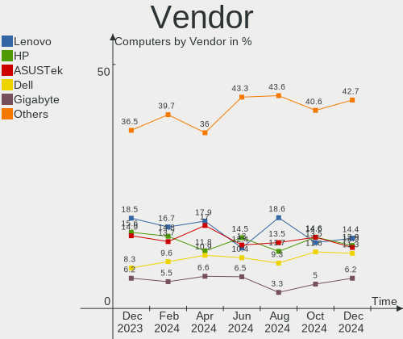
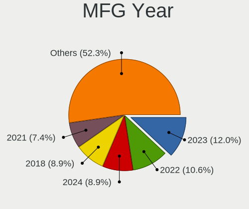
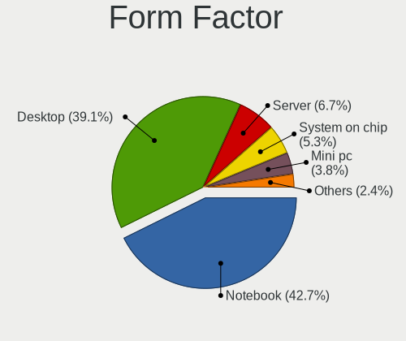
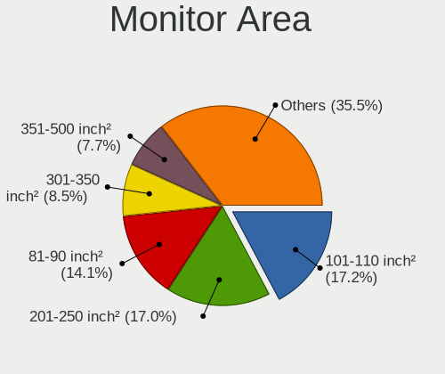

Debian - Hardware Trends
------------------------

A project to identify most popular hardware characteristics and track their change
over time based on data collected by Linux users at https://Linux-Hardware.org.

Anyone can contribute to this report by the [hw-probe](https://github.com/linuxhw/hw-probe) tool:

    sudo -E hw-probe -all -upload

This is a report for all computer types. See also reports for [desktops](/Dist/Debian/Desktop/README.md) and [notebooks](/Dist/Debian/Notebook/README.md).

This report is for one last month. Overall report since the beginning of time: [TestCoverage](https://github.com/linuxhw/TestCoverage)

Period: Jul, 2022.

Contents
--------

* [ System ](#system)
  - [ OS                       ](#os)
  - [ OS Family                ](#os-family)
  - [ Kernel                   ](#kernel)
  - [ Kernel Family            ](#kernel-family)
  - [ Kernel Major Ver.        ](#kernel-major-ver)
  - [ Arch                     ](#arch)
  - [ DE                       ](#de)
  - [ Display Server           ](#display-server)
  - [ Display Manager          ](#display-manager)
  - [ OS Lang                  ](#os-lang)
  - [ Boot Mode                ](#boot-mode)
  - [ Filesystem               ](#filesystem)
  - [ Part. scheme             ](#part-scheme)
  - [ Dual Boot with Linux/BSD ](#dual-boot-with-linuxbsd)
  - [ Dual Boot (Win)          ](#dual-boot-win)

* [ Board ](#board)
  - [ Vendor                   ](#vendor)
  - [ Model                    ](#model)
  - [ Model Family             ](#model-family)
  - [ MFG Year                 ](#mfg-year)
  - [ Form Factor              ](#form-factor)
  - [ Secure Boot              ](#secure-boot)
  - [ Coreboot                 ](#coreboot)
  - [ RAM Size                 ](#ram-size)
  - [ RAM Used                 ](#ram-used)
  - [ Total Drives             ](#total-drives)
  - [ Has CD-ROM               ](#has-cd-rom)
  - [ Has Ethernet             ](#has-ethernet)
  - [ Has WiFi                 ](#has-wifi)
  - [ Has Bluetooth            ](#has-bluetooth)

* [ Location ](#location)
  - [ Country                  ](#country)
  - [ City                     ](#city)

* [ Drives ](#drives)
  - [ Drive Vendor             ](#drive-vendor)
  - [ Drive Model              ](#drive-model)
  - [ HDD Vendor               ](#hdd-vendor)
  - [ SSD Vendor               ](#ssd-vendor)
  - [ Drive Kind               ](#drive-kind)
  - [ Drive Connector          ](#drive-connector)
  - [ Drive Size               ](#drive-size)
  - [ Space Total              ](#space-total)
  - [ Space Used               ](#space-used)
  - [ Malfunc. Drives          ](#malfunc-drives)
  - [ Malfunc. Drive Vendor    ](#malfunc-drive-vendor)
  - [ Malfunc. HDD Vendor      ](#malfunc-hdd-vendor)
  - [ Malfunc. Drive Kind      ](#malfunc-drive-kind)
  - [ Failed Drives            ](#failed-drives)
  - [ Failed Drive Vendor      ](#failed-drive-vendor)
  - [ Drive Status             ](#drive-status)

* [ Storage controller ](#storage-controller)
  - [ Storage Vendor           ](#storage-vendor)
  - [ Storage Model            ](#storage-model)
  - [ Storage Kind             ](#storage-kind)

* [ Processor ](#processor)
  - [ CPU Vendor               ](#cpu-vendor)
  - [ CPU Model                ](#cpu-model)
  - [ CPU Model Family         ](#cpu-model-family)
  - [ CPU Cores                ](#cpu-cores)
  - [ CPU Sockets              ](#cpu-sockets)
  - [ CPU Threads              ](#cpu-threads)
  - [ CPU Op-Modes             ](#cpu-op-modes)
  - [ CPU Microcode            ](#cpu-microcode)
  - [ CPU Microarch            ](#cpu-microarch)

* [ Graphics ](#graphics)
  - [ GPU Vendor               ](#gpu-vendor)
  - [ GPU Model                ](#gpu-model)
  - [ GPU Combo                ](#gpu-combo)
  - [ GPU Driver               ](#gpu-driver)
  - [ GPU Memory               ](#gpu-memory)

* [ Monitor ](#monitor)
  - [ Monitor Vendor           ](#monitor-vendor)
  - [ Monitor Model            ](#monitor-model)
  - [ Monitor Resolution       ](#monitor-resolution)
  - [ Monitor Diagonal         ](#monitor-diagonal)
  - [ Monitor Width            ](#monitor-width)
  - [ Aspect Ratio             ](#aspect-ratio)
  - [ Monitor Area             ](#monitor-area)
  - [ Pixel Density            ](#pixel-density)
  - [ Multiple Monitors        ](#multiple-monitors)

* [ Network ](#network)
  - [ Net Controller Vendor    ](#net-controller-vendor)
  - [ Net Controller Model     ](#net-controller-model)
  - [ Wireless Vendor          ](#wireless-vendor)
  - [ Wireless Model           ](#wireless-model)
  - [ Ethernet Vendor          ](#ethernet-vendor)
  - [ Ethernet Model           ](#ethernet-model)
  - [ Net Controller Kind      ](#net-controller-kind)
  - [ Used Controller          ](#used-controller)
  - [ NICs                     ](#nics)
  - [ IPv6                     ](#ipv6)

* [ Bluetooth ](#bluetooth)
  - [ Bluetooth Vendor         ](#bluetooth-vendor)
  - [ Bluetooth Model          ](#bluetooth-model)

* [ Sound ](#sound)
  - [ Sound Vendor             ](#sound-vendor)
  - [ Sound Model              ](#sound-model)

* [ Memory ](#memory)
  - [ Memory Vendor            ](#memory-vendor)
  - [ Memory Model             ](#memory-model)
  - [ Memory Kind              ](#memory-kind)
  - [ Memory Form Factor       ](#memory-form-factor)
  - [ Memory Size              ](#memory-size)
  - [ Memory Speed             ](#memory-speed)

* [ Printers & scanners ](#printers--scanners)
  - [ Printer Vendor           ](#printer-vendor)
  - [ Printer Model            ](#printer-model)
  - [ Scanner Vendor           ](#scanner-vendor)
  - [ Scanner Model            ](#scanner-model)

* [ Camera ](#camera)
  - [ Camera Vendor            ](#camera-vendor)
  - [ Camera Model             ](#camera-model)

* [ Security ](#security)
  - [ Fingerprint Vendor       ](#fingerprint-vendor)
  - [ Fingerprint Model        ](#fingerprint-model)
  - [ Chipcard Vendor          ](#chipcard-vendor)
  - [ Chipcard Model           ](#chipcard-model)

* [ Unsupported ](#unsupported)
  - [ Unsupported Devices      ](#unsupported-devices)
  - [ Unsupported Device Types ](#unsupported-device-types)

System
------

OS
--

Installed operating systems

| Name              | Computers | Percent |
|-------------------|-----------|---------|
| Debian 11         | 237       | 82.58%  |
| Debian Testing    | 28        | 9.76%   |
| Debian Unstable   | 12        | 4.18%   |
| Debian 10         | 6         | 2.09%   |
| Debian 11-updates | 3         | 1.05%   |
| Debian 8          | 1         | 0.35%   |

OS Family
---------

OS without a version

| Name   | Computers | Percent |
|--------|-----------|---------|
| Debian | 287       | 100%    |

Kernel
------

Version of the Linux kernel

| Version                    | Computers | Percent |
|----------------------------|-----------|---------|
| 5.10.0-16-amd64            | 75        | 26.13%  |
| 5.10.0-7-amd64             | 47        | 16.38%  |
| 5.18.0-2-amd64             | 42        | 14.63%  |
| 5.10.0-15-amd64            | 38        | 13.24%  |
| 5.10.0-13-amd64            | 12        | 4.18%   |
| 5.18.0-0.bpo.1-amd64       | 9         | 3.14%   |
| 5.15.39-1-pve              | 6         | 2.09%   |
| 5.18.0-3-amd64             | 4         | 1.39%   |
| 5.15.32-v8+                | 4         | 1.39%   |
| 5.16.0-0.bpo.4-amd64       | 3         | 1.05%   |
| 5.18.0-2-686-pae           | 2         | 0.7%    |
| 5.18.0-1-amd64             | 2         | 0.7%    |
| 5.16.0-3-amd64             | 2         | 0.7%    |
| 5.15.30-2-pve              | 2         | 0.7%    |
| 5.10.0-16-rt-amd64         | 2         | 0.7%    |
| 5.10.0-16-686-pae          | 2         | 0.7%    |
| 5.10.0-10-amd64            | 2         | 0.7%    |
| 4.19.0-21-amd64            | 2         | 0.7%    |
| 5.5.0-0.bpo.2-amd64        | 1         | 0.35%   |
| 5.4.166-1-pve              | 1         | 0.35%   |
| 5.19.0-rc4-v8              | 1         | 0.35%   |
| 5.19.0-rc4-amd64           | 1         | 0.35%   |
| 5.18.0-2-rt-amd64          | 1         | 0.35%   |
| 5.18.0-14.1-liquorix-amd64 | 1         | 0.35%   |
| 5.18.0-12.2-liquorix-amd64 | 1         | 0.35%   |
| 5.17.0-3-amd64             | 1         | 0.35%   |
| 5.17-rockchip              | 1         | 0.35%   |
| 5.16.5                     | 1         | 0.35%   |
| 5.16.0-5mx-amd64           | 1         | 0.35%   |
| 5.16.0-5-riscv64           | 1         | 0.35%   |
| 5.15.56-flippy-75+o        | 1         | 0.35%   |
| 5.15.52-v8+                | 1         | 0.35%   |
| 5.15.35-3-pve              | 1         | 0.35%   |
| 5.15.0-0.bpo.2-amd64       | 1         | 0.35%   |
| 5.13.19-2-pve              | 1         | 0.35%   |
| 5.11.22-5-pve              | 1         | 0.35%   |
| 5.10.60                    | 1         | 0.35%   |
| 5.10.43v64                 | 1         | 0.35%   |
| 5.10.120+truenas           | 1         | 0.35%   |
| 5.10.120                   | 1         | 0.35%   |
| 5.10.0-9-amd64             | 1         | 0.35%   |
| 5.10.0-6-amd64             | 1         | 0.35%   |
| 5.10.0-15-686-pae          | 1         | 0.35%   |
| 5.10.0-14-amd64            | 1         | 0.35%   |
| 5.10.0-13-686-pae          | 1         | 0.35%   |
| 5.10.0-12-amd64            | 1         | 0.35%   |
| 4.19.0-6-amd64             | 1         | 0.35%   |
| 4.19.0-12-amd64            | 1         | 0.35%   |
| 3.0.21-perf                | 1         | 0.35%   |

Kernel Family
-------------

Linux kernel without a distro release

| Version  | Computers | Percent |
|----------|-----------|---------|
| 5.10.0   | 184       | 64.11%  |
| 5.18.0   | 62        | 21.6%   |
| 5.16.0   | 7         | 2.44%   |
| 5.15.39  | 6         | 2.09%   |
| 5.15.32  | 4         | 1.39%   |
| 4.19.0   | 4         | 1.39%   |
| 5.19.0   | 2         | 0.7%    |
| 5.15.30  | 2         | 0.7%    |
| 5.10.120 | 2         | 0.7%    |
| 5.5.0    | 1         | 0.35%   |
| 5.4.166  | 1         | 0.35%   |
| 5.17.0   | 1         | 0.35%   |
| 5.17     | 1         | 0.35%   |
| 5.16.5   | 1         | 0.35%   |
| 5.15.56  | 1         | 0.35%   |
| 5.15.52  | 1         | 0.35%   |
| 5.15.35  | 1         | 0.35%   |
| 5.15.0   | 1         | 0.35%   |
| 5.13.19  | 1         | 0.35%   |
| 5.11.22  | 1         | 0.35%   |
| 5.10.60  | 1         | 0.35%   |
| 5.10.43  | 1         | 0.35%   |
| 3.0.21   | 1         | 0.35%   |

Kernel Major Ver.
-----------------

Linux kernel major version

| Version | Computers | Percent |
|---------|-----------|---------|
| 5.10    | 188       | 65.51%  |
| 5.18    | 62        | 21.6%   |
| 5.15    | 16        | 5.57%   |
| 5.16    | 8         | 2.79%   |
| 4.19    | 4         | 1.39%   |
| 5.19    | 2         | 0.7%    |
| 5.5     | 1         | 0.35%   |
| 5.4     | 1         | 0.35%   |
| 5.17    | 1         | 0.35%   |
| 5.13    | 1         | 0.35%   |
| 5.11    | 1         | 0.35%   |
| 5       | 1         | 0.35%   |
| 3.0     | 1         | 0.35%   |

Arch
----

OS architecture (x86_64, i586, etc.)

| Name    | Computers | Percent |
|---------|-----------|---------|
| x86_64  | 270       | 94.08%  |
| aarch64 | 9         | 3.14%   |
| i686    | 6         | 2.09%   |
| riscv64 | 1         | 0.35%   |
| armv7l  | 1         | 0.35%   |

DE
--

Desktop Environment

| Name              | Computers | Percent |
|-------------------|-----------|---------|
| Unknown           | 97        | 33.8%   |
| GNOME             | 64        | 22.3%   |
| KDE5              | 38        | 13.24%  |
| XFCE              | 30        | 10.45%  |
| LXDE              | 12        | 4.18%   |
| X-Cinnamon        | 11        | 3.83%   |
| Cinnamon          | 10        | 3.48%   |
| MATE              | 9         | 3.14%   |
| Openbox           | 4         | 1.39%   |
| LXQt              | 2         | 0.7%    |
| i3                | 2         | 0.7%    |
| GNOME Flashback   | 2         | 0.7%    |
| bspwm             | 2         | 0.7%    |
| x-session-manager | 1         | 0.35%   |
| trinity           | 1         | 0.35%   |
| Phosh:GNOME       | 1         | 0.35%   |
| awesome           | 1         | 0.35%   |

Display Server
--------------

X11 or Wayland

| Name    | Computers | Percent |
|---------|-----------|---------|
| X11     | 142       | 49.48%  |
| Unknown | 64        | 22.3%   |
| Wayland | 44        | 15.33%  |
| Tty     | 37        | 12.89%  |

Display Manager
---------------

SDDM, LightDM, etc.

| Name    | Computers | Percent |
|---------|-----------|---------|
| Unknown | 131       | 45.64%  |
| LightDM | 66        | 23%     |
| GDM     | 37        | 12.89%  |
| SDDM    | 28        | 9.76%   |
| GDM3    | 22        | 7.67%   |
| LXDM    | 2         | 0.7%    |
| XDM     | 1         | 0.35%   |

OS Lang
-------

Language

| Lang        | Computers | Percent |
|-------------|-----------|---------|
| en_US       | 101       | 35.19%  |
| ru_RU       | 62        | 21.6%   |
| fr_FR       | 21        | 7.32%   |
| de_DE       | 17        | 5.92%   |
| en_GB       | 12        | 4.18%   |
| es_ES       | 6         | 2.09%   |
| en_AU       | 6         | 2.09%   |
| Unknown     | 6         | 2.09%   |
| ja_JP       | 5         | 1.74%   |
| C           | 5         | 1.74%   |
| pt_BR       | 4         | 1.39%   |
| it_IT       | 3         | 1.05%   |
| hu_HU       | 3         | 1.05%   |
| en_ZA       | 3         | 1.05%   |
| en_SG       | 3         | 1.05%   |
| en_CA       | 3         | 1.05%   |
| zh_CN       | 2         | 0.7%    |
| pl_PL       | 2         | 0.7%    |
| hr_HR       | 2         | 0.7%    |
| es_PE       | 2         | 0.7%    |
| es_MX       | 2         | 0.7%    |
| en_DE       | 2         | 0.7%    |
| de_CH       | 2         | 0.7%    |
| pt_PT       | 1         | 0.35%   |
| nl_NL       | 1         | 0.35%   |
| es_VE       | 1         | 0.35%   |
| es_UY       | 1         | 0.35%   |
| es_ES.utf-8 | 1         | 0.35%   |
| es_CO       | 1         | 0.35%   |
| es_CL       | 1         | 0.35%   |
| es_AR       | 1         | 0.35%   |
| en_IN       | 1         | 0.35%   |
| en_IE       | 1         | 0.35%   |
| el_GR       | 1         | 0.35%   |
| de_AT       | 1         | 0.35%   |
| cs_CZ       | 1         | 0.35%   |

Boot Mode
---------

EFI or BIOS

| Mode | Computers | Percent |
|------|-----------|---------|
| BIOS | 147       | 51.22%  |
| EFI  | 140       | 48.78%  |

Filesystem
----------

Type of filesystem

| Type    | Computers | Percent |
|---------|-----------|---------|
| Ext4    | 210       | 73.17%  |
| Overlay | 57        | 19.86%  |
| Btrfs   | 8         | 2.79%   |
| Xfs     | 6         | 2.09%   |
| Zfs     | 4         | 1.39%   |
| Tmpfs   | 1         | 0.35%   |
| Ext3    | 1         | 0.35%   |

Part. scheme
------------

Scheme of partitioning

| Type    | Computers | Percent |
|---------|-----------|---------|
| GPT     | 141       | 49.13%  |
| MBR     | 97        | 33.8%   |
| Unknown | 49        | 17.07%  |

Dual Boot with Linux/BSD
------------------------

Hosting more than one Linux/BSD

| Dual boot | Computers | Percent |
|-----------|-----------|---------|
| No        | 252       | 87.8%   |
| Yes       | 35        | 12.2%   |

Dual Boot (Win)
---------------

Hosting Linux and Windows

| Dual boot | Computers | Percent |
|-----------|-----------|---------|
| No        | 190       | 66.2%   |
| Yes       | 97        | 33.8%   |

Board
-----

Vendor
------

Motherboard manufacturer

| Name                    | Computers | Percent |
|-------------------------|-----------|---------|
| ASUSTek Computer        | 42        | 14.63%  |
| Lenovo                  | 31        | 10.8%   |
| Hewlett-Packard         | 30        | 10.45%  |
| Dell                    | 28        | 9.76%   |
| Gigabyte Technology     | 25        | 8.71%   |
| MSI                     | 24        | 8.36%   |
| ASRock                  | 20        | 6.97%   |
| Intel                   | 15        | 5.23%   |
| Acer                    | 11        | 3.83%   |
| Unknown                 | 8         | 2.79%   |
| Raspberry Pi Foundation | 7         | 2.44%   |
| HUAWEI                  | 6         | 2.09%   |
| Google                  | 4         | 1.39%   |
| ECS                     | 4         | 1.39%   |
| Supermicro              | 3         | 1.05%   |
| AZW                     | 3         | 1.05%   |
| Medion                  | 2         | 0.7%    |
| Fujitsu                 | 2         | 0.7%    |
| ASRockRack              | 2         | 0.7%    |
| Thecus                  | 1         | 0.35%   |
| Sony                    | 1         | 0.35%   |
| Samsung Electronics     | 1         | 0.35%   |
| Razer                   | 1         | 0.35%   |
| Panasonic               | 1         | 0.35%   |
| Notebook                | 1         | 0.35%   |
| IP3 Tech                | 1         | 0.35%   |
| Inventec                | 1         | 0.35%   |
| IceWhale Technology     | 1         | 0.35%   |
| HONOR                   | 1         | 0.35%   |
| GPU Company             | 1         | 0.35%   |
| Gateway                 | 1         | 0.35%   |
| Fanless Mini PC         | 1         | 0.35%   |
| DEPO Computers          | 1         | 0.35%   |
| congatec                | 1         | 0.35%   |
| Compaq                  | 1         | 0.35%   |
| BESSTAR Tech            | 1         | 0.35%   |
| AXDIA International     | 1         | 0.35%   |
| Avell High Performance  | 1         | 0.35%   |
| Apple                   | 1         | 0.35%   |

Model
-----

Motherboard model

| Name                                                  | Computers | Percent |
|-------------------------------------------------------|-----------|---------|
| MSI MS-7996                                           | 10        | 3.48%   |
| ASRock H470M-HVS                                      | 10        | 3.48%   |
| Unknown                                               | 9         | 3.14%   |
| Lenovo ThinkPad L13 Yoga Gen 2 20VK0019US             | 4         | 1.39%   |
| ECS G31T-M9                                           | 4         | 1.39%   |
| RPi Raspberry Pi 4 Model B Rev 1.4                    | 3         | 1.05%   |
| RPi Raspberry Pi 4 Model B Rev 1.2                    | 2         | 0.7%    |
| Intel Pro, Std, Elt Series                            | 2         | 0.7%    |
| HP Notebook                                           | 2         | 0.7%    |
| Gigabyte B450M S2H                                    | 2         | 0.7%    |
| Gigabyte B450M DS3H                                   | 2         | 0.7%    |
| Gigabyte B365M DS3H                                   | 2         | 0.7%    |
| Dell Vostro 3550                                      | 2         | 0.7%    |
| ASUS PRIME Z690M-HZ                                   | 2         | 0.7%    |
| ASUS All Series                                       | 2         | 0.7%    |
| ASRockRack B565D4-V1L                                 | 2         | 0.7%    |
| Thecus N2810                                          | 1         | 0.35%   |
| Supermicro X9SCL/X9SCM                                | 1         | 0.35%   |
| Supermicro X9DRW                                      | 1         | 0.35%   |
| Supermicro SYS-5018R-WR                               | 1         | 0.35%   |
| Sony VPCEH37FJ                                        | 1         | 0.35%   |
| Samsung R505                                          | 1         | 0.35%   |
| Razer Blade 15 Advanced Model (Early 2021) - RZ09-036 | 1         | 0.35%   |
| RPi Raspberry Pi 4 Model B Rev 1.5 (DT)               | 1         | 0.35%   |
| RPi Raspberry Pi 4 Model B Rev 1.1                    | 1         | 0.35%   |
| Panasonic CF-53SJCZYLM                                | 1         | 0.35%   |
| Notebook V15x_V17xPNKPNJPNH                           | 1         | 0.35%   |
| MSI MS-7D53                                           | 1         | 0.35%   |
| MSI MS-7D25                                           | 1         | 0.35%   |
| MSI MS-7D22                                           | 1         | 0.35%   |
| MSI MS-7C59                                           | 1         | 0.35%   |
| MSI MS-7B79                                           | 1         | 0.35%   |
| MSI MS-7B58                                           | 1         | 0.35%   |
| MSI MS-7A34                                           | 1         | 0.35%   |
| MSI MS-7995                                           | 1         | 0.35%   |
| MSI MS-7982                                           | 1         | 0.35%   |
| MSI MS-7788                                           | 1         | 0.35%   |
| MSI MS-7641                                           | 1         | 0.35%   |
| MSI MS-7529                                           | 1         | 0.35%   |
| MSI MS-7418                                           | 1         | 0.35%   |
| MSI MS-7236                                           | 1         | 0.35%   |
| Medion MS-7728                                        | 1         | 0.35%   |
| Medion E122X                                          | 1         | 0.35%   |
| Lenovo Yoga 9 14ITL5 82BG                             | 1         | 0.35%   |
| Lenovo Yoga 720-15IKB                                 | 1         | 0.35%   |
| Lenovo ThinkPad X140e 20BLA00C00                      | 1         | 0.35%   |
| Lenovo ThinkPad X1 Carbon Gen 8 20U9CTO1WW            | 1         | 0.35%   |
| Lenovo ThinkPad T490 20N3SEYA00                       | 1         | 0.35%   |
| Lenovo ThinkPad T490 20N2000FIX                       | 1         | 0.35%   |
| Lenovo ThinkPad T400 2768WGB                          | 1         | 0.35%   |
| Lenovo ThinkPad T15 Gen 1 20S6001SUS                  | 1         | 0.35%   |
| Lenovo ThinkPad T14 Gen 2a 20XL0014GE                 | 1         | 0.35%   |
| Lenovo ThinkPad T14 Gen 2a 20XK0019US                 | 1         | 0.35%   |
| Lenovo ThinkPad P51s 20HB000URT                       | 1         | 0.35%   |
| Lenovo ThinkPad P15v Gen 3 21D8A00ACD                 | 1         | 0.35%   |
| Lenovo ThinkPad L480 20LS002CPB                       | 1         | 0.35%   |
| Lenovo ThinkPad L14 Gen 1 20U50001GE                  | 1         | 0.35%   |
| Lenovo ThinkPad E14 Gen 4 21E3005DGE                  | 1         | 0.35%   |
| Lenovo ThinkPad E14 Gen 3 20YDS00G00                  | 1         | 0.35%   |
| Lenovo ThinkCentre M920t 10SFCTO1WW                   | 1         | 0.35%   |

Model Family
------------

Motherboard model prefix

| Name                    | Computers | Percent |
|-------------------------|-----------|---------|
| Lenovo ThinkPad         | 18        | 6.27%   |
| Dell Latitude           | 11        | 3.83%   |
| MSI MS-7996             | 10        | 3.48%   |
| ASRock H470M-HVS        | 10        | 3.48%   |
| Unknown                 | 9         | 3.14%   |
| RPi Raspberry           | 7         | 2.44%   |
| ASUS PRIME              | 6         | 2.09%   |
| Acer Aspire             | 6         | 2.09%   |
| HP Compaq               | 5         | 1.74%   |
| Gigabyte B450M          | 5         | 1.74%   |
| ECS G31T-M9             | 4         | 1.39%   |
| Dell Vostro             | 4         | 1.39%   |
| Dell PowerEdge          | 4         | 1.39%   |
| Dell OptiPlex           | 4         | 1.39%   |
| ASUS TUF                | 4         | 1.39%   |
| Lenovo IdeaPad          | 3         | 1.05%   |
| HP Pavilion             | 3         | 1.05%   |
| HP EliteBook            | 3         | 1.05%   |
| Lenovo Yoga             | 2         | 0.7%    |
| Lenovo ThinkCentre      | 2         | 0.7%    |
| Lenovo ThinkBook        | 2         | 0.7%    |
| Intel Pro               | 2         | 0.7%    |
| HP ZBook                | 2         | 0.7%    |
| HP ProLiant             | 2         | 0.7%    |
| HP ProBook              | 2         | 0.7%    |
| HP Notebook             | 2         | 0.7%    |
| HP Laptop               | 2         | 0.7%    |
| Gigabyte X570           | 2         | 0.7%    |
| Gigabyte B365M          | 2         | 0.7%    |
| Dell XPS                | 2         | 0.7%    |
| Dell Inspiron           | 2         | 0.7%    |
| ASUS ZenBook            | 2         | 0.7%    |
| ASUS VivoBook           | 2         | 0.7%    |
| ASUS P8H61-M            | 2         | 0.7%    |
| ASUS P5K                | 2         | 0.7%    |
| ASUS All                | 2         | 0.7%    |
| ASRockRack B565D4-V1L   | 2         | 0.7%    |
| Thecus N2810            | 1         | 0.35%   |
| Supermicro X9SCL        | 1         | 0.35%   |
| Supermicro X9DRW        | 1         | 0.35%   |
| Supermicro SYS-5018R-WR | 1         | 0.35%   |
| Sony VPCEH37FJ          | 1         | 0.35%   |
| Samsung R505            | 1         | 0.35%   |
| Razer Blade             | 1         | 0.35%   |
| Panasonic CF-53SJCZYLM  | 1         | 0.35%   |
| Notebook V15x           | 1         | 0.35%   |
| MSI MS-7D53             | 1         | 0.35%   |
| MSI MS-7D25             | 1         | 0.35%   |
| MSI MS-7D22             | 1         | 0.35%   |
| MSI MS-7C59             | 1         | 0.35%   |
| MSI MS-7B79             | 1         | 0.35%   |
| MSI MS-7B58             | 1         | 0.35%   |
| MSI MS-7A34             | 1         | 0.35%   |
| MSI MS-7995             | 1         | 0.35%   |
| MSI MS-7982             | 1         | 0.35%   |
| MSI MS-7788             | 1         | 0.35%   |
| MSI MS-7641             | 1         | 0.35%   |
| MSI MS-7529             | 1         | 0.35%   |
| MSI MS-7418             | 1         | 0.35%   |
| MSI MS-7236             | 1         | 0.35%   |

MFG Year
--------

Motherboard manufacture year

| Year    | Computers | Percent |
|---------|-----------|---------|
| 2021    | 53        | 18.47%  |
| 2020    | 32        | 11.15%  |
| 2018    | 28        | 9.76%   |
| 2019    | 21        | 7.32%   |
| 2022    | 19        | 6.62%   |
| 2015    | 18        | 6.27%   |
| 2012    | 17        | 5.92%   |
| 2011    | 12        | 4.18%   |
| 2010    | 12        | 4.18%   |
| 2017    | 11        | 3.83%   |
| Unknown | 11        | 3.83%   |
| 2009    | 10        | 3.48%   |
| 2013    | 9         | 3.14%   |
| 2016    | 8         | 2.79%   |
| 2014    | 7         | 2.44%   |
| 2008    | 7         | 2.44%   |
| 2007    | 7         | 2.44%   |
| 2006    | 3         | 1.05%   |
| 2001    | 2         | 0.7%    |

Form Factor
-----------

Physical design of the computer

| Name           | Computers | Percent |
|----------------|-----------|---------|
| Desktop        | 140       | 48.78%  |
| Notebook       | 109       | 37.98%  |
| Mini pc        | 10        | 3.48%   |
| System on chip | 9         | 3.14%   |
| Convertible    | 8         | 2.79%   |
| Server         | 7         | 2.44%   |
| All in one     | 3         | 1.05%   |
| Tablet         | 1         | 0.35%   |

Secure Boot
-----------

Enabled or disabled

| State    | Computers | Percent |
|----------|-----------|---------|
| Disabled | 266       | 92.68%  |
| Enabled  | 21        | 7.32%   |

Coreboot
--------

Have coreboot on board

| Used | Computers | Percent |
|------|-----------|---------|
| No   | 283       | 98.61%  |
| Yes  | 4         | 1.39%   |

RAM Size
--------

Total RAM memory

| Size in GB  | Computers | Percent |
|-------------|-----------|---------|
| 4.01-8.0    | 60        | 20.91%  |
| 8.01-16.0   | 51        | 17.77%  |
| 3.01-4.0    | 47        | 16.38%  |
| 16.01-24.0  | 45        | 15.68%  |
| 32.01-64.0  | 34        | 11.85%  |
| 64.01-256.0 | 17        | 5.92%   |
| 1.01-2.0    | 15        | 5.23%   |
| 24.01-32.0  | 8         | 2.79%   |
| 2.01-3.0    | 4         | 1.39%   |
| 0.51-1.0    | 3         | 1.05%   |
| 0.01-0.5    | 3         | 1.05%   |

RAM Used
--------

Used RAM memory

| Used GB     | Computers | Percent |
|-------------|-----------|---------|
| 1.01-2.0    | 81        | 28.22%  |
| 0.51-1.0    | 63        | 21.95%  |
| 2.01-3.0    | 53        | 18.47%  |
| 4.01-8.0    | 33        | 11.5%   |
| 3.01-4.0    | 24        | 8.36%   |
| 8.01-16.0   | 13        | 4.53%   |
| 0.01-0.5    | 12        | 4.18%   |
| 16.01-24.0  | 4         | 1.39%   |
| 32.01-64.0  | 1         | 0.35%   |
| 24.01-32.0  | 1         | 0.35%   |
| 64.01-256.0 | 1         | 0.35%   |
| Unknown     | 1         | 0.35%   |

Total Drives
------------

Number of drives on board

| Drives | Computers | Percent |
|--------|-----------|---------|
| 1      | 178       | 62.02%  |
| 2      | 63        | 21.95%  |
| 3      | 23        | 8.01%   |
| 4      | 13        | 4.53%   |
| 5      | 4         | 1.39%   |
| 6      | 3         | 1.05%   |
| 11     | 1         | 0.35%   |
| 8      | 1         | 0.35%   |
| 7      | 1         | 0.35%   |

Has CD-ROM
----------

Has CD-ROM on board

| Presented | Computers | Percent |
|-----------|-----------|---------|
| No        | 218       | 75.96%  |
| Yes       | 69        | 24.04%  |

Has Ethernet
------------

Has Ethernet on board

| Presented | Computers | Percent |
|-----------|-----------|---------|
| Yes       | 254       | 88.5%   |
| No        | 33        | 11.5%   |

Has WiFi
--------

Has WiFi module

| Presented | Computers | Percent |
|-----------|-----------|---------|
| Yes       | 152       | 52.96%  |
| No        | 135       | 47.04%  |

Has Bluetooth
-------------

Has Bluetooth module

| Presented | Computers | Percent |
|-----------|-----------|---------|
| No        | 159       | 55.4%   |
| Yes       | 128       | 44.6%   |

Location
--------

Country
-------

Geographic location (country)

| Country      | Computers | Percent |
|--------------|-----------|---------|
| Russia       | 65        | 22.65%  |
| USA          | 44        | 15.33%  |
| Germany      | 32        | 11.15%  |
| France       | 23        | 8.01%   |
| Brazil       | 9         | 3.14%   |
| Spain        | 8         | 2.79%   |
| Italy        | 8         | 2.79%   |
| Australia    | 7         | 2.44%   |
| Canada       | 6         | 2.09%   |
| UK           | 5         | 1.74%   |
| Poland       | 5         | 1.74%   |
| Japan        | 5         | 1.74%   |
| China        | 5         | 1.74%   |
| Netherlands  | 4         | 1.39%   |
| Malaysia     | 4         | 1.39%   |
| Hungary      | 4         | 1.39%   |
| Czechia      | 4         | 1.39%   |
| Switzerland  | 3         | 1.05%   |
| Sweden       | 3         | 1.05%   |
| South Africa | 3         | 1.05%   |
| Peru         | 3         | 1.05%   |
| Argentina    | 3         | 1.05%   |
| Thailand     | 2         | 0.7%    |
| Taiwan       | 2         | 0.7%    |
| Singapore    | 2         | 0.7%    |
| Portugal     | 2         | 0.7%    |
| Morocco      | 2         | 0.7%    |
| Mexico       | 2         | 0.7%    |
| Finland      | 2         | 0.7%    |
| Croatia      | 2         | 0.7%    |
| Colombia     | 2         | 0.7%    |
| Austria      | 2         | 0.7%    |
| Venezuela    | 1         | 0.35%   |
| Uruguay      | 1         | 0.35%   |
| Turkey       | 1         | 0.35%   |
| Slovakia     | 1         | 0.35%   |
| Serbia       | 1         | 0.35%   |
| Norway       | 1         | 0.35%   |
| Lithuania    | 1         | 0.35%   |
| Kazakhstan   | 1         | 0.35%   |
| Jersey       | 1         | 0.35%   |
| Ireland      | 1         | 0.35%   |
| India        | 1         | 0.35%   |
| Greece       | 1         | 0.35%   |
| Chile        | 1         | 0.35%   |
| Bulgaria     | 1         | 0.35%   |

City
----

Geographic location (city)

| City                   | Computers | Percent |
|------------------------|-----------|---------|
| Voronezh               | 47        | 16.38%  |
| Bangor                 | 7         | 2.44%   |
| Perm                   | 5         | 1.74%   |
| Tsukuba                | 4         | 1.39%   |
| Berlin                 | 4         | 1.39%   |
| Paris                  | 3         | 1.05%   |
| Falkenstein            | 3         | 1.05%   |
| Clinton Township       | 3         | 1.05%   |
| Zollikofen             | 2         | 0.7%    |
| Warsaw                 | 2         | 0.7%    |
| Trets                  | 2         | 0.7%    |
| Toronto                | 2         | 0.7%    |
| Taipei                 | 2         | 0.7%    |
| Sydney                 | 2         | 0.7%    |
| St Petersburg          | 2         | 0.7%    |
| Singapore              | 2         | 0.7%    |
| Nuremberg              | 2         | 0.7%    |
| Munich                 | 2         | 0.7%    |
| Moscow                 | 2         | 0.7%    |
| Milan                  | 2         | 0.7%    |
| Madrid                 | 2         | 0.7%    |
| London                 | 2         | 0.7%    |
| Lincoln                | 2         | 0.7%    |
| La Rochelle            | 2         | 0.7%    |
| Hamburg                | 2         | 0.7%    |
| Durban                 | 2         | 0.7%    |
| Brno                   | 2         | 0.7%    |
| Brisbane               | 2         | 0.7%    |
| Beijing                | 2         | 0.7%    |
| Bayan Lepas            | 2         | 0.7%    |
| Bangkok                | 2         | 0.7%    |
| Amsterdam              | 2         | 0.7%    |
| Zdar                   | 1         | 0.35%   |
| Wołomin               | 1         | 0.35%   |
| Wola Krzysztoporska    | 1         | 0.35%   |
| Waltham                | 1         | 0.35%   |
| Wadsworth              | 1         | 0.35%   |
| Vitória               | 1         | 0.35%   |
| Viña del Mar          | 1         | 0.35%   |
| Villingen-Schwenningen | 1         | 0.35%   |
| Vienna                 | 1         | 0.35%   |
| Valley View            | 1         | 0.35%   |
| Vallauris              | 1         | 0.35%   |
| Valencia               | 1         | 0.35%   |
| Ulyanovsk              | 1         | 0.35%   |
| Tuusula                | 1         | 0.35%   |
| Thousand Oaks          | 1         | 0.35%   |
| The Hague              | 1         | 0.35%   |
| Teruel                 | 1         | 0.35%   |
| Tampere                | 1         | 0.35%   |
| Szekszárd             | 1         | 0.35%   |
| Stuttgart              | 1         | 0.35%   |
| Stevens Point          | 1         | 0.35%   |
| Sollentuna             | 1         | 0.35%   |
| Sintra                 | 1         | 0.35%   |
| Shenzhen               | 1         | 0.35%   |
| Serpukhov              | 1         | 0.35%   |
| Seclin                 | 1         | 0.35%   |
| Sarnia                 | 1         | 0.35%   |
| Sao Paulo              | 1         | 0.35%   |

Drives
------

Drive Vendor
------------

Hard drive vendors

| Vendor                       | Computers | Drives | Percent |
|------------------------------|-----------|--------|---------|
| Samsung Electronics          | 62        | 78     | 15.7%   |
| WDC                          | 53        | 90     | 13.42%  |
| Seagate                      | 51        | 72     | 12.91%  |
| Toshiba                      | 34        | 43     | 8.61%   |
| SanDisk                      | 23        | 24     | 5.82%   |
| Unknown                      | 19        | 23     | 4.81%   |
| Kingston                     | 18        | 21     | 4.56%   |
| Hitachi                      | 12        | 12     | 3.04%   |
| Netac                        | 10        | 10     | 2.53%   |
| Crucial                      | 10        | 10     | 2.53%   |
| SPCC                         | 9         | 9      | 2.28%   |
| SK hynix                     | 9         | 9      | 2.28%   |
| Intel                        | 6         | 7      | 1.52%   |
| KIOXIA                       | 5         | 5      | 1.27%   |
| HGST                         | 5         | 6      | 1.27%   |
| A-DATA Technology            | 5         | 6      | 1.27%   |
| Unknown                      | 5         | 5      | 1.27%   |
| Micron Technology            | 4         | 4      | 1.01%   |
| Transcend                    | 3         | 3      | 0.76%   |
| PNY                          | 3         | 3      | 0.76%   |
| Phison                       | 3         | 3      | 0.76%   |
| Corsair                      | 3         | 4      | 0.76%   |
| OCZ                          | 2         | 2      | 0.51%   |
| NGFF                         | 2         | 2      | 0.51%   |
| Intenso                      | 2         | 2      | 0.51%   |
| GOODRAM                      | 2         | 2      | 0.51%   |
| China                        | 2         | 2      | 0.51%   |
| Apacer                       | 2         | 2      | 0.51%   |
| ADATA Technology             | 2         | 2      | 0.51%   |
| WDC WDS                      | 1         | 1      | 0.25%   |
| W800SH                       | 1         | 1      | 0.25%   |
| TOPMORE                      | 1         | 1      | 0.25%   |
| Team                         | 1         | 1      | 0.25%   |
| TCSUNB0W                     | 1         | 1      | 0.25%   |
| SSSTC                        | 1         | 1      | 0.25%   |
| Smartbuy                     | 1         | 1      | 0.25%   |
| ShiJi                        | 1         | 1      | 0.25%   |
| Shenzhen Longsys Electronics | 1         | 1      | 0.25%   |
| S3+                          | 1         | 1      | 0.25%   |
| RSH-319                      | 1         | 1      | 0.25%   |
| Patriot                      | 1         | 1      | 0.25%   |
| Mushkin                      | 1         | 2      | 0.25%   |
| Micron/Crucial Technology    | 1         | 1      | 0.25%   |
| LITEON                       | 1         | 1      | 0.25%   |
| Lenovo                       | 1         | 1      | 0.25%   |
| KIOXIA-EXCERIA               | 1         | 1      | 0.25%   |
| KingDian                     | 1         | 1      | 0.25%   |
| JMicron Technology           | 1         | 1      | 0.25%   |
| Innodisk                     | 1         | 1      | 0.25%   |
| Inateck                      | 1         | 1      | 0.25%   |
| Hoodisk                      | 1         | 1      | 0.25%   |
| Hewlett-Packard              | 1         | 1      | 0.25%   |
| Gigabyte Technology          | 1         | 1      | 0.25%   |
| Fujitsu                      | 1         | 1      | 0.25%   |
| Dell                         | 1         | 2      | 0.25%   |
| Argon                        | 1         | 1      | 0.25%   |
| AMicro                       | 1         | 1      | 0.25%   |
| addlink                      | 1         | 1      | 0.25%   |

Drive Model
-----------

Hard drive models

| Model                              | Computers | Percent |
|------------------------------------|-----------|---------|
| Toshiba HDWD110 1TB                | 11        | 2.54%   |
| Netac SSD 240GB                    | 10        | 2.31%   |
| SPCC Solid State Disk 120GB        | 8         | 1.85%   |
| Seagate ST1000DM010-2EP102 1TB     | 8         | 1.85%   |
| Toshiba DT01ACA050 500GB           | 5         | 1.15%   |
| Samsung SSD 860 EVO 500GB          | 5         | 1.15%   |
| Samsung MZVLB512HBJQ-000L7 512GB   | 5         | 1.15%   |
| Kingston SA400S37480G 480GB SSD    | 5         | 1.15%   |
| Hitachi HDS721050CLA362 500GB      | 5         | 1.15%   |
| Unknown                            | 5         | 1.15%   |
| WDC WDS500G2B0A-00SM50 500GB SSD   | 3         | 0.69%   |
| WDC WD10EZEX-08WN4A0 1TB           | 3         | 0.69%   |
| Seagate ST8000VN004-2M2101 8TB     | 3         | 0.69%   |
| SanDisk NVMe SSD Drive 1TB         | 3         | 0.69%   |
| Samsung SSD 970 EVO Plus 2TB       | 3         | 0.69%   |
| Samsung SSD 970 EVO Plus 1TB       | 3         | 0.69%   |
| Samsung NVMe SSD Drive 500GB       | 3         | 0.69%   |
| Samsung NVMe SSD Drive 1TB         | 3         | 0.69%   |
| Phison 311CD0512GB                 | 3         | 0.69%   |
| Kingston SA400S37240G 240GB SSD    | 3         | 0.69%   |
| WDC WDS240G2G0A-00JH30 240GB SSD   | 2         | 0.46%   |
| WDC WD5000AAKX-08U6AA0 500GB       | 2         | 0.46%   |
| WDC WD120EMFZ-11A6JA0 12TB         | 2         | 0.46%   |
| WDC WD120EDAZ-11F3RA0 12TB         | 2         | 0.46%   |
| WDC WD100EMAZ-00WJTA0 10TB         | 2         | 0.46%   |
| WDC WD1003FBYX-01Y7B1 752GB        | 2         | 0.46%   |
| WDC PC SN530 SDBPNPZ-1T00-1006 1TB | 2         | 0.46%   |
| Unknown MMC Card  64GB             | 2         | 0.46%   |
| Unknown MMC Card  32GB             | 2         | 0.46%   |
| Unknown MMC Card  128GB            | 2         | 0.46%   |
| Toshiba TR200 240GB SSD            | 2         | 0.46%   |
| Toshiba HDWD130 3TB                | 2         | 0.46%   |
| Toshiba DT01ACA300 3TB             | 2         | 0.46%   |
| SK hynix NVMe SSD Drive 512GB      | 2         | 0.46%   |
| Seagate ST500DM002-1BD142 500GB    | 2         | 0.46%   |
| Seagate ST5000LM000-2AN170 5TB     | 2         | 0.46%   |
| Seagate ST380215AS 80GB            | 2         | 0.46%   |
| Seagate ST3500418AS 500GB          | 2         | 0.46%   |
| Seagate ST3250318AS 250GB          | 2         | 0.46%   |
| Seagate ST2000DM001-1ER164 2TB     | 2         | 0.46%   |
| Seagate ST12000VN0007-2GS116 12TB  | 2         | 0.46%   |
| Seagate ST1000LM035-1RK172 1TB     | 2         | 0.46%   |
| Seagate ST1000DM003-1ER162 1TB     | 2         | 0.46%   |
| SanDisk SDSSDP064G 64GB            | 2         | 0.46%   |
| SanDisk DF4064  64GB               | 2         | 0.46%   |
| Samsung SSD 870 EVO 1TB            | 2         | 0.46%   |
| Samsung SSD 860 EVO 250GB          | 2         | 0.46%   |
| Samsung SSD 850 PRO 512GB          | 2         | 0.46%   |
| Samsung SSD 850 EVO 120GB          | 2         | 0.46%   |
| Samsung NVMe SSD Drive 512GB       | 2         | 0.46%   |
| Samsung MZVLB512HAJQ-00000 512GB   | 2         | 0.46%   |
| Samsung MZQL21T9HCJR-00A07 1.9TB   | 2         | 0.46%   |
| PNY CS900 240GB SSD                | 2         | 0.46%   |
| Intel SSDSC2BW180A4 180GB          | 2         | 0.46%   |
| Crucial CT480BX500SSD1 480GB       | 2         | 0.46%   |
| Crucial CT1000MX500SSD1 1TB        | 2         | 0.46%   |
| ADATA NVMe SSD Drive 256GB         | 2         | 0.46%   |
| A-DATA SX930 480GB SSD             | 2         | 0.46%   |
| WDC WDS200T2B0B-00YS70 2TB SSD     | 1         | 0.23%   |
| WDC WDS120G1G0A-00SS50 120GB SSD   | 1         | 0.23%   |

HDD Vendor
----------

Hard disk drive vendors

| Vendor              | Computers | Drives | Percent |
|---------------------|-----------|--------|---------|
| Seagate             | 50        | 71     | 36.76%  |
| WDC                 | 36        | 73     | 26.47%  |
| Toshiba             | 28        | 37     | 20.59%  |
| Hitachi             | 12        | 12     | 8.82%   |
| HGST                | 5         | 6      | 3.68%   |
| Samsung Electronics | 2         | 2      | 1.47%   |
| Unknown             | 1         | 1      | 0.74%   |
| RSH-319             | 1         | 1      | 0.74%   |
| Fujitsu             | 1         | 1      | 0.74%   |

SSD Vendor
----------

Solid state drive vendors

| Vendor              | Computers | Drives | Percent |
|---------------------|-----------|--------|---------|
| Samsung Electronics | 24        | 30     | 17.39%  |
| SanDisk             | 16        | 16     | 11.59%  |
| Kingston            | 14        | 15     | 10.14%  |
| Netac               | 10        | 10     | 7.25%   |
| Crucial             | 10        | 10     | 7.25%   |
| SPCC                | 9         | 9      | 6.52%   |
| WDC                 | 7         | 7      | 5.07%   |
| Toshiba             | 4         | 4      | 2.9%    |
| Intel               | 4         | 5      | 2.9%    |
| Transcend           | 3         | 3      | 2.17%   |
| A-DATA Technology   | 3         | 4      | 2.17%   |
| PNY                 | 2         | 2      | 1.45%   |
| OCZ                 | 2         | 2      | 1.45%   |
| NGFF                | 2         | 2      | 1.45%   |
| Intenso             | 2         | 2      | 1.45%   |
| Corsair             | 2         | 3      | 1.45%   |
| China               | 2         | 2      | 1.45%   |
| Unknown             | 2         | 2      | 1.45%   |
| WDC WDS             | 1         | 1      | 0.72%   |
| W800SH              | 1         | 1      | 0.72%   |
| TOPMORE             | 1         | 1      | 0.72%   |
| Team                | 1         | 1      | 0.72%   |
| TCSUNB0W            | 1         | 1      | 0.72%   |
| Smartbuy            | 1         | 1      | 0.72%   |
| SK hynix            | 1         | 1      | 0.72%   |
| S3+                 | 1         | 1      | 0.72%   |
| Patriot             | 1         | 1      | 0.72%   |
| Mushkin             | 1         | 2      | 0.72%   |
| Micron Technology   | 1         | 1      | 0.72%   |
| LITEON              | 1         | 1      | 0.72%   |
| Lenovo              | 1         | 1      | 0.72%   |
| KIOXIA-EXCERIA      | 1         | 1      | 0.72%   |
| KingDian            | 1         | 1      | 0.72%   |
| Innodisk            | 1         | 1      | 0.72%   |
| Hoodisk             | 1         | 1      | 0.72%   |
| GOODRAM             | 1         | 1      | 0.72%   |
| Argon               | 1         | 1      | 0.72%   |
| Apacer              | 1         | 1      | 0.72%   |

Drive Kind
----------

HDD or SSD

| Kind    | Computers | Drives | Percent |
|---------|-----------|--------|---------|
| SSD     | 127       | 149    | 34.23%  |
| HDD     | 120       | 204    | 32.35%  |
| NVMe    | 100       | 111    | 26.95%  |
| MMC     | 23        | 27     | 6.2%    |
| Unknown | 1         | 1      | 0.27%   |

Drive Connector
---------------

SATA, SAS, NVMe, etc.

| Type | Computers | Drives | Percent |
|------|-----------|--------|---------|
| SATA | 191       | 343    | 58.77%  |
| NVMe | 98        | 109    | 30.15%  |
| MMC  | 23        | 27     | 7.08%   |
| SAS  | 13        | 13     | 4%      |

Drive Size
----------

Size of hard drive

| Size in TB | Computers | Drives | Percent |
|------------|-----------|--------|---------|
| 0.01-0.5   | 157       | 191    | 59.7%   |
| 0.51-1.0   | 65        | 82     | 24.71%  |
| 1.01-2.0   | 14        | 17     | 5.32%   |
| 4.01-10.0  | 12        | 18     | 4.56%   |
| 3.01-4.0   | 7         | 16     | 2.66%   |
| 2.01-3.0   | 5         | 12     | 1.9%    |
| 10.01-20.0 | 3         | 17     | 1.14%   |

Space Total
-----------

Amount of disk space available on the file system

| Size in GB     | Computers | Percent |
|----------------|-----------|---------|
| Unknown        | 59        | 20.56%  |
| 251-500        | 53        | 18.47%  |
| 101-250        | 52        | 18.12%  |
| 501-1000       | 35        | 12.2%   |
| 1001-2000      | 23        | 8.01%   |
| More than 3000 | 21        | 7.32%   |
| 51-100         | 17        | 5.92%   |
| 21-50          | 14        | 4.88%   |
| 1-20           | 8         | 2.79%   |
| 2001-3000      | 5         | 1.74%   |

Space Used
----------

Amount of used disk space

| Used GB        | Computers | Percent |
|----------------|-----------|---------|
| 1-20           | 87        | 30.31%  |
| Unknown        | 59        | 20.56%  |
| 21-50          | 38        | 13.24%  |
| 101-250        | 30        | 10.45%  |
| 51-100         | 28        | 9.76%   |
| 251-500        | 12        | 4.18%   |
| 501-1000       | 11        | 3.83%   |
| More than 3000 | 9         | 3.14%   |
| 1001-2000      | 7         | 2.44%   |
| 2001-3000      | 6         | 2.09%   |

Malfunc. Drives
---------------

Drive models with a malfunction

| Model                                 | Computers | Drives | Percent |
|---------------------------------------|-----------|--------|---------|
| WDC WD800JB-00CRA1 80GB               | 1         | 1      | 3.33%   |
| WDC WD800BB-00CAA1 80GB               | 1         | 1      | 3.33%   |
| WDC WD5000AVDS-61U7B1 500GB           | 1         | 1      | 3.33%   |
| WDC WD5000AAKX-08U6AA0 500GB          | 1         | 1      | 3.33%   |
| WDC WD30EZRX-00MMMB0 3TB              | 1         | 3      | 3.33%   |
| WDC WD20EFRX-68EUZN0 2TB              | 1         | 3      | 3.33%   |
| WDC WD10EZEX-21M2NA0 1TB              | 1         | 1      | 3.33%   |
| WDC WD1003FBYX-01Y7B1 752GB           | 1         | 1      | 3.33%   |
| Toshiba HDWD130 3TB                   | 1         | 6      | 3.33%   |
| ShiJi 1TB                             | 1         | 1      | 3.33%   |
| Seagate ST750LM028-1KK162 752GB       | 1         | 1      | 3.33%   |
| Seagate ST500DM002-1BD142 500GB       | 1         | 1      | 3.33%   |
| Seagate ST380811AS 80GB               | 1         | 1      | 3.33%   |
| Seagate ST3500418AS 500GB             | 1         | 1      | 3.33%   |
| Seagate ST340810A 40GB                | 1         | 1      | 3.33%   |
| Seagate ST3320418AS 320GB             | 1         | 1      | 3.33%   |
| Seagate ST32000644NS 2TB              | 1         | 2      | 3.33%   |
| Seagate ST2000DM001-1ER164 2TB        | 1         | 1      | 3.33%   |
| Seagate ST1000LM024 HN-M101MBB 1TB    | 1         | 1      | 3.33%   |
| SanDisk SD9TB8W-256G-1006 256GB SSD   | 1         | 1      | 3.33%   |
| Samsung Electronics SSD 850 PRO 512GB | 1         | 1      | 3.33%   |
| Samsung Electronics HN-M101MBB 1TB    | 1         | 1      | 3.33%   |
| Lenovo SSD SL700 120G                 | 1         | 1      | 3.33%   |
| Kingston SV300S37A240G 240GB SSD      | 1         | 2      | 3.33%   |
| Kingston SNS4151S316GD 16GB SSD       | 1         | 1      | 3.33%   |
| Hitachi HDS721050CLA660 500GB         | 1         | 1      | 3.33%   |
| Hitachi HDS721050CLA362 500GB         | 1         | 1      | 3.33%   |
| Fujitsu MHW2120BH 120GB               | 1         | 1      | 3.33%   |
| Corsair Force LS SSD 120GB            | 1         | 1      | 3.33%   |
| A-DATA Technology SU800 128GB SSD     | 1         | 1      | 3.33%   |

Malfunc. Drive Vendor
---------------------

Vendors of faulty drives

| Vendor              | Computers | Drives | Percent |
|---------------------|-----------|--------|---------|
| Seagate             | 9         | 10     | 32.14%  |
| WDC                 | 6         | 12     | 21.43%  |
| Samsung Electronics | 2         | 2      | 7.14%   |
| Kingston            | 2         | 3      | 7.14%   |
| Hitachi             | 2         | 2      | 7.14%   |
| Toshiba             | 1         | 6      | 3.57%   |
| ShiJi               | 1         | 1      | 3.57%   |
| SanDisk             | 1         | 1      | 3.57%   |
| Lenovo              | 1         | 1      | 3.57%   |
| Fujitsu             | 1         | 1      | 3.57%   |
| Corsair             | 1         | 1      | 3.57%   |
| A-DATA Technology   | 1         | 1      | 3.57%   |

Malfunc. HDD Vendor
-------------------

Vendors of faulty HDD drives

| Vendor              | Computers | Drives | Percent |
|---------------------|-----------|--------|---------|
| Seagate             | 9         | 10     | 45%     |
| WDC                 | 6         | 12     | 30%     |
| Hitachi             | 2         | 2      | 10%     |
| Toshiba             | 1         | 6      | 5%      |
| Samsung Electronics | 1         | 1      | 5%      |
| Fujitsu             | 1         | 1      | 5%      |

Malfunc. Drive Kind
-------------------

Kinds of faulty drives

| Kind | Computers | Drives | Percent |
|------|-----------|--------|---------|
| HDD  | 19        | 32     | 70.37%  |
| SSD  | 7         | 8      | 25.93%  |
| NVMe | 1         | 1      | 3.7%    |

Failed Drives
-------------

Failed drive models

| Model                      | Computers | Drives | Percent |
|----------------------------|-----------|--------|---------|
| WDC WD4001FFSX-68JNUN0 4TB | 1         | 1      | 50%     |
| KingDian S400 120GB SSD    | 1         | 1      | 50%     |

Failed Drive Vendor
-------------------

Failed drive vendors

| Vendor   | Computers | Drives | Percent |
|----------|-----------|--------|---------|
| WDC      | 1         | 1      | 50%     |
| KingDian | 1         | 1      | 50%     |

Drive Status
------------

Number of failed and malfunc. drives

| Status   | Computers | Drives | Percent |
|----------|-----------|--------|---------|
| Works    | 207       | 334    | 66.35%  |
| Detected | 76        | 115    | 24.36%  |
| Malfunc  | 27        | 41     | 8.65%   |
| Failed   | 2         | 2      | 0.64%   |

Storage controller
------------------

Storage Vendor
--------------

Storage controller vendors

| Vendor                         | Computers | Percent |
|--------------------------------|-----------|---------|
| Intel                          | 183       | 51.99%  |
| AMD                            | 48        | 13.64%  |
| Samsung Electronics            | 41        | 11.65%  |
| SanDisk                        | 16        | 4.55%   |
| SK hynix                       | 8         | 2.27%   |
| Phison Electronics             | 7         | 1.99%   |
| ASMedia Technology             | 7         | 1.99%   |
| Kingston Technology Company    | 5         | 1.42%   |
| Marvell Technology Group       | 4         | 1.14%   |
| KIOXIA                         | 4         | 1.14%   |
| JMicron Technology             | 4         | 1.14%   |
| ADATA Technology               | 4         | 1.14%   |
| Toshiba America Info Systems   | 3         | 0.85%   |
| Micron Technology              | 3         | 0.85%   |
| Silicon Motion                 | 2         | 0.57%   |
| Shenzhen Longsys Electronics   | 2         | 0.57%   |
| Nvidia                         | 2         | 0.57%   |
| Solid State Storage Technology | 1         | 0.28%   |
| Silicon Image                  | 1         | 0.28%   |
| Seagate Technology             | 1         | 0.28%   |
| Micron/Crucial Technology      | 1         | 0.28%   |
| LSI Logic / Symbios Logic      | 1         | 0.28%   |
| Hewlett-Packard                | 1         | 0.28%   |
| Broadcom / LSI                 | 1         | 0.28%   |
| Biwin Storage Technology       | 1         | 0.28%   |
| Adaptec                        | 1         | 0.28%   |

Storage Model
-------------

Storage controller models

| Model                                                                                   | Computers | Percent |
|-----------------------------------------------------------------------------------------|-----------|---------|
| AMD FCH SATA Controller [AHCI mode]                                                     | 33        | 8.21%   |
| Samsung NVMe SSD Controller SM981/PM981/PM983                                           | 23        | 5.72%   |
| Intel Comet Lake SATA AHCI Controller                                                   | 19        | 4.73%   |
| Intel Q170/Q150/B150/H170/H110/Z170/CM236 Chipset SATA Controller [AHCI Mode]           | 16        | 3.98%   |
| Intel Sunrise Point-LP SATA Controller [AHCI mode]                                      | 11        | 2.74%   |
| Intel NM10/ICH7 Family SATA Controller [IDE mode]                                       | 10        | 2.49%   |
| Intel 6 Series/C200 Series Chipset Family 6 port Desktop SATA AHCI Controller           | 9         | 2.24%   |
| Samsung NVMe SSD Controller 980                                                         | 8         | 1.99%   |
| Intel Volume Management Device NVMe RAID Controller                                     | 8         | 1.99%   |
| Intel 82801G (ICH7 Family) IDE Controller                                               | 8         | 1.99%   |
| Intel 200 Series PCH SATA controller [AHCI mode]                                        | 8         | 1.99%   |
| AMD 400 Series Chipset SATA Controller                                                  | 8         | 1.99%   |
| Samsung NVMe SSD Controller PM9A1/PM9A3/980PRO                                          | 7         | 1.74%   |
| SanDisk WD Blue SN550 NVMe SSD                                                          | 6         | 1.49%   |
| Intel 82801IBM/IEM (ICH9M/ICH9M-E) 4 port SATA Controller [AHCI mode]                   | 6         | 1.49%   |
| Intel 500 Series Chipset Family SATA AHCI Controller                                    | 6         | 1.49%   |
| ASMedia ASM1062 Serial ATA Controller                                                   | 6         | 1.49%   |
| AMD 500 Series Chipset SATA Controller                                                  | 6         | 1.49%   |
| Intel Alder Lake-S PCH SATA Controller [AHCI Mode]                                      | 5         | 1.24%   |
| Intel 8 Series/C220 Series Chipset Family 6-port SATA Controller 1 [AHCI mode]          | 5         | 1.24%   |
| Intel 7 Series Chipset Family 6-port SATA Controller [AHCI mode]                        | 5         | 1.24%   |
| AMD SB7x0/SB8x0/SB9x0 SATA Controller [AHCI mode]                                       | 5         | 1.24%   |
| SK hynix Gold P31 SSD                                                                   | 4         | 1%      |
| SanDisk WD Black SN750 / PC SN730 NVMe SSD                                              | 4         | 1%      |
| Intel SATA Controller [RAID mode]                                                       | 4         | 1%      |
| Intel NM10/ICH7 Family SATA Controller [AHCI mode]                                      | 4         | 1%      |
| Intel Jasper Lake SATA AHCI Controller                                                  | 4         | 1%      |
| Intel 82801HM/HEM (ICH8M/ICH8M-E) SATA Controller [AHCI mode]                           | 4         | 1%      |
| Intel 82801HM/HEM (ICH8M/ICH8M-E) IDE Controller                                        | 4         | 1%      |
| Intel 82801 Mobile SATA Controller [RAID mode]                                          | 4         | 1%      |
| Intel 7 Series/C210 Series Chipset Family 6-port SATA Controller [AHCI mode]            | 4         | 1%      |
| Intel 6 Series/C200 Series Chipset Family 6 port Mobile SATA AHCI Controller            | 4         | 1%      |
| AMD SB7x0/SB8x0/SB9x0 IDE Controller                                                    | 4         | 1%      |
| Toshiba America Info Systems XG6 NVMe SSD Controller                                    | 3         | 0.75%   |
| SanDisk Non-Volatile memory controller                                                  | 3         | 0.75%   |
| Samsung NVMe SSD Controller SM961/PM961/SM963                                           | 3         | 0.75%   |
| Phison PS5013 E13 NVMe Controller                                                       | 3         | 0.75%   |
| Micron Non-Volatile memory controller                                                   | 3         | 0.75%   |
| KIOXIA NVMe SSD Controller BG4                                                          | 3         | 0.75%   |
| Intel Wildcat Point-LP SATA Controller [AHCI Mode]                                      | 3         | 0.75%   |
| Intel Tiger Lake-LP SATA Controller                                                     | 3         | 0.75%   |
| Intel Celeron N3350/Pentium N4200/Atom E3900 Series SATA AHCI Controller                | 3         | 0.75%   |
| Intel Cannon Lake PCH SATA AHCI Controller                                              | 3         | 0.75%   |
| Intel C600/X79 series chipset 6-Port SATA AHCI Controller                               | 3         | 0.75%   |
| Intel 82801I (ICH9 Family) 2 port SATA Controller [IDE mode]                            | 3         | 0.75%   |
| Intel 6 Series/C200 Series Chipset Family Desktop SATA Controller (IDE mode, ports 4-5) | 3         | 0.75%   |
| Intel 6 Series/C200 Series Chipset Family Desktop SATA Controller (IDE mode, ports 0-3) | 3         | 0.75%   |
| ADATA Non-Volatile memory controller                                                    | 3         | 0.75%   |
| SK hynix BC501 NVMe Solid State Drive                                                   | 2         | 0.5%    |
| Silicon Motion SM2263EN/SM2263XT SSD Controller                                         | 2         | 0.5%    |
| Marvell Group 88SE9235 PCIe 2.0 x2 4-port SATA 6 Gb/s Controller                        | 2         | 0.5%    |
| Kingston Company Company Non-Volatile memory controller                                 | 2         | 0.5%    |
| JMicron JMB363 SATA/IDE Controller                                                      | 2         | 0.5%    |
| Intel Mobile PM965/GM965 PT IDER Controller                                             | 2         | 0.5%    |
| Intel HM170/QM170 Chipset SATA Controller [AHCI Mode]                                   | 2         | 0.5%    |
| Intel Celeron/Pentium Silver Processor SATA Controller                                  | 2         | 0.5%    |
| Intel Cannon Point-LP SATA Controller [AHCI Mode]                                       | 2         | 0.5%    |
| Intel Atom Processor E3800 Series SATA AHCI Controller                                  | 2         | 0.5%    |
| Intel 9 Series Chipset Family SATA Controller [AHCI Mode]                               | 2         | 0.5%    |
| Intel 82801JD/DO (ICH10 Family) SATA AHCI Controller                                    | 2         | 0.5%    |

Storage Kind
------------

Kind of storage controller (IDE, SATA, NVMe, SAS, ...)

| Kind | Computers | Percent |
|------|-----------|---------|
| SATA | 198       | 56.09%  |
| NVMe | 98        | 27.76%  |
| IDE  | 36        | 10.2%   |
| RAID | 20        | 5.67%   |
| SAS  | 1         | 0.28%   |

Processor
---------

CPU Vendor
----------

Processor vendors

| Vendor         | Computers | Percent |
|----------------|-----------|---------|
| Intel          | 212       | 73.87%  |
| AMD            | 64        | 22.3%   |
| ARM            | 10        | 3.48%   |
| sifive,bullet0 | 1         | 0.35%   |

CPU Model
---------

Processor models

| Model                                         | Computers | Percent |
|-----------------------------------------------|-----------|---------|
| Intel Core i7-10700 CPU @ 2.90GHz             | 10        | 3.48%   |
| ARM Processor                                 | 9         | 3.14%   |
| Intel Core i3-6100 CPU @ 3.70GHz              | 8         | 2.79%   |
| Intel 11th Gen Core i7-1165G7 @ 2.80GHz       | 6         | 2.09%   |
| Intel Core i5-10210U CPU @ 1.60GHz            | 5         | 1.74%   |
| AMD Ryzen 5 5500U with Radeon Graphics        | 5         | 1.74%   |
| Intel Pentium Dual-Core CPU E6500 @ 2.93GHz   | 4         | 1.39%   |
| Intel Core i5-6500 CPU @ 3.20GHz              | 4         | 1.39%   |
| Intel Core i7-7500U CPU @ 2.70GHz             | 3         | 1.05%   |
| Intel Core i7-10510U CPU @ 1.80GHz            | 3         | 1.05%   |
| Intel Celeron N5095 @ 2.00GHz                 | 3         | 1.05%   |
| Intel Celeron CPU N3450 @ 1.10GHz             | 3         | 1.05%   |
| Intel Celeron CPU N2840 @ 2.16GHz             | 3         | 1.05%   |
| Intel 11th Gen Core i5-1135G7 @ 2.40GHz       | 3         | 1.05%   |
| AMD Ryzen 9 5950X 16-Core Processor           | 3         | 1.05%   |
| AMD Ryzen 5 3500U with Radeon Vega Mobile Gfx | 3         | 1.05%   |
| Intel Pentium Gold G6400 CPU @ 4.00GHz        | 2         | 0.7%    |
| Intel Pentium CPU G620 @ 2.60GHz              | 2         | 0.7%    |
| Intel Pentium CPU G4400 @ 3.30GHz             | 2         | 0.7%    |
| Intel Core i7-8565U CPU @ 1.80GHz             | 2         | 0.7%    |
| Intel Core i7-10875H CPU @ 2.30GHz            | 2         | 0.7%    |
| Intel Core i5-8250U CPU @ 1.60GHz             | 2         | 0.7%    |
| Intel Core i5-7300HQ CPU @ 2.50GHz            | 2         | 0.7%    |
| Intel Core i5-3340M CPU @ 2.70GHz             | 2         | 0.7%    |
| Intel Core i5-2320 CPU @ 3.00GHz              | 2         | 0.7%    |
| Intel Core i3-6006U CPU @ 2.00GHz             | 2         | 0.7%    |
| Intel Core i3-2350M CPU @ 2.30GHz             | 2         | 0.7%    |
| Intel Core i3-2130 CPU @ 3.40GHz              | 2         | 0.7%    |
| Intel Core 2 Quad CPU Q9400 @ 2.66GHz         | 2         | 0.7%    |
| Intel Core 2 Duo CPU E7500 @ 2.93GHz          | 2         | 0.7%    |
| Intel Celeron G5905 CPU @ 3.50GHz             | 2         | 0.7%    |
| Intel Atom CPU N570 @ 1.66GHz                 | 2         | 0.7%    |
| Intel 12th Gen Core i9-12900K                 | 2         | 0.7%    |
| Intel 12th Gen Core i7-12700                  | 2         | 0.7%    |
| Intel 11th Gen Core i7-1185G7 @ 3.00GHz       | 2         | 0.7%    |
| AMD Ryzen 7 PRO 5850U with Radeon Graphics    | 2         | 0.7%    |
| AMD Ryzen 7 5800U with Radeon Graphics        | 2         | 0.7%    |
| AMD Ryzen 7 3700X 8-Core Processor            | 2         | 0.7%    |
| AMD Ryzen 5 PRO 4650G with Radeon Graphics    | 2         | 0.7%    |
| AMD Ryzen 5 3400G with Radeon Vega Graphics   | 2         | 0.7%    |
| AMD Ryzen 5 1600 Six-Core Processor           | 2         | 0.7%    |
| AMD Ryzen 3 2200G with Radeon Vega Graphics   | 2         | 0.7%    |
| sifive,bullet0 rv64imafdc                     | 1         | 0.35%   |
| Intel Xeon W-11955M CPU @ 2.60GHz             | 1         | 0.35%   |
| Intel Xeon Gold 6226R CPU @ 2.90GHz           | 1         | 0.35%   |
| Intel Xeon CPU X3470 @ 2.93GHz                | 1         | 0.35%   |
| Intel Xeon CPU W3670 @ 3.20GHz                | 1         | 0.35%   |
| Intel Xeon CPU E5-2699 v4 @ 2.20GHz           | 1         | 0.35%   |
| Intel Xeon CPU E5-2697 v3 @ 2.60GHz           | 1         | 0.35%   |
| Intel Xeon CPU E5-2650 v2 @ 2.60GHz           | 1         | 0.35%   |
| Intel Xeon CPU E5-2430 0 @ 2.20GHz            | 1         | 0.35%   |
| Intel Xeon CPU E31240 @ 3.30GHz               | 1         | 0.35%   |
| Intel Xeon CPU E3110 @ 3.00GHz                | 1         | 0.35%   |
| Intel Xeon CPU E3-1231 v3 @ 3.40GHz           | 1         | 0.35%   |
| Intel Xeon CPU E3-1225 v5 @ 3.30GHz           | 1         | 0.35%   |
| Intel Pentium Silver N6000 @ 1.10GHz          | 1         | 0.35%   |
| Intel Pentium Silver J5005 CPU @ 1.50GHz      | 1         | 0.35%   |
| Intel Pentium III (Coppermine)                | 1         | 0.35%   |
| Intel Pentium Gold G6405 CPU @ 4.10GHz        | 1         | 0.35%   |
| Intel Pentium Gold G5500 CPU @ 3.80GHz        | 1         | 0.35%   |

CPU Model Family
----------------

Processor model prefix

| Model                          | Computers | Percent |
|--------------------------------|-----------|---------|
| Intel Core i5                  | 42        | 14.63%  |
| Intel Core i7                  | 40        | 13.94%  |
| Other                          | 34        | 11.85%  |
| Intel Celeron                  | 25        | 8.71%   |
| Intel Core i3                  | 20        | 6.97%   |
| AMD Ryzen 5                    | 20        | 6.97%   |
| Intel Pentium                  | 13        | 4.53%   |
| Intel Xeon                     | 11        | 3.83%   |
| Intel Core 2 Duo               | 10        | 3.48%   |
| AMD Ryzen 7                    | 10        | 3.48%   |
| Intel Pentium Dual-Core        | 6         | 2.09%   |
| Intel Atom                     | 6         | 2.09%   |
| AMD Ryzen 9                    | 5         | 1.74%   |
| Intel Pentium Gold             | 4         | 1.39%   |
| AMD Ryzen 3                    | 4         | 1.39%   |
| Intel Genuine                  | 3         | 1.05%   |
| AMD Ryzen 7 PRO                | 3         | 1.05%   |
| AMD Ryzen 5 PRO                | 3         | 1.05%   |
| Intel Pentium Silver           | 2         | 0.7%    |
| Intel Core 2 Quad              | 2         | 0.7%    |
| AMD FX                         | 2         | 0.7%    |
| Intel Xeon Gold                | 1         | 0.35%   |
| Intel Pentium III              | 1         | 0.35%   |
| Intel Pentium Dual             | 1         | 0.35%   |
| Intel Pentium D                | 1         | 0.35%   |
| ARM ARMv7                      | 1         | 0.35%   |
| AMD Turion X2 Dual-Core Mobile | 1         | 0.35%   |
| AMD Turion II Neo              | 1         | 0.35%   |
| AMD Ryzen Threadripper         | 1         | 0.35%   |
| AMD Phenom II X6               | 1         | 0.35%   |
| AMD Phenom II X4               | 1         | 0.35%   |
| AMD Phenom                     | 1         | 0.35%   |
| AMD GX                         | 1         | 0.35%   |
| AMD G                          | 1         | 0.35%   |
| AMD EPYC                       | 1         | 0.35%   |
| AMD Embedded                   | 1         | 0.35%   |
| AMD E1                         | 1         | 0.35%   |
| AMD Athlon II X3               | 1         | 0.35%   |
| AMD Athlon II X2               | 1         | 0.35%   |
| AMD Athlon                     | 1         | 0.35%   |
| AMD A6                         | 1         | 0.35%   |
| AMD A4                         | 1         | 0.35%   |
| AMD A10                        | 1         | 0.35%   |

CPU Cores
---------

Number of processor cores

| Number  | Computers | Percent |
|---------|-----------|---------|
| 2       | 101       | 35.19%  |
| 4       | 92        | 32.06%  |
| 8       | 33        | 11.5%   |
| 6       | 33        | 11.5%   |
| 1       | 9         | 3.14%   |
| 16      | 5         | 1.74%   |
| 12      | 3         | 1.05%   |
| 32      | 2         | 0.7%    |
| 3       | 2         | 0.7%    |
| Unknown | 2         | 0.7%    |
| 48      | 1         | 0.35%   |
| 28      | 1         | 0.35%   |
| 22      | 1         | 0.35%   |
| 14      | 1         | 0.35%   |
| 10      | 1         | 0.35%   |

CPU Sockets
-----------

Number of sockets

| Number  | Computers | Percent |
|---------|-----------|---------|
| 1       | 282       | 98.26%  |
| 2       | 3         | 1.05%   |
| Unknown | 2         | 0.7%    |

CPU Threads
-----------

Threads per core (Hyper-Threading)

| Number  | Computers | Percent |
|---------|-----------|---------|
| 2       | 171       | 59.58%  |
| 1       | 113       | 39.37%  |
| Unknown | 2         | 0.7%    |
| 4       | 1         | 0.35%   |

CPU Op-Modes
------------

CPU Operation Modes (32-bit, 64-bit)

| Op mode        | Computers | Percent |
|----------------|-----------|---------|
| 32-bit, 64-bit | 279       | 97.21%  |
| 32-bit         | 3         | 1.05%   |
| Unknown        | 3         | 1.05%   |
| 64-bit         | 2         | 0.7%    |

CPU Microcode
-------------

Microcode number

| Number     | Computers | Percent |
|------------|-----------|---------|
| Unknown    | 53        | 18.47%  |
| 0x1067a    | 18        | 6.27%   |
| 0x506e3    | 16        | 5.57%   |
| 0x206a7    | 12        | 4.18%   |
| 0x806ec    | 11        | 3.83%   |
| 0xa0655    | 10        | 3.48%   |
| 0x806c1    | 10        | 3.48%   |
| 0x306a9    | 9         | 3.14%   |
| 0x0a50000c | 8         | 2.79%   |
| 0xa0653    | 6         | 2.09%   |
| 0x906ea    | 6         | 2.09%   |
| 0x906c0    | 5         | 1.74%   |
| 0x806e9    | 5         | 1.74%   |
| 0x08600106 | 5         | 1.74%   |
| 0x08108109 | 5         | 1.74%   |
| 0x906e9    | 4         | 1.39%   |
| 0x90672    | 4         | 1.39%   |
| 0x506c9    | 4         | 1.39%   |
| 0x306c3    | 4         | 1.39%   |
| 0x106ca    | 4         | 1.39%   |
| 0x08608103 | 4         | 1.39%   |
| 0x306d4    | 3         | 1.05%   |
| 0x30678    | 3         | 1.05%   |
| 0x0a201016 | 3         | 1.05%   |
| 0xa0671    | 2         | 0.7%    |
| 0xa0652    | 2         | 0.7%    |
| 0x906a3    | 2         | 0.7%    |
| 0x806eb    | 2         | 0.7%    |
| 0x806d1    | 2         | 0.7%    |
| 0x706e5    | 2         | 0.7%    |
| 0x6fd      | 2         | 0.7%    |
| 0x406c4    | 2         | 0.7%    |
| 0x306e4    | 2         | 0.7%    |
| 0x10676    | 2         | 0.7%    |
| 0x08701021 | 2         | 0.7%    |
| 0x08108102 | 2         | 0.7%    |
| 0x0800820d | 2         | 0.7%    |
| 0x07000110 | 2         | 0.7%    |
| 0x010000b6 | 2         | 0.7%    |
| 0xf64      | 1         | 0.35%   |
| 0x906eb    | 1         | 0.35%   |
| 0x906a4    | 1         | 0.35%   |
| 0x90675    | 1         | 0.35%   |
| 0x806ea    | 1         | 0.35%   |
| 0x706a8    | 1         | 0.35%   |
| 0x706a1    | 1         | 0.35%   |
| 0x6fb      | 1         | 0.35%   |
| 0x6e8      | 1         | 0.35%   |
| 0x6b1      | 1         | 0.35%   |
| 0x68a      | 1         | 0.35%   |
| 0x50657    | 1         | 0.35%   |
| 0x406f1    | 1         | 0.35%   |
| 0x406e3    | 1         | 0.35%   |
| 0x406c3    | 1         | 0.35%   |
| 0x40651    | 1         | 0.35%   |
| 0x306f2    | 1         | 0.35%   |
| 0x30673    | 1         | 0.35%   |
| 0x206d7    | 1         | 0.35%   |
| 0x206c2    | 1         | 0.35%   |
| 0x20655    | 1         | 0.35%   |

CPU Microarch
-------------

Microarchitecture

| Name             | Computers | Percent |
|------------------|-----------|---------|
| KabyLake         | 39        | 13.59%  |
| Skylake          | 23        | 8.01%   |
| Unknown          | 23        | 8.01%   |
| CometLake        | 21        | 7.32%   |
| Penryn           | 20        | 6.97%   |
| SandyBridge      | 17        | 5.92%   |
| Zen 3            | 15        | 5.23%   |
| Zen 2            | 13        | 4.53%   |
| TigerLake        | 12        | 4.18%   |
| IvyBridge        | 12        | 4.18%   |
| Zen+             | 11        | 3.83%   |
| Haswell          | 9         | 3.14%   |
| Silvermont       | 8         | 2.79%   |
| K10              | 6         | 2.09%   |
| Bonnell          | 6         | 2.09%   |
| Tremont          | 5         | 1.74%   |
| Icelake          | 5         | 1.74%   |
| Core             | 5         | 1.74%   |
| Alderlake Hybrid | 5         | 1.74%   |
| Goldmont         | 4         | 1.39%   |
| Broadwell        | 4         | 1.39%   |
| Zen              | 3         | 1.05%   |
| Westmere         | 3         | 1.05%   |
| Piledriver       | 3         | 1.05%   |
| P6               | 3         | 1.05%   |
| Nehalem          | 2         | 0.7%    |
| Jaguar           | 2         | 0.7%    |
| Goldmont plus    | 2         | 0.7%    |
| Excavator        | 2         | 0.7%    |
| Steamroller      | 1         | 0.35%   |
| NetBurst         | 1         | 0.35%   |
| K8 & K10 hybrid  | 1         | 0.35%   |
| Bobcat           | 1         | 0.35%   |

Graphics
--------

GPU Vendor
----------

Vendors of graphics cards

| Vendor                     | Computers | Percent |
|----------------------------|-----------|---------|
| Intel                      | 160       | 52.46%  |
| AMD                        | 71        | 23.28%  |
| Nvidia                     | 62        | 20.33%  |
| Matrox Electronics Systems | 7         | 2.3%    |
| ASPEED Technology          | 5         | 1.64%   |

GPU Model
---------

Graphics card models

| Model                                                                                    | Computers | Percent |
|------------------------------------------------------------------------------------------|-----------|---------|
| Intel TigerLake-LP GT2 [Iris Xe Graphics]                                                | 12        | 3.86%   |
| Intel 2nd Generation Core Processor Family Integrated Graphics Controller                | 12        | 3.86%   |
| Nvidia TU106 [GeForce RTX 2060 Rev. A]                                                   | 10        | 3.22%   |
| Intel CometLake-U GT2 [UHD Graphics]                                                     | 9         | 2.89%   |
| AMD Cezanne                                                                              | 9         | 2.89%   |
| Intel HD Graphics 530                                                                    | 8         | 2.57%   |
| AMD Picasso/Raven 2 [Radeon Vega Series / Radeon Vega Mobile Series]                     | 8         | 2.57%   |
| Intel CoffeeLake-S GT2 [UHD Graphics 630]                                                | 7         | 2.25%   |
| AMD Renoir                                                                               | 6         | 1.93%   |
| AMD Lucienne                                                                             | 6         | 1.93%   |
| Intel Mobile 4 Series Chipset Integrated Graphics Controller                             | 5         | 1.61%   |
| Intel JasperLake [UHD Graphics]                                                          | 5         | 1.61%   |
| Intel CometLake-S GT1 [UHD Graphics 610]                                                 | 5         | 1.61%   |
| Intel Atom Processor Z36xxx/Z37xxx Series Graphics & Display                             | 5         | 1.61%   |
| Intel Atom Processor D4xx/D5xx/N4xx/N5xx Integrated Graphics Controller                  | 5         | 1.61%   |
| ASPEED Technology ASPEED Graphics Family                                                 | 5         | 1.61%   |
| Nvidia G86 [GeForce 8500 GT]                                                             | 4         | 1.29%   |
| Intel Xeon E3-1200 v3/4th Gen Core Processor Integrated Graphics Controller              | 4         | 1.29%   |
| Intel WhiskeyLake-U GT2 [UHD Graphics 620]                                               | 4         | 1.29%   |
| Intel HD Graphics 630                                                                    | 4         | 1.29%   |
| Intel HD Graphics 620                                                                    | 4         | 1.29%   |
| Intel 82G33/G31 Express Integrated Graphics Controller                                   | 4         | 1.29%   |
| Intel 3rd Gen Core processor Graphics Controller                                         | 4         | 1.29%   |
| AMD Ellesmere [Radeon RX 470/480/570/570X/580/580X/590]                                  | 4         | 1.29%   |
| Intel UHD Graphics 620                                                                   | 3         | 0.96%   |
| Intel Skylake GT2 [HD Graphics 520]                                                      | 3         | 0.96%   |
| Intel HD Graphics 5500                                                                   | 3         | 0.96%   |
| Intel HD Graphics 500                                                                    | 3         | 0.96%   |
| Intel Atom/Celeron/Pentium Processor x5-E8000/J3xxx/N3xxx Integrated Graphics Controller | 3         | 0.96%   |
| Intel AlderLake-S GT1                                                                    | 3         | 0.96%   |
| Intel 4 Series Chipset Integrated Graphics Controller                                    | 3         | 0.96%   |
| AMD Topaz XT [Radeon R7 M260/M265 / M340/M360 / M440/M445 / 530/535 / 620/625 Mobile]    | 3         | 0.96%   |
| AMD Lexa PRO [Radeon 540/540X/550/550X / RX 540X/550/550X]                               | 3         | 0.96%   |
| Nvidia TU117 [GeForce GTX 1650]                                                          | 2         | 0.64%   |
| Nvidia GP108M [GeForce MX250]                                                            | 2         | 0.64%   |
| Nvidia GP107 [GeForce GTX 1050 Ti]                                                       | 2         | 0.64%   |
| Nvidia GK208BM [GeForce 920M]                                                            | 2         | 0.64%   |
| Nvidia GK208B [GeForce GT 730]                                                           | 2         | 0.64%   |
| Nvidia GK208B [GeForce GT 710]                                                           | 2         | 0.64%   |
| Matrox Electronics Systems MGA G200eW WPCM450                                            | 2         | 0.64%   |
| Matrox Electronics Systems G200eR2                                                       | 2         | 0.64%   |
| Intel Xeon E3-1200 v2/3rd Gen Core processor Graphics Controller                         | 2         | 0.64%   |
| Intel TigerLake-H GT1 [UHD Graphics]                                                     | 2         | 0.64%   |
| Intel Mobile GM965/GL960 Integrated Graphics Controller (secondary)                      | 2         | 0.64%   |
| Intel Mobile GM965/GL960 Integrated Graphics Controller (primary)                        | 2         | 0.64%   |
| Intel IvyBridge GT2 [HD Graphics 4000]                                                   | 2         | 0.64%   |
| Intel Iris Plus Graphics G1 (Ice Lake)                                                   | 2         | 0.64%   |
| Intel HD Graphics 510                                                                    | 2         | 0.64%   |
| Intel CometLake-S GT2 [UHD Graphics 630]                                                 | 2         | 0.64%   |
| Intel CometLake-H GT2 [UHD Graphics]                                                     | 2         | 0.64%   |
| Intel CoffeeLake-H GT2 [UHD Graphics 630]                                                | 2         | 0.64%   |
| Intel Alder Lake-P Integrated Graphics Controller                                        | 2         | 0.64%   |
| Intel 82945G/GZ Integrated Graphics Controller                                           | 2         | 0.64%   |
| AMD Turks XT [Radeon HD 6670/7670]                                                       | 2         | 0.64%   |
| AMD RV620/M82 [Mobility Radeon HD 3450/3470]                                             | 2         | 0.64%   |
| AMD Raven Ridge [Radeon Vega Series / Radeon Vega Mobile Series]                         | 2         | 0.64%   |
| AMD Cedar [Radeon HD 5000/6000/7350/8350 Series]                                         | 2         | 0.64%   |
| AMD Baffin [Radeon RX 550 640SP / RX 560/560X]                                           | 2         | 0.64%   |
| Nvidia TU117M [GeForce GTX 1650 Mobile / Max-Q]                                          | 1         | 0.32%   |
| Nvidia TU117M                                                                            | 1         | 0.32%   |

GPU Combo
---------

Combinations of graphics cards

| Name           | Computers | Percent |
|----------------|-----------|---------|
| 1 x Intel      | 133       | 46.34%  |
| 1 x AMD        | 60        | 20.91%  |
| 1 x Nvidia     | 41        | 14.29%  |
| Intel + Nvidia | 17        | 5.92%   |
| Other          | 11        | 3.83%   |
| 1 x Matrox     | 7         | 2.44%   |
| Intel + AMD    | 7         | 2.44%   |
| 1 x ASPEED     | 5         | 1.74%   |
| 2 x AMD        | 2         | 0.7%    |
| AMD + Nvidia   | 2         | 0.7%    |
| 2 x Nvidia     | 1         | 0.35%   |
| 2 x Intel      | 1         | 0.35%   |

GPU Driver
----------

Free vs proprietary

| Driver      | Computers | Percent |
|-------------|-----------|---------|
| Free        | 191       | 66.55%  |
| Unknown     | 78        | 27.18%  |
| Proprietary | 18        | 6.27%   |

GPU Memory
----------

Total video memory

| Size in GB | Computers | Percent |
|------------|-----------|---------|
| Unknown    | 225       | 78.4%   |
| 0.01-0.5   | 18        | 6.27%   |
| 1.01-2.0   | 17        | 5.92%   |
| 7.01-8.0   | 9         | 3.14%   |
| 3.01-4.0   | 8         | 2.79%   |
| 0.51-1.0   | 8         | 2.79%   |
| 5.01-6.0   | 1         | 0.35%   |
| 8.01-16.0  | 1         | 0.35%   |

Monitor
-------

Monitor Vendor
--------------

Monitor vendors

| Vendor                  | Computers | Percent |
|-------------------------|-----------|---------|
| AU Optronics            | 36        | 15.52%  |
| Samsung Electronics     | 25        | 10.78%  |
| BOE                     | 20        | 8.62%   |
| Goldstar                | 17        | 7.33%   |
| Chimei Innolux          | 16        | 6.9%    |
| Dell                    | 11        | 4.74%   |
| BenQ                    | 11        | 4.74%   |
| LG Display              | 9         | 3.88%   |
| Lenovo                  | 7         | 3.02%   |
| Hewlett-Packard         | 7         | 3.02%   |
| Acer                    | 7         | 3.02%   |
| AOC                     | 5         | 2.16%   |
| ViewSonic               | 4         | 1.72%   |
| PANDA                   | 4         | 1.72%   |
| Iiyama                  | 4         | 1.72%   |
| Ancor Communications    | 4         | 1.72%   |
| Sharp                   | 3         | 1.29%   |
| Panasonic               | 3         | 1.29%   |
| Eizo                    | 3         | 1.29%   |
| CSO                     | 3         | 1.29%   |
| ASUSTek Computer        | 3         | 1.29%   |
| Toshiba                 | 2         | 0.86%   |
| Sony                    | 2         | 0.86%   |
| MSI                     | 2         | 0.86%   |
| InfoVision              | 2         | 0.86%   |
| Chi Mei Optoelectronics | 2         | 0.86%   |
| ___                     | 1         | 0.43%   |
| Vestel                  | 1         | 0.43%   |
| Unknown                 | 1         | 0.43%   |
| TMX                     | 1         | 0.43%   |
| SLD                     | 1         | 0.43%   |
| RTK                     | 1         | 0.43%   |
| Quanta Display          | 1         | 0.43%   |
| Pixio                   | 1         | 0.43%   |
| Philips                 | 1         | 0.43%   |
| ODL                     | 1         | 0.43%   |
| NEC Computers           | 1         | 0.43%   |
| Mitsubishi              | 1         | 0.43%   |
| LG Philips              | 1         | 0.43%   |
| LG Electronics          | 1         | 0.43%   |
| Lenovo Group Limited    | 1         | 0.43%   |
| JDI                     | 1         | 0.43%   |
| Idek Iiyama             | 1         | 0.43%   |
| HannStar                | 1         | 0.43%   |
| Fujitsu Siemens         | 1         | 0.43%   |
| Apple                   | 1         | 0.43%   |

Monitor Model
-------------

Monitor models

| Model                                                                  | Computers | Percent |
|------------------------------------------------------------------------|-----------|---------|
| Samsung Electronics C24F390 SAM0D2C 1920x1080 521x293mm 23.5-inch      | 3         | 1.23%   |
| BOE LCD Monitor BOE0872 1920x1080 344x194mm 15.5-inch                  | 3         | 1.23%   |
| AU Optronics LCD Monitor AUO592D 1920x1080 293x165mm 13.2-inch         | 3         | 1.23%   |
| AU Optronics LCD Monitor AUO235C 1366x768 256x144mm 11.6-inch          | 3         | 1.23%   |
| Samsung Electronics SMS24A450 SAM083A 1920x1200 518x324mm 24.1-inch    | 2         | 0.82%   |
| PANDA LCD Monitor NCP0046 1920x1080 344x194mm 15.5-inch                | 2         | 0.82%   |
| Iiyama PL2474H IVM6137 1920x1080 520x290mm 23.4-inch                   | 2         | 0.82%   |
| Goldstar L227W GSM566F 1680x1050 474x296mm 22.0-inch                   | 2         | 0.82%   |
| Goldstar FULL HD GSM5B55 1920x1080 480x270mm 21.7-inch                 | 2         | 0.82%   |
| Goldstar 2D HD TV GSM59CA 1366x768 509x286mm 23.0-inch                 | 2         | 0.82%   |
| Chimei Innolux LCD Monitor CMN14C9 1920x1080 309x173mm 13.9-inch       | 2         | 0.82%   |
| BOE LCD Monitor BOE069C 1920x1080 344x193mm 15.5-inch                  | 2         | 0.82%   |
| BenQ EX3203R BNQ7F66 2560x1440 698x393mm 31.5-inch                     | 2         | 0.82%   |
| AU Optronics LCD Monitor AUO8074 1280x800 331x207mm 15.4-inch          | 2         | 0.82%   |
| AU Optronics LCD Monitor AUO71EC 1366x768 344x193mm 15.5-inch          | 2         | 0.82%   |
| AU Optronics LCD Monitor AUO61D2 1024x600 222x125mm 10.0-inch          | 2         | 0.82%   |
| AU Optronics LCD Monitor AUO573D 1920x1080 309x174mm 14.0-inch         | 2         | 0.82%   |
| AU Optronics LCD Monitor AUO3791 1920x1080 344x194mm 15.5-inch         | 2         | 0.82%   |
| AU Optronics LCD Monitor AUO315C 1366x768 256x144mm 11.6-inch          | 2         | 0.82%   |
| Acer K242HL ACR03E3 1920x1080 531x299mm 24.0-inch                      | 2         | 0.82%   |
| ___ LCD TV ___9000 1360x768                                            | 1         | 0.41%   |
| ViewSonic VX3218-PC-mhd VSCEB3A 1920x1080 609x348mm 27.6-inch          | 1         | 0.41%   |
| ViewSonic VX2770 SERIES VSC3A2C 1920x1080 597x336mm 27.0-inch          | 1         | 0.41%   |
| ViewSonic VA2446 Series VSC732E 1920x1080 521x293mm 23.5-inch          | 1         | 0.41%   |
| ViewSonic VA2431 Series VSCD824 1920x1080 521x293mm 23.5-inch          | 1         | 0.41%   |
| Vestel LCD Monitor 24W_LCD_TV 1920x1080                                | 1         | 0.41%   |
| Unknown LCD Monitor FFFF 2288x1287 2550x2550mm 142.0-inch              | 1         | 0.41%   |
| Toshiba TV TSB0108 1920x1080 1594x900mm 72.1-inch                      | 1         | 0.41%   |
| Toshiba LCD Monitor TOS508F 1920x1080 476x268mm 21.5-inch              | 1         | 0.41%   |
| TMX LCD Monitor TMX1560 1920x1080 340x190mm 15.3-inch                  | 1         | 0.41%   |
| Sony TV SNYEF01 1360x768                                               | 1         | 0.41%   |
| Sony TV SNY1802 1920x1080                                              | 1         | 0.41%   |
| SLD LCD Monitor SLD003C 1366x768 309x173mm 13.9-inch                   | 1         | 0.41%   |
| Sharp LQ156M1JW09 SHP14D3 1920x1080 344x194mm 15.5-inch                | 1         | 0.41%   |
| Sharp LCD Monitor SHP1525 1920x1080 344x194mm 15.5-inch                | 1         | 0.41%   |
| Sharp LCD Monitor SHP1479 1920x1280 259x173mm 12.3-inch                | 1         | 0.41%   |
| Samsung Electronics U28E590 SAM0C4D 3840x2160 607x345mm 27.5-inch      | 1         | 0.41%   |
| Samsung Electronics U28E570 SAM0D6F 3840x2160 607x345mm 27.5-inch      | 1         | 0.41%   |
| Samsung Electronics SyncMaster SAM0611 1920x1080 604x342mm 27.3-inch   | 1         | 0.41%   |
| Samsung Electronics SyncMaster SAM0453 1280x1024 376x301mm 19.0-inch   | 1         | 0.41%   |
| Samsung Electronics SyncMaster SAM0422 1920x1200 518x324mm 24.1-inch   | 1         | 0.41%   |
| Samsung Electronics SA300/SA350 SAM078A 1366x768 410x230mm 18.5-inch   | 1         | 0.41%   |
| Samsung Electronics S27D590 SAM0BE9 1920x1080 598x336mm 27.0-inch      | 1         | 0.41%   |
| Samsung Electronics S24R65x SAM1027 1920x1080 527x296mm 23.8-inch      | 1         | 0.41%   |
| Samsung Electronics S24R65x SAM1023 1920x1080 527x296mm 23.8-inch      | 1         | 0.41%   |
| Samsung Electronics S24F350 SAM0D20 1920x1080 521x293mm 23.5-inch      | 1         | 0.41%   |
| Samsung Electronics S24D590 SAM0B47 1920x1080 520x290mm 23.4-inch      | 1         | 0.41%   |
| Samsung Electronics S22E310 SAM0C2C 1920x1080 477x268mm 21.5-inch      | 1         | 0.41%   |
| Samsung Electronics LCD Monitor SMS22A200/460                          | 1         | 0.41%   |
| Samsung Electronics LCD Monitor SEC3253 1366x768 344x194mm 15.5-inch   | 1         | 0.41%   |
| Samsung Electronics LCD Monitor SEC3245 1280x800 331x207mm 15.4-inch   | 1         | 0.41%   |
| Samsung Electronics LCD Monitor SEC314C 1920x1080 344x194mm 15.5-inch  | 1         | 0.41%   |
| Samsung Electronics LCD Monitor SDC4161 1920x1080 344x194mm 15.5-inch  | 1         | 0.41%   |
| Samsung Electronics LCD Monitor SDC4158 1920x1080 294x165mm 13.3-inch  | 1         | 0.41%   |
| Samsung Electronics LCD Monitor SAM0DF6 3840x2160 1020x570mm 46.0-inch | 1         | 0.41%   |
| Samsung Electronics LCD Monitor SAM07BA 1920x1080 480x270mm 21.7-inch  | 1         | 0.41%   |
| Samsung Electronics C49RG9x SAM0F9C 3840x1080 1193x336mm 48.8-inch     | 1         | 0.41%   |
| Samsung Electronics C32F391 SAM0D34 1920x1080 698x393mm 31.5-inch      | 1         | 0.41%   |
| RTK ARZOPA -S1 RTK2281 1920x1080 340x190mm 15.3-inch                   | 1         | 0.41%   |
| Quanta Display LCD Monitor QDS0027 1280x800 331x207mm 15.4-inch        | 1         | 0.41%   |

Monitor Resolution
------------------

Monitor screen resolution

| Resolution         | Computers | Percent |
|--------------------|-----------|---------|
| 1920x1080 (FHD)    | 112       | 50%     |
| 1366x768 (WXGA)    | 30        | 13.39%  |
| 3840x2160 (4K)     | 17        | 7.59%   |
| 2560x1440 (QHD)    | 9         | 4.02%   |
| 1280x800 (WXGA)    | 6         | 2.68%   |
| 1280x1024 (SXGA)   | 6         | 2.68%   |
| 1920x1200 (WUXGA)  | 5         | 2.23%   |
| 1680x1050 (WSXGA+) | 5         | 2.23%   |
| 1600x900 (HD+)     | 5         | 2.23%   |
| 2560x1600          | 3         | 1.34%   |
| 2560x1080          | 3         | 1.34%   |
| 1600x1200          | 3         | 1.34%   |
| 1440x900 (WXGA+)   | 3         | 1.34%   |
| 3840x1080          | 2         | 0.89%   |
| 2160x1440          | 2         | 0.89%   |
| 1024x600           | 2         | 0.89%   |
| Unknown            | 2         | 0.89%   |
| 5760x1080          | 1         | 0.45%   |
| 3440x1440          | 1         | 0.45%   |
| 2288x1287          | 1         | 0.45%   |
| 2240x1400          | 1         | 0.45%   |
| 2048x1152          | 1         | 0.45%   |
| 1920x540           | 1         | 0.45%   |
| 1920x1280          | 1         | 0.45%   |
| 1360x768           | 1         | 0.45%   |
| 1280x720 (HD)      | 1         | 0.45%   |

Monitor Diagonal
----------------

Diagonal size in inches

| Inches  | Computers | Percent |
|---------|-----------|---------|
| 15      | 50        | 21.46%  |
| 13      | 27        | 11.59%  |
| 23      | 26        | 11.16%  |
| 27      | 20        | 8.58%   |
| 24      | 17        | 7.3%    |
| 14      | 15        | 6.44%   |
| 21      | 13        | 5.58%   |
| 11      | 8         | 3.43%   |
| 31      | 7         | 3%      |
| 19      | 7         | 3%      |
| Unknown | 7         | 3%      |
| 17      | 6         | 2.58%   |
| 20      | 5         | 2.15%   |
| 12      | 4         | 1.72%   |
| 10      | 3         | 1.29%   |
| 84      | 2         | 0.86%   |
| 72      | 2         | 0.86%   |
| 34      | 2         | 0.86%   |
| 29      | 2         | 0.86%   |
| 22      | 2         | 0.86%   |
| 18      | 2         | 0.86%   |
| 142     | 1         | 0.43%   |
| 48      | 1         | 0.43%   |
| 46      | 1         | 0.43%   |
| 32      | 1         | 0.43%   |
| 25      | 1         | 0.43%   |
| 16      | 1         | 0.43%   |

Monitor Width
-------------

Physical width

| Width in mm    | Computers | Percent |
|----------------|-----------|---------|
| 301-350        | 76        | 33.33%  |
| 501-600        | 53        | 23.25%  |
| 201-300        | 32        | 14.04%  |
| 401-500        | 25        | 10.96%  |
| 601-700        | 15        | 6.58%   |
| 351-400        | 10        | 4.39%   |
| Unknown        | 7         | 3.07%   |
| 1501-2000      | 4         | 1.75%   |
| 701-800        | 3         | 1.32%   |
| 1001-1500      | 2         | 0.88%   |
| More than 2000 | 1         | 0.44%   |

Aspect Ratio
------------

Proportional relationship between the width and the height

| Ratio   | Computers | Percent |
|---------|-----------|---------|
| 16/9    | 162       | 78.26%  |
| 16/10   | 21        | 10.14%  |
| 5/4     | 5         | 2.42%   |
| 3/2     | 5         | 2.42%   |
| Unknown | 5         | 2.42%   |
| 4/3     | 3         | 1.45%   |
| 21/9    | 2         | 0.97%   |
| 6/5     | 1         | 0.48%   |
| 32/9    | 1         | 0.48%   |
| 2.65    | 1         | 0.48%   |
| 1.00    | 1         | 0.48%   |

Monitor Area
------------

Area in inch²

| Area in inch² | Computers | Percent |
|----------------|-----------|---------|
| 101-110        | 48        | 20.78%  |
| 201-250        | 47        | 20.35%  |
| 81-90          | 26        | 11.26%  |
| 301-350        | 20        | 8.66%   |
| 71-80          | 16        | 6.93%   |
| 151-200        | 16        | 6.93%   |
| 351-500        | 11        | 4.76%   |
| 51-60          | 8         | 3.46%   |
| 251-300        | 8         | 3.46%   |
| Unknown        | 7         | 3.03%   |
| More than 1000 | 5         | 2.16%   |
| 61-70          | 4         | 1.73%   |
| 121-130        | 4         | 1.73%   |
| 41-50          | 3         | 1.3%    |
| 141-150        | 3         | 1.3%    |
| 501-1000       | 2         | 0.87%   |
| 91-100         | 2         | 0.87%   |
| 111-120        | 1         | 0.43%   |

Pixel Density
-------------

Pixels per inch

| Density       | Computers | Percent |
|---------------|-----------|---------|
| 51-100        | 84        | 36.84%  |
| 121-160       | 69        | 30.26%  |
| 101-120       | 40        | 17.54%  |
| 161-240       | 19        | 8.33%   |
| Unknown       | 7         | 3.07%   |
| 1-50          | 5         | 2.19%   |
| More than 240 | 4         | 1.75%   |

Multiple Monitors
-----------------

Total monitors connected

| Total | Computers | Percent |
|-------|-----------|---------|
| 1     | 163       | 56.79%  |
| 0     | 84        | 29.27%  |
| 2     | 32        | 11.15%  |
| 3     | 8         | 2.79%   |

Network
-------

Net Controller Vendor
---------------------

Controller vendors

| Vendor                   | Computers | Percent |
|--------------------------|-----------|---------|
| Realtek Semiconductor    | 151       | 39.63%  |
| Intel                    | 134       | 35.17%  |
| Qualcomm Atheros         | 26        | 6.82%   |
| Broadcom                 | 18        | 4.72%   |
| ASIX Electronics         | 5         | 1.31%   |
| Ralink Technology        | 3         | 0.79%   |
| MediaTek                 | 3         | 0.79%   |
| Marvell Technology Group | 3         | 0.79%   |
| ICS Advent               | 3         | 0.79%   |
| Ralink                   | 2         | 0.52%   |
| Qualcomm                 | 2         | 0.52%   |
| Nvidia                   | 2         | 0.52%   |
| InterBiometrics          | 2         | 0.52%   |
| Dell                     | 2         | 0.52%   |
| Xiaomi                   | 1         | 0.26%   |
| TP-Link                  | 1         | 0.26%   |
| Sealevel Systems         | 1         | 0.26%   |
| Samsung Electronics      | 1         | 0.26%   |
| PCTel                    | 1         | 0.26%   |
| NetGear                  | 1         | 0.26%   |
| Motorola PCS             | 1         | 0.26%   |
| Mellanox Technologies    | 1         | 0.26%   |
| LG Electronics           | 1         | 0.26%   |
| Lenovo                   | 1         | 0.26%   |
| Lakeview Research        | 1         | 0.26%   |
| IMC Networks             | 1         | 0.26%   |
| Hewlett-Packard          | 1         | 0.26%   |
| Fibocom                  | 1         | 0.26%   |
| Emulex                   | 1         | 0.26%   |
| Cypress Semiconductor    | 1         | 0.26%   |
| Broadcom Limited         | 1         | 0.26%   |
| AVM                      | 1         | 0.26%   |
| Attansic Technology      | 1         | 0.26%   |
| ATEN International       | 1         | 0.26%   |
| ASUSTek Computer         | 1         | 0.26%   |
| Aquantia                 | 1         | 0.26%   |
| Apple                    | 1         | 0.26%   |
| American Megatrends      | 1         | 0.26%   |
| Accton Technology        | 1         | 0.26%   |

Net Controller Model
--------------------

Controller models

| Model                                                                   | Computers | Percent |
|-------------------------------------------------------------------------|-----------|---------|
| Realtek RTL8111/8168/8411 PCI Express Gigabit Ethernet Controller       | 106       | 23.45%  |
| Realtek RTL810xE PCI Express Fast Ethernet controller                   | 15        | 3.32%   |
| Intel Wi-Fi 6 AX201                                                     | 12        | 2.65%   |
| Intel Wi-Fi 6 AX200                                                     | 10        | 2.21%   |
| Intel Comet Lake PCH-LP CNVi WiFi                                       | 9         | 1.99%   |
| Realtek RTL8125 2.5GbE Controller                                       | 8         | 1.77%   |
| Realtek RTL8153 Gigabit Ethernet Adapter                                | 7         | 1.55%   |
| Intel Wi-Fi 6 AX210/AX211/AX411 160MHz                                  | 7         | 1.55%   |
| Intel 82579V Gigabit Network Connection                                 | 7         | 1.55%   |
| Realtek RTL8822CE 802.11ac PCIe Wireless Network Adapter                | 6         | 1.33%   |
| Realtek RTL8723BE PCIe Wireless Network Adapter                         | 6         | 1.33%   |
| Intel I210 Gigabit Network Connection                                   | 6         | 1.33%   |
| Intel Ethernet Connection (10) I219-V                                   | 6         | 1.33%   |
| Realtek RTL8821CE 802.11ac PCIe Wireless Network Adapter                | 5         | 1.11%   |
| Intel Wireless 3165                                                     | 5         | 1.11%   |
| Intel Ethernet Connection (2) I219-LM                                   | 5         | 1.11%   |
| Intel Cannon Point-LP CNVi [Wireless-AC]                                | 5         | 1.11%   |
| Qualcomm Atheros QCA6174 802.11ac Wireless Network Adapter              | 4         | 0.88%   |
| Qualcomm Atheros AR9485 Wireless Network Adapter                        | 4         | 0.88%   |
| Intel Wireless 8265 / 8275                                              | 4         | 0.88%   |
| Intel Wireless 7265                                                     | 4         | 0.88%   |
| Intel I211 Gigabit Network Connection                                   | 4         | 0.88%   |
| Intel Ethernet Connection (13) I219-V                                   | 4         | 0.88%   |
| Realtek RTL8852AE 802.11ax PCIe Wireless Network Adapter                | 3         | 0.66%   |
| Qualcomm Atheros QCA9565 / AR9565 Wireless Network Adapter              | 3         | 0.66%   |
| Qualcomm Atheros AR93xx Wireless Network Adapter                        | 3         | 0.66%   |
| Qualcomm Atheros AR8151 v2.0 Gigabit Ethernet                           | 3         | 0.66%   |
| Intel Tiger Lake PCH CNVi WiFi                                          | 3         | 0.66%   |
| Intel Ethernet Connection (4) I219-V                                    | 3         | 0.66%   |
| Intel Ethernet Connection (2) I219-V                                    | 3         | 0.66%   |
| Intel Ethernet Connection (14) I219-V                                   | 3         | 0.66%   |
| Intel Comet Lake PCH CNVi WiFi                                          | 3         | 0.66%   |
| Intel Alder Lake-P PCH CNVi WiFi                                        | 3         | 0.66%   |
| Intel 82574L Gigabit Network Connection                                 | 3         | 0.66%   |
| Intel 82566DM-2 Gigabit Network Connection                              | 3         | 0.66%   |
| Broadcom BCM43142 802.11b/g/n                                           | 3         | 0.66%   |
| ASIX AX88179 Gigabit Ethernet                                           | 3         | 0.66%   |
| Realtek RTL88x2bu [AC1200 Techkey]                                      | 2         | 0.44%   |
| Realtek RTL8169 PCI Gigabit Ethernet Controller                         | 2         | 0.44%   |
| Qualcomm BENGAL-QRD _SN:C5464635                                        | 2         | 0.44%   |
| Qualcomm Atheros QCA9377 802.11ac Wireless Network Adapter              | 2         | 0.44%   |
| Qualcomm Atheros Attansic L1 Gigabit Ethernet                           | 2         | 0.44%   |
| Qualcomm Atheros AR9462 Wireless Network Adapter                        | 2         | 0.44%   |
| Qualcomm Atheros AR9285 Wireless Network Adapter (PCI-Express)          | 2         | 0.44%   |
| Qualcomm Atheros AR242x / AR542x Wireless Network Adapter (PCI-Express) | 2         | 0.44%   |
| InterBiometrics Dygma Shortcut Keyboard                                 | 2         | 0.44%   |
| Intel Wi-Fi 6 AX201 160MHz                                              | 2         | 0.44%   |
| Intel PRO/Wireless 5100 AGN [Shiloh] Network Connection                 | 2         | 0.44%   |
| Intel PRO/Wireless 4965 AG or AGN [Kedron] Network Connection           | 2         | 0.44%   |
| Intel I350 Gigabit Network Connection                                   | 2         | 0.44%   |
| Intel Ethernet Controller I225-V                                        | 2         | 0.44%   |
| Intel Ethernet Connection (7) I219-V                                    | 2         | 0.44%   |
| Intel Ethernet Connection (17) I219-V                                   | 2         | 0.44%   |
| Intel Ethernet Connection (16) I219-V                                   | 2         | 0.44%   |
| Intel Ethernet Connection (14) I219-LM                                  | 2         | 0.44%   |
| Intel Ethernet Connection (11) I219-V                                   | 2         | 0.44%   |
| Intel Centrino Wireless-N 1030 [Rainbow Peak]                           | 2         | 0.44%   |
| Intel Centrino Advanced-N 6205 [Taylor Peak]                            | 2         | 0.44%   |
| Intel Cannon Lake PCH CNVi WiFi                                         | 2         | 0.44%   |
| Intel 82579LM Gigabit Network Connection (Lewisville)                   | 2         | 0.44%   |

Wireless Vendor
---------------

Wireless vendors

| Vendor                | Computers | Percent |
|-----------------------|-----------|---------|
| Intel                 | 85        | 52.8%   |
| Realtek Semiconductor | 30        | 18.63%  |
| Qualcomm Atheros      | 22        | 13.66%  |
| Broadcom              | 8         | 4.97%   |
| Ralink Technology     | 3         | 1.86%   |
| Ralink                | 2         | 1.24%   |
| MediaTek              | 2         | 1.24%   |
| Dell                  | 2         | 1.24%   |
| NetGear               | 1         | 0.62%   |
| IMC Networks          | 1         | 0.62%   |
| Hewlett-Packard       | 1         | 0.62%   |
| Fibocom               | 1         | 0.62%   |
| Broadcom Limited      | 1         | 0.62%   |
| AVM                   | 1         | 0.62%   |
| ASUSTek Computer      | 1         | 0.62%   |

Wireless Model
--------------

Wireless models

| Model                                                                   | Computers | Percent |
|-------------------------------------------------------------------------|-----------|---------|
| Intel Wi-Fi 6 AX201                                                     | 12        | 7.45%   |
| Intel Wi-Fi 6 AX200                                                     | 10        | 6.21%   |
| Intel Comet Lake PCH-LP CNVi WiFi                                       | 9         | 5.59%   |
| Intel Wi-Fi 6 AX210/AX211/AX411 160MHz                                  | 7         | 4.35%   |
| Realtek RTL8822CE 802.11ac PCIe Wireless Network Adapter                | 6         | 3.73%   |
| Realtek RTL8723BE PCIe Wireless Network Adapter                         | 6         | 3.73%   |
| Realtek RTL8821CE 802.11ac PCIe Wireless Network Adapter                | 5         | 3.11%   |
| Intel Wireless 3165                                                     | 5         | 3.11%   |
| Intel Cannon Point-LP CNVi [Wireless-AC]                                | 5         | 3.11%   |
| Qualcomm Atheros QCA6174 802.11ac Wireless Network Adapter              | 4         | 2.48%   |
| Qualcomm Atheros AR9485 Wireless Network Adapter                        | 4         | 2.48%   |
| Intel Wireless 8265 / 8275                                              | 4         | 2.48%   |
| Intel Wireless 7265                                                     | 4         | 2.48%   |
| Realtek RTL8852AE 802.11ax PCIe Wireless Network Adapter                | 3         | 1.86%   |
| Qualcomm Atheros QCA9565 / AR9565 Wireless Network Adapter              | 3         | 1.86%   |
| Qualcomm Atheros AR93xx Wireless Network Adapter                        | 3         | 1.86%   |
| Intel Tiger Lake PCH CNVi WiFi                                          | 3         | 1.86%   |
| Intel Comet Lake PCH CNVi WiFi                                          | 3         | 1.86%   |
| Intel Alder Lake-P PCH CNVi WiFi                                        | 3         | 1.86%   |
| Broadcom BCM43142 802.11b/g/n                                           | 3         | 1.86%   |
| Realtek RTL88x2bu [AC1200 Techkey]                                      | 2         | 1.24%   |
| Qualcomm Atheros QCA9377 802.11ac Wireless Network Adapter              | 2         | 1.24%   |
| Qualcomm Atheros AR9462 Wireless Network Adapter                        | 2         | 1.24%   |
| Qualcomm Atheros AR9285 Wireless Network Adapter (PCI-Express)          | 2         | 1.24%   |
| Qualcomm Atheros AR242x / AR542x Wireless Network Adapter (PCI-Express) | 2         | 1.24%   |
| Intel Wi-Fi 6 AX201 160MHz                                              | 2         | 1.24%   |
| Intel PRO/Wireless 5100 AGN [Shiloh] Network Connection                 | 2         | 1.24%   |
| Intel PRO/Wireless 4965 AG or AGN [Kedron] Network Connection           | 2         | 1.24%   |
| Intel Centrino Wireless-N 1030 [Rainbow Peak]                           | 2         | 1.24%   |
| Intel Centrino Advanced-N 6205 [Taylor Peak]                            | 2         | 1.24%   |
| Intel Cannon Lake PCH CNVi WiFi                                         | 2         | 1.24%   |
| Broadcom BCM4313 802.11bgn Wireless Network Adapter                     | 2         | 1.24%   |
| Realtek RTL8814AU 802.11a/b/g/n/ac Wireless Adapter                     | 1         | 0.62%   |
| Realtek RTL8812AU 802.11a/b/g/n/ac 2T2R DB WLAN Adapter                 | 1         | 0.62%   |
| Realtek RTL8812AE 802.11ac PCIe Wireless Network Adapter                | 1         | 0.62%   |
| Realtek RTL8811AU 802.11a/b/g/n/ac WLAN Adapter                         | 1         | 0.62%   |
| Realtek RTL8723DE Wireless Network Adapter                              | 1         | 0.62%   |
| Realtek RTL8723BU 802.11b/g/n WLAN Adapter                              | 1         | 0.62%   |
| Realtek RTL8192EE PCIe Wireless Network Adapter                         | 1         | 0.62%   |
| Realtek 802.11n WLAN Adapter                                            | 1         | 0.62%   |
| Ralink RT5372 Wireless Adapter                                          | 1         | 0.62%   |
| Ralink RT5370 Wireless Adapter                                          | 1         | 0.62%   |
| Ralink RT2870/RT3070 Wireless Adapter                                   | 1         | 0.62%   |
| Ralink RT3090 Wireless 802.11n 1T/1R PCIe                               | 1         | 0.62%   |
| Ralink RT2561/RT61 802.11g PCI                                          | 1         | 0.62%   |
| NetGear A6210                                                           | 1         | 0.62%   |
| MediaTek MT7921K (RZ608) Wi-Fi 6E 80MHz                                 | 1         | 0.62%   |
| MediaTek MT7921 802.11ax PCI Express Wireless Network Adapter           | 1         | 0.62%   |
| Intel Wireless-AC 9260                                                  | 1         | 0.62%   |
| Intel Wireless 8260                                                     | 1         | 0.62%   |
| Intel Wireless 7260                                                     | 1         | 0.62%   |
| Intel WiFi Link 5100                                                    | 1         | 0.62%   |
| Intel PRO/Wireless 3945ABG [Golan] Network Connection                   | 1         | 0.62%   |
| Intel Dual Band Wireless-AC 3168NGW [Stone Peak]                        | 1         | 0.62%   |
| Intel Centrino Wireless-N 1000 [Condor Peak]                            | 1         | 0.62%   |
| Intel Centrino Advanced-N 6235                                          | 1         | 0.62%   |
| IMC Networks Mediao 802.11n WLAN [Realtek RTL8191SU]                    | 1         | 0.62%   |
| HP lt4112 Gobi 4G Module Network Device                                 | 1         | 0.62%   |
| Fibocom L830-EB-00 LTE WWAN Modem                                       | 1         | 0.62%   |
| Dell DW5820e L850-GL                                                    | 1         | 0.62%   |

Ethernet Vendor
---------------

Ethernet vendors

| Vendor                   | Computers | Percent |
|--------------------------|-----------|---------|
| Realtek Semiconductor    | 140       | 51.09%  |
| Intel                    | 82        | 29.93%  |
| Broadcom                 | 13        | 4.74%   |
| Qualcomm Atheros         | 8         | 2.92%   |
| ASIX Electronics         | 5         | 1.82%   |
| Marvell Technology Group | 3         | 1.09%   |
| ICS Advent               | 3         | 1.09%   |
| Qualcomm                 | 2         | 0.73%   |
| Nvidia                   | 2         | 0.73%   |
| Xiaomi                   | 1         | 0.36%   |
| TP-Link                  | 1         | 0.36%   |
| Samsung Electronics      | 1         | 0.36%   |
| Motorola PCS             | 1         | 0.36%   |
| Mellanox Technologies    | 1         | 0.36%   |
| MediaTek                 | 1         | 0.36%   |
| LG Electronics           | 1         | 0.36%   |
| Lenovo                   | 1         | 0.36%   |
| Emulex                   | 1         | 0.36%   |
| Cypress Semiconductor    | 1         | 0.36%   |
| Attansic Technology      | 1         | 0.36%   |
| ATEN International       | 1         | 0.36%   |
| Aquantia                 | 1         | 0.36%   |
| Apple                    | 1         | 0.36%   |
| American Megatrends      | 1         | 0.36%   |
| Accton Technology        | 1         | 0.36%   |

Ethernet Model
--------------

Ethernet models

| Model                                                             | Computers | Percent |
|-------------------------------------------------------------------|-----------|---------|
| Realtek RTL8111/8168/8411 PCI Express Gigabit Ethernet Controller | 106       | 37.19%  |
| Realtek RTL810xE PCI Express Fast Ethernet controller             | 15        | 5.26%   |
| Realtek RTL8125 2.5GbE Controller                                 | 8         | 2.81%   |
| Realtek RTL8153 Gigabit Ethernet Adapter                          | 7         | 2.46%   |
| Intel 82579V Gigabit Network Connection                           | 7         | 2.46%   |
| Intel I210 Gigabit Network Connection                             | 6         | 2.11%   |
| Intel Ethernet Connection (10) I219-V                             | 6         | 2.11%   |
| Intel Ethernet Connection (2) I219-LM                             | 5         | 1.75%   |
| Intel I211 Gigabit Network Connection                             | 4         | 1.4%    |
| Intel Ethernet Connection (13) I219-V                             | 4         | 1.4%    |
| Qualcomm Atheros AR8151 v2.0 Gigabit Ethernet                     | 3         | 1.05%   |
| Intel Ethernet Connection (4) I219-V                              | 3         | 1.05%   |
| Intel Ethernet Connection (2) I219-V                              | 3         | 1.05%   |
| Intel Ethernet Connection (14) I219-V                             | 3         | 1.05%   |
| Intel 82574L Gigabit Network Connection                           | 3         | 1.05%   |
| Intel 82566DM-2 Gigabit Network Connection                        | 3         | 1.05%   |
| ASIX AX88179 Gigabit Ethernet                                     | 3         | 1.05%   |
| Realtek RTL8169 PCI Gigabit Ethernet Controller                   | 2         | 0.7%    |
| Qualcomm BENGAL-QRD _SN:C5464635                                  | 2         | 0.7%    |
| Qualcomm Atheros Attansic L1 Gigabit Ethernet                     | 2         | 0.7%    |
| Intel I350 Gigabit Network Connection                             | 2         | 0.7%    |
| Intel Ethernet Controller I225-V                                  | 2         | 0.7%    |
| Intel Ethernet Connection (7) I219-V                              | 2         | 0.7%    |
| Intel Ethernet Connection (17) I219-V                             | 2         | 0.7%    |
| Intel Ethernet Connection (16) I219-V                             | 2         | 0.7%    |
| Intel Ethernet Connection (14) I219-LM                            | 2         | 0.7%    |
| Intel Ethernet Connection (11) I219-V                             | 2         | 0.7%    |
| Intel 82579LM Gigabit Network Connection (Lewisville)             | 2         | 0.7%    |
| Intel 82567LM-3 Gigabit Network Connection                        | 2         | 0.7%    |
| Intel 82567LM Gigabit Network Connection                          | 2         | 0.7%    |
| Intel 82566MM Gigabit Network Connection                          | 2         | 0.7%    |
| ICS Advent 10/100M LAN                                            | 2         | 0.7%    |
| Broadcom NetXtreme BCM5761 Gigabit Ethernet PCIe                  | 2         | 0.7%    |
| ASIX AX88772                                                      | 2         | 0.7%    |
| Xiaomi Mi/Redmi series (RNDIS)                                    | 1         | 0.35%   |
| TP-Link UE300 10/100/1000 LAN (ethernet mode) [Realtek RTL8153]   | 1         | 0.35%   |
| Samsung Galaxy series, misc. (tethering mode)                     | 1         | 0.35%   |
| Realtek RTL8152 Fast Ethernet Adapter                             | 1         | 0.35%   |
| Realtek RTL-8110SC/8169SC Gigabit Ethernet                        | 1         | 0.35%   |
| Realtek RTL-8100/8101L/8139 PCI Fast Ethernet Adapter             | 1         | 0.35%   |
| Realtek Killer E3000 2.5GbE Controller                            | 1         | 0.35%   |
| Realtek Killer E2600 Gigabit Ethernet Controller                  | 1         | 0.35%   |
| Qualcomm Atheros QCA8172 Fast Ethernet                            | 1         | 0.35%   |
| Qualcomm Atheros Killer E2500 Gigabit Ethernet Controller         | 1         | 0.35%   |
| Qualcomm Atheros Killer E220x Gigabit Ethernet Controller         | 1         | 0.35%   |
| Nvidia MCP77 Ethernet                                             | 1         | 0.35%   |
| Nvidia MCP61 Ethernet                                             | 1         | 0.35%   |
| Motorola PCS moto g(9) play                                       | 1         | 0.35%   |
| Mellanox MT27710 Family [ConnectX-4 Lx]                           | 1         | 0.35%   |
| MediaTek moto e(6) plus                                           | 1         | 0.35%   |
| Marvell Group 88E8072 PCI-E Gigabit Ethernet Controller           | 1         | 0.35%   |
| Marvell Group 88E8058 PCI-E Gigabit Ethernet Controller           | 1         | 0.35%   |
| Marvell Group 88E8057 PCI-E Gigabit Ethernet Controller           | 1         | 0.35%   |
| LG LM-X420xxx/G2 Android Phone (USB tethering mode)               | 1         | 0.35%   |
| Lenovo Thinkpad LAN                                               | 1         | 0.35%   |
| Intel PRO/100 VE Network Connection                               | 1         | 0.35%   |
| Intel I350 Gigabit Fiber Network Connection                       | 1         | 0.35%   |
| Intel Ethernet Controller X710 for 10GbE SFP+                     | 1         | 0.35%   |
| Intel Ethernet Controller I225-LM                                 | 1         | 0.35%   |
| Intel Ethernet Controller E810-C for SFP                          | 1         | 0.35%   |

Net Controller Kind
-------------------

Ethernet, WiFi or modem

| Kind     | Computers | Percent |
|----------|-----------|---------|
| Ethernet | 254       | 61.95%  |
| WiFi     | 151       | 36.83%  |
| Modem    | 5         | 1.22%   |

Used Controller
---------------

Currently used network controller

| Kind     | Computers | Percent |
|----------|-----------|---------|
| Ethernet | 182       | 64.31%  |
| WiFi     | 101       | 35.69%  |

NICs
----

Total network controllers on board

| Total | Computers | Percent |
|-------|-----------|---------|
| 1     | 146       | 50.87%  |
| 2     | 115       | 40.07%  |
| 0     | 13        | 4.53%   |
| 3     | 7         | 2.44%   |
| 4     | 2         | 0.7%    |
| 8     | 1         | 0.35%   |
| 7     | 1         | 0.35%   |
| 6     | 1         | 0.35%   |
| 5     | 1         | 0.35%   |

IPv6
----

IPv6 vs IPv4

| Used | Computers | Percent |
|------|-----------|---------|
| No   | 211       | 73.52%  |
| Yes  | 76        | 26.48%  |

Bluetooth
---------

Bluetooth Vendor
----------------

Controller vendors

| Vendor                          | Computers | Percent |
|---------------------------------|-----------|---------|
| Intel                           | 73        | 56.59%  |
| Realtek Semiconductor           | 19        | 14.73%  |
| Cambridge Silicon Radio         | 8         | 6.2%    |
| Lite-On Technology              | 6         | 4.65%   |
| IMC Networks                    | 4         | 3.1%    |
| Qualcomm Atheros Communications | 3         | 2.33%   |
| Hewlett-Packard                 | 3         | 2.33%   |
| Broadcom                        | 3         | 2.33%   |
| Realtek                         | 2         | 1.55%   |
| Foxconn / Hon Hai               | 2         | 1.55%   |
| Dell                            | 2         | 1.55%   |
| TP-Link                         | 1         | 0.78%   |
| Foxconn International           | 1         | 0.78%   |
| ASUSTek Computer                | 1         | 0.78%   |
| Apple                           | 1         | 0.78%   |

Bluetooth Model
---------------

Controller models

| Model                                               | Computers | Percent |
|-----------------------------------------------------|-----------|---------|
| Intel AX201 Bluetooth                               | 20        | 15.5%   |
| Intel Bluetooth wireless interface                  | 17        | 13.18%  |
| Realtek Bluetooth Radio                             | 14        | 10.85%  |
| Intel Bluetooth 9460/9560 Jefferson Peak (JfP)      | 14        | 10.85%  |
| Intel AX200 Bluetooth                               | 10        | 7.75%   |
| Cambridge Silicon Radio Bluetooth Dongle (HCI mode) | 8         | 6.2%    |
| Intel AX210 Bluetooth                               | 6         | 4.65%   |
| Intel Bluetooth Device                              | 5         | 3.88%   |
| Realtek  Bluetooth 4.2 Adapter                      | 3         | 2.33%   |
| Lite-On Bluetooth Device                            | 3         | 2.33%   |
| Realtek RTL8723B Bluetooth                          | 2         | 1.55%   |
| Realtek Bluetooth Radio                             | 2         | 1.55%   |
| Qualcomm Atheros  Bluetooth Device                  | 2         | 1.55%   |
| HP Bluetooth 2.0 Interface [Broadcom BCM2045]       | 2         | 1.55%   |
| TP-Link TP-hink UB500 Adapter                       | 1         | 0.78%   |
| Qualcomm Atheros AR3012 Bluetooth 4.0               | 1         | 0.78%   |
| Lite-On Qualcomm Atheros QCA9377 Bluetooth          | 1         | 0.78%   |
| Lite-On Broadcom BCM43142A0 Bluetooth Device        | 1         | 0.78%   |
| Lite-On Atheros AR3012 Bluetooth                    | 1         | 0.78%   |
| Intel Centrino Bluetooth Wireless Transceiver       | 1         | 0.78%   |
| IMC Networks Bluetooth Radio                        | 1         | 0.78%   |
| IMC Networks Bluetooth module                       | 1         | 0.78%   |
| IMC Networks Bluetooth Device                       | 1         | 0.78%   |
| IMC Networks Atheros AR3012 Bluetooth 4.0 Adapter   | 1         | 0.78%   |
| HP Broadcom 2070 Bluetooth Combo                    | 1         | 0.78%   |
| Foxconn International BCM43142A0 Bluetooth module   | 1         | 0.78%   |
| Foxconn / Hon Hai Wireless_Device                   | 1         | 0.78%   |
| Foxconn / Hon Hai Bluetooth Device                  | 1         | 0.78%   |
| Dell Wireless 350 Bluetooth                         | 1         | 0.78%   |
| Dell BCM20702A0 Bluetooth Module                    | 1         | 0.78%   |
| Broadcom Bluetooth                                  | 1         | 0.78%   |
| Broadcom BCM43142A0 Bluetooth Device                | 1         | 0.78%   |
| Broadcom BCM20702A0 Bluetooth 4.0                   | 1         | 0.78%   |
| ASUS Broadcom BCM20702A0 Bluetooth                  | 1         | 0.78%   |
| Apple Bluetooth HCI                                 | 1         | 0.78%   |

Sound
-----

Sound Vendor
------------

Sound card vendors

| Vendor                   | Computers | Percent |
|--------------------------|-----------|---------|
| Intel                    | 194       | 55.27%  |
| AMD                      | 71        | 20.23%  |
| Nvidia                   | 45        | 12.82%  |
| C-Media Electronics      | 9         | 2.56%   |
| Texas Instruments        | 5         | 1.42%   |
| RODE Microphones         | 3         | 0.85%   |
| Logitech                 | 3         | 0.85%   |
| Plantronics              | 2         | 0.57%   |
| Micro Star International | 2         | 0.57%   |
| Generalplus Technology   | 2         | 0.57%   |
| Creative Labs            | 2         | 0.57%   |
| Yamaha                   | 1         | 0.28%   |
| Realtek Semiconductor    | 1         | 0.28%   |
| Razer USA                | 1         | 0.28%   |
| Rasteme                  | 1         | 0.28%   |
| OLKB                     | 1         | 0.28%   |
| KTMicro                  | 1         | 0.28%   |
| JMTek                    | 1         | 0.28%   |
| GN Netcom                | 1         | 0.28%   |
| eMeet                    | 1         | 0.28%   |
| Elgato Systems           | 1         | 0.28%   |
| DSEA A/S                 | 1         | 0.28%   |
| Cambridge Silicon Radio  | 1         | 0.28%   |
| Cambridge Audio          | 1         | 0.28%   |

Sound Model
-----------

Sound card models

| Model                                                                                             | Computers | Percent |
|---------------------------------------------------------------------------------------------------|-----------|---------|
| AMD Family 17h/19h HD Audio Controller                                                            | 31        | 7.56%   |
| AMD Renoir Radeon High Definition Audio Controller                                                | 21        | 5.12%   |
| Intel 100 Series/C230 Series Chipset Family HD Audio Controller                                   | 19        | 4.63%   |
| Intel Comet Lake PCH cAVS                                                                         | 16        | 3.9%    |
| Intel 6 Series/C200 Series Chipset Family High Definition Audio Controller                        | 14        | 3.41%   |
| Intel NM10/ICH7 Family High Definition Audio Controller                                           | 13        | 3.17%   |
| Nvidia TU106 High Definition Audio Controller                                                     | 12        | 2.93%   |
| Intel Tiger Lake-LP Smart Sound Technology Audio Controller                                       | 12        | 2.93%   |
| Intel Sunrise Point-LP HD Audio                                                                   | 12        | 2.93%   |
| Intel Comet Lake PCH-LP cAVS                                                                      | 10        | 2.44%   |
| AMD Raven/Raven2/Fenghuang HDMI/DP Audio Controller                                               | 10        | 2.44%   |
| Intel 82801I (ICH9 Family) HD Audio Controller                                                    | 9         | 2.2%    |
| Intel 7 Series/C216 Chipset Family High Definition Audio Controller                               | 9         | 2.2%    |
| AMD Starship/Matisse HD Audio Controller                                                          | 9         | 2.2%    |
| Intel 200 Series PCH HD Audio                                                                     | 8         | 1.95%   |
| AMD SBx00 Azalia (Intel HDA)                                                                      | 7         | 1.71%   |
| Nvidia GK208 HDMI/DP Audio Controller                                                             | 6         | 1.46%   |
| Intel Xeon E3-1200 v3/4th Gen Core Processor HD Audio Controller                                  | 5         | 1.22%   |
| Intel Tiger Lake-H HD Audio Controller                                                            | 5         | 1.22%   |
| Intel Jasper Lake HD Audio                                                                        | 5         | 1.22%   |
| Intel Cannon Point-LP High Definition Audio Controller                                            | 5         | 1.22%   |
| Intel Cannon Lake PCH cAVS                                                                        | 5         | 1.22%   |
| Intel Atom Processor Z36xxx/Z37xxx Series High Definition Audio Controller                        | 5         | 1.22%   |
| Intel 8 Series/C220 Series Chipset High Definition Audio Controller                               | 5         | 1.22%   |
| AMD Baffin HDMI/DP Audio [Radeon RX 550 640SP / RX 560/560X]                                      | 5         | 1.22%   |
| Intel Celeron N3350/Pentium N4200/Atom E3900 Series Audio Cluster                                 | 4         | 0.98%   |
| Intel 82801H (ICH8 Family) HD Audio Controller                                                    | 4         | 0.98%   |
| AMD FCH Azalia Controller                                                                         | 4         | 0.98%   |
| AMD Family 17h (Models 00h-0fh) HD Audio Controller                                               | 4         | 0.98%   |
| AMD Ellesmere HDMI Audio [Radeon RX 470/480 / 570/580/590]                                        | 4         | 0.98%   |
| RODE Microphones RODE NT-USB Mini                                                                 | 3         | 0.73%   |
| Nvidia TU107 GeForce GTX 1650 High Definition Audio Controller                                    | 3         | 0.73%   |
| Nvidia GP104 High Definition Audio Controller                                                     | 3         | 0.73%   |
| Nvidia GK107 HDMI Audio Controller                                                                | 3         | 0.73%   |
| Nvidia GA106 High Definition Audio Controller                                                     | 3         | 0.73%   |
| Nvidia GA104 High Definition Audio Controller                                                     | 3         | 0.73%   |
| Intel Wildcat Point-LP High Definition Audio Controller                                           | 3         | 0.73%   |
| Intel Ice Lake-LP Smart Sound Technology Audio Controller                                         | 3         | 0.73%   |
| Intel Broadwell-U Audio Controller                                                                | 3         | 0.73%   |
| Intel Audio device                                                                                | 3         | 0.73%   |
| Intel Alder Lake-S HD Audio Controller                                                            | 3         | 0.73%   |
| Intel Alder Lake PCH-P High Definition Audio Controller                                           | 3         | 0.73%   |
| Intel 5 Series/3400 Series Chipset High Definition Audio                                          | 3         | 0.73%   |
| C-Media Electronics USB Audio Device                                                              | 3         | 0.73%   |
| C-Media Electronics Blue Snowball                                                                 | 3         | 0.73%   |
| AMD Kabini HDMI/DP Audio                                                                          | 3         | 0.73%   |
| Texas Instruments PCM2912A Audio Codec                                                            | 2         | 0.49%   |
| Texas Instruments PCM2902 Audio Codec                                                             | 2         | 0.49%   |
| Nvidia TU116 High Definition Audio Controller                                                     | 2         | 0.49%   |
| Nvidia GP107GL High Definition Audio Controller                                                   | 2         | 0.49%   |
| Nvidia GF108 High Definition Audio Controller                                                     | 2         | 0.49%   |
| Micro Star International USB Audio                                                                | 2         | 0.49%   |
| Intel CM238 HD Audio Controller                                                                   | 2         | 0.49%   |
| Intel Celeron/Pentium Silver Processor High Definition Audio                                      | 2         | 0.49%   |
| Intel Atom/Celeron/Pentium Processor x5-E8000/J3xxx/N3xxx Series High Definition Audio Controller | 2         | 0.49%   |
| Intel 9 Series Chipset Family HD Audio Controller                                                 | 2         | 0.49%   |
| Intel 82801JI (ICH10 Family) HD Audio Controller                                                  | 2         | 0.49%   |
| Intel 82801JD/DO (ICH10 Family) HD Audio Controller                                               | 2         | 0.49%   |
| Generalplus Technology USB Audio Device                                                           | 2         | 0.49%   |
| C-Media Electronics Audio Adapter (Unitek Y-247A)                                                 | 2         | 0.49%   |

Memory
------

Memory Vendor
-------------

Memory module vendors

| Vendor                     | Computers | Percent |
|----------------------------|-----------|---------|
| Samsung Electronics        | 55        | 19.86%  |
| SK hynix                   | 47        | 16.97%  |
| Kingston                   | 32        | 11.55%  |
| Unknown                    | 30        | 10.83%  |
| Crucial                    | 23        | 8.3%    |
| Micron Technology          | 16        | 5.78%   |
| Corsair                    | 11        | 3.97%   |
| Hikvision                  | 10        | 3.61%   |
| A-DATA Technology          | 9         | 3.25%   |
| G.Skill                    | 7         | 2.53%   |
| Unknown                    | 7         | 2.53%   |
| Nanya Technology           | 3         | 1.08%   |
| Elpida                     | 3         | 1.08%   |
| Unknown (ABCD)             | 2         | 0.72%   |
| Transcend                  | 2         | 0.72%   |
| Ramaxel Technology         | 2         | 0.72%   |
| Wilk Elektronik            | 1         | 0.36%   |
| Unknown (0x5846)           | 1         | 0.36%   |
| Unknown (0B38)             | 1         | 0.36%   |
| UMAX                       | 1         | 0.36%   |
| Timetec                    | 1         | 0.36%   |
| Qimonda                    | 1         | 0.36%   |
| Patriot                    | 1         | 0.36%   |
| Neo Forza                  | 1         | 0.36%   |
| KLEVV                      | 1         | 0.36%   |
| Kimtigo                    | 1         | 0.36%   |
| Innodisk                   | 1         | 0.36%   |
| Infineon                   | 1         | 0.36%   |
| Goldkey                    | 1         | 0.36%   |
| CSX                        | 1         | 0.36%   |
| Apacer                     | 1         | 0.36%   |
| Anucell Technology Holding | 1         | 0.36%   |
| AMD                        | 1         | 0.36%   |
| 7F40FFFFFFFFFFFF           | 1         | 0.36%   |

Memory Model
------------

Memory module models

| Model                                                            | Computers | Percent |
|------------------------------------------------------------------|-----------|---------|
| Hikvision RAM HKED4161DAA1D0MA1 16GB DIMM DDR4 2667MT/s          | 10        | 3.42%   |
| Samsung RAM M471A1G44AB0-CWE 8192MB SODIMM DDR4 3200MT/s         | 7         | 2.4%    |
| Crucial RAM CT8G4DFD8213.C16FAR2 8GB DIMM DDR4 2133MT/s          | 7         | 2.4%    |
| Unknown                                                          | 7         | 2.4%    |
| Unknown RAM Module 2GB DIMM SDRAM                                | 4         | 1.37%   |
| SK hynix RAM HMAA1GS6CJR6N-XN 8GB SODIMM DDR4 3200MT/s           | 3         | 1.03%   |
| Samsung RAM M471B5173QH0-YK0 4GB SODIMM DDR3 1600MT/s            | 3         | 1.03%   |
| Samsung RAM M471A2K43DB1-CWE 16GB SODIMM DDR4 3200MT/s           | 3         | 1.03%   |
| Samsung RAM M378B5773DH0-CH9 2GB DIMM DDR3 1333MT/s              | 3         | 1.03%   |
| Crucial RAM CT4G4DFS8213.C8FAR2 4GB DIMM DDR4 2133MT/s           | 3         | 1.03%   |
| Unknown RAM Module 512MB DIMM SDRAM                              | 2         | 0.68%   |
| Unknown RAM Module 2GB DIMM 667MT/s                              | 2         | 0.68%   |
| Unknown RAM Module 2GB DIMM 1333MT/s                             | 2         | 0.68%   |
| SK hynix RAM HMT425S6AFR6A-PB 2GB SODIMM DDR3 1600MT/s           | 2         | 0.68%   |
| SK hynix RAM HMAA2GS6AJR8N-XN 16384MB SODIMM DDR4 3200MT/s       | 2         | 0.68%   |
| Samsung RAM M471B5673FH0-CF8 2GB SODIMM DDR3 1067MT/s            | 2         | 0.68%   |
| Samsung RAM M471B5173EB0-YK0 4GB SODIMM DDR3 1600MT/s            | 2         | 0.68%   |
| Samsung RAM K4EBE304EC-EGCG 8GB Row Of Chips LPDDR3 2133MT/s     | 2         | 0.68%   |
| Samsung RAM K4A8G165WC-BCTD 4GB Row Of Chips DDR4 2667MT/s       | 2         | 0.68%   |
| Kingston RAM Module 2GB DIMM DDR2 800MT/s                        | 2         | 0.68%   |
| G.Skill RAM F3-2400C10-8GTX 8GB DIMM DDR3 2400MT/s               | 2         | 0.68%   |
| Corsair RAM CMSO8GX4M1A2133C15 8GB SODIMM DDR4 2133MT/s          | 2         | 0.68%   |
| Corsair RAM CMK32GX4M4A2666C16 8GB DIMM DDR4 2667MT/s            | 2         | 0.68%   |
| Wilk Elektronik RAM IRP3600D4V64L17/16G 16GB DIMM DDR4 3600MT/s  | 1         | 0.34%   |
| Unknown RAM Module 8GB SODIMM DDR4 2667MT/s                      | 1         | 0.34%   |
| Unknown RAM Module 8GB Row Of Chips LPDDR4 4267MT/s              | 1         | 0.34%   |
| Unknown RAM Module 8GB DIMM DDR3 1333MT/s                        | 1         | 0.34%   |
| Unknown RAM Module 4GB SODIMM DDR3 800MT/s                       | 1         | 0.34%   |
| Unknown RAM Module 4GB SODIMM DDR3 1066MT/s                      | 1         | 0.34%   |
| Unknown RAM Module 4GB DIMM 1333MT/s                             | 1         | 0.34%   |
| Unknown RAM Module 4GB DIMM 1066MT/s                             | 1         | 0.34%   |
| Unknown RAM Module 2GB SODIMM DDR3 667MT/s                       | 1         | 0.34%   |
| Unknown RAM Module 2GB SODIMM DDR2 800MT/s                       | 1         | 0.34%   |
| Unknown RAM Module 2GB SODIMM DDR2                               | 1         | 0.34%   |
| Unknown RAM Module 2GB Row Of Chips LPDDR3 1867MT/s              | 1         | 0.34%   |
| Unknown RAM Module 2GB DIMM DDR3 1600MT/s                        | 1         | 0.34%   |
| Unknown RAM Module 2GB DIMM DDR3 1333MT/s                        | 1         | 0.34%   |
| Unknown RAM Module 2GB DIMM DDR2 800MT/s                         | 1         | 0.34%   |
| Unknown RAM Module 2GB DIMM DDR2 667MT/s                         | 1         | 0.34%   |
| Unknown RAM Module 2GB DIMM DDR2                                 | 1         | 0.34%   |
| Unknown RAM Module 2GB DIMM DDR 1066MT/s                         | 1         | 0.34%   |
| Unknown RAM Module 2048MB DIMM DDR2 800MT/s                      | 1         | 0.34%   |
| Unknown RAM Module 1GB SODIMM DDR3 667MT/s                       | 1         | 0.34%   |
| Unknown RAM Module 1GB DIMM DDR2 800MT/s                         | 1         | 0.34%   |
| Unknown RAM Module 16GB DIMM DDR4 2133MT/s                       | 1         | 0.34%   |
| Unknown (ABCD) RAM 123456789012345678 4GB SODIMM LPDDR4 2400MT/s | 1         | 0.34%   |
| Unknown (ABCD) RAM 123456789012345678 4GB DIMM LPDDR4 2400MT/s   | 1         | 0.34%   |
| Unknown (0x5846) RAM DDR4 NB 8G 2666 8GB SODIMM DDR4 2667MT/s    | 1         | 0.34%   |
| Unknown (0B38) RAM GHA8G04SCL196P-26 8GB SODIMM DDR4 2667MT/s    | 1         | 0.34%   |
| UMAX RAM D4-2400-16G-1024X8-L 16GB DIMM DDR4 2400MT/s            | 1         | 0.34%   |
| Transcend RAM TS512MLK72V3N 4096MB DIMM DDR3 1333MT/s            | 1         | 0.34%   |
| Transcend RAM Module 2GB DIMM DDR2 667MT/s                       | 1         | 0.34%   |
| Timetec RAM UD3-1600 8GB DIMM DDR3 1600MT/s                      | 1         | 0.34%   |
| SK hynix RAM Module 8GB SODIMM DDR3 1600MT/s                     | 1         | 0.34%   |
| SK hynix RAM Module 8GB Row Of Chips LPDDR4 3733MT/s             | 1         | 0.34%   |
| SK hynix RAM Module 8GB Row Of Chips LPDDR4 3200MT/s             | 1         | 0.34%   |
| SK hynix RAM Module 4GB DIMM DDR3 1066MT/s                       | 1         | 0.34%   |
| SK hynix RAM Module 4GB DIMM 1600MT/s                            | 1         | 0.34%   |
| SK hynix RAM Module 1GB SODIMM DDR2 533MT/s                      | 1         | 0.34%   |
| SK hynix RAM Module 16GB SODIMM DDR4 3200MT/s                    | 1         | 0.34%   |

Memory Kind
-----------

Memory module kinds

| Kind    | Computers | Percent |
|---------|-----------|---------|
| DDR4    | 130       | 53.28%  |
| DDR3    | 59        | 24.18%  |
| SDRAM   | 16        | 6.56%   |
| DDR2    | 12        | 4.92%   |
| LPDDR4  | 10        | 4.1%    |
| Unknown | 9         | 3.69%   |
| LPDDR3  | 6         | 2.46%   |
| DDR5    | 1         | 0.41%   |
| DDR     | 1         | 0.41%   |

Memory Form Factor
------------------

Physical design of the memory module

| Name         | Computers | Percent |
|--------------|-----------|---------|
| DIMM         | 125       | 52.08%  |
| SODIMM       | 97        | 40.42%  |
| Row Of Chips | 16        | 6.67%   |
| Unknown      | 2         | 0.83%   |

Memory Size
-----------

Memory module size

| Size  | Computers | Percent |
|-------|-----------|---------|
| 8192  | 92        | 35.52%  |
| 4096  | 53        | 20.46%  |
| 2048  | 45        | 17.37%  |
| 16384 | 42        | 16.22%  |
| 32768 | 14        | 5.41%   |
| 1024  | 8         | 3.09%   |
| 512   | 3         | 1.16%   |
| 256   | 1         | 0.39%   |
| 128   | 1         | 0.39%   |

Memory Speed
------------

Memory module speed

| Speed   | Computers | Percent |
|---------|-----------|---------|
| 3200    | 48        | 18.6%   |
| 2667    | 41        | 15.89%  |
| 1600    | 34        | 13.18%  |
| 2133    | 25        | 9.69%   |
| 1333    | 21        | 8.14%   |
| 2400    | 18        | 6.98%   |
| 800     | 8         | 3.1%    |
| 667     | 8         | 3.1%    |
| Unknown | 8         | 3.1%    |
| 3600    | 6         | 2.33%   |
| 1066    | 5         | 1.94%   |
| 4267    | 3         | 1.16%   |
| 2933    | 3         | 1.16%   |
| 2666    | 3         | 1.16%   |
| 1067    | 3         | 1.16%   |
| 4800    | 2         | 0.78%   |
| 3466    | 2         | 0.78%   |
| 1867    | 2         | 0.78%   |
| 1334    | 2         | 0.78%   |
| 533     | 2         | 0.78%   |
| 8400    | 1         | 0.39%   |
| 4333    | 1         | 0.39%   |
| 4266    | 1         | 0.39%   |
| 4199    | 1         | 0.39%   |
| 3733    | 1         | 0.39%   |
| 3400    | 1         | 0.39%   |
| 3334    | 1         | 0.39%   |
| 3266    | 1         | 0.39%   |
| 3000    | 1         | 0.39%   |
| 2048    | 1         | 0.39%   |
| 1639    | 1         | 0.39%   |
| 975     | 1         | 0.39%   |
| 133     | 1         | 0.39%   |
| 100     | 1         | 0.39%   |

Printers & scanners
-------------------

Printer Vendor
--------------

Printer device vendors

| Vendor          | Computers | Percent |
|-----------------|-----------|---------|
| Hewlett-Packard | 2         | 50%     |
| Dymo-CoStar     | 2         | 50%     |

Printer Model
-------------

Printer device models

| Model                                  | Computers | Percent |
|----------------------------------------|-----------|---------|
| Dymo-CoStar DYMO LabelWriter 450 Turbo | 2         | 50%     |
| HP LaserJet 400 M401dne                | 1         | 25%     |
| HP DeskJet 2620 All-in-One Printer     | 1         | 25%     |

Scanner Vendor
--------------

Scanner device vendors

| Vendor | Computers | Percent |
|--------|-----------|---------|
| Canon  | 2         | 100%    |

Scanner Model
-------------

Scanner device models

| Model                  | Computers | Percent |
|------------------------|-----------|---------|
| Canon CanoScan LIDE 25 | 1         | 50%     |
| Canon CanoScan 5600F   | 1         | 50%     |

Camera
------

Camera Vendor
-------------

Camera device vendors

| Vendor                                 | Computers | Percent |
|----------------------------------------|-----------|---------|
| Chicony Electronics                    | 28        | 21.71%  |
| IMC Networks                           | 16        | 12.4%   |
| Microdia                               | 13        | 10.08%  |
| Logitech                               | 13        | 10.08%  |
| Acer                                   | 13        | 10.08%  |
| Quanta                                 | 8         | 6.2%    |
| Sunplus Innovation Technology          | 5         | 3.88%   |
| Realtek Semiconductor                  | 5         | 3.88%   |
| Syntek                                 | 3         | 2.33%   |
| Suyin                                  | 3         | 2.33%   |
| Cheng Uei Precision Industry (Foxlink) | 3         | 2.33%   |
| KYE Systems (Mouse Systems)            | 2         | 1.55%   |
| ALi                                    | 2         | 1.55%   |
| Z-Star Microelectronics                | 1         | 0.78%   |
| Sonix Technology                       | 1         | 0.78%   |
| Ricoh                                  | 1         | 0.78%   |
| Nintendo                               | 1         | 0.78%   |
| Luxvisions Innotech Limited            | 1         | 0.78%   |
| Linux Foundation                       | 1         | 0.78%   |
| Lenovo                                 | 1         | 0.78%   |
| Jieli Technology                       | 1         | 0.78%   |
| Generalplus Technology                 | 1         | 0.78%   |
| Foxconn / Hon Hai                      | 1         | 0.78%   |
| Dell                                   | 1         | 0.78%   |
| Creative Technology                    | 1         | 0.78%   |
| AVerMedia Technologies                 | 1         | 0.78%   |
| Apple                                  | 1         | 0.78%   |
| Alcor Micro                            | 1         | 0.78%   |

Camera Model
------------

Camera device models

| Model                                               | Computers | Percent |
|-----------------------------------------------------|-----------|---------|
| Chicony Integrated Camera                           | 11        | 8.46%   |
| Microdia Integrated_Webcam_HD                       | 10        | 7.69%   |
| IMC Networks HD Camera                              | 5         | 3.85%   |
| Acer Integrated Camera                              | 5         | 3.85%   |
| Logitech Webcam C270                                | 4         | 3.08%   |
| IMC Networks USB2.0 HD UVC WebCam                   | 4         | 3.08%   |
| Quanta HD User Facing                               | 3         | 2.31%   |
| Logitech HD Pro Webcam C920                         | 3         | 2.31%   |
| IMC Networks Integrated Camera                      | 3         | 2.31%   |
| Syntek Integrated Camera                            | 2         | 1.54%   |
| Suyin HP Truevision HD                              | 2         | 1.54%   |
| Realtek MTD camera                                  | 2         | 1.54%   |
| Quanta HP TrueVision HD Camera                      | 2         | 1.54%   |
| Logitech Webcam C210                                | 2         | 1.54%   |
| Chicony HP Webcam                                   | 2         | 1.54%   |
| Chicony HD WebCam                                   | 2         | 1.54%   |
| Cheng Uei Precision Industry (Foxlink) HP HD Camera | 2         | 1.54%   |
| Acer SunplusIT Integrated Camera                    | 2         | 1.54%   |
| Acer Lenovo EasyCamera                              | 2         | 1.54%   |
| Acer Integrated 5M Camera                           | 2         | 1.54%   |
| Z-Star Vega USB 2.0 Camera                          | 1         | 0.77%   |
| Syntek Lenovo EasyCamera                            | 1         | 0.77%   |
| Suyin HD WebCam                                     | 1         | 0.77%   |
| Sunplus Laptop_Integrated_Webcam_FHD                | 1         | 0.77%   |
| Sunplus Integrated_Webcam_HD                        | 1         | 0.77%   |
| Sunplus HD WebCam                                   | 1         | 0.77%   |
| Sunplus HD 720P webcam                              | 1         | 0.77%   |
| Sunplus ASUS Webcam                                 | 1         | 0.77%   |
| Sonix USB2.0 HD UVC WebCam                          | 1         | 0.77%   |
| Ricoh Integrated Webcam                             | 1         | 0.77%   |
| Realtek USB2.0 VGA UVC WebCam                       | 1         | 0.77%   |
| Realtek USB2.0 HD UVC WebCam                        | 1         | 0.77%   |
| Realtek Integrated_Webcam_HD                        | 1         | 0.77%   |
| Quanta VGA WebCam                                   | 1         | 0.77%   |
| Quanta ov9734_techfront_camera                      | 1         | 0.77%   |
| Quanta HP Wide Vision HD Camera                     | 1         | 0.77%   |
| Nintendo USB Camera                                 | 1         | 0.77%   |
| Microdia Sony Visual Communication Camera           | 1         | 0.77%   |
| Microdia Sonix USB 2.0 Camera                       | 1         | 0.77%   |
| Microdia Integrated Webcam                          | 1         | 0.77%   |
| Luxvisions Innotech Limited HP HD Camera            | 1         | 0.77%   |
| Logitech Webcam C600                                | 1         | 0.77%   |
| Logitech HD Webcam C510                             | 1         | 0.77%   |
| Logitech C920 PRO HD Webcam                         | 1         | 0.77%   |
| Logitech BRIO Ultra HD Webcam                       | 1         | 0.77%   |
| Linux Foundation EEM Gadget                         | 1         | 0.77%   |
| Lenovo Integrated Webcam                            | 1         | 0.77%   |
| KYE Systems (Mouse Systems) Genius Webcam           | 1         | 0.77%   |
| KYE Systems (Mouse Systems) FaceCam 310             | 1         | 0.77%   |
| Jieli USB PHY 2.0                                   | 1         | 0.77%   |
| IMC Networks UVC VGA Webcam                         | 1         | 0.77%   |
| IMC Networks USB2.0 VGA UVC WebCam                  | 1         | 0.77%   |
| IMC Networks ov9734_azurewave_camera                | 1         | 0.77%   |
| IMC Networks Lenovo EasyCamera                      | 1         | 0.77%   |
| Generalplus WEB CAM                                 | 1         | 0.77%   |
| Foxconn / Hon Hai Rollei Compactline (Video Mode)   | 1         | 0.77%   |
| Dell Webcam WB7022                                  | 1         | 0.77%   |
| Creative Live! Cam Optia AF                         | 1         | 0.77%   |
| Chicony Webcam                                      | 1         | 0.77%   |
| Chicony USB2.0 HD UVC WebCam                        | 1         | 0.77%   |

Security
--------

Fingerprint Vendor
------------------

Fingerprint sensor vendors

| Vendor                     | Computers | Percent |
|----------------------------|-----------|---------|
| Synaptics                  | 16        | 47.06%  |
| Validity Sensors           | 6         | 17.65%  |
| Shenzhen Goodix Technology | 6         | 17.65%  |
| AuthenTec                  | 3         | 8.82%   |
| Elan Microelectronics      | 2         | 5.88%   |
| LighTuning Technology      | 1         | 2.94%   |

Fingerprint Model
-----------------

Fingerprint sensor models

| Model                                                     | Computers | Percent |
|-----------------------------------------------------------|-----------|---------|
| Synaptics Prometheus MIS Touch Fingerprint Reader         | 11        | 32.35%  |
| Shenzhen Goodix  Fingerprint Device                       | 4         | 11.76%  |
| Validity Sensors VFS495 Fingerprint Reader                | 3         | 8.82%   |
| Validity Sensors VFS5011 Fingerprint Reader               | 2         | 5.88%   |
| Shenzhen Goodix Fingerprint Reader                        | 2         | 5.88%   |
| AuthenTec AES2501 Fingerprint Sensor                      | 2         | 5.88%   |
| Unknown                                                   | 2         | 5.88%   |
| Validity Sensors Synaptics WBDI                           | 1         | 2.94%   |
| Synaptics  WBDI                                           | 1         | 2.94%   |
| Synaptics  FS7604 Touch Fingerprint Sensor with PurePrint | 1         | 2.94%   |
| Synaptics Metallica MIS Touch Fingerprint Reader          | 1         | 2.94%   |
| LighTuning Fingerprint Reader                             | 1         | 2.94%   |
| Elan ELAN:Fingerprint                                     | 1         | 2.94%   |
| Elan ELAN:ARM-M4                                          | 1         | 2.94%   |
| AuthenTec AES2810                                         | 1         | 2.94%   |

Chipcard Vendor
---------------

Chipcard module vendors

| Vendor                | Computers | Percent |
|-----------------------|-----------|---------|
| Broadcom              | 5         | 35.71%  |
| Alcor Micro           | 5         | 35.71%  |
| O2 Micro              | 2         | 14.29%  |
| Lenovo                | 1         | 7.14%   |
| Gemalto (was Gemplus) | 1         | 7.14%   |

Chipcard Model
--------------

Chipcard module models

| Model                                             | Computers | Percent |
|---------------------------------------------------|-----------|---------|
| Broadcom 58200                                    | 5         | 35.71%  |
| Alcor Micro AU9540 Smartcard Reader               | 5         | 35.71%  |
| O2 Micro Oz776 SmartCard Reader                   | 1         | 7.14%   |
| O2 Micro OZ776 CCID Smartcard Reader              | 1         | 7.14%   |
| Lenovo Integrated Smart Card Reader               | 1         | 7.14%   |
| Gemalto (was Gemplus) GemPC Twin SmartCard Reader | 1         | 7.14%   |

Unsupported
-----------

Unsupported Devices
-------------------

Total unsupported devices on board

| Total | Computers | Percent |
|-------|-----------|---------|
| 0     | 149       | 51.92%  |
| 1     | 115       | 40.07%  |
| 2     | 18        | 6.27%   |
| 3     | 3         | 1.05%   |
| 6     | 1         | 0.35%   |
| 4     | 1         | 0.35%   |

Unsupported Device Types
------------------------

Types of unsupported devices

| Type                     | Computers | Percent |
|--------------------------|-----------|---------|
| Graphics card            | 79        | 49.07%  |
| Fingerprint reader       | 33        | 20.5%   |
| Net/wireless             | 14        | 8.7%    |
| Chipcard                 | 13        | 8.07%   |
| Multimedia controller    | 10        | 6.21%   |
| Communication controller | 5         | 3.11%   |
| Unassigned class         | 3         | 1.86%   |
| Camera                   | 2         | 1.24%   |
| Sound                    | 1         | 0.62%   |
| Net/ethernet             | 1         | 0.62%   |

